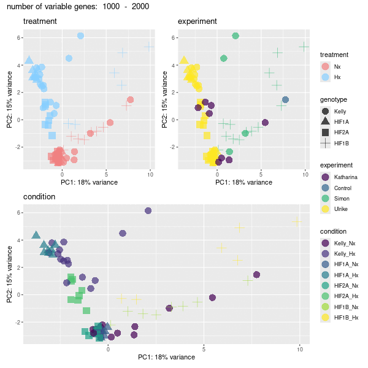

```{r setup, include=FALSE}
knitr::opts_chunk$set(echo = T,
                      error=FALSE,
                      warning=FALSE,
                      message=FALSE,
                      dpi=300)

setwd(dirname(rstudioapi::getActiveDocumentContext()$path))
allnew <- TRUE

```

# 0. Load
##  - #R_libraries
BiocManager::install()

BiocManager::install("mgcv")
```{r librarys, eval=TRUE, include=FALSE, echo=FALSE}

library(BiocManager)
library(devtools)
library(BiocFileCache)

library(tidyverse)
library(plyr)
library(stringr)
library(stringi)

library(tximeta)
library(tximport)
library(DESeq2)

library(RColorBrewer)

library(SummarizedExperiment)
library(org.Mm.eg.db)
library(AnnotationHub)
library(vsn)
library(clusterProfiler)
library(biomaRt)
library(GOSemSim)

library(ggplot2)
library(pheatmap)
library(PCAtools)
library(ggalt)
library(cowplot)
library(EnhancedVolcano)
library(gridExtra)
library(patchwork)
library(grid)
library(readxl)
library(VennDiagram)
library(sessioninfo)
library(data.table)
library(curl)
library(R.utils)
library(kableExtra)
library(knitr)
library(writexl)
library(viridis)
library(animation)
library(ensembldb)

ifelse(Sys.info()["sysname"]== "Linux",
       s <- "/mnt/s",
       s <- "S:")
dir <- paste(s,"AG/AG-Scholz-NGS/Daten/Simon/RNA-Seq_Kelly_all",sep="/")
list.files(dir) %>% head()
gitdir <- paste(dir,"git_RNAseq_Kelly_Hx",sep="/")
list.files(gitdir) %>% head()

fastqdir <- paste(s,"AG/AG-Scholz-NGS/Daten/RNASeq_Kelly2_P3302",sep="/")
list.files(fastqdir) %>% head()
fastqdir2 <- paste(s,"AG/AG-Scholz-NGS/Daten/RNASeq_Kelly",sep="/")
list.files(fastqdir2) %>% head()
fastqdir3 <- paste(s,"AG/AG-Scholz-NGS/Daten/Sequencing-2/Sequencing-2_A/FASTQ",sep="/")
list.files(fastqdir3) %>% head()

indexdir <- paste(s,"AG/AG-Scholz-NGS/Daten/Salmon/index/human_ens110_index",sep="/")

dirgenomic <- paste(s,"AG/AG-Scholz-NGS/Daten/Salmon/genomic_data/ensembl/110",sep="/")
list.files(dirgenomic) %>% head()
# setwd(gitdir)

data <- paste(dir,"data",sep="/")
dir.create(data)

## ENSEMBL 111
dirsalmon <- "/mnt/s/AG/AG-Scholz-NGS/Daten/Tobias/Salmon_TS/human"
indexdir <- "/mnt/s/AG/AG-Scholz-NGS/Daten/Tobias/Salmon_TS/human/index"
fastaPath <- file.path(dirsalmon, "Homo_sapiens.GRCh38.dna.primary_assembly.fa.gz")
gtfPath <- file.path(dirsalmon,"Homo_sapiens.GRCh38.111.gff3.gz")

```

##  - #Linux
```{bash linux_folders, eval=FALSE, include=FALSE, echo=FALSE}
fastqdir="/mnt/s/AG/AG-Scholz-NGS/Daten/RNASeq_Kelly2_P3302";
fastqdir2="/mnt/s/AG/AG-Scholz-NGS/Daten/RNASeq_Kelly";
fastqdir3="/mnt/s/AG/AG-Scholz-NGS/Daten/Sequencing-2/Sequencing-2_A/FASTQ";

# /mnt/s/AG/AG-Scholz-NGS/Daten/Simon/RNA-Seq Kelly all
dir="/mnt/s/AG/AG-Scholz-NGS/Daten/Simon/RNA-Seq_Kelly_all"

quantdir="$dir/quants2"
indexdir="/mnt/s/AG/AG-Scholz-NGS/Daten/Salmon/index/human_ens110_index"

indexdir="/mnt/s/AG/AG-Scholz-NGS/Daten/Tobias/Salmon_TS/human/index/human_ensh38_index"

```


## - #Download Data
```{bash download_data, eval=FALSE, include=FALSE, echo=FALSE}
## Download data

cd $fastqdir;
lftp

# open -u <user>@<DOMAIN> https://file-exchange.bihealth.org/<file-box-id>/
open -u kelterbs@CHARITE https://file-exchange.bihealth.org/bd53df77-dd5a-4fb6-b640-4625548c5119/
  
  # [Password]
  
  # Download all data into target folder
  mirror . $fastqdir
# mirror . /mnt/s/AG/AG-Scholz-NGS/Daten/RNASeq_Kelly2_P3302

# Check data
cd $fastqdir
ls $fastqdir | wc -l
ls $fastqdir/*R1*.fastq.gz | wc -l
# 150 R1+R2 = 36 fastq.gz files = 18 Samples, 36 files

# Check downloads
log="$fastqdir/download.log";
echo "##################
# $(date +%Y_%m_%d__%T) Check md5 Checksums
#";
md5sum -c  *.md5 | tee -a $log;
wc -l $log
# 36 files ok

```


# 1. Prepare Data
## - #Make Index
```{bash index, eval=FALSE, include=FALSE, echo=FALSE}

# check newest release http://ftp.ensembl.org/pub/
release="111"
species="human"
echo $release
gdir="/mnt/s/AG/AG-Scholz-NGS/Daten/Salmon/genomic_data/ensembl/${release}/${species}"
echo $gdir
mkdir $gdir


# Donwload genomic data: dna
wget -P $gdir "http://ftp.ensembl.org/pub/current_fasta/homo_sapiens/dna/Homo_sapiens.GRCh38.dna.primary_assembly.fa.gz"

# Donwload genomic data: cdna (=cds with UTRs without introns)
wget -P $gdir "http://ftp.ensembl.org/pub/current_fasta/homo_sapiens/cdna/Homo_sapiens.GRCh38.cdna.all.fa.gz"

# Donwload genomic data: ncrna
wget -P $gdir "http://ftp.ensembl.org/pub/current_fasta/homo_sapiens/ncrna/Homo_sapiens.GRCh38.ncrna.fa.gz"

# Donwload genomic data: gff3 (for later use)
wget -P $gdir "http://ftp.ensembl.org/pub/current_gff3/homo_sapiens/Homo_sapiens.GRCh38.${release}.gff3.gz"

# create list of chromosomes
cd $gdir
grep "^>" <(gunzip -c Homo_sapiens.GRCh38.dna.primary_assembly.fa.gz) | cut -d " " -f 1 > decoys_human_ensh38.txt

# to modify, copy to linux partition
mkdir ~/decoys
cp decoys_human_ensh38.txt ~/decoys

# remove ">"
sed -i.bak -e 's/>//g' ~/decoys/decoys_human_ensh38.txt

# Optional: check txt file
vim ~/decoys/decoys_human_ensh38.txt
# to exit: -press 'ESC', type ":q!", press 'ENTER'

# copy back
cp ~/decoys/decoys_human_ensh38.txt $gdir

# combine cdna ncdna and dna in one file
cd $gdir

cat Homo_sapiens.GRCh38.cdna.all.fa.gz Homo_sapiens.GRCh38.ncrna.fa.gz Homo_sapiens.GRCh38.dna.primary_assembly.fa.gz > gentrome_human_ensh38.fa.gz

# make index with salmon
# is salmon activated?
mamba activate salmon
cd $gdir
indexname=${species}_ens${release}_index
echo $indexname
salmon index -t gentrome_human_ensh38.fa.gz -d decoys_human_ensh38.txt -p 20 -i ../../index/$indexname

```

## - #Mapping (Salmon)
```{bash salmon, eval=FALSE, include=FALSE, echo=FALSE}
mamba activate salmon

fastqfiles=$(ls $fastqdir/*R1*.fastq.gz)
fastqfiles2=$(ls $fastqdir2/*R1*.fastq.gz)
fastqfiles3=$(ls $fastqdir3/*R1*.fastq.gz)

fastqfiles_all="${fastqfiles} ${fastqfiles2} ${fastqfiles3}"
echo "${fastqfiles:0:100}"
echo "${fastqfiles2:0:100}"
echo "${fastqfiles3:0:100}"
echo "${fastqfiles_all:0:100}"

for fn in $fastqfiles_all;
do
bfn=$(echo "`basename ${fn}`");
samp=${bfn%"_R1_001.fastq.gz"};
R1=$fn;
R2=$(echo "$R1" | sed 's/R1/R2/');
echo "Processing Sample: $samp";
test -f $R1 && echo "--> File: $R1 exists"
test -f $R2 && echo "--> File: $R2 exists"
outquant=${dir}/quants2/${samp}_quant
echo $outquant
echo $indexdir

salmon quant -i $indexdir -l A \
 -1 $R1 \
 -2 $R2 \
 -p 25 --validateMappings --gcBias -o $outquant

done

```


## - Sample names
### Extract filenames from quants
```{r read_quant_files, eval=TRUE, include=FALSE, echo=FALSE}

# Get Sample table

## Extract Filenames from quant files

outdir <- paste(dir,"output",sep="/")
dir.create(outdir)
quantdir <- paste(dir,"quants2",sep="/")

f <- list.files(path = quantdir)
files <- paste(quantdir,f,"quant.sf",sep="/")
files %>% file.exists() %>% summary()

names <- as.factor(str_remove(f,pattern ="_quant"))

# short form
samplename2 <- names %>% 
  str_replace(pattern="P3302_01_P3302_RNA_", replacement = "RNA_P3302_") %>%
  str_replace(pattern="P2041_", replacement = "RNA_P2041_") %>%
  str_replace(pattern="CH_HS_KK_", replacement = "RNA_P557_") %>%
  str_remove(pattern="_quant")
# samplename2[c(1,2,31,32,33,34,53,54,55,56,203,204)]
l <- samplename2 %>% length()
sequencing <- str_extract(samplename2,"P[0-9]+")
sample <- str_extract(samplename2,"S[0-9]+")
lane <- str_extract(samplename2,"L[0-9]+") %>% 
  replace_na("L001")

runname <- paste("RNA",
                 sequencing,
                 sample,
                 lane,
                 sep="_")

samplename <- paste("RNA",
                    sequencing,
                    sample,
                    sep="_")

quant_file_table <- data.frame(files, samplename, order = seq(1:l),
                               filename = samplename2,
                               sequencing = sequencing,
                               lane=lane)[17:l,]
dim(quant_file_table)
quant_file_table[c(1,2,31,32,33,34,53,54,55,56,187,188),] %>% kable() %>% kable_styling("striped", full_width = T)
```


### P3302
```{r P3302, eval=TRUE, include=FALSE, echo=FALSE}
# Get samplelists
## P3302

Samplepath <- filePath(path=fastqdir, file="samplelist.xlsx")
list.files(fastqdir, pattern=".xlsx")
file.exists(Samplepath)

Samplefile <- read_xlsx(Samplepath)
# Samplefile[c(1,2,49,50),] %>% kable() %>% kable_styling("striped", full_width = T)
# colnames(Samplefile)
colnames(Samplefile)[1] <- "order_number"
colnames(Samplefile)[2] <- "samplename"
colnames(Samplefile)[3] <- "rna_id"
colnames(Samplefile)[5] <- "rna_conc"

colnames(Samplefile)
sample_table <- Samplefile[,c("order_number","samplename","rna_id","Probe","rna_conc","Konz.(µg/µl)","CUGE-ID","Datum")]

sample_table$cellline <- str_split(sample_table$Probe, pattern=" ", simplify = TRUE)[,1] %>% as.factor()
sample_table$clone <- str_split(sample_table$Probe, pattern=" ", simplify = TRUE)[,2] %>% as.factor() %>% relevel(ref="LV1")
sample_table$genotype <- str_split(sample_table$clone, pattern="\\.", simplify = TRUE)[,1] %>% as.factor() %>% relevel(ref="LV1")
sample_table$clone <- revalue(sample_table$clone, c("Hif1.3"="Hif1a_1.3", "Hif2.2"="Hif2a_2.2"))
sample_table$genotype <- str_replace(sample_table$genotype, pattern = "LV1", replacement = "Kelly")
sample_table$genotype <- str_replace(sample_table$genotype, pattern = "Hif1", replacement = "HIF1A")
sample_table$genotype <- str_replace(sample_table$genotype, pattern = "Hif2", replacement = "HIF2A") %>% as.factor() %>% relevel(ref="Kelly")
sample_table$treatment <- str_split(sample_table$Probe, pattern=" ", simplify = TRUE)[,4] %>% as.factor() %>% relevel(ref="Nx")
sample_table$run_id <- str_remove(sample_table$samplename,pattern="P3302_")                                   
sample_table$sequencing <- "P3302"
# RNA_P3302_01_S141_L006
sample_table$samplename <- paste("RNA_P3302_",
                                 "S",141:190, sep="")
sample_table$sample_id <- paste("S",141:190, sep="")         
sample_table$experiment <- "Ulrike"
sample_table$experiment_date <- sample_table$Datum
sample_table$repetition <- as.factor(sample_table$experiment_date)
levels(sample_table$repetition) <- c("1","2","3","4")
sample_table$exp_rep <- paste(sample_table$experiment,sample_table$repetition, sep="_")

sample_table$cell_density <- str_split(sample_table$Probe, pattern=" ", simplify = TRUE)[,3] %>% str_remove_all("\\(")  %>% str_remove_all("\\)")

sample_table_P3302 <- as.data.frame(sample_table)
sample_table_P3302$samplename %in% quant_file_table$samplename %>% summary()

sample_table_P3302[c(1,2,49,50),] %>% kable() %>% kable_styling("striped", full_width = T) %>% scroll_box(height = "400px")
```


### P2041*
```{r P2041, eval=TRUE, include=FALSE, echo=FALSE}
## P2041
list.files(fastqdir2, pattern=".xlsx")
Samplepath <- filePath(path=fastqdir2, file="Sample_list.xlsx")

file.exists(Samplepath)

Samplefile <- read_xlsx(Samplepath)
# Samplefile
# colnames(Samplefile)
sample_table <- Samplefile

sample_table$cellline <- "Kelly"
sample_table$treatment <- sample_table$treatment %>% as.factor() %>% relevel(ref="Nx")
sample_table$genotype <- str_replace(sample_table$genotype, pattern = "LV", replacement = "Kelly")
sample_table$genotype <- str_replace(sample_table$genotype, pattern = "Hif1b", replacement = "HIF1B")
sample_table$genotype <- str_replace(sample_table$genotype, pattern = "Hif1a", replacement = "HIF1A")
sample_table$genotype <- sample_table$genotype %>% as.factor() %>% relevel(ref="Kelly")
sample_table$sample <- str_remove(sample_table$samplename,pattern="P2041_")
sample_table$lane <- "L003"
# RNA_P2041_10632_S41_L003
sample_table$sequencing <- "P2041"
sample_table$run_id <- paste("RNA",as.character(sample_table$'CUGE-ID'),sep="_")
sample_table$samplename <- paste("RNA_P2041_",
                                 "S",37:58,sep="")
sample_table$sample_id <- paste("S",37:58,sep="")
sample_table$repetition <- as.character(sample_table$repetition)
sample_table$sample_id %in% sample %>% summary()
sample_table$exp_rep <- paste(sample_table$experiment,sample_table$repetition, sep="_")

sample_table$clone <- str_replace(sample_table$clone, pattern = "LV_1", replacement = "LV1")
sample_table$clone <- sample_table$clone %>% as.factor() %>% relevel(ref="LV1")

# Make table
sample_table_P2041 <- as.data.frame(sample_table)

# correct sample names I (shift -4)
sample_table_P2041$orig.name <- sample_table_P2041$samplename
sample_table_P2041$samplename2 <- sample_table_P2041$samplename
sample_table_P2041$newsamplenumber <- str_extract(sample_table_P2041$samplename2,"S[0-9]+") %>% str_extract("[0-9]+") %>%
  as.numeric()-4
sample_table_P2041$newsamplenumber <- ifelse(sample_table_P2041$newsamplenumber<37,sample_table_P2041$newsamplenumber+22,sample_table_P2041$newsamplenumber)
sample_table_P2041$samplename2 <- paste("RNA_P2041_S",sample_table_P2041$newsamplenumber,sep="")
sample_table_P2041$samplename <- sample_table_P2041$samplename2

# correct sample names II (exchange 3 samples)
sample_table_P2041$samplename3 <- sample_table_P2041$samplename2

sample_table_P2041$samplename3[sample_table_P2041$samplename3 == "RNA_P2041_S38"] <- "RNA_P2041_new"
sample_table_P2041$samplename3[sample_table_P2041$samplename3 == "RNA_P2041_S58"] <- "RNA_P2041_S38"
sample_table_P2041$samplename3[sample_table_P2041$samplename3 == "RNA_P2041_new"] <- "RNA_P2041_S58"

sample_table_P2041$samplename3[sample_table_P2041$samplename3 == "RNA_P2041_S57"] <- "RNA_P2041_new2"
sample_table_P2041$samplename3[sample_table_P2041$samplename3 == "RNA_P2041_S56"] <- "RNA_P2041_S57"
sample_table_P2041$samplename3[sample_table_P2041$samplename3 == "RNA_P2041_new2"] <- "RNA_P2041_S56"

sample_table_P2041$samplename3[sample_table_P2041$samplename3 == "RNA_P2041_S48"] <- "RNA_P2041_new3"
sample_table_P2041$samplename3[sample_table_P2041$samplename3 == "RNA_P2041_S47"] <- "RNA_P2041_S48"
sample_table_P2041$samplename3[sample_table_P2041$samplename3 == "RNA_P2041_new3"] <- "RNA_P2041_S47"

sample_table_P2041$samplename <- sample_table_P2041$samplename3

sample_table_P2041[,c("orig.name","samplename2","samplename3","treatment","genotype")] %>% kable() %>% kable_styling("striped", full_width = T) %>% scroll_box(height = "400px")

sample_table_P2041$samplename %in% quant_file_table$samplename %>% summary()

sample_table_P2041[sample_table_P2041$genotype=="HIF1A",] %>% kable() %>% kable_styling("striped", full_width = T) %>% scroll_box(height = "400px")

```

### P557
```{r P557, eval=TRUE, include=FALSE, echo=FALSE}
## P557
# list.files(dirname(fastqdir3), pattern=".xlsx")

# Table 1
Samplepath <- filePath(path=dirname(fastqdir3), file="2020_02_13_Sample_list_NGS.xlsx")
file.exists(Samplepath)
Samplefile <- read_xlsx(Samplepath, col_names =c("Probe","Sequencing-2_A","Sequencing-2_B", "path","rna_id"))

# Table 2
Samplepath <- filePath(path=dirname(fastqdir3), file="RNA_samples.xlsx")
file.exists(Samplepath)
Samplefile <- read_xlsx(Samplepath)

df <- Samplefile %>% as.data.frame()
sample_table <- df
sample_table[c(1,2,23,24),]  %>% kable() %>% kable_styling("striped", full_width = T) %>% scroll_box(height = "400px")
sample_table$treatment <- ifelse(str_detect(sample_table$Probe,pattern="Hx"), "Hx","Nx")
sample_table$treatment <- sample_table$treatment %>% as.factor() %>% relevel(ref="Nx")
sample_table$genotype <- ifelse(str_detect(sample_table$Probe,pattern="1.3"),"HIF1A",
                                ifelse(str_detect(sample_table$Probe,pattern="2.2"),"HIF2A",
                                       "Kelly"))
sample_table$genotype <- sample_table$genotype %>% as.factor() %>% relevel(ref="Kelly")
sample_table$sequencing <- "P557"
sample_table$replicate <-  ifelse(str_detect(sample_table$Probe,pattern="P7"),"P7",
                                  ifelse(str_detect(sample_table$Probe,pattern="P8"),"P8",
                                         ifelse(str_detect(sample_table$Probe,pattern="P13"),"P13","P14")))
sample_table$clone <- ifelse(str_detect(sample_table$Probe,pattern="1.3"),"Hif1a_1.3",
                             ifelse(str_detect(sample_table$Probe,pattern="2.2"),"Hif2a_2.2","LV1"))
sample_table$cellline <- "Kelly"
sample_table$lane <- "L001"

Samplepath2 <- filePath(path=dirname(fastqdir3), file="2020_02_13_Sample_list_NGS.xlsx")
file.exists(Samplepath2)
Samplefile2 <- read_xlsx(Samplepath2, col_names =c("Probe","Sequencing-2_A","Sequencing-2_B", "path","rna_id"))
df2 <- Samplefile2 %>% as.data.frame()
kellys <- df2[,1] %>% str_detect(pattern="Kelly")
sample_table2 <- df2[kellys,]
head(sample_table2) %>% kable() %>% kable_styling("striped", full_width = T) %>% scroll_box(height = "400px")
sample_table2$run_id <- paste("RNA",str_split(sample_table2$'Sequencing-2_B', pattern="_", simplify = T)[,3],sep="_")

sample_table <- sample_table[sample_table$'RNA-Nr.' %in% sample_table2$rna_id,]

sample_table$samplename <- paste("RNA_P557_","S",33:48,sep="")
sample_table$sample_id <- paste("S",33:48,sep="")
sample_table$run_id <- sample_table2$run_id
colnames(sample_table)[which(names(sample_table) == "RNA-Nr.")] <- "rna_id"
colnames(sample_table)[which(names(sample_table) == "Konz.(µg/µl)")] <- "rna_conc"
sample_table$sample <- sample_table2$sample
sample_table$experiment <- "Katharina"
sample_table$experiment_date <- sample_table$Datum
sample_table$repetition <-  ifelse(str_detect(sample_table$replicate,pattern="P7"),"1",
                                   ifelse(str_detect(sample_table$Probe,pattern="P8"),"2",
                                          ifelse(str_detect(sample_table$Probe,pattern="P13"),"1","2")))
sample_table$exp_rep <- paste(sample_table$experiment,sample_table$repetition,sep="_")
# "RNA_P557_077_S33

# Make table
sample_table_P557 <- as.data.frame(sample_table)
sample_table_P557$samplename %in% quant_file_table$samplename %>% summary()

sample_table_P557[c(1,2,15,16),] %>% kable() %>% kable_styling("striped", full_width = T) %>% scroll_box(height = "400px")
```

### combine lists
```{r comb_sample_table, eval=TRUE, include=FALSE, echo=FALSE}
sample_table_all <- {}
sample_table_all <- bind_rows(sample_table_P557, sample_table_P2041, sample_table_P3302)
head(sample_table_all) %>% kable() %>% kable_styling("striped", full_width = T) %>% scroll_box(height = "400px")
length(rownames(sample_table_all))
length(rownames(quant_file_table))

sample_table_all <- merge(quant_file_table,sample_table_all, by = "samplename")
# class(sample_table)
sample_table_all <- sample_table_all[order(sample_table_all$order),]
colnames(sample_table_all)[which(names(sample_table_all) == "sequencing.x")] <- "sequencing"
colnames(sample_table_all)[which(names(sample_table_all) == "lane.x")] <- "lane"
el <- sample_table_all$sequencing=="P3302"
sample_table_all$run_id[el] <- paste(sample_table_all$run_id[el],sample_table_all$lane[el],sep="_")
sample_table_all$genotype <- sample_table_all$genotype %>% as.factor() %>% relevel(ref="Kelly")
sample_table_all$condition <- paste(sample_table_all$genotype,sample_table_all$treatment,sep="_")
# sample_table_all$condition[order(sample_table_all$condition)]
sample_table_all$condition <- sample_table_all$condition %>% factor(levels=c("Kelly_Nx", "Kelly_Hx","HIF1A_Nx","HIF1A_Hx","HIF2A_Nx","HIF2A_Hx","HIF1B_Nx","HIF1B_Hx"))
sample_table_all$experiment <- sample_table_all$experiment %>% as.factor()


dim(sample_table_all)

sample_table_all[c(1,2,25,35,187,188),] %>% kable() %>% kable_styling("striped", full_width = T) %>% scroll_box(height = "400px")

sample_table_all <- sample_table_all[order(sample_table_all$condition,sample_table_all$clone,sample_table_all$exp_rep),]

write_xlsx(sample_table_all,
           paste("2024_02 Kelly all samples.xlsx",sep="/"))

sample_table_all %>% head() %>% kable() %>% kable_styling("striped", full_width = T) %>% scroll_box(height = "400px")
levels(sample_table_all$genotype)
levels(sample_table_all$clone %>% as.factor())

sample_table_all$condition %>% levels()
# subset(sample_table_all,sequencing =="P2041")
subset(sample_table_all, condition=="HIF1A_Hx" & sequencing =="P2041") %>% kable() %>% kable_styling("striped", full_width = T) %>% scroll_box(height = "400px")

```

```{r files_table, echo=FALSE}
samples_overview <- data.frame(
  experiment = levels(sample_table_all$experiment)[c(3,4,2)],
  sample_table_all$sequencing %>%
  table(),
  RNAs = c(
    sample_table_all$rna_id[sample_table_all$sequencing=="P2041"] %>% table() %>% unname() %>% length(),
    sample_table_all$rna_id[sample_table_all$sequencing=="P3302"] %>% table() %>% unname() %>% length(),
    sample_table_all$rna_id[sample_table_all$sequencing=="P557"] %>% table() %>% unname() %>% length()),
  conditions = c(
    sample_table_all$condition[sample_table_all$sequencing=="P2041"] %>% factor() %>% levels() %>% paste(collapse = " "),
    sample_table_all$condition[sample_table_all$sequencing=="P3302"] %>% factor() %>% levels() %>% paste(collapse = " "),
    sample_table_all$condition[sample_table_all$sequencing=="P557"] %>% factor() %>% levels() %>% paste(collapse = " ")),
  date = c(
    sample_table_all$experiment_date[sample_table_all$sequencing=="P2041"] %>% factor() %>% levels() %>% paste(collapse = " "),
    sample_table_all$experiment_date[sample_table_all$sequencing=="P3302"] %>% factor() %>% levels() %>% paste(collapse = " "),
    sample_table_all$experiment_date[sample_table_all$sequencing=="P557"] %>% factor() %>% levels() %>% paste(collapse = " "))
)

colnames(samples_overview)[c(2,3)] <- c("seq_id","Seq_runs")

samples_overview[c(3,1,2),c(1,4,5,6,2,3)] %>% kable() %>% kable_styling("striped", full_width = T) %>% scroll_box(height = "400px")

```


# 2. Process
## - Mapping Rates
```{r mappingrates, eval=TRUE, include=FALSE, echo=FALSE}
cat(dir,": ",list.files(path = outdir),'\n',
    outdir,": ",list.files(path = dir),'\n',
    quantdir,": ",list.files(path = quantdir) %>% head())

samplelist <- {}
mappingrates <- {}
for (i in list.files(path = quantdir)){
  si <- str_remove(i, pattern="_quant")
  samplelist <- c(samplelist,si)
  f <- readLines(paste(quantdir,i,"logs/salmon_quant.log", sep="/"))
  line <- grep("Mapping rate = ",f,value=TRUE)
  sl <- str_length(line)
  sl
  notime <- substring(line,30,sl)
  notime
  manual <- substring(line,sl-7,sl-1)
  val <- as.numeric(str_extract(notime,"[0-9.]+"))
  val
  valr<-round(val, digits=2)
  # print(paste("Mapping rate of ",si," is: ",valr," %"))
  mappingrates <- c(mappingrates,valr)
}

# Make table

m.table <- data.frame(sample_table_all$samplename,samplelist[17:204],mappingrates[17:204])
head(m.table)
sample_table_all$mappingrates <- mappingrates[17:204]
```


### Plot mapping rates
```{r plot_mappingr, fig.height=15, include=TRUE, echo=FALSE}

# Colours

# Plot
par(mar=c(2,4,0,0)+.1)
# plot(sample_table_all$mappingrates)
# -> boring

# increase margin for longer names
par(mar=c(2,5,2,2)+.1)
# barplot(height=mappingrates, names=samplename, horiz=T, las=1)

xx <- barplot(height=mappingrates, cex.names=0.5, names=samplename, horiz=T, las=1, xlim=c(0,100))
text(x = mappingrates, y = xx, label = mappingrates, pos = 4, cex = 0.5, col = "red")

par(mar=c(4,4,4,4)+.1)


```


### clear BFC
```{r clear_bfc, eval=FALSE, include=FALSE, echo=FALSE}
library(BiocFileCache)
# clear the entire linkedTxome table 
setTximetaBFC("/home/kelterbs/.cache/R/BiocFileCache")
bfcloc <- getTximetaBFC()
bfc <- BiocFileCache(bfcloc)
show(bfc)
bfcinfo(bfc)
bfcquery(bfc, "Homo")
bfcremove(bfc, bfcquery(bfc, "linkedTxomeTbl")$rid)
bfcremove(bfc, bfcquery(bfc, "Homo")$rid)
```


## - #Tximeta
```{r tximeta, fig.height=12, eval=TRUE, include=FALSE, echo=FALSE}
# prepare coldata table
# quant_file_table %>% head() %>% kable_styling("striped", full_width = T) %>% scroll_box(height = "400px")
# sample_table_all %>% head() %>% kable_styling("striped", full_width = T) %>% scroll_box(height = "400px")

sample_table_all$names = paste(sample_table_all$sequencing,
                               sample_table_all$genotype,
                               sample_table_all$treatment,
                               sample_table_all$order,
                               sep="_")

subset(sample_table_all, condition=="HIF1A_Hx" & sequencing =="P2041") %>% kable() %>% kable_styling("striped", full_width = T) %>% scroll_box(height = "400px")

head(sample_table_all$names)

coldata <- data.frame(files = sample_table_all$files,
                      names = sample_table_all$names, 
                      sample_table_all[,-c(2)])
# coldata[c(1:3,35:40),c("filename","names","samplename","orig.name","samplename3","order","condition")]

### load tximeta
# make linked Transcriptome (local offline mode)
# indexdir
# dirgenomic
list.files(dirgenomic)
fastaPath <- file.path(dirgenomic, "Homo_sapiens.GRCh38.dna.primary_assembly.fa.gz")
# fastaPath
gtfPath <- file.path(dirgenomic,"Homo_sapiens.GRCh38.110.gff3.gz")
# gtfPath

cat("ENSEMBL 110",indexdir,dirgenomic,fastaPath,gtfPath, sep="\n")

# ENSEMBL 111 (TS)
dirsalmon <- "/mnt/s/AG/AG-Scholz-NGS/Daten/Tobias/Salmon_TS/human"
indexdir <- "/mnt/s/AG/AG-Scholz-NGS/Daten/Tobias/Salmon_TS/human/index/human_ensh38_index"

fastaPath <- file.path(dirsalmon, "Homo_sapiens.GRCh38.dna.primary_assembly.fa.gz")
# gtfPath <- file.path(dirsalmon,"Homo_sapiens.GRCh38.111.gff3.gz")

# Local use gtf_char_patch
gtfPath <- file.path(dirsalmon,"Homo_sapiens.GRCh38.111.chr_patch_hapl_scaff.gtf.gz")

file.exists(indexdir, fastaPath, gtfPath)
cat("TS: ENSEMBL 111",indexdir,dirgenomic,fastaPath,gtfPath, sep="\n")

# makeLinkedTxome(indexDir=indexdir,
#                 source="LocalEnsembl",
#                 organism="Homo sapiens",
#                 release="111",
#                 genome="GRCh38",
#                 fasta=fastaPath,
#                 gtf=gtfPath,
#                 write=FALSE)

# dirtest <- "/mnt/s/AG/AG-Scholz-NGS/Daten/Tobias/Simon_test/"
# save(coldata,file=paste(dirtest,"sample_table_Kelly.RDS", sep="/"))
# coldata <- {}
# load(file=paste(dirtest,"sample_table_Kelly.RDS", sep="/"))

se <- tximeta(coldata, useHub=T)
se
dim(se)
colData(se)[c(1,2,87,88),] %>% kable() %>% kable_styling("striped", full_width = T) %>% scroll_box(height = "400px")
mcols(se)[c(1,2,87,88),] %>% kable() %>% kable_styling("striped", full_width = T) %>% scroll_box(height = "400px")
# meta infos sind da (genotype, treatment,...)
sessionInfo()
# rename Samples
# rownames(colData(se)) <- str_remove(rownames(colData(se)), pattern="_quant")

rowRanges(se)[c(1,10,100,1000,10000),] %>% kable() %>% kable_styling("striped", full_width = T) %>% scroll_box(height = "400px")
# genome info
# seqinfo(se) %>% kable() %>% kable_styling("striped", full_width = T) %>% scroll_box(height = "400px")
# ?
assays(se)[["counts"]][1:5,1:5] %>% kable()
# counts. THE DATA

# Mapping infos:
# names(metadata(se)[["quantInfo"]])
# str(metadata(se)[["quantInfo"]]) # Infos from Salmon Mapping
metadata(se)[["quantInfo"]][c("percent_mapped","num_processed")] %>% data.frame() %>% head() %>% kable() %>% kable_styling("striped", full_width = T) %>% scroll_box(height = "400px")

par(mfrow=c(1,2), mar=c(3,3,3,3))
barplot(metadata(se)[["quantInfo"]]$percent_mapped, main="Mapping Rate", 
        horiz=T,las=1)
barplot(metadata(se)[["quantInfo"]]$num_processed/1000000, main="Mio. Reads", 
        names.arg=colData(se)$exp_rep, horiz=T,las=1)
colData(se) %>% head() %>% kable() %>% kable_styling("striped", full_width = T) %>% scroll_box(height = "400px")
edb <- retrieveDb(se)
ensembldb::listTables(edb)
# seqnmae "LRG_432" has no length?!

# class(edb)
genes(edb) %>% head() %>% kable() %>% kable_styling("striped", full_width = T) %>% scroll_box(height = "400px")

se.exons <- addExons(se)
# rowRanges(se.exons)[[1]]
gse <- summarizeToGene(se)
rowRanges(gse)[1:10,] %>% kable() %>% kable_styling("striped", full_width = T) %>% scroll_box(height = "400px")

head(assays(gse)[["counts"]])[1:5,1:5] %>% kable() %>% kable_styling("striped", full_width = T) %>% scroll_box(height = "400px")
head(assays(gse)[["abundance"]])[1:5,1:5] %>% kable() %>% kable_styling("striped", full_width = T) %>% scroll_box(height = "400px")
head(assays(gse)[["length"]])[1:5,1:5] %>% kable() %>% kable_styling("striped", full_width = T) %>% scroll_box(height = "400px")

#### add gene symbol
metadata(se)$txomeInfo$source

TXNAME <- as.character(mapIds(edb,keys = mcols(gse)$gene_id, column = "TXNAME", keytype = "GENEID", multiVals="first"))
# select()' returned 1:many mapping between keys and columns = 1 gene has many transcripts...
TXNAME.list <- (mapIds(edb,keys = mcols(gse)$gene_id, column = "TXNAME", keytype = "GENEID", multiVals="list"))
head(TXNAME.list)[1]

# # info is already there
# CDSID <- as.character(mapIds(edb,keys = mcols(gse)$gene_id, column = "CDSID", keytype = "GENEID", multiVals="first"))
# head(CDSID)
# # ?
# CDSNAME <- as.character(mapIds(edb,keys = mcols(gse)$gene_id, column = "CDSNAME", keytype = "GENEID", multiVals="first"))
# head(CDSNAME)
# same as gene_id
# EXONNAME <- as.character(mapIds(edb,keys = mcols(gse)$gene_id, column = "EXONNAME", keytype = "GENEID", multiVals="first"))
# head(EXONNAME)
# TXTYPE <- as.character(mapIds(edb,keys = mcols(gse)$gene_id, column = "TXTYPE", keytype = "GENEID", multiVals="first"))
# head(TXTYPE)
# no useful info... no gene Symbol!!

# add CDSID
# mcols(gse)$CDSID <- as.character(mapIds(edb,keys = mcols(gse)$gene_id, column = "CDSID", keytype = "GENEID", multiVals="first"))

colnames(mcols(gse))
head(rownames(gse))

getwd()
# save(gse,file=paste(data,"tximeta.txm", sep="/"))
# gse <- 1
# load(file=paste(data,"tximeta.txm", sep="/"))

subset(colData(gse), condition=="HIF1A_Hx" & sequencing =="P2041") %>% kable() %>% kable_styling("striped", full_width = T) %>% scroll_box(height = "400px")
# subset(colData(gse), samplename=="RNA_P2041_S45")
(colData(gse)$samplename==colData(gse)$samplename3) %>% summary()
par(mfrow=c(1,1), mar=c(4,4,4,4))
```

### add gene symbols
```{r annotationhub, eval=TRUE, include=FALSE, echo=FALSE}
ah = AnnotationHub()
query(ah, c("EnsDb", "homo"))
edb <- ah[["AH116291"]]
# load(file=paste(data,"tximeta.txm", sep="/"))
listColumns(edb)

mcols(gse)$SYMBOL <- mapIds(edb, keys = mcols(gse)$gene_id, column = "SYMBOL", keytype = "GENEID")
mcols(gse)$ENTREZID <- mapIds(edb, keys = mcols(gse)$gene_id, column = "ENTREZID", keytype = "GENEID")
mcols(gse)$CANONICALTRANSCRIPT <- mapIds(edb, keys = mcols(gse)$gene_id, column = "CANONICALTRANSCRIPT", keytype = "GENEID")
mcols(gse)$DESCRIPTION <- mapIds(edb, keys = mcols(gse)$gene_id, column = "DESCRIPTION", keytype = "GENEID")
mcols(gse)$GENEBIOTYPE <- mapIds(edb, keys = mcols(gse)$gene_id, column = "GENEBIOTYPE", keytype = "GENEID")
mcols(gse)$UNIPROTID <- mapIds(edb, keys = mcols(gse)$gene_id, column = "UNIPROTID", keytype = "GENEID")

# columns <- listColumns(edb) %>% toupper() 
# for (i in columns[c(-1,-2,-3,-4,-6,-7,-8,-9,-10,-11,-12,-13,-14,-16)]){
#   # print(i)
#   print(i)
#   mapIds(edb, keys = mcols(gse)$gene_id[1:10], column = i, keytype = "GENEID") %>% print()
# }
# include tryCatch

# save(gse,file=paste(data,"tximeta.txm", sep="/"))

```

## - #DESeq2
```{r deseq2, warning=FALSE, eval=TRUE, include=FALSE, echo=FALSE}
data
# load(file=paste(data,"tximeta.txm", sep="/"))
colData(gse)$genotype %>% levels()
design = ~experiment+genotype+treatment+genotype:treatment
# design = ~condition
# design = ~treatment

dds <- DESeqDataSet(gse, design = design)
dds <- collapseReplicates(dds, dds$samplename, dds$names)

sample.number <- nrow(colData(dds)) / colData(gse)$genotype %>% levels() %>% length()
keep.sn <- rowSums(counts(dds)) >= sample.number
keep.sn %>% summary()
dds <- dds[keep.sn,]

dds <- DESeq(dds)

getwd()
design(dds)
save(dds,file=paste(data,"deseq2_experiment.dds", sep="/"))
# dds <- 1
# load(file=paste(data,"deseq2.dds", sep="/"))
dds

subset(colData(dds), condition=="HIF1A_Hx" & sequencing =="P2041") %>% kable() %>% kable_styling("striped", full_width = T) %>% scroll_box(height = "400px")

```

```{r dds_design}
design(dds)
summary(results(dds))
plotMA(dds)
plotDispEsts(dds)
resultsNames(dds)

```


# 3. Pre-Analysis
### - Data transformations
```{r pre_trans, eval=TRUE, include=FALSE, echo=FALSE}
# load(file=paste(data,"deseq2.dds", sep="/"))
vsd <- vst(dds, blind=FALSE) #Variance stabilized transformation
ntd <- normTransform(dds)
```

#### -#rlog
```{r pre_trans_rlog, eval=TRUE, include=FALSE, echo=FALSE}
rld <- rlog(dds, blind=FALSE) #regularized logarithm
save(rld,file=paste(data,"rlog_experiment.rld", sep="/"))
# rld <- 1
# load(file=paste(data,"rlog.rld", sep="/"))
rld
```


```{r pre_trans_fig, figures-side, fig.show="hold", out.width="33%"}
# load(file=paste(data,"rlog.rld", sep="/"))
meanSdPlot(assay(ntd))
meanSdPlot(assay(vsd))
meanSdPlot(assay(rld))

```

### - Check sample distance
```{r pre_sample_dist, fig.height=6, out.width="100%", eval=TRUE, include=TRUE, echo=FALSE}
sampleDists <- dist(t(assay(vsd)))

sampleDistMatrix <- as.matrix(sampleDists)
rownames(sampleDistMatrix) <- vsd$names
# colnames(sampleDistMatrix) <- NULL
colors <- colorRampPalette( rev(brewer.pal(9, "Blues")) )(255)
anno_col <- as.data.frame(colData(vsd)[,c("experiment","treatment","genotype")])
anno_colors <- list(treatment = c("lightcoral","skyblue1"),
                    genotype = c("grey","seagreen3","turquoise3","tan2"),
                    experiment = viridis(4, option="plasma"))

names(anno_colors$treatment) <- levels(anno_col$treatment)
names(anno_colors$genotype) <- levels(anno_col$genotype)
names(anno_colors$experiment) <- levels(anno_col$experiment)

pheatmap(sampleDistMatrix,
         clustering_distance_rows=sampleDists,
         clustering_distance_cols=sampleDists,
         annotation_col=anno_col,
         annotation_colors = anno_colors,
         show_colnames     = FALSE,
         col=viridis(20),
         cutree_rows = 8,
         cutree_cols = 8,
         fontsize_row = 5)


```


### - Perform principal component analysis
```{r pca, warning = FALSE, fig.show="hold", out.width="80%", fig.height=7, eval=TRUE, include=TRUE, echo=FALSE}
# transform data
# load(file=paste(data,"deseq2.dds", sep="/"))
vst_dat <- assay(vst(dds))
# colData(dds) %>% head() %>% kable() %>% kable_styling("striped", full_width = T) %>% scroll_box(height = "400px")

ens <- rownames(dds)
  symbols <- mcols(dds)$SYMBOL
  symbols <- symbols[!is.na(symbols)]
  symbols <- symbols[match(rownames(vst_dat), names(symbols))]
  rownames(vst_dat) <- symbols
  keep <- !is.na(rownames(vst_dat))
  vst_dat <- vst_dat[keep,]
  keep2 <- rownames(vst_dat)
  keep2 <- !duplicated(keep2)
  vst_dat <- vst_dat[keep2,]

### PCA with top 500 genes with highest row variance 
pcaData <- plotPCA(vsd, intgroup=colnames(colData(vsd)), returnData=TRUE)
# levels(pcaData$genotype)
percentVar <- round(100 * attr(pcaData, "percentVar"))
g1 <- ggplot(pcaData, aes(PC1, PC2, color=treatment, shape=genotype)) +
  geom_point(size=5, alpha=0.7) +
  labs(title = "treatment") +
  xlab(paste0("PC1: ",percentVar[1],"% variance")) +
  ylab(paste0("PC2: ",percentVar[2],"% variance")) + 
  scale_color_manual(values = c("lightcoral","skyblue1"))

g2 <- ggplot(pcaData, aes(PC1, PC2, color=experiment, shape=genotype)) +
  geom_point(size=5, alpha=0.7) +
  labs(title = "experiment") +
  xlab(paste0("PC1: ",percentVar[1],"% variance")) +
  ylab(paste0("PC2: ",percentVar[2],"% variance")) +
  scale_color_viridis_d(option ="viridis")

g3 <- ggplot(pcaData, aes(PC1, PC2, color=condition, shape=genotype)) +
  geom_point(size=5, alpha=0.7) +
  labs(title = "condition") +
  xlab(paste0("PC1: ",percentVar[1],"% variance")) +
  ylab(paste0("PC2: ",percentVar[2],"% variance")) +
  # coord_fixed()
  scale_color_viridis_d(option ="viridis") 

g4 <- ggplot(pcaData, aes(PC1, PC2, label=orig.name,color=condition, shape=genotype)) +
  geom_text_repel(data         = subset(pcaData, experiment == "Simon"),
                  segment.color = 'grey50',
                  max.overlaps = 40,
                  color="grey30",
                  size          = 2.5) +
  geom_point(size=5, alpha=0.7) +
  labs(title = "top 500 variance") +
  xlab(paste0("PC1: ",percentVar[1],"% variance")) +
  ylab(paste0("PC2: ",percentVar[2],"% variance")) +
  # coord_fixed()
  scale_color_viridis_d(option ="viridis") 

((g1+g2) / (g3)) + plot_layout(guides = "collect", axis_titles="collect")


```


###### -- Advanced PCA
```{r pca_advanced, warning = FALSE, fig.show="hold", out.width="80%", fig.height=6, eval=TRUE, include=TRUE, echo=FALSE}
# transform data
# calculate PCA (all data)
## https://www.bioconductor.org/packages/devel/bioc/vignettes/PCAtools/inst/doc/PCAtools.html#modify-bi-plots

# p <- pca(vst_dat, metadata = colData(dds))
# vst <- assay(vst(dds))
p <- pca(vst_dat, metadata = colData(dds), removeVar = 0.1)

# check different PCAs
p1 <- pairsplot(p,colby = 'treatment', colkey = viridis(2),title = 'treatment',titleLabSize = 15,trianglelabSize = 6,
                hline = 0, vline = 0,gridlines.major = FALSE, gridlines.minor = FALSE,
                plotaxes = FALSE,margingaps = unit(c(-0.01, -0.01, -0.01, -0.01), 'cm')) # -> PC1 = treatment
p2 <- pairsplot(p,colby = 'genotype', colkey = viridis(4),title = 'genotype',titleLabSize = 15,trianglelabSize = 6,
                hline = 0, vline = 0,gridlines.major = FALSE, gridlines.minor = FALSE,
                plotaxes = FALSE,margingaps = unit(c(-0.01, -0.01, -0.01, -0.01), 'cm')) # -> PC1&3 = genotype
p3 <- pairsplot(p,colby = 'experiment', colkey = viridis(4),title = 'experiment',titleLabSize = 15,trianglelabSize = 6,
                hline = 0, vline = 0,gridlines.major = FALSE, gridlines.minor = FALSE,
                plotaxes = FALSE,margingaps = unit(c(-0.01, -0.01, -0.01, -0.01), 'cm')) # -> PC4 = experiment
p4 <- pairsplot(p,colby = 'condition', colkey = viridis(8),title = 'condition',titleLabSize = 15,trianglelabSize = 6,
                hline = 0, vline = 0,gridlines.major = FALSE, gridlines.minor = FALSE,
                plotaxes = FALSE,margingaps = unit(c(-0.01, -0.01, -0.01, -0.01), 'cm')) # PC1 & PC3 = condition

(p1+p2) / (p3+p4)

# Determine optimum number of PCs to retain
elbow <- findElbowPoint(p$variance)
elbow

# plot Scree
# find explaining PCs
# horn <- parallelPCA(vst_dat)
# horn$n = 7
# warnings()

horn <- list()
horn$n <- 7

screeplot(p,
    components = getComponents(p, 1:20),
    vline = c(horn$n, elbow)) +
    geom_label(aes(x = horn$n + 1, y = 30,
      label = 'Horn\'s=7', vjust = -1, size = 8)) +
    geom_label(aes(x = elbow + 1, y = 50,
      label = 'Elbow=6', vjust = -1, size = 8))

bi <- biplot(p,x="PC3",y="PC1",
    lab = p$metadata$experiment,
    colby = 'condition',colkey = viridis(8),
    hline = 0, vline = 0,
    encircle = TRUE, encircleFill = TRUE,
    labSize = 3, legendIconSize = 4.0,
    legendPosition = 'bottom',
    sizeLoadingsNames = 3,
    axisLabSize = 10,
    captionLabSize = 1)

bi <- bi +theme(panel.background = element_rect(fill='transparent'))

pairs <- pairsplot(p,
    components = getComponents(p, c(1:7)),
    triangle = TRUE, trianglelabSize = 6,
    hline = 0, vline = 0,
    pointSize = 2,
    gridlines.major = FALSE, gridlines.minor = FALSE,
    colby = 'condition', colkey = viridis(8),
    plotaxes = FALSE,
    margingaps = unit(c(-0.01, -0.01, -0.01, -0.01), 'cm'))

layout <- c(
  area(t = 1, l = 1, b = 6, r = 6),
  area(t = 5, l = 1, b = 7, r = 3)
)
pairs + bi + 
  plot_layout(design = layout)

# pairs + inset_element(bi, left = 0, bottom = 0, right = 0.5, top = 0.5)

plotloadings(p,
             components = getComponents(p)[1:7],
             col = viridis(3),
             labSize = 3)


```

###### -- #PCA gif
```{r pca_gif, fig.height=8, fig.show="hold", warning=FALSE, out.width="100%", eval=FALSE, include=FALSE, echo=FALSE}

saveGIF({
  ani.options(nmax = 100)
for (i in 1:100){
  n <- i*310
pcaData <- plotPCA(vsd, intgroup=colnames(colData(vsd)), returnData=TRUE,ntop=n)
percentVar <- round(100 * attr(pcaData, "percentVar"))
g1 <- ggplot(pcaData, aes(PC1, PC2, color=treatment, shape=genotype)) +
  geom_point(size=5, alpha=0.7) +
  labs(title = "treatment") +
  xlab(paste0("PC1: ",percentVar[1],"% variance")) +
  ylab(paste0("PC2: ",percentVar[2],"% variance")) + 
  coord_cartesian(xlim = c(-100, 100),ylim = c(-100,100)) +
  scale_color_manual(values = c("lightcoral","skyblue1"))

g2 <- ggplot(pcaData, aes(PC1, PC2, color=experiment, shape=genotype)) +
  geom_point(size=5, alpha=0.7) +
  labs(title = "experiment") +
  coord_cartesian(xlim = c(-100, 100),ylim = c(-100,100)) +
  xlab(paste0("PC1: ",percentVar[1],"% variance")) +
  ylab(paste0("PC2: ",percentVar[2],"% variance")) +
  scale_color_viridis_d(option ="viridis")

g3 <- ggplot(pcaData, aes(PC1, PC2, color=condition, shape=genotype)) +
  geom_point(size=5, alpha=0.7) +
  labs(title = "condition") +
  coord_cartesian(xlim = c(-100, 100),ylim = c(-100,100)) +
  xlab(paste0("PC1: ",percentVar[1],"% variance")) +
  ylab(paste0("PC2: ",percentVar[2],"% variance")) +
  # coord_fixed()
  scale_color_viridis_d(option ="viridis")
plot((g1+g2)/g3 +
       plot_annotation(title = paste("number of variable genes: ",n)) +
       plot_layout(guides = 'collect')
     )
ani.pause()
}
}, interval = 0.3, movie.name = file.path(gitdir,"1_data_processing/pca.gif"), ani.width = 600, ani.height = 600)

```

[PCA Gif](pca.gif){height=100%, width=100%}

```{r pca_gif_include, eval=FALSE, echo=FALSE, out.width="100%", fig.height=8}
source_file <- dirname(rstudioapi::getSourceEditorContext()$path)
setwd(source_file)


```


### - Plot example counts
```{r example_counts, fig.show="hold", out.width="50%", eval=TRUE, include=TRUE, echo=FALSE}
# CA9 & EPO
# load(file=paste(data,"deseq2.dds", sep="/"))
goi <- c("CA9","EPO")
# (mcols(dds)$SYMBOL == "CA9") %>% summary()

mcols(dds)$gene_id %>% length()
mcols(dds)$SYMBOL %>% length()
SYMBOLs <- mcols(dds)$SYMBOL %>% unique() %>% na.omit()
SYMBOLs %>% length()
SYMBOLs <- SYMBOLs[!(SYMBOLs == "")]
SYMBOLs %>% length()
ENSEMBLS <- as.character(mapIds(edb,keys = SYMBOLs, column = "GENEID", keytype = "SYMBOL", multiVals="first"))
ENTREZ <- as.character(mapIds(edb,keys = SYMBOLs, column = "ENTREZID", keytype = "SYMBOL", multiVals="first"))
s2e <- data.frame(symbol=SYMBOLs,
                  ensemble=ENSEMBLS,
                  entrez=ENTREZ)
rownames(s2e) <- s2e$symbol
# s2e %>% head() %>% kable() %>% kable_styling("striped", full_width = T) %>% scroll_box(height = "400px")


# s2e[goi[1],2]
par(mar=c(2,2,2,2)+.1)
# plotCounts(dds,gene=s2e[goi[1],2],intgroup="condition",main=goi[1],col=dds$experiment)
# plotCounts(dds,gene=s2e[goi[2],2],intgroup="condition",main=goi[2],col=dds$experiment)

i <- 1
l <- length(goi)
all_counts <- {}
for (i in 1:l){
  d <-  plotCounts(dds, gene=s2e[goi[i],2], intgroup=c("condition","experiment","genotype","treatment"), main=goi[i],returnData=TRUE)
  d$Gene <- rep(goi[i],length(rownames(d)))
  d$sample <- rownames(d)
  # rownames(d) <- {}
  all_counts <- bind_rows(all_counts,d)
  }

cols = brewer.pal(n=8,name = 'Paired')

gcounts <- ggplot(all_counts, aes(x = Gene, y = count, fill=condition, color=condition)) +
  geom_boxplot(color="black") +
  geom_point(position=position_dodge(width=0.75), alpha=1) +
  scale_fill_manual(values=cols) +
  scale_color_manual(values=cols) +
  scale_y_continuous(trans = "log2")

gcounts1 <- ggplot(d, aes(x = condition, y = count, color=experiment)) +
  geom_point() +
  geom_text(label = d$sample) +
  scale_fill_manual(values=cols) +
  scale_y_continuous(trans = "log2")

gcounts2 <- ggplot(all_counts, aes(x = condition, y = count, fill=Gene)) +
  geom_boxplot(fatten = 1) +
  scale_fill_manual(values=cols) +
  scale_y_continuous(trans = "log2")


gcounts3 <- ggplot(all_counts[all_counts$Gene=="CA9",], aes(x = genotype, y = count, fill=treatment, color=treatment)) +
  geom_boxplot(color="black") +
  geom_point(shape=21,color="black",aes(fill=treatment),position=position_dodge(width=0.75), alpha=1) +
  scale_fill_manual(values=cols[c(1,5)]) +
  scale_color_manual(values=cols[c(1,5)]) +
  scale_y_continuous(trans = "log2") +
  labs(title = "CA9")
gcounts3

gcounts4 <- ggplot(all_counts[all_counts$Gene=="EPO",], aes(x = genotype, y = count, fill=treatment, color=treatment)) +
  geom_boxplot(color="black") +
  geom_point(shape=21,color="black",aes(fill=treatment),position=position_dodge(width=0.75), alpha=1) +
  scale_fill_manual(values=cols[c(1,5)]) +
  scale_color_manual(values=cols[c(1,5)]) +
  scale_y_continuous(trans = "log2") +
  labs(title = "EPO")
gcounts4


```

```{r}
sessionInfo()
```

