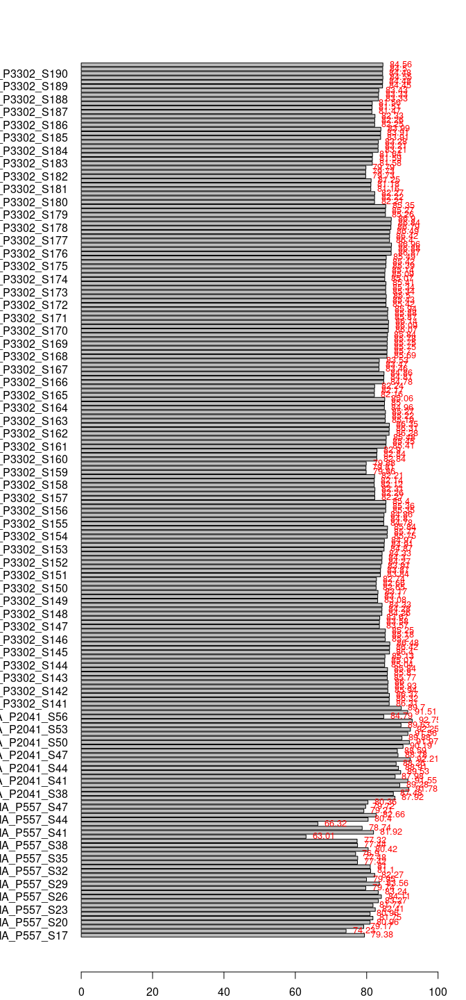
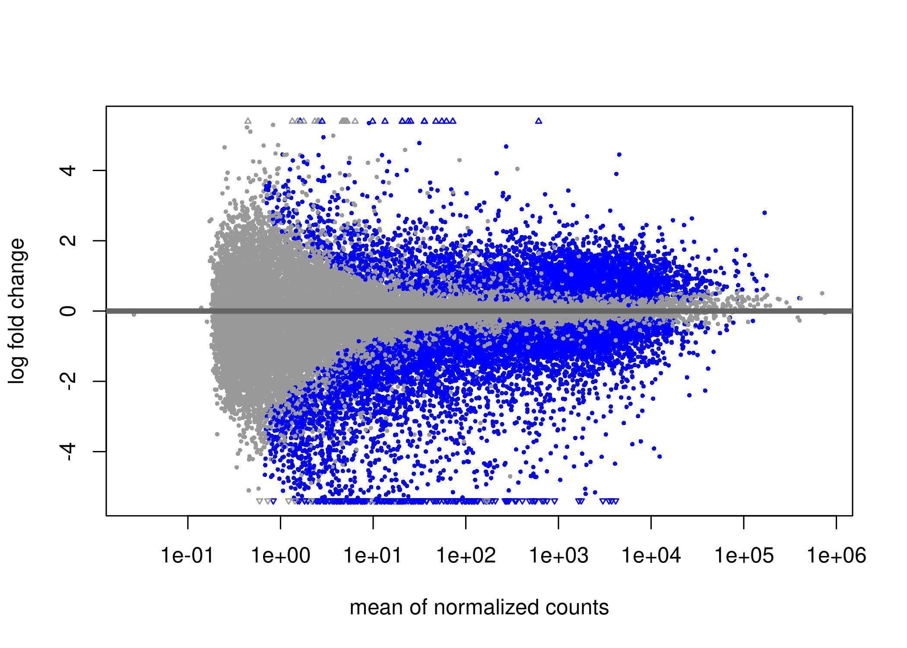
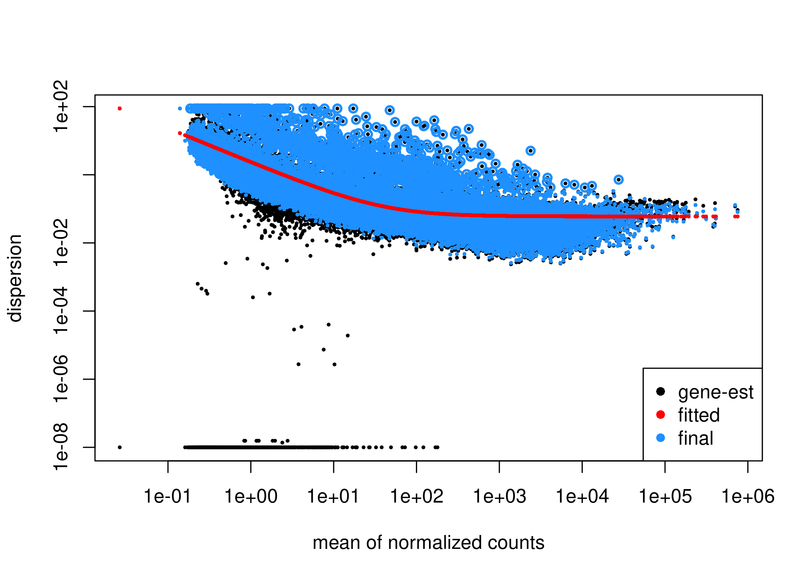
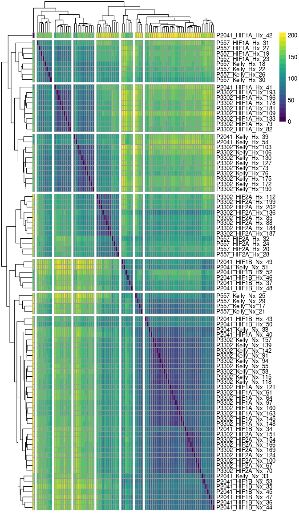
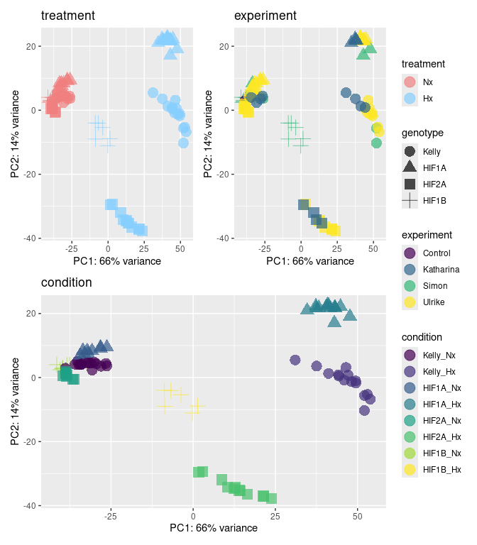
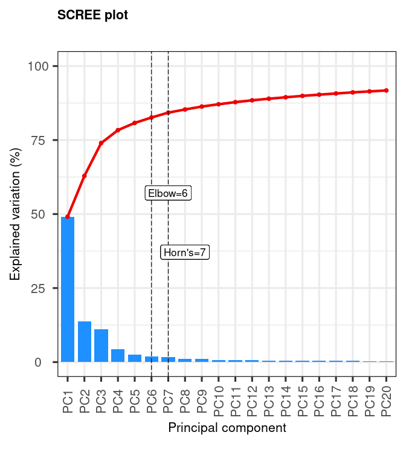
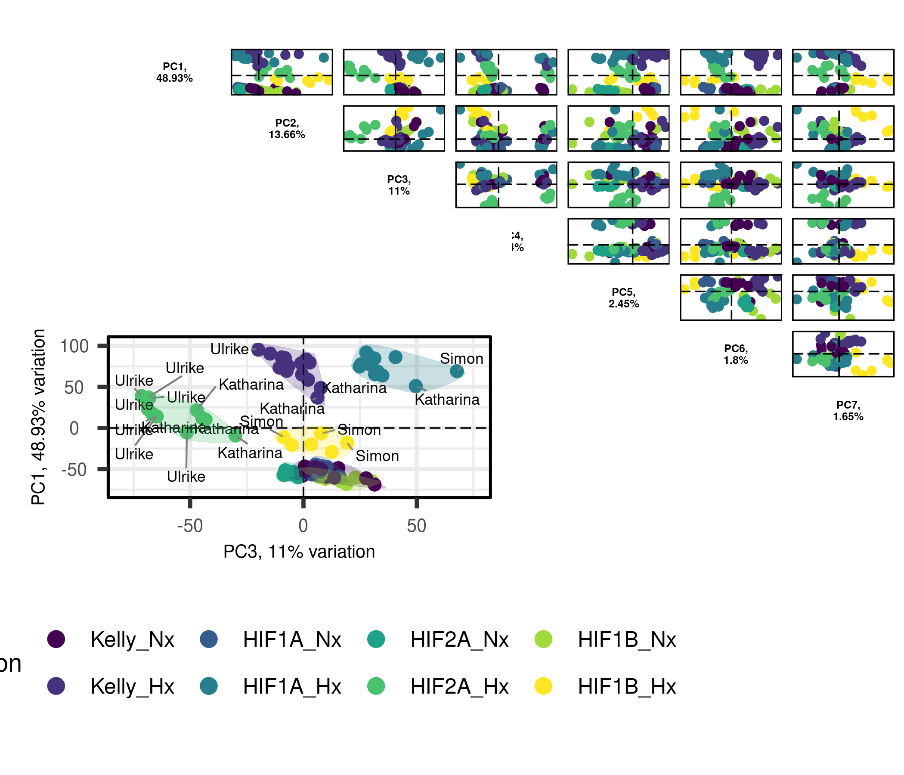
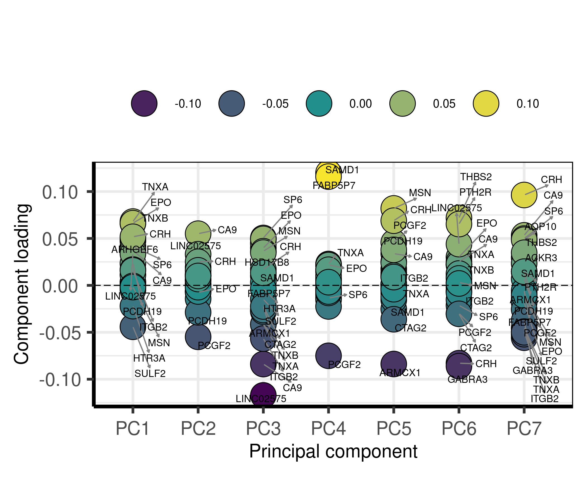
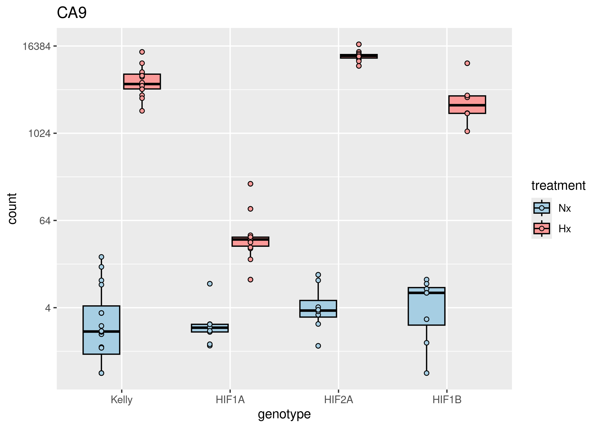
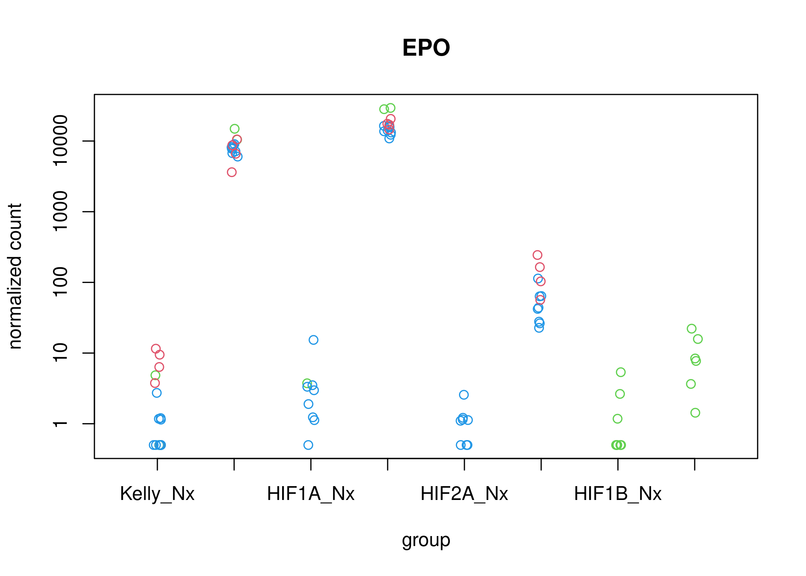

RNA-Seq Kelly Hx all data processing
================
Kelterborn
2024-02-21

- [0. Load](#0-load)
  - [- \#R_libraries](#--r_libraries)
  - [- \#Linux](#--linux)
  - [- \#Download Data](#--download-data)
- [1. Prepare Data](#1-prepare-data)
  - [- \#Make Index](#--make-index)
  - [- \#Mapping (Salmon)](#--mapping-salmon)
  - [- Sample names](#--sample-names)
    - [Extract filenames from quants](#extract-filenames-from-quants)
    - [P3302](#p3302)
    - [P2041\*](#p2041)
    - [P557](#p557)
    - [combine lists](#combine-lists)
- [2. Process](#2-process)
  - [- Mapping Rates](#--mapping-rates)
    - [Plot mapping rates](#plot-mapping-rates)
  - [- \#Tximeta](#--tximeta)
    - [add gene symbols](#add-gene-symbols)
  - [- \#DESeq2](#--deseq2)
- [3. Pre-Analysis](#3-pre-analysis)
  - [- Data transformations](#--data-transformations)
  - [- Check sample distance](#--check-sample-distance)
  - [- Perform principal component
    analysis](#--perform-principal-component-analysis)
  - [- Plot example counts](#--plot-example-counts)

# 0. Load

## - \#R_libraries

BiocManager::install()

BiocManager::install(“animation”)

## - \#Linux

``` bash
fastqdir="/mnt/s/AG/AG-Scholz-NGS/Daten/RNASeq_Kelly2_P3302";
fastqdir2="/mnt/s/AG/AG-Scholz-NGS/Daten/RNASeq_Kelly";
fastqdir3="/mnt/s/AG/AG-Scholz-NGS/Daten/Sequencing-2/Sequencing-2_A/FASTQ";

# /mnt/s/AG/AG-Scholz-NGS/Daten/Simon/RNA-Seq Kelly all
dir="/mnt/s/AG/AG-Scholz-NGS/Daten/Simon/RNA-Seq_Kelly_all"

quantdir="$dir/quants2"
indexdir="/mnt/s/AG/AG-Scholz-NGS/Daten/Salmon/index/human_ens110_index"

indexdir="/mnt/s/AG/AG-Scholz-NGS/Daten/Tobias/Salmon_TS/human/index/human_ensh38_index"
```

## - \#Download Data

``` bash
## Download data

cd $fastqdir;
lftp

# open -u <user>@<DOMAIN> https://file-exchange.bihealth.org/<file-box-id>/
open -u kelterbs@CHARITE https://file-exchange.bihealth.org/bd53df77-dd5a-4fb6-b640-4625548c5119/
  
  # [Password]
  
  # Download all data into target folder
  mirror . $fastqdir
# mirror . /mnt/s/AG/AG-Scholz-NGS/Daten/RNASeq_Kelly2_P3302

# Check data
cd $fastqdir
ls $fastqdir | wc -l
ls $fastqdir/*R1*.fastq.gz | wc -l
# 150 R1+R2 = 36 fastq.gz files = 18 Samples, 36 files

# Check downloads
log="$fastqdir/download.log";
echo "##################
# $(date +%Y_%m_%d__%T) Check md5 Checksums
#";
md5sum -c  *.md5 | tee -a $log;
wc -l $log
# 36 files ok
```

# 1. Prepare Data

## - \#Make Index

``` bash

# check newest release http://ftp.ensembl.org/pub/
release=110
echo $release
gdir="/mnt/s/AG/AG-Scholz-NGS/Daten/Salmon/genomic_data/ensembl/${release}"
echo $gdir

# Donwload genomic data: dna
wget -P $gdir "http://ftp.ensembl.org/pub/current_fasta/homo_sapiens/dna/Homo_sapiens.GRCh38.dna.primary_assembly.fa.gz"

# Donwload genomic data: cdna (=cds with UTRs without introns)
wget -P $gdir "http://ftp.ensembl.org/pub/current_fasta/homo_sapiens/cdna/Homo_sapiens.GRCh38.cdna.all.fa.gz"

# Donwload genomic data: ncrna
wget -P $gdir "http://ftp.ensembl.org/pub/current_fasta/homo_sapiens/ncrna/Homo_sapiens.GRCh38.ncrna.fa.gz"

# Donwload genomic data: gff3 (for later use)
wget -P $gdir "http://ftp.ensembl.org/pub/current_gff3/homo_sapiens/Homo_sapiens.GRCh38.${release}.gff3.gz"

# create list of chromosomes
cd $gdir
grep "^>" <(gunzip -c Homo_sapiens.GRCh38.dna.primary_assembly.fa.gz) | cut -d " " -f 1 > decoys_human_ensh38.txt

# to modify, copy to linux partition
mkdir ~/decoys
cp decoys_human_ensh38.txt ~/decoys

# remove ">"
sed -i.bak -e 's/>//g' ~/decoys/decoys_human_ensh38.txt

# Optional: check txt file
vim ~/decoys/decoys_human_ensh38.txt
# to exit: -press 'ESC', type ":q!", press 'ENTER'

# copy back
cp ~/decoys/decoys_human_ensh38.txt $gdir

# combine cdna ncdna and dna in one file
cd $gdir

cat Homo_sapiens.GRCh38.cdna.all.fa.gz Homo_sapiens.GRCh38.ncrna.fa.gz Homo_sapiens.GRCh38.dna.primary_assembly.fa.gz > gentrome_human_ensh38.fa.gz

# make index with salmon
# is salmon activated?
cd $gdir
salmon index -t gentrome_human_ensh38.fa.gz -d decoys_human_ensh38.txt -p 20 -i ../../index/human_ens110_index
```

## - \#Mapping (Salmon)

``` bash
mamba activate salmon

fastqfiles=$(ls $fastqdir/*R1*.fastq.gz)
fastqfiles2=$(ls $fastqdir2/*R1*.fastq.gz)
fastqfiles3=$(ls $fastqdir3/*R1*.fastq.gz)

fastqfiles_all="${fastqfiles} ${fastqfiles2} ${fastqfiles3}"
echo "${fastqfiles:0:100}"
echo "${fastqfiles2:0:100}"
echo "${fastqfiles3:0:100}"
echo "${fastqfiles_all:0:100}"

for fn in $fastqfiles_all;
do
bfn=$(echo "`basename ${fn}`");
samp=${bfn%"_R1_001.fastq.gz"};
R1=$fn;
R2=$(echo "$R1" | sed 's/R1/R2/');
echo "Processing Sample: $samp";
test -f $R1 && echo "--> File: $R1 exists"
test -f $R2 && echo "--> File: $R2 exists"
outquant=${dir}/quants2/${samp}_quant
echo $outquant
echo $indexdir

salmon quant -i $indexdir -l A \
 -1 $R1 \
 -2 $R2 \
 -p 25 --validateMappings --gcBias -o $outquant

done
```

## - Sample names

### Extract filenames from quants

### P3302

### P2041\*

### P557

### combine lists

<div style="border: 1px solid #ddd; padding: 0px; overflow-y: scroll; height:400px; ">

<table class="table table-striped" style="margin-left: auto; margin-right: auto;">
<thead>
<tr>
<th style="text-align:left;position: sticky; top:0; background-color: #FFFFFF;">
</th>
<th style="text-align:left;position: sticky; top:0; background-color: #FFFFFF;">
experiment
</th>
<th style="text-align:right;position: sticky; top:0; background-color: #FFFFFF;">
RNAs
</th>
<th style="text-align:left;position: sticky; top:0; background-color: #FFFFFF;">
conditions
</th>
<th style="text-align:left;position: sticky; top:0; background-color: #FFFFFF;">
date
</th>
<th style="text-align:left;position: sticky; top:0; background-color: #FFFFFF;">
seq_id
</th>
<th style="text-align:right;position: sticky; top:0; background-color: #FFFFFF;">
Seq_runs
</th>
</tr>
</thead>
<tbody>
<tr>
<td style="text-align:left;">
3
</td>
<td style="text-align:left;">
Katharina
</td>
<td style="text-align:right;">
16
</td>
<td style="text-align:left;">
Kelly_Nx Kelly_Hx HIF1A_Hx HIF2A_Hx
</td>
<td style="text-align:left;">
2018-09-13 2018-09-14
</td>
<td style="text-align:left;">
P557
</td>
<td style="text-align:right;">
16
</td>
</tr>
<tr>
<td style="text-align:left;">
1
</td>
<td style="text-align:left;">
Simon
</td>
<td style="text-align:right;">
22
</td>
<td style="text-align:left;">
Kelly_Nx Kelly_Hx HIF1A_Nx HIF1A_Hx HIF1B_Nx HIF1B_Hx
</td>
<td style="text-align:left;">
2017-05-04 2021-06-16 2021-08-25 2021-08-27
</td>
<td style="text-align:left;">
P2041
</td>
<td style="text-align:right;">
22
</td>
</tr>
<tr>
<td style="text-align:left;">
2
</td>
<td style="text-align:left;">
Ulrike
</td>
<td style="text-align:right;">
50
</td>
<td style="text-align:left;">
Kelly_Nx Kelly_Hx HIF1A_Nx HIF1A_Hx HIF2A_Nx HIF2A_Hx
</td>
<td style="text-align:left;">
2023-06-02 2023-06-08 2023-06-15 2023-06-28
</td>
<td style="text-align:left;">
P3302
</td>
<td style="text-align:right;">
150
</td>
</tr>
</tbody>
</table>

</div>

# 2. Process

## - Mapping Rates

### Plot mapping rates

``` r
# Colours

# Plot
par(mar=c(2,4,0,0)+.1)
# plot(sample_table_all$mappingrates)
# -> boring

# increase margin for longer names
par(mar=c(2,5,2,2)+.1)
# barplot(height=mappingrates, names=samplename, horiz=T, las=1)

xx <- barplot(height=mappingrates, cex.names=0.5, names=samplename, horiz=T, las=1, xlim=c(0,100))
text(x = mappingrates, y = xx, label = mappingrates, pos = 4, cex = 0.5, col = "red")
```

<!-- -->

``` r
par(mar=c(4,4,4,4)+.1)
```

## - \#Tximeta

### add gene symbols

## - \#DESeq2

``` r
design(dds)
```

    ## ~genotype + treatment + genotype:treatment
    ## <environment: 0x558902812b70>

``` r
summary(results(dds, alpha = 0.05))
```

    ## 
    ## out of 30642 with nonzero total read count
    ## adjusted p-value < 0.05
    ## LFC > 0 (up)       : 4730, 15%
    ## LFC < 0 (down)     : 5660, 18%
    ## outliers [1]       : 9, 0.029%
    ## low counts [2]     : 4763, 16%
    ## (mean count < 1)
    ## [1] see 'cooksCutoff' argument of ?results
    ## [2] see 'independentFiltering' argument of ?results

``` r
plotMA(dds)
```

<!-- -->

``` r
plotDispEsts(dds)
```

<!-- -->

``` r
resultsNames(dds)
```

    ## [1] "Intercept"                 "genotype_HIF1A_vs_Kelly"  
    ## [3] "genotype_HIF2A_vs_Kelly"   "genotype_HIF1B_vs_Kelly"  
    ## [5] "treatment_Hx_vs_Nx"        "genotypeHIF1A.treatmentHx"
    ## [7] "genotypeHIF2A.treatmentHx" "genotypeHIF1B.treatmentHx"

# 3. Pre-Analysis

### - Data transformations

#### -#rlog

``` r
load(file=paste(data,"rlog.rld", sep="/"))
meanSdPlot(assay(ntd))
meanSdPlot(assay(vsd))
meanSdPlot(assay(rld))
```


### - Check sample distance



### - Perform principal component analysis

<div style="border: 1px solid #ddd; padding: 0px; overflow-y: scroll; height:400px; ">

<table class="table table-striped" style="margin-left: auto; margin-right: auto;">
<thead>
<tr>
<th style="text-align:left;position: sticky; top:0; background-color: #FFFFFF;">
</th>
<th style="text-align:left;position: sticky; top:0; background-color: #FFFFFF;">
names
</th>
<th style="text-align:left;position: sticky; top:0; background-color: #FFFFFF;">
samplename
</th>
<th style="text-align:right;position: sticky; top:0; background-color: #FFFFFF;">
order
</th>
<th style="text-align:left;position: sticky; top:0; background-color: #FFFFFF;">
filename
</th>
<th style="text-align:left;position: sticky; top:0; background-color: #FFFFFF;">
sequencing
</th>
<th style="text-align:left;position: sticky; top:0; background-color: #FFFFFF;">
lane
</th>
<th style="text-align:right;position: sticky; top:0; background-color: #FFFFFF;">
rna_id
</th>
<th style="text-align:left;position: sticky; top:0; background-color: #FFFFFF;">
Datum
</th>
<th style="text-align:left;position: sticky; top:0; background-color: #FFFFFF;">
Probe
</th>
<th style="text-align:right;position: sticky; top:0; background-color: #FFFFFF;">
rna_conc
</th>
<th style="text-align:left;position: sticky; top:0; background-color: #FFFFFF;">
treatment
</th>
<th style="text-align:left;position: sticky; top:0; background-color: #FFFFFF;">
genotype
</th>
<th style="text-align:left;position: sticky; top:0; background-color: #FFFFFF;">
sequencing.y
</th>
<th style="text-align:left;position: sticky; top:0; background-color: #FFFFFF;">
replicate
</th>
<th style="text-align:left;position: sticky; top:0; background-color: #FFFFFF;">
clone
</th>
<th style="text-align:left;position: sticky; top:0; background-color: #FFFFFF;">
cellline
</th>
<th style="text-align:left;position: sticky; top:0; background-color: #FFFFFF;">
lane.y
</th>
<th style="text-align:left;position: sticky; top:0; background-color: #FFFFFF;">
sample_id
</th>
<th style="text-align:left;position: sticky; top:0; background-color: #FFFFFF;">
run_id
</th>
<th style="text-align:left;position: sticky; top:0; background-color: #FFFFFF;">
experiment
</th>
<th style="text-align:left;position: sticky; top:0; background-color: #FFFFFF;">
experiment_date
</th>
<th style="text-align:left;position: sticky; top:0; background-color: #FFFFFF;">
repetition
</th>
<th style="text-align:left;position: sticky; top:0; background-color: #FFFFFF;">
exp_rep
</th>
<th style="text-align:right;position: sticky; top:0; background-color: #FFFFFF;">
CUGE.ID
</th>
<th style="text-align:left;position: sticky; top:0; background-color: #FFFFFF;">
Nx
</th>
<th style="text-align:left;position: sticky; top:0; background-color: #FFFFFF;">
HX
</th>
<th style="text-align:left;position: sticky; top:0; background-color: #FFFFFF;">
sample
</th>
<th style="text-align:left;position: sticky; top:0; background-color: #FFFFFF;">
orig.name
</th>
<th style="text-align:left;position: sticky; top:0; background-color: #FFFFFF;">
samplename2
</th>
<th style="text-align:right;position: sticky; top:0; background-color: #FFFFFF;">
newsamplenumber
</th>
<th style="text-align:left;position: sticky; top:0; background-color: #FFFFFF;">
samplename3
</th>
<th style="text-align:right;position: sticky; top:0; background-color: #FFFFFF;">
order_number
</th>
<th style="text-align:right;position: sticky; top:0; background-color: #FFFFFF;">
Konz..µg.µl.
</th>
<th style="text-align:left;position: sticky; top:0; background-color: #FFFFFF;">
cell_density
</th>
<th style="text-align:left;position: sticky; top:0; background-color: #FFFFFF;">
condition
</th>
<th style="text-align:right;position: sticky; top:0; background-color: #FFFFFF;">
mappingrates
</th>
<th style="text-align:left;position: sticky; top:0; background-color: #FFFFFF;">
names.1
</th>
<th style="text-align:left;position: sticky; top:0; background-color: #FFFFFF;">
runsCollapsed
</th>
<th style="text-align:right;position: sticky; top:0; background-color: #FFFFFF;">
sizeFactor
</th>
<th style="text-align:left;position: sticky; top:0; background-color: #FFFFFF;">
replaceable
</th>
</tr>
</thead>
<tbody>
<tr>
<td style="text-align:left;">
RNA_P2041_S37
</td>
<td style="text-align:left;">
P2041_Kelly_Nx_33
</td>
<td style="text-align:left;">
RNA_P2041_S37
</td>
<td style="text-align:right;">
33
</td>
<td style="text-align:left;">
RNA_P2041_10619_S37_L003
</td>
<td style="text-align:left;">
P2041
</td>
<td style="text-align:left;">
L003
</td>
<td style="text-align:right;">
10268
</td>
<td style="text-align:left;">
2021-08-25
</td>
<td style="text-align:left;">
Kelly LV.1 Nx
</td>
<td style="text-align:right;">
NA
</td>
<td style="text-align:left;">
Nx
</td>
<td style="text-align:left;">
Kelly
</td>
<td style="text-align:left;">
P2041
</td>
<td style="text-align:left;">
NA
</td>
<td style="text-align:left;">
LV1
</td>
<td style="text-align:left;">
Kelly
</td>
<td style="text-align:left;">
L003
</td>
<td style="text-align:left;">
S41
</td>
<td style="text-align:left;">
RNA_10754
</td>
<td style="text-align:left;">
Simon
</td>
<td style="text-align:left;">
2021-08-25
</td>
<td style="text-align:left;">
4
</td>
<td style="text-align:left;">
Simon_4
</td>
<td style="text-align:right;">
10754
</td>
<td style="text-align:left;">
del_Hif1a1.3
</td>
<td style="text-align:left;">
del_Hif1a1.3
</td>
<td style="text-align:left;">
RNA_11
</td>
<td style="text-align:left;">
RNA_P2041_S41
</td>
<td style="text-align:left;">
RNA_P2041_S37
</td>
<td style="text-align:right;">
37
</td>
<td style="text-align:left;">
RNA_P2041_S37
</td>
<td style="text-align:right;">
NA
</td>
<td style="text-align:right;">
NA
</td>
<td style="text-align:left;">
NA
</td>
<td style="text-align:left;">
Kelly_Nx
</td>
<td style="text-align:right;">
77.46
</td>
<td style="text-align:left;">
P2041_Kelly_Nx_33
</td>
<td style="text-align:left;">
P2041_Kelly_Nx_33
</td>
<td style="text-align:right;">
1.149211
</td>
<td style="text-align:left;">
TRUE
</td>
</tr>
<tr>
<td style="text-align:left;">
RNA_P2041_S38
</td>
<td style="text-align:left;">
P2041_HIF1B_Nx_34
</td>
<td style="text-align:left;">
RNA_P2041_S38
</td>
<td style="text-align:right;">
34
</td>
<td style="text-align:left;">
RNA_P2041_10621_S38_L003
</td>
<td style="text-align:left;">
P2041
</td>
<td style="text-align:left;">
L003
</td>
<td style="text-align:right;">
10189
</td>
<td style="text-align:left;">
2021-06-16
</td>
<td style="text-align:left;">
Kelly Hif1b.sg1+2 Klon 15 Nx
</td>
<td style="text-align:right;">
NA
</td>
<td style="text-align:left;">
Nx
</td>
<td style="text-align:left;">
HIF1B
</td>
<td style="text-align:left;">
P2041
</td>
<td style="text-align:left;">
NA
</td>
<td style="text-align:left;">
Hif1b_15
</td>
<td style="text-align:left;">
Kelly
</td>
<td style="text-align:left;">
L003
</td>
<td style="text-align:left;">
S40
</td>
<td style="text-align:left;">
RNA_10745
</td>
<td style="text-align:left;">
Simon
</td>
<td style="text-align:left;">
2021-06-16
</td>
<td style="text-align:left;">
1
</td>
<td style="text-align:left;">
Simon_1
</td>
<td style="text-align:right;">
10745
</td>
<td style="text-align:left;">
NA
</td>
<td style="text-align:left;">
NA
</td>
<td style="text-align:left;">
RNA_05
</td>
<td style="text-align:left;">
RNA_P2041_S40
</td>
<td style="text-align:left;">
RNA_P2041_S58
</td>
<td style="text-align:right;">
58
</td>
<td style="text-align:left;">
RNA_P2041_S38
</td>
<td style="text-align:right;">
NA
</td>
<td style="text-align:right;">
NA
</td>
<td style="text-align:left;">
NA
</td>
<td style="text-align:left;">
HIF1B_Nx
</td>
<td style="text-align:right;">
82.35
</td>
<td style="text-align:left;">
P2041_HIF1B_Nx_34
</td>
<td style="text-align:left;">
P2041_HIF1B_Nx_34
</td>
<td style="text-align:right;">
1.477183
</td>
<td style="text-align:left;">
TRUE
</td>
</tr>
<tr>
<td style="text-align:left;">
RNA_P2041_S39
</td>
<td style="text-align:left;">
P2041_HIF1B_Nx_35
</td>
<td style="text-align:left;">
RNA_P2041_S39
</td>
<td style="text-align:right;">
35
</td>
<td style="text-align:left;">
RNA_P2041_10625_S39_L003
</td>
<td style="text-align:left;">
P2041
</td>
<td style="text-align:left;">
L003
</td>
<td style="text-align:right;">
10276
</td>
<td style="text-align:left;">
2021-08-25
</td>
<td style="text-align:left;">
Kelly Hif1b 4.1 Nx
</td>
<td style="text-align:right;">
NA
</td>
<td style="text-align:left;">
Nx
</td>
<td style="text-align:left;">
HIF1B
</td>
<td style="text-align:left;">
P2041
</td>
<td style="text-align:left;">
NA
</td>
<td style="text-align:left;">
Hif1b_4
</td>
<td style="text-align:left;">
Kelly
</td>
<td style="text-align:left;">
L003
</td>
<td style="text-align:left;">
S43
</td>
<td style="text-align:left;">
RNA_10625
</td>
<td style="text-align:left;">
Simon
</td>
<td style="text-align:left;">
2021-08-25
</td>
<td style="text-align:left;">
4
</td>
<td style="text-align:left;">
Simon_4
</td>
<td style="text-align:right;">
10625
</td>
<td style="text-align:left;">
NA
</td>
<td style="text-align:left;">
NA
</td>
<td style="text-align:left;">
RNA_15
</td>
<td style="text-align:left;">
RNA_P2041_S43
</td>
<td style="text-align:left;">
RNA_P2041_S39
</td>
<td style="text-align:right;">
39
</td>
<td style="text-align:left;">
RNA_P2041_S39
</td>
<td style="text-align:right;">
NA
</td>
<td style="text-align:right;">
NA
</td>
<td style="text-align:left;">
NA
</td>
<td style="text-align:left;">
HIF1B_Nx
</td>
<td style="text-align:right;">
81.53
</td>
<td style="text-align:left;">
P2041_HIF1B_Nx_35
</td>
<td style="text-align:left;">
P2041_HIF1B_Nx_35
</td>
<td style="text-align:right;">
1.320580
</td>
<td style="text-align:left;">
TRUE
</td>
</tr>
<tr>
<td style="text-align:left;">
RNA_P2041_S40
</td>
<td style="text-align:left;">
P2041_HIF1B_Nx_36
</td>
<td style="text-align:left;">
RNA_P2041_S40
</td>
<td style="text-align:right;">
36
</td>
<td style="text-align:left;">
RNA_P2041_10631_S40_L003
</td>
<td style="text-align:left;">
P2041
</td>
<td style="text-align:left;">
L003
</td>
<td style="text-align:right;">
10284
</td>
<td style="text-align:left;">
2021-08-25
</td>
<td style="text-align:left;">
Kelly Hif1b 15.1 Nx
</td>
<td style="text-align:right;">
NA
</td>
<td style="text-align:left;">
Nx
</td>
<td style="text-align:left;">
HIF1B
</td>
<td style="text-align:left;">
P2041
</td>
<td style="text-align:left;">
NA
</td>
<td style="text-align:left;">
Hif1b_15
</td>
<td style="text-align:left;">
Kelly
</td>
<td style="text-align:left;">
L003
</td>
<td style="text-align:left;">
S44
</td>
<td style="text-align:left;">
RNA_10631
</td>
<td style="text-align:left;">
Simon
</td>
<td style="text-align:left;">
2021-08-25
</td>
<td style="text-align:left;">
4
</td>
<td style="text-align:left;">
Simon_4
</td>
<td style="text-align:right;">
10631
</td>
<td style="text-align:left;">
delHif1b4.1
</td>
<td style="text-align:left;">
delHif1b4.1
</td>
<td style="text-align:left;">
RNA_21
</td>
<td style="text-align:left;">
RNA_P2041_S44
</td>
<td style="text-align:left;">
RNA_P2041_S40
</td>
<td style="text-align:right;">
40
</td>
<td style="text-align:left;">
RNA_P2041_S40
</td>
<td style="text-align:right;">
NA
</td>
<td style="text-align:right;">
NA
</td>
<td style="text-align:left;">
NA
</td>
<td style="text-align:left;">
HIF1B_Nx
</td>
<td style="text-align:right;">
81.49
</td>
<td style="text-align:left;">
P2041_HIF1B_Nx_36
</td>
<td style="text-align:left;">
P2041_HIF1B_Nx_36
</td>
<td style="text-align:right;">
1.401268
</td>
<td style="text-align:left;">
TRUE
</td>
</tr>
<tr>
<td style="text-align:left;">
RNA_P2041_S41
</td>
<td style="text-align:left;">
P2041_HIF1B_Hx_37
</td>
<td style="text-align:left;">
RNA_P2041_S41
</td>
<td style="text-align:right;">
37
</td>
<td style="text-align:left;">
RNA_P2041_10632_S41_L003
</td>
<td style="text-align:left;">
P2041
</td>
<td style="text-align:left;">
L003
</td>
<td style="text-align:right;">
10285
</td>
<td style="text-align:left;">
2021-08-25
</td>
<td style="text-align:left;">
Kelly Hif1b 15.1 Hx
</td>
<td style="text-align:right;">
NA
</td>
<td style="text-align:left;">
Hx
</td>
<td style="text-align:left;">
HIF1B
</td>
<td style="text-align:left;">
P2041
</td>
<td style="text-align:left;">
NA
</td>
<td style="text-align:left;">
Hif1b_15
</td>
<td style="text-align:left;">
Kelly
</td>
<td style="text-align:left;">
L003
</td>
<td style="text-align:left;">
S45
</td>
<td style="text-align:left;">
RNA_10632
</td>
<td style="text-align:left;">
Simon
</td>
<td style="text-align:left;">
2021-08-25
</td>
<td style="text-align:left;">
4
</td>
<td style="text-align:left;">
Simon_4
</td>
<td style="text-align:right;">
10632
</td>
<td style="text-align:left;">
delHif1b4.1
</td>
<td style="text-align:left;">
NA
</td>
<td style="text-align:left;">
RNA_22
</td>
<td style="text-align:left;">
RNA_P2041_S45
</td>
<td style="text-align:left;">
RNA_P2041_S41
</td>
<td style="text-align:right;">
41
</td>
<td style="text-align:left;">
RNA_P2041_S41
</td>
<td style="text-align:right;">
NA
</td>
<td style="text-align:right;">
NA
</td>
<td style="text-align:left;">
NA
</td>
<td style="text-align:left;">
HIF1B_Hx
</td>
<td style="text-align:right;">
84.50
</td>
<td style="text-align:left;">
P2041_HIF1B_Hx_37
</td>
<td style="text-align:left;">
P2041_HIF1B_Hx_37
</td>
<td style="text-align:right;">
1.106523
</td>
<td style="text-align:left;">
FALSE
</td>
</tr>
<tr>
<td style="text-align:left;">
RNA_P2041_S42
</td>
<td style="text-align:left;">
P2041_Kelly_Nx_38
</td>
<td style="text-align:left;">
RNA_P2041_S42
</td>
<td style="text-align:right;">
38
</td>
<td style="text-align:left;">
RNA_P2041_10635_S42_L003
</td>
<td style="text-align:left;">
P2041
</td>
<td style="text-align:left;">
L003
</td>
<td style="text-align:right;">
10292
</td>
<td style="text-align:left;">
2021-08-27
</td>
<td style="text-align:left;">
Kelly LV.1 Nx
</td>
<td style="text-align:right;">
NA
</td>
<td style="text-align:left;">
Nx
</td>
<td style="text-align:left;">
Kelly
</td>
<td style="text-align:left;">
P2041
</td>
<td style="text-align:left;">
NA
</td>
<td style="text-align:left;">
LV1
</td>
<td style="text-align:left;">
Kelly
</td>
<td style="text-align:left;">
L003
</td>
<td style="text-align:left;">
S46
</td>
<td style="text-align:left;">
RNA_10635
</td>
<td style="text-align:left;">
Simon
</td>
<td style="text-align:left;">
2021-08-27
</td>
<td style="text-align:left;">
5
</td>
<td style="text-align:left;">
Simon_5
</td>
<td style="text-align:right;">
10635
</td>
<td style="text-align:left;">
delHif1b6.1
</td>
<td style="text-align:left;">
delHif1b6.1
</td>
<td style="text-align:left;">
RNA_25
</td>
<td style="text-align:left;">
RNA_P2041_S46
</td>
<td style="text-align:left;">
RNA_P2041_S42
</td>
<td style="text-align:right;">
42
</td>
<td style="text-align:left;">
RNA_P2041_S42
</td>
<td style="text-align:right;">
NA
</td>
<td style="text-align:right;">
NA
</td>
<td style="text-align:left;">
NA
</td>
<td style="text-align:left;">
Kelly_Nx
</td>
<td style="text-align:right;">
77.34
</td>
<td style="text-align:left;">
P2041_Kelly_Nx_38
</td>
<td style="text-align:left;">
P2041_Kelly_Nx_38
</td>
<td style="text-align:right;">
1.226732
</td>
<td style="text-align:left;">
TRUE
</td>
</tr>
</tbody>
</table>

</div>

    ## [1] "Kelly" "HIF1A" "HIF2A" "HIF1B"



###### – Advanced PCA

    ## PC6 
    ##   6



###### – \#PCA gif

<a href="1_data_processing/pca.gif" height="100%," width="100%">PCA
Gif</a>

``` r
knitr::include_graphics("1_data_processing/pca.gif")
```

### - Plot example counts

    ##    Mode   FALSE    TRUE 
    ## logical   30651       1

    ## [1] 30652

    ## [1] 30652

    ## [1] 22173

    ## [1] 22172

<div style="border: 1px solid #ddd; padding: 0px; overflow-y: scroll; height:400px; ">

<table class="table table-striped" style="margin-left: auto; margin-right: auto;">
<thead>
<tr>
<th style="text-align:left;position: sticky; top:0; background-color: #FFFFFF;">
</th>
<th style="text-align:left;position: sticky; top:0; background-color: #FFFFFF;">
symbol
</th>
<th style="text-align:left;position: sticky; top:0; background-color: #FFFFFF;">
ensemble
</th>
<th style="text-align:left;position: sticky; top:0; background-color: #FFFFFF;">
entrez
</th>
</tr>
</thead>
<tbody>
<tr>
<td style="text-align:left;">
TSPAN6
</td>
<td style="text-align:left;">
TSPAN6
</td>
<td style="text-align:left;">
ENSG00000000003
</td>
<td style="text-align:left;">
7105
</td>
</tr>
<tr>
<td style="text-align:left;">
DPM1
</td>
<td style="text-align:left;">
DPM1
</td>
<td style="text-align:left;">
ENSG00000000419
</td>
<td style="text-align:left;">
8813
</td>
</tr>
<tr>
<td style="text-align:left;">
SCYL3
</td>
<td style="text-align:left;">
SCYL3
</td>
<td style="text-align:left;">
ENSG00000000457
</td>
<td style="text-align:left;">
57147
</td>
</tr>
<tr>
<td style="text-align:left;">
FIRRM
</td>
<td style="text-align:left;">
FIRRM
</td>
<td style="text-align:left;">
ENSG00000000460
</td>
<td style="text-align:left;">
55732
</td>
</tr>
<tr>
<td style="text-align:left;">
CFH
</td>
<td style="text-align:left;">
CFH
</td>
<td style="text-align:left;">
ENSG00000000971
</td>
<td style="text-align:left;">
3075
</td>
</tr>
<tr>
<td style="text-align:left;">
FUCA2
</td>
<td style="text-align:left;">
FUCA2
</td>
<td style="text-align:left;">
ENSG00000001036
</td>
<td style="text-align:left;">
2519
</td>
</tr>
</tbody>
</table>

</div>

    ## [1] "ENSG00000107159"



``` r
sessionInfo()
```

    ## R version 4.3.3 (2024-02-29)
    ## Platform: x86_64-pc-linux-gnu (64-bit)
    ## Running under: Ubuntu 22.04.4 LTS
    ## 
    ## Matrix products: default
    ## BLAS/LAPACK: /opt/intel/oneapi/mkl/2024.0/lib/libmkl_rt.so.2;  LAPACK version 3.10.1
    ## 
    ## locale:
    ##  [1] LC_CTYPE=de_DE.UTF-8       LC_NUMERIC=C              
    ##  [3] LC_TIME=de_DE.UTF-8        LC_COLLATE=de_DE.UTF-8    
    ##  [5] LC_MONETARY=de_DE.UTF-8    LC_MESSAGES=de_DE.UTF-8   
    ##  [7] LC_PAPER=de_DE.UTF-8       LC_NAME=C                 
    ##  [9] LC_ADDRESS=C               LC_TELEPHONE=C            
    ## [11] LC_MEASUREMENT=de_DE.UTF-8 LC_IDENTIFICATION=C       
    ## 
    ## time zone: Europe/Berlin
    ## tzcode source: system (glibc)
    ## 
    ## attached base packages:
    ## [1] grid      stats4    stats     graphics  grDevices utils     datasets 
    ## [8] methods   base     
    ## 
    ## other attached packages:
    ##  [1] ensembldb_2.26.0            AnnotationFilter_1.26.0    
    ##  [3] GenomicFeatures_1.54.4      animation_2.7              
    ##  [5] viridis_0.6.5               viridisLite_0.4.2          
    ##  [7] writexl_1.5.0               knitr_1.45                 
    ##  [9] kableExtra_1.4.0            R.utils_2.12.3             
    ## [11] R.oo_1.26.0                 R.methodsS3_1.8.2          
    ## [13] curl_5.2.1                  data.table_1.15.2          
    ## [15] sessioninfo_1.2.2           VennDiagram_1.7.3          
    ## [17] futile.logger_1.4.3         readxl_1.4.3               
    ## [19] patchwork_1.2.0             gridExtra_2.3              
    ## [21] EnhancedVolcano_1.20.0      cowplot_1.1.3              
    ## [23] ggalt_0.4.0                 PCAtools_2.14.0            
    ## [25] ggrepel_0.9.5               pheatmap_1.0.12            
    ## [27] GOSemSim_2.28.1             biomaRt_2.58.2             
    ## [29] clusterProfiler_4.10.1      vsn_3.70.0                 
    ## [31] AnnotationHub_3.10.0        org.Mm.eg.db_3.18.0        
    ## [33] AnnotationDbi_1.64.1        RColorBrewer_1.1-3         
    ## [35] DESeq2_1.42.1               SummarizedExperiment_1.32.0
    ## [37] Biobase_2.62.0              MatrixGenerics_1.14.0      
    ## [39] matrixStats_1.2.0           GenomicRanges_1.54.1       
    ## [41] GenomeInfoDb_1.38.8         IRanges_2.36.0             
    ## [43] S4Vectors_0.40.2            BiocGenerics_0.48.1        
    ## [45] tximport_1.30.0             tximeta_1.20.3             
    ## [47] stringi_1.8.3               plyr_1.8.9                 
    ## [49] lubridate_1.9.3             forcats_1.0.0              
    ## [51] stringr_1.5.1               dplyr_1.1.4                
    ## [53] purrr_1.0.2                 readr_2.1.5                
    ## [55] tidyr_1.3.1                 tibble_3.2.1               
    ## [57] ggplot2_3.5.0               tidyverse_2.0.0            
    ## [59] BiocFileCache_2.10.1        dbplyr_2.5.0               
    ## [61] devtools_2.4.5              usethis_2.2.3              
    ## [63] BiocManager_1.30.22        
    ## 
    ## loaded via a namespace (and not attached):
    ##   [1] fs_1.6.3                      ProtGenerics_1.34.0          
    ##   [3] bitops_1.0-7                  enrichplot_1.22.0            
    ##   [5] HDO.db_0.99.1                 httr_1.4.7                   
    ##   [7] ash_1.0-15                    profvis_0.3.8                
    ##   [9] tools_4.3.3                   utf8_1.2.4                   
    ##  [11] R6_2.5.1                      lazyeval_0.2.2               
    ##  [13] urlchecker_1.0.1              withr_3.0.0                  
    ##  [15] prettyunits_1.2.0             preprocessCore_1.64.0        
    ##  [17] cli_3.6.2                     formatR_1.14                 
    ##  [19] scatterpie_0.2.1              labeling_0.4.3               
    ##  [21] systemfonts_1.0.6             Rsamtools_2.18.0             
    ##  [23] yulab.utils_0.1.4             gson_0.1.0                   
    ##  [25] svglite_2.1.3                 DOSE_3.28.2                  
    ##  [27] maps_3.4.2                    limma_3.58.1                 
    ##  [29] rstudioapi_0.15.0             RSQLite_2.3.5                
    ##  [31] generics_0.1.3                gridGraphics_0.5-1           
    ##  [33] BiocIO_1.12.0                 vroom_1.6.5                  
    ##  [35] GO.db_3.18.0                  Matrix_1.6-5                 
    ##  [37] fansi_1.0.6                   abind_1.4-5                  
    ##  [39] lifecycle_1.0.4               yaml_2.3.8                   
    ##  [41] qvalue_2.34.0                 SparseArray_1.2.4            
    ##  [43] blob_1.2.4                    promises_1.2.1               
    ##  [45] dqrng_0.3.2                   crayon_1.5.2                 
    ##  [47] miniUI_0.1.1.1                lattice_0.22-5               
    ##  [49] beachmat_2.18.1               KEGGREST_1.42.0              
    ##  [51] pillar_1.9.0                  fgsea_1.28.0                 
    ##  [53] rjson_0.2.21                  codetools_0.2-19             
    ##  [55] fastmatch_1.1-4               glue_1.7.0                   
    ##  [57] ggfun_0.1.4                   remotes_2.5.0                
    ##  [59] vctrs_0.6.5                   png_0.1-8                    
    ##  [61] treeio_1.26.0                 cellranger_1.1.0             
    ##  [63] gtable_0.3.4                  cachem_1.0.8                 
    ##  [65] xfun_0.42                     S4Arrays_1.2.1               
    ##  [67] mime_0.12                     tidygraph_1.3.1              
    ##  [69] statmod_1.5.0                 interactiveDisplayBase_1.40.0
    ##  [71] ellipsis_0.3.2                nlme_3.1-163                 
    ##  [73] ggtree_3.10.1                 bit64_4.0.5                  
    ##  [75] progress_1.2.3                filelock_1.0.3               
    ##  [77] affyio_1.72.0                 irlba_2.3.5.1                
    ##  [79] KernSmooth_2.23-22            colorspace_2.1-0             
    ##  [81] DBI_1.2.2                     tidyselect_1.2.1             
    ##  [83] bit_4.0.5                     compiler_4.3.3               
    ##  [85] extrafontdb_1.0               xml2_1.3.6                   
    ##  [87] DelayedArray_0.28.0           shadowtext_0.1.3             
    ##  [89] rtracklayer_1.62.0            scales_1.3.0                 
    ##  [91] hexbin_1.28.3                 proj4_1.0-14                 
    ##  [93] affy_1.80.0                   rappdirs_0.3.3               
    ##  [95] digest_0.6.35                 rmarkdown_2.26               
    ##  [97] XVector_0.42.0                htmltools_0.5.7              
    ##  [99] pkgconfig_2.0.3               extrafont_0.19               
    ## [101] sparseMatrixStats_1.14.0      highr_0.10                   
    ## [103] fastmap_1.1.1                 rlang_1.1.3                  
    ## [105] htmlwidgets_1.6.4             shiny_1.8.0                  
    ## [107] DelayedMatrixStats_1.24.0     farver_2.1.1                 
    ## [109] jsonlite_1.8.8                BiocParallel_1.36.0          
    ## [111] BiocSingular_1.18.0           RCurl_1.98-1.14              
    ## [113] magrittr_2.0.3                GenomeInfoDbData_1.2.11      
    ## [115] ggplotify_0.1.2               munsell_0.5.0                
    ## [117] Rcpp_1.0.12                   ape_5.7-1                    
    ## [119] ggraph_2.2.1                  zlibbioc_1.48.2              
    ## [121] MASS_7.3-60                   pkgbuild_1.4.4               
    ## [123] parallel_4.3.3                Biostrings_2.70.3            
    ## [125] graphlayouts_1.1.1            splines_4.3.3                
    ## [127] hms_1.1.3                     locfit_1.5-9.9               
    ## [129] igraph_2.0.3                  reshape2_1.4.4               
    ## [131] ScaledMatrix_1.10.0           pkgload_1.3.4                
    ## [133] futile.options_1.0.1          BiocVersion_3.18.1           
    ## [135] XML_3.99-0.16.1               evaluate_0.23                
    ## [137] lambda.r_1.2.4                tzdb_0.4.0                   
    ## [139] tweenr_2.0.3                  httpuv_1.6.14                
    ## [141] Rttf2pt1_1.3.12               polyclip_1.10-6              
    ## [143] ggforce_0.4.2                 rsvd_1.0.5                   
    ## [145] xtable_1.8-4                  restfulr_0.0.15              
    ## [147] tidytree_0.4.6                later_1.3.2                  
    ## [149] aplot_0.2.2                   memoise_2.0.1                
    ## [151] GenomicAlignments_1.38.2      timechange_0.3.0
