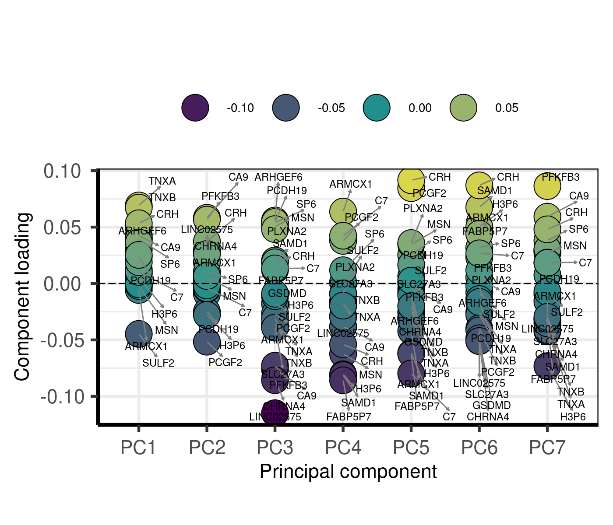
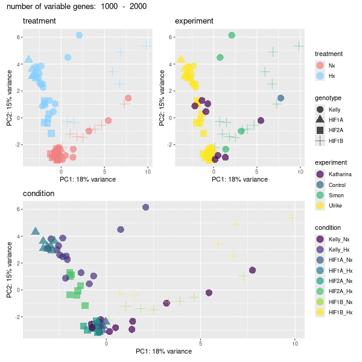
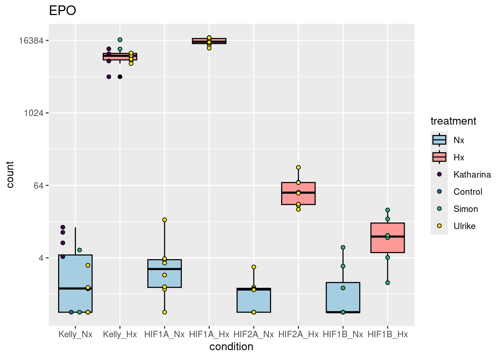

RNA-Seq Kelly Hx all data processing
================
Kelterborn
2024-02-21

- [0. Load](#0-load)
  - [- \#R_libraries](#--r_libraries)
  - [- \#Linux](#--linux)
  - [- \#Download Data](#--download-data)
- [1. Prepare Data](#1-prepare-data)
  - [- \#Make Index](#--make-index)
  - [- \#Mapping (Salmon)](#--mapping-salmon)
  - [- Sample names](#--sample-names)
    - [Extract filenames from quants](#extract-filenames-from-quants)
    - [P3302](#p3302)
    - [P2041\*](#p2041)
    - [P557](#p557)
    - [combine lists](#combine-lists)
- [2. Process](#2-process)
  - [- Mapping Rates](#--mapping-rates)
    - [Plot mapping rates](#plot-mapping-rates)
    - [clear BFC](#clear-bfc)
  - [- \#Tximeta](#--tximeta)
    - [add gene symbols](#add-gene-symbols)
  - [- \#DESeq2](#--deseq2)
- [3. Pre-Analysis](#3-pre-analysis)
  - [- Data transformations](#--data-transformations)
  - [- Check sample distance](#--check-sample-distance)
  - [- Perform principal component
    analysis](#--perform-principal-component-analysis)
  - [- Plot example counts](#--plot-example-counts)

# 0. Load

## - \#R_libraries

BiocManager::install()

BiocManager::install(“mgcv”)

## - \#Linux

## - \#Download Data

# 1. Prepare Data

## - \#Make Index

## - \#Mapping (Salmon)

## - Sample names

### Extract filenames from quants

### P3302

### P2041\*

### P557

### combine lists

<div style="border: 1px solid #ddd; padding: 0px; overflow-y: scroll; height:400px; ">

<table class="table table-striped" style="margin-left: auto; margin-right: auto;">
<thead>
<tr>
<th style="text-align:left;position: sticky; top:0; background-color: #FFFFFF;">
</th>
<th style="text-align:left;position: sticky; top:0; background-color: #FFFFFF;">
experiment
</th>
<th style="text-align:right;position: sticky; top:0; background-color: #FFFFFF;">
RNAs
</th>
<th style="text-align:left;position: sticky; top:0; background-color: #FFFFFF;">
conditions
</th>
<th style="text-align:left;position: sticky; top:0; background-color: #FFFFFF;">
date
</th>
<th style="text-align:left;position: sticky; top:0; background-color: #FFFFFF;">
seq_id
</th>
<th style="text-align:right;position: sticky; top:0; background-color: #FFFFFF;">
Seq_runs
</th>
</tr>
</thead>
<tbody>
<tr>
<td style="text-align:left;">
3
</td>
<td style="text-align:left;">
Katharina
</td>
<td style="text-align:right;">
16
</td>
<td style="text-align:left;">
Kelly_Nx Kelly_Hx HIF1A_Hx HIF2A_Hx
</td>
<td style="text-align:left;">
2018-09-13 2018-09-14
</td>
<td style="text-align:left;">
P557
</td>
<td style="text-align:right;">
16
</td>
</tr>
<tr>
<td style="text-align:left;">
1
</td>
<td style="text-align:left;">
Simon
</td>
<td style="text-align:right;">
22
</td>
<td style="text-align:left;">
Kelly_Nx Kelly_Hx HIF1A_Nx HIF1A_Hx HIF1B_Nx HIF1B_Hx
</td>
<td style="text-align:left;">
2017-05-04 2021-06-16 2021-08-25 2021-08-27
</td>
<td style="text-align:left;">
P2041
</td>
<td style="text-align:right;">
22
</td>
</tr>
<tr>
<td style="text-align:left;">
2
</td>
<td style="text-align:left;">
Ulrike
</td>
<td style="text-align:right;">
50
</td>
<td style="text-align:left;">
Kelly_Nx Kelly_Hx HIF1A_Nx HIF1A_Hx HIF2A_Nx HIF2A_Hx
</td>
<td style="text-align:left;">
2023-06-02 2023-06-08 2023-06-15 2023-06-28
</td>
<td style="text-align:left;">
P3302
</td>
<td style="text-align:right;">
150
</td>
</tr>
</tbody>
</table>

</div>

# 2. Process

## - Mapping Rates

### Plot mapping rates

<!-- -->

### clear BFC

## - \#Tximeta

### add gene symbols

## - \#DESeq2

``` r
design(dds)
```

    ## ~genotype + treatment + genotype:treatment
    ## <environment: 0x5634ee6db8b8>

``` r
summary(results(dds))
```

    ## 
    ## out of 30642 with nonzero total read count
    ## adjusted p-value < 0.1
    ## LFC > 0 (up)       : 5330, 17%
    ## LFC < 0 (down)     : 6584, 21%
    ## outliers [1]       : 9, 0.029%
    ## low counts [2]     : 4169, 14%
    ## (mean count < 1)
    ## [1] see 'cooksCutoff' argument of ?results
    ## [2] see 'independentFiltering' argument of ?results

``` r
plotMA(dds)
```

<!-- -->

``` r
plotDispEsts(dds)
```

<!-- -->

``` r
resultsNames(dds)
```

    ## [1] "Intercept"                 "genotype_HIF1A_vs_Kelly"  
    ## [3] "genotype_HIF2A_vs_Kelly"   "genotype_HIF1B_vs_Kelly"  
    ## [5] "treatment_Hx_vs_Nx"        "genotypeHIF1A.treatmentHx"
    ## [7] "genotypeHIF2A.treatmentHx" "genotypeHIF1B.treatmentHx"

# 3. Pre-Analysis

### - Data transformations

#### -#rlog

``` r
load(file=paste(data,"rlog.rld", sep="/"))
meanSdPlot(assay(ntd))
meanSdPlot(assay(vsd))
meanSdPlot(assay(rld))
```


### - Check sample distance


### - Perform principal component analysis


###### – Advanced PCA

    ## PC6 
    ##   6



###### – \#PCA gif

<a href="pca.gif" height="100%," width="100%">PCA Gif</a>



### - Plot example counts

    ## [1] 30652

    ## [1] 30652

    ## [1] 22173

    ## [1] 22172



``` r
sessionInfo()
```

    ## R version 4.3.3 (2024-02-29)
    ## Platform: x86_64-pc-linux-gnu (64-bit)
    ## Running under: Ubuntu 22.04.4 LTS
    ## 
    ## Matrix products: default
    ## BLAS/LAPACK: /opt/intel/oneapi/mkl/2024.0/lib/libmkl_rt.so.2;  LAPACK version 3.10.1
    ## 
    ## locale:
    ##  [1] LC_CTYPE=de_DE.UTF-8       LC_NUMERIC=C              
    ##  [3] LC_TIME=de_DE.UTF-8        LC_COLLATE=de_DE.UTF-8    
    ##  [5] LC_MONETARY=de_DE.UTF-8    LC_MESSAGES=de_DE.UTF-8   
    ##  [7] LC_PAPER=de_DE.UTF-8       LC_NAME=C                 
    ##  [9] LC_ADDRESS=C               LC_TELEPHONE=C            
    ## [11] LC_MEASUREMENT=de_DE.UTF-8 LC_IDENTIFICATION=C       
    ## 
    ## time zone: Europe/Berlin
    ## tzcode source: system (glibc)
    ## 
    ## attached base packages:
    ## [1] grid      stats4    stats     graphics  grDevices utils     datasets 
    ## [8] methods   base     
    ## 
    ## other attached packages:
    ##  [1] ensembldb_2.26.0            AnnotationFilter_1.26.0    
    ##  [3] GenomicFeatures_1.54.4      animation_2.7              
    ##  [5] viridis_0.6.5               viridisLite_0.4.2          
    ##  [7] writexl_1.5.0               knitr_1.46                 
    ##  [9] kableExtra_1.4.0            R.utils_2.12.3             
    ## [11] R.oo_1.26.0                 R.methodsS3_1.8.2          
    ## [13] curl_5.2.1                  data.table_1.15.4          
    ## [15] sessioninfo_1.2.2           VennDiagram_1.7.3          
    ## [17] futile.logger_1.4.3         readxl_1.4.3               
    ## [19] patchwork_1.2.0             gridExtra_2.3              
    ## [21] EnhancedVolcano_1.20.0      cowplot_1.1.3              
    ## [23] ggalt_0.4.0                 PCAtools_2.14.0            
    ## [25] ggrepel_0.9.5               pheatmap_1.0.12            
    ## [27] GOSemSim_2.28.1             biomaRt_2.58.2             
    ## [29] clusterProfiler_4.10.1      vsn_3.70.0                 
    ## [31] AnnotationHub_3.10.1        org.Mm.eg.db_3.18.0        
    ## [33] AnnotationDbi_1.64.1        RColorBrewer_1.1-3         
    ## [35] DESeq2_1.42.1               SummarizedExperiment_1.32.0
    ## [37] Biobase_2.62.0              MatrixGenerics_1.14.0      
    ## [39] matrixStats_1.3.0           GenomicRanges_1.54.1       
    ## [41] GenomeInfoDb_1.38.8         IRanges_2.36.0             
    ## [43] S4Vectors_0.40.2            BiocGenerics_0.48.1        
    ## [45] tximport_1.30.0             tximeta_1.20.3             
    ## [47] stringi_1.8.3               plyr_1.8.9                 
    ## [49] lubridate_1.9.3             forcats_1.0.0              
    ## [51] stringr_1.5.1               dplyr_1.1.4                
    ## [53] purrr_1.0.2                 readr_2.1.5                
    ## [55] tidyr_1.3.1                 tibble_3.2.1               
    ## [57] ggplot2_3.5.0               tidyverse_2.0.0            
    ## [59] BiocFileCache_2.10.2        dbplyr_2.5.0               
    ## [61] devtools_2.4.5              usethis_2.2.3              
    ## [63] BiocManager_1.30.22        
    ## 
    ## loaded via a namespace (and not attached):
    ##   [1] fs_1.6.3                      ProtGenerics_1.34.0          
    ##   [3] bitops_1.0-7                  enrichplot_1.22.0            
    ##   [5] HDO.db_0.99.1                 httr_1.4.7                   
    ##   [7] ash_1.0-15                    profvis_0.3.8                
    ##   [9] tools_4.3.3                   utf8_1.2.4                   
    ##  [11] R6_2.5.1                      lazyeval_0.2.2               
    ##  [13] urlchecker_1.0.1              withr_3.0.0                  
    ##  [15] prettyunits_1.2.0             preprocessCore_1.64.0        
    ##  [17] cli_3.6.2                     formatR_1.14                 
    ##  [19] scatterpie_0.2.2              labeling_0.4.3               
    ##  [21] systemfonts_1.0.6             Rsamtools_2.18.0             
    ##  [23] yulab.utils_0.1.4             gson_0.1.0                   
    ##  [25] svglite_2.1.3                 DOSE_3.28.2                  
    ##  [27] maps_3.4.2                    limma_3.58.1                 
    ##  [29] rstudioapi_0.16.0             RSQLite_2.3.6                
    ##  [31] generics_0.1.3                gridGraphics_0.5-1           
    ##  [33] BiocIO_1.12.0                 vroom_1.6.5                  
    ##  [35] GO.db_3.18.0                  Matrix_1.6-5                 
    ##  [37] fansi_1.0.6                   abind_1.4-5                  
    ##  [39] lifecycle_1.0.4               yaml_2.3.8                   
    ##  [41] qvalue_2.34.0                 SparseArray_1.2.4            
    ##  [43] blob_1.2.4                    promises_1.3.0               
    ##  [45] dqrng_0.3.2                   crayon_1.5.2                 
    ##  [47] miniUI_0.1.1.1                lattice_0.22-5               
    ##  [49] beachmat_2.18.1               KEGGREST_1.42.0              
    ##  [51] pillar_1.9.0                  fgsea_1.28.0                 
    ##  [53] rjson_0.2.21                  codetools_0.2-19             
    ##  [55] fastmatch_1.1-4               glue_1.7.0                   
    ##  [57] ggfun_0.1.4                   remotes_2.5.0                
    ##  [59] vctrs_0.6.5                   png_0.1-8                    
    ##  [61] treeio_1.26.0                 cellranger_1.1.0             
    ##  [63] gtable_0.3.4                  cachem_1.0.8                 
    ##  [65] xfun_0.43                     S4Arrays_1.2.1               
    ##  [67] mime_0.12                     tidygraph_1.3.1              
    ##  [69] statmod_1.5.0                 interactiveDisplayBase_1.40.0
    ##  [71] ellipsis_0.3.2                nlme_3.1-163                 
    ##  [73] ggtree_3.10.1                 bit64_4.0.5                  
    ##  [75] progress_1.2.3                filelock_1.0.3               
    ##  [77] affyio_1.72.0                 irlba_2.3.5.1                
    ##  [79] KernSmooth_2.23-22            colorspace_2.1-0             
    ##  [81] DBI_1.2.2                     tidyselect_1.2.1             
    ##  [83] bit_4.0.5                     compiler_4.3.3               
    ##  [85] extrafontdb_1.0               xml2_1.3.6                   
    ##  [87] DelayedArray_0.28.0           shadowtext_0.1.3             
    ##  [89] rtracklayer_1.62.0            scales_1.3.0                 
    ##  [91] hexbin_1.28.3                 proj4_1.0-14                 
    ##  [93] affy_1.80.0                   rappdirs_0.3.3               
    ##  [95] digest_0.6.35                 rmarkdown_2.26               
    ##  [97] XVector_0.42.0                htmltools_0.5.8.1            
    ##  [99] pkgconfig_2.0.3               extrafont_0.19               
    ## [101] sparseMatrixStats_1.14.0      highr_0.10                   
    ## [103] fastmap_1.1.1                 rlang_1.1.3                  
    ## [105] htmlwidgets_1.6.4             shiny_1.8.1.1                
    ## [107] DelayedMatrixStats_1.24.0     farver_2.1.1                 
    ## [109] jsonlite_1.8.8                BiocParallel_1.36.0          
    ## [111] BiocSingular_1.18.0           RCurl_1.98-1.14              
    ## [113] magrittr_2.0.3                GenomeInfoDbData_1.2.11      
    ## [115] ggplotify_0.1.2               munsell_0.5.1                
    ## [117] Rcpp_1.0.12                   ape_5.8                      
    ## [119] ggraph_2.2.1                  zlibbioc_1.48.2              
    ## [121] MASS_7.3-60                   pkgbuild_1.4.4               
    ## [123] parallel_4.3.3                Biostrings_2.70.3            
    ## [125] graphlayouts_1.1.1            splines_4.3.3                
    ## [127] hms_1.1.3                     locfit_1.5-9.9               
    ## [129] igraph_2.0.3                  reshape2_1.4.4               
    ## [131] ScaledMatrix_1.10.0           pkgload_1.3.4                
    ## [133] futile.options_1.0.1          BiocVersion_3.18.1           
    ## [135] XML_3.99-0.16.1               evaluate_0.23                
    ## [137] lambda.r_1.2.4                tzdb_0.4.0                   
    ## [139] tweenr_2.0.3                  httpuv_1.6.15                
    ## [141] Rttf2pt1_1.3.12               polyclip_1.10-6              
    ## [143] ggforce_0.4.2                 rsvd_1.0.5                   
    ## [145] xtable_1.8-4                  restfulr_0.0.15              
    ## [147] tidytree_0.4.6                later_1.3.2                  
    ## [149] aplot_0.2.2                   memoise_2.0.1                
    ## [151] GenomicAlignments_1.38.2      timechange_0.3.0
