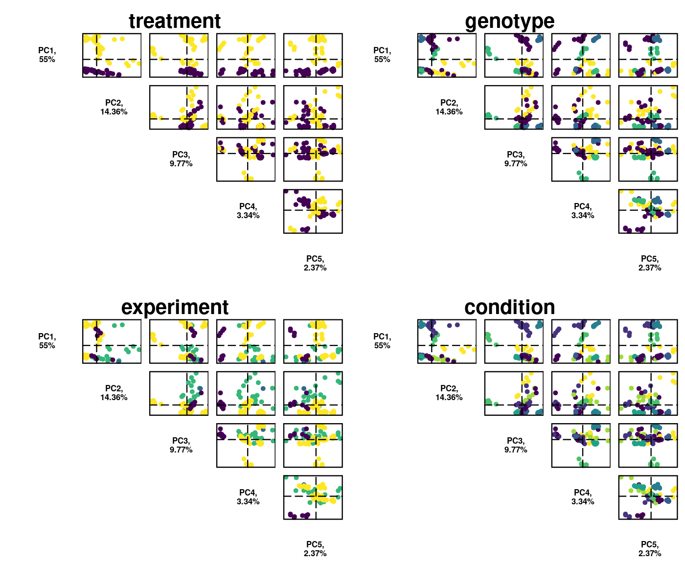
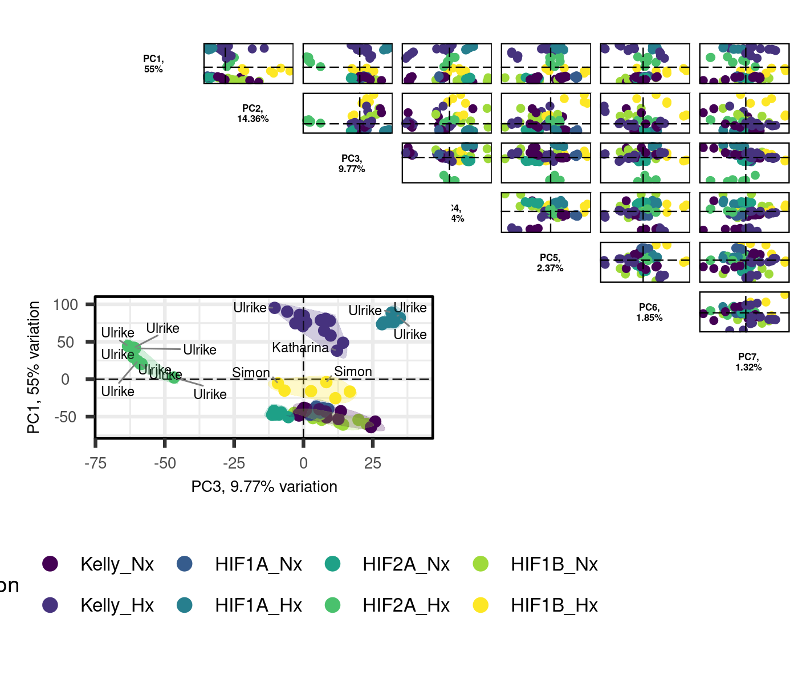

RNA-Seq Kelly Hx all data processing
================
Kelterborn
2024-02-21

- [0. Load](#0-load)
  - [- \#R_libraries](#--r_libraries)
  - [- \#Linux](#--linux)
  - [- \#Download Data](#--download-data)
- [1. Prepare Data](#1-prepare-data)
  - [- \#Make Index](#--make-index)
  - [- \#Mapping (Salmon)](#--mapping-salmon)
  - [- Sample names](#--sample-names)
- [2. Process](#2-process)
  - [- Mapping Rates](#--mapping-rates)
  - [- \#Tximeta](#--tximeta)
  - [- \#DESeq2](#--deseq2)
- [3. Pre-Analysis](#3-pre-analysis)

# 0. Load

## - \#R_libraries

BiocManager::install()

BiocManager::install(“mgcv”)

## - \#Linux

## - \#Download Data

# 1. Prepare Data

## - \#Make Index

## - \#Mapping (Salmon)

## - Sample names

### Extract filenames from quants

### P3302

### P2041\*

### P557

### combine lists

<div style="border: 1px solid #ddd; padding: 0px; overflow-y: scroll; height:400px; ">

<table class="table table-striped" style="margin-left: auto; margin-right: auto;">
<thead>
<tr>
<th style="text-align:left;position: sticky; top:0; background-color: #FFFFFF;">
</th>
<th style="text-align:left;position: sticky; top:0; background-color: #FFFFFF;">
experiment
</th>
<th style="text-align:right;position: sticky; top:0; background-color: #FFFFFF;">
RNAs
</th>
<th style="text-align:left;position: sticky; top:0; background-color: #FFFFFF;">
conditions
</th>
<th style="text-align:left;position: sticky; top:0; background-color: #FFFFFF;">
date
</th>
<th style="text-align:left;position: sticky; top:0; background-color: #FFFFFF;">
seq_id
</th>
<th style="text-align:right;position: sticky; top:0; background-color: #FFFFFF;">
Seq_runs
</th>
</tr>
</thead>
<tbody>
<tr>
<td style="text-align:left;">
3
</td>
<td style="text-align:left;">
Katharina
</td>
<td style="text-align:right;">
16
</td>
<td style="text-align:left;">
Kelly_Nx Kelly_Hx HIF1A_Hx HIF2A_Hx
</td>
<td style="text-align:left;">
2018-09-13 2018-09-14
</td>
<td style="text-align:left;">
P557
</td>
<td style="text-align:right;">
16
</td>
</tr>
<tr>
<td style="text-align:left;">
1
</td>
<td style="text-align:left;">
Simon
</td>
<td style="text-align:right;">
22
</td>
<td style="text-align:left;">
Kelly_Nx Kelly_Hx HIF1A_Nx HIF1A_Hx HIF1B_Nx HIF1B_Hx
</td>
<td style="text-align:left;">
2017-05-04 2021-06-16 2021-08-25 2021-08-27
</td>
<td style="text-align:left;">
P2041
</td>
<td style="text-align:right;">
22
</td>
</tr>
<tr>
<td style="text-align:left;">
2
</td>
<td style="text-align:left;">
Ulrike
</td>
<td style="text-align:right;">
50
</td>
<td style="text-align:left;">
Kelly_Nx Kelly_Hx HIF1A_Nx HIF1A_Hx HIF2A_Nx HIF2A_Hx
</td>
<td style="text-align:left;">
2023-06-02 2023-06-08 2023-06-15 2023-06-28
</td>
<td style="text-align:left;">
P3302
</td>
<td style="text-align:right;">
150
</td>
</tr>
</tbody>
</table>

</div>

# 2. Process

## - Mapping Rates

### Plot mapping rates

<!-- -->

### clear BFC

## - \#Tximeta

### add gene symbols

## - \#DESeq2

``` r
design(dds)
```

    ## ~experiment + genotype + treatment + genotype:treatment
    ## <environment: 0x55595faaa960>

``` r
summary(results(dds))
```

    ## 
    ## out of 30649 with nonzero total read count
    ## adjusted p-value < 0.1
    ## LFC > 0 (up)       : 6000, 20%
    ## LFC < 0 (down)     : 7146, 23%
    ## outliers [1]       : 27, 0.088%
    ## low counts [2]     : 3569, 12%
    ## (mean count < 1)
    ## [1] see 'cooksCutoff' argument of ?results
    ## [2] see 'independentFiltering' argument of ?results

``` r
plotMA(dds)
plotDispEsts(dds)
resultsNames(dds)
```

    ##  [1] "Intercept"                       "experiment_Katharina_vs_Control"
    ##  [3] "experiment_Simon_vs_Control"     "experiment_Ulrike_vs_Control"   
    ##  [5] "genotype_HIF1A_vs_Kelly"         "genotype_HIF2A_vs_Kelly"        
    ##  [7] "genotype_HIF1B_vs_Kelly"         "treatment_Hx_vs_Nx"             
    ##  [9] "genotypeHIF1A.treatmentHx"       "genotypeHIF2A.treatmentHx"      
    ## [11] "genotypeHIF1B.treatmentHx"


# 3. Pre-Analysis

### - Data transformations

#### -#rlog

``` r
load(file=paste(data,"rlog_experiment.rld", sep="/"))
meanSdPlot(assay(ntd))
meanSdPlot(assay(vsd))
meanSdPlot(assay(rld))
```


### - Check sample distance


### - Perform principal component analysis


###### – Advanced PCA

    ## PC6 
    ##   6



###### – \#PCA gif

<a href="pca.gif" height="100%," width="100%">PCA Gif</a>

### - Plot example counts

    ## [1] 30652

    ## [1] 30652

    ## [1] 22173

    ## [1] 22172


``` r
sessionInfo()
```

    ## R version 4.4.0 (2024-04-24)
    ## Platform: x86_64-pc-linux-gnu
    ## Running under: Ubuntu 22.04.4 LTS
    ## 
    ## Matrix products: default
    ## BLAS/LAPACK: /opt/intel/oneapi/mkl/2024.0/lib/libmkl_rt.so.2;  LAPACK version 3.10.1
    ## 
    ## locale:
    ##  [1] LC_CTYPE=de_DE.UTF-8       LC_NUMERIC=C              
    ##  [3] LC_TIME=de_DE.UTF-8        LC_COLLATE=de_DE.UTF-8    
    ##  [5] LC_MONETARY=de_DE.UTF-8    LC_MESSAGES=de_DE.UTF-8   
    ##  [7] LC_PAPER=de_DE.UTF-8       LC_NAME=C                 
    ##  [9] LC_ADDRESS=C               LC_TELEPHONE=C            
    ## [11] LC_MEASUREMENT=de_DE.UTF-8 LC_IDENTIFICATION=C       
    ## 
    ## time zone: Europe/Berlin
    ## tzcode source: system (glibc)
    ## 
    ## attached base packages:
    ## [1] grid      stats4    stats     graphics  grDevices utils     datasets 
    ## [8] methods   base     
    ## 
    ## other attached packages:
    ##  [1] ensembldb_2.28.0            AnnotationFilter_1.28.0    
    ##  [3] GenomicFeatures_1.56.0      animation_2.7              
    ##  [5] viridis_0.6.5               viridisLite_0.4.2          
    ##  [7] writexl_1.5.0               knitr_1.46                 
    ##  [9] kableExtra_1.4.0            R.utils_2.12.3             
    ## [11] R.oo_1.26.0                 R.methodsS3_1.8.2          
    ## [13] curl_5.2.1                  data.table_1.15.4          
    ## [15] sessioninfo_1.2.2           VennDiagram_1.7.3          
    ## [17] futile.logger_1.4.3         readxl_1.4.3               
    ## [19] patchwork_1.2.0             gridExtra_2.3              
    ## [21] EnhancedVolcano_1.22.0      cowplot_1.1.3              
    ## [23] ggalt_0.4.0                 PCAtools_2.16.0            
    ## [25] ggrepel_0.9.5               pheatmap_1.0.12            
    ## [27] GOSemSim_2.30.0             biomaRt_2.60.0             
    ## [29] clusterProfiler_4.12.0      vsn_3.72.0                 
    ## [31] AnnotationHub_3.12.0        org.Mm.eg.db_3.19.1        
    ## [33] AnnotationDbi_1.66.0        RColorBrewer_1.1-3         
    ## [35] DESeq2_1.44.0               SummarizedExperiment_1.34.0
    ## [37] Biobase_2.64.0              MatrixGenerics_1.16.0      
    ## [39] matrixStats_1.3.0           GenomicRanges_1.56.0       
    ## [41] GenomeInfoDb_1.40.0         IRanges_2.38.0             
    ## [43] S4Vectors_0.42.0            BiocGenerics_0.50.0        
    ## [45] tximport_1.32.0             tximeta_1.22.0             
    ## [47] stringi_1.8.3               plyr_1.8.9                 
    ## [49] lubridate_1.9.3             forcats_1.0.0              
    ## [51] stringr_1.5.1               dplyr_1.1.4                
    ## [53] purrr_1.0.2                 readr_2.1.5                
    ## [55] tidyr_1.3.1                 tibble_3.2.1               
    ## [57] ggplot2_3.5.1               tidyverse_2.0.0            
    ## [59] BiocFileCache_2.12.0        dbplyr_2.5.0               
    ## [61] devtools_2.4.5              usethis_2.2.3              
    ## [63] BiocManager_1.30.23        
    ## 
    ## loaded via a namespace (and not attached):
    ##   [1] fs_1.6.4                  ProtGenerics_1.36.0      
    ##   [3] bitops_1.0-7              enrichplot_1.24.0        
    ##   [5] HDO.db_0.99.1             httr_1.4.7               
    ##   [7] ash_1.0-15                profvis_0.3.8            
    ##   [9] tools_4.4.0               utf8_1.2.4               
    ##  [11] R6_2.5.1                  lazyeval_0.2.2           
    ##  [13] urlchecker_1.0.1          withr_3.0.0              
    ##  [15] prettyunits_1.2.0         preprocessCore_1.66.0    
    ##  [17] cli_3.6.2                 formatR_1.14             
    ##  [19] scatterpie_0.2.2          labeling_0.4.3           
    ##  [21] systemfonts_1.0.6         Rsamtools_2.20.0         
    ##  [23] yulab.utils_0.1.4         gson_0.1.0               
    ##  [25] txdbmaker_1.0.0           svglite_2.1.3            
    ##  [27] DOSE_3.30.0               maps_3.4.2               
    ##  [29] limma_3.60.0              rstudioapi_0.16.0        
    ##  [31] RSQLite_2.3.6             generics_0.1.3           
    ##  [33] gridGraphics_0.5-1        BiocIO_1.14.0            
    ##  [35] vroom_1.6.5               GO.db_3.19.1             
    ##  [37] Matrix_1.7-0              fansi_1.0.6              
    ##  [39] abind_1.4-5               lifecycle_1.0.4          
    ##  [41] yaml_2.3.8                qvalue_2.36.0            
    ##  [43] SparseArray_1.4.0         blob_1.2.4               
    ##  [45] promises_1.3.0            dqrng_0.3.2              
    ##  [47] crayon_1.5.2              miniUI_0.1.1.1           
    ##  [49] lattice_0.22-5            beachmat_2.20.0          
    ##  [51] KEGGREST_1.44.0           pillar_1.9.0             
    ##  [53] fgsea_1.30.0              rjson_0.2.21             
    ##  [55] codetools_0.2-19          fastmatch_1.1-4          
    ##  [57] glue_1.7.0                ggfun_0.1.4              
    ##  [59] remotes_2.5.0             vctrs_0.6.5              
    ##  [61] png_0.1-8                 treeio_1.28.0            
    ##  [63] cellranger_1.1.0          gtable_0.3.5             
    ##  [65] cachem_1.0.8              xfun_0.43                
    ##  [67] S4Arrays_1.4.0            mime_0.12                
    ##  [69] tidygraph_1.3.1           statmod_1.5.0            
    ##  [71] ellipsis_0.3.2            nlme_3.1-163             
    ##  [73] ggtree_3.12.0             bit64_4.0.5              
    ##  [75] progress_1.2.3            filelock_1.0.3           
    ##  [77] affyio_1.74.0             irlba_2.3.5.1            
    ##  [79] KernSmooth_2.23-22        colorspace_2.1-0         
    ##  [81] DBI_1.2.2                 tidyselect_1.2.1         
    ##  [83] bit_4.0.5                 compiler_4.4.0           
    ##  [85] extrafontdb_1.0           httr2_1.0.1              
    ##  [87] xml2_1.3.6                DelayedArray_0.30.0      
    ##  [89] shadowtext_0.1.3          rtracklayer_1.64.0       
    ##  [91] scales_1.3.0              hexbin_1.28.3            
    ##  [93] proj4_1.0-14              affy_1.82.0              
    ##  [95] rappdirs_0.3.3            digest_0.6.35            
    ##  [97] rmarkdown_2.26            XVector_0.44.0           
    ##  [99] htmltools_0.5.8.1         pkgconfig_2.0.3          
    ## [101] extrafont_0.19            sparseMatrixStats_1.16.0 
    ## [103] highr_0.10                fastmap_1.1.1            
    ## [105] rlang_1.1.3               htmlwidgets_1.6.4        
    ## [107] UCSC.utils_1.0.0          shiny_1.8.1.1            
    ## [109] DelayedMatrixStats_1.26.0 farver_2.1.1             
    ## [111] jsonlite_1.8.8            BiocParallel_1.38.0      
    ## [113] BiocSingular_1.20.0       RCurl_1.98-1.14          
    ## [115] magrittr_2.0.3            GenomeInfoDbData_1.2.12  
    ## [117] ggplotify_0.1.2           munsell_0.5.1            
    ## [119] Rcpp_1.0.12               ape_5.8                  
    ## [121] ggraph_2.2.1              zlibbioc_1.50.0          
    ## [123] MASS_7.3-60               pkgbuild_1.4.4           
    ## [125] parallel_4.4.0            Biostrings_2.72.0        
    ## [127] graphlayouts_1.1.1        splines_4.4.0            
    ## [129] hms_1.1.3                 locfit_1.5-9.9           
    ## [131] igraph_2.0.3              reshape2_1.4.4           
    ## [133] ScaledMatrix_1.12.0       pkgload_1.3.4            
    ## [135] futile.options_1.0.1      BiocVersion_3.19.1       
    ## [137] XML_3.99-0.16.1           evaluate_0.23            
    ## [139] lambda.r_1.2.4            tzdb_0.4.0               
    ## [141] tweenr_2.0.3              httpuv_1.6.15            
    ## [143] Rttf2pt1_1.3.12           polyclip_1.10-6          
    ## [145] ggforce_0.4.2             rsvd_1.0.5               
    ## [147] xtable_1.8-4              restfulr_0.0.15          
    ## [149] tidytree_0.4.6            later_1.3.2              
    ## [151] aplot_0.2.2               memoise_2.0.1            
    ## [153] GenomicAlignments_1.40.0  timechange_0.3.0
