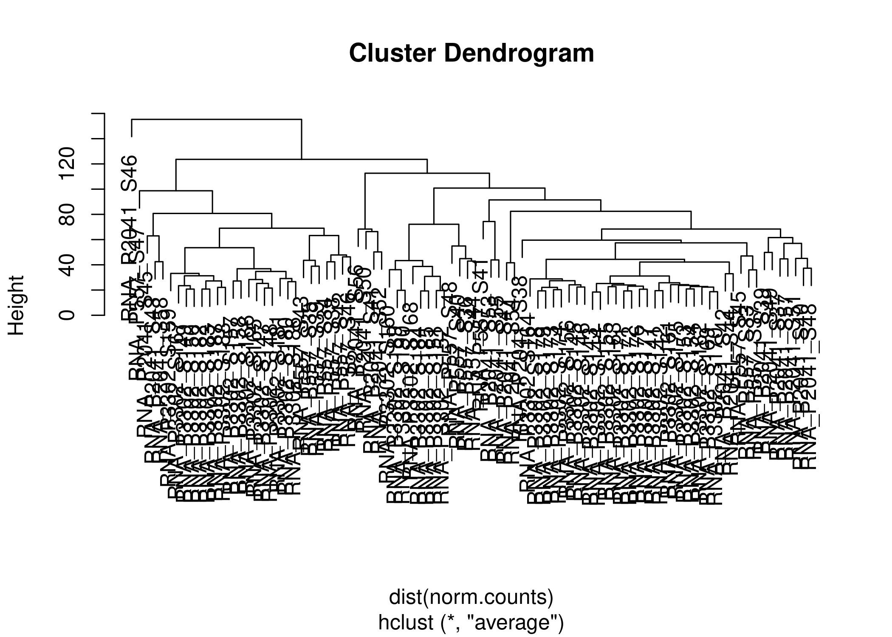
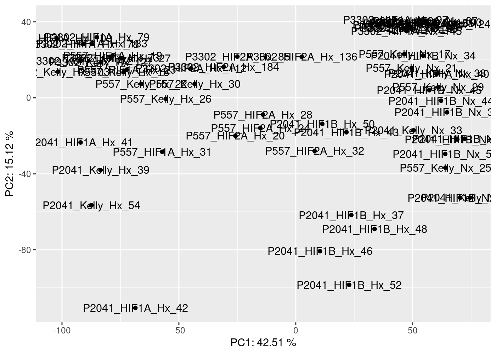
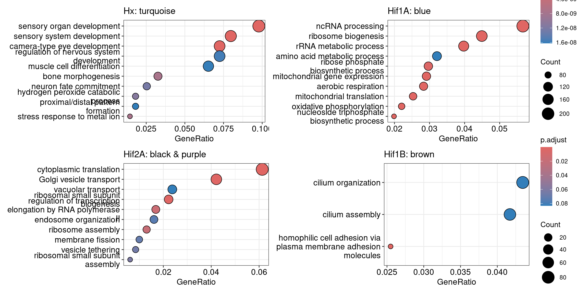

WGCNA
================
Kelterborn
2024-03-07

- [0. Load](#0-load)
  - [- Load R librarys](#--load-r-librarys)
- [1. WGCNA](#1-wgcna)
  - [-load dds](#-load-dds)
    - [-plot sample dist.](#-plot-sample-dist)
  - [(-pickSoftThreshold extern)](#-picksoftthreshold-extern)
  - [-pickSoftThreshold](#-picksoftthreshold)
  - [-network construction](#-network-construction)
  - [-Module Eigengenes](#-module-eigengenes)
  - [-Intramodular analysis: Identifying driver
    genes](#-intramodular-analysis-identifying-driver-genes)
  - [-TS Analysis](#-ts-analysis)
  - [-GO terms enrichment](#-go-terms-enrichment)
  - [-module to sample](#-module-to-sample)
- [Export into dds](#export-into-dds)

# 0. Load

## - Load R librarys

# 1. WGCNA

## -load dds

### -plot sample dist.

    ##             Length Class  Mode   
    ## goodGenes   23451  -none- logical
    ## goodSamples    62  -none- logical
    ## allOK           1  -none- logical

    ## [1] TRUE



## (-pickSoftThreshold extern)

## -pickSoftThreshold

## -network construction

``` r
# convert matrix to numeric
norm.counts[] <- sapply(norm.counts, as.numeric)

soft_power <- 28
temp_cor <- cor
cor <- WGCNA::cor

# memory estimate w.r.t blocksize
# bwnet <- blockwiseModules(norm.counts,
#                  maxBlockSize = 15000,
#                  TOMType = "signed",
#                  power = soft_power,
#                  mergeCutHeight = 0.25,
#                  numericLabels = FALSE,
#                  randomSeed = 1234,
#                  verbose = 3)
# 
# cor <- temp_cor
# 
# save(bwnet,file=paste(data,"bwnet.RDS", sep="/"))

# TS
cor <- WGCNA::cor
bwnet <- blockwiseModules(norm.counts,               

                          # == Adjacency Function ==
                          power = soft_power,                
                          networkType = "signed",

                          # == Tree and Block Options ==
                          deepSplit = 2,
                          pamRespectsDendro = F,
                          # detectCutHeight = 0.75,
                          minModuleSize = 30,
                          maxBlockSize = 40000,

                          # == Module Adjustments ==
                          reassignThreshold = 0,
                          mergeCutHeight = 0.25,

                          # == TOM == Archive the run results in TOM file (saves time)
                          saveTOMs = T,
                          saveTOMFileBase = paste(data,"blockwiseTOM", sep="/"),

                          # == Output Options
                          numericLabels = F,
                          verbose = 3)
```

    ##  Calculating module eigengenes block-wise from all genes
    ##    Flagging genes and samples with too many missing values...
    ##     ..step 1
    ##  ..Working on block 1 .
    ##     TOM calculation: adjacency..
    ##     ..will use 40 parallel threads.
    ##      Fraction of slow calculations: 0.000000
    ##     ..connectivity..
    ##     ..matrix multiplication (system BLAS)..
    ##     ..normalization..
    ##     ..done.
    ##    ..saving TOM for block 1 into file /mnt/s/AG/AG-Scholz-NGS/Daten/Simon/RNA-Seq_Kelly_all/data/blockwiseTOM-block.1.RData
    ##  ....clustering..
    ##  ....detecting modules..
    ##  ....calculating module eigengenes..
    ##  ....checking kME in modules..
    ##      ..removing 1 genes from module 6 because their KME is too low.
    ##      ..removing 3 genes from module 9 because their KME is too low.
    ##      ..removing 1 genes from module 23 because their KME is too low.
    ##  ..merging modules that are too close..
    ##      mergeCloseModules: Merging modules whose distance is less than 0.25
    ##        Calculating new MEs...

``` r
cor <- temp_cor

# save(bwnet,file=paste(data,"bwnet_TS.RDS", sep="/"))
```

## -Module Eigengenes

``` r
# load(file=paste(data,"bwnet_TS.RDS", sep="/"))

module_eigengenes <- bwnet$MEs

# Print out a preview
# head(module_eigengenes) %>% kable() %>% kable_styling("striped", full_width = T) %>% scroll_box(height = "400px")

# get number of genes for each module
table(bwnet$colors)
```

    ## 
    ##       black        blue       brown        cyan       green greenyellow 
    ##         290        3506        3477          50        1914         126 
    ##        grey     magenta        pink      purple         red      salmon 
    ##        2685         272         273         135         668         117 
    ##         tan   turquoise      yellow 
    ##         121        6733        3084

``` r
# Plot the dendrogram and the module colors before and after merging underneath
plotDendroAndColors(bwnet$dendrograms[[1]], cbind(bwnet$unmergedColors, bwnet$colors),
                    c("unmerged", "merged"),
                    dendroLabels = FALSE,
                    addGuide = TRUE,
                    hang= 0.03,
                    guideHang = 0.05)
```


``` r
# grey module = all genes that doesn't fall into other modules were assigned to the grey module


# 6A. Relate modules to traits --------------------------------------------------
# module trait associations


# create traits file - binarize categorical variables
traits <- colData$treatment_bin <- ifelse(grepl('Hx', colData$treatment), 1, 0)

# binarize categorical variables

# colData$genotype %>% levels()

genotype_bin <- binarizeCategoricalColumns(colData$genotype,
                           includePairwise = FALSE,
                           includeLevelVsAll = TRUE,
                           dropFirstLevelVsAll = FALSE,
                           minCount = 1)
colnames(genotype_bin) <- levels(colData$genotype)

condition_bin <- binarizeCategoricalColumns(colData$condition,
                           includePairwise = FALSE,
                           includeLevelVsAll = TRUE,
                           dropFirstLevelVsAll = FALSE,
                           minCount = 1)
colnames(condition_bin) <- levels(colData$condition)

traits <- cbind(traits, genotype_bin,condition_bin)
rownames(traits) <- rownames(colData)
# dim(traits)
orig.colnames <- colnames(traits)
colnames(traits)[1] <- c("Hypoxia")

# Define numbers of genes and samples
nSamples <- nrow(norm.counts)
nGenes <- ncol(norm.counts)

module.trait.corr <- cor(module_eigengenes, traits, use = 'p')
module.trait.corr.pvals <- corPvalueStudent(module.trait.corr, nSamples)

# visualize module-trait association as a heatmap

heatmap.data <- merge(module_eigengenes, traits, by = 'row.names')

# head(heatmap.data) %>% kable() %>% kable_styling("striped", full_width = T) %>% scroll_box(height = "400px")

heatmap.data <- heatmap.data %>% 
  column_to_rownames(var = 'Row.names')
# dim(heatmap.data)
MEs <- heatmap.data %>% colnames() %>% str_detect(pattern="ME") %>% sum()
max <- heatmap.data %>% ncol()
CorLevelPlot(heatmap.data,
             x = names(heatmap.data)[(MEs+1):max],
             y = names(heatmap.data)[1:MEs],
             col = viridis(100, option='plasma'))
```


``` r
             # col = c("blue1", "skyblue", "white", "pink", "red"))

module.gene.mapping <- as.data.frame(bwnet$colors)

# Genes related to Hypoxia
# module.gene.mapping %>% 
#  dplyr::filter(`bwnet$colors` == 'turquoise') %>% 
#  rownames() %>% head() %>% kable() %>% kable_styling("striped", full_width = T) %>% scroll_box(height = "400px")
modules_cor <- abs(module.trait.corr)

trait.col.Hx <- modules_cor[order(modules_cor[,"Hypoxia"], decreasing = TRUE),"Hypoxia"]
trait.col.HIF1A_Hx <- modules_cor[order(modules_cor[,"HIF1A_Hx"], decreasing = TRUE),"HIF1A_Hx"]
trait.col.HIF2A_Hx <- modules_cor[order(modules_cor[,"HIF2A_Hx"], decreasing = TRUE),"HIF2A_Hx"]
trait.col.HIF1B_Hx <- modules_cor[order(modules_cor[,"HIF1B_Hx"], decreasing = TRUE),"HIF1B_Hx"]
```

## -Intramodular analysis: Identifying driver genes

``` r
module.membership.measure <- cor(module_eigengenes, norm.counts, use = 'p')
module.membership.measure.pvals <- corPvalueStudent(module.membership.measure, nSamples)

module.membership.measure[1:10,1:10] %>% kable() %>% kable_styling("striped", full_width = T) %>% scroll_box(height = "400px")
```

<div style="border: 1px solid #ddd; padding: 0px; overflow-y: scroll; height:400px; ">

<table class="table table-striped" style="margin-left: auto; margin-right: auto;">
<thead>
<tr>
<th style="text-align:left;position: sticky; top:0; background-color: #FFFFFF;">
</th>
<th style="text-align:right;position: sticky; top:0; background-color: #FFFFFF;">
ENSG00000000003
</th>
<th style="text-align:right;position: sticky; top:0; background-color: #FFFFFF;">
ENSG00000000419
</th>
<th style="text-align:right;position: sticky; top:0; background-color: #FFFFFF;">
ENSG00000000457
</th>
<th style="text-align:right;position: sticky; top:0; background-color: #FFFFFF;">
ENSG00000000460
</th>
<th style="text-align:right;position: sticky; top:0; background-color: #FFFFFF;">
ENSG00000001084
</th>
<th style="text-align:right;position: sticky; top:0; background-color: #FFFFFF;">
ENSG00000001167
</th>
<th style="text-align:right;position: sticky; top:0; background-color: #FFFFFF;">
ENSG00000001460
</th>
<th style="text-align:right;position: sticky; top:0; background-color: #FFFFFF;">
ENSG00000001461
</th>
<th style="text-align:right;position: sticky; top:0; background-color: #FFFFFF;">
ENSG00000001497
</th>
<th style="text-align:right;position: sticky; top:0; background-color: #FFFFFF;">
ENSG00000001561
</th>
</tr>
</thead>
<tbody>
<tr>
<td style="text-align:left;">
MEbrown
</td>
<td style="text-align:right;">
-0.4756069
</td>
<td style="text-align:right;">
0.7332664
</td>
<td style="text-align:right;">
0.1185630
</td>
<td style="text-align:right;">
-0.1332228
</td>
<td style="text-align:right;">
0.4612033
</td>
<td style="text-align:right;">
0.5343858
</td>
<td style="text-align:right;">
-0.4457856
</td>
<td style="text-align:right;">
-0.2162283
</td>
<td style="text-align:right;">
-0.2950493
</td>
<td style="text-align:right;">
-0.0868401
</td>
</tr>
<tr>
<td style="text-align:left;">
MEred
</td>
<td style="text-align:right;">
0.0479424
</td>
<td style="text-align:right;">
-0.1806676
</td>
<td style="text-align:right;">
0.1409011
</td>
<td style="text-align:right;">
-0.4650630
</td>
<td style="text-align:right;">
0.1969480
</td>
<td style="text-align:right;">
-0.3894489
</td>
<td style="text-align:right;">
-0.4073297
</td>
<td style="text-align:right;">
0.7342237
</td>
<td style="text-align:right;">
-0.4147932
</td>
<td style="text-align:right;">
0.1223559
</td>
</tr>
<tr>
<td style="text-align:left;">
MEsalmon
</td>
<td style="text-align:right;">
-0.2309730
</td>
<td style="text-align:right;">
0.4690880
</td>
<td style="text-align:right;">
-0.3288617
</td>
<td style="text-align:right;">
0.1688205
</td>
<td style="text-align:right;">
0.8457085
</td>
<td style="text-align:right;">
0.2439683
</td>
<td style="text-align:right;">
-0.8319730
</td>
<td style="text-align:right;">
0.0081070
</td>
<td style="text-align:right;">
0.0472279
</td>
<td style="text-align:right;">
0.2272272
</td>
</tr>
<tr>
<td style="text-align:left;">
MEblack
</td>
<td style="text-align:right;">
0.5987000
</td>
<td style="text-align:right;">
-0.0229694
</td>
<td style="text-align:right;">
0.3874594
</td>
<td style="text-align:right;">
-0.1078282
</td>
<td style="text-align:right;">
-0.1321624
</td>
<td style="text-align:right;">
-0.4531916
</td>
<td style="text-align:right;">
-0.0756165
</td>
<td style="text-align:right;">
0.1851441
</td>
<td style="text-align:right;">
-0.4348235
</td>
<td style="text-align:right;">
0.0278380
</td>
</tr>
<tr>
<td style="text-align:left;">
MEgreenyellow
</td>
<td style="text-align:right;">
0.1554303
</td>
<td style="text-align:right;">
-0.0348145
</td>
<td style="text-align:right;">
0.6830841
</td>
<td style="text-align:right;">
-0.4891002
</td>
<td style="text-align:right;">
-0.6205075
</td>
<td style="text-align:right;">
-0.1425591
</td>
<td style="text-align:right;">
0.5430558
</td>
<td style="text-align:right;">
0.0565735
</td>
<td style="text-align:right;">
-0.5501163
</td>
<td style="text-align:right;">
-0.4527260
</td>
</tr>
<tr>
<td style="text-align:left;">
MEturquoise
</td>
<td style="text-align:right;">
0.0617329
</td>
<td style="text-align:right;">
-0.1196818
</td>
<td style="text-align:right;">
0.7716219
</td>
<td style="text-align:right;">
-0.9202984
</td>
<td style="text-align:right;">
-0.3975610
</td>
<td style="text-align:right;">
-0.4049086
</td>
<td style="text-align:right;">
0.1407009
</td>
<td style="text-align:right;">
0.7351155
</td>
<td style="text-align:right;">
-0.8987440
</td>
<td style="text-align:right;">
-0.2320198
</td>
</tr>
<tr>
<td style="text-align:left;">
MEcyan
</td>
<td style="text-align:right;">
-0.4951188
</td>
<td style="text-align:right;">
0.1463442
</td>
<td style="text-align:right;">
-0.5361234
</td>
<td style="text-align:right;">
0.5931743
</td>
<td style="text-align:right;">
0.3181586
</td>
<td style="text-align:right;">
0.5995816
</td>
<td style="text-align:right;">
-0.0993158
</td>
<td style="text-align:right;">
-0.6330579
</td>
<td style="text-align:right;">
0.6921200
</td>
<td style="text-align:right;">
0.4107608
</td>
</tr>
<tr>
<td style="text-align:left;">
MEyellow
</td>
<td style="text-align:right;">
-0.3495257
</td>
<td style="text-align:right;">
0.5372756
</td>
<td style="text-align:right;">
-0.7141764
</td>
<td style="text-align:right;">
0.8718023
</td>
<td style="text-align:right;">
0.6275023
</td>
<td style="text-align:right;">
0.7194011
</td>
<td style="text-align:right;">
-0.3243628
</td>
<td style="text-align:right;">
-0.9065709
</td>
<td style="text-align:right;">
0.7634801
</td>
<td style="text-align:right;">
0.1671509
</td>
</tr>
<tr>
<td style="text-align:left;">
MEblue
</td>
<td style="text-align:right;">
0.1635009
</td>
<td style="text-align:right;">
-0.2960081
</td>
<td style="text-align:right;">
-0.6187105
</td>
<td style="text-align:right;">
0.7318138
</td>
<td style="text-align:right;">
0.0007076
</td>
<td style="text-align:right;">
0.0523237
</td>
<td style="text-align:right;">
0.1826301
</td>
<td style="text-align:right;">
-0.4455986
</td>
<td style="text-align:right;">
0.8266009
</td>
<td style="text-align:right;">
0.1773062
</td>
</tr>
<tr>
<td style="text-align:left;">
MEtan
</td>
<td style="text-align:right;">
-0.0860964
</td>
<td style="text-align:right;">
-0.1375955
</td>
<td style="text-align:right;">
-0.7025580
</td>
<td style="text-align:right;">
0.5136805
</td>
<td style="text-align:right;">
0.5104660
</td>
<td style="text-align:right;">
0.0711204
</td>
<td style="text-align:right;">
-0.4133775
</td>
<td style="text-align:right;">
-0.0489963
</td>
<td style="text-align:right;">
0.6112291
</td>
<td style="text-align:right;">
0.4235157
</td>
</tr>
</tbody>
</table>

</div>

``` r
module.membership.measure.pvals[1:10,1:10] %>% kable() %>% kable_styling("striped", full_width = T) %>% scroll_box(height = "400px")
```

<div style="border: 1px solid #ddd; padding: 0px; overflow-y: scroll; height:400px; ">

<table class="table table-striped" style="margin-left: auto; margin-right: auto;">
<thead>
<tr>
<th style="text-align:left;position: sticky; top:0; background-color: #FFFFFF;">
</th>
<th style="text-align:right;position: sticky; top:0; background-color: #FFFFFF;">
ENSG00000000003
</th>
<th style="text-align:right;position: sticky; top:0; background-color: #FFFFFF;">
ENSG00000000419
</th>
<th style="text-align:right;position: sticky; top:0; background-color: #FFFFFF;">
ENSG00000000457
</th>
<th style="text-align:right;position: sticky; top:0; background-color: #FFFFFF;">
ENSG00000000460
</th>
<th style="text-align:right;position: sticky; top:0; background-color: #FFFFFF;">
ENSG00000001084
</th>
<th style="text-align:right;position: sticky; top:0; background-color: #FFFFFF;">
ENSG00000001167
</th>
<th style="text-align:right;position: sticky; top:0; background-color: #FFFFFF;">
ENSG00000001460
</th>
<th style="text-align:right;position: sticky; top:0; background-color: #FFFFFF;">
ENSG00000001461
</th>
<th style="text-align:right;position: sticky; top:0; background-color: #FFFFFF;">
ENSG00000001497
</th>
<th style="text-align:right;position: sticky; top:0; background-color: #FFFFFF;">
ENSG00000001561
</th>
</tr>
</thead>
<tbody>
<tr>
<td style="text-align:left;">
MEbrown
</td>
<td style="text-align:right;">
0.0000936
</td>
<td style="text-align:right;">
0.0000000
</td>
<td style="text-align:right;">
0.3587186
</td>
<td style="text-align:right;">
0.3019508
</td>
<td style="text-align:right;">
0.0001615
</td>
<td style="text-align:right;">
0.0000077
</td>
<td style="text-align:right;">
0.0002822
</td>
<td style="text-align:right;">
0.0914174
</td>
<td style="text-align:right;">
0.0199106
</td>
<td style="text-align:right;">
0.5021353
</td>
</tr>
<tr>
<td style="text-align:left;">
MEred
</td>
<td style="text-align:right;">
0.7113604
</td>
<td style="text-align:right;">
0.1599556
</td>
<td style="text-align:right;">
0.2746844
</td>
<td style="text-align:right;">
0.0001399
</td>
<td style="text-align:right;">
0.1249606
</td>
<td style="text-align:right;">
0.0017562
</td>
<td style="text-align:right;">
0.0010170
</td>
<td style="text-align:right;">
0.0000000
</td>
<td style="text-align:right;">
0.0008023
</td>
<td style="text-align:right;">
0.3434400
</td>
</tr>
<tr>
<td style="text-align:left;">
MEsalmon
</td>
<td style="text-align:right;">
0.0708903
</td>
<td style="text-align:right;">
0.0001202
</td>
<td style="text-align:right;">
0.0090598
</td>
<td style="text-align:right;">
0.1896286
</td>
<td style="text-align:right;">
0.0000000
</td>
<td style="text-align:right;">
0.0560177
</td>
<td style="text-align:right;">
0.0000000
</td>
<td style="text-align:right;">
0.9501357
</td>
<td style="text-align:right;">
0.7154785
</td>
<td style="text-align:right;">
0.0757181
</td>
</tr>
<tr>
<td style="text-align:left;">
MEblack
</td>
<td style="text-align:right;">
0.0000003
</td>
<td style="text-align:right;">
0.8593480
</td>
<td style="text-align:right;">
0.0018628
</td>
<td style="text-align:right;">
0.4041699
</td>
<td style="text-align:right;">
0.3058495
</td>
<td style="text-align:right;">
0.0002166
</td>
<td style="text-align:right;">
0.5591361
</td>
<td style="text-align:right;">
0.1496846
</td>
<td style="text-align:right;">
0.0004131
</td>
<td style="text-align:right;">
0.8299412
</td>
</tr>
<tr>
<td style="text-align:left;">
MEgreenyellow
</td>
<td style="text-align:right;">
0.2277019
</td>
<td style="text-align:right;">
0.7882127
</td>
<td style="text-align:right;">
0.0000000
</td>
<td style="text-align:right;">
0.0000549
</td>
<td style="text-align:right;">
0.0000001
</td>
<td style="text-align:right;">
0.2690191
</td>
<td style="text-align:right;">
0.0000051
</td>
<td style="text-align:right;">
0.6622968
</td>
<td style="text-align:right;">
0.0000036
</td>
<td style="text-align:right;">
0.0002203
</td>
</tr>
<tr>
<td style="text-align:left;">
MEturquoise
</td>
<td style="text-align:right;">
0.6336126
</td>
<td style="text-align:right;">
0.3541689
</td>
<td style="text-align:right;">
0.0000000
</td>
<td style="text-align:right;">
0.0000000
</td>
<td style="text-align:right;">
0.0013758
</td>
<td style="text-align:right;">
0.0010970
</td>
<td style="text-align:right;">
0.2753739
</td>
<td style="text-align:right;">
0.0000000
</td>
<td style="text-align:right;">
0.0000000
</td>
<td style="text-align:right;">
0.0695860
</td>
</tr>
<tr>
<td style="text-align:left;">
MEcyan
</td>
<td style="text-align:right;">
0.0000429
</td>
<td style="text-align:right;">
0.2563803
</td>
<td style="text-align:right;">
0.0000071
</td>
<td style="text-align:right;">
0.0000004
</td>
<td style="text-align:right;">
0.0117336
</td>
<td style="text-align:right;">
0.0000003
</td>
<td style="text-align:right;">
0.4424871
</td>
<td style="text-align:right;">
0.0000000
</td>
<td style="text-align:right;">
0.0000000
</td>
<td style="text-align:right;">
0.0009126
</td>
</tr>
<tr>
<td style="text-align:left;">
MEyellow
</td>
<td style="text-align:right;">
0.0053598
</td>
<td style="text-align:right;">
0.0000067
</td>
<td style="text-align:right;">
0.0000000
</td>
<td style="text-align:right;">
0.0000000
</td>
<td style="text-align:right;">
0.0000000
</td>
<td style="text-align:right;">
0.0000000
</td>
<td style="text-align:right;">
0.0101111
</td>
<td style="text-align:right;">
0.0000000
</td>
<td style="text-align:right;">
0.0000000
</td>
<td style="text-align:right;">
0.1941089
</td>
</tr>
<tr>
<td style="text-align:left;">
MEblue
</td>
<td style="text-align:right;">
0.2041658
</td>
<td style="text-align:right;">
0.0194938
</td>
<td style="text-align:right;">
0.0000001
</td>
<td style="text-align:right;">
0.0000000
</td>
<td style="text-align:right;">
0.9956448
</td>
<td style="text-align:right;">
0.6862942
</td>
<td style="text-align:right;">
0.1553908
</td>
<td style="text-align:right;">
0.0002841
</td>
<td style="text-align:right;">
0.0000000
</td>
<td style="text-align:right;">
0.1680030
</td>
</tr>
<tr>
<td style="text-align:left;">
MEtan
</td>
<td style="text-align:right;">
0.5058173
</td>
<td style="text-align:right;">
0.2862151
</td>
<td style="text-align:right;">
0.0000000
</td>
<td style="text-align:right;">
0.0000196
</td>
<td style="text-align:right;">
0.0000225
</td>
<td style="text-align:right;">
0.5827980
</td>
<td style="text-align:right;">
0.0008396
</td>
<td style="text-align:right;">
0.7053019
</td>
<td style="text-align:right;">
0.0000001
</td>
<td style="text-align:right;">
0.0006039
</td>
</tr>
</tbody>
</table>

</div>

``` r
# Genes correlating with Hypoxia
gene.hypoxia.corr <- cor(norm.counts, traits$Hypoxia, use = 'p')
gene.hypoxia.corr.pvals <- corPvalueStudent(gene.hypoxia.corr, nSamples)
gene.hypoxia.corr %>% head() %>% kable() %>% kable_styling("striped", full_width = T) %>% scroll_box(height = "400px")
```

<div style="border: 1px solid #ddd; padding: 0px; overflow-y: scroll; height:400px; ">

<table class="table table-striped" style="margin-left: auto; margin-right: auto;">
<thead>
<tr>
<th style="text-align:left;position: sticky; top:0; background-color: #FFFFFF;">
</th>
<th style="text-align:right;position: sticky; top:0; background-color: #FFFFFF;">
</th>
</tr>
</thead>
<tbody>
<tr>
<td style="text-align:left;">
ENSG00000000003
</td>
<td style="text-align:right;">
0.1808813
</td>
</tr>
<tr>
<td style="text-align:left;">
ENSG00000000419
</td>
<td style="text-align:right;">
-0.3233918
</td>
</tr>
<tr>
<td style="text-align:left;">
ENSG00000000457
</td>
<td style="text-align:right;">
0.5310463
</td>
</tr>
<tr>
<td style="text-align:left;">
ENSG00000000460
</td>
<td style="text-align:right;">
-0.7443804
</td>
</tr>
<tr>
<td style="text-align:left;">
ENSG00000001084
</td>
<td style="text-align:right;">
-0.3281154
</td>
</tr>
<tr>
<td style="text-align:left;">
ENSG00000001167
</td>
<td style="text-align:right;">
-0.5500371
</td>
</tr>
</tbody>
</table>

</div>

``` r
# TOP 10 (pval) genes correlating with Hypoxia
gene.hypoxia.corr.pvals %>%
  log(base = 10) %>% abs() %>%
  as.data.frame() %>%
  rownames_to_column("gene_id") %>%
  arrange(desc(V1)) %>%
  head(10) %>% kable() %>% kable_styling("striped", full_width = T) %>% scroll_box(height = "400px")
```

<div style="border: 1px solid #ddd; padding: 0px; overflow-y: scroll; height:400px; ">

<table class="table table-striped" style="margin-left: auto; margin-right: auto;">
<thead>
<tr>
<th style="text-align:left;position: sticky; top:0; background-color: #FFFFFF;">
gene_id
</th>
<th style="text-align:right;position: sticky; top:0; background-color: #FFFFFF;">
V1
</th>
</tr>
</thead>
<tbody>
<tr>
<td style="text-align:left;">
ENSG00000185633
</td>
<td style="text-align:right;">
44.43094
</td>
</tr>
<tr>
<td style="text-align:left;">
ENSG00000114268
</td>
<td style="text-align:right;">
42.84945
</td>
</tr>
<tr>
<td style="text-align:left;">
ENSG00000135100
</td>
<td style="text-align:right;">
40.43249
</td>
</tr>
<tr>
<td style="text-align:left;">
ENSG00000186918
</td>
<td style="text-align:right;">
39.11250
</td>
</tr>
<tr>
<td style="text-align:left;">
ENSG00000148926
</td>
<td style="text-align:right;">
37.37160
</td>
</tr>
<tr>
<td style="text-align:left;">
ENSG00000134107
</td>
<td style="text-align:right;">
36.83632
</td>
</tr>
<tr>
<td style="text-align:left;">
ENSG00000196968
</td>
<td style="text-align:right;">
36.08591
</td>
</tr>
<tr>
<td style="text-align:left;">
ENSG00000182379
</td>
<td style="text-align:right;">
35.71899
</td>
</tr>
<tr>
<td style="text-align:left;">
ENSG00000122884
</td>
<td style="text-align:right;">
35.67005
</td>
</tr>
<tr>
<td style="text-align:left;">
ENSG00000121966
</td>
<td style="text-align:right;">
34.92876
</td>
</tr>
</tbody>
</table>

</div>

## -TS Analysis

``` r
moduleLabelsAutomatic20 <- bwnet$colors   
moduleColorsAutomatic20 <- labels2colors(moduleLabelsAutomatic20)

# Dies ist die korrekte Funktion!!!
plotDendroAndColors(bwnet$dendrograms[[1]], moduleColorsAutomatic20,
"Module colors",
dendroLabels = FALSE, hang = 0.03,
addGuide = TRUE, guideHang = 0.05,
main = "Cluster Dendrogram")

module_df <- data.frame(
  gene_id = names(bwnet$colors),
  colors = labels2colors(bwnet$colors)
)

length(moduleLabelsAutomatic20)
```

    ## [1] 23451

``` r
ncol(norm.counts)
```

    ## [1] 23451

``` r
MEs0 <- moduleEigengenes(norm.counts, moduleLabelsAutomatic20)$eigengenes

# Reorder modules so similar modules are next to each other
MEs0 <- orderMEs(MEs0)
module_order = names(MEs0) %>% gsub("ME","", .)

par(mar=c(2,2,2,2)+.1)
plotEigengeneNetworks(MEs0, "", marDendro = c(0, 4, 0, 4.5), marHeatmap = c(3, 
    4, 1, 2), cex.lab = 0.8, xLabelsAngle = 90)

# Add treatment names
MEs0$treatment <- colData$condition
# tidy & plot data
mME = MEs0 %>%
  pivot_longer(-treatment) %>%
  mutate(
    name = gsub("ME", "", name),
    name = factor(name, levels = module_order)
  )

mME %>% ggplot(., aes(x=treatment, y=name, fill=value)) +
  geom_tile() +
  theme_bw() +
  scale_fill_gradient2(
    low = "blue",
    high = "red",
    mid = "white",
    midpoint = 0,
    limit = c(-1,1)) +
  theme(axis.text.x = element_text(angle=90)) +
  labs(title = "Module-trait Relationships", y = "Modules", fill="corr")
```


## -GO terms enrichment

``` r
# Choose colors and combine similar colors
ncols <- colnames(MEs0) %>% length()
plotEigengeneNetworks(MEs0[-ncols], "", marDendro = c(0, 4, 0, 4.5), marHeatmap = c(3, 
    4, 1, 2), cex.lab = 0.8, xLabelsAngle = 90)
```


``` r
table(bwnet$colors)
```

    ## 
    ##       black        blue       brown        cyan       green greenyellow 
    ##         290        3506        3477          50        1914         126 
    ##        grey     magenta        pink      purple         red      salmon 
    ##        2685         272         273         135         668         117 
    ##         tan   turquoise      yellow 
    ##         121        6733        3084

``` r
trait.col.Hx
```

    ##      MEyellow   MEturquoise        MEcyan         MEred        MEblue 
    ##    0.85085516    0.77302616    0.73388540    0.71789110    0.56088492 
    ##      MEpurple        MEpink       MEgreen       MEblack        MEgrey 
    ##    0.51139090    0.50592914    0.45174807    0.31657637    0.13645651 
    ##         MEtan      MEsalmon     MEmagenta MEgreenyellow       MEbrown 
    ##    0.10442497    0.09817153    0.06265919    0.05791211    0.05266846

``` r
trait.col.HIF1A_Hx
```

    ## MEgreenyellow         MEtan   MEturquoise      MEsalmon      MEyellow 
    ##    0.77662632    0.76937226    0.64516595    0.59524147    0.57537114 
    ##        MEblue        MEcyan       MEgreen      MEpurple        MEpink 
    ##    0.45996864    0.40928451    0.32655164    0.25546994    0.20707563 
    ##       MEblack         MEred        MEgrey     MEmagenta       MEbrown 
    ##    0.15239538    0.13848326    0.10387674    0.08889512    0.06870829

``` r
trait.col.HIF2A_Hx
```

    ##      MEsalmon         MEred MEgreenyellow         MEtan        MEpink 
    ##    0.69747851    0.68523539    0.60250580    0.54031874    0.41799586 
    ##       MEblack     MEmagenta        MEgrey        MEblue       MEgreen 
    ##    0.23694214    0.22001267    0.19267923    0.16859857    0.13706084 
    ##       MEbrown   MEturquoise      MEyellow        MEcyan      MEpurple 
    ##    0.11799390    0.04405011    0.03978918    0.03921413    0.02232732

``` r
trait.col.HIF1B_Hx
```

    ##       MEbrown        MEpink         MEtan MEgreenyellow        MEblue 
    ##    0.47103905    0.45550007    0.37740017    0.37235788    0.36373180 
    ##       MEgreen     MEmagenta      MEpurple   MEturquoise       MEblack 
    ##    0.35456946    0.34002535    0.21541960    0.17531606    0.10567732 
    ##      MEsalmon      MEyellow        MEcyan        MEgrey         MEred 
    ##    0.10363438    0.08904681    0.07703606    0.03659305    0.03588616

``` r
expr_universe <- rownames(dds)

# Get GO terms of top colors
# Hypoxia
modcols <- names(trait.col.Hx[c(1,3)]) %>% str_remove(pattern="ME")
module_go <- module_df[module_df$colors %in% modcols,]
module_go_ens <- module_go$gene_id
length(module_go_ens)
```

    ## [1] 6783

``` r
go_enrich_test <- enrichGO(gene = module_go_ens,
                      universe = expr_universe,
                      OrgDb = "org.Hs.eg.db", 
                      keyType = 'ENSEMBL',
                      readable = T,
                      ont = "BP",
                      pvalueCutoff = 0.1, 
                      qvalueCutoff = 0.5)
go1 <- dotplot(clusterProfiler::simplify(go_enrich_test))+labs(title = paste("Hx:",paste(modcols, collapse=" & ")))


# Hif1A
modcols <- names(trait.col.HIF1A_Hx[c(1,3)]) %>% str_remove(pattern="ME")
module_go <- module_df[module_df$colors %in% modcols,]
module_go_ens <- module_go$gene_id
length(module_go_ens)
```

    ## [1] 958

``` r
go_enrich_test <- enrichGO(gene = module_go_ens,
                      universe = expr_universe,
                      OrgDb = "org.Hs.eg.db", 
                      keyType = 'ENSEMBL',
                      readable = T,
                      ont = "BP",
                      pvalueCutoff = 0.1, 
                      qvalueCutoff = 0.5)
go2 <- dotplot(clusterProfiler::simplify(go_enrich_test))+labs(title = paste("Hif1A:",paste(modcols, collapse=" & ")))

# HIF2A 
modcols <- names(trait.col.HIF2A_Hx[c(1,2)]) %>% str_remove(pattern="ME")
module_go <- module_df[module_df$colors %in% modcols,]
module_go_ens <- module_go$gene_id
length(module_go_ens)
```

    ## [1] 247

``` r
go_enrich_test <- enrichGO(gene = module_go_ens,
                      universe = expr_universe,
                      OrgDb = "org.Hs.eg.db", 
                      keyType = 'ENSEMBL',
                      readable = T,
                      ont = "BP",
                      pvalueCutoff = 0.1, 
                      qvalueCutoff = 0.5)
go3 <- dotplot(clusterProfiler::simplify(go_enrich_test))+labs(title = paste("Hif2A:",paste(modcols, collapse=" & ")))

# Hif1B
modcols <- names(trait.col.HIF1B_Hx[c(3)]) %>% str_remove(pattern="ME")
module_go <- module_df[module_df$colors %in% modcols,]
module_go_ens <- module_go$gene_id
length(module_go_ens)
```

    ## [1] 117

``` r
go_enrich_test <- enrichGO(gene = module_go_ens,
                      universe = expr_universe,
                      OrgDb = "org.Hs.eg.db", 
                      keyType = 'ENSEMBL',
                      readable = T,
                      ont = "BP",
                      pvalueCutoff = 0.1, 
                      qvalueCutoff = 0.5)

go4 <- dotplot(clusterProfiler::simplify(go_enrich_test))+labs(title = paste("Hif1B:",paste(modcols, collapse=" & ")))

(go1 + go2) / (go3 + go4) + plot_layout(guides = "collect", axis_titles="collect", axes = 'collect') 
```



## -module to sample

``` r
# module Sample correlation

MEs0 %>%
  pivot_longer(-treatment) %>%
  mutate(
    name = gsub("ME", "", name),
    name = factor(name, levels = module_order)
  )
```

    ## # A tibble: 930 × 3
    ##    treatment name           value
    ##    <fct>     <chr>          <dbl>
    ##  1 HIF1A_Hx  brown       -0.0589 
    ##  2 HIF1A_Hx  red         -0.00502
    ##  3 HIF1A_Hx  salmon      -0.179  
    ##  4 HIF1A_Hx  black       -0.0674 
    ##  5 HIF1A_Hx  greenyellow  0.207  
    ##  6 HIF1A_Hx  turquoise    0.202  
    ##  7 HIF1A_Hx  cyan        -0.143  
    ##  8 HIF1A_Hx  yellow      -0.232  
    ##  9 HIF1A_Hx  blue        -0.118  
    ## 10 HIF1A_Hx  tan         -0.225  
    ## # ℹ 920 more rows

``` r
mydata <- mtcars[, c(1,3,4,5,6,7)]
head(mydata)
```

    ##                    mpg disp  hp drat    wt  qsec
    ## Mazda RX4         21.0  160 110 3.90 2.620 16.46
    ## Mazda RX4 Wag     21.0  160 110 3.90 2.875 17.02
    ## Datsun 710        22.8  108  93 3.85 2.320 18.61
    ## Hornet 4 Drive    21.4  258 110 3.08 3.215 19.44
    ## Hornet Sportabout 18.7  360 175 3.15 3.440 17.02
    ## Valiant           18.1  225 105 2.76 3.460 20.22

``` r
cormat <- round(cor(mydata),2)
head(cormat)
```

    ##        mpg  disp    hp  drat    wt  qsec
    ## mpg   1.00 -0.85 -0.78  0.68 -0.87  0.42
    ## disp -0.85  1.00  0.79 -0.71  0.89 -0.43
    ## hp   -0.78  0.79  1.00 -0.45  0.66 -0.71
    ## drat  0.68 -0.71 -0.45  1.00 -0.71  0.09
    ## wt   -0.87  0.89  0.66 -0.71  1.00 -0.17
    ## qsec  0.42 -0.43 -0.71  0.09 -0.17  1.00

``` r
class(cormat)
```

    ## [1] "matrix" "array"

``` r
melted_cormat <- reshape2::melt(cormat)
head(melted_cormat)
```

    ##   Var1 Var2 value
    ## 1  mpg  mpg  1.00
    ## 2 disp  mpg -0.85
    ## 3   hp  mpg -0.78
    ## 4 drat  mpg  0.68
    ## 5   wt  mpg -0.87
    ## 6 qsec  mpg  0.42

``` r
bwnet$MEs %>% class()
```

    ## [1] "data.frame"

``` r
bwnet$MEs %>% data.matrix() %>% head() %>% kable() %>% kable_styling("striped", full_width = T) %>% scroll_box(height = "400px")
```

<div style="border: 1px solid #ddd; padding: 0px; overflow-y: scroll; height:400px; ">

<table class="table table-striped" style="margin-left: auto; margin-right: auto;">
<thead>
<tr>
<th style="text-align:left;position: sticky; top:0; background-color: #FFFFFF;">
</th>
<th style="text-align:right;position: sticky; top:0; background-color: #FFFFFF;">
MEbrown
</th>
<th style="text-align:right;position: sticky; top:0; background-color: #FFFFFF;">
MEred
</th>
<th style="text-align:right;position: sticky; top:0; background-color: #FFFFFF;">
MEsalmon
</th>
<th style="text-align:right;position: sticky; top:0; background-color: #FFFFFF;">
MEblack
</th>
<th style="text-align:right;position: sticky; top:0; background-color: #FFFFFF;">
MEgreenyellow
</th>
<th style="text-align:right;position: sticky; top:0; background-color: #FFFFFF;">
MEturquoise
</th>
<th style="text-align:right;position: sticky; top:0; background-color: #FFFFFF;">
MEcyan
</th>
<th style="text-align:right;position: sticky; top:0; background-color: #FFFFFF;">
MEyellow
</th>
<th style="text-align:right;position: sticky; top:0; background-color: #FFFFFF;">
MEblue
</th>
<th style="text-align:right;position: sticky; top:0; background-color: #FFFFFF;">
MEtan
</th>
<th style="text-align:right;position: sticky; top:0; background-color: #FFFFFF;">
MEgreen
</th>
<th style="text-align:right;position: sticky; top:0; background-color: #FFFFFF;">
MEpink
</th>
<th style="text-align:right;position: sticky; top:0; background-color: #FFFFFF;">
MEmagenta
</th>
<th style="text-align:right;position: sticky; top:0; background-color: #FFFFFF;">
MEpurple
</th>
<th style="text-align:right;position: sticky; top:0; background-color: #FFFFFF;">
MEgrey
</th>
</tr>
</thead>
<tbody>
<tr>
<td style="text-align:left;">
P2041_HIF1A_Hx_41
</td>
<td style="text-align:right;">
-0.0588769
</td>
<td style="text-align:right;">
-0.0050246
</td>
<td style="text-align:right;">
-0.1793788
</td>
<td style="text-align:right;">
-0.0673729
</td>
<td style="text-align:right;">
0.2071257
</td>
<td style="text-align:right;">
0.2022492
</td>
<td style="text-align:right;">
-0.1425174
</td>
<td style="text-align:right;">
-0.2319155
</td>
<td style="text-align:right;">
-0.1177381
</td>
<td style="text-align:right;">
-0.2250526
</td>
<td style="text-align:right;">
0.1890361
</td>
<td style="text-align:right;">
0.0362147
</td>
<td style="text-align:right;">
0.0888529
</td>
<td style="text-align:right;">
0.2203345
</td>
<td style="text-align:right;">
0.0211413
</td>
</tr>
<tr>
<td style="text-align:left;">
P2041_HIF1A_Hx_42
</td>
<td style="text-align:right;">
-0.3755810
</td>
<td style="text-align:right;">
-0.0001200
</td>
<td style="text-align:right;">
-0.4345039
</td>
<td style="text-align:right;">
-0.0137665
</td>
<td style="text-align:right;">
0.2086495
</td>
<td style="text-align:right;">
0.1126892
</td>
<td style="text-align:right;">
-0.0589251
</td>
<td style="text-align:right;">
-0.3303132
</td>
<td style="text-align:right;">
0.1328728
</td>
<td style="text-align:right;">
-0.0996080
</td>
<td style="text-align:right;">
0.4914245
</td>
<td style="text-align:right;">
0.2716691
</td>
<td style="text-align:right;">
0.1787998
</td>
<td style="text-align:right;">
0.3757486
</td>
<td style="text-align:right;">
-0.0071314
</td>
</tr>
<tr>
<td style="text-align:left;">
P2041_HIF1A_Nx_40
</td>
<td style="text-align:right;">
0.0171184
</td>
<td style="text-align:right;">
-0.1173631
</td>
<td style="text-align:right;">
-0.0183061
</td>
<td style="text-align:right;">
-0.0903380
</td>
<td style="text-align:right;">
0.0223841
</td>
<td style="text-align:right;">
-0.1168331
</td>
<td style="text-align:right;">
-0.0147350
</td>
<td style="text-align:right;">
0.1420606
</td>
<td style="text-align:right;">
0.0935830
</td>
<td style="text-align:right;">
-0.0300214
</td>
<td style="text-align:right;">
-0.0664322
</td>
<td style="text-align:right;">
-0.0938373
</td>
<td style="text-align:right;">
0.0194717
</td>
<td style="text-align:right;">
-0.1244859
</td>
<td style="text-align:right;">
-0.0064908
</td>
</tr>
<tr>
<td style="text-align:left;">
P2041_HIF1B_Hx_37
</td>
<td style="text-align:right;">
-0.2316954
</td>
<td style="text-align:right;">
0.0257686
</td>
<td style="text-align:right;">
-0.0604992
</td>
<td style="text-align:right;">
-0.0769422
</td>
<td style="text-align:right;">
-0.1610370
</td>
<td style="text-align:right;">
-0.0766611
</td>
<td style="text-align:right;">
-0.0492745
</td>
<td style="text-align:right;">
-0.0511419
</td>
<td style="text-align:right;">
0.1331393
</td>
<td style="text-align:right;">
0.1686352
</td>
<td style="text-align:right;">
0.1241018
</td>
<td style="text-align:right;">
0.1748888
</td>
<td style="text-align:right;">
0.0946627
</td>
<td style="text-align:right;">
0.1397560
</td>
<td style="text-align:right;">
-0.0135798
</td>
</tr>
<tr>
<td style="text-align:left;">
P2041_HIF1B_Hx_43
</td>
<td style="text-align:right;">
-0.0443394
</td>
<td style="text-align:right;">
-0.0122201
</td>
<td style="text-align:right;">
0.0225695
</td>
<td style="text-align:right;">
-0.0899790
</td>
<td style="text-align:right;">
-0.1336122
</td>
<td style="text-align:right;">
-0.0487847
</td>
<td style="text-align:right;">
0.0416078
</td>
<td style="text-align:right;">
0.0448130
</td>
<td style="text-align:right;">
0.0563690
</td>
<td style="text-align:right;">
0.1010851
</td>
<td style="text-align:right;">
-0.0113401
</td>
<td style="text-align:right;">
0.0488853
</td>
<td style="text-align:right;">
0.0778333
</td>
<td style="text-align:right;">
-0.0610015
</td>
<td style="text-align:right;">
0.0640526
</td>
</tr>
<tr>
<td style="text-align:left;">
P2041_HIF1B_Hx_46
</td>
<td style="text-align:right;">
-0.2484717
</td>
<td style="text-align:right;">
0.0441610
</td>
<td style="text-align:right;">
-0.0498844
</td>
<td style="text-align:right;">
0.0040541
</td>
<td style="text-align:right;">
-0.1512806
</td>
<td style="text-align:right;">
-0.0577059
</td>
<td style="text-align:right;">
-0.0359842
</td>
<td style="text-align:right;">
-0.1085308
</td>
<td style="text-align:right;">
0.1659622
</td>
<td style="text-align:right;">
0.1651618
</td>
<td style="text-align:right;">
0.2586351
</td>
<td style="text-align:right;">
0.2851125
</td>
<td style="text-align:right;">
0.1917163
</td>
<td style="text-align:right;">
0.1657407
</td>
<td style="text-align:right;">
-0.0568684
</td>
</tr>
</tbody>
</table>

</div>

``` r
ME.heatmap <- bwnet$MEs %>% data.matrix() %>% reshape2::melt()

ME.heatmap %>% ggplot(., aes(x=Var2, y=Var1, fill=value)) +
  geom_tile() +
  theme_bw() +
  scale_fill_gradient2(
    low = "blue",
    high = "red",
    mid = "white",
    midpoint = 0,
    limit = c(-1,1)) +
  theme(axis.text.x = element_text(angle=90)) +
  labs(title = "Module-trait Relationships", y = "Modules", fill="corr")
```

<!-- -->

``` r
pheatmap(bwnet$MEs %>% data.matrix())
```

<!-- -->

# Export into dds

``` r
# load(file=paste(data,"deseq2.dds", sep="/"))
# load(file=paste(data,"bwnet_TS.RDS", sep="/"))

# color per gene
mcols(dds)$colors <- bwnet$colors[match(mcols(dds)$gene_id, names(bwnet$colors))] %>% 
  factor() %>%
  relevel(ref="grey")

# color per sample
module.cols <- bind_cols(as.data.frame(colData(dds)),
                     as.data.frame(bwnet$MEs))
module.cols <- module.cols[,str_detect(colnames(module.cols),pattern="ME")]
colnames(module.cols) <- module.cols %>% colnames() %>% str_remove(pattern="ME")
i <- "greenyellow"
for (i in colnames(module.cols)){
colData(dds)$tmp <- module.cols[,i]
names(colData(dds))[names(colData(dds)) == 'tmp'] <- i
}

# save(dds, file=paste(data,"deseq2_wgcna.dds", sep="/"))
```
