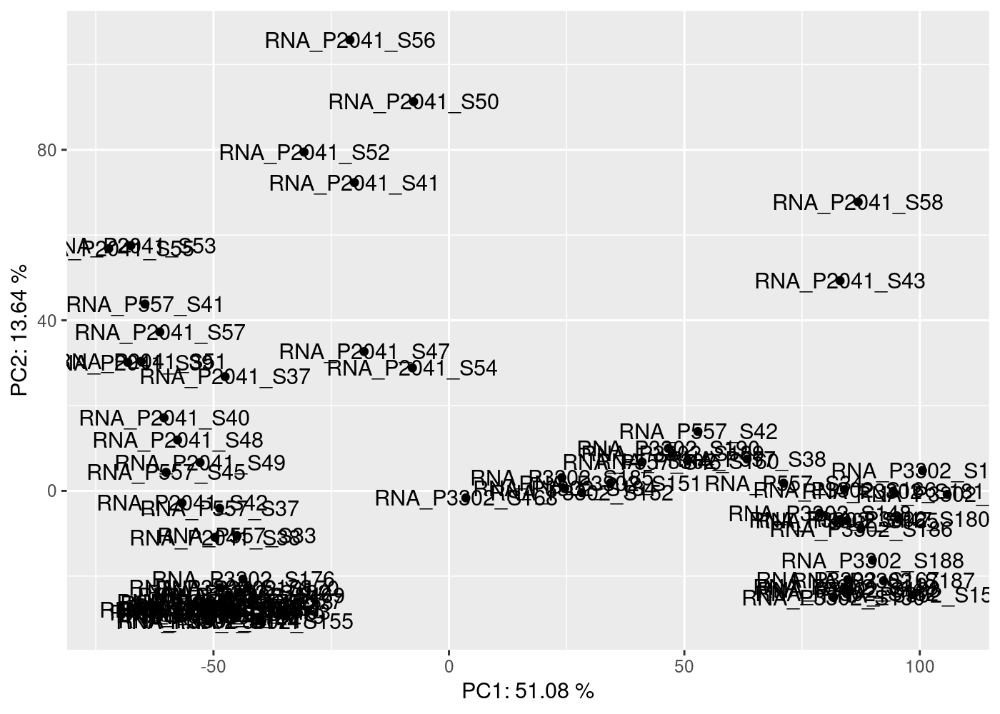
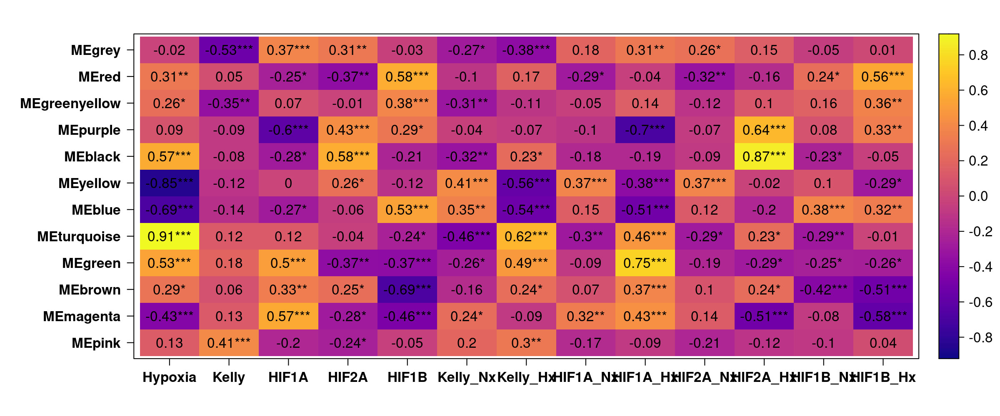
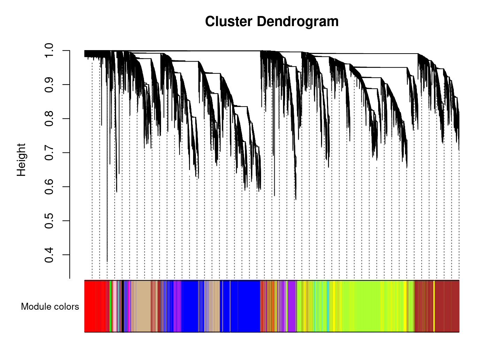
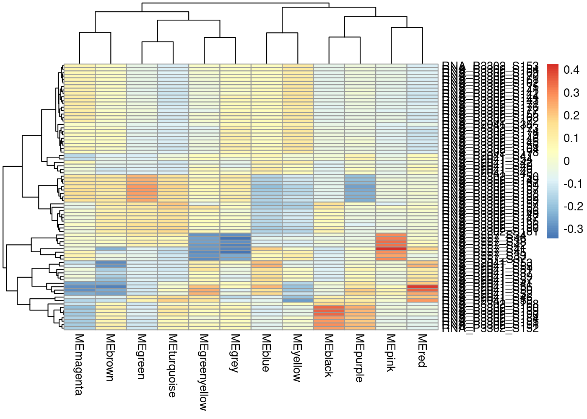

WGCNA
================
Kelterborn
2024-03-07

- [0. Load](#0-load)
  - [- Load R librarys](#--load-r-librarys)
- [1. WGCNA](#1-wgcna)
  - [-load dds](#-load-dds)
    - [-plot sample dist.](#-plot-sample-dist)
  - [(-pickSoftThreshold extern)](#-picksoftthreshold-extern)
  - [-pickSoftThreshold](#-picksoftthreshold)
  - [-network construction](#-network-construction)
  - [-Module Eigengenes](#-module-eigengenes)
  - [-Intramodular analysis: Identifying driver
    genes](#-intramodular-analysis-identifying-driver-genes)
  - [-TS Analysis](#-ts-analysis)
  - [-GO terms enrichment](#-go-terms-enrichment)
  - [-module to sample](#-module-to-sample)
- [Export into dds](#export-into-dds)

# 0. Load

## - Load R librarys

# 1. WGCNA

## -load dds

### -plot sample dist.

    ##             Length Class  Mode   
    ## goodGenes   21583  -none- logical
    ## goodSamples    77  -none- logical
    ## allOK           1  -none- logical

    ## [1] TRUE



## (-pickSoftThreshold extern)

## -pickSoftThreshold

## -network construction

``` r
# convert matrix to numeric
norm.counts[] <- sapply(norm.counts, as.numeric)

soft_power <- 28
temp_cor <- cor
cor <- WGCNA::cor

# memory estimate w.r.t blocksize
# bwnet <- blockwiseModules(norm.counts,
#                  maxBlockSize = 15000,
#                  TOMType = "signed",
#                  power = soft_power,
#                  mergeCutHeight = 0.25,
#                  numericLabels = FALSE,
#                  randomSeed = 1234,
#                  verbose = 3)
# 
# cor <- temp_cor
# 
# save(bwnet,file=paste(data,"bwnet.RDS", sep="/"))

# TS
cor <- WGCNA::cor
bwnet <- blockwiseModules(norm.counts,               

                          # == Adjacency Function ==
                          power = soft_power,                
                          networkType = "signed",

                          # == Tree and Block Options ==
                          deepSplit = 2,
                          pamRespectsDendro = F,
                          # detectCutHeight = 0.75,
                          minModuleSize = 30,
                          maxBlockSize = 40000,

                          # == Module Adjustments ==
                          reassignThreshold = 0,
                          mergeCutHeight = 0.25,

                          # == TOM == Archive the run results in TOM file (saves time)
                          saveTOMs = T,
                          saveTOMFileBase = paste(data,"blockwiseTOM", sep="/"),

                          # == Output Options
                          numericLabels = F,
                          verbose = 3)
```

    ##  Calculating module eigengenes block-wise from all genes
    ##    Flagging genes and samples with too many missing values...
    ##     ..step 1
    ##  ..Working on block 1 .
    ##     TOM calculation: adjacency..
    ##     ..will use 40 parallel threads.
    ##      Fraction of slow calculations: 0.000000
    ##     ..connectivity..
    ##     ..matrix multiplication (system BLAS)..
    ##     ..normalization..
    ##     ..done.
    ##    ..saving TOM for block 1 into file /mnt/s/AG/AG-Scholz-NGS/Daten/Simon/RNA-Seq_Kelly_all/data/blockwiseTOM-block.1.RData
    ##  ....clustering..
    ##  ....detecting modules..
    ##  ....calculating module eigengenes..
    ##  ....checking kME in modules..
    ##      ..removing 2 genes from module 11 because their KME is too low.
    ##      ..removing 1 genes from module 13 because their KME is too low.
    ##      ..removing 1 genes from module 21 because their KME is too low.
    ##      ..removing 1 genes from module 24 because their KME is too low.
    ##      ..removing 1 genes from module 57 because their KME is too low.
    ##  ..merging modules that are too close..
    ##      mergeCloseModules: Merging modules whose distance is less than 0.25
    ##        Calculating new MEs...

``` r
cor <- temp_cor

# save(bwnet,file=paste(data,"bwnet_TS.RDS", sep="/"))
```

## -Module Eigengenes

``` r
# load(file=paste(data,"bwnet_TS.RDS", sep="/"))

module_eigengenes <- bwnet$MEs

# Print out a preview
head(module_eigengenes) %>% kable() %>% kable_styling("striped", full_width = T) %>% scroll_box(height = "400px")
```

<div style="border: 1px solid #ddd; padding: 0px; overflow-y: scroll; height:400px; ">

<table class="table table-striped" style="margin-left: auto; margin-right: auto;">
<thead>
<tr>
<th style="text-align:left;position: sticky; top:0; background-color: #FFFFFF;">
</th>
<th style="text-align:right;position: sticky; top:0; background-color: #FFFFFF;">
MEpink
</th>
<th style="text-align:right;position: sticky; top:0; background-color: #FFFFFF;">
MEmagenta
</th>
<th style="text-align:right;position: sticky; top:0; background-color: #FFFFFF;">
MEbrown
</th>
<th style="text-align:right;position: sticky; top:0; background-color: #FFFFFF;">
MEgreen
</th>
<th style="text-align:right;position: sticky; top:0; background-color: #FFFFFF;">
MEturquoise
</th>
<th style="text-align:right;position: sticky; top:0; background-color: #FFFFFF;">
MEblue
</th>
<th style="text-align:right;position: sticky; top:0; background-color: #FFFFFF;">
MEyellow
</th>
<th style="text-align:right;position: sticky; top:0; background-color: #FFFFFF;">
MEblack
</th>
<th style="text-align:right;position: sticky; top:0; background-color: #FFFFFF;">
MEpurple
</th>
<th style="text-align:right;position: sticky; top:0; background-color: #FFFFFF;">
MEgreenyellow
</th>
<th style="text-align:right;position: sticky; top:0; background-color: #FFFFFF;">
MEred
</th>
<th style="text-align:right;position: sticky; top:0; background-color: #FFFFFF;">
MEgrey
</th>
</tr>
</thead>
<tbody>
<tr>
<td style="text-align:left;">
RNA_P2041_S37
</td>
<td style="text-align:right;">
-0.0328883
</td>
<td style="text-align:right;">
-0.0396248
</td>
<td style="text-align:right;">
-0.1327799
</td>
<td style="text-align:right;">
-0.0726465
</td>
<td style="text-align:right;">
-0.0834636
</td>
<td style="text-align:right;">
0.1227688
</td>
<td style="text-align:right;">
0.0207880
</td>
<td style="text-align:right;">
-0.0781860
</td>
<td style="text-align:right;">
0.0224593
</td>
<td style="text-align:right;">
0.0423281
</td>
<td style="text-align:right;">
0.0996911
</td>
<td style="text-align:right;">
-0.0298275
</td>
</tr>
<tr>
<td style="text-align:left;">
RNA_P2041_S38
</td>
<td style="text-align:right;">
-0.0752045
</td>
<td style="text-align:right;">
0.0183858
</td>
<td style="text-align:right;">
-0.0088393
</td>
<td style="text-align:right;">
-0.0624532
</td>
<td style="text-align:right;">
-0.0836429
</td>
<td style="text-align:right;">
0.0564340
</td>
<td style="text-align:right;">
0.0933872
</td>
<td style="text-align:right;">
-0.0441271
</td>
<td style="text-align:right;">
-0.0375413
</td>
<td style="text-align:right;">
-0.0219348
</td>
<td style="text-align:right;">
-0.0504739
</td>
<td style="text-align:right;">
0.0635005
</td>
</tr>
<tr>
<td style="text-align:left;">
RNA_P2041_S39
</td>
<td style="text-align:right;">
-0.0345297
</td>
<td style="text-align:right;">
-0.0091137
</td>
<td style="text-align:right;">
-0.1726086
</td>
<td style="text-align:right;">
-0.0906529
</td>
<td style="text-align:right;">
-0.1110390
</td>
<td style="text-align:right;">
0.1636687
</td>
<td style="text-align:right;">
0.0348615
</td>
<td style="text-align:right;">
-0.0912607
</td>
<td style="text-align:right;">
0.0502896
</td>
<td style="text-align:right;">
0.0349842
</td>
<td style="text-align:right;">
0.1187063
</td>
<td style="text-align:right;">
-0.0796333
</td>
</tr>
<tr>
<td style="text-align:left;">
RNA_P2041_S40
</td>
<td style="text-align:right;">
-0.0358751
</td>
<td style="text-align:right;">
-0.0150814
</td>
<td style="text-align:right;">
-0.1109656
</td>
<td style="text-align:right;">
-0.0861985
</td>
<td style="text-align:right;">
-0.0983380
</td>
<td style="text-align:right;">
0.1196824
</td>
<td style="text-align:right;">
0.0483649
</td>
<td style="text-align:right;">
-0.0677521
</td>
<td style="text-align:right;">
0.0408303
</td>
<td style="text-align:right;">
0.0628099
</td>
<td style="text-align:right;">
0.0568687
</td>
<td style="text-align:right;">
-0.0078156
</td>
</tr>
<tr>
<td style="text-align:left;">
RNA_P2041_S41
</td>
<td style="text-align:right;">
-0.0288401
</td>
<td style="text-align:right;">
-0.2515509
</td>
<td style="text-align:right;">
-0.2475680
</td>
<td style="text-align:right;">
-0.1076004
</td>
<td style="text-align:right;">
-0.0038636
</td>
<td style="text-align:right;">
0.1203711
</td>
<td style="text-align:right;">
-0.1536464
</td>
<td style="text-align:right;">
-0.0010946
</td>
<td style="text-align:right;">
0.1222843
</td>
<td style="text-align:right;">
0.0626356
</td>
<td style="text-align:right;">
0.1980229
</td>
<td style="text-align:right;">
0.0469612
</td>
</tr>
<tr>
<td style="text-align:left;">
RNA_P2041_S42
</td>
<td style="text-align:right;">
-0.0718283
</td>
<td style="text-align:right;">
0.0619609
</td>
<td style="text-align:right;">
-0.0540170
</td>
<td style="text-align:right;">
-0.0624325
</td>
<td style="text-align:right;">
-0.1097397
</td>
<td style="text-align:right;">
0.0953991
</td>
<td style="text-align:right;">
0.0963036
</td>
<td style="text-align:right;">
-0.0774426
</td>
<td style="text-align:right;">
0.0025485
</td>
<td style="text-align:right;">
-0.0270259
</td>
<td style="text-align:right;">
-0.0052222
</td>
<td style="text-align:right;">
-0.0533148
</td>
</tr>
</tbody>
</table>

</div>

``` r
# get number of genes for each module
table(bwnet$colors)
```

    ## 
    ##       black        blue       brown       green greenyellow        grey 
    ##         421        4421        3346        1436          87        1678 
    ##     magenta        pink      purple         red   turquoise      yellow 
    ##         149         186          96        1435        5535        2793

``` r
# Plot the dendrogram and the module colors before and after merging underneath
plotDendroAndColors(bwnet$dendrograms[[1]], cbind(bwnet$unmergedColors, bwnet$colors),
                    c("unmerged", "merged"),
                    dendroLabels = FALSE,
                    addGuide = TRUE,
                    hang= 0.03,
                    guideHang = 0.05)
```


``` r
# grey module = all genes that doesn't fall into other modules were assigned to the grey module


# 6A. Relate modules to traits --------------------------------------------------
# module trait associations


# create traits file - binarize categorical variables
traits <- colData$treatment_bin <- ifelse(grepl('Hx', colData$treatment), 1, 0)

# binarize categorical variables

# colData$genotype %>% levels()

genotype_bin <- binarizeCategoricalColumns(colData$genotype,
                           includePairwise = FALSE,
                           includeLevelVsAll = TRUE,
                           dropFirstLevelVsAll = FALSE,
                           minCount = 1)
colnames(genotype_bin) <- levels(colData$genotype)

condition_bin <- binarizeCategoricalColumns(colData$condition,
                           includePairwise = FALSE,
                           includeLevelVsAll = TRUE,
                           dropFirstLevelVsAll = FALSE,
                           minCount = 1)
colnames(condition_bin) <- levels(colData$condition)

traits <- cbind(traits, genotype_bin,condition_bin)
rownames(traits) <- rownames(colData)
# dim(traits)
orig.colnames <- colnames(traits)
colnames(traits)[1] <- c("Hypoxia")

# Define numbers of genes and samples
nSamples <- nrow(norm.counts)
nGenes <- ncol(norm.counts)

module.trait.corr <- cor(module_eigengenes, traits, use = 'p')
module.trait.corr.pvals <- corPvalueStudent(module.trait.corr, nSamples)

# visualize module-trait association as a heatmap

heatmap.data <- merge(module_eigengenes, traits, by = 'row.names')

# head(heatmap.data) %>% kable() %>% kable_styling("striped", full_width = T) %>% scroll_box(height = "400px")

heatmap.data <- heatmap.data %>% 
  column_to_rownames(var = 'Row.names')
# dim(heatmap.data)
MEs <- heatmap.data %>% colnames() %>% str_detect(pattern="ME") %>% sum()
max <- heatmap.data %>% ncol()
CorLevelPlot(heatmap.data,
             x = names(heatmap.data)[(MEs+1):max],
             y = names(heatmap.data)[1:MEs],
             col = viridis(100, option='plasma'))
```



``` r
             # col = c("blue1", "skyblue", "white", "pink", "red"))

module.gene.mapping <- as.data.frame(bwnet$colors)

# Genes related to Hypoxia
# module.gene.mapping %>% 
#  dplyr::filter(`bwnet$colors` == 'turquoise') %>% 
#  rownames() %>% head() %>% kable() %>% kable_styling("striped", full_width = T) %>% scroll_box(height = "400px")
modules_cor <- abs(module.trait.corr)

trait.col.Hx <- modules_cor[order(modules_cor[,"Hypoxia"], decreasing = TRUE),"Hypoxia"]
trait.col.HIF1A_Hx <- modules_cor[order(modules_cor[,"HIF1A_Hx"], decreasing = TRUE),"HIF1A_Hx"]
trait.col.HIF2A_Hx <- modules_cor[order(modules_cor[,"HIF2A_Hx"], decreasing = TRUE),"HIF2A_Hx"]
trait.col.HIF1B_Hx <- modules_cor[order(modules_cor[,"HIF1B_Hx"], decreasing = TRUE),"HIF1B_Hx"]
```

## -Intramodular analysis: Identifying driver genes

``` r
module.membership.measure <- cor(module_eigengenes, norm.counts, use = 'p')
module.membership.measure.pvals <- corPvalueStudent(module.membership.measure, nSamples)

module.membership.measure[1:10,1:10] %>% kable() %>% kable_styling("striped", full_width = T) %>% scroll_box(height = "400px")
```

<div style="border: 1px solid #ddd; padding: 0px; overflow-y: scroll; height:400px; ">

<table class="table table-striped" style="margin-left: auto; margin-right: auto;">
<thead>
<tr>
<th style="text-align:left;position: sticky; top:0; background-color: #FFFFFF;">
</th>
<th style="text-align:right;position: sticky; top:0; background-color: #FFFFFF;">
ENSG00000000003
</th>
<th style="text-align:right;position: sticky; top:0; background-color: #FFFFFF;">
ENSG00000000419
</th>
<th style="text-align:right;position: sticky; top:0; background-color: #FFFFFF;">
ENSG00000000457
</th>
<th style="text-align:right;position: sticky; top:0; background-color: #FFFFFF;">
ENSG00000000460
</th>
<th style="text-align:right;position: sticky; top:0; background-color: #FFFFFF;">
ENSG00000001084
</th>
<th style="text-align:right;position: sticky; top:0; background-color: #FFFFFF;">
ENSG00000001167
</th>
<th style="text-align:right;position: sticky; top:0; background-color: #FFFFFF;">
ENSG00000001460
</th>
<th style="text-align:right;position: sticky; top:0; background-color: #FFFFFF;">
ENSG00000001461
</th>
<th style="text-align:right;position: sticky; top:0; background-color: #FFFFFF;">
ENSG00000001497
</th>
<th style="text-align:right;position: sticky; top:0; background-color: #FFFFFF;">
ENSG00000001561
</th>
</tr>
</thead>
<tbody>
<tr>
<td style="text-align:left;">
MEpink
</td>
<td style="text-align:right;">
0.6463060
</td>
<td style="text-align:right;">
-0.1332722
</td>
<td style="text-align:right;">
0.3094593
</td>
<td style="text-align:right;">
0.0314449
</td>
<td style="text-align:right;">
-0.0893388
</td>
<td style="text-align:right;">
-0.3503281
</td>
<td style="text-align:right;">
0.0401382
</td>
<td style="text-align:right;">
0.0842615
</td>
<td style="text-align:right;">
-0.1737147
</td>
<td style="text-align:right;">
0.0048150
</td>
</tr>
<tr>
<td style="text-align:left;">
MEmagenta
</td>
<td style="text-align:right;">
-0.1142769
</td>
<td style="text-align:right;">
0.4955847
</td>
<td style="text-align:right;">
0.1918354
</td>
<td style="text-align:right;">
0.0184271
</td>
<td style="text-align:right;">
-0.1344100
</td>
<td style="text-align:right;">
0.3767340
</td>
<td style="text-align:right;">
0.1041513
</td>
<td style="text-align:right;">
-0.4594917
</td>
<td style="text-align:right;">
-0.1897724
</td>
<td style="text-align:right;">
-0.4069478
</td>
</tr>
<tr>
<td style="text-align:left;">
MEbrown
</td>
<td style="text-align:right;">
-0.4340302
</td>
<td style="text-align:right;">
0.5158758
</td>
<td style="text-align:right;">
0.3502042
</td>
<td style="text-align:right;">
-0.4788991
</td>
<td style="text-align:right;">
0.2053756
</td>
<td style="text-align:right;">
0.2445056
</td>
<td style="text-align:right;">
-0.3595648
</td>
<td style="text-align:right;">
0.2023212
</td>
<td style="text-align:right;">
-0.6226925
</td>
<td style="text-align:right;">
-0.1161450
</td>
</tr>
<tr>
<td style="text-align:left;">
MEgreen
</td>
<td style="text-align:right;">
0.0916127
</td>
<td style="text-align:right;">
-0.1268295
</td>
<td style="text-align:right;">
0.7841140
</td>
<td style="text-align:right;">
-0.8065548
</td>
<td style="text-align:right;">
-0.5546950
</td>
<td style="text-align:right;">
-0.3885325
</td>
<td style="text-align:right;">
0.3110674
</td>
<td style="text-align:right;">
0.5251130
</td>
<td style="text-align:right;">
-0.8560664
</td>
<td style="text-align:right;">
-0.4910152
</td>
</tr>
<tr>
<td style="text-align:left;">
MEturquoise
</td>
<td style="text-align:right;">
0.0647519
</td>
<td style="text-align:right;">
-0.3199497
</td>
<td style="text-align:right;">
0.6966599
</td>
<td style="text-align:right;">
-0.9200578
</td>
<td style="text-align:right;">
-0.3007794
</td>
<td style="text-align:right;">
-0.5952819
</td>
<td style="text-align:right;">
0.0619058
</td>
<td style="text-align:right;">
0.9210872
</td>
<td style="text-align:right;">
-0.8629934
</td>
<td style="text-align:right;">
-0.2170679
</td>
</tr>
<tr>
<td style="text-align:left;">
MEblue
</td>
<td style="text-align:right;">
0.1669642
</td>
<td style="text-align:right;">
-0.1028161
</td>
<td style="text-align:right;">
-0.6676484
</td>
<td style="text-align:right;">
0.8397232
</td>
<td style="text-align:right;">
0.0978995
</td>
<td style="text-align:right;">
0.2342184
</td>
<td style="text-align:right;">
0.1236442
</td>
<td style="text-align:right;">
-0.6520828
</td>
<td style="text-align:right;">
0.9081967
</td>
<td style="text-align:right;">
0.2342768
</td>
</tr>
<tr>
<td style="text-align:left;">
MEyellow
</td>
<td style="text-align:right;">
-0.3470330
</td>
<td style="text-align:right;">
0.6762687
</td>
<td style="text-align:right;">
-0.6354397
</td>
<td style="text-align:right;">
0.7879961
</td>
<td style="text-align:right;">
0.5493069
</td>
<td style="text-align:right;">
0.8137708
</td>
<td style="text-align:right;">
-0.3426028
</td>
<td style="text-align:right;">
-0.9032402
</td>
<td style="text-align:right;">
0.6439740
</td>
<td style="text-align:right;">
0.2367104
</td>
</tr>
<tr>
<td style="text-align:left;">
MEblack
</td>
<td style="text-align:right;">
-0.2535071
</td>
<td style="text-align:right;">
-0.0345141
</td>
<td style="text-align:right;">
-0.0003656
</td>
<td style="text-align:right;">
-0.3447573
</td>
<td style="text-align:right;">
0.4571591
</td>
<td style="text-align:right;">
-0.1638344
</td>
<td style="text-align:right;">
-0.4754893
</td>
<td style="text-align:right;">
0.5848253
</td>
<td style="text-align:right;">
-0.2827651
</td>
<td style="text-align:right;">
0.2657318
</td>
</tr>
<tr>
<td style="text-align:left;">
MEpurple
</td>
<td style="text-align:right;">
0.0522598
</td>
<td style="text-align:right;">
-0.1253748
</td>
<td style="text-align:right;">
-0.4757191
</td>
<td style="text-align:right;">
0.3240925
</td>
<td style="text-align:right;">
0.5622920
</td>
<td style="text-align:right;">
-0.0530090
</td>
<td style="text-align:right;">
-0.4155546
</td>
<td style="text-align:right;">
0.1213046
</td>
<td style="text-align:right;">
0.4255267
</td>
<td style="text-align:right;">
0.4130003
</td>
</tr>
<tr>
<td style="text-align:left;">
MEgreenyellow
</td>
<td style="text-align:right;">
-0.1420199
</td>
<td style="text-align:right;">
-0.4287521
</td>
<td style="text-align:right;">
-0.0774897
</td>
<td style="text-align:right;">
-0.2224052
</td>
<td style="text-align:right;">
-0.2580351
</td>
<td style="text-align:right;">
-0.2278133
</td>
<td style="text-align:right;">
0.2331414
</td>
<td style="text-align:right;">
0.3659540
</td>
<td style="text-align:right;">
0.1098335
</td>
<td style="text-align:right;">
-0.1387429
</td>
</tr>
</tbody>
</table>

</div>

``` r
module.membership.measure.pvals[1:10,1:10] %>% kable() %>% kable_styling("striped", full_width = T) %>% scroll_box(height = "400px")
```

<div style="border: 1px solid #ddd; padding: 0px; overflow-y: scroll; height:400px; ">

<table class="table table-striped" style="margin-left: auto; margin-right: auto;">
<thead>
<tr>
<th style="text-align:left;position: sticky; top:0; background-color: #FFFFFF;">
</th>
<th style="text-align:right;position: sticky; top:0; background-color: #FFFFFF;">
ENSG00000000003
</th>
<th style="text-align:right;position: sticky; top:0; background-color: #FFFFFF;">
ENSG00000000419
</th>
<th style="text-align:right;position: sticky; top:0; background-color: #FFFFFF;">
ENSG00000000457
</th>
<th style="text-align:right;position: sticky; top:0; background-color: #FFFFFF;">
ENSG00000000460
</th>
<th style="text-align:right;position: sticky; top:0; background-color: #FFFFFF;">
ENSG00000001084
</th>
<th style="text-align:right;position: sticky; top:0; background-color: #FFFFFF;">
ENSG00000001167
</th>
<th style="text-align:right;position: sticky; top:0; background-color: #FFFFFF;">
ENSG00000001460
</th>
<th style="text-align:right;position: sticky; top:0; background-color: #FFFFFF;">
ENSG00000001461
</th>
<th style="text-align:right;position: sticky; top:0; background-color: #FFFFFF;">
ENSG00000001497
</th>
<th style="text-align:right;position: sticky; top:0; background-color: #FFFFFF;">
ENSG00000001561
</th>
</tr>
</thead>
<tbody>
<tr>
<td style="text-align:left;">
MEpink
</td>
<td style="text-align:right;">
0.0000000
</td>
<td style="text-align:right;">
0.2478883
</td>
<td style="text-align:right;">
0.0061692
</td>
<td style="text-align:right;">
0.7860204
</td>
<td style="text-align:right;">
0.4397180
</td>
<td style="text-align:right;">
0.0017874
</td>
<td style="text-align:right;">
0.7288991
</td>
<td style="text-align:right;">
0.4662493
</td>
<td style="text-align:right;">
0.1308086
</td>
<td style="text-align:right;">
0.9668488
</td>
</tr>
<tr>
<td style="text-align:left;">
MEmagenta
</td>
<td style="text-align:right;">
0.3223595
</td>
<td style="text-align:right;">
0.0000046
</td>
<td style="text-align:right;">
0.0946470
</td>
<td style="text-align:right;">
0.8736167
</td>
<td style="text-align:right;">
0.2438375
</td>
<td style="text-align:right;">
0.0007326
</td>
<td style="text-align:right;">
0.3673594
</td>
<td style="text-align:right;">
0.0000263
</td>
<td style="text-align:right;">
0.0983171
</td>
<td style="text-align:right;">
0.0002399
</td>
</tr>
<tr>
<td style="text-align:left;">
MEbrown
</td>
<td style="text-align:right;">
0.0000803
</td>
<td style="text-align:right;">
0.0000016
</td>
<td style="text-align:right;">
0.0017946
</td>
<td style="text-align:right;">
0.0000105
</td>
<td style="text-align:right;">
0.0731587
</td>
<td style="text-align:right;">
0.0321069
</td>
<td style="text-align:right;">
0.0013195
</td>
<td style="text-align:right;">
0.0776274
</td>
<td style="text-align:right;">
0.0000000
</td>
<td style="text-align:right;">
0.3144598
</td>
</tr>
<tr>
<td style="text-align:left;">
MEgreen
</td>
<td style="text-align:right;">
0.4281170
</td>
<td style="text-align:right;">
0.2716955
</td>
<td style="text-align:right;">
0.0000000
</td>
<td style="text-align:right;">
0.0000000
</td>
<td style="text-align:right;">
0.0000002
</td>
<td style="text-align:right;">
0.0004797
</td>
<td style="text-align:right;">
0.0058938
</td>
<td style="text-align:right;">
0.0000009
</td>
<td style="text-align:right;">
0.0000000
</td>
<td style="text-align:right;">
0.0000058
</td>
</tr>
<tr>
<td style="text-align:left;">
MEturquoise
</td>
<td style="text-align:right;">
0.5758278
</td>
<td style="text-align:right;">
0.0045597
</td>
<td style="text-align:right;">
0.0000000
</td>
<td style="text-align:right;">
0.0000000
</td>
<td style="text-align:right;">
0.0078603
</td>
<td style="text-align:right;">
0.0000000
</td>
<td style="text-align:right;">
0.5927539
</td>
<td style="text-align:right;">
0.0000000
</td>
<td style="text-align:right;">
0.0000000
</td>
<td style="text-align:right;">
0.0579223
</td>
</tr>
<tr>
<td style="text-align:left;">
MEblue
</td>
<td style="text-align:right;">
0.1466823
</td>
<td style="text-align:right;">
0.3735670
</td>
<td style="text-align:right;">
0.0000000
</td>
<td style="text-align:right;">
0.0000000
</td>
<td style="text-align:right;">
0.3969668
</td>
<td style="text-align:right;">
0.0403396
</td>
<td style="text-align:right;">
0.2840144
</td>
<td style="text-align:right;">
0.0000000
</td>
<td style="text-align:right;">
0.0000000
</td>
<td style="text-align:right;">
0.0402883
</td>
</tr>
<tr>
<td style="text-align:left;">
MEyellow
</td>
<td style="text-align:right;">
0.0019875
</td>
<td style="text-align:right;">
0.0000000
</td>
<td style="text-align:right;">
0.0000000
</td>
<td style="text-align:right;">
0.0000000
</td>
<td style="text-align:right;">
0.0000002
</td>
<td style="text-align:right;">
0.0000000
</td>
<td style="text-align:right;">
0.0022882
</td>
<td style="text-align:right;">
0.0000000
</td>
<td style="text-align:right;">
0.0000000
</td>
<td style="text-align:right;">
0.0381996
</td>
</tr>
<tr>
<td style="text-align:left;">
MEblack
</td>
<td style="text-align:right;">
0.0261077
</td>
<td style="text-align:right;">
0.7657067
</td>
<td style="text-align:right;">
0.9974819
</td>
<td style="text-align:right;">
0.0021372
</td>
<td style="text-align:right;">
0.0000292
</td>
<td style="text-align:right;">
0.1545139
</td>
<td style="text-align:right;">
0.0000124
</td>
<td style="text-align:right;">
0.0000000
</td>
<td style="text-align:right;">
0.0127117
</td>
<td style="text-align:right;">
0.0195011
</td>
</tr>
<tr>
<td style="text-align:left;">
MEpurple
</td>
<td style="text-align:right;">
0.6517115
</td>
<td style="text-align:right;">
0.2772761
</td>
<td style="text-align:right;">
0.0000123
</td>
<td style="text-align:right;">
0.0040348
</td>
<td style="text-align:right;">
0.0000001
</td>
<td style="text-align:right;">
0.6470486
</td>
<td style="text-align:right;">
0.0001711
</td>
<td style="text-align:right;">
0.2932954
</td>
<td style="text-align:right;">
0.0001143
</td>
<td style="text-align:right;">
0.0001893
</td>
</tr>
<tr>
<td style="text-align:left;">
MEgreenyellow
</td>
<td style="text-align:right;">
0.2179146
</td>
<td style="text-align:right;">
0.0001001
</td>
<td style="text-align:right;">
0.5029499
</td>
<td style="text-align:right;">
0.0518834
</td>
<td style="text-align:right;">
0.0234679
</td>
<td style="text-align:right;">
0.0463007
</td>
<td style="text-align:right;">
0.0412948
</td>
<td style="text-align:right;">
0.0010640
</td>
<td style="text-align:right;">
0.3416543
</td>
<td style="text-align:right;">
0.2288290
</td>
</tr>
</tbody>
</table>

</div>

``` r
# Genes correlating with Hypoxia
gene.hypoxia.corr <- cor(norm.counts, traits$Hypoxia, use = 'p')
gene.hypoxia.corr.pvals <- corPvalueStudent(gene.hypoxia.corr, nSamples)
gene.hypoxia.corr %>% head() %>% kable() %>% kable_styling("striped", full_width = T) %>% scroll_box(height = "400px")
```

<div style="border: 1px solid #ddd; padding: 0px; overflow-y: scroll; height:400px; ">

<table class="table table-striped" style="margin-left: auto; margin-right: auto;">
<thead>
<tr>
<th style="text-align:left;position: sticky; top:0; background-color: #FFFFFF;">
</th>
<th style="text-align:right;position: sticky; top:0; background-color: #FFFFFF;">
</th>
</tr>
</thead>
<tbody>
<tr>
<td style="text-align:left;">
ENSG00000000003
</td>
<td style="text-align:right;">
0.0842334
</td>
</tr>
<tr>
<td style="text-align:left;">
ENSG00000000419
</td>
<td style="text-align:right;">
-0.3813508
</td>
</tr>
<tr>
<td style="text-align:left;">
ENSG00000000457
</td>
<td style="text-align:right;">
0.5465412
</td>
</tr>
<tr>
<td style="text-align:left;">
ENSG00000000460
</td>
<td style="text-align:right;">
-0.7755417
</td>
</tr>
<tr>
<td style="text-align:left;">
ENSG00000001084
</td>
<td style="text-align:right;">
-0.2407778
</td>
</tr>
<tr>
<td style="text-align:left;">
ENSG00000001167
</td>
<td style="text-align:right;">
-0.5620464
</td>
</tr>
</tbody>
</table>

</div>

``` r
# TOP 10 (pval) genes correlating with Hypoxia
gene.hypoxia.corr.pvals %>%
  log(base = 10) %>% abs() %>%
  as.data.frame() %>%
  rownames_to_column("gene_id") %>%
  arrange(desc(V1)) %>%
  head(10) %>% kable() %>% kable_styling("striped", full_width = T) %>% scroll_box(height = "400px")
```

<div style="border: 1px solid #ddd; padding: 0px; overflow-y: scroll; height:400px; ">

<table class="table table-striped" style="margin-left: auto; margin-right: auto;">
<thead>
<tr>
<th style="text-align:left;position: sticky; top:0; background-color: #FFFFFF;">
gene_id
</th>
<th style="text-align:right;position: sticky; top:0; background-color: #FFFFFF;">
V1
</th>
</tr>
</thead>
<tbody>
<tr>
<td style="text-align:left;">
ENSG00000185633
</td>
<td style="text-align:right;">
58.76449
</td>
</tr>
<tr>
<td style="text-align:left;">
ENSG00000135100
</td>
<td style="text-align:right;">
55.58798
</td>
</tr>
<tr>
<td style="text-align:left;">
ENSG00000114268
</td>
<td style="text-align:right;">
54.83779
</td>
</tr>
<tr>
<td style="text-align:left;">
ENSG00000186918
</td>
<td style="text-align:right;">
54.10627
</td>
</tr>
<tr>
<td style="text-align:left;">
ENSG00000105143
</td>
<td style="text-align:right;">
50.68545
</td>
</tr>
<tr>
<td style="text-align:left;">
ENSG00000148926
</td>
<td style="text-align:right;">
50.56628
</td>
</tr>
<tr>
<td style="text-align:left;">
ENSG00000134107
</td>
<td style="text-align:right;">
50.22341
</td>
</tr>
<tr>
<td style="text-align:left;">
ENSG00000196968
</td>
<td style="text-align:right;">
48.87390
</td>
</tr>
<tr>
<td style="text-align:left;">
ENSG00000182379
</td>
<td style="text-align:right;">
48.59697
</td>
</tr>
<tr>
<td style="text-align:left;">
ENSG00000112715
</td>
<td style="text-align:right;">
48.18615
</td>
</tr>
</tbody>
</table>

</div>

## -TS Analysis

``` r
moduleLabelsAutomatic20 <- bwnet$colors   
moduleColorsAutomatic20 <- labels2colors(moduleLabelsAutomatic20)

# Dies ist die korrekte Funktion!!!
plotDendroAndColors(bwnet$dendrograms[[1]], moduleColorsAutomatic20,
"Module colors",
dendroLabels = FALSE, hang = 0.03,
addGuide = TRUE, guideHang = 0.05,
main = "Cluster Dendrogram")

module_df <- data.frame(
  gene_id = names(bwnet$colors),
  colors = labels2colors(bwnet$colors)
)

length(moduleLabelsAutomatic20)
```

    ## [1] 21583

``` r
ncol(norm.counts)
```

    ## [1] 21583

``` r
MEs0 <- moduleEigengenes(norm.counts, moduleLabelsAutomatic20)$eigengenes

# Reorder modules so similar modules are next to each other
MEs0 <- orderMEs(MEs0)
module_order = names(MEs0) %>% gsub("ME","", .)

par(mar=c(2,2,2,2)+.1)
plotEigengeneNetworks(MEs0, "", marDendro = c(0, 4, 0, 4.5), marHeatmap = c(3, 
    4, 1, 2), cex.lab = 0.8, xLabelsAngle = 90)

# Add treatment names
MEs0$treatment <- colData$condition
# tidy & plot data
mME = MEs0 %>%
  pivot_longer(-treatment) %>%
  mutate(
    name = gsub("ME", "", name),
    name = factor(name, levels = module_order)
  )

mME %>% ggplot(., aes(x=treatment, y=name, fill=value)) +
  geom_tile() +
  theme_bw() +
  scale_fill_gradient2(
    low = "blue",
    high = "red",
    mid = "white",
    midpoint = 0,
    limit = c(-1,1)) +
  theme(axis.text.x = element_text(angle=90)) +
  labs(title = "Module-trait Relationships", y = "Modules", fill="corr")
```



## -GO terms enrichment

``` r
# Choose colors and combine similar colors
ncols <- colnames(MEs0) %>% length()
plotEigengeneNetworks(MEs0[-ncols], "", marDendro = c(0, 4, 0, 4.5), marHeatmap = c(3, 
    4, 1, 2), cex.lab = 0.8, xLabelsAngle = 90)
```


``` r
table(bwnet$colors)
```

    ## 
    ##       black        blue       brown       green greenyellow        grey 
    ##         421        4421        3346        1436          87        1678 
    ##     magenta        pink      purple         red   turquoise      yellow 
    ##         149         186          96        1435        5535        2793

``` r
trait.col.Hx # MEturquoise & MEyellow
```

    ##   MEturquoise      MEyellow        MEblue       MEblack       MEgreen 
    ##    0.91140833    0.84761297    0.68861465    0.56986371    0.52968761 
    ##     MEmagenta         MEred       MEbrown MEgreenyellow        MEpink 
    ##    0.42836873    0.30824464    0.28757271    0.25645992    0.13499509 
    ##      MEpurple        MEgrey 
    ##    0.08804986    0.01638976

``` r
trait.col.HIF1A_Hx #  MEgreen      MEpurple
```

    ##       MEgreen      MEpurple        MEblue   MEturquoise     MEmagenta 
    ##    0.75303748    0.69755901    0.51331935    0.46305654    0.43086445 
    ##      MEyellow       MEbrown        MEgrey       MEblack MEgreenyellow 
    ##    0.37790842    0.37083319    0.30614956    0.18967691    0.14107664 
    ##        MEpink         MEred 
    ##    0.09120759    0.04211199

``` r
trait.col.HIF2A_Hx # MEblack      MEpurple
```

    ##       MEblack      MEpurple     MEmagenta       MEgreen       MEbrown 
    ##    0.86754399    0.63815238    0.51499287    0.29129764    0.23588650 
    ##   MEturquoise        MEblue         MEred        MEgrey        MEpink 
    ##    0.22999857    0.19579426    0.16324544    0.14763086    0.11548290 
    ## MEgreenyellow      MEyellow 
    ##    0.10422151    0.02270126

``` r
trait.col.HIF1B_Hx # MEmagenta         MEred
```

    ##     MEmagenta         MEred       MEbrown MEgreenyellow      MEpurple 
    ##   0.576324851   0.557700606   0.514536449   0.363202752   0.330698401 
    ##        MEblue      MEyellow       MEgreen       MEblack        MEpink 
    ##   0.320955037   0.289484199   0.256379890   0.046493500   0.040135042 
    ##        MEgrey   MEturquoise 
    ##   0.011568261   0.007036389

``` r
expr_universe <- rownames(dds)

# Get GO terms of top colors
# Hypoxia
modcols <- names(trait.col.Hx[c(1)]) %>% str_remove(pattern="ME")
module_go <- module_df[module_df$colors %in% modcols,]
module_go_ens <- module_go$gene_id
length(module_go_ens)
```

    ## [1] 421

``` r
go_enrich_test <- enrichGO(gene = module_go_ens,
                      universe = expr_universe,
                      OrgDb = "org.Hs.eg.db", 
                      keyType = 'ENSEMBL',
                      readable = T,
                      ont = "BP",
                      pvalueCutoff = 0.1, 
                      qvalueCutoff = 0.5)
go1 <- dotplot(clusterProfiler::simplify(go_enrich_test))+labs(title = paste("Hx:",paste(modcols, collapse=" & ")))


# Hif1A
modcols <- names(trait.col.HIF1A_Hx[c(3)]) %>% str_remove(pattern="ME")
module_go <- module_df[module_df$colors %in% modcols,]
module_go_ens <- module_go$gene_id
length(module_go_ens)
```

    ## [1] 4421

``` r
go_enrich_test <- enrichGO(gene = module_go_ens,
                      universe = expr_universe,
                      OrgDb = "org.Hs.eg.db", 
                      keyType = 'ENSEMBL',
                      readable = T,
                      ont = "BP",
                      pvalueCutoff = 0.1, 
                      qvalueCutoff = 0.5)
go2 <- dotplot(clusterProfiler::simplify(go_enrich_test))+labs(title = paste("Hif1A:",paste(modcols, collapse=" & ")))

# HIF2A 
modcols <- names(trait.col.HIF2A_Hx[c(1,2)]) %>% str_remove(pattern="ME")
module_go <- module_df[module_df$colors %in% modcols,]
module_go_ens <- module_go$gene_id
length(module_go_ens)
```

    ## [1] 1584

``` r
go_enrich_test <- enrichGO(gene = module_go_ens,
                      universe = expr_universe,
                      OrgDb = "org.Hs.eg.db", 
                      keyType = 'ENSEMBL',
                      readable = T,
                      ont = "BP",
                      pvalueCutoff = 0.1, 
                      qvalueCutoff = 0.5)
go3 <- dotplot(clusterProfiler::simplify(go_enrich_test))+labs(title = paste("Hif2A:",paste(modcols, collapse=" & ")))

# Hif1B
modcols <- names(trait.col.HIF1B_Hx[c(3)]) %>% str_remove(pattern="ME")
module_go <- module_df[module_df$colors %in% modcols,]
module_go_ens <- module_go$gene_id
length(module_go_ens)
```

    ## [1] 3346

``` r
go_enrich_test <- enrichGO(gene = module_go_ens,
                      universe = expr_universe,
                      OrgDb = "org.Hs.eg.db", 
                      keyType = 'ENSEMBL',
                      readable = T,
                      ont = "BP",
                      pvalueCutoff = 0.1, 
                      qvalueCutoff = 0.5)

go4 <- dotplot(clusterProfiler::simplify(go_enrich_test))+labs(title = paste("Hif1B:",paste(modcols, collapse=" & ")))

(go1 + go2) / (go3 + go4) + plot_layout(guides = "collect", axis_titles="collect", axes = 'collect') 
```


## -module to sample

``` r
# module Sample correlation

MEs0 %>%
  pivot_longer(-treatment) %>%
  mutate(
    name = gsub("ME", "", name),
    name = factor(name, levels = module_order)
  )
```

    ## # A tibble: 924 × 3
    ##    treatment name          value
    ##    <fct>     <chr>         <dbl>
    ##  1 Kelly_Nx  pink        -0.0329
    ##  2 Kelly_Nx  magenta     -0.0396
    ##  3 Kelly_Nx  brown       -0.133 
    ##  4 Kelly_Nx  green       -0.0726
    ##  5 Kelly_Nx  turquoise   -0.0835
    ##  6 Kelly_Nx  blue         0.123 
    ##  7 Kelly_Nx  yellow       0.0208
    ##  8 Kelly_Nx  black       -0.0782
    ##  9 Kelly_Nx  purple       0.0225
    ## 10 Kelly_Nx  greenyellow  0.0423
    ## # ℹ 914 more rows

``` r
mydata <- mtcars[, c(1,3,4,5,6,7)]
head(mydata)
```

    ##                    mpg disp  hp drat    wt  qsec
    ## Mazda RX4         21.0  160 110 3.90 2.620 16.46
    ## Mazda RX4 Wag     21.0  160 110 3.90 2.875 17.02
    ## Datsun 710        22.8  108  93 3.85 2.320 18.61
    ## Hornet 4 Drive    21.4  258 110 3.08 3.215 19.44
    ## Hornet Sportabout 18.7  360 175 3.15 3.440 17.02
    ## Valiant           18.1  225 105 2.76 3.460 20.22

``` r
cormat <- round(cor(mydata),2)
head(cormat)
```

    ##        mpg  disp    hp  drat    wt  qsec
    ## mpg   1.00 -0.85 -0.78  0.68 -0.87  0.42
    ## disp -0.85  1.00  0.79 -0.71  0.89 -0.43
    ## hp   -0.78  0.79  1.00 -0.45  0.66 -0.71
    ## drat  0.68 -0.71 -0.45  1.00 -0.71  0.09
    ## wt   -0.87  0.89  0.66 -0.71  1.00 -0.17
    ## qsec  0.42 -0.43 -0.71  0.09 -0.17  1.00

``` r
class(cormat)
```

    ## [1] "matrix" "array"

``` r
melted_cormat <- reshape2::melt(cormat)
head(melted_cormat)
```

    ##   Var1 Var2 value
    ## 1  mpg  mpg  1.00
    ## 2 disp  mpg -0.85
    ## 3   hp  mpg -0.78
    ## 4 drat  mpg  0.68
    ## 5   wt  mpg -0.87
    ## 6 qsec  mpg  0.42

``` r
bwnet$MEs %>% class()
```

    ## [1] "data.frame"

``` r
bwnet$MEs %>% data.matrix() %>% head() %>% kable() %>% kable_styling("striped", full_width = T) %>% scroll_box(height = "400px")
```

<div style="border: 1px solid #ddd; padding: 0px; overflow-y: scroll; height:400px; ">

<table class="table table-striped" style="margin-left: auto; margin-right: auto;">
<thead>
<tr>
<th style="text-align:left;position: sticky; top:0; background-color: #FFFFFF;">
</th>
<th style="text-align:right;position: sticky; top:0; background-color: #FFFFFF;">
MEpink
</th>
<th style="text-align:right;position: sticky; top:0; background-color: #FFFFFF;">
MEmagenta
</th>
<th style="text-align:right;position: sticky; top:0; background-color: #FFFFFF;">
MEbrown
</th>
<th style="text-align:right;position: sticky; top:0; background-color: #FFFFFF;">
MEgreen
</th>
<th style="text-align:right;position: sticky; top:0; background-color: #FFFFFF;">
MEturquoise
</th>
<th style="text-align:right;position: sticky; top:0; background-color: #FFFFFF;">
MEblue
</th>
<th style="text-align:right;position: sticky; top:0; background-color: #FFFFFF;">
MEyellow
</th>
<th style="text-align:right;position: sticky; top:0; background-color: #FFFFFF;">
MEblack
</th>
<th style="text-align:right;position: sticky; top:0; background-color: #FFFFFF;">
MEpurple
</th>
<th style="text-align:right;position: sticky; top:0; background-color: #FFFFFF;">
MEgreenyellow
</th>
<th style="text-align:right;position: sticky; top:0; background-color: #FFFFFF;">
MEred
</th>
<th style="text-align:right;position: sticky; top:0; background-color: #FFFFFF;">
MEgrey
</th>
</tr>
</thead>
<tbody>
<tr>
<td style="text-align:left;">
RNA_P2041_S37
</td>
<td style="text-align:right;">
-0.0328883
</td>
<td style="text-align:right;">
-0.0396248
</td>
<td style="text-align:right;">
-0.1327799
</td>
<td style="text-align:right;">
-0.0726465
</td>
<td style="text-align:right;">
-0.0834636
</td>
<td style="text-align:right;">
0.1227688
</td>
<td style="text-align:right;">
0.0207880
</td>
<td style="text-align:right;">
-0.0781860
</td>
<td style="text-align:right;">
0.0224593
</td>
<td style="text-align:right;">
0.0423281
</td>
<td style="text-align:right;">
0.0996911
</td>
<td style="text-align:right;">
-0.0298275
</td>
</tr>
<tr>
<td style="text-align:left;">
RNA_P2041_S38
</td>
<td style="text-align:right;">
-0.0752045
</td>
<td style="text-align:right;">
0.0183858
</td>
<td style="text-align:right;">
-0.0088393
</td>
<td style="text-align:right;">
-0.0624532
</td>
<td style="text-align:right;">
-0.0836429
</td>
<td style="text-align:right;">
0.0564340
</td>
<td style="text-align:right;">
0.0933872
</td>
<td style="text-align:right;">
-0.0441271
</td>
<td style="text-align:right;">
-0.0375413
</td>
<td style="text-align:right;">
-0.0219348
</td>
<td style="text-align:right;">
-0.0504739
</td>
<td style="text-align:right;">
0.0635005
</td>
</tr>
<tr>
<td style="text-align:left;">
RNA_P2041_S39
</td>
<td style="text-align:right;">
-0.0345297
</td>
<td style="text-align:right;">
-0.0091137
</td>
<td style="text-align:right;">
-0.1726086
</td>
<td style="text-align:right;">
-0.0906529
</td>
<td style="text-align:right;">
-0.1110390
</td>
<td style="text-align:right;">
0.1636687
</td>
<td style="text-align:right;">
0.0348615
</td>
<td style="text-align:right;">
-0.0912607
</td>
<td style="text-align:right;">
0.0502896
</td>
<td style="text-align:right;">
0.0349842
</td>
<td style="text-align:right;">
0.1187063
</td>
<td style="text-align:right;">
-0.0796333
</td>
</tr>
<tr>
<td style="text-align:left;">
RNA_P2041_S40
</td>
<td style="text-align:right;">
-0.0358751
</td>
<td style="text-align:right;">
-0.0150814
</td>
<td style="text-align:right;">
-0.1109656
</td>
<td style="text-align:right;">
-0.0861985
</td>
<td style="text-align:right;">
-0.0983380
</td>
<td style="text-align:right;">
0.1196824
</td>
<td style="text-align:right;">
0.0483649
</td>
<td style="text-align:right;">
-0.0677521
</td>
<td style="text-align:right;">
0.0408303
</td>
<td style="text-align:right;">
0.0628099
</td>
<td style="text-align:right;">
0.0568687
</td>
<td style="text-align:right;">
-0.0078156
</td>
</tr>
<tr>
<td style="text-align:left;">
RNA_P2041_S41
</td>
<td style="text-align:right;">
-0.0288401
</td>
<td style="text-align:right;">
-0.2515509
</td>
<td style="text-align:right;">
-0.2475680
</td>
<td style="text-align:right;">
-0.1076004
</td>
<td style="text-align:right;">
-0.0038636
</td>
<td style="text-align:right;">
0.1203711
</td>
<td style="text-align:right;">
-0.1536464
</td>
<td style="text-align:right;">
-0.0010946
</td>
<td style="text-align:right;">
0.1222843
</td>
<td style="text-align:right;">
0.0626356
</td>
<td style="text-align:right;">
0.1980229
</td>
<td style="text-align:right;">
0.0469612
</td>
</tr>
<tr>
<td style="text-align:left;">
RNA_P2041_S42
</td>
<td style="text-align:right;">
-0.0718283
</td>
<td style="text-align:right;">
0.0619609
</td>
<td style="text-align:right;">
-0.0540170
</td>
<td style="text-align:right;">
-0.0624325
</td>
<td style="text-align:right;">
-0.1097397
</td>
<td style="text-align:right;">
0.0953991
</td>
<td style="text-align:right;">
0.0963036
</td>
<td style="text-align:right;">
-0.0774426
</td>
<td style="text-align:right;">
0.0025485
</td>
<td style="text-align:right;">
-0.0270259
</td>
<td style="text-align:right;">
-0.0052222
</td>
<td style="text-align:right;">
-0.0533148
</td>
</tr>
</tbody>
</table>

</div>

``` r
ME.heatmap <- bwnet$MEs %>% data.matrix() %>% reshape2::melt()

ME.heatmap %>% ggplot(., aes(x=Var2, y=Var1, fill=value)) +
  geom_tile() +
  theme_bw() +
  scale_fill_gradient2(
    low = "blue",
    high = "red",
    mid = "white",
    midpoint = 0,
    limit = c(-1,1)) +
  theme(axis.text.x = element_text(angle=90)) +
  labs(title = "Module-trait Relationships", y = "Modules", fill="corr")
```

<!-- -->

``` r
pheatmap(bwnet$MEs %>% data.matrix())
```

<!-- -->

# Export into dds

``` r
# load(file=paste(data,"deseq2.dds", sep="/"))
# load(file=paste(data,"bwnet_TS.RDS", sep="/"))

# color per gene
mcols(dds)$colors <- bwnet$colors[match(mcols(dds)$gene_id, names(bwnet$colors))] %>% 
  factor() %>%
  relevel(ref="grey")

# color per sample
module.cols <- bind_cols(as.data.frame(colData(dds)),
                     as.data.frame(bwnet$MEs))
module.cols <- module.cols[,str_detect(colnames(module.cols),pattern="ME")]
colnames(module.cols) <- module.cols %>% colnames() %>% str_remove(pattern="ME")
i <- "greenyellow"
for (i in colnames(module.cols)){
colData(dds)$tmp <- module.cols[,i]
names(colData(dds))[names(colData(dds)) == 'tmp'] <- i
}

# save(dds, file=paste(data,"deseq2_wgcna.dds", sep="/"))
```
