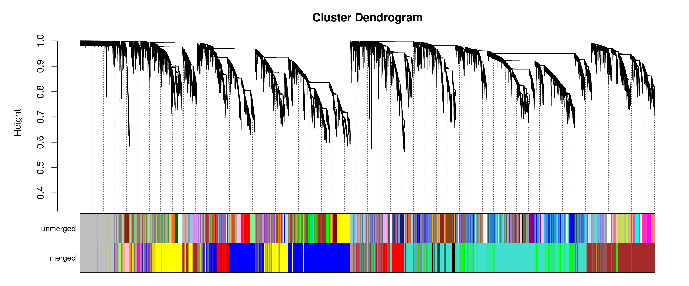
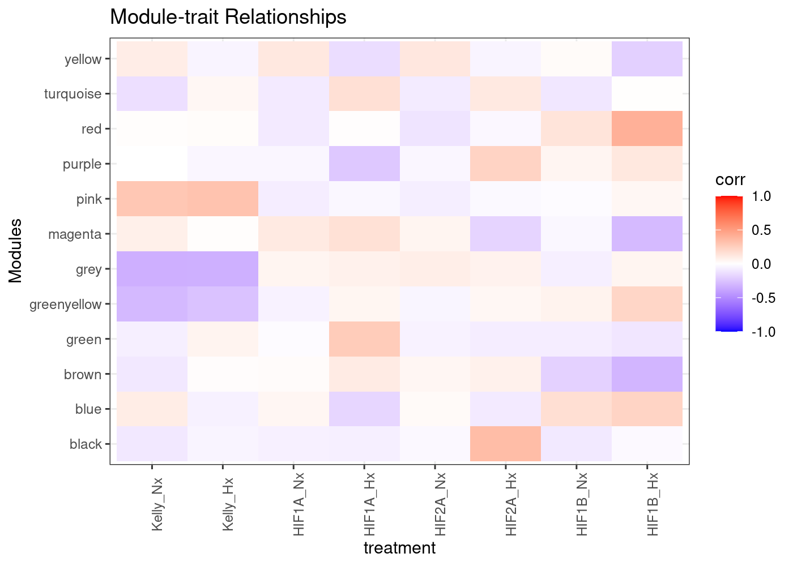

- [0. Load](#load)
  - [- R](#r)
- [1. WGCNA](#wgcna)
  - [-load dds](#load-dds)
  - [(-pickSoftThreshold extern)](#picksoftthreshold-extern)
  - [-pickSoftThreshold](#picksoftthreshold)
  - [-network construction](#network-construction)
  - [-Module Eigengenes](#module-eigengenes)
  - [-Intramodular analysis: Identifying driver
    genes](#intramodular-analysis-identifying-driver-genes)
  - [-TS Analysis](#ts-analysis)
  - [-GO terms enrichment](#go-terms-enrichment)
  - [-module to sample](#module-to-sample)
- [Export into dds](#export-into-dds)

# 0. Load

## - R

BiocManager::install()

BiocManager::install(“CorLevelPlot”)

# 1. WGCNA

## -load dds

``` r
load(file=paste(data,"deseq2.dds", sep="/"))
s75 <- (nrow(colData(dds))*0.75) %>% round()
dds75 <- dds[rowSums(counts(dds) >= 15) >= 66,]
nrow(dds75) # 14889 genes left
```

    ## [1] 14889

``` r
vsd <- vst(dds75, blind = FALSE) #transform while accounting for design 
# counts <- counts(dds, normalized=TRUE)
# mcols(dds)$SYMBOL %>% head()
# input_mat = t(counts)
# input_mat[1:10,1:10]

colData <- colData(dds75)
norm.counts <- assay(vsd) %>% 
  t()

## outliners?
gsg <- goodSamplesGenes(norm.counts)
```

    ##  Flagging genes and samples with too many missing values...
    ##   ..step 1

``` r
summary(gsg)
```

    ##             Length Class  Mode   
    ## goodGenes   14889  -none- logical
    ## goodSamples    88  -none- logical
    ## allOK           1  -none- logical

``` r
summary(gsg$goodGenes)
```

    ##    Mode    TRUE 
    ## logical   14889

``` r
gsg$allOK
```

    ## [1] TRUE

``` r
# detect outlier samples - hierarchical clustering - method 1
htree <- hclust(dist(norm.counts), method = "average")
plot(htree) # S46, S50, S58?
```

<!-- -->

``` r
# PCA 
pca <- prcomp(norm.counts)
pca.dat <- pca$x

pca.var <- pca$sdev^2
pca.var.percent <- round(pca.var/sum(pca.var)*100, digits = 2)

pca.dat <- as.data.frame(pca.dat)

ggplot(pca.dat, aes(PC1, PC2)) +
  geom_point() +
  geom_text(label = rownames(pca.dat)) +
  labs(x = paste0('PC1: ', pca.var.percent[1], ' %'),
       y = paste0('PC2: ', pca.var.percent[2], ' %'))
```

<!-- -->

## (-pickSoftThreshold extern)

## -pickSoftThreshold

## -network construction

``` r
# convert matrix to numeric
norm.counts[] <- sapply(norm.counts, as.numeric)

soft_power <- 26
temp_cor <- cor
cor <- WGCNA::cor

# memory estimate w.r.t blocksize
# bwnet <- blockwiseModules(norm.counts,
#                  maxBlockSize = 15000,
#                  TOMType = "signed",
#                  power = soft_power,
#                  mergeCutHeight = 0.25,
#                  numericLabels = FALSE,
#                  randomSeed = 1234,
#                  verbose = 3)
# 
# cor <- temp_cor
# 
# save(bwnet,file=paste(data,"bwnet.RDS", sep="/"))

# TS
cor <- WGCNA::cor
bwnet <- blockwiseModules(norm.counts,               

                          # == Adjacency Function ==
                          power = soft_power,                
                          networkType = "signed",

                          # == Tree and Block Options ==
                          deepSplit = 2,
                          pamRespectsDendro = F,
                          # detectCutHeight = 0.75,
                          minModuleSize = 30,
                          maxBlockSize = 40000,

                          # == Module Adjustments ==
                          reassignThreshold = 0,
                          mergeCutHeight = 0.25,

                          # == TOM == Archive the run results in TOM file (saves time)
                          saveTOMs = T,
                          saveTOMFileBase = paste(data,"blockwiseTOM", sep="/"),

                          # == Output Options
                          numericLabels = F,
                          verbose = 3)
cor <- temp_cor

save(bwnet,file=paste(data,"bwnet_TS.RDS", sep="/"))
```

## -Module Eigengenes

``` r
load(file=paste(data,"bwnet_TS.RDS", sep="/"))

module_eigengenes <- bwnet$MEs

# Print out a preview
head(module_eigengenes) %>% kable() %>% kable_styling("striped", full_width = T) %>% scroll_box(height = "400px")
```

<div style="border: 1px solid #ddd; padding: 0px; overflow-y: scroll; height:400px; ">

<table class="table table-striped" style="margin-left: auto; margin-right: auto;">
<thead>
<tr>
<th style="text-align:left;position: sticky; top:0; background-color: #FFFFFF;">
</th>
<th style="text-align:right;position: sticky; top:0; background-color: #FFFFFF;">
MEblue
</th>
<th style="text-align:right;position: sticky; top:0; background-color: #FFFFFF;">
MEgreenyellow
</th>
<th style="text-align:right;position: sticky; top:0; background-color: #FFFFFF;">
MEturquoise
</th>
<th style="text-align:right;position: sticky; top:0; background-color: #FFFFFF;">
MEred
</th>
<th style="text-align:right;position: sticky; top:0; background-color: #FFFFFF;">
MEpurple
</th>
<th style="text-align:right;position: sticky; top:0; background-color: #FFFFFF;">
MEyellow
</th>
<th style="text-align:right;position: sticky; top:0; background-color: #FFFFFF;">
MEtan
</th>
<th style="text-align:right;position: sticky; top:0; background-color: #FFFFFF;">
MEblack
</th>
<th style="text-align:right;position: sticky; top:0; background-color: #FFFFFF;">
MEmagenta
</th>
<th style="text-align:right;position: sticky; top:0; background-color: #FFFFFF;">
MEsalmon
</th>
<th style="text-align:right;position: sticky; top:0; background-color: #FFFFFF;">
MEgreen
</th>
<th style="text-align:right;position: sticky; top:0; background-color: #FFFFFF;">
MEbrown
</th>
<th style="text-align:right;position: sticky; top:0; background-color: #FFFFFF;">
MEpink
</th>
<th style="text-align:right;position: sticky; top:0; background-color: #FFFFFF;">
MEgrey
</th>
</tr>
</thead>
<tbody>
<tr>
<td style="text-align:left;">
RNA_P2041_S37
</td>
<td style="text-align:right;">
0.1281120
</td>
<td style="text-align:right;">
0.0314268
</td>
<td style="text-align:right;">
0.0759919
</td>
<td style="text-align:right;">
-0.0581103
</td>
<td style="text-align:right;">
-0.1300627
</td>
<td style="text-align:right;">
-0.1325789
</td>
<td style="text-align:right;">
-0.0642281
</td>
<td style="text-align:right;">
-0.0021847
</td>
<td style="text-align:right;">
-0.1017963
</td>
<td style="text-align:right;">
-0.0486040
</td>
<td style="text-align:right;">
0.0165934
</td>
<td style="text-align:right;">
-0.0924871
</td>
<td style="text-align:right;">
-0.0568860
</td>
<td style="text-align:right;">
-0.0075408
</td>
</tr>
<tr>
<td style="text-align:left;">
RNA_P2041_S38
</td>
<td style="text-align:right;">
0.0062446
</td>
<td style="text-align:right;">
0.0273521
</td>
<td style="text-align:right;">
0.0906208
</td>
<td style="text-align:right;">
0.0552750
</td>
<td style="text-align:right;">
0.0117340
</td>
<td style="text-align:right;">
-0.0202258
</td>
<td style="text-align:right;">
0.0165917
</td>
<td style="text-align:right;">
-0.0620210
</td>
<td style="text-align:right;">
-0.0509336
</td>
<td style="text-align:right;">
-0.0856672
</td>
<td style="text-align:right;">
-0.0837301
</td>
<td style="text-align:right;">
-0.0868097
</td>
<td style="text-align:right;">
-0.0456848
</td>
<td style="text-align:right;">
0.2027819
</td>
</tr>
<tr>
<td style="text-align:left;">
RNA_P2041_S39
</td>
<td style="text-align:right;">
0.1645680
</td>
<td style="text-align:right;">
0.0416806
</td>
<td style="text-align:right;">
0.1108524
</td>
<td style="text-align:right;">
-0.0603458
</td>
<td style="text-align:right;">
-0.1201275
</td>
<td style="text-align:right;">
-0.1574578
</td>
<td style="text-align:right;">
0.0200316
</td>
<td style="text-align:right;">
-0.0068658
</td>
<td style="text-align:right;">
-0.1129571
</td>
<td style="text-align:right;">
-0.0293112
</td>
<td style="text-align:right;">
0.0071073
</td>
<td style="text-align:right;">
-0.1145541
</td>
<td style="text-align:right;">
-0.0581314
</td>
<td style="text-align:right;">
0.0223168
</td>
</tr>
<tr>
<td style="text-align:left;">
RNA_P2041_S40
</td>
<td style="text-align:right;">
0.0997921
</td>
<td style="text-align:right;">
0.0580851
</td>
<td style="text-align:right;">
0.0970832
</td>
<td style="text-align:right;">
-0.0216944
</td>
<td style="text-align:right;">
-0.0788621
</td>
<td style="text-align:right;">
-0.1063083
</td>
<td style="text-align:right;">
0.0042522
</td>
<td style="text-align:right;">
-0.0238073
</td>
<td style="text-align:right;">
-0.0951074
</td>
<td style="text-align:right;">
-0.0378056
</td>
<td style="text-align:right;">
-0.0181197
</td>
<td style="text-align:right;">
-0.1008806
</td>
<td style="text-align:right;">
-0.0645278
</td>
<td style="text-align:right;">
0.0428643
</td>
</tr>
<tr>
<td style="text-align:left;">
RNA_P2041_S41
</td>
<td style="text-align:right;">
0.1591024
</td>
<td style="text-align:right;">
0.1234278
</td>
<td style="text-align:right;">
-0.0003433
</td>
<td style="text-align:right;">
-0.2994517
</td>
<td style="text-align:right;">
-0.0409261
</td>
<td style="text-align:right;">
-0.2204171
</td>
<td style="text-align:right;">
0.1268816
</td>
<td style="text-align:right;">
0.1551481
</td>
<td style="text-align:right;">
-0.0299868
</td>
<td style="text-align:right;">
-0.0415677
</td>
<td style="text-align:right;">
0.0998807
</td>
<td style="text-align:right;">
-0.0257840
</td>
<td style="text-align:right;">
-0.1187182
</td>
<td style="text-align:right;">
0.0239185
</td>
</tr>
<tr>
<td style="text-align:left;">
RNA_P2041_S42
</td>
<td style="text-align:right;">
0.0626866
</td>
<td style="text-align:right;">
0.0063552
</td>
<td style="text-align:right;">
0.1106346
</td>
<td style="text-align:right;">
0.0519351
</td>
<td style="text-align:right;">
-0.0387361
</td>
<td style="text-align:right;">
-0.0604608
</td>
<td style="text-align:right;">
-0.0066684
</td>
<td style="text-align:right;">
-0.0690776
</td>
<td style="text-align:right;">
-0.0975534
</td>
<td style="text-align:right;">
-0.0670320
</td>
<td style="text-align:right;">
-0.0681120
</td>
<td style="text-align:right;">
-0.1082488
</td>
<td style="text-align:right;">
-0.0394585
</td>
<td style="text-align:right;">
-0.0136884
</td>
</tr>
</tbody>
</table>

</div>

``` r
# get number of genes for each module
table(bwnet$colors)
```

    ## 
    ##       black        blue       brown       green greenyellow        grey 
    ##         555        2371        2108        1099         127         361 
    ##     magenta        pink      purple         red      salmon         tan 
    ##         349         462         280         844         113         123 
    ##   turquoise      yellow 
    ##        4100        1997

``` r
# Plot the dendrogram and the module colors before and after merging underneath
plotDendroAndColors(bwnet$dendrograms[[1]], cbind(bwnet$unmergedColors, bwnet$colors),
                    c("unmerged", "merged"),
                    dendroLabels = FALSE,
                    addGuide = TRUE,
                    hang= 0.03,
                    guideHang = 0.05)
```

<!-- -->

``` r
# grey module = all genes that doesn't fall into other modules were assigned to the grey module


# 6A. Relate modules to traits --------------------------------------------------
# module trait associations


# create traits file - binarize categorical variables
traits <- colData$treatment_bin <- ifelse(grepl('Hx', colData$treatment), 1, 0)

# binarize categorical variables

colData$genotype %>% levels()
```

    ## [1] "Kelly" "HIF1A" "HIF2A" "HIF1B"

``` r
genotype_bin <- binarizeCategoricalColumns(colData$genotype,
                           includePairwise = FALSE,
                           includeLevelVsAll = TRUE,
                           dropFirstLevelVsAll = FALSE,
                           minCount = 1)
colnames(genotype_bin) <- levels(colData$genotype)

condition_bin <- binarizeCategoricalColumns(colData$condition,
                           includePairwise = FALSE,
                           includeLevelVsAll = TRUE,
                           dropFirstLevelVsAll = FALSE,
                           minCount = 1)
colnames(condition_bin) <- levels(colData$condition)

traits <- cbind(traits, genotype_bin,condition_bin)
rownames(traits) <- rownames(colData)
dim(traits)
```

    ## [1] 88 13

``` r
orig.colnames <- colnames(traits)
colnames(traits)[1] <- c("Hypoxia")

# Define numbers of genes and samples
nSamples <- nrow(norm.counts)
nGenes <- ncol(norm.counts)

module.trait.corr <- cor(module_eigengenes, traits, use = 'p')
module.trait.corr.pvals <- corPvalueStudent(module.trait.corr, nSamples)

# visualize module-trait association as a heatmap

heatmap.data <- merge(module_eigengenes, traits, by = 'row.names')

head(heatmap.data) %>% kable() %>% kable_styling("striped", full_width = T) %>% scroll_box(height = "400px")
```

<div style="border: 1px solid #ddd; padding: 0px; overflow-y: scroll; height:400px; ">

<table class="table table-striped" style="margin-left: auto; margin-right: auto;">
<thead>
<tr>
<th style="text-align:left;position: sticky; top:0; background-color: #FFFFFF;">
Row.names
</th>
<th style="text-align:right;position: sticky; top:0; background-color: #FFFFFF;">
MEblue
</th>
<th style="text-align:right;position: sticky; top:0; background-color: #FFFFFF;">
MEgreenyellow
</th>
<th style="text-align:right;position: sticky; top:0; background-color: #FFFFFF;">
MEturquoise
</th>
<th style="text-align:right;position: sticky; top:0; background-color: #FFFFFF;">
MEred
</th>
<th style="text-align:right;position: sticky; top:0; background-color: #FFFFFF;">
MEpurple
</th>
<th style="text-align:right;position: sticky; top:0; background-color: #FFFFFF;">
MEyellow
</th>
<th style="text-align:right;position: sticky; top:0; background-color: #FFFFFF;">
MEtan
</th>
<th style="text-align:right;position: sticky; top:0; background-color: #FFFFFF;">
MEblack
</th>
<th style="text-align:right;position: sticky; top:0; background-color: #FFFFFF;">
MEmagenta
</th>
<th style="text-align:right;position: sticky; top:0; background-color: #FFFFFF;">
MEsalmon
</th>
<th style="text-align:right;position: sticky; top:0; background-color: #FFFFFF;">
MEgreen
</th>
<th style="text-align:right;position: sticky; top:0; background-color: #FFFFFF;">
MEbrown
</th>
<th style="text-align:right;position: sticky; top:0; background-color: #FFFFFF;">
MEpink
</th>
<th style="text-align:right;position: sticky; top:0; background-color: #FFFFFF;">
MEgrey
</th>
<th style="text-align:right;position: sticky; top:0; background-color: #FFFFFF;">
Hypoxia
</th>
<th style="text-align:right;position: sticky; top:0; background-color: #FFFFFF;">
Kelly
</th>
<th style="text-align:right;position: sticky; top:0; background-color: #FFFFFF;">
HIF1A
</th>
<th style="text-align:right;position: sticky; top:0; background-color: #FFFFFF;">
HIF2A
</th>
<th style="text-align:right;position: sticky; top:0; background-color: #FFFFFF;">
HIF1B
</th>
<th style="text-align:right;position: sticky; top:0; background-color: #FFFFFF;">
Kelly_Nx
</th>
<th style="text-align:right;position: sticky; top:0; background-color: #FFFFFF;">
Kelly_Hx
</th>
<th style="text-align:right;position: sticky; top:0; background-color: #FFFFFF;">
HIF1A_Nx
</th>
<th style="text-align:right;position: sticky; top:0; background-color: #FFFFFF;">
HIF1A_Hx
</th>
<th style="text-align:right;position: sticky; top:0; background-color: #FFFFFF;">
HIF2A_Nx
</th>
<th style="text-align:right;position: sticky; top:0; background-color: #FFFFFF;">
HIF2A_Hx
</th>
<th style="text-align:right;position: sticky; top:0; background-color: #FFFFFF;">
HIF1B_Nx
</th>
<th style="text-align:right;position: sticky; top:0; background-color: #FFFFFF;">
HIF1B_Hx
</th>
</tr>
</thead>
<tbody>
<tr>
<td style="text-align:left;">
RNA_P2041_S37
</td>
<td style="text-align:right;">
0.1281120
</td>
<td style="text-align:right;">
0.0314268
</td>
<td style="text-align:right;">
0.0759919
</td>
<td style="text-align:right;">
-0.0581103
</td>
<td style="text-align:right;">
-0.1300627
</td>
<td style="text-align:right;">
-0.1325789
</td>
<td style="text-align:right;">
-0.0642281
</td>
<td style="text-align:right;">
-0.0021847
</td>
<td style="text-align:right;">
-0.1017963
</td>
<td style="text-align:right;">
-0.0486040
</td>
<td style="text-align:right;">
0.0165934
</td>
<td style="text-align:right;">
-0.0924871
</td>
<td style="text-align:right;">
-0.0568860
</td>
<td style="text-align:right;">
-0.0075408
</td>
<td style="text-align:right;">
0
</td>
<td style="text-align:right;">
1
</td>
<td style="text-align:right;">
0
</td>
<td style="text-align:right;">
0
</td>
<td style="text-align:right;">
0
</td>
<td style="text-align:right;">
1
</td>
<td style="text-align:right;">
0
</td>
<td style="text-align:right;">
0
</td>
<td style="text-align:right;">
0
</td>
<td style="text-align:right;">
0
</td>
<td style="text-align:right;">
0
</td>
<td style="text-align:right;">
0
</td>
<td style="text-align:right;">
0
</td>
</tr>
<tr>
<td style="text-align:left;">
RNA_P2041_S38
</td>
<td style="text-align:right;">
0.0062446
</td>
<td style="text-align:right;">
0.0273521
</td>
<td style="text-align:right;">
0.0906208
</td>
<td style="text-align:right;">
0.0552750
</td>
<td style="text-align:right;">
0.0117340
</td>
<td style="text-align:right;">
-0.0202258
</td>
<td style="text-align:right;">
0.0165917
</td>
<td style="text-align:right;">
-0.0620210
</td>
<td style="text-align:right;">
-0.0509336
</td>
<td style="text-align:right;">
-0.0856672
</td>
<td style="text-align:right;">
-0.0837301
</td>
<td style="text-align:right;">
-0.0868097
</td>
<td style="text-align:right;">
-0.0456848
</td>
<td style="text-align:right;">
0.2027819
</td>
<td style="text-align:right;">
0
</td>
<td style="text-align:right;">
0
</td>
<td style="text-align:right;">
0
</td>
<td style="text-align:right;">
0
</td>
<td style="text-align:right;">
1
</td>
<td style="text-align:right;">
0
</td>
<td style="text-align:right;">
0
</td>
<td style="text-align:right;">
0
</td>
<td style="text-align:right;">
0
</td>
<td style="text-align:right;">
0
</td>
<td style="text-align:right;">
0
</td>
<td style="text-align:right;">
1
</td>
<td style="text-align:right;">
0
</td>
</tr>
<tr>
<td style="text-align:left;">
RNA_P2041_S39
</td>
<td style="text-align:right;">
0.1645680
</td>
<td style="text-align:right;">
0.0416806
</td>
<td style="text-align:right;">
0.1108524
</td>
<td style="text-align:right;">
-0.0603458
</td>
<td style="text-align:right;">
-0.1201275
</td>
<td style="text-align:right;">
-0.1574578
</td>
<td style="text-align:right;">
0.0200316
</td>
<td style="text-align:right;">
-0.0068658
</td>
<td style="text-align:right;">
-0.1129571
</td>
<td style="text-align:right;">
-0.0293112
</td>
<td style="text-align:right;">
0.0071073
</td>
<td style="text-align:right;">
-0.1145541
</td>
<td style="text-align:right;">
-0.0581314
</td>
<td style="text-align:right;">
0.0223168
</td>
<td style="text-align:right;">
0
</td>
<td style="text-align:right;">
0
</td>
<td style="text-align:right;">
0
</td>
<td style="text-align:right;">
0
</td>
<td style="text-align:right;">
1
</td>
<td style="text-align:right;">
0
</td>
<td style="text-align:right;">
0
</td>
<td style="text-align:right;">
0
</td>
<td style="text-align:right;">
0
</td>
<td style="text-align:right;">
0
</td>
<td style="text-align:right;">
0
</td>
<td style="text-align:right;">
1
</td>
<td style="text-align:right;">
0
</td>
</tr>
<tr>
<td style="text-align:left;">
RNA_P2041_S40
</td>
<td style="text-align:right;">
0.0997921
</td>
<td style="text-align:right;">
0.0580851
</td>
<td style="text-align:right;">
0.0970832
</td>
<td style="text-align:right;">
-0.0216944
</td>
<td style="text-align:right;">
-0.0788621
</td>
<td style="text-align:right;">
-0.1063083
</td>
<td style="text-align:right;">
0.0042522
</td>
<td style="text-align:right;">
-0.0238073
</td>
<td style="text-align:right;">
-0.0951074
</td>
<td style="text-align:right;">
-0.0378056
</td>
<td style="text-align:right;">
-0.0181197
</td>
<td style="text-align:right;">
-0.1008806
</td>
<td style="text-align:right;">
-0.0645278
</td>
<td style="text-align:right;">
0.0428643
</td>
<td style="text-align:right;">
0
</td>
<td style="text-align:right;">
0
</td>
<td style="text-align:right;">
0
</td>
<td style="text-align:right;">
0
</td>
<td style="text-align:right;">
1
</td>
<td style="text-align:right;">
0
</td>
<td style="text-align:right;">
0
</td>
<td style="text-align:right;">
0
</td>
<td style="text-align:right;">
0
</td>
<td style="text-align:right;">
0
</td>
<td style="text-align:right;">
0
</td>
<td style="text-align:right;">
1
</td>
<td style="text-align:right;">
0
</td>
</tr>
<tr>
<td style="text-align:left;">
RNA_P2041_S41
</td>
<td style="text-align:right;">
0.1591024
</td>
<td style="text-align:right;">
0.1234278
</td>
<td style="text-align:right;">
-0.0003433
</td>
<td style="text-align:right;">
-0.2994517
</td>
<td style="text-align:right;">
-0.0409261
</td>
<td style="text-align:right;">
-0.2204171
</td>
<td style="text-align:right;">
0.1268816
</td>
<td style="text-align:right;">
0.1551481
</td>
<td style="text-align:right;">
-0.0299868
</td>
<td style="text-align:right;">
-0.0415677
</td>
<td style="text-align:right;">
0.0998807
</td>
<td style="text-align:right;">
-0.0257840
</td>
<td style="text-align:right;">
-0.1187182
</td>
<td style="text-align:right;">
0.0239185
</td>
<td style="text-align:right;">
1
</td>
<td style="text-align:right;">
0
</td>
<td style="text-align:right;">
0
</td>
<td style="text-align:right;">
0
</td>
<td style="text-align:right;">
1
</td>
<td style="text-align:right;">
0
</td>
<td style="text-align:right;">
0
</td>
<td style="text-align:right;">
0
</td>
<td style="text-align:right;">
0
</td>
<td style="text-align:right;">
0
</td>
<td style="text-align:right;">
0
</td>
<td style="text-align:right;">
0
</td>
<td style="text-align:right;">
1
</td>
</tr>
<tr>
<td style="text-align:left;">
RNA_P2041_S42
</td>
<td style="text-align:right;">
0.0626866
</td>
<td style="text-align:right;">
0.0063552
</td>
<td style="text-align:right;">
0.1106346
</td>
<td style="text-align:right;">
0.0519351
</td>
<td style="text-align:right;">
-0.0387361
</td>
<td style="text-align:right;">
-0.0604608
</td>
<td style="text-align:right;">
-0.0066684
</td>
<td style="text-align:right;">
-0.0690776
</td>
<td style="text-align:right;">
-0.0975534
</td>
<td style="text-align:right;">
-0.0670320
</td>
<td style="text-align:right;">
-0.0681120
</td>
<td style="text-align:right;">
-0.1082488
</td>
<td style="text-align:right;">
-0.0394585
</td>
<td style="text-align:right;">
-0.0136884
</td>
<td style="text-align:right;">
0
</td>
<td style="text-align:right;">
1
</td>
<td style="text-align:right;">
0
</td>
<td style="text-align:right;">
0
</td>
<td style="text-align:right;">
0
</td>
<td style="text-align:right;">
1
</td>
<td style="text-align:right;">
0
</td>
<td style="text-align:right;">
0
</td>
<td style="text-align:right;">
0
</td>
<td style="text-align:right;">
0
</td>
<td style="text-align:right;">
0
</td>
<td style="text-align:right;">
0
</td>
<td style="text-align:right;">
0
</td>
</tr>
</tbody>
</table>

</div>

``` r
heatmap.data <- heatmap.data %>% 
  column_to_rownames(var = 'Row.names')
dim(heatmap.data)
```

    ## [1] 88 27

``` r
MEs <- heatmap.data %>% colnames() %>% str_detect(pattern="ME") %>% sum()
max <- heatmap.data %>% ncol()
CorLevelPlot(heatmap.data,
             x = names(heatmap.data)[(MEs+1):max],
             y = names(heatmap.data)[1:MEs],
             col = viridis(100, option='plasma'))
```

<!-- -->

``` r
             # col = c("blue1", "skyblue", "white", "pink", "red"))

module.gene.mapping <- as.data.frame(bwnet$colors)

# Genes related to Hypoxia
module.gene.mapping %>% 
  filter(`bwnet$colors` == 'turquoise') %>% 
  rownames() %>% head() %>% kable() %>% kable_styling("striped", full_width = T) %>% scroll_box(height = "400px")
```

<div style="border: 1px solid #ddd; padding: 0px; overflow-y: scroll; height:400px; ">

<table class="table table-striped" style="margin-left: auto; margin-right: auto;">
<thead>
<tr>
<th style="text-align:left;position: sticky; top:0; background-color: #FFFFFF;">
x
</th>
</tr>
</thead>
<tbody>
<tr>
<td style="text-align:left;">
ENSG00000000460
</td>
</tr>
<tr>
<td style="text-align:left;">
ENSG00000001084
</td>
</tr>
<tr>
<td style="text-align:left;">
ENSG00000001167
</td>
</tr>
<tr>
<td style="text-align:left;">
ENSG00000001497
</td>
</tr>
<tr>
<td style="text-align:left;">
ENSG00000002549
</td>
</tr>
<tr>
<td style="text-align:left;">
ENSG00000003096
</td>
</tr>
</tbody>
</table>

</div>

## -Intramodular analysis: Identifying driver genes

``` r
module.membership.measure <- cor(module_eigengenes, norm.counts, use = 'p')
module.membership.measure.pvals <- corPvalueStudent(module.membership.measure, nSamples)

module.membership.measure[1:10,1:10] %>% kable() %>% kable_styling("striped", full_width = T) %>% scroll_box(height = "400px")
```

<div style="border: 1px solid #ddd; padding: 0px; overflow-y: scroll; height:400px; ">

<table class="table table-striped" style="margin-left: auto; margin-right: auto;">
<thead>
<tr>
<th style="text-align:left;position: sticky; top:0; background-color: #FFFFFF;">
</th>
<th style="text-align:right;position: sticky; top:0; background-color: #FFFFFF;">
ENSG00000000003
</th>
<th style="text-align:right;position: sticky; top:0; background-color: #FFFFFF;">
ENSG00000000419
</th>
<th style="text-align:right;position: sticky; top:0; background-color: #FFFFFF;">
ENSG00000000457
</th>
<th style="text-align:right;position: sticky; top:0; background-color: #FFFFFF;">
ENSG00000000460
</th>
<th style="text-align:right;position: sticky; top:0; background-color: #FFFFFF;">
ENSG00000001084
</th>
<th style="text-align:right;position: sticky; top:0; background-color: #FFFFFF;">
ENSG00000001167
</th>
<th style="text-align:right;position: sticky; top:0; background-color: #FFFFFF;">
ENSG00000001460
</th>
<th style="text-align:right;position: sticky; top:0; background-color: #FFFFFF;">
ENSG00000001461
</th>
<th style="text-align:right;position: sticky; top:0; background-color: #FFFFFF;">
ENSG00000001497
</th>
<th style="text-align:right;position: sticky; top:0; background-color: #FFFFFF;">
ENSG00000001617
</th>
</tr>
</thead>
<tbody>
<tr>
<td style="text-align:left;">
MEblue
</td>
<td style="text-align:right;">
0.4339447
</td>
<td style="text-align:right;">
-0.5050024
</td>
<td style="text-align:right;">
-0.3361417
</td>
<td style="text-align:right;">
0.4771875
</td>
<td style="text-align:right;">
-0.2442692
</td>
<td style="text-align:right;">
-0.2465824
</td>
<td style="text-align:right;">
0.3051790
</td>
<td style="text-align:right;">
-0.1776334
</td>
<td style="text-align:right;">
0.5691091
</td>
<td style="text-align:right;">
0.2416673
</td>
</tr>
<tr>
<td style="text-align:left;">
MEgreenyellow
</td>
<td style="text-align:right;">
-0.1715155
</td>
<td style="text-align:right;">
0.0338527
</td>
<td style="text-align:right;">
-0.6976040
</td>
<td style="text-align:right;">
0.4939732
</td>
<td style="text-align:right;">
0.6452494
</td>
<td style="text-align:right;">
0.1669761
</td>
<td style="text-align:right;">
-0.5321144
</td>
<td style="text-align:right;">
-0.0897044
</td>
<td style="text-align:right;">
0.5719642
</td>
<td style="text-align:right;">
0.6918788
</td>
</tr>
<tr>
<td style="text-align:left;">
MEturquoise
</td>
<td style="text-align:right;">
-0.2458168
</td>
<td style="text-align:right;">
0.4088773
</td>
<td style="text-align:right;">
-0.7771590
</td>
<td style="text-align:right;">
0.9355040
</td>
<td style="text-align:right;">
0.4987265
</td>
<td style="text-align:right;">
0.6509596
</td>
<td style="text-align:right;">
-0.2692951
</td>
<td style="text-align:right;">
-0.8942265
</td>
<td style="text-align:right;">
0.8782823
</td>
<td style="text-align:right;">
-0.1938121
</td>
</tr>
<tr>
<td style="text-align:left;">
MEred
</td>
<td style="text-align:right;">
-0.4177097
</td>
<td style="text-align:right;">
0.8627403
</td>
<td style="text-align:right;">
-0.0528473
</td>
<td style="text-align:right;">
0.1580826
</td>
<td style="text-align:right;">
0.4905091
</td>
<td style="text-align:right;">
0.5925330
</td>
<td style="text-align:right;">
-0.4449685
</td>
<td style="text-align:right;">
-0.4950865
</td>
<td style="text-align:right;">
-0.0620913
</td>
<td style="text-align:right;">
-0.5582321
</td>
</tr>
<tr>
<td style="text-align:left;">
MEpurple
</td>
<td style="text-align:right;">
-0.6500057
</td>
<td style="text-align:right;">
0.3778904
</td>
<td style="text-align:right;">
-0.1112036
</td>
<td style="text-align:right;">
-0.1527466
</td>
<td style="text-align:right;">
0.4149976
</td>
<td style="text-align:right;">
0.5571761
</td>
<td style="text-align:right;">
-0.3996946
</td>
<td style="text-align:right;">
0.0184501
</td>
<td style="text-align:right;">
-0.0805389
</td>
<td style="text-align:right;">
-0.0027197
</td>
</tr>
<tr>
<td style="text-align:left;">
MEyellow
</td>
<td style="text-align:right;">
-0.3315024
</td>
<td style="text-align:right;">
0.4226490
</td>
<td style="text-align:right;">
0.4423548
</td>
<td style="text-align:right;">
-0.5692261
</td>
<td style="text-align:right;">
0.1464383
</td>
<td style="text-align:right;">
0.1226267
</td>
<td style="text-align:right;">
-0.2664490
</td>
<td style="text-align:right;">
0.2938221
</td>
<td style="text-align:right;">
-0.6590922
</td>
<td style="text-align:right;">
-0.2025632
</td>
</tr>
<tr>
<td style="text-align:left;">
MEtan
</td>
<td style="text-align:right;">
-0.1845471
</td>
<td style="text-align:right;">
-0.4908305
</td>
<td style="text-align:right;">
-0.0008218
</td>
<td style="text-align:right;">
-0.2521394
</td>
<td style="text-align:right;">
-0.2030251
</td>
<td style="text-align:right;">
-0.0008586
</td>
<td style="text-align:right;">
0.2147341
</td>
<td style="text-align:right;">
0.3713840
</td>
<td style="text-align:right;">
0.0960995
</td>
<td style="text-align:right;">
0.3463287
</td>
</tr>
<tr>
<td style="text-align:left;">
MEblack
</td>
<td style="text-align:right;">
0.2916974
</td>
<td style="text-align:right;">
-0.5758474
</td>
<td style="text-align:right;">
0.0663694
</td>
<td style="text-align:right;">
-0.3242677
</td>
<td style="text-align:right;">
-0.0302205
</td>
<td style="text-align:right;">
-0.5987009
</td>
<td style="text-align:right;">
-0.0832604
</td>
<td style="text-align:right;">
0.7426329
</td>
<td style="text-align:right;">
-0.1723922
</td>
<td style="text-align:right;">
0.8698807
</td>
</tr>
<tr>
<td style="text-align:left;">
MEmagenta
</td>
<td style="text-align:right;">
-0.1726557
</td>
<td style="text-align:right;">
0.0173259
</td>
<td style="text-align:right;">
0.1605297
</td>
<td style="text-align:right;">
-0.4963159
</td>
<td style="text-align:right;">
0.3600614
</td>
<td style="text-align:right;">
-0.1813246
</td>
<td style="text-align:right;">
-0.4697569
</td>
<td style="text-align:right;">
0.6545480
</td>
<td style="text-align:right;">
-0.4484685
</td>
<td style="text-align:right;">
0.6079051
</td>
</tr>
<tr>
<td style="text-align:left;">
MEsalmon
</td>
<td style="text-align:right;">
0.6713523
</td>
<td style="text-align:right;">
-0.1705023
</td>
<td style="text-align:right;">
0.3825966
</td>
<td style="text-align:right;">
-0.1236211
</td>
<td style="text-align:right;">
-0.2205614
</td>
<td style="text-align:right;">
-0.5488556
</td>
<td style="text-align:right;">
0.0396369
</td>
<td style="text-align:right;">
0.2570537
</td>
<td style="text-align:right;">
-0.3830369
</td>
<td style="text-align:right;">
0.0809468
</td>
</tr>
</tbody>
</table>

</div>

``` r
module.membership.measure.pvals[1:10,1:10] %>% kable() %>% kable_styling("striped", full_width = T) %>% scroll_box(height = "400px")
```

<div style="border: 1px solid #ddd; padding: 0px; overflow-y: scroll; height:400px; ">

<table class="table table-striped" style="margin-left: auto; margin-right: auto;">
<thead>
<tr>
<th style="text-align:left;position: sticky; top:0; background-color: #FFFFFF;">
</th>
<th style="text-align:right;position: sticky; top:0; background-color: #FFFFFF;">
ENSG00000000003
</th>
<th style="text-align:right;position: sticky; top:0; background-color: #FFFFFF;">
ENSG00000000419
</th>
<th style="text-align:right;position: sticky; top:0; background-color: #FFFFFF;">
ENSG00000000457
</th>
<th style="text-align:right;position: sticky; top:0; background-color: #FFFFFF;">
ENSG00000000460
</th>
<th style="text-align:right;position: sticky; top:0; background-color: #FFFFFF;">
ENSG00000001084
</th>
<th style="text-align:right;position: sticky; top:0; background-color: #FFFFFF;">
ENSG00000001167
</th>
<th style="text-align:right;position: sticky; top:0; background-color: #FFFFFF;">
ENSG00000001460
</th>
<th style="text-align:right;position: sticky; top:0; background-color: #FFFFFF;">
ENSG00000001461
</th>
<th style="text-align:right;position: sticky; top:0; background-color: #FFFFFF;">
ENSG00000001497
</th>
<th style="text-align:right;position: sticky; top:0; background-color: #FFFFFF;">
ENSG00000001617
</th>
</tr>
</thead>
<tbody>
<tr>
<td style="text-align:left;">
MEblue
</td>
<td style="text-align:right;">
0.0000240
</td>
<td style="text-align:right;">
0.0000005
</td>
<td style="text-align:right;">
0.0013652
</td>
<td style="text-align:right;">
0.0000026
</td>
<td style="text-align:right;">
0.0218166
</td>
<td style="text-align:right;">
0.0205605
</td>
<td style="text-align:right;">
0.0038376
</td>
<td style="text-align:right;">
0.0977788
</td>
<td style="text-align:right;">
0.0000000
</td>
<td style="text-align:right;">
0.0233072
</td>
</tr>
<tr>
<td style="text-align:left;">
MEgreenyellow
</td>
<td style="text-align:right;">
0.1100837
</td>
<td style="text-align:right;">
0.7541931
</td>
<td style="text-align:right;">
0.0000000
</td>
<td style="text-align:right;">
0.0000010
</td>
<td style="text-align:right;">
0.0000000
</td>
<td style="text-align:right;">
0.1199661
</td>
<td style="text-align:right;">
0.0000001
</td>
<td style="text-align:right;">
0.4058905
</td>
<td style="text-align:right;">
0.0000000
</td>
<td style="text-align:right;">
0.0000000
</td>
</tr>
<tr>
<td style="text-align:left;">
MEturquoise
</td>
<td style="text-align:right;">
0.0209692
</td>
<td style="text-align:right;">
0.0000765
</td>
<td style="text-align:right;">
0.0000000
</td>
<td style="text-align:right;">
0.0000000
</td>
<td style="text-align:right;">
0.0000008
</td>
<td style="text-align:right;">
0.0000000
</td>
<td style="text-align:right;">
0.0111760
</td>
<td style="text-align:right;">
0.0000000
</td>
<td style="text-align:right;">
0.0000000
</td>
<td style="text-align:right;">
0.0704013
</td>
</tr>
<tr>
<td style="text-align:left;">
MEred
</td>
<td style="text-align:right;">
0.0000514
</td>
<td style="text-align:right;">
0.0000000
</td>
<td style="text-align:right;">
0.6248379
</td>
<td style="text-align:right;">
0.1412885
</td>
<td style="text-align:right;">
0.0000012
</td>
<td style="text-align:right;">
0.0000000
</td>
<td style="text-align:right;">
0.0000140
</td>
<td style="text-align:right;">
0.0000009
</td>
<td style="text-align:right;">
0.5654979
</td>
<td style="text-align:right;">
0.0000000
</td>
</tr>
<tr>
<td style="text-align:left;">
MEpurple
</td>
<td style="text-align:right;">
0.0000000
</td>
<td style="text-align:right;">
0.0002836
</td>
<td style="text-align:right;">
0.3023205
</td>
<td style="text-align:right;">
0.1553881
</td>
<td style="text-align:right;">
0.0000581
</td>
<td style="text-align:right;">
0.0000000
</td>
<td style="text-align:right;">
0.0001143
</td>
<td style="text-align:right;">
0.8645252
</td>
<td style="text-align:right;">
0.4557087
</td>
<td style="text-align:right;">
0.9799369
</td>
</tr>
<tr>
<td style="text-align:left;">
MEyellow
</td>
<td style="text-align:right;">
0.0016048
</td>
<td style="text-align:right;">
0.0000409
</td>
<td style="text-align:right;">
0.0000160
</td>
<td style="text-align:right;">
0.0000000
</td>
<td style="text-align:right;">
0.1733800
</td>
<td style="text-align:right;">
0.2550392
</td>
<td style="text-align:right;">
0.0120966
</td>
<td style="text-align:right;">
0.0054611
</td>
<td style="text-align:right;">
0.0000000
</td>
<td style="text-align:right;">
0.0583960
</td>
</tr>
<tr>
<td style="text-align:left;">
MEtan
</td>
<td style="text-align:right;">
0.0852018
</td>
<td style="text-align:right;">
0.0000012
</td>
<td style="text-align:right;">
0.9939369
</td>
<td style="text-align:right;">
0.0177937
</td>
<td style="text-align:right;">
0.0578119
</td>
<td style="text-align:right;">
0.9936652
</td>
<td style="text-align:right;">
0.0445282
</td>
<td style="text-align:right;">
0.0003675
</td>
<td style="text-align:right;">
0.3731078
</td>
<td style="text-align:right;">
0.0009487
</td>
</tr>
<tr>
<td style="text-align:left;">
MEblack
</td>
<td style="text-align:right;">
0.0058249
</td>
<td style="text-align:right;">
0.0000000
</td>
<td style="text-align:right;">
0.5389672
</td>
<td style="text-align:right;">
0.0020552
</td>
<td style="text-align:right;">
0.7798579
</td>
<td style="text-align:right;">
0.0000000
</td>
<td style="text-align:right;">
0.4405738
</td>
<td style="text-align:right;">
0.0000000
</td>
<td style="text-align:right;">
0.1082500
</td>
<td style="text-align:right;">
0.0000000
</td>
</tr>
<tr>
<td style="text-align:left;">
MEmagenta
</td>
<td style="text-align:right;">
0.1077035
</td>
<td style="text-align:right;">
0.8727079
</td>
<td style="text-align:right;">
0.1351551
</td>
<td style="text-align:right;">
0.0000009
</td>
<td style="text-align:right;">
0.0005696
</td>
<td style="text-align:right;">
0.0908940
</td>
<td style="text-align:right;">
0.0000039
</td>
<td style="text-align:right;">
0.0000000
</td>
<td style="text-align:right;">
0.0000118
</td>
<td style="text-align:right;">
0.0000000
</td>
</tr>
<tr>
<td style="text-align:left;">
MEsalmon
</td>
<td style="text-align:right;">
0.0000000
</td>
<td style="text-align:right;">
0.1122328
</td>
<td style="text-align:right;">
0.0002344
</td>
<td style="text-align:right;">
0.2511771
</td>
<td style="text-align:right;">
0.0389259
</td>
<td style="text-align:right;">
0.0000000
</td>
<td style="text-align:right;">
0.7138765
</td>
<td style="text-align:right;">
0.0156201
</td>
<td style="text-align:right;">
0.0002302
</td>
<td style="text-align:right;">
0.4534218
</td>
</tr>
</tbody>
</table>

</div>

``` r
gene.hypoxia.corr <- cor(norm.counts, traits$Hypoxia, use = 'p')
gene.hypoxia.corr.pvals <- corPvalueStudent(gene.hypoxia.corr, nSamples)
gene.hypoxia.corr %>% head() %>% kable() %>% kable_styling("striped", full_width = T) %>% scroll_box(height = "400px")
```

<div style="border: 1px solid #ddd; padding: 0px; overflow-y: scroll; height:400px; ">

<table class="table table-striped" style="margin-left: auto; margin-right: auto;">
<thead>
<tr>
<th style="text-align:left;position: sticky; top:0; background-color: #FFFFFF;">
</th>
<th style="text-align:right;position: sticky; top:0; background-color: #FFFFFF;">
</th>
</tr>
</thead>
<tbody>
<tr>
<td style="text-align:left;">
ENSG00000000003
</td>
<td style="text-align:right;">
0.1960105
</td>
</tr>
<tr>
<td style="text-align:left;">
ENSG00000000419
</td>
<td style="text-align:right;">
-0.3774390
</td>
</tr>
<tr>
<td style="text-align:left;">
ENSG00000000457
</td>
<td style="text-align:right;">
0.5661531
</td>
</tr>
<tr>
<td style="text-align:left;">
ENSG00000000460
</td>
<td style="text-align:right;">
-0.7719286
</td>
</tr>
<tr>
<td style="text-align:left;">
ENSG00000001084
</td>
<td style="text-align:right;">
-0.3071976
</td>
</tr>
<tr>
<td style="text-align:left;">
ENSG00000001167
</td>
<td style="text-align:right;">
-0.5915887
</td>
</tr>
</tbody>
</table>

</div>

``` r
gene.hypoxia.corr.pvals %>% 
  as.data.frame() %>% 
  arrange(V1) %>% 
  head(25) %>% kable() %>% kable_styling("striped", full_width = T) %>% scroll_box(height = "400px")
```

<div style="border: 1px solid #ddd; padding: 0px; overflow-y: scroll; height:400px; ">

<table class="table table-striped" style="margin-left: auto; margin-right: auto;">
<thead>
<tr>
<th style="text-align:right;position: sticky; top:0; background-color: #FFFFFF;">
V1
</th>
</tr>
</thead>
<tbody>
<tr>
<td style="text-align:right;">
0
</td>
</tr>
<tr>
<td style="text-align:right;">
0
</td>
</tr>
<tr>
<td style="text-align:right;">
0
</td>
</tr>
<tr>
<td style="text-align:right;">
0
</td>
</tr>
<tr>
<td style="text-align:right;">
0
</td>
</tr>
<tr>
<td style="text-align:right;">
0
</td>
</tr>
<tr>
<td style="text-align:right;">
0
</td>
</tr>
<tr>
<td style="text-align:right;">
0
</td>
</tr>
<tr>
<td style="text-align:right;">
0
</td>
</tr>
<tr>
<td style="text-align:right;">
0
</td>
</tr>
<tr>
<td style="text-align:right;">
0
</td>
</tr>
<tr>
<td style="text-align:right;">
0
</td>
</tr>
<tr>
<td style="text-align:right;">
0
</td>
</tr>
<tr>
<td style="text-align:right;">
0
</td>
</tr>
<tr>
<td style="text-align:right;">
0
</td>
</tr>
<tr>
<td style="text-align:right;">
0
</td>
</tr>
<tr>
<td style="text-align:right;">
0
</td>
</tr>
<tr>
<td style="text-align:right;">
0
</td>
</tr>
<tr>
<td style="text-align:right;">
0
</td>
</tr>
<tr>
<td style="text-align:right;">
0
</td>
</tr>
<tr>
<td style="text-align:right;">
0
</td>
</tr>
<tr>
<td style="text-align:right;">
0
</td>
</tr>
<tr>
<td style="text-align:right;">
0
</td>
</tr>
<tr>
<td style="text-align:right;">
0
</td>
</tr>
<tr>
<td style="text-align:right;">
0
</td>
</tr>
</tbody>
</table>

</div>

## -TS Analysis

``` r
moduleLabelsAutomatic20 <- bwnet$colors   
moduleColorsAutomatic20 <- labels2colors(moduleLabelsAutomatic20)

# Dies ist die korrekte Funktion!!!
plotDendroAndColors(bwnet$dendrograms[[1]], moduleColorsAutomatic20,
"Module colors",
dendroLabels = FALSE, hang = 0.03,
addGuide = TRUE, guideHang = 0.05,
main = "Cluster Dendrogram")
```

<!-- -->

``` r
module_df <- data.frame(
  gene_id = names(bwnet$colors),
  colors = labels2colors(bwnet$colors)
)

MEs0 <- moduleEigengenes(norm.counts, moduleLabelsAutomatic20)$eigengenes

# Reorder modules so similar modules are next to each other
MEs0 <- orderMEs(MEs0)
module_order = names(MEs0) %>% gsub("ME","", .)

plotEigengeneNetworks(MEs0, "", marDendro = c(0, 4, 1, 2), marHeatmap = c(3, 
    4, 1, 2), cex.lab = 0.8, xLabelsAngle = 90)
```

<!-- -->

``` r
# Add treatment names
MEs0$treatment <- colData$condition
# tidy & plot data
mME = MEs0 %>%
  pivot_longer(-treatment) %>%
  mutate(
    name = gsub("ME", "", name),
    name = factor(name, levels = module_order)
  )

mME %>% ggplot(., aes(x=treatment, y=name, fill=value)) +
  geom_tile() +
  theme_bw() +
  scale_fill_gradient2(
    low = "blue",
    high = "red",
    mid = "white",
    midpoint = 0,
    limit = c(-1,1)) +
  theme(axis.text.x = element_text(angle=90)) +
  labs(title = "Module-trait Relationships", y = "Modules", fill="corr")
```

<!-- -->

## -GO terms enrichment

``` r
# Get GO terms of top colors
turquoise_mod <- module_df[module_df$colors == "turquoise",] # Hypoxia
turquoise_ens <- turquoise_mod$gene_id

greenyellow_mod <- module_df[module_df$colors == "greenyellow",] # HIF-1a
greenyellow_ens <- greenyellow_mod$gene_id

magenta_mod <- module_df[module_df$colors == "magenta",] # HIF-2a
magenta_ens <- magenta_mod$gene_id

red_mod <- module_df[module_df$colors == "red",] # HIF-1b
red_ens <- red_mod$gene_id

expr_universe <- rownames(dds[rowSums(counts(dds)) > 200, ])

go_enrich_test <- enrichGO(gene = turquoise_ens,
                      universe = expr_universe,
                      OrgDb = "org.Hs.eg.db", 
                      keyType = 'ENSEMBL',
                      readable = T,
                      ont = "BP",
                      pvalueCutoff = 0.05, 
                      qvalueCutoff = 0.10)
go1 <- dotplot(clusterProfiler::simplify(go_enrich_test))+labs(title = "turquoise: Hypoxia")

go_enrich_test <- enrichGO(gene = greenyellow_ens,
                      universe = expr_universe,
                      OrgDb = "org.Hs.eg.db", 
                      keyType = 'ENSEMBL',
                      readable = T,
                      ont = "BP",
                      pvalueCutoff = 0.2, 
                      qvalueCutoff = 0.5
                      )
go2 <- dotplot(clusterProfiler::simplify(go_enrich_test))+labs(title = "greenyellow: HIF-1a")

go_enrich_test <- enrichGO(gene = magenta_ens,
                      universe = expr_universe,
                      OrgDb = "org.Hs.eg.db", 
                      keyType = 'ENSEMBL',
                      readable = T,
                      ont = "BP",
                      pvalueCutoff = 0.2, 
                      qvalueCutoff = 0.5)
go3 <- dotplot(clusterProfiler::simplify(go_enrich_test))+labs(title = "magenta: HIF-2a")

go_enrich_test <- enrichGO(gene = red_ens,
                      universe = expr_universe,
                      OrgDb = "org.Hs.eg.db", 
                      keyType = 'ENSEMBL',
                      readable = T,
                      ont = "BP",
                      pvalueCutoff = 0.7, 
                      qvalueCutoff = 0.9)
go4 <- dotplot(clusterProfiler::simplify(go_enrich_test))+labs(title = "red: HIF-1b")

(go1 + go2) / (go3 + go4) +plot_layout(guides = "collect", axis_titles="collect")
```

<!-- -->

## -module to sample

``` r
# module Sample correlation

MEs0 %>%
  pivot_longer(-treatment) %>%
  mutate(
    name = gsub("ME", "", name),
    name = factor(name, levels = module_order)
  )
```

    ## # A tibble: 1,232 × 3
    ##    treatment name           value
    ##    <fct>     <chr>          <dbl>
    ##  1 Kelly_Nx  blue         0.128  
    ##  2 Kelly_Nx  greenyellow  0.0314 
    ##  3 Kelly_Nx  turquoise    0.0760 
    ##  4 Kelly_Nx  red         -0.0581 
    ##  5 Kelly_Nx  purple      -0.130  
    ##  6 Kelly_Nx  yellow      -0.133  
    ##  7 Kelly_Nx  tan         -0.0642 
    ##  8 Kelly_Nx  black       -0.00218
    ##  9 Kelly_Nx  magenta     -0.102  
    ## 10 Kelly_Nx  salmon      -0.0486 
    ## # ℹ 1,222 more rows

``` r
mydata <- mtcars[, c(1,3,4,5,6,7)]
head(mydata)
```

    ##                    mpg disp  hp drat    wt  qsec
    ## Mazda RX4         21.0  160 110 3.90 2.620 16.46
    ## Mazda RX4 Wag     21.0  160 110 3.90 2.875 17.02
    ## Datsun 710        22.8  108  93 3.85 2.320 18.61
    ## Hornet 4 Drive    21.4  258 110 3.08 3.215 19.44
    ## Hornet Sportabout 18.7  360 175 3.15 3.440 17.02
    ## Valiant           18.1  225 105 2.76 3.460 20.22

``` r
cormat <- round(cor(mydata),2)
head(cormat)
```

    ##        mpg  disp    hp  drat    wt  qsec
    ## mpg   1.00 -0.85 -0.78  0.68 -0.87  0.42
    ## disp -0.85  1.00  0.79 -0.71  0.89 -0.43
    ## hp   -0.78  0.79  1.00 -0.45  0.66 -0.71
    ## drat  0.68 -0.71 -0.45  1.00 -0.71  0.09
    ## wt   -0.87  0.89  0.66 -0.71  1.00 -0.17
    ## qsec  0.42 -0.43 -0.71  0.09 -0.17  1.00

``` r
class(cormat)
```

    ## [1] "matrix" "array"

``` r
melted_cormat <- melt(cormat)
head(melted_cormat)
```

    ##   Var1 Var2 value
    ## 1  mpg  mpg  1.00
    ## 2 disp  mpg -0.85
    ## 3   hp  mpg -0.78
    ## 4 drat  mpg  0.68
    ## 5   wt  mpg -0.87
    ## 6 qsec  mpg  0.42

``` r
bwnet$MEs %>% class()
```

    ## [1] "data.frame"

``` r
bwnet$MEs %>% data.matrix() %>% head() %>% kable() %>% kable_styling("striped", full_width = T) %>% scroll_box(height = "400px")
```

<div style="border: 1px solid #ddd; padding: 0px; overflow-y: scroll; height:400px; ">

<table class="table table-striped" style="margin-left: auto; margin-right: auto;">
<thead>
<tr>
<th style="text-align:left;position: sticky; top:0; background-color: #FFFFFF;">
</th>
<th style="text-align:right;position: sticky; top:0; background-color: #FFFFFF;">
MEblue
</th>
<th style="text-align:right;position: sticky; top:0; background-color: #FFFFFF;">
MEgreenyellow
</th>
<th style="text-align:right;position: sticky; top:0; background-color: #FFFFFF;">
MEturquoise
</th>
<th style="text-align:right;position: sticky; top:0; background-color: #FFFFFF;">
MEred
</th>
<th style="text-align:right;position: sticky; top:0; background-color: #FFFFFF;">
MEpurple
</th>
<th style="text-align:right;position: sticky; top:0; background-color: #FFFFFF;">
MEyellow
</th>
<th style="text-align:right;position: sticky; top:0; background-color: #FFFFFF;">
MEtan
</th>
<th style="text-align:right;position: sticky; top:0; background-color: #FFFFFF;">
MEblack
</th>
<th style="text-align:right;position: sticky; top:0; background-color: #FFFFFF;">
MEmagenta
</th>
<th style="text-align:right;position: sticky; top:0; background-color: #FFFFFF;">
MEsalmon
</th>
<th style="text-align:right;position: sticky; top:0; background-color: #FFFFFF;">
MEgreen
</th>
<th style="text-align:right;position: sticky; top:0; background-color: #FFFFFF;">
MEbrown
</th>
<th style="text-align:right;position: sticky; top:0; background-color: #FFFFFF;">
MEpink
</th>
<th style="text-align:right;position: sticky; top:0; background-color: #FFFFFF;">
MEgrey
</th>
</tr>
</thead>
<tbody>
<tr>
<td style="text-align:left;">
RNA_P2041_S37
</td>
<td style="text-align:right;">
0.1281120
</td>
<td style="text-align:right;">
0.0314268
</td>
<td style="text-align:right;">
0.0759919
</td>
<td style="text-align:right;">
-0.0581103
</td>
<td style="text-align:right;">
-0.1300627
</td>
<td style="text-align:right;">
-0.1325789
</td>
<td style="text-align:right;">
-0.0642281
</td>
<td style="text-align:right;">
-0.0021847
</td>
<td style="text-align:right;">
-0.1017963
</td>
<td style="text-align:right;">
-0.0486040
</td>
<td style="text-align:right;">
0.0165934
</td>
<td style="text-align:right;">
-0.0924871
</td>
<td style="text-align:right;">
-0.0568860
</td>
<td style="text-align:right;">
-0.0075408
</td>
</tr>
<tr>
<td style="text-align:left;">
RNA_P2041_S38
</td>
<td style="text-align:right;">
0.0062446
</td>
<td style="text-align:right;">
0.0273521
</td>
<td style="text-align:right;">
0.0906208
</td>
<td style="text-align:right;">
0.0552750
</td>
<td style="text-align:right;">
0.0117340
</td>
<td style="text-align:right;">
-0.0202258
</td>
<td style="text-align:right;">
0.0165917
</td>
<td style="text-align:right;">
-0.0620210
</td>
<td style="text-align:right;">
-0.0509336
</td>
<td style="text-align:right;">
-0.0856672
</td>
<td style="text-align:right;">
-0.0837301
</td>
<td style="text-align:right;">
-0.0868097
</td>
<td style="text-align:right;">
-0.0456848
</td>
<td style="text-align:right;">
0.2027819
</td>
</tr>
<tr>
<td style="text-align:left;">
RNA_P2041_S39
</td>
<td style="text-align:right;">
0.1645680
</td>
<td style="text-align:right;">
0.0416806
</td>
<td style="text-align:right;">
0.1108524
</td>
<td style="text-align:right;">
-0.0603458
</td>
<td style="text-align:right;">
-0.1201275
</td>
<td style="text-align:right;">
-0.1574578
</td>
<td style="text-align:right;">
0.0200316
</td>
<td style="text-align:right;">
-0.0068658
</td>
<td style="text-align:right;">
-0.1129571
</td>
<td style="text-align:right;">
-0.0293112
</td>
<td style="text-align:right;">
0.0071073
</td>
<td style="text-align:right;">
-0.1145541
</td>
<td style="text-align:right;">
-0.0581314
</td>
<td style="text-align:right;">
0.0223168
</td>
</tr>
<tr>
<td style="text-align:left;">
RNA_P2041_S40
</td>
<td style="text-align:right;">
0.0997921
</td>
<td style="text-align:right;">
0.0580851
</td>
<td style="text-align:right;">
0.0970832
</td>
<td style="text-align:right;">
-0.0216944
</td>
<td style="text-align:right;">
-0.0788621
</td>
<td style="text-align:right;">
-0.1063083
</td>
<td style="text-align:right;">
0.0042522
</td>
<td style="text-align:right;">
-0.0238073
</td>
<td style="text-align:right;">
-0.0951074
</td>
<td style="text-align:right;">
-0.0378056
</td>
<td style="text-align:right;">
-0.0181197
</td>
<td style="text-align:right;">
-0.1008806
</td>
<td style="text-align:right;">
-0.0645278
</td>
<td style="text-align:right;">
0.0428643
</td>
</tr>
<tr>
<td style="text-align:left;">
RNA_P2041_S41
</td>
<td style="text-align:right;">
0.1591024
</td>
<td style="text-align:right;">
0.1234278
</td>
<td style="text-align:right;">
-0.0003433
</td>
<td style="text-align:right;">
-0.2994517
</td>
<td style="text-align:right;">
-0.0409261
</td>
<td style="text-align:right;">
-0.2204171
</td>
<td style="text-align:right;">
0.1268816
</td>
<td style="text-align:right;">
0.1551481
</td>
<td style="text-align:right;">
-0.0299868
</td>
<td style="text-align:right;">
-0.0415677
</td>
<td style="text-align:right;">
0.0998807
</td>
<td style="text-align:right;">
-0.0257840
</td>
<td style="text-align:right;">
-0.1187182
</td>
<td style="text-align:right;">
0.0239185
</td>
</tr>
<tr>
<td style="text-align:left;">
RNA_P2041_S42
</td>
<td style="text-align:right;">
0.0626866
</td>
<td style="text-align:right;">
0.0063552
</td>
<td style="text-align:right;">
0.1106346
</td>
<td style="text-align:right;">
0.0519351
</td>
<td style="text-align:right;">
-0.0387361
</td>
<td style="text-align:right;">
-0.0604608
</td>
<td style="text-align:right;">
-0.0066684
</td>
<td style="text-align:right;">
-0.0690776
</td>
<td style="text-align:right;">
-0.0975534
</td>
<td style="text-align:right;">
-0.0670320
</td>
<td style="text-align:right;">
-0.0681120
</td>
<td style="text-align:right;">
-0.1082488
</td>
<td style="text-align:right;">
-0.0394585
</td>
<td style="text-align:right;">
-0.0136884
</td>
</tr>
</tbody>
</table>

</div>

``` r
ME.heatmap <- bwnet$MEs %>% data.matrix() %>% melt()

ME.heatmap %>% ggplot(., aes(x=Var2, y=Var1, fill=value)) +
  geom_tile() +
  theme_bw() +
  scale_fill_gradient2(
    low = "blue",
    high = "red",
    mid = "white",
    midpoint = 0,
    limit = c(-1,1)) +
  theme(axis.text.x = element_text(angle=90)) +
  labs(title = "Module-trait Relationships", y = "Modules", fill="corr")
```

<!-- -->

``` r
pheatmap(bwnet$MEs)
```

<!-- -->

# Export into dds
