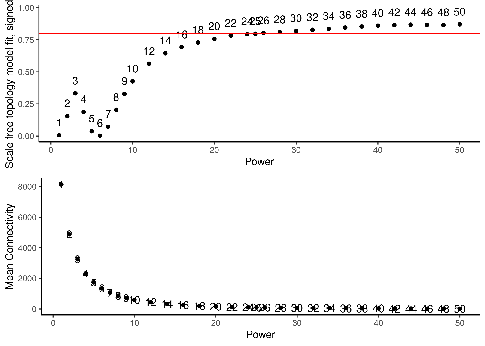

- [0. Load](#load)
  - [- R](#r)
- [1. WGCNA](#wgcna)
  - [-load dds](#load-dds)
  - [(-pickSoftThreshold extern)](#picksoftthreshold-extern)
  - [-pickSoftThreshold](#picksoftthreshold)
  - [-network construction](#network-construction)
  - [-Module Eigengenes](#module-eigengenes)
  - [-Intramodular analysis: Identifying driver
    genes](#intramodular-analysis-identifying-driver-genes)
  - [-TS Analysis](#ts-analysis)
- [Export into dds](#export-into-dds)

# 0. Load

## - R

BiocManager::install()

BiocManager::install(“CorLevelPlot”)

# 1. WGCNA

## -load dds

``` r
load(file=paste(data,"deseq2.dds", sep="/"))
s75 <- (nrow(colData(dds))*0.75) %>% round()
dds75 <- dds[rowSums(counts(dds) >= 15) >= 66,]
nrow(dds75) # 13284 genes
```

    ## [1] 14889

``` r
vsd <- vst(dds75, blind = FALSE) #transform while accounting for design 
# counts <- counts(dds, normalized=TRUE)
# mcols(dds)$SYMBOL %>% head()
# input_mat = t(counts)
# input_mat[1:10,1:10]

colData <- colData(dds75)
norm.counts <- assay(vsd) %>% 
  t()

## outliners?
gsg <- goodSamplesGenes(norm.counts)
```

    ##  Flagging genes and samples with too many missing values...
    ##   ..step 1

``` r
summary(gsg)
```

    ##             Length Class  Mode   
    ## goodGenes   14889  -none- logical
    ## goodSamples    88  -none- logical
    ## allOK           1  -none- logical

``` r
summary(gsg$goodGenes)
```

    ##    Mode    TRUE 
    ## logical   14889

``` r
gsg$allOK
```

    ## [1] TRUE

``` r
# detect outlier samples - hierarchical clustering - method 1
htree <- hclust(dist(norm.counts), method = "average")
plot(htree) # S46, S50, S58?
```

<!-- -->

``` r
# PCA 
pca <- prcomp(norm.counts)
pca.dat <- pca$x

pca.var <- pca$sdev^2
pca.var.percent <- round(pca.var/sum(pca.var)*100, digits = 2)

pca.dat <- as.data.frame(pca.dat)

ggplot(pca.dat, aes(PC1, PC2)) +
  geom_point() +
  geom_text(label = rownames(pca.dat)) +
  labs(x = paste0('PC1: ', pca.var.percent[1], ' %'),
       y = paste0('PC2: ', pca.var.percent[2], ' %'))
```

<!-- -->

## (-pickSoftThreshold extern)

## -pickSoftThreshold

``` r
# Choose a set of soft-thresholding powers

power <- c(c(1:10), seq(from = 12, to = 50, by = 2))

sft <- pickSoftThreshold(norm.counts,
                         powerVector = power,
                         verbose = 5,
                         networkType = "signed")
```

    ## pickSoftThreshold: will use block size 3004.
    ##  pickSoftThreshold: calculating connectivity for given powers...
    ##    ..working on genes 1 through 3004 of 14889
    ##    ..working on genes 3005 through 6008 of 14889
    ##    ..working on genes 6009 through 9012 of 14889
    ##    ..working on genes 9013 through 12016 of 14889
    ##    ..working on genes 12017 through 14889 of 14889
    ##    Power SFT.R.sq   slope truncated.R.sq mean.k. median.k. max.k.
    ## 1      1 0.027400 34.6000          0.712  7450.0   7450.00   7550
    ## 2      2 0.202000  3.7400          0.918  4490.0   4520.00   5120
    ## 3      3 0.202000  1.4800          0.895  3020.0   3060.00   3940
    ## 4      4 0.121000  0.6720          0.857  2170.0   2210.00   3220
    ## 5      5 0.032300  0.2490          0.819  1630.0   1660.00   2730
    ## 6      6 0.000509 -0.0251          0.807  1270.0   1290.00   2360
    ## 7      7 0.055300 -0.2390          0.803  1020.0   1020.00   2080
    ## 8      8 0.174000 -0.4070          0.826   831.0    825.00   1850
    ## 9      9 0.296000 -0.5410          0.854   689.0    675.00   1670
    ## 10    10 0.400000 -0.6570          0.876   579.0    558.00   1510
    ## 11    12 0.548000 -0.8430          0.912   424.0    392.00   1260
    ## 12    14 0.631000 -0.9810          0.933   320.0    285.00   1080
    ## 13    16 0.684000 -1.0900          0.946   249.0    210.00    932
    ## 14    18 0.719000 -1.1700          0.956   198.0    159.00    815
    ## 15    20 0.750000 -1.2400          0.966   159.0    121.00    720
    ## 16    22 0.778000 -1.2800          0.977   131.0     94.00    641
    ## 17    24 0.796000 -1.3200          0.982   108.0     73.30    575
    ## 18    26 0.805000 -1.3600          0.982    90.9     57.80    518
    ## 19    28 0.821000 -1.3900          0.986    76.9     46.10    469
    ## 20    30 0.824000 -1.4400          0.982    65.7     37.10    427
    ## 21    32 0.831000 -1.4600          0.983    56.5     30.00    390
    ## 22    34 0.843000 -1.4700          0.987    48.9     24.30    357
    ## 23    36 0.849000 -1.4900          0.988    42.5     19.90    329
    ## 24    38 0.853000 -1.5200          0.987    37.2     16.50    303
    ## 25    40 0.861000 -1.5300          0.988    32.8     13.60    281
    ## 26    42 0.870000 -1.5400          0.991    29.0     11.40    260
    ## 27    44 0.877000 -1.5400          0.993    25.7      9.49    242
    ## 28    46 0.882000 -1.5500          0.994    22.9      7.93    225
    ## 29    48 0.884000 -1.5600          0.993    20.5      6.68    210
    ## 30    50 0.887000 -1.5700          0.994    18.4      5.62    197

``` r
sft.data <- sft$fitIndices

# visualization to pick power

a1 <- ggplot(sft.data, aes(Power, SFT.R.sq, label = Power)) +
  geom_point() +
  geom_text(nudge_y = 0.1) +
  geom_hline(yintercept = 0.8, color = 'red') +
  labs(x = 'Power', y = 'Scale free topology model fit, signed R^2') +
  theme_classic()

a2 <- ggplot(sft.data, aes(Power, mean.k., label = Power)) +
  geom_point() +
  geom_text(nudge_y = 0.1) +
  labs(x = 'Power', y = 'Mean Connectivity') +
  theme_classic()

grid.arrange(a1, a2, nrow = 2)
```

<!-- -->

``` r
# power 26
```

## -network construction

``` r
# convert matrix to numeric
norm.counts[] <- sapply(norm.counts, as.numeric)

soft_power <- 26
temp_cor <- cor
cor <- WGCNA::cor

# memory estimate w.r.t blocksize
# bwnet <- blockwiseModules(norm.counts,
#                  maxBlockSize = 15000,
#                  TOMType = "signed",
#                  power = soft_power,
#                  mergeCutHeight = 0.25,
#                  numericLabels = FALSE,
#                  randomSeed = 1234,
#                  verbose = 3)
# 
# cor <- temp_cor
# 
# save(bwnet,file=paste(data,"bwnet.RDS", sep="/"))

# TS
cor <- WGCNA::cor
bwnet <- blockwiseModules(norm.counts,               

                          # == Adjacency Function ==
                          power = soft_power,                
                          networkType = "signed",

                          # == Tree and Block Options ==
                          deepSplit = 2,
                          pamRespectsDendro = F,
                          # detectCutHeight = 0.75,
                          minModuleSize = 30,
                          maxBlockSize = 40000,

                          # == Module Adjustments ==
                          reassignThreshold = 0,
                          mergeCutHeight = 0.25,

                          # == TOM == Archive the run results in TOM file (saves time)
                          saveTOMs = T,
                          saveTOMFileBase = paste(data,"blockwiseTOM", sep="/"),

                          # == Output Options
                          numericLabels = F,
                          verbose = 3)
```

    ##  Calculating module eigengenes block-wise from all genes
    ##    Flagging genes and samples with too many missing values...
    ##     ..step 1
    ##  ..Working on block 1 .
    ##     TOM calculation: adjacency..
    ##     ..will use 40 parallel threads.
    ##      Fraction of slow calculations: 0.000000
    ##     ..connectivity..
    ##     ..matrix multiplication (system BLAS)..
    ##     ..normalization..
    ##     ..done.
    ##    ..saving TOM for block 1 into file /mnt/s/AG/AG-Scholz-NGS/Daten/Simon/RNA-Seq_Kelly_all/data/blockwiseTOM-block.1.RData
    ##  ....clustering..
    ##  ....detecting modules..
    ##  ....calculating module eigengenes..
    ##  ....checking kME in modules..
    ##      ..removing 1 genes from module 3 because their KME is too low.
    ##      ..removing 1 genes from module 6 because their KME is too low.
    ##      ..removing 1 genes from module 15 because their KME is too low.
    ##      ..removing 1 genes from module 24 because their KME is too low.
    ##      ..removing 1 genes from module 27 because their KME is too low.
    ##  ..merging modules that are too close..
    ##      mergeCloseModules: Merging modules whose distance is less than 0.25
    ##        Calculating new MEs...

``` r
cor <- temp_cor

save(bwnet,file=paste(data,"bwnet_TS.RDS", sep="/"))
```

## -Module Eigengenes

``` r
load(file=paste(data,"bwnet_TS.RDS", sep="/"))

module_eigengenes <- bwnet$MEs

# Print out a preview
head(module_eigengenes)
```

    ##                    MEblue MEgreenyellow   MEturquoise       MEred    MEpurple
    ## RNA_P2041_S37 0.128112032   0.031426828  0.0759918580 -0.05811033 -0.13006266
    ## RNA_P2041_S38 0.006244556   0.027352070  0.0906208354  0.05527501  0.01173397
    ## RNA_P2041_S39 0.164567969   0.041680581  0.1108524498 -0.06034581 -0.12012745
    ## RNA_P2041_S40 0.099792145   0.058085065  0.0970832299 -0.02169441 -0.07886211
    ## RNA_P2041_S41 0.159102411   0.123427763 -0.0003433247 -0.29945170 -0.04092606
    ## RNA_P2041_S42 0.062686621   0.006355248  0.1106345943  0.05193511 -0.03873608
    ##                  MEyellow        MEtan      MEblack   MEmagenta    MEsalmon
    ## RNA_P2041_S37 -0.13257887 -0.064228136 -0.002184719 -0.10179634 -0.04860405
    ## RNA_P2041_S38 -0.02022581  0.016591680 -0.062020971 -0.05093355 -0.08566724
    ## RNA_P2041_S39 -0.15745781  0.020031559 -0.006865763 -0.11295714 -0.02931119
    ## RNA_P2041_S40 -0.10630828  0.004252172 -0.023807256 -0.09510745 -0.03780563
    ## RNA_P2041_S41 -0.22041706  0.126881559  0.155148104 -0.02998683 -0.04156772
    ## RNA_P2041_S42 -0.06046080 -0.006668407 -0.069077581 -0.09755343 -0.06703204
    ##                   MEgreen     MEbrown      MEpink       MEgrey
    ## RNA_P2041_S37  0.01659344 -0.09248710 -0.05688595 -0.007540831
    ## RNA_P2041_S38 -0.08373009 -0.08680974 -0.04568477  0.202781885
    ## RNA_P2041_S39  0.00710728 -0.11455407 -0.05813135  0.022316825
    ## RNA_P2041_S40 -0.01811969 -0.10088060 -0.06452779  0.042864257
    ## RNA_P2041_S41  0.09988068 -0.02578405 -0.11871821  0.023918453
    ## RNA_P2041_S42 -0.06811201 -0.10824879 -0.03945852 -0.013688429

``` r
# get number of genes for each module
table(bwnet$colors)
```

    ## 
    ##       black        blue       brown       green greenyellow        grey 
    ##         555        2371        2108        1099         127         361 
    ##     magenta        pink      purple         red      salmon         tan 
    ##         349         462         280         844         113         123 
    ##   turquoise      yellow 
    ##        4100        1997

``` r
# Plot the dendrogram and the module colors before and after merging underneath
plotDendroAndColors(bwnet$dendrograms[[1]], cbind(bwnet$unmergedColors, bwnet$colors),
                    c("unmerged", "merged"),
                    dendroLabels = FALSE,
                    addGuide = TRUE,
                    hang= 0.03,
                    guideHang = 0.05)
```

<!-- -->

``` r
# grey module = all genes that doesn't fall into other modules were assigned to the grey module


# 6A. Relate modules to traits --------------------------------------------------
# module trait associations


# create traits file - binarize categorical variables
traits <- colData$treatment_bin <- ifelse(grepl('Hx', colData$treatment), 1, 0)

# binarize categorical variables

colData$genotype %>% levels()
```

    ## [1] "Kelly" "HIF1A" "HIF2A" "HIF1B"

``` r
genotype_bin <- binarizeCategoricalColumns(colData$genotype,
                           includePairwise = FALSE,
                           includeLevelVsAll = TRUE,
                           dropFirstLevelVsAll = FALSE,
                           minCount = 1)
colnames(genotype_bin) <- levels(colData$genotype)

condition_bin <- binarizeCategoricalColumns(colData$condition,
                           includePairwise = FALSE,
                           includeLevelVsAll = TRUE,
                           dropFirstLevelVsAll = FALSE,
                           minCount = 1)
colnames(condition_bin) <- levels(colData$condition)

traits <- cbind(traits, genotype_bin,condition_bin)
rownames(traits) <- rownames(colData)
dim(traits)
```

    ## [1] 88 13

``` r
orig.colnames <- colnames(traits)
colnames(traits)[1] <- c("Hypoxia")

# Define numbers of genes and samples
nSamples <- nrow(norm.counts)
nGenes <- ncol(norm.counts)

module.trait.corr <- cor(module_eigengenes, traits, use = 'p')
module.trait.corr.pvals <- corPvalueStudent(module.trait.corr, nSamples)

# visualize module-trait association as a heatmap

heatmap.data <- merge(module_eigengenes, traits, by = 'row.names')

head(heatmap.data)
```

    ##       Row.names      MEblue MEgreenyellow   MEturquoise       MEred    MEpurple
    ## 1 RNA_P2041_S37 0.128112032   0.031426828  0.0759918580 -0.05811033 -0.13006266
    ## 2 RNA_P2041_S38 0.006244556   0.027352070  0.0906208354  0.05527501  0.01173397
    ## 3 RNA_P2041_S39 0.164567969   0.041680581  0.1108524498 -0.06034581 -0.12012745
    ## 4 RNA_P2041_S40 0.099792145   0.058085065  0.0970832299 -0.02169441 -0.07886211
    ## 5 RNA_P2041_S41 0.159102411   0.123427763 -0.0003433247 -0.29945170 -0.04092606
    ## 6 RNA_P2041_S42 0.062686621   0.006355248  0.1106345943  0.05193511 -0.03873608
    ##      MEyellow        MEtan      MEblack   MEmagenta    MEsalmon     MEgreen
    ## 1 -0.13257887 -0.064228136 -0.002184719 -0.10179634 -0.04860405  0.01659344
    ## 2 -0.02022581  0.016591680 -0.062020971 -0.05093355 -0.08566724 -0.08373009
    ## 3 -0.15745781  0.020031559 -0.006865763 -0.11295714 -0.02931119  0.00710728
    ## 4 -0.10630828  0.004252172 -0.023807256 -0.09510745 -0.03780563 -0.01811969
    ## 5 -0.22041706  0.126881559  0.155148104 -0.02998683 -0.04156772  0.09988068
    ## 6 -0.06046080 -0.006668407 -0.069077581 -0.09755343 -0.06703204 -0.06811201
    ##       MEbrown      MEpink       MEgrey Hypoxia Kelly HIF1A HIF2A HIF1B Kelly_Nx
    ## 1 -0.09248710 -0.05688595 -0.007540831       0     1     0     0     0        1
    ## 2 -0.08680974 -0.04568477  0.202781885       0     0     0     0     1        0
    ## 3 -0.11455407 -0.05813135  0.022316825       0     0     0     0     1        0
    ## 4 -0.10088060 -0.06452779  0.042864257       0     0     0     0     1        0
    ## 5 -0.02578405 -0.11871821  0.023918453       1     0     0     0     1        0
    ## 6 -0.10824879 -0.03945852 -0.013688429       0     1     0     0     0        1
    ##   Kelly_Hx HIF1A_Nx HIF1A_Hx HIF2A_Nx HIF2A_Hx HIF1B_Nx HIF1B_Hx
    ## 1        0        0        0        0        0        0        0
    ## 2        0        0        0        0        0        1        0
    ## 3        0        0        0        0        0        1        0
    ## 4        0        0        0        0        0        1        0
    ## 5        0        0        0        0        0        0        1
    ## 6        0        0        0        0        0        0        0

``` r
heatmap.data <- heatmap.data %>% 
  column_to_rownames(var = 'Row.names')
dim(heatmap.data)
```

    ## [1] 88 27

``` r
MEs <- heatmap.data %>% colnames() %>% str_detect(pattern="ME") %>% sum()
max <- heatmap.data %>% ncol()
CorLevelPlot(heatmap.data,
             x = names(heatmap.data)[(MEs+1):max],
             y = names(heatmap.data)[1:MEs],
             col = viridis(100, option='plasma'))
```

<!-- -->

``` r
             # col = c("blue1", "skyblue", "white", "pink", "red"))

module.gene.mapping <- as.data.frame(bwnet$colors)
module.gene.mapping %>% 
  filter(`bwnet$colors` == 'turquoise') %>% 
  rownames()
```

    ##    [1] "ENSG00000000460" "ENSG00000001084" "ENSG00000001167" "ENSG00000001497"
    ##    [5] "ENSG00000002549" "ENSG00000003096" "ENSG00000003147" "ENSG00000003989"
    ##    [9] "ENSG00000004139" "ENSG00000004399" "ENSG00000004487" "ENSG00000004534"
    ##   [13] "ENSG00000004660" "ENSG00000004864" "ENSG00000004897" "ENSG00000004961"
    ##   [17] "ENSG00000005059" "ENSG00000005100" "ENSG00000005156" "ENSG00000005175"
    ##   [21] "ENSG00000005243" "ENSG00000005302" "ENSG00000005436" "ENSG00000005469"
    ##   [25] "ENSG00000005486" "ENSG00000006377" "ENSG00000006451" "ENSG00000006530"
    ##   [29] "ENSG00000006607" "ENSG00000006634" "ENSG00000006652" "ENSG00000006740"
    ##   [33] "ENSG00000006744" "ENSG00000007202" "ENSG00000007392" "ENSG00000007541"
    ##   [37] "ENSG00000007923" "ENSG00000008128" "ENSG00000008130" "ENSG00000008196"
    ##   [41] "ENSG00000008324" "ENSG00000008405" "ENSG00000009335" "ENSG00000009694"
    ##   [45] "ENSG00000009780" "ENSG00000009830" "ENSG00000009844" "ENSG00000009954"
    ##   [49] "ENSG00000010072" "ENSG00000010292" "ENSG00000010295" "ENSG00000010318"
    ##   [53] "ENSG00000010319" "ENSG00000010803" "ENSG00000011198" "ENSG00000011260"
    ##   [57] "ENSG00000011295" "ENSG00000011332" "ENSG00000011376" "ENSG00000011422"
    ##   [61] "ENSG00000011426" "ENSG00000012048" "ENSG00000012232" "ENSG00000012660"
    ##   [65] "ENSG00000012963" "ENSG00000013297" "ENSG00000013306" "ENSG00000013503"
    ##   [69] "ENSG00000013523" "ENSG00000013561" "ENSG00000013573" "ENSG00000013810"
    ##   [73] "ENSG00000014138" "ENSG00000015133" "ENSG00000015153" "ENSG00000015475"
    ##   [77] "ENSG00000016082" "ENSG00000017483" "ENSG00000017797" "ENSG00000018236"
    ##   [81] "ENSG00000018869" "ENSG00000019144" "ENSG00000019485" "ENSG00000019505"
    ##   [85] "ENSG00000019549" "ENSG00000019991" "ENSG00000020922" "ENSG00000021574"
    ##   [89] "ENSG00000021776" "ENSG00000022567" "ENSG00000023318" "ENSG00000023572"
    ##   [93] "ENSG00000023697" "ENSG00000023734" "ENSG00000023892" "ENSG00000023909"
    ##   [97] "ENSG00000024526" "ENSG00000025156" "ENSG00000025772" "ENSG00000025800"
    ##  [101] "ENSG00000026508" "ENSG00000026559" "ENSG00000027001" "ENSG00000028277"
    ##  [105] "ENSG00000028310" "ENSG00000029153" "ENSG00000029363" "ENSG00000029534"
    ##  [109] "ENSG00000029725" "ENSG00000029993" "ENSG00000031081" "ENSG00000031691"
    ##  [113] "ENSG00000031823" "ENSG00000033030" "ENSG00000033050" "ENSG00000033170"
    ##  [117] "ENSG00000033327" "ENSG00000033867" "ENSG00000034533" "ENSG00000035141"
    ##  [121] "ENSG00000035403" "ENSG00000035499" "ENSG00000035681" "ENSG00000035687"
    ##  [125] "ENSG00000035862" "ENSG00000035928" "ENSG00000036672" "ENSG00000037241"
    ##  [129] "ENSG00000037474" "ENSG00000037965" "ENSG00000038210" "ENSG00000038274"
    ##  [133] "ENSG00000038532" "ENSG00000039523" "ENSG00000039560" "ENSG00000039650"
    ##  [137] "ENSG00000040199" "ENSG00000040275" "ENSG00000040531" "ENSG00000040933"
    ##  [141] "ENSG00000041353" "ENSG00000041357" "ENSG00000041802" "ENSG00000042286"
    ##  [145] "ENSG00000043143" "ENSG00000044574" "ENSG00000046653" "ENSG00000047188"
    ##  [149] "ENSG00000047315" "ENSG00000047579" "ENSG00000047621" "ENSG00000047634"
    ##  [153] "ENSG00000047644" "ENSG00000047648" "ENSG00000048140" "ENSG00000048471"
    ##  [157] "ENSG00000048544" "ENSG00000048828" "ENSG00000048991" "ENSG00000049130"
    ##  [161] "ENSG00000049167" "ENSG00000049246" "ENSG00000049540" "ENSG00000049541"
    ##  [165] "ENSG00000049656" "ENSG00000049860" "ENSG00000050393" "ENSG00000050405"
    ##  [169] "ENSG00000050438" "ENSG00000050748" "ENSG00000051180" "ENSG00000051341"
    ##  [173] "ENSG00000051382" "ENSG00000051620" "ENSG00000051825" "ENSG00000052749"
    ##  [177] "ENSG00000052795" "ENSG00000053254" "ENSG00000053524" "ENSG00000053747"
    ##  [181] "ENSG00000053900" "ENSG00000054116" "ENSG00000054118" "ENSG00000054598"
    ##  [185] "ENSG00000054654" "ENSG00000054793" "ENSG00000055044" "ENSG00000055118"
    ##  [189] "ENSG00000055130" "ENSG00000056050" "ENSG00000056487" "ENSG00000057252"
    ##  [193] "ENSG00000057294" "ENSG00000057663" "ENSG00000057757" "ENSG00000058056"
    ##  [197] "ENSG00000058453" "ENSG00000058600" "ENSG00000058729" "ENSG00000058804"
    ##  [201] "ENSG00000059145" "ENSG00000059377" "ENSG00000059588" "ENSG00000060688"
    ##  [205] "ENSG00000060709" "ENSG00000060762" "ENSG00000061273" "ENSG00000061676"
    ##  [209] "ENSG00000061918" "ENSG00000062598" "ENSG00000062822" "ENSG00000063015"
    ##  [213] "ENSG00000063176" "ENSG00000063244" "ENSG00000063761" "ENSG00000063978"
    ##  [217] "ENSG00000064393" "ENSG00000064419" "ENSG00000064601" "ENSG00000064651"
    ##  [221] "ENSG00000064652" "ENSG00000064703" "ENSG00000064726" "ENSG00000064763"
    ##  [225] "ENSG00000065029" "ENSG00000065060" "ENSG00000065154" "ENSG00000065183"
    ##  [229] "ENSG00000065328" "ENSG00000065413" "ENSG00000065457" "ENSG00000065534"
    ##  [233] "ENSG00000065548" "ENSG00000065600" "ENSG00000065615" "ENSG00000065665"
    ##  [237] "ENSG00000065809" "ENSG00000065833" "ENSG00000065882" "ENSG00000065989"
    ##  [241] "ENSG00000066027" "ENSG00000066044" "ENSG00000066084" "ENSG00000066117"
    ##  [245] "ENSG00000066230" "ENSG00000066279" "ENSG00000066322" "ENSG00000066382"
    ##  [249] "ENSG00000066583" "ENSG00000066629" "ENSG00000066651" "ENSG00000066697"
    ##  [253] "ENSG00000066735" "ENSG00000066855" "ENSG00000066926" "ENSG00000067064"
    ##  [257] "ENSG00000067248" "ENSG00000067334" "ENSG00000067533" "ENSG00000067596"
    ##  [261] "ENSG00000067704" "ENSG00000067955" "ENSG00000068001" "ENSG00000068366"
    ##  [265] "ENSG00000068489" "ENSG00000068615" "ENSG00000068650" "ENSG00000068654"
    ##  [269] "ENSG00000068784" "ENSG00000068796" "ENSG00000068878" "ENSG00000069248"
    ##  [273] "ENSG00000069275" "ENSG00000069345" "ENSG00000069849" "ENSG00000069956"
    ##  [277] "ENSG00000069974" "ENSG00000070010" "ENSG00000070087" "ENSG00000070159"
    ##  [281] "ENSG00000070601" "ENSG00000070614" "ENSG00000070718" "ENSG00000070778"
    ##  [285] "ENSG00000070785" "ENSG00000070814" "ENSG00000070882" "ENSG00000070950"
    ##  [289] "ENSG00000071051" "ENSG00000071054" "ENSG00000071127" "ENSG00000071205"
    ##  [293] "ENSG00000071462" "ENSG00000071539" "ENSG00000071564" "ENSG00000071626"
    ##  [297] "ENSG00000071994" "ENSG00000072042" "ENSG00000072182" "ENSG00000072210"
    ##  [301] "ENSG00000072310" "ENSG00000072401" "ENSG00000072422" "ENSG00000072501"
    ##  [305] "ENSG00000072518" "ENSG00000072571" "ENSG00000072609" "ENSG00000072736"
    ##  [309] "ENSG00000072756" "ENSG00000072803" "ENSG00000072849" "ENSG00000072864"
    ##  [313] "ENSG00000073111" "ENSG00000073584" "ENSG00000073670" "ENSG00000073712"
    ##  [317] "ENSG00000073849" "ENSG00000073910" "ENSG00000074047" "ENSG00000074211"
    ##  [321] "ENSG00000074266" "ENSG00000074356" "ENSG00000074416" "ENSG00000074590"
    ##  [325] "ENSG00000074696" "ENSG00000074755" "ENSG00000074855" "ENSG00000075131"
    ##  [329] "ENSG00000075188" "ENSG00000075213" "ENSG00000075218" "ENSG00000075239"
    ##  [333] "ENSG00000075336" "ENSG00000075340" "ENSG00000075391" "ENSG00000075624"
    ##  [337] "ENSG00000075702" "ENSG00000075790" "ENSG00000076003" "ENSG00000076201"
    ##  [341] "ENSG00000076248" "ENSG00000076382" "ENSG00000076513" "ENSG00000076604"
    ##  [345] "ENSG00000076641" "ENSG00000076685" "ENSG00000076706" "ENSG00000076770"
    ##  [349] "ENSG00000077152" "ENSG00000077232" "ENSG00000077327" "ENSG00000077514"
    ##  [353] "ENSG00000077684" "ENSG00000078140" "ENSG00000078269" "ENSG00000078618"
    ##  [357] "ENSG00000078687" "ENSG00000078900" "ENSG00000078967" "ENSG00000079102"
    ##  [361] "ENSG00000079150" "ENSG00000079156" "ENSG00000079246" "ENSG00000079337"
    ##  [365] "ENSG00000079387" "ENSG00000079616" "ENSG00000079785" "ENSG00000080608"
    ##  [369] "ENSG00000080644" "ENSG00000080709" "ENSG00000080824" "ENSG00000080839"
    ##  [373] "ENSG00000080986" "ENSG00000081014" "ENSG00000081059" "ENSG00000081087"
    ##  [377] "ENSG00000081320" "ENSG00000081721" "ENSG00000082146" "ENSG00000082153"
    ##  [381] "ENSG00000082212" "ENSG00000082213" "ENSG00000082397" "ENSG00000082458"
    ##  [385] "ENSG00000082482" "ENSG00000082516" "ENSG00000082781" "ENSG00000083093"
    ##  [389] "ENSG00000083123" "ENSG00000083290" "ENSG00000083457" "ENSG00000083544"
    ##  [393] "ENSG00000083635" "ENSG00000083720" "ENSG00000083937" "ENSG00000084073"
    ##  [397] "ENSG00000084090" "ENSG00000084628" "ENSG00000084652" "ENSG00000084710"
    ##  [401] "ENSG00000084733" "ENSG00000084774" "ENSG00000085276" "ENSG00000085365"
    ##  [405] "ENSG00000085415" "ENSG00000085511" "ENSG00000085563" "ENSG00000085662"
    ##  [409] "ENSG00000085721" "ENSG00000085840" "ENSG00000085872" "ENSG00000085999"
    ##  [413] "ENSG00000086015" "ENSG00000086061" "ENSG00000086062" "ENSG00000086189"
    ##  [417] "ENSG00000086200" "ENSG00000086475" "ENSG00000086712" "ENSG00000086717"
    ##  [421] "ENSG00000086827" "ENSG00000086991" "ENSG00000087053" "ENSG00000087088"
    ##  [425] "ENSG00000087095" "ENSG00000087157" "ENSG00000087191" "ENSG00000087263"
    ##  [429] "ENSG00000087299" "ENSG00000087302" "ENSG00000087470" "ENSG00000087586"
    ##  [433] "ENSG00000087842" "ENSG00000087903" "ENSG00000088035" "ENSG00000088205"
    ##  [437] "ENSG00000088247" "ENSG00000088305" "ENSG00000088325" "ENSG00000088538"
    ##  [441] "ENSG00000088766" "ENSG00000088930" "ENSG00000088992" "ENSG00000089006"
    ##  [445] "ENSG00000089022" "ENSG00000089050" "ENSG00000089053" "ENSG00000089127"
    ##  [449] "ENSG00000089154" "ENSG00000089169" "ENSG00000089195" "ENSG00000089199"
    ##  [453] "ENSG00000089280" "ENSG00000089558" "ENSG00000089685" "ENSG00000089737"
    ##  [457] "ENSG00000090020" "ENSG00000090061" "ENSG00000090273" "ENSG00000090520"
    ##  [461] "ENSG00000090565" "ENSG00000090889" "ENSG00000090932" "ENSG00000090975"
    ##  [465] "ENSG00000091009" "ENSG00000091127" "ENSG00000091136" "ENSG00000091140"
    ##  [469] "ENSG00000091157" "ENSG00000091317" "ENSG00000091409" "ENSG00000091436"
    ##  [473] "ENSG00000091483" "ENSG00000091490" "ENSG00000091527" "ENSG00000091651"
    ##  [477] "ENSG00000091986" "ENSG00000092020" "ENSG00000092201" "ENSG00000092208"
    ##  [481] "ENSG00000092445" "ENSG00000092470" "ENSG00000092531" "ENSG00000092853"
    ##  [485] "ENSG00000092871" "ENSG00000093000" "ENSG00000093009" "ENSG00000093144"
    ##  [489] "ENSG00000093167" "ENSG00000093183" "ENSG00000093217" "ENSG00000094804"
    ##  [493] "ENSG00000095002" "ENSG00000095209" "ENSG00000095319" "ENSG00000095739"
    ##  [497] "ENSG00000095794" "ENSG00000096063" "ENSG00000096401" "ENSG00000096717"
    ##  [501] "ENSG00000096746" "ENSG00000097007" "ENSG00000097046" "ENSG00000099204"
    ##  [505] "ENSG00000099250" "ENSG00000099260" "ENSG00000099282" "ENSG00000099308"
    ##  [509] "ENSG00000099331" "ENSG00000099381" "ENSG00000099783" "ENSG00000099785"
    ##  [513] "ENSG00000099810" "ENSG00000099889" "ENSG00000099901" "ENSG00000100023"
    ##  [517] "ENSG00000100028" "ENSG00000100036" "ENSG00000100065" "ENSG00000100077"
    ##  [521] "ENSG00000100084" "ENSG00000100095" "ENSG00000100116" "ENSG00000100139"
    ##  [525] "ENSG00000100147" "ENSG00000100150" "ENSG00000100162" "ENSG00000100234"
    ##  [529] "ENSG00000100242" "ENSG00000100263" "ENSG00000100281" "ENSG00000100285"
    ##  [533] "ENSG00000100297" "ENSG00000100345" "ENSG00000100364" "ENSG00000100376"
    ##  [537] "ENSG00000100395" "ENSG00000100401" "ENSG00000100403" "ENSG00000100410"
    ##  [541] "ENSG00000100416" "ENSG00000100426" "ENSG00000100433" "ENSG00000100442"
    ##  [545] "ENSG00000100473" "ENSG00000100479" "ENSG00000100483" "ENSG00000100490"
    ##  [549] "ENSG00000100519" "ENSG00000100522" "ENSG00000100526" "ENSG00000100567"
    ##  [553] "ENSG00000100578" "ENSG00000100591" "ENSG00000100604" "ENSG00000100614"
    ##  [557] "ENSG00000100625" "ENSG00000100626" "ENSG00000100629" "ENSG00000100632"
    ##  [561] "ENSG00000100647" "ENSG00000100664" "ENSG00000100711" "ENSG00000100714"
    ##  [565] "ENSG00000100722" "ENSG00000100726" "ENSG00000100744" "ENSG00000100749"
    ##  [569] "ENSG00000100764" "ENSG00000100811" "ENSG00000100836" "ENSG00000100890"
    ##  [573] "ENSG00000100916" "ENSG00000100994" "ENSG00000101003" "ENSG00000101004"
    ##  [577] "ENSG00000101057" "ENSG00000101084" "ENSG00000101098" "ENSG00000101109"
    ##  [581] "ENSG00000101115" "ENSG00000101126" "ENSG00000101144" "ENSG00000101166"
    ##  [585] "ENSG00000101180" "ENSG00000101181" "ENSG00000101182" "ENSG00000101224"
    ##  [589] "ENSG00000101247" "ENSG00000101265" "ENSG00000101298" "ENSG00000101311"
    ##  [593] "ENSG00000101347" "ENSG00000101361" "ENSG00000101367" "ENSG00000101384"
    ##  [597] "ENSG00000101391" "ENSG00000101412" "ENSG00000101442" "ENSG00000101452"
    ##  [601] "ENSG00000101474" "ENSG00000101544" "ENSG00000101546" "ENSG00000101557"
    ##  [605] "ENSG00000101574" "ENSG00000101608" "ENSG00000101624" "ENSG00000101639"
    ##  [609] "ENSG00000101670" "ENSG00000101680" "ENSG00000101773" "ENSG00000101811"
    ##  [613] "ENSG00000101844" "ENSG00000101846" "ENSG00000101868" "ENSG00000101888"
    ##  [617] "ENSG00000101898" "ENSG00000101911" "ENSG00000101945" "ENSG00000101974"
    ##  [621] "ENSG00000102030" "ENSG00000102043" "ENSG00000102054" "ENSG00000102098"
    ##  [625] "ENSG00000102158" "ENSG00000102221" "ENSG00000102241" "ENSG00000102312"
    ##  [629] "ENSG00000102384" "ENSG00000102390" "ENSG00000102445" "ENSG00000102452"
    ##  [633] "ENSG00000102547" "ENSG00000102580" "ENSG00000102743" "ENSG00000102753"
    ##  [637] "ENSG00000102763" "ENSG00000102898" "ENSG00000102900" "ENSG00000102931"
    ##  [641] "ENSG00000102935" "ENSG00000102974" "ENSG00000102996" "ENSG00000103005"
    ##  [645] "ENSG00000103021" "ENSG00000103035" "ENSG00000103037" "ENSG00000103042"
    ##  [649] "ENSG00000103043" "ENSG00000103044" "ENSG00000103061" "ENSG00000103064"
    ##  [653] "ENSG00000103111" "ENSG00000103121" "ENSG00000103150" "ENSG00000103194"
    ##  [657] "ENSG00000103226" "ENSG00000103249" "ENSG00000103254" "ENSG00000103319"
    ##  [661] "ENSG00000103326" "ENSG00000103342" "ENSG00000103404" "ENSG00000103415"
    ##  [665] "ENSG00000103449" "ENSG00000103512" "ENSG00000103546" "ENSG00000103550"
    ##  [669] "ENSG00000103591" "ENSG00000103707" "ENSG00000103852" "ENSG00000103966"
    ##  [673] "ENSG00000103994" "ENSG00000104064" "ENSG00000104067" "ENSG00000104131"
    ##  [677] "ENSG00000104147" "ENSG00000104228" "ENSG00000104312" "ENSG00000104332"
    ##  [681] "ENSG00000104341" "ENSG00000104356" "ENSG00000104365" "ENSG00000104369"
    ##  [685] "ENSG00000104375" "ENSG00000104388" "ENSG00000104432" "ENSG00000104442"
    ##  [689] "ENSG00000104450" "ENSG00000104472" "ENSG00000104522" "ENSG00000104524"
    ##  [693] "ENSG00000104613" "ENSG00000104626" "ENSG00000104635" "ENSG00000104660"
    ##  [697] "ENSG00000104671" "ENSG00000104687" "ENSG00000104722" "ENSG00000104731"
    ##  [701] "ENSG00000104738" "ENSG00000104763" "ENSG00000104824" "ENSG00000104885"
    ##  [705] "ENSG00000104903" "ENSG00000105173" "ENSG00000105176" "ENSG00000105185"
    ##  [709] "ENSG00000105197" "ENSG00000105251" "ENSG00000105281" "ENSG00000105298"
    ##  [713] "ENSG00000105397" "ENSG00000105402" "ENSG00000105447" "ENSG00000105486"
    ##  [717] "ENSG00000105576" "ENSG00000105607" "ENSG00000105767" "ENSG00000105793"
    ##  [721] "ENSG00000105821" "ENSG00000105849" "ENSG00000105854" "ENSG00000105879"
    ##  [725] "ENSG00000105887" "ENSG00000105926" "ENSG00000105939" "ENSG00000105968"
    ##  [729] "ENSG00000105983" "ENSG00000105993" "ENSG00000106003" "ENSG00000106012"
    ##  [733] "ENSG00000106049" "ENSG00000106052" "ENSG00000106070" "ENSG00000106144"
    ##  [737] "ENSG00000106246" "ENSG00000106268" "ENSG00000106290" "ENSG00000106305"
    ##  [741] "ENSG00000106344" "ENSG00000106346" "ENSG00000106348" "ENSG00000106351"
    ##  [745] "ENSG00000106355" "ENSG00000106399" "ENSG00000106443" "ENSG00000106459"
    ##  [749] "ENSG00000106462" "ENSG00000106477" "ENSG00000106484" "ENSG00000106537"
    ##  [753] "ENSG00000106554" "ENSG00000106591" "ENSG00000106609" "ENSG00000106615"
    ##  [757] "ENSG00000106635" "ENSG00000106636" "ENSG00000106683" "ENSG00000106780"
    ##  [761] "ENSG00000106785" "ENSG00000106868" "ENSG00000106976" "ENSG00000106992"
    ##  [765] "ENSG00000107020" "ENSG00000107105" "ENSG00000107130" "ENSG00000107263"
    ##  [769] "ENSG00000107281" "ENSG00000107338" "ENSG00000107371" "ENSG00000107372"
    ##  [773] "ENSG00000107443" "ENSG00000107485" "ENSG00000107521" "ENSG00000107537"
    ##  [777] "ENSG00000107560" "ENSG00000107562" "ENSG00000107566" "ENSG00000107581"
    ##  [781] "ENSG00000107651" "ENSG00000107672" "ENSG00000107719" "ENSG00000107798"
    ##  [785] "ENSG00000107815" "ENSG00000107863" "ENSG00000107897" "ENSG00000107929"
    ##  [789] "ENSG00000107937" "ENSG00000107949" "ENSG00000107951" "ENSG00000107984"
    ##  [793] "ENSG00000108064" "ENSG00000108094" "ENSG00000108219" "ENSG00000108312"
    ##  [797] "ENSG00000108349" "ENSG00000108352" "ENSG00000108384" "ENSG00000108389"
    ##  [801] "ENSG00000108395" "ENSG00000108423" "ENSG00000108424" "ENSG00000108439"
    ##  [805] "ENSG00000108468" "ENSG00000108474" "ENSG00000108578" "ENSG00000108592"
    ##  [809] "ENSG00000108651" "ENSG00000108654" "ENSG00000108671" "ENSG00000108773"
    ##  [813] "ENSG00000108784" "ENSG00000108932" "ENSG00000108960" "ENSG00000108961"
    ##  [817] "ENSG00000109063" "ENSG00000109065" "ENSG00000109066" "ENSG00000109132"
    ##  [821] "ENSG00000109133" "ENSG00000109189" "ENSG00000109265" "ENSG00000109320"
    ##  [825] "ENSG00000109381" "ENSG00000109445" "ENSG00000109466" "ENSG00000109534"
    ##  [829] "ENSG00000109576" "ENSG00000109586" "ENSG00000109606" "ENSG00000109674"
    ##  [833] "ENSG00000109685" "ENSG00000109686" "ENSG00000109689" "ENSG00000109787"
    ##  [837] "ENSG00000109790" "ENSG00000109794" "ENSG00000109805" "ENSG00000109861"
    ##  [841] "ENSG00000109881" "ENSG00000109906" "ENSG00000109956" "ENSG00000110046"
    ##  [845] "ENSG00000110060" "ENSG00000110074" "ENSG00000110090" "ENSG00000110108"
    ##  [849] "ENSG00000110171" "ENSG00000110218" "ENSG00000110237" "ENSG00000110321"
    ##  [853] "ENSG00000110367" "ENSG00000110427" "ENSG00000110435" "ENSG00000110583"
    ##  [857] "ENSG00000110660" "ENSG00000110713" "ENSG00000110717" "ENSG00000110721"
    ##  [861] "ENSG00000110851" "ENSG00000110881" "ENSG00000110900" "ENSG00000110911"
    ##  [865] "ENSG00000110917" "ENSG00000110925" "ENSG00000110958" "ENSG00000110987"
    ##  [869] "ENSG00000111145" "ENSG00000111196" "ENSG00000111206" "ENSG00000111231"
    ##  [873] "ENSG00000111237" "ENSG00000111247" "ENSG00000111249" "ENSG00000111252"
    ##  [877] "ENSG00000111269" "ENSG00000111300" "ENSG00000111328" "ENSG00000111331"
    ##  [881] "ENSG00000111361" "ENSG00000111364" "ENSG00000111412" "ENSG00000111445"
    ##  [885] "ENSG00000111450" "ENSG00000111530" "ENSG00000111554" "ENSG00000111581"
    ##  [889] "ENSG00000111602" "ENSG00000111641" "ENSG00000111642" "ENSG00000111665"
    ##  [893] "ENSG00000111666" "ENSG00000111667" "ENSG00000111670" "ENSG00000111684"
    ##  [897] "ENSG00000111696" "ENSG00000111707" "ENSG00000111788" "ENSG00000111832"
    ##  [901] "ENSG00000111877" "ENSG00000112029" "ENSG00000112039" "ENSG00000112078"
    ##  [905] "ENSG00000112081" "ENSG00000112118" "ENSG00000112139" "ENSG00000112159"
    ##  [909] "ENSG00000112182" "ENSG00000112186" "ENSG00000112208" "ENSG00000112210"
    ##  [913] "ENSG00000112218" "ENSG00000112242" "ENSG00000112245" "ENSG00000112293"
    ##  [917] "ENSG00000112294" "ENSG00000112309" "ENSG00000112312" "ENSG00000112319"
    ##  [921] "ENSG00000112357" "ENSG00000112365" "ENSG00000112394" "ENSG00000112425"
    ##  [925] "ENSG00000112531" "ENSG00000112539" "ENSG00000112576" "ENSG00000112592"
    ##  [929] "ENSG00000112659" "ENSG00000112679" "ENSG00000112685" "ENSG00000112742"
    ##  [933] "ENSG00000112769" "ENSG00000112877" "ENSG00000112984" "ENSG00000112992"
    ##  [937] "ENSG00000113013" "ENSG00000113070" "ENSG00000113119" "ENSG00000113273"
    ##  [941] "ENSG00000113318" "ENSG00000113356" "ENSG00000113360" "ENSG00000113368"
    ##  [945] "ENSG00000113387" "ENSG00000113407" "ENSG00000113456" "ENSG00000113460"
    ##  [949] "ENSG00000113494" "ENSG00000113532" "ENSG00000113552" "ENSG00000113558"
    ##  [953] "ENSG00000113569" "ENSG00000113575" "ENSG00000113597" "ENSG00000113645"
    ##  [957] "ENSG00000113648" "ENSG00000113649" "ENSG00000113657" "ENSG00000113716"
    ##  [961] "ENSG00000113761" "ENSG00000113810" "ENSG00000113838" "ENSG00000114021"
    ##  [965] "ENSG00000114030" "ENSG00000114054" "ENSG00000114251" "ENSG00000114302"
    ##  [969] "ENSG00000114346" "ENSG00000114405" "ENSG00000114446" "ENSG00000114450"
    ##  [973] "ENSG00000114503" "ENSG00000114520" "ENSG00000114529" "ENSG00000114541"
    ##  [977] "ENSG00000114554" "ENSG00000114573" "ENSG00000114648" "ENSG00000114686"
    ##  [981] "ENSG00000114737" "ENSG00000114744" "ENSG00000114745" "ENSG00000114770"
    ##  [985] "ENSG00000114850" "ENSG00000114853" "ENSG00000114861" "ENSG00000114867"
    ##  [989] "ENSG00000114902" "ENSG00000114904" "ENSG00000114948" "ENSG00000114999"
    ##  [993] "ENSG00000115053" "ENSG00000115091" "ENSG00000115107" "ENSG00000115128"
    ##  [997] "ENSG00000115159" "ENSG00000115163" "ENSG00000115170" "ENSG00000115183"
    ## [1001] "ENSG00000115207" "ENSG00000115233" "ENSG00000115289" "ENSG00000115290"
    ## [1005] "ENSG00000115297" "ENSG00000115306" "ENSG00000115364" "ENSG00000115368"
    ## [1009] "ENSG00000115415" "ENSG00000115419" "ENSG00000115446" "ENSG00000115459"
    ## [1013] "ENSG00000115514" "ENSG00000115520" "ENSG00000115526" "ENSG00000115539"
    ## [1017] "ENSG00000115541" "ENSG00000115568" "ENSG00000115652" "ENSG00000115687"
    ## [1021] "ENSG00000115750" "ENSG00000115758" "ENSG00000115761" "ENSG00000115816"
    ## [1025] "ENSG00000115827" "ENSG00000115840" "ENSG00000115875" "ENSG00000115884"
    ## [1029] "ENSG00000115942" "ENSG00000115946" "ENSG00000115963" "ENSG00000115970"
    ## [1033] "ENSG00000115993" "ENSG00000116030" "ENSG00000116062" "ENSG00000116096"
    ## [1037] "ENSG00000116117" "ENSG00000116120" "ENSG00000116127" "ENSG00000116132"
    ## [1041] "ENSG00000116141" "ENSG00000116161" "ENSG00000116199" "ENSG00000116213"
    ## [1045] "ENSG00000116237" "ENSG00000116329" "ENSG00000116350" "ENSG00000116396"
    ## [1049] "ENSG00000116455" "ENSG00000116473" "ENSG00000116489" "ENSG00000116525"
    ## [1053] "ENSG00000116544" "ENSG00000116560" "ENSG00000116580" "ENSG00000116679"
    ## [1057] "ENSG00000116688" "ENSG00000116691" "ENSG00000116717" "ENSG00000116729"
    ## [1061] "ENSG00000116731" "ENSG00000116741" "ENSG00000116750" "ENSG00000116752"
    ## [1065] "ENSG00000116771" "ENSG00000116793" "ENSG00000116815" "ENSG00000116830"
    ## [1069] "ENSG00000116852" "ENSG00000116871" "ENSG00000116954" "ENSG00000116981"
    ## [1073] "ENSG00000116991" "ENSG00000117010" "ENSG00000117013" "ENSG00000117016"
    ## [1077] "ENSG00000117069" "ENSG00000117118" "ENSG00000117133" "ENSG00000117155"
    ## [1081] "ENSG00000117174" "ENSG00000117222" "ENSG00000117262" "ENSG00000117280"
    ## [1085] "ENSG00000117395" "ENSG00000117399" "ENSG00000117408" "ENSG00000117450"
    ## [1089] "ENSG00000117461" "ENSG00000117479" "ENSG00000117481" "ENSG00000117519"
    ## [1093] "ENSG00000117525" "ENSG00000117528" "ENSG00000117593" "ENSG00000117632"
    ## [1097] "ENSG00000117650" "ENSG00000117697" "ENSG00000117724" "ENSG00000117791"
    ## [1101] "ENSG00000117877" "ENSG00000117906" "ENSG00000117971" "ENSG00000118007"
    ## [1105] "ENSG00000118193" "ENSG00000118242" "ENSG00000118246" "ENSG00000118257"
    ## [1109] "ENSG00000118263" "ENSG00000118418" "ENSG00000118432" "ENSG00000118496"
    ## [1113] "ENSG00000118513" "ENSG00000118579" "ENSG00000118596" "ENSG00000118600"
    ## [1117] "ENSG00000118655" "ENSG00000118705" "ENSG00000118855" "ENSG00000118894"
    ## [1121] "ENSG00000118900" "ENSG00000118939" "ENSG00000118961" "ENSG00000118965"
    ## [1125] "ENSG00000119004" "ENSG00000119013" "ENSG00000119139" "ENSG00000119203"
    ## [1129] "ENSG00000119280" "ENSG00000119283" "ENSG00000119285" "ENSG00000119314"
    ## [1133] "ENSG00000119318" "ENSG00000119321" "ENSG00000119326" "ENSG00000119333"
    ## [1137] "ENSG00000119335" "ENSG00000119396" "ENSG00000119397" "ENSG00000119403"
    ## [1141] "ENSG00000119414" "ENSG00000119471" "ENSG00000119487" "ENSG00000119514"
    ## [1145] "ENSG00000119547" "ENSG00000119596" "ENSG00000119599" "ENSG00000119616"
    ## [1149] "ENSG00000119638" "ENSG00000119640" "ENSG00000119682" "ENSG00000119699"
    ## [1153] "ENSG00000119705" "ENSG00000119707" "ENSG00000119725" "ENSG00000119729"
    ## [1157] "ENSG00000119737" "ENSG00000119771" "ENSG00000119772" "ENSG00000119812"
    ## [1161] "ENSG00000119900" "ENSG00000119912" "ENSG00000119927" "ENSG00000119929"
    ## [1165] "ENSG00000119953" "ENSG00000119969" "ENSG00000119979" "ENSG00000120158"
    ## [1169] "ENSG00000120162" "ENSG00000120253" "ENSG00000120254" "ENSG00000120256"
    ## [1173] "ENSG00000120334" "ENSG00000120438" "ENSG00000120451" "ENSG00000120526"
    ## [1177] "ENSG00000120533" "ENSG00000120539" "ENSG00000120647" "ENSG00000120685"
    ## [1181] "ENSG00000120690" "ENSG00000120694" "ENSG00000120699" "ENSG00000120705"
    ## [1185] "ENSG00000120800" "ENSG00000120802" "ENSG00000120833" "ENSG00000120942"
    ## [1189] "ENSG00000120948" "ENSG00000120963" "ENSG00000120992" "ENSG00000121039"
    ## [1193] "ENSG00000121057" "ENSG00000121064" "ENSG00000121068" "ENSG00000121073"
    ## [1197] "ENSG00000121152" "ENSG00000121210" "ENSG00000121211" "ENSG00000121281"
    ## [1201] "ENSG00000121316" "ENSG00000121390" "ENSG00000121406" "ENSG00000121481"
    ## [1205] "ENSG00000121579" "ENSG00000121621" "ENSG00000121644" "ENSG00000121753"
    ## [1209] "ENSG00000121774" "ENSG00000121864" "ENSG00000121892" "ENSG00000121940"
    ## [1213] "ENSG00000121957" "ENSG00000121964" "ENSG00000122034" "ENSG00000122035"
    ## [1217] "ENSG00000122068" "ENSG00000122126" "ENSG00000122335" "ENSG00000122376"
    ## [1221] "ENSG00000122378" "ENSG00000122390" "ENSG00000122483" "ENSG00000122547"
    ## [1225] "ENSG00000122565" "ENSG00000122566" "ENSG00000122585" "ENSG00000122591"
    ## [1229] "ENSG00000122643" "ENSG00000122644" "ENSG00000122674" "ENSG00000122687"
    ## [1233] "ENSG00000122694" "ENSG00000122696" "ENSG00000122778" "ENSG00000122783"
    ## [1237] "ENSG00000122824" "ENSG00000122863" "ENSG00000122870" "ENSG00000122873"
    ## [1241] "ENSG00000122912" "ENSG00000122952" "ENSG00000122958" "ENSG00000122965"
    ## [1245] "ENSG00000122966" "ENSG00000123104" "ENSG00000123106" "ENSG00000123124"
    ## [1249] "ENSG00000123136" "ENSG00000123200" "ENSG00000123213" "ENSG00000123219"
    ## [1253] "ENSG00000123374" "ENSG00000123395" "ENSG00000123416" "ENSG00000123473"
    ## [1257] "ENSG00000123485" "ENSG00000123545" "ENSG00000123600" "ENSG00000123684"
    ## [1261] "ENSG00000123685" "ENSG00000123737" "ENSG00000123836" "ENSG00000123975"
    ## [1265] "ENSG00000123983" "ENSG00000124092" "ENSG00000124098" "ENSG00000124126"
    ## [1269] "ENSG00000124155" "ENSG00000124181" "ENSG00000124207" "ENSG00000124216"
    ## [1273] "ENSG00000124225" "ENSG00000124228" "ENSG00000124275" "ENSG00000124279"
    ## [1277] "ENSG00000124299" "ENSG00000124459" "ENSG00000124507" "ENSG00000124532"
    ## [1281] "ENSG00000124541" "ENSG00000124571" "ENSG00000124608" "ENSG00000124762"
    ## [1285] "ENSG00000124784" "ENSG00000124786" "ENSG00000124787" "ENSG00000124789"
    ## [1289] "ENSG00000124795" "ENSG00000124802" "ENSG00000124831" "ENSG00000124920"
    ## [1293] "ENSG00000125148" "ENSG00000125166" "ENSG00000125247" "ENSG00000125257"
    ## [1297] "ENSG00000125319" "ENSG00000125351" "ENSG00000125375" "ENSG00000125450"
    ## [1301] "ENSG00000125454" "ENSG00000125457" "ENSG00000125459" "ENSG00000125482"
    ## [1305] "ENSG00000125484" "ENSG00000125485" "ENSG00000125520" "ENSG00000125630"
    ## [1309] "ENSG00000125686" "ENSG00000125741" "ENSG00000125755" "ENSG00000125772"
    ## [1313] "ENSG00000125812" "ENSG00000125827" "ENSG00000125870" "ENSG00000125871"
    ## [1317] "ENSG00000125877" "ENSG00000125885" "ENSG00000125931" "ENSG00000125944"
    ## [1321] "ENSG00000125952" "ENSG00000125977" "ENSG00000126003" "ENSG00000126067"
    ## [1325] "ENSG00000126215" "ENSG00000126216" "ENSG00000126246" "ENSG00000126249"
    ## [1329] "ENSG00000126261" "ENSG00000126351" "ENSG00000126391" "ENSG00000126453"
    ## [1333] "ENSG00000126524" "ENSG00000126581" "ENSG00000126787" "ENSG00000126822"
    ## [1337] "ENSG00000126858" "ENSG00000126882" "ENSG00000126883" "ENSG00000126953"
    ## [1341] "ENSG00000127124" "ENSG00000127314" "ENSG00000127328" "ENSG00000127337"
    ## [1345] "ENSG00000127423" "ENSG00000127483" "ENSG00000127564" "ENSG00000127586"
    ## [1349] "ENSG00000127603" "ENSG00000127616" "ENSG00000127922" "ENSG00000127946"
    ## [1353] "ENSG00000128045" "ENSG00000128191" "ENSG00000128228" "ENSG00000128311"
    ## [1357] "ENSG00000128342" "ENSG00000128567" "ENSG00000128578" "ENSG00000128594"
    ## [1361] "ENSG00000128602" "ENSG00000128641" "ENSG00000128654" "ENSG00000128656"
    ## [1365] "ENSG00000128708" "ENSG00000128710" "ENSG00000128713" "ENSG00000128714"
    ## [1369] "ENSG00000128731" "ENSG00000128872" "ENSG00000128908" "ENSG00000128928"
    ## [1373] "ENSG00000128944" "ENSG00000128951" "ENSG00000128973" "ENSG00000128989"
    ## [1377] "ENSG00000129007" "ENSG00000129038" "ENSG00000129055" "ENSG00000129084"
    ## [1381] "ENSG00000129116" "ENSG00000129173" "ENSG00000129187" "ENSG00000129195"
    ## [1385] "ENSG00000129250" "ENSG00000129347" "ENSG00000129351" "ENSG00000129460"
    ## [1389] "ENSG00000129474" "ENSG00000129480" "ENSG00000129484" "ENSG00000129493"
    ## [1393] "ENSG00000129515" "ENSG00000129534" "ENSG00000129646" "ENSG00000129680"
    ## [1397] "ENSG00000129810" "ENSG00000129925" "ENSG00000130038" "ENSG00000130054"
    ## [1401] "ENSG00000130119" "ENSG00000130147" "ENSG00000130227" "ENSG00000130294"
    ## [1405] "ENSG00000130299" "ENSG00000130312" "ENSG00000130340" "ENSG00000130347"
    ## [1409] "ENSG00000130348" "ENSG00000130429" "ENSG00000130449" "ENSG00000130520"
    ## [1413] "ENSG00000130559" "ENSG00000130695" "ENSG00000130699" "ENSG00000130706"
    ## [1417] "ENSG00000130749" "ENSG00000130779" "ENSG00000130787" "ENSG00000130816"
    ## [1421] "ENSG00000130826" "ENSG00000130935" "ENSG00000130956" "ENSG00000131061"
    ## [1425] "ENSG00000131080" "ENSG00000131095" "ENSG00000131148" "ENSG00000131149"
    ## [1429] "ENSG00000131153" "ENSG00000131174" "ENSG00000131242" "ENSG00000131323"
    ## [1433] "ENSG00000131351" "ENSG00000131370" "ENSG00000131373" "ENSG00000131374"
    ## [1437] "ENSG00000131462" "ENSG00000131467" "ENSG00000131470" "ENSG00000131473"
    ## [1441] "ENSG00000131480" "ENSG00000131504" "ENSG00000131507" "ENSG00000131591"
    ## [1445] "ENSG00000131653" "ENSG00000131747" "ENSG00000131778" "ENSG00000131828"
    ## [1449] "ENSG00000131844" "ENSG00000131876" "ENSG00000131944" "ENSG00000131979"
    ## [1453] "ENSG00000132182" "ENSG00000132286" "ENSG00000132300" "ENSG00000132313"
    ## [1457] "ENSG00000132323" "ENSG00000132330" "ENSG00000132359" "ENSG00000132361"
    ## [1461] "ENSG00000132382" "ENSG00000132388" "ENSG00000132423" "ENSG00000132429"
    ## [1465] "ENSG00000132436" "ENSG00000132467" "ENSG00000132603" "ENSG00000132646"
    ## [1469] "ENSG00000132676" "ENSG00000132677" "ENSG00000132688" "ENSG00000132768"
    ## [1473] "ENSG00000132773" "ENSG00000132780" "ENSG00000132781" "ENSG00000132821"
    ## [1477] "ENSG00000132825" "ENSG00000132846" "ENSG00000132854" "ENSG00000132938"
    ## [1481] "ENSG00000132953" "ENSG00000132963" "ENSG00000132967" "ENSG00000133028"
    ## [1485] "ENSG00000133030" "ENSG00000133056" "ENSG00000133083" "ENSG00000133111"
    ## [1489] "ENSG00000133119" "ENSG00000133131" "ENSG00000133195" "ENSG00000133216"
    ## [1493] "ENSG00000133226" "ENSG00000133313" "ENSG00000133401" "ENSG00000133433"
    ## [1497] "ENSG00000133454" "ENSG00000133627" "ENSG00000133641" "ENSG00000133706"
    ## [1501] "ENSG00000133731" "ENSG00000133740" "ENSG00000133773" "ENSG00000133816"
    ## [1505] "ENSG00000133818" "ENSG00000133835" "ENSG00000133983" "ENSG00000134001"
    ## [1509] "ENSG00000134046" "ENSG00000134049" "ENSG00000134056" "ENSG00000134057"
    ## [1513] "ENSG00000134077" "ENSG00000134108" "ENSG00000134146" "ENSG00000134207"
    ## [1517] "ENSG00000134215" "ENSG00000134222" "ENSG00000134243" "ENSG00000134247"
    ## [1521] "ENSG00000134253" "ENSG00000134256" "ENSG00000134262" "ENSG00000134278"
    ## [1525] "ENSG00000134283" "ENSG00000134308" "ENSG00000134323" "ENSG00000134324"
    ## [1529] "ENSG00000134326" "ENSG00000134375" "ENSG00000134440" "ENSG00000134453"
    ## [1533] "ENSG00000134508" "ENSG00000134533" "ENSG00000134569" "ENSG00000134602"
    ## [1537] "ENSG00000134684" "ENSG00000134690" "ENSG00000134758" "ENSG00000134775"
    ## [1541] "ENSG00000134780" "ENSG00000134802" "ENSG00000134851" "ENSG00000134871"
    ## [1545] "ENSG00000134874" "ENSG00000134900" "ENSG00000134905" "ENSG00000134987"
    ## [1549] "ENSG00000134996" "ENSG00000135018" "ENSG00000135040" "ENSG00000135045"
    ## [1553] "ENSG00000135048" "ENSG00000135052" "ENSG00000135069" "ENSG00000135074"
    ## [1557] "ENSG00000135097" "ENSG00000135116" "ENSG00000135119" "ENSG00000135127"
    ## [1561] "ENSG00000135185" "ENSG00000135250" "ENSG00000135297" "ENSG00000135316"
    ## [1565] "ENSG00000135318" "ENSG00000135336" "ENSG00000135387" "ENSG00000135392"
    ## [1569] "ENSG00000135414" "ENSG00000135451" "ENSG00000135454" "ENSG00000135457"
    ## [1573] "ENSG00000135476" "ENSG00000135482" "ENSG00000135521" "ENSG00000135597"
    ## [1577] "ENSG00000135679" "ENSG00000135698" "ENSG00000135709" "ENSG00000135723"
    ## [1581] "ENSG00000135747" "ENSG00000135763" "ENSG00000135775" "ENSG00000135776"
    ## [1585] "ENSG00000135801" "ENSG00000135823" "ENSG00000135829" "ENSG00000135838"
    ## [1589] "ENSG00000135912" "ENSG00000135919" "ENSG00000135945" "ENSG00000135966"
    ## [1593] "ENSG00000136002" "ENSG00000136003" "ENSG00000136044" "ENSG00000136098"
    ## [1597] "ENSG00000136104" "ENSG00000136108" "ENSG00000136122" "ENSG00000136144"
    ## [1601] "ENSG00000136146" "ENSG00000136159" "ENSG00000136167" "ENSG00000136197"
    ## [1605] "ENSG00000136205" "ENSG00000136231" "ENSG00000136243" "ENSG00000136273"
    ## [1609] "ENSG00000136378" "ENSG00000136379" "ENSG00000136444" "ENSG00000136450"
    ## [1613] "ENSG00000136478" "ENSG00000136492" "ENSG00000136518" "ENSG00000136522"
    ## [1617] "ENSG00000136527" "ENSG00000136631" "ENSG00000136643" "ENSG00000136682"
    ## [1621] "ENSG00000136699" "ENSG00000136709" "ENSG00000136715" "ENSG00000136731"
    ## [1625] "ENSG00000136802" "ENSG00000136810" "ENSG00000136811" "ENSG00000136819"
    ## [1629] "ENSG00000136824" "ENSG00000136827" "ENSG00000136828" "ENSG00000136842"
    ## [1633] "ENSG00000136848" "ENSG00000136859" "ENSG00000136861" "ENSG00000136867"
    ## [1637] "ENSG00000136868" "ENSG00000136877" "ENSG00000136897" "ENSG00000136925"
    ## [1641] "ENSG00000136936" "ENSG00000136937" "ENSG00000136940" "ENSG00000136943"
    ## [1645] "ENSG00000136950" "ENSG00000136982" "ENSG00000137055" "ENSG00000137070"
    ## [1649] "ENSG00000137073" "ENSG00000137094" "ENSG00000137124" "ENSG00000137135"
    ## [1653] "ENSG00000137142" "ENSG00000137168" "ENSG00000137193" "ENSG00000137275"
    ## [1657] "ENSG00000137288" "ENSG00000137337" "ENSG00000137338" "ENSG00000137364"
    ## [1661] "ENSG00000137413" "ENSG00000137478" "ENSG00000137492" "ENSG00000137507"
    ## [1665] "ENSG00000137513" "ENSG00000137563" "ENSG00000137571" "ENSG00000137574"
    ## [1669] "ENSG00000137601" "ENSG00000137692" "ENSG00000137713" "ENSG00000137714"
    ## [1673] "ENSG00000137760" "ENSG00000137770" "ENSG00000137776" "ENSG00000137804"
    ## [1677] "ENSG00000137807" "ENSG00000137809" "ENSG00000137812" "ENSG00000137814"
    ## [1681] "ENSG00000137815" "ENSG00000137822" "ENSG00000137834" "ENSG00000137872"
    ## [1685] "ENSG00000137936" "ENSG00000137955" "ENSG00000137996" "ENSG00000138018"
    ## [1689] "ENSG00000138031" "ENSG00000138032" "ENSG00000138035" "ENSG00000138061"
    ## [1693] "ENSG00000138071" "ENSG00000138074" "ENSG00000138083" "ENSG00000138092"
    ## [1697] "ENSG00000138095" "ENSG00000138107" "ENSG00000138111" "ENSG00000138134"
    ## [1701] "ENSG00000138138" "ENSG00000138160" "ENSG00000138162" "ENSG00000138180"
    ## [1705] "ENSG00000138182" "ENSG00000138231" "ENSG00000138279" "ENSG00000138316"
    ## [1709] "ENSG00000138346" "ENSG00000138363" "ENSG00000138376" "ENSG00000138382"
    ## [1713] "ENSG00000138385" "ENSG00000138411" "ENSG00000138413" "ENSG00000138442"
    ## [1717] "ENSG00000138463" "ENSG00000138495" "ENSG00000138604" "ENSG00000138658"
    ## [1721] "ENSG00000138660" "ENSG00000138668" "ENSG00000138698" "ENSG00000138709"
    ## [1725] "ENSG00000138738" "ENSG00000138744" "ENSG00000138750" "ENSG00000138757"
    ## [1729] "ENSG00000138758" "ENSG00000138777" "ENSG00000138778" "ENSG00000138780"
    ## [1733] "ENSG00000138785" "ENSG00000138821" "ENSG00000138835" "ENSG00000139083"
    ## [1737] "ENSG00000139116" "ENSG00000139168" "ENSG00000139173" "ENSG00000139174"
    ## [1741] "ENSG00000139219" "ENSG00000139233" "ENSG00000139291" "ENSG00000139292"
    ## [1745] "ENSG00000139343" "ENSG00000139350" "ENSG00000139352" "ENSG00000139354"
    ## [1749] "ENSG00000139370" "ENSG00000139372" "ENSG00000139437" "ENSG00000139445"
    ## [1753] "ENSG00000139496" "ENSG00000139505" "ENSG00000139514" "ENSG00000139567"
    ## [1757] "ENSG00000139574" "ENSG00000139618" "ENSG00000139645" "ENSG00000139718"
    ## [1761] "ENSG00000139725" "ENSG00000139726" "ENSG00000139734" "ENSG00000139880"
    ## [1765] "ENSG00000139973" "ENSG00000139974" "ENSG00000139998" "ENSG00000140006"
    ## [1769] "ENSG00000140022" "ENSG00000140025" "ENSG00000140044" "ENSG00000140105"
    ## [1773] "ENSG00000140157" "ENSG00000140280" "ENSG00000140284" "ENSG00000140307"
    ## [1777] "ENSG00000140326" "ENSG00000140350" "ENSG00000140374" "ENSG00000140391"
    ## [1781] "ENSG00000140395" "ENSG00000140396" "ENSG00000140400" "ENSG00000140406"
    ## [1785] "ENSG00000140416" "ENSG00000140451" "ENSG00000140470" "ENSG00000140474"
    ## [1789] "ENSG00000140525" "ENSG00000140526" "ENSG00000140534" "ENSG00000140548"
    ## [1793] "ENSG00000140557" "ENSG00000140564" "ENSG00000140598" "ENSG00000140632"
    ## [1797] "ENSG00000140694" "ENSG00000140718" "ENSG00000140743" "ENSG00000140836"
    ## [1801] "ENSG00000140905" "ENSG00000140937" "ENSG00000140943" "ENSG00000140961"
    ## [1805] "ENSG00000140983" "ENSG00000140987" "ENSG00000140995" "ENSG00000141030"
    ## [1809] "ENSG00000141086" "ENSG00000141098" "ENSG00000141219" "ENSG00000141252"
    ## [1813] "ENSG00000141314" "ENSG00000141337" "ENSG00000141367" "ENSG00000141378"
    ## [1817] "ENSG00000141380" "ENSG00000141385" "ENSG00000141391" "ENSG00000141425"
    ## [1821] "ENSG00000141428" "ENSG00000141441" "ENSG00000141447" "ENSG00000141449"
    ## [1825] "ENSG00000141452" "ENSG00000141458" "ENSG00000141519" "ENSG00000141524"
    ## [1829] "ENSG00000141556" "ENSG00000141568" "ENSG00000141569" "ENSG00000141576"
    ## [1833] "ENSG00000141642" "ENSG00000141664" "ENSG00000141682" "ENSG00000141753"
    ## [1837] "ENSG00000141873" "ENSG00000141905" "ENSG00000141956" "ENSG00000142002"
    ## [1841] "ENSG00000142149" "ENSG00000142188" "ENSG00000142207" "ENSG00000142230"
    ## [1845] "ENSG00000142330" "ENSG00000142396" "ENSG00000142507" "ENSG00000142528"
    ## [1849] "ENSG00000142632" "ENSG00000142669" "ENSG00000142675" "ENSG00000142686"
    ## [1853] "ENSG00000142731" "ENSG00000142733" "ENSG00000142864" "ENSG00000142892"
    ## [1857] "ENSG00000142945" "ENSG00000143013" "ENSG00000143033" "ENSG00000143061"
    ## [1861] "ENSG00000143067" "ENSG00000143093" "ENSG00000143106" "ENSG00000143126"
    ## [1865] "ENSG00000143149" "ENSG00000143155" "ENSG00000143157" "ENSG00000143179"
    ## [1869] "ENSG00000143228" "ENSG00000143256" "ENSG00000143322" "ENSG00000143340"
    ## [1873] "ENSG00000143355" "ENSG00000143375" "ENSG00000143384" "ENSG00000143401"
    ## [1877] "ENSG00000143473" "ENSG00000143476" "ENSG00000143479" "ENSG00000143493"
    ## [1881] "ENSG00000143494" "ENSG00000143498" "ENSG00000143514" "ENSG00000143537"
    ## [1885] "ENSG00000143569" "ENSG00000143621" "ENSG00000143633" "ENSG00000143643"
    ## [1889] "ENSG00000143748" "ENSG00000143799" "ENSG00000143811" "ENSG00000143815"
    ## [1893] "ENSG00000143858" "ENSG00000143919" "ENSG00000143924" "ENSG00000143933"
    ## [1897] "ENSG00000143942" "ENSG00000143977" "ENSG00000143995" "ENSG00000144034"
    ## [1901] "ENSG00000144040" "ENSG00000144043" "ENSG00000144057" "ENSG00000144120"
    ## [1905] "ENSG00000144136" "ENSG00000144161" "ENSG00000144182" "ENSG00000144218"
    ## [1909] "ENSG00000144229" "ENSG00000144233" "ENSG00000144283" "ENSG00000144354"
    ## [1913] "ENSG00000144355" "ENSG00000144381" "ENSG00000144395" "ENSG00000144401"
    ## [1917] "ENSG00000144485" "ENSG00000144535" "ENSG00000144554" "ENSG00000144580"
    ## [1921] "ENSG00000144597" "ENSG00000144635" "ENSG00000144642" "ENSG00000144677"
    ## [1925] "ENSG00000144712" "ENSG00000144730" "ENSG00000144749" "ENSG00000144785"
    ## [1929] "ENSG00000144802" "ENSG00000144815" "ENSG00000144840" "ENSG00000144843"
    ## [1933] "ENSG00000144848" "ENSG00000144867" "ENSG00000144893" "ENSG00000144909"
    ## [1937] "ENSG00000144959" "ENSG00000145016" "ENSG00000145041" "ENSG00000145216"
    ## [1941] "ENSG00000145220" "ENSG00000145241" "ENSG00000145248" "ENSG00000145284"
    ## [1945] "ENSG00000145293" "ENSG00000145332" "ENSG00000145337" "ENSG00000145354"
    ## [1949] "ENSG00000145365" "ENSG00000145375" "ENSG00000145386" "ENSG00000145391"
    ## [1953] "ENSG00000145414" "ENSG00000145428" "ENSG00000145439" "ENSG00000145494"
    ## [1957] "ENSG00000145555" "ENSG00000145604" "ENSG00000145632" "ENSG00000145685"
    ## [1961] "ENSG00000145736" "ENSG00000145781" "ENSG00000145808" "ENSG00000145819"
    ## [1965] "ENSG00000145833" "ENSG00000145882" "ENSG00000145907" "ENSG00000145920"
    ## [1969] "ENSG00000145979" "ENSG00000145990" "ENSG00000146013" "ENSG00000146072"
    ## [1973] "ENSG00000146143" "ENSG00000146243" "ENSG00000146263" "ENSG00000146267"
    ## [1977] "ENSG00000146386" "ENSG00000146409" "ENSG00000146410" "ENSG00000146426"
    ## [1981] "ENSG00000146535" "ENSG00000146555" "ENSG00000146574" "ENSG00000146576"
    ## [1985] "ENSG00000146648" "ENSG00000146670" "ENSG00000146674" "ENSG00000146729"
    ## [1989] "ENSG00000146731" "ENSG00000146828" "ENSG00000146842" "ENSG00000146909"
    ## [1993] "ENSG00000146918" "ENSG00000146950" "ENSG00000146963" "ENSG00000147010"
    ## [1997] "ENSG00000147082" "ENSG00000147224" "ENSG00000147255" "ENSG00000147256"
    ## [2001] "ENSG00000147324" "ENSG00000147419" "ENSG00000147459" "ENSG00000147526"
    ## [2005] "ENSG00000147533" "ENSG00000147536" "ENSG00000147592" "ENSG00000147649"
    ## [2009] "ENSG00000147669" "ENSG00000147679" "ENSG00000147813" "ENSG00000147853"
    ## [2013] "ENSG00000147874" "ENSG00000147883" "ENSG00000147912" "ENSG00000147955"
    ## [2017] "ENSG00000147996" "ENSG00000148019" "ENSG00000148082" "ENSG00000148110"
    ## [2021] "ENSG00000148120" "ENSG00000148153" "ENSG00000148175" "ENSG00000148219"
    ## [2025] "ENSG00000148229" "ENSG00000148331" "ENSG00000148334" "ENSG00000148339"
    ## [2029] "ENSG00000148343" "ENSG00000148362" "ENSG00000148384" "ENSG00000148399"
    ## [2033] "ENSG00000148426" "ENSG00000148429" "ENSG00000148459" "ENSG00000148468"
    ## [2037] "ENSG00000148484" "ENSG00000148600" "ENSG00000148660" "ENSG00000148672"
    ## [2041] "ENSG00000148688" "ENSG00000148773" "ENSG00000148824" "ENSG00000148835"
    ## [2045] "ENSG00000148840" "ENSG00000148843" "ENSG00000148848" "ENSG00000148925"
    ## [2049] "ENSG00000148948" "ENSG00000149084" "ENSG00000149089" "ENSG00000149091"
    ## [2053] "ENSG00000149150" "ENSG00000149218" "ENSG00000149295" "ENSG00000149313"
    ## [2057] "ENSG00000149428" "ENSG00000149480" "ENSG00000149483" "ENSG00000149485"
    ## [2061] "ENSG00000149503" "ENSG00000149532" "ENSG00000149547" "ENSG00000149548"
    ## [2065] "ENSG00000149554" "ENSG00000149571" "ENSG00000149636" "ENSG00000149646"
    ## [2069] "ENSG00000149658" "ENSG00000149716" "ENSG00000150093" "ENSG00000150401"
    ## [2073] "ENSG00000150403" "ENSG00000150433" "ENSG00000150510" "ENSG00000150527"
    ## [2077] "ENSG00000150594" "ENSG00000150630" "ENSG00000150636" "ENSG00000150687"
    ## [2081] "ENSG00000150712" "ENSG00000150753" "ENSG00000150756" "ENSG00000150768"
    ## [2085] "ENSG00000150787" "ENSG00000150867" "ENSG00000150990" "ENSG00000151012"
    ## [2089] "ENSG00000151067" "ENSG00000151131" "ENSG00000151176" "ENSG00000151247"
    ## [2093] "ENSG00000151276" "ENSG00000151287" "ENSG00000151304" "ENSG00000151327"
    ## [2097] "ENSG00000151376" "ENSG00000151465" "ENSG00000151466" "ENSG00000151468"
    ## [2101] "ENSG00000151474" "ENSG00000151491" "ENSG00000151498" "ENSG00000151503"
    ## [2105] "ENSG00000151532" "ENSG00000151576" "ENSG00000151617" "ENSG00000151623"
    ## [2109] "ENSG00000151689" "ENSG00000151692" "ENSG00000151693" "ENSG00000151718"
    ## [2113] "ENSG00000151725" "ENSG00000151726" "ENSG00000151789" "ENSG00000151806"
    ## [2117] "ENSG00000151849" "ENSG00000151876" "ENSG00000151881" "ENSG00000151892"
    ## [2121] "ENSG00000151967" "ENSG00000152056" "ENSG00000152076" "ENSG00000152102"
    ## [2125] "ENSG00000152117" "ENSG00000152127" "ENSG00000152133" "ENSG00000152137"
    ## [2129] "ENSG00000152193" "ENSG00000152240" "ENSG00000152253" "ENSG00000152359"
    ## [2133] "ENSG00000152377" "ENSG00000152413" "ENSG00000152455" "ENSG00000152457"
    ## [2137] "ENSG00000152495" "ENSG00000152503" "ENSG00000152518" "ENSG00000152558"
    ## [2141] "ENSG00000152642" "ENSG00000152700" "ENSG00000152767" "ENSG00000152778"
    ## [2145] "ENSG00000152782" "ENSG00000152795" "ENSG00000152818" "ENSG00000152894"
    ## [2149] "ENSG00000152932" "ENSG00000152944" "ENSG00000152969" "ENSG00000152990"
    ## [2153] "ENSG00000153012" "ENSG00000153037" "ENSG00000153044" "ENSG00000153046"
    ## [2157] "ENSG00000153094" "ENSG00000153107" "ENSG00000153187" "ENSG00000153207"
    ## [2161] "ENSG00000153233" "ENSG00000153310" "ENSG00000153317" "ENSG00000153395"
    ## [2165] "ENSG00000153443" "ENSG00000153485" "ENSG00000153487" "ENSG00000153531"
    ## [2169] "ENSG00000153551" "ENSG00000153560" "ENSG00000153574" "ENSG00000153721"
    ## [2173] "ENSG00000153767" "ENSG00000153814" "ENSG00000153832" "ENSG00000153879"
    ## [2177] "ENSG00000153885" "ENSG00000153904" "ENSG00000153933" "ENSG00000153989"
    ## [2181] "ENSG00000154001" "ENSG00000154027" "ENSG00000154059" "ENSG00000154065"
    ## [2185] "ENSG00000154122" "ENSG00000154124" "ENSG00000154127" "ENSG00000154144"
    ## [2189] "ENSG00000154146" "ENSG00000154174" "ENSG00000154222" "ENSG00000154277"
    ## [2193] "ENSG00000154380" "ENSG00000154447" "ENSG00000154473" "ENSG00000154640"
    ## [2197] "ENSG00000154645" "ENSG00000154719" "ENSG00000154734" "ENSG00000154743"
    ## [2201] "ENSG00000154767" "ENSG00000154813" "ENSG00000154814" "ENSG00000154839"
    ## [2205] "ENSG00000154845" "ENSG00000154864" "ENSG00000154889" "ENSG00000154920"
    ## [2209] "ENSG00000154945" "ENSG00000154957" "ENSG00000154975" "ENSG00000154978"
    ## [2213] "ENSG00000155016" "ENSG00000155034" "ENSG00000155096" "ENSG00000155100"
    ## [2217] "ENSG00000155115" "ENSG00000155252" "ENSG00000155254" "ENSG00000155287"
    ## [2221] "ENSG00000155329" "ENSG00000155330" "ENSG00000155393" "ENSG00000155438"
    ## [2225] "ENSG00000155506" "ENSG00000155542" "ENSG00000155561" "ENSG00000155629"
    ## [2229] "ENSG00000155636" "ENSG00000155660" "ENSG00000155755" "ENSG00000155846"
    ## [2233] "ENSG00000155850" "ENSG00000155957" "ENSG00000156011" "ENSG00000156110"
    ## [2237] "ENSG00000156136" "ENSG00000156140" "ENSG00000156170" "ENSG00000156232"
    ## [2241] "ENSG00000156374" "ENSG00000156381" "ENSG00000156398" "ENSG00000156427"
    ## [2245] "ENSG00000156466" "ENSG00000156469" "ENSG00000156504" "ENSG00000156509"
    ## [2249] "ENSG00000156521" "ENSG00000156599" "ENSG00000156709" "ENSG00000156787"
    ## [2253] "ENSG00000156802" "ENSG00000156853" "ENSG00000156873" "ENSG00000156875"
    ## [2257] "ENSG00000156876" "ENSG00000156928" "ENSG00000156931" "ENSG00000156970"
    ## [2261] "ENSG00000156983" "ENSG00000157036" "ENSG00000157064" "ENSG00000157077"
    ## [2265] "ENSG00000157193" "ENSG00000157353" "ENSG00000157445" "ENSG00000157456"
    ## [2269] "ENSG00000157500" "ENSG00000157570" "ENSG00000157657" "ENSG00000157693"
    ## [2273] "ENSG00000157778" "ENSG00000157827" "ENSG00000157833" "ENSG00000157851"
    ## [2277] "ENSG00000157869" "ENSG00000157927" "ENSG00000157978" "ENSG00000158089"
    ## [2281] "ENSG00000158163" "ENSG00000158164" "ENSG00000158169" "ENSG00000158186"
    ## [2285] "ENSG00000158201" "ENSG00000158234" "ENSG00000158246" "ENSG00000158258"
    ## [2289] "ENSG00000158402" "ENSG00000158417" "ENSG00000158435" "ENSG00000158457"
    ## [2293] "ENSG00000158545" "ENSG00000158623" "ENSG00000158715" "ENSG00000158748"
    ## [2297] "ENSG00000158805" "ENSG00000158859" "ENSG00000158882" "ENSG00000158941"
    ## [2301] "ENSG00000158966" "ENSG00000159023" "ENSG00000159055" "ENSG00000159079"
    ## [2305] "ENSG00000159110" "ENSG00000159131" "ENSG00000159147" "ENSG00000159200"
    ## [2309] "ENSG00000159210" "ENSG00000159217" "ENSG00000159259" "ENSG00000159267"
    ## [2313] "ENSG00000159445" "ENSG00000159593" "ENSG00000159640" "ENSG00000159873"
    ## [2317] "ENSG00000159884" "ENSG00000160062" "ENSG00000160072" "ENSG00000160094"
    ## [2321] "ENSG00000160117" "ENSG00000160179" "ENSG00000160193" "ENSG00000160201"
    ## [2325] "ENSG00000160208" "ENSG00000160211" "ENSG00000160218" "ENSG00000160293"
    ## [2329] "ENSG00000160294" "ENSG00000160298" "ENSG00000160299" "ENSG00000160352"
    ## [2333] "ENSG00000160392" "ENSG00000160410" "ENSG00000160447" "ENSG00000160606"
    ## [2337] "ENSG00000160613" "ENSG00000160688" "ENSG00000160710" "ENSG00000160716"
    ## [2341] "ENSG00000160785" "ENSG00000160796" "ENSG00000160803" "ENSG00000160818"
    ## [2345] "ENSG00000160877" "ENSG00000160917" "ENSG00000160949" "ENSG00000160957"
    ## [2349] "ENSG00000160991" "ENSG00000161011" "ENSG00000161036" "ENSG00000161057"
    ## [2353] "ENSG00000161217" "ENSG00000161265" "ENSG00000161267" "ENSG00000161533"
    ## [2357] "ENSG00000161542" "ENSG00000161547" "ENSG00000161618" "ENSG00000161654"
    ## [2361] "ENSG00000161692" "ENSG00000161791" "ENSG00000161800" "ENSG00000161813"
    ## [2365] "ENSG00000161847" "ENSG00000161888" "ENSG00000161956" "ENSG00000161980"
    ## [2369] "ENSG00000161981" "ENSG00000161992" "ENSG00000161999" "ENSG00000162004"
    ## [2373] "ENSG00000162062" "ENSG00000162063" "ENSG00000162065" "ENSG00000162066"
    ## [2377] "ENSG00000162068" "ENSG00000162073" "ENSG00000162129" "ENSG00000162139"
    ## [2381] "ENSG00000162144" "ENSG00000162174" "ENSG00000162227" "ENSG00000162231"
    ## [2385] "ENSG00000162302" "ENSG00000162341" "ENSG00000162368" "ENSG00000162377"
    ## [2389] "ENSG00000162385" "ENSG00000162408" "ENSG00000162419" "ENSG00000162430"
    ## [2393] "ENSG00000162437" "ENSG00000162512" "ENSG00000162521" "ENSG00000162545"
    ## [2397] "ENSG00000162599" "ENSG00000162600" "ENSG00000162607" "ENSG00000162613"
    ## [2401] "ENSG00000162627" "ENSG00000162631" "ENSG00000162639" "ENSG00000162664"
    ## [2405] "ENSG00000162694" "ENSG00000162695" "ENSG00000162704" "ENSG00000162722"
    ## [2409] "ENSG00000162745" "ENSG00000162775" "ENSG00000162783" "ENSG00000162851"
    ## [2413] "ENSG00000162873" "ENSG00000162877" "ENSG00000162878" "ENSG00000162885"
    ## [2417] "ENSG00000162889" "ENSG00000162909" "ENSG00000162929" "ENSG00000162951"
    ## [2421] "ENSG00000162959" "ENSG00000162972" "ENSG00000162998" "ENSG00000163002"
    ## [2425] "ENSG00000163006" "ENSG00000163026" "ENSG00000163029" "ENSG00000163032"
    ## [2429] "ENSG00000163040" "ENSG00000163071" "ENSG00000163110" "ENSG00000163166"
    ## [2433] "ENSG00000163170" "ENSG00000163171" "ENSG00000163214" "ENSG00000163249"
    ## [2437] "ENSG00000163257" "ENSG00000163291" "ENSG00000163319" "ENSG00000163348"
    ## [2441] "ENSG00000163349" "ENSG00000163376" "ENSG00000163378" "ENSG00000163382"
    ## [2445] "ENSG00000163389" "ENSG00000163399" "ENSG00000163412" "ENSG00000163444"
    ## [2449] "ENSG00000163449" "ENSG00000163472" "ENSG00000163485" "ENSG00000163507"
    ## [2453] "ENSG00000163513" "ENSG00000163520" "ENSG00000163527" "ENSG00000163528"
    ## [2457] "ENSG00000163535" "ENSG00000163577" "ENSG00000163584" "ENSG00000163596"
    ## [2461] "ENSG00000163607" "ENSG00000163618" "ENSG00000163623" "ENSG00000163626"
    ## [2465] "ENSG00000163634" "ENSG00000163636" "ENSG00000163638" "ENSG00000163655"
    ## [2469] "ENSG00000163666" "ENSG00000163701" "ENSG00000163710" "ENSG00000163738"
    ## [2473] "ENSG00000163754" "ENSG00000163781" "ENSG00000163785" "ENSG00000163788"
    ## [2477] "ENSG00000163803" "ENSG00000163811" "ENSG00000163812" "ENSG00000163870"
    ## [2481] "ENSG00000163875" "ENSG00000163884" "ENSG00000163918" "ENSG00000163935"
    ## [2485] "ENSG00000163938" "ENSG00000163939" "ENSG00000163947" "ENSG00000163950"
    ## [2489] "ENSG00000163961" "ENSG00000163964" "ENSG00000163975" "ENSG00000164002"
    ## [2493] "ENSG00000164024" "ENSG00000164032" "ENSG00000164038" "ENSG00000164039"
    ## [2497] "ENSG00000164045" "ENSG00000164061" "ENSG00000164070" "ENSG00000164076"
    ## [2501] "ENSG00000164077" "ENSG00000164080" "ENSG00000164082" "ENSG00000164087"
    ## [2505] "ENSG00000164099" "ENSG00000164104" "ENSG00000164109" "ENSG00000164124"
    ## [2509] "ENSG00000164134" "ENSG00000164144" "ENSG00000164162" "ENSG00000164163"
    ## [2513] "ENSG00000164167" "ENSG00000164172" "ENSG00000164175" "ENSG00000164182"
    ## [2517] "ENSG00000164211" "ENSG00000164236" "ENSG00000164284" "ENSG00000164292"
    ## [2521] "ENSG00000164305" "ENSG00000164306" "ENSG00000164330" "ENSG00000164332"
    ## [2525] "ENSG00000164338" "ENSG00000164362" "ENSG00000164402" "ENSG00000164438"
    ## [2529] "ENSG00000164465" "ENSG00000164574" "ENSG00000164576" "ENSG00000164611"
    ## [2533] "ENSG00000164620" "ENSG00000164626" "ENSG00000164627" "ENSG00000164638"
    ## [2537] "ENSG00000164654" "ENSG00000164663" "ENSG00000164684" "ENSG00000164687"
    ## [2541] "ENSG00000164742" "ENSG00000164743" "ENSG00000164808" "ENSG00000164815"
    ## [2545] "ENSG00000164823" "ENSG00000164841" "ENSG00000164880" "ENSG00000164902"
    ## [2549] "ENSG00000164904" "ENSG00000164919" "ENSG00000164929" "ENSG00000164932"
    ## [2553] "ENSG00000164933" "ENSG00000164934" "ENSG00000164949" "ENSG00000164961"
    ## [2557] "ENSG00000164989" "ENSG00000165055" "ENSG00000165060" "ENSG00000165097"
    ## [2561] "ENSG00000165118" "ENSG00000165138" "ENSG00000165195" "ENSG00000165197"
    ## [2565] "ENSG00000165209" "ENSG00000165219" "ENSG00000165238" "ENSG00000165244"
    ## [2569] "ENSG00000165264" "ENSG00000165271" "ENSG00000165280" "ENSG00000165304"
    ## [2573] "ENSG00000165309" "ENSG00000165389" "ENSG00000165392" "ENSG00000165410"
    ## [2577] "ENSG00000165480" "ENSG00000165490" "ENSG00000165495" "ENSG00000165501"
    ## [2581] "ENSG00000165506" "ENSG00000165548" "ENSG00000165572" "ENSG00000165606"
    ## [2585] "ENSG00000165609" "ENSG00000165632" "ENSG00000165633" "ENSG00000165655"
    ## [2589] "ENSG00000165672" "ENSG00000165675" "ENSG00000165684" "ENSG00000165689"
    ## [2593] "ENSG00000165704" "ENSG00000165724" "ENSG00000165730" "ENSG00000165731"
    ## [2597] "ENSG00000165732" "ENSG00000165733" "ENSG00000165863" "ENSG00000165868"
    ## [2601] "ENSG00000165879" "ENSG00000165886" "ENSG00000165891" "ENSG00000165912"
    ## [2605] "ENSG00000165914" "ENSG00000165934" "ENSG00000165948" "ENSG00000165973"
    ## [2609] "ENSG00000166002" "ENSG00000166016" "ENSG00000166164" "ENSG00000166166"
    ## [2613] "ENSG00000166170" "ENSG00000166181" "ENSG00000166197" "ENSG00000166224"
    ## [2617] "ENSG00000166250" "ENSG00000166257" "ENSG00000166261" "ENSG00000166292"
    ## [2621] "ENSG00000166402" "ENSG00000166411" "ENSG00000166444" "ENSG00000166451"
    ## [2625] "ENSG00000166454" "ENSG00000166478" "ENSG00000166482" "ENSG00000166483"
    ## [2629] "ENSG00000166503" "ENSG00000166508" "ENSG00000166562" "ENSG00000166575"
    ## [2633] "ENSG00000166582" "ENSG00000166598" "ENSG00000166619" "ENSG00000166664"
    ## [2637] "ENSG00000166689" "ENSG00000166707" "ENSG00000166736" "ENSG00000166788"
    ## [2641] "ENSG00000166797" "ENSG00000166803" "ENSG00000166813" "ENSG00000166831"
    ## [2645] "ENSG00000166845" "ENSG00000166847" "ENSG00000166851" "ENSG00000166855"
    ## [2649] "ENSG00000166860" "ENSG00000166881" "ENSG00000166889" "ENSG00000166900"
    ## [2653] "ENSG00000166908" "ENSG00000166913" "ENSG00000166938" "ENSG00000166949"
    ## [2657] "ENSG00000166963" "ENSG00000166965" "ENSG00000166974" "ENSG00000166986"
    ## [2661] "ENSG00000167005" "ENSG00000167081" "ENSG00000167088" "ENSG00000167106"
    ## [2665] "ENSG00000167114" "ENSG00000167130" "ENSG00000167157" "ENSG00000167178"
    ## [2669] "ENSG00000167182" "ENSG00000167193" "ENSG00000167196" "ENSG00000167258"
    ## [2673] "ENSG00000167272" "ENSG00000167280" "ENSG00000167291" "ENSG00000167325"
    ## [2677] "ENSG00000167378" "ENSG00000167460" "ENSG00000167470" "ENSG00000167491"
    ## [2681] "ENSG00000167523" "ENSG00000167524" "ENSG00000167549" "ENSG00000167553"
    ## [2685] "ENSG00000167670" "ENSG00000167716" "ENSG00000167721" "ENSG00000167807"
    ## [2689] "ENSG00000167842" "ENSG00000167900" "ENSG00000167972" "ENSG00000167981"
    ## [2693] "ENSG00000167992" "ENSG00000167994" "ENSG00000168014" "ENSG00000168036"
    ## [2697] "ENSG00000168066" "ENSG00000168067" "ENSG00000168077" "ENSG00000168078"
    ## [2701] "ENSG00000168092" "ENSG00000168159" "ENSG00000168228" "ENSG00000168234"
    ## [2705] "ENSG00000168237" "ENSG00000168246" "ENSG00000168259" "ENSG00000168273"
    ## [2709] "ENSG00000168275" "ENSG00000168282" "ENSG00000168297" "ENSG00000168310"
    ## [2713] "ENSG00000168348" "ENSG00000168386" "ENSG00000168389" "ENSG00000168393"
    ## [2717] "ENSG00000168411" "ENSG00000168412" "ENSG00000168427" "ENSG00000168439"
    ## [2721] "ENSG00000168461" "ENSG00000168476" "ENSG00000168488" "ENSG00000168496"
    ## [2725] "ENSG00000168546" "ENSG00000168564" "ENSG00000168575" "ENSG00000168646"
    ## [2729] "ENSG00000168661" "ENSG00000168710" "ENSG00000168724" "ENSG00000168779"
    ## [2733] "ENSG00000168792" "ENSG00000168818" "ENSG00000168826" "ENSG00000168827"
    ## [2737] "ENSG00000168872" "ENSG00000168883" "ENSG00000168906" "ENSG00000168924"
    ## [2741] "ENSG00000168936" "ENSG00000169016" "ENSG00000169045" "ENSG00000169062"
    ## [2745] "ENSG00000169087" "ENSG00000169139" "ENSG00000169193" "ENSG00000169246"
    ## [2749] "ENSG00000169258" "ENSG00000169282" "ENSG00000169398" "ENSG00000169439"
    ## [2753] "ENSG00000169446" "ENSG00000169554" "ENSG00000169598" "ENSG00000169607"
    ## [2757] "ENSG00000169627" "ENSG00000169641" "ENSG00000169679" "ENSG00000169683"
    ## [2761] "ENSG00000169684" "ENSG00000169710" "ENSG00000169714" "ENSG00000169718"
    ## [2765] "ENSG00000169813" "ENSG00000169851" "ENSG00000169862" "ENSG00000169895"
    ## [2769] "ENSG00000169914" "ENSG00000169925" "ENSG00000169946" "ENSG00000169972"
    ## [2773] "ENSG00000170011" "ENSG00000170017" "ENSG00000170035" "ENSG00000170088"
    ## [2777] "ENSG00000170144" "ENSG00000170166" "ENSG00000170191" "ENSG00000170270"
    ## [2781] "ENSG00000170293" "ENSG00000170312" "ENSG00000170322" "ENSG00000170325"
    ## [2785] "ENSG00000170340" "ENSG00000170364" "ENSG00000170365" "ENSG00000170374"
    ## [2789] "ENSG00000170385" "ENSG00000170456" "ENSG00000170471" "ENSG00000170500"
    ## [2793] "ENSG00000170502" "ENSG00000170522" "ENSG00000170537" "ENSG00000170540"
    ## [2797] "ENSG00000170558" "ENSG00000170577" "ENSG00000170579" "ENSG00000170584"
    ## [2801] "ENSG00000170606" "ENSG00000170619" "ENSG00000170627" "ENSG00000170633"
    ## [2805] "ENSG00000170638" "ENSG00000170681" "ENSG00000170743" "ENSG00000170802"
    ## [2809] "ENSG00000170836" "ENSG00000170837" "ENSG00000170846" "ENSG00000170854"
    ## [2813] "ENSG00000170989" "ENSG00000171094" "ENSG00000171097" "ENSG00000171103"
    ## [2817] "ENSG00000171126" "ENSG00000171130" "ENSG00000171204" "ENSG00000171208"
    ## [2821] "ENSG00000171224" "ENSG00000171241" "ENSG00000171262" "ENSG00000171298"
    ## [2825] "ENSG00000171303" "ENSG00000171310" "ENSG00000171316" "ENSG00000171320"
    ## [2829] "ENSG00000171357" "ENSG00000171421" "ENSG00000171428" "ENSG00000171444"
    ## [2833] "ENSG00000171466" "ENSG00000171476" "ENSG00000171488" "ENSG00000171492"
    ## [2837] "ENSG00000171497" "ENSG00000171612" "ENSG00000171617" "ENSG00000171763"
    ## [2841] "ENSG00000171791" "ENSG00000171792" "ENSG00000171793" "ENSG00000171824"
    ## [2845] "ENSG00000171848" "ENSG00000171862" "ENSG00000171865" "ENSG00000171943"
    ## [2849] "ENSG00000171960" "ENSG00000171970" "ENSG00000172020" "ENSG00000172058"
    ## [2853] "ENSG00000172062" "ENSG00000172115" "ENSG00000172167" "ENSG00000172172"
    ## [2857] "ENSG00000172201" "ENSG00000172239" "ENSG00000172244" "ENSG00000172262"
    ## [2861] "ENSG00000172269" "ENSG00000172318" "ENSG00000172331" "ENSG00000172339"
    ## [2865] "ENSG00000172340" "ENSG00000172379" "ENSG00000172380" "ENSG00000172403"
    ## [2869] "ENSG00000172458" "ENSG00000172534" "ENSG00000172613" "ENSG00000172667"
    ## [2873] "ENSG00000172671" "ENSG00000172687" "ENSG00000172728" "ENSG00000172731"
    ## [2877] "ENSG00000172775" "ENSG00000172785" "ENSG00000172789" "ENSG00000172819"
    ## [2881] "ENSG00000172840" "ENSG00000172932" "ENSG00000172943" "ENSG00000172954"
    ## [2885] "ENSG00000172965" "ENSG00000172986" "ENSG00000173068" "ENSG00000173085"
    ## [2889] "ENSG00000173145" "ENSG00000173207" "ENSG00000173208" "ENSG00000173221"
    ## [2893] "ENSG00000173226" "ENSG00000173269" "ENSG00000173334" "ENSG00000173402"
    ## [2897] "ENSG00000173404" "ENSG00000173406" "ENSG00000173409" "ENSG00000173418"
    ## [2901] "ENSG00000173436" "ENSG00000173456" "ENSG00000173473" "ENSG00000173540"
    ## [2905] "ENSG00000173546" "ENSG00000173598" "ENSG00000173621" "ENSG00000173638"
    ## [2909] "ENSG00000173674" "ENSG00000173692" "ENSG00000173706" "ENSG00000173744"
    ## [2913] "ENSG00000173786" "ENSG00000173846" "ENSG00000173848" "ENSG00000173894"
    ## [2917] "ENSG00000173898" "ENSG00000173905" "ENSG00000173915" "ENSG00000173950"
    ## [2921] "ENSG00000173960" "ENSG00000174004" "ENSG00000174013" "ENSG00000174021"
    ## [2925] "ENSG00000174028" "ENSG00000174136" "ENSG00000174137" "ENSG00000174173"
    ## [2929] "ENSG00000174177" "ENSG00000174206" "ENSG00000174231" "ENSG00000174238"
    ## [2933] "ENSG00000174306" "ENSG00000174371" "ENSG00000174437" "ENSG00000174442"
    ## [2937] "ENSG00000174446" "ENSG00000174473" "ENSG00000174498" "ENSG00000174529"
    ## [2941] "ENSG00000174564" "ENSG00000174574" "ENSG00000174606" "ENSG00000174607"
    ## [2945] "ENSG00000174705" "ENSG00000174720" "ENSG00000174721" "ENSG00000174738"
    ## [2949] "ENSG00000174749" "ENSG00000174780" "ENSG00000174799" "ENSG00000174804"
    ## [2953] "ENSG00000174839" "ENSG00000174840" "ENSG00000174891" "ENSG00000174928"
    ## [2957] "ENSG00000174953" "ENSG00000174989" "ENSG00000174996" "ENSG00000175029"
    ## [2961] "ENSG00000175040" "ENSG00000175048" "ENSG00000175054" "ENSG00000175063"
    ## [2965] "ENSG00000175087" "ENSG00000175093" "ENSG00000175161" "ENSG00000175166"
    ## [2969] "ENSG00000175175" "ENSG00000175216" "ENSG00000175264" "ENSG00000175279"
    ## [2973] "ENSG00000175283" "ENSG00000175305" "ENSG00000175324" "ENSG00000175344"
    ## [2977] "ENSG00000175348" "ENSG00000175354" "ENSG00000175387" "ENSG00000175449"
    ## [2981] "ENSG00000175567" "ENSG00000175595" "ENSG00000175606" "ENSG00000175643"
    ## [2985] "ENSG00000175697" "ENSG00000175711" "ENSG00000175727" "ENSG00000175768"
    ## [2989] "ENSG00000175782" "ENSG00000175879" "ENSG00000175985" "ENSG00000176102"
    ## [2993] "ENSG00000176124" "ENSG00000176170" "ENSG00000176208" "ENSG00000176225"
    ## [2997] "ENSG00000176244" "ENSG00000176261" "ENSG00000176273" "ENSG00000176383"
    ## [3001] "ENSG00000176390" "ENSG00000176396" "ENSG00000176407" "ENSG00000176463"
    ## [3005] "ENSG00000176597" "ENSG00000176619" "ENSG00000176681" "ENSG00000176697"
    ## [3009] "ENSG00000176749" "ENSG00000176771" "ENSG00000176834" "ENSG00000176842"
    ## [3013] "ENSG00000176887" "ENSG00000176890" "ENSG00000176894" "ENSG00000176896"
    ## [3017] "ENSG00000176915" "ENSG00000176953" "ENSG00000176974" "ENSG00000177054"
    ## [3021] "ENSG00000177058" "ENSG00000177084" "ENSG00000177108" "ENSG00000177144"
    ## [3025] "ENSG00000177192" "ENSG00000177225" "ENSG00000177303" "ENSG00000177425"
    ## [3029] "ENSG00000177426" "ENSG00000177479" "ENSG00000177485" "ENSG00000177595"
    ## [3033] "ENSG00000177602" "ENSG00000177613" "ENSG00000177614" "ENSG00000177646"
    ## [3037] "ENSG00000177700" "ENSG00000177733" "ENSG00000177822" "ENSG00000177842"
    ## [3041] "ENSG00000177889" "ENSG00000178053" "ENSG00000178074" "ENSG00000178105"
    ## [3045] "ENSG00000178171" "ENSG00000178202" "ENSG00000178234" "ENSG00000178295"
    ## [3049] "ENSG00000178343" "ENSG00000178401" "ENSG00000178409" "ENSG00000178425"
    ## [3053] "ENSG00000178440" "ENSG00000178445" "ENSG00000178531" "ENSG00000178691"
    ## [3057] "ENSG00000178882" "ENSG00000178921" "ENSG00000178935" "ENSG00000178951"
    ## [3061] "ENSG00000178996" "ENSG00000178999" "ENSG00000179195" "ENSG00000179241"
    ## [3065] "ENSG00000179331" "ENSG00000179431" "ENSG00000179456" "ENSG00000179528"
    ## [3069] "ENSG00000179588" "ENSG00000179841" "ENSG00000179958" "ENSG00000179965"
    ## [3073] "ENSG00000179981" "ENSG00000180008" "ENSG00000180011" "ENSG00000180182"
    ## [3077] "ENSG00000180198" "ENSG00000180228" "ENSG00000180329" "ENSG00000180346"
    ## [3081] "ENSG00000180370" "ENSG00000180423" "ENSG00000180447" "ENSG00000180537"
    ## [3085] "ENSG00000180628" "ENSG00000180660" "ENSG00000180817" "ENSG00000180822"
    ## [3089] "ENSG00000180834" "ENSG00000180891" "ENSG00000180900" "ENSG00000180957"
    ## [3093] "ENSG00000180979" "ENSG00000181019" "ENSG00000181026" "ENSG00000181061"
    ## [3097] "ENSG00000181072" "ENSG00000181090" "ENSG00000181192" "ENSG00000181215"
    ## [3101] "ENSG00000181220" "ENSG00000181234" "ENSG00000181291" "ENSG00000181449"
    ## [3105] "ENSG00000181467" "ENSG00000181472" "ENSG00000181544" "ENSG00000181610"
    ## [3109] "ENSG00000181754" "ENSG00000181773" "ENSG00000181817" "ENSG00000181826"
    ## [3113] "ENSG00000181830" "ENSG00000181896" "ENSG00000181915" "ENSG00000181938"
    ## [3117] "ENSG00000181991" "ENSG00000182004" "ENSG00000182010" "ENSG00000182013"
    ## [3121] "ENSG00000182095" "ENSG00000182118" "ENSG00000182134" "ENSG00000182154"
    ## [3125] "ENSG00000182168" "ENSG00000182180" "ENSG00000182253" "ENSG00000182287"
    ## [3129] "ENSG00000182405" "ENSG00000182446" "ENSG00000182459" "ENSG00000182481"
    ## [3133] "ENSG00000182489" "ENSG00000182544" "ENSG00000182551" "ENSG00000182628"
    ## [3137] "ENSG00000182718" "ENSG00000182771" "ENSG00000182901" "ENSG00000182944"
    ## [3141] "ENSG00000182952" "ENSG00000182957" "ENSG00000182963" "ENSG00000183048"
    ## [3145] "ENSG00000183060" "ENSG00000183087" "ENSG00000183150" "ENSG00000183155"
    ## [3149] "ENSG00000183287" "ENSG00000183323" "ENSG00000183474" "ENSG00000183520"
    ## [3153] "ENSG00000183527" "ENSG00000183579" "ENSG00000183597" "ENSG00000183638"
    ## [3157] "ENSG00000183647" "ENSG00000183654" "ENSG00000183655" "ENSG00000183665"
    ## [3161] "ENSG00000183684" "ENSG00000183690" "ENSG00000183723" "ENSG00000183726"
    ## [3165] "ENSG00000183763" "ENSG00000183765" "ENSG00000183814" "ENSG00000183856"
    ## [3169] "ENSG00000183873" "ENSG00000183908" "ENSG00000183955" "ENSG00000184005"
    ## [3173] "ENSG00000184007" "ENSG00000184162" "ENSG00000184164" "ENSG00000184182"
    ## [3177] "ENSG00000184203" "ENSG00000184207" "ENSG00000184216" "ENSG00000184220"
    ## [3181] "ENSG00000184232" "ENSG00000184271" "ENSG00000184281" "ENSG00000184347"
    ## [3185] "ENSG00000184349" "ENSG00000184368" "ENSG00000184378" "ENSG00000184402"
    ## [3189] "ENSG00000184445" "ENSG00000184575" "ENSG00000184602" "ENSG00000184635"
    ## [3193] "ENSG00000184661" "ENSG00000184675" "ENSG00000184708" "ENSG00000184787"
    ## [3197] "ENSG00000184831" "ENSG00000184990" "ENSG00000184992" "ENSG00000185009"
    ## [3201] "ENSG00000185088" "ENSG00000185112" "ENSG00000185115" "ENSG00000185149"
    ## [3205] "ENSG00000185238" "ENSG00000185298" "ENSG00000185344" "ENSG00000185347"
    ## [3209] "ENSG00000185361" "ENSG00000185379" "ENSG00000185414" "ENSG00000185432"
    ## [3213] "ENSG00000185477" "ENSG00000185480" "ENSG00000185483" "ENSG00000185515"
    ## [3217] "ENSG00000185551" "ENSG00000185591" "ENSG00000185614" "ENSG00000185651"
    ## [3221] "ENSG00000185722" "ENSG00000185730" "ENSG00000185745" "ENSG00000185760"
    ## [3225] "ENSG00000185798" "ENSG00000185842" "ENSG00000185896" "ENSG00000185947"
    ## [3229] "ENSG00000185963" "ENSG00000186063" "ENSG00000186073" "ENSG00000186111"
    ## [3233] "ENSG00000186132" "ENSG00000186185" "ENSG00000186187" "ENSG00000186193"
    ## [3237] "ENSG00000186205" "ENSG00000186283" "ENSG00000186297" "ENSG00000186350"
    ## [3241] "ENSG00000186416" "ENSG00000186432" "ENSG00000186523" "ENSG00000186532"
    ## [3245] "ENSG00000186575" "ENSG00000186594" "ENSG00000186603" "ENSG00000186615"
    ## [3249] "ENSG00000186625" "ENSG00000186638" "ENSG00000186642" "ENSG00000186660"
    ## [3253] "ENSG00000186732" "ENSG00000186871" "ENSG00000187024" "ENSG00000187098"
    ## [3257] "ENSG00000187123" "ENSG00000187231" "ENSG00000187325" "ENSG00000187398"
    ## [3261] "ENSG00000187446" "ENSG00000187479" "ENSG00000187498" "ENSG00000187522"
    ## [3265] "ENSG00000187531" "ENSG00000187555" "ENSG00000187607" "ENSG00000187634"
    ## [3269] "ENSG00000187672" "ENSG00000187735" "ENSG00000187741" "ENSG00000187742"
    ## [3273] "ENSG00000187772" "ENSG00000187790" "ENSG00000187796" "ENSG00000187800"
    ## [3277] "ENSG00000187801" "ENSG00000187815" "ENSG00000187824" "ENSG00000187961"
    ## [3281] "ENSG00000188092" "ENSG00000188130" "ENSG00000188242" "ENSG00000188266"
    ## [3285] "ENSG00000188295" "ENSG00000188312" "ENSG00000188313" "ENSG00000188315"
    ## [3289] "ENSG00000188342" "ENSG00000188343" "ENSG00000188428" "ENSG00000188452"
    ## [3293] "ENSG00000188566" "ENSG00000188610" "ENSG00000188613" "ENSG00000188636"
    ## [3297] "ENSG00000188659" "ENSG00000188707" "ENSG00000188739" "ENSG00000188761"
    ## [3301] "ENSG00000188807" "ENSG00000188827" "ENSG00000188848" "ENSG00000188878"
    ## [3305] "ENSG00000188917" "ENSG00000188985" "ENSG00000189007" "ENSG00000189057"
    ## [3309] "ENSG00000189221" "ENSG00000189308" "ENSG00000189319" "ENSG00000189337"
    ## [3313] "ENSG00000189403" "ENSG00000189410" "ENSG00000196081" "ENSG00000196092"
    ## [3317] "ENSG00000196104" "ENSG00000196141" "ENSG00000196187" "ENSG00000196227"
    ## [3321] "ENSG00000196236" "ENSG00000196290" "ENSG00000196305" "ENSG00000196313"
    ## [3325] "ENSG00000196363" "ENSG00000196368" "ENSG00000196369" "ENSG00000196418"
    ## [3329] "ENSG00000196455" "ENSG00000196470" "ENSG00000196498" "ENSG00000196504"
    ## [3333] "ENSG00000196505" "ENSG00000196510" "ENSG00000196517" "ENSG00000196526"
    ## [3337] "ENSG00000196547" "ENSG00000196550" "ENSG00000196562" "ENSG00000196584"
    ## [3341] "ENSG00000196586" "ENSG00000196591" "ENSG00000196636" "ENSG00000196700"
    ## [3345] "ENSG00000196711" "ENSG00000196715" "ENSG00000196781" "ENSG00000196812"
    ## [3349] "ENSG00000196814" "ENSG00000196839" "ENSG00000196850" "ENSG00000196873"
    ## [3353] "ENSG00000196924" "ENSG00000196935" "ENSG00000196937" "ENSG00000196950"
    ## [3357] "ENSG00000197024" "ENSG00000197063" "ENSG00000197106" "ENSG00000197114"
    ## [3361] "ENSG00000197119" "ENSG00000197122" "ENSG00000197124" "ENSG00000197134"
    ## [3365] "ENSG00000197136" "ENSG00000197147" "ENSG00000197150" "ENSG00000197170"
    ## [3369] "ENSG00000197208" "ENSG00000197223" "ENSG00000197256" "ENSG00000197265"
    ## [3373] "ENSG00000197275" "ENSG00000197299" "ENSG00000197308" "ENSG00000197312"
    ## [3377] "ENSG00000197332" "ENSG00000197362" "ENSG00000197442" "ENSG00000197451"
    ## [3381] "ENSG00000197472" "ENSG00000197498" "ENSG00000197555" "ENSG00000197563"
    ## [3385] "ENSG00000197622" "ENSG00000197702" "ENSG00000197713" "ENSG00000197724"
    ## [3389] "ENSG00000197763" "ENSG00000197771" "ENSG00000197780" "ENSG00000197785"
    ## [3393] "ENSG00000197798" "ENSG00000197860" "ENSG00000197905" "ENSG00000197965"
    ## [3397] "ENSG00000198000" "ENSG00000198001" "ENSG00000198015" "ENSG00000198026"
    ## [3401] "ENSG00000198042" "ENSG00000198053" "ENSG00000198056" "ENSG00000198089"
    ## [3405] "ENSG00000198157" "ENSG00000198162" "ENSG00000198168" "ENSG00000198176"
    ## [3409] "ENSG00000198208" "ENSG00000198231" "ENSG00000198300" "ENSG00000198301"
    ## [3413] "ENSG00000198331" "ENSG00000198354" "ENSG00000198382" "ENSG00000198406"
    ## [3417] "ENSG00000198431" "ENSG00000198468" "ENSG00000198492" "ENSG00000198498"
    ## [3421] "ENSG00000198554" "ENSG00000198585" "ENSG00000198597" "ENSG00000198604"
    ## [3425] "ENSG00000198612" "ENSG00000198624" "ENSG00000198646" "ENSG00000198648"
    ## [3429] "ENSG00000198682" "ENSG00000198695" "ENSG00000198700" "ENSG00000198712"
    ## [3433] "ENSG00000198722" "ENSG00000198727" "ENSG00000198730" "ENSG00000198732"
    ## [3437] "ENSG00000198744" "ENSG00000198752" "ENSG00000198763" "ENSG00000198791"
    ## [3441] "ENSG00000198793" "ENSG00000198795" "ENSG00000198804" "ENSG00000198805"
    ## [3445] "ENSG00000198814" "ENSG00000198824" "ENSG00000198825" "ENSG00000198826"
    ## [3449] "ENSG00000198830" "ENSG00000198833" "ENSG00000198840" "ENSG00000198843"
    ## [3453] "ENSG00000198846" "ENSG00000198855" "ENSG00000198860" "ENSG00000198873"
    ## [3457] "ENSG00000198874" "ENSG00000198876" "ENSG00000198886" "ENSG00000198888"
    ## [3461] "ENSG00000198890" "ENSG00000198894" "ENSG00000198899" "ENSG00000198900"
    ## [3465] "ENSG00000198901" "ENSG00000198909" "ENSG00000198912" "ENSG00000198917"
    ## [3469] "ENSG00000198924" "ENSG00000198929" "ENSG00000198938" "ENSG00000198944"
    ## [3473] "ENSG00000198945" "ENSG00000198947" "ENSG00000198948" "ENSG00000198952"
    ## [3477] "ENSG00000198954" "ENSG00000198963" "ENSG00000198964" "ENSG00000203546"
    ## [3481] "ENSG00000203705" "ENSG00000203760" "ENSG00000203761" "ENSG00000203809"
    ## [3485] "ENSG00000203993" "ENSG00000203995" "ENSG00000204103" "ENSG00000204104"
    ## [3489] "ENSG00000204131" "ENSG00000204138" "ENSG00000204149" "ENSG00000204152"
    ## [3493] "ENSG00000204161" "ENSG00000204371" "ENSG00000204392" "ENSG00000204394"
    ## [3497] "ENSG00000204469" "ENSG00000204519" "ENSG00000204574" "ENSG00000204604"
    ## [3501] "ENSG00000204634" "ENSG00000204764" "ENSG00000204842" "ENSG00000204899"
    ## [3505] "ENSG00000204934" "ENSG00000205060" "ENSG00000205208" "ENSG00000205250"
    ## [3509] "ENSG00000205268" "ENSG00000205339" "ENSG00000205356" "ENSG00000205363"
    ## [3513] "ENSG00000205531" "ENSG00000205542" "ENSG00000205571" "ENSG00000205578"
    ## [3517] "ENSG00000205659" "ENSG00000206053" "ENSG00000206417" "ENSG00000206418"
    ## [3521] "ENSG00000206527" "ENSG00000206560" "ENSG00000207751" "ENSG00000210082"
    ## [3525] "ENSG00000211445" "ENSG00000211448" "ENSG00000211456" "ENSG00000211460"
    ## [3529] "ENSG00000211584" "ENSG00000212123" "ENSG00000212719" "ENSG00000212907"
    ## [3533] "ENSG00000213024" "ENSG00000213062" "ENSG00000213064" "ENSG00000213160"
    ## [3537] "ENSG00000213199" "ENSG00000213281" "ENSG00000213300" "ENSG00000213341"
    ## [3541] "ENSG00000213347" "ENSG00000213390" "ENSG00000213397" "ENSG00000213516"
    ## [3545] "ENSG00000213523" "ENSG00000213533" "ENSG00000213551" "ENSG00000213694"
    ## [3549] "ENSG00000213699" "ENSG00000213965" "ENSG00000213967" "ENSG00000214022"
    ## [3553] "ENSG00000214114" "ENSG00000214182" "ENSG00000214226" "ENSG00000214265"
    ## [3557] "ENSG00000214357" "ENSG00000214548" "ENSG00000214595" "ENSG00000214706"
    ## [3561] "ENSG00000214770" "ENSG00000214826" "ENSG00000214941" "ENSG00000214944"
    ## [3565] "ENSG00000215012" "ENSG00000215193" "ENSG00000215251" "ENSG00000215301"
    ## [3569] "ENSG00000215397" "ENSG00000215475" "ENSG00000215559" "ENSG00000215784"
    ## [3573] "ENSG00000215883" "ENSG00000218336" "ENSG00000219665" "ENSG00000220201"
    ## [3577] "ENSG00000221823" "ENSG00000221829" "ENSG00000221890" "ENSG00000221955"
    ## [3581] "ENSG00000221968" "ENSG00000222041" "ENSG00000223393" "ENSG00000223482"
    ## [3585] "ENSG00000223496" "ENSG00000223561" "ENSG00000223705" "ENSG00000223749"
    ## [3589] "ENSG00000223764" "ENSG00000223922" "ENSG00000223959" "ENSG00000224420"
    ## [3593] "ENSG00000224635" "ENSG00000224817" "ENSG00000224837" "ENSG00000224870"
    ## [3597] "ENSG00000224877" "ENSG00000224905" "ENSG00000224940" "ENSG00000224945"
    ## [3601] "ENSG00000225484" "ENSG00000225630" "ENSG00000225733" "ENSG00000225792"
    ## [3605] "ENSG00000225813" "ENSG00000225921" "ENSG00000225930" "ENSG00000225973"
    ## [3609] "ENSG00000226121" "ENSG00000226124" "ENSG00000226180" "ENSG00000226259"
    ## [3613] "ENSG00000226328" "ENSG00000226479" "ENSG00000226562" "ENSG00000226688"
    ## [3617] "ENSG00000226887" "ENSG00000227199" "ENSG00000227268" "ENSG00000227345"
    ## [3621] "ENSG00000227372" "ENSG00000227487" "ENSG00000227542" "ENSG00000228109"
    ## [3625] "ENSG00000228192" "ENSG00000228203" "ENSG00000228253" "ENSG00000228624"
    ## [3629] "ENSG00000228659" "ENSG00000228716" "ENSG00000228998" "ENSG00000229320"
    ## [3633] "ENSG00000229344" "ENSG00000229619" "ENSG00000229676" "ENSG00000229727"
    ## [3637] "ENSG00000230002" "ENSG00000230359" "ENSG00000230453" "ENSG00000230555"
    ## [3641] "ENSG00000230630" "ENSG00000230699" "ENSG00000231007" "ENSG00000231528"
    ## [3645] "ENSG00000231856" "ENSG00000232024" "ENSG00000232300" "ENSG00000232445"
    ## [3649] "ENSG00000232838" "ENSG00000232906" "ENSG00000233080" "ENSG00000233237"
    ## [3653] "ENSG00000233922" "ENSG00000234072" "ENSG00000234160" "ENSG00000234171"
    ## [3657] "ENSG00000234327" "ENSG00000234373" "ENSG00000234616" "ENSG00000234912"
    ## [3661] "ENSG00000234996" "ENSG00000235100" "ENSG00000235162" "ENSG00000235173"
    ## [3665] "ENSG00000235489" "ENSG00000235501" "ENSG00000236144" "ENSG00000236200"
    ## [3669] "ENSG00000236397" "ENSG00000236723" "ENSG00000236901" "ENSG00000237004"
    ## [3673] "ENSG00000237649" "ENSG00000237976" "ENSG00000238227" "ENSG00000239306"
    ## [3677] "ENSG00000239523" "ENSG00000239887" "ENSG00000240184" "ENSG00000240204"
    ## [3681] "ENSG00000240240" "ENSG00000240288" "ENSG00000240370" "ENSG00000240399"
    ## [3685] "ENSG00000240498" "ENSG00000240857" "ENSG00000241015" "ENSG00000241370"
    ## [3689] "ENSG00000241472" "ENSG00000241506" "ENSG00000241634" "ENSG00000241697"
    ## [3693] "ENSG00000241945" "ENSG00000241973" "ENSG00000242125" "ENSG00000242259"
    ## [3697] "ENSG00000242485" "ENSG00000242498" "ENSG00000242612" "ENSG00000242689"
    ## [3701] "ENSG00000242715" "ENSG00000242732" "ENSG00000243156" "ENSG00000243176"
    ## [3705] "ENSG00000243207" "ENSG00000243232" "ENSG00000243317" "ENSG00000243667"
    ## [3709] "ENSG00000243701" "ENSG00000243927" "ENSG00000244005" "ENSG00000244045"
    ## [3713] "ENSG00000244462" "ENSG00000244486" "ENSG00000244625" "ENSG00000245614"
    ## [3717] "ENSG00000245812" "ENSG00000245870" "ENSG00000245937" "ENSG00000246339"
    ## [3721] "ENSG00000246889" "ENSG00000246985" "ENSG00000247077" "ENSG00000247092"
    ## [3725] "ENSG00000247400" "ENSG00000247416" "ENSG00000247572" "ENSG00000247626"
    ## [3729] "ENSG00000247982" "ENSG00000248131" "ENSG00000248333" "ENSG00000248527"
    ## [3733] "ENSG00000248592" "ENSG00000248866" "ENSG00000248905" "ENSG00000248919"
    ## [3737] "ENSG00000249115" "ENSG00000249242" "ENSG00000249853" "ENSG00000250312"
    ## [3741] "ENSG00000250432" "ENSG00000250565" "ENSG00000250899" "ENSG00000251323"
    ## [3745] "ENSG00000251349" "ENSG00000251503" "ENSG00000251595" "ENSG00000253251"
    ## [3749] "ENSG00000253276" "ENSG00000253333" "ENSG00000253729" "ENSG00000254093"
    ## [3753] "ENSG00000254293" "ENSG00000254510" "ENSG00000254706" "ENSG00000254858"
    ## [3757] "ENSG00000254986" "ENSG00000255020" "ENSG00000255198" "ENSG00000255561"
    ## [3761] "ENSG00000255624" "ENSG00000255690" "ENSG00000256269" "ENSG00000256453"
    ## [3765] "ENSG00000256537" "ENSG00000256663" "ENSG00000256664" "ENSG00000257086"
    ## [3769] "ENSG00000257093" "ENSG00000257103" "ENSG00000257135" "ENSG00000257167"
    ## [3773] "ENSG00000257242" "ENSG00000257524" "ENSG00000257702" "ENSG00000258017"
    ## [3777] "ENSG00000258057" "ENSG00000258210" "ENSG00000258301" "ENSG00000258365"
    ## [3781] "ENSG00000258366" "ENSG00000258429" "ENSG00000258561" "ENSG00000258568"
    ## [3785] "ENSG00000258634" "ENSG00000258738" "ENSG00000258790" "ENSG00000258924"
    ## [3789] "ENSG00000258986" "ENSG00000259017" "ENSG00000259075" "ENSG00000259305"
    ## [3793] "ENSG00000259316" "ENSG00000259439" "ENSG00000259663" "ENSG00000259726"
    ## [3797] "ENSG00000259781" "ENSG00000259953" "ENSG00000259994" "ENSG00000260007"
    ## [3801] "ENSG00000260211" "ENSG00000260257" "ENSG00000260293" "ENSG00000260388"
    ## [3805] "ENSG00000260391" "ENSG00000260442" "ENSG00000260455" "ENSG00000260698"
    ## [3809] "ENSG00000260804" "ENSG00000260920" "ENSG00000260947" "ENSG00000260948"
    ## [3813] "ENSG00000261008" "ENSG00000261071" "ENSG00000261167" "ENSG00000261351"
    ## [3817] "ENSG00000261373" "ENSG00000261455" "ENSG00000261514" "ENSG00000261553"
    ## [3821] "ENSG00000261556" "ENSG00000261572" "ENSG00000261609" "ENSG00000261732"
    ## [3825] "ENSG00000261762" "ENSG00000261801" "ENSG00000261840" "ENSG00000261884"
    ## [3829] "ENSG00000262454" "ENSG00000262633" "ENSG00000262655" "ENSG00000262712"
    ## [3833] "ENSG00000262919" "ENSG00000263142" "ENSG00000263235" "ENSG00000263272"
    ## [3837] "ENSG00000263276" "ENSG00000263513" "ENSG00000263731" "ENSG00000263766"
    ## [3841] "ENSG00000263843" "ENSG00000264364" "ENSG00000264522" "ENSG00000264538"
    ## [3845] "ENSG00000264666" "ENSG00000265185" "ENSG00000265282" "ENSG00000265354"
    ## [3849] "ENSG00000265491" "ENSG00000265763" "ENSG00000266028" "ENSG00000266094"
    ## [3853] "ENSG00000266173" "ENSG00000267041" "ENSG00000267059" "ENSG00000267080"
    ## [3857] "ENSG00000267248" "ENSG00000267280" "ENSG00000267321" "ENSG00000267325"
    ## [3861] "ENSG00000267374" "ENSG00000267493" "ENSG00000267500" "ENSG00000267655"
    ## [3865] "ENSG00000267673" "ENSG00000267909" "ENSG00000268001" "ENSG00000268836"
    ## [3869] "ENSG00000269113" "ENSG00000269335" "ENSG00000269343" "ENSG00000269352"
    ## [3873] "ENSG00000269374" "ENSG00000269397" "ENSG00000269609" "ENSG00000269743"
    ## [3877] "ENSG00000269934" "ENSG00000269940" "ENSG00000269958" "ENSG00000269973"
    ## [3881] "ENSG00000270136" "ENSG00000270800" "ENSG00000270816" "ENSG00000270872"
    ## [3885] "ENSG00000270885" "ENSG00000271121" "ENSG00000271155" "ENSG00000271303"
    ## [3889] "ENSG00000271474" "ENSG00000271851" "ENSG00000271936" "ENSG00000271978"
    ## [3893] "ENSG00000272084" "ENSG00000272163" "ENSG00000272168" "ENSG00000272277"
    ## [3897] "ENSG00000272325" "ENSG00000272391" "ENSG00000272410" "ENSG00000272476"
    ## [3901] "ENSG00000272599" "ENSG00000272602" "ENSG00000272631" "ENSG00000272655"
    ## [3905] "ENSG00000272695" "ENSG00000272711" "ENSG00000272772" "ENSG00000272779"
    ## [3909] "ENSG00000272841" "ENSG00000272980" "ENSG00000272990" "ENSG00000272994"
    ## [3913] "ENSG00000273004" "ENSG00000273014" "ENSG00000273033" "ENSG00000273058"
    ## [3917] "ENSG00000273084" "ENSG00000273162" "ENSG00000273253" "ENSG00000273420"
    ## [3921] "ENSG00000273541" "ENSG00000273763" "ENSG00000273825" "ENSG00000273841"
    ## [3925] "ENSG00000273899" "ENSG00000274070" "ENSG00000274227" "ENSG00000274253"
    ## [3929] "ENSG00000274471" "ENSG00000274492" "ENSG00000274588" "ENSG00000274605"
    ## [3933] "ENSG00000275004" "ENSG00000275038" "ENSG00000275185" "ENSG00000275342"
    ## [3937] "ENSG00000275591" "ENSG00000275632" "ENSG00000275734" "ENSG00000275740"
    ## [3941] "ENSG00000275835" "ENSG00000276043" "ENSG00000276045" "ENSG00000276077"
    ## [3945] "ENSG00000276116" "ENSG00000276256" "ENSG00000276529" "ENSG00000276547"
    ## [3949] "ENSG00000276644" "ENSG00000276672" "ENSG00000276931" "ENSG00000277095"
    ## [3953] "ENSG00000277149" "ENSG00000277161" "ENSG00000277232" "ENSG00000277283"
    ## [3957] "ENSG00000277443" "ENSG00000277462" "ENSG00000277791" "ENSG00000277879"
    ## [3961] "ENSG00000278053" "ENSG00000278126" "ENSG00000278133" "ENSG00000278200"
    ## [3965] "ENSG00000278259" "ENSG00000278291" "ENSG00000278535" "ENSG00000278540"
    ## [3969] "ENSG00000278576" "ENSG00000278615" "ENSG00000278716" "ENSG00000278916"
    ## [3973] "ENSG00000278932" "ENSG00000280164" "ENSG00000280303" "ENSG00000280383"
    ## [3977] "ENSG00000280571" "ENSG00000280987" "ENSG00000281128" "ENSG00000281207"
    ## [3981] "ENSG00000281332" "ENSG00000281344" "ENSG00000281398" "ENSG00000282034"
    ## [3985] "ENSG00000282381" "ENSG00000283149" "ENSG00000283154" "ENSG00000283217"
    ## [3989] "ENSG00000283403" "ENSG00000283515" "ENSG00000283761" "ENSG00000283765"
    ## [3993] "ENSG00000283828" "ENSG00000284024" "ENSG00000284747" "ENSG00000284906"
    ## [3997] "ENSG00000284934" "ENSG00000284946" "ENSG00000285077" "ENSG00000285292"
    ## [4001] "ENSG00000285554" "ENSG00000285744" "ENSG00000285756" "ENSG00000286070"
    ## [4005] "ENSG00000286112" "ENSG00000286129" "ENSG00000286138" "ENSG00000286162"
    ## [4009] "ENSG00000286192" "ENSG00000286231" "ENSG00000286353" "ENSG00000286519"
    ## [4013] "ENSG00000286532" "ENSG00000286931" "ENSG00000287126" "ENSG00000287335"
    ## [4017] "ENSG00000287707" "ENSG00000287710" "ENSG00000287733" "ENSG00000287837"
    ## [4021] "ENSG00000288558" "ENSG00000288559" "ENSG00000288632" "ENSG00000288658"
    ## [4025] "ENSG00000288683" "ENSG00000288684" "ENSG00000288728" "ENSG00000288752"
    ## [4029] "ENSG00000288818" "ENSG00000288823" "ENSG00000288826" "ENSG00000288849"
    ## [4033] "ENSG00000288852" "ENSG00000288864" "ENSG00000288917" "ENSG00000288945"
    ## [4037] "ENSG00000289047" "ENSG00000289092" "ENSG00000289109" "ENSG00000289138"
    ## [4041] "ENSG00000289194" "ENSG00000289209" "ENSG00000289234" "ENSG00000289268"
    ## [4045] "ENSG00000289285" "ENSG00000289297" "ENSG00000289318" "ENSG00000289357"
    ## [4049] "ENSG00000289372" "ENSG00000289407" "ENSG00000289438" "ENSG00000289486"
    ## [4053] "ENSG00000289507" "ENSG00000289519" "ENSG00000289586" "ENSG00000289701"
    ## [4057] "ENSG00000289810" "ENSG00000289926" "ENSG00000290033" "ENSG00000290199"
    ## [4061] "ENSG00000290374" "ENSG00000290387" "ENSG00000290464" "ENSG00000290541"
    ## [4065] "ENSG00000290712" "ENSG00000290718" "ENSG00000290737" "ENSG00000290746"
    ## [4069] "ENSG00000290770" "ENSG00000290831" "ENSG00000290832" "ENSG00000290833"
    ## [4073] "ENSG00000290865" "ENSG00000290872" "ENSG00000290912" "ENSG00000290951"
    ## [4077] "ENSG00000290970" "ENSG00000290971" "ENSG00000291035" "ENSG00000291044"
    ## [4081] "ENSG00000291061" "ENSG00000291071" "ENSG00000291081" "ENSG00000291082"
    ## [4085] "ENSG00000291093" "ENSG00000291118" "ENSG00000291124" "ENSG00000291152"
    ## [4089] "ENSG00000291171" "ENSG00000291175" "ENSG00000291186" "ENSG00000291207"
    ## [4093] "ENSG00000291219" "ENSG00000291220" "ENSG00000291223" "ENSG00000291224"
    ## [4097] "ENSG00000291234" "ENSG00000291237" "ENSG00000291258" "ENSG00000291263"

## -Intramodular analysis: Identifying driver genes

``` r
module.membership.measure <- cor(module_eigengenes, norm.counts, use = 'p')
module.membership.measure.pvals <- corPvalueStudent(module.membership.measure, nSamples)

module.membership.measure[1:10,1:10]
```

    ##               ENSG00000000003 ENSG00000000419 ENSG00000000457 ENSG00000000460
    ## MEblue              0.4339447     -0.50500241   -0.3361417107       0.4771875
    ## MEgreenyellow      -0.1715155      0.03385266   -0.6976039719       0.4939732
    ## MEturquoise        -0.2458168      0.40887728   -0.7771589803       0.9355040
    ## MEred              -0.4177097      0.86274034   -0.0528473226       0.1580826
    ## MEpurple           -0.6500057      0.37789036   -0.1112035978      -0.1527466
    ## MEyellow           -0.3315024      0.42264904    0.4423548282      -0.5692261
    ## MEtan              -0.1845471     -0.49083053   -0.0008218095      -0.2521394
    ## MEblack             0.2916974     -0.57584744    0.0663693519      -0.3242677
    ## MEmagenta          -0.1726557      0.01732594    0.1605297012      -0.4963159
    ## MEsalmon            0.6713523     -0.17050225    0.3825965562      -0.1236211
    ##               ENSG00000001084 ENSG00000001167 ENSG00000001460 ENSG00000001461
    ## MEblue            -0.24426924   -0.2465824165      0.30517901     -0.17763338
    ## MEgreenyellow      0.64524938    0.1669760546     -0.53211440     -0.08970439
    ## MEturquoise        0.49872646    0.6509595511     -0.26929508     -0.89422650
    ## MEred              0.49050908    0.5925329985     -0.44496853     -0.49508645
    ## MEpurple           0.41499757    0.5571760876     -0.39969455      0.01845006
    ## MEyellow           0.14643830    0.1226267356     -0.26644899      0.29382214
    ## MEtan             -0.20302514   -0.0008586415      0.21473413      0.37138401
    ## MEblack           -0.03022054   -0.5987008505     -0.08326042      0.74263286
    ## MEmagenta          0.36006138   -0.1813245848     -0.46975688      0.65454798
    ## MEsalmon          -0.22056136   -0.5488556250      0.03963691      0.25705371
    ##               ENSG00000001497 ENSG00000001617
    ## MEblue             0.56910909     0.241667347
    ## MEgreenyellow      0.57196425     0.691878844
    ## MEturquoise        0.87828226    -0.193812093
    ## MEred             -0.06209128    -0.558232141
    ## MEpurple          -0.08053885    -0.002719675
    ## MEyellow          -0.65909221    -0.202563180
    ## MEtan              0.09609948     0.346328689
    ## MEblack           -0.17239221     0.869880729
    ## MEmagenta         -0.44846850     0.607905104
    ## MEsalmon          -0.38303691     0.080946812

``` r
module.membership.measure.pvals[1:10,1:10]
```

    ##               ENSG00000000003 ENSG00000000419 ENSG00000000457 ENSG00000000460
    ## MEblue           2.402336e-05    5.233173e-07    1.365172e-03    2.593880e-06
    ## MEgreenyellow    1.100837e-01    7.541931e-01    4.290357e-14    1.004084e-06
    ## MEturquoise      2.096921e-02    7.649913e-05    5.517727e-19    1.269826e-40
    ## MEred            5.139693e-05    3.363284e-27    6.248379e-01    1.412885e-01
    ## MEpurple         7.252677e-12    2.836316e-04    3.023205e-01    1.553881e-01
    ## MEyellow         1.604849e-03    4.094749e-05    1.595067e-05    7.171069e-09
    ## MEtan            8.520180e-02    1.203963e-06    9.939369e-01    1.779369e-02
    ## MEblack          5.824884e-03    4.367523e-09    5.389672e-01    2.055150e-03
    ## MEmagenta        1.077035e-01    8.727079e-01    1.351551e-01    8.759553e-07
    ## MEsalmon         8.165724e-13    1.122328e-01    2.343677e-04    2.511771e-01
    ##               ENSG00000001084 ENSG00000001167 ENSG00000001460 ENSG00000001461
    ## MEblue           2.181659e-02    2.056055e-02    3.837623e-03    9.777881e-02
    ## MEgreenyellow    1.152639e-11    1.199661e-01    9.533037e-08    4.058905e-01
    ## MEturquoise      7.603569e-07    6.602723e-12    1.117598e-02    9.089303e-32
    ## MEred            1.226404e-06    1.190689e-09    1.401330e-05    9.411343e-07
    ## MEpurple         5.814149e-05    1.720032e-08    1.143363e-04    8.645252e-01
    ## MEyellow         1.733800e-01    2.550392e-01    1.209658e-02    5.461102e-03
    ## MEtan            5.781189e-02    9.936652e-01    4.452818e-02    3.675074e-04
    ## MEblack          7.798579e-01    7.226196e-10    4.405738e-01    1.214406e-16
    ## MEmagenta        5.695504e-04    9.089405e-02    3.886472e-06    4.623975e-12
    ## MEsalmon         3.892591e-02    3.084736e-08    7.138765e-01    1.562005e-02
    ##               ENSG00000001497 ENSG00000001617
    ## MEblue           7.233492e-09    2.330724e-02
    ## MEgreenyellow    5.849353e-09    8.376845e-14
    ## MEturquoise      2.693255e-29    7.040131e-02
    ## MEred            5.654979e-01    1.595291e-08
    ## MEpurple         4.557087e-01    9.799369e-01
    ## MEyellow         2.924781e-12    5.839604e-02
    ## MEtan            3.731078e-01    9.486821e-04
    ## MEblack          1.082500e-01    3.954425e-28
    ## MEmagenta        1.176263e-05    3.361686e-10
    ## MEsalmon         2.301871e-04    4.534218e-01

``` r
gene.hypoxia.corr <- cor(norm.counts, traits$Hypoxia, use = 'p')
gene.hypoxia.corr.pvals <- corPvalueStudent(gene.hypoxia.corr, nSamples)
gene.hypoxia.corr %>% head()
```

    ##                       [,1]
    ## ENSG00000000003  0.1960105
    ## ENSG00000000419 -0.3774390
    ## ENSG00000000457  0.5661531
    ## ENSG00000000460 -0.7719286
    ## ENSG00000001084 -0.3071976
    ## ENSG00000001167 -0.5915887

``` r
gene.hypoxia.corr.pvals %>% 
  as.data.frame() %>% 
  arrange(V1) %>% 
  head(25)
```

    ##                           V1
    ## ENSG00000185633 2.904867e-64
    ## ENSG00000114268 9.459478e-64
    ## ENSG00000186918 1.462381e-59
    ## ENSG00000148926 8.360915e-58
    ## ENSG00000134107 1.252569e-55
    ## ENSG00000196968 2.612199e-54
    ## ENSG00000182379 4.957163e-54
    ## ENSG00000122884 1.224653e-53
    ## ENSG00000107819 1.341243e-52
    ## ENSG00000112715 4.482754e-52
    ## ENSG00000061656 1.513081e-51
    ## ENSG00000121966 1.976194e-51
    ## ENSG00000054598 5.903736e-51
    ## ENSG00000247095 9.414091e-50
    ## ENSG00000273032 4.400647e-49
    ## ENSG00000123999 8.107513e-49
    ## ENSG00000115548 1.708067e-48
    ## ENSG00000141279 1.715592e-48
    ## ENSG00000104419 1.758748e-48
    ## ENSG00000239445 6.912604e-48
    ## ENSG00000155792 8.695174e-48
    ## ENSG00000111490 1.550934e-47
    ## ENSG00000181458 3.541034e-47
    ## ENSG00000067057 9.045479e-47
    ## ENSG00000110328 1.082449e-46

## -TS Analysis

``` r
moduleLabelsAutomatic20 <- bwnet$colors   
moduleColorsAutomatic20 <- labels2colors(moduleLabelsAutomatic20)

# Dies ist die korrekte Funktion!!!
plotDendroAndColors(bwnet$dendrograms[[1]], moduleColorsAutomatic20,
"Module colors",
dendroLabels = FALSE, hang = 0.03,
addGuide = TRUE, guideHang = 0.05,
main = "Cluster Dendrogram")
```

<!-- -->

``` r
module_df <- data.frame(
  gene_id = names(bwnet$colors),
  colors = labels2colors(bwnet$colors)
)

MEs0 <- moduleEigengenes(norm.counts, moduleLabelsAutomatic20)$eigengenes

# Reorder modules so similar modules are next to each other
MEs0 <- orderMEs(MEs0)
module_order = names(MEs0) %>% gsub("ME","", .)

plotEigengeneNetworks(MEs0, "", marDendro = c(0, 4, 1, 2), marHeatmap = c(3, 
    4, 1, 2), cex.lab = 0.8, xLabelsAngle = 90)
```

<!-- -->

``` r
# Add treatment names
MEs0$treatment <- colData$condition
# tidy & plot data
mME = MEs0 %>%
  pivot_longer(-treatment) %>%
  mutate(
    name = gsub("ME", "", name),
    name = factor(name, levels = module_order)
  )

mME %>% ggplot(., aes(x=treatment, y=name, fill=value)) +
  geom_tile() +
  theme_bw() +
  scale_fill_gradient2(
    low = "blue",
    high = "red",
    mid = "white",
    midpoint = 0,
    limit = c(-1,1)) +
  theme(axis.text.x = element_text(angle=90)) +
  labs(title = "Module-trait Relationships", y = "Modules", fill="corr")
```

<!-- -->

``` r
turquoise_mod <- module_df[module_df$colors == "turquoise",] # Hypoxia
turquoise_ens <- turquoise_mod$gene_id

greenyellow_mod <- module_df[module_df$colors == "greenyellow",] # HIF-1a
greenyellow_ens <- greenyellow_mod$gene_id

magenta_mod <- module_df[module_df$colors == "magenta",] # HIF-2a
magenta_ens <- magenta_mod$gene_id

red_mod <- module_df[module_df$colors == "red",] # HIF-1b
red_ens <- red_mod$gene_id

expr_universe <- rownames(dds[rowSums(counts(dds)) > 200, ])

go_enrich_test <- enrichGO(gene = turquoise_ens,
                      universe = expr_universe,
                      OrgDb = "org.Hs.eg.db", 
                      keyType = 'ENSEMBL',
                      readable = T,
                      ont = "BP",
                      pvalueCutoff = 0.05, 
                      qvalueCutoff = 0.10)
go1 <- dotplot(clusterProfiler::simplify(go_enrich_test))+labs(title = "turquoise: Hypoxia")

go_enrich_test <- enrichGO(gene = greenyellow_ens,
                      universe = expr_universe,
                      OrgDb = "org.Hs.eg.db", 
                      keyType = 'ENSEMBL',
                      readable = T,
                      ont = "BP",
                      pvalueCutoff = 0.2, 
                      qvalueCutoff = 0.5
                      )
go2 <- dotplot(clusterProfiler::simplify(go_enrich_test))+labs(title = "greenyellow: HIF-1a")

go_enrich_test <- enrichGO(gene = magenta_ens,
                      universe = expr_universe,
                      OrgDb = "org.Hs.eg.db", 
                      keyType = 'ENSEMBL',
                      readable = T,
                      ont = "BP",
                      pvalueCutoff = 0.2, 
                      qvalueCutoff = 0.5)
go3 <- dotplot(clusterProfiler::simplify(go_enrich_test))+labs(title = "magenta: HIF-2a")

go_enrich_test <- enrichGO(gene = red_ens,
                      universe = expr_universe,
                      OrgDb = "org.Hs.eg.db", 
                      keyType = 'ENSEMBL',
                      readable = T,
                      ont = "BP",
                      pvalueCutoff = 0.7, 
                      qvalueCutoff = 0.9)
go4 <- dotplot(clusterProfiler::simplify(go_enrich_test))+labs(title = "red: HIF-1b")

(go1 + go2) / (go3 + go4) +plot_layout(guides = "collect", axis_titles="collect")
```

<!-- -->

# Export into dds
