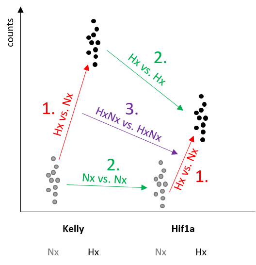

```{r setup, include=FALSE}
knitr::opts_chunk$set(echo = T,
                      error=FALSE,
                      warning=FALSE,
                      message=FALSE,
                      dpi=150)

```

# 0. Load

## - Load R librarys

```{r R_update, eval=FALSE, include=FALSE}
BiocManager::install()
# update.packages(oldPkgs = old.packages())
BiocManager::install("")

```

```{r librarys, include=FALSE}

library(DESeq2)
library(GEOquery)
library(tidyverse)
library(CorLevelPlot)
library(gridExtra)
library(viridis)

library(clusterProfiler)
library(ggupset)
library(enrichplot)
library(stats)
library(cowplot)
library(VennDiagram)
library(ggplot2)
library(stringr)
library(rlang)
library(reshape2)
library(readxl)
library(SummarizedExperiment)
library(biomaRt)
library(org.Hs.eg.db)
library(Rfast)
library(xlsx)
library(EnhancedVolcano)
library(PCAtools)
library(rgl)
library(impute)
library(magrittr)     
library(flashClust)
library(AnnotationHub)
library(venn)

library(gridExtra)
library(patchwork)
library(grid)
library(reshape2)

library(ComplexHeatmap)
# library(pheatmap)
library(ComplexHeatmap)
library(plyr)

library(kableExtra)
library(knitr)
library(RColorBrewer)
library(circlize)
library(devtools)


requireNamespace('png', quietly = TRUE)

ifelse(Sys.info()["sysname"]== "Linux",
       s <- "/mnt/s",
       s <- "S:")
dir <- paste(s,"AG/AG-Scholz-NGS/Daten/Simon/RNA-Seq_Kelly_all",sep="/")
gitdir <- paste(dir,"git_RNAseq_Kelly_Hx",sep="/")
data <- paste(dir,"data",sep="/")
dgedir <- paste(gitdir,"2B_DGE",sep="/")

par(mfrow = c(1,1))

futile.logger::flog.threshold(futile.logger::ERROR, name = "VennDiagramLogger")

```

## - Load dds

```{r dds, include=FALSE}
# load(file=paste(data,"deseq2.dds", sep="/"))

load(file=paste(data,"deseq2_treatment.dds", sep="/"))
dds_t <- dds
load(file=paste(data,"deseq2_condition.dds", sep="/"))
dds_c <- dds

load(file=paste(data,"deseq2_experiment_wgcna.dds", sep="/"))

```

## - functions

```{r topgenes, include=FALSE}
# topgenes
topgenes_f <- function(res,p=0.05,bM=10,l2FC=1){
a <- subset(res, padj < p & baseMean > bM & abs(log2FoldChange) > l2FC)
a <- a[order(a$baseMean, decreasing = T),]
  a$rank.bm <- seq(1:length(rownames(a)))
a <- a[order(a$padj, decreasing = F),]
  a$rank.padj <- seq(1:length(rownames(a)))
a <- a[order(abs(a$log2FoldChange), decreasing = T),]
  a$rank.l2FC <- seq(1:length(rownames(a)))
a$rank.sum <- a$rank.l2FC+a$rank.bm+a$rank.padj
  a <- a[order(a$rank.sum),]
a
}

```

```{r plotCounts_SK, include=FALSE}

plotCounts_SK <- function(goi,n="plotCounts"){
 plotCounts_SK_list <- list()
  l <- length(goi)
       for (ig in 1:l){
  s <- mcols(dds)[goi[ig],"symbol"]
  if (s ==""){s <- goi[ig]}
    d <- plotCounts(dds, gene=goi[ig], intgroup=c("condition","experiment","genotype","treatment"), main=s,returnData=TRUE)

  gcounts <- ggplot(d, aes(x = genotype, y = count, fill=treatment, color=treatment)) +
    geom_boxplot(color="black") +
    geom_point(shape=21,color="black",aes(fill=treatment),position=position_dodge(width=0.75), alpha=1) +
    scale_fill_manual(values=c("#A6CEE3","#FB9A99")) +
    scale_color_manual(values=c("#A6CEE3","#FB9A99")) +
    scale_y_continuous(trans = "log2") +
    labs(title = paste(s,"(",goi[ig],")",sep=" "))
  plotCounts_SK_list[[paste(n,goi[ig],sep="_")]] <- gcounts
       }
 
patchwork::wrap_plots(plotCounts_SK_list,ncol = 3) + 
  plot_layout(guides = "collect", axis_titles="collect", axes = 'collect') & 
  plot_annotation(title = n) & 
  theme(legend.position = 'bottom',
        plot.title = element_text(size=6),
        axis.text=element_text(size=6),
        axis.title=element_text(size=6),
        legend.text=element_text(size=6),
        legend.title=element_text(size=6))
        }          

```

```{r getVennElements, include=FALSE}
# get overlap elements
getVennElements <- function(plt,olf=overlaps){
l <- plt %>% length()
for (i in 1:l){
if( identical (
  names(olf)[plt[[i]]$label == lapply(olf,length)],character(0) 
)) {} else  {
  if(plt[[i]]$label > 0){
 paste("Element=",i," (",plt[[i]]$label,")", " --> ",
      names(olf)[plt[[i]]$label == lapply(olf,length)],
      "(",olf[plt[[i]]$label == lapply(olf,length)] %>% summary() %>% .[1],")",sep="") %>%
  print()
} } } }

```

```{r Vulcano1, include=FALSE}
# Vulcano
Vulcano_SK <- function(n,
                        ntop=100,
                        topcol="royalblue4",
                        degcol="royalblue1",
                        hscol="lightblue1",
                        lcol="grey20",
                        xlim=10,
                        ylim=300)
{
res <- results_list[[n]]
top <- topgenes_list[str_detect(names(topgenes_list),pattern=n)] %>% .[[1]]
deg <- deg_genes_list[str_detect(names(deg_genes_list),pattern=n)] %>% .[[1]]
l <- length(top)

res_shrink <- lfcShrink(dds, res=res, type="ashr")
res_shrink$symbol <- res$symbol

# define limits for significance
# padj (-log10)
# padj = 0.05 -> -log(base=10, 0.05) = 1.3
#
c_plimit <- 50
L2Flimit <- 1
a_L2Flimit <- -c_plimit/(L2Flimit^2)

res_shrink$ishs <- ifelse(is.na(res_shrink$padj),FALSE,(a_L2Flimit*(res_shrink$log2FoldChange^2) + c_plimit) < -log(res_shrink$padj, base=10))

res_shrink$istop <- rownames(res_shrink) %in% top
res_shrink$isdeg <- rownames(res_shrink) %in% deg

res <- res_shrink
res <- res[order(abs(res$log2FoldChange), decreasing = T),]
res <- res[order(res$ishs, decreasing = F),]
res <- res[order(res$isdeg, decreasing = F),]
res <- res[order(res$istop, decreasing = F),]

# remove nas
res <- res[!is.na(res$padj),]
res <- res[!is.na(res$log2FoldChange),]

# change shape of outliers
shape <- ifelse(abs(res$log2FoldChange) > xlim, 18,
                ifelse(res$padj < 10^-ylim,18,16))
summary(is.na(shape))
# shape[is.na(shape)] <- 2
names(shape)[shape == 18] <- 'out of scale'
names(shape)[shape == 16] <- 'in range'

# move outliers to coord. max.
res$log2FoldChange[res$log2FoldChange > xlim] <- xlim
res$log2FoldChange[res$log2FoldChange < -xlim] <- -xlim
res$padj[res$padj < 10^-ylim] <- 10^-ylim
summary(res$padj < 10^-ylim)


## combine top, deg & hs
keyvals <- ifelse(
    res$istop == TRUE, topcol,
    ifelse(
    res$isdeg == TRUE, degcol,
    ifelse(
    res$ishs == TRUE, hscol,
    'grey') ) )
    
keyvals[is.na(keyvals)] <- 'grey'
  names(keyvals)[keyvals == topcol] <- 'top'
  names(keyvals)[keyvals == degcol] <- 'degs'
  names(keyvals)[keyvals == hscol] <- 'highly significant'
  names(keyvals)[keyvals == 'grey'] <- 'other'

rownames(res) <- res$symbol

ev_f <- EnhancedVolcano(res,
    x = 'log2FoldChange',
    y = 'padj',
    lab = res$symbol,
    selectLab  = res[res$istop == TRUE,"symbol"],
    labSize = 1.5,
    drawConnectors = TRUE,
    boxedLabels = TRUE,
    widthConnectors = 0.5,
    colConnectors = lcol,
    pointSize = c(ifelse(res$istop==TRUE, 2, ifelse(res$ishs==TRUE, 1.5, 1))),
    colAlpha = c(ifelse(res$istop==TRUE, 0.9, ifelse(res$ishs==TRUE, 0.5, 0.2))),
    max.overlaps = 17,
    colCustom = keyvals,
    col=c('grey', topcol, topcol, topcol),
    xlim = c(-xlim, xlim),
    ylim = c(0, ylim),
    ylab = "Padj (-log10)",
    title = n,
    subtitle = paste("DE genes:",l),
    # sub = "SVF",
    pCutoff = 10^(-c_plimit),
    FCcutoff = L2Flimit,
    hline = c(0.05,
              0.01),
    hlineCol = c(degcol, topcol),
    hlineWidth = c(0.4, 0.4),
    vline = c(-2,2),
    vlineCol = c(topcol, topcol),
    vlineWidth = c(0.4, 0.4),
    shapeCustom =shape,
    # pointSize = c(ifelse(rownames(res_WT_D_vs.WT_BL) %in% rownames(top_WT_BL_vs.pcry_BL), 8, 1)),
    legendLabels=c('Not sig.','|L2F| > 2.5','p-adj < 0.05',
                   'p-adj & L2F'),
    legendPosition = 'bottom',
    legendLabSize = 8,
    legendIconSize = 2.0,
    axisLabSize = 8,
    titleLabSize = 8,
    subtitleLabSize = 8,
    captionLabSize = 8,
    caption = {}
   )

ev_f
}

```

```{r Vulcano2, include=FALSE}

### Vulcano2 list ######
Vulcano_SK2 <- function(n,list1,list2,
                        l1.col="chartreuse2",
                        l2.col="orangered",
                        lol.col="yellow2",
                        lcol="grey20",
                        l1.n= "list 1",
                        l2.n= "list 2",
                        xlim=10,
                        ylim=200,
                        lab=NULL,
                        ...)
{

res <- results_list[[n]]

# if list1 & list2 ><""

list_ol <- calculate.overlap(list(list1,list2))

l <- length(res)

res_shrink <- lfcShrink(dds, res=res, type="ashr")
res_shrink$symbol <- res$symbol

# define limits for significance
c_plimit <- 50
L2Flimit <- 1
a_L2Flimit <- -c_plimit/(L2Flimit^2)

res_shrink$ishs <- ifelse(is.na(res_shrink$padj),FALSE,(a_L2Flimit*(res_shrink$log2FoldChange^2) + c_plimit) < -log(res_shrink$padj, base=10))

res_shrink$isl1 <- rownames(res_shrink) %in% list1
res_shrink$isl2 <- rownames(res_shrink) %in% list2
res_shrink$islol <- rownames(res_shrink) %in% list_ol$a3

res <- res_shrink

res <- res[order(abs(res$log2FoldChange), decreasing = T),]
res <- res[order(res$isl1, decreasing = F),]
res <- res[order(res$isl2, decreasing = F),]
res <- res[order(res$islol, decreasing = F),]

# remove nas
res <- res[!is.na(res$padj),]
res <- res[!is.na(res$log2FoldChange),]

# change shape of outliers
shape <- ifelse(abs(res$log2FoldChange) > xlim, 18,
                ifelse(res$padj < 10^-ylim,18,16))
summary(is.na(shape))
# shape[is.na(shape)] <- 2
names(shape)[shape == 18] <- 'out of scale'
names(shape)[shape == 16] <- 'in range'

# move outliers to coord. max.
res$log2FoldChange[res$log2FoldChange > xlim] <- xlim
res$log2FoldChange[res$log2FoldChange < -xlim] <- -xlim
res$padj[res$padj < 10^-ylim] <- 10^-ylim
summary(res$padj < 10^-ylim)

## combine top, deg & hs
keyvals <- ifelse(
    res$islol == TRUE, lol.col,
     ifelse(
    res$isl1 == TRUE, l1.col,
    ifelse(
    res$isl2 == TRUE, l2.col,
    'grey') ) )
    
keyvals[is.na(keyvals)] <- 'grey'
  names(keyvals)[keyvals == l1.col] <- l1.n
  names(keyvals)[keyvals == l2.col] <- l2.n
  names(keyvals)[keyvals == lol.col] <- 'overlap'
  names(keyvals)[keyvals == 'grey'] <- 'other'

rownames(res) <- res$symbol

if (is.null(lab)){
  lab <- res[res$isl1 == TRUE | res$isl2 == TRUE,"symbol"]
} else {
  lab <- res[lab,"symbol"]
}

ev_f <- EnhancedVolcano(res,
    x = 'log2FoldChange',
    y = 'padj',
    lab = res$symbol,
    selectLab  = lab,
    labSize = 2,
    drawConnectors = TRUE,
    boxedLabels = TRUE,
    widthConnectors = 0.5,
    colConnectors = lcol,
    pointSize = c(ifelse(res$islol==TRUE, 2, ifelse(res$isl1==TRUE | res$isl2==TRUE, 1.5, 1))),
    colAlpha = c(ifelse(res$islol==TRUE, 0.9, ifelse(res$isl1==TRUE | res$isl2==TRUE, 0.5, 0.2))),
    max.overlaps = 30,
    colCustom = keyvals,
    col=c('grey', l1.col, l2.col, lol.col),
    xlim = c(-xlim, xlim),
    ylim = c(0, ylim),
    ylab = "Padj (-log10)",
    title = n,
    subtitle = paste("DE genes:",l),
    # sub = "SVF",
    pCutoff = 10^(-c_plimit),
    FCcutoff = L2Flimit,
    shapeCustom =shape,
    # pointSize = c(ifelse(rownames(res_WT_D_vs.WT_BL) %in% rownames(top_WT_BL_vs.pcry_BL), 8, 1)),
    legendLabels=c('Not sig.','|L2F| > 2.5','p-adj < 0.05',
                   'p-adj & L2F'),
    legendPosition = 'bottom',
    legendLabSize = 8,
    legendIconSize = 2.0,
    axisLabSize = 8,
    titleLabSize = 8,
    subtitleLabSize = 8,
    captionLabSize = 8,
    caption = {}
   )

ev_f
}


```

```{r color_breaks, include=FALSE}

# color breaks
quantile_breaks <- function(xs, n = 10) {
  breaks <- quantile(xs, probs = seq(0, 1, length.out = n))
  breaks[!duplicated(breaks)]
}

```

# 1. Make results

```{r results, include=FALSE}

design(dds)
# ~genotype + treatment + genotype:treatment
# resultsNames(dds)
l <- length(resultsNames(dds))
cbind(resultsNames(dds),c(rep(0,l)))
#      [,1]                        [,2]
# [1,] "Intercept"                 "0" 
# [2,] "genotype_HIF1A_vs_Kelly"   "0" 
# [3,] "genotype_HIF2A_vs_Kelly"   "0" 
# [4,] "genotype_HIF1B_vs_Kelly"   "0" 
# [5,] "treatment_Hx_vs_Nx"        "0" 
# [6,] "genotypeHIF1A.treatmentHx" "0" 
# [7,] "genotypeHIF2A.treatmentHx" "0" 
# [8,] "genotypeHIF1B.treatmentHx" "0" 

condition <- colData(dds)$condition
treatment <- colData(dds)$treatment
genotype <- colData(dds)$genotype

results_list <- {}

#------ Hx vs. Nx (fixed genotype)
# 0,0,0,0,1,0,0,0
## Hx vs. Nx in HIF1A
r1 <- results(dds, contrast = c(0,0,0,0,0,0,0,1,1,0,0))
r1$symbol <- mcols(dds)$symbol
res.Hif1a.Hx.vs.Nx <- r1 #ok
n<- "Hif1a.Hx.vs.Nx"
assign(paste("res",n,sep="."),r1)
results_list[[n]] <- r1

# ok
# same as res.Hif1a.Hx.vs.Nx_test <- r2 <- results(dds, contrast = list( c("treatment_Hx_vs_Nx","genotypeHIF1A.treatmentHx")))

## Hx vs. Nx in HIF2A
r1 <- results(dds, contrast = c(0,0,0,0,0,0,0,1,0,1,0))
r1$symbol <- mcols(dds)$symbol
res.Hif2a.Hx.vs.Nx <- r1 #ok
n<- "Hif2a.Hx.vs.Nx"
assign(paste("res",n,sep="."),r1)
results_list[[n]] <- r1 

## Hx vs. Nx in HIF1B
r1 <- results(dds, contrast = c(0,0,0,0,0,0,0,1,0,0,1))
r1$symbol <- mcols(dds)$symbol
res.Hif1b.Hx.vs.Nx <- r1 #ok
n<- "Hif1b.Hx.vs.Nx"
assign(paste("res",n,sep="."),r1)
results_list[[n]] <- r1 

## Hx vs. Nx in Kelly
r1 <- results(dds, contrast = c(0,0,0,0,0,0,0,1,0,0,0))
r1$symbol <- mcols(dds)$symbol
res.Kelly.Hx.vs.Nx <- r1 #ok
n<- "Kelly.Hx.vs.Nx"
assign(paste("res",n,sep="."),r1)
results_list[[n]] <- r1 


#------  KO vs. Kelly (Nx)
## HIF1A vs. Kelly (Nx)
r1 <- results(dds, contrast = c(0,0,0,0,1,0,0,0,0,0,0))
r1$symbol <- mcols(dds)$symbol
res.Nx.Hif1a.vs.Kelly <- r1
n<- "Nx.Hif1a.vs.Kelly"
assign(paste("res",n,sep="."),r1)
results_list[[n]] <- r1 

## HIF2A vs. Kelly (Nx)
r1 <- results(dds, contrast = c(0,0,0,0,0,1,0,0,0,0,0))
r1$symbol <- mcols(dds)$symbol
res.Nx.Hif2a.vs.Kelly <- r1
n<- "Nx.Hif2a.vs.Kelly"
assign(paste("res",n,sep="."),r1)
results_list[[n]] <- r1 

## HIF1B vs. Kelly (Nx)
r1 <- results(dds, contrast = c(0,0,0,0,0,0,1,0,0,0,0))
r1$symbol <- mcols(dds)$symbol
res.Nx.Hif1b.vs.Kelly <- r1 #ok
n<- "Nx.Hif1b.vs.Kelly"
assign(paste("res",n,sep="."),r1)
results_list[[n]] <- r1 


#------ KO vs. Kelly (Hx)
## HIF1A vs. Kelly (Hx)
r1 <- results(dds, contrast = c(0,0,0,0,1,0,0,0,1,0,0))
r1$symbol <- mcols(dds)$symbol
res.Hx.Hif1a.vs.Kelly <- r1
n<- "Hx.Hif1a.vs.Kelly"
assign(paste("res",n,sep="."),r1)
results_list[[n]] <- r1 

## HIF2A vs. Kelly (Hx)
r1 <- results(dds, contrast = c(0,0,0,0,0,1,0,0,0,1,0))
r1$symbol <- mcols(dds)$symbol
res.Hx.Hif2a.vs.Kelly <- r1
n<- "Hx.Hif2a.vs.Kelly"
assign(paste("res",n,sep="."),r1)
results_list[[n]] <- r1 

## HIF1B vs. Kelly (Hx)
r1 <- results(dds, contrast = c(0,0,0,0,0,0,1,0,0,0,1))
r1$symbol <- mcols(dds)$symbol
res.Hx.Hif1b.vs.Kelly <- r1
n<- "Hx.Hif1b.vs.Kelly"
assign(paste("res",n,sep="."),r1)
results_list[[n]] <- r1 


#------ KO vs. KO (Hx) 
# Hif2A vs. Hif1A (Hx)
r1 <- results(dds, contrast = c(0,0,0,0,-1,1,0,0,-1,1,0))
r1$symbol <- mcols(dds)$symbol
res.Hx.Hif2a.vs.Hif1a <- r1
n<- "Hx.Hif2a.vs.Hif1a"
assign(paste("res",n,sep="."),r1)
results_list[[n]] <- r1 

# Hif1B vs. Hif1A (Hx)
r1 <- results(dds, contrast = c(0,0,0,0,-1,0,1,0,-1,0,1))
r1$symbol <- mcols(dds)$symbol
res.Hx.Hif1b.vs.Hif1a <- r1
n<- "Hx.Hif1b.vs.Hif1a"
assign(paste("res",n,sep="."),r1)
results_list[[n]] <- r1

# Hif1B vs. Hif2A (Hx)
r1 <- results(dds, contrast = c(0,0,0,0,0,-1,1,0,0,-1,1))
r1$symbol <- mcols(dds)$symbol
res.Hx.Hif1b.vs.Hif2a <- r1
n<- "Hx.Hif1b.vs.Hif2a"
assign(paste("res",n,sep="."),r1)
results_list[[n]] <- r1


#----ðð KO (Hx.vs.Nx) vs. Kelly (Hx vs. Nx)
# = interaction terms
# Hif1a vs. Kelly (Hx vs. Nx)
r1 <- results(dds, contrast = c(0,0,0,0,0,0,0,0,1,0,0))
r1$symbol <- mcols(dds)$symbol
n<- "Hif1aHxNx.vs.KellyHxNx"
assign(paste("res",n,sep="."),r1)
results_list[[n]] <- r1

# Hif2a vs. Kelly (Hx vs. Nx)
r1 <- results(dds, contrast = c(0,0,0,0,0,0,0,0,0,1,0))
r1$symbol <- mcols(dds)$symbol
n<- "Hif2aHxNx.vs.KellyHxNx"
assign(paste("res",n,sep="."),r1)
results_list[[n]] <- r1

# Hif1b vs. Kelly (Hx vs. Nx)
r1 <- results(dds, contrast = c(0,0,0,0,0,0,0,0,0,0,1))
r1$symbol <- mcols(dds)$symbol
n<- "Hif1bHxNx.vs.KellyHxNx"
assign(paste("res",n,sep="."),r1)
results_list[[n]] <- r1


#------ Group comparisions (Hx) 
# Hif1B vs. Hifa (Hif1A & Hif2A) (Hx)
r1 <- results(dds, contrast = c(0,0,0,0,-0.5,-0.5,1,0,-0.5,-0.5,1))
r1$symbol <- mcols(dds)$symbol
res.Hx.Hif1b.vs.Hif12a <- r1
n<- "Hx.Hif1b.vs.Hif12a"
assign(paste("res",n,sep="."),r1)
results_list[[n]] <- r1

# Kelly vs. Hifs (Hif1A, Hif2A, Hif1b) (Hx)
r1 <- results(dds, contrast = c(0,0,0,0,1/3,1/3,1/3,0,1/3,1/3,1/3))
r1$symbol <- mcols(dds)$symbol
res.Hx.Kelly.vs.allHIFs <- r1
n<- "Hx.Kelly.vs.allHIFs"
assign(paste("res",n,sep="."),r1)
results_list[[n]] <- r1


#------ Hx vs. Nx
# Hx vs. Nx over all groups
r1 <- results(dds, contrast = c(0,0,0,0,0,0,0,1,1/4,1/4,1/4))
r1$symbol <- mcols(dds)$symbol
res.Hx.vs.Nx <- r1
n<- "Hx.vs.Nx"
assign(paste("res",n,sep="."),r1)
results_list[[n]] <- r1
# NOT confirmed


results_list[["Nx.Hif2a.vs.Kelly"]] %>% summary(alpha=0.05)
results_list[["Hx.Hif2a.vs.Kelly"]] %>% summary()


```

#### (Advanced results troubleshooting)

```{r results_trouble, eval=FALSE, include=FALSE}
## Hx vs. Nx (all)
# ?

# (Kelly_Hx - Kelly_Nx) + (Hif1a_Hx - Hif1a_Nx) + (Hif2a_Hx - Hif2a_Nx) + (Hif1b_Hx - Hif1b_Nx)
#           5           +         5+6                      5+7                     5+8           /4
# c(0,0,0,0,4*5/4,1/4)

r1 <- results(dds, contrast = c(0,0,0,0,0,0,0,1,-0.25,-0.25,-0.25))
r1$symbol <- mcols(dds)$symbol
res.Hx.vs.Nx <- r1

summary(r1)
b=0
c=0
d=0
e=0
f=0
g=0
h=0
input <- c(0.01726995,0.04838570,-0.06032016,1.00000000,0.24648441,0.20725899,0.09283565)
input <- c(0,0,0,1,0.25,0.25,0.25)

imput0 <- c(0,0,0,0,0,0,0)

lm_pred <- function(input=c(0,0,0,0,0,0,0)){
  # print(paste("0",b,c,d,e,f,g,h,sep=" "))
  if (
    identical(input, imput0) ) { 0 } else {
  r <- results(dds, contrast = c(0,input[1],input[2],input[3],input[4],input[5],input[6],input[7]))
  # print(input)
  fm <- lm(r_t$log2FoldChange ~ r$log2FoldChange)
  # summary(fm)
  summary(fm)$r.squared
  }
  }

plot(r$log2FoldChange,r_t$log2FoldChange, xlim = c(-10, 10), ylim = c(-10, 10))
abline(fm, col = "red")

lm_pred(2)

optimize(lm_pred,
         interval=0.1,
         lower=-1,
         upper=1,
         maximum = TRUE)

# Method "BFGS" is a quasi-Newton method (also known as a variable metric algorithm), specifically that published simultaneously in 1970 by Broyden, Fletcher, Goldfarb and Shanno. This uses function values and gradients to build up a picture of the surface to be optimized.
# 
# Method "CG" is a conjugate gradients method based on that by Fletcher and Reeves (1964) (but with the option of Polak–Ribiere or Beale–Sorenson updates). Conjugate gradient methods will generally be more fragile than the BFGS method, but as they do not store a matrix they may be successful in much larger optimization problems.
# 
# Method "L-BFGS-B" is that of Byrd et. al. (1995) which allows box constraints, that is each variable can be given a lower and/or upper bound. The initial value must satisfy the constraints. This uses a limited-memory modification of the BFGS quasi-Newton method. If non-trivial bounds are supplied, this method will be selected, with a warning.
# 
# Nocedal and Wright (1999) is a comprehensive reference for the previous three methods.
# 
# Method "SANN" is

optim_res1 <- optim(par=c(0,0,0,0.5,0,0,0),
      # lower=-1,upper=+1,
      # control$ndeps=0.1,
      control = list(fnscale = -1),
      # method = "BFGS",
      lm_pred)

optim_res1 <- optim(par=c(0,0,0,0.5,0,0,0),
      control = list(fnscale = -1),
      # method = "BFGS",
      lm_pred)

summary(fm)$r.squared

lm_pred

r_t <- results(dds_t, contrast = c("treatment","Hx","Nx"))
summary(r_t)

resultsNames(dds_c)
colData(dds_c)$condition
r_c <- results(dds_c,
               name = "condition_Kelly_Hx_vs_Kelly_Nx",
               listValues = c(1,-1))
r_c
summary(r_c)

r_c <- results(dds_c,
               contrast = c(0,1/3,-1/4,1/4,-1/4,1/4,-1/4,1/4))
summary(r_c)


names(summary(fm2))

fm1 <- lm(r_t$log2FoldChange ~ r_c$log2FoldChange)
fm2 <- lm(r1$log2FoldChange ~ r_c$log2FoldChange)
fm3 <- lm(r1$log2FoldChange ~ r_t$log2FoldChange)
plot(fm1)
par(mfrow=c(1,3),mar=c(1,1,1,1))
plot(r_c$log2FoldChange,r_t$log2FoldChange, xlim = c(-10, 10), ylim = c(-10, 10))
abline(fm1, col = "red")
plot(r_c$log2FoldChange,r1$log2FoldChange, xlim = c(-10, 10), ylim = c(-10, 10))
abline(fm2, col = "red")
plot(r_t$log2FoldChange,r1$log2FoldChange, xlim = c(-10, 10), ylim = c(-10, 10))
abline(fm3, col = "red")


design(dds)

r2_treatment <- results(dds, contrast = c("treatment","Hx","Nx"))
r2_Kelly_Hx_Nx <- results(dds, contrast = c("condition","Kelly_Hx","Kelly_Nx"))
r1_treatment_Hx_vs_Nx <- results(dds, contrast = c(0,0,0,0,0,0,0,0,1,1,1))
r3 <- results(dds, name = "treatment_Hx_vs_Nx")

r1 <- results(dds, contrast = list(c("genotypeHIF1A.treatmentHx","genotypeHIF2A.treatmentHx","genotypeHIF1B.treatmentHx"))
)

?results

design <- ~ treatment + genotype

# Specify the contrast of interest
contrast <- c("genotypeHif1a", "genotypeHif2a")

# Create the contrast matrix
contrast.matrix <- makeContrasts(contrast, levels = colnames(dds))

# Fit the model with the contrast
dds <- DESeqDataSetFromMatrix(countData = countData, colData = colData, design = design)
dds <- DESeq(dds, test = "Wald", coef = contrast.matrix)

# Extract the results
results <- results(dds)

# View the results
head(results)


boxplot(gene ~ treatment,
  data = data.frame(treatment = colData(dds)$treatment, t(assay(ntd))))
                    

r1 <- r1_treatment_Hx_vs_Nx
a <- 0
b <- 0.33

par(mfrow=c(2,5),mar=c(1,1,1,1))

for (a in 0:1){
  for (b in c(0,0.25,0.5,0.75,1)){
    print(paste("a=",a," b=",b))
    if(a+b>0|a+b<0)
r1 <- results(dds, contrast = c(0,0,0,0,0,0,0,a,b,b,b))
fm1 <- lm(r1$log2FoldChange ~ r2_treatment$log2FoldChange)
# fm2 <- lm(r1$log2FoldChange ~ r2_Kelly_Hx_Nx$log2FoldChange)

plot(r2_treatment$log2FoldChange,r1$log2FoldChange, xlim = c(-10, 10), ylim = c(-10, 10), main=paste("r2_A vs. ",a,b,sep=","))
abline(fm1, col = "red")

# plot(r2_Kelly_Hx_Nx$log2FoldChange,r1$log2FoldChange, xlim = c(-10, 10), ylim = c(-10, 10), main=paste("r2_B vs. ",a,b,sep=","))
# abline(fm2, col = "red")
  }
}

par(mfrow=c(1,1),mar=c(1,1,1,1))

fm1 <- lm(r2_Kelly_Hx_Nx$log2FoldChange ~ r2_treatment$log2FoldChange)

plot(r2_treatment$log2FoldChange,r2_Kelly_Hx_Nx$log2FoldChange, xlim = c(-10, 10), ylim = c(-10, 10), main=paste("r2_A vs. ",a,b,sep=","))
abline(fm1, col = "red")

plot(r1$log2FoldChange,r3$log2FoldChange, xlim = c(-10, 10), ylim = c(-10, 10), main=paste("r2_A vs. ",a,b,sep=","))

# r2 <- results(dds, contrast = list( c("genotype_HIF1B_vs_Kelly","genotypeHIF1B.treatmentHx")))

r1 %>% summary()
r2 %>% summary()

fm <- lm(r1$log2FoldChange ~ r2$log2FoldChange)
plot(r2$log2FoldChange,r1$log2FoldChange, xlim = c(-10, 10), ylim = c(-10, 10))
abline(fm, col = "red")


res.Hx.vs.Nx  <- results(dds, name="treatment_Hx_vs_Nx")

res.Hif1a.vs.Kelly <- results(dds, name="genotype_HIF1A_vs_Kelly")
res.Hif2a.vs.Kelly <- results(dds, name="genotype_HIF2A_vs_Kelly")
res.Hif1b.vs.Kelly <- results(dds, name="genotype_HIF1B_vs_Kelly")


```



### -Generate toplist

```{r toplist, echo=FALSE}
cat("design")
design(dds)

deg_genes_list <- lapply(results_list,topgenes_f) %>%  lapply(.,rownames) 
names(deg_genes_list) <- paste("deg",names(deg_genes_list),sep="_")

topgenes_list <- lapply(results_list,topgenes_f, p=0.01,bM=100,l2FC=2) %>%  lapply(.,rownames)
names(topgenes_list) <- paste("top",names(topgenes_list),sep="_")

cat("cutoffs",
      "differential expressed: p=0.05,bM=10,l2FC=1",
      "top genes:              p=0.01,bM=100,l2FC=2",
      sep="\n")

data.frame(all.DEGs= (deg_genes_list %>% lapply(., length) %>% unlist()),
              top.DEGs = (topgenes_list %>% lapply(., length) %>% unlist())
              ) %>% kable()


```

## -Plot example counts

```{r results_counts, echo=FALSE, fig.height=3}

cols = brewer.pal(n=8,name = 'Paired')

# get 3 sample genes
sample_plots <- list()
sample_plots_list <- {}
plot_list <- list()
li <- results_list %>% length()
for (i in 1:li){
  n <- results_list[i] %>% names()
  goi <- c(topgenes_list[[i]][1],sample(topgenes_list[[i]],size=2))
  l <- length(goi)
plotCounts_SK(goi, n=n) %>% print()
}

for (n in names(results_list)){
pn <-   str_detect(names(plot_list), pattern=n) %>% names(plot_list)[.]
plot.3 <- patchwork::wrap_plots(plot_list[pn],ncol = 3) + 
  plot_layout(guides = "collect", axis_titles="collect") & 
  plot_annotation(title = str_split(pn[[1]],pattern="_",simplify =TRUE)[1]) & 
  theme(legend.position = 'bottom',plot.title = element_text(size=10))
#        print(plot.3)
        }            

results_list[["Nx.Hif1b.vs.Kelly"]][results_list[["Nx.Hif1b.vs.Kelly"]]$symbol=="FABP5P7",c(7,1:6)] %>% kable()

goi <- c("ENSG00000234964")
plotCounts_SK(goi) + ~plotCounts(dds, gene=goi, intgroup = c("experiment"),col=colData(dds)$experiment, main = )

```

# 2. Data Dive

## Colour sheme

```{r colors, echo=FALSE}

colors_paired <- c("#A6CEE3", "#1F78B4", "#B2DF8A", "#33A02C", "#FB9A99", "#E31A1C", "#FDBF6F", "#FF7F00")
colors_v <- c("#440154FF", "#482878FF", "#3E4A89FF", "#31688EFF", "#26828EFF", "#1F9E89FF", "#35B779FF", "#6DCD59FF", "#B4DE2CFF", "#FDE725FF")
colors <- c("lavenderblush3","lavenderblush4","#90caf9","#1976d2", "#82e0aa", "#239b56", "#f8c471", "#b9770e") 
colors4 <- colors[c(1,3,5,7)]
# Vulcano colors
colors_vul <- c(colors[4:3],"orangered3","salmon1","hotpink4","hotpink1","darkseagreen4","darkseagreen1")

df <- data.frame(n=c(1:8),
       color=colors)

# ggplot(df, aes(x = 1, y = 1, fill = colors)) +
#   geom_tile() +
#   scale_fill_manual(values = df$color) +
#   theme_void()

```

## Volcanos

### Draw Vulcanos

```{r draw vulcano,  echo=FALSE, fig.show="hold", fig.height=5}

# Input

# results name
n <- "Hif1a.Hx.vs.Nx"

# colours
topcol <- "royalblue4"
hscol <- "royalblue1"
lcol <- "grey20"

# limits
xlim <- 10
ylim <- 300

# number of top genes
ntop <- 100

###################

# names(results_list)

colors <- c("lavenderblush3","lavenderblush4","#90caf9","#1976d2", "#82e0aa", "#239b56", "#f8c471", "#b9770e") 

ev_kelly <- Vulcano_SK(n="Kelly.Hx.vs.Nx", # results name
            ntop=200, # number of top genes
            topcol="grey30",
            degcol=colors[2], # color top genes
            hscol=colors[1], # color highly significant genes
            lcol="grey20",
            xlim=10,
            ylim=300)

ev_hif1a <- Vulcano_SK(
            n <- "Hif1a.Hx.vs.Nx",
            topcol="royalblue4",
            degcol=colors[4],
            hscol=colors[3])

ev_hif2a <- Vulcano_SK(
            n <- "Hif2a.Hx.vs.Nx",
            topcol="darkgreen",
            degcol=colors[6],
            hscol=colors[5])

ev_hif1b <- Vulcano_SK(
            n <- "Hif1b.Hx.vs.Nx",
            topcol="tan4",
            degcol=colors[8],
            hscol=colors[7])

( ev_kelly + ev_hif1a  ) + 
  plot_layout(guides = "collect", axes="collect", axis_titles="collect") & 
  theme(legend.position = 'bottom', axis.title=element_text(size=8))

( ev_hif2a + ev_hif1b ) + 
  plot_layout(guides = "collect", axis_titles="collect") & 
  theme(legend.position = 'bottom', axis.title=element_text(size=8))
 
```

### (continuous Vulcanos)

```{r vulcano_cont, eval=FALSE}

# gradient is fixed to padj = y-axis

# Vulcano
lcol="grey20"
xlim=10
ylim=300
n <- "Kelly.Hx.vs.Nx"
res <- results_list[[n]]
l <- length(res)

res_shrink <- lfcShrink(dds, res=res, type="ashr")
res_shrink$symbol <- res$symbol

# remove nas
res <- res[!is.na(res$padj),]
res <- res[!is.na(res$log2FoldChange),]

# rename genes
rownames(res) <- res$symbol

# change shape of outliers
shape <- ifelse(abs(res$log2FoldChange) > xlim, 18,
                ifelse(res$padj < 10^-ylim,18,16))
summary(is.na(shape))

# shape[is.na(shape)] <- 2
names(shape)[shape == 18] <- 'out of scale'
names(shape)[shape == 16] <- 'in range'

# move outliers to coord. max.
res$log2FoldChange[res$log2FoldChange > xlim] <- xlim
res$log2FoldChange[res$log2FoldChange < -xlim] <- -xlim
res$padj[res$padj < 10^-ylim] <- 10^-ylim
summary(res$padj < 10^-ylim)

 p1 <- EnhancedVolcano(res,
    lab = res$symbol,
    x = 'log2FoldChange',
    y = 'padj',
    pCutoff = 10^(-50),
    FCcutoff = 2,
    xlim = c(-xlim, xlim),
    pointSize = c(ifelse(res$log2FoldChange>2, 8, 1)),
    labSize = 6.0,
    shape = c(6, 6, 19, 16),
    title = "DESeq2 results",
    subtitle = "Differential expression",
    caption = bquote(~Log[2]~ "fold change cutoff, 2; p-value cutoff, 10e-4"),
    legendPosition = "right",
    legendLabSize = 14,
    colAlpha = 0.9,
    colGradient = c('red3', 'royalblue'),
    drawConnectors = TRUE,
    hline = c(10e-8),
    widthConnectors = 0.5)

  p1

ev_f <- EnhancedVolcano(res,
    x = 'log2FoldChange',
    y = 'padj',
    lab = res$symbol,
    labSize = 1.5,
    drawConnectors = TRUE,
    boxedLabels = TRUE,
    widthConnectors = 0.5,
    colConnectors = lcol,
    max.overlaps = 17,
    colGradient = c('red3', 'royalblue'),
    xlim = c(-xlim, xlim),
    ylim = c(0, ylim),
    ylab = "Padj (-log10)",
    title = n,
    subtitle = paste("DE genes:",l),
    # sub = "SVF",

    FCcutoff = 2,
    # pointSize = c(ifelse(rownames(res_WT_D_vs.WT_BL) %in% rownames(top_WT_BL_vs.pcry_BL), 8, 1)),
    legendLabels=c('Not sig.','|L2F| > 2.5','p-adj < 0.05',
                   'p-adj & L2F'),
    legendPosition = 'bottom',
    legendLabSize = 8,
    legendIconSize = 2.0,
    axisLabSize = 8,
    titleLabSize = 8,
    subtitleLabSize = 8,
    captionLabSize = 8,
    caption = {}
   )

ev_f


```

### (prepare data)

```{r volcano_data, eval=FALSE, echo=FALSE}
names(results_list)

# colours
topcol <- "royalblue4"
hscol <- "royalblue1"
lcol <- "grey20"

# limits
xlim <- 10
ylim <- 300

# number of top genes
ntop <- 100

# Kelly (Hx vs. Nx)
n <- "Kelly.Hx.vs.Nx"


res <- results_list[[n]]
top <- topgenes_f(res)
l <- nrow(top)

res_shrink <- lfcShrink(dds, res=res, type="ashr")
res_shrink$symbol <- res$symbol 
res_shrink$ishs <- ifelse((-20/3*(res_shrink$log2FoldChange^2) + 60) < -log(res_shrink$padj, base=10),TRUE,FALSE)
res_shrink$istop <- ifelse(rownames(res_shrink) %in% rownames(top)[1:ntop],TRUE,FALSE)
res <- res_shrink
res <- res[order(res$ishs, decreasing = F),]
res <- res[order(res$istop, decreasing = F),]

# remove nas
res <- res[!is.na(res$padj),]
res <- res[!is.na(res$log2FoldChange),]

# change shape of outliers
shape <- ifelse(abs(res$log2FoldChange) > xlim, 18,
                ifelse(res$padj < 10^-ylim,18,16))
summary(is.na(shape))
# shape[is.na(shape)] <- 2
names(shape)[shape == 18] <- 'out of scale'
names(shape)[shape == 16] <- 'in range'

# move outliers to coord. max.
res$log2FoldChange[res$log2FoldChange > xlim] <- xlim
res$log2FoldChange[res$log2FoldChange < -xlim] <- -xlim
res$padj[res$padj < 10^-ylim] <- 10^-ylim
summary(res$padj < 10^-ylim)

# change colour if in top genes
## according to ishs
keyvals <- ifelse(
    res$ishs == TRUE, topcol,
      'grey')
keyvals[is.na(keyvals)] <- 'grey'
  names(keyvals)[keyvals == topcol] <- 'highly significant'
  names(keyvals)[keyvals == 'grey'] <- 'other'
dim(res)[1] == length(keyvals)

## according to top
keyvals <- ifelse(
    res$istop == TRUE, topcol,
      'grey')
keyvals[is.na(keyvals)] <- 'grey'
  names(keyvals)[keyvals == topcol] <- 'top 100'
  names(keyvals)[keyvals == 'grey'] <- 'other'
dim(res)[1] == length(keyvals)

## combine top & hs
keyvals <- ifelse(
    res$istop == TRUE, topcol,
    ifelse(
    res$ishs == TRUE, hscol,
    'grey') )
    
keyvals[is.na(keyvals)] <- 'grey'
  names(keyvals)[keyvals == topcol] <- 'top 100'
  names(keyvals)[keyvals == hscol] <- 'highly significant'
  names(keyvals)[keyvals == 'grey'] <- 'other'
dim(res)[1] == length(keyvals)


rownames(res) <- res$symbol

```

### (simple volcano (full))

```{r volcano full, eval=FALSE, echo=FALSE}
length(rownames(res))==length(shape)
length(rownames(res))==length(keyvals)

ev <- EnhancedVolcano(res,
    x = 'log2FoldChange',
    y = 'padj',
    lab = res$symbol,
    selectLab  = res[res$istop == TRUE,"symbol"],
    labSize = 3,
    drawConnectors = TRUE,
    boxedLabels = TRUE,
    widthConnectors = 0.5,
    colConnectors = lcol,
    pointSize = c(ifelse(res$istop==TRUE, 4, ifelse(res$ishs==TRUE, 3, 2))),
    colAlpha = c(ifelse(res$istop==TRUE, 0.9, ifelse(res$ishs==TRUE, 0.5, 0.2))),
    max.overlaps = 10,
    colCustom = keyvals,
    col=c('grey', topcol, topcol, topcol),
    xlim = c(-xlim, xlim),
    ylim = c(0, ylim),
    ylab = "Padj (-log10)",
    title = n,
    subtitle = paste("DE genes:",l),
    # sub = "SVF",
    pCutoff = 10^(-60),
    FCcutoff = 2,
   shapeCustom =shape,
    # pointSize = c(ifelse(rownames(res_WT_D_vs.WT_BL) %in% rownames(top_WT_BL_vs.pcry_BL), 8, 1)),
    legendLabels=c('Not sig.','|L2F| > 2.5','p-adj < 0.05',
                   'p-adj & L2F'),
    legendPosition = 'bottom'
    )
ev

```

#### (check cutoff)

```{r check_cutoff, eval=FALSE, echo=FALSE}
a=a_L2Flimit
b=0
c=plimit

f = function(x){
  a*x^2 + b*x + c
}

x = -10:10
plot(x,f(x),type='l',ylim=c(0,100))
abline(h=0)
abline(v=0)

find.roots = function(a, b, c) {
  discriminant = b^2 - 4 * a * c
  if (discriminant > 0) {
    c((-b - sqrt(discriminant))/(2 * a), (-b + sqrt(discriminant))/(2 * a))
  }
  else if (discriminant == 0) {
    -b / (2 * a)
  }
  else {
    NaN
  }
}
solutions = find.roots(a, b, c)

points(x = solutions, y = rep(0, length(solutions)), # x and y coordinates of the x-intercepts
       pch = 18, cex = 2, col = 'red')
text(x = solutions, y = rep(0, length(solutions)),
     labels = rep("x-intercept", length(solutions)),
     pos = 3, col = 'red')


points(x=res$log2FoldChange,
       y=-log(base=10,res$padj),
       pch=16,col='royalblue',cex=0.5)

plot(x,-log(base=10,x))

```

## Overlaps (Venn)

### - Hif1a

```{r venn_hif1a, include=TRUE, echo=FALSE, eval=TRUE, out.width="100%", fig.height=5}

# https://stackoverflow.com/questions/37450698/the-output-order-of-function-calculate-overlap correct names for venn

# Hif1a Hx-Nx vs. Kelly Hx-Nx
input_list <- topgenes_list[c(4,1)]
plt <- venn.diagram(
    x = input_list,
    category.names = paste(names(input_list),"\n(",input_list %>% summary() %>% .[c(1:length(input_list))],")",sep=""),
    force.unique = TRUE, na = "remove",
    filename = NULL,
    main = "Hif1a Hx-Nx vs. Kelly Hx-Nx", main.fontface = "bold",
    lwd = 2,
    lty = 'blank',
    fill = colors4[c(1,2)],
    rotation.degree=180,
    cat.col=c(colors[c(2,4)]),
    cat.pos = c(-225,225),
    cat.fontface = "bold",
    #   inverted=length(input_list[[1]]) < length(input_list[[2]])
)


# plot example counts
overlaps <- calculate.overlap(input_list)
diff1 <- setdiff(overlaps[[1]],overlaps[[3]])
diff2 <- setdiff(overlaps[[2]],overlaps[[3]])

# get each top gene
getVennElements(plt)
goi <- c(diff1[1],overlaps$a3[1],diff2[1])
# grid.newpage()
patchwork::wrap_elements((plt)) / plotCounts_SK(goi)

plotCounts_SK(diff1[1:9],n="only_Kelly") 
plotCounts_SK(diff2[1:9],n="only_Hif1a")

# get results
cat("Kelly.Hx.vs.Nx")
results_list$Kelly.Hx.vs.Nx[diff2[1:9],] %>% kable()

cat("Hif1a.Hx.vs.Nx")
results_list$Hif1a.Hx.vs.Nx[diff2[1:9],] %>% kable()


### compare ALL degs in Kelly with TOP in HIF1A and vice versa
# Hif1a Hx-Nx vs. Kelly Hx-Nx
input_list <- c(deg_genes_list[c(4,1)],topgenes_list[c(4,1)])

plt <- venn.diagram(
    x = input_list,
    category.names = paste(names(input_list),"\n(",input_list %>% summary() %>% .[c(1:length(input_list))],")",sep=""),
    force.unique = TRUE, na = "remove",
    filename = NULL,
    main = "Hif1a Hx-Nx vs. Kelly Hx-Nx", main.fontface = "bold",
    lwd = 2,
    lty = 'blank',
    fill = colors[c(1,3,2,4)],
    cat.col=colors[c(2,4,2,4)],
    cat.fontface = "bold",
    # inverted=length(input_list[[1]]) < length(input_list[[2]])
    )

grid.newpage()
grid.draw(plt)

# plot example counts
overlaps <- calculate.overlap(input_list)
getVennElements(plt)


# get each top gene
goi <- c(overlaps$a4[1:3],overlaps$a8[1:3])
plotCounts_SK(overlaps$a4[1:9],n="Hx_in_Kelly_but_NOT_in_Hif1A")
plotCounts_SK(overlaps$a8[1:9],n="Hx_in_HIF1A_but_NOT_in_Kelly")

top_hif1a <- results_list$Hif1a.Hx.vs.Nx[c(overlaps$a4,overlaps$a8),] %>% .[order(abs(.$log2FoldChange), decreasing=TRUE),]


# Compare with vs,vs results
cat("compare results with contrast vsvs (Hif1a Hx vs. Nx  VS.  Kelly Hx vs. Nx")
input_list <- c(list("top_hif1a" = top_hif1a %>% rownames()),deg_genes_list[c(14)],topgenes_list[c(14)])
plt <- venn.diagram(
    x = input_list,
    category.names = paste(names(input_list),"\n(",input_list %>% summary() %>% .[c(1:length(input_list))],")",sep=""),
    force.unique = TRUE, na = "remove",
    filename = NULL,
    main = "Hif1a Hx-Nx vs. Kelly Hx-Nx", main.fontface = "bold",
    lwd = 2,
    lty = 'blank',
    fill = colors[c(4,1,2)],
    cat.col=c(colors[c(4)],"grey40","grey20"),
    cat.fontface = "bold",
    cat.pos = c(-45,0,45),
    # inverted=length(input_list[[1]]) < length(input_list[[2]])
    )


# c_graphic <- "/mnt/s/AG/AG-Scholz-NGS/Daten/Simon/RNA-Seq_Kelly_all/git_RNAseq_Kelly_Hx/2B_DGE/Contrasts.png"
source_file <- dirname(rstudioapi::getSourceEditorContext()$path)
setwd(source_file)
c_graphic <- png::readPNG("Contrasts.png", native = TRUE)

patchwork::wrap_elements((plt)) + c_graphic

# overlaps
overlaps <- calculate.overlap(input_list)
getVennElements(plt)

# plot counts
plotCounts_SK(overlaps$a1[1:4],n="only hif1a") # a1=5
# -> nicht interessant
plotCounts_SK(overlaps$a2 %>% sample(size=9),n="hif1a & degs") # a2=43
# passt
plotCounts_SK(overlaps$a5 %>% sample(size=9),n="hif1a & top") # a5=25
# passt
plotCounts_SK(overlaps$a6 %>% sample(size=9),n="only tops") # a6=38
# naja
plotCounts_SK(overlaps$a3 %>% sample(size=9),n="only degs") # a3=709

results_list$Kelly.Hx.vs.Nx["ENSG00000105880",] %>% kable()
results_list$Hif1a.Hx.vs.Nx["ENSG00000105880",] %>% kable()


# compare all three results
res_1_ab <- calculate.overlap(list(
  deg_genes_list[["deg_Hif1a.Hx.vs.Nx"]],
  deg_genes_list[["deg_Kelly.Hx.vs.Nx"]]))
res_1_ab <- list(setdiff(res_1_ab[[1]],res_1_ab[[3]]),
        setdiff(res_1_ab[[2]],res_1_ab[[3]]))   
res_1 <- res_1_ab %>% unlist() %>% unique()

res_3 <- deg_genes_list[["deg_Hif1aHxNx.vs.KellyHxNx"]]

res_2_ab <- calculate.overlap(list(deg_genes_list[["deg_Nx.Hif1a.vs.Kelly"]],
                deg_genes_list[["deg_Hx.Hif1a.vs.Kelly"]]))

res_2 <- c(deg_genes_list[["deg_Nx.Hif1a.vs.Kelly"]],
                deg_genes_list[["deg_Hx.Hif1a.vs.Kelly"]]) %>% unique()

input_list <- list(res_1, res_2, res_3)
names(input_list) <- c("res_1", "res_2", "res_3")
plt <- venn.diagram(
    x = input_list,
    category.names = paste(names(input_list),"\n(",input_list %>% summary() %>% .[c(1:length(input_list))],")",sep=""),
    force.unique = TRUE, na = "remove",
    filename = NULL,
    main = "Compare results", main.fontface = "bold",
    lwd = 2,
    lty = 'blank',
    fill = c("salmon3","seagreen3","orchid3"),
    cat.col=c("salmon4","seagreen4","orchid4"),
    cat.fontface = "bold",
    cat.pos = c(-45,45,120),
    # inverted=length(input_list[[1]]) < length(input_list[[2]])
    )

patchwork::wrap_elements((plt)) + c_graphic

res_hif1a <- calculate.overlap(input_list)
getVennElements(plt, olf=res_hif1a)


```

### (- Hif2a)

```{r venn_hif2a, eval=TRUE, echo=FALSE, fig.height=5}

## get top list for Hif2a
### compare ALL degs in Kelly with TOP in HIF2A and vice versa
# Hif2a Hx-Nx - Kelly Hx-Nx
cat("Hif2a")
input_list <- c(deg_genes_list[c(4,2)],topgenes_list[c(4,2)])
plt <- venn.diagram(
    x = input_list,
    category.names = paste(names(input_list),"\n(",input_list %>% summary() %>% .[c(1:length(input_list))],")",sep=""),
    force.unique = TRUE, na = "remove",
    filename = NULL,
    main = "Hif2a Hx-Nx vs. Kelly Hx-Nx", main.fontface = "bold",
    lwd = 2,
    lty = 'blank',
    fill = colors[c(1,5,2,6)],
    cat.col=colors[c(2,6,2,6)],
    cat.fontface = "bold",
    # inverted=length(input_list[[1]]) < length(input_list[[2]])
    )

grid.newpage()
grid.draw(plt)

# plot example counts
overlaps <- calculate.overlap(input_list)
getVennElements(plt)

# get each top gene
goi <- c(overlaps$a4[1:3],overlaps$a8[1:3])
plotCounts_SK(overlaps$a4[1:9],n="Hx_in_Kelly_but_NOT_in_Hif2A")
plotCounts_SK(overlaps$a8[1:9],n="Hx_in_HIF2A_but_NOT_in_Kelly")

top_hif2a <- results_list$Hif2a.Hx.vs.Nx[c(overlaps$a4,overlaps$a8),] %>% .[order(abs(.$log2FoldChange), decreasing=TRUE),]

# results 3
pie_list <- deg_genes_list[["deg_Hif2aHxNx.vs.KellyHxNx"]]

# correlation with network analysis

pie(mcols(dds)[pie_list,"colors"] %>% .[!is.na(.)] %>% summary(),col=mcols(dds)[pie_list %>% rownames(),"colors"] %>% summary() %>% names(), main="Correlation with WGCNA")


```

```{r venn_hif2a_old, eval=FALSE, echo=FALSE, fig.height=5}

## get top list for Hif2a
### compare ALL degs in Kelly with TOP in HIF2A and vice versa
# Hif2a Hx-Nx - Kelly Hx-Nx
cat("Hif2a")
input_list <- c(deg_genes_list[c(4,2)],topgenes_list[c(4,2)])
plt <- venn.diagram(
    x = input_list,
    category.names = paste(names(input_list),"\n(",input_list %>% summary() %>% .[c(1:length(input_list))],")",sep=""),
    force.unique = TRUE, na = "remove",
    filename = NULL,
    main = "Hif2a Hx-Nx vs. Kelly Hx-Nx", main.fontface = "bold",
    lwd = 2,
    lty = 'blank',
    fill = colors[c(1,5,2,6)],
    cat.col=colors[c(2,6,2,6)],
    cat.fontface = "bold",
    # inverted=length(input_list[[1]]) < length(input_list[[2]])
    )

grid.newpage()
grid.draw(plt)

# plot example counts
overlaps <- calculate.overlap(input_list)
getVennElements(plt)

# get each top gene
goi <- c(overlaps$a4[1:3],overlaps$a8[1:3])
plotCounts_SK(overlaps$a4[1:9],n="Hx_in_Kelly_but_NOT_in_Hif2A")
plotCounts_SK(overlaps$a8[1:9],n="Hx_in_HIF2A_but_NOT_in_Kelly")

top_hif2a <- results_list$Hif2a.Hx.vs.Nx[c(overlaps$a4,overlaps$a8),] %>% .[order(abs(.$log2FoldChange), decreasing=TRUE),]

# correlation with network analysis
pie(mcols(dds)[top_hif2a %>% rownames(),"colors"] %>% .[!is.na(.)] %>% summary(),col=mcols(dds)[top_hif2a %>% rownames(),"colors"] %>% summary() %>% names(), main="Correlation with WGCNA")


```

### (- Hif1b)

```{r venn_hif1b, echo=FALSE, fig.height=5}

## get top list for Hif1b
### compare ALL degs in Kelly with TOP in HIF1B and vice versa
# Hif1b Hx-Nx - Kelly Hx-Nx
cat("Hif1b")
input_list <- c(deg_genes_list[c(4,3)],topgenes_list[c(4,3)])
plt <- venn.diagram(
    x = input_list,
    category.names = paste(names(input_list),"\n(",input_list %>% summary() %>% .[c(1:length(input_list))],")",sep=""),
    force.unique = TRUE, na = "remove",
    filename = NULL,
    main = "HIF1B Hx-Nx vs. Kelly Hx-Nx", main.fontface = "bold",
    lwd = 2,
    lty = 'blank',
    fill = colors[c(1,7,2,8)],
    cat.col=colors[c(2,8,2,8)],
    cat.fontface = "bold",
    # inverted=length(input_list[[1]]) < length(input_list[[2]])
    )

grid.newpage()
grid.draw(plt)

# plot example counts
overlaps <- calculate.overlap(input_list)
getVennElements(plt)

# get each top gene
goi <- c(overlaps$a4[1:3],overlaps$a8[1:3])
plotCounts_SK(overlaps$a4[1:9],n="Hx_in_Kelly_but_NOT_in_Hif1B")
plotCounts_SK(overlaps$a8[1:9],n="Hx_in_HIF1B_but_NOT_in_Kelly")

top_hif1b <- results_list$Hif1b.Hx.vs.Nx[c(overlaps$a4,overlaps$a8),] %>% .[order(abs(.$log2FoldChange), decreasing=TRUE),]


# results 3
pie_list <- deg_genes_list[["deg_Hif1bHxNx.vs.KellyHxNx"]]

# correlation with network analysis

pie(mcols(dds)[pie_list,"colors"] %>% .[!is.na(.)] %>% summary(),col=mcols(dds)[pie_list %>% rownames(),"colors"] %>% summary() %>% names(), main="Correlation with WGCNA")

```

### (- overlap)

```{r venn_overlap_res1, echo=FALSE, fig.height=4}
cat("overlap of overlaps")

input_list <- list("top_hif1a"=top_hif1a %>% rownames(),
                   "top_hif2a"=top_hif2a %>% rownames(),
                   "top_hif1b"=top_hif1b %>% rownames())
plt <- venn.diagram(
    x = input_list,
    category.names = paste(names(input_list),"\n(",input_list %>% summary() %>% .[c(1:length(input_list))],")",sep=""),
    force.unique = TRUE, na = "remove",
    filename = NULL,
    main = "Hif1a Hx-Nx vs. Kelly Hx-Nx", main.fontface = "bold",
    lwd = 2,
    lty = 'blank',
    fill = colors[c(3,5,7)],
    cat.col=c(colors[c(4,6,8)]),
    cat.fontface = "bold")

grid.newpage()
grid.draw(plt)

# plot example counts
overlaps <- calculate.overlap(input_list)
getVennElements(plt)

# plot each 1 gene
goi <- sapply(overlaps,"[[",1) %>% .[order(names(.))]
 
data.frame(overlap = names(goi),
           gene = mcols(dds)[goi,"symbol"])

plotCounts_SK(goi)

```

```{r venn_overlap_res3, eval=TRUE, include=FALSE}

cat("overlap of res3")

res3_list <- list("hif1a"=deg_genes_list[["deg_Hif1aHxNx.vs.KellyHxNx"]],
                   "hif2a"=deg_genes_list[["deg_Hif2aHxNx.vs.KellyHxNx"]],
                   "hif1b"=deg_genes_list[["deg_Hif1bHxNx.vs.KellyHxNx"]])

input_list <- res3_list
plt <- venn.diagram(
    x = input_list,
    category.names = paste(names(input_list),"\n(",input_list %>% summary() %>% .[c(1:length(input_list))],")",sep=""),
    force.unique = TRUE, na = "remove",
    filename = NULL,
    main = "res3", main.fontface = "bold",
    lwd = 2,
    lty = 'blank',
    fill = colors[c(3,5,7)],
    cat.col=c(colors[c(4,6,8)]),
    cat.fontface = "bold")

grid.newpage()
grid.draw(plt)

# plot example counts
overlaps <- calculate.overlap(input_list)
getVennElements(plt)

# plot each 1 gene
goi <- sapply(overlaps,"[[",1) %>% .[order(names(.))]
 
data.frame(overlap = names(goi),
           gene = mcols(dds)[goi,"symbol"])

plotCounts_SK(goi)

```

### (- other)

```{r venn_other, eval=FALSE, include=FALSE}

# Hx vs. Nx
# dev.off()
input_list <- topgenes_list[c(4,3,1,2)]
plt <- venn.diagram(
    x = input_list,
    category.names = paste(names(topgenes_list[c(4,3,1,2)]),"\n(",topgenes_list %>% summary() %>% .[c(4,3,1,2)],")",sep=""),
    force.unique = TRUE, na = "remove",
    filename = NULL,
    main = "Hx vs. Nx", main.fontface = "bold",
    lwd = 2,
    lty = 'blank',
    fill = colors4[c(1,4,2,3)])

grid.newpage()
grid.draw(plt)

# Hx vs. Hx
# dev.off()
plt <- venn.diagram(
    x = topgenes_list[c(8,9,10)],
    category.names = paste(names(topgenes_list[c(8,9,10)]),"\n(",topgenes_list %>% summary() %>% .[c(8,9,10)],")",sep=""),
    force.unique = TRUE, na = "remove",
    filename = NULL,
    main = "Hx vs. Hx", main.fontface = "bold",
    lwd = 2,
    lty = 'blank',
    fill = colors4[c(2,3,4)])
grid.draw(plt)

# Hif1a
# dev.off()
grid.newpage()
plt <- venn.diagram(
    x = topgenes_list[c(4,1,5,8)],
    category.names = paste(names(topgenes_list[c(4,1,5,8)]),"\n(",topgenes_list %>% summary() %>% .[c(4,1,5,8)],")",sep=""),
    force.unique = TRUE, na = "remove",
    filename = NULL,
    main = "Hif1a", main.fontface = "bold",
    lwd = 2,
    lty = 'blank',
    fill = colors[c(2,4,1,3)])
grid.draw(plt)

# Hif1a_simple
# dev.off()
input_list <- topgenes_list[c(4,1,8)]
plt <- venn.diagram(
    x = input_list,
    category.names = paste(names(input_list),"\n(",topgenes_list %>% summary() %>% .[choose_list],")",sep=""),
    force.unique = TRUE, na = "remove",
    filename = NULL,
    main = "Hif1a_simple", main.fontface = "bold",
    lwd = 2,
    lty = 'blank',
    fill = colors[c(1,3,4)])

overlaps <- calculate.overlap(input_list)
lapply(overlaps,length)

l <- plt %>% length()
for (i in 1:l){
#   print(i)
#   print(plt[[i]]$label)
# print (plt[[i]]$label == lapply(overlaps,length))
# print(names(overlaps)[plt[[i]]$label == lapply(overlaps,length)])
# print(length(overlaps[plt[[i]]$label == lapply(overlaps,length)]))

if( identical (
  names(overlaps)[plt[[i]]$label == lapply(overlaps,length)],character(0) 
)) {} else  {
 paste("Element=",i," (",plt[[i]]$label,")", " --> ",
      names(overlaps)[plt[[i]]$label == lapply(overlaps,length)],
      "(",length(overlaps[plt[[i]]$label == lapply(overlaps,length)]),")",sep="") %>%
  print()
}
}


## label names
plt[[7]]$label <- paste(plt[[7]]$label,"a1",sep="\n")
plt[[9]]$label <- paste(plt[[9]]$label,"a2",sep="\n")

plt[[9]]$label <- paste(overlaps[[1]], collapse = "\n") 

plt[[10]]$label <- paste(overlaps[[6]], collapse = "\n") 

grid.newpage()
grid.draw(plt)

# Hif1a_all
# dev.off()
choose_list <- c(4,14,1,8)
plt <- venn.diagram(
    x = topgenes_list[choose_list],
    category.names = paste(names(topgenes_list[choose_list]),"\n(",topgenes_list %>% summary() %>% .[choose_list],")",sep=""),
    force.unique = TRUE, na = "remove",
    filename = NULL,
    main = "Hif1a_all", main.fontface = "bold",
    lwd = 2,
    lty = 'blank',
    fill = colors[c(2,4,1,3)])
grid.newpage()
grid.draw(plt)

# Hif2a
# dev.off()
plt <- venn.diagram(
    x = topgenes_list[c(4,2,6,9)],
    category.names = paste(names(topgenes_list[c(4,2,6,9)]),"\n(",topgenes_list %>% summary() %>% .[c(4,2,6,9)],")",sep=""),
    force.unique = TRUE, na = "remove",
    filename = NULL,
    main = "Hif2a", main.fontface = "bold",
    lwd = 2,
    lty = 'blank',
    fill = colors[c(2,6,1,5)])
grid.newpage()
grid.draw(plt)

# Hif1b
# dev.off()
plt <- venn.diagram(
    x = topgenes_list[c(4,3,7,10)],
    category.names = paste(names(topgenes_list[c(4,3,7,10)]),"\n(",topgenes_list %>% summary() %>% .[c(4,3,7,10)],")",sep=""),
    force.unique = TRUE, na = "remove",
    filename = NULL,
    main = "Hif2a", main.fontface = "bold",
    lwd = 2,
    lty = 'blank',
    fill = colors[c(2,8,1,7)])
grid.newpage()
grid.draw(plt)

```

### Compare Results 1 2 3

#### Vulcano lists

```{r vulcano_lists, eval=TRUE, include=FALSE}

# Compare Hx.vs.Nx with interaction
n <- "Kelly.Hx.vs.Nx"

hif1a_deg_ol <- calculate.overlap(list(
  deg_genes_list[["deg_Kelly.Hx.vs.Nx"]],
  deg_genes_list[["deg_Hif1a.Hx.vs.Nx"]]))
hif1a_deg <- c(setdiff(hif1a_deg_ol[[1]],hif1a_deg_ol[[3]]),
               setdiff(hif1a_deg_ol[[2]],hif1a_deg_ol[[3]]))

list1 <- deg_genes_list[["deg_Hif1aHxNx.vs.KellyHxNx"]]
list2 <- hif1a_deg

ol_list <- calculate.overlap(list(list1,list2))
labs <- c(setdiff(ol_list[[1]],ol_list[[3]]),
          setdiff(ol_list[[2]],ol_list[[3]]))

ev_kelly_lists <- Vulcano_SK2(n="Kelly.Hx.vs.Nx",
            list1=list1,
            list2=list2,
            l1.n= "interaction (3)",
            l2.n= "Hx.vs.Nx (1)",
            l1.col="orchid3",
            l2.col="salmon3",
            lol.col="royalblue1",
            xlim=10,
            ylim=200)

ev_hif1a_lists <- Vulcano_SK2(n="Hif1a.Hx.vs.Nx",
            list1=deg_genes_list[["deg_Hif1aHxNx.vs.KellyHxNx"]],
            list2=hif1a_deg,
            l1.n= "interaction (3)",
            l2.n= "Hx.vs.Nx (1)",
            l1.col="orchid3",
            l2.col="salmon3",
            lol.col="royalblue1",
            xlim=10,
            ylim=200)

 ( ev_kelly_lists + ev_hif1a_lists )  +
  plot_layout(guides = "collect", axes="collect", axis_titles="collect") & 
  theme(legend.position = 'bottom', axis.title=element_text(size=8))


# Compare Hx.vs.Hx with interaction

hif1a_Hx.vs.Hx.deg <- c(deg_genes_list[["deg_Nx.Hif1a.vs.Kelly"]],
                deg_genes_list[["deg_Hx.Hif1a.vs.Kelly"]]) %>% unique()

ev_kelly_lists <- Vulcano_SK2(n="Kelly.Hx.vs.Nx",
            list1=deg_genes_list[["deg_Hif1aHxNx.vs.KellyHxNx"]],
            list2=hif1a_Hx.vs.Hx.deg,
            l1.n= "interaction (3)",
            l2.n= "Hx.vs.Hx (2)",
            l1.col="orchid3",
            l2.col="seagreen3",
            lol.col="royalblue1",
            xlim=10,
            ylim=200)

ev_hif1a_lists <- Vulcano_SK2(n="Hif1a.Hx.vs.Nx",
            list1=deg_genes_list[["deg_Hif1aHxNx.vs.KellyHxNx"]],
            list2=hif1a_Hx.vs.Hx.deg,
            l1.n= "interaction (3)",
            l2.n= "Hx.vs.Hx (2)",
            l1.col="orchid3",
            l2.col="seagreen3",
            lol.col="royalblue1",
            xlim=10,
            ylim=200)

 ( ev_kelly_lists + ev_hif1a_lists )  +
  plot_layout(guides = "collect", axes="collect", axis_titles="collect") & 
  theme(legend.position = 'bottom', axis.title=element_text(size=8))

goi <- c("TSR1","GALR1","LFNG","TLX1","SAMD5", "HNF1A")
goi <- results_list[[1]][results_list[[1]]$symbol %in% goi,] %>% rownames()
plotCounts_SK(goi=goi)

# Kelly.Hx.vs.Nx (1)
results_list$Kelly.Hx.vs.Nx[goi,] %>% kable()
# Hif1a.Hx.vs.Nx (1)
results_list$Hif1a.Hx.vs.Nx[goi,] %>% kable()
# Nx.Hif1a.vs.Kelly (2)
results_list$Nx.Hif1a.vs.Kelly[goi,] %>% kable()
# Hx.Hif1a.vs.Kelly (2)
results_list$Hx.Hif1a.vs.Kelly[goi,] %>% kable()
# Hif1aHxNx.vs.KellyHxNx (3)
results_list$Hif1aHxNx.vs.KellyHxNx[goi,] %>% kable()


```

#### WGCNA RES1,2,3

```{r wgcna_res123, eval=TRUE, echo=FALSE, fig.show='hold',out.width='33%'}

input_list <- list(res_1, res_2, res_3)

# correlation with network analysis
pie(mcols(dds)[input_list[[1]],"colors"] %>% .[!is.na(.)] %>% summary(),col=mcols(dds)[input_list[[1]] %>% rownames(),"colors"] %>% summary() %>% names(), main="WGCNA of Res 1")
pie(mcols(dds)[input_list[[2]],"colors"] %>% .[!is.na(.)] %>% summary(),col=mcols(dds)[input_list[[2]] %>% rownames(),"colors"] %>% summary() %>% names(), main="WGCNA of Res 2")
pie(mcols(dds)[input_list[[3]],"colors"] %>% .[!is.na(.)] %>% summary(),col=mcols(dds)[input_list[[3]] %>% rownames(),"colors"] %>% summary() %>% names(), main="WGCNA of Res 3")

```

### Compare KO

```{r}

cat("Results 3 of Hif1a, Hif2a, Hif1b")

names(deg_genes_list)

input_list <- deg_genes_list[c("deg_Hif1aHxNx.vs.KellyHxNx","deg_Hif2aHxNx.vs.KellyHxNx","deg_Hif1bHxNx.vs.KellyHxNx")]
plt <- venn.diagram(
    x = input_list,
    category.names = paste(names(input_list),"\n(",input_list %>% summary() %>% .[c(1:length(input_list))],")",sep=""),
    force.unique = TRUE, na = "remove",
    filename = NULL,
    main = "Hif1a Hx-Nx vs. Kelly Hx-Nx", main.fontface = "bold",
    lwd = 2,
    lty = 'blank',
    fill = colors[c(3,5,7)],
    cat.col=c(colors[c(4,6,8)]),
    cat.fontface = "bold")

grid.newpage()
grid.draw(plt)

# plot example counts
overlaps <- calculate.overlap(input_list)
overlaps <- overlaps[order(names(overlaps))]
names(overlaps)
getVennElements(plt)

# plot each 1 gene
goi <- sapply(overlaps,"[[",1) %>% .[order(names(.))]
 
data.frame(overlap = names(goi),
           gene = mcols(dds)[goi,"symbol"])

plotCounts_SK(goi)


```

#### WGCNA KOs

```{r wgcna_ko, eval=TRUE, echo=FALSE, fig.show='hold',out.width='33%'}

input_list <- deg_genes_list[c("deg_Hif1aHxNx.vs.KellyHxNx","deg_Hif2aHxNx.vs.KellyHxNx","deg_Hif1bHxNx.vs.KellyHxNx")]

# correlation with network analysis
pie(mcols(dds)[input_list[[1]],"colors"] %>% .[!is.na(.)] %>% summary(),col=mcols(dds)[input_list[[1]] %>% rownames(),"colors"] %>% summary() %>% names(), main=names(input_list[1]))
pie(mcols(dds)[input_list[[2]],"colors"] %>% .[!is.na(.)] %>% summary(),col=mcols(dds)[input_list[[2]] %>% rownames(),"colors"] %>% summary() %>% names(), main=names(input_list[2]))
pie(mcols(dds)[input_list[[3]],"colors"] %>% .[!is.na(.)] %>% summary(),col=mcols(dds)[input_list[[3]] %>% rownames(),"colors"] %>% summary() %>% names(), main=names(input_list[3]))

```

#### WGCNA overlapped KOs

```{r wgcna_ko_overlaps, eval=TRUE, echo=FALSE, fig.show='hold',out.width='33%'}

input_list <- overlaps
names(input_list)

# correlation with network analysis
for (i in names(input_list)){
pie(mcols(dds)[input_list[[i]],"colors"] %>% .[!is.na(.)] %>% summary(),col=mcols(dds)[input_list[[i]] %>% rownames(),"colors"] %>% summary() %>% names(), main=i)
}


```

```{r}


```

#### -Remove log files

```{r venn_rmlogs, include=FALSE}
venn.logs <- list.files(pattern="VennDiagram.*.log")
file.remove(venn.logs)

```

## Heatmaps

### -Compare results

```{r heatmap_res123, eval=TRUE}
# https://slowkow.com/notes/pheatmap-tutorial/
# Complex heatmap https://github.com/jokergoo/ComplexHeatmap/

# combined results
pick_genes <- str_detect(names(results_list),pattern="Hif1aHxNx")
pick_results <- c(4,1,5,8,14)
names(results_list)[pick_results]
pick_genes <- topgenes_list[pick_genes] %>% unlist() %>% unname() %>% unique()
pick_genes <- lapply(topgenes_list,'[',1:10) %>% unlist() %>% unname() %>% unique()
pick_genes <- c(lapply(res_hif1a,'[',1:5),
                lapply(res_1_ab,'[',1:5),
                lapply(res_2_ab,'[',1:5)) %>% unlist() %>% unname() %>% unique()
pick_genes <- res_hif1a[[1]][1:30]
pick_genes <- lapply(res3_list,'[',1:10) %>% unlist() %>% unname() %>% unique()
pick_genes <- res3_list[[1]][1:30]


res_comb <- res.Kelly.Hx.vs.Nx[pick_genes,c(7,1)] %>% data.frame(.)
res_comb <- cbind(res_comb,lapply(results_list[pick_results],function(i) i[pick_genes,2]) %>% do.call(cbind,.) %>% data.frame(.))
res_comb_matrix <- as.matrix(res_comb[,c(-1,-2)])
res_comb_matrix[res_comb_matrix<1 & res_comb_matrix>-1] <- 0
rownames(res_comb_matrix) <- res_comb$symbol

# adapt colors to uniform breaks
mat_breaks <- quantile_breaks(res_comb_matrix, n = 20)
vir_cols <- viridis(length(mat_breaks))
vir_cols[9] <- "white"
hm_cols <- colorRamp2(mat_breaks,vir_cols)

hm <- Heatmap(res_comb_matrix,
        col = hm_cols,
        column_title = "Compare results",
        na_col = "black",
        row_names_gp = gpar(fontsize = 10)
        ) 
hm

plotCounts_SK(goi=pick_genes[1:3])

patchwork::wrap_elements((c_graphic))

```


### -Compare KOs
```{r heatmap_ko, eval=FALSE}
pick_genes <- topgenes_list[c("top_Hif1aHxNx.vs.KellyHxNx","top_Hif2aHxNx.vs.KellyHxNx","top_Hif1bHxNx.vs.KellyHxNx")] %>% unlist()

res_comb <- res.Kelly.Hx.vs.Nx[pick_genes,c(7,1)] %>% data.frame(.)
res_comb <- cbind(res_comb,lapply(results_list[pick_results],function(i) i[pick_genes,2]) %>% do.call(cbind,.) %>% data.frame(.))
res_comb_matrix <- as.matrix(res_comb[,c(-1,-2)])
res_comb_matrix[res_comb_matrix<1 & res_comb_matrix>-1] <- 0
rownames(res_comb_matrix) <- res_comb$symbol

# adapt colors to uniform breaks
mat_breaks <- quantile_breaks(res_comb_matrix, n = 20)
vir_cols <- viridis(length(mat_breaks))
vir_cols[4] <- "white"
hm_cols <- colorRamp2(mat_breaks,vir_cols)

hm <- Heatmap(res_comb_matrix,
        col = hm_cols,
        column_title = "Compare results",
        na_col = "black",
        row_names_gp = gpar(fontsize = 10)
        ) 
hm


```


### -Top genes

Complex Heatmap: <https://jokergoo.github.io/ComplexHeatmap-reference/book/>

```{r heatmap1, eval=TRUE}
ht_opt$fast_hclust = TRUE

# Choose genes

interaction_top <- topgenes_list[c("top_Hif1aHxNx.vs.KellyHxNx","top_Hif2aHxNx.vs.KellyHxNx","top_Hif1bHxNx.vs.KellyHxNx")]

interaction_top_ol <- calculate.overlap(interaction_top)


pick_genes <- lapply(interaction_top_ol,'[',1:5) %>% unlist() %>% unname() %>% unique()
pick_genes <- pick_genes[!is.na(pick_genes)]


# Get counts, with summarized replicates
dds_heat <- collapseReplicates(dds, dds$condition,dds$names)
vsd <- vst(dds_heat, blind=TRUE) #Variance stabilized transformation
ntd <- normTransform(dds_heat)
# rld <- rlog(dds_heat)
mat <- assay(vsd)
# mat <- assay(ntd)
# mat <- assay(rld)

# reduce to picked genes and convert to matrix
mat <- mat[pick_genes,c(1,3,5,7,2,4,6,8)] %>% as.matrix()

# Get WGCNA colors
WGCNA <- mcols(dds)[rownames(mat),"colors"] %>% as.character()

# WGCNA[is.na(WGCNA)] <- 'grey'

rownames(mat) <- mcols(dds)[pick_genes,"symbol"]
names(WGCNA) <- rownames(mat)

# adapt colors to uniform breaks
mat_breaks <- quantile_breaks(mat, n = 20)
vir_cols <- viridis(length(mat_breaks))
# vir_cols[9] <- "white"
hm_cols <- colorRamp2(mat_breaks,vir_cols)


hm <- Heatmap(mat,
  ## heatmap colors
      #   col = hm_cols,
      na_col = "black",
      
  ## columns
      column_title = "TOP genes",
      cluster_columns = FALSE,
      # column_km = 4,
      column_split = c(rep("Hx", 4),rep("Nx", 4)),
      # column_names_gp = gpar(col = c("lightcoral","skyblue1"), fontsize = c(10)),
      top_annotation = HeatmapAnnotation(foo = anno_block(gp = gpar(fill = c("lightcoral","skyblue1")),
        labels = c("Nx", "Hx"), 
        labels_gp = gpar(col = "white", fontsize = 10))),
  ## rows
      row_names_gp = gpar(fontsize = 10),
      cluster_rows = TRUE,
      clustering_method_rows = "centroid",
      # clustering_distance_rows = "kendall",
      row_km = 6,
 #  right_annotation = rowAnnotation(WGCNA = WGCNA, col=list(WGCNA=WGCNA))
       )
hm

```

#### (heatmap test)
```{r heatmap testing, eval=FALSE}

list(bar = c("a" = "red", "b" = "green", "c" = "blue"))

col_fun = colorRamp2(c(0, 5, 10), c("blue", "white", "red"))
ha = HeatmapAnnotation(foo = 1:10, col = list(foo = col_fun))

anno_col <- as.data.frame(colData(dds_heat)[,c("treatment","genotype")])
anno_colors <- list(treatment = c("lightcoral","skyblue1"),
                    genotype = c("grey","seagreen3","turquoise3","tan2"))

names(anno_colors$treatment) <- levels(anno_col$treatment)
names(anno_colors$genotype) <- levels(anno_col$genotype)


hm <- Heatmap(mat,
        col = hm_cols,
        column_title = "Compare results",
        na_col = "black",
        row_names_gp = gpar(fontsize = 10)
        ) 
hm

pheatmap(mat,
         clustering_distance_rows=sampleDists,
         clustering_distance_cols=sampleDists,
         annotation_col=anno_col,
         annotation_colors = anno_colors,
         show_colnames     = FALSE,
         col=viridis(20),
         cutree_rows = 8,
         cutree_cols = 8,
         fontsize_row = 5)


```

## GO terms
```{r GO terms, eval=TRUE}

###################################### GO

interaction_top <- topgenes_list[c("top_Hif1aHxNx.vs.KellyHxNx","top_Hif2aHxNx.vs.KellyHxNx","top_Hif1bHxNx.vs.KellyHxNx")]
interaction_deg <- deg_genes_list[c("deg_Hif1aHxNx.vs.KellyHxNx","deg_Hif2aHxNx.vs.KellyHxNx","deg_Hif1bHxNx.vs.KellyHxNx")]

interaction_deg[[3]] <- interaction_deg[[3]][1:3000]

names(interaction_deg)
interaction_deg_entrez_list <- list(Hif1a=mcols(dds)[interaction_deg[[1]],"entrezid"] %>% unlist() %>% unname(),
                                    Hif2a=mcols(dds)[interaction_deg[[2]],"entrezid"] %>% unlist() %>% unname(),
                                    Hif1b=mcols(dds)[interaction_deg[[3]],"entrezid"] %>% unlist() %>% unname()) %>% lapply(.,na.omit)


GO_1 <- enrichGO(interaction_deg[[1]],
                  keyType = "ENSEMBL",
                  ont = "ALL",
                  minGSSize = 15,
                  maxGSSize = 800,
                  pvalueCutoff = 0.05,
                  OrgDb = "org.Hs.eg.db",
                  pAdjustMethod = "fdr")
GO_1 <- simplify(GO_1)

GO_2 <- enrichGO(interaction_deg[[2]],
                  keyType = "ENSEMBL",
                  ont = "ALL",
                  minGSSize = 15,
                  maxGSSize = 800,
                  pvalueCutoff = 0.05,
                  OrgDb = "org.Hs.eg.db",
                  pAdjustMethod = "fdr")
GO_2 <- simplify(GO_2)

GO_3 <- enrichGO(interaction_deg[[3]],
                  keyType = "ENSEMBL",
                  ont = "ALL",
                  minGSSize = 15,
                  maxGSSize = 800,
                  pvalueCutoff = 0.05,
                  OrgDb = "org.Hs.eg.db",
                  pAdjustMethod = "fdr")
GO_3 <- simplify(GO_3)

barplot(GO_1, split = "ONTOLOGY", font.size = 6, showCategory = 10, title = "Hif1a") + facet_grid(ONTOLOGY~., scale="free") + scale_y_discrete(labels=function(x)  str_wrap(x, width=80)) + scale_fill_viridis() + theme(panel.grid.major.y = element_blank(), panel.background = element_rect(fill = NA), panel.ontop = TRUE, panel.grid.major.x = element_line(color = "white", size = 0.5, linetype = 1), panel.grid.minor.x = element_line(color = "white", size = 0.25, linetype = 1)) + scale_x_continuous(expand = c(0,0))

barplot(GO_2, split = "ONTOLOGY", font.size = 6, showCategory = 10, title = "Hif2a") + facet_grid(ONTOLOGY~., scale="free") + scale_y_discrete(labels=function(x)  str_wrap(x, width=80)) + scale_fill_viridis() + theme(panel.grid.major.y = element_blank(), panel.background = element_rect(fill = NA), panel.ontop = TRUE, panel.grid.major.x = element_line(color = "white", size = 0.5, linetype = 1), panel.grid.minor.x = element_line(color = "white", size = 0.25, linetype = 1)) + scale_x_continuous(expand = c(0,0))

barplot(GO_3, split = "ONTOLOGY", font.size = 6, showCategory = 10, title = "Hif1b") + facet_grid(ONTOLOGY~., scale="free") + scale_y_discrete(labels=function(x)  str_wrap(x, width=80)) + scale_fill_viridis() + theme(panel.grid.major.y = element_blank(), panel.background = element_rect(fill = NA), panel.ontop = TRUE, panel.grid.major.x = element_line(color = "white", size = 0.5, linetype = 1), panel.grid.minor.x = element_line(color = "white", size = 0.25, linetype = 1)) + scale_x_continuous(expand = c(0,0))

godot1 <- dotplot(clusterProfiler::simplify(GO_1))+labs(title = "Hif1a")
godot2 <- dotplot(clusterProfiler::simplify(GO_2))+labs(title = "Hif2a")
godot3 <- dotplot(clusterProfiler::simplify(GO_3))+labs(title = "Hif1b")
godot1 + godot2 + godot3


# Compare cluster
ck <- compareCluster(geneCluster = interaction_deg, fun = "enrichGO",
                  OrgDb = "org.Hs.eg.db",
                  keyType = "ENSEMBL",
                  ont = "ALL",
                  pvalueCutoff = 0.05,
                  pAdjustMethod = "fdr")

ck <- setReadable(ck, OrgDb = org.Hs.eg.db, )
head(ck)[1:7]
dotplot(ck)
dotplot(ck, showCategory=15)

# KEGG
ckk <- compareCluster(geneCluster = interaction_deg, fun = "enrichKEGG", organism="hsa", pvalueCutoff=0.05)


hif1a_entrez <- mcols(dds)[interaction_deg[[1]],"entrezid"] %>% unlist() %>% unname() %>% unique()
hif1a_entrez <- hif1a_entrez[!is.na(hif1a_entrez)]

hif2a_entrez <- mcols(dds)[interaction_deg[[2]],"entrezid"] %>% unlist() %>% unname() %>% unique()
hif2a_entrez <- hif2a_entrez[!is.na(hif2a_entrez)]

hif1b_entrez <- mcols(dds)[interaction_deg[[3]],"entrezid"] %>% unlist() %>% unname() %>% unique()
hif1b_entrez <- hif1b_entrez[!is.na(hif1b_entrez)]

interaction_deg_entrez <- list(hif1a_entrez,hif2a_entrez,hif1b_entrez)

ek1 <- enrichKEGG(hif1a_entrez,organism="hsa", pvalueCutoff=0.05)
ek2 <- enrichKEGG(hif2a_entrez,organism="hsa", pvalueCutoff=0.05)
ek3 <- enrichKEGG(hif1b_entrez,organism="hsa", pvalueCutoff=0.05)

dotplot(ek1) + dotplot(ek2) + dotplot(ek3)

# ckk <- compareCluster(geneCluster = interaction_deg_entrez, fun = "enrichKEGG", organism="hsa", pvalueCutoff=0.5)


```


