DGE
================
Kelterborn
2024-03-20

- [0. Load](#0-load)
  - [- Load R librarys](#--load-r-librarys)
  - [- Load dds](#--load-dds)
  - [- functions](#--functions)
- [1. Make results](#1-make-results)
  - [-Plot example counts](#-plot-example-counts)
  - [- Colour sheme](#--colour-sheme)
- [2. Condensed Results](#2-condensed-results)
  - [Batch effect for genes from different
    experiments](#batch-effect-for-genes-from-different-experiments)
  - [Compare results](#compare-results)
  - [Final results lists](#final-results-lists)
  - [Group results](#group-results)
- [3. Data Dive](#3-data-dive)
  - [Volcanos](#volcanos-2)
  - [Overlaps (Venn)](#overlaps-venn)
  - [Heatmaps](#heatmaps)
  - [Venns](#venns-1)
  - [Cluster results](#cluster-results)
  - [GO terms](#go-terms)
  - [Check experiment differences](#check-experiment-differences)

# 0. Load

## - Load R librarys

## - Load dds

## - functions

``` r
# get log2foldchange

getL2FC <- function(goi,
    results=res_final){
results <- lapply(results,data.frame)
  sapply(results,"[[",goi,2) %>% round(digits=2)
}
```

``` r
# log mean
mean_log <- function(x) {
  2 ^ mean(log2(x)) 
}
```

``` r
# plot Counts per experiment
plotCounts_SK2 <- function(data=dds,goi,n="plotCounts"){
 plotCounts_SK_list <- list()
 l <- length(goi)
       for (ig in 1:l){
  s <- mcols(data)[goi[ig],"symbol"]
  if (s ==""){s <- goi[ig]}
    d <- plotCounts(data, gene=goi[ig], intgroup=c("condition","experiment","genotype","treatment"), main=s,returnData=TRUE)

  gcounts <- ggplot(d, aes(x = condition, y = count, fill=treatment, color=treatment)) +
    geom_boxplot(color="black", outliers = FALSE) +
    geom_point(shape=21,color="black",aes(fill=experiment),position=position_dodge(width=0.75), alpha=1) +
    scale_fill_manual(values=c(cols[c(1,5)],viridis(4))) +
    scale_color_manual(values=cols[c(1,5)]) +
    scale_y_continuous(trans = "log2") +
    labs(title = paste(s,"(",goi[ig],")",sep=" "))
  plotCounts_SK_list[[paste(n,goi[ig],sep="_")]] <- gcounts
       }
 
patchwork::wrap_plots(plotCounts_SK_list,ncol = 3) + 
  plot_layout(guides = "collect", axis_titles="collect", axes = 'collect') & 
  plot_annotation(title = n) & 
  theme(legend.position = 'bottom',
        plot.title = element_text(size=6),
        axis.text=element_text(size=6),
        axis.title=element_text(size=6),
        legend.text=element_text(size=6),
        legend.title=element_text(size=6))
}
```

``` r
n <- "Kelly.Hx.vs.Nx"
list1 <- deg_genes_list[["deg_Hif1aHxNx.vs.KellyHxNx"]]
list2 <- deg_genes_list[["deg_Hif2aHxNx.vs.KellyHxNx"]]
l1.n <- "Hif1a"
l2.n <- "Hif2a"
l1.col <- "#1976d2"
l2.col <- "#239b56"
lol.col <- "#f8c471"
xlim <- 10
ylim <- 400
lab <- ol_list$a3
```

# 1. Make results

### -without experiment

### -include experiment

#### (Advanced results troubleshooting)

<figure>

<figcaption aria-hidden="true">Contrasts_overview</figcaption>
</figure>

### -Generate toplist

    ## design

    ## ~genotype + treatment + genotype:treatment

    ## cutoffs
    ## differential expressed: p=0.05,bM=10,l2FC=1
    ## top genes:              p=0.01,bM=100,l2FC=2

|                            | all.DEGs | top.DEGs |
|:---------------------------|---------:|---------:|
| deg_Hif1a.Hx.vs.Nx         |     6218 |     1005 |
| deg_Hif2a.Hx.vs.Nx         |     3384 |      573 |
| deg_Hif1b.Hx.vs.Nx         |     2079 |      320 |
| deg_Kelly.Hx.vs.Nx         |     5409 |      889 |
| deg_Nx.Hif1a.vs.Kelly      |      344 |       33 |
| deg_Nx.Hif2a.vs.Kelly      |      703 |       83 |
| deg_Nx.Hif1b.vs.Kelly      |     1040 |       59 |
| deg_Hx.Hif1a.vs.Kelly      |     1216 |       96 |
| deg_Hx.Hif2a.vs.Kelly      |     2680 |      372 |
| deg_Hx.Hif1b.vs.Kelly      |     5754 |      640 |
| deg_Hx.Hif2a.vs.Hif1a      |     4483 |      675 |
| deg_Hx.Hif1b.vs.Hif1a      |     7449 |     1096 |
| deg_Hx.Hif1b.vs.Hif2a      |     4754 |      365 |
| deg_Hif1aHxNx.vs.KellyHxNx |      715 |       63 |
| deg_Hif2aHxNx.vs.KellyHxNx |     2351 |      297 |
| deg_Hif1bHxNx.vs.KellyHxNx |     4090 |      443 |
| deg_Hif2aHxNx.vs.Hif1aHxNx |     4138 |      603 |
| deg_Hx.Hif1b.vs.Hif12a     |     5693 |      416 |
| deg_Hx.Kelly.vs.allHIFs    |     1554 |      146 |
| deg_Hx.vs.Nx               |     3598 |      508 |

## -Plot example counts

<!-- --><!-- --><!-- --><!-- --><!-- --><!-- --><!-- --><!-- --><!-- -->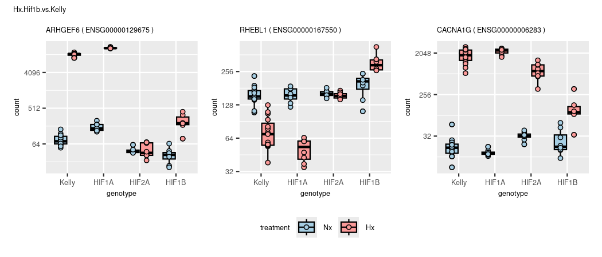<!-- --><!-- -->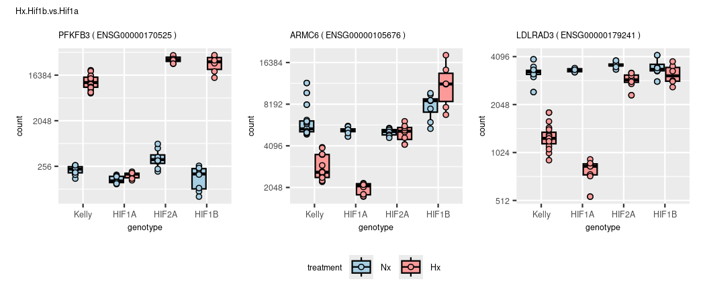<!-- --><!-- --><!-- --><!-- --><!-- --><!-- --><!-- -->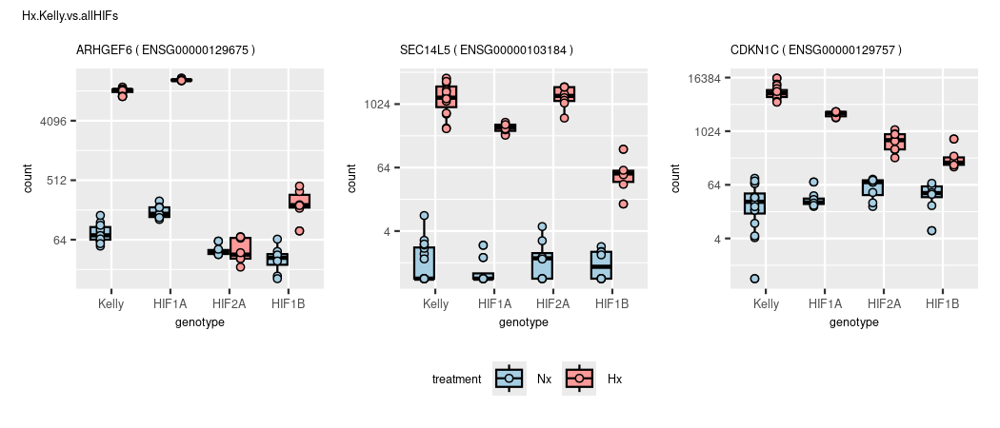<!-- --><!-- -->

|                 | symbol  | baseMean | log2FoldChange |    lfcSE |    stat |  pvalue |     padj |
|:----------------|:--------|---------:|---------------:|---------:|--------:|--------:|---------:|
| ENSG00000234964 | FABP5P7 | 122.4918 |      -26.53404 | 5.528615 | -4.7994 | 1.6e-06 | 3.45e-05 |

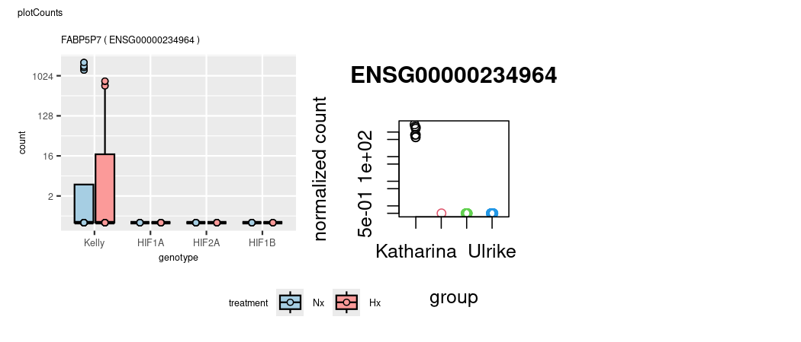<!-- -->

## - Colour sheme

# 2. Condensed Results

## Batch effect for genes from different experiments

``` r
resultsNames(dds_e)
```

    ##  [1] "Intercept"                       "experiment_Katharina_vs_Control"
    ##  [3] "experiment_Simon_vs_Control"     "experiment_Ulrike_vs_Control"   
    ##  [5] "genotype_HIF1A_vs_Kelly"         "genotype_HIF2A_vs_Kelly"        
    ##  [7] "genotype_HIF1B_vs_Kelly"         "treatment_Hx_vs_Nx"             
    ##  [9] "genotypeHIF1A.treatmentHx"       "genotypeHIF2A.treatmentHx"      
    ## [11] "genotypeHIF1B.treatmentHx"

``` r
res_expSvK <- results(dds_e, contrast = c("experiment","Simon","Katharina")) %>% topgenes_f() %>% rownames()
res_expSvU <- results(dds_e, contrast = c("experiment","Simon","Ulrike")) %>% topgenes_f( )%>% rownames()
res_expUvK <- results(dds_e, contrast = c("experiment","Katharina","Ulrike")) %>% topgenes_f() %>% rownames()
res_exp <- c(res_expSvK,res_expSvU,res_expUvK) %>% unique()
res_exp_10 <- c(res_expSvK[1:5],res_expSvU[1:5],res_expUvK[1:5]) %>% unique()

goi <- res_exp_10

# plotCounts_SK(goi)

# color for experiment
plotCounts_SK2(data=dds_e,goi)
```

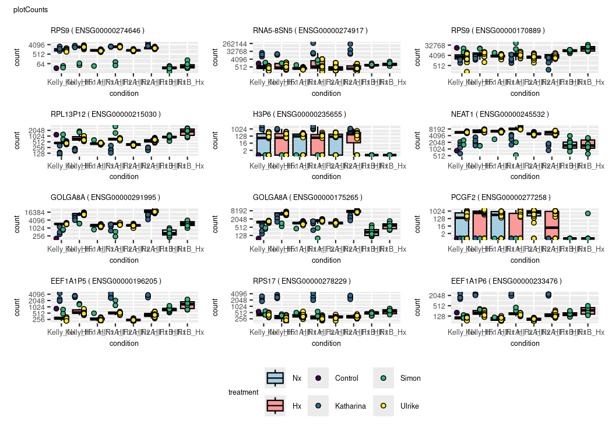<!-- -->

``` r
# plotCounts_SK2(data=dds,goi)


# examples with batch effect
goi <- subset(mcols(dds),symbol == "RMRP") %>% rownames()
c1 <- plotCounts_SK2(data=dds_e,goi=goi) 
c2 <- plotCounts_SK2(data=dds,goi=goi)
```

``` r
c1
```

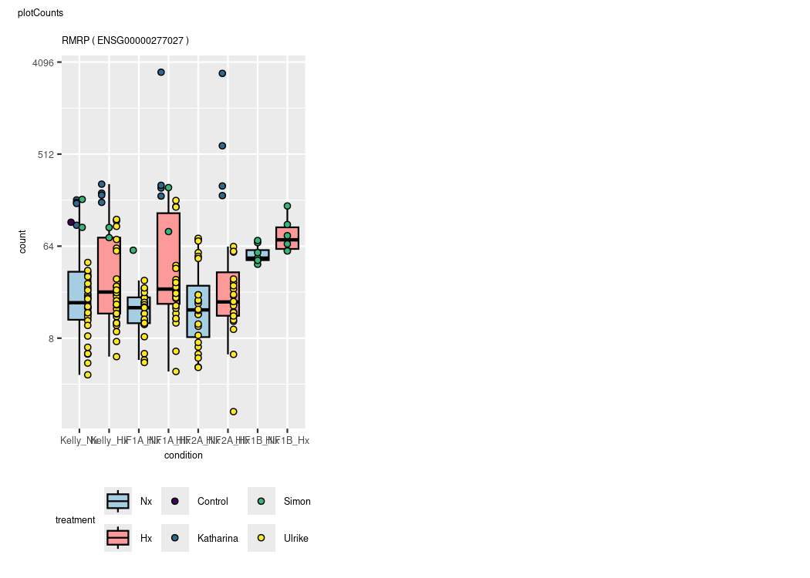<!-- -->

``` r
c2
```

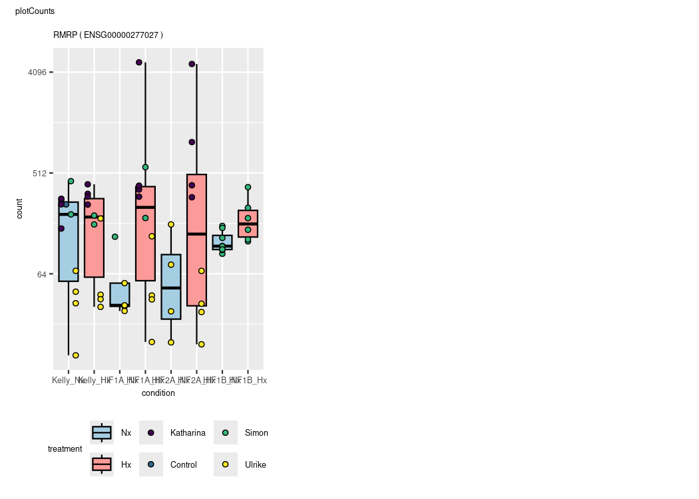<!-- -->

## Compare results

### Venn

``` r
res_1_ab <- calculate.overlap(list(
  deg_genes_list[["deg_Hif1a.Hx.vs.Nx"]],
  deg_genes_list[["deg_Kelly.Hx.vs.Nx"]]))
res_1_ab <- list(setdiff(res_1_ab[[1]],res_1_ab[[3]]),
        setdiff(res_1_ab[[2]],res_1_ab[[3]]))   
res_1 <- res_1_ab %>% unlist() %>% unique()

res_3 <- deg_genes_list[["deg_Hif1aHxNx.vs.KellyHxNx"]]

res_2_ab <- calculate.overlap(list(deg_genes_list[["deg_Nx.Hif1a.vs.Kelly"]],
                deg_genes_list[["deg_Hx.Hif1a.vs.Kelly"]]))

res_2 <- c(deg_genes_list[["deg_Nx.Hif1a.vs.Kelly"]],
                deg_genes_list[["deg_Hx.Hif1a.vs.Kelly"]]) %>% unique()

input_list <- list(res_1, res_2, res_3)
names(input_list) <- c("res_1", "res_2", "res_3")
plt <- venn.diagram(
    x = input_list,
    category.names = paste(names(input_list),"\n(",input_list %>% summary() %>% .[c(1:length(input_list))],")",sep=""),
    force.unique = TRUE, na = "remove",
    filename = NULL,
    main = "Compare results", main.fontface = "bold",
    lwd = 2,
    lty = 'blank',
    fill = c("salmon3","seagreen3","orchid3"),
    cat.col=c("salmon4","seagreen4","orchid4"),
    cat.fontface = "bold",
    cat.pos = c(-45,45,120),
    # inverted=length(input_list[[1]]) < length(input_list[[2]])
    )

patchwork::wrap_elements((plt)) + c_graphic
```

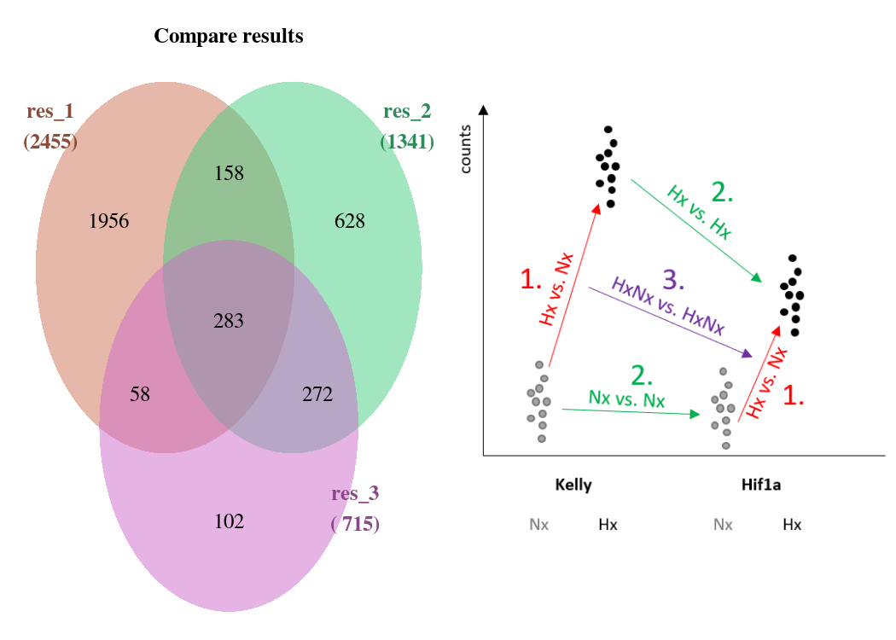<!-- -->

``` r
res_hif1a <- calculate.overlap(input_list)
getVennElements(plt, olf=res_hif1a)
```

    ## [1] "Element=7 (1956) --> a1(1956)"
    ## [1] "Element=8 (158) --> a2(158)"
    ## [1] "Element=9 (628) --> a3(628)"
    ## [1] "Element=10 (58) --> a4(58)"
    ## [1] "Element=11 (283) --> a5(283)"
    ## [1] "Element=12 (272) --> a6(272)"
    ## [1] "Element=13 (102) --> a7(102)"

### Volcanos

``` r
# Volcanos
# Compare Hx.vs.Nx with interaction
n <- "Kelly.Hx.vs.Nx"

hif1a_deg_ol <- calculate.overlap(list(
  deg_genes_list[["deg_Kelly.Hx.vs.Nx"]],
  deg_genes_list[["deg_Hif1a.Hx.vs.Nx"]]))
hif1a_deg <- c(setdiff(hif1a_deg_ol[[1]],hif1a_deg_ol[[3]]),
               setdiff(hif1a_deg_ol[[2]],hif1a_deg_ol[[3]]))

list1 <- deg_genes_list[["deg_Hif1aHxNx.vs.KellyHxNx"]]
list2 <- hif1a_deg

ol_list <- calculate.overlap(list(list1,list2))
labs <- c(setdiff(ol_list[[1]],ol_list[[3]]),
          setdiff(ol_list[[2]],ol_list[[3]]))

ev_kelly_lists <- Volcano_SK2(n="Kelly.Hx.vs.Nx",
            list1=list1,
            list2=list2,
            l1.n= "interaction (3)",
            l2.n= "Hx.vs.Nx (1)",
            l1.col="orchid3",
            l2.col="salmon3",
            lol.col="royalblue1",
            xlim=10,
            ylim=200)

ev_hif1a_lists <- Volcano_SK2(n="Hif1a.Hx.vs.Nx",
            list1=deg_genes_list[["deg_Hif1aHxNx.vs.KellyHxNx"]],
            list2=hif1a_deg,
            l1.n= "interaction (3)",
            l2.n= "Hx.vs.Nx (1)",
            l1.col="orchid3",
            l2.col="salmon3",
            lol.col="royalblue1",
            xlim=10,
            ylim=200)

 ( ev_kelly_lists + ev_hif1a_lists )  +
  plot_layout(guides = "collect", axes="collect", axis_titles="collect") & 
  theme(legend.position = 'bottom', axis.title=element_text(size=8))
```

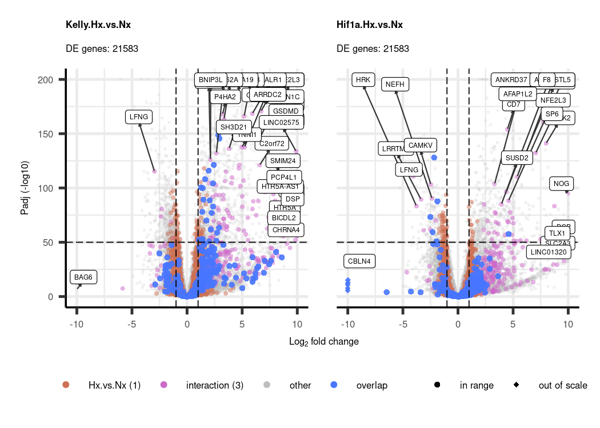<!-- -->

``` r
# Compare Hx.vs.Hx with interaction

hif1a_Hx.vs.Hx.deg <- c(deg_genes_list[["deg_Nx.Hif1a.vs.Kelly"]],
                deg_genes_list[["deg_Hx.Hif1a.vs.Kelly"]]) %>% unique()

ev_kelly_lists <- Volcano_SK2(n="Kelly.Hx.vs.Nx",
            list1=deg_genes_list[["deg_Hif1aHxNx.vs.KellyHxNx"]],
            list2=hif1a_Hx.vs.Hx.deg,
            l1.n= "interaction (3)",
            l2.n= "Hx.vs.Hx (2)",
            l1.col="orchid3",
            l2.col="seagreen3",
            lol.col="royalblue1",
            xlim=10,
            ylim=200)

ev_hif1a_lists <- Volcano_SK2(n="Hif1a.Hx.vs.Nx",
            list1=deg_genes_list[["deg_Hif1aHxNx.vs.KellyHxNx"]],
            list2=hif1a_Hx.vs.Hx.deg,
            l1.n= "interaction (3)",
            l2.n= "Hx.vs.Hx (2)",
            l1.col="orchid3",
            l2.col="seagreen3",
            lol.col="royalblue1",
            xlim=10,
            ylim=200)

 ( ev_kelly_lists + ev_hif1a_lists )  +
  plot_layout(guides = "collect", axes="collect", axis_titles="collect") & 
  theme(legend.position = 'bottom', axis.title=element_text(size=8))
```

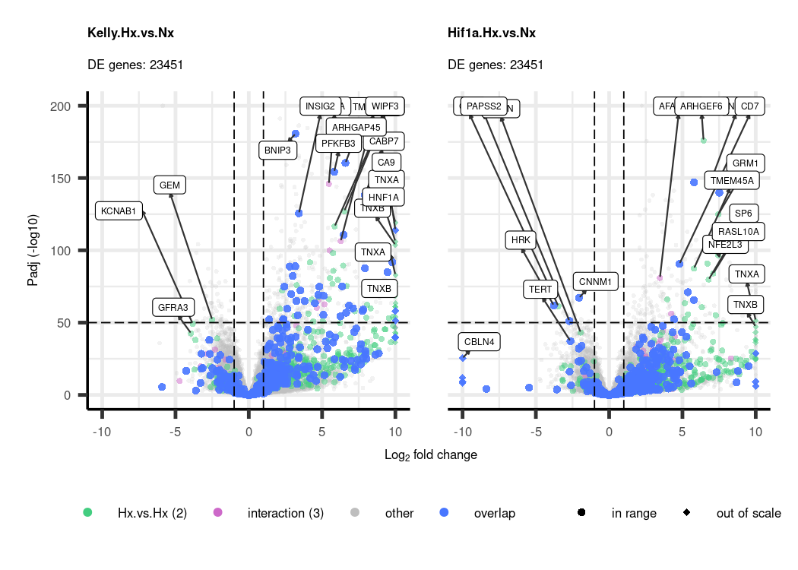<!-- -->

## Final results lists

### Venns

``` r
input_list <- c(list("All Hypoxic (Kelly)" = deg_genes_list[["deg_Kelly.Hx.vs.Nx"]],
                     "Hif1b" = deg_genes_list[["deg_Hif1bHxNx.vs.KellyHxNx"]],
                     "Hif1a" = deg_genes_list[["deg_Hif1aHxNx.vs.KellyHxNx"]],
                     "Hif2a" = deg_genes_list[["deg_Hif2aHxNx.vs.KellyHxNx"]]                                         ))

plt1 <- venn.diagram(
    x = input_list,
    category.names = paste(names(input_list),"\n(",input_list %>% summary() %>% .[c(1:length(input_list))],")",sep=""),
    force.unique = TRUE, na = "remove",
    filename = NULL,
    main = "Compare Hif KOs", main.fontface = "bold",
    lwd = 2,
    lty = 'blank',
    fill = colors[c(1,7,3,5)],
    #cat.col=c(colors[c(4)],"grey40","grey20"),
    cat.fontface = "bold",
    #cat.pos = c(-45,0,45),
    # inverted=length(input_list[[1]]) < length(input_list[[2]])
    )

input_list <- input_list[c(3,4,1)]
plt2 <- venn.diagram(
    x = input_list,
    category.names = paste(names(input_list),"\n(",input_list %>% summary() %>% .[c(1:length(input_list))],")",sep=""),
    force.unique = TRUE, na = "remove",
    filename = NULL,
    main = "Compare Hif KOs", main.fontface = "bold",
    lwd = 2,
    lty = 'blank',
    fill = colors[c(3,5,1)],
    #cat.col=c(colors[c(4)],"grey40","grey20"),
    cat.fontface = "bold",
    #cat.pos = c(-45,0,45),
    # inverted=length(input_list[[1]]) < length(input_list[[2]])
    )


patchwork::wrap_elements(plt1) + patchwork::wrap_elements(plt2)
```

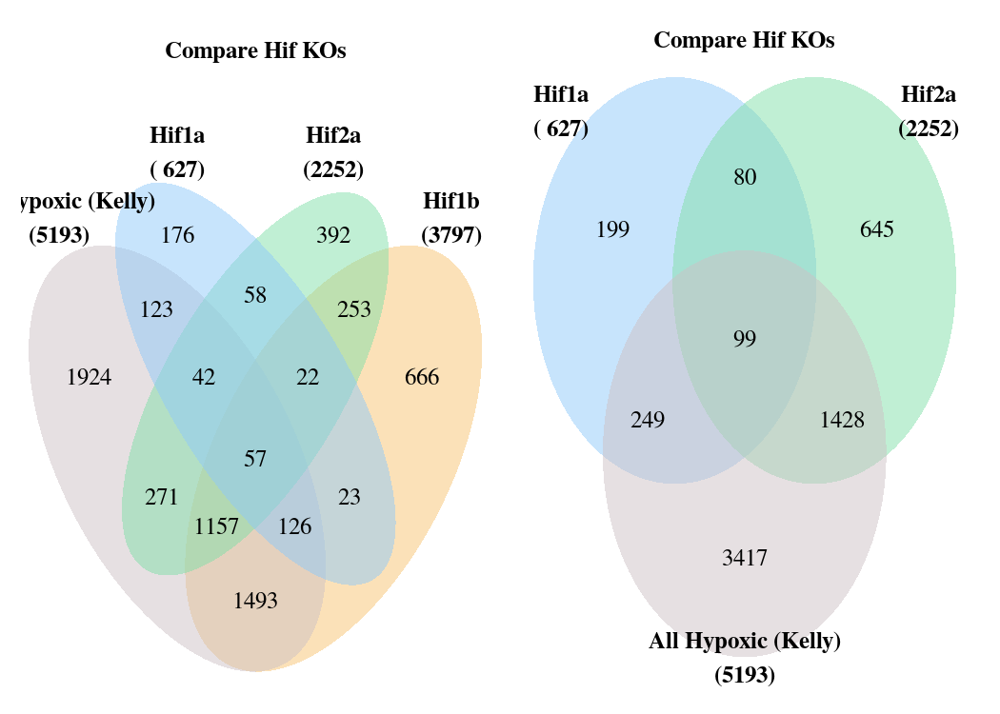<!-- -->

``` r
names(input_list)
```

    ## [1] "Hif1a"               "Hif2a"               "All Hypoxic (Kelly)"

``` r
overlaps <- calculate.overlap(input_list)
diff1 <- setdiff(overlaps[[1]],overlaps[[3]])
diff2 <- setdiff(overlaps[[2]],overlaps[[3]])

# get each top gene
getVennElements(plt2)
```

    ## [1] "Element=7 (143) --> a1(143)"
    ## [1] "Element=8 (93) --> a2(93)"
    ## [1] "Element=9 (546) --> a3(546)"
    ## [1] "Element=10 (287) --> a4(287)"
    ## [1] "Element=11 (192) --> a5(192)"
    ## [1] "Element=12 (1520) --> a6(1520)"
    ## [1] "Element=13 (3410) --> a7(3410)"

``` r
goi <- sapply(overlaps,"[[",1) %>% .[order(names(.))]

plotCounts_SK(goi) + patchwork::wrap_elements(plt2)
```

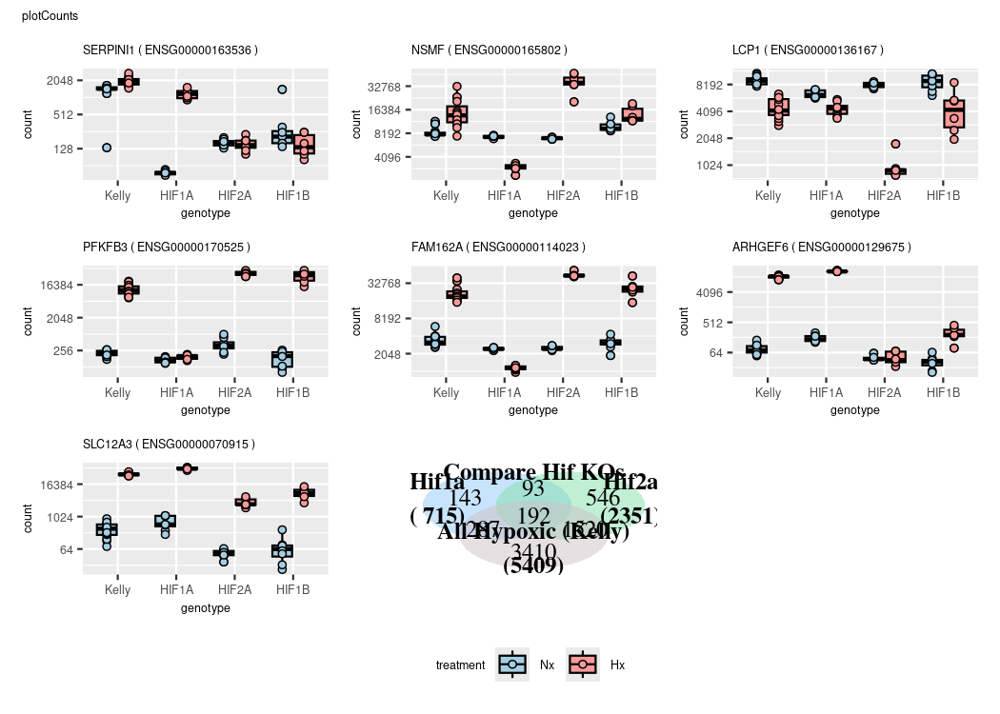<!-- -->

``` r
cat("--> FAM162A is part of Hif2A deg list, but in fact is probably compensation mechanism")
```

    ## --> FAM162A is part of Hif2A deg list, but in fact is probably compensation mechanism

``` r
# plotCounts_SK(overlaps$a2[1])
```

### Volcanos

``` r
# Compare Hx.vs.Nx with interaction
n <- "Kelly.Hx.vs.Nx"
res <- results_list[[n]]
colors <- c("lavenderblush3","lavenderblush4","#90caf9","#1976d2", "#82e0aa", "#239b56", "#f8c471", "#b9770e") 


list1 <- deg_genes_list[["deg_Hif1aHxNx.vs.KellyHxNx"]]
list2 <- deg_genes_list[["deg_Hif2aHxNx.vs.KellyHxNx"]]

ol_list <- calculate.overlap(list(list1,list2))
labs <- ol_list$a3

ev_kelly_ko1 <- Volcano_SK2(n="Kelly.Hx.vs.Nx",
            list1=list1,
            list2=list2,
            l1.n= "Hif1a",
            l2.n= "Hif2a",
            l1.col="#1976d2",
            l2.col="#239b56",
            lol.col="#f8c471",
            xlim=10,
            ylim=200,
            lab=labs)

labs <- setdiff(ol_list[[1]],ol_list[[3]])
          
ev_kelly_ko2 <- Volcano_SK2(n="Hif1aHxNx.vs.KellyHxNx",
            list1=list1,
            list2=list2,
            l1.n= "Hif1a",
            l2.n= "Hif2a",
            l1.col="#1976d2",
            l2.col="#239b56",
            lol.col="#f8c471",
            labs=labs,
            xlim=10,
            ylim=50)

labs <- setdiff(ol_list[[2]],ol_list[[3]])

ev_kelly_ko3 <- Volcano_SK2(n="Hif2aHxNx.vs.KellyHxNx",
            list1=list1,
            list2=list2,
            l1.n= "Hif1a",
            l2.n= "Hif2a",
            l1.col="#1976d2",
            l2.col="#239b56",
            lol.col="#f8c471",
            labs=labs,
            xlim=10,
            ylim=50)


ev_kelly_ko4 <- Volcano_SK2(n="Hif1bHxNx.vs.KellyHxNx",
            list1=list1,
            list2=list2,
            l1.n= "Hif1a",
            l2.n= "Hif2a",
            l1.col="#1976d2",
            l2.col="#239b56",
            lol.col="#f8c471",
            xlim=10,
            ylim=50)

 ( ev_kelly_ko1 / (ev_kelly_ko2 + ev_kelly_ko3 + ev_kelly_ko4 ))  +
  plot_layout(guides = "collect", axes="collect", axis_titles="collect") & 
  theme(legend.position = 'bottom', axis.title=element_text(size=8))
```

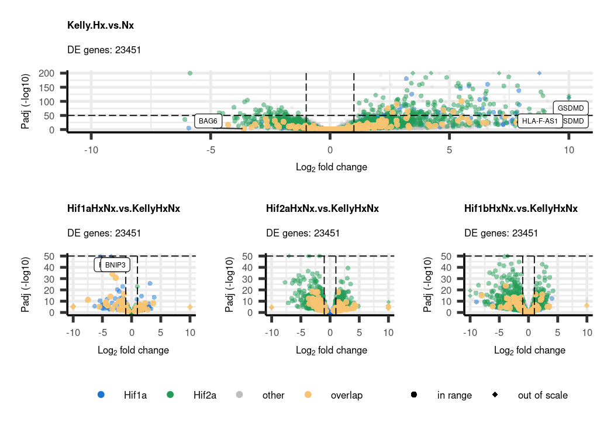<!-- -->

## Group results

``` r
# Example:
goi <- "ENSG00000170525" # PFKFB3

goi <- subset(mcols(dds),SYMBOL == "FAM162A") %>% rownames()
# goi <- subset(mcols(dds),SYMBOL == "CRABP1") %>% rownames()

# for (i in 1:10) {
# goi <- deg_genes_list[["deg_Hif1aHxNx.vs.KellyHxNx"]] %>% sample(size = 1)

getL2FC(results=results_list, goi=goi)
```

    ##         Hif1a.Hx.vs.Nx         Hif2a.Hx.vs.Nx         Hif1b.Hx.vs.Nx 
    ##                  -1.09                   4.15                   3.12 
    ##         Kelly.Hx.vs.Nx      Nx.Hif1a.vs.Kelly      Nx.Hif2a.vs.Kelly 
    ##                   2.67                  -0.48                  -0.44 
    ##      Nx.Hif1b.vs.Kelly      Hx.Hif1a.vs.Kelly      Hx.Hif2a.vs.Kelly 
    ##                  -0.14                  -4.24                   1.03 
    ##      Hx.Hif1b.vs.Kelly      Hx.Hif2a.vs.Hif1a      Hx.Hif1b.vs.Hif1a 
    ##                   0.31                   5.28                   4.55 
    ##      Hx.Hif1b.vs.Hif2a Hif1aHxNx.vs.KellyHxNx Hif2aHxNx.vs.KellyHxNx 
    ##                  -0.73                  -3.76                   1.48 
    ## Hif1bHxNx.vs.KellyHxNx Hif2aHxNx.vs.Hif1aHxNx     Hx.Hif1b.vs.Hif12a 
    ##                   0.44                   5.24                   1.91 
    ##    Hx.Kelly.vs.allHIFs               Hx.vs.Nx 
    ##                  -0.97                   2.21

``` r
d <- plotCounts(dds, gene=goi, intgroup=c("condition","experiment","genotype","treatment"), returnData=TRUE)
box <- ggplot(d, aes(x = condition, y = count, fill=treatment, color=treatment)) +
    geom_boxplot(color="black", outliers = FALSE)
box <- ggplot_build(box)$data[[1]]
gcounts <- ggplot(d, aes(x = condition, y = count, fill=treatment, color=treatment)) +
    geom_boxplot(color="black", outliers = FALSE) +
    geom_point(shape=21,color="black",aes(fill=experiment),position=position_dodge(width=0.75), alpha=1) +
    scale_fill_manual(values=c(cols[c(1,5)],viridis(4))) +
    scale_color_manual(values=cols[c(1,5)]) +
    scale_y_continuous(trans = "log2") +
    geom_hline(yintercept=c(box[2,3],
                            box[2,5]),
               color="grey20", linetype = 'dashed') +
    geom_hline(yintercept=c(box[4,3],
                            box[4,5]),
               color="#1976d2", linetype = 'dashed') +
  # Kelly
  geom_segment(
        aes(x = 1.5,y = box[1,"middle"], xend = 1.5,yend = box[2,"middle"]),
        arrow = arrow(length = unit(0.03,units = "npc")),size = 1,color ="red2") +
  geom_text(aes(x = 1,y = (box[1,"ymin"]*0.5)),
            label=getL2FC(goi=goi)[1], color="red2") +
  # Hif1a
  geom_segment(
        aes(x = 3.5,y = box[3,"middle"], xend = 3.5,yend = box[4,"middle"]),
        arrow = arrow(length = unit(0.03,units = "npc")),size = 1,color ="red2") +
  geom_text(aes(x = 3,y = (box[3,"ymin"]*0.5)),
            label=getL2FC(results_list,goi=goi)[1], color="red2") +
  geom_segment(
        aes(x = 2,y = mean_log(c(box[1,"middle"],box[2,"middle"])), 
            xend = 3,yend = mean_log(c(box[3,"middle"],box[4,"middle"]))),
        arrow = arrow(length = unit(0.03,units = "npc")),size = 1,color ="purple2") +
  geom_text(aes(x = 3,y = mean_log(c(0.5*box[2,"middle"],box[3,"middle"]))),
            label=getL2FC(goi=goi)[2], color="purple2") +
  
  # Hif2a
  geom_segment(
        aes(x = 5.5,y = box[5,"middle"], xend = 5.5,yend = box[6,"middle"]),
        arrow = arrow(length = unit(0.03,units = "npc")),size = 1,color ="red2") +
  geom_text(aes(x = 5,y = (box[5,"ymin"]*0.5)),
            label=getL2FC(goi=goi)[1], color="red2") +
  geom_segment(
        aes(x = 2,y = mean_log(c(box[1,"middle"],box[2,"middle"])), 
            xend = 5,yend = mean_log(c(box[5,"middle"],box[6,"middle"]))),
        arrow = arrow(length = unit(0.03,units = "npc")),size = 1,color ="purple2") +
  geom_text(aes(x = 5,y = mean_log(c(box[2,"middle"],box[5,"middle"]))),
            label=getL2FC(goi=goi)[3], color="purple2") + 
    labs(title = paste(mcols(dds)[goi,"ens.symbol"],"(",goi,")",sep=" "))
gcounts %>% print()
```

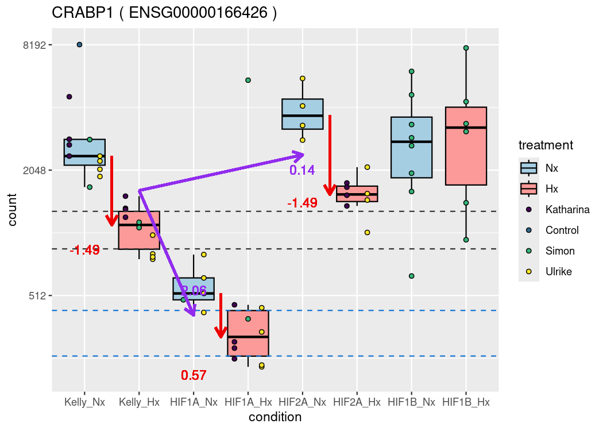<!-- -->

``` r
# }
# plotCounts_SK(goi=goi) + geom_label(label=colData(dds)$names, color="black", size=2)
plotCounts_SK2(data=dds_e, goi=goi)
```

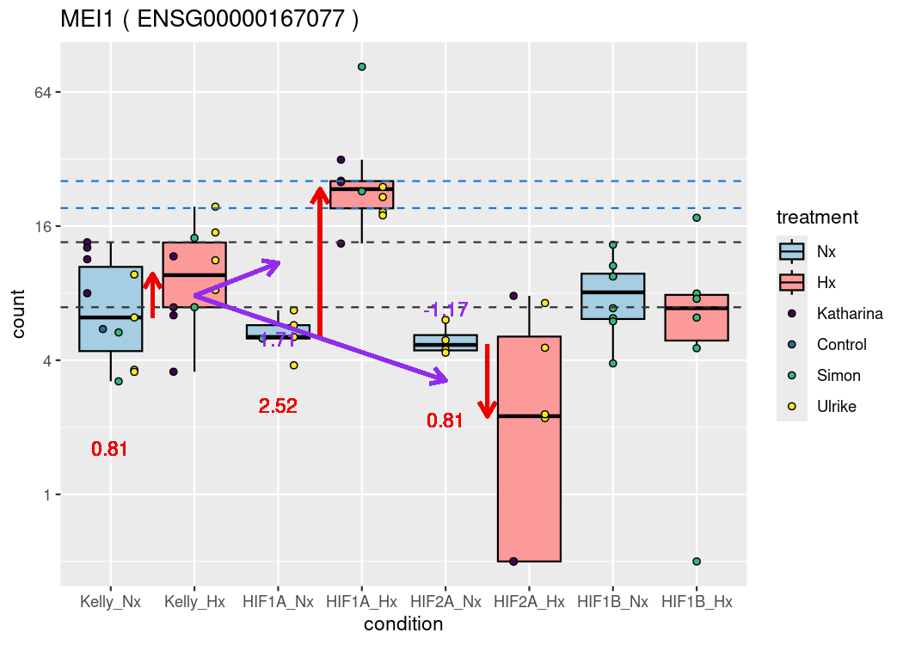<!-- -->

``` r
# hif1a_check <- results(dds, contrast = c(0,0,0,0,1,1,0,0))
# hif1a_check[goi,]
# plotCounts(dds, gene=goi)
# levels(colData(dds)$condition)
```

### Subgroups

``` r
hif1a_2a_genes <- c(deg_genes_list[["deg_Hif1aHxNx.vs.KellyHxNx"]],
                     deg_genes_list[["deg_Hif2aHxNx.vs.KellyHxNx"]]) %>%
                  unique()

hif1a_2a_genes %>% length()
```

    ## [1] 2781

``` r
names(res_final)
```

    ## [1] "Kelly.Hx.vs.Nx"         "Hif1aHxNx.vs.KellyHxNx" "Hif2aHxNx.vs.KellyHxNx"
    ## [4] "Hif1bHxNx.vs.KellyHxNx" "Hif2aHxNx.vs.Hif1aHxNx"

``` r
# create table with all results
res_table_final <- lapply(res_final,data.frame)
res_table_final <- do.call('cbind',res_table_final)
res_hif1a_2a <- res_table_final[hif1a_2a_genes,]
colnames(res_hif1a_2a)
```

    ##  [1] "Kelly.Hx.vs.Nx.baseMean"              
    ##  [2] "Kelly.Hx.vs.Nx.log2FoldChange"        
    ##  [3] "Kelly.Hx.vs.Nx.lfcSE"                 
    ##  [4] "Kelly.Hx.vs.Nx.stat"                  
    ##  [5] "Kelly.Hx.vs.Nx.pvalue"                
    ##  [6] "Kelly.Hx.vs.Nx.padj"                  
    ##  [7] "Kelly.Hx.vs.Nx.symbol"                
    ##  [8] "Hif1aHxNx.vs.KellyHxNx.baseMean"      
    ##  [9] "Hif1aHxNx.vs.KellyHxNx.log2FoldChange"
    ## [10] "Hif1aHxNx.vs.KellyHxNx.lfcSE"         
    ## [11] "Hif1aHxNx.vs.KellyHxNx.stat"          
    ## [12] "Hif1aHxNx.vs.KellyHxNx.pvalue"        
    ## [13] "Hif1aHxNx.vs.KellyHxNx.padj"          
    ## [14] "Hif1aHxNx.vs.KellyHxNx.symbol"        
    ## [15] "Hif2aHxNx.vs.KellyHxNx.baseMean"      
    ## [16] "Hif2aHxNx.vs.KellyHxNx.log2FoldChange"
    ## [17] "Hif2aHxNx.vs.KellyHxNx.lfcSE"         
    ## [18] "Hif2aHxNx.vs.KellyHxNx.stat"          
    ## [19] "Hif2aHxNx.vs.KellyHxNx.pvalue"        
    ## [20] "Hif2aHxNx.vs.KellyHxNx.padj"          
    ## [21] "Hif2aHxNx.vs.KellyHxNx.symbol"        
    ## [22] "Hif1bHxNx.vs.KellyHxNx.baseMean"      
    ## [23] "Hif1bHxNx.vs.KellyHxNx.log2FoldChange"
    ## [24] "Hif1bHxNx.vs.KellyHxNx.lfcSE"         
    ## [25] "Hif1bHxNx.vs.KellyHxNx.stat"          
    ## [26] "Hif1bHxNx.vs.KellyHxNx.pvalue"        
    ## [27] "Hif1bHxNx.vs.KellyHxNx.padj"          
    ## [28] "Hif1bHxNx.vs.KellyHxNx.symbol"        
    ## [29] "Hif2aHxNx.vs.Hif1aHxNx.baseMean"      
    ## [30] "Hif2aHxNx.vs.Hif1aHxNx.log2FoldChange"
    ## [31] "Hif2aHxNx.vs.Hif1aHxNx.lfcSE"         
    ## [32] "Hif2aHxNx.vs.Hif1aHxNx.stat"          
    ## [33] "Hif2aHxNx.vs.Hif1aHxNx.pvalue"        
    ## [34] "Hif2aHxNx.vs.Hif1aHxNx.padj"          
    ## [35] "Hif2aHxNx.vs.Hif1aHxNx.symbol"

``` r
plot(-res_hif1a_2a$Hif1aHxNx.vs.KellyHxNx.log2FoldChange~
       res_hif1a_2a$Kelly.Hx.vs.Nx.log2FoldChange,
     main="Hif1a ~ Hx",
     xlim=c(-10,10),ylim=c(-10,10))
 abline(v=c(-1,1), h=c(-1,1), col="red", lty=2)
 segments(x0=1, y0=1, x1 = 1, y1 = 10,  col="red", lty=2)
 segments(x0=1, y0=1, x1 = 1, y1 = 10,  col="red", lty=2)
 segments(x0=1, y0=1, x1 = 1, y1 = 10,  col="red", lty=2)
```

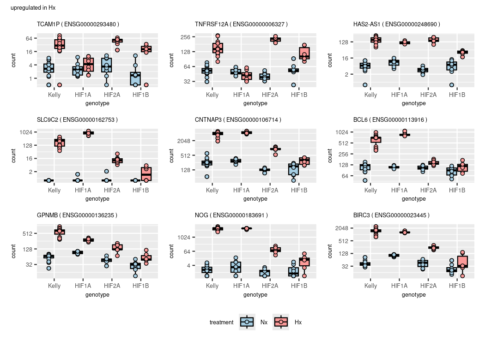<!-- -->

``` r
plot(-res_hif1a_2a$Hif2aHxNx.vs.KellyHxNx.log2FoldChange~
       res_hif1a_2a$Kelly.Hx.vs.Nx.log2FoldChange,
     main="Hif2a ~ Hx",
     xlim=c(-10,10),ylim=c(-10,10))
```

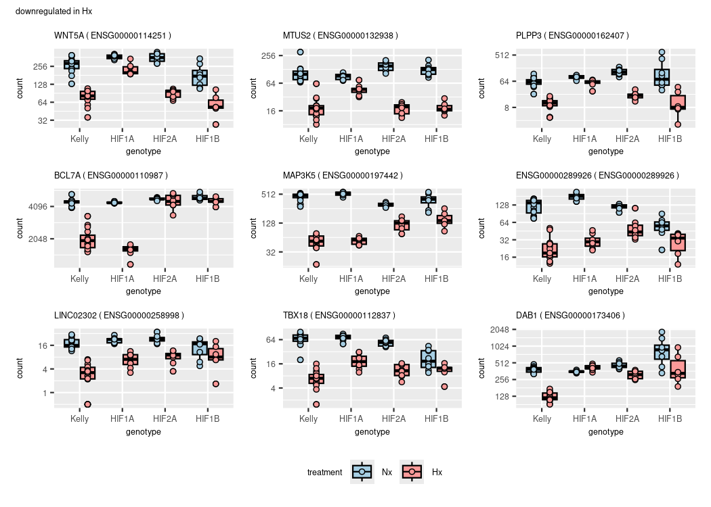<!-- -->

``` r
plot(res_hif1a_2a$Hif2aHxNx.vs.KellyHxNx.log2FoldChange~
       res_hif1a_2a$Hif1aHxNx.vs.KellyHxNx.log2FoldChange,
     main="Hif2a ~ Hif1a",
     xlim=c(-10,10),ylim=c(-10,10))
```

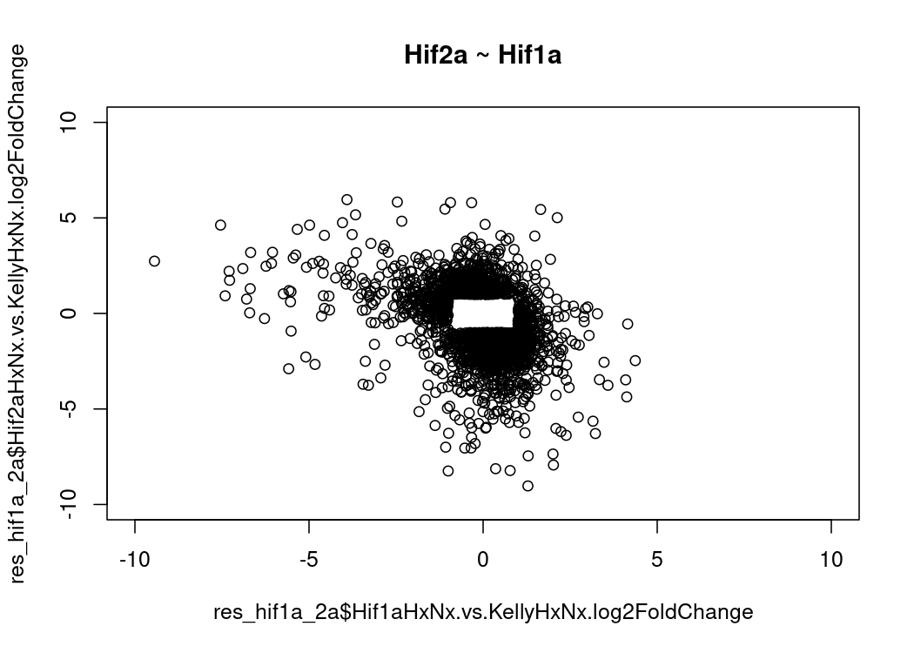<!-- -->

``` r
plot(res_hif1a_2a$Kelly.Hx.vs.Nx.log2FoldChange~
       res_hif1a_2a$Hif2aHxNx.vs.Hif1aHxNx.log2FoldChange,
     main="Hif2a vs. Hif1a ~ Hx",
     xlim=c(-10,10),ylim=c(-10,10))
```

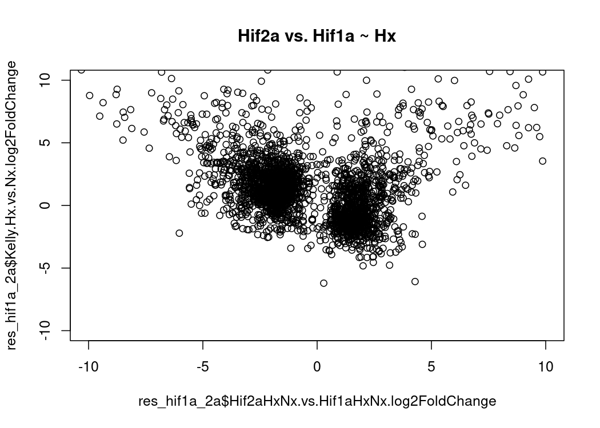<!-- -->

``` r
Hx_up_hif1a_genes <- subset(res_hif1a_2a, Kelly.Hx.vs.Nx.log2FoldChange > 1 &
                              Hif1aHxNx.vs.KellyHxNx.log2FoldChange < -1 & 
                              Hif2aHxNx.vs.KellyHxNx.log2FoldChange > -1)
Hx_up_hif2a_genes  <- subset(res_hif1a_2a, Kelly.Hx.vs.Nx.log2FoldChange > 1 &
                              Hif1aHxNx.vs.KellyHxNx.log2FoldChange > -1 & 
                              Hif2aHxNx.vs.KellyHxNx.log2FoldChange < -1)
Hx_up_hif1a_2a_genes  <- subset(res_hif1a_2a, Kelly.Hx.vs.Nx.log2FoldChange > 1 &
                              Hif1aHxNx.vs.KellyHxNx.log2FoldChange < -1 & 
                              Hif2aHxNx.vs.KellyHxNx.log2FoldChange < -1)

Hx_down_hif1a_genes <- subset(res_hif1a_2a, Kelly.Hx.vs.Nx.log2FoldChange < -1 &
                              Hif1aHxNx.vs.KellyHxNx.log2FoldChange > 1 & 
                              Hif2aHxNx.vs.KellyHxNx.log2FoldChange < 1)
Hx_down_hif2a_genes  <- subset(res_hif1a_2a, Kelly.Hx.vs.Nx.log2FoldChange < -1 &
                              Hif1aHxNx.vs.KellyHxNx.log2FoldChange < 1 & 
                              Hif2aHxNx.vs.KellyHxNx.log2FoldChange > 1)
Hx_down_hif1a_2a_genes  <- subset(res_hif1a_2a, Kelly.Hx.vs.Nx.log2FoldChange < -1 &
                              Hif1aHxNx.vs.KellyHxNx.log2FoldChange > 1 & 
                              Hif2aHxNx.vs.KellyHxNx.log2FoldChange > 1)

plotCounts_SK(c(sample(Hx_up_hif1a_genes %>% rownames, size=3),
                sample(Hx_up_hif2a_genes %>% rownames, size=3),
                sample(Hx_up_hif1a_2a_genes %>% rownames, size=3),                
                sample(Hx_down_hif1a_genes %>% rownames, size=3),
                sample(Hx_down_hif2a_genes %>% rownames, size=3),
                sample(Hx_down_hif1a_2a_genes %>% rownames, size=3)
                               ))
```

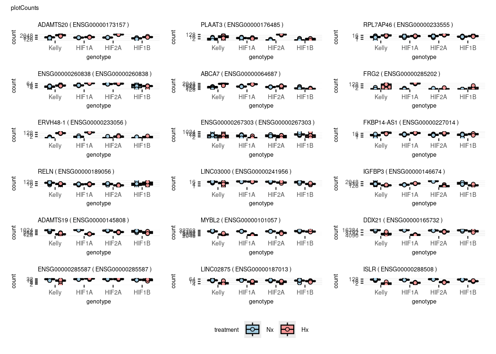<!-- -->

``` r
groups <- list(Hx_up_hif1a_genes,
              Hx_up_hif2a_genes,
              Hx_down_hif1a_genes,
              Hx_down_hif2a_genes)
lapply(groups,rownames) %>% lapply(length)
```

    ## [[1]]
    ## [1] 280
    ## 
    ## [[2]]
    ## [1] 995
    ## 
    ## [[3]]
    ## [1] 45
    ## 
    ## [[4]]
    ## [1] 503

``` r
lapply(groups,rownames) %>% lapply(length) %>% unlist() %>% sum()
```

    ## [1] 1823

``` r
input_list <- lapply(groups,rownames)
plt1 <- venn.diagram(
    x = input_list,
    category.names = paste(names(input_list),"\n(",input_list %>% summary() %>% .[c(1:length(input_list))],")",sep=""),
    force.unique = TRUE, na = "remove",
    filename = NULL,
    main = "Compare Hif KOs", main.fontface = "bold",
    lwd = 2,
    lty = 'blank',
    fill = colors[c(1,7,3,5)],
    #cat.col=c(colors[c(4)],"grey40","grey20"),
    cat.fontface = "bold",
    #cat.pos = c(-45,0,45),
    # inverted=length(input_list[[1]]) < length(input_list[[2]])
    )
patchwork::wrap_elements(plt1)
```

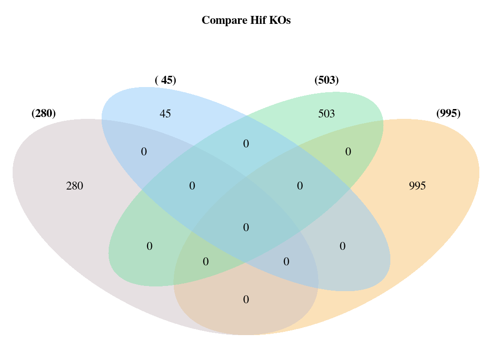<!-- -->

# 3. Data Dive

## Volcanos

### Draw Volcanos


### (continuous Volcanos)

``` r
# gradient is fixed to padj = y-axis

# Volcano
lcol="grey20"
xlim=10
ylim=300
n <- "Kelly.Hx.vs.Nx"
res <- results_list[[n]]
l <- length(res)

res_shrink <- lfcShrink(dds, res=res, type="ashr")
res_shrink$symbol <- res$symbol

# remove nas
res <- res[!is.na(res$padj),]
res <- res[!is.na(res$log2FoldChange),]

# rename genes
rownames(res) <- res$symbol

# change shape of outliers
shape <- ifelse(abs(res$log2FoldChange) > xlim, 18,
                ifelse(res$padj < 10^-ylim,18,16))
summary(is.na(shape))

# shape[is.na(shape)] <- 2
names(shape)[shape == 18] <- 'out of scale'
names(shape)[shape == 16] <- 'in range'

# move outliers to coord. max.
res$log2FoldChange[res$log2FoldChange > xlim] <- xlim
res$log2FoldChange[res$log2FoldChange < -xlim] <- -xlim
res$padj[res$padj < 10^-ylim] <- 10^-ylim
summary(res$padj < 10^-ylim)

 p1 <- EnhancedVolcano(res,
    lab = res$symbol,
    x = 'log2FoldChange',
    y = 'padj',
    pCutoff = 10^(-50),
    FCcutoff = 2,
    xlim = c(-xlim, xlim),
    pointSize = c(ifelse(res$log2FoldChange>2, 8, 1)),
    labSize = 6.0,
    shape = c(6, 6, 19, 16),
    title = "DESeq2 results",
    subtitle = "Differential expression",
    caption = bquote(~Log[2]~ "fold change cutoff, 2; p-value cutoff, 10e-4"),
    legendPosition = "right",
    legendLabSize = 14,
    colAlpha = 0.9,
    colGradient = c('red3', 'royalblue'),
    drawConnectors = TRUE,
    hline = c(10e-8),
    widthConnectors = 0.5)

  p1

ev_f <- EnhancedVolcano(res,
    x = 'log2FoldChange',
    y = 'padj',
    lab = res$symbol,
    labSize = 1.5,
    drawConnectors = TRUE,
    boxedLabels = TRUE,
    widthConnectors = 0.5,
    colConnectors = lcol,
    max.overlaps = 17,
    colGradient = c('red3', 'royalblue'),
    xlim = c(-xlim, xlim),
    ylim = c(0, ylim),
    ylab = "Padj (-log10)",
    title = n,
    subtitle = paste("DE genes:",l),
    # sub = "SVF",

    FCcutoff = 2,
    # pointSize = c(ifelse(rownames(res_WT_D_vs.WT_BL) %in% rownames(top_WT_BL_vs.pcry_BL), 8, 1)),
    legendLabels=c('Not sig.','|L2F| > 2.5','p-adj < 0.05',
                   'p-adj & L2F'),
    legendPosition = 'bottom',
    legendLabSize = 8,
    legendIconSize = 2.0,
    axisLabSize = 8,
    titleLabSize = 8,
    subtitleLabSize = 8,
    captionLabSize = 8,
    caption = {}
   )

ev_f
```

### (prepare data)

### (simple volcano (full))

#### (check cutoff)

## Overlaps (Venn)

### - Hif1a

    ## [1] "Element=7 (723) --> a3(723)"


    ## Kelly.Hx.vs.Nx

|                 |  baseMean | log2FoldChange |     lfcSE |      stat | pvalue | padj | symbol  |
|:----------------|----------:|---------------:|----------:|----------:|-------:|-----:|:--------|
| ENSG00000073060 | 12619.528 |       1.929654 | 0.0557922 |  34.58646 |      0 |    0 | SCARB1  |
| ENSG00000186469 |  8742.006 |       1.866494 | 0.0859514 |  21.71568 |      0 |    0 | GNG2    |
| ENSG00000132382 |  8179.916 |      -1.879139 | 0.0883160 | -21.27745 |      0 |    0 | MYBBP1A |
| ENSG00000117016 |  7982.692 |      -1.777858 | 0.0957358 | -18.57045 |      0 |    0 | RIMS3   |
| ENSG00000164076 |  6754.938 |      -1.450047 | 0.0814858 | -17.79508 |      0 |    0 | CAMKV   |
| ENSG00000100285 | 47284.527 |      -1.311764 | 0.0833886 | -15.73074 |      0 |    0 | NEFH    |
| ENSG00000189241 | 11860.568 |       1.721315 | 0.0504172 |  34.14144 |      0 |    0 | TSPYL1  |
| ENSG00000154545 |  6035.260 |       1.980595 | 0.1104416 |  17.93341 |      0 |    0 | MAGED4  |
| ENSG00000164687 |  7093.248 |      -1.727323 | 0.0780322 | -22.13602 |      0 |    0 | FABP5   |

    ## Hif1a.Hx.vs.Nx

|                 |  baseMean | log2FoldChange |     lfcSE |      stat | pvalue | padj | symbol  |
|:----------------|----------:|---------------:|----------:|----------:|-------:|-----:|:--------|
| ENSG00000073060 | 12619.528 |       2.561827 | 0.0774215 |  33.08934 |      0 |    0 | SCARB1  |
| ENSG00000186469 |  8742.006 |       2.632898 | 0.1195315 |  22.02682 |      0 |    0 | GNG2    |
| ENSG00000132382 |  8179.916 |      -2.576325 | 0.1227610 | -20.98651 |      0 |    0 | MYBBP1A |
| ENSG00000117016 |  7982.692 |      -2.642891 | 0.1331081 | -19.85522 |      0 |    0 | RIMS3   |
| ENSG00000164076 |  6754.938 |      -2.482607 | 0.1134336 | -21.88599 |      0 |    0 | CAMKV   |
| ENSG00000100285 | 47284.527 |      -2.374604 | 0.1160018 | -20.47040 |      0 |    0 | NEFH    |
| ENSG00000189241 | 11860.568 |       2.227162 | 0.0699095 |  31.85776 |      0 |    0 | TSPYL1  |
| ENSG00000154545 |  6035.260 |       2.734057 | 0.1534723 |  17.81466 |      0 |    0 | MAGED4  |
| ENSG00000164687 |  7093.248 |      -2.335907 | 0.1083633 | -21.55626 |      0 |    0 | FABP5   |


    ## [1] "Element=12 (32) --> a4(32)"
    ## [1] "Element=14 (723) --> a6(723)"
    ## [1] "Element=16 (17) --> a8(17)"
    ## [1] "Element=17 (791) --> a9(791)"
    ## [1] "Element=19 (265) --> a11(265)"
    ## [1] "Element=20 (134) --> a12(134)"
    ## [1] "Element=22 (1615) --> a14(1615)"
    ## [1] "Element=23 (3464) --> a15(3464)"


    ## compare results with contrast vsvs (Hif1a Hx vs. Nx  VS.  Kelly Hx vs. Nx


    ## [1] "Element=7 (3) --> a1(3)"
    ## [1] "Element=8 (25) --> a2(25)"
    ## [1] "Element=9 (627) --> a3(627)"
    ## [1] "Element=10 (21) --> a5(21)"
    ## [1] "Element=11 (42) --> a6(42)"


|                 | baseMean | log2FoldChange |     lfcSE |      stat |    pvalue |      padj | symbol |
|:----------------|---------:|---------------:|----------:|----------:|----------:|----------:|:-------|
| ENSG00000105880 | 689.4284 |     -0.3634308 | 0.2237084 | -1.624574 | 0.1042534 | 0.1286241 | DLX5   |

|                 | baseMean | log2FoldChange |     lfcSE |     stat | pvalue |  padj | symbol |
|:----------------|---------:|---------------:|----------:|---------:|-------:|------:|:-------|
| ENSG00000105880 | 689.4284 |       1.740954 | 0.3103146 | 5.610286 |      0 | 1e-07 | DLX5   |

### (- Hif2a)

    ## Hif2a

<!-- -->

    ## [1] "Element=12 (195) --> a4(195)"
    ## [1] "Element=14 (431) --> a6(431)"
    ## [1] "Element=16 (48) --> a8(48)"
    ## [1] "Element=17 (2633) --> a9(2633)"
    ## [1] "Element=19 (94) --> a11(94)"
    ## [1] "Element=20 (263) --> a12(263)"
    ## [1] "Element=22 (755) --> a14(755)"
    ## [1] "Element=23 (1793) --> a15(1793)"

<!-- --><!-- --><!-- -->

### (- Hif1b)

    ## Hif1b

<!-- -->

    ## [1] "Element=12 (384) --> a4(384)"
    ## [1] "Element=14 (246) --> a6(246)"
    ## [1] "Element=16 (28) --> a8(28)"
    ## [1] "Element=17 (3543) --> a9(3543)"
    ## [1] "Element=19 (46) --> a11(46)"
    ## [1] "Element=20 (259) --> a12(259)"
    ## [1] "Element=22 (569) --> a14(569)"
    ## [1] "Element=23 (931) --> a15(931)"

<!-- --><!-- --><!-- -->

### (- overlap)

    ## overlap of overlaps

<!-- -->

    ## [1] "Element=7 (36) --> a1(36)"
    ## [1] "Element=8 (2) --> a2(2)"
    ## [1] "Element=9 (84) --> a3(84)"
    ## [1] "Element=10 (10) --> a4(10)"
    ## [1] "Element=11 (1) --> a5(1)"
    ## [1] "Element=12 (156) --> a6(156)"
    ## [1] "Element=13 (245) --> a7(245)"

    ##   overlap    gene
    ## 1      a1   TIGD5
    ## 2      a2 GATAD2B
    ## 3      a3   BTBD7
    ## 4      a4 MT-RNR1
    ## 5      a5 SLITRK6
    ## 6      a6 CYP26B1
    ## 7      a7   PCGF2

<!-- -->

### (- other)

### Compare Results 1 2 3

#### Volcano lists

#### WGCNA RES1,2,3


### Compare KO

#### Volcano KO

#### Volcano KO2 manual

``` r
cat("Results 3 of Hif1a, Hif2a, Hif1b")
```

    ## Results 3 of Hif1a, Hif2a, Hif1b

``` r
names(deg_genes_list)
```

    ##  [1] "deg_Hif1a.Hx.vs.Nx"         "deg_Hif2a.Hx.vs.Nx"        
    ##  [3] "deg_Hif1b.Hx.vs.Nx"         "deg_Kelly.Hx.vs.Nx"        
    ##  [5] "deg_Nx.Hif1a.vs.Kelly"      "deg_Nx.Hif2a.vs.Kelly"     
    ##  [7] "deg_Nx.Hif1b.vs.Kelly"      "deg_Hx.Hif1a.vs.Kelly"     
    ##  [9] "deg_Hx.Hif2a.vs.Kelly"      "deg_Hx.Hif1b.vs.Kelly"     
    ## [11] "deg_Hx.Hif2a.vs.Hif1a"      "deg_Hx.Hif1b.vs.Hif1a"     
    ## [13] "deg_Hx.Hif1b.vs.Hif2a"      "deg_Hif1aHxNx.vs.KellyHxNx"
    ## [15] "deg_Hif2aHxNx.vs.KellyHxNx" "deg_Hif1bHxNx.vs.KellyHxNx"
    ## [17] "deg_Hif2aHxNx.vs.Hif1aHxNx" "deg_Hx.Hif1b.vs.Hif12a"    
    ## [19] "deg_Hx.Kelly.vs.allHIFs"    "deg_Hx.vs.Nx"

``` r
input_list <- deg_genes_list[c("deg_Hif1aHxNx.vs.KellyHxNx","deg_Hif2aHxNx.vs.KellyHxNx","deg_Hif1bHxNx.vs.KellyHxNx")]
plt <- venn.diagram(
    x = input_list,
    category.names = paste(names(input_list),"\n(",input_list %>% summary() %>% .[c(1:length(input_list))],")",sep=""),
    force.unique = TRUE, na = "remove",
    filename = NULL,
    main = "Hif1a Hx-Nx vs. Kelly Hx-Nx", main.fontface = "bold",
    lwd = 2,
    lty = 'blank',
    fill = colors[c(3,5,7)],
    cat.col=c(colors[c(4,6,8)]),
    cat.fontface = "bold")

grid.newpage()
grid.draw(plt)
```

<!-- -->

``` r
# plot example counts
overlaps <- calculate.overlap(input_list)
overlaps <- overlaps[order(names(overlaps))]
names(overlaps)
```

    ## [1] "a1" "a2" "a3" "a4" "a5" "a6" "a7"

``` r
getVennElements(plt)
```

    ## [1] "Element=7 (264) --> a1(264)"
    ## [1] "Element=8 (112) --> a2(112)"
    ## [1] "Element=9 (602) --> a3(602)"
    ## [1] "Element=10 (166) --> a4(166)"
    ## [1] "Element=11 (173) --> a5(173)"
    ## [1] "Element=12 (1464) --> a6(1464)"
    ## [1] "Element=13 (2287) --> a7(2287)"

``` r
# plot each 1 gene
goi <- sapply(overlaps,"[[",1) %>% .[order(names(.))]
 
data.frame(overlap = names(goi),
           gene = mcols(dds)[goi,"symbol"])
```

    ##   overlap    gene
    ## 1      a1   BNIP3
    ## 2      a2 FAM162A
    ## 3      a3  CLSTN2
    ## 4      a4  PFKFB3
    ## 5      a5    ENO1
    ## 6      a6 ARHGEF6
    ## 7      a7    TNXA

``` r
plotCounts_SK(goi)
```

<!-- -->

#### WGCNA KOs


#### WGCNA overlapped KOs

    ## [1] "a1" "a2" "a3" "a4" "a5" "a6" "a7"

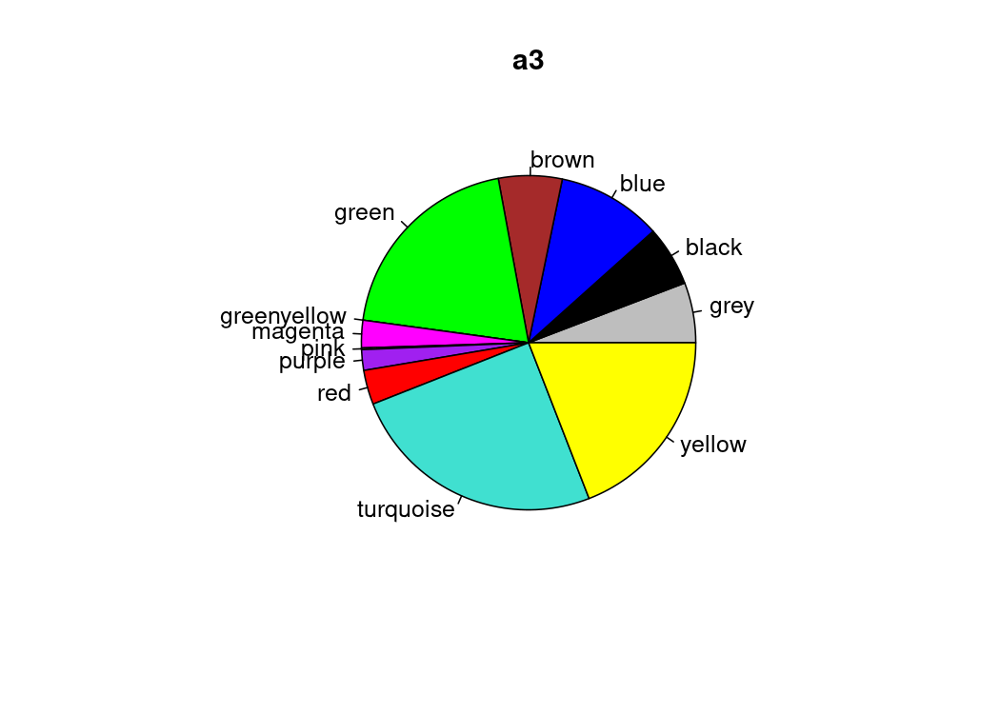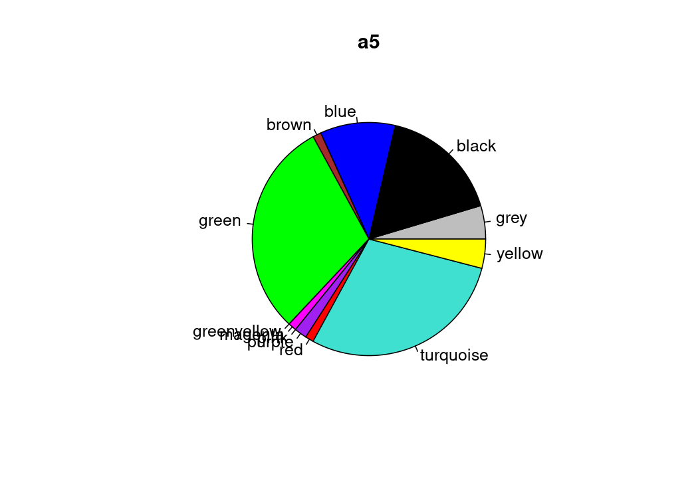

#### -Remove log files

## Heatmaps

### -Compare results

``` r
# https://slowkow.com/notes/pheatmap-tutorial/
# Complex heatmap https://github.com/jokergoo/ComplexHeatmap/

# combined results
pick_genes <- str_detect(names(results_list),pattern="Hif1aHxNx")
pick_results <- c(4,1,5,8,14)
names(results_list)[pick_results]
```

    ## [1] "Kelly.Hx.vs.Nx"         "Hif1a.Hx.vs.Nx"         "Nx.Hif1a.vs.Kelly"     
    ## [4] "Hx.Hif1a.vs.Kelly"      "Hif1aHxNx.vs.KellyHxNx"

``` r
pick_genes <- topgenes_list[pick_genes] %>% unlist() %>% unname() %>% unique()
pick_genes <- lapply(topgenes_list,'[',1:10) %>% unlist() %>% unname() %>% unique()
pick_genes <- c(lapply(res_hif1a,'[',1:5),
                lapply(res_1_ab,'[',1:5),
                lapply(res_2_ab,'[',1:5)) %>% unlist() %>% unname() %>% unique()
pick_genes <- res_hif1a[[1]][1:30]
pick_genes <- lapply(res3_list,'[',1:10) %>% unlist() %>% unname() %>% unique()
pick_genes <- res3_list[[1]][1:30]


res_comb <- res.Kelly.Hx.vs.Nx[pick_genes,c(7,1)] %>% data.frame(.)
res_comb <- cbind(res_comb,lapply(results_list[pick_results],function(i) i[pick_genes,2]) %>% do.call(cbind,.) %>% data.frame(.))
res_comb_matrix <- as.matrix(res_comb[,c(-1,-2)])
res_comb_matrix[res_comb_matrix<1 & res_comb_matrix>-1] <- 0
rownames(res_comb_matrix) <- res_comb$symbol

# adapt colors to uniform breaks
mat_breaks <- quantile_breaks(res_comb_matrix, n = 20)
vir_cols <- viridis(length(mat_breaks))
vir_cols[9] <- "white"
hm_cols <- colorRamp2(mat_breaks,vir_cols)

hm <- Heatmap(res_comb_matrix,
        col = hm_cols,
        column_title = "Compare results",
        na_col = "black",
        row_names_gp = gpar(fontsize = 10)
        ) 
hm
```

<!-- -->

``` r
plotCounts_SK(goi=pick_genes[1:3])
```

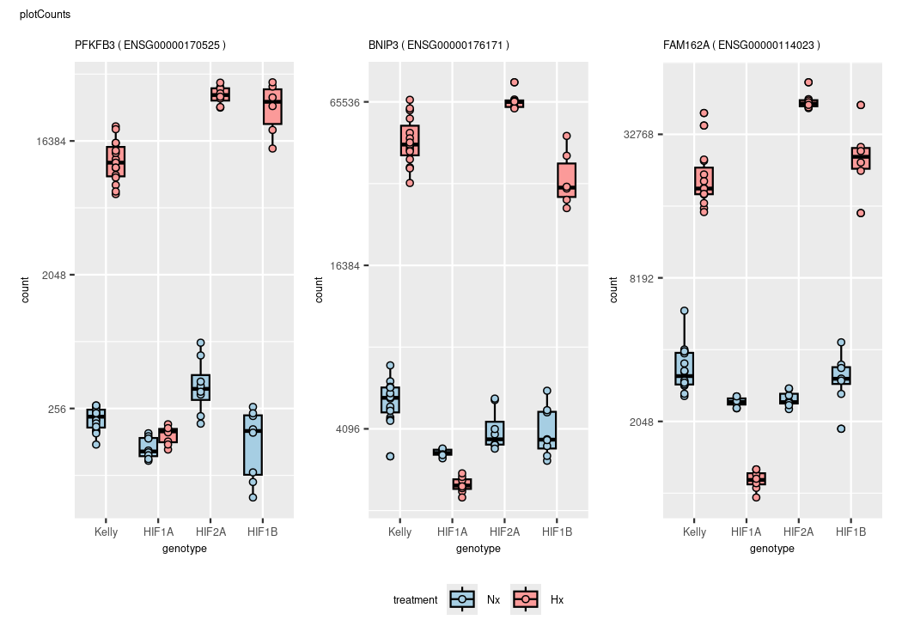<!-- -->

``` r
patchwork::wrap_elements((c_graphic))
```

<!-- -->

### -Compare KOs

``` r
pick_genes <- topgenes_list[c("top_Hif1aHxNx.vs.KellyHxNx","top_Hif2aHxNx.vs.KellyHxNx","top_Hif1bHxNx.vs.KellyHxNx")] %>% unlist()

pick_results <- c("Hif1aHxNx.vs.KellyHxNx","Hif2aHxNx.vs.KellyHxNx","Hif1bHxNx.vs.KellyHxNx")

res_comb <- res.Kelly.Hx.vs.Nx[pick_genes,c(7,1)] %>% data.frame(.)
res_comb <- cbind(res_comb,lapply(results_list[pick_results],function(i) i[pick_genes,2]) %>% do.call(cbind,.) %>% data.frame(.))
res_comb_matrix <- as.matrix(res_comb[,c(-1,-2)])
res_comb_matrix[res_comb_matrix<1 & res_comb_matrix>-1] <- 0
rownames(res_comb_matrix) <- res_comb$symbol

# adapt colors to uniform breaks
mat_breaks <- quantile_breaks(res_comb_matrix, n = 20)
vir_cols <- viridis(length(mat_breaks))
vir_cols[which(unname(mat_breaks) == 0)] <- "white"

hm_cols <- colorRamp2(mat_breaks,vir_cols)

hm <- Heatmap(res_comb_matrix,
        col = hm_cols,
        column_title = "Compare results",
        na_col = "black",
        row_names_gp = gpar(fontsize = 10),
        cluster_rows = TRUE,
        ) 
hm
```

### -Top genes

Complex Heatmap:
<https://jokergoo.github.io/ComplexHeatmap-reference/book/>

``` r
ht_opt$fast_hclust = TRUE

# Choose genes

interaction_top <- topgenes_list[c("top_Hif1aHxNx.vs.KellyHxNx","top_Hif2aHxNx.vs.KellyHxNx","top_Hif1bHxNx.vs.KellyHxNx")]

interaction_top_ol <- calculate.overlap(interaction_top)


pick_genes <- lapply(interaction_top_ol,'[',1:10) %>% unlist() %>% unname() %>% unique()
pick_genes <- pick_genes[!is.na(pick_genes)]


# Get counts, with summarized replicates
dds_heat <- collapseReplicates(dds, dds$condition,dds$names)
vsd <- vst(dds_heat, blind=TRUE) #Variance stabilized transformation
ntd <- normTransform(dds_heat)
# rld <- rlog(dds_heat)
mat <- assay(vsd)
# mat <- assay(ntd)
# mat <- assay(rld)

# reduce to picked genes and convert to matrix
mat <- mat[pick_genes,c(1,3,5,7,2,4,6,8)] %>% as.matrix()

# Get WGCNA colors
WGCNA <- mcols(dds)[rownames(mat),"colors"] %>% as.character()

# WGCNA[is.na(WGCNA)] <- 'grey'

rownames(mat) <- mcols(dds)[pick_genes,"symbol"]
names(WGCNA) <- rownames(mat)

# adapt colors to uniform breaks
mat_breaks <- quantile_breaks(mat, n = 20)
vir_cols <- viridis(length(mat_breaks))
# vir_cols[9] <- "white"
hm_cols <- colorRamp2(mat_breaks,vir_cols)


hm <- Heatmap(mat,
  ## heatmap colors
      #   col = hm_cols,
      na_col = "black",
      
  ## columns
      column_title = "TOP genes",
      cluster_columns = FALSE,
      # column_km = 4,
      column_split = c(rep("Hx", 4),rep("Nx", 4)),
      # column_names_gp = gpar(col = c("lightcoral","skyblue1"), fontsize = c(10)),
      top_annotation = HeatmapAnnotation(foo = anno_block(gp = gpar(fill = c("lightcoral","skyblue1")),
        labels = c("Nx", "Hx"), 
        labels_gp = gpar(col = "white", fontsize = 10))),
  ## rows
      row_names_gp = gpar(fontsize = 10),
      cluster_rows = TRUE,
      clustering_method_rows = "centroid",
      # clustering_distance_rows = "kendall",
      row_km = 6,
 #  right_annotation = rowAnnotation(WGCNA = WGCNA, col=list(WGCNA=WGCNA))
       )
hm
```

<!-- -->

#### (heatmap test)

``` r
list(bar = c("a" = "red", "b" = "green", "c" = "blue"))

col_fun = colorRamp2(c(0, 5, 10), c("blue", "white", "red"))
ha = HeatmapAnnotation(foo = 1:10, col = list(foo = col_fun))

anno_col <- as.data.frame(colData(dds_heat)[,c("treatment","genotype")])
anno_colors <- list(treatment = c("lightcoral","skyblue1"),
                    genotype = c("grey","seagreen3","turquoise3","tan2"))

names(anno_colors$treatment) <- levels(anno_col$treatment)
names(anno_colors$genotype) <- levels(anno_col$genotype)


hm <- Heatmap(mat,
        col = hm_cols,
        column_title = "Compare results",
        na_col = "black",
        row_names_gp = gpar(fontsize = 10)
        ) 
hm

pheatmap(mat,
         clustering_distance_rows=sampleDists,
         clustering_distance_cols=sampleDists,
         annotation_col=anno_col,
         annotation_colors = anno_colors,
         show_colnames     = FALSE,
         col=viridis(20),
         cutree_rows = 8,
         cutree_cols = 8,
         fontsize_row = 5)
```

## Venns

### All Genes

``` r
# see above condensed
```

### upregulated in hypoxia

``` r
Kelly <- subset(results_list[["Kelly.Hx.vs.Nx"]],log2FoldChange > 0) %>% topgenes_f() %>% rownames()

input_list <- c(list("All Hypoxic (Kelly)" = Kelly,
                     "Hif1b" = deg_genes_list[["deg_Hif1bHxNx.vs.KellyHxNx"]],
                     "Hif1a" = deg_genes_list[["deg_Hif1aHxNx.vs.KellyHxNx"]],
                     "Hif2a" = deg_genes_list[["deg_Hif2aHxNx.vs.KellyHxNx"]]                                         ))

plt <- venn.diagram(
    x = input_list,
    category.names = paste(names(input_list),"\n(",input_list %>% summary() %>% .[c(1:length(input_list))],")",sep=""),
    force.unique = TRUE, na = "remove",
    filename = NULL,
    main = "Compare Hif KOs", main.fontface = "bold",
    lwd = 2,
    lty = 'blank',
    fill = colors[c(1,7,3,5)],
    #cat.col=c(colors[c(4)],"grey40","grey20"),
    cat.fontface = "bold",
    #cat.pos = c(-45,0,45),
    # inverted=length(input_list[[1]]) < length(input_list[[2]])
    )

patchwork::wrap_elements((plt)) 
```

<!-- -->

## Cluster results

``` r
pick_genes <- deg_genes_list[c("deg_Hif1aHxNx.vs.KellyHxNx", "deg_Hif2aHxNx.vs.KellyHxNx", "deg_Hif1bHxNx.vs.KellyHxNx")] %>% unlist() %>% unname() %>% unique()

# "deg_Kelly.Hx.vs.Nx",

("ENSG00000123095.1" == pick_genes) %>% summary()
```

    ##    Mode   FALSE 
    ## logical    5068

``` r
pick_results <- c("Kelly.Hx.vs.Nx","Hif1aHxNx.vs.KellyHxNx","Hif2aHxNx.vs.KellyHxNx","Hif1bHxNx.vs.KellyHxNx")
res_comb <- res.Kelly.Hx.vs.Nx[pick_genes,c(7,1)]
res_comb$gene_id <- rownames(res_comb)
res_comb <- res_comb %>% data.frame(.)
res_comb <- cbind(res_comb,lapply(results_list[pick_results],function(i) i[pick_genes,2]) %>% do.call(cbind,.) %>% data.frame(.))
dim(res_comb)
```

    ## [1] 5068    7

``` r
rownames(res_comb) <- mcols(dds)[res_comb$gene_id,"ens.symbol"]
res_comb_matrix <- as.matrix(res_comb[,c(-1,-2,-3)])

# res_comb_matrix[res_comb_matrix<1 & res_comb_matrix>-1] <- 0

plot(res_comb_matrix[,"Hif1aHxNx.vs.KellyHxNx"],res_comb_matrix[,"Hif2aHxNx.vs.KellyHxNx"])
```

<!-- -->

``` r
g1 <- ggplot(res_comb_matrix,aes(x=Hif1aHxNx.vs.KellyHxNx,y=Hif2aHxNx.vs.KellyHxNx, color=Kelly.Hx.vs.Nx)) +
  geom_point(alpha = 0.3) +
  geom_hline(yintercept=c(-1,1)) +
  geom_vline(xintercept=c(-1,1)) +
 scale_color_viridis_c(option = 'D',limits = c(-2, 2)) +
 coord_cartesian(xlim = c(-5, 5),ylim = c(-5,5))

g2 <- ggplot(res_comb_matrix,aes(x=Hif1aHxNx.vs.KellyHxNx,y=Hif2aHxNx.vs.KellyHxNx, color=Hif1bHxNx.vs.KellyHxNx)) +
  geom_point(alpha = 0.3) +
  geom_hline(yintercept=c(-1,1)) +
  geom_vline(xintercept=c(-1,1)) +
 scale_color_viridis_c(option = 'D',limits = c(-2, 2)) +
 coord_cartesian(xlim = c(-5, 5),ylim = c(-5,5))

g1 + g2 + plot_layout(guides = "collect", axis_titles="collect", axes = 'collect') & plot_annotation(title = "all hypoxia genes") & 
  theme(legend.position = 'bottom')
```

<!-- -->

``` r
# Only Hif1a Hif2a Genes

pick_genes <- deg_genes_list[c("deg_Hif1aHxNx.vs.KellyHxNx", "deg_Hif2aHxNx.vs.KellyHxNx")] %>% unlist() %>% unname() %>% unique()
pick_results <- c("Kelly.Hx.vs.Nx","Hif1aHxNx.vs.KellyHxNx","Hif2aHxNx.vs.KellyHxNx","Hif1bHxNx.vs.KellyHxNx")
res_comb <- res.Kelly.Hx.vs.Nx[pick_genes,c(7,1)]
res_comb$gene_id <- rownames(res_comb)
res_comb <- res_comb %>% data.frame(.)
res_comb <- cbind(res_comb,lapply(results_list[pick_results],function(i) i[pick_genes,2]) %>% do.call(cbind,.) %>% data.frame(.))
dim(res_comb)
```

    ## [1] 2781    7

``` r
rownames(res_comb) <- mcols(dds)[res_comb$gene_id,"ens.symbol"]
res_comb_matrix_12 <- as.matrix(res_comb[,c(-1,-2,-3)])

# res_comb_matrix[res_comb_matrix<1 & res_comb_matrix>-1] <- 0

plot(res_comb_matrix_12[,"Hif1aHxNx.vs.KellyHxNx"],res_comb_matrix_12[,"Hif2aHxNx.vs.KellyHxNx"])
```

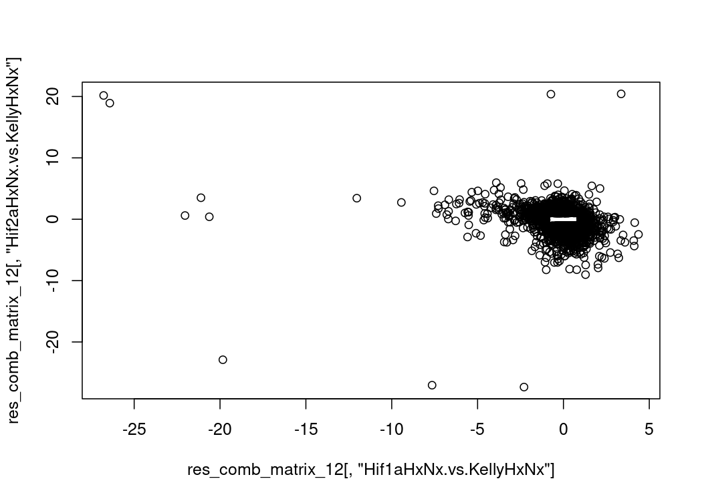<!-- -->

``` r
g1 <- ggplot(res_comb_matrix_12,aes(x=Hif1aHxNx.vs.KellyHxNx,y=Hif2aHxNx.vs.KellyHxNx, color=Kelly.Hx.vs.Nx)) +
  geom_point(alpha = 0.3) +
  geom_hline(yintercept=c(-1,1)) +
  geom_vline(xintercept=c(-1,1)) +
 scale_color_viridis_c(option = 'D',limits = c(-2, 2)) +
 coord_cartesian(xlim = c(-5, 5),ylim = c(-5,5))

g2 <- ggplot(res_comb_matrix_12,aes(x=Hif1aHxNx.vs.KellyHxNx,y=Hif2aHxNx.vs.KellyHxNx, color=Hif1bHxNx.vs.KellyHxNx)) +
  geom_point(alpha = 0.3) +
  geom_hline(yintercept=c(-1,1)) +
  geom_vline(xintercept=c(-1,1)) +
 scale_color_viridis_c(option = 'D',limits = c(-2, 2)) +
 coord_cartesian(xlim = c(-5, 5),ylim = c(-5,5))

g1 + g2 + plot_layout(guides = "collect", axis_titles="collect", axes = 'collect') & plot_annotation(title = "all hypoxia genes") & 
  theme(legend.position = 'bottom')
```

<!-- -->

``` r
# Color according to category

keyvals <- ifelse(abs(res_comb_matrix_12[,"Hif1aHxNx.vs.KellyHxNx"]-res_comb_matrix_12[,"Hif2aHxNx.vs.KellyHxNx"]) < 1, "hotpink1",
            ifelse( (res_comb_matrix_12[,"Hif1aHxNx.vs.KellyHxNx"] > 1 & 
                     res_comb_matrix_12[,"Hif2aHxNx.vs.KellyHxNx"] < -1) |
                    (res_comb_matrix_12[,"Hif1aHxNx.vs.KellyHxNx"] < -1 & 
                     res_comb_matrix_12[,"Hif2aHxNx.vs.KellyHxNx"] > 1) , colors[8],
            ifelse( (res_comb_matrix_12[,"Hif1aHxNx.vs.KellyHxNx"] > 1 &               
                    (res_comb_matrix_12[,"Hif1aHxNx.vs.KellyHxNx"] > res_comb_matrix_12[,"Hif2aHxNx.vs.KellyHxNx"])) |
                    (res_comb_matrix_12[,"Hif1aHxNx.vs.KellyHxNx"] < -1 &               
                    (res_comb_matrix_12[,"Hif1aHxNx.vs.KellyHxNx"] < res_comb_matrix_12[,"Hif2aHxNx.vs.KellyHxNx"])),colors[6],
            ifelse( (res_comb_matrix_12[,"Hif2aHxNx.vs.KellyHxNx"] > 1 |
                    (res_comb_matrix_12[,"Hif2aHxNx.vs.KellyHxNx"] < -1 )),colors[4],  
    'grey'))) )
res_comb_12 <- data.frame(res_comb_matrix_12,keyvals)

# res_comb_matrix_12[,"Hif1aHxNx.vs.KellyHxNx"] > 1 & res_comb_matrix_12[,"Hif2aHxNx.vs.KellyHxNx"] > 1
    
keyvals[is.na(keyvals)] <- 'grey'
  names(keyvals)[keyvals == "hotpink1"] <- 'Hif1a & Hif2a'
  names(keyvals)[keyvals == colors[8]] <- 'anti Hif1a & Hif2a'
  names(keyvals)[keyvals == colors[6]] <- 'Hif1a'
  names(keyvals)[keyvals == colors[4]] <- 'Hif2a'

g3 <- ggplot(res_comb_matrix_12,aes(x=Hif1aHxNx.vs.KellyHxNx,y=Hif2aHxNx.vs.KellyHxNx, color=names(keyvals))) +
  geom_point(alpha = 0.3, show.legend = TRUE) +
  geom_hline(yintercept=c(-1,1)) +
  geom_vline(xintercept=c(-1,1)) +
  geom_abline(slope=1, intercept = 0, color="grey", linetype = 'dashed') +
  # geom_ribbon(aes(ymin = -1, ymax = +1), fill="grey") + 
  geom_abline(slope=1, intercept = -1) +
  geom_abline(slope=1, intercept = +1) +
  scale_color_manual(values = keyvals) + 
  coord_cartesian(xlim = c(-5, 5),ylim = c(-5,5))
g3
```

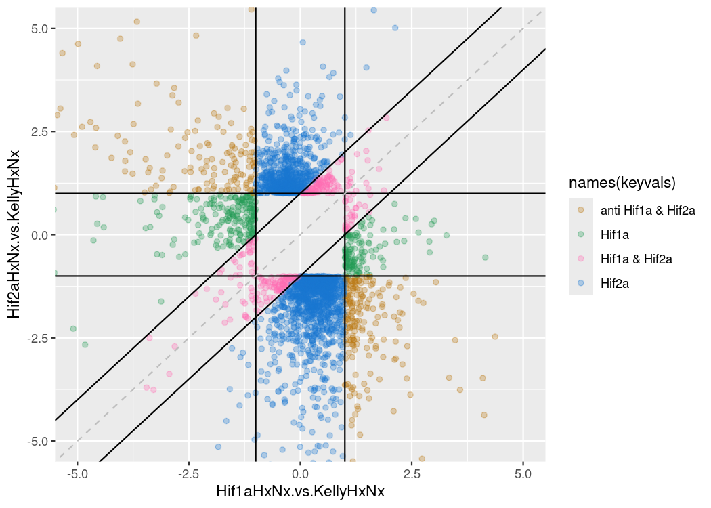<!-- -->

``` r
g1 + g2 + plot_layout(guides = "collect", axis_titles="collect", axes = 'collect') & plot_annotation(title = "all hypoxia genes") & 
  theme(legend.position = 'bottom')
```

<!-- -->

### Corrplot

``` r
plot(res_comb_matrix[,2],res_comb_matrix[,3])
```

<!-- -->

``` r
M <- cor(res_comb_matrix)
corrplot::corrplot(M)
```

<!-- -->

### PCA of genes

``` r
res_comb_matrix_t <- t(res_comb_matrix_12)
p <- pca(res_comb_matrix_t, removeVar = 0.1)
biplot(p,
       xlim=c(-5,5),
       ylim=c(-5,5)
       )
```

<!-- -->

``` r
ggplot(p$rotated,aes(x=PC1,y=PC2, color=names(keyvals)))+
  geom_point(alpha = 0.3) +
  scale_color_manual(values = keyvals) + 
  coord_cartesian(xlim = c(-10, 8),ylim = c(-5,8))
```

<!-- -->

``` r
# bi <- biplot(p,x="PC3",y="PC1",
#     lab = p$metadata$experiment,
#     colby = 'condition',colkey = viridis(8),
#     hline = 0, vline = 0,
#     encircle = TRUE, encircleFill = TRUE,
#     labSize = 3, legendIconSize = 4.0,
#     legendPosition = 'bottom',
#     sizeLoadingsNames = 3,
#     axisLabSize = 10,
#     captionLabSize = 1)
```

### UMAP

``` r
umap <- umap(res_comb_matrix_12)

df <- data.frame(x = umap$layout[,1],
                 y = umap$layout[,2])

ggplot(df, aes(x, y, color=names(keyvals))) +
  geom_point(alpha = 0.5) +
  scale_color_manual(values = keyvals)
```

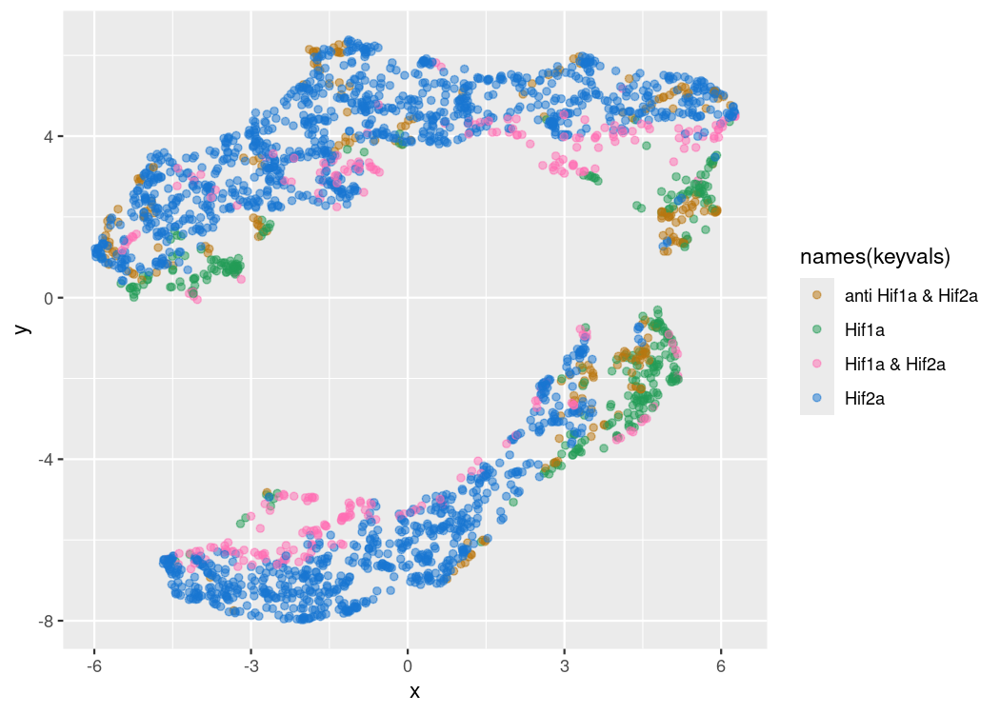<!-- -->

## GO terms

``` r
###################################### GO

interaction_top <- topgenes_list[c("top_Hif1aHxNx.vs.KellyHxNx","top_Hif2aHxNx.vs.KellyHxNx","top_Hif1bHxNx.vs.KellyHxNx")]
interaction_deg <- deg_genes_list[c("deg_Hif1aHxNx.vs.KellyHxNx","deg_Hif2aHxNx.vs.KellyHxNx","deg_Hif1bHxNx.vs.KellyHxNx")]

interaction_deg[[3]] <- interaction_deg[[3]][1:3000]

names(interaction_deg)
```

    ## [1] "deg_Hif1aHxNx.vs.KellyHxNx" "deg_Hif2aHxNx.vs.KellyHxNx"
    ## [3] "deg_Hif1bHxNx.vs.KellyHxNx"

``` r
interaction_deg_entrez_list <- list(Hif1a=mcols(dds)[interaction_deg[[1]],"entrezid"] %>% unlist() %>% unname(),
                                    Hif2a=mcols(dds)[interaction_deg[[2]],"entrezid"] %>% unlist() %>% unname(),
                                    Hif1b=mcols(dds)[interaction_deg[[3]],"entrezid"] %>% unlist() %>% unname()) %>% lapply(.,na.omit)


GO_1 <- enrichGO(interaction_deg[[1]],
                  keyType = "ENSEMBL",
                  ont = "ALL",
                  minGSSize = 15,
                  maxGSSize = 800,
                  pvalueCutoff = 0.05,
                  OrgDb = "org.Hs.eg.db",
                  pAdjustMethod = "fdr")
GO_1 <- simplify(GO_1)

GO_2 <- enrichGO(interaction_deg[[2]],
                  keyType = "ENSEMBL",
                  ont = "ALL",
                  minGSSize = 15,
                  maxGSSize = 800,
                  pvalueCutoff = 0.05,
                  OrgDb = "org.Hs.eg.db",
                  pAdjustMethod = "fdr")
GO_2 <- simplify(GO_2)

GO_3 <- enrichGO(interaction_deg[[3]],
                  keyType = "ENSEMBL",
                  ont = "ALL",
                  minGSSize = 15,
                  maxGSSize = 800,
                  pvalueCutoff = 0.05,
                  OrgDb = "org.Hs.eg.db",
                  pAdjustMethod = "fdr")
GO_3 <- simplify(GO_3)

barplot(GO_1, split = "ONTOLOGY", font.size = 6, showCategory = 10, title = "Hif1a") + facet_grid(ONTOLOGY~., scale="free") + scale_y_discrete(labels=function(x)  str_wrap(x, width=80)) + scale_fill_viridis() + theme(panel.grid.major.y = element_blank(), panel.background = element_rect(fill = NA), panel.ontop = TRUE, panel.grid.major.x = element_line(color = "white", size = 0.5, linetype = 1), panel.grid.minor.x = element_line(color = "white", size = 0.25, linetype = 1)) + scale_x_continuous(expand = c(0,0))
```

<!-- -->

``` r
barplot(GO_2, split = "ONTOLOGY", font.size = 6, showCategory = 10, title = "Hif2a") + facet_grid(ONTOLOGY~., scale="free") + scale_y_discrete(labels=function(x)  str_wrap(x, width=80)) + scale_fill_viridis() + theme(panel.grid.major.y = element_blank(), panel.background = element_rect(fill = NA), panel.ontop = TRUE, panel.grid.major.x = element_line(color = "white", size = 0.5, linetype = 1), panel.grid.minor.x = element_line(color = "white", size = 0.25, linetype = 1)) + scale_x_continuous(expand = c(0,0))
```

<!-- -->

``` r
barplot(GO_3, split = "ONTOLOGY", font.size = 6, showCategory = 10, title = "Hif1b") + facet_grid(ONTOLOGY~., scale="free") + scale_y_discrete(labels=function(x)  str_wrap(x, width=80)) + scale_fill_viridis() + theme(panel.grid.major.y = element_blank(), panel.background = element_rect(fill = NA), panel.ontop = TRUE, panel.grid.major.x = element_line(color = "white", size = 0.5, linetype = 1), panel.grid.minor.x = element_line(color = "white", size = 0.25, linetype = 1)) + scale_x_continuous(expand = c(0,0))
```

<!-- -->

``` r
godot1 <- dotplot(clusterProfiler::simplify(GO_1))+labs(title = "Hif1a")
godot2 <- dotplot(clusterProfiler::simplify(GO_2))+labs(title = "Hif2a")
godot3 <- dotplot(clusterProfiler::simplify(GO_3))+labs(title = "Hif1b")
godot1 + godot2 + godot3
```

<!-- -->

``` r
# Compare cluster
ck <- compareCluster(geneCluster = interaction_deg, fun = "enrichGO",
                  OrgDb = "org.Hs.eg.db",
                  keyType = "ENSEMBL",
                  ont = "ALL",
                  pvalueCutoff = 0.05,
                  pAdjustMethod = "fdr")

ck <- setReadable(ck, OrgDb = org.Hs.eg.db, )
head(ck)[1:7]
```

    ##                      Cluster ONTOLOGY         ID
    ## 1 deg_Hif1aHxNx.vs.KellyHxNx       BP GO:0007409
    ## 2 deg_Hif1aHxNx.vs.KellyHxNx       BP GO:0007411
    ## 3 deg_Hif1aHxNx.vs.KellyHxNx       BP GO:0097485
    ## 4 deg_Hif1aHxNx.vs.KellyHxNx       BP GO:0010038
    ## 5 deg_Hif1aHxNx.vs.KellyHxNx       BP GO:0042391
    ## 6 deg_Hif1aHxNx.vs.KellyHxNx       BP GO:0002315
    ##                            Description GeneRatio   BgRatio       pvalue
    ## 1                         axonogenesis    34/483 483/21288 6.221880e-09
    ## 2                        axon guidance    22/483 247/21288 5.554055e-08
    ## 3           neuron projection guidance    22/483 247/21288 5.554055e-08
    ## 4                response to metal ion    27/483 387/21288 2.790769e-07
    ## 5     regulation of membrane potential    31/483 487/21288 2.794834e-07
    ## 6 marginal zone B cell differentiation     5/483  10/21288 1.351020e-06

``` r
dotplot(ck)
```

<!-- -->

``` r
dotplot(ck, showCategory=15)
```

<!-- -->

``` r
# KEGG
ckk <- compareCluster(geneCluster = interaction_deg, fun = "enrichKEGG", organism="hsa", pvalueCutoff=0.05)


hif1a_entrez <- mcols(dds)[interaction_deg[[1]],"entrezid"] %>% unlist() %>% unname() %>% unique()
hif1a_entrez <- hif1a_entrez[!is.na(hif1a_entrez)]

hif2a_entrez <- mcols(dds)[interaction_deg[[2]],"entrezid"] %>% unlist() %>% unname() %>% unique()
hif2a_entrez <- hif2a_entrez[!is.na(hif2a_entrez)]

hif1b_entrez <- mcols(dds)[interaction_deg[[3]],"entrezid"] %>% unlist() %>% unname() %>% unique()
hif1b_entrez <- hif1b_entrez[!is.na(hif1b_entrez)]

interaction_deg_entrez <- list(hif1a_entrez,hif2a_entrez,hif1b_entrez)

ek1 <- enrichKEGG(hif1a_entrez,organism="hsa", pvalueCutoff=0.05)
ek2 <- enrichKEGG(hif2a_entrez,organism="hsa", pvalueCutoff=0.05)
ek3 <- enrichKEGG(hif1b_entrez,organism="hsa", pvalueCutoff=0.05)

dotplot(ek1) + dotplot(ek2) + dotplot(ek3)
```

<!-- -->

``` r
# ckk <- compareCluster(geneCluster = interaction_deg_entrez, fun = "enrichKEGG", organism="hsa", pvalueCutoff=0.5)
```

## Check experiment differences

``` r
# see condensed results
```

#### Venns

``` r
input_list <- c(list("All Hypoxic (Kelly)" = deg_genes_list[["deg_Kelly.Hx.vs.Nx"]],
                     "Experiment" = res_exp,
                     "Hif1a" = deg_genes_list[["deg_Hif1aHxNx.vs.KellyHxNx"]],
                     "Hif2a" = deg_genes_list[["deg_Hif2aHxNx.vs.KellyHxNx"]] 
                     ))

plt1 <- venn.diagram(
    x = input_list,
    category.names = paste(names(input_list),"\n(",input_list %>% summary() %>% .[c(1:length(input_list))],")",sep=""),
    force.unique = TRUE, na = "remove",
    filename = NULL,
    main = "Compare Hif KOs", main.fontface = "bold",
    lwd = 2,
    lty = 'blank',
    fill = colors[c(1,7,3,5)],
    #cat.col=c(colors[c(4)],"grey40","grey20"),
    cat.fontface = "bold",
    #cat.pos = c(-45,0,45),
    # inverted=length(input_list[[1]]) < length(input_list[[2]])
    )

patchwork::wrap_elements(plt1) 
```

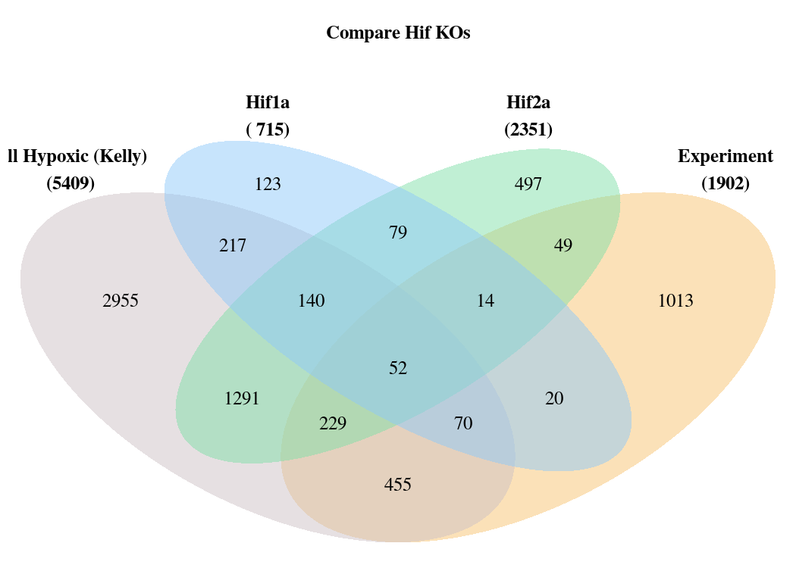<!-- -->

``` r
names(input_list)
```

    ## [1] "All Hypoxic (Kelly)" "Experiment"          "Hif1a"              
    ## [4] "Hif2a"

``` r
overlaps <- calculate.overlap(input_list)

# get each top gene
getVennElements(plt1)
```

    ## [1] "Element=9 (123) --> a1(123)"
    ## [1] "Element=10 (79) --> a2(79)"
    ## [1] "Element=11 (497) --> a3(497)"
    ## [1] "Element=12 (217) --> a4(217)"
    ## [1] "Element=13 (140) --> a5(140)"
    ## [1] "Element=14 (52) --> a6(52)"
    ## [1] "Element=15 (14) --> a7(14)"
    ## [1] "Element=16 (49) --> a8(49)"
    ## [1] "Element=17 (2955) --> a9(2955)"
    ## [1] "Element=18 (1291) --> a10(1291)"
    ## [1] "Element=19 (229) --> a11(229)"
    ## [1] "Element=20 (70) --> a12(70)"
    ## [1] "Element=21 (20) --> a13(20)"
    ## [1] "Element=22 (1013) --> a14(1013)"
    ## [1] "Element=23 (455) --> a15(455)"

``` r
overlaps_exp <- overlaps[c("a8","a7","a6","a11","a15","a12","a13","a14")]
goi <- sapply(overlaps_exp,"[[",1) 
# %>% .[order(names(.))]

# plotCounts_SK(goi)


# color for experiment
plotCounts_SK_list <- list()
  l <- length(goi)
       for (ig in 1:l){
  s <- mcols(dds)[goi[ig],"symbol"]
  if (s ==""){s <- goi[ig]}
    d <- plotCounts(dds, gene=goi[ig], intgroup=c("condition","experiment","genotype","treatment"), main=s,returnData=TRUE)

  gcounts <- ggplot(d, aes(x = condition, y = count, fill=experiment, color=experiment)) +
    geom_boxplot(outliers = FALSE,color="black",aes(fill=condition)) +
    geom_point(shape=21,color="black",aes(fill=experiment),position=position_dodge(width=0.75), alpha=1) +
    scale_fill_manual(values=c(rep(c("#A6CEE3","#FB9A99"),4),viridis(4))) +
    # scale_color_manual(values=c("#A6CEE3","#FB9A99")) +
    scale_y_continuous(trans = "log2") +
    labs(title = paste(names(goi[ig]),":",s,"(",goi[ig],")",sep=" "))
  plotCounts_SK_list[[paste(n,goi[ig],sep="_")]] <- gcounts
       }
 
patchwork::wrap_plots(plotCounts_SK_list,ncol = 3) + patchwork::wrap_elements(plt1) +
  plot_layout(guides = "collect", axis_titles="collect", axes = 'collect') & 
  plot_annotation(title = n) & 
  theme(legend.position = 'bottom',
        plot.title = element_text(size=6),
        axis.text=element_text(size=6),
        axis.title=element_text(size=6),
        legend.text=element_text(size=6),
        legend.title=element_text(size=6))
```

<!-- -->
