DGE
================
Kelterborn
2024-03-20

- [0. Load](#0-load)
  - [- Load R librarys](#--load-r-librarys)
  - [- Load dds](#--load-dds)
  - [- functions](#--functions)
- [1. Make results](#1-make-results)
  - [-Plot example counts](#-plot-example-counts)
  - [- Colour sheme](#--colour-sheme)
- [2. Condensed Results](#2-condensed-results)
  - [](#section)
- [3. Data Dive](#3-data-dive)
  - [Volcanos](#volcanos)
  - [Overlaps (Venn)](#overlaps-venn)
  - [Heatmaps](#heatmaps)
  - [Venns](#venns)
  - [Cluster results](#cluster-results)
  - [GO terms](#go-terms)
  - [Check experiment differences](#check-experiment-differences)

# 0. Load

## - Load R librarys

## - Load dds

## - functions

``` r
n <- "Kelly.Hx.vs.Nx"
list1 <- deg_genes_list[["deg_Hif1aHxNx.vs.KellyHxNx"]]
list2 <- deg_genes_list[["deg_Hif2aHxNx.vs.KellyHxNx"]]
l1.n <- "Hif1a"
l2.n <- "Hif2a"
l1.col <- "#1976d2"
l2.col <- "#239b56"
lol.col <- "#f8c471"
xlim <- 10
ylim <- 400
lab <- ol_list$a3
```

# 1. Make results

### -without experiment

### -include experiment

#### (Advanced results troubleshooting)

<figure>

<figcaption aria-hidden="true">Contrasts_overview</figcaption>
</figure>

### -Generate toplist

    ## design

    ## ~genotype + treatment + genotype:treatment

    ## cutoffs
    ## differential expressed: p=0.05,bM=10,l2FC=1
    ## top genes:              p=0.01,bM=100,l2FC=2

|                            | all.DEGs | top.DEGs |
|:---------------------------|---------:|---------:|
| deg_Hif1a.Hx.vs.Nx         |     6062 |      977 |
| deg_Hif2a.Hx.vs.Nx         |     3283 |      568 |
| deg_Hif1b.Hx.vs.Nx         |     1961 |      310 |
| deg_Kelly.Hx.vs.Nx         |     5193 |      841 |
| deg_Nx.Hif1a.vs.Kelly      |      144 |       20 |
| deg_Nx.Hif2a.vs.Kelly      |      449 |       76 |
| deg_Nx.Hif1b.vs.Kelly      |      681 |       54 |
| deg_Hx.Hif1a.vs.Kelly      |     1037 |       82 |
| deg_Hx.Hif2a.vs.Kelly      |     2359 |      330 |
| deg_Hx.Hif1b.vs.Kelly      |     5212 |      547 |
| deg_Hx.Hif2a.vs.Hif1a      |     4085 |      595 |
| deg_Hx.Hif1b.vs.Hif1a      |     5858 |      735 |
| deg_Hx.Hif1b.vs.Hif2a      |     3255 |      271 |
| deg_Hif1aHxNx.vs.KellyHxNx |      627 |       52 |
| deg_Hif2aHxNx.vs.KellyHxNx |     2252 |      305 |
| deg_Hif1bHxNx.vs.KellyHxNx |     3797 |      409 |
| deg_Hif2aHxNx.vs.Hif1aHxNx |     3406 |      527 |
| deg_Hx.Hif1b.vs.Hif12a     |     4101 |      284 |
| deg_Hx.Kelly.vs.allHIFs    |     1465 |      151 |
| deg_Hx.vs.Nx               |     3540 |      501 |

## -Plot example counts

<!-- --><!-- -->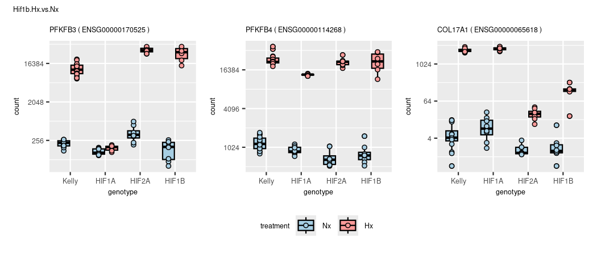<!-- --><!-- -->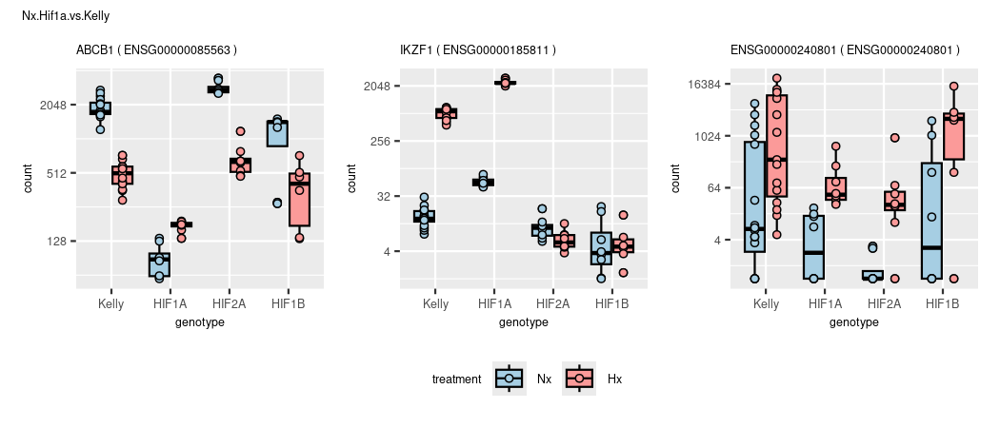<!-- --><!-- -->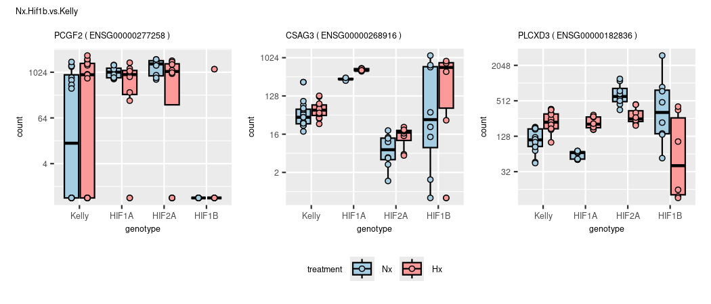<!-- --><!-- --><!-- --><!-- --><!-- --><!-- -->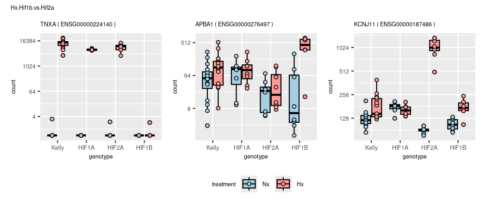<!-- --><!-- --><!-- --><!-- --><!-- --><!-- --><!-- --><!-- -->

|                 | symbol  | baseMean | log2FoldChange |    lfcSE |      stat | pvalue | padj |
|:----------------|:--------|---------:|---------------:|---------:|----------:|-------:|-----:|
| ENSG00000234964 | FABP5P7 | 258.2986 |       -29.6126 | 3.342977 | -8.858153 |      0 |    0 |

<!-- -->

## - Colour sheme

# 2. Condensed Results

## 

# 3. Data Dive

## Volcanos

### Draw Volcanos


### (continuous Volcanos)

``` r
# gradient is fixed to padj = y-axis

# Volcano
lcol="grey20"
xlim=10
ylim=300
n <- "Kelly.Hx.vs.Nx"
res <- results_list[[n]]
l <- length(res)

res_shrink <- lfcShrink(dds, res=res, type="ashr")
res_shrink$symbol <- res$symbol

# remove nas
res <- res[!is.na(res$padj),]
res <- res[!is.na(res$log2FoldChange),]

# rename genes
rownames(res) <- res$symbol

# change shape of outliers
shape <- ifelse(abs(res$log2FoldChange) > xlim, 18,
                ifelse(res$padj < 10^-ylim,18,16))
summary(is.na(shape))

# shape[is.na(shape)] <- 2
names(shape)[shape == 18] <- 'out of scale'
names(shape)[shape == 16] <- 'in range'

# move outliers to coord. max.
res$log2FoldChange[res$log2FoldChange > xlim] <- xlim
res$log2FoldChange[res$log2FoldChange < -xlim] <- -xlim
res$padj[res$padj < 10^-ylim] <- 10^-ylim
summary(res$padj < 10^-ylim)

 p1 <- EnhancedVolcano(res,
    lab = res$symbol,
    x = 'log2FoldChange',
    y = 'padj',
    pCutoff = 10^(-50),
    FCcutoff = 2,
    xlim = c(-xlim, xlim),
    pointSize = c(ifelse(res$log2FoldChange>2, 8, 1)),
    labSize = 6.0,
    shape = c(6, 6, 19, 16),
    title = "DESeq2 results",
    subtitle = "Differential expression",
    caption = bquote(~Log[2]~ "fold change cutoff, 2; p-value cutoff, 10e-4"),
    legendPosition = "right",
    legendLabSize = 14,
    colAlpha = 0.9,
    colGradient = c('red3', 'royalblue'),
    drawConnectors = TRUE,
    hline = c(10e-8),
    widthConnectors = 0.5)

  p1

ev_f <- EnhancedVolcano(res,
    x = 'log2FoldChange',
    y = 'padj',
    lab = res$symbol,
    labSize = 1.5,
    drawConnectors = TRUE,
    boxedLabels = TRUE,
    widthConnectors = 0.5,
    colConnectors = lcol,
    max.overlaps = 17,
    colGradient = c('red3', 'royalblue'),
    xlim = c(-xlim, xlim),
    ylim = c(0, ylim),
    ylab = "Padj (-log10)",
    title = n,
    subtitle = paste("DE genes:",l),
    # sub = "SVF",

    FCcutoff = 2,
    # pointSize = c(ifelse(rownames(res_WT_D_vs.WT_BL) %in% rownames(top_WT_BL_vs.pcry_BL), 8, 1)),
    legendLabels=c('Not sig.','|L2F| > 2.5','p-adj < 0.05',
                   'p-adj & L2F'),
    legendPosition = 'bottom',
    legendLabSize = 8,
    legendIconSize = 2.0,
    axisLabSize = 8,
    titleLabSize = 8,
    subtitleLabSize = 8,
    captionLabSize = 8,
    caption = {}
   )

ev_f
```

### (prepare data)

### (simple volcano (full))

#### (check cutoff)

## Overlaps (Venn)

### - Hif1a

    ## [1] "Element=7 (652) --> a3(652)"

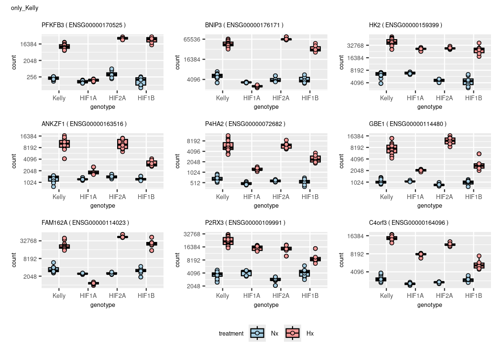

    ## Kelly.Hx.vs.Nx

|                 |   baseMean | log2FoldChange |     lfcSE |      stat | pvalue | padj | symbol  |
|:----------------|-----------:|---------------:|----------:|----------:|-------:|-----:|:--------|
| ENSG00000073060 | 13138.5292 |       1.919148 | 0.0805471 |  23.82642 |      0 |    0 | SCARB1  |
| ENSG00000132382 |  7907.2856 |      -1.819953 | 0.1165091 | -15.62070 |      0 |    0 | MYBBP1A |
| ENSG00000117016 |  7450.2196 |      -1.771902 | 0.1177044 | -15.05383 |      0 |    0 | RIMS3   |
| ENSG00000186469 |  8919.4998 |       1.868842 | 0.1224782 |  15.25858 |      0 |    0 | GNG2    |
| ENSG00000135116 |   701.4788 |      -1.986505 | 0.1759162 | -11.29234 |      0 |    0 | HRK     |
| ENSG00000179222 | 25434.3798 |       1.496304 | 0.1292748 |  11.57460 |      0 |    0 | MAGED1  |
| ENSG00000189241 | 12349.7187 |       1.713882 | 0.0847956 |  20.21191 |      0 |    0 | TSPYL1  |
| ENSG00000116830 |  3730.9159 |      -1.933219 | 0.1261942 | -15.31939 |      0 |    0 | TTF2    |
| ENSG00000184867 |  2482.0171 |       1.739079 | 0.1073437 |  16.20104 |      0 |    0 | ARMCX2  |

    ## Hif1a.Hx.vs.Nx

|                 |   baseMean | log2FoldChange |     lfcSE |      stat | pvalue | padj | symbol  |
|:----------------|-----------:|---------------:|----------:|----------:|-------:|-----:|:--------|
| ENSG00000073060 | 13138.5292 |       2.465035 | 0.1007928 |  24.45646 |      0 |    0 | SCARB1  |
| ENSG00000132382 |  7907.2856 |      -2.544386 | 0.1460951 | -17.41596 |      0 |    0 | MYBBP1A |
| ENSG00000117016 |  7450.2196 |      -2.544218 | 0.1475685 | -17.24093 |      0 |    0 | RIMS3   |
| ENSG00000186469 |  8919.4998 |       2.486538 | 0.1534820 |  16.20085 |      0 |    0 | GNG2    |
| ENSG00000135116 |   701.4788 |      -3.811559 | 0.2240398 | -17.01287 |      0 |    0 | HRK     |
| ENSG00000179222 | 25434.3798 |       2.391898 | 0.1620092 |  14.76396 |      0 |    0 | MAGED1  |
| ENSG00000189241 | 12349.7187 |       2.219567 | 0.1061130 |  20.91701 |      0 |    0 | TSPYL1  |
| ENSG00000116830 |  3730.9159 |      -2.479935 | 0.1580978 | -15.68609 |      0 |    0 | TTF2    |
| ENSG00000184867 |  2482.0171 |       2.448061 | 0.1343629 |  18.21977 |      0 |    0 | ARMCX2  |


    ## [1] "Element=12 (34) --> a4(34)"
    ## [1] "Element=14 (652) --> a6(652)"
    ## [1] "Element=16 (70) --> a8(70)"
    ## [1] "Element=17 (1025) --> a9(1025)"
    ## [1] "Element=19 (255) --> a11(255)"
    ## [1] "Element=20 (155) --> a12(155)"
    ## [1] "Element=22 (1858) --> a14(1858)"
    ## [1] "Element=23 (3072) --> a15(3072)"


    ## compare results with contrast vsvs (Hif1a Hx vs. Nx  VS.  Kelly Hx vs. Nx


    ## [1] "Element=7 (29) --> a1(29)"
    ## [1] "Element=8 (51) --> a2(51)"
    ## [1] "Element=9 (524) --> a3(524)"
    ## [1] "Element=10 (24) --> a5(24)"
    ## [1] "Element=11 (28) --> a6(28)"


|                 | baseMean | log2FoldChange |     lfcSE |     stat |    pvalue |      padj | symbol |
|:----------------|---------:|---------------:|----------:|---------:|----------:|----------:|:-------|
| ENSG00000105880 | 712.6455 |     -0.5576155 | 0.3252427 | -1.71446 | 0.0864443 | 0.1264143 | DLX5   |

|                 | baseMean | log2FoldChange |     lfcSE |     stat | pvalue |    padj | symbol |
|:----------------|---------:|---------------:|----------:|---------:|-------:|--------:|:-------|
| ENSG00000105880 | 712.6455 |       2.027877 | 0.4068681 | 4.984114 |  6e-07 | 2.4e-06 | DLX5   |


    ## [1] "Element=7 (2431) --> a1(2431)"
    ## [1] "Element=8 (189) --> a2(189)"
    ## [1] "Element=9 (467) --> a3(467)"
    ## [1] "Element=10 (97) --> a4(97)"
    ## [1] "Element=11 (270) --> a5(270)"
    ## [1] "Element=12 (187) --> a6(187)"
    ## [1] "Element=13 (73) --> a7(73)"

### (- Hif2a)

    ## Hif2a

<!-- -->

    ## [1] "Element=12 (204) --> a4(204)"
    ## [1] "Element=14 (391) --> a6(391)"
    ## [1] "Element=16 (87) --> a8(87)"
    ## [1] "Element=17 (2706) --> a9(2706)"
    ## [1] "Element=19 (90) --> a11(90)"
    ## [1] "Element=20 (246) --> a12(246)"
    ## [1] "Element=22 (913) --> a14(913)"
    ## [1] "Element=23 (1556) --> a15(1556)"

<!-- --><!-- --><!-- -->

### (- Hif1b)

    ## Hif1b

<!-- -->

    ## [1] "Element=12 (357) --> a4(357)"
    ## [1] "Element=14 (238) --> a6(238)"
    ## [1] "Element=16 (28) --> a8(28)"
    ## [1] "Element=17 (3450) --> a9(3450)"
    ## [1] "Element=19 (44) --> a11(44)"
    ## [1] "Element=20 (246) --> a12(246)"
    ## [1] "Element=22 (547) --> a14(547)"
    ## [1] "Element=23 (858) --> a15(858)"

<!-- --><!-- --><!-- -->

### (- overlap)

    ## overlap of overlaps

<!-- -->

    ## [1] "Element=7 (56) --> a1(56)"
    ## [1] "Element=8 (38) --> a2(38)"
    ## [1] "Element=9 (88) --> a3(88)"
    ## [1] "Element=10 (9) --> a4(9)"
    ## [1] "Element=11 (1) --> a5(1)"
    ## [1] "Element=12 (164) --> a6(164)"
    ## [1] "Element=13 (211) --> a7(211)"

    ##   overlap    gene
    ## 1      a1   SAMD1
    ## 2      a2 FABP5P7
    ## 3      a3   BTBD7
    ## 4      a4 MT-RNR1
    ## 5      a5    CDH7
    ## 6      a6      U2
    ## 7      a7   PCGF2

<!-- -->

### (- other)

### Compare Results 1 2 3

#### Volcano lists

#### WGCNA RES1,2,3

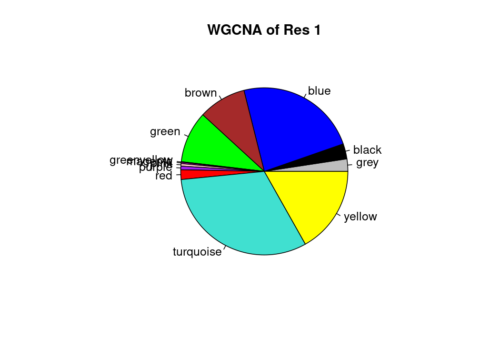

### Compare KO

#### Volcano KO

#### Volcano KO2 manual

``` r
cat("Results 3 of Hif1a, Hif2a, Hif1b")
```

    ## Results 3 of Hif1a, Hif2a, Hif1b

``` r
names(deg_genes_list)
```

    ##  [1] "deg_Hif1a.Hx.vs.Nx"         "deg_Hif2a.Hx.vs.Nx"        
    ##  [3] "deg_Hif1b.Hx.vs.Nx"         "deg_Kelly.Hx.vs.Nx"        
    ##  [5] "deg_Nx.Hif1a.vs.Kelly"      "deg_Nx.Hif2a.vs.Kelly"     
    ##  [7] "deg_Nx.Hif1b.vs.Kelly"      "deg_Hx.Hif1a.vs.Kelly"     
    ##  [9] "deg_Hx.Hif2a.vs.Kelly"      "deg_Hx.Hif1b.vs.Kelly"     
    ## [11] "deg_Hx.Hif2a.vs.Hif1a"      "deg_Hx.Hif1b.vs.Hif1a"     
    ## [13] "deg_Hx.Hif1b.vs.Hif2a"      "deg_Hif1aHxNx.vs.KellyHxNx"
    ## [15] "deg_Hif2aHxNx.vs.KellyHxNx" "deg_Hif1bHxNx.vs.KellyHxNx"
    ## [17] "deg_Hif2aHxNx.vs.Hif1aHxNx" "deg_Hx.Hif1b.vs.Hif12a"    
    ## [19] "deg_Hx.Kelly.vs.allHIFs"    "deg_Hx.vs.Nx"

``` r
input_list <- deg_genes_list[c("deg_Hif1aHxNx.vs.KellyHxNx","deg_Hif2aHxNx.vs.KellyHxNx","deg_Hif1bHxNx.vs.KellyHxNx")]
plt <- venn.diagram(
    x = input_list,
    category.names = paste(names(input_list),"\n(",input_list %>% summary() %>% .[c(1:length(input_list))],")",sep=""),
    force.unique = TRUE, na = "remove",
    filename = NULL,
    main = "Hif1a Hx-Nx vs. Kelly Hx-Nx", main.fontface = "bold",
    lwd = 2,
    lty = 'blank',
    fill = colors[c(3,5,7)],
    cat.col=c(colors[c(4,6,8)]),
    cat.fontface = "bold")

grid.newpage()
grid.draw(plt)
```

<!-- -->

``` r
# plot example counts
overlaps <- calculate.overlap(input_list)
overlaps <- overlaps[order(names(overlaps))]
names(overlaps)
```

    ## [1] "a1" "a2" "a3" "a4" "a5" "a6" "a7"

``` r
getVennElements(plt)
```

    ## [1] "Element=7 (299) --> a1(299)"
    ## [1] "Element=8 (100) --> a2(100)"
    ## [1] "Element=9 (663) --> a3(663)"
    ## [1] "Element=10 (149) --> a4(149)"
    ## [1] "Element=11 (79) --> a5(79)"
    ## [1] "Element=12 (1410) --> a6(1410)"
    ## [1] "Element=13 (2159) --> a7(2159)"

``` r
# plot each 1 gene
goi <- sapply(overlaps,"[[",1) %>% .[order(names(.))]
 
data.frame(overlap = names(goi),
           gene = mcols(dds)[goi,"symbol"])
```

    ##   overlap    gene
    ## 1      a1   BNIP3
    ## 2      a2 FAM162A
    ## 3      a3    SOBP
    ## 4      a4  PFKFB3
    ## 5      a5    ENO1
    ## 6      a6 ARHGEF6
    ## 7      a7    TNXA

``` r
plotCounts_SK(goi)
```

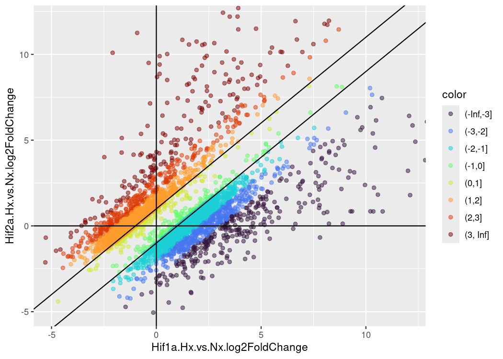<!-- -->

#### WGCNA KOs


#### WGCNA overlapped KOs

    ## [1] "a1" "a2" "a3" "a4" "a5" "a6" "a7"

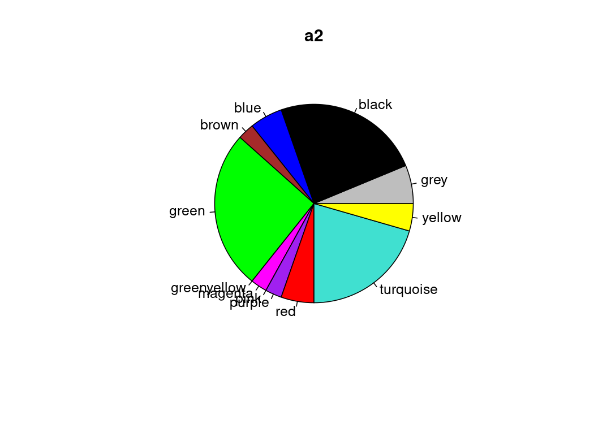

#### -Remove log files

## Heatmaps

### -Compare results

``` r
# https://slowkow.com/notes/pheatmap-tutorial/
# Complex heatmap https://github.com/jokergoo/ComplexHeatmap/

# combined results
pick_genes <- str_detect(names(results_list),pattern="Hif1aHxNx")
pick_results <- c(4,1,5,8,14)
names(results_list)[pick_results]
```

    ## [1] "Kelly.Hx.vs.Nx"         "Hif1a.Hx.vs.Nx"         "Nx.Hif1a.vs.Kelly"     
    ## [4] "Hx.Hif1a.vs.Kelly"      "Hif1aHxNx.vs.KellyHxNx"

``` r
pick_genes <- topgenes_list[pick_genes] %>% unlist() %>% unname() %>% unique()
pick_genes <- lapply(topgenes_list,'[',1:10) %>% unlist() %>% unname() %>% unique()
pick_genes <- c(lapply(res_hif1a,'[',1:5),
                lapply(res_1_ab,'[',1:5),
                lapply(res_2_ab,'[',1:5)) %>% unlist() %>% unname() %>% unique()
pick_genes <- res_hif1a[[1]][1:30]
pick_genes <- lapply(res3_list,'[',1:10) %>% unlist() %>% unname() %>% unique()
pick_genes <- res3_list[[1]][1:30]


res_comb <- res.Kelly.Hx.vs.Nx[pick_genes,c(7,1)] %>% data.frame(.)
res_comb <- cbind(res_comb,lapply(results_list[pick_results],function(i) i[pick_genes,2]) %>% do.call(cbind,.) %>% data.frame(.))
res_comb_matrix <- as.matrix(res_comb[,c(-1,-2)])
res_comb_matrix[res_comb_matrix<1 & res_comb_matrix>-1] <- 0
rownames(res_comb_matrix) <- res_comb$symbol

# adapt colors to uniform breaks
mat_breaks <- quantile_breaks(res_comb_matrix, n = 20)
vir_cols <- viridis(length(mat_breaks))
vir_cols[9] <- "white"
hm_cols <- colorRamp2(mat_breaks,vir_cols)

hm <- Heatmap(res_comb_matrix,
        col = hm_cols,
        column_title = "Compare results",
        na_col = "black",
        row_names_gp = gpar(fontsize = 10)
        ) 
hm
```

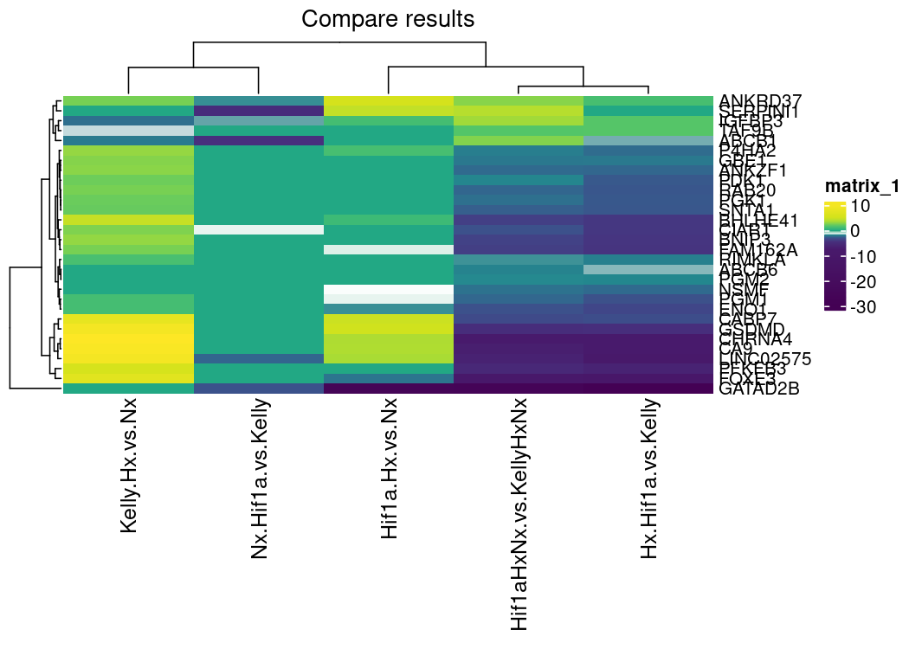<!-- -->

``` r
plotCounts_SK(goi=pick_genes[1:3])
```

<!-- -->

``` r
patchwork::wrap_elements((c_graphic))
```

<!-- -->

### -Compare KOs

``` r
pick_genes <- topgenes_list[c("top_Hif1aHxNx.vs.KellyHxNx","top_Hif2aHxNx.vs.KellyHxNx","top_Hif1bHxNx.vs.KellyHxNx")] %>% unlist()

pick_results <- c("Hif1aHxNx.vs.KellyHxNx","Hif2aHxNx.vs.KellyHxNx","Hif1bHxNx.vs.KellyHxNx")

res_comb <- res.Kelly.Hx.vs.Nx[pick_genes,c(7,1)] %>% data.frame(.)
res_comb <- cbind(res_comb,lapply(results_list[pick_results],function(i) i[pick_genes,2]) %>% do.call(cbind,.) %>% data.frame(.))
res_comb_matrix <- as.matrix(res_comb[,c(-1,-2)])
res_comb_matrix[res_comb_matrix<1 & res_comb_matrix>-1] <- 0
rownames(res_comb_matrix) <- res_comb$symbol

# adapt colors to uniform breaks
mat_breaks <- quantile_breaks(res_comb_matrix, n = 20)
vir_cols <- viridis(length(mat_breaks))
vir_cols[which(unname(mat_breaks) == 0)] <- "white"

hm_cols <- colorRamp2(mat_breaks,vir_cols)

hm <- Heatmap(res_comb_matrix,
        col = hm_cols,
        column_title = "Compare results",
        na_col = "black",
        row_names_gp = gpar(fontsize = 10),
        cluster_rows = TRUE,
        ) 
hm
```

### -Top genes

Complex Heatmap:
<https://jokergoo.github.io/ComplexHeatmap-reference/book/>

``` r
ht_opt$fast_hclust = TRUE

# Choose genes

interaction_top <- topgenes_list[c("top_Hif1aHxNx.vs.KellyHxNx","top_Hif2aHxNx.vs.KellyHxNx","top_Hif1bHxNx.vs.KellyHxNx")]

interaction_top_ol <- calculate.overlap(interaction_top)


pick_genes <- lapply(interaction_top_ol,'[',1:10) %>% unlist() %>% unname() %>% unique()
pick_genes <- pick_genes[!is.na(pick_genes)]


# Get counts, with summarized replicates
dds_heat <- collapseReplicates(dds, dds$condition,dds$names)
vsd <- vst(dds_heat, blind=TRUE) #Variance stabilized transformation
ntd <- normTransform(dds_heat)
# rld <- rlog(dds_heat)
mat <- assay(vsd)
# mat <- assay(ntd)
# mat <- assay(rld)

# reduce to picked genes and convert to matrix
mat <- mat[pick_genes,c(1,3,5,7,2,4,6,8)] %>% as.matrix()

# Get WGCNA colors
WGCNA <- mcols(dds)[rownames(mat),"colors"] %>% as.character()

# WGCNA[is.na(WGCNA)] <- 'grey'

rownames(mat) <- mcols(dds)[pick_genes,"symbol"]
names(WGCNA) <- rownames(mat)

# adapt colors to uniform breaks
mat_breaks <- quantile_breaks(mat, n = 20)
vir_cols <- viridis(length(mat_breaks))
# vir_cols[9] <- "white"
hm_cols <- colorRamp2(mat_breaks,vir_cols)


hm <- Heatmap(mat,
  ## heatmap colors
      #   col = hm_cols,
      na_col = "black",
      
  ## columns
      column_title = "TOP genes",
      cluster_columns = FALSE,
      # column_km = 4,
      column_split = c(rep("Hx", 4),rep("Nx", 4)),
      # column_names_gp = gpar(col = c("lightcoral","skyblue1"), fontsize = c(10)),
      top_annotation = HeatmapAnnotation(foo = anno_block(gp = gpar(fill = c("lightcoral","skyblue1")),
        labels = c("Nx", "Hx"), 
        labels_gp = gpar(col = "white", fontsize = 10))),
  ## rows
      row_names_gp = gpar(fontsize = 10),
      cluster_rows = TRUE,
      clustering_method_rows = "centroid",
      # clustering_distance_rows = "kendall",
      row_km = 6,
 #  right_annotation = rowAnnotation(WGCNA = WGCNA, col=list(WGCNA=WGCNA))
       )
hm
```

<!-- -->

#### (heatmap test)

``` r
list(bar = c("a" = "red", "b" = "green", "c" = "blue"))

col_fun = colorRamp2(c(0, 5, 10), c("blue", "white", "red"))
ha = HeatmapAnnotation(foo = 1:10, col = list(foo = col_fun))

anno_col <- as.data.frame(colData(dds_heat)[,c("treatment","genotype")])
anno_colors <- list(treatment = c("lightcoral","skyblue1"),
                    genotype = c("grey","seagreen3","turquoise3","tan2"))

names(anno_colors$treatment) <- levels(anno_col$treatment)
names(anno_colors$genotype) <- levels(anno_col$genotype)


hm <- Heatmap(mat,
        col = hm_cols,
        column_title = "Compare results",
        na_col = "black",
        row_names_gp = gpar(fontsize = 10)
        ) 
hm

pheatmap(mat,
         clustering_distance_rows=sampleDists,
         clustering_distance_cols=sampleDists,
         annotation_col=anno_col,
         annotation_colors = anno_colors,
         show_colnames     = FALSE,
         col=viridis(20),
         cutree_rows = 8,
         cutree_cols = 8,
         fontsize_row = 5)
```

## Venns

### All Genes

``` r
input_list <- c(list("All Hypoxic (Kelly)" = deg_genes_list[["deg_Kelly.Hx.vs.Nx"]],
                     "Hif1b" = deg_genes_list[["deg_Hif1bHxNx.vs.KellyHxNx"]],
                     "Hif1a" = deg_genes_list[["deg_Hif1aHxNx.vs.KellyHxNx"]],
                     "Hif2a" = deg_genes_list[["deg_Hif2aHxNx.vs.KellyHxNx"]]                                         ))

plt1 <- venn.diagram(
    x = input_list,
    category.names = paste(names(input_list),"\n(",input_list %>% summary() %>% .[c(1:length(input_list))],")",sep=""),
    force.unique = TRUE, na = "remove",
    filename = NULL,
    main = "Compare Hif KOs", main.fontface = "bold",
    lwd = 2,
    lty = 'blank',
    fill = colors[c(1,7,3,5)],
    #cat.col=c(colors[c(4)],"grey40","grey20"),
    cat.fontface = "bold",
    #cat.pos = c(-45,0,45),
    # inverted=length(input_list[[1]]) < length(input_list[[2]])
    )

input_list <- input_list[c(3,4,1)]
plt2 <- venn.diagram(
    x = input_list,
    category.names = paste(names(input_list),"\n(",input_list %>% summary() %>% .[c(1:length(input_list))],")",sep=""),
    force.unique = TRUE, na = "remove",
    filename = NULL,
    main = "Compare Hif KOs", main.fontface = "bold",
    lwd = 2,
    lty = 'blank',
    fill = colors[c(3,5,1)],
    #cat.col=c(colors[c(4)],"grey40","grey20"),
    cat.fontface = "bold",
    #cat.pos = c(-45,0,45),
    # inverted=length(input_list[[1]]) < length(input_list[[2]])
    )


patchwork::wrap_elements(plt1) + patchwork::wrap_elements(plt2)
```

<!-- -->

``` r
names(input_list)
```

    ## [1] "Hif1a"               "Hif2a"               "All Hypoxic (Kelly)"

``` r
overlaps <- calculate.overlap(input_list)
diff1 <- setdiff(overlaps[[1]],overlaps[[3]])
diff2 <- setdiff(overlaps[[2]],overlaps[[3]])

# get each top gene
getVennElements(plt2)
```

    ## [1] "Element=7 (199) --> a1(199)"
    ## [1] "Element=8 (80) --> a2(80)"
    ## [1] "Element=9 (645) --> a3(645)"
    ## [1] "Element=10 (249) --> a4(249)"
    ## [1] "Element=11 (99) --> a5(99)"
    ## [1] "Element=12 (1428) --> a6(1428)"
    ## [1] "Element=13 (3417) --> a7(3417)"

``` r
goi <- sapply(overlaps,"[[",1) %>% .[order(names(.))]

plotCounts_SK(goi)
```

<!-- -->

``` r
plotCounts_SK(overlaps$a2[1])
```

<!-- -->

``` r
goi <- c(diff1[1],overlaps$a3[1],diff2[1])
```

### upregulated in hypoxia

``` r
Kelly <- subset(results_list[["Kelly.Hx.vs.Nx"]],log2FoldChange > 0) %>% topgenes_f() %>% rownames()

input_list <- c(list("All Hypoxic (Kelly)" = Kelly,
                     "Hif1b" = deg_genes_list[["deg_Hif1bHxNx.vs.KellyHxNx"]],
                     "Hif1a" = deg_genes_list[["deg_Hif1aHxNx.vs.KellyHxNx"]],
                     "Hif2a" = deg_genes_list[["deg_Hif2aHxNx.vs.KellyHxNx"]]                                         ))

plt <- venn.diagram(
    x = input_list,
    category.names = paste(names(input_list),"\n(",input_list %>% summary() %>% .[c(1:length(input_list))],")",sep=""),
    force.unique = TRUE, na = "remove",
    filename = NULL,
    main = "Compare Hif KOs", main.fontface = "bold",
    lwd = 2,
    lty = 'blank',
    fill = colors[c(1,7,3,5)],
    #cat.col=c(colors[c(4)],"grey40","grey20"),
    cat.fontface = "bold",
    #cat.pos = c(-45,0,45),
    # inverted=length(input_list[[1]]) < length(input_list[[2]])
    )

patchwork::wrap_elements((plt)) 
```

<!-- -->

## Cluster results

``` r
pick_genes <- deg_genes_list[c("deg_Hif1aHxNx.vs.KellyHxNx", "deg_Hif2aHxNx.vs.KellyHxNx", "deg_Hif1bHxNx.vs.KellyHxNx")] %>% unlist() %>% unname() %>% unique()

# "deg_Kelly.Hx.vs.Nx",

("ENSG00000123095.1" == pick_genes) %>% summary()
```

    ##    Mode   FALSE 
    ## logical    4859

``` r
pick_results <- c("Kelly.Hx.vs.Nx","Hif1aHxNx.vs.KellyHxNx","Hif2aHxNx.vs.KellyHxNx","Hif1bHxNx.vs.KellyHxNx")
res_comb <- res.Kelly.Hx.vs.Nx[pick_genes,c(7,1)]
res_comb$gene_id <- rownames(res_comb)
res_comb <- res_comb %>% data.frame(.)
res_comb <- cbind(res_comb,lapply(results_list[pick_results],function(i) i[pick_genes,2]) %>% do.call(cbind,.) %>% data.frame(.))
dim(res_comb)
```

    ## [1] 4859    7

``` r
rownames(res_comb) <- mcols(dds)[res_comb$gene_id,"ens.symbol"]
res_comb_matrix <- as.matrix(res_comb[,c(-1,-2,-3)])

# res_comb_matrix[res_comb_matrix<1 & res_comb_matrix>-1] <- 0

plot(res_comb_matrix[,"Hif1aHxNx.vs.KellyHxNx"],res_comb_matrix[,"Hif2aHxNx.vs.KellyHxNx"])
```

<!-- -->

``` r
g1 <- ggplot(res_comb_matrix,aes(x=Hif1aHxNx.vs.KellyHxNx,y=Hif2aHxNx.vs.KellyHxNx, color=Kelly.Hx.vs.Nx)) +
  geom_point(alpha = 0.3) +
  geom_hline(yintercept=c(-1,1)) +
  geom_vline(xintercept=c(-1,1)) +
 scale_color_viridis_c(option = 'D',limits = c(-2, 2)) +
 coord_cartesian(xlim = c(-5, 5),ylim = c(-5,5))

g2 <- ggplot(res_comb_matrix,aes(x=Hif1aHxNx.vs.KellyHxNx,y=Hif2aHxNx.vs.KellyHxNx, color=Hif1bHxNx.vs.KellyHxNx)) +
  geom_point(alpha = 0.3) +
  geom_hline(yintercept=c(-1,1)) +
  geom_vline(xintercept=c(-1,1)) +
 scale_color_viridis_c(option = 'D',limits = c(-2, 2)) +
 coord_cartesian(xlim = c(-5, 5),ylim = c(-5,5))

g1 + g2 + plot_layout(guides = "collect", axis_titles="collect", axes = 'collect') & plot_annotation(title = "all hypoxia genes") & 
  theme(legend.position = 'bottom')
```

<!-- -->

``` r
# Only Hif1a Hif2a Genes

pick_genes <- deg_genes_list[c("deg_Hif1aHxNx.vs.KellyHxNx", "deg_Hif2aHxNx.vs.KellyHxNx")] %>% unlist() %>% unname() %>% unique()
pick_results <- c("Kelly.Hx.vs.Nx","Hif1aHxNx.vs.KellyHxNx","Hif2aHxNx.vs.KellyHxNx","Hif1bHxNx.vs.KellyHxNx")
res_comb <- res.Kelly.Hx.vs.Nx[pick_genes,c(7,1)]
res_comb$gene_id <- rownames(res_comb)
res_comb <- res_comb %>% data.frame(.)
res_comb <- cbind(res_comb,lapply(results_list[pick_results],function(i) i[pick_genes,2]) %>% do.call(cbind,.) %>% data.frame(.))
dim(res_comb)
```

    ## [1] 2700    7

``` r
rownames(res_comb) <- mcols(dds)[res_comb$gene_id,"ens.symbol"]
res_comb_matrix_12 <- as.matrix(res_comb[,c(-1,-2,-3)])

# res_comb_matrix[res_comb_matrix<1 & res_comb_matrix>-1] <- 0

plot(res_comb_matrix_12[,"Hif1aHxNx.vs.KellyHxNx"],res_comb_matrix_12[,"Hif2aHxNx.vs.KellyHxNx"])
```

<!-- -->

``` r
g1 <- ggplot(res_comb_matrix_12,aes(x=Hif1aHxNx.vs.KellyHxNx,y=Hif2aHxNx.vs.KellyHxNx, color=Kelly.Hx.vs.Nx)) +
  geom_point(alpha = 0.3) +
  geom_hline(yintercept=c(-1,1)) +
  geom_vline(xintercept=c(-1,1)) +
 scale_color_viridis_c(option = 'D',limits = c(-2, 2)) +
 coord_cartesian(xlim = c(-5, 5),ylim = c(-5,5))

g2 <- ggplot(res_comb_matrix_12,aes(x=Hif1aHxNx.vs.KellyHxNx,y=Hif2aHxNx.vs.KellyHxNx, color=Hif1bHxNx.vs.KellyHxNx)) +
  geom_point(alpha = 0.3) +
  geom_hline(yintercept=c(-1,1)) +
  geom_vline(xintercept=c(-1,1)) +
 scale_color_viridis_c(option = 'D',limits = c(-2, 2)) +
 coord_cartesian(xlim = c(-5, 5),ylim = c(-5,5))

g1 + g2 + plot_layout(guides = "collect", axis_titles="collect", axes = 'collect') & plot_annotation(title = "all hypoxia genes") & 
  theme(legend.position = 'bottom')
```

<!-- -->

``` r
# Color according to category

keyvals <- ifelse(abs(res_comb_matrix_12[,"Hif1aHxNx.vs.KellyHxNx"]-res_comb_matrix_12[,"Hif2aHxNx.vs.KellyHxNx"]) < 1, "hotpink1",
            ifelse( (res_comb_matrix_12[,"Hif1aHxNx.vs.KellyHxNx"] > 1 & 
                     res_comb_matrix_12[,"Hif2aHxNx.vs.KellyHxNx"] < -1) |
                    (res_comb_matrix_12[,"Hif1aHxNx.vs.KellyHxNx"] < -1 & 
                     res_comb_matrix_12[,"Hif2aHxNx.vs.KellyHxNx"] > 1) , colors[8],
            ifelse( (res_comb_matrix_12[,"Hif1aHxNx.vs.KellyHxNx"] > 1 &               
                    (res_comb_matrix_12[,"Hif1aHxNx.vs.KellyHxNx"] > res_comb_matrix_12[,"Hif2aHxNx.vs.KellyHxNx"])) |
                    (res_comb_matrix_12[,"Hif1aHxNx.vs.KellyHxNx"] < -1 &               
                    (res_comb_matrix_12[,"Hif1aHxNx.vs.KellyHxNx"] < res_comb_matrix_12[,"Hif2aHxNx.vs.KellyHxNx"])),colors[6],
            ifelse( (res_comb_matrix_12[,"Hif2aHxNx.vs.KellyHxNx"] > 1 |
                    (res_comb_matrix_12[,"Hif2aHxNx.vs.KellyHxNx"] < -1 )),colors[4],  
    'grey'))) )
res_comb_12 <- data.frame(res_comb_matrix_12,keyvals)

# res_comb_matrix_12[,"Hif1aHxNx.vs.KellyHxNx"] > 1 & res_comb_matrix_12[,"Hif2aHxNx.vs.KellyHxNx"] > 1
    
keyvals[is.na(keyvals)] <- 'grey'
  names(keyvals)[keyvals == "hotpink1"] <- 'Hif1a & Hif2a'
  names(keyvals)[keyvals == colors[8]] <- 'anti Hif1a & Hif2a'
  names(keyvals)[keyvals == colors[6]] <- 'Hif1a'
  names(keyvals)[keyvals == colors[4]] <- 'Hif2a'

g3 <- ggplot(res_comb_matrix_12,aes(x=Hif1aHxNx.vs.KellyHxNx,y=Hif2aHxNx.vs.KellyHxNx, color=names(keyvals))) +
  geom_point(alpha = 0.3, show.legend = TRUE) +
  geom_hline(yintercept=c(-1,1)) +
  geom_vline(xintercept=c(-1,1)) +
  geom_abline(slope=1, intercept = 0, color="grey", linetype = 'dashed') +
  # geom_ribbon(aes(ymin = -1, ymax = +1), fill="grey") + 
  geom_abline(slope=1, intercept = -1) +
  geom_abline(slope=1, intercept = +1) +
  scale_color_manual(values = keyvals) + 
  coord_cartesian(xlim = c(-5, 5),ylim = c(-5,5))
g3
```

<!-- -->

``` r
g1 + g2 + plot_layout(guides = "collect", axis_titles="collect", axes = 'collect') & plot_annotation(title = "all hypoxia genes") & 
  theme(legend.position = 'bottom')
```

<!-- -->

### Corrplot

``` r
plot(res_comb_matrix[,2],res_comb_matrix[,3])
```

<!-- -->

``` r
M <- cor(res_comb_matrix)
corrplot::corrplot(M)
```

<!-- -->

### PCA of genes

``` r
res_comb_matrix_t <- t(res_comb_matrix_12)
p <- pca(res_comb_matrix_t, removeVar = 0.1)
biplot(p,
       xlim=c(-5,5),
       ylim=c(-5,5)
       )
```

<!-- -->

``` r
ggplot(p$rotated,aes(x=PC1,y=PC2, color=names(keyvals)))+
  geom_point(alpha = 0.3) +
  scale_color_manual(values = keyvals) + 
  coord_cartesian(xlim = c(-10, 8),ylim = c(-5,8))
```

<!-- -->

``` r
# bi <- biplot(p,x="PC3",y="PC1",
#     lab = p$metadata$experiment,
#     colby = 'condition',colkey = viridis(8),
#     hline = 0, vline = 0,
#     encircle = TRUE, encircleFill = TRUE,
#     labSize = 3, legendIconSize = 4.0,
#     legendPosition = 'bottom',
#     sizeLoadingsNames = 3,
#     axisLabSize = 10,
#     captionLabSize = 1)
```

### UMAP

``` r
umap <- umap(res_comb_matrix_12)

df <- data.frame(x = umap$layout[,1],
                 y = umap$layout[,2])

ggplot(df, aes(x, y, color=names(keyvals))) +
  geom_point(alpha = 0.5) +
  scale_color_manual(values = keyvals)
```

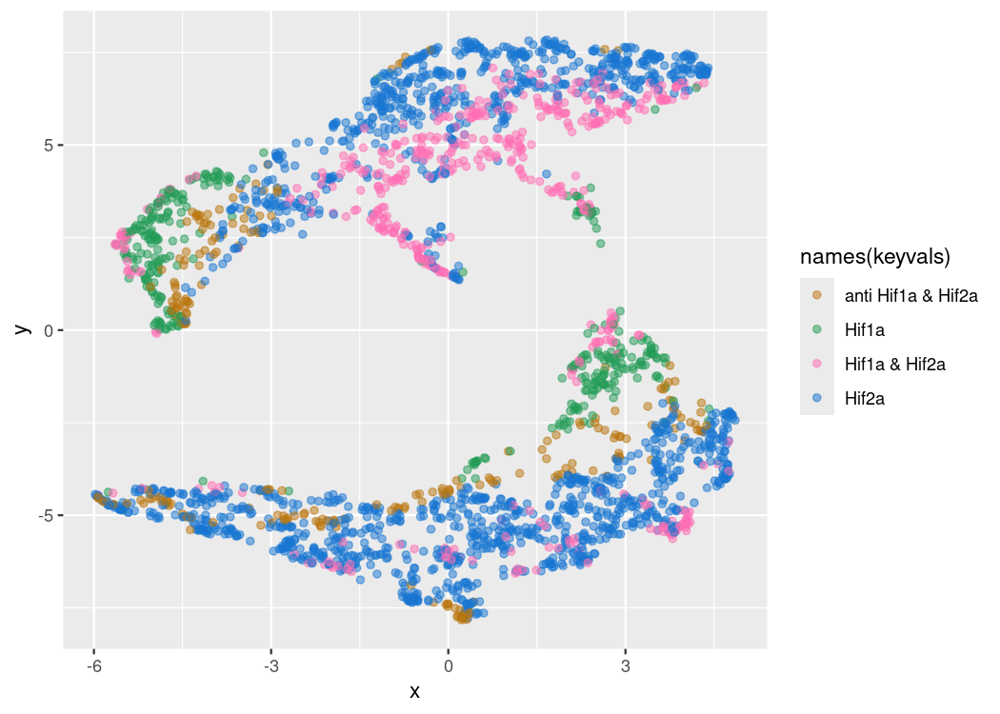<!-- -->

## GO terms

``` r
###################################### GO

interaction_top <- topgenes_list[c("top_Hif1aHxNx.vs.KellyHxNx","top_Hif2aHxNx.vs.KellyHxNx","top_Hif1bHxNx.vs.KellyHxNx")]
interaction_deg <- deg_genes_list[c("deg_Hif1aHxNx.vs.KellyHxNx","deg_Hif2aHxNx.vs.KellyHxNx","deg_Hif1bHxNx.vs.KellyHxNx")]

interaction_deg[[3]] <- interaction_deg[[3]][1:3000]

names(interaction_deg)
```

    ## [1] "deg_Hif1aHxNx.vs.KellyHxNx" "deg_Hif2aHxNx.vs.KellyHxNx"
    ## [3] "deg_Hif1bHxNx.vs.KellyHxNx"

``` r
interaction_deg_entrez_list <- list(Hif1a=mcols(dds)[interaction_deg[[1]],"entrezid"] %>% unlist() %>% unname(),
                                    Hif2a=mcols(dds)[interaction_deg[[2]],"entrezid"] %>% unlist() %>% unname(),
                                    Hif1b=mcols(dds)[interaction_deg[[3]],"entrezid"] %>% unlist() %>% unname()) %>% lapply(.,na.omit)


GO_1 <- enrichGO(interaction_deg[[1]],
                  keyType = "ENSEMBL",
                  ont = "ALL",
                  minGSSize = 15,
                  maxGSSize = 800,
                  pvalueCutoff = 0.05,
                  OrgDb = "org.Hs.eg.db",
                  pAdjustMethod = "fdr")
GO_1 <- simplify(GO_1)

GO_2 <- enrichGO(interaction_deg[[2]],
                  keyType = "ENSEMBL",
                  ont = "ALL",
                  minGSSize = 15,
                  maxGSSize = 800,
                  pvalueCutoff = 0.05,
                  OrgDb = "org.Hs.eg.db",
                  pAdjustMethod = "fdr")
GO_2 <- simplify(GO_2)

GO_3 <- enrichGO(interaction_deg[[3]],
                  keyType = "ENSEMBL",
                  ont = "ALL",
                  minGSSize = 15,
                  maxGSSize = 800,
                  pvalueCutoff = 0.05,
                  OrgDb = "org.Hs.eg.db",
                  pAdjustMethod = "fdr")
GO_3 <- simplify(GO_3)

barplot(GO_1, split = "ONTOLOGY", font.size = 6, showCategory = 10, title = "Hif1a") + facet_grid(ONTOLOGY~., scale="free") + scale_y_discrete(labels=function(x)  str_wrap(x, width=80)) + scale_fill_viridis() + theme(panel.grid.major.y = element_blank(), panel.background = element_rect(fill = NA), panel.ontop = TRUE, panel.grid.major.x = element_line(color = "white", size = 0.5, linetype = 1), panel.grid.minor.x = element_line(color = "white", size = 0.25, linetype = 1)) + scale_x_continuous(expand = c(0,0))
```

<!-- -->

``` r
barplot(GO_2, split = "ONTOLOGY", font.size = 6, showCategory = 10, title = "Hif2a") + facet_grid(ONTOLOGY~., scale="free") + scale_y_discrete(labels=function(x)  str_wrap(x, width=80)) + scale_fill_viridis() + theme(panel.grid.major.y = element_blank(), panel.background = element_rect(fill = NA), panel.ontop = TRUE, panel.grid.major.x = element_line(color = "white", size = 0.5, linetype = 1), panel.grid.minor.x = element_line(color = "white", size = 0.25, linetype = 1)) + scale_x_continuous(expand = c(0,0))
```

<!-- -->

``` r
barplot(GO_3, split = "ONTOLOGY", font.size = 6, showCategory = 10, title = "Hif1b") + facet_grid(ONTOLOGY~., scale="free") + scale_y_discrete(labels=function(x)  str_wrap(x, width=80)) + scale_fill_viridis() + theme(panel.grid.major.y = element_blank(), panel.background = element_rect(fill = NA), panel.ontop = TRUE, panel.grid.major.x = element_line(color = "white", size = 0.5, linetype = 1), panel.grid.minor.x = element_line(color = "white", size = 0.25, linetype = 1)) + scale_x_continuous(expand = c(0,0))
```

<!-- -->

``` r
godot1 <- dotplot(clusterProfiler::simplify(GO_1))+labs(title = "Hif1a")
godot2 <- dotplot(clusterProfiler::simplify(GO_2))+labs(title = "Hif2a")
godot3 <- dotplot(clusterProfiler::simplify(GO_3))+labs(title = "Hif1b")
godot1 + godot2 + godot3
```

<!-- -->

``` r
# Compare cluster
ck <- compareCluster(geneCluster = interaction_deg, fun = "enrichGO",
                  OrgDb = "org.Hs.eg.db",
                  keyType = "ENSEMBL",
                  ont = "ALL",
                  pvalueCutoff = 0.05,
                  pAdjustMethod = "fdr")

ck <- setReadable(ck, OrgDb = org.Hs.eg.db, )
head(ck)[1:7]
```

    ##                      Cluster ONTOLOGY         ID
    ## 1 deg_Hif1aHxNx.vs.KellyHxNx       BP GO:0010038
    ## 2 deg_Hif1aHxNx.vs.KellyHxNx       BP GO:0005996
    ## 3 deg_Hif1aHxNx.vs.KellyHxNx       BP GO:0044331
    ## 4 deg_Hif1aHxNx.vs.KellyHxNx       BP GO:0019318
    ## 5 deg_Hif1aHxNx.vs.KellyHxNx       CC GO:0045211
    ## 6 deg_Hif1aHxNx.vs.KellyHxNx       CC GO:0097060
    ##                               Description GeneRatio   BgRatio       pvalue
    ## 1                   response to metal ion    23/423 387/21288 3.433811e-06
    ## 2        monosaccharide metabolic process    18/423 271/21288 8.950030e-06
    ## 3 cell-cell adhesion mediated by cadherin     8/423  64/21288 3.804367e-05
    ## 4                hexose metabolic process    16/423 251/21288 4.605719e-05
    ## 5                   postsynaptic membrane    22/449 305/22585 2.311632e-07
    ## 6                       synaptic membrane    24/449 432/22585 6.830524e-06

``` r
dotplot(ck)
```

<!-- -->

``` r
dotplot(ck, showCategory=15)
```

<!-- -->

``` r
# KEGG
ckk <- compareCluster(geneCluster = interaction_deg, fun = "enrichKEGG", organism="hsa", pvalueCutoff=0.05)


hif1a_entrez <- mcols(dds)[interaction_deg[[1]],"entrezid"] %>% unlist() %>% unname() %>% unique()
hif1a_entrez <- hif1a_entrez[!is.na(hif1a_entrez)]

hif2a_entrez <- mcols(dds)[interaction_deg[[2]],"entrezid"] %>% unlist() %>% unname() %>% unique()
hif2a_entrez <- hif2a_entrez[!is.na(hif2a_entrez)]

hif1b_entrez <- mcols(dds)[interaction_deg[[3]],"entrezid"] %>% unlist() %>% unname() %>% unique()
hif1b_entrez <- hif1b_entrez[!is.na(hif1b_entrez)]

interaction_deg_entrez <- list(hif1a_entrez,hif2a_entrez,hif1b_entrez)

ek1 <- enrichKEGG(hif1a_entrez,organism="hsa", pvalueCutoff=0.05)
ek2 <- enrichKEGG(hif2a_entrez,organism="hsa", pvalueCutoff=0.05)
ek3 <- enrichKEGG(hif1b_entrez,organism="hsa", pvalueCutoff=0.05)

dotplot(ek1) + dotplot(ek2) + dotplot(ek3)
```

<!-- -->

``` r
# ckk <- compareCluster(geneCluster = interaction_deg_entrez, fun = "enrichKEGG", organism="hsa", pvalueCutoff=0.5)
```

## Check experiment differences

``` r
load(file=paste(data,"deseq2_experiment_wgcna.dds", sep="/"))

resultsNames(dds)
```

    ##  [1] "Intercept"                       "experiment_Katharina_vs_Control"
    ##  [3] "experiment_Simon_vs_Control"     "experiment_Ulrike_vs_Control"   
    ##  [5] "genotype_HIF1A_vs_Kelly"         "genotype_HIF2A_vs_Kelly"        
    ##  [7] "genotype_HIF1B_vs_Kelly"         "treatment_Hx_vs_Nx"             
    ##  [9] "genotypeHIF1A.treatmentHx"       "genotypeHIF2A.treatmentHx"      
    ## [11] "genotypeHIF1B.treatmentHx"

``` r
res_expSvK <- results(dds, contrast = c("experiment","Simon","Katharina")) %>% topgenes_f() %>% rownames()
res_expSvU <- results(dds, contrast = c("experiment","Simon","Ulrike")) %>% topgenes_f( )%>% rownames()
res_expUvK <- results(dds, contrast = c("experiment","Katharina","Ulrike")) %>% topgenes_f() %>% rownames()
res_exp <- c(res_expSvK,res_expSvU,res_expUvK) %>% unique()
res_exp_10 <- c(res_expSvK[1:5],res_expSvU[1:5],res_expUvK[1:5]) %>% unique()

goi <- res_exp_10

plotCounts_SK(goi)
```

<!-- -->

``` r
# color for experiment
plotCounts_SK_list <- list()
  l <- length(goi)
       for (ig in 1:l){
  s <- mcols(dds)[goi[ig],"symbol"]
  if (s ==""){s <- goi[ig]}
    d <- plotCounts(dds, gene=goi[ig], intgroup=c("condition","experiment","genotype","treatment"), main=s,returnData=TRUE)

  gcounts <- ggplot(d, aes(x = condition, y = count, fill=experiment, color=experiment)) +
    geom_boxplot(color="black") +
    geom_point(shape=21,color="black",aes(fill=experiment),position=position_dodge(width=0.75), alpha=1) +
    # scale_fill_manual(values=c("#A6CEE3","#FB9A99")) +
    # scale_color_manual(values=c("#A6CEE3","#FB9A99")) +
    scale_y_continuous(trans = "log2") +
    labs(title = paste(s,"(",goi[ig],")",sep=" "))
  plotCounts_SK_list[[paste(n,goi[ig],sep="_")]] <- gcounts
       }
 
patchwork::wrap_plots(plotCounts_SK_list,ncol = 3) + 
  plot_layout(guides = "collect", axis_titles="collect", axes = 'collect') & 
  plot_annotation(title = n) & 
  theme(legend.position = 'bottom',
        plot.title = element_text(size=6),
        axis.text=element_text(size=6),
        axis.title=element_text(size=6),
        legend.text=element_text(size=6),
        legend.title=element_text(size=6))
```

<!-- -->

#### Venns

``` r
input_list <- c(list("All Hypoxic (Kelly)" = deg_genes_list[["deg_Kelly.Hx.vs.Nx"]],
                     "Experiment" = res_exp,
                     "Hif1a" = deg_genes_list[["deg_Hif1aHxNx.vs.KellyHxNx"]],
                     "Hif2a" = deg_genes_list[["deg_Hif2aHxNx.vs.KellyHxNx"]] 
                     ))

plt1 <- venn.diagram(
    x = input_list,
    category.names = paste(names(input_list),"\n(",input_list %>% summary() %>% .[c(1:length(input_list))],")",sep=""),
    force.unique = TRUE, na = "remove",
    filename = NULL,
    main = "Compare Hif KOs", main.fontface = "bold",
    lwd = 2,
    lty = 'blank',
    fill = colors[c(1,7,3,5)],
    #cat.col=c(colors[c(4)],"grey40","grey20"),
    cat.fontface = "bold",
    #cat.pos = c(-45,0,45),
    # inverted=length(input_list[[1]]) < length(input_list[[2]])
    )

patchwork::wrap_elements(plt1) 
```

<!-- -->

``` r
names(input_list)
```

    ## [1] "All Hypoxic (Kelly)" "Experiment"          "Hif1a"              
    ## [4] "Hif2a"

``` r
overlaps <- calculate.overlap(input_list)

# get each top gene
getVennElements(plt1)
```

    ## [1] "Element=9 (174) --> a1(174)"
    ## [1] "Element=10 (55) --> a2(55)"
    ## [1] "Element=11 (541) --> a3(541)"
    ## [1] "Element=12 (187) --> a4(187)"
    ## [1] "Element=13 (79) --> a5(79)"
    ## [1] "Element=14 (20) --> a6(20)"
    ## [1] "Element=15 (25) --> a7(25)"  "Element=15 (25) --> a13(25)"
    ## [1] "Element=16 (104) --> a8(104)"
    ## [1] "Element=17 (2926) --> a9(2926)"
    ## [1] "Element=18 (1217) --> a10(1217)"
    ## [1] "Element=19 (211) --> a11(211)"
    ## [1] "Element=20 (62) --> a12(62)"
    ## [1] "Element=21 (25) --> a7(25)"  "Element=21 (25) --> a13(25)"
    ## [1] "Element=22 (964) --> a14(964)"
    ## [1] "Element=23 (491) --> a15(491)"

``` r
overlaps_exp <- overlaps[c("a8","a7","a6","a11","a15","a12","a13","a14")]
goi <- sapply(overlaps_exp,"[[",1) %>% .[order(names(.))]

plotCounts_SK(goi)
```

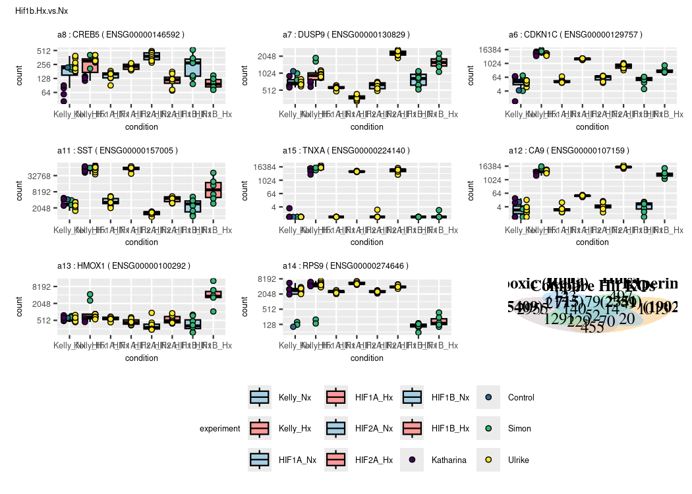<!-- -->

``` r
# color for experiment
plotCounts_SK_list <- list()
  l <- length(goi)
       for (ig in 1:l){
  s <- mcols(dds)[goi[ig],"symbol"]
  if (s ==""){s <- goi[ig]}
    d <- plotCounts(dds, gene=goi[ig], intgroup=c("condition","experiment","genotype","treatment"), main=s,returnData=TRUE)

  gcounts <- ggplot(d, aes(x = condition, y = count, fill=experiment, color=experiment)) +
    geom_boxplot(outliers = FALSE,color="black",aes(fill=condition)) +
    geom_point(shape=21,color="black",aes(fill=experiment),position=position_dodge(width=0.75), alpha=1) +
    scale_fill_manual(values=c(rep(c("#A6CEE3","#FB9A99"),4),viridis(4))) +
    # scale_color_manual(values=c("#A6CEE3","#FB9A99")) +
    scale_y_continuous(trans = "log2") +
    labs(title = paste(names(goi[ig]),":",s,"(",goi[ig],")",sep=" "))
  plotCounts_SK_list[[paste(n,goi[ig],sep="_")]] <- gcounts
       }
 
patchwork::wrap_plots(plotCounts_SK_list,ncol = 3) + 
  plot_layout(guides = "collect", axis_titles="collect", axes = 'collect') & 
  plot_annotation(title = n) & 
  theme(legend.position = 'bottom',
        plot.title = element_text(size=6),
        axis.text=element_text(size=6),
        axis.title=element_text(size=6),
        legend.text=element_text(size=6),
        legend.title=element_text(size=6))
```

<!-- -->
