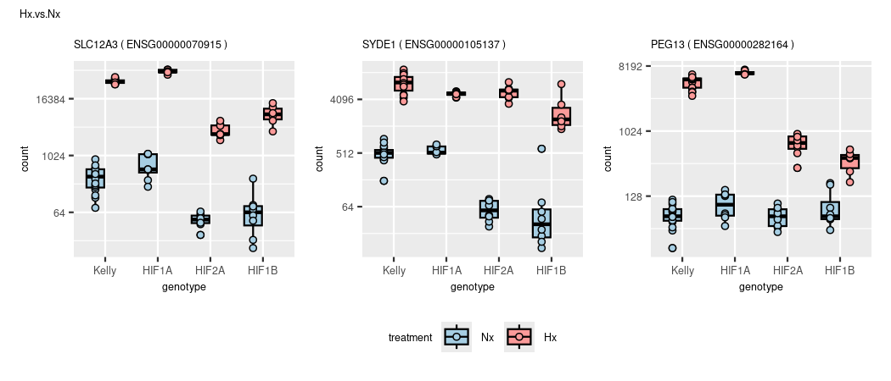
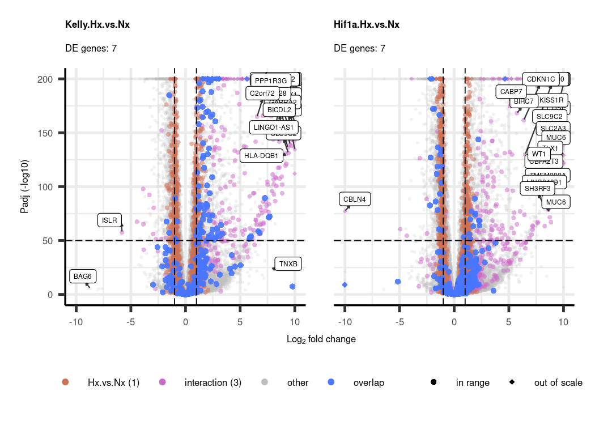
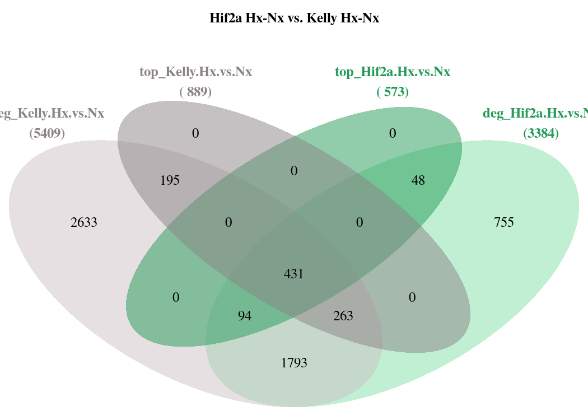

DGE
================
Kelterborn
2024-03-20

- [0. Load](#0-load)
  - [- Load R librarys](#--load-r-librarys)
  - [- Load dds](#--load-dds)
  - [- functions](#--functions)
- [1. Make results](#1-make-results)
  - [-Plot example counts](#-plot-example-counts)
- [2. Data Dive](#2-data-dive)
  - [Colour sheme](#colour-sheme)
  - [Volcanos](#volcanos)
  - [Overlaps (Venn)](#overlaps-venn)
  - [Heatmaps](#heatmaps)

# 0. Load

## - Load R librarys

## - Load dds

## - functions

# 1. Make results

#### (Advanced results troubleshooting)

<figure>

<figcaption aria-hidden="true">Contrasts_overview</figcaption>
</figure>

### -Generate toplist

    ## design

    ## ~experiment + genotype + treatment + genotype:treatment

    ## cutoffs
    ## differential expressed: p=0.05,bM=10,l2FC=1
    ## top genes:              p=0.01,bM=100,l2FC=2

|                            | all.DEGs | top.DEGs |
|:---------------------------|---------:|---------:|
| deg_Hif1a.Hx.vs.Nx         |     6166 |      983 |
| deg_Hif2a.Hx.vs.Nx         |     3394 |      542 |
| deg_Hif1b.Hx.vs.Nx         |     2051 |      310 |
| deg_Kelly.Hx.vs.Nx         |     5301 |      866 |
| deg_Nx.Hif1a.vs.Kelly      |      223 |       21 |
| deg_Nx.Hif2a.vs.Kelly      |      596 |       75 |
| deg_Nx.Hif1b.vs.Kelly      |      721 |       58 |
| deg_Hx.Hif1a.vs.Kelly      |     1013 |       77 |
| deg_Hx.Hif2a.vs.Kelly      |     2532 |      348 |
| deg_Hx.Hif1b.vs.Kelly      |     4208 |      531 |
| deg_Hx.Hif2a.vs.Hif1a      |     4174 |      607 |
| deg_Hx.Hif1b.vs.Hif1a      |     4972 |      643 |
| deg_Hx.Hif1b.vs.Hif2a      |     2043 |      249 |
| deg_Hif1aHxNx.vs.KellyHxNx |      686 |       54 |
| deg_Hif2aHxNx.vs.KellyHxNx |     2238 |      281 |
| deg_Hif1bHxNx.vs.KellyHxNx |     3887 |      431 |
| deg_Hx.Hif1b.vs.Hif12a     |     2741 |      224 |
| deg_Hx.Kelly.vs.allHIFs    |     1502 |      148 |
| deg_Hx.vs.Nx               |     3599 |      495 |

## -Plot example counts

<!-- --><!-- --><!-- --><!-- --><!-- --><!-- --><!-- --><!-- --><!-- --><!-- --><!-- --><!-- --><!-- --><!-- --><!-- --><!-- --><!-- --><!-- --><!-- -->

|                 | symbol  | baseMean | log2FoldChange |    lfcSE |       stat |    pvalue |      padj |
|:----------------|:--------|---------:|---------------:|---------:|-----------:|----------:|----------:|
| ENSG00000234964 | FABP5P7 | 163.7803 |       -1.07385 | 1.094697 | -0.9809562 | 0.3266143 | 0.6176694 |

<!-- -->

# 2. Data Dive

## Colour sheme

## Volcanos

### Draw Vulcanos


### (continuous Vulcanos)

``` r
# gradient is fixed to padj = y-axis

# Vulcano
lcol="grey20"
xlim=10
ylim=300
n <- "Kelly.Hx.vs.Nx"
res <- results_list[[n]]
l <- length(res)

res_shrink <- lfcShrink(dds, res=res, type="ashr")
res_shrink$symbol <- res$symbol

# remove nas
res <- res[!is.na(res$padj),]
res <- res[!is.na(res$log2FoldChange),]

# rename genes
rownames(res) <- res$symbol

# change shape of outliers
shape <- ifelse(abs(res$log2FoldChange) > xlim, 18,
                ifelse(res$padj < 10^-ylim,18,16))
summary(is.na(shape))

# shape[is.na(shape)] <- 2
names(shape)[shape == 18] <- 'out of scale'
names(shape)[shape == 16] <- 'in range'

# move outliers to coord. max.
res$log2FoldChange[res$log2FoldChange > xlim] <- xlim
res$log2FoldChange[res$log2FoldChange < -xlim] <- -xlim
res$padj[res$padj < 10^-ylim] <- 10^-ylim
summary(res$padj < 10^-ylim)

 p1 <- EnhancedVolcano(res,
    lab = res$symbol,
    x = 'log2FoldChange',
    y = 'padj',
    pCutoff = 10^(-50),
    FCcutoff = 2,
    xlim = c(-xlim, xlim),
    pointSize = c(ifelse(res$log2FoldChange>2, 8, 1)),
    labSize = 6.0,
    shape = c(6, 6, 19, 16),
    title = "DESeq2 results",
    subtitle = "Differential expression",
    caption = bquote(~Log[2]~ "fold change cutoff, 2; p-value cutoff, 10e-4"),
    legendPosition = "right",
    legendLabSize = 14,
    colAlpha = 0.9,
    colGradient = c('red3', 'royalblue'),
    drawConnectors = TRUE,
    hline = c(10e-8),
    widthConnectors = 0.5)

  p1

ev_f <- EnhancedVolcano(res,
    x = 'log2FoldChange',
    y = 'padj',
    lab = res$symbol,
    labSize = 1.5,
    drawConnectors = TRUE,
    boxedLabels = TRUE,
    widthConnectors = 0.5,
    colConnectors = lcol,
    max.overlaps = 17,
    colGradient = c('red3', 'royalblue'),
    xlim = c(-xlim, xlim),
    ylim = c(0, ylim),
    ylab = "Padj (-log10)",
    title = n,
    subtitle = paste("DE genes:",l),
    # sub = "SVF",

    FCcutoff = 2,
    # pointSize = c(ifelse(rownames(res_WT_D_vs.WT_BL) %in% rownames(top_WT_BL_vs.pcry_BL), 8, 1)),
    legendLabels=c('Not sig.','|L2F| > 2.5','p-adj < 0.05',
                   'p-adj & L2F'),
    legendPosition = 'bottom',
    legendLabSize = 8,
    legendIconSize = 2.0,
    axisLabSize = 8,
    titleLabSize = 8,
    subtitleLabSize = 8,
    captionLabSize = 8,
    caption = {}
   )

ev_f
```

### (prepare data)

### (simple volcano (full))

#### (check cutoff)

## Overlaps (Venn)

### - Hif1a

    ## [1] "Element=7 (702) --> a3(702)"


    ## Kelly.Hx.vs.Nx

|                 |  baseMean | log2FoldChange |     lfcSE |      stat | pvalue | padj | symbol  |
|:----------------|----------:|---------------:|----------:|----------:|-------:|-----:|:--------|
| ENSG00000073060 | 11958.596 |       1.912261 | 0.0564790 |  33.85793 |      0 |    0 | SCARB1  |
| ENSG00000132382 |  6908.702 |      -1.840556 | 0.0836373 | -22.00641 |      0 |    0 | MYBBP1A |
| ENSG00000186469 |  8085.827 |       1.871876 | 0.0904267 |  20.70048 |      0 |    0 | GNG2    |
| ENSG00000117016 |  6871.537 |      -1.758324 | 0.0956286 | -18.38701 |      0 |    0 | RIMS3   |
| ENSG00000189241 | 11177.408 |       1.731705 | 0.0524954 |  32.98773 |      0 |    0 | TSPYL1  |
| ENSG00000184185 |  6118.126 |       1.972228 | 0.0767743 |  25.68864 |      0 |    0 | KCNJ12  |
| ENSG00000100285 | 39849.439 |      -1.267082 | 0.0781810 | -16.20705 |      0 |    0 | NEFH    |
| ENSG00000179222 | 22237.096 |       1.642876 | 0.0794722 |  20.67233 |      0 |    0 | MAGED1  |
| ENSG00000168348 | 18593.856 |      -1.528296 | 0.0792187 | -19.29212 |      0 |    0 | INSM2   |

    ## Hif1a.Hx.vs.Nx

|                 |  baseMean | log2FoldChange |     lfcSE |      stat | pvalue | padj | symbol  |
|:----------------|----------:|---------------:|----------:|----------:|-------:|-----:|:--------|
| ENSG00000073060 | 11958.596 |       2.513715 | 0.0674164 |  37.28643 |      0 |    0 | SCARB1  |
| ENSG00000132382 |  6908.702 |      -2.577358 | 0.1000207 | -25.76825 |      0 |    0 | MYBBP1A |
| ENSG00000186469 |  8085.827 |       2.579589 | 0.1081358 |  23.85510 |      0 |    0 | GNG2    |
| ENSG00000117016 |  6871.537 |      -2.641920 | 0.1143741 | -23.09895 |      0 |    0 | RIMS3   |
| ENSG00000189241 | 11177.408 |       2.279385 | 0.0626101 |  36.40604 |      0 |    0 | TSPYL1  |
| ENSG00000184185 |  6118.126 |       2.406483 | 0.0916057 |  26.27001 |      0 |    0 | KCNJ12  |
| ENSG00000100285 | 39849.439 |      -2.283594 | 0.0934795 | -24.42883 |      0 |    0 | NEFH    |
| ENSG00000179222 | 22237.096 |       2.267305 | 0.0949827 |  23.87071 |      0 |    0 | MAGED1  |
| ENSG00000168348 | 18593.856 |      -2.263527 | 0.0946962 | -23.90304 |      0 |    0 | INSM2   |


    ## [1] "Element=12 (31) --> a4(31)"
    ## [1] "Element=14 (702) --> a6(702)"
    ## [1] "Element=16 (15) --> a8(15)"
    ## [1] "Element=17 (703) --> a9(703)"
    ## [1] "Element=19 (266) --> a11(266)"
    ## [1] "Element=20 (133) --> a12(133)"
    ## [1] "Element=22 (1584) --> a14(1584)"
    ## [1] "Element=23 (3466) --> a15(3466)"


    ## compare results with contrast vsvs (Hif1a Hx vs. Nx  VS.  Kelly Hx vs. Nx


    ## [1] "Element=7 (4) --> a1(4)"
    ## [1] "Element=8 (25) --> a2(25)"
    ## [1] "Element=9 (607) --> a3(607)"
    ## [1] "Element=10 (17) --> a5(17)"
    ## [1] "Element=11 (37) --> a6(37)"


|                 | baseMean | log2FoldChange |     lfcSE |     stat |    pvalue |      padj | symbol |
|:----------------|---------:|---------------:|----------:|---------:|----------:|----------:|:-------|
| ENSG00000105880 | 618.9299 |       0.190761 | 0.1545126 | 1.234598 | 0.2169801 | 0.3009223 | DLX5   |

|                 | baseMean | log2FoldChange |     lfcSE |     stat | pvalue | padj | symbol |
|:----------------|---------:|---------------:|----------:|---------:|-------:|-----:|:-------|
| ENSG00000105880 | 618.9299 |       1.981755 | 0.1830812 | 10.82446 |      0 |    0 | DLX5   |


    ## [1] "Element=7 (1897) --> a1(1897)"
    ## [1] "Element=8 (131) --> a2(131)"
    ## [1] "Element=9 (455) --> a3(455)"
    ## [1] "Element=10 (62) --> a4(62)"
    ## [1] "Element=11 (243) --> a5(243)"
    ## [1] "Element=12 (282) --> a6(282)"
    ## [1] "Element=13 (99) --> a7(99)"

    ## $res_1
    ##    [1] "ENSG00000163536" "ENSG00000211459" "ENSG00000165704" "ENSG00000285121"
    ##    [5] "ENSG00000119946" "ENSG00000155393" "ENSG00000182195" "ENSG00000167721"
    ##    [9] "ENSG00000113013" "ENSG00000244405" "ENSG00000198682" "ENSG00000130204"
    ##   [13] "ENSG00000160208" "ENSG00000005100" "ENSG00000087269" "ENSG00000120705"
    ##   [17] "ENSG00000165195" "ENSG00000119285" "ENSG00000058804" "ENSG00000099821"
    ##   [21] "ENSG00000281540" "ENSG00000137571" "ENSG00000072310" "ENSG00000071564"
    ##   [25] "ENSG00000145293" "ENSG00000085415" "ENSG00000168439" "ENSG00000011260"
    ##   [29] "ENSG00000105737" "ENSG00000110958" "ENSG00000150768" "ENSG00000115053"
    ##   [33] "ENSG00000075945" "ENSG00000198042" "ENSG00000080822" "ENSG00000116161"
    ##   [37] "ENSG00000102316" "ENSG00000125630" "ENSG00000135506" "ENSG00000068654"
    ##   [41] "ENSG00000082516" "ENSG00000214655" "ENSG00000186310" "ENSG00000167088"
    ##   [45] "ENSG00000142207" "ENSG00000077348" "ENSG00000121057" "ENSG00000197444"
    ##   [49] "ENSG00000205339" "ENSG00000148843" "ENSG00000132688" "ENSG00000122218"
    ##   [53] "ENSG00000137513" "ENSG00000167491" "ENSG00000136718" "ENSG00000104490"
    ##   [57] "ENSG00000101546" "ENSG00000126368" "ENSG00000197256" "ENSG00000102967"
    ##   [61] "ENSG00000100413" "ENSG00000004478" "ENSG00000134001" "ENSG00000155755"
    ##   [65] "ENSG00000203867" "ENSG00000174483" "ENSG00000166508" "ENSG00000174840"
    ##   [69] "ENSG00000152969" "ENSG00000136937" "ENSG00000114686" "ENSG00000108384"
    ##   [73] "ENSG00000213366" "ENSG00000153551" "ENSG00000187189" "ENSG00000135829"
    ##   [77] "ENSG00000183715" "ENSG00000090615" "ENSG00000146574" "ENSG00000103326"
    ##   [81] "ENSG00000163781" "ENSG00000114867" "ENSG00000141569" "ENSG00000276726"
    ##   [85] "ENSG00000065183" "ENSG00000198420" "ENSG00000071626" "ENSG00000139926"
    ##   [89] "ENSG00000129347" "ENSG00000023734" "ENSG00000086827" "ENSG00000161091"
    ##   [93] "ENSG00000164163" "ENSG00000122674" "ENSG00000128951" "ENSG00000111728"
    ##   [97] "ENSG00000065621" "ENSG00000163811" "ENSG00000102054" "ENSG00000092201"
    ##  [101] "ENSG00000236149" "ENSG00000112245" "ENSG00000136274" "ENSG00000107937"
    ##  [105] "ENSG00000113460" "ENSG00000116750" "ENSG00000127616" "ENSG00000163655"
    ##  [109] "ENSG00000111667" "ENSG00000169813" "ENSG00000125741" "ENSG00000181789"
    ##  [113] "ENSG00000159023" "ENSG00000104722" "ENSG00000130810" "ENSG00000155511"
    ##  [117] "ENSG00000183520" "ENSG00000091656" "ENSG00000095002" "ENSG00000140577"
    ##  [121] "ENSG00000173457" "ENSG00000140534" "ENSG00000084090" "ENSG00000035681"
    ##  [125] "ENSG00000184347" "ENSG00000100591" "ENSG00000288488" "ENSG00000164818"
    ##  [129] "ENSG00000007202" "ENSG00000175727" "ENSG00000109685" "ENSG00000168906"
    ##  [133] "ENSG00000144381" "ENSG00000260293" "ENSG00000119927" "ENSG00000167325"
    ##  [137] "ENSG00000077684" "ENSG00000108773" "ENSG00000292232" "ENSG00000116981"
    ##  [141] "ENSG00000291356" "ENSG00000148459" "ENSG00000133028" "ENSG00000164292"
    ##  [145] "ENSG00000291202" "ENSG00000054967" "ENSG00000100321" "ENSG00000084764"
    ##  [149] "ENSG00000141542" "ENSG00000091527" "ENSG00000060642" "ENSG00000182253"
    ##  [153] "ENSG00000089159" "ENSG00000099810" "ENSG00000110931" "ENSG00000181610"
    ##  [157] "ENSG00000172840" "ENSG00000142002" "ENSG00000196781" "ENSG00000272831"
    ##  [161] "ENSG00000006715" "ENSG00000122965" "ENSG00000117133" "ENSG00000117632"
    ##  [165] "ENSG00000160214" "ENSG00000041357" "ENSG00000179598" "ENSG00000126953"
    ##  [169] "ENSG00000010165" "ENSG00000173442" "ENSG00000090520" "ENSG00000109576"
    ##  [173] "ENSG00000196363" "ENSG00000169718" "ENSG00000178104" "ENSG00000056736"
    ##  [177] "ENSG00000115875" "ENSG00000074696" "ENSG00000176142" "ENSG00000143850"
    ##  [181] "ENSG00000117122" "ENSG00000133678" "ENSG00000117640" "ENSG00000150961"
    ##  [185] "ENSG00000090447" "ENSG00000138442" "ENSG00000189319" "ENSG00000111897"
    ##  [189] "ENSG00000150401" "ENSG00000198435" "ENSG00000271303" "ENSG00000211460"
    ##  [193] "ENSG00000131844" "ENSG00000140688" "ENSG00000119326" "ENSG00000153107"
    ##  [197] "ENSG00000137103" "ENSG00000134077" "ENSG00000173950" "ENSG00000136444"
    ##  [201] "ENSG00000108883" "ENSG00000188848" "ENSG00000134247" "ENSG00000188735"
    ##  [205] "ENSG00000105880" "ENSG00000164032" "ENSG00000065600" "ENSG00000108309"
    ##  [209] "ENSG00000106462" "ENSG00000144580" "ENSG00000293514" "ENSG00000291803"
    ##  [213] "ENSG00000124357" "ENSG00000072786" "ENSG00000258537" "ENSG00000080824"
    ##  [217] "ENSG00000083635" "ENSG00000198952" "ENSG00000155438" "ENSG00000109339"
    ##  [221] "ENSG00000135365" "ENSG00000106554" "ENSG00000134440" "ENSG00000163938"
    ##  [225] "ENSG00000108370" "ENSG00000137814" "ENSG00000130733" "ENSG00000128656"
    ##  [229] "ENSG00000119650" "ENSG00000099957" "ENSG00000149547" "ENSG00000132953"
    ##  [233] "ENSG00000163170" "ENSG00000282958" "ENSG00000165672" "ENSG00000196368"
    ##  [237] "ENSG00000116209" "ENSG00000135622" "ENSG00000003096" "ENSG00000117385"
    ##  [241] "ENSG00000141447" "ENSG00000102226" "ENSG00000187514" "ENSG00000188342"
    ##  [245] "ENSG00000187678" "ENSG00000103253" "ENSG00000168778" "ENSG00000188976"
    ##  [249] "ENSG00000163710" "ENSG00000162878" "ENSG00000283859" "ENSG00000170088"
    ##  [253] "ENSG00000071994" "ENSG00000235437" "ENSG00000136450" "ENSG00000197608"
    ##  [257] "ENSG00000161179" "ENSG00000175215" "ENSG00000131069" "ENSG00000104064"
    ##  [261] "ENSG00000164934" "ENSG00000025772" "ENSG00000187260" "ENSG00000121851"
    ##  [265] "ENSG00000141385" "ENSG00000162851" "ENSG00000291237" "ENSG00000165775"
    ##  [269] "ENSG00000203879" "ENSG00000099783" "ENSG00000076067" "ENSG00000132635"
    ##  [273] "ENSG00000108352" "ENSG00000281189" "ENSG00000148229" "ENSG00000162413"
    ##  [277] "ENSG00000196743" "ENSG00000277656" "ENSG00000238227" "ENSG00000183955"
    ##  [281] "ENSG00000140263" "ENSG00000284161" "ENSG00000145041" "ENSG00000106211"
    ##  [285] "ENSG00000068438" "ENSG00000109083" "ENSG00000178718" "ENSG00000136159"
    ##  [289] "ENSG00000011028" "ENSG00000137207" "ENSG00000184160" "ENSG00000002587"
    ##  [293] "ENSG00000092841" "ENSG00000187091" "ENSG00000001497" "ENSG00000152455"
    ##  [297] "ENSG00000145220" "ENSG00000258366" "ENSG00000152413" "ENSG00000177951"
    ##  [301] "ENSG00000181982" "ENSG00000260927" "ENSG00000158793" "ENSG00000120899"
    ##  [305] "ENSG00000146143" "ENSG00000133612" "ENSG00000086200" "ENSG00000165689"
    ##  [309] "ENSG00000166946" "ENSG00000099992" "ENSG00000120158" "ENSG00000124523"
    ##  [313] "ENSG00000183826" "ENSG00000107954" "ENSG00000133627" "ENSG00000105447"
    ##  [317] "ENSG00000133103" "ENSG00000065548" "ENSG00000108395" "ENSG00000272970"
    ##  [321] "ENSG00000111144" "ENSG00000125846" "ENSG00000291885" "ENSG00000110060"
    ##  [325] "ENSG00000132780" "ENSG00000114030" "ENSG00000231764" "ENSG00000064547"
    ##  [329] "ENSG00000170364" "ENSG00000170091" "ENSG00000189298" "ENSG00000100395"
    ##  [333] "ENSG00000103544" "ENSG00000185973" "ENSG00000182712" "ENSG00000238197"
    ##  [337] "ENSG00000189007" "ENSG00000106665" "ENSG00000169064" "ENSG00000153207"
    ##  [341] "ENSG00000150347" "ENSG00000171262" "ENSG00000198961" "ENSG00000180354"
    ##  [345] "ENSG00000184939" "ENSG00000082153" "ENSG00000028277" "ENSG00000013375"
    ##  [349] "ENSG00000135723" "ENSG00000087191" "ENSG00000067533" "ENSG00000145348"
    ##  [353] "ENSG00000172315" "ENSG00000107262" "ENSG00000108592" "ENSG00000172785"
    ##  [357] "ENSG00000135409" "ENSG00000115568" "ENSG00000100567" "ENSG00000086475"
    ##  [361] "ENSG00000109805" "ENSG00000164465" "ENSG00000115738" "ENSG00000154217"
    ##  [365] "ENSG00000205758" "ENSG00000223547" "ENSG00000244187" "ENSG00000130294"
    ##  [369] "ENSG00000133316" "ENSG00000100077" "ENSG00000231770" "ENSG00000183431"
    ##  [373] "ENSG00000069482" "ENSG00000179104" "ENSG00000187792" "ENSG00000150527"
    ##  [377] "ENSG00000221817" "ENSG00000146250" "ENSG00000171877" "ENSG00000027644"
    ##  [381] "ENSG00000106524" "ENSG00000073008" "ENSG00000145833" "ENSG00000111196"
    ##  [385] "ENSG00000115457" "ENSG00000107560" "ENSG00000117174" "ENSG00000254986"
    ##  [389] "ENSG00000136522" "ENSG00000147454" "ENSG00000006468" "ENSG00000185437"
    ##  [393] "ENSG00000211456" "ENSG00000057757" "ENSG00000255571" "ENSG00000162241"
    ##  [397] "ENSG00000205250" "ENSG00000186364" "ENSG00000151490" "ENSG00000102003"
    ##  [401] "ENSG00000108344" "ENSG00000148834" "ENSG00000197619" "ENSG00000179886"
    ##  [405] "ENSG00000177954" "ENSG00000138768" "ENSG00000141994" "ENSG00000145354"
    ##  [409] "ENSG00000101639" "ENSG00000189221" "ENSG00000125266" "ENSG00000236810"
    ##  [413] "ENSG00000224086" "ENSG00000171960" "ENSG00000107957" "ENSG00000291651"
    ##  [417] "ENSG00000108064" "ENSG00000165861" "ENSG00000214050" "ENSG00000100410"
    ##  [421] "ENSG00000283946" "ENSG00000280987" "ENSG00000124508" "ENSG00000107960"
    ##  [425] "ENSG00000196873" "ENSG00000066735" "ENSG00000106348" "ENSG00000181045"
    ##  [429] "ENSG00000140022" "ENSG00000037897" "ENSG00000125485" "ENSG00000109917"
    ##  [433] "ENSG00000111445" "ENSG00000119705" "ENSG00000188388" "ENSG00000089723"
    ##  [437] "ENSG00000131409" "ENSG00000178026" "ENSG00000188522" "ENSG00000241472"
    ##  [441] "ENSG00000099622" "ENSG00000110107" "ENSG00000136842" "ENSG00000285023"
    ##  [445] "ENSG00000105281" "ENSG00000143578" "ENSG00000284282" "ENSG00000273015"
    ##  [449] "ENSG00000164542" "ENSG00000165389" "ENSG00000033327" "ENSG00000075651"
    ##  [453] "ENSG00000178531" "ENSG00000175061" "ENSG00000122873" "ENSG00000169710"
    ##  [457] "ENSG00000162869" "ENSG00000165392" "ENSG00000172071" "ENSG00000100997"
    ##  [461] "ENSG00000196428" "ENSG00000102098" "ENSG00000108518" "ENSG00000276021"
    ##  [465] "ENSG00000152147" "ENSG00000163002" "ENSG00000274829" "ENSG00000131747"
    ##  [469] "ENSG00000102385" "ENSG00000105701" "ENSG00000090006" "ENSG00000150907"
    ##  [473] "ENSG00000104228" "ENSG00000166965" "ENSG00000133466" "ENSG00000274287"
    ##  [477] "ENSG00000276791" "ENSG00000100246" "ENSG00000274922" "ENSG00000136870"
    ##  [481] "ENSG00000084207" "ENSG00000181788" "ENSG00000198901" "ENSG00000181418"
    ##  [485] "ENSG00000151458" "ENSG00000091436" "ENSG00000115896" "ENSG00000154277"
    ##  [489] "ENSG00000262879" "ENSG00000184178" "ENSG00000083093" "ENSG00000224729"
    ##  [493] "ENSG00000108774" "ENSG00000180855" "ENSG00000181513" "ENSG00000154813"
    ##  [497] "ENSG00000143545" "ENSG00000008196" "ENSG00000075303" "ENSG00000134905"
    ##  [501] "ENSG00000165802" "ENSG00000167085" "ENSG00000020922" "ENSG00000169679"
    ##  [505] "ENSG00000212123" "ENSG00000131016" "ENSG00000158006" "ENSG00000105821"
    ##  [509] "ENSG00000256683" "ENSG00000065923" "ENSG00000141682" "ENSG00000228274"
    ##  [513] "ENSG00000183814" "ENSG00000139636" "ENSG00000258429" "ENSG00000104883"
    ##  [517] "ENSG00000114796" "ENSG00000128944" "ENSG00000135549" "ENSG00000243207"
    ##  [521] "ENSG00000122952" "ENSG00000123485" "ENSG00000162946" "ENSG00000099869"
    ##  [525] "ENSG00000143228" "ENSG00000011332" "ENSG00000124145" "ENSG00000264920"
    ##  [529] "ENSG00000196372" "ENSG00000101347" "ENSG00000166340" "ENSG00000276529"
    ##  [533] "ENSG00000162236" "ENSG00000156469" "ENSG00000135473" "ENSG00000127337"
    ##  [537] "ENSG00000105373" "ENSG00000111678" "ENSG00000123975" "ENSG00000235092"
    ##  [541] "ENSG00000237037" "ENSG00000139579" "ENSG00000093000" "ENSG00000141522"
    ##  [545] "ENSG00000262826" "ENSG00000100629" "ENSG00000204371" "ENSG00000196482"
    ##  [549] "ENSG00000137760" "ENSG00000119632" "ENSG00000088325" "ENSG00000213930"
    ##  [553] "ENSG00000155099" "ENSG00000172006" "ENSG00000198932" "ENSG00000055044"
    ##  [557] "ENSG00000161011" "ENSG00000270964" "ENSG00000171813" "ENSG00000289494"
    ##  [561] "ENSG00000010626" "ENSG00000147874" "ENSG00000015153" "ENSG00000197128"
    ##  [565] "ENSG00000078900" "ENSG00000068079" "ENSG00000196810" "ENSG00000149922"
    ##  [569] "ENSG00000132661" "ENSG00000126457" "ENSG00000143401" "ENSG00000105784"
    ##  [573] "ENSG00000139970" "ENSG00000163683" "ENSG00000101624" "ENSG00000135776"
    ##  [577] "ENSG00000160218" "ENSG00000166147" "ENSG00000179115" "ENSG00000134590"
    ##  [581] "ENSG00000025434" "ENSG00000179082" "ENSG00000134184" "ENSG00000188486"
    ##  [585] "ENSG00000172216" "ENSG00000156113" "ENSG00000141449" "ENSG00000291208"
    ##  [589] "ENSG00000113810" "ENSG00000085185" "ENSG00000226688" "ENSG00000205002"
    ##  [593] "ENSG00000004961" "ENSG00000197816" "ENSG00000179820" "ENSG00000260804"
    ##  [597] "ENSG00000151304" "ENSG00000171847" "ENSG00000234171" "ENSG00000109519"
    ##  [601] "ENSG00000162302" "ENSG00000175854" "ENSG00000284752" "ENSG00000213983"
    ##  [605] "ENSG00000119547" "ENSG00000197857" "ENSG00000130203" "ENSG00000280682"
    ##  [609] "ENSG00000151240" "ENSG00000293428" "ENSG00000274917" "ENSG00000108840"
    ##  [613] "ENSG00000236753" "ENSG00000011052" "ENSG00000230624" "ENSG00000137563"
    ##  [617] "ENSG00000291096" "ENSG00000148832" "ENSG00000166313" "ENSG00000260329"
    ##  [621] "ENSG00000152133" "ENSG00000106330" "ENSG00000196850" "ENSG00000269343"
    ##  [625] "ENSG00000239779" "ENSG00000277363" "ENSG00000184619" "ENSG00000124795"
    ##  [629] "ENSG00000128052" "ENSG00000253251" "ENSG00000101331" "ENSG00000177303"
    ##  [633] "ENSG00000184564" "ENSG00000138735" "ENSG00000128596" "ENSG00000175595"
    ##  [637] "ENSG00000173175" "ENSG00000241506" "ENSG00000161800" "ENSG00000197860"
    ##  [641] "ENSG00000293319" "ENSG00000291347" "ENSG00000138385" "ENSG00000182551"
    ##  [645] "ENSG00000285238" "ENSG00000177971" "ENSG00000090889" "ENSG00000142197"
    ##  [649] "ENSG00000283843" "ENSG00000126106" "ENSG00000180769" "ENSG00000100938"
    ##  [653] "ENSG00000160256" "ENSG00000187790" "ENSG00000160460" "ENSG00000284753"
    ##  [657] "ENSG00000261135" "ENSG00000108924" "ENSG00000198551" "ENSG00000005175"
    ##  [661] "ENSG00000077312" "ENSG00000154734" "ENSG00000104936" "ENSG00000237649"
    ##  [665] "ENSG00000257411" "ENSG00000134668" "ENSG00000213904" "ENSG00000116031"
    ##  [669] "ENSG00000166503" "ENSG00000114988" "ENSG00000116127" "ENSG00000125534"
    ##  [673] "ENSG00000112877" "ENSG00000151320" "ENSG00000074071" "ENSG00000151835"
    ##  [677] "ENSG00000277734" "ENSG00000137337" "ENSG00000170464" "ENSG00000108679"
    ##  [681] "ENSG00000101220" "ENSG00000232339" "ENSG00000138036" "ENSG00000140950"
    ##  [685] "ENSG00000266469" "ENSG00000136868" "ENSG00000291152" "ENSG00000244509"
    ##  [689] "ENSG00000285360" "ENSG00000283918" "ENSG00000136243" "ENSG00000101811"
    ##  [693] "ENSG00000069020" "ENSG00000249042" "ENSG00000149295" "ENSG00000132622"
    ##  [697] "ENSG00000272902" "ENSG00000170522" "ENSG00000172456" "ENSG00000228412"
    ##  [701] "ENSG00000163166" "ENSG00000152457" "ENSG00000128298" "ENSG00000150773"
    ##  [705] "ENSG00000286353" "ENSG00000197594" "ENSG00000129810" "ENSG00000235560"
    ##  [709] "ENSG00000291681" "ENSG00000237357" "ENSG00000156853" "ENSG00000135698"
    ##  [713] "ENSG00000101974" "ENSG00000164708" "ENSG00000080986" "ENSG00000145390"
    ##  [717] "ENSG00000143355" "ENSG00000132207" "ENSG00000144407" "ENSG00000042286"
    ##  [721] "ENSG00000292218" "ENSG00000249167" "ENSG00000070018" "ENSG00000099377"
    ##  [725] "ENSG00000083896" "ENSG00000137601" "ENSG00000134853" "ENSG00000134602"
    ##  [729] "ENSG00000115827" "ENSG00000292358" "ENSG00000156869" "ENSG00000189227"
    ##  [733] "ENSG00000183779" "ENSG00000237172" "ENSG00000147421" "ENSG00000198960"
    ##  [737] "ENSG00000235109" "ENSG00000169660" "ENSG00000145029" "ENSG00000135185"
    ##  [741] "ENSG00000129534" "ENSG00000196132" "ENSG00000087076" "ENSG00000175745"
    ##  [745] "ENSG00000122176" "ENSG00000278662" "ENSG00000178074" "ENSG00000122735"
    ##  [749] "ENSG00000164010" "ENSG00000197647" "ENSG00000164307" "ENSG00000231327"
    ##  [753] "ENSG00000135643" "ENSG00000002822" "ENSG00000168273" "ENSG00000153214"
    ##  [757] "ENSG00000147996" "ENSG00000178445" "ENSG00000179406" "ENSG00000258815"
    ##  [761] "ENSG00000149577" "ENSG00000177337" "ENSG00000254363" "ENSG00000187609"
    ##  [765] "ENSG00000165028" "ENSG00000196659" "ENSG00000261884" "ENSG00000183401"
    ##  [769] "ENSG00000226853" "ENSG00000235023" "ENSG00000132436" "ENSG00000270021"
    ##  [773] "ENSG00000293164" "ENSG00000284807" "ENSG00000130038" "ENSG00000242852"
    ##  [777] "ENSG00000204131" "ENSG00000097046" "ENSG00000284228" "ENSG00000172366"
    ##  [781] "ENSG00000256628" "ENSG00000166111" "ENSG00000062598" "ENSG00000236859"
    ##  [785] "ENSG00000288743" "ENSG00000180628" "ENSG00000149932" "ENSG00000075399"
    ##  [789] "ENSG00000183474" "ENSG00000124370" "ENSG00000170271" "ENSG00000156050"
    ##  [793] "ENSG00000152763" "ENSG00000256269" "ENSG00000137218" "ENSG00000108813"
    ##  [797] "ENSG00000184788" "ENSG00000196139" "ENSG00000100003" "ENSG00000291695"
    ##  [801] "ENSG00000135525" "ENSG00000163738" "ENSG00000196696" "ENSG00000276293"
    ##  [805] "ENSG00000103995" "ENSG00000125246" "ENSG00000285872" "ENSG00000285166"
    ##  [809] "ENSG00000005471" "ENSG00000267278" "ENSG00000158008" "ENSG00000178567"
    ##  [813] "ENSG00000070081" "ENSG00000139350" "ENSG00000111788" "ENSG00000203778"
    ##  [817] "ENSG00000105926" "ENSG00000285804" "ENSG00000138380" "ENSG00000141504"
    ##  [821] "ENSG00000197045" "ENSG00000056998" "ENSG00000150281" "ENSG00000181722"
    ##  [825] "ENSG00000119715" "ENSG00000159176" "ENSG00000227761" "ENSG00000130517"
    ##  [829] "ENSG00000187714" "ENSG00000134250" "ENSG00000128731" "ENSG00000183569"
    ##  [833] "ENSG00000187266" "ENSG00000163535" "ENSG00000290947" "ENSG00000273702"
    ##  [837] "ENSG00000251136" "ENSG00000006634" "ENSG00000184164" "ENSG00000288632"
    ##  [841] "ENSG00000163406" "ENSG00000107521" "ENSG00000239268" "ENSG00000246379"
    ##  [845] "ENSG00000282168" "ENSG00000136859" "ENSG00000247134" "ENSG00000273382"
    ##  [849] "ENSG00000158710" "ENSG00000267221" "ENSG00000123815" "ENSG00000228998"
    ##  [853] "ENSG00000270049" "ENSG00000275331" "ENSG00000274615" "ENSG00000114450"
    ##  [857] "ENSG00000167363" "ENSG00000156876" "ENSG00000172965" "ENSG00000136824"
    ##  [861] "ENSG00000291398" "ENSG00000046647" "ENSG00000206585" "ENSG00000092096"
    ##  [865] "ENSG00000067248" "ENSG00000161558" "ENSG00000223459" "ENSG00000051523"
    ##  [869] "ENSG00000274895" "ENSG00000137841" "ENSG00000170684" "ENSG00000261167"
    ##  [873] "ENSG00000140451" "ENSG00000291728" "ENSG00000248727" "ENSG00000196189"
    ##  [877] "ENSG00000166707" "ENSG00000185345" "ENSG00000145194" "ENSG00000228889"
    ##  [881] "ENSG00000275405" "ENSG00000289562" "ENSG00000254614" "ENSG00000115419"
    ##  [885] "ENSG00000289018" "ENSG00000249437" "ENSG00000154240" "ENSG00000270959"
    ##  [889] "ENSG00000170634" "ENSG00000279718" "ENSG00000163644" "ENSG00000185838"
    ##  [893] "ENSG00000205209" "ENSG00000293389" "ENSG00000164946" "ENSG00000229809"
    ##  [897] "ENSG00000168517" "ENSG00000166450" "ENSG00000179292" "ENSG00000283149"
    ##  [901] "ENSG00000277476" "ENSG00000121621" "ENSG00000129596" "ENSG00000160013"
    ##  [905] "ENSG00000204197" "ENSG00000222328" "ENSG00000106351" "ENSG00000169432"
    ##  [909] "ENSG00000234651" "ENSG00000282481" "ENSG00000078579" "ENSG00000286139"
    ##  [913] "ENSG00000126458" "ENSG00000257800" "ENSG00000291131" "ENSG00000142188"
    ##  [917] "ENSG00000100218" "ENSG00000170802" "ENSG00000110013" "ENSG00000134070"
    ##  [921] "ENSG00000232573" "ENSG00000145050" "ENSG00000185339" "ENSG00000204574"
    ##  [925] "ENSG00000237441" "ENSG00000249550" "ENSG00000263004" "ENSG00000260948"
    ##  [929] "ENSG00000203739" "ENSG00000241370" "ENSG00000143630" "ENSG00000162194"
    ##  [933] "ENSG00000139329" "ENSG00000226492" "ENSG00000198429" "ENSG00000101898"
    ##  [937] "ENSG00000196110" "ENSG00000254553" "ENSG00000284099" "ENSG00000263238"
    ##  [941] "ENSG00000230143" "ENSG00000128346" "ENSG00000220685" "ENSG00000136040"
    ##  [945] "ENSG00000288538" "ENSG00000169193" "ENSG00000151778" "ENSG00000235706"
    ##  [949] "ENSG00000152193" "ENSG00000262304" "ENSG00000109466" "ENSG00000152092"
    ##  [953] "ENSG00000177335" "ENSG00000196517" "ENSG00000172167" "ENSG00000272288"
    ##  [957] "ENSG00000162390" "ENSG00000162391" "ENSG00000288147" "ENSG00000102053"
    ##  [961] "ENSG00000213722" "ENSG00000291272" "ENSG00000276416" "ENSG00000258744"
    ##  [965] "ENSG00000230930" "ENSG00000278709" "ENSG00000291618" "ENSG00000166578"
    ##  [969] "ENSG00000223478" "ENSG00000166349" "ENSG00000259705" "ENSG00000260267"
    ##  [973] "ENSG00000231170" "ENSG00000277957" "ENSG00000173465" "ENSG00000132170"
    ##  [977] "ENSG00000143178" "ENSG00000142765" "ENSG00000163431" "ENSG00000289092"
    ##  [981] "ENSG00000182405" "ENSG00000233058" "ENSG00000151849" "ENSG00000285446"
    ##  [985] "ENSG00000215196" "ENSG00000168135" "ENSG00000214226" "ENSG00000131094"
    ##  [989] "ENSG00000182057" "ENSG00000283189" "ENSG00000167580" "ENSG00000234078"
    ##  [993] "ENSG00000272462" "ENSG00000138685" "ENSG00000286177" "ENSG00000204161"
    ##  [997] "ENSG00000063438" "ENSG00000250131" "ENSG00000134256" "ENSG00000231321"
    ## [1001] "ENSG00000223797" "ENSG00000278211" "ENSG00000132801" "ENSG00000286787"
    ## [1005] "ENSG00000242622" "ENSG00000261800" "ENSG00000272523" "ENSG00000291240"
    ## [1009] "ENSG00000267121" "ENSG00000143507" "ENSG00000110675" "ENSG00000107902"
    ## [1013] "ENSG00000176204" "ENSG00000103269" "ENSG00000181215" "ENSG00000260714"
    ## [1017] "ENSG00000197497" "ENSG00000226007" "ENSG00000227025" "ENSG00000289559"
    ## [1021] "ENSG00000277027" "ENSG00000180881" "ENSG00000204220" "ENSG00000135926"
    ## [1025] "ENSG00000100271" "ENSG00000272086" "ENSG00000254413" "ENSG00000005108"
    ## [1029] "ENSG00000289056" "ENSG00000272767" "ENSG00000213347" "ENSG00000272009"
    ## [1033] "ENSG00000147535" "ENSG00000125968" "ENSG00000111058" "ENSG00000125522"
    ## [1037] "ENSG00000134121" "ENSG00000162620" "ENSG00000285976" "ENSG00000290717"
    ## [1041] "ENSG00000156687" "ENSG00000213760" "ENSG00000178662" "ENSG00000139537"
    ## [1045] "ENSG00000010282" "ENSG00000233490" "ENSG00000214826" "ENSG00000116254"
    ## [1049] "ENSG00000170667" "ENSG00000233396" "ENSG00000124613" "ENSG00000258559"
    ## [1053] "ENSG00000172260" "ENSG00000146350" "ENSG00000281693" "ENSG00000274588"
    ## [1057] "ENSG00000032219" "ENSG00000275740" "ENSG00000234160" "ENSG00000290491"
    ## [1061] "ENSG00000196511" "ENSG00000142684" "ENSG00000257557" "ENSG00000205560"
    ## [1065] "ENSG00000277626" "ENSG00000288559" "ENSG00000197406" "ENSG00000130529"
    ## [1069] "ENSG00000183186" "ENSG00000272906" "ENSG00000281742" "ENSG00000245025"
    ## [1073] "ENSG00000291653" "ENSG00000280629" "ENSG00000095321" "ENSG00000111110"
    ## [1077] "ENSG00000289019" "ENSG00000151229" "ENSG00000283154" "ENSG00000291263"
    ## [1081] "ENSG00000134072" "ENSG00000197779" "ENSG00000230606" "ENSG00000265666"
    ## [1085] "ENSG00000286999" "ENSG00000197124" "ENSG00000167766" "ENSG00000234286"
    ## [1089] "ENSG00000164398" "ENSG00000170681" "ENSG00000278611" "ENSG00000260772"
    ## [1093] "ENSG00000260920" "ENSG00000141086" "ENSG00000276016" "ENSG00000182389"
    ## [1097] "ENSG00000275145" "ENSG00000214279" "ENSG00000247121" "ENSG00000257337"
    ## [1101] "ENSG00000287707" "ENSG00000206281" "ENSG00000235652" "ENSG00000283930"
    ## [1105] "ENSG00000288880" "ENSG00000185352" "ENSG00000186301" "ENSG00000196843"
    ## [1109] "ENSG00000104321" "ENSG00000160838" "ENSG00000286132" "ENSG00000152078"
    ## [1113] "ENSG00000180155" "ENSG00000243364" "ENSG00000288061" "ENSG00000231617"
    ## [1117] "ENSG00000268129" "ENSG00000241155" "ENSG00000283108" "ENSG00000115514"
    ## [1121] "ENSG00000203965" "ENSG00000174348" "ENSG00000177191" "ENSG00000233175"
    ## [1125] "ENSG00000255545" "ENSG00000213742" "ENSG00000259366" "ENSG00000156017"
    ## [1129] "ENSG00000291789" "ENSG00000289357" "ENSG00000281332" "ENSG00000165169"
    ## [1133] "ENSG00000232445" "ENSG00000273061" "ENSG00000272994" "ENSG00000183696"
    ## [1137] "ENSG00000163359" "ENSG00000247728" "ENSG00000286112" "ENSG00000182257"
    ## [1141] "ENSG00000134532" "ENSG00000131981" "ENSG00000274349" "ENSG00000255036"
    ## [1145] "ENSG00000215077" "ENSG00000182010" "ENSG00000178852" "ENSG00000231925"
    ## [1149] "ENSG00000111834" "ENSG00000149488" "ENSG00000072401" "ENSG00000267414"
    ## [1153] "ENSG00000244607" "ENSG00000258555" "ENSG00000204584" "ENSG00000138400"
    ## [1157] "ENSG00000257433" "ENSG00000158270" "ENSG00000162994" "ENSG00000205078"
    ## [1161] "ENSG00000248714" "ENSG00000271335" "ENSG00000189184" "ENSG00000182223"
    ## [1165] "ENSG00000287811" "ENSG00000278091" "ENSG00000274471" "ENSG00000070759"
    ## [1169] "ENSG00000263324" "ENSG00000290387" "ENSG00000185215" "ENSG00000202538"
    ## [1173] "ENSG00000251143" "ENSG00000245552" "ENSG00000293279" "ENSG00000151287"
    ## [1177] "ENSG00000187186" "ENSG00000286445" "ENSG00000242282" "ENSG00000146757"
    ## [1181] "ENSG00000288093" "ENSG00000151067" "ENSG00000258702" "ENSG00000197536"
    ## [1185] "ENSG00000291065" "ENSG00000153993" "ENSG00000254405" "ENSG00000072062"
    ## [1189] "ENSG00000288998" "ENSG00000293051" "ENSG00000049089" "ENSG00000247746"
    ## [1193] "ENSG00000182667" "ENSG00000228894" "ENSG00000189157" "ENSG00000265148"
    ## [1197] "ENSG00000279208" "ENSG00000206559" "ENSG00000250091" "ENSG00000261693"
    ## [1201] "ENSG00000274561" "ENSG00000280986" "ENSG00000253704" "ENSG00000251056"
    ## [1205] "ENSG00000278177" "ENSG00000169302" "ENSG00000226704" "ENSG00000145476"
    ## [1209] "ENSG00000167964" "ENSG00000182183" "ENSG00000231999" "ENSG00000230454"
    ## [1213] "ENSG00000105792" "ENSG00000245848" "ENSG00000254473" "ENSG00000127920"
    ## [1217] "ENSG00000235307" "ENSG00000088881" "ENSG00000183148" "ENSG00000281183"
    ## [1221] "ENSG00000261202" "ENSG00000166762" "ENSG00000277715" "ENSG00000213145"
    ## [1225] "ENSG00000159884" "ENSG00000290397" "ENSG00000282386" "ENSG00000257379"
    ## [1229] "ENSG00000227587" "ENSG00000269067" "ENSG00000198892" "ENSG00000267317"
    ## [1233] "ENSG00000291662" "ENSG00000047662" "ENSG00000272808" "ENSG00000253485"
    ## [1237] "ENSG00000285444" "ENSG00000180096" "ENSG00000182132" "ENSG00000231050"
    ## [1241] "ENSG00000275494" "ENSG00000280909" "ENSG00000185947" "ENSG00000258900"
    ## [1245] "ENSG00000221953" "ENSG00000226121" "ENSG00000176472" "ENSG00000116652"
    ## [1249] "ENSG00000122254" "ENSG00000260645" "ENSG00000137098" "ENSG00000274585"
    ## [1253] "ENSG00000205913" "ENSG00000248101" "ENSG00000275765" "ENSG00000263235"
    ## [1257] "ENSG00000155307" "ENSG00000121310" "ENSG00000215788" "ENSG00000290439"
    ## [1261] "ENSG00000244694" "ENSG00000074219" "ENSG00000286443" "ENSG00000164136"
    ## [1265] "ENSG00000105519" "ENSG00000259605" "ENSG00000004799" "ENSG00000230303"
    ## [1269] "ENSG00000283706" "ENSG00000099960" "ENSG00000289393" "ENSG00000276469"
    ## [1273] "ENSG00000155926" "ENSG00000129535" "ENSG00000284693" "ENSG00000282417"
    ## [1277] "ENSG00000233154" "ENSG00000144891" "ENSG00000148288" "ENSG00000177854"
    ## [1281] "ENSG00000215105" "ENSG00000261056" "ENSG00000070159" "ENSG00000293057"
    ## [1285] "ENSG00000185664" "ENSG00000267053" "ENSG00000121900" "ENSG00000291211"
    ## [1289] "ENSG00000273149" "ENSG00000259755" "ENSG00000286885" "ENSG00000260855"
    ## [1293] "ENSG00000293232" "ENSG00000292297" "ENSG00000288913" "ENSG00000269054"
    ## [1297] "ENSG00000196440" "ENSG00000103044" "ENSG00000289419" "ENSG00000185650"
    ## [1301] "ENSG00000212802" "ENSG00000287620" "ENSG00000262528" "ENSG00000284052"
    ## [1305] "ENSG00000185115" "ENSG00000176912" "ENSG00000031691" "ENSG00000173567"
    ## [1309] "ENSG00000204514" "ENSG00000284319" "ENSG00000285827" "ENSG00000143412"
    ## [1313] "ENSG00000186523" "ENSG00000132141" "ENSG00000103319" "ENSG00000122679"
    ## [1317] "ENSG00000225339" "ENSG00000276710" "ENSG00000288756" "ENSG00000273007"
    ## [1321] "ENSG00000110169" "ENSG00000162148" "ENSG00000285596" "ENSG00000117525"
    ## [1325] "ENSG00000228031" "ENSG00000224223" "ENSG00000291259" "ENSG00000276219"
    ## [1329] "ENSG00000293315" "ENSG00000291503" "ENSG00000143768" "ENSG00000125878"
    ## [1333] "ENSG00000259065" "ENSG00000164743" "ENSG00000159588" "ENSG00000214223"
    ## [1337] "ENSG00000227487" "ENSG00000278931" "ENSG00000227110" "ENSG00000197180"
    ## [1341] "ENSG00000171812" "ENSG00000277215" "ENSG00000290346" "ENSG00000158816"
    ## [1345] "ENSG00000250644" "ENSG00000225141" "ENSG00000152208" "ENSG00000231213"
    ## [1349] "ENSG00000254245" "ENSG00000260296" "ENSG00000236439" "ENSG00000154359"
    ## [1353] "ENSG00000150394" "ENSG00000231177" "ENSG00000273893" "ENSG00000286231"
    ## [1357] "ENSG00000125954" "ENSG00000272195" "ENSG00000230979" "ENSG00000291464"
    ## [1361] "ENSG00000226618" "ENSG00000285091" "ENSG00000230471" "ENSG00000119535"
    ## [1365] "ENSG00000241769" "ENSG00000230415" "ENSG00000260455" "ENSG00000286192"
    ## [1369] "ENSG00000254860" "ENSG00000144649" "ENSG00000262074" "ENSG00000272973"
    ## [1373] "ENSG00000160345" "ENSG00000226221" "ENSG00000272410" "ENSG00000275470"
    ## [1377] "ENSG00000233264" "ENSG00000265683" "ENSG00000290091" "ENSG00000261994"
    ## [1381] "ENSG00000224420" "ENSG00000235597" "ENSG00000293194" "ENSG00000184206"
    ## [1385] "ENSG00000291115" "ENSG00000164124" "ENSG00000291048" "ENSG00000245685"
    ## [1389] "ENSG00000285722" "ENSG00000143365" "ENSG00000293278" "ENSG00000275621"
    ## [1393] "ENSG00000282379" "ENSG00000233901" "ENSG00000256146" "ENSG00000132010"
    ## [1397] "ENSG00000250846" "ENSG00000260121" "ENSG00000239219" "ENSG00000291219"
    ## [1401] "ENSG00000197744" "ENSG00000100399" "ENSG00000261474" "ENSG00000135437"
    ## [1405] "ENSG00000222020" "ENSG00000285728" "ENSG00000284668" "ENSG00000256664"
    ## [1409] "ENSG00000232648" "ENSG00000266998" "ENSG00000121769" "ENSG00000198959"
    ## [1413] "ENSG00000242477" "ENSG00000261717" "ENSG00000268257" "ENSG00000289744"
    ## [1417] "ENSG00000078487" "ENSG00000237522" "ENSG00000289226" "ENSG00000180245"
    ## [1421] "ENSG00000226891" "ENSG00000281076" "ENSG00000275723" "ENSG00000273568"
    ## [1425] "ENSG00000289469" "ENSG00000147813" "ENSG00000289109" "ENSG00000258940"
    ## [1429] "ENSG00000005020" "ENSG00000268870" "ENSG00000273026" "ENSG00000276997"
    ## [1433] "ENSG00000284431" "ENSG00000215375" "ENSG00000130649" "ENSG00000213757"
    ## [1437] "ENSG00000225793" "ENSG00000251550" "ENSG00000273145" "ENSG00000267042"
    ## [1441] "ENSG00000187688" "ENSG00000232386" "ENSG00000281195" "ENSG00000170231"
    ## [1445] "ENSG00000125148" "ENSG00000204428" "ENSG00000106733" "ENSG00000120055"
    ## [1449] "ENSG00000183638" "ENSG00000267191" "ENSG00000273420" "ENSG00000160808"
    ## [1453] "ENSG00000285819" "ENSG00000247157" "ENSG00000214784" "ENSG00000175262"
    ## [1457] "ENSG00000267264" "ENSG00000268836" "ENSG00000272927" "ENSG00000284523"
    ## [1461] "ENSG00000291427" "ENSG00000248583" "ENSG00000255129" "ENSG00000278812"
    ## [1465] "ENSG00000288907" "ENSG00000285397" "ENSG00000229385" "ENSG00000168528"
    ## [1469] "ENSG00000273014" "ENSG00000266921" "ENSG00000258027" "ENSG00000234009"
    ## [1473] "ENSG00000186919" "ENSG00000248131" "ENSG00000173930" "ENSG00000283743"
    ## [1477] "ENSG00000284802" "ENSG00000290469" "ENSG00000252481" "ENSG00000267605"
    ## [1481] "ENSG00000277151" "ENSG00000242268" "ENSG00000228010" "ENSG00000185015"
    ## [1485] "ENSG00000231840" "ENSG00000256238" "ENSG00000101222" "ENSG00000125409"
    ## [1489] "ENSG00000274751" "ENSG00000267325" "ENSG00000108387" "ENSG00000138119"
    ## [1493] "ENSG00000242445" "ENSG00000258611" "ENSG00000214954" "ENSG00000275601"
    ## [1497] "ENSG00000278845" "ENSG00000291047" "ENSG00000022355" "ENSG00000287064"
    ## [1501] "ENSG00000166603" "ENSG00000276564" "ENSG00000235569" "ENSG00000287249"
    ## [1505] "ENSG00000132016" "ENSG00000234695" "ENSG00000258365" "ENSG00000245975"
    ## [1509] "ENSG00000290459" "ENSG00000269242" "ENSG00000259362" "ENSG00000282885"
    ## [1513] "ENSG00000287576" "ENSG00000292233" "ENSG00000261423" "ENSG00000227008"
    ## [1517] "ENSG00000234928" "ENSG00000124313" "ENSG00000223668" "ENSG00000273248"
    ## [1521] "ENSG00000292174" "ENSG00000260388" "ENSG00000247877" "ENSG00000288979"
    ## [1525] "ENSG00000278376" "ENSG00000028137" "ENSG00000265750" "ENSG00000289496"
    ## [1529] "ENSG00000206120" "ENSG00000197582" "ENSG00000271141" "ENSG00000272663"
    ## [1533] "ENSG00000275389" "ENSG00000226650" "ENSG00000262075" "ENSG00000185834"
    ## [1537] "ENSG00000235852" "ENSG00000227288" "ENSG00000170893" "ENSG00000141096"
    ## [1541] "ENSG00000241975" "ENSG00000273639" "ENSG00000225746" "ENSG00000237424"
    ## [1545] "ENSG00000241556" "ENSG00000174827" "ENSG00000261010" "ENSG00000267416"
    ## [1549] "ENSG00000289402" "ENSG00000276336" "ENSG00000238110" "ENSG00000235408"
    ## [1553] "ENSG00000280944" "ENSG00000227652" "ENSG00000283352" "ENSG00000258944"
    ## [1557] "ENSG00000237977" "ENSG00000272205" "ENSG00000226359" "ENSG00000126460"
    ## [1561] "ENSG00000293222" "ENSG00000282712" "ENSG00000204196" "ENSG00000261560"
    ## [1565] "ENSG00000253390" "ENSG00000166682" "ENSG00000237978" "ENSG00000124019"
    ## [1569] "ENSG00000173991" "ENSG00000246250" "ENSG00000286669" "ENSG00000260418"
    ## [1573] "ENSG00000268670" "ENSG00000179399" "ENSG00000277112" "ENSG00000008323"
    ## [1577] "ENSG00000248859" "ENSG00000236915" "ENSG00000175886" "ENSG00000288704"
    ## [1581] "ENSG00000287853" "ENSG00000286585" "ENSG00000267532" "ENSG00000282816"
    ## [1585] "ENSG00000268751" "ENSG00000278771" "ENSG00000286196" "ENSG00000180139"
    ## [1589] "ENSG00000137857" "ENSG00000101977" "ENSG00000134258" "ENSG00000166801"
    ## [1593] "ENSG00000163633" "ENSG00000181626" "ENSG00000260978" "ENSG00000220793"
    ## [1597] "ENSG00000235545" "ENSG00000290047" "ENSG00000232489" "ENSG00000170525"
    ## [1601] "ENSG00000176171" "ENSG00000114023" "ENSG00000102144" "ENSG00000163516"
    ## [1605] "ENSG00000152256" "ENSG00000114480" "ENSG00000159208" "ENSG00000101236"
    ## [1609] "ENSG00000175414" "ENSG00000181744" "ENSG00000151640" "ENSG00000116675"
    ## [1613] "ENSG00000291995" "ENSG00000136237" "ENSG00000157510" "ENSG00000186790"
    ## [1617] "ENSG00000197930" "ENSG00000139832" "ENSG00000170425" "ENSG00000104812"
    ## [1621] "ENSG00000214063" "ENSG00000162373" "ENSG00000177181" "ENSG00000167695"
    ## [1625] "ENSG00000170949" "ENSG00000100505" "ENSG00000131584" "ENSG00000101400"
    ## [1629] "ENSG00000100504" "ENSG00000167619" "ENSG00000293495" "ENSG00000173157"
    ## [1633] "ENSG00000037637" "ENSG00000083444" "ENSG00000070495" "ENSG00000132821"
    ## [1637] "ENSG00000102230" "ENSG00000108861" "ENSG00000099991" "ENSG00000131941"
    ## [1641] "ENSG00000136193" "ENSG00000157927" "ENSG00000135362" "ENSG00000131471"
    ## [1645] "ENSG00000130653" "ENSG00000162923" "ENSG00000166949" "ENSG00000078043"
    ## [1649] "ENSG00000143093" "ENSG00000135924" "ENSG00000187325" "ENSG00000235890"
    ## [1653] "ENSG00000163872" "ENSG00000118733" "ENSG00000116729" "ENSG00000176463"
    ## [1657] "ENSG00000138640" "ENSG00000241684" "ENSG00000164040" "ENSG00000086062"
    ## [1661] "ENSG00000140937" "ENSG00000114120" "ENSG00000165646" "ENSG00000127526"
    ## [1665] "ENSG00000130762" "ENSG00000172782" "ENSG00000185813" "ENSG00000175265"
    ## [1669] "ENSG00000146094" "ENSG00000182771" "ENSG00000258634" "ENSG00000109046"
    ## [1673] "ENSG00000132432" "ENSG00000166342" "ENSG00000135631" "ENSG00000213672"
    ## [1677] "ENSG00000128805" "ENSG00000291946" "ENSG00000099326" "ENSG00000110492"
    ## [1681] "ENSG00000108039" "ENSG00000135597" "ENSG00000121753" "ENSG00000151006"
    ## [1685] "ENSG00000175105" "ENSG00000198925" "ENSG00000182199" "ENSG00000183734"
    ## [1689] "ENSG00000101746" "ENSG00000112294" "ENSG00000147642" "ENSG00000165655"
    ## [1693] "ENSG00000244165" "ENSG00000143162" "ENSG00000068976" "ENSG00000197226"
    ## [1697] "ENSG00000127824" "ENSG00000118194" "ENSG00000120049" "ENSG00000167397"
    ## [1701] "ENSG00000281518" "ENSG00000233208" "ENSG00000081019" "ENSG00000180447"
    ## [1705] "ENSG00000026559" "ENSG00000111669" "ENSG00000154978" "ENSG00000111684"
    ## [1709] "ENSG00000186314" "ENSG00000132938" "ENSG00000179335" "ENSG00000065534"
    ## [1713] "ENSG00000162510" "ENSG00000257913" "ENSG00000224320" "ENSG00000103460"
    ## [1717] "ENSG00000100100" "ENSG00000143590" "ENSG00000135919" "ENSG00000215475"
    ## [1721] "ENSG00000244486" "ENSG00000142949" "ENSG00000100027" "ENSG00000114251"
    ## [1725] "ENSG00000151892" "ENSG00000054356" "ENSG00000251493" "ENSG00000260400"
    ## [1729] "ENSG00000138604" "ENSG00000008710" "ENSG00000175182" "ENSG00000087250"
    ## [1733] "ENSG00000181291" "ENSG00000152377" "ENSG00000143878" "ENSG00000144677"
    ## [1737] "ENSG00000127252" "ENSG00000231672" "ENSG00000183718" "ENSG00000112667"
    ## [1741] "ENSG00000075426" "ENSG00000125967" "ENSG00000161914" "ENSG00000157036"
    ## [1745] "ENSG00000164877" "ENSG00000157985" "ENSG00000141622" "ENSG00000171303"
    ## [1749] "ENSG00000166171" "ENSG00000160094" "ENSG00000106852" "ENSG00000105939"
    ## [1753] "ENSG00000215244" "ENSG00000128567" "ENSG00000107077" "ENSG00000023171"
    ## [1757] "ENSG00000137166" "ENSG00000288859" "ENSG00000164823" "ENSG00000165959"
    ## [1761] "ENSG00000276876" "ENSG00000154814" "ENSG00000005469" "ENSG00000253633"
    ## [1765] "ENSG00000158882" "ENSG00000118689" "ENSG00000140443" "ENSG00000177150"
    ## [1769] "ENSG00000140386" "ENSG00000231824" "ENSG00000106636" "ENSG00000110330"
    ## [1773] "ENSG00000123983" "ENSG00000087116" "ENSG00000173406" "ENSG00000160233"
    ## [1777] "ENSG00000173436" "ENSG00000291097" "ENSG00000183775" "ENSG00000007047"
    ## [1781] "ENSG00000048740" "ENSG00000109265" "ENSG00000119899" "ENSG00000141858"
    ## [1785] "ENSG00000125675" "ENSG00000109099" "ENSG00000213642" "ENSG00000146205"
    ## [1789] "ENSG00000100234" "ENSG00000196187" "ENSG00000167772" "ENSG00000239887"
    ## [1793] "ENSG00000078114" "ENSG00000165288" "ENSG00000183087" "ENSG00000141441"
    ## [1797] "ENSG00000223609" "ENSG00000281216" "ENSG00000183258" "ENSG00000162409"
    ## [1801] "ENSG00000198718" "ENSG00000278774" "ENSG00000171055" "ENSG00000145819"
    ## [1805] "ENSG00000109323" "ENSG00000006327" "ENSG00000243927" "ENSG00000120437"
    ## [1809] "ENSG00000134326" "ENSG00000259207" "ENSG00000125457" "ENSG00000067992"
    ## [1813] "ENSG00000116977" "ENSG00000006432" "ENSG00000285321" "ENSG00000198265"
    ## [1817] "ENSG00000277791" "ENSG00000178860" "ENSG00000111670" "ENSG00000274776"
    ## [1821] "ENSG00000119630" "ENSG00000151789" "ENSG00000074590" "ENSG00000206503"
    ## [1825] "ENSG00000284967" "ENSG00000138336" "ENSG00000186832" "ENSG00000154252"
    ## [1829] "ENSG00000183023" "ENSG00000171130" "ENSG00000197863" "ENSG00000135838"
    ## [1833] "ENSG00000284400" "ENSG00000173334" "ENSG00000105245" "ENSG00000114529"
    ## [1837] "ENSG00000139292" "ENSG00000229988" "ENSG00000292210" "ENSG00000115183"
    ## [1841] "ENSG00000198105" "ENSG00000282019" "ENSG00000162407" "ENSG00000034510"
    ## [1845] "ENSG00000174132" "ENSG00000233348" "ENSG00000177614" "ENSG00000270533"
    ## [1849] "ENSG00000019485" "ENSG00000135636" "ENSG00000285383" "ENSG00000168398"
    ## [1853] "ENSG00000106012" "ENSG00000167554" "ENSG00000204934" "ENSG00000070193"
    ## [1857] "ENSG00000106327" "ENSG00000076641" "ENSG00000288670" "ENSG00000132437"
    ## [1861] "ENSG00000273873" "ENSG00000196656" "ENSG00000176715" "ENSG00000133874"
    ## [1865] "ENSG00000143554" "ENSG00000122694" "ENSG00000260802" "ENSG00000184903"
    ## [1869] "ENSG00000175283" "ENSG00000289483" "ENSG00000267270" "ENSG00000288191"
    ## [1873] "ENSG00000143643" "ENSG00000042832" "ENSG00000168769" "ENSG00000170962"
    ## [1877] "ENSG00000165238" "ENSG00000153904" "ENSG00000140280" "ENSG00000123427"
    ## [1881] "ENSG00000185043" "ENSG00000104450" "ENSG00000130584" "ENSG00000144401"
    ## [1885] "ENSG00000163395" "ENSG00000188994" "ENSG00000140694" "ENSG00000165886"
    ## [1889] "ENSG00000237950" "ENSG00000163577" "ENSG00000275160" "ENSG00000197728"
    ## [1893] "ENSG00000198597" "ENSG00000286989" "ENSG00000265282" "ENSG00000088538"
    ## [1897] "ENSG00000108830" "ENSG00000154265" "ENSG00000124243" "ENSG00000117000"
    ## [1901] "ENSG00000176485" "ENSG00000103528" "ENSG00000182957" "ENSG00000171219"
    ## [1905] "ENSG00000169851" "ENSG00000157734" "ENSG00000164405" "ENSG00000020633"
    ## [1909] "ENSG00000274675" "ENSG00000188176" "ENSG00000176842" "ENSG00000275575"
    ## [1913] "ENSG00000284479" "ENSG00000116141" "ENSG00000284116" "ENSG00000011677"
    ## [1917] "ENSG00000187953" "ENSG00000136710" "ENSG00000008311" "ENSG00000151914"
    ## [1921] "ENSG00000223802" "ENSG00000145780" "ENSG00000260412" "ENSG00000152784"
    ## [1925] "ENSG00000183336" "ENSG00000187123" "ENSG00000260947" "ENSG00000256028"
    ## [1929] "ENSG00000124134" "ENSG00000183780" "ENSG00000026297" "ENSG00000290362"
    ## [1933] "ENSG00000166840" "ENSG00000230825" "ENSG00000166426" "ENSG00000164603"
    ## [1937] "ENSG00000291628" "ENSG00000162929" "ENSG00000110200" "ENSG00000138944"
    ## [1941] "ENSG00000289009" "ENSG00000198468" "ENSG00000172164" "ENSG00000147100"
    ## [1945] "ENSG00000163596" "ENSG00000113645" "ENSG00000272711" "ENSG00000075391"
    ## [1949] "ENSG00000224167" "ENSG00000071205" "ENSG00000185149" "ENSG00000069974"
    ## [1953] "ENSG00000177238" "ENSG00000188162" "ENSG00000268218" "ENSG00000176697"
    ## [1957] "ENSG00000177685" "ENSG00000079337" "ENSG00000288257" "ENSG00000109906"
    ## [1961] "ENSG00000288399" "ENSG00000289405" "ENSG00000162889" "ENSG00000177788"
    ## [1965] "ENSG00000105088" "ENSG00000289840" "ENSG00000204950" "ENSG00000134996"
    ## [1969] "ENSG00000277424" "ENSG00000151151" "ENSG00000186007" "ENSG00000136378"
    ## [1973] "ENSG00000141337" "ENSG00000066322" "ENSG00000275882" "ENSG00000166337"
    ## [1977] "ENSG00000283106" "ENSG00000183690" "ENSG00000080200" "ENSG00000229252"
    ## [1981] "ENSG00000013588" "ENSG00000114646" "ENSG00000197982" "ENSG00000107562"
    ## [1985] "ENSG00000283504" "ENSG00000275793" "ENSG00000177943" "ENSG00000099139"
    ## [1989] "ENSG00000233890" "ENSG00000267645" "ENSG00000077150" "ENSG00000076706"
    ## [1993] "ENSG00000283765" "ENSG00000042062" "ENSG00000188859" "ENSG00000239911"
    ## [1997] "ENSG00000128872" "ENSG00000275568" "ENSG00000100058" "ENSG00000246334"
    ## [2001] "ENSG00000116991" "ENSG00000187902" "ENSG00000272606" "ENSG00000284976"
    ## [2005] "ENSG00000168938" "ENSG00000174576" "ENSG00000248323" "ENSG00000136828"
    ## [2009] "ENSG00000242173" "ENSG00000171357" "ENSG00000198945" "ENSG00000180423"
    ## [2013] "ENSG00000135617" "ENSG00000130748" "ENSG00000140044" "ENSG00000206530"
    ## [2017] "ENSG00000198929" "ENSG00000239521" "ENSG00000178685" "ENSG00000275074"
    ## [2021] "ENSG00000105854" "ENSG00000141668" "ENSG00000241489" "ENSG00000203618"
    ## [2025] "ENSG00000267493" "ENSG00000066382" "ENSG00000285554" "ENSG00000106404"
    ## [2029] "ENSG00000127084" "ENSG00000234729" "ENSG00000108786" "ENSG00000270800"
    ## [2033] "ENSG00000164932" "ENSG00000226562" "ENSG00000016402" "ENSG00000293423"
    ## [2037] "ENSG00000236296" "ENSG00000154146" "ENSG00000115520" "ENSG00000290331"
    ## [2041] "ENSG00000225706" "ENSG00000173546" "ENSG00000137831" "ENSG00000278535"
    ## [2045] "ENSG00000185837" "ENSG00000224006" "ENSG00000246985" "ENSG00000291674"
    ## [2049] "ENSG00000174482" "ENSG00000152503" "ENSG00000151012" "ENSG00000257298"
    ## [2053] "ENSG00000288174" "ENSG00000174353" "ENSG00000293037" "ENSG00000272157"
    ## [2057] "ENSG00000103021" "ENSG00000249863" "ENSG00000122644" "ENSG00000284820"
    ## [2061] "ENSG00000138378" "ENSG00000136867" "ENSG00000075790" "ENSG00000285188"
    ## [2065] "ENSG00000031081" "ENSG00000058404" "ENSG00000196268" "ENSG00000259439"
    ## [2069] "ENSG00000113494" "ENSG00000100078" "ENSG00000123329" "ENSG00000162631"
    ## [2073] "ENSG00000263958" "ENSG00000219435" "ENSG00000257921" "ENSG00000278126"
    ## [2077] "ENSG00000158747" "ENSG00000236682" "ENSG00000288573" "ENSG00000272931"
    ## [2081] "ENSG00000179862" "ENSG00000291133" "ENSG00000141854" "ENSG00000211445"
    ## [2085] "ENSG00000285250" "ENSG00000077522" "ENSG00000168671" "ENSG00000290440"
    ## [2089] "ENSG00000203546" "ENSG00000137700" "ENSG00000171476" "ENSG00000276334"
    ## [2093] "ENSG00000246792" "ENSG00000274296" "ENSG00000260233" "ENSG00000267251"
    ## [2097] "ENSG00000153707" "ENSG00000291608" "ENSG00000226415" "ENSG00000274600"
    ## [2101] "ENSG00000095739" "ENSG00000272695" "ENSG00000013297" "ENSG00000130283"
    ## [2105] "ENSG00000160161" "ENSG00000282411" "ENSG00000113070" "ENSG00000144655"
    ## [2109] "ENSG00000100060" "ENSG00000266992" "ENSG00000204839" "ENSG00000276068"
    ## [2113] "ENSG00000137819" "ENSG00000185742" "ENSG00000262766" "ENSG00000128342"
    ## [2117] "ENSG00000141524" "ENSG00000274073" "ENSG00000204681" "ENSG00000124743"
    ## [2121] "ENSG00000175197" "ENSG00000281670" "ENSG00000261652" "ENSG00000288649"
    ## [2125] "ENSG00000075826" "ENSG00000257225" "ENSG00000189056" "ENSG00000111913"
    ## [2129] "ENSG00000100739" "ENSG00000160179" "ENSG00000069399" "ENSG00000136099"
    ## [2133] "ENSG00000276342" "ENSG00000155367" "ENSG00000284879" "ENSG00000173809"
    ## [2137] "ENSG00000158748" "ENSG00000174028" "ENSG00000188266" "ENSG00000289586"
    ## [2141] "ENSG00000235448" "ENSG00000259319" "ENSG00000198624" "ENSG00000290365"
    ## [2145] "ENSG00000009694" "ENSG00000162599" "ENSG00000178226" "ENSG00000242612"
    ## [2149] "ENSG00000163513" "ENSG00000112309" "ENSG00000178882" "ENSG00000291975"
    ## [2153] "ENSG00000230498" "ENSG00000277614" "ENSG00000167476" "ENSG00000225792"
    ## [2157] "ENSG00000070601" "ENSG00000160801" "ENSG00000077274" "ENSG00000268182"
    ## [2161] "ENSG00000198914" "ENSG00000243978" "ENSG00000178078" "ENSG00000117245"
    ## [2165] "ENSG00000249487" "ENSG00000167549" "ENSG00000260337" "ENSG00000248019"
    ## [2169] "ENSG00000162511" "ENSG00000269113" "ENSG00000235288" "ENSG00000273428"
    ## [2173] "ENSG00000291071" "ENSG00000079931" "ENSG00000146197" "ENSG00000268400"
    ## [2177] "ENSG00000223551" "ENSG00000171119" "ENSG00000006837" "ENSG00000229770"
    ## [2181] "ENSG00000291223" "ENSG00000235072" "ENSG00000278000" "ENSG00000164100"
    ## [2185] "ENSG00000257242" "ENSG00000227600" "ENSG00000225936" "ENSG00000286532"
    ## [2189] "ENSG00000165948" "ENSG00000280651" "ENSG00000089692" "ENSG00000293429"
    ## [2193] "ENSG00000234964" "ENSG00000198865" "ENSG00000293508" "ENSG00000272054"
    ## [2197] "ENSG00000147488" "ENSG00000246339" "ENSG00000267001" "ENSG00000236255"
    ## [2201] "ENSG00000258543" "ENSG00000174137" "ENSG00000222041" "ENSG00000284952"
    ## [2205] "ENSG00000231165" "ENSG00000234354" "ENSG00000212994" "ENSG00000139915"
    ## [2209] "ENSG00000184785" "ENSG00000102445" "ENSG00000005243" "ENSG00000289584"
    ## [2213] "ENSG00000291837" "ENSG00000164093" "ENSG00000151632" "ENSG00000256742"
    ## [2217] "ENSG00000187726" "ENSG00000229619" "ENSG00000277232" "ENSG00000263731"
    ## [2221] "ENSG00000172031" "ENSG00000262691" "ENSG00000154975" "ENSG00000280759"
    ## [2225] "ENSG00000185186" "ENSG00000034239" "ENSG00000197134" "ENSG00000215769"
    ## [2229] "ENSG00000019549" "ENSG00000248866" "ENSG00000249122" "ENSG00000275397"
    ## [2233] "ENSG00000237883" "ENSG00000184260" "ENSG00000144749" "ENSG00000277728"
    ## [2237] "ENSG00000187800" "ENSG00000173805" "ENSG00000287063" "ENSG00000285587"
    ## [2241] "ENSG00000147408" "ENSG00000248971" "ENSG00000287394" "ENSG00000288850"
    ## [2245] "ENSG00000171695" "ENSG00000293205" "ENSG00000230961" "ENSG00000288871"
    ## [2249] "ENSG00000282518" "ENSG00000165495" "ENSG00000284997" "ENSG00000262788"
    ## [2253] "ENSG00000131152" "ENSG00000269376" "ENSG00000283403" "ENSG00000277182"
    ## [2257] "ENSG00000284491" "ENSG00000196502" "ENSG00000290462" "ENSG00000288833"
    ## [2261] "ENSG00000198062" "ENSG00000188681" "ENSG00000288456" "ENSG00000240731"
    ## [2265] "ENSG00000180535" "ENSG00000134321" "ENSG00000233143" "ENSG00000198744"
    ## [2269] "ENSG00000257390" "ENSG00000079459" "ENSG00000272356" "ENSG00000273381"
    ## [2273] "ENSG00000163293" "ENSG00000172830" "ENSG00000116183" "ENSG00000251357"
    ## [2277] "ENSG00000149177" "ENSG00000205861" "ENSG00000289304" "ENSG00000223959"
    ## [2281] "ENSG00000213085" "ENSG00000291706" "ENSG00000277949" "ENSG00000285047"
    ## [2285] "ENSG00000268790" "ENSG00000288056" "ENSG00000035664" "ENSG00000289151"
    ## [2289] "ENSG00000174611" "ENSG00000168298" "ENSG00000124701" "ENSG00000224287"
    ## [2293] "ENSG00000196878" "ENSG00000290711" "ENSG00000290957" "ENSG00000233057"
    ## [2297] "ENSG00000226009" "ENSG00000281305" "ENSG00000255872" "ENSG00000293489"
    ## [2301] "ENSG00000282944" "ENSG00000231829" "ENSG00000167807" "ENSG00000183281"
    ## [2305] "ENSG00000256433" "ENSG00000234141" "ENSG00000168702" "ENSG00000284048"
    ## [2309] "ENSG00000269356" "ENSG00000289201" "ENSG00000228107" "ENSG00000292309"
    ## [2313] "ENSG00000241956" "ENSG00000291648" "ENSG00000247011" "ENSG00000142959"
    ## [2317] "ENSG00000157322" "ENSG00000275202" "ENSG00000285293" "ENSG00000156689"
    ## [2321] "ENSG00000289412" "ENSG00000289041" "ENSG00000272121" "ENSG00000143882"
    ## [2325] "ENSG00000139287" "ENSG00000280286" "ENSG00000236780" "ENSG00000272142"
    ## [2329] "ENSG00000103888" "ENSG00000266680" "ENSG00000157890" "ENSG00000260339"
    ## [2333] "ENSG00000293178"
    ## 
    ## $res_2
    ##    [1] "ENSG00000163536" "ENSG00000085563" "ENSG00000186340" "ENSG00000278996"
    ##    [5] "ENSG00000141526" "ENSG00000292195" "ENSG00000011677" "ENSG00000105784"
    ##    [9] "ENSG00000144407" "ENSG00000186352" "ENSG00000206446" "ENSG00000261786"
    ##   [13] "ENSG00000178235" "ENSG00000223812" "ENSG00000187726" "ENSG00000152402"
    ##   [17] "ENSG00000198879" "ENSG00000125384" "ENSG00000074219" "ENSG00000185811"
    ##   [21] "ENSG00000244694" "ENSG00000153904" "ENSG00000268606" "ENSG00000185736"
    ##   [25] "ENSG00000268916" "ENSG00000166426" "ENSG00000148848" "ENSG00000198932"
    ##   [29] "ENSG00000229370" "ENSG00000116132" "ENSG00000169551" "ENSG00000198914"
    ##   [33] "ENSG00000021826" "ENSG00000183230" "ENSG00000178150" "ENSG00000231881"
    ##   [37] "ENSG00000109771" "ENSG00000158427" "ENSG00000247095" "ENSG00000182674"
    ##   [41] "ENSG00000175445" "ENSG00000126890" "ENSG00000292187" "ENSG00000228709"
    ##   [45] "ENSG00000290660" "ENSG00000159208" "ENSG00000179886" "ENSG00000147481"
    ##   [49] "ENSG00000227718" "ENSG00000071073" "ENSG00000198865" "ENSG00000175575"
    ##   [53] "ENSG00000174145" "ENSG00000117154" "ENSG00000287394" "ENSG00000188171"
    ##   [57] "ENSG00000139292" "ENSG00000253797" "ENSG00000070729" "ENSG00000233297"
    ##   [61] "ENSG00000254202" "ENSG00000046774" "ENSG00000169860" "ENSG00000183783"
    ##   [65] "ENSG00000188643" "ENSG00000122574" "ENSG00000293412" "ENSG00000137693"
    ##   [69] "ENSG00000008394" "ENSG00000234147" "ENSG00000281216" "ENSG00000162624"
    ##   [73] "ENSG00000118507" "ENSG00000007350" "ENSG00000110975" "ENSG00000102387"
    ##   [77] "ENSG00000173890" "ENSG00000169282" "ENSG00000142959" "ENSG00000237978"
    ##   [81] "ENSG00000129675" "ENSG00000078900" "ENSG00000107807" "ENSG00000144285"
    ##   [85] "ENSG00000145358" "ENSG00000085276" "ENSG00000169302" "ENSG00000183715"
    ##   [89] "ENSG00000280651" "ENSG00000023445" "ENSG00000144476" "ENSG00000151882"
    ##   [93] "ENSG00000113532" "ENSG00000229618" "ENSG00000285238" "ENSG00000154736"
    ##   [97] "ENSG00000181104" "ENSG00000188820" "ENSG00000272121" "ENSG00000146674"
    ##  [101] "ENSG00000042832" "ENSG00000260838" "ENSG00000152953" "ENSG00000183691"
    ##  [105] "ENSG00000005471" "ENSG00000146122" "ENSG00000009709" "ENSG00000005059"
    ##  [109] "ENSG00000284948" "ENSG00000144810" "ENSG00000197705" "ENSG00000267053"
    ##  [113] "ENSG00000160013" "ENSG00000115155" "ENSG00000112769" "ENSG00000174827"
    ##  [117] "ENSG00000151617" "ENSG00000172572" "ENSG00000289575" "ENSG00000173452"
    ##  [121] "ENSG00000150394" "ENSG00000203727" "ENSG00000283706" "ENSG00000235590"
    ##  [125] "ENSG00000132932" "ENSG00000155966" "ENSG00000219607" "ENSG00000163191"
    ##  [129] "ENSG00000235806" "ENSG00000267978" "ENSG00000286134" "ENSG00000128052"
    ##  [133] "ENSG00000225205" "ENSG00000155629" "ENSG00000291115" "ENSG00000182379"
    ##  [137] "ENSG00000165379" "ENSG00000269067" "ENSG00000104327" "ENSG00000197406"
    ##  [141] "ENSG00000250337" "ENSG00000007062" "ENSG00000129596" "ENSG00000184441"
    ##  [145] "ENSG00000102195" "ENSG00000147724" "ENSG00000171408" "ENSG00000169116"
    ##  [149] "ENSG00000127252" "ENSG00000248485" "ENSG00000278811" "ENSG00000255794"
    ##  [153] "ENSG00000148053" "ENSG00000101670" "ENSG00000162511" "ENSG00000233056"
    ##  [157] "ENSG00000248323" "ENSG00000122254" "ENSG00000126778" "ENSG00000064692"
    ##  [161] "ENSG00000128815" "ENSG00000225988" "ENSG00000162496" "ENSG00000152580"
    ##  [165] "ENSG00000152104" "ENSG00000106034" "ENSG00000101463" "ENSG00000145194"
    ##  [169] "ENSG00000120156" "ENSG00000189056" "ENSG00000172794" "ENSG00000291131"
    ##  [173] "ENSG00000137809" "ENSG00000143772" "ENSG00000231213" "ENSG00000188064"
    ##  [177] "ENSG00000103888" "ENSG00000281566" "ENSG00000149972" "ENSG00000134121"
    ##  [181] "ENSG00000185585" "ENSG00000237424" "ENSG00000266677" "ENSG00000138823"
    ##  [185] "ENSG00000114698" "ENSG00000069535" "ENSG00000150625" "ENSG00000100196"
    ##  [189] "ENSG00000183196" "ENSG00000186832" "ENSG00000168539" "ENSG00000178033"
    ##  [193] "ENSG00000157890" "ENSG00000268089" "ENSG00000293486" "ENSG00000271811"
    ##  [197] "ENSG00000137801" "ENSG00000231233" "ENSG00000276565" "ENSG00000291624"
    ##  [201] "ENSG00000269416" "ENSG00000236333" "ENSG00000188906" "ENSG00000181444"
    ##  [205] "ENSG00000111344" "ENSG00000226445" "ENSG00000172000" "ENSG00000250007"
    ##  [209] "ENSG00000162645" "ENSG00000124839" "ENSG00000268257" "ENSG00000187135"
    ##  [213] "ENSG00000229953" "ENSG00000127074" "ENSG00000168135" "ENSG00000139915"
    ##  [217] "ENSG00000235481" "ENSG00000249487" "ENSG00000130518" "ENSG00000266714"
    ##  [221] "ENSG00000152128" "ENSG00000141096" "ENSG00000100739" "ENSG00000170525"
    ##  [225] "ENSG00000176171" "ENSG00000114023" "ENSG00000107159" "ENSG00000074800"
    ##  [229] "ENSG00000152256" "ENSG00000102144" "ENSG00000079739" "ENSG00000163516"
    ##  [233] "ENSG00000101204" "ENSG00000165802" "ENSG00000123095" "ENSG00000100314"
    ##  [237] "ENSG00000072682" "ENSG00000157219" "ENSG00000244165" "ENSG00000220575"
    ##  [241] "ENSG00000143847" "ENSG00000291995" "ENSG00000114480" "ENSG00000173157"
    ##  [245] "ENSG00000101400" "ENSG00000100346" "ENSG00000291946" "ENSG00000187325"
    ##  [249] "ENSG00000278718" "ENSG00000186790" "ENSG00000146094" "ENSG00000177181"
    ##  [253] "ENSG00000139832" "ENSG00000185633" "ENSG00000214063" "ENSG00000204128"
    ##  [257] "ENSG00000083444" "ENSG00000181458" "ENSG00000095932" "ENSG00000171314"
    ##  [261] "ENSG00000104765" "ENSG00000284931" "ENSG00000143590" "ENSG00000087116"
    ##  [265] "ENSG00000291647" "ENSG00000198682" "ENSG00000105643" "ENSG00000131471"
    ##  [269] "ENSG00000169299" "ENSG00000096696" "ENSG00000130810" "ENSG00000170425"
    ##  [273] "ENSG00000119946" "ENSG00000181418" "ENSG00000214193" "ENSG00000162069"
    ##  [277] "ENSG00000115657" "ENSG00000151640" "ENSG00000183258" "ENSG00000021300"
    ##  [281] "ENSG00000235890" "ENSG00000099994" "ENSG00000183734" "ENSG00000196981"
    ##  [285] "ENSG00000135362" "ENSG00000162373" "ENSG00000104722" "ENSG00000069998"
    ##  [289] "ENSG00000187244" "ENSG00000129910" "ENSG00000177453" "ENSG00000197016"
    ##  [293] "ENSG00000291087" "ENSG00000129152" "ENSG00000211459" "ENSG00000241684"
    ##  [297] "ENSG00000108039" "ENSG00000109107" "ENSG00000125675" "ENSG00000118733"
    ##  [301] "ENSG00000172782" "ENSG00000186314" "ENSG00000129993" "ENSG00000105649"
    ##  [305] "ENSG00000214999" "ENSG00000243144" "ENSG00000176383" "ENSG00000170949"
    ##  [309] "ENSG00000054967" "ENSG00000251600" "ENSG00000135116" "ENSG00000205129"
    ##  [313] "ENSG00000241360" "ENSG00000107077" "ENSG00000278693" "ENSG00000077522"
    ##  [317] "ENSG00000152822" "ENSG00000228594" "ENSG00000103184" "ENSG00000189120"
    ##  [321] "ENSG00000112379" "ENSG00000259881" "ENSG00000130653" "ENSG00000108861"
    ##  [325] "ENSG00000220008" "ENSG00000144320" "ENSG00000166123" "ENSG00000175414"
    ##  [329] "ENSG00000113763" "ENSG00000226510" "ENSG00000231977" "ENSG00000104321"
    ##  [333] "ENSG00000160255" "ENSG00000151834" "ENSG00000146250" "ENSG00000117000"
    ##  [337] "ENSG00000067992" "ENSG00000173762" "ENSG00000020633" "ENSG00000196365"
    ##  [341] "ENSG00000100505" "ENSG00000078043" "ENSG00000165195" "ENSG00000242114"
    ##  [345] "ENSG00000104518" "ENSG00000127152" "ENSG00000138336" "ENSG00000223532"
    ##  [349] "ENSG00000115457" "ENSG00000054803" "ENSG00000163430" "ENSG00000240758"
    ##  [353] "ENSG00000167695" "ENSG00000146205" "ENSG00000151006" "ENSG00000177469"
    ##  [357] "ENSG00000006327" "ENSG00000165704" "ENSG00000140279" "ENSG00000257913"
    ##  [361] "ENSG00000069482" "ENSG00000002746" "ENSG00000291097" "ENSG00000050344"
    ##  [365] "ENSG00000233841" "ENSG00000164362" "ENSG00000111961" "ENSG00000173406"
    ##  [369] "ENSG00000104812" "ENSG00000204347" "ENSG00000158560" "ENSG00000004455"
    ##  [373] "ENSG00000044524" "ENSG00000183775" "ENSG00000237950" "ENSG00000168843"
    ##  [377] "ENSG00000143842" "ENSG00000181924" "ENSG00000224140" "ENSG00000196187"
    ##  [381] "ENSG00000167772" "ENSG00000109519" "ENSG00000131398" "ENSG00000150907"
    ##  [385] "ENSG00000144857" "ENSG00000105668" "ENSG00000124134" "ENSG00000101298"
    ##  [389] "ENSG00000272870" "ENSG00000121207" "ENSG00000292264" "ENSG00000259330"
    ##  [393] "ENSG00000138641" "ENSG00000175265" "ENSG00000196139" "ENSG00000168938"
    ##  [397] "ENSG00000168477" "ENSG00000241388" "ENSG00000158270" "ENSG00000100985"
    ##  [401] "ENSG00000127824" "ENSG00000285383" "ENSG00000239911" "ENSG00000251493"
    ##  [405] "ENSG00000179344" "ENSG00000101000" "ENSG00000059804" "ENSG00000171385"
    ##  [409] "ENSG00000114251" "ENSG00000137571" "ENSG00000183837" "ENSG00000048028"
    ##  [413] "ENSG00000130270" "ENSG00000056736" "ENSG00000106852" "ENSG00000260400"
    ##  [417] "ENSG00000130829" "ENSG00000087250" "ENSG00000131668" "ENSG00000125629"
    ##  [421] "ENSG00000246334" "ENSG00000150275" "ENSG00000069424" "ENSG00000100276"
    ##  [425] "ENSG00000109501" "ENSG00000133874" "ENSG00000286403" "ENSG00000290652"
    ##  [429] "ENSG00000132938" "ENSG00000134323" "ENSG00000205744" "ENSG00000203900"
    ##  [433] "ENSG00000156515" "ENSG00000230432" "ENSG00000288611" "ENSG00000019505"
    ##  [437] "ENSG00000162753" "ENSG00000249464" "ENSG00000225691" "ENSG00000101236"
    ##  [441] "ENSG00000127920" "ENSG00000152969" "ENSG00000145888" "ENSG00000293530"
    ##  [445] "ENSG00000237330" "ENSG00000107796" "ENSG00000164877" "ENSG00000175105"
    ##  [449] "ENSG00000135100" "ENSG00000056998" "ENSG00000181788" "ENSG00000068079"
    ##  [453] "ENSG00000160233" "ENSG00000215244" "ENSG00000162510" "ENSG00000197355"
    ##  [457] "ENSG00000101638" "ENSG00000198363" "ENSG00000290511" "ENSG00000168398"
    ##  [461] "ENSG00000233932" "ENSG00000079691" "ENSG00000105835" "ENSG00000113739"
    ##  [465] "ENSG00000135074" "ENSG00000181744" "ENSG00000188388" "ENSG00000082438"
    ##  [469] "ENSG00000177508" "ENSG00000134769" "ENSG00000135299" "ENSG00000277586"
    ##  [473] "ENSG00000213642" "ENSG00000164949" "ENSG00000164398" "ENSG00000075651"
    ##  [477] "ENSG00000153208" "ENSG00000170775" "ENSG00000128805" "ENSG00000284820"
    ##  [481] "ENSG00000131873" "ENSG00000286989" "ENSG00000138439" "ENSG00000079689"
    ##  [485] "ENSG00000172985" "ENSG00000185664" "ENSG00000228299" "ENSG00000155511"
    ##  [489] "ENSG00000142583" "ENSG00000183773" "ENSG00000167771" "ENSG00000123689"
    ##  [493] "ENSG00000196557" "ENSG00000181135" "ENSG00000203999" "ENSG00000106546"
    ##  [497] "ENSG00000273428" "ENSG00000196218" "ENSG00000272977" "ENSG00000134070"
    ##  [501] "ENSG00000196565" "ENSG00000079841" "ENSG00000259666" "ENSG00000009694"
    ##  [505] "ENSG00000061918" "ENSG00000198468" "ENSG00000197712" "ENSG00000167397"
    ##  [509] "ENSG00000114120" "ENSG00000275223" "ENSG00000137819" "ENSG00000283632"
    ##  [513] "ENSG00000008196" "ENSG00000136235" "ENSG00000105675" "ENSG00000154240"
    ##  [517] "ENSG00000159173" "ENSG00000164484" "ENSG00000119630" "ENSG00000196338"
    ##  [521] "ENSG00000106327" "ENSG00000288573" "ENSG00000162407" "ENSG00000135750"
    ##  [525] "ENSG00000100100" "ENSG00000282019" "ENSG00000079819" "ENSG00000263528"
    ##  [529] "ENSG00000198844" "ENSG00000161940" "ENSG00000163975" "ENSG00000116774"
    ##  [533] "ENSG00000115896" "ENSG00000125968" "ENSG00000284650" "ENSG00000285777"
    ##  [537] "ENSG00000291156" "ENSG00000257008" "ENSG00000163521" "ENSG00000165757"
    ##  [541] "ENSG00000124507" "ENSG00000118292" "ENSG00000121900" "ENSG00000176834"
    ##  [545] "ENSG00000070540" "ENSG00000157510" "ENSG00000227885" "ENSG00000235194"
    ##  [549] "ENSG00000166821" "ENSG00000267943" "ENSG00000159337" "ENSG00000182326"
    ##  [553] "ENSG00000163431" "ENSG00000169064" "ENSG00000092929" "ENSG00000183111"
    ##  [557] "ENSG00000065357" "ENSG00000104881" "ENSG00000274776" "ENSG00000269526"
    ##  [561] "ENSG00000125967" "ENSG00000168621" "ENSG00000125637" "ENSG00000293141"
    ##  [565] "ENSG00000105880" "ENSG00000162458" "ENSG00000223609" "ENSG00000099960"
    ##  [569] "ENSG00000086967" "ENSG00000111012" "ENSG00000086062" "ENSG00000154678"
    ##  [573] "ENSG00000010282" "ENSG00000234224" "ENSG00000104450" "ENSG00000135636"
    ##  [577] "ENSG00000107593" "ENSG00000157483" "ENSG00000225806" "ENSG00000167281"
    ##  [581] "ENSG00000179242" "ENSG00000138735" "ENSG00000173641" "ENSG00000263163"
    ##  [585] "ENSG00000164946" "ENSG00000163328" "ENSG00000289562" "ENSG00000293279"
    ##  [589] "ENSG00000083896" "ENSG00000261634" "ENSG00000290365" "ENSG00000142185"
    ##  [593] "ENSG00000127084" "ENSG00000162039" "ENSG00000138642" "ENSG00000168743"
    ##  [597] "ENSG00000285321" "ENSG00000248161" "ENSG00000132518" "ENSG00000163082"
    ##  [601] "ENSG00000159176" "ENSG00000144366" "ENSG00000229988" "ENSG00000274922"
    ##  [605] "ENSG00000248290" "ENSG00000188549" "ENSG00000135549" "ENSG00000254226"
    ##  [609] "ENSG00000138172" "ENSG00000170379" "ENSG00000206172" "ENSG00000241399"
    ##  [613] "ENSG00000274829" "ENSG00000225978" "ENSG00000123560" "ENSG00000249863"
    ##  [617] "ENSG00000216990" "ENSG00000206281" "ENSG00000183935" "ENSG00000275331"
    ##  [621] "ENSG00000272168" "ENSG00000196843" "ENSG00000179477" "ENSG00000221869"
    ##  [625] "ENSG00000103528" "ENSG00000022355" "ENSG00000118997" "ENSG00000233323"
    ##  [629] "ENSG00000231728" "ENSG00000177875" "ENSG00000184408" "ENSG00000287719"
    ##  [633] "ENSG00000102445" "ENSG00000100058" "ENSG00000180448" "ENSG00000100504"
    ##  [637] "ENSG00000187688" "ENSG00000187556" "ENSG00000116981" "ENSG00000286085"
    ##  [641] "ENSG00000273873" "ENSG00000162817" "ENSG00000181804" "ENSG00000137843"
    ##  [645] "ENSG00000291149" "ENSG00000248019" "ENSG00000062524" "ENSG00000265907"
    ##  [649] "ENSG00000248587" "ENSG00000231999" "ENSG00000161996" "ENSG00000177106"
    ##  [653] "ENSG00000162975" "ENSG00000146285" "ENSG00000270055" "ENSG00000185519"
    ##  [657] "ENSG00000134668" "ENSG00000023892" "ENSG00000287560" "ENSG00000145431"
    ##  [661] "ENSG00000288512" "ENSG00000173175" "ENSG00000188107" "ENSG00000204175"
    ##  [665] "ENSG00000100593" "ENSG00000163362" "ENSG00000253633" "ENSG00000165194"
    ##  [669] "ENSG00000090975" "ENSG00000259439" "ENSG00000134256" "ENSG00000142694"
    ##  [673] "ENSG00000013588" "ENSG00000284753" "ENSG00000188176" "ENSG00000118898"
    ##  [677] "ENSG00000275074" "ENSG00000283843" "ENSG00000270765" "ENSG00000176485"
    ##  [681] "ENSG00000233348" "ENSG00000164326" "ENSG00000162391" "ENSG00000130203"
    ##  [685] "ENSG00000203780" "ENSG00000228262" "ENSG00000113327" "ENSG00000205022"
    ##  [689] "ENSG00000167601" "ENSG00000043143" "ENSG00000182612" "ENSG00000270959"
    ##  [693] "ENSG00000290362" "ENSG00000074803" "ENSG00000167107" "ENSG00000183654"
    ##  [697] "ENSG00000033122" "ENSG00000186076" "ENSG00000048540" "ENSG00000164649"
    ##  [701] "ENSG00000139329" "ENSG00000157782" "ENSG00000291628" "ENSG00000198959"
    ##  [705] "ENSG00000291627" "ENSG00000172771" "ENSG00000233143" "ENSG00000205116"
    ##  [709] "ENSG00000177301" "ENSG00000050030" "ENSG00000272601" "ENSG00000259207"
    ##  [713] "ENSG00000234771" "ENSG00000115461" "ENSG00000268500" "ENSG00000290017"
    ##  [717] "ENSG00000130762" "ENSG00000276996" "ENSG00000132031" "ENSG00000145526"
    ##  [721] "ENSG00000116106" "ENSG00000108387" "ENSG00000250786" "ENSG00000148123"
    ##  [725] "ENSG00000285587" "ENSG00000144749" "ENSG00000288250" "ENSG00000108551"
    ##  [729] "ENSG00000205002" "ENSG00000166831" "ENSG00000170962" "ENSG00000172602"
    ##  [733] "ENSG00000144824" "ENSG00000291608" "ENSG00000226239" "ENSG00000263571"
    ##  [737] "ENSG00000267121" "ENSG00000293480" "ENSG00000112837" "ENSG00000152137"
    ##  [741] "ENSG00000204131" "ENSG00000125462" "ENSG00000128710" "ENSG00000253821"
    ##  [745] "ENSG00000235176" "ENSG00000172164" "ENSG00000182218" "ENSG00000016402"
    ##  [749] "ENSG00000284976" "ENSG00000206567" "ENSG00000266711" "ENSG00000166816"
    ##  [753] "ENSG00000166573" "ENSG00000226784" "ENSG00000257921" "ENSG00000148600"
    ##  [757] "ENSG00000029153" "ENSG00000114019" "ENSG00000138131" "ENSG00000163513"
    ##  [761] "ENSG00000135253" "ENSG00000206208" "ENSG00000272767" "ENSG00000102466"
    ##  [765] "ENSG00000068078" "ENSG00000182747" "ENSG00000027644" "ENSG00000170745"
    ##  [769] "ENSG00000245848" "ENSG00000187479" "ENSG00000290920" "ENSG00000151615"
    ##  [773] "ENSG00000272970" "ENSG00000070601" "ENSG00000143845" "ENSG00000177238"
    ##  [777] "ENSG00000123901" "ENSG00000290811" "ENSG00000167664" "ENSG00000131831"
    ##  [781] "ENSG00000293498" "ENSG00000187902" "ENSG00000285578" "ENSG00000107562"
    ##  [785] "ENSG00000229191" "ENSG00000153902" "ENSG00000260220" "ENSG00000167580"
    ##  [789] "ENSG00000273706" "ENSG00000185198" "ENSG00000139970" "ENSG00000161944"
    ##  [793] "ENSG00000143595" "ENSG00000130751" "ENSG00000089127" "ENSG00000289041"
    ##  [797] "ENSG00000290911" "ENSG00000255320" "ENSG00000162631" "ENSG00000186007"
    ##  [801] "ENSG00000173546" "ENSG00000114315" "ENSG00000229770" "ENSG00000113296"
    ##  [805] "ENSG00000075429" "ENSG00000173930" "ENSG00000170684" "ENSG00000143768"
    ##  [809] "ENSG00000198719" "ENSG00000270021" "ENSG00000106991" "ENSG00000277518"
    ##  [813] "ENSG00000233208" "ENSG00000224383" "ENSG00000134571" "ENSG00000289009"
    ##  [817] "ENSG00000129226" "ENSG00000079931" "ENSG00000274917" "ENSG00000293271"
    ##  [821] "ENSG00000231437" "ENSG00000170345" "ENSG00000228412" "ENSG00000188162"
    ##  [825] "ENSG00000115226" "ENSG00000154065" "ENSG00000288407" "ENSG00000114529"
    ##  [829] "ENSG00000095303" "ENSG00000134250" "ENSG00000090376" "ENSG00000290985"
    ##  [833] "ENSG00000262788" "ENSG00000082684" "ENSG00000047662" "ENSG00000105376"
    ##  [837] "ENSG00000254553" "ENSG00000154975" "ENSG00000229557" "ENSG00000284479"
    ##  [841] "ENSG00000147488" "ENSG00000183134" "ENSG00000250538" "ENSG00000160606"
    ##  [845] "ENSG00000114279" "ENSG00000112530" "ENSG00000286999" "ENSG00000215302"
    ##  [849] "ENSG00000275793" "ENSG00000111801" "ENSG00000154252" "ENSG00000099812"
    ##  [853] "ENSG00000185101" "ENSG00000267532" "ENSG00000187013" "ENSG00000261502"
    ##  [857] "ENSG00000107736" "ENSG00000140488" "ENSG00000147234" "ENSG00000122735"
    ##  [861] "ENSG00000060566" "ENSG00000176912" "ENSG00000206452" "ENSG00000015413"
    ##  [865] "ENSG00000224424" "ENSG00000035664" "ENSG00000166897" "ENSG00000129682"
    ##  [869] "ENSG00000236833" "ENSG00000109906" "ENSG00000165495" "ENSG00000287089"
    ##  [873] "ENSG00000278662" "ENSG00000101605" "ENSG00000285744" "ENSG00000129757"
    ##  [877] "ENSG00000277186" "ENSG00000135318" "ENSG00000144045" "ENSG00000274585"
    ##  [881] "ENSG00000185567" "ENSG00000150551" "ENSG00000204161" "ENSG00000225706"
    ##  [885] "ENSG00000175832" "ENSG00000130487" "ENSG00000197753" "ENSG00000143036"
    ##  [889] "ENSG00000131981" "ENSG00000151632" "ENSG00000255439" "ENSG00000235023"
    ##  [893] "ENSG00000104432" "ENSG00000168528" "ENSG00000280739" "ENSG00000277268"
    ##  [897] "ENSG00000100078" "ENSG00000003436" "ENSG00000183853" "ENSG00000241956"
    ##  [901] "ENSG00000112183" "ENSG00000188833" "ENSG00000246731" "ENSG00000100767"
    ##  [905] "ENSG00000183960" "ENSG00000219435" "ENSG00000290047" "ENSG00000132481"
    ##  [909] "ENSG00000258818" "ENSG00000258702" "ENSG00000281693" "ENSG00000248540"
    ##  [913] "ENSG00000237945" "ENSG00000170893" "ENSG00000196668" "ENSG00000130775"
    ##  [917] "ENSG00000234729" "ENSG00000179082" "ENSG00000073350" "ENSG00000125878"
    ##  [921] "ENSG00000197536" "ENSG00000131771" "ENSG00000261175" "ENSG00000183779"
    ##  [925] "ENSG00000285245" "ENSG00000241743" "ENSG00000203772" "ENSG00000157404"
    ##  [929] "ENSG00000108771" "ENSG00000132622" "ENSG00000262001" "ENSG00000197168"
    ##  [933] "ENSG00000103319" "ENSG00000011201" "ENSG00000277781" "ENSG00000188263"
    ##  [937] "ENSG00000100399" "ENSG00000187957" "ENSG00000291255" "ENSG00000235568"
    ##  [941] "ENSG00000168952" "ENSG00000128713" "ENSG00000174348" "ENSG00000288508"
    ##  [945] "ENSG00000278869" "ENSG00000249550" "ENSG00000242038" "ENSG00000100218"
    ##  [949] "ENSG00000137857" "ENSG00000175591" "ENSG00000159708" "ENSG00000230805"
    ##  [953] "ENSG00000111671" "ENSG00000273145" "ENSG00000223751" "ENSG00000132854"
    ##  [957] "ENSG00000237457" "ENSG00000187942" "ENSG00000291223" "ENSG00000171357"
    ##  [961] "ENSG00000187642" "ENSG00000229252" "ENSG00000166840" "ENSG00000166825"
    ##  [965] "ENSG00000185924" "ENSG00000242593" "ENSG00000163794" "ENSG00000124701"
    ##  [969] "ENSG00000261509" "ENSG00000166510" "ENSG00000168062" "ENSG00000176971"
    ##  [973] "ENSG00000162755" "ENSG00000275405" "ENSG00000293503" "ENSG00000143412"
    ##  [977] "ENSG00000254266" "ENSG00000206342" "ENSG00000275427" "ENSG00000186765"
    ##  [981] "ENSG00000196569" "ENSG00000010932" "ENSG00000136960" "ENSG00000171246"
    ##  [985] "ENSG00000277626" "ENSG00000234345" "ENSG00000273893" "ENSG00000237399"
    ##  [989] "ENSG00000286451" "ENSG00000171119" "ENSG00000274600" "ENSG00000072315"
    ##  [993] "ENSG00000140368" "ENSG00000185837" "ENSG00000144227" "ENSG00000292308"
    ##  [997] "ENSG00000078401" "ENSG00000255710" "ENSG00000214274" "ENSG00000293423"
    ## [1001] "ENSG00000254298" "ENSG00000288568" "ENSG00000123307" "ENSG00000187823"
    ## [1005] "ENSG00000007312" "ENSG00000285976" "ENSG00000130303" "ENSG00000224418"
    ## [1009] "ENSG00000287542" "ENSG00000177291" "ENSG00000251365" "ENSG00000139567"
    ## [1013] "ENSG00000122679" "ENSG00000136114" "ENSG00000225899" "ENSG00000113396"
    ## [1017] "ENSG00000164125" "ENSG00000255545" "ENSG00000283504" "ENSG00000258998"
    ## [1021] "ENSG00000167642" "ENSG00000231441" "ENSG00000290711" "ENSG00000127329"
    ## [1025] "ENSG00000293189" "ENSG00000129535" "ENSG00000091262" "ENSG00000158050"
    ## [1029] "ENSG00000164749" "ENSG00000111058" "ENSG00000028137" "ENSG00000261462"
    ## [1033] "ENSG00000101331" "ENSG00000248727" "ENSG00000258940" "ENSG00000254806"
    ## [1037] "ENSG00000177337" "ENSG00000239677" "ENSG00000288937" "ENSG00000143416"
    ## [1041] "ENSG00000196972" "ENSG00000273003" "ENSG00000165164" "ENSG00000105246"
    ## [1045] "ENSG00000100336" "ENSG00000203883" "ENSG00000264569" "ENSG00000153237"
    ## [1049] "ENSG00000231325" "ENSG00000286298" "ENSG00000164100" "ENSG00000261652"
    ## [1053] "ENSG00000132109" "ENSG00000169583" "ENSG00000154479" "ENSG00000187566"
    ## [1057] "ENSG00000131951" "ENSG00000233384" "ENSG00000136546" "ENSG00000286456"
    ## [1061] "ENSG00000293245" "ENSG00000164136" "ENSG00000261253" "ENSG00000162614"
    ## [1065] "ENSG00000226704" "ENSG00000164675" "ENSG00000175262" "ENSG00000198768"
    ## [1069] "ENSG00000099954" "ENSG00000183242" "ENSG00000134321" "ENSG00000165970"
    ## [1073] "ENSG00000205334" "ENSG00000228705" "ENSG00000287908" "ENSG00000184304"
    ## [1077] "ENSG00000169884" "ENSG00000104689" "ENSG00000196542" "ENSG00000264943"
    ## [1081] "ENSG00000259362" "ENSG00000290082" "ENSG00000286502" "ENSG00000167779"
    ## [1085] "ENSG00000008323" "ENSG00000036530" "ENSG00000185105" "ENSG00000264575"
    ## [1089] "ENSG00000184838" "ENSG00000176204" "ENSG00000188038" "ENSG00000196502"
    ## [1093] "ENSG00000168350" "ENSG00000286596" "ENSG00000108878" "ENSG00000180818"
    ## [1097] "ENSG00000160838" "ENSG00000287453" "ENSG00000143816" "ENSG00000124019"
    ## [1101] "ENSG00000285293" "ENSG00000155926" "ENSG00000174576" "ENSG00000229036"
    ## [1105] "ENSG00000184828" "ENSG00000175170" "ENSG00000167105" "ENSG00000182132"
    ## [1109] "ENSG00000198520" "ENSG00000167880" "ENSG00000290983"
    ## 
    ## $res_3
    ##   [1] "ENSG00000170525" "ENSG00000176171" "ENSG00000114023" "ENSG00000107159"
    ##   [5] "ENSG00000074800" "ENSG00000102144" "ENSG00000159208" "ENSG00000079739"
    ##   [9] "ENSG00000163516" "ENSG00000228709" "ENSG00000163536" "ENSG00000186352"
    ##  [13] "ENSG00000165802" "ENSG00000101204" "ENSG00000123095" "ENSG00000114480"
    ##  [17] "ENSG00000100314" "ENSG00000146674" "ENSG00000187325" "ENSG00000085563"
    ##  [21] "ENSG00000152256" "ENSG00000101400" "ENSG00000291995" "ENSG00000072682"
    ##  [25] "ENSG00000115657" "ENSG00000139832" "ENSG00000186790" "ENSG00000177181"
    ##  [29] "ENSG00000125384" "ENSG00000146094" "ENSG00000187244" "ENSG00000291647"
    ##  [33] "ENSG00000214063" "ENSG00000130810" "ENSG00000204128" "ENSG00000278718"
    ##  [37] "ENSG00000169299" "ENSG00000248485" "ENSG00000244165" "ENSG00000173157"
    ##  [41] "ENSG00000099994" "ENSG00000138944" "ENSG00000198682" "ENSG00000135116"
    ##  [45] "ENSG00000143590" "ENSG00000159173" "ENSG00000131471" "ENSG00000291946"
    ##  [49] "ENSG00000083444" "ENSG00000220575" "ENSG00000135362" "ENSG00000170425"
    ##  [53] "ENSG00000171314" "ENSG00000291087" "ENSG00000185633" "ENSG00000183258"
    ##  [57] "ENSG00000105880" "ENSG00000118194" "ENSG00000284931" "ENSG00000054967"
    ##  [61] "ENSG00000095932" "ENSG00000197016" "ENSG00000177453" "ENSG00000069482"
    ##  [65] "ENSG00000151640" "ENSG00000183734" "ENSG00000181418" "ENSG00000100346"
    ##  [69] "ENSG00000168398" "ENSG00000173406" "ENSG00000157219" "ENSG00000219607"
    ##  [73] "ENSG00000214193" "ENSG00000119946" "ENSG00000196981" "ENSG00000127252"
    ##  [77] "ENSG00000235890" "ENSG00000108039" "ENSG00000125675" "ENSG00000168843"
    ##  [81] "ENSG00000107077" "ENSG00000291097" "ENSG00000112379" "ENSG00000054803"
    ##  [85] "ENSG00000187678" "ENSG00000183715" "ENSG00000077522" "ENSG00000204347"
    ##  [89] "ENSG00000143847" "ENSG00000165704" "ENSG00000100504" "ENSG00000069998"
    ##  [93] "ENSG00000172782" "ENSG00000211459" "ENSG00000124205" "ENSG00000285383"
    ##  [97] "ENSG00000155511" "ENSG00000164362" "ENSG00000144320" "ENSG00000136235"
    ## [101] "ENSG00000166123" "ENSG00000165195" "ENSG00000241684" "ENSG00000149654"
    ## [105] "ENSG00000100505" "ENSG00000146250" "ENSG00000175414" "ENSG00000237950"
    ## [109] "ENSG00000125895" "ENSG00000127824" "ENSG00000188064" "ENSG00000006327"
    ## [113] "ENSG00000177469" "ENSG00000004455" "ENSG00000162373" "ENSG00000104321"
    ## [117] "ENSG00000059804" "ENSG00000048028" "ENSG00000288611" "ENSG00000021300"
    ## [121] "ENSG00000137819" "ENSG00000138641" "ENSG00000101638" "ENSG00000096696"
    ## [125] "ENSG00000109501" "ENSG00000246334" "ENSG00000131378" "ENSG00000087116"
    ## [129] "ENSG00000241360" "ENSG00000152969" "ENSG00000167695" "ENSG00000100985"
    ## [133] "ENSG00000151615" "ENSG00000259330" "ENSG00000056736" "ENSG00000158560"
    ## [137] "ENSG00000176349" "ENSG00000163513" "ENSG00000078043" "ENSG00000251493"
    ## [141] "ENSG00000075651" "ENSG00000062524" "ENSG00000240758" "ENSG00000116981"
    ## [145] "ENSG00000146205" "ENSG00000023445" "ENSG00000188833" "ENSG00000131398"
    ## [149] "ENSG00000162510" "ENSG00000206446" "ENSG00000278693" "ENSG00000130653"
    ## [153] "ENSG00000106852" "ENSG00000157510" "ENSG00000181744" "ENSG00000067992"
    ## [157] "ENSG00000160124" "ENSG00000019505" "ENSG00000284820" "ENSG00000160255"
    ## [161] "ENSG00000183780" "ENSG00000186314" "ENSG00000164877" "ENSG00000151006"
    ## [165] "ENSG00000275223" "ENSG00000171385" "ENSG00000196365" "ENSG00000251600"
    ## [169] "ENSG00000107807" "ENSG00000068976" "ENSG00000173762" "ENSG00000166897"
    ## [173] "ENSG00000125878" "ENSG00000109519" "ENSG00000125462" "ENSG00000100285"
    ## [177] "ENSG00000142583" "ENSG00000123999" "ENSG00000104812" "ENSG00000198435"
    ## [181] "ENSG00000124134" "ENSG00000163082" "ENSG00000162069" "ENSG00000137571"
    ## [185] "ENSG00000005108" "ENSG00000285722" "ENSG00000138336" "ENSG00000226239"
    ## [189] "ENSG00000163328" "ENSG00000148053" "ENSG00000185736" "ENSG00000175265"
    ## [193] "ENSG00000179242" "ENSG00000166573" "ENSG00000132938" "ENSG00000181135"
    ## [197] "ENSG00000179886" "ENSG00000176485" "ENSG00000233841" "ENSG00000157782"
    ## [201] "ENSG00000221869" "ENSG00000180448" "ENSG00000188388" "ENSG00000184564"
    ## [205] "ENSG00000198959" "ENSG00000198400" "ENSG00000196338" "ENSG00000285321"
    ## [209] "ENSG00000105649" "ENSG00000104765" "ENSG00000215244" "ENSG00000087250"
    ## [213] "ENSG00000106546" "ENSG00000128052" "ENSG00000245812" "ENSG00000213626"
    ## [217] "ENSG00000242114" "ENSG00000103528" "ENSG00000257913" "ENSG00000175274"
    ## [221] "ENSG00000177875" "ENSG00000169064" "ENSG00000140279" "ENSG00000128805"
    ## [225] "ENSG00000213642" "ENSG00000129910" "ENSG00000162975" "ENSG00000168779"
    ## [229] "ENSG00000006468" "ENSG00000141858" "ENSG00000100234" "ENSG00000105835"
    ## [233] "ENSG00000105643" "ENSG00000290652" "ENSG00000233348" "ENSG00000016402"
    ## [237] "ENSG00000167281" "ENSG00000284650" "ENSG00000153208" "ENSG00000260611"
    ## [241] "ENSG00000005471" "ENSG00000288573" "ENSG00000125967" "ENSG00000196565"
    ## [245] "ENSG00000101298" "ENSG00000105675" "ENSG00000144857" "ENSG00000260400"
    ## [249] "ENSG00000274776" "ENSG00000118733" "ENSG00000281216" "ENSG00000224383"
    ## [253] "ENSG00000182747" "ENSG00000168938" "ENSG00000141526" "ENSG00000130762"
    ## [257] "ENSG00000086967" "ENSG00000100060" "ENSG00000282019" "ENSG00000114120"
    ## [261] "ENSG00000027644" "ENSG00000170949" "ENSG00000114251" "ENSG00000205129"
    ## [265] "ENSG00000083896" "ENSG00000231977" "ENSG00000165495" "ENSG00000272970"
    ## [269] "ENSG00000173175" "ENSG00000277518" "ENSG00000186832" "ENSG00000173210"
    ## [273] "ENSG00000203900" "ENSG00000274829" "ENSG00000079841" "ENSG00000196187"
    ## [277] "ENSG00000112530" "ENSG00000196843" "ENSG00000166833" "ENSG00000121207"
    ## [281] "ENSG00000129757" "ENSG00000002587" "ENSG00000112139" "ENSG00000162511"
    ## [285] "ENSG00000233208" "ENSG00000115896" "ENSG00000116147" "ENSG00000104722"
    ## [289] "ENSG00000290365" "ENSG00000183935" "ENSG00000114315" "ENSG00000164398"
    ## [293] "ENSG00000150907" "ENSG00000130270" "ENSG00000106003" "ENSG00000100767"
    ## [297] "ENSG00000231999" "ENSG00000285587" "ENSG00000283843" "ENSG00000176383"
    ## [301] "ENSG00000111728" "ENSG00000229988" "ENSG00000249863" "ENSG00000162407"
    ## [305] "ENSG00000007350" "ENSG00000288776" "ENSG00000249464" "ENSG00000181458"
    ## [309] "ENSG00000127329" "ENSG00000235194" "ENSG00000198468" "ENSG00000128285"
    ## [313] "ENSG00000105784" "ENSG00000231881" "ENSG00000172602" "ENSG00000081138"
    ## [317] "ENSG00000183775" "ENSG00000126368" "ENSG00000112837" "ENSG00000188176"
    ## [321] "ENSG00000099960" "ENSG00000160233" "ENSG00000223532" "ENSG00000127152"
    ## [325] "ENSG00000259207" "ENSG00000186297" "ENSG00000287560" "ENSG00000144645"
    ## [329] "ENSG00000020633" "ENSG00000079691" "ENSG00000198342" "ENSG00000285777"
    ## [333] "ENSG00000243144" "ENSG00000135074" "ENSG00000127084" "ENSG00000130487"
    ## [337] "ENSG00000176971" "ENSG00000188162" "ENSG00000253633" "ENSG00000112769"
    ## [341] "ENSG00000185519" "ENSG00000234224" "ENSG00000142694" "ENSG00000228412"
    ## [345] "ENSG00000139970" "ENSG00000276876" "ENSG00000028137" "ENSG00000139352"
    ## [349] "ENSG00000069399" "ENSG00000257921" "ENSG00000237424" "ENSG00000220008"
    ## [353] "ENSG00000281189" "ENSG00000223609" "ENSG00000180720" "ENSG00000134256"
    ## [357] "ENSG00000033122" "ENSG00000068079" "ENSG00000197753" "ENSG00000196660"
    ## [361] "ENSG00000205744" "ENSG00000139915" "ENSG00000181215" "ENSG00000197712"
    ## [365] "ENSG00000161940" "ENSG00000145888" "ENSG00000183773" "ENSG00000154678"
    ## [369] "ENSG00000127920" "ENSG00000233490" "ENSG00000183111" "ENSG00000056998"
    ## [373] "ENSG00000123901" "ENSG00000158748" "ENSG00000166816" "ENSG00000241743"
    ## [377] "ENSG00000173208" "ENSG00000137843" "ENSG00000160801" "ENSG00000261502"
    ## [381] "ENSG00000268500" "ENSG00000169129" "ENSG00000267121" "ENSG00000176912"
    ## [385] "ENSG00000270959" "ENSG00000104883" "ENSG00000286403" "ENSG00000079931"
    ## [389] "ENSG00000179954" "ENSG00000273428" "ENSG00000203772" "ENSG00000196139"
    ## [393] "ENSG00000173452" "ENSG00000248540" "ENSG00000248690" "ENSG00000280641"
    ## [397] "ENSG00000139292" "ENSG00000293486" "ENSG00000164649" "ENSG00000104881"
    ## [401] "ENSG00000168743" "ENSG00000273706" "ENSG00000248323" "ENSG00000286989"
    ## [405] "ENSG00000118997" "ENSG00000284479" "ENSG00000284685" "ENSG00000100739"
    ## [409] "ENSG00000283538" "ENSG00000116774" "ENSG00000206281" "ENSG00000167779"
    ## [413] "ENSG00000292264" "ENSG00000275074" "ENSG00000241388" "ENSG00000216990"
    ## [417] "ENSG00000154162" "ENSG00000165757" "ENSG00000236833" "ENSG00000293141"
    ## [421] "ENSG00000206567" "ENSG00000248019" "ENSG00000159176" "ENSG00000248787"
    ## [425] "ENSG00000118898" "ENSG00000079689" "ENSG00000167580" "ENSG00000270021"
    ## [429] "ENSG00000165985" "ENSG00000291149" "ENSG00000042832" "ENSG00000166840"
    ## [433] "ENSG00000143845" "ENSG00000289562" "ENSG00000010282" "ENSG00000082438"
    ## [437] "ENSG00000206172" "ENSG00000100593" "ENSG00000290445" "ENSG00000176293"
    ## [441] "ENSG00000228299" "ENSG00000125637" "ENSG00000047662" "ENSG00000145526"
    ## [445] "ENSG00000095303" "ENSG00000166349" "ENSG00000262788" "ENSG00000175161"
    ## [449] "ENSG00000102445" "ENSG00000223751" "ENSG00000022355" "ENSG00000185272"
    ## [453] "ENSG00000186007" "ENSG00000138119" "ENSG00000225806" "ENSG00000173930"
    ## [457] "ENSG00000228262" "ENSG00000151617" "ENSG00000132854" "ENSG00000170989"
    ## [461] "ENSG00000139329" "ENSG00000144061" "ENSG00000293503" "ENSG00000290362"
    ## [465] "ENSG00000126778" "ENSG00000124701" "ENSG00000104888" "ENSG00000250538"
    ## [469] "ENSG00000131668" "ENSG00000131055" "ENSG00000147576" "ENSG00000269526"
    ## [473] "ENSG00000175938" "ENSG00000263571" "ENSG00000164100" "ENSG00000198914"
    ## [477] "ENSG00000148832" "ENSG00000013588" "ENSG00000198719" "ENSG00000183134"
    ## [481] "ENSG00000224424" "ENSG00000162039" "ENSG00000215374" "ENSG00000293480"
    ## [485] "ENSG00000254363" "ENSG00000168453" "ENSG00000232821" "ENSG00000267943"
    ## [489] "ENSG00000171408" "ENSG00000242593" "ENSG00000260927" "ENSG00000179082"
    ## [493] "ENSG00000248727" "ENSG00000134668" "ENSG00000275793" "ENSG00000261634"
    ## [497] "ENSG00000287978" "ENSG00000243083" "ENSG00000163431" "ENSG00000182612"
    ## [501] "ENSG00000189120" "ENSG00000108551" "ENSG00000050030" "ENSG00000112183"
    ## [505] "ENSG00000186076" "ENSG00000185567" "ENSG00000197168" "ENSG00000084093"
    ## [509] "ENSG00000204603" "ENSG00000131981" "ENSG00000285578" "ENSG00000134250"
    ## [513] "ENSG00000270765" "ENSG00000271138" "ENSG00000167601" "ENSG00000074966"
    ## [517] "ENSG00000196972" "ENSG00000290947" "ENSG00000263400" "ENSG00000108679"
    ## [521] "ENSG00000155926" "ENSG00000237686" "ENSG00000130751" "ENSG00000184408"
    ## [525] "ENSG00000129596" "ENSG00000157483" "ENSG00000197536" "ENSG00000224287"
    ## [529] "ENSG00000124743" "ENSG00000167772" "ENSG00000205022" "ENSG00000275620"
    ## [533] "ENSG00000235831" "ENSG00000107796" "ENSG00000179477" "ENSG00000162631"
    ## [537] "ENSG00000185010" "ENSG00000134121" "ENSG00000152154" "ENSG00000153902"
    ## [541] "ENSG00000291131" "ENSG00000132016" "ENSG00000286502" "ENSG00000291096"
    ## [545] "ENSG00000231170" "ENSG00000186056" "ENSG00000290811" "ENSG00000182257"
    ## [549] "ENSG00000198939" "ENSG00000248161" "ENSG00000226784" "ENSG00000293279"
    ## [553] "ENSG00000135549" "ENSG00000132334" "ENSG00000162552" "ENSG00000288508"
    ## [557] "ENSG00000205002" "ENSG00000229252" "ENSG00000219435" "ENSG00000151067"
    ## [561] "ENSG00000226618" "ENSG00000276710" "ENSG00000289009" "ENSG00000125246"
    ## [565] "ENSG00000101331" "ENSG00000187556" "ENSG00000155966" "ENSG00000197385"
    ## [569] "ENSG00000130876" "ENSG00000100196" "ENSG00000100276" "ENSG00000291627"
    ## [573] "ENSG00000162496" "ENSG00000066185" "ENSG00000128422" "ENSG00000293456"
    ## [577] "ENSG00000196668" "ENSG00000123496" "ENSG00000150281" "ENSG00000060566"
    ## [581] "ENSG00000262001" "ENSG00000122735" "ENSG00000168621" "ENSG00000225706"
    ## [585] "ENSG00000160838" "ENSG00000283765" "ENSG00000229953" "ENSG00000204161"
    ## [589] "ENSG00000254226" "ENSG00000174145" "ENSG00000152672" "ENSG00000288568"
    ## [593] "ENSG00000290911" "ENSG00000231437" "ENSG00000102387" "ENSG00000266469"
    ## [597] "ENSG00000284228" "ENSG00000177337" "ENSG00000278662" "ENSG00000289041"
    ## [601] "ENSG00000197054" "ENSG00000176204" "ENSG00000215302" "ENSG00000227885"
    ## [605] "ENSG00000152953" "ENSG00000268089" "ENSG00000281234" "ENSG00000252481"
    ## [609] "ENSG00000154975" "ENSG00000145194" "ENSG00000285048" "ENSG00000126562"
    ## [613] "ENSG00000179163" "ENSG00000255320" "ENSG00000143842" "ENSG00000277734"
    ## [617] "ENSG00000289840" "ENSG00000128917" "ENSG00000078401" "ENSG00000035664"
    ## [621] "ENSG00000269235" "ENSG00000268218" "ENSG00000165171" "ENSG00000130812"
    ## [625] "ENSG00000132109" "ENSG00000160013" "ENSG00000134571" "ENSG00000281076"
    ## [629] "ENSG00000158816" "ENSG00000149972" "ENSG00000159337" "ENSG00000248587"
    ## [633] "ENSG00000287045" "ENSG00000290047" "ENSG00000255545" "ENSG00000245025"
    ## [637] "ENSG00000128815" "ENSG00000185742" "ENSG00000267390" "ENSG00000170962"
    ## [641] "ENSG00000258818" "ENSG00000179083" "ENSG00000261652" "ENSG00000293194"
    ## [645] "ENSG00000248791" "ENSG00000272931" "ENSG00000286999" "ENSG00000287925"
    ## [649] "ENSG00000229770" "ENSG00000144749" "ENSG00000129295" "ENSG00000288649"
    ## [653] "ENSG00000238110" "ENSG00000272138" "ENSG00000012211" "ENSG00000278869"
    ## [657] "ENSG00000229036" "ENSG00000187013" "ENSG00000286298" "ENSG00000277186"
    ## [661] "ENSG00000134321" "ENSG00000179058" "ENSG00000111110" "ENSG00000293423"
    ## [665] "ENSG00000260714" "ENSG00000166825" "ENSG00000007312" "ENSG00000162391"
    ## [669] "ENSG00000286787" "ENSG00000253736" "ENSG00000288831" "ENSG00000286596"
    ## [673] "ENSG00000272092" "ENSG00000174576" "ENSG00000272009" "ENSG00000228528"
    ## [677] "ENSG00000055955" "ENSG00000168062" "ENSG00000260220" "ENSG00000143036"
    ## [681] "ENSG00000286443" "ENSG00000174562" "ENSG00000258940" "ENSG00000164136"
    ## [685] "ENSG00000143816" "ENSG00000227014"


### Vulcano lists

<!-- --><!-- --><!-- -->

|                 | baseMean | log2FoldChange |     lfcSE |     stat | pvalue | padj | symbol |
|:----------------|---------:|---------------:|----------:|---------:|-------:|-----:|:-------|
| ENSG00000130427 | 4146.305 |       12.42407 | 0.4364546 | 28.46589 |      0 |    0 | EPO    |

|                 | baseMean | log2FoldChange |     lfcSE |     stat | pvalue | padj | symbol |
|:----------------|---------:|---------------:|----------:|---------:|-------:|-----:|:-------|
| ENSG00000130427 | 4146.305 |       12.00315 | 0.4444622 | 27.00602 |      0 |    0 | EPO    |

|                 | baseMean | log2FoldChange |     lfcSE |     stat |    pvalue |      padj | symbol |
|:----------------|---------:|---------------:|----------:|---------:|----------:|----------:|:-------|
| ENSG00000130427 | 4146.305 |       1.380449 | 0.5273181 | 2.617868 | 0.0088481 | 0.1515599 | EPO    |

|                 | baseMean | log2FoldChange |     lfcSE |     stat |    pvalue |      padj | symbol |
|:----------------|---------:|---------------:|----------:|---------:|----------:|----------:|:-------|
| ENSG00000130427 | 4146.305 |      0.9595317 | 0.3255952 | 2.947008 | 0.0032086 | 0.0128956 | EPO    |

<!-- -->

### - Hif2a

    ## Hif2a

<!-- -->

    ## [1] "Element=12 (188) --> a4(188)"
    ## [1] "Element=14 (417) --> a6(417)"
    ## [1] "Element=16 (35) --> a8(35)"
    ## [1] "Element=17 (2511) --> a9(2511)"
    ## [1] "Element=19 (90) --> a11(90)"
    ## [1] "Element=20 (261) --> a12(261)"
    ## [1] "Element=22 (757) --> a14(757)"
    ## [1] "Element=23 (1834) --> a15(1834)"

<!-- --><!-- --><!-- -->

### - Hif1b

    ## Hif1b

<!-- -->

    ## [1] "Element=12 (374) --> a4(374)"
    ## [1] "Element=14 (239) --> a6(239)"
    ## [1] "Element=16 (24) --> a8(24)"
    ## [1] "Element=17 (3446) --> a9(3446)"
    ## [1] "Element=19 (47) --> a11(47)"
    ## [1] "Element=20 (253) --> a12(253)"
    ## [1] "Element=22 (546) --> a14(546)"
    ## [1] "Element=23 (942) --> a15(942)"

<!-- --><!-- --><!-- -->

### - overlap

    ## overlap of overlaps

<!-- -->

    ## [1] "Element=7 (33) --> a1(33)"
    ## [1] "Element=8 (2) --> a2(2)"
    ## [1] "Element=9 (71) --> a3(71)"
    ## [1] "Element=10 (7) --> a4(7)"
    ## [1] "Element=11 (4) --> a5(4)"
    ## [1] "Element=12 (146) --> a6(146)"
    ## [1] "Element=13 (241) --> a7(241)"

    ##   overlap    gene
    ## 1      a1   TIGD5
    ## 2      a2   SPRY4
    ## 3      a3     KDR
    ## 4      a4 MT-RNR1
    ## 5      a5  H2AC19
    ## 6      a6 CYP26B1
    ## 7      a7   PCGF2

<!-- -->

### - other

#### -Remove log files

## Heatmaps

### -Compare results

``` r
# https://slowkow.com/notes/pheatmap-tutorial/
# Complex heatmap https://github.com/jokergoo/ComplexHeatmap/

# combined results
pick_genes <- str_detect(names(results_list),pattern="Hif1aHxNx")
pick_results <- c(4,1,5,8,14)
names(results_list)[pick_results]
pick_genes <- topgenes_list[pick_genes] %>% unlist() %>% unname() %>% unique()
pick_genes <- lapply(topgenes_list,'[',1:10) %>% unlist() %>% unname() %>% unique()
pick_genes <- c(lapply(res_hif1a,'[',1:5),
                lapply(res_1_ab,'[',1:5),
                lapply(res_2_ab,'[',1:5)) %>% unlist() %>% unname() %>% unique()
pick_genes <- res_hif1a[[1]][1:30]
pick_genes <- lapply(res3_list,'[',1:10) %>% unlist() %>% unname() %>% unique()
pick_genes <- res3_list[[1]][1:30]

res_comb <- res.Kelly.Hx.vs.Nx[pick_genes,c(7,1)] %>% data.frame(.)
res_comb <- cbind(res_comb,lapply(results_list[pick_results],function(i) i[pick_genes,2]) %>% do.call(cbind,.) %>% data.frame(.))
res_comb_matrix <- as.matrix(res_comb[,c(-1,-2)])
res_comb_matrix[res_comb_matrix<1 & res_comb_matrix>-1] <- 0
rownames(res_comb_matrix) <- res_comb$symbol

# adapt colors to uniform breaks
mat_breaks <- quantile_breaks(res_comb_matrix, n = 20)
vir_cols <- viridis(length(mat_breaks))
vir_cols[9] <- "white"
hm_cols <- colorRamp2(mat_breaks,vir_cols)

hm <- Heatmap(res_comb_matrix,
        col = hm_cols,
        column_title = "Compare results",
        na_col = "black",
        row_names_gp = gpar(fontsize = 10)
        ) 
hm

plotCounts_SK(goi=pick_genes[1:3])

patchwork::wrap_elements((c_graphic))
```

### -Top genes

Complex Heatmap:
<https://jokergoo.github.io/ComplexHeatmap-reference/book/>

``` r
ht_opt$fast_hclust = TRUE

# Choose genes
pick_genes <- lapply(res3_list,'[',1:10) %>% unlist() %>% unname() %>% unique()

# Get counts, with summarized replicates
dds_heat <- collapseReplicates(dds, dds$condition,dds$names)
vsd <- vst(dds_heat, blind=TRUE) #Variance stabilized transformation
ntd <- normTransform(dds_heat)
rld <- rlog(dds_heat)
mat <- assay(vsd)
# mat <- assay(ntd)
# mat <- assay(rld)

# reduce to picked genes and convert to matrix
mat <- mat[pick_genes,c(1,3,5,7,2,4,6,8)] %>% as.matrix()

# Get WGCNA colors
WGCNA <- mcols(dds)[rownames(mat),"colors"] %>% as.character()

# WGCNA[is.na(WGCNA)] <- 'grey'

rownames(mat) <- mcols(dds)[pick_genes,"symbol"]
names(WGCNA) <- rownames(mat)

# adapt colors to uniform breaks
mat_breaks <- quantile_breaks(mat, n = 20)
vir_cols <- viridis(length(mat_breaks))
# vir_cols[9] <- "white"
hm_cols <- colorRamp2(mat_breaks,vir_cols)


hm <- Heatmap(mat,
  ## heatmap colors
      #   col = hm_cols,
      na_col = "black",
      
  ## columns
      column_title = "TOP genes",
      cluster_columns = FALSE,
      # column_km = 4,
      column_split = c(rep("Hx", 4),rep("Nx", 4)),
      # column_names_gp = gpar(col = c("lightcoral","skyblue1"), fontsize = c(10)),
      top_annotation = HeatmapAnnotation(foo = anno_block(gp = gpar(fill = c("lightcoral","skyblue1")),
        labels = c("Nx", "Hx"), 
        labels_gp = gpar(col = "white", fontsize = 10))),
  ## rows
      row_names_gp = gpar(fontsize = 10),
      cluster_rows = TRUE,
      clustering_method_rows = "centroid",
      # clustering_distance_rows = "kendall",
      row_km = 6,
  right_annotation = rowAnnotation(WGCNA = WGCNA, col=list(WGCNA=WGCNA))
       )
hm


list(bar = c("a" = "red", "b" = "green", "c" = "blue"))

col_fun = colorRamp2(c(0, 5, 10), c("blue", "white", "red"))
ha = HeatmapAnnotation(foo = 1:10, col = list(foo = col_fun))

anno_col <- as.data.frame(colData(dds_heat)[,c("treatment","genotype")])
anno_colors <- list(treatment = c("lightcoral","skyblue1"),
                    genotype = c("grey","seagreen3","turquoise3","tan2"))

names(anno_colors$treatment) <- levels(anno_col$treatment)
names(anno_colors$genotype) <- levels(anno_col$genotype)


hm <- Heatmap(mat,
        col = hm_cols,
        column_title = "Compare results",
        na_col = "black",
        row_names_gp = gpar(fontsize = 10)
        ) 
hm

pheatmap(mat,
         clustering_distance_rows=sampleDists,
         clustering_distance_cols=sampleDists,
         annotation_col=anno_col,
         annotation_colors = anno_colors,
         show_colnames     = FALSE,
         col=viridis(20),
         cutree_rows = 8,
         cutree_cols = 8,
         fontsize_row = 5)
```
