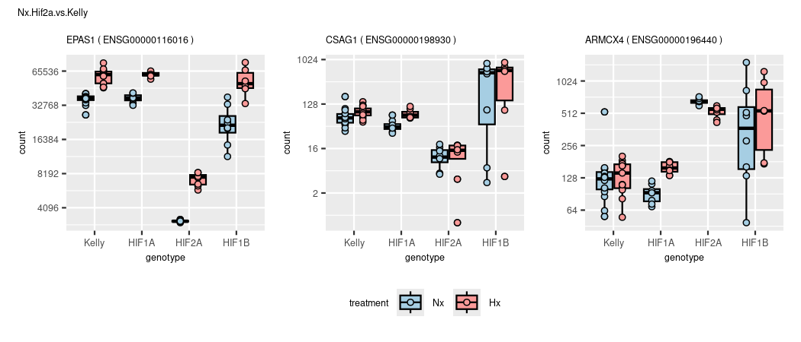
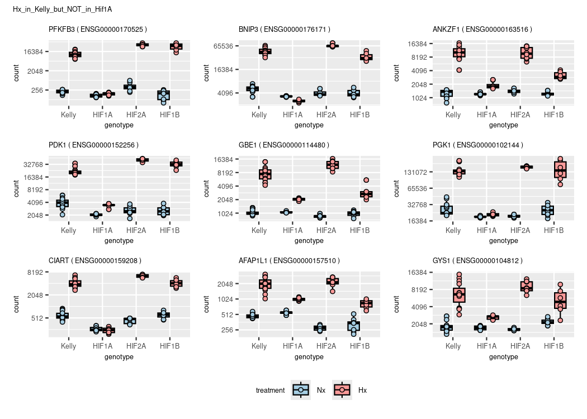
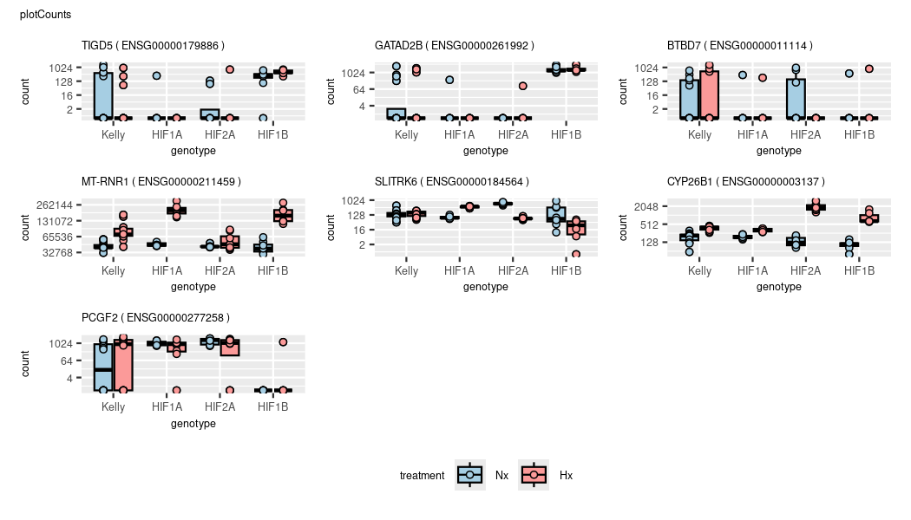

DGE
================
Kelterborn
2024-03-20

- [0. Load](#0-load)
  - [- Load R librarys](#--load-r-librarys)
  - [- Load dds](#--load-dds)
  - [- functions](#--functions)
- [1. Make results](#1-make-results)
  - [-Plot example counts](#-plot-example-counts)
- [2. Data Dive](#2-data-dive)
  - [Colour sheme](#colour-sheme)
  - [Volcanos](#volcanos)
  - [Overlaps (Venn)](#overlaps-venn)
  - [Heatmaps](#heatmaps)
  - [GO terms](#go-terms)

# 0. Load

## - Load R librarys

## - Load dds

## - functions

# 1. Make results

#### (Advanced results troubleshooting)

<figure>

<figcaption aria-hidden="true">Contrasts_overview</figcaption>
</figure>

### -Generate toplist

    ## design

    ## ~experiment + genotype + treatment + genotype:treatment

    ## cutoffs
    ## differential expressed: p=0.05,bM=10,l2FC=1
    ## top genes:              p=0.01,bM=100,l2FC=2

|                            | all.DEGs | top.DEGs |
|:---------------------------|---------:|---------:|
| deg_Hif1a.Hx.vs.Nx         |     6166 |      983 |
| deg_Hif2a.Hx.vs.Nx         |     3394 |      542 |
| deg_Hif1b.Hx.vs.Nx         |     2051 |      310 |
| deg_Kelly.Hx.vs.Nx         |     5301 |      866 |
| deg_Nx.Hif1a.vs.Kelly      |      223 |       21 |
| deg_Nx.Hif2a.vs.Kelly      |      596 |       75 |
| deg_Nx.Hif1b.vs.Kelly      |      721 |       58 |
| deg_Hx.Hif1a.vs.Kelly      |     1013 |       77 |
| deg_Hx.Hif2a.vs.Kelly      |     2532 |      348 |
| deg_Hx.Hif1b.vs.Kelly      |     4208 |      531 |
| deg_Hx.Hif2a.vs.Hif1a      |     4174 |      607 |
| deg_Hx.Hif1b.vs.Hif1a      |     4972 |      643 |
| deg_Hx.Hif1b.vs.Hif2a      |     2043 |      249 |
| deg_Hif1aHxNx.vs.KellyHxNx |      686 |       54 |
| deg_Hif2aHxNx.vs.KellyHxNx |     2238 |      281 |
| deg_Hif1bHxNx.vs.KellyHxNx |     3887 |      431 |
| deg_Hx.Hif1b.vs.Hif12a     |     2741 |      224 |
| deg_Hx.Kelly.vs.allHIFs    |     1502 |      148 |
| deg_Hx.vs.Nx               |     3599 |      495 |

## -Plot example counts

<!-- --><!-- --><!-- --><!-- --><!-- --><!-- --><!-- --><!-- --><!-- --><!-- --><!-- --><!-- --><!-- --><!-- --><!-- --><!-- --><!-- --><!-- --><!-- -->

|                 | symbol  | baseMean | log2FoldChange |    lfcSE |       stat |    pvalue |      padj |
|:----------------|:--------|---------:|---------------:|---------:|-----------:|----------:|----------:|
| ENSG00000234964 | FABP5P7 | 163.7803 |       -1.07385 | 1.094697 | -0.9809562 | 0.3266143 | 0.6176694 |

<!-- -->

# 2. Data Dive

## Colour sheme

## Volcanos

### Draw Vulcanos


### (continuous Vulcanos)

``` r
# gradient is fixed to padj = y-axis

# Vulcano
lcol="grey20"
xlim=10
ylim=300
n <- "Kelly.Hx.vs.Nx"
res <- results_list[[n]]
l <- length(res)

res_shrink <- lfcShrink(dds, res=res, type="ashr")
res_shrink$symbol <- res$symbol

# remove nas
res <- res[!is.na(res$padj),]
res <- res[!is.na(res$log2FoldChange),]

# rename genes
rownames(res) <- res$symbol

# change shape of outliers
shape <- ifelse(abs(res$log2FoldChange) > xlim, 18,
                ifelse(res$padj < 10^-ylim,18,16))
summary(is.na(shape))

# shape[is.na(shape)] <- 2
names(shape)[shape == 18] <- 'out of scale'
names(shape)[shape == 16] <- 'in range'

# move outliers to coord. max.
res$log2FoldChange[res$log2FoldChange > xlim] <- xlim
res$log2FoldChange[res$log2FoldChange < -xlim] <- -xlim
res$padj[res$padj < 10^-ylim] <- 10^-ylim
summary(res$padj < 10^-ylim)

 p1 <- EnhancedVolcano(res,
    lab = res$symbol,
    x = 'log2FoldChange',
    y = 'padj',
    pCutoff = 10^(-50),
    FCcutoff = 2,
    xlim = c(-xlim, xlim),
    pointSize = c(ifelse(res$log2FoldChange>2, 8, 1)),
    labSize = 6.0,
    shape = c(6, 6, 19, 16),
    title = "DESeq2 results",
    subtitle = "Differential expression",
    caption = bquote(~Log[2]~ "fold change cutoff, 2; p-value cutoff, 10e-4"),
    legendPosition = "right",
    legendLabSize = 14,
    colAlpha = 0.9,
    colGradient = c('red3', 'royalblue'),
    drawConnectors = TRUE,
    hline = c(10e-8),
    widthConnectors = 0.5)

  p1

ev_f <- EnhancedVolcano(res,
    x = 'log2FoldChange',
    y = 'padj',
    lab = res$symbol,
    labSize = 1.5,
    drawConnectors = TRUE,
    boxedLabels = TRUE,
    widthConnectors = 0.5,
    colConnectors = lcol,
    max.overlaps = 17,
    colGradient = c('red3', 'royalblue'),
    xlim = c(-xlim, xlim),
    ylim = c(0, ylim),
    ylab = "Padj (-log10)",
    title = n,
    subtitle = paste("DE genes:",l),
    # sub = "SVF",

    FCcutoff = 2,
    # pointSize = c(ifelse(rownames(res_WT_D_vs.WT_BL) %in% rownames(top_WT_BL_vs.pcry_BL), 8, 1)),
    legendLabels=c('Not sig.','|L2F| > 2.5','p-adj < 0.05',
                   'p-adj & L2F'),
    legendPosition = 'bottom',
    legendLabSize = 8,
    legendIconSize = 2.0,
    axisLabSize = 8,
    titleLabSize = 8,
    subtitleLabSize = 8,
    captionLabSize = 8,
    caption = {}
   )

ev_f
```

### (prepare data)

### (simple volcano (full))

#### (check cutoff)

## Overlaps (Venn)

### - Hif1a

    ## [1] "Element=7 (702) --> a3(702)"


    ## Kelly.Hx.vs.Nx

|                 |  baseMean | log2FoldChange |     lfcSE |      stat | pvalue | padj | symbol  |
|:----------------|----------:|---------------:|----------:|----------:|-------:|-----:|:--------|
| ENSG00000073060 | 11958.596 |       1.912261 | 0.0564790 |  33.85793 |      0 |    0 | SCARB1  |
| ENSG00000132382 |  6908.702 |      -1.840556 | 0.0836373 | -22.00641 |      0 |    0 | MYBBP1A |
| ENSG00000186469 |  8085.827 |       1.871876 | 0.0904267 |  20.70048 |      0 |    0 | GNG2    |
| ENSG00000117016 |  6871.537 |      -1.758324 | 0.0956286 | -18.38701 |      0 |    0 | RIMS3   |
| ENSG00000189241 | 11177.408 |       1.731705 | 0.0524954 |  32.98773 |      0 |    0 | TSPYL1  |
| ENSG00000184185 |  6118.126 |       1.972228 | 0.0767743 |  25.68864 |      0 |    0 | KCNJ12  |
| ENSG00000100285 | 39849.439 |      -1.267082 | 0.0781810 | -16.20705 |      0 |    0 | NEFH    |
| ENSG00000179222 | 22237.096 |       1.642876 | 0.0794722 |  20.67233 |      0 |    0 | MAGED1  |
| ENSG00000168348 | 18593.856 |      -1.528296 | 0.0792187 | -19.29212 |      0 |    0 | INSM2   |

    ## Hif1a.Hx.vs.Nx

|                 |  baseMean | log2FoldChange |     lfcSE |      stat | pvalue | padj | symbol  |
|:----------------|----------:|---------------:|----------:|----------:|-------:|-----:|:--------|
| ENSG00000073060 | 11958.596 |       2.513715 | 0.0674164 |  37.28643 |      0 |    0 | SCARB1  |
| ENSG00000132382 |  6908.702 |      -2.577358 | 0.1000207 | -25.76825 |      0 |    0 | MYBBP1A |
| ENSG00000186469 |  8085.827 |       2.579589 | 0.1081358 |  23.85510 |      0 |    0 | GNG2    |
| ENSG00000117016 |  6871.537 |      -2.641920 | 0.1143741 | -23.09895 |      0 |    0 | RIMS3   |
| ENSG00000189241 | 11177.408 |       2.279385 | 0.0626101 |  36.40604 |      0 |    0 | TSPYL1  |
| ENSG00000184185 |  6118.126 |       2.406483 | 0.0916057 |  26.27001 |      0 |    0 | KCNJ12  |
| ENSG00000100285 | 39849.439 |      -2.283594 | 0.0934795 | -24.42883 |      0 |    0 | NEFH    |
| ENSG00000179222 | 22237.096 |       2.267305 | 0.0949827 |  23.87071 |      0 |    0 | MAGED1  |
| ENSG00000168348 | 18593.856 |      -2.263527 | 0.0946962 | -23.90304 |      0 |    0 | INSM2   |


    ## [1] "Element=12 (31) --> a4(31)"
    ## [1] "Element=14 (702) --> a6(702)"
    ## [1] "Element=16 (15) --> a8(15)"
    ## [1] "Element=17 (703) --> a9(703)"
    ## [1] "Element=19 (266) --> a11(266)"
    ## [1] "Element=20 (133) --> a12(133)"
    ## [1] "Element=22 (1584) --> a14(1584)"
    ## [1] "Element=23 (3466) --> a15(3466)"



    ## compare results with contrast vsvs (Hif1a Hx vs. Nx  VS.  Kelly Hx vs. Nx


    ## [1] "Element=7 (4) --> a1(4)"
    ## [1] "Element=8 (25) --> a2(25)"
    ## [1] "Element=9 (607) --> a3(607)"
    ## [1] "Element=10 (17) --> a5(17)"
    ## [1] "Element=11 (37) --> a6(37)"


|                 | baseMean | log2FoldChange |     lfcSE |     stat |    pvalue |      padj | symbol |
|:----------------|---------:|---------------:|----------:|---------:|----------:|----------:|:-------|
| ENSG00000105880 | 618.9299 |       0.190761 | 0.1545126 | 1.234598 | 0.2169801 | 0.3009223 | DLX5   |

|                 | baseMean | log2FoldChange |     lfcSE |     stat | pvalue | padj | symbol |
|:----------------|---------:|---------------:|----------:|---------:|-------:|-----:|:-------|
| ENSG00000105880 | 618.9299 |       1.981755 | 0.1830812 | 10.82446 |      0 |    0 | DLX5   |


    ## [1] "Element=7 (1897) --> a1(1897)"
    ## [1] "Element=8 (131) --> a2(131)"
    ## [1] "Element=9 (455) --> a3(455)"
    ## [1] "Element=10 (62) --> a4(62)"
    ## [1] "Element=11 (243) --> a5(243)"
    ## [1] "Element=12 (282) --> a6(282)"
    ## [1] "Element=13 (99) --> a7(99)"

### (- Hif2a)

    ## Hif2a

<!-- -->

    ## [1] "Element=12 (188) --> a4(188)"
    ## [1] "Element=14 (417) --> a6(417)"
    ## [1] "Element=16 (35) --> a8(35)"
    ## [1] "Element=17 (2511) --> a9(2511)"
    ## [1] "Element=19 (90) --> a11(90)"
    ## [1] "Element=20 (261) --> a12(261)"
    ## [1] "Element=22 (757) --> a14(757)"
    ## [1] "Element=23 (1834) --> a15(1834)"

<!-- --><!-- --><!-- -->

### (- Hif1b)

    ## Hif1b

<!-- -->

    ## [1] "Element=12 (374) --> a4(374)"
    ## [1] "Element=14 (239) --> a6(239)"
    ## [1] "Element=16 (24) --> a8(24)"
    ## [1] "Element=17 (3446) --> a9(3446)"
    ## [1] "Element=19 (47) --> a11(47)"
    ## [1] "Element=20 (253) --> a12(253)"
    ## [1] "Element=22 (546) --> a14(546)"
    ## [1] "Element=23 (942) --> a15(942)"

<!-- --><!-- --><!-- -->

### (- overlap)

    ## overlap of overlaps

<!-- -->

    ## [1] "Element=7 (33) --> a1(33)"
    ## [1] "Element=8 (2) --> a2(2)"
    ## [1] "Element=9 (71) --> a3(71)"
    ## [1] "Element=10 (7) --> a4(7)"
    ## [1] "Element=11 (4) --> a5(4)"
    ## [1] "Element=12 (146) --> a6(146)"
    ## [1] "Element=13 (241) --> a7(241)"

    ##   overlap    gene
    ## 1      a1   TIGD5
    ## 2      a2   SPRY4
    ## 3      a3     KDR
    ## 4      a4 MT-RNR1
    ## 5      a5  H2AC19
    ## 6      a6 CYP26B1
    ## 7      a7   PCGF2

<!-- -->

### (- other)

### Compare Results 1 2 3

#### Vulcano lists

<!-- --><!-- --><!-- -->

|                 |  baseMean | log2FoldChange |     lfcSE |      stat | pvalue | padj | symbol |
|:----------------|----------:|---------------:|----------:|----------:|-------:|-----:|:-------|
| ENSG00000106003 |  928.0982 |     -3.0186727 | 0.1254119 | -24.07007 |      0 |    0 | LFNG   |
| ENSG00000107807 |  208.0512 |     11.6537315 | 0.5831457 |  19.98425 |      0 |    0 | TLX1   |
| ENSG00000135100 |  504.0646 |     10.5449933 | 0.3781407 |  27.88643 |      0 |    0 | HNF1A  |
| ENSG00000166573 |  262.6861 |      5.1605974 | 0.1932943 |  26.69814 |      0 |    0 | GALR1  |
| ENSG00000167721 | 6351.7523 |     -0.6084289 | 0.0455138 | -13.36802 |      0 |    0 | TSR1   |
| ENSG00000203727 |  564.2991 |      7.6035536 | 0.3019904 |  25.17813 |      0 |    0 | SAMD5  |

|                 |  baseMean | log2FoldChange |     lfcSE |      stat | pvalue | padj | symbol |
|:----------------|----------:|---------------:|----------:|----------:|-------:|-----:|:-------|
| ENSG00000106003 |  928.0982 |      -4.089051 | 0.1510384 | -27.07293 |      0 |    0 | LFNG   |
| ENSG00000107807 |  208.0512 |       8.675303 | 0.4457337 |  19.46297 |      0 |    0 | TLX1   |
| ENSG00000135100 |  504.0646 |      11.057737 | 0.6902547 |  16.01979 |      0 |    0 | HNF1A  |
| ENSG00000166573 |  262.6861 |       3.683771 | 0.2238573 |  16.45589 |      0 |    0 | GALR1  |
| ENSG00000167721 | 6351.7523 |      -1.412378 | 0.0544483 | -25.93979 |      0 |    0 | TSR1   |
| ENSG00000203727 |  564.2991 |       8.079874 | 0.3107448 |  26.00164 |      0 |    0 | SAMD5  |

|                 |  baseMean | log2FoldChange |     lfcSE |       stat |    pvalue |      padj | symbol |
|:----------------|----------:|---------------:|----------:|-----------:|----------:|----------:|:-------|
| ENSG00000106003 |  928.0982 |      0.2291789 | 0.1441730 |  1.5896108 | 0.1119226 | 0.6088678 | LFNG   |
| ENSG00000107807 |  208.0512 |      2.6027800 | 0.6875930 |  3.7853501 | 0.0001535 | 0.0071082 | TLX1   |
| ENSG00000135100 |  504.0646 |     -1.8502210 | 0.7711634 | -2.3992594 | 0.0164283 | 0.2265094 | HNF1A  |
| ENSG00000166573 |  262.6861 |      0.3740673 | 0.2333341 |  1.6031405 | 0.1089036 | 0.6015277 | GALR1  |
| ENSG00000167721 | 6351.7523 |      0.0381098 | 0.0532221 |  0.7160529 | 0.4739587 | 0.9238699 | TSR1   |
| ENSG00000203727 |  564.2991 |      1.3192206 | 0.3511169 |  3.7572123 | 0.0001718 | 0.0077108 | SAMD5  |

|                 |  baseMean | log2FoldChange |     lfcSE |       stat |    pvalue |      padj | symbol |
|:----------------|----------:|---------------:|----------:|-----------:|----------:|----------:|:-------|
| ENSG00000106003 |  928.0982 |     -0.8411990 | 0.1332788 |  -6.311576 | 0.0000000 | 0.0000000 | LFNG   |
| ENSG00000107807 |  208.0512 |     -0.3756490 | 0.2560870 |  -1.466880 | 0.1424087 | 0.2836432 | TLX1   |
| ENSG00000135100 |  504.0646 |     -1.3374769 | 0.1528782 |  -8.748644 | 0.0000000 | 0.0000000 | HNF1A  |
| ENSG00000166573 |  262.6861 |     -1.1027587 | 0.1785562 |  -6.175977 | 0.0000000 | 0.0000000 | GALR1  |
| ENSG00000167721 | 6351.7523 |     -0.7658388 | 0.0468307 | -16.353345 | 0.0000000 | 0.0000000 | TSR1   |
| ENSG00000203727 |  564.2991 |      1.7955414 | 0.2428351 |   7.394076 | 0.0000000 | 0.0000000 | SAMD5  |

|                 |  baseMean | log2FoldChange |     lfcSE |        stat |    pvalue |      padj | symbol |
|:----------------|----------:|---------------:|----------:|------------:|----------:|----------:|:-------|
| ENSG00000106003 |  928.0982 |     -1.0703779 | 0.1965294 |  -5.4464020 | 0.0000001 | 0.0000022 | LFNG   |
| ENSG00000107807 |  208.0512 |     -2.9784290 | 0.7342144 |  -4.0566202 | 0.0000498 | 0.0008405 | TLX1   |
| ENSG00000135100 |  504.0646 |      0.5127441 | 0.7862990 |   0.6520982 | 0.5143379 | 0.7404637 | HNF1A  |
| ENSG00000166573 |  262.6861 |     -1.4768260 | 0.2941323 |  -5.0209578 | 0.0000005 | 0.0000165 | GALR1  |
| ENSG00000167721 | 6351.7523 |     -0.8039486 | 0.0709857 | -11.3255047 | 0.0000000 | 0.0000000 | TSR1   |
| ENSG00000203727 |  564.2991 |      0.4763208 | 0.4272718 |   1.1147958 | 0.2649379 | 0.5193756 | SAMD5  |

#### WGCNA RES1,2,3


### Compare KO

``` r
cat("Results 3 of Hif1a, Hif2a, Hif1b")
```

    ## Results 3 of Hif1a, Hif2a, Hif1b

``` r
names(deg_genes_list)
```

    ##  [1] "deg_Hif1a.Hx.vs.Nx"         "deg_Hif2a.Hx.vs.Nx"        
    ##  [3] "deg_Hif1b.Hx.vs.Nx"         "deg_Kelly.Hx.vs.Nx"        
    ##  [5] "deg_Nx.Hif1a.vs.Kelly"      "deg_Nx.Hif2a.vs.Kelly"     
    ##  [7] "deg_Nx.Hif1b.vs.Kelly"      "deg_Hx.Hif1a.vs.Kelly"     
    ##  [9] "deg_Hx.Hif2a.vs.Kelly"      "deg_Hx.Hif1b.vs.Kelly"     
    ## [11] "deg_Hx.Hif2a.vs.Hif1a"      "deg_Hx.Hif1b.vs.Hif1a"     
    ## [13] "deg_Hx.Hif1b.vs.Hif2a"      "deg_Hif1aHxNx.vs.KellyHxNx"
    ## [15] "deg_Hif2aHxNx.vs.KellyHxNx" "deg_Hif1bHxNx.vs.KellyHxNx"
    ## [17] "deg_Hx.Hif1b.vs.Hif12a"     "deg_Hx.Kelly.vs.allHIFs"   
    ## [19] "deg_Hx.vs.Nx"

``` r
input_list <- deg_genes_list[c("deg_Hif1aHxNx.vs.KellyHxNx","deg_Hif2aHxNx.vs.KellyHxNx","deg_Hif1bHxNx.vs.KellyHxNx")]
plt <- venn.diagram(
    x = input_list,
    category.names = paste(names(input_list),"\n(",input_list %>% summary() %>% .[c(1:length(input_list))],")",sep=""),
    force.unique = TRUE, na = "remove",
    filename = NULL,
    main = "Hif1a Hx-Nx vs. Kelly Hx-Nx", main.fontface = "bold",
    lwd = 2,
    lty = 'blank',
    fill = colors[c(3,5,7)],
    cat.col=c(colors[c(4,6,8)]),
    cat.fontface = "bold")

grid.newpage()
grid.draw(plt)
```

<!-- -->

``` r
# plot example counts
overlaps <- calculate.overlap(input_list)
overlaps <- overlaps[order(names(overlaps))]
names(overlaps)
```

    ## [1] "a1" "a2" "a3" "a4" "a5" "a6" "a7"

``` r
getVennElements(plt)
```

    ## [1] "Element=7 (227) --> a1(227)"
    ## [1] "Element=8 (110) --> a2(110)"
    ## [1] "Element=9 (568) --> a3(568)"
    ## [1] "Element=10 (166) --> a4(166)"
    ## [1] "Element=11 (183) --> a5(183)"
    ## [1] "Element=12 (1377) --> a6(1377)"
    ## [1] "Element=13 (2161) --> a7(2161)"

``` r
# plot each 1 gene
goi <- sapply(overlaps,"[[",1) %>% .[order(names(.))]
 
data.frame(overlap = names(goi),
           gene = mcols(dds)[goi,"symbol"])
```

    ##   overlap    gene
    ## 1      a1   BNIP3
    ## 2      a2 FAM162A
    ## 3      a3  CLSTN2
    ## 4      a4  PFKFB3
    ## 5      a5 BHLHE41
    ## 6      a6 ARHGEF6
    ## 7      a7    TNXB

``` r
plotCounts_SK(goi)
```

<!-- -->

#### WGCNA KOs


#### WGCNA overlapped KOs

    ## [1] "a1" "a2" "a3" "a4" "a5" "a6" "a7"


#### -Remove log files

## Heatmaps

### -Compare results

``` r
# https://slowkow.com/notes/pheatmap-tutorial/
# Complex heatmap https://github.com/jokergoo/ComplexHeatmap/

# combined results
pick_genes <- str_detect(names(results_list),pattern="Hif1aHxNx")
pick_results <- c(4,1,5,8,14)
names(results_list)[pick_results]
```

    ## [1] "Kelly.Hx.vs.Nx"         "Hif1a.Hx.vs.Nx"         "Nx.Hif1a.vs.Kelly"     
    ## [4] "Hx.Hif1a.vs.Kelly"      "Hif1aHxNx.vs.KellyHxNx"

``` r
pick_genes <- topgenes_list[pick_genes] %>% unlist() %>% unname() %>% unique()
pick_genes <- lapply(topgenes_list,'[',1:10) %>% unlist() %>% unname() %>% unique()
pick_genes <- c(lapply(res_hif1a,'[',1:5),
                lapply(res_1_ab,'[',1:5),
                lapply(res_2_ab,'[',1:5)) %>% unlist() %>% unname() %>% unique()
pick_genes <- res_hif1a[[1]][1:30]
pick_genes <- lapply(res3_list,'[',1:10) %>% unlist() %>% unname() %>% unique()
pick_genes <- res3_list[[1]][1:30]


res_comb <- res.Kelly.Hx.vs.Nx[pick_genes,c(7,1)] %>% data.frame(.)
res_comb <- cbind(res_comb,lapply(results_list[pick_results],function(i) i[pick_genes,2]) %>% do.call(cbind,.) %>% data.frame(.))
res_comb_matrix <- as.matrix(res_comb[,c(-1,-2)])
res_comb_matrix[res_comb_matrix<1 & res_comb_matrix>-1] <- 0
rownames(res_comb_matrix) <- res_comb$symbol

# adapt colors to uniform breaks
mat_breaks <- quantile_breaks(res_comb_matrix, n = 20)
vir_cols <- viridis(length(mat_breaks))
vir_cols[9] <- "white"
hm_cols <- colorRamp2(mat_breaks,vir_cols)

hm <- Heatmap(res_comb_matrix,
        col = hm_cols,
        column_title = "Compare results",
        na_col = "black",
        row_names_gp = gpar(fontsize = 10)
        ) 
hm
```

<!-- -->

``` r
plotCounts_SK(goi=pick_genes[1:3])
```

<!-- -->

``` r
patchwork::wrap_elements((c_graphic))
```

<!-- -->

### -Compare KOs

``` r
pick_genes <- topgenes_list[c("top_Hif1aHxNx.vs.KellyHxNx","top_Hif2aHxNx.vs.KellyHxNx","top_Hif1bHxNx.vs.KellyHxNx")] %>% unlist()

res_comb <- res.Kelly.Hx.vs.Nx[pick_genes,c(7,1)] %>% data.frame(.)
res_comb <- cbind(res_comb,lapply(results_list[pick_results],function(i) i[pick_genes,2]) %>% do.call(cbind,.) %>% data.frame(.))
res_comb_matrix <- as.matrix(res_comb[,c(-1,-2)])
res_comb_matrix[res_comb_matrix<1 & res_comb_matrix>-1] <- 0
rownames(res_comb_matrix) <- res_comb$symbol

# adapt colors to uniform breaks
mat_breaks <- quantile_breaks(res_comb_matrix, n = 20)
vir_cols <- viridis(length(mat_breaks))
vir_cols[4] <- "white"
hm_cols <- colorRamp2(mat_breaks,vir_cols)

hm <- Heatmap(res_comb_matrix,
        col = hm_cols,
        column_title = "Compare results",
        na_col = "black",
        row_names_gp = gpar(fontsize = 10)
        ) 
hm
```

### -Top genes

Complex Heatmap:
<https://jokergoo.github.io/ComplexHeatmap-reference/book/>

``` r
ht_opt$fast_hclust = TRUE

# Choose genes

interaction_top <- topgenes_list[c("top_Hif1aHxNx.vs.KellyHxNx","top_Hif2aHxNx.vs.KellyHxNx","top_Hif1bHxNx.vs.KellyHxNx")]

interaction_top_ol <- calculate.overlap(interaction_top)


pick_genes <- lapply(interaction_top_ol,'[',1:5) %>% unlist() %>% unname() %>% unique()
pick_genes <- pick_genes[!is.na(pick_genes)]


# Get counts, with summarized replicates
dds_heat <- collapseReplicates(dds, dds$condition,dds$names)
vsd <- vst(dds_heat, blind=TRUE) #Variance stabilized transformation
ntd <- normTransform(dds_heat)
# rld <- rlog(dds_heat)
mat <- assay(vsd)
# mat <- assay(ntd)
# mat <- assay(rld)

# reduce to picked genes and convert to matrix
mat <- mat[pick_genes,c(1,3,5,7,2,4,6,8)] %>% as.matrix()

# Get WGCNA colors
WGCNA <- mcols(dds)[rownames(mat),"colors"] %>% as.character()

# WGCNA[is.na(WGCNA)] <- 'grey'

rownames(mat) <- mcols(dds)[pick_genes,"symbol"]
names(WGCNA) <- rownames(mat)

# adapt colors to uniform breaks
mat_breaks <- quantile_breaks(mat, n = 20)
vir_cols <- viridis(length(mat_breaks))
# vir_cols[9] <- "white"
hm_cols <- colorRamp2(mat_breaks,vir_cols)


hm <- Heatmap(mat,
  ## heatmap colors
      #   col = hm_cols,
      na_col = "black",
      
  ## columns
      column_title = "TOP genes",
      cluster_columns = FALSE,
      # column_km = 4,
      column_split = c(rep("Hx", 4),rep("Nx", 4)),
      # column_names_gp = gpar(col = c("lightcoral","skyblue1"), fontsize = c(10)),
      top_annotation = HeatmapAnnotation(foo = anno_block(gp = gpar(fill = c("lightcoral","skyblue1")),
        labels = c("Nx", "Hx"), 
        labels_gp = gpar(col = "white", fontsize = 10))),
  ## rows
      row_names_gp = gpar(fontsize = 10),
      cluster_rows = TRUE,
      clustering_method_rows = "centroid",
      # clustering_distance_rows = "kendall",
      row_km = 6,
 #  right_annotation = rowAnnotation(WGCNA = WGCNA, col=list(WGCNA=WGCNA))
       )
hm
```

<!-- -->

#### (heatmap test)

``` r
list(bar = c("a" = "red", "b" = "green", "c" = "blue"))

col_fun = colorRamp2(c(0, 5, 10), c("blue", "white", "red"))
ha = HeatmapAnnotation(foo = 1:10, col = list(foo = col_fun))

anno_col <- as.data.frame(colData(dds_heat)[,c("treatment","genotype")])
anno_colors <- list(treatment = c("lightcoral","skyblue1"),
                    genotype = c("grey","seagreen3","turquoise3","tan2"))

names(anno_colors$treatment) <- levels(anno_col$treatment)
names(anno_colors$genotype) <- levels(anno_col$genotype)


hm <- Heatmap(mat,
        col = hm_cols,
        column_title = "Compare results",
        na_col = "black",
        row_names_gp = gpar(fontsize = 10)
        ) 
hm

pheatmap(mat,
         clustering_distance_rows=sampleDists,
         clustering_distance_cols=sampleDists,
         annotation_col=anno_col,
         annotation_colors = anno_colors,
         show_colnames     = FALSE,
         col=viridis(20),
         cutree_rows = 8,
         cutree_cols = 8,
         fontsize_row = 5)
```

## GO terms

``` r
###################################### GO

interaction_top <- topgenes_list[c("top_Hif1aHxNx.vs.KellyHxNx","top_Hif2aHxNx.vs.KellyHxNx","top_Hif1bHxNx.vs.KellyHxNx")]
interaction_deg <- deg_genes_list[c("deg_Hif1aHxNx.vs.KellyHxNx","deg_Hif2aHxNx.vs.KellyHxNx","deg_Hif1bHxNx.vs.KellyHxNx")]

interaction_deg[[3]] <- interaction_deg[[3]][1:3000]

names(interaction_deg)
```

    ## [1] "deg_Hif1aHxNx.vs.KellyHxNx" "deg_Hif2aHxNx.vs.KellyHxNx"
    ## [3] "deg_Hif1bHxNx.vs.KellyHxNx"

``` r
interaction_deg_entrez_list <- list(Hif1a=mcols(dds)[interaction_deg[[1]],"entrezid"] %>% unlist() %>% unname(),
                                    Hif2a=mcols(dds)[interaction_deg[[2]],"entrezid"] %>% unlist() %>% unname(),
                                    Hif1b=mcols(dds)[interaction_deg[[3]],"entrezid"] %>% unlist() %>% unname()) %>% lapply(.,na.omit)


GO_1 <- enrichGO(interaction_deg[[1]],
                  keyType = "ENSEMBL",
                  ont = "ALL",
                  minGSSize = 15,
                  maxGSSize = 800,
                  pvalueCutoff = 0.05,
                  OrgDb = "org.Hs.eg.db",
                  pAdjustMethod = "fdr")
GO_1 <- simplify(GO_1)

GO_2 <- enrichGO(interaction_deg[[2]],
                  keyType = "ENSEMBL",
                  ont = "ALL",
                  minGSSize = 15,
                  maxGSSize = 800,
                  pvalueCutoff = 0.05,
                  OrgDb = "org.Hs.eg.db",
                  pAdjustMethod = "fdr")
GO_2 <- simplify(GO_2)

GO_3 <- enrichGO(interaction_deg[[3]],
                  keyType = "ENSEMBL",
                  ont = "ALL",
                  minGSSize = 15,
                  maxGSSize = 800,
                  pvalueCutoff = 0.05,
                  OrgDb = "org.Hs.eg.db",
                  pAdjustMethod = "fdr")
GO_3 <- simplify(GO_3)

barplot(GO_1, split = "ONTOLOGY", font.size = 8, showCategory = 10, title = "Hif1a") + facet_grid(ONTOLOGY~., scale="free") + scale_y_discrete(labels=function(x)  str_wrap(x, width=80)) + scale_fill_viridis() + theme(panel.grid.major.y = element_blank(), panel.background = element_rect(fill = NA), panel.ontop = TRUE, panel.grid.major.x = element_line(color = "white", size = 0.5, linetype = 1), panel.grid.minor.x = element_line(color = "white", size = 0.25, linetype = 1)) + scale_x_continuous(expand = c(0,0))
```

<!-- -->

``` r
barplot(GO_2, split = "ONTOLOGY", font.size = 8, showCategory = 10, title = "Hif2a") + facet_grid(ONTOLOGY~., scale="free") + scale_y_discrete(labels=function(x)  str_wrap(x, width=80)) + scale_fill_viridis() + theme(panel.grid.major.y = element_blank(), panel.background = element_rect(fill = NA), panel.ontop = TRUE, panel.grid.major.x = element_line(color = "white", size = 0.5, linetype = 1), panel.grid.minor.x = element_line(color = "white", size = 0.25, linetype = 1)) + scale_x_continuous(expand = c(0,0))
```

<!-- -->

``` r
barplot(GO_3, split = "ONTOLOGY", font.size = 8, showCategory = 10, title = "Hif1b") + facet_grid(ONTOLOGY~., scale="free") + scale_y_discrete(labels=function(x)  str_wrap(x, width=80)) + scale_fill_viridis() + theme(panel.grid.major.y = element_blank(), panel.background = element_rect(fill = NA), panel.ontop = TRUE, panel.grid.major.x = element_line(color = "white", size = 0.5, linetype = 1), panel.grid.minor.x = element_line(color = "white", size = 0.25, linetype = 1)) + scale_x_continuous(expand = c(0,0))
```

<!-- -->

``` r
godot1 <- dotplot(clusterProfiler::simplify(GO_1))+labs(title = "Hif1a")
godot2 <- dotplot(clusterProfiler::simplify(GO_2))+labs(title = "Hif2a")
godot3 <- dotplot(clusterProfiler::simplify(GO_3))+labs(title = "Hif1b")
godot1 + godot2 + godot3
```

<!-- -->

``` r
# Compare cluster
ck <- compareCluster(geneCluster = interaction_deg, fun = "enrichGO",
                  OrgDb = "org.Hs.eg.db",
                  keyType = "ENSEMBL",
                  ont = "ALL",
                  pvalueCutoff = 0.05,
                  pAdjustMethod = "fdr")

ck <- setReadable(ck, OrgDb = org.Hs.eg.db, )
head(ck)[1:7]
```

    ##                      Cluster ONTOLOGY         ID                    Description
    ## 1 deg_Hif1aHxNx.vs.KellyHxNx       BP GO:0072006            nephron development
    ## 2 deg_Hif1aHxNx.vs.KellyHxNx       BP GO:0072001       renal system development
    ## 3 deg_Hif1aHxNx.vs.KellyHxNx       BP GO:0072009 nephron epithelium development
    ## 4 deg_Hif1aHxNx.vs.KellyHxNx       BP GO:0007411                  axon guidance
    ## 5 deg_Hif1aHxNx.vs.KellyHxNx       BP GO:0097485     neuron projection guidance
    ## 6 deg_Hif1aHxNx.vs.KellyHxNx       BP GO:0007409                   axonogenesis
    ##   GeneRatio   BgRatio       pvalue
    ## 1    19/466 167/21288 4.965905e-09
    ## 2    27/466 350/21288 1.731357e-08
    ## 3    16/466 129/21288 2.375836e-08
    ## 4    22/466 247/21288 2.953019e-08
    ## 5    22/466 247/21288 2.953019e-08
    ## 6    31/466 483/21288 1.058437e-07

``` r
dotplot(ck)
```

<!-- -->

``` r
dotplot(ck, showCategory=15)
```

<!-- -->

``` r
# KEGG
ckk <- compareCluster(geneCluster = interaction_deg, fun = "enrichKEGG", organism="hsa", pvalueCutoff=0.05)


hif1a_entrez <- mcols(dds)[interaction_deg[[1]],"entrezid"] %>% unlist() %>% unname() %>% unique()
hif1a_entrez <- hif1a_entrez[!is.na(hif1a_entrez)]

hif2a_entrez <- mcols(dds)[interaction_deg[[2]],"entrezid"] %>% unlist() %>% unname() %>% unique()
hif2a_entrez <- hif2a_entrez[!is.na(hif2a_entrez)]

hif1b_entrez <- mcols(dds)[interaction_deg[[3]],"entrezid"] %>% unlist() %>% unname() %>% unique()
hif1b_entrez <- hif1b_entrez[!is.na(hif1b_entrez)]

interaction_deg_entrez <- list(hif1a_entrez,hif2a_entrez,hif1b_entrez)

ek1 <- enrichKEGG(hif1a_entrez,organism="hsa", pvalueCutoff=0.05)
ek2 <- enrichKEGG(hif2a_entrez,organism="hsa", pvalueCutoff=0.05)
ek3 <- enrichKEGG(hif1b_entrez,organism="hsa", pvalueCutoff=0.05)

dotplot(ek1) + dotplot(ek2) + dotplot(ek3)
```

<!-- -->

``` r
# ckk <- compareCluster(geneCluster = interaction_deg_entrez, fun = "enrichKEGG", organism="hsa", pvalueCutoff=0.5)
```
