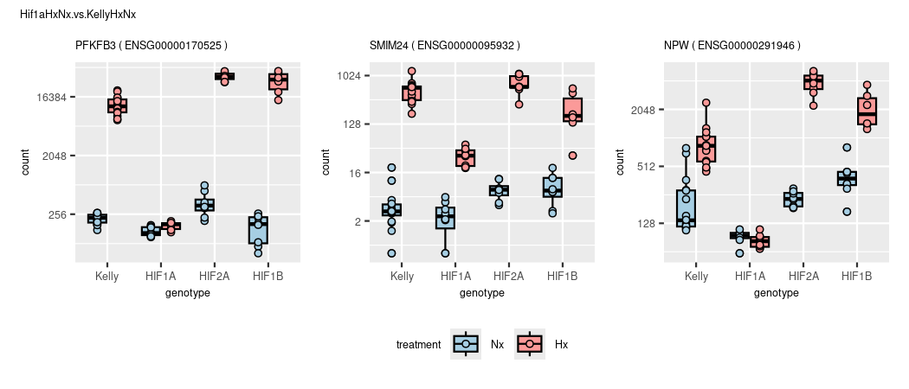
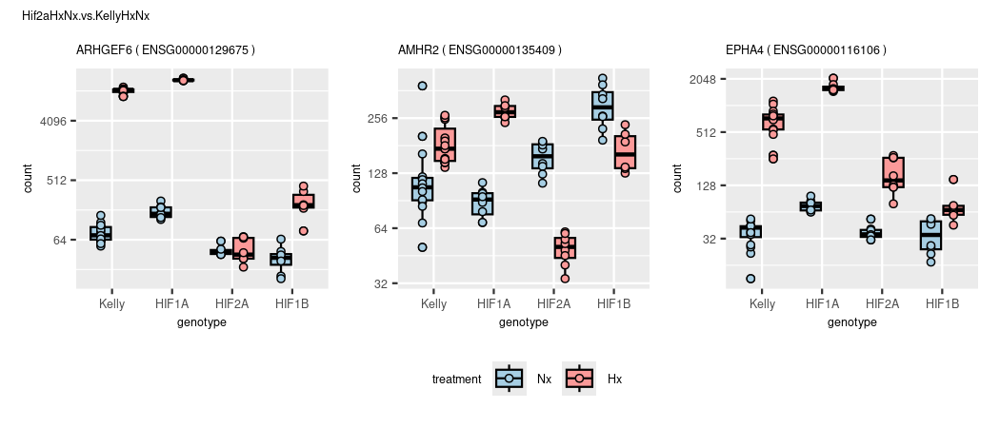
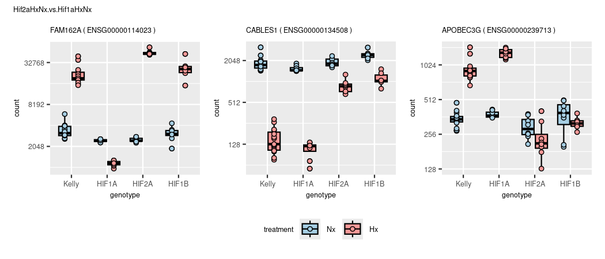
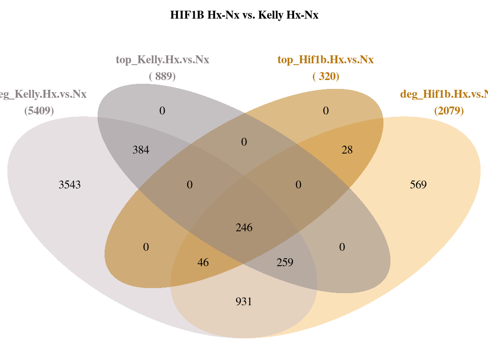

DGE
================
Kelterborn
2024-03-20

- [0. Load](#0-load)
  - [- Load R librarys](#--load-r-librarys)
  - [- dds](#--dds)
  - [- functions](#--functions)
- [1. Make results](#1-make-results)
  - [-Generate toplist](#-generate-toplist)
  - [-Plot example counts](#-plot-example-counts)
- [2. Data Dive](#2-data-dive)
  - [Colour sheme](#colour-sheme)
  - [Overlaps (Venn)](#overlaps-venn)
    - [- Hif1a](#--hif1a)
    - [- Hif2a](#--hif2a)
    - [- Hif1b](#--hif1b)
    - [- overlap](#--overlap)
    - [- other](#--other)
  - [Volcanos](#volcanos)
    - [prepare data](#prepare-data)
    - [simple volcano (full)](#simple-volcano-full)
    - [Draw Vulcanos](#draw-vulcanos)

# 0. Load

## - Load R librarys

## - dds

``` r
# load(file=paste(data,"deseq2.dds", sep="/"))

load(file=paste(data,"deseq2_treatment.dds", sep="/"))
dds_t <- dds
load(file=paste(data,"deseq2_condition.dds", sep="/"))
dds_c <- dds

load(file=paste(data,"deseq2_wgcna.dds", sep="/"))
```

## - functions

# 1. Make results

#### (Advanced results troubleshooting)

### -Generate toplist

``` r
deg_genes_list <- lapply(results_list,topgenes_f) %>%  lapply(.,rownames) 
names(deg_genes_list) <- paste("deg",names(deg_genes_list),sep="_")
deg_genes_list %>% lapply(., length) %>% as.data.frame() %>% kable()
```

| deg_Hif1a.Hx.vs.Nx | deg_Hif2a.Hx.vs.Nx | deg_Hif1b.Hx.vs.Nx | deg_Kelly.Hx.vs.Nx | deg_Nx.Hif1a.vs.Kelly | deg_Nx.Hif2a.vs.Kelly | deg_Nx.Hif1b.vs.Kelly | deg_Hx.Hif1a.vs.Kelly | deg_Hx.Hif2a.vs.Kelly | deg_Hx.Hif1b.vs.Kelly | deg_Hx.Hif2a.vs.Hif1a | deg_Hx.Hif1b.vs.Hif1a | deg_Hx.Hif1b.vs.Hif2a | deg_Hif1aHxNx.vs.KellyHxNx | deg_Hif2aHxNx.vs.KellyHxNx | deg_Hif1bHxNx.vs.KellyHxNx | deg_Hx.Hif1b.vs.Hif12a | deg_Hx.Kelly.vs.allHIFs | deg_Hx.vs.Nx |
|-------------------:|-------------------:|-------------------:|-------------------:|----------------------:|----------------------:|----------------------:|----------------------:|----------------------:|----------------------:|----------------------:|----------------------:|----------------------:|---------------------------:|---------------------------:|---------------------------:|-----------------------:|------------------------:|-------------:|
|               6098 |               3363 |               1979 |               5300 |                   283 |                   660 |                   951 |                  1022 |                  2505 |                  5640 |                  4101 |                  6187 |                  3653 |                        815 |                       2557 |                       3940 |                   4439 |                    1567 |         3539 |

``` r
topgenes_list <- lapply(results_list,topgenes_f, p=0.01,bM=100,l2FC=2) %>%  lapply(.,rownames)
names(topgenes_list) <- paste("top",names(topgenes_list),sep="_")
topgenes_list %>% lapply(., length) %>% as.data.frame()
```

    ##   top_Hif1a.Hx.vs.Nx top_Hif2a.Hx.vs.Nx top_Hif1b.Hx.vs.Nx top_Kelly.Hx.vs.Nx
    ## 1                952                556                309                862
    ##   top_Nx.Hif1a.vs.Kelly top_Nx.Hif2a.vs.Kelly top_Nx.Hif1b.vs.Kelly
    ## 1                    29                    80                    55
    ##   top_Hx.Hif1a.vs.Kelly top_Hx.Hif2a.vs.Kelly top_Hx.Hif1b.vs.Kelly
    ## 1                    80                   346                   618
    ##   top_Hx.Hif2a.vs.Hif1a top_Hx.Hif1b.vs.Hif1a top_Hx.Hif1b.vs.Hif2a
    ## 1                   604                   791                   291
    ##   top_Hif1aHxNx.vs.KellyHxNx top_Hif2aHxNx.vs.KellyHxNx
    ## 1                         63                        305
    ##   top_Hif1bHxNx.vs.KellyHxNx top_Hx.Hif1b.vs.Hif12a top_Hx.Kelly.vs.allHIFs
    ## 1                        430                    293                     151
    ##   top_Hx.vs.Nx
    ## 1          491

``` r
design(dds)
```

    ## ~genotype + treatment + genotype:treatment
    ## <environment: 0x55ebd78be798>

``` r
names(results_list)
```

    ##  [1] "Hif1a.Hx.vs.Nx"         "Hif2a.Hx.vs.Nx"         "Hif1b.Hx.vs.Nx"        
    ##  [4] "Kelly.Hx.vs.Nx"         "Nx.Hif1a.vs.Kelly"      "Nx.Hif2a.vs.Kelly"     
    ##  [7] "Nx.Hif1b.vs.Kelly"      "Hx.Hif1a.vs.Kelly"      "Hx.Hif2a.vs.Kelly"     
    ## [10] "Hx.Hif1b.vs.Kelly"      "Hx.Hif2a.vs.Hif1a"      "Hx.Hif1b.vs.Hif1a"     
    ## [13] "Hx.Hif1b.vs.Hif2a"      "Hif1aHxNx.vs.KellyHxNx" "Hif2aHxNx.vs.KellyHxNx"
    ## [16] "Hif1bHxNx.vs.KellyHxNx" "Hx.Hif1b.vs.Hif12a"     "Hx.Kelly.vs.allHIFs"   
    ## [19] "Hx.vs.Nx"

## -Plot example counts

``` r
cols = brewer.pal(n=8,name = 'Paired')

# get 3 sample genes
sample_plots <- list()
sample_plots_list <- {}
plot_list <- list()
li <- results_list %>% length()
for (i in 1:li){
  n <- results_list[i] %>% names()
  goi <- c(topgenes_list[[i]][1],sample(topgenes_list[[i]],size=2))
  l <- length(goi)
       for (ig in 1:l){
  s <- mcols(dds)[goi[ig],"symbol"]
  if (s ==""){s <- goi[ig]}
    d <- plotCounts(dds, gene=goi[ig], intgroup=c("condition","experiment","genotype","treatment"), main=s,returnData=TRUE)

  gcounts <- ggplot(d, aes(x = genotype, y = count, fill=treatment, color=treatment)) +
    geom_boxplot(color="black") +
    geom_point(shape=21,color="black",aes(fill=treatment),position=position_dodge(width=0.75), alpha=1) +
    scale_fill_manual(values=cols[c(1,5)]) +
    scale_color_manual(values=cols[c(1,5)]) +
    scale_y_continuous(trans = "log2") +
    labs(title = paste(s,"(",goi[ig],")",sep=" "))
  assign(paste("gcounts_",ig,sep=""),gcounts)
  
  plot_list[[paste(n,s,sep="_")]] <- gcounts
       }
  
  plot <- gcounts_1 + gcounts_2 + gcounts_3 +  
    plot_annotation(title = n) +
    plot_layout(guides = "collect", axis_titles="collect") & theme(legend.position = 'bottom',plot.title = element_text(size=10))
  print(plot)
}
```

<!-- --><!-- --><!-- --><!-- --><!-- --><!-- --><!-- --><!-- --><!-- --><!-- --><!-- --><!-- --><!-- --><!-- --><!-- --><!-- --><!-- --><!-- --><!-- -->

``` r
for (n in names(results_list)){
pn <-   str_detect(names(plot_list), pattern=n) %>% names(plot_list)[.]
plot.3 <- patchwork::wrap_plots(plot_list[pn],ncol = 3) + plot_layout(guides = "collect", axis_titles="collect") + plot_annotation(title = str_split(pn[[1]],pattern="_",simplify =TRUE)[1]) & theme(legend.position = 'bottom',plot.title = element_text(size=10))
#        print(plot.3)
        }            
```

# 2. Data Dive

## Colour sheme

``` r
colors_paired <- c("#A6CEE3", "#1F78B4", "#B2DF8A", "#33A02C", "#FB9A99", "#E31A1C", "#FDBF6F", "#FF7F00")
colors_v <- c("#440154FF", "#482878FF", "#3E4A89FF", "#31688EFF", "#26828EFF", "#1F9E89FF", "#35B779FF", "#6DCD59FF", "#B4DE2CFF", "#FDE725FF")
colors <- c("lavenderblush3","lavenderblush4","#90caf9","#1976d2", "#82e0aa", "#239b56", "#f8c471", "#b9770e") 
colors4 <- colors[c(1,3,5,7)]
# Vulcano colors
colors_vul <- c(colors[4:3],"orangered3","salmon1","hotpink4","hotpink1","darkseagreen4","darkseagreen1")
```

## Overlaps (Venn)

### - Hif1a

``` r
# ,fig.show="hold", out.width="80%", fig.with="50%",fig.height=4

# https://stackoverflow.com/questions/37450698/the-output-order-of-function-calculate-overlap correct names for venn

# Hif1a Hx-Nx vs. Kelly Hx-Nx
input_list <- topgenes_list[c(4,1)]
plt <- venn.diagram(
    x = input_list,
    category.names = paste(names(input_list),"\n(",input_list %>% summary() %>% .[c(1:length(input_list))],")",sep=""),
    force.unique = TRUE, na = "remove",
    filename = NULL,
    main = "Hif1a Hx-Nx vs. Kelly Hx-Nx", main.fontface = "bold",
    lwd = 2,
    lty = 'blank',
    fill = colors4[c(1,2)],
    rotation.degree=180,
    cat.col=c(colors[c(2,4)]),
    cat.pos = c(-225,225),
    cat.fontface = "bold",
    #   inverted=length(input_list[[1]]) < length(input_list[[2]])
)

grid.newpage()
grid.draw(plt)
```

<!-- -->

``` r
# plot example counts
overlaps <- calculate.overlap(input_list)
diff1 <- setdiff(overlaps[[1]],overlaps[[3]])
diff2 <- setdiff(overlaps[[2]],overlaps[[3]])

# get each top gene
getVennElements(plt)
```

    ## [1] "Element=7 (682) --> a3(682)"

``` r
goi <- c(diff1[1],overlaps$a3[1],diff2[1])
plotCounts_SK(goi)
```

<!-- -->

``` r
plotCounts_SK(diff2[1:12],n="only_Hif1a")
```

<!-- -->

``` r
plotCounts_SK(diff1[1:12],n="only_Kelly")
```

<!-- -->

``` r
# get results
results_list$Kelly.Hx.vs.Nx[diff2[1:12],] %>% kable()
```

|                 |   baseMean | log2FoldChange |     lfcSE |       stat |    pvalue |      padj | symbol   |
|:----------------|-----------:|---------------:|----------:|-----------:|----------:|----------:|:---------|
| ENSG00000073060 | 11958.5958 |       1.932024 | 0.0581472 |  33.226438 | 0.0000000 | 0.0000000 | SCARB1   |
| ENSG00000186469 |  8085.8271 |       1.868578 | 0.0881975 |  21.186295 | 0.0000000 | 0.0000000 | GNG2     |
| ENSG00000132382 |  6908.7023 |      -1.877496 | 0.0861601 | -21.790778 | 0.0000000 | 0.0000000 | MYBBP1A  |
| ENSG00000117016 |  6871.5369 |      -1.775943 | 0.0952610 | -18.642909 | 0.0000000 | 0.0000000 | RIMS3    |
| ENSG00000189241 | 11177.4084 |       1.723613 | 0.0621241 |  27.744699 | 0.0000000 | 0.0000000 | TSPYL1   |
| ENSG00000179222 | 22237.0960 |       1.579043 | 0.0932115 |  16.940433 | 0.0000000 | 0.0000000 | MAGED1   |
| ENSG00000154545 |  6001.2779 |       1.982714 | 0.1351638 |  14.668968 | 0.0000000 | 0.0000000 | MAGED4   |
| ENSG00000158560 |  1423.2990 |       1.596266 | 0.1132662 |  14.093046 | 0.0000000 | 0.0000000 | DYNC1I1  |
| ENSG00000164687 |  5980.6695 |      -1.725272 | 0.0865765 | -19.927701 | 0.0000000 | 0.0000000 | FABP5    |
| ENSG00000290450 |  2317.1551 |       1.773685 | 0.0737018 |  24.065704 | 0.0000000 | 0.0000000 |          |
| ENSG00000163536 |   746.7734 |       0.486356 | 0.2028700 |   2.397378 | 0.0165129 | 0.0298354 | SERPINI1 |
| ENSG00000184867 |  2232.8724 |       1.815987 | 0.0839786 |  21.624395 | 0.0000000 | 0.0000000 | ARMCX2   |

``` r
results_list$Hif1a.Hx.vs.Nx[diff2[1:12],] %>% kable()
```

|                 |   baseMean | log2FoldChange |     lfcSE |      stat | pvalue | padj | symbol   |
|:----------------|-----------:|---------------:|----------:|----------:|-------:|-----:|:---------|
| ENSG00000073060 | 11958.5958 |       2.487525 | 0.0690276 |  36.03667 |      0 |    0 | SCARB1   |
| ENSG00000186469 |  8085.8271 |       2.569116 | 0.1048760 |  24.49671 |      0 |    0 | GNG2     |
| ENSG00000132382 |  6908.7023 |      -2.547188 | 0.1025339 | -24.84239 |      0 |    0 | MYBBP1A  |
| ENSG00000117016 |  6871.5369 |      -2.615055 | 0.1133557 | -23.06946 |      0 |    0 | RIMS3    |
| ENSG00000189241 | 11177.4084 |       2.215089 | 0.0737492 |  30.03545 |      0 |    0 | TSPYL1   |
| ENSG00000179222 | 22237.0960 |       2.337556 | 0.1107831 |  21.10031 |      0 |    0 | MAGED1   |
| ENSG00000154545 |  6001.2779 |       2.798396 | 0.1606150 |  17.42300 |      0 |    0 | MAGED4   |
| ENSG00000158560 |  1423.2990 |       2.873208 | 0.1339924 |  21.44306 |      0 |    0 | DYNC1I1  |
| ENSG00000164687 |  5980.6695 |      -2.318165 | 0.1029412 | -22.51931 |      0 |    0 | FABP5    |
| ENSG00000290450 |  2317.1551 |       2.366045 | 0.0869459 |  27.21283 |      0 |    0 |          |
| ENSG00000163536 |   746.7734 |       4.487014 | 0.2489374 |  18.02467 |      0 |    0 | SERPINI1 |
| ENSG00000184867 |  2232.8724 |       2.443798 | 0.1000008 |  24.43777 |      0 |    0 | ARMCX2   |

``` r
# plot counts


### compare ALL degs in Kelly with TOP in HIF1A and vice versa
# Hif1a Hx-Nx vs. Kelly Hx-Nx
input_list <- c(deg_genes_list[c(4,1)],topgenes_list[c(4,1)])
cat("cutoffs",
      "differential expressed: p=0.05,bM=10,l2FC=1",
      "top genes:              p=0.01,bM=100,l2FC=2",
      sep="\n")
```

    ## cutoffs
    ## differential expressed: p=0.05,bM=10,l2FC=1
    ## top genes:              p=0.01,bM=100,l2FC=2

``` r
plt <- venn.diagram(
    x = input_list,
    category.names = paste(names(input_list),"\n(",input_list %>% summary() %>% .[c(1:length(input_list))],")",sep=""),
    force.unique = TRUE, na = "remove",
    filename = NULL,
    main = "Hif1a Hx-Nx vs. Kelly Hx-Nx", main.fontface = "bold",
    lwd = 2,
    lty = 'blank',
    fill = colors[c(1,3,2,4)],
    cat.col=colors[c(2,4,2,4)],
    cat.fontface = "bold",
    # inverted=length(input_list[[1]]) < length(input_list[[2]])
    )

grid.newpage()
grid.draw(plt)
```

<!-- -->

``` r
# plot example counts
overlaps <- calculate.overlap(input_list)
getVennElements(plt)
```

    ## [1] "Element=12 (32) --> a4(32)"
    ## [1] "Element=14 (682) --> a6(682)"
    ## [1] "Element=16 (41) --> a8(41)"
    ## [1] "Element=17 (909) --> a9(909)"
    ## [1] "Element=19 (229) --> a11(229)"
    ## [1] "Element=20 (148) --> a12(148)"
    ## [1] "Element=22 (1698) --> a14(1698)"
    ## [1] "Element=23 (3300) --> a15(3300)"

``` r
# get each top gene
goi <- c(overlaps$a4[1:3],overlaps$a8[1:3])
plotCounts_SK(overlaps$a4[1:9],n="Hx_in_Kelly_but_NOT_in_Hif1A")
```

<!-- -->

``` r
plotCounts_SK(overlaps$a8[1:9],n="Hx_in_HIF1A_but_NOT_in_Kelly")
```

<!-- -->

``` r
top_hif1a <- results_list$Hif1a.Hx.vs.Nx[c(overlaps$a4,overlaps$a8),] %>% .[order(abs(.$log2FoldChange), decreasing=TRUE),]

# correlation with network analysis
pie(mcols(dds)[top_hif1a %>% rownames(),"colors"] %>% .[!is.na(.)] %>% summary(),col=mcols(dds)[top_hif1a %>% rownames(),"colors"] %>% summary() %>% names())
```

<!-- -->

``` r
# Compare with other results
cat("compare results with contrast vsvs (Hif1a Hx vs. Nx  VS.  Kelly Hx vs. Nx")
```

    ## compare results with contrast vsvs (Hif1a Hx vs. Nx  VS.  Kelly Hx vs. Nx

``` r
input_list <- c(list("top_hif1a" = top_hif1a %>% rownames()),deg_genes_list[c(14)],topgenes_list[c(14)])
plt <- venn.diagram(
    x = input_list,
    category.names = paste(names(input_list),"\n(",input_list %>% summary() %>% .[c(1:length(input_list))],")",sep=""),
    force.unique = TRUE, na = "remove",
    filename = NULL,
    main = "Hif1a Hx-Nx vs. Kelly Hx-Nx", main.fontface = "bold",
    lwd = 2,
    lty = 'blank',
    fill = colors[c(4,1,2)],
    cat.col=c(colors[c(4)],"grey40","grey20"),
    cat.fontface = "bold",
    cat.pos = c(-45,0,45),
    # inverted=length(input_list[[1]]) < length(input_list[[2]])
    )

grid.newpage()
grid.draw(plt)
```

<!-- -->

``` r
# overlaps
overlaps <- calculate.overlap(input_list)
getVennElements(plt)
```

    ## [1] "Element=7 (5) --> a1(5)"
    ## [1] "Element=8 (43) --> a2(43)"
    ## [1] "Element=9 (709) --> a3(709)"
    ## [1] "Element=10 (25) --> a5(25)"
    ## [1] "Element=11 (38) --> a6(38)"

``` r
# plot counts
plotCounts_SK(overlaps$a1[1:5],n="only hif1a") # a1=5
```

<!-- -->

``` r
# -> nicht interessant
plotCounts_SK(overlaps$a2 %>% sample(size=9),n="hif1a & degs") # a2=43
```

<!-- -->

``` r
# passt
plotCounts_SK(overlaps$a5 %>% sample(size=9),n="hif1a & top") # a5=25
```

<!-- -->

``` r
# passt
plotCounts_SK(overlaps$a6 %>% sample(size=9),n="only tops") # a6=38
```

<!-- -->

``` r
# naja
plotCounts_SK(overlaps$a3 %>% sample(size=9),n="only degs") # a3=709
```

<!-- -->

### - Hif2a

``` r
## get top list for Hif2a
### compare ALL degs in Kelly with TOP in HIF2A and vice versa
# Hif2a Hx-Nx - Kelly Hx-Nx
cat("Hif2a")
```

    ## Hif2a

``` r
input_list <- c(deg_genes_list[c(4,2)],topgenes_list[c(4,2)])
plt <- venn.diagram(
    x = input_list,
    category.names = paste(names(input_list),"\n(",input_list %>% summary() %>% .[c(1:length(input_list))],")",sep=""),
    force.unique = TRUE, na = "remove",
    filename = NULL,
    main = "Hif2a Hx-Nx vs. Kelly Hx-Nx", main.fontface = "bold",
    lwd = 2,
    lty = 'blank',
    fill = colors[c(1,5,2,6)],
    cat.col=colors[c(2,6,2,6)],
    cat.fontface = "bold",
    # inverted=length(input_list[[1]]) < length(input_list[[2]])
    )

grid.newpage()
grid.draw(plt)
```

<!-- -->

``` r
# plot example counts
overlaps <- calculate.overlap(input_list)
getVennElements(plt)
```

    ## [1] "Element=12 (200) --> a4(200)"
    ## [1] "Element=14 (397) --> a6(397)"
    ## [1] "Element=16 (68) --> a8(68)"
    ## [1] "Element=17 (2674) --> a9(2674)"
    ## [1] "Element=19 (91) --> a11(91)"
    ## [1] "Element=20 (265) --> a12(265)"
    ## [1] "Element=22 (869) --> a14(869)"
    ## [1] "Element=23 (1673) --> a15(1673)"

``` r
# get each top gene
goi <- c(overlaps$a4[1:3],overlaps$a8[1:3])
plotCounts_SK(overlaps$a4[1:9],n="Hx_in_Kelly_but_NOT_in_Hif2A")
```

<!-- -->

``` r
plotCounts_SK(overlaps$a8[1:9],n="Hx_in_HIF2A_but_NOT_in_Kelly")
```

<!-- -->

``` r
top_hif2a <- results_list$Hif2a.Hx.vs.Nx[c(overlaps$a4,overlaps$a8),] %>% .[order(abs(.$log2FoldChange), decreasing=TRUE),]

# correlation with network analysis
pie(mcols(dds)[top_hif2a %>% rownames(),"colors"] %>% .[!is.na(.)] %>% summary(),col=mcols(dds)[top_hif2a %>% rownames(),"colors"] %>% summary() %>% names())
```

<!-- -->

### - Hif1b

``` r
## get top list for Hif1b
### compare ALL degs in Kelly with TOP in HIF1B and vice versa
# Hif1b Hx-Nx - Kelly Hx-Nx
cat("Hif1b")
```

    ## Hif1b

``` r
input_list <- c(deg_genes_list[c(4,3)],topgenes_list[c(4,3)])
plt <- venn.diagram(
    x = input_list,
    category.names = paste(names(input_list),"\n(",input_list %>% summary() %>% .[c(1:length(input_list))],")",sep=""),
    force.unique = TRUE, na = "remove",
    filename = NULL,
    main = "HIF1B Hx-Nx vs. Kelly Hx-Nx", main.fontface = "bold",
    lwd = 2,
    lty = 'blank',
    fill = colors[c(1,7,2,8)],
    cat.col=colors[c(2,8,2,8)],
    cat.fontface = "bold",
    # inverted=length(input_list[[1]]) < length(input_list[[2]])
    )

grid.newpage()
grid.draw(plt)
```

<!-- -->

``` r
# plot example counts
overlaps <- calculate.overlap(input_list)
getVennElements(plt)
```

    ## [1] "Element=12 (370) --> a4(370)"
    ## [1] "Element=14 (240) --> a6(240)"
    ## [1] "Element=16 (24) --> a8(24)"
    ## [1] "Element=17 (3501) --> a9(3501)"
    ## [1] "Element=19 (45) --> a11(45)"
    ## [1] "Element=20 (252) --> a12(252)"
    ## [1] "Element=22 (526) --> a14(526)"
    ## [1] "Element=23 (892) --> a15(892)"

``` r
# get each top gene
goi <- c(overlaps$a4[1:3],overlaps$a8[1:3])
plotCounts_SK(overlaps$a4[1:9],n="Hx_in_Kelly_but_NOT_in_Hif1B")
```

<!-- -->

``` r
plotCounts_SK(overlaps$a8[1:9],n="Hx_in_HIF1B_but_NOT_in_Kelly")
```

<!-- -->

``` r
top_hif1b <- results_list$Hif1b.Hx.vs.Nx[c(overlaps$a4,overlaps$a8),] %>% .[order(abs(.$log2FoldChange), decreasing=TRUE),]

# correlation with network analysis
pie(mcols(dds)[top_hif1b %>% rownames(),"colors"] %>% .[!is.na(.)] %>% summary(),col=mcols(dds)[top_hif1b %>% rownames(),"colors"] %>% summary() %>% names())
```

<!-- -->

### - overlap

``` r
cat("overlap of overlaps")
```

    ## overlap of overlaps

``` r
input_list <- list("top_hif1a"=top_hif1a %>% rownames(),
                   "top_hif2a"=top_hif2a %>% rownames(),
                   "top_hif1b"=top_hif1b %>% rownames())
plt <- venn.diagram(
    x = input_list,
    category.names = paste(names(input_list),"\n(",input_list %>% summary() %>% .[c(1:length(input_list))],")",sep=""),
    force.unique = TRUE, na = "remove",
    filename = NULL,
    main = "Hif1a Hx-Nx vs. Kelly Hx-Nx", main.fontface = "bold",
    lwd = 2,
    lty = 'blank',
    fill = colors[c(3,5,7)],
    cat.col=c(colors[c(4,6,8)]),
    cat.fontface = "bold")

grid.newpage()
grid.draw(plt)
```

<!-- -->

``` r
# plot example counts
overlaps <- calculate.overlap(input_list)
getVennElements(plt)
```

    ## [1] "Element=7 (43) --> a1(43)"
    ## [1] "Element=8 (21) --> a2(21)"
    ## [1] "Element=9 (86) --> a3(86)"
    ## [1] "Element=10 (8) --> a4(8)"
    ## [1] "Element=11 (1) --> a5(1)"
    ## [1] "Element=12 (160) --> a6(160)"
    ## [1] "Element=13 (225) --> a7(225)"

``` r
# plot each 1 gene
goi <- sapply(overlaps,"[[",1)
data.frame(overlap = names(goi),
           gene = mcols(dds)[goi,"symbol"])
```

    ##   overlap     gene
    ## 1      a5     CDH7
    ## 2      a2  FABP5P7
    ## 3      a4  MT-RNR1
    ## 4      a6  CYP26B1
    ## 5      a1 SERPINI1
    ## 6      a3       U2
    ## 7      a7    PCGF2

``` r
plotCounts_SK(goi)
```

<!-- -->

### - other

``` r
# Hx vs. Nx
# dev.off()
input_list <- topgenes_list[c(4,3,1,2)]
plt <- venn.diagram(
    x = input_list,
    category.names = paste(names(topgenes_list[c(4,3,1,2)]),"\n(",topgenes_list %>% summary() %>% .[c(4,3,1,2)],")",sep=""),
    force.unique = TRUE, na = "remove",
    filename = NULL,
    main = "Hx vs. Nx", main.fontface = "bold",
    lwd = 2,
    lty = 'blank',
    fill = colors4[c(1,4,2,3)])

grid.newpage()
grid.draw(plt)

# Hx vs. Hx
# dev.off()
plt <- venn.diagram(
    x = topgenes_list[c(8,9,10)],
    category.names = paste(names(topgenes_list[c(8,9,10)]),"\n(",topgenes_list %>% summary() %>% .[c(8,9,10)],")",sep=""),
    force.unique = TRUE, na = "remove",
    filename = NULL,
    main = "Hx vs. Hx", main.fontface = "bold",
    lwd = 2,
    lty = 'blank',
    fill = colors4[c(2,3,4)])
grid.draw(plt)

# Hif1a
# dev.off()
grid.newpage()
plt <- venn.diagram(
    x = topgenes_list[c(4,1,5,8)],
    category.names = paste(names(topgenes_list[c(4,1,5,8)]),"\n(",topgenes_list %>% summary() %>% .[c(4,1,5,8)],")",sep=""),
    force.unique = TRUE, na = "remove",
    filename = NULL,
    main = "Hif1a", main.fontface = "bold",
    lwd = 2,
    lty = 'blank',
    fill = colors[c(2,4,1,3)])
grid.draw(plt)

# Hif1a_simple
# dev.off()
input_list <- topgenes_list[c(4,1,8)]
plt <- venn.diagram(
    x = input_list,
    category.names = paste(names(input_list),"\n(",topgenes_list %>% summary() %>% .[choose_list],")",sep=""),
    force.unique = TRUE, na = "remove",
    filename = NULL,
    main = "Hif1a_simple", main.fontface = "bold",
    lwd = 2,
    lty = 'blank',
    fill = colors[c(1,3,4)])

overlaps <- calculate.overlap(input_list)
lapply(overlaps,length)

l <- plt %>% length()
for (i in 1:l){
#   print(i)
#   print(plt[[i]]$label)
# print (plt[[i]]$label == lapply(overlaps,length))
# print(names(overlaps)[plt[[i]]$label == lapply(overlaps,length)])
# print(length(overlaps[plt[[i]]$label == lapply(overlaps,length)]))

if( identical (
  names(overlaps)[plt[[i]]$label == lapply(overlaps,length)],character(0) 
)) {} else  {
 paste("Element=",i," (",plt[[i]]$label,")", " --> ",
      names(overlaps)[plt[[i]]$label == lapply(overlaps,length)],
      "(",length(overlaps[plt[[i]]$label == lapply(overlaps,length)]),")",sep="") %>%
  print()
}
}


## label names
plt[[7]]$label <- paste(plt[[7]]$label,"a1",sep="\n")
plt[[9]]$label <- paste(plt[[9]]$label,"a2",sep="\n")

plt[[9]]$label <- paste(overlaps[[1]], collapse = "\n") 

plt[[10]]$label <- paste(overlaps[[6]], collapse = "\n") 

grid.newpage()
grid.draw(plt)

# Hif1a_all
# dev.off()
choose_list <- c(4,14,1,8)
plt <- venn.diagram(
    x = topgenes_list[choose_list],
    category.names = paste(names(topgenes_list[choose_list]),"\n(",topgenes_list %>% summary() %>% .[choose_list],")",sep=""),
    force.unique = TRUE, na = "remove",
    filename = NULL,
    main = "Hif1a_all", main.fontface = "bold",
    lwd = 2,
    lty = 'blank',
    fill = colors[c(2,4,1,3)])
grid.newpage()
grid.draw(plt)

# Hif2a
# dev.off()
plt <- venn.diagram(
    x = topgenes_list[c(4,2,6,9)],
    category.names = paste(names(topgenes_list[c(4,2,6,9)]),"\n(",topgenes_list %>% summary() %>% .[c(4,2,6,9)],")",sep=""),
    force.unique = TRUE, na = "remove",
    filename = NULL,
    main = "Hif2a", main.fontface = "bold",
    lwd = 2,
    lty = 'blank',
    fill = colors[c(2,6,1,5)])
grid.newpage()
grid.draw(plt)

# Hif1b
# dev.off()
plt <- venn.diagram(
    x = topgenes_list[c(4,3,7,10)],
    category.names = paste(names(topgenes_list[c(4,3,7,10)]),"\n(",topgenes_list %>% summary() %>% .[c(4,3,7,10)],")",sep=""),
    force.unique = TRUE, na = "remove",
    filename = NULL,
    main = "Hif2a", main.fontface = "bold",
    lwd = 2,
    lty = 'blank',
    fill = colors[c(2,8,1,7)])
grid.newpage()
grid.draw(plt)
```

#### -Remove log files

``` r
venn.logs <- list.files(pattern="VennDiagram.*.log")
file.remove(venn.logs)
```

    ## logical(0)

## Volcanos

### prepare data

### simple volcano (full)

#### check cutoff

### Draw Vulcanos

``` r
# Input

# results name
n <- "Hif1a.Hx.vs.Nx"

# colours
topcol <- "royalblue4"
hscol <- "royalblue1"
lcol <- "grey20"

# limits
xlim <- 10
ylim <- 300

# number of top genes
ntop <- 100

###################

# names(results_list)

ev_kelly <- Vulcano_SK(n="Kelly.Hx.vs.Nx", # results name
            ntop=200, # number of top genes
            topcol=colors[2], # color top genes
            hscol=colors[1], # color highly significant genes
            lcol="grey20",
            xlim=10,
            ylim=300)

ev_hif1a <- Vulcano_SK(n <- "Hif1a.Hx.vs.Nx",
            ntop=200,
            topcol=colors[4],
            hscol=colors[3],
            lcol="grey20")

ev_hif2a <- Vulcano_SK(n <- "Hif2a.Hx.vs.Nx",
            ntop=200,
            topcol=colors[6],
            hscol=colors[5],
            lcol="grey20")

ev_hif1b <- Vulcano_SK(n <- "Hif1b.Hx.vs.Nx",
            ntop=200,
            topcol=colors[8],
            hscol=colors[7],
            lcol="grey20")

( ev_kelly + ev_hif1b ) + plot_layout(guides = "collect", axes="collect", axis_titles="collect") & theme(legend.position = 'bottom', axis.title=element_text(size=8))
( ev_hif1a + ev_hif2a) + plot_layout(guides = "collect", axis_titles="collect") & theme(legend.position = 'bottom')
```


