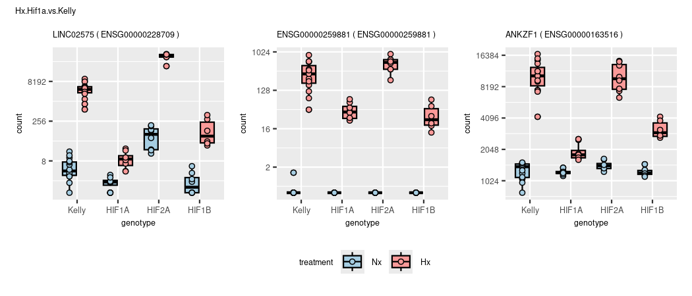
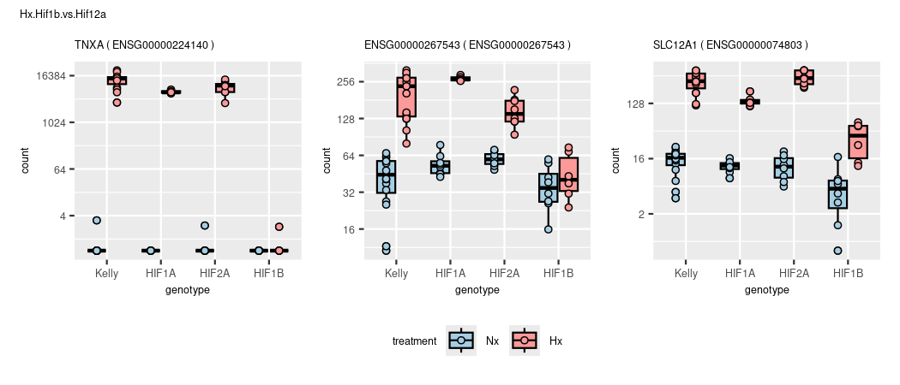
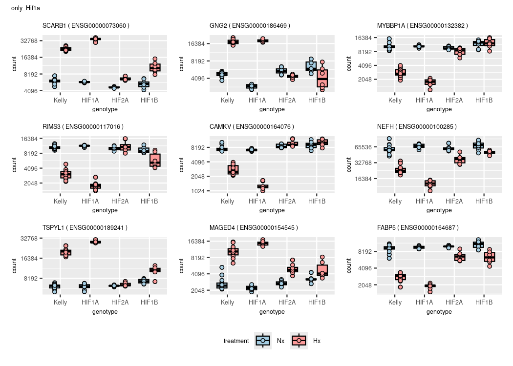
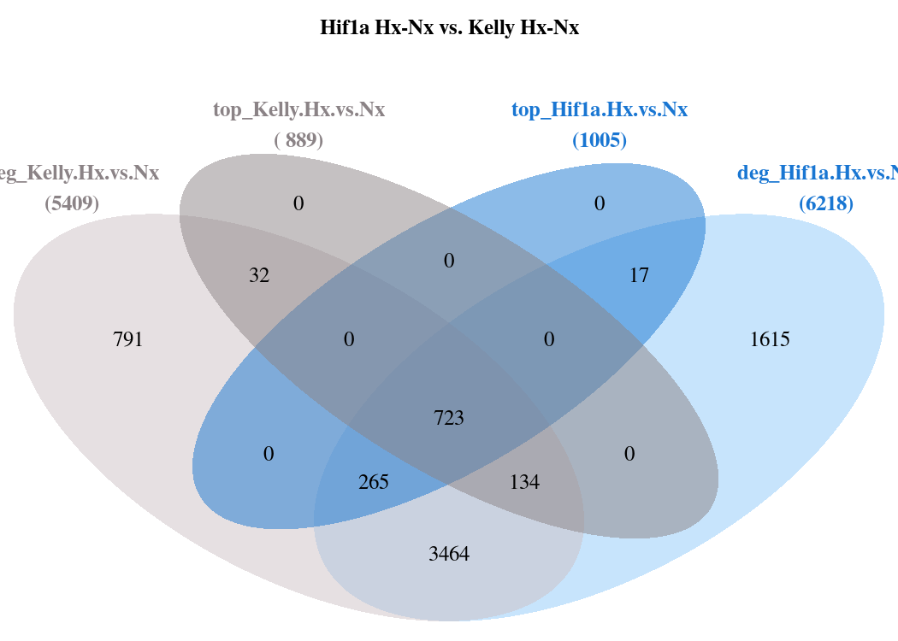
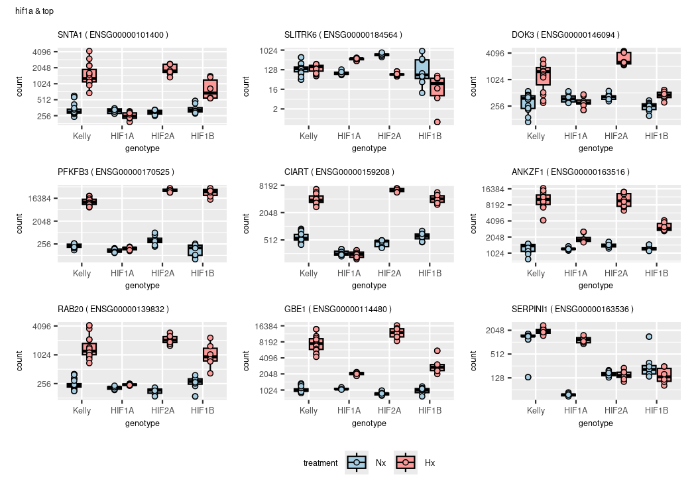

DGE
================
Kelterborn
2024-03-20

- [0. Load](#0-load)
  - [- Load R librarys](#--load-r-librarys)
  - [- Load dds](#--load-dds)
  - [- functions](#--functions)
- [1. Make results](#1-make-results)
  - [-Plot example counts](#-plot-example-counts)
- [2. Data Dive](#2-data-dive)
  - [Colour sheme](#colour-sheme)
  - [Volcanos](#volcanos)
  - [Overlaps (Venn)](#overlaps-venn)
  - [Heatmaps](#heatmaps)
- [Tutorials:](#tutorials)
- [](#section)

# 0. Load

## - Load R librarys

## - Load dds

## - functions

# 1. Make results

#### (Advanced results troubleshooting)

<figure>

<figcaption aria-hidden="true">Contrasts_overview</figcaption>
</figure>

### -Generate toplist

    ## design

    ## ~genotype + treatment + genotype:treatment

    ## cutoffs
    ## differential expressed: p=0.05,bM=10,l2FC=1
    ## top genes:              p=0.01,bM=100,l2FC=2

|                            | all.DEGs | top.DEGs |
|:---------------------------|---------:|---------:|
| deg_Hif1a.Hx.vs.Nx         |     6098 |      952 |
| deg_Hif2a.Hx.vs.Nx         |     3363 |      556 |
| deg_Hif1b.Hx.vs.Nx         |     1979 |      309 |
| deg_Kelly.Hx.vs.Nx         |     5300 |      862 |
| deg_Nx.Hif1a.vs.Kelly      |      283 |       29 |
| deg_Nx.Hif2a.vs.Kelly      |      660 |       80 |
| deg_Nx.Hif1b.vs.Kelly      |      951 |       55 |
| deg_Hx.Hif1a.vs.Kelly      |     1022 |       80 |
| deg_Hx.Hif2a.vs.Kelly      |     2505 |      346 |
| deg_Hx.Hif1b.vs.Kelly      |     5640 |      618 |
| deg_Hx.Hif2a.vs.Hif1a      |     4101 |      604 |
| deg_Hx.Hif1b.vs.Hif1a      |     6187 |      791 |
| deg_Hx.Hif1b.vs.Hif2a      |     3653 |      291 |
| deg_Hif1aHxNx.vs.KellyHxNx |      815 |       63 |
| deg_Hif2aHxNx.vs.KellyHxNx |     2557 |      305 |
| deg_Hif1bHxNx.vs.KellyHxNx |     3940 |      430 |
| deg_Hx.Hif1b.vs.Hif12a     |     4439 |      293 |
| deg_Hx.Kelly.vs.allHIFs    |     1567 |      151 |
| deg_Hx.vs.Nx               |     3539 |      491 |

## -Plot example counts

<!-- --><!-- --><!-- --><!-- --><!-- --><!-- --><!-- --><!-- --><!-- --><!-- --><!-- --><!-- --><!-- --><!-- --><!-- --><!-- --><!-- --><!-- --><!-- -->

|                 | symbol  | baseMean | log2FoldChange |   lfcSE |      stat | pvalue | padj |
|:----------------|:--------|---------:|---------------:|--------:|----------:|-------:|-----:|
| ENSG00000234964 | FABP5P7 | 163.7803 |      -29.97269 | 3.99772 | -7.497445 |      0 |    0 |

<!-- -->

# 2. Data Dive

## Colour sheme

## Volcanos

### Draw Vulcanos


### (continuous Vulcanos)

``` r
# gradient is fixed to padj = y-axis

# Vulcano
lcol="grey20"
xlim=10
ylim=300
n <- "Kelly.Hx.vs.Nx"
res <- results_list[[n]]
l <- length(res)

res_shrink <- lfcShrink(dds, res=res, type="ashr")
res_shrink$symbol <- res$symbol

# remove nas
res <- res[!is.na(res$padj),]
res <- res[!is.na(res$log2FoldChange),]

# rename genes
rownames(res) <- res$symbol

# change shape of outliers
shape <- ifelse(abs(res$log2FoldChange) > xlim, 18,
                ifelse(res$padj < 10^-ylim,18,16))
summary(is.na(shape))

# shape[is.na(shape)] <- 2
names(shape)[shape == 18] <- 'out of scale'
names(shape)[shape == 16] <- 'in range'

# move outliers to coord. max.
res$log2FoldChange[res$log2FoldChange > xlim] <- xlim
res$log2FoldChange[res$log2FoldChange < -xlim] <- -xlim
res$padj[res$padj < 10^-ylim] <- 10^-ylim
summary(res$padj < 10^-ylim)

 p1 <- EnhancedVolcano(res,
    lab = res$symbol,
    x = 'log2FoldChange',
    y = 'padj',
    pCutoff = 10^(-50),
    FCcutoff = 2,
    xlim = c(-xlim, xlim),
    pointSize = c(ifelse(res$log2FoldChange>2, 8, 1)),
    labSize = 6.0,
    shape = c(6, 6, 19, 16),
    title = "DESeq2 results",
    subtitle = "Differential expression",
    caption = bquote(~Log[2]~ "fold change cutoff, 2; p-value cutoff, 10e-4"),
    legendPosition = "right",
    legendLabSize = 14,
    colAlpha = 0.9,
    colGradient = c('red3', 'royalblue'),
    drawConnectors = TRUE,
    hline = c(10e-8),
    widthConnectors = 0.5)

  p1

ev_f <- EnhancedVolcano(res,
    x = 'log2FoldChange',
    y = 'padj',
    lab = res$symbol,
    labSize = 1.5,
    drawConnectors = TRUE,
    boxedLabels = TRUE,
    widthConnectors = 0.5,
    colConnectors = lcol,
    max.overlaps = 17,
    colGradient = c('red3', 'royalblue'),
    xlim = c(-xlim, xlim),
    ylim = c(0, ylim),
    ylab = "Padj (-log10)",
    title = n,
    subtitle = paste("DE genes:",l),
    # sub = "SVF",

    FCcutoff = 2,
    # pointSize = c(ifelse(rownames(res_WT_D_vs.WT_BL) %in% rownames(top_WT_BL_vs.pcry_BL), 8, 1)),
    legendLabels=c('Not sig.','|L2F| > 2.5','p-adj < 0.05',
                   'p-adj & L2F'),
    legendPosition = 'bottom',
    legendLabSize = 8,
    legendIconSize = 2.0,
    axisLabSize = 8,
    titleLabSize = 8,
    subtitleLabSize = 8,
    captionLabSize = 8,
    caption = {}
   )

ev_f
```

### (prepare data)

### (simple volcano (full))

#### (check cutoff)

## Overlaps (Venn)

### - Hif1a

    ## [1] "Element=7 (682) --> a3(682)"



    ## Kelly.Hx.vs.Nx

|                 |  baseMean | log2FoldChange |     lfcSE |      stat | pvalue | padj | symbol  |
|:----------------|----------:|---------------:|----------:|----------:|-------:|-----:|:--------|
| ENSG00000073060 | 11958.596 |       1.932024 | 0.0581472 |  33.22644 |      0 |    0 | SCARB1  |
| ENSG00000186469 |  8085.827 |       1.868578 | 0.0881975 |  21.18629 |      0 |    0 | GNG2    |
| ENSG00000132382 |  6908.702 |      -1.877496 | 0.0861601 | -21.79078 |      0 |    0 | MYBBP1A |
| ENSG00000117016 |  6871.537 |      -1.775943 | 0.0952610 | -18.64291 |      0 |    0 | RIMS3   |
| ENSG00000189241 | 11177.408 |       1.723613 | 0.0621241 |  27.74470 |      0 |    0 | TSPYL1  |
| ENSG00000179222 | 22237.096 |       1.579043 | 0.0932115 |  16.94043 |      0 |    0 | MAGED1  |
| ENSG00000154545 |  6001.278 |       1.982714 | 0.1351638 |  14.66897 |      0 |    0 | MAGED4  |
| ENSG00000158560 |  1423.299 |       1.596266 | 0.1132662 |  14.09305 |      0 |    0 | DYNC1I1 |
| ENSG00000164687 |  5980.669 |      -1.725272 | 0.0865765 | -19.92770 |      0 |    0 | FABP5   |

    ## Hif1a.Hx.vs.Nx

|                 |  baseMean | log2FoldChange |     lfcSE |      stat | pvalue | padj | symbol  |
|:----------------|----------:|---------------:|----------:|----------:|-------:|-----:|:--------|
| ENSG00000073060 | 11958.596 |       2.487525 | 0.0690276 |  36.03667 |      0 |    0 | SCARB1  |
| ENSG00000186469 |  8085.827 |       2.569116 | 0.1048760 |  24.49671 |      0 |    0 | GNG2    |
| ENSG00000132382 |  6908.702 |      -2.547188 | 0.1025339 | -24.84239 |      0 |    0 | MYBBP1A |
| ENSG00000117016 |  6871.537 |      -2.615055 | 0.1133557 | -23.06946 |      0 |    0 | RIMS3   |
| ENSG00000189241 | 11177.408 |       2.215089 | 0.0737492 |  30.03545 |      0 |    0 | TSPYL1  |
| ENSG00000179222 | 22237.096 |       2.337556 | 0.1107831 |  21.10031 |      0 |    0 | MAGED1  |
| ENSG00000154545 |  6001.278 |       2.798396 | 0.1606150 |  17.42300 |      0 |    0 | MAGED4  |
| ENSG00000158560 |  1423.299 |       2.873208 | 0.1339924 |  21.44306 |      0 |    0 | DYNC1I1 |
| ENSG00000164687 |  5980.669 |      -2.318165 | 0.1029412 | -22.51931 |      0 |    0 | FABP5   |



    ## [1] "Element=12 (32) --> a4(32)"
    ## [1] "Element=14 (682) --> a6(682)"
    ## [1] "Element=16 (41) --> a8(41)"
    ## [1] "Element=17 (909) --> a9(909)"
    ## [1] "Element=19 (229) --> a11(229)"
    ## [1] "Element=20 (148) --> a12(148)"
    ## [1] "Element=22 (1698) --> a14(1698)"
    ## [1] "Element=23 (3300) --> a15(3300)"


    ## compare results with contrast vsvs (Hif1a Hx vs. Nx  VS.  Kelly Hx vs. Nx


    ## [1] "Element=7 (5) --> a1(5)"
    ## [1] "Element=8 (43) --> a2(43)"
    ## [1] "Element=9 (709) --> a3(709)"
    ## [1] "Element=10 (25) --> a5(25)"
    ## [1] "Element=11 (38) --> a6(38)"



|                 | baseMean | log2FoldChange |     lfcSE |      stat |    pvalue |      padj | symbol |
|:----------------|---------:|---------------:|----------:|----------:|----------:|----------:|:-------|
| ENSG00000105880 | 618.9299 |     -0.3613847 | 0.2320159 | -1.557586 | 0.1193314 | 0.1777573 | DLX5   |

|                 | baseMean | log2FoldChange |     lfcSE |     stat | pvalue | padj | symbol |
|:----------------|---------:|---------------:|----------:|---------:|-------:|-----:|:-------|
| ENSG00000105880 | 618.9299 |       1.950451 | 0.2754171 | 7.081806 |      0 |    0 | DLX5   |


    ## [1] "Element=7 (2121) --> a1(2121)"
    ## [1] "Element=8 (128) --> a2(128)"
    ## [1] "Element=9 (440) --> a3(440)"
    ## [1] "Element=10 (95) --> a4(95)"
    ## [1] "Element=11 (336) --> a5(336)"
    ## [1] "Element=12 (277) --> a6(277)"
    ## [1] "Element=13 (107) --> a7(107)"

### Vulcano lists

<!-- --><!-- --><!-- -->

|                 | baseMean | log2FoldChange |     lfcSE |     stat | pvalue | padj | symbol |
|:----------------|---------:|---------------:|----------:|---------:|-------:|-----:|:-------|
| ENSG00000130427 | 4146.305 |       12.38892 | 0.4416378 | 28.05223 |      0 |    0 | EPO    |

|                 | baseMean | log2FoldChange |     lfcSE |     stat | pvalue | padj | symbol |
|:----------------|---------:|---------------:|----------:|---------:|-------:|-----:|:-------|
| ENSG00000130427 | 4146.305 |       12.35454 | 0.4616653 | 26.76081 |      0 |    0 | EPO    |

|                 | baseMean | log2FoldChange |     lfcSE |     stat |   pvalue |     padj | symbol |
|:----------------|---------:|---------------:|----------:|---------:|---------:|---------:|:-------|
| ENSG00000130427 | 4146.305 |       1.079559 | 0.5340003 | 2.021645 | 0.043213 | 0.363693 | EPO    |

|                 | baseMean | log2FoldChange |     lfcSE |     stat |    pvalue |      padj | symbol |
|:----------------|---------:|---------------:|----------:|---------:|----------:|----------:|:-------|
| ENSG00000130427 | 4146.305 |       1.045172 | 0.3507456 | 2.979859 | 0.0028838 | 0.0141054 | EPO    |

<!-- -->

### - Hif2a

    ## Hif2a

<!-- -->

    ## [1] "Element=12 (200) --> a4(200)"
    ## [1] "Element=14 (397) --> a6(397)"
    ## [1] "Element=16 (68) --> a8(68)"
    ## [1] "Element=17 (2674) --> a9(2674)"
    ## [1] "Element=19 (91) --> a11(91)"
    ## [1] "Element=20 (265) --> a12(265)"
    ## [1] "Element=22 (869) --> a14(869)"
    ## [1] "Element=23 (1673) --> a15(1673)"

<!-- --><!-- --><!-- -->

### - Hif1b

    ## Hif1b

<!-- -->

    ## [1] "Element=12 (370) --> a4(370)"
    ## [1] "Element=14 (240) --> a6(240)"
    ## [1] "Element=16 (24) --> a8(24)"
    ## [1] "Element=17 (3501) --> a9(3501)"
    ## [1] "Element=19 (45) --> a11(45)"
    ## [1] "Element=20 (252) --> a12(252)"
    ## [1] "Element=22 (526) --> a14(526)"
    ## [1] "Element=23 (892) --> a15(892)"

<!-- --><!-- --><!-- -->

### - overlap

    ## overlap of overlaps

<!-- -->

    ## [1] "Element=7 (43) --> a1(43)"
    ## [1] "Element=8 (21) --> a2(21)"
    ## [1] "Element=9 (86) --> a3(86)"
    ## [1] "Element=10 (8) --> a4(8)"
    ## [1] "Element=11 (1) --> a5(1)"
    ## [1] "Element=12 (160) --> a6(160)"
    ## [1] "Element=13 (225) --> a7(225)"

    ##   overlap     gene
    ## 1      a1 SERPINI1
    ## 2      a2  FABP5P7
    ## 3      a3       U2
    ## 4      a4  MT-RNR1
    ## 5      a5     CDH7
    ## 6      a6  CYP26B1
    ## 7      a7    PCGF2

<!-- -->

### - other

#### -Remove log files

## Heatmaps

# Tutorials:

# 

``` r
# https://slowkow.com/notes/pheatmap-tutorial/
# Complex heatmap https://github.com/jokergoo/ComplexHeatmap/

# combined results
pick_genes <- str_detect(names(results_list),pattern="Hif1aHxNx")
pick_results <- c(4,1,5,8,14)
names(results_list)[pick_results]
pick_genes <- topgenes_list[pick_genes] %>% unlist() %>% unname() %>% unique()
pick_genes <- lapply(topgenes_list,'[',1:10) %>% unlist() %>% unname() %>% unique()
pick_genes <- c(lapply(res_hif1a,'[',1:5),
                lapply(res_1_ab,'[',1:5),
                lapply(res_2_ab,'[',1:5)) %>% unlist() %>% unname() %>% unique()
pick_genes <- res_hif1a[[1]][1:30]
res_comb <- res.Kelly.Hx.vs.Nx[pick_genes,c(7,1)] %>% data.frame(.)
res_comb <- cbind(res_comb,lapply(results_list[pick_results],function(i) i[pick_genes,2]) %>% do.call(cbind,.) %>% data.frame(.))
res_comb_matrix <- as.matrix(res_comb[,c(-1,-2)])
res_comb_matrix[res_comb_matrix<1 & res_comb_matrix>-1] <- 0
rownames(res_comb_matrix) <- res_comb$symbol

# adapt colors to uniform breaks
mat_breaks <- quantile_breaks(res_comb_matrix, n = 20)
vir_cols <- viridis(length(mat_breaks))
vir_cols[6] <- "white"
cols <- colorRamp2(mat_breaks,vir_cols)

hm <- Heatmap(res_comb_matrix,
        col = cols,
        column_title = "Compare results",
        na_col = "black",
        row_names_gp = gpar(fontsize = 10)
        ) 
hm

plotCounts_SK(goi=pick_genes[1:3], n="only res 1")


+ c_graphic

patchwork::wrap_elements((c_graphic)) + 

colors <- colorRampPalette( rev(brewer.pal(9, "Blues")) )(255)
anno_col <- as.data.frame(colData(vsd)[,c("experiment","treatment","genotype")])
anno_colors <- list(treatment = c("lightcoral","skyblue1"),
                    genotype = c("grey","seagreen3","turquoise3","tan2"),
                    experiment = viridis(4, option="plasma"))

names(anno_colors$treatment) <- levels(anno_col$treatment)
names(anno_colors$genotype) <- levels(anno_col$genotype)
names(anno_colors$experiment) <- levels(anno_col$experiment)

pheatmap(sampleDistMatrix,
         clustering_distance_rows=sampleDists,
         clustering_distance_cols=sampleDists,
         annotation_col=anno_col,
         annotation_colors = anno_colors,
         show_colnames     = FALSE,
         col=viridis(20),
         cutree_rows = 8,
         cutree_cols = 8,
         fontsize_row = 5)
```
