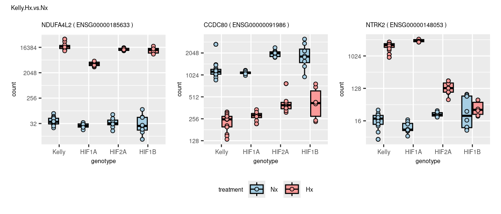
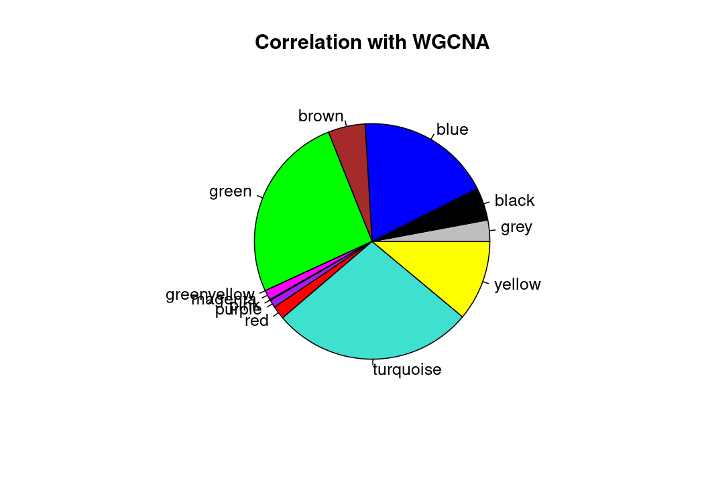
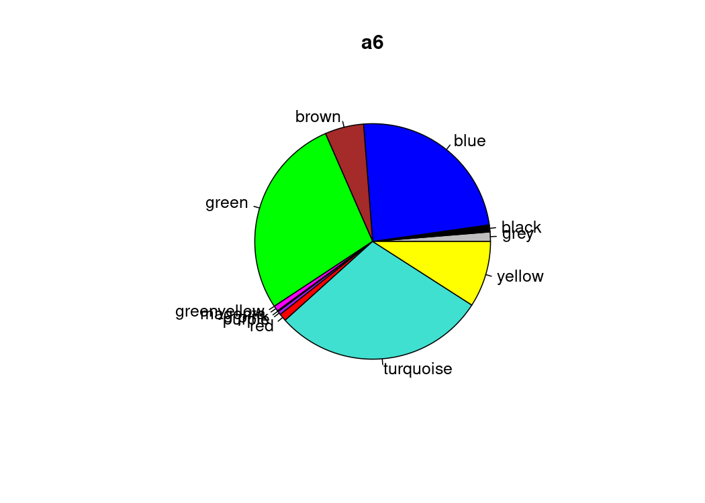
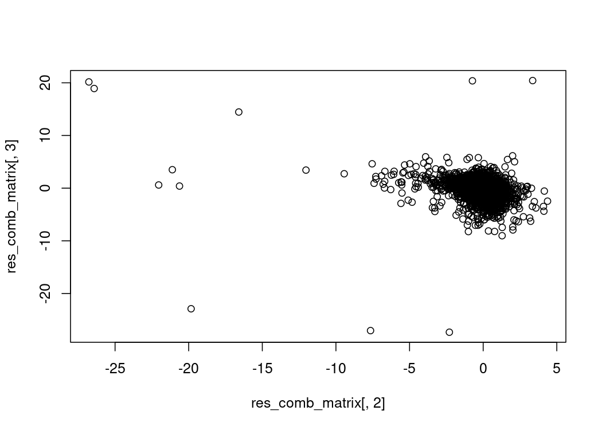
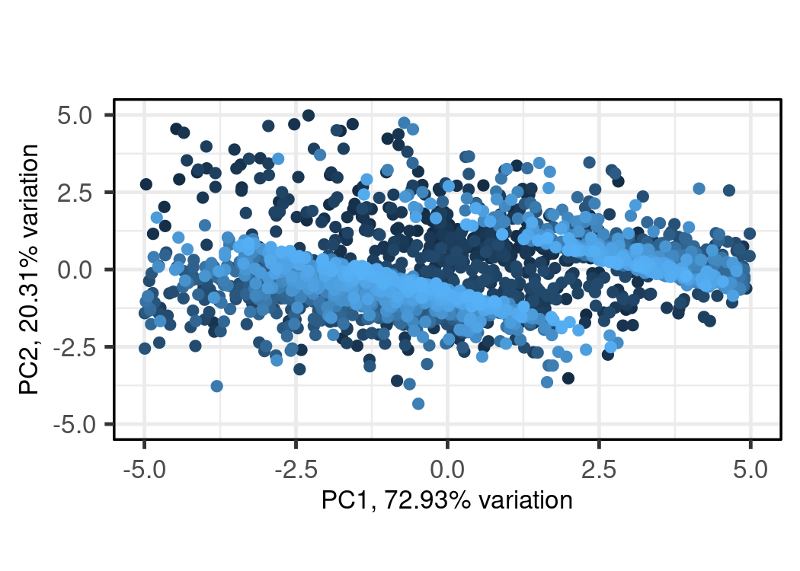

DGE
================
Kelterborn
2024-03-20

- [0. Load](#0-load)
  - [- Load R librarys](#--load-r-librarys)
  - [- Load dds](#--load-dds)
  - [- functions](#--functions)
- [1. Make results](#1-make-results)
  - [-Plot example counts](#-plot-example-counts)
- [2. Data Dive](#2-data-dive)
  - [Colour sheme](#colour-sheme)
  - [Volcanos](#volcanos)
  - [Overlaps (Venn)](#overlaps-venn)
  - [Heatmaps](#heatmaps)
  - [Cluster results](#cluster-results)
  - [GO terms](#go-terms)

# 0. Load

## - Load R librarys

## - Load dds

## - functions

# 1. Make results

#### (Advanced results troubleshooting)

<figure>

<figcaption aria-hidden="true">Contrasts_overview</figcaption>
</figure>

### -Generate toplist

    ## design

    ## ~experiment + genotype + treatment + genotype:treatment

    ## cutoffs
    ## differential expressed: p=0.05,bM=10,l2FC=1
    ## top genes:              p=0.01,bM=100,l2FC=2

|                            | all.DEGs | top.DEGs |
|:---------------------------|---------:|---------:|
| deg_Hif1a.Hx.vs.Nx         |     5375 |      778 |
| deg_Hif2a.Hx.vs.Nx         |     2927 |      424 |
| deg_Hif1b.Hx.vs.Nx         |     1710 |      259 |
| deg_Kelly.Hx.vs.Nx         |     4778 |      722 |
| deg_Nx.Hif1a.vs.Kelly      |      204 |       13 |
| deg_Nx.Hif2a.vs.Kelly      |      509 |       50 |
| deg_Nx.Hif1b.vs.Kelly      |      610 |       46 |
| deg_Hx.Hif1a.vs.Kelly      |      805 |       47 |
| deg_Hx.Hif2a.vs.Kelly      |     2280 |      264 |
| deg_Hx.Hif1b.vs.Kelly      |     3690 |      417 |
| deg_Hx.Hif2a.vs.Hif1a      |     3664 |      475 |
| deg_Hx.Hif1b.vs.Hif1a      |     4359 |      500 |
| deg_Hx.Hif1b.vs.Hif2a      |     1737 |      181 |
| deg_Hif1aHxNx.vs.KellyHxNx |      646 |       42 |
| deg_Hif2aHxNx.vs.KellyHxNx |     2101 |      225 |
| deg_Hif1bHxNx.vs.KellyHxNx |     3478 |      337 |
| deg_Hx.Hif1b.vs.Hif12a     |     2307 |      153 |
| deg_Hx.Kelly.vs.allHIFs    |     1281 |      108 |
| deg_Hx.vs.Nx               |     3071 |      389 |

## -Plot example counts

<!-- --><!-- --><!-- --><!-- --><!-- --><!-- --><!-- --><!-- --><!-- --><!-- --><!-- --><!-- --><!-- --><!-- --><!-- --><!-- --><!-- --><!-- --><!-- -->

|                 | symbol  | baseMean | log2FoldChange |    lfcSE |       stat |    pvalue |      padj |
|:----------------|:--------|---------:|---------------:|---------:|-----------:|----------:|----------:|
| ENSG00000234964 | FABP5P7 | 37.06925 |     -0.2486854 | 4.846331 | -0.0513142 | 0.9590752 | 0.9855481 |

<!-- -->

# 2. Data Dive

## Colour sheme

## Volcanos

### Draw Vulcanos


### (continuous Vulcanos)

``` r
# gradient is fixed to padj = y-axis

# Vulcano
lcol="grey20"
xlim=10
ylim=300
n <- "Kelly.Hx.vs.Nx"
res <- results_list[[n]]
l <- length(res)

res_shrink <- lfcShrink(dds, res=res, type="ashr")
res_shrink$symbol <- res$symbol

# remove nas
res <- res[!is.na(res$padj),]
res <- res[!is.na(res$log2FoldChange),]

# rename genes
rownames(res) <- res$symbol

# change shape of outliers
shape <- ifelse(abs(res$log2FoldChange) > xlim, 18,
                ifelse(res$padj < 10^-ylim,18,16))
summary(is.na(shape))

# shape[is.na(shape)] <- 2
names(shape)[shape == 18] <- 'out of scale'
names(shape)[shape == 16] <- 'in range'

# move outliers to coord. max.
res$log2FoldChange[res$log2FoldChange > xlim] <- xlim
res$log2FoldChange[res$log2FoldChange < -xlim] <- -xlim
res$padj[res$padj < 10^-ylim] <- 10^-ylim
summary(res$padj < 10^-ylim)

 p1 <- EnhancedVolcano(res,
    lab = res$symbol,
    x = 'log2FoldChange',
    y = 'padj',
    pCutoff = 10^(-50),
    FCcutoff = 2,
    xlim = c(-xlim, xlim),
    pointSize = c(ifelse(res$log2FoldChange>2, 8, 1)),
    labSize = 6.0,
    shape = c(6, 6, 19, 16),
    title = "DESeq2 results",
    subtitle = "Differential expression",
    caption = bquote(~Log[2]~ "fold change cutoff, 2; p-value cutoff, 10e-4"),
    legendPosition = "right",
    legendLabSize = 14,
    colAlpha = 0.9,
    colGradient = c('red3', 'royalblue'),
    drawConnectors = TRUE,
    hline = c(10e-8),
    widthConnectors = 0.5)

  p1

ev_f <- EnhancedVolcano(res,
    x = 'log2FoldChange',
    y = 'padj',
    lab = res$symbol,
    labSize = 1.5,
    drawConnectors = TRUE,
    boxedLabels = TRUE,
    widthConnectors = 0.5,
    colConnectors = lcol,
    max.overlaps = 17,
    colGradient = c('red3', 'royalblue'),
    xlim = c(-xlim, xlim),
    ylim = c(0, ylim),
    ylab = "Padj (-log10)",
    title = n,
    subtitle = paste("DE genes:",l),
    # sub = "SVF",

    FCcutoff = 2,
    # pointSize = c(ifelse(rownames(res_WT_D_vs.WT_BL) %in% rownames(top_WT_BL_vs.pcry_BL), 8, 1)),
    legendLabels=c('Not sig.','|L2F| > 2.5','p-adj < 0.05',
                   'p-adj & L2F'),
    legendPosition = 'bottom',
    legendLabSize = 8,
    legendIconSize = 2.0,
    axisLabSize = 8,
    titleLabSize = 8,
    subtitleLabSize = 8,
    captionLabSize = 8,
    caption = {}
   )

ev_f
```

### (prepare data)

### (simple volcano (full))

#### (check cutoff)

## Overlaps (Venn)

### - Hif1a

    ## [1] "Element=7 (582) --> a3(582)"


    ## Kelly.Hx.vs.Nx

|                 |  baseMean | log2FoldChange |     lfcSE |      stat | pvalue | padj | symbol  |
|:----------------|----------:|---------------:|----------:|----------:|-------:|-----:|:--------|
| ENSG00000186469 |  3985.219 |       1.871068 | 0.0463703 |  40.35058 |      0 |    0 | GNG2    |
| ENSG00000073060 |  5842.737 |       1.816965 | 0.0359811 |  50.49780 |      0 |    0 | SCARB1  |
| ENSG00000175274 |  5516.339 |       1.550996 | 0.0492065 |  31.52014 |      0 |    0 | TP53I11 |
| ENSG00000100285 | 19384.742 |      -1.336237 | 0.0463212 | -28.84723 |      0 |    0 | NEFH    |
| ENSG00000261236 |  3538.555 |      -1.846348 | 0.0515305 | -35.83016 |      0 |    0 | BOP1    |
| ENSG00000132382 |  3219.086 |      -1.804490 | 0.0527847 | -34.18584 |      0 |    0 | MYBBP1A |
| ENSG00000179222 | 10596.156 |       1.743256 | 0.0392303 |  44.43642 |      0 |    0 | MAGED1  |
| ENSG00000189241 |  5563.219 |       1.751909 | 0.0302608 |  57.89376 |      0 |    0 | TSPYL1  |
| ENSG00000276781 |  7410.494 |      -1.971017 | 0.0467230 | -42.18513 |      0 |    0 | CHGA    |

    ## Hif1a.Hx.vs.Nx

|                 |  baseMean | log2FoldChange |     lfcSE |      stat | pvalue | padj | symbol  |
|:----------------|----------:|---------------:|----------:|----------:|-------:|-----:|:--------|
| ENSG00000186469 |  3985.219 |       2.616306 | 0.0517597 |  50.54713 |      0 |    0 | GNG2    |
| ENSG00000073060 |  5842.737 |       2.417215 | 0.0399836 |  60.45515 |      0 |    0 | SCARB1  |
| ENSG00000175274 |  5516.339 |       2.413886 | 0.0546302 |  44.18593 |      0 |    0 | TP53I11 |
| ENSG00000100285 | 19384.742 |      -2.303962 | 0.0514996 | -44.73749 |      0 |    0 | NEFH    |
| ENSG00000261236 |  3538.555 |      -2.473314 | 0.0574869 | -43.02397 |      0 |    0 | BOP1    |
| ENSG00000132382 |  3219.086 |      -2.417144 | 0.0588870 | -41.04713 |      0 |    0 | MYBBP1A |
| ENSG00000179222 | 10596.156 |       2.243954 | 0.0435825 |  51.48747 |      0 |    0 | MAGED1  |
| ENSG00000189241 |  5563.219 |       2.270738 | 0.0336066 |  67.56821 |      0 |    0 | TSPYL1  |
| ENSG00000276781 |  7410.494 |      -2.229218 | 0.0519006 | -42.95165 |      0 |    0 | CHGA    |


    ## [1] "Element=12 (31) --> a4(31)"
    ## [1] "Element=14 (582) --> a6(582)"
    ## [1] "Element=16 (10) --> a8(10)"
    ## [1] "Element=17 (664) --> a9(664)"
    ## [1] "Element=19 (186) --> a11(186)"
    ## [1] "Element=20 (109) --> a12(109)"
    ## [1] "Element=22 (1282) --> a14(1282)"
    ## [1] "Element=23 (3206) --> a15(3206)"


    ## compare results with contrast vsvs (Hif1a Hx vs. Nx  VS.  Kelly Hx vs. Nx


    ## [1] "Element=7 (27) --> a2(27)"
    ## [1] "Element=8 (577) --> a3(577)"
    ## [1] "Element=9 (14) --> a5(14)"
    ## [1] "Element=10 (28) --> a6(28)"


|                 | baseMean | log2FoldChange |     lfcSE |     stat |    pvalue |      padj | symbol |
|:----------------|---------:|---------------:|----------:|---------:|----------:|----------:|:-------|
| ENSG00000105880 |  294.122 |      0.2112551 | 0.0844321 | 2.502071 | 0.0123469 | 0.0187694 | DLX5   |

|                 | baseMean | log2FoldChange |     lfcSE |     stat | pvalue | padj | symbol |
|:----------------|---------:|---------------:|----------:|---------:|-------:|-----:|:-------|
| ENSG00000105880 |  294.122 |        1.89263 | 0.0937476 | 20.18858 |      0 |    0 | DLX5   |


    ## [1] "Element=7 (1624) --> a1(1624)"
    ## [1] "Element=8 (75) --> a2(75)"
    ## [1] "Element=9 (301) --> a3(301)"
    ## [1] "Element=10 (49) --> a4(49)"
    ## [1] "Element=11 (239) --> a5(239)"
    ## [1] "Element=12 (279) --> a6(279)"
    ## [1] "Element=13 (79) --> a7(79)"

### (- Hif2a)

    ## Hif2a

<!-- -->

    ## [1] "Element=12 (164) --> a4(164)"
    ## [1] "Element=14 (328) --> a6(328)"
    ## [1] "Element=16 (23) --> a8(23)"
    ## [1] "Element=17 (2373) --> a9(2373)"
    ## [1] "Element=19 (73) --> a11(73)"
    ## [1] "Element=20 (230) --> a12(230)"
    ## [1] "Element=22 (663) --> a14(663)"
    ## [1] "Element=23 (1610) --> a15(1610)"

<!-- --><!-- --><!-- -->

### (- Hif1b)

    ## Hif1b

<!-- -->

    ## [1] "Element=12 (316) --> a4(316)"
    ## [1] "Element=14 (201) --> a6(201)"
    ## [1] "Element=16 (20) --> a8(20)"
    ## [1] "Element=17 (3201) --> a9(3201)"
    ## [1] "Element=19 (38) --> a11(38)"
    ## [1] "Element=20 (205) --> a12(205)"
    ## [1] "Element=22 (429) --> a14(429)"
    ## [1] "Element=23 (817) --> a15(817)"

<!-- --><!-- --><!-- -->

### (- overlap)

    ## overlap of overlaps

<!-- -->

    ## [1] "Element=7 (29) --> a1(29)"
    ## [1] "Element=8 (1) --> a2(1)"
    ## [1] "Element=9 (55) --> a3(55)"
    ## [1] "Element=10 (9) --> a4(9)"
    ## [1] "Element=11 (2) --> a5(2)"
    ## [1] "Element=12 (129) --> a6(129)"
    ## [1] "Element=13 (196) --> a7(196)"

    ##   overlap     gene
    ## 1      a1 SERPINI1
    ## 2      a2    SPRY4
    ## 3      a3      KDR
    ## 4      a4   HS3ST1
    ## 5      a5   H2AC19
    ## 6      a6  CYP26B1
    ## 7      a7    PCGF2

<!-- -->

### (- other)

### Compare Results 1 2 3

#### Vulcano lists

#### WGCNA RES1,2,3


### Compare KO

``` r
cat("Results 3 of Hif1a, Hif2a, Hif1b")
```

    ## Results 3 of Hif1a, Hif2a, Hif1b

``` r
names(deg_genes_list)
```

    ##  [1] "deg_Hif1a.Hx.vs.Nx"         "deg_Hif2a.Hx.vs.Nx"        
    ##  [3] "deg_Hif1b.Hx.vs.Nx"         "deg_Kelly.Hx.vs.Nx"        
    ##  [5] "deg_Nx.Hif1a.vs.Kelly"      "deg_Nx.Hif2a.vs.Kelly"     
    ##  [7] "deg_Nx.Hif1b.vs.Kelly"      "deg_Hx.Hif1a.vs.Kelly"     
    ##  [9] "deg_Hx.Hif2a.vs.Kelly"      "deg_Hx.Hif1b.vs.Kelly"     
    ## [11] "deg_Hx.Hif2a.vs.Hif1a"      "deg_Hx.Hif1b.vs.Hif1a"     
    ## [13] "deg_Hx.Hif1b.vs.Hif2a"      "deg_Hif1aHxNx.vs.KellyHxNx"
    ## [15] "deg_Hif2aHxNx.vs.KellyHxNx" "deg_Hif1bHxNx.vs.KellyHxNx"
    ## [17] "deg_Hx.Hif1b.vs.Hif12a"     "deg_Hx.Kelly.vs.allHIFs"   
    ## [19] "deg_Hx.vs.Nx"

``` r
input_list <- deg_genes_list[c("deg_Hif1aHxNx.vs.KellyHxNx","deg_Hif2aHxNx.vs.KellyHxNx","deg_Hif1bHxNx.vs.KellyHxNx")]
plt <- venn.diagram(
    x = input_list,
    category.names = paste(names(input_list),"\n(",input_list %>% summary() %>% .[c(1:length(input_list))],")",sep=""),
    force.unique = TRUE, na = "remove",
    filename = NULL,
    main = "Hif1a Hx-Nx vs. Kelly Hx-Nx", main.fontface = "bold",
    lwd = 2,
    lty = 'blank',
    fill = colors[c(3,5,7)],
    cat.col=c(colors[c(4,6,8)]),
    cat.fontface = "bold")

grid.newpage()
grid.draw(plt)
```

<!-- -->

``` r
# plot example counts
overlaps <- calculate.overlap(input_list)
overlaps <- overlaps[order(names(overlaps))]
names(overlaps)
```

    ## [1] "a1" "a2" "a3" "a4" "a5" "a6" "a7"

``` r
getVennElements(plt)
```

    ## [1] "Element=7 (207) --> a1(207)"
    ## [1] "Element=8 (92) --> a2(92)"
    ## [1] "Element=9 (524) --> a3(524)"
    ## [1] "Element=10 (162) --> a4(162)"
    ## [1] "Element=11 (185) --> a5(185)"
    ## [1] "Element=12 (1300) --> a6(1300)"
    ## [1] "Element=13 (1831) --> a7(1831)"

``` r
# plot each 1 gene
goi <- sapply(overlaps,"[[",1) %>% .[order(names(.))]
 
data.frame(overlap = names(goi),
           gene = mcols(dds)[goi,"symbol"])
```

    ##   overlap    gene
    ## 1      a1   BNIP3
    ## 2      a2 FAM162A
    ## 3      a3  CLSTN2
    ## 4      a4  PFKFB3
    ## 5      a5    PDK1
    ## 6      a6 ARHGEF6
    ## 7      a7    TNXB

``` r
plotCounts_SK(goi)
```

<!-- -->

#### WGCNA KOs


#### WGCNA overlapped KOs

    ## [1] "a1" "a2" "a3" "a4" "a5" "a6" "a7"



#### -Remove log files

## Heatmaps

### -Compare results

``` r
# https://slowkow.com/notes/pheatmap-tutorial/
# Complex heatmap https://github.com/jokergoo/ComplexHeatmap/

# combined results
pick_genes <- str_detect(names(results_list),pattern="Hif1aHxNx")
pick_results <- c(4,1,5,8,14)
names(results_list)[pick_results]
```

    ## [1] "Kelly.Hx.vs.Nx"         "Hif1a.Hx.vs.Nx"         "Nx.Hif1a.vs.Kelly"     
    ## [4] "Hx.Hif1a.vs.Kelly"      "Hif1aHxNx.vs.KellyHxNx"

``` r
pick_genes <- topgenes_list[pick_genes] %>% unlist() %>% unname() %>% unique()
pick_genes <- lapply(topgenes_list,'[',1:10) %>% unlist() %>% unname() %>% unique()
pick_genes <- c(lapply(res_hif1a,'[',1:5),
                lapply(res_1_ab,'[',1:5),
                lapply(res_2_ab,'[',1:5)) %>% unlist() %>% unname() %>% unique()
pick_genes <- res_hif1a[[1]][1:30]
pick_genes <- lapply(res3_list,'[',1:10) %>% unlist() %>% unname() %>% unique()
pick_genes <- res3_list[[1]][1:30]


res_comb <- res.Kelly.Hx.vs.Nx[pick_genes,c(7,1)] %>% data.frame(.)
res_comb <- cbind(res_comb,lapply(results_list[pick_results],function(i) i[pick_genes,2]) %>% do.call(cbind,.) %>% data.frame(.))
res_comb_matrix <- as.matrix(res_comb[,c(-1,-2)])
res_comb_matrix[res_comb_matrix<1 & res_comb_matrix>-1] <- 0
rownames(res_comb_matrix) <- res_comb$symbol

# adapt colors to uniform breaks
mat_breaks <- quantile_breaks(res_comb_matrix, n = 20)
vir_cols <- viridis(length(mat_breaks))
vir_cols[9] <- "white"
hm_cols <- colorRamp2(mat_breaks,vir_cols)

hm <- Heatmap(res_comb_matrix,
        col = hm_cols,
        column_title = "Compare results",
        na_col = "black",
        row_names_gp = gpar(fontsize = 10)
        ) 
hm
```

<!-- -->

``` r
plotCounts_SK(goi=pick_genes[1:3])
```

<!-- -->

``` r
patchwork::wrap_elements((c_graphic))
```

<!-- -->

### -Compare KOs

``` r
pick_genes <- topgenes_list[c("top_Hif1aHxNx.vs.KellyHxNx","top_Hif2aHxNx.vs.KellyHxNx","top_Hif1bHxNx.vs.KellyHxNx")] %>% unlist()

pick_results <- c("Hif1aHxNx.vs.KellyHxNx","Hif2aHxNx.vs.KellyHxNx","Hif1bHxNx.vs.KellyHxNx")

res_comb <- res.Kelly.Hx.vs.Nx[pick_genes,c(7,1)] %>% data.frame(.)
res_comb <- cbind(res_comb,lapply(results_list[pick_results],function(i) i[pick_genes,2]) %>% do.call(cbind,.) %>% data.frame(.))
res_comb_matrix <- as.matrix(res_comb[,c(-1,-2)])
res_comb_matrix[res_comb_matrix<1 & res_comb_matrix>-1] <- 0
rownames(res_comb_matrix) <- res_comb$symbol

# adapt colors to uniform breaks
mat_breaks <- quantile_breaks(res_comb_matrix, n = 20)
vir_cols <- viridis(length(mat_breaks))
vir_cols[which(unname(mat_breaks) == 0)] <- "white"

hm_cols <- colorRamp2(mat_breaks,vir_cols)

hm <- Heatmap(res_comb_matrix,
        col = hm_cols,
        column_title = "Compare results",
        na_col = "black",
        row_names_gp = gpar(fontsize = 10),
        cluster_rows = TRUE,
        ) 
hm
```

### -Top genes

Complex Heatmap:
<https://jokergoo.github.io/ComplexHeatmap-reference/book/>

``` r
ht_opt$fast_hclust = TRUE

# Choose genes

interaction_top <- topgenes_list[c("top_Hif1aHxNx.vs.KellyHxNx","top_Hif2aHxNx.vs.KellyHxNx","top_Hif1bHxNx.vs.KellyHxNx")]

interaction_top_ol <- calculate.overlap(interaction_top)


pick_genes <- lapply(interaction_top_ol,'[',1:10) %>% unlist() %>% unname() %>% unique()
pick_genes <- pick_genes[!is.na(pick_genes)]


# Get counts, with summarized replicates
dds_heat <- collapseReplicates(dds, dds$condition,dds$names)
vsd <- vst(dds_heat, blind=TRUE) #Variance stabilized transformation
ntd <- normTransform(dds_heat)
# rld <- rlog(dds_heat)
mat <- assay(vsd)
# mat <- assay(ntd)
# mat <- assay(rld)

# reduce to picked genes and convert to matrix
mat <- mat[pick_genes,c(1,3,5,7,2,4,6,8)] %>% as.matrix()

# Get WGCNA colors
WGCNA <- mcols(dds)[rownames(mat),"colors"] %>% as.character()

# WGCNA[is.na(WGCNA)] <- 'grey'

rownames(mat) <- mcols(dds)[pick_genes,"symbol"]
names(WGCNA) <- rownames(mat)

# adapt colors to uniform breaks
mat_breaks <- quantile_breaks(mat, n = 20)
vir_cols <- viridis(length(mat_breaks))
# vir_cols[9] <- "white"
hm_cols <- colorRamp2(mat_breaks,vir_cols)


hm <- Heatmap(mat,
  ## heatmap colors
      #   col = hm_cols,
      na_col = "black",
      
  ## columns
      column_title = "TOP genes",
      cluster_columns = FALSE,
      # column_km = 4,
      column_split = c(rep("Hx", 4),rep("Nx", 4)),
      # column_names_gp = gpar(col = c("lightcoral","skyblue1"), fontsize = c(10)),
      top_annotation = HeatmapAnnotation(foo = anno_block(gp = gpar(fill = c("lightcoral","skyblue1")),
        labels = c("Nx", "Hx"), 
        labels_gp = gpar(col = "white", fontsize = 10))),
  ## rows
      row_names_gp = gpar(fontsize = 10),
      cluster_rows = TRUE,
      clustering_method_rows = "centroid",
      # clustering_distance_rows = "kendall",
      row_km = 6,
 #  right_annotation = rowAnnotation(WGCNA = WGCNA, col=list(WGCNA=WGCNA))
       )
hm
```

<!-- -->

#### (heatmap test)

``` r
list(bar = c("a" = "red", "b" = "green", "c" = "blue"))

col_fun = colorRamp2(c(0, 5, 10), c("blue", "white", "red"))
ha = HeatmapAnnotation(foo = 1:10, col = list(foo = col_fun))

anno_col <- as.data.frame(colData(dds_heat)[,c("treatment","genotype")])
anno_colors <- list(treatment = c("lightcoral","skyblue1"),
                    genotype = c("grey","seagreen3","turquoise3","tan2"))

names(anno_colors$treatment) <- levels(anno_col$treatment)
names(anno_colors$genotype) <- levels(anno_col$genotype)


hm <- Heatmap(mat,
        col = hm_cols,
        column_title = "Compare results",
        na_col = "black",
        row_names_gp = gpar(fontsize = 10)
        ) 
hm

pheatmap(mat,
         clustering_distance_rows=sampleDists,
         clustering_distance_cols=sampleDists,
         annotation_col=anno_col,
         annotation_colors = anno_colors,
         show_colnames     = FALSE,
         col=viridis(20),
         cutree_rows = 8,
         cutree_cols = 8,
         fontsize_row = 5)
```

## Cluster results

``` r
pick_genes <- deg_genes_list[c("deg_Hif1aHxNx.vs.KellyHxNx", "deg_Hif2aHxNx.vs.KellyHxNx", "deg_Hif1bHxNx.vs.KellyHxNx")] %>% unlist() %>% unname() %>% unique()

# "deg_Kelly.Hx.vs.Nx",

("ENSG00000123095.1" == pick_genes) %>% summary()
```

    ##    Mode   FALSE 
    ## logical    4301

``` r
pick_results <- c("Kelly.Hx.vs.Nx","Hif1aHxNx.vs.KellyHxNx","Hif2aHxNx.vs.KellyHxNx","Hif1bHxNx.vs.KellyHxNx")
res_comb <- res.Kelly.Hx.vs.Nx[pick_genes,c(7,1)]
res_comb$gene_id <- rownames(res_comb)
res_comb <- res_comb %>% data.frame(.)
res_comb <- cbind(res_comb,lapply(results_list[pick_results],function(i) i[pick_genes,2]) %>% do.call(cbind,.) %>% data.frame(.))
dim(res_comb)
```

    ## [1] 4301    7

``` r
rownames(res_comb) <- mcols(dds)[res_comb$gene_id,"ens.symbol"]
res_comb_matrix <- as.matrix(res_comb[,c(-1,-2,-3)])

# res_comb_matrix[res_comb_matrix<1 & res_comb_matrix>-1] <- 0

plot(res_comb_matrix[,"Hif1aHxNx.vs.KellyHxNx"],res_comb_matrix[,"Hif2aHxNx.vs.KellyHxNx"])
```

<!-- -->

``` r
g1 <- ggplot(res_comb_matrix,aes(x=Hif1aHxNx.vs.KellyHxNx,y=Hif2aHxNx.vs.KellyHxNx, color=Kelly.Hx.vs.Nx)) +
  geom_point(alpha = 0.3) +
  geom_hline(yintercept=c(-1,1)) +
  geom_vline(xintercept=c(-1,1)) +
 scale_color_viridis_c(option = 'D',limits = c(-2, 2)) +
 coord_cartesian(xlim = c(-5, 5),ylim = c(-5,5))

g2 <- ggplot(res_comb_matrix,aes(x=Hif1aHxNx.vs.KellyHxNx,y=Hif2aHxNx.vs.KellyHxNx, color=Hif1bHxNx.vs.KellyHxNx)) +
  geom_point(alpha = 0.3) +
  geom_hline(yintercept=c(-1,1)) +
  geom_vline(xintercept=c(-1,1)) +
 scale_color_viridis_c(option = 'D',limits = c(-2, 2)) +
 coord_cartesian(xlim = c(-5, 5),ylim = c(-5,5))

g1 + g2 + plot_layout(guides = "collect", axis_titles="collect", axes = 'collect') & plot_annotation(title = "all hypoxia genes") & 
  theme(legend.position = 'bottom')
```

<!-- -->

``` r
# Only Hif1a Hif2a Genes

pick_genes <- deg_genes_list[c("deg_Hif1aHxNx.vs.KellyHxNx", "deg_Hif2aHxNx.vs.KellyHxNx")] %>% unlist() %>% unname() %>% unique()
pick_results <- c("Kelly.Hx.vs.Nx","Hif1aHxNx.vs.KellyHxNx","Hif2aHxNx.vs.KellyHxNx","Hif1bHxNx.vs.KellyHxNx")
res_comb <- res.Kelly.Hx.vs.Nx[pick_genes,c(7,1)]
res_comb$gene_id <- rownames(res_comb)
res_comb <- res_comb %>% data.frame(.)
res_comb <- cbind(res_comb,lapply(results_list[pick_results],function(i) i[pick_genes,2]) %>% do.call(cbind,.) %>% data.frame(.))
dim(res_comb)
```

    ## [1] 2470    7

``` r
rownames(res_comb) <- mcols(dds)[res_comb$gene_id,"ens.symbol"]
res_comb_matrix_12 <- as.matrix(res_comb[,c(-1,-2,-3)])

# res_comb_matrix[res_comb_matrix<1 & res_comb_matrix>-1] <- 0

plot(res_comb_matrix_12[,"Hif1aHxNx.vs.KellyHxNx"],res_comb_matrix_12[,"Hif2aHxNx.vs.KellyHxNx"])
```

<!-- -->

``` r
g1 <- ggplot(res_comb_matrix_12,aes(x=Hif1aHxNx.vs.KellyHxNx,y=Hif2aHxNx.vs.KellyHxNx, color=Kelly.Hx.vs.Nx)) +
  geom_point(alpha = 0.3) +
  geom_hline(yintercept=c(-1,1)) +
  geom_vline(xintercept=c(-1,1)) +
 scale_color_viridis_c(option = 'D',limits = c(-2, 2)) +
 coord_cartesian(xlim = c(-5, 5),ylim = c(-5,5))

g2 <- ggplot(res_comb_matrix_12,aes(x=Hif1aHxNx.vs.KellyHxNx,y=Hif2aHxNx.vs.KellyHxNx, color=Hif1bHxNx.vs.KellyHxNx)) +
  geom_point(alpha = 0.3) +
  geom_hline(yintercept=c(-1,1)) +
  geom_vline(xintercept=c(-1,1)) +
 scale_color_viridis_c(option = 'D',limits = c(-2, 2)) +
 coord_cartesian(xlim = c(-5, 5),ylim = c(-5,5))

g1 + g2 + plot_layout(guides = "collect", axis_titles="collect", axes = 'collect') & plot_annotation(title = "all hypoxia genes") & 
  theme(legend.position = 'bottom')
```

<!-- -->

``` r
# Color according to category

keyvals <- ifelse(abs(res_comb_matrix_12[,"Hif1aHxNx.vs.KellyHxNx"]-res_comb_matrix_12[,"Hif2aHxNx.vs.KellyHxNx"]) < 1, "hotpink1",
            ifelse( (res_comb_matrix_12[,"Hif1aHxNx.vs.KellyHxNx"] > 1 & 
                     res_comb_matrix_12[,"Hif2aHxNx.vs.KellyHxNx"] < -1) |
                    (res_comb_matrix_12[,"Hif1aHxNx.vs.KellyHxNx"] < -1 & 
                     res_comb_matrix_12[,"Hif2aHxNx.vs.KellyHxNx"] > 1) , colors[8],
            ifelse( (res_comb_matrix_12[,"Hif1aHxNx.vs.KellyHxNx"] > 1 &               
                    (res_comb_matrix_12[,"Hif1aHxNx.vs.KellyHxNx"] > res_comb_matrix_12[,"Hif2aHxNx.vs.KellyHxNx"])) |
                    (res_comb_matrix_12[,"Hif1aHxNx.vs.KellyHxNx"] < -1 &               
                    (res_comb_matrix_12[,"Hif1aHxNx.vs.KellyHxNx"] < res_comb_matrix_12[,"Hif2aHxNx.vs.KellyHxNx"])),colors[6],
            ifelse( (res_comb_matrix_12[,"Hif2aHxNx.vs.KellyHxNx"] > 1 |
                    (res_comb_matrix_12[,"Hif2aHxNx.vs.KellyHxNx"] < -1 )),colors[4],  
    'grey'))) )
res_comb_12 <- data.frame(res_comb_matrix_12,keyvals)

# res_comb_matrix_12[,"Hif1aHxNx.vs.KellyHxNx"] > 1 & res_comb_matrix_12[,"Hif2aHxNx.vs.KellyHxNx"] > 1
    
keyvals[is.na(keyvals)] <- 'grey'
  names(keyvals)[keyvals == "hotpink1"] <- 'Hif1a & Hif2a'
  names(keyvals)[keyvals == colors[8]] <- 'anti Hif1a & Hif2a'
  names(keyvals)[keyvals == colors[6]] <- 'Hif1a'
  names(keyvals)[keyvals == colors[4]] <- 'Hif2a'

g3 <- ggplot(res_comb_matrix_12,aes(x=Hif1aHxNx.vs.KellyHxNx,y=Hif2aHxNx.vs.KellyHxNx, color=names(keyvals))) +
  geom_point(alpha = 0.3, show.legend = TRUE) +
  geom_hline(yintercept=c(-1,1)) +
  geom_vline(xintercept=c(-1,1)) +
  geom_abline(slope=1, intercept = 0, color="grey", linetype = 'dashed') +
  # geom_ribbon(aes(ymin = -1, ymax = +1), fill="grey") + 
  geom_abline(slope=1, intercept = -1) +
  geom_abline(slope=1, intercept = +1) +
  scale_color_manual(values = keyvals) + 
  coord_cartesian(xlim = c(-5, 5),ylim = c(-5,5))
g3
```

<!-- -->

``` r
g1 + g2 + plot_layout(guides = "collect", axis_titles="collect", axes = 'collect') & plot_annotation(title = "all hypoxia genes") & 
  theme(legend.position = 'bottom')
```

<!-- -->

### Corrplot

``` r
plot(res_comb_matrix[,2],res_comb_matrix[,3])
```

<!-- -->

``` r
M <- cor(res_comb_matrix)
corrplot::corrplot(M)
```

<!-- -->

### PCA of genes

``` r
res_comb_matrix_t <- t(res_comb_matrix_12)
p <- pca(res_comb_matrix_t, removeVar = 0.1)
biplot(p,
       xlim=c(-5,5),
       ylim=c(-5,5)
       )
```

<!-- -->

``` r
ggplot(p$rotated,aes(x=PC1,y=PC2, color=names(keyvals)))+
  geom_point(alpha = 0.3) +
  scale_color_manual(values = keyvals) + 
  coord_cartesian(xlim = c(-10, 8),ylim = c(-5,8))
```

<!-- -->

``` r
# bi <- biplot(p,x="PC3",y="PC1",
#     lab = p$metadata$experiment,
#     colby = 'condition',colkey = viridis(8),
#     hline = 0, vline = 0,
#     encircle = TRUE, encircleFill = TRUE,
#     labSize = 3, legendIconSize = 4.0,
#     legendPosition = 'bottom',
#     sizeLoadingsNames = 3,
#     axisLabSize = 10,
#     captionLabSize = 1)
```

#### UMAP

``` r
umap <- umap(res_comb_matrix_12)

df <- data.frame(x = umap$layout[,1],
                 y = umap$layout[,2])

ggplot(df, aes(x, y, color=names(keyvals))) +
  geom_point(alpha = 0.5) +
  scale_color_manual(values = keyvals)
```

<!-- -->

## GO terms

``` r
###################################### GO

interaction_top <- topgenes_list[c("top_Hif1aHxNx.vs.KellyHxNx","top_Hif2aHxNx.vs.KellyHxNx","top_Hif1bHxNx.vs.KellyHxNx")]
interaction_deg <- deg_genes_list[c("deg_Hif1aHxNx.vs.KellyHxNx","deg_Hif2aHxNx.vs.KellyHxNx","deg_Hif1bHxNx.vs.KellyHxNx")]

interaction_deg[[3]] <- interaction_deg[[3]][1:3000]

names(interaction_deg)
```

    ## [1] "deg_Hif1aHxNx.vs.KellyHxNx" "deg_Hif2aHxNx.vs.KellyHxNx"
    ## [3] "deg_Hif1bHxNx.vs.KellyHxNx"

``` r
interaction_deg_entrez_list <- list(Hif1a=mcols(dds)[interaction_deg[[1]],"entrezid"] %>% unlist() %>% unname(),
                                    Hif2a=mcols(dds)[interaction_deg[[2]],"entrezid"] %>% unlist() %>% unname(),
                                    Hif1b=mcols(dds)[interaction_deg[[3]],"entrezid"] %>% unlist() %>% unname()) %>% lapply(.,na.omit)


GO_1 <- enrichGO(interaction_deg[[1]],
                  keyType = "ENSEMBL",
                  ont = "ALL",
                  minGSSize = 15,
                  maxGSSize = 800,
                  pvalueCutoff = 0.05,
                  OrgDb = "org.Hs.eg.db",
                  pAdjustMethod = "fdr")
GO_1 <- simplify(GO_1)

GO_2 <- enrichGO(interaction_deg[[2]],
                  keyType = "ENSEMBL",
                  ont = "ALL",
                  minGSSize = 15,
                  maxGSSize = 800,
                  pvalueCutoff = 0.05,
                  OrgDb = "org.Hs.eg.db",
                  pAdjustMethod = "fdr")
GO_2 <- simplify(GO_2)

GO_3 <- enrichGO(interaction_deg[[3]],
                  keyType = "ENSEMBL",
                  ont = "ALL",
                  minGSSize = 15,
                  maxGSSize = 800,
                  pvalueCutoff = 0.05,
                  OrgDb = "org.Hs.eg.db",
                  pAdjustMethod = "fdr")
GO_3 <- simplify(GO_3)

barplot(GO_1, split = "ONTOLOGY", font.size = 6, showCategory = 10, title = "Hif1a") + facet_grid(ONTOLOGY~., scale="free") + scale_y_discrete(labels=function(x)  str_wrap(x, width=80)) + scale_fill_viridis() + theme(panel.grid.major.y = element_blank(), panel.background = element_rect(fill = NA), panel.ontop = TRUE, panel.grid.major.x = element_line(color = "white", size = 0.5, linetype = 1), panel.grid.minor.x = element_line(color = "white", size = 0.25, linetype = 1)) + scale_x_continuous(expand = c(0,0))
```

<!-- -->

``` r
barplot(GO_2, split = "ONTOLOGY", font.size = 6, showCategory = 10, title = "Hif2a") + facet_grid(ONTOLOGY~., scale="free") + scale_y_discrete(labels=function(x)  str_wrap(x, width=80)) + scale_fill_viridis() + theme(panel.grid.major.y = element_blank(), panel.background = element_rect(fill = NA), panel.ontop = TRUE, panel.grid.major.x = element_line(color = "white", size = 0.5, linetype = 1), panel.grid.minor.x = element_line(color = "white", size = 0.25, linetype = 1)) + scale_x_continuous(expand = c(0,0))
```

<!-- -->

``` r
barplot(GO_3, split = "ONTOLOGY", font.size = 6, showCategory = 10, title = "Hif1b") + facet_grid(ONTOLOGY~., scale="free") + scale_y_discrete(labels=function(x)  str_wrap(x, width=80)) + scale_fill_viridis() + theme(panel.grid.major.y = element_blank(), panel.background = element_rect(fill = NA), panel.ontop = TRUE, panel.grid.major.x = element_line(color = "white", size = 0.5, linetype = 1), panel.grid.minor.x = element_line(color = "white", size = 0.25, linetype = 1)) + scale_x_continuous(expand = c(0,0))
```

<!-- -->

``` r
godot1 <- dotplot(clusterProfiler::simplify(GO_1))+labs(title = "Hif1a")
godot2 <- dotplot(clusterProfiler::simplify(GO_2))+labs(title = "Hif2a")
godot3 <- dotplot(clusterProfiler::simplify(GO_3))+labs(title = "Hif1b")
godot1 + godot2 + godot3
```

<!-- -->

``` r
# Compare cluster
ck <- compareCluster(geneCluster = interaction_deg, fun = "enrichGO",
                  OrgDb = "org.Hs.eg.db",
                  keyType = "ENSEMBL",
                  ont = "ALL",
                  pvalueCutoff = 0.05,
                  pAdjustMethod = "fdr")

ck <- setReadable(ck, OrgDb = org.Hs.eg.db, )
head(ck)[1:7]
```

    ##                      Cluster ONTOLOGY         ID
    ## 1 deg_Hif1aHxNx.vs.KellyHxNx       BP GO:0007409
    ## 2 deg_Hif1aHxNx.vs.KellyHxNx       BP GO:0007411
    ## 3 deg_Hif1aHxNx.vs.KellyHxNx       BP GO:0097485
    ## 4 deg_Hif1aHxNx.vs.KellyHxNx       BP GO:0072006
    ## 5 deg_Hif1aHxNx.vs.KellyHxNx       BP GO:0061326
    ## 6 deg_Hif1aHxNx.vs.KellyHxNx       BP GO:0061005
    ##                                           Description GeneRatio   BgRatio
    ## 1                                        axonogenesis    30/459 483/21288
    ## 2                                       axon guidance    20/459 247/21288
    ## 3                          neuron projection guidance    20/459 247/21288
    ## 4                                 nephron development    16/459 167/21288
    ## 5                            renal tubule development    13/459 112/21288
    ## 6 cell differentiation involved in kidney development    10/459  63/21288
    ##         pvalue
    ## 1 2.489859e-07
    ## 2 4.614284e-07
    ## 3 4.614284e-07
    ## 4 7.116268e-07
    ## 5 8.988554e-07
    ## 6 9.057978e-07

``` r
dotplot(ck)
```

<!-- -->

``` r
dotplot(ck, showCategory=15)
```

<!-- -->

``` r
# KEGG
ckk <- compareCluster(geneCluster = interaction_deg, fun = "enrichKEGG", organism="hsa", pvalueCutoff=0.05)


hif1a_entrez <- mcols(dds)[interaction_deg[[1]],"entrezid"] %>% unlist() %>% unname() %>% unique()
hif1a_entrez <- hif1a_entrez[!is.na(hif1a_entrez)]

hif2a_entrez <- mcols(dds)[interaction_deg[[2]],"entrezid"] %>% unlist() %>% unname() %>% unique()
hif2a_entrez <- hif2a_entrez[!is.na(hif2a_entrez)]

hif1b_entrez <- mcols(dds)[interaction_deg[[3]],"entrezid"] %>% unlist() %>% unname() %>% unique()
hif1b_entrez <- hif1b_entrez[!is.na(hif1b_entrez)]

interaction_deg_entrez <- list(hif1a_entrez,hif2a_entrez,hif1b_entrez)

ek1 <- enrichKEGG(hif1a_entrez,organism="hsa", pvalueCutoff=0.05)
ek2 <- enrichKEGG(hif2a_entrez,organism="hsa", pvalueCutoff=0.05)
ek3 <- enrichKEGG(hif1b_entrez,organism="hsa", pvalueCutoff=0.05)

dotplot(ek1) + dotplot(ek2) + dotplot(ek3)
```

<!-- -->

``` r
# ckk <- compareCluster(geneCluster = interaction_deg_entrez, fun = "enrichKEGG", organism="hsa", pvalueCutoff=0.5)
```
