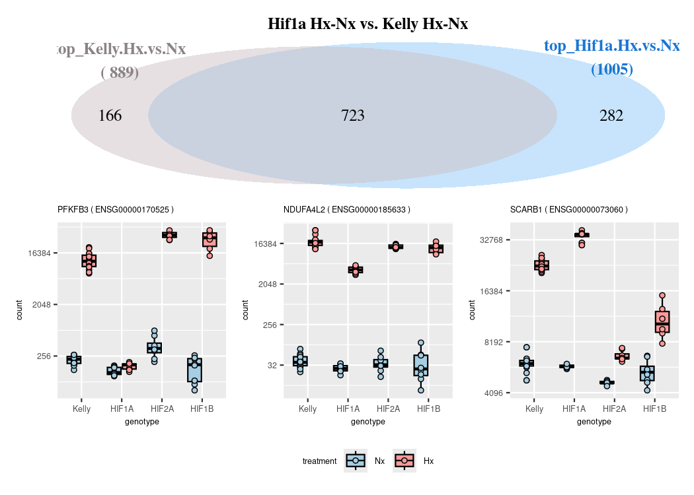
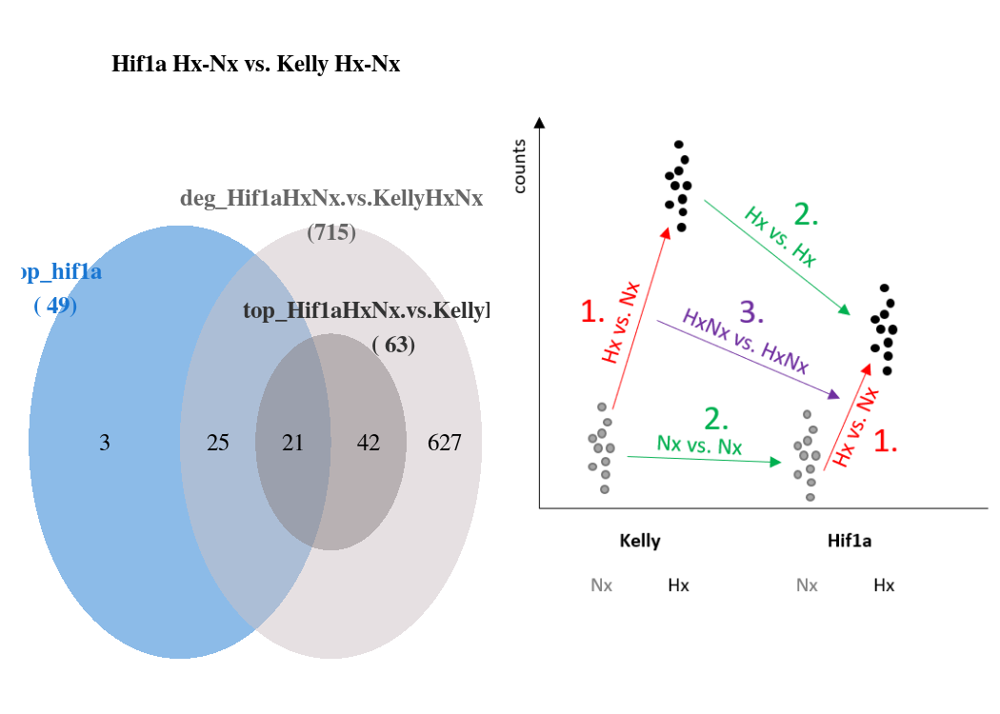
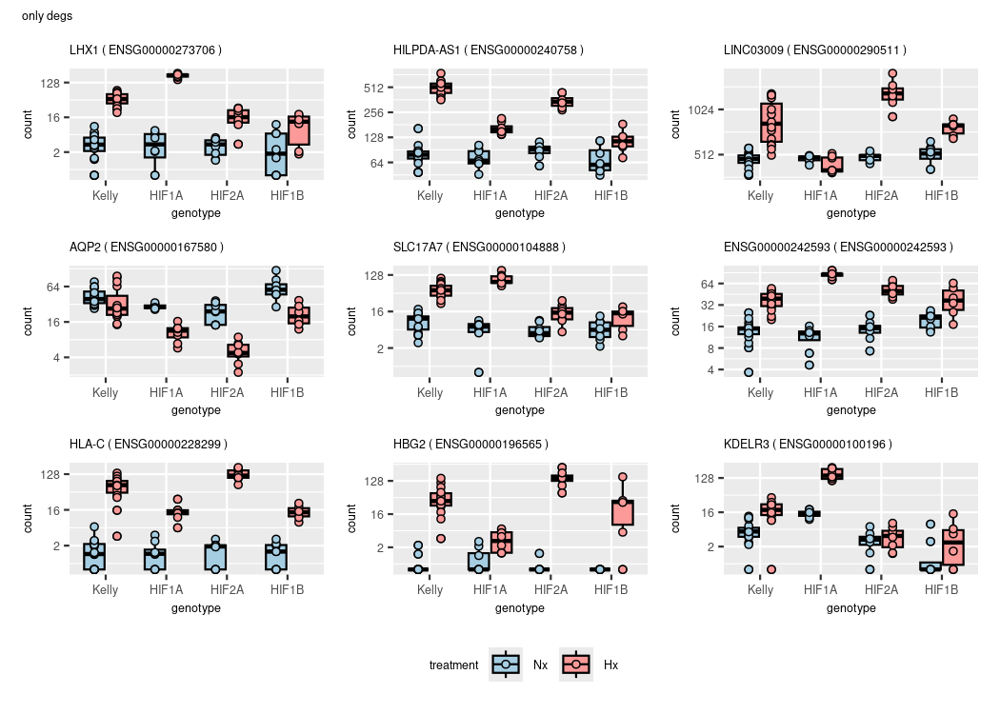
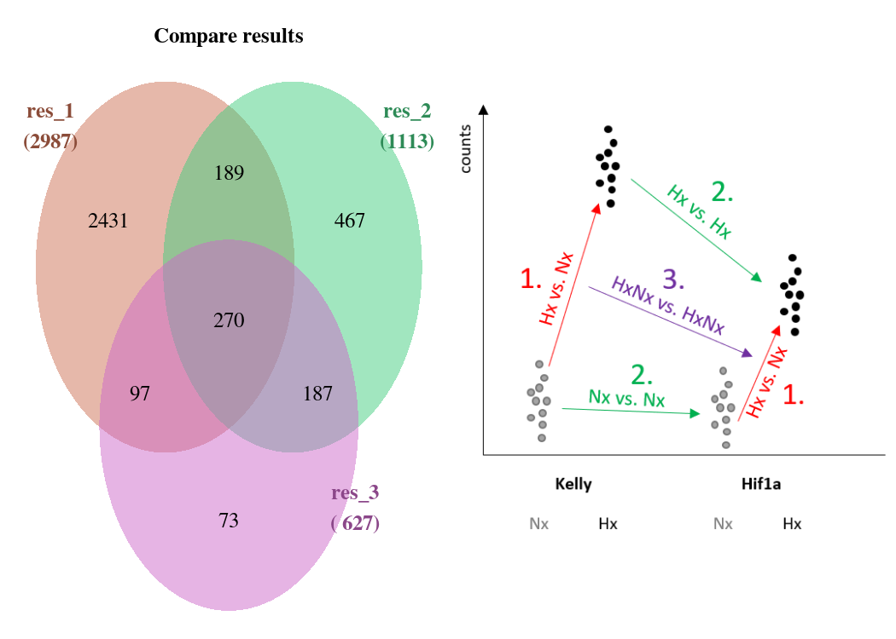
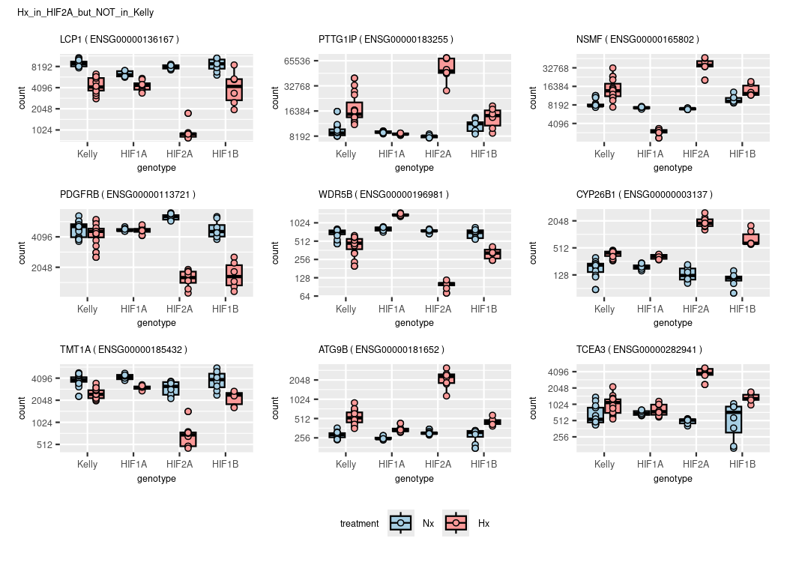

DGE
================
Kelterborn
2024-03-20

- [0. Load](#0-load)
  - [- Load R librarys](#--load-r-librarys)
  - [- dds](#--dds)
  - [- functions](#--functions)
- [1. Make results](#1-make-results)
  - [-Generate toplist](#-generate-toplist)
  - [-Plot example counts](#-plot-example-counts)
- [2. Data Dive](#2-data-dive)
  - [Colour sheme](#colour-sheme)
  - [Overlaps (Venn)](#overlaps-venn)
    - [- Hif1a](#--hif1a)
    - [- Hif2a](#--hif2a)
    - [- Hif1b](#--hif1b)
    - [- overlap](#--overlap)
    - [- other](#--other)
  - [Volcanos](#volcanos)
    - [Draw Vulcanos](#draw-vulcanos)
    - [(prepare data)](#prepare-data)
    - [(simple volcano (full))](#simple-volcano-full)

# 0. Load

## - Load R librarys

## - dds

## - functions

# 1. Make results

#### (Advanced results troubleshooting)

### -Generate toplist

    ## design

    ## ~genotype + treatment + genotype:treatment
    ## <environment: 0x5579c0009b38>

    ## cutoffs
    ## differential expressed: p=0.05,bM=10,l2FC=1
    ## top genes:              p=0.01,bM=100,l2FC=2

|                            | all.DEGs | top.DEGs |
|:---------------------------|---------:|---------:|
| deg_Hif1a.Hx.vs.Nx         |     6098 |      952 |
| deg_Hif2a.Hx.vs.Nx         |     3363 |      556 |
| deg_Hif1b.Hx.vs.Nx         |     1979 |      309 |
| deg_Kelly.Hx.vs.Nx         |     5300 |      862 |
| deg_Nx.Hif1a.vs.Kelly      |      283 |       29 |
| deg_Nx.Hif2a.vs.Kelly      |      660 |       80 |
| deg_Nx.Hif1b.vs.Kelly      |      951 |       55 |
| deg_Hx.Hif1a.vs.Kelly      |     1022 |       80 |
| deg_Hx.Hif2a.vs.Kelly      |     2505 |      346 |
| deg_Hx.Hif1b.vs.Kelly      |     5640 |      618 |
| deg_Hx.Hif2a.vs.Hif1a      |     4101 |      604 |
| deg_Hx.Hif1b.vs.Hif1a      |     6187 |      791 |
| deg_Hx.Hif1b.vs.Hif2a      |     3653 |      291 |
| deg_Hif1aHxNx.vs.KellyHxNx |      815 |       63 |
| deg_Hif2aHxNx.vs.KellyHxNx |     2557 |      305 |
| deg_Hif1bHxNx.vs.KellyHxNx |     3940 |      430 |
| deg_Hx.Hif1b.vs.Hif12a     |     4439 |      293 |
| deg_Hx.Kelly.vs.allHIFs    |     1567 |      151 |
| deg_Hx.vs.Nx               |     3539 |      491 |

## -Plot example counts

# 2. Data Dive

## Colour sheme

## Overlaps (Venn)

### - Hif1a

    ## [1] "Element=7 (682) --> a3(682)"

|                 |   baseMean | log2FoldChange |     lfcSE |       stat |    pvalue |      padj | symbol   |
|:----------------|-----------:|---------------:|----------:|-----------:|----------:|----------:|:---------|
| ENSG00000073060 | 11958.5958 |       1.932024 | 0.0581472 |  33.226438 | 0.0000000 | 0.0000000 | SCARB1   |
| ENSG00000186469 |  8085.8271 |       1.868578 | 0.0881975 |  21.186295 | 0.0000000 | 0.0000000 | GNG2     |
| ENSG00000132382 |  6908.7023 |      -1.877496 | 0.0861601 | -21.790778 | 0.0000000 | 0.0000000 | MYBBP1A  |
| ENSG00000117016 |  6871.5369 |      -1.775943 | 0.0952610 | -18.642909 | 0.0000000 | 0.0000000 | RIMS3    |
| ENSG00000189241 | 11177.4084 |       1.723613 | 0.0621241 |  27.744699 | 0.0000000 | 0.0000000 | TSPYL1   |
| ENSG00000179222 | 22237.0960 |       1.579043 | 0.0932115 |  16.940433 | 0.0000000 | 0.0000000 | MAGED1   |
| ENSG00000154545 |  6001.2779 |       1.982714 | 0.1351638 |  14.668968 | 0.0000000 | 0.0000000 | MAGED4   |
| ENSG00000158560 |  1423.2990 |       1.596266 | 0.1132662 |  14.093046 | 0.0000000 | 0.0000000 | DYNC1I1  |
| ENSG00000164687 |  5980.6695 |      -1.725272 | 0.0865765 | -19.927701 | 0.0000000 | 0.0000000 | FABP5    |
| ENSG00000290450 |  2317.1551 |       1.773685 | 0.0737018 |  24.065704 | 0.0000000 | 0.0000000 |          |
| ENSG00000163536 |   746.7734 |       0.486356 | 0.2028700 |   2.397378 | 0.0165129 | 0.0298354 | SERPINI1 |
| ENSG00000184867 |  2232.8724 |       1.815987 | 0.0839786 |  21.624395 | 0.0000000 | 0.0000000 | ARMCX2   |

|                 |   baseMean | log2FoldChange |     lfcSE |      stat | pvalue | padj | symbol   |
|:----------------|-----------:|---------------:|----------:|----------:|-------:|-----:|:---------|
| ENSG00000073060 | 11958.5958 |       2.487525 | 0.0690276 |  36.03667 |      0 |    0 | SCARB1   |
| ENSG00000186469 |  8085.8271 |       2.569116 | 0.1048760 |  24.49671 |      0 |    0 | GNG2     |
| ENSG00000132382 |  6908.7023 |      -2.547188 | 0.1025339 | -24.84239 |      0 |    0 | MYBBP1A  |
| ENSG00000117016 |  6871.5369 |      -2.615055 | 0.1133557 | -23.06946 |      0 |    0 | RIMS3    |
| ENSG00000189241 | 11177.4084 |       2.215089 | 0.0737492 |  30.03545 |      0 |    0 | TSPYL1   |
| ENSG00000179222 | 22237.0960 |       2.337556 | 0.1107831 |  21.10031 |      0 |    0 | MAGED1   |
| ENSG00000154545 |  6001.2779 |       2.798396 | 0.1606150 |  17.42300 |      0 |    0 | MAGED4   |
| ENSG00000158560 |  1423.2990 |       2.873208 | 0.1339924 |  21.44306 |      0 |    0 | DYNC1I1  |
| ENSG00000164687 |  5980.6695 |      -2.318165 | 0.1029412 | -22.51931 |      0 |    0 | FABP5    |
| ENSG00000290450 |  2317.1551 |       2.366045 | 0.0869459 |  27.21283 |      0 |    0 |          |
| ENSG00000163536 |   746.7734 |       4.487014 | 0.2489374 |  18.02467 |      0 |    0 | SERPINI1 |
| ENSG00000184867 |  2232.8724 |       2.443798 | 0.1000008 |  24.43777 |      0 |    0 | ARMCX2   |

    ## cutoffs
    ## differential expressed: p=0.05,bM=10,l2FC=1
    ## top genes:              p=0.01,bM=100,l2FC=2

    ## [1] "Element=12 (32) --> a4(32)"
    ## [1] "Element=14 (682) --> a6(682)"
    ## [1] "Element=16 (41) --> a8(41)"
    ## [1] "Element=17 (909) --> a9(909)"
    ## [1] "Element=19 (229) --> a11(229)"
    ## [1] "Element=20 (148) --> a12(148)"
    ## [1] "Element=22 (1698) --> a14(1698)"
    ## [1] "Element=23 (3300) --> a15(3300)"

    ## compare results with contrast vsvs (Hif1a Hx vs. Nx  VS.  Kelly Hx vs. Nx

    ## [1] "Element=7 (5) --> a1(5)"
    ## [1] "Element=8 (43) --> a2(43)"
    ## [1] "Element=9 (709) --> a3(709)"
    ## [1] "Element=10 (25) --> a5(25)"
    ## [1] "Element=11 (38) --> a6(38)"



### - Hif2a

``` r
## get top list for Hif2a
### compare ALL degs in Kelly with TOP in HIF2A and vice versa
# Hif2a Hx-Nx - Kelly Hx-Nx
cat("Hif2a")
```

    ## Hif2a

``` r
input_list <- c(deg_genes_list[c(4,2)],topgenes_list[c(4,2)])
plt <- venn.diagram(
    x = input_list,
    category.names = paste(names(input_list),"\n(",input_list %>% summary() %>% .[c(1:length(input_list))],")",sep=""),
    force.unique = TRUE, na = "remove",
    filename = NULL,
    main = "Hif2a Hx-Nx vs. Kelly Hx-Nx", main.fontface = "bold",
    lwd = 2,
    lty = 'blank',
    fill = colors[c(1,5,2,6)],
    cat.col=colors[c(2,6,2,6)],
    cat.fontface = "bold",
    # inverted=length(input_list[[1]]) < length(input_list[[2]])
    )

grid.newpage()
grid.draw(plt)
```

<!-- -->

``` r
# plot example counts
overlaps <- calculate.overlap(input_list)
getVennElements(plt)
```

    ## [1] "Element=12 (200) --> a4(200)"
    ## [1] "Element=14 (397) --> a6(397)"
    ## [1] "Element=16 (68) --> a8(68)"
    ## [1] "Element=17 (2674) --> a9(2674)"
    ## [1] "Element=19 (91) --> a11(91)"
    ## [1] "Element=20 (265) --> a12(265)"
    ## [1] "Element=22 (869) --> a14(869)"
    ## [1] "Element=23 (1673) --> a15(1673)"

``` r
# get each top gene
goi <- c(overlaps$a4[1:3],overlaps$a8[1:3])
plotCounts_SK(overlaps$a4[1:9],n="Hx_in_Kelly_but_NOT_in_Hif2A")
```

<!-- -->

``` r
plotCounts_SK(overlaps$a8[1:9],n="Hx_in_HIF2A_but_NOT_in_Kelly")
```

<!-- -->

``` r
top_hif2a <- results_list$Hif2a.Hx.vs.Nx[c(overlaps$a4,overlaps$a8),] %>% .[order(abs(.$log2FoldChange), decreasing=TRUE),]

# correlation with network analysis
pie(mcols(dds)[top_hif2a %>% rownames(),"colors"] %>% .[!is.na(.)] %>% summary(),col=mcols(dds)[top_hif2a %>% rownames(),"colors"] %>% summary() %>% names())
```

<!-- -->

### - Hif1b

``` r
## get top list for Hif1b
### compare ALL degs in Kelly with TOP in HIF1B and vice versa
# Hif1b Hx-Nx - Kelly Hx-Nx
cat("Hif1b")
```

    ## Hif1b

``` r
input_list <- c(deg_genes_list[c(4,3)],topgenes_list[c(4,3)])
plt <- venn.diagram(
    x = input_list,
    category.names = paste(names(input_list),"\n(",input_list %>% summary() %>% .[c(1:length(input_list))],")",sep=""),
    force.unique = TRUE, na = "remove",
    filename = NULL,
    main = "HIF1B Hx-Nx vs. Kelly Hx-Nx", main.fontface = "bold",
    lwd = 2,
    lty = 'blank',
    fill = colors[c(1,7,2,8)],
    cat.col=colors[c(2,8,2,8)],
    cat.fontface = "bold",
    # inverted=length(input_list[[1]]) < length(input_list[[2]])
    )

grid.newpage()
grid.draw(plt)
```

<!-- -->

``` r
# plot example counts
overlaps <- calculate.overlap(input_list)
getVennElements(plt)
```

    ## [1] "Element=12 (370) --> a4(370)"
    ## [1] "Element=14 (240) --> a6(240)"
    ## [1] "Element=16 (24) --> a8(24)"
    ## [1] "Element=17 (3501) --> a9(3501)"
    ## [1] "Element=19 (45) --> a11(45)"
    ## [1] "Element=20 (252) --> a12(252)"
    ## [1] "Element=22 (526) --> a14(526)"
    ## [1] "Element=23 (892) --> a15(892)"

``` r
# get each top gene
goi <- c(overlaps$a4[1:3],overlaps$a8[1:3])
plotCounts_SK(overlaps$a4[1:9],n="Hx_in_Kelly_but_NOT_in_Hif1B")
```

<!-- -->

``` r
plotCounts_SK(overlaps$a8[1:9],n="Hx_in_HIF1B_but_NOT_in_Kelly")
```

<!-- -->

``` r
top_hif1b <- results_list$Hif1b.Hx.vs.Nx[c(overlaps$a4,overlaps$a8),] %>% .[order(abs(.$log2FoldChange), decreasing=TRUE),]

# correlation with network analysis
pie(mcols(dds)[top_hif1b %>% rownames(),"colors"] %>% .[!is.na(.)] %>% summary(),col=mcols(dds)[top_hif1b %>% rownames(),"colors"] %>% summary() %>% names())
```

<!-- -->

### - overlap

``` r
cat("overlap of overlaps")
```

    ## overlap of overlaps

``` r
input_list <- list("top_hif1a"=top_hif1a %>% rownames(),
                   "top_hif2a"=top_hif2a %>% rownames(),
                   "top_hif1b"=top_hif1b %>% rownames())
plt <- venn.diagram(
    x = input_list,
    category.names = paste(names(input_list),"\n(",input_list %>% summary() %>% .[c(1:length(input_list))],")",sep=""),
    force.unique = TRUE, na = "remove",
    filename = NULL,
    main = "Hif1a Hx-Nx vs. Kelly Hx-Nx", main.fontface = "bold",
    lwd = 2,
    lty = 'blank',
    fill = colors[c(3,5,7)],
    cat.col=c(colors[c(4,6,8)]),
    cat.fontface = "bold")

grid.newpage()
grid.draw(plt)
```

<!-- -->

``` r
# plot example counts
overlaps <- calculate.overlap(input_list)
getVennElements(plt)
```

    ## [1] "Element=7 (43) --> a1(43)"
    ## [1] "Element=8 (21) --> a2(21)"
    ## [1] "Element=9 (86) --> a3(86)"
    ## [1] "Element=10 (8) --> a4(8)"
    ## [1] "Element=11 (1) --> a5(1)"
    ## [1] "Element=12 (160) --> a6(160)"
    ## [1] "Element=13 (225) --> a7(225)"

``` r
# plot each 1 gene
goi <- sapply(overlaps,"[[",1)
data.frame(overlap = names(goi),
           gene = mcols(dds)[goi,"symbol"])
```

    ##   overlap     gene
    ## 1      a5     CDH7
    ## 2      a2  FABP5P7
    ## 3      a4  MT-RNR1
    ## 4      a6  CYP26B1
    ## 5      a1 SERPINI1
    ## 6      a3       U2
    ## 7      a7    PCGF2

``` r
plotCounts_SK(goi)
```

<!-- -->

### - other

#### -Remove log files

``` r
venn.logs <- list.files(pattern="VennDiagram.*.log")
file.remove(venn.logs)
```

    ## logical(0)

## Volcanos

### Draw Vulcanos

### (prepare data)

### (simple volcano (full))

#### (check cutoff)
