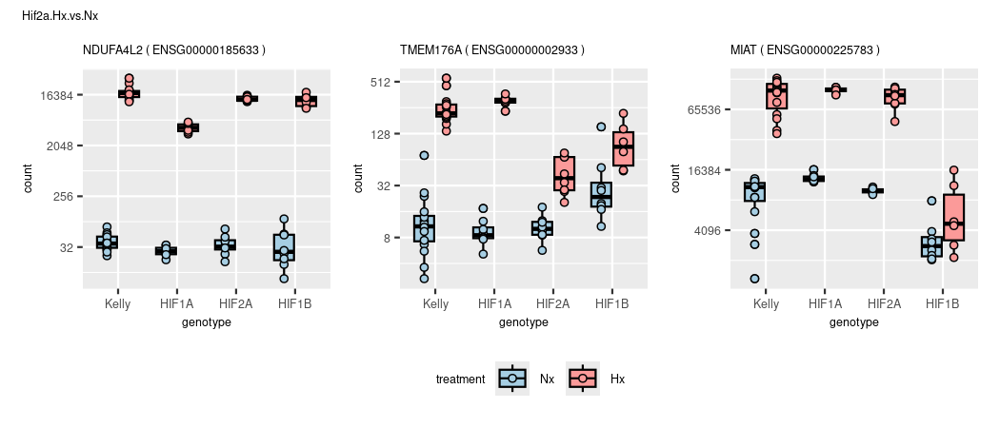
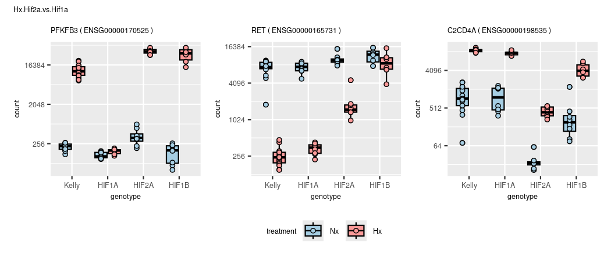

DGE
================
Kelterborn
2024-03-20

- [0. Load](#0-load)
  - [- Load R librarys](#--load-r-librarys)
  - [- dds](#--dds)
  - [- functions](#--functions)
- [1. Make results](#1-make-results)
  - [-Generate toplist](#-generate-toplist)
  - [-Plot example counts](#-plot-example-counts)
- [2. Data Dive](#2-data-dive)
  - [Colour sheme](#colour-sheme)
  - [Overlaps (Venn)](#overlaps-venn)
  - [Volcanos](#volcanos)
    - [prepare data](#prepare-data)
    - [simple volcano (full)](#simple-volcano-full)
    - [Draw Vulcanos](#draw-vulcanos)

# 0. Load

## - Load R librarys

## - dds

``` r
# load(file=paste(data,"deseq2.dds", sep="/"))

load(file=paste(data,"deseq2_treatment.dds", sep="/"))
dds_t <- dds
load(file=paste(data,"deseq2_condition.dds", sep="/"))
dds_c <- dds

load(file=paste(data,"deseq2_wgcna.dds", sep="/"))
```

## - functions

# 1. Make results

#### (Advanced results troubleshooting)

### -Generate toplist

``` r
topgenes_list <- lapply(results_list,topgenes_f, p=0.05,bM=50,l2FC=2) %>%  lapply(.,rownames) 
topgenes_list <- lapply(results_list,topgenes_f) %>%  lapply(.,rownames) 
```

``` r
design(dds)
```

    ## ~genotype + treatment + genotype:treatment
    ## <environment: 0x5627308c1018>

``` r
names(results_list)
```

    ##  [1] "Hif1a.Hx.vs.Nx"         "Hif2a.Hx.vs.Nx"         "Hif1b.Hx.vs.Nx"        
    ##  [4] "Kelly.Hx.vs.Nx"         "Nx.Hif1a.vs.Kelly"      "Nx.Hif2a.vs.Kelly"     
    ##  [7] "Nx.Hif1b.vs.Kelly"      "Hx.Hif1a.vs.Kelly"      "Hx.Hif2a.vs.Kelly"     
    ## [10] "Hx.Hif1b.vs.Kelly"      "Hx.Hif2a.vs.Hif1a"      "Hx.Hif1b.vs.Hif1a"     
    ## [13] "Hx.Hif1b.vs.Hif2a"      "Hif1aHxNx.vs.KellyHxNx" "Hif2aHxNx.vs.KellyHxNx"
    ## [16] "Hif1bHxNx.vs.KellyHxNx" "Hx.Hif1b.vs.Hif12a"     "Hx.Kelly.vs.allHIFs"   
    ## [19] "Hx.vs.Nx"

## -Plot example counts

``` r
cols = brewer.pal(n=8,name = 'Paired')

# get 3 sample genes
sample_plots <- list()
sample_plots_list <- {}
plot_list <- list()
li <- results_list %>% length()
for (i in 1:li){
  n <- results_list[i] %>% names()
  goi <- c(topgenes_list[[i]][1],sample(topgenes_list[[i]],size=2))
  l <- length(goi)
       for (ig in 1:l){
  s <- mcols(dds)[goi[ig],"symbol"]
  if (s ==""){s <- goi[ig]}
    d <- plotCounts(dds, gene=goi[ig], intgroup=c("condition","experiment","genotype","treatment"), main=s,returnData=TRUE)

  gcounts <- ggplot(d, aes(x = genotype, y = count, fill=treatment, color=treatment)) +
    geom_boxplot(color="black") +
    geom_point(shape=21,color="black",aes(fill=treatment),position=position_dodge(width=0.75), alpha=1) +
    scale_fill_manual(values=cols[c(1,5)]) +
    scale_color_manual(values=cols[c(1,5)]) +
    scale_y_continuous(trans = "log2") +
    labs(title = paste(s,"(",goi[ig],")",sep=" "))
  assign(paste("gcounts_",ig,sep=""),gcounts)
  
  plot_list[[paste(n,s,sep="_")]] <- gcounts
       }
  
  plot <- gcounts_1 + gcounts_2 + gcounts_3 +  
    plot_annotation(title = n) +
    plot_layout(guides = "collect", axis_titles="collect") & theme(legend.position = 'bottom',plot.title = element_text(size=10))
  print(plot)
}
```

<!-- --><!-- --><!-- --><!-- --><!-- --><!-- --><!-- --><!-- --><!-- --><!-- --><!-- --><!-- --><!-- --><!-- --><!-- --><!-- --><!-- --><!-- --><!-- -->

``` r
for (n in names(results_list)){
pn <-   str_detect(names(plot_list), pattern=n) %>% names(plot_list)[.]
plot.3 <- patchwork::wrap_plots(plot_list[pn],ncol = 3) + plot_layout(guides = "collect", axis_titles="collect") + plot_annotation(title = str_split(pn[[1]],pattern="_",simplify =TRUE)[1]) & theme(legend.position = 'bottom',plot.title = element_text(size=10))
#        print(plot.3)
        }            
```

# 2. Data Dive

## Colour sheme

``` r
colors_paired <- c("#A6CEE3", "#1F78B4", "#B2DF8A", "#33A02C", "#FB9A99", "#E31A1C", "#FDBF6F", "#FF7F00")
colors_v <- c("#440154FF", "#482878FF", "#3E4A89FF", "#31688EFF", "#26828EFF", "#1F9E89FF", "#35B779FF", "#6DCD59FF", "#B4DE2CFF", "#FDE725FF")
colors <- c("lavenderblush3","lavenderblush4","#90caf9","#1976d2", "#82e0aa", "#239b56", "#f8c471", "#b9770e") 
colors4 <- colors[c(1,3,5,7)]
```

``` r
library(VennDiagram)

list1<-c("A", "B", "C", "D")
list2<-c("B", "D", "E")
list3<-c("A", "D", "Z")

p<-venn.diagram(
x=list( list1, list2, list3),
category.names= c("list1", "list2", "list3"),
filename= NULL
)

grid.draw(p)
```

<!-- -->

## Overlaps (Venn)

``` r
# ,fig.show="hold", out.width="80%", fig.with="50%",fig.height=4

grid.newpage()
grid.draw(p)

# Hx vs. Nx
# dev.off()
plt <- venn.diagram(
    x = topgenes_list[c(4,3,1,2)],
    category.names = paste(names(topgenes_list[c(4,3,1,2)]),"\n(",topgenes_list %>% summary() %>% .[c(4,3,1,2)],")",sep=""),
    force.unique = TRUE, na = "remove",
    filename = NULL,
    main = "Hx vs. Nx", main.fontface = "bold",
    lwd = 2,
    lty = 'blank',
    fill = colors4[c(1,4,2,3)])
grid.newpage
```

    ## function (recording = TRUE, clearGroups = TRUE) 
    ## {
    ##     if (length(as.logical(clearGroups)) != 1) 
    ##         stop("Invalid 'clearGroups' argument")
    ##     for (fun in getHook("before.grid.newpage")) {
    ##         if (is.character(fun)) 
    ##             fun <- get(fun)
    ##         try(fun())
    ##     }
    ##     .Call(C_newpagerecording)
    ##     .Call(C_initGPar)
    ##     .Call(C_newpage)
    ##     .Call(C_clearDefinitions, as.logical(clearGroups))
    ##     .Call(C_initViewportStack)
    ##     if (recording) {
    ##         .Call(C_initDisplayList)
    ##         grDevices:::recordPalette()
    ##         for (fun in getHook("grid.newpage")) {
    ##             if (is.character(fun)) 
    ##                 fun <- get(fun)
    ##             try(fun())
    ##         }
    ##     }
    ##     invisible()
    ## }
    ## <bytecode: 0x56277e44ff90>
    ## <environment: namespace:grid>

``` r
grid.draw(plt)

# Hx vs. Hx
# dev.off()
plt <- venn.diagram(
    x = topgenes_list[c(8,9,10)],
    category.names = paste(names(topgenes_list[c(8,9,10)]),"\n(",topgenes_list %>% summary() %>% .[c(8,9,10)],")",sep=""),
    force.unique = TRUE, na = "remove",
    filename = NULL,
    main = "Hx vs. Hx", main.fontface = "bold",
    lwd = 2,
    lty = 'blank',
    fill = colors4[c(2,3,4)])
grid.draw(plt)
```

<!-- -->

``` r
# Hif1a
# dev.off()
grid.newpage()
plt <- venn.diagram(
    x = topgenes_list[c(4,1,5,8)],
    category.names = paste(names(topgenes_list[c(4,1,5,8)]),"\n(",topgenes_list %>% summary() %>% .[c(4,1,5,8)],")",sep=""),
    force.unique = TRUE, na = "remove",
    filename = NULL,
    main = "Hif1a", main.fontface = "bold",
    lwd = 2,
    lty = 'blank',
    fill = colors[c(2,4,1,3)])
grid.draw(plt)
```

<!-- -->

``` r
# Hif1a_simple
# dev.off()
choose_list <- c(4,1,8)
plt <- venn.diagram(
    x = topgenes_list[choose_list],
    category.names = paste(names(topgenes_list[choose_list]),"\n(",topgenes_list %>% summary() %>% .[choose_list],")",sep=""),
    force.unique = TRUE, na = "remove",
    filename = NULL,
    main = "Hif1a_simple", main.fontface = "bold",
    lwd = 2,
    lty = 'blank',
    fill = colors[c(1,3,4)])
grid.newpage()
grid.draw(plt)
```

<!-- -->

``` r
# Hif1a_all
# dev.off()
choose_list <- c(4,1,8)
plt <- venn.diagram(
    x = topgenes_list[choose_list],
    category.names = paste(names(topgenes_list[choose_list]),"\n(",topgenes_list %>% summary() %>% .[choose_list],")",sep=""),
    force.unique = TRUE, na = "remove",
    filename = NULL,
    main = "Hif1a_all", main.fontface = "bold",
    lwd = 2,
    lty = 'blank',
    fill = colors[c(1,3,4)])
grid.newpage()
grid.draw(plt)
```

<!-- -->

``` r
# Hif2a
# dev.off()
plt <- venn.diagram(
    x = topgenes_list[c(4,2,6,9)],
    category.names = paste(names(topgenes_list[c(4,2,6,9)]),"\n(",topgenes_list %>% summary() %>% .[c(4,2,6,9)],")",sep=""),
    force.unique = TRUE, na = "remove",
    filename = NULL,
    main = "Hif2a", main.fontface = "bold",
    lwd = 2,
    lty = 'blank',
    fill = colors[c(2,6,1,5)])
grid.newpage()
grid.draw(plt)
```

<!-- -->

``` r
# Hif1b
# dev.off()
plt <- venn.diagram(
    x = topgenes_list[c(4,3,7,10)],
    category.names = paste(names(topgenes_list[c(4,3,7,10)]),"\n(",topgenes_list %>% summary() %>% .[c(4,3,7,10)],")",sep=""),
    force.unique = TRUE, na = "remove",
    filename = NULL,
    main = "Hif2a", main.fontface = "bold",
    lwd = 2,
    lty = 'blank',
    fill = colors[c(2,8,1,7)])
grid.newpage()
grid.draw(plt)
```

<!-- -->

## Volcanos

### prepare data

### simple volcano (full)

#### check cutoff

### Draw Vulcanos

``` r
# Input

# results name
n <- "Hif1a.Hx.vs.Nx"

# colours
topcol <- "royalblue4"
hscol <- "royalblue1"
lcol <- "grey20"

# limits
xlim <- 10
ylim <- 300

# number of top genes
ntop <- 100

###################

# names(results_list)

ev_kelly <- eVukcano_SK(n="Kelly.Hx.vs.Nx", # results name
            ntop=200, # number of top genes
            topcol=colors[4], # color top genes
            hscol=colors[3], # color highly significant genes
            lcol="grey20",
            xlim=10,
            ylim=300)

ev_hif1a <- eVukcano_SK(n <- "Hif1a.Hx.vs.Nx",
            ntop=200,
            topcol="orangered3",
            hscol="salmon1",
            lcol="grey20")

ev_hif2a <- eVukcano_SK(n <- "Hif2a.Hx.vs.Nx",
            ntop=200,
            topcol="hotpink4",
            hscol="hotpink1",
            lcol="grey20")

ev_hif1b <- eVukcano_SK(n <- "Hif1b.Hx.vs.Nx",
            ntop=200,
            topcol="darkseagreen4",
            hscol="darkseagreen1",
            lcol="grey20")

( ev_kelly + ev_hif1b ) + plot_layout(guides = "collect", axes="collect", axis_titles="collect") & theme(legend.position = 'bottom', axis.title=element_text(size=8))
( ev_hif1a + ev_hif2a) + plot_layout(guides = "collect", axis_titles="collect") & theme(legend.position = 'bottom')
```


