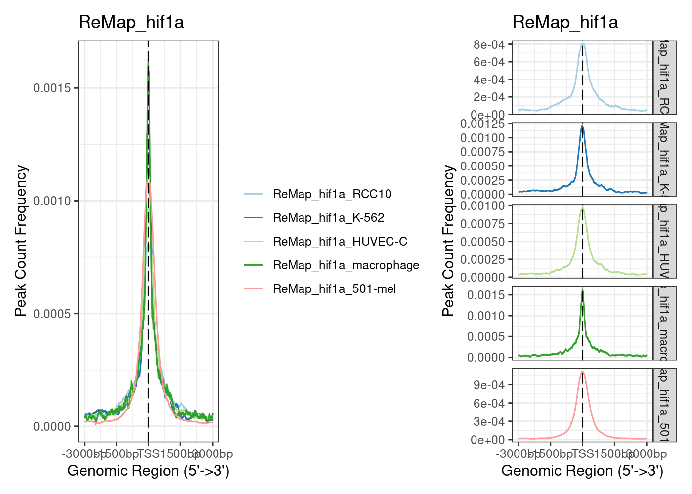
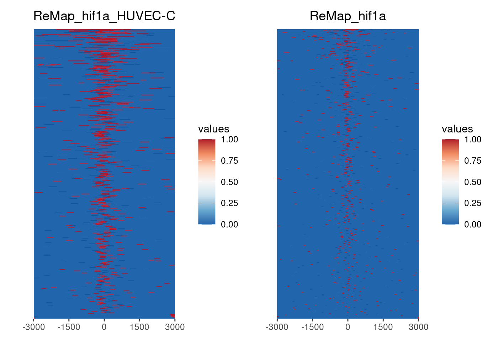
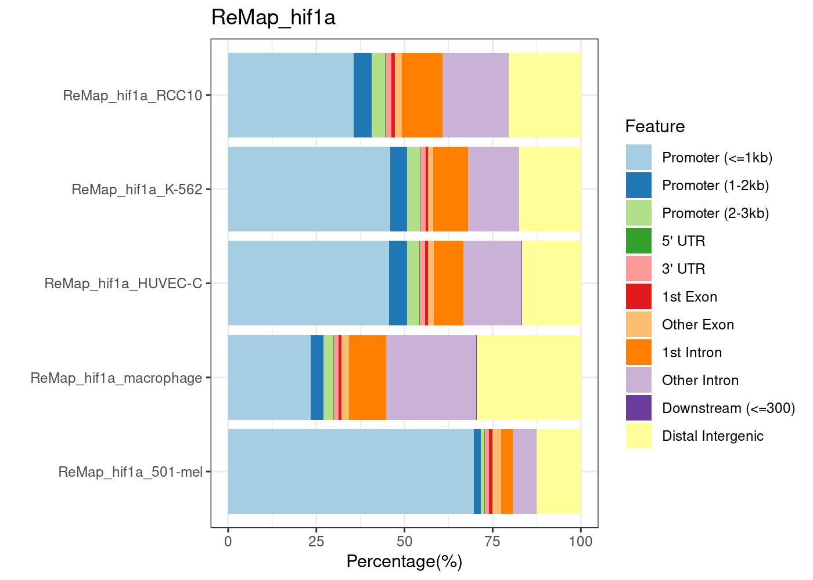
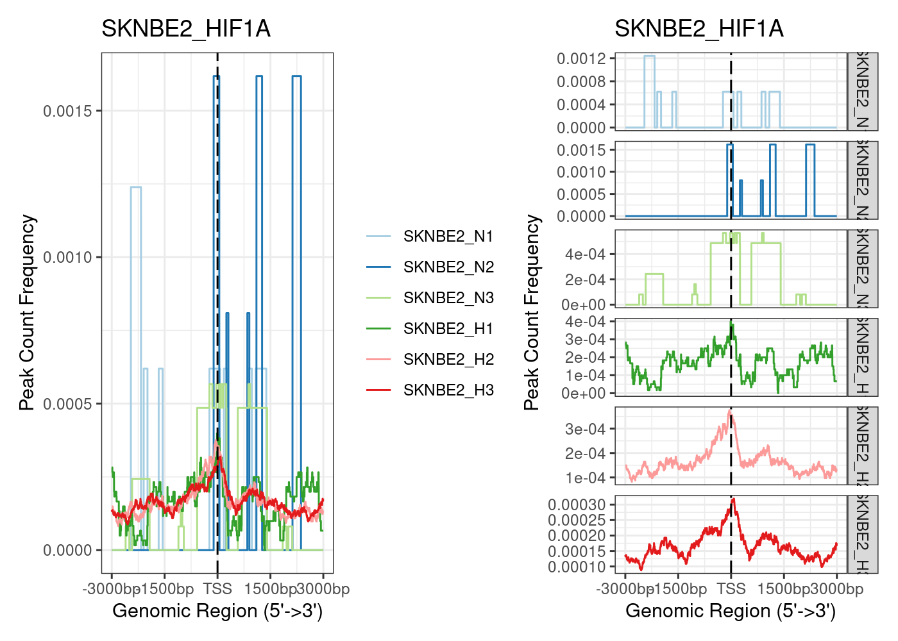
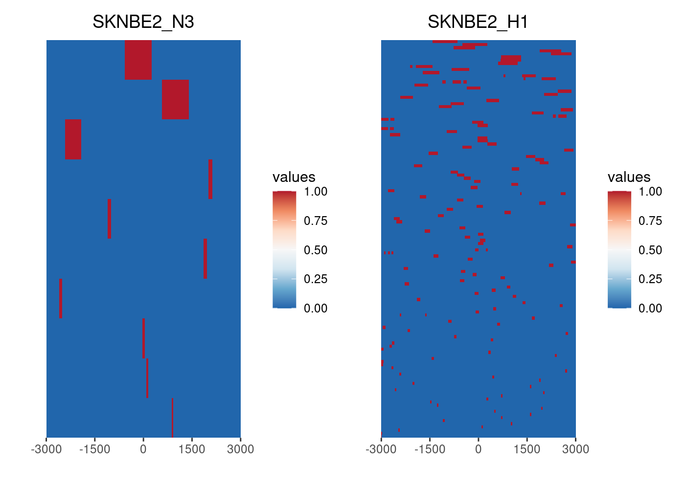
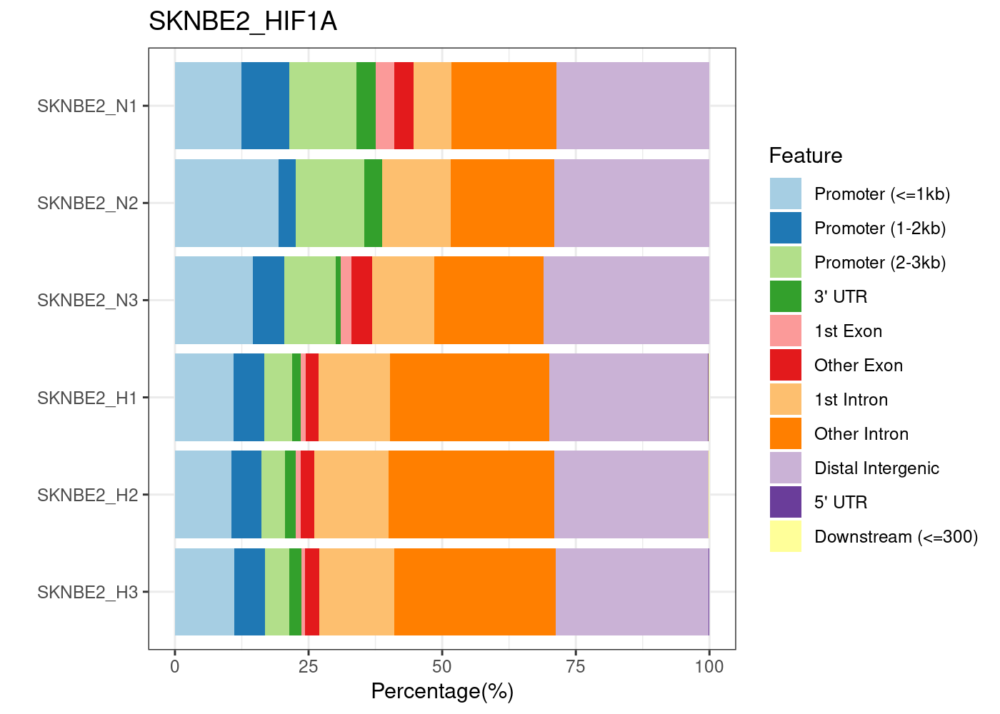
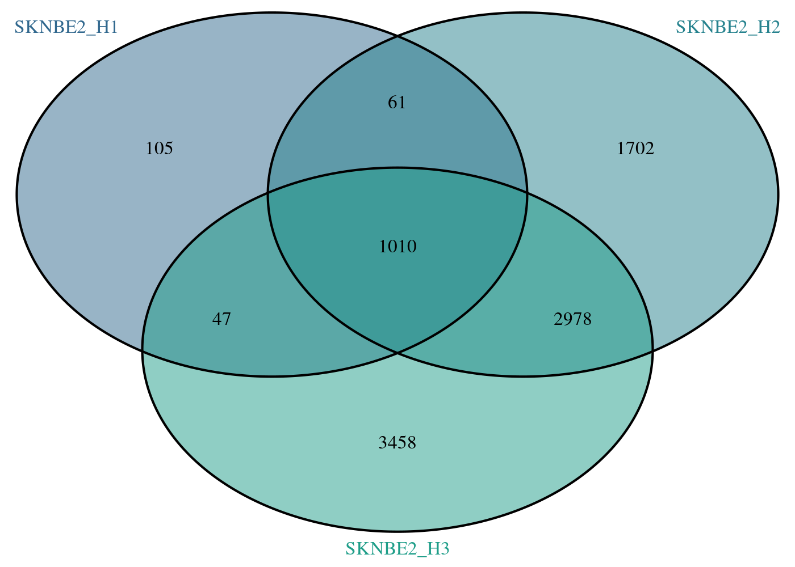

RNA-Seq Kelly Hx 3A ChIP-Seq
================
Kelterborn
2024-06-19

- [0. Load](#0-load)
  - [- Load R librarys](#--load-r-librarys)
  - [- Load dds](#--load-dds)
  - [- functions](#--functions)
- [Overview ChIP-Seq datasets](#overview-chip-seq-datasets)
- [ReMAP](#remap)
  - [Load dataset](#load-dataset)
  - [HIF1A](#hif1a)
- [SK-N-BE(2)](#sk-n-be2)
  - [Venn](#venn)
  - [Annotate peaks](#annotate-peaks)
- [Schödel](#schödel)

# 0. Load

## - Load R librarys

## - Load dds

## - functions

# Overview ChIP-Seq datasets

Literature

<table style="width:99%;">
<colgroup>
<col style="width: 12%" />
<col style="width: 20%" />
<col style="width: 9%" />
<col style="width: 55%" />
</colgroup>
<thead>
<tr class="header">
<th>Author</th>
<th>cells</th>
<th>Ab</th>
<th>link</th>
</tr>
</thead>
<tbody>
<tr class="odd">
<td><strong>Schödel et al., 2011</strong></td>
<td>MCF-7 (breast)</td>
<td>Hif1A, Hif2A, Hif1B</td>
<td><a href="https://www.ncbi.nlm.nih.gov/pmc/articles/PMC3374576/"
class="uri">https://www.ncbi.nlm.nih.gov/pmc/articles/PMC3374576/</a></td>
</tr>
<tr class="even">
<td><strong>Andrysik et al., 2021</strong></td>
<td>HCT116 (colon), RKO (colon), A549, and H460</td>
<td>HIF1A</td>
<td><a href="https://www.nature.com/articles/s41467-021-21687-2#Sec11"
class="uri">https://www.nature.com/articles/s41467-021-21687-2#Sec11</a>
<a href="https://www.ncbi.nlm.nih.gov/geo/query/acc.cgi?acc=GSE145157"
class="uri">https://www.ncbi.nlm.nih.gov/geo/query/acc.cgi?acc=GSE145157</a></td>
</tr>
<tr class="odd">
<td><strong>James A Smythies</strong></td>
<td>HKC-8, RCC4, HepG2</td>
<td>HIF1A, HIF2A, HIF1B</td>
<td><p><a
href="https://www.embopress.org/doi/pdf/10.15252/embr.201846401"
class="uri">https://www.embopress.org/doi/pdf/10.15252/embr.201846401</a>
GSE120885, GSE120886 and GSE120887</p>
<p><a
href="https://www.ncbi.nlm.nih.gov/geo/query/acc.cgi?acc=GSE120887"
class="uri">https://www.ncbi.nlm.nih.gov/geo/query/acc.cgi?acc=GSE120887</a></p></td>
</tr>
</tbody>
</table>

ChIP Seq in BE(2)
<https://www.ncbi.nlm.nih.gov/geo/query/acc.cgi?acc=GSE167477>

# ReMAP

**ReMAP:**

Hif1a: <https://remap.univ-amu.fr/target_page/HIF1A:9606>

Hif2a: <https://remap.univ-amu.fr/target_page/EPAS1:9606>

Hif1b: <https://remap.univ-amu.fr/target_page/ARNT:9606>

## Load dataset

    ## [1] "3A_ChIP-Seq_data_bu.Rmd"      "3A_ChIP-Seq_data.Rmd"        
    ## [3] "chip_seq_data"                "Readme.md"                   
    ## [5] "ReMAP_ChIP_Hif1a.xlsx"        "ReMAP_ChIP_Hif1b.xlsx"       
    ## [7] "ReMAP_ChIP_Hif2a.xlsx"        "ReMAP_ChIP-Seq_datasets.xlsx"
    ## [9] "test.Rmd"

|       |                                                                                                 |
|:------|:------------------------------------------------------------------------------------------------|
| Hif1A | 501-mel 786-O BEAS-2B ccRCC HUVEC-C K-562 LNCaP macrophage MDA-MB-231 NCI-H1299 PC-3 RCC10 U2OS |
| Hif2A | 501-mel 786-O ccRCC HUVEC-C K-562 macrophage PC-3                                               |
| Hif1B | 501-mel A-549 MCF-7 PC-3 RCC10 RCC4 SK-MEL-28 T-47D                                             |

## HIF1A

``` r
remap_hif1a <- paste0(chipdir,"/hif1a")
n <- "remap_hif1a"
list.files(remap_hif1a)
```

    ## [1] "GSE101063.HIF1A.RCC10.bed.gz"         
    ## [2] "GSE142865.HIF1A.K-562_hypoxia.bed.gz" 
    ## [3] "GSE39089.HIF1A.HUVEC-C_HYPOX.bed.gz"  
    ## [4] "GSE43109.HIF1A.macrophage_HYPO.bed.gz"
    ## [5] "GSE95280.HIF1A.501-mel.bed.gz"

``` r
run <- "ReMap_hif1a"
name <- paste(run,"_",sep="")

beddir <- paste(remap_hif1a)

beds <- list.files(beddir, pattern=".bed.gz")
beds <- file.path(beddir,beds)

peak <- readPeakFile(beds[2])
length(peak)
```

    ## [1] 2071

``` r
peak_table <- {}
i <- beds[1]
for (i in beds) {
peak <- readPeakFile(i)
n <- basename(i) %>% str_remove(pattern=".bed.gz")
# print(length(peak))
peak_table <- rbind(peak_table,data.frame(sample = n, peaks = length(peak)))
}
peak_table
```

    ##                           sample peaks
    ## 1          GSE101063.HIF1A.RCC10  5074
    ## 2  GSE142865.HIF1A.K-562_hypoxia  2071
    ## 3   GSE39089.HIF1A.HUVEC-C_HYPOX  3417
    ## 4 GSE43109.HIF1A.macrophage_HYPO  9039
    ## 5         GSE95280.HIF1A.501-mel  6231

``` r
promoter <- getPromoters(TxDb=txdb, upstream=3000, downstream=3000)
genebody <- getBioRegion(TxDb = txdb,
                         by = "gene",
                         type = "body",
                         upstream = rel(1),
                         downstream = rel(1))

file.exists(beds) %>% summary()
```

    ##    Mode    TRUE 
    ## logical       5

``` r
peak_list <- lapply(beds,readPeakFile)
peak_list <- lapply(peak_list,keepStandardChromosomes,pruning.mode="coarse")
names <- paste(name,str_split(basename(beds),pattern="\\.", simplify = T)[,3], sep="") %>% str_remove(pattern="_hypoxia|_HYPOX|_HYPO")
names(peak_list) <- names

tagMatrixList_proms <- lapply(peak_list, getTagMatrix, windows=promoter)
```

    ## >> preparing start_site regions by gene... 2024-08-02 10:23:02
    ## >> preparing tag matrix...  2024-08-02 10:23:02 
    ## >> preparing start_site regions by gene... 2024-08-02 10:23:20
    ## >> preparing tag matrix...  2024-08-02 10:23:20 
    ## >> preparing start_site regions by gene... 2024-08-02 10:23:28
    ## >> preparing tag matrix...  2024-08-02 10:23:28 
    ## >> preparing start_site regions by gene... 2024-08-02 10:23:35
    ## >> preparing tag matrix...  2024-08-02 10:23:35 
    ## >> preparing start_site regions by gene... 2024-08-02 10:23:43
    ## >> preparing tag matrix...  2024-08-02 10:23:43

``` r
# tagMatrixList_genes <- lapply(peak_list, getTagMatrix, windows = genebody, nbin = 100,
#                              upstream = rel(1),downstream = rel(1))

prom1 <- plotAvgProf(tagMatrixList_proms, xlim=c(-3000, 3000))+ggtitle(run)
```

    ## >> plotting figure...             2024-08-02 10:23:51

``` r
prom2 <- plotAvgProf(tagMatrixList_proms, xlim=c(-3000, 3000), facet="row")+ggtitle(run)
```

    ## >> plotting figure...             2024-08-02 10:23:51

``` r
prom1+prom2
```

<!-- -->

``` r
tagHeatmap(tagMatrixList_proms[3:4])+ggtitle(run)
```

<!-- -->

``` r
peakAnnoList <- lapply(peak_list, annotatePeak, TxDb=txdb,
                          tssRegion=c(-3000, 3000), verbose=TRUE)
```

    ## >> preparing features information...      2024-08-02 10:25:05 
    ## >> identifying nearest features...        2024-08-02 10:25:05 
    ## >> calculating distance from peak to TSS...   2024-08-02 10:25:06 
    ## >> assigning genomic annotation...        2024-08-02 10:25:06 
    ## >> assigning chromosome lengths           2024-08-02 10:25:26 
    ## >> done...                    2024-08-02 10:25:26 
    ## >> preparing features information...      2024-08-02 10:25:26 
    ## >> identifying nearest features...        2024-08-02 10:25:26 
    ## >> calculating distance from peak to TSS...   2024-08-02 10:25:26 
    ## >> assigning genomic annotation...        2024-08-02 10:25:26 
    ## >> assigning chromosome lengths           2024-08-02 10:25:31 
    ## >> done...                    2024-08-02 10:25:31 
    ## >> preparing features information...      2024-08-02 10:25:31 
    ## >> identifying nearest features...        2024-08-02 10:25:31 
    ## >> calculating distance from peak to TSS...   2024-08-02 10:25:31 
    ## >> assigning genomic annotation...        2024-08-02 10:25:31 
    ## >> assigning chromosome lengths           2024-08-02 10:25:34 
    ## >> done...                    2024-08-02 10:25:34 
    ## >> preparing features information...      2024-08-02 10:25:34 
    ## >> identifying nearest features...        2024-08-02 10:25:34 
    ## >> calculating distance from peak to TSS...   2024-08-02 10:25:34 
    ## >> assigning genomic annotation...        2024-08-02 10:25:34 
    ## >> assigning chromosome lengths           2024-08-02 10:25:37 
    ## >> done...                    2024-08-02 10:25:37 
    ## >> preparing features information...      2024-08-02 10:25:37 
    ## >> identifying nearest features...        2024-08-02 10:25:37 
    ## >> calculating distance from peak to TSS...   2024-08-02 10:25:38 
    ## >> assigning genomic annotation...        2024-08-02 10:25:38 
    ## >> assigning chromosome lengths           2024-08-02 10:25:41 
    ## >> done...                    2024-08-02 10:25:41

``` r
plotAnnoBar(peakAnnoList)+ggtitle(run)
```

<!-- -->

# SK-N-BE(2)

<https://www.ncbi.nlm.nih.gov/geo/query/acc.cgi?acc=GSE167477> \## Load
Peaks

``` r
run <- "SKNBE2_HIF1A"
list.dirs(chipdir)
```

    ## [1] "/mnt/s/AG/AG-Scholz-NGS/Daten/Simon/RNA-Seq_Kelly_all/git_RNAseq_Kelly_Hx/3A_ChIP-Seq_data/chip_seq_data/"        
    ## [2] "/mnt/s/AG/AG-Scholz-NGS/Daten/Simon/RNA-Seq_Kelly_all/git_RNAseq_Kelly_Hx/3A_ChIP-Seq_data/chip_seq_data//hif1a"  
    ## [3] "/mnt/s/AG/AG-Scholz-NGS/Daten/Simon/RNA-Seq_Kelly_all/git_RNAseq_Kelly_Hx/3A_ChIP-Seq_data/chip_seq_data//Schödel"
    ## [4] "/mnt/s/AG/AG-Scholz-NGS/Daten/Simon/RNA-Seq_Kelly_all/git_RNAseq_Kelly_Hx/3A_ChIP-Seq_data/chip_seq_data//SKNBE2"

``` r
SKNBE2.dir <- paste0(chipdir,"SKNBE2")
list.files(SKNBE2.dir)
```

    ## [1] "GSE167477_RAW.tar"                          
    ## [2] "GSM5105731_HIF1a_N1_BE2_peaks.narrowPeak.gz"
    ## [3] "GSM5105732_HIF1a_N2_BE2_peaks.narrowPeak.gz"
    ## [4] "GSM5105733_HIF1a_N3_BE2_peaks.narrowPeak.gz"
    ## [5] "GSM5105734_HIF1a_H1_BE2_peaks.narrowPeak.gz"
    ## [6] "GSM5105735_HIF1a_H2_BE2_peaks.narrowPeak.gz"
    ## [7] "GSM5105736_HIF1a_H3_BE2_peaks.narrowPeak.gz"

``` r
SKNBE2.file <- paste0(SKNBE2.dir,"/GSE167477_RAW.tar")
file.exists(SKNBE2.file)
```

    ## [1] TRUE

``` r
untar(SKNBE2.file,exdir=SKNBE2.dir)
list.files(SKNBE2.dir)
```

    ## [1] "GSE167477_RAW.tar"                          
    ## [2] "GSM5105731_HIF1a_N1_BE2_peaks.narrowPeak.gz"
    ## [3] "GSM5105732_HIF1a_N2_BE2_peaks.narrowPeak.gz"
    ## [4] "GSM5105733_HIF1a_N3_BE2_peaks.narrowPeak.gz"
    ## [5] "GSM5105734_HIF1a_H1_BE2_peaks.narrowPeak.gz"
    ## [6] "GSM5105735_HIF1a_H2_BE2_peaks.narrowPeak.gz"
    ## [7] "GSM5105736_HIF1a_H3_BE2_peaks.narrowPeak.gz"

``` r
beddir <- paste(SKNBE2.dir)

extraCols_narrowPeak <- c(signalValue = "numeric", pValue = "numeric",
                          qValue = "numeric", peak = "integer")


beds <- list.files(SKNBE2.dir, pattern=".narrowPeak")
beds <- file.path(SKNBE2.dir,beds)

peak <- readPeakFile(beds[4])
length(peak)
```

    ## [1] 1986

``` r
peak_table <- {}
npeak_list <- {}
diff_peaks_list <- {}
i <- beds[1]
for (i in beds) {
  print(i)
npeak <- import(i, format = "BED",extraCols = extraCols_narrowPeak)
n <- paste0("SKNBE2_",str_split(basename(i),pattern="_", simplify = T)[,3])
npeak1 <- keepStandardChromosomes(npeak, pruning.mode="coarse")
filtered2 <- findOverlaps(npeak1, bl)
npeak2 <- npeak1[-from(filtered2)] 
npeak3 <- npeak2 %>% unique()
peak_table <- rbind(peak_table,data.frame(sample = n,
                                          peaks = length(npeak),
                                          peaks_Chr = length(npeak1),
                                          peaks_bl = length(npeak2),
                                          peaks_unique = length(npeak3)))
npeak_list[[n]] <- npeak3
}
```

    ## [1] "/mnt/s/AG/AG-Scholz-NGS/Daten/Simon/RNA-Seq_Kelly_all/git_RNAseq_Kelly_Hx/3A_ChIP-Seq_data/chip_seq_data/SKNBE2/GSM5105731_HIF1a_N1_BE2_peaks.narrowPeak.gz"
    ## [1] "/mnt/s/AG/AG-Scholz-NGS/Daten/Simon/RNA-Seq_Kelly_all/git_RNAseq_Kelly_Hx/3A_ChIP-Seq_data/chip_seq_data/SKNBE2/GSM5105732_HIF1a_N2_BE2_peaks.narrowPeak.gz"
    ## [1] "/mnt/s/AG/AG-Scholz-NGS/Daten/Simon/RNA-Seq_Kelly_all/git_RNAseq_Kelly_Hx/3A_ChIP-Seq_data/chip_seq_data/SKNBE2/GSM5105733_HIF1a_N3_BE2_peaks.narrowPeak.gz"
    ## [1] "/mnt/s/AG/AG-Scholz-NGS/Daten/Simon/RNA-Seq_Kelly_all/git_RNAseq_Kelly_Hx/3A_ChIP-Seq_data/chip_seq_data/SKNBE2/GSM5105734_HIF1a_H1_BE2_peaks.narrowPeak.gz"
    ## [1] "/mnt/s/AG/AG-Scholz-NGS/Daten/Simon/RNA-Seq_Kelly_all/git_RNAseq_Kelly_Hx/3A_ChIP-Seq_data/chip_seq_data/SKNBE2/GSM5105735_HIF1a_H2_BE2_peaks.narrowPeak.gz"
    ## [1] "/mnt/s/AG/AG-Scholz-NGS/Daten/Simon/RNA-Seq_Kelly_all/git_RNAseq_Kelly_Hx/3A_ChIP-Seq_data/chip_seq_data/SKNBE2/GSM5105736_HIF1a_H3_BE2_peaks.narrowPeak.gz"

``` r
peak_table %>% kable()
```

| sample    | peaks | peaks_Chr | peaks_bl | peaks_unique |
|:----------|------:|----------:|---------:|-------------:|
| SKNBE2_N1 |    86 |        81 |       62 |           56 |
| SKNBE2_N2 |    44 |        44 |       43 |           31 |
| SKNBE2_N3 |   157 |       156 |      150 |          103 |
| SKNBE2_H1 |  1986 |      1924 |     1846 |         1351 |
| SKNBE2_H2 |  6151 |      6115 |     6033 |         5759 |
| SKNBE2_H3 |  8039 |      7982 |     7854 |         7501 |

``` r
promoter <- getPromoters(TxDb=txdb, upstream=3000, downstream=3000)
genebody <- getBioRegion(TxDb = txdb,
                         by = "gene",
                         type = "body",
                         upstream = rel(1),
                         downstream = rel(1))

file.exists(beds) %>% summary()
```

    ##    Mode    TRUE 
    ## logical       6

``` r
peak_list <- lapply(beds,readPeakFile)
peak_list <- lapply(peak_list,keepStandardChromosomes,pruning.mode="coarse")

names <- paste0("SKNBE2_",str_split(basename(beds),pattern="_", simplify = T)[,3])
names(peak_list) <- names

tagMatrixList_proms <- lapply(peak_list, getTagMatrix, windows=promoter)
```

    ## >> preparing start_site regions by gene... 2024-08-02 10:26:16
    ## >> preparing tag matrix...  2024-08-02 10:26:16 
    ## >> preparing start_site regions by gene... 2024-08-02 10:26:19
    ## >> preparing tag matrix...  2024-08-02 10:26:19 
    ## >> preparing start_site regions by gene... 2024-08-02 10:26:22
    ## >> preparing tag matrix...  2024-08-02 10:26:22 
    ## >> preparing start_site regions by gene... 2024-08-02 10:26:28
    ## >> preparing tag matrix...  2024-08-02 10:26:28 
    ## >> preparing start_site regions by gene... 2024-08-02 10:26:34
    ## >> preparing tag matrix...  2024-08-02 10:26:34 
    ## >> preparing start_site regions by gene... 2024-08-02 10:26:41
    ## >> preparing tag matrix...  2024-08-02 10:26:41

``` r
prom1 <- plotAvgProf(tagMatrixList_proms, xlim=c(-3000, 3000))+ggtitle(run)
```

    ## >> plotting figure...             2024-08-02 10:26:47

``` r
prom2 <- plotAvgProf(tagMatrixList_proms, xlim=c(-3000, 3000), facet="row")+ggtitle(run)
```

    ## >> plotting figure...             2024-08-02 10:26:47

``` r
prom1+prom2
```

<!-- -->

``` r
tagHeatmap(tagMatrixList_proms[3:4])+ggtitle(run)
```

<!-- -->

``` r
peakAnnoList <- lapply(peak_list, annotatePeak, TxDb=txdb,
                          tssRegion=c(-3000, 3000), verbose=TRUE)
```

    ## >> preparing features information...      2024-08-02 10:26:50 
    ## >> identifying nearest features...        2024-08-02 10:26:50 
    ## >> calculating distance from peak to TSS...   2024-08-02 10:26:50 
    ## >> assigning genomic annotation...        2024-08-02 10:26:50 
    ## >> assigning chromosome lengths           2024-08-02 10:26:53 
    ## >> done...                    2024-08-02 10:26:53 
    ## >> preparing features information...      2024-08-02 10:26:53 
    ## >> identifying nearest features...        2024-08-02 10:26:53 
    ## >> calculating distance from peak to TSS...   2024-08-02 10:26:53 
    ## >> assigning genomic annotation...        2024-08-02 10:26:53 
    ## >> assigning chromosome lengths           2024-08-02 10:26:56 
    ## >> done...                    2024-08-02 10:26:56 
    ## >> preparing features information...      2024-08-02 10:26:56 
    ## >> identifying nearest features...        2024-08-02 10:26:56 
    ## >> calculating distance from peak to TSS...   2024-08-02 10:26:56 
    ## >> assigning genomic annotation...        2024-08-02 10:26:56 
    ## >> assigning chromosome lengths           2024-08-02 10:26:59 
    ## >> done...                    2024-08-02 10:26:59 
    ## >> preparing features information...      2024-08-02 10:26:59 
    ## >> identifying nearest features...        2024-08-02 10:26:59 
    ## >> calculating distance from peak to TSS...   2024-08-02 10:26:59 
    ## >> assigning genomic annotation...        2024-08-02 10:26:59 
    ## >> assigning chromosome lengths           2024-08-02 10:27:02 
    ## >> done...                    2024-08-02 10:27:02 
    ## >> preparing features information...      2024-08-02 10:27:02 
    ## >> identifying nearest features...        2024-08-02 10:27:02 
    ## >> calculating distance from peak to TSS...   2024-08-02 10:27:03 
    ## >> assigning genomic annotation...        2024-08-02 10:27:03 
    ## >> assigning chromosome lengths           2024-08-02 10:27:06 
    ## >> done...                    2024-08-02 10:27:06 
    ## >> preparing features information...      2024-08-02 10:27:06 
    ## >> identifying nearest features...        2024-08-02 10:27:06 
    ## >> calculating distance from peak to TSS...   2024-08-02 10:27:06 
    ## >> assigning genomic annotation...        2024-08-02 10:27:06 
    ## >> assigning chromosome lengths           2024-08-02 10:27:09 
    ## >> done...                    2024-08-02 10:27:09

``` r
plotAnnoBar(peakAnnoList)+ggtitle(run)
```

<!-- --> \## Substract Nx Peaks

``` r
# Substract Hx vs. Nx
names(peak_list)
```

    ## [1] "SKNBE2_N1" "SKNBE2_N2" "SKNBE2_N3" "SKNBE2_H1" "SKNBE2_H2" "SKNBE2_H3"

``` r
Hx_samples <- c("SKNBE2_H1", "SKNBE2_H2", "SKNBE2_H3")
Nx_samples <- c("SKNBE2_N1", "SKNBE2_N2", "SKNBE2_N3")

hx_peak_list <- list()
hx_peak_table <- {}
for (i in 1:length(Hx_samples)){
  hx <- Hx_samples[i]
  nx <- Nx_samples[i]
  all_peaks <- peak_list[[hx]]
  nx_peaks <- peak_list[[nx]]
  filtered <- findOverlaps(all_peaks, nx_peaks)
  keep <- from(filtered) %>% unique() %>% -.
  hx_peaks <- all_peaks[keep]
  
  peak_numbers <- data.frame(sample = Hx_samples[i],
                                                  Hx_peaks = length(all_peaks),
                                                  Nx_peaks = length(nx_peaks),
                                                  Hx_Nx_peaks = length(hx_peaks))
  # print(peak_numbers)
  hx_peak_table <- rbind(hx_peak_table,peak_numbers)
  hx_peak_list[[i]] <- hx_peaks %>% unique()
}

hx_peak_table %>% kable()
```

| sample    | Hx_peaks | Nx_peaks | Hx_Nx_peaks |
|:----------|---------:|---------:|------------:|
| SKNBE2_H1 |     1924 |       81 |        1829 |
| SKNBE2_H2 |     6115 |       44 |        6077 |
| SKNBE2_H3 |     7982 |      156 |        7859 |

``` r
names(hx_peak_list) <- Hx_samples
```

## Venn

``` r
input_list <- hx_peak_list
n <- "SKNBE2"
l <- length(input_list)

olvenn <- findOverlapsOfPeaks(input_list)

venn <- makeVennDiagram(olvenn,
                # NameOfPeaks= names(input_list),
                fill=viridis(10)[4:6],
                cat.col=viridis(10)[4:6],
                # cat.pos = c(0,0, -70,+70,0),
                # cat.dist = c(0.2,0.2,0.23,0.22,0.2),
                disable.logging = TRUE,
                filename=NULL,
                title=n
                )
```

<!-- -->

## Annotate peaks

``` r
SKNBE2_peaks_anno <- lapply(hx_peak_list, annotatePeak, TxDb=txdb,
                          tssRegion=c(-3000, 3000), verbose=TRUE)
```

    ## >> preparing features information...      2024-08-02 10:27:19 
    ## >> identifying nearest features...        2024-08-02 10:27:19 
    ## >> calculating distance from peak to TSS...   2024-08-02 10:27:19 
    ## >> assigning genomic annotation...        2024-08-02 10:27:19 
    ## >> assigning chromosome lengths           2024-08-02 10:27:22 
    ## >> done...                    2024-08-02 10:27:22 
    ## >> preparing features information...      2024-08-02 10:27:22 
    ## >> identifying nearest features...        2024-08-02 10:27:22 
    ## >> calculating distance from peak to TSS...   2024-08-02 10:27:23 
    ## >> assigning genomic annotation...        2024-08-02 10:27:23 
    ## >> assigning chromosome lengths           2024-08-02 10:27:26 
    ## >> done...                    2024-08-02 10:27:26 
    ## >> preparing features information...      2024-08-02 10:27:26 
    ## >> identifying nearest features...        2024-08-02 10:27:26 
    ## >> calculating distance from peak to TSS...   2024-08-02 10:27:27 
    ## >> assigning genomic annotation...        2024-08-02 10:27:27 
    ## >> assigning chromosome lengths           2024-08-02 10:27:30 
    ## >> done...                    2024-08-02 10:27:30

``` r
keytypes(edb)
```

    ##  [1] "ENTREZID"            "EXONID"              "GENEBIOTYPE"        
    ##  [4] "GENEID"              "GENENAME"            "PROTDOMID"          
    ##  [7] "PROTEINDOMAINID"     "PROTEINDOMAINSOURCE" "PROTEINID"          
    ## [10] "SEQNAME"             "SEQSTRAND"           "SYMBOL"             
    ## [13] "TXBIOTYPE"           "TXID"                "TXNAME"             
    ## [16] "UNIPROTID"

``` r
SKNBE2_peaks_anno_table <- list()
SKNBE2_genes_list <- list()
for (i in 1:length(SKNBE2_peaks_anno)){
  print(paste(i,": ",names(SKNBE2_peaks_anno)[i],sep=""))
  n <- names(SKNBE2_peaks_anno[i])
  table <- as.data.frame(SKNBE2_peaks_anno[[i]]@anno)
  table$transcriptId2  <- sub("\\.\\d+$", "", table$transcriptId)
  table$entrez <- table$geneId
  table$geneId <- mapIds(edb, keys = table$transcriptId2, column = "GENEID", keytype = "TXID")
  table$symbol <- mapIds(edb, keys = table$transcriptId2, column = "SYMBOL", keytype = "TXID")
  assign(paste("narrow_table",n,sep="_"),table)
  table_filter <- subset(table, annotation != "Distal Intergenic")
  table_filter$annotation_short <-  str_split(table_filter$annotation,pattern = " ", simplify = TRUE)[,1]

  print(paste("Before: ",length(rownames(table)),", After: ",length(rownames(table_filter))," (",round(length(rownames(table_filter))/length(rownames(table))*100),"%)"))
  SKNBE2_peaks_anno_table[[n]] <- table_filter
  SKNBE2_genes_list[[n]] <- table_filter$geneId %>% unique()
}
```

    ## [1] "1: SKNBE2_H1"
    ## [1] "Before:  1361 , After:  940  ( 69 %)"
    ## [1] "2: SKNBE2_H2"
    ## [1] "Before:  5808 , After:  4123  ( 71 %)"
    ## [1] "3: SKNBE2_H3"
    ## [1] "Before:  7525 , After:  5357  ( 71 %)"

# Schödel

<https://www.ncbi.nlm.nih.gov/geo/query/acc.cgi?acc=GSE167477> \## Load
Peaks

``` r
run <- "SKNBE2_HIF1A"
list.dirs(chipdir)
SKNBE2.dir <- paste0(chipdir,"SKNBE2")
list.files(SKNBE2.dir)
SKNBE2.file <- paste0(SKNBE2.dir,"/GSE167477_RAW.tar")
file.exists(SKNBE2.file)
untar(SKNBE2.file,exdir=SKNBE2.dir)
list.files(SKNBE2.dir)

beddir <- paste(SKNBE2.dir)

extraCols_narrowPeak <- c(signalValue = "numeric", pValue = "numeric",
                          qValue = "numeric", peak = "integer")


beds <- list.files(SKNBE2.dir, pattern=".narrowPeak")
beds <- file.path(SKNBE2.dir,beds)

peak <- readPeakFile(beds[4])
length(peak)

peak_table <- {}
npeak_list <- {}
diff_peaks_list <- {}
i <- beds[1]
for (i in beds) {
  print(i)
npeak <- import(i, format = "BED",extraCols = extraCols_narrowPeak)
n <- paste0("SKNBE2_",str_split(basename(i),pattern="_", simplify = T)[,3])
npeak1 <- keepStandardChromosomes(npeak, pruning.mode="coarse")
filtered2 <- findOverlaps(npeak1, bl)
npeak2 <- npeak1[-from(filtered2)] 
npeak3 <- npeak2 %>% unique()
peak_table <- rbind(peak_table,data.frame(sample = n,
                                          peaks = length(npeak),
                                          peaks_Chr = length(npeak1),
                                          peaks_bl = length(npeak2),
                                          peaks_unique = length(npeak3)))
npeak_list[[n]] <- npeak3
}
peak_table %>% kable()


promoter <- getPromoters(TxDb=txdb, upstream=3000, downstream=3000)
genebody <- getBioRegion(TxDb = txdb,
                         by = "gene",
                         type = "body",
                         upstream = rel(1),
                         downstream = rel(1))

file.exists(beds) %>% summary()

peak_list <- lapply(beds,readPeakFile)
peak_list <- lapply(peak_list,keepStandardChromosomes,pruning.mode="coarse")

names <- paste0("SKNBE2_",str_split(basename(beds),pattern="_", simplify = T)[,3])
names(peak_list) <- names

tagMatrixList_proms <- lapply(peak_list, getTagMatrix, windows=promoter)

prom1 <- plotAvgProf(tagMatrixList_proms, xlim=c(-3000, 3000))+ggtitle(run)
prom2 <- plotAvgProf(tagMatrixList_proms, xlim=c(-3000, 3000), facet="row")+ggtitle(run)
prom1+prom2
tagHeatmap(tagMatrixList_proms[3:4])+ggtitle(run)

peakAnnoList <- lapply(peak_list, annotatePeak, TxDb=txdb,
                          tssRegion=c(-3000, 3000), verbose=TRUE)

plotAnnoBar(peakAnnoList)+ggtitle(run)
```
