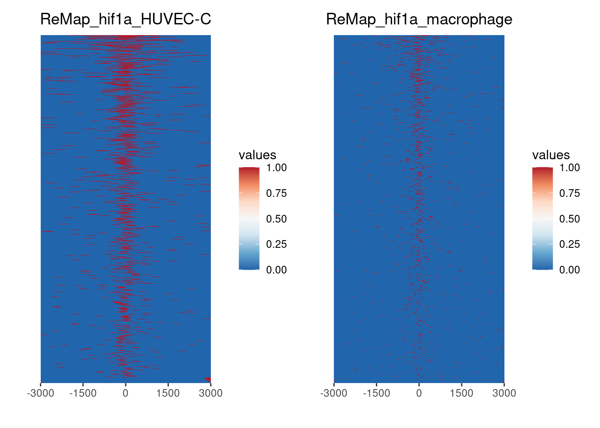
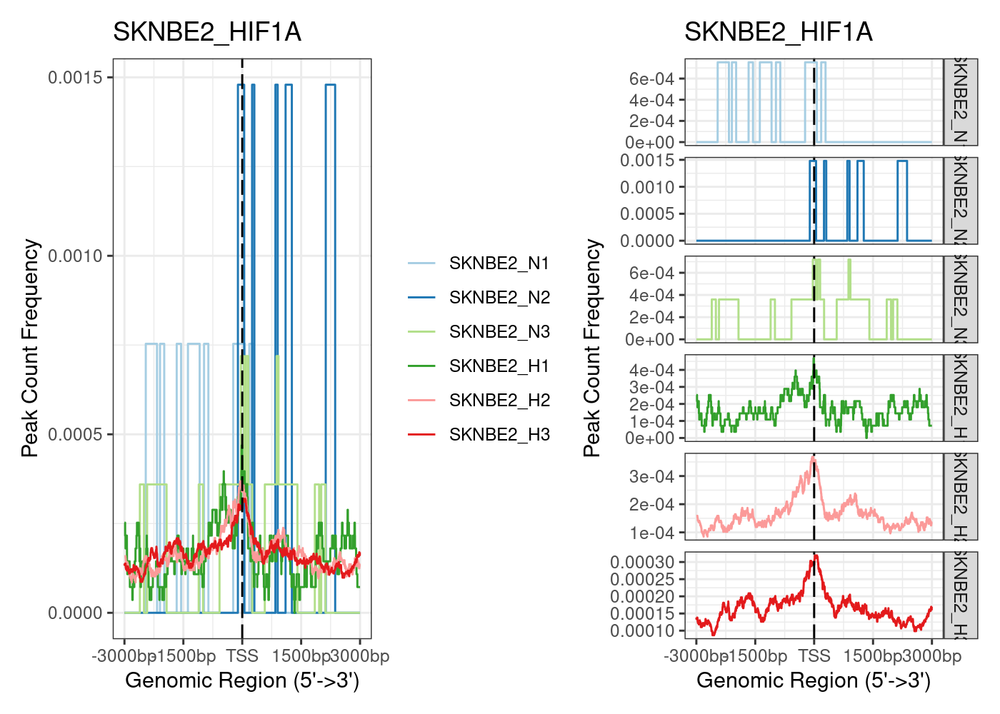

RNA-Seq Kelly Hx 3A ChIP-Seq
================
Kelterborn
2024-06-19

- [0. Load](#0-load)
  - [- Load R librarys](#--load-r-librarys)
  - [- Load dds](#--load-dds)
  - [- functions](#--functions)
- [Overview ChIP-Seq datasets](#overview-chip-seq-datasets)
- [ReMAP](#remap)
  - [Load dataset](#load-dataset)
  - [HIF1A](#hif1a)
  - [Annotate peaks](#annotate-peaks)
- [SK-N-BE(2)](#sk-n-be2)
  - [Venn Peaks](#venn-peaks)
  - [Annotate peaks](#annotate-peaks-1)
  - [Venn Genes](#venn-genes)
- [Schödel](#schödel)

# 0. Load

## - Load R librarys

## - Load dds

## - functions

# Overview ChIP-Seq datasets

Literature

<table style="width:99%;">
<colgroup>
<col style="width: 12%" />
<col style="width: 20%" />
<col style="width: 9%" />
<col style="width: 55%" />
</colgroup>
<thead>
<tr class="header">
<th>Author</th>
<th>cells</th>
<th>Ab</th>
<th>link</th>
</tr>
</thead>
<tbody>
<tr class="odd">
<td><strong>Schödel et al., 2011</strong></td>
<td>MCF-7 (breast)</td>
<td>Hif1A, Hif2A, Hif1B</td>
<td><a href="https://www.ncbi.nlm.nih.gov/pmc/articles/PMC3374576/"
class="uri">https://www.ncbi.nlm.nih.gov/pmc/articles/PMC3374576/</a></td>
</tr>
<tr class="even">
<td><strong>Andrysik et al., 2021</strong></td>
<td>HCT116 (colon), RKO (colon), A549, and H460</td>
<td>HIF1A</td>
<td><a href="https://www.nature.com/articles/s41467-021-21687-2#Sec11"
class="uri">https://www.nature.com/articles/s41467-021-21687-2#Sec11</a>
<a href="https://www.ncbi.nlm.nih.gov/geo/query/acc.cgi?acc=GSE145157"
class="uri">https://www.ncbi.nlm.nih.gov/geo/query/acc.cgi?acc=GSE145157</a></td>
</tr>
<tr class="odd">
<td><strong>James A Smythies</strong></td>
<td>HKC-8, RCC4, HepG2</td>
<td>HIF1A, HIF2A, HIF1B</td>
<td><p><a
href="https://www.embopress.org/doi/pdf/10.15252/embr.201846401"
class="uri">https://www.embopress.org/doi/pdf/10.15252/embr.201846401</a>
GSE120885, GSE120886 and GSE120887</p>
<p><a
href="https://www.ncbi.nlm.nih.gov/geo/query/acc.cgi?acc=GSE120887"
class="uri">https://www.ncbi.nlm.nih.gov/geo/query/acc.cgi?acc=GSE120887</a></p></td>
</tr>
</tbody>
</table>

ChIP Seq in BE(2)
<https://www.ncbi.nlm.nih.gov/geo/query/acc.cgi?acc=GSE167477>

# ReMAP

**ReMAP:**

Hif1a: <https://remap.univ-amu.fr/target_page/HIF1A:9606>

Hif2a: <https://remap.univ-amu.fr/target_page/EPAS1:9606>

Hif1b: <https://remap.univ-amu.fr/target_page/ARNT:9606>

## Load dataset

    ##  [1] "3A_ChIP-Seq_data_bu.Rmd"            "3A_ChIP-Seq_data.Rmd"              
    ##  [3] "chip_seq_data"                      "Readme_files"                      
    ##  [5] "Readme.md"                          "ReMAP_ChIP_Hif1a.xlsx"             
    ##  [7] "ReMAP_ChIP_Hif1b.xlsx"              "ReMAP_ChIP_Hif2a.xlsx"             
    ##  [9] "ReMAP_ChIP-Seq_datasets.xlsx"       "remap_hif1a_peaks_anno_table.peaks"
    ## [11] "SKNBE2_peaks_anno_table.peaks"      "test.Rmd"

|       |                                                                                                 |
|:------|:------------------------------------------------------------------------------------------------|
| Hif1A | 501-mel 786-O BEAS-2B ccRCC HUVEC-C K-562 LNCaP macrophage MDA-MB-231 NCI-H1299 PC-3 RCC10 U2OS |
| Hif2A | 501-mel 786-O ccRCC HUVEC-C K-562 macrophage PC-3                                               |
| Hif1B | 501-mel A-549 MCF-7 PC-3 RCC10 RCC4 SK-MEL-28 T-47D                                             |

## HIF1A

``` r
remap_hif1a <- paste0(chipdir,"/hif1a")
n <- "remap_hif1a"
list.files(remap_hif1a)
```

    ## [1] "GSE101063.HIF1A.RCC10.bed.gz"         
    ## [2] "GSE142865.HIF1A.K-562_hypoxia.bed.gz" 
    ## [3] "GSE39089.HIF1A.HUVEC-C_HYPOX.bed.gz"  
    ## [4] "GSE43109.HIF1A.macrophage_HYPO.bed.gz"
    ## [5] "GSE95280.HIF1A.501-mel.bed.gz"

``` r
run <- "ReMap_hif1a"
name <- paste(run,"_",sep="")

beddir <- paste(remap_hif1a)

beds <- list.files(beddir, pattern=".bed.gz")
beds <- file.path(beddir,beds)

peak <- readPeakFile(beds[2])
length(peak)
```

    ## [1] 2071

``` r
peak_table <- {}
i <- beds[1]
for (i in beds) {
peak <- readPeakFile(i)
n <- basename(i) %>% str_remove(pattern=".bed.gz")
# print(length(peak))
peak_table <- rbind(peak_table,data.frame(sample = n, peaks = length(peak)))
}
peak_table
```

    ##                           sample peaks
    ## 1          GSE101063.HIF1A.RCC10  5074
    ## 2  GSE142865.HIF1A.K-562_hypoxia  2071
    ## 3   GSE39089.HIF1A.HUVEC-C_HYPOX  3417
    ## 4 GSE43109.HIF1A.macrophage_HYPO  9039
    ## 5         GSE95280.HIF1A.501-mel  6231

``` r
promoter <- getPromoters(TxDb=txdb, upstream=3000, downstream=3000)
genebody <- getBioRegion(TxDb = txdb,
                         by = "gene",
                         type = "body",
                         upstream = rel(1),
                         downstream = rel(1))

file.exists(beds) %>% summary()
```

    ##    Mode    TRUE 
    ## logical       5

``` r
peak_list <- lapply(beds,readPeakFile)
peak_list <- lapply(peak_list,keepStandardChromosomes,pruning.mode="coarse")
names <- paste(name,str_split(basename(beds),pattern="\\.", simplify = T)[,3], sep="") %>% str_remove(pattern="_hypoxia|_HYPOX|_HYPO")
names(peak_list) <- names

tagMatrixList_proms <- lapply(peak_list, getTagMatrix, windows=promoter)
```

    ## >> preparing start_site regions by gene... 2024-08-02 12:43:24
    ## >> preparing tag matrix...  2024-08-02 12:43:24 
    ## >> preparing start_site regions by gene... 2024-08-02 12:43:41
    ## >> preparing tag matrix...  2024-08-02 12:43:41 
    ## >> preparing start_site regions by gene... 2024-08-02 12:43:50
    ## >> preparing tag matrix...  2024-08-02 12:43:50 
    ## >> preparing start_site regions by gene... 2024-08-02 12:43:57
    ## >> preparing tag matrix...  2024-08-02 12:43:57 
    ## >> preparing start_site regions by gene... 2024-08-02 12:44:05
    ## >> preparing tag matrix...  2024-08-02 12:44:05

``` r
# tagMatrixList_genes <- lapply(peak_list, getTagMatrix, windows = genebody, nbin = 100,
#                              upstream = rel(1),downstream = rel(1))

prom1 <- plotAvgProf(tagMatrixList_proms, xlim=c(-3000, 3000))+ggtitle(run)
```

    ## >> plotting figure...             2024-08-02 12:44:12

``` r
prom2 <- plotAvgProf(tagMatrixList_proms, xlim=c(-3000, 3000), facet="row")+ggtitle(run)
```

    ## >> plotting figure...             2024-08-02 12:44:12

``` r
prom1+prom2
```

<!-- -->

``` r
tagHeatmap(tagMatrixList_proms[3:4])
```

<!-- -->

``` r
peakAnnoList <- lapply(peak_list, annotatePeak, TxDb=txdb,
                          tssRegion=c(-3000, 3000), verbose=TRUE)
```

    ## >> preparing features information...      2024-08-02 12:45:13 
    ## >> identifying nearest features...        2024-08-02 12:45:14 
    ## >> calculating distance from peak to TSS...   2024-08-02 12:45:15 
    ## >> assigning genomic annotation...        2024-08-02 12:45:15 
    ## >> assigning chromosome lengths           2024-08-02 12:45:35 
    ## >> done...                    2024-08-02 12:45:35 
    ## >> preparing features information...      2024-08-02 12:45:35 
    ## >> identifying nearest features...        2024-08-02 12:45:35 
    ## >> calculating distance from peak to TSS...   2024-08-02 12:45:35 
    ## >> assigning genomic annotation...        2024-08-02 12:45:35 
    ## >> assigning chromosome lengths           2024-08-02 12:45:38 
    ## >> done...                    2024-08-02 12:45:38 
    ## >> preparing features information...      2024-08-02 12:45:38 
    ## >> identifying nearest features...        2024-08-02 12:45:38 
    ## >> calculating distance from peak to TSS...   2024-08-02 12:45:39 
    ## >> assigning genomic annotation...        2024-08-02 12:45:39 
    ## >> assigning chromosome lengths           2024-08-02 12:45:42 
    ## >> done...                    2024-08-02 12:45:42 
    ## >> preparing features information...      2024-08-02 12:45:42 
    ## >> identifying nearest features...        2024-08-02 12:45:42 
    ## >> calculating distance from peak to TSS...   2024-08-02 12:45:42 
    ## >> assigning genomic annotation...        2024-08-02 12:45:42 
    ## >> assigning chromosome lengths           2024-08-02 12:45:46 
    ## >> done...                    2024-08-02 12:45:46 
    ## >> preparing features information...      2024-08-02 12:45:46 
    ## >> identifying nearest features...        2024-08-02 12:45:46 
    ## >> calculating distance from peak to TSS...   2024-08-02 12:45:46 
    ## >> assigning genomic annotation...        2024-08-02 12:45:46 
    ## >> assigning chromosome lengths           2024-08-02 12:45:51 
    ## >> done...                    2024-08-02 12:45:51

``` r
plotAnnoBar(peakAnnoList)+ggtitle(run)
```

<!-- -->

## Annotate peaks

``` r
remap_hif1a_peaks_anno_table <- list()
remap_hif1a_genes_list <- list()
for (i in 1:length(peakAnnoList)){
  print(paste(i,": ",names(peakAnnoList)[i],sep=""))
  n <- names(peakAnnoList[i])
  table <- as.data.frame(peakAnnoList[[i]]@anno)
  table$transcriptId2  <- sub("\\.\\d+$", "", table$transcriptId)
  table$entrez <- table$geneId
  table$geneId <- mapIds(edb, keys = table$transcriptId2, column = "GENEID", keytype = "TXID")
  table$symbol <- mapIds(edb, keys = table$transcriptId2, column = "SYMBOL", keytype = "TXID")
  assign(paste("narrow_table",n,sep="_"),table)
  table_filter <- subset(table, annotation != "Distal Intergenic")
  table_filter$annotation_short <-  str_split(table_filter$annotation,pattern = " ", simplify = TRUE)[,1]

  print(paste("Before: ",length(rownames(table)),", After: ",length(rownames(table_filter))," (",round(length(rownames(table_filter))/length(rownames(table))*100),"%)"))
  remap_hif1a_peaks_anno_table[[n]] <- table_filter
  remap_hif1a_genes_list[[n]] <- table_filter$geneId %>% unique()
}
```

    ## [1] "1: ReMap_hif1a_RCC10"
    ## [1] "Before:  5044 , After:  4012  ( 80 %)"
    ## [1] "2: ReMap_hif1a_K-562"
    ## [1] "Before:  2071 , After:  1709  ( 83 %)"
    ## [1] "3: ReMap_hif1a_HUVEC-C"
    ## [1] "Before:  3417 , After:  2847  ( 83 %)"
    ## [1] "4: ReMap_hif1a_macrophage"
    ## [1] "Before:  9027 , After:  6356  ( 70 %)"
    ## [1] "5: ReMap_hif1a_501-mel"
    ## [1] "Before:  6198 , After:  5424  ( 88 %)"

``` r
save(remap_hif1a_peaks_anno_table,file="remap_hif1a_peaks_anno_table.peaks")

# write_xlsx(npeakAnnoList_table[["9929"]], path="9929_HIF1A_peaks.xlsx")
```

# SK-N-BE(2)

<https://www.ncbi.nlm.nih.gov/geo/query/acc.cgi?acc=GSE167477> \## Load
Peaks

``` r
run <- "SKNBE2_HIF1A"
list.dirs(chipdir)
```

    ## [1] "/mnt/s/AG/AG-Scholz-NGS/Daten/Simon/RNA-Seq_Kelly_all/git_RNAseq_Kelly_Hx/3A_ChIP-Seq_data/chip_seq_data/"        
    ## [2] "/mnt/s/AG/AG-Scholz-NGS/Daten/Simon/RNA-Seq_Kelly_all/git_RNAseq_Kelly_Hx/3A_ChIP-Seq_data/chip_seq_data//hif1a"  
    ## [3] "/mnt/s/AG/AG-Scholz-NGS/Daten/Simon/RNA-Seq_Kelly_all/git_RNAseq_Kelly_Hx/3A_ChIP-Seq_data/chip_seq_data//Schödel"
    ## [4] "/mnt/s/AG/AG-Scholz-NGS/Daten/Simon/RNA-Seq_Kelly_all/git_RNAseq_Kelly_Hx/3A_ChIP-Seq_data/chip_seq_data//SKNBE2"

``` r
SKNBE2.dir <- paste0(chipdir,"SKNBE2")
list.files(SKNBE2.dir)
```

    ## [1] "GSE167477_RAW.tar"                          
    ## [2] "GSM5105731_HIF1a_N1_BE2_peaks.narrowPeak.gz"
    ## [3] "GSM5105732_HIF1a_N2_BE2_peaks.narrowPeak.gz"
    ## [4] "GSM5105733_HIF1a_N3_BE2_peaks.narrowPeak.gz"
    ## [5] "GSM5105734_HIF1a_H1_BE2_peaks.narrowPeak.gz"
    ## [6] "GSM5105735_HIF1a_H2_BE2_peaks.narrowPeak.gz"
    ## [7] "GSM5105736_HIF1a_H3_BE2_peaks.narrowPeak.gz"

``` r
SKNBE2.file <- paste0(SKNBE2.dir,"/GSE167477_RAW.tar")
file.exists(SKNBE2.file)
```

    ## [1] TRUE

``` r
untar(SKNBE2.file,exdir=SKNBE2.dir)
list.files(SKNBE2.dir)
```

    ## [1] "GSE167477_RAW.tar"                          
    ## [2] "GSM5105731_HIF1a_N1_BE2_peaks.narrowPeak.gz"
    ## [3] "GSM5105732_HIF1a_N2_BE2_peaks.narrowPeak.gz"
    ## [4] "GSM5105733_HIF1a_N3_BE2_peaks.narrowPeak.gz"
    ## [5] "GSM5105734_HIF1a_H1_BE2_peaks.narrowPeak.gz"
    ## [6] "GSM5105735_HIF1a_H2_BE2_peaks.narrowPeak.gz"
    ## [7] "GSM5105736_HIF1a_H3_BE2_peaks.narrowPeak.gz"

``` r
beddir <- paste(SKNBE2.dir)

extraCols_narrowPeak <- c(signalValue = "numeric", pValue = "numeric",
                          qValue = "numeric", peak = "integer")


beds <- list.files(SKNBE2.dir, pattern=".narrowPeak")
beds <- file.path(SKNBE2.dir,beds)
file.exists(beds) %>% summary()
```

    ##    Mode    TRUE 
    ## logical       6

``` r
peak <- readPeakFile(beds[4])
length(peak)
```

    ## [1] 1986

``` r
peak_table <- {}
npeak_list <- {}
diff_peaks_list <- {}
i <- beds[1]
for (i in beds) {
  print(i)
npeak <- import(i, format = "BED",extraCols = extraCols_narrowPeak)
n <- paste0("SKNBE2_",str_split(basename(i),pattern="_", simplify = T)[,3])
npeak1 <- keepStandardChromosomes(npeak, pruning.mode="coarse")
filtered2 <- findOverlaps(npeak1, bl)
npeak2 <- npeak1[-from(filtered2)] 
npeak3 <- npeak2 %>% unique()
peak_table <- rbind(peak_table,data.frame(sample = n,
                                          peaks = length(npeak),
                                          peaks_Chr = length(npeak1),
                                          peaks_bl = length(npeak2),
                                          peaks_unique = length(npeak3)))
npeak_list[[n]] <- npeak3
}
```

    ## [1] "/mnt/s/AG/AG-Scholz-NGS/Daten/Simon/RNA-Seq_Kelly_all/git_RNAseq_Kelly_Hx/3A_ChIP-Seq_data/chip_seq_data/SKNBE2/GSM5105731_HIF1a_N1_BE2_peaks.narrowPeak.gz"
    ## [1] "/mnt/s/AG/AG-Scholz-NGS/Daten/Simon/RNA-Seq_Kelly_all/git_RNAseq_Kelly_Hx/3A_ChIP-Seq_data/chip_seq_data/SKNBE2/GSM5105732_HIF1a_N2_BE2_peaks.narrowPeak.gz"
    ## [1] "/mnt/s/AG/AG-Scholz-NGS/Daten/Simon/RNA-Seq_Kelly_all/git_RNAseq_Kelly_Hx/3A_ChIP-Seq_data/chip_seq_data/SKNBE2/GSM5105733_HIF1a_N3_BE2_peaks.narrowPeak.gz"
    ## [1] "/mnt/s/AG/AG-Scholz-NGS/Daten/Simon/RNA-Seq_Kelly_all/git_RNAseq_Kelly_Hx/3A_ChIP-Seq_data/chip_seq_data/SKNBE2/GSM5105734_HIF1a_H1_BE2_peaks.narrowPeak.gz"
    ## [1] "/mnt/s/AG/AG-Scholz-NGS/Daten/Simon/RNA-Seq_Kelly_all/git_RNAseq_Kelly_Hx/3A_ChIP-Seq_data/chip_seq_data/SKNBE2/GSM5105735_HIF1a_H2_BE2_peaks.narrowPeak.gz"
    ## [1] "/mnt/s/AG/AG-Scholz-NGS/Daten/Simon/RNA-Seq_Kelly_all/git_RNAseq_Kelly_Hx/3A_ChIP-Seq_data/chip_seq_data/SKNBE2/GSM5105736_HIF1a_H3_BE2_peaks.narrowPeak.gz"

``` r
peak_table %>% kable()
```

| sample    | peaks | peaks_Chr | peaks_bl | peaks_unique |
|:----------|------:|----------:|---------:|-------------:|
| SKNBE2_N1 |    86 |        81 |       62 |           56 |
| SKNBE2_N2 |    44 |        44 |       43 |           31 |
| SKNBE2_N3 |   157 |       156 |      150 |          103 |
| SKNBE2_H1 |  1986 |      1924 |     1846 |         1351 |
| SKNBE2_H2 |  6151 |      6115 |     6033 |         5759 |
| SKNBE2_H3 |  8039 |      7982 |     7854 |         7501 |

``` r
npeak_list
```

    ## $SKNBE2_N1
    ## GRanges object with 56 ranges and 6 metadata columns:
    ##        seqnames              ranges strand |                 name     score
    ##           <Rle>           <IRanges>  <Rle> |          <character> <numeric>
    ##    [1]     chr1       856653-856701      * |  HIF1a_N1_BE2_peak_1        33
    ##    [2]     chr1 121360052-121360151      * |  HIF1a_N1_BE2_peak_2       159
    ##    [3]    chr10   42366324-42366435      * |  HIF1a_N1_BE2_peak_3        50
    ##    [4]    chr10   42531861-42531950      * |  HIF1a_N1_BE2_peak_4        54
    ##    [5]    chr10   42541645-42541740      * |  HIF1a_N1_BE2_peak_5        16
    ##    ...      ...                 ...    ... .                  ...       ...
    ##   [52]     chrY   13453831-13453900      * | HIF1a_N1_BE2_peak_76        13
    ##   [53]     chrY   58820007-58820059      * | HIF1a_N1_BE2_peak_77        30
    ##   [54]     chrY   58839038-58839083      * | HIF1a_N1_BE2_peak_78        16
    ##   [55]     chrY   58889025-58889092      * | HIF1a_N1_BE2_peak_79        23
    ##   [56]     chrY   59363187-59363274      * | HIF1a_N1_BE2_peak_80        23
    ##        signalValue    pValue    qValue      peak
    ##          <numeric> <numeric> <numeric> <integer>
    ##    [1]     6.11790   8.81975   3.35028        22
    ##    [2]     4.64703  23.75461  15.90165        20
    ##    [3]     2.91067  10.89870   5.00381        13
    ##    [4]     2.75243  11.52522   5.49030        12
    ##    [5]     2.02757   6.60328   1.62491         8
    ##    ...         ...       ...       ...       ...
    ##   [52]     2.88572   6.25931   1.36699         0
    ##   [53]     3.00852   8.35630   3.00787        17
    ##   [54]     2.54134   6.65481   1.66524        15
    ##   [55]     2.81350   7.60072   2.39240        18
    ##   [56]     3.60131   7.57865   2.38635        48
    ##   -------
    ##   seqinfo: 20 sequences from an unspecified genome; no seqlengths
    ## 
    ## $SKNBE2_N2
    ## GRanges object with 31 ranges and 6 metadata columns:
    ##        seqnames              ranges strand |                  name     score
    ##           <Rle>           <IRanges>  <Rle> |           <character> <numeric>
    ##    [1]     chr1 113958679-113958741      * |   HIF1a_N2_BE2_peak_1        16
    ##    [2]    chr11       695283-695340      * |   HIF1a_N2_BE2_peak_2        42
    ##    [3]    chr11       695542-695701      * |  HIF1a_N2_BE2_peak_3a        47
    ##    [4]    chr11   62369180-62369555      * |   HIF1a_N2_BE2_peak_4        44
    ##    [5]    chr11   63606117-63606198      * |   HIF1a_N2_BE2_peak_5        29
    ##    ...      ...                 ...    ... .                   ...       ...
    ##   [27]     chr5 175875004-175875357      * | HIF1a_N2_BE2_peak_28a       175
    ##   [28]     chr5 178863569-178863615      * |  HIF1a_N2_BE2_peak_29        17
    ##   [29]     chr6   28023308-28023354      * |  HIF1a_N2_BE2_peak_30       190
    ##   [30]     chr9     6716298-6716450      * | HIF1a_N2_BE2_peak_31a        86
    ##   [31]     chrX   69859096-69859142      * |  HIF1a_N2_BE2_peak_32        58
    ##        signalValue    pValue    qValue      peak
    ##          <numeric> <numeric> <numeric> <integer>
    ##    [1]     5.30397   7.15220   1.64501        10
    ##    [2]     6.89261  10.31085   4.21515        34
    ##    [3]     7.23493  10.88772   4.70073        40
    ##    [4]     7.01621  10.60759   4.44943       140
    ##    [5]     6.12676   8.84046   2.98413        22
    ##    ...         ...       ...       ...       ...
    ##   [27]    12.68507  24.81671  17.52545       151
    ##   [28]     5.28360   7.24377   1.71979        17
    ##   [29]    14.34119  26.49696  19.09746        27
    ##   [30]     9.35494  15.37687   8.67960        31
    ##   [31]     7.79579  12.15733   5.81199        22
    ##   -------
    ##   seqinfo: 15 sequences from an unspecified genome; no seqlengths
    ## 
    ## $SKNBE2_N3
    ## GRanges object with 103 ranges and 6 metadata columns:
    ##         seqnames              ranges strand |                   name     score
    ##            <Rle>           <IRanges>  <Rle> |            <character> <numeric>
    ##     [1]     chr1     1310608-1310717      * |    HIF1a_N3_BE2_peak_2        22
    ##     [2]     chr1     2159174-2159240      * |    HIF1a_N3_BE2_peak_3        22
    ##     [3]     chr1     8938750-8939306      * |   HIF1a_N3_BE2_peak_4a        72
    ##     [4]     chr1   11990014-11990063      * |    HIF1a_N3_BE2_peak_5        31
    ##     [5]     chr1   11990119-11990186      * |    HIF1a_N3_BE2_peak_6        62
    ##     ...      ...                 ...    ... .                    ...       ...
    ##    [99]     chr7   73398269-73398328      * |  HIF1a_N3_BE2_peak_104        48
    ##   [100]     chr7 128694972-128695023      * |  HIF1a_N3_BE2_peak_105        40
    ##   [101]     chr8   20021619-20021756      * |  HIF1a_N3_BE2_peak_107        30
    ##   [102]     chr9     6716089-6716504      * | HIF1a_N3_BE2_peak_108a        71
    ##   [103]     chrX   48448238-48448284      * |  HIF1a_N3_BE2_peak_110        48
    ##         signalValue    pValue    qValue      peak
    ##           <numeric> <numeric> <numeric> <integer>
    ##     [1]     5.31321   7.45163   2.25105        26
    ##     [2]     5.40958   7.53548   2.25439         1
    ##     [3]     8.26030  13.00528   7.20601       130
    ##     [4]     5.84453   8.55059   3.16929        22
    ##     [5]     7.72584  11.98710   6.25932        29
    ##     ...         ...       ...       ...       ...
    ##    [99]     6.95517  10.45939   4.86082        14
    ##   [100]     6.55437   9.55862   4.05498        25
    ##   [101]     5.96049   8.39091   3.04517        22
    ##   [102]     8.24149  12.95481   7.16538       102
    ##   [103]     6.95517  10.45939   4.86082        21
    ##   -------
    ##   seqinfo: 21 sequences from an unspecified genome; no seqlengths
    ## 
    ## $SKNBE2_H1
    ## GRanges object with 1351 ranges and 6 metadata columns:
    ##          seqnames            ranges strand |                   name     score
    ##             <Rle>         <IRanges>  <Rle> |            <character> <numeric>
    ##      [1]     chr1     856515-856720      * |    HIF1a_H1_BE2_peak_3        42
    ##      [2]     chr1     999640-999687      * |    HIF1a_H1_BE2_peak_4        14
    ##      [3]     chr1   1015111-1015218      * |    HIF1a_H1_BE2_peak_5        55
    ##      [4]     chr1   1498190-1498329      * |    HIF1a_H1_BE2_peak_6       116
    ##      [5]     chr1   2159187-2159382      * |   HIF1a_H1_BE2_peak_7a        42
    ##      ...      ...               ...    ... .                    ...       ...
    ##   [1347]     chrY 58854205-58854293      * | HIF1a_H1_BE2_peak_1460        13
    ##   [1348]     chrY 58885417-58885490      * | HIF1a_H1_BE2_peak_1461        78
    ##   [1349]     chrY 58892564-58892616      * | HIF1a_H1_BE2_peak_1462        14
    ##   [1350]     chrY 59363055-59363119      * | HIF1a_H1_BE2_peak_1463        59
    ##   [1351]     chrY 59363184-59363286      * | HIF1a_H1_BE2_peak_1464        91
    ##          signalValue    pValue    qValue      peak
    ##            <numeric> <numeric> <numeric> <integer>
    ##      [1]     5.97003   8.75415   4.26916        49
    ##      [2]     4.34184   5.52447   1.48655        20
    ##      [3]     6.83038  10.16630   5.56843        87
    ##      [4]     9.96854  16.60857  11.64693       105
    ##      [5]     6.07145   8.71242   4.25023        34
    ##      ...         ...       ...       ...       ...
    ##   [1347]     2.37206   5.29518   1.31415         5
    ##   [1348]     3.46934  12.63135   7.87587        38
    ##   [1349]     2.41846   5.46923   1.46039         0
    ##   [1350]     3.60728  10.54079   5.92528        33
    ##   [1351]     4.78416  13.98517   9.15722        26
    ##   -------
    ##   seqinfo: 24 sequences from an unspecified genome; no seqlengths
    ## 
    ## $SKNBE2_H2
    ## GRanges object with 5759 ranges and 6 metadata columns:
    ##          seqnames            ranges strand |                   name     score
    ##             <Rle>         <IRanges>  <Rle> |            <character> <numeric>
    ##      [1]     chr1     856414-856751      * |    HIF1a_H2_BE2_peak_4       103
    ##      [2]     chr1     880135-880363      * |    HIF1a_H2_BE2_peak_5        69
    ##      [3]     chr1   1014818-1015006      * |    HIF1a_H2_BE2_peak_6        38
    ##      [4]     chr1   1015088-1015373      * |    HIF1a_H2_BE2_peak_7       163
    ##      [5]     chr1   1015547-1015766      * |    HIF1a_H2_BE2_peak_8        92
    ##      ...      ...               ...    ... .                    ...       ...
    ##   [5755]     chrY     900574-901039      * | HIF1a_H2_BE2_peak_5857       239
    ##   [5756]     chrY   2121206-2121507      * | HIF1a_H2_BE2_peak_5858        27
    ##   [5757]     chrY   2193156-2193508      * | HIF1a_H2_BE2_peak_5859       167
    ##   [5758]     chrY 15017423-15017831      * | HIF1a_H2_BE2_peak_5860       451
    ##   [5759]     chrY 59362980-59363370      * | HIF1a_H2_BE2_peak_5861       195
    ##          signalValue    pValue    qValue      peak
    ##            <numeric> <numeric> <numeric> <integer>
    ##      [1]     8.33313  14.27515  10.39864       171
    ##      [2]     6.77067  10.63494   6.93635        94
    ##      [3]     4.03864   7.25155   3.80392        67
    ##      [4]    10.38100  20.43878  16.36690       114
    ##      [5]     7.81231  13.03329   9.20598       133
    ##      ...         ...       ...       ...       ...
    ##   [5755]    11.90171  28.22267  23.96073       304
    ##   [5756]     4.45709   6.10145   2.76177        65
    ##   [5757]    10.93723  20.84939  16.75789       217
    ##   [5758]    20.83282  49.74897  45.17262       208
    ##   [5759]     3.23926  23.69010  19.52685       203
    ##   -------
    ##   seqinfo: 24 sequences from an unspecified genome; no seqlengths
    ## 
    ## $SKNBE2_H3
    ## GRanges object with 7501 ranges and 6 metadata columns:
    ##          seqnames            ranges strand |                   name     score
    ##             <Rle>         <IRanges>  <Rle> |            <character> <numeric>
    ##      [1]     chr1     846738-846935      * |    HIF1a_H3_BE2_peak_4        19
    ##      [2]     chr1     856386-856785      * |    HIF1a_H3_BE2_peak_5       185
    ##      [3]     chr1     880031-880313      * |    HIF1a_H3_BE2_peak_6       147
    ##      [4]     chr1     999602-999879      * |    HIF1a_H3_BE2_peak_7        40
    ##      [5]     chr1   1015081-1015942      * |   HIF1a_H3_BE2_peak_8a       199
    ##      ...      ...               ...    ... .                    ...       ...
    ##   [7497]     chrY   2193200-2193550      * | HIF1a_H3_BE2_peak_7662       174
    ##   [7498]     chrY   2575353-2575700      * | HIF1a_H3_BE2_peak_7663        71
    ##   [7499]     chrY 15017477-15017823      * | HIF1a_H3_BE2_peak_7664       410
    ##   [7500]     chrY 15815597-15815785      * | HIF1a_H3_BE2_peak_7665        21
    ##   [7501]     chrY 59362981-59363399      * | HIF1a_H3_BE2_peak_7666       148
    ##          signalValue    pValue    qValue      peak
    ##            <numeric> <numeric> <numeric> <integer>
    ##      [1]     3.81005    5.0894   1.97282        71
    ##      [2]    11.66351   22.5726  18.52799       233
    ##      [3]     8.72852   18.6906  14.74866       142
    ##      [4]     5.30160    7.4330   4.02267       140
    ##      [5]    12.19367   23.9875  19.90217       116
    ##      ...         ...       ...       ...       ...
    ##   [7497]    10.01334  21.43680  17.41995       128
    ##   [7498]     6.89207  10.83282   7.19681       138
    ##   [7499]    19.61590  45.45425  41.01030       166
    ##   [7500]     4.24128   5.36553   2.17512        77
    ##   [7501]     2.76273  18.75333  14.81107       218
    ##   -------
    ##   seqinfo: 24 sequences from an unspecified genome; no seqlengths

``` r
# Get genomic regions
promoter <- getPromoters(TxDb=txdb, upstream=3000, downstream=3000)
genebody <- getBioRegion(TxDb = txdb,
                         by = "gene",
                         type = "body",
                         upstream = rel(1),
                         downstream = rel(1))


# peak_list <- lapply(beds,readPeakFile)
# peak_list <- lapply(peak_list,keepStandardChromosomes,pruning.mode="coarse")


tagMatrixList_proms <- lapply(npeak_list, getTagMatrix, windows=promoter)
```

    ## >> preparing start_site regions by gene... 2024-08-02 12:46:23
    ## >> preparing tag matrix...  2024-08-02 12:46:23 
    ## >> preparing start_site regions by gene... 2024-08-02 12:46:26
    ## >> preparing tag matrix...  2024-08-02 12:46:26 
    ## >> preparing start_site regions by gene... 2024-08-02 12:46:28
    ## >> preparing tag matrix...  2024-08-02 12:46:28 
    ## >> preparing start_site regions by gene... 2024-08-02 12:46:34
    ## >> preparing tag matrix...  2024-08-02 12:46:34 
    ## >> preparing start_site regions by gene... 2024-08-02 12:46:41
    ## >> preparing tag matrix...  2024-08-02 12:46:41 
    ## >> preparing start_site regions by gene... 2024-08-02 12:46:48
    ## >> preparing tag matrix...  2024-08-02 12:46:48

``` r
prom1 <- plotAvgProf(tagMatrixList_proms, xlim=c(-3000, 3000))+ggtitle(run)
```

    ## >> plotting figure...             2024-08-02 12:46:55

``` r
prom2 <- plotAvgProf(tagMatrixList_proms, xlim=c(-3000, 3000), facet="row")+ggtitle(run)
```

    ## >> plotting figure...             2024-08-02 12:46:55

``` r
prom1+prom2
```

<!-- -->

``` r
tagHeatmap(tagMatrixList_proms[3:4])
```

<!-- -->

``` r
peakAnnoList <- lapply(npeak_list, annotatePeak, TxDb=txdb,
                          tssRegion=c(-3000, 3000), verbose=TRUE)
```

    ## >> preparing features information...      2024-08-02 12:46:57 
    ## >> identifying nearest features...        2024-08-02 12:46:57 
    ## >> calculating distance from peak to TSS...   2024-08-02 12:46:57 
    ## >> assigning genomic annotation...        2024-08-02 12:46:57 
    ## >> assigning chromosome lengths           2024-08-02 12:47:00 
    ## >> done...                    2024-08-02 12:47:00 
    ## >> preparing features information...      2024-08-02 12:47:00 
    ## >> identifying nearest features...        2024-08-02 12:47:00 
    ## >> calculating distance from peak to TSS...   2024-08-02 12:47:01 
    ## >> assigning genomic annotation...        2024-08-02 12:47:01 
    ## >> assigning chromosome lengths           2024-08-02 12:47:03 
    ## >> done...                    2024-08-02 12:47:03 
    ## >> preparing features information...      2024-08-02 12:47:03 
    ## >> identifying nearest features...        2024-08-02 12:47:03 
    ## >> calculating distance from peak to TSS...   2024-08-02 12:47:04 
    ## >> assigning genomic annotation...        2024-08-02 12:47:04 
    ## >> assigning chromosome lengths           2024-08-02 12:47:07 
    ## >> done...                    2024-08-02 12:47:07 
    ## >> preparing features information...      2024-08-02 12:47:07 
    ## >> identifying nearest features...        2024-08-02 12:47:07 
    ## >> calculating distance from peak to TSS...   2024-08-02 12:47:07 
    ## >> assigning genomic annotation...        2024-08-02 12:47:07 
    ## >> assigning chromosome lengths           2024-08-02 12:47:10 
    ## >> done...                    2024-08-02 12:47:10 
    ## >> preparing features information...      2024-08-02 12:47:10 
    ## >> identifying nearest features...        2024-08-02 12:47:10 
    ## >> calculating distance from peak to TSS...   2024-08-02 12:47:10 
    ## >> assigning genomic annotation...        2024-08-02 12:47:10 
    ## >> assigning chromosome lengths           2024-08-02 12:47:13 
    ## >> done...                    2024-08-02 12:47:14 
    ## >> preparing features information...      2024-08-02 12:47:14 
    ## >> identifying nearest features...        2024-08-02 12:47:14 
    ## >> calculating distance from peak to TSS...   2024-08-02 12:47:14 
    ## >> assigning genomic annotation...        2024-08-02 12:47:14 
    ## >> assigning chromosome lengths           2024-08-02 12:47:17 
    ## >> done...                    2024-08-02 12:47:17

``` r
plotAnnoBar(peakAnnoList)+ggtitle(run)
```

<!-- --> \## Substract Nx Peaks

``` r
# Substract Hx vs. Nx
names(npeak_list)
```

    ## [1] "SKNBE2_N1" "SKNBE2_N2" "SKNBE2_N3" "SKNBE2_H1" "SKNBE2_H2" "SKNBE2_H3"

``` r
Hx_samples <- c("SKNBE2_H1", "SKNBE2_H2", "SKNBE2_H3")
Nx_samples <- c("SKNBE2_N1", "SKNBE2_N2", "SKNBE2_N3")

hx_peak_list <- list()
hx_peak_table <- {}
for (i in 1:length(Hx_samples)){
  hx <- Hx_samples[i]
  nx <- Nx_samples[i]
  all_peaks <- npeak_list[[hx]]
  nx_peaks <- npeak_list[[nx]]
  filtered <- findOverlaps(all_peaks, nx_peaks)
  keep <- from(filtered) %>% unique() %>% -.
  hx_peaks <- all_peaks[keep]
  
  peak_numbers <- data.frame(sample = Hx_samples[i],
                                                  Hx_peaks = length(all_peaks),
                                                  Nx_peaks = length(nx_peaks),
                                                  Hx_Nx_peaks = length(hx_peaks))
  # print(peak_numbers)
  hx_peak_table <- rbind(hx_peak_table,peak_numbers)
  hx_peak_list[[i]] <- hx_peaks %>% unique()
}

hx_peak_table %>% kable()
```

| sample    | Hx_peaks | Nx_peaks | Hx_Nx_peaks |
|:----------|---------:|---------:|------------:|
| SKNBE2_H1 |     1351 |       56 |        1313 |
| SKNBE2_H2 |     5759 |       31 |        5735 |
| SKNBE2_H3 |     7501 |      103 |        7411 |

``` r
names(hx_peak_list) <- Hx_samples
```

## Venn Peaks

``` r
input_list <- hx_peak_list
n <- "SKNBE2"
l <- length(input_list)

olvenn <- findOverlapsOfPeaks(input_list)

venn <- makeVennDiagram(olvenn,
                # NameOfPeaks= names(input_list),
                fill=viridis(10)[4:6],
                cat.col=viridis(10)[4:6],
                # cat.pos = c(0,0, -70,+70,0),
                # cat.dist = c(0.2,0.2,0.23,0.22,0.2),
                disable.logging = TRUE,
                filename=NULL,
                title=n
                )
```

<!-- -->

## Annotate peaks

``` r
SKNBE2_peaks_anno <- lapply(hx_peak_list, annotatePeak, TxDb=txdb,
                          tssRegion=c(-3000, 3000), verbose=TRUE)
```

    ## >> preparing features information...      2024-08-02 12:47:26 
    ## >> identifying nearest features...        2024-08-02 12:47:26 
    ## >> calculating distance from peak to TSS...   2024-08-02 12:47:26 
    ## >> assigning genomic annotation...        2024-08-02 12:47:26 
    ## >> assigning chromosome lengths           2024-08-02 12:47:31 
    ## >> done...                    2024-08-02 12:47:31 
    ## >> preparing features information...      2024-08-02 12:47:31 
    ## >> identifying nearest features...        2024-08-02 12:47:31 
    ## >> calculating distance from peak to TSS...   2024-08-02 12:47:31 
    ## >> assigning genomic annotation...        2024-08-02 12:47:31 
    ## >> assigning chromosome lengths           2024-08-02 12:47:34 
    ## >> done...                    2024-08-02 12:47:34 
    ## >> preparing features information...      2024-08-02 12:47:34 
    ## >> identifying nearest features...        2024-08-02 12:47:34 
    ## >> calculating distance from peak to TSS...   2024-08-02 12:47:34 
    ## >> assigning genomic annotation...        2024-08-02 12:47:34 
    ## >> assigning chromosome lengths           2024-08-02 12:47:37 
    ## >> done...                    2024-08-02 12:47:37

``` r
keytypes(edb)
```

    ##  [1] "ENTREZID"            "EXONID"              "GENEBIOTYPE"        
    ##  [4] "GENEID"              "GENENAME"            "PROTDOMID"          
    ##  [7] "PROTEINDOMAINID"     "PROTEINDOMAINSOURCE" "PROTEINID"          
    ## [10] "SEQNAME"             "SEQSTRAND"           "SYMBOL"             
    ## [13] "TXBIOTYPE"           "TXID"                "TXNAME"             
    ## [16] "UNIPROTID"

``` r
SKNBE2_peaks_anno_table <- list()
SKNBE2_genes_list <- list()
for (i in 1:length(SKNBE2_peaks_anno)){
  print(paste(i,": ",names(SKNBE2_peaks_anno)[i],sep=""))
  n <- names(SKNBE2_peaks_anno[i])
  table <- as.data.frame(SKNBE2_peaks_anno[[i]]@anno)
  table$transcriptId2  <- sub("\\.\\d+$", "", table$transcriptId)
  table$entrez <- table$geneId
  table$geneId <- mapIds(edb, keys = table$transcriptId2, column = "GENEID", keytype = "TXID")
  table$symbol <- mapIds(edb, keys = table$transcriptId2, column = "SYMBOL", keytype = "TXID")
  assign(paste("narrow_table",n,sep="_"),table)
  table_filter <- subset(table, annotation != "Distal Intergenic")
  table_filter$annotation_short <-  str_split(table_filter$annotation,pattern = " ", simplify = TRUE)[,1]

  print(paste("Before: ",length(rownames(table)),", After: ",length(rownames(table_filter))," (",round(length(rownames(table_filter))/length(rownames(table))*100),"%)"))
  SKNBE2_peaks_anno_table[[n]] <- table_filter
  SKNBE2_genes_list[[n]] <- table_filter$geneId %>% unique()
}
```

    ## [1] "1: SKNBE2_H1"
    ## [1] "Before:  1313 , After:  922  ( 70 %)"
    ## [1] "2: SKNBE2_H2"
    ## [1] "Before:  5735 , After:  4083  ( 71 %)"
    ## [1] "3: SKNBE2_H3"
    ## [1] "Before:  7411 , After:  5296  ( 71 %)"

``` r
save(SKNBE2_peaks_anno_table,file="SKNBE2_peaks_anno_table.peaks")

# write_xlsx(npeakAnnoList_table[["9929"]], path="9929_HIF1A_peaks.xlsx")
```

## Venn Genes

``` r
input_list <- SKNBE2_peaks_anno_table %>% lapply(.,'[',,"geneId") %>% lapply(.,unique)
n <- "SKNBE2"
l <- length(input_list)

plt1 <- venn.diagram(
    x = input_list,
    fill = viridis(10)[4:6],
    main.fontface = "bold",
    fontfamily ="Arial",
    category.names = paste(names(input_list),"\n(",input_list %>% summary() %>% .[c(1:length(input_list))],")",sep=""),
    force.unique = TRUE, na = "remove", total.population = TRUE,
    filename = NULL,
    lwd = 2,
    lty = 'blank',
    cat.fontface = "bold",
    cat.fontfamily = "arial")

patchwork::wrap_elements(plt1)
```

<!-- -->

# Schödel

<https://www.ncbi.nlm.nih.gov/geo/query/acc.cgi?acc=GSE167477> \## Load
Peaks

``` r
run <- "SKNBE2_HIF1A"
list.dirs(chipdir)
SKNBE2.dir <- paste0(chipdir,"SKNBE2")
list.files(SKNBE2.dir)
SKNBE2.file <- paste0(SKNBE2.dir,"/GSE167477_RAW.tar")
file.exists(SKNBE2.file)
untar(SKNBE2.file,exdir=SKNBE2.dir)
list.files(SKNBE2.dir)

beddir <- paste(SKNBE2.dir)

extraCols_narrowPeak <- c(signalValue = "numeric", pValue = "numeric",
                          qValue = "numeric", peak = "integer")

beds <- list.files(SKNBE2.dir, pattern=".narrowPeak")
beds <- file.path(SKNBE2.dir,beds)

peak <- readPeakFile(beds[4])
length(peak)

peak_table <- {}
npeak_list <- {}
diff_peaks_list <- {}
i <- beds[1]
for (i in beds) {
  print(i)
npeak <- import(i, format = "BED",extraCols = extraCols_narrowPeak)
n <- paste0("SKNBE2_",str_split(basename(i),pattern="_", simplify = T)[,3])
npeak1 <- keepStandardChromosomes(npeak, pruning.mode="coarse")
filtered2 <- findOverlaps(npeak1, bl)
npeak2 <- npeak1[-from(filtered2)] 
npeak3 <- npeak2 %>% unique()
peak_table <- rbind(peak_table,data.frame(sample = n,
                                          peaks = length(npeak),
                                          peaks_Chr = length(npeak1),
                                          peaks_bl = length(npeak2),
                                          peaks_unique = length(npeak3)))
npeak_list[[n]] <- npeak3
}
peak_table %>% kable()


promoter <- getPromoters(TxDb=txdb, upstream=3000, downstream=3000)
genebody <- getBioRegion(TxDb = txdb,
                         by = "gene",
                         type = "body",
                         upstream = rel(1),
                         downstream = rel(1))

file.exists(beds) %>% summary()

peak_list <- lapply(beds,readPeakFile)
peak_list <- lapply(peak_list,keepStandardChromosomes,pruning.mode="coarse")

names <- paste0("SKNBE2_",str_split(basename(beds),pattern="_", simplify = T)[,3])
names(peak_list) <- names

tagMatrixList_proms <- lapply(peak_list, getTagMatrix, windows=promoter)

prom1 <- plotAvgProf(tagMatrixList_proms, xlim=c(-3000, 3000))+ggtitle(run)
prom2 <- plotAvgProf(tagMatrixList_proms, xlim=c(-3000, 3000), facet="row")+ggtitle(run)
prom1+prom2
tagHeatmap(tagMatrixList_proms[3:4])+ggtitle(run)

peakAnnoList <- lapply(peak_list, annotatePeak, TxDb=txdb,
                          tssRegion=c(-3000, 3000), verbose=TRUE)

plotAnnoBar(peakAnnoList)+ggtitle(run)
```
