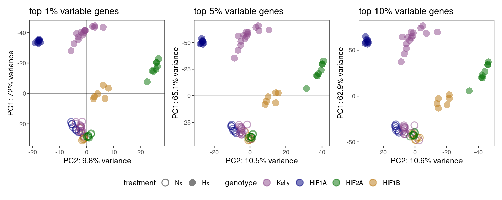
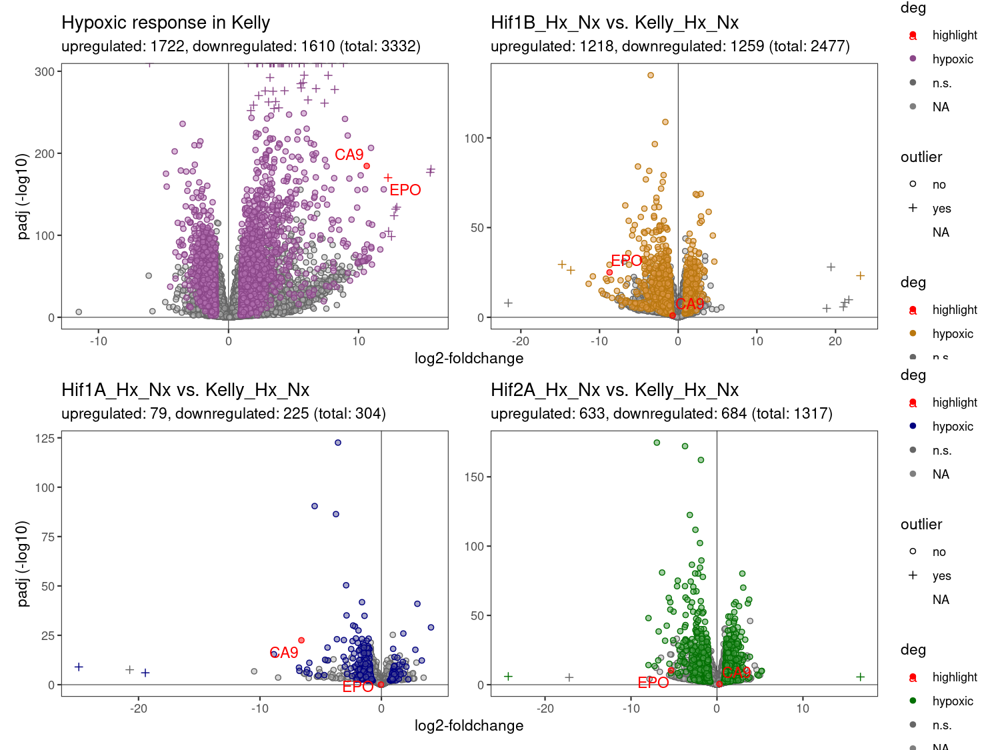
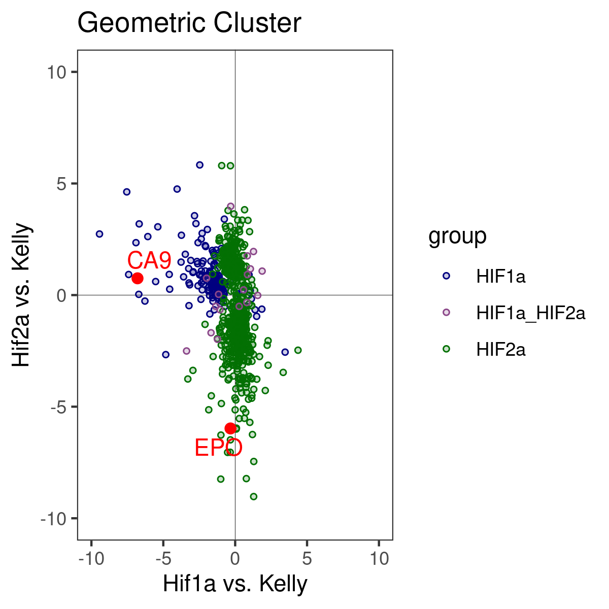
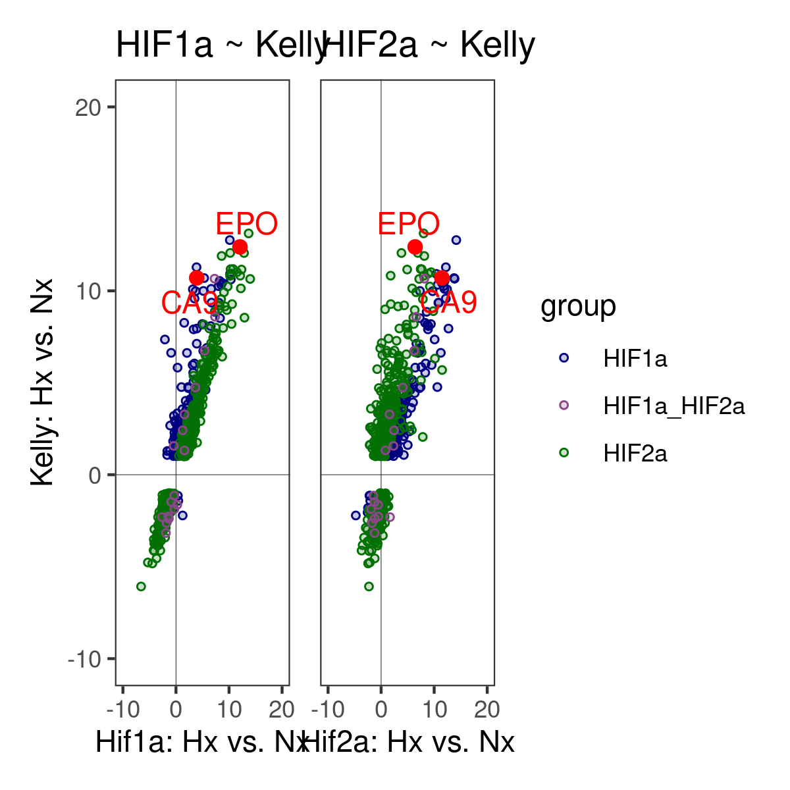
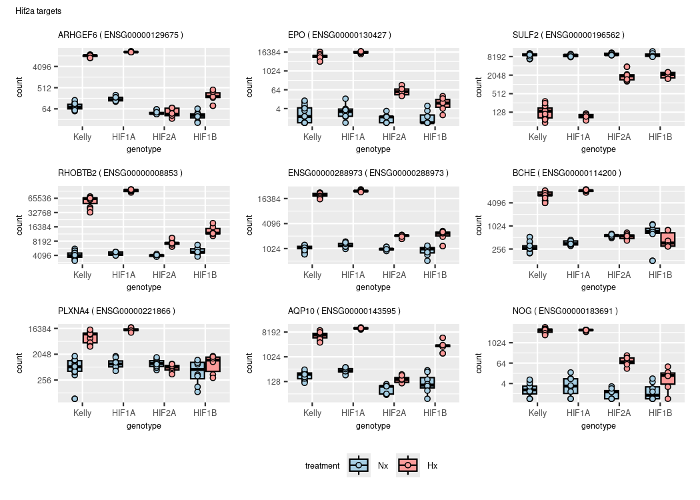
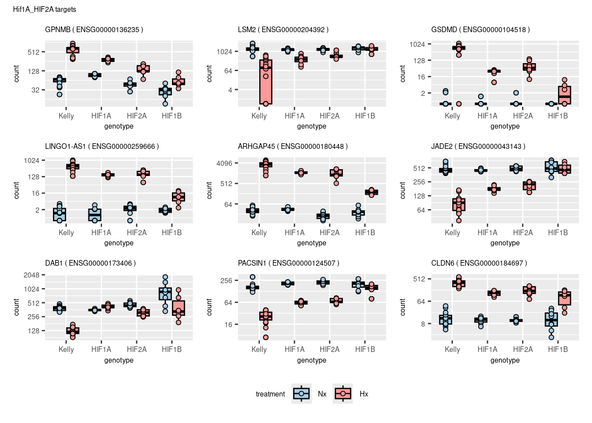
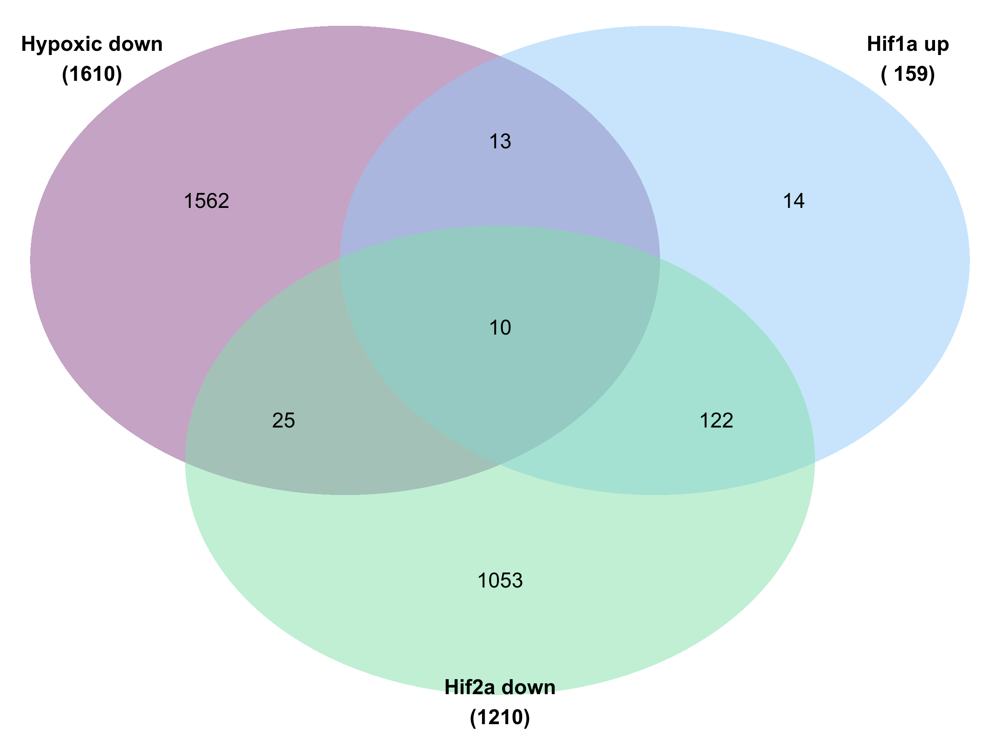
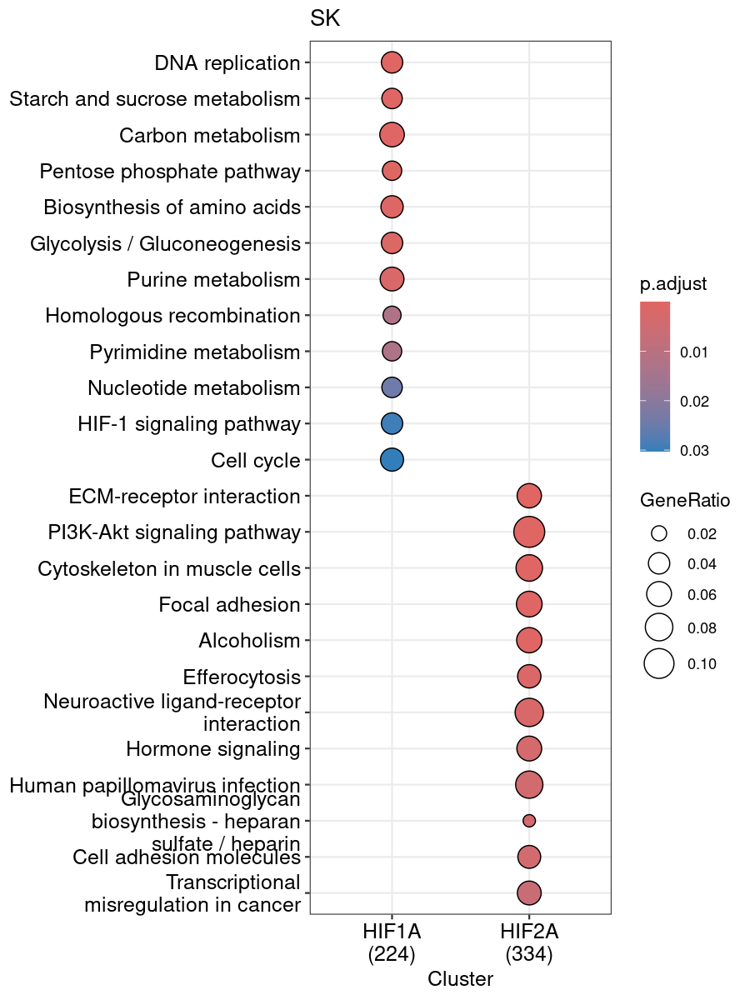

Figures
================
Kelterborn
2024-07-18

- [0. Load](#0-load)
  - [- libraries, folders, R_utils](#--libraries-folders-r_utils)
  - [- Load dds](#--load-dds)
  - [- Colour sheme](#--colour-sheme)
  - [-Prepare Results](#-prepare-results)
- [Figure 1: Samples QC](#figure-1-samples-qc)
  - [PCA](#pca)
- [Example Counts](#example-counts)
- [Figure 2: Differential expressed
  genes](#figure-2-differential-expressed-genes)
  - [-Volcano_function](#-volcano_function)
  - [-Volcano_function2](#-volcano_function2)
  - [-Plot Vulcanos](#-plot-vulcanos)
  - [-Venn](#-venn)
- [Figure 3: Gene Cluster](#figure-3-gene-cluster)
  - [Gene Cluster](#gene-cluster)
  - [Cluster Holger](#cluster-holger)
  - [HIF independant](#hif-independant)
- [(Table 1: Gene List)](#table-1-gene-list)
- [Figure 4: Gene Set enrichment](#figure-4-gene-set-enrichment)
  - [GO Analysis](#go-analysis)
  - [Cluster GO terms](#cluster-go-terms)
  - [KEGG](#kegg)
- [Figure 5: Compare with ChIP-Seq](#figure-5-compare-with-chip-seq)
  - [Load datasets](#load-datasets)
  - [ChIP Venns](#chip-venns)
- [](#section)
- [\###Old code](#old-code)
  - [Enhanced volcano](#enhanced-volcano)
  - [Volcanos](#volcanos)
  - [Cluster genes](#cluster-genes)

# 0. Load

## - libraries, folders, R_utils

Load R libraries. If package is missing, install with
‘BiocManager::install(“PackageName”)’

## - Load dds

## - Colour sheme

## -Prepare Results

``` r
deg_genes_list <- lapply(results_list,topgenes_f) %>%  lapply(.,rownames) 
names(deg_genes_list) <- paste("deg",names(deg_genes_list),sep="_")

main_degs <- c(list("Kelly: Hx.vs.Nx" = deg_genes_list[["deg_Kelly.Hx.vs.Nx"]],
                     "dd_Hif1b" = deg_genes_list[["deg_Hif1bHxNx.vs.KellyHxNx"]],
                     "dd_Hif1a" = deg_genes_list[["deg_Hif1aHxNx.vs.KellyHxNx"]],
                     "dd_Hif2a" = deg_genes_list[["deg_Hif2aHxNx.vs.KellyHxNx"]] ))


# Select genes
hif1a_2a_genes <- c(deg_genes_list[["deg_Hif1aHxNx.vs.KellyHxNx"]],
                     deg_genes_list[["deg_Hif2aHxNx.vs.KellyHxNx"]]) %>%
                  unique()

# deg_genes_list[["deg_Hif2aHxNx.vs.Hif1aHxNx"]]

hif1a_2a_genes %>% length()
```

    ## [1] 3395

``` r
# Filter results
res_names <- names(results_list)
res_final <- results_list[c("Kelly.Hx.vs.Nx","Hif1a.Hx.vs.Nx","Hif2a.Hx.vs.Nx",
                             "Hx.Hif1a.vs.Kelly","Hx.Hif2a.vs.Kelly","Hx.Hif1b.vs.Kelly","Hx.Hif2a.vs.Hif1a","Hx.Hif1b.vs.Hif1a","Hx.Hif1b.vs.Hif2a" ,
                             "Hif1aHxNx.vs.KellyHxNx","Hif2aHxNx.vs.KellyHxNx","Hif1bHxNx.vs.KellyHxNx","Hif2aHxNx.vs.Hif1aHxNx")] 

# create table with all results
res_table <- lapply(res_final,data.frame) %>% lapply(.,"[", , c("log2FoldChange","padj"))
res_table <- do.call('cbind',res_table)
res_table_final <- res_final[[1]][,c("ENSEMBL","ENTREZ","symbol","baseMean")] %>% data.frame()
res_table_final <- cbind(res_table_final,res_table)
res_hif1a_2a <- res_table_final[hif1a_2a_genes,]
colnames(res_hif1a_2a)
```

    ##  [1] "ENSEMBL"                              
    ##  [2] "ENTREZ"                               
    ##  [3] "symbol"                               
    ##  [4] "baseMean"                             
    ##  [5] "Kelly.Hx.vs.Nx.log2FoldChange"        
    ##  [6] "Kelly.Hx.vs.Nx.padj"                  
    ##  [7] "Hif1a.Hx.vs.Nx.log2FoldChange"        
    ##  [8] "Hif1a.Hx.vs.Nx.padj"                  
    ##  [9] "Hif2a.Hx.vs.Nx.log2FoldChange"        
    ## [10] "Hif2a.Hx.vs.Nx.padj"                  
    ## [11] "Hx.Hif1a.vs.Kelly.log2FoldChange"     
    ## [12] "Hx.Hif1a.vs.Kelly.padj"               
    ## [13] "Hx.Hif2a.vs.Kelly.log2FoldChange"     
    ## [14] "Hx.Hif2a.vs.Kelly.padj"               
    ## [15] "Hx.Hif1b.vs.Kelly.log2FoldChange"     
    ## [16] "Hx.Hif1b.vs.Kelly.padj"               
    ## [17] "Hx.Hif2a.vs.Hif1a.log2FoldChange"     
    ## [18] "Hx.Hif2a.vs.Hif1a.padj"               
    ## [19] "Hx.Hif1b.vs.Hif1a.log2FoldChange"     
    ## [20] "Hx.Hif1b.vs.Hif1a.padj"               
    ## [21] "Hx.Hif1b.vs.Hif2a.log2FoldChange"     
    ## [22] "Hx.Hif1b.vs.Hif2a.padj"               
    ## [23] "Hif1aHxNx.vs.KellyHxNx.log2FoldChange"
    ## [24] "Hif1aHxNx.vs.KellyHxNx.padj"          
    ## [25] "Hif2aHxNx.vs.KellyHxNx.log2FoldChange"
    ## [26] "Hif2aHxNx.vs.KellyHxNx.padj"          
    ## [27] "Hif1bHxNx.vs.KellyHxNx.log2FoldChange"
    ## [28] "Hif1bHxNx.vs.KellyHxNx.padj"          
    ## [29] "Hif2aHxNx.vs.Hif1aHxNx.log2FoldChange"
    ## [30] "Hif2aHxNx.vs.Hif1aHxNx.padj"

``` r
hist(res_hif1a_2a$baseMean, breaks = 100000, xlim = c(0,500))

# TOP genes

deg_top_genes_list <- lapply(results_list,topgenes_f,p=0.05, l2FC = 2, bM = 100) %>%  lapply(.,rownames) 
names(deg_top_genes_list) <- paste("deg",names(deg_top_genes_list),sep="_")

# Select genes
hif1a_2a_top_genes <- c(deg_top_genes_list[["deg_Hif1aHxNx.vs.KellyHxNx"]],
                     deg_top_genes_list[["deg_Hif2aHxNx.vs.KellyHxNx"]]) %>%
                  unique()

# deg_genes_list[["deg_Hif2aHxNx.vs.Hif1aHxNx"]]

hif1a_2a_top_genes %>% length()
```

    ## [1] 343

``` r
res_hif1a_2a_top <- res_table_final[hif1a_2a_top_genes,]
res_hif1a_2a$top <- ifelse(rownames(res_hif1a_2a) %in% hif1a_2a_top_genes,"top","deg")


# create table with all shrinked results
# Filter results
res_shrink <- res_shrink_list[c("Kelly.Hx.vs.Nx","Hif1a.Hx.vs.Nx","Hif2a.Hx.vs.Nx", "Hif1aHxNx.vs.KellyHxNx","Hif2aHxNx.vs.KellyHxNx","Hif1bHxNx.vs.KellyHxNx","Hif2aHxNx.vs.Hif1aHxNx")] 

# create table with all results
res_shrink <- lapply(res_shrink,data.frame) %>% lapply(.,"[", , c("log2FoldChange","padj"))
res_shrink <- do.call('cbind',res_shrink)
res_shrink_final <- res_final[[1]][,c("symbol","baseMean")] %>% data.frame()
res_shrink_final <- cbind(res_shrink_final,res_shrink)
res_shrink_hif1a_2a <- res_shrink_final[hif1a_2a_genes,]


# Gene universe
# Expression min
results_list[[1]]$baseMean %>% hist(breaks=100000, xlim = c(0,100)) 

# in results
res_hif1a_2a$baseMean %>% min()
```

    ## [1] 1.333859

``` r
res_hif1a_2a$baseMean %>% hist(breaks=100000, xlim = c(0,100))

# use all genes in dataset
genes_univ_ens <- results_list[[1]]$ENSEMBL
genes_univ_ens %>% length()
```

    ## [1] 21583

``` r
genes_univ <- results_list[[1]]$ENTREZ
genes_univ %>% length()
```

    ## [1] 21583

``` r
genes_univ %>% is.na() %>% summary()
```

    ##    Mode   FALSE    TRUE 
    ## logical   16750    4833

``` r
# Example genes
res_shrink_list[["Kelly.Hx.vs.Nx"]] %>% subset(symbol=="CA9")
```

    ## log2 fold change (MMSE): 0,0,0,0,+1,0,0,0 
    ## Wald test p-value: 0,0,0,0,+1,0,0,0 
    ## DataFrame with 1 row and 8 columns
    ##                  baseMean log2FoldChange     lfcSE       pvalue         padj
    ##                 <numeric>      <numeric> <numeric>    <numeric>    <numeric>
    ## ENSG00000107159   3017.83        10.6266  0.365606 1.44153e-187 2.99131e-185
    ##                      symbol         ENSEMBL    ENTREZ
    ##                 <character>     <character> <integer>
    ## ENSG00000107159         CA9 ENSG00000107159       768

``` r
res_shrink_list[["Kelly.Hx.vs.Nx"]] %>% subset(symbol=="WT1")
```

    ## log2 fold change (MMSE): 0,0,0,0,+1,0,0,0 
    ## Wald test p-value: 0,0,0,0,+1,0,0,0 
    ## DataFrame with 1 row and 8 columns
    ##                  baseMean log2FoldChange     lfcSE      pvalue        padj
    ##                 <numeric>      <numeric> <numeric>   <numeric>   <numeric>
    ## ENSG00000184937   140.558        8.79674  0.433554 7.13829e-93 2.97396e-91
    ##                      symbol         ENSEMBL    ENTREZ
    ##                 <character>     <character> <integer>
    ## ENSG00000184937         WT1 ENSG00000184937      7490

``` r
CA9 = "ENSG00000107159"
WT1 ="ENSG00000184937"
```


# Figure 1: Samples QC

## PCA

``` r
vst_dat <- assay(vst(dds))

p <- pca(vst_dat, metadata = colData(dds), removeVar = 0.99)
pca_table <- cbind(p$rotated,p$metadata)
pca1 <- ggplot(pca_table, aes(PC2, PC1, color=genotype, shape=treatment)) +
  geom_hline(yintercept = 0, linewidth = 0.1) + 
  geom_vline(xintercept = 0, linewidth = 0.1) +
  geom_point(size=4, alpha=0.5, stroke=1) +
  labs(title = "top 1% variable genes") +
  ylab(paste0("PC1: ",p$variance["PC1"] %>% round(digits = 1),"% variance")) +
  xlab(paste0("PC2: ",p$variance["PC2"] %>% round(digits = 1),"% variance")) +
  scale_color_manual(values=colors[c(2,4,6,8)]) +
  scale_shape_manual(values = c(21,16)) + 
  scale_fill_manual(values=c(colors[1],"white",colors[2],"white")) +
  theme_bw() +
  scale_y_reverse() +
  removeGrid(x=T, y=T)

p <- pca(vst_dat, metadata = colData(dds), removeVar = 0.95)
pca_table <- cbind(p$rotated,p$metadata)
pca5 <- ggplot(pca_table, aes(PC2, PC1, color=genotype, shape=treatment)) +
  geom_hline(yintercept = 0, linewidth = 0.1) + 
  geom_vline(xintercept = 0, linewidth = 0.1) +
  geom_point(size=4, alpha=0.5, stroke=1) +
  labs(title = "top 5% variable genes") +
  ylab(paste0("PC1: ",p$variance["PC1"] %>% round(digits = 1),"% variance")) +
  xlab(paste0("PC2: ",p$variance["PC2"] %>% round(digits = 1),"% variance")) +
  scale_color_manual(values=colors[c(2,4,6,8)]) +
  scale_shape_manual(values = c(21,16)) + 
  scale_fill_manual(values=c(colors[1],"white",colors[2],"white")) +
  theme_bw() +
  scale_y_reverse() +
  removeGrid(x=T, y=T)

p <- pca(vst_dat, metadata = colData(dds), removeVar = 0.90)
pca_table <- cbind(p$rotated,p$metadata)
pca10 <- ggplot(pca_table, aes(PC2, PC1, color=genotype, shape=treatment)) +
  geom_hline(yintercept = 0, linewidth = 0.1) + 
  geom_vline(xintercept = 0, linewidth = 0.1) +
  geom_point(size=4, alpha=0.5, stroke=1) +
  labs(title = "top 10% variable genes") +
  ylab(paste0("PC1: ",p$variance["PC1"] %>% round(digits = 1),"% variance")) +
  xlab(paste0("PC2: ",p$variance["PC2"] %>% round(digits = 1),"% variance")) +
  scale_color_manual(values=colors[c(2,4,6,8)]) +
  scale_shape_manual(values = c(21,16)) + 
  scale_fill_manual(values=c(colors[1],"white",colors[2],"white")) +
  theme_bw() +
  scale_x_reverse() +
  removeGrid(x=T, y=T)
```

``` r
pca1+pca5+pca10+ plot_layout(guides = "collect", axes="collect", axis_titles="collect") & 
  theme(legend.position = 'bottom')
```

<!-- -->

``` r
pca10
```


# Example Counts

``` r
# HIF1A: EPO, VEGF, HO-1, ADM, and Glut-1
EPO <- subset(res_shrink_list[["Kelly.Hx.vs.Nx"]],symbol=="EPO")$ENSEMBL

# EPO <- subset(res,symbol=="VEGF-A")
# EPO <- subset(res,symbol=="EPO")
# EPO <- subset(res,symbol=="EPO")
# EPO <- subset(res,symbol=="EPO")


plotCounts_anno(CA9)
```

<!-- -->

``` r
plotCounts_anno(WT1)
```

<!-- -->

``` r
plotCounts_anno(EPO)
```

<!-- -->

# Figure 2: Differential expressed genes

## -Volcano_function

``` r
# res <- res_shrink_list[[n]] %>% data.frame()

getdeg <- function(x){subset(results_list[[x]], padj < 0.05 & (log2FoldChange > 1 | log2FoldChange < -1)) %>% data.frame()}

volcano_sk3 <- function(n,
                        col="red",
                        celline="cells",
                        deg=deg) {
xlim <- 12
ylim <- -250
res <- results_list[[n]]
res <- res_shrink_list[[n]] %>% data.frame()

points_anno <- res[c(CA9, EPO),c("log2FoldChange","padj","symbol")]

# of deg genes
up <- subset(deg, log2FoldChange > 1) %>% nrow()
down <- subset(deg, log2FoldChange < -1) %>% nrow()
total <- up+down

# points outside the grid
outx <- subset(res, log2FoldChange > xlim | log2FoldChange < -xlim) %>% rownames()
outy <- subset(res, padj < 10^ylim) %>% rownames()

res$outlier <- ifelse(rownames(res) %in% c(outx,outy),"yes","no")
res$deg <- ifelse(rownames(res) %in% rownames(points_anno),"highlight",
                  ifelse(rownames(res) %in% rownames(deg),"hypoxic","n.s.")) %>% factor()

res <- res %>% arrange(desc(res$deg))

res[outx,"log2FoldChange"] <- ifelse(res[outx,"log2FoldChange"] > xlim,xlim,-xlim)
res[outy,"padj"] <- 10^ylim

res_shrink_list[["Kelly.Hx.vs.Nx"]][CA9,]


volcano_func <- ggplot(res,aes(x=log2FoldChange,y=-log10(padj),color=deg, shape=outlier, fill=deg,label=symbol)) +
  geom_hline(yintercept = 0, linewidth = 0.2) + 
  geom_vline(xintercept = 0, linewidth = 0.2) +
  geom_point(size=1.5, stroke=0.5) +
  # geom_point(aes(x=res[c(CA9),"log2FoldChange"],y=-log10(res[c(CA9),"padj"])), size=2, fill="red") + 
  # geom_text(aes(x=res[c(CA9),"log2FoldChange"],y=-log10(res[c(CA9),"padj"])),size=4, label=res[c(CA9),"symbol"]) +
  # geom_point(aes(x=res[c(WT1),"log2FoldChange"],y=-log10(res[c(WT1),"padj"])), size=2, fill="red") +  
  geom_text_repel(data=subset(res,deg=="highlight")) +
  scale_shape_manual(values = c(21,3)) + 
  scale_alpha_manual(values = c(0.3,0.6)) + 
  labs(title=paste0("Hypoxic response in ",celline),
       subtitle = paste0("upregulated: ",up,", downregulated: ",down," (total: ",total,")") )+
  theme(plot.title = element_text(size = 1), 
        plot.subtitle = element_text(size = 0.5) )+
  ylab("padj (-log10)") +
  xlab("log2-foldchange") +
  scale_fill_manual(values = alpha(c("red",lighten(col,0.3),"grey70"),0.5)) + 
  scale_color_manual(values = c("red",col,"grey40")) + 
  theme_bw() +
  # geom_text_repel(label=res$symbol, color="black") + 
  removeGrid(x=T, y=T)
volcano_func
}
```

## -Volcano_function2

``` r
getdeg <- function(x){subset(results_list[[x]], padj < 0.05 & (log2FoldChange > 1 | log2FoldChange < -1)) %>% data.frame()}

volcano_sk4 <- function(n,
                        col="red",
                        col2="blue",
                        celline="cells",
                        deg=deg,
                        deg2=deg2) {
xlim <- 12
ylim <- -250
res <- results_list[[n]]
res <- res_shrink_list[[n]] %>% data.frame()

# of deg genes
hx_up <- subset(deg, log2FoldChange > 1) %>% nrow()
hx_down <- subset(deg, log2FoldChange < -1) %>% nrow()
hx_total <- hx_up+hx_down

# of deg2 genes
up <- subset(deg2, log2FoldChange > 1) %>% nrow()
down <- subset(deg2, log2FoldChange < -1) %>% nrow()
total <- up+down

# points outside the grid
outx <- subset(res, log2FoldChange > xlim | log2FoldChange < -xlim) %>% rownames()
outy <- subset(res, padj < 10^ylim) %>% rownames()

res$outlier <- ifelse(rownames(res) %in% c(outx,outy),"yes","no")
res$deg <- ifelse(rownames(res) %in% rownames(deg2),"different from Kelly",
                  ifelse(rownames(res) %in% rownames(deg),"hypoxic","n.s.")) %>% factor()

res <- res %>% arrange(desc(res$deg))

res[outx,"log2FoldChange"] <- ifelse(res[outx,"log2FoldChange"] > xlim,xlim,-xlim)
res[outy,"padj"] <- 10^ylim

volcano_func <- ggplot(res,aes(x=log2FoldChange,y=-log10(padj),color=deg, shape=outlier, fill=deg)) +
  geom_hline(yintercept = 0, linewidth = 0.2) + 
  geom_vline(xintercept = 0, linewidth = 0.2) +
  geom_point(size=1.5, stroke=0.5) +
  scale_shape_manual(values = c(21,3)) + 
  scale_alpha_manual(values = c(0.3,0.6)) + 
  labs(title=paste0("Hypoxic response in ",celline),
       subtitle = paste0("Hypoxic: up ",hx_up,", down ",hx_down," (total ",hx_total,")","\nDifferent from Kelly: up ",up,", down: ",down," (total: ",total,")")) +
  theme(plot.title = element_text(size = 1), 
        plot.subtitle = element_text(size = 0.5) )+
  ylab("padj (-log10)") +
  xlab("log2-foldchange") +
  scale_fill_manual(values = alpha(c(lighten(c(col2,col),0.3),"grey70"),0.5)) + 
  scale_color_manual(values = c(col2,col,"grey40")) + 
  theme_bw() +
  # geom_text_repel(label=res$symbol, color="black") + 
  removeGrid(x=T, y=T)
volcano_func
}
```

## -Plot Vulcanos

### Simple

``` r
# Simple Volcanos
volcano_Kelly <- volcano_sk3(n="Kelly.Hx.vs.Nx", deg=getdeg("Kelly.Hx.vs.Nx"),col=colors[2], celline="Kelly")
volcano_hif1a <- volcano_sk3(n="Hif1a.Hx.vs.Nx", deg=getdeg("Hif1a.Hx.vs.Nx"),col=colors[4], celline="HIF1A")
volcano_hif2a <- volcano_sk3(n="Hif2a.Hx.vs.Nx", deg=getdeg("Hif2a.Hx.vs.Nx"),col=colors[6], celline="HIF2A")
volcano_hif1b <- volcano_sk3(n="Hif1b.Hx.vs.Nx", deg=getdeg("Hif1b.Hx.vs.Nx"),col=colors[8], celline="HIF1B")

(volcano_Kelly+volcano_hif1b + plot_layout(guides = "collect", axes="collect", axis_titles="collect") ) / 
  (volcano_hif1a+volcano_hif2a + plot_layout(guides = "collect", axes="collect", axis_titles="collect") ) & 
  theme(legend.position = 'right')
```

<!-- -->

``` r
n2 <- {}

deg <- subset(results_list[["Kelly.Hx.vs.Nx"]], padj < 0.05 & (log2FoldChange > 1 | log2FoldChange < -1)) %>% data.frame()


# Two set volcanos
n <- "Hif1a.Hx.vs.Nx"
deg <- subset(results_list[["Hif1a.Hx.vs.Nx"]], padj < 0.05 & (log2FoldChange > 1 | log2FoldChange < -1)) %>% data.frame()
deg2 <- subset(results_list[["Hif1aHxNx.vs.KellyHxNx"]], padj < 0.05 & (log2FoldChange > 1 | log2FoldChange < -1)) %>% data.frame()
col <- colors[2]
col2 <- colors[4]
celline="HIF1A"

volcano_Kelly <- volcano_sk3(n="Kelly.Hx.vs.Nx", deg=getdeg("Kelly.Hx.vs.Nx"),col=colors[2], celline="Kelly")
volcano_hif1a <- volcano_sk3(n="Hif1aHxNx.vs.KellyHxNx", deg=getdeg("Hif1aHxNx.vs.KellyHxNx"),col=colors[4], celline="HIF1A") + ggtitle(label="Hif1A_Hx_Nx vs. Kelly_Hx_Nx")
volcano_hif2a <- volcano_sk3(n="Hif2aHxNx.vs.KellyHxNx", deg=getdeg("Hif2aHxNx.vs.KellyHxNx"),col=colors[6], celline="HIF2A")  + ggtitle(label="Hif2A_Hx_Nx vs. Kelly_Hx_Nx")
volcano_hif1b <- volcano_sk3(n="Hif1bHxNx.vs.KellyHxNx", deg=getdeg("Hif1bHxNx.vs.KellyHxNx"),col=colors[8], celline="HIF1B")  + ggtitle(label="Hif1B_Hx_Nx vs. Kelly_Hx_Nx")

(volcano_Kelly+volcano_hif1b + plot_layout(guides = "collect", axes="collect", axis_titles="collect") ) / 
  (volcano_hif1a+volcano_hif2a + plot_layout(guides = "collect", axes="collect", axis_titles="collect") ) & 
  theme(legend.position = 'right')
```

<!-- -->

### Advanced

``` r
# Two set volcanos
n <- "Hif1a.Hx.vs.Nx"
deg <- subset(results_list[["Hif1a.Hx.vs.Nx"]], padj < 0.05 & (log2FoldChange > 1 | log2FoldChange < -1)) %>% data.frame()
deg2 <- subset(results_list[["Hif1aHxNx.vs.KellyHxNx"]], padj < 0.05 & (log2FoldChange > 1 | log2FoldChange < -1)) %>% data.frame()
col <- colors[2]
col2 <- colors[4]
celline="HIF1A"

volcano_Kelly <- volcano_sk3(n="Kelly.Hx.vs.Nx", deg=getdeg("Kelly.Hx.vs.Nx"),col=colors[2], celline="Kelly")
volcano_hif1a <- volcano_sk4(n="Hif1a.Hx.vs.Nx", deg=getdeg("Hif1a.Hx.vs.Nx"), deg2=getdeg("Hif1aHxNx.vs.KellyHxNx"),col=colors[2], col2=colors[4], celline="HIF1A")
volcano_hif2a <- volcano_sk4(n="Hif2a.Hx.vs.Nx", deg=getdeg("Hif2a.Hx.vs.Nx"), deg2=getdeg("Hif2aHxNx.vs.KellyHxNx"),col=colors[2], col2=colors[6], celline="HIF2A")
volcano_hif1b <- volcano_sk4(n="Hif1b.Hx.vs.Nx", deg=getdeg("Hif1b.Hx.vs.Nx"), deg2=getdeg("Hif1bHxNx.vs.KellyHxNx"),col=colors[2], col2=colors[8], celline="HIF1B")

(volcano_Kelly+volcano_hif1b + plot_layout(guides = "collect", axes="collect", axis_titles="collect") ) / 
  (volcano_hif1a+volcano_hif2a + plot_layout(guides = "collect", axes="collect", axis_titles="collect") ) & 
  theme(legend.position = 'right')
```

<!-- -->

## -Venn

``` r
input_list <- main_degs
plt1 <- venn.diagram(
    x = input_list,
    fill = colors[c(2,7,3,5)],
    main.fontface = "bold",
    fontfamily ="Arial",
    category.names = paste(names(input_list),"\n(",input_list %>% summary() %>% .[c(1:length(input_list))],")",sep=""),
    force.unique = TRUE, na = "remove", total.population = TRUE,
    filename = NULL,
    lwd = 2,
    lty = 'blank',
    cat.fontface = "bold",
    cat.fontfamily = "arial")

input_list <- main_degs[c(3,4,1)]
plt2 <- venn.diagram(
    x = input_list,
    fill = colors[c(3,5,2)],
    main.fontface = "bold",
    fontfamily ="Arial",
    category.names = paste(names(input_list),"\n(",input_list %>% summary() %>% .[c(1:length(input_list))],")",sep=""),
    force.unique = TRUE, na = "remove", total.population = TRUE,
    filename = NULL,
    lwd = 2,
    lty = 'blank',
    cat.fontface = "bold",
    cat.fontfamily = "arial")
    
#     main = "Compare Hif KOs",


patchwork::wrap_elements(plt1) / patchwork::wrap_elements(plt2)
```


# Figure 3: Gene Cluster

## Gene Cluster

``` r
# cluster_venn

main_degs %>% names()
```

    ## [1] "Kelly: Hx.vs.Nx" "dd_Hif1b"        "dd_Hif1a"        "dd_Hif2a"

``` r
length(main_degs[[3]])
```

    ## [1] 863

``` r
length(main_degs[[4]])
```

    ## [1] 2856

``` r
venns <- calculate.overlap(main_degs[c(3,4)])
lapply(venns,length)
```

    ## $a1
    ## [1] 863
    ## 
    ## $a2
    ## [1] 2856
    ## 
    ## $a3
    ## [1] 324

``` r
venns %>% unlist() %>% length()
```

    ## [1] 4043

``` r
venns %>% unlist() %>% unique() %>% length()
```

    ## [1] 3395

``` r
venns$a1 <- setdiff(venns$a1,venns$a3)
venns$a2 <- setdiff(venns$a2,venns$a3)
lapply(venns,length)
```

    ## $a1
    ## [1] 539
    ## 
    ## $a2
    ## [1] 2532
    ## 
    ## $a3
    ## [1] 324

``` r
venns %>% unlist() %>% length()
```

    ## [1] 3395

``` r
venns %>% unlist() %>% unique() %>% length()
```

    ## [1] 3395

``` r
res_hif1a_2a$venn <- ifelse(rownames(res_hif1a_2a) %in% venns$a1,"HIF1A",
                      ifelse(rownames(res_hif1a_2a) %in% venns$a2,"HIF2A",
                      ifelse(rownames(res_hif1a_2a) %in% venns$a3,"overlap","interaction")))
res_hif1a_2a$venn %>% table()
```

    ## .
    ##   HIF1A   HIF2A overlap 
    ##     539    2532     324

``` r
# Cluster Venn
cluster_venn <- ggplot(res_hif1a_2a,aes(x=Hif1aHxNx.vs.KellyHxNx.log2FoldChange, y=Hif2aHxNx.vs.KellyHxNx.log2FoldChange, color=venn, fill=venn, label=symbol)) +
  geom_hline(yintercept = 0, linewidth = 0.1) + 
  geom_vline(xintercept = 0, linewidth = 0.1) +
  geom_point(size=1, stroke=0.5, shape=21) +
  labs(title = "Simple/Venn Cluster") +
  xlab("Hif1a vs. Kelly") +
  ylab("Hif2a vs. Kelly") +
  scale_color_manual(values=c(colors[c(4,6)],"orange",colors[2])) +
  # scale_shape_manual(values = c(21,16)) + 
  scale_fill_manual(values=alpha(c(colors[c(4,6)],"orange",colors[2]),0.2)) +
  geom_point(data=res_hif1a_2a[c(CA9,EPO),],fill="red",color="red",size=2) +
  geom_text_repel(data=res_hif1a_2a[c(CA9,EPO),],color="red") +
  theme_bw() +
  removeGrid(x=T, y=T) +
  coord_cartesian(xlim = c(-10, 10),ylim = c(-10,10))

res_hif1a_2a$group %>% table()
```

    ## < table of extent 0 >

``` r
# Manual Cluster

hif_parallel  <- res_hif1a_2a %>% filter(abs(Hif2aHxNx.vs.Hif1aHxNx.log2FoldChange) < 1)

hif2a_up <- res_hif1a_2a %>% filter(Hif2aHxNx.vs.Hif1aHxNx.log2FoldChange > 1 & (Hif2aHxNx.vs.KellyHxNx.log2FoldChange-1 > 2*-Hif1aHxNx.vs.KellyHxNx.log2FoldChange))
hif2a_do <- res_hif1a_2a %>% filter(Hif2aHxNx.vs.Hif1aHxNx.log2FoldChange < -1 & (Hif2aHxNx.vs.KellyHxNx.log2FoldChange < -Hif1aHxNx.vs.KellyHxNx.log2FoldChange+1))

hif1a_up <- res_hif1a_2a %>% filter(Hif2aHxNx.vs.Hif1aHxNx.log2FoldChange > 1 & (-Hif1aHxNx.vs.KellyHxNx.log2FoldChange > (abs(Hif2aHxNx.vs.KellyHxNx.log2FoldChange-1))))

hif1a_do <- res_hif1a_2a %>% filter(Hif2aHxNx.vs.Hif1aHxNx.log2FoldChange < -1 & (Hif1aHxNx.vs.KellyHxNx.log2FoldChange-1 > 2*-Hif2aHxNx.vs.KellyHxNx.log2FoldChange))


res_hif1a_2a$group <- ifelse(rownames(res_hif1a_2a) %in% rownames(hif_parallel),"HIF1A_HIF2A",
                      ifelse(rownames(res_hif1a_2a) %in% rownames(hif2a_up),"HIF2A",
                      ifelse(rownames(res_hif1a_2a) %in% rownames(hif2a_do),"HIF2A",
                      ifelse(rownames(res_hif1a_2a) %in% rownames(hif1a_up),"HIF1A",
                      ifelse(rownames(res_hif1a_2a) %in% rownames(hif1a_do),"HIF1A","opposite")
                      ))))

cluster <- ggplot(res_hif1a_2a,aes(x=Hif1aHxNx.vs.KellyHxNx.log2FoldChange, y=Hif2aHxNx.vs.KellyHxNx.log2FoldChange, color=group, fill=group, label=symbol)) +
  geom_hline(yintercept = 0, linewidth = 0.1) + 
  geom_vline(xintercept = 0, linewidth = 0.1) +
  geom_abline(intercept=c(1,-1)) +
  geom_abline(slope=c(-1), intercept = 1) +
  annotate("segment", x = c(0,1), y = c(1,0), xend = c(-10,11), yend = c(21,-5),color="black") +
  geom_point(size=1, stroke=0.5, shape=21) +
  labs(title = "Geometric Cluster") +
  xlab("Hif1a vs. Kelly") +
  ylab("Hif2a vs. Kelly") +
  scale_color_manual(values=c(colors[c(4,2,6)],"orange")) +
  # scale_shape_manual(values = c(21,16)) + 
  scale_fill_manual(values=alpha(c(colors[c(4,2,6)],"orange"),0.2)) +
  geom_point(data=res_hif1a_2a[c(CA9,EPO),],fill="red",color="red",size=2) +
  geom_text_repel(data=res_hif1a_2a[c(CA9,EPO),],color="red") +
  theme_bw() +
  removeGrid(x=T, y=T) +
  coord_cartesian(xlim = c(-10, 10),ylim = c(-10,10))

cluster_venn + cluster
```

<!-- -->

``` r
# only genes with l2fc > 2
cluster_top <- ggplot(res_hif1a_2a[hif1a_2a_top_genes,],aes(x=Hif1aHxNx.vs.KellyHxNx.log2FoldChange, y=Hif2aHxNx.vs.KellyHxNx.log2FoldChange, color=group, fill=group, label=symbol)) +
  geom_hline(yintercept = 0, linewidth = 0.1) + 
  geom_vline(xintercept = 0, linewidth = 0.1) +
  geom_abline(intercept=c(1,-1)) +
  geom_abline(slope=c(-1), intercept = 1) +
  annotate("segment", x = c(0,1), y = c(1,0), xend = c(-10,11), yend = c(21,-5),color="black") +
  geom_point(size=1, stroke=0.5, shape=21) +
  labs(title = "Geometric Cluster: l2FC > 2") +
  xlab("Hif1a vs. Kelly") +
  ylab("Hif2a vs. Kelly") +
  scale_color_manual(values=c(colors[c(4,2,6)],"orange")) +
  # scale_shape_manual(values = c(21,16)) + 
  scale_fill_manual(values=alpha(c(colors[c(4,2,6)],"orange"),0.2)) +
  geom_point(data=res_hif1a_2a[c(CA9,EPO),],fill="red",color="red",size=2) +
  geom_text_repel(data=res_hif1a_2a[c(CA9,EPO),],color="red") +
  theme_bw() +
  removeGrid(x=T, y=T) +
  coord_cartesian(xlim = c(-10, 10),ylim = c(-10,10))

cluster_top
```

<!-- -->

``` r
# only genes with p < 0.05
colnames(res_hif1a_2a)
```

    ##  [1] "ENSEMBL"                              
    ##  [2] "ENTREZ"                               
    ##  [3] "symbol"                               
    ##  [4] "baseMean"                             
    ##  [5] "Kelly.Hx.vs.Nx.log2FoldChange"        
    ##  [6] "Kelly.Hx.vs.Nx.padj"                  
    ##  [7] "Hif1a.Hx.vs.Nx.log2FoldChange"        
    ##  [8] "Hif1a.Hx.vs.Nx.padj"                  
    ##  [9] "Hif2a.Hx.vs.Nx.log2FoldChange"        
    ## [10] "Hif2a.Hx.vs.Nx.padj"                  
    ## [11] "Hx.Hif1a.vs.Kelly.log2FoldChange"     
    ## [12] "Hx.Hif1a.vs.Kelly.padj"               
    ## [13] "Hx.Hif2a.vs.Kelly.log2FoldChange"     
    ## [14] "Hx.Hif2a.vs.Kelly.padj"               
    ## [15] "Hx.Hif1b.vs.Kelly.log2FoldChange"     
    ## [16] "Hx.Hif1b.vs.Kelly.padj"               
    ## [17] "Hx.Hif2a.vs.Hif1a.log2FoldChange"     
    ## [18] "Hx.Hif2a.vs.Hif1a.padj"               
    ## [19] "Hx.Hif1b.vs.Hif1a.log2FoldChange"     
    ## [20] "Hx.Hif1b.vs.Hif1a.padj"               
    ## [21] "Hx.Hif1b.vs.Hif2a.log2FoldChange"     
    ## [22] "Hx.Hif1b.vs.Hif2a.padj"               
    ## [23] "Hif1aHxNx.vs.KellyHxNx.log2FoldChange"
    ## [24] "Hif1aHxNx.vs.KellyHxNx.padj"          
    ## [25] "Hif2aHxNx.vs.KellyHxNx.log2FoldChange"
    ## [26] "Hif2aHxNx.vs.KellyHxNx.padj"          
    ## [27] "Hif1bHxNx.vs.KellyHxNx.log2FoldChange"
    ## [28] "Hif1bHxNx.vs.KellyHxNx.padj"          
    ## [29] "Hif2aHxNx.vs.Hif1aHxNx.log2FoldChange"
    ## [30] "Hif2aHxNx.vs.Hif1aHxNx.padj"          
    ## [31] "top"                                  
    ## [32] "venn"                                 
    ## [33] "group"

``` r
res_hif1a_2a_p <- filter(res_hif1a_2a, Hif1aHxNx.vs.KellyHxNx.padj < 0.05 & Hif2aHxNx.vs.KellyHxNx.padj < 0.05)

cluster_p <- ggplot(res_hif1a_2a_p,aes(x=Hif1aHxNx.vs.KellyHxNx.log2FoldChange, y=Hif2aHxNx.vs.KellyHxNx.log2FoldChange, color=group, fill=group)) +
  geom_hline(yintercept = 0, linewidth = 0.1) + 
  geom_vline(xintercept = 0, linewidth = 0.1) +
  geom_abline(intercept=c(1,-1)) +
  geom_abline(slope=c(-1), intercept = 1) +
  annotate("segment", x = c(0,1), y = c(1,0), xend = c(-10,11), yend = c(21,-5),color="black") +
  geom_point(size=1, stroke=0.5, shape=21) +
  labs(title = "Geometric Cluster (all p < 0.05") +
  xlab("Hif1a vs. Kelly") +
  ylab("Hif2a vs. Kelly") +
  scale_color_manual(values=c(colors[c(4,2,6)],"orange")) +
  # scale_shape_manual(values = c(21,16)) + 
  scale_fill_manual(values=alpha(c(colors[c(4,2,6)],"orange"),0.2)) +
  theme_bw() +
  removeGrid(x=T, y=T) +
  coord_cartesian(xlim = c(-5, 5),ylim = c(-5,5))

# cluster + cluster_p


write.xlsx(res_hif1a_2a,"DEG_genes.xlsx")
```

## Cluster Holger

``` r
# HIF1a stimuliert
res_table_final %>% colnames()
```

    ##  [1] "ENSEMBL"                              
    ##  [2] "ENTREZ"                               
    ##  [3] "symbol"                               
    ##  [4] "baseMean"                             
    ##  [5] "Kelly.Hx.vs.Nx.log2FoldChange"        
    ##  [6] "Kelly.Hx.vs.Nx.padj"                  
    ##  [7] "Hif1a.Hx.vs.Nx.log2FoldChange"        
    ##  [8] "Hif1a.Hx.vs.Nx.padj"                  
    ##  [9] "Hif2a.Hx.vs.Nx.log2FoldChange"        
    ## [10] "Hif2a.Hx.vs.Nx.padj"                  
    ## [11] "Hx.Hif1a.vs.Kelly.log2FoldChange"     
    ## [12] "Hx.Hif1a.vs.Kelly.padj"               
    ## [13] "Hx.Hif2a.vs.Kelly.log2FoldChange"     
    ## [14] "Hx.Hif2a.vs.Kelly.padj"               
    ## [15] "Hx.Hif1b.vs.Kelly.log2FoldChange"     
    ## [16] "Hx.Hif1b.vs.Kelly.padj"               
    ## [17] "Hx.Hif2a.vs.Hif1a.log2FoldChange"     
    ## [18] "Hx.Hif2a.vs.Hif1a.padj"               
    ## [19] "Hx.Hif1b.vs.Hif1a.log2FoldChange"     
    ## [20] "Hx.Hif1b.vs.Hif1a.padj"               
    ## [21] "Hx.Hif1b.vs.Hif2a.log2FoldChange"     
    ## [22] "Hx.Hif1b.vs.Hif2a.padj"               
    ## [23] "Hif1aHxNx.vs.KellyHxNx.log2FoldChange"
    ## [24] "Hif1aHxNx.vs.KellyHxNx.padj"          
    ## [25] "Hif2aHxNx.vs.KellyHxNx.log2FoldChange"
    ## [26] "Hif2aHxNx.vs.KellyHxNx.padj"          
    ## [27] "Hif1bHxNx.vs.KellyHxNx.log2FoldChange"
    ## [28] "Hif1bHxNx.vs.KellyHxNx.padj"          
    ## [29] "Hif2aHxNx.vs.Hif1aHxNx.log2FoldChange"
    ## [30] "Hif2aHxNx.vs.Hif1aHxNx.padj"

``` r
results_list %>% names()
```

    ##  [1] "Hif1a.Hx.vs.Nx"         "Hif2a.Hx.vs.Nx"         "Hif1b.Hx.vs.Nx"        
    ##  [4] "Kelly.Hx.vs.Nx"         "Nx.Hif1a.vs.Kelly"      "Nx.Hif2a.vs.Kelly"     
    ##  [7] "Nx.Hif1b.vs.Kelly"      "Hx.Hif1a.vs.Kelly"      "Hx.Hif2a.vs.Kelly"     
    ## [10] "Hx.Hif1b.vs.Kelly"      "Hx.Hif2a.vs.Hif1a"      "Hx.Hif1b.vs.Hif1a"     
    ## [13] "Hx.Hif1b.vs.Hif2a"      "Hif1aHxNx.vs.KellyHxNx" "Hif2aHxNx.vs.KellyHxNx"
    ## [16] "Hif1bHxNx.vs.KellyHxNx" "Hif2aHxNx.vs.Hif1aHxNx" "Hx.Hif1b.vs.Hif12a"    
    ## [19] "Hx.Kelly.vs.allHIFs"    "Hx.vs.Nx"

``` r
deg_genes_list %>% names()
```

    ##  [1] "deg_Hif1a.Hx.vs.Nx"         "deg_Hif2a.Hx.vs.Nx"        
    ##  [3] "deg_Hif1b.Hx.vs.Nx"         "deg_Kelly.Hx.vs.Nx"        
    ##  [5] "deg_Nx.Hif1a.vs.Kelly"      "deg_Nx.Hif2a.vs.Kelly"     
    ##  [7] "deg_Nx.Hif1b.vs.Kelly"      "deg_Hx.Hif1a.vs.Kelly"     
    ##  [9] "deg_Hx.Hif2a.vs.Kelly"      "deg_Hx.Hif1b.vs.Kelly"     
    ## [11] "deg_Hx.Hif2a.vs.Hif1a"      "deg_Hx.Hif1b.vs.Hif1a"     
    ## [13] "deg_Hx.Hif1b.vs.Hif2a"      "deg_Hif1aHxNx.vs.KellyHxNx"
    ## [15] "deg_Hif2aHxNx.vs.KellyHxNx" "deg_Hif1bHxNx.vs.KellyHxNx"
    ## [17] "deg_Hif2aHxNx.vs.Hif1aHxNx" "deg_Hx.Hif1b.vs.Hif12a"    
    ## [19] "deg_Hx.Kelly.vs.allHIFs"    "deg_Hx.vs.Nx"

``` r
hif1a_up_holger <- calculate.overlap(input_list)


# HIF1a
hif1a_up_holger <- res_table_final %>% filter(Kelly.Hx.vs.Nx.padj < 0.05 & Hx.Hif1a.vs.Kelly.padj < 0.05 & Hx.Hif2a.vs.Hif1a.padj < 0.05 &
                                                Kelly.Hx.vs.Nx.log2FoldChange > 1 & Hx.Hif1a.vs.Kelly.log2FoldChange < -1 & Hx.Hif2a.vs.Hif1a.log2FoldChange > 1)
hif1a_up_holger %>% nrow()
```

    ## [1] 411

``` r
hif1a_do_holger <- res_table_final %>% filter(Kelly.Hx.vs.Nx.padj < 0.05 & Hx.Hif1a.vs.Kelly.padj < 0.05 & Hx.Hif2a.vs.Hif1a.padj < 0.05 &
                                                Kelly.Hx.vs.Nx.log2FoldChange < -1 & Hx.Hif1a.vs.Kelly.log2FoldChange > 1 & Hx.Hif2a.vs.Hif1a.log2FoldChange < -1)
hif1a_do_holger %>% nrow()
```

    ## [1] 55

``` r
# HIF2a
hif2a_up_holger <- res_table_final %>% filter(Kelly.Hx.vs.Nx.padj < 0.05 & Hx.Hif2a.vs.Kelly.padj < 0.05 & Hx.Hif2a.vs.Hif1a.padj < 0.05 &
                                                Kelly.Hx.vs.Nx.log2FoldChange > 1 & Hx.Hif2a.vs.Kelly.log2FoldChange < -1 & Hx.Hif2a.vs.Hif1a.log2FoldChange < -1)
EPO %in% rownames(hif2a_up_holger)
```

    ## [1] TRUE

``` r
res_table_final[EPO,] %>% filter(Kelly.Hx.vs.Nx.padj < 0.05 & Hx.Hif1a.vs.Kelly.padj < 0.05 & Hx.Hif2a.vs.Hif1a.padj < 0.05 &
                                                Kelly.Hx.vs.Nx.log2FoldChange > 1 & Hx.Hif2a.vs.Kelly.log2FoldChange < -1 & Hx.Hif2a.vs.Hif1a.log2FoldChange < -1)
```

    ##  [1] ENSEMBL                               ENTREZ                               
    ##  [3] symbol                                baseMean                             
    ##  [5] Kelly.Hx.vs.Nx.log2FoldChange         Kelly.Hx.vs.Nx.padj                  
    ##  [7] Hif1a.Hx.vs.Nx.log2FoldChange         Hif1a.Hx.vs.Nx.padj                  
    ##  [9] Hif2a.Hx.vs.Nx.log2FoldChange         Hif2a.Hx.vs.Nx.padj                  
    ## [11] Hx.Hif1a.vs.Kelly.log2FoldChange      Hx.Hif1a.vs.Kelly.padj               
    ## [13] Hx.Hif2a.vs.Kelly.log2FoldChange      Hx.Hif2a.vs.Kelly.padj               
    ## [15] Hx.Hif1b.vs.Kelly.log2FoldChange      Hx.Hif1b.vs.Kelly.padj               
    ## [17] Hx.Hif2a.vs.Hif1a.log2FoldChange      Hx.Hif2a.vs.Hif1a.padj               
    ## [19] Hx.Hif1b.vs.Hif1a.log2FoldChange      Hx.Hif1b.vs.Hif1a.padj               
    ## [21] Hx.Hif1b.vs.Hif2a.log2FoldChange      Hx.Hif1b.vs.Hif2a.padj               
    ## [23] Hif1aHxNx.vs.KellyHxNx.log2FoldChange Hif1aHxNx.vs.KellyHxNx.padj          
    ## [25] Hif2aHxNx.vs.KellyHxNx.log2FoldChange Hif2aHxNx.vs.KellyHxNx.padj          
    ## [27] Hif1bHxNx.vs.KellyHxNx.log2FoldChange Hif1bHxNx.vs.KellyHxNx.padj          
    ## [29] Hif2aHxNx.vs.Hif1aHxNx.log2FoldChange Hif2aHxNx.vs.Hif1aHxNx.padj          
    ## <0 Zeilen> (oder row.names mit Länge 0)

``` r
hif2a_up_holger %>% nrow()
```

    ## [1] 1413

``` r
hif2a_do_holger <- res_table_final %>% filter(Kelly.Hx.vs.Nx.padj < 0.05 & Hx.Hif2a.vs.Kelly.padj < 0.05 & Hx.Hif2a.vs.Hif1a.padj < 0.05  &
                                                Kelly.Hx.vs.Nx.log2FoldChange < -1 & Hx.Hif2a.vs.Kelly.log2FoldChange > 1 & Hx.Hif2a.vs.Hif1a.log2FoldChange > 1)
hif2a_do_holger %>% nrow()
```

    ## [1] 466

``` r
# HIF1a + HIF2a
hif1a_2a_up_holger <- res_table_final %>% filter(Kelly.Hx.vs.Nx.padj < 0.05 & (Hx.Hif1a.vs.Kelly.padj < 0.05 | Hx.Hif2a.vs.Kelly.padj < 0.05) &
                                                Kelly.Hx.vs.Nx.log2FoldChange > 1 & Hx.Hif1a.vs.Kelly.log2FoldChange < -1 & Hx.Hif2a.vs.Kelly.log2FoldChange < -1 # &                                                   Hx.Hif2a.vs.Hif1a.log2FoldChange > -0.5 & Hx.Hif2a.vs.Hif1a.log2FoldChange < 0.5
                                                )
hif1a_2a_up_holger %>% nrow()
```

    ## [1] 71

``` r
# HIF1a + HIF2a
hif1a_2a_do_holger <- res_table_final %>% filter(Kelly.Hx.vs.Nx.padj < 0.05 & (Hx.Hif1a.vs.Kelly.padj < 0.05 | Hx.Hif2a.vs.Kelly.padj < 0.05) &
                                                Kelly.Hx.vs.Nx.log2FoldChange < -1 & Hx.Hif1a.vs.Kelly.log2FoldChange > 1 & Hx.Hif2a.vs.Kelly.log2FoldChange > 1 & Hx.Hif2a.vs.Hif1a.log2FoldChange > -1 & Hx.Hif2a.vs.Hif1a.log2FoldChange < 1
                                                  )
hif1a_2a_do_holger %>% nrow()
```

    ## [1] 33

``` r
res_holger_list <- list("HIF1a_up" = hif1a_up_holger,
                        "HIF1a_do" = hif1a_do_holger,
                        "HIF2a_up" = hif2a_up_holger,
                        "HIF2a_do" = hif2a_do_holger,
                        "HIF1a_HIF2a_up" = hif1a_2a_up_holger,
                        "HIF1a_HIF2a_do" = hif1a_2a_do_holger)
genes_holger_list <- lapply(res_holger_list, rownames)

genes_holger_list$HIF1a <- c(genes_holger_list$HIF1a_up, genes_holger_list$HIF1a_do)
genes_holger_list$HIF2a <- c(genes_holger_list$HIF2a_up, genes_holger_list$HIF2a_do)
genes_holger_list$HIF1a_HIF2a <- c(genes_holger_list$HIF1a_HIF2a_up, genes_holger_list$HIF1a_HIF2a_do)
lapply(genes_holger_list, length)
```

    ## $HIF1a_up
    ## [1] 411
    ## 
    ## $HIF1a_do
    ## [1] 55
    ## 
    ## $HIF2a_up
    ## [1] 1413
    ## 
    ## $HIF2a_do
    ## [1] 466
    ## 
    ## $HIF1a_HIF2a_up
    ## [1] 71
    ## 
    ## $HIF1a_HIF2a_do
    ## [1] 33
    ## 
    ## $HIF1a
    ## [1] 466
    ## 
    ## $HIF2a
    ## [1] 1879
    ## 
    ## $HIF1a_HIF2a
    ## [1] 104

``` r
res_table_final[EPO,] %>% kable()
```

|  | ENSEMBL | ENTREZ | symbol | baseMean | Kelly.Hx.vs.Nx.log2FoldChange | Kelly.Hx.vs.Nx.padj | Hif1a.Hx.vs.Nx.log2FoldChange | Hif1a.Hx.vs.Nx.padj | Hif2a.Hx.vs.Nx.log2FoldChange | Hif2a.Hx.vs.Nx.padj | Hx.Hif1a.vs.Kelly.log2FoldChange | Hx.Hif1a.vs.Kelly.padj | Hx.Hif2a.vs.Kelly.log2FoldChange | Hx.Hif2a.vs.Kelly.padj | Hx.Hif1b.vs.Kelly.log2FoldChange | Hx.Hif1b.vs.Kelly.padj | Hx.Hif2a.vs.Hif1a.log2FoldChange | Hx.Hif2a.vs.Hif1a.padj | Hx.Hif1b.vs.Hif1a.log2FoldChange | Hx.Hif1b.vs.Hif1a.padj | Hx.Hif1b.vs.Hif2a.log2FoldChange | Hx.Hif1b.vs.Hif2a.padj | Hif1aHxNx.vs.KellyHxNx.log2FoldChange | Hif1aHxNx.vs.KellyHxNx.padj | Hif2aHxNx.vs.KellyHxNx.log2FoldChange | Hif2aHxNx.vs.KellyHxNx.padj | Hif1bHxNx.vs.KellyHxNx.log2FoldChange | Hif1bHxNx.vs.KellyHxNx.padj | Hif2aHxNx.vs.Hif1aHxNx.log2FoldChange | Hif2aHxNx.vs.Hif1aHxNx.padj |
|:---|:---|---:|:---|---:|---:|---:|---:|---:|---:|---:|---:|---:|---:|---:|---:|---:|---:|---:|---:|---:|---:|---:|---:|---:|---:|---:|---:|---:|---:|---:|
| ENSG00000130427 | ENSG00000130427 | 2056 | EPO | 3453.431 | 12.38712 | 0 | 12.06163 | 0 | 6.411525 | 0 | 0.7538427 | 0.1387593 | -7.373195 | 0 | -9.807846 | 0 | -8.127037 | 0 | -10.56169 | 0 | -2.434651 | 2.62e-05 | -0.3254896 | 0.842581 | -5.975598 | 0 | -9.179111 | 0 | -5.650108 | 0 |

``` r
genes_holger <- genes_holger_list %>% unlist() %>% unique()
EPO %in% genes_holger
```

    ## [1] TRUE

``` r
res_holger <- res_table_final[genes_holger,]

res_holger$group <- ifelse(rownames(res_holger) %in% genes_holger_list$HIF1a,"HIF1a",
                           ifelse(rownames(res_holger) %in% genes_holger_list$HIF2a,"HIF2a",
                                  ifelse(rownames(res_holger) %in% genes_holger_list$HIF1a_HIF2a,"HIF1a_HIF2a","not_holger")))

subset(res_holger, group == "HIF1a_HIF2a") %>% nrow()
```

    ## [1] 81

``` r
# Venn 4
input_list <- genes_holger_list[c(1,4,2,3)]
plt_hs <- venn.diagram(
    x = input_list,
    fill = colors[c(4,5,3,6)],
    main.fontface = "bold",
    fontfamily ="Arial",
    category.names = paste(names(input_list),"\n(",input_list %>% summary() %>% .[c(1:length(input_list))],")",sep=""),
    force.unique = TRUE, na = "remove", total.population = TRUE,
    filename = NULL,
    lwd = 2,
    lty = 'blank',
    cat.fontface = "bold",
    cat.fontfamily = "arial")

patchwork::wrap_elements(plt_hs)

# Venn 3
input_list <- genes_holger_list[c(7:9)]
plt_hs <- venn.diagram(
    x = input_list,
    fill = colors[c(4,6,2)],
    main.fontface = "bold",
    fontfamily ="Arial",
    category.names = paste(names(input_list),"\n(",input_list %>% summary() %>% .[c(1:length(input_list))],")",sep=""),
    force.unique = TRUE, na = "remove", total.population = TRUE,
    filename = NULL,
    lwd = 2,
    lty = 'blank',
    cat.fontface = "bold",
    cat.fontfamily = "arial")

patchwork::wrap_elements(plt_hs) 


# Compare Holger with interaction (Simon)

input_list <- list(Holger = genes_holger,
                   interaction = rownames(res_hif1a_2a))
plt_hs <- venn.diagram(
    x = input_list,
    fill = colors[c(2,7)],
    main.fontface = "bold",
    fontfamily ="Arial",
    category.names = paste(names(input_list),"\n(",input_list %>% summary() %>% .[c(1:length(input_list))],")",sep=""),
    force.unique = TRUE, na = "remove", total.population = TRUE,
    filename = NULL,
    lwd = 2,
    lty = 'blank',
    cat.fontface = "bold",
    cat.fontfamily = "arial")

patchwork::wrap_elements(plt_hs) 

# Hif1a
input_list <- list(Holger_HIF1a_up = rownames(hif1a_up_holger),
                   Interaction_HIF1A = rownames(res_hif1a_2a[res_hif1a_2a$group=="HIF1A",]),
                   Interaction_HIF2A = rownames(res_hif1a_2a[res_hif1a_2a$group=="HIF2A",]),
                   Interaction_HIF1A_HIF2A = rownames(res_hif1a_2a[res_hif1a_2a$group=="HIF1A_HIF2A",]),
                   Interaction_opposite = rownames(res_hif1a_2a[res_hif1a_2a$group=="opposite",]))
  
plt_hs <- venn.diagram(
    x = input_list,
    fill = colors_v[c(1,4:7)],
    main.fontface = "bold",
    fontfamily ="Arial",
    category.names = paste(names(input_list),"\n(",input_list %>% summary() %>% .[c(1:length(input_list))],")",sep=""),
    force.unique = TRUE, na = "remove", total.population = TRUE,
    filename = NULL,
    lwd = 2,
    lty = 'blank',
    cat.fontface = "bold",
    cat.fontfamily = "arial")

patchwork::wrap_elements(plt_hs) 
# res_holger$group %>% factor()
res_holger[c(CA9,WT1),] %>% kable()
```

|  | ENSEMBL | ENTREZ | symbol | baseMean | Kelly.Hx.vs.Nx.log2FoldChange | Kelly.Hx.vs.Nx.padj | Hif1a.Hx.vs.Nx.log2FoldChange | Hif1a.Hx.vs.Nx.padj | Hif2a.Hx.vs.Nx.log2FoldChange | Hif2a.Hx.vs.Nx.padj | Hx.Hif1a.vs.Kelly.log2FoldChange | Hx.Hif1a.vs.Kelly.padj | Hx.Hif2a.vs.Kelly.log2FoldChange | Hx.Hif2a.vs.Kelly.padj | Hx.Hif1b.vs.Kelly.log2FoldChange | Hx.Hif1b.vs.Kelly.padj | Hx.Hif2a.vs.Hif1a.log2FoldChange | Hx.Hif2a.vs.Hif1a.padj | Hx.Hif1b.vs.Hif1a.log2FoldChange | Hx.Hif1b.vs.Hif1a.padj | Hx.Hif1b.vs.Hif2a.log2FoldChange | Hx.Hif1b.vs.Hif2a.padj | Hif1aHxNx.vs.KellyHxNx.log2FoldChange | Hif1aHxNx.vs.KellyHxNx.padj | Hif2aHxNx.vs.KellyHxNx.log2FoldChange | Hif2aHxNx.vs.KellyHxNx.padj | Hif1bHxNx.vs.KellyHxNx.log2FoldChange | Hif1bHxNx.vs.KellyHxNx.padj | Hif2aHxNx.vs.Hif1aHxNx.log2FoldChange | Hif2aHxNx.vs.Hif1aHxNx.padj | group |
|:---|:---|---:|:---|---:|---:|---:|---:|---:|---:|---:|---:|---:|---:|---:|---:|---:|---:|---:|---:|---:|---:|---:|---:|---:|---:|---:|---:|---:|---:|---:|:---|
| ENSG00000107159 | ENSG00000107159 | 768 | CA9 | 3017.8336 | 10.704262 | 0 | 3.910576 | 0 | 11.455341 | 0 | -7.4408576 | 0.0000000 | 1.108786 | 0.0078707 | -0.7033098 | 0.1197611 | 8.549644 | 0.0000000 | 6.737548 | 0 | -1.812096 | 0.0002506 | -6.793686 | 0.0000000 | 0.7510793 | 0.3494878 | -1.206613 | 0.0957458 | 7.544765 | 0.0000000 | HIF1a |
| ENSG00000184937 | ENSG00000184937 | 7490 | WT1 | 140.5576 | 8.893613 | 0 | 7.325701 | 0 | 9.831686 | 0 | -0.2098319 | 0.5790422 | -1.375857 | 0.0000024 | -3.5442182 | 0.0000000 | -1.166025 | 0.0004549 | -3.334386 | 0 | -2.168361 | 0.0000000 | -1.567913 | 0.0664989 | 0.9380725 | 0.4483675 | -1.153974 | 0.2898088 | 2.505985 | 0.0132996 | HIF2a |

``` r
cluster <- ggplot(res_holger,aes(x=Hif1aHxNx.vs.KellyHxNx.log2FoldChange, y=Hif2aHxNx.vs.KellyHxNx.log2FoldChange, color=group, fill=group, label=symbol)) +
  geom_hline(yintercept = 0, linewidth = 0.1) + 
  geom_vline(xintercept = 0, linewidth = 0.1) +
  # geom_abline(intercept=c(1,-1)) +
  # geom_abline(slope=c(-1), intercept = 1) +
  # annotate("segment", x = c(0,1), y = c(1,0), xend = c(-10,11), yend = c(21,-5),color="black") +
  geom_point(size=1, stroke=0.5, shape=21) +
  scale_color_manual(values=colors[c(4,2,6)]) +
  # scale_shape_manual(values = c(21,16)) + 
  scale_fill_manual(values=alpha(colors[c(4,2,6)],0.2)) +
  geom_point(data=res_holger[c(CA9,EPO),],fill="red",color="red",size=2) +
  geom_text_repel(data=res_holger[c(CA9,EPO),],color="red") +

  labs(title = "Geometric Cluster") +
  xlab("Hif1a vs. Kelly") +
  ylab("Hif2a vs. Kelly") +
  
  theme_bw() +
  removeGrid(x=T, y=T)  +
  coord_cartesian(xlim = c(-10, 10),ylim = c(-10,10))

cluster


# HIF1A
cluster_1 <- ggplot(res_holger,aes(y=Kelly.Hx.vs.Nx.log2FoldChange, x=Hif1a.Hx.vs.Nx.log2FoldChange, color=group, fill=group, label=symbol)) +
  geom_hline(yintercept = 0, linewidth = 0.1) + 
  geom_vline(xintercept = 0, linewidth = 0.1) +
  # geom_abline(intercept=c(1,-1)) +
  # geom_abline(slope=c(-1), intercept = 1) +
  # annotate("segment", x = c(0,1), y = c(1,0), xend = c(-10,11), yend = c(21,-5),color="black") +
  geom_point(size=1, stroke=0.5, shape=21) +
  scale_color_manual(values=colors[c(4,2,6)]) +
  # scale_shape_manual(values = c(21,16)) + 
  scale_fill_manual(values=alpha(colors[c(4,2,6)],0.2)) +
  geom_point(data=res_holger[c(CA9,EPO),],fill="red",color="red",size=2) +
  geom_text_repel(data=res_holger[c(CA9,EPO),],color="red") +

  labs(title = "HIF1a ~ Kelly") +
  xlab("Hif1a: Hx vs. Nx") +
  ylab("Kelly: Hx vs. Nx") +
  
  theme_bw() +
  removeGrid(x=T, y=T)  +
  coord_cartesian(xlim = c(-10, 20),ylim = c(-10,20))

# HIF2A
cluster_2 <- ggplot(res_holger,aes(y=Kelly.Hx.vs.Nx.log2FoldChange, x=Hif2a.Hx.vs.Nx.log2FoldChange, color=group, fill=group, label=symbol)) +
  geom_hline(yintercept = 0, linewidth = 0.1) + 
  geom_vline(xintercept = 0, linewidth = 0.1) +
  # geom_abline(intercept=c(1,-1)) +
  # geom_abline(slope=c(-1), intercept = 1) +
  # annotate("segment", x = c(0,1), y = c(1,0), xend = c(-10,11), yend = c(21,-5),color="black") +
  geom_point(size=1, stroke=0.5, shape=21) +
  scale_color_manual(values=colors[c(4,2,6)]) +
  # scale_shape_manual(values = c(21,16)) + 
  scale_fill_manual(values=alpha(colors[c(4,2,6)],0.2)) +
  geom_point(data=res_holger[c(CA9,EPO),],fill="red",color="red",size=2) +
  geom_text_repel(data=res_holger[c(CA9,EPO),],color="red") +

  labs(title = "HIF2a ~ Kelly") +
  xlab("Hif2a: Hx vs. Nx") +
  ylab("Kelly: Hx vs. Nx") +
  
  theme_bw() +
  removeGrid(x=T, y=T)  +
  coord_cartesian(xlim = c(-10, 20),ylim = c(-10,20))

cluster_1 + cluster_2 + plot_layout(guides = "collect", axes="collect", axis_titles="collect")


write.xlsx(res_holger,"DEG_genes_Holger.xlsx")
```



### TOP genes Holger

``` r
# HIF1a
genes_holger_hif1a <- res_holger %>% filter(group == "HIF1a")
genes_holger_hif1a %>% colnames()
```

    ##  [1] "ENSEMBL"                              
    ##  [2] "ENTREZ"                               
    ##  [3] "symbol"                               
    ##  [4] "baseMean"                             
    ##  [5] "Kelly.Hx.vs.Nx.log2FoldChange"        
    ##  [6] "Kelly.Hx.vs.Nx.padj"                  
    ##  [7] "Hif1a.Hx.vs.Nx.log2FoldChange"        
    ##  [8] "Hif1a.Hx.vs.Nx.padj"                  
    ##  [9] "Hif2a.Hx.vs.Nx.log2FoldChange"        
    ## [10] "Hif2a.Hx.vs.Nx.padj"                  
    ## [11] "Hx.Hif1a.vs.Kelly.log2FoldChange"     
    ## [12] "Hx.Hif1a.vs.Kelly.padj"               
    ## [13] "Hx.Hif2a.vs.Kelly.log2FoldChange"     
    ## [14] "Hx.Hif2a.vs.Kelly.padj"               
    ## [15] "Hx.Hif1b.vs.Kelly.log2FoldChange"     
    ## [16] "Hx.Hif1b.vs.Kelly.padj"               
    ## [17] "Hx.Hif2a.vs.Hif1a.log2FoldChange"     
    ## [18] "Hx.Hif2a.vs.Hif1a.padj"               
    ## [19] "Hx.Hif1b.vs.Hif1a.log2FoldChange"     
    ## [20] "Hx.Hif1b.vs.Hif1a.padj"               
    ## [21] "Hx.Hif1b.vs.Hif2a.log2FoldChange"     
    ## [22] "Hx.Hif1b.vs.Hif2a.padj"               
    ## [23] "Hif1aHxNx.vs.KellyHxNx.log2FoldChange"
    ## [24] "Hif1aHxNx.vs.KellyHxNx.padj"          
    ## [25] "Hif2aHxNx.vs.KellyHxNx.log2FoldChange"
    ## [26] "Hif2aHxNx.vs.KellyHxNx.padj"          
    ## [27] "Hif1bHxNx.vs.KellyHxNx.log2FoldChange"
    ## [28] "Hif1bHxNx.vs.KellyHxNx.padj"          
    ## [29] "Hif2aHxNx.vs.Hif1aHxNx.log2FoldChange"
    ## [30] "Hif2aHxNx.vs.Hif1aHxNx.padj"          
    ## [31] "group"

``` r
genes_holger_hif1a <- genes_holger_hif1a %>% .[order(.$baseMean, decreasing = T),]
genes_holger_hif1a$rank.bm <- seq(1:length(rownames(genes_holger_hif1a)))

genes_holger_hif1a <- genes_holger_hif1a %>% .[order(abs(.$Kelly.Hx.vs.Nx.log2FoldChange), decreasing = T),]
genes_holger_hif1a$rank.Hx <- seq(1:length(rownames(genes_holger_hif1a)))

genes_holger_hif1a <- genes_holger_hif1a %>% .[order(abs(.$Hif1aHxNx.vs.KellyHxNx.log2FoldChange), decreasing = T),]
genes_holger_hif1a$rank.H1a <- seq(1:length(rownames(genes_holger_hif1a)))

genes_holger_hif1a <- genes_holger_hif1a %>% .[order(abs(.$Hif2aHxNx.vs.Hif1aHxNx.log2FoldChange), decreasing = T),]
genes_holger_hif1a$rank.H12 <- seq(1:length(rownames(genes_holger_hif1a)))

genes_holger_hif1a$rank.sum <- genes_holger_hif1a$rank.bm + genes_holger_hif1a$rank.Hx + genes_holger_hif1a$rank.H1a + genes_holger_hif1a$rank.H12
genes_holger_hif1a <- genes_holger_hif1a[order(genes_holger_hif1a$rank.sum),]

plotCounts_SK(genes_holger_hif1a[1:9,] %>% rownames(), n= "Hif1A targets")
write.xlsx(genes_holger_hif1a,"HIF1A_genes.xlsx")

# HIF2a
genes_holger_hif2a <- res_holger %>% filter(group == "HIF2a")
genes_holger_hif2a %>% colnames()
```

    ##  [1] "ENSEMBL"                              
    ##  [2] "ENTREZ"                               
    ##  [3] "symbol"                               
    ##  [4] "baseMean"                             
    ##  [5] "Kelly.Hx.vs.Nx.log2FoldChange"        
    ##  [6] "Kelly.Hx.vs.Nx.padj"                  
    ##  [7] "Hif1a.Hx.vs.Nx.log2FoldChange"        
    ##  [8] "Hif1a.Hx.vs.Nx.padj"                  
    ##  [9] "Hif2a.Hx.vs.Nx.log2FoldChange"        
    ## [10] "Hif2a.Hx.vs.Nx.padj"                  
    ## [11] "Hx.Hif1a.vs.Kelly.log2FoldChange"     
    ## [12] "Hx.Hif1a.vs.Kelly.padj"               
    ## [13] "Hx.Hif2a.vs.Kelly.log2FoldChange"     
    ## [14] "Hx.Hif2a.vs.Kelly.padj"               
    ## [15] "Hx.Hif1b.vs.Kelly.log2FoldChange"     
    ## [16] "Hx.Hif1b.vs.Kelly.padj"               
    ## [17] "Hx.Hif2a.vs.Hif1a.log2FoldChange"     
    ## [18] "Hx.Hif2a.vs.Hif1a.padj"               
    ## [19] "Hx.Hif1b.vs.Hif1a.log2FoldChange"     
    ## [20] "Hx.Hif1b.vs.Hif1a.padj"               
    ## [21] "Hx.Hif1b.vs.Hif2a.log2FoldChange"     
    ## [22] "Hx.Hif1b.vs.Hif2a.padj"               
    ## [23] "Hif1aHxNx.vs.KellyHxNx.log2FoldChange"
    ## [24] "Hif1aHxNx.vs.KellyHxNx.padj"          
    ## [25] "Hif2aHxNx.vs.KellyHxNx.log2FoldChange"
    ## [26] "Hif2aHxNx.vs.KellyHxNx.padj"          
    ## [27] "Hif1bHxNx.vs.KellyHxNx.log2FoldChange"
    ## [28] "Hif1bHxNx.vs.KellyHxNx.padj"          
    ## [29] "Hif2aHxNx.vs.Hif1aHxNx.log2FoldChange"
    ## [30] "Hif2aHxNx.vs.Hif1aHxNx.padj"          
    ## [31] "group"

``` r
genes_holger_hif2a <- genes_holger_hif2a %>% .[order(.$baseMean, decreasing = T),]
genes_holger_hif2a$rank.bm <- seq(1:length(rownames(genes_holger_hif2a)))

genes_holger_hif2a <- genes_holger_hif2a %>% .[order(abs(.$Kelly.Hx.vs.Nx.log2FoldChange), decreasing = T),]
genes_holger_hif2a$rank.Hx <- seq(1:length(rownames(genes_holger_hif2a)))

genes_holger_hif2a <- genes_holger_hif2a %>% .[order(abs(.$Hif2aHxNx.vs.KellyHxNx.log2FoldChange), decreasing = T),]
genes_holger_hif2a$rank.H2a <- seq(1:length(rownames(genes_holger_hif2a)))

genes_holger_hif2a <- genes_holger_hif2a %>% .[order(abs(.$Hif2aHxNx.vs.Hif1aHxNx.log2FoldChange), decreasing = T),]
genes_holger_hif2a$rank.H12 <- seq(1:length(rownames(genes_holger_hif2a)))

genes_holger_hif2a$rank.sum <- genes_holger_hif2a$rank.bm + genes_holger_hif2a$rank.Hx + genes_holger_hif2a$rank.H2a + genes_holger_hif2a$rank.H12
genes_holger_hif2a <- genes_holger_hif2a[order(genes_holger_hif2a$rank.sum),]

plotCounts_SK(genes_holger_hif2a[1:9,] %>% rownames(), n= "Hif2a targets")
write.xlsx(genes_holger_hif2a,"HIF2A_genes.xlsx")

# HIF1a_HIF2a
genes_holger_hif1a_hif2a <- res_holger %>% filter(group == "HIF1a_HIF2a")
genes_holger_hif1a_hif2a%>% colnames()
```

    ##  [1] "ENSEMBL"                              
    ##  [2] "ENTREZ"                               
    ##  [3] "symbol"                               
    ##  [4] "baseMean"                             
    ##  [5] "Kelly.Hx.vs.Nx.log2FoldChange"        
    ##  [6] "Kelly.Hx.vs.Nx.padj"                  
    ##  [7] "Hif1a.Hx.vs.Nx.log2FoldChange"        
    ##  [8] "Hif1a.Hx.vs.Nx.padj"                  
    ##  [9] "Hif2a.Hx.vs.Nx.log2FoldChange"        
    ## [10] "Hif2a.Hx.vs.Nx.padj"                  
    ## [11] "Hx.Hif1a.vs.Kelly.log2FoldChange"     
    ## [12] "Hx.Hif1a.vs.Kelly.padj"               
    ## [13] "Hx.Hif2a.vs.Kelly.log2FoldChange"     
    ## [14] "Hx.Hif2a.vs.Kelly.padj"               
    ## [15] "Hx.Hif1b.vs.Kelly.log2FoldChange"     
    ## [16] "Hx.Hif1b.vs.Kelly.padj"               
    ## [17] "Hx.Hif2a.vs.Hif1a.log2FoldChange"     
    ## [18] "Hx.Hif2a.vs.Hif1a.padj"               
    ## [19] "Hx.Hif1b.vs.Hif1a.log2FoldChange"     
    ## [20] "Hx.Hif1b.vs.Hif1a.padj"               
    ## [21] "Hx.Hif1b.vs.Hif2a.log2FoldChange"     
    ## [22] "Hx.Hif1b.vs.Hif2a.padj"               
    ## [23] "Hif1aHxNx.vs.KellyHxNx.log2FoldChange"
    ## [24] "Hif1aHxNx.vs.KellyHxNx.padj"          
    ## [25] "Hif2aHxNx.vs.KellyHxNx.log2FoldChange"
    ## [26] "Hif2aHxNx.vs.KellyHxNx.padj"          
    ## [27] "Hif1bHxNx.vs.KellyHxNx.log2FoldChange"
    ## [28] "Hif1bHxNx.vs.KellyHxNx.padj"          
    ## [29] "Hif2aHxNx.vs.Hif1aHxNx.log2FoldChange"
    ## [30] "Hif2aHxNx.vs.Hif1aHxNx.padj"          
    ## [31] "group"

``` r
genes_holger_hif1a_hif2a<- genes_holger_hif1a_hif2a%>% .[order(.$baseMean, decreasing = T),]
genes_holger_hif1a_hif2a$rank.bm <- seq(1:length(rownames(genes_holger_hif1a_hif2a)))

genes_holger_hif1a_hif2a <- genes_holger_hif1a_hif2a %>% .[order(abs(.$Kelly.Hx.vs.Nx.log2FoldChange), decreasing = T),]
genes_holger_hif1a_hif2a$rank.Hx <- seq(1:length(rownames(genes_holger_hif1a_hif2a)))

genes_holger_hif1a_hif2a <- genes_holger_hif1a_hif2a %>% .[order(abs(.$Hif1aHxNx.vs.KellyHxNx.log2FoldChange), decreasing = T),]
genes_holger_hif1a_hif2a$rank.H1a <- seq(1:length(rownames(genes_holger_hif1a_hif2a)))

genes_holger_hif1a_hif2a <- genes_holger_hif1a_hif2a %>% .[order(abs(.$Hif2aHxNx.vs.KellyHxNx.log2FoldChange), decreasing = T),]
genes_holger_hif1a_hif2a$rank.H2a <- seq(1:length(rownames(genes_holger_hif1a_hif2a)))

genes_holger_hif1a_hif2a <- genes_holger_hif1a_hif2a %>% .[order(abs(.$Hif2aHxNx.vs.Hif1aHxNx.log2FoldChange), decreasing = F),]
genes_holger_hif1a_hif2a$rank.H12 <- seq(1:length(rownames(genes_holger_hif1a_hif2a)))

genes_holger_hif1a_hif2a$rank.sum <- genes_holger_hif1a_hif2a$rank.bm + genes_holger_hif1a_hif2a$rank.Hx + genes_holger_hif1a_hif2a$rank.H1a + genes_holger_hif1a_hif2a$rank.H12 + genes_holger_hif1a_hif2a$rank.H2a
genes_holger_hif1a_hif2a <- genes_holger_hif1a_hif2a[order(genes_holger_hif1a_hif2a$rank.sum),]

plotCounts_SK(genes_holger_hif1a_hif2a[1:9,] %>% rownames(), n= "Hif1A_HIF2A targets")
write.xlsx(genes_holger_hif1a_hif2a,"HIF1A_HIF2A_genes.xlsx")
```



### Venn

``` r
hif1a_up_holger <- res_table_final %>% filter(Kelly.Hx.vs.Nx.padj < 0.05 & Hx.Hif1a.vs.Kelly.padj < 0.05 & Hx.Hif2a.vs.Hif1a.padj < 0.05 &
                                                Kelly.Hx.vs.Nx.log2FoldChange > 1 & Hx.Hif1a.vs.Kelly.log2FoldChange < -1 & Hx.Hif2a.vs.Hif1a.log2FoldChange > 1)
hif1a_up_holger %>% nrow()
```

    ## [1] 411

``` r
# Hx
KellyHx.vs.Nx_up <- res_table_final %>% filter(Kelly.Hx.vs.Nx.padj < 0.05 & Kelly.Hx.vs.Nx.log2FoldChange > 1) %>% rownames()
KellyHx.vs.Nx_do <- res_table_final %>% filter(Kelly.Hx.vs.Nx.padj < 0.05 & Kelly.Hx.vs.Nx.log2FoldChange < -1) %>% rownames()

# HIF1a
Hif1aHx.vs.KellyHx_up <- res_table_final %>% filter(Hx.Hif1a.vs.Kelly.padj < 0.05 & Hx.Hif1a.vs.Kelly.log2FoldChange < -1) %>% rownames()
Hif1aHx.vs.KellyHx_do <- res_table_final %>% filter(Hx.Hif1a.vs.Kelly.padj < 0.05 & Hx.Hif1a.vs.Kelly.log2FoldChange > 1) %>% rownames()

# HIF2a
Hif2aHx.vs.KellyHx_up <- res_table_final %>% filter(Hx.Hif2a.vs.Kelly.padj < 0.05 & Hx.Hif2a.vs.Kelly.log2FoldChange < -1) %>% rownames()
Hif2aHx.vs.KellyHx_do <- res_table_final %>% filter(Hx.Hif2a.vs.Kelly.padj < 0.05 & Hx.Hif2a.vs.Kelly.log2FoldChange > 1) %>% rownames()

# Hif1a vs. Hif2a
Hx.Hif2a.vs.Hif1a_do <- res_table_final %>% filter(Hx.Hif2a.vs.Hif1a.padj < 0.05 & Hx.Hif2a.vs.Hif1a.log2FoldChange > 1) %>% rownames()
Hx.Hif2a.vs.Hif1a_up <- res_table_final %>% filter(Hx.Hif2a.vs.Hif1a.padj < 0.05 & Hx.Hif2a.vs.Hif1a.log2FoldChange < -1) %>% rownames()


# Hif1a up
input_list <- list("Hypoxic up" = KellyHx.vs.Nx_up,
                  "Hif1a down" = Hif1aHx.vs.KellyHx_up,
                  "Hif2a > Hif1a" = Hx.Hif2a.vs.Hif1a_do)
venn_h1_up <- venn.diagram(
    x = input_list,
    fill = colors[c(2,3,5)],
    main.fontface = "bold",
    fontfamily ="Arial",
    category.names = paste(names(input_list),"\n(",input_list %>% summary() %>% .[c(1:length(input_list))],")",sep=""),
    force.unique = TRUE, na = "remove", total.population = TRUE,
    filename = NULL,
    lwd = 2,
    lty = 'blank',
    cat.fontface = "bold",
    cat.fontfamily = "arial")
patchwork::wrap_elements(venn_h1_up)

# Hif1a do
input_list <- list("Hypoxic down" = KellyHx.vs.Nx_do,
                  "Hif1aHx.vs.KellyHx" = Hif1aHx.vs.KellyHx_do,
                  "Hx.Hif2a.vs.Hif1a" = Hx.Hif2a.vs.Hif1a_up)
venn_h1_do <- venn.diagram(
    x = input_list,
    fill = colors[c(2,3,5)],
    main.fontface = "bold",
    fontfamily ="Arial",
    category.names = paste(names(input_list),"\n(",input_list %>% summary() %>% .[c(1:length(input_list))],")",sep=""),
    force.unique = TRUE, na = "remove", total.population = TRUE,
    filename = NULL,
    lwd = 2,
    lty = 'blank',
    cat.fontface = "bold",
    cat.fontfamily = "arial")
patchwork::wrap_elements(venn_h1_do)


# Hif2a up
input_list <- list("KellyHx.vs.Nx" = KellyHx.vs.Nx_up,
                  "Hif2aHx.vs.KellyHx" = Hif2aHx.vs.KellyHx_up,
                  "Hx.Hif2a.vs.Hif1a" = Hx.Hif2a.vs.Hif1a_up)
venn_h2_up <- venn.diagram(
    x = input_list,
    fill = colors[c(2,3,5)],
    main.fontface = "bold",
    fontfamily ="Arial",
    category.names = paste(names(input_list),"\n(",input_list %>% summary() %>% .[c(1:length(input_list))],")",sep=""),
    force.unique = TRUE, na = "remove", total.population = TRUE,
    filename = NULL,
    lwd = 2,
    lty = 'blank',
    cat.fontface = "bold",
    cat.fontfamily = "arial")
patchwork::wrap_elements(venn_h2_up)

# Hif2a do
input_list <- list("KellyHx.vs.Nx" = KellyHx.vs.Nx_do,
                  "Hif2aHx.vs.KellyHx" = Hif2aHx.vs.KellyHx_do,
                  "Hx.Hif2a.vs.Hif1a" = Hx.Hif2a.vs.Hif1a_do)
venn_h2_do <- venn.diagram(
    x = input_list,
    fill = colors[c(2,3,5)],
    main.fontface = "bold",
    fontfamily ="Arial",
    category.names = paste(names(input_list),"\n(",input_list %>% summary() %>% .[c(1:length(input_list))],")",sep=""),
    force.unique = TRUE, na = "remove", total.population = TRUE,
    filename = NULL,
    lwd = 2,
    lty = 'blank',
    cat.fontface = "bold",
    cat.fontfamily = "arial")
patchwork::wrap_elements(venn_h2_do)


input_list <- main_degs[c(3,4,1)]
plt2 <- venn.diagram(
    x = input_list,
    fill = colors[c(3,5,2)],
    main.fontface = "bold",
    fontfamily ="Arial",
    category.names = paste(names(input_list),"\n(",input_list %>% summary() %>% .[c(1:length(input_list))],")",sep=""),
    force.unique = TRUE, na = "remove", total.population = TRUE,
    filename = NULL,
    lwd = 2,
    lty = 'blank',
    cat.fontface = "bold",
    cat.fontfamily = "arial")
    
#     main = "Compare Hif KOs",


# patchwork::wrap_elements(plt1) / patchwork::wrap_elements(plt2)
```



## HIF independant

``` r
hif_a_independant <- res_table_final %>% filter(Kelly.Hx.vs.Nx.padj < 0.05 &
                                                Kelly.Hx.vs.Nx.log2FoldChange > 1 & Hx.Hif1a.vs.Kelly.log2FoldChange < -1 & Hx.Hif2a.vs.Hif1a.log2FoldChange > 1)
hif1a_up_holger %>% nrow()
```

    ## [1] 411

# (Table 1: Gene List)

``` r
colnames(res_hif1a_2a_p) <- c("ENSEMBL","ENTREZ","symbol","baseMean","Kelly.Hx.Nx.L2FC","Kelly.Hx.vs.Nx.padj",
                           "Hif1a.Hx.Nx.L2FC","Hif1a.Hx.vs.Nx.padj","Hif2a.Hx.vs.Nx.log2FoldChange","Hif2a.Hx.vs.Nx.padj",
                           "Hif1a.Kelly.L2FC", "Hif1aHxNx.vs.KellyHxNx.padj", "Hif2a.Kelly.L2FC", "Hif2aHxNx.vs.KellyHxNx.padj",
                           "Hif1b.KellyL2FC","Hif1bHxNx.vs.KellyHxNx.padj", "Hif2a.Hif1a.L2FC", "Hif2aHxNx.vs.Hif1aHxNx.padj",
                           "venn","group")

colnames(res_hif1a_2a)
HIF1A_genes <- res_hif1a_2a %>% 
  .[order(abs(.$Hif1aHxNx.vs.KellyHxNx.log2FoldChange), decreasing = TRUE),] %>% 
  filter(group =="HIF1A") %>%
  filter(baseMean > 500)
colnames(HIF1A_genes) 
nrow(HIF1A_genes)
HIF1A_genes[1:50,c(3,4,5,7,11)] %>% kable(digits = c(1))

plotCounts_SK(HIF1A_genes[1:9,] %>% rownames(), n= "Hif1A targets")
write.xlsx(HIF1A_genes,"HIF1A_genes.xlsx")


HIF2A_genes <- res_hif1a_2a %>% 
  .[order(abs(.$Hif2aHxNx.vs.KellyHxNx.log2FoldChange), decreasing = TRUE),] %>% 
  filter(group =="HIF2A") %>%
  filter(baseMean > 500)
nrow(HIF2A_genes)

HIF2A_genes[1:50,c(3,4,5,7,11)] %>% kable(digits = c(1))

plotCounts_SK(HIF2A_genes[1:9,] %>% rownames(), n= "Hif2A targets")
write.xlsx(HIF2A_genes,"HIF2A_genes.xlsx")


HIF1A_HIF2A_genes <- res_hif1a_2a %>% 
  .[order(abs(.$Kelly.Hx.vs.Nx.log2FoldChange), decreasing = TRUE),] %>% 
  filter(group =="HIF1A_HIF2A") %>%
  filter(baseMean > 500)

# + .$Hif2aHxNx.vs.KellyHxNx.log2FoldChange, 

nrow(HIF1A_HIF2A_genes)

HIF1A_HIF2A_genes[c(1:9),c(3,4,5,7,11)] %>% kable(digits = c(0, 1, 1))

plotCounts_SK(HIF1A_HIF2A_genes[1:9,] %>% rownames(), n ="HIF1A+HIF2A targets")
write.xlsx(HIF1A_HIF2A_genes,"HIF1A_HIF2A_genes.xlsx")
```

# Figure 4: Gene Set enrichment

## GO Analysis

``` r
# res_hif1a_2a %>% filter(group== "HIF1A") %>% head(n=20) %>% kable()
res_hif1a_2a_list_ens <- list("HIF1A" = res_hif1a_2a %>% filter(group == "HIF1A") %>% .[,"ENSEMBL"],
                              "HIF2A" = res_hif1a_2a %>% filter(group == "HIF2A") %>% .[,"ENSEMBL"],
                              "both" = res_hif1a_2a %>% filter(group == "HIF1A_HIF2A") %>% .[,"ENSEMBL"])

res_hif1a_2a_list_ez <- list("HIF1A" = res_hif1a_2a %>% filter(group == "HIF1A") %>% .[,"ENTREZ"],
                              "HIF2A" = res_hif1a_2a %>% filter(group == "HIF2A") %>% .[,"ENTREZ"],
                              "both" = res_hif1a_2a %>% filter(group == "HIF1A_HIF2A") %>% .[,"ENTREZ"])

load(file="GO_analysis/GO_cc_groups.go")

GO_cc_groups_BP <- GO_cc_groups %>% filter(ONTOLOGY=="BP")
dotplot(GO_cc_groups_BP, showCategory=12, title = "SK-groups")


# Holger

load(file="GO_analysis/GO_cc_groups_hs.go")

GO_cc_groups_BP <- GO_cc_groups %>% filter(ONTOLOGY=="BP")
dotplot(GO_cc_groups_BP, showCategory=10, title = "HS-groups")

# Compare both

load(file="GO_analysis/GO_cc_groups_both.go")

GO_cc_groups_BP <- GO_cc_groups %>% filter(ONTOLOGY=="BP")
dotplot(GO_cc_groups_BP, showCategory=10, title = "all-groups")
```


### compare GO

``` r
# Compare both

load(file="GO_analysis/GO_cc_groups_both.go")

GO_cc_groups_BP <- GO_cc_groups %>% filter(ONTOLOGY=="BP")
dotplot(GO_cc_groups_BP, showCategory=10, title = "all-groups")
```


## Cluster GO terms

``` r
# Search for clusters
load(file="GO_analysis/GO_cc_groups.go")
GO_cc_groups_BP <- GO_cc_groups %>% filter(ONTOLOGY=="BP")
GO_IDs_list <- split(GO_cc_groups_BP@compareClusterResult,f=GO_cc_groups_BP@compareClusterResult$Cluster) %>% lapply('[',,"ID")
names(GO_IDs_list)

# simplifyGOFromMultipleLists(GO_IDs_list[1:2])
simplifyGO(GO_IDs_list[[1]], column_title = paste0("HIF1A (",length(GO_IDs_list[[1]])," GO terms)"))
simplifyGO(GO_IDs_list[[2]], column_title = paste0("HIF2A (",length(GO_IDs_list[[2]])," GO terms)"))


# Holger

# Search for clusters
load(file="GO_analysis/GO_cc_groups_hs.go")
GO_cc_groups_BP <- GO_cc_groups %>% filter(ONTOLOGY=="BP")
GO_IDs_list <- split(GO_cc_groups_BP@compareClusterResult,f=GO_cc_groups_BP@compareClusterResult$Cluster) %>% lapply('[',,"ID")
names(GO_IDs_list)

simplifyGO(GO_IDs_list[[1]], column_title = paste0("HIF1A (",length(GO_IDs_list[[1]])," GO terms) -HS"))
simplifyGO(GO_IDs_list[[2]], column_title = paste0("HIF2A (",length(GO_IDs_list[[2]])," GO terms) -HS"))
```

## KEGG

``` r
res_hif1a_2a_list_ez <- list("HIF1A" = res_hif1a_2a %>% filter(group == "HIF1A") %>% .[,"ENTREZ"],
                              "HIF2A" = res_hif1a_2a %>% filter(group == "HIF2A") %>% .[,"ENTREZ"],
                              "both" = res_hif1a_2a %>% filter(group == "HIF1A_HIF2A") %>% .[,"ENTREZ"])

cc_kegg <- compareCluster(geneCluster = res_hif1a_2a_list_ez[1:2],
                          fun = "enrichKEGG",
                          organism     = 'hsa',
                          pvalueCutoff = 0.05)

dotplot(cc_kegg, showCategory=12, title = "SK")
```



``` r
cc_kegg %>% data.frame()
```

    ##    Cluster                             category
    ## 1    HIF1A       Genetic Information Processing
    ## 2    HIF1A                           Metabolism
    ## 3    HIF1A                           Metabolism
    ## 4    HIF1A                           Metabolism
    ## 5    HIF1A                           Metabolism
    ## 6    HIF1A                           Metabolism
    ## 7    HIF1A                           Metabolism
    ## 8    HIF2A Environmental Information Processing
    ## 9    HIF2A Environmental Information Processing
    ## 10   HIF2A                       Human Diseases
    ## 11   HIF2A Environmental Information Processing
    ## 12   HIF2A                           Metabolism
    ## 13   HIF2A                                 <NA>
    ## 14   HIF2A Environmental Information Processing
    ## 15   HIF2A                                 <NA>
    ## 16   HIF2A Environmental Information Processing
    ## 17   HIF2A                   Organismal Systems
    ## 18   HIF2A Environmental Information Processing
    ## 19   HIF2A                   Organismal Systems
    ## 20   HIF2A Environmental Information Processing
    ## 21   HIF2A                   Cellular Processes
    ## 22   HIF2A                   Cellular Processes
    ## 23   HIF2A Environmental Information Processing
    ##                            subcategory       ID
    ## 1               Replication and repair hsa03030
    ## 2             Global and overview maps hsa01200
    ## 3             Global and overview maps hsa01230
    ## 4              Carbohydrate metabolism hsa00500
    ## 5              Carbohydrate metabolism hsa00030
    ## 6              Carbohydrate metabolism hsa00010
    ## 7                Nucleotide metabolism hsa00230
    ## 8                  Signal transduction hsa04151
    ## 9  Signaling molecules and interaction hsa04512
    ## 10                Substance dependence hsa05034
    ## 11 Signaling molecules and interaction hsa04080
    ## 12  Glycan biosynthesis and metabolism hsa00534
    ## 13                                <NA> hsa04820
    ## 14 Signaling molecules and interaction hsa04514
    ## 15                                <NA> hsa04081
    ## 16                 Signal transduction hsa04024
    ## 17                    Digestive system hsa04974
    ## 18                 Signal transduction hsa04020
    ## 19                      Nervous system hsa04727
    ## 20                 Signal transduction hsa04014
    ## 21            Transport and catabolism hsa04148
    ## 22     Cellular community - eukaryotes hsa04510
    ## 23                 Signal transduction hsa04010
    ##                                                   Description GeneRatio
    ## 1                                             DNA replication     9/291
    ## 2                                           Carbon metabolism    14/291
    ## 3                                 Biosynthesis of amino acids    11/291
    ## 4                               Starch and sucrose metabolism     8/291
    ## 5                                   Pentose phosphate pathway     7/291
    ## 6                                Glycolysis / Gluconeogenesis    10/291
    ## 7                                           Purine metabolism    13/291
    ## 8                                  PI3K-Akt signaling pathway    53/584
    ## 9                                    ECM-receptor interaction    21/584
    ## 10                                                 Alcoholism    31/584
    ## 11                    Neuroactive ligand-receptor interaction    49/584
    ## 12 Glycosaminoglycan biosynthesis - heparan sulfate / heparin     9/584
    ## 13                               Cytoskeleton in muscle cells    34/584
    ## 14                                    Cell adhesion molecules    26/584
    ## 15                                          Hormone signaling    32/584
    ## 16                                     cAMP signaling pathway    31/584
    ## 17                           Protein digestion and absorption    18/584
    ## 18                                  Calcium signaling pathway    33/584
    ## 19                                          GABAergic synapse    16/584
    ## 20                                      Ras signaling pathway    31/584
    ## 21                                              Efferocytosis    23/584
    ## 22                                             Focal adhesion    27/584
    ## 23                                     MAPK signaling pathway    35/584
    ##     BgRatio RichFactor FoldEnrichment   zScore       pvalue     p.adjust
    ## 1   36/8541  0.2500000       7.337629 7.156313 2.289453e-06 6.776780e-04
    ## 2  116/8541  0.1206897       3.542304 5.177498 3.689469e-05 3.627484e-03
    ## 3   75/8541  0.1466667       4.304742 5.398555 4.172069e-05 3.627484e-03
    ## 4   40/8541  0.2000000       5.870103 5.798045 4.902005e-05 3.627484e-03
    ## 5   31/8541  0.2258065       6.627536 5.894986 6.448581e-05 3.817560e-03
    ## 6   67/8541  0.1492537       4.380674 5.217289 8.013368e-05 3.953262e-03
    ## 7  128/8541  0.1015625       2.980912 4.240754 4.022468e-04 1.700929e-02
    ## 8  362/8541  0.1464088       2.141229 6.010876 7.658678e-08 2.366531e-05
    ## 9   89/8541  0.2359551       3.450843 6.296386 3.798539e-07 5.868743e-05
    ## 10 188/8541  0.1648936       2.411569 5.301766 3.598203e-06 3.706149e-04
    ## 11 370/8541  0.1324324       1.936824 4.990937 4.821667e-06 3.724738e-04
    ## 12  24/8541  0.3750000       5.484375 5.959707 1.583390e-05 8.966067e-04
    ## 13 232/8541  0.1465517       2.143319 4.782970 1.740984e-05 8.966067e-04
    ## 14 158/8541  0.1645570       2.406646 4.834752 2.274737e-05 1.004134e-03
    ## 15 219/8541  0.1461187       2.136986 4.617683 3.263167e-05 1.260398e-03
    ## 16 226/8541  0.1371681       2.006084 4.152580 1.445328e-04 4.962293e-03
    ## 17 105/8541  0.1714286       2.507143 4.209606 2.413192e-04 7.086825e-03
    ## 18 254/8541  0.1299213       1.900098 3.945199 2.522818e-04 7.086825e-03
    ## 19  89/8541  0.1797753       2.629213 4.185563 3.026914e-04 7.794304e-03
    ## 20 238/8541  0.1302521       1.904937 3.835747 3.687983e-04 8.766052e-03
    ## 21 157/8541  0.1464968       2.142516 3.914237 3.971985e-04 8.766739e-03
    ## 22 203/8541  0.1330049       1.945197 3.692327 6.258488e-04 1.289248e-02
    ## 23 300/8541  0.1166667       1.706250 3.373571 1.240662e-03 2.396029e-02
    ##          qvalue
    ## 1  6.482766e-04
    ## 2  3.470104e-03
    ## 3  3.470104e-03
    ## 4  3.470104e-03
    ## 5  3.651933e-03
    ## 6  3.781748e-03
    ## 7  1.627134e-02
    ## 8  2.112183e-05
    ## 9  5.237986e-05
    ## 10 3.307822e-04
    ## 11 3.324413e-04
    ## 12 8.002417e-04
    ## 13 8.002417e-04
    ## 14 8.962121e-04
    ## 15 1.124934e-03
    ## 16 4.428959e-03
    ## 17 6.325151e-03
    ## 18 6.325151e-03
    ## 19 6.956592e-03
    ## 20 7.823899e-03
    ## 21 7.824513e-03
    ## 22 1.150683e-02
    ## 23 2.138510e-02
    ##                                                                                                                                                                                                                                                                                   geneID
    ## 1                                                                                                                                                                                                                                         5424/4173/4171/79621/4174/4175/2237/23649/5427
    ## 2                                                                                                                                                                                                              2023/5230/5223/84706/3098/230/2821/8277/441531/22934/5634/5091/29968/2731
    ## 3                                                                                                                                                                                                                             2023/5230/5223/84706/230/8277/441531/22934/5634/5091/29968
    ## 4                                                                                                                                                                                                                                               5236/2632/55276/2997/5836/3098/2821/5837
    ## 5                                                                                                                                                                                                                                                    5236/55276/230/2821/8277/22934/5634
    ## 6                                                                                                                                                                                                                                    2023/5230/5236/55276/5223/3098/230/2821/441531/3939
    ## 7                                                                                                                                                                                                                    5236/55276/9060/3251/204/377841/84618/114/5198/4830/5634/471/654364
    ## 8  2791/7143/3791/4915/84699/80310/3673/64764/54331/2056/5295/5979/5159/22801/2321/5156/3570/1277/3672/3680/1292/1291/2668/285/8516/3913/7058/5155/9586/54541/2261/6446/1902/2335/3481/3667/56034/94235/118788/256076/8074/1293/2792/2252/4908/1298/3696/2788/57121/5618/2066/1441/26281
    ## 9                                                                                                                                                                        7143/3673/22801/6385/1277/3672/3680/1292/1291/8516/3913/7058/22987/2335/3339/80144/158326/256076/1293/1298/3696
    ## 10                                                                                                                    111/2791/4915/84699/64764/54331/4852/8353/8347/9586/399694/1392/94235/135/3017/8329/8357/8344/4129/554313/8365/2792/8343/8339/2788/8360/8367/116443/8348/8350/8358
    ## 11                                  5732/2741/1901/3061/2911/1906/2837/6750/1910/1135/5028/150/4852/147/3360/56923/4923/11255/2834/8862/5031/4922/7425/1902/2692/1392/135/7432/9248/4986/6751/1268/9568/2696/8973/1903/2895/2914/5733/5737/552/2570/59350/116443/5618/1081/2642/116/2900
    ## 12                                                                                                                                                                                                                                    9957/9348/2131/266722/26035/222537/64131/2134/9955
    ## 13                                                                                                       1832/25802/3673/4607/22801/6385/1277/3672/3680/27295/1292/1289/1291/8516/7058/2335/1301/6383/22795/3339/22989/4703/288/256076/23500/8736/1293/1290/1281/1298/3696/1634/825/9172
    ## 14                                                                                                                                           84189/1002/54413/23705/6385/9369/3680/5789/5818/5797/8516/9378/6383/23114/1364/114798/5010/3683/152404/149461/3696/920/5175/6404/6693/90952
    ## 15                                                                                                                          111/2791/269/3061/54331/2056/2852/6750/5295/150/147/8660/2834/2692/3481/3667/1392/94235/7432/4879/4986/6751/5744/2696/2792/552/2788/5593/4880/5618/1081/2642
    ## 16                                                                                                                          5732/5337/111/84699/1906/55811/64764/491/6662/7074/6750/5295/4852/493/3360/11149/10846/9586/1392/135/7432/6751/9568/778/2696/5733/116443/2737/1081/116/64411
    ## 17                                                                                                                                                                                       206358/1308/1277/1292/1289/1291/80781/1301/91522/1310/1303/1295/256076/7512/1293/1290/1281/1298
    ## 18                                                                                                                   5137/3791/4915/2911/80310/491/1910/5979/5159/2321/5156/493/147/3360/4923/2668/5155/2261/56034/135/8913/8074/778/3707/2252/5733/5737/552/4485/116443/3270/2066/26281
    ## 19                                                                                                                                                                                                      111/2791/54331/18/3763/92745/94235/6540/6539/9568/778/2792/9001/140679/2788/2570
    ## 20                                                                                                                 5337/2791/3791/56924/4915/80310/54331/7074/5295/5159/2321/5156/285/23179/5155/399694/2261/3481/56034/94235/4303/283748/2113/8074/2792/2252/4908/2788/64926/26281/8605
    ## 21                                                                                                                                                             5732/1901/2056/100133941/5627/4953/9844/10461/6566/5468/1374/80824/5031/1846/6446/6376/51761/51454/177/1844/19/5175/89790
    ## 22                                                                                                                                         330/7143/3791/56924/80310/3673/5295/5159/22801/2321/5156/1277/3672/3680/1292/1291/8516/3913/7058/5155/399694/2335/56034/256076/1293/1298/3696
    ## 23                                                                                               7048/3791/4915/80310/4208/5979/5159/2321/5156/2668/285/80824/5971/4217/5155/59283/1846/2261/3481/56034/8913/283748/11184/27330/8074/778/11221/2252/4908/27091/1844/4616/2066/26281/8605
    ##    Count
    ## 1      9
    ## 2     14
    ## 3     11
    ## 4      8
    ## 5      7
    ## 6     10
    ## 7     13
    ## 8     53
    ## 9     21
    ## 10    31
    ## 11    49
    ## 12     9
    ## 13    34
    ## 14    26
    ## 15    32
    ## 16    31
    ## 17    18
    ## 18    33
    ## 19    16
    ## 20    31
    ## 21    23
    ## 22    27
    ## 23    35

``` r
pathview(gene.data  = res_hif1a_2a_list_ez[[1]],
                     pathway.id = "hsa04115",
                     species    = "hsa")
# ,limit      = list(gene=max(abs(cc_kegg)), cpd=1)


# Holger
genes_holger_list_ez <- list("HIF1A" = res_holger %>% filter(group == "HIF1a") %>% .[,"ENTREZ"],
                              "HIF2A" = res_holger %>% filter(group == "HIF2a") %>% .[,"ENTREZ"],
                              "both" = res_holger %>% filter(group == "HIF1a_HIF2a") %>% .[,"ENTREZ"])

cc_kegg <- compareCluster(geneCluster = genes_holger_list_ez[1:2],
                          fun = "enrichKEGG",
                          organism     = 'hsa',
                          pvalueCutoff = 0.05)

dotplot(cc_kegg, showCategory=12, title = "HS")
```


``` r
cc_kegg %>% data.frame()
```

    ##   Cluster                             category
    ## 1   HIF1A                       Human Diseases
    ## 2   HIF1A Environmental Information Processing
    ## 3   HIF1A                           Metabolism
    ## 4   HIF1A                           Metabolism
    ## 5   HIF2A                       Human Diseases
    ## 6   HIF2A Environmental Information Processing
    ## 7   HIF2A                       Human Diseases
    ## 8   HIF2A       Genetic Information Processing
    ## 9   HIF2A Environmental Information Processing
    ##                           subcategory       ID
    ## 1              Cardiovascular disease hsa05416
    ## 2 Signaling molecules and interaction hsa04080
    ## 3             Carbohydrate metabolism hsa00010
    ## 4             Carbohydrate metabolism hsa00500
    ## 5                Substance dependence hsa05034
    ## 6 Signaling molecules and interaction hsa04080
    ## 7                      Immune disease hsa05322
    ## 8              Replication and repair hsa03440
    ## 9                 Signal transduction hsa04024
    ##                               Description GeneRatio  BgRatio RichFactor
    ## 1                       Viral myocarditis     9/147  70/8541 0.12857143
    ## 2 Neuroactive ligand-receptor interaction    18/147 370/8541 0.04864865
    ## 3            Glycolysis / Gluconeogenesis     7/147  67/8541 0.10447761
    ## 4           Starch and sucrose metabolism     5/147  40/8541 0.12500000
    ## 5                              Alcoholism    35/539 188/8541 0.18617021
    ## 6 Neuroactive ligand-receptor interaction    44/539 370/8541 0.11891892
    ## 7            Systemic lupus erythematosus    22/539 141/8541 0.15602837
    ## 8                Homologous recombination    10/539  41/8541 0.24390244
    ## 9                  cAMP signaling pathway    28/539 226/8541 0.12389381
    ##   FoldEnrichment   zScore       pvalue     p.adjust       qvalue
    ## 1       7.470262 7.192944 2.759926e-06 6.789417e-04 6.013733e-04
    ## 2       2.826586 4.753423 6.133518e-05 7.544227e-03 6.682307e-03
    ## 3       6.070362 5.513601 1.422075e-04 1.166102e-02 1.032876e-02
    ## 4       7.262755 5.253679 5.713313e-04 3.513688e-02 3.112252e-02
    ## 5       2.950055 7.016631 4.977553e-09 1.587839e-06 1.535182e-06
    ## 6       1.884391 4.513686 3.042372e-05 4.852583e-03 4.691658e-03
    ## 7       2.472427 4.575387 6.636378e-05 7.056682e-03 6.822663e-03
    ## 8       3.864881 4.772139 1.739205e-04 1.387016e-02 1.341018e-02
    ## 9       1.963223 3.808674 4.411108e-04 2.814287e-02 2.720957e-02
    ##                                                                                                                                                                                                                       geneID
    ## 1                                                                                                                                                                               6640/1837/3689/6641/3119/3908/3107/3106/3133
    ## 2                                                                                                                                1137/84634/2892/1144/2555/3361/624/136/255061/1132/2903/155/5032/1815/2831/283869/5618/5029
    ## 3                                                                                                                                                                                          2023/5236/5230/230/7167/2026/2821
    ## 4                                                                                                                                                                                                   5837/5236/2997/2632/2821
    ## 5                                      6570/84699/4129/135/1392/4915/3017/8365/6571/94235/2788/8347/64764/8349/399694/54331/8329/85236/554313/8362/8339/8348/8353/8367/3012/8360/8343/8336/8357/8358/8337/84254/4852/814/627
    ## 6 6915/2696/1906/4986/4923/551/2692/6869/2834/1135/5737/5732/2832/135/2847/56923/122042/4922/1081/1910/9568/6751/8973/1392/2911/6750/3360/3354/6870/5028/147/8862/59350/146/2837/11255/4985/4852/150/1909/134/1138/2894/2558
    ## 7                                                                                                             730/6737/3017/8365/8347/8349/8329/85236/721/554313/8362/8339/8348/8353/8367/3012/8360/8343/8336/8357/8358/8337
    ## 8                                                                                                                                                                          57804/672/5888/8438/7517/83990/675/79184/7516/641
    ## 9                                                                                 2696/84699/1906/2737/11149/10846/5732/6662/135/482/4772/1081/9568/6751/55811/5295/1392/7074/6750/491/3360/3354/64764/4852/1909/814/134/627
    ##   Count
    ## 1     9
    ## 2    18
    ## 3     7
    ## 4     5
    ## 5    35
    ## 6    44
    ## 7    22
    ## 8    10
    ## 9    28

``` r
pathview(gene.data  = genes_holger_list_ez[[1]],
                     pathway.id = "hsa04115",
                     species    = "hsa")
# ,limit      = list(gene=max(abs(cc_kegg)), cpd=1)
```

# Figure 5: Compare with ChIP-Seq

## Load datasets

``` r
# Own Kelly ChIP-Seq
load("~/S/AG/AG-Scholz-NGS/Daten/Simon/ChIP_Workflow/git_ChIPSeq_Workflow/Kelly_Hx_Annotated.peaks")
# ReMAP
load("~/S/AG/AG-Scholz-NGS/Daten/Simon/RNA-Seq_Kelly_all/git_RNAseq_Kelly_Hx/3A_ChIP-Seq_data/remap_hif1a_peaks_anno_table.peaks")
# SKNBE2
load("~/S/AG/AG-Scholz-NGS/Daten/Simon/RNA-Seq_Kelly_all/git_RNAseq_Kelly_Hx/3A_ChIP-Seq_data/SKNBE2_peaks_anno_table.peaks")
# Schödel
# load()
```

## ChIP Venns

### Own data

``` r
rna_hif1a <- res_hif1a_2a_list_ens[c("HIF1A","both")] %>% unlist() %>% unique()

chip_hif1a_all <- str_detect(names(Kelly_Hx_Annotated),pattern="HIF-1A") %>% Kelly_Hx_Annotated[.] %>% lapply('[',,"geneId") %>% unlist() %>% unique()

# Own data
input_list <- list(RNA = rna_hif1a,
                   ChIP_9929 = Kelly_Hx_Annotated[["9929_HIF-1A"]]$geneId,
                   ChIP_all = chip_hif1a_all)
                   
plt1 <- venn.diagram(
    x = input_list,
   fill = viridis(3),
    main.fontface = "bold",
    fontfamily ="Arial",
    category.names = paste(names(input_list),"\n(",input_list %>% summary() %>% .[c(1:length(input_list))],")",sep=""),
    force.unique = TRUE, na = "remove", total.population = TRUE,
    filename = NULL,
    lwd = 2,
    lty = 'blank',
    cat.fontface = "bold",
    cat.fontfamily = "arial",
   main = "HIF1A")

patchwork::wrap_elements(plt1) 
```

<!-- -->

``` r
# get gene names
overlap <- calculate.overlap(input_list)
lapply(overlap,length)
```

    ## $a5
    ## [1] 18
    ## 
    ## $a2
    ## [1] 0
    ## 
    ## $a4
    ## [1] 13
    ## 
    ## $a6
    ## [1] 198
    ## 
    ## $a1
    ## [1] 1117
    ## 
    ## $a3
    ## [1] 0
    ## 
    ## $a7
    ## [1] 277

``` r
c(overlap$a4,overlap$a5) %>% unlist() %>% res_hif1a_2a[.,"symbol"] %>% kable()
```

| x         |
|:----------|
| TERT      |
| SLC35F3   |
| PPFIA4    |
| ELFN2     |
| ADARB2    |
| ITGB3     |
| HBA1      |
| TFB1M     |
| SDK1      |
| SP2-AS1   |
| ZSWIM5    |
| CADM2     |
| YAP1      |
| PGK1      |
| ANKRD37   |
| FOXE3     |
| HTR5A     |
| CRYBB2P1  |
| LNPK      |
| ALDOC     |
| MTFP1     |
| LINC02932 |
| ARRDC2    |
| LINC03047 |
| TMEM45A   |
| LUCAT1    |
| PCSK5     |
|           |
| HMOX1     |
| TBX3      |
| SCIRT     |

``` r
# HIF2A
lapply(res_hif1a_2a_list_ens,length)
```

    ## $HIF1A
    ## [1] 814
    ## 
    ## $HIF2A
    ## [1] 2092
    ## 
    ## $both
    ## [1] 334

``` r
rna_hif2a <- res_hif1a_2a_list_ens[c("HIF2A","both")] %>% unlist() %>% unique()
lapply(res_hif1a_2a_list_ens,length)
```

    ## $HIF1A
    ## [1] 814
    ## 
    ## $HIF2A
    ## [1] 2092
    ## 
    ## $both
    ## [1] 334

``` r
chip_hif2a_all <- str_detect(names(Kelly_Hx_Annotated),pattern="HIF-2A") %>% Kelly_Hx_Annotated[.] %>% lapply('[',,"geneId") %>% unlist() %>% unique()

# Own data
input_list <- list(RNA = rna_hif2a,
                   ChIP_9930 = Kelly_Hx_Annotated[["9930_HIF-2A"]]$geneId,
                   ChIP_all = chip_hif2a_all)
                   
plt1 <- venn.diagram(
    x = input_list,
   fill = viridis(3),
    main.fontface = "bold",
    fontfamily ="Arial",
    category.names = paste(names(input_list),"\n(",input_list %>% summary() %>% .[c(1:length(input_list))],")",sep=""),
    force.unique = TRUE, na = "remove", total.population = TRUE,
    filename = NULL,
    lwd = 2,
    lty = 'blank',
    cat.fontface = "bold",
    cat.fontfamily = "arial",
   main = "HIF2A")

patchwork::wrap_elements(plt1) 
```

<!-- -->

``` r
# get gene names
overlap <- calculate.overlap(input_list)
lapply(overlap,length)
```

    ## $a5
    ## [1] 85
    ## 
    ## $a2
    ## [1] 0
    ## 
    ## $a4
    ## [1] 16
    ## 
    ## $a6
    ## [1] 373
    ## 
    ## $a1
    ## [1] 2325
    ## 
    ## $a3
    ## [1] 0
    ## 
    ## $a7
    ## [1] 247

``` r
c(overlap$a4,overlap$a5) %>% unlist() %>% res_hif1a_2a[.,"symbol"] %>% kable()
```

| x         |
|:----------|
| LINC01320 |
| RAG1      |
| EXT1      |
| SMOC2     |
| TNFRSF19  |
| JPH1      |
| INSM1     |
| RASL11B   |
| OTOF      |
| BAHCC1    |
| PDGFC     |
| CNTN4     |
| COL23A1   |
| LINC00624 |
| SNTG2     |
| LINC01341 |
| RFTN1     |
| DSP       |
| KCNMA1    |
| RBFOX3    |
| NOG       |
| NTRK2     |
| DSP-AS1   |
| NOD1      |
| PRICKLE2  |
| FGD5      |
| PCDH19    |
| AQP10     |
| SOBP      |
| PLXNA4    |
| KCNK13    |
| POU6F2    |
| GPER1     |
| LARGE1    |
| SOX7      |
| CFAP43    |
| TIAM1     |
| MARCHF3   |
| PIK3R1    |
| MCC       |
| PCDH15    |
| ANKS1A    |
| LRATD2    |
| SNCA      |
| IL6R      |
| SCARB1    |
| GGCT      |
| PRR15     |
| NECAB1    |
| COL5A1    |
| MTUS1     |
|           |
|           |
| KCNJ6     |
| KIF26B    |
| SSUH2     |
| ROBO2     |
| SULF1     |
| PDE10A    |
| RHPN1     |
| NRXN1     |
| SAMD4A    |
| SLC9C2    |
| CFAP46    |
| PTPRQ     |
| CYB5A     |
| LINC02073 |
|           |
|           |
| COL12A1   |
| RMST      |
| NTM       |
| SDK2      |
| TMCC3     |
| CYP2W1    |
| TUBA8     |
| PLEKHG4B  |
|           |
| CCP110    |
| LOXL2-AS1 |
| LINC00967 |
| LINC01250 |
| ANKRD60   |
| MGAT4C    |
| C8orf34   |
| ABCA1     |
| PECAM1    |
| KIF25     |
|           |
|           |
| NRG3      |
| FHAD1     |
| GLI3      |
| LINC01151 |
|           |
|           |
| HMOX1     |
| FOS       |
| TBX3      |
| KRT17     |
| SCIRT     |

``` r
# Compare HIF1A, HIF2A

rna_hif2a <- res_hif1a_2a_list_ens[c("HIF2A","both")] %>% unlist() %>% unique()

chip_hif2a_all <- str_detect(names(Kelly_Hx_Annotated),pattern="HIF-2A") %>% Kelly_Hx_Annotated[.] %>% lapply('[',,"geneId") %>% unlist() %>% unique()

input_list <- c(res_hif1a_2a_list_ens,list(chip_hif1a_all = chip_hif1a_all,
                   chip_hif2a_all = chip_hif2a_all))

plt1 <- venn.diagram(
    x = input_list,
   fill = viridis(5),
    main.fontface = "bold",
    fontfamily ="Arial",
    category.names = paste(names(input_list),"\n(",input_list %>% summary() %>% .[c(1:length(input_list))],")",sep=""),
    force.unique = TRUE, na = "remove", total.population = TRUE,
    filename = NULL,
    lwd = 2,
    lty = 'blank',
    cat.fontface = "bold",
    cat.fontfamily = "arial",
   main = "ChIP all"
   )

input_list <- c(res_hif1a_2a_list_ens,
                list(ChIP_9929_HIF1A = Kelly_Hx_Annotated[["9929_HIF-1A"]]$geneId,
                   ChIP_9930_HIF2A = Kelly_Hx_Annotated[["9930_HIF-2A"]]$geneId))

plt2 <- venn.diagram(
    x = input_list,
   fill = viridis(5),
    main.fontface = "bold",
    fontfamily ="Arial",
    category.names = paste(names(input_list),"\n(",input_list %>% summary() %>% .[c(1:length(input_list))],")",sep=""),
    force.unique = TRUE, na = "remove", total.population = TRUE,
    filename = NULL,
    lwd = 2,
    lty = 'blank',
    cat.fontface = "bold",
    cat.fontfamily = "arial",
   main = "ChIP good samples"
   )

patchwork::wrap_elements(plt1) + patchwork::wrap_elements(plt2) 
```

<!-- -->

``` r
# get gene names
overlap <- calculate.overlap(input_list)
lapply(overlap,length)
```

    ## $a31
    ## [1] 0
    ## 
    ## $a30
    ## [1] 0
    ## 
    ## $a29
    ## [1] 0
    ## 
    ## $a28
    ## [1] 0
    ## 
    ## $a27
    ## [1] 0
    ## 
    ## $a26
    ## [1] 0
    ## 
    ## $a25
    ## [1] 12
    ## 
    ## $a24
    ## [1] 0
    ## 
    ## $a23
    ## [1] 0
    ## 
    ## $a22
    ## [1] 0
    ## 
    ## $a21
    ## [1] 0
    ## 
    ## $a20
    ## [1] 0
    ## 
    ## $a19
    ## [1] 0
    ## 
    ## $a18
    ## [1] 2
    ## 
    ## $a17
    ## [1] 0
    ## 
    ## $a16
    ## [1] 4
    ## 
    ## $a15
    ## [1] 66
    ## 
    ## $a14
    ## [1] 7
    ## 
    ## $a13
    ## [1] 0
    ## 
    ## $a12
    ## [1] 0
    ## 
    ## $a11
    ## [1] 0
    ## 
    ## $a10
    ## [1] 67
    ## 
    ## $a9
    ## [1] 0
    ## 
    ## $a8
    ## [1] 12
    ## 
    ## $a7
    ## [1] 10
    ## 
    ## $a6
    ## [1] 2
    ## 
    ## $a5
    ## [1] 310
    ## 
    ## $a4
    ## [1] 117
    ## 
    ## $a3
    ## [1] 328
    ## 
    ## $a2
    ## [1] 2006
    ## 
    ## $a1
    ## [1] 790

``` r
# c(overlap$a4,overlap$a5) %>% unlist() %>% res_hif1a_2a[.,"symbol"] %>% kable()
```

### SKNBE2

``` r
# Generate SKNBE2 min list
input_list <- SKNBE2_genes_list <- SKNBE2_peaks_anno_table %>% lapply('[',,"geneId")

plt1 <- venn.diagram(
    x = input_list,
   fill = viridis(3),
    main.fontface = "bold",
    fontfamily ="Arial",
    category.names = paste(names(input_list),"\n(",input_list %>% summary() %>% .[c(1:length(input_list))],")",sep=""),
    force.unique = TRUE, na = "remove", total.population = TRUE,
    filename = NULL,
    lwd = 2,
    lty = 'blank',
    cat.fontface = "bold",
    cat.fontfamily = "arial",
   main = "SKNBE2")
patchwork::wrap_elements(plt1) 
```

<!-- -->

``` r
overlap <- calculate.overlap(input_list)
lapply(overlap,length)
```

    ## $a5
    ## [1] 686
    ## 
    ## $a2
    ## [1] 24
    ## 
    ## $a4
    ## [1] 23
    ## 
    ## $a6
    ## [1] 1643
    ## 
    ## $a1
    ## [1] 26
    ## 
    ## $a3
    ## [1] 625
    ## 
    ## $a7
    ## [1] 1339

``` r
SKNBE2_genes <- c(overlap$a1,overlap$a2,overlap$a3,overlap$a4) %>% unlist() %>% unique()


# Compare with RNA-Seq
input_list <- c(res_hif1a_2a_list_ens[1],list(SKNBE2_chip = SKNBE2_genes),res_hif1a_2a_list_ens[2:3])

plt1 <- venn.diagram(
    x = input_list,
   fill = viridis(10)[c(3,10,4,5)],
    main.fontface = "bold",
    fontfamily ="Arial",
    category.names = paste(names(input_list),"\n(",input_list %>% summary() %>% .[c(1:length(input_list))],")",sep=""),
    force.unique = TRUE, na = "remove", total.population = TRUE,
    filename = NULL,
    lwd = 2,
    lty = 'blank',
    cat.fontface = "bold",
    cat.fontfamily = "arial",
   main = "RNA vs- ChIP (SKNBE2)")
patchwork::wrap_elements(plt1) 
```

<!-- -->

``` r
# get gene names
overlap <- calculate.overlap(input_list)
lapply(overlap,length)
```

    ## $a6
    ## [1] 0
    ## 
    ## $a12
    ## [1] 0
    ## 
    ## $a11
    ## [1] 0
    ## 
    ## $a5
    ## [1] 0
    ## 
    ## $a7
    ## [1] 0
    ## 
    ## $a15
    ## [1] 21
    ## 
    ## $a4
    ## [1] 0
    ## 
    ## $a10
    ## [1] 0
    ## 
    ## $a13
    ## [1] 54
    ## 
    ## $a8
    ## [1] 8
    ## 
    ## $a2
    ## [1] 0
    ## 
    ## $a9
    ## [1] 793
    ## 
    ## $a14
    ## [1] 573
    ## 
    ## $a1
    ## [1] 2038
    ## 
    ## $a3
    ## [1] 326

``` r
c(overlap$a4,overlap$a5) %>% unlist() %>% res_hif1a_2a[.,"symbol"] %>% kable()
```

| x   |
|:----|

### ReMAP

``` r
# Generate SKNBE2 min list
input_list <- remap_genes_list <- remap_hif1a_peaks_anno_table %>% lapply('[',,"geneId")
names(remap_genes_list)
```

    ## [1] "ReMap_hif1a_RCC10"      "ReMap_hif1a_K-562"      "ReMap_hif1a_HUVEC-C"   
    ## [4] "ReMap_hif1a_macrophage" "ReMap_hif1a_501-mel"

``` r
plt1 <- venn.diagram(
    x = input_list,
   fill = viridis(length(input_list)),
    main.fontface = "bold",
    fontfamily ="Arial",
    category.names = paste(names(input_list),"\n(",input_list %>% summary() %>% .[c(1:length(input_list))],")",sep=""),
    force.unique = TRUE, na = "remove", total.population = TRUE,
    filename = NULL,
    lwd = 2,
    lty = 'blank',
    cat.fontface = "bold",
    cat.fontfamily = "arial",
   main = "SKNBE2")
patchwork::wrap_elements(plt1) 
```

<!-- -->

``` r
overlap <- calculate.overlap(input_list)
names(overlap)
```

    ##  [1] "a31" "a30" "a29" "a28" "a27" "a26" "a25" "a24" "a23" "a22" "a21" "a20"
    ## [13] "a19" "a18" "a17" "a16" "a15" "a14" "a13" "a12" "a11" "a10" "a9"  "a8" 
    ## [25] "a7"  "a6"  "a5"  "a4"  "a3"  "a2"  "a1"

``` r
# lapply(overlap,length)
# SKNBE2_genes <- overlap %>% unlist() %>% unique()


# Compare with RNA-Seq
input_list <- c(res_hif1a_2a_list_ens[1],remap_genes_list[c(1,3:5)])

plt1 <- venn.diagram(
    x = input_list,
   fill = viridis(10)[c(10,3:6)],
    main.fontface = "bold",
    fontfamily ="Arial",
    category.names = paste(names(input_list),"\n(",input_list %>% summary() %>% .[c(1:length(input_list))],")",sep=""),
    force.unique = TRUE, na = "remove", total.population = TRUE,
    filename = NULL,
    lwd = 2,
    lty = 'blank',
    cat.fontface = "bold",
    cat.fontfamily = "arial",
   main = "RNA vs- ChIP (SKNBE2)")
patchwork::wrap_elements(plt1) 
```

<!-- -->

``` r
# get gene names
overlap <- calculate.overlap(input_list)
lapply(overlap,length)
```

    ## $a31
    ## [1] 42
    ## 
    ## $a30
    ## [1] 11
    ## 
    ## $a29
    ## [1] 5
    ## 
    ## $a28
    ## [1] 14
    ## 
    ## $a27
    ## [1] 5
    ## 
    ## $a26
    ## [1] 346
    ## 
    ## $a25
    ## [1] 236
    ## 
    ## $a24
    ## [1] 297
    ## 
    ## $a23
    ## [1] 14
    ## 
    ## $a22
    ## [1] 11
    ## 
    ## $a21
    ## [1] 179
    ## 
    ## $a20
    ## [1] 13
    ## 
    ## $a19
    ## [1] 18
    ## 
    ## $a18
    ## [1] 17
    ## 
    ## $a17
    ## [1] 3
    ## 
    ## $a16
    ## [1] 150
    ## 
    ## $a15
    ## [1] 606
    ## 
    ## $a14
    ## [1] 403
    ## 
    ## $a13
    ## [1] 257
    ## 
    ## $a12
    ## [1] 10
    ## 
    ## $a11
    ## [1] 264
    ## 
    ## $a10
    ## [1] 374
    ## 
    ## $a9
    ## [1] 33
    ## 
    ## $a8
    ## [1] 61
    ## 
    ## $a7
    ## [1] 68
    ## 
    ## $a6
    ## [1] 194
    ## 
    ## $a5
    ## [1] 2857
    ## 
    ## $a4
    ## [1] 2918
    ## 
    ## $a3
    ## [1] 645
    ## 
    ## $a2
    ## [1] 1251
    ## 
    ## $a1
    ## [1] 489

``` r
c(overlap$a31) %>% unlist() %>% res_hif1a_2a[.,"symbol"] %>% kable()
```

| x         |
|:----------|
| FAM162A   |
| PGK1      |
| ANKZF1    |
| ANKRD37   |
| GBE1      |
| ABCB6     |
| PPAN      |
| EFNA3     |
| ADORA2B   |
| DDX41     |
| KDM4C     |
| LNPK      |
| PIGA      |
| HERC3     |
| AK2       |
| USP28     |
| TRIM9     |
| PPFIA4    |
| PRELID2   |
| GRPEL1    |
| DIPK2A    |
| PPP1R3E   |
|           |
| BNIP3L    |
| ALDOC     |
| ZNF160    |
| BICDL2    |
| MTFP1     |
| ARRDC2    |
| SLC25A36  |
| LINC03047 |
| NUDT18    |
| CFAP96    |
| LUCAT1    |
| ANGPTL4   |
| CPNE5     |
| PPM1H     |
| CACNA1C   |
| FOSL2     |
| NME1      |
| EIF4EBP1  |
|           |

# 

# \###Old code

## Enhanced volcano

## Volcanos

``` r
n <- "Kelly.Hx.vs.Nx"
xlim <- 12
ylim <- -250
res <- results_list[[n]]
res <- res_shrink_list[[n]] %>% data.frame()

# of deg genes
up <- subset(results_list[[n]], padj< 0.05 & log2FoldChange > 1) %>% nrow()
down <- subset(results_list[[n]], padj< 0.05 & log2FoldChange < -1) %>% nrow()
total <- up+down
deg <- subset(results_list[[n]], padj < 0.05 & (log2FoldChange > 1 | log2FoldChange < -1)) %>% data.frame()

# points outside the grid
outx <- subset(res, log2FoldChange > xlim | log2FoldChange < -xlim) %>% rownames()
outy <- subset(res, padj < 10^ylim) %>% rownames()

res$outlier <- ifelse(rownames(res) %in% c(outx,outy),"yes","no")
res$deg <- ifelse(rownames(res) %in% rownames(deg),"yes","no")

res[outx,"log2FoldChange"] <- ifelse(res[outx,"log2FoldChange"] > xlim,xlim,-xlim)
res[outy,"padj"] <- 10^ylim

volcano_kelly <- ggplot(res,aes(x=log2FoldChange,y=-log10(padj),color=deg, shape=outlier)) +
  geom_hline(yintercept = 0, linewidth = 0.2) + 
  geom_vline(xintercept = 0, linewidth = 0.2) +
  geom_point(size=2, stroke=1) +
  labs(title = "Hypoxic response in Kelly (l2FC > 1, p<0.05") +
  ylab("padj (-log10)") +
  xlab("log2-foldchange") +
  scale_shape_manual(values = c(16,21)) + 
  scale_color_manual(values = c("grey80","orchid4")) + 
  scale_fill_manual(values=c(colors[1],"white",colors[2],"white")) +
  theme_bw() +
  # geom_text_repel(label=res$symbol, color="black") + 
  removeGrid(x=T, y=T)

volcano_kelly
```

<!-- -->

``` r
# Hif1a
n <- "Hif1a.Hx.vs.Nx"
n2 <- "Hif1aHxNx.vs.KellyHxNx"
col <- colors[4]
```

``` r
vol_kelly <- EnhancedVolcano(res,
    colAlpha=0.2,
    lab = res[["symbol"]],
    x = 'log2FoldChange',
    y = 'padj',
    col=c("grey","grey","grey","orchid4"),
    title = "Hypoxic response in kelly cells",
    titleLabSize = 12,
    subtitle = paste0("upregulated: ",up,", downregulated: ",down,"\n(total: ",total,")"),
    subtitleLabSize = 10,
    caption = NULL,
    # xlim = c(-11,10),
    # ylim = c(0,50),
    pCutoff = 0.05,
    FCcutoff = 0.5,
    maxoverlapsConnectors = 30,
    drawConnectors = TRUE,
    widthConnectors = 0.5,
    colConnectors = "grey70",
    legendLabels=c('ns','ns','ns',
      'padj < 0.05 & Log2FC > 0.5'),
    labSize = 4,
    axisLabSize = 12,
    legendLabSize = 12,
    legendIconSize = 4,
    gridlines.major = FALSE,
    gridlines.minor = FALSE,
    pointSize = 2
)
vol_kelly
```

## Cluster genes

``` r
# Hypoxia up:
## Volcano

deg <- res_hif1a_2a %>% filter(Kelly.Hx.vs.Nx.log2FoldChange > 1) %>% mutate(log2FoldChange = Kelly.Hx.vs.Nx.log2FoldChange)
volcano_kelly_up <- volcano_sk3(n="Kelly.Hx.vs.Nx",n2="Kelly.Hx.vs.Nx", deg=deg,col=colors_vul[5], celline="Kelly") + labs(title=paste0("DEG genes Hx upregulated"), subtitle = paste0("upregulated: ",nrow(deg)))


# Hif1a ~ Kelly, color: 
color3 <- cut(deg$Hif2aHxNx.vs.Hif1aHxNx.log2FoldChange,c(-Inf,seq(-3,3,by=1),+Inf))
cc <- scales::seq_gradient_pal("blue", "red", "Lab")(seq(0,1,length.out=8))
cc <- viridis(8)
cc[4:5] <- "grey40"
cluster_h1vK <- ggplot(deg,aes(x=Kelly.Hx.vs.Nx.log2FoldChange, y=Hif1a.Hx.vs.Nx.log2FoldChange, color=color3)) +
  geom_hline(yintercept=c(0)) +
  geom_vline(xintercept=c(0)) +
  geom_abline(intercept=c(1,-1)) +
  geom_point(alpha=0.5) +
  # scale_color_viridis_d(option = 'C') +
  scale_colour_manual(name="log2-FC",values=cc) +
  ggtitle(label="Kelly: Hx vs. Nx") + 
  coord_cartesian(xlim = c(-5, 12),ylim = c(-5,12))
cluster_h1vK

# Hif1a ~ Hif2a, color: 
color3 <- cut(deg$Hif2aHxNx.vs.Hif1aHxNx.log2FoldChange,c(-Inf,seq(-3,3,by=1),+Inf))
cc <- scales::seq_gradient_pal("blue", "red", "Lab")(seq(0,1,length.out=8))
cc <- viridis(8)
cc[4:5] <- "grey40"
cluster_h2v1 <- ggplot(deg,aes(x=Hif1aHxNx.vs.KellyHxNx.log2FoldChange, y=Hif2aHxNx.vs.KellyHxNx.log2FoldChange, color=color3)) +
  geom_hline(yintercept=c(0)) +
  geom_vline(xintercept=c(0)) +
  geom_abline(intercept=c(1,-1)) +
  geom_point(alpha=0.5) +
  # scale_color_viridis_d(option = 'C') +
  scale_colour_manual(name="log2-FC",values=cc) +
  ggtitle(label="Kelly: Hx vs. Nx") + 
  coord_cartesian(xlim = c(-10, 10),ylim = c(-10,10))
cluster_h2v1


# hif1a = 0, Hiff2A > 1
subset(deg, Hif2aHxNx.vs.KellyHxNx.log2FoldChange >1 & (Hif1aHxNx.vs.KellyHxNx.log2FoldChange > -1 & Hif1aHxNx.vs.KellyHxNx.log2FoldChange < 1))
goi <- "ENSG00000135636"
plotCounts_anno(goi) + labs(title="Hif2A target")
point_xy <- data.frame(x=deg[goi,"Hif1aHxNx.vs.KellyHxNx.log2FoldChange"],y=deg[goi,"Hif2aHxNx.vs.KellyHxNx.log2FoldChange"], target="HIF2A",gene=goi)

# Hif1a > 1, Hif2A > 1 Hif2:Hif1 > 1
subset(deg, Hif2aHxNx.vs.KellyHxNx.log2FoldChange >1 & (Hif1aHxNx.vs.KellyHxNx.log2FoldChange > 1 & Hif1aHxNx.vs.KellyHxNx.log2FoldChange > 1) & Hif2aHxNx.vs.Hif1aHxNx.log2FoldChange > 1)
goi <- "ENSG00000240801"
plotCounts_anno(goi) + labs(title="Hif2A target")
point_xy <- rbind(point_xy,data.frame(x=deg[goi,"Hif1aHxNx.vs.KellyHxNx.log2FoldChange"],y=deg[goi,"Hif2aHxNx.vs.KellyHxNx.log2FoldChange"], target="HIF2A",gene=goi))

# Hif1a > 1, Hif2A > 1 Hif2:Hif1 < 1
subset(deg, Hif2aHxNx.vs.KellyHxNx.log2FoldChange >1 & (Hif1aHxNx.vs.KellyHxNx.log2FoldChange > 1 & Hif1aHxNx.vs.KellyHxNx.log2FoldChange > 1) & Hif2aHxNx.vs.Hif1aHxNx.log2FoldChange < 1)
goi <- "ENSG00000124205"
plotCounts_anno(goi) + labs(title="Hif1A & Hif2A target")
point_xy <- rbind(point_xy,data.frame(x=deg[goi,"Hif1aHxNx.vs.KellyHxNx.log2FoldChange"],y=deg[goi,"Hif2aHxNx.vs.KellyHxNx.log2FoldChange"], target="HIF1A & HIF2A",gene=goi))

# Hif1a > 1, Hif2A > 1, Hif2:Hif1 < -1
subset(deg, Hif2aHxNx.vs.KellyHxNx.log2FoldChange >1 & (Hif1aHxNx.vs.KellyHxNx.log2FoldChange > 1 & Hif1aHxNx.vs.KellyHxNx.log2FoldChange > 1) & Hif2aHxNx.vs.Hif1aHxNx.log2FoldChange < -1)
goi <- "ENSG00000249815"
plotCounts_anno(goi) + labs(title="Hif1A")
point_xy <- rbind(point_xy,data.frame(x=deg[goi,"Hif1aHxNx.vs.KellyHxNx.log2FoldChange"],y=deg[goi,"Hif2aHxNx.vs.KellyHxNx.log2FoldChange"], target="HIF1A",gene=goi))

# Hif1a > 1, Hif2A < 1, Hif1a > Hif2A
subset(deg, abs(Hif2aHxNx.vs.KellyHxNx.log2FoldChange) < 1 & (Hif1aHxNx.vs.KellyHxNx.log2FoldChange > 1 & Hif1aHxNx.vs.KellyHxNx.log2FoldChange > 1) & Hif2aHxNx.vs.Hif1aHxNx.log2FoldChange < -1)
goi <- "ENSG00000186352"
plotCounts_anno(goi) + labs(title="Hif1A")
point_xy <- rbind(point_xy,data.frame(x=deg[goi,"Hif1aHxNx.vs.KellyHxNx.log2FoldChange"],y=deg[goi,"Hif2aHxNx.vs.KellyHxNx.log2FoldChange"], target="HIF1A",gene=goi))
goi <- "ENSG00000099994"
plotCounts_anno(goi) + labs(title="Hif1A")

point_xy <- rbind(point_xy,data.frame(x=deg[goi,"Hif1aHxNx.vs.KellyHxNx.log2FoldChange"],y=deg[goi,"Hif2aHxNx.vs.KellyHxNx.log2FoldChange"], target="HIF1A",gene=goi))

# Hif1a > 1, Hif2A < 1, Hif1a = Hif2A
subset(deg, Hif2aHxNx.vs.KellyHxNx.log2FoldChange < 0 & (Hif1aHxNx.vs.KellyHxNx.log2FoldChange > 1 & Hif1aHxNx.vs.KellyHxNx.log2FoldChange > 1) & ((-Hif2aHxNx.vs.KellyHxNx.log2FoldChange - Hif1aHxNx.vs.KellyHxNx.log2FoldChange) < 1))
goi <- "ENSG00000125384"
plotCounts_anno(goi) + labs(title="Hif2A")
point_xy <- rbind(point_xy,data.frame(x=deg[goi,"Hif1aHxNx.vs.KellyHxNx.log2FoldChange"],y=deg[goi,"Hif2aHxNx.vs.KellyHxNx.log2FoldChange"], target="HIF2A",gene=goi))
goi <- "ENSG00000099994"
point_xy <- rbind(point_xy,data.frame(x=deg[goi,"Hif1aHxNx.vs.KellyHxNx.log2FoldChange"],y=deg[goi,"Hif2aHxNx.vs.KellyHxNx.log2FoldChange"], target="HIF1A",gene=goi))

# Hif1a < 1, Hif2A < 0
subset(deg, Hif2aHxNx.vs.KellyHxNx.log2FoldChange < 0 & (Hif1aHxNx.vs.KellyHxNx.log2FoldChange < 1 & Hif1aHxNx.vs.KellyHxNx.log2FoldChange > -1))
goi <- "ENSG00000129675"
plotCounts_anno(goi) + labs(title="Hif2A")
point_xy <- rbind(point_xy,data.frame(x=deg[goi,"Hif1aHxNx.vs.KellyHxNx.log2FoldChange"],y=deg[goi,"Hif2aHxNx.vs.KellyHxNx.log2FoldChange"], target="HIF2A",gene=goi))

# Hif1a < -1, Hif2A < 0
subset(deg, Hif2aHxNx.vs.KellyHxNx.log2FoldChange < 0 & (Hif1aHxNx.vs.KellyHxNx.log2FoldChange < -1 & Hif1aHxNx.vs.KellyHxNx.log2FoldChange < -1) & Hif2aHxNx.vs.Hif1aHxNx.log2FoldChange < -1)
goi <- "ENSG00000023445"
plotCounts_anno(goi) + labs(title="Hif2A")
point_xy <- rbind(point_xy,data.frame(x=deg[goi,"Hif1aHxNx.vs.KellyHxNx.log2FoldChange"],y=deg[goi,"Hif2aHxNx.vs.KellyHxNx.log2FoldChange"], target="HIF2A",gene=goi))

# Hif1a < -1, Hif2A < -1, Hif2a:Hif1a < 1
subset(deg, Hif2aHxNx.vs.KellyHxNx.log2FoldChange < -1 & (Hif1aHxNx.vs.KellyHxNx.log2FoldChange < -1 & Hif1aHxNx.vs.KellyHxNx.log2FoldChange < -1) & abs(Hif2aHxNx.vs.Hif1aHxNx.log2FoldChange) < 1)
goi <- "ENSG00000136235"
plotCounts_anno(goi) + labs(title="Hif1A & Hif2A target")
point_xy <- rbind(point_xy,data.frame(x=deg[goi,"Hif1aHxNx.vs.KellyHxNx.log2FoldChange"],y=deg[goi,"Hif2aHxNx.vs.KellyHxNx.log2FoldChange"], target="HIF1A & HIF2A",gene=goi))


# Hif1a < -1, Hif2A < -1, Hif2a:Hif1a < 1
subset(deg, Hif2aHxNx.vs.KellyHxNx.log2FoldChange < -1 & (Hif1aHxNx.vs.KellyHxNx.log2FoldChange < -1 & Hif1aHxNx.vs.KellyHxNx.log2FoldChange < -1) & Hif2aHxNx.vs.Hif1aHxNx.log2FoldChange> 1)
goi <- "ENSG00000278718"
plotCounts_anno(goi) + labs(title="Hif1A")
point_xy <- rbind(point_xy,data.frame(x=deg[goi,"Hif1aHxNx.vs.KellyHxNx.log2FoldChange"],y=deg[goi,"Hif2aHxNx.vs.KellyHxNx.log2FoldChange"], target="HIF1A",gene=goi))

# Hif1a < -1, Hif2A < -1, Hif2a:Hif1a > 1
subset(deg, abs(Hif2aHxNx.vs.KellyHxNx.log2FoldChange) < 1 & (Hif1aHxNx.vs.KellyHxNx.log2FoldChange < -1 & Hif1aHxNx.vs.KellyHxNx.log2FoldChange < -1) & Hif2aHxNx.vs.Hif1aHxNx.log2FoldChange> 1)
goi <- "ENSG00000170525"
plotCounts_anno(goi) + labs(title="Hif1A")
point_xy <- rbind(point_xy,data.frame(x=deg[goi,"Hif1aHxNx.vs.KellyHxNx.log2FoldChange"],y=deg[goi,"Hif2aHxNx.vs.KellyHxNx.log2FoldChange"], target="HIF1A",gene=goi))

# Hif1a < -1, Hif2A > 1
subset(deg, Hif2aHxNx.vs.KellyHxNx.log2FoldChange > 1 & (Hif1aHxNx.vs.KellyHxNx.log2FoldChange < -1 & Hif1aHxNx.vs.KellyHxNx.log2FoldChange < -1) & (-Hif2aHxNx.vs.KellyHxNx.log2FoldChange - Hif1aHxNx.vs.KellyHxNx.log2FoldChange) < 1)
goi <- "ENSG00000137819"
plotCounts_anno(goi) + labs(title="Hif1A")
point_xy <- rbind(point_xy,data.frame(x=deg[goi,"Hif1aHxNx.vs.KellyHxNx.log2FoldChange"],y=deg[goi,"Hif2aHxNx.vs.KellyHxNx.log2FoldChange"], target="HIF1A",gene=goi))

# Hif1a < -1, Hif2A > 1
subset(deg, Hif2aHxNx.vs.KellyHxNx.log2FoldChange > 1 & (Hif1aHxNx.vs.KellyHxNx.log2FoldChange < -1 & Hif1aHxNx.vs.KellyHxNx.log2FoldChange < -1) & (-Hif2aHxNx.vs.KellyHxNx.log2FoldChange - Hif1aHxNx.vs.KellyHxNx.log2FoldChange) < 1) %>% arrange(Hif1aHxNx.vs.KellyHxNx.log2FoldChange)
goi <- "ENSG00000285321"
plotCounts_anno(goi) + labs(title="Hif1A")
point_xy <- rbind(point_xy,data.frame(x=deg[goi,"Hif1aHxNx.vs.KellyHxNx.log2FoldChange"],y=deg[goi,"Hif2aHxNx.vs.KellyHxNx.log2FoldChange"], target="HIF1A",gene=goi))

# Hif1a -> Hif2A
goi <- subset(deg, Hif2aHxNx.vs.KellyHxNx.log2FoldChange > 5 & (Hif1aHxNx.vs.KellyHxNx.log2FoldChange < 0 & Hif1aHxNx.vs.KellyHxNx.log2FoldChange < 0) & (-Hif2aHxNx.vs.KellyHxNx.log2FoldChange - Hif1aHxNx.vs.KellyHxNx.log2FoldChange) < 1) %>% arrange(Hif1aHxNx.vs.KellyHxNx.log2FoldChange) 
plotCounts_SK(goi %>% rownames()) + labs(title="Hif1A")

# Hif1a -> Hif2A
goi <- subset(deg, Hif2aHxNx.vs.Hif1aHxNx.log2FoldChange > 1 & (Hif2aHxNx.vs.KellyHxNx.log2FoldChange + Hif1aHxNx.vs.KellyHxNx.log2FoldChange) > 1 & (Hif2aHxNx.vs.KellyHxNx.log2FoldChange + Hif1aHxNx.vs.KellyHxNx.log2FoldChange) < 2) %>% arrange(Hif1aHxNx.vs.KellyHxNx.log2FoldChange) 

plotCounts_SK(goi[1:9,] %>% rownames()) + labs(title="Hif1A")

goi <- "ENSG00000127824"
plotCounts_anno(goi=goi)
point_xy <- rbind(point_xy,data.frame(x=deg[goi,"Hif1aHxNx.vs.KellyHxNx.log2FoldChange"],y=deg[goi,"Hif2aHxNx.vs.KellyHxNx.log2FoldChange"], target="opposing",gene=goi))

cc <- c(viridis(8,option = 'A'),colors[c(4,2,6)])
cc <- c(rep("grey40",8),colors[c(4,2,6)], "orange")

point_xy$symbol <- mcols(dds)[point_xy$gene,"symbol"]

cluster_h2v1 + geom_point(data = point_xy, aes(x=x, y=y, color=target), size=5) + scale_colour_manual(name="log2-FC",values=cc) + geom_text_repel(data = point_xy, aes(x=x, y=y), label=point_xy$symbol, colour="black")
```

### Other cluster

``` r
# Hif1a ~ Hif2a, color: Kelly_Hx
color1 <- cut(res_hif1a_2a$Kelly.Hx.vs.Nx.log2FoldChange,c(-Inf,seq(-3,3,by=1),+Inf))
cc <- scales::seq_gradient_pal("blue", "red", "Lab")(seq(0,1,length.out=8))
cc <- viridis(8)
cc[4:5] <- "grey40"
cluster_hx <- ggplot(res_hif1a_2a,aes(x=Hif1a.Hx.vs.Nx.log2FoldChange, y=Hif2a.Hx.vs.Nx.log2FoldChange, color=color1)) +
  geom_hline(yintercept=c(0)) +
  geom_vline(xintercept=c(0)) +
  geom_abline(intercept=c(1,-1)) +
  geom_point(alpha=0.5) +
  # scale_color_viridis_d(option = 'C') +
  scale_colour_manual(name="log2-FC",values=cc) +
  ggtitle(label="Kelly: Hx vs. Nx") + 
  coord_cartesian(xlim = c(-5, 12),ylim = c(-5,12))

# Hif1a ~ Hif2a, color: Hif2a vs. Hif1a
color2 <- cut(res_hif1a_2a$Hif2aHxNx.vs.Hif1aHxNx.log2FoldChange,c(-Inf,seq(-3,3,by=1),+Inf))
clusterh1v2 <- ggplot(res_hif1a_2a,aes(x=Hif1a.Hx.vs.Nx.log2FoldChange, y=Hif2a.Hx.vs.Nx.log2FoldChange, color=color2)) +
  geom_hline(yintercept=c(0)) +
  geom_vline(xintercept=c(0)) +
  geom_abline(intercept=c(1,-1)) +
  geom_point(alpha=0.5) +
  scale_colour_manual(name="log2-FC",values=cc) +
  # scale_color_viridis_d(option = 'C') +
  ggtitle(label="Hif1a vs. Hif2a") + 
  coord_cartesian(xlim = c(-5, 12),ylim = c(-5,12))

cluster_hx + clusterh1v2 + plot_layout(guides = "collect", axes="collect", axis_titles="collect") & 
  theme(legend.position = 'right')


# Hif1a ~ Kelly, color: 
color3 <- cut(res_hif1a_2a$Hif2aHxNx.vs.Hif1aHxNx.log2FoldChange,c(-Inf,seq(-3,3,by=1),+Inf))
cc <- scales::seq_gradient_pal("blue", "red", "Lab")(seq(0,1,length.out=8))
cc <- viridis(8)
cc[4:5] <- "grey40"
cluster_h1vK <- ggplot(res_hif1a_2a,aes(x=Kelly.Hx.vs.Nx.log2FoldChange, y=Hif1a.Hx.vs.Nx.log2FoldChange, color=color3)) +
  geom_hline(yintercept=c(0)) +
  geom_vline(xintercept=c(0)) +
  geom_abline(intercept=c(1,-1)) +
  geom_point(alpha=0.5) +
  # scale_color_viridis_d(option = 'C') +
  scale_colour_manual(name="log2-FC",values=cc) +
  ggtitle(label="Kelly: Hx vs. Nx") + 
  coord_cartesian(xlim = c(-5, 12),ylim = c(-5,12))
cluster_h1vK


color3 <- cut(res_hif1a_2a$Hif2aHxNx.vs.Hif1aHxNx.log2FoldChange,c(-Inf,seq(-3,3,by=1),+Inf))
clusterh1vK <- ggplot(res_hif1a_2a,aes(x=Hif1a.Hx.vs.Nx.log2FoldChange, y=Hif2a.Hx.vs.Nx.log2FoldChange, color=color3)) +
  geom_hline(yintercept=c(0)) +
  geom_vline(xintercept=c(0)) +
  geom_abline(intercept=c(1,-1)) +
  geom_point(alpha=0.5) +
  scale_colour_manual(name="log2-FC",values=cc) +
  # scale_color_viridis_d(option = 'C') +
  ggtitle(label="Hif1a vs. Hif2a") + 
  coord_cartesian(xlim = c(-5, 12),ylim = c(-5,12))
clusterh1vK
```
