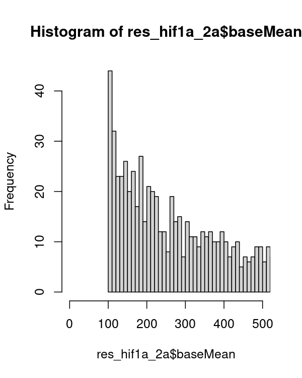
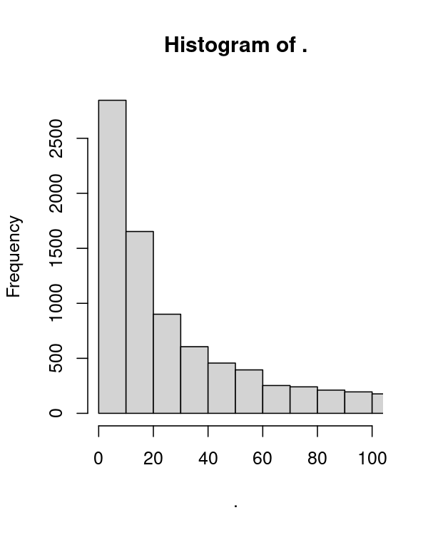
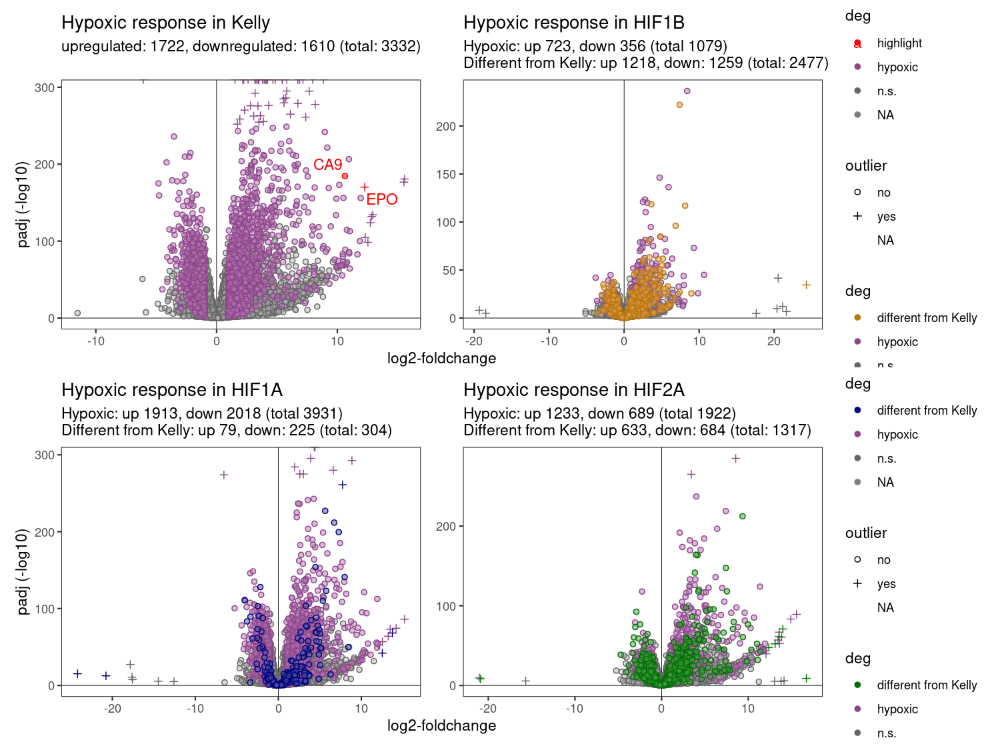
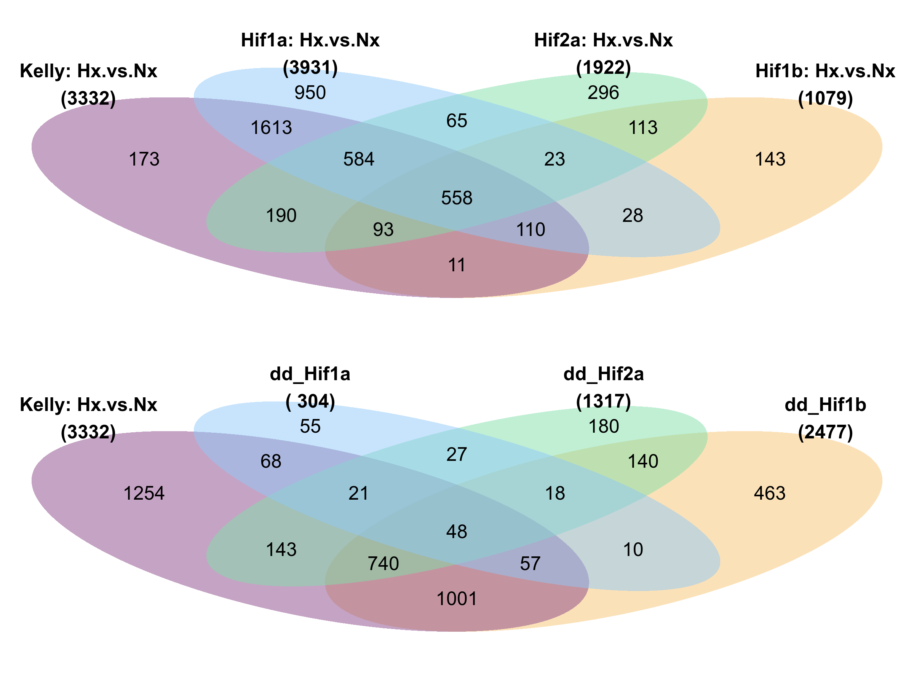
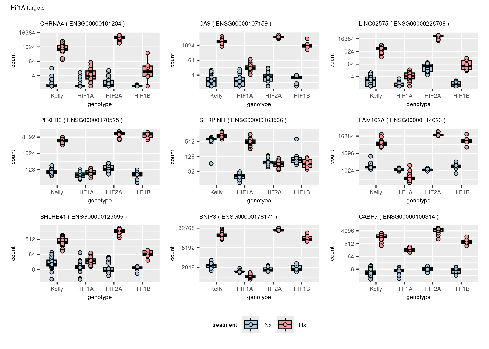
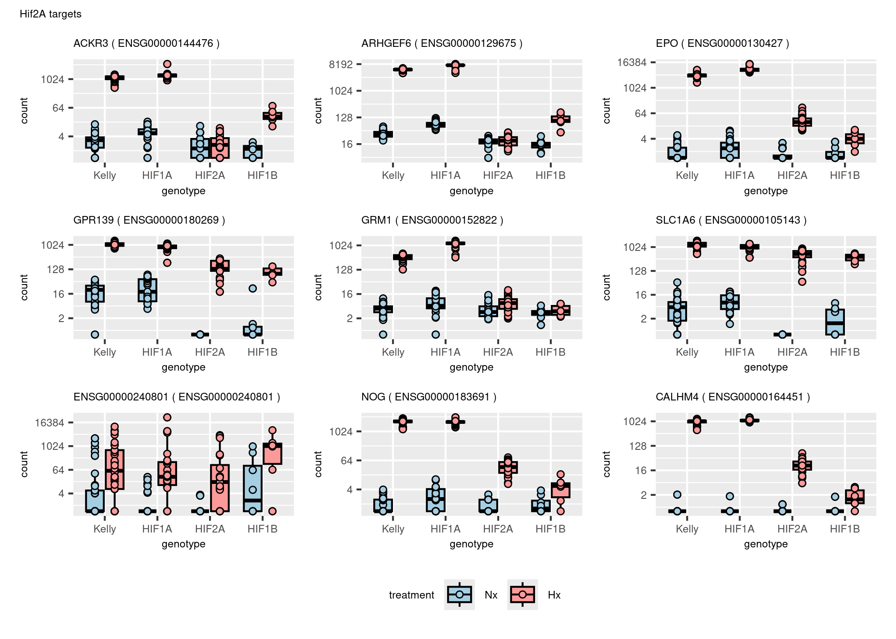
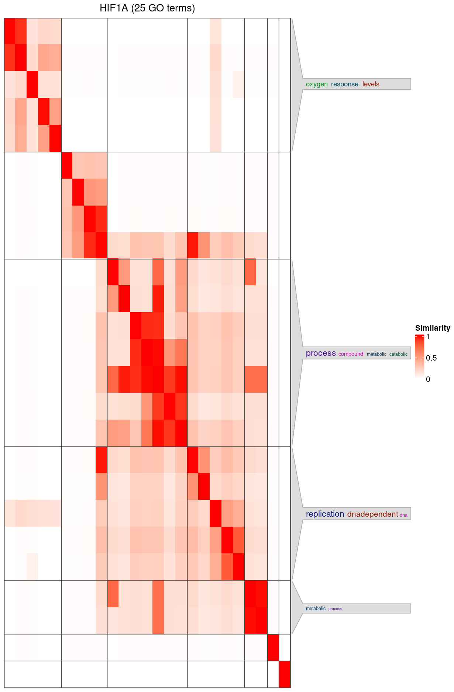
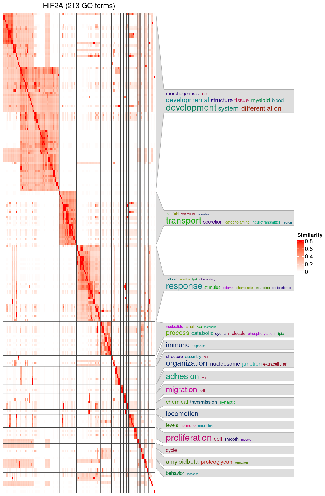
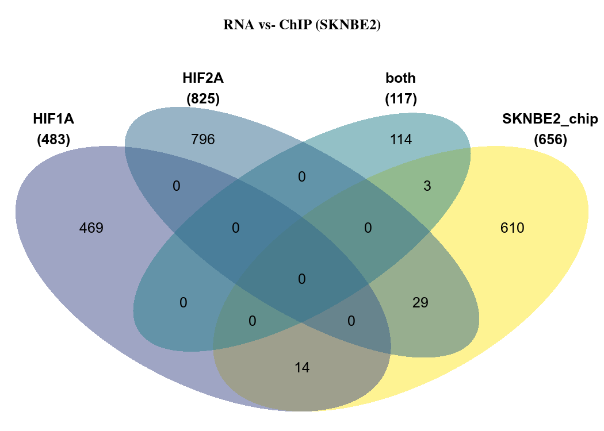

Figures
================
Kelterborn
2024-07-18

- [0. Load](#0-load)
  - [- libraries, folders, R_utils](#--libraries-folders-r_utils)
  - [- Load dds](#--load-dds)
  - [- Colour sheme](#--colour-sheme)
  - [-Prepare Results](#-prepare-results)
- [Figure 1: Samples QC](#figure-1-samples-qc)
  - [PCA](#pca)
- [Figure 2: Differential expressed
  genes](#figure-2-differential-expressed-genes)
  - [-Volcano_function](#-volcano_function)
  - [-Volcano_function2](#-volcano_function2)
  - [-Plot Vulcanos](#-plot-vulcanos)
  - [-Venn](#-venn)
- [Figure 3: Gene Cluster](#figure-3-gene-cluster)
  - [Gene Cluster](#gene-cluster)
- [Table 1: Gene List](#table-1-gene-list)
- [Figure 4: Gene Set enrichment](#figure-4-gene-set-enrichment)
  - [GO Analysis](#go-analysis)
  - [Cluster GO terms](#cluster-go-terms)
  - [KEGG](#kegg)
- [Figure 5: Compare with ChIP-Seq](#figure-5-compare-with-chip-seq)
  - [Load datasets](#load-datasets)
  - [ChIP Venns](#chip-venns)
- [](#section)
- [\###Old code](#old-code)
  - [Enhanced volcano](#enhanced-volcano)
  - [Volcanos](#volcanos)
  - [Cluster genes](#cluster-genes)

# 0. Load

## - libraries, folders, R_utils

Load R libraries. If package is missing, install with
‘BiocManager::install(“PackageName”)’

## - Load dds

## - Colour sheme

## -Prepare Results

``` r
deg_genes_list <- lapply(results_list,topgenes_f) %>%  lapply(.,rownames) 
names(deg_genes_list) <- paste("deg",names(deg_genes_list),sep="_")

main_degs <- c(list("Kelly: Hx.vs.Nx" = deg_genes_list[["deg_Kelly.Hx.vs.Nx"]],
                     "Hif1b" = deg_genes_list[["deg_Hif1bHxNx.vs.KellyHxNx"]],
                     "Hif1a" = deg_genes_list[["deg_Hif1aHxNx.vs.KellyHxNx"]],
                     "Hif2a" = deg_genes_list[["deg_Hif2aHxNx.vs.KellyHxNx"]] ))


# Select genes
hif1a_2a_genes <- c(deg_genes_list[["deg_Hif1aHxNx.vs.KellyHxNx"]],
                     deg_genes_list[["deg_Hif2aHxNx.vs.KellyHxNx"]],
                    deg_genes_list[["deg_Hif2aHxNx.vs.Hif1aHxNx"]]) %>%
                  unique()

hif1a_2a_genes %>% length()
```

    ## [1] 5374

``` r
# Filter results
res_names <- names(results_list)
res_final <- results_list[c("Kelly.Hx.vs.Nx","Hif1a.Hx.vs.Nx","Hif2a.Hx.vs.Nx", "Hif1aHxNx.vs.KellyHxNx","Hif2aHxNx.vs.KellyHxNx","Hif1bHxNx.vs.KellyHxNx","Hif2aHxNx.vs.Hif1aHxNx")] 

# create table with all results
res_table <- lapply(res_final,data.frame) %>% lapply(.,"[", , c("log2FoldChange","padj"))
res_table <- do.call('cbind',res_table)
res_table_final <- res_final[[1]][,c("ENSEMBL","ENTREZ","symbol","baseMean")] %>% data.frame()
res_table_final <- cbind(res_table_final,res_table)
res_hif1a_2a <- res_table_final[hif1a_2a_genes,]
colnames(res_hif1a_2a)
```

    ##  [1] "ENSEMBL"                              
    ##  [2] "ENTREZ"                               
    ##  [3] "symbol"                               
    ##  [4] "baseMean"                             
    ##  [5] "Kelly.Hx.vs.Nx.log2FoldChange"        
    ##  [6] "Kelly.Hx.vs.Nx.padj"                  
    ##  [7] "Hif1a.Hx.vs.Nx.log2FoldChange"        
    ##  [8] "Hif1a.Hx.vs.Nx.padj"                  
    ##  [9] "Hif2a.Hx.vs.Nx.log2FoldChange"        
    ## [10] "Hif2a.Hx.vs.Nx.padj"                  
    ## [11] "Hif1aHxNx.vs.KellyHxNx.log2FoldChange"
    ## [12] "Hif1aHxNx.vs.KellyHxNx.padj"          
    ## [13] "Hif2aHxNx.vs.KellyHxNx.log2FoldChange"
    ## [14] "Hif2aHxNx.vs.KellyHxNx.padj"          
    ## [15] "Hif1bHxNx.vs.KellyHxNx.log2FoldChange"
    ## [16] "Hif1bHxNx.vs.KellyHxNx.padj"          
    ## [17] "Hif2aHxNx.vs.Hif1aHxNx.log2FoldChange"
    ## [18] "Hif2aHxNx.vs.Hif1aHxNx.padj"

``` r
# create table with all shrinked results
# Filter results
res_shrink <- res_shrink_list[c("Kelly.Hx.vs.Nx","Hif1a.Hx.vs.Nx","Hif2a.Hx.vs.Nx", "Hif1aHxNx.vs.KellyHxNx","Hif2aHxNx.vs.KellyHxNx","Hif1bHxNx.vs.KellyHxNx","Hif2aHxNx.vs.Hif1aHxNx")] 

# create table with all results
res_shrink <- lapply(res_shrink,data.frame) %>% lapply(.,"[", , c("log2FoldChange","padj"))
res_shrink <- do.call('cbind',res_shrink)
res_shrink_final <- res_final[[1]][,c("symbol","baseMean")] %>% data.frame()
res_shrink_final <- cbind(res_shrink_final,res_shrink)
res_shrink_hif1a_2a <- res_shrink_final[hif1a_2a_genes,]


# Gene universe
# Expression min
results_list[[1]]$baseMean %>% hist(breaks=100000, xlim = c(0,100)) 

# in results
res_hif1a_2a$baseMean %>% min()
```

    ## [1] 1.333859

``` r
res_hif1a_2a$baseMean %>% hist(breaks=100000, xlim = c(0,100))

# use all genes in dataset
genes_univ_ens <- results_list[[1]]$ENSEMBL
genes_univ_ens %>% length()
```

    ## [1] 21583

``` r
genes_univ <- results_list[[1]]$ENTREZ
genes_univ %>% length()
```

    ## [1] 21583

``` r
genes_univ %>% is.na() %>% summary()
```

    ##    Mode   FALSE    TRUE 
    ## logical   16750    4833



# Figure 1: Samples QC

## PCA

``` r
vst_dat <- assay(vst(dds))

p <- pca(vst_dat, metadata = colData(dds), removeVar = 0.99)
pca_table <- cbind(p$rotated,p$metadata)
pca1 <- ggplot(pca_table, aes(PC2, PC1, color=genotype, shape=treatment)) +
  geom_hline(yintercept = 0, linewidth = 0.1) + 
  geom_vline(xintercept = 0, linewidth = 0.1) +
  geom_point(size=4, alpha=0.5, stroke=1) +
  labs(title = "top 1% variable genes") +
  ylab(paste0("PC1: ",p$variance["PC1"] %>% round(digits = 1),"% variance")) +
  xlab(paste0("PC2: ",p$variance["PC2"] %>% round(digits = 1),"% variance")) +
  scale_color_manual(values=colors[c(2,4,6,8)]) +
  scale_shape_manual(values = c(21,16)) + 
  scale_fill_manual(values=c(colors[1],"white",colors[2],"white")) +
  theme_bw() +
  scale_y_reverse() +
  removeGrid(x=T, y=T)

p <- pca(vst_dat, metadata = colData(dds), removeVar = 0.95)
pca_table <- cbind(p$rotated,p$metadata)
pca5 <- ggplot(pca_table, aes(PC2, PC1, color=genotype, shape=treatment)) +
  geom_hline(yintercept = 0, linewidth = 0.1) + 
  geom_vline(xintercept = 0, linewidth = 0.1) +
  geom_point(size=4, alpha=0.5, stroke=1) +
  labs(title = "top 5% variable genes") +
  ylab(paste0("PC1: ",p$variance["PC1"] %>% round(digits = 1),"% variance")) +
  xlab(paste0("PC2: ",p$variance["PC2"] %>% round(digits = 1),"% variance")) +
  scale_color_manual(values=colors[c(2,4,6,8)]) +
  scale_shape_manual(values = c(21,16)) + 
  scale_fill_manual(values=c(colors[1],"white",colors[2],"white")) +
  theme_bw() +
  scale_y_reverse() +
  removeGrid(x=T, y=T)

p <- pca(vst_dat, metadata = colData(dds), removeVar = 0.90)
pca_table <- cbind(p$rotated,p$metadata)
pca10 <- ggplot(pca_table, aes(PC2, PC1, color=genotype, shape=treatment)) +
  geom_hline(yintercept = 0, linewidth = 0.1) + 
  geom_vline(xintercept = 0, linewidth = 0.1) +
  geom_point(size=4, alpha=0.5, stroke=1) +
  labs(title = "top 10% variable genes") +
  ylab(paste0("PC1: ",p$variance["PC1"] %>% round(digits = 1),"% variance")) +
  xlab(paste0("PC2: ",p$variance["PC2"] %>% round(digits = 1),"% variance")) +
  scale_color_manual(values=colors[c(2,4,6,8)]) +
  scale_shape_manual(values = c(21,16)) + 
  scale_fill_manual(values=c(colors[1],"white",colors[2],"white")) +
  theme_bw() +
  scale_x_reverse() +
  removeGrid(x=T, y=T)
```

``` r
pca1+pca5+pca10+ plot_layout(guides = "collect", axes="collect", axis_titles="collect") & 
  theme(legend.position = 'bottom')
```

<!-- -->

``` r
pca10
```


# Figure 2: Differential expressed genes

## -Volcano_function

``` r
getdeg <- function(x){subset(results_list[[x]], padj < 0.05 & (log2FoldChange > 1 | log2FoldChange < -1)) %>% data.frame()}

volcano_sk3 <- function(n,
                        col="red",
                        celline="cells",
                        deg=deg) {
xlim <- 12
ylim <- -250
res <- results_list[[n]]
res <- res_shrink_list[[n]] %>% data.frame()

# of deg genes
up <- subset(deg, log2FoldChange > 1) %>% nrow()
down <- subset(deg, log2FoldChange < -1) %>% nrow()
total <- up+down

# points outside the grid
outx <- subset(res, log2FoldChange > xlim | log2FoldChange < -xlim) %>% rownames()
outy <- subset(res, padj < 10^ylim) %>% rownames()

res$outlier <- ifelse(rownames(res) %in% c(outx,outy),"yes","no")
res$deg <- ifelse(rownames(res) %in% rownames(deg),"hypoxic","n.s.") %>% factor()

res <- res %>% arrange(desc(res$deg))

res[outx,"log2FoldChange"] <- ifelse(res[outx,"log2FoldChange"] > xlim,xlim,-xlim)
res[outy,"padj"] <- 10^ylim

volcano_func <- ggplot(res,aes(x=log2FoldChange,y=-log10(padj),color=deg, shape=outlier, fill=deg)) +
  geom_hline(yintercept = 0, linewidth = 0.2) + 
  geom_vline(xintercept = 0, linewidth = 0.2) +
  geom_point(size=1.5, stroke=0.5) +
  scale_shape_manual(values = c(21,3)) + 
  scale_alpha_manual(values = c(0.3,0.6)) + 
  labs(title=paste0("Hypoxic response in ",celline),
       subtitle = paste0("upregulated: ",up,", downregulated: ",down," (total: ",total,")") )+
  theme(plot.title = element_text(size = 1), 
        plot.subtitle = element_text(size = 0.5) )+
  ylab("padj (-log10)") +
  xlab("log2-foldchange") +
  scale_fill_manual(values = alpha(c(lighten(col,0.3),"grey70"),0.5)) + 
  scale_color_manual(values = c(col,"grey40")) + 
  theme_bw() +
  # geom_text_repel(label=res$symbol, color="black") + 
  removeGrid(x=T, y=T)
volcano_func
}
```

## -Volcano_function2

``` r
getdeg <- function(x){subset(results_list[[x]], padj < 0.05 & (log2FoldChange > 1 | log2FoldChange < -1)) %>% data.frame()}

volcano_sk4 <- function(n,
                        col="red",
                        col2="blue",
                        celline="cells",
                        deg=deg,
                        deg2=deg2) {
xlim <- 12
ylim <- -250
res <- results_list[[n]]
res <- res_shrink_list[[n]] %>% data.frame()

# of deg genes
hx_up <- subset(deg, log2FoldChange > 1) %>% nrow()
hx_down <- subset(deg, log2FoldChange < -1) %>% nrow()
hx_total <- hx_up+hx_down

# of deg2 genes
up <- subset(deg2, log2FoldChange > 1) %>% nrow()
down <- subset(deg2, log2FoldChange < -1) %>% nrow()
total <- up+down

# points outside the grid
outx <- subset(res, log2FoldChange > xlim | log2FoldChange < -xlim) %>% rownames()
outy <- subset(res, padj < 10^ylim) %>% rownames()

res$outlier <- ifelse(rownames(res) %in% c(outx,outy),"yes","no")
res$deg <- ifelse(rownames(res) %in% rownames(deg2),"different from Kelly",
                  ifelse(rownames(res) %in% rownames(deg),"hypoxic","n.s.")) %>% factor()

res <- res %>% arrange(desc(res$deg))

res[outx,"log2FoldChange"] <- ifelse(res[outx,"log2FoldChange"] > xlim,xlim,-xlim)
res[outy,"padj"] <- 10^ylim

volcano_func <- ggplot(res,aes(x=log2FoldChange,y=-log10(padj),color=deg, shape=outlier, fill=deg)) +
  geom_hline(yintercept = 0, linewidth = 0.2) + 
  geom_vline(xintercept = 0, linewidth = 0.2) +
  geom_point(size=1.5, stroke=0.5) +
  scale_shape_manual(values = c(21,3)) + 
  scale_alpha_manual(values = c(0.3,0.6)) + 
  labs(title=paste0("Hypoxic response in ",celline),
       subtitle = paste0("Hypoxic: up ",hx_up,", down ",hx_down," (total ",hx_total,")","\nDifferent from Kelly: up ",up,", down: ",down," (total: ",total,")")) +
  theme(plot.title = element_text(size = 1), 
        plot.subtitle = element_text(size = 0.5) )+
  ylab("padj (-log10)") +
  xlab("log2-foldchange") +
  scale_fill_manual(values = alpha(c(lighten(c(col2,col),0.3),"grey70"),0.5)) + 
  scale_color_manual(values = c(col2,col,"grey40")) + 
  theme_bw() +
  # geom_text_repel(label=res$symbol, color="black") + 
  removeGrid(x=T, y=T)
volcano_func
}
```

## -Plot Vulcanos

### Simple

``` r
# Simple Volcanos
volcano_Kelly <- volcano_sk3(n="Kelly.Hx.vs.Nx", deg=getdeg("Kelly.Hx.vs.Nx"),col=colors[2], celline="Kelly")
volcano_hif1a <- volcano_sk3(n="Hif1a.Hx.vs.Nx", deg=getdeg("Hif1a.Hx.vs.Nx"),col=colors[4], celline="HIF1A")
volcano_hif2a <- volcano_sk3(n="Hif2a.Hx.vs.Nx", deg=getdeg("Hif2a.Hx.vs.Nx"),col=colors[6], celline="HIF2A")
volcano_hif1b <- volcano_sk3(n="Hif1b.Hx.vs.Nx", deg=getdeg("Hif1b.Hx.vs.Nx"),col=colors[8], celline="HIF1B")

(volcano_Kelly+volcano_hif1b + plot_layout(guides = "collect", axes="collect", axis_titles="collect") ) / 
  (volcano_hif1a+volcano_hif2a + plot_layout(guides = "collect", axes="collect", axis_titles="collect") ) & 
  theme(legend.position = 'right')
```

<!-- -->

``` r
n2 <- {}

deg <- subset(results_list[["Kelly.Hx.vs.Nx"]], padj < 0.05 & (log2FoldChange > 1 | log2FoldChange < -1)) %>% data.frame()


# Two set volcanos
n <- "Hif1a.Hx.vs.Nx"
deg <- subset(results_list[["Hif1a.Hx.vs.Nx"]], padj < 0.05 & (log2FoldChange > 1 | log2FoldChange < -1)) %>% data.frame()
deg2 <- subset(results_list[["Hif1aHxNx.vs.KellyHxNx"]], padj < 0.05 & (log2FoldChange > 1 | log2FoldChange < -1)) %>% data.frame()
col <- colors[2]
col2 <- colors[4]
celline="HIF1A"

volcano_Kelly <- volcano_sk3(n="Kelly.Hx.vs.Nx", deg=getdeg("Kelly.Hx.vs.Nx"),col=colors[2], celline="Kelly")
volcano_hif1a <- volcano_sk3(n="Hif1aHxNx.vs.KellyHxNx", deg=getdeg("Hif1aHxNx.vs.KellyHxNx"),col=colors[4], celline="HIF1A") + ggtitle(label="Difference in Effect vs. Kelly")
volcano_hif2a <- volcano_sk3(n="Hif2aHxNx.vs.KellyHxNx", deg=getdeg("Hif2aHxNx.vs.KellyHxNx"),col=colors[6], celline="HIF2A")  + ggtitle(label="Difference in Effect vs. Kelly")
volcano_hif1b <- volcano_sk3(n="Hif1bHxNx.vs.KellyHxNx", deg=getdeg("Hif1bHxNx.vs.KellyHxNx"),col=colors[8], celline="HIF1B")  + ggtitle(label="Difference in Effect vs. Kelly")

(volcano_Kelly+volcano_hif1b + plot_layout(guides = "collect", axes="collect", axis_titles="collect") ) / 
  (volcano_hif1a+volcano_hif2a + plot_layout(guides = "collect", axes="collect", axis_titles="collect") ) & 
  theme(legend.position = 'right')
```

<!-- -->

### Advanced

``` r
# Two set volcanos
n <- "Hif1a.Hx.vs.Nx"
deg <- subset(results_list[["Hif1a.Hx.vs.Nx"]], padj < 0.05 & (log2FoldChange > 1 | log2FoldChange < -1)) %>% data.frame()
deg2 <- subset(results_list[["Hif1aHxNx.vs.KellyHxNx"]], padj < 0.05 & (log2FoldChange > 1 | log2FoldChange < -1)) %>% data.frame()
col <- colors[2]
col2 <- colors[4]
celline="HIF1A"

volcano_Kelly <- volcano_sk3(n="Kelly.Hx.vs.Nx", deg=getdeg("Kelly.Hx.vs.Nx"),col=colors[2], celline="Kelly")
volcano_hif1a <- volcano_sk4(n="Hif1a.Hx.vs.Nx", deg=getdeg("Hif1a.Hx.vs.Nx"), deg2=getdeg("Hif1aHxNx.vs.KellyHxNx"),col=colors[2], col2=colors[4], celline="HIF1A")
volcano_hif2a <- volcano_sk4(n="Hif2a.Hx.vs.Nx", deg=getdeg("Hif2a.Hx.vs.Nx"), deg2=getdeg("Hif2aHxNx.vs.KellyHxNx"),col=colors[2], col2=colors[6], celline="HIF2A")
volcano_hif1b <- volcano_sk4(n="Hif1b.Hx.vs.Nx", deg=getdeg("Hif1b.Hx.vs.Nx"), deg2=getdeg("Hif1bHxNx.vs.KellyHxNx"),col=colors[2], col2=colors[8], celline="HIF1B")

(volcano_Kelly+volcano_hif1b + plot_layout(guides = "collect", axes="collect", axis_titles="collect") ) / 
  (volcano_hif1a+volcano_hif2a + plot_layout(guides = "collect", axes="collect", axis_titles="collect") ) & 
  theme(legend.position = 'right')
```

<!-- -->

## -Venn

``` r
input_list <- main_degs
plt1 <- venn.diagram(
    x = input_list,
    fill = colors[c(2,7,3,5)],
    main.fontface = "bold",
    fontfamily ="Arial",
    category.names = paste(names(input_list),"\n(",input_list %>% summary() %>% .[c(1:length(input_list))],")",sep=""),
    force.unique = TRUE, na = "remove", total.population = TRUE,
    filename = NULL,
    lwd = 2,
    lty = 'blank',
    cat.fontface = "bold",
    cat.fontfamily = "arial")

input_list <- main_degs[c(3,4,1)]
plt2 <- venn.diagram(
    x = input_list,
    fill = colors[c(3,5,2)],
    main.fontface = "bold",
    fontfamily ="Arial",
    category.names = paste(names(input_list),"\n(",input_list %>% summary() %>% .[c(1:length(input_list))],")",sep=""),
    force.unique = TRUE, na = "remove", total.population = TRUE,
    filename = NULL,
    lwd = 2,
    lty = 'blank',
    cat.fontface = "bold",
    cat.fontfamily = "arial")
    
#     main = "Compare Hif KOs",


patchwork::wrap_elements(plt1) / patchwork::wrap_elements(plt2)
```



# Figure 3: Gene Cluster

## Gene Cluster

``` r
# cluster_venn

main_degs %>% names()
```

    ## [1] "Kelly: Hx.vs.Nx" "Hif1b"           "Hif1a"           "Hif2a"

``` r
length(main_degs[[3]])
```

    ## [1] 863

``` r
length(main_degs[[4]])
```

    ## [1] 2856

``` r
venns <- calculate.overlap(main_degs[c(3,4)])
lapply(venns,length)
```

    ## $a1
    ## [1] 863
    ## 
    ## $a2
    ## [1] 2856
    ## 
    ## $a3
    ## [1] 324

``` r
venns %>% unlist() %>% length()
```

    ## [1] 4043

``` r
venns %>% unlist() %>% unique() %>% length()
```

    ## [1] 3395

``` r
venns$a1 <- setdiff(venns$a1,venns$a3)
venns$a2 <- setdiff(venns$a2,venns$a3)
lapply(venns,length)
```

    ## $a1
    ## [1] 539
    ## 
    ## $a2
    ## [1] 2532
    ## 
    ## $a3
    ## [1] 324

``` r
venns %>% unlist() %>% length()
```

    ## [1] 3395

``` r
venns %>% unlist() %>% unique() %>% length()
```

    ## [1] 3395

``` r
res_hif1a_2a$venn <- ifelse(rownames(res_hif1a_2a) %in% venns$a1,"HIF1A",
                      ifelse(rownames(res_hif1a_2a) %in% venns$a2,"HIF2A",
                      ifelse(rownames(res_hif1a_2a) %in% venns$a3,"overlap","interaction")))
res_hif1a_2a$venn %>% table()
```

    ## .
    ##       HIF1A       HIF2A interaction     overlap 
    ##         539        2532        1979         324

``` r
# Cluster Venn
cluster_venn <- ggplot(res_hif1a_2a,aes(x=Hif1aHxNx.vs.KellyHxNx.log2FoldChange, y=Hif2aHxNx.vs.KellyHxNx.log2FoldChange, color=venn, fill=venn)) +
  geom_hline(yintercept = 0, linewidth = 0.1) + 
  geom_vline(xintercept = 0, linewidth = 0.1) +
  geom_point(size=1, stroke=0.5, shape=21) +
  labs(title = "Simple/Venn Cluster") +
  xlab("Hif1a vs. Kelly") +
  ylab("Hif2a vs. Kelly") +
  scale_color_manual(values=c(colors[c(4,6)],"orange",colors[2])) +
  # scale_shape_manual(values = c(21,16)) + 
  scale_fill_manual(values=alpha(c(colors[c(4,6)],"orange",colors[2]),0.2)) +
  theme_bw() +
  removeGrid(x=T, y=T) +
  coord_cartesian(xlim = c(-5, 5),ylim = c(-5,5))

res_hif1a_2a$group %>% table()
```

    ## < table of extent 0 >

``` r
# Manual Cluster

hif_parallel  <- res_hif1a_2a %>% filter(abs(Hif2aHxNx.vs.Hif1aHxNx.log2FoldChange) < 1)

hif2a_up <- res_hif1a_2a %>% filter(Hif2aHxNx.vs.Hif1aHxNx.log2FoldChange > 1 & (Hif2aHxNx.vs.KellyHxNx.log2FoldChange-1 > 2*-Hif1aHxNx.vs.KellyHxNx.log2FoldChange))
hif2a_do <- res_hif1a_2a %>% filter(Hif2aHxNx.vs.Hif1aHxNx.log2FoldChange < -1 & (Hif2aHxNx.vs.KellyHxNx.log2FoldChange < -Hif1aHxNx.vs.KellyHxNx.log2FoldChange+1))

hif1a_up <- res_hif1a_2a %>% filter(Hif2aHxNx.vs.Hif1aHxNx.log2FoldChange > 1 & (-Hif1aHxNx.vs.KellyHxNx.log2FoldChange > (abs(Hif2aHxNx.vs.KellyHxNx.log2FoldChange-1))))

hif1a_do <- res_hif1a_2a %>% filter(Hif2aHxNx.vs.Hif1aHxNx.log2FoldChange < -1 & (Hif1aHxNx.vs.KellyHxNx.log2FoldChange-1 > 2*-Hif2aHxNx.vs.KellyHxNx.log2FoldChange))


res_hif1a_2a$group <- ifelse(rownames(res_hif1a_2a) %in% rownames(hif_parallel),"HIF1A_HIF2A",
                      ifelse(rownames(res_hif1a_2a) %in% rownames(hif2a_up),"HIF2A",
                      ifelse(rownames(res_hif1a_2a) %in% rownames(hif2a_do),"HIF2A",
                      ifelse(rownames(res_hif1a_2a) %in% rownames(hif1a_up),"HIF1A",
                      ifelse(rownames(res_hif1a_2a) %in% rownames(hif1a_do),"HIF1A","orange")
                      ))))

cluster <- ggplot(res_hif1a_2a,aes(x=Hif1aHxNx.vs.KellyHxNx.log2FoldChange, y=Hif2aHxNx.vs.KellyHxNx.log2FoldChange, color=group, fill=group)) +
  geom_hline(yintercept = 0, linewidth = 0.1) + 
  geom_vline(xintercept = 0, linewidth = 0.1) +
  geom_abline(intercept=c(1,-1)) +
  geom_abline(slope=c(-1), intercept = 1) +
  annotate("segment", x = c(0,1), y = c(1,0), xend = c(-10,11), yend = c(21,-5),color="black") +
  geom_point(size=1, stroke=0.5, shape=21) +
  labs(title = "Geometric Cluster") +
  xlab("Hif1a vs. Kelly") +
  ylab("Hif2a vs. Kelly") +
  scale_color_manual(values=c(colors[c(4,2,6)],"orange")) +
  # scale_shape_manual(values = c(21,16)) + 
  scale_fill_manual(values=alpha(c(colors[c(4,2,6)],"orange"),0.2)) +
  theme_bw() +
  removeGrid(x=T, y=T) +
  coord_cartesian(xlim = c(-5, 5),ylim = c(-5,5))

cluster_venn + cluster
```

<!-- -->

``` r
# only genes with p < 0.05
colnames(res_hif1a_2a)
```

    ##  [1] "ENSEMBL"                              
    ##  [2] "ENTREZ"                               
    ##  [3] "symbol"                               
    ##  [4] "baseMean"                             
    ##  [5] "Kelly.Hx.vs.Nx.log2FoldChange"        
    ##  [6] "Kelly.Hx.vs.Nx.padj"                  
    ##  [7] "Hif1a.Hx.vs.Nx.log2FoldChange"        
    ##  [8] "Hif1a.Hx.vs.Nx.padj"                  
    ##  [9] "Hif2a.Hx.vs.Nx.log2FoldChange"        
    ## [10] "Hif2a.Hx.vs.Nx.padj"                  
    ## [11] "Hif1aHxNx.vs.KellyHxNx.log2FoldChange"
    ## [12] "Hif1aHxNx.vs.KellyHxNx.padj"          
    ## [13] "Hif2aHxNx.vs.KellyHxNx.log2FoldChange"
    ## [14] "Hif2aHxNx.vs.KellyHxNx.padj"          
    ## [15] "Hif1bHxNx.vs.KellyHxNx.log2FoldChange"
    ## [16] "Hif1bHxNx.vs.KellyHxNx.padj"          
    ## [17] "Hif2aHxNx.vs.Hif1aHxNx.log2FoldChange"
    ## [18] "Hif2aHxNx.vs.Hif1aHxNx.padj"          
    ## [19] "venn"                                 
    ## [20] "group"

``` r
res_hif1a_2a_p <- filter(res_hif1a_2a, Hif1aHxNx.vs.KellyHxNx.padj < 0.05 & Hif2aHxNx.vs.KellyHxNx.padj < 0.05)

cluster_p <- ggplot(res_hif1a_2a_p,aes(x=Hif1aHxNx.vs.KellyHxNx.log2FoldChange, y=Hif2aHxNx.vs.KellyHxNx.log2FoldChange, color=group, fill=group)) +
  geom_hline(yintercept = 0, linewidth = 0.1) + 
  geom_vline(xintercept = 0, linewidth = 0.1) +
  geom_abline(intercept=c(1,-1)) +
  geom_abline(slope=c(-1), intercept = 1) +
  annotate("segment", x = c(0,1), y = c(1,0), xend = c(-10,11), yend = c(21,-5),color="black") +
  geom_point(size=1, stroke=0.5, shape=21) +
  labs(title = "Geometric Cluster (all p < 0.05") +
  xlab("Hif1a vs. Kelly") +
  ylab("Hif2a vs. Kelly") +
  scale_color_manual(values=c(colors[c(4,2,6)],"orange")) +
  # scale_shape_manual(values = c(21,16)) + 
  scale_fill_manual(values=alpha(c(colors[c(4,2,6)],"orange"),0.2)) +
  theme_bw() +
  removeGrid(x=T, y=T) +
  coord_cartesian(xlim = c(-5, 5),ylim = c(-5,5))

cluster + cluster_p
```

<!-- -->

``` r
write.xlsx(res_hif1a_2a,"DEG_genes.xlsx")
```

# Table 1: Gene List

``` r
colnames(res_hif1a_2a_p) <- c("ENSEMBL","ENTREZ","symbol","baseMean","Kelly.Hx.Nx.L2FC","Kelly.Hx.vs.Nx.padj",
                           "Hif1a.Hx.Nx.L2FC","Hif1a.Hx.vs.Nx.padj","Hif2a.Hx.vs.Nx.log2FoldChange","Hif2a.Hx.vs.Nx.padj",
                           "Hif1a.Kelly.L2FC", "Hif1aHxNx.vs.KellyHxNx.padj", "Hif2a.Kelly.L2FC", "Hif2aHxNx.vs.KellyHxNx.padj",
                           "Hif1b.KellyL2FC","Hif1bHxNx.vs.KellyHxNx.padj", "Hif2a.Hif1a.L2FC", "Hif2aHxNx.vs.Hif1aHxNx.padj",
                           "venn","group")

HIF1A_genes <- res_hif1a_2a_p %>% 
  .[order(abs(.$Hif1a.Kelly.L2FC), decreasing = TRUE),] %>% 
  filter(group =="HIF1A") %>%
  filter(baseMean > 500)
colnames(HIF1A_genes) 
```

    ##  [1] "ENSEMBL"                       "ENTREZ"                       
    ##  [3] "symbol"                        "baseMean"                     
    ##  [5] "Kelly.Hx.Nx.L2FC"              "Kelly.Hx.vs.Nx.padj"          
    ##  [7] "Hif1a.Hx.Nx.L2FC"              "Hif1a.Hx.vs.Nx.padj"          
    ##  [9] "Hif2a.Hx.vs.Nx.log2FoldChange" "Hif2a.Hx.vs.Nx.padj"          
    ## [11] "Hif1a.Kelly.L2FC"              "Hif1aHxNx.vs.KellyHxNx.padj"  
    ## [13] "Hif2a.Kelly.L2FC"              "Hif2aHxNx.vs.KellyHxNx.padj"  
    ## [15] "Hif1b.KellyL2FC"               "Hif1bHxNx.vs.KellyHxNx.padj"  
    ## [17] "Hif2a.Hif1a.L2FC"              "Hif2aHxNx.vs.Hif1aHxNx.padj"  
    ## [19] "venn"                          "group"

``` r
nrow(HIF1A_genes)
```

    ## [1] 453

``` r
HIF1A_genes[1:50,c(3,4,5,7,11)] %>% kable(digits = c(1))
```

|  | symbol | baseMean | Kelly.Hx.Nx.L2FC | Hif1a.Hx.Nx.L2FC | Hif1a.Kelly.L2FC |
|:---|:---|---:|---:|---:|---:|
| ENSG00000114023 | FAM162A | 12808.1 | 2.7 | -1.1 | -3.8 |
| ENSG00000123095 | BHLHE41 | 591.5 | 4.8 | 1.0 | -3.7 |
| ENSG00000176171 | BNIP3 | 21434.7 | 3.2 | -0.4 | -3.6 |
| ENSG00000100314 | CABP7 | 2092.3 | 8.2 | 5.0 | -3.2 |
| ENSG00000159208 | CIART | 2103.7 | 2.8 | -0.1 | -2.9 |
| ENSG00000074800 | ENO1 | 193555.8 | 1.3 | -1.6 | -2.9 |
| ENSG00000139832 | RAB20 | 773.5 | 2.7 | 0.2 | -2.5 |
| ENSG00000079739 | PGM1 | 6602.8 | 1.3 | -1.2 | -2.5 |
| ENSG00000146094 | DOK3 | 852.6 | 2.0 | -0.3 | -2.3 |
| ENSG00000102144 | PGK1 | 69853.5 | 2.4 | 0.1 | -2.2 |
| ENSG00000165802 | NSMF | 12663.2 | 0.9 | -1.3 | -2.2 |
| ENSG00000118194 | TNNT2 | 956.6 | 2.1 | 0.0 | -2.1 |
| ENSG00000291995 | GOLGA8A | 11149.1 | 2.5 | 0.4 | -2.1 |
| ENSG00000291946 | NPW | 893.4 | 1.9 | -0.1 | -2.1 |
| ENSG00000114480 | GBE1 | 3845.4 | 2.9 | 0.9 | -2.0 |
| ENSG00000173157 | ADAMTS20 | 1182.7 | 2.5 | 0.6 | -1.9 |
| ENSG00000291647 |  | 1641.2 | 2.9 | 1.0 | -1.9 |
| ENSG00000143590 | EFNA3 | 1307.4 | 1.4 | -0.4 | -1.8 |
| ENSG00000171385 | KCND3 | 594.6 | 5.1 | 3.3 | -1.8 |
| ENSG00000115657 | ABCB6 | 2501.5 | 0.8 | -1.0 | -1.8 |
| ENSG00000135116 | HRK | 745.7 | -2.1 | -3.8 | -1.7 |
| ENSG00000152256 | PDK1 | 13129.4 | 2.4 | 0.7 | -1.7 |
| ENSG00000214063 | TSPAN4 | 1420.6 | 1.7 | 0.1 | -1.7 |
| ENSG00000169299 | PGM2 | 2050.7 | 0.7 | -1.0 | -1.6 |
| ENSG00000177181 | RIMKLA | 2825.8 | 1.4 | -0.2 | -1.6 |
| ENSG00000083444 | PLOD1 | 5404.7 | 1.5 | -0.1 | -1.6 |
| ENSG00000233841 | HLA-C | 553.1 | 3.6 | 2.0 | -1.6 |
| ENSG00000054967 | RELT | 1117.5 | -0.1 | -1.7 | -1.6 |
| ENSG00000130810 | PPAN | 5041.5 | 0.1 | -1.4 | -1.5 |
| ENSG00000183258 | DDX41 | 7789.8 | 1.1 | -0.4 | -1.5 |
| ENSG00000087116 | ADAMTS2 | 6978.3 | 1.3 | -0.2 | -1.5 |
| ENSG00000197016 | ZNF470 | 857.6 | 0.9 | -0.6 | -1.5 |
| ENSG00000291087 | CRYBB2P1 | 3245.3 | 0.6 | -0.9 | -1.5 |
| ENSG00000130653 | PNPLA7 | 509.8 | 2.4 | 0.9 | -1.5 |
| ENSG00000181418 | DDN | 2123.7 | 0.2 | -1.2 | -1.5 |
| ENSG00000119946 | CNNM1 | 885.6 | -0.8 | -2.2 | -1.4 |
| ENSG00000166123 | GPT2 | 3610.7 | 0.3 | -1.1 | -1.4 |
| ENSG00000162373 | BEND5 | 1852.0 | 1.9 | 0.5 | -1.4 |
| ENSG00000068976 | PYGM | 789.1 | 2.0 | 0.6 | -1.4 |
| ENSG00000171314 | PGAM1 | 34522.9 | 0.5 | -0.9 | -1.4 |
| ENSG00000165704 | HPRT1 | 1558.1 | -0.9 | -2.3 | -1.4 |
| ENSG00000138641 | HERC3 | 677.6 | 0.4 | -1.0 | -1.3 |
| ENSG00000069998 | HDHD5 | 8166.3 | 0.4 | -1.0 | -1.3 |
| ENSG00000183775 | KCTD16 | 698.6 | 1.7 | 0.4 | -1.3 |
| ENSG00000165195 | PIGA | 1211.3 | -0.7 | -2.0 | -1.3 |
| ENSG00000107077 | KDM4C | 2127.3 | 1.1 | -0.2 | -1.3 |
| ENSG00000104722 | NEFM | 19345.7 | -0.5 | -1.7 | -1.3 |
| ENSG00000198435 | NRARP | 1158.4 | -0.3 | -1.6 | -1.2 |
| ENSG00000175414 | ARL10 | 5805.1 | 1.6 | 0.4 | -1.2 |
| ENSG00000138336 | TET1 | 1910.7 | 1.3 | 0.1 | -1.2 |

``` r
plotCounts_SK(HIF1A_genes[1:9,] %>% rownames()) + labs(title="Hif1A")
```

<!-- -->

``` r
write.xlsx(HIF1A_genes,"HIF1A_genes.xlsx")


HIF2A_genes <- res_hif1a_2a_p %>% 
  .[order(abs(.$Hif2a.Kelly.L2FC), decreasing = TRUE),] %>% 
  filter(group =="HIF2A") %>%
  filter(baseMean > 500)
nrow(HIF2A_genes)
```

    ## [1] 236

``` r
HIF2A_genes[1:50,c(3,4,5,7,11)] %>% kable(digits = c(1))
```

|  | symbol | baseMean | Kelly.Hx.Nx.L2FC | Hif1a.Hx.Nx.L2FC | Hif1a.Kelly.L2FC |
|:---|:---|---:|---:|---:|---:|
| ENSG00000152822 | GRM1 | 541.8 | 6.7 | 7.8 | 1.0 |
| ENSG00000183691 | NOG | 1680.8 | 12.1 | 10.2 | -1.8 |
| ENSG00000189120 | SP6 | 1446.8 | 5.9 | 7.1 | 1.2 |
| ENSG00000129757 | CDKN1C | 1908.5 | 8.0 | 6.3 | -1.7 |
| ENSG00000148053 | NTRK2 | 691.6 | 6.8 | 8.0 | 1.3 |
| ENSG00000116147 | TNR | 1919.3 | 2.3 | 3.5 | 1.2 |
| ENSG00000106100 | NOD1 | 3289.2 | 3.5 | 3.9 | 0.4 |
| ENSG00000120549 | KIAA1217 | 541.3 | 1.6 | 2.3 | 0.7 |
| ENSG00000173762 | CD7 | 1205.4 | 3.4 | 4.5 | 1.1 |
| ENSG00000096696 | DSP | 525.2 | 10.6 | 14.0 | 3.3 |
| ENSG00000063015 | SEZ6 | 4951.8 | -1.7 | -2.4 | -0.7 |
| ENSG00000197748 | CFAP43 | 1894.9 | 8.0 | 8.9 | 0.9 |
| ENSG00000008853 | RHOBTB2 | 25463.3 | 3.8 | 4.4 | 0.6 |
| ENSG00000285438 | SOX7 | 1112.2 | 3.5 | 4.4 | 0.9 |
| ENSG00000081189 | MEF2C | 3672.7 | 2.6 | 3.1 | 0.4 |
| ENSG00000122574 | WIPF3 | 648.9 | 6.0 | 5.2 | -0.9 |
| ENSG00000168843 | FSTL5 | 778.9 | 2.9 | 4.6 | 1.7 |
| ENSG00000189184 | PCDH18 | 887.9 | 0.3 | 1.0 | 0.7 |
| ENSG00000112902 | SEMA5A | 688.0 | 1.9 | 2.6 | 0.8 |
| ENSG00000006468 | ETV1 | 2732.5 | 0.2 | 1.4 | 1.2 |
| ENSG00000146674 | IGFBP3 | 686.0 | -2.2 | 1.3 | 3.5 |
| ENSG00000158560 | DYNC1I1 | 1329.0 | 1.6 | 2.7 | 1.1 |
| ENSG00000181408 | UTS2R | 6283.8 | 1.6 | 2.0 | 0.4 |
| ENSG00000182158 | CREB3L2 | 7797.4 | 2.6 | 3.3 | 0.7 |
| ENSG00000112773 | TENT5A | 686.7 | 3.4 | 2.8 | -0.6 |
| ENSG00000139926 | FRMD6 | 1128.2 | 0.9 | 1.8 | 0.9 |
| ENSG00000196981 | WDR5B | 644.9 | -0.6 | 0.8 | 1.4 |
| ENSG00000175274 | TP53I11 | 10799.1 | 1.4 | 2.3 | 0.9 |
| ENSG00000151892 | GFRA1 | 1033.8 | -1.3 | -0.7 | 0.7 |
| ENSG00000125384 | PTGER2 | 822.8 | 1.7 | 4.0 | 2.2 |
| ENSG00000131378 | RFTN1 | 1155.6 | 1.1 | 2.3 | 1.2 |
| ENSG00000133424 | LARGE1 | 2820.2 | 2.1 | 2.5 | 0.4 |
| ENSG00000186469 | GNG2 | 8742.0 | 1.9 | 2.6 | 0.8 |
| ENSG00000213626 | LBH | 2362.3 | 2.3 | 3.4 | 1.1 |
| ENSG00000124145 | SDC4 | 816.3 | 0.7 | 1.3 | 0.6 |
| ENSG00000291488 | ITGA9 | 814.4 | -0.3 | 0.5 | 0.9 |
| ENSG00000163879 | DNALI1 | 1107.8 | 3.0 | 2.1 | -0.9 |
| ENSG00000164849 | GPR146 | 5028.9 | 4.9 | 4.3 | -0.6 |
| ENSG00000290450 |  | 2326.6 | 1.8 | 2.4 | 0.6 |
| ENSG00000182985 | CADM1 | 5951.7 | 1.1 | 1.6 | 0.5 |
| ENSG00000105880 | DLX5 | 689.4 | -0.4 | 1.7 | 2.1 |
| ENSG00000214719 |  | 649.3 | 1.5 | 2.1 | 0.6 |
| ENSG00000131016 | AKAP12 | 15839.6 | 0.5 | 1.1 | 0.6 |
| ENSG00000293107 |  | 858.3 | 1.1 | 1.9 | 0.7 |
| ENSG00000114626 | ABTB1 | 519.7 | 2.6 | 3.3 | 0.8 |
| ENSG00000182197 | EXT1 | 2297.7 | 1.5 | 2.0 | 0.4 |
| ENSG00000169432 | SCN9A | 1024.5 | 0.5 | 1.3 | 0.8 |
| ENSG00000162458 | FBLIM1 | 598.9 | 0.9 | 2.0 | 1.1 |
| ENSG00000150961 | SEC24D | 2270.0 | 0.5 | 1.4 | 0.9 |
| ENSG00000064687 | ABCA7 | 738.0 | 2.3 | 1.6 | -0.7 |

``` r
plotCounts_SK(HIF2A_genes[1:9,] %>% rownames()) + labs(title="Hif2A")
```

<!-- -->

``` r
write.xlsx(HIF2A_genes,"HIF2A_genes.xlsx")


HIF1A_HIF2A_genes <- res_hif1a_2a_p %>% 
  .[order(abs(.$Hif1a.Kelly.L2FC)+abs(.$Hif2a.Kelly.L2FC), decreasing = TRUE),] %>% 
  filter(group =="HIF1A_HIF2A") %>%
  filter(baseMean > 500)
nrow(HIF1A_HIF2A_genes)
```

    ## [1] 16

``` r
HIF1A_HIF2A_genes[1:9,c(3,4,5,7,11)] %>% kable(digits = c(0, 1, 1))
```

|  | symbol | baseMean | Kelly.Hx.Nx.L2FC | Hif1a.Hx.Nx.L2FC | Hif1a.Kelly.L2FC |
|:---|:---|---:|---:|---:|---:|
| ENSG00000128285 | MCHR1 | 1441.3 | 6.0 | 5 | -1.2 |
| ENSG00000174358 | SLC6A19 | 851.8 | 4.7 | 4 | -1.1 |
| ENSG00000100033 | PRODH | 1022.8 | 5.2 | 4 | -1.0 |
| ENSG00000109501 | WFS1 | 1084.7 | 0.8 | 0 | -1.1 |
| ENSG00000102996 | MMP15 | 1266.6 | -2.2 | -1 | 0.7 |
| ENSG00000128594 | LRRC4 | 700.9 | -3.6 | -3 | 0.8 |
| ENSG00000197381 | ADARB1 | 6359.3 | 3.2 | 2 | -0.9 |
| ENSG00000145911 | N4BP3 | 1053.4 | 3.9 | 3 | -0.9 |
| ENSG00000173334 | TRIB1 | 783.2 | -1.2 | -1 | 0.6 |

``` r
plotCounts_SK(HIF1A_HIF2A_genes[1:9,] %>% rownames()) + labs(title="HIF1A+HIF2A")
```

<!-- -->

``` r
write.xlsx(HIF1A_HIF2A_genes,"HIF1A_HIF2A_genes.xlsx")
```

# Figure 4: Gene Set enrichment

## GO Analysis

``` r
res_hif1a_2a %>% filter(group== "HIF1A") %>% head(n=20) %>% kable()
```

|  | ENSEMBL | ENTREZ | symbol | baseMean | Kelly.Hx.vs.Nx.log2FoldChange | Kelly.Hx.vs.Nx.padj | Hif1a.Hx.vs.Nx.log2FoldChange | Hif1a.Hx.vs.Nx.padj | Hif2a.Hx.vs.Nx.log2FoldChange | Hif2a.Hx.vs.Nx.padj | Hif1aHxNx.vs.KellyHxNx.log2FoldChange | Hif1aHxNx.vs.KellyHxNx.padj | Hif2aHxNx.vs.KellyHxNx.log2FoldChange | Hif2aHxNx.vs.KellyHxNx.padj | Hif1bHxNx.vs.KellyHxNx.log2FoldChange | Hif1bHxNx.vs.KellyHxNx.padj | Hif2aHxNx.vs.Hif1aHxNx.log2FoldChange | Hif2aHxNx.vs.Hif1aHxNx.padj | venn | group |
|:---|:---|---:|:---|---:|---:|---:|---:|---:|---:|---:|---:|---:|---:|---:|---:|---:|---:|---:|:---|:---|
| ENSG00000170525 | ENSG00000170525 | 5209 | PFKFB3 | 8312.9632 | 5.8234937 | 0.0000000 | 0.2920504 | 0.2227293 | 6.4294748 | 0.0000000 | -5.531443 | 0 | 0.6059811 | 0.0560612 | 1.6216771 | 0.0000000 | 6.137424 | 0.0000000 | HIF1A | HIF1A |
| ENSG00000107159 | ENSG00000107159 | 768 | CA9 | 3017.8336 | 10.7042616 | 0.0000000 | 3.9105760 | 0.0000000 | 11.4553409 | 0.0000000 | -6.793686 | 0 | 0.7510793 | 0.3494878 | -1.2066128 | 0.0957458 | 7.544765 | 0.0000000 | HIF1A | HIF1A |
| ENSG00000114023 | ENSG00000114023 | 26355 | FAM162A | 12808.1207 | 2.6749198 | 0.0000000 | -1.0871282 | 0.0000000 | 4.1525578 | 0.0000000 | -3.762048 | 0 | 1.4776380 | 0.0000000 | 0.4415823 | 0.0460083 | 5.239686 | 0.0000000 | overlap | HIF1A |
| ENSG00000176171 | ENSG00000176171 | 664 | BNIP3 | 21434.7075 | 3.1965388 | 0.0000000 | -0.3905581 | 0.0021865 | 4.0130817 | 0.0000000 | -3.587097 | 0 | 0.8165428 | 0.0000005 | -0.0984268 | 0.6234311 | 4.403640 | 0.0000000 | HIF1A | HIF1A |
| ENSG00000228709 | ENSG00000228709 | NA | LINC02575 | 8376.0391 | 9.9795584 | 0.0000000 | 3.7018407 | 0.0000009 | 9.7110362 | 0.0000000 | -6.277718 | 0 | -0.2685222 | 0.7878092 | -2.8390173 | 0.0014617 | 6.009195 | 0.0000000 | HIF1A | HIF1A |
| ENSG00000074800 | ENSG00000074800 | 2023 | ENO1 | 193555.7703 | 1.2878157 | 0.0000000 | -1.6300196 | 0.0000000 | 2.3330043 | 0.0000000 | -2.917835 | 0 | 1.0451886 | 0.0000209 | 1.0149729 | 0.0000614 | 3.963024 | 0.0000000 | overlap | HIF1A |
| ENSG00000159208 | ENSG00000159208 | 148523 | CIART | 2103.7130 | 2.8415121 | 0.0000000 | -0.0961627 | 0.5848455 | 3.8535705 | 0.0000000 | -2.937675 | 0 | 1.0120583 | 0.0000005 | -0.0590673 | 0.8220711 | 3.949733 | 0.0000000 | overlap | HIF1A |
| ENSG00000163536 | ENSG00000163536 | 5274 | SERPINI1 | 881.7979 | 0.4841107 | 0.0208196 | 4.6362397 | 0.0000000 | -0.0677924 | 0.8578828 | 4.152129 | 0 | -0.5519030 | 0.2093907 | -1.6422193 | 0.0000270 | -4.704032 | 0.0000000 | HIF1A | HIF1A |
| ENSG00000101204 | ENSG00000101204 | 1137 | CHRNA4 | 1808.3600 | 11.2833363 | 0.0000000 | 3.8747023 | 0.0000279 | 12.2045196 | 0.0000000 | -7.408634 | 0 | 0.9211833 | 0.5222658 | -2.5145505 | 0.0809627 | 8.329817 | 0.0000000 | HIF1A | HIF1A |
| ENSG00000102144 | ENSG00000102144 | 5230 | PGK1 | 69853.4717 | 2.3595632 | 0.0000000 | 0.1341692 | 0.4241579 | 2.9941319 | 0.0000000 | -2.225394 | 0 | 0.6345687 | 0.0025437 | 0.1551542 | 0.5212432 | 2.859963 | 0.0000000 | HIF1A | HIF1A |
| ENSG00000079739 | ENSG00000079739 | 5236 | PGM1 | 6602.8118 | 1.2982488 | 0.0000000 | -1.1518298 | 0.0000000 | 2.2307331 | 0.0000000 | -2.450079 | 0 | 0.9324843 | 0.0003620 | 0.4075537 | 0.1536669 | 3.382563 | 0.0000000 | HIF1A | HIF1A |
| ENSG00000163516 | ENSG00000163516 | 55139 | ANKZF1 | 4282.9780 | 3.0398887 | 0.0000000 | 0.6596566 | 0.0000669 | 2.8478554 | 0.0000000 | -2.380232 | 0 | -0.1920333 | 0.4795841 | -1.6634039 | 0.0000000 | 2.188199 | 0.0000000 | HIF1A | HIF1A |
| ENSG00000100314 | ENSG00000100314 | 164633 | CABP7 | 2092.2854 | 8.1923082 | 0.0000000 | 4.9574998 | 0.0000000 | 9.3811748 | 0.0000000 | -3.234808 | 0 | 1.1888666 | 0.0060813 | -1.2450997 | 0.0047254 | 4.423675 | 0.0000000 | overlap | HIF1A |
| ENSG00000165802 | ENSG00000165802 | 26012 | NSMF | 12663.1695 | 0.8783827 | 0.0000000 | -1.2842273 | 0.0000000 | 2.3874643 | 0.0000000 | -2.162610 | 0 | 1.5090817 | 0.0000000 | -0.3505130 | 0.1519806 | 3.671692 | 0.0000000 | overlap | HIF1A |
| ENSG00000123095 | ENSG00000123095 | 79365 | BHLHE41 | 591.4573 | 4.7658766 | 0.0000000 | 1.0268082 | 0.0005643 | 7.4469315 | 0.0000000 | -3.739069 | 0 | 2.6810549 | 0.0000000 | -1.8971434 | 0.0000012 | 6.420123 | 0.0000000 | overlap | HIF1A |
| ENSG00000186352 | ENSG00000186352 | 353322 | ANKRD37 | 742.5260 | 2.6555190 | 0.0000000 | 5.6608158 | 0.0000000 | 2.9944297 | 0.0000000 | 3.005297 | 0 | 0.3389107 | 0.2002079 | 0.0346447 | 0.9081232 | -2.666386 | 0.0000000 | HIF1A | HIF1A |
| ENSG00000085563 | ENSG00000085563 | 5243 | ABCB1 | 1046.0696 | -1.9274408 | 0.0000000 | 0.9676360 | 0.0002242 | -2.0925485 | 0.0000000 | 2.895077 | 0 | -0.1651077 | 0.7173453 | 0.3719400 | 0.3326388 | -3.060185 | 0.0000000 | HIF1A | HIF1A |
| ENSG00000261992 | ENSG00000261992 | 57459 | GATAD2B | 453.5022 | 0.2414106 | 0.9269869 | -26.5376503 | 0.0000000 | 20.4094194 | 0.0000000 | -26.779061 | 0 | 20.1680088 | 0.0000026 | -0.1024105 | 0.9860468 | 46.947070 | 0.0000000 | overlap | HIF1A |
| ENSG00000114480 | ENSG00000114480 | 2632 | GBE1 | 3845.3543 | 2.9488275 | 0.0000000 | 0.9458202 | 0.0000000 | 3.8232133 | 0.0000000 | -2.003007 | 0 | 0.8743858 | 0.0000495 | -1.3279561 | 0.0000000 | 2.877393 | 0.0000000 | HIF1A | HIF1A |
| ENSG00000278718 | ENSG00000278718 | 79792 | GSDMD | 364.5132 | 9.9927998 | 0.0000000 | 5.1654055 | 0.0000000 | 7.3256811 | 0.0000000 | -4.827394 | 0 | -2.6671188 | 0.0001387 | -9.0627826 | 0.0000000 | 2.160276 | 0.0049857 | overlap | HIF1A |

``` r
res_hif1a_2a_list_ens <- list("HIF1A" = res_hif1a_2a %>% filter(group == "HIF1A") %>% .[,"ENSEMBL"],
                              "HIF2A" = res_hif1a_2a %>% filter(group == "HIF2A") %>% .[,"ENSEMBL"],
                              "both" = res_hif1a_2a %>% filter(group == "HIF1A_HIF2A") %>% .[,"ENSEMBL"])

res_hif1a_2a_list_ez <- list("HIF1A" = res_hif1a_2a %>% filter(group == "HIF1A") %>% .[,"ENTREZ"],
                              "HIF2A" = res_hif1a_2a %>% filter(group == "HIF2A") %>% .[,"ENTREZ"],
                              "both" = res_hif1a_2a %>% filter(group == "HIF1A_HIF2A") %>% .[,"ENTREZ"])

load(file="GO_analysis/GO_cc_groups.go")

GO_cc_groups_BP <- GO_cc_groups %>% filter(ONTOLOGY=="BP")
dotplot(GO_cc_groups_BP, showCategory=12)
```


## Cluster GO terms

``` r
# Search for clusters
GO_IDs_list <- split(GO_cc_groups_BP@compareClusterResult,f=GO_cc_groups_BP@compareClusterResult$Cluster) %>% lapply('[',,"ID")
names(GO_IDs_list)
```

    ## [1] "HIF1A" "HIF2A" "both"

``` r
# simplifyGOFromMultipleLists(GO_IDs_list[1:2])

simplifyGO(GO_IDs_list[[1]], column_title = paste0("HIF1A (",length(GO_IDs_list[[1]])," GO terms)"))
```

<!-- -->

``` r
simplifyGO(GO_IDs_list[[2]], column_title = paste0("HIF2A (",length(GO_IDs_list[[2]])," GO terms)"))
```

<!-- -->

## KEGG

``` r
cc_kegg <- compareCluster(geneCluster = res_hif1a_2a_list_ez[1:2],
                          fun = "enrichKEGG",
                          organism     = 'hsa',
                          pvalueCutoff = 0.05)

dotplot(cc_kegg, showCategory=12)
```


``` r
cc_kegg %>% data.frame()
```

    ##    Cluster                             category
    ## 1    HIF1A       Genetic Information Processing
    ## 2    HIF1A       Genetic Information Processing
    ## 3    HIF1A                   Cellular Processes
    ## 4    HIF1A       Genetic Information Processing
    ## 5    HIF1A       Genetic Information Processing
    ## 6    HIF1A       Genetic Information Processing
    ## 7    HIF1A                           Metabolism
    ## 8    HIF1A                           Metabolism
    ## 9    HIF1A                           Metabolism
    ## 10   HIF1A                           Metabolism
    ## 11   HIF1A       Genetic Information Processing
    ## 12   HIF1A                           Metabolism
    ## 13   HIF1A                           Metabolism
    ## 14   HIF1A                           Metabolism
    ## 15   HIF1A                   Cellular Processes
    ## 16   HIF1A                           Metabolism
    ## 17   HIF1A                           Metabolism
    ## 18   HIF1A                           Metabolism
    ## 19   HIF2A                                 <NA>
    ## 20   HIF2A Environmental Information Processing
    ## 21   HIF2A Environmental Information Processing
    ## 22   HIF2A Environmental Information Processing
    ## 23   HIF2A                   Cellular Processes
    ## 24   HIF2A Environmental Information Processing
    ## 25   HIF2A Environmental Information Processing
    ## 26   HIF2A                           Metabolism
    ## 27   HIF2A                   Cellular Processes
    ## 28   HIF2A Environmental Information Processing
    ## 29   HIF2A                   Organismal Systems
    ## 30   HIF2A                       Human Diseases
    ## 31   HIF2A                   Organismal Systems
    ## 32   HIF2A Environmental Information Processing
    ## 33   HIF2A                   Organismal Systems
    ## 34   HIF2A                   Organismal Systems
    ## 35   HIF2A                   Organismal Systems
    ## 36   HIF2A                   Organismal Systems
    ## 37   HIF2A                       Human Diseases
    ## 38   HIF2A Environmental Information Processing
    ##                             subcategory       ID
    ## 1                Replication and repair hsa03030
    ## 2                Replication and repair hsa03440
    ## 3                 Cell growth and death hsa04110
    ## 4                           Translation hsa03008
    ## 5                Replication and repair hsa03460
    ## 6                Replication and repair hsa03410
    ## 7              Global and overview maps hsa01232
    ## 8              Global and overview maps hsa01230
    ## 9                 Nucleotide metabolism hsa00230
    ## 10              Carbohydrate metabolism hsa00030
    ## 11               Replication and repair hsa03430
    ## 12      Metabolism of other amino acids hsa00450
    ## 13             Global and overview maps hsa01200
    ## 14 Metabolism of cofactors and vitamins hsa00670
    ## 15                Cell growth and death hsa04115
    ## 16                Nucleotide metabolism hsa00240
    ## 17              Carbohydrate metabolism hsa00051
    ## 18              Carbohydrate metabolism hsa00010
    ## 19                                 <NA> hsa04820
    ## 20                  Signal transduction hsa04151
    ## 21  Signaling molecules and interaction hsa04512
    ## 22  Signaling molecules and interaction hsa04080
    ## 23             Transport and catabolism hsa04148
    ## 24                  Signal transduction hsa04020
    ## 25  Signaling molecules and interaction hsa04514
    ## 26   Glycan biosynthesis and metabolism hsa00534
    ## 27      Cellular community - eukaryotes hsa04510
    ## 28                  Signal transduction hsa04010
    ## 29                   Circulatory system hsa04270
    ## 30                 Substance dependence hsa05034
    ## 31                       Nervous system hsa04727
    ## 32                  Signal transduction hsa04014
    ## 33                     Digestive system hsa04974
    ## 34         Development and regeneration hsa04360
    ## 35                     Endocrine system hsa04926
    ## 36                       Nervous system hsa04725
    ## 37      Endocrine and metabolic disease hsa04933
    ## 38                  Signal transduction hsa04072
    ##                                                   Description GeneRatio
    ## 1                                             DNA replication    19/612
    ## 2                                    Homologous recombination    15/612
    ## 3                                                  Cell cycle    29/612
    ## 4                           Ribosome biogenesis in eukaryotes    30/612
    ## 5                                      Fanconi anemia pathway    15/612
    ## 6                                        Base excision repair    12/612
    ## 7                                       Nucleotide metabolism    17/612
    ## 8                                 Biosynthesis of amino acids    15/612
    ## 9                                           Purine metabolism    21/612
    ## 10                                  Pentose phosphate pathway     9/612
    ## 11                                            Mismatch repair     7/612
    ## 12                                  Selenocompound metabolism     6/612
    ## 13                                          Carbon metabolism    18/612
    ## 14                                  One carbon pool by folate     9/612
    ## 15                                      p53 signaling pathway    13/612
    ## 16                                      Pyrimidine metabolism    11/612
    ## 17                            Fructose and mannose metabolism     8/612
    ## 18                               Glycolysis / Gluconeogenesis    12/612
    ## 19                               Cytoskeleton in muscle cells    49/830
    ## 20                                 PI3K-Akt signaling pathway    65/830
    ## 21                                   ECM-receptor interaction    24/830
    ## 22                    Neuroactive ligand-receptor interaction    62/830
    ## 23                                              Efferocytosis    33/830
    ## 24                                  Calcium signaling pathway    44/830
    ## 25                                    Cell adhesion molecules    30/830
    ## 26 Glycosaminoglycan biosynthesis - heparan sulfate / heparin     9/830
    ## 27                                             Focal adhesion    35/830
    ## 28                                     MAPK signaling pathway    46/830
    ## 29                         Vascular smooth muscle contraction    25/830
    ## 30                                                 Alcoholism    32/830
    ## 31                                          GABAergic synapse    18/830
    ## 32                                      Ras signaling pathway    37/830
    ## 33                           Protein digestion and absorption    20/830
    ## 34                                              Axon guidance    30/830
    ## 35                                  Relaxin signaling pathway    23/830
    ## 36                                        Cholinergic synapse    21/830
    ## 37       AGE-RAGE signaling pathway in diabetic complications    19/830
    ## 38                          Phospholipase D signaling pathway    25/830
    ##     BgRatio RichFactor FoldEnrichment    zScore       pvalue     p.adjust
    ## 1   36/8865  0.5277778       7.645016 10.878680 1.892361e-13 6.206945e-11
    ## 2   41/8865  0.3658537       5.299498  7.513834 3.823250e-08 6.270131e-06
    ## 3  158/8865  0.1835443       2.658693  5.728554 9.747066e-07 9.520142e-05
    ## 4  168/8865  0.1785714       2.586660  5.653773 1.160993e-06 9.520142e-05
    ## 5   55/8865  0.2727273       3.950535  5.976939 2.890910e-06 1.896437e-04
    ## 6   44/8865  0.2727273       3.950535  5.342602 2.857573e-05 1.562140e-03
    ## 7   85/8865  0.2000000       2.897059  4.785504 5.615534e-05 2.631279e-03
    ## 8   75/8865  0.2000000       2.897059  4.492640 1.521483e-04 5.595842e-03
    ## 9  128/8865  0.1640625       2.376494  4.271522 1.651894e-04 5.595842e-03
    ## 10  31/8865  0.2903226       4.205408  4.868219 1.706049e-04 5.595842e-03
    ## 11  23/8865  0.3043478       4.408568  4.457027 6.668430e-04 1.849149e-02
    ## 12  17/8865  0.3529412       5.112457  4.621553 6.765179e-04 1.849149e-02
    ## 13 116/8865  0.1551724       2.247718  3.683417 9.383859e-04 2.367620e-02
    ## 14  39/8865  0.2307692       3.342760  3.992665 1.090672e-03 2.555290e-02
    ## 15  75/8865  0.1733333       2.510784  3.577860 1.689950e-03 3.435644e-02
    ## 16  58/8865  0.1896552       2.747211  3.635214 1.789520e-03 3.435644e-02
    ## 17  34/8865  0.2352941       3.408304  3.831163 1.794860e-03 3.435644e-02
    ## 18  67/8865  0.1791045       2.594381  3.567157 1.885414e-03 3.435644e-02
    ## 19 232/8865  0.2112069       2.255842  6.229586 3.311671e-08 1.089540e-05
    ## 20 362/8865  0.1795580       1.917809  5.730357 1.496781e-07 2.462204e-05
    ## 21  89/8865  0.2696629       2.880195  5.729419 1.290754e-06 1.415526e-04
    ## 22 368/8865  0.1684783       1.799470  5.034473 2.781391e-06 2.287694e-04
    ## 23 157/8865  0.2101911       2.244993  5.058461 6.577286e-06 4.327854e-04
    ## 24 254/8865  0.1732283       1.850204  4.418493 3.987487e-05 2.186472e-03
    ## 25 158/8865  0.1898734       2.027985  4.190272 1.263612e-04 5.938976e-03
    ## 26  24/8865  0.3750000       4.005271  4.738049 1.896635e-04 7.799910e-03
    ## 27 203/8865  0.1724138       1.841504  3.898128 2.645408e-04 9.670436e-03
    ## 28 300/8865  0.1533333       1.637711  3.611451 5.130278e-04 1.651619e-02
    ## 29 134/8865  0.1865672       1.992672  3.721236 5.924418e-04 1.651619e-02
    ## 30 188/8865  0.1702128       1.817995  3.643392 6.024144e-04 1.651619e-02
    ## 31  89/8865  0.2022472       2.160146  3.535252 1.294367e-03 3.206733e-02
    ## 32 238/8865  0.1554622       1.660449  3.319392 1.364567e-03 3.206733e-02
    ## 33 105/8865  0.1904762       2.034423  3.426904 1.556950e-03 3.414911e-02
    ## 34 184/8865  0.1630435       1.741422  3.266259 1.783445e-03 3.667209e-02
    ## 35 130/8865  0.1769231       1.889666  3.284191 2.018253e-03 3.905912e-02
    ## 36 116/8865  0.1810345       1.933579  3.252834 2.324701e-03 4.057833e-02
    ## 37 101/8865  0.1881188       2.009245  3.278439 2.343429e-03 4.057833e-02
    ## 38 149/8865  0.1677852       1.792068  3.133702 2.802279e-03 4.609748e-02
    ##          qvalue
    ## 1  5.716923e-11
    ## 2  5.775120e-06
    ## 3  8.768551e-05
    ## 4  8.768551e-05
    ## 5  1.746718e-04
    ## 6  1.438813e-03
    ## 7  2.423546e-03
    ## 8  5.154065e-03
    ## 9  5.154065e-03
    ## 10 5.154065e-03
    ## 11 1.703163e-02
    ## 12 1.703163e-02
    ## 13 2.180703e-02
    ## 14 2.353556e-02
    ## 15 3.164409e-02
    ## 16 3.164409e-02
    ## 17 3.164409e-02
    ## 18 3.164409e-02
    ## 19 9.586415e-06
    ## 20 2.166393e-05
    ## 21 1.245464e-04
    ## 22 2.012849e-04
    ## 23 3.807902e-04
    ## 24 1.923787e-03
    ## 25 5.225463e-03
    ## 26 6.862823e-03
    ## 27 8.508622e-03
    ## 28 1.453193e-02
    ## 29 1.453193e-02
    ## 30 1.453193e-02
    ## 31 2.821473e-02
    ## 32 2.821473e-02
    ## 33 3.004641e-02
    ## 34 3.226628e-02
    ## 35 3.436653e-02
    ## 36 3.570322e-02
    ## 37 3.570322e-02
    ## 38 4.055930e-02
    ##                                                                                                                                                                                                                                                                                                                                              geneID
    ## 1                                                                                                                                                                                                                                               5424/4173/4171/79621/4174/4175/2237/23649/5427/5422/4172/10714/5425/5983/54107/4176/5111/1763/10535
    ## 2                                                                                                                                                                                                                                                                       79184/5424/672/641/7516/675/8438/11073/4361/5889/10714/5425/83990/580/79728
    ## 3                                                                                                                                                                                           9088/4173/8318/4171/4174/4175/5591/9319/90381/990/993/1021/64682/10912/4085/23594/4172/1663/7042/4998/113130/11200/1026/157570/4176/5111/81620/545/9134
    ## 4                                                                                                                                                             54913/1736/5822/65083/10799/10171/92856/84135/84916/55651/29107/55226/55127/10885/23160/2091/26354/6949/55272/55341/10528/54552/51096/166378/54433/28987/134430/23195/51602/102157402
    ## 5                                                                                                                                                                                                                                                                     2175/672/641/675/55215/2177/5889/83990/79728/545/2189/29089/116028/2187/57697
    ## 6                                                                                                                                                                                                                                                                                  5424/2237/4913/5427/252969/10714/5425/5983/3146/54107/55775/5111
    ## 7                                                                                                                                                                                                                                                      3251/204/377841/84618/4830/79077/7083/654364/7298/132/159/100/6241/1503/4860/102157402/51727
    ## 8                                                                                                                                                                                                                                                                    2023/5230/5223/84706/230/8277/441531/22934/5634/5091/29968/5832/5214/4144/6120
    ## 9                                                                                                                                                                                                                                     5236/55276/9060/3251/204/377841/84618/114/5198/4830/5634/471/654364/132/159/5141/100/6241/2618/4860/102157402
    ## 10                                                                                                                                                                                                                                                                                                    5236/55276/230/2821/8277/22934/5634/5214/6120
    ## 11                                                                                                                                                                                                                                                                                                              5424/9156/10714/5425/5983/4436/5111
    ## 12                                                                                                                                                                                                                                                                                                                   9060/92935/51540/7296/4141/883
    ## 13                                                                                                                                                                                                                                                    2023/5230/5223/84706/3098/230/2821/8277/441531/22934/5634/5091/29968/2731/5214/2653/2746/6120
    ## 14                                                                                                                                                                                                                                                                                                     4522/2731/471/7298/1719/2653/10797/4144/2618
    ## 15                                                                                                                                                                                                                                                                                5054/55240/5366/1021/10912/6241/11200/1026/55367/545/637/9134/841
    ## 16                                                                                                                                                                                                                                                                                    377841/84618/4830/1723/79077/7083/654364/7298/6241/1503/51727
    ## 17                                                                                                                                                                                                                                                                                                           5209/3098/230/5207/5214/6652/5210/2762
    ## 18                                                                                                                                                                                                                                                                                     2023/5230/5236/55276/5223/3098/230/2821/441531/3939/5214/219
    ## 19                                                                                      1832/25802/3673/4607/22801/6385/1277/3672/3680/27295/1292/1289/1291/8516/7058/2335/1301/6383/22795/3339/22989/4703/288/256076/23500/8736/1293/1290/1281/1298/3696/1634/825/9172/2200/8910/7414/752/633/2318/3728/1462/5318/23345/3693/57644/482/58529/51332
    ## 20 2791/7143/3791/4915/84699/80310/3673/64764/54331/2056/5295/5979/5159/22801/2321/5156/3570/1277/3672/3680/1292/1291/2668/285/8516/3913/7058/5155/9586/54541/2261/6446/1902/2335/3481/3667/56034/94235/118788/256076/8074/1293/2792/2252/4908/1298/3696/2788/57121/5618/2066/1441/26281/7533/5578/842/2064/9170/2323/3693/4515/3918/4804/3718/7448
    ## 21                                                                                                                                                                                                                   7143/3673/22801/6385/1277/3672/3680/1292/1291/8516/3913/7058/22987/2335/3339/80144/158326/256076/1293/1298/3696/3693/3918/7448
    ## 22                         5732/2741/1901/3061/2911/1906/2837/6750/1910/1135/5028/150/4852/147/3360/56923/4923/11255/2834/8862/5031/4922/7425/1902/2692/1392/135/7432/9248/4986/6751/1268/9568/2696/8973/1903/2895/2914/5733/5737/552/2570/59350/116443/5618/1081/2642/116/2900/9127/1140/5025/9170/66004/2832/6870/6915/551/4887/344838/2568/10203
    ## 23                                                                                                                                                                5732/1901/2056/100133941/5627/4953/9844/10461/6566/5468/1374/80824/5031/1846/6446/6376/51761/51454/177/1844/19/5175/89790/6513/343702/8398/5600/9261/10396/10062/3693/121601/4772
    ## 24                                                                                                                      5137/3791/4915/2911/80310/491/1910/5979/5159/2321/5156/493/147/3360/4923/2668/5155/2261/56034/135/8913/8074/778/3707/2252/5733/5737/552/4485/116443/3270/2066/26281/84812/5330/9127/5332/5578/5025/2064/5333/6870/6915/4772
    ## 25                                                                                                                                                                                84189/1002/54413/23705/6385/9369/3680/5789/5818/5797/8516/9378/6383/23114/1364/114798/5010/3683/152404/149461/3696/920/5175/6404/6693/90952/84628/1462/4685/29126
    ## 26                                                                                                                                                                                                                                                                                               9957/9348/2131/266722/26035/222537/64131/2134/9955
    ## 27                                                                                                                                                            330/7143/3791/56924/80310/3673/5295/5159/22801/2321/5156/1277/3672/3680/1292/1291/8516/3913/7058/5155/399694/2335/56034/256076/1293/1298/3696/7414/5829/5578/5602/2064/3693/3918/7448
    ## 28                                                                                                   7048/3791/4915/80310/4208/5979/5159/2321/5156/2668/285/80824/5971/4217/5155/59283/1846/2261/3481/56034/8913/283748/11184/27330/8074/778/11221/2252/4908/27091/1844/4616/2066/26281/8605/5578/5602/1848/5600/2064/9261/3305/2323/4772/4804/5801
    ## 29                                                                                                                                                                                                                        111/3778/59/1906/147/135/5583/4879/283748/2982/778/552/4880/8605/5330/5332/5578/5581/8398/2983/4637/10268/50487/551/10203
    ## 30                                                                                                                                                                          111/2791/4915/84699/64764/54331/4852/8353/8347/9586/399694/1392/94235/135/3017/8329/8357/8344/4129/554313/8365/2792/8343/8339/2788/8360/8367/116443/8348/8350/8358/8336
    ## 31                                                                                                                                                                                                                                                       111/2791/54331/18/3763/92745/94235/6540/6539/9568/778/2792/9001/140679/2788/2570/5578/2568
    ## 32                                                                                                                                             5337/2791/3791/56924/4915/80310/54331/7074/5295/5159/2321/5156/285/23179/5155/399694/2261/3481/56034/94235/4303/283748/2113/8074/2792/2252/4908/2788/64926/26281/8605/5578/5602/8398/2323/50487/4804
    ## 33                                                                                                                                                                                                                                         206358/1308/1277/1292/1289/1291/80781/1301/91522/1310/1303/1295/256076/7512/1293/1290/1281/1298/5547/482
    ## 34                                                                                                                                                                          22885/56924/7474/2051/5362/91584/5295/9037/10512/223117/6092/2043/2046/7224/54437/56896/9423/54361/2044/5578/1949/84628/2049/10507/137970/10154/56963/151449/64221/5365
    ## 35                                                                                                                                                                                                                           7048/111/2791/84699/59/1906/64764/54331/5295/1910/1277/9586/399694/94235/2792/1281/2788/59350/5330/5332/5578/5602/5600
    ## 36                                                                                                                                                                                                                                         111/2791/84699/64764/54331/5295/9132/43/3763/9586/94235/778/8973/2792/2788/1103/5330/5332/5578/3768/6572
    ## 37                                                                                                                                                                                                                                                   7048/2308/1906/5295/1277/2335/7056/1281/177/1958/84812/5330/5332/5578/5581/5602/5600/5333/4772
    ## 38                                                                                                                                                                                                                5337/111/2911/80310/5295/5159/5156/5155/399694/1902/56034/283748/2914/5737/552/57121/8605/5330/5332/5578/26052/9170/551/1606/1609
    ##    Count
    ## 1     19
    ## 2     15
    ## 3     29
    ## 4     30
    ## 5     15
    ## 6     12
    ## 7     17
    ## 8     15
    ## 9     21
    ## 10     9
    ## 11     7
    ## 12     6
    ## 13    18
    ## 14     9
    ## 15    13
    ## 16    11
    ## 17     8
    ## 18    12
    ## 19    49
    ## 20    65
    ## 21    24
    ## 22    62
    ## 23    33
    ## 24    44
    ## 25    30
    ## 26     9
    ## 27    35
    ## 28    46
    ## 29    25
    ## 30    32
    ## 31    18
    ## 32    37
    ## 33    20
    ## 34    30
    ## 35    23
    ## 36    21
    ## 37    19
    ## 38    25

``` r
pathview(gene.data  = res_hif1a_2a_list_ez[[1]],
                     pathway.id = "hsa04115",
                     species    = "hsa")
# ,limit      = list(gene=max(abs(cc_kegg)), cpd=1)
```

# Figure 5: Compare with ChIP-Seq

## Load datasets

``` r
# Own Kelly ChIP-Seq
load("~/S/AG/AG-Scholz-NGS/Daten/Simon/ChIP_Workflow/git_ChIPSeq_Workflow/Kelly_Hx_Annotated.peaks")
# ReMAP
load("~/S/AG/AG-Scholz-NGS/Daten/Simon/RNA-Seq_Kelly_all/git_RNAseq_Kelly_Hx/3A_ChIP-Seq_data/remap_hif1a_peaks_anno_table.peaks")
# SKNBE2
load("~/S/AG/AG-Scholz-NGS/Daten/Simon/RNA-Seq_Kelly_all/git_RNAseq_Kelly_Hx/3A_ChIP-Seq_data/SKNBE2_peaks_anno_table.peaks")
# Schödel
# load()
```

## ChIP Venns

### Own data

``` r
rna_hif1a <- res_hif1a_2a_list_ens[c("HIF1A","both")] %>% unlist() %>% unique()

chip_hif1a_all <- str_detect(names(Kelly_Hx_Annotated),pattern="HIF-1A") %>% Kelly_Hx_Annotated[.] %>% lapply('[',,"geneId") %>% unlist() %>% unique()

# Own data
input_list <- list(RNA = rna_hif1a,
                   ChIP_9929 = Kelly_Hx_Annotated[["9929_HIF-1A"]]$geneId,
                   ChIP_all = chip_hif1a_all)
                   
plt1 <- venn.diagram(
    x = input_list,
   fill = viridis(3),
    main.fontface = "bold",
    fontfamily ="Arial",
    category.names = paste(names(input_list),"\n(",input_list %>% summary() %>% .[c(1:length(input_list))],")",sep=""),
    force.unique = TRUE, na = "remove", total.population = TRUE,
    filename = NULL,
    lwd = 2,
    lty = 'blank',
    cat.fontface = "bold",
    cat.fontfamily = "arial",
   main = "HIF1A")

patchwork::wrap_elements(plt1) 
```

<!-- -->

``` r
# get gene names
overlap <- calculate.overlap(input_list)
lapply(overlap,length)
```

    ## $a5
    ## [1] 23
    ## 
    ## $a2
    ## [1] 0
    ## 
    ## $a4
    ## [1] 14
    ## 
    ## $a6
    ## [1] 193
    ## 
    ## $a1
    ## [1] 2033
    ## 
    ## $a3
    ## [1] 0
    ## 
    ## $a7
    ## [1] 276

``` r
c(overlap$a4,overlap$a5) %>% unlist() %>% res_hif1a_2a[.,"symbol"] %>% kable()
```

| x         |
|:----------|
| TERT      |
| SLC35F3   |
| PPFIA4    |
| ELFN2     |
| ADARB2    |
| ITGB3     |
| HBA1      |
| TFB1M     |
| SDK1      |
| SP2-AS1   |
| NPIPB4    |
| ZSWIM5    |
| CADM2     |
| YAP1      |
| PGK1      |
| ANKRD37   |
| FOXE3     |
| HTR5A     |
| CRYBB2P1  |
| LNPK      |
| ALDOC     |
| MTFP1     |
| LINC02932 |
| ARRDC2    |
| LINC03047 |
| TMEM45A   |
| LUCAT1    |
| PCSK5     |
| GPI       |
| SFMBT2    |
| PFKFB4    |
| STEAP1B   |
| CROCC2    |
|           |
| HMOX1     |
| TBX3      |
| SCIRT     |

``` r
# HIF2A
lapply(res_hif1a_2a_list_ens,length)
```

    ## $HIF1A
    ## [1] 1736
    ## 
    ## $HIF2A
    ## [1] 3133
    ## 
    ## $both
    ## [1] 334

``` r
rna_hif2a <- res_hif1a_2a_list_ens[c("HIF2A","both")] %>% unlist() %>% unique()
lapply(res_hif1a_2a_list_ens,length)
```

    ## $HIF1A
    ## [1] 1736
    ## 
    ## $HIF2A
    ## [1] 3133
    ## 
    ## $both
    ## [1] 334

``` r
chip_hif2a_all <- str_detect(names(Kelly_Hx_Annotated),pattern="HIF-2A") %>% Kelly_Hx_Annotated[.] %>% lapply('[',,"geneId") %>% unlist() %>% unique()

# Own data
input_list <- list(RNA = rna_hif2a,
                   ChIP_9930 = Kelly_Hx_Annotated[["9930_HIF-2A"]]$geneId,
                   ChIP_all = chip_hif2a_all)
                   
plt1 <- venn.diagram(
    x = input_list,
   fill = viridis(3),
    main.fontface = "bold",
    fontfamily ="Arial",
    category.names = paste(names(input_list),"\n(",input_list %>% summary() %>% .[c(1:length(input_list))],")",sep=""),
    force.unique = TRUE, na = "remove", total.population = TRUE,
    filename = NULL,
    lwd = 2,
    lty = 'blank',
    cat.fontface = "bold",
    cat.fontfamily = "arial",
   main = "HIF2A")

patchwork::wrap_elements(plt1) 
```

<!-- -->

``` r
# get gene names
overlap <- calculate.overlap(input_list)
lapply(overlap,length)
```

    ## $a5
    ## [1] 106
    ## 
    ## $a2
    ## [1] 0
    ## 
    ## $a4
    ## [1] 24
    ## 
    ## $a6
    ## [1] 352
    ## 
    ## $a1
    ## [1] 3337
    ## 
    ## $a3
    ## [1] 0
    ## 
    ## $a7
    ## [1] 239

``` r
c(overlap$a4,overlap$a5) %>% unlist() %>% res_hif1a_2a[.,"symbol"] %>% kable()
```

| x          |
|:-----------|
| LINC01320  |
| RAG1       |
| EXT1       |
| SMOC2      |
| TNFRSF19   |
| JPH1       |
| INSM1      |
| RASL11B    |
| OTOF       |
| BAHCC1     |
| PDGFC      |
| CNTN4      |
| COL23A1    |
| LINC00624  |
| SNTG2      |
| LINC01341  |
| SOX5       |
| PBXIP1     |
| MYT1L      |
| ZBTB20     |
| LMF1       |
| ZNF350-AS1 |
| ALDH1A2    |
| CALN1      |
| RFTN1      |
| DSP        |
| KCNMA1     |
| RBFOX3     |
| NOG        |
| NTRK2      |
| DSP-AS1    |
| NOD1       |
| PRICKLE2   |
| FGD5       |
| PCDH19     |
| AQP10      |
| SOBP       |
| PLXNA4     |
| KCNK13     |
| POU6F2     |
| GPER1      |
| LARGE1     |
| SOX7       |
| CFAP43     |
| TIAM1      |
| MARCHF3    |
| PIK3R1     |
| MCC        |
| PCDH15     |
| ANKS1A     |
| LRATD2     |
| SNCA       |
| IL6R       |
| SCARB1     |
| GGCT       |
| PRR15      |
| NECAB1     |
| COL5A1     |
| MTUS1      |
|            |
|            |
| KCNJ6      |
| KIF26B     |
| SSUH2      |
| ROBO2      |
| SULF1      |
| PDE10A     |
| RHPN1      |
| NRXN1      |
| SAMD4A     |
| SLC9C2     |
| CFAP46     |
| PTPRQ      |
| CYB5A      |
| LINC02073  |
|            |
|            |
| COL12A1    |
| RMST       |
| NTM        |
| SDK2       |
| TMCC3      |
| CYP2W1     |
| TUBA8      |
| PLEKHG4B   |
|            |
| CCP110     |
| LOXL2-AS1  |
| LINC00967  |
| LINC01250  |
| ANKRD60    |
| MGAT4C     |
| C8orf34    |
| ABCA1      |
| PECAM1     |
| KIF25      |
|            |
|            |
| NRG3       |
| FHAD1      |
| GLI3       |
| LINC01151  |
|            |
| CHST15     |
| CRTC3      |
| SNX25      |
| PLCB4      |
| PRKCE      |
| FLNC       |
| NTNG2      |
| CDK19      |
| ZNF19      |
| TEAD1      |
| MEF2C-AS1  |
| SARDH      |
| SYNE1      |
| ITGB5      |
| SLC2A14    |
| SCAND3     |
| MIR99AHG   |
| EGLN3      |
| MEGF6      |
| LINC03033  |
|            |
|            |
| HMOX1      |
| FOS        |
| TBX3       |
| KRT17      |
| SCIRT      |

``` r
# Compare HIF1A, HIF2A

rna_hif2a <- res_hif1a_2a_list_ens[c("HIF2A","both")] %>% unlist() %>% unique()

chip_hif2a_all <- str_detect(names(Kelly_Hx_Annotated),pattern="HIF-2A") %>% Kelly_Hx_Annotated[.] %>% lapply('[',,"geneId") %>% unlist() %>% unique()

input_list <- c(res_hif1a_2a_list_ens,list(chip_hif1a_all = chip_hif1a_all,
                   chip_hif2a_all = chip_hif2a_all))

plt1 <- venn.diagram(
    x = input_list,
   fill = viridis(5),
    main.fontface = "bold",
    fontfamily ="Arial",
    category.names = paste(names(input_list),"\n(",input_list %>% summary() %>% .[c(1:length(input_list))],")",sep=""),
    force.unique = TRUE, na = "remove", total.population = TRUE,
    filename = NULL,
    lwd = 2,
    lty = 'blank',
    cat.fontface = "bold",
    cat.fontfamily = "arial",
   main = "ChIP all"
   )

input_list <- c(res_hif1a_2a_list_ens,
                list(ChIP_9929_HIF1A = Kelly_Hx_Annotated[["9929_HIF-1A"]]$geneId,
                   ChIP_9930_HIF2A = Kelly_Hx_Annotated[["9930_HIF-2A"]]$geneId))

plt2 <- venn.diagram(
    x = input_list,
   fill = viridis(5),
    main.fontface = "bold",
    fontfamily ="Arial",
    category.names = paste(names(input_list),"\n(",input_list %>% summary() %>% .[c(1:length(input_list))],")",sep=""),
    force.unique = TRUE, na = "remove", total.population = TRUE,
    filename = NULL,
    lwd = 2,
    lty = 'blank',
    cat.fontface = "bold",
    cat.fontfamily = "arial",
   main = "ChIP good samples"
   )

patchwork::wrap_elements(plt1) + patchwork::wrap_elements(plt2) 
```

<!-- -->

``` r
# get gene names
overlap <- calculate.overlap(input_list)
lapply(overlap,length)
```

    ## $a31
    ## [1] 0
    ## 
    ## $a30
    ## [1] 0
    ## 
    ## $a29
    ## [1] 0
    ## 
    ## $a28
    ## [1] 0
    ## 
    ## $a27
    ## [1] 0
    ## 
    ## $a26
    ## [1] 0
    ## 
    ## $a25
    ## [1] 19
    ## 
    ## $a24
    ## [1] 0
    ## 
    ## $a23
    ## [1] 0
    ## 
    ## $a22
    ## [1] 0
    ## 
    ## $a21
    ## [1] 0
    ## 
    ## $a20
    ## [1] 0
    ## 
    ## $a19
    ## [1] 0
    ## 
    ## $a18
    ## [1] 5
    ## 
    ## $a17
    ## [1] 0
    ## 
    ## $a16
    ## [1] 4
    ## 
    ## $a15
    ## [1] 56
    ## 
    ## $a14
    ## [1] 12
    ## 
    ## $a13
    ## [1] 0
    ## 
    ## $a12
    ## [1] 0
    ## 
    ## $a11
    ## [1] 0
    ## 
    ## $a10
    ## [1] 81
    ## 
    ## $a9
    ## [1] 0
    ## 
    ## $a8
    ## [1] 14
    ## 
    ## $a7
    ## [1] 19
    ## 
    ## $a6
    ## [1] 2
    ## 
    ## $a5
    ## [1] 286
    ## 
    ## $a4
    ## [1] 110
    ## 
    ## $a3
    ## [1] 328
    ## 
    ## $a2
    ## [1] 3021
    ## 
    ## $a1
    ## [1] 1698

``` r
# c(overlap$a4,overlap$a5) %>% unlist() %>% res_hif1a_2a[.,"symbol"] %>% kable()
```

### SKNBE2

``` r
# Generate SKNBE2 min list
input_list <- SKNBE2_genes_list <- SKNBE2_peaks_anno_table %>% lapply('[',,"geneId")

plt1 <- venn.diagram(
    x = input_list,
   fill = viridis(3),
    main.fontface = "bold",
    fontfamily ="Arial",
    category.names = paste(names(input_list),"\n(",input_list %>% summary() %>% .[c(1:length(input_list))],")",sep=""),
    force.unique = TRUE, na = "remove", total.population = TRUE,
    filename = NULL,
    lwd = 2,
    lty = 'blank',
    cat.fontface = "bold",
    cat.fontfamily = "arial",
   main = "SKNBE2")
patchwork::wrap_elements(plt1) 
```

<!-- -->

``` r
overlap <- calculate.overlap(input_list)
lapply(overlap,length)
```

    ## $a5
    ## [1] 686
    ## 
    ## $a2
    ## [1] 24
    ## 
    ## $a4
    ## [1] 23
    ## 
    ## $a6
    ## [1] 1643
    ## 
    ## $a1
    ## [1] 26
    ## 
    ## $a3
    ## [1] 625
    ## 
    ## $a7
    ## [1] 1339

``` r
SKNBE2_genes <- c(overlap$a1,overlap$a2,overlap$a3,overlap$a4) %>% unlist() %>% unique()


# Compare with RNA-Seq
input_list <- c(res_hif1a_2a_list_ens[1],list(SKNBE2_chip = SKNBE2_genes),res_hif1a_2a_list_ens[2:3])

plt1 <- venn.diagram(
    x = input_list,
   fill = viridis(10)[c(3,10,4,5)],
    main.fontface = "bold",
    fontfamily ="Arial",
    category.names = paste(names(input_list),"\n(",input_list %>% summary() %>% .[c(1:length(input_list))],")",sep=""),
    force.unique = TRUE, na = "remove", total.population = TRUE,
    filename = NULL,
    lwd = 2,
    lty = 'blank',
    cat.fontface = "bold",
    cat.fontfamily = "arial",
   main = "RNA vs- ChIP (SKNBE2)")
patchwork::wrap_elements(plt1) 
```

<!-- -->

``` r
# get gene names
overlap <- calculate.overlap(input_list)
lapply(overlap,length)
```

    ## $a6
    ## [1] 0
    ## 
    ## $a12
    ## [1] 0
    ## 
    ## $a11
    ## [1] 0
    ## 
    ## $a5
    ## [1] 0
    ## 
    ## $a7
    ## [1] 0
    ## 
    ## $a15
    ## [1] 36
    ## 
    ## $a4
    ## [1] 0
    ## 
    ## $a10
    ## [1] 0
    ## 
    ## $a13
    ## [1] 75
    ## 
    ## $a8
    ## [1] 8
    ## 
    ## $a2
    ## [1] 0
    ## 
    ## $a9
    ## [1] 1700
    ## 
    ## $a14
    ## [1] 537
    ## 
    ## $a1
    ## [1] 3058
    ## 
    ## $a3
    ## [1] 326

``` r
c(overlap$a4,overlap$a5) %>% unlist() %>% res_hif1a_2a[.,"symbol"] %>% kable()
```

| x   |
|:----|

### ReMAP

``` r
# Generate SKNBE2 min list
input_list <- remap_genes_list <- remap_hif1a_peaks_anno_table %>% lapply('[',,"geneId")
names(remap_genes_list)
```

    ## [1] "ReMap_hif1a_RCC10"      "ReMap_hif1a_K-562"      "ReMap_hif1a_HUVEC-C"   
    ## [4] "ReMap_hif1a_macrophage" "ReMap_hif1a_501-mel"

``` r
plt1 <- venn.diagram(
    x = input_list,
   fill = viridis(length(input_list)),
    main.fontface = "bold",
    fontfamily ="Arial",
    category.names = paste(names(input_list),"\n(",input_list %>% summary() %>% .[c(1:length(input_list))],")",sep=""),
    force.unique = TRUE, na = "remove", total.population = TRUE,
    filename = NULL,
    lwd = 2,
    lty = 'blank',
    cat.fontface = "bold",
    cat.fontfamily = "arial",
   main = "SKNBE2")
patchwork::wrap_elements(plt1) 
```

<!-- -->

``` r
overlap <- calculate.overlap(input_list)
names(overlap)
```

    ##  [1] "a31" "a30" "a29" "a28" "a27" "a26" "a25" "a24" "a23" "a22" "a21" "a20"
    ## [13] "a19" "a18" "a17" "a16" "a15" "a14" "a13" "a12" "a11" "a10" "a9"  "a8" 
    ## [25] "a7"  "a6"  "a5"  "a4"  "a3"  "a2"  "a1"

``` r
# lapply(overlap,length)
# SKNBE2_genes <- overlap %>% unlist() %>% unique()


# Compare with RNA-Seq
input_list <- c(res_hif1a_2a_list_ens[1],remap_genes_list[c(1,3:5)])

plt1 <- venn.diagram(
    x = input_list,
   fill = viridis(10)[c(10,3:6)],
    main.fontface = "bold",
    fontfamily ="Arial",
    category.names = paste(names(input_list),"\n(",input_list %>% summary() %>% .[c(1:length(input_list))],")",sep=""),
    force.unique = TRUE, na = "remove", total.population = TRUE,
    filename = NULL,
    lwd = 2,
    lty = 'blank',
    cat.fontface = "bold",
    cat.fontfamily = "arial",
   main = "RNA vs- ChIP (SKNBE2)")
patchwork::wrap_elements(plt1) 
```

<!-- -->

``` r
# get gene names
overlap <- calculate.overlap(input_list)
lapply(overlap,length)
```

    ## $a31
    ## [1] 79
    ## 
    ## $a30
    ## [1] 28
    ## 
    ## $a29
    ## [1] 15
    ## 
    ## $a28
    ## [1] 29
    ## 
    ## $a27
    ## [1] 9
    ## 
    ## $a26
    ## [1] 309
    ## 
    ## $a25
    ## [1] 221
    ## 
    ## $a24
    ## [1] 280
    ## 
    ## $a23
    ## [1] 31
    ## 
    ## $a22
    ## [1] 21
    ## 
    ## $a21
    ## [1] 169
    ## 
    ## $a20
    ## [1] 30
    ## 
    ## $a19
    ## [1] 31
    ## 
    ## $a18
    ## [1] 36
    ## 
    ## $a17
    ## [1] 12
    ## 
    ## $a16
    ## [1] 146
    ## 
    ## $a15
    ## [1] 587
    ## 
    ## $a14
    ## [1] 390
    ## 
    ## $a13
    ## [1] 240
    ## 
    ## $a12
    ## [1] 29
    ## 
    ## $a11
    ## [1] 254
    ## 
    ## $a10
    ## [1] 357
    ## 
    ## $a9
    ## [1] 60
    ## 
    ## $a8
    ## [1] 116
    ## 
    ## $a7
    ## [1] 170
    ## 
    ## $a6
    ## [1] 185
    ## 
    ## $a5
    ## [1] 2742
    ## 
    ## $a4
    ## [1] 2854
    ## 
    ## $a3
    ## [1] 625
    ## 
    ## $a2
    ## [1] 1220
    ## 
    ## $a1
    ## [1] 1040

``` r
c(overlap$a31) %>% unlist() %>% res_hif1a_2a[.,"symbol"] %>% kable()
```

| x         |
|:----------|
| FAM162A   |
| PGK1      |
| ANKZF1    |
| ANKRD37   |
| GBE1      |
| ABCB6     |
| PPAN      |
| EFNA3     |
| ADORA2B   |
| DDX41     |
| KDM4C     |
| LNPK      |
| PIGA      |
| HERC3     |
| AK2       |
| USP28     |
| TRIM9     |
| PPFIA4    |
| PRELID2   |
| GRPEL1    |
| DIPK2A    |
| PPP1R3E   |
|           |
| BNIP3L    |
| ALDOC     |
| ZNF160    |
| BICDL2    |
| MTFP1     |
| ARRDC2    |
| SLC25A36  |
| LINC03047 |
| NUDT18    |
| CFAP96    |
| LUCAT1    |
| ANGPTL4   |
| CPNE5     |
| PPM1H     |
| CACNA1C   |
| FOSL2     |
| NME1      |
| EIF4EBP1  |
|           |
| VDAC1     |
| TSR1      |
| NAT10     |
| PFKP      |
| NDC1      |
| NEMP1     |
| HSPA9     |
| WDR43     |
| SLC7A5    |
| ZNF770    |
| CHSY1     |
| NAV1      |
| IMP3      |
| TMEM248   |
| OPA3      |
| DLGAP1    |
| TRMU      |
| SAP30     |
| DDX50     |
| DENND1A   |
| FEM1C     |
| DPCD      |
| FAM117B   |
| PDE12     |
| TOMM20    |
| PPFIA3    |
| SLC25A26  |
| MRPL17    |
| SAP30-DT  |
| SERGEF    |
| METTL26   |
| DUS3L     |
| PFKFB4    |
| KLHL3     |
| SLC8A2    |
| THAP8     |
| EPHB1     |

# 

# \###Old code

## Enhanced volcano

## Volcanos

``` r
n <- "Kelly.Hx.vs.Nx"
xlim <- 12
ylim <- -250
res <- results_list[[n]]
res <- res_shrink_list[[n]] %>% data.frame()

# of deg genes
up <- subset(results_list[[n]], padj< 0.05 & log2FoldChange > 1) %>% nrow()
down <- subset(results_list[[n]], padj< 0.05 & log2FoldChange < -1) %>% nrow()
total <- up+down
deg <- subset(results_list[[n]], padj < 0.05 & (log2FoldChange > 1 | log2FoldChange < -1)) %>% data.frame()

# points outside the grid
outx <- subset(res, log2FoldChange > xlim | log2FoldChange < -xlim) %>% rownames()
outy <- subset(res, padj < 10^ylim) %>% rownames()

res$outlier <- ifelse(rownames(res) %in% c(outx,outy),"yes","no")
res$deg <- ifelse(rownames(res) %in% rownames(deg),"yes","no")

res[outx,"log2FoldChange"] <- ifelse(res[outx,"log2FoldChange"] > xlim,xlim,-xlim)
res[outy,"padj"] <- 10^ylim

volcano_kelly <- ggplot(res,aes(x=log2FoldChange,y=-log10(padj),color=deg, shape=outlier)) +
  geom_hline(yintercept = 0, linewidth = 0.2) + 
  geom_vline(xintercept = 0, linewidth = 0.2) +
  geom_point(size=2, stroke=1) +
  labs(title = "Hypoxic response in Kelly (l2FC > 1, p<0.05") +
  ylab("padj (-log10)") +
  xlab("log2-foldchange") +
  scale_shape_manual(values = c(16,21)) + 
  scale_color_manual(values = c("grey80","orchid4")) + 
  scale_fill_manual(values=c(colors[1],"white",colors[2],"white")) +
  theme_bw() +
  # geom_text_repel(label=res$symbol, color="black") + 
  removeGrid(x=T, y=T)

volcano_kelly
```

<!-- -->

``` r
# Hif1a
n <- "Hif1a.Hx.vs.Nx"
n2 <- "Hif1aHxNx.vs.KellyHxNx"
col <- colors[4]
```

``` r
vol_kelly <- EnhancedVolcano(res,
    colAlpha=0.2,
    lab = res[["symbol"]],
    x = 'log2FoldChange',
    y = 'padj',
    col=c("grey","grey","grey","orchid4"),
    title = "Hypoxic response in kelly cells",
    titleLabSize = 12,
    subtitle = paste0("upregulated: ",up,", downregulated: ",down,"\n(total: ",total,")"),
    subtitleLabSize = 10,
    caption = NULL,
    # xlim = c(-11,10),
    # ylim = c(0,50),
    pCutoff = 0.05,
    FCcutoff = 0.5,
    maxoverlapsConnectors = 30,
    drawConnectors = TRUE,
    widthConnectors = 0.5,
    colConnectors = "grey70",
    legendLabels=c('ns','ns','ns',
      'padj < 0.05 & Log2FC > 0.5'),
    labSize = 4,
    axisLabSize = 12,
    legendLabSize = 12,
    legendIconSize = 4,
    gridlines.major = FALSE,
    gridlines.minor = FALSE,
    pointSize = 2
)
vol_kelly
```

## Cluster genes

``` r
# Hypoxia up:
## Volcano

deg <- res_hif1a_2a %>% filter(Kelly.Hx.vs.Nx.log2FoldChange > 1) %>% mutate(log2FoldChange = Kelly.Hx.vs.Nx.log2FoldChange)
volcano_kelly_up <- volcano_sk3(n="Kelly.Hx.vs.Nx",n2="Kelly.Hx.vs.Nx", deg=deg,col=colors_vul[5], celline="Kelly") + labs(title=paste0("DEG genes Hx upregulated"), subtitle = paste0("upregulated: ",nrow(deg)))


# Hif1a ~ Kelly, color: 
color3 <- cut(deg$Hif2aHxNx.vs.Hif1aHxNx.log2FoldChange,c(-Inf,seq(-3,3,by=1),+Inf))
cc <- scales::seq_gradient_pal("blue", "red", "Lab")(seq(0,1,length.out=8))
cc <- viridis(8)
cc[4:5] <- "grey40"
cluster_h1vK <- ggplot(deg,aes(x=Kelly.Hx.vs.Nx.log2FoldChange, y=Hif1a.Hx.vs.Nx.log2FoldChange, color=color3)) +
  geom_hline(yintercept=c(0)) +
  geom_vline(xintercept=c(0)) +
  geom_abline(intercept=c(1,-1)) +
  geom_point(alpha=0.5) +
  # scale_color_viridis_d(option = 'C') +
  scale_colour_manual(name="log2-FC",values=cc) +
  ggtitle(label="Kelly: Hx vs. Nx") + 
  coord_cartesian(xlim = c(-5, 12),ylim = c(-5,12))
cluster_h1vK

# Hif1a ~ Hif2a, color: 
color3 <- cut(deg$Hif2aHxNx.vs.Hif1aHxNx.log2FoldChange,c(-Inf,seq(-3,3,by=1),+Inf))
cc <- scales::seq_gradient_pal("blue", "red", "Lab")(seq(0,1,length.out=8))
cc <- viridis(8)
cc[4:5] <- "grey40"
cluster_h2v1 <- ggplot(deg,aes(x=Hif1aHxNx.vs.KellyHxNx.log2FoldChange, y=Hif2aHxNx.vs.KellyHxNx.log2FoldChange, color=color3)) +
  geom_hline(yintercept=c(0)) +
  geom_vline(xintercept=c(0)) +
  geom_abline(intercept=c(1,-1)) +
  geom_point(alpha=0.5) +
  # scale_color_viridis_d(option = 'C') +
  scale_colour_manual(name="log2-FC",values=cc) +
  ggtitle(label="Kelly: Hx vs. Nx") + 
  coord_cartesian(xlim = c(-10, 10),ylim = c(-10,10))
cluster_h2v1


# hif1a = 0, Hiff2A > 1
subset(deg, Hif2aHxNx.vs.KellyHxNx.log2FoldChange >1 & (Hif1aHxNx.vs.KellyHxNx.log2FoldChange > -1 & Hif1aHxNx.vs.KellyHxNx.log2FoldChange < 1))
goi <- "ENSG00000135636"
plotCounts_anno(goi) + labs(title="Hif2A target")
point_xy <- data.frame(x=deg[goi,"Hif1aHxNx.vs.KellyHxNx.log2FoldChange"],y=deg[goi,"Hif2aHxNx.vs.KellyHxNx.log2FoldChange"], target="HIF2A",gene=goi)

# Hif1a > 1, Hif2A > 1 Hif2:Hif1 > 1
subset(deg, Hif2aHxNx.vs.KellyHxNx.log2FoldChange >1 & (Hif1aHxNx.vs.KellyHxNx.log2FoldChange > 1 & Hif1aHxNx.vs.KellyHxNx.log2FoldChange > 1) & Hif2aHxNx.vs.Hif1aHxNx.log2FoldChange > 1)
goi <- "ENSG00000240801"
plotCounts_anno(goi) + labs(title="Hif2A target")
point_xy <- rbind(point_xy,data.frame(x=deg[goi,"Hif1aHxNx.vs.KellyHxNx.log2FoldChange"],y=deg[goi,"Hif2aHxNx.vs.KellyHxNx.log2FoldChange"], target="HIF2A",gene=goi))

# Hif1a > 1, Hif2A > 1 Hif2:Hif1 < 1
subset(deg, Hif2aHxNx.vs.KellyHxNx.log2FoldChange >1 & (Hif1aHxNx.vs.KellyHxNx.log2FoldChange > 1 & Hif1aHxNx.vs.KellyHxNx.log2FoldChange > 1) & Hif2aHxNx.vs.Hif1aHxNx.log2FoldChange < 1)
goi <- "ENSG00000124205"
plotCounts_anno(goi) + labs(title="Hif1A & Hif2A target")
point_xy <- rbind(point_xy,data.frame(x=deg[goi,"Hif1aHxNx.vs.KellyHxNx.log2FoldChange"],y=deg[goi,"Hif2aHxNx.vs.KellyHxNx.log2FoldChange"], target="HIF1A & HIF2A",gene=goi))

# Hif1a > 1, Hif2A > 1, Hif2:Hif1 < -1
subset(deg, Hif2aHxNx.vs.KellyHxNx.log2FoldChange >1 & (Hif1aHxNx.vs.KellyHxNx.log2FoldChange > 1 & Hif1aHxNx.vs.KellyHxNx.log2FoldChange > 1) & Hif2aHxNx.vs.Hif1aHxNx.log2FoldChange < -1)
goi <- "ENSG00000249815"
plotCounts_anno(goi) + labs(title="Hif1A")
point_xy <- rbind(point_xy,data.frame(x=deg[goi,"Hif1aHxNx.vs.KellyHxNx.log2FoldChange"],y=deg[goi,"Hif2aHxNx.vs.KellyHxNx.log2FoldChange"], target="HIF1A",gene=goi))

# Hif1a > 1, Hif2A < 1, Hif1a > Hif2A
subset(deg, abs(Hif2aHxNx.vs.KellyHxNx.log2FoldChange) < 1 & (Hif1aHxNx.vs.KellyHxNx.log2FoldChange > 1 & Hif1aHxNx.vs.KellyHxNx.log2FoldChange > 1) & Hif2aHxNx.vs.Hif1aHxNx.log2FoldChange < -1)
goi <- "ENSG00000186352"
plotCounts_anno(goi) + labs(title="Hif1A")
point_xy <- rbind(point_xy,data.frame(x=deg[goi,"Hif1aHxNx.vs.KellyHxNx.log2FoldChange"],y=deg[goi,"Hif2aHxNx.vs.KellyHxNx.log2FoldChange"], target="HIF1A",gene=goi))
goi <- "ENSG00000099994"
plotCounts_anno(goi) + labs(title="Hif1A")

point_xy <- rbind(point_xy,data.frame(x=deg[goi,"Hif1aHxNx.vs.KellyHxNx.log2FoldChange"],y=deg[goi,"Hif2aHxNx.vs.KellyHxNx.log2FoldChange"], target="HIF1A",gene=goi))

# Hif1a > 1, Hif2A < 1, Hif1a = Hif2A
subset(deg, Hif2aHxNx.vs.KellyHxNx.log2FoldChange < 0 & (Hif1aHxNx.vs.KellyHxNx.log2FoldChange > 1 & Hif1aHxNx.vs.KellyHxNx.log2FoldChange > 1) & ((-Hif2aHxNx.vs.KellyHxNx.log2FoldChange - Hif1aHxNx.vs.KellyHxNx.log2FoldChange) < 1))
goi <- "ENSG00000125384"
plotCounts_anno(goi) + labs(title="Hif2A")
point_xy <- rbind(point_xy,data.frame(x=deg[goi,"Hif1aHxNx.vs.KellyHxNx.log2FoldChange"],y=deg[goi,"Hif2aHxNx.vs.KellyHxNx.log2FoldChange"], target="HIF2A",gene=goi))
goi <- "ENSG00000099994"
point_xy <- rbind(point_xy,data.frame(x=deg[goi,"Hif1aHxNx.vs.KellyHxNx.log2FoldChange"],y=deg[goi,"Hif2aHxNx.vs.KellyHxNx.log2FoldChange"], target="HIF1A",gene=goi))

# Hif1a < 1, Hif2A < 0
subset(deg, Hif2aHxNx.vs.KellyHxNx.log2FoldChange < 0 & (Hif1aHxNx.vs.KellyHxNx.log2FoldChange < 1 & Hif1aHxNx.vs.KellyHxNx.log2FoldChange > -1))
goi <- "ENSG00000129675"
plotCounts_anno(goi) + labs(title="Hif2A")
point_xy <- rbind(point_xy,data.frame(x=deg[goi,"Hif1aHxNx.vs.KellyHxNx.log2FoldChange"],y=deg[goi,"Hif2aHxNx.vs.KellyHxNx.log2FoldChange"], target="HIF2A",gene=goi))

# Hif1a < -1, Hif2A < 0
subset(deg, Hif2aHxNx.vs.KellyHxNx.log2FoldChange < 0 & (Hif1aHxNx.vs.KellyHxNx.log2FoldChange < -1 & Hif1aHxNx.vs.KellyHxNx.log2FoldChange < -1) & Hif2aHxNx.vs.Hif1aHxNx.log2FoldChange < -1)
goi <- "ENSG00000023445"
plotCounts_anno(goi) + labs(title="Hif2A")
point_xy <- rbind(point_xy,data.frame(x=deg[goi,"Hif1aHxNx.vs.KellyHxNx.log2FoldChange"],y=deg[goi,"Hif2aHxNx.vs.KellyHxNx.log2FoldChange"], target="HIF2A",gene=goi))

# Hif1a < -1, Hif2A < -1, Hif2a:Hif1a < 1
subset(deg, Hif2aHxNx.vs.KellyHxNx.log2FoldChange < -1 & (Hif1aHxNx.vs.KellyHxNx.log2FoldChange < -1 & Hif1aHxNx.vs.KellyHxNx.log2FoldChange < -1) & abs(Hif2aHxNx.vs.Hif1aHxNx.log2FoldChange) < 1)
goi <- "ENSG00000136235"
plotCounts_anno(goi) + labs(title="Hif1A & Hif2A target")
point_xy <- rbind(point_xy,data.frame(x=deg[goi,"Hif1aHxNx.vs.KellyHxNx.log2FoldChange"],y=deg[goi,"Hif2aHxNx.vs.KellyHxNx.log2FoldChange"], target="HIF1A & HIF2A",gene=goi))


# Hif1a < -1, Hif2A < -1, Hif2a:Hif1a < 1
subset(deg, Hif2aHxNx.vs.KellyHxNx.log2FoldChange < -1 & (Hif1aHxNx.vs.KellyHxNx.log2FoldChange < -1 & Hif1aHxNx.vs.KellyHxNx.log2FoldChange < -1) & Hif2aHxNx.vs.Hif1aHxNx.log2FoldChange> 1)
goi <- "ENSG00000278718"
plotCounts_anno(goi) + labs(title="Hif1A")
point_xy <- rbind(point_xy,data.frame(x=deg[goi,"Hif1aHxNx.vs.KellyHxNx.log2FoldChange"],y=deg[goi,"Hif2aHxNx.vs.KellyHxNx.log2FoldChange"], target="HIF1A",gene=goi))

# Hif1a < -1, Hif2A < -1, Hif2a:Hif1a > 1
subset(deg, abs(Hif2aHxNx.vs.KellyHxNx.log2FoldChange) < 1 & (Hif1aHxNx.vs.KellyHxNx.log2FoldChange < -1 & Hif1aHxNx.vs.KellyHxNx.log2FoldChange < -1) & Hif2aHxNx.vs.Hif1aHxNx.log2FoldChange> 1)
goi <- "ENSG00000170525"
plotCounts_anno(goi) + labs(title="Hif1A")
point_xy <- rbind(point_xy,data.frame(x=deg[goi,"Hif1aHxNx.vs.KellyHxNx.log2FoldChange"],y=deg[goi,"Hif2aHxNx.vs.KellyHxNx.log2FoldChange"], target="HIF1A",gene=goi))

# Hif1a < -1, Hif2A > 1
subset(deg, Hif2aHxNx.vs.KellyHxNx.log2FoldChange > 1 & (Hif1aHxNx.vs.KellyHxNx.log2FoldChange < -1 & Hif1aHxNx.vs.KellyHxNx.log2FoldChange < -1) & (-Hif2aHxNx.vs.KellyHxNx.log2FoldChange - Hif1aHxNx.vs.KellyHxNx.log2FoldChange) < 1)
goi <- "ENSG00000137819"
plotCounts_anno(goi) + labs(title="Hif1A")
point_xy <- rbind(point_xy,data.frame(x=deg[goi,"Hif1aHxNx.vs.KellyHxNx.log2FoldChange"],y=deg[goi,"Hif2aHxNx.vs.KellyHxNx.log2FoldChange"], target="HIF1A",gene=goi))

# Hif1a < -1, Hif2A > 1
subset(deg, Hif2aHxNx.vs.KellyHxNx.log2FoldChange > 1 & (Hif1aHxNx.vs.KellyHxNx.log2FoldChange < -1 & Hif1aHxNx.vs.KellyHxNx.log2FoldChange < -1) & (-Hif2aHxNx.vs.KellyHxNx.log2FoldChange - Hif1aHxNx.vs.KellyHxNx.log2FoldChange) < 1) %>% arrange(Hif1aHxNx.vs.KellyHxNx.log2FoldChange)
goi <- "ENSG00000285321"
plotCounts_anno(goi) + labs(title="Hif1A")
point_xy <- rbind(point_xy,data.frame(x=deg[goi,"Hif1aHxNx.vs.KellyHxNx.log2FoldChange"],y=deg[goi,"Hif2aHxNx.vs.KellyHxNx.log2FoldChange"], target="HIF1A",gene=goi))

# Hif1a -> Hif2A
goi <- subset(deg, Hif2aHxNx.vs.KellyHxNx.log2FoldChange > 5 & (Hif1aHxNx.vs.KellyHxNx.log2FoldChange < 0 & Hif1aHxNx.vs.KellyHxNx.log2FoldChange < 0) & (-Hif2aHxNx.vs.KellyHxNx.log2FoldChange - Hif1aHxNx.vs.KellyHxNx.log2FoldChange) < 1) %>% arrange(Hif1aHxNx.vs.KellyHxNx.log2FoldChange) 
plotCounts_SK(goi %>% rownames()) + labs(title="Hif1A")

# Hif1a -> Hif2A
goi <- subset(deg, Hif2aHxNx.vs.Hif1aHxNx.log2FoldChange > 1 & (Hif2aHxNx.vs.KellyHxNx.log2FoldChange + Hif1aHxNx.vs.KellyHxNx.log2FoldChange) > 1 & (Hif2aHxNx.vs.KellyHxNx.log2FoldChange + Hif1aHxNx.vs.KellyHxNx.log2FoldChange) < 2) %>% arrange(Hif1aHxNx.vs.KellyHxNx.log2FoldChange) 

plotCounts_SK(goi[1:9,] %>% rownames()) + labs(title="Hif1A")

goi <- "ENSG00000127824"
plotCounts_anno(goi=goi)
point_xy <- rbind(point_xy,data.frame(x=deg[goi,"Hif1aHxNx.vs.KellyHxNx.log2FoldChange"],y=deg[goi,"Hif2aHxNx.vs.KellyHxNx.log2FoldChange"], target="opposing",gene=goi))

cc <- c(viridis(8,option = 'A'),colors[c(4,2,6)])
cc <- c(rep("grey40",8),colors[c(4,2,6)], "orange")

point_xy$symbol <- mcols(dds)[point_xy$gene,"symbol"]

cluster_h2v1 + geom_point(data = point_xy, aes(x=x, y=y, color=target), size=5) + scale_colour_manual(name="log2-FC",values=cc) + geom_text_repel(data = point_xy, aes(x=x, y=y), label=point_xy$symbol, colour="black")
```

### Other cluster

``` r
# Hif1a ~ Hif2a, color: Kelly_Hx
color1 <- cut(res_hif1a_2a$Kelly.Hx.vs.Nx.log2FoldChange,c(-Inf,seq(-3,3,by=1),+Inf))
cc <- scales::seq_gradient_pal("blue", "red", "Lab")(seq(0,1,length.out=8))
cc <- viridis(8)
cc[4:5] <- "grey40"
cluster_hx <- ggplot(res_hif1a_2a,aes(x=Hif1a.Hx.vs.Nx.log2FoldChange, y=Hif2a.Hx.vs.Nx.log2FoldChange, color=color1)) +
  geom_hline(yintercept=c(0)) +
  geom_vline(xintercept=c(0)) +
  geom_abline(intercept=c(1,-1)) +
  geom_point(alpha=0.5) +
  # scale_color_viridis_d(option = 'C') +
  scale_colour_manual(name="log2-FC",values=cc) +
  ggtitle(label="Kelly: Hx vs. Nx") + 
  coord_cartesian(xlim = c(-5, 12),ylim = c(-5,12))

# Hif1a ~ Hif2a, color: Hif2a vs. Hif1a
color2 <- cut(res_hif1a_2a$Hif2aHxNx.vs.Hif1aHxNx.log2FoldChange,c(-Inf,seq(-3,3,by=1),+Inf))
clusterh1v2 <- ggplot(res_hif1a_2a,aes(x=Hif1a.Hx.vs.Nx.log2FoldChange, y=Hif2a.Hx.vs.Nx.log2FoldChange, color=color2)) +
  geom_hline(yintercept=c(0)) +
  geom_vline(xintercept=c(0)) +
  geom_abline(intercept=c(1,-1)) +
  geom_point(alpha=0.5) +
  scale_colour_manual(name="log2-FC",values=cc) +
  # scale_color_viridis_d(option = 'C') +
  ggtitle(label="Hif1a vs. Hif2a") + 
  coord_cartesian(xlim = c(-5, 12),ylim = c(-5,12))

cluster_hx + clusterh1v2 + plot_layout(guides = "collect", axes="collect", axis_titles="collect") & 
  theme(legend.position = 'right')


# Hif1a ~ Kelly, color: 
color3 <- cut(res_hif1a_2a$Hif2aHxNx.vs.Hif1aHxNx.log2FoldChange,c(-Inf,seq(-3,3,by=1),+Inf))
cc <- scales::seq_gradient_pal("blue", "red", "Lab")(seq(0,1,length.out=8))
cc <- viridis(8)
cc[4:5] <- "grey40"
cluster_h1vK <- ggplot(res_hif1a_2a,aes(x=Kelly.Hx.vs.Nx.log2FoldChange, y=Hif1a.Hx.vs.Nx.log2FoldChange, color=color3)) +
  geom_hline(yintercept=c(0)) +
  geom_vline(xintercept=c(0)) +
  geom_abline(intercept=c(1,-1)) +
  geom_point(alpha=0.5) +
  # scale_color_viridis_d(option = 'C') +
  scale_colour_manual(name="log2-FC",values=cc) +
  ggtitle(label="Kelly: Hx vs. Nx") + 
  coord_cartesian(xlim = c(-5, 12),ylim = c(-5,12))
cluster_h1vK


color3 <- cut(res_hif1a_2a$Hif2aHxNx.vs.Hif1aHxNx.log2FoldChange,c(-Inf,seq(-3,3,by=1),+Inf))
clusterh1vK <- ggplot(res_hif1a_2a,aes(x=Hif1a.Hx.vs.Nx.log2FoldChange, y=Hif2a.Hx.vs.Nx.log2FoldChange, color=color3)) +
  geom_hline(yintercept=c(0)) +
  geom_vline(xintercept=c(0)) +
  geom_abline(intercept=c(1,-1)) +
  geom_point(alpha=0.5) +
  scale_colour_manual(name="log2-FC",values=cc) +
  # scale_color_viridis_d(option = 'C') +
  ggtitle(label="Hif1a vs. Hif2a") + 
  coord_cartesian(xlim = c(-5, 12),ylim = c(-5,12))
clusterh1vK
```
