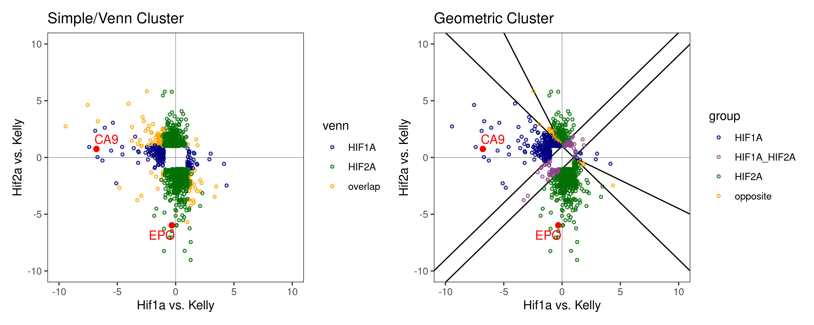

Figures
================
Kelterborn
2024-07-18

- [0. Load](#0-load)
  - [- libraries, folders, R_utils](#--libraries-folders-r_utils)
  - [- Load dds](#--load-dds)
  - [- Colour sheme](#--colour-sheme)
  - [-Prepare Results](#-prepare-results)
- [Figure 1](#figure-1)
  - [PCA](#pca)
- [Figure 2](#figure-2)
  - [-Volcano_function](#-volcano_function)
  - [-Plot Vulcanos](#-plot-vulcanos)
  - [-Venn](#-venn)
- [Figure 3](#figure-3)
  - [Gene Cluster](#gene-cluster)
- [Old code](#old-code)
  - [Enhanced volcano](#enhanced-volcano)
  - [Volcanos](#volcanos)
  - [Cluster genes](#cluster-genes)

# 0. Load

## - libraries, folders, R_utils

## - Load dds

## - Colour sheme

## -Prepare Results

``` r
deg_genes_list <- lapply(results_list,topgenes_f) %>%  lapply(.,rownames) 
names(deg_genes_list) <- paste("deg",names(deg_genes_list),sep="_")

main_degs <- c(list("Kelly: Hx.vs.Nx" = deg_genes_list[["deg_Kelly.Hx.vs.Nx"]],
                     "Hif1b" = deg_genes_list[["deg_Hif1bHxNx.vs.KellyHxNx"]],
                     "Hif1a" = deg_genes_list[["deg_Hif1aHxNx.vs.KellyHxNx"]],
                     "Hif2a" = deg_genes_list[["deg_Hif2aHxNx.vs.KellyHxNx"]] ))


# Select genes
hif1a_2a_genes <- c(deg_genes_list[["deg_Hif1aHxNx.vs.KellyHxNx"]],
                     deg_genes_list[["deg_Hif2aHxNx.vs.KellyHxNx"]],
                    deg_genes_list[["deg_Hif2aHxNx.vs.Hif1aHxNx"]]) %>%
                  unique()

hif1a_2a_genes %>% length()
```

    ## [1] 5374

``` r
# Filter results
res_names <- names(results_list)
res_final <- results_list[c("Kelly.Hx.vs.Nx","Hif1a.Hx.vs.Nx","Hif2a.Hx.vs.Nx", "Hif1aHxNx.vs.KellyHxNx","Hif2aHxNx.vs.KellyHxNx","Hif1bHxNx.vs.KellyHxNx","Hif2aHxNx.vs.Hif1aHxNx")] 

# create table with all results
res_table <- lapply(res_final,data.frame) %>% lapply(.,"[", , c("log2FoldChange","padj"))
res_table <- do.call('cbind',res_table)
res_table_final <- res_final[[1]][,c("symbol","baseMean")] %>% data.frame()
res_table_final <- cbind(res_table_final,res_table)
res_hif1a_2a <- res_table_final[hif1a_2a_genes,]
colnames(res_hif1a_2a)
```

    ##  [1] "symbol"                               
    ##  [2] "baseMean"                             
    ##  [3] "Kelly.Hx.vs.Nx.log2FoldChange"        
    ##  [4] "Kelly.Hx.vs.Nx.padj"                  
    ##  [5] "Hif1a.Hx.vs.Nx.log2FoldChange"        
    ##  [6] "Hif1a.Hx.vs.Nx.padj"                  
    ##  [7] "Hif2a.Hx.vs.Nx.log2FoldChange"        
    ##  [8] "Hif2a.Hx.vs.Nx.padj"                  
    ##  [9] "Hif1aHxNx.vs.KellyHxNx.log2FoldChange"
    ## [10] "Hif1aHxNx.vs.KellyHxNx.padj"          
    ## [11] "Hif2aHxNx.vs.KellyHxNx.log2FoldChange"
    ## [12] "Hif2aHxNx.vs.KellyHxNx.padj"          
    ## [13] "Hif1bHxNx.vs.KellyHxNx.log2FoldChange"
    ## [14] "Hif1bHxNx.vs.KellyHxNx.padj"          
    ## [15] "Hif2aHxNx.vs.Hif1aHxNx.log2FoldChange"
    ## [16] "Hif2aHxNx.vs.Hif1aHxNx.padj"

``` r
# create table with all shrinked results
# Filter results
res_shrink <- res_shrink_list[c("Kelly.Hx.vs.Nx","Hif1a.Hx.vs.Nx","Hif2a.Hx.vs.Nx", "Hif1aHxNx.vs.KellyHxNx","Hif2aHxNx.vs.KellyHxNx","Hif1bHxNx.vs.KellyHxNx","Hif2aHxNx.vs.Hif1aHxNx")] 

# create table with all results
res_shrink <- lapply(res_shrink,data.frame) %>% lapply(.,"[", , c("log2FoldChange","padj"))
res_shrink <- do.call('cbind',res_shrink)
res_shrink_final <- res_final[[1]][,c("symbol","baseMean")] %>% data.frame()
res_shrink_final <- cbind(res_shrink_final,res_shrink)
res_shrink_hif1a_2a <- res_shrink_final[hif1a_2a_genes,]
```

# Figure 1

## PCA

``` r
vst_dat <- assay(vst(dds))

p <- pca(vst_dat, metadata = colData(dds), removeVar = 0.99)
pca_table <- cbind(p$rotated,p$metadata)
pca1 <- ggplot(pca_table, aes(PC2, PC1, color=genotype, shape=treatment)) +
  geom_hline(yintercept = 0, linewidth = 0.1) + 
  geom_vline(xintercept = 0, linewidth = 0.1) +
  geom_point(size=4, alpha=0.5, stroke=1) +
  labs(title = "top 1% variable genes") +
  ylab(paste0("PC1: ",p$variance["PC1"] %>% round(digits = 1),"% variance")) +
  xlab(paste0("PC2: ",p$variance["PC2"] %>% round(digits = 1),"% variance")) +
  scale_color_manual(values=colors[c(2,4,6,8)]) +
  scale_shape_manual(values = c(21,16)) + 
  scale_fill_manual(values=c(colors[1],"white",colors[2],"white")) +
  theme_bw() +
  scale_y_reverse() +
  removeGrid(x=T, y=T)

p <- pca(vst_dat, metadata = colData(dds), removeVar = 0.95)
pca_table <- cbind(p$rotated,p$metadata)
pca5 <- ggplot(pca_table, aes(PC2, PC1, color=genotype, shape=treatment)) +
  geom_hline(yintercept = 0, linewidth = 0.1) + 
  geom_vline(xintercept = 0, linewidth = 0.1) +
  geom_point(size=4, alpha=0.5, stroke=1) +
  labs(title = "top 5% variable genes") +
  ylab(paste0("PC1: ",p$variance["PC1"] %>% round(digits = 1),"% variance")) +
  xlab(paste0("PC2: ",p$variance["PC2"] %>% round(digits = 1),"% variance")) +
  scale_color_manual(values=colors[c(2,4,6,8)]) +
  scale_shape_manual(values = c(21,16)) + 
  scale_fill_manual(values=c(colors[1],"white",colors[2],"white")) +
  theme_bw() +
  scale_y_reverse() +
  removeGrid(x=T, y=T)

p <- pca(vst_dat, metadata = colData(dds), removeVar = 0.90)
pca_table <- cbind(p$rotated,p$metadata)
pca10 <- ggplot(pca_table, aes(PC2, PC1, color=genotype, shape=treatment)) +
  geom_hline(yintercept = 0, linewidth = 0.1) + 
  geom_vline(xintercept = 0, linewidth = 0.1) +
  geom_point(size=4, alpha=0.5, stroke=1) +
  labs(title = "top 10% variable genes") +
  ylab(paste0("PC1: ",p$variance["PC1"] %>% round(digits = 1),"% variance")) +
  xlab(paste0("PC2: ",p$variance["PC2"] %>% round(digits = 1),"% variance")) +
  scale_color_manual(values=colors[c(2,4,6,8)]) +
  scale_shape_manual(values = c(21,16)) + 
  scale_fill_manual(values=c(colors[1],"white",colors[2],"white")) +
  theme_bw() +
  scale_x_reverse() +
  removeGrid(x=T, y=T)
```

``` r
pca1+pca5+pca10+ plot_layout(guides = "collect", axes="collect", axis_titles="collect") & 
  theme(legend.position = 'bottom')
```

<!-- -->

``` r
pca1
```


# Figure 2

## -Volcano_function

``` r
getdeg <- function(x){subset(results_list[[x]], padj < 0.05 & (log2FoldChange > 1 | log2FoldChange < -1)) %>% data.frame()}

volcano_sk3 <- function(n,
                        col="red",
                        celline="cells",
                        deg=deg) {
xlim <- 12
ylim <- -250
res <- results_list[[n]]
res <- res_shrink_list[[n]] %>% data.frame()

# of deg genes
up <- subset(deg, log2FoldChange > 1) %>% nrow()
down <- subset(deg, log2FoldChange < -1) %>% nrow()
total <- up+down

# points outside the grid
outx <- subset(res, log2FoldChange > xlim | log2FoldChange < -xlim) %>% rownames()
outy <- subset(res, padj < 10^ylim) %>% rownames()

res$outlier <- ifelse(rownames(res) %in% c(outx,outy),"yes","no")
res$deg <- ifelse(rownames(res) %in% rownames(deg),"yes","no") %>% factor()

res <- res %>% arrange(res$deg)

res[outx,"log2FoldChange"] <- ifelse(res[outx,"log2FoldChange"] > xlim,xlim,-xlim)
res[outy,"padj"] <- 10^ylim

volcano_func <- ggplot(res,aes(x=log2FoldChange,y=-log10(padj),color=deg, shape=outlier, fill=deg)) +
  geom_hline(yintercept = 0, linewidth = 0.2) + 
  geom_vline(xintercept = 0, linewidth = 0.2) +
  geom_point(size=1.5, stroke=0.5) +
  scale_shape_manual(values = c(21,3)) + 
  scale_alpha_manual(values = c(0.3,0.6)) + 
  labs(title=paste0("Hypoxic response in ",celline),
       subtitle = paste0("upregulated: ",up,", downregulated: ",down," (total: ",total,")") )+
  theme(plot.title = element_text(size = 1), 
        plot.subtitle = element_text(size = 0.5) )+
  ylab("padj (-log10)") +
  xlab("log2-foldchange") +
  scale_fill_manual(values = alpha(c("grey70",lighten(col,0.3)),0.5)) + 
  scale_color_manual(values = c("grey40",col)) + 
  theme_bw() +
  # geom_text_repel(label=res$symbol, color="black") + 
  removeGrid(x=T, y=T)
volcano_func
}
```

## -Plot Vulcanos

``` r
n2 <- {}

deg <- subset(results_list[["Kelly.Hx.vs.Nx"]], padj < 0.05 & (log2FoldChange > 1 | log2FoldChange < -1)) %>% data.frame()

volcano_Kelly <- volcano_sk3(n="Kelly.Hx.vs.Nx", deg=getdeg("Kelly.Hx.vs.Nx"),col=colors[2], celline="Kelly")
volcano_hif1a <- volcano_sk3(n="Hif1a.Hx.vs.Nx", deg=getdeg("Hif1aHxNx.vs.KellyHxNx"),col=colors[4], celline="HIF1A")
volcano_hif2a <- volcano_sk3(n="Hif2a.Hx.vs.Nx", deg=getdeg("Hif2aHxNx.vs.KellyHxNx"),col=colors[6], celline="HIF2A")
volcano_hif1b <- volcano_sk3(n="Hif1b.Hx.vs.Nx", deg=getdeg("Hif1bHxNx.vs.KellyHxNx"),col=colors[8], celline="HIF1B")

(volcano_Kelly+volcano_hif1b + plot_layout(guides = "collect", axes="collect", axis_titles="collect") ) / 
  (volcano_hif1a+volcano_hif2a + plot_layout(guides = "collect", axes="collect", axis_titles="collect") ) & 
  theme(legend.position = 'right')
```

<!-- -->

## -Venn

``` r
input_list <- main_degs
plt1 <- venn.diagram(
    x = input_list,
    fill = colors[c(1,7,3,5)],
    main.fontface = "bold",
    fontfamily ="Arial",
    category.names = paste(names(input_list),"\n(",input_list %>% summary() %>% .[c(1:length(input_list))],")",sep=""),
    force.unique = TRUE, na = "remove", total.population = TRUE,
    filename = NULL,
    lwd = 2,
    lty = 'blank',
    cat.fontface = "bold",
    cat.fontfamily = "arial")

input_list <- main_degs[c(3,4,1)]
plt2 <- venn.diagram(
    x = input_list,
    fill = colors[c(3,5,1)],
    main.fontface = "bold",
    fontfamily ="Arial",
    category.names = paste(names(input_list),"\n(",input_list %>% summary() %>% .[c(1:length(input_list))],")",sep=""),
    force.unique = TRUE, na = "remove", total.population = TRUE,
    filename = NULL,
    lwd = 2,
    lty = 'blank',
    cat.fontface = "bold",
    cat.fontfamily = "arial")
    
#     main = "Compare Hif KOs",


patchwork::wrap_elements(plt1) / patchwork::wrap_elements(plt2)
```


# Figure 3

## Gene Cluster

``` r
# cluster_venn

main_degs %>% names()
```

    ## [1] "Kelly: Hx.vs.Nx" "Hif1b"           "Hif1a"           "Hif2a"

``` r
length(main_degs[[3]])
```

    ## [1] 863

``` r
length(main_degs[[4]])
```

    ## [1] 2856

``` r
venns <- calculate.overlap(main_degs[c(3,4)])
lapply(venns,length)
```

    ## $a1
    ## [1] 863
    ## 
    ## $a2
    ## [1] 2856
    ## 
    ## $a3
    ## [1] 324

``` r
venns %>% unlist() %>% length()
```

    ## [1] 4043

``` r
venns %>% unlist() %>% unique() %>% length()
```

    ## [1] 3395

``` r
venns$a1 <- setdiff(venns$a1,venns$a3)
venns$a2 <- setdiff(venns$a2,venns$a3)
lapply(venns,length)
```

    ## $a1
    ## [1] 539
    ## 
    ## $a2
    ## [1] 2532
    ## 
    ## $a3
    ## [1] 324

``` r
venns %>% unlist() %>% length()
```

    ## [1] 3395

``` r
venns %>% unlist() %>% unique() %>% length()
```

    ## [1] 3395

``` r
res_hif1a_2a$venn <- ifelse(rownames(res_hif1a_2a) %in% venns$a1,"HIF1A",
                      ifelse(rownames(res_hif1a_2a) %in% venns$a2,"HIF2A",
                      ifelse(rownames(res_hif1a_2a) %in% venns$a3,"overlap","")))
res_hif1a_2a$venn %>% table()
```

    ## .
    ##           HIF1A   HIF2A overlap 
    ##    1979     539    2532     324

``` r
# Cluster Venn
cluster_venn <- ggplot(res_hif1a_2a,aes(x=Hif1aHxNx.vs.KellyHxNx.log2FoldChange, y=Hif2aHxNx.vs.KellyHxNx.log2FoldChange, color=venn, fill=venn)) +
  geom_hline(yintercept = 0, linewidth = 0.1) + 
  geom_vline(xintercept = 0, linewidth = 0.1) +
  geom_point(size=1, stroke=0.5, shape=21) +
  labs(title = "Gene cluster") +
  xlab("Hif1a vs. Kelly") +
  ylab("Hif2a vs. Kelly") +
  scale_color_manual(values=c("orange",colors[c(4,6,2)])) +
  # scale_shape_manual(values = c(21,16)) + 
  scale_fill_manual(values=alpha(c("orange",colors[c(4,6,2)]),0.2)) +
  theme_bw() +
  removeGrid(x=T, y=T) +
  coord_cartesian(xlim = c(-5, 5),ylim = c(-5,5))


# Manual Cluster

hif_parallel  <- res_hif1a_2a %>% filter(abs(Hif2aHxNx.vs.Hif1aHxNx.log2FoldChange) < 1)

hif2a_up <- res_hif1a_2a %>% filter(Hif2aHxNx.vs.Hif1aHxNx.log2FoldChange > 1 & (Hif2aHxNx.vs.KellyHxNx.log2FoldChange-1 > 2*-Hif1aHxNx.vs.KellyHxNx.log2FoldChange))
hif2a_do <- res_hif1a_2a %>% filter(Hif2aHxNx.vs.Hif1aHxNx.log2FoldChange < -1 & (Hif2aHxNx.vs.KellyHxNx.log2FoldChange < -Hif1aHxNx.vs.KellyHxNx.log2FoldChange+1))

hif1a_up <- res_hif1a_2a %>% filter(Hif2aHxNx.vs.Hif1aHxNx.log2FoldChange > 1 & (-Hif1aHxNx.vs.KellyHxNx.log2FoldChange > (abs(Hif2aHxNx.vs.KellyHxNx.log2FoldChange-1))))

hif1a_do <- res_hif1a_2a %>% filter(Hif2aHxNx.vs.Hif1aHxNx.log2FoldChange < -1 & (Hif1aHxNx.vs.KellyHxNx.log2FoldChange-1 > 2*-Hif2aHxNx.vs.KellyHxNx.log2FoldChange))


res_hif1a_2a$group <- ifelse(rownames(res_hif1a_2a) %in% rownames(hif_parallel),"HIF1A_HIF2A",
                      ifelse(rownames(res_hif1a_2a) %in% rownames(hif2a_up),"HIF2A",
                      ifelse(rownames(res_hif1a_2a) %in% rownames(hif2a_do),"HIF2A",
                      ifelse(rownames(res_hif1a_2a) %in% rownames(hif1a_up),"HIF1A",
                      ifelse(rownames(res_hif1a_2a) %in% rownames(hif1a_do),"HIF1A","")
                      ))))

cluster <- ggplot(res_hif1a_2a,aes(x=Hif1aHxNx.vs.KellyHxNx.log2FoldChange, y=Hif2aHxNx.vs.KellyHxNx.log2FoldChange, color=group, fill=group)) +
  geom_hline(yintercept = 0, linewidth = 0.1) + 
  geom_vline(xintercept = 0, linewidth = 0.1) +
  geom_abline(intercept=c(1,-1)) +
  geom_abline(slope=c(-1), intercept = 1) +
  annotate("segment", x = c(0,1), y = c(1,0), xend = c(-10,11), yend = c(21,-5),color="black") +
  geom_point(size=1, stroke=0.5, shape=21) +
  labs(title = "Gene cluster") +
  xlab("Hif1a vs. Kelly") +
  ylab("Hif2a vs. Kelly") +
  scale_color_manual(values=c("orange",colors[c(4,2,6)])) +
  # scale_shape_manual(values = c(21,16)) + 
  scale_fill_manual(values=alpha(c("orange",colors[c(4,2,6)]),0.2)) +
  theme_bw() +
  removeGrid(x=T, y=T) +
  coord_cartesian(xlim = c(-5, 5),ylim = c(-5,5))

cluster_venn + cluster
```

<!-- -->

# Old code

## Enhanced volcano

## Volcanos

``` r
n <- "Kelly.Hx.vs.Nx"
xlim <- 12
ylim <- -250
res <- results_list[[n]]
res <- res_shrink_list[[n]] %>% data.frame()

# of deg genes
up <- subset(results_list[[n]], padj< 0.05 & log2FoldChange > 1) %>% nrow()
down <- subset(results_list[[n]], padj< 0.05 & log2FoldChange < -1) %>% nrow()
total <- up+down
deg <- subset(results_list[[n]], padj < 0.05 & (log2FoldChange > 1 | log2FoldChange < -1)) %>% data.frame()

# points outside the grid
outx <- subset(res, log2FoldChange > xlim | log2FoldChange < -xlim) %>% rownames()
outy <- subset(res, padj < 10^ylim) %>% rownames()

res$outlier <- ifelse(rownames(res) %in% c(outx,outy),"yes","no")
res$deg <- ifelse(rownames(res) %in% rownames(deg),"yes","no")

res[outx,"log2FoldChange"] <- ifelse(res[outx,"log2FoldChange"] > xlim,xlim,-xlim)
res[outy,"padj"] <- 10^ylim

volcano_kelly <- ggplot(res,aes(x=log2FoldChange,y=-log10(padj),color=deg, shape=outlier)) +
  geom_hline(yintercept = 0, linewidth = 0.2) + 
  geom_vline(xintercept = 0, linewidth = 0.2) +
  geom_point(size=2, stroke=1) +
  labs(title = "Hypoxic response in Kelly (l2FC > 1, p<0.05") +
  ylab("padj (-log10)") +
  xlab("log2-foldchange") +
  scale_shape_manual(values = c(16,21)) + 
  scale_color_manual(values = c("grey80","orchid4")) + 
  scale_fill_manual(values=c(colors[1],"white",colors[2],"white")) +
  theme_bw() +
  # geom_text_repel(label=res$symbol, color="black") + 
  removeGrid(x=T, y=T)

volcano_kelly
```

<!-- -->

``` r
# Hif1a
n <- "Hif1a.Hx.vs.Nx"
n2 <- "Hif1aHxNx.vs.KellyHxNx"
col <- colors[4]
```

``` r
vol_kelly <- EnhancedVolcano(res,
    colAlpha=0.2,
    lab = res[["symbol"]],
    x = 'log2FoldChange',
    y = 'padj',
    col=c("grey","grey","grey","orchid4"),
    title = "Hypoxic response in kelly cells",
    titleLabSize = 12,
    subtitle = paste0("upregulated: ",up,", downregulated: ",down,"\n(total: ",total,")"),
    subtitleLabSize = 10,
    caption = NULL,
    # xlim = c(-11,10),
    # ylim = c(0,50),
    pCutoff = 0.05,
    FCcutoff = 0.5,
    maxoverlapsConnectors = 30,
    drawConnectors = TRUE,
    widthConnectors = 0.5,
    colConnectors = "grey70",
    legendLabels=c('ns','ns','ns',
      'padj < 0.05 & Log2FC > 0.5'),
    labSize = 4,
    axisLabSize = 12,
    legendLabSize = 12,
    legendIconSize = 4,
    gridlines.major = FALSE,
    gridlines.minor = FALSE,
    pointSize = 2
)
vol_kelly
```

## Cluster genes

``` r
# Hypoxia up:
## Volcano

deg <- res_hif1a_2a %>% filter(Kelly.Hx.vs.Nx.log2FoldChange > 1) %>% mutate(log2FoldChange = Kelly.Hx.vs.Nx.log2FoldChange)
volcano_kelly_up <- volcano_sk3(n="Kelly.Hx.vs.Nx",n2="Kelly.Hx.vs.Nx", deg=deg,col=colors_vul[5], celline="Kelly") + labs(title=paste0("DEG genes Hx upregulated"), subtitle = paste0("upregulated: ",nrow(deg)))


# Hif1a ~ Kelly, color: 
color3 <- cut(deg$Hif2aHxNx.vs.Hif1aHxNx.log2FoldChange,c(-Inf,seq(-3,3,by=1),+Inf))
cc <- scales::seq_gradient_pal("blue", "red", "Lab")(seq(0,1,length.out=8))
cc <- viridis(8)
cc[4:5] <- "grey40"
cluster_h1vK <- ggplot(deg,aes(x=Kelly.Hx.vs.Nx.log2FoldChange, y=Hif1a.Hx.vs.Nx.log2FoldChange, color=color3)) +
  geom_hline(yintercept=c(0)) +
  geom_vline(xintercept=c(0)) +
  geom_abline(intercept=c(1,-1)) +
  geom_point(alpha=0.5) +
  # scale_color_viridis_d(option = 'C') +
  scale_colour_manual(name="log2-FC",values=cc) +
  ggtitle(label="Kelly: Hx vs. Nx") + 
  coord_cartesian(xlim = c(-5, 12),ylim = c(-5,12))
cluster_h1vK

# Hif1a ~ Hif2a, color: 
color3 <- cut(deg$Hif2aHxNx.vs.Hif1aHxNx.log2FoldChange,c(-Inf,seq(-3,3,by=1),+Inf))
cc <- scales::seq_gradient_pal("blue", "red", "Lab")(seq(0,1,length.out=8))
cc <- viridis(8)
cc[4:5] <- "grey40"
cluster_h2v1 <- ggplot(deg,aes(x=Hif1aHxNx.vs.KellyHxNx.log2FoldChange, y=Hif2aHxNx.vs.KellyHxNx.log2FoldChange, color=color3)) +
  geom_hline(yintercept=c(0)) +
  geom_vline(xintercept=c(0)) +
  geom_abline(intercept=c(1,-1)) +
  geom_point(alpha=0.5) +
  # scale_color_viridis_d(option = 'C') +
  scale_colour_manual(name="log2-FC",values=cc) +
  ggtitle(label="Kelly: Hx vs. Nx") + 
  coord_cartesian(xlim = c(-10, 10),ylim = c(-10,10))
cluster_h2v1


# hif1a = 0, Hiff2A > 1
subset(deg, Hif2aHxNx.vs.KellyHxNx.log2FoldChange >1 & (Hif1aHxNx.vs.KellyHxNx.log2FoldChange > -1 & Hif1aHxNx.vs.KellyHxNx.log2FoldChange < 1))
goi <- "ENSG00000135636"
plotCounts_anno(goi) + labs(title="Hif2A target")
point_xy <- data.frame(x=deg[goi,"Hif1aHxNx.vs.KellyHxNx.log2FoldChange"],y=deg[goi,"Hif2aHxNx.vs.KellyHxNx.log2FoldChange"], target="HIF2A",gene=goi)

# Hif1a > 1, Hif2A > 1 Hif2:Hif1 > 1
subset(deg, Hif2aHxNx.vs.KellyHxNx.log2FoldChange >1 & (Hif1aHxNx.vs.KellyHxNx.log2FoldChange > 1 & Hif1aHxNx.vs.KellyHxNx.log2FoldChange > 1) & Hif2aHxNx.vs.Hif1aHxNx.log2FoldChange > 1)
goi <- "ENSG00000240801"
plotCounts_anno(goi) + labs(title="Hif2A target")
point_xy <- rbind(point_xy,data.frame(x=deg[goi,"Hif1aHxNx.vs.KellyHxNx.log2FoldChange"],y=deg[goi,"Hif2aHxNx.vs.KellyHxNx.log2FoldChange"], target="HIF2A",gene=goi))

# Hif1a > 1, Hif2A > 1 Hif2:Hif1 < 1
subset(deg, Hif2aHxNx.vs.KellyHxNx.log2FoldChange >1 & (Hif1aHxNx.vs.KellyHxNx.log2FoldChange > 1 & Hif1aHxNx.vs.KellyHxNx.log2FoldChange > 1) & Hif2aHxNx.vs.Hif1aHxNx.log2FoldChange < 1)
goi <- "ENSG00000124205"
plotCounts_anno(goi) + labs(title="Hif1A & Hif2A target")
point_xy <- rbind(point_xy,data.frame(x=deg[goi,"Hif1aHxNx.vs.KellyHxNx.log2FoldChange"],y=deg[goi,"Hif2aHxNx.vs.KellyHxNx.log2FoldChange"], target="HIF1A & HIF2A",gene=goi))

# Hif1a > 1, Hif2A > 1, Hif2:Hif1 < -1
subset(deg, Hif2aHxNx.vs.KellyHxNx.log2FoldChange >1 & (Hif1aHxNx.vs.KellyHxNx.log2FoldChange > 1 & Hif1aHxNx.vs.KellyHxNx.log2FoldChange > 1) & Hif2aHxNx.vs.Hif1aHxNx.log2FoldChange < -1)
goi <- "ENSG00000249815"
plotCounts_anno(goi) + labs(title="Hif1A")
point_xy <- rbind(point_xy,data.frame(x=deg[goi,"Hif1aHxNx.vs.KellyHxNx.log2FoldChange"],y=deg[goi,"Hif2aHxNx.vs.KellyHxNx.log2FoldChange"], target="HIF1A",gene=goi))

# Hif1a > 1, Hif2A < 1, Hif1a > Hif2A
subset(deg, abs(Hif2aHxNx.vs.KellyHxNx.log2FoldChange) < 1 & (Hif1aHxNx.vs.KellyHxNx.log2FoldChange > 1 & Hif1aHxNx.vs.KellyHxNx.log2FoldChange > 1) & Hif2aHxNx.vs.Hif1aHxNx.log2FoldChange < -1)
goi <- "ENSG00000186352"
plotCounts_anno(goi) + labs(title="Hif1A")
point_xy <- rbind(point_xy,data.frame(x=deg[goi,"Hif1aHxNx.vs.KellyHxNx.log2FoldChange"],y=deg[goi,"Hif2aHxNx.vs.KellyHxNx.log2FoldChange"], target="HIF1A",gene=goi))
goi <- "ENSG00000099994"
plotCounts_anno(goi) + labs(title="Hif1A")

point_xy <- rbind(point_xy,data.frame(x=deg[goi,"Hif1aHxNx.vs.KellyHxNx.log2FoldChange"],y=deg[goi,"Hif2aHxNx.vs.KellyHxNx.log2FoldChange"], target="HIF1A",gene=goi))

# Hif1a > 1, Hif2A < 1, Hif1a = Hif2A
subset(deg, Hif2aHxNx.vs.KellyHxNx.log2FoldChange < 0 & (Hif1aHxNx.vs.KellyHxNx.log2FoldChange > 1 & Hif1aHxNx.vs.KellyHxNx.log2FoldChange > 1) & ((-Hif2aHxNx.vs.KellyHxNx.log2FoldChange - Hif1aHxNx.vs.KellyHxNx.log2FoldChange) < 1))
goi <- "ENSG00000125384"
plotCounts_anno(goi) + labs(title="Hif2A")
point_xy <- rbind(point_xy,data.frame(x=deg[goi,"Hif1aHxNx.vs.KellyHxNx.log2FoldChange"],y=deg[goi,"Hif2aHxNx.vs.KellyHxNx.log2FoldChange"], target="HIF2A",gene=goi))
goi <- "ENSG00000099994"
point_xy <- rbind(point_xy,data.frame(x=deg[goi,"Hif1aHxNx.vs.KellyHxNx.log2FoldChange"],y=deg[goi,"Hif2aHxNx.vs.KellyHxNx.log2FoldChange"], target="HIF1A",gene=goi))

# Hif1a < 1, Hif2A < 0
subset(deg, Hif2aHxNx.vs.KellyHxNx.log2FoldChange < 0 & (Hif1aHxNx.vs.KellyHxNx.log2FoldChange < 1 & Hif1aHxNx.vs.KellyHxNx.log2FoldChange > -1))
goi <- "ENSG00000129675"
plotCounts_anno(goi) + labs(title="Hif2A")
point_xy <- rbind(point_xy,data.frame(x=deg[goi,"Hif1aHxNx.vs.KellyHxNx.log2FoldChange"],y=deg[goi,"Hif2aHxNx.vs.KellyHxNx.log2FoldChange"], target="HIF2A",gene=goi))

# Hif1a < -1, Hif2A < 0
subset(deg, Hif2aHxNx.vs.KellyHxNx.log2FoldChange < 0 & (Hif1aHxNx.vs.KellyHxNx.log2FoldChange < -1 & Hif1aHxNx.vs.KellyHxNx.log2FoldChange < -1) & Hif2aHxNx.vs.Hif1aHxNx.log2FoldChange < -1)
goi <- "ENSG00000023445"
plotCounts_anno(goi) + labs(title="Hif2A")
point_xy <- rbind(point_xy,data.frame(x=deg[goi,"Hif1aHxNx.vs.KellyHxNx.log2FoldChange"],y=deg[goi,"Hif2aHxNx.vs.KellyHxNx.log2FoldChange"], target="HIF2A",gene=goi))

# Hif1a < -1, Hif2A < -1, Hif2a:Hif1a < 1
subset(deg, Hif2aHxNx.vs.KellyHxNx.log2FoldChange < -1 & (Hif1aHxNx.vs.KellyHxNx.log2FoldChange < -1 & Hif1aHxNx.vs.KellyHxNx.log2FoldChange < -1) & abs(Hif2aHxNx.vs.Hif1aHxNx.log2FoldChange) < 1)
goi <- "ENSG00000136235"
plotCounts_anno(goi) + labs(title="Hif1A & Hif2A target")
point_xy <- rbind(point_xy,data.frame(x=deg[goi,"Hif1aHxNx.vs.KellyHxNx.log2FoldChange"],y=deg[goi,"Hif2aHxNx.vs.KellyHxNx.log2FoldChange"], target="HIF1A & HIF2A",gene=goi))


# Hif1a < -1, Hif2A < -1, Hif2a:Hif1a < 1
subset(deg, Hif2aHxNx.vs.KellyHxNx.log2FoldChange < -1 & (Hif1aHxNx.vs.KellyHxNx.log2FoldChange < -1 & Hif1aHxNx.vs.KellyHxNx.log2FoldChange < -1) & Hif2aHxNx.vs.Hif1aHxNx.log2FoldChange> 1)
goi <- "ENSG00000278718"
plotCounts_anno(goi) + labs(title="Hif1A")
point_xy <- rbind(point_xy,data.frame(x=deg[goi,"Hif1aHxNx.vs.KellyHxNx.log2FoldChange"],y=deg[goi,"Hif2aHxNx.vs.KellyHxNx.log2FoldChange"], target="HIF1A",gene=goi))

# Hif1a < -1, Hif2A < -1, Hif2a:Hif1a > 1
subset(deg, abs(Hif2aHxNx.vs.KellyHxNx.log2FoldChange) < 1 & (Hif1aHxNx.vs.KellyHxNx.log2FoldChange < -1 & Hif1aHxNx.vs.KellyHxNx.log2FoldChange < -1) & Hif2aHxNx.vs.Hif1aHxNx.log2FoldChange> 1)
goi <- "ENSG00000170525"
plotCounts_anno(goi) + labs(title="Hif1A")
point_xy <- rbind(point_xy,data.frame(x=deg[goi,"Hif1aHxNx.vs.KellyHxNx.log2FoldChange"],y=deg[goi,"Hif2aHxNx.vs.KellyHxNx.log2FoldChange"], target="HIF1A",gene=goi))

# Hif1a < -1, Hif2A > 1
subset(deg, Hif2aHxNx.vs.KellyHxNx.log2FoldChange > 1 & (Hif1aHxNx.vs.KellyHxNx.log2FoldChange < -1 & Hif1aHxNx.vs.KellyHxNx.log2FoldChange < -1) & (-Hif2aHxNx.vs.KellyHxNx.log2FoldChange - Hif1aHxNx.vs.KellyHxNx.log2FoldChange) < 1)
goi <- "ENSG00000137819"
plotCounts_anno(goi) + labs(title="Hif1A")
point_xy <- rbind(point_xy,data.frame(x=deg[goi,"Hif1aHxNx.vs.KellyHxNx.log2FoldChange"],y=deg[goi,"Hif2aHxNx.vs.KellyHxNx.log2FoldChange"], target="HIF1A",gene=goi))

# Hif1a < -1, Hif2A > 1
subset(deg, Hif2aHxNx.vs.KellyHxNx.log2FoldChange > 1 & (Hif1aHxNx.vs.KellyHxNx.log2FoldChange < -1 & Hif1aHxNx.vs.KellyHxNx.log2FoldChange < -1) & (-Hif2aHxNx.vs.KellyHxNx.log2FoldChange - Hif1aHxNx.vs.KellyHxNx.log2FoldChange) < 1) %>% arrange(Hif1aHxNx.vs.KellyHxNx.log2FoldChange)
goi <- "ENSG00000285321"
plotCounts_anno(goi) + labs(title="Hif1A")
point_xy <- rbind(point_xy,data.frame(x=deg[goi,"Hif1aHxNx.vs.KellyHxNx.log2FoldChange"],y=deg[goi,"Hif2aHxNx.vs.KellyHxNx.log2FoldChange"], target="HIF1A",gene=goi))

# Hif1a -> Hif2A
goi <- subset(deg, Hif2aHxNx.vs.KellyHxNx.log2FoldChange > 5 & (Hif1aHxNx.vs.KellyHxNx.log2FoldChange < 0 & Hif1aHxNx.vs.KellyHxNx.log2FoldChange < 0) & (-Hif2aHxNx.vs.KellyHxNx.log2FoldChange - Hif1aHxNx.vs.KellyHxNx.log2FoldChange) < 1) %>% arrange(Hif1aHxNx.vs.KellyHxNx.log2FoldChange) 
plotCounts_SK(goi %>% rownames()) + labs(title="Hif1A")

# Hif1a -> Hif2A
goi <- subset(deg, Hif2aHxNx.vs.Hif1aHxNx.log2FoldChange > 1 & (Hif2aHxNx.vs.KellyHxNx.log2FoldChange + Hif1aHxNx.vs.KellyHxNx.log2FoldChange) > 1 & (Hif2aHxNx.vs.KellyHxNx.log2FoldChange + Hif1aHxNx.vs.KellyHxNx.log2FoldChange) < 2) %>% arrange(Hif1aHxNx.vs.KellyHxNx.log2FoldChange) 

plotCounts_SK(goi[1:9,] %>% rownames()) + labs(title="Hif1A")

goi <- "ENSG00000127824"
plotCounts_anno(goi=goi)
point_xy <- rbind(point_xy,data.frame(x=deg[goi,"Hif1aHxNx.vs.KellyHxNx.log2FoldChange"],y=deg[goi,"Hif2aHxNx.vs.KellyHxNx.log2FoldChange"], target="opposing",gene=goi))

cc <- c(viridis(8,option = 'A'),colors[c(4,2,6)])
cc <- c(rep("grey40",8),colors[c(4,2,6)], "orange")

point_xy$symbol <- mcols(dds)[point_xy$gene,"symbol"]

cluster_h2v1 + geom_point(data = point_xy, aes(x=x, y=y, color=target), size=5) + scale_colour_manual(name="log2-FC",values=cc) + geom_text_repel(data = point_xy, aes(x=x, y=y), label=point_xy$symbol, colour="black")
```

### Other cluster

``` r
# Hif1a ~ Hif2a, color: Kelly_Hx
color1 <- cut(res_hif1a_2a$Kelly.Hx.vs.Nx.log2FoldChange,c(-Inf,seq(-3,3,by=1),+Inf))
cc <- scales::seq_gradient_pal("blue", "red", "Lab")(seq(0,1,length.out=8))
cc <- viridis(8)
cc[4:5] <- "grey40"
cluster_hx <- ggplot(res_hif1a_2a,aes(x=Hif1a.Hx.vs.Nx.log2FoldChange, y=Hif2a.Hx.vs.Nx.log2FoldChange, color=color1)) +
  geom_hline(yintercept=c(0)) +
  geom_vline(xintercept=c(0)) +
  geom_abline(intercept=c(1,-1)) +
  geom_point(alpha=0.5) +
  # scale_color_viridis_d(option = 'C') +
  scale_colour_manual(name="log2-FC",values=cc) +
  ggtitle(label="Kelly: Hx vs. Nx") + 
  coord_cartesian(xlim = c(-5, 12),ylim = c(-5,12))

# Hif1a ~ Hif2a, color: Hif2a vs. Hif1a
color2 <- cut(res_hif1a_2a$Hif2aHxNx.vs.Hif1aHxNx.log2FoldChange,c(-Inf,seq(-3,3,by=1),+Inf))
clusterh1v2 <- ggplot(res_hif1a_2a,aes(x=Hif1a.Hx.vs.Nx.log2FoldChange, y=Hif2a.Hx.vs.Nx.log2FoldChange, color=color2)) +
  geom_hline(yintercept=c(0)) +
  geom_vline(xintercept=c(0)) +
  geom_abline(intercept=c(1,-1)) +
  geom_point(alpha=0.5) +
  scale_colour_manual(name="log2-FC",values=cc) +
  # scale_color_viridis_d(option = 'C') +
  ggtitle(label="Hif1a vs. Hif2a") + 
  coord_cartesian(xlim = c(-5, 12),ylim = c(-5,12))

cluster_hx + clusterh1v2 + plot_layout(guides = "collect", axes="collect", axis_titles="collect") & 
  theme(legend.position = 'right')


# Hif1a ~ Kelly, color: 
color3 <- cut(res_hif1a_2a$Hif2aHxNx.vs.Hif1aHxNx.log2FoldChange,c(-Inf,seq(-3,3,by=1),+Inf))
cc <- scales::seq_gradient_pal("blue", "red", "Lab")(seq(0,1,length.out=8))
cc <- viridis(8)
cc[4:5] <- "grey40"
cluster_h1vK <- ggplot(res_hif1a_2a,aes(x=Kelly.Hx.vs.Nx.log2FoldChange, y=Hif1a.Hx.vs.Nx.log2FoldChange, color=color3)) +
  geom_hline(yintercept=c(0)) +
  geom_vline(xintercept=c(0)) +
  geom_abline(intercept=c(1,-1)) +
  geom_point(alpha=0.5) +
  # scale_color_viridis_d(option = 'C') +
  scale_colour_manual(name="log2-FC",values=cc) +
  ggtitle(label="Kelly: Hx vs. Nx") + 
  coord_cartesian(xlim = c(-5, 12),ylim = c(-5,12))
cluster_h1vK


color3 <- cut(res_hif1a_2a$Hif2aHxNx.vs.Hif1aHxNx.log2FoldChange,c(-Inf,seq(-3,3,by=1),+Inf))
clusterh1vK <- ggplot(res_hif1a_2a,aes(x=Hif1a.Hx.vs.Nx.log2FoldChange, y=Hif2a.Hx.vs.Nx.log2FoldChange, color=color3)) +
  geom_hline(yintercept=c(0)) +
  geom_vline(xintercept=c(0)) +
  geom_abline(intercept=c(1,-1)) +
  geom_point(alpha=0.5) +
  scale_colour_manual(name="log2-FC",values=cc) +
  # scale_color_viridis_d(option = 'C') +
  ggtitle(label="Hif1a vs. Hif2a") + 
  coord_cartesian(xlim = c(-5, 12),ylim = c(-5,12))
clusterh1vK
```
