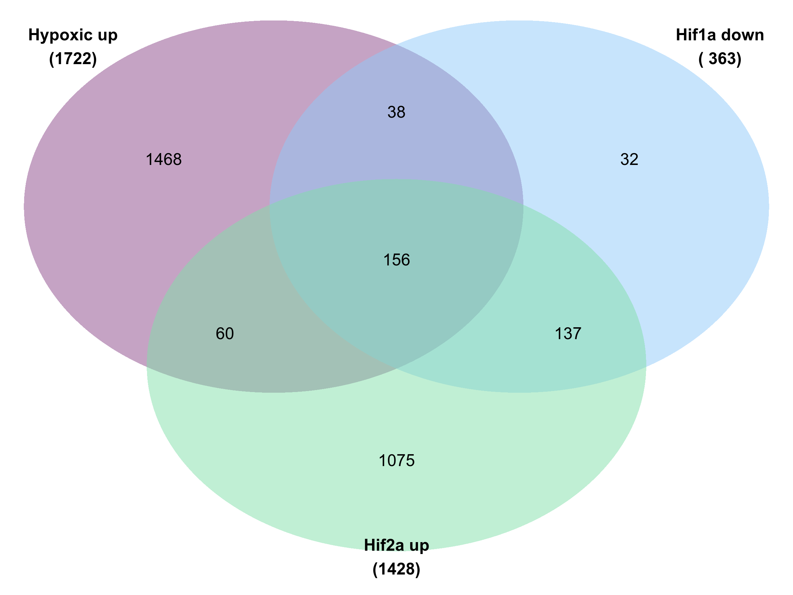

Figures
================
Kelterborn
2024-07-18

- [test fix](#test-fix)
- [0. Load](#0-load)
  - [- libraries, folders, R_utils](#--libraries-folders-r_utils)
  - [- Load dds](#--load-dds)
  - [- Colour sheme](#--colour-sheme)
  - [-Prepare Results](#-prepare-results)
- [Figure 1: Samples QC](#figure-1-samples-qc)
  - [PCA](#pca)
- [Example Counts](#example-counts)
- [Figure 2: Differential expressed
  genes](#figure-2-differential-expressed-genes)
  - [-Volcano_function](#-volcano_function)
  - [-Volcano_function2](#-volcano_function2)
  - [-Plot Vulcanos](#-plot-vulcanos)
  - [-Venn](#-venn)
- [Figure 3: Gene Cluster](#figure-3-gene-cluster)
  - [Gene Cluster](#gene-cluster)
  - [Cluster Holger](#cluster-holger)
  - [HIF independant](#hif-independant)
- [(Table 1: Gene List)](#table-1-gene-list)
- [Figure 4: Gene Set enrichment](#figure-4-gene-set-enrichment)
  - [GO Analysis](#go-analysis)
  - [Cluster GO terms](#cluster-go-terms)
  - [KEGG](#kegg)
- [Figure 5: Compare with ChIP-Seq](#figure-5-compare-with-chip-seq)
  - [Load datasets](#load-datasets)
  - [ChIP Venns](#chip-venns)
- [](#section)
- [\###Old code](#old-code)
  - [Enhanced volcano](#enhanced-volcano)
  - [Volcanos](#volcanos)
  - [Cluster genes](#cluster-genes)

# test fix

# 0. Load

## - libraries, folders, R_utils

if (!require(“BiocManager”, quietly = TRUE))
install.packages(“BiocManager”) BiocManager::install(version = “3.21”)

Load R libraries. If package is missing, install with
‘BiocManager::install(“PackageName”)’

## - Load dds

## - Colour sheme

## -Prepare Results

``` r
deg_genes_list <- lapply(results_list,topgenes_f, bM = 100, p=0.01) %>%  lapply(.,rownames) 
names(deg_genes_list) <- paste("deg",names(deg_genes_list),sep="_")

main_degs <- c(list("Kelly: Hx.vs.Nx" = deg_genes_list[["deg_Kelly.Hx.vs.Nx"]],
                     "dd_Hif1b" = deg_genes_list[["deg_Hif1bHxNx.vs.KellyHxNx"]],
                     "dd_Hif1a" = deg_genes_list[["deg_Hif1aHxNx.vs.KellyHxNx"]],
                     "dd_Hif2a" = deg_genes_list[["deg_Hif2aHxNx.vs.KellyHxNx"]] ))


# Select genes
hif1a_2a_genes <- c(deg_genes_list[["deg_Hif1aHxNx.vs.KellyHxNx"]],
                     deg_genes_list[["deg_Hif2aHxNx.vs.KellyHxNx"]]) %>%
                  unique()

# deg_genes_list[["deg_Hif2aHxNx.vs.Hif1aHxNx"]]

hif1a_2a_genes %>% length()
```

    ## [1] 1507

``` r
# Filter results
res_names <- names(results_list)
res_final <- results_list[c("Kelly.Hx.vs.Nx","Hif1a.Hx.vs.Nx","Hif2a.Hx.vs.Nx",
                             "Hx.Hif1a.vs.Kelly","Hx.Hif2a.vs.Kelly","Hx.Hif1b.vs.Kelly","Hx.Hif2a.vs.Hif1a","Hx.Hif1b.vs.Hif1a","Hx.Hif1b.vs.Hif2a" ,
                             "Hif1aHxNx.vs.KellyHxNx","Hif2aHxNx.vs.KellyHxNx","Hif1bHxNx.vs.KellyHxNx","Hif2aHxNx.vs.Hif1aHxNx")] 

# create table with all results
res_table <- lapply(res_final,data.frame) %>% lapply(.,"[", , c("log2FoldChange","padj"))
res_table <- do.call('cbind',res_table)
res_table_final <- res_final[[1]][,c("ENSEMBL","ENTREZ","symbol","baseMean")] %>% data.frame()
res_table_final <- cbind(res_table_final,res_table)
res_hif1a_2a <- res_table_final[hif1a_2a_genes,]
colnames(res_hif1a_2a)
```

    ##  [1] "ENSEMBL"                              
    ##  [2] "ENTREZ"                               
    ##  [3] "symbol"                               
    ##  [4] "baseMean"                             
    ##  [5] "Kelly.Hx.vs.Nx.log2FoldChange"        
    ##  [6] "Kelly.Hx.vs.Nx.padj"                  
    ##  [7] "Hif1a.Hx.vs.Nx.log2FoldChange"        
    ##  [8] "Hif1a.Hx.vs.Nx.padj"                  
    ##  [9] "Hif2a.Hx.vs.Nx.log2FoldChange"        
    ## [10] "Hif2a.Hx.vs.Nx.padj"                  
    ## [11] "Hx.Hif1a.vs.Kelly.log2FoldChange"     
    ## [12] "Hx.Hif1a.vs.Kelly.padj"               
    ## [13] "Hx.Hif2a.vs.Kelly.log2FoldChange"     
    ## [14] "Hx.Hif2a.vs.Kelly.padj"               
    ## [15] "Hx.Hif1b.vs.Kelly.log2FoldChange"     
    ## [16] "Hx.Hif1b.vs.Kelly.padj"               
    ## [17] "Hx.Hif2a.vs.Hif1a.log2FoldChange"     
    ## [18] "Hx.Hif2a.vs.Hif1a.padj"               
    ## [19] "Hx.Hif1b.vs.Hif1a.log2FoldChange"     
    ## [20] "Hx.Hif1b.vs.Hif1a.padj"               
    ## [21] "Hx.Hif1b.vs.Hif2a.log2FoldChange"     
    ## [22] "Hx.Hif1b.vs.Hif2a.padj"               
    ## [23] "Hif1aHxNx.vs.KellyHxNx.log2FoldChange"
    ## [24] "Hif1aHxNx.vs.KellyHxNx.padj"          
    ## [25] "Hif2aHxNx.vs.KellyHxNx.log2FoldChange"
    ## [26] "Hif2aHxNx.vs.KellyHxNx.padj"          
    ## [27] "Hif1bHxNx.vs.KellyHxNx.log2FoldChange"
    ## [28] "Hif1bHxNx.vs.KellyHxNx.padj"          
    ## [29] "Hif2aHxNx.vs.Hif1aHxNx.log2FoldChange"
    ## [30] "Hif2aHxNx.vs.Hif1aHxNx.padj"

``` r
hist(res_hif1a_2a$baseMean, breaks = 100000, xlim = c(0,500))

# TOP genes

deg_top_genes_list <- lapply(results_list,topgenes_f,p=0.05, l2FC = 2, bM = 100) %>%  lapply(.,rownames) 
names(deg_top_genes_list) <- paste("deg",names(deg_top_genes_list),sep="_")

# Select genes
hif1a_2a_top_genes <- c(deg_top_genes_list[["deg_Hif1aHxNx.vs.KellyHxNx"]],
                     deg_top_genes_list[["deg_Hif2aHxNx.vs.KellyHxNx"]]) %>%
                  unique()

# deg_genes_list[["deg_Hif2aHxNx.vs.Hif1aHxNx"]]

hif1a_2a_top_genes %>% length()
```

    ## [1] 343

``` r
res_hif1a_2a_top <- res_table_final[hif1a_2a_top_genes,]
res_hif1a_2a$top <- ifelse(rownames(res_hif1a_2a) %in% hif1a_2a_top_genes,"top","deg")


# create table with all shrinked results
# Filter results
res_shrink <- res_shrink_list[c("Kelly.Hx.vs.Nx","Hif1a.Hx.vs.Nx","Hif2a.Hx.vs.Nx", "Hif1aHxNx.vs.KellyHxNx","Hif2aHxNx.vs.KellyHxNx","Hif1bHxNx.vs.KellyHxNx","Hif2aHxNx.vs.Hif1aHxNx")] 

# create table with all results
res_shrink <- lapply(res_shrink,data.frame) %>% lapply(.,"[", , c("log2FoldChange","padj"))
res_shrink <- do.call('cbind',res_shrink)
res_shrink_final <- res_final[[1]][,c("symbol","baseMean")] %>% data.frame()
res_shrink_final <- cbind(res_shrink_final,res_shrink)
res_shrink_hif1a_2a <- res_shrink_final[hif1a_2a_genes,]


# Gene universe
# Expression min
results_list[[1]]$baseMean %>% hist(breaks=100000, xlim = c(0,100)) 

# in results
res_hif1a_2a$baseMean %>% min()
```

    ## [1] 100.0206

``` r
res_hif1a_2a$baseMean %>% hist(breaks=100000, xlim = c(0,100))

# use all genes in dataset
genes_univ_ens <- results_list[[1]]$ENSEMBL
genes_univ_ens %>% length()
```

    ## [1] 21583

``` r
genes_univ <- results_list[[1]]$ENTREZ
genes_univ %>% length()
```

    ## [1] 21583

``` r
genes_univ %>% is.na() %>% summary()
```

    ##    Mode   FALSE    TRUE 
    ## logical   16750    4833

``` r
# Example genes
res_shrink_list[["Kelly.Hx.vs.Nx"]] %>% subset(symbol=="CA9")
```

    ## log2 fold change (MMSE): 0,0,0,0,+1,0,0,0 
    ## Wald test p-value: 0,0,0,0,+1,0,0,0 
    ## DataFrame with 1 row and 8 columns
    ##                  baseMean log2FoldChange     lfcSE       pvalue         padj
    ##                 <numeric>      <numeric> <numeric>    <numeric>    <numeric>
    ## ENSG00000107159   3017.83        10.6266  0.365606 1.44153e-187 2.99131e-185
    ##                      symbol         ENSEMBL    ENTREZ
    ##                 <character>     <character> <integer>
    ## ENSG00000107159         CA9 ENSG00000107159       768

``` r
res_shrink_list[["Kelly.Hx.vs.Nx"]] %>% subset(symbol=="WT1")
```

    ## log2 fold change (MMSE): 0,0,0,0,+1,0,0,0 
    ## Wald test p-value: 0,0,0,0,+1,0,0,0 
    ## DataFrame with 1 row and 8 columns
    ##                  baseMean log2FoldChange     lfcSE      pvalue        padj
    ##                 <numeric>      <numeric> <numeric>   <numeric>   <numeric>
    ## ENSG00000184937   140.558        8.79674  0.433554 7.13829e-93 2.97396e-91
    ##                      symbol         ENSEMBL    ENTREZ
    ##                 <character>     <character> <integer>
    ## ENSG00000184937         WT1 ENSG00000184937      7490

``` r
CA9 = "ENSG00000107159"
WT1 ="ENSG00000184937"
```


# Figure 1: Samples QC

## PCA

``` r
vst_dat <- assay(vst(dds))

p <- pca(vst_dat, metadata = colData(dds), removeVar = 0.99)
pca_table <- cbind(p$rotated,p$metadata)
pca1 <- ggplot(pca_table, aes(PC2, PC1, color=genotype, shape=treatment)) +
  geom_hline(yintercept = 0, linewidth = 0.1) + 
  geom_vline(xintercept = 0, linewidth = 0.1) +
  geom_point(size=4, alpha=0.5, stroke=1) +
  labs(title = "top 1% variable genes") +
  ylab(paste0("PC1: ",p$variance["PC1"] %>% round(digits = 1),"% variance")) +
  xlab(paste0("PC2: ",p$variance["PC2"] %>% round(digits = 1),"% variance")) +
  scale_color_manual(values=colors[c(2,4,6,8)]) +
  scale_shape_manual(values = c(21,16)) + 
  scale_fill_manual(values=c(colors[1],"white",colors[2],"white")) +
  theme_bw() +
  scale_y_reverse() +
  removeGrid(x=T, y=T)

p <- pca(vst_dat, metadata = colData(dds), removeVar = 0.95)
pca_table <- cbind(p$rotated,p$metadata)
pca5 <- ggplot(pca_table, aes(PC2, PC1, color=genotype, shape=treatment)) +
  geom_hline(yintercept = 0, linewidth = 0.1) + 
  geom_vline(xintercept = 0, linewidth = 0.1) +
  geom_point(size=4, alpha=0.5, stroke=1) +
  labs(title = "top 5% variable genes") +
  ylab(paste0("PC1: ",p$variance["PC1"] %>% round(digits = 1),"% variance")) +
  xlab(paste0("PC2: ",p$variance["PC2"] %>% round(digits = 1),"% variance")) +
  scale_color_manual(values=colors[c(2,4,6,8)]) +
  scale_shape_manual(values = c(21,16)) + 
  scale_fill_manual(values=c(colors[1],"white",colors[2],"white")) +
  theme_bw() +
  scale_y_reverse() +
  removeGrid(x=T, y=T)

p <- pca(vst_dat, metadata = colData(dds), removeVar = 0.90)
pca_table <- cbind(p$rotated,p$metadata)
pca10 <- ggplot(pca_table, aes(PC2, PC1, color=genotype, shape=treatment)) +
  geom_hline(yintercept = 0, linewidth = 0.1) + 
  geom_vline(xintercept = 0, linewidth = 0.1) +
  geom_point(size=4, alpha=0.5, stroke=1) +
  labs(title = "top 10% variable genes") +
  ylab(paste0("PC1: ",p$variance["PC1"] %>% round(digits = 1),"% variance")) +
  xlab(paste0("PC2: ",p$variance["PC2"] %>% round(digits = 1),"% variance")) +
  scale_color_manual(values=colors[c(2,4,6,8)]) +
  scale_shape_manual(values = c(21,16)) + 
  scale_fill_manual(values=c(colors[1],"white",colors[2],"white")) +
  theme_bw() +
  scale_x_reverse() +
  removeGrid(x=T, y=T)
```

``` r
pca1+pca5+pca10+ plot_layout(guides = "collect", axes="collect", axis_titles="collect") & 
  theme(legend.position = 'bottom')
```

<!-- -->

``` r
pca10
```


# Example Counts

``` r
# HIF1A: EPO, VEGF, HO-1, ADM, and Glut-1
EPO <- subset(res_shrink_list[["Kelly.Hx.vs.Nx"]],symbol=="EPO")$ENSEMBL

# EPO <- subset(res,symbol=="VEGF-A")
# EPO <- subset(res,symbol=="EPO")
# EPO <- subset(res,symbol=="EPO")
# EPO <- subset(res,symbol=="EPO")


plotCounts_anno(CA9)
plotCounts_anno(WT1)
plotCounts_anno(EPO)
```


# Figure 2: Differential expressed genes

## -Volcano_function

``` r
# res <- res_shrink_list[[n]] %>% data.frame()

getdeg <- function(x,
                   padj = 0.05,
                   bM = 0,
                   l2fc = 1)
  {subset(results_list[[x]], padj < padj &
                              baseMean > bM &
           (log2FoldChange > l2fc | log2FoldChange < -l2fc)) %>% data.frame()}


volcano_sk3 <- function(n,
                        col="red",
                        celline="cells",
                        deg=deg) {
xlim <- 12
ylim <- -250
res <- results_list[[n]]
res <- res_shrink_list[[n]] %>% data.frame()

points_anno <- res[c(CA9, EPO),c("log2FoldChange","padj","symbol")]

# of deg genes
up <- subset(deg, log2FoldChange > 1) %>% nrow()
down <- subset(deg, log2FoldChange < -1) %>% nrow()
total <- up+down

# points outside the grid
outx <- subset(res, log2FoldChange > xlim | log2FoldChange < -xlim) %>% rownames()
outy <- subset(res, padj < 10^ylim) %>% rownames()

res$outlier <- ifelse(rownames(res) %in% c(outx,outy),"yes","no")
res$deg <- ifelse(rownames(res) %in% rownames(points_anno),"highlight",
                  ifelse(rownames(res) %in% rownames(deg),"hypoxic","n.s.")) %>% factor()

res <- res %>% arrange(desc(res$deg))

res[outx,"log2FoldChange"] <- ifelse(res[outx,"log2FoldChange"] > xlim,xlim,-xlim)
res[outy,"padj"] <- 10^ylim

res_shrink_list[["Kelly.Hx.vs.Nx"]][CA9,]


volcano_func <- ggplot(res,aes(x=log2FoldChange,y=-log10(padj),color=deg, shape=outlier, fill=deg,label=symbol)) +
  geom_hline(yintercept = 0, linewidth = 0.2) + 
  geom_vline(xintercept = 0, linewidth = 0.2) +
  geom_point(size=1.5, stroke=0.5) +
  # geom_point(aes(x=res[c(CA9),"log2FoldChange"],y=-log10(res[c(CA9),"padj"])), size=2, fill="red") + 
  # geom_text(aes(x=res[c(CA9),"log2FoldChange"],y=-log10(res[c(CA9),"padj"])),size=4, label=res[c(CA9),"symbol"]) +
  # geom_point(aes(x=res[c(WT1),"log2FoldChange"],y=-log10(res[c(WT1),"padj"])), size=2, fill="red") +  
  geom_text_repel(data=subset(res,deg=="highlight")) +
  scale_shape_manual(values = c(21,3)) + 
  scale_alpha_manual(values = c(0.3,0.6)) + 
  labs(title=paste0("Hypoxic response in ",celline),
       subtitle = paste0("upregulated: ",up,", downregulated: ",down," (total: ",total,")") )+
  theme(plot.title = element_text(size = 1), 
        plot.subtitle = element_text(size = 0.5) )+
  ylab("padj (-log10)") +
  xlab("log2-foldchange") +
  scale_fill_manual(values = alpha(c("red",lighten(col,0.3),"grey70"),0.5)) + 
  scale_color_manual(values = c("red",col,"grey40")) + 
  theme_bw() +
  # geom_text_repel(label=res$symbol, color="black") + 
  removeGrid(x=T, y=T)
volcano_func
}
```

## -Volcano_function2

``` r
# getdeg <- function(x){subset(results_list[[x]], padj < 0.05 & (log2FoldChange > 1 | log2FoldChange < -1)) %>% data.frame()}

volcano_sk4 <- function(n,
                        col="red",
                        col2="blue",
                        celline="cells",
                        deg=deg,
                        deg2=deg2) {
xlim <- 12
ylim <- -250
res <- results_list[[n]]
res <- res_shrink_list[[n]] %>% data.frame()

# of deg genes
hx_up <- subset(deg, log2FoldChange > 1) %>% nrow()
hx_down <- subset(deg, log2FoldChange < -1) %>% nrow()
hx_total <- hx_up+hx_down

# of deg2 genes
up <- subset(deg2, log2FoldChange > 1) %>% nrow()
down <- subset(deg2, log2FoldChange < -1) %>% nrow()
total <- up+down

# points outside the grid
outx <- subset(res, log2FoldChange > xlim | log2FoldChange < -xlim) %>% rownames()
outy <- subset(res, padj < 10^ylim) %>% rownames()

res$outlier <- ifelse(rownames(res) %in% c(outx,outy),"yes","no")
res$deg <- ifelse(rownames(res) %in% rownames(deg2),"different from Kelly",
                  ifelse(rownames(res) %in% rownames(deg),"hypoxic","n.s.")) %>% factor()

res <- res %>% arrange(desc(res$deg))

res[outx,"log2FoldChange"] <- ifelse(res[outx,"log2FoldChange"] > xlim,xlim,-xlim)
res[outy,"padj"] <- 10^ylim

volcano_func <- ggplot(res,aes(x=log2FoldChange,y=-log10(padj),color=deg, shape=outlier, fill=deg)) +
  geom_hline(yintercept = 0, linewidth = 0.2) + 
  geom_vline(xintercept = 0, linewidth = 0.2) +
  geom_point(size=1.5, stroke=0.5) +
  scale_shape_manual(values = c(21,3)) + 
  scale_alpha_manual(values = c(0.3,0.6)) + 
  labs(title=paste0("Hypoxic response in ",celline),
       subtitle = paste0("Hypoxic: up ",hx_up,", down ",hx_down," (total ",hx_total,")","\nDifferent from Kelly: up ",up,", down: ",down," (total: ",total,")")) +
  theme(plot.title = element_text(size = 1), 
        plot.subtitle = element_text(size = 0.5) )+
  ylab("padj (-log10)") +
  xlab("log2-foldchange") +
  scale_fill_manual(values = alpha(c(lighten(c(col2,col),0.3),"grey70"),0.5)) + 
  scale_color_manual(values = c(col2,col,"grey40")) + 
  theme_bw() +
  # geom_text_repel(label=res$symbol, color="black") + 
  removeGrid(x=T, y=T)
volcano_func
}
```

## -Plot Vulcanos

### Simple

``` r
getdeg <- function(x,
                   pj = 0.01,
                   bM = 100,
                   l2fc = 1)
  {subset(results_list[[x]], padj < pj &
                              baseMean > bM &
           (log2FoldChange > l2fc | log2FoldChange < -l2fc)) %>% data.frame()}

getdeg("Kelly.Hx.vs.Nx", pj = 0.01, bM = 100) %>% nrow()
```

    ## [1] 3332

``` r
# Simple Volcanos
volcano_Kelly <- volcano_sk3(n="Kelly.Hx.vs.Nx", deg=getdeg("Kelly.Hx.vs.Nx"),col=colors[2], celline="Kelly")
volcano_hif1a <- volcano_sk3(n="Hif1a.Hx.vs.Nx", deg=getdeg("Hif1a.Hx.vs.Nx"),col=colors[4], celline="HIF1A")
volcano_hif2a <- volcano_sk3(n="Hif2a.Hx.vs.Nx", deg=getdeg("Hif2a.Hx.vs.Nx"),col=colors[6], celline="HIF2A")
volcano_hif1b <- volcano_sk3(n="Hif1b.Hx.vs.Nx", deg=getdeg("Hif1b.Hx.vs.Nx"),col=colors[8], celline="HIF1B")

(volcano_Kelly+volcano_hif1b + plot_layout(guides = "collect", axes="collect", axis_titles="collect") ) / 
  (volcano_hif1a+volcano_hif2a + plot_layout(guides = "collect", axes="collect", axis_titles="collect") ) & 
  theme(legend.position = 'right')
```

<!-- -->

``` r
n2 <- {}

deg <- subset(results_list[["Kelly.Hx.vs.Nx"]], padj < 0.05 & (log2FoldChange > 1 | log2FoldChange < -1)) %>% data.frame()


# Two set volcanos
n <- "Hif1a.Hx.vs.Nx"
deg <- subset(results_list[["Hif1a.Hx.vs.Nx"]], padj < 0.05 & (log2FoldChange > 1 | log2FoldChange < -1)) %>% data.frame()
deg2 <- subset(results_list[["Hif1aHxNx.vs.KellyHxNx"]], padj < 0.05 & (log2FoldChange > 1 | log2FoldChange < -1)) %>% data.frame()
col <- colors[2]
col2 <- colors[4]
celline="HIF1A"

volcano_Kelly <- volcano_sk3(n="Kelly.Hx.vs.Nx", deg=getdeg("Kelly.Hx.vs.Nx"),col=colors[2], celline="Kelly")
volcano_hif1a <- volcano_sk3(n="Hif1aHxNx.vs.KellyHxNx", deg=getdeg("Hif1aHxNx.vs.KellyHxNx"),col=colors[4], celline="HIF1A") + ggtitle(label="Hif1A_Hx_Nx vs. Kelly_Hx_Nx")
volcano_hif2a <- volcano_sk3(n="Hif2aHxNx.vs.KellyHxNx", deg=getdeg("Hif2aHxNx.vs.KellyHxNx"),col=colors[6], celline="HIF2A")  + ggtitle(label="Hif2A_Hx_Nx vs. Kelly_Hx_Nx")
volcano_hif1b <- volcano_sk3(n="Hif1bHxNx.vs.KellyHxNx", deg=getdeg("Hif1bHxNx.vs.KellyHxNx"),col=colors[8], celline="HIF1B")  + ggtitle(label="Hif1B_Hx_Nx vs. Kelly_Hx_Nx")

(volcano_Kelly+volcano_hif1b + plot_layout(guides = "collect", axes="collect", axis_titles="collect") ) / 
  (volcano_hif1a+volcano_hif2a + plot_layout(guides = "collect", axes="collect", axis_titles="collect") ) & 
  theme(legend.position = 'right')
```

<!-- -->

### Advanced

``` r
# Two set volcanos
n <- "Hif1a.Hx.vs.Nx"
deg <- subset(results_list[["Hif1a.Hx.vs.Nx"]], padj < 0.05 & (log2FoldChange > 1 | log2FoldChange < -1)) %>% data.frame()
deg2 <- subset(results_list[["Hif1aHxNx.vs.KellyHxNx"]], padj < 0.05 & (log2FoldChange > 1 | log2FoldChange < -1)) %>% data.frame()
col <- colors[2]
col2 <- colors[4]
celline="HIF1A"

volcano_Kelly <- volcano_sk3(n="Kelly.Hx.vs.Nx", deg=getdeg("Kelly.Hx.vs.Nx"),col=colors[2], celline="Kelly")
volcano_hif1a <- volcano_sk4(n="Hif1a.Hx.vs.Nx", deg=getdeg("Hif1a.Hx.vs.Nx"), deg2=getdeg("Hif1aHxNx.vs.KellyHxNx"),col=colors[2], col2=colors[4], celline="HIF1A")
volcano_hif2a <- volcano_sk4(n="Hif2a.Hx.vs.Nx", deg=getdeg("Hif2a.Hx.vs.Nx"), deg2=getdeg("Hif2aHxNx.vs.KellyHxNx"),col=colors[2], col2=colors[6], celline="HIF2A")
volcano_hif1b <- volcano_sk4(n="Hif1b.Hx.vs.Nx", deg=getdeg("Hif1b.Hx.vs.Nx"), deg2=getdeg("Hif1bHxNx.vs.KellyHxNx"),col=colors[2], col2=colors[8], celline="HIF1B")

(volcano_Kelly+volcano_hif1b + plot_layout(guides = "collect", axes="collect", axis_titles="collect") ) / 
  (volcano_hif1a+volcano_hif2a + plot_layout(guides = "collect", axes="collect", axis_titles="collect") ) & 
  theme(legend.position = 'right')
```

<!-- -->

## -Venn

``` r
input_list <- main_degs
plt1 <- venn.diagram(
    x = input_list,
    fill = colors[c(2,7,3,5)],
    main.fontface = "bold",
    fontfamily ="Arial",
    category.names = paste(names(input_list),"\n(",input_list %>% summary() %>% .[c(1:length(input_list))],")",sep=""),
    force.unique = TRUE, na = "remove", total.population = TRUE,
    filename = NULL,
    lwd = 2,
    lty = 'blank',
    cat.fontface = "bold",
    cat.fontfamily = "arial")

input_list <- main_degs[c(3,4,1)]
plt2 <- venn.diagram(
    x = input_list,
    fill = colors[c(3,5,2)],
    main.fontface = "bold",
    fontfamily ="Arial",
    category.names = paste(names(input_list),"\n(",input_list %>% summary() %>% .[c(1:length(input_list))],")",sep=""),
    force.unique = TRUE, na = "remove", total.population = TRUE,
    filename = NULL,
    lwd = 2,
    lty = 'blank',
    cat.fontface = "bold",
    cat.fontfamily = "arial")
    
#     main = "Compare Hif KOs",


patchwork::wrap_elements(plt1) / patchwork::wrap_elements(plt2)
```


# Figure 3: Gene Cluster

## Gene Cluster

``` r
# cluster_venn

main_degs %>% names()
```

    ## [1] "Kelly: Hx.vs.Nx" "dd_Hif1b"        "dd_Hif1a"        "dd_Hif2a"

``` r
length(main_degs[[3]])
```

    ## [1] 304

``` r
length(main_degs[[4]])
```

    ## [1] 1317

``` r
venns <- calculate.overlap(main_degs[c(3,4)])
lapply(venns,length)
```

    ## $a1
    ## [1] 304
    ## 
    ## $a2
    ## [1] 1317
    ## 
    ## $a3
    ## [1] 114

``` r
venns %>% unlist() %>% length()
```

    ## [1] 1735

``` r
venns %>% unlist() %>% unique() %>% length()
```

    ## [1] 1507

``` r
venns$a1 <- setdiff(venns$a1,venns$a3)
venns$a2 <- setdiff(venns$a2,venns$a3)
lapply(venns,length)
```

    ## $a1
    ## [1] 190
    ## 
    ## $a2
    ## [1] 1203
    ## 
    ## $a3
    ## [1] 114

``` r
venns %>% unlist() %>% length()
```

    ## [1] 1507

``` r
venns %>% unlist() %>% unique() %>% length()
```

    ## [1] 1507

``` r
res_hif1a_2a$venn <- ifelse(rownames(res_hif1a_2a) %in% venns$a1,"HIF1A",
                      ifelse(rownames(res_hif1a_2a) %in% venns$a2,"HIF2A",
                      ifelse(rownames(res_hif1a_2a) %in% venns$a3,"overlap","interaction")))
res_hif1a_2a$venn %>% table()
```

    ## .
    ##   HIF1A   HIF2A overlap 
    ##     190    1203     114

``` r
# Cluster Venn
cluster_venn <- ggplot(res_hif1a_2a,aes(x=Hif1aHxNx.vs.KellyHxNx.log2FoldChange, y=Hif2aHxNx.vs.KellyHxNx.log2FoldChange, color=venn, fill=venn, label=symbol)) +
  geom_hline(yintercept = 0, linewidth = 0.1) + 
  geom_vline(xintercept = 0, linewidth = 0.1) +
  geom_point(size=1, stroke=0.5, shape=21) +
  labs(title = "Simple/Venn Cluster") +
  xlab("Hif1a vs. Kelly") +
  ylab("Hif2a vs. Kelly") +
  scale_color_manual(values=c(colors[c(4,6)],"orange",colors[2])) +
  # scale_shape_manual(values = c(21,16)) + 
  scale_fill_manual(values=alpha(c(colors[c(4,6)],"orange",colors[2]),0.2)) +
  geom_point(data=res_hif1a_2a[c(CA9,EPO),],fill="red",color="red",size=2) +
  geom_text_repel(data=res_hif1a_2a[c(CA9,EPO),],color="red") +
  theme_bw() +
  removeGrid(x=T, y=T) +
  coord_cartesian(xlim = c(-10, 10),ylim = c(-10,10))

res_hif1a_2a$group %>% table()
```

    ## < table of extent 0 >

``` r
# Manual Cluster

hif_parallel  <- res_hif1a_2a %>% filter(abs(Hif2aHxNx.vs.Hif1aHxNx.log2FoldChange) < 1)

hif2a_up <- res_hif1a_2a %>% filter(Hif2aHxNx.vs.Hif1aHxNx.log2FoldChange > 1 & (Hif2aHxNx.vs.KellyHxNx.log2FoldChange-1 > 2*-Hif1aHxNx.vs.KellyHxNx.log2FoldChange))
hif2a_do <- res_hif1a_2a %>% filter(Hif2aHxNx.vs.Hif1aHxNx.log2FoldChange < -1 & (Hif2aHxNx.vs.KellyHxNx.log2FoldChange < -Hif1aHxNx.vs.KellyHxNx.log2FoldChange+1))

hif1a_up <- res_hif1a_2a %>% filter(Hif2aHxNx.vs.Hif1aHxNx.log2FoldChange > 1 & (-Hif1aHxNx.vs.KellyHxNx.log2FoldChange > (abs(Hif2aHxNx.vs.KellyHxNx.log2FoldChange-1))))

hif1a_do <- res_hif1a_2a %>% filter(Hif2aHxNx.vs.Hif1aHxNx.log2FoldChange < -1 & (Hif1aHxNx.vs.KellyHxNx.log2FoldChange-1 > 2*-Hif2aHxNx.vs.KellyHxNx.log2FoldChange))


res_hif1a_2a$group <- ifelse(rownames(res_hif1a_2a) %in% rownames(hif_parallel),"HIF1A_HIF2A",
                      ifelse(rownames(res_hif1a_2a) %in% rownames(hif2a_up),"HIF2A",
                      ifelse(rownames(res_hif1a_2a) %in% rownames(hif2a_do),"HIF2A",
                      ifelse(rownames(res_hif1a_2a) %in% rownames(hif1a_up),"HIF1A",
                      ifelse(rownames(res_hif1a_2a) %in% rownames(hif1a_do),"HIF1A","opposite")
                      ))))

cluster <- ggplot(res_hif1a_2a,aes(x=Hif1aHxNx.vs.KellyHxNx.log2FoldChange, y=Hif2aHxNx.vs.KellyHxNx.log2FoldChange, color=group, fill=group, label=symbol)) +
  geom_hline(yintercept = 0, linewidth = 0.1) + 
  geom_vline(xintercept = 0, linewidth = 0.1) +
  geom_abline(intercept=c(1,-1)) +
  geom_abline(slope=c(-1), intercept = 1) +
  annotate("segment", x = c(0,1), y = c(1,0), xend = c(-10,11), yend = c(21,-5),color="black") +
  geom_point(size=1, stroke=0.5, shape=21) +
  labs(title = "Geometric Cluster") +
  xlab("Hif1a vs. Kelly") +
  ylab("Hif2a vs. Kelly") +
  scale_color_manual(values=c(colors[c(4,2,6)],"orange")) +
  # scale_shape_manual(values = c(21,16)) + 
  scale_fill_manual(values=alpha(c(colors[c(4,2,6)],"orange"),0.2)) +
  geom_point(data=res_hif1a_2a[c(CA9,EPO),],fill="red",color="red",size=2) +
  geom_text_repel(data=res_hif1a_2a[c(CA9,EPO),],color="red") +
  theme_bw() +
  removeGrid(x=T, y=T) +
  coord_cartesian(xlim = c(-10, 10),ylim = c(-10,10))

cluster_venn + cluster
```

<!-- -->

``` r
# only genes with l2fc > 2
cluster_top <- ggplot(res_hif1a_2a[hif1a_2a_top_genes,],aes(x=Hif1aHxNx.vs.KellyHxNx.log2FoldChange, y=Hif2aHxNx.vs.KellyHxNx.log2FoldChange, color=group, fill=group, label=symbol)) +
  geom_hline(yintercept = 0, linewidth = 0.1) + 
  geom_vline(xintercept = 0, linewidth = 0.1) +
  geom_abline(intercept=c(1,-1)) +
  geom_abline(slope=c(-1), intercept = 1) +
  annotate("segment", x = c(0,1), y = c(1,0), xend = c(-10,11), yend = c(21,-5),color="black") +
  geom_point(size=1, stroke=0.5, shape=21) +
  labs(title = "Geometric Cluster: l2FC > 2") +
  xlab("Hif1a vs. Kelly") +
  ylab("Hif2a vs. Kelly") +
  scale_color_manual(values=c(colors[c(4,2,6)],"orange")) +
  # scale_shape_manual(values = c(21,16)) + 
  scale_fill_manual(values=alpha(c(colors[c(4,2,6)],"orange"),0.2)) +
  geom_point(data=res_hif1a_2a[c(CA9,EPO),],fill="red",color="red",size=2) +
  geom_text_repel(data=res_hif1a_2a[c(CA9,EPO),],color="red") +
  theme_bw() +
  removeGrid(x=T, y=T) +
  coord_cartesian(xlim = c(-10, 10),ylim = c(-10,10))

cluster_top
```

<!-- -->

``` r
# only genes with p < 0.05
colnames(res_hif1a_2a)
```

    ##  [1] "ENSEMBL"                              
    ##  [2] "ENTREZ"                               
    ##  [3] "symbol"                               
    ##  [4] "baseMean"                             
    ##  [5] "Kelly.Hx.vs.Nx.log2FoldChange"        
    ##  [6] "Kelly.Hx.vs.Nx.padj"                  
    ##  [7] "Hif1a.Hx.vs.Nx.log2FoldChange"        
    ##  [8] "Hif1a.Hx.vs.Nx.padj"                  
    ##  [9] "Hif2a.Hx.vs.Nx.log2FoldChange"        
    ## [10] "Hif2a.Hx.vs.Nx.padj"                  
    ## [11] "Hx.Hif1a.vs.Kelly.log2FoldChange"     
    ## [12] "Hx.Hif1a.vs.Kelly.padj"               
    ## [13] "Hx.Hif2a.vs.Kelly.log2FoldChange"     
    ## [14] "Hx.Hif2a.vs.Kelly.padj"               
    ## [15] "Hx.Hif1b.vs.Kelly.log2FoldChange"     
    ## [16] "Hx.Hif1b.vs.Kelly.padj"               
    ## [17] "Hx.Hif2a.vs.Hif1a.log2FoldChange"     
    ## [18] "Hx.Hif2a.vs.Hif1a.padj"               
    ## [19] "Hx.Hif1b.vs.Hif1a.log2FoldChange"     
    ## [20] "Hx.Hif1b.vs.Hif1a.padj"               
    ## [21] "Hx.Hif1b.vs.Hif2a.log2FoldChange"     
    ## [22] "Hx.Hif1b.vs.Hif2a.padj"               
    ## [23] "Hif1aHxNx.vs.KellyHxNx.log2FoldChange"
    ## [24] "Hif1aHxNx.vs.KellyHxNx.padj"          
    ## [25] "Hif2aHxNx.vs.KellyHxNx.log2FoldChange"
    ## [26] "Hif2aHxNx.vs.KellyHxNx.padj"          
    ## [27] "Hif1bHxNx.vs.KellyHxNx.log2FoldChange"
    ## [28] "Hif1bHxNx.vs.KellyHxNx.padj"          
    ## [29] "Hif2aHxNx.vs.Hif1aHxNx.log2FoldChange"
    ## [30] "Hif2aHxNx.vs.Hif1aHxNx.padj"          
    ## [31] "top"                                  
    ## [32] "venn"                                 
    ## [33] "group"

``` r
res_hif1a_2a_p <- filter(res_hif1a_2a, Hif1aHxNx.vs.KellyHxNx.padj < 0.05 & Hif2aHxNx.vs.KellyHxNx.padj < 0.05)

cluster_p <- ggplot(res_hif1a_2a_p,aes(x=Hif1aHxNx.vs.KellyHxNx.log2FoldChange, y=Hif2aHxNx.vs.KellyHxNx.log2FoldChange, color=group, fill=group)) +
  geom_hline(yintercept = 0, linewidth = 0.1) + 
  geom_vline(xintercept = 0, linewidth = 0.1) +
  geom_abline(intercept=c(1,-1)) +
  geom_abline(slope=c(-1), intercept = 1) +
  annotate("segment", x = c(0,1), y = c(1,0), xend = c(-10,11), yend = c(21,-5),color="black") +
  geom_point(size=1, stroke=0.5, shape=21) +
  labs(title = "Geometric Cluster (all p < 0.05") +
  xlab("Hif1a vs. Kelly") +
  ylab("Hif2a vs. Kelly") +
  scale_color_manual(values=c(colors[c(4,2,6)],"orange")) +
  # scale_shape_manual(values = c(21,16)) + 
  scale_fill_manual(values=alpha(c(colors[c(4,2,6)],"orange"),0.2)) +
  theme_bw() +
  removeGrid(x=T, y=T) +
  coord_cartesian(xlim = c(-5, 5),ylim = c(-5,5))

# cluster + cluster_p


write.xlsx(res_hif1a_2a,"DEG_genes.xlsx")
```

## Cluster Holger

``` r
# HIF1a stimuliert
res_table_final %>% colnames()
```

    ##  [1] "ENSEMBL"                              
    ##  [2] "ENTREZ"                               
    ##  [3] "symbol"                               
    ##  [4] "baseMean"                             
    ##  [5] "Kelly.Hx.vs.Nx.log2FoldChange"        
    ##  [6] "Kelly.Hx.vs.Nx.padj"                  
    ##  [7] "Hif1a.Hx.vs.Nx.log2FoldChange"        
    ##  [8] "Hif1a.Hx.vs.Nx.padj"                  
    ##  [9] "Hif2a.Hx.vs.Nx.log2FoldChange"        
    ## [10] "Hif2a.Hx.vs.Nx.padj"                  
    ## [11] "Hx.Hif1a.vs.Kelly.log2FoldChange"     
    ## [12] "Hx.Hif1a.vs.Kelly.padj"               
    ## [13] "Hx.Hif2a.vs.Kelly.log2FoldChange"     
    ## [14] "Hx.Hif2a.vs.Kelly.padj"               
    ## [15] "Hx.Hif1b.vs.Kelly.log2FoldChange"     
    ## [16] "Hx.Hif1b.vs.Kelly.padj"               
    ## [17] "Hx.Hif2a.vs.Hif1a.log2FoldChange"     
    ## [18] "Hx.Hif2a.vs.Hif1a.padj"               
    ## [19] "Hx.Hif1b.vs.Hif1a.log2FoldChange"     
    ## [20] "Hx.Hif1b.vs.Hif1a.padj"               
    ## [21] "Hx.Hif1b.vs.Hif2a.log2FoldChange"     
    ## [22] "Hx.Hif1b.vs.Hif2a.padj"               
    ## [23] "Hif1aHxNx.vs.KellyHxNx.log2FoldChange"
    ## [24] "Hif1aHxNx.vs.KellyHxNx.padj"          
    ## [25] "Hif2aHxNx.vs.KellyHxNx.log2FoldChange"
    ## [26] "Hif2aHxNx.vs.KellyHxNx.padj"          
    ## [27] "Hif1bHxNx.vs.KellyHxNx.log2FoldChange"
    ## [28] "Hif1bHxNx.vs.KellyHxNx.padj"          
    ## [29] "Hif2aHxNx.vs.Hif1aHxNx.log2FoldChange"
    ## [30] "Hif2aHxNx.vs.Hif1aHxNx.padj"

``` r
results_list %>% names()
```

    ##  [1] "Hif1a.Hx.vs.Nx"         "Hif2a.Hx.vs.Nx"         "Hif1b.Hx.vs.Nx"        
    ##  [4] "Kelly.Hx.vs.Nx"         "Nx.Hif1a.vs.Kelly"      "Nx.Hif2a.vs.Kelly"     
    ##  [7] "Nx.Hif1b.vs.Kelly"      "Hx.Hif1a.vs.Kelly"      "Hx.Hif2a.vs.Kelly"     
    ## [10] "Hx.Hif1b.vs.Kelly"      "Hx.Hif2a.vs.Hif1a"      "Hx.Hif1b.vs.Hif1a"     
    ## [13] "Hx.Hif1b.vs.Hif2a"      "Hif1aHxNx.vs.KellyHxNx" "Hif2aHxNx.vs.KellyHxNx"
    ## [16] "Hif1bHxNx.vs.KellyHxNx" "Hif2aHxNx.vs.Hif1aHxNx" "Hx.Hif1b.vs.Hif12a"    
    ## [19] "Hx.Kelly.vs.allHIFs"    "Hx.vs.Nx"

``` r
deg_genes_list %>% names()
```

    ##  [1] "deg_Hif1a.Hx.vs.Nx"         "deg_Hif2a.Hx.vs.Nx"        
    ##  [3] "deg_Hif1b.Hx.vs.Nx"         "deg_Kelly.Hx.vs.Nx"        
    ##  [5] "deg_Nx.Hif1a.vs.Kelly"      "deg_Nx.Hif2a.vs.Kelly"     
    ##  [7] "deg_Nx.Hif1b.vs.Kelly"      "deg_Hx.Hif1a.vs.Kelly"     
    ##  [9] "deg_Hx.Hif2a.vs.Kelly"      "deg_Hx.Hif1b.vs.Kelly"     
    ## [11] "deg_Hx.Hif2a.vs.Hif1a"      "deg_Hx.Hif1b.vs.Hif1a"     
    ## [13] "deg_Hx.Hif1b.vs.Hif2a"      "deg_Hif1aHxNx.vs.KellyHxNx"
    ## [15] "deg_Hif2aHxNx.vs.KellyHxNx" "deg_Hif1bHxNx.vs.KellyHxNx"
    ## [17] "deg_Hif2aHxNx.vs.Hif1aHxNx" "deg_Hx.Hif1b.vs.Hif12a"    
    ## [19] "deg_Hx.Kelly.vs.allHIFs"    "deg_Hx.vs.Nx"

``` r
hif1a_up_holger <- calculate.overlap(input_list)


# HIF1a
hif1a_up_holger <- res_table_final %>% filter(Kelly.Hx.vs.Nx.padj < 0.05 & Hx.Hif1a.vs.Kelly.padj < 0.05 & Hx.Hif2a.vs.Hif1a.padj < 0.05 &
                                                Kelly.Hx.vs.Nx.log2FoldChange > 1 & Hx.Hif1a.vs.Kelly.log2FoldChange < -1 & Hx.Hif2a.vs.Hif1a.log2FoldChange > 1)
hif1a_up_holger %>% nrow()
```

    ## [1] 411

``` r
hif1a_do_holger <- res_table_final %>% filter(Kelly.Hx.vs.Nx.padj < 0.05 & Hx.Hif1a.vs.Kelly.padj < 0.05 & Hx.Hif2a.vs.Hif1a.padj < 0.05 &
                                                Kelly.Hx.vs.Nx.log2FoldChange < -1 & Hx.Hif1a.vs.Kelly.log2FoldChange > 1 & Hx.Hif2a.vs.Hif1a.log2FoldChange < -1)
hif1a_do_holger %>% nrow()
```

    ## [1] 55

``` r
# HIF2a
hif2a_up_holger <- res_table_final %>% filter(Kelly.Hx.vs.Nx.padj < 0.05 & Hx.Hif2a.vs.Kelly.padj < 0.05 & Hx.Hif2a.vs.Hif1a.padj < 0.05 &
                                                Kelly.Hx.vs.Nx.log2FoldChange > 1 & Hx.Hif2a.vs.Kelly.log2FoldChange < -1 & Hx.Hif2a.vs.Hif1a.log2FoldChange < -1)
EPO %in% rownames(hif2a_up_holger)
```

    ## [1] TRUE

``` r
res_table_final[EPO,] %>% filter(Kelly.Hx.vs.Nx.padj < 0.05 & Hx.Hif1a.vs.Kelly.padj < 0.05 & Hx.Hif2a.vs.Hif1a.padj < 0.05 &
                                                Kelly.Hx.vs.Nx.log2FoldChange > 1 & Hx.Hif2a.vs.Kelly.log2FoldChange < -1 & Hx.Hif2a.vs.Hif1a.log2FoldChange < -1)
```

    ##  [1] ENSEMBL                               ENTREZ                               
    ##  [3] symbol                                baseMean                             
    ##  [5] Kelly.Hx.vs.Nx.log2FoldChange         Kelly.Hx.vs.Nx.padj                  
    ##  [7] Hif1a.Hx.vs.Nx.log2FoldChange         Hif1a.Hx.vs.Nx.padj                  
    ##  [9] Hif2a.Hx.vs.Nx.log2FoldChange         Hif2a.Hx.vs.Nx.padj                  
    ## [11] Hx.Hif1a.vs.Kelly.log2FoldChange      Hx.Hif1a.vs.Kelly.padj               
    ## [13] Hx.Hif2a.vs.Kelly.log2FoldChange      Hx.Hif2a.vs.Kelly.padj               
    ## [15] Hx.Hif1b.vs.Kelly.log2FoldChange      Hx.Hif1b.vs.Kelly.padj               
    ## [17] Hx.Hif2a.vs.Hif1a.log2FoldChange      Hx.Hif2a.vs.Hif1a.padj               
    ## [19] Hx.Hif1b.vs.Hif1a.log2FoldChange      Hx.Hif1b.vs.Hif1a.padj               
    ## [21] Hx.Hif1b.vs.Hif2a.log2FoldChange      Hx.Hif1b.vs.Hif2a.padj               
    ## [23] Hif1aHxNx.vs.KellyHxNx.log2FoldChange Hif1aHxNx.vs.KellyHxNx.padj          
    ## [25] Hif2aHxNx.vs.KellyHxNx.log2FoldChange Hif2aHxNx.vs.KellyHxNx.padj          
    ## [27] Hif1bHxNx.vs.KellyHxNx.log2FoldChange Hif1bHxNx.vs.KellyHxNx.padj          
    ## [29] Hif2aHxNx.vs.Hif1aHxNx.log2FoldChange Hif2aHxNx.vs.Hif1aHxNx.padj          
    ## <0 Zeilen> (oder row.names mit Länge 0)

``` r
hif2a_up_holger %>% nrow()
```

    ## [1] 1413

``` r
hif2a_do_holger <- res_table_final %>% filter(Kelly.Hx.vs.Nx.padj < 0.05 & Hx.Hif2a.vs.Kelly.padj < 0.05 & Hx.Hif2a.vs.Hif1a.padj < 0.05  &
                                                Kelly.Hx.vs.Nx.log2FoldChange < -1 & Hx.Hif2a.vs.Kelly.log2FoldChange > 1 & Hx.Hif2a.vs.Hif1a.log2FoldChange > 1)
hif2a_do_holger %>% nrow()
```

    ## [1] 466

``` r
# HIF1a + HIF2a
hif1a_2a_up_holger <- res_table_final %>% filter(Kelly.Hx.vs.Nx.padj < 0.05 & (Hx.Hif1a.vs.Kelly.padj < 0.05 | Hx.Hif2a.vs.Kelly.padj < 0.05) &
                                                Kelly.Hx.vs.Nx.log2FoldChange > 1 & Hx.Hif1a.vs.Kelly.log2FoldChange < -1 & Hx.Hif2a.vs.Kelly.log2FoldChange < -1 # &                                                   Hx.Hif2a.vs.Hif1a.log2FoldChange > -0.5 & Hx.Hif2a.vs.Hif1a.log2FoldChange < 0.5
                                                )
hif1a_2a_up_holger %>% nrow()
```

    ## [1] 71

``` r
# HIF1a + HIF2a
hif1a_2a_do_holger <- res_table_final %>% filter(Kelly.Hx.vs.Nx.padj < 0.05 & (Hx.Hif1a.vs.Kelly.padj < 0.05 | Hx.Hif2a.vs.Kelly.padj < 0.05) &
                                                Kelly.Hx.vs.Nx.log2FoldChange < -1 & Hx.Hif1a.vs.Kelly.log2FoldChange > 1 & Hx.Hif2a.vs.Kelly.log2FoldChange > 1 & Hx.Hif2a.vs.Hif1a.log2FoldChange > -1 & Hx.Hif2a.vs.Hif1a.log2FoldChange < 1
                                                  )
hif1a_2a_do_holger %>% nrow()
```

    ## [1] 33

``` r
res_holger_list <- list("HIF1a_up" = hif1a_up_holger,
                        "HIF1a_do" = hif1a_do_holger,
                        "HIF2a_up" = hif2a_up_holger,
                        "HIF2a_do" = hif2a_do_holger,
                        "HIF1a_HIF2a_up" = hif1a_2a_up_holger,
                        "HIF1a_HIF2a_do" = hif1a_2a_do_holger)
genes_holger_list <- lapply(res_holger_list, rownames)

genes_holger_list$HIF1a <- c(genes_holger_list$HIF1a_up, genes_holger_list$HIF1a_do)
genes_holger_list$HIF2a <- c(genes_holger_list$HIF2a_up, genes_holger_list$HIF2a_do)
genes_holger_list$HIF1a_HIF2a <- c(genes_holger_list$HIF1a_HIF2a_up, genes_holger_list$HIF1a_HIF2a_do)
lapply(genes_holger_list, length)
```

    ## $HIF1a_up
    ## [1] 411
    ## 
    ## $HIF1a_do
    ## [1] 55
    ## 
    ## $HIF2a_up
    ## [1] 1413
    ## 
    ## $HIF2a_do
    ## [1] 466
    ## 
    ## $HIF1a_HIF2a_up
    ## [1] 71
    ## 
    ## $HIF1a_HIF2a_do
    ## [1] 33
    ## 
    ## $HIF1a
    ## [1] 466
    ## 
    ## $HIF2a
    ## [1] 1879
    ## 
    ## $HIF1a_HIF2a
    ## [1] 104

``` r
res_table_final[EPO,] %>% kable()
```

|  | ENSEMBL | ENTREZ | symbol | baseMean | Kelly.Hx.vs.Nx.log2FoldChange | Kelly.Hx.vs.Nx.padj | Hif1a.Hx.vs.Nx.log2FoldChange | Hif1a.Hx.vs.Nx.padj | Hif2a.Hx.vs.Nx.log2FoldChange | Hif2a.Hx.vs.Nx.padj | Hx.Hif1a.vs.Kelly.log2FoldChange | Hx.Hif1a.vs.Kelly.padj | Hx.Hif2a.vs.Kelly.log2FoldChange | Hx.Hif2a.vs.Kelly.padj | Hx.Hif1b.vs.Kelly.log2FoldChange | Hx.Hif1b.vs.Kelly.padj | Hx.Hif2a.vs.Hif1a.log2FoldChange | Hx.Hif2a.vs.Hif1a.padj | Hx.Hif1b.vs.Hif1a.log2FoldChange | Hx.Hif1b.vs.Hif1a.padj | Hx.Hif1b.vs.Hif2a.log2FoldChange | Hx.Hif1b.vs.Hif2a.padj | Hif1aHxNx.vs.KellyHxNx.log2FoldChange | Hif1aHxNx.vs.KellyHxNx.padj | Hif2aHxNx.vs.KellyHxNx.log2FoldChange | Hif2aHxNx.vs.KellyHxNx.padj | Hif1bHxNx.vs.KellyHxNx.log2FoldChange | Hif1bHxNx.vs.KellyHxNx.padj | Hif2aHxNx.vs.Hif1aHxNx.log2FoldChange | Hif2aHxNx.vs.Hif1aHxNx.padj |
|:---|:---|---:|:---|---:|---:|---:|---:|---:|---:|---:|---:|---:|---:|---:|---:|---:|---:|---:|---:|---:|---:|---:|---:|---:|---:|---:|---:|---:|---:|---:|
| ENSG00000130427 | ENSG00000130427 | 2056 | EPO | 3453.431 | 12.38712 | 0 | 12.06163 | 0 | 6.411525 | 0 | 0.7538427 | 0.1387593 | -7.373195 | 0 | -9.807846 | 0 | -8.127037 | 0 | -10.56169 | 0 | -2.434651 | 2.62e-05 | -0.3254896 | 0.842581 | -5.975598 | 0 | -9.179111 | 0 | -5.650108 | 0 |

``` r
genes_holger <- genes_holger_list %>% unlist() %>% unique()
EPO %in% genes_holger
```

    ## [1] TRUE

``` r
res_holger <- res_table_final[genes_holger,]

res_holger$group <- ifelse(rownames(res_holger) %in% genes_holger_list$HIF1a,"HIF1a",
                           ifelse(rownames(res_holger) %in% genes_holger_list$HIF2a,"HIF2a",
                                  ifelse(rownames(res_holger) %in% genes_holger_list$HIF1a_HIF2a,"HIF1a_HIF2a","not_holger")))

subset(res_holger, group == "HIF1a_HIF2a") %>% nrow()
```

    ## [1] 81

``` r
# Venn 4
input_list <- genes_holger_list[c(1,4,2,3)]
plt_hs <- venn.diagram(
    x = input_list,
    fill = colors[c(4,5,3,6)],
    main.fontface = "bold",
    fontfamily ="Arial",
    category.names = paste(names(input_list),"\n(",input_list %>% summary() %>% .[c(1:length(input_list))],")",sep=""),
    force.unique = TRUE, na = "remove", total.population = TRUE,
    filename = NULL,
    lwd = 2,
    lty = 'blank',
    cat.fontface = "bold",
    cat.fontfamily = "arial")

patchwork::wrap_elements(plt_hs)

# Venn 3
input_list <- genes_holger_list[c(7:9)]
plt_hs <- venn.diagram(
    x = input_list,
    fill = colors[c(4,6,2)],
    main.fontface = "bold",
    fontfamily ="Arial",
    category.names = paste(names(input_list),"\n(",input_list %>% summary() %>% .[c(1:length(input_list))],")",sep=""),
    force.unique = TRUE, na = "remove", total.population = TRUE,
    filename = NULL,
    lwd = 2,
    lty = 'blank',
    cat.fontface = "bold",
    cat.fontfamily = "arial")

patchwork::wrap_elements(plt_hs) 


# Compare Holger with interaction (Simon)

input_list <- list(Holger = genes_holger,
                   interaction = rownames(res_hif1a_2a))
plt_hs <- venn.diagram(
    x = input_list,
    fill = colors[c(2,7)],
    main.fontface = "bold",
    fontfamily ="Arial",
    category.names = paste(names(input_list),"\n(",input_list %>% summary() %>% .[c(1:length(input_list))],")",sep=""),
    force.unique = TRUE, na = "remove", total.population = TRUE,
    filename = NULL,
    lwd = 2,
    lty = 'blank',
    cat.fontface = "bold",
    cat.fontfamily = "arial")

patchwork::wrap_elements(plt_hs) 

# Hif1a
input_list <- list(Holger_HIF1a_up = rownames(hif1a_up_holger),
                   Interaction_HIF1A = rownames(res_hif1a_2a[res_hif1a_2a$group=="HIF1A",]),
                   Interaction_HIF2A = rownames(res_hif1a_2a[res_hif1a_2a$group=="HIF2A",]),
                   Interaction_HIF1A_HIF2A = rownames(res_hif1a_2a[res_hif1a_2a$group=="HIF1A_HIF2A",]),
                   Interaction_opposite = rownames(res_hif1a_2a[res_hif1a_2a$group=="opposite",]))
  
plt_hs <- venn.diagram(
    x = input_list,
    fill = colors_v[c(1,4:7)],
    main.fontface = "bold",
    fontfamily ="Arial",
    category.names = paste(names(input_list),"\n(",input_list %>% summary() %>% .[c(1:length(input_list))],")",sep=""),
    force.unique = TRUE, na = "remove", total.population = TRUE,
    filename = NULL,
    lwd = 2,
    lty = 'blank',
    cat.fontface = "bold",
    cat.fontfamily = "arial")

patchwork::wrap_elements(plt_hs) 
# res_holger$group %>% factor()
res_holger[c(CA9,WT1),] %>% kable()
```

|  | ENSEMBL | ENTREZ | symbol | baseMean | Kelly.Hx.vs.Nx.log2FoldChange | Kelly.Hx.vs.Nx.padj | Hif1a.Hx.vs.Nx.log2FoldChange | Hif1a.Hx.vs.Nx.padj | Hif2a.Hx.vs.Nx.log2FoldChange | Hif2a.Hx.vs.Nx.padj | Hx.Hif1a.vs.Kelly.log2FoldChange | Hx.Hif1a.vs.Kelly.padj | Hx.Hif2a.vs.Kelly.log2FoldChange | Hx.Hif2a.vs.Kelly.padj | Hx.Hif1b.vs.Kelly.log2FoldChange | Hx.Hif1b.vs.Kelly.padj | Hx.Hif2a.vs.Hif1a.log2FoldChange | Hx.Hif2a.vs.Hif1a.padj | Hx.Hif1b.vs.Hif1a.log2FoldChange | Hx.Hif1b.vs.Hif1a.padj | Hx.Hif1b.vs.Hif2a.log2FoldChange | Hx.Hif1b.vs.Hif2a.padj | Hif1aHxNx.vs.KellyHxNx.log2FoldChange | Hif1aHxNx.vs.KellyHxNx.padj | Hif2aHxNx.vs.KellyHxNx.log2FoldChange | Hif2aHxNx.vs.KellyHxNx.padj | Hif1bHxNx.vs.KellyHxNx.log2FoldChange | Hif1bHxNx.vs.KellyHxNx.padj | Hif2aHxNx.vs.Hif1aHxNx.log2FoldChange | Hif2aHxNx.vs.Hif1aHxNx.padj | group |
|:---|:---|---:|:---|---:|---:|---:|---:|---:|---:|---:|---:|---:|---:|---:|---:|---:|---:|---:|---:|---:|---:|---:|---:|---:|---:|---:|---:|---:|---:|---:|:---|
| ENSG00000107159 | ENSG00000107159 | 768 | CA9 | 3017.8336 | 10.704262 | 0 | 3.910576 | 0 | 11.455341 | 0 | -7.4408576 | 0.0000000 | 1.108786 | 0.0078707 | -0.7033098 | 0.1197611 | 8.549644 | 0.0000000 | 6.737548 | 0 | -1.812096 | 0.0002506 | -6.793686 | 0.0000000 | 0.7510793 | 0.3494878 | -1.206613 | 0.0957458 | 7.544765 | 0.0000000 | HIF1a |
| ENSG00000184937 | ENSG00000184937 | 7490 | WT1 | 140.5576 | 8.893613 | 0 | 7.325701 | 0 | 9.831686 | 0 | -0.2098319 | 0.5790422 | -1.375857 | 0.0000024 | -3.5442182 | 0.0000000 | -1.166025 | 0.0004549 | -3.334386 | 0 | -2.168361 | 0.0000000 | -1.567913 | 0.0664989 | 0.9380725 | 0.4483675 | -1.153974 | 0.2898088 | 2.505985 | 0.0132996 | HIF2a |

``` r
cluster <- ggplot(res_holger,aes(x=Hif1aHxNx.vs.KellyHxNx.log2FoldChange, y=Hif2aHxNx.vs.KellyHxNx.log2FoldChange, color=group, fill=group, label=symbol)) +
  geom_hline(yintercept = 0, linewidth = 0.1) + 
  geom_vline(xintercept = 0, linewidth = 0.1) +
  # geom_abline(intercept=c(1,-1)) +
  # geom_abline(slope=c(-1), intercept = 1) +
  # annotate("segment", x = c(0,1), y = c(1,0), xend = c(-10,11), yend = c(21,-5),color="black") +
  geom_point(size=1, stroke=0.5, shape=21) +
  scale_color_manual(values=colors[c(4,2,6)]) +
  # scale_shape_manual(values = c(21,16)) + 
  scale_fill_manual(values=alpha(colors[c(4,2,6)],0.2)) +
  geom_point(data=res_holger[c(CA9,EPO),],fill="red",color="red",size=2) +
  geom_text_repel(data=res_holger[c(CA9,EPO),],color="red") +

  labs(title = "Geometric Cluster") +
  xlab("Hif1a vs. Kelly") +
  ylab("Hif2a vs. Kelly") +
  
  theme_bw() +
  removeGrid(x=T, y=T)  +
  coord_cartesian(xlim = c(-10, 10),ylim = c(-10,10))

cluster


# HIF1A
cluster_1 <- ggplot(res_holger,aes(y=Kelly.Hx.vs.Nx.log2FoldChange, x=Hif1a.Hx.vs.Nx.log2FoldChange, color=group, fill=group, label=symbol)) +
  geom_hline(yintercept = 0, linewidth = 0.1) + 
  geom_vline(xintercept = 0, linewidth = 0.1) +
  # geom_abline(intercept=c(1,-1)) +
  # geom_abline(slope=c(-1), intercept = 1) +
  # annotate("segment", x = c(0,1), y = c(1,0), xend = c(-10,11), yend = c(21,-5),color="black") +
  geom_point(size=1, stroke=0.5, shape=21) +
  scale_color_manual(values=colors[c(4,2,6)]) +
  # scale_shape_manual(values = c(21,16)) + 
  scale_fill_manual(values=alpha(colors[c(4,2,6)],0.2)) +
  geom_point(data=res_holger[c(CA9,EPO),],fill="red",color="red",size=2) +
  geom_text_repel(data=res_holger[c(CA9,EPO),],color="red") +

  labs(title = "HIF1a ~ Kelly") +
  xlab("Hif1a: Hx vs. Nx") +
  ylab("Kelly: Hx vs. Nx") +
  
  theme_bw() +
  removeGrid(x=T, y=T)  +
  coord_cartesian(xlim = c(-10, 20),ylim = c(-10,20))

# HIF2A
cluster_2 <- ggplot(res_holger,aes(y=Kelly.Hx.vs.Nx.log2FoldChange, x=Hif2a.Hx.vs.Nx.log2FoldChange, color=group, fill=group, label=symbol)) +
  geom_hline(yintercept = 0, linewidth = 0.1) + 
  geom_vline(xintercept = 0, linewidth = 0.1) +
  # geom_abline(intercept=c(1,-1)) +
  # geom_abline(slope=c(-1), intercept = 1) +
  # annotate("segment", x = c(0,1), y = c(1,0), xend = c(-10,11), yend = c(21,-5),color="black") +
  geom_point(size=1, stroke=0.5, shape=21) +
  scale_color_manual(values=colors[c(4,2,6)]) +
  # scale_shape_manual(values = c(21,16)) + 
  scale_fill_manual(values=alpha(colors[c(4,2,6)],0.2)) +
  geom_point(data=res_holger[c(CA9,EPO),],fill="red",color="red",size=2) +
  geom_text_repel(data=res_holger[c(CA9,EPO),],color="red") +

  labs(title = "HIF2a ~ Kelly") +
  xlab("Hif2a: Hx vs. Nx") +
  ylab("Kelly: Hx vs. Nx") +
  
  theme_bw() +
  removeGrid(x=T, y=T)  +
  coord_cartesian(xlim = c(-10, 20),ylim = c(-10,20))

cluster_1 + cluster_2 + plot_layout(guides = "collect", axes="collect", axis_titles="collect")


write.xlsx(res_holger,"DEG_genes_Holger.xlsx")
```


### TOP genes Holger

``` r
# HIF1a
genes_holger_hif1a <- res_holger %>% filter(group == "HIF1a")
genes_holger_hif1a %>% colnames()
```

    ##  [1] "ENSEMBL"                              
    ##  [2] "ENTREZ"                               
    ##  [3] "symbol"                               
    ##  [4] "baseMean"                             
    ##  [5] "Kelly.Hx.vs.Nx.log2FoldChange"        
    ##  [6] "Kelly.Hx.vs.Nx.padj"                  
    ##  [7] "Hif1a.Hx.vs.Nx.log2FoldChange"        
    ##  [8] "Hif1a.Hx.vs.Nx.padj"                  
    ##  [9] "Hif2a.Hx.vs.Nx.log2FoldChange"        
    ## [10] "Hif2a.Hx.vs.Nx.padj"                  
    ## [11] "Hx.Hif1a.vs.Kelly.log2FoldChange"     
    ## [12] "Hx.Hif1a.vs.Kelly.padj"               
    ## [13] "Hx.Hif2a.vs.Kelly.log2FoldChange"     
    ## [14] "Hx.Hif2a.vs.Kelly.padj"               
    ## [15] "Hx.Hif1b.vs.Kelly.log2FoldChange"     
    ## [16] "Hx.Hif1b.vs.Kelly.padj"               
    ## [17] "Hx.Hif2a.vs.Hif1a.log2FoldChange"     
    ## [18] "Hx.Hif2a.vs.Hif1a.padj"               
    ## [19] "Hx.Hif1b.vs.Hif1a.log2FoldChange"     
    ## [20] "Hx.Hif1b.vs.Hif1a.padj"               
    ## [21] "Hx.Hif1b.vs.Hif2a.log2FoldChange"     
    ## [22] "Hx.Hif1b.vs.Hif2a.padj"               
    ## [23] "Hif1aHxNx.vs.KellyHxNx.log2FoldChange"
    ## [24] "Hif1aHxNx.vs.KellyHxNx.padj"          
    ## [25] "Hif2aHxNx.vs.KellyHxNx.log2FoldChange"
    ## [26] "Hif2aHxNx.vs.KellyHxNx.padj"          
    ## [27] "Hif1bHxNx.vs.KellyHxNx.log2FoldChange"
    ## [28] "Hif1bHxNx.vs.KellyHxNx.padj"          
    ## [29] "Hif2aHxNx.vs.Hif1aHxNx.log2FoldChange"
    ## [30] "Hif2aHxNx.vs.Hif1aHxNx.padj"          
    ## [31] "group"

``` r
genes_holger_hif1a <- genes_holger_hif1a %>% .[order(.$baseMean, decreasing = T),]
genes_holger_hif1a$rank.bm <- seq(1:length(rownames(genes_holger_hif1a)))

genes_holger_hif1a <- genes_holger_hif1a %>% .[order(abs(.$Kelly.Hx.vs.Nx.log2FoldChange), decreasing = T),]
genes_holger_hif1a$rank.Hx <- seq(1:length(rownames(genes_holger_hif1a)))

genes_holger_hif1a <- genes_holger_hif1a %>% .[order(abs(.$Hif1aHxNx.vs.KellyHxNx.log2FoldChange), decreasing = T),]
genes_holger_hif1a$rank.H1a <- seq(1:length(rownames(genes_holger_hif1a)))

genes_holger_hif1a <- genes_holger_hif1a %>% .[order(abs(.$Hif2aHxNx.vs.Hif1aHxNx.log2FoldChange), decreasing = T),]
genes_holger_hif1a$rank.H12 <- seq(1:length(rownames(genes_holger_hif1a)))

genes_holger_hif1a$rank.sum <- genes_holger_hif1a$rank.bm + genes_holger_hif1a$rank.Hx + genes_holger_hif1a$rank.H1a + genes_holger_hif1a$rank.H12
genes_holger_hif1a <- genes_holger_hif1a[order(genes_holger_hif1a$rank.sum),]

plotCounts_SK(genes_holger_hif1a[1:9,] %>% rownames(), n= "Hif1A targets")
write.xlsx(genes_holger_hif1a,"HIF1A_genes.xlsx")

# HIF2a
genes_holger_hif2a <- res_holger %>% filter(group == "HIF2a")
genes_holger_hif2a %>% colnames()
```

    ##  [1] "ENSEMBL"                              
    ##  [2] "ENTREZ"                               
    ##  [3] "symbol"                               
    ##  [4] "baseMean"                             
    ##  [5] "Kelly.Hx.vs.Nx.log2FoldChange"        
    ##  [6] "Kelly.Hx.vs.Nx.padj"                  
    ##  [7] "Hif1a.Hx.vs.Nx.log2FoldChange"        
    ##  [8] "Hif1a.Hx.vs.Nx.padj"                  
    ##  [9] "Hif2a.Hx.vs.Nx.log2FoldChange"        
    ## [10] "Hif2a.Hx.vs.Nx.padj"                  
    ## [11] "Hx.Hif1a.vs.Kelly.log2FoldChange"     
    ## [12] "Hx.Hif1a.vs.Kelly.padj"               
    ## [13] "Hx.Hif2a.vs.Kelly.log2FoldChange"     
    ## [14] "Hx.Hif2a.vs.Kelly.padj"               
    ## [15] "Hx.Hif1b.vs.Kelly.log2FoldChange"     
    ## [16] "Hx.Hif1b.vs.Kelly.padj"               
    ## [17] "Hx.Hif2a.vs.Hif1a.log2FoldChange"     
    ## [18] "Hx.Hif2a.vs.Hif1a.padj"               
    ## [19] "Hx.Hif1b.vs.Hif1a.log2FoldChange"     
    ## [20] "Hx.Hif1b.vs.Hif1a.padj"               
    ## [21] "Hx.Hif1b.vs.Hif2a.log2FoldChange"     
    ## [22] "Hx.Hif1b.vs.Hif2a.padj"               
    ## [23] "Hif1aHxNx.vs.KellyHxNx.log2FoldChange"
    ## [24] "Hif1aHxNx.vs.KellyHxNx.padj"          
    ## [25] "Hif2aHxNx.vs.KellyHxNx.log2FoldChange"
    ## [26] "Hif2aHxNx.vs.KellyHxNx.padj"          
    ## [27] "Hif1bHxNx.vs.KellyHxNx.log2FoldChange"
    ## [28] "Hif1bHxNx.vs.KellyHxNx.padj"          
    ## [29] "Hif2aHxNx.vs.Hif1aHxNx.log2FoldChange"
    ## [30] "Hif2aHxNx.vs.Hif1aHxNx.padj"          
    ## [31] "group"

``` r
genes_holger_hif2a <- genes_holger_hif2a %>% .[order(.$baseMean, decreasing = T),]
genes_holger_hif2a$rank.bm <- seq(1:length(rownames(genes_holger_hif2a)))

genes_holger_hif2a <- genes_holger_hif2a %>% .[order(abs(.$Kelly.Hx.vs.Nx.log2FoldChange), decreasing = T),]
genes_holger_hif2a$rank.Hx <- seq(1:length(rownames(genes_holger_hif2a)))

genes_holger_hif2a <- genes_holger_hif2a %>% .[order(abs(.$Hif2aHxNx.vs.KellyHxNx.log2FoldChange), decreasing = T),]
genes_holger_hif2a$rank.H2a <- seq(1:length(rownames(genes_holger_hif2a)))

genes_holger_hif2a <- genes_holger_hif2a %>% .[order(abs(.$Hif2aHxNx.vs.Hif1aHxNx.log2FoldChange), decreasing = T),]
genes_holger_hif2a$rank.H12 <- seq(1:length(rownames(genes_holger_hif2a)))

genes_holger_hif2a$rank.sum <- genes_holger_hif2a$rank.bm + genes_holger_hif2a$rank.Hx + genes_holger_hif2a$rank.H2a + genes_holger_hif2a$rank.H12
genes_holger_hif2a <- genes_holger_hif2a[order(genes_holger_hif2a$rank.sum),]

plotCounts_SK(genes_holger_hif2a[1:9,] %>% rownames(), n= "Hif2a targets")
write.xlsx(genes_holger_hif2a,"HIF2A_genes.xlsx")

# HIF1a_HIF2a
genes_holger_hif1a_hif2a <- res_holger %>% filter(group == "HIF1a_HIF2a")
genes_holger_hif1a_hif2a%>% colnames()
```

    ##  [1] "ENSEMBL"                              
    ##  [2] "ENTREZ"                               
    ##  [3] "symbol"                               
    ##  [4] "baseMean"                             
    ##  [5] "Kelly.Hx.vs.Nx.log2FoldChange"        
    ##  [6] "Kelly.Hx.vs.Nx.padj"                  
    ##  [7] "Hif1a.Hx.vs.Nx.log2FoldChange"        
    ##  [8] "Hif1a.Hx.vs.Nx.padj"                  
    ##  [9] "Hif2a.Hx.vs.Nx.log2FoldChange"        
    ## [10] "Hif2a.Hx.vs.Nx.padj"                  
    ## [11] "Hx.Hif1a.vs.Kelly.log2FoldChange"     
    ## [12] "Hx.Hif1a.vs.Kelly.padj"               
    ## [13] "Hx.Hif2a.vs.Kelly.log2FoldChange"     
    ## [14] "Hx.Hif2a.vs.Kelly.padj"               
    ## [15] "Hx.Hif1b.vs.Kelly.log2FoldChange"     
    ## [16] "Hx.Hif1b.vs.Kelly.padj"               
    ## [17] "Hx.Hif2a.vs.Hif1a.log2FoldChange"     
    ## [18] "Hx.Hif2a.vs.Hif1a.padj"               
    ## [19] "Hx.Hif1b.vs.Hif1a.log2FoldChange"     
    ## [20] "Hx.Hif1b.vs.Hif1a.padj"               
    ## [21] "Hx.Hif1b.vs.Hif2a.log2FoldChange"     
    ## [22] "Hx.Hif1b.vs.Hif2a.padj"               
    ## [23] "Hif1aHxNx.vs.KellyHxNx.log2FoldChange"
    ## [24] "Hif1aHxNx.vs.KellyHxNx.padj"          
    ## [25] "Hif2aHxNx.vs.KellyHxNx.log2FoldChange"
    ## [26] "Hif2aHxNx.vs.KellyHxNx.padj"          
    ## [27] "Hif1bHxNx.vs.KellyHxNx.log2FoldChange"
    ## [28] "Hif1bHxNx.vs.KellyHxNx.padj"          
    ## [29] "Hif2aHxNx.vs.Hif1aHxNx.log2FoldChange"
    ## [30] "Hif2aHxNx.vs.Hif1aHxNx.padj"          
    ## [31] "group"

``` r
genes_holger_hif1a_hif2a<- genes_holger_hif1a_hif2a%>% .[order(.$baseMean, decreasing = T),]
genes_holger_hif1a_hif2a$rank.bm <- seq(1:length(rownames(genes_holger_hif1a_hif2a)))

genes_holger_hif1a_hif2a <- genes_holger_hif1a_hif2a %>% .[order(abs(.$Kelly.Hx.vs.Nx.log2FoldChange), decreasing = T),]
genes_holger_hif1a_hif2a$rank.Hx <- seq(1:length(rownames(genes_holger_hif1a_hif2a)))

genes_holger_hif1a_hif2a <- genes_holger_hif1a_hif2a %>% .[order(abs(.$Hif1aHxNx.vs.KellyHxNx.log2FoldChange), decreasing = T),]
genes_holger_hif1a_hif2a$rank.H1a <- seq(1:length(rownames(genes_holger_hif1a_hif2a)))

genes_holger_hif1a_hif2a <- genes_holger_hif1a_hif2a %>% .[order(abs(.$Hif2aHxNx.vs.KellyHxNx.log2FoldChange), decreasing = T),]
genes_holger_hif1a_hif2a$rank.H2a <- seq(1:length(rownames(genes_holger_hif1a_hif2a)))

genes_holger_hif1a_hif2a <- genes_holger_hif1a_hif2a %>% .[order(abs(.$Hif2aHxNx.vs.Hif1aHxNx.log2FoldChange), decreasing = F),]
genes_holger_hif1a_hif2a$rank.H12 <- seq(1:length(rownames(genes_holger_hif1a_hif2a)))

genes_holger_hif1a_hif2a$rank.sum <- genes_holger_hif1a_hif2a$rank.bm + genes_holger_hif1a_hif2a$rank.Hx + genes_holger_hif1a_hif2a$rank.H1a + genes_holger_hif1a_hif2a$rank.H12 + genes_holger_hif1a_hif2a$rank.H2a
genes_holger_hif1a_hif2a <- genes_holger_hif1a_hif2a[order(genes_holger_hif1a_hif2a$rank.sum),]

plotCounts_SK(genes_holger_hif1a_hif2a[1:9,] %>% rownames(), n= "Hif1A_HIF2A targets")
write.xlsx(genes_holger_hif1a_hif2a,"HIF1A_HIF2A_genes.xlsx")
```


### Venn

``` r
hif1a_up_holger <- res_table_final %>% filter(Kelly.Hx.vs.Nx.padj < 0.05 & Hx.Hif1a.vs.Kelly.padj < 0.05 & Hx.Hif2a.vs.Hif1a.padj < 0.05 &
                                                Kelly.Hx.vs.Nx.log2FoldChange > 1 & Hx.Hif1a.vs.Kelly.log2FoldChange < -1 & Hx.Hif2a.vs.Hif1a.log2FoldChange > 1)
hif1a_up_holger %>% nrow()
```

    ## [1] 411

``` r
# Hx
KellyHx.vs.Nx_up <- res_table_final %>% filter(Kelly.Hx.vs.Nx.padj < 0.05 & Kelly.Hx.vs.Nx.log2FoldChange > 1) %>% rownames()
KellyHx.vs.Nx_do <- res_table_final %>% filter(Kelly.Hx.vs.Nx.padj < 0.05 & Kelly.Hx.vs.Nx.log2FoldChange < -1) %>% rownames()

# HIF1a
Hif1aHx.vs.KellyHx_up <- res_table_final %>% filter(Hx.Hif1a.vs.Kelly.padj < 0.05 & Hx.Hif1a.vs.Kelly.log2FoldChange < -1) %>% rownames()
Hif1aHx.vs.KellyHx_do <- res_table_final %>% filter(Hx.Hif1a.vs.Kelly.padj < 0.05 & Hx.Hif1a.vs.Kelly.log2FoldChange > 1) %>% rownames()

# HIF2a
Hif2aHx.vs.KellyHx_up <- res_table_final %>% filter(Hx.Hif2a.vs.Kelly.padj < 0.05 & Hx.Hif2a.vs.Kelly.log2FoldChange < -1) %>% rownames()
Hif2aHx.vs.KellyHx_do <- res_table_final %>% filter(Hx.Hif2a.vs.Kelly.padj < 0.05 & Hx.Hif2a.vs.Kelly.log2FoldChange > 1) %>% rownames()

# Hif1a vs. Hif2a
Hx.Hif2a.vs.Hif1a_do <- res_table_final %>% filter(Hx.Hif2a.vs.Hif1a.padj < 0.05 & Hx.Hif2a.vs.Hif1a.log2FoldChange > 1) %>% rownames()
Hx.Hif2a.vs.Hif1a_up <- res_table_final %>% filter(Hx.Hif2a.vs.Hif1a.padj < 0.05 & Hx.Hif2a.vs.Hif1a.log2FoldChange < -1) %>% rownames()


# Hif1a up
input_list <- list("Hypoxic up" = KellyHx.vs.Nx_up,
                  "Hif1a down" = Hif1aHx.vs.KellyHx_up,
                  "Hif2a up" = Hx.Hif2a.vs.Hif1a_do)
venn_h1_up <- venn.diagram(
    x = input_list,
    fill = colors[c(2,3,5)],
    main.fontface = "bold",
    fontfamily ="Arial",
    category.names = paste(names(input_list),"\n(",input_list %>% summary() %>% .[c(1:length(input_list))],")",sep=""),
    force.unique = TRUE, na = "remove", total.population = TRUE,
    filename = NULL,
    lwd = 2,
    lty = 'blank',
    cat.fontface = "bold",
    cat.fontfamily = "arial")
patchwork::wrap_elements(venn_h1_up)

# Hif1a do
input_list <- list("Hypoxic down" = KellyHx.vs.Nx_do,
                  "Hif1a up" = Hif1aHx.vs.KellyHx_do,
                  "Hif2a down" = Hx.Hif2a.vs.Hif1a_up)
venn_h1_do <- venn.diagram(
    x = input_list,
    fill = colors[c(2,3,5)],
    main.fontface = "bold",
    fontfamily ="Arial",
    category.names = paste(names(input_list),"\n(",input_list %>% summary() %>% .[c(1:length(input_list))],")",sep=""),
    force.unique = TRUE, na = "remove", total.population = TRUE,
    filename = NULL,
    lwd = 2,
    lty = 'blank',
    cat.fontface = "bold",
    cat.fontfamily = "arial")
patchwork::wrap_elements(venn_h1_do)


# Hif2a up
input_list <- list("Hypoxic up" = KellyHx.vs.Nx_up,
                  "Hif2a down" = Hif2aHx.vs.KellyHx_up,
                  "Hif1a up" = Hx.Hif2a.vs.Hif1a_up)
venn_h2_up <- venn.diagram(
    x = input_list,
    fill = colors[c(2,5,3)],
    main.fontface = "bold",
    fontfamily ="Arial",
    category.names = paste(names(input_list),"\n(",input_list %>% summary() %>% .[c(1:length(input_list))],")",sep=""),
    force.unique = TRUE, na = "remove", total.population = TRUE,
    filename = NULL,
    lwd = 2,
    lty = 'blank',
    cat.fontface = "bold",
    cat.fontfamily = "arial")
patchwork::wrap_elements(venn_h2_up)


# Hif2a do
input_list <- list("Hypoxic down" = KellyHx.vs.Nx_do,
                  "Hif2a up" = Hif2aHx.vs.KellyHx_do,
                  "Hif1a down" = Hx.Hif2a.vs.Hif1a_do)
venn_h2_do <- venn.diagram(
    x = input_list,
    fill = colors[c(2,5,3)],
    main.fontface = "bold",
    fontfamily ="Arial",
    category.names = paste(names(input_list),"\n(",input_list %>% summary() %>% .[c(1:length(input_list))],")",sep=""),
    force.unique = TRUE, na = "remove", total.population = TRUE,
    filename = NULL,
    lwd = 2,
    lty = 'blank',
    cat.fontface = "bold",
    cat.fontfamily = "arial")
patchwork::wrap_elements(venn_h2_do)


input_list <- main_degs[c(3,4,1)]
plt2 <- venn.diagram(
    x = input_list,
    fill = colors[c(3,5,2)],
    main.fontface = "bold",
    fontfamily ="Arial",
    category.names = paste(names(input_list),"\n(",input_list %>% summary() %>% .[c(1:length(input_list))],")",sep=""),
    force.unique = TRUE, na = "remove", total.population = TRUE,
    filename = NULL,
    lwd = 2,
    lty = 'blank',
    cat.fontface = "bold",
    cat.fontfamily = "arial")
    
#     main = "Compare Hif KOs",


# patchwork::wrap_elements(plt1) / patchwork::wrap_elements(plt2)
```



## HIF independant

``` r
hif_a_independant <- res_table_final %>% filter(Kelly.Hx.vs.Nx.padj < 0.05 &
                                                Kelly.Hx.vs.Nx.log2FoldChange > 1 & Hx.Hif1a.vs.Kelly.log2FoldChange < -1 & Hx.Hif2a.vs.Hif1a.log2FoldChange > 1)
hif1a_up_holger %>% nrow()
```

    ## [1] 411

# (Table 1: Gene List)

``` r
colnames(res_hif1a_2a_p) <- c("ENSEMBL","ENTREZ","symbol","baseMean","Kelly.Hx.Nx.L2FC","Kelly.Hx.vs.Nx.padj",
                           "Hif1a.Hx.Nx.L2FC","Hif1a.Hx.vs.Nx.padj","Hif2a.Hx.vs.Nx.log2FoldChange","Hif2a.Hx.vs.Nx.padj",
                           "Hif1a.Kelly.L2FC", "Hif1aHxNx.vs.KellyHxNx.padj", "Hif2a.Kelly.L2FC", "Hif2aHxNx.vs.KellyHxNx.padj",
                           "Hif1b.KellyL2FC","Hif1bHxNx.vs.KellyHxNx.padj", "Hif2a.Hif1a.L2FC", "Hif2aHxNx.vs.Hif1aHxNx.padj",
                           "venn","group")

colnames(res_hif1a_2a)
HIF1A_genes <- res_hif1a_2a %>% 
  .[order(abs(.$Hif1aHxNx.vs.KellyHxNx.log2FoldChange), decreasing = TRUE),] %>% 
  filter(group =="HIF1A") %>%
  filter(baseMean > 500)
colnames(HIF1A_genes) 
nrow(HIF1A_genes)
HIF1A_genes[1:50,c(3,4,5,7,11)] %>% kable(digits = c(1))

plotCounts_SK(HIF1A_genes[1:9,] %>% rownames(), n= "Hif1A targets")
write.xlsx(HIF1A_genes,"HIF1A_genes.xlsx")


HIF2A_genes <- res_hif1a_2a %>% 
  .[order(abs(.$Hif2aHxNx.vs.KellyHxNx.log2FoldChange), decreasing = TRUE),] %>% 
  filter(group =="HIF2A") %>%
  filter(baseMean > 500)
nrow(HIF2A_genes)

HIF2A_genes[1:50,c(3,4,5,7,11)] %>% kable(digits = c(1))

plotCounts_SK(HIF2A_genes[1:9,] %>% rownames(), n= "Hif2A targets")
write.xlsx(HIF2A_genes,"HIF2A_genes.xlsx")


HIF1A_HIF2A_genes <- res_hif1a_2a %>% 
  .[order(abs(.$Kelly.Hx.vs.Nx.log2FoldChange), decreasing = TRUE),] %>% 
  filter(group =="HIF1A_HIF2A") %>%
  filter(baseMean > 500)

# + .$Hif2aHxNx.vs.KellyHxNx.log2FoldChange, 

nrow(HIF1A_HIF2A_genes)

HIF1A_HIF2A_genes[c(1:9),c(3,4,5,7,11)] %>% kable(digits = c(0, 1, 1))

plotCounts_SK(HIF1A_HIF2A_genes[1:9,] %>% rownames(), n ="HIF1A+HIF2A targets")
write.xlsx(HIF1A_HIF2A_genes,"HIF1A_HIF2A_genes.xlsx")
```

# Figure 4: Gene Set enrichment

## GO Analysis

``` r
# res_hif1a_2a %>% filter(group== "HIF1A") %>% head(n=20) %>% kable()
res_hif1a_2a_list_ens <- list("HIF1A" = res_hif1a_2a %>% filter(group == "HIF1A") %>% .[,"ENSEMBL"],
                              "HIF2A" = res_hif1a_2a %>% filter(group == "HIF2A") %>% .[,"ENSEMBL"],
                              "both" = res_hif1a_2a %>% filter(group == "HIF1A_HIF2A") %>% .[,"ENSEMBL"])

res_hif1a_2a_list_ez <- list("HIF1A" = res_hif1a_2a %>% filter(group == "HIF1A") %>% .[,"ENTREZ"],
                              "HIF2A" = res_hif1a_2a %>% filter(group == "HIF2A") %>% .[,"ENTREZ"],
                              "both" = res_hif1a_2a %>% filter(group == "HIF1A_HIF2A") %>% .[,"ENTREZ"])

load(file="GO_analysis/GO_cc_groups.go")

GO_cc_groups_BP <- GO_cc_groups %>% filter(ONTOLOGY=="BP")
dotplot(GO_cc_groups_BP, showCategory=12, title = "SK-groups")


# Holger

load(file="GO_analysis/GO_cc_groups_hs.go")

GO_cc_groups_BP <- GO_cc_groups %>% filter(ONTOLOGY=="BP")
dotplot(GO_cc_groups_BP, showCategory=10, title = "HS-groups")

# Compare both

load(file="GO_analysis/GO_cc_groups_both.go")

GO_cc_groups_BP <- GO_cc_groups %>% filter(ONTOLOGY=="BP")
dotplot(GO_cc_groups_BP, showCategory=10, title = "all-groups")
```


### compare GO

``` r
# Compare both

load(file="GO_analysis/GO_cc_groups_both.go")

GO_cc_groups_BP <- GO_cc_groups %>% filter(ONTOLOGY=="BP")
dotplot(GO_cc_groups_BP, showCategory=10, title = "all-groups")
```


## Cluster GO terms

``` r
# Search for clusters
load(file="GO_analysis/GO_cc_groups.go")
GO_cc_groups_BP <- GO_cc_groups %>% filter(ONTOLOGY=="BP")
GO_IDs_list <- split(GO_cc_groups_BP@compareClusterResult,f=GO_cc_groups_BP@compareClusterResult$Cluster) %>% lapply('[',,"ID")
names(GO_IDs_list)

# simplifyGOFromMultipleLists(GO_IDs_list[1:2])
simplifyGO(GO_IDs_list[[1]], column_title = paste0("HIF1A (",length(GO_IDs_list[[1]])," GO terms)"))
simplifyGO(GO_IDs_list[[2]], column_title = paste0("HIF2A (",length(GO_IDs_list[[2]])," GO terms)"))


# Holger

# Search for clusters
load(file="GO_analysis/GO_cc_groups_hs.go")
GO_cc_groups_BP <- GO_cc_groups %>% filter(ONTOLOGY=="BP")
GO_IDs_list <- split(GO_cc_groups_BP@compareClusterResult,f=GO_cc_groups_BP@compareClusterResult$Cluster) %>% lapply('[',,"ID")
names(GO_IDs_list)

simplifyGO(GO_IDs_list[[1]], column_title = paste0("HIF1A (",length(GO_IDs_list[[1]])," GO terms) -HS"))
simplifyGO(GO_IDs_list[[2]], column_title = paste0("HIF2A (",length(GO_IDs_list[[2]])," GO terms) -HS"))
```

## KEGG

``` r
res_hif1a_2a_list_ez <- list("HIF1A" = res_hif1a_2a %>% filter(group == "HIF1A") %>% .[,"ENTREZ"],
                              "HIF2A" = res_hif1a_2a %>% filter(group == "HIF2A") %>% .[,"ENTREZ"],
                              "both" = res_hif1a_2a %>% filter(group == "HIF1A_HIF2A") %>% .[,"ENTREZ"])

cc_kegg <- compareCluster(geneCluster = res_hif1a_2a_list_ez[1:2],
                          fun = "enrichKEGG",
                          organism     = 'hsa',
                          pvalueCutoff = 0.05)

dotplot(cc_kegg, showCategory=12, title = "SK")
```


``` r
cc_kegg %>% data.frame()
```

    ##    Cluster                             category
    ## 1    HIF1A       Genetic Information Processing
    ## 2    HIF1A                           Metabolism
    ## 3    HIF1A                           Metabolism
    ## 4    HIF1A                           Metabolism
    ## 5    HIF1A                           Metabolism
    ## 6    HIF1A                           Metabolism
    ## 7    HIF1A                           Metabolism
    ## 8    HIF1A       Genetic Information Processing
    ## 9    HIF1A                           Metabolism
    ## 10   HIF1A                           Metabolism
    ## 11   HIF2A Environmental Information Processing
    ## 12   HIF2A Environmental Information Processing
    ## 13   HIF2A                   Cellular Processes
    ## 14   HIF2A                       Human Diseases
    ## 15   HIF2A                   Cellular Processes
    ## 16   HIF2A                   Cellular Processes
    ## 17   HIF2A Environmental Information Processing
    ## 18   HIF2A                           Metabolism
    ## 19   HIF2A                                 <NA>
    ## 20   HIF2A Environmental Information Processing
    ## 21   HIF2A                       Human Diseases
    ## 22   HIF2A                       Human Diseases
    ## 23   HIF2A                   Organismal Systems
    ## 24   HIF2A                       Human Diseases
    ## 25   HIF2A                                 <NA>
    ## 26   HIF2A Environmental Information Processing
    ##                            subcategory       ID
    ## 1               Replication and repair hsa03030
    ## 2              Carbohydrate metabolism hsa00500
    ## 3             Global and overview maps hsa01200
    ## 4              Carbohydrate metabolism hsa00030
    ## 5             Global and overview maps hsa01230
    ## 6              Carbohydrate metabolism hsa00010
    ## 7                Nucleotide metabolism hsa00230
    ## 8               Replication and repair hsa03440
    ## 9                Nucleotide metabolism hsa00240
    ## 10            Global and overview maps hsa01232
    ## 11 Signaling molecules and interaction hsa04512
    ## 12                 Signal transduction hsa04151
    ## 13                       Cell motility hsa04820
    ## 14                Substance dependence hsa05034
    ## 15     Cellular community - eukaryotes hsa04510
    ## 16            Transport and catabolism hsa04148
    ## 17 Signaling molecules and interaction hsa04080
    ## 18  Glycan biosynthesis and metabolism hsa00534
    ## 19                                <NA> hsa04081
    ## 20 Signaling molecules and interaction hsa04514
    ## 21           Infectious disease: viral hsa05165
    ## 22                    Cancer: overview hsa05202
    ## 23                    Digestive system hsa04974
    ## 24              Cancer: specific types hsa05215
    ## 25                                <NA> hsa04082
    ## 26                 Signal transduction hsa04024
    ##                                                   Description GeneRatio
    ## 1                                             DNA replication     9/224
    ## 2                               Starch and sucrose metabolism     8/224
    ## 3                                           Carbon metabolism    13/224
    ## 4                                   Pentose phosphate pathway     7/224
    ## 5                                 Biosynthesis of amino acids    10/224
    ## 6                                Glycolysis / Gluconeogenesis     9/224
    ## 7                                           Purine metabolism    12/224
    ## 8                                    Homologous recombination     6/224
    ## 9                                       Pyrimidine metabolism     7/224
    ## 10                                      Nucleotide metabolism     8/224
    ## 11                                   ECM-receptor interaction    19/332
    ## 12                                 PI3K-Akt signaling pathway    37/332
    ## 13                               Cytoskeleton in muscle cells    24/332
    ## 14                                                 Alcoholism    21/332
    ## 15                                             Focal adhesion    22/332
    ## 16                                              Efferocytosis    17/332
    ## 17                    Neuroactive ligand-receptor interaction    29/332
    ## 18 Glycosaminoglycan biosynthesis - heparan sulfate / heparin     6/332
    ## 19                                          Hormone signaling    20/332
    ## 20                                    Cell adhesion molecules    16/332
    ## 21                             Human papillomavirus infection    26/332
    ## 22                    Transcriptional misregulation in cancer    18/332
    ## 23                           Protein digestion and absorption    12/332
    ## 24                                            Prostate cancer    11/332
    ## 25                               Neuroactive ligand signaling    17/332
    ## 26                                     cAMP signaling pathway    18/332
    ##     BgRatio RichFactor FoldEnrichment   zScore       pvalue     p.adjust
    ## 1   36/8655 0.25000000       9.659598 8.486204 2.273965e-07 6.276144e-05
    ## 2   40/8655 0.20000000       7.727679 6.951211 6.686259e-06 7.565836e-04
    ## 3  117/8655 0.11111111       4.293155 5.845476 9.458356e-06 7.565836e-04
    ## 4   31/8655 0.22580645       8.724798 7.022739 1.096498e-05 7.565836e-04
    ## 5   75/8655 0.13333333       5.151786 5.885926 2.097380e-05 1.157754e-03
    ## 6   67/8655 0.13432836       5.190232 5.612061 5.142546e-05 2.365571e-03
    ## 7  128/8655 0.09375000       3.622349 4.871810 1.131607e-04 4.461763e-03
    ## 8   41/8655 0.14634146       5.654399 4.869070 5.920676e-04 2.042633e-02
    ## 9   58/8655 0.12068966       4.663254 4.562475 6.928955e-04 2.124880e-02
    ## 10  85/8655 0.09411765       3.636555 3.981518 1.541461e-03 4.254433e-02
    ## 11  89/8655 0.21348315       5.565351 8.646049 7.289431e-10 1.997304e-07
    ## 12 362/8655 0.10220994       2.664539 6.461451 3.863704e-08 5.293274e-06
    ## 13 232/8655 0.10344828       2.696822 5.232200 8.679002e-06 5.414568e-04
    ## 14 188/8655 0.11170213       2.911994 5.293442 9.870706e-06 5.414568e-04
    ## 15 203/8655 0.10837438       2.825242 5.255648 9.880598e-06 5.414568e-04
    ## 16 157/8655 0.10828025       2.822788 4.603256 1.031538e-04 4.710689e-03
    ## 17 370/8655 0.07837838       2.043268 4.096264 1.904408e-04 7.454396e-03
    ## 18  24/8655 0.25000000       6.517319 5.405560 2.279962e-04 7.808870e-03
    ## 19 219/8655 0.09132420       2.380756 4.133407 2.749309e-04 8.370119e-03
    ## 20 160/8655 0.10000000       2.606928 4.097436 4.101400e-04 1.082877e-02
    ## 21 333/8655 0.07807808       2.035439 3.848313 4.347316e-04 1.082877e-02
    ## 22 198/8655 0.09090909       2.369934 3.894590 5.827300e-04 1.330567e-02
    ## 23 105/8655 0.11428571       2.979346 4.075406 6.568227e-04 1.384380e-02
    ## 24  98/8655 0.11224490       2.926143 3.829820 1.269857e-03 2.485291e-02
    ## 25 199/8655 0.08542714       2.227024 3.497313 1.636684e-03 2.989675e-02
    ## 26 226/8655 0.07964602       2.076314 3.274483 2.633210e-03 4.509372e-02
    ##          qvalue
    ## 1  6.031992e-05
    ## 2  7.271513e-04
    ## 3  7.271513e-04
    ## 4  7.271513e-04
    ## 5  1.112716e-03
    ## 6  2.273547e-03
    ## 7  4.288193e-03
    ## 8  1.963171e-02
    ## 9  2.042218e-02
    ## 10 4.088929e-02
    ## 11 1.826194e-07
    ## 12 4.839797e-06
    ## 13 4.950700e-04
    ## 14 4.950700e-04
    ## 15 4.950700e-04
    ## 16 4.307123e-03
    ## 17 6.815775e-03
    ## 18 7.139881e-03
    ## 19 7.653048e-03
    ## 20 9.901064e-03
    ## 21 9.901064e-03
    ## 22 1.216577e-02
    ## 23 1.265780e-02
    ## 24 2.272375e-02
    ## 25 2.733549e-02
    ## 26 4.123052e-02
    ##                                                                                                                                                                                          geneID
    ## 1                                                                                                                                                5424/4173/4171/79621/4174/4175/2237/23649/5427
    ## 2                                                                                                                                                      5236/2632/55276/2997/5836/3098/5837/2821
    ## 3                                                                                                                            2023/5230/5223/84706/3098/230/2821/8277/22934/5634/5091/29968/2731
    ## 4                                                                                                                                                           5236/55276/230/2821/8277/22934/5634
    ## 5                                                                                                                                           2023/5230/5223/84706/230/8277/22934/5634/5091/29968
    ## 6                                                                                                                                                  2023/5230/5236/55276/5223/3098/230/2821/3939
    ## 7                                                                                                                               5236/55276/204/9060/3251/84618/377841/5198/4830/5634/471/654364
    ## 8                                                                                                                                                                   79184/5424/672/641/7516/675
    ## 9                                                                                                                                                      84618/377841/4830/1723/79077/7083/654364
    ## 10                                                                                                                                                 204/3251/84618/377841/4830/79077/7083/654364
    ## 11                                                                                          7143/6385/3672/1292/1277/1291/22801/3680/3913/7058/2335/8516/22987/3339/80144/158326/1293/3696/1298
    ## 12 7143/2791/4915/3791/64764/54331/5295/5159/5979/2056/3672/5156/1292/1277/1291/22801/3680/3913/2321/54541/3570/7058/2335/3481/3667/1902/285/8516/2668/56034/9586/6446/1293/2792/3696/1298/5618
    ## 13                                                                  1832/6385/3672/1292/1277/1291/1289/22801/3680/27295/7058/2335/6383/1301/8516/3339/22795/288/22989/1293/1290/23500/3696/1298
    ## 14                                                                                 111/2791/4915/64764/54331/8353/4852/1392/135/8347/3017/9586/8357/554313/8329/8344/8365/2792/116443/8339/8367
    ## 15                                                                              330/7143/3791/56924/5295/5159/3672/5156/1292/1277/1291/22801/3680/3913/2321/7058/2335/8516/56034/1293/3696/1298
    ## 16                                                                                                 5732/100133941/5627/9844/2056/6566/4953/1374/80824/10461/5468/5031/1846/1901/6376/6446/51454
    ## 17                                             5732/2911/2837/6750/1910/5028/11255/150/1135/4852/147/1392/2834/7425/135/5031/1902/8862/1901/4922/4986/2696/2914/1903/5737/5733/2895/116443/5618
    ## 18                                                                                                                                                           9957/2131/26035/266722/222537/2134
    ## 19                                                                                             111/2791/269/54331/5295/2852/6750/2056/8660/150/147/1392/2834/3481/3667/4986/4879/2696/2792/5618
    ## 20                                                                                                        84189/1002/54413/23705/6385/5818/9369/3680/5797/5789/9378/6383/23114/8516/114798/3696
    ## 21                                                      7143/2308/7474/64764/23462/5295/5159/84441/3672/1292/1277/1291/22801/3680/3913/7058/2335/55502/8516/9586/6934/1293/10379/3696/1298/4855
    ## 22                                                                                                       3486/2115/330/2308/4208/5081/2119/8353/2321/862/604/5468/5327/3248/2118/4286/8357/1050
    ## 23                                                                                                                              206358/1292/1308/1277/1291/1289/80781/1301/91522/1293/1290/1298
    ## 24                                                                                                                                     2308/3645/64764/5295/5159/5156/2119/5327/56034/9586/6934
    ## 25                                                                                                           111/2791/2911/54331/6530/5028/11255/43/150/147/6511/135/5031/4986/2914/2792/116443
    ## 26                                                                                                   5732/111/64764/7074/5295/491/6750/6662/493/4852/11149/10846/1392/135/9586/2696/5733/116443
    ##    Count
    ## 1      9
    ## 2      8
    ## 3     13
    ## 4      7
    ## 5     10
    ## 6      9
    ## 7     12
    ## 8      6
    ## 9      7
    ## 10     8
    ## 11    19
    ## 12    37
    ## 13    24
    ## 14    21
    ## 15    22
    ## 16    17
    ## 17    29
    ## 18     6
    ## 19    20
    ## 20    16
    ## 21    26
    ## 22    18
    ## 23    12
    ## 24    11
    ## 25    17
    ## 26    18

``` r
pathview(gene.data  = res_hif1a_2a_list_ez[[1]],
                     pathway.id = "hsa04115",
                     species    = "hsa")
# ,limit      = list(gene=max(abs(cc_kegg)), cpd=1)


# Holger
genes_holger_list_ez <- list("HIF1A" = res_holger %>% filter(group == "HIF1a") %>% .[,"ENTREZ"],
                              "HIF2A" = res_holger %>% filter(group == "HIF2a") %>% .[,"ENTREZ"],
                              "both" = res_holger %>% filter(group == "HIF1a_HIF2a") %>% .[,"ENTREZ"])

cc_kegg <- compareCluster(geneCluster = genes_holger_list_ez[1:2],
                          fun = "enrichKEGG",
                          organism     = 'hsa',
                          pvalueCutoff = 0.05)

dotplot(cc_kegg, showCategory=12, title = "HS")
```


``` r
cc_kegg %>% data.frame()
```

    ##    Cluster                             category
    ## 1    HIF1A                       Human Diseases
    ## 2    HIF1A                                 <NA>
    ## 3    HIF1A Environmental Information Processing
    ## 4    HIF1A                           Metabolism
    ## 5    HIF1A                           Metabolism
    ## 6    HIF2A                       Human Diseases
    ## 7    HIF2A                                 <NA>
    ## 8    HIF2A Environmental Information Processing
    ## 9    HIF2A                       Human Diseases
    ## 10   HIF2A       Genetic Information Processing
    ## 11   HIF2A Environmental Information Processing
    ## 12   HIF2A Environmental Information Processing
    ##                            subcategory       ID
    ## 1               Cardiovascular disease hsa05416
    ## 2                                 <NA> hsa04082
    ## 3  Signaling molecules and interaction hsa04080
    ## 4              Carbohydrate metabolism hsa00010
    ## 5              Carbohydrate metabolism hsa00500
    ## 6                 Substance dependence hsa05034
    ## 7                                 <NA> hsa04082
    ## 8  Signaling molecules and interaction hsa04080
    ## 9                       Immune disease hsa05322
    ## 10              Replication and repair hsa03440
    ## 11                 Signal transduction hsa04024
    ## 12                 Signal transduction hsa04020
    ##                                Description GeneRatio  BgRatio RichFactor
    ## 1                        Viral myocarditis     9/147  70/8655 0.12857143
    ## 2             Neuroactive ligand signaling    13/147 199/8655 0.06532663
    ## 3  Neuroactive ligand-receptor interaction    18/147 370/8655 0.04864865
    ## 4             Glycolysis / Gluconeogenesis     7/147  67/8655 0.10447761
    ## 5            Starch and sucrose metabolism     5/147  40/8655 0.12500000
    ## 6                               Alcoholism    35/539 188/8655 0.18617021
    ## 7             Neuroactive ligand signaling    30/539 199/8655 0.15075377
    ## 8  Neuroactive ligand-receptor interaction    44/539 370/8655 0.11891892
    ## 9             Systemic lupus erythematosus    22/539 141/8655 0.15602837
    ## 10                Homologous recombination    10/539  41/8655 0.24390244
    ## 11                  cAMP signaling pathway    28/539 226/8655 0.12389381
    ## 12               Calcium signaling pathway    29/539 254/8655 0.11417323
    ##    FoldEnrichment   zScore       pvalue     p.adjust       qvalue
    ## 1        7.569971 7.254303 2.478507e-06 6.121912e-04 5.348357e-04
    ## 2        3.846272 5.339171 3.163985e-05 3.907521e-03 3.413773e-03
    ## 3        2.864313 4.817557 5.174802e-05 4.260587e-03 3.722226e-03
    ## 4        6.151386 5.563766 1.310865e-04 8.094589e-03 7.071769e-03
    ## 5        7.359694 5.298976 5.381139e-04 2.658282e-02 2.322386e-02
    ## 6        2.989431 7.106811 3.541456e-09 1.133266e-06 1.092260e-06
    ## 7        2.420731 5.225016 5.110034e-06 8.176054e-04 7.880210e-04
    ## 8        1.909542 4.607966 2.211547e-05 2.358984e-03 2.273626e-03
    ## 9        2.505428 4.644452 5.455638e-05 4.364510e-03 4.206584e-03
    ## 10       3.916467 4.823678 1.560213e-04 9.985361e-03 9.624048e-03
    ## 11       1.989427 3.884021 3.570988e-04 1.904527e-02 1.835613e-02
    ## 12       1.833338 3.473797 1.080673e-03 4.940218e-02 4.761460e-02
    ##                                                                                                                                                                                                                        geneID
    ## 1                                                                                                                                                                                6640/1837/3689/6641/3119/3908/3107/3106/3133
    ## 2                                                                                                                                                            1137/2892/2555/114/3361/5579/136/255061/1132/2903/5032/1815/5029
    ## 3                                                                                                                                 1137/84634/2892/1144/2555/3361/624/136/255061/1132/2903/155/5032/1815/2831/283869/5618/5029
    ## 4                                                                                                                                                                                           2023/5236/5230/230/7167/2026/2821
    ## 5                                                                                                                                                                                                    5837/5236/2997/2632/2821
    ## 6                                       6570/84699/4129/135/1392/4915/3017/8365/6571/94235/2788/8347/64764/8349/399694/54331/8329/85236/554313/8362/8339/8348/8353/8367/3012/8360/8343/8336/8357/8358/8337/84254/4852/814/627
    ## 7                                                                          6540/6570/4986/43/57030/6539/6869/135/9568/8973/2911/3360/6571/9152/94235/3354/6870/5028/147/146/2788/54331/11255/6530/6506/4985/150/134/3359/2558
    ## 8  6915/2696/1906/4986/4923/551/2692/6869/2834/1135/5737/5732/2832/135/2847/56923/122042/4922/1081/1910/9568/6751/8973/1392/2911/6750/3360/3354/6870/5028/147/8862/59350/146/2837/11255/4985/4852/150/1909/134/1138/2894/2558
    ## 9                                                                                                              730/6737/3017/8365/8347/8349/8329/85236/721/554313/8362/8339/8348/8353/8367/3012/8360/8343/8336/8357/8358/8337
    ## 10                                                                                                                                                                          57804/672/5888/8438/7517/83990/675/79184/7516/641
    ## 11                                                                                 2696/84699/1906/2737/11149/10846/5732/6662/135/482/4772/1081/9568/6751/55811/5295/1392/7074/6750/491/3360/3354/64764/4852/1909/814/134/627
    ## 12                                                                                952/8913/6915/5155/4923/2321/7134/6869/84812/8074/5737/135/3270/4772/1910/3707/4915/2911/5137/491/3360/2668/6870/147/146/4485/1909/814/5979
    ##    Count
    ## 1      9
    ## 2     13
    ## 3     18
    ## 4      7
    ## 5      5
    ## 6     35
    ## 7     30
    ## 8     44
    ## 9     22
    ## 10    10
    ## 11    28
    ## 12    29

``` r
pathview(gene.data  = genes_holger_list_ez[[1]],
                     pathway.id = "hsa04115",
                     species    = "hsa")
# ,limit      = list(gene=max(abs(cc_kegg)), cpd=1)
```

# Figure 5: Compare with ChIP-Seq

## Load datasets

``` r
# Own Kelly ChIP-Seq
load("~/S/AG/AG-Scholz-NGS/Daten/Simon/ChIP_Workflow/git_ChIPSeq_Workflow/Kelly_Hx_Annotated.peaks")
# ReMAP
load("~/S/AG/AG-Scholz-NGS/Daten/Simon/RNA-Seq_Kelly_all/git_RNAseq_Kelly_Hx/3A_ChIP-Seq_data/remap_hif1a_peaks_anno_table.peaks")
# SKNBE2
load("~/S/AG/AG-Scholz-NGS/Daten/Simon/RNA-Seq_Kelly_all/git_RNAseq_Kelly_Hx/3A_ChIP-Seq_data/SKNBE2_peaks_anno_table.peaks")
# Schödel
# load()
```

## ChIP Venns

### Own data

``` r
rna_hif1a <- res_hif1a_2a_list_ens[c("HIF1A","both")] %>% unlist() %>% unique()

chip_hif1a_all <- str_detect(names(Kelly_Hx_Annotated),pattern="HIF-1A") %>% Kelly_Hx_Annotated[.] %>% lapply('[',,"geneId") %>% unlist() %>% unique()

# Own data
input_list <- list(RNA = rna_hif1a,
                   ChIP_9929 = Kelly_Hx_Annotated[["9929_HIF-1A"]]$geneId,
                   ChIP_all = chip_hif1a_all)
                   
plt1 <- venn.diagram(
    x = input_list,
   fill = viridis(3),
    main.fontface = "bold",
    fontfamily ="Arial",
    category.names = paste(names(input_list),"\n(",input_list %>% summary() %>% .[c(1:length(input_list))],")",sep=""),
    force.unique = TRUE, na = "remove", total.population = TRUE,
    filename = NULL,
    lwd = 2,
    lty = 'blank',
    cat.fontface = "bold",
    cat.fontfamily = "arial",
   main = "HIF1A")

patchwork::wrap_elements(plt1) 
```

<!-- -->

``` r
# get gene names
overlap <- calculate.overlap(input_list)
lapply(overlap,length)
```

    ## $a5
    ## [1] 13
    ## 
    ## $a2
    ## [1] 0
    ## 
    ## $a4
    ## [1] 8
    ## 
    ## $a6
    ## [1] 203
    ## 
    ## $a1
    ## [1] 579
    ## 
    ## $a3
    ## [1] 0
    ## 
    ## $a7
    ## [1] 282

``` r
c(overlap$a4,overlap$a5) %>% unlist() %>% res_hif1a_2a[.,"symbol"] %>% kable()
```

| x        |
|:---------|
| TERT     |
| PPFIA4   |
| SLC35F3  |
| ELFN2    |
| TFB1M    |
| SDK1     |
| ZSWIM5   |
| YAP1     |
| PGK1     |
| ANKRD37  |
| CRYBB2P1 |
| LNPK     |
| FOXE3    |
| HTR5A    |
| ALDOC    |
| MTFP1    |
| ARRDC2   |
| TMEM45A  |
| PCSK5    |
|          |
| TBX3     |

``` r
# HIF2A
lapply(res_hif1a_2a_list_ens,length)
```

    ## $HIF1A
    ## [1] 483
    ## 
    ## $HIF2A
    ## [1] 825
    ## 
    ## $both
    ## [1] 117

``` r
rna_hif2a <- res_hif1a_2a_list_ens[c("HIF2A","both")] %>% unlist() %>% unique()
lapply(res_hif1a_2a_list_ens,length)
```

    ## $HIF1A
    ## [1] 483
    ## 
    ## $HIF2A
    ## [1] 825
    ## 
    ## $both
    ## [1] 117

``` r
chip_hif2a_all <- str_detect(names(Kelly_Hx_Annotated),pattern="HIF-2A") %>% Kelly_Hx_Annotated[.] %>% lapply('[',,"geneId") %>% unlist() %>% unique()

# Own data
input_list <- list(RNA = rna_hif2a,
                   ChIP_9930 = Kelly_Hx_Annotated[["9930_HIF-2A"]]$geneId,
                   ChIP_all = chip_hif2a_all)
                   
plt1 <- venn.diagram(
    x = input_list,
   fill = viridis(3),
    main.fontface = "bold",
    fontfamily ="Arial",
    category.names = paste(names(input_list),"\n(",input_list %>% summary() %>% .[c(1:length(input_list))],")",sep=""),
    force.unique = TRUE, na = "remove", total.population = TRUE,
    filename = NULL,
    lwd = 2,
    lty = 'blank',
    cat.fontface = "bold",
    cat.fontfamily = "arial",
   main = "HIF2A")

patchwork::wrap_elements(plt1) 
```

<!-- -->

``` r
# get gene names
overlap <- calculate.overlap(input_list)
lapply(overlap,length)
```

    ## $a5
    ## [1] 60
    ## 
    ## $a2
    ## [1] 0
    ## 
    ## $a4
    ## [1] 12
    ## 
    ## $a6
    ## [1] 398
    ## 
    ## $a1
    ## [1] 870
    ## 
    ## $a3
    ## [1] 0
    ## 
    ## $a7
    ## [1] 251

``` r
c(overlap$a4,overlap$a5) %>% unlist() %>% res_hif1a_2a[.,"symbol"] %>% kable()
```

| x         |
|:----------|
| EXT1      |
| TNFRSF19  |
| SMOC2     |
| JPH1      |
| BAHCC1    |
| INSM1     |
| RASL11B   |
| OTOF      |
| CNTN4     |
| PDGFC     |
| COL23A1   |
| LINC01341 |
| RFTN1     |
| DSP       |
| KCNMA1    |
| NTRK2     |
| NOD1      |
| SOBP      |
| PRICKLE2  |
| FGD5      |
| PCDH19    |
| TIAM1     |
| AQP10     |
| LARGE1    |
| PIK3R1    |
| PLXNA4    |
| MCC       |
| GPER1     |
| SCARB1    |
| ANKS1A    |
| CFAP43    |
| GGCT      |
| KCNK13    |
| POU6F2    |
| SOX7      |
| SNCA      |
| MARCHF3   |
| KIF26B    |
| MTUS1     |
| LRATD2    |
| NOG       |
| COL5A1    |
| ROBO2     |
| PCDH15    |
| KCNJ6     |
| PDE10A    |
| NECAB1    |
| SSUH2     |
| IL6R      |
|           |
| NRXN1     |
| RHPN1     |
| CYB5A     |
| SULF1     |
|           |
| SDK2      |
| CCP110    |
| TMCC3     |
|           |
| PTPRQ     |
| SAMD4A    |
| CFAP46    |
| SLC9C2    |
| RMST      |
| NTM       |
| LOXL2-AS1 |
| LINC01250 |
| KIF25     |
| NRG3      |
|           |
| TBX3      |
| KRT17     |

``` r
# Compare HIF1A, HIF2A

rna_hif2a <- res_hif1a_2a_list_ens[c("HIF2A","both")] %>% unlist() %>% unique()

chip_hif2a_all <- str_detect(names(Kelly_Hx_Annotated),pattern="HIF-2A") %>% Kelly_Hx_Annotated[.] %>% lapply('[',,"geneId") %>% unlist() %>% unique()

input_list <- c(res_hif1a_2a_list_ens,list(chip_hif1a_all = chip_hif1a_all,
                   chip_hif2a_all = chip_hif2a_all))

plt1 <- venn.diagram(
    x = input_list,
   fill = viridis(5),
    main.fontface = "bold",
    fontfamily ="Arial",
    category.names = paste(names(input_list),"\n(",input_list %>% summary() %>% .[c(1:length(input_list))],")",sep=""),
    force.unique = TRUE, na = "remove", total.population = TRUE,
    filename = NULL,
    lwd = 2,
    lty = 'blank',
    cat.fontface = "bold",
    cat.fontfamily = "arial",
   main = "ChIP all"
   )

input_list <- c(res_hif1a_2a_list_ens,
                list(ChIP_9929_HIF1A = Kelly_Hx_Annotated[["9929_HIF-1A"]]$geneId,
                   ChIP_9930_HIF2A = Kelly_Hx_Annotated[["9930_HIF-2A"]]$geneId))

plt2 <- venn.diagram(
    x = input_list,
   fill = viridis(5),
    main.fontface = "bold",
    fontfamily ="Arial",
    category.names = paste(names(input_list),"\n(",input_list %>% summary() %>% .[c(1:length(input_list))],")",sep=""),
    force.unique = TRUE, na = "remove", total.population = TRUE,
    filename = NULL,
    lwd = 2,
    lty = 'blank',
    cat.fontface = "bold",
    cat.fontfamily = "arial",
   main = "ChIP good samples"
   )

patchwork::wrap_elements(plt1) + patchwork::wrap_elements(plt2) 
```

<!-- -->

``` r
# get gene names
overlap <- calculate.overlap(input_list)
lapply(overlap,length)
```

    ## $a31
    ## [1] 0
    ## 
    ## $a30
    ## [1] 0
    ## 
    ## $a29
    ## [1] 0
    ## 
    ## $a28
    ## [1] 0
    ## 
    ## $a27
    ## [1] 0
    ## 
    ## $a26
    ## [1] 0
    ## 
    ## $a25
    ## [1] 10
    ## 
    ## $a24
    ## [1] 0
    ## 
    ## $a23
    ## [1] 0
    ## 
    ## $a22
    ## [1] 0
    ## 
    ## $a21
    ## [1] 0
    ## 
    ## $a20
    ## [1] 0
    ## 
    ## $a19
    ## [1] 0
    ## 
    ## $a18
    ## [1] 0
    ## 
    ## $a17
    ## [1] 0
    ## 
    ## $a16
    ## [1] 2
    ## 
    ## $a15
    ## [1] 72
    ## 
    ## $a14
    ## [1] 4
    ## 
    ## $a13
    ## [1] 0
    ## 
    ## $a12
    ## [1] 0
    ## 
    ## $a11
    ## [1] 0
    ## 
    ## $a10
    ## [1] 47
    ## 
    ## $a9
    ## [1] 0
    ## 
    ## $a8
    ## [1] 11
    ## 
    ## $a7
    ## [1] 8
    ## 
    ## $a6
    ## [1] 1
    ## 
    ## $a5
    ## [1] 340
    ## 
    ## $a4
    ## [1] 121
    ## 
    ## $a3
    ## [1] 114
    ## 
    ## $a2
    ## [1] 764
    ## 
    ## $a1
    ## [1] 464

``` r
# c(overlap$a4,overlap$a5) %>% unlist() %>% res_hif1a_2a[.,"symbol"] %>% kable()
```

### SKNBE2

``` r
# Generate SKNBE2 min list
input_list <- SKNBE2_genes_list <- SKNBE2_peaks_anno_table %>% lapply('[',,"geneId")

plt1 <- venn.diagram(
    x = input_list,
   fill = viridis(3),
    main.fontface = "bold",
    fontfamily ="Arial",
    category.names = paste(names(input_list),"\n(",input_list %>% summary() %>% .[c(1:length(input_list))],")",sep=""),
    force.unique = TRUE, na = "remove", total.population = TRUE,
    filename = NULL,
    lwd = 2,
    lty = 'blank',
    cat.fontface = "bold",
    cat.fontfamily = "arial",
   main = "SKNBE2")
patchwork::wrap_elements(plt1) 
```

<!-- -->

``` r
overlap <- calculate.overlap(input_list)
lapply(overlap,length)
```

    ## $a5
    ## [1] 686
    ## 
    ## $a2
    ## [1] 24
    ## 
    ## $a4
    ## [1] 23
    ## 
    ## $a6
    ## [1] 1643
    ## 
    ## $a1
    ## [1] 26
    ## 
    ## $a3
    ## [1] 625
    ## 
    ## $a7
    ## [1] 1339

``` r
SKNBE2_genes <- c(overlap$a1,overlap$a2,overlap$a3,overlap$a4) %>% unlist() %>% unique()


# Compare with RNA-Seq
input_list <- c(res_hif1a_2a_list_ens[1],list(SKNBE2_chip = SKNBE2_genes),res_hif1a_2a_list_ens[2:3])

plt1 <- venn.diagram(
    x = input_list,
   fill = viridis(10)[c(3,10,4,5)],
    main.fontface = "bold",
    fontfamily ="Arial",
    category.names = paste(names(input_list),"\n(",input_list %>% summary() %>% .[c(1:length(input_list))],")",sep=""),
    force.unique = TRUE, na = "remove", total.population = TRUE,
    filename = NULL,
    lwd = 2,
    lty = 'blank',
    cat.fontface = "bold",
    cat.fontfamily = "arial",
   main = "RNA vs- ChIP (SKNBE2)")
patchwork::wrap_elements(plt1) 
```

<!-- -->

``` r
# get gene names
overlap <- calculate.overlap(input_list)
lapply(overlap,length)
```

    ## $a6
    ## [1] 0
    ## 
    ## $a12
    ## [1] 0
    ## 
    ## $a11
    ## [1] 0
    ## 
    ## $a5
    ## [1] 0
    ## 
    ## $a7
    ## [1] 0
    ## 
    ## $a15
    ## [1] 14
    ## 
    ## $a4
    ## [1] 0
    ## 
    ## $a10
    ## [1] 0
    ## 
    ## $a13
    ## [1] 29
    ## 
    ## $a8
    ## [1] 3
    ## 
    ## $a2
    ## [1] 0
    ## 
    ## $a9
    ## [1] 469
    ## 
    ## $a14
    ## [1] 610
    ## 
    ## $a1
    ## [1] 796
    ## 
    ## $a3
    ## [1] 114

``` r
c(overlap$a4,overlap$a5) %>% unlist() %>% res_hif1a_2a[.,"symbol"] %>% kable()
```

| x   |
|:----|

### ReMAP

``` r
# Generate SKNBE2 min list
input_list <- remap_genes_list <- remap_hif1a_peaks_anno_table %>% lapply('[',,"geneId")
names(remap_genes_list)
```

    ## [1] "ReMap_hif1a_RCC10"      "ReMap_hif1a_K-562"      "ReMap_hif1a_HUVEC-C"   
    ## [4] "ReMap_hif1a_macrophage" "ReMap_hif1a_501-mel"

``` r
plt1 <- venn.diagram(
    x = input_list,
   fill = viridis(length(input_list)),
    main.fontface = "bold",
    fontfamily ="Arial",
    category.names = paste(names(input_list),"\n(",input_list %>% summary() %>% .[c(1:length(input_list))],")",sep=""),
    force.unique = TRUE, na = "remove", total.population = TRUE,
    filename = NULL,
    lwd = 2,
    lty = 'blank',
    cat.fontface = "bold",
    cat.fontfamily = "arial",
   main = "SKNBE2")
patchwork::wrap_elements(plt1) 
```

<!-- -->

``` r
overlap <- calculate.overlap(input_list)
names(overlap)
```

    ##  [1] "a31" "a30" "a29" "a28" "a27" "a26" "a25" "a24" "a23" "a22" "a21" "a20"
    ## [13] "a19" "a18" "a17" "a16" "a15" "a14" "a13" "a12" "a11" "a10" "a9"  "a8" 
    ## [25] "a7"  "a6"  "a5"  "a4"  "a3"  "a2"  "a1"

``` r
# lapply(overlap,length)
# SKNBE2_genes <- overlap %>% unlist() %>% unique()


# Compare with RNA-Seq
input_list <- c(res_hif1a_2a_list_ens[1],remap_genes_list[c(1,3:5)])

plt1 <- venn.diagram(
    x = input_list,
   fill = viridis(10)[c(10,3:6)],
    main.fontface = "bold",
    fontfamily ="Arial",
    category.names = paste(names(input_list),"\n(",input_list %>% summary() %>% .[c(1:length(input_list))],")",sep=""),
    force.unique = TRUE, na = "remove", total.population = TRUE,
    filename = NULL,
    lwd = 2,
    lty = 'blank',
    cat.fontface = "bold",
    cat.fontfamily = "arial",
   main = "RNA vs- ChIP (SKNBE2)")
patchwork::wrap_elements(plt1) 
```

<!-- -->

``` r
# get gene names
overlap <- calculate.overlap(input_list)
lapply(overlap,length)
```

    ## $a31
    ## [1] 33
    ## 
    ## $a30
    ## [1] 9
    ## 
    ## $a29
    ## [1] 4
    ## 
    ## $a28
    ## [1] 10
    ## 
    ## $a27
    ## [1] 5
    ## 
    ## $a26
    ## [1] 355
    ## 
    ## $a25
    ## [1] 240
    ## 
    ## $a24
    ## [1] 299
    ## 
    ## $a23
    ## [1] 10
    ## 
    ## $a22
    ## [1] 7
    ## 
    ## $a21
    ## [1] 180
    ## 
    ## $a20
    ## [1] 10
    ## 
    ## $a19
    ## [1] 14
    ## 
    ## $a18
    ## [1] 15
    ## 
    ## $a17
    ## [1] 3
    ## 
    ## $a16
    ## [1] 150
    ## 
    ## $a15
    ## [1] 608
    ## 
    ## $a14
    ## [1] 407
    ## 
    ## $a13
    ## [1] 261
    ## 
    ## $a12
    ## [1] 8
    ## 
    ## $a11
    ## [1] 268
    ## 
    ## $a10
    ## [1] 377
    ## 
    ## $a9
    ## [1] 19
    ## 
    ## $a8
    ## [1] 42
    ## 
    ## $a7
    ## [1] 47
    ## 
    ## $a6
    ## [1] 194
    ## 
    ## $a5
    ## [1] 2881
    ## 
    ## $a4
    ## [1] 2944
    ## 
    ## $a3
    ## [1] 647
    ## 
    ## $a2
    ## [1] 1267
    ## 
    ## $a1
    ## [1] 247

``` r
c(overlap$a31) %>% unlist() %>% res_hif1a_2a[.,"symbol"] %>% kable()
```

| x        |
|:---------|
| FAM162A  |
| PGK1     |
| ANKZF1   |
| GBE1     |
| PPAN     |
| ABCB6    |
| ANKRD37  |
| EFNA3    |
| DDX41    |
| KDM4C    |
| AK2      |
| LNPK     |
| USP28    |
| TRIM9    |
| ADORA2B  |
| PIGA     |
| HERC3    |
| DIPK2A   |
| GRPEL1   |
| BNIP3L   |
| PRELID2  |
| PPFIA4   |
| ALDOC    |
| PPP1R3E  |
| ZNF160   |
| MTFP1    |
| SLC25A36 |
| ARRDC2   |
| BICDL2   |
| CFAP96   |
| FOSL2    |
| NME1     |
| EIF4EBP1 |

# 

# \###Old code

## Enhanced volcano

## Volcanos

``` r
n <- "Kelly.Hx.vs.Nx"
xlim <- 12
ylim <- -250
res <- results_list[[n]]
res <- res_shrink_list[[n]] %>% data.frame()

# of deg genes
up <- subset(results_list[[n]], padj< 0.05 & log2FoldChange > 1) %>% nrow()
down <- subset(results_list[[n]], padj< 0.05 & log2FoldChange < -1) %>% nrow()
total <- up+down
deg <- subset(results_list[[n]], padj < 0.05 & (log2FoldChange > 1 | log2FoldChange < -1)) %>% data.frame()

# points outside the grid
outx <- subset(res, log2FoldChange > xlim | log2FoldChange < -xlim) %>% rownames()
outy <- subset(res, padj < 10^ylim) %>% rownames()

res$outlier <- ifelse(rownames(res) %in% c(outx,outy),"yes","no")
res$deg <- ifelse(rownames(res) %in% rownames(deg),"yes","no")

res[outx,"log2FoldChange"] <- ifelse(res[outx,"log2FoldChange"] > xlim,xlim,-xlim)
res[outy,"padj"] <- 10^ylim

volcano_kelly <- ggplot(res,aes(x=log2FoldChange,y=-log10(padj),color=deg, shape=outlier)) +
  geom_hline(yintercept = 0, linewidth = 0.2) + 
  geom_vline(xintercept = 0, linewidth = 0.2) +
  geom_point(size=2, stroke=1) +
  labs(title = "Hypoxic response in Kelly (l2FC > 1, p<0.05") +
  ylab("padj (-log10)") +
  xlab("log2-foldchange") +
  scale_shape_manual(values = c(16,21)) + 
  scale_color_manual(values = c("grey80","orchid4")) + 
  scale_fill_manual(values=c(colors[1],"white",colors[2],"white")) +
  theme_bw() +
  # geom_text_repel(label=res$symbol, color="black") + 
  removeGrid(x=T, y=T)

volcano_kelly
```

<!-- -->

``` r
# Hif1a
n <- "Hif1a.Hx.vs.Nx"
n2 <- "Hif1aHxNx.vs.KellyHxNx"
col <- colors[4]
```

``` r
vol_kelly <- EnhancedVolcano(res,
    colAlpha=0.2,
    lab = res[["symbol"]],
    x = 'log2FoldChange',
    y = 'padj',
    col=c("grey","grey","grey","orchid4"),
    title = "Hypoxic response in kelly cells",
    titleLabSize = 12,
    subtitle = paste0("upregulated: ",up,", downregulated: ",down,"\n(total: ",total,")"),
    subtitleLabSize = 10,
    caption = NULL,
    # xlim = c(-11,10),
    # ylim = c(0,50),
    pCutoff = 0.05,
    FCcutoff = 0.5,
    maxoverlapsConnectors = 30,
    drawConnectors = TRUE,
    widthConnectors = 0.5,
    colConnectors = "grey70",
    legendLabels=c('ns','ns','ns',
      'padj < 0.05 & Log2FC > 0.5'),
    labSize = 4,
    axisLabSize = 12,
    legendLabSize = 12,
    legendIconSize = 4,
    gridlines.major = FALSE,
    gridlines.minor = FALSE,
    pointSize = 2
)
vol_kelly
```

## Cluster genes

``` r
# Hypoxia up:
## Volcano

deg <- res_hif1a_2a %>% filter(Kelly.Hx.vs.Nx.log2FoldChange > 1) %>% mutate(log2FoldChange = Kelly.Hx.vs.Nx.log2FoldChange)
volcano_kelly_up <- volcano_sk3(n="Kelly.Hx.vs.Nx",n2="Kelly.Hx.vs.Nx", deg=deg,col=colors_vul[5], celline="Kelly") + labs(title=paste0("DEG genes Hx upregulated"), subtitle = paste0("upregulated: ",nrow(deg)))


# Hif1a ~ Kelly, color: 
color3 <- cut(deg$Hif2aHxNx.vs.Hif1aHxNx.log2FoldChange,c(-Inf,seq(-3,3,by=1),+Inf))
cc <- scales::seq_gradient_pal("blue", "red", "Lab")(seq(0,1,length.out=8))
cc <- viridis(8)
cc[4:5] <- "grey40"
cluster_h1vK <- ggplot(deg,aes(x=Kelly.Hx.vs.Nx.log2FoldChange, y=Hif1a.Hx.vs.Nx.log2FoldChange, color=color3)) +
  geom_hline(yintercept=c(0)) +
  geom_vline(xintercept=c(0)) +
  geom_abline(intercept=c(1,-1)) +
  geom_point(alpha=0.5) +
  # scale_color_viridis_d(option = 'C') +
  scale_colour_manual(name="log2-FC",values=cc) +
  ggtitle(label="Kelly: Hx vs. Nx") + 
  coord_cartesian(xlim = c(-5, 12),ylim = c(-5,12))
cluster_h1vK

# Hif1a ~ Hif2a, color: 
color3 <- cut(deg$Hif2aHxNx.vs.Hif1aHxNx.log2FoldChange,c(-Inf,seq(-3,3,by=1),+Inf))
cc <- scales::seq_gradient_pal("blue", "red", "Lab")(seq(0,1,length.out=8))
cc <- viridis(8)
cc[4:5] <- "grey40"
cluster_h2v1 <- ggplot(deg,aes(x=Hif1aHxNx.vs.KellyHxNx.log2FoldChange, y=Hif2aHxNx.vs.KellyHxNx.log2FoldChange, color=color3)) +
  geom_hline(yintercept=c(0)) +
  geom_vline(xintercept=c(0)) +
  geom_abline(intercept=c(1,-1)) +
  geom_point(alpha=0.5) +
  # scale_color_viridis_d(option = 'C') +
  scale_colour_manual(name="log2-FC",values=cc) +
  ggtitle(label="Kelly: Hx vs. Nx") + 
  coord_cartesian(xlim = c(-10, 10),ylim = c(-10,10))
cluster_h2v1


# hif1a = 0, Hiff2A > 1
subset(deg, Hif2aHxNx.vs.KellyHxNx.log2FoldChange >1 & (Hif1aHxNx.vs.KellyHxNx.log2FoldChange > -1 & Hif1aHxNx.vs.KellyHxNx.log2FoldChange < 1))
goi <- "ENSG00000135636"
plotCounts_anno(goi) + labs(title="Hif2A target")
point_xy <- data.frame(x=deg[goi,"Hif1aHxNx.vs.KellyHxNx.log2FoldChange"],y=deg[goi,"Hif2aHxNx.vs.KellyHxNx.log2FoldChange"], target="HIF2A",gene=goi)

# Hif1a > 1, Hif2A > 1 Hif2:Hif1 > 1
subset(deg, Hif2aHxNx.vs.KellyHxNx.log2FoldChange >1 & (Hif1aHxNx.vs.KellyHxNx.log2FoldChange > 1 & Hif1aHxNx.vs.KellyHxNx.log2FoldChange > 1) & Hif2aHxNx.vs.Hif1aHxNx.log2FoldChange > 1)
goi <- "ENSG00000240801"
plotCounts_anno(goi) + labs(title="Hif2A target")
point_xy <- rbind(point_xy,data.frame(x=deg[goi,"Hif1aHxNx.vs.KellyHxNx.log2FoldChange"],y=deg[goi,"Hif2aHxNx.vs.KellyHxNx.log2FoldChange"], target="HIF2A",gene=goi))

# Hif1a > 1, Hif2A > 1 Hif2:Hif1 < 1
subset(deg, Hif2aHxNx.vs.KellyHxNx.log2FoldChange >1 & (Hif1aHxNx.vs.KellyHxNx.log2FoldChange > 1 & Hif1aHxNx.vs.KellyHxNx.log2FoldChange > 1) & Hif2aHxNx.vs.Hif1aHxNx.log2FoldChange < 1)
goi <- "ENSG00000124205"
plotCounts_anno(goi) + labs(title="Hif1A & Hif2A target")
point_xy <- rbind(point_xy,data.frame(x=deg[goi,"Hif1aHxNx.vs.KellyHxNx.log2FoldChange"],y=deg[goi,"Hif2aHxNx.vs.KellyHxNx.log2FoldChange"], target="HIF1A & HIF2A",gene=goi))

# Hif1a > 1, Hif2A > 1, Hif2:Hif1 < -1
subset(deg, Hif2aHxNx.vs.KellyHxNx.log2FoldChange >1 & (Hif1aHxNx.vs.KellyHxNx.log2FoldChange > 1 & Hif1aHxNx.vs.KellyHxNx.log2FoldChange > 1) & Hif2aHxNx.vs.Hif1aHxNx.log2FoldChange < -1)
goi <- "ENSG00000249815"
plotCounts_anno(goi) + labs(title="Hif1A")
point_xy <- rbind(point_xy,data.frame(x=deg[goi,"Hif1aHxNx.vs.KellyHxNx.log2FoldChange"],y=deg[goi,"Hif2aHxNx.vs.KellyHxNx.log2FoldChange"], target="HIF1A",gene=goi))

# Hif1a > 1, Hif2A < 1, Hif1a > Hif2A
subset(deg, abs(Hif2aHxNx.vs.KellyHxNx.log2FoldChange) < 1 & (Hif1aHxNx.vs.KellyHxNx.log2FoldChange > 1 & Hif1aHxNx.vs.KellyHxNx.log2FoldChange > 1) & Hif2aHxNx.vs.Hif1aHxNx.log2FoldChange < -1)
goi <- "ENSG00000186352"
plotCounts_anno(goi) + labs(title="Hif1A")
point_xy <- rbind(point_xy,data.frame(x=deg[goi,"Hif1aHxNx.vs.KellyHxNx.log2FoldChange"],y=deg[goi,"Hif2aHxNx.vs.KellyHxNx.log2FoldChange"], target="HIF1A",gene=goi))
goi <- "ENSG00000099994"
plotCounts_anno(goi) + labs(title="Hif1A")

point_xy <- rbind(point_xy,data.frame(x=deg[goi,"Hif1aHxNx.vs.KellyHxNx.log2FoldChange"],y=deg[goi,"Hif2aHxNx.vs.KellyHxNx.log2FoldChange"], target="HIF1A",gene=goi))

# Hif1a > 1, Hif2A < 1, Hif1a = Hif2A
subset(deg, Hif2aHxNx.vs.KellyHxNx.log2FoldChange < 0 & (Hif1aHxNx.vs.KellyHxNx.log2FoldChange > 1 & Hif1aHxNx.vs.KellyHxNx.log2FoldChange > 1) & ((-Hif2aHxNx.vs.KellyHxNx.log2FoldChange - Hif1aHxNx.vs.KellyHxNx.log2FoldChange) < 1))
goi <- "ENSG00000125384"
plotCounts_anno(goi) + labs(title="Hif2A")
point_xy <- rbind(point_xy,data.frame(x=deg[goi,"Hif1aHxNx.vs.KellyHxNx.log2FoldChange"],y=deg[goi,"Hif2aHxNx.vs.KellyHxNx.log2FoldChange"], target="HIF2A",gene=goi))
goi <- "ENSG00000099994"
point_xy <- rbind(point_xy,data.frame(x=deg[goi,"Hif1aHxNx.vs.KellyHxNx.log2FoldChange"],y=deg[goi,"Hif2aHxNx.vs.KellyHxNx.log2FoldChange"], target="HIF1A",gene=goi))

# Hif1a < 1, Hif2A < 0
subset(deg, Hif2aHxNx.vs.KellyHxNx.log2FoldChange < 0 & (Hif1aHxNx.vs.KellyHxNx.log2FoldChange < 1 & Hif1aHxNx.vs.KellyHxNx.log2FoldChange > -1))
goi <- "ENSG00000129675"
plotCounts_anno(goi) + labs(title="Hif2A")
point_xy <- rbind(point_xy,data.frame(x=deg[goi,"Hif1aHxNx.vs.KellyHxNx.log2FoldChange"],y=deg[goi,"Hif2aHxNx.vs.KellyHxNx.log2FoldChange"], target="HIF2A",gene=goi))

# Hif1a < -1, Hif2A < 0
subset(deg, Hif2aHxNx.vs.KellyHxNx.log2FoldChange < 0 & (Hif1aHxNx.vs.KellyHxNx.log2FoldChange < -1 & Hif1aHxNx.vs.KellyHxNx.log2FoldChange < -1) & Hif2aHxNx.vs.Hif1aHxNx.log2FoldChange < -1)
goi <- "ENSG00000023445"
plotCounts_anno(goi) + labs(title="Hif2A")
point_xy <- rbind(point_xy,data.frame(x=deg[goi,"Hif1aHxNx.vs.KellyHxNx.log2FoldChange"],y=deg[goi,"Hif2aHxNx.vs.KellyHxNx.log2FoldChange"], target="HIF2A",gene=goi))

# Hif1a < -1, Hif2A < -1, Hif2a:Hif1a < 1
subset(deg, Hif2aHxNx.vs.KellyHxNx.log2FoldChange < -1 & (Hif1aHxNx.vs.KellyHxNx.log2FoldChange < -1 & Hif1aHxNx.vs.KellyHxNx.log2FoldChange < -1) & abs(Hif2aHxNx.vs.Hif1aHxNx.log2FoldChange) < 1)
goi <- "ENSG00000136235"
plotCounts_anno(goi) + labs(title="Hif1A & Hif2A target")
point_xy <- rbind(point_xy,data.frame(x=deg[goi,"Hif1aHxNx.vs.KellyHxNx.log2FoldChange"],y=deg[goi,"Hif2aHxNx.vs.KellyHxNx.log2FoldChange"], target="HIF1A & HIF2A",gene=goi))


# Hif1a < -1, Hif2A < -1, Hif2a:Hif1a < 1
subset(deg, Hif2aHxNx.vs.KellyHxNx.log2FoldChange < -1 & (Hif1aHxNx.vs.KellyHxNx.log2FoldChange < -1 & Hif1aHxNx.vs.KellyHxNx.log2FoldChange < -1) & Hif2aHxNx.vs.Hif1aHxNx.log2FoldChange> 1)
goi <- "ENSG00000278718"
plotCounts_anno(goi) + labs(title="Hif1A")
point_xy <- rbind(point_xy,data.frame(x=deg[goi,"Hif1aHxNx.vs.KellyHxNx.log2FoldChange"],y=deg[goi,"Hif2aHxNx.vs.KellyHxNx.log2FoldChange"], target="HIF1A",gene=goi))

# Hif1a < -1, Hif2A < -1, Hif2a:Hif1a > 1
subset(deg, abs(Hif2aHxNx.vs.KellyHxNx.log2FoldChange) < 1 & (Hif1aHxNx.vs.KellyHxNx.log2FoldChange < -1 & Hif1aHxNx.vs.KellyHxNx.log2FoldChange < -1) & Hif2aHxNx.vs.Hif1aHxNx.log2FoldChange> 1)
goi <- "ENSG00000170525"
plotCounts_anno(goi) + labs(title="Hif1A")
point_xy <- rbind(point_xy,data.frame(x=deg[goi,"Hif1aHxNx.vs.KellyHxNx.log2FoldChange"],y=deg[goi,"Hif2aHxNx.vs.KellyHxNx.log2FoldChange"], target="HIF1A",gene=goi))

# Hif1a < -1, Hif2A > 1
subset(deg, Hif2aHxNx.vs.KellyHxNx.log2FoldChange > 1 & (Hif1aHxNx.vs.KellyHxNx.log2FoldChange < -1 & Hif1aHxNx.vs.KellyHxNx.log2FoldChange < -1) & (-Hif2aHxNx.vs.KellyHxNx.log2FoldChange - Hif1aHxNx.vs.KellyHxNx.log2FoldChange) < 1)
goi <- "ENSG00000137819"
plotCounts_anno(goi) + labs(title="Hif1A")
point_xy <- rbind(point_xy,data.frame(x=deg[goi,"Hif1aHxNx.vs.KellyHxNx.log2FoldChange"],y=deg[goi,"Hif2aHxNx.vs.KellyHxNx.log2FoldChange"], target="HIF1A",gene=goi))

# Hif1a < -1, Hif2A > 1
subset(deg, Hif2aHxNx.vs.KellyHxNx.log2FoldChange > 1 & (Hif1aHxNx.vs.KellyHxNx.log2FoldChange < -1 & Hif1aHxNx.vs.KellyHxNx.log2FoldChange < -1) & (-Hif2aHxNx.vs.KellyHxNx.log2FoldChange - Hif1aHxNx.vs.KellyHxNx.log2FoldChange) < 1) %>% arrange(Hif1aHxNx.vs.KellyHxNx.log2FoldChange)
goi <- "ENSG00000285321"
plotCounts_anno(goi) + labs(title="Hif1A")
point_xy <- rbind(point_xy,data.frame(x=deg[goi,"Hif1aHxNx.vs.KellyHxNx.log2FoldChange"],y=deg[goi,"Hif2aHxNx.vs.KellyHxNx.log2FoldChange"], target="HIF1A",gene=goi))

# Hif1a -> Hif2A
goi <- subset(deg, Hif2aHxNx.vs.KellyHxNx.log2FoldChange > 5 & (Hif1aHxNx.vs.KellyHxNx.log2FoldChange < 0 & Hif1aHxNx.vs.KellyHxNx.log2FoldChange < 0) & (-Hif2aHxNx.vs.KellyHxNx.log2FoldChange - Hif1aHxNx.vs.KellyHxNx.log2FoldChange) < 1) %>% arrange(Hif1aHxNx.vs.KellyHxNx.log2FoldChange) 
plotCounts_SK(goi %>% rownames()) + labs(title="Hif1A")

# Hif1a -> Hif2A
goi <- subset(deg, Hif2aHxNx.vs.Hif1aHxNx.log2FoldChange > 1 & (Hif2aHxNx.vs.KellyHxNx.log2FoldChange + Hif1aHxNx.vs.KellyHxNx.log2FoldChange) > 1 & (Hif2aHxNx.vs.KellyHxNx.log2FoldChange + Hif1aHxNx.vs.KellyHxNx.log2FoldChange) < 2) %>% arrange(Hif1aHxNx.vs.KellyHxNx.log2FoldChange) 

plotCounts_SK(goi[1:9,] %>% rownames()) + labs(title="Hif1A")

goi <- "ENSG00000127824"
plotCounts_anno(goi=goi)
point_xy <- rbind(point_xy,data.frame(x=deg[goi,"Hif1aHxNx.vs.KellyHxNx.log2FoldChange"],y=deg[goi,"Hif2aHxNx.vs.KellyHxNx.log2FoldChange"], target="opposing",gene=goi))

cc <- c(viridis(8,option = 'A'),colors[c(4,2,6)])
cc <- c(rep("grey40",8),colors[c(4,2,6)], "orange")

point_xy$symbol <- mcols(dds)[point_xy$gene,"symbol"]

cluster_h2v1 + geom_point(data = point_xy, aes(x=x, y=y, color=target), size=5) + scale_colour_manual(name="log2-FC",values=cc) + geom_text_repel(data = point_xy, aes(x=x, y=y), label=point_xy$symbol, colour="black")
```

### Other cluster

``` r
# Hif1a ~ Hif2a, color: Kelly_Hx
color1 <- cut(res_hif1a_2a$Kelly.Hx.vs.Nx.log2FoldChange,c(-Inf,seq(-3,3,by=1),+Inf))
cc <- scales::seq_gradient_pal("blue", "red", "Lab")(seq(0,1,length.out=8))
cc <- viridis(8)
cc[4:5] <- "grey40"
cluster_hx <- ggplot(res_hif1a_2a,aes(x=Hif1a.Hx.vs.Nx.log2FoldChange, y=Hif2a.Hx.vs.Nx.log2FoldChange, color=color1)) +
  geom_hline(yintercept=c(0)) +
  geom_vline(xintercept=c(0)) +
  geom_abline(intercept=c(1,-1)) +
  geom_point(alpha=0.5) +
  # scale_color_viridis_d(option = 'C') +
  scale_colour_manual(name="log2-FC",values=cc) +
  ggtitle(label="Kelly: Hx vs. Nx") + 
  coord_cartesian(xlim = c(-5, 12),ylim = c(-5,12))

# Hif1a ~ Hif2a, color: Hif2a vs. Hif1a
color2 <- cut(res_hif1a_2a$Hif2aHxNx.vs.Hif1aHxNx.log2FoldChange,c(-Inf,seq(-3,3,by=1),+Inf))
clusterh1v2 <- ggplot(res_hif1a_2a,aes(x=Hif1a.Hx.vs.Nx.log2FoldChange, y=Hif2a.Hx.vs.Nx.log2FoldChange, color=color2)) +
  geom_hline(yintercept=c(0)) +
  geom_vline(xintercept=c(0)) +
  geom_abline(intercept=c(1,-1)) +
  geom_point(alpha=0.5) +
  scale_colour_manual(name="log2-FC",values=cc) +
  # scale_color_viridis_d(option = 'C') +
  ggtitle(label="Hif1a vs. Hif2a") + 
  coord_cartesian(xlim = c(-5, 12),ylim = c(-5,12))

cluster_hx + clusterh1v2 + plot_layout(guides = "collect", axes="collect", axis_titles="collect") & 
  theme(legend.position = 'right')


# Hif1a ~ Kelly, color: 
color3 <- cut(res_hif1a_2a$Hif2aHxNx.vs.Hif1aHxNx.log2FoldChange,c(-Inf,seq(-3,3,by=1),+Inf))
cc <- scales::seq_gradient_pal("blue", "red", "Lab")(seq(0,1,length.out=8))
cc <- viridis(8)
cc[4:5] <- "grey40"
cluster_h1vK <- ggplot(res_hif1a_2a,aes(x=Kelly.Hx.vs.Nx.log2FoldChange, y=Hif1a.Hx.vs.Nx.log2FoldChange, color=color3)) +
  geom_hline(yintercept=c(0)) +
  geom_vline(xintercept=c(0)) +
  geom_abline(intercept=c(1,-1)) +
  geom_point(alpha=0.5) +
  # scale_color_viridis_d(option = 'C') +
  scale_colour_manual(name="log2-FC",values=cc) +
  ggtitle(label="Kelly: Hx vs. Nx") + 
  coord_cartesian(xlim = c(-5, 12),ylim = c(-5,12))
cluster_h1vK


color3 <- cut(res_hif1a_2a$Hif2aHxNx.vs.Hif1aHxNx.log2FoldChange,c(-Inf,seq(-3,3,by=1),+Inf))
clusterh1vK <- ggplot(res_hif1a_2a,aes(x=Hif1a.Hx.vs.Nx.log2FoldChange, y=Hif2a.Hx.vs.Nx.log2FoldChange, color=color3)) +
  geom_hline(yintercept=c(0)) +
  geom_vline(xintercept=c(0)) +
  geom_abline(intercept=c(1,-1)) +
  geom_point(alpha=0.5) +
  scale_colour_manual(name="log2-FC",values=cc) +
  # scale_color_viridis_d(option = 'C') +
  ggtitle(label="Hif1a vs. Hif2a") + 
  coord_cartesian(xlim = c(-5, 12),ylim = c(-5,12))
clusterh1vK
```
