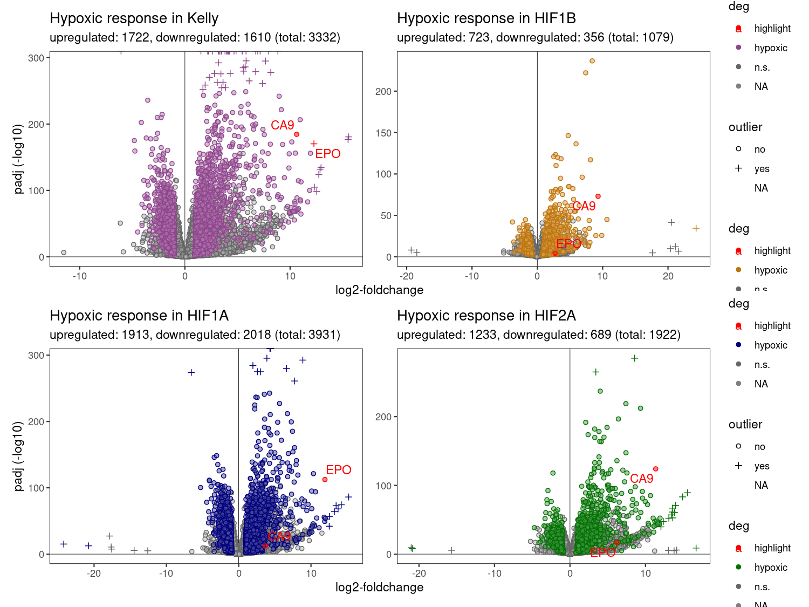
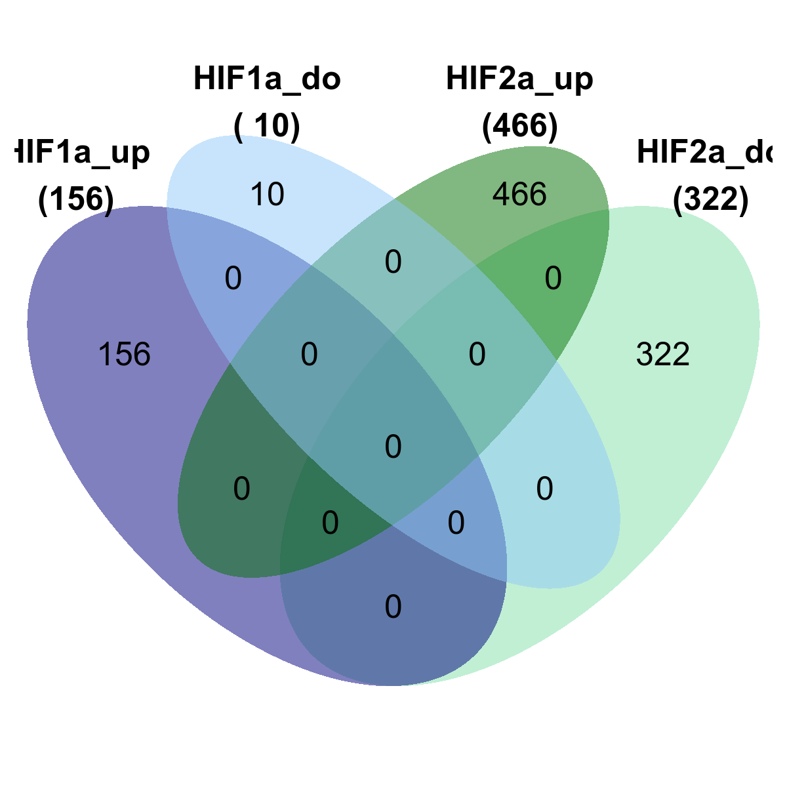
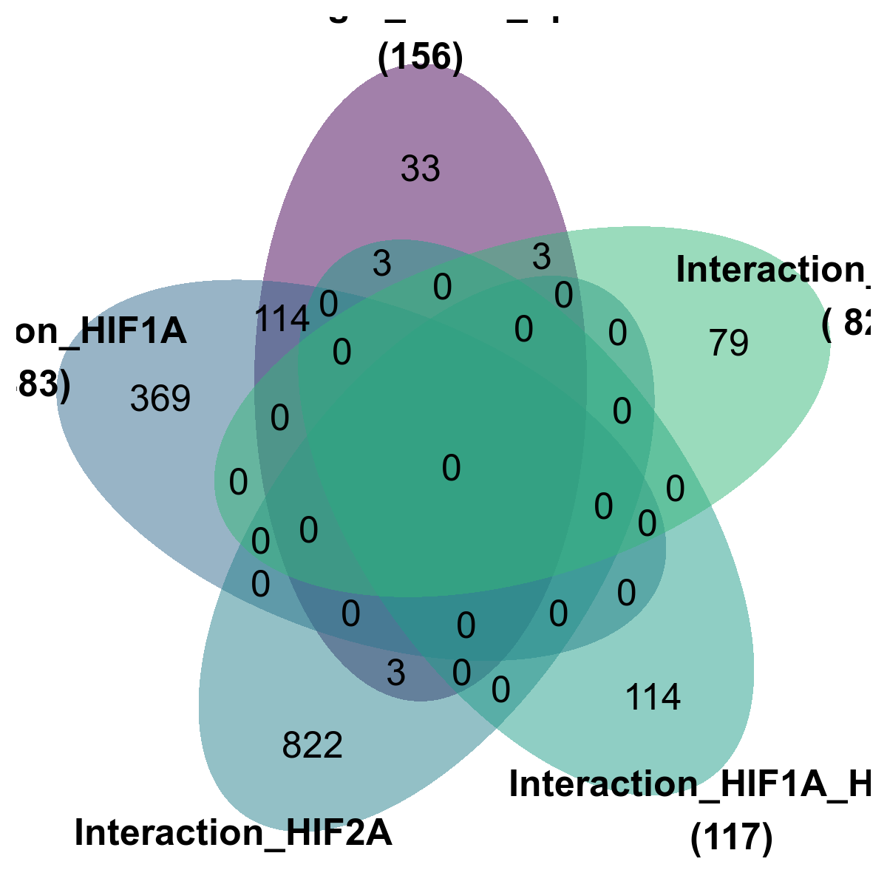
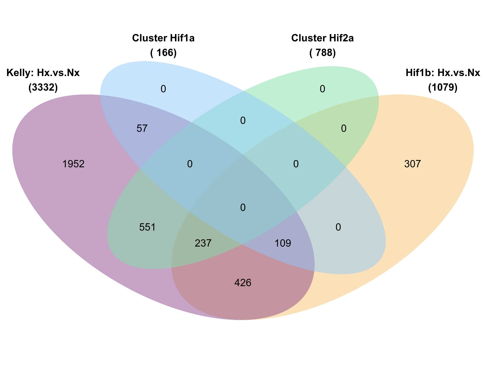

Figures
================
Kelterborn
2024-07-18

- [test fix](#test-fix)
- [0. Load](#0-load)
  - [- libraries, folders, R_utils](#--libraries-folders-r_utils)
  - [- Load dds](#--load-dds)
  - [- Colour sheme](#--colour-sheme)
  - [- Prepare Results](#--prepare-results)
- [Figure 1: Samples QC](#figure-1-samples-qc)
  - [PCA](#pca)
- [Example Counts](#example-counts)
- [Figure 2: Differential expressed
  genes](#figure-2-differential-expressed-genes)
  - [-Volcano_function](#-volcano_function)
  - [-Volcano_function2](#-volcano_function2)
  - [-Plot Vulcanos](#-plot-vulcanos)
  - [-Venn](#-venn)
- [Figure 3: Gene Cluster](#figure-3-gene-cluster)
  - [Gene Cluster](#gene-cluster)
  - [Cluster Holger](#cluster-holger)
  - [HIF independant](#hif-independant)
- [(Table 1: Gene List)](#table-1-gene-list)
  - [- Export results](#--export-results)
- [Combine Master Table](#combine-master-table)
- [Master Table Dive](#master-table-dive)
  - [Venn](#venn-1)
  - [Volcanos](#volcanos)
  - [Core Genes](#core-genes)
- [UMAP](#umap)
- [Figure 4: Gene Set enrichment](#figure-4-gene-set-enrichment)
  - [GO Analysis](#go-analysis)
  - [Cluster GO terms](#cluster-go-terms)
  - [KEGG](#kegg)
  - [Plot genes from GO terms](#plot-genes-from-go-terms)
- [Figure 5: Compare with ChIP-Seq](#figure-5-compare-with-chip-seq)
  - [Load datasets](#load-datasets)
  - [ChIP Venns](#chip-venns)
- [](#section)
- [\###Old code](#old-code)
  - [Enhanced volcano](#enhanced-volcano)
  - [Volcanos](#volcanos-1)
  - [Cluster genes](#cluster-genes)

# test fix

# 0. Load

## - libraries, folders, R_utils

if (!require(“BiocManager”, quietly = TRUE))
install.packages(“BiocManager”) BiocManager::install(version = “3.21”)

Load R libraries. If package is missing, install with

BiocManager::install(“openxlsx”)

## - Load dds

## - Colour sheme

## - Prepare Results

``` r
deg_genes_list <- lapply(results_list,topgenes_f, bM = 100, p=0.01) %>%  lapply(.,rownames) 
names(deg_genes_list) <- paste("deg",names(deg_genes_list),sep="_")

main_degs <- c(list("Kelly: Hx.vs.Nx" = deg_genes_list[["deg_Kelly.Hx.vs.Nx"]],
                     "dd_Hif1b" = deg_genes_list[["deg_Hif1bHxNx.vs.KellyHxNx"]],
                     "dd_Hif1a" = deg_genes_list[["deg_Hif1aHxNx.vs.KellyHxNx"]],
                     "dd_Hif2a" = deg_genes_list[["deg_Hif2aHxNx.vs.KellyHxNx"]] ))


# Select genes
hif1a_2a_genes <- c(deg_genes_list[["deg_Hif1aHxNx.vs.KellyHxNx"]],
                     deg_genes_list[["deg_Hif2aHxNx.vs.KellyHxNx"]]) %>%
                  unique()

# deg_genes_list[["deg_Hif2aHxNx.vs.Hif1aHxNx"]]

hif1a_2a_genes %>% length()
```

    ## [1] 1507

``` r
# Filter results
res_names <- names(results_list)
res_final <- results_list[c("Kelly.Hx.vs.Nx","Hif1a.Hx.vs.Nx","Hif2a.Hx.vs.Nx",
                             "Hx.Hif1a.vs.Kelly","Hx.Hif2a.vs.Kelly","Hx.Hif1b.vs.Kelly","Hx.Hif2a.vs.Hif1a","Hx.Hif1b.vs.Hif1a","Hx.Hif1b.vs.Hif2a" ,
                             "Hif1aHxNx.vs.KellyHxNx","Hif2aHxNx.vs.KellyHxNx","Hif1bHxNx.vs.KellyHxNx","Hif2aHxNx.vs.Hif1aHxNx")] 

# create table with all results
res_table <- lapply(res_final,data.frame) %>% lapply(.,"[", , c("log2FoldChange","padj"))
res_table <- do.call('cbind',res_table)
res_table_final <- res_final[[1]][,c("ENSEMBL","ENTREZ","symbol","baseMean")] %>% data.frame()
res_table_final_all <- cbind(res_table_final,res_table)
res_table_final <- filter(res_table_final_all, baseMean > 100)
res_hif1a_2a <- res_table_final[hif1a_2a_genes,]
colnames(res_hif1a_2a)
```

    ##  [1] "ENSEMBL"                              
    ##  [2] "ENTREZ"                               
    ##  [3] "symbol"                               
    ##  [4] "baseMean"                             
    ##  [5] "Kelly.Hx.vs.Nx.log2FoldChange"        
    ##  [6] "Kelly.Hx.vs.Nx.padj"                  
    ##  [7] "Hif1a.Hx.vs.Nx.log2FoldChange"        
    ##  [8] "Hif1a.Hx.vs.Nx.padj"                  
    ##  [9] "Hif2a.Hx.vs.Nx.log2FoldChange"        
    ## [10] "Hif2a.Hx.vs.Nx.padj"                  
    ## [11] "Hx.Hif1a.vs.Kelly.log2FoldChange"     
    ## [12] "Hx.Hif1a.vs.Kelly.padj"               
    ## [13] "Hx.Hif2a.vs.Kelly.log2FoldChange"     
    ## [14] "Hx.Hif2a.vs.Kelly.padj"               
    ## [15] "Hx.Hif1b.vs.Kelly.log2FoldChange"     
    ## [16] "Hx.Hif1b.vs.Kelly.padj"               
    ## [17] "Hx.Hif2a.vs.Hif1a.log2FoldChange"     
    ## [18] "Hx.Hif2a.vs.Hif1a.padj"               
    ## [19] "Hx.Hif1b.vs.Hif1a.log2FoldChange"     
    ## [20] "Hx.Hif1b.vs.Hif1a.padj"               
    ## [21] "Hx.Hif1b.vs.Hif2a.log2FoldChange"     
    ## [22] "Hx.Hif1b.vs.Hif2a.padj"               
    ## [23] "Hif1aHxNx.vs.KellyHxNx.log2FoldChange"
    ## [24] "Hif1aHxNx.vs.KellyHxNx.padj"          
    ## [25] "Hif2aHxNx.vs.KellyHxNx.log2FoldChange"
    ## [26] "Hif2aHxNx.vs.KellyHxNx.padj"          
    ## [27] "Hif1bHxNx.vs.KellyHxNx.log2FoldChange"
    ## [28] "Hif1bHxNx.vs.KellyHxNx.padj"          
    ## [29] "Hif2aHxNx.vs.Hif1aHxNx.log2FoldChange"
    ## [30] "Hif2aHxNx.vs.Hif1aHxNx.padj"

``` r
hist(res_hif1a_2a$baseMean, breaks = 100000, xlim = c(0,500))

# TOP genes

deg_top_genes_list <- lapply(results_list,topgenes_f,p=0.05, l2FC = 2, bM = 100) %>%  lapply(.,rownames) 
names(deg_top_genes_list) <- paste("deg",names(deg_top_genes_list),sep="_")

# Select genes
hif1a_2a_top_genes <- c(deg_top_genes_list[["deg_Hif1aHxNx.vs.KellyHxNx"]],
                     deg_top_genes_list[["deg_Hif2aHxNx.vs.KellyHxNx"]]) %>%
                  unique()

# deg_genes_list[["deg_Hif2aHxNx.vs.Hif1aHxNx"]]

hif1a_2a_top_genes %>% length()
```

    ## [1] 343

``` r
res_hif1a_2a_top <- res_table_final[hif1a_2a_top_genes,]
res_hif1a_2a$top <- ifelse(rownames(res_hif1a_2a) %in% hif1a_2a_top_genes,"top","deg")


# create table with all shrinked results
# Filter results
res_shrink <- res_shrink_list[c("Kelly.Hx.vs.Nx","Hif1a.Hx.vs.Nx","Hif2a.Hx.vs.Nx", "Hif1aHxNx.vs.KellyHxNx","Hif2aHxNx.vs.KellyHxNx","Hif1bHxNx.vs.KellyHxNx","Hif2aHxNx.vs.Hif1aHxNx")] 

# create table with all results
res_shrink <- lapply(res_shrink,data.frame) %>% lapply(.,"[", , c("log2FoldChange","padj"))
res_shrink <- do.call('cbind',res_shrink)
res_shrink_final <- res_final[[1]][,c("symbol","baseMean")] %>% data.frame()
res_shrink_final <- cbind(res_shrink_final,res_shrink)
res_shrink_hif1a_2a <- res_shrink_final[hif1a_2a_genes,]


# Gene universe
# Expression min
results_list[[1]]$baseMean %>% hist(breaks=100000, xlim = c(0,100)) 

# in results
res_hif1a_2a$baseMean %>% min()
```

    ## [1] 100.0206

``` r
res_hif1a_2a$baseMean %>% hist(breaks=100000, xlim = c(0,100))

# use all genes in dataset
genes_univ_ens <- results_list[[1]]$ENSEMBL
genes_univ_ens %>% length()
```

    ## [1] 21583

``` r
genes_univ <- results_list[[1]]$ENTREZ
genes_univ %>% length()
```

    ## [1] 21583

``` r
genes_univ %>% is.na() %>% summary()
```

    ##    Mode   FALSE    TRUE 
    ## logical   16750    4833

``` r
# Example genes
res_shrink_list[["Kelly.Hx.vs.Nx"]] %>% subset(symbol=="CA9")
```

    ## log2 fold change (MMSE): 0,0,0,0,+1,0,0,0 
    ## Wald test p-value: 0,0,0,0,+1,0,0,0 
    ## DataFrame with 1 row and 8 columns
    ##                  baseMean log2FoldChange     lfcSE       pvalue         padj
    ##                 <numeric>      <numeric> <numeric>    <numeric>    <numeric>
    ## ENSG00000107159   3017.83        10.6266  0.365606 1.44153e-187 2.99131e-185
    ##                      symbol         ENSEMBL    ENTREZ
    ##                 <character>     <character> <integer>
    ## ENSG00000107159         CA9 ENSG00000107159       768

``` r
res_shrink_list[["Kelly.Hx.vs.Nx"]] %>% subset(symbol=="WT1")
```

    ## log2 fold change (MMSE): 0,0,0,0,+1,0,0,0 
    ## Wald test p-value: 0,0,0,0,+1,0,0,0 
    ## DataFrame with 1 row and 8 columns
    ##                  baseMean log2FoldChange     lfcSE      pvalue        padj
    ##                 <numeric>      <numeric> <numeric>   <numeric>   <numeric>
    ## ENSG00000184937   140.558        8.79674  0.433554 7.13829e-93 2.97396e-91
    ##                      symbol         ENSEMBL    ENTREZ
    ##                 <character>     <character> <integer>
    ## ENSG00000184937         WT1 ENSG00000184937      7490

``` r
CA9 = "ENSG00000107159"
WT1 ="ENSG00000184937"
```


# Figure 1: Samples QC

## PCA

``` r
vst_dat <- assay(vst(dds))

p <- pca(vst_dat, metadata = colData(dds), removeVar = 0.99)
pca_table <- cbind(p$rotated,p$metadata)
pca1 <- ggplot(pca_table, aes(PC2, PC1, color=genotype, shape=treatment)) +
  geom_hline(yintercept = 0, linewidth = 0.1) + 
  geom_vline(xintercept = 0, linewidth = 0.1) +
  geom_point(size=4, alpha=0.5, stroke=1) +
  labs(title = "top 1% variable genes") +
  ylab(paste0("PC1: ",p$variance["PC1"] %>% round(digits = 1),"% variance")) +
  xlab(paste0("PC2: ",p$variance["PC2"] %>% round(digits = 1),"% variance")) +
  scale_color_manual(values=colors[c(2,4,6,8)]) +
  scale_shape_manual(values = c(21,16)) + 
  scale_fill_manual(values=c(colors[1],"white",colors[2],"white")) +
  theme_bw() +
  scale_y_reverse() +
  removeGrid(x=T, y=T)

p <- pca(vst_dat, metadata = colData(dds), removeVar = 0.95)
pca_table <- cbind(p$rotated,p$metadata)
pca5 <- ggplot(pca_table, aes(PC2, PC1, color=genotype, shape=treatment)) +
  geom_hline(yintercept = 0, linewidth = 0.1) + 
  geom_vline(xintercept = 0, linewidth = 0.1) +
  geom_point(size=4, alpha=0.5, stroke=1) +
  labs(title = "top 5% variable genes") +
  ylab(paste0("PC1: ",p$variance["PC1"] %>% round(digits = 1),"% variance")) +
  xlab(paste0("PC2: ",p$variance["PC2"] %>% round(digits = 1),"% variance")) +
  scale_color_manual(values=colors[c(2,4,6,8)]) +
  scale_shape_manual(values = c(21,16)) + 
  scale_fill_manual(values=c(colors[1],"white",colors[2],"white")) +
  theme_bw() +
  scale_y_reverse() +
  removeGrid(x=T, y=T)

p <- pca(vst_dat, metadata = colData(dds), removeVar = 0.90)
pca_table <- cbind(p$rotated,p$metadata)
pca10 <- ggplot(pca_table, aes(PC2, PC1, color=genotype, shape=treatment)) +
  geom_hline(yintercept = 0, linewidth = 0.1) + 
  geom_vline(xintercept = 0, linewidth = 0.1) +
  geom_point(size=4, alpha=0.5, stroke=1) +
  labs(title = "top 10% variable genes") +
  ylab(paste0("PC1: ",p$variance["PC1"] %>% round(digits = 1),"% variance")) +
  xlab(paste0("PC2: ",p$variance["PC2"] %>% round(digits = 1),"% variance")) +
  scale_color_manual(values=colors[c(2,4,6,8)]) +
  scale_shape_manual(values = c(21,16)) + 
  scale_fill_manual(values=c(colors[1],"white",colors[2],"white")) +
  theme_bw() +
  scale_x_reverse() +
  removeGrid(x=T, y=T)
```

``` r
pca1+pca5+pca10+ plot_layout(guides = "collect", axes="collect", axis_titles="collect") & 
  theme(legend.position = 'bottom')
```

<!-- -->

``` r
pca10
```


# Example Counts

``` r
# HIF1A: EPO, VEGF, HO-1, ADM, and Glut-1
EPO <- subset(res_shrink_list[["Kelly.Hx.vs.Nx"]],symbol=="EPO")$ENSEMBL
ENO1 <- subset(res_shrink_list[["Kelly.Hx.vs.Nx"]],symbol=="ENO1")$ENSEMBL

# EPO <- subset(res,symbol=="VEGF-A")
# EPO <- subset(res,symbol=="EPO")
# EPO <- subset(res,symbol=="EPO")
# EPO <- subset(res,symbol=="EPO")


plotCounts_anno(CA9)
plotCounts_anno(WT1)
plotCounts_anno(EPO)

plotCounts_anno(ENO1)
```


# Figure 2: Differential expressed genes

## -Volcano_function

``` r
# res <- res_shrink_list[[n]] %>% data.frame()

getdeg <- function(x,
                   padj = 0.05,
                   bM = 0,
                   l2fc = 1)
  {subset(results_list[[x]], padj < padj &
                              baseMean > bM &
           (log2FoldChange > l2fc | log2FoldChange < -l2fc)) %>% data.frame()}


volcano_sk3 <- function(n,
                        col="red",
                        celline="cells",
                        deg=deg) {
xlim <- 12
ylim <- -250
res <- results_list[[n]]
res <- res_shrink_list[[n]] %>% data.frame()

points_anno <- res[c(CA9, EPO),c("log2FoldChange","padj","symbol")]

# of deg genes
up <- subset(deg, log2FoldChange > 1) %>% nrow()
down <- subset(deg, log2FoldChange < -1) %>% nrow()
total <- up+down

# points outside the grid
outx <- subset(res, log2FoldChange > xlim | log2FoldChange < -xlim) %>% rownames()
outy <- subset(res, padj < 10^ylim) %>% rownames()

res$outlier <- ifelse(rownames(res) %in% c(outx,outy),"yes","no")
res$deg <- ifelse(rownames(res) %in% rownames(points_anno),"highlight",
                  ifelse(rownames(res) %in% rownames(deg),"hypoxic","n.s.")) %>% factor()

res <- res %>% arrange(desc(res$deg))

res[outx,"log2FoldChange"] <- ifelse(res[outx,"log2FoldChange"] > xlim,xlim,-xlim)
res[outy,"padj"] <- 10^ylim

res_shrink_list[["Kelly.Hx.vs.Nx"]][CA9,]


volcano_func <- ggplot(res,aes(x=log2FoldChange,y=-log10(padj),color=deg, shape=outlier, fill=deg,label=symbol)) +
  geom_hline(yintercept = 0, linewidth = 0.2) + 
  geom_vline(xintercept = 0, linewidth = 0.2) +
  geom_point(size=1.5, stroke=0.5) +
  # geom_point(aes(x=res[c(CA9),"log2FoldChange"],y=-log10(res[c(CA9),"padj"])), size=2, fill="red") + 
  # geom_text(aes(x=res[c(CA9),"log2FoldChange"],y=-log10(res[c(CA9),"padj"])),size=4, label=res[c(CA9),"symbol"]) +
  # geom_point(aes(x=res[c(WT1),"log2FoldChange"],y=-log10(res[c(WT1),"padj"])), size=2, fill="red") +  
  geom_text_repel(data=subset(res,deg=="highlight")) +
  scale_shape_manual(values = c(21,3)) + 
  scale_alpha_manual(values = c(0.3,0.6)) + 
  labs(title=paste0("Hypoxic response in ",celline),
       subtitle = paste0("upregulated: ",up,", downregulated: ",down," (total: ",total,")") )+
  theme(plot.title = element_text(size = 1), 
        plot.subtitle = element_text(size = 0.5) )+
  ylab("padj (-log10)") +
  xlab("log2-foldchange") +
  scale_fill_manual(values = alpha(c("red",lighten(col,0.3),"grey70"),0.5)) + 
  scale_color_manual(values = c("red",col,"grey40")) + 
  theme_bw() +
  # geom_text_repel(label=res$symbol, color="black") + 
  removeGrid(x=T, y=T)
volcano_func
}
```

## -Volcano_function2

``` r
# getdeg <- function(x){subset(results_list[[x]], padj < 0.05 & (log2FoldChange > 1 | log2FoldChange < -1)) %>% data.frame()}

volcano_sk4 <- function(n,
                        col="red",
                        col2="blue",
                        celline="cells",
                        deg=deg,
                        deg2=deg2) {
xlim <- 12
ylim <- -250
res <- results_list[[n]]
res <- res_shrink_list[[n]] %>% data.frame()

# of deg genes
hx_up <- subset(deg, log2FoldChange > 1) %>% nrow()
hx_down <- subset(deg, log2FoldChange < -1) %>% nrow()
hx_total <- hx_up+hx_down

# of deg2 genes
up <- subset(deg2, log2FoldChange > 1) %>% nrow()
down <- subset(deg2, log2FoldChange < -1) %>% nrow()
total <- up+down

# points outside the grid
outx <- subset(res, log2FoldChange > xlim | log2FoldChange < -xlim) %>% rownames()
outy <- subset(res, padj < 10^ylim) %>% rownames()

res$outlier <- ifelse(rownames(res) %in% c(outx,outy),"yes","no")
res$deg <- ifelse(rownames(res) %in% rownames(deg2),"different from Kelly",
                  ifelse(rownames(res) %in% rownames(deg),"hypoxic","n.s.")) %>% factor()

res <- res %>% arrange(desc(res$deg))

res[outx,"log2FoldChange"] <- ifelse(res[outx,"log2FoldChange"] > xlim,xlim,-xlim)
res[outy,"padj"] <- 10^ylim

volcano_func <- ggplot(res,aes(x=log2FoldChange,y=-log10(padj),color=deg, shape=outlier, fill=deg)) +
  geom_hline(yintercept = 0, linewidth = 0.2) + 
  geom_vline(xintercept = 0, linewidth = 0.2) +
  geom_point(size=1.5, stroke=0.5) +
  scale_shape_manual(values = c(21,3)) + 
  scale_alpha_manual(values = c(0.3,0.6)) + 
  labs(title=paste0("Hypoxic response in ",celline),
       subtitle = paste0("Hypoxic: up ",hx_up,", down ",hx_down," (total ",hx_total,")","\nDifferent from Kelly: up ",up,", down: ",down," (total: ",total,")")) +
  theme(plot.title = element_text(size = 1), 
        plot.subtitle = element_text(size = 0.5) )+
  ylab("padj (-log10)") +
  xlab("log2-foldchange") +
  scale_fill_manual(values = alpha(c(lighten(c(col2,col),0.3),"grey70"),0.5)) + 
  scale_color_manual(values = c(col2,col,"grey40")) + 
  theme_bw() +
  # geom_text_repel(label=res$symbol, color="black") + 
  removeGrid(x=T, y=T)
volcano_func
}
```

## -Plot Vulcanos

### Simple

``` r
getdeg <- function(x,
                   pj = 0.01,
                   bM = 100,
                   l2fc = 1)
  {subset(results_list[[x]], padj < pj &
                              baseMean > bM &
           (log2FoldChange > l2fc | log2FoldChange < -l2fc)) %>% data.frame()}

getdeg("Kelly.Hx.vs.Nx", pj = 0.01, bM = 100) %>% nrow()
```

    ## [1] 3332

``` r
# Simple Volcanos (1): Hypoxic response (Hif1a.Hx.vs.Nx)

volcano_Kelly <- volcano_sk3(n="Kelly.Hx.vs.Nx", deg=getdeg("Kelly.Hx.vs.Nx"),col=colors[2], celline="Kelly")
volcano_hif1a <- volcano_sk3(n="Hif1a.Hx.vs.Nx", deg=getdeg("Hif1a.Hx.vs.Nx"),col=colors[4], celline="HIF1A")
volcano_hif2a <- volcano_sk3(n="Hif2a.Hx.vs.Nx", deg=getdeg("Hif2a.Hx.vs.Nx"),col=colors[6], celline="HIF2A")
volcano_hif1b <- volcano_sk3(n="Hif1b.Hx.vs.Nx", deg=getdeg("Hif1b.Hx.vs.Nx"),col=colors[8], celline="HIF1B")

(volcano_Kelly+volcano_hif1b + plot_layout(guides = "collect", axes="collect", axis_titles="collect") ) / 
  (volcano_hif1a+volcano_hif2a + plot_layout(guides = "collect", axes="collect", axis_titles="collect") ) & 
  theme(legend.position = 'right')
```

<!-- -->

``` r
# Simple volcanos (2): Differential Hypoxic response (Hif1aHxNx.vs.KellyHxNx)

volcano_Kelly <- volcano_sk3(n="Kelly.Hx.vs.Nx", deg=getdeg("Kelly.Hx.vs.Nx"),col=colors[2], celline="Kelly")
volcano_hif1a <- volcano_sk3(n="Hif1aHxNx.vs.KellyHxNx", deg=getdeg("Hif1aHxNx.vs.KellyHxNx"),col=colors[4], celline="HIF1A") + ggtitle(label="Hif1A_Hx_Nx vs. Kelly_Hx_Nx")
volcano_hif2a <- volcano_sk3(n="Hif2aHxNx.vs.KellyHxNx", deg=getdeg("Hif2aHxNx.vs.KellyHxNx"),col=colors[6], celline="HIF2A")  + ggtitle(label="Hif2A_Hx_Nx vs. Kelly_Hx_Nx")
volcano_hif1b <- volcano_sk3(n="Hif1bHxNx.vs.KellyHxNx", deg=getdeg("Hif1bHxNx.vs.KellyHxNx"),col=colors[8], celline="HIF1B")  + ggtitle(label="Hif1B_Hx_Nx vs. Kelly_Hx_Nx")

(volcano_Kelly+volcano_hif1b + plot_layout(guides = "collect", axes="collect", axis_titles="collect") ) / 
  (volcano_hif1a+volcano_hif2a + plot_layout(guides = "collect", axes="collect", axis_titles="collect") ) & 
  theme(legend.position = 'right')
```

<!-- -->

``` r
# Cutoffs
print("Cutoffs:\n - p-adjusted < 0.01\n - baseMean > 100\n - log2 fold-change > 1)")
```

    ## [1] "Cutoffs:\n - p-adjusted < 0.01\n - baseMean > 100\n - log2 fold-change > 1)"

``` r
# Export genes
getdeg("Kelly.Hx.vs.Nx") %>% head()
```

    ##                  baseMean log2FoldChange      lfcSE      stat        pvalue
    ## ENSG00000000460 1320.0069      -1.025463 0.08516235 -12.04127  2.156051e-33
    ## ENSG00000001461 1545.5663       1.282024 0.06936409  18.48253  2.854964e-76
    ## ENSG00000002549 3387.0908      -1.010287 0.07525977 -13.42400  4.374749e-41
    ## ENSG00000002933  104.9036       4.157778 0.29259667  14.20993  7.950704e-46
    ## ENSG00000003147 9264.3256      -1.871685 0.07656865 -24.44454 5.752547e-132
    ## ENSG00000003989 2432.7218      -1.645616 0.11597205 -14.18976  1.060175e-45
    ##                          padj   symbol         ENSEMBL ENTREZ
    ## ENSG00000000460  1.505330e-32    FIRRM ENSG00000000460  55732
    ## ENSG00000001461  8.117651e-75   NIPAL3 ENSG00000001461  57185
    ## ENSG00000002549  4.017509e-40     LAP3 ENSG00000002549  51056
    ## ENSG00000002933  8.745370e-45 TMEM176A ENSG00000002933  55365
    ## ENSG00000003147 4.849442e-130     ICA1 ENSG00000003147   3382
    ## ENSG00000003989  1.159050e-44   SLC7A2 ENSG00000003989   6542

``` r
getdeg("Kelly.Hx.vs.Nx") %>% nrow()
```

    ## [1] 3332

``` r
write.xlsx(getdeg("Kelly.Hx.vs.Nx"),"DEGs_Kelly_Hx_Nx.xlsx")
```

### Advanced

``` r
# Two set volcanos
n <- "Hif1a.Hx.vs.Nx"
deg <- subset(results_list[["Hif1a.Hx.vs.Nx"]], padj < 0.05 & (log2FoldChange > 1 | log2FoldChange < -1)) %>% data.frame()
deg2 <- subset(results_list[["Hif1aHxNx.vs.KellyHxNx"]], padj < 0.05 & (log2FoldChange > 1 | log2FoldChange < -1)) %>% data.frame()
col <- colors[2]
col2 <- colors[4]
celline="HIF1A"

volcano_Kelly <- volcano_sk3(n="Kelly.Hx.vs.Nx", deg=getdeg("Kelly.Hx.vs.Nx"),col=colors[2], celline="Kelly")
volcano_hif1a <- volcano_sk4(n="Hif1a.Hx.vs.Nx", deg=getdeg("Hif1a.Hx.vs.Nx"), deg2=getdeg("Hif1aHxNx.vs.KellyHxNx"),col=colors[2], col2=colors[4], celline="HIF1A")
volcano_hif2a <- volcano_sk4(n="Hif2a.Hx.vs.Nx", deg=getdeg("Hif2a.Hx.vs.Nx"), deg2=getdeg("Hif2aHxNx.vs.KellyHxNx"),col=colors[2], col2=colors[6], celline="HIF2A")
volcano_hif1b <- volcano_sk4(n="Hif1b.Hx.vs.Nx", deg=getdeg("Hif1b.Hx.vs.Nx"), deg2=getdeg("Hif1bHxNx.vs.KellyHxNx"),col=colors[2], col2=colors[8], celline="HIF1B")

(volcano_Kelly+volcano_hif1b + plot_layout(guides = "collect", axes="collect", axis_titles="collect") ) / 
  (volcano_hif1a+volcano_hif2a + plot_layout(guides = "collect", axes="collect", axis_titles="collect") ) & 
  theme(legend.position = 'right')
```

<!-- -->

## -Venn

``` r
# Volcano (1)


simple_degs <- c(list("Kelly: Hx.vs.Nx" = deg_genes_list[["deg_Kelly.Hx.vs.Nx"]],
                     "Hif1b: Hx.vs.Nx" = deg_genes_list[["deg_Hif1b.Hx.vs.Nx"]],
                     "Hif1a: Hx.vs.Nx" = deg_genes_list[["deg_Hif1a.Hx.vs.Nx"]],
                     "Hif2a: Hx.vs.Nx" = deg_genes_list[["deg_Hif2a.Hx.vs.Nx"]] ))

input_list <- simple_degs
plt1 <- venn.diagram(
    x = input_list,
    fill = colors[c(2,7,3,5)],
    main.fontface = "bold",
    fontfamily ="Arial",
    category.names = paste(names(input_list),"\n(",input_list %>% summary() %>% .[c(1:length(input_list))],")",sep=""),
    force.unique = TRUE, na = "remove", total.population = TRUE,
    filename = NULL,
    lwd = 2,
    lty = 'blank',
    cat.fontface = "bold",
    cat.fontfamily = "arial")


# Volcano (2)
input_list <- main_degs
plt2 <- venn.diagram(
    x = input_list,
    fill = colors[c(2,7,3,5)],
    main.fontface = "bold",
    fontfamily ="Arial",
    category.names = paste(names(input_list),"\n(",input_list %>% summary() %>% .[c(1:length(input_list))],")",sep=""),
    force.unique = TRUE, na = "remove", total.population = TRUE,
    filename = NULL,
    lwd = 2,
    lty = 'blank',
    cat.fontface = "bold",
    cat.fontfamily = "arial")

input_list <- main_degs[c(3,4,1)]
plt2b <- venn.diagram(
    x = input_list,
    fill = colors[c(3,5,2)],
    main.fontface = "bold",
    fontfamily ="Arial",
    category.names = paste(names(input_list),"\n(",input_list %>% summary() %>% .[c(1:length(input_list))],")",sep=""),
    force.unique = TRUE, na = "remove", total.population = TRUE,
    filename = NULL,
    lwd = 2,
    lty = 'blank',
    cat.fontface = "bold",
    cat.fontfamily = "arial")
    
#     main = "Compare Hif KOs",

# Volcano (4)

simple_degs <- c(list("Kelly: Hx.vs.Nx" = deg_genes_list[["deg_Kelly.Hx.vs.Nx"]],
                     "Hif1b: Hx.vs.Nx" = deg_genes_list[["deg_Hif1b.Hx.vs.Nx"]],
                     "Hif1a: Hx.vs.Nx" = deg_genes_list[["deg_Hif1a.Hx.vs.Nx"]],
                     "Hif2a: Hx.vs.Nx" = deg_genes_list[["deg_Hif2a.Hx.vs.Nx"]] ))

input_list <- simple_degs[c(1,2)]
plt4 <- venn.diagram(
    x = input_list,
    fill = colors[c(2,7)],
    main.fontface = "bold",
    fontfamily ="Arial",
    category.names = paste(names(input_list),"\n(",input_list %>% summary() %>% .[c(1:length(input_list))],")",sep=""),
    force.unique = TRUE, na = "remove", total.population = TRUE,
    filename = NULL,
    lwd = 2,
    lty = 'blank',
    cat.fontface = "bold",
    cat.fontfamily = "arial")


patchwork::wrap_elements(plt1) / patchwork::wrap_elements(plt2)
patchwork::wrap_elements(plt4) / patchwork::wrap_elements(plt4)
```


# Figure 3: Gene Cluster

## Gene Cluster

``` r
# cluster_venn

main_degs %>% names()
```

    ## [1] "Kelly: Hx.vs.Nx" "dd_Hif1b"        "dd_Hif1a"        "dd_Hif2a"

``` r
length(main_degs[[3]])
```

    ## [1] 304

``` r
length(main_degs[[4]])
```

    ## [1] 1317

``` r
venns <- calculate.overlap(main_degs[c(3,4)])
lapply(venns,length)
```

    ## $a1
    ## [1] 304
    ## 
    ## $a2
    ## [1] 1317
    ## 
    ## $a3
    ## [1] 114

``` r
venns %>% unlist() %>% length()
```

    ## [1] 1735

``` r
venns %>% unlist() %>% unique() %>% length()
```

    ## [1] 1507

``` r
venns$a1 <- setdiff(venns$a1,venns$a3)
venns$a2 <- setdiff(venns$a2,venns$a3)
lapply(venns,length)
```

    ## $a1
    ## [1] 190
    ## 
    ## $a2
    ## [1] 1203
    ## 
    ## $a3
    ## [1] 114

``` r
venns %>% unlist() %>% length()
```

    ## [1] 1507

``` r
venns %>% unlist() %>% unique() %>% length()
```

    ## [1] 1507

``` r
res_hif1a_2a$venn <- ifelse(rownames(res_hif1a_2a) %in% venns$a1,"HIF1A",
                      ifelse(rownames(res_hif1a_2a) %in% venns$a2,"HIF2A",
                      ifelse(rownames(res_hif1a_2a) %in% venns$a3,"overlap","interaction")))
res_hif1a_2a$venn %>% table()
```

    ## .
    ##   HIF1A   HIF2A overlap 
    ##     190    1203     114

``` r
# Cluster Venn
cluster_venn <- ggplot(res_hif1a_2a,aes(x=Hif1aHxNx.vs.KellyHxNx.log2FoldChange, y=Hif2aHxNx.vs.KellyHxNx.log2FoldChange, color=venn, fill=venn, label=symbol)) +
  geom_hline(yintercept = 0, linewidth = 0.1) + 
  geom_vline(xintercept = 0, linewidth = 0.1) +
  geom_point(size=1, stroke=0.5, shape=21) +
  labs(title = "Simple/Venn Cluster") +
  xlab("Hif1a vs. Kelly") +
  ylab("Hif2a vs. Kelly") +
  scale_color_manual(values=c(colors[c(4,6)],"orange",colors[2])) +
  # scale_shape_manual(values = c(21,16)) + 
  scale_fill_manual(values=alpha(c(colors[c(4,6)],"orange",colors[2]),0.2)) +
  geom_point(data=res_hif1a_2a[c(CA9,EPO),],fill="red",color="red",size=2) +
  geom_text_repel(data=res_hif1a_2a[c(CA9,EPO),],color="red") +
  theme_bw() +
  removeGrid(x=T, y=T) +
  coord_cartesian(xlim = c(-10, 10),ylim = c(-10,10))

res_hif1a_2a$group %>% table()
```

    ## < table of extent 0 >

``` r
# Manual Cluster

hif_parallel  <- res_hif1a_2a %>% filter(abs(Hif2aHxNx.vs.Hif1aHxNx.log2FoldChange) < 1)

hif2a_up <- res_hif1a_2a %>% filter(Hif2aHxNx.vs.Hif1aHxNx.log2FoldChange > 1 & (Hif2aHxNx.vs.KellyHxNx.log2FoldChange-1 > 2*-Hif1aHxNx.vs.KellyHxNx.log2FoldChange))
hif2a_do <- res_hif1a_2a %>% filter(Hif2aHxNx.vs.Hif1aHxNx.log2FoldChange < -1 & (Hif2aHxNx.vs.KellyHxNx.log2FoldChange < -Hif1aHxNx.vs.KellyHxNx.log2FoldChange+1))

hif1a_up <- res_hif1a_2a %>% filter(Hif2aHxNx.vs.Hif1aHxNx.log2FoldChange > 1 & (-Hif1aHxNx.vs.KellyHxNx.log2FoldChange > (abs(Hif2aHxNx.vs.KellyHxNx.log2FoldChange-1))))

hif1a_do <- res_hif1a_2a %>% filter(Hif2aHxNx.vs.Hif1aHxNx.log2FoldChange < -1 & (Hif1aHxNx.vs.KellyHxNx.log2FoldChange-1 > 2*-Hif2aHxNx.vs.KellyHxNx.log2FoldChange))


res_hif1a_2a$group <- ifelse(rownames(res_hif1a_2a) %in% rownames(hif_parallel),"HIF1A_HIF2A",
                      ifelse(rownames(res_hif1a_2a) %in% rownames(hif2a_up),"HIF2A",
                      ifelse(rownames(res_hif1a_2a) %in% rownames(hif2a_do),"HIF2A",
                      ifelse(rownames(res_hif1a_2a) %in% rownames(hif1a_up),"HIF1A",
                      ifelse(rownames(res_hif1a_2a) %in% rownames(hif1a_do),"HIF1A","opposite")
                      ))))

cluster <- ggplot(res_hif1a_2a,aes(x=Hif1aHxNx.vs.KellyHxNx.log2FoldChange, y=Hif2aHxNx.vs.KellyHxNx.log2FoldChange, color=group, fill=group, label=symbol)) +
  geom_hline(yintercept = 0, linewidth = 0.1) + 
  geom_vline(xintercept = 0, linewidth = 0.1) +
  geom_abline(intercept=c(1,-1)) +
  geom_abline(slope=c(-1), intercept = 1) +
  annotate("segment", x = c(0,1), y = c(1,0), xend = c(-10,11), yend = c(21,-5),color="black") +
  geom_point(size=1, stroke=0.5, shape=21) +
  labs(title = "Geometric Cluster") +
  xlab("Hif1a vs. Kelly") +
  ylab("Hif2a vs. Kelly") +
  scale_color_manual(values=c(colors[c(4,2,6)],"orange")) +
  # scale_shape_manual(values = c(21,16)) + 
  scale_fill_manual(values=alpha(c(colors[c(4,2,6)],"orange"),0.2)) +
  geom_point(data=res_hif1a_2a[c(CA9,EPO),],fill="red",color="red",size=2) +
  geom_text_repel(data=res_hif1a_2a[c(CA9,EPO),],color="red") +
  theme_bw() +
  removeGrid(x=T, y=T) +
  coord_cartesian(xlim = c(-10, 10),ylim = c(-10,10))

cluster_venn + cluster
```

<!-- -->

``` r
# only genes with l2fc > 2
cluster_top <- ggplot(res_hif1a_2a[hif1a_2a_top_genes,],aes(x=Hif1aHxNx.vs.KellyHxNx.log2FoldChange, y=Hif2aHxNx.vs.KellyHxNx.log2FoldChange, color=group, fill=group, label=symbol)) +
  geom_hline(yintercept = 0, linewidth = 0.1) + 
  geom_vline(xintercept = 0, linewidth = 0.1) +
  geom_abline(intercept=c(1,-1)) +
  geom_abline(slope=c(-1), intercept = 1) +
  annotate("segment", x = c(0,1), y = c(1,0), xend = c(-10,11), yend = c(21,-5),color="black") +
  geom_point(size=1, stroke=0.5, shape=21) +
  labs(title = "Geometric Cluster: l2FC > 2") +
  xlab("Hif1a vs. Kelly") +
  ylab("Hif2a vs. Kelly") +
  scale_color_manual(values=c(colors[c(4,2,6)],"orange")) +
  # scale_shape_manual(values = c(21,16)) + 
  scale_fill_manual(values=alpha(c(colors[c(4,2,6)],"orange"),0.2)) +
  geom_point(data=res_hif1a_2a[c(CA9,EPO),],fill="red",color="red",size=2) +
  geom_text_repel(data=res_hif1a_2a[c(CA9,EPO),],color="red") +
  theme_bw() +
  removeGrid(x=T, y=T) +
  coord_cartesian(xlim = c(-10, 10),ylim = c(-10,10))

cluster_top
```

<!-- -->

``` r
# only genes with p < 0.05
colnames(res_hif1a_2a)
```

    ##  [1] "ENSEMBL"                              
    ##  [2] "ENTREZ"                               
    ##  [3] "symbol"                               
    ##  [4] "baseMean"                             
    ##  [5] "Kelly.Hx.vs.Nx.log2FoldChange"        
    ##  [6] "Kelly.Hx.vs.Nx.padj"                  
    ##  [7] "Hif1a.Hx.vs.Nx.log2FoldChange"        
    ##  [8] "Hif1a.Hx.vs.Nx.padj"                  
    ##  [9] "Hif2a.Hx.vs.Nx.log2FoldChange"        
    ## [10] "Hif2a.Hx.vs.Nx.padj"                  
    ## [11] "Hx.Hif1a.vs.Kelly.log2FoldChange"     
    ## [12] "Hx.Hif1a.vs.Kelly.padj"               
    ## [13] "Hx.Hif2a.vs.Kelly.log2FoldChange"     
    ## [14] "Hx.Hif2a.vs.Kelly.padj"               
    ## [15] "Hx.Hif1b.vs.Kelly.log2FoldChange"     
    ## [16] "Hx.Hif1b.vs.Kelly.padj"               
    ## [17] "Hx.Hif2a.vs.Hif1a.log2FoldChange"     
    ## [18] "Hx.Hif2a.vs.Hif1a.padj"               
    ## [19] "Hx.Hif1b.vs.Hif1a.log2FoldChange"     
    ## [20] "Hx.Hif1b.vs.Hif1a.padj"               
    ## [21] "Hx.Hif1b.vs.Hif2a.log2FoldChange"     
    ## [22] "Hx.Hif1b.vs.Hif2a.padj"               
    ## [23] "Hif1aHxNx.vs.KellyHxNx.log2FoldChange"
    ## [24] "Hif1aHxNx.vs.KellyHxNx.padj"          
    ## [25] "Hif2aHxNx.vs.KellyHxNx.log2FoldChange"
    ## [26] "Hif2aHxNx.vs.KellyHxNx.padj"          
    ## [27] "Hif1bHxNx.vs.KellyHxNx.log2FoldChange"
    ## [28] "Hif1bHxNx.vs.KellyHxNx.padj"          
    ## [29] "Hif2aHxNx.vs.Hif1aHxNx.log2FoldChange"
    ## [30] "Hif2aHxNx.vs.Hif1aHxNx.padj"          
    ## [31] "top"                                  
    ## [32] "venn"                                 
    ## [33] "group"

``` r
res_hif1a_2a_p <- filter(res_hif1a_2a, Hif1aHxNx.vs.KellyHxNx.padj < 0.05 & Hif2aHxNx.vs.KellyHxNx.padj < 0.05)

cluster_p <- ggplot(res_hif1a_2a_p,aes(x=Hif1aHxNx.vs.KellyHxNx.log2FoldChange, y=Hif2aHxNx.vs.KellyHxNx.log2FoldChange, color=group, fill=group)) +
  geom_hline(yintercept = 0, linewidth = 0.1) + 
  geom_vline(xintercept = 0, linewidth = 0.1) +
  geom_abline(intercept=c(1,-1)) +
  geom_abline(slope=c(-1), intercept = 1) +
  annotate("segment", x = c(0,1), y = c(1,0), xend = c(-10,11), yend = c(21,-5),color="black") +
  geom_point(size=1, stroke=0.5, shape=21) +
  labs(title = "Geometric Cluster (all p < 0.05") +
  xlab("Hif1a vs. Kelly") +
  ylab("Hif2a vs. Kelly") +
  scale_color_manual(values=c(colors[c(4,2,6)],"orange")) +
  # scale_shape_manual(values = c(21,16)) + 
  scale_fill_manual(values=alpha(c(colors[c(4,2,6)],"orange"),0.2)) +
  theme_bw() +
  removeGrid(x=T, y=T) +
  coord_cartesian(xlim = c(-5, 5),ylim = c(-5,5))

# cluster + cluster_p


write.xlsx(res_hif1a_2a,"DEG_genes.xlsx")
```

## Cluster Holger

``` r
# HIF1a stimuliert
res_table_final %>% colnames()
```

    ##  [1] "ENSEMBL"                              
    ##  [2] "ENTREZ"                               
    ##  [3] "symbol"                               
    ##  [4] "baseMean"                             
    ##  [5] "Kelly.Hx.vs.Nx.log2FoldChange"        
    ##  [6] "Kelly.Hx.vs.Nx.padj"                  
    ##  [7] "Hif1a.Hx.vs.Nx.log2FoldChange"        
    ##  [8] "Hif1a.Hx.vs.Nx.padj"                  
    ##  [9] "Hif2a.Hx.vs.Nx.log2FoldChange"        
    ## [10] "Hif2a.Hx.vs.Nx.padj"                  
    ## [11] "Hx.Hif1a.vs.Kelly.log2FoldChange"     
    ## [12] "Hx.Hif1a.vs.Kelly.padj"               
    ## [13] "Hx.Hif2a.vs.Kelly.log2FoldChange"     
    ## [14] "Hx.Hif2a.vs.Kelly.padj"               
    ## [15] "Hx.Hif1b.vs.Kelly.log2FoldChange"     
    ## [16] "Hx.Hif1b.vs.Kelly.padj"               
    ## [17] "Hx.Hif2a.vs.Hif1a.log2FoldChange"     
    ## [18] "Hx.Hif2a.vs.Hif1a.padj"               
    ## [19] "Hx.Hif1b.vs.Hif1a.log2FoldChange"     
    ## [20] "Hx.Hif1b.vs.Hif1a.padj"               
    ## [21] "Hx.Hif1b.vs.Hif2a.log2FoldChange"     
    ## [22] "Hx.Hif1b.vs.Hif2a.padj"               
    ## [23] "Hif1aHxNx.vs.KellyHxNx.log2FoldChange"
    ## [24] "Hif1aHxNx.vs.KellyHxNx.padj"          
    ## [25] "Hif2aHxNx.vs.KellyHxNx.log2FoldChange"
    ## [26] "Hif2aHxNx.vs.KellyHxNx.padj"          
    ## [27] "Hif1bHxNx.vs.KellyHxNx.log2FoldChange"
    ## [28] "Hif1bHxNx.vs.KellyHxNx.padj"          
    ## [29] "Hif2aHxNx.vs.Hif1aHxNx.log2FoldChange"
    ## [30] "Hif2aHxNx.vs.Hif1aHxNx.padj"

``` r
results_list %>% names()
```

    ##  [1] "Hif1a.Hx.vs.Nx"         "Hif2a.Hx.vs.Nx"         "Hif1b.Hx.vs.Nx"        
    ##  [4] "Kelly.Hx.vs.Nx"         "Nx.Hif1a.vs.Kelly"      "Nx.Hif2a.vs.Kelly"     
    ##  [7] "Nx.Hif1b.vs.Kelly"      "Hx.Hif1a.vs.Kelly"      "Hx.Hif2a.vs.Kelly"     
    ## [10] "Hx.Hif1b.vs.Kelly"      "Hx.Hif2a.vs.Hif1a"      "Hx.Hif1b.vs.Hif1a"     
    ## [13] "Hx.Hif1b.vs.Hif2a"      "Hif1aHxNx.vs.KellyHxNx" "Hif2aHxNx.vs.KellyHxNx"
    ## [16] "Hif1bHxNx.vs.KellyHxNx" "Hif2aHxNx.vs.Hif1aHxNx" "Hx.Hif1b.vs.Hif12a"    
    ## [19] "Hx.Kelly.vs.allHIFs"    "Hx.vs.Nx"

``` r
deg_genes_list %>% names()
```

    ##  [1] "deg_Hif1a.Hx.vs.Nx"         "deg_Hif2a.Hx.vs.Nx"        
    ##  [3] "deg_Hif1b.Hx.vs.Nx"         "deg_Kelly.Hx.vs.Nx"        
    ##  [5] "deg_Nx.Hif1a.vs.Kelly"      "deg_Nx.Hif2a.vs.Kelly"     
    ##  [7] "deg_Nx.Hif1b.vs.Kelly"      "deg_Hx.Hif1a.vs.Kelly"     
    ##  [9] "deg_Hx.Hif2a.vs.Kelly"      "deg_Hx.Hif1b.vs.Kelly"     
    ## [11] "deg_Hx.Hif2a.vs.Hif1a"      "deg_Hx.Hif1b.vs.Hif1a"     
    ## [13] "deg_Hx.Hif1b.vs.Hif2a"      "deg_Hif1aHxNx.vs.KellyHxNx"
    ## [15] "deg_Hif2aHxNx.vs.KellyHxNx" "deg_Hif1bHxNx.vs.KellyHxNx"
    ## [17] "deg_Hif2aHxNx.vs.Hif1aHxNx" "deg_Hx.Hif1b.vs.Hif12a"    
    ## [19] "deg_Hx.Kelly.vs.allHIFs"    "deg_Hx.vs.Nx"

``` r
hif1a_up_holger <- calculate.overlap(input_list)

# set limits
p <- 0.01
l2f <- 1
bM <- 100

# HIF1a
hif1a_up_holger <- res_table_final %>% filter(Kelly.Hx.vs.Nx.padj < p & Hx.Hif1a.vs.Kelly.padj < p & Hx.Hif2a.vs.Hif1a.padj < p &
                                                Kelly.Hx.vs.Nx.log2FoldChange > 1 & Hx.Hif1a.vs.Kelly.log2FoldChange < -1 & Hx.Hif2a.vs.Hif1a.log2FoldChange > 1)
hif1a_up_holger %>% nrow()
```

    ## [1] 156

``` r
hif1a_do_holger <- res_table_final %>% filter(Kelly.Hx.vs.Nx.padj < p & Hx.Hif1a.vs.Kelly.padj < p & Hx.Hif2a.vs.Hif1a.padj < p &
                                                Kelly.Hx.vs.Nx.log2FoldChange < -1 & Hx.Hif1a.vs.Kelly.log2FoldChange > 1 & Hx.Hif2a.vs.Hif1a.log2FoldChange < -1)
hif1a_do_holger %>% nrow()
```

    ## [1] 10

``` r
# HIF2a
hif2a_up_holger <- res_table_final %>% filter(Kelly.Hx.vs.Nx.padj < p & Hx.Hif2a.vs.Kelly.padj < p & Hx.Hif2a.vs.Hif1a.padj < p &
                                                Kelly.Hx.vs.Nx.log2FoldChange > 1 & Hx.Hif2a.vs.Kelly.log2FoldChange < -1 & Hx.Hif2a.vs.Hif1a.log2FoldChange < -1)
EPO %in% rownames(hif2a_up_holger)
```

    ## [1] TRUE

``` r
res_table_final[EPO,] %>% filter(Kelly.Hx.vs.Nx.padj < p & Hx.Hif1a.vs.Kelly.padj < p & Hx.Hif2a.vs.Hif1a.padj < p &
                                                Kelly.Hx.vs.Nx.log2FoldChange > 1 & Hx.Hif2a.vs.Kelly.log2FoldChange < -1 & Hx.Hif2a.vs.Hif1a.log2FoldChange < -1)
```

    ##  [1] ENSEMBL                               ENTREZ                               
    ##  [3] symbol                                baseMean                             
    ##  [5] Kelly.Hx.vs.Nx.log2FoldChange         Kelly.Hx.vs.Nx.padj                  
    ##  [7] Hif1a.Hx.vs.Nx.log2FoldChange         Hif1a.Hx.vs.Nx.padj                  
    ##  [9] Hif2a.Hx.vs.Nx.log2FoldChange         Hif2a.Hx.vs.Nx.padj                  
    ## [11] Hx.Hif1a.vs.Kelly.log2FoldChange      Hx.Hif1a.vs.Kelly.padj               
    ## [13] Hx.Hif2a.vs.Kelly.log2FoldChange      Hx.Hif2a.vs.Kelly.padj               
    ## [15] Hx.Hif1b.vs.Kelly.log2FoldChange      Hx.Hif1b.vs.Kelly.padj               
    ## [17] Hx.Hif2a.vs.Hif1a.log2FoldChange      Hx.Hif2a.vs.Hif1a.padj               
    ## [19] Hx.Hif1b.vs.Hif1a.log2FoldChange      Hx.Hif1b.vs.Hif1a.padj               
    ## [21] Hx.Hif1b.vs.Hif2a.log2FoldChange      Hx.Hif1b.vs.Hif2a.padj               
    ## [23] Hif1aHxNx.vs.KellyHxNx.log2FoldChange Hif1aHxNx.vs.KellyHxNx.padj          
    ## [25] Hif2aHxNx.vs.KellyHxNx.log2FoldChange Hif2aHxNx.vs.KellyHxNx.padj          
    ## [27] Hif1bHxNx.vs.KellyHxNx.log2FoldChange Hif1bHxNx.vs.KellyHxNx.padj          
    ## [29] Hif2aHxNx.vs.Hif1aHxNx.log2FoldChange Hif2aHxNx.vs.Hif1aHxNx.padj          
    ## <0 Zeilen> (oder row.names mit Länge 0)

``` r
hif2a_up_holger %>% nrow()
```

    ## [1] 466

``` r
hif2a_do_holger <- res_table_final %>% filter(Kelly.Hx.vs.Nx.padj < p & Hx.Hif2a.vs.Kelly.padj < p & Hx.Hif2a.vs.Hif1a.padj < p  &
                                                Kelly.Hx.vs.Nx.log2FoldChange < -1 & Hx.Hif2a.vs.Kelly.log2FoldChange > 1 & Hx.Hif2a.vs.Hif1a.log2FoldChange > 1)
hif2a_do_holger %>% nrow()
```

    ## [1] 322

``` r
# HIF1a + HIF2a
hif1a_2a_up_holger <- res_table_final %>% filter(Kelly.Hx.vs.Nx.padj < p & (Hx.Hif1a.vs.Kelly.padj < p | Hx.Hif2a.vs.Kelly.padj < p) &
                                                Kelly.Hx.vs.Nx.log2FoldChange > 1 & Hx.Hif1a.vs.Kelly.log2FoldChange < -1 & Hx.Hif2a.vs.Kelly.log2FoldChange < -1 # &                                                   Hx.Hif2a.vs.Hif1a.log2FoldChange > -0.5 & Hx.Hif2a.vs.Hif1a.log2FoldChange < 0.5
                                                )
hif1a_2a_up_holger %>% nrow()
```

    ## [1] 15

``` r
# HIF1a + HIF2a
hif1a_2a_do_holger <- res_table_final %>% filter(Kelly.Hx.vs.Nx.padj < p & (Hx.Hif1a.vs.Kelly.padj < p | Hx.Hif2a.vs.Kelly.padj < p) &
                                                Kelly.Hx.vs.Nx.log2FoldChange < -1 & Hx.Hif1a.vs.Kelly.log2FoldChange > 1 & Hx.Hif2a.vs.Kelly.log2FoldChange > 1 & Hx.Hif2a.vs.Hif1a.log2FoldChange > -1 & Hx.Hif2a.vs.Hif1a.log2FoldChange < 1
                                                  )
hif1a_2a_do_holger %>% nrow()
```

    ## [1] 9

``` r
res_holger_list <- list("HIF1a_up" = hif1a_up_holger,
                        "HIF1a_do" = hif1a_do_holger,
                        "HIF2a_up" = hif2a_up_holger,
                        "HIF2a_do" = hif2a_do_holger,
                        "HIF1a_HIF2a_up" = hif1a_2a_up_holger,
                        "HIF1a_HIF2a_do" = hif1a_2a_do_holger)
genes_holger_list <- lapply(res_holger_list, rownames)

genes_holger_list$HIF1a <- c(genes_holger_list$HIF1a_up, genes_holger_list$HIF1a_do)
genes_holger_list$HIF2a <- c(genes_holger_list$HIF2a_up, genes_holger_list$HIF2a_do)
genes_holger_list$HIF1a_HIF2a <- c(genes_holger_list$HIF1a_HIF2a_up, genes_holger_list$HIF1a_HIF2a_do)
lapply(genes_holger_list, length)
```

    ## $HIF1a_up
    ## [1] 156
    ## 
    ## $HIF1a_do
    ## [1] 10
    ## 
    ## $HIF2a_up
    ## [1] 466
    ## 
    ## $HIF2a_do
    ## [1] 322
    ## 
    ## $HIF1a_HIF2a_up
    ## [1] 15
    ## 
    ## $HIF1a_HIF2a_do
    ## [1] 9
    ## 
    ## $HIF1a
    ## [1] 166
    ## 
    ## $HIF2a
    ## [1] 788
    ## 
    ## $HIF1a_HIF2a
    ## [1] 24

``` r
res_table_final[EPO,] %>% kable()
```

|  | ENSEMBL | ENTREZ | symbol | baseMean | Kelly.Hx.vs.Nx.log2FoldChange | Kelly.Hx.vs.Nx.padj | Hif1a.Hx.vs.Nx.log2FoldChange | Hif1a.Hx.vs.Nx.padj | Hif2a.Hx.vs.Nx.log2FoldChange | Hif2a.Hx.vs.Nx.padj | Hx.Hif1a.vs.Kelly.log2FoldChange | Hx.Hif1a.vs.Kelly.padj | Hx.Hif2a.vs.Kelly.log2FoldChange | Hx.Hif2a.vs.Kelly.padj | Hx.Hif1b.vs.Kelly.log2FoldChange | Hx.Hif1b.vs.Kelly.padj | Hx.Hif2a.vs.Hif1a.log2FoldChange | Hx.Hif2a.vs.Hif1a.padj | Hx.Hif1b.vs.Hif1a.log2FoldChange | Hx.Hif1b.vs.Hif1a.padj | Hx.Hif1b.vs.Hif2a.log2FoldChange | Hx.Hif1b.vs.Hif2a.padj | Hif1aHxNx.vs.KellyHxNx.log2FoldChange | Hif1aHxNx.vs.KellyHxNx.padj | Hif2aHxNx.vs.KellyHxNx.log2FoldChange | Hif2aHxNx.vs.KellyHxNx.padj | Hif1bHxNx.vs.KellyHxNx.log2FoldChange | Hif1bHxNx.vs.KellyHxNx.padj | Hif2aHxNx.vs.Hif1aHxNx.log2FoldChange | Hif2aHxNx.vs.Hif1aHxNx.padj |
|:---|:---|---:|:---|---:|---:|---:|---:|---:|---:|---:|---:|---:|---:|---:|---:|---:|---:|---:|---:|---:|---:|---:|---:|---:|---:|---:|---:|---:|---:|---:|
| ENSG00000130427 | ENSG00000130427 | 2056 | EPO | 3453.431 | 12.38712 | 0 | 12.06163 | 0 | 6.411525 | 0 | 0.7538427 | 0.1387593 | -7.373195 | 0 | -9.807846 | 0 | -8.127037 | 0 | -10.56169 | 0 | -2.434651 | 2.62e-05 | -0.3254896 | 0.842581 | -5.975598 | 0 | -9.179111 | 0 | -5.650108 | 0 |

``` r
genes_holger <- genes_holger_list %>% unlist() %>% unique()
EPO %in% genes_holger
```

    ## [1] TRUE

``` r
res_holger <- res_table_final[genes_holger,]

res_holger$group <- ifelse(rownames(res_holger) %in% genes_holger_list$HIF1a,"HIF1a",
                           ifelse(rownames(res_holger) %in% genes_holger_list$HIF2a,"HIF2a",
                                  ifelse(rownames(res_holger) %in% genes_holger_list$HIF1a_HIF2a,"HIF1a_HIF2a","not_holger")))

subset(res_holger, group == "HIF1a_HIF2a") %>% nrow()
```

    ## [1] 17

``` r
# Venn 4
input_list <- genes_holger_list[c(1,4,2,3)]
plt_hs <- venn.diagram(
    x = input_list,
    fill = colors[c(4,5,3,6)],
    main.fontface = "bold",
    fontfamily ="Arial",
    category.names = paste(names(input_list),"\n(",input_list %>% summary() %>% .[c(1:length(input_list))],")",sep=""),
    force.unique = TRUE, na = "remove", total.population = TRUE,
    filename = NULL,
    lwd = 2,
    lty = 'blank',
    cat.fontface = "bold",
    cat.fontfamily = "arial")

patchwork::wrap_elements(plt_hs)

# Venn 3
input_list <- genes_holger_list[c(7:9)]
plt_hs <- venn.diagram(
    x = input_list,
    fill = colors[c(4,6,2)],
    main.fontface = "bold",
    fontfamily ="Arial",
    category.names = paste(names(input_list),"\n(",input_list %>% summary() %>% .[c(1:length(input_list))],")",sep=""),
    force.unique = TRUE, na = "remove", total.population = TRUE,
    filename = NULL,
    lwd = 2,
    lty = 'blank',
    cat.fontface = "bold",
    cat.fontfamily = "arial")

patchwork::wrap_elements(plt_hs) 


# Compare Holger with interaction (Simon)

input_list <- list(Holger = genes_holger,
                   interaction = rownames(res_hif1a_2a))
plt_hs <- venn.diagram(
    x = input_list,
    fill = colors[c(2,7)],
    main.fontface = "bold",
    fontfamily ="Arial",
    category.names = paste(names(input_list),"\n(",input_list %>% summary() %>% .[c(1:length(input_list))],")",sep=""),
    force.unique = TRUE, na = "remove", total.population = TRUE,
    filename = NULL,
    lwd = 2,
    lty = 'blank',
    cat.fontface = "bold",
    cat.fontfamily = "arial")

patchwork::wrap_elements(plt_hs) 

# Hif1a
input_list <- list(Holger_HIF1a_up = rownames(hif1a_up_holger),
                   Interaction_HIF1A = rownames(res_hif1a_2a[res_hif1a_2a$group=="HIF1A",]),
                   Interaction_HIF2A = rownames(res_hif1a_2a[res_hif1a_2a$group=="HIF2A",]),
                   Interaction_HIF1A_HIF2A = rownames(res_hif1a_2a[res_hif1a_2a$group=="HIF1A_HIF2A",]),
                   Interaction_opposite = rownames(res_hif1a_2a[res_hif1a_2a$group=="opposite",]))
  
plt_hs <- venn.diagram(
    x = input_list,
    fill = colors_v[c(1,4:7)],
    main.fontface = "bold",
    fontfamily ="Arial",
    category.names = paste(names(input_list),"\n(",input_list %>% summary() %>% .[c(1:length(input_list))],")",sep=""),
    force.unique = TRUE, na = "remove", total.population = TRUE,
    filename = NULL,
    lwd = 2,
    lty = 'blank',
    cat.fontface = "bold",
    cat.fontfamily = "arial")

patchwork::wrap_elements(plt_hs) 
# res_holger$group %>% factor()
res_holger[c(CA9,WT1),] %>% kable()
```

|  | ENSEMBL | ENTREZ | symbol | baseMean | Kelly.Hx.vs.Nx.log2FoldChange | Kelly.Hx.vs.Nx.padj | Hif1a.Hx.vs.Nx.log2FoldChange | Hif1a.Hx.vs.Nx.padj | Hif2a.Hx.vs.Nx.log2FoldChange | Hif2a.Hx.vs.Nx.padj | Hx.Hif1a.vs.Kelly.log2FoldChange | Hx.Hif1a.vs.Kelly.padj | Hx.Hif2a.vs.Kelly.log2FoldChange | Hx.Hif2a.vs.Kelly.padj | Hx.Hif1b.vs.Kelly.log2FoldChange | Hx.Hif1b.vs.Kelly.padj | Hx.Hif2a.vs.Hif1a.log2FoldChange | Hx.Hif2a.vs.Hif1a.padj | Hx.Hif1b.vs.Hif1a.log2FoldChange | Hx.Hif1b.vs.Hif1a.padj | Hx.Hif1b.vs.Hif2a.log2FoldChange | Hx.Hif1b.vs.Hif2a.padj | Hif1aHxNx.vs.KellyHxNx.log2FoldChange | Hif1aHxNx.vs.KellyHxNx.padj | Hif2aHxNx.vs.KellyHxNx.log2FoldChange | Hif2aHxNx.vs.KellyHxNx.padj | Hif1bHxNx.vs.KellyHxNx.log2FoldChange | Hif1bHxNx.vs.KellyHxNx.padj | Hif2aHxNx.vs.Hif1aHxNx.log2FoldChange | Hif2aHxNx.vs.Hif1aHxNx.padj | group |
|:---|:---|---:|:---|---:|---:|---:|---:|---:|---:|---:|---:|---:|---:|---:|---:|---:|---:|---:|---:|---:|---:|---:|---:|---:|---:|---:|---:|---:|---:|---:|:---|
| ENSG00000107159 | ENSG00000107159 | 768 | CA9 | 3017.8336 | 10.704262 | 0 | 3.910576 | 0 | 11.455341 | 0 | -7.4408576 | 0.0000000 | 1.108786 | 0.0078707 | -0.7033098 | 0.1197611 | 8.549644 | 0.0000000 | 6.737548 | 0 | -1.812096 | 0.0002506 | -6.793686 | 0.0000000 | 0.7510793 | 0.3494878 | -1.206613 | 0.0957458 | 7.544765 | 0.0000000 | HIF1a |
| ENSG00000184937 | ENSG00000184937 | 7490 | WT1 | 140.5576 | 8.893613 | 0 | 7.325701 | 0 | 9.831686 | 0 | -0.2098319 | 0.5790422 | -1.375857 | 0.0000024 | -3.5442182 | 0.0000000 | -1.166025 | 0.0004549 | -3.334386 | 0 | -2.168361 | 0.0000000 | -1.567913 | 0.0664989 | 0.9380725 | 0.4483675 | -1.153974 | 0.2898088 | 2.505985 | 0.0132996 | HIF2a |

``` r
cluster <- ggplot(res_holger,aes(x=Hif1aHxNx.vs.KellyHxNx.log2FoldChange, y=Hif2aHxNx.vs.KellyHxNx.log2FoldChange, color=group, fill=group, label=symbol)) +
  geom_hline(yintercept = 0, linewidth = 0.1) + 
  geom_vline(xintercept = 0, linewidth = 0.1) +
  # geom_abline(intercept=c(1,-1)) +
  # geom_abline(slope=c(-1), intercept = 1) +
  # annotate("segment", x = c(0,1), y = c(1,0), xend = c(-10,11), yend = c(21,-5),color="black") +
  geom_point(size=1, stroke=0.5, shape=21) +
  scale_color_manual(values=colors[c(4,2,6)]) +
  # scale_shape_manual(values = c(21,16)) + 
  scale_fill_manual(values=alpha(colors[c(4,2,6)],0.2)) +
  geom_point(data=res_holger[c(CA9,EPO),],fill="red",color="red",size=2) +
  geom_text_repel(data=res_holger[c(CA9,EPO),],color="red") +

  labs(title = "Geometric Cluster") +
  xlab("Hif1a vs. Kelly") +
  ylab("Hif2a vs. Kelly") +
  
  theme_bw() +
  removeGrid(x=T, y=T)  +
  coord_cartesian(xlim = c(-10, 10),ylim = c(-10,10))

cluster


# HIF1A
cluster_1 <- ggplot(res_holger,aes(y=Kelly.Hx.vs.Nx.log2FoldChange, x=Hif1a.Hx.vs.Nx.log2FoldChange, color=group, fill=group, label=symbol)) +
  geom_hline(yintercept = 0, linewidth = 0.1) + 
  geom_vline(xintercept = 0, linewidth = 0.1) +
  # geom_abline(intercept=c(1,-1)) +
  # geom_abline(slope=c(-1), intercept = 1) +
  # annotate("segment", x = c(0,1), y = c(1,0), xend = c(-10,11), yend = c(21,-5),color="black") +
  geom_point(size=1, stroke=0.5, shape=21) +
  scale_color_manual(values=colors[c(4,2,6)]) +
  # scale_shape_manual(values = c(21,16)) + 
  scale_fill_manual(values=alpha(colors[c(4,2,6)],0.2)) +
  geom_point(data=res_holger[c(CA9,EPO),],fill="red",color="red",size=2) +
  geom_text_repel(data=res_holger[c(CA9,EPO),],color="red") +

  labs(title = "HIF1a ~ Kelly") +
  xlab("Hif1a: Hx vs. Nx") +
  ylab("Kelly: Hx vs. Nx") +
  
  theme_bw() +
  removeGrid(x=T, y=T)  +
  coord_cartesian(xlim = c(-10, 20),ylim = c(-10,20))

# HIF2A
cluster_2 <- ggplot(res_holger,aes(y=Kelly.Hx.vs.Nx.log2FoldChange, x=Hif2a.Hx.vs.Nx.log2FoldChange, color=group, fill=group, label=symbol)) +
  geom_hline(yintercept = 0, linewidth = 0.1) + 
  geom_vline(xintercept = 0, linewidth = 0.1) +
  # geom_abline(intercept=c(1,-1)) +
  # geom_abline(slope=c(-1), intercept = 1) +
  # annotate("segment", x = c(0,1), y = c(1,0), xend = c(-10,11), yend = c(21,-5),color="black") +
  geom_point(size=1, stroke=0.5, shape=21) +
  scale_color_manual(values=colors[c(4,2,6)]) +
  # scale_shape_manual(values = c(21,16)) + 
  scale_fill_manual(values=alpha(colors[c(4,2,6)],0.2)) +
  geom_point(data=res_holger[c(CA9,EPO),],fill="red",color="red",size=2) +
  geom_text_repel(data=res_holger[c(CA9,EPO),],color="red") +

  labs(title = "HIF2a ~ Kelly") +
  xlab("Hif2a: Hx vs. Nx") +
  ylab("Kelly: Hx vs. Nx") +
  
  theme_bw() +
  removeGrid(x=T, y=T)  +
  coord_cartesian(xlim = c(-10, 20),ylim = c(-10,20))

cluster_1 + cluster_2 + plot_layout(guides = "collect", axes="collect", axis_titles="collect")


write.xlsx(res_holger,"DEG_genes_Holger.xlsx")
```



### TOP genes Holger

``` r
# HIF1a
genes_holger_hif1a <- res_holger %>% filter(group == "HIF1a")
genes_holger_hif1a %>% colnames()
```

    ##  [1] "ENSEMBL"                              
    ##  [2] "ENTREZ"                               
    ##  [3] "symbol"                               
    ##  [4] "baseMean"                             
    ##  [5] "Kelly.Hx.vs.Nx.log2FoldChange"        
    ##  [6] "Kelly.Hx.vs.Nx.padj"                  
    ##  [7] "Hif1a.Hx.vs.Nx.log2FoldChange"        
    ##  [8] "Hif1a.Hx.vs.Nx.padj"                  
    ##  [9] "Hif2a.Hx.vs.Nx.log2FoldChange"        
    ## [10] "Hif2a.Hx.vs.Nx.padj"                  
    ## [11] "Hx.Hif1a.vs.Kelly.log2FoldChange"     
    ## [12] "Hx.Hif1a.vs.Kelly.padj"               
    ## [13] "Hx.Hif2a.vs.Kelly.log2FoldChange"     
    ## [14] "Hx.Hif2a.vs.Kelly.padj"               
    ## [15] "Hx.Hif1b.vs.Kelly.log2FoldChange"     
    ## [16] "Hx.Hif1b.vs.Kelly.padj"               
    ## [17] "Hx.Hif2a.vs.Hif1a.log2FoldChange"     
    ## [18] "Hx.Hif2a.vs.Hif1a.padj"               
    ## [19] "Hx.Hif1b.vs.Hif1a.log2FoldChange"     
    ## [20] "Hx.Hif1b.vs.Hif1a.padj"               
    ## [21] "Hx.Hif1b.vs.Hif2a.log2FoldChange"     
    ## [22] "Hx.Hif1b.vs.Hif2a.padj"               
    ## [23] "Hif1aHxNx.vs.KellyHxNx.log2FoldChange"
    ## [24] "Hif1aHxNx.vs.KellyHxNx.padj"          
    ## [25] "Hif2aHxNx.vs.KellyHxNx.log2FoldChange"
    ## [26] "Hif2aHxNx.vs.KellyHxNx.padj"          
    ## [27] "Hif1bHxNx.vs.KellyHxNx.log2FoldChange"
    ## [28] "Hif1bHxNx.vs.KellyHxNx.padj"          
    ## [29] "Hif2aHxNx.vs.Hif1aHxNx.log2FoldChange"
    ## [30] "Hif2aHxNx.vs.Hif1aHxNx.padj"          
    ## [31] "group"

``` r
genes_holger_hif1a <- genes_holger_hif1a %>% .[order(.$baseMean, decreasing = T),]
genes_holger_hif1a$rank.bm <- seq(1:length(rownames(genes_holger_hif1a)))

genes_holger_hif1a <- genes_holger_hif1a %>% .[order(abs(.$Kelly.Hx.vs.Nx.log2FoldChange), decreasing = T),]
genes_holger_hif1a$rank.Hx <- seq(1:length(rownames(genes_holger_hif1a)))

genes_holger_hif1a <- genes_holger_hif1a %>% .[order(abs(.$Hif1aHxNx.vs.KellyHxNx.log2FoldChange), decreasing = T),]
genes_holger_hif1a$rank.H1a <- seq(1:length(rownames(genes_holger_hif1a)))

genes_holger_hif1a <- genes_holger_hif1a %>% .[order(abs(.$Hif2aHxNx.vs.Hif1aHxNx.log2FoldChange), decreasing = T),]
genes_holger_hif1a$rank.H12 <- seq(1:length(rownames(genes_holger_hif1a)))

genes_holger_hif1a$rank.sum <- genes_holger_hif1a$rank.bm + genes_holger_hif1a$rank.Hx + genes_holger_hif1a$rank.H1a + genes_holger_hif1a$rank.H12
genes_holger_hif1a <- genes_holger_hif1a[order(genes_holger_hif1a$rank.sum),]

plotCounts_SK(genes_holger_hif1a[1:9,] %>% rownames(), n= "Hif1A targets")
write.xlsx(genes_holger_hif1a,"HIF1A_genes.xlsx")

# HIF2a
genes_holger_hif2a <- res_holger %>% filter(group == "HIF2a")
genes_holger_hif2a %>% colnames()
```

    ##  [1] "ENSEMBL"                              
    ##  [2] "ENTREZ"                               
    ##  [3] "symbol"                               
    ##  [4] "baseMean"                             
    ##  [5] "Kelly.Hx.vs.Nx.log2FoldChange"        
    ##  [6] "Kelly.Hx.vs.Nx.padj"                  
    ##  [7] "Hif1a.Hx.vs.Nx.log2FoldChange"        
    ##  [8] "Hif1a.Hx.vs.Nx.padj"                  
    ##  [9] "Hif2a.Hx.vs.Nx.log2FoldChange"        
    ## [10] "Hif2a.Hx.vs.Nx.padj"                  
    ## [11] "Hx.Hif1a.vs.Kelly.log2FoldChange"     
    ## [12] "Hx.Hif1a.vs.Kelly.padj"               
    ## [13] "Hx.Hif2a.vs.Kelly.log2FoldChange"     
    ## [14] "Hx.Hif2a.vs.Kelly.padj"               
    ## [15] "Hx.Hif1b.vs.Kelly.log2FoldChange"     
    ## [16] "Hx.Hif1b.vs.Kelly.padj"               
    ## [17] "Hx.Hif2a.vs.Hif1a.log2FoldChange"     
    ## [18] "Hx.Hif2a.vs.Hif1a.padj"               
    ## [19] "Hx.Hif1b.vs.Hif1a.log2FoldChange"     
    ## [20] "Hx.Hif1b.vs.Hif1a.padj"               
    ## [21] "Hx.Hif1b.vs.Hif2a.log2FoldChange"     
    ## [22] "Hx.Hif1b.vs.Hif2a.padj"               
    ## [23] "Hif1aHxNx.vs.KellyHxNx.log2FoldChange"
    ## [24] "Hif1aHxNx.vs.KellyHxNx.padj"          
    ## [25] "Hif2aHxNx.vs.KellyHxNx.log2FoldChange"
    ## [26] "Hif2aHxNx.vs.KellyHxNx.padj"          
    ## [27] "Hif1bHxNx.vs.KellyHxNx.log2FoldChange"
    ## [28] "Hif1bHxNx.vs.KellyHxNx.padj"          
    ## [29] "Hif2aHxNx.vs.Hif1aHxNx.log2FoldChange"
    ## [30] "Hif2aHxNx.vs.Hif1aHxNx.padj"          
    ## [31] "group"

``` r
genes_holger_hif2a <- genes_holger_hif2a %>% .[order(.$baseMean, decreasing = T),]
genes_holger_hif2a$rank.bm <- seq(1:length(rownames(genes_holger_hif2a)))

genes_holger_hif2a <- genes_holger_hif2a %>% .[order(abs(.$Kelly.Hx.vs.Nx.log2FoldChange), decreasing = T),]
genes_holger_hif2a$rank.Hx <- seq(1:length(rownames(genes_holger_hif2a)))

genes_holger_hif2a <- genes_holger_hif2a %>% .[order(abs(.$Hif2aHxNx.vs.KellyHxNx.log2FoldChange), decreasing = T),]
genes_holger_hif2a$rank.H2a <- seq(1:length(rownames(genes_holger_hif2a)))

genes_holger_hif2a <- genes_holger_hif2a %>% .[order(abs(.$Hif2aHxNx.vs.Hif1aHxNx.log2FoldChange), decreasing = T),]
genes_holger_hif2a$rank.H12 <- seq(1:length(rownames(genes_holger_hif2a)))

genes_holger_hif2a$rank.sum <- genes_holger_hif2a$rank.bm + genes_holger_hif2a$rank.Hx + genes_holger_hif2a$rank.H2a + genes_holger_hif2a$rank.H12
genes_holger_hif2a <- genes_holger_hif2a[order(genes_holger_hif2a$rank.sum),]

plotCounts_SK(genes_holger_hif2a[1:9,] %>% rownames(), n= "Hif2a targets")
write.xlsx(genes_holger_hif2a,"HIF2A_genes.xlsx")

# HIF1a_HIF2a
genes_holger_hif1a_hif2a <- res_holger %>% filter(group == "HIF1a_HIF2a")
genes_holger_hif1a_hif2a%>% colnames()
```

    ##  [1] "ENSEMBL"                              
    ##  [2] "ENTREZ"                               
    ##  [3] "symbol"                               
    ##  [4] "baseMean"                             
    ##  [5] "Kelly.Hx.vs.Nx.log2FoldChange"        
    ##  [6] "Kelly.Hx.vs.Nx.padj"                  
    ##  [7] "Hif1a.Hx.vs.Nx.log2FoldChange"        
    ##  [8] "Hif1a.Hx.vs.Nx.padj"                  
    ##  [9] "Hif2a.Hx.vs.Nx.log2FoldChange"        
    ## [10] "Hif2a.Hx.vs.Nx.padj"                  
    ## [11] "Hx.Hif1a.vs.Kelly.log2FoldChange"     
    ## [12] "Hx.Hif1a.vs.Kelly.padj"               
    ## [13] "Hx.Hif2a.vs.Kelly.log2FoldChange"     
    ## [14] "Hx.Hif2a.vs.Kelly.padj"               
    ## [15] "Hx.Hif1b.vs.Kelly.log2FoldChange"     
    ## [16] "Hx.Hif1b.vs.Kelly.padj"               
    ## [17] "Hx.Hif2a.vs.Hif1a.log2FoldChange"     
    ## [18] "Hx.Hif2a.vs.Hif1a.padj"               
    ## [19] "Hx.Hif1b.vs.Hif1a.log2FoldChange"     
    ## [20] "Hx.Hif1b.vs.Hif1a.padj"               
    ## [21] "Hx.Hif1b.vs.Hif2a.log2FoldChange"     
    ## [22] "Hx.Hif1b.vs.Hif2a.padj"               
    ## [23] "Hif1aHxNx.vs.KellyHxNx.log2FoldChange"
    ## [24] "Hif1aHxNx.vs.KellyHxNx.padj"          
    ## [25] "Hif2aHxNx.vs.KellyHxNx.log2FoldChange"
    ## [26] "Hif2aHxNx.vs.KellyHxNx.padj"          
    ## [27] "Hif1bHxNx.vs.KellyHxNx.log2FoldChange"
    ## [28] "Hif1bHxNx.vs.KellyHxNx.padj"          
    ## [29] "Hif2aHxNx.vs.Hif1aHxNx.log2FoldChange"
    ## [30] "Hif2aHxNx.vs.Hif1aHxNx.padj"          
    ## [31] "group"

``` r
genes_holger_hif1a_hif2a<- genes_holger_hif1a_hif2a%>% .[order(.$baseMean, decreasing = T),]
genes_holger_hif1a_hif2a$rank.bm <- seq(1:length(rownames(genes_holger_hif1a_hif2a)))

genes_holger_hif1a_hif2a <- genes_holger_hif1a_hif2a %>% .[order(abs(.$Kelly.Hx.vs.Nx.log2FoldChange), decreasing = T),]
genes_holger_hif1a_hif2a$rank.Hx <- seq(1:length(rownames(genes_holger_hif1a_hif2a)))

genes_holger_hif1a_hif2a <- genes_holger_hif1a_hif2a %>% .[order(abs(.$Hif1aHxNx.vs.KellyHxNx.log2FoldChange), decreasing = T),]
genes_holger_hif1a_hif2a$rank.H1a <- seq(1:length(rownames(genes_holger_hif1a_hif2a)))

genes_holger_hif1a_hif2a <- genes_holger_hif1a_hif2a %>% .[order(abs(.$Hif2aHxNx.vs.KellyHxNx.log2FoldChange), decreasing = T),]
genes_holger_hif1a_hif2a$rank.H2a <- seq(1:length(rownames(genes_holger_hif1a_hif2a)))

genes_holger_hif1a_hif2a <- genes_holger_hif1a_hif2a %>% .[order(abs(.$Hif2aHxNx.vs.Hif1aHxNx.log2FoldChange), decreasing = F),]
genes_holger_hif1a_hif2a$rank.H12 <- seq(1:length(rownames(genes_holger_hif1a_hif2a)))

genes_holger_hif1a_hif2a$rank.sum <- genes_holger_hif1a_hif2a$rank.bm + genes_holger_hif1a_hif2a$rank.Hx + genes_holger_hif1a_hif2a$rank.H1a + genes_holger_hif1a_hif2a$rank.H12 + genes_holger_hif1a_hif2a$rank.H2a
genes_holger_hif1a_hif2a <- genes_holger_hif1a_hif2a[order(genes_holger_hif1a_hif2a$rank.sum),]

plotCounts_SK(genes_holger_hif1a_hif2a[1:9,] %>% rownames(), n= "Hif1A_HIF2A targets")
write.xlsx(genes_holger_hif1a_hif2a,"HIF1A_HIF2A_genes.xlsx")
```


### Venn

``` r
# Cluster Holger vs. Kelly + Hif1b
cluster.vs.Hx <- c(list("Kelly: Hx.vs.Nx" = deg_genes_list[["deg_Kelly.Hx.vs.Nx"]],
                     "Hif1b: Hx.vs.Nx" = deg_genes_list[["deg_Hif1b.Hx.vs.Nx"]],
                     "Cluster Hif1a" = genes_holger_hif1a %>% rownames(),
                     "Cluster Hif2a" = genes_holger_hif2a %>% rownames() ))

input_list <- cluster.vs.Hx
plt1 <- venn.diagram(
    x = input_list,
    fill = colors[c(2,7,3,5)],
    main.fontface = "bold",
    fontfamily ="Arial",
    category.names = paste(names(input_list),"\n(",input_list %>% summary() %>% .[c(1:length(input_list))],")",sep=""),
    force.unique = TRUE, na = "remove", total.population = TRUE,
    filename = NULL,
    lwd = 2,
    lty = 'blank',
    cat.fontface = "bold",
    cat.fontfamily = "arial")


patchwork::wrap_elements(plt1)


hif1a_up_holger <- res_table_final %>% filter(Kelly.Hx.vs.Nx.padj < p & Hx.Hif1a.vs.Kelly.padj < p & Hx.Hif2a.vs.Hif1a.padj < p &
                                                Kelly.Hx.vs.Nx.log2FoldChange > 1 & Hx.Hif1a.vs.Kelly.log2FoldChange < -1 & Hx.Hif2a.vs.Hif1a.log2FoldChange > 1)
hif1a_up_holger %>% nrow()
```

    ## [1] 156

``` r
# Hx
KellyHx.vs.Nx_up <- res_table_final %>% filter(Kelly.Hx.vs.Nx.padj < p & Kelly.Hx.vs.Nx.log2FoldChange > 1) %>% rownames()
KellyHx.vs.Nx_do <- res_table_final %>% filter(Kelly.Hx.vs.Nx.padj < p & Kelly.Hx.vs.Nx.log2FoldChange < -1) %>% rownames()

# HIF1a
Hif1aHx.vs.KellyHx_up <- res_table_final %>% filter(Hx.Hif1a.vs.Kelly.padj < p & Hx.Hif1a.vs.Kelly.log2FoldChange < -1) %>% rownames()
Hif1aHx.vs.KellyHx_do <- res_table_final %>% filter(Hx.Hif1a.vs.Kelly.padj < p & Hx.Hif1a.vs.Kelly.log2FoldChange > 1) %>% rownames()

# HIF2a
Hif2aHx.vs.KellyHx_up <- res_table_final %>% filter(Hx.Hif2a.vs.Kelly.padj < p & Hx.Hif2a.vs.Kelly.log2FoldChange < -1) %>% rownames()
Hif2aHx.vs.KellyHx_do <- res_table_final %>% filter(Hx.Hif2a.vs.Kelly.padj < p & Hx.Hif2a.vs.Kelly.log2FoldChange > 1) %>% rownames()

# Hif1a vs. Hif2a
Hx.Hif2a.vs.Hif1a_do <- res_table_final %>% filter(Hx.Hif2a.vs.Hif1a.padj < p & Hx.Hif2a.vs.Hif1a.log2FoldChange > 1) %>% rownames()
Hx.Hif2a.vs.Hif1a_up <- res_table_final %>% filter(Hx.Hif2a.vs.Hif1a.padj < p & Hx.Hif2a.vs.Hif1a.log2FoldChange < -1) %>% rownames()


# Hif1a up
input_list <- list("Hypoxic up" = KellyHx.vs.Nx_up,
                  "Hif1a down" = Hif1aHx.vs.KellyHx_up,
                  "Hif2a up" = Hx.Hif2a.vs.Hif1a_do)
venn_h1_up <- venn.diagram(
    x = input_list,
    fill = colors[c(2,3,5)],
    main.fontface = "bold",
    fontfamily ="Arial",
    category.names = paste(names(input_list),"\n(",input_list %>% summary() %>% .[c(1:length(input_list))],")",sep=""),
    force.unique = TRUE, na = "remove", total.population = TRUE,
    filename = NULL,
    lwd = 2,
    lty = 'blank',
    cat.fontface = "bold",
    cat.fontfamily = "arial")
patchwork::wrap_elements(venn_h1_up)

# Hif1a do
input_list <- list("Hypoxic down" = KellyHx.vs.Nx_do,
                  "Hif1a up" = Hif1aHx.vs.KellyHx_do,
                  "Hif2a down" = Hx.Hif2a.vs.Hif1a_up)
venn_h1_do <- venn.diagram(
    x = input_list,
    fill = colors[c(2,3,5)],
    main.fontface = "bold",
    fontfamily ="Arial",
    category.names = paste(names(input_list),"\n(",input_list %>% summary() %>% .[c(1:length(input_list))],")",sep=""),
    force.unique = TRUE, na = "remove", total.population = TRUE,
    filename = NULL,
    lwd = 2,
    lty = 'blank',
    cat.fontface = "bold",
    cat.fontfamily = "arial")
patchwork::wrap_elements(venn_h1_do)


# Hif2a up
input_list <- list("Hypoxic up" = KellyHx.vs.Nx_up,
                  "Hif2a down" = Hif2aHx.vs.KellyHx_up,
                  "Hif1a up" = Hx.Hif2a.vs.Hif1a_up)
venn_h2_up <- venn.diagram(
    x = input_list,
    fill = colors[c(2,5,3)],
    main.fontface = "bold",
    fontfamily ="Arial",
    category.names = paste(names(input_list),"\n(",input_list %>% summary() %>% .[c(1:length(input_list))],")",sep=""),
    force.unique = TRUE, na = "remove", total.population = TRUE,
    filename = NULL,
    lwd = 2,
    lty = 'blank',
    cat.fontface = "bold",
    cat.fontfamily = "arial")
patchwork::wrap_elements(venn_h2_up)


# Hif2a do
input_list <- list("Hypoxic down" = KellyHx.vs.Nx_do,
                  "Hif2a up" = Hif2aHx.vs.KellyHx_do,
                  "Hif1a down" = Hx.Hif2a.vs.Hif1a_do)
venn_h2_do <- venn.diagram(
    x = input_list,
    fill = colors[c(2,5,3)],
    main.fontface = "bold",
    fontfamily ="Arial",
    category.names = paste(names(input_list),"\n(",input_list %>% summary() %>% .[c(1:length(input_list))],")",sep=""),
    force.unique = TRUE, na = "remove", total.population = TRUE,
    filename = NULL,
    lwd = 2,
    lty = 'blank',
    cat.fontface = "bold",
    cat.fontfamily = "arial")
patchwork::wrap_elements(venn_h2_do)


input_list <- main_degs[c(3,4,1)]
plt2 <- venn.diagram(
    x = input_list,
    fill = colors[c(3,5,2)],
    main.fontface = "bold",
    fontfamily ="Arial",
    category.names = paste(names(input_list),"\n(",input_list %>% summary() %>% .[c(1:length(input_list))],")",sep=""),
    force.unique = TRUE, na = "remove", total.population = TRUE,
    filename = NULL,
    lwd = 2,
    lty = 'blank',
    cat.fontface = "bold",
    cat.fontfamily = "arial")
    
#     main = "Compare Hif KOs",


# patchwork::wrap_elements(plt1) / patchwork::wrap_elements(plt2)


# Cluster Holger vs. All Kelly
```



## HIF independant

``` r
hif_a_independant <- res_table_final %>% filter(Kelly.Hx.vs.Nx.padj < p &
                                                Kelly.Hx.vs.Nx.log2FoldChange > 1 & Hx.Hif1a.vs.Kelly.log2FoldChange < -1 & Hx.Hif2a.vs.Hif1a.log2FoldChange > 1)
hif1a_up_holger %>% nrow()
```

    ## [1] 156

``` r
# Hif1b hypoxic genes
getdeg("Hif1b.Hx.vs.Nx") %>% nrow()
```

    ## [1] 1079

``` r
HIF1B_HX_ranked <- topgenes_f(getdeg("Hif1b.Hx.vs.Nx"))
HIF1B_HX_ranked %>% nrow()
```

    ## [1] 1079

``` r
write.xlsx(HIF1B_HX_ranked,"HIF1B_genes.xlsx")

# HIF dependant

Kelly_Hx_genes <- getdeg("Kelly.Hx.vs.Nx") %>% rownames()
HIF1B_HX_genes <- HIF1B_HX_ranked %>% rownames()

overlap <- calculate.overlap(list(Kelly_Hx_genes,HIF1B_HX_genes))
overlap$a1 %>% length()
```

    ## [1] 3332

# (Table 1: Gene List)

``` r
colnames(res_hif1a_2a_p) <- c("ENSEMBL","ENTREZ","symbol","baseMean","Kelly.Hx.Nx.L2FC","Kelly.Hx.vs.Nx.padj",
                           "Hif1a.Hx.Nx.L2FC","Hif1a.Hx.vs.Nx.padj","Hif2a.Hx.vs.Nx.log2FoldChange","Hif2a.Hx.vs.Nx.padj",
                           "Hif1a.Kelly.L2FC", "Hif1aHxNx.vs.KellyHxNx.padj", "Hif2a.Kelly.L2FC", "Hif2aHxNx.vs.KellyHxNx.padj",
                           "Hif1b.KellyL2FC","Hif1bHxNx.vs.KellyHxNx.padj", "Hif2a.Hif1a.L2FC", "Hif2aHxNx.vs.Hif1aHxNx.padj",
                           "venn","group")

colnames(res_hif1a_2a)
HIF1A_genes <- res_hif1a_2a %>% 
  .[order(abs(.$Hif1aHxNx.vs.KellyHxNx.log2FoldChange), decreasing = TRUE),] %>% 
  filter(group =="HIF1A") %>%
  filter(baseMean > 500)
colnames(HIF1A_genes) 
nrow(HIF1A_genes)
HIF1A_genes[1:50,c(3,4,5,7,11)] %>% kable(digits = c(1))

plotCounts_SK(HIF1A_genes[1:9,] %>% rownames(), n= "Hif1A targets")
write.xlsx(HIF1A_genes,"HIF1A_genes.xlsx")


HIF2A_genes <- res_hif1a_2a %>% 
  .[order(abs(.$Hif2aHxNx.vs.KellyHxNx.log2FoldChange), decreasing = TRUE),] %>% 
  filter(group =="HIF2A") %>%
  filter(baseMean > 500)
nrow(HIF2A_genes)

HIF2A_genes[1:50,c(3,4,5,7,11)] %>% kable(digits = c(1))

plotCounts_SK(HIF2A_genes[1:9,] %>% rownames(), n= "Hif2A targets")
write.xlsx(HIF2A_genes,"HIF2A_genes.xlsx")


HIF1A_HIF2A_genes <- res_hif1a_2a %>% 
  .[order(abs(.$Kelly.Hx.vs.Nx.log2FoldChange), decreasing = TRUE),] %>% 
  filter(group =="HIF1A_HIF2A") %>%
  filter(baseMean > 500)

# + .$Hif2aHxNx.vs.KellyHxNx.log2FoldChange, 

nrow(HIF1A_HIF2A_genes)

HIF1A_HIF2A_genes[c(1:9),c(3,4,5,7,11)] %>% kable(digits = c(0, 1, 1))

plotCounts_SK(HIF1A_HIF2A_genes[1:9,] %>% rownames(), n ="HIF1A+HIF2A targets")
write.xlsx(HIF1A_HIF2A_genes,"HIF1A_HIF2A_genes.xlsx")
```

## - Export results

``` r
# Include Groups in all results table

res_table_final$group <- ifelse(rownames(res_table_final) %in% genes_holger_list$HIF1a,"HIF1a",
                           ifelse(rownames(res_table_final) %in% genes_holger_list$HIF2a,"HIF2a",
                                  ifelse(rownames(res_table_final) %in% genes_holger_list$HIF1a_HIF2a,"HIF1a_HIF2a","NA")))

res_table_final %>% dim()
```

    ## [1] 13825    31

``` r
res_table_final %>% head()
```

    ##                         ENSEMBL ENTREZ symbol  baseMean
    ## ENSG00000000003 ENSG00000000003   7105 TSPAN6 1317.9163
    ## ENSG00000000419 ENSG00000000419   8813   DPM1 1687.3522
    ## ENSG00000000457 ENSG00000000457  57147  SCYL3  823.5618
    ## ENSG00000000460 ENSG00000000460  55732  FIRRM 1320.0069
    ## ENSG00000001084 ENSG00000001084   2729   GCLC 2396.1812
    ## ENSG00000001167 ENSG00000001167   4800   NFYA 5723.0663
    ##                 Kelly.Hx.vs.Nx.log2FoldChange Kelly.Hx.vs.Nx.padj
    ## ENSG00000000003                    0.13678450        3.398792e-01
    ## ENSG00000000419                   -0.24429210        5.628645e-03
    ## ENSG00000000457                    0.42450825        1.534340e-21
    ## ENSG00000000460                   -1.02546306        1.505330e-32
    ## ENSG00000001084                   -0.04057316        5.071464e-01
    ## ENSG00000001167                   -0.27583704        7.443540e-06
    ##                 Hif1a.Hx.vs.Nx.log2FoldChange Hif1a.Hx.vs.Nx.padj
    ## ENSG00000000003                    0.02808672        8.976316e-01
    ## ENSG00000000419                   -0.31815943        9.950753e-03
    ## ENSG00000000457                    0.59321267        3.985470e-23
    ## ENSG00000000460                   -1.31954434        3.071677e-28
    ## ENSG00000001084                   -0.72218562        1.634156e-20
    ## ENSG00000001167                   -0.33577253        9.916424e-05
    ##                 Hif2a.Hx.vs.Nx.log2FoldChange Hif2a.Hx.vs.Nx.padj
    ## ENSG00000000003                   -0.00507421         0.984543748
    ## ENSG00000000419                   -0.07081002         0.630324261
    ## ENSG00000000457                   -0.10792704         0.109007225
    ## ENSG00000000460                   -0.33449131         0.009432900
    ## ENSG00000001084                    0.25568585         0.001902213
    ## ENSG00000001167                   -0.26712099         0.003081015
    ##                 Hx.Hif1a.vs.Kelly.log2FoldChange Hx.Hif1a.vs.Kelly.padj
    ## ENSG00000000003                    -4.767771e-01           1.019790e-02
    ## ENSG00000000419                    -6.485072e-05           9.996806e-01
    ## ENSG00000000457                     4.891254e-02           4.808858e-01
    ## ENSG00000000460                    -2.955737e-01           1.516454e-02
    ## ENSG00000001084                    -5.680484e-01           1.409060e-15
    ## ENSG00000001167                     6.012679e-02           5.464097e-01
    ##                 Hx.Hif2a.vs.Kelly.log2FoldChange Hx.Hif2a.vs.Kelly.padj
    ## ENSG00000000003                       -0.7085119           3.432614e-05
    ## ENSG00000000419                        0.1620698           1.742198e-01
    ## ENSG00000000457                       -0.4321788           1.701534e-15
    ## ENSG00000000460                        0.5046593           4.519768e-06
    ## ENSG00000001084                        0.3707677           1.424442e-07
    ## ENSG00000001167                        0.2290303           3.936499e-03
    ##                 Hx.Hif1b.vs.Kelly.log2FoldChange Hx.Hif1b.vs.Kelly.padj
    ## ENSG00000000003                      -0.07441854           7.132344e-01
    ## ENSG00000000419                      -0.15824055           2.010172e-01
    ## ENSG00000000457                      -0.41426348           8.567266e-12
    ## ENSG00000000460                       0.65686435           2.680783e-08
    ## ENSG00000001084                      -0.21365838           6.307961e-03
    ## ENSG00000001167                       0.03960576           6.657337e-01
    ##                 Hx.Hif2a.vs.Hif1a.log2FoldChange Hx.Hif2a.vs.Hif1a.padj
    ## ENSG00000000003                       -0.2317348           2.707843e-01
    ## ENSG00000000419                        0.1621346           2.252168e-01
    ## ENSG00000000457                       -0.4810913           1.688892e-15
    ## ENSG00000000460                        0.8002329           5.558461e-11
    ## ENSG00000001084                        0.9388161           1.302686e-33
    ## ENSG00000001167                        0.1689035           6.562498e-02
    ##                 Hx.Hif1b.vs.Hif1a.log2FoldChange Hx.Hif1b.vs.Hif1a.padj
    ## ENSG00000000003                       0.40235860           5.469514e-02
    ## ENSG00000000419                      -0.15817569           2.508349e-01
    ## ENSG00000000457                      -0.46317602           2.808413e-12
    ## ENSG00000000460                       0.95243802           3.187685e-13
    ## ENSG00000001084                       0.35439004           3.674519e-05
    ## ENSG00000001167                      -0.02052103           8.458964e-01
    ##                 Hx.Hif1b.vs.Hif2a.log2FoldChange Hx.Hif1b.vs.Hif2a.padj
    ## ENSG00000000003                       0.63409338           2.543669e-03
    ## ENSG00000000419                      -0.32031030           1.891562e-02
    ## ENSG00000000457                       0.01791529           8.228847e-01
    ## ENSG00000000460                       0.15220509           2.877657e-01
    ## ENSG00000001084                      -0.58442607           1.215165e-11
    ## ENSG00000001167                      -0.18942456           5.217952e-02
    ##                 Hif1aHxNx.vs.KellyHxNx.log2FoldChange
    ## ENSG00000000003                           -0.10869778
    ## ENSG00000000419                           -0.07386734
    ## ENSG00000000457                            0.16870443
    ## ENSG00000000460                           -0.29408127
    ## ENSG00000001084                           -0.68161246
    ## ENSG00000001167                           -0.05993549
    ##                 Hif1aHxNx.vs.KellyHxNx.padj
    ## ENSG00000000003                8.393031e-01
    ## ENSG00000000419                8.272733e-01
    ## ENSG00000000457                1.094943e-01
    ## ENSG00000000460                1.779043e-01
    ## ENSG00000001084                6.909245e-11
    ## ENSG00000001167                7.948214e-01
    ##                 Hif2aHxNx.vs.KellyHxNx.log2FoldChange
    ## ENSG00000000003                          -0.141858714
    ## ENSG00000000419                           0.173482080
    ## ENSG00000000457                          -0.532435284
    ## ENSG00000000460                           0.690971750
    ## ENSG00000001084                           0.296259006
    ## ENSG00000001167                           0.008716054
    ##                 Hif2aHxNx.vs.KellyHxNx.padj
    ## ENSG00000000003                6.712769e-01
    ## ENSG00000000419                3.700324e-01
    ## ENSG00000000457                1.027424e-11
    ## ENSG00000000460                1.476538e-05
    ## ENSG00000001084                6.046853e-03
    ## ENSG00000001167                9.601072e-01
    ##                 Hif1bHxNx.vs.KellyHxNx.log2FoldChange
    ## ENSG00000000003                            0.04691218
    ## ENSG00000000419                            0.07450371
    ## ENSG00000000457                           -0.51207755
    ## ENSG00000000460                            0.86129349
    ## ENSG00000001084                           -0.10864772
    ## ENSG00000001167                            0.13736963
    ##                 Hif1bHxNx.vs.KellyHxNx.padj
    ## ENSG00000000003                8.849377e-01
    ## ENSG00000000419                7.060403e-01
    ## ENSG00000000457                7.873028e-10
    ## ENSG00000000460                1.233213e-07
    ## ENSG00000001084                3.658843e-01
    ## ENSG00000001167                2.852552e-01
    ##                 Hif2aHxNx.vs.Hif1aHxNx.log2FoldChange
    ## ENSG00000000003                           -0.03316093
    ## ENSG00000000419                            0.24734942
    ## ENSG00000000457                           -0.70113971
    ## ENSG00000000460                            0.98505302
    ## ENSG00000001084                            0.97787147
    ## ENSG00000001167                            0.06865154
    ##                 Hif2aHxNx.vs.Hif1aHxNx.padj group
    ## ENSG00000000003                9.341006e-01    NA
    ## ENSG00000000419                2.171499e-01    NA
    ## ENSG00000000457                7.485945e-16    NA
    ## ENSG00000000460                2.395220e-08    NA
    ## ENSG00000001084                2.447813e-18    NA
    ## ENSG00000001167                6.704170e-01    NA

``` r
results_list %>% names()
```

    ##  [1] "Hif1a.Hx.vs.Nx"         "Hif2a.Hx.vs.Nx"         "Hif1b.Hx.vs.Nx"        
    ##  [4] "Kelly.Hx.vs.Nx"         "Nx.Hif1a.vs.Kelly"      "Nx.Hif2a.vs.Kelly"     
    ##  [7] "Nx.Hif1b.vs.Kelly"      "Hx.Hif1a.vs.Kelly"      "Hx.Hif2a.vs.Kelly"     
    ## [10] "Hx.Hif1b.vs.Kelly"      "Hx.Hif2a.vs.Hif1a"      "Hx.Hif1b.vs.Hif1a"     
    ## [13] "Hx.Hif1b.vs.Hif2a"      "Hif1aHxNx.vs.KellyHxNx" "Hif2aHxNx.vs.KellyHxNx"
    ## [16] "Hif1bHxNx.vs.KellyHxNx" "Hif2aHxNx.vs.Hif1aHxNx" "Hx.Hif1b.vs.Hif12a"    
    ## [19] "Hx.Kelly.vs.allHIFs"    "Hx.vs.Nx"

``` r
write.xlsx(res_table_final,"Results_Kelly_all.xlsx")
write.xlsx(results_list[["Kelly.Hx.vs.Nx"]], "Results_Kelly_Hx_Nx.xlsx")


# DEG genes are generated freshly for each figure!!
# write.xlsx(deg_list["Kelly.Hx.vs.Nx"],"Results_Kelly_Hx_Nx.xlsx")
```

# Combine Master Table

``` r
# master_table <- read.xlsx("/mnt/s/AG/AG-Scholz/Neuroblastoma_HIF/RNA-Seq data/Own data/master_table.xlsx")

master_table %>% dim()
master_table %>% colnames()
# master_table %>% head()
res_table_final %>% dim()
res_table_final %>% colnames()
# res_table_final %>% head()

rownames(master_table) <- master_table$Ensembl
(rownames(master_table) == rownames(res_table_final)) %>% summary()
# results_list[["Kelly.Hx.vs.Nx"]] %>% head()

final_combined_table <- master_table %>%
  left_join(
    res_table_final %>% select(ENSEMBL, group), # Nur ID und die neue Spalte 'group' auswählen
    by = c("Ensembl" = "ENSEMBL")               # Mappen von 'Ensembl' auf 'ENSEMBL'
  )

master_table <- final_combined_table

colnames(master_table)
colnames(master_table)[5] <- "baseMean_Kelly"

rownames(master_table) <- master_table$Ensembl

write.xlsx(master_table,"master_table.xlsx")


# Add SKNAS Info
## cutoff padj < 0.05, L2FC > 0.5, bM > 100
master_table$SKNAS_Hx <- {}
master_table$SKNAS_Hx <- ifelse(master_table$BaseMean_SKNAS > 100 &
                                  (master_table$log2FC_SKNAS > 0.5 |
                                  master_table$log2FC_SKNAS < -0.5) &
                                  master_table$padj_SKNAS < 0.05,
                                TRUE,FALSE)
master_table$SKNAS_Hx %>% summary()

# Add SHSY5Y Info
## cutoff padj < 0.05, L2FC > 0.5, bM > 100
master_table$SHSY5Y_Hx <- ifelse(master_table$BaseMean_SHSY5Y > 100 &
                                  (master_table$log2FC_SHSY5Y > 0.5 |
                                  master_table$log2FC_SHSY5Y < -0.5) &
                                  master_table$padj_SHSY5Y < 0.05,
                                TRUE,FALSE)
master_table$SHSY5Y_Hx %>% summary()

# Add Kelly Hx Info
## cutoff padj < 0.01, L2FC > 1, bM > 100
master_table$Kelly_Hx <- ifelse(master_table$baseMean_Kelly > 100 &
                                  (master_table$Kelly.Hx.vs.Nx.log2FoldChange > 1 |
                                  master_table$Kelly.Hx.vs.Nx.log2FoldChange < -1) &
                                  master_table$Kelly.Hx.vs.Nx.padj < 0.01,
                                TRUE,FALSE)
master_table$Kelly_Hx %>% summary()

master_table %>% filter(SKNAS_Hx ==TRUE & SHSY5Y_Hx == TRUE & Kelly_Hx==TRUE) %>% nrow()


master_table$group_Kellyonly <- ifelse(master_table$group == "HIF1a" & 
                                         (master_table$SKNAS_Hx != TRUE & master_table$SHSY5Y_Hx != TRUE),
                                       "HIF1a",
                                   ifelse(master_table$group == "HIF2a" & 
                                         (master_table$SKNAS_Hx != TRUE & master_table$SHSY5Y_Hx != TRUE),
                                       "HIF2a",
                                       ifelse(master_table$group == "HIF1a_HIF2a" & 
                                         (master_table$SKNAS_Hx != TRUE & master_table$SHSY5Y_Hx != TRUE),
                                       "HIF1a_HIF2a","NA")))

master_table$group_Kellyonly %>% table()                  

write.xlsx(master_table,"master_table.xlsx")
```

# Master Table Dive

## Venn

``` r
master_table <- {}
master_table <- read.xlsx("/mnt/s/AG/AG-Scholz/Neuroblastoma_HIF/RNA-Seq data/Own data/master_table.xlsx")
rownames(master_table) <- master_table$Ensembl

colnames(master_table)
```

    ##  [1] "...1"                                 
    ##  [2] "Ensembl"                              
    ##  [3] "ENTREZ"                               
    ##  [4] "symbol"                               
    ##  [5] "baseMean_Kelly"                       
    ##  [6] "Kelly.Hx.vs.Nx.log2FoldChange"        
    ##  [7] "Kelly.Hx.vs.Nx.padj"                  
    ##  [8] "Hif1a.Hx.vs.Nx.log2FoldChange"        
    ##  [9] "Hif1a.Hx.vs.Nx.padj"                  
    ## [10] "Hif2a.Hx.vs.Nx.log2FoldChange"        
    ## [11] "Hif2a.Hx.vs.Nx.padj"                  
    ## [12] "Hx.Hif1a.vs.Kelly.log2FoldChange"     
    ## [13] "Hx.Hif1a.vs.Kelly.padj"               
    ## [14] "Hx.Hif2a.vs.Kelly.log2FoldChange"     
    ## [15] "Hx.Hif2a.vs.Kelly.padj"               
    ## [16] "Hx.Hif1b.vs.Kelly.log2FoldChange"     
    ## [17] "Hx.Hif1b.vs.Kelly.padj"               
    ## [18] "Hx.Hif2a.vs.Hif1a.log2FoldChange"     
    ## [19] "Hx.Hif2a.vs.Hif1a.padj"               
    ## [20] "Hx.Hif1b.vs.Hif1a.log2FoldChange"     
    ## [21] "Hx.Hif1b.vs.Hif1a.padj"               
    ## [22] "Hx.Hif1b.vs.Hif2a.log2FoldChange"     
    ## [23] "Hx.Hif1b.vs.Hif2a.padj"               
    ## [24] "Hif1aHxNx.vs.KellyHxNx.log2FoldChange"
    ## [25] "Hif1aHxNx.vs.KellyHxNx.padj"          
    ## [26] "Hif2aHxNx.vs.KellyHxNx.log2FoldChange"
    ## [27] "Hif2aHxNx.vs.KellyHxNx.padj"          
    ## [28] "Hif1bHxNx.vs.KellyHxNx.log2FoldChange"
    ## [29] "Hif1bHxNx.vs.KellyHxNx.padj"          
    ## [30] "Hif2aHxNx.vs.Hif1aHxNx.log2FoldChange"
    ## [31] "Hif2aHxNx.vs.Hif1aHxNx.padj"          
    ## [32] "Symbol.y"                             
    ## [33] "BaseMean_SKNAS"                       
    ## [34] "log2FC_SKNAS"                         
    ## [35] "padj_SKNAS"                           
    ## [36] "Symbol"                               
    ## [37] "BaseMean_SHSY5Y"                      
    ## [38] "log2FC_SHSY5Y"                        
    ## [39] "padj_SHSY5Y"                          
    ## [40] "HR"                                   
    ## [41] "p_value_HR"                           
    ## [42] "group"                                
    ## [43] "SKNAS_Hx"                             
    ## [44] "SHSY5Y_Hx"                            
    ## [45] "Kelly_Hx"                             
    ## [46] "group_Kellyonly"

``` r
input_list <- list("SKNAS_Hx" = master_table %>% filter(SKNAS_Hx ==TRUE) %>% rownames(),
                     "SHSY5Y_Hx" = master_table %>% filter(SHSY5Y_Hx == TRUE) %>% rownames(),
                   "Kelly_Hx" = master_table %>% filter(Kelly_Hx==TRUE) %>% rownames())

plt1 <- venn.diagram(
    x = input_list,
    fill = viridis(3),
    main.fontface = "bold",
    fontfamily ="Arial",
    category.names = paste(names(input_list),"\n(",input_list %>% summary() %>% .[c(1:length(input_list))],")",sep=""),
    force.unique = TRUE, na = "remove", total.population = TRUE,
    filename = NULL,
    lwd = 2,
    lty = 'blank',
    cat.fontface = "bold",
    cat.fontfamily = "arial")

patchwork::wrap_elements(plt1)


input_list <- list("SKNAS_Hx" = master_table %>% filter(SKNAS_Hx ==TRUE) %>% rownames(),
                     "SHSY5Y_Hx" = master_table %>% filter(SHSY5Y_Hx == TRUE) %>% rownames(),
                     "Hif1a" = master_table %>% filter(group == "HIF1a") %>% rownames(),
                     "HIF2a" = master_table %>% filter(group == "HIF2a") %>% rownames(),
                   "Kelly_Hx" = master_table %>% filter(Kelly_Hx==TRUE) %>% rownames()
)

plt2 <- venn.diagram(
    x = input_list,
    fill = viridis(length(input_list)),
    main.fontface = "bold",
    fontfamily ="Arial",
    category.names = paste(names(input_list),"\n(",input_list %>% summary() %>% .[c(1:length(input_list))],")",sep=""),
    force.unique = TRUE, na = "remove", total.population = TRUE,
    filename = NULL,
    lwd = 2,
    lty = 'blank',
    cat.fontface = "bold",
    cat.fontfamily = "arial")

patchwork::wrap_elements(plt2)

input_list <- list("Hif1a" = master_table %>% filter(group == "HIF1a") %>% rownames(),
                     "HIF2a" = master_table %>% filter(group == "HIF2a") %>% rownames(),
                   "Kelly_Hx" = master_table %>% filter(Kelly_Hx==TRUE & SKNAS_Hx != TRUE & SHSY5Y_Hx != TRUE) %>% rownames()
)

plt3 <- venn.diagram(
    x = input_list,
    fill = viridis(length(input_list)),
    main.fontface = "bold",
    fontfamily ="Arial",
    category.names = paste(names(input_list),"\n(",input_list %>% summary() %>% .[c(1:length(input_list))],")",sep=""),
    force.unique = TRUE, na = "remove", total.population = TRUE,
    filename = NULL,
    lwd = 2,
    lty = 'blank',
    cat.fontface = "bold",
    cat.fontfamily = "arial")

patchwork::wrap_elements(plt3)


input_list <- list("Hif1a" = master_table %>% filter(group == "HIF1a") %>% rownames(),
                     "HIF2a" = master_table %>% filter(group == "HIF2a") %>% rownames(),
                   "SKNAS_Hx" = master_table %>% filter(SKNAS_Hx ==TRUE) %>% rownames(),
                     "SHSY5Y_Hx" = master_table %>% filter(SHSY5Y_Hx == TRUE) %>% rownames()
)

plt4 <- venn.diagram(
    x = input_list,
    fill = viridis(length(input_list)),
    main.fontface = "bold",
    fontfamily ="Arial",
    category.names = paste(names(input_list),"\n(",input_list %>% summary() %>% .[c(1:length(input_list))],")",sep=""),
    force.unique = TRUE, na = "remove", total.population = TRUE,
    filename = NULL,
    lwd = 2,
    lty = 'blank',
    cat.fontface = "bold",
    cat.fontfamily = "arial")

patchwork::wrap_elements(plt4)

input_list <- list("Hif1a" = master_table %>% filter(group == "HIF1a") %>% rownames(),
                     "HIF2a" = master_table %>% filter(group == "HIF2a") %>% rownames(),
                   "SKNAS-SHSY5Y_Hx" = master_table %>% filter(SKNAS_Hx ==TRUE | SHSY5Y_Hx == TRUE) %>% rownames()
)
plt5 <- venn.diagram(
    x = input_list,
    fill = viridis(length(input_list)),
    main.fontface = "bold",
    fontfamily ="Arial",
    category.names = paste(names(input_list),"\n(",input_list %>% summary() %>% .[c(1:length(input_list))],")",sep=""),
    force.unique = TRUE, na = "remove", total.population = TRUE,
    filename = NULL,
    lwd = 2,
    lty = 'blank',
    cat.fontface = "bold",
    cat.fontfamily = "arial")

patchwork::wrap_elements(plt5)
```


## Volcanos

``` r
Kelly_only <- master_table %>% filter(group_Kellyonly %in% c("HIF1a","HIF2a","HIF1a_HIF2a"))

colnames(Kelly_only)
```

    ##  [1] "...1"                                 
    ##  [2] "Ensembl"                              
    ##  [3] "ENTREZ"                               
    ##  [4] "symbol"                               
    ##  [5] "baseMean_Kelly"                       
    ##  [6] "Kelly.Hx.vs.Nx.log2FoldChange"        
    ##  [7] "Kelly.Hx.vs.Nx.padj"                  
    ##  [8] "Hif1a.Hx.vs.Nx.log2FoldChange"        
    ##  [9] "Hif1a.Hx.vs.Nx.padj"                  
    ## [10] "Hif2a.Hx.vs.Nx.log2FoldChange"        
    ## [11] "Hif2a.Hx.vs.Nx.padj"                  
    ## [12] "Hx.Hif1a.vs.Kelly.log2FoldChange"     
    ## [13] "Hx.Hif1a.vs.Kelly.padj"               
    ## [14] "Hx.Hif2a.vs.Kelly.log2FoldChange"     
    ## [15] "Hx.Hif2a.vs.Kelly.padj"               
    ## [16] "Hx.Hif1b.vs.Kelly.log2FoldChange"     
    ## [17] "Hx.Hif1b.vs.Kelly.padj"               
    ## [18] "Hx.Hif2a.vs.Hif1a.log2FoldChange"     
    ## [19] "Hx.Hif2a.vs.Hif1a.padj"               
    ## [20] "Hx.Hif1b.vs.Hif1a.log2FoldChange"     
    ## [21] "Hx.Hif1b.vs.Hif1a.padj"               
    ## [22] "Hx.Hif1b.vs.Hif2a.log2FoldChange"     
    ## [23] "Hx.Hif1b.vs.Hif2a.padj"               
    ## [24] "Hif1aHxNx.vs.KellyHxNx.log2FoldChange"
    ## [25] "Hif1aHxNx.vs.KellyHxNx.padj"          
    ## [26] "Hif2aHxNx.vs.KellyHxNx.log2FoldChange"
    ## [27] "Hif2aHxNx.vs.KellyHxNx.padj"          
    ## [28] "Hif1bHxNx.vs.KellyHxNx.log2FoldChange"
    ## [29] "Hif1bHxNx.vs.KellyHxNx.padj"          
    ## [30] "Hif2aHxNx.vs.Hif1aHxNx.log2FoldChange"
    ## [31] "Hif2aHxNx.vs.Hif1aHxNx.padj"          
    ## [32] "Symbol.y"                             
    ## [33] "BaseMean_SKNAS"                       
    ## [34] "log2FC_SKNAS"                         
    ## [35] "padj_SKNAS"                           
    ## [36] "Symbol"                               
    ## [37] "BaseMean_SHSY5Y"                      
    ## [38] "log2FC_SHSY5Y"                        
    ## [39] "padj_SHSY5Y"                          
    ## [40] "HR"                                   
    ## [41] "p_value_HR"                           
    ## [42] "group"                                
    ## [43] "SKNAS_Hx"                             
    ## [44] "SHSY5Y_Hx"                            
    ## [45] "Kelly_Hx"                             
    ## [46] "group_Kellyonly"

``` r
plot(y = -log(Kelly_only$p_value_HR), x = Kelly_only$HR, title(main = "Hazard Ratio of HIF1a/Hif2a genes"))
```

<!-- -->

``` r
Kelly_ready <- Kelly_only %>%
  mutate(
    log2HR = log2(HR),
    logP   = -log10(p_value_HR))

p_cutoff <- 0.005
hr_cutoff <- 2

labels_to_show <- Kelly_ready %>%
  filter(
    p_value_HR < p_cutoff &          # Muss signifikant sein
    (HR > hr_cutoff | HR < (1/hr_cutoff)) # Muss relevanten Effekt haben (Risiko oder Schutz)
  )

ggplot(data = Kelly_ready, aes(x = log2HR, y = logP, colour = group)) +
  geom_point(alpha = 0.8, size = 1.5) +
  geom_hline(yintercept = -log10(0.05), linetype = "dashed") + 
  geom_vline(xintercept = c(log2(0.67), log2(1.5)), linetype = "dotted") +
  theme_minimal() +
geom_text_repel(
    data = labels_to_show,    # Wir nutzen nur die gefilterten "Top-Kandidaten"
    aes(label = Symbol),      # Hier kommt der Gen-Name rein
    size = 3,                 # Schriftgröße
    box.padding = 0.5,        # Abstand der Labels zueinander
    max.overlaps = 30,        # Wenn es zu voll wird: Limit erhöhen oder strenger filtern
    show.legend = FALSE       # Keine Legende für den Text a
  ) +  labs(title = "Hazard Ratio",subtitle = "HR > 1.5 | HR < 0.67 & p < 0.05)", x =  "log2(Hazard Ratio)", y = "-log10(p-value)")
```

<!-- -->

## Core Genes

``` r
Kelly_HR <- Kelly_ready %>% filter(p_value_HR < 0.05 & (HR > 1.5 | HR < 0.67))
Kelly_HR %>% nrow()
```

    ## [1] 139

``` r
colnames(Kelly_HR)
```

    ##  [1] "...1"                                 
    ##  [2] "Ensembl"                              
    ##  [3] "ENTREZ"                               
    ##  [4] "symbol"                               
    ##  [5] "baseMean_Kelly"                       
    ##  [6] "Kelly.Hx.vs.Nx.log2FoldChange"        
    ##  [7] "Kelly.Hx.vs.Nx.padj"                  
    ##  [8] "Hif1a.Hx.vs.Nx.log2FoldChange"        
    ##  [9] "Hif1a.Hx.vs.Nx.padj"                  
    ## [10] "Hif2a.Hx.vs.Nx.log2FoldChange"        
    ## [11] "Hif2a.Hx.vs.Nx.padj"                  
    ## [12] "Hx.Hif1a.vs.Kelly.log2FoldChange"     
    ## [13] "Hx.Hif1a.vs.Kelly.padj"               
    ## [14] "Hx.Hif2a.vs.Kelly.log2FoldChange"     
    ## [15] "Hx.Hif2a.vs.Kelly.padj"               
    ## [16] "Hx.Hif1b.vs.Kelly.log2FoldChange"     
    ## [17] "Hx.Hif1b.vs.Kelly.padj"               
    ## [18] "Hx.Hif2a.vs.Hif1a.log2FoldChange"     
    ## [19] "Hx.Hif2a.vs.Hif1a.padj"               
    ## [20] "Hx.Hif1b.vs.Hif1a.log2FoldChange"     
    ## [21] "Hx.Hif1b.vs.Hif1a.padj"               
    ## [22] "Hx.Hif1b.vs.Hif2a.log2FoldChange"     
    ## [23] "Hx.Hif1b.vs.Hif2a.padj"               
    ## [24] "Hif1aHxNx.vs.KellyHxNx.log2FoldChange"
    ## [25] "Hif1aHxNx.vs.KellyHxNx.padj"          
    ## [26] "Hif2aHxNx.vs.KellyHxNx.log2FoldChange"
    ## [27] "Hif2aHxNx.vs.KellyHxNx.padj"          
    ## [28] "Hif1bHxNx.vs.KellyHxNx.log2FoldChange"
    ## [29] "Hif1bHxNx.vs.KellyHxNx.padj"          
    ## [30] "Hif2aHxNx.vs.Hif1aHxNx.log2FoldChange"
    ## [31] "Hif2aHxNx.vs.Hif1aHxNx.padj"          
    ## [32] "Symbol.y"                             
    ## [33] "BaseMean_SKNAS"                       
    ## [34] "log2FC_SKNAS"                         
    ## [35] "padj_SKNAS"                           
    ## [36] "Symbol"                               
    ## [37] "BaseMean_SHSY5Y"                      
    ## [38] "log2FC_SHSY5Y"                        
    ## [39] "padj_SHSY5Y"                          
    ## [40] "HR"                                   
    ## [41] "p_value_HR"                           
    ## [42] "group"                                
    ## [43] "SKNAS_Hx"                             
    ## [44] "SHSY5Y_Hx"                            
    ## [45] "Kelly_Hx"                             
    ## [46] "group_Kellyonly"                      
    ## [47] "log2HR"                               
    ## [48] "logP"

``` r
master_table$group_Kellyonly %>% table()
```

    ## .
    ##       HIF1a HIF1a_HIF2a       HIF2a 
    ##          42          10         395

``` r
ggplot(data = Kelly_HR, aes(x = log2HR, y = Kelly.Hx.vs.Nx.log2FoldChange, colour = group)) +
  geom_point(alpha = 0.8, size = 1.5) +
  theme_minimal() + 
  labs(title = "Core Hx-HR Genes",x = "log2(Hazard Ratio)", y = "log2(Kelly-Hx)")
```

<!-- -->

``` r
master_table$core <- ifelse(master_table$group_Kellyonly != "NA" & 
                              master_table$HR > 1.5 &
                                master_table$Kelly.Hx.vs.Nx.log2FoldChange > 1,
                               "Hx_HR_up",
                               ifelse(master_table$group_Kellyonly != "NA" & 
                              master_table$HR < 0.67 &
                                master_table$Kelly.Hx.vs.Nx.log2FoldChange < -1,
                              "Hx_HR_down",FALSE))

master_table %>% filter(core == "Hx_HR_up" | core == "Hx_HR_down") %>% nrow()
```

    ## [1] 45

``` r
master_table %>% filter(core == "Hx_HR_up" | core == "Hx_HR_down") %>% .$Symbol
```

    ##  [1] "CAMKK1"       "CD44"         "SLK"          "MYBPC2"       "GALNT16"     
    ##  [6] "CHRNA4"       "SNPH"         "FAM83D"       "ELAVL2"       "DPYSL3"      
    ## [11] "TMEM9"        "RIMS3"        "PGF"          "LRP11"        "BATF3"       
    ## [16] "PTGER2"       "MYOD1"        "KLHDC7B"      "LPIN3"        "CFAP300"     
    ## [21] "NAAA"         "CNKSR1"       "CRABP2"       "EDNRA"        "TRIM36"      
    ## [26] "UTRN"         "LINC00467"    "ANKRD29"      "SFR1"         "DPYSL5"      
    ## [31] "ZNF704"       "TUB"          "ING2"         "DAB1"         "TP53I11"     
    ## [36] "ETV4"         "FOXO4"        "SHISA7"       "H2AC13"       "H2BC12"      
    ## [41] "C2CD4A"       "ZNF521"       "LOC122526782" "APOBEC3D"     "H4C5"

``` r
# Plot

combined_data <- Kelly_HR
x_col <- "log2HR"          # Name deiner Hazard Ratio Spalte (log2)
y_col <- "Kelly.Hx.vs.Nx.log2FoldChange"   # Name deiner Hypoxie Expressions Spalte (log2)

# 1. Daten vorbereiten & Quadranten definieren
# Wir nutzen jetzt direkt die echten Spaltennamen aus deinem head()
plot_data <- combined_data %>%
  mutate(
    Quadrant = case_when(
      # Oben Rechts: Hypoxie hoch & Risiko hoch (Deine Top-Kandidaten)
      log2HR > 0 & Kelly.Hx.vs.Nx.log2FoldChange > 0 ~ "Q1: Hypoxie-Driven Risk",
      
      # Unten Links: Hypoxie runter & Schutz weg (Verlust von Suppressoren)
      log2HR < 0 & Kelly.Hx.vs.Nx.log2FoldChange < 0 ~ "Q3: Lost Suppressor",
      
      # Oben Links: Hypoxie hoch, aber protektiv (Stressantwort)
      log2HR < 0 & Kelly.Hx.vs.Nx.log2FoldChange > 0 ~ "Q2: Protective Response",
      
      # Unten Rechts: Paradox
      log2HR > 0 & Kelly.Hx.vs.Nx.log2FoldChange < 0 ~ "Q4: Paradoxical",
      
      TRUE ~ "Borderline"
    )
  )

# 2. Labels filtern
# Wir beschriften nur die "bösen" (Q1) und die "verlorenen guten" (Q3)
labels_data <- plot_data %>%
  filter(Quadrant %in% c("Q1: Hypoxie-Driven Risk", "Q3: Lost Suppressor")) %>%
  # Optional: Nur die signifikantesten beschriften, falls es zu viele sind
  # filter(p_value_HR < 0.05) %>% 
  head(30) # Begrenzung auf 30 Labels, damit der Plot lesbar bleibt

# 3. Plotten
ggplot(plot_data, aes(x = log2HR, y = Kelly.Hx.vs.Nx.log2FoldChange, color = Quadrant)) +
  geom_point(alpha = 0.7, size = 2) +
  
  # Achsenkreuz bei 0
  geom_hline(yintercept = 0, linetype = "dashed", color = "black") +
  geom_vline(xintercept = 0, linetype = "dashed", color = "black") +
  
  # Farben zuweisen
  scale_color_manual(values = c(
    "Q1: Hypoxie-Driven Risk" = "firebrick",  # Rot (Gefahr!)
    "Q3: Lost Suppressor"     = "steelblue",  # Blau (Verlust)
    "Q2: Protective Response" = "lightgrey",  # Grau (Unwichtig)
    "Q4: Paradoxical"         = "lightgrey",  # Grau (Unwichtig)
    "Borderline"              = "black"
  )) +
  
  # Beschriftung der Gene
  geom_text_repel(
    data = labels_data,
    aes(label = symbol), # Hier nutzen wir die Spalte 'symbol'
    size = 3.5,
    box.padding = 0.5,
    max.overlaps = 50,
    show.legend = FALSE
  ) +
  
  # Achsenbeschriftung
  labs(
    x = "Klinisches Risiko (log2 Hazard Ratio)",
    y = "Hypoxie Reaktion (log2 Fold Change)",
    title = "Identifikation kritischer Hypoxie-Treiber",
    subtitle = "Oben Rechts (Rot): Gene, die durch Hypoxie aktiviert werden UND das Sterberisiko erhöhen"
  ) +
  theme_minimal() +
  theme(legend.position = "bottom")
```

<!-- -->

# UMAP

``` r
res_holger
```

    ##                         ENSEMBL    ENTREZ       symbol    baseMean
    ## ENSG00000020633 ENSG00000020633       864        RUNX3   1220.6471
    ## ENSG00000044524 ENSG00000044524      2042        EPHA3    179.2558
    ## ENSG00000067992 ENSG00000067992      5165         PDK3   1826.2823
    ## ENSG00000068976 ENSG00000068976      5837         PYGM    789.0825
    ## ENSG00000069399 ENSG00000069399       602         BCL3    142.8648
    ## ENSG00000070495 ENSG00000070495     23210        JMJD6   4167.9876
    ## ENSG00000072682 ENSG00000072682      8974        P4HA2   2487.1313
    ## ENSG00000074317 ENSG00000074317      6620         SNCB   2470.3217
    ## ENSG00000074800 ENSG00000074800      2023         ENO1 193555.7703
    ## ENSG00000074803 ENSG00000074803      6557      SLC12A1    117.9387
    ## ENSG00000077522 ENSG00000077522        88        ACTN2    422.1895
    ## ENSG00000078043 ENSG00000078043      9063        PIAS2   2875.3869
    ## ENSG00000079739 ENSG00000079739      5236         PGM1   6602.8118
    ## ENSG00000079819 ENSG00000079819      2037      EPB41L2    748.6429
    ## ENSG00000083444 ENSG00000083444      5351        PLOD1   5404.7345
    ## ENSG00000086967 ENSG00000086967      4606       MYBPC2    103.9013
    ## ENSG00000087116 ENSG00000087116      9509      ADAMTS2   6978.3413
    ## ENSG00000095932 ENSG00000095932    284422       SMIM24    211.3486
    ## ENSG00000100314 ENSG00000100314    164633        CABP7   2092.2854
    ## ENSG00000100346 ENSG00000100346      8911      CACNA1I    327.2882
    ## ENSG00000100505 ENSG00000100505    114088        TRIM9   3727.6868
    ## ENSG00000101204 ENSG00000101204      1137       CHRNA4   1808.3600
    ## ENSG00000101400 ENSG00000101400      6640        SNTA1    786.5870
    ## ENSG00000101638 ENSG00000101638     29906      ST8SIA5    121.9218
    ## ENSG00000102144 ENSG00000102144      5230         PGK1  69853.4717
    ## ENSG00000103184 ENSG00000103184      9717      SEC14L5    511.5251
    ## ENSG00000104765 ENSG00000104765       665       BNIP3L   8845.2271
    ## ENSG00000104812 ENSG00000104812      2997         GYS1   4086.9205
    ## ENSG00000105643 ENSG00000105643     27106       ARRDC2    441.4027
    ## ENSG00000105649 ENSG00000105649      5864        RAB3A   3584.7013
    ## ENSG00000106327 ENSG00000106327      7036         TFR2    516.2174
    ## ENSG00000106852 ENSG00000106852     26468         LHX6    373.7693
    ## ENSG00000107077 ENSG00000107077     23081        KDM4C   2127.3361
    ## ENSG00000107159 ENSG00000107159       768          CA9   3017.8336
    ## ENSG00000108039 ENSG00000108039      7511      XPNPEP1   5676.3227
    ## ENSG00000108786 ENSG00000108786      3292      HSD17B1    852.0079
    ## ENSG00000108861 ENSG00000108861      1845        DUSP3   2119.2409
    ## ENSG00000109107 ENSG00000109107       230        ALDOC   7804.9312
    ## ENSG00000111669 ENSG00000111669      7167         TPI1  72036.7130
    ## ENSG00000111674 ENSG00000111674      2026         ENO2  35825.3297
    ## ENSG00000112379 ENSG00000112379     57221      ARFGEF3    234.5197
    ## ENSG00000113739 ENSG00000113739      8614         STC2   5633.4801
    ## ENSG00000114023 ENSG00000114023     26355      FAM162A  12808.1207
    ## ENSG00000114480 ENSG00000114480      2632         GBE1   3845.3543
    ## ENSG00000116014 ENSG00000116014     84634       KISS1R    569.7325
    ## ENSG00000117000 ENSG00000117000      6018          RLF   2705.7389
    ## ENSG00000118194 ENSG00000118194      7139        TNNT2    956.6212
    ## ENSG00000118733 ENSG00000118733    118427        OLFM3   1822.9097
    ## ENSG00000119630 ENSG00000119630      5228          PGF   4054.3733
    ## ENSG00000123095 ENSG00000123095     79365      BHLHE41    591.4573
    ## ENSG00000125629 ENSG00000125629     51141       INSIG2   1817.3879
    ## ENSG00000125675 ENSG00000125675      2892        GRIA3    658.3216
    ## ENSG00000125967 ENSG00000125967     63941       NECAB3   1652.5619
    ## ENSG00000127824 ENSG00000127824      7277       TUBA4A    318.1189
    ## ENSG00000128805 ENSG00000128805     58504     ARHGAP22   1339.0180
    ## ENSG00000129152 ENSG00000129152      4654        MYOD1   3601.6540
    ## ENSG00000129910 ENSG00000129910      1013        CDH15    110.7706
    ## ENSG00000129993 ENSG00000129993       863      CBFA2T3    577.6244
    ## ENSG00000130283 ENSG00000130283      2657         GDF1    403.2472
    ## ENSG00000130653 ENSG00000130653    375775       PNPLA7    509.7855
    ## ENSG00000131471 ENSG00000131471      8639         AOC3    175.8258
    ## ENSG00000133874 ENSG00000133874     79845       RNF122    864.7894
    ## ENSG00000134769 ENSG00000134769      1837         DTNA    100.8456
    ## ENSG00000135362 ENSG00000135362     79899        PRR5L    103.3047
    ## ENSG00000135636 ENSG00000135636      8291         DYSF    744.1032
    ## ENSG00000137819 ENSG00000137819     54852        PAQR5    434.2531
    ## ENSG00000138336 ENSG00000138336     80312         TET1   1910.7198
    ## ENSG00000139832 ENSG00000139832     55647        RAB20    773.4719
    ## ENSG00000141526 ENSG00000141526      9123      SLC16A3  23703.2708
    ## ENSG00000143320 ENSG00000143320      1382       CRABP2    972.1678
    ## ENSG00000143590 ENSG00000143590      1944        EFNA3   1307.3602
    ## ENSG00000143847 ENSG00000143847      8497       PPFIA4   4032.5721
    ## ENSG00000146094 ENSG00000146094     79930         DOK3    852.6042
    ## ENSG00000146205 ENSG00000146205     50636         ANO7    400.5311
    ## ENSG00000151006 ENSG00000151006    339105       PRSS53    378.8617
    ## ENSG00000151640 ENSG00000151640     10570       DPYSL4   9970.5008
    ## ENSG00000151834 ENSG00000151834      2555       GABRA2    153.3836
    ## ENSG00000151882 ENSG00000151882     56477        CCL28    136.2651
    ## ENSG00000152256 ENSG00000152256      5163         PDK1  13129.3950
    ## ENSG00000157219 ENSG00000157219      3361        HTR5A    366.1347
    ## ENSG00000157510 ENSG00000157510    134265      AFAP1L1   1016.2674
    ## ENSG00000159208 ENSG00000159208    148523        CIART   2103.7130
    ## ENSG00000160255 ENSG00000160255      3689        ITGB2    225.2216
    ## ENSG00000162069 ENSG00000162069    146439       BICDL2    117.4728
    ## ENSG00000162373 ENSG00000162373     79656        BEND5   1852.0103
    ## ENSG00000163082 ENSG00000163082    130367        SGPP2    765.6668
    ## ENSG00000163516 ENSG00000163516     55139       ANKZF1   4282.9780
    ## ENSG00000164877 ENSG00000164877     79778      MICALL2    100.3221
    ## ENSG00000166171 ENSG00000166171     25911         DPCD   1645.2853
    ## ENSG00000166897 ENSG00000166897    114794        ELFN2    132.6057
    ## ENSG00000167397 ENSG00000167397     79001       VKORC1   5343.5425
    ## ENSG00000167772 ENSG00000167772     51129      ANGPTL4    825.2646
    ## ENSG00000168398 ENSG00000168398       624       BDKRB2    265.8700
    ## ENSG00000168453 ENSG00000168453     55806           HR    503.2949
    ## ENSG00000170425 ENSG00000170425       136      ADORA2B    387.5894
    ## ENSG00000170525 ENSG00000170525      5209       PFKFB3   8312.9632
    ## ENSG00000170949 ENSG00000170949     90338       ZNF160   1503.3667
    ## ENSG00000171055 ENSG00000171055      9637         FEZ2   2014.1946
    ## ENSG00000171385 ENSG00000171385      3752        KCND3    594.6107
    ## ENSG00000173157 ENSG00000173157     80070     ADAMTS20   1182.6923
    ## ENSG00000175105 ENSG00000175105     55279       ZNF654   1837.3111
    ## ENSG00000175265 ENSG00000175265     23015      GOLGA8A   4661.9405
    ## ENSG00000175414 ENSG00000175414    285598        ARL10   5805.1464
    ## ENSG00000176171 ENSG00000176171       664        BNIP3  21434.7075
    ## ENSG00000177106 ENSG00000177106     64787       EPS8L2    222.5111
    ## ENSG00000177181 ENSG00000177181    284716       RIMKLA   2825.7633
    ## ENSG00000177453 ENSG00000177453    167359        NIM1K    171.9429
    ## ENSG00000177875 ENSG00000177875    387856      CCDC184    379.2808
    ## ENSG00000179344 ENSG00000179344      3119     HLA-DQB1    102.0597
    ## ENSG00000181458 ENSG00000181458     55076      TMEM45A   1317.5230
    ## ENSG00000182379 ENSG00000182379     11247        NXPH4   2980.5351
    ## ENSG00000183258 ENSG00000183258     51428        DDX41   7789.7558
    ## ENSG00000183734 ENSG00000183734       430        ASCL2    159.5764
    ## ENSG00000183775 ENSG00000183775     57528       KCTD16    698.5900
    ## ENSG00000184441 ENSG00000184441        NA                 266.6007
    ## ENSG00000185633 ENSG00000185633     56901     NDUFA4L2   6442.6643
    ## ENSG00000186314 ENSG00000186314    153768      PRELID2    717.3831
    ## ENSG00000186340 ENSG00000186340      7058        THBS2   4495.4298
    ## ENSG00000186790 ENSG00000186790      2301        FOXE3    185.8710
    ## ENSG00000187244 ENSG00000187244      4059         BCAM    441.2604
    ## ENSG00000187902 ENSG00000187902    729956       SHISA7    214.2447
    ## ENSG00000188064 ENSG00000188064      7477        WNT7B    287.3331
    ## ENSG00000188833 ENSG00000188833    377841       ENTPD8    155.3782
    ## ENSG00000197766 ENSG00000197766      1675          CFD    185.1371
    ## ENSG00000198879 ENSG00000198879     57713       SFMBT2   2243.8853
    ## ENSG00000204128 ENSG00000204128    257407      C2orf72    169.5709
    ## ENSG00000205129 ENSG00000205129    441054       CFAP96    107.7914
    ## ENSG00000214063 ENSG00000214063      7106       TSPAN4   1420.5888
    ## ENSG00000214193 ENSG00000214193     79729       SH3D21   1685.4037
    ## ENSG00000220575 ENSG00000220575 100128264    HTR5A-AS1    287.2384
    ## ENSG00000223532 ENSG00000223532      3106        HLA-B    122.3311
    ## ENSG00000228709 ENSG00000228709        NA    LINC02575   8376.0391
    ## ENSG00000233841 ENSG00000233841      3107        HLA-C    553.1110
    ## ENSG00000233932 ENSG00000233932    399697        CTXN2    320.6836
    ## ENSG00000235890 ENSG00000235890        NA   TSPEAR-AS1    145.9179
    ## ENSG00000237330 ENSG00000237330    401934       RNF223    177.1851
    ## ENSG00000237950 ENSG00000237950        NA    LINC02918    112.3245
    ## ENSG00000239911 ENSG00000239911        NA   PRKAG2-AS1    814.0754
    ## ENSG00000240758 ENSG00000240758        NA   HILPDA-AS1    203.9077
    ## ENSG00000241684 ENSG00000241684        NA  ADAMTS9-AS2    225.1097
    ## ENSG00000244165 ENSG00000244165      5032       P2RY11   1131.5313
    ## ENSG00000248019 ENSG00000248019    285512   FAM13A-AS1    161.0275
    ## ENSG00000248485 ENSG00000248485    654790       PCP4L1    182.2228
    ## ENSG00000251600 ENSG00000251600    441046       GUSBP5    192.5513
    ## ENSG00000257913 ENSG00000257913 105369758      DDN-AS1    346.3469
    ## ENSG00000259881 ENSG00000259881 101927793                 132.0821
    ## ENSG00000260400 ENSG00000260400        NA                 657.9661
    ## ENSG00000263163 ENSG00000263163     11000      SLC27A3    878.4593
    ## ENSG00000272870 ENSG00000272870 105377540     SAP30-DT    514.2476
    ## ENSG00000278718 ENSG00000278718     79792        GSDMD    364.5132
    ## ENSG00000282019 ENSG00000282019      2821          GPI    478.2805
    ## ENSG00000284820 ENSG00000284820        NA                 352.6323
    ## ENSG00000284931 ENSG00000284931        NA                 141.6522
    ## ENSG00000291647 ENSG00000291647        NA                1641.2167
    ## ENSG00000291946 ENSG00000291946    283869          NPW    893.4020
    ## ENSG00000291995 ENSG00000291995     23015      GOLGA8A  11149.0522
    ## ENSG00000101298 ENSG00000101298      9751         SNPH    193.8369
    ## ENSG00000113494 ENSG00000113494      5618         PRLR    299.4376
    ## ENSG00000114251 ENSG00000114251      7474        WNT5A    207.1025
    ## ENSG00000129474 ENSG00000129474     84962        AJUBA    128.6344
    ## ENSG00000146674 ENSG00000146674      3486       IGFBP3    686.0388
    ## ENSG00000152818 ENSG00000152818      7402         UTRN    483.8712
    ## ENSG00000154065 ENSG00000154065    147463      ANKRD29    127.1592
    ## ENSG00000163975 ENSG00000163975      4241        MELTF    309.8427
    ## ENSG00000187325 ENSG00000187325     51616        TAF9B   2297.7928
    ## ENSG00000196187 ENSG00000196187      9725      TMEM63A    117.0234
    ## ENSG00000002933 ENSG00000002933     55365     TMEM176A    104.9036
    ## ENSG00000006007 ENSG00000006007     51573         GDE1   6864.8127
    ## ENSG00000006283 ENSG00000006283      8913      CACNA1G    705.8497
    ## ENSG00000006625 ENSG00000006625     79017         GGCT   8335.7056
    ## ENSG00000008256 ENSG00000008256      9265        CYTH3   8568.7876
    ## ENSG00000008853 ENSG00000008853     23221      RHOBTB2  25463.2960
    ## ENSG00000009709 ENSG00000009709      5081         PAX7   1034.3488
    ## ENSG00000010310 ENSG00000010310      2696         GIPR    352.8242
    ## ENSG00000013583 ENSG00000013583     50865        HEBP1    467.3421
    ## ENSG00000014914 ENSG00000014914     10903       MTMR11    451.0872
    ## ENSG00000020577 ENSG00000020577     23034       SAMD4A    195.2681
    ## ENSG00000021300 ENSG00000021300     58473      PLEKHB1    101.8872
    ## ENSG00000021355 ENSG00000021355      1992     SERPINB1    411.4330
    ## ENSG00000021645 ENSG00000021645      9369        NRXN3    611.5865
    ## ENSG00000023445 ENSG00000023445       330        BIRC3    493.4815
    ## ENSG00000025708 ENSG00000025708      1890         TYMP    485.8682
    ## ENSG00000036565 ENSG00000036565      6570      SLC18A1  13027.3903
    ## ENSG00000040731 ENSG00000040731      1008        CDH10   2554.3401
    ## ENSG00000042832 ENSG00000042832      7038           TG    303.5701
    ## ENSG00000050344 ENSG00000050344      9603       NFE2L3    152.6112
    ## ENSG00000050767 ENSG00000050767     91522      COL23A1   1245.2488
    ## ENSG00000057704 ENSG00000057704     57458        TMCC3   2362.6461
    ## ENSG00000059804 ENSG00000059804      6515       SLC2A3    146.0342
    ## ENSG00000064687 ENSG00000064687     10347        ABCA7    737.9918
    ## ENSG00000064692 ENSG00000064692      9627       SNCAIP    122.3885
    ## ENSG00000064999 ENSG00000064999     23294       ANKS1A  50060.2291
    ## ENSG00000065613 ENSG00000065613      9748          SLK   5943.6489
    ## ENSG00000065618 ENSG00000065618      1308      COL17A1    906.3982
    ## ENSG00000069188 ENSG00000069188     54549         SDK2   5785.8661
    ## ENSG00000069431 ENSG00000069431     10060        ABCC9    308.8212
    ## ENSG00000070404 ENSG00000070404     10272        FSTL3   3025.6632
    ## ENSG00000070915 ENSG00000070915      6559      SLC12A3  15083.7588
    ## ENSG00000071909 ENSG00000071909    140469        MYO3B    108.0419
    ## ENSG00000072133 ENSG00000072133     27330      RPS6KA6   3723.8570
    ## ENSG00000073060 ENSG00000073060       949       SCARB1  12619.5285
    ## ENSG00000075223 ENSG00000075223     10512       SEMA3C    549.5387
    ## ENSG00000076356 ENSG00000076356      5362       PLXNA2   6372.1173
    ## ENSG00000077943 ENSG00000077943      8516        ITGA8    254.6643
    ## ENSG00000078124 ENSG00000078124     55331        ACER3   2238.5354
    ## ENSG00000078328 ENSG00000078328     54715       RBFOX1   1972.9954
    ## ENSG00000080819 ENSG00000080819      1371         CPOX   3718.6583
    ## ENSG00000081138 ENSG00000081138      1005         CDH7    348.8709
    ## ENSG00000081189 ENSG00000081189      4208        MEF2C   3672.6529
    ## ENSG00000082556 ENSG00000082556      4986        OPRK1    324.2921
    ## ENSG00000087085 ENSG00000087085        43         ACHE    203.7119
    ## ENSG00000087303 ENSG00000087303     22795         NID2    416.6490
    ## ENSG00000091879 ENSG00000091879       285       ANGPT2    221.5606
    ## ENSG00000092929 ENSG00000092929    201294       UNC13D   3057.3498
    ## ENSG00000094975 ENSG00000094975     51430         SUCO  13214.9206
    ## ENSG00000095203 ENSG00000095203     54566     EPB41L4B    566.2015
    ## ENSG00000096696 ENSG00000096696      1832          DSP    525.1812
    ## ENSG00000100031 ENSG00000100031      2678         GGT1    761.2490
    ## ENSG00000100033 ENSG00000100033      5625        PRODH   1022.7541
    ## ENSG00000100097 ENSG00000100097      3956       LGALS1   1200.7144
    ## ENSG00000100276 ENSG00000100276     10633      RASL10A    126.2384
    ## ENSG00000100299 ENSG00000100299       410         ARSA   1290.3456
    ## ENSG00000100439 ENSG00000100439     63874        ABHD4    635.2370
    ## ENSG00000100441 ENSG00000100441     23351        KHNYN   2866.6790
    ## ENSG00000101197 ENSG00000101197     79444        BIRC7    360.6248
    ## ENSG00000101445 ENSG00000101445     26051     PPP1R16B   1994.6032
    ## ENSG00000101447 ENSG00000101447     81610       FAM83D   5070.9958
    ## ENSG00000101849 ENSG00000101849      6907        TBL1X   6851.6164
    ## ENSG00000101871 ENSG00000101871      4281         MID1   5167.8050
    ## ENSG00000102265 ENSG00000102265      7076        TIMP1   1089.5290
    ## ENSG00000102755 ENSG00000102755      2321         FLT1    302.4339
    ## ENSG00000103489 ENSG00000103489     64131        XYLT1   1337.5555
    ## ENSG00000103540 ENSG00000103540      9738       CCP110   9494.6190
    ## ENSG00000104213 ENSG00000104213      5157       PDGFRL    138.9550
    ## ENSG00000104870 ENSG00000104870      2217        FCGRT    857.3634
    ## ENSG00000104953 ENSG00000104953     79816         TLE6    601.8604
    ## ENSG00000105379 ENSG00000105379      2109         ETFB   4359.0836
    ## ENSG00000105568 ENSG00000105568      5518      PPP2R1A  31570.9217
    ## ENSG00000106034 ENSG00000106034     79974        CPED1    169.7170
    ## ENSG00000106100 ENSG00000106100     10392         NOD1   3289.1857
    ## ENSG00000106125 ENSG00000106125     84182       MINDY4   1603.4301
    ## ENSG00000106536 ENSG00000106536     11281       POU6F2    493.4690
    ## ENSG00000106565 ENSG00000106565     28959     TMEM176B    165.2445
    ## ENSG00000106714 ENSG00000106714     79937      CNTNAP3   1453.4486
    ## ENSG00000107807 ENSG00000107807      3195         TLX1    233.0179
    ## ENSG00000107821 ENSG00000107821     81621      KAZALD1    120.7880
    ## ENSG00000108684 ENSG00000108684        40        ASIC2    836.2947
    ## ENSG00000108821 ENSG00000108821      1277       COL1A1   1951.2541
    ## ENSG00000109762 ENSG00000109762     83891        SNX25   1246.6340
    ## ENSG00000110400 ENSG00000110400      5818      NECTIN1   9945.0471
    ## ENSG00000110448 ENSG00000110448       921          CD5    124.3107
    ## ENSG00000111261 ENSG00000111261     54682       MANSC1    967.6731
    ## ENSG00000111817 ENSG00000111817     29940          DSE   4329.7991
    ## ENSG00000111859 ENSG00000111859      4739        NEDD9   8679.8866
    ## ENSG00000111885 ENSG00000111885      4121       MAN1A1   2592.9284
    ## ENSG00000112276 ENSG00000112276     11149         BVES    585.2979
    ## ENSG00000112320 ENSG00000112320     55084         SOBP   6766.7528
    ## ENSG00000112473 ENSG00000112473      7922      SLC39A7    407.8917
    ## ENSG00000112541 ENSG00000112541     10846       PDE10A   3736.2044
    ## ENSG00000112562 ENSG00000112562     64094        SMOC2    298.1390
    ## ENSG00000112773 ENSG00000112773     55603       TENT5A    686.6599
    ## ENSG00000112902 ENSG00000112902      9037       SEMA5A    688.0225
    ## ENSG00000112936 ENSG00000112936       730           C7    582.5947
    ## ENSG00000113805 ENSG00000113805      5067        CNTN3    182.9977
    ## ENSG00000113916 ENSG00000113916       604         BCL6    297.6575
    ## ENSG00000114200 ENSG00000114200       590         BCHE   2531.5816
    ## ENSG00000114626 ENSG00000114626     80325        ABTB1    519.7439
    ## ENSG00000115556 ENSG00000115556     84812        PLCD4    888.0022
    ## ENSG00000116106 ENSG00000116106      2043        EPHA4    356.0105
    ## ENSG00000116147 ENSG00000116147      7143          TNR   1919.3196
    ## ENSG00000116857 ENSG00000116857    252839        TMEM9  10468.6714
    ## ENSG00000117305 ENSG00000117305      3155        HMGCL    363.6819
    ## ENSG00000117394 ENSG00000117394      6513       SLC2A1  54223.0825
    ## ENSG00000118402 ENSG00000118402      6785       ELOVL4   2373.7703
    ## ENSG00000118503 ENSG00000118503      7128      TNFAIP3    146.2838
    ## ENSG00000118804 ENSG00000118804      8987        STBD1    680.1866
    ## ENSG00000119655 ENSG00000119655     10577         NPC2    123.5505
    ## ENSG00000119782 ENSG00000119782      2281       FKBP1B   1292.8501
    ## ENSG00000119943 ENSG00000119943     84795      PYROXD2    103.9897
    ## ENSG00000119973 ENSG00000119973      2834        PRLHR    482.8223
    ## ENSG00000120549 ENSG00000120549     56243     KIAA1217    541.2823
    ## ENSG00000120645 ENSG00000120645    440073       IQSEC3   1932.5167
    ## ENSG00000120903 ENSG00000120903      1135       CHRNA2    167.5405
    ## ENSG00000122420 ENSG00000122420      5737        PTGFR    303.2097
    ## ENSG00000122574 ENSG00000122574    644150        WIPF3    648.8769
    ## ENSG00000122779 ENSG00000122779      8805       TRIM24  15724.2511
    ## ENSG00000123119 ENSG00000123119     64168       NECAB1   1653.8393
    ## ENSG00000123191 ENSG00000123191       540        ATP7B   1215.4484
    ## ENSG00000123643 ENSG00000123643    206358      SLC36A1   4569.5261
    ## ENSG00000123999 ENSG00000123999      3623         INHA   1961.9420
    ## ENSG00000124688 ENSG00000124688      9587     MAD2L1BP   4072.1060
    ## ENSG00000125046 ENSG00000125046     51066        SSUH2    372.0878
    ## ENSG00000125384 ENSG00000125384      5732       PTGER2    822.7618
    ## ENSG00000125398 ENSG00000125398      6662         SOX9   1807.9536
    ## ENSG00000125746 ENSG00000125746     24139         EML2   2033.1831
    ## ENSG00000126218 ENSG00000126218      2159          F10    279.0584
    ## ENSG00000127863 ENSG00000127863     55504     TNFRSF19   1886.2187
    ## ENSG00000128016 ENSG00000128016      7538        ZFP36    310.6305
    ## ENSG00000128254 ENSG00000128254     25775    YWHAH-AS1    101.3304
    ## ENSG00000128271 ENSG00000128271       135      ADORA2A  12770.7500
    ## ENSG00000128285 ENSG00000128285      2847        MCHR1   1441.3302
    ## ENSG00000128335 ENSG00000128335     23780        APOL2   1735.3611
    ## ENSG00000128394 ENSG00000128394    200316     APOBEC3F    386.0772
    ## ENSG00000128422 ENSG00000128422      3872        KRT17    225.9919
    ## ENSG00000128849 ENSG00000128849     84952        CGNL1    361.7857
    ## ENSG00000129003 ENSG00000129003     54832       VPS13C   7249.5639
    ## ENSG00000129422 ENSG00000129422     57509        MTUS1   7534.3259
    ## ENSG00000129521 ENSG00000129521    112399        EGLN3   2866.2618
    ## ENSG00000129675 ENSG00000129675      9459      ARHGEF6   4107.0858
    ## ENSG00000129757 ENSG00000129757      1028       CDKN1C   1908.5364
    ## ENSG00000130052 ENSG00000130052      9754       STARD8    687.1652
    ## ENSG00000130427 ENSG00000130427      2056          EPO   3453.4313
    ## ENSG00000130487 ENSG00000130487    113730      KLHDC7B    109.9485
    ## ENSG00000130558 ENSG00000130558     10439        OLFM1  10451.4969
    ## ENSG00000130635 ENSG00000130635      1289       COL5A1   3736.7669
    ## ENSG00000131055 ENSG00000131055     84701       COX4I2   1285.3602
    ## ENSG00000131378 ENSG00000131378     23180        RFTN1   1155.6471
    ## ENSG00000131773 ENSG00000131773     10656      KHDRBS3   3003.9050
    ## ENSG00000132026 ENSG00000132026     83546        RTBDN    186.4426
    ## ENSG00000132321 ENSG00000132321     79781        IQCA1    312.6995
    ## ENSG00000132334 ENSG00000132334      5791        PTPRE    175.1142
    ## ENSG00000132561 ENSG00000132561      4147        MATN2    191.7651
    ## ENSG00000132793 ENSG00000132793     64900        LPIN3    629.3951
    ## ENSG00000132872 ENSG00000132872      6860         SYT4   6901.7252
    ## ENSG00000132906 ENSG00000132906       842        CASP9   1510.5078
    ## ENSG00000133121 ENSG00000133121     90627      STARD13   1527.8351
    ## ENSG00000133424 ENSG00000133424      9215       LARGE1   2820.1877
    ## ENSG00000133636 ENSG00000133636      4922          NTS    118.4063
    ## ENSG00000134013 ENSG00000134013      4017        LOXL2   3557.2803
    ## ENSG00000134115 ENSG00000134115     27255        CNTN6    201.7881
    ## ENSG00000135824 ENSG00000135824     85397         RGS8   1589.5254
    ## ENSG00000136160 ENSG00000136160      1910        EDNRB    856.2198
    ## ENSG00000137573 ENSG00000137573     23213        SULF1    103.8260
    ## ENSG00000137642 ENSG00000137642      6653        SORL1   1499.3395
    ## ENSG00000137691 ENSG00000137691     85016      CFAP300    245.2770
    ## ENSG00000137842 ENSG00000137842     80021       TMEM62    876.2788
    ## ENSG00000138131 ENSG00000138131     84171        LOXL4    116.5090
    ## ENSG00000139304 ENSG00000139304    374462        PTPRQ    398.0660
    ## ENSG00000140682 ENSG00000140682      7041      TGFB1I1    460.4912
    ## ENSG00000140945 ENSG00000140945      1012        CDH13   1687.5070
    ## ENSG00000141574 ENSG00000141574      6398       SECTM1   1246.0693
    ## ENSG00000141668 ENSG00000141668    147381        CBLN2    152.8710
    ## ENSG00000142046 ENSG00000142046    641649       TMEM91    392.7287
    ## ENSG00000142156 ENSG00000142156      1291       COL6A1  13159.9426
    ## ENSG00000142173 ENSG00000142173      1292       COL6A2   5512.3309
    ## ENSG00000142515 ENSG00000142515       354         KLK3    104.8994
    ## ENSG00000143333 ENSG00000143333      6004        RGS16  13948.7592
    ## ENSG00000143595 ENSG00000143595     89872        AQP10   2711.4695
    ## ENSG00000143603 ENSG00000143603      3782        KCNN3    257.6007
    ## ENSG00000143786 ENSG00000143786    149111        CNIH3    375.1447
    ## ENSG00000143801 ENSG00000143801      5664        PSEN2   2278.3094
    ## ENSG00000143842 ENSG00000143842      9580        SOX13    138.9268
    ## ENSG00000143921 ENSG00000143921     64241        ABCG8    115.5663
    ## ENSG00000144476 ENSG00000144476     57007        ACKR3    922.3623
    ## ENSG00000144821 ENSG00000144821     22989        MYH15    222.7308
    ## ENSG00000145335 ENSG00000145335      6622         SNCA   1831.7593
    ## ENSG00000145358 ENSG00000145358    115265       DDIT4L    357.4831
    ## ENSG00000145526 ENSG00000145526      1016        CDH18    247.9440
    ## ENSG00000145675 ENSG00000145675      5295       PIK3R1  10679.1623
    ## ENSG00000145730 ENSG00000145730      5066          PAM  13200.1783
    ## ENSG00000145779 ENSG00000145779     25816      TNFAIP8    700.5564
    ## ENSG00000147571 ENSG00000147571      1392          CRH  28220.5973
    ## ENSG00000147576 ENSG00000147576    137872       ADHFE1    119.9496
    ## ENSG00000147724 ENSG00000147724     51059      FAM135B    312.8406
    ## ENSG00000148053 ENSG00000148053      4915        NTRK2    691.6462
    ## ENSG00000149260 ENSG00000149260       726        CAPN5   5066.3712
    ## ENSG00000149527 ENSG00000149527      9651        PLCH2    442.4549
    ## ENSG00000150275 ENSG00000150275     65217       PCDH15    178.0383
    ## ENSG00000151025 ENSG00000151025     57512       GPR158   2271.6052
    ## ENSG00000151502 ENSG00000151502    112936       VPS26B   4144.6675
    ## ENSG00000152315 ENSG00000152315     56659       KCNK13    436.1364
    ## ENSG00000152822 ENSG00000152822      2911         GRM1    541.8064
    ## ENSG00000152954 ENSG00000152954    140767        NRSN1   1518.3714
    ## ENSG00000153208 ENSG00000153208     10461        MERTK    114.3914
    ## ENSG00000153363 ENSG00000153363        NA    LINC00467    466.6432
    ## ENSG00000153993 ENSG00000153993    223117       SEMA3D    499.7147
    ## ENSG00000154545 ENSG00000154545    728239       MAGED4   6035.2598
    ## ENSG00000154783 ENSG00000154783    152273         FGD5   1756.1835
    ## ENSG00000155380 ENSG00000155380      6566      SLC16A1  24638.5578
    ## ENSG00000155849 ENSG00000155849      9844        ELMO1   2484.9282
    ## ENSG00000156299 ENSG00000156299      7074        TIAM1   7089.2016
    ## ENSG00000156384 ENSG00000156384    119392         SFR1   1085.8002
    ## ENSG00000157005 ENSG00000157005      6750          SST  21205.9620
    ## ENSG00000157087 ENSG00000157087       491       ATP2B2   1205.7035
    ## ENSG00000158373 ENSG00000158373      3017        H2BC5   1673.3843
    ## ENSG00000158406 ENSG00000158406      8365         H4C8    649.6991
    ## ENSG00000158560 ENSG00000158560      1780      DYNC1I1   1329.0319
    ## ENSG00000159248 ENSG00000159248     57369         GJD2    187.1577
    ## ENSG00000160471 ENSG00000160471    125965       COX6B2    104.0997
    ## ENSG00000160712 ENSG00000160712      3570         IL6R    167.2408
    ## ENSG00000162522 ENSG00000162522     57648     KIAA1522   2677.6551
    ## ENSG00000162753 ENSG00000162753    284525       SLC9C2    138.8648
    ## ENSG00000162849 ENSG00000162849     55083       KIF26B  33953.2473
    ## ENSG00000163251 ENSG00000163251      7855         FZD5   7123.7628
    ## ENSG00000163395 ENSG00000163395     91156        IGFN1    541.8764
    ## ENSG00000163637 ENSG00000163637    166336     PRICKLE2   2998.0177
    ## ENSG00000163879 ENSG00000163879      7802       DNALI1   1107.7983
    ## ENSG00000164054 ENSG00000164054     51246       SHISA5   8820.8007
    ## ENSG00000164120 ENSG00000164120      3248         HPGD    102.0080
    ## ENSG00000164318 ENSG00000164318    133584       EGFLAM   6167.9812
    ## ENSG00000164326 ENSG00000164326      9607       CARTPT  12722.8584
    ## ENSG00000164451 ENSG00000164451    221301       CALHM4    666.1204
    ## ENSG00000164506 ENSG00000164506    134957       STXBP5   2865.8936
    ## ENSG00000164543 ENSG00000164543      9263       STK17A   2511.1008
    ## ENSG00000164683 ENSG00000164683     23462         HEY1   7797.1541
    ## ENSG00000164849 ENSG00000164849    115330       GPR146   5028.8760
    ## ENSG00000164850 ENSG00000164850      2852        GPER1   2036.9058
    ## ENSG00000165194 ENSG00000165194     57526       PCDH19   1974.1739
    ## ENSG00000165646 ENSG00000165646      6571      SLC18A2  11165.4768
    ## ENSG00000165698 ENSG00000165698     11092       SPACA9    127.2450
    ## ENSG00000166347 ENSG00000166347      1528        CYB5A   4362.3465
    ## ENSG00000166387 ENSG00000166387      8495      PPFIBP2    379.7439
    ## ENSG00000166407 ENSG00000166407      4004         LMO1   2169.2274
    ## ENSG00000166793 ENSG00000166793    219539        YPEL4    320.5114
    ## ENSG00000167306 ENSG00000167306      4645        MYO5B    189.8581
    ## ENSG00000167664 ENSG00000167664    126259       TMIGD2    301.3186
    ## ENSG00000167703 ENSG00000167703    124935      SLC43A2    183.5263
    ## ENSG00000168016 ENSG00000168016      9881       TRANK1    246.8888
    ## ENSG00000168556 ENSG00000168556      3622         ING2    667.5262
    ## ENSG00000168621 ENSG00000168621      2668         GDNF    143.6276
    ## ENSG00000168672 ENSG00000168672    157638       LRATD2    487.9894
    ## ENSG00000168830 ENSG00000168830      3354        HTR1E    640.1376
    ## ENSG00000168843 ENSG00000168843     56884        FSTL5    778.8947
    ## ENSG00000169047 ENSG00000169047      3667         IRS1    916.2741
    ## ENSG00000169213 ENSG00000169213      5865        RAB3B   2482.7326
    ## ENSG00000169218 ENSG00000169218    284654        RSPO1   5987.2432
    ## ENSG00000169330 ENSG00000169330     23251       MINAR1    495.7992
    ## ENSG00000169427 ENSG00000169427     51305        KCNK9   2034.7393
    ## ENSG00000169860 ENSG00000169860      5028        P2RY1    768.9981
    ## ENSG00000169894 ENSG00000169894      4584        MUC3A    292.7444
    ## ENSG00000170153 ENSG00000170153     57484       RNF150   5231.7655
    ## ENSG00000170214 ENSG00000170214       147       ADRA1B    219.7416
    ## ENSG00000170271 ENSG00000170271     10826       FAXDC2    220.6590
    ## ENSG00000170419 ENSG00000170419    222008       VSTM2A   2548.6249
    ## ENSG00000170542 ENSG00000170542      5272     SERPINB9   3128.4969
    ## ENSG00000171056 ENSG00000171056     83595         SOX7    544.1234
    ## ENSG00000171388 ENSG00000171388      8862         APLN    140.5324
    ## ENSG00000171451 ENSG00000171451     92126         DSEL    579.9730
    ## ENSG00000171551 ENSG00000171551      9427        ECEL1    263.9033
    ## ENSG00000171604 ENSG00000171604     51523        CXXC5   5008.0473
    ## ENSG00000171729 ENSG00000171729     55092       TMEM51   3182.8116
    ## ENSG00000171811 ENSG00000171811     54777       CFAP46    117.9810
    ## ENSG00000171873 ENSG00000171873       146       ADRA1D    327.5253
    ## ENSG00000171951 ENSG00000171951      7857         SCG2   9351.1441
    ## ENSG00000172037 ENSG00000172037      3913        LAMB2   5180.6760
    ## ENSG00000172236 ENSG00000172236      7177       TPSAB1    101.0035
    ## ENSG00000172482 ENSG00000172482       189         AGXT    121.6639
    ## ENSG00000172889 ENSG00000172889     51162        EGFL7   2299.2584
    ## ENSG00000173482 ENSG00000173482      5797        PTPRM    941.8938
    ## ENSG00000173531 ENSG00000173531      4485         MST1    272.1178
    ## ENSG00000173614 ENSG00000173614     64802       NMNAT1    144.1917
    ## ENSG00000173626 ENSG00000173626 100128327     TRAPPC3L    176.5630
    ## ENSG00000173762 ENSG00000173762       924          CD7   1205.4260
    ## ENSG00000173926 ENSG00000173926    115123      MARCHF3    344.7169
    ## ENSG00000174358 ENSG00000174358    340024      SLC6A19    851.8273
    ## ENSG00000174640 ENSG00000174640      6578      SLCO2A1    188.3908
    ## ENSG00000175274 ENSG00000175274      9537      TP53I11  10799.0994
    ## ENSG00000175482 ENSG00000175482     57804        POLD4    179.3269
    ## ENSG00000175832 ENSG00000175832      2118         ETV4    118.7543
    ## ENSG00000176349 ENSG00000176349        NA                 137.2697
    ## ENSG00000176531 ENSG00000176531    653583       PHLDB3    729.7217
    ## ENSG00000176595 ENSG00000176595      9920      KBTBD11    895.0977
    ## ENSG00000177076 ENSG00000177076    340485        ACER2    418.1441
    ## ENSG00000177374 ENSG00000177374      3090         HIC1    104.7626
    ## ENSG00000177989 ENSG00000177989    440836      CIMAP1B    170.7134
    ## ENSG00000178764 ENSG00000178764     22882         ZHX2    776.5891
    ## ENSG00000179222 ENSG00000179222      9500       MAGED1  22649.2945
    ## ENSG00000180233 ENSG00000180233    223082        ZNRF2   1081.5008
    ## ENSG00000180269 ENSG00000180269    124274       GPR139    744.0548
    ## ENSG00000180287 ENSG00000180287    200150         PLD5    976.6591
    ## ENSG00000180596 ENSG00000180596      8347        H2BC4    101.9831
    ## ENSG00000180875 ENSG00000180875     64388        GREM2    123.7460
    ## ENSG00000181408 ENSG00000181408      2837        UTS2R   6283.8271
    ## ENSG00000181722 ENSG00000181722     26137       ZBTB20    735.3555
    ## ENSG00000181804 ENSG00000181804    285195       SLC9A9    333.7092
    ## ENSG00000182158 ENSG00000182158     64764      CREB3L2   7797.3814
    ## ENSG00000182175 ENSG00000182175     56963         RGMA   3188.0700
    ## ENSG00000182197 ENSG00000182197      2131         EXT1   2297.6906
    ## ENSG00000182463 ENSG00000182463    128553        TSHZ2   3480.6371
    ## ENSG00000182575 ENSG00000182575     11248        NXPH3    206.5916
    ## ENSG00000182871 ENSG00000182871     80781      COL18A1    180.3301
    ## ENSG00000182985 ENSG00000182985     23705        CADM1   5951.6630
    ## ENSG00000183018 ENSG00000183018    124976        SPNS2   1635.5369
    ## ENSG00000183153 ENSG00000183153    125111         GJD3    105.7820
    ## ENSG00000183495 ENSG00000183495     57634        EP400  17132.0980
    ## ENSG00000183691 ENSG00000183691      9241          NOG   1680.8214
    ## ENSG00000184185 ENSG00000184185      3768       KCNJ12   6550.7866
    ## ENSG00000184384 ENSG00000184384     84441        MAML2    665.5187
    ## ENSG00000184481 ENSG00000184481      4303        FOXO4    766.4773
    ## ENSG00000184500 ENSG00000184500      5627        PROS1   2605.6689
    ## ENSG00000184672 ENSG00000184672    138046        RALYL    381.8310
    ## ENSG00000184678 ENSG00000184678      8349       H2BC21   1252.7215
    ## ENSG00000184937 ENSG00000184937      7490          WT1    140.5576
    ## ENSG00000185008 ENSG00000185008      6092        ROBO2   6789.7891
    ## ENSG00000185022 ENSG00000185022     23764         MAFF   1672.5673
    ## ENSG00000185198 ENSG00000185198    400668       PRSS57    138.8150
    ## ENSG00000185559 ENSG00000185559      8788         DLK1 182839.7351
    ## ENSG00000185774 ENSG00000185774     80333       KCNIP4    283.0427
    ## ENSG00000185811 ENSG00000185811     10320        IKZF1    395.4842
    ## ENSG00000186469 ENSG00000186469     54331         GNG2   8742.0061
    ## ENSG00000186496 ENSG00000186496    252884       ZNF396    120.4602
    ## ENSG00000186510 ENSG00000186510      1187       CLCNKA    200.4593
    ## ENSG00000186591 ENSG00000186591      7328        UBE2H   9466.2359
    ## ENSG00000187017 ENSG00000187017     83715         ESPN    492.8366
    ## ENSG00000187642 ENSG00000187642     84808        PERM1    186.2564
    ## ENSG00000187837 ENSG00000187837      3006         H1-2   3280.7483
    ## ENSG00000188060 ENSG00000188060    115273        RAB42    223.5862
    ## ENSG00000188766 ENSG00000188766    399473       SPRED3    492.4785
    ## ENSG00000189120 ENSG00000189120     80320          SP6   1446.7987
    ## ENSG00000189195 ENSG00000189195    284697        BTBD8    261.1314
    ## ENSG00000189241 ENSG00000189241      7259       TSPYL1  11860.5677
    ## ENSG00000196267 ENSG00000196267    162962       ZNF836   1148.2668
    ## ENSG00000196358 ENSG00000196358     84628        NTNG2   3349.2877
    ## ENSG00000196581 ENSG00000196581     55966        AJAP1    126.5908
    ## ENSG00000196605 ENSG00000196605    162993       ZNF846    117.9091
    ## ENSG00000196747 ENSG00000196747      8329       H2AC13    212.4478
    ## ENSG00000196975 ENSG00000196975       307        ANXA4    131.7790
    ## ENSG00000197013 ENSG00000197013    353088       ZNF429    904.2656
    ## ENSG00000197253 ENSG00000197253     64499        TPSB2    123.6545
    ## ENSG00000197587 ENSG00000197587    127343        DMBX1    136.5355
    ## ENSG00000197712 ENSG00000197712     92689     FAM114A1    473.2360
    ## ENSG00000197748 ENSG00000197748     80217       CFAP43   1894.8752
    ## ENSG00000197903 ENSG00000197903     85236       H2BC12   1993.7197
    ## ENSG00000198535 ENSG00000198535    145741       C2CD4A   4270.8177
    ## ENSG00000198570 ENSG00000198570    343035          RD3    189.8589
    ## ENSG00000198835 ENSG00000198835     57165         GJC2    372.9893
    ## ENSG00000203497 ENSG00000203497        NA    PDCD4-AS1    211.4567
    ## ENSG00000203727 ENSG00000203727    389432        SAMD5    518.9882
    ## ENSG00000203865 ENSG00000203865     84852   ATP1A1-AS1    401.6755
    ## ENSG00000204044 ENSG00000204044 109729184  SLC12A5-AS1    147.5332
    ## ENSG00000204381 ENSG00000204381    143903         LAYN   3305.1027
    ## ENSG00000205502 ENSG00000205502    388125       C2CD4B   2014.9766
    ## ENSG00000205634 ENSG00000205634    400932    LINC00898    181.2692
    ## ENSG00000205704 ENSG00000205704    339674       SMIM45    787.7365
    ## ENSG00000206280 ENSG00000206280      9278       ZBTB22    503.1009
    ## ENSG00000206446 ENSG00000206446    285830    HLA-F-AS1    133.0355
    ## ENSG00000213689 ENSG00000213689     11277        TREX1    531.4417
    ## ENSG00000213949 ENSG00000213949      3672        ITGA1   2028.8011
    ## ENSG00000214719 ENSG00000214719        NA                 649.2651
    ## ENSG00000214827 ENSG00000214827      4515        MTCP1    186.8742
    ## ENSG00000215866 ENSG00000215866 100996702    LINC01356    216.0723
    ## ENSG00000221866 ENSG00000221866     91584       PLXNA4   3900.8771
    ## ENSG00000221869 ENSG00000221869      1052        CEBPD    226.5688
    ## ENSG00000224389 ENSG00000224389       721          C4B    300.6664
    ## ENSG00000224505 ENSG00000224505        NA   HEXIM2-AS1    110.8609
    ## ENSG00000224740 ENSG00000224740     10211        FLOT1   2983.8520
    ## ENSG00000225968 ENSG00000225968    392617        ELFN1   2254.7691
    ## ENSG00000230417 ENSG00000230417    414243    LINC00595    189.1487
    ## ENSG00000230444 ENSG00000230444        NA       TFAMP1    111.6574
    ## ENSG00000230461 ENSG00000230461        NA    PROX1-AS1    115.5567
    ## ENSG00000232280 ENSG00000232280     10211        FLOT1    473.4035
    ## ENSG00000233461 ENSG00000233461 122526782                 620.8522
    ## ENSG00000234423 ENSG00000234423 101927554    LINC01250    271.2935
    ## ENSG00000235568 ENSG00000235568    150372        NFAM1    130.4040
    ## ENSG00000235590 ENSG00000235590    149775     GNAS-AS1    107.3514
    ## ENSG00000236104 ENSG00000236104      9278       ZBTB22    407.0353
    ## ENSG00000236271 ENSG00000236271     10211        FLOT1    567.9490
    ## ENSG00000236648 ENSG00000236648        NA    LINC02810   2034.0035
    ## ENSG00000239713 ENSG00000239713     60489     APOBEC3G    547.7277
    ## ENSG00000240583 ENSG00000240583       358         AQP1  11781.5940
    ## ENSG00000243244 ENSG00000243244     11037        STON1    614.9074
    ## ENSG00000243811 ENSG00000243811    140564     APOBEC3D    113.8441
    ## ENSG00000243988 ENSG00000243988        NA     RPS24P17    249.0587
    ## ENSG00000248174 ENSG00000248174 101928509    LINC02268   1254.1345
    ## ENSG00000249274 ENSG00000249274        NA     PDLIM1P4    194.5105
    ## ENSG00000249673 ENSG00000249673        NA    NOP14-AS1    176.5599
    ## ENSG00000250510 ENSG00000250510     27239       GPR162   2903.5572
    ## ENSG00000251364 ENSG00000251364 100506258     SYT9-AS1    125.2214
    ## ENSG00000253457 ENSG00000253457 100507341       SMIM18    151.7405
    ## ENSG00000253764 ENSG00000253764 101928058  KBTBD11-AS1    102.4461
    ## ENSG00000253837 ENSG00000253837 100507156    LOXL2-AS1    103.0079
    ## ENSG00000254202 ENSG00000254202        NA                 103.9805
    ## ENSG00000254602 ENSG00000254602 123466203    MIR130AHG    144.6572
    ## ENSG00000255248 ENSG00000255248    399959     MIR100HG    492.2070
    ## ENSG00000255794 ENSG00000255794    196475         RMST    268.8577
    ## ENSG00000256124 ENSG00000256124 102606463    LINC01152    167.7621
    ## ENSG00000259024 ENSG00000259024 100533496 TVP23C-CDRT4   1168.5185
    ## ENSG00000260912 ENSG00000260912        NA                 286.8988
    ## ENSG00000262607 ENSG00000262607    440073       IQSEC3    602.3681
    ## ENSG00000263571 ENSG00000263571 105371735                 393.1822
    ## ENSG00000268061 ENSG00000268061        NA     NAPA-AS1    178.6054
    ## ENSG00000270276 ENSG00000270276    554313        H4C15   1517.6547
    ## ENSG00000272398 ENSG00000272398 100133941         CD24  44062.0082
    ## ENSG00000272851 ENSG00000272851        NA                 190.8838
    ## ENSG00000273066 ENSG00000273066        NA                 340.5904
    ## ENSG00000273608 ENSG00000273608     80725       SRCIN1   2694.2967
    ## ENSG00000273645 ENSG00000273645      9920      KBTBD11   2875.5598
    ## ENSG00000273707 ENSG00000273707      1028       CDKN1C    303.0830
    ## ENSG00000273802 ENSG00000273802      8339        H2BC8    215.9529
    ## ENSG00000274718 ENSG00000274718        NA                 240.3329
    ## ENSG00000274727 ENSG00000274727        NA                 118.4389
    ## ENSG00000274750 ENSG00000274750      8353         H3C6    606.6737
    ## ENSG00000276429 ENSG00000276429      9651        PLCH2    129.0472
    ## ENSG00000276879 ENSG00000276879     83982      IFI27L2    200.7144
    ## ENSG00000276966 ENSG00000276966      8367         H4C5    109.3914
    ## ENSG00000277075 ENSG00000277075      3012        H2AC8    103.3071
    ## ENSG00000277196 ENSG00000277196        NA                1360.4235
    ## ENSG00000277276 ENSG00000277276     78990        OTUB2    149.3550
    ## ENSG00000278828 ENSG00000278828      8357        H3C10    887.8896
    ## ENSG00000279668 ENSG00000279668        NA                 485.7354
    ## ENSG00000280951 ENSG00000280951      6836        SURF4  15709.6045
    ## ENSG00000281024 ENSG00000281024      6835        SURF2   2118.4395
    ## ENSG00000281404 ENSG00000281404 100506516    LINC01176    193.6429
    ## ENSG00000282164 ENSG00000282164        NA        PEG13   1783.7843
    ## ENSG00000282676 ENSG00000282676        NA                1167.5842
    ## ENSG00000282954 ENSG00000282954    115290       FBXO17    473.8569
    ## ENSG00000282988 ENSG00000282988        NA                 615.2262
    ## ENSG00000283009 ENSG00000283009     80818       ZNF436   2182.8657
    ## ENSG00000284428 ENSG00000284428        NA                 403.3825
    ## ENSG00000284984 ENSG00000284984     58480         RHOU   3821.3098
    ## ENSG00000285048 ENSG00000285048     10379         IRF9    202.1489
    ## ENSG00000285279 ENSG00000285279        NA                 322.1665
    ## ENSG00000285343 ENSG00000285343     79660      PPP1R3B    544.2495
    ## ENSG00000285438 ENSG00000285438     83595         SOX7   1112.1977
    ## ENSG00000285777 ENSG00000285777    339416                 110.8168
    ## ENSG00000285796 ENSG00000285796        NA                 265.0971
    ## ENSG00000286733 ENSG00000286733 101927505    LINC02348    590.4208
    ## ENSG00000287356 ENSG00000287356        NA                 124.4677
    ## ENSG00000288124 ENSG00000288124     51279         C1RL    483.4637
    ## ENSG00000288258 ENSG00000288258        NA                 285.3234
    ## ENSG00000288973 ENSG00000288973        NA                7448.9373
    ## ENSG00000290032 ENSG00000290032        NA                 307.4489
    ## ENSG00000290450 ENSG00000290450        NA                2326.5949
    ## ENSG00000291067 ENSG00000291067        NA                 307.3047
    ## ENSG00000291559 ENSG00000291559      5648        MASP1    484.0865
    ## ENSG00000291758 ENSG00000291758        NA                 123.5714
    ## ENSG00000291917 ENSG00000291917     55890       GPRC5C  12405.7535
    ## ENSG00000292234 ENSG00000292234     80781      COL18A1   5704.3466
    ## ENSG00000293107 ENSG00000293107        NA                 858.2624
    ## ENSG00000293330 ENSG00000293330        NA                 608.6503
    ## ENSG00000293389 ENSG00000293389        NA                 127.9279
    ## ENSG00000293507 ENSG00000293507     26231       FBXL9P    139.8013
    ## ENSG00000003147 ENSG00000003147      3382         ICA1   9264.3256
    ## ENSG00000003989 ENSG00000003989      6542       SLC7A2   2432.7218
    ## ENSG00000004660 ENSG00000004660     84254       CAMKK1   1273.2485
    ## ENSG00000012048 ENSG00000012048       672        BRCA1   4332.7725
    ## ENSG00000013573 ENSG00000013573      1663        DDX11   3661.4003
    ## ENSG00000017483 ENSG00000017483     92745      SLC38A5   1574.8656
    ## ENSG00000026508 ENSG00000026508       960         CD44    307.0745
    ## ENSG00000036672 ENSG00000036672      9099         USP2    234.9921
    ## ENSG00000037965 ENSG00000037965      3224        HOXC8    560.7317
    ## ENSG00000046653 ENSG00000046653      2824        GPM6B   1029.8298
    ## ENSG00000051180 ENSG00000051180      5888        RAD51   1687.3490
    ## ENSG00000051341 ENSG00000051341     10721         POLQ   1718.5637
    ## ENSG00000052749 ENSG00000052749     23223        RRP12   5417.4034
    ## ENSG00000062282 ENSG00000062282     84649        DGAT2    749.5221
    ## ENSG00000063015 ENSG00000063015    124925         SEZ6   4951.7573
    ## ENSG00000065328 ENSG00000065328     55388        MCM10   3787.9737
    ## ENSG00000066382 ENSG00000066382       744       MPPED2    355.7494
    ## ENSG00000066629 ENSG00000066629      2009         EML1    837.1788
    ## ENSG00000068615 ENSG00000068615     65055        REEP1    412.1426
    ## ENSG00000072182 ENSG00000072182     55515        ASIC4    103.6631
    ## ENSG00000073670 ENSG00000073670      4185       ADAM11   1171.3158
    ## ENSG00000074416 ENSG00000074416     11343         MGLL    236.2169
    ## ENSG00000074590 ENSG00000074590      9891        NUAK1    415.6326
    ## ENSG00000076003 ENSG00000076003      4175         MCM6   5065.2699
    ## ENSG00000076248 ENSG00000076248      7374          UNG   4935.6925
    ## ENSG00000076770 ENSG00000076770     55796        MBNL3    808.4072
    ## ENSG00000079156 ENSG00000079156    114880       OSBPL6    939.5398
    ## ENSG00000082458 ENSG00000082458      1741         DLG3    667.2059
    ## ENSG00000084628 ENSG00000084628     79570       NKAIN1   5831.0883
    ## ENSG00000084774 ENSG00000084774       790          CAD   9387.0889
    ## ENSG00000085276 ENSG00000085276      2122        MECOM   2029.8943
    ## ENSG00000085999 ENSG00000085999      8438       RAD54L   1457.1289
    ## ENSG00000086189 ENSG00000086189     27292        DIMT1   1767.3970
    ## ENSG00000089195 ENSG00000089195     51605        TRMT6   2559.8651
    ## ENSG00000090932 ENSG00000090932     10683         DLL3   2093.5593
    ## ENSG00000091127 ENSG00000091127     54517         PUS7   1475.4404
    ## ENSG00000092853 ENSG00000092853     63967        CLSPN   2686.6489
    ## ENSG00000093009 ENSG00000093009      8318        CDC45   4068.1852
    ## ENSG00000096171 ENSG00000096171      7407        VARS1    217.8278
    ## ENSG00000100433 ENSG00000100433     54207       KCNK10    209.2628
    ## ENSG00000100604 ENSG00000100604      1113         CHGA 196248.1565
    ## ENSG00000100626 ENSG00000100626     57452      GALNT16   1277.8966
    ## ENSG00000100714 ENSG00000100714      4522       MTHFD1   9601.9844
    ## ENSG00000101057 ENSG00000101057      4605        MYBL2  14577.0600
    ## ENSG00000101144 ENSG00000101144       655         BMP7   6345.1201
    ## ENSG00000101180 ENSG00000101180     11255         HRH3   1825.8557
    ## ENSG00000101412 ENSG00000101412      1869         E2F1   5716.2036
    ## ENSG00000103037 ENSG00000103037     79918        SETD6   1072.3581
    ## ENSG00000103546 ENSG00000103546      6530       SLC6A2   5562.5699
    ## ENSG00000103550 ENSG00000103550    400506        KNOP1   4368.2094
    ## ENSG00000104369 ENSG00000104369     56704         JPH1    766.1106
    ## ENSG00000104432 ENSG00000104432      3574          IL7    434.4287
    ## ENSG00000104738 ENSG00000104738      4173         MCM4  17154.3921
    ## ENSG00000106003 ENSG00000106003      3955         LFNG   1051.3002
    ## ENSG00000107105 ENSG00000107105      1993       ELAVL2   2287.5470
    ## ENSG00000107130 ENSG00000107130     23413         NCS1   7956.3356
    ## ENSG00000107338 ENSG00000107338      6461          SHB   1346.3503
    ## ENSG00000107719 ENSG00000107719     27143        PALD1   2036.9949
    ## ENSG00000107815 ENSG00000107815     56652         TWNK   3117.1393
    ## ENSG00000108932 ENSG00000108932      9120      SLC16A6    156.0311
    ## ENSG00000110660 ENSG00000110660     54733      SLC35F2   1367.4277
    ## ENSG00000110900 ENSG00000110900    441631      TSPAN11    459.3750
    ## ENSG00000110987 ENSG00000110987       605        BCL7A   3826.6605
    ## ENSG00000111249 ENSG00000111249     23316         CUX2   2488.9295
    ## ENSG00000112309 ENSG00000112309    135152       B3GAT2    117.6471
    ## ENSG00000112365 ENSG00000112365      9841       ZBTB24   1107.2440
    ## ENSG00000112769 ENSG00000112769      3910        LAMA4    458.5032
    ## ENSG00000113657 ENSG00000113657      1809       DPYSL3   8273.2096
    ## ENSG00000114767 ENSG00000114767      9136         RRP9   3488.6778
    ## ENSG00000114999 ENSG00000114999    150465          TTL   1046.9080
    ## ENSG00000115687 ENSG00000115687     23178         PASK   2183.6251
    ## ENSG00000115758 ENSG00000115758      4953         ODC1  25585.0001
    ## ENSG00000116329 ENSG00000116329      4985        OPRD1   1207.8423
    ## ENSG00000116830 ENSG00000116830      8458         TTF2   3980.7443
    ## ENSG00000117013 ENSG00000117013      9132        KCNQ4    457.4690
    ## ENSG00000117016 ENSG00000117016      9783        RIMS3   7982.6920
    ## ENSG00000117877 ENSG00000117877     10849       POLR1G   2549.8879
    ## ENSG00000118257 ENSG00000118257      8828         NRP2   3727.3060
    ## ENSG00000118513 ENSG00000118513      4602          MYB    238.3681
    ## ENSG00000118596 ENSG00000118596      9194      SLC16A7    581.7259
    ## ENSG00000118655 ENSG00000118655     64858      DCLRE1B   1815.7796
    ## ENSG00000118894 ENSG00000118894    196483      EEF2KMT    517.1751
    ## ENSG00000119139 ENSG00000119139      9414         TJP2   1744.7583
    ## ENSG00000119283 ENSG00000119283    440730       TRIM67   1224.4559
    ## ENSG00000119599 ENSG00000119599     26094        DCAF4   1283.8301
    ## ENSG00000120256 ENSG00000120256     84918        LRP11    671.0153
    ## ENSG00000121068 ENSG00000121068      6909         TBX2  15791.9862
    ## ENSG00000121210 ENSG00000121210     23240     TMEM131L   1828.0101
    ## ENSG00000122034 ENSG00000122034      2971        GTF3A   5779.8458
    ## ENSG00000122585 ENSG00000122585      4852          NPY    128.7003
    ## ENSG00000123213 ENSG00000123213     57486          NLN   3400.3516
    ## ENSG00000123685 ENSG00000123685     55509        BATF3    114.2822
    ## ENSG00000124302 ENSG00000124302     64377        CHST8    615.8427
    ## ENSG00000124571 ENSG00000124571     57510         XPO5   9360.4805
    ## ENSG00000124787 ENSG00000124787     10799        RPP40    427.2890
    ## ENSG00000125885 ENSG00000125885     84515         MCM8   3467.3870
    ## ENSG00000125931 ENSG00000125931      4435       CITED1    155.2670
    ## ENSG00000126215 ENSG00000126215      7517        XRCC3    659.4484
    ## ENSG00000126822 ENSG00000126822     26030      PLEKHG3   1171.0499
    ## ENSG00000127423 ENSG00000127423     79000        AUNIP    516.9465
    ## ENSG00000127564 ENSG00000127564      9088       PKMYT1   2860.0537
    ## ENSG00000128045 ENSG00000128045     65997      RASL11B    192.5338
    ## ENSG00000128594 ENSG00000128594     64101        LRRC4    700.9073
    ## ENSG00000128710 ENSG00000128710      3236       HOXD10    349.6089
    ## ENSG00000128713 ENSG00000128713      3237       HOXD11    233.6869
    ## ENSG00000128973 ENSG00000128973     54982         CLN6   4289.2088
    ## ENSG00000130054 ENSG00000130054     27112        NALF2    698.0897
    ## ENSG00000132182 ENSG00000132182     23225       NUP210   8827.7588
    ## ENSG00000132382 ENSG00000132382     10514      MYBBP1A   8179.9162
    ## ENSG00000132677 ENSG00000132677     57127         RHBG    267.5196
    ## ENSG00000133216 ENSG00000133216      2048        EPHB2   3067.9627
    ## ENSG00000133816 ENSG00000133816      9645       MICAL2    203.9915
    ## ENSG00000133863 ENSG00000133863     56154        TEX15   3436.6679
    ## ENSG00000134207 ENSG00000134207    148281         SYT6   1028.0819
    ## ENSG00000134323 ENSG00000134323      4613         MYCN  96301.7490
    ## ENSG00000134508 ENSG00000134508     91768      CABLES1   1235.6879
    ## ENSG00000134569 ENSG00000134569      4038         LRP4    612.5897
    ## ENSG00000135097 ENSG00000135097      4440         MSI1   1428.7968
    ## ENSG00000135318 ENSG00000135318      4907         NT5E    167.0476
    ## ENSG00000135763 ENSG00000135763      9816         URB2   3629.1463
    ## ENSG00000136104 ENSG00000136104     79621     RNASEH2B   1359.9398
    ## ENSG00000136379 ENSG00000136379     58489      ABHD17C    142.7199
    ## ENSG00000136492 ENSG00000136492     83990        BRIP1   2407.7231
    ## ENSG00000138061 ENSG00000138061      1545       CYP1B1    298.2675
    ## ENSG00000138604 ENSG00000138604     26035         GLCE   3571.4625
    ## ENSG00000138744 ENSG00000138744     27163         NAAA    102.2619
    ## ENSG00000139116 ENSG00000139116     55605       KIF21A   9600.5677
    ## ENSG00000139173 ENSG00000139173     84216      TMEM117    244.3234
    ## ENSG00000139292 ENSG00000139292      8549         LGR5    447.5604
    ## ENSG00000139445 ENSG00000139445    121643        FOXN4   1580.6599
    ## ENSG00000139618 ENSG00000139618       675        BRCA2   1605.9770
    ## ENSG00000139880 ENSG00000139880     64403        CDH24   2550.8765
    ## ENSG00000140044 ENSG00000140044    122953         JDP2    348.7392
    ## ENSG00000140470 ENSG00000140470    170691     ADAMTS17    907.3005
    ## ENSG00000141401 ENSG00000141401      3613        IMPA2    217.2257
    ## ENSG00000141576 ENSG00000141576    114804       RNF157   2180.7769
    ## ENSG00000142675 ENSG00000142675     10256       CNKSR1    142.2880
    ## ENSG00000143340 ENSG00000143340    148753      FAM163A   3754.8780
    ## ENSG00000143473 ENSG00000143473      3756        KCNH1    624.4006
    ## ENSG00000144057 ENSG00000144057     84620      ST6GAL2    150.0289
    ## ENSG00000144229 ENSG00000144229     80731       THSD7B    382.9761
    ## ENSG00000144354 ENSG00000144354     83879        CDCA7   3523.7410
    ## ENSG00000144485 ENSG00000144485     55502         HES6    739.5325
    ## ENSG00000145632 ENSG00000145632     10769         PLK2   1019.9291
    ## ENSG00000145808 ENSG00000145808    171019     ADAMTS19    571.9592
    ## ENSG00000145990 ENSG00000145990     54438        GFOD1    549.7232
    ## ENSG00000146013 ENSG00000146013      2676        GFRA3    307.5942
    ## ENSG00000146072 ENSG00000146072     27242     TNFRSF21   1790.2466
    ## ENSG00000146410 ENSG00000146410    113115        MTFR2    367.2453
    ## ENSG00000146950 ENSG00000146950       357      SHROOM2    319.5163
    ## ENSG00000147256 ENSG00000147256    158763     ARHGAP36   2442.8997
    ## ENSG00000147324 ENSG00000147324      9258       MFHAS1    878.0324
    ## ENSG00000148840 ENSG00000148840     23082        PPRC1   6061.0624
    ## ENSG00000150594 ENSG00000150594       150       ADRA2A    411.9984
    ## ENSG00000150990 ENSG00000150990     57647        DHX37   4961.9234
    ## ENSG00000151376 ENSG00000151376     10873          ME3    144.5110
    ## ENSG00000151474 ENSG00000151474     55691       FRMD4A   1070.6654
    ## ENSG00000151617 ENSG00000151617      1909        EDNRA    175.8733
    ## ENSG00000151892 ENSG00000151892      2674        GFRA1   1033.7904
    ## ENSG00000152076 ENSG00000152076     91409      CCDC74B    217.5876
    ## ENSG00000152495 ENSG00000152495       814        CAMK4   8877.6798
    ## ENSG00000152503 ENSG00000152503     55521       TRIM36    198.4923
    ## ENSG00000153012 ENSG00000153012     55203         LGI2    266.8346
    ## ENSG00000153574 ENSG00000153574     22934         RPIA    589.3946
    ## ENSG00000153885 ENSG00000153885     79047       KCTD15   3088.8289
    ## ENSG00000153904 ENSG00000153904     23576        DDAH1    887.3633
    ## ENSG00000154856 ENSG00000154856    147495       APCDD1    122.7665
    ## ENSG00000154864 ENSG00000154864     63895       PIEZO2    504.4164
    ## ENSG00000155846 ENSG00000155846    133522     PPARGC1B    640.1544
    ## ENSG00000156170 ENSG00000156170    137682      NDUFAF6   1083.1655
    ## ENSG00000156466 ENSG00000156466    392255         GDF6    259.3679
    ## ENSG00000156521 ENSG00000156521    219743       TYSND1    817.5312
    ## ENSG00000156802 ENSG00000156802     29028        ATAD2   5718.0993
    ## ENSG00000157193 ENSG00000157193      7804         LRP8   1894.2990
    ## ENSG00000157833 ENSG00000157833    150946       GAREM2   2578.7442
    ## ENSG00000157851 ENSG00000157851     56896       DPYSL5  17097.5254
    ## ENSG00000158089 ENSG00000158089     79623      GALNT14   1113.5659
    ## ENSG00000158258 ENSG00000158258     64084       CLSTN2   8524.1892
    ## ENSG00000158715 ENSG00000158715     85414      SLC45A3    680.7577
    ## ENSG00000159259 ENSG00000159259      8208       CHAF1B   1919.9741
    ## ENSG00000160117 ENSG00000160117    126549       ANKLE1    267.6949
    ## ENSG00000160193 ENSG00000160193     10785         WDR4   1474.8039
    ## ENSG00000161267 ENSG00000161267       622         BDH1    637.7253
    ## ENSG00000161992 ENSG00000161992    146325        PRR35    279.0616
    ## ENSG00000162068 ENSG00000162068      4917         NTN3    245.3013
    ## ENSG00000162722 ENSG00000162722     25893       TRIM58   1724.9496
    ## ENSG00000162951 ENSG00000162951    347730       LRRTM1   3094.4128
    ## ENSG00000163006 ENSG00000163006    165055      CCDC138    573.2795
    ## ENSG00000163485 ENSG00000163485       134       ADORA1    340.8704
    ## ENSG00000163497 ENSG00000163497     54738          FEV   4223.9587
    ## ENSG00000163638 ENSG00000163638     56999      ADAMTS9   1546.4376
    ## ENSG00000163884 ENSG00000163884     28999        KLF15    523.8558
    ## ENSG00000164076 ENSG00000164076     79012        CAMKV   6754.9376
    ## ENSG00000164093 ENSG00000164093      5308        PITX2    143.2617
    ## ENSG00000164338 ENSG00000164338     84135        UTP15   1171.4607
    ## ENSG00000164362 ENSG00000164362      7015         TERT    394.7173
    ## ENSG00000164626 ENSG00000164626      8645        KCNK5    368.8115
    ## ENSG00000164663 ENSG00000164663     25862        USP49   1696.1601
    ## ENSG00000164684 ENSG00000164684    619279       ZNF704  12578.2343
    ## ENSG00000164687 ENSG00000164687      2171        FABP5   7093.2476
    ## ENSG00000164949 ENSG00000164949      2669          GEM    727.4829
    ## ENSG00000165244 ENSG00000165244    195828       ZNF367    490.0204
    ## ENSG00000165271 ENSG00000165271     65083         NOL6   5875.6869
    ## ENSG00000165490 ENSG00000165490    220042        DDIAS   1018.1031
    ## ENSG00000165606 ENSG00000165606    644168         DRGX    737.5823
    ## ENSG00000165731 ENSG00000165731      5979          RET   5573.3513
    ## ENSG00000165973 ENSG00000165973      4745        NELL1   1629.0319
    ## ENSG00000166002 ENSG00000166002     56935        SMCO4    450.1934
    ## ENSG00000166250 ENSG00000166250     79827         CLMP   1163.1527
    ## ENSG00000166402 ENSG00000166402      7275          TUB   6677.2181
    ## ENSG00000166736 ENSG00000166736      3359        HTR3A    689.4627
    ## ENSG00000167178 ENSG00000167178     57611        ISLR2    867.1924
    ## ENSG00000167524 ENSG00000167524    124923         RSKR    831.7184
    ## ENSG00000167550 ENSG00000167550    121268       RHEBL1    146.0765
    ## ENSG00000167670 ENSG00000167670     10036       CHAF1A   5884.8071
    ## ENSG00000167775 ENSG00000167775     51293        CD320   4692.2754
    ## ENSG00000167972 ENSG00000167972        21        ABCA3   5787.2160
    ## ENSG00000167994 ENSG00000167994      5866      RAB3IL1    598.4966
    ## ENSG00000169282 ENSG00000169282      7881       KCNAB1   1401.4783
    ## ENSG00000169684 ENSG00000169684      1138       CHRNA5   1480.2984
    ## ENSG00000170011 ENSG00000170011     25924        MYRIP    518.7866
    ## ENSG00000170837 ENSG00000170837      2850        GPR27    159.6508
    ## ENSG00000171094 ENSG00000171094       238          ALK   3352.3063
    ## ENSG00000171444 ENSG00000171444      4163          MCC   3885.3468
    ## ENSG00000172403 ENSG00000172403    171024       SYNPO2   2152.3371
    ## ENSG00000173208 ENSG00000173208       225        ABCD2    122.7507
    ## ENSG00000173334 ENSG00000173334     10221        TRIB1    783.2494
    ## ENSG00000173404 ENSG00000173404      3642        INSM1    637.9001
    ## ENSG00000173621 ENSG00000173621     78999        LRFN4   1385.8542
    ## ENSG00000173638 ENSG00000173638      6573      SLC19A1   2127.9032
    ## ENSG00000173898 ENSG00000173898      6712       SPTBN2   7178.4538
    ## ENSG00000174498 ENSG00000174498      9543       IGDCC3   3781.8088
    ## ENSG00000174738 ENSG00000174738      9975        NR1D2   2168.3311
    ## ENSG00000175093 ENSG00000175093     92369        SPSB4   1553.0693
    ## ENSG00000176383 ENSG00000176383     79369       B3GNT4    342.4914
    ## ENSG00000176697 ENSG00000176697       627         BDNF   1096.7263
    ## ENSG00000177108 ENSG00000177108    283576      ZDHHC22    307.2098
    ## ENSG00000178882 ENSG00000178882    144347        RFLNA    291.1765
    ## ENSG00000178921 ENSG00000178921      5198         PFAS  10570.2805
    ## ENSG00000179241 ENSG00000179241    143458      LDLRAD3   2655.9264
    ## ENSG00000179431 ENSG00000179431     24147         FJX1   1591.0930
    ## ENSG00000179588 ENSG00000179588    161882        ZFPM1   1530.0218
    ## ENSG00000181234 ENSG00000181234     92293     TMEM132C   1443.6309
    ## ENSG00000181291 ENSG00000181291    124842     TMEM132E   1500.8082
    ## ENSG00000181544 ENSG00000181544      2187        FANCB    445.4811
    ## ENSG00000182771 ENSG00000182771      2894        GRID1   2267.7515
    ## ENSG00000184162 ENSG00000184162    126382      NR2C2AP   1236.3963
    ## ENSG00000184220 ENSG00000184220     84319        CMSS1   3353.9124
    ## ENSG00000185483 ENSG00000185483      4919         ROR1    420.8223
    ## ENSG00000185515 ENSG00000185515     79184        BRCC3   1155.1050
    ## ENSG00000185760 ENSG00000185760     56479        KCNQ5   1671.1040
    ## ENSG00000186297 ENSG00000186297      2558       GABRA5    204.5242
    ## ENSG00000186603 ENSG00000186603     84842         HPDL   1337.1235
    ## ENSG00000187098 ENSG00000187098      4286         MITF    256.8520
    ## ENSG00000187398 ENSG00000187398    338645        LUZP2    150.1398
    ## ENSG00000187634 ENSG00000187634    148398       SAMD11   4251.3017
    ## ENSG00000187741 ENSG00000187741      2175        FANCA   3711.0569
    ## ENSG00000187796 ENSG00000187796     64170        CARD9   1446.7919
    ## ENSG00000189410 ENSG00000189410    400745        SH2D5    608.3427
    ## ENSG00000196562 ENSG00000196562     55959        SULF2   5223.1071
    ## ENSG00000196584 ENSG00000196584      7516        XRCC2   3522.2614
    ## ENSG00000196814 ENSG00000196814     89853       MVB12B   1598.1009
    ## ENSG00000197106 ENSG00000197106    388662      SLC6A17   1413.6146
    ## ENSG00000197299 ENSG00000197299       641          BLM   1894.7818
    ## ENSG00000197442 ENSG00000197442      4217       MAP3K5    263.2127
    ## ENSG00000198554 ENSG00000198554     11169        WDHD1   2747.7132
    ## ENSG00000198576 ENSG00000198576     23237          ARC    621.0677
    ## ENSG00000198604 ENSG00000198604     11177        BAZ1A   6532.1375
    ## ENSG00000198795 ENSG00000198795     25925       ZNF521    476.0878
    ## ENSG00000198846 ENSG00000198846      9760          TOX   1518.3947
    ## ENSG00000198873 ENSG00000198873      2869         GRK5   3310.6521
    ## ENSG00000198929 ENSG00000198929      9722       NOS1AP    713.0447
    ## ENSG00000198963 ENSG00000198963      6096         RORB    322.3549
    ## ENSG00000203995 ENSG00000203995    440590       ZYG11A    129.6888
    ## ENSG00000205363 ENSG00000205363    388135       INSYN1    305.7809
    ## ENSG00000214595 ENSG00000214595    400954         EML6   1358.5896
    ## ENSG00000214944 ENSG00000214944     64283     ARHGEF28   1542.6112
    ## ENSG00000215559 ENSG00000215559        NA  ANKRD20A11P    129.1277
    ## ENSG00000228659 ENSG00000228659 104266960    LINC01201    109.7367
    ## ENSG00000229320 ENSG00000229320        NA      KRT8P12    230.7026
    ## ENSG00000230699 ENSG00000230699        NA                 568.2629
    ## ENSG00000230778 ENSG00000230778 100131244      ANKRD63    180.3309
    ## ENSG00000239887 ENSG00000239887    400793     C1orf226   1640.5973
    ## ENSG00000241945 ENSG00000241945      5822         PWP2   2866.6779
    ## ENSG00000245248 ENSG00000245248        NA     USP2-AS1    163.9229
    ## ENSG00000245870 ENSG00000245870 101927074    LINC00682   1659.3118
    ## ENSG00000247626 ENSG00000247626     92935        MARS2   1033.0761
    ## ENSG00000248540 ENSG00000248540    283731                 260.0386
    ## ENSG00000249853 ENSG00000249853    222537       HS3ST5    521.7650
    ## ENSG00000250899 ENSG00000250899        NA                 217.7452
    ## ENSG00000253729 ENSG00000253729      5591        PRKDC  30659.5535
    ## ENSG00000254293 ENSG00000254293        NA                 268.3818
    ## ENSG00000256663 ENSG00000256663        NA                 306.1864
    ## ENSG00000260007 ENSG00000260007        NA                 733.3394
    ## ENSG00000261236 ENSG00000261236     23246         BOP1   9557.1618
    ## ENSG00000261373 ENSG00000261373 100128881   VPS9D1-AS1    371.1188
    ## ENSG00000265763 ENSG00000265763    118738       ZNF488    213.2988
    ## ENSG00000270885 ENSG00000270885     91608      RASL10B   3370.4240
    ## ENSG00000273825 ENSG00000273825        NA                 604.7317
    ## ENSG00000273993 ENSG00000273993      5796        PTPRK    611.5521
    ## ENSG00000274853 ENSG00000274853     79922         MRM1    290.2581
    ## ENSG00000275176 ENSG00000275176        31        ACACA   9486.7407
    ## ENSG00000275342 ENSG00000275342    157285        PRAG1    594.2426
    ## ENSG00000275544 ENSG00000275544       622         BDH1   1090.5124
    ## ENSG00000275591 ENSG00000275591    389610         XKR5    233.1301
    ## ENSG00000275632 ENSG00000275632        NA                 119.9889
    ## ENSG00000276043 ENSG00000276043     29128        UHRF1   7081.5407
    ## ENSG00000276644 ENSG00000276644      1602        DACH1    797.2413
    ## ENSG00000276672 ENSG00000276672        NA                 247.1950
    ## ENSG00000276781 ENSG00000276781      1113         CHGA  19064.4343
    ## ENSG00000277161 ENSG00000277161    284098         PIGW   1055.3372
    ## ENSG00000278291 ENSG00000278291        NA                 191.3256
    ## ENSG00000281230 ENSG00000281230     56256      SERTAD4   1159.5315
    ## ENSG00000281398 ENSG00000281398    724102        SNHG4   1408.4363
    ## ENSG00000282381 ENSG00000282381        NA                 194.8513
    ## ENSG00000282899 ENSG00000282899      1870         E2F2   2685.4300
    ## ENSG00000284934 ENSG00000284934 128125816                 381.1697
    ## ENSG00000285022 ENSG00000285022      9258       MFHAS1    393.9055
    ## ENSG00000285327 ENSG00000285327    389610         XKR5    117.7444
    ## ENSG00000285744 ENSG00000285744        NA        MITA1    285.3765
    ## ENSG00000287335 ENSG00000287335        NA                 586.6297
    ## ENSG00000291348 ENSG00000291348    401541        CENPP    726.4963
    ## ENSG00000016402 ENSG00000016402     53832       IL20RA    111.8217
    ## ENSG00000104518 ENSG00000104518     79792        GSDMD    130.0844
    ## ENSG00000136235 ENSG00000136235     10457        GPNMB    197.1578
    ## ENSG00000156966 ENSG00000156966     93010       B3GNT7    571.7323
    ## ENSG00000180448 ENSG00000180448     23526     ARHGAP45   1013.0764
    ## ENSG00000184697 ENSG00000184697      9074        CLDN6    116.9037
    ## ENSG00000259666 ENSG00000259666    253044   LINGO1-AS1    133.4340
    ## ENSG00000283293 ENSG00000283293    125050        RN7SK    281.5582
    ## ENSG00000009694 ENSG00000009694     10178        TENM1    358.0554
    ## ENSG00000043143 ENSG00000043143     23338        JADE2    351.5008
    ## ENSG00000074219 ENSG00000074219      8463        TEAD2    112.4689
    ## ENSG00000090975 ENSG00000090975     57605      PITPNM2    153.8289
    ## ENSG00000124507 ENSG00000124507     29993      PACSIN1    132.6876
    ## ENSG00000137809 ENSG00000137809     22801       ITGA11    266.3306
    ## ENSG00000162631 ENSG00000162631     22854        NTNG1    127.5907
    ## ENSG00000173406 ENSG00000173406      1600         DAB1    397.9098
    ## ENSG00000204392 ENSG00000204392     57819         LSM2   1008.0288
    ##                 Kelly.Hx.vs.Nx.log2FoldChange Kelly.Hx.vs.Nx.padj
    ## ENSG00000020633                      1.218967        1.069250e-18
    ## ENSG00000044524                     10.613825        9.422211e-84
    ## ENSG00000067992                      1.120213        4.615468e-46
    ## ENSG00000068976                      2.043557        1.664959e-24
    ## ENSG00000069399                      1.226301        1.305855e-14
    ## ENSG00000070495                      1.327299        1.129294e-53
    ## ENSG00000072682                      3.230113       1.342347e-168
    ## ENSG00000074317                      2.122885        8.706438e-55
    ## ENSG00000074800                      1.287816        1.613754e-22
    ## ENSG00000074803                      4.311928        2.144761e-85
    ## ENSG00000077522                      1.143226        2.987580e-16
    ## ENSG00000078043                      1.267904       3.713351e-101
    ## ENSG00000079739                      1.298249        5.989343e-21
    ## ENSG00000079819                      1.835575        3.317313e-19
    ## ENSG00000083444                      1.544112        9.228696e-50
    ## ENSG00000086967                      4.767785        2.111646e-29
    ## ENSG00000087116                      1.339682        2.160054e-19
    ## ENSG00000095932                      7.125699       1.135391e-100
    ## ENSG00000100314                      8.192308       2.104935e-278
    ## ENSG00000100346                      9.578764        2.020215e-45
    ## ENSG00000100505                      1.392922        1.086760e-78
    ## ENSG00000101204                     11.283336        4.349865e-65
    ## ENSG00000101400                      2.283458        2.428614e-46
    ## ENSG00000101638                      2.743200        1.310069e-59
    ## ENSG00000102144                      2.359563       6.179438e-105
    ## ENSG00000103184                     10.921655       2.702725e-115
    ## ENSG00000104765                      2.133670       1.083451e-126
    ## ENSG00000104812                      2.035471        2.986037e-43
    ## ENSG00000105643                      6.734724       1.971929e-171
    ## ENSG00000105649                      2.898097        3.091635e-80
    ## ENSG00000106327                      1.304746        4.193342e-22
    ## ENSG00000106852                      1.637789        9.673625e-34
    ## ENSG00000107077                      1.080649        5.811675e-53
    ## ENSG00000107159                     10.704262       2.991314e-185
    ## ENSG00000108039                      1.161121        6.141563e-43
    ## ENSG00000108786                      1.054498        1.447602e-10
    ## ENSG00000108861                      1.415717        4.222843e-59
    ## ENSG00000109107                      2.370049        4.839964e-54
    ## ENSG00000111669                      1.173059        2.923661e-19
    ## ENSG00000111674                      2.085776        5.925483e-94
    ## ENSG00000112379                      6.049026        1.581796e-88
    ## ENSG00000113739                      3.932781        1.608853e-80
    ## ENSG00000114023                      2.674920       1.021305e-132
    ## ENSG00000114480                      2.948828       2.793724e-146
    ## ENSG00000116014                      9.350662       7.459716e-170
    ## ENSG00000117000                      1.058567        5.938805e-27
    ## ENSG00000118194                      2.090956        1.832651e-35
    ## ENSG00000118733                      1.581369        1.668008e-48
    ## ENSG00000119630                      1.037552        6.553248e-17
    ## ENSG00000123095                      4.765877       7.975911e-122
    ## ENSG00000125629                      3.429804       2.350905e-276
    ## ENSG00000125675                      1.436676        6.231556e-36
    ## ENSG00000125967                      1.290238        2.333294e-34
    ## ENSG00000127824                      2.354520        7.104232e-32
    ## ENSG00000128805                      1.392941        2.109241e-43
    ## ENSG00000129152                     10.328761        5.576851e-68
    ## ENSG00000129910                      7.947962        4.218229e-38
    ## ENSG00000129993                     12.759748        2.988618e-99
    ## ENSG00000130283                      1.072578        2.601837e-11
    ## ENSG00000130653                      2.412545        9.423761e-41
    ## ENSG00000131471                      3.337380        2.284571e-48
    ## ENSG00000133874                      1.098133        5.500247e-21
    ## ENSG00000134769                      4.072675        6.779323e-25
    ## ENSG00000135362                      2.931206        4.711567e-64
    ## ENSG00000135636                      1.613984        3.978993e-15
    ## ENSG00000137819                      1.014352        4.494419e-15
    ## ENSG00000138336                      1.326268        3.892423e-24
    ## ENSG00000139832                      2.683875        3.332331e-52
    ## ENSG00000141526                      4.617661       5.144437e-109
    ## ENSG00000143320                      3.370765        2.824224e-72
    ## ENSG00000143590                      1.432602        5.723304e-27
    ## ENSG00000143847                      4.108906       2.271789e-110
    ## ENSG00000146094                      2.039111        2.336984e-23
    ## ENSG00000146205                      1.483212        6.245357e-31
    ## ENSG00000151006                      2.436817        2.337704e-30
    ## ENSG00000151640                      1.798017        3.936173e-41
    ## ENSG00000151834                     10.253624        4.768650e-75
    ## ENSG00000151882                      8.513651       6.317804e-119
    ## ENSG00000152256                      2.437643       5.692742e-122
    ## ENSG00000157219                     10.692855        6.010629e-70
    ## ENSG00000157510                      2.078957        2.692393e-89
    ## ENSG00000159208                      2.841512       1.413375e-149
    ## ENSG00000160255                      5.966191        1.159047e-41
    ## ENSG00000162069                     10.106562        2.501684e-66
    ## ENSG00000162373                      1.868693        4.960072e-39
    ## ENSG00000163082                      2.962552        2.646428e-50
    ## ENSG00000163516                      3.039889       4.825261e-154
    ## ENSG00000164877                      2.896897        9.819411e-26
    ## ENSG00000166171                      1.345244        1.517993e-24
    ## ENSG00000166897                      4.018589        4.188736e-38
    ## ENSG00000167397                      1.228210        2.908969e-24
    ## ENSG00000167772                      2.036664        1.517758e-13
    ## ENSG00000168398                      1.820341        2.634568e-19
    ## ENSG00000168453                      1.937683        3.762937e-19
    ## ENSG00000170425                      2.365061        1.488488e-83
    ## ENSG00000170525                      5.823494        0.000000e+00
    ## ENSG00000170949                      1.768420        1.004946e-70
    ## ENSG00000171055                      1.009521        9.445941e-41
    ## ENSG00000171385                      5.053891        1.461622e-83
    ## ENSG00000173157                      2.517577        9.438788e-45
    ## ENSG00000175105                      1.628074        7.963056e-46
    ## ENSG00000175265                      1.973343        6.406797e-17
    ## ENSG00000175414                      1.644834       8.939656e-109
    ## ENSG00000176171                      3.196539       5.766596e-293
    ## ENSG00000177106                      8.081689       7.262377e-116
    ## ENSG00000177181                      1.424324       1.321818e-100
    ## ENSG00000177453                      3.561741       7.924486e-116
    ## ENSG00000177875                      3.448943       5.135723e-107
    ## ENSG00000179344                     10.436221        4.794545e-69
    ## ENSG00000181458                      6.894326        0.000000e+00
    ## ENSG00000182379                      5.856336       1.837314e-140
    ## ENSG00000183258                      1.115127        2.452102e-16
    ## ENSG00000183734                      6.628378        2.099333e-28
    ## ENSG00000183775                      1.721088        1.603678e-23
    ## ENSG00000184441                      4.611165       5.336943e-140
    ## ENSG00000185633                      8.856755        0.000000e+00
    ## ENSG00000186314                      1.441202        1.906929e-53
    ## ENSG00000186340                      3.473527        1.000674e-56
    ## ENSG00000186790                      7.353362        2.525653e-63
    ## ENSG00000187244                      8.166244       2.078433e-170
    ## ENSG00000187902                      1.357305        1.277967e-12
    ## ENSG00000188064                      1.074104        1.840399e-05
    ## ENSG00000188833                      5.548046        2.491602e-73
    ## ENSG00000197766                      4.438190        2.215942e-58
    ## ENSG00000198879                      2.084803        6.274332e-56
    ## ENSG00000204128                      6.623604       9.718896e-122
    ## ENSG00000205129                      5.157574       1.207021e-107
    ## ENSG00000214063                      1.710256        1.790702e-41
    ## ENSG00000214193                      3.834029       5.894255e-137
    ## ENSG00000220575                     10.659617        1.446008e-73
    ## ENSG00000223532                      4.706757        2.126728e-62
    ## ENSG00000228709                      9.979558       1.724890e-134
    ## ENSG00000233841                      3.634202        2.487399e-80
    ## ENSG00000233932                      4.215142       2.229817e-192
    ## ENSG00000235890                      8.260284        9.940434e-42
    ## ENSG00000237330                      9.359335        5.231225e-55
    ## ENSG00000237950                      1.403724        3.458769e-31
    ## ENSG00000239911                      1.059954        5.797571e-15
    ## ENSG00000240758                      2.641872        1.980921e-94
    ## ENSG00000241684                      2.189781        5.975858e-41
    ## ENSG00000244165                      1.681113        4.717797e-32
    ## ENSG00000248019                      1.203815        8.874802e-10
    ## ENSG00000248485                      7.905452        6.103151e-95
    ## ENSG00000251600                      2.418350       2.891358e-104
    ## ENSG00000257913                      1.488944        3.663338e-42
    ## ENSG00000259881                     10.538689        4.360039e-69
    ## ENSG00000260400                      1.791640        6.839975e-32
    ## ENSG00000263163                      2.361896        3.838520e-77
    ## ENSG00000272870                      2.420722       4.182929e-125
    ## ENSG00000278718                      9.992800       6.504101e-156
    ## ENSG00000282019                      1.739391        8.842850e-14
    ## ENSG00000284820                      1.245488        1.405497e-09
    ## ENSG00000284931                     10.081173        5.359158e-53
    ## ENSG00000291647                      2.939955        5.750243e-94
    ## ENSG00000291946                      1.911369        1.623755e-16
    ## ENSG00000291995                      2.523139        2.082914e-25
    ## ENSG00000101298                     -1.140958        7.860736e-09
    ## ENSG00000113494                     -1.135018        3.079572e-11
    ## ENSG00000114251                     -1.829146        8.265306e-37
    ## ENSG00000129474                     -1.761841        5.591508e-22
    ## ENSG00000146674                     -2.215291        2.387420e-17
    ## ENSG00000152818                     -2.047887        3.418217e-44
    ## ENSG00000154065                     -2.016255        2.239255e-25
    ## ENSG00000163975                     -1.340341        7.087740e-19
    ## ENSG00000187325                     -1.415722        4.276493e-48
    ## ENSG00000196187                     -1.803608        4.716826e-30
    ## ENSG00000002933                      4.157778        8.745370e-45
    ## ENSG00000006007                      1.668954        9.928200e-78
    ## ENSG00000006283                      6.550156       5.428180e-193
    ## ENSG00000006625                      1.106681        1.907801e-46
    ## ENSG00000008256                      1.951845        6.426568e-68
    ## ENSG00000008853                      3.819940        0.000000e+00
    ## ENSG00000009709                      5.595069       1.219856e-112
    ## ENSG00000010310                      1.479896        5.307424e-15
    ## ENSG00000013583                      1.004279        1.140354e-17
    ## ENSG00000014914                      1.670728        8.133903e-38
    ## ENSG00000020577                      5.563755        8.328219e-81
    ## ENSG00000021300                      1.614478        2.509812e-18
    ## ENSG00000021355                      1.601682        4.191741e-67
    ## ENSG00000021645                      3.422032       3.026890e-110
    ## ENSG00000023445                      5.194421       8.785402e-167
    ## ENSG00000025708                      2.397713        1.806446e-48
    ## ENSG00000036565                      2.066806        2.508197e-53
    ## ENSG00000040731                      4.666055       6.674119e-248
    ## ENSG00000042832                      1.760618        5.221104e-15
    ## ENSG00000050344                      6.609563       3.012933e-146
    ## ENSG00000050767                      3.723495       5.071351e-130
    ## ENSG00000057704                      3.510691       7.218194e-101
    ## ENSG00000059804                      8.541347        9.858922e-38
    ## ENSG00000064687                      2.280152        1.189396e-57
    ## ENSG00000064692                      3.592951        1.039160e-81
    ## ENSG00000064999                      3.564983       5.020966e-116
    ## ENSG00000065613                      1.679553        8.432920e-41
    ## ENSG00000065618                      9.209620       2.473813e-222
    ## ENSG00000069188                      3.316216       2.130000e-150
    ## ENSG00000069431                      2.732917        3.285722e-27
    ## ENSG00000070404                      4.150114       1.883729e-140
    ## ENSG00000070915                      6.683276       1.486604e-152
    ## ENSG00000071909                      4.403546       8.073502e-129
    ## ENSG00000072133                      1.211097        4.185601e-20
    ## ENSG00000073060                      1.929654       1.980557e-259
    ## ENSG00000075223                      3.357209        6.647209e-34
    ## ENSG00000076356                      1.427375        8.831512e-21
    ## ENSG00000077943                      2.132387        9.682443e-21
    ## ENSG00000078124                      1.378552        4.306518e-47
    ## ENSG00000078328                      1.884353        2.099325e-49
    ## ENSG00000080819                      1.560350       2.168399e-118
    ## ENSG00000081138                      2.158077        2.158658e-55
    ## ENSG00000081189                      2.625126       1.105173e-189
    ## ENSG00000082556                      2.858766        5.549413e-67
    ## ENSG00000087085                      5.351580       4.902722e-227
    ## ENSG00000087303                      1.808770        1.022059e-24
    ## ENSG00000091879                      2.978122        2.461551e-59
    ## ENSG00000092929                      1.282451        2.225534e-18
    ## ENSG00000094975                      1.347957        3.570626e-34
    ## ENSG00000095203                      3.229824       2.246630e-217
    ## ENSG00000096696                     10.646059        8.828088e-81
    ## ENSG00000100031                      1.207749        3.449450e-21
    ## ENSG00000100033                      5.247597       3.997610e-156
    ## ENSG00000100097                      2.460013        8.972979e-40
    ## ENSG00000100276                      6.084799       1.139597e-134
    ## ENSG00000100299                      2.268239        7.191840e-86
    ## ENSG00000100439                      1.560105        1.366886e-42
    ## ENSG00000100441                      1.660602       8.571259e-133
    ## ENSG00000101197                      6.651796       8.576593e-148
    ## ENSG00000101445                      1.433910        4.845056e-32
    ## ENSG00000101447                      1.197487        4.148632e-21
    ## ENSG00000101849                      1.731103       6.749846e-130
    ## ENSG00000101871                      2.471310        2.492603e-98
    ## ENSG00000102265                      1.019642        2.200475e-13
    ## ENSG00000102755                     12.055799       8.509069e-101
    ## ENSG00000103489                      2.099557        9.819624e-08
    ## ENSG00000103540                      2.409842        1.127876e-68
    ## ENSG00000104213                      1.173565        1.108000e-20
    ## ENSG00000104870                      1.033724        1.144076e-22
    ## ENSG00000104953                      2.436058        5.924867e-67
    ## ENSG00000105379                      1.484832        1.687999e-32
    ## ENSG00000105568                      1.046386        2.433507e-23
    ## ENSG00000106034                      2.436359        4.101049e-24
    ## ENSG00000106100                      3.513028        0.000000e+00
    ## ENSG00000106125                      1.852263        3.347836e-49
    ## ENSG00000106536                      6.510172       4.217245e-100
    ## ENSG00000106565                      2.882411        1.814368e-37
    ## ENSG00000106714                      3.881601       1.962080e-126
    ## ENSG00000107807                     11.895138        1.929911e-83
    ## ENSG00000107821                      2.386592        3.990251e-48
    ## ENSG00000108684                      3.948188        0.000000e+00
    ## ENSG00000108821                      1.412630        5.035378e-19
    ## ENSG00000109762                      2.732367       8.691799e-185
    ## ENSG00000110400                      2.309617       3.021685e-224
    ## ENSG00000110448                      7.094357        1.974969e-95
    ## ENSG00000111261                      1.265414       1.099522e-131
    ## ENSG00000111817                      3.087944        1.319739e-90
    ## ENSG00000111859                      2.912248        3.679298e-34
    ## ENSG00000111885                      1.680654        1.323346e-22
    ## ENSG00000112276                      1.054783        1.682840e-38
    ## ENSG00000112320                      2.929960       6.671101e-186
    ## ENSG00000112473                      1.017033        2.248272e-05
    ## ENSG00000112541                      2.192149        8.928707e-75
    ## ENSG00000112562                      3.582787       2.351043e-108
    ## ENSG00000112773                      3.422244       1.572035e-218
    ## ENSG00000112902                      1.853870        6.616217e-39
    ## ENSG00000112936                      2.571071        8.681489e-10
    ## ENSG00000113805                      3.581870       3.468897e-101
    ## ENSG00000113916                      2.544264        4.755246e-90
    ## ENSG00000114200                      4.547709       4.746721e-218
    ## ENSG00000114626                      2.563970        3.931276e-93
    ## ENSG00000115556                      1.236712        1.868191e-40
    ## ENSG00000116106                      4.256845       1.477880e-124
    ## ENSG00000116147                      2.335517        1.870680e-39
    ## ENSG00000116857                      1.100975        1.342199e-38
    ## ENSG00000117305                      2.348020        3.536799e-55
    ## ENSG00000117394                      3.355343       5.401967e-156
    ## ENSG00000118402                      1.352259        2.167660e-74
    ## ENSG00000118503                      6.300678       1.276257e-138
    ## ENSG00000118804                      3.195471       9.447762e-184
    ## ENSG00000119655                      1.065240        2.251897e-17
    ## ENSG00000119782                      1.107425        7.300396e-29
    ## ENSG00000119943                      1.038466        2.895393e-15
    ## ENSG00000119973                      2.007792        3.884622e-53
    ## ENSG00000120549                      1.630433        1.413820e-26
    ## ENSG00000120645                      2.438237       5.281987e-119
    ## ENSG00000120903                      3.777897        1.210369e-89
    ## ENSG00000122420                      3.915259        9.810422e-50
    ## ENSG00000122574                      6.036257       2.459400e-218
    ## ENSG00000122779                      1.479490        1.618202e-78
    ## ENSG00000123119                      7.996381       9.919899e-120
    ## ENSG00000123191                      1.386746        1.016964e-96
    ## ENSG00000123643                      2.822735       9.807459e-277
    ## ENSG00000123999                      5.598088       2.027889e-280
    ## ENSG00000124688                      1.755068       1.249296e-112
    ## ENSG00000125046                      2.537793       2.567104e-149
    ## ENSG00000125384                      1.747802        6.840939e-20
    ## ENSG00000125398                      3.115233        1.361578e-93
    ## ENSG00000125746                      1.912005       5.730137e-112
    ## ENSG00000126218                      2.697268        1.903823e-42
    ## ENSG00000127863                      2.867030       1.609119e-199
    ## ENSG00000128016                      2.695170        1.912645e-93
    ## ENSG00000128254                      1.136711        1.218122e-26
    ## ENSG00000128271                      2.573653        3.172940e-19
    ## ENSG00000128285                      6.023826       1.060616e-230
    ## ENSG00000128335                      1.475791        1.121851e-70
    ## ENSG00000128394                      1.866071        4.691934e-66
    ## ENSG00000128422                      2.178605        5.961156e-26
    ## ENSG00000128849                      4.713501       4.820186e-136
    ## ENSG00000129003                      1.832232        1.468427e-26
    ## ENSG00000129422                      1.600556        3.678519e-55
    ## ENSG00000129521                      4.468404       1.743285e-166
    ## ENSG00000129675                      7.160728        0.000000e+00
    ## ENSG00000129757                      7.952510       2.415007e-156
    ## ENSG00000130052                      3.120156        1.067541e-89
    ## ENSG00000130427                     12.387122       6.334112e-171
    ## ENSG00000130487                      6.420983        3.427433e-27
    ## ENSG00000130558                      2.428713       5.279023e-156
    ## ENSG00000130635                      3.880225       3.471148e-126
    ## ENSG00000131055                      3.537404        1.995826e-55
    ## ENSG00000131378                      1.136445        4.839851e-29
    ## ENSG00000131773                      2.155680       2.993537e-180
    ## ENSG00000132026                      1.540258        1.271593e-25
    ## ENSG00000132321                      1.720089        4.740138e-50
    ## ENSG00000132334                      3.333498        1.269235e-63
    ## ENSG00000132561                      1.474378        2.248099e-12
    ## ENSG00000132793                      1.735489        2.807736e-53
    ## ENSG00000132872                      1.894824        4.078518e-70
    ## ENSG00000132906                      2.079543        9.871041e-84
    ## ENSG00000133121                      2.584672       9.690177e-155
    ## ENSG00000133424                      2.137252       1.439645e-225
    ## ENSG00000133636                      2.261083        6.839532e-47
    ## ENSG00000134013                      5.546603       8.615031e-193
    ## ENSG00000134115                      3.346407        1.380871e-21
    ## ENSG00000135824                      4.569267       6.462877e-145
    ## ENSG00000136160                      2.818911       2.179170e-115
    ## ENSG00000137573                      3.397772        3.227202e-91
    ## ENSG00000137642                      1.650162        4.197295e-70
    ## ENSG00000137691                      1.674906        2.083199e-47
    ## ENSG00000137842                      1.402106        1.727197e-69
    ## ENSG00000138131                      1.499418        9.576032e-28
    ## ENSG00000139304                     11.177837        9.229458e-85
    ## ENSG00000140682                      1.261501        1.452044e-18
    ## ENSG00000140945                      4.040870       1.502521e-137
    ## ENSG00000141574                      5.028478        1.804056e-75
    ## ENSG00000141668                      1.482292        4.736183e-12
    ## ENSG00000142046                      2.227750        3.654390e-92
    ## ENSG00000142156                      1.510878        1.241211e-65
    ## ENSG00000142173                      2.169927        5.577128e-90
    ## ENSG00000142515                      4.498357        1.634242e-71
    ## ENSG00000143333                      1.980625        2.284033e-79
    ## ENSG00000143595                      4.865116       8.952342e-146
    ## ENSG00000143603                      2.686589        5.101377e-71
    ## ENSG00000143786                      1.813782        8.748466e-23
    ## ENSG00000143801                      1.176781        2.926991e-30
    ## ENSG00000143842                      5.331686        4.975682e-95
    ## ENSG00000143921                      6.616969       4.552677e-198
    ## ENSG00000144476                      8.993953       1.274384e-242
    ## ENSG00000144821                      1.853113        7.219665e-28
    ## ENSG00000145335                      1.892648        1.732267e-90
    ## ENSG00000145358                      6.476404       1.977576e-199
    ## ENSG00000145526                      1.882017        4.647873e-31
    ## ENSG00000145675                      1.657496        2.687976e-53
    ## ENSG00000145730                      2.169733        0.000000e+00
    ## ENSG00000145779                      3.195443       5.477401e-219
    ## ENSG00000147571                      5.142280        8.737733e-29
    ## ENSG00000147576                      3.772609        1.107756e-77
    ## ENSG00000147724                      2.761283        8.329626e-65
    ## ENSG00000148053                      6.750139       9.631728e-201
    ## ENSG00000149260                      3.452769        0.000000e+00
    ## ENSG00000149527                      2.892428        8.172642e-42
    ## ENSG00000150275                      3.418468        2.288048e-92
    ## ENSG00000151025                      1.652461       3.135273e-106
    ## ENSG00000151502                      1.339995       2.677095e-126
    ## ENSG00000152315                      7.403926       6.603811e-262
    ## ENSG00000152822                      6.746423       1.235638e-279
    ## ENSG00000152954                      1.410214       1.347893e-148
    ## ENSG00000153208                      1.447928        3.658444e-29
    ## ENSG00000153363                      1.006031        3.955535e-50
    ## ENSG00000153993                      1.051645        1.557759e-08
    ## ENSG00000154545                      1.980595        1.636599e-70
    ## ENSG00000154783                      3.801658       9.161849e-141
    ## ENSG00000155380                      1.424462       4.087391e-134
    ## ENSG00000155849                      1.758008       3.610440e-155
    ## ENSG00000156299                      2.102400       9.178454e-221
    ## ENSG00000156384                      2.377746       5.418663e-124
    ## ENSG00000157005                      4.294964        1.853290e-99
    ## ENSG00000157087                      3.452082       9.258260e-132
    ## ENSG00000158373                      3.533600       1.614818e-193
    ## ENSG00000158406                      3.200595       4.341360e-160
    ## ENSG00000158560                      1.594246        1.592682e-47
    ## ENSG00000159248                      2.080635        1.325207e-52
    ## ENSG00000160471                      4.727065        3.172886e-70
    ## ENSG00000160712                     10.823497        1.468000e-89
    ## ENSG00000162522                      1.879182       8.939656e-109
    ## ENSG00000162753                     10.132399        6.312082e-68
    ## ENSG00000162849                      1.526321        1.380544e-72
    ## ENSG00000163251                      4.805659       2.151932e-146
    ## ENSG00000163395                      1.858408        6.821454e-08
    ## ENSG00000163637                      3.527615       6.513193e-190
    ## ENSG00000163879                      2.966263       4.748636e-243
    ## ENSG00000164054                      1.083707        4.412632e-26
    ## ENSG00000164120                      1.673597        2.046778e-28
    ## ENSG00000164318                      4.261342       4.639342e-167
    ## ENSG00000164326                      3.270463        2.319748e-47
    ## ENSG00000164451                     13.121902       5.274270e-135
    ## ENSG00000164506                      2.223230        4.168105e-53
    ## ENSG00000164543                      1.496308        7.750709e-30
    ## ENSG00000164683                      4.063248        0.000000e+00
    ## ENSG00000164849                      4.868430        0.000000e+00
    ## ENSG00000164850                      5.455794        0.000000e+00
    ## ENSG00000165194                      2.594593        3.657964e-44
    ## ENSG00000165646                      1.548666        3.593284e-30
    ## ENSG00000165698                      1.810573        6.045201e-33
    ## ENSG00000166347                      1.642034        9.449909e-99
    ## ENSG00000166387                      1.601837        5.130976e-86
    ## ENSG00000166407                      1.100141        2.443159e-28
    ## ENSG00000166793                      4.021902       4.423745e-106
    ## ENSG00000167306                      3.995421       1.238743e-136
    ## ENSG00000167664                      1.493308        8.200072e-27
    ## ENSG00000167703                      2.239232        2.372758e-18
    ## ENSG00000168016                      3.378226        1.181382e-70
    ## ENSG00000168556                      1.777341       2.663063e-110
    ## ENSG00000168621                      1.853354        3.816886e-21
    ## ENSG00000168672                      3.090678       1.016578e-101
    ## ENSG00000168830                      1.747033        7.547380e-22
    ## ENSG00000168843                      2.917116        2.036012e-68
    ## ENSG00000169047                      1.117721        7.674635e-45
    ## ENSG00000169213                      2.102376        8.566518e-67
    ## ENSG00000169218                      6.659993        1.966644e-48
    ## ENSG00000169330                      2.574109        7.379018e-58
    ## ENSG00000169427                      7.687889       1.114404e-295
    ## ENSG00000169860                      3.035525        2.236140e-91
    ## ENSG00000169894                      9.548804       7.871232e-120
    ## ENSG00000170153                      2.379363       1.469632e-145
    ## ENSG00000170214                      2.093912        4.393564e-29
    ## ENSG00000170271                      1.001451        3.381973e-10
    ## ENSG00000170419                      1.172817        5.591166e-52
    ## ENSG00000170542                      3.106963        1.110084e-46
    ## ENSG00000171056                      4.231330       2.815077e-121
    ## ENSG00000171388                      2.250311        9.735719e-47
    ## ENSG00000171451                      2.639350        2.421003e-06
    ## ENSG00000171551                      4.090636        4.660235e-83
    ## ENSG00000171604                      1.254689        8.312155e-61
    ## ENSG00000171729                      2.318095       6.460739e-178
    ## ENSG00000171811                      2.163780        5.933901e-55
    ## ENSG00000171873                      4.656875        1.284243e-51
    ## ENSG00000171951                      2.513417        3.889884e-56
    ## ENSG00000172037                      1.923587        3.705027e-66
    ## ENSG00000172236                     10.817739        1.764545e-71
    ## ENSG00000172482                      9.920634        9.061428e-77
    ## ENSG00000172889                      2.359037        4.733970e-46
    ## ENSG00000173482                      2.624527       4.747540e-139
    ## ENSG00000173531                      1.763760        1.332101e-23
    ## ENSG00000173614                      1.273354        1.666901e-39
    ## ENSG00000173626                      9.277360        3.815338e-90
    ## ENSG00000173762                      3.363920       4.747302e-164
    ## ENSG00000173926                      2.832739       1.214008e-137
    ## ENSG00000174358                      4.721363       2.468098e-183
    ## ENSG00000174640                      8.953889        2.322124e-94
    ## ENSG00000175274                      1.386108        2.027779e-51
    ## ENSG00000175482                      1.007701        4.724368e-15
    ## ENSG00000175832                      1.442516        4.971716e-08
    ## ENSG00000176349                      5.387329       2.741478e-196
    ## ENSG00000176531                      1.591750        4.182277e-31
    ## ENSG00000176595                      2.474271        1.128751e-39
    ## ENSG00000177076                      2.605754       1.233895e-137
    ## ENSG00000177374                      2.790225        1.692795e-41
    ## ENSG00000177989                     11.156393        1.421393e-86
    ## ENSG00000178764                      1.525011        1.161978e-77
    ## ENSG00000179222                      1.576801        2.511609e-84
    ## ENSG00000180233                      1.484612        5.975994e-75
    ## ENSG00000180269                      5.695181        1.053558e-37
    ## ENSG00000180287                      2.250945        7.796717e-61
    ## ENSG00000180596                      2.786163       9.991326e-124
    ## ENSG00000180875                      2.086067        8.422477e-32
    ## ENSG00000181408                      1.569036       1.046980e-130
    ## ENSG00000181722                      1.077809        4.369634e-08
    ## ENSG00000181804                      1.554136        7.411375e-52
    ## ENSG00000182158                      2.629344       4.350063e-165
    ## ENSG00000182175                      1.485073        5.441125e-34
    ## ENSG00000182197                      1.524503        0.000000e+00
    ## ENSG00000182463                      1.177437        1.917512e-23
    ## ENSG00000182575                      5.680041       4.942054e-104
    ## ENSG00000182871                      2.275366        4.579435e-24
    ## ENSG00000182985                      1.134832        1.403446e-83
    ## ENSG00000183018                      6.352009       9.317736e-123
    ## ENSG00000183153                      4.154740       1.285380e-118
    ## ENSG00000183495                      1.828303       3.340636e-125
    ## ENSG00000183691                     12.059666       1.040770e-156
    ## ENSG00000184185                      1.969846        2.844778e-96
    ## ENSG00000184384                      1.805621        6.514656e-58
    ## ENSG00000184481                      1.204479        1.466769e-45
    ## ENSG00000184500                      1.612846       1.100916e-139
    ## ENSG00000184672                      2.432336        1.488732e-16
    ## ENSG00000184678                      2.941004       1.437041e-213
    ## ENSG00000184937                      8.893613        2.973965e-91
    ## ENSG00000185008                      2.134096        4.862727e-86
    ## ENSG00000185022                      3.606349       1.698418e-124
    ## ENSG00000185198                      2.400831        5.320265e-25
    ## ENSG00000185559                      1.929030        3.010134e-62
    ## ENSG00000185774                      1.088656        1.831795e-19
    ## ENSG00000185811                      5.741588       7.571002e-287
    ## ENSG00000186469                      1.866494       7.640231e-103
    ## ENSG00000186496                      1.544576        7.065106e-57
    ## ENSG00000186510                      4.597974       3.781833e-126
    ## ENSG00000186591                      1.210672        2.103299e-94
    ## ENSG00000187017                     10.235357       7.936320e-174
    ## ENSG00000187642                      9.151603        4.449215e-87
    ## ENSG00000187837                      2.922537        5.676591e-80
    ## ENSG00000188060                      1.955822        1.668957e-50
    ## ENSG00000188766                      2.366921        3.469400e-69
    ## ENSG00000189120                      5.938451       3.719232e-169
    ## ENSG00000189195                      3.516103        5.124594e-54
    ## ENSG00000189241                      1.721315       8.227214e-253
    ## ENSG00000196267                      3.277065        0.000000e+00
    ## ENSG00000196358                      3.508986       7.170418e-112
    ## ENSG00000196581                      2.052526        1.422812e-20
    ## ENSG00000196605                      1.584053        6.037177e-40
    ## ENSG00000196747                      3.608102       1.061934e-143
    ## ENSG00000196975                      1.372760        9.061842e-26
    ## ENSG00000197013                      1.937032        4.227045e-75
    ## ENSG00000197253                     10.936501        8.573361e-72
    ## ENSG00000197587                     11.012537        2.834485e-73
    ## ENSG00000197712                      2.227836        2.475459e-64
    ## ENSG00000197748                      7.978545        0.000000e+00
    ## ENSG00000197903                      1.867561        7.708082e-54
    ## ENSG00000198535                      3.569564        8.191836e-33
    ## ENSG00000198570                      3.701108       2.087210e-120
    ## ENSG00000198835                      2.244061        3.988834e-49
    ## ENSG00000203497                      1.216646        4.769713e-42
    ## ENSG00000203727                      7.284783       3.462833e-145
    ## ENSG00000203865                      2.258099       1.938234e-176
    ## ENSG00000204044                      1.502578        2.418941e-43
    ## ENSG00000204381                      2.321926        1.138847e-47
    ## ENSG00000205502                      4.658149        9.391156e-66
    ## ENSG00000205634                      3.497407        1.291108e-94
    ## ENSG00000205704                      1.971659        3.942731e-63
    ## ENSG00000206280                      1.211571        1.693694e-30
    ## ENSG00000206446                      8.169582        7.947669e-61
    ## ENSG00000213689                      1.124275        1.293822e-34
    ## ENSG00000213949                      1.231264        2.777104e-34
    ## ENSG00000214719                      1.490314       1.333733e-114
    ## ENSG00000214827                      2.607855       9.596608e-105
    ## ENSG00000215866                      3.788768       3.768986e-119
    ## ENSG00000221866                      3.447423        2.494076e-38
    ## ENSG00000221869                      3.359995        1.154393e-67
    ## ENSG00000224389                      6.015311        7.847417e-54
    ## ENSG00000224505                      1.523035        1.988393e-31
    ## ENSG00000224740                      1.220874        1.397199e-30
    ## ENSG00000225968                      5.829727       6.616350e-296
    ## ENSG00000230417                      1.625334        1.514864e-47
    ## ENSG00000230444                      6.876970       5.779178e-137
    ## ENSG00000230461                      1.344094        3.829649e-22
    ## ENSG00000232280                      2.111005        6.931034e-58
    ## ENSG00000233461                      2.111354       1.505792e-117
    ## ENSG00000234423                      3.407168       7.644943e-138
    ## ENSG00000235568                      1.908304        2.931322e-21
    ## ENSG00000235590                      2.633046        5.449114e-23
    ## ENSG00000236104                      1.499272        7.194619e-05
    ## ENSG00000236271                      1.405545        5.438326e-08
    ## ENSG00000236648                      6.315110        9.240987e-31
    ## ENSG00000239713                      1.434262        1.248290e-38
    ## ENSG00000240583                      7.618247       4.360393e-138
    ## ENSG00000243244                      3.172674       1.009632e-203
    ## ENSG00000243811                      2.152910        1.350851e-51
    ## ENSG00000243988                      7.447417       1.097475e-192
    ## ENSG00000248174                      1.392360        4.978215e-16
    ## ENSG00000249274                      2.749421        5.637512e-70
    ## ENSG00000249673                      1.325015        6.480185e-60
    ## ENSG00000250510                      1.235997        2.306845e-34
    ## ENSG00000251364                      2.290418        2.017619e-39
    ## ENSG00000253457                      2.081479        2.163671e-43
    ## ENSG00000253764                      4.639416        7.383489e-94
    ## ENSG00000253837                      1.643433        2.130496e-36
    ## ENSG00000254202                      2.055557        2.049481e-14
    ## ENSG00000254602                      1.695374        2.719701e-40
    ## ENSG00000255248                      1.491549        9.942462e-16
    ## ENSG00000255794                      4.898846       3.673595e-133
    ## ENSG00000256124                      1.156902        1.717386e-08
    ## ENSG00000259024                      1.869526        3.257469e-81
    ## ENSG00000260912                      2.666194       4.050865e-139
    ## ENSG00000262607                      2.057246        2.343236e-48
    ## ENSG00000263571                      5.839415       3.699268e-177
    ## ENSG00000268061                      2.584996        2.025266e-64
    ## ENSG00000270276                      2.557856        1.476686e-78
    ## ENSG00000272398                      1.235542        5.414134e-47
    ## ENSG00000272851                      5.226853        2.035866e-88
    ## ENSG00000273066                      1.480065        3.133728e-44
    ## ENSG00000273608                      2.641420        4.602597e-91
    ## ENSG00000273645                      2.598004       1.459846e-122
    ## ENSG00000273707                      5.669516        2.150818e-28
    ## ENSG00000273802                      2.359161        1.693665e-88
    ## ENSG00000274718                      1.962044        3.369556e-31
    ## ENSG00000274727                      1.967833        4.063124e-33
    ## ENSG00000274750                      2.867936       7.145931e-193
    ## ENSG00000276429                      2.400397        1.217284e-06
    ## ENSG00000276879                      1.160895        2.239187e-15
    ## ENSG00000276966                      2.609599        6.756199e-75
    ## ENSG00000277075                      1.818225        1.307671e-35
    ## ENSG00000277196                      5.126585       1.414961e-181
    ## ENSG00000277276                      1.272040        6.193094e-13
    ## ENSG00000278828                      3.159009       5.023208e-163
    ## ENSG00000279668                      5.839278       1.319663e-136
    ## ENSG00000280951                      1.437428        7.948229e-72
    ## ENSG00000281024                      1.715304        1.940301e-43
    ## ENSG00000281404                      2.433155        2.880905e-47
    ## ENSG00000282164                      6.124211       9.232067e-266
    ## ENSG00000282676                      1.822609        3.396491e-27
    ## ENSG00000282954                      2.421705        3.694087e-52
    ## ENSG00000282988                      3.713573       6.540825e-126
    ## ENSG00000283009                      2.830484       1.310107e-172
    ## ENSG00000284428                      1.277238        2.075930e-51
    ## ENSG00000284984                      1.686843        4.255652e-79
    ## ENSG00000285048                      1.687844        6.395866e-12
    ## ENSG00000285279                      1.505001        6.526764e-29
    ## ENSG00000285343                      2.318883        1.604022e-78
    ## ENSG00000285438                      3.513300       2.333126e-255
    ## ENSG00000285777                      8.196060        1.237047e-57
    ## ENSG00000285796                      1.237357        4.576655e-29
    ## ENSG00000286733                      4.538425       1.485214e-143
    ## ENSG00000287356                      2.214328        6.052027e-62
    ## ENSG00000288124                      1.650443        3.028482e-58
    ## ENSG00000288258                      5.160535        1.269938e-24
    ## ENSG00000288973                      4.229455        0.000000e+00
    ## ENSG00000290032                      1.922985        2.070903e-53
    ## ENSG00000290450                      1.769873       6.903791e-244
    ## ENSG00000291067                      2.428391        1.146809e-35
    ## ENSG00000291559                     11.185640       1.302707e-113
    ## ENSG00000291758                      3.335757        5.370749e-51
    ## ENSG00000291917                      4.396730       5.694323e-203
    ## ENSG00000292234                      2.271312        4.334764e-77
    ## ENSG00000293107                      1.141903        7.045798e-46
    ## ENSG00000293330                      4.136255        0.000000e+00
    ## ENSG00000293389                      1.017442        5.648196e-10
    ## ENSG00000293507                      1.460161        3.064064e-38
    ## ENSG00000003147                     -1.871685       4.849442e-130
    ## ENSG00000003989                     -1.645616        1.159050e-44
    ## ENSG00000004660                     -1.239516        1.268173e-65
    ## ENSG00000012048                     -1.423281        7.015797e-42
    ## ENSG00000013573                     -1.089135        4.236903e-21
    ## ENSG00000017483                     -2.196395        8.474208e-89
    ## ENSG00000026508                     -3.642892        7.803912e-90
    ## ENSG00000036672                     -2.006746       3.064906e-104
    ## ENSG00000037965                     -2.623471       1.449115e-103
    ## ENSG00000046653                     -1.752489        3.452606e-49
    ## ENSG00000051180                     -1.436303        2.422499e-30
    ## ENSG00000051341                     -1.262139        1.109331e-16
    ## ENSG00000052749                     -1.641904        1.415176e-61
    ## ENSG00000062282                     -1.318140        1.727467e-18
    ## ENSG00000063015                     -1.714341        4.375883e-65
    ## ENSG00000065328                     -1.725936        1.431343e-37
    ## ENSG00000066382                     -1.138529        1.255850e-14
    ## ENSG00000066629                     -1.346389        9.993151e-86
    ## ENSG00000068615                     -2.368644        8.326510e-76
    ## ENSG00000072182                     -2.285520        1.548283e-21
    ## ENSG00000073670                     -2.213704       3.120423e-125
    ## ENSG00000074416                     -1.559082        3.911547e-40
    ## ENSG00000074590                     -1.242568        1.238945e-51
    ## ENSG00000076003                     -1.687063        6.321428e-41
    ## ENSG00000076248                     -1.358436        2.868978e-25
    ## ENSG00000076770                     -2.078563        1.601793e-38
    ## ENSG00000079156                     -1.559955       5.575201e-107
    ## ENSG00000082458                     -1.209512        2.510658e-54
    ## ENSG00000084628                     -1.203276        5.146195e-39
    ## ENSG00000084774                     -2.301672        2.533577e-95
    ## ENSG00000085276                     -2.453332        3.777466e-56
    ## ENSG00000085999                     -1.526577        6.479277e-42
    ## ENSG00000086189                     -1.433780        1.562630e-63
    ## ENSG00000089195                     -1.769043        1.007396e-86
    ## ENSG00000090932                     -1.618616        2.073371e-29
    ## ENSG00000091127                     -1.171181        2.262252e-47
    ## ENSG00000092853                     -2.070853        1.979828e-36
    ## ENSG00000093009                     -2.021725        3.120380e-73
    ## ENSG00000096171                     -1.445206        3.491315e-10
    ## ENSG00000100433                     -1.691322        9.208333e-42
    ## ENSG00000100604                     -1.981762        4.481271e-89
    ## ENSG00000100626                     -2.062453        4.869864e-93
    ## ENSG00000100714                     -2.020084        8.455805e-69
    ## ENSG00000101057                     -2.463966        3.434674e-65
    ## ENSG00000101144                     -1.532129        6.336141e-55
    ## ENSG00000101180                     -2.851419        4.288051e-97
    ## ENSG00000101412                     -1.905264        1.582361e-42
    ## ENSG00000103037                     -1.217770        8.642744e-28
    ## ENSG00000103546                     -2.519004       8.426435e-112
    ## ENSG00000103550                     -1.278792        6.312388e-74
    ## ENSG00000104369                     -1.396970        8.737733e-29
    ## ENSG00000104432                     -3.188703        4.901178e-52
    ## ENSG00000104738                     -1.587638        4.315287e-49
    ## ENSG00000106003                     -2.968429       6.128928e-116
    ## ENSG00000107105                     -1.130832        1.035892e-28
    ## ENSG00000107130                     -1.193183        2.258507e-73
    ## ENSG00000107338                     -2.066358       1.763370e-154
    ## ENSG00000107719                     -1.374575       1.587587e-130
    ## ENSG00000107815                     -1.135280        7.909497e-55
    ## ENSG00000108932                     -1.994333        6.686199e-53
    ## ENSG00000110660                     -1.774741        2.194045e-85
    ## ENSG00000110900                     -2.646061       9.530053e-129
    ## ENSG00000110987                     -1.143422        1.131949e-63
    ## ENSG00000111249                     -2.043981        6.686867e-42
    ## ENSG00000112309                     -1.108317        8.253505e-12
    ## ENSG00000112365                     -1.182943        6.937711e-41
    ## ENSG00000112769                     -2.884770        4.321356e-71
    ## ENSG00000113657                     -1.366959        4.543946e-48
    ## ENSG00000114767                     -1.854410        1.046551e-45
    ## ENSG00000114999                     -2.042716        1.839309e-72
    ## ENSG00000115687                     -1.225881        3.129727e-32
    ## ENSG00000115758                     -2.095699        1.437728e-46
    ## ENSG00000116329                     -1.910740        7.900282e-69
    ## ENSG00000116830                     -2.021299        1.783217e-89
    ## ENSG00000117013                     -2.758902       8.260552e-179
    ## ENSG00000117016                     -1.777858        1.612174e-75
    ## ENSG00000117877                     -1.391828        1.205069e-58
    ## ENSG00000118257                     -2.525622       1.298503e-131
    ## ENSG00000118513                     -1.718877        3.615750e-35
    ## ENSG00000118596                     -1.521080        1.358833e-24
    ## ENSG00000118655                     -1.389281        6.896740e-65
    ## ENSG00000118894                     -2.150981        6.818665e-55
    ## ENSG00000119139                     -1.974119        2.166773e-95
    ## ENSG00000119283                     -2.589654        1.954857e-67
    ## ENSG00000119599                     -1.130564        2.583887e-33
    ## ENSG00000120256                     -1.509465        2.152074e-50
    ## ENSG00000121068                     -2.929206       9.308145e-117
    ## ENSG00000121210                     -1.075643        4.124187e-84
    ## ENSG00000122034                     -2.286362        4.635437e-55
    ## ENSG00000122585                     -2.622652        6.862088e-53
    ## ENSG00000123213                     -1.493405        7.711431e-72
    ## ENSG00000123685                     -2.043604        2.309399e-28
    ## ENSG00000124302                     -1.483697        1.622225e-20
    ## ENSG00000124571                     -1.371517        4.025943e-46
    ## ENSG00000124787                     -1.610735        8.502787e-63
    ## ENSG00000125885                     -1.596383        2.130318e-33
    ## ENSG00000125931                     -2.399834        1.132116e-46
    ## ENSG00000126215                     -1.895524        3.701868e-72
    ## ENSG00000126822                     -1.375977       1.113830e-102
    ## ENSG00000127423                     -2.770570        6.187981e-56
    ## ENSG00000127564                     -1.942807        2.793023e-59
    ## ENSG00000128045                     -2.378443        1.059504e-74
    ## ENSG00000128594                     -3.587158       1.750329e-114
    ## ENSG00000128710                     -1.654361        5.785418e-18
    ## ENSG00000128713                     -1.653860        4.949425e-15
    ## ENSG00000128973                     -1.547842       5.256230e-100
    ## ENSG00000130054                     -1.483386        4.171071e-41
    ## ENSG00000132182                     -1.439207        8.347671e-61
    ## ENSG00000132382                     -1.879138        9.008796e-99
    ## ENSG00000132677                     -1.909057        3.259420e-26
    ## ENSG00000133216                     -1.091197        4.846414e-46
    ## ENSG00000133816                     -2.363000        9.752966e-82
    ## ENSG00000133863                     -1.267493        5.074458e-07
    ## ENSG00000134207                     -1.816697        1.814180e-40
    ## ENSG00000134323                     -1.050191        1.277678e-36
    ## ENSG00000134508                     -3.680944       1.058425e-179
    ## ENSG00000134569                     -1.148546        8.996158e-35
    ## ENSG00000135097                     -1.633974        2.973953e-74
    ## ENSG00000135318                     -2.215468        7.150816e-30
    ## ENSG00000135763                     -1.587514        1.499959e-36
    ## ENSG00000136104                     -2.027041        4.791011e-98
    ## ENSG00000136379                     -1.813399        3.348474e-32
    ## ENSG00000136492                     -1.498730        1.508602e-29
    ## ENSG00000138061                     -2.049192        8.743203e-48
    ## ENSG00000138604                     -1.027788        5.468884e-35
    ## ENSG00000138744                     -2.153121        1.004766e-66
    ## ENSG00000139116                     -1.968713        2.198906e-53
    ## ENSG00000139173                     -2.679826        2.734015e-61
    ## ENSG00000139292                     -1.924186        7.739645e-17
    ## ENSG00000139445                     -1.551857        4.213234e-38
    ## ENSG00000139618                     -1.630466        2.845502e-15
    ## ENSG00000139880                     -2.628010       1.514299e-210
    ## ENSG00000140044                     -1.434334        4.091061e-09
    ## ENSG00000140470                     -1.829917       3.212935e-108
    ## ENSG00000141401                     -1.171258        2.960045e-13
    ## ENSG00000141576                     -1.406524        2.231920e-24
    ## ENSG00000142675                     -1.396724        3.533736e-33
    ## ENSG00000143340                     -1.926042       1.167949e-146
    ## ENSG00000143473                     -1.074895        9.812405e-18
    ## ENSG00000144057                     -1.151343        3.742423e-09
    ## ENSG00000144229                     -3.730179        3.355054e-88
    ## ENSG00000144354                     -1.451902        3.711243e-24
    ## ENSG00000144485                     -1.982326        6.166582e-64
    ## ENSG00000145632                     -2.972416        1.539215e-70
    ## ENSG00000145808                     -2.488157        2.073039e-60
    ## ENSG00000145990                     -1.682516        3.467831e-77
    ## ENSG00000146013                     -3.855252        7.832511e-75
    ## ENSG00000146072                     -1.791148        2.823566e-71
    ## ENSG00000146410                     -1.881572        4.265390e-62
    ## ENSG00000146950                     -1.062135        1.348132e-07
    ## ENSG00000147256                     -2.984973       2.046402e-116
    ## ENSG00000147324                     -1.815009       5.547814e-102
    ## ENSG00000148840                     -1.237232        5.259708e-64
    ## ENSG00000150594                     -3.614614        4.272261e-95
    ## ENSG00000150990                     -1.634329        1.357968e-65
    ## ENSG00000151376                     -1.532091        3.084984e-14
    ## ENSG00000151474                     -1.374097        2.794245e-19
    ## ENSG00000151617                     -4.123255        6.452600e-48
    ## ENSG00000151892                     -1.315426        5.909308e-38
    ## ENSG00000152076                     -1.282159        1.144488e-37
    ## ENSG00000152495                     -1.589908        2.005771e-29
    ## ENSG00000152503                     -1.134658        2.937451e-22
    ## ENSG00000153012                     -2.831481        1.333258e-84
    ## ENSG00000153574                     -1.362310        7.438947e-72
    ## ENSG00000153885                     -1.340726       1.055626e-122
    ## ENSG00000153904                     -1.655112        8.226539e-22
    ## ENSG00000154856                     -4.110178        6.893856e-80
    ## ENSG00000154864                     -2.577654        1.009150e-42
    ## ENSG00000155846                     -2.471930        1.528207e-54
    ## ENSG00000156170                     -1.190980        6.235588e-48
    ## ENSG00000156466                     -2.508021        1.753151e-79
    ## ENSG00000156521                     -1.872442        3.430754e-78
    ## ENSG00000156802                     -1.324494        2.272717e-28
    ## ENSG00000157193                     -2.253167        9.996921e-57
    ## ENSG00000157833                     -1.352720        1.359015e-49
    ## ENSG00000157851                     -1.751905        1.540809e-75
    ## ENSG00000158089                     -2.010065        9.667634e-71
    ## ENSG00000158258                     -2.466854       4.421137e-153
    ## ENSG00000158715                     -1.130052        7.264675e-44
    ## ENSG00000159259                     -1.621118        1.300205e-69
    ## ENSG00000160117                     -1.412798        5.590426e-25
    ## ENSG00000160193                     -1.936728       3.227220e-103
    ## ENSG00000161267                     -2.004422       1.783438e-108
    ## ENSG00000161992                     -2.391363        1.323672e-45
    ## ENSG00000162068                     -1.047901        1.594552e-27
    ## ENSG00000162722                     -2.768600       2.427314e-146
    ## ENSG00000162951                     -2.302714        2.264818e-81
    ## ENSG00000163006                     -1.361581        5.462117e-29
    ## ENSG00000163485                     -1.848838        6.584718e-29
    ## ENSG00000163497                     -1.445093        3.155481e-29
    ## ENSG00000163638                     -3.492394       9.646530e-109
    ## ENSG00000163884                     -4.152729       5.026024e-203
    ## ENSG00000164076                     -1.450047        1.900893e-69
    ## ENSG00000164093                     -1.603197        9.500291e-05
    ## ENSG00000164338                     -1.519559        4.204894e-50
    ## ENSG00000164362                     -1.105090        3.028453e-24
    ## ENSG00000164626                     -1.494100        1.283101e-46
    ## ENSG00000164663                     -1.001311        1.830343e-26
    ## ENSG00000164684                     -2.158381        1.821647e-57
    ## ENSG00000164687                     -1.727323       7.994610e-107
    ## ENSG00000164949                     -2.508745       1.721747e-100
    ## ENSG00000165244                     -1.498944        8.390802e-20
    ## ENSG00000165271                     -1.935915        2.078266e-83
    ## ENSG00000165490                     -1.897127        6.687439e-36
    ## ENSG00000165606                     -3.305864       4.869199e-136
    ## ENSG00000165731                     -4.824273       7.863393e-176
    ## ENSG00000165973                     -2.413160        1.807012e-75
    ## ENSG00000166002                     -1.166579        3.518204e-29
    ## ENSG00000166250                     -1.889980        3.857746e-31
    ## ENSG00000166402                     -1.001242        1.587799e-62
    ## ENSG00000166736                     -3.517130        1.242993e-88
    ## ENSG00000167178                     -2.981580        2.396268e-34
    ## ENSG00000167524                     -1.107532        5.747318e-12
    ## ENSG00000167550                     -1.142216        3.799144e-23
    ## ENSG00000167670                     -1.619737        9.895581e-62
    ## ENSG00000167775                     -1.430433        1.647303e-28
    ## ENSG00000167972                     -1.409459        2.394995e-89
    ## ENSG00000167994                     -2.158149        5.146491e-79
    ## ENSG00000169282                     -3.830363        1.765410e-92
    ## ENSG00000169684                     -1.994335        6.074954e-79
    ## ENSG00000170011                     -2.598821       8.286925e-187
    ## ENSG00000170837                     -1.018570        1.730343e-09
    ## ENSG00000171094                     -1.583645        8.063258e-78
    ## ENSG00000171444                     -1.997174       8.800137e-137
    ## ENSG00000172403                     -2.564463        1.420508e-28
    ## ENSG00000173208                     -3.416258        1.755918e-40
    ## ENSG00000173334                     -1.152085        1.013631e-34
    ## ENSG00000173404                     -2.718746        8.140146e-40
    ## ENSG00000173621                     -1.746825        4.886105e-58
    ## ENSG00000173638                     -1.385686       9.321830e-102
    ## ENSG00000173898                     -1.674727        7.047639e-62
    ## ENSG00000174498                     -2.118814       1.352714e-148
    ## ENSG00000174738                     -1.101526        8.521138e-25
    ## ENSG00000175093                     -3.409290        1.393046e-77
    ## ENSG00000176383                     -1.337921        6.492030e-13
    ## ENSG00000176697                     -1.079786        1.721330e-39
    ## ENSG00000177108                     -1.667582        7.567659e-22
    ## ENSG00000178882                     -1.288311        1.913507e-13
    ## ENSG00000178921                     -1.303866        8.110295e-71
    ## ENSG00000179241                     -1.358644        1.721234e-97
    ## ENSG00000179431                     -1.298748        7.182898e-34
    ## ENSG00000179588                     -2.088580        2.194050e-51
    ## ENSG00000181234                     -3.069703        4.164167e-45
    ## ENSG00000181291                     -1.810629        8.498808e-29
    ## ENSG00000181544                     -1.406844        9.692603e-17
    ## ENSG00000182771                     -1.252568        6.282677e-68
    ## ENSG00000184162                     -1.111094        2.300732e-31
    ## ENSG00000184220                     -1.490080        5.363927e-76
    ## ENSG00000185483                     -3.263150       2.010967e-178
    ## ENSG00000185515                     -1.588548        1.154322e-74
    ## ENSG00000185760                     -1.520703        8.320329e-28
    ## ENSG00000186297                     -2.019477        4.671334e-47
    ## ENSG00000186603                     -2.289352       2.716213e-103
    ## ENSG00000187098                     -1.724507        7.162587e-79
    ## ENSG00000187398                     -2.067336        9.675834e-20
    ## ENSG00000187634                     -2.950382        2.562751e-56
    ## ENSG00000187741                     -1.568656        9.670734e-52
    ## ENSG00000187796                     -1.405617        7.674302e-25
    ## ENSG00000189410                     -1.590263        4.878001e-41
    ## ENSG00000196562                     -6.076898        0.000000e+00
    ## ENSG00000196584                     -1.363490        9.763102e-17
    ## ENSG00000196814                     -1.218163        2.612701e-36
    ## ENSG00000197106                     -2.840633       5.731098e-135
    ## ENSG00000197299                     -1.420346        2.177498e-39
    ## ENSG00000197442                     -3.143685       1.088431e-119
    ## ENSG00000198554                     -1.302836        3.009465e-24
    ## ENSG00000198576                     -1.449071        2.975216e-14
    ## ENSG00000198604                     -1.792015        8.752743e-46
    ## ENSG00000198795                     -1.071430        4.412637e-50
    ## ENSG00000198846                     -1.597676        5.577885e-36
    ## ENSG00000198873                     -2.266127       1.396630e-123
    ## ENSG00000198929                     -1.067237        2.640718e-17
    ## ENSG00000198963                     -1.791213        2.490895e-38
    ## ENSG00000203995                     -2.493607        3.678045e-38
    ## ENSG00000205363                     -1.705015        4.356783e-34
    ## ENSG00000214595                     -1.398907        9.850039e-32
    ## ENSG00000214944                     -4.770052       4.341360e-160
    ## ENSG00000215559                     -1.083860        1.579059e-13
    ## ENSG00000228659                     -1.831919        8.256823e-37
    ## ENSG00000229320                     -1.353818        4.003699e-45
    ## ENSG00000230699                     -3.405761        8.698067e-77
    ## ENSG00000230778                     -1.007520        2.262079e-16
    ## ENSG00000239887                     -1.157241        2.456728e-34
    ## ENSG00000241945                     -1.406504        2.843521e-83
    ## ENSG00000245248                     -1.456071        2.347833e-31
    ## ENSG00000245870                     -1.912740        8.027608e-35
    ## ENSG00000247626                     -1.375450        1.214481e-27
    ## ENSG00000248540                     -4.549796        4.764893e-38
    ## ENSG00000249853                     -2.871442        5.502660e-74
    ## ENSG00000250899                     -1.726056        3.381222e-53
    ## ENSG00000253729                     -1.518197        4.373649e-43
    ## ENSG00000254293                     -1.692225        7.552156e-28
    ## ENSG00000256663                     -1.842717        1.411373e-39
    ## ENSG00000260007                     -1.414185        3.128832e-44
    ## ENSG00000261236                     -1.937337        4.820698e-56
    ## ENSG00000261373                     -1.013960        1.138333e-22
    ## ENSG00000265763                     -1.754150        1.714188e-38
    ## ENSG00000270885                     -1.077037        4.715601e-32
    ## ENSG00000273825                     -1.192102        6.976379e-13
    ## ENSG00000273993                     -1.853480        3.179588e-14
    ## ENSG00000274853                     -1.126920        8.751607e-31
    ## ENSG00000275176                     -1.942421        2.472883e-60
    ## ENSG00000275342                     -1.983096        5.137900e-76
    ## ENSG00000275544                     -2.030663       5.730079e-157
    ## ENSG00000275591                     -1.723974        1.231228e-40
    ## ENSG00000275632                     -1.645291        2.918936e-19
    ## ENSG00000276043                     -1.781484        1.073142e-48
    ## ENSG00000276644                     -2.358286        1.618175e-90
    ## ENSG00000276672                     -1.400852        7.363857e-19
    ## ENSG00000276781                     -2.022674        1.704285e-42
    ## ENSG00000277161                     -2.470941        1.066110e-74
    ## ENSG00000278291                     -1.433451        6.602840e-44
    ## ENSG00000281230                     -1.678428        5.591166e-52
    ## ENSG00000281398                     -2.138518        1.052151e-66
    ## ENSG00000282381                     -1.403738        3.961895e-24
    ## ENSG00000282899                     -2.445702        6.186387e-70
    ## ENSG00000284934                     -1.947907        7.950808e-49
    ## ENSG00000285022                     -1.871131        3.164414e-57
    ## ENSG00000285327                     -1.836768        3.552844e-18
    ## ENSG00000285744                     -2.273317        2.324863e-31
    ## ENSG00000287335                     -1.731541        8.044833e-42
    ## ENSG00000291348                     -1.716517        4.986764e-60
    ## ENSG00000016402                      1.569472        2.128099e-06
    ## ENSG00000104518                     10.659598        3.974278e-56
    ## ENSG00000136235                      3.280814        2.300767e-94
    ## ENSG00000156966                      2.414834        2.351511e-56
    ## ENSG00000180448                      6.746462        0.000000e+00
    ## ENSG00000184697                      4.743177        2.939671e-76
    ## ENSG00000259666                      8.588487       1.737935e-107
    ## ENSG00000283293                      1.320469        1.657730e-03
    ## ENSG00000009694                     -1.136665        8.442847e-08
    ## ENSG00000043143                     -2.388487        2.364607e-74
    ## ENSG00000074219                     -1.480969        3.476910e-03
    ## ENSG00000090975                     -2.270757        1.212912e-90
    ## ENSG00000124507                     -2.626813        7.373270e-87
    ## ENSG00000137809                     -2.303727        2.093233e-21
    ## ENSG00000162631                     -1.869291        1.024919e-10
    ## ENSG00000173406                     -1.634630        1.620771e-28
    ## ENSG00000204392                     -3.169639        4.659814e-14
    ##                 Hif1a.Hx.vs.Nx.log2FoldChange Hif1a.Hx.vs.Nx.padj
    ## ENSG00000020633                   0.108143046        6.173585e-01
    ## ENSG00000044524                  10.332590734        1.273433e-39
    ## ENSG00000067992                  -0.058990378        6.340079e-01
    ## ENSG00000068976                   0.648026096        2.609185e-02
    ## ENSG00000069399                  -0.209968265        3.807829e-01
    ## ENSG00000070495                   0.292179042        2.017274e-02
    ## ENSG00000072682                   1.359474810        1.868553e-16
    ## ENSG00000074317                   1.087844277        1.729226e-08
    ## ENSG00000074800                  -1.630019633        1.050625e-18
    ## ENSG00000074803                   3.604028688        9.116102e-32
    ## ENSG00000077522                  -0.532009273        8.527248e-03
    ## ENSG00000078043                   0.181005201        3.823735e-02
    ## ENSG00000079739                  -1.151829765        3.665807e-09
    ## ENSG00000079819                   0.874631886        3.032540e-03
    ## ENSG00000083444                  -0.065317995        6.936673e-01
    ## ENSG00000086967                   2.303915592        3.030946e-05
    ## ENSG00000087116                  -0.187456212        4.112692e-01
    ## ENSG00000095932                   3.912249932        1.086792e-14
    ## ENSG00000100314                   4.957499781        1.511424e-57
    ## ENSG00000100346                   3.501547750        1.004268e-03
    ## ENSG00000100505                   0.248311314        2.216746e-02
    ## ENSG00000101204                   3.874702287        2.786601e-05
    ## ENSG00000101400                  -0.299848582        2.152328e-01
    ## ENSG00000101638                   0.980731428        2.876509e-05
    ## ENSG00000102144                   0.134169180        4.241579e-01
    ## ENSG00000103184                  10.203763045        1.219768e-34
    ## ENSG00000104765                   1.094966683        3.200927e-18
    ## ENSG00000104812                   0.615366110        3.979148e-03
    ## ENSG00000105643                   5.145564160        4.507127e-49
    ## ENSG00000105649                   1.558446113        5.402918e-13
    ## ENSG00000106327                   0.217533814        2.866998e-01
    ## ENSG00000106852                   0.169504957        4.136037e-01
    ## ENSG00000107077                  -0.178549142        8.757223e-02
    ## ENSG00000107159                   3.910575952        4.101395e-13
    ## ENSG00000108039                  -0.141457262        2.703586e-01
    ## ENSG00000108786                   0.205986877        4.111615e-01
    ## ENSG00000108861                   0.487293925        1.005008e-04
    ## ENSG00000109107                   1.171438770        7.247418e-08
    ## ENSG00000111669                   0.496275719        8.727843e-03
    ## ENSG00000111674                   1.324791397        1.750836e-20
    ## ENSG00000112379                   3.467064020        2.558112e-17
    ## ENSG00000113739                   2.971478854        1.483382e-24
    ## ENSG00000114023                  -1.087128206        2.476380e-12
    ## ENSG00000114480                   0.945820228        6.205501e-09
    ## ENSG00000116014                   8.085989972        1.484926e-75
    ## ENSG00000117000                   0.183249210        2.161439e-01
    ## ENSG00000118194                   0.006587534        9.811864e-01
    ## ENSG00000118733                   0.541089528        5.029878e-04
    ## ENSG00000119630                   0.136288098        4.767503e-01
    ## ENSG00000123095                   1.026808178        5.642977e-04
    ## ENSG00000125629                   2.531854459        4.019221e-79
    ## ENSG00000125675                  -0.119047951        5.051560e-01
    ## ENSG00000125967                   0.141977440        3.795545e-01
    ## ENSG00000127824                   0.421009383        1.600595e-01
    ## ENSG00000128805                   0.275808423        6.350386e-02
    ## ENSG00000129152                   8.498414488        4.226710e-18
    ## ENSG00000129910                   3.909408133        3.811165e-05
    ## ENSG00000129993                  10.147719641        2.721582e-32
    ## ENSG00000130283                   0.093013160        7.139157e-01
    ## ENSG00000130653                   0.927780116        3.201437e-04
    ## ENSG00000131471                   0.248555523        4.859733e-01
    ## ENSG00000133874                  -0.018647639        9.229319e-01
    ## ENSG00000134769                   2.933935136        2.539777e-06
    ## ENSG00000135362                  -0.232601061        3.926844e-01
    ## ENSG00000135636                   0.858764776        3.687572e-03
    ## ENSG00000137819                  -0.472491406        1.131687e-02
    ## ENSG00000138336                   0.111567118        5.853869e-01
    ## ENSG00000139832                   0.211432362        4.398097e-01
    ## ENSG00000141526                   5.580985534        8.606636e-82
    ## ENSG00000143320                   2.288303627        3.662760e-18
    ## ENSG00000143590                  -0.378773282        5.413163e-02
    ## ENSG00000143847                   2.706223589        1.361241e-25
    ## ENSG00000146094                  -0.279625795        3.711776e-01
    ## ENSG00000146205                  -0.036365492        8.612745e-01
    ## ENSG00000151006                   0.824057642        7.281217e-03
    ## ENSG00000151640                   0.320506720        1.074579e-01
    ## ENSG00000151834                   8.023666438        4.257572e-24
    ## ENSG00000151882                   8.303081288        2.381870e-25
    ## ENSG00000152256                   0.748105011        4.638979e-07
    ## ENSG00000157219                   5.311650829        2.568820e-09
    ## ENSG00000157510                   0.868395059        2.934395e-09
    ## ENSG00000159208                  -0.096162722        5.848455e-01
    ## ENSG00000160255                   3.137549977        5.671392e-07
    ## ENSG00000162069                   6.637945980        4.929377e-15
    ## ENSG00000162373                   0.465838679        2.620855e-02
    ## ENSG00000163082                   1.750104425        4.313124e-10
    ## ENSG00000163516                   0.659656595        6.688301e-05
    ## ENSG00000164877                   0.604972331        1.372394e-01
    ## ENSG00000166171                   0.467603236        1.452131e-02
    ## ENSG00000166897                   1.823000887        2.421623e-05
    ## ENSG00000167397                   0.374240659        3.444576e-02
    ## ENSG00000167772                   0.708624358        8.102966e-02
    ## ENSG00000168398                  -0.535483555        7.083933e-02
    ## ENSG00000168453                   0.801541627        1.038281e-02
    ## ENSG00000170425                   0.426384634        1.773357e-02
    ## ENSG00000170525                   0.292050404        2.227293e-01
    ## ENSG00000170949                   0.696850100        8.530547e-07
    ## ENSG00000171055                   0.224473601        4.307738e-02
    ## ENSG00000171385                   3.289140681        1.407568e-19
    ## ENSG00000173157                   0.580115186        2.734899e-02
    ## ENSG00000175105                   0.773603816        2.056960e-06
    ## ENSG00000175265                   0.589975962        9.026417e-02
    ## ENSG00000175414                   0.418704313        8.560375e-05
    ## ENSG00000176171                  -0.390558100        2.186483e-03
    ## ENSG00000177106                   6.547157486        2.270049e-46
    ## ENSG00000177181                  -0.198170377        4.539063e-02
    ## ENSG00000177453                   1.214173109        3.099517e-08
    ## ENSG00000177875                   1.825333406        6.888404e-17
    ## ENSG00000179344                   8.703462717        8.135418e-25
    ## ENSG00000181458                   5.799948262       8.346081e-124
    ## ENSG00000182379                   5.663553140        2.455599e-67
    ## ENSG00000183258                  -0.421851089        3.366316e-02
    ## ENSG00000183734                  -0.912083326        4.586367e-01
    ## ENSG00000183775                   0.427555715        9.266596e-02
    ## ENSG00000184441                   4.243891587        3.116632e-59
    ## ENSG00000185633                   7.310169565       3.788921e-200
    ## ENSG00000186314                   0.241569736        8.203982e-02
    ## ENSG00000186340                   3.483533439        1.116912e-29
    ## ENSG00000186790                  -2.084872567        4.641722e-02
    ## ENSG00000187244                   4.954732257        5.304989e-41
    ## ENSG00000187902                   0.700436032        1.117680e-02
    ## ENSG00000188064                  -1.655118236        2.200480e-06
    ## ENSG00000188833                   3.251260229        6.391415e-17
    ## ENSG00000197766                   3.313200672        2.421116e-18
    ## ENSG00000198879                   1.253043461        2.500581e-11
    ## ENSG00000204128                   2.068581266        9.028451e-08
    ## ENSG00000205129                   3.766840023        4.712498e-28
    ## ENSG00000214063                   0.058788846        7.744888e-01
    ## ENSG00000214193                   2.253778187        1.554648e-25
    ## ENSG00000220575                   3.983223663        1.245438e-05
    ## ENSG00000223532                   2.347206004        2.267510e-08
    ## ENSG00000228709                   3.701840656        8.636501e-07
    ## ENSG00000233841                   2.042293263        3.373940e-14
    ## ENSG00000233932                   3.541697488        2.325055e-68
    ## ENSG00000235890                   1.556006248        1.809949e-01
    ## ENSG00000237330                   6.703706334        8.636485e-15
    ## ENSG00000237950                  -0.381441094        3.101813e-02
    ## ENSG00000239911                  -0.040055306        8.557611e-01
    ## ENSG00000240758                   1.185614758        5.447045e-11
    ## ENSG00000241684                   0.535271947        2.496667e-02
    ## ENSG00000244165                  -0.137444027        5.386183e-01
    ## ENSG00000248019                  -0.113455280        7.114498e-01
    ## ENSG00000248485                   3.319725376        9.334449e-14
    ## ENSG00000251600                   1.011694631        2.843024e-10
    ## ENSG00000257913                   0.345885785        3.143421e-02
    ## ENSG00000259881                   8.235651562        6.392652e-22
    ## ENSG00000260400                   0.388212034        8.484306e-02
    ## ENSG00000263163                   1.304492814        3.043271e-13
    ## ENSG00000272870                   1.557399372        4.244725e-28
    ## ENSG00000278718                   5.165405514        3.380006e-27
    ## ENSG00000282019                   0.160636871        6.606946e-01
    ## ENSG00000284820                  -0.346032178        2.604870e-01
    ## ENSG00000284931                   3.180225699        2.596281e-03
    ## ENSG00000291647                   1.004386478        7.809424e-07
    ## ENSG00000291946                  -0.140135093        7.071699e-01
    ## ENSG00000291995                   0.442840990        2.248031e-01
    ## ENSG00000101298                   0.352971176        2.159785e-01
    ## ENSG00000113494                  -0.363312273        1.404851e-01
    ## ENSG00000114251                  -0.699145437        3.456176e-04
    ## ENSG00000129474                  -1.281472505        1.874938e-07
    ## ENSG00000146674                   1.258391522        7.068203e-04
    ## ENSG00000152818                  -1.301969132        1.287542e-10
    ## ENSG00000154065                  -0.966309403        2.614145e-04
    ## ENSG00000163975                  -1.110974171        7.335623e-08
    ## ENSG00000187325                   0.439545772        1.541217e-03
    ## ENSG00000196187                  -0.420429024        4.904177e-02
    ## ENSG00000002933                   5.065228240        2.962139e-34
    ## ENSG00000006007                   1.980800243        9.140689e-57
    ## ENSG00000006283                   7.363192670       8.509486e-126
    ## ENSG00000006625                   1.416331607        2.332972e-39
    ## ENSG00000008256                   1.538359827        1.448819e-22
    ## ENSG00000008853                   4.431096917        0.000000e+00
    ## ENSG00000009709                   5.638924976        5.625117e-62
    ## ENSG00000010310                   1.976607280        4.566430e-14
    ## ENSG00000013583                   1.814814354        4.052410e-29
    ## ENSG00000014914                   2.178337587        3.928639e-34
    ## ENSG00000020577                   5.204569988        1.936268e-39
    ## ENSG00000021300                   3.119034939        4.527449e-38
    ## ENSG00000021355                   1.743075576        2.895021e-43
    ## ENSG00000021645                   3.902072967        1.326312e-76
    ## ENSG00000023445                   3.661832905        4.258200e-47
    ## ENSG00000025708                   3.259435580        2.057855e-46
    ## ENSG00000036565                   2.249522717        5.994269e-33
    ## ENSG00000040731                   4.942960139       3.363134e-146
    ## ENSG00000042832                   0.793277168        1.441918e-02
    ## ENSG00000050344                   7.773788455       2.866769e-161
    ## ENSG00000050767                   4.418447262        3.538843e-95
    ## ENSG00000057704                   3.452334301        4.377173e-51
    ## ENSG00000059804                  12.912185630        8.257805e-43
    ## ENSG00000064687                   1.557429242        5.260554e-15
    ## ENSG00000064692                   4.235744448        3.674243e-72
    ## ENSG00000064999                   3.540258748        2.273637e-59
    ## ENSG00000065613                   1.828608387        2.297944e-25
    ## ENSG00000065618                   8.250372897       5.763579e-120
    ## ENSG00000069188                   3.702550606        2.662212e-97
    ## ENSG00000069431                   2.716769748        1.650834e-14
    ## ENSG00000070404                   4.460881661        3.134863e-84
    ## ENSG00000070915                   6.527279470        1.098827e-75
    ## ENSG00000071909                   4.859787429        4.140360e-86
    ## ENSG00000072133                   1.543140071        5.743429e-17
    ## ENSG00000073060                   2.561826534       6.521200e-237
    ## ENSG00000075223                   3.493383156        1.273878e-19
    ## ENSG00000076356                   1.533092441        8.056484e-13
    ## ENSG00000077943                   2.349984224        2.357673e-13
    ## ENSG00000078124                   1.744960351        2.672534e-39
    ## ENSG00000078328                   1.747435426        1.062599e-22
    ## ENSG00000080819                   1.978061323        4.472516e-99
    ## ENSG00000081138                   1.060787258        3.297120e-08
    ## ENSG00000081189                   3.052398984       1.429979e-133
    ## ENSG00000082556                   2.704528454        1.272520e-32
    ## ENSG00000087085                   5.236035076       2.882270e-129
    ## ENSG00000087303                   2.322496134        1.979080e-21
    ## ENSG00000091879                   2.845188185        3.705195e-29
    ## ENSG00000092929                   2.071636372        3.162231e-24
    ## ENSG00000094975                   1.764624662        3.270922e-30
    ## ENSG00000095203                   2.800338320        2.942880e-88
    ## ENSG00000096696                  13.986886642        6.382836e-69
    ## ENSG00000100031                   1.943986220        3.788224e-28
    ## ENSG00000100033                   4.283901293        2.144169e-56
    ## ENSG00000100097                   1.862113110        1.223765e-12
    ## ENSG00000100276                   6.818670158       1.286942e-117
    ## ENSG00000100299                   2.740229054        1.112876e-65
    ## ENSG00000100439                   1.581402351        1.639950e-23
    ## ENSG00000100441                   1.646012959        1.819507e-68
    ## ENSG00000101197                   5.859148750        1.410320e-63
    ## ENSG00000101445                   1.550667228        8.074455e-20
    ## ENSG00000101447                   1.314832814        1.532107e-13
    ## ENSG00000101849                   1.590499118        2.527203e-57
    ## ENSG00000101871                   2.396940301        2.506031e-48
    ## ENSG00000102265                   1.290304045        3.053017e-11
    ## ENSG00000102755                  12.831142945        1.318926e-57
    ## ENSG00000103489                   2.687554323        1.151363e-06
    ## ENSG00000103540                   2.420942631        2.925765e-36
    ## ENSG00000104213                   1.927804950        2.532765e-30
    ## ENSG00000104870                   1.241133773        2.458263e-17
    ## ENSG00000104953                   2.514998057        1.009395e-37
    ## ENSG00000105379                   1.950807721        5.951039e-29
    ## ENSG00000105568                   1.251520265        1.875397e-17
    ## ENSG00000106034                   2.767690736        3.386646e-17
    ## ENSG00000106100                   3.908179873       3.885195e-296
    ## ENSG00000106125                   1.740402170        4.089411e-23
    ## ENSG00000106536                   5.519005261        1.727590e-40
    ## ENSG00000106565                   3.300606636        6.117876e-26
    ## ENSG00000106714                   3.882200223        2.541179e-66
    ## ENSG00000107807                   8.601987647        1.840794e-50
    ## ENSG00000107821                   2.765147243        1.430353e-35
    ## ENSG00000108684                   4.119063284       2.238157e-190
    ## ENSG00000108821                   1.714364562        1.038887e-14
    ## ENSG00000109762                   3.641377243       6.353374e-172
    ## ENSG00000110400                   2.615988610       6.502121e-149
    ## ENSG00000110448                   7.025395121        8.246107e-57
    ## ENSG00000111261                   2.230784900       1.720783e-225
    ## ENSG00000111817                   3.186346640        2.407539e-50
    ## ENSG00000111859                   3.137514994        7.291825e-21
    ## ENSG00000111885                   1.790699073        1.030552e-13
    ## ENSG00000112276                   1.213741901        1.755295e-27
    ## ENSG00000112320                   3.094390954       1.852952e-107
    ## ENSG00000112473                   0.563207155        1.063004e-01
    ## ENSG00000112541                   2.765405075        1.444542e-61
    ## ENSG00000112562                   3.520704252        8.425678e-56
    ## ENSG00000112773                   2.838940086        7.437725e-82
    ## ENSG00000112902                   2.608339163        3.891127e-40
    ## ENSG00000112936                   3.497448189        2.566237e-09
    ## ENSG00000113805                   3.017791092        5.906359e-40
    ## ENSG00000113916                   3.006620414        1.125665e-67
    ## ENSG00000114200                   4.528228777       2.607480e-113
    ## ENSG00000114626                   3.336839957        2.457307e-83
    ## ENSG00000115556                   1.872187382        2.713774e-48
    ## ENSG00000116106                   4.450375335        8.131277e-78
    ## ENSG00000116147                   3.501767642        1.718184e-45
    ## ENSG00000116857                   1.175901286        3.692118e-23
    ## ENSG00000117305                   2.609977009        1.310916e-35
    ## ENSG00000117394                   3.958124527       6.335623e-112
    ## ENSG00000118402                   1.768919205        1.556666e-66
    ## ENSG00000118503                   6.489609791        3.807526e-85
    ## ENSG00000118804                   2.339038177        3.939391e-53
    ## ENSG00000119655                   1.780692299        2.390916e-25
    ## ENSG00000119782                   1.393209933        6.814258e-24
    ## ENSG00000119943                   1.787533385        6.779695e-25
    ## ENSG00000119973                   1.844206082        1.936997e-24
    ## ENSG00000120549                   2.337430256        1.468960e-28
    ## ENSG00000120645                   2.754555692        6.480376e-79
    ## ENSG00000120903                   3.290413239        5.706588e-38
    ## ENSG00000122420                   3.982812456        9.159649e-28
    ## ENSG00000122574                   5.168009532        8.102411e-94
    ## ENSG00000122779                   1.964160113        2.247394e-71
    ## ENSG00000123119                   7.520521158        3.405134e-57
    ## ENSG00000123191                   1.786413738        3.575799e-85
    ## ENSG00000123643                   2.967621291       4.178238e-159
    ## ENSG00000123999                   6.753794030       1.390378e-212
    ## ENSG00000124688                   1.780142834        2.162363e-60
    ## ENSG00000125046                   2.144204399        3.929854e-59
    ## ENSG00000125384                   3.973970356        6.128109e-50
    ## ENSG00000125398                   3.015613058        5.622375e-46
    ## ENSG00000125746                   1.957754838        1.095376e-61
    ## ENSG00000126218                   3.431519195        5.926033e-36
    ## ENSG00000127863                   3.312362356       3.861566e-139
    ## ENSG00000128016                   3.091487820        2.423836e-66
    ## ENSG00000128254                   1.837953227        1.060942e-39
    ## ENSG00000128271                   3.101186534        1.291287e-14
    ## ENSG00000128285                   4.785660887        2.201876e-78
    ## ENSG00000128335                   1.354425049        1.018428e-31
    ## ENSG00000128394                   2.252176915        5.789788e-52
    ## ENSG00000128422                   1.381413238        1.968231e-06
    ## ENSG00000128849                   4.710455759        1.311274e-75
    ## ENSG00000129003                   1.994708708        1.196340e-16
    ## ENSG00000129422                   1.726174231        1.663962e-33
    ## ENSG00000129521                   4.816232149       3.773114e-100
    ## ENSG00000129675                   6.634185470       1.072649e-280
    ## ENSG00000129757                   6.293920746        3.916525e-52
    ## ENSG00000130052                   2.947098311        1.060696e-41
    ## ENSG00000130427                  12.061632865       3.130233e-113
    ## ENSG00000130487                   8.714493070        2.876897e-24
    ## ENSG00000130558                   2.701085493       7.787053e-100
    ## ENSG00000130635                   4.400025780        3.464762e-84
    ## ENSG00000131055                   4.463208203        1.424035e-45
    ## ENSG00000131378                   2.347517347        2.974634e-62
    ## ENSG00000131773                   2.071420904        3.395587e-87
    ## ENSG00000132026                   1.921197783        1.971843e-21
    ## ENSG00000132321                   1.645296147        1.822063e-25
    ## ENSG00000132334                   4.335106631        2.425470e-57
    ## ENSG00000132561                   2.515154386        4.178960e-18
    ## ENSG00000132793                   2.176186586        2.491446e-44
    ## ENSG00000132872                   1.496374608        2.213027e-23
    ## ENSG00000132906                   2.623109741        2.333279e-69
    ## ENSG00000133121                   2.443432271        1.041567e-72
    ## ENSG00000133424                   2.508380292       6.145021e-163
    ## ENSG00000133636                   2.552123655        6.783188e-33
    ## ENSG00000134013                   5.182817795        2.037536e-87
    ## ENSG00000134115                   3.632004067        1.306698e-13
    ## ENSG00000135824                   4.407823740        2.449497e-71
    ## ENSG00000136160                   3.105450069        1.406432e-74
    ## ENSG00000137573                   3.746818273        2.105308e-67
    ## ENSG00000137642                   2.273388919        2.364474e-69
    ## ENSG00000137691                   1.634521660        2.517743e-25
    ## ENSG00000137842                   1.817028719        1.696746e-61
    ## ENSG00000138131                   2.111108000        2.049893e-31
    ## ENSG00000139304                  10.294283813        2.537244e-69
    ## ENSG00000140682                   1.771147381        5.146418e-19
    ## ENSG00000140945                   4.285099979        5.703804e-81
    ## ENSG00000141574                   5.765866099        2.460266e-51
    ## ENSG00000141668                   0.598059626        5.446230e-02
    ## ENSG00000142046                   2.543075324        4.899001e-64
    ## ENSG00000142156                   2.027868908        6.419624e-61
    ## ENSG00000142173                   2.697593369        7.061552e-72
    ## ENSG00000142515                   3.624815656        4.359453e-27
    ## ENSG00000143333                   1.901023463        2.894926e-38
    ## ENSG00000143595                   5.102131095        5.428149e-84
    ## ENSG00000143603                   2.841440440        4.439154e-43
    ## ENSG00000143786                   1.369474855        1.259696e-07
    ## ENSG00000143801                   1.520138986        3.120377e-26
    ## ENSG00000143842                   6.201753049        3.306934e-87
    ## ENSG00000143921                   6.900794370       2.037651e-152
    ## ENSG00000144476                   7.990846480       1.380525e-135
    ## ENSG00000144821                   1.811838010        1.037621e-14
    ## ENSG00000145335                   1.773095848        7.611375e-42
    ## ENSG00000145358                   5.806844636       2.457569e-102
    ## ENSG00000145526                   3.050930147        1.180364e-42
    ## ENSG00000145675                   2.029247091        2.331347e-41
    ## ENSG00000145730                   2.599317166       8.679856e-276
    ## ENSG00000145779                   3.318845264       3.168028e-127
    ## ENSG00000147571                   5.143164998        2.195575e-15
    ## ENSG00000147576                   4.993229261        3.569732e-73
    ## ENSG00000147724                   2.835808560        7.178480e-38
    ## ENSG00000148053                   8.043751026       9.095839e-142
    ## ENSG00000149260                   3.555394075       8.110122e-242
    ## ENSG00000149527                   3.616710206        4.316751e-34
    ## ENSG00000150275                   3.952332065        2.506066e-75
    ## ENSG00000151025                   1.642180067        2.638717e-55
    ## ENSG00000151502                   1.416833877        9.532016e-74
    ## ENSG00000152315                   7.476543666       5.785607e-186
    ## ENSG00000152822                   7.766107206       8.324094e-262
    ## ENSG00000152954                   1.872343729       1.425175e-139
    ## ENSG00000153208                   2.432874160        2.828790e-46
    ## ENSG00000153363                   1.391252365        2.907760e-53
    ## ENSG00000153993                   1.489817051        8.092051e-09
    ## ENSG00000154545                   2.734056779        3.224704e-69
    ## ENSG00000154783                   3.849491931        2.047553e-75
    ## ENSG00000155380                   1.356350197        3.265296e-63
    ## ENSG00000155849                   1.932861509        1.051221e-98
    ## ENSG00000156299                   2.296904277       1.179404e-136
    ## ENSG00000156384                   2.677340130        5.082049e-83
    ## ENSG00000157005                   4.023277756        1.604355e-45
    ## ENSG00000157087                   3.970642753        8.892561e-92
    ## ENSG00000158373                   3.625796162       2.217191e-106
    ## ENSG00000158406                   3.373295777        3.118463e-94
    ## ENSG00000158560                   2.697650380        3.151850e-70
    ## ENSG00000159248                   2.389048033        1.397600e-39
    ## ENSG00000160471                   5.122867882        3.796818e-46
    ## ENSG00000160712                  12.109917787        2.117268e-56
    ## ENSG00000162522                   2.128377828        7.628300e-73
    ## ENSG00000162753                  12.226624210        6.050357e-50
    ## ENSG00000162849                   1.858410322        1.371958e-55
    ## ENSG00000163251                   4.658064308        1.552292e-71
    ## ENSG00000163395                   1.364849232        5.508934e-03
    ## ENSG00000163637                   3.850049093       5.323056e-118
    ## ENSG00000163879                   2.086067020        1.332649e-64
    ## ENSG00000164054                   1.569928158        5.577631e-28
    ## ENSG00000164120                   2.163019083        2.633703e-26
    ## ENSG00000164318                   4.594023713       2.282856e-100
    ## ENSG00000164326                   2.621215286        1.766941e-16
    ## ENSG00000164451                  13.695118677        8.690202e-74
    ## ENSG00000164506                   2.004869579        5.370067e-23
    ## ENSG00000164543                   1.830261608        2.907687e-23
    ## ENSG00000164683                   4.218288729       1.574624e-183
    ## ENSG00000164849                   4.288455387       1.144933e-137
    ## ENSG00000164850                   5.017037417       1.431948e-153
    ## ENSG00000165194                   3.380085683        7.298459e-39
    ## ENSG00000165646                   0.747464912        1.172827e-04
    ## ENSG00000165698                   2.600477874        6.934731e-37
    ## ENSG00000166347                   1.889970887        6.641156e-68
    ## ENSG00000166387                   1.434621807        5.115123e-38
    ## ENSG00000166407                   1.095072289        4.282314e-15
    ## ENSG00000166793                   4.582302586        4.531116e-73
    ## ENSG00000167306                   4.074929050        3.144163e-81
    ## ENSG00000167664                   2.088257731        5.689998e-28
    ## ENSG00000167703                   2.392184409        2.060206e-11
    ## ENSG00000168016                   4.179842826        3.612810e-59
    ## ENSG00000168556                   2.065045535        3.285022e-80
    ## ENSG00000168621                   2.771963739        1.763158e-25
    ## ENSG00000168672                   3.372989032        1.465696e-63
    ## ENSG00000168830                   1.496892414        4.591226e-09
    ## ENSG00000168843                   4.610768118        6.527114e-89
    ## ENSG00000169047                   1.531737078        1.072154e-44
    ## ENSG00000169213                   2.000819139        4.849218e-32
    ## ENSG00000169218                   6.246554401        1.210428e-22
    ## ENSG00000169330                   2.886015291        1.650176e-38
    ## ENSG00000169427                   7.535236161       5.707299e-155
    ## ENSG00000169860                   2.625773316        3.544105e-37
    ## ENSG00000169894                   8.504628718        1.625189e-76
    ## ENSG00000170153                   2.032537415        1.291357e-55
    ## ENSG00000170214                   2.329358806        4.846112e-19
    ## ENSG00000170271                   1.543857307        1.622507e-12
    ## ENSG00000170419                   1.731404583        1.240570e-58
    ## ENSG00000170542                   2.759506683        9.927424e-20
    ## ENSG00000171056                   4.533377248        7.340607e-75
    ## ENSG00000171388                   1.555338845        5.722946e-13
    ## ENSG00000171451                   2.909919438        2.295257e-04
    ## ENSG00000171551                   4.423658195        4.409863e-53
    ## ENSG00000171604                   1.260310605        2.809445e-32
    ## ENSG00000171729                   2.617922008       3.242242e-118
    ## ENSG00000171811                   2.592066705        1.431323e-45
    ## ENSG00000171873                   4.737843110        9.077261e-29
    ## ENSG00000171951                   2.091910910        8.146216e-21
    ## ENSG00000172037                   2.597642886        2.773250e-62
    ## ENSG00000172236                  10.196512866        1.524078e-32
    ## ENSG00000172482                   9.045739086        2.682907e-72
    ## ENSG00000172889                   2.885906575        1.003101e-35
    ## ENSG00000173482                   3.024161786        2.540904e-98
    ## ENSG00000173531                   2.355556708        3.228399e-22
    ## ENSG00000173614                   1.442490983        1.637186e-28
    ## ENSG00000173626                  10.571786868        2.068714e-46
    ## ENSG00000173762                   4.493133003       1.285439e-154
    ## ENSG00000173926                   3.424470381       2.474405e-111
    ## ENSG00000174358                   3.649012024        2.450796e-58
    ## ENSG00000174640                   9.592214808        1.719220e-66
    ## ENSG00000175274                   2.310025035        5.688945e-73
    ## ENSG00000175482                   1.396141759        1.537056e-15
    ## ENSG00000175832                   2.466454360        9.271101e-12
    ## ENSG00000176349                   3.291261986        4.523081e-49
    ## ENSG00000176531                   1.677346010        1.666552e-18
    ## ENSG00000176595                   2.642782800        6.860510e-24
    ## ENSG00000177076                   2.959690005        5.521372e-97
    ## ENSG00000177374                   2.083977140        3.530117e-13
    ## ENSG00000177989                  12.358921335        1.327902e-53
    ## ENSG00000178764                   1.919603951        3.368017e-65
    ## ENSG00000179222                   2.185343920        2.553371e-83
    ## ENSG00000180233                   1.793605098        1.764055e-57
    ## ENSG00000180269                   4.757726731        1.782418e-14
    ## ENSG00000180287                   2.254289728        1.985610e-32
    ## ENSG00000180596                   3.287887180       1.924177e-100
    ## ENSG00000180875                   1.783729555        1.525244e-13
    ## ENSG00000181408                   1.956793836       1.811802e-105
    ## ENSG00000181722                   1.461136348        1.047044e-07
    ## ENSG00000181804                   2.513534339        4.691677e-73
    ## ENSG00000182158                   3.345585495       2.527989e-138
    ## ENSG00000182175                   1.779002173        1.985460e-25
    ## ENSG00000182197                   1.970474191       5.553634e-285
    ## ENSG00000182463                   1.462408650        7.305387e-19
    ## ENSG00000182575                   5.519211871        1.094521e-52
    ## ENSG00000182871                   2.653309441        2.055954e-17
    ## ENSG00000182985                   1.633768259        8.373292e-90
    ## ENSG00000183018                   5.768115837        1.453403e-53
    ## ENSG00000183153                   4.079614239        6.587002e-64
    ## ENSG00000183495                   1.650680270        3.460996e-53
    ## ENSG00000183691                  10.220807906        7.578267e-96
    ## ENSG00000184185                   2.349165338        7.255203e-71
    ## ENSG00000184384                   2.306543326        3.675130e-50
    ## ENSG00000184481                   1.449502101        3.916659e-35
    ## ENSG00000184500                   1.885100259       4.077430e-100
    ## ENSG00000184672                   2.611229045        2.309158e-10
    ## ENSG00000184678                   2.876210742       7.120285e-108
    ## ENSG00000184937                   7.325700673        6.355279e-63
    ## ENSG00000185008                   2.241471533        2.156184e-49
    ## ENSG00000185022                   3.857014661        7.395502e-74
    ## ENSG00000185198                   3.274987058        2.268775e-24
    ## ENSG00000185559                   1.994630211        9.611136e-35
    ## ENSG00000185774                   1.559912387        9.323958e-21
    ## ENSG00000185811                   5.410592031       1.286669e-199
    ## ENSG00000186469                   2.632897800       3.155638e-105
    ## ENSG00000186496                   2.174004678        3.676212e-66
    ## ENSG00000186510                   4.455869772        7.764312e-65
    ## ENSG00000186591                   1.535633226        1.217525e-78
    ## ENSG00000187017                   9.743201427        7.414694e-76
    ## ENSG00000187642                   9.240165150        6.507098e-81
    ## ENSG00000187837                   3.262854055        1.114157e-51
    ## ENSG00000188060                   2.086721773        1.535132e-31
    ## ENSG00000188766                   3.027474303        2.143586e-59
    ## ENSG00000189120                   7.088948226       7.444880e-133
    ## ENSG00000189195                   3.599394914        7.819805e-31
    ## ENSG00000189241                   2.227161619       1.304636e-219
    ## ENSG00000196267                   3.571794551       5.968512e-192
    ## ENSG00000196358                   4.159661889        2.602464e-81
    ## ENSG00000196581                   2.320522916        2.162869e-14
    ## ENSG00000196605                   2.100663773        3.899135e-39
    ## ENSG00000196747                   3.859120966        1.774519e-88
    ## ENSG00000196975                   1.901948260        1.758440e-27
    ## ENSG00000197013                   2.111645896        4.494805e-47
    ## ENSG00000197253                  10.512479757        5.943510e-34
    ## ENSG00000197587                  11.486359942        1.410712e-40
    ## ENSG00000197712                   3.370662126        2.362692e-78
    ## ENSG00000197748                   8.900124410       2.614491e-293
    ## ENSG00000197903                   1.820287847        4.718959e-27
    ## ENSG00000198535                   3.393185205        6.690354e-16
    ## ENSG00000198570                   3.627956493        1.159183e-67
    ## ENSG00000198835                   2.266404296        3.966891e-27
    ## ENSG00000203497                   1.783517854        5.875574e-49
    ## ENSG00000203727                   7.735312104       1.951718e-109
    ## ENSG00000203865                   2.381945400       5.426513e-111
    ## ENSG00000204044                   1.669194151        1.142963e-29
    ## ENSG00000204381                   2.528321212        1.354018e-29
    ## ENSG00000205502                   4.744307168        8.849624e-36
    ## ENSG00000205634                   4.190934934        2.795234e-74
    ## ENSG00000205704                   2.525769765        3.404608e-54
    ## ENSG00000206280                   1.627458227        7.134978e-29
    ## ENSG00000206446                   5.230943879        1.349682e-49
    ## ENSG00000213689                   1.336423653        3.850559e-26
    ## ENSG00000213949                   1.694996310        1.365479e-33
    ## ENSG00000214719                   2.130888955       5.039602e-130
    ## ENSG00000214827                   3.142709312        5.496728e-85
    ## ENSG00000215866                   3.746933413        9.400756e-66
    ## ENSG00000221866                   3.844511697        5.913660e-25
    ## ENSG00000221869                   4.628260676        3.542814e-69
    ## ENSG00000224389                   5.099588977        1.304927e-21
    ## ENSG00000224505                   1.894387095        4.028807e-28
    ## ENSG00000224740                   1.371886227        2.486550e-20
    ## ENSG00000225968                   5.645170309       3.604260e-146
    ## ENSG00000230417                   1.641756674        1.663830e-26
    ## ENSG00000230444                   6.532339138        5.862076e-81
    ## ENSG00000230461                   1.747500922        2.284844e-20
    ## ENSG00000232280                   2.442917753        2.148645e-41
    ## ENSG00000233461                   2.418063723        2.127046e-82
    ## ENSG00000234423                   3.470481367        3.214876e-78
    ## ENSG00000235568                   2.501451808        7.774223e-20
    ## ENSG00000235590                   3.634542896        2.185530e-22
    ## ENSG00000236104                   2.105194580        6.860313e-05
    ## ENSG00000236271                   2.536627777        1.718491e-12
    ## ENSG00000236648                   6.968648529        1.038677e-19
    ## ENSG00000239713                   1.765890471        3.662531e-31
    ## ENSG00000240583                   7.209767091        1.839556e-64
    ## ENSG00000243244                   3.605115533       1.329184e-142
    ## ENSG00000243811                   2.866870977        5.959967e-52
    ## ENSG00000243988                   7.026318813       3.256274e-127
    ## ENSG00000248174                   1.318968536        4.612646e-08
    ## ENSG00000249274                   3.307108472        1.134744e-54
    ## ENSG00000249673                   1.368442148        1.444941e-37
    ## ENSG00000250510                   1.051517021        1.305816e-13
    ## ENSG00000251364                   2.233573728        1.587022e-20
    ## ENSG00000253457                   2.290546836        1.034891e-28
    ## ENSG00000253764                   5.395410496        2.533013e-70
    ## ENSG00000253837                   1.676967235        2.228742e-21
    ## ENSG00000254202                   1.726534163        2.380868e-06
    ## ENSG00000254602                   1.858962735        7.447280e-28
    ## ENSG00000255248                   2.180838383        3.155264e-17
    ## ENSG00000255794                   4.828247952        5.578110e-77
    ## ENSG00000256124                   1.583558729        2.342747e-08
    ## ENSG00000259024                   1.930698257        9.432239e-46
    ## ENSG00000260912                   3.129912003       1.216378e-105
    ## ENSG00000262607                   2.037880219        1.813568e-25
    ## ENSG00000263571                   6.791191902       3.673255e-138
    ## ENSG00000268061                   3.198097792        1.452240e-52
    ## ENSG00000270276                   2.579811953        5.259528e-42
    ## ENSG00000272398                   1.399003611        2.285155e-31
    ## ENSG00000272851                   4.924306076        5.333946e-44
    ## ENSG00000273066                   1.587098370        1.492169e-27
    ## ENSG00000273608                   2.562246547        6.827492e-45
    ## ENSG00000273645                   2.379365732        1.039476e-53
    ## ENSG00000273707                   5.497214995        3.579336e-14
    ## ENSG00000273802                   2.388013036        4.364607e-50
    ## ENSG00000274718                   1.839960865        2.380804e-15
    ## ENSG00000274727                   1.989164473        3.638814e-19
    ## ENSG00000274750                   3.285569942       2.365968e-136
    ## ENSG00000276429                   3.611196138        1.588293e-07
    ## ENSG00000276879                   1.803021069        1.623743e-19
    ## ENSG00000276966                   2.954605954        4.053165e-54
    ## ENSG00000277075                   2.215976599        2.479356e-28
    ## ENSG00000277196                   4.653468112        1.398134e-79
    ## ENSG00000277276                   1.944400552        1.789740e-15
    ## ENSG00000278828                   3.083508015        5.689224e-82
    ## ENSG00000279668                   5.892163763        4.113376e-77
    ## ENSG00000280951                   1.797292159        5.334984e-58
    ## ENSG00000281024                   1.772896686        1.760196e-24
    ## ENSG00000281404                   2.688625988        3.505120e-31
    ## ENSG00000282164                   6.033565830       6.305672e-139
    ## ENSG00000282676                   1.762022474        8.715411e-14
    ## ENSG00000282954                   2.262223604        1.474393e-24
    ## ENSG00000282988                   3.675722471        2.958642e-66
    ## ENSG00000283009                   2.439540656        4.508571e-67
    ## ENSG00000284428                   1.916721950        3.637811e-63
    ## ENSG00000284984                   1.910375306        8.223007e-53
    ## ENSG00000285048                   3.050078602        4.644168e-19
    ## ENSG00000285279                   1.665403864        3.294080e-19
    ## ENSG00000285343                   2.278202702        4.586035e-40
    ## ENSG00000285438                   4.376276669       3.578466e-211
    ## ENSG00000285777                  10.485265414        4.246199e-43
    ## ENSG00000285796                   1.375295450        9.406029e-20
    ## ENSG00000286733                   4.738800567        8.975438e-82
    ## ENSG00000287356                   2.389382100        4.878602e-41
    ## ENSG00000288124                   2.365918664        4.463253e-64
    ## ENSG00000288258                   5.633444785        1.002508e-15
    ## ENSG00000288973                   4.325760148        0.000000e+00
    ## ENSG00000290032                   1.918703062        8.299952e-29
    ## ENSG00000290450                   2.387013486       1.919526e-237
    ## ENSG00000291067                   2.329193148        1.079403e-17
    ## ENSG00000291559                  10.765815291        1.137905e-94
    ## ENSG00000291758                   2.500001993        1.165355e-16
    ## ENSG00000291917                   4.780622746       4.939273e-124
    ## ENSG00000292234                   2.426472316        8.268973e-46
    ## ENSG00000293107                   1.853456996        9.499902e-64
    ## ENSG00000293330                   4.278723785       1.880470e-243
    ## ENSG00000293389                   1.590010059        7.715354e-13
    ## ENSG00000293507                   1.642818757        1.390626e-27
    ## ENSG00000003147                  -2.182887840        2.143658e-91
    ## ENSG00000003989                  -1.750422491        1.114161e-26
    ## ENSG00000004660                  -1.978935971        3.919434e-85
    ## ENSG00000012048                  -1.770496875        1.177080e-33
    ## ENSG00000013573                  -1.481327042        3.872301e-20
    ## ENSG00000017483                  -2.298572787        3.502196e-51
    ## ENSG00000026508                  -3.117972043        1.104473e-36
    ## ENSG00000036672                  -2.187495140        2.844770e-72
    ## ENSG00000037965                  -2.223557539        2.501494e-41
    ## ENSG00000046653                  -2.366284504        4.521989e-46
    ## ENSG00000051180                  -1.782457267        2.415974e-24
    ## ENSG00000051341                  -1.710877756        7.802410e-16
    ## ENSG00000052749                  -2.020334136        2.574195e-48
    ## ENSG00000062282                  -1.923690458        6.988478e-20
    ## ENSG00000063015                  -2.399639274        8.711362e-66
    ## ENSG00000065328                  -2.102893596        5.327192e-29
    ## ENSG00000066382                  -0.644321196        1.989782e-03
    ## ENSG00000066629                  -1.542998035        4.788695e-61
    ## ENSG00000068615                  -2.149777514        1.182684e-34
    ## ENSG00000072182                  -2.012296866        7.073944e-10
    ## ENSG00000073670                  -2.237326369        1.808380e-68
    ## ENSG00000074416                  -1.645164466        8.404890e-25
    ## ENSG00000074590                  -0.861243160        4.836739e-15
    ## ENSG00000076003                  -1.978102331        2.650205e-29
    ## ENSG00000076248                  -1.553991447        2.141261e-17
    ## ENSG00000076770                  -2.051934140        2.270702e-20
    ## ENSG00000079156                  -1.504194049        1.262184e-54
    ## ENSG00000082458                  -1.321218776        3.611149e-35
    ## ENSG00000084628                  -1.641940919        2.204295e-37
    ## ENSG00000084774                  -2.553389564        7.148069e-61
    ## ENSG00000085276                  -1.975298850        1.218316e-19
    ## ENSG00000085999                  -2.085496903        1.416854e-40
    ## ENSG00000086189                  -1.920250641        4.810165e-59
    ## ENSG00000089195                  -2.427354885        2.211044e-84
    ## ENSG00000090932                  -2.483414766        2.826201e-35
    ## ENSG00000091127                  -2.140024291        2.110366e-80
    ## ENSG00000092853                  -2.319432554        5.241153e-24
    ## ENSG00000093009                  -2.285816913        1.015275e-48
    ## ENSG00000096171                  -2.003464042        3.317381e-10
    ## ENSG00000100433                  -1.927144617        1.642828e-28
    ## ENSG00000100604                  -1.985198422        1.684043e-46
    ## ENSG00000100626                  -2.072787186        2.407539e-50
    ## ENSG00000100714                  -2.477451479        1.774680e-53
    ## ENSG00000101057                  -2.798474500        1.232943e-43
    ## ENSG00000101144                  -1.822470797        2.065890e-40
    ## ENSG00000101180                  -3.045586427        3.858269e-58
    ## ENSG00000101412                  -2.249743411        7.816375e-31
    ## ENSG00000103037                  -1.583532382        1.400594e-24
    ## ENSG00000103546                  -2.660771465        6.932352e-65
    ## ENSG00000103550                  -1.644695744        1.737051e-63
    ## ENSG00000104369                  -1.752795159        6.777077e-24
    ## ENSG00000104432                  -3.559018907        8.603060e-33
    ## ENSG00000104738                  -1.980325339        1.722060e-39
    ## ENSG00000106003                  -4.070785192       2.888545e-111
    ## ENSG00000107105                  -1.159999125        3.411180e-16
    ## ENSG00000107130                  -1.495167786        1.045209e-59
    ## ENSG00000107338                  -2.075057633        6.695910e-83
    ## ENSG00000107719                  -1.568191053        3.462911e-90
    ## ENSG00000107815                  -1.815802256        5.159847e-72
    ## ENSG00000108932                  -1.578532994        1.851227e-20
    ## ENSG00000110660                  -1.890559521        2.043355e-51
    ## ENSG00000110900                  -3.159864454        1.173980e-96
    ## ENSG00000110987                  -1.469467494        1.067747e-54
    ## ENSG00000111249                  -1.777262275        3.484407e-17
    ## ENSG00000112309                  -0.668218497        2.421921e-03
    ## ENSG00000112365                  -1.393062442        3.852116e-30
    ## ENSG00000112769                  -1.932801088        3.833393e-18
    ## ENSG00000113657                  -1.276194591        2.758900e-22
    ## ENSG00000114767                  -2.544695833        3.542003e-44
    ## ENSG00000114999                  -2.205797198        1.079652e-44
    ## ENSG00000115687                  -1.553449307        5.267607e-27
    ## ENSG00000115758                  -2.273544807        1.201749e-28
    ## ENSG00000116329                  -2.321555424        1.372641e-53
    ## ENSG00000116830                  -2.665318024        2.696776e-80
    ## ENSG00000117013                  -3.394919325       1.033587e-146
    ## ENSG00000117016                  -2.642890957        1.146324e-85
    ## ENSG00000117877                  -2.159787941        1.689793e-72
    ## ENSG00000118257                  -2.835221385        2.039670e-85
    ## ENSG00000118513                  -1.850959150        1.817743e-22
    ## ENSG00000118596                  -1.521056233        1.789600e-13
    ## ENSG00000118655                  -1.600162623        2.691658e-45
    ## ENSG00000118894                  -2.146589103        1.923770e-29
    ## ENSG00000119139                  -2.392258523        7.269825e-73
    ## ENSG00000119283                  -2.162331988        1.317432e-25
    ## ENSG00000119599                  -1.859126758        1.121687e-45
    ## ENSG00000120256                  -2.096419232        2.171526e-50
    ## ENSG00000121068                  -2.868051527        3.151383e-58
    ## ENSG00000121210                  -1.407078280        2.586234e-76
    ## ENSG00000122034                  -2.671687662        5.773430e-39
    ## ENSG00000122585                  -2.134637677        2.239680e-21
    ## ENSG00000123213                  -2.123156927        7.668775e-75
    ## ENSG00000123685                  -2.237273689        3.868862e-19
    ## ENSG00000124302                  -2.317291417        3.228793e-25
    ## ENSG00000124571                  -1.971138544        7.482134e-49
    ## ENSG00000124787                  -2.358104353        9.815146e-70
    ## ENSG00000125885                  -2.070493846        4.379671e-29
    ## ENSG00000125931                  -2.832027568        5.498571e-34
    ## ENSG00000126215                  -1.902266690        1.957290e-39
    ## ENSG00000126822                  -1.444237591        2.098706e-61
    ## ENSG00000127423                  -2.925401269        3.175305e-33
    ## ENSG00000127564                  -2.247060087        2.449082e-41
    ## ENSG00000128045                  -2.692375453        1.331987e-50
    ## ENSG00000128594                  -2.818829547        8.833557e-40
    ## ENSG00000128710                  -2.203191833        5.591452e-16
    ## ENSG00000128713                  -2.131490173        1.628065e-12
    ## ENSG00000128973                  -1.895773396        6.154044e-78
    ## ENSG00000130054                  -1.694317909        1.826576e-28
    ## ENSG00000132182                  -1.930165292        2.055005e-56
    ## ENSG00000132382                  -2.576325384        1.333366e-95
    ## ENSG00000132677                  -1.968512726        2.860152e-15
    ## ENSG00000133216                  -1.197812374        2.470717e-29
    ## ENSG00000133816                  -2.536069872        1.579292e-52
    ## ENSG00000133863                  -1.597078156        6.519333e-06
    ## ENSG00000134207                  -1.764625820        1.040158e-20
    ## ENSG00000134323                  -2.055596369        9.695025e-71
    ## ENSG00000134508                  -3.839787470       9.565538e-103
    ## ENSG00000134569                  -1.325687287        2.370007e-25
    ## ENSG00000135097                  -1.722170298        6.527195e-44
    ## ENSG00000135318                  -2.264160638        1.400743e-15
    ## ENSG00000135763                  -1.902451424        2.442666e-27
    ## ENSG00000136104                  -2.434060935        6.593817e-74
    ## ENSG00000136379                  -1.903660196        1.671474e-19
    ## ENSG00000136492                  -1.835788343        3.922698e-23
    ## ENSG00000138061                  -1.936594637        1.699236e-23
    ## ENSG00000138604                  -0.985966639        2.391108e-17
    ## ENSG00000138744                  -2.130956993        4.098645e-38
    ## ENSG00000139116                  -2.155842076        2.106198e-33
    ## ENSG00000139173                  -2.902365691        2.300005e-39
    ## ENSG00000139292                  -0.953745350        3.993869e-03
    ## ENSG00000139445                  -2.340206277        2.279905e-44
    ## ENSG00000139618                  -2.018139402        2.794337e-12
    ## ENSG00000139880                  -3.069077655       3.543820e-149
    ## ENSG00000140044                  -0.948221868        6.345879e-03
    ## ENSG00000140470                  -2.199862103        3.913107e-83
    ## ENSG00000141401                  -1.517970351        1.235416e-11
    ## ENSG00000141576                  -1.333571164        6.131560e-12
    ## ENSG00000142675                  -2.080979213        5.300175e-40
    ## ENSG00000143340                  -2.225183021       6.850141e-102
    ## ENSG00000143473                  -1.343990961        1.285482e-14
    ## ENSG00000144057                  -0.990760695        2.204347e-04
    ## ENSG00000144229                  -4.084392117        4.605808e-55
    ## ENSG00000144354                  -1.708543843        1.465095e-17
    ## ENSG00000144485                  -1.774287117        7.069727e-28
    ## ENSG00000145632                  -2.283323262        1.028908e-22
    ## ENSG00000145808                  -2.683700336        1.311951e-37
    ## ENSG00000145990                  -1.894119070        2.040428e-52
    ## ENSG00000146013                  -3.505227072        1.198630e-31
    ## ENSG00000146072                  -2.127464689        1.022978e-52
    ## ENSG00000146410                  -2.323733247        4.534032e-50
    ## ENSG00000146950                  -0.431365091        1.407798e-01
    ## ENSG00000147256                  -3.010199328        2.396913e-62
    ## ENSG00000147324                  -1.956150090        1.185972e-63
    ## ENSG00000148840                  -1.427520426        1.893755e-44
    ## ENSG00000150594                  -3.592536992        6.450891e-51
    ## ENSG00000150990                  -2.388607177        5.471568e-72
    ## ENSG00000151376                  -1.209972024        1.431059e-05
    ## ENSG00000151474                  -1.380643651        9.040636e-11
    ## ENSG00000151617                  -2.955428040        2.698072e-14
    ## ENSG00000151892                  -0.658256141        4.244681e-06
    ## ENSG00000152076                  -1.292245593        2.067013e-22
    ## ENSG00000152495                  -1.819347405        3.389319e-20
    ## ENSG00000152503                  -1.069399131        8.665696e-12
    ## ENSG00000153012                  -2.642902059        1.579486e-43
    ## ENSG00000153574                  -1.778662413        5.517402e-65
    ## ENSG00000153885                  -1.543608573        2.732351e-85
    ## ENSG00000153904                  -1.477470657        3.296272e-09
    ## ENSG00000154856                  -4.224654760        6.487282e-48
    ## ENSG00000154864                  -1.729368433        2.844724e-11
    ## ENSG00000155846                  -2.790767636        5.864387e-37
    ## ENSG00000156170                  -1.373824488        6.087804e-34
    ## ENSG00000156466                  -2.858742474        4.088254e-57
    ## ENSG00000156521                  -2.029844938        2.541378e-48
    ## ENSG00000156802                  -1.675867319        1.438431e-23
    ## ENSG00000157193                  -2.524708378        2.502795e-37
    ## ENSG00000157833                  -1.296675763        2.427315e-24
    ## ENSG00000157851                  -1.796432661        1.922278e-41
    ## ENSG00000158089                  -1.823373929        2.237261e-31
    ## ENSG00000158258                  -2.842009677       2.013778e-105
    ## ENSG00000158715                  -1.529545419        1.025894e-42
    ## ENSG00000159259                  -1.830170088        1.711495e-46
    ## ENSG00000160117                  -1.689596443        2.072335e-19
    ## ENSG00000160193                  -2.406293637        1.198773e-83
    ## ENSG00000161267                  -2.383647098        6.891911e-83
    ## ENSG00000161992                  -2.304493274        3.715651e-23
    ## ENSG00000162068                  -1.710686048        4.168076e-38
    ## ENSG00000162722                  -2.607090269        2.596545e-69
    ## ENSG00000162951                  -3.377130424        3.883882e-90
    ## ENSG00000163006                  -1.821795097        3.149057e-27
    ## ENSG00000163485                  -1.582872362        4.877293e-12
    ## ENSG00000163497                  -1.755017101        1.951689e-22
    ## ENSG00000163638                  -3.588338884        1.607742e-60
    ## ENSG00000163884                  -4.074376670       3.195749e-112
    ## ENSG00000164076                  -2.482607331       6.807225e-104
    ## ENSG00000164093                  -0.461481796        4.542513e-01
    ## ENSG00000164338                  -2.008457008        1.256618e-45
    ## ENSG00000164362                  -2.550916506        1.976692e-62
    ## ENSG00000164626                  -1.683770133        2.771464e-32
    ## ENSG00000164663                  -1.195164589        6.553183e-20
    ## ENSG00000164684                  -2.475984837        2.827380e-39
    ## ENSG00000164687                  -2.335906779       8.387673e-101
    ## ENSG00000164949                  -3.085704806        1.627629e-77
    ## ENSG00000165244                  -1.622795884        1.391681e-12
    ## ENSG00000165271                  -2.221478325        4.853613e-57
    ## ENSG00000165490                  -2.420275408        1.801524e-30
    ## ENSG00000165606                  -3.394217408        6.860177e-79
    ## ENSG00000165731                  -4.455960866        5.976477e-79
    ## ENSG00000165973                  -1.688452231        3.733978e-20
    ## ENSG00000166002                  -1.436986124        3.882939e-24
    ## ENSG00000166250                  -2.373486807        1.511090e-25
    ## ENSG00000166402                  -1.380921412        1.799087e-61
    ## ENSG00000166736                  -4.180219559        1.278979e-64
    ## ENSG00000167178                  -2.673924195        5.006525e-15
    ## ENSG00000167524                  -1.542859811        5.498654e-12
    ## ENSG00000167550                  -1.635663102        2.639677e-25
    ## ENSG00000167670                  -1.857116625        2.921623e-42
    ## ENSG00000167775                  -2.182401835        1.004380e-33
    ## ENSG00000167972                  -1.288337596        2.501883e-39
    ## ENSG00000167994                  -2.045718935        1.011692e-38
    ## ENSG00000169282                  -3.278334704        8.809051e-36
    ## ENSG00000169684                  -2.220674730        2.045200e-51
    ## ENSG00000170011                  -2.903130676       7.016972e-136
    ## ENSG00000170837                  -0.343542732        1.461124e-01
    ## ENSG00000171094                  -1.523782996        4.327355e-38
    ## ENSG00000171444                  -2.267603916        2.778067e-92
    ## ENSG00000172403                  -2.782254729        8.387495e-18
    ## ENSG00000173208                  -2.060094833        9.708037e-10
    ## ENSG00000173334                  -0.533657452        4.951400e-05
    ## ENSG00000173404                  -3.246218408        2.483415e-29
    ## ENSG00000173621                  -1.708023548        1.579718e-29
    ## ENSG00000173638                  -1.934506238       3.660149e-103
    ## ENSG00000173898                  -2.155242744        6.053962e-53
    ## ENSG00000174498                  -2.712925809       2.494990e-126
    ## ENSG00000174738                  -1.128577221        4.926874e-14
    ## ENSG00000175093                  -3.725431783        2.034931e-48
    ## ENSG00000176383                  -2.551228862        7.033883e-22
    ## ENSG00000176697                  -1.101389721        4.439852e-22
    ## ENSG00000177108                  -1.687385127        1.222485e-12
    ## ENSG00000178882                  -1.072626374        1.283530e-05
    ## ENSG00000178921                  -1.837335098        2.120854e-72
    ## ENSG00000179241                  -2.083380686       1.188547e-118
    ## ENSG00000179431                  -2.154189174        7.400664e-47
    ## ENSG00000179588                  -1.474056297        3.237284e-14
    ## ENSG00000181234                  -2.522655087        1.364123e-16
    ## ENSG00000181291                  -1.170769604        3.363082e-07
    ## ENSG00000181544                  -1.704575541        4.276957e-13
    ## ENSG00000182771                  -0.896988957        2.692222e-19
    ## ENSG00000184162                  -1.872754386        3.706412e-45
    ## ENSG00000184220                  -2.177110964        1.824289e-83
    ## ENSG00000185483                  -3.428161843       2.934474e-108
    ## ENSG00000185515                  -2.359258695        2.190636e-85
    ## ENSG00000185760                  -2.097811314        3.095628e-27
    ## ENSG00000186297                  -3.147125075        9.998401e-62
    ## ENSG00000186603                  -2.626265389        1.046692e-70
    ## ENSG00000187098                  -1.654860739        8.600027e-43
    ## ENSG00000187398                  -1.070999451        7.154967e-04
    ## ENSG00000187634                  -2.877968073        2.828661e-28
    ## ENSG00000187741                  -1.883185397        7.924170e-39
    ## ENSG00000187796                  -2.123073841        5.381507e-29
    ## ENSG00000189410                  -1.755926195        4.495570e-27
    ## ENSG00000196562                  -6.572262713       1.080270e-274
    ## ENSG00000196584                  -1.733437632        4.261832e-14
    ## ENSG00000196814                  -1.167833010        4.638423e-18
    ## ENSG00000197106                  -2.502351176        2.248822e-55
    ## ENSG00000197299                  -1.891761507        3.285910e-36
    ## ENSG00000197442                  -3.261975482        4.289233e-73
    ## ENSG00000198554                  -1.621305195        1.370596e-19
    ## ENSG00000198576                  -1.277249478        1.935816e-06
    ## ENSG00000198604                  -2.344825589        1.887508e-40
    ## ENSG00000198795                  -1.680487470        2.383880e-63
    ## ENSG00000198846                  -1.623337745        6.988255e-20
    ## ENSG00000198873                  -2.924145584       5.311987e-106
    ## ENSG00000198929                  -0.729880104        4.041862e-05
    ## ENSG00000198963                  -1.394480418        1.649718e-13
    ## ENSG00000203995                  -2.644972501        3.679602e-24
    ## ENSG00000205363                  -1.693370401        6.932193e-19
    ## ENSG00000214595                  -1.534739716        2.268331e-20
    ## ENSG00000214944                  -5.296283651       4.181974e-101
    ## ENSG00000215559                  -1.351916760        6.017093e-12
    ## ENSG00000228659                  -1.885656962        8.860216e-23
    ## ENSG00000229320                  -1.841301000        2.968982e-46
    ## ENSG00000230699                  -3.272320582        1.083566e-38
    ## ENSG00000230778                  -1.007516827        1.633301e-09
    ## ENSG00000239887                  -0.781775515        4.234491e-09
    ## ENSG00000241945                  -1.777623595        2.038656e-69
    ## ENSG00000245248                  -2.148111806        4.435249e-35
    ## ENSG00000245870                  -2.267454745        1.305682e-25
    ## ENSG00000247626                  -1.896007915        3.864295e-27
    ## ENSG00000248540                  -3.659134699        1.001280e-14
    ## ENSG00000249853                  -2.642817915        1.328300e-33
    ## ENSG00000250899                  -1.776623353        5.821139e-32
    ## ENSG00000253729                  -1.872912329        6.251245e-34
    ## ENSG00000254293                  -2.057256268        2.673679e-22
    ## ENSG00000256663                  -2.004434384        1.215343e-25
    ## ENSG00000260007                  -1.997245119        3.094999e-46
    ## ENSG00000261236                  -2.608182765        3.162000e-52
    ## ENSG00000261373                  -1.469406796        2.252075e-25
    ## ENSG00000265763                  -1.933683836        3.328234e-26
    ## ENSG00000270885                  -1.415779594        1.121004e-28
    ## ENSG00000273825                  -1.694431142        1.615063e-13
    ## ENSG00000273993                  -1.402165743        4.844625e-05
    ## ENSG00000274853                  -1.728687695        2.954189e-38
    ## ENSG00000275176                  -2.502282465        1.228914e-51
    ## ENSG00000275342                  -2.213274741        5.996098e-51
    ## ENSG00000275544                  -2.167672785        8.890597e-97
    ## ENSG00000275591                  -1.756708939        2.360396e-23
    ## ENSG00000275632                  -2.194153402        2.083147e-18
    ## ENSG00000276043                  -2.146647811        1.067772e-36
    ## ENSG00000276644                  -2.230875765        3.063648e-44
    ## ENSG00000276672                  -1.545073685        1.283825e-12
    ## ENSG00000276781                  -2.155251587        2.655883e-25
    ## ENSG00000277161                  -2.805635032        1.207383e-50
    ## ENSG00000278291                  -1.546733828        7.003680e-28
    ## ENSG00000281230                  -1.722577922        4.480029e-29
    ## ENSG00000281398                  -2.777678309        1.527827e-58
    ## ENSG00000282381                  -1.781901430        3.443074e-21
    ## ENSG00000282899                  -2.762250738        1.892903e-46
    ## ENSG00000284934                  -2.245804096        4.909073e-34
    ## ENSG00000285022                  -2.374581157        2.837893e-49
    ## ENSG00000285327                  -1.602591672        3.167194e-08
    ## ENSG00000285744                  -2.551772237        2.978105e-20
    ## ENSG00000287335                  -1.627610643        3.556026e-20
    ## ENSG00000291348                  -2.072813954        1.492537e-46
    ## ENSG00000016402                  -0.418871861        4.033695e-01
    ## ENSG00000104518                   7.277902681        6.191639e-14
    ## ENSG00000136235                   1.601849500        2.578264e-13
    ## ENSG00000156966                   1.260079641        5.074558e-09
    ## ENSG00000180448                   5.393429056       5.156154e-111
    ## ENSG00000184697                   3.677152612        7.692255e-25
    ## ENSG00000259666                   7.356038304        1.246719e-39
    ## ENSG00000283293                   1.600323611        7.006445e-03
    ## ENSG00000009694                  -0.327534124        2.917220e-01
    ## ENSG00000043143                  -1.330279024        3.578000e-14
    ## ENSG00000074219                  -0.895235975        1.597220e-01
    ## ENSG00000090975                  -1.425691355        5.265933e-26
    ## ENSG00000124507                  -1.772528625        4.505324e-29
    ## ENSG00000137809                  -2.615954167        3.902717e-15
    ## ENSG00000162631                  -0.301355872        4.826920e-01
    ## ENSG00000173406                   0.241571155        2.621732e-01
    ## ENSG00000204392                  -1.894920549        1.600132e-03
    ##                 Hif2a.Hx.vs.Nx.log2FoldChange Hif2a.Hx.vs.Nx.padj
    ## ENSG00000020633                   2.062792247        2.022143e-26
    ## ENSG00000044524                  11.515807883        1.852436e-48
    ## ENSG00000067992                   1.496892769        1.760982e-42
    ## ENSG00000068976                   3.150096401        4.238166e-29
    ## ENSG00000069399                   2.626286946        1.197363e-33
    ## ENSG00000070495                   1.465911989        8.920886e-34
    ## ENSG00000072682                   3.416776653        1.244965e-97
    ## ENSG00000074317                   2.550944219        1.167317e-40
    ## ENSG00000074800                   2.333004279        1.879434e-36
    ## ENSG00000074803                   4.847461571        2.829365e-57
    ## ENSG00000077522                   2.017334223        1.888511e-25
    ## ENSG00000078043                   1.350471337        6.866474e-60
    ## ENSG00000079739                   2.230733089        1.468837e-30
    ## ENSG00000079819                   1.557234906        1.147982e-07
    ## ENSG00000083444                   2.071187172        1.173470e-45
    ## ENSG00000086967                  10.598188837        1.716195e-45
    ## ENSG00000087116                   3.252961914        1.995954e-55
    ## ENSG00000095932                   6.652572006        1.255288e-56
    ## ENSG00000100314                   9.381174785       5.679340e-213
    ## ENSG00000100346                  12.199683874        1.880580e-44
    ## ENSG00000100505                   1.668644158        1.391123e-58
    ## ENSG00000101204                  12.204519617        4.187092e-53
    ## ENSG00000101400                   2.699865867        2.076592e-33
    ## ENSG00000101638                   1.896472568        7.299515e-17
    ## ENSG00000102144                   2.994131946        1.369191e-86
    ## ENSG00000103184                  10.414348398        8.234202e-73
    ## ENSG00000104765                   2.611114014        1.417549e-97
    ## ENSG00000104812                   2.503615239        1.951975e-33
    ## ENSG00000105643                   7.275429627       6.235691e-106
    ## ENSG00000105649                   2.885041516        4.030283e-41
    ## ENSG00000106327                   2.023626941        5.749012e-27
    ## ENSG00000106852                   3.031070507        2.034958e-58
    ## ENSG00000107077                   1.806227096        2.216448e-76
    ## ENSG00000107159                  11.455340895       9.587918e-125
    ## ENSG00000108039                   1.459162151        1.134656e-34
    ## ENSG00000108786                   1.667929786        7.402050e-13
    ## ENSG00000108861                   1.674115285        1.247549e-42
    ## ENSG00000109107                   3.109608156        2.024813e-47
    ## ENSG00000111669                   1.461026089        3.612173e-15
    ## ENSG00000111674                   2.137596137        9.101433e-51
    ## ENSG00000112379                   8.397247055        2.169372e-80
    ## ENSG00000113739                   6.019454529        3.322339e-96
    ## ENSG00000114023                   4.152557830       2.876582e-164
    ## ENSG00000114480                   3.823213270       9.986280e-127
    ## ENSG00000116014                  10.792546534        6.562843e-86
    ## ENSG00000117000                   1.044969416        8.350865e-14
    ## ENSG00000118194                   4.307982422        1.867575e-75
    ## ENSG00000118733                   1.202434114        4.439772e-15
    ## ENSG00000119630                   1.277115928        4.628850e-13
    ## ENSG00000123095                   7.446931530       3.614911e-148
    ## ENSG00000125629                   3.289914765       8.820965e-134
    ## ENSG00000125675                   1.440648942        2.636166e-19
    ## ENSG00000125967                   1.667521461        2.779584e-29
    ## ENSG00000127824                   5.294131759        1.288991e-80
    ## ENSG00000128805                   1.662049162        4.910602e-32
    ## ENSG00000129152                  10.676373059        6.495972e-43
    ## ENSG00000129910                  12.698000066        3.350671e-48
    ## ENSG00000129993                  14.166298190        2.609304e-61
    ## ENSG00000130283                   1.392488416        9.632841e-10
    ## ENSG00000130653                   4.241125781        5.760427e-65
    ## ENSG00000131471                   4.890495924        2.100317e-56
    ## ENSG00000133874                   1.231689072        8.350865e-14
    ## ENSG00000134769                   4.032629052        4.985824e-14
    ## ENSG00000135362                   3.390703577        2.164959e-48
    ## ENSG00000135636                   5.017403417        4.643759e-68
    ## ENSG00000137819                   2.342890385        6.360915e-40
    ## ENSG00000138336                   1.971880866        7.437387e-27
    ## ENSG00000139832                   3.586710335        9.470710e-48
    ## ENSG00000141526                   5.525567475        4.937542e-80
    ## ENSG00000143320                   3.374718096        1.275646e-37
    ## ENSG00000143590                   2.405909899        2.922986e-38
    ## ENSG00000143847                   4.673296621        1.358146e-73
    ## ENSG00000146094                   2.899111707        6.560458e-24
    ## ENSG00000146205                   1.966018883        2.152431e-28
    ## ENSG00000151006                   2.779546814        1.246142e-20
    ## ENSG00000151640                   2.071888171        5.487638e-28
    ## ENSG00000151834                  11.779504709        1.072354e-48
    ## ENSG00000151882                   7.295719549        2.723711e-41
    ## ENSG00000152256                   3.956213626       8.575320e-165
    ## ENSG00000157219                  13.751147305        9.137918e-58
    ## ENSG00000157510                   2.992634519        6.369375e-95
    ## ENSG00000159208                   3.853570471       3.294293e-142
    ## ENSG00000160255                   9.522054129        2.609304e-61
    ## ENSG00000162069                  11.935217575        3.058134e-46
    ## ENSG00000162373                   2.673397765        1.214073e-40
    ## ENSG00000163082                   2.967660990        1.996673e-26
    ## ENSG00000163516                   2.847855366        5.618149e-70
    ## ENSG00000164877                   3.131072934        4.825813e-16
    ## ENSG00000166171                   1.828126825        6.290325e-23
    ## ENSG00000166897                   4.505126674        4.504804e-25
    ## ENSG00000167397                   1.796661294        4.687445e-26
    ## ENSG00000167772                   2.885105563        1.774008e-13
    ## ENSG00000168398                   2.901195043        3.132376e-24
    ## ENSG00000168453                   2.522459035        7.512445e-17
    ## ENSG00000170425                   3.102617173        1.228224e-74
    ## ENSG00000170525                   6.429474766       2.676596e-197
    ## ENSG00000170949                   1.785692366        1.385701e-37
    ## ENSG00000171055                   1.161393956        6.332640e-28
    ## ENSG00000171385                   6.126916690        5.741087e-62
    ## ENSG00000173157                   3.411968604        5.288069e-42
    ## ENSG00000175105                   1.458813386        2.290818e-19
    ## ENSG00000175265                   2.651332557        2.368089e-15
    ## ENSG00000175414                   2.078747629        1.041319e-89
    ## ENSG00000176171                   4.013081668       8.554596e-238
    ## ENSG00000177106                   8.913563587        5.670258e-74
    ## ENSG00000177181                   1.760630482        7.329124e-80
    ## ENSG00000177453                   4.115286999        9.746644e-86
    ## ENSG00000177875                   4.077731810        3.040674e-80
    ## ENSG00000179344                  11.451881401        1.112549e-41
    ## ENSG00000181458                   7.429347816       1.547470e-219
    ## ENSG00000182379                   7.588067861       8.455671e-119
    ## ENSG00000183258                   1.705605852        6.694979e-19
    ## ENSG00000183734                  11.251601149        4.707098e-53
    ## ENSG00000183775                   2.565878337        1.778334e-26
    ## ENSG00000184441                   5.221256402        1.136928e-93
    ## ENSG00000185633                   8.578208690       1.085203e-285
    ## ENSG00000186314                   1.970791545        3.282110e-52
    ## ENSG00000186340                   1.632622007        2.834128e-07
    ## ENSG00000186790                  10.090491051        3.042157e-77
    ## ENSG00000187244                   8.709371724        1.166449e-98
    ## ENSG00000187902                   2.830542209        8.674419e-28
    ## ENSG00000188064                   4.276489796        6.149017e-36
    ## ENSG00000188833                   8.316372280        1.480914e-71
    ## ENSG00000197766                   6.332672723        9.281149e-61
    ## ENSG00000198879                   2.559723380        1.785853e-43
    ## ENSG00000204128                   6.888269831        4.231882e-89
    ## ENSG00000205129                   5.860827685        7.085237e-79
    ## ENSG00000214063                   2.276773765        1.615575e-37
    ## ENSG00000214193                   3.715615102        6.333629e-67
    ## ENSG00000220575                  13.848640532        6.046704e-62
    ## ENSG00000223532                   7.219107299        5.868900e-67
    ## ENSG00000228709                   9.711036190        3.531265e-82
    ## ENSG00000233841                   5.633719881        3.561279e-96
    ## ENSG00000233932                   4.492995329       1.302952e-111
    ## ENSG00000235890                   8.292797802        6.630433e-61
    ## ENSG00000237330                  10.864030990        8.885214e-30
    ## ENSG00000237950                   1.384032084        2.449207e-17
    ## ENSG00000239911                   1.501157809        3.980937e-15
    ## ENSG00000240758                   1.980525341        3.653036e-29
    ## ENSG00000241684                   2.575673450        6.118199e-30
    ## ENSG00000244165                   1.911626140        2.239063e-21
    ## ENSG00000248019                   3.223262443        4.208000e-35
    ## ENSG00000248485                   8.831766470        6.936769e-65
    ## ENSG00000251600                   2.807258192        1.021962e-79
    ## ENSG00000257913                   1.350163261        9.400118e-19
    ## ENSG00000259881                  11.958494483        1.465570e-44
    ## ENSG00000260400                   1.920147525        3.638568e-19
    ## ENSG00000263163                   2.351316675        5.048342e-40
    ## ENSG00000272870                   2.724614794        6.684319e-85
    ## ENSG00000278718                   7.325681067        7.988651e-46
    ## ENSG00000282019                   1.837772578        3.505110e-08
    ## ENSG00000284820                   1.649055687        1.687379e-08
    ## ENSG00000284931                  12.429406840        2.194579e-40
    ## ENSG00000291647                   3.595893090        6.327645e-73
    ## ENSG00000291946                   4.085826804        1.045448e-36
    ## ENSG00000291995                   3.604685164        4.592855e-26
    ## ENSG00000101298                  -2.092871809        1.899034e-14
    ## ENSG00000113494                  -2.195758166        1.077717e-20
    ## ENSG00000114251                  -1.996451265        2.495427e-24
    ## ENSG00000129474                  -1.609200155        5.338234e-10
    ## ENSG00000146674                  -4.771342208        3.022235e-39
    ## ENSG00000152818                  -2.541242795        2.182002e-35
    ## ENSG00000154065                  -1.813891534        2.182493e-11
    ## ENSG00000163975                  -1.281740431        2.004941e-09
    ## ENSG00000187325                  -2.045140412        3.598311e-51
    ## ENSG00000196187                  -2.461399318        4.950705e-26
    ## ENSG00000002933                   2.157851471        6.307002e-07
    ## ENSG00000006007                   0.439085289        1.012954e-03
    ## ENSG00000006283                   4.763212956        3.349616e-58
    ## ENSG00000006625                  -0.309598742        8.121213e-03
    ## ENSG00000008256                   0.955645449        3.824982e-09
    ## ENSG00000008853                   0.880229596        8.672229e-13
    ## ENSG00000009709                   1.395221809        2.313523e-04
    ## ENSG00000010310                   0.104536993        7.556653e-01
    ## ENSG00000013583                   0.699220085        4.712365e-05
    ## ENSG00000014914                   0.151373239        4.893525e-01
    ## ENSG00000020577                   3.040189705        1.262406e-14
    ## ENSG00000021300                  -2.155128989        5.269550e-12
    ## ENSG00000021355                   0.287448310        4.446027e-02
    ## ENSG00000021645                   0.946361963        2.830018e-05
    ## ENSG00000023445                   2.441241600        2.896792e-20
    ## ENSG00000025708                   0.588131779        1.957270e-02
    ## ENSG00000036565                   1.914154588        9.710174e-24
    ## ENSG00000040731                   1.699355380        1.554318e-17
    ## ENSG00000042832                  -0.479994261        2.022858e-01
    ## ENSG00000050344                   2.119262761        1.945794e-10
    ## ENSG00000050767                   2.277118628        4.474006e-25
    ## ENSG00000057704                   2.201867368        9.149347e-21
    ## ENSG00000059804                   6.071302315        6.876013e-10
    ## ENSG00000064687                   0.429837740        5.049493e-02
    ## ENSG00000064692                  -1.929443532        1.042409e-11
    ## ENSG00000064999                   1.556367107        3.885714e-12
    ## ENSG00000065613                   0.100943950        6.445072e-01
    ## ENSG00000065618                   4.350207217        9.315726e-16
    ## ENSG00000069188                   2.164651307        1.702410e-33
    ## ENSG00000069431                   0.991431590        8.982797e-03
    ## ENSG00000070404                   1.696775806        7.101423e-13
    ## ENSG00000070915                   6.292587594        1.157842e-67
    ## ENSG00000071909                   4.240209236        1.267881e-35
    ## ENSG00000072133                   0.089297734        7.001825e-01
    ## ENSG00000073060                   0.527061653        8.547322e-11
    ## ENSG00000075223                  -0.061500103        9.047541e-01
    ## ENSG00000076356                  -1.666815813        2.152959e-14
    ## ENSG00000077943                  -0.320906092        3.943764e-01
    ## ENSG00000078124                  -0.398128928        5.808912e-03
    ## ENSG00000078328                   1.122687631        9.761161e-10
    ## ENSG00000080819                   0.810512903        3.826712e-17
    ## ENSG00000081138                   0.671013198        1.375230e-03
    ## ENSG00000081189                  -0.155593330        2.881701e-01
    ## ENSG00000082556                   1.353407135        8.952791e-08
    ## ENSG00000087085                   1.723966741        1.212637e-11
    ## ENSG00000087303                   0.130020794        6.751315e-01
    ## ENSG00000091879                   0.729133969        7.100713e-03
    ## ENSG00000092929                  -0.259065331        2.737492e-01
    ## ENSG00000094975                   0.258849589        1.388966e-01
    ## ENSG00000095203                   1.502819567        6.891761e-25
    ## ENSG00000096696                   7.181173774        1.864645e-18
    ## ENSG00000100031                  -0.234559974        2.554097e-01
    ## ENSG00000100033                   3.818074377        1.667981e-43
    ## ENSG00000100097                   0.595864529        3.837924e-02
    ## ENSG00000100276                   0.828911511        3.301159e-02
    ## ENSG00000100299                   1.053506037        2.155932e-10
    ## ENSG00000100439                   0.354592717        4.379816e-02
    ## ENSG00000100441                   0.605209138        5.640281e-10
    ## ENSG00000101197                   6.496264553        6.792158e-50
    ## ENSG00000101445                  -0.108634707        6.035353e-01
    ## ENSG00000101447                  -0.824016722        8.612337e-06
    ## ENSG00000101849                   1.213173003        3.209682e-33
    ## ENSG00000101871                   0.783529338        5.337359e-06
    ## ENSG00000102265                   0.302323628        1.693696e-01
    ## ENSG00000102755                   3.832906862        2.780637e-05
    ## ENSG00000103489                   0.497919065        4.445422e-01
    ## ENSG00000103540                   1.289962289        7.422499e-11
    ## ENSG00000104213                   0.493395331        9.527645e-03
    ## ENSG00000104870                   0.342032640        3.390220e-02
    ## ENSG00000104953                   1.530200528        2.656998e-14
    ## ENSG00000105379                   0.445875343        1.937639e-02
    ## ENSG00000105568                   0.263064420        1.103699e-01
    ## ENSG00000106034                  -1.730351735        5.019557e-05
    ## ENSG00000106100                  -0.218538665        7.160223e-02
    ## ENSG00000106125                   0.601023194        1.343760e-03
    ## ENSG00000106536                   0.238586971        6.460373e-01
    ## ENSG00000106565                   1.136596665        5.292847e-04
    ## ENSG00000106714                   2.823662368        1.862287e-34
    ## ENSG00000107807                   8.135396620        5.258880e-20
    ## ENSG00000107821                   0.004163703        9.895686e-01
    ## ENSG00000108684                   2.160114715        5.109420e-49
    ## ENSG00000108821                  -0.726771283        2.087450e-03
    ## ENSG00000109762                   1.828660577        1.367743e-43
    ## ENSG00000110400                   0.998384536        3.033036e-22
    ## ENSG00000110448                   7.273562203        1.708800e-18
    ## ENSG00000111261                  -0.555444376        1.356309e-13
    ## ENSG00000111817                   0.891993282        8.177858e-05
    ## ENSG00000111859                   3.726348186        2.311872e-28
    ## ENSG00000111885                  -0.379022632        1.639890e-01
    ## ENSG00000112276                  -0.457046833        1.272676e-04
    ## ENSG00000112320                   0.460004017        2.487789e-03
    ## ENSG00000112473                  -0.289831050        4.637290e-01
    ## ENSG00000112541                   0.779207783        8.985086e-06
    ## ENSG00000112562                   1.074618600        1.234370e-05
    ## ENSG00000112773                   0.981881996        2.841110e-10
    ## ENSG00000112902                  -0.733573420        4.977512e-04
    ## ENSG00000112936                  -2.096281762        6.541989e-04
    ## ENSG00000113805                   0.487167372        5.717293e-02
    ## ENSG00000113916                   0.463100758        1.648022e-02
    ## ENSG00000114200                  -0.059473627        8.229278e-01
    ## ENSG00000114626                   0.686894297        1.978519e-04
    ## ENSG00000115556                   0.380675567        6.348931e-03
    ## ENSG00000116106                   2.252099859        3.115515e-19
    ## ENSG00000116147                  -1.416815498        3.477732e-08
    ## ENSG00000116857                   0.365807327        4.083677e-03
    ## ENSG00000117305                   1.545359198        8.164711e-13
    ## ENSG00000117394                   2.546217783        1.933590e-46
    ## ENSG00000118402                   0.150550355        2.046222e-01
    ## ENSG00000118503                   3.444416047        1.305745e-27
    ## ENSG00000118804                   2.469137883        6.350208e-56
    ## ENSG00000119655                   0.173994787        4.099445e-01
    ## ENSG00000119782                   0.305680112        4.515971e-02
    ## ENSG00000119943                  -0.262402186        2.104731e-01
    ## ENSG00000119973                   0.113595919        6.122167e-01
    ## ENSG00000120549                  -2.097832937        1.347273e-21
    ## ENSG00000120645                   1.040377472        5.723082e-12
    ## ENSG00000120903                  -0.022341224        9.496498e-01
    ## ENSG00000122420                   2.504692729        3.832282e-11
    ## ENSG00000122574                   3.271253244        2.413773e-34
    ## ENSG00000122779                  -0.206303689        9.593699e-02
    ## ENSG00000123119                   4.739173781        1.355885e-20
    ## ENSG00000123191                   0.336130502        6.640470e-04
    ## ENSG00000123643                   0.406970806        6.208299e-04
    ## ENSG00000123999                   5.129895889       8.834155e-118
    ## ENSG00000124688                   0.949393867        1.306038e-17
    ## ENSG00000125046                   0.787699889        4.198114e-08
    ## ENSG00000125384                  -0.498878471        9.371649e-02
    ## ENSG00000125398                   0.529240706        2.357430e-02
    ## ENSG00000125746                   0.833188172        8.987673e-12
    ## ENSG00000126218                   1.305254294        8.837222e-06
    ## ENSG00000127863                   1.326008000        1.328779e-22
    ## ENSG00000128016                   0.222520159        3.074951e-01
    ## ENSG00000128254                  -0.479079264        2.784512e-03
    ## ENSG00000128271                   4.336616706        7.740349e-27
    ## ENSG00000128285                   4.075472223        2.056278e-52
    ## ENSG00000128335                   0.202610194        1.214759e-01
    ## ENSG00000128394                   0.086135824        6.516019e-01
    ## ENSG00000128422                   1.041109825        8.537733e-04
    ## ENSG00000128849                  -0.428672650        1.634394e-01
    ## ENSG00000129003                   0.663348780        1.064332e-02
    ## ENSG00000129422                   0.135238655        4.300407e-01
    ## ENSG00000129521                   3.761746306        3.069856e-60
    ## ENSG00000129675                   0.112575220        6.661621e-01
    ## ENSG00000129757                   3.439179236        2.410101e-16
    ## ENSG00000130052                   0.159308912        5.472390e-01
    ## ENSG00000130427                   6.411524580        1.247505e-17
    ## ENSG00000130487                   3.277811169        7.913645e-05
    ## ENSG00000130558                  -0.339741988        1.518579e-02
    ## ENSG00000130635                   2.019635364        2.606955e-18
    ## ENSG00000131055                   3.932835794        2.171192e-34
    ## ENSG00000131378                  -1.087562725        1.065714e-13
    ## ENSG00000131773                   1.260779446        3.449337e-32
    ## ENSG00000132026                   0.952055613        1.223957e-05
    ## ENSG00000132321                   0.278463174        1.242869e-01
    ## ENSG00000132334                  -0.307831367        3.415495e-01
    ## ENSG00000132561                  -0.941915804        2.740475e-03
    ## ENSG00000132793                   0.432490254        1.114493e-02
    ## ENSG00000132872                   0.589962634        1.972264e-04
    ## ENSG00000132906                   1.210378044        2.893032e-15
    ## ENSG00000133121                   0.703435607        8.611524e-07
    ## ENSG00000133424                  -0.068374367        5.505421e-01
    ## ENSG00000133636                   0.259286337        3.021684e-01
    ## ENSG00000134013                   5.067902095        4.969626e-82
    ## ENSG00000134115                  -0.600257596        2.883988e-01
    ## ENSG00000135824                   1.533863086        2.291198e-09
    ## ENSG00000136160                   0.191743368        3.682756e-01
    ## ENSG00000137573                   1.011815402        1.340937e-05
    ## ENSG00000137642                   0.325748779        2.210410e-02
    ## ENSG00000137691                   1.050123956        2.919948e-10
    ## ENSG00000137842                   0.005183206        9.728497e-01
    ## ENSG00000138131                   0.499982519        1.460023e-02
    ## ENSG00000139304                   7.641425049        1.882371e-18
    ## ENSG00000140682                   0.161826763        5.030660e-01
    ## ENSG00000140945                   2.740295529        1.739938e-32
    ## ENSG00000141574                   1.064778839        9.908206e-03
    ## ENSG00000141668                   0.232520744        5.300848e-01
    ## ENSG00000142046                   0.950981673        1.385025e-09
    ## ENSG00000142156                   0.205935978        1.416949e-01
    ## ENSG00000142173                   0.618564569        1.049067e-04
    ## ENSG00000142515                   5.091234111        7.515209e-30
    ## ENSG00000143333                   0.674065008        1.234370e-05
    ## ENSG00000143595                   1.123521369        8.209385e-05
    ## ENSG00000143603                   1.370122251        2.432791e-10
    ## ENSG00000143786                   0.453761821        1.207639e-01
    ## ENSG00000143801                  -0.650351564        1.594724e-05
    ## ENSG00000143842                   1.578993155        4.132952e-05
    ## ENSG00000143921                   1.084842169        1.571770e-04
    ## ENSG00000144476                   0.749121632        1.750199e-01
    ## ENSG00000144821                   0.219503265        4.375321e-01
    ## ENSG00000145335                   0.079914743        6.248714e-01
    ## ENSG00000145358                   3.337171405        3.269665e-16
    ## ENSG00000145526                  -1.085814028        4.051296e-06
    ## ENSG00000145675                  -0.272015894        1.089925e-01
    ## ENSG00000145730                   1.562982319        1.837412e-99
    ## ENSG00000145779                   0.770409503        2.447048e-07
    ## ENSG00000147571                   7.509149556        1.488254e-30
    ## ENSG00000147576                   1.556243217        9.627039e-08
    ## ENSG00000147724                   0.335450686        2.070014e-01
    ## ENSG00000148053                   2.526561314        2.679551e-16
    ## ENSG00000149260                   0.891343818        9.131617e-16
    ## ENSG00000149527                   0.276564847        4.405482e-01
    ## ENSG00000150275                  -0.393237710        1.088729e-01
    ## ENSG00000151025                   0.333369057        3.394129e-03
    ## ENSG00000151502                   0.245358855        3.629008e-03
    ## ENSG00000152315                   1.401593488        3.625969e-04
    ## ENSG00000152822                   1.043228734        3.993647e-04
    ## ENSG00000152954                   0.311481729        9.376724e-05
    ## ENSG00000153208                  -1.140685484        1.615129e-08
    ## ENSG00000153363                  -0.097380355        3.818058e-01
    ## ENSG00000153993                  -1.400730285        1.550595e-07
    ## ENSG00000154545                   0.890630617        3.646152e-08
    ## ENSG00000154783                  -0.896995529        5.970773e-05
    ## ENSG00000155380                   0.170431386        5.831546e-02
    ## ENSG00000155849                   0.202664872        4.856027e-02
    ## ENSG00000156299                   0.273741204        6.457836e-03
    ## ENSG00000156384                   0.444640344        3.217171e-03
    ## ENSG00000157005                   1.763323023        1.959261e-09
    ## ENSG00000157087                  -0.249526209        2.777405e-01
    ## ENSG00000158373                   2.250022160        3.386823e-41
    ## ENSG00000158406                   2.042198604        1.645703e-34
    ## ENSG00000158560                  -0.957668006        1.750332e-09
    ## ENSG00000159248                  -0.347151396        9.590832e-02
    ## ENSG00000160471                   4.325583004        1.122662e-28
    ## ENSG00000160712                   1.795444026        1.001840e-01
    ## ENSG00000162522                   0.419838744        8.823629e-04
    ## ENSG00000162753                   5.856044294        7.987353e-12
    ## ENSG00000162849                   0.199817645        1.368984e-01
    ## ENSG00000163251                   4.493582779        2.398583e-65
    ## ENSG00000163395                   0.514509318        3.679032e-01
    ## ENSG00000163637                  -0.232274299        2.360814e-01
    ## ENSG00000163879                   0.919952757        4.730662e-13
    ## ENSG00000164054                  -0.072949473        6.859911e-01
    ## ENSG00000164120                  -0.211167214        3.866407e-01
    ## ENSG00000164318                   1.382564283        7.073987e-10
    ## ENSG00000164326                   2.955792804        4.128606e-20
    ## ENSG00000164451                   8.014689868        1.713079e-25
    ## ENSG00000164506                  -0.116463169        6.448971e-01
    ## ENSG00000164543                   0.265650742        2.105875e-01
    ## ENSG00000164683                   1.802038781        8.295666e-34
    ## ENSG00000164849                   2.834548612        2.011462e-59
    ## ENSG00000164850                   2.822536063        9.669653e-49
    ## ENSG00000165194                  -1.763697730        1.760355e-10
    ## ENSG00000165646                   1.221402088        3.844609e-10
    ## ENSG00000165698                   0.955144990        1.207581e-05
    ## ENSG00000166347                   0.592715148        1.752174e-07
    ## ENSG00000166387                  -0.225542524        7.629833e-02
    ## ENSG00000166407                   0.196526051        2.188992e-01
    ## ENSG00000166793                   1.951563799        2.808730e-14
    ## ENSG00000167306                   2.074836066        4.221207e-20
    ## ENSG00000167664                  -0.018992984        9.420214e-01
    ## ENSG00000167703                  -1.065917921        5.962679e-03
    ## ENSG00000168016                  -0.599978203        4.778824e-02
    ## ENSG00000168556                   0.811906679        7.650440e-13
    ## ENSG00000168621                  -0.620176970        4.286732e-02
    ## ENSG00000168672                   0.530387407        1.461590e-02
    ## ENSG00000168830                   1.136527974        2.753961e-05
    ## ENSG00000168843                   0.162431385        5.678258e-01
    ## ENSG00000169047                  -0.112433215        3.909927e-01
    ## ENSG00000169213                   0.221046193        2.632628e-01
    ## ENSG00000169218                   7.636194415        1.945425e-31
    ## ENSG00000169330                   0.745992861        1.700063e-03
    ## ENSG00000169427                   5.121245388        4.062878e-66
    ## ENSG00000169860                   0.619918529        6.167645e-03
    ## ENSG00000169894                   7.872616121        3.176424e-21
    ## ENSG00000170153                   1.138530580        6.892194e-18
    ## ENSG00000170214                  -0.966960981        5.040512e-04
    ## ENSG00000170271                  -1.037038799        1.315389e-05
    ## ENSG00000170419                   0.570103574        4.042891e-07
    ## ENSG00000170542                   1.347997493        2.421331e-05
    ## ENSG00000171056                   0.454123584        1.100898e-01
    ## ENSG00000171388                   0.009339395        9.755677e-01
    ## ENSG00000171451                   0.061229788        9.525115e-01
    ## ENSG00000171551                   2.185259945        4.674122e-12
    ## ENSG00000171604                   0.639887869        6.411422e-09
    ## ENSG00000171729                   1.873973773        6.416906e-60
    ## ENSG00000171811                   0.514899612        1.313465e-02
    ## ENSG00000171873                   4.651611380        3.515746e-23
    ## ENSG00000171951                   0.529348951        3.045379e-02
    ## ENSG00000172037                   0.550682631        9.732899e-04
    ## ENSG00000172236                   8.035456629        3.308867e-20
    ## ENSG00000172482                   6.605367504        7.787303e-18
    ## ENSG00000172889                   2.307572633        8.654952e-23
    ## ENSG00000173482                   0.984026892        8.152222e-11
    ## ENSG00000173531                   0.635005001        1.678880e-02
    ## ENSG00000173614                   0.178268956        2.636689e-01
    ## ENSG00000173626                   1.822004049        1.442877e-02
    ## ENSG00000173762                  -0.338895086        9.198439e-02
    ## ENSG00000173926                  -0.648140946        4.298769e-04
    ## ENSG00000174358                   3.152339725        1.220564e-42
    ## ENSG00000174640                   6.333940428        2.462045e-19
    ## ENSG00000175274                  -0.899006289        9.602119e-12
    ## ENSG00000175482                   0.231212881        2.615673e-01
    ## ENSG00000175832                  -1.113634520        4.068899e-03
    ## ENSG00000176349                   4.075406856        5.237264e-43
    ## ENSG00000176531                   1.207045400        1.020277e-09
    ## ENSG00000176595                   0.179087995        5.772678e-01
    ## ENSG00000177076                   0.573873762        2.061437e-04
    ## ENSG00000177374                   0.278066943        4.235255e-01
    ## ENSG00000177989                   4.908548603        1.369833e-08
    ## ENSG00000178764                  -0.284100796        2.504908e-02
    ## ENSG00000179222                   0.537406134        6.070544e-06
    ## ENSG00000180233                   0.297778029        1.574032e-02
    ## ENSG00000180269                  11.496245731        9.779473e-33
    ## ENSG00000180287                   0.024713519        9.231701e-01
    ## ENSG00000180596                   0.566286062        1.966448e-03
    ## ENSG00000180875                   0.887210644        8.216791e-04
    ## ENSG00000181408                  -0.951467252        4.958670e-25
    ## ENSG00000181722                   0.138118764        6.868338e-01
    ## ENSG00000181804                  -0.869831019        2.161233e-08
    ## ENSG00000182158                   0.177644085        2.549535e-01
    ## ENSG00000182175                   0.633223512        4.972784e-04
    ## ENSG00000182197                  -0.348493813        1.731041e-09
    ## ENSG00000182463                  -0.199587717        2.973832e-01
    ## ENSG00000182575                   3.759203193        1.922919e-25
    ## ENSG00000182871                   0.889395286        1.106117e-02
    ## ENSG00000182985                  -0.851380019        1.508555e-24
    ## ENSG00000183018                   3.389135473        4.101161e-19
    ## ENSG00000183153                   1.572748819        7.334165e-10
    ## ENSG00000183495                   0.326864558        4.884564e-03
    ## ENSG00000183691                   6.919954970        2.053122e-23
    ## ENSG00000184185                   1.186872536        1.378249e-18
    ## ENSG00000184384                  -1.330601523        2.966057e-16
    ## ENSG00000184481                   0.053125184        7.221734e-01
    ## ENSG00000184500                  -0.088480767        4.092856e-01
    ## ENSG00000184672                   5.789702401        3.399403e-32
    ## ENSG00000184678                   1.895391241        1.244850e-46
    ## ENSG00000184937                   9.831685713        2.924521e-34
    ## ENSG00000185008                   0.731420427        4.290292e-06
    ## ENSG00000185022                   1.774515153        2.814784e-16
    ## ENSG00000185198                  -0.055521381        8.986412e-01
    ## ENSG00000185559                   1.880882625        1.470445e-30
    ## ENSG00000185774                  -0.821587920        2.341082e-06
    ## ENSG00000185811                  -0.745060586        2.179218e-02
    ## ENSG00000186469                  -0.320808289        1.537828e-02
    ## ENSG00000186496                   0.493107793        4.640335e-04
    ## ENSG00000186510                   2.579680782        1.834807e-23
    ## ENSG00000186591                  -0.003285952        9.767262e-01
    ## ENSG00000187017                   9.183527454        1.528872e-53
    ## ENSG00000187642                   3.189968036        1.068770e-08
    ## ENSG00000187837                   1.795634766        4.130747e-16
    ## ENSG00000188060                   0.627109617        1.285180e-03
    ## ENSG00000188766                   0.241886427        2.620793e-01
    ## ENSG00000189120                   1.317827643        2.727259e-04
    ## ENSG00000189195                   1.451364620        1.103250e-05
    ## ENSG00000189241                   0.068652816        4.201154e-01
    ## ENSG00000196267                   0.956276206        2.055076e-14
    ## ENSG00000196358                   2.692574989        2.799293e-34
    ## ENSG00000196581                  -0.368952379        3.046092e-01
    ## ENSG00000196605                   0.215011903        2.575662e-01
    ## ENSG00000196747                   2.144031942        1.831890e-27
    ## ENSG00000196975                  -0.057185637        8.157142e-01
    ## ENSG00000197013                   0.878140634        7.651967e-09
    ## ENSG00000197253                   8.877483315        4.503440e-24
    ## ENSG00000197587                   9.428194013        3.154698e-27
    ## ENSG00000197712                   0.247135437        2.528317e-01
    ## ENSG00000197748                   4.983828499        7.901088e-72
    ## ENSG00000197903                   1.249348389        5.677541e-13
    ## ENSG00000198535                   3.977222626        4.482315e-20
    ## ENSG00000198570                   0.555139368        2.084000e-02
    ## ENSG00000198835                   0.944002896        2.939012e-05
    ## ENSG00000203497                   0.427616082        1.319831e-03
    ## ENSG00000203727                   2.904539332        1.235702e-16
    ## ENSG00000203865                   0.966628264        5.870588e-18
    ## ENSG00000204044                   0.482768598        2.699928e-03
    ## ENSG00000204381                   1.245932670        8.826591e-08
    ## ENSG00000205502                   4.589759685        1.490872e-29
    ## ENSG00000205634                   2.040075827        3.651903e-18
    ## ENSG00000205704                   0.604024219        5.240969e-04
    ## ENSG00000206280                   0.220211482        1.878740e-01
    ## ENSG00000206446                   4.795478778        1.191804e-17
    ## ENSG00000213689                  -0.008023100        9.630898e-01
    ## ENSG00000213949                  -0.577626805        1.004311e-04
    ## ENSG00000214719                  -0.408576171        3.103249e-05
    ## ENSG00000214827                   1.967923445        1.143470e-31
    ## ENSG00000215866                   1.486308142        3.970685e-09
    ## ENSG00000221866                  -0.524157551        2.209615e-01
    ## ENSG00000221869                   0.704391729        2.329266e-02
    ## ENSG00000224389                   4.145639667        4.043624e-14
    ## ENSG00000224505                   0.250167211        2.242456e-01
    ## ENSG00000224740                   0.285146124        8.504756e-02
    ## ENSG00000225968                   2.904301474        1.551146e-38
    ## ENSG00000230417                   0.138313145        4.770751e-01
    ## ENSG00000230444                  -0.165781368        7.755893e-01
    ## ENSG00000230461                   0.169585842        4.668890e-01
    ## ENSG00000232280                   0.439963613        2.798789e-02
    ## ENSG00000233461                   0.940748332        6.233724e-13
    ## ENSG00000234423                   2.208868746        6.771259e-32
    ## ENSG00000235568                   0.164731386        6.341888e-01
    ## ENSG00000235590                   5.474219335        4.411110e-23
    ## ENSG00000236104                   0.473672062        4.445792e-01
    ## ENSG00000236271                   0.925304557        1.744906e-02
    ## ENSG00000236648                  10.138430508        3.415563e-31
    ## ENSG00000239713                  -0.320155600        6.257217e-02
    ## ENSG00000240583                   5.070674203        9.113029e-32
    ## ENSG00000243244                   0.365701259        2.295565e-02
    ## ENSG00000243811                  -0.021667458        9.374527e-01
    ## ENSG00000243988                   6.277456402        1.513494e-32
    ## ENSG00000248174                   0.481602027        6.928932e-02
    ## ENSG00000249274                   2.008375450        5.410640e-20
    ## ENSG00000249673                   0.090279771        5.011926e-01
    ## ENSG00000250510                  -0.028949945        8.779442e-01
    ## ENSG00000251364                   0.087560873        7.846108e-01
    ## ENSG00000253457                   0.235217112        3.385045e-01
    ## ENSG00000253764                   0.505342727        1.960350e-01
    ## ENSG00000253837                   0.285495548        1.639571e-01
    ## ENSG00000254202                   7.849970738        3.141159e-21
    ## ENSG00000254602                   0.071922954        7.493768e-01
    ## ENSG00000255248                  -0.807752218        3.545359e-03
    ## ENSG00000255794                   3.221443090        4.830310e-31
    ## ENSG00000256124                  -0.046936849        9.005392e-01
    ## ENSG00000259024                   0.485648524        8.431141e-04
    ## ENSG00000260912                   0.543760217        6.239474e-04
    ## ENSG00000262607                   0.457667838        3.394085e-02
    ## ENSG00000263571                   3.117569864        2.299156e-19
    ## ENSG00000268061                   1.942923080        3.015567e-19
    ## ENSG00000270276                   1.380264829        1.505734e-12
    ## ENSG00000272398                  -0.514425389        4.598310e-05
    ## ENSG00000272851                   5.407390879        1.452636e-36
    ## ENSG00000273066                   0.495246023        1.669225e-03
    ## ENSG00000273608                   1.120191447        2.880172e-09
    ## ENSG00000273645                   0.979457124        8.198379e-10
    ## ENSG00000273707                   2.524926798        9.161498e-04
    ## ENSG00000273802                   1.329866102        1.529882e-15
    ## ENSG00000274718                   1.035925247        3.401982e-05
    ## ENSG00000274727                   0.418385448        1.044439e-01
    ## ENSG00000274750                   1.018163712        1.433484e-13
    ## ENSG00000276429                   0.537908039        5.151155e-01
    ## ENSG00000276879                   0.389811236        8.410462e-02
    ## ENSG00000276966                   1.526443539        7.238427e-14
    ## ENSG00000277075                   1.336922721        2.376545e-10
    ## ENSG00000277196                   3.858354002        5.628314e-53
    ## ENSG00000277276                   0.389157757        1.606284e-01
    ## ENSG00000278828                   1.961449804        6.432587e-33
    ## ENSG00000279668                   3.064202117        1.529464e-16
    ## ENSG00000280951                   0.239094507        5.475731e-02
    ## ENSG00000281024                   0.422121700        2.647538e-02
    ## ENSG00000281404                   0.396132859        1.338929e-01
    ## ENSG00000282164                   3.347594874        3.668706e-42
    ## ENSG00000282676                   0.327348009        2.268471e-01
    ## ENSG00000282954                   3.549887913        9.922299e-33
    ## ENSG00000282988                   2.234757809        2.885242e-24
    ## ENSG00000283009                   1.181379534        2.720239e-16
    ## ENSG00000284428                  -0.524262433        2.560713e-05
    ## ENSG00000284984                   0.086804237        5.724447e-01
    ## ENSG00000285048                   0.242784033        5.630511e-01
    ## ENSG00000285279                   0.316806348        1.334528e-01
    ## ENSG00000285343                   1.410845144        1.308237e-15
    ## ENSG00000285438                   0.573976583        1.807769e-04
    ## ENSG00000285777                   6.149749235        7.976336e-13
    ## ENSG00000285796                   0.086850950        6.469923e-01
    ## ENSG00000286733                   4.102122564        1.553202e-56
    ## ENSG00000287356                   0.652444474        6.313936e-04
    ## ENSG00000288124                   0.568295121        1.641024e-04
    ## ENSG00000288258                   4.466311937        1.118791e-09
    ## ENSG00000288973                   1.052871738        2.420431e-21
    ## ENSG00000290032                   1.352832149        4.248603e-14
    ## ENSG00000290450                  -0.218899157        6.958211e-03
    ## ENSG00000291067                   2.074808347        1.455840e-13
    ## ENSG00000291559                   7.455465282        4.432677e-20
    ## ENSG00000291758                   2.336192422        9.709156e-12
    ## ENSG00000291917                   2.276945414        1.830413e-28
    ## ENSG00000292234                   0.968052700        5.249607e-08
    ## ENSG00000293107                  -0.738178979        1.850087e-10
    ## ENSG00000293330                   1.051347751        4.076481e-14
    ## ENSG00000293389                  -0.295694352        2.553728e-01
    ## ENSG00000293507                   0.399897310        1.931837e-02
    ## ENSG00000003147                   0.320479192        5.842452e-03
    ## ENSG00000003989                  -0.139091715        4.790662e-01
    ## ENSG00000004660                   0.760229736        5.425393e-14
    ## ENSG00000012048                  -0.350152713        2.898375e-02
    ## ENSG00000013573                  -0.141293562        4.639250e-01
    ## ENSG00000017483                  -0.794596815        5.007004e-07
    ## ENSG00000026508                  -2.570091748        1.313142e-26
    ## ENSG00000036672                  -0.547163960        3.650383e-06
    ## ENSG00000037965                  -1.299427827        6.011368e-15
    ## ENSG00000046653                  -0.756901056        9.306136e-06
    ## ENSG00000051180                  -0.060089322        7.896603e-01
    ## ENSG00000051341                  -0.246220970        3.177231e-01
    ## ENSG00000052749                  -0.130758397        4.288795e-01
    ## ENSG00000062282                   0.045253860        8.692877e-01
    ## ENSG00000063015                   1.372297347        3.923054e-22
    ## ENSG00000065328                  -0.692176437        5.115923e-04
    ## ENSG00000066382                  -0.492331871        2.359861e-02
    ## ENSG00000066629                   0.203024338        4.606343e-02
    ## ENSG00000068615                  -0.840716427        2.497010e-06
    ## ENSG00000072182                   0.654737868        5.391714e-02
    ## ENSG00000073670                  -0.711224723        5.659448e-08
    ## ENSG00000074416                  -0.753038878        2.410776e-06
    ## ENSG00000074590                  -0.342119652        2.648005e-03
    ## ENSG00000076003                  -0.521172407        5.934762e-03
    ## ENSG00000076248                  -0.019872619        9.349071e-01
    ## ENSG00000076770                  -0.943162163        4.496295e-05
    ## ENSG00000079156                  -0.551938916        1.833708e-08
    ## ENSG00000082458                  -0.126654325        2.913192e-01
    ## ENSG00000084628                  -0.102310292        5.101173e-01
    ## ENSG00000084774                  -0.862546244        8.771667e-08
    ## ENSG00000085276                  -2.563359661        4.624945e-32
    ## ENSG00000085999                  -0.540588086        1.111426e-03
    ## ENSG00000086189                  -0.130441325        3.459366e-01
    ## ENSG00000089195                  -0.686112588        1.016304e-07
    ## ENSG00000090932                   0.131542636        5.924754e-01
    ## ENSG00000091127                   0.158971073        2.129223e-01
    ## ENSG00000092853                  -1.167687854        9.374077e-07
    ## ENSG00000093009                  -0.825483460        3.402457e-07
    ## ENSG00000096171                  -0.411746037        2.552223e-01
    ## ENSG00000100433                  -0.203947263        2.817448e-01
    ## ENSG00000100604                   0.239633491        1.263378e-01
    ## ENSG00000100626                  -0.354027647        1.918051e-02
    ## ENSG00000100714                  -0.631632676        2.085298e-04
    ## ENSG00000101057                  -1.136920190        5.751598e-08
    ## ENSG00000101144                   0.032636697        8.573932e-01
    ## ENSG00000101180                  -1.050349843        7.624784e-08
    ## ENSG00000101412                  -0.403586324        6.139306e-02
    ## ENSG00000103037                  -0.283189919        9.953377e-02
    ## ENSG00000103546                  -0.242674187        1.742818e-01
    ## ENSG00000103550                  -0.154651431        1.646842e-01
    ## ENSG00000104369                   0.348197357        6.772360e-02
    ## ENSG00000104432                  -1.818372542        2.852797e-10
    ## ENSG00000104738                  -0.441038230        6.713205e-03
    ## ENSG00000106003                  -0.403583447        3.960686e-02
    ## ENSG00000107105                  -0.245387613        1.219491e-01
    ## ENSG00000107130                   0.265970828        7.305208e-03
    ## ENSG00000107338                  -0.032252329        8.149818e-01
    ## ENSG00000107719                  -0.192697978        2.192290e-02
    ## ENSG00000107815                   0.182511628        1.069498e-01
    ## ENSG00000108932                   0.309390921        9.434347e-02
    ## ENSG00000110660                  -0.424076544        1.411097e-03
    ## ENSG00000110900                  -0.595235758        5.930800e-05
    ## ENSG00000110987                  -0.063284043        5.836611e-01
    ## ENSG00000111249                  -1.037654003        2.018232e-06
    ## ENSG00000112309                   0.286337130        2.328248e-01
    ## ENSG00000112365                  -0.285539595        3.169149e-02
    ## ENSG00000112769                  -2.892136948        3.295639e-40
    ## ENSG00000113657                  -0.365435616        9.947882e-03
    ## ENSG00000114767                  -0.123823544        5.790160e-01
    ## ENSG00000114999                  -1.154745795        4.739023e-13
    ## ENSG00000115687                  -0.133988701        4.353929e-01
    ## ENSG00000115758                  -0.278867625        2.370585e-01
    ## ENSG00000116329                  -0.573783989        2.961531e-04
    ## ENSG00000116830                  -0.506933348        6.843393e-04
    ## ENSG00000117013                   0.218129812        1.097671e-01
    ## ENSG00000117016                   0.163956803        2.973020e-01
    ## ENSG00000117877                   0.385952032        2.530724e-03
    ## ENSG00000118257                  -0.079780274        6.563444e-01
    ## ENSG00000118513                  -0.576092145        3.355797e-03
    ## ENSG00000118596                  -0.596228459        6.763193e-03
    ## ENSG00000118655                  -0.362709502        2.656725e-03
    ## ENSG00000118894                  -0.667245237        8.532130e-04
    ## ENSG00000119139                  -0.996077767        1.247945e-13
    ## ENSG00000119283                  -1.267063830        2.186992e-09
    ## ENSG00000119599                   0.721903360        6.780445e-08
    ## ENSG00000120256                  -0.087478218        6.053320e-01
    ## ENSG00000121068                  -1.457231441        1.308237e-15
    ## ENSG00000121210                   0.033673155        7.237043e-01
    ## ENSG00000122034                  -0.642550886        3.398211e-03
    ## ENSG00000122585                   0.735309086        1.265289e-03
    ## ENSG00000123213                  -0.069541094        6.281172e-01
    ## ENSG00000123685                   0.364996425        1.747754e-01
    ## ENSG00000124302                   0.542544149        2.303620e-02
    ## ENSG00000124571                  -0.175613667        2.584216e-01
    ## ENSG00000124787                  -0.226000980        1.174326e-01
    ## ENSG00000125885                  -0.565336769        4.397127e-03
    ## ENSG00000125931                  -1.127924001        7.516601e-07
    ## ENSG00000126215                  -0.714241480        1.691071e-06
    ## ENSG00000126822                  -0.049377024        6.452021e-01
    ## ENSG00000127423                  -1.473355699        2.884214e-09
    ## ENSG00000127564                  -0.654814830        1.976189e-04
    ## ENSG00000128045                  -0.589131533        6.716339e-04
    ## ENSG00000128594                  -2.295606960        5.001363e-27
    ## ENSG00000128710                  -0.372441423        2.094950e-01
    ## ENSG00000128713                  -0.164102587        6.416340e-01
    ## ENSG00000128973                  -0.145699419        2.108465e-01
    ## ENSG00000130054                  -0.427405026        8.853314e-03
    ## ENSG00000132182                  -0.095821941        5.177035e-01
    ## ENSG00000132382                  -0.239167800        8.562854e-02
    ## ENSG00000132677                  -0.456104042        9.687051e-02
    ## ENSG00000133216                  -0.415062310        2.107062e-04
    ## ENSG00000133816                  -0.197091858        2.666008e-01
    ## ENSG00000133863                   0.034307518        9.404609e-01
    ## ENSG00000134207                  -0.229149965        2.937548e-01
    ## ENSG00000134323                   0.701533089        4.788707e-09
    ## ENSG00000134508                  -1.128462658        2.950224e-10
    ## ENSG00000134569                   0.303966382        2.782120e-02
    ## ENSG00000135097                  -0.637992264        6.614268e-07
    ## ENSG00000135318                  -1.880159354        9.368476e-13
    ## ENSG00000135763                  -0.435014608        2.305832e-02
    ## ENSG00000136104                  -0.848454156        5.536808e-10
    ## ENSG00000136379                  -0.413230485        5.402002e-02
    ## ENSG00000136492                  -0.568010169        4.196631e-03
    ## ENSG00000138061                  -1.407804803        3.752505e-13
    ## ENSG00000138604                   0.079861264        5.725770e-01
    ## ENSG00000138744                  -0.552415494        4.780278e-04
    ## ENSG00000139116                  -1.529262694        4.473503e-17
    ## ENSG00000139173                  -1.380972436        3.766028e-10
    ## ENSG00000139292                  -2.317903466        7.880479e-13
    ## ENSG00000139445                  -0.049628949        8.207544e-01
    ## ENSG00000139618                  -0.468692289        1.485723e-01
    ## ENSG00000139880                  -0.924364511        9.491784e-15
    ## ENSG00000140044                  -0.798175187        2.846469e-02
    ## ENSG00000140470                   0.179114091        1.538546e-01
    ## ENSG00000141401                   0.541618484        2.279876e-02
    ## ENSG00000141576                  -0.610105662        2.934779e-03
    ## ENSG00000142675                  -0.217665003        1.867658e-01
    ## ENSG00000143340                  -0.536224991        6.739547e-07
    ## ENSG00000143473                  -0.106826267        6.128196e-01
    ## ENSG00000144057                  -1.247581653        2.880974e-06
    ## ENSG00000144229                  -0.644796450        1.607266e-02
    ## ENSG00000144354                  -0.220906423        3.451956e-01
    ## ENSG00000144485                  -0.441865532        1.058357e-02
    ## ENSG00000145632                  -2.589447881        8.877460e-29
    ## ENSG00000145808                  -0.977856906        6.601185e-06
    ## ENSG00000145990                   0.331564244        9.625240e-03
    ## ENSG00000146013                  -0.705012373        1.877923e-02
    ## ENSG00000146072                  -0.529885223        3.023253e-04
    ## ENSG00000146410                  -0.609957885        1.368764e-04
    ## ENSG00000146950                  -0.264909538        4.068828e-01
    ## ENSG00000147256                  -0.847454679        7.341885e-06
    ## ENSG00000147324                  -0.502275172        2.901379e-05
    ## ENSG00000148840                   0.014104604        9.178317e-01
    ## ENSG00000150594                  -0.879500842        3.303864e-04
    ## ENSG00000150990                  -0.139870208        3.749952e-01
    ## ENSG00000151376                  -0.713462759        1.388305e-02
    ## ENSG00000151474                  -0.423788851        7.019552e-02
    ## ENSG00000151617                  -3.681362280        8.672234e-23
    ## ENSG00000151892                   0.942043142        5.806098e-11
    ## ENSG00000152076                   0.150082934        3.145245e-01
    ## ENSG00000152495                  -0.353002713        1.105888e-01
    ## ENSG00000152503                  -0.481702923        2.887936e-03
    ## ENSG00000153012                  -0.758573181        8.255871e-05
    ## ENSG00000153574                  -0.213888520        5.550908e-02
    ## ENSG00000153885                   0.049715556        6.071192e-01
    ## ENSG00000153904                  -0.356126678        1.845033e-01
    ## ENSG00000154856                  -1.791099568        1.805644e-10
    ## ENSG00000154864                  -1.745792819        1.792197e-11
    ## ENSG00000155846                  -0.590074622        1.243225e-02
    ## ENSG00000156170                   0.140357704        2.784817e-01
    ## ENSG00000156466                  -0.984313079        6.500501e-08
    ## ENSG00000156521                  -0.196793075        2.082075e-01
    ## ENSG00000156802                  -0.400252388        2.880384e-02
    ## ENSG00000157193                  -0.938353066        5.098760e-06
    ## ENSG00000157833                  -0.180440494        2.152095e-01
    ## ENSG00000157851                  -0.655308880        2.437971e-06
    ## ENSG00000158089                  -0.544783756        9.191338e-04
    ## ENSG00000158258                   0.131409067        3.982110e-01
    ## ENSG00000158715                  -0.152998761        2.242456e-01
    ## ENSG00000159259                  -0.414261991        2.350561e-03
    ## ENSG00000160117                   0.026783916        9.120569e-01
    ## ENSG00000160193                  -0.552433161        1.945664e-05
    ## ENSG00000161267                  -0.923974387        6.518950e-14
    ## ENSG00000161992                   0.025199600        9.339314e-01
    ## ENSG00000162068                   0.512470164        9.085458e-05
    ## ENSG00000162722                  -1.245843916        1.032809e-16
    ## ENSG00000162951                   0.178738084        3.676044e-01
    ## ENSG00000163006                  -0.448520081        1.310194e-02
    ## ENSG00000163485                  -0.738156007        2.002795e-03
    ## ENSG00000163497                  -0.248980207        2.273603e-01
    ## ENSG00000163638                  -0.983738467        1.634362e-05
    ## ENSG00000163884                  -2.232822145        2.018843e-37
    ## ENSG00000164076                   0.195267676        1.319747e-01
    ## ENSG00000164093                  -0.910845986        1.466153e-01
    ## ENSG00000164338                  -0.429152183        4.598266e-03
    ## ENSG00000164362                   0.647211337        1.764113e-05
    ## ENSG00000164626                  -0.366326645        1.495604e-02
    ## ENSG00000164663                  -0.183927811        2.170358e-01
    ## ENSG00000164684                  -1.063355656        5.536988e-08
    ## ENSG00000164687                  -0.582267739        3.399565e-07
    ## ENSG00000164949                  -0.824796900        8.203718e-07
    ## ENSG00000165244                  -0.237455306        3.740525e-01
    ## ENSG00000165271                  -0.717086012        8.191628e-07
    ## ENSG00000165490                  -0.932880898        2.246227e-05
    ## ENSG00000165606                   0.328663848        9.728998e-02
    ## ENSG00000165731                  -2.447441681        1.674724e-24
    ## ENSG00000165973                  -1.402908821        3.263989e-14
    ## ENSG00000166002                   0.491888014        9.793666e-04
    ## ENSG00000166250                  -1.432691119        6.705239e-10
    ## ENSG00000166402                  -0.115579655        2.289555e-01
    ## ENSG00000166736                  -1.757742027        1.220507e-12
    ## ENSG00000167178                  -0.145115866        7.312413e-01
    ## ENSG00000167524                  -0.014632724        9.606649e-01
    ## ENSG00000167550                  -0.062184098        7.376740e-01
    ## ENSG00000167670                  -0.573352458        6.423539e-05
    ## ENSG00000167775                   0.103480080        6.443588e-01
    ## ENSG00000167972                  -0.237668778        2.683174e-02
    ## ENSG00000167994                  -1.000594902        3.876365e-10
    ## ENSG00000169282                  -3.480080512        7.186946e-42
    ## ENSG00000169684                  -0.772833090        3.818193e-07
    ## ENSG00000170011                  -0.474560953        5.777203e-05
    ## ENSG00000170837                  -0.071915296        7.940208e-01
    ## ENSG00000171094                  -0.720036541        3.123210e-09
    ## ENSG00000171444                  -0.125931281        3.353152e-01
    ## ENSG00000172403                  -1.433034608        2.148055e-05
    ## ENSG00000173208                  -3.212168639        1.825909e-23
    ## ENSG00000173334                   0.124248363        4.123624e-01
    ## ENSG00000173404                  -0.527881922        9.675434e-02
    ## ENSG00000173621                  -0.827618143        1.058886e-07
    ## ENSG00000173638                  -0.216868325        2.604300e-02
    ## ENSG00000173898                  -0.609623999        3.768327e-05
    ## ENSG00000174498                  -0.440507738        2.478489e-04
    ## ENSG00000174738                  -0.005952120        9.766511e-01
    ## ENSG00000175093                  -1.526999306        5.322948e-09
    ## ENSG00000176383                  -0.127114133        6.897918e-01
    ## ENSG00000176697                  -0.160814698        2.100048e-01
    ## ENSG00000177108                   1.221332360        3.684772e-07
    ## ENSG00000178882                  -0.435895742        9.825828e-02
    ## ENSG00000178921                  -0.029497281        8.268118e-01
    ## ENSG00000179241                  -0.312606283        1.015607e-03
    ## ENSG00000179431                   0.073684697        6.926874e-01
    ## ENSG00000179588                  -0.319101889        1.422565e-01
    ## ENSG00000181234                  -0.913388462        5.071230e-03
    ## ENSG00000181291                  -1.354096203        5.418245e-09
    ## ENSG00000181544                  -0.473157850        6.650129e-02
    ## ENSG00000182771                  -0.023538680        8.572363e-01
    ## ENSG00000184162                   0.400791763        4.474738e-03
    ## ENSG00000184220                  -0.226132940        6.993218e-02
    ## ENSG00000185483                  -1.499315935        2.236226e-24
    ## ENSG00000185515                  -0.269844508        3.905139e-02
    ## ENSG00000185760                  -0.966359479        1.481055e-06
    ## ENSG00000186297                   0.405101644        2.879468e-02
    ## ENSG00000186603                  -0.369129901        2.018434e-02
    ## ENSG00000187098                  -0.494732344        5.255300e-05
    ## ENSG00000187398                  -1.946095412        2.896971e-10
    ## ENSG00000187634                  -0.611379265        3.244363e-02
    ## ENSG00000187741                  -0.271942624        9.245487e-02
    ## ENSG00000187796                   0.044975297        8.573932e-01
    ## ENSG00000189410                   0.450391429        9.489662e-03
    ## ENSG00000196562                  -2.287863981        4.157504e-36
    ## ENSG00000196584                  -0.299174534        2.559680e-01
    ## ENSG00000196814                  -0.208252279        1.709460e-01
    ## ENSG00000197106                  -1.387875921        3.014544e-18
    ## ENSG00000197299                  -0.372991877        2.283893e-02
    ## ENSG00000197442                  -1.350117357        4.270275e-14
    ## ENSG00000198554                  -0.355358702        7.308301e-02
    ## ENSG00000198576                   0.253562227        4.160655e-01
    ## ENSG00000198604                  -0.665771291        3.592678e-04
    ## ENSG00000198795                   0.224946332        2.880384e-02
    ## ENSG00000198846                  -1.230120910        1.027040e-11
    ## ENSG00000198873                  -0.198432755        1.931944e-01
    ## ENSG00000198929                  -0.208621825        2.984898e-01
    ## ENSG00000198963                  -1.416469638        4.236918e-14
    ## ENSG00000203995                  -0.683742258        1.212770e-02
    ## ENSG00000205363                  -0.740546311        1.795361e-04
    ## ENSG00000214595                  -0.346886355        5.747691e-02
    ## ENSG00000214944                  -2.127147653        3.735388e-18
    ## ENSG00000215559                  -0.255312273        2.452188e-01
    ## ENSG00000228659                  -0.099479559        6.569177e-01
    ## ENSG00000229320                  -0.420383683        1.425347e-03
    ## ENSG00000230699                  -0.970518677        2.045553e-04
    ## ENSG00000230778                   0.846180253        2.029901e-07
    ## ENSG00000239887                  -0.339615828        1.686700e-02
    ## ENSG00000241945                  -0.222425972        4.526682e-02
    ## ENSG00000245248                   0.909690329        3.921101e-08
    ## ENSG00000245870                   0.206229879        4.237018e-01
    ## ENSG00000247626                  -0.181914502        3.781548e-01
    ## ENSG00000248540                  -1.201753208        1.032266e-02
    ## ENSG00000249853                  -1.465625287        1.657594e-11
    ## ENSG00000250899                  -0.509954568        9.855932e-04
    ## ENSG00000253729                  -0.451883074        6.647737e-03
    ## ENSG00000254293                  -0.089339057        7.338667e-01
    ## ENSG00000256663                  -0.723264269        2.687776e-04
    ## ENSG00000260007                  -0.121926766        4.615921e-01
    ## ENSG00000261236                  -0.163911468        4.242227e-01
    ## ENSG00000261373                  -0.026497235        8.857703e-01
    ## ENSG00000265763                   1.042209570        8.247849e-09
    ## ENSG00000270885                   0.254736013        7.099442e-02
    ## ENSG00000273825                   1.428380015        9.821286e-10
    ## ENSG00000273993                  -0.865677178        1.808779e-02
    ## ENSG00000274853                   0.169218087        2.561232e-01
    ## ENSG00000275176                  -0.856000492        6.912174e-07
    ## ENSG00000275342                  -0.408597025        8.948733e-03
    ## ENSG00000275544                  -0.712478381        1.247085e-11
    ## ENSG00000275591                  -0.736366721        4.301807e-05
    ## ENSG00000275632                  -0.422895037        1.170377e-01
    ## ENSG00000276043                  -0.735170162        3.665519e-05
    ## ENSG00000276644                  -0.691546293        3.017402e-05
    ## ENSG00000276672                  -0.332697576        1.711229e-01
    ## ENSG00000276781                   0.297960923        2.099200e-01
    ## ENSG00000277161                  -0.911161048        2.599546e-06
    ## ENSG00000278291                   0.148208829        3.338683e-01
    ## ENSG00000281230                  -0.684040244        1.727111e-05
    ## ENSG00000281398                  -0.836994447        2.929980e-06
    ## ENSG00000282381                  -0.378198246        6.336628e-02
    ## ENSG00000282899                  -0.911246130        5.958280e-06
    ## ENSG00000284934                  -0.749304351        6.632419e-05
    ## ENSG00000285022                  -0.302242326        8.406855e-02
    ## ENSG00000285327                  -0.827094194        6.276681e-03
    ## ENSG00000285744                  -0.488651202        9.198754e-02
    ## ENSG00000287335                  -0.972789976        6.754353e-08
    ## ENSG00000291348                  -0.754851601        3.601802e-07
    ## ENSG00000016402                   2.326192908        1.419562e-06
    ## ENSG00000104518                   8.155213167        7.470714e-17
    ## ENSG00000136235                   1.592626920        3.619061e-12
    ## ENSG00000156966                   2.449285987        5.494585e-29
    ## ENSG00000180448                   6.244697657       1.216274e-136
    ## ENSG00000184697                   4.088362567        3.968254e-30
    ## ENSG00000259666                   6.607171770        5.550347e-48
    ## ENSG00000283293                   0.816427413        2.137295e-01
    ## ENSG00000009694                  -1.468100589        7.096859e-07
    ## ENSG00000043143                  -1.213729253        9.076980e-12
    ## ENSG00000074219                  -1.248074751        5.929635e-02
    ## ENSG00000090975                  -0.514638121        1.724969e-04
    ## ENSG00000124507                  -1.706381343        2.550026e-27
    ## ENSG00000137809                   1.673348001        1.426934e-06
    ## ENSG00000162631                  -1.884624253        2.169058e-06
    ## ENSG00000173406                  -0.560085794        9.192113e-03
    ## ENSG00000204392                  -1.217724509        5.899525e-02
    ##                 Hx.Hif1a.vs.Kelly.log2FoldChange Hx.Hif1a.vs.Kelly.padj
    ## ENSG00000020633                     -1.414164109           6.209696e-16
    ## ENSG00000044524                     -1.681934026           8.688616e-11
    ## ENSG00000067992                     -1.245015667           3.622819e-37
    ## ENSG00000068976                     -1.051001029           8.030418e-05
    ## ENSG00000069399                     -1.156715210           1.384226e-08
    ## ENSG00000070495                     -1.097207749           3.348326e-24
    ## ENSG00000072682                     -2.331533364           8.785335e-59
    ## ENSG00000074317                     -1.198156929           7.206863e-12
    ## ENSG00000074800                     -3.408240850           1.744364e-99
    ## ENSG00000074803                     -1.104778915           3.197614e-05
    ## ENSG00000077522                     -1.636606239           1.397931e-20
    ## ENSG00000078043                     -1.120637884           1.472192e-52
    ## ENSG00000079739                     -2.956855096           9.458027e-68
    ## ENSG00000079819                     -1.420636177           9.268188e-08
    ## ENSG00000083444                     -1.961549419           2.908889e-52
    ## ENSG00000086967                     -1.957004548           1.432456e-05
    ## ENSG00000087116                     -1.898583364           2.084577e-24
    ## ENSG00000095932                     -4.084448049           1.207125e-30
    ## ENSG00000100314                     -3.095401060           4.770416e-34
    ## ENSG00000100346                     -7.485333268           2.637863e-28
    ## ENSG00000100505                     -1.135936789           1.080745e-34
    ## ENSG00000101204                     -7.344419679           7.205112e-27
    ## ENSG00000101400                     -2.694137750           7.699157e-42
    ## ENSG00000101638                     -1.382488966           2.113876e-11
    ## ENSG00000102144                     -2.684162425           6.135122e-90
    ## ENSG00000103184                     -2.137900695           4.054532e-09
    ## ENSG00000104765                     -1.603021013           1.797110e-47
    ## ENSG00000104812                     -1.480344814           3.521314e-15
    ## ENSG00000105643                     -2.409691944           8.268715e-19
    ## ENSG00000105649                     -1.895201272           7.049353e-23
    ## ENSG00000106327                     -1.282171355           7.373890e-14
    ## ENSG00000106852                     -1.442580590           2.456101e-17
    ## ENSG00000107077                     -1.260123587           3.036587e-47
    ## ENSG00000107159                     -7.440857585           4.049199e-79
    ## ENSG00000108039                     -1.553349462           8.617650e-50
    ## ENSG00000108786                     -1.121700239           1.401647e-07
    ## ENSG00000108861                     -1.317624696           9.948751e-34
    ## ENSG00000109107                     -1.950585892           4.173262e-24
    ## ENSG00000111669                     -1.256465754           4.347224e-14
    ## ENSG00000111674                     -1.056732562           3.362709e-16
    ## ENSG00000112379                     -2.321891906           2.724340e-11
    ## ENSG00000113739                     -1.175399707           2.001624e-05
    ## ENSG00000114023                     -4.244661311          1.008815e-221
    ## ENSG00000114480                     -1.968728774           1.526433e-43
    ## ENSG00000116014                     -1.207534767           1.477978e-04
    ## ENSG00000117000                     -1.168008423           4.138715e-21
    ## ENSG00000118194                     -1.171844553           8.335843e-08
    ## ENSG00000118733                     -1.476865202           8.558851e-28
    ## ENSG00000119630                     -1.123448402           1.324398e-12
    ## ENSG00000123095                     -4.130749114           6.268298e-63
    ## ENSG00000125629                     -1.015121479           5.367386e-17
    ## ENSG00000125675                     -1.629012817           6.038660e-30
    ## ENSG00000125967                     -1.231671091           1.968168e-20
    ## ENSG00000127824                     -2.023178629           1.167442e-15
    ## ENSG00000128805                     -1.173704179           2.265311e-20
    ## ENSG00000129152                     -4.189507061           4.210900e-09
    ## ENSG00000129910                     -5.079273150           6.668019e-21
    ## ENSG00000129993                     -2.751064893           1.733278e-11
    ## ENSG00000130283                     -1.142423857           3.649162e-08
    ## ENSG00000130653                     -1.441295247           4.196826e-10
    ## ENSG00000131471                     -2.998670840           2.245877e-26
    ## ENSG00000133874                     -1.388591771           2.976316e-21
    ## ENSG00000134769                     -3.197731380           1.033161e-10
    ## ENSG00000135362                     -2.948514468           1.002652e-42
    ## ENSG00000135636                     -1.394036739           1.777662e-07
    ## ENSG00000137819                     -1.338028741           2.643203e-16
    ## ENSG00000138336                     -1.193354047           9.386872e-13
    ## ENSG00000139832                     -2.729272966           2.374312e-35
    ## ENSG00000141526                     -1.384270527           4.533539e-07
    ## ENSG00000143320                     -1.343142432           3.263395e-08
    ## ENSG00000143590                     -2.166306906           4.912615e-39
    ## ENSG00000143847                     -1.830307500           6.687638e-15
    ## ENSG00000146094                     -2.132727241           2.030555e-16
    ## ENSG00000146205                     -1.385110534           9.656820e-18
    ## ENSG00000151006                     -1.412488776           3.209578e-07
    ## ENSG00000151640                     -1.729914759           8.063595e-25
    ## ENSG00000151834                     -2.197141998           1.611927e-13
    ## ENSG00000151882                     -2.895163305           5.236903e-25
    ## ENSG00000152256                     -2.662108417           1.499009e-96
    ## ENSG00000157219                     -6.602262976           3.389055e-50
    ## ENSG00000157510                     -1.000702219           2.834001e-14
    ## ENSG00000159208                     -4.099265065          1.381071e-202
    ## ENSG00000160255                     -3.117003036           1.008923e-10
    ## ENSG00000162069                     -4.328998738           1.236171e-30
    ## ENSG00000162373                     -1.821034619           3.504528e-24
    ## ENSG00000163082                     -1.378146859           9.225280e-08
    ## ENSG00000163516                     -2.452610783           1.029144e-66
    ## ENSG00000164877                     -1.945508824           3.362958e-08
    ## ENSG00000166171                     -1.329424383           1.690582e-15
    ## ENSG00000166897                     -1.085010854           9.454251e-03
    ## ENSG00000167397                     -1.334872558           2.239326e-18
    ## ENSG00000167772                     -2.056856435           7.718371e-09
    ## ENSG00000168398                     -1.519132348           5.884820e-09
    ## ENSG00000168453                     -1.201641485           2.526166e-05
    ## ENSG00000170425                     -2.170271304           3.036587e-47
    ## ENSG00000170525                     -6.193587705          4.215355e-232
    ## ENSG00000170949                     -1.300758507           1.563425e-25
    ## ENSG00000171055                     -1.072536766           5.344559e-30
    ## ENSG00000171385                     -1.498049624           1.034598e-05
    ## ENSG00000173157                     -2.106213782           1.190681e-20
    ## ENSG00000175105                     -1.061339807           4.217937e-13
    ## ENSG00000175265                     -1.136380060           3.457468e-04
    ## ENSG00000175414                     -1.185652733           1.470369e-37
    ## ENSG00000176171                     -4.226513800           0.000000e+00
    ## ENSG00000177106                     -1.430368144           9.619227e-06
    ## ENSG00000177181                     -1.829208471          7.941394e-110
    ## ENSG00000177453                     -2.296128327           5.058109e-36
    ## ENSG00000177875                     -1.581612143           2.562565e-16
    ## ENSG00000179344                     -2.232467937           1.186747e-08
    ## ENSG00000181458                     -2.005106744           1.810080e-24
    ## ENSG00000182379                     -1.308425027           1.912100e-05
    ## ENSG00000183258                     -1.746341411           9.293659e-25
    ## ENSG00000183734                     -7.510992147           1.368473e-18
    ## ENSG00000183775                     -1.325947813           2.374987e-09
    ## ENSG00000184441                     -1.185781016           8.324812e-08
    ## ENSG00000185633                     -2.079704721           3.376664e-24
    ## ENSG00000186314                     -1.426318499           1.442596e-34
    ## ENSG00000186340                     -2.429078517           2.019814e-18
    ## ENSG00000186790                    -10.136746500           4.050417e-35
    ## ENSG00000187244                     -2.416944311           1.982126e-15
    ## ENSG00000187902                     -1.099415843           1.024804e-05
    ## ENSG00000188064                     -1.771912072           3.983948e-08
    ## ENSG00000188833                     -1.003913995           6.305466e-03
    ## ENSG00000197766                     -1.095950781           2.028909e-03
    ## ENSG00000198879                     -1.962273697           1.518260e-32
    ## ENSG00000204128                     -4.354169280           1.183701e-52
    ## ENSG00000205129                     -2.064710958           8.802351e-17
    ## ENSG00000214063                     -2.076237593           1.438398e-39
    ## ENSG00000214193                     -1.515299112           9.085639e-15
    ## ENSG00000220575                     -7.356442880           1.453196e-53
    ## ENSG00000223532                     -3.194335621           6.761080e-22
    ## ENSG00000228709                     -8.758749928           7.745039e-78
    ## ENSG00000233841                     -1.805398567           7.108538e-14
    ## ENSG00000233932                     -1.428781719           3.003046e-17
    ## ENSG00000235890                     -7.203992542           1.078493e-19
    ## ENSG00000237330                     -2.996387750           2.500009e-07
    ## ENSG00000237950                     -1.593258448           6.067172e-26
    ## ENSG00000239911                     -1.614575407           2.644270e-21
    ## ENSG00000240758                     -1.636824066           7.883995e-26
    ## ENSG00000241684                     -1.742919881           1.797020e-17
    ## ENSG00000244165                     -2.322351192           4.242953e-39
    ## ENSG00000248019                     -1.141664760           7.610210e-06
    ## ENSG00000248485                     -3.209910702           3.389286e-19
    ## ENSG00000251600                     -1.779326903           2.439202e-40
    ## ENSG00000257913                     -1.440944448           3.992620e-26
    ## ENSG00000259881                     -2.983082450           1.003098e-13
    ## ENSG00000260400                     -1.409343262           3.960365e-13
    ## ENSG00000263163                     -1.221105579           3.533693e-14
    ## ENSG00000272870                     -1.018991845           6.846669e-16
    ## ENSG00000278718                     -4.578962386           2.616105e-49
    ## ENSG00000282019                     -1.173440341           1.598894e-04
    ## ENSG00000284820                     -1.226712035           5.005258e-06
    ## ENSG00000284931                     -7.400659524           2.696773e-28
    ## ENSG00000291647                     -1.715668532           1.373433e-21
    ## ENSG00000291946                     -3.442379290           2.499659e-32
    ## ENSG00000291995                     -2.022647008           8.808773e-11
    ## ENSG00000101298                      1.703352558           5.788750e-12
    ## ENSG00000113494                      1.099188165           6.159565e-07
    ## ENSG00000114251                      1.517923269           3.306536e-17
    ## ENSG00000129474                      1.163402598           8.909387e-07
    ## ENSG00000146674                      1.902571180           1.808916e-08
    ## ENSG00000152818                      1.054268715           3.293080e-08
    ## ENSG00000154065                      1.250253253           6.424288e-07
    ## ENSG00000163975                      1.266544489           3.934888e-11
    ## ENSG00000187325                      1.898994026           9.221485e-57
    ## ENSG00000196187                      2.071508686           4.007239e-27
    ## ENSG00000002933                      0.241320982           6.040953e-01
    ## ENSG00000006007                      0.236134697           6.852387e-02
    ## ENSG00000006283                      0.271669039           3.999058e-01
    ## ENSG00000006625                      0.272785666           1.170278e-02
    ## ENSG00000008256                     -0.571625423           1.546631e-04
    ## ENSG00000008853                      0.703518958           2.247401e-10
    ## ENSG00000009709                      1.250686161           1.187874e-04
    ## ENSG00000010310                      0.934025991           1.928581e-04
    ## ENSG00000013583                      0.291670806           8.136977e-02
    ## ENSG00000014914                      0.796660237           2.132825e-06
    ## ENSG00000020577                     -0.175688455           7.075834e-01
    ## ENSG00000021300                      2.144036641           2.992912e-23
    ## ENSG00000021355                      0.189351067           1.553495e-01
    ## ENSG00000021645                      0.886887317           7.918656e-06
    ## ENSG00000023445                     -0.231107099           4.187349e-01
    ## ENSG00000025708                      0.379604097           1.094614e-01
    ## ENSG00000036565                      0.152254556           4.849289e-01
    ## ENSG00000040731                      0.616140193           1.002832e-03
    ## ENSG00000042832                     -0.318791779           3.598526e-01
    ## ENSG00000050344                      1.770921008           3.748496e-26
    ## ENSG00000050767                      0.399720137           6.955610e-02
    ## ENSG00000057704                      0.331006826           1.789473e-01
    ## ENSG00000059804                      2.963295863           9.566102e-08
    ## ENSG00000064687                     -0.206834724           3.482569e-01
    ## ENSG00000064692                      1.704330137           1.498790e-16
    ## ENSG00000064999                      0.237065607           3.296038e-01
    ## ENSG00000065613                      0.339024109           6.142255e-02
    ## ENSG00000065618                      0.161987803           6.900930e-01
    ## ENSG00000069188                      0.851534290           3.282566e-07
    ## ENSG00000069431                     -0.315884389           4.269853e-01
    ## ENSG00000070404                      0.188236268           4.786559e-01
    ## ENSG00000070915                      0.688843826           6.108677e-02
    ## ENSG00000071909                      0.260408229           2.598521e-01
    ## ENSG00000072133                      0.273746606           1.620463e-01
    ## ENSG00000073060                      0.569051254           2.043403e-15
    ## ENSG00000075223                      0.683836312           8.697269e-02
    ## ENSG00000076356                      1.092923107           3.545895e-08
    ## ENSG00000077943                     -0.611589837           5.987745e-02
    ## ENSG00000078124                      0.469239181           2.609788e-04
    ## ENSG00000078328                      0.333154626           7.053802e-02
    ## ENSG00000080819                      0.434657318           8.853653e-07
    ## ENSG00000081138                     -0.275003136           1.740759e-01
    ## ENSG00000081189                      0.652296169           2.017067e-08
    ## ENSG00000082556                      0.324451097           1.790499e-01
    ## ENSG00000087085                      0.124064339           5.844459e-01
    ## ENSG00000087303                      0.703415830           3.312323e-03
    ## ENSG00000091879                     -0.294534592           2.797517e-01
    ## ENSG00000092929                      1.163505593           6.799263e-10
    ## ENSG00000094975                      0.482945291           1.383015e-03
    ## ENSG00000095203                     -0.274200346           5.402359e-02
    ## ENSG00000096696                      2.663107107           3.867204e-20
    ## ENSG00000100031                      0.790480336           1.983812e-06
    ## ENSG00000100033                      0.009724610           9.803678e-01
    ## ENSG00000100097                     -0.469021327           8.304967e-02
    ## ENSG00000100276                      1.254957381           5.785538e-09
    ## ENSG00000100299                      0.609375385           7.119868e-05
    ## ENSG00000100439                      0.090870030           6.344968e-01
    ## ENSG00000100441                      0.027418001           8.233582e-01
    ## ENSG00000101197                     -0.695743838           3.746589e-02
    ## ENSG00000101445                     -0.073278087           7.296186e-01
    ## ENSG00000101447                      0.105365073           6.213876e-01
    ## ENSG00000101849                      0.154538458           1.455099e-01
    ## ENSG00000101871                      0.262407405           1.312401e-01
    ## ENSG00000102265                     -0.041335826           8.726381e-01
    ## ENSG00000102755                      0.095295734           8.249942e-01
    ## ENSG00000103489                      0.469167811           4.515945e-01
    ## ENSG00000103540                      0.424171364           3.079522e-02
    ## ENSG00000104213                      0.651495055           3.644575e-05
    ## ENSG00000104870                      0.193168080           2.208589e-01
    ## ENSG00000104953                     -0.097893301           6.839380e-01
    ## ENSG00000105379                      0.132196122           5.170855e-01
    ## ENSG00000105568                     -0.087431123           6.211033e-01
    ## ENSG00000106034                      1.539668422           4.818285e-07
    ## ENSG00000106100                      0.315133527           2.566115e-03
    ## ENSG00000106125                     -0.268728879           1.486574e-01
    ## ENSG00000106536                      0.073120615           8.949700e-01
    ## ENSG00000106565                     -0.035624352           9.331499e-01
    ## ENSG00000106714                      0.165350583           5.325189e-01
    ## ENSG00000107807                     -0.081094189           8.992639e-01
    ## ENSG00000107821                      0.437530134           4.878232e-02
    ## ENSG00000108684                      0.400762169           3.014927e-03
    ## ENSG00000108821                      0.526372812           1.781130e-02
    ## ENSG00000109762                      0.606765942           5.971974e-07
    ## ENSG00000110400                      0.197599400           5.892653e-02
    ## ENSG00000110448                      0.079827266           8.638108e-01
    ## ENSG00000111261                      0.908610802           1.127862e-49
    ## ENSG00000111817                      0.811980241           7.566476e-05
    ## ENSG00000111859                      0.243274149           5.356626e-01
    ## ENSG00000111885                      0.321316930           2.137726e-01
    ## ENSG00000112276                      0.130528950           2.862266e-01
    ## ENSG00000112320                      0.291080417           4.456731e-02
    ## ENSG00000112473                     -0.089997692           8.336238e-01
    ## ENSG00000112541                      0.379129767           2.584084e-02
    ## ENSG00000112562                     -0.198696153           4.241931e-01
    ## ENSG00000112773                     -0.117392794           4.896324e-01
    ## ENSG00000112902                      0.914704886           7.174744e-07
    ## ENSG00000112936                      0.106115863           8.921464e-01
    ## ENSG00000113805                     -0.331368070           1.594452e-01
    ## ENSG00000113916                      0.426357162           1.217503e-02
    ## ENSG00000114200                      0.317348689           1.345985e-01
    ## ENSG00000114626                      0.643873506           8.342758e-05
    ## ENSG00000115556                      0.452249819           2.496948e-04
    ## ENSG00000116106                      1.225085394           2.124118e-08
    ## ENSG00000116147                      1.121626682           1.520102e-06
    ## ENSG00000116857                     -0.005192661           9.761759e-01
    ## ENSG00000117305                     -0.358894498           9.576909e-02
    ## ENSG00000117394                      0.455957973           1.010147e-02
    ## ENSG00000118402                      0.462648447           1.866273e-06
    ## ENSG00000118503                      0.213029364           4.986149e-01
    ## ENSG00000118804                     -0.526143150           3.096090e-04
    ## ENSG00000119655                      0.259052188           1.429499e-01
    ## ENSG00000119782                      0.035436063           8.446949e-01
    ## ENSG00000119943                      0.826645214           2.572586e-07
    ## ENSG00000119973                      0.025050124           9.194746e-01
    ## ENSG00000120549                      1.205883014           5.915219e-10
    ## ENSG00000120645                     -0.009508320           9.647960e-01
    ## ENSG00000120903                     -0.177378759           5.434455e-01
    ## ENSG00000122420                      0.452905616           2.495722e-01
    ## ENSG00000122574                      0.475626280           6.270663e-02
    ## ENSG00000122779                      0.563057499           4.790729e-08
    ## ENSG00000123119                      0.097456781           8.764509e-01
    ## ENSG00000123191                      0.386176022           8.218706e-06
    ## ENSG00000123643                      0.199366764           8.478898e-02
    ## ENSG00000123999                      0.716152112           4.954331e-04
    ## ENSG00000124688                     -0.221614107           4.726714e-02
    ## ENSG00000125046                     -0.045564287           7.858841e-01
    ## ENSG00000125384                      0.433829564           1.206014e-01
    ## ENSG00000125398                      0.002495157           9.941347e-01
    ## ENSG00000125746                      0.178292826           1.569867e-01
    ## ENSG00000126218                      0.416051341           1.475825e-01
    ## ENSG00000127863                      0.344089369           8.929196e-03
    ## ENSG00000128016                      0.463207033           8.562068e-03
    ## ENSG00000128254                      0.600512619           2.410881e-06
    ## ENSG00000128271                     -0.159165349           7.536981e-01
    ## ENSG00000128285                     -0.595602706           2.004938e-02
    ## ENSG00000128335                     -0.013423142           9.333161e-01
    ## ENSG00000128394                      0.502034274           4.288933e-04
    ## ENSG00000128422                     -0.311731502           3.234604e-01
    ## ENSG00000128849                      0.557260928           2.862074e-02
    ## ENSG00000129003                      0.225794466           4.058660e-01
    ## ENSG00000129422                     -0.043918276           8.128525e-01
    ## ENSG00000129521                     -0.076787431           7.929139e-01
    ## ENSG00000129675                      0.545991952           2.577272e-03
    ## ENSG00000129757                     -1.656392675           1.963519e-05
    ## ENSG00000130052                     -0.905209838           9.248918e-06
    ## ENSG00000130427                      0.753842746           1.387593e-01
    ## ENSG00000130487                      1.301441003           9.970680e-02
    ## ENSG00000130558                      0.483327229           8.344493e-05
    ## ENSG00000130635                      0.635156744           4.707542e-03
    ## ENSG00000131055                      0.253023159           4.866006e-01
    ## ENSG00000131378                      0.371312206           8.097750e-03
    ## ENSG00000131773                      0.049475218           7.044349e-01
    ## ENSG00000132026                      0.299154001           1.591031e-01
    ## ENSG00000132321                      0.345690625           3.018084e-02
    ## ENSG00000132334                      0.795160758           1.992689e-03
    ## ENSG00000132561                      0.740500172           9.699208e-03
    ## ENSG00000132793                      0.529894271           4.271173e-04
    ## ENSG00000132872                     -0.233693190           1.415346e-01
    ## ENSG00000132906                      0.356018071           1.782837e-02
    ## ENSG00000133121                     -0.067212758           6.885683e-01
    ## ENSG00000133424                      0.403408994           3.992313e-06
    ## ENSG00000133636                      0.255809421           2.580388e-01
    ## ENSG00000134013                     -0.686778046           8.303097e-03
    ## ENSG00000134115                     -0.082260136           9.000735e-01
    ## ENSG00000135824                      0.506416374           4.537426e-02
    ## ENSG00000136160                      0.875741593           3.228424e-08
    ## ENSG00000137573                      0.869474899           6.397019e-06
    ## ENSG00000137642                      0.563924359           3.952905e-06
    ## ENSG00000137691                      0.301977137           6.012267e-02
    ## ENSG00000137842                      0.102797335           4.058660e-01
    ## ENSG00000138131                      0.951153806           1.030825e-08
    ## ENSG00000139304                      0.611186053           1.918788e-01
    ## ENSG00000140682                      0.362710365           7.696242e-02
    ## ENSG00000140945                      0.470843080           4.083506e-02
    ## ENSG00000141574                      0.004900699           9.935967e-01
    ## ENSG00000141668                     -0.740161270           1.209292e-02
    ## ENSG00000142046                      0.131023070           4.387675e-01
    ## ENSG00000142156                      0.356278162           3.494955e-03
    ## ENSG00000142173                      0.280229130           7.390367e-02
    ## ENSG00000142515                     -0.377089065           2.863595e-01
    ## ENSG00000143333                      0.212886864           1.768914e-01
    ## ENSG00000143595                      0.835989223           1.130901e-03
    ## ENSG00000143603                      0.312550528           1.479700e-01
    ## ENSG00000143786                     -0.260324032           3.615903e-01
    ## ENSG00000143801                      0.260118844           8.096744e-02
    ## ENSG00000143842                      1.844586663           2.110322e-12
    ## ENSG00000143921                      0.539468314           1.368321e-05
    ## ENSG00000144476                      0.484374460           1.297395e-01
    ## ENSG00000144821                      0.161465555           5.551923e-01
    ## ENSG00000145335                     -0.206348021           1.357090e-01
    ## ENSG00000145358                      0.428715261           1.107833e-01
    ## ENSG00000145526                      0.986713850           2.012181e-06
    ## ENSG00000145675                      0.308701936           4.628609e-02
    ## ENSG00000145730                      0.001763159           9.875610e-01
    ## ENSG00000145779                      0.324628622           1.864767e-02
    ## ENSG00000147571                      0.351801897           6.554332e-01
    ## ENSG00000147576                      0.938592156           1.083521e-04
    ## ENSG00000147724                      1.110744045           5.821416e-08
    ## ENSG00000148053                      0.481648644           1.092383e-01
    ## ENSG00000149260                      0.147579874           2.037525e-01
    ## ENSG00000149527                      0.468578643           1.331054e-01
    ## ENSG00000150275                      1.597408363           5.340226e-17
    ## ENSG00000151025                      0.248288467           1.921020e-02
    ## ENSG00000151502                     -0.082876629           3.414780e-01
    ## ENSG00000152315                      0.861666826           4.561199e-05
    ## ENSG00000152822                      1.897607975           3.520530e-27
    ## ENSG00000152954                      0.361451649           2.148094e-07
    ## ENSG00000153208                      1.131471437           1.413486e-13
    ## ENSG00000153363                      0.496399205           3.244021e-09
    ## ENSG00000153993                      0.894266259           2.868878e-04
    ## ENSG00000154545                      0.471987973           2.052121e-03
    ## ENSG00000154783                      0.111524577           6.643589e-01
    ## ENSG00000155380                     -0.003794088           9.750821e-01
    ## ENSG00000155849                      0.412754139           1.941912e-06
    ## ENSG00000156299                      0.074482526           4.893274e-01
    ## ENSG00000156384                      0.466999962           5.094326e-04
    ## ENSG00000157005                     -0.034103527           9.318075e-01
    ## ENSG00000157087                      0.864949229           2.686630e-06
    ## ENSG00000158373                     -0.075886050           7.114863e-01
    ## ENSG00000158406                      0.062142783           7.624281e-01
    ## ENSG00000158560                      1.072901746           1.270627e-14
    ## ENSG00000159248                      0.799835964           2.072583e-06
    ## ENSG00000160471                      0.439172912           2.219507e-01
    ## ENSG00000160712                      0.967048277           6.708357e-06
    ## ENSG00000162522                      0.301890499           1.065529e-02
    ## ENSG00000162753                      1.955191035           3.008788e-08
    ## ENSG00000162849                      0.236246498           5.340941e-02
    ## ENSG00000163251                      0.123743783           7.034516e-01
    ## ENSG00000163395                      0.705554532           1.635680e-01
    ## ENSG00000163637                      0.676720557           2.169825e-05
    ## ENSG00000163879                     -0.467244754           6.600884e-05
    ## ENSG00000164054                      0.110019527           5.095058e-01
    ## ENSG00000164120                      0.493937831           1.325733e-02
    ## ENSG00000164318                     -0.028865107           9.235551e-01
    ## ENSG00000164326                     -1.066285155           5.178145e-04
    ## ENSG00000164451                      0.253843490           2.073998e-01
    ## ENSG00000164506                     -0.089002519           7.254060e-01
    ## ENSG00000164543                      0.287161085           1.405404e-01
    ## ENSG00000164683                     -0.049979478           7.922536e-01
    ## ENSG00000164849                     -0.396757103           2.306300e-02
    ## ENSG00000164850                     -0.678701968           1.737729e-04
    ## ENSG00000165194                      1.443011808           2.034829e-09
    ## ENSG00000165646                     -0.368479691           5.961272e-02
    ## ENSG00000165698                      0.672341524           5.125314e-04
    ## ENSG00000166347                     -0.019405793           8.956486e-01
    ## ENSG00000166387                     -0.139163351           2.446500e-01
    ## ENSG00000166407                     -0.161226244           2.915748e-01
    ## ENSG00000166793                      0.329871415           2.128240e-01
    ## ENSG00000167306                      0.401332808           5.469990e-02
    ## ENSG00000167664                      0.921904342           2.086157e-07
    ## ENSG00000167703                      0.120391556           7.909379e-01
    ## ENSG00000168016                      1.227123557           2.400388e-07
    ## ENSG00000168556                      0.348959703           9.291560e-04
    ## ENSG00000168621                      1.383661091           1.680992e-08
    ## ENSG00000168672                     -0.072540426           7.744762e-01
    ## ENSG00000168830                      0.005866168           9.879677e-01
    ## ENSG00000168843                      1.577743976           5.524207e-14
    ## ENSG00000169047                      0.577254505           1.387466e-08
    ## ENSG00000169213                      0.819807459           2.597789e-07
    ## ENSG00000169218                      0.281303232           7.238318e-01
    ## ENSG00000169330                      0.351034818           1.329489e-01
    ## ENSG00000169427                      0.148633246           6.612633e-01
    ## ENSG00000169860                      1.016884327           1.301622e-07
    ## ENSG00000169894                     -0.076971512           8.739527e-01
    ## ENSG00000170153                      0.079891625           6.079002e-01
    ## ENSG00000170214                     -0.325353737           2.439001e-01
    ## ENSG00000170271                      0.729281649           5.187825e-04
    ## ENSG00000170419                      0.452824579           8.989954e-06
    ## ENSG00000170542                      0.308311121           3.629813e-01
    ## ENSG00000171056                      0.694238470           4.128894e-03
    ## ENSG00000171388                     -0.441007275           4.137576e-02
    ## ENSG00000171451                      0.360524868           7.062786e-01
    ## ENSG00000171551                      0.592375994           3.956365e-02
    ## ENSG00000171604                      0.013905354           9.252822e-01
    ## ENSG00000171729                      0.253400776           2.837182e-02
    ## ENSG00000171811                      0.787434024           2.850930e-06
    ## ENSG00000171873                      0.408844190           3.886556e-01
    ## ENSG00000171951                     -0.334976670           1.585136e-01
    ## ENSG00000172037                      0.794118687           5.530529e-08
    ## ENSG00000172236                     -0.760264079           1.040524e-01
    ## ENSG00000172482                      0.666523692           7.498422e-04
    ## ENSG00000172889                      0.090941304           7.568647e-01
    ## ENSG00000173482                      0.772964500           6.877437e-09
    ## ENSG00000173531                      0.682734910           4.160151e-03
    ## ENSG00000173614                      0.041647732           7.986890e-01
    ## ENSG00000173626                      0.561800946           1.201540e-01
    ## ENSG00000173762                      1.294063202           3.493848e-17
    ## ENSG00000173926                      0.862047435           4.725102e-10
    ## ENSG00000174358                     -0.978937626           3.656668e-06
    ## ENSG00000174640                      0.755114209           3.027214e-02
    ## ENSG00000175274                      0.943346782           7.210538e-16
    ## ENSG00000175482                      0.327990691           6.695972e-02
    ## ENSG00000175832                      1.054569144           2.604451e-03
    ## ENSG00000176349                     -1.138601329           2.217893e-09
    ## ENSG00000176531                      0.170288974           4.316151e-01
    ## ENSG00000176595                      0.090377489           7.885548e-01
    ## ENSG00000177076                      0.550158169           3.532923e-05
    ## ENSG00000177374                     -0.716853167           9.731109e-03
    ## ENSG00000177989                      0.702817466           3.699695e-02
    ## ENSG00000178764                      0.280665942           1.253692e-02
    ## ENSG00000179222                      0.379088134           5.929332e-04
    ## ENSG00000180233                      0.088507592           4.959412e-01
    ## ENSG00000180269                     -0.248478163           7.493549e-01
    ## ENSG00000180287                      0.443955616           2.061986e-02
    ## ENSG00000180596                      0.501688158           1.716022e-04
    ## ENSG00000180875                      0.395097880           1.148134e-01
    ## ENSG00000181408                      0.506578905           1.414101e-09
    ## ENSG00000181722                      0.610227062           2.663690e-02
    ## ENSG00000181804                      0.958447171           2.613022e-14
    ## ENSG00000182158                      0.963162355           4.132608e-15
    ## ENSG00000182175                      0.195615536           2.987933e-01
    ## ENSG00000182197                      0.374223496           6.258117e-14
    ## ENSG00000182463                      0.384229593           2.068322e-02
    ## ENSG00000182575                     -0.407478024           2.664216e-01
    ## ENSG00000182871                      0.157751149           6.783984e-01
    ## ENSG00000182985                      0.658018134           5.716535e-19
    ## ENSG00000183018                     -0.368389355           3.782431e-01
    ## ENSG00000183153                     -0.132168484           6.132254e-01
    ## ENSG00000183495                      0.038902326           7.791731e-01
    ## ENSG00000183691                     -0.004079295           9.952238e-01
    ## ENSG00000184185                      0.176018124           2.197542e-01
    ## ENSG00000184384                      0.840114402           5.147216e-09
    ## ENSG00000184481                      0.195754700           1.104736e-01
    ## ENSG00000184500                      0.363265649           1.809665e-05
    ## ENSG00000184672                      0.526966635           2.333851e-01
    ## ENSG00000184678                     -0.066275486           6.789546e-01
    ## ENSG00000184937                     -0.209831937           5.790422e-01
    ## ENSG00000185008                      0.179878107           2.818619e-01
    ## ENSG00000185022                     -0.253390501           2.749904e-01
    ## ENSG00000185198                      0.531747201           1.071967e-01
    ## ENSG00000185559                     -0.186986639           2.971477e-01
    ## ENSG00000185774                     -0.041022088           8.500673e-01
    ## ENSG00000185811                      1.677142744           9.408125e-28
    ## ENSG00000186469                      0.059251782           6.944196e-01
    ## ENSG00000186496                      0.629394120           2.273709e-08
    ## ENSG00000186510                     -0.197639871           4.877926e-01
    ## ENSG00000186591                      0.269700867           7.428099e-04
    ## ENSG00000187017                     -0.960723720           7.116040e-04
    ## ENSG00000187642                      1.140315307           2.646013e-04
    ## ENSG00000187837                     -0.231096212           3.360152e-01
    ## ENSG00000188060                      0.285460415           1.245683e-01
    ## ENSG00000188766                      0.367673618           5.251496e-02
    ## ENSG00000189120                      2.021284115           9.429635e-15
    ## ENSG00000189195                      0.640071458           4.274722e-02
    ## ENSG00000189241                      0.492267288           3.381204e-14
    ## ENSG00000196267                      0.057415199           6.983987e-01
    ## ENSG00000196358                      0.281981609           2.346141e-01
    ## ENSG00000196581                      0.430337272           1.787343e-01
    ## ENSG00000196605                      0.424210026           6.007527e-03
    ## ENSG00000196747                      0.021915904           9.311379e-01
    ## ENSG00000196975                      0.714178812           1.386466e-05
    ## ENSG00000197013                      0.106864908           5.334664e-01
    ## ENSG00000197253                     -0.743394729           1.257183e-01
    ## ENSG00000197587                     -0.025885349           9.690437e-01
    ## ENSG00000197712                      1.374427393           2.735996e-17
    ## ENSG00000197748                      1.079549569           2.500009e-07
    ## ENSG00000197903                     -0.190494635           3.066378e-01
    ## ENSG00000198535                     -0.212129288           6.815228e-01
    ## ENSG00000198570                      0.650772169           9.759447e-04
    ## ENSG00000198835                      0.423997014           4.794579e-02
    ## ENSG00000203497                      0.259486041           3.145048e-02
    ## ENSG00000203727                      1.816743025           2.934288e-09
    ## ENSG00000203865                      0.397768840           6.664414e-05
    ## ENSG00000204044                      0.014557992           9.425057e-01
    ## ENSG00000204381                      0.421173961           6.910198e-02
    ## ENSG00000205502                      0.181341450           7.008908e-01
    ## ENSG00000205634                      0.656288231           2.305032e-03
    ## ENSG00000205704                      0.354195876           3.231836e-02
    ## ENSG00000206280                      0.088579230           6.105900e-01
    ## ENSG00000206446                      2.249166771           9.495096e-13
    ## ENSG00000213689                      0.062591565           6.871661e-01
    ## ENSG00000213949                      0.419653799           2.319718e-03
    ## ENSG00000214719                      0.868949282           1.339700e-28
    ## ENSG00000214827                      0.573497881           1.062875e-04
    ## ENSG00000215866                      0.393793072           7.355365e-02
    ## ENSG00000221866                      0.737051858           5.445714e-02
    ## ENSG00000221869                      1.333385383           2.600212e-08
    ## ENSG00000224389                     -0.232129047           7.235370e-01
    ## ENSG00000224505                      0.702425246           1.291187e-05
    ## ENSG00000224740                      0.023702651           9.064589e-01
    ## ENSG00000225968                     -0.129699882           6.213882e-01
    ## ENSG00000230417                     -0.181209020           2.728782e-01
    ## ENSG00000230444                     -0.036108021           9.185028e-01
    ## ENSG00000230461                      0.234691383           2.439297e-01
    ## ENSG00000232280                      0.528956747           2.870953e-03
    ## ENSG00000233461                      0.290144730           2.135037e-02
    ## ENSG00000234423                      0.096456920           6.589354e-01
    ## ENSG00000235568                      0.944358742           3.097902e-04
    ## ENSG00000235590                      0.153018659           7.359067e-01
    ## ENSG00000236104                      0.243758950           7.041981e-01
    ## ENSG00000236271                      0.332692146           4.098936e-01
    ## ENSG00000236648                      0.196907052           8.440191e-01
    ## ENSG00000239713                      0.468930623           1.556102e-03
    ## ENSG00000240583                     -0.128385520           8.162899e-01
    ## ENSG00000243244                      0.639558108           1.167045e-06
    ## ENSG00000243811                      0.886436689           2.340276e-07
    ## ENSG00000243988                      0.408177192           1.056654e-01
    ## ENSG00000248174                      0.200342084           4.648829e-01
    ## ENSG00000249274                      0.479870357           2.158099e-02
    ## ENSG00000249673                      0.152061387           1.730086e-01
    ## ENSG00000250510                     -0.205426824           1.734207e-01
    ## ENSG00000251364                     -0.177612463           5.170936e-01
    ## ENSG00000253457                      0.168538205           4.677631e-01
    ## ENSG00000253764                      0.654333719           1.676685e-02
    ## ENSG00000253837                     -0.036821989           8.725156e-01
    ## ENSG00000254202                      1.556748491           4.975631e-06
    ## ENSG00000254602                      0.621295008           1.161915e-04
    ## ENSG00000255248                      0.451008331           9.213307e-02
    ## ENSG00000255794                      0.962183485           6.944635e-05
    ## ENSG00000256124                      0.472378995           1.067155e-01
    ## ENSG00000259024                      0.072280783           6.641851e-01
    ## ENSG00000260912                      0.489456535           2.561012e-04
    ## ENSG00000262607                      0.265615288           2.053638e-01
    ## ENSG00000263571                      1.280361842           5.777649e-08
    ## ENSG00000268061                      0.290578472           1.784727e-01
    ## ENSG00000270276                      0.100429118           6.664230e-01
    ## ENSG00000272398                      0.115895616           3.932453e-01
    ## ENSG00000272851                     -0.078592585           8.603659e-01
    ## ENSG00000273066                      0.048010520           7.964357e-01
    ## ENSG00000273608                      0.065803225           7.791375e-01
    ## ENSG00000273645                     -0.307954102           5.256397e-02
    ## ENSG00000273707                     -1.388065246           5.683722e-02
    ## ENSG00000273802                      0.051086596           7.989976e-01
    ## ENSG00000274718                      0.609239312           7.921235e-03
    ## ENSG00000274727                      0.371049985           1.054803e-01
    ## ENSG00000274750                      0.424573873           7.753161e-04
    ## ENSG00000276429                      0.980986427           1.754045e-01
    ## ENSG00000276879                      0.614104296           1.468600e-03
    ## ENSG00000276966                      0.360846387           5.212078e-02
    ## ENSG00000277075                     -0.021450848           9.359906e-01
    ## ENSG00000277196                     -0.061102874           8.500306e-01
    ## ENSG00000277276                      0.165588176           5.599907e-01
    ## ENSG00000278828                     -0.125798525           4.972097e-01
    ## ENSG00000279668                      0.546193381           8.993378e-02
    ## ENSG00000280951                      0.163683991           1.735760e-01
    ## ENSG00000281024                     -0.166122473           3.958748e-01
    ## ENSG00000281404                      0.290294833           2.414875e-01
    ## ENSG00000282164                      0.432211056           8.150531e-02
    ## ENSG00000282676                      0.451620036           6.238625e-02
    ## ENSG00000282954                      0.228423255           3.523775e-01
    ## ENSG00000282988                      0.368627721           9.625786e-02
    ## ENSG00000283009                     -0.522702094           1.124257e-04
    ## ENSG00000284428                      0.713600656           8.399644e-12
    ## ENSG00000284984                      0.218745634           9.439774e-02
    ## ENSG00000285048                      0.407359973           2.700633e-01
    ## ENSG00000285279                      0.342409161           7.358765e-02
    ## ENSG00000285343                     -0.331855606           5.882075e-02
    ## ENSG00000285438                      0.919668594           6.921143e-13
    ## ENSG00000285777                      1.887099698           1.832921e-07
    ## ENSG00000285796                      0.208698877           1.953420e-01
    ## ENSG00000286733                     -0.205341652           4.604677e-01
    ## ENSG00000287356                      0.312643291           8.031943e-02
    ## ENSG00000288124                      0.797380394           6.150149e-10
    ## ENSG00000288258                      0.508086908           5.316930e-01
    ## ENSG00000288973                      0.315893835           3.051138e-03
    ## ENSG00000290032                     -0.061321501           7.790349e-01
    ## ENSG00000290450                      0.897381319           8.232679e-44
    ## ENSG00000291067                     -0.352189150           2.257601e-01
    ## ENSG00000291559                      0.545656791           8.627601e-02
    ## ENSG00000291758                     -0.009293807           9.831493e-01
    ## ENSG00000291917                      0.288892900           1.851822e-01
    ## ENSG00000292234                      0.237377376           1.979084e-01
    ## ENSG00000293107                      0.733532496           3.272700e-13
    ## ENSG00000293330                      0.454518772           1.231065e-04
    ## ENSG00000293389                      0.824187615           9.260970e-05
    ## ENSG00000293507                      0.269084677           7.990551e-02
    ## ENSG00000003147                     -0.612324325           1.280427e-09
    ## ENSG00000003989                     -0.017301637           9.403938e-01
    ## ENSG00000004660                     -1.015513192           1.188617e-27
    ## ENSG00000012048                     -0.138122848           4.073618e-01
    ## ENSG00000013573                     -0.180042620           3.130122e-01
    ## ENSG00000017483                     -0.220750396           1.854264e-01
    ## ENSG00000026508                      0.022383359           9.523274e-01
    ## ENSG00000036672                     -0.027001228           8.828732e-01
    ## ENSG00000037965                      0.378994951           3.018318e-02
    ## ENSG00000046653                     -0.913942518           6.389743e-09
    ## ENSG00000051180                     -0.504746591           3.649551e-03
    ## ENSG00000051341                     -0.221205501           3.503063e-01
    ## ENSG00000052749                     -0.444498667           1.067482e-03
    ## ENSG00000062282                     -1.224871047           4.513585e-10
    ## ENSG00000063015                     -0.499524583           2.552674e-04
    ## ENSG00000065328                     -0.253875474           2.130720e-01
    ## ENSG00000066382                      0.104934148           6.791881e-01
    ## ENSG00000066629                     -0.126320861           2.314202e-01
    ## ENSG00000068615                      0.111942207           6.100036e-01
    ## ENSG00000072182                      0.030505687           9.498998e-01
    ## ENSG00000073670                     -0.044309148           7.945609e-01
    ## ENSG00000074416                     -0.181256169           3.316213e-01
    ## ENSG00000074590                      0.378462842           6.755223e-04
    ## ENSG00000076003                     -0.348537454           5.521785e-02
    ## ENSG00000076248                     -0.437839067           1.746550e-02
    ## ENSG00000076770                      0.473038097           3.909765e-02
    ## ENSG00000079156                      0.065862040           5.821257e-01
    ## ENSG00000082458                     -0.261081844           1.942942e-02
    ## ENSG00000084628                     -0.616298237           3.604710e-07
    ## ENSG00000084774                     -0.203329058           2.304660e-01
    ## ENSG00000085276                     -0.381075664           9.556813e-02
    ## ENSG00000085999                     -0.384801401           1.564018e-02
    ## ENSG00000086189                     -0.635560612           1.483423e-08
    ## ENSG00000089195                     -0.646032325           4.787063e-08
    ## ENSG00000090932                     -0.737528720           1.415557e-04
    ## ENSG00000091127                     -0.964848376           1.683399e-20
    ## ENSG00000092853                      0.003927708           9.911335e-01
    ## ENSG00000093009                     -0.333802326           3.769773e-02
    ## ENSG00000096171                     -0.166399791           6.737314e-01
    ## ENSG00000100433                     -0.659551769           1.821726e-04
    ## ENSG00000100604                     -0.083619749           6.177222e-01
    ## ENSG00000100626                      0.291803968           4.486270e-02
    ## ENSG00000100714                     -0.553340244           4.142006e-04
    ## ENSG00000101057                     -0.521092403           1.013015e-02
    ## ENSG00000101144                     -0.111978445           4.816980e-01
    ## ENSG00000101180                     -0.173699181           4.291402e-01
    ## ENSG00000101412                     -0.409121681           4.082390e-02
    ## ENSG00000103037                     -0.284309485           8.021530e-02
    ## ENSG00000103546                     -0.258138532           1.210084e-01
    ## ENSG00000103550                     -0.392762294           3.136814e-05
    ## ENSG00000104369                     -0.246863784           1.925045e-01
    ## ENSG00000104432                     -1.152018193           1.173895e-04
    ## ENSG00000104738                     -0.351098364           2.158794e-02
    ## ENSG00000106003                     -1.049069341           1.635907e-09
    ## ENSG00000107105                     -0.231947074           1.220317e-01
    ## ENSG00000107130                     -0.389334372           9.232329e-06
    ## ENSG00000107338                     -0.290574684           9.196828e-03
    ## ENSG00000107719                     -0.256780733           1.028500e-03
    ## ENSG00000107815                     -0.725581976           9.204968e-15
    ## ENSG00000108932                      0.542636924           2.541183e-03
    ## ENSG00000110660                     -0.107851724           4.641405e-01
    ## ENSG00000110900                     -0.566289332           3.310311e-04
    ## ENSG00000110987                     -0.345598353           1.683777e-04
    ## ENSG00000111249                      0.504251571           1.774993e-02
    ## ENSG00000112309                      0.570707138           1.018416e-02
    ## ENSG00000112365                     -0.107762085           4.481120e-01
    ## ENSG00000112769                      0.108434932           7.048287e-01
    ## ENSG00000113657                     -0.136770263           3.519224e-01
    ## ENSG00000114767                     -0.990468755           6.876796e-09
    ## ENSG00000114999                     -0.220655778           2.021120e-01
    ## ENSG00000115687                     -0.170845515           2.846349e-01
    ## ENSG00000115758                     -0.315207340           1.474805e-01
    ## ENSG00000116329                     -0.074227759           6.973387e-01
    ## ENSG00000116830                     -0.647030894           1.347061e-06
    ## ENSG00000117013                     -0.387013605           7.492704e-03
    ## ENSG00000117016                     -0.761498675           1.557195e-09
    ## ENSG00000117877                     -0.796327862           9.762763e-13
    ## ENSG00000118257                     -0.946098052           2.503215e-12
    ## ENSG00000118513                     -0.168732625           4.574265e-01
    ## ENSG00000118596                      0.098070140           7.041597e-01
    ## ENSG00000118655                     -0.256390691           2.845231e-02
    ## ENSG00000118894                     -0.151037236           5.064049e-01
    ## ENSG00000119139                     -0.574903484           7.249695e-06
    ## ENSG00000119283                      0.597878202           3.844435e-03
    ## ENSG00000119599                     -0.955892076           3.412021e-15
    ## ENSG00000120256                     -0.695830307           2.704413e-07
    ## ENSG00000121068                      0.257730938           1.798730e-01
    ## ENSG00000121210                     -0.291464080           1.042087e-04
    ## ENSG00000122034                     -0.955560031           7.528338e-07
    ## ENSG00000122585                      0.448736173           7.614675e-02
    ## ENSG00000123213                     -0.696186009           1.387833e-10
    ## ENSG00000123685                     -0.162601268           6.126341e-01
    ## ENSG00000124302                     -1.060830650           6.146641e-07
    ## ENSG00000124571                     -0.692289780           3.735690e-08
    ## ENSG00000124787                     -0.747583836           1.096095e-08
    ## ENSG00000125885                     -0.222159673           2.751828e-01
    ## ENSG00000125931                     -0.676156365           6.145574e-03
    ## ENSG00000126215                      0.021813102           9.153759e-01
    ## ENSG00000126822                     -0.049482853           6.542551e-01
    ## ENSG00000127423                     -0.224454579           4.297449e-01
    ## ENSG00000127564                     -0.367136818           3.237011e-02
    ## ENSG00000128045                     -0.563580733           3.661925e-03
    ## ENSG00000128594                      0.754176625           4.687658e-04
    ## ENSG00000128710                     -1.399333460           6.122092e-08
    ## ENSG00000128713                     -1.412623887           1.034377e-06
    ## ENSG00000128973                     -0.400208190           4.648372e-05
    ## ENSG00000130054                     -0.348310154           2.819247e-02
    ## ENSG00000132182                     -0.321537661           8.610927e-03
    ## ENSG00000132382                     -0.704067478           1.446697e-09
    ## ENSG00000132677                     -0.047210437           8.905911e-01
    ## ENSG00000133216                     -0.039229907           7.757973e-01
    ## ENSG00000133816                     -0.214494452           2.850774e-01
    ## ENSG00000133863                     -0.003056626           9.954452e-01
    ## ENSG00000134207                      0.422400171           2.976710e-02
    ## ENSG00000134323                     -1.114157588           1.063489e-26
    ## ENSG00000134508                     -0.447318454           1.709739e-02
    ## ENSG00000134569                      0.196852045           1.563511e-01
    ## ENSG00000135097                      0.022037535           8.975958e-01
    ## ENSG00000135318                     -1.327534079           1.775720e-06
    ## ENSG00000135763                     -0.386549213           3.130591e-02
    ## ENSG00000136104                     -0.438601403           1.016103e-03
    ## ENSG00000136379                     -0.394348375           9.217884e-02
    ## ENSG00000136492                     -0.212055240           3.016754e-01
    ## ENSG00000138061                     -0.080441307           7.509411e-01
    ## ENSG00000138604                      0.132403397           3.035745e-01
    ## ENSG00000138744                     -0.125292131           5.736525e-01
    ## ENSG00000139116                     -0.201470868           3.102025e-01
    ## ENSG00000139173                     -0.129530058           6.493137e-01
    ## ENSG00000139292                     -0.288480375           4.339322e-01
    ## ENSG00000139445                     -0.732131318           4.822613e-06
    ## ENSG00000139618                     -0.157062794           6.545144e-01
    ## ENSG00000139880                     -0.609623495           7.731090e-08
    ## ENSG00000140044                      0.017580833           9.719124e-01
    ## ENSG00000140470                     -0.383653221           9.225709e-04
    ## ENSG00000141401                     -0.719256939           1.143369e-03
    ## ENSG00000141576                     -0.544207424           4.394523e-03
    ## ENSG00000142675                     -0.426957749           1.284481e-02
    ## ENSG00000143340                     -0.381723863           1.756448e-04
    ## ENSG00000143473                     -0.476208693           6.361638e-03
    ## ENSG00000144057                      0.302541612           3.097866e-01
    ## ENSG00000144229                     -0.679674412           1.475007e-02
    ## ENSG00000144354                     -0.204052381           3.624148e-01
    ## ENSG00000144485                     -0.035181390           8.746856e-01
    ## ENSG00000145632                      0.154691307           5.821257e-01
    ## ENSG00000145808                      0.025395581           9.323467e-01
    ## ENSG00000145990                     -0.400167415           1.742413e-03
    ## ENSG00000146013                     -0.939064871           2.666853e-03
    ## ENSG00000146072                     -0.209584950           1.652361e-01
    ## ENSG00000146410                     -0.516093361           1.207818e-03
    ## ENSG00000146950                      0.048890740           8.969188e-01
    ## ENSG00000147256                      0.215543666           2.855247e-01
    ## ENSG00000147324                     -0.134380902           3.130339e-01
    ## ENSG00000148840                     -0.131963439           2.378193e-01
    ## ENSG00000150594                     -0.160192288           5.957991e-01
    ## ENSG00000150990                     -0.776306310           4.381197e-10
    ## ENSG00000151376                      0.098245157           7.869718e-01
    ## ENSG00000151474                      0.800945506           8.604410e-05
    ## ENSG00000151617                     -0.029114439           9.612949e-01
    ## ENSG00000151892                      0.664953265           6.615451e-07
    ## ENSG00000152076                      0.126877248           4.290134e-01
    ## ENSG00000152495                     -0.326350317           1.160745e-01
    ## ENSG00000152503                      0.223307087           2.035748e-01
    ## ENSG00000153012                      0.464015503           2.737369e-02
    ## ENSG00000153574                     -0.504294956           9.900299e-07
    ## ENSG00000153885                     -0.328483801           1.794832e-05
    ## ENSG00000153904                     -1.811188399           1.714930e-15
    ## ENSG00000154856                     -0.093238761           8.261077e-01
    ## ENSG00000154864                      0.407539184           1.467291e-01
    ## ENSG00000155846                     -0.068557287           8.136188e-01
    ## ENSG00000156170                     -0.225054826           5.841563e-02
    ## ENSG00000156466                     -0.048093198           8.486307e-01
    ## ENSG00000156521                     -0.522201151           1.422256e-04
    ## ENSG00000156802                     -0.201200199           2.737867e-01
    ## ENSG00000157193                     -0.183658616           4.185443e-01
    ## ENSG00000157833                      0.021550059           9.011512e-01
    ## ENSG00000157851                     -0.122285563           4.216295e-01
    ## ENSG00000158089                     -0.031204494           8.850481e-01
    ## ENSG00000158258                      0.065572727           6.881302e-01
    ## ENSG00000158715                     -0.327567211           3.961574e-03
    ## ENSG00000159259                     -0.343541031           7.765811e-03
    ## ENSG00000160117                     -0.237517204           2.623109e-01
    ## ENSG00000160193                     -0.309731310           1.560911e-02
    ## ENSG00000161267                     -0.230638937           8.949824e-02
    ## ENSG00000161992                     -0.185981574           5.068422e-01
    ## ENSG00000162068                     -0.643525627           1.003327e-06
    ## ENSG00000162722                      0.213823684           1.904884e-01
    ## ENSG00000162951                     -0.615239231           1.708387e-04
    ## ENSG00000163006                     -0.333058245           5.980368e-02
    ## ENSG00000163485                      0.077893598           7.950436e-01
    ## ENSG00000163497                     -0.679620804           8.380940e-05
    ## ENSG00000163638                      0.056095530           8.484247e-01
    ## ENSG00000163884                      0.214289497           3.335122e-01
    ## ENSG00000164076                     -1.124467290           2.884348e-27
    ## ENSG00000164093                      0.419077849           5.251626e-01
    ## ENSG00000164338                     -0.412452348           3.697780e-03
    ## ENSG00000164362                     -1.285730907           5.432027e-19
    ## ENSG00000164626                     -0.199129528           2.135515e-01
    ## ENSG00000164663                     -0.161315621           2.621981e-01
    ## ENSG00000164684                     -0.375813789           5.405925e-02
    ## ENSG00000164687                     -0.543744293           1.631652e-07
    ## ENSG00000164949                     -1.013906573           1.678215e-10
    ## ENSG00000165244                     -0.107334971           7.074670e-01
    ## ENSG00000165271                     -0.264126785           7.005585e-02
    ## ENSG00000165490                     -0.259318778           2.663664e-01
    ## ENSG00000165606                      0.290952896           1.487122e-01
    ## ENSG00000165731                      0.392607943           1.221825e-01
    ## ENSG00000165973                     -0.166483563           4.305225e-01
    ## ENSG00000166002                      0.093004047           5.927647e-01
    ## ENSG00000166250                     -0.552650759           1.646376e-02
    ## ENSG00000166402                     -0.447102213           1.202208e-08
    ## ENSG00000166736                     -0.840391329           6.572123e-04
    ## ENSG00000167178                     -0.506071313           1.715949e-01
    ## ENSG00000167524                     -0.179252620           4.889889e-01
    ## ENSG00000167550                     -0.510678428           1.954602e-03
    ## ENSG00000167670                     -0.178902690           2.291397e-01
    ## ENSG00000167775                     -1.107050344           3.017685e-11
    ## ENSG00000167972                     -0.141846215           1.808516e-01
    ## ENSG00000167994                      0.080736294           6.880602e-01
    ## ENSG00000169282                     -0.603510440           2.802143e-02
    ## ENSG00000169684                     -0.274286964           7.804518e-02
    ## ENSG00000170011                      0.229310897           8.746140e-02
    ## ENSG00000170837                      0.636671344           5.299223e-03
    ## ENSG00000171094                      0.026063989           8.704710e-01
    ## ENSG00000171444                      0.092421811           4.796614e-01
    ## ENSG00000172403                     -0.208539120           5.894111e-01
    ## ENSG00000173208                      0.668268334           7.695369e-02
    ## ENSG00000173334                      0.250248676           6.426205e-02
    ## ENSG00000173404                     -1.016946427           3.306728e-04
    ## ENSG00000173621                     -0.220021220           1.801166e-01
    ## ENSG00000173638                     -0.588626575           3.078964e-12
    ## ENSG00000173898                     -0.399596849           4.334700e-03
    ## ENSG00000174498                     -0.497559647           5.362477e-06
    ## ENSG00000174738                     -0.070185969           7.057575e-01
    ## ENSG00000175093                     -0.386074764           1.614711e-01
    ## ENSG00000176383                     -1.969628795           1.116044e-15
    ## ENSG00000176697                     -0.317777294           5.571304e-03
    ## ENSG00000177108                      0.250767284           3.552828e-01
    ## ENSG00000178882                     -0.332888444           2.090172e-01
    ## ENSG00000178921                     -0.546821328           1.157063e-08
    ## ENSG00000179241                     -0.679822102           4.728597e-16
    ## ENSG00000179431                     -1.292599862           3.678135e-21
    ## ENSG00000179588                     -0.049495824           8.466693e-01
    ## ENSG00000181234                      0.139223855           7.144974e-01
    ## ENSG00000181291                      0.075656261           7.963764e-01
    ## ENSG00000181544                     -0.089930964           7.655453e-01
    ## ENSG00000182771                      0.164414558           1.219890e-01
    ## ENSG00000184162                     -0.915239235           1.183585e-13
    ## ENSG00000184220                     -0.787539738           4.183249e-14
    ## ENSG00000185483                     -0.210208491           2.580998e-01
    ## ENSG00000185515                     -0.660878042           9.771720e-09
    ## ENSG00000185760                     -0.668558472           4.024034e-04
    ## ENSG00000186297                     -0.466135376           2.941891e-02
    ## ENSG00000186603                     -0.648783507           6.146722e-06
    ## ENSG00000187098                      0.191661351           1.699636e-01
    ## ENSG00000187398                      0.380689194           2.751973e-01
    ## ENSG00000187634                     -0.035788409           9.211116e-01
    ## ENSG00000187741                     -0.175472670           2.710694e-01
    ## ENSG00000187796                     -0.484144035           1.143414e-02
    ## ENSG00000189410                     -0.026687948           9.066391e-01
    ## ENSG00000196562                     -0.524919820           6.793489e-03
    ## ENSG00000196584                     -0.056159112           8.525875e-01
    ## ENSG00000196814                     -0.043137181           8.054548e-01
    ## ENSG00000197106                     -0.338455684           4.422819e-02
    ## ENSG00000197299                     -0.397054350           8.745068e-03
    ## ENSG00000197442                      0.071474241           7.772992e-01
    ## ENSG00000198554                     -0.177479269           3.780464e-01
    ## ENSG00000198576                     -0.308544788           2.930404e-01
    ## ENSG00000198604                     -0.413311240           2.081014e-02
    ## ENSG00000198795                     -0.787604103           1.818854e-16
    ## ENSG00000198846                     -0.015290561           9.523274e-01
    ## ENSG00000198873                     -0.842547409           1.701408e-11
    ## ENSG00000198929                     -0.013889398           9.561007e-01
    ## ENSG00000198963                      0.258665848           2.186634e-01
    ## ENSG00000203995                      0.005297918           9.899387e-01
    ## ENSG00000205363                      0.199926509           3.644682e-01
    ## ENSG00000214595                      0.176272189           3.431037e-01
    ## ENSG00000214944                     -0.935333101           1.641824e-04
    ## ENSG00000215559                      0.136807693           5.727403e-01
    ## ENSG00000228659                     -0.023176016           9.365174e-01
    ## ENSG00000229320                     -0.235678086           1.034942e-01
    ## ENSG00000230699                      0.279707265           3.332788e-01
    ## ENSG00000230778                     -0.153607213           4.361347e-01
    ## ENSG00000239887                     -0.064847160           6.936428e-01
    ## ENSG00000241945                     -0.333761577           8.294440e-04
    ## ENSG00000245248                     -0.752562010           2.115362e-05
    ## ENSG00000245870                     -0.236844458           3.277696e-01
    ## ENSG00000247626                     -0.566879673           1.041931e-03
    ## ENSG00000248540                      0.128589871           8.500306e-01
    ## ENSG00000249853                     -0.360341922           1.327654e-01
    ## ENSG00000250899                     -0.032608560           8.805093e-01
    ## ENSG00000253729                     -0.193415372           2.511323e-01
    ## ENSG00000254293                     -0.247774148           3.082640e-01
    ## ENSG00000256663                     -0.020725325           9.405772e-01
    ## ENSG00000260007                     -0.394733961           5.518474e-03
    ## ENSG00000261236                     -0.945033442           3.645360e-09
    ## ENSG00000261373                     -0.198137251           2.061757e-01
    ## ENSG00000265763                     -0.027292861           9.181095e-01
    ## ENSG00000270885                     -0.472869827           1.205282e-04
    ## ENSG00000273825                      0.129209018           6.456987e-01
    ## ENSG00000273993                      0.172696358           6.810681e-01
    ## ENSG00000274853                     -0.503996710           1.900490e-04
    ## ENSG00000275176                     -0.628240179           8.193652e-05
    ## ENSG00000275342                     -0.148068239           3.907634e-01
    ## ENSG00000275544                     -0.040563749           7.700004e-01
    ## ENSG00000275591                     -0.117025203           5.940468e-01
    ## ENSG00000275632                     -0.347525360           2.205185e-01
    ## ENSG00000276043                     -0.203209548           2.768464e-01
    ## ENSG00000276644                      0.337158979           4.627444e-02
    ## ENSG00000276672                     -0.056104849           8.471841e-01
    ## ENSG00000276781                     -0.421508357           4.774132e-02
    ## ENSG00000277161                     -0.279102033           1.728323e-01
    ## ENSG00000278291                     -0.411756812           5.930557e-03
    ## ENSG00000281230                     -0.327301938           4.048741e-02
    ## ENSG00000281398                     -0.390563296           2.820828e-02
    ## ENSG00000282381                     -0.139370566           5.455945e-01
    ## ENSG00000282899                     -0.430834881           2.988376e-02
    ## ENSG00000284934                     -0.654046039           4.058461e-04
    ## ENSG00000285022                     -0.321664277           6.370179e-02
    ## ENSG00000285327                      0.171303634           6.337655e-01
    ## ENSG00000285744                     -1.080877572           8.272181e-05
    ## ENSG00000287335                     -0.021164014           9.328834e-01
    ## ENSG00000291348                     -0.205259794           2.001499e-01
    ## ENSG00000016402                     -1.884428446           1.358605e-05
    ## ENSG00000104518                     -4.414305251           1.099479e-14
    ## ENSG00000136235                     -1.107789527           2.766721e-08
    ## ENSG00000156966                     -1.200769772           9.708489e-10
    ## ENSG00000180448                     -1.155123838           8.521919e-08
    ## ENSG00000184697                     -1.393696530           8.259630e-06
    ## ENSG00000259666                     -1.618718601           3.051314e-08
    ## ENSG00000283293                     -1.053976696           7.530191e-02
    ## ENSG00000009694                      1.522370434           1.744420e-08
    ## ENSG00000043143                      1.003642923           3.203770e-09
    ## ENSG00000074219                      3.199375725           1.285273e-07
    ## ENSG00000090975                      1.102139592           6.396242e-15
    ## ENSG00000124507                      1.173404491           3.634522e-12
    ## ENSG00000137809                      1.070369482           1.129167e-03
    ## ENSG00000162631                      1.115382731           4.538384e-03
    ## ENSG00000173406                      1.743535772           1.774068e-21
    ## ENSG00000204392                      1.035705089           8.908606e-02
    ##                 Hx.Hif2a.vs.Kelly.log2FoldChange Hx.Hif2a.vs.Kelly.padj
    ## ENSG00000020633                      0.124397855           5.511203e-01
    ## ENSG00000044524                     -0.556083906           3.920933e-02
    ## ENSG00000067992                      0.420559806           2.759794e-05
    ## ENSG00000068976                      0.248483379           3.936834e-01
    ## ENSG00000069399                      1.066856239           3.027480e-08
    ## ENSG00000070495                      0.031130001           8.254129e-01
    ## ENSG00000072682                     -0.022441256           9.083342e-01
    ## ENSG00000074317                      0.469832347           9.057612e-03
    ## ENSG00000074800                      0.570580974           8.782649e-04
    ## ENSG00000074803                      0.177455250           5.557023e-01
    ## ENSG00000077522                      1.126647136           5.930656e-11
    ## ENSG00000078043                      0.084641614           3.210733e-01
    ## ENSG00000079739                      0.483248655           8.032295e-03
    ## ENSG00000079819                      0.862565506           1.108657e-03
    ## ENSG00000083444                      0.200036137           1.689807e-01
    ## ENSG00000086967                      4.071730130           1.631731e-24
    ## ENSG00000087116                      0.699720118           2.690135e-04
    ## ENSG00000095932                      0.421272290           2.873304e-01
    ## ENSG00000100314                      1.678868698           5.179181e-11
    ## ENSG00000100346                      3.139692226           2.541783e-08
    ## ENSG00000100505                      0.646266313           3.229814e-12
    ## ENSG00000101204                      2.674568857           1.095779e-04
    ## ENSG00000101400                      0.218339075           3.424679e-01
    ## ENSG00000101638                     -0.026207062           9.210104e-01
    ## ENSG00000102144                      0.211284295           1.650188e-01
    ## ENSG00000103184                     -0.059597941           8.982616e-01
    ## ENSG00000104765                      0.300784353           1.130718e-02
    ## ENSG00000104812                      0.320353883           1.160964e-01
    ## ENSG00000105643                      0.190752570           5.586838e-01
    ## ENSG00000105649                      0.234997407           2.838305e-01
    ## ENSG00000106327                      0.535406362           2.065817e-03
    ## ENSG00000106852                      0.641227786           1.789266e-04
    ## ENSG00000107077                      0.619569829           1.561460e-12
    ## ENSG00000107159                      1.108786079           7.870728e-03
    ## ENSG00000108039                      0.246142802           2.999511e-02
    ## ENSG00000108786                      0.149323226           5.454170e-01
    ## ENSG00000108861                      0.001288610           9.932436e-01
    ## ENSG00000109107                      0.075132111           7.613606e-01
    ## ENSG00000111669                     -0.255703569           1.595944e-01
    ## ENSG00000111674                      0.026984468           8.734927e-01
    ## ENSG00000112379                      1.325282653           1.303129e-04
    ## ENSG00000113739                      1.124239054           2.412341e-05
    ## ENSG00000114023                      1.034577322           4.374123e-14
    ## ENSG00000114480                      0.607674101           3.753461e-05
    ## ENSG00000116014                      0.263930369           4.528031e-01
    ## ENSG00000117000                      0.045537377           7.749388e-01
    ## ENSG00000118194                      1.351727529           1.202910e-10
    ## ENSG00000118733                      0.226766150           1.279434e-01
    ## ENSG00000119630                      0.183493087           3.016513e-01
    ## ENSG00000123095                      1.631317977           2.075741e-11
    ## ENSG00000125629                      0.003987505           9.800276e-01
    ## ENSG00000125675                      0.694826478           1.466192e-06
    ## ENSG00000125967                     -0.097718915           5.403825e-01
    ## ENSG00000127824                      2.090328402           6.085497e-18
    ## ENSG00000128805                      0.319968484           1.640781e-02
    ## ENSG00000129152                      2.805981728           7.315340e-05
    ## ENSG00000129910                      3.651956580           1.645127e-18
    ## ENSG00000129993                      0.849474904           4.775434e-02
    ## ENSG00000130283                      0.213138705           3.535692e-01
    ## ENSG00000130653                      1.877319277           1.514639e-17
    ## ENSG00000131471                      1.848331060           7.739173e-12
    ## ENSG00000133874                      0.199780910           2.210658e-01
    ## ENSG00000134769                      1.680948118           5.065849e-04
    ## ENSG00000135362                      0.654932468           1.528750e-03
    ## ENSG00000135636                      1.173690164           6.491935e-06
    ## ENSG00000137819                      1.459080682           9.681679e-21
    ## ENSG00000138336                      0.668856681           6.753531e-05
    ## ENSG00000139832                      0.419659633           7.967074e-02
    ## ENSG00000141526                     -0.008475845           9.805896e-01
    ## ENSG00000143320                     -0.143850876           6.183814e-01
    ## ENSG00000143590                      0.886206729           1.308659e-07
    ## ENSG00000143847                      0.586052388           1.709863e-02
    ## ENSG00000146094                      1.128781618           1.505773e-05
    ## ENSG00000146205                      0.578330339           3.865220e-04
    ## ENSG00000151006                      0.689252310           1.350453e-02
    ## ENSG00000151640                      0.352078137           5.263649e-02
    ## ENSG00000151834                      0.065819314           8.631669e-01
    ## ENSG00000151882                     -1.787756155           1.251995e-10
    ## ENSG00000152256                      0.907620749           3.922885e-12
    ## ENSG00000157219                      2.140544545           1.134616e-07
    ## ENSG00000157510                      0.128167479           3.947258e-01
    ## ENSG00000159208                      0.589566209           2.363603e-05
    ## ENSG00000160255                      3.727187999           1.102937e-16
    ## ENSG00000162069                      0.910908322           1.569965e-02
    ## ENSG00000162373                      0.776131958           2.239198e-05
    ## ENSG00000163082                      0.449856493           9.673508e-02
    ## ENSG00000163516                     -0.040136464           8.321146e-01
    ## ENSG00000164877                      0.276098202           4.903750e-01
    ## ENSG00000166171                     -0.083545658           6.854287e-01
    ## ENSG00000166897                      0.155079480           7.460295e-01
    ## ENSG00000167397                      0.107507715           5.586630e-01
    ## ENSG00000167772                     -0.399609810           3.107111e-01
    ## ENSG00000168398                      0.041972661           8.997573e-01
    ## ENSG00000168453                      1.991872665           7.371753e-14
    ## ENSG00000170425                      0.170524832           3.186488e-01
    ## ENSG00000170525                      1.431850625           1.147110e-13
    ## ENSG00000170949                      0.057139296           7.168982e-01
    ## ENSG00000171055                     -0.034326222           7.788123e-01
    ## ENSG00000171385                     -0.026948284           9.506511e-01
    ## ENSG00000173157                      0.810645244           4.731442e-04
    ## ENSG00000175105                      0.022708809           9.054809e-01
    ## ENSG00000175265                      0.903140732           3.427970e-03
    ## ENSG00000175414                      0.582759103           4.833987e-10
    ## ENSG00000176171                      0.467207436           3.685304e-05
    ## ENSG00000177106                      0.473406425           1.618451e-01
    ## ENSG00000177181                      0.250709466           4.205177e-03
    ## ENSG00000177453                      0.545963403           3.239634e-03
    ## ENSG00000177875                      0.689419054           4.104953e-04
    ## ENSG00000179344                      0.458584718           2.817706e-01
    ## ENSG00000181458                      0.170772904           4.629878e-01
    ## ENSG00000182379                      0.321216655           3.349298e-01
    ## ENSG00000183258                      0.264521180           1.613233e-01
    ## ENSG00000183734                      5.191244930           6.710694e-43
    ## ENSG00000183775                      1.042848817           1.635358e-06
    ## ENSG00000184441                      0.125361434           6.322435e-01
    ## ENSG00000185633                     -0.383756199           8.615296e-02
    ## ENSG00000186314                      0.405726877           7.060091e-04
    ## ENSG00000186340                     -1.001733059           4.307357e-04
    ## ENSG00000186790                      2.983600058           6.894171e-19
    ## ENSG00000187244                      0.026499401           9.475815e-01
    ## ENSG00000187902                      2.291179402           7.111379e-24
    ## ENSG00000188064                      3.084959059           7.214187e-25
    ## ENSG00000188833                      1.502763133           8.166523e-06
    ## ENSG00000197766                      1.261668055           1.517369e-04
    ## ENSG00000198879                      1.079739441           7.621748e-11
    ## ENSG00000204128                      0.941332719           6.685726e-04
    ## ENSG00000205129                      0.640691247           1.109665e-02
    ## ENSG00000214063                      0.151990407           4.134818e-01
    ## ENSG00000214193                     -0.031537640           9.019752e-01
    ## ENSG00000220575                      2.451612177           5.480775e-12
    ## ENSG00000223532                      1.257794128           1.195889e-04
    ## ENSG00000228709                      4.022038770           3.304039e-19
    ## ENSG00000233841                      0.625230368           1.221557e-02
    ## ENSG00000233932                     -0.406872837           2.158123e-02
    ## ENSG00000235890                      3.951628751           9.001516e-23
    ## ENSG00000237330                      0.505854367           4.388479e-01
    ## ENSG00000237950                      0.146353132           3.769804e-01
    ## ENSG00000239911                      0.464632755           8.838453e-03
    ## ENSG00000240758                     -0.557122283           4.433629e-04
    ## ENSG00000241684                      0.401575655           6.333342e-02
    ## ENSG00000244165                      0.012601484           9.580349e-01
    ## ENSG00000248019                      2.849026530           1.062708e-35
    ## ENSG00000248485                      0.696324617           6.667575e-02
    ## ENSG00000251600                      0.524070399           6.985146e-05
    ## ENSG00000257913                     -0.134598944           3.897514e-01
    ## ENSG00000259881                      0.682395054           1.085937e-01
    ## ENSG00000260400                      0.365557836           7.632054e-02
    ## ENSG00000263163                      0.061808398           7.605439e-01
    ## ENSG00000272870                      0.288478497           2.878089e-02
    ## ENSG00000278718                     -2.915924396           2.287477e-21
    ## ENSG00000282019                      0.664719060           3.190616e-02
    ## ENSG00000284820                      0.442768218           1.125870e-01
    ## ENSG00000284931                      1.791160198           7.741036e-04
    ## ENSG00000291647                      0.913954887           4.480822e-07
    ## ENSG00000291946                      2.125728631           1.233688e-13
    ## ENSG00000291995                      1.097752194           4.753867e-04
    ## ENSG00000101298                     -0.155418510           6.081686e-01
    ## ENSG00000113494                      0.015015306           9.581518e-01
    ## ENSG00000114251                      0.185446423           3.829602e-01
    ## ENSG00000129474                     -0.489696630           5.348367e-02
    ## ENSG00000146674                     -0.450767744           2.232939e-01
    ## ENSG00000152818                     -0.426171160           3.345946e-02
    ## ENSG00000154065                     -0.145082708           6.347784e-01
    ## ENSG00000163975                     -0.239448733           2.687799e-01
    ## ENSG00000187325                     -0.719836655           6.000207e-09
    ## ENSG00000196187                     -1.415729295           1.517852e-10
    ## ENSG00000002933                     -2.513193276           1.355103e-12
    ## ENSG00000006007                     -1.785773391           1.518890e-59
    ## ENSG00000006283                     -1.083452956           3.795909e-05
    ## ENSG00000006625                     -1.451929101           7.068041e-53
    ## ENSG00000008256                     -1.952787536           1.660401e-45
    ## ENSG00000008853                     -2.966085568          5.450594e-178
    ## ENSG00000009709                     -5.404470858           2.101192e-71
    ## ENSG00000010310                     -1.405593928           2.973504e-09
    ## ENSG00000013583                     -1.035185714           1.193123e-12
    ## ENSG00000014914                     -1.630987945           2.210997e-24
    ## ENSG00000020577                     -1.309158929           1.811799e-04
    ## ENSG00000021300                     -4.064136640           2.295306e-49
    ## ENSG00000021355                     -1.565055396           8.396510e-44
    ## ENSG00000021645                     -2.682185113           5.881609e-47
    ## ENSG00000023445                     -2.647621551           1.758539e-32
    ## ENSG00000025708                     -2.473086555           1.320355e-34
    ## ENSG00000036565                     -1.585032162           2.358106e-21
    ## ENSG00000040731                     -3.554348117           8.242314e-99
    ## ENSG00000042832                     -4.563100976           7.813063e-58
    ## ENSG00000050344                     -4.118921551           3.031942e-93
    ## ENSG00000050767                     -2.653336177           2.161072e-45
    ## ENSG00000057704                     -2.654972916           3.185778e-39
    ## ENSG00000059804                     -3.934959849           1.467449e-12
    ## ENSG00000064687                     -1.714905826           1.850240e-22
    ## ENSG00000064692                     -4.288470777           6.444046e-68
    ## ENSG00000064999                     -3.081317775           3.139045e-58
    ## ENSG00000065613                     -1.546908416           2.800346e-23
    ## ENSG00000065618                     -6.836120019          6.309717e-115
    ## ENSG00000069188                     -1.122797511           2.037910e-12
    ## ENSG00000069431                     -1.321402801           4.115898e-05
    ## ENSG00000070404                     -2.630550131           1.340132e-38
    ## ENSG00000070915                     -3.447223041           6.473727e-28
    ## ENSG00000071909                     -2.301316758           3.411959e-32
    ## ENSG00000072133                     -1.054817125           1.835925e-10
    ## ENSG00000073060                     -1.784680190          1.506264e-149
    ## ENSG00000075223                     -2.829489294           1.730161e-16
    ## ENSG00000076356                     -4.128859810          4.385069e-109
    ## ENSG00000077943                     -2.082908577           2.294925e-13
    ## ENSG00000078124                     -1.841406014           1.555577e-55
    ## ENSG00000078328                     -1.054144580           4.651468e-11
    ## ENSG00000080819                     -1.106717195           1.330490e-40
    ## ENSG00000081138                     -2.546431133           3.768968e-51
    ## ENSG00000081189                     -2.882491168          1.397611e-153
    ## ENSG00000082556                     -3.310670546           2.333966e-59
    ## ENSG00000087085                     -4.161850162          1.917139e-114
    ## ENSG00000087303                     -2.214478995           2.795477e-24
    ## ENSG00000091879                     -1.322617925           4.554217e-09
    ## ENSG00000092929                     -1.593978556           1.711869e-18
    ## ENSG00000094975                     -1.126017819           3.196499e-16
    ## ENSG00000095203                     -2.055359414           4.063911e-63
    ## ENSG00000096696                     -4.560650881           1.439785e-53
    ## ENSG00000100031                     -1.744234980           1.680003e-28
    ## ENSG00000100033                     -1.591554083           5.509598e-11
    ## ENSG00000100097                     -2.753125822           4.597182e-33
    ## ENSG00000100276                     -5.113658341           1.972084e-85
    ## ENSG00000100299                     -1.174632448           2.525218e-16
    ## ENSG00000100439                     -1.544387435           3.669894e-28
    ## ENSG00000100441                     -1.068711247           1.012889e-37
    ## ENSG00000101197                     -2.524817284           5.778002e-18
    ## ENSG00000101445                     -1.076565164           1.540726e-12
    ## ENSG00000101447                     -2.187003125           6.684009e-45
    ## ENSG00000101849                     -1.063285964           1.928658e-33
    ## ENSG00000101871                     -1.912650139           7.495226e-40
    ## ENSG00000102265                     -1.284639781           1.018209e-13
    ## ENSG00000102755                     -8.960313189           5.894773e-92
    ## ENSG00000103489                     -1.638509263           1.249307e-03
    ## ENSG00000103540                     -1.190606697           6.202512e-12
    ## ENSG00000104213                     -1.159774004           5.952832e-14
    ## ENSG00000104870                     -1.059112996           5.602773e-16
    ## ENSG00000104953                     -1.216124835           3.816897e-12
    ## ENSG00000105379                     -1.684300463           1.091214e-27
    ## ENSG00000105568                     -1.177425888           1.638464e-19
    ## ENSG00000106034                     -5.899228891           4.725564e-61
    ## ENSG00000106100                     -3.826901137           0.000000e+00
    ## ENSG00000106125                     -1.597869326           8.232941e-25
    ## ENSG00000106536                     -4.704786361           3.300254e-38
    ## ENSG00000106565                     -1.228846092           1.242398e-05
    ## ENSG00000106714                     -2.107651728           5.426073e-26
    ## ENSG00000107807                     -4.316824695           2.447782e-24
    ## ENSG00000107821                     -2.618287966           1.535943e-38
    ## ENSG00000108684                     -2.399541720           1.035665e-86
    ## ENSG00000108821                     -2.138285278           6.495271e-28
    ## ENSG00000109762                     -1.012640755           2.036219e-18
    ## ENSG00000110400                     -1.434348603           1.257630e-58
    ## ENSG00000110448                     -3.269403422           8.968562e-25
    ## ENSG00000111261                     -1.840517072          6.673269e-183
    ## ENSG00000111817                     -2.957711836           8.414087e-56
    ## ENSG00000111859                     -1.032941045           9.112212e-04
    ## ENSG00000111885                     -1.413262444           5.371250e-11
    ## ENSG00000112276                     -1.390861229           2.702566e-44
    ## ENSG00000112320                     -2.997732891          8.923793e-131
    ## ENSG00000112473                     -1.291039064           1.990657e-05
    ## ENSG00000112541                     -1.285005611           7.417151e-18
    ## ENSG00000112562                     -3.470486235           2.648121e-69
    ## ENSG00000112773                     -2.329189371           7.121220e-72
    ## ENSG00000112902                     -2.200379002           2.780110e-36
    ## ENSG00000112936                     -2.347850212           1.019463e-05
    ## ENSG00000113805                     -2.620723689           2.078904e-39
    ## ENSG00000113916                     -2.175494253           9.022224e-46
    ## ENSG00000114200                     -3.628889657           8.527218e-95
    ## ENSG00000114626                     -1.829430587           3.668124e-33
    ## ENSG00000115556                     -1.031248061           2.398671e-19
    ## ENSG00000116106                     -1.994722518           3.302096e-21
    ## ENSG00000116147                     -2.463472395           2.936374e-29
    ## ENSG00000116857                     -1.281670468           1.172804e-34
    ## ENSG00000117305                     -1.549464862           5.252651e-17
    ## ENSG00000117394                     -1.752576230           4.565115e-29
    ## ENSG00000118402                     -1.105332212           7.808796e-34
    ## ENSG00000118503                     -2.177742894           5.896741e-19
    ## ENSG00000118804                     -1.567614938           1.008861e-31
    ## ENSG00000119655                     -1.437744454           2.037598e-20
    ## ENSG00000119782                     -1.041720026           2.707472e-17
    ## ENSG00000119943                     -1.377156345           2.647264e-17
    ## ENSG00000119973                     -1.472363215           5.199255e-20
    ## ENSG00000120549                     -3.362535103           1.516895e-69
    ## ENSG00000120645                     -1.507480284           2.595152e-31
    ## ENSG00000120903                     -3.582191532           1.445824e-55
    ## ENSG00000122420                     -1.880007337           9.923984e-09
    ## ENSG00000122574                     -2.971466209           8.394065e-42
    ## ENSG00000122779                     -1.464710401           1.464327e-51
    ## ENSG00000123119                     -5.015401002           5.287915e-34
    ## ENSG00000123191                     -1.274978681           9.260769e-56
    ## ENSG00000123643                     -2.630809428          2.417729e-162
    ## ENSG00000123999                     -1.588454975           4.727800e-17
    ## ENSG00000124688                     -1.283130952           6.582365e-41
    ## ENSG00000125046                     -2.209359087           5.691816e-79
    ## ENSG00000125384                     -1.402183821           5.671822e-09
    ## ENSG00000125398                     -3.240461530           7.488731e-68
    ## ENSG00000125746                     -1.234036086           4.348556e-32
    ## ENSG00000126218                     -2.508827821           5.611159e-25
    ## ENSG00000127863                     -1.945159143           4.658433e-63
    ## ENSG00000128016                     -2.759423029           3.132148e-66
    ## ENSG00000128254                     -1.553111817           9.176760e-32
    ## ENSG00000128271                     -1.353035486           2.653057e-04
    ## ENSG00000128285                     -3.303243475           1.355892e-49
    ## ENSG00000128335                     -1.344931000           9.885597e-40
    ## ENSG00000128394                     -1.967637146           1.346666e-49
    ## ENSG00000128422                     -2.448854920           1.059612e-21
    ## ENSG00000128849                     -4.786165733           1.654818e-94
    ## ENSG00000129003                     -1.347432757           4.614383e-10
    ## ENSG00000129422                     -2.009677860           9.807157e-58
    ## ENSG00000129521                     -2.003387405           2.153364e-23
    ## ENSG00000129675                     -7.969324342           0.000000e+00
    ## ENSG00000129757                     -3.601345299           2.273374e-23
    ## ENSG00000130052                     -2.367963022           1.670612e-35
    ## ENSG00000130427                     -7.373194673           1.654654e-67
    ## ENSG00000130487                     -2.435963094           5.665495e-04
    ## ENSG00000130558                     -3.374346641          4.439283e-201
    ## ENSG00000130635                     -1.729916595           1.243727e-17
    ## ENSG00000131055                     -1.689376936           2.717881e-09
    ## ENSG00000131378                     -2.561759879           2.438956e-93
    ## ENSG00000131773                     -1.426080230           6.405062e-54
    ## ENSG00000132026                     -1.484342012           2.894082e-16
    ## ENSG00000132321                     -1.437025896           2.807886e-24
    ## ENSG00000132334                     -3.065323052           3.157786e-37
    ## ENSG00000132561                     -2.388067889           6.167522e-20
    ## ENSG00000132793                     -1.264018026           1.093879e-19
    ## ENSG00000132872                     -1.473772925           9.292021e-29
    ## ENSG00000132906                     -1.306325990           6.534638e-23
    ## ENSG00000133121                     -2.250154962           1.163925e-79
    ## ENSG00000133424                     -2.136953346          1.467014e-152
    ## ENSG00000133636                     -1.623765162           1.178509e-17
    ## ENSG00000134013                     -1.780200285           2.573265e-14
    ## ENSG00000134115                     -2.921303121           2.359670e-11
    ## ENSG00000135824                     -2.653429628           4.581075e-34
    ## ENSG00000136160                     -3.991333644          5.402463e-149
    ## ENSG00000137573                     -1.767346236           7.512890e-21
    ## ENSG00000137642                     -1.336978036           2.143160e-31
    ## ENSG00000137691                     -1.137842444           8.570751e-16
    ## ENSG00000137842                     -1.787904567           3.081609e-75
    ## ENSG00000138131                     -1.045804202           4.089123e-10
    ## ENSG00000139304                     -5.327185846           7.236754e-42
    ## ENSG00000140682                     -1.473819617           1.105708e-16
    ## ENSG00000140945                     -2.525788919           4.277734e-37
    ## ENSG00000141574                     -2.976721251           1.451750e-18
    ## ENSG00000141668                     -2.533550430           2.324222e-21
    ## ENSG00000142046                     -1.408640277           2.547052e-26
    ## ENSG00000142156                     -1.158997200           3.244465e-26
    ## ENSG00000142173                     -1.592217137           6.939454e-33
    ## ENSG00000142515                     -2.075357317           1.183103e-12
    ## ENSG00000143333                     -1.851804901           1.482996e-46
    ## ENSG00000143595                     -5.310625827          5.199561e-116
    ## ENSG00000143603                     -1.589953985           4.181579e-18
    ## ENSG00000143786                     -2.244155748           8.512141e-23
    ## ENSG00000143801                     -1.887629585           1.491205e-50
    ## ENSG00000143842                     -3.914364125           6.025499e-45
    ## ENSG00000143921                     -4.844082155          4.004504e-162
    ## ENSG00000144476                     -9.406124521          1.029847e-156
    ## ENSG00000144821                     -1.811660716           4.634994e-18
    ## ENSG00000145335                     -2.078813066           3.643478e-73
    ## ENSG00000145358                     -5.374983988          5.032223e-109
    ## ENSG00000145526                     -2.166565834           2.947320e-27
    ## ENSG00000145675                     -1.850991754           2.936368e-44
    ## ENSG00000145730                     -1.017296897           1.429042e-55
    ## ENSG00000145779                     -2.829131649          1.013591e-118
    ## ENSG00000147571                     -2.792088657           2.195225e-06
    ## ENSG00000147576                     -2.356295371           4.979676e-24
    ## ENSG00000147724                     -2.957687356           9.205422e-50
    ## ENSG00000148053                     -3.816702809           5.430282e-51
    ## ENSG00000149260                     -2.746500652          3.568151e-188
    ## ENSG00000149527                     -2.906211215           2.479121e-28
    ## ENSG00000150275                     -1.887973058           1.519006e-22
    ## ENSG00000151025                     -1.647180382           3.932644e-71
    ## ENSG00000151502                     -1.144119730           2.381975e-62
    ## ENSG00000152315                     -7.017399567          9.206914e-174
    ## ENSG00000152822                     -5.808194076          1.358778e-175
    ## ENSG00000152954                     -1.110062379           1.510314e-63
    ## ENSG00000153208                     -2.847834424           1.698381e-61
    ## ENSG00000153363                     -1.204924119           1.735697e-48
    ## ENSG00000153993                     -2.089839516           8.057292e-20
    ## ENSG00000154545                     -1.083350243           8.673236e-15
    ## ENSG00000154783                     -4.373875597          3.446324e-124
    ## ENSG00000155380                     -1.555173740          3.480328e-107
    ## ENSG00000155849                     -1.664401788           3.656470e-94
    ## ENSG00000156299                     -1.586032887           5.426037e-85
    ## ENSG00000156384                     -1.920412731           2.376818e-55
    ## ENSG00000157005                     -3.801638472           2.419511e-52
    ## ENSG00000157087                     -3.152395795           1.357938e-74
    ## ENSG00000158373                     -1.315749682           3.313390e-19
    ## ENSG00000158406                     -1.342177421           1.194380e-20
    ## ENSG00000158560                     -2.311714295           1.430123e-65
    ## ENSG00000159248                     -1.671233098           3.380738e-24
    ## ENSG00000160471                     -1.304616387           2.255644e-05
    ## ENSG00000160712                     -9.404798790           4.130377e-50
    ## ENSG00000162522                     -1.232224458           4.530854e-32
    ## ENSG00000162753                     -4.112086768           1.610420e-30
    ## ENSG00000162849                     -1.441272348           2.101368e-43
    ## ENSG00000163251                     -2.087104697           2.718588e-19
    ## ENSG00000163395                     -4.259652707           1.242106e-23
    ## ENSG00000163637                     -4.178842361          9.859826e-178
    ## ENSG00000163879                     -1.837157372           3.015718e-65
    ## ENSG00000164054                     -1.366253421           3.635331e-27
    ## ENSG00000164120                     -1.309190096           1.350503e-12
    ## ENSG00000164318                     -3.496748842           6.892330e-76
    ## ENSG00000164326                     -2.798688576           2.008800e-23
    ## ENSG00000164451                     -5.123282492          8.964837e-194
    ## ENSG00000164506                     -2.102976913           6.321556e-32
    ## ENSG00000164543                     -2.495470564           9.766229e-54
    ## ENSG00000164683                     -2.580430077           5.105558e-90
    ## ENSG00000164849                     -2.856531126           3.272031e-80
    ## ENSG00000164850                     -2.819584669           1.052203e-65
    ## ENSG00000165194                     -5.993760605          6.611177e-145
    ## ENSG00000165646                     -1.685652423           1.039448e-23
    ## ENSG00000165698                     -1.007504603           5.459344e-08
    ## ENSG00000166347                     -1.572693080           6.333861e-61
    ## ENSG00000166387                     -1.771345931           4.613499e-71
    ## ENSG00000166407                     -1.286322433           1.342861e-25
    ## ENSG00000166793                     -1.518679403           7.180010e-12
    ## ENSG00000167306                     -2.074045848           1.259483e-29
    ## ENSG00000167664                     -2.160179594           4.606790e-36
    ## ENSG00000167703                     -3.091740857           3.286091e-22
    ## ENSG00000168016                     -4.040657985           6.920607e-65
    ## ENSG00000168556                     -1.055136518           1.150767e-27
    ## ENSG00000168621                     -2.555253081           2.056525e-25
    ## ENSG00000168672                     -1.830626710           2.290791e-25
    ## ENSG00000168830                     -2.820181719           2.876874e-36
    ## ENSG00000168843                     -2.157270550           6.512352e-26
    ## ENSG00000169047                     -1.091361598           5.324152e-29
    ## ENSG00000169213                     -2.011552805           4.221307e-41
    ## ENSG00000169218                     -2.888842813           6.350758e-07
    ## ENSG00000169330                     -1.278717053           1.579181e-10
    ## ENSG00000169427                     -3.423878088           7.771646e-45
    ## ENSG00000169860                     -2.471334981           1.454350e-41
    ## ENSG00000169894                     -4.546376172           2.323739e-44
    ## ENSG00000170153                     -1.101382971           1.144876e-21
    ## ENSG00000170214                     -2.636741249           4.829674e-30
    ## ENSG00000170271                     -2.664677436           2.353083e-40
    ## ENSG00000170419                     -1.201649462           1.253693e-36
    ## ENSG00000170542                     -3.549219977           1.937086e-40
    ## ENSG00000171056                     -3.531975409           9.647499e-59
    ## ENSG00000171388                     -2.484937674           5.419270e-38
    ## ENSG00000171451                     -2.527994625           4.129466e-04
    ## ENSG00000171551                     -3.070814195           1.106430e-33
    ## ENSG00000171604                     -1.018083436           3.635331e-27
    ## ENSG00000171729                     -1.166929634           3.405748e-31
    ## ENSG00000171811                     -1.567260353           2.925177e-21
    ## ENSG00000171873                     -2.654196383           2.590306e-12
    ## ENSG00000171951                     -2.166427417           3.967910e-28
    ## ENSG00000172037                     -1.664203429           2.129329e-33
    ## ENSG00000172236                     -2.618015792           1.055702e-10
    ## ENSG00000172482                     -3.153108158           5.430017e-60
    ## ENSG00000172889                     -1.118733269           1.017481e-07
    ## ENSG00000173482                     -2.101408722           2.528396e-61
    ## ENSG00000173531                     -1.106216277           5.866832e-07
    ## ENSG00000173614                     -1.501691454           1.091436e-36
    ## ENSG00000173626                     -7.562143187           4.077629e-74
    ## ENSG00000173762                     -4.556918009          1.184910e-192
    ## ENSG00000173926                     -4.097799508          7.933465e-169
    ## ENSG00000174358                     -1.995898392           9.204329e-24
    ## ENSG00000174640                     -3.434294858           1.537999e-28
    ## ENSG00000175274                     -2.162049932           1.422198e-82
    ## ENSG00000175482                     -1.082416635           1.022301e-11
    ## ENSG00000175832                     -1.455064079           1.265320e-05
    ## ENSG00000176349                     -2.697469302           3.743061e-48
    ## ENSG00000176531                     -1.160172895           1.298145e-11
    ## ENSG00000176595                     -2.078957239           4.300307e-19
    ## ENSG00000177076                     -2.104309637           4.719115e-63
    ## ENSG00000177374                     -2.616006425           4.584291e-25
    ## ENSG00000177989                     -6.804927217           2.565075e-76
    ## ENSG00000178764                     -2.185878869          5.639199e-105
    ## ENSG00000179222                     -1.204257494           2.871229e-33
    ## ENSG00000180233                     -1.359135439           1.071831e-42
    ## ENSG00000180269                     -2.550859837           6.048081e-06
    ## ENSG00000180287                     -1.882945485           5.450507e-29
    ## ENSG00000180596                     -2.416854666           2.317471e-68
    ## ENSG00000180875                     -1.678022296           1.416816e-14
    ## ENSG00000181408                     -2.802232254          2.755580e-276
    ## ENSG00000181722                     -1.255573285           3.901146e-07
    ## ENSG00000181804                     -2.877389033          1.382893e-107
    ## ENSG00000182158                     -2.287478184           3.528342e-84
    ## ENSG00000182175                     -2.312664314           9.511410e-54
    ## ENSG00000182197                     -1.676185488          1.475809e-260
    ## ENSG00000182463                     -1.438981118           5.807552e-23
    ## ENSG00000182575                     -1.833644085           1.531178e-09
    ## ENSG00000182871                     -2.886393971           4.490977e-25
    ## ENSG00000182985                     -2.033827681          6.822640e-178
    ## ENSG00000183018                     -1.716893390           4.047461e-07
    ## ENSG00000183153                     -2.583452978           4.898860e-38
    ## ENSG00000183495                     -1.363779146           5.156499e-47
    ## ENSG00000183691                     -5.925655072           6.872216e-51
    ## ENSG00000184185                     -1.197032456           2.144134e-24
    ## ENSG00000184384                     -2.989959218          9.693864e-102
    ## ENSG00000184481                     -1.007445893           5.654241e-22
    ## ENSG00000184500                     -1.725081804          1.062626e-107
    ## ENSG00000184672                     -2.213105007           2.085907e-09
    ## ENSG00000184678                     -1.193529107           3.346850e-25
    ## ENSG00000184937                     -1.375857203           2.442218e-06
    ## ENSG00000185008                     -2.005772935           5.103414e-51
    ## ENSG00000185022                     -1.923753090           1.125178e-24
    ## ENSG00000185198                     -2.682980540           1.221087e-20
    ## ENSG00000185559                     -1.271585935           1.346536e-18
    ## ENSG00000185774                     -1.497704380           7.974227e-24
    ## ENSG00000185811                     -6.974689208          1.277948e-178
    ## ENSG00000186469                     -1.995662855           9.582279e-79
    ## ENSG00000186496                     -1.063852045           1.664387e-20
    ## ENSG00000186510                     -1.223381006           4.817607e-08
    ## ENSG00000186591                     -1.066359342           2.426595e-49
    ## ENSG00000187017                     -2.023638030           9.907521e-15
    ## ENSG00000187642                     -5.290948565           8.085406e-63
    ## ENSG00000187837                     -2.029238723           2.481434e-26
    ## ENSG00000188060                     -1.566705910           9.288037e-23
    ## ENSG00000188766                     -1.473974049           4.618631e-19
    ## ENSG00000189120                     -6.719448001          1.204327e-137
    ## ENSG00000189195                     -2.029368063           3.303625e-13
    ## ENSG00000189241                     -1.630431120          6.615120e-153
    ## ENSG00000196267                     -2.247273471          2.180424e-101
    ## ENSG00000196358                     -1.119237678           1.548037e-08
    ## ENSG00000196581                     -2.307957529           3.418586e-17
    ## ENSG00000196605                     -1.246709473           6.433101e-18
    ## ENSG00000196747                     -1.619341849           3.479471e-23
    ## ENSG00000196975                     -1.938784286           9.711650e-33
    ## ENSG00000197013                     -1.055994113           7.051417e-16
    ## ENSG00000197253                     -2.796433408           1.963831e-11
    ## ENSG00000197587                     -2.141420237           2.566776e-07
    ## ENSG00000197712                     -2.569015218           6.694345e-57
    ## ENSG00000197748                     -4.221714426          3.709951e-102
    ## ENSG00000197903                     -1.368697494           7.343752e-20
    ## ENSG00000198535                     -4.854236283           1.023672e-39
    ## ENSG00000198570                     -2.864690703           3.159275e-53
    ## ENSG00000198835                     -2.127642667           5.557557e-30
    ## ENSG00000203497                     -1.132365140           2.055732e-25
    ## ENSG00000203727                     -2.409652576           4.279103e-16
    ## ENSG00000203865                     -1.292035052           5.701235e-43
    ## ENSG00000204044                     -1.128510299           9.030680e-18
    ## ENSG00000204381                     -2.573002535           5.909144e-39
    ## ENSG00000205502                     -4.356648060           1.039332e-38
    ## ENSG00000205634                     -1.295651516           9.426841e-11
    ## ENSG00000205704                     -1.454928030           9.152352e-24
    ## ENSG00000206280                     -1.003292039           1.585038e-14
    ## ENSG00000206446                     -2.558865753           8.932225e-16
    ## ENSG00000213689                     -1.554094127           2.098448e-43
    ## ENSG00000213949                     -1.764084319           4.550540e-46
    ## ENSG00000214719                     -2.077067040          1.141554e-145
    ## ENSG00000214827                     -1.002624830           1.197202e-12
    ## ENSG00000215866                     -3.442859045           5.594734e-69
    ## ENSG00000221866                     -3.661514208           9.017676e-29
    ## ENSG00000221869                     -3.635181571           1.541544e-52
    ## ENSG00000224389                     -1.768019854           2.844273e-04
    ## ENSG00000224505                     -1.188246848           6.564190e-14
    ## ENSG00000224740                     -1.166065481           9.030880e-19
    ## ENSG00000225968                     -3.208509381           2.733069e-63
    ## ENSG00000230417                     -2.112196453           2.439184e-52
    ## ENSG00000230444                     -6.998416958           8.214667e-87
    ## ENSG00000230461                     -1.433935439           4.841051e-17
    ## ENSG00000232280                     -1.401118859           5.125360e-18
    ## ENSG00000233461                     -1.319059656           1.866201e-32
    ## ENSG00000234423                     -1.073590444           3.311139e-11
    ## ENSG00000235568                     -1.617182433           9.235208e-11
    ## ENSG00000235590                     -2.093157809           2.353862e-10
    ## ENSG00000236104                     -1.310898301           7.364666e-03
    ## ENSG00000236271                     -1.399135535           1.982155e-05
    ## ENSG00000236648                     -2.022986558           4.862266e-03
    ## ENSG00000239713                     -1.974822567           5.987126e-48
    ## ENSG00000240583                     -3.743587535           3.937597e-23
    ## ENSG00000243244                     -2.853815224          3.844487e-114
    ## ENSG00000243811                     -2.516976217           6.652143e-46
    ## ENSG00000243988                     -3.250736356           1.478760e-50
    ## ENSG00000248174                     -1.135924330           1.610092e-07
    ## ENSG00000249274                     -1.094034057           7.010849e-09
    ## ENSG00000249673                     -1.125777200           4.191006e-31
    ## ENSG00000250510                     -1.635391835           1.498911e-39
    ## ENSG00000251364                     -2.567345581           7.697584e-33
    ## ENSG00000253457                     -1.766577589           6.660848e-22
    ## ENSG00000253764                     -4.552895740           7.561309e-62
    ## ENSG00000253837                     -1.363758846           5.936171e-18
    ## ENSG00000254202                     -1.438085103           2.023659e-05
    ## ENSG00000254602                     -1.495308089           5.447236e-22
    ## ENSG00000255248                     -1.861187410           6.910227e-16
    ## ENSG00000255794                     -1.891449160           1.020211e-16
    ## ENSG00000256124                     -1.206798009           2.938223e-06
    ## ENSG00000259024                     -1.354072602           2.538521e-29
    ## ENSG00000260912                     -2.236781795           1.893438e-69
    ## ENSG00000262607                     -1.615224692           1.497957e-20
    ## ENSG00000263571                     -4.494710851           9.291914e-83
    ## ENSG00000268061                     -1.156863556           3.430070e-10
    ## ENSG00000270276                     -1.163651838           9.462247e-12
    ## ENSG00000272398                     -2.078062630           1.513504e-87
    ## ENSG00000272851                     -1.971297111           1.025286e-10
    ## ENSG00000273066                     -1.186301008           7.571958e-20
    ## ENSG00000273608                     -1.541097645           1.882642e-21
    ## ENSG00000273645                     -1.702517352           6.361443e-36
    ## ENSG00000273707                     -3.619989122           1.709552e-08
    ## ENSG00000273802                     -1.183097080           5.134449e-17
    ## ENSG00000274718                     -1.775575910           1.603998e-17
    ## ENSG00000274727                     -1.759082933           1.970336e-18
    ## ENSG00000274750                     -1.800026578           1.545431e-54
    ## ENSG00000276429                     -2.225856738           4.248747e-04
    ## ENSG00000276879                     -1.004624142           3.637042e-08
    ## ENSG00000276966                     -1.453930873           2.356548e-18
    ## ENSG00000277075                     -1.099921875           4.931874e-10
    ## ENSG00000277196                     -2.001068820           4.350479e-20
    ## ENSG00000277276                     -1.078887290           1.124751e-06
    ## ENSG00000278828                     -1.609114186           5.422420e-30
    ## ENSG00000279668                     -4.689477594           6.237958e-64
    ## ENSG00000280951                     -1.570933113           2.652162e-57
    ## ENSG00000281024                     -1.679666259           6.140078e-28
    ## ENSG00000281404                     -1.852332504           2.383462e-19
    ## ENSG00000282164                     -2.829220348           2.566330e-41
    ## ENSG00000282676                     -1.653501729           3.587125e-15
    ## ENSG00000282954                     -4.102742192           8.558784e-94
    ## ENSG00000282988                     -1.738840720           4.276029e-20
    ## ENSG00000283009                     -1.613347825           1.361396e-38
    ## ENSG00000284428                     -1.739832019           9.969935e-63
    ## ENSG00000284984                     -1.667348866           6.979253e-52
    ## ENSG00000285048                     -2.173797440           1.232921e-12
    ## ENSG00000285279                     -1.132090543           1.378380e-11
    ## ENSG00000285343                     -1.382942999           9.081380e-20
    ## ENSG00000285438                     -3.009309994          1.087025e-129
    ## ENSG00000285777                     -3.892645879           2.388625e-26
    ## ENSG00000285796                     -1.010688554           1.189566e-13
    ## ENSG00000286733                     -2.080180017           4.481835e-22
    ## ENSG00000287356                     -1.144879028           4.669977e-13
    ## ENSG00000288124                     -1.260307928           9.713595e-24
    ## ENSG00000288258                     -2.214325644           5.907211e-04
    ## ENSG00000288973                     -3.279276673          2.614322e-265
    ## ENSG00000290032                     -1.213672422           2.432332e-15
    ## ENSG00000290450                     -2.159546145          1.928906e-243
    ## ENSG00000291067                     -1.509733246           5.177890e-10
    ## ENSG00000291559                     -5.823354977           1.294013e-94
    ## ENSG00000291758                     -2.806301885           2.227853e-25
    ## ENSG00000291917                     -3.186976889           5.543375e-72
    ## ENSG00000292234                     -2.508809399           7.927753e-63
    ## ENSG00000293107                     -1.819134156           5.993456e-76
    ## ENSG00000293330                     -3.178977976          7.045806e-177
    ## ENSG00000293389                     -1.181845966           7.198338e-09
    ## ENSG00000293507                     -1.240608629           1.198259e-19
    ## ENSG00000003147                      2.127202650          5.615365e-113
    ## ENSG00000003989                      1.460655441           8.207041e-24
    ## ENSG00000004660                      1.475088937           1.892462e-63
    ## ENSG00000012048                      1.103573241           3.079077e-17
    ## ENSG00000013573                      1.052192135           2.871975e-13
    ## ENSG00000017483                      1.140266027           9.247479e-17
    ## ENSG00000026508                      1.478514070           7.326991e-11
    ## ENSG00000036672                      1.556884698           1.166671e-45
    ## ENSG00000037965                      1.405941478           6.995373e-21
    ## ENSG00000046653                      1.377245248           6.776812e-21
    ## ENSG00000051180                      1.056878465           1.792739e-11
    ## ENSG00000051341                      1.066939220           2.645698e-08
    ## ENSG00000052749                      1.352091451           2.729647e-28
    ## ENSG00000062282                      1.524073934           2.130923e-16
    ## ENSG00000063015                      3.036977907          2.020481e-136
    ## ENSG00000065328                      1.082726835           1.748510e-10
    ## ENSG00000066382                      1.295388685           1.058630e-12
    ## ENSG00000066629                      1.224670409           3.141367e-49
    ## ENSG00000068615                      1.546864966           1.042293e-22
    ## ENSG00000072182                      3.371258776           2.774945e-32
    ## ENSG00000073670                      1.632877536           7.951750e-47
    ## ENSG00000074416                      1.293828938           1.408809e-19
    ## ENSG00000074590                      1.415926082           2.135366e-47
    ## ENSG00000076003                      1.063423987           1.863876e-11
    ## ENSG00000076248                      1.071838537           6.654588e-11
    ## ENSG00000076770                      1.960268123           2.968885e-23
    ## ENSG00000079156                      1.352242314           8.027374e-56
    ## ENSG00000082458                      1.505415122           1.585908e-58
    ## ENSG00000084628                      1.097213516           6.813143e-22
    ## ENSG00000084774                      1.366153532           4.810354e-23
    ## ENSG00000085276                      1.048167022           1.134616e-07
    ## ENSG00000085999                      1.062926860           3.792624e-14
    ## ENSG00000086189                      1.018524121           4.411932e-22
    ## ENSG00000089195                      1.146863046           4.976944e-25
    ## ENSG00000090932                      1.135928065           3.313885e-10
    ## ENSG00000091127                      1.410119027           2.521044e-46
    ## ENSG00000092853                      1.142936238           4.106343e-08
    ## ENSG00000093009                      1.059755243           3.807609e-14
    ## ENSG00000096171                      1.194116778           4.346717e-05
    ## ENSG00000100433                      1.504187641           2.694843e-23
    ## ENSG00000100604                      1.557181935           4.169805e-37
    ## ENSG00000100626                      1.350824742           1.724130e-27
    ## ENSG00000100714                      1.268257177           1.062423e-18
    ## ENSG00000101057                      1.122744203           8.158707e-10
    ## ENSG00000101144                      1.012713757           1.370808e-16
    ## ENSG00000101180                      2.003417991           9.423505e-33
    ## ENSG00000101412                      1.397628169           9.674641e-16
    ## ENSG00000103037                      1.179588753           1.132208e-17
    ## ENSG00000103546                      2.105089430           1.129401e-52
    ## ENSG00000103550                      1.004499220           4.993076e-31
    ## ENSG00000104369                      2.006446621           1.832316e-39
    ## ENSG00000104432                      2.876448177           2.615654e-29
    ## ENSG00000104738                      1.108125312           1.830251e-16
    ## ENSG00000106003                      1.787477193           5.635878e-29
    ## ENSG00000107105                      1.260225762           9.293619e-24
    ## ENSG00000107130                      1.381804133           6.028151e-66
    ## ENSG00000107338                      1.973192509           2.063627e-97
    ## ENSG00000107719                      1.219166662           1.488204e-70
    ## ENSG00000107815                      1.220923153           1.083642e-42
    ## ENSG00000108932                      1.912299673           5.637230e-35
    ## ENSG00000110660                      1.183944930           3.367087e-26
    ## ENSG00000110900                      2.606051083           1.015798e-88
    ## ENSG00000110987                      1.172356056           4.007454e-45
    ## ENSG00000111249                      1.657152239           8.645909e-19
    ## ENSG00000112309                      1.869343562           2.716830e-22
    ## ENSG00000112365                      1.002131950           3.762679e-20
    ## ENSG00000112769                      1.116140955           5.126153e-08
    ## ENSG00000113657                      1.257142598           2.284132e-27
    ## ENSG00000114767                      1.281544547           4.165032e-15
    ## ENSG00000114999                      1.044735672           1.863475e-13
    ## ENSG00000115687                      1.300225265           2.884876e-24
    ## ENSG00000115758                      1.416316060           1.020980e-14
    ## ENSG00000116329                      1.456108909           2.067718e-27
    ## ENSG00000116830                      1.448459765           2.887818e-31
    ## ENSG00000117013                      2.660178296          2.022606e-120
    ## ENSG00000117016                      1.886371323           5.768554e-57
    ## ENSG00000117877                      1.568861835           3.960256e-50
    ## ENSG00000118257                      3.096280980          9.730848e-134
    ## ENSG00000118513                      1.535618714           1.136203e-19
    ## ENSG00000118596                      1.163033737           4.028041e-10
    ## ENSG00000118655                      1.009039844           1.541035e-23
    ## ENSG00000118894                      1.072821051           5.910656e-10
    ## ENSG00000119139                      1.207110185           1.363584e-24
    ## ENSG00000119283                      1.922241460           1.712201e-25
    ## ENSG00000119599                      1.528593001           1.231433e-40
    ## ENSG00000120256                      1.484629882           2.285013e-33
    ## ENSG00000121068                      1.491492856           6.784831e-21
    ## ENSG00000121210                      1.315988609           1.593101e-86
    ## ENSG00000122034                      1.170121907           2.334615e-10
    ## ENSG00000122585                      2.897811866           1.201030e-46
    ## ENSG00000123213                      1.445161427           2.245929e-45
    ## ENSG00000123685                      2.136273386           5.125916e-22
    ## ENSG00000124302                      2.219569454           4.647266e-30
    ## ENSG00000124571                      1.079282756           1.818871e-19
    ## ENSG00000124787                      1.191846884           3.797234e-24
    ## ENSG00000125885                      1.263977619           2.281452e-14
    ## ENSG00000125931                      1.131825082           7.345064e-08
    ## ENSG00000126215                      1.068552760           3.377566e-16
    ## ENSG00000126822                      1.301780316           1.280078e-63
    ## ENSG00000127423                      1.184082945           1.104254e-07
    ## ENSG00000127564                      1.194453271           1.322380e-15
    ## ENSG00000128045                      1.962322572           1.370892e-36
    ## ENSG00000128594                      2.040836557           6.656182e-26
    ## ENSG00000128710                      2.373212377           2.559370e-24
    ## ENSG00000128713                      2.340428028           8.863764e-20
    ## ENSG00000128973                      1.192370043           2.788769e-40
    ## ENSG00000130054                      1.019084193           1.215437e-13
    ## ENSG00000132182                      1.307981849           8.291203e-34
    ## ENSG00000132382                      1.519537124           1.310477e-43
    ## ENSG00000132677                      1.266132827           2.237133e-08
    ## ENSG00000133216                      1.105799388           7.313398e-32
    ## ENSG00000133816                      2.227363217           1.158724e-52
    ## ENSG00000133863                      1.387720146           1.396026e-05
    ## ENSG00000134207                      2.006259700           3.397430e-33
    ## ENSG00000134323                      1.659529095           6.899671e-60
    ## ENSG00000134508                      2.571036282           2.132961e-60
    ## ENSG00000134569                      1.353418408           6.975501e-33
    ## ENSG00000135097                      1.058464418           1.416903e-21
    ## ENSG00000135318                      1.516469424           3.833226e-10
    ## ENSG00000135763                      1.001998731           2.475911e-10
    ## ENSG00000136104                      1.185598346           3.283644e-23
    ## ENSG00000136379                      1.978539114           2.841259e-27
    ## ENSG00000136492                      1.056584768           2.467432e-10
    ## ENSG00000138061                      1.101745040           4.404834e-10
    ## ENSG00000138604                      1.274348009           1.084022e-35
    ## ENSG00000138744                      1.387956903           1.799807e-20
    ## ENSG00000139116                      1.064644871           4.053125e-11
    ## ENSG00000139173                      1.449019267           6.234007e-13
    ## ENSG00000139292                      1.452954545           6.270760e-07
    ## ENSG00000139445                      1.368486022           3.989167e-20
    ## ENSG00000139618                      1.406916455           6.568985e-08
    ## ENSG00000139880                      1.791832274           1.112367e-66
    ## ENSG00000140044                      1.319869187           1.896565e-05
    ## ENSG00000140470                      2.166285497          1.432410e-105
    ## ENSG00000141401                      1.051177522           1.597003e-07
    ## ENSG00000141576                      1.386440637           6.239410e-16
    ## ENSG00000142675                      1.519051706           2.144829e-28
    ## ENSG00000143340                      1.296240687           3.541496e-45
    ## ENSG00000143473                      1.356399489           1.152708e-18
    ## ENSG00000144057                      1.586855033           2.480194e-11
    ## ENSG00000144229                      3.325420403           5.186418e-49
    ## ENSG00000144354                      1.281633111           8.085969e-13
    ## ENSG00000144485                      1.527629007           3.107150e-26
    ## ENSG00000145632                      1.282545772           1.296757e-09
    ## ENSG00000145808                      1.335096448           2.046912e-12
    ## ENSG00000145990                      2.417504521          1.525736e-112
    ## ENSG00000146013                      3.088418836           8.847502e-34
    ## ENSG00000146072                      1.433898321           3.655446e-31
    ## ENSG00000146410                      1.034999470           1.788933e-13
    ## ENSG00000146950                      2.678146258           1.355783e-28
    ## ENSG00000147256                      1.401208493           6.436286e-18
    ## ENSG00000147324                      1.291687792           9.630476e-36
    ## ENSG00000148840                      1.201727795           1.255791e-40
    ## ENSG00000150594                      2.414692267           9.572512e-30
    ## ENSG00000150990                      1.343978743           4.710421e-30
    ## ENSG00000151376                      1.543991910           5.176357e-10
    ## ENSG00000151474                      1.856256719           5.433690e-23
    ## ENSG00000151617                      1.441096590           7.399607e-05
    ## ENSG00000151892                      1.870863782           2.066149e-51
    ## ENSG00000152076                      1.420637502           5.690137e-33
    ## ENSG00000152495                      1.893225948           1.601709e-27
    ## ENSG00000152503                      1.264832524           2.445387e-19
    ## ENSG00000153012                      2.765322756           7.780445e-58
    ## ENSG00000153574                      1.111883323           1.596135e-33
    ## ENSG00000153885                      1.389657421           8.953375e-90
    ## ENSG00000153904                      3.165993738           5.276017e-52
    ## ENSG00000154856                      1.316578220           1.893340e-06
    ## ENSG00000154864                      2.538111303           2.137257e-28
    ## ENSG00000155846                      1.890790004           5.249316e-22
    ## ENSG00000156170                      1.400438830           5.418977e-45
    ## ENSG00000156466                      1.015735368           1.180151e-09
    ## ENSG00000156521                      1.511916666           4.650235e-35
    ## ENSG00000156802                      1.022633085           1.044980e-11
    ## ENSG00000157193                      1.728493603           8.224375e-23
    ## ENSG00000157833                      1.183842696           9.087234e-26
    ## ENSG00000157851                      1.261899147           1.203179e-26
    ## ENSG00000158089                      1.687454492           3.807498e-34
    ## ENSG00000158258                      2.471424111          1.817251e-103
    ## ENSG00000158715                      1.110490850           3.303359e-29
    ## ENSG00000159259                      1.043016887           6.160240e-20
    ## ENSG00000160117                      1.843223804           5.267617e-29
    ## ENSG00000160193                      1.290433014           1.697834e-31
    ## ENSG00000161267                      1.194238458           5.784787e-27
    ## ENSG00000161992                      1.561397323           8.150298e-14
    ## ENSG00000162068                      1.603250442           4.013231e-45
    ## ENSG00000162722                      1.766595070           7.831523e-41
    ## ENSG00000162951                      1.781474633           4.627159e-33
    ## ENSG00000163006                      1.062031559           2.486630e-12
    ## ENSG00000163485                      1.667562216           3.049951e-16
    ## ENSG00000163497                      1.060896546           5.372634e-11
    ## ENSG00000163638                      2.291303686           4.678527e-32
    ## ENSG00000163884                      1.917859055           1.128809e-30
    ## ENSG00000164076                      1.814357150           1.004317e-72
    ## ENSG00000164093                      2.339266417           4.885351e-06
    ## ENSG00000164338                      1.006092189           2.461955e-15
    ## ENSG00000164362                      2.246108577           1.145265e-67
    ## ENSG00000164626                      1.202629132           3.287255e-21
    ## ENSG00000164663                      1.205389500           1.819439e-25
    ## ENSG00000164684                      1.221574060           6.073536e-13
    ## ENSG00000164687                      1.254762453           3.188204e-38
    ## ENSG00000164949                      1.177591121           1.135655e-15
    ## ENSG00000165244                      1.256680791           1.030508e-09
    ## ENSG00000165271                      1.115187747           3.802823e-19
    ## ENSG00000165490                      1.046213945           5.126153e-08
    ## ENSG00000165606                      3.705188835          4.457105e-119
    ## ENSG00000165731                      2.843032474           1.237342e-41
    ## ENSG00000165973                      1.992004484           5.114784e-35
    ## ENSG00000166002                      1.314162953           2.823269e-25
    ## ENSG00000166250                      1.170547223           1.253313e-08
    ## ENSG00000166402                      1.087242758           1.767940e-49
    ## ENSG00000166736                      1.342854733           1.644273e-09
    ## ENSG00000167178                      4.523512224           1.187568e-52
    ## ENSG00000167524                      1.336373886           2.318304e-11
    ## ENSG00000167550                      1.104817021           1.432829e-15
    ## ENSG00000167670                      1.019215157           6.296384e-17
    ## ENSG00000167775                      1.077844382           2.957841e-11
    ## ENSG00000167972                      1.090731916           2.693288e-36
    ## ENSG00000167994                      1.098363457           1.478755e-14
    ## ENSG00000169282                      2.363842733           1.899078e-24
    ## ENSG00000169684                      1.108877034           4.615221e-17
    ## ENSG00000170011                      2.206768301           8.756011e-97
    ## ENSG00000170837                      2.572643444           3.966895e-39
    ## ENSG00000171094                      1.050843791           1.588235e-23
    ## ENSG00000171444                      1.832211323           6.776843e-78
    ## ENSG00000172403                      1.712202219           4.450883e-09
    ## ENSG00000173208                      2.070087863           4.633299e-11
    ## ENSG00000173334                      1.270264560           1.048370e-28
    ## ENSG00000173404                      1.989797745           8.360397e-15
    ## ENSG00000173621                      1.018859672           6.595147e-14
    ## ENSG00000173638                      1.018383236           1.141634e-37
    ## ENSG00000173898                      1.278180645           1.631176e-24
    ## ENSG00000174498                      1.096739447           2.415871e-27
    ## ENSG00000174738                      1.237544627           8.417964e-21
    ## ENSG00000175093                      1.718901874           6.227717e-14
    ## ENSG00000176383                      2.120542937           9.803705e-21
    ## ENSG00000176697                      1.441055296           1.979711e-47
    ## ENSG00000177108                      3.248101947           3.410424e-55
    ## ENSG00000178882                      1.719863601           9.710449e-16
    ## ENSG00000178921                      1.183574382           2.734061e-39
    ## ENSG00000179241                      1.198453363           1.269575e-51
    ## ENSG00000179431                      1.461410767           1.077185e-28
    ## ENSG00000179588                      1.714247495           1.393259e-23
    ## ENSG00000181234                      1.718276068           3.875880e-10
    ## ENSG00000181291                      1.447265422           1.047563e-12
    ## ENSG00000181544                      1.083532974           3.922534e-07
    ## ENSG00000182771                      1.388056064           1.286379e-56
    ## ENSG00000184162                      1.306749518           4.686069e-29
    ## ENSG00000184220                      1.173691242           4.543095e-32
    ## ENSG00000185483                      1.995332684           2.947823e-47
    ## ENSG00000185515                      1.384294439           8.213744e-39
    ## ENSG00000185760                      1.233674253           1.300852e-12
    ## ENSG00000186297                      3.320334127           3.306101e-94
    ## ENSG00000186603                      1.712029782           1.539465e-39
    ## ENSG00000187098                      1.264607373           1.957269e-30
    ## ENSG00000187398                      1.757620441           4.026832e-10
    ## ENSG00000187634                      2.433751367           5.821322e-26
    ## ENSG00000187741                      1.219188042           2.514239e-21
    ## ENSG00000187796                      1.325597889           5.870592e-15
    ## ENSG00000189410                      1.864010379           2.155613e-38
    ## ENSG00000196562                      3.888286950          9.921959e-127
    ## ENSG00000196584                      1.367697395           2.675598e-11
    ## ENSG00000196814                      1.300765309           7.697181e-28
    ## ENSG00000197106                      2.150632762           5.526700e-53
    ## ENSG00000197299                      1.117220454           9.934048e-17
    ## ENSG00000197442                      1.214614459           6.153790e-13
    ## ENSG00000198554                      1.006767636           4.164536e-10
    ## ENSG00000198576                      2.027953495           5.210318e-18
    ## ENSG00000198604                      1.245032371           2.891307e-15
    ## ENSG00000198795                      1.454304263           4.662531e-65
    ## ENSG00000198846                      1.372082922           4.221800e-18
    ## ENSG00000198873                      1.843352309           2.277907e-55
    ## ENSG00000198929                      1.403915295           1.183216e-19
    ## ENSG00000198963                      1.535990837           1.119751e-19
    ## ENSG00000203995                      1.679787732           1.599924e-12
    ## ENSG00000205363                      1.247985498           5.869475e-13
    ## ENSG00000214595                      1.323162117           3.192657e-19
    ## ENSG00000214944                      2.954857692           2.690080e-42
    ## ENSG00000215559                      1.195300917           2.129987e-11
    ## ENSG00000228659                      1.690785055           8.831285e-23
    ## ENSG00000229320                      1.020374326           1.973783e-18
    ## ENSG00000230699                      3.082647142           2.630077e-43
    ## ENSG00000230778                      2.001170281           3.640116e-44
    ## ENSG00000239887                      1.236257889           2.508116e-26
    ## ENSG00000241945                      1.067033134           1.041273e-32
    ## ENSG00000245248                      1.949196263           6.155370e-40
    ## ENSG00000245870                      1.627628360           3.510951e-17
    ## ENSG00000247626                      1.025782096           8.728025e-11
    ## ENSG00000248540                      5.654479357           4.792795e-42
    ## ENSG00000249853                      1.929486593           2.606202e-23
    ## ENSG00000250899                      1.176235738           9.644824e-18
    ## ENSG00000253729                      1.150455306           6.287639e-17
    ## ENSG00000254293                      1.094749380           1.450090e-08
    ## ENSG00000256663                      1.308690520           4.038452e-14
    ## ENSG00000260007                      1.531960479           2.445206e-35
    ## ENSG00000261236                      1.503201396           6.076244e-23
    ## ENSG00000261373                      1.012178478           1.356934e-15
    ## ENSG00000265763                      2.646223278           1.584548e-61
    ## ENSG00000270885                      1.256425980           5.543649e-29
    ## ENSG00000273825                      2.576383826           1.434843e-37
    ## ENSG00000273993                      1.745916939           1.212917e-08
    ## ENSG00000274853                      1.040540624           1.762038e-18
    ## ENSG00000275176                      1.136462912           2.009169e-14
    ## ENSG00000275342                      1.730088465           5.310556e-40
    ## ENSG00000275544                      1.246055380           6.650022e-41
    ## ENSG00000275591                      1.157188957           4.190737e-13
    ## ENSG00000275632                      1.554328637           4.284950e-12
    ## ENSG00000276043                      1.261764062           8.318545e-17
    ## ENSG00000276644                      2.187354815           1.554121e-53
    ## ENSG00000276672                      1.193917650           1.221441e-09
    ## ENSG00000276781                      1.518529027           2.067382e-16
    ## ENSG00000277161                      1.596737614           1.385602e-21
    ## ENSG00000278291                      1.525311053           1.062708e-35
    ## ENSG00000281230                      1.592138501           8.660030e-32
    ## ENSG00000281398                      1.167001049           5.318737e-14
    ## ENSG00000282381                      1.206705035           1.405306e-12
    ## ENSG00000282899                      1.558946980           1.331698e-19
    ## ENSG00000284934                      1.310342810           1.355490e-15
    ## ENSG00000285022                      1.595272367           5.991515e-29
    ## ENSG00000285327                      1.319930360           6.079459e-07
    ## ENSG00000285744                      3.041861444           3.156777e-38
    ## ENSG00000287335                      1.498045212           1.635419e-21
    ## ENSG00000291348                      1.289285472           1.915134e-23
    ## ENSG00000016402                     -1.397552245           9.736605e-04
    ## ENSG00000104518                     -3.233688320           8.952670e-09
    ## ENSG00000136235                     -2.082710686           1.039837e-27
    ## ENSG00000156966                     -1.746211607           2.087816e-20
    ## ENSG00000180448                     -1.254419527           1.767545e-09
    ## ENSG00000184697                     -1.009265563           9.968100e-04
    ## ENSG00000259666                     -1.426968518           5.619874e-07
    ## ENSG00000283293                     -1.624917238           2.398284e-03
    ## ENSG00000009694                      2.095171835           4.845381e-16
    ## ENSG00000043143                      1.243610996           1.899367e-14
    ## ENSG00000074219                      2.678534534           6.931457e-06
    ## ENSG00000090975                      2.000569249           7.491179e-53
    ## ENSG00000124507                      1.336378102           1.605386e-16
    ## ENSG00000137809                      1.828130153           1.641180e-09
    ## ENSG00000162631                      1.823132980           3.914471e-07
    ## ENSG00000173406                      1.323773014           4.143754e-13
    ## ENSG00000204392                      1.752269731           1.309107e-03
    ##                 Hx.Hif1b.vs.Kelly.log2FoldChange Hx.Hif1b.vs.Kelly.padj
    ## ENSG00000020633                     -1.299733190           4.987315e-12
    ## ENSG00000044524                     -5.907186481           3.207954e-69
    ## ENSG00000067992                     -0.943380122           1.292555e-18
    ## ENSG00000068976                     -1.333645774           1.165239e-06
    ## ENSG00000069399                     -0.079964487           7.349946e-01
    ## ENSG00000070495                      0.129420607           3.032156e-01
    ## ENSG00000072682                     -1.282837978           7.601552e-16
    ## ENSG00000074317                     -0.105245961           6.077721e-01
    ## ENSG00000074800                      1.155978984           1.376178e-10
    ## ENSG00000074803                     -3.039582451           3.386135e-26
    ## ENSG00000077522                     -1.033322164           6.385248e-08
    ## ENSG00000078043                     -1.223875387           5.774101e-52
    ## ENSG00000079739                      0.329856845           9.359027e-02
    ## ENSG00000079819                     -0.024354030           9.408285e-01
    ## ENSG00000083444                      1.048754117           1.528762e-13
    ## ENSG00000086967                     -4.163395803           6.835624e-13
    ## ENSG00000087116                      1.439361970           1.130565e-12
    ## ENSG00000095932                     -1.052930298           6.586835e-03
    ## ENSG00000100314                     -0.960847400           6.839033e-04
    ## ENSG00000100346                     -6.817314433           5.458002e-21
    ## ENSG00000100505                     -0.400516211           9.585673e-05
    ## ENSG00000101204                     -4.100418291           2.613345e-08
    ## ENSG00000101400                     -0.916980766           3.037523e-05
    ## ENSG00000101638                     -1.050496474           2.116810e-06
    ## ENSG00000102144                      0.118422003           4.643847e-01
    ## ENSG00000103184                     -4.821920287           1.803221e-35
    ## ENSG00000104765                     -0.845423227           4.799337e-12
    ## ENSG00000104812                     -0.398995352           5.694837e-02
    ## ENSG00000105643                     -1.504610321           3.466607e-07
    ## ENSG00000105649                     -0.228213619           3.077245e-01
    ## ENSG00000106327                     -0.085606457           6.718130e-01
    ## ENSG00000106852                     -0.149753086           4.477901e-01
    ## ENSG00000107077                     -0.111067966           2.783018e-01
    ## ENSG00000107159                     -0.703309842           1.197611e-01
    ## ENSG00000108039                      0.023669142           8.582639e-01
    ## ENSG00000108786                     -0.223358207           3.498596e-01
    ## ENSG00000108861                     -0.367029503           2.525016e-03
    ## ENSG00000109107                      0.527543991           1.429348e-02
    ## ENSG00000111669                      0.447848017           1.444291e-02
    ## ENSG00000111674                     -0.167399505           2.590494e-01
    ## ENSG00000112379                     -4.259095212           2.330329e-28
    ## ENSG00000113739                      0.697730983           1.656435e-02
    ## ENSG00000114023                      0.305686737           4.912774e-02
    ## ENSG00000114480                     -1.394148873           4.619639e-19
    ## ENSG00000116014                     -4.477927512           3.284480e-42
    ## ENSG00000117000                     -0.649456799           1.582701e-06
    ## ENSG00000118194                     -1.300963279           1.570281e-08
    ## ENSG00000118733                     -1.474957902           1.222623e-23
    ## ENSG00000119630                     -0.668642694           9.368754e-05
    ## ENSG00000123095                     -2.319242041           4.073082e-18
    ## ENSG00000125629                     -1.862990736           1.240273e-46
    ## ENSG00000125675                     -2.138272988           8.970078e-42
    ## ENSG00000125967                     -0.783732514           6.063891e-08
    ## ENSG00000127824                     -0.669596592           1.537129e-02
    ## ENSG00000128805                     -0.308356211           2.946141e-02
    ## ENSG00000129152                     -3.277962209           1.525574e-05
    ## ENSG00000129910                     -7.494022601           1.152301e-14
    ## ENSG00000129993                     -3.148916197           4.897673e-13
    ## ENSG00000130283                      0.305604268           1.802449e-01
    ## ENSG00000130653                     -1.501470580           9.584931e-10
    ## ENSG00000131471                     -3.267802459           4.187320e-25
    ## ENSG00000133874                     -0.071746843           6.826622e-01
    ## ENSG00000134769                     -1.274309837           1.590541e-02
    ## ENSG00000135362                     -1.701562541           7.813047e-14
    ## ENSG00000135636                      0.500039747           8.466496e-02
    ## ENSG00000137819                     -0.593060004           8.613033e-04
    ## ENSG00000138336                     -2.234875997           3.454590e-36
    ## ENSG00000139832                     -0.488945718           4.920652e-02
    ## ENSG00000141526                     -0.081621137           8.008603e-01
    ## ENSG00000143320                     -1.152491812           7.503231e-06
    ## ENSG00000143590                      0.334323272           7.606095e-02
    ## ENSG00000143847                     -1.877872809           8.677652e-14
    ## ENSG00000146094                     -1.641752040           4.492466e-09
    ## ENSG00000146205                     -0.876872121           5.513512e-07
    ## ENSG00000151006                     -1.659038108           1.104077e-08
    ## ENSG00000151640                     -0.289241841           1.322988e-01
    ## ENSG00000151834                     -5.455251630           6.519942e-50
    ## ENSG00000151882                     -4.490784081           4.828694e-44
    ## ENSG00000152256                      0.579378819           5.864625e-05
    ## ENSG00000157219                     -8.079751167           7.211176e-39
    ## ENSG00000157510                     -1.290576456           5.522730e-20
    ## ENSG00000159208                     -0.002686274           9.879072e-01
    ## ENSG00000160255                     -4.535087512           3.932692e-16
    ## ENSG00000162069                     -2.982889211           8.904941e-14
    ## ENSG00000162373                     -0.445822221           2.673440e-02
    ## ENSG00000163082                     -2.111726167           5.935934e-15
    ## ENSG00000163516                     -1.723821418           3.809887e-28
    ## ENSG00000164877                     -3.090193413           6.312981e-16
    ## ENSG00000166171                     -0.073077845           7.141927e-01
    ## ENSG00000166897                     -3.836446060           2.820442e-19
    ## ENSG00000167397                      0.249430884           1.497854e-01
    ## ENSG00000167772                     -2.812299443           6.439118e-14
    ## ENSG00000168398                     -0.252700594           3.914432e-01
    ## ENSG00000168453                      0.671146063           2.556304e-02
    ## ENSG00000170425                     -0.323651979           5.567941e-02
    ## ENSG00000170525                      1.211320852           9.940631e-09
    ## ENSG00000170949                     -1.128841809           8.245697e-17
    ## ENSG00000171055                     -0.707721706           6.818707e-12
    ## ENSG00000171385                     -4.160277628           4.421409e-32
    ## ENSG00000173157                     -1.901421959           7.856270e-15
    ## ENSG00000175105                     -0.983925222           3.478433e-10
    ## ENSG00000175265                     -1.909774114           3.111619e-09
    ## ENSG00000175414                     -0.952691483           5.432911e-21
    ## ENSG00000176171                     -0.455587526           1.872609e-04
    ## ENSG00000177106                     -2.049803780           1.081482e-09
    ## ENSG00000177181                     -0.349574762           1.591167e-04
    ## ENSG00000177453                     -1.686169228           3.093262e-17
    ## ENSG00000177875                     -0.716031037           6.674945e-04
    ## ENSG00000179344                     -8.534218316           1.610328e-24
    ## ENSG00000181458                     -1.403084210           5.431553e-11
    ## ENSG00000182379                      0.692146962           3.320495e-02
    ## ENSG00000183258                     -0.390071949           4.184591e-02
    ## ENSG00000183734                      1.467164382           6.683381e-04
    ## ENSG00000183775                     -2.191947343           1.134251e-20
    ## ENSG00000184441                     -1.605903666           5.868858e-12
    ## ENSG00000185633                     -0.459012605           4.711678e-02
    ## ENSG00000186314                     -1.174432606           3.110243e-20
    ## ENSG00000186340                     -1.293573372           1.920011e-05
    ## ENSG00000186790                     -5.534644483           1.232827e-29
    ## ENSG00000187244                     -4.700402011           4.867419e-45
    ## ENSG00000187902                     -0.066794469           8.174131e-01
    ## ENSG00000188064                     -0.296403720           4.122696e-01
    ## ENSG00000188833                     -2.831364985           3.153118e-14
    ## ENSG00000197766                     -2.248923587           4.215168e-10
    ## ENSG00000198879                     -0.408811914           2.827394e-02
    ## ENSG00000204128                     -1.659215607           2.237858e-08
    ## ENSG00000205129                     -2.944718880           4.712475e-26
    ## ENSG00000214063                      0.184972209           3.168592e-01
    ## ENSG00000214193                     -2.289160503           5.820043e-28
    ## ENSG00000220575                     -6.653959449           2.789214e-39
    ## ENSG00000223532                     -1.773242663           6.122944e-07
    ## ENSG00000228709                     -4.801595071           2.507187e-22
    ## ENSG00000233841                     -1.192248794           4.548003e-06
    ## ENSG00000233932                     -2.113380238           1.434733e-30
    ## ENSG00000235890                     -7.626011700           2.582617e-15
    ## ENSG00000237330                     -6.709544359           1.046687e-23
    ## ENSG00000237950                     -1.625540539           9.234485e-22
    ## ENSG00000239911                      0.253854795           1.902569e-01
    ## ENSG00000240758                     -2.104188515           6.246358e-34
    ## ENSG00000241684                     -2.473506561           5.762743e-28
    ## ENSG00000244165                     -0.575210844           3.755839e-03
    ## ENSG00000248019                     -1.354821763           5.540296e-07
    ## ENSG00000248485                     -5.713455409           7.769664e-40
    ## ENSG00000251600                     -0.916843189           2.654021e-10
    ## ENSG00000257913                     -0.910864331           8.968427e-10
    ## ENSG00000259881                     -3.293749929           3.254220e-14
    ## ENSG00000260400                     -1.646482469           2.429594e-15
    ## ENSG00000263163                     -0.879916604           4.055131e-07
    ## ENSG00000272870                     -0.799178670           4.647483e-09
    ## ENSG00000278718                    -10.121509974           2.796395e-61
    ## ENSG00000282019                     -1.339432445           2.853998e-05
    ## ENSG00000284820                     -1.754277550           3.960564e-10
    ## ENSG00000284931                      0.086850261           8.938539e-01
    ## ENSG00000291647                     -2.396073074           6.354324e-35
    ## ENSG00000291946                      1.250318437           8.118744e-05
    ## ENSG00000291995                     -1.966312101           2.998876e-09
    ## ENSG00000101298                      1.250606409           2.672514e-06
    ## ENSG00000113494                     -0.209591304           4.082239e-01
    ## ENSG00000114251                     -0.385616155           7.324512e-02
    ## ENSG00000129474                      0.695252133           6.437112e-03
    ## ENSG00000146674                      0.303213006           4.326127e-01
    ## ENSG00000152818                     -0.015316451           9.493688e-01
    ## ENSG00000154065                     -0.723968969           1.193028e-02
    ## ENSG00000163975                      1.055511131           2.722728e-07
    ## ENSG00000187325                      0.068948934           6.401758e-01
    ## ENSG00000196187                     -0.455535364           5.776931e-02
    ## ENSG00000002933                     -1.293511303           9.182924e-04
    ## ENSG00000006007                      0.632485894           2.759704e-07
    ## ENSG00000006283                     -3.752467470           1.525503e-40
    ## ENSG00000006625                     -1.462443261           3.706672e-44
    ## ENSG00000008256                     -0.426131243           6.721086e-03
    ## ENSG00000008853                     -2.099658008           2.061297e-73
    ## ENSG00000009709                     -4.152627104           1.049803e-35
    ## ENSG00000010310                     -3.017053116           2.331937e-30
    ## ENSG00000013583                      0.256220132           1.209655e-01
    ## ENSG00000014914                     -2.473384112           6.590410e-43
    ## ENSG00000020577                     -2.943257924           4.063373e-15
    ## ENSG00000021300                     -2.034248301           8.071698e-15
    ## ENSG00000021355                     -0.589824284           2.498704e-06
    ## ENSG00000021645                     -3.858641714           8.581709e-74
    ## ENSG00000023445                     -4.579274541           2.743130e-72
    ## ENSG00000025708                     -1.091089938           1.092197e-06
    ## ENSG00000036565                     -0.541793231           3.976552e-03
    ## ENSG00000040731                     -2.133150228           4.444368e-30
    ## ENSG00000042832                     -4.011469232           5.456481e-37
    ## ENSG00000050344                     -5.443023182           3.484875e-68
    ## ENSG00000050767                     -2.175424484           1.244674e-25
    ## ENSG00000057704                     -1.021756059           6.794834e-06
    ## ENSG00000059804                     -3.548856769           6.550491e-09
    ## ENSG00000064687                     -3.288319458           5.516091e-63
    ## ENSG00000064692                     -4.193599893           6.218591e-47
    ## ENSG00000064999                     -2.144858378           6.789086e-24
    ## ENSG00000065613                     -2.381503664           2.105882e-44
    ## ENSG00000065618                     -4.318260312           4.687528e-41
    ## ENSG00000069188                     -2.406815975           3.451026e-44
    ## ENSG00000069431                     -0.963896982           5.925678e-03
    ## ENSG00000070404                     -2.876816147           6.478295e-38
    ## ENSG00000070915                     -2.255456390           9.917829e-11
    ## ENSG00000071909                     -1.445509205           1.428559e-11
    ## ENSG00000072133                     -1.763171801           6.885317e-23
    ## ENSG00000073060                     -1.076780411           3.717931e-45
    ## ENSG00000075223                     -3.586385168           2.394715e-21
    ## ENSG00000076356                     -0.350398512           1.074964e-01
    ## ENSG00000077943                     -0.494467639           1.262266e-01
    ## ENSG00000078124                     -1.391096849           1.223754e-26
    ## ENSG00000078328                     -1.736490876           1.593109e-23
    ## ENSG00000080819                     -0.523401507           1.578263e-08
    ## ENSG00000081138                     -4.442008440          7.966283e-102
    ## ENSG00000081189                     -2.447578214           1.167239e-90
    ## ENSG00000082556                     -1.584919571           1.222091e-12
    ## ENSG00000087085                     -3.785085135           1.959742e-75
    ## ENSG00000087303                     -1.998940813           1.029125e-16
    ## ENSG00000091879                     -2.054530248           9.461875e-17
    ## ENSG00000092929                     -0.158968426           4.629772e-01
    ## ENSG00000094975                     -1.525470336           3.519939e-24
    ## ENSG00000095203                     -2.706275404           6.927658e-85
    ## ENSG00000096696                    -11.512266653           5.599491e-37
    ## ENSG00000100031                     -0.501807740           4.652651e-03
    ## ENSG00000100033                     -2.473834005           6.167251e-21
    ## ENSG00000100097                     -2.359111425           1.586310e-20
    ## ENSG00000100276                     -4.718618958           1.128986e-56
    ## ENSG00000100299                     -2.133934771           5.502656e-42
    ## ENSG00000100439                     -1.204826290           9.028497e-15
    ## ENSG00000100441                     -1.377010193           1.158100e-50
    ## ENSG00000101197                     -5.173153586           2.998861e-54
    ## ENSG00000101445                     -0.704729406           2.678025e-05
    ## ENSG00000101447                     -1.501139976           3.403402e-18
    ## ENSG00000101849                     -0.760809125           7.149067e-15
    ## ENSG00000101871                     -1.241254559           1.134488e-14
    ## ENSG00000102265                     -0.047593906           8.244817e-01
    ## ENSG00000102755                    -12.202984233           4.004827e-41
    ## ENSG00000103489                     -2.425501027           6.266001e-06
    ## ENSG00000103540                     -1.040905941           3.861472e-08
    ## ENSG00000104213                      0.760182716           3.240197e-06
    ## ENSG00000104870                     -1.030455374           7.867145e-13
    ## ENSG00000104953                     -1.130476677           3.745136e-09
    ## ENSG00000105379                     -0.909914015           1.170673e-07
    ## ENSG00000105568                     -0.143312478           3.525709e-01
    ## ENSG00000106034                     -3.317289273           1.222561e-22
    ## ENSG00000106100                     -3.563733236          4.804412e-256
    ## ENSG00000106125                     -0.996881283           6.974070e-09
    ## ENSG00000106536                     -5.264094179           4.990567e-38
    ## ENSG00000106565                     -0.582810274           6.094723e-02
    ## ENSG00000106714                     -3.655128357           1.092929e-61
    ## ENSG00000107807                    -10.405778676           1.246231e-28
    ## ENSG00000107821                     -2.758739209           9.801808e-33
    ## ENSG00000108684                     -1.990439880           4.477171e-49
    ## ENSG00000108821                     -2.879814361           8.330867e-41
    ## ENSG00000109762                     -1.576504127           2.449909e-35
    ## ENSG00000110400                     -1.041947349           4.579777e-26
    ## ENSG00000110448                     -0.813433131           2.137397e-02
    ## ENSG00000111261                     -1.164453988           3.695382e-61
    ## ENSG00000111817                     -2.192258109           7.416053e-26
    ## ENSG00000111859                      0.200195986           5.773999e-01
    ## ENSG00000111885                     -1.938929868           1.104080e-16
    ## ENSG00000112276                     -1.714977547           1.877446e-52
    ## ENSG00000112320                     -1.442232970           1.000242e-25
    ## ENSG00000112473                     -1.082686434           9.663653e-04
    ## ENSG00000112541                     -1.135995589           4.364036e-12
    ## ENSG00000112562                     -2.999264912           1.318878e-42
    ## ENSG00000112773                     -1.578519466           6.504854e-28
    ## ENSG00000112902                     -4.626450937          8.504278e-109
    ## ENSG00000112936                     -0.738605289           2.185787e-01
    ## ENSG00000113805                     -3.957085587           1.033692e-61
    ## ENSG00000113916                     -2.517882954           1.341628e-47
    ## ENSG00000114200                     -3.796444090           2.444514e-84
    ## ENSG00000114626                     -1.960412903           7.079441e-31
    ## ENSG00000115556                     -0.925161345           2.702190e-13
    ## ENSG00000116106                     -3.196080542           5.836019e-41
    ## ENSG00000116147                     -3.109797917           9.568659e-38
    ## ENSG00000116857                     -0.204721763           9.060933e-02
    ## ENSG00000117305                     -1.274623482           3.909988e-10
    ## ENSG00000117394                     -1.008555489           6.773467e-09
    ## ENSG00000118402                     -0.685736555           1.264187e-11
    ## ENSG00000118503                     -5.467282788           9.734890e-61
    ## ENSG00000118804                     -3.309742380          1.109886e-105
    ## ENSG00000119655                     -0.145133467           4.183519e-01
    ## ENSG00000119782                     -0.006084041           9.697673e-01
    ## ENSG00000119943                     -0.790379965           1.087554e-05
    ## ENSG00000119973                      0.583465851           1.052840e-03
    ## ENSG00000120549                     -3.394652371           4.171982e-56
    ## ENSG00000120645                     -1.502223162           8.393892e-26
    ## ENSG00000120903                     -4.741879045           9.835531e-64
    ## ENSG00000122420                     -2.103896908           3.664723e-09
    ## ENSG00000122574                     -3.157844518           2.227336e-38
    ## ENSG00000122779                     -0.711918301           4.780451e-11
    ## ENSG00000123119                     -4.267186812           7.607610e-21
    ## ENSG00000123191                     -1.480078231           4.992982e-60
    ## ENSG00000123643                     -2.726583719          7.734007e-142
    ## ENSG00000123999                     -0.554588929           9.160063e-03
    ## ENSG00000124688                      0.220448366           4.555076e-02
    ## ENSG00000125046                     -2.059387915           5.703238e-55
    ## ENSG00000125384                      0.134920951           6.380105e-01
    ## ENSG00000125398                     -2.323447286           2.374551e-29
    ## ENSG00000125746                     -1.611911633           3.266400e-44
    ## ENSG00000126218                     -1.748425152           7.054821e-11
    ## ENSG00000127863                     -2.336519493           1.691846e-73
    ## ENSG00000128016                     -2.357069192           1.142844e-39
    ## ENSG00000128254                     -0.997261610           9.815610e-12
    ## ENSG00000128271                      0.032071056           9.447670e-01
    ## ENSG00000128285                     -3.363756889           3.168845e-42
    ## ENSG00000128335                     -0.951436197           4.148463e-17
    ## ENSG00000128394                     -1.294968938           1.391635e-18
    ## ENSG00000128422                     -2.387018448           3.617802e-17
    ## ENSG00000128849                     -3.621736030           1.262885e-46
    ## ENSG00000129003                     -2.449673750           8.379835e-26
    ## ENSG00000129422                     -0.193507855           1.910020e-01
    ## ENSG00000129521                     -1.572579783           1.330830e-12
    ## ENSG00000129675                     -5.579335110          2.324949e-208
    ## ENSG00000129757                     -4.797748584           1.360093e-33
    ## ENSG00000130052                     -2.542078869           2.044653e-33
    ## ENSG00000130427                     -9.807845822           2.199741e-84
    ## ENSG00000130487                     -1.904970911           1.254647e-02
    ## ENSG00000130558                     -3.066537731          4.805145e-136
    ## ENSG00000130635                     -2.298149265           2.749269e-25
    ## ENSG00000131055                     -0.251623092           4.500113e-01
    ## ENSG00000131378                     -0.791018762           1.255685e-08
    ## ENSG00000131773                     -0.013500128           9.100648e-01
    ## ENSG00000132026                     -0.922200733           4.257486e-06
    ## ENSG00000132321                     -1.905087608           5.503717e-33
    ## ENSG00000132334                     -2.590077388           2.713291e-22
    ## ENSG00000132561                     -2.486436718           1.411020e-17
    ## ENSG00000132793                     -2.137565402           2.704014e-43
    ## ENSG00000132872                     -1.809738843           1.789942e-35
    ## ENSG00000132906                     -0.920741707           3.349991e-10
    ## ENSG00000133121                     -1.411365139           1.479505e-26
    ## ENSG00000133424                     -1.138444737           2.229698e-36
    ## ENSG00000133636                     -2.498483353           1.255800e-29
    ## ENSG00000134013                     -2.713743688           1.271105e-26
    ## ENSG00000134115                     -1.700748263           4.101333e-04
    ## ENSG00000135824                     -1.832886448           3.233424e-14
    ## ENSG00000136160                     -3.642068677          3.089740e-100
    ## ENSG00000137573                     -3.995912439           5.078878e-53
    ## ENSG00000137642                     -2.319964642           4.585551e-74
    ## ENSG00000137691                     -1.476040045           9.500822e-21
    ## ENSG00000137842                      0.831683856           4.864948e-15
    ## ENSG00000138131                     -1.290425409           6.635379e-12
    ## ENSG00000139304                     -8.843104999           4.036018e-51
    ## ENSG00000140682                     -0.393193138           5.084377e-02
    ## ENSG00000140945                     -3.169635457           2.620004e-47
    ## ENSG00000141574                     -2.800131812           5.081117e-14
    ## ENSG00000141668                     -0.065923158           8.407632e-01
    ## ENSG00000142046                     -1.612187512           1.143143e-27
    ## ENSG00000142156                     -1.157273942           7.399537e-22
    ## ENSG00000142173                     -1.579904967           6.380243e-27
    ## ENSG00000142515                     -2.058953511           1.501054e-10
    ## ENSG00000143333                     -0.310154479           3.738122e-02
    ## ENSG00000143595                     -1.164545414           7.503231e-06
    ## ENSG00000143603                     -3.450797064           1.788952e-58
    ## ENSG00000143786                      0.655648778           1.016552e-02
    ## ENSG00000143801                     -0.970282169           5.095476e-12
    ## ENSG00000143842                     -3.155130515           4.108508e-25
    ## ENSG00000143921                     -5.040993184          2.078442e-100
    ## ENSG00000144476                     -5.017602457           1.173620e-62
    ## ENSG00000144821                     -1.735417422           6.400611e-14
    ## ENSG00000145335                     -0.422711255           1.176273e-03
    ## ENSG00000145358                     -2.033149892           8.402639e-16
    ## ENSG00000145526                     -1.887293203           2.191637e-17
    ## ENSG00000145675                     -1.436873629           1.418364e-22
    ## ENSG00000145730                     -0.909769423           7.752286e-37
    ## ENSG00000145779                     -3.816714672          3.165208e-158
    ## ENSG00000147571                      0.677646893           3.160736e-01
    ## ENSG00000147576                     -0.715028424           5.368404e-03
    ## ENSG00000147724                     -2.665084002           4.554097e-33
    ## ENSG00000148053                     -5.679080069           9.619197e-83
    ## ENSG00000149260                     -2.059191685           6.014955e-87
    ## ENSG00000149527                     -3.673404718           9.197949e-36
    ## ENSG00000150275                     -5.332112799           4.430725e-65
    ## ENSG00000151025                     -1.570926636           6.494859e-53
    ## ENSG00000151502                     -0.929690887           3.552911e-34
    ## ENSG00000152315                     -3.585772372           6.292906e-58
    ## ENSG00000152822                     -6.751361663          7.295266e-122
    ## ENSG00000152954                     -1.443914739           7.724255e-85
    ## ENSG00000153208                     -2.306651191           1.833062e-33
    ## ENSG00000153363                     -1.195702810           1.089705e-37
    ## ENSG00000153993                     -4.149429251           4.591595e-55
    ## ENSG00000154545                     -1.092265185           8.614980e-13
    ## ENSG00000154783                     -2.640436204           2.903836e-38
    ## ENSG00000155380                     -0.540968195           9.759721e-12
    ## ENSG00000155849                     -1.795273499           1.626184e-88
    ## ENSG00000156299                     -2.124959160          8.349438e-124
    ## ENSG00000156384                     -2.025369585           6.378661e-50
    ## ENSG00000157005                     -2.036771244           2.491232e-13
    ## ENSG00000157087                     -3.648747836           1.284422e-79
    ## ENSG00000158373                     -1.590049646           5.709433e-23
    ## ENSG00000158406                     -1.645945387           3.858683e-25
    ## ENSG00000158560                     -1.857853008           3.384232e-35
    ## ENSG00000159248                     -0.191519384           3.136047e-01
    ## ENSG00000160471                     -4.284113231           1.084993e-31
    ## ENSG00000160712                     -8.321024590           3.945185e-44
    ## ENSG00000162522                     -1.492125766           2.821689e-38
    ## ENSG00000162753                     -7.076701171           7.827917e-31
    ## ENSG00000162849                     -1.192194454           5.580999e-25
    ## ENSG00000163251                     -0.770767390           3.150363e-03
    ## ENSG00000163395                     -2.709651769           7.072037e-09
    ## ENSG00000163637                     -4.313833197          1.211647e-152
    ## ENSG00000163879                     -2.358147620           1.370697e-85
    ## ENSG00000164054                     -0.004132477           9.802553e-01
    ## ENSG00000164120                     -2.131518145           4.194684e-23
    ## ENSG00000164318                     -4.134614417           1.981943e-86
    ## ENSG00000164326                      0.948744634           2.677911e-03
    ## ENSG00000164451                     -9.355056699          7.295266e-122
    ## ENSG00000164506                     -2.014431405           1.881441e-24
    ## ENSG00000164543                     -0.879992581           1.208336e-06
    ## ENSG00000164683                     -3.483583239          2.050850e-133
    ## ENSG00000164849                     -3.416315430           1.891605e-93
    ## ENSG00000164850                     -2.966810278           1.700983e-59
    ## ENSG00000165194                     -4.426859259           2.064136e-67
    ## ENSG00000165646                     -2.390089272           1.232405e-38
    ## ENSG00000165698                     -0.648509361           1.487145e-03
    ## ENSG00000166347                     -1.343547531           7.460736e-37
    ## ENSG00000166387                     -1.616180438           2.617851e-47
    ## ENSG00000166407                     -1.008465017           1.167968e-13
    ## ENSG00000166793                     -1.903640388           4.428127e-15
    ## ENSG00000167306                     -3.685408104           2.482642e-62
    ## ENSG00000167664                     -1.066389098           1.963847e-08
    ## ENSG00000167703                     -0.861420562           1.527481e-02
    ## ENSG00000168016                     -3.360788669           1.345557e-37
    ## ENSG00000168556                     -1.927298714           1.418265e-69
    ## ENSG00000168621                     -0.992761271           2.056236e-04
    ## ENSG00000168672                     -1.876194141           5.158586e-22
    ## ENSG00000168830                     -0.072833798           7.941757e-01
    ## ENSG00000168843                     -3.344288064           3.572997e-48
    ## ENSG00000169047                     -2.020812766           3.126897e-75
    ## ENSG00000169213                     -2.736188122           2.796395e-61
    ## ENSG00000169218                     -3.620311268           6.657076e-09
    ## ENSG00000169330                     -2.666559802           6.117792e-34
    ## ENSG00000169427                     -4.630567754           6.796330e-66
    ## ENSG00000169860                     -3.466180244           1.495306e-63
    ## ENSG00000169894                     -8.017896981           7.861232e-63
    ## ENSG00000170153                     -2.259431340           2.919319e-72
    ## ENSG00000170214                     -0.584864797           2.417281e-02
    ## ENSG00000170271                     -1.443606686           3.951396e-11
    ## ENSG00000170419                     -0.864366287           2.464794e-16
    ## ENSG00000170542                      0.418823575           1.797806e-01
    ## ENSG00000171056                     -3.781174113           1.243187e-53
    ## ENSG00000171388                     -2.774630812           3.822429e-36
    ## ENSG00000171451                     -3.475911768           5.037753e-06
    ## ENSG00000171551                     -0.205228051           4.953537e-01
    ## ENSG00000171604                     -1.527954778           2.784284e-49
    ## ENSG00000171729                     -0.462190867           4.058887e-05
    ## ENSG00000171811                     -3.065471816           4.061877e-48
    ## ENSG00000171873                     -2.864724866           5.066841e-12
    ## ENSG00000171951                     -1.216189244           2.770481e-08
    ## ENSG00000172037                     -1.723019000           1.268520e-29
    ## ENSG00000172236                     -9.822791317           9.999226e-25
    ## ENSG00000172482                     -9.175207997           1.643457e-27
    ## ENSG00000172889                     -0.216105885           3.752163e-01
    ## ENSG00000173482                     -2.879439040           1.003053e-89
    ## ENSG00000173531                     -1.930163475           1.246020e-15
    ## ENSG00000173614                     -0.871076635           2.964545e-11
    ## ENSG00000173626                     -8.064691668           2.749814e-45
    ## ENSG00000173762                     -2.492783212           9.612831e-51
    ## ENSG00000173926                     -2.125511696           3.143229e-44
    ## ENSG00000174358                     -2.816218845           6.453071e-38
    ## ENSG00000174640                     -5.579613687           2.858228e-47
    ## ENSG00000175274                     -1.859190314           2.287317e-50
    ## ENSG00000175482                     -0.448589717           1.129625e-02
    ## ENSG00000175832                      1.164280210           1.026952e-03
    ## ENSG00000176349                     -5.142853327           6.137583e-89
    ## ENSG00000176531                     -0.333000653           8.665282e-02
    ## ENSG00000176595                     -2.242731935           1.898631e-18
    ## ENSG00000177076                     -1.892424430           1.957006e-41
    ## ENSG00000177374                     -1.718525963           6.087179e-10
    ## ENSG00000177989                     -9.277013405           5.153063e-31
    ## ENSG00000178764                     -1.478659976           3.389280e-40
    ## ENSG00000179222                     -0.805911807           4.037035e-13
    ## ENSG00000180233                     -1.537856973           4.314591e-44
    ## ENSG00000180269                     -3.327159001           3.834270e-08
    ## ENSG00000180287                     -2.730182773           2.630913e-48
    ## ENSG00000180596                     -2.563850868           5.064125e-54
    ## ENSG00000180875                     -3.399412318           4.898336e-38
    ## ENSG00000181408                     -1.789546850           4.934442e-93
    ## ENSG00000181722                     -1.889560152           1.461713e-12
    ## ENSG00000181804                     -2.564749563           5.371863e-68
    ## ENSG00000182158                     -2.020965095           4.271416e-54
    ## ENSG00000182175                     -0.022711049           9.069294e-01
    ## ENSG00000182197                     -1.489590810          5.023580e-165
    ## ENSG00000182463                     -2.151248312           3.213807e-41
    ## ENSG00000182575                     -3.656614561           1.644099e-27
    ## ENSG00000182871                     -1.123623935           2.650541e-04
    ## ENSG00000182985                     -1.749392018          1.466390e-107
    ## ENSG00000183018                     -3.372134435           1.567946e-20
    ## ENSG00000183153                     -2.776271041           1.063028e-33
    ## ENSG00000183495                     -1.979083593           1.571670e-80
    ## ENSG00000183691                     -8.710591864           3.329604e-78
    ## ENSG00000184185                     -1.100981564           1.705399e-17
    ## ENSG00000184384                     -2.912486805           8.308929e-77
    ## ENSG00000184481                     -0.857996305           1.236633e-13
    ## ENSG00000184500                     -1.650068091           4.674357e-80
    ## ENSG00000184672                     -0.005720693           9.906652e-01
    ## ENSG00000184678                     -0.973046217           1.987786e-14
    ## ENSG00000184937                     -3.544218228           1.321695e-27
    ## ENSG00000185008                     -2.703841807           2.253458e-75
    ## ENSG00000185022                     -0.811467177           1.096880e-04
    ## ENSG00000185198                     -0.483359717           1.373033e-01
    ## ENSG00000185559                      0.155315446           3.636632e-01
    ## ENSG00000185774                     -1.173480906           1.161584e-12
    ## ENSG00000185811                     -7.013372610          9.267650e-111
    ## ENSG00000186469                     -1.947423826           1.503955e-61
    ## ENSG00000186496                     -1.949472610           3.912070e-42
    ## ENSG00000186510                     -4.029389230           5.868939e-54
    ## ENSG00000186591                     -1.166268034           2.224534e-48
    ## ENSG00000187017                     -6.066233656           4.817870e-87
    ## ENSG00000187642                     -6.353201858           3.694290e-52
    ## ENSG00000187837                     -0.886343375           3.344580e-05
    ## ENSG00000188060                     -1.618514606           9.805998e-20
    ## ENSG00000188766                     -1.029213221           1.716568e-08
    ## ENSG00000189120                     -0.982216150           5.677693e-04
    ## ENSG00000189195                     -2.517948478           2.241650e-16
    ## ENSG00000189241                     -0.952070467           2.650088e-43
    ## ENSG00000196267                     -2.533012057          8.224162e-103
    ## ENSG00000196358                     -1.262635485           3.814328e-09
    ## ENSG00000196581                     -0.821210685           6.665655e-03
    ## ENSG00000196605                     -1.878028289           2.000727e-28
    ## ENSG00000196747                     -1.687952545           1.608047e-20
    ## ENSG00000196975                     -1.818361368           5.403934e-23
    ## ENSG00000197013                     -1.969211586           1.409547e-42
    ## ENSG00000197253                    -11.083684809           9.847212e-31
    ## ENSG00000197587                     -5.067995090           2.004685e-26
    ## ENSG00000197712                     -2.980252393           3.770273e-59
    ## ENSG00000197748                     -6.100556526          1.891763e-157
    ## ENSG00000197903                     -0.485443940           3.987228e-03
    ## ENSG00000198535                     -1.495541539           3.131129e-04
    ## ENSG00000198570                     -3.618670937           5.134892e-60
    ## ENSG00000198835                     -1.780545371           8.332616e-18
    ## ENSG00000203497                     -1.043951704           1.357605e-17
    ## ENSG00000203727                     -5.637559284           2.098568e-57
    ## ENSG00000203865                     -1.621173068           5.808429e-52
    ## ENSG00000204044                     -0.897577860           8.820913e-10
    ## ENSG00000204381                     -0.747243076           7.901440e-04
    ## ENSG00000205502                     -1.592724656           2.186359e-05
    ## ENSG00000205634                     -3.116834515           2.373299e-41
    ## ENSG00000205704                     -1.098871068           6.567653e-12
    ## ENSG00000206280                     -0.400697819           6.056961e-03
    ## ENSG00000206446                     -9.301970187           3.333429e-24
    ## ENSG00000213689                     -0.586290601           2.838116e-06
    ## ENSG00000213949                     -2.397363348           3.462564e-68
    ## ENSG00000214719                     -1.845600212           3.334072e-91
    ## ENSG00000214827                     -2.590776669           5.868939e-54
    ## ENSG00000215866                     -1.759846078           9.868230e-17
    ## ENSG00000221866                     -2.998514262           1.528897e-16
    ## ENSG00000221869                     -3.955564807           1.098190e-46
    ## ENSG00000224389                     -5.443265366           7.088828e-25
    ## ENSG00000224505                     -1.708579870           1.071310e-20
    ## ENSG00000224740                     -0.663987034           5.613219e-06
    ## ENSG00000225968                     -4.892372893          1.066471e-116
    ## ENSG00000230417                     -1.876228713           2.825374e-33
    ## ENSG00000230444                     -7.243577499           3.438511e-52
    ## ENSG00000230461                     -1.591029924           1.795782e-16
    ## ENSG00000232280                     -1.797140284           1.102311e-23
    ## ENSG00000233461                     -1.706508887           6.026421e-43
    ## ENSG00000234423                     -2.051302473           3.231772e-30
    ## ENSG00000235568                     -1.810872863           5.579673e-11
    ## ENSG00000235590                      0.005956298           9.888897e-01
    ## ENSG00000236104                     -0.013680170           9.818202e-01
    ## ENSG00000236271                      0.391938056           2.922220e-01
    ## ENSG00000236648                     -1.648763325           3.234678e-02
    ## ENSG00000239713                     -1.543955810           1.312895e-24
    ## ENSG00000240583                     -4.995672022           1.598000e-33
    ## ENSG00000243244                     -3.316289733          2.441616e-117
    ## ENSG00000243811                     -1.708766067           9.525410e-19
    ## ENSG00000243988                     -3.023604036           1.208999e-35
    ## ENSG00000248174                     -1.912164653           2.582624e-16
    ## ENSG00000249274                     -2.320820637           4.470575e-28
    ## ENSG00000249673                     -0.967538205           1.388578e-18
    ## ENSG00000250510                     -1.415715498           7.710770e-25
    ## ENSG00000251364                     -2.939780468           1.303183e-32
    ## ENSG00000253457                     -1.598770781           5.272429e-15
    ## ENSG00000253764                     -5.636497354           5.041230e-50
    ## ENSG00000253837                     -0.951315294           5.608586e-08
    ## ENSG00000254202                     -1.046981371           4.395746e-03
    ## ENSG00000254602                     -2.423302660           3.545568e-39
    ## ENSG00000255248                     -2.721217660           1.370242e-26
    ## ENSG00000255794                     -5.363062554           6.414795e-74
    ## ENSG00000256124                     -1.584852786           1.696998e-08
    ## ENSG00000259024                     -1.231310544           2.402165e-20
    ## ENSG00000260912                     -1.445302671           5.930838e-25
    ## ENSG00000262607                     -1.436878163           6.657038e-14
    ## ENSG00000263571                     -3.768585073           1.601527e-48
    ## ENSG00000268061                     -0.532562712           9.224308e-03
    ## ENSG00000270276                     -1.191356143           1.611264e-10
    ## ENSG00000272398                     -1.814199173           5.566156e-55
    ## ENSG00000272851                     -0.642678974           6.080789e-02
    ## ENSG00000273066                     -1.536565139           3.976406e-26
    ## ENSG00000273608                     -2.110966193           1.459393e-32
    ## ENSG00000273645                     -2.757427538           1.475478e-75
    ## ENSG00000273707                     -5.076589417           3.703869e-13
    ## ENSG00000273802                     -0.773714108           7.348885e-07
    ## ENSG00000274718                     -2.697881289           1.926048e-30
    ## ENSG00000274727                     -1.745649372           7.466553e-15
    ## ENSG00000274750                     -1.683865839           6.651746e-39
    ## ENSG00000276429                     -2.388646835           4.267929e-04
    ## ENSG00000276879                      0.280003789           1.714043e-01
    ## ENSG00000276966                     -1.751955226           1.939545e-20
    ## ENSG00000277075                     -0.157470050           4.429031e-01
    ## ENSG00000277196                     -1.233630283           3.187177e-07
    ## ENSG00000277276                     -0.791268270           1.107161e-03
    ## ENSG00000278828                     -1.723278979           3.118364e-28
    ## ENSG00000279668                     -2.550455334           4.596788e-17
    ## ENSG00000280951                     -0.614884299           2.542095e-08
    ## ENSG00000281024                     -0.744655582           1.364929e-05
    ## ENSG00000281404                     -2.961038534           3.740871e-36
    ## ENSG00000282164                     -3.612055203           1.969468e-54
    ## ENSG00000282676                     -1.977979941           7.834226e-18
    ## ENSG00000282954                     -2.063325203           1.930711e-21
    ## ENSG00000282988                     -1.885497642           1.605170e-19
    ## ENSG00000283009                     -2.173076856           1.312145e-56
    ## ENSG00000284428                     -1.544590611           9.232709e-40
    ## ENSG00000284984                     -1.295368573           2.566322e-26
    ## ENSG00000285048                     -0.808014151           1.780669e-02
    ## ENSG00000285279                     -2.141049195           1.872691e-30
    ## ENSG00000285343                     -1.967188029           1.221172e-31
    ## ENSG00000285438                     -3.683276107          2.625075e-149
    ## ENSG00000285777                     -6.237484617           1.447127e-29
    ## ENSG00000285796                     -1.776303329           8.307760e-31
    ## ENSG00000286733                     -4.235953423           1.423143e-68
    ## ENSG00000287356                     -1.220017428           4.751092e-12
    ## ENSG00000288124                     -1.153479898           1.154396e-16
    ## ENSG00000288258                     -3.447351523           4.809593e-07
    ## ENSG00000288973                     -3.184348639          5.403347e-204
    ## ENSG00000290032                     -0.561368317           9.944541e-04
    ## ENSG00000290450                     -2.111997796          5.249369e-186
    ## ENSG00000291067                     -0.376938333           1.735491e-01
    ## ENSG00000291559                     -6.160886622           1.007576e-78
    ## ENSG00000291758                     -3.261781904           1.642326e-26
    ## ENSG00000291917                     -1.713233433           5.128803e-18
    ## ENSG00000292234                     -1.253156430           6.857840e-14
    ## ENSG00000293107                     -1.153861542           5.860475e-26
    ## ENSG00000293330                     -3.474578160          1.444677e-159
    ## ENSG00000293389                     -2.229350954           2.378431e-21
    ## ENSG00000293507                     -0.504855781           8.727945e-04
    ## ENSG00000003147                      2.004750476           2.378987e-82
    ## ENSG00000003989                      1.404027758           1.471361e-18
    ## ENSG00000004660                      1.419666158           2.160204e-48
    ## ENSG00000012048                      0.540615212           2.071923e-04
    ## ENSG00000013573                      0.768700234           1.237272e-06
    ## ENSG00000017483                      2.112971208           5.071577e-46
    ## ENSG00000026508                      1.804870505           1.806827e-13
    ## ENSG00000036672                      1.633957678           1.866655e-41
    ## ENSG00000037965                      1.611558043           9.251930e-23
    ## ENSG00000046653                      2.099034835           2.190173e-39
    ## ENSG00000051180                      1.804538511           2.071204e-26
    ## ENSG00000051341                     -0.236271970           2.870758e-01
    ## ENSG00000052749                      2.408637425           1.368613e-72
    ## ENSG00000062282                      2.200735643           1.032893e-27
    ## ENSG00000063015                      1.667092912           2.687762e-34
    ## ENSG00000065328                      1.241187488           1.599549e-11
    ## ENSG00000066382                      1.166485651           4.841097e-09
    ## ENSG00000066629                      0.643215192           7.417937e-12
    ## ENSG00000068615                      2.291879018           5.404817e-41
    ## ENSG00000072182                      2.136540290           1.844558e-11
    ## ENSG00000073670                      2.208703332           1.521927e-70
    ## ENSG00000074416                      1.414572360           1.756249e-19
    ## ENSG00000074590                      0.766062308           6.410022e-12
    ## ENSG00000076003                      1.598735901           1.065883e-20
    ## ENSG00000076248                      1.685605343           2.140889e-21
    ## ENSG00000076770                      0.672912424           2.628730e-03
    ## ENSG00000079156                      1.226304554           8.723810e-38
    ## ENSG00000082458                      1.293925281           1.247733e-35
    ## ENSG00000084628                      1.776661458           2.925051e-46
    ## ENSG00000084774                      2.063475679           1.490645e-42
    ## ENSG00000085276                      0.760099922           4.432044e-04
    ## ENSG00000085999                      1.230154078           9.411607e-16
    ## ENSG00000086189                      1.436314977           1.024779e-35
    ## ENSG00000089195                      1.313818681           4.047932e-27
    ## ENSG00000090932                      1.723276668           1.069044e-18
    ## ENSG00000091127                      0.917878305           7.344760e-17
    ## ENSG00000092853                      1.228292061           5.135335e-08
    ## ENSG00000093009                      2.106969472           4.350151e-44
    ## ENSG00000096171                      0.673208441           3.677352e-02
    ## ENSG00000100433                      1.158134235           6.380423e-12
    ## ENSG00000100604                      3.035187028          3.104460e-114
    ## ENSG00000100626                      1.665257518           2.459661e-34
    ## ENSG00000100714                      2.071034897           5.129555e-40
    ## ENSG00000101057                      2.446912102           1.208999e-35
    ## ENSG00000101144                      1.705907240           1.288140e-37
    ## ENSG00000101180                      2.642721158           1.052676e-46
    ## ENSG00000101412                      2.075180434           5.848581e-28
    ## ENSG00000103037                      0.628811490           4.304740e-05
    ## ENSG00000103546                      2.418353164           4.173981e-57
    ## ENSG00000103550                      1.528556737           2.086128e-58
    ## ENSG00000104369                      1.256649931           1.506014e-13
    ## ENSG00000104432                      2.507541534           6.126067e-19
    ## ENSG00000104738                      1.443232359           8.258366e-23
    ## ENSG00000106003                      1.561158705           1.014333e-18
    ## ENSG00000107105                      0.928614844           2.141243e-11
    ## ENSG00000107130                      1.601482916           1.117226e-72
    ## ENSG00000107338                      2.915918816          1.313850e-176
    ## ENSG00000107719                      1.752301449          4.813554e-120
    ## ENSG00000107815                      1.659558036           1.629798e-64
    ## ENSG00000108932                      1.356310418           7.380435e-15
    ## ENSG00000110660                      1.759299806           3.793432e-47
    ## ENSG00000110900                      1.970130378           1.099189e-41
    ## ENSG00000110987                      1.172393683           2.726453e-37
    ## ENSG00000111249                      1.582266948           1.374324e-14
    ## ENSG00000112309                      0.390831447           8.967485e-02
    ## ENSG00000112365                      0.689868479           1.164442e-08
    ## ENSG00000112769                      2.112657034           2.383292e-22
    ## ENSG00000113657                      1.533118213           2.130731e-33
    ## ENSG00000114767                      2.785198256           3.196942e-56
    ## ENSG00000114999                      1.231907346           1.622233e-15
    ## ENSG00000115687                      0.903309202           1.813293e-10
    ## ENSG00000115758                      2.439638894           1.059665e-34
    ## ENSG00000116329                      1.529840600           3.699053e-25
    ## ENSG00000116830                      1.349550251           9.154495e-23
    ## ENSG00000117013                      2.900153590          1.144829e-119
    ## ENSG00000117016                      0.992946925           6.378901e-14
    ## ENSG00000117877                      1.809764953           8.471954e-55
    ## ENSG00000118257                      1.258019744           6.040512e-19
    ## ENSG00000118513                      1.596876855           7.541136e-18
    ## ENSG00000118596                      0.069067311           7.631260e-01
    ## ENSG00000118655                      1.416051239           9.577934e-38
    ## ENSG00000118894                      2.067773426           6.389231e-29
    ## ENSG00000119139                      1.637106415           6.030391e-37
    ## ENSG00000119283                      2.563899928           3.774663e-37
    ## ENSG00000119599                      2.070023080           4.417510e-61
    ## ENSG00000120256                      1.043445159           3.023396e-14
    ## ENSG00000121068                      1.952044954           3.232303e-29
    ## ENSG00000121210                      0.878314275           7.499488e-32
    ## ENSG00000122034                      2.176837198           6.977989e-28
    ## ENSG00000122585                      1.957747582           5.543904e-18
    ## ENSG00000123213                      0.949763205           6.755617e-17
    ## ENSG00000123685                      3.381863209           4.579408e-46
    ## ENSG00000124302                      2.151758001           1.171016e-23
    ## ENSG00000124571                      1.714883051           1.574118e-39
    ## ENSG00000124787                      1.470678253           2.828419e-30
    ## ENSG00000125885                      0.519916992           5.040904e-03
    ## ENSG00000125931                      1.926014746           5.137262e-18
    ## ENSG00000126215                      1.930732100           1.407696e-42
    ## ENSG00000126822                      1.396839718           3.649111e-60
    ## ENSG00000127423                      2.085604195           1.831606e-18
    ## ENSG00000127564                      2.219283097           8.444986e-43
    ## ENSG00000128045                      1.839866309           8.861856e-27
    ## ENSG00000128594                      2.616465406           3.230966e-35
    ## ENSG00000128710                      2.274663384           7.094183e-19
    ## ENSG00000128713                      2.386217356           2.340727e-17
    ## ENSG00000128973                      1.735802912           1.125510e-69
    ## ENSG00000130054                      1.670582150           2.300908e-29
    ## ENSG00000132182                      1.295199093           1.378554e-27
    ## ENSG00000132382                      2.123265824           1.533007e-69
    ## ENSG00000132677                      0.768600565           2.173890e-03
    ## ENSG00000133216                      1.184081358           3.331790e-30
    ## ENSG00000133816                      2.309166888           3.708753e-47
    ## ENSG00000133863                     -0.123548659           7.464597e-01
    ## ENSG00000134207                      1.595371786           6.438743e-18
    ## ENSG00000134323                      1.835936680           3.513369e-60
    ## ENSG00000134508                      2.927238199           9.886408e-65
    ## ENSG00000134569                      0.670001891           1.563620e-07
    ## ENSG00000135097                      1.022875349           5.395901e-17
    ## ENSG00000135318                      0.438960886           1.206707e-01
    ## ENSG00000135763                      1.593215372           1.144006e-20
    ## ENSG00000136104                      0.609934818           5.177911e-06
    ## ENSG00000136379                      2.306087058           5.925370e-31
    ## ENSG00000136492                      0.431862821           2.085033e-02
    ## ENSG00000138061                      0.240456471           2.485496e-01
    ## ENSG00000138604                     -0.215895417           6.941396e-02
    ## ENSG00000138744                      1.545088486           4.256182e-21
    ## ENSG00000139116                      0.526345051           3.294447e-03
    ## ENSG00000139173                      1.306836683           3.490660e-09
    ## ENSG00000139292                      1.061474718           8.752873e-04
    ## ENSG00000139445                      0.894781696           5.875245e-08
    ## ENSG00000139618                     -0.023352424           9.441256e-01
    ## ENSG00000139880                      1.480589968           1.013527e-37
    ## ENSG00000140044                      2.371941839           4.087250e-13
    ## ENSG00000140470                      1.917459536           6.284154e-68
    ## ENSG00000141401                      1.203874972           2.728902e-08
    ## ENSG00000141576                      2.414346490           1.589123e-38
    ## ENSG00000142675                      1.474941280           3.072403e-22
    ## ENSG00000143340                      1.497514689           1.539232e-49
    ## ENSG00000143473                      0.349819422           4.814148e-02
    ## ENSG00000144057                      0.316016667           2.634140e-01
    ## ENSG00000144229                      2.217308174           1.331719e-18
    ## ENSG00000144354                      0.938953607           1.822173e-06
    ## ENSG00000144485                      2.959411509           2.208548e-80
    ## ENSG00000145632                      1.696105556           1.083967e-13
    ## ENSG00000145808                      1.163739790           2.264801e-08
    ## ENSG00000145990                      1.693099124           3.576709e-45
    ## ENSG00000146013                      3.103455967           1.207368e-28
    ## ENSG00000146072                      1.551323113           3.597259e-30
    ## ENSG00000146410                      1.403597952           3.070176e-20
    ## ENSG00000146950                      2.055976995           1.383945e-14
    ## ENSG00000147256                      3.076366262           7.620968e-69
    ## ENSG00000147324                      1.361927676           8.111086e-33
    ## ENSG00000148840                      1.353687782           2.121150e-42
    ## ENSG00000150594                      2.566200261           4.479995e-28
    ## ENSG00000150990                      2.202060511           2.047192e-65
    ## ENSG00000151376                      1.679621474           4.633036e-10
    ## ENSG00000151474                      0.927786352           1.001149e-05
    ## ENSG00000151617                      0.982368471           1.450235e-02
    ## ENSG00000151892                      0.788685730           1.677943e-08
    ## ENSG00000152076                      1.321483633           1.222623e-23
    ## ENSG00000152495                      0.312312290           1.226717e-01
    ## ENSG00000152503                      0.775327977           1.035977e-06
    ## ENSG00000153012                      2.696065934           7.522209e-46
    ## ENSG00000153574                      1.461469257           1.336704e-47
    ## ENSG00000153885                      1.128576877           1.026308e-48
    ## ENSG00000153904                      2.962933372           7.920064e-38
    ## ENSG00000154856                      2.010624686           4.198556e-12
    ## ENSG00000154864                      2.612082212           3.741989e-25
    ## ENSG00000155846                      1.793547630           8.793033e-17
    ## ENSG00000156170                      0.849797482           2.259570e-14
    ## ENSG00000156466                      0.222389111           2.660493e-01
    ## ENSG00000156521                      1.622604620           2.175864e-33
    ## ENSG00000156802                      0.727063791           1.090455e-05
    ## ENSG00000157193                      1.635274935           2.740159e-17
    ## ENSG00000157833                      1.391025173           2.699970e-29
    ## ENSG00000157851                      1.950238861           1.498755e-51
    ## ENSG00000158089                      2.876338233           3.365637e-81
    ## ENSG00000158258                      0.697722023           7.025511e-08
    ## ENSG00000158715                      1.087104800           2.724568e-23
    ## ENSG00000159259                      1.707508111           4.408793e-43
    ## ENSG00000160117                      1.860191999           1.137471e-24
    ## ENSG00000160193                      1.654825516           1.850112e-42
    ## ENSG00000161267                      1.842085370           9.317546e-53
    ## ENSG00000161992                      3.157955854           2.216048e-45
    ## ENSG00000162068                      0.289799183           3.448735e-02
    ## ENSG00000162722                      3.123440389          7.274900e-105
    ## ENSG00000162951                      1.295551626           3.866021e-15
    ## ENSG00000163006                      0.323969832           6.175193e-02
    ## ENSG00000163485                      2.050012697           2.674319e-20
    ## ENSG00000163497                      2.063730653           2.312043e-32
    ## ENSG00000163638                      1.510353665           2.716454e-12
    ## ENSG00000163884                      2.854978643           3.302154e-57
    ## ENSG00000164076                      1.869971087           1.709213e-63
    ## ENSG00000164093                      1.084791813           5.694837e-02
    ## ENSG00000164338                      0.627285318           8.692899e-06
    ## ENSG00000164362                      1.062639469           3.687195e-13
    ## ENSG00000164626                      1.568370090           1.228052e-29
    ## ENSG00000164663                      0.415739463           1.471342e-03
    ## ENSG00000164684                      0.474846778           1.252725e-02
    ## ENSG00000164687                      1.225246988           2.899607e-30
    ## ENSG00000164949                      1.886108821           1.768668e-32
    ## ENSG00000165244                      0.856751936           1.584585e-04
    ## ENSG00000165271                      1.900000602           1.472440e-44
    ## ENSG00000165490                      0.786264567           1.839530e-04
    ## ENSG00000165606                      1.067050988           6.367671e-09
    ## ENSG00000165731                      5.131967466          8.398718e-111
    ## ENSG00000165973                      1.500385228           4.927658e-17
    ## ENSG00000166002                      0.671057060           2.505405e-06
    ## ENSG00000166250                      0.249535804           2.952943e-01
    ## ENSG00000166402                      0.429763464           2.000675e-07
    ## ENSG00000166736                      0.295789402           2.558606e-01
    ## ENSG00000167178                      4.489083071           5.148488e-43
    ## ENSG00000167524                      0.288202357           2.129377e-01
    ## ENSG00000167550                      2.105097305           9.574210e-47
    ## ENSG00000167670                      1.744898815           1.242053e-39
    ## ENSG00000167775                      1.994518159           3.972970e-30
    ## ENSG00000167972                      1.722584530           1.180927e-73
    ## ENSG00000167994                      2.034956752           4.230625e-40
    ## ENSG00000169282                      1.595356182           5.498914e-10
    ## ENSG00000169684                      1.896865079           4.604488e-40
    ## ENSG00000170011                      2.089813906           1.781597e-71
    ## ENSG00000170837                      2.723766536           1.310210e-36
    ## ENSG00000171094                      1.593754131           7.216938e-44
    ## ENSG00000171444                      1.001186810           7.147869e-20
    ## ENSG00000172403                      1.316613592           3.735755e-05
    ## ENSG00000173208                      1.459397325           3.224913e-05
    ## ENSG00000173334                      1.647326234           1.350255e-39
    ## ENSG00000173404                      2.009581175           7.222678e-13
    ## ENSG00000173621                      1.869509855           3.592869e-37
    ## ENSG00000173638                      1.514169807           4.848008e-68
    ## ENSG00000173898                      1.832875431           5.996565e-41
    ## ENSG00000174498                      1.619606277           1.723824e-48
    ## ENSG00000174738                      0.329371621           2.915278e-02
    ## ENSG00000175093                      2.308364376           1.692696e-20
    ## ENSG00000176383                     -0.310719843           2.534594e-01
    ## ENSG00000176697                      0.289036068           1.237619e-02
    ## ENSG00000177108                      2.442723098           2.884525e-26
    ## ENSG00000178882                      2.256723925           2.974467e-22
    ## ENSG00000178921                      1.622955590           2.697387e-60
    ## ENSG00000179241                      1.321708152           1.335824e-51
    ## ENSG00000179431                      1.803323993           7.329043e-36
    ## ENSG00000179588                      2.018269477           5.700727e-27
    ## ENSG00000181234                      2.270050303           2.109343e-14
    ## ENSG00000181291                      2.590880706           3.390951e-32
    ## ENSG00000181544                     -0.194328646           4.400336e-01
    ## ENSG00000182771                      2.212555399          3.352842e-118
    ## ENSG00000184162                      1.575469518           1.022526e-34
    ## ENSG00000184220                      1.518040778           6.996228e-44
    ## ENSG00000185483                      1.706878844           1.259015e-28
    ## ENSG00000185515                      0.856737306           5.303654e-13
    ## ENSG00000185760                      1.014626687           1.025366e-07
    ## ENSG00000186297                      3.035514247           1.175474e-65
    ## ENSG00000186603                      2.434576283           1.374962e-65
    ## ENSG00000187098                      0.791921199           3.025745e-10
    ## ENSG00000187398                      0.643551291           4.582477e-02
    ## ENSG00000187634                      2.860622303           1.530852e-29
    ## ENSG00000187741                      1.254273339           6.516100e-19
    ## ENSG00000187796                      1.674552411           1.355520e-19
    ## ENSG00000189410                      2.789549245           9.933734e-71
    ## ENSG00000196562                      3.950418602          3.753043e-108
    ## ENSG00000196584                      0.434993438           6.101374e-02
    ## ENSG00000196814                      1.063767556           6.056458e-16
    ## ENSG00000197106                      2.559731728           7.094388e-62
    ## ENSG00000197299                      0.818814171           3.430127e-08
    ## ENSG00000197442                      1.611285440           8.897622e-19
    ## ENSG00000198554                      0.230700558           2.138165e-01
    ## ENSG00000198576                      2.256120847           1.374024e-18
    ## ENSG00000198604                      1.010586630           5.385007e-09
    ## ENSG00000198795                      0.311286272           2.070576e-03
    ## ENSG00000198846                      0.040909672           8.379393e-01
    ## ENSG00000198873                      2.120169265           3.434807e-60
    ## ENSG00000198929                      0.466831622           7.903356e-03
    ## ENSG00000198963                      1.099933823           5.118611e-09
    ## ENSG00000203995                      1.994853048           8.847034e-15
    ## ENSG00000205363                      1.778232877           2.019578e-21
    ## ENSG00000214595                      0.371678995           2.738238e-02
    ## ENSG00000214944                      3.215988690           1.592835e-41
    ## ENSG00000215559                      0.517948224           1.117372e-02
    ## ENSG00000228659                      1.754603986           1.517351e-20
    ## ENSG00000229320                      1.001253421           7.936912e-15
    ## ENSG00000230699                      2.208158471           5.645030e-19
    ## ENSG00000230778                      1.808434968           5.763231e-30
    ## ENSG00000239887                      0.760694209           4.297817e-09
    ## ENSG00000241945                      1.801236011           8.672141e-76
    ## ENSG00000245248                      2.106851826           8.461954e-39
    ## ENSG00000245870                      2.010174409           1.506809e-21
    ## ENSG00000247626                      1.288158885           5.733399e-14
    ## ENSG00000248540                      5.963891612           1.070609e-39
    ## ENSG00000249853                      2.525150385           6.308475e-33
    ## ENSG00000250899                      1.961688972           1.254114e-40
    ## ENSG00000253729                      0.746042964           9.293218e-07
    ## ENSG00000254293                      3.633347264           8.493701e-73
    ## ENSG00000256663                      1.293078035           8.970266e-12
    ## ENSG00000260007                      0.713256903           2.989282e-07
    ## ENSG00000261236                      2.638802299           7.586615e-57
    ## ENSG00000261373                      0.924970175           3.349000e-11
    ## ENSG00000265763                      1.473281550           3.475743e-16
    ## ENSG00000270885                      1.549454290           3.802222e-36
    ## ENSG00000273825                     -0.110877689           6.587936e-01
    ## ENSG00000273993                      0.602650356           8.179305e-02
    ## ENSG00000274853                      1.388286790           5.829512e-27
    ## ENSG00000275176                      1.688677002           1.270594e-25
    ## ENSG00000275342                      1.353962929           1.206833e-20
    ## ENSG00000275544                      1.658587797           1.221556e-59
    ## ENSG00000275591                      0.795894132           7.628841e-06
    ## ENSG00000275632                      1.287907093           1.880442e-07
    ## ENSG00000276043                      1.445074312           2.647320e-18
    ## ENSG00000276644                      0.774179284           1.738179e-06
    ## ENSG00000276672                      0.416889786           6.288063e-02
    ## ENSG00000276781                      2.271165172           1.468526e-29
    ## ENSG00000277161                      1.899701040           3.168870e-25
    ## ENSG00000278291                      1.503530972           1.128389e-28
    ## ENSG00000281230                      1.153912118           1.862159e-14
    ## ENSG00000281398                      1.249387562           1.588652e-13
    ## ENSG00000282381                      0.358264956           7.037117e-02
    ## ENSG00000282899                      2.256972860           2.623625e-33
    ## ENSG00000284934                      1.152509861           1.733841e-10
    ## ENSG00000285022                      1.287537875           4.781872e-16
    ## ENSG00000285327                      1.286992360           7.370778e-06
    ## ENSG00000285744                      2.419241853           1.551369e-20
    ## ENSG00000287335                      0.214264947           2.530101e-01
    ## ENSG00000291348                      1.039834728           3.613283e-13
    ## ENSG00000016402                     -1.515758766           8.393780e-04
    ## ENSG00000104518                     -7.747441922           1.160279e-27
    ## ENSG00000136235                     -3.280434505           2.287317e-50
    ## ENSG00000156966                     -1.597879380           1.496809e-14
    ## ENSG00000180448                     -4.020207952           1.712887e-70
    ## ENSG00000184697                     -1.792810443           4.016937e-08
    ## ENSG00000259666                     -5.500589975           1.725161e-53
    ## ENSG00000283293                     -0.565885872           3.451147e-01
    ## ENSG00000009694                      0.577943413           5.138594e-02
    ## ENSG00000043143                      2.481650258           1.143547e-46
    ## ENSG00000074219                      6.689430685           1.258416e-27
    ## ENSG00000090975                      2.487156504           1.277725e-69
    ## ENSG00000124507                      2.506455790           1.976899e-50
    ## ENSG00000137809                      0.748031493           2.854124e-02
    ## ENSG00000162631                      1.871187921           1.436401e-06
    ## ENSG00000173406                      1.865754642           3.370926e-21
    ## ENSG00000204392                      3.082862311           7.460239e-08
    ##                 Hx.Hif2a.vs.Hif1a.log2FoldChange Hx.Hif2a.vs.Hif1a.padj
    ## ENSG00000020633                       1.53856196           2.299170e-15
    ## ENSG00000044524                       1.12585012           1.118746e-04
    ## ENSG00000067992                       1.66557547           1.469997e-52
    ## ENSG00000068976                       1.29948441           5.738209e-06
    ## ENSG00000069399                       2.22357145           7.948383e-25
    ## ENSG00000070495                       1.12833775           1.233940e-20
    ## ENSG00000072682                       2.30909211           1.604232e-45
    ## ENSG00000074317                       1.66798928           3.514081e-18
    ## ENSG00000074800                       3.97882182          3.371290e-105
    ## ENSG00000074803                       1.28223416           7.318730e-06
    ## ENSG00000077522                       2.76325338           1.619558e-46
    ## ENSG00000078043                       1.20527950           3.756987e-48
    ## ENSG00000079739                       3.44010375           9.929188e-72
    ## ENSG00000079819                       2.28320168           1.905901e-15
    ## ENSG00000083444                       2.16158556           5.915052e-50
    ## ENSG00000086967                       6.02873468           1.185310e-38
    ## ENSG00000087116                       2.59830348           5.620394e-36
    ## ENSG00000095932                       4.50572034           4.471572e-30
    ## ENSG00000100314                       4.77426976           2.052167e-63
    ## ENSG00000100346                      10.62502549           2.223023e-48
    ## ENSG00000100505                       1.78220310           5.883375e-67
    ## ENSG00000101204                      10.01898854           1.222451e-39
    ## ENSG00000101400                       2.91247682           7.164893e-39
    ## ENSG00000101638                       1.35628190           2.184591e-09
    ## ENSG00000102144                       2.89544672           2.385848e-81
    ## ENSG00000103184                       2.07830275           2.189327e-07
    ## ENSG00000104765                       1.90380537           1.616687e-52
    ## ENSG00000104812                       1.80069870           5.402608e-18
    ## ENSG00000105643                       2.60044451           9.344756e-18
    ## ENSG00000105649                       2.13019868           4.222168e-23
    ## ENSG00000106327                       1.81757772           3.586660e-22
    ## ENSG00000106852                       2.08380838           7.328375e-29
    ## ENSG00000107077                       1.87969342           9.869291e-83
    ## ENSG00000107159                       8.54964366           4.169517e-82
    ## ENSG00000108039                       1.79949226           1.454378e-52
    ## ENSG00000108786                       1.27102347           4.682651e-08
    ## ENSG00000108861                       1.31891331           4.299378e-27
    ## ENSG00000109107                       2.02571800           6.722374e-21
    ## ENSG00000111669                       1.00076218           8.245999e-08
    ## ENSG00000111674                       1.08371703           5.876793e-14
    ## ENSG00000112379                       3.64717456           7.576543e-22
    ## ENSG00000113739                       2.29963876           4.221606e-15
    ## ENSG00000114023                       5.27923863          1.394536e-264
    ## ENSG00000114480                       2.57640287           1.948147e-58
    ## ENSG00000116014                       1.47146514           1.661306e-05
    ## ENSG00000117000                       1.21354580           1.861922e-18
    ## ENSG00000118194                       2.52357208           5.182728e-27
    ## ENSG00000118733                       1.70363135           1.947454e-29
    ## ENSG00000119630                       1.30694149           8.035841e-14
    ## ENSG00000123095                       5.76206709           3.855424e-97
    ## ENSG00000125629                       1.01910898           4.454497e-14
    ## ENSG00000125675                       2.32383929           2.176408e-48
    ## ENSG00000125967                       1.13395218           2.657799e-14
    ## ENSG00000127824                       4.11350703           1.034236e-50
    ## ENSG00000128805                       1.49367266           2.694586e-26
    ## ENSG00000129152                       6.99548879           1.570477e-19
    ## ENSG00000129910                       8.73122973           2.240300e-53
    ## ENSG00000129993                       3.60053980           1.073757e-15
    ## ENSG00000130283                       1.35556256           1.977382e-09
    ## ENSG00000130653                       3.31861452           9.374985e-41
    ## ENSG00000131471                       4.84700190           2.591982e-55
    ## ENSG00000133874                       1.58837268           2.133702e-22
    ## ENSG00000134769                       4.87867950           8.331558e-20
    ## ENSG00000135362                       3.60344694           7.906540e-53
    ## ENSG00000135636                       2.56772690           3.660739e-19
    ## ENSG00000137819                       2.79710942           3.797546e-56
    ## ENSG00000138336                       1.86221073           2.740274e-24
    ## ENSG00000139832                       3.14893260           2.149176e-37
    ## ENSG00000141526                       1.37579468           5.014095e-06
    ## ENSG00000143320                       1.19929156           8.147937e-06
    ## ENSG00000143590                       3.05251363           4.987129e-61
    ## ENSG00000143847                       2.41635989           1.319887e-20
    ## ENSG00000146094                       3.26150886           3.594363e-30
    ## ENSG00000146205                       1.96344087           1.806424e-28
    ## ENSG00000151006                       2.10174109           1.848033e-12
    ## ENSG00000151640                       2.08199290           1.664010e-28
    ## ENSG00000151834                       2.26296131           6.427628e-12
    ## ENSG00000151882                       1.10740715           6.911890e-04
    ## ENSG00000152256                       3.56972917          1.306873e-134
    ## ENSG00000157219                       8.74280752           1.729640e-72
    ## ENSG00000157510                       1.12886970           8.555976e-15
    ## ENSG00000159208                       4.68883127          1.171101e-206
    ## ENSG00000160255                       6.84419104           4.479857e-40
    ## ENSG00000162069                       5.23990706           1.436782e-36
    ## ENSG00000162373                       2.59716658           1.059450e-38
    ## ENSG00000163082                       1.82800335           7.215917e-11
    ## ENSG00000163516                       2.41247432           9.464611e-51
    ## ENSG00000164877                       2.22160703           7.175951e-09
    ## ENSG00000166171                       1.24587873           2.213494e-11
    ## ENSG00000166897                       1.24009033           4.958683e-03
    ## ENSG00000167397                       1.44238027           2.339270e-17
    ## ENSG00000167772                       1.65724662           2.878607e-05
    ## ENSG00000168398                       1.56110501           5.031759e-08
    ## ENSG00000168453                       3.19351415           1.585640e-26
    ## ENSG00000170425                       2.34079614           5.203314e-44
    ## ENSG00000170525                       7.62543833          3.359508e-273
    ## ENSG00000170949                       1.35789780           2.103672e-22
    ## ENSG00000171055                       1.03821054           1.012253e-22
    ## ENSG00000171385                       1.47110134           7.379083e-05
    ## ENSG00000173157                       2.91685903           2.896621e-31
    ## ENSG00000175105                       1.08404862           2.461920e-11
    ## ENSG00000175265                       2.03952079           1.135528e-09
    ## ENSG00000175414                       1.76841184           2.096571e-65
    ## ENSG00000176171                       4.69372124           0.000000e+00
    ## ENSG00000177106                       1.90377457           4.415664e-08
    ## ENSG00000177181                       2.07991794          5.319980e-111
    ## ENSG00000177453                       2.84209173           1.038525e-44
    ## ENSG00000177875                       2.27103120           1.002790e-26
    ## ENSG00000179344                       2.69105265           2.797714e-10
    ## ENSG00000181458                       2.17587965           4.279679e-23
    ## ENSG00000182379                       1.62964168           8.160924e-07
    ## ENSG00000183258                       2.01086259           3.974744e-26
    ## ENSG00000183734                      12.70223708           5.470734e-51
    ## ENSG00000183775                       2.36879663           6.175490e-23
    ## ENSG00000184441                       1.31114245           5.756085e-08
    ## ENSG00000185633                       1.69594852           2.244105e-13
    ## ENSG00000186314                       1.83204538           1.805517e-45
    ## ENSG00000186340                       1.42734546           6.308396e-06
    ## ENSG00000186790                      13.12034656           3.281826e-57
    ## ENSG00000187244                       2.44344371           5.209014e-13
    ## ENSG00000187902                       3.39059525           3.477782e-39
    ## ENSG00000188064                       4.85687113           8.583111e-46
    ## ENSG00000188833                       2.50667713           2.154831e-11
    ## ENSG00000197766                       2.35761884           1.363941e-10
    ## ENSG00000198879                       3.04201314           2.771469e-61
    ## ENSG00000204128                       5.29550200           1.665874e-63
    ## ENSG00000205129                       2.70540221           2.556016e-23
    ## ENSG00000214063                       2.22822800           3.093545e-36
    ## ENSG00000214193                       1.48376147           9.350780e-12
    ## ENSG00000220575                       9.80805506           1.693141e-83
    ## ENSG00000223532                       4.45212975           2.839473e-34
    ## ENSG00000228709                      12.78078870          6.673960e-132
    ## ENSG00000233841                       2.43062893           5.255481e-20
    ## ENSG00000233932                       1.02190888           8.000782e-08
    ## ENSG00000235890                      11.15562129           1.585134e-44
    ## ENSG00000237330                       3.50224212           3.185046e-08
    ## ENSG00000237950                       1.73961158           6.042692e-26
    ## ENSG00000239911                       2.07920816           3.626760e-28
    ## ENSG00000240758                       1.07970178           8.642183e-10
    ## ENSG00000241684                       2.14449554           2.181221e-21
    ## ENSG00000244165                       2.33495268           1.509416e-31
    ## ENSG00000248019                       3.99069129           3.557754e-52
    ## ENSG00000248485                       3.90623532           7.572234e-23
    ## ENSG00000251600                       2.30339730           2.276368e-55
    ## ENSG00000257913                       1.30634550           9.482980e-18
    ## ENSG00000259881                       3.66547750           8.921890e-17
    ## ENSG00000260400                       1.77490110           1.003009e-16
    ## ENSG00000263163                       1.28291398           6.850227e-13
    ## ENSG00000272870                       1.30747034           4.752814e-21
    ## ENSG00000278718                       1.66303799           4.128358e-06
    ## ENSG00000282019                       1.83815940           2.501494e-08
    ## ENSG00000284820                       1.66948025           7.955626e-09
    ## ENSG00000284931                       9.19181972           3.924757e-38
    ## ENSG00000291647                       2.62962342           8.557677e-40
    ## ENSG00000291946                       5.56810792           1.206982e-66
    ## ENSG00000291995                       3.12039920           5.416388e-20
    ## ENSG00000101298                      -1.85877107           9.262083e-12
    ## ENSG00000113494                      -1.08417286           6.667074e-06
    ## ENSG00000114251                      -1.33247685           1.940523e-11
    ## ENSG00000129474                      -1.65309923           1.227187e-10
    ## ENSG00000146674                      -2.35333892           1.905409e-10
    ## ENSG00000152818                      -1.48043987           9.589979e-13
    ## ENSG00000154065                      -1.39533596           3.041807e-07
    ## ENSG00000163975                      -1.50599322           8.261264e-13
    ## ENSG00000187325                      -2.61883068           5.956112e-84
    ## ENSG00000196187                      -3.48723798           1.601234e-52
    ## ENSG00000002933                      -2.75451426           5.127624e-12
    ## ENSG00000006007                      -2.02190809           6.525495e-59
    ## ENSG00000006283                      -1.35512199           4.078950e-06
    ## ENSG00000006625                      -1.72471477           1.544370e-57
    ## ENSG00000008256                      -1.38116211           3.073246e-18
    ## ENSG00000008853                      -3.66960453          2.375409e-209
    ## ENSG00000009709                      -6.65515702           3.599031e-84
    ## ENSG00000010310                      -2.33961992           6.326177e-19
    ## ENSG00000013583                      -1.32685652           4.137635e-16
    ## ENSG00000014914                      -2.42764818           1.115270e-41
    ## ENSG00000020577                      -1.13347047           4.411347e-03
    ## ENSG00000021300                      -6.20817328          8.596383e-100
    ## ENSG00000021355                      -1.75440646           1.687951e-43
    ## ENSG00000021645                      -3.56907243           2.078537e-64
    ## ENSG00000023445                      -2.41651445           2.142227e-21
    ## ENSG00000025708                      -2.85269065           6.997215e-36
    ## ENSG00000036565                      -1.73728672           5.609227e-20
    ## ENSG00000040731                      -4.17048831          5.725282e-105
    ## ENSG00000042832                      -4.24430920           1.054325e-39
    ## ENSG00000050344                      -5.88984256          6.165358e-162
    ## ENSG00000050767                      -3.05305631           1.582123e-46
    ## ENSG00000057704                      -2.98597974           2.093108e-38
    ## ENSG00000059804                      -6.89825571           3.074120e-29
    ## ENSG00000064687                      -1.50807110           5.713597e-14
    ## ENSG00000064692                      -5.99280091          1.494945e-112
    ## ENSG00000064999                      -3.31838338           3.927526e-52
    ## ENSG00000065613                      -1.88593252           1.108173e-26
    ## ENSG00000065618                      -6.99810782           7.452510e-95
    ## ENSG00000069188                      -1.97433180           2.012011e-28
    ## ENSG00000069431                      -1.00551841           6.545926e-03
    ## ENSG00000070404                      -2.81878640           2.176030e-34
    ## ENSG00000070915                      -4.13606687           5.467725e-31
    ## ENSG00000071909                      -2.56172499           7.916383e-32
    ## ENSG00000072133                      -1.32856373           9.797214e-13
    ## ENSG00000073060                      -2.35373144          3.998323e-200
    ## ENSG00000075223                      -3.51332561           1.292868e-19
    ## ENSG00000076356                      -5.22178292          2.159762e-134
    ## ENSG00000077943                      -1.47131874           6.628876e-06
    ## ENSG00000078124                      -2.31064519           1.567177e-67
    ## ENSG00000078328                      -1.38729921           1.314302e-14
    ## ENSG00000080819                      -1.54137451           1.355696e-60
    ## ENSG00000081138                      -2.27142800           3.616002e-32
    ## ENSG00000081189                      -3.53478734          3.008305e-178
    ## ENSG00000082556                      -3.63512164           3.304976e-56
    ## ENSG00000087085                      -4.28591450           5.343930e-98
    ## ENSG00000087303                      -2.91789483           1.309750e-32
    ## ENSG00000091879                      -1.02808333           6.810042e-05
    ## ENSG00000092929                      -2.75748415           1.159845e-41
    ## ENSG00000094975                      -1.60896311           3.981137e-25
    ## ENSG00000095203                      -1.78115907           2.856206e-37
    ## ENSG00000096696                      -7.22375799          1.199632e-105
    ## ENSG00000100031                      -2.53471532           2.078141e-46
    ## ENSG00000100033                      -1.60127869           6.079663e-09
    ## ENSG00000100097                      -2.28410449           3.820576e-18
    ## ENSG00000100276                      -6.36861572          2.656478e-113
    ## ENSG00000100299                      -1.78400783           1.545056e-28
    ## ENSG00000100439                      -1.63525747           8.548418e-25
    ## ENSG00000100441                      -1.09612925           5.772244e-31
    ## ENSG00000101197                      -1.82907345           5.187403e-08
    ## ENSG00000101445                      -1.00328708           6.933366e-09
    ## ENSG00000101447                      -2.29236820           2.786753e-38
    ## ENSG00000101849                      -1.21782442           5.799136e-34
    ## ENSG00000101871                      -2.17505754           7.568171e-40
    ## ENSG00000102265                      -1.24330395           2.304594e-10
    ## ENSG00000102755                      -9.05560892           1.839881e-83
    ## ENSG00000103489                      -2.10767707           1.944755e-04
    ## ENSG00000103540                      -1.61477806           1.140386e-16
    ## ENSG00000104213                      -1.81126906           8.583657e-27
    ## ENSG00000104870                      -1.25228108           2.038860e-17
    ## ENSG00000104953                      -1.11823153           1.952110e-08
    ## ENSG00000105379                      -1.81649658           4.558629e-25
    ## ENSG00000105568                      -1.08999476           2.273944e-13
    ## ENSG00000106034                      -7.43889731           6.765490e-82
    ## ENSG00000106100                      -4.14203466           0.000000e+00
    ## ENSG00000106125                      -1.32914045           7.383305e-14
    ## ENSG00000106536                      -4.77790698           7.569160e-31
    ## ENSG00000106565                      -1.19322174           1.720661e-04
    ## ENSG00000106714                      -2.27300231           1.459654e-23
    ## ENSG00000107807                      -4.23573051           1.399403e-18
    ## ENSG00000107821                      -3.05581810           4.945445e-42
    ## ENSG00000108684                      -2.80030389           7.844099e-92
    ## ENSG00000108821                      -2.66465809           1.995408e-33
    ## ENSG00000109762                      -1.61940670           9.639550e-36
    ## ENSG00000110400                      -1.63194800           1.559268e-58
    ## ENSG00000110448                      -3.34923069           1.140626e-20
    ## ENSG00000111261                      -2.74912787           0.000000e+00
    ## ENSG00000111817                      -3.76969208           9.772670e-70
    ## ENSG00000111859                      -1.27621519           2.426243e-04
    ## ENSG00000111885                      -1.73457937           8.968059e-13
    ## ENSG00000112276                      -1.52139018           8.611876e-42
    ## ENSG00000112320                      -3.28881331          3.435904e-121
    ## ENSG00000112473                      -1.20104137           4.656028e-04
    ## ENSG00000112541                      -1.66413538           5.851827e-23
    ## ENSG00000112562                      -3.27179008           1.525070e-48
    ## ENSG00000112773                      -2.21179658           1.197006e-50
    ## ENSG00000112902                      -3.11508389           3.797546e-56
    ## ENSG00000112936                      -2.45396608           4.359573e-05
    ## ENSG00000113805                      -2.28935562           5.303589e-24
    ## ENSG00000113916                      -2.60185141           1.833786e-51
    ## ENSG00000114200                      -3.94623835           1.434175e-86
    ## ENSG00000114626                      -2.47330409           5.445082e-47
    ## ENSG00000115556                      -1.48349788           9.564530e-31
    ## ENSG00000116106                      -3.21980791           3.052881e-42
    ## ENSG00000116147                      -3.58509908           2.048754e-47
    ## ENSG00000116857                      -1.27647781           7.724403e-27
    ## ENSG00000117305                      -1.19057036           1.858031e-08
    ## ENSG00000117394                      -2.20853420           1.729051e-35
    ## ENSG00000118402                      -1.56798066           2.102476e-52
    ## ENSG00000118503                      -2.39077226           5.085184e-18
    ## ENSG00000118804                      -1.04147179           1.334245e-11
    ## ENSG00000119655                      -1.69679664           6.031825e-23
    ## ENSG00000119782                      -1.07715609           1.208606e-14
    ## ENSG00000119943                      -2.20380156           1.234285e-35
    ## ENSG00000119973                      -1.49741334           1.929310e-16
    ## ENSG00000120549                      -4.56841812          9.870659e-101
    ## ENSG00000120645                      -1.49797196           3.219458e-24
    ## ENSG00000120903                      -3.40481277           5.453547e-40
    ## ENSG00000122420                      -2.33291295           2.364553e-10
    ## ENSG00000122574                      -3.44709249           1.190289e-43
    ## ENSG00000122779                      -2.02776790           7.596856e-76
    ## ENSG00000123119                      -5.11285778           1.410759e-27
    ## ENSG00000123191                      -1.66115470           9.061364e-74
    ## ENSG00000123643                      -2.83017619          7.571564e-145
    ## ENSG00000123999                      -2.30460709           2.974847e-27
    ## ENSG00000124688                      -1.06151685           3.634368e-22
    ## ENSG00000125046                      -2.16379480           8.588628e-60
    ## ENSG00000125384                      -1.83601339           1.032127e-11
    ## ENSG00000125398                      -3.24295669           1.058746e-52
    ## ENSG00000125746                      -1.41232891           1.274338e-32
    ## ENSG00000126218                      -2.92487916           1.634129e-26
    ## ENSG00000127863                      -2.28924851           1.647331e-67
    ## ENSG00000128016                      -3.22263006           3.194347e-71
    ## ENSG00000128254                      -2.15362444           3.169969e-51
    ## ENSG00000128271                      -1.19387014           4.700466e-03
    ## ENSG00000128285                      -2.70764077           3.002173e-26
    ## ENSG00000128335                      -1.33150786           1.761953e-30
    ## ENSG00000128394                      -2.46967142           1.781278e-61
    ## ENSG00000128422                      -2.13712342           2.179715e-13
    ## ENSG00000128849                      -5.34342666           2.118943e-93
    ## ENSG00000129003                      -1.57322722           1.143165e-10
    ## ENSG00000129422                      -1.96575958           7.150314e-43
    ## ENSG00000129521                      -1.92659997           4.142456e-17
    ## ENSG00000129675                      -8.51531629           0.000000e+00
    ## ENSG00000129757                      -1.94495262           3.739190e-06
    ## ENSG00000130052                      -1.46275318           2.786123e-11
    ## ENSG00000130427                      -8.12703742           1.569534e-63
    ## ENSG00000130487                      -3.73740410           1.652327e-06
    ## ENSG00000130558                      -3.85767387          2.226012e-202
    ## ENSG00000130635                      -2.36507334           3.979518e-25
    ## ENSG00000131055                      -1.94240010           1.339832e-09
    ## ENSG00000131378                      -2.93307209           2.687348e-95
    ## ENSG00000131773                      -1.47555545           7.553358e-45
    ## ENSG00000132026                      -1.78349601           1.745359e-18
    ## ENSG00000132321                      -1.78271652           2.690739e-29
    ## ENSG00000132334                      -3.86048381           1.610804e-46
    ## ENSG00000132561                      -3.12856806           1.148065e-26
    ## ENSG00000132793                      -1.79391230           1.812947e-30
    ## ENSG00000132872                      -1.24007973           2.838106e-16
    ## ENSG00000132906                      -1.66234406           1.345781e-28
    ## ENSG00000133121                      -2.18294220           3.207807e-58
    ## ENSG00000133424                      -2.54036234          5.906722e-167
    ## ENSG00000133636                      -1.87957458           8.313039e-19
    ## ENSG00000134013                      -1.09342224           5.401654e-05
    ## ENSG00000134115                      -2.83904298           1.029421e-08
    ## ENSG00000135824                      -3.15984600           2.491326e-37
    ## ENSG00000136160                      -4.86707524          8.279330e-174
    ## ENSG00000137573                      -2.63682113           1.297133e-36
    ## ENSG00000137642                      -1.90090239           8.321172e-49
    ## ENSG00000137691                      -1.43981958           8.230333e-20
    ## ENSG00000137842                      -1.89070190           5.063610e-66
    ## ENSG00000138131                      -1.99695801           4.134523e-28
    ## ENSG00000139304                      -5.93837190           1.005463e-40
    ## ENSG00000140682                      -1.83652998           4.198505e-20
    ## ENSG00000140945                      -2.99663200           2.436335e-40
    ## ENSG00000141574                      -2.98162195           9.774898e-15
    ## ENSG00000141668                      -1.79338916           4.463857e-09
    ## ENSG00000142046                      -1.53966335           9.372214e-25
    ## ENSG00000142156                      -1.51527536           2.177347e-34
    ## ENSG00000142173                      -1.87244627           3.902589e-35
    ## ENSG00000142515                      -1.69826825           3.330661e-07
    ## ENSG00000143333                      -2.06469176           1.010304e-44
    ## ENSG00000143595                      -6.14661505          3.430970e-120
    ## ENSG00000143603                      -1.90250451           3.025093e-20
    ## ENSG00000143786                      -1.98383172           2.333314e-14
    ## ENSG00000143801                      -2.14774843           1.089319e-50
    ## ENSG00000143842                      -5.75895079           1.296100e-78
    ## ENSG00000143921                      -5.38355047          4.060697e-181
    ## ENSG00000144476                      -9.89049898          1.347934e-148
    ## ENSG00000144821                      -1.97312627           6.017256e-17
    ## ENSG00000145335                      -1.87246504           2.911732e-46
    ## ENSG00000145358                      -5.80369925          1.274478e-101
    ## ENSG00000145526                      -3.15327968           4.764129e-45
    ## ENSG00000145675                      -2.15969369           1.741662e-46
    ## ENSG00000145730                      -1.01906006           2.886390e-43
    ## ENSG00000145779                      -3.15376027          2.594927e-115
    ## ENSG00000147571                      -3.14389055           2.212138e-06
    ## ENSG00000147576                      -3.29488753           5.853251e-37
    ## ENSG00000147724                      -4.06843140           6.906814e-74
    ## ENSG00000148053                      -4.29835145           3.237395e-50
    ## ENSG00000149260                      -2.89408053          3.520465e-161
    ## ENSG00000149527                      -3.37478986           1.040552e-29
    ## ENSG00000150275                      -3.48538142           8.049973e-60
    ## ENSG00000151025                      -1.89546885           6.001712e-73
    ## ENSG00000151502                      -1.06124310           7.982800e-42
    ## ENSG00000152315                      -7.87906639          2.325550e-186
    ## ENSG00000152822                      -7.70580205          2.540630e-257
    ## ENSG00000152954                      -1.47151403           3.240440e-87
    ## ENSG00000153208                      -3.97930586          2.073537e-101
    ## ENSG00000153363                      -1.70132332           2.264326e-77
    ## ENSG00000153993                      -2.98410577           5.288025e-31
    ## ENSG00000154545                      -1.55533822           4.323980e-23
    ## ENSG00000154783                      -4.48540017          3.965476e-101
    ## ENSG00000155380                      -1.55137965           3.422780e-82
    ## ENSG00000155849                      -2.07715593          1.356962e-113
    ## ENSG00000156299                      -1.66051541           6.747346e-72
    ## ENSG00000156384                      -2.38741269           2.690517e-66
    ## ENSG00000157005                      -3.76753494           6.789907e-40
    ## ENSG00000157087                      -4.01734502           9.659148e-94
    ## ENSG00000158373                      -1.23986363           1.265529e-13
    ## ENSG00000158406                      -1.40432020           8.252585e-18
    ## ENSG00000158560                      -3.38461604          6.344768e-109
    ## ENSG00000159248                      -2.47106906           9.147236e-42
    ## ENSG00000160471                      -1.74378930           3.402733e-07
    ## ENSG00000160712                     -10.37184707           2.178286e-59
    ## ENSG00000162522                      -1.53411496           2.283544e-38
    ## ENSG00000162753                      -6.06727780           1.391060e-52
    ## ENSG00000162849                      -1.67751885           2.364468e-45
    ## ENSG00000163251                      -2.21084848           5.782702e-17
    ## ENSG00000163395                      -4.96520724           5.632055e-25
    ## ENSG00000163637                      -4.85556292          1.767641e-185
    ## ENSG00000163879                      -1.36991262           1.182418e-28
    ## ENSG00000164054                      -1.47627295           1.106920e-24
    ## ENSG00000164120                      -1.80312793           9.015404e-19
    ## ENSG00000164318                      -3.46788373           1.083756e-57
    ## ENSG00000164326                      -1.73240342           9.425987e-08
    ## ENSG00000164451                      -5.37712598          3.307875e-169
    ## ENSG00000164506                      -2.01397439           5.628705e-23
    ## ENSG00000164543                      -2.78263165           1.072736e-51
    ## ENSG00000164683                      -2.53045060           8.379901e-67
    ## ENSG00000164849                      -2.45977402           3.366213e-46
    ## ENSG00000164850                      -2.14088270           8.819483e-30
    ## ENSG00000165194                      -7.43677241          2.669231e-174
    ## ENSG00000165646                      -1.31717273           8.042703e-12
    ## ENSG00000165698                      -1.67984613           1.354330e-16
    ## ENSG00000166347                      -1.55328729           3.956182e-46
    ## ENSG00000166387                      -1.63218258           5.225537e-48
    ## ENSG00000166407                      -1.12509619           1.134390e-15
    ## ENSG00000166793                      -1.84855082           1.186289e-13
    ## ENSG00000167306                      -2.47537866           3.714573e-33
    ## ENSG00000167664                      -3.08208394           1.474035e-57
    ## ENSG00000167703                      -3.21213241           5.117739e-19
    ## ENSG00000168016                      -5.26778154           7.684662e-88
    ## ENSG00000168556                      -1.40409622           3.864006e-38
    ## ENSG00000168621                      -3.93891417           1.341010e-47
    ## ENSG00000168672                      -1.75808628           1.508290e-18
    ## ENSG00000168830                      -2.82604789           1.521279e-28
    ## ENSG00000168843                      -3.73501453           3.143299e-59
    ## ENSG00000169047                      -1.66861610           1.950467e-52
    ## ENSG00000169213                      -2.83136026           1.533546e-62
    ## ENSG00000169218                      -3.17014604           1.269759e-06
    ## ENSG00000169330                      -1.62975187           3.805286e-13
    ## ENSG00000169427                      -3.57251133           6.706499e-38
    ## ENSG00000169860                      -3.48821931           6.402839e-64
    ## ENSG00000169894                      -4.46940466           9.481474e-34
    ## ENSG00000170153                      -1.18127460           1.803273e-19
    ## ENSG00000170214                      -2.31138751           1.539419e-18
    ## ENSG00000170271                      -3.39395908           5.441350e-52
    ## ENSG00000170419                      -1.65447404           1.803982e-53
    ## ENSG00000170542                      -3.85753110           4.920238e-37
    ## ENSG00000171056                      -4.22621388           2.107115e-65
    ## ENSG00000171388                      -2.04393040           9.064325e-21
    ## ENSG00000171451                      -2.88851949           3.215844e-04
    ## ENSG00000171551                      -3.66319019           1.710127e-37
    ## ENSG00000171604                      -1.03198879           7.101046e-22
    ## ENSG00000171729                      -1.42033041           1.085336e-35
    ## ENSG00000171811                      -2.35469438           4.764991e-38
    ## ENSG00000171873                      -3.06304057           8.215453e-13
    ## ENSG00000171951                      -1.83145075           4.570836e-16
    ## ENSG00000172037                      -2.45832212           9.914764e-56
    ## ENSG00000172236                      -1.85775171           6.711506e-05
    ## ENSG00000172482                      -3.81963185           6.246074e-71
    ## ENSG00000172889                      -1.20967457           3.424618e-07
    ## ENSG00000173482                      -2.87437322           5.675434e-89
    ## ENSG00000173531                      -1.78895119           2.892807e-13
    ## ENSG00000173614                      -1.54333919           1.012865e-31
    ## ENSG00000173626                      -8.12394413           3.005742e-74
    ## ENSG00000173762                      -5.85098121          4.538233e-250
    ## ENSG00000173926                      -4.95984694          1.448315e-202
    ## ENSG00000174358                      -1.01696077           1.118003e-05
    ## ENSG00000174640                      -4.18940907           3.534289e-33
    ## ENSG00000175274                      -3.10539671          6.884608e-131
    ## ENSG00000175482                      -1.41040733           1.344299e-15
    ## ENSG00000175832                      -2.50963322           6.233910e-12
    ## ENSG00000176349                      -1.55886797           2.428014e-13
    ## ENSG00000176531                      -1.33046187           5.778401e-12
    ## ENSG00000176595                      -2.16933473           2.328447e-16
    ## ENSG00000177076                      -2.65446781           7.411955e-79
    ## ENSG00000177374                      -1.89915326           4.819308e-11
    ## ENSG00000177989                      -7.50774468           8.551582e-79
    ## ENSG00000178764                      -2.46654481          6.412357e-105
    ## ENSG00000179222                      -1.58334563           3.789095e-44
    ## ENSG00000180233                      -1.44764303           7.137174e-38
    ## ENSG00000180269                      -2.30238167           3.303340e-04
    ## ENSG00000180287                      -2.32690110           3.066246e-34
    ## ENSG00000180596                      -2.91854282           2.431463e-83
    ## ENSG00000180875                      -2.07312018           1.764140e-17
    ## ENSG00000181408                      -3.30881116          9.182393e-298
    ## ENSG00000181722                      -1.86580035           1.303412e-11
    ## ENSG00000181804                      -3.83583620          8.294809e-155
    ## ENSG00000182158                      -3.25064054          1.211347e-130
    ## ENSG00000182175                      -2.50827985           5.887431e-49
    ## ENSG00000182197                      -2.05040898           0.000000e+00
    ## ENSG00000182463                      -1.82321071           2.302687e-28
    ## ENSG00000182575                      -1.42616606           4.108106e-05
    ## ENSG00000182871                      -3.04414512           4.620777e-22
    ## ENSG00000182985                      -2.69184581          5.906188e-241
    ## ENSG00000183018                      -1.34850404           5.185850e-04
    ## ENSG00000183153                      -2.45128449           1.750915e-27
    ## ENSG00000183495                      -1.40268147           1.376247e-38
    ## ENSG00000183691                      -5.92157578           1.442885e-39
    ## ENSG00000184185                      -1.37305058           7.017571e-25
    ## ENSG00000184384                      -3.83007362          4.119249e-131
    ## ENSG00000184481                      -1.20320059           1.720156e-24
    ## ENSG00000184500                      -2.08834745          2.713694e-122
    ## ENSG00000184672                      -2.74007164           4.119714e-11
    ## ENSG00000184678                      -1.12725362           7.795330e-18
    ## ENSG00000184937                      -1.16602527           4.549362e-04
    ## ENSG00000185008                      -2.18565104           7.561438e-47
    ## ENSG00000185022                      -1.67036259           6.616587e-15
    ## ENSG00000185198                      -3.21472774           2.609951e-23
    ## ENSG00000185559                      -1.08459930           5.234859e-11
    ## ENSG00000185774                      -1.45668229           4.353176e-18
    ## ENSG00000185811                      -8.65183195          1.090262e-248
    ## ENSG00000186469                      -2.05491464           1.893729e-64
    ## ENSG00000186496                      -1.69324617           2.095876e-42
    ## ENSG00000186510                      -1.02574113           5.938749e-05
    ## ENSG00000186591                      -1.33606021           1.153417e-59
    ## ENSG00000187017                      -1.06291431           4.980503e-04
    ## ENSG00000187642                      -6.43126387           4.453940e-75
    ## ENSG00000187837                      -1.79814251           1.816152e-16
    ## ENSG00000188060                      -1.85216632           4.712054e-25
    ## ENSG00000188766                      -1.84164767           4.614162e-23
    ## ENSG00000189120                      -8.74073212          2.443424e-185
    ## ENSG00000189195                      -2.66943952           1.452845e-17
    ## ENSG00000189241                      -2.12269841          1.444683e-199
    ## ENSG00000196267                      -2.30468867           7.935213e-83
    ## ENSG00000196358                      -1.40121929           2.978281e-10
    ## ENSG00000196581                      -2.73829480           4.510147e-19
    ## ENSG00000196605                      -1.67091950           1.041049e-25
    ## ENSG00000196747                      -1.64125775           5.969905e-19
    ## ENSG00000196975                      -2.65296310           1.952290e-49
    ## ENSG00000197013                      -1.16285902           3.938693e-15
    ## ENSG00000197253                      -2.05303868           1.778639e-05
    ## ENSG00000197587                      -2.11553489           6.808234e-06
    ## ENSG00000197712                      -3.94344261          5.849480e-105
    ## ENSG00000197748                      -5.30126399          1.732592e-124
    ## ENSG00000197903                      -1.17820286           6.283262e-12
    ## ENSG00000198535                      -4.64210700           2.229636e-28
    ## ENSG00000198570                      -3.51546287           1.399738e-63
    ## ENSG00000198835                      -2.55163968           1.250973e-33
    ## ENSG00000203497                      -1.39185118           8.081359e-31
    ## ENSG00000203727                      -4.22639560           3.189834e-37
    ## ENSG00000203865                      -1.68980389           4.197611e-58
    ## ENSG00000204044                      -1.14306829           7.464494e-15
    ## ENSG00000204381                      -2.99417650           9.370961e-41
    ## ENSG00000205502                      -4.53798951           1.156955e-32
    ## ENSG00000205634                      -1.95193975           1.765689e-18
    ## ENSG00000205704                      -1.80912391           1.802945e-28
    ## ENSG00000206280                      -1.09187127           1.179814e-13
    ## ENSG00000206446                      -4.80803252           1.426612e-42
    ## ENSG00000213689                      -1.61668569           4.368907e-37
    ## ENSG00000213949                      -2.18373812           1.473939e-54
    ## ENSG00000214719                      -2.94601632          4.452849e-236
    ## ENSG00000214827                      -1.57612271           5.627830e-24
    ## ENSG00000215866                      -3.83665212           4.683720e-68
    ## ENSG00000221866                      -4.39856607           4.990938e-32
    ## ENSG00000221869                      -4.96856695           1.039735e-77
    ## ENSG00000224389                      -1.53589081           5.638536e-03
    ## ENSG00000224505                      -1.89067209           1.074927e-27
    ## ENSG00000224740                      -1.18976813           1.998197e-15
    ## ENSG00000225968                      -3.07880950           2.967720e-45
    ## ENSG00000230417                      -1.93098743           3.558419e-35
    ## ENSG00000230444                      -6.96230894           3.538996e-77
    ## ENSG00000230461                      -1.66862682           1.712651e-18
    ## ENSG00000232280                      -1.93007561           2.683341e-26
    ## ENSG00000233461                      -1.60920439           1.113383e-37
    ## ENSG00000234423                      -1.17004736           1.386342e-10
    ## ENSG00000235568                      -2.56154117           1.849833e-20
    ## ENSG00000235590                      -2.24617647           1.514101e-09
    ## ENSG00000236104                      -1.55465725           4.356085e-03
    ## ENSG00000236271                      -1.73182768           2.338370e-06
    ## ENSG00000236648                      -2.21989361           5.879021e-03
    ## ENSG00000239713                      -2.44375319           2.009308e-57
    ## ENSG00000240583                      -3.61520202           4.820807e-17
    ## ENSG00000243244                      -3.49337333          3.511842e-134
    ## ENSG00000243811                      -3.40341291           1.199168e-68
    ## ENSG00000243988                      -3.65891355           2.805032e-50
    ## ENSG00000248174                      -1.33626641           4.258485e-08
    ## ENSG00000249274                      -1.57390441           6.676352e-14
    ## ENSG00000249673                      -1.27783859           8.515551e-33
    ## ENSG00000250510                      -1.42996501           7.810096e-24
    ## ENSG00000251364                      -2.38973312           7.392259e-23
    ## ENSG00000253457                      -1.93511579           6.564540e-21
    ## ENSG00000253764                      -5.20722946           1.420612e-66
    ## ENSG00000253837                      -1.32693686           5.981071e-14
    ## ENSG00000254202                      -2.99483359           3.513715e-16
    ## ENSG00000254602                      -2.11660310           6.100105e-35
    ## ENSG00000255248                      -2.31219574           5.709259e-19
    ## ENSG00000255794                      -2.85363264           4.834070e-29
    ## ENSG00000256124                      -1.67917700           4.504712e-09
    ## ENSG00000259024                      -1.42635339           1.814644e-25
    ## ENSG00000260912                      -2.72623833           4.780360e-82
    ## ENSG00000262607                      -1.88083998           1.070139e-21
    ## ENSG00000263571                      -5.77507269          5.481610e-108
    ## ENSG00000268061                      -1.44744203           1.987127e-12
    ## ENSG00000270276                      -1.26408096           5.987324e-11
    ## ENSG00000272398                      -2.19395825           3.585833e-75
    ## ENSG00000272851                      -1.89270453           4.427334e-08
    ## ENSG00000273066                      -1.23431153           4.066165e-17
    ## ENSG00000273608                      -1.60690087           2.751269e-18
    ## ENSG00000273645                      -1.39456325           3.615929e-19
    ## ENSG00000273707                      -2.23192388           2.750614e-03
    ## ENSG00000273802                      -1.23418368           7.666901e-15
    ## ENSG00000274718                      -2.38481522           1.868016e-24
    ## ENSG00000274727                      -2.13013292           2.126299e-21
    ## ENSG00000274750                      -2.22460045           5.251280e-65
    ## ENSG00000276429                      -3.20684316           4.536496e-06
    ## ENSG00000276879                      -1.61872844           7.665467e-16
    ## ENSG00000276966                      -1.81477726           1.024420e-22
    ## ENSG00000277075                      -1.07847103           5.252128e-08
    ## ENSG00000277196                      -1.93996595           5.533083e-15
    ## ENSG00000277276                      -1.24447547           4.955225e-07
    ## ENSG00000278828                      -1.48331566           3.612331e-20
    ## ENSG00000279668                      -5.23567097           2.687786e-62
    ## ENSG00000280951                      -1.73461710           6.234877e-54
    ## ENSG00000281024                      -1.51354379           5.233252e-18
    ## ENSG00000281404                      -2.14262734           2.452954e-20
    ## ENSG00000282164                      -3.26143140           1.847567e-42
    ## ENSG00000282676                      -2.10512176           6.577205e-19
    ## ENSG00000282954                      -4.33116545           3.422780e-82
    ## ENSG00000282988                      -2.10746844           7.301858e-23
    ## ENSG00000283009                      -1.09064573           2.326428e-14
    ## ENSG00000284428                      -2.45343268           1.147912e-99
    ## ENSG00000284984                      -1.88609450           2.467309e-51
    ## ENSG00000285048                      -2.58115741           6.270540e-14
    ## ENSG00000285279                      -1.47449970           3.534861e-15
    ## ENSG00000285343                      -1.05108739           1.566714e-09
    ## ENSG00000285438                      -3.92897859          3.590619e-172
    ## ENSG00000285777                      -5.77974558           5.895056e-46
    ## ENSG00000285796                      -1.21938743           1.176349e-15
    ## ENSG00000286733                      -1.87483836           2.291745e-14
    ## ENSG00000287356                      -1.45752232           1.022230e-16
    ## ENSG00000288124                      -2.05768832           7.074080e-49
    ## ENSG00000288258                      -2.72241255           1.556709e-04
    ## ENSG00000288973                      -3.59517051          1.093010e-245
    ## ENSG00000290032                      -1.15235092           3.161657e-11
    ## ENSG00000290450                      -3.05692746           0.000000e+00
    ## ENSG00000291067                      -1.15754410           3.215123e-05
    ## ENSG00000291559                      -6.36901177           1.611036e-89
    ## ENSG00000291758                      -2.79700808           4.198365e-20
    ## ENSG00000291917                      -3.47586979           5.231748e-66
    ## ENSG00000292234                      -2.74618678           4.074627e-58
    ## ENSG00000293107                      -2.55266665          1.701766e-117
    ## ENSG00000293330                      -3.63349675          1.785557e-182
    ## ENSG00000293389                      -2.00603358           3.423469e-19
    ## ENSG00000293507                      -1.50969331           2.196957e-23
    ## ENSG00000003147                       2.73952697          1.223893e-143
    ## ENSG00000003989                       1.47795708           3.558765e-19
    ## ENSG00000004660                       2.49060213          6.456430e-135
    ## ENSG00000012048                       1.24169609           5.186530e-17
    ## ENSG00000013573                       1.23223476           3.846904e-14
    ## ENSG00000017483                       1.36101642           1.654787e-18
    ## ENSG00000026508                       1.45613071           1.158275e-08
    ## ENSG00000036672                       1.58388593           2.141549e-37
    ## ENSG00000037965                       1.02694653           1.511067e-09
    ## ENSG00000046653                       2.29118777           4.628369e-43
    ## ENSG00000051180                       1.56162506           9.072711e-19
    ## ENSG00000051341                       1.28814472           2.356931e-09
    ## ENSG00000052749                       1.79659012           2.857174e-38
    ## ENSG00000062282                       2.74894498           3.388293e-39
    ## ENSG00000063015                       3.53650249          7.081412e-142
    ## ENSG00000065328                       1.33660231           2.686707e-12
    ## ENSG00000066382                       1.19045454           7.387989e-09
    ## ENSG00000066629                       1.35099127           1.027145e-46
    ## ENSG00000068615                       1.43492276           7.907181e-16
    ## ENSG00000072182                       3.34075309           4.203378e-25
    ## ENSG00000073670                       1.67718668           1.186079e-38
    ## ENSG00000074416                       1.47508511           6.996942e-20
    ## ENSG00000074590                       1.03746324           4.207177e-21
    ## ENSG00000076003                       1.41196144           2.283833e-15
    ## ENSG00000076248                       1.50967760           2.690789e-16
    ## ENSG00000076770                       1.48723003           4.067084e-11
    ## ENSG00000079156                       1.28638027           6.011833e-40
    ## ENSG00000082458                       1.76649697           3.984660e-62
    ## ENSG00000084628                       1.71351175           2.024504e-40
    ## ENSG00000084774                       1.56948259           1.445418e-23
    ## ENSG00000085276                       1.42924269           1.056736e-10
    ## ENSG00000085999                       1.44772826           5.725088e-20
    ## ENSG00000086189                       1.65408473           7.236933e-44
    ## ENSG00000089195                       1.79289537           2.718448e-46
    ## ENSG00000090932                       1.87345678           2.067019e-20
    ## ENSG00000091127                       2.37496740           7.930226e-99
    ## ENSG00000092853                       1.13900853           1.385637e-06
    ## ENSG00000093009                       1.39355757           1.078993e-18
    ## ENSG00000096171                       1.36051657           3.270184e-05
    ## ENSG00000100433                       2.16373941           1.564569e-35
    ## ENSG00000100604                       1.64080168           5.712718e-32
    ## ENSG00000100626                       1.05902077           7.648520e-14
    ## ENSG00000100714                       1.82159742           2.756142e-29
    ## ENSG00000101057                       1.64383661           1.043911e-15
    ## ENSG00000101144                       1.12469220           5.482942e-16
    ## ENSG00000101180                       2.17711717           4.617116e-30
    ## ENSG00000101412                       1.80674985           3.893676e-20
    ## ENSG00000103037                       1.46389824           5.741281e-21
    ## ENSG00000103546                       2.36322796           3.109993e-51
    ## ENSG00000103550                       1.39726151           6.315342e-46
    ## ENSG00000104369                       2.25331041           1.598752e-38
    ## ENSG00000104432                       4.02846637           1.462161e-41
    ## ENSG00000104738                       1.45922368           8.035682e-22
    ## ENSG00000106003                       2.83654653           3.681158e-54
    ## ENSG00000107105                       1.49217284           9.244323e-26
    ## ENSG00000107130                       1.77113851           3.011635e-83
    ## ENSG00000107338                       2.26376719           1.580428e-98
    ## ENSG00000107719                       1.47594739           8.826937e-80
    ## ENSG00000107815                       1.94650513           1.715511e-82
    ## ENSG00000108932                       1.36966275           1.946728e-15
    ## ENSG00000110660                       1.29179665           2.190413e-24
    ## ENSG00000110900                       3.17234042           2.609434e-97
    ## ENSG00000110987                       1.51795441           3.963519e-58
    ## ENSG00000111249                       1.15290067           8.502766e-08
    ## ENSG00000112309                       1.29863642           2.019621e-09
    ## ENSG00000112365                       1.10989404           2.359521e-19
    ## ENSG00000112769                       1.00770602           1.259352e-05
    ## ENSG00000113657                       1.39391286           4.011701e-26
    ## ENSG00000114767                       2.27201330           2.883054e-35
    ## ENSG00000114999                       1.26539145           2.669884e-15
    ## ENSG00000115687                       1.47107078           3.970128e-24
    ## ENSG00000115758                       1.73152340           5.753964e-17
    ## ENSG00000116329                       1.53033667           1.003048e-23
    ## ENSG00000116830                       2.09549066           7.387404e-50
    ## ENSG00000117013                       3.04719190          1.154592e-117
    ## ENSG00000117016                       2.64787000           6.415294e-86
    ## ENSG00000117877                       2.36518970           1.151717e-86
    ## ENSG00000118257                       4.04237903          2.692650e-173
    ## ENSG00000118513                       1.70435134           5.563913e-19
    ## ENSG00000118596                       1.06496360           4.474187e-07
    ## ENSG00000118655                       1.26543054           1.555652e-28
    ## ENSG00000118894                       1.22385829           3.445762e-10
    ## ENSG00000119139                       1.78201367           1.174928e-40
    ## ENSG00000119283                       1.32436326           3.268115e-10
    ## ENSG00000119599                       2.48448508           8.703898e-81
    ## ENSG00000120256                       2.18046019           3.027429e-54
    ## ENSG00000121068                       1.23376192           1.224679e-11
    ## ENSG00000121210                       1.60745269           2.309493e-99
    ## ENSG00000122034                       2.12568194           6.379774e-25
    ## ENSG00000122585                       2.44907569           1.296474e-27
    ## ENSG00000123213                       2.14134744           5.785330e-76
    ## ENSG00000123685                       2.29887465           6.327231e-20
    ## ENSG00000124302                       3.28040010           3.176039e-49
    ## ENSG00000124571                       1.77157254           1.636453e-39
    ## ENSG00000124787                       1.93943072           5.502871e-47
    ## ENSG00000125885                       1.48613729           2.058075e-15
    ## ENSG00000125931                       1.80798145           3.827055e-14
    ## ENSG00000126215                       1.04673966           1.504024e-12
    ## ENSG00000126822                       1.35126317           1.343258e-53
    ## ENSG00000127423                       1.40853752           1.878998e-08
    ## ENSG00000127564                       1.56159009           2.132585e-20
    ## ENSG00000128045                       2.52590330           2.749554e-44
    ## ENSG00000128594                       1.28665993           4.694988e-09
    ## ENSG00000128710                       3.77254584           1.271541e-44
    ## ENSG00000128713                       3.75305192           2.161329e-36
    ## ENSG00000128973                       1.59257823           4.177492e-55
    ## ENSG00000130054                       1.36739435           1.000472e-18
    ## ENSG00000132182                       1.62951951           2.234127e-40
    ## ENSG00000132382                       2.22360460           2.546493e-71
    ## ENSG00000132677                       1.31334326           2.630067e-07
    ## ENSG00000133216                       1.14502929           1.067614e-26
    ## ENSG00000133816                       2.44185767           1.841423e-48
    ## ENSG00000133863                       1.39077677           1.189752e-04
    ## ENSG00000134207                       1.58385953           9.894151e-17
    ## ENSG00000134323                       2.77368668          5.525993e-128
    ## ENSG00000134508                       3.01835474           1.605021e-63
    ## ENSG00000134569                       1.15656636           2.361423e-19
    ## ENSG00000135097                       1.03642688           1.820283e-16
    ## ENSG00000135318                       2.84400350           7.763830e-24
    ## ENSG00000135763                       1.38854794           5.754719e-15
    ## ENSG00000136104                       1.62419975           3.043381e-33
    ## ENSG00000136379                       2.37288749           1.234620e-29
    ## ENSG00000136492                       1.26864001           1.572459e-11
    ## ENSG00000138061                       1.18218635           2.681369e-09
    ## ENSG00000138604                       1.14194461           1.271118e-22
    ## ENSG00000138744                       1.51324903           4.875867e-19
    ## ENSG00000139116                       1.26611574           3.473257e-12
    ## ENSG00000139173                       1.57854933           3.540982e-12
    ## ENSG00000139292                       1.74143492           1.063607e-07
    ## ENSG00000139445                       2.10061734           8.853841e-36
    ## ENSG00000139618                       1.56397925           1.019290e-07
    ## ENSG00000139880                       2.40145577           2.695054e-91
    ## ENSG00000140044                       1.30228835           1.854296e-04
    ## ENSG00000140470                       2.54993872          1.130158e-111
    ## ENSG00000141401                       1.77043446           3.205170e-15
    ## ENSG00000141576                       1.93064806           1.895435e-23
    ## ENSG00000142675                       1.94600945           1.011582e-34
    ## ENSG00000143340                       1.67796455           3.900939e-58
    ## ENSG00000143473                       1.83260818           6.108105e-26
    ## ENSG00000144057                       1.28431342           1.767096e-06
    ## ENSG00000144229                       4.00509481           8.779053e-53
    ## ENSG00000144354                       1.48568549           2.080234e-13
    ## ENSG00000144485                       1.56281040           1.157011e-21
    ## ENSG00000145632                       1.12785447           2.594174e-06
    ## ENSG00000145808                       1.30970087           1.059282e-09
    ## ENSG00000145990                       2.81767194          5.422009e-116
    ## ENSG00000146013                       4.02748371           2.516456e-41
    ## ENSG00000146072                       1.64348327           1.019164e-31
    ## ENSG00000146410                       1.55109283           1.581282e-22
    ## ENSG00000146950                       2.62925552           9.010803e-22
    ## ENSG00000147256                       1.18566483           1.529470e-10
    ## ENSG00000147324                       1.42606869           5.415896e-34
    ## ENSG00000148840                       1.33369123           9.277694e-39
    ## ENSG00000150594                       2.57488455           2.142683e-26
    ## ENSG00000150990                       2.12028505           9.289513e-57
    ## ENSG00000151376                       1.44574675           2.469644e-07
    ## ENSG00000151474                       1.05531121           1.174129e-06
    ## ENSG00000151617                       1.47021103           3.029034e-04
    ## ENSG00000151892                       1.20591052           1.843584e-17
    ## ENSG00000152076                       1.29376025           3.302534e-22
    ## ENSG00000152495                       2.21957626           3.235388e-29
    ## ENSG00000152503                       1.04152544           4.657435e-11
    ## ENSG00000153012                       2.30130725           5.847196e-33
    ## ENSG00000153574                       1.61617828           2.012860e-53
    ## ENSG00000153885                       1.71814122          1.691634e-105
    ## ENSG00000153904                       4.97718214           1.741470e-93
    ## ENSG00000154856                       1.40981698           5.299343e-06
    ## ENSG00000154864                       2.13057212           2.679091e-16
    ## ENSG00000155846                       1.95934729           1.288770e-18
    ## ENSG00000156170                       1.62549366           6.686040e-47
    ## ENSG00000156466                       1.06382857           1.353182e-08
    ## ENSG00000156521                       2.03411782           2.531664e-48
    ## ENSG00000156802                       1.22383328           5.501929e-13
    ## ENSG00000157193                       1.91215222           9.804637e-22
    ## ENSG00000157833                       1.16229264           1.357380e-19
    ## ENSG00000157851                       1.38418471           6.486597e-25
    ## ENSG00000158089                       1.71865899           8.712135e-28
    ## ENSG00000158258                       2.40585138           1.067768e-75
    ## ENSG00000158715                       1.43805806           1.237590e-37
    ## ENSG00000159259                       1.38655792           5.716062e-27
    ## ENSG00000160117                       2.08074101           1.146683e-28
    ## ENSG00000160193                       1.60016432           2.658995e-37
    ## ENSG00000161267                       1.42487739           9.465034e-30
    ## ENSG00000161992                       1.74737890           1.343045e-13
    ## ENSG00000162068                       2.24677607           2.096571e-65
    ## ENSG00000162722                       1.55277139           4.452217e-25
    ## ENSG00000162951                       2.39671386           9.307933e-46
    ## ENSG00000163006                       1.39508980           2.973872e-16
    ## ENSG00000163485                       1.58966862           5.901221e-12
    ## ENSG00000163497                       1.74051735           7.105713e-22
    ## ENSG00000163638                       2.23520816           5.366355e-24
    ## ENSG00000163884                       1.70356956           7.317496e-20
    ## ENSG00000164076                       2.93882444          2.049173e-145
    ## ENSG00000164093                       1.92018857           9.878209e-04
    ## ENSG00000164338                       1.41854454           4.034963e-23
    ## ENSG00000164362                       3.53183948          8.436926e-120
    ## ENSG00000164626                       1.40175866           1.960379e-22
    ## ENSG00000164663                       1.36670512           1.954662e-25
    ## ENSG00000164684                       1.59738785           6.583177e-17
    ## ENSG00000164687                       1.79850675           5.370180e-60
    ## ENSG00000164949                       2.19149769           3.459858e-39
    ## ENSG00000165244                       1.36401576           4.369582e-09
    ## ENSG00000165271                       1.37931453           1.511605e-22
    ## ENSG00000165490                       1.30553272           1.407752e-09
    ## ENSG00000165606                       3.41423594           1.109381e-79
    ## ENSG00000165731                       2.45042453           1.653106e-24
    ## ENSG00000165973                       2.15848805           5.971969e-32
    ## ENSG00000166002                       1.22115891           1.536024e-17
    ## ENSG00000166250                       1.72319798           7.193858e-14
    ## ENSG00000166402                       1.53434497           1.688760e-75
    ## ENSG00000166736                       2.18324606           3.361075e-18
    ## ENSG00000167178                       5.02958354           6.167696e-50
    ## ENSG00000167524                       1.51562651           1.930878e-11
    ## ENSG00000167550                       1.61549545           2.012106e-24
    ## ENSG00000167670                       1.19811785           3.950498e-18
    ## ENSG00000167775                       2.18489473           1.322017e-33
    ## ENSG00000167972                       1.23257813           6.640638e-36
    ## ENSG00000167994                       1.01762716           2.867107e-10
    ## ENSG00000169282                       2.96735317           2.690739e-29
    ## ENSG00000169684                       1.38316400           1.887838e-20
    ## ENSG00000170011                       1.97745740           1.986748e-62
    ## ENSG00000170837                       1.93597210           1.454507e-18
    ## ENSG00000171094                       1.02477980           1.028042e-17
    ## ENSG00000171444                       1.73978951           1.466487e-54
    ## ENSG00000172403                       1.92074134           5.597797e-09
    ## ENSG00000173208                       1.40181953           5.724929e-05
    ## ENSG00000173334                       1.02001588           4.079685e-15
    ## ENSG00000173404                       3.00674417           4.063693e-25
    ## ENSG00000173621                       1.23888089           6.436783e-16
    ## ENSG00000173638                       1.60700981           3.687953e-71
    ## ENSG00000173898                       1.67777749           2.237474e-32
    ## ENSG00000174498                       1.59429909           5.006766e-44
    ## ENSG00000174738                       1.30773060           3.263595e-18
    ## ENSG00000175093                       2.10497664           4.205346e-16
    ## ENSG00000176383                       4.09017173           1.755080e-54
    ## ENSG00000176697                       1.75883259           2.073615e-54
    ## ENSG00000177108                       2.99733466           3.560405e-37
    ## ENSG00000178882                       2.05275204           2.479347e-17
    ## ENSG00000178921                       1.73039571           3.683130e-64
    ## ENSG00000179241                       1.87827547           2.210876e-96
    ## ENSG00000179431                       2.75401063           7.206741e-76
    ## ENSG00000179588                       1.76374332           1.307300e-19
    ## ENSG00000181234                       1.57905221           4.192562e-07
    ## ENSG00000181291                       1.37160916           2.772553e-09
    ## ENSG00000181544                       1.17346394           1.068992e-06
    ## ENSG00000182771                       1.22364151           1.184235e-34
    ## ENSG00000184162                       2.22198875           5.246833e-63
    ## ENSG00000184220                       1.96123098           9.956878e-68
    ## ENSG00000185483                       2.20554118           1.853518e-44
    ## ENSG00000185515                       2.04517248           3.964954e-64
    ## ENSG00000185760                       1.90223272           2.117343e-22
    ## ENSG00000186297                       3.78646950           2.050220e-89
    ## ENSG00000186603                       2.36081329           4.377635e-57
    ## ENSG00000187098                       1.07294602           3.641264e-18
    ## ENSG00000187398                       1.37693125           1.454247e-05
    ## ENSG00000187634                       2.46953978           6.008974e-21
    ## ENSG00000187741                       1.39466071           1.170483e-21
    ## ENSG00000187796                       1.80974192           3.380083e-21
    ## ENSG00000189410                       1.89069833           5.523498e-31
    ## ENSG00000196562                       4.41320677          9.948424e-124
    ## ENSG00000196584                       1.42385651           9.293564e-10
    ## ENSG00000196814                       1.34390249           2.706055e-23
    ## ENSG00000197106                       2.48908845           1.300812e-54
    ## ENSG00000197299                       1.51427480           1.981973e-23
    ## ENSG00000197442                       1.14314022           1.483366e-09
    ## ENSG00000198554                       1.18424691           7.215917e-11
    ## ENSG00000198576                       2.33649828           1.500632e-18
    ## ENSG00000198604                       1.65834361           1.160447e-20
    ## ENSG00000198795                       2.24190837          3.082148e-113
    ## ENSG00000198846                       1.38737348           1.142348e-14
    ## ENSG00000198873                       2.68589972           1.860364e-89
    ## ENSG00000198929                       1.41780469           6.896699e-16
    ## ENSG00000198963                       1.27732499           2.419801e-11
    ## ENSG00000203995                       1.67448981           3.857062e-10
    ## ENSG00000205363                       1.04805899           8.601154e-08
    ## ENSG00000214595                       1.14688993           9.519881e-12
    ## ENSG00000214944                       3.89019079           9.705297e-55
    ## ENSG00000215559                       1.05849322           1.329950e-07
    ## ENSG00000228659                       1.71396107           1.045988e-18
    ## ENSG00000229320                       1.25605241           1.405263e-21
    ## ENSG00000230699                       2.80293988           1.771822e-28
    ## ENSG00000230778                       2.15477749           8.009871e-40
    ## ENSG00000239887                       1.30110505           7.844978e-23
    ## ENSG00000241945                       1.40079471           2.727780e-43
    ## ENSG00000245248                       2.70175827           3.442842e-55
    ## ENSG00000245870                       1.86447282           1.577185e-17
    ## ENSG00000247626                       1.59266177           2.695309e-19
    ## ENSG00000248540                       5.52588949           5.799250e-32
    ## ENSG00000249853                       2.28982852           2.900934e-25
    ## ENSG00000250899                       1.20884430           4.674652e-15
    ## ENSG00000253729                       1.34387068           6.671197e-18
    ## ENSG00000254293                       1.34252353           5.957020e-10
    ## ENSG00000256663                       1.32941585           9.986029e-12
    ## ENSG00000260007                       1.92669444           6.815322e-43
    ## ENSG00000261236                       2.44823484           5.448711e-46
    ## ENSG00000261373                       1.21031573           2.365384e-17
    ## ENSG00000265763                       2.67351614           3.867810e-49
    ## ENSG00000270885                       1.72929581           5.551313e-42
    ## ENSG00000273825                       2.44717481           1.218900e-26
    ## ENSG00000273993                       1.57322058           6.282573e-06
    ## ENSG00000274853                       1.54453733           2.040722e-30
    ## ENSG00000275176                       1.76470309           4.114262e-26
    ## ENSG00000275342                       1.87815670           1.005354e-36
    ## ENSG00000275544                       1.28661913           2.654826e-34
    ## ENSG00000275591                       1.27421416           1.323820e-12
    ## ENSG00000275632                       1.90185400           6.784124e-14
    ## ENSG00000276043                       1.46497361           1.392329e-17
    ## ENSG00000276644                       1.85019584           1.502221e-30
    ## ENSG00000276672                       1.25002250           1.657153e-08
    ## ENSG00000276781                       1.94003738           1.553238e-20
    ## ENSG00000277161                       1.87583965           4.655716e-23
    ## ENSG00000278291                       1.93706786           2.912374e-43
    ## ENSG00000281230                       1.91944044           1.287675e-35
    ## ENSG00000281398                       1.55756435           5.158069e-19
    ## ENSG00000282381                       1.34607560           2.252943e-12
    ## ENSG00000282899                       1.98978186           1.728175e-24
    ## ENSG00000284934                       1.96438885           4.926999e-26
    ## ENSG00000285022                       1.91693664           3.604948e-32
    ## ENSG00000285327                       1.14862673           1.177841e-04
    ## ENSG00000285744                       4.12273902           3.742087e-51
    ## ENSG00000287335                       1.51920923           1.578886e-17
    ## ENSG00000291348                       1.49454527           1.725215e-24
    ## ENSG00000016402                       0.48687620           3.534088e-01
    ## ENSG00000104518                       1.18061693           8.497646e-02
    ## ENSG00000136235                      -0.97492116           1.227517e-05
    ## ENSG00000156966                      -0.54544183           1.616408e-02
    ## ENSG00000180448                      -0.09929569           7.305484e-01
    ## ENSG00000184697                       0.38443097           3.060602e-01
    ## ENSG00000259666                       0.19175008           6.136785e-01
    ## ENSG00000283293                      -0.57094054           3.872551e-01
    ## ENSG00000009694                       0.57280140           6.555878e-02
    ## ENSG00000043143                       0.23996807           2.261543e-01
    ## ENSG00000074219                      -0.52084119           4.586182e-01
    ## ENSG00000090975                       0.89842966           1.113480e-10
    ## ENSG00000124507                       0.16297361           3.944134e-01
    ## ENSG00000137809                       0.75776067           3.401878e-02
    ## ENSG00000162631                       0.70775025           9.459179e-02
    ## ENSG00000173406                      -0.41976276           5.183645e-02
    ## ENSG00000204392                       0.71656464           2.783887e-01
    ##                 Hx.Hif1b.vs.Hif1a.log2FoldChange Hx.Hif1b.vs.Hif1a.padj
    ## ENSG00000020633                      0.114430920           6.179099e-01
    ## ENSG00000044524                     -4.225252455           3.735167e-31
    ## ENSG00000067992                      0.301635545           1.424462e-02
    ## ENSG00000068976                     -0.282644746           3.849393e-01
    ## ENSG00000069399                      1.076750722           6.338216e-06
    ## ENSG00000070495                      1.226628356           5.139392e-21
    ## ENSG00000072682                      1.048695387           4.227273e-09
    ## ENSG00000074317                      1.092910968           1.505147e-07
    ## ENSG00000074800                      4.564219835          2.801140e-118
    ## ENSG00000074803                     -1.934803536           1.353202e-09
    ## ENSG00000077522                      0.603284076           5.538266e-03
    ## ENSG00000078043                     -0.103237503           2.854597e-01
    ## ENSG00000079739                      3.286711942           2.898898e-56
    ## ENSG00000079819                      1.396282148           7.661320e-06
    ## ENSG00000083444                      3.010303537           2.502912e-82
    ## ENSG00000086967                     -2.206391255           5.350771e-04
    ## ENSG00000087116                      3.337945334           1.971665e-50
    ## ENSG00000095932                      3.031517751           1.600003e-12
    ## ENSG00000100314                      2.134553661           6.286756e-12
    ## ENSG00000100346                      0.668018835           4.792680e-01
    ## ENSG00000100505                      0.735420578           7.785521e-11
    ## ENSG00000101204                      3.244001388           1.079682e-04
    ## ENSG00000101400                      1.777156984           2.773101e-13
    ## ENSG00000101638                      0.331992492           2.009149e-01
    ## ENSG00000102144                      2.802584428           2.187610e-65
    ## ENSG00000103184                     -2.684019592           6.811503e-10
    ## ENSG00000104765                      0.757597786           3.090828e-08
    ## ENSG00000104812                      1.081349462           1.775071e-06
    ## ENSG00000105643                      0.905081624           6.928041e-03
    ## ENSG00000105649                      1.666987653           7.963342e-13
    ## ENSG00000106327                      1.196564898           4.604160e-09
    ## ENSG00000106852                      1.292827503           2.260057e-10
    ## ENSG00000107077                      1.149055621           3.955752e-27
    ## ENSG00000107159                      6.737547743           2.627598e-44
    ## ENSG00000108039                      1.577018605           5.444529e-35
    ## ENSG00000108786                      0.898342033           3.478246e-04
    ## ENSG00000108861                      0.950595192           8.077118e-13
    ## ENSG00000109107                      2.478129883           1.325005e-26
    ## ENSG00000111669                      1.704313771           6.888802e-18
    ## ENSG00000111674                      0.889333057           1.100504e-08
    ## ENSG00000112379                     -1.937203306           7.789552e-06
    ## ENSG00000113739                      1.873130690           3.121257e-09
    ## ENSG00000114023                      4.550348049          2.475960e-168
    ## ENSG00000114480                      0.574579901           1.231868e-03
    ## ENSG00000116014                     -3.270392745           4.866195e-19
    ## ENSG00000117000                      0.518551624           6.407409e-04
    ## ENSG00000118194                     -0.129118726           6.447978e-01
    ## ENSG00000118733                      0.001907301           9.925389e-01
    ## ENSG00000119630                      0.454805707           1.872059e-02
    ## ENSG00000123095                      1.811507073           2.821785e-09
    ## ENSG00000125629                     -0.847869258           7.257005e-09
    ## ENSG00000125675                     -0.509260171           4.982104e-03
    ## ENSG00000125967                      0.447938577           6.337267e-03
    ## ENSG00000127824                      1.353582037           8.467374e-06
    ## ENSG00000128805                      0.865347968           1.726470e-08
    ## ENSG00000129152                      0.911544852           3.057846e-01
    ## ENSG00000129910                     -2.414749451           2.513675e-02
    ## ENSG00000129993                     -0.397851305           4.475566e-01
    ## ENSG00000130283                      1.448028125           2.128503e-09
    ## ENSG00000130653                     -0.060175333           8.476339e-01
    ## ENSG00000131471                     -0.269131620           4.855625e-01
    ## ENSG00000133874                      1.316844928           8.707399e-14
    ## ENSG00000134769                      1.923421543           1.139979e-03
    ## ENSG00000135362                      1.246951926           2.940056e-06
    ## ENSG00000135636                      1.894076486           1.073091e-09
    ## ENSG00000137819                      0.744968737           1.695225e-04
    ## ENSG00000138336                     -1.041521950           2.116082e-07
    ## ENSG00000139832                      2.240327248           5.551149e-17
    ## ENSG00000141526                      1.302649390           5.142526e-05
    ## ENSG00000143320                      0.190650620           5.372832e-01
    ## ENSG00000143590                      2.500630178           1.389145e-35
    ## ENSG00000143847                     -0.047565309           8.845549e-01
    ## ENSG00000146094                      0.490975201           1.325033e-01
    ## ENSG00000146205                      0.508238413           1.073717e-02
    ## ENSG00000151006                     -0.246549333           4.788092e-01
    ## ENSG00000151640                      1.440672918           1.592402e-12
    ## ENSG00000151834                     -3.258109632           6.085210e-16
    ## ENSG00000151882                     -1.595620776           1.169209e-05
    ## ENSG00000152256                      3.241487235           4.274705e-95
    ## ENSG00000157219                     -1.477488191           3.811866e-02
    ## ENSG00000157510                     -0.289874237           7.705400e-02
    ## ENSG00000159208                      4.096578791          1.678763e-135
    ## ENSG00000160255                     -1.418084476           2.599850e-02
    ## ENSG00000162069                      1.346109527           4.161830e-03
    ## ENSG00000162373                      1.375212398           2.707970e-10
    ## ENSG00000163082                     -0.733579308           1.801495e-02
    ## ENSG00000163516                      0.728789365           4.111825e-05
    ## ENSG00000164877                     -1.144684589           8.587221e-03
    ## ENSG00000166171                      1.256346538           3.205229e-10
    ## ENSG00000166897                     -2.751435207           7.117657e-09
    ## ENSG00000167397                      1.584303442           4.682042e-18
    ## ENSG00000167772                     -0.755443008           8.271330e-02
    ## ENSG00000168398                      1.266431754           3.976697e-05
    ## ENSG00000168453                      1.872787547           9.358608e-09
    ## ENSG00000170425                      1.846619325           5.470413e-24
    ## ENSG00000170525                      7.404908558          3.914408e-221
    ## ENSG00000170949                      0.171916698           2.859926e-01
    ## ENSG00000171055                      0.364815060           1.821628e-03
    ## ENSG00000171385                     -2.662228004           1.602258e-11
    ## ENSG00000173157                      0.204791822           4.883214e-01
    ## ENSG00000175105                      0.077414586           6.883644e-01
    ## ENSG00000175265                     -0.773394054           3.633646e-02
    ## ENSG00000175414                      0.232961250           4.710594e-02
    ## ENSG00000176171                      3.770926274          1.258076e-179
    ## ENSG00000177106                     -0.619435636           1.126071e-01
    ## ENSG00000177181                      1.479633709           2.063082e-48
    ## ENSG00000177453                      0.609959099           8.462130e-03
    ## ENSG00000177875                      0.865581106           2.189931e-04
    ## ENSG00000179344                     -6.301750379           2.613488e-13
    ## ENSG00000181458                      0.602022534           1.383274e-02
    ## ENSG00000182379                      2.000571989           1.246941e-08
    ## ENSG00000183258                      1.356269462           4.905408e-11
    ## ENSG00000183734                      8.978156530           5.329349e-25
    ## ENSG00000183775                     -0.865999529           1.190756e-03
    ## ENSG00000184441                     -0.420122651           1.223015e-01
    ## ENSG00000185633                      1.620692116           7.120392e-11
    ## ENSG00000186314                      0.251885892           9.086769e-02
    ## ENSG00000186340                      1.135505145           8.071877e-04
    ## ENSG00000186790                      4.602102017           4.508739e-07
    ## ENSG00000187244                     -2.283457701           1.099478e-09
    ## ENSG00000187902                      1.032621375           3.431064e-04
    ## ENSG00000188064                      1.475508352           1.007163e-04
    ## ENSG00000188833                     -1.827450990           1.184956e-05
    ## ENSG00000197766                     -1.152972806           4.685850e-03
    ## ENSG00000198879                      1.553461784           1.125483e-14
    ## ENSG00000204128                      2.694953673           5.453671e-15
    ## ENSG00000205129                     -0.880007922           5.795866e-03
    ## ENSG00000214063                      2.261209802           3.516105e-32
    ## ENSG00000214193                     -0.773861391           1.146479e-03
    ## ENSG00000220575                      0.702483431           2.977576e-01
    ## ENSG00000223532                      1.421092958           4.824255e-04
    ## ENSG00000228709                      3.957154858           5.134710e-12
    ## ENSG00000233841                      0.613149773           3.900483e-02
    ## ENSG00000233932                     -0.684598519           1.080970e-03
    ## ENSG00000235890                     -0.422019158           7.510484e-01
    ## ENSG00000237330                     -3.713156609           5.293169e-07
    ## ENSG00000237950                     -0.032282090           8.851881e-01
    ## ENSG00000239911                      1.868430203           5.855721e-20
    ## ENSG00000240758                     -0.467364449           1.953356e-02
    ## ENSG00000241684                     -0.730586679           4.628743e-03
    ## ENSG00000244165                      1.747140348           7.516051e-16
    ## ENSG00000248019                     -0.213157003           5.115391e-01
    ## ENSG00000248485                     -2.503544707           1.944991e-07
    ## ENSG00000251600                      0.862483714           1.772729e-07
    ## ENSG00000257913                      0.530080117           1.718067e-03
    ## ENSG00000259881                     -0.310667479           5.575616e-01
    ## ENSG00000260400                     -0.237139207           3.388300e-01
    ## ENSG00000263163                      0.341188976           8.871960e-02
    ## ENSG00000272870                      0.219813175           1.679656e-01
    ## ENSG00000278718                     -5.542547588           5.407705e-18
    ## ENSG00000282019                     -0.165992104           6.694992e-01
    ## ENSG00000284820                     -0.527565515           1.049054e-01
    ## ENSG00000284931                      7.487509785           2.415496e-23
    ## ENSG00000291647                     -0.680404542           2.207577e-03
    ## ENSG00000291946                      4.692697726           4.336478e-41
    ## ENSG00000291995                      0.056334908           8.958959e-01
    ## ENSG00000101298                     -0.452746150           1.359515e-01
    ## ENSG00000113494                     -1.308779468           4.128832e-07
    ## ENSG00000114251                     -1.903539424           6.617123e-18
    ## ENSG00000129474                     -0.468150465           9.711448e-02
    ## ENSG00000146674                     -1.599358174           6.160275e-05
    ## ENSG00000152818                     -1.069585166           1.982801e-06
    ## ENSG00000154065                     -1.974222222           6.310668e-11
    ## ENSG00000163975                     -0.211033358           3.792538e-01
    ## ENSG00000187325                     -1.830045092           8.242439e-36
    ## ENSG00000196187                     -2.527044050           1.935324e-25
    ## ENSG00000002933                     -1.534832286           3.749433e-04
    ## ENSG00000006007                      0.396351197           4.360742e-03
    ## ENSG00000006283                     -4.024136508           6.798738e-38
    ## ENSG00000006625                     -1.735228927           6.595205e-50
    ## ENSG00000008256                      0.145494181           4.293697e-01
    ## ENSG00000008853                     -2.803176967          1.064877e-104
    ## ENSG00000009709                     -5.403313265           1.774853e-48
    ## ENSG00000010310                     -3.951079107           2.947606e-42
    ## ENSG00000013583                     -0.035450674           8.600710e-01
    ## ENSG00000014914                     -3.270044349           3.596520e-61
    ## ENSG00000020577                     -2.767569469           3.107179e-11
    ## ENSG00000021300                     -4.178284942           2.421765e-50
    ## ENSG00000021355                     -0.779175351           1.563561e-08
    ## ENSG00000021645                     -4.745529030           2.229091e-91
    ## ENSG00000023445                     -4.348167442           1.210754e-53
    ## ENSG00000025708                     -1.470694035           2.838778e-09
    ## ENSG00000036565                     -0.694047787           8.608138e-04
    ## ENSG00000040731                     -2.749290420           7.472872e-40
    ## ENSG00000042832                     -3.692677452           4.274062e-26
    ## ENSG00000050344                     -7.213944190          2.732815e-111
    ## ENSG00000050767                     -2.575144622           7.852845e-29
    ## ENSG00000057704                     -1.352762885           7.588028e-08
    ## ENSG00000059804                     -6.512152633           1.995959e-22
    ## ENSG00000064687                     -3.081484734           2.588363e-45
    ## ENSG00000064692                     -5.897930030           8.517586e-82
    ## ENSG00000064999                     -2.381923985           9.892462e-24
    ## ENSG00000065613                     -2.720527773           1.372269e-46
    ## ENSG00000065618                     -4.480248115           6.403225e-36
    ## ENSG00000069188                     -3.258350265           1.147126e-64
    ## ENSG00000069431                     -0.648012593           1.030318e-01
    ## ENSG00000070404                     -3.065052415           8.590180e-35
    ## ENSG00000070915                     -2.944300215           2.983346e-14
    ## ENSG00000071909                     -1.705917433           4.253873e-13
    ## ENSG00000072133                     -2.036918407           1.557245e-24
    ## ENSG00000073060                     -1.645831665           5.700860e-84
    ## ENSG00000075223                     -4.270221481           2.525412e-24
    ## ENSG00000076356                     -1.443321619           4.908816e-10
    ## ENSG00000077943                      0.117122198           7.610782e-01
    ## ENSG00000078124                     -1.860336030           6.078813e-38
    ## ENSG00000078328                     -2.069645502           8.651101e-27
    ## ENSG00000080819                     -0.958058826           6.664478e-21
    ## ENSG00000081138                     -4.167005305           1.065157e-75
    ## ENSG00000081189                     -3.099874383          4.385770e-117
    ## ENSG00000082556                     -1.909370667           1.142040e-14
    ## ENSG00000087085                     -3.909149475           9.271589e-68
    ## ENSG00000087303                     -2.702356643           3.412913e-24
    ## ENSG00000091879                     -1.759995656           1.545562e-10
    ## ENSG00000092929                     -1.322474019           2.781033e-09
    ## ENSG00000094975                     -2.008415627           3.115507e-33
    ## ENSG00000095203                     -2.432075059           2.322590e-56
    ## ENSG00000096696                    -14.175373761           3.536178e-54
    ## ENSG00000100031                     -1.292288076           1.923672e-11
    ## ENSG00000100033                     -2.483558616           2.737367e-17
    ## ENSG00000100097                     -1.890090097           2.878679e-11
    ## ENSG00000100276                     -5.973576340           4.679353e-80
    ## ENSG00000100299                     -2.743310156           8.463862e-56
    ## ENSG00000100439                     -1.295696320           5.809257e-14
    ## ENSG00000100441                     -1.404428194           8.900821e-43
    ## ENSG00000101197                     -4.477409748           7.962453e-34
    ## ENSG00000101445                     -0.631451320           7.612030e-04
    ## ENSG00000101447                     -1.606505049           6.589052e-17
    ## ENSG00000101849                     -0.915347583           3.722159e-17
    ## ENSG00000101871                     -1.503661964           3.999337e-17
    ## ENSG00000102265                     -0.006258080           9.803700e-01
    ## ENSG00000102755                    -12.298279967           9.711864e-41
    ## ENSG00000103489                     -2.894668838           1.210289e-06
    ## ENSG00000103540                     -1.465077305           2.971844e-12
    ## ENSG00000104213                      0.108687660           5.752559e-01
    ## ENSG00000104870                     -1.223623454           1.666085e-14
    ## ENSG00000104953                     -1.032583377           1.388762e-06
    ## ENSG00000105379                     -1.042110137           4.886729e-08
    ## ENSG00000105568                     -0.055881355           7.549017e-01
    ## ENSG00000106034                     -4.856957695           2.854308e-39
    ## ENSG00000106100                     -3.878866763          9.298371e-246
    ## ENSG00000106125                     -0.728152404           1.654375e-04
    ## ENSG00000106536                     -5.337214794           4.600039e-32
    ## ENSG00000106565                     -0.547185921           1.154366e-01
    ## ENSG00000106714                     -3.820478940           1.470761e-54
    ## ENSG00000107807                    -10.324684487           7.488830e-27
    ## ENSG00000107821                     -3.196269343           7.415660e-37
    ## ENSG00000108684                     -2.391202049           2.556972e-57
    ## ENSG00000108821                     -3.406187173           6.082555e-46
    ## ENSG00000109762                     -2.183270069           2.797429e-54
    ## ENSG00000110400                     -1.239546749           1.543209e-29
    ## ENSG00000110448                     -0.893260397           2.277199e-02
    ## ENSG00000111261                     -2.073064791          3.933244e-161
    ## ENSG00000111817                     -3.004238350           1.861263e-38
    ## ENSG00000111859                     -0.043078163           9.197206e-01
    ## ENSG00000111885                     -2.260246798           3.640465e-18
    ## ENSG00000112276                     -1.845506497           3.677796e-50
    ## ENSG00000112320                     -1.733313387           1.018496e-29
    ## ENSG00000112473                     -0.992688742           6.756620e-03
    ## ENSG00000112541                     -1.515125357           8.826082e-17
    ## ENSG00000112562                     -2.800568759           1.013882e-30
    ## ENSG00000112773                     -1.461126672           8.379662e-20
    ## ENSG00000112902                     -5.541155822          3.821213e-130
    ## ENSG00000112936                     -0.844721152           2.042614e-01
    ## ENSG00000113805                     -3.625717518           8.427219e-44
    ## ENSG00000113916                     -2.944240116           1.210754e-53
    ## ENSG00000114200                     -4.113792780           6.799878e-80
    ## ENSG00000114626                     -2.604286409           6.464419e-44
    ## ENSG00000115556                     -1.377411164           6.186308e-23
    ## ENSG00000116106                     -4.421165937           8.266910e-64
    ## ENSG00000116147                     -4.231424599           7.676182e-56
    ## ENSG00000116857                     -0.199529102           1.404078e-01
    ## ENSG00000117305                     -0.915728984           6.058994e-05
    ## ENSG00000117394                     -1.464513463           3.189154e-14
    ## ENSG00000118402                     -1.148385002           9.832658e-25
    ## ENSG00000118503                     -5.680312152           3.338125e-57
    ## ENSG00000118804                     -2.783599230           2.181074e-61
    ## ENSG00000119655                     -0.404185655           3.133016e-02
    ## ENSG00000119782                     -0.041520103           8.073914e-01
    ## ENSG00000119943                     -1.617025179           3.863558e-17
    ## ENSG00000119973                      0.558415727           4.921048e-03
    ## ENSG00000120549                     -4.600535385           2.129628e-84
    ## ENSG00000120645                     -1.492714842           7.690777e-21
    ## ENSG00000120903                     -4.564500286           1.467492e-50
    ## ENSG00000122420                     -2.556802524           1.019498e-10
    ## ENSG00000122574                     -3.633470797           4.191046e-41
    ## ENSG00000122779                     -1.274975800           1.776876e-26
    ## ENSG00000123119                     -4.364643593           8.422574e-18
    ## ENSG00000123191                     -1.866254253           1.002846e-77
    ## ENSG00000123643                     -2.925950483          1.763422e-131
    ## ENSG00000123999                     -1.270741041           4.283994e-08
    ## ENSG00000124688                      0.442062473           2.279730e-04
    ## ENSG00000125046                     -2.013823628           1.588367e-43
    ## ENSG00000125384                     -0.298908613           3.321812e-01
    ## ENSG00000125398                     -2.325942443           5.532682e-24
    ## ENSG00000125746                     -1.790204459           4.212751e-44
    ## ENSG00000126218                     -2.164476493           3.131299e-13
    ## ENSG00000127863                     -2.680608862           4.004745e-78
    ## ENSG00000128016                     -2.820276225           1.657041e-46
    ## ENSG00000128254                     -1.597774229           1.248066e-24
    ## ENSG00000128271                      0.191236406           6.920254e-01
    ## ENSG00000128285                     -2.768154183           1.189674e-23
    ## ENSG00000128335                     -0.938013055           9.612026e-14
    ## ENSG00000128394                     -1.797003212           1.351557e-28
    ## ENSG00000128422                     -2.075286946           4.607109e-11
    ## ENSG00000128849                     -4.178996957           1.017390e-50
    ## ENSG00000129003                     -2.675468216           7.656478e-25
    ## ENSG00000129422                     -0.149589579           3.702648e-01
    ## ENSG00000129521                     -1.495792352           1.532447e-09
    ## ENSG00000129675                     -6.125327062          1.838680e-203
    ## ENSG00000129757                     -3.141355910           1.757412e-12
    ## ENSG00000130052                     -1.636869032           4.391519e-12
    ## ENSG00000130427                    -10.561688568           4.240630e-81
    ## ENSG00000130487                     -3.206411914           1.246534e-04
    ## ENSG00000130558                     -3.549864960          2.045137e-146
    ## ENSG00000130635                     -2.933306009           8.722731e-33
    ## ENSG00000131055                     -0.504646251           1.603673e-01
    ## ENSG00000131378                     -1.162330968           3.796453e-14
    ## ENSG00000131773                     -0.062975346           6.139228e-01
    ## ENSG00000132026                     -1.221354734           3.006125e-08
    ## ENSG00000132321                     -2.250778232           7.320169e-38
    ## ENSG00000132334                     -3.385238146           8.098357e-31
    ## ENSG00000132561                     -3.226936889           7.562452e-24
    ## ENSG00000132793                     -2.667459674           8.869365e-55
    ## ENSG00000132872                     -1.576045652           3.513855e-22
    ## ENSG00000132906                     -1.276759779           3.759403e-15
    ## ENSG00000133121                     -1.344152381           7.991104e-20
    ## ENSG00000133424                     -1.541853731           2.193925e-53
    ## ENSG00000133636                     -2.754292774           2.687141e-30
    ## ENSG00000134013                     -2.026965641           1.060946e-12
    ## ENSG00000134115                     -1.618488127           2.580604e-03
    ## ENSG00000135824                     -2.339302821           2.824672e-18
    ## ENSG00000136160                     -4.517810270          3.584083e-126
    ## ENSG00000137573                     -4.865387338           1.521163e-69
    ## ENSG00000137642                     -2.883889001           9.499820e-93
    ## ENSG00000137691                     -1.778017182           1.203364e-24
    ## ENSG00000137842                      0.728886521           7.436548e-10
    ## ENSG00000138131                     -2.241579215           1.763475e-28
    ## ENSG00000139304                     -9.454291052           5.218463e-52
    ## ENSG00000140682                     -0.755903504           5.424260e-04
    ## ENSG00000140945                     -3.640478537           2.801321e-50
    ## ENSG00000141574                     -2.805032511           1.331826e-11
    ## ENSG00000141668                      0.674238112           4.152048e-02
    ## ENSG00000142046                     -1.743210583           1.520314e-26
    ## ENSG00000142156                     -1.513552104           1.283931e-29
    ## ENSG00000142173                     -1.860134097           6.410417e-30
    ## ENSG00000142515                     -1.681864446           2.688336e-06
    ## ENSG00000143333                     -0.523041343           1.337707e-03
    ## ENSG00000143595                     -2.000534637           3.034688e-12
    ## ENSG00000143603                     -3.763347592           6.062921e-58
    ## ENSG00000143786                      0.915972810           1.132830e-03
    ## ENSG00000143801                     -1.230401013           3.128951e-15
    ## ENSG00000143842                     -4.999717178           1.478131e-51
    ## ENSG00000143921                     -5.580461498          4.037442e-116
    ## ENSG00000144476                     -5.501976917           3.050290e-61
    ## ENSG00000144821                     -1.896882977           1.260638e-13
    ## ENSG00000145335                     -0.216363234           1.479419e-01
    ## ENSG00000145358                     -2.461865153           1.524926e-18
    ## ENSG00000145526                     -2.874007054           5.534015e-32
    ## ENSG00000145675                     -1.745575565           1.386801e-26
    ## ENSG00000145730                     -0.911532582           4.850238e-30
    ## ENSG00000145779                     -4.141343294          1.252871e-154
    ## ENSG00000147571                      0.325844997           6.743139e-01
    ## ENSG00000147576                     -1.653620581           2.682339e-09
    ## ENSG00000147724                     -3.775828046           8.050537e-54
    ## ENSG00000148053                     -6.160728713           3.207339e-80
    ## ENSG00000149260                     -2.206771559           1.944886e-80
    ## ENSG00000149527                     -4.141983361           5.306280e-37
    ## ENSG00000150275                     -6.929521163          4.359953e-100
    ## ENSG00000151025                     -1.819215103           2.629682e-57
    ## ENSG00000151502                     -0.846814258           2.363125e-23
    ## ENSG00000152315                     -4.447439199           9.579535e-73
    ## ENSG00000152822                     -8.648969639          2.643241e-181
    ## ENSG00000152954                     -1.805366388          1.568758e-108
    ## ENSG00000153208                     -3.438122628           7.196339e-64
    ## ENSG00000153363                     -1.692102014           9.941657e-63
    ## ENSG00000153993                     -5.043695510           3.712811e-67
    ## ENSG00000154545                     -1.564253158           2.735067e-20
    ## ENSG00000154783                     -2.751960781           1.084946e-33
    ## ENSG00000155380                     -0.537174107           1.356310e-09
    ## ENSG00000155849                     -2.208027638          2.350215e-108
    ## ENSG00000156299                     -2.199441685          8.529525e-107
    ## ENSG00000156384                     -2.492369547           4.086822e-61
    ## ENSG00000157005                     -2.002667717           1.129963e-10
    ## ENSG00000157087                     -4.513697065           9.574764e-99
    ## ENSG00000158373                     -1.514163595           3.535302e-17
    ## ENSG00000158406                     -1.708088170           3.884029e-22
    ## ENSG00000158560                     -2.930754754           7.271910e-70
    ## ENSG00000159248                     -0.991355348           4.511271e-07
    ## ENSG00000160471                     -4.723286142           1.516015e-32
    ## ENSG00000160712                     -9.288072866           2.965073e-53
    ## ENSG00000162522                     -1.794016265           1.699970e-44
    ## ENSG00000162753                     -9.031892206           7.889144e-46
    ## ENSG00000162849                     -1.428440952           1.155994e-28
    ## ENSG00000163251                     -0.894511172           2.032638e-03
    ## ENSG00000163395                     -3.415206302           4.829756e-11
    ## ENSG00000163637                     -4.990553755          3.258033e-165
    ## ENSG00000163879                     -1.890902866           4.176944e-45
    ## ENSG00000164054                     -0.114152003           4.985406e-01
    ## ENSG00000164120                     -2.625455976           1.864756e-29
    ## ENSG00000164318                     -4.105749310           1.022129e-68
    ## ENSG00000164326                      2.015029789           5.698734e-09
    ## ENSG00000164451                     -9.608900189          1.017556e-122
    ## ENSG00000164506                     -1.925428885           2.303662e-18
    ## ENSG00000164543                     -1.167153666           6.300270e-09
    ## ENSG00000164683                     -3.433603761          3.304534e-104
    ## ENSG00000164849                     -3.019558327           4.857553e-59
    ## ENSG00000164850                     -2.288108310           3.858669e-29
    ## ENSG00000165194                     -5.869871067           1.509826e-95
    ## ENSG00000165646                     -2.021609581           8.316520e-23
    ## ENSG00000165698                     -1.320850886           2.130379e-09
    ## ENSG00000166347                     -1.324141739           3.730953e-29
    ## ENSG00000166387                     -1.477017088           4.476406e-33
    ## ENSG00000166407                     -0.847238773           2.454159e-08
    ## ENSG00000166793                     -2.233511803           1.009568e-16
    ## ENSG00000167306                     -4.086740913           1.101523e-64
    ## ENSG00000167664                     -1.988293440           1.183219e-21
    ## ENSG00000167703                     -0.981812118           1.261906e-02
    ## ENSG00000168016                     -4.587912226           2.176774e-57
    ## ENSG00000168556                     -2.276258417           7.378628e-80
    ## ENSG00000168621                     -2.376422362           2.368779e-16
    ## ENSG00000168672                     -1.803653716           7.665013e-17
    ## ENSG00000168830                     -0.078699966           8.005290e-01
    ## ENSG00000168843                     -4.922032040           2.714716e-84
    ## ENSG00000169047                     -2.598067271          4.147265e-102
    ## ENSG00000169213                     -3.555995580           3.531452e-83
    ## ENSG00000169218                     -3.901614500           2.036368e-08
    ## ENSG00000169330                     -3.017594620           2.360522e-35
    ## ENSG00000169427                     -4.779201000           9.191422e-57
    ## ENSG00000169860                     -4.483064570           2.027399e-86
    ## ENSG00000169894                     -7.940925469           8.777463e-55
    ## ENSG00000170153                     -2.339322965           1.798571e-62
    ## ENSG00000170214                     -0.259511060           3.869171e-01
    ## ENSG00000170271                     -2.172888335           1.257444e-19
    ## ENSG00000170419                     -1.317190866           1.537515e-29
    ## ENSG00000170542                      0.110512454           7.647729e-01
    ## ENSG00000171056                     -4.475412584           3.680543e-61
    ## ENSG00000171388                     -2.333623538           8.787386e-22
    ## ENSG00000171451                     -3.836436636           5.917765e-06
    ## ENSG00000171551                     -0.797604046           1.111915e-02
    ## ENSG00000171604                     -1.541860132           1.140281e-40
    ## ENSG00000171729                     -0.715591643           8.442603e-09
    ## ENSG00000171811                     -3.852905839           5.249341e-66
    ## ENSG00000171873                     -3.273569056           1.225024e-12
    ## ENSG00000171951                     -0.881212574           3.440399e-04
    ## ENSG00000172037                     -2.517137687           4.727973e-50
    ## ENSG00000172236                     -9.062527238           2.160212e-20
    ## ENSG00000172482                     -9.841731688           3.024428e-31
    ## ENSG00000172889                     -0.307047189           2.499834e-01
    ## ENSG00000173482                     -3.652403540          8.321607e-118
    ## ENSG00000173531                     -2.612898385           9.149182e-23
    ## ENSG00000173614                     -0.912724367           1.693096e-10
    ## ENSG00000173626                     -8.626492614           5.613398e-48
    ## ENSG00000173762                     -3.786846415           4.358307e-94
    ## ENSG00000173926                     -2.987559131           1.436168e-71
    ## ENSG00000174358                     -1.837281219           6.673393e-14
    ## ENSG00000174640                     -6.334727896           1.038610e-51
    ## ENSG00000175274                     -2.802537096           3.029231e-91
    ## ENSG00000175482                     -0.776580408           5.178603e-05
    ## ENSG00000175832                      0.109711066           8.022103e-01
    ## ENSG00000176349                     -4.004251999           1.524914e-47
    ## ENSG00000176531                     -0.503289626           1.796699e-02
    ## ENSG00000176595                     -2.333109424           2.640880e-16
    ## ENSG00000177076                     -2.442582599           2.441592e-56
    ## ENSG00000177374                     -1.001672795           1.357117e-03
    ## ENSG00000177989                     -9.979830871           1.370981e-34
    ## ENSG00000178764                     -1.759325918           2.480259e-46
    ## ENSG00000179222                     -1.184999942           7.063170e-22
    ## ENSG00000180233                     -1.626364565           3.178502e-40
    ## ENSG00000180269                     -3.078680837           5.258469e-06
    ## ENSG00000180287                     -3.174138389           7.708096e-53
    ## ENSG00000180596                     -3.065539026           8.716041e-68
    ## ENSG00000180875                     -3.794510198           3.207814e-40
    ## ENSG00000181408                     -2.296125755          3.316081e-123
    ## ENSG00000181722                     -2.499787215           2.942363e-17
    ## ENSG00000181804                     -3.523196734          7.203267e-108
    ## ENSG00000182158                     -2.984127449           3.616168e-94
    ## ENSG00000182175                     -0.218326586           2.679166e-01
    ## ENSG00000182197                     -1.863814306          2.074732e-212
    ## ENSG00000182463                     -2.535477905           4.971405e-46
    ## ENSG00000182575                     -3.249136536           3.263603e-18
    ## ENSG00000182871                     -1.281375084           1.731165e-04
    ## ENSG00000182985                     -2.407410152          3.367059e-164
    ## ENSG00000183018                     -3.003745080           1.293911e-13
    ## ENSG00000183153                     -2.644102557           7.699504e-26
    ## ENSG00000183495                     -2.017985919           2.005454e-67
    ## ENSG00000183691                     -8.706512569           9.780979e-65
    ## ENSG00000184185                     -1.276999688           7.299554e-19
    ## ENSG00000184384                     -3.752601207          1.172074e-104
    ## ENSG00000184481                     -1.053751005           1.736333e-16
    ## ENSG00000184500                     -2.013333740           2.150395e-96
    ## ENSG00000184672                     -0.532687327           2.572748e-01
    ## ENSG00000184678                     -0.906770731           1.578789e-10
    ## ENSG00000184937                     -3.334386291           1.798061e-20
    ## ENSG00000185008                     -2.883719915           5.010527e-69
    ## ENSG00000185022                     -0.558076676           1.847685e-02
    ## ENSG00000185198                     -1.015106918           3.772620e-03
    ## ENSG00000185559                      0.342302085           6.217693e-02
    ## ENSG00000185774                     -1.132458818           5.601622e-10
    ## ENSG00000185811                     -8.690515354          8.965964e-160
    ## ENSG00000186469                     -2.006675607           1.016738e-52
    ## ENSG00000186496                     -2.578866730           5.049096e-65
    ## ENSG00000186510                     -3.831749360           5.875602e-41
    ## ENSG00000186591                     -1.435968901           7.844409e-59
    ## ENSG00000187017                     -5.105509936           1.515242e-51
    ## ENSG00000187642                     -7.493517165           7.943856e-64
    ## ENSG00000187837                     -0.655247163           6.430212e-03
    ## ENSG00000188060                     -1.903975020           2.556395e-22
    ## ENSG00000188766                     -1.396886838           4.368195e-12
    ## ENSG00000189120                     -3.003500265           3.969766e-22
    ## ENSG00000189195                     -3.158019937           1.349724e-20
    ## ENSG00000189241                     -1.444337755           2.309125e-79
    ## ENSG00000196267                     -2.590427256           2.030938e-87
    ## ENSG00000196358                     -1.544617093           8.762119e-11
    ## ENSG00000196581                     -1.251547958           1.593178e-04
    ## ENSG00000196605                     -2.302238315           2.834374e-36
    ## ENSG00000196747                     -1.709868449           1.801552e-17
    ## ENSG00000196975                     -2.532540180           5.106958e-37
    ## ENSG00000197013                     -2.076076494           1.454952e-38
    ## ENSG00000197253                    -10.340290081           9.234128e-26
    ## ENSG00000197587                     -5.042109741           6.205909e-22
    ## ENSG00000197712                     -4.354679786          9.142325e-104
    ## ENSG00000197748                     -7.180106094          3.739781e-179
    ## ENSG00000197903                     -0.294949306           1.251116e-01
    ## ENSG00000198535                     -1.283412252           5.791204e-03
    ## ENSG00000198570                     -4.269443106           1.908189e-70
    ## ENSG00000198835                     -2.204542385           6.717453e-22
    ## ENSG00000203497                     -1.303437744           1.176590e-22
    ## ENSG00000203727                     -7.454302310           2.132323e-83
    ## ENSG00000203865                     -2.018941909           7.418627e-67
    ## ENSG00000204044                     -0.912135852           1.376077e-08
    ## ENSG00000204381                     -1.168417038           1.916778e-06
    ## ENSG00000205502                     -1.774066106           2.117122e-05
    ## ENSG00000205634                     -3.773122745           2.172180e-50
    ## ENSG00000205704                     -1.453066944           2.374455e-16
    ## ENSG00000206280                     -0.489277048           2.381391e-03
    ## ENSG00000206446                    -11.551136958           9.746657e-36
    ## ENSG00000213689                     -0.648882167           2.787165e-06
    ## ENSG00000213949                     -2.817017148           4.413164e-76
    ## ENSG00000214719                     -2.714549493          1.541517e-165
    ## ENSG00000214827                     -3.164274550           4.413323e-68
    ## ENSG00000215866                     -2.153639150           3.462673e-20
    ## ENSG00000221866                     -3.735566120           2.343961e-20
    ## ENSG00000221869                     -5.288950189           1.753720e-69
    ## ENSG00000224389                     -5.211136319           5.894247e-19
    ## ENSG00000224505                     -2.411005116           2.220242e-34
    ## ENSG00000224740                     -0.687689685           2.404348e-05
    ## ENSG00000225968                     -4.762673011           1.807383e-89
    ## ENSG00000230417                     -1.695019694           5.115697e-23
    ## ENSG00000230444                     -7.207469478           9.090304e-49
    ## ENSG00000230461                     -1.825721306           4.493833e-18
    ## ENSG00000232280                     -2.326097031           6.878849e-32
    ## ENSG00000233461                     -1.996653617           5.802398e-48
    ## ENSG00000234423                     -2.147759393           2.648018e-27
    ## ENSG00000235568                     -2.755231605           8.092122e-20
    ## ENSG00000235590                     -0.147062361           7.372196e-01
    ## ENSG00000236104                     -0.257439120           6.785460e-01
    ## ENSG00000236271                      0.059245910           8.958959e-01
    ## ENSG00000236648                     -1.845670377           3.104742e-02
    ## ENSG00000239713                     -2.012886433           1.110477e-33
    ## ENSG00000240583                     -4.867286503           6.271731e-26
    ## ENSG00000243244                     -3.955847841          4.860453e-138
    ## ENSG00000243811                     -2.595202756           2.298390e-35
    ## ENSG00000243988                     -3.431781228           1.464438e-37
    ## ENSG00000248174                     -2.112506737           4.104725e-16
    ## ENSG00000249274                     -2.800690994           1.479153e-33
    ## ENSG00000249673                     -1.119599592           4.894500e-21
    ## ENSG00000250510                     -1.210288674           3.368609e-15
    ## ENSG00000251364                     -2.762168005           2.364814e-24
    ## ENSG00000253457                     -1.767308986           4.014740e-15
    ## ENSG00000253764                     -6.290831073           5.857742e-56
    ## ENSG00000253837                     -0.914493306           2.039078e-06
    ## ENSG00000254202                     -2.603729861           5.544580e-11
    ## ENSG00000254602                     -3.044597669           1.532751e-52
    ## ENSG00000255248                     -3.172225992           2.831809e-29
    ## ENSG00000255794                     -6.325246039           3.000428e-88
    ## ENSG00000256124                     -2.057231781           2.959211e-11
    ## ENSG00000259024                     -1.303591327           1.335948e-18
    ## ENSG00000260912                     -1.934759206           2.564306e-36
    ## ENSG00000262607                     -1.702493451           1.187877e-15
    ## ENSG00000263571                     -5.048946915           4.506337e-71
    ## ENSG00000268061                     -0.823141184           2.307876e-04
    ## ENSG00000270276                     -1.291785262           4.689475e-10
    ## ENSG00000272398                     -1.930094789           4.044104e-50
    ## ENSG00000272851                     -0.564086389           1.428872e-01
    ## ENSG00000273066                     -1.584575659           5.145870e-23
    ## ENSG00000273608                     -2.176769418           4.157152e-28
    ## ENSG00000273645                     -2.449473436           1.972630e-48
    ## ENSG00000273707                     -3.688524171           2.445515e-06
    ## ENSG00000273802                     -0.824800704           1.753565e-06
    ## ENSG00000274718                     -3.307120601           1.904321e-37
    ## ENSG00000274727                     -2.116699357           7.508610e-18
    ## ENSG00000274750                     -2.108439712           1.663188e-49
    ## ENSG00000276429                     -3.369633262           6.523977e-06
    ## ENSG00000276879                     -0.334100508           1.374902e-01
    ## ENSG00000276966                     -2.112801613           1.123398e-24
    ## ENSG00000277075                     -0.136019202           5.503237e-01
    ## ENSG00000277196                     -1.172527409           1.345792e-05
    ## ENSG00000277276                     -0.956856446           3.411865e-04
    ## ENSG00000278828                     -1.597480454           4.804993e-20
    ## ENSG00000279668                     -3.096648715           4.239876e-20
    ## ENSG00000280951                     -0.778568290           2.131121e-10
    ## ENSG00000281024                     -0.578533109           2.618296e-03
    ## ENSG00000281404                     -3.251333367           3.741111e-36
    ## ENSG00000282164                     -4.044266259           5.023195e-55
    ## ENSG00000282676                     -2.429599977           1.900434e-21
    ## ENSG00000282954                     -2.291748458           1.826114e-21
    ## ENSG00000282988                     -2.254125363           2.145973e-22
    ## ENSG00000283009                     -1.650374762           5.460167e-27
    ## ENSG00000284428                     -2.258191267           3.116452e-70
    ## ENSG00000284984                     -1.514114206           7.092695e-29
    ## ENSG00000285048                     -1.215374124           1.159563e-03
    ## ENSG00000285279                     -2.483458356           1.346346e-33
    ## ENSG00000285343                     -1.635332423           2.417503e-18
    ## ENSG00000285438                     -4.602944701          2.692870e-191
    ## ENSG00000285777                     -8.124584315           1.004861e-44
    ## ENSG00000285796                     -1.985002205           6.017113e-32
    ## ENSG00000286733                     -4.030611772           6.961390e-51
    ## ENSG00000287356                     -1.532660718           1.854346e-15
    ## ENSG00000288124                     -1.950860292           2.281527e-37
    ## ENSG00000288258                     -3.955438431           1.998599e-07
    ## ENSG00000288973                     -3.500242474          3.138788e-198
    ## ENSG00000290032                     -0.500046816           8.519284e-03
    ## ENSG00000290450                     -3.009379114           0.000000e+00
    ## ENSG00000291067                     -0.024749183           9.426075e-01
    ## ENSG00000291559                     -6.706543413           5.195811e-78
    ## ENSG00000291758                     -3.252488097           4.958864e-22
    ## ENSG00000291917                     -2.002126333           1.101462e-19
    ## ENSG00000292234                     -1.490533806           1.161182e-15
    ## ENSG00000293107                     -1.887394038           1.919311e-55
    ## ENSG00000293330                     -3.929096932          6.127419e-170
    ## ENSG00000293389                     -3.053538569           3.932729e-33
    ## ENSG00000293507                     -0.773940458           2.480123e-06
    ## ENSG00000003147                      2.617074801          3.379266e-112
    ## ENSG00000003989                      1.421329395           1.387914e-15
    ## ENSG00000004660                      2.435179350          1.292733e-110
    ## ENSG00000012048                      0.678738060           2.605525e-05
    ## ENSG00000013573                      0.948742854           6.976239e-08
    ## ENSG00000017483                      2.333721604           3.383131e-45
    ## ENSG00000026508                      1.782487146           5.161640e-11
    ## ENSG00000036672                      1.660958906           3.025574e-35
    ## ENSG00000037965                      1.232563092           1.148470e-11
    ## ENSG00000046653                      3.012977353           1.141829e-63
    ## ENSG00000051180                      2.309285102           2.361001e-34
    ## ENSG00000051341                     -0.015066470           9.562403e-01
    ## ENSG00000052749                      2.853136092           1.446188e-81
    ## ENSG00000062282                      3.425606690           4.793270e-52
    ## ENSG00000063015                      2.166617496           4.150787e-46
    ## ENSG00000065328                      1.495062962           2.915780e-13
    ## ENSG00000066382                      1.061551503           1.659377e-06
    ## ENSG00000066629                      0.769536053           1.205627e-13
    ## ENSG00000068615                      2.179936810           1.349145e-30
    ## ENSG00000072182                      2.106034603           2.300298e-09
    ## ENSG00000073670                      2.253012480           1.878657e-59
    ## ENSG00000074416                      1.595828529           4.707445e-20
    ## ENSG00000074590                      0.387599467           1.719287e-03
    ## ENSG00000076003                      1.947273355           1.822317e-24
    ## ENSG00000076248                      2.123444410           5.798234e-27
    ## ENSG00000076770                      0.199874328           4.448369e-01
    ## ENSG00000079156                      1.160442514           4.896579e-28
    ## ENSG00000082458                      1.555007125           2.596213e-41
    ## ENSG00000084628                      2.392959695           7.418627e-67
    ## ENSG00000084774                      2.266804737           2.467373e-41
    ## ENSG00000085276                      1.141175586           1.751702e-06
    ## ENSG00000085999                      1.614955480           2.347925e-21
    ## ENSG00000086189                      2.071875589           1.046089e-58
    ## ENSG00000089195                      1.959851006           2.161287e-47
    ## ENSG00000090932                      2.460805388           8.782187e-30
    ## ENSG00000091127                      1.882726682           2.322076e-53
    ## ENSG00000092853                      1.224364353           1.127605e-06
    ## ENSG00000093009                      2.440771797           1.855527e-47
    ## ENSG00000096171                      0.839608232           1.821397e-02
    ## ENSG00000100433                      1.817686004           7.737520e-22
    ## ENSG00000100604                      3.118806777           8.772944e-97
    ## ENSG00000100626                      1.373453551           1.351388e-19
    ## ENSG00000100714                      2.624375141           2.752594e-51
    ## ENSG00000101057                      2.968004505           6.145948e-42
    ## ENSG00000101144                      1.817885685           1.683185e-34
    ## ENSG00000101180                      2.816420339           8.516140e-43
    ## ENSG00000101412                      2.484302115           4.823350e-32
    ## ENSG00000103037                      0.913120975           7.455767e-08
    ## ENSG00000103546                      2.676491695           3.379734e-56
    ## ENSG00000103550                      1.921319030           8.345297e-74
    ## ENSG00000104369                      1.503513715           1.835811e-15
    ## ENSG00000104432                      3.659559727           4.620742e-30
    ## ENSG00000104738                      1.794330723           4.684673e-28
    ## ENSG00000106003                      2.610228046           1.111724e-39
    ## ENSG00000107105                      1.160561917           4.965498e-14
    ## ENSG00000107130                      1.990817288           6.520903e-90
    ## ENSG00000107338                      3.206493500          1.313254e-170
    ## ENSG00000107719                      2.009082182          1.134827e-126
    ## ENSG00000107815                      2.385140012          6.032603e-106
    ## ENSG00000108932                      0.813673495           1.959421e-05
    ## ENSG00000110660                      1.867151530           5.613553e-43
    ## ENSG00000110900                      2.536419710           1.526948e-53
    ## ENSG00000110987                      1.517992036           6.868966e-50
    ## ENSG00000111249                      1.078015376           2.931556e-06
    ## ENSG00000112309                     -0.179875690           4.869770e-01
    ## ENSG00000112365                      0.797630564           2.713439e-09
    ## ENSG00000112769                      2.004222101           8.724622e-17
    ## ENSG00000113657                      1.669888476           5.782852e-32
    ## ENSG00000114767                      3.775667011           3.548978e-82
    ## ENSG00000114999                      1.452563124           2.816857e-17
    ## ENSG00000115687                      1.074154717           8.897085e-12
    ## ENSG00000115758                      2.754846234           1.441705e-35
    ## ENSG00000116329                      1.604068359           1.610988e-22
    ## ENSG00000116830                      1.996581146           4.858875e-39
    ## ENSG00000117013                      3.287167195          1.983721e-119
    ## ENSG00000117016                      1.754445600           5.808979e-33
    ## ENSG00000117877                      2.606092815           4.130819e-90
    ## ENSG00000118257                      2.204117796           1.434566e-44
    ## ENSG00000118513                      1.765609480           1.087605e-17
    ## ENSG00000118596                     -0.029002829           9.128032e-01
    ## ENSG00000118655                      1.672441930           2.824518e-42
    ## ENSG00000118894                      2.218810662           5.460716e-27
    ## ENSG00000119139                      2.212009898           1.835901e-53
    ## ENSG00000119283                      1.966021726           1.857737e-18
    ## ENSG00000119599                      3.025915155          8.077235e-103
    ## ENSG00000120256                      1.739275466           5.813250e-30
    ## ENSG00000121068                      1.694314015           2.902253e-18
    ## ENSG00000121210                      1.169778355           4.314303e-45
    ## ENSG00000122034                      3.132397229           1.639186e-45
    ## ENSG00000122585                      1.509011409           1.067820e-09
    ## ENSG00000123213                      1.645949214           6.873376e-39
    ## ENSG00000123685                      3.544464477           1.315466e-40
    ## ENSG00000124302                      3.212588651           8.634867e-41
    ## ENSG00000124571                      2.407172831           6.742294e-62
    ## ENSG00000124787                      2.218262090           6.495246e-53
    ## ENSG00000125885                      0.742076665           2.837398e-04
    ## ENSG00000125931                      2.602171111           6.128382e-25
    ## ENSG00000126215                      1.908918998           4.779779e-34
    ## ENSG00000126822                      1.446322571           1.744013e-52
    ## ENSG00000127423                      2.310058774           2.750155e-18
    ## ENSG00000127564                      2.586419914           1.327338e-46
    ## ENSG00000128045                      2.403447041           8.239984e-35
    ## ENSG00000128594                      1.862288780           1.407093e-15
    ## ENSG00000128710                      3.673996844           8.811001e-37
    ## ENSG00000128713                      3.798841243           1.804208e-32
    ## ENSG00000128973                      2.136011102           1.950419e-84
    ## ENSG00000130054                      2.018892304           2.801282e-34
    ## ENSG00000132182                      1.616736754           2.823549e-34
    ## ENSG00000132382                      2.827333302           1.948052e-98
    ## ENSG00000132677                      0.815811002           3.314425e-03
    ## ENSG00000133216                      1.223311265           3.185930e-26
    ## ENSG00000133816                      2.523661340           6.924054e-45
    ## ENSG00000133863                     -0.120492033           7.777955e-01
    ## ENSG00000134207                      1.172971616           1.358572e-08
    ## ENSG00000134323                      2.950094268          8.781824e-124
    ## ENSG00000134508                      3.374556653           2.136632e-68
    ## ENSG00000134569                      0.473149846           8.943152e-04
    ## ENSG00000135097                      1.000837814           1.672640e-13
    ## ENSG00000135318                      1.766494965           1.362984e-08
    ## ENSG00000135763                      1.979764585           2.293397e-25
    ## ENSG00000136104                      1.048536221           1.199570e-12
    ## ENSG00000136379                      2.700435433           2.475731e-33
    ## ENSG00000136492                      0.643918061           1.728070e-03
    ## ENSG00000138061                      0.320897779           1.577116e-01
    ## ENSG00000138604                     -0.348298814           7.261118e-03
    ## ENSG00000138744                      1.670380616           5.439613e-20
    ## ENSG00000139116                      0.727815919           2.336087e-04
    ## ENSG00000139173                      1.436366741           4.683429e-09
    ## ENSG00000139292                      1.349955093           1.308108e-04
    ## ENSG00000139445                      1.626913015           5.011782e-19
    ## ENSG00000139618                      0.133710370           7.000235e-01
    ## ENSG00000139880                      2.090213464           2.078107e-59
    ## ENSG00000140044                      2.354361006           1.029361e-10
    ## ENSG00000140470                      2.301112757           5.619171e-78
    ## ENSG00000141401                      1.923131911           1.485005e-15
    ## ENSG00000141576                      2.958553915           3.333351e-46
    ## ENSG00000142675                      1.901899029           1.254781e-28
    ## ENSG00000143340                      1.879238551           2.161686e-62
    ## ENSG00000143473                      0.826028115           1.628671e-05
    ## ENSG00000144057                      0.013475055           9.691497e-01
    ## ENSG00000144229                      2.896982586           2.277691e-24
    ## ENSG00000144354                      1.143005988           1.684008e-07
    ## ENSG00000144485                      2.994592899           1.464124e-66
    ## ENSG00000145632                      1.541414249           1.321103e-09
    ## ENSG00000145808                      1.138344210           8.649035e-07
    ## ENSG00000145990                      2.093266539           9.007449e-55
    ## ENSG00000146013                      4.042520838           1.772277e-36
    ## ENSG00000146072                      1.760908063           2.687116e-31
    ## ENSG00000146410                      1.919691313           1.680781e-29
    ## ENSG00000146950                      2.007086255           1.400389e-11
    ## ENSG00000147256                      2.860822596           2.345271e-48
    ## ENSG00000147324                      1.496308578           3.909999e-32
    ## ENSG00000148840                      1.485651221           3.730508e-41
    ## ENSG00000150594                      2.726392549           1.140713e-25
    ## ENSG00000150990                      2.978366822           2.145555e-95
    ## ENSG00000151376                      1.581376317           1.227937e-07
    ## ENSG00000151474                      0.126840846           6.148748e-01
    ## ENSG00000151617                      1.011482910           2.256426e-02
    ## ENSG00000151892                      0.123732465           4.560057e-01
    ## ENSG00000152076                      1.194606385           1.831171e-16
    ## ENSG00000152495                      0.638662607           3.551687e-03
    ## ENSG00000152503                      0.552020890           1.655127e-03
    ## ENSG00000153012                      2.232050431           6.446817e-27
    ## ENSG00000153574                      1.965764213           7.661245e-68
    ## ENSG00000153885                      1.457060677           5.528712e-65
    ## ENSG00000153904                      4.774121771           2.169941e-74
    ## ENSG00000154856                      2.103863447           7.020291e-11
    ## ENSG00000154864                      2.204543028           3.215255e-15
    ## ENSG00000155846                      1.862104916           8.187032e-15
    ## ENSG00000156170                      1.074852308           3.107225e-18
    ## ENSG00000156466                      0.270482309           2.135585e-01
    ## ENSG00000156521                      2.144805771           3.764267e-46
    ## ENSG00000156802                      0.928263990           4.103999e-07
    ## ENSG00000157193                      1.818933552           2.934283e-17
    ## ENSG00000157833                      1.369475114           3.191171e-23
    ## ENSG00000157851                      2.072524424           6.719260e-47
    ## ENSG00000158089                      2.907542726           4.738266e-67
    ## ENSG00000158258                      0.632149296           1.221257e-05
    ## ENSG00000158715                      1.414672011           2.544673e-31
    ## ENSG00000159259                      2.051049141           8.811283e-50
    ## ENSG00000160117                      2.097709202           2.981664e-25
    ## ENSG00000160193                      1.964556826           5.648589e-48
    ## ENSG00000161267                      2.072724307           1.061637e-53
    ## ENSG00000161992                      3.343937427           5.043276e-41
    ## ENSG00000162068                      0.933324810           3.520603e-10
    ## ENSG00000162722                      2.909616706           8.345297e-74
    ## ENSG00000162951                      1.910790857           1.731612e-25
    ## ENSG00000163006                      0.657028077           4.744414e-04
    ## ENSG00000163485                      1.972119098           1.319424e-15
    ## ENSG00000163497                      2.743351457           2.037138e-45
    ## ENSG00000163638                      1.454258135           1.486646e-09
    ## ENSG00000163884                      2.640689146           9.686415e-41
    ## ENSG00000164076                      2.994438377          2.991104e-129
    ## ENSG00000164093                      0.665713963           3.039670e-01
    ## ENSG00000164338                      1.039737667           2.340225e-11
    ## ENSG00000164362                      2.348370377           1.750917e-45
    ## ENSG00000164626                      1.767499618           2.140211e-30
    ## ENSG00000164663                      0.577055084           6.258675e-05
    ## ENSG00000164684                      0.850660567           4.436968e-05
    ## ENSG00000164687                      1.768991281           7.145805e-50
    ## ENSG00000164949                      2.900015394           6.035606e-59
    ## ENSG00000165244                      0.964086907           1.262516e-04
    ## ENSG00000165271                      2.164127387           1.975251e-46
    ## ENSG00000165490                      1.045583344           6.868080e-06
    ## ENSG00000165606                      0.776098093           1.397998e-04
    ## ENSG00000165731                      4.739359523           1.984379e-76
    ## ENSG00000165973                      1.666868791           5.469086e-17
    ## ENSG00000166002                      0.578053013           2.571625e-04
    ## ENSG00000166250                      0.802186563           1.497870e-03
    ## ENSG00000166402                      0.876865678           6.337274e-22
    ## ENSG00000166736                      1.136180731           3.872400e-05
    ## ENSG00000167178                      4.995154384           1.444014e-42
    ## ENSG00000167524                      0.467454977           6.353841e-02
    ## ENSG00000167550                      2.615775733           1.259437e-55
    ## ENSG00000167670                      1.923801506           8.329528e-39
    ## ENSG00000167775                      3.101568503           2.763303e-57
    ## ENSG00000167972                      1.864430745           2.087926e-69
    ## ENSG00000167994                      1.954220458           2.099629e-30
    ## ENSG00000169282                      2.198866622           1.719991e-14
    ## ENSG00000169684                      2.171152044           3.511181e-42
    ## ENSG00000170011                      1.860503008           2.158160e-47
    ## ENSG00000170837                      2.087095192           1.102340e-18
    ## ENSG00000171094                      1.567690142           1.635688e-34
    ## ENSG00000171444                      0.908764999           1.065103e-13
    ## ENSG00000172403                      1.525152712           1.705098e-05
    ## ENSG00000173208                      0.791128991           4.005448e-02
    ## ENSG00000173334                      1.397077558           9.246001e-24
    ## ENSG00000173404                      3.026527602           3.772075e-22
    ## ENSG00000173621                      2.089531075           2.082219e-37
    ## ENSG00000173638                      2.102796382          2.659112e-104
    ## ENSG00000173898                      2.232472280           1.332248e-48
    ## ENSG00000174498                      2.117165924           4.395317e-66
    ## ENSG00000174738                      0.399557590           1.674214e-02
    ## ENSG00000175093                      2.694439140           2.465549e-22
    ## ENSG00000176383                      1.658908952           1.294463e-08
    ## ENSG00000176697                      0.606813363           1.401697e-06
    ## ENSG00000177108                      2.191955814           9.767661e-18
    ## ENSG00000178882                      2.589612369           1.807461e-23
    ## ENSG00000178921                      2.169776918           4.870208e-86
    ## ENSG00000179241                      2.001530254           1.114988e-93
    ## ENSG00000179431                      3.095923856           3.152156e-82
    ## ENSG00000179588                      2.067765301           4.785502e-23
    ## ENSG00000181234                      2.130826448           1.252489e-10
    ## ENSG00000181291                      2.515224445           8.440614e-25
    ## ENSG00000181544                     -0.104397682           7.146879e-01
    ## ENSG00000182771                      2.048140841           5.306798e-82
    ## ENSG00000184162                      2.490708753           7.244166e-68
    ## ENSG00000184220                      2.305580516           4.587960e-80
    ## ENSG00000185483                      1.917087335           5.059148e-29
    ## ENSG00000185515                      1.517615348           1.181105e-30
    ## ENSG00000185760                      1.683185159           1.506896e-15
    ## ENSG00000186297                      3.501649623           8.155336e-67
    ## ENSG00000186603                      3.083359790           1.965031e-83
    ## ENSG00000187098                      0.600259848           1.332290e-05
    ## ENSG00000187398                      0.262862097           4.749858e-01
    ## ENSG00000187634                      2.896410712           1.255098e-24
    ## ENSG00000187741                      1.429746009           9.398101e-20
    ## ENSG00000187796                      2.158696446           9.602186e-26
    ## ENSG00000189410                      2.816237193           2.307778e-58
    ## ENSG00000196562                      4.475338421          9.104597e-110
    ## ENSG00000196584                      0.491152550           5.669842e-02
    ## ENSG00000196814                      1.106904737           3.883569e-14
    ## ENSG00000197106                      2.898187412           1.535684e-63
    ## ENSG00000197299                      1.215868520           1.388571e-13
    ## ENSG00000197442                      1.539811199           1.792050e-14
    ## ENSG00000198554                      0.408179827           4.266714e-02
    ## ENSG00000198576                      2.564665635           2.733337e-19
    ## ENSG00000198604                      1.423897871           1.248152e-13
    ## ENSG00000198795                      1.098890374           4.680073e-23
    ## ENSG00000198846                      0.056200233           7.988515e-01
    ## ENSG00000198873                      2.962716673           2.978153e-93
    ## ENSG00000198929                      0.480721020           1.382361e-02
    ## ENSG00000198963                      0.841267974           5.568118e-05
    ## ENSG00000203995                      1.989555129           2.936486e-12
    ## ENSG00000205363                      1.578306368           2.651847e-14
    ## ENSG00000214595                      0.195406806           3.113984e-01
    ## ENSG00000214944                      4.151321791           7.286454e-54
    ## ENSG00000215559                      0.381140531           9.342197e-02
    ## ENSG00000228659                      1.777780002           1.796310e-17
    ## ENSG00000229320                      1.236931508           4.836632e-18
    ## ENSG00000230699                      1.928451206           2.451645e-12
    ## ENSG00000230778                      1.962042181           1.354821e-28
    ## ENSG00000239887                      0.825541369           9.827534e-09
    ## ENSG00000241945                      2.134997589           2.370843e-85
    ## ENSG00000245248                      2.859413836           8.664584e-54
    ## ENSG00000245870                      2.247018868           1.090908e-21
    ## ENSG00000247626                      1.855038558           2.110875e-22
    ## ENSG00000248540                      5.835301741           2.808365e-31
    ## ENSG00000249853                      2.885492307           2.338193e-34
    ## ENSG00000250899                      1.994297532           2.166578e-34
    ## ENSG00000253729                      0.939458335           2.625990e-08
    ## ENSG00000254293                      3.881121412           1.792876e-66
    ## ENSG00000256663                      1.313803360           4.052879e-10
    ## ENSG00000260007                      1.107990864           5.989849e-13
    ## ENSG00000261236                      3.583835741           1.402623e-83
    ## ENSG00000261373                      1.123107426           3.670018e-13
    ## ENSG00000265763                      1.500574411           6.198072e-14
    ## ENSG00000270885                      2.022324117           4.972177e-49
    ## ENSG00000273825                     -0.240086707           3.719376e-01
    ## ENSG00000273993                      0.429953999           2.724050e-01
    ## ENSG00000274853                      1.892283500           3.889810e-39
    ## ENSG00000275176                      2.316917181           3.996360e-38
    ## ENSG00000275342                      1.502031168           1.324291e-20
    ## ENSG00000275544                      1.699151546           6.376055e-51
    ## ENSG00000275591                      0.912919335           3.305227e-06
    ## ENSG00000275632                      1.635432453           2.646679e-09
    ## ENSG00000276043                      1.648283860           4.005967e-19
    ## ENSG00000276644                      0.437020304           1.626729e-02
    ## ENSG00000276672                      0.472994635           5.563231e-02
    ## ENSG00000276781                      2.692673528           2.856596e-33
    ## ENSG00000277161                      2.178803073           1.191636e-26
    ## ENSG00000278291                      1.915287784           2.076081e-36
    ## ENSG00000281230                      1.481214056           8.741469e-19
    ## ENSG00000281398                      1.639950858           2.884352e-18
    ## ENSG00000282381                      0.497635522           2.120793e-02
    ## ENSG00000282899                      2.687807741           8.460416e-38
    ## ENSG00000284934                      1.806555900           2.943015e-19
    ## ENSG00000285022                      1.609202151           7.344881e-20
    ## ENSG00000285327                      1.115688726           4.548546e-04
    ## ENSG00000285744                      3.500119425           2.751105e-32
    ## ENSG00000287335                      0.235428962           2.544666e-01
    ## ENSG00000291348                      1.245094522           4.360767e-15
    ## ENSG00000016402                      0.368669679           4.937343e-01
    ## ENSG00000104518                     -3.333136672           2.232843e-05
    ## ENSG00000136235                     -2.172644978           5.575940e-19
    ## ENSG00000156966                     -0.397109608           1.006081e-01
    ## ENSG00000180448                     -2.865084113           1.181200e-29
    ## ENSG00000184697                     -0.399113914           3.004265e-01
    ## ENSG00000259666                     -3.881871374           2.314793e-23
    ## ENSG00000283293                      0.488090824           4.667965e-01
    ## ENSG00000009694                     -0.944427021           3.221900e-03
    ## ENSG00000043143                      1.478007335           7.184466e-15
    ## ENSG00000074219                      3.490054959           7.192475e-08
    ## ENSG00000090975                      1.385016912           6.376261e-21
    ## ENSG00000124507                      1.333051299           2.380463e-14
    ## ENSG00000137809                     -0.322337989           4.106830e-01
    ## ENSG00000162631                      0.755805189           8.516755e-02
    ## ENSG00000173406                      0.122218870           6.062475e-01
    ## ENSG00000204392                      2.047157222           1.515605e-03
    ##                 Hx.Hif1b.vs.Hif2a.log2FoldChange Hx.Hif1b.vs.Hif2a.padj
    ## ENSG00000020633                    -1.424131e+00           2.479635e-11
    ## ENSG00000044524                    -5.351103e+00           2.771076e-48
    ## ENSG00000067992                    -1.363940e+00           1.002862e-29
    ## ENSG00000068976                    -1.582129e+00           3.190346e-07
    ## ENSG00000069399                    -1.146821e+00           1.324683e-06
    ## ENSG00000070495                     9.829061e-02           5.074491e-01
    ## ENSG00000072682                    -1.260397e+00           3.350305e-12
    ## ENSG00000074317                    -5.750783e-01           7.805055e-03
    ## ENSG00000074800                     5.853980e-01           5.067558e-03
    ## ENSG00000074803                    -3.217038e+00           1.261588e-23
    ## ENSG00000077522                    -2.159969e+00           3.558173e-24
    ## ENSG00000078043                    -1.308517e+00           4.593386e-47
    ## ENSG00000079739                    -1.533918e-01           5.198935e-01
    ## ENSG00000079819                    -8.869195e-01           5.895408e-03
    ## ENSG00000083444                     8.487180e-01           1.528041e-07
    ## ENSG00000086967                    -8.235126e+00           1.121162e-40
    ## ENSG00000087116                     7.396419e-01           1.560540e-03
    ## ENSG00000095932                    -1.474203e+00           7.059538e-04
    ## ENSG00000100314                    -2.639716e+00           5.800594e-17
    ## ENSG00000100346                    -9.957007e+00           2.253863e-36
    ## ENSG00000100505                    -1.046783e+00           5.884013e-20
    ## ENSG00000101204                    -6.774987e+00           3.950861e-16
    ## ENSG00000101400                    -1.135320e+00           4.530871e-06
    ## ENSG00000101638                    -1.024289e+00           3.958031e-05
    ## ENSG00000102144                    -9.286229e-02           6.275370e-01
    ## ENSG00000103184                    -4.762322e+00           1.632361e-27
    ## ENSG00000104765                    -1.146208e+00           1.452470e-16
    ## ENSG00000104812                    -7.193492e-01           2.036638e-03
    ## ENSG00000105643                    -1.695363e+00           3.684669e-07
    ## ENSG00000105649                    -4.632110e-01           6.107040e-02
    ## ENSG00000106327                    -6.210128e-01           3.147506e-03
    ## ENSG00000106852                    -7.909809e-01           1.368812e-04
    ## ENSG00000107077                    -7.306378e-01           1.671876e-11
    ## ENSG00000107159                    -1.812096e+00           2.506072e-04
    ## ENSG00000108039                    -2.224737e-01           1.060116e-01
    ## ENSG00000108786                    -3.726814e-01           1.628493e-01
    ## ENSG00000108861                    -3.683181e-01           7.790105e-03
    ## ENSG00000109107                     4.524119e-01           6.857571e-02
    ## ENSG00000111669                     7.035516e-01           6.015126e-04
    ## ENSG00000111674                    -1.943840e-01           2.520179e-01
    ## ENSG00000112379                    -5.584378e+00           1.076722e-38
    ## ENSG00000113739                    -4.265081e-01           2.137718e-01
    ## ENSG00000114023                    -7.288906e-01           2.036102e-05
    ## ENSG00000114480                    -2.001823e+00           6.837763e-30
    ## ENSG00000116014                    -4.741858e+00           1.211048e-37
    ## ENSG00000117000                    -6.949942e-01           5.584748e-06
    ## ENSG00000118194                    -2.652691e+00           8.195157e-25
    ## ENSG00000118733                    -1.701724e+00           1.617422e-24
    ## ENSG00000119630                    -8.521358e-01           9.785369e-06
    ## ENSG00000123095                    -3.950560e+00           7.686968e-40
    ## ENSG00000125629                    -1.866978e+00           4.375066e-37
    ## ENSG00000125675                    -2.833099e+00           2.882462e-58
    ## ENSG00000125967                    -6.860136e-01           3.002308e-05
    ## ENSG00000127824                    -2.759925e+00           7.057744e-20
    ## ENSG00000128805                    -6.283247e-01           5.986971e-05
    ## ENSG00000129152                    -6.083944e+00           9.187305e-13
    ## ENSG00000129910                    -1.114598e+01           1.074209e-28
    ## ENSG00000129993                    -3.998391e+00           5.882258e-16
    ## ENSG00000130283                     9.246556e-02           7.430404e-01
    ## ENSG00000130653                    -3.378790e+00           4.260072e-35
    ## ENSG00000131471                    -5.116134e+00           7.862858e-49
    ## ENSG00000133874                    -2.715278e-01           1.520620e-01
    ## ENSG00000134769                    -2.955258e+00           3.834998e-07
    ## ENSG00000135362                    -2.356495e+00           1.498850e-20
    ## ENSG00000135636                    -6.736504e-01           3.942502e-02
    ## ENSG00000137819                    -2.052141e+00           7.648388e-26
    ## ENSG00000138336                    -2.903733e+00           8.817800e-48
    ## ENSG00000139832                    -9.086054e-01           9.967267e-04
    ## ENSG00000141526                    -7.314529e-02           8.491461e-01
    ## ENSG00000143320                    -1.008641e+00           5.830491e-04
    ## ENSG00000143590                    -5.518835e-01           8.685389e-03
    ## ENSG00000143847                    -2.463925e+00           6.491261e-18
    ## ENSG00000146094                    -2.770534e+00           1.703186e-18
    ## ENSG00000146205                    -1.455202e+00           1.243092e-13
    ## ENSG00000151006                    -2.348290e+00           7.591002e-13
    ## ENSG00000151640                    -6.413200e-01           2.465725e-03
    ## ENSG00000151834                    -5.521071e+00           1.078576e-42
    ## ENSG00000151882                    -2.703028e+00           1.407379e-13
    ## ENSG00000152256                    -3.282419e-01           5.110906e-02
    ## ENSG00000157219                    -1.022030e+01           4.446197e-54
    ## ENSG00000157510                    -1.418744e+00           7.127225e-19
    ## ENSG00000159208                    -5.922525e-01           5.180219e-04
    ## ENSG00000160255                    -8.262276e+00           6.692113e-42
    ## ENSG00000162069                    -3.893798e+00           5.254580e-18
    ## ENSG00000162373                    -1.221954e+00           3.386464e-08
    ## ENSG00000163082                    -2.561583e+00           7.089565e-17
    ## ENSG00000163516                    -1.683685e+00           3.632667e-21
    ## ENSG00000164877                    -3.366292e+00           5.035440e-15
    ## ENSG00000166171                     1.046781e-02           9.667194e-01
    ## ENSG00000166897                    -3.991526e+00           1.178895e-16
    ## ENSG00000167397                     1.419232e-01           4.941019e-01
    ## ENSG00000167772                    -2.412690e+00           1.519645e-08
    ## ENSG00000168398                    -2.946733e-01           3.830611e-01
    ## ENSG00000168453                    -1.320727e+00           7.170939e-05
    ## ENSG00000170425                    -4.941768e-01           8.931389e-03
    ## ENSG00000170525                    -2.205298e-01           3.992513e-01
    ## ENSG00000170949                    -1.185981e+00           1.368950e-14
    ## ENSG00000171055                    -6.733955e-01           8.358369e-09
    ## ENSG00000171385                    -4.133329e+00           4.244246e-25
    ## ENSG00000173157                    -2.712067e+00           1.028454e-22
    ## ENSG00000175105                    -1.006634e+00           1.456601e-08
    ## ENSG00000175265                    -2.812915e+00           1.264095e-14
    ## ENSG00000175414                    -1.535451e+00           1.649407e-41
    ## ENSG00000176171                    -9.227950e-01           1.389388e-11
    ## ENSG00000177106                    -2.523210e+00           2.995981e-11
    ## ENSG00000177181                    -6.002842e-01           6.626116e-09
    ## ENSG00000177453                    -2.232133e+00           1.734047e-23
    ## ENSG00000177875                    -1.405450e+00           1.946705e-09
    ## ENSG00000179344                    -8.992803e+00           5.439748e-25
    ## ENSG00000181458                    -1.573857e+00           8.607182e-11
    ## ENSG00000182379                     3.709303e-01           3.383174e-01
    ## ENSG00000183258                    -6.545931e-01           2.218069e-03
    ## ENSG00000183734                    -3.724081e+00           3.337837e-15
    ## ENSG00000183775                    -3.234796e+00           1.403729e-34
    ## ENSG00000184441                    -1.731265e+00           5.300392e-11
    ## ENSG00000185633                    -7.525641e-02           7.987232e-01
    ## ENSG00000186314                    -1.580159e+00           2.205166e-28
    ## ENSG00000186340                    -2.918403e-01           4.354971e-01
    ## ENSG00000186790                    -8.518245e+00           1.354686e-59
    ## ENSG00000187244                    -4.726901e+00           2.065120e-36
    ## ENSG00000187902                    -2.357974e+00           1.518809e-16
    ## ENSG00000188064                    -3.381363e+00           2.354167e-19
    ## ENSG00000188833                    -4.334128e+00           2.520417e-25
    ## ENSG00000197766                    -3.510592e+00           4.393133e-18
    ## ENSG00000198879                    -1.488551e+00           3.623609e-13
    ## ENSG00000204128                    -2.600548e+00           6.494734e-15
    ## ENSG00000205129                    -3.585410e+00           5.407353e-31
    ## ENSG00000214063                     3.298180e-02           8.886202e-01
    ## ENSG00000214193                    -2.257623e+00           1.906320e-21
    ## ENSG00000220575                    -9.105572e+00           8.760490e-63
    ## ENSG00000223532                    -3.031037e+00           2.748278e-14
    ## ENSG00000228709                    -8.823634e+00           2.321502e-57
    ## ENSG00000233841                    -1.817479e+00           5.003830e-10
    ## ENSG00000233932                    -1.706507e+00           3.279260e-16
    ## ENSG00000235890                    -1.157764e+01           2.540739e-31
    ## ENSG00000237330                    -7.215399e+00           3.166151e-22
    ## ENSG00000237950                    -1.771894e+00           3.375685e-21
    ## ENSG00000239911                    -2.107780e-01           3.507525e-01
    ## ENSG00000240758                    -1.547066e+00           3.255926e-15
    ## ENSG00000241684                    -2.875082e+00           4.758373e-30
    ## ENSG00000244165                    -5.878123e-01           9.353650e-03
    ## ENSG00000248019                    -4.203848e+00           1.664308e-46
    ## ENSG00000248485                    -6.409780e+00           2.620892e-41
    ## ENSG00000251600                    -1.440914e+00           4.520931e-19
    ## ENSG00000257913                    -7.762654e-01           3.870273e-06
    ## ENSG00000259881                    -3.976145e+00           4.766429e-16
    ## ENSG00000260400                    -2.012040e+00           1.323859e-17
    ## ENSG00000263163                    -9.417250e-01           1.599807e-06
    ## ENSG00000272870                    -1.087657e+00           1.380579e-12
    ## ENSG00000278718                    -7.205586e+00           9.313952e-29
    ## ENSG00000282019                    -2.004152e+00           2.363876e-08
    ## ENSG00000284820                    -2.197046e+00           3.921938e-12
    ## ENSG00000284931                    -1.704310e+00           8.898188e-03
    ## ENSG00000291647                    -3.310028e+00           5.451112e-52
    ## ENSG00000291946                    -8.754102e-01           1.676091e-02
    ## ENSG00000291995                    -3.064064e+00           3.170982e-16
    ## ENSG00000101298                     1.406025e+00           2.777136e-06
    ## ENSG00000113494                    -2.246066e-01           4.391933e-01
    ## ENSG00000114251                    -5.710626e-01           1.549602e-02
    ## ENSG00000129474                     1.184949e+00           3.166078e-05
    ## ENSG00000146674                     7.539807e-01           7.481964e-02
    ## ENSG00000152818                     4.108547e-01           8.872948e-02
    ## ENSG00000154065                    -5.788863e-01           7.666204e-02
    ## ENSG00000163975                     1.294960e+00           2.109974e-08
    ## ENSG00000187325                     7.887856e-01           2.005903e-07
    ## ENSG00000196187                     9.601939e-01           4.621746e-04
    ## ENSG00000002933                     1.219682e+00           6.653655e-03
    ## ENSG00000006007                     2.418259e+00           1.027814e-70
    ## ENSG00000006283                    -2.669015e+00           9.883988e-17
    ## ENSG00000006625                    -1.051416e-02           9.434171e-01
    ## ENSG00000008256                     1.526656e+00           1.806321e-18
    ## ENSG00000008853                     8.664276e-01           8.585974e-11
    ## ENSG00000009709                     1.251844e+00           1.417546e-03
    ## ENSG00000010310                    -1.611459e+00           7.907026e-08
    ## ENSG00000013583                     1.291406e+00           5.952564e-13
    ## ENSG00000014914                    -8.423962e-01           4.964734e-05
    ## ENSG00000020577                    -1.634099e+00           1.410649e-04
    ## ENSG00000021300                     2.029888e+00           2.637277e-09
    ## ENSG00000021355                     9.752311e-01           7.355070e-12
    ## ENSG00000021645                    -1.176457e+00           1.533662e-06
    ## ENSG00000023445                    -1.931653e+00           3.543750e-11
    ## ENSG00000025708                     1.381997e+00           5.464448e-08
    ## ENSG00000036565                     1.043239e+00           6.407006e-07
    ## ENSG00000040731                     1.421198e+00           3.713367e-11
    ## ENSG00000042832                     5.516317e-01           1.571612e-01
    ## ENSG00000050344                    -1.324102e+00           2.201610e-04
    ## ENSG00000050767                     4.779117e-01           5.378622e-02
    ## ENSG00000057704                     1.633217e+00           1.728985e-10
    ## ENSG00000059804                     3.861031e-01           6.270959e-01
    ## ENSG00000064687                    -1.573414e+00           2.700762e-12
    ## ENSG00000064692                     9.487088e-02           8.174890e-01
    ## ENSG00000064999                     9.364594e-01           1.348564e-04
    ## ENSG00000065613                    -8.345952e-01           2.182309e-05
    ## ENSG00000065618                     2.517860e+00           3.610360e-11
    ## ENSG00000069188                    -1.284018e+00           8.752240e-11
    ## ENSG00000069431                     3.575058e-01           4.006965e-01
    ## ENSG00000070404                    -2.462660e-01           3.780579e-01
    ## ENSG00000070915                     1.191767e+00           3.145061e-03
    ## ENSG00000071909                     8.558076e-01           6.382018e-04
    ## ENSG00000072133                    -7.083547e-01           6.263401e-04
    ## ENSG00000073060                     7.078998e-01           6.660814e-16
    ## ENSG00000075223                    -7.568959e-01           9.438651e-02
    ## ENSG00000076356                     3.778461e+00           2.144356e-59
    ## ENSG00000077943                     1.588441e+00           6.858422e-06
    ## ENSG00000078124                     4.503092e-01           3.056481e-03
    ## ENSG00000078328                    -6.823463e-01           6.891150e-04
    ## ENSG00000080819                     5.833157e-01           2.687638e-08
    ## ENSG00000081138                    -1.895577e+00           1.005168e-15
    ## ENSG00000081189                     4.349130e-01           2.328273e-03
    ## ENSG00000082556                     1.725751e+00           2.216541e-11
    ## ENSG00000087085                     3.767650e-01           1.464564e-01
    ## ENSG00000087303                     2.155382e-01           4.792568e-01
    ## ENSG00000091879                    -7.319123e-01           1.123716e-02
    ## ENSG00000092929                     1.435010e+00           2.413546e-10
    ## ENSG00000094975                    -3.994525e-01           2.439534e-02
    ## ENSG00000095203                    -6.509160e-01           5.255136e-05
    ## ENSG00000096696                    -6.951616e+00           2.078994e-13
    ## ENSG00000100031                     1.242427e+00           3.322154e-10
    ## ENSG00000100033                    -8.822799e-01           4.050578e-03
    ## ENSG00000100097                     3.940144e-01           2.027174e-01
    ## ENSG00000100276                     3.950394e-01           3.209342e-01
    ## ENSG00000100299                    -9.593023e-01           1.024270e-07
    ## ENSG00000100439                     3.395611e-01           6.631250e-02
    ## ENSG00000100441                    -3.082989e-01           4.256350e-03
    ## ENSG00000101197                    -2.648336e+00           3.301415e-12
    ## ENSG00000101445                     3.718358e-01           5.840380e-02
    ## ENSG00000101447                     6.858631e-01           5.877792e-04
    ## ENSG00000101849                     3.024768e-01           7.987730e-03
    ## ENSG00000101871                     6.713956e-01           2.849400e-04
    ## ENSG00000102265                     1.237046e+00           7.466254e-09
    ## ENSG00000102755                    -3.242671e+00           1.542645e-03
    ## ENSG00000103489                    -7.869918e-01           2.227979e-01
    ## ENSG00000103540                     1.497008e-01           5.310255e-01
    ## ENSG00000104213                     1.919957e+00           3.607769e-25
    ## ENSG00000104870                     2.865762e-02           8.840491e-01
    ## ENSG00000104953                     8.564816e-02           7.319427e-01
    ## ENSG00000105379                     7.743864e-01           7.618287e-05
    ## ENSG00000105568                     1.034113e+00           2.143158e-10
    ## ENSG00000106034                     2.581940e+00           4.876413e-09
    ## ENSG00000106100                     2.631679e-01           3.733338e-02
    ## ENSG00000106125                     6.009880e-01           2.495475e-03
    ## ENSG00000106536                    -5.593078e-01           2.675936e-01
    ## ENSG00000106565                     6.460358e-01           6.902311e-02
    ## ENSG00000106714                    -1.547477e+00           1.019727e-09
    ## ENSG00000107807                    -6.088954e+00           7.715556e-10
    ## ENSG00000107821                    -1.404512e-01           6.445163e-01
    ## ENSG00000108684                     4.091018e-01           1.067171e-02
    ## ENSG00000108821                    -7.415291e-01           3.223096e-03
    ## ENSG00000109762                    -5.638634e-01           1.210009e-04
    ## ENSG00000110400                     3.924013e-01           5.986801e-04
    ## ENSG00000110448                     2.455970e+00           5.778437e-10
    ## ENSG00000111261                     6.760631e-01           2.489062e-16
    ## ENSG00000111817                     7.654537e-01           1.603113e-03
    ## ENSG00000111859                     1.233137e+00           1.062006e-03
    ## ENSG00000111885                    -5.256674e-01           5.813246e-02
    ## ENSG00000112276                    -3.241163e-01           1.474902e-02
    ## ENSG00000112320                     1.555500e+00           2.816590e-23
    ## ENSG00000112473                     2.083526e-01           6.146046e-01
    ## ENSG00000112541                     1.490100e-01           4.696245e-01
    ## ENSG00000112562                     4.712213e-01           7.697255e-02
    ## ENSG00000112773                     7.506699e-01           6.559649e-06
    ## ENSG00000112902                    -2.426072e+00           9.921542e-25
    ## ENSG00000112936                     1.609245e+00           1.514134e-02
    ## ENSG00000113805                    -1.336362e+00           1.023487e-06
    ## ENSG00000113916                    -3.423887e-01           1.030987e-01
    ## ENSG00000114200                    -1.675544e-01           5.034262e-01
    ## ENSG00000114626                    -1.309823e-01           5.465109e-01
    ## ENSG00000115556                     1.060867e-01           5.073850e-01
    ## ENSG00000116106                    -1.201358e+00           1.155244e-05
    ## ENSG00000116147                    -6.463255e-01           2.418372e-02
    ## ENSG00000116857                     1.076949e+00           2.630246e-16
    ## ENSG00000117305                     2.748414e-01           2.695099e-01
    ## ENSG00000117394                     7.440207e-01           1.847950e-04
    ## ENSG00000118402                     4.195957e-01           3.105468e-04
    ## ENSG00000118503                    -3.289540e+00           4.736027e-19
    ## ENSG00000118804                    -1.742127e+00           7.390331e-24
    ## ENSG00000119655                     1.292611e+00           1.532148e-11
    ## ENSG00000119782                     1.035636e+00           1.389321e-11
    ## ENSG00000119943                     5.867764e-01           5.051070e-03
    ## ENSG00000119973                     2.055829e+00           3.254694e-25
    ## ENSG00000120549                    -3.211727e-02           9.155509e-01
    ## ENSG00000120645                     5.257122e-03           9.789911e-01
    ## ENSG00000120903                    -1.159688e+00           3.815185e-04
    ## ENSG00000122420                    -2.238896e-01           6.240410e-01
    ## ENSG00000122574                    -1.863783e-01           5.513163e-01
    ## ENSG00000122779                     7.527921e-01           9.014730e-10
    ## ENSG00000123119                     7.482142e-01           1.760028e-01
    ## ENSG00000123191                    -2.050996e-01           5.872276e-02
    ## ENSG00000123643                    -9.577429e-02           4.882776e-01
    ## ENSG00000123999                     1.033866e+00           1.295511e-05
    ## ENSG00000124688                     1.503579e+00           1.976682e-36
    ## ENSG00000125046                     1.499712e-01           3.674309e-01
    ## ENSG00000125384                     1.537105e+00           1.977287e-07
    ## ENSG00000125398                     9.170142e-01           1.247836e-04
    ## ENSG00000125746                    -3.778755e-01           5.297727e-03
    ## ENSG00000126218                     7.604027e-01           1.583172e-02
    ## ENSG00000127863                    -3.913603e-01           1.023327e-02
    ## ENSG00000128016                     4.023538e-01           6.300456e-02
    ## ENSG00000128254                     5.558502e-01           1.340841e-03
    ## ENSG00000128271                     1.385107e+00           2.203329e-03
    ## ENSG00000128285                    -6.051341e-02           8.579518e-01
    ## ENSG00000128335                     3.934948e-01           2.779447e-03
    ## ENSG00000128394                     6.726682e-01           8.165636e-05
    ## ENSG00000128422                     6.183647e-02           8.733754e-01
    ## ENSG00000128849                     1.164430e+00           1.118581e-04
    ## ENSG00000129003                    -1.102241e+00           4.000829e-05
    ## ENSG00000129422                     1.816170e+00           8.931930e-31
    ## ENSG00000129521                     4.308076e-01           1.037093e-01
    ## ENSG00000129675                     2.389989e+00           8.461552e-28
    ## ENSG00000129757                    -1.196403e+00           1.037532e-02
    ## ENSG00000130052                    -1.741158e-01           5.183431e-01
    ## ENSG00000130427                    -2.434651e+00           2.615540e-05
    ## ENSG00000130487                     5.309922e-01           5.755021e-01
    ## ENSG00000130558                     3.078089e-01           3.813141e-02
    ## ENSG00000130635                    -5.682327e-01           2.980909e-02
    ## ENSG00000131055                     1.437754e+00           4.283862e-05
    ## ENSG00000131378                     1.770741e+00           1.970604e-29
    ## ENSG00000131773                     1.412580e+00           1.581381e-34
    ## ENSG00000132026                     5.621413e-01           1.613626e-02
    ## ENSG00000132321                    -4.680617e-01           1.235842e-02
    ## ENSG00000132334                     4.752457e-01           1.453758e-01
    ## ENSG00000132561                    -9.836883e-02           8.003123e-01
    ## ENSG00000132793                    -8.735474e-01           8.822633e-07
    ## ENSG00000132872                    -3.359659e-01           5.293539e-02
    ## ENSG00000132906                     3.855843e-01           2.484344e-02
    ## ENSG00000133121                     8.387898e-01           3.322152e-08
    ## ENSG00000133424                     9.985086e-01           4.851354e-22
    ## ENSG00000133636                    -8.747182e-01           5.972192e-04
    ## ENSG00000134013                    -9.335434e-01           1.575482e-03
    ## ENSG00000134115                     1.220555e+00           2.899661e-02
    ## ENSG00000135824                     8.205432e-01           3.465694e-03
    ## ENSG00000136160                     3.492650e-01           9.723882e-02
    ## ENSG00000137573                    -2.228566e+00           1.540052e-14
    ## ENSG00000137642                    -9.829866e-01           1.907096e-11
    ## ENSG00000137691                    -3.381976e-01           7.191903e-02
    ## ENSG00000137842                     2.619588e+00          2.178653e-107
    ## ENSG00000138131                    -2.446212e-01           2.861662e-01
    ## ENSG00000139304                    -3.515919e+00           5.968939e-08
    ## ENSG00000140682                     1.080626e+00           1.082553e-06
    ## ENSG00000140945                    -6.438465e-01           1.292373e-02
    ## ENSG00000141574                     1.765894e-01           7.162648e-01
    ## ENSG00000141668                     2.467627e+00           9.283714e-14
    ## ENSG00000142046                    -2.035472e-01           2.627631e-01
    ## ENSG00000142156                     1.723259e-03           9.923774e-01
    ## ENSG00000142173                     1.231217e-02           9.525551e-01
    ## ENSG00000142515                     1.640381e-02           9.709946e-01
    ## ENSG00000143333                     1.541650e+00           2.881867e-21
    ## ENSG00000143595                     4.146080e+00           2.606240e-46
    ## ENSG00000143603                    -1.860843e+00           2.088697e-14
    ## ENSG00000143786                     2.899805e+00           9.538212e-25
    ## ENSG00000143801                     9.173474e-01           9.950860e-09
    ## ENSG00000143842                     7.592336e-01           4.356881e-02
    ## ENSG00000143921                    -1.969110e-01           5.432770e-01
    ## ENSG00000144476                     4.388522e+00           9.020597e-26
    ## ENSG00000144821                     7.624329e-02           8.042815e-01
    ## ENSG00000145335                     1.656102e+00           1.818168e-30
    ## ENSG00000145358                     3.341834e+00           8.832294e-29
    ## ENSG00000145526                     2.792726e-01           3.119557e-01
    ## ENSG00000145675                     4.141181e-01           1.659994e-02
    ## ENSG00000145730                     1.075275e-01           2.206268e-01
    ## ENSG00000145779                    -9.875830e-01           2.021603e-09
    ## ENSG00000147571                     3.469736e+00           1.371875e-06
    ## ENSG00000147576                     1.641267e+00           1.622982e-08
    ## ENSG00000147724                     2.926034e-01           2.922889e-01
    ## ENSG00000148053                    -1.862377e+00           3.591226e-08
    ## ENSG00000149260                     6.873090e-01           1.165063e-08
    ## ENSG00000149527                    -7.671935e-01           2.783250e-02
    ## ENSG00000150275                    -3.444140e+00           3.136263e-24
    ## ENSG00000151025                     7.625375e-02           5.639779e-01
    ## ENSG00000151502                     2.144288e-01           1.719417e-02
    ## ENSG00000152315                     3.431627e+00           3.630715e-30
    ## ENSG00000152822                    -9.431676e-01           5.881075e-03
    ## ENSG00000152954                    -3.338524e-01           1.009013e-04
    ## ENSG00000153208                     5.411832e-01           2.262429e-02
    ## ENSG00000153363                     9.221309e-03           9.441135e-01
    ## ENSG00000153993                    -2.059590e+00           9.625341e-12
    ## ENSG00000154545                    -8.914941e-03           9.667852e-01
    ## ENSG00000154783                     1.733439e+00           1.907158e-13
    ## ENSG00000155380                     1.014206e+00           7.268010e-30
    ## ENSG00000155849                    -1.308717e-01           2.392933e-01
    ## ENSG00000156299                    -5.389263e-01           2.172097e-07
    ## ENSG00000156384                    -1.049569e-01           5.491544e-01
    ## ENSG00000157005                     1.764867e+00           2.493571e-08
    ## ENSG00000157087                    -4.963520e-01           3.151248e-02
    ## ENSG00000158373                    -2.743000e-01           1.589694e-01
    ## ENSG00000158406                    -3.037680e-01           1.114266e-01
    ## ENSG00000158560                     4.538613e-01           1.041610e-02
    ## ENSG00000159248                     1.479714e+00           4.632602e-13
    ## ENSG00000160471                    -2.979497e+00           3.709679e-13
    ## ENSG00000160712                     1.083774e+00           2.484986e-01
    ## ENSG00000162522                    -2.599013e-01           5.912751e-02
    ## ENSG00000162753                    -2.964614e+00           9.797870e-06
    ## ENSG00000162849                     2.490779e-01           7.083824e-02
    ## ENSG00000163251                     1.316337e+00           6.421054e-06
    ## ENSG00000163395                     1.550001e+00           4.430548e-03
    ## ENSG00000163637                    -1.349908e-01           5.251093e-01
    ## ENSG00000163879                    -5.209902e-01           2.001747e-04
    ## ENSG00000164054                     1.362121e+00           9.456340e-18
    ## ENSG00000164120                    -8.223280e-01           8.941142e-04
    ## ENSG00000164318                    -6.378656e-01           1.024046e-02
    ## ENSG00000164326                     3.747433e+00           6.106449e-27
    ## ENSG00000164451                    -4.231774e+00           1.981052e-23
    ## ENSG00000164506                     8.854551e-02           7.332786e-01
    ## ENSG00000164543                     1.615478e+00           3.058467e-15
    ## ENSG00000164683                    -9.031532e-01           3.714160e-08
    ## ENSG00000164849                    -5.597843e-01           4.373548e-03
    ## ENSG00000164850                    -1.472256e-01           5.298042e-01
    ## ENSG00000165194                     1.566901e+00           1.787199e-07
    ## ENSG00000165646                    -7.044368e-01           9.928906e-04
    ## ENSG00000165698                     3.589952e-01           1.351974e-01
    ## ENSG00000166347                     2.291455e-01           7.090868e-02
    ## ENSG00000166387                     1.551655e-01           2.647482e-01
    ## ENSG00000166407                     2.778574e-01           8.620904e-02
    ## ENSG00000166793                    -3.849610e-01           1.898336e-01
    ## ENSG00000167306                    -1.611362e+00           1.488504e-10
    ## ENSG00000167664                     1.093790e+00           5.186164e-07
    ## ENSG00000167703                     2.230320e+00           2.049843e-08
    ## ENSG00000168016                     6.798693e-01           3.356821e-02
    ## ENSG00000168556                    -8.721622e-01           3.207815e-12
    ## ENSG00000168621                     1.562492e+00           3.546383e-07
    ## ENSG00000168672                    -4.556743e-02           8.634957e-01
    ## ENSG00000168830                     2.747348e+00           1.140993e-22
    ## ENSG00000168843                    -1.187018e+00           6.900733e-06
    ## ENSG00000169047                    -9.294512e-01           1.770354e-13
    ## ENSG00000169213                    -7.246353e-01           1.654667e-04
    ## ENSG00000169218                    -7.314685e-01           3.404052e-01
    ## ENSG00000169330                    -1.387843e+00           3.114389e-08
    ## ENSG00000169427                    -1.206690e+00           1.184601e-04
    ## ENSG00000169860                    -9.948453e-01           2.961709e-05
    ## ENSG00000169894                    -3.471521e+00           5.613841e-11
    ## ENSG00000170153                    -1.158048e+00           1.158081e-15
    ## ENSG00000170214                     2.051876e+00           1.386620e-12
    ## ENSG00000170271                     1.221071e+00           1.575955e-06
    ## ENSG00000170419                     3.372832e-01           6.079837e-03
    ## ENSG00000170542                     3.968044e+00           8.300189e-33
    ## ENSG00000171056                    -2.491987e-01           4.225625e-01
    ## ENSG00000171388                    -2.896931e-01           2.921117e-01
    ## ENSG00000171451                    -9.479171e-01           3.064838e-01
    ## ENSG00000171551                     2.865586e+00           1.383900e-19
    ## ENSG00000171604                    -5.098713e-01           1.994836e-05
    ## ENSG00000171729                     7.047388e-01           2.582290e-08
    ## ENSG00000171811                    -1.498211e+00           2.534253e-10
    ## ENSG00000171873                    -2.105285e-01           6.967267e-01
    ## ENSG00000171951                     9.502382e-01           1.444783e-04
    ## ENSG00000172037                    -5.881557e-02           7.712416e-01
    ## ENSG00000172236                    -7.204776e+00           7.070205e-13
    ## ENSG00000172482                    -6.022100e+00           5.040410e-12
    ## ENSG00000172889                     9.026274e-01           5.212315e-04
    ## ENSG00000173482                    -7.780303e-01           2.705269e-06
    ## ENSG00000173531                    -8.239472e-01           3.182468e-03
    ## ENSG00000173614                     6.306148e-01           3.521710e-05
    ## ENSG00000173626                    -5.025485e-01           5.050785e-01
    ## ENSG00000173762                     2.064135e+00           2.762329e-26
    ## ENSG00000173926                     1.972288e+00           2.592910e-26
    ## ENSG00000174358                    -8.203205e-01           1.278096e-03
    ## ENSG00000174640                    -2.145319e+00           9.605583e-07
    ## ENSG00000175274                     3.028596e-01           4.158748e-02
    ## ENSG00000175482                     6.338269e-01           1.522294e-03
    ## ENSG00000175832                     2.619344e+00           4.948524e-11
    ## ENSG00000176349                    -2.445384e+00           1.809936e-17
    ## ENSG00000176531                     8.271722e-01           1.068108e-04
    ## ENSG00000176595                    -1.637747e-01           6.194091e-01
    ## ENSG00000177076                     2.118852e-01           2.208967e-01
    ## ENSG00000177374                     8.974805e-01           6.028738e-03
    ## ENSG00000177989                    -2.472086e+00           5.386943e-03
    ## ENSG00000178764                     7.072189e-01           4.331004e-08
    ## ENSG00000179222                     3.983457e-01           1.942510e-03
    ## ENSG00000180233                    -1.787215e-01           1.843110e-01
    ## ENSG00000180269                    -7.762992e-01           2.931392e-01
    ## ENSG00000180287                    -8.472373e-01           8.939315e-05
    ## ENSG00000180596                    -1.469962e-01           4.955325e-01
    ## ENSG00000180875                    -1.721390e+00           7.426926e-09
    ## ENSG00000181408                     1.012685e+00           8.672056e-24
    ## ENSG00000181722                    -6.339869e-01           4.407843e-02
    ## ENSG00000181804                     3.126395e-01           8.560162e-02
    ## ENSG00000182158                     2.665131e-01           9.022759e-02
    ## ENSG00000182175                     2.289953e+00           2.263702e-34
    ## ENSG00000182197                     1.865947e-01           3.911212e-03
    ## ENSG00000182463                    -7.122672e-01           1.183485e-04
    ## ENSG00000182575                    -1.822970e+00           2.091212e-06
    ## ENSG00000182871                     1.762770e+00           4.659312e-07
    ## ENSG00000182985                     2.844357e-01           2.391604e-03
    ## ENSG00000183018                    -1.655241e+00           7.325043e-05
    ## ENSG00000183153                    -1.928181e-01           5.133555e-01
    ## ENSG00000183495                    -6.153044e-01           3.081198e-07
    ## ENSG00000183691                    -2.784937e+00           1.624530e-07
    ## ENSG00000184185                     9.605089e-02           5.605197e-01
    ## ENSG00000184384                     7.747241e-02           7.116342e-01
    ## ENSG00000184481                     1.494496e-01           2.924631e-01
    ## ENSG00000184500                     7.501371e-02           5.018921e-01
    ## ENSG00000184672                     2.207384e+00           1.201754e-06
    ## ENSG00000184678                     2.204829e-01           1.496853e-01
    ## ENSG00000184937                    -2.168361e+00           4.275993e-09
    ## ENSG00000185008                    -6.980689e-01           4.338257e-05
    ## ENSG00000185022                     1.112286e+00           2.468888e-06
    ## ENSG00000185198                     2.199621e+00           7.679807e-10
    ## ENSG00000185559                     1.426901e+00           2.508040e-15
    ## ENSG00000185774                     3.242235e-01           1.011656e-01
    ## ENSG00000185811                    -3.868340e-02           9.354501e-01
    ## ENSG00000186469                     4.823903e-02           7.579446e-01
    ## ENSG00000186496                    -8.856206e-01           4.220950e-08
    ## ENSG00000186510                    -2.806008e+00           1.116074e-21
    ## ENSG00000186591                    -9.990869e-02           3.134503e-01
    ## ENSG00000187017                    -4.042596e+00           8.959377e-32
    ## ENSG00000187642                    -1.062253e+00           3.280440e-02
    ## ENSG00000187837                     1.142895e+00           2.073018e-06
    ## ENSG00000188060                    -5.180870e-02           8.288438e-01
    ## ENSG00000188766                     4.447608e-01           3.823148e-02
    ## ENSG00000189120                     5.737232e+00           2.141060e-68
    ## ENSG00000189195                    -4.885804e-01           1.884184e-01
    ## ENSG00000189241                     6.783607e-01           9.953597e-18
    ## ENSG00000196267                    -2.857386e-01           4.327118e-02
    ## ENSG00000196358                    -1.433978e-01           6.000693e-01
    ## ENSG00000196581                     1.486747e+00           1.370019e-05
    ## ENSG00000196605                    -6.313188e-01           1.271500e-03
    ## ENSG00000196747                    -6.861070e-02           7.759544e-01
    ## ENSG00000196975                     1.204229e-01           6.166565e-01
    ## ENSG00000197013                    -9.132175e-01           3.043974e-08
    ## ENSG00000197253                    -8.287251e+00           2.449338e-16
    ## ENSG00000197587                    -2.926575e+00           5.576911e-08
    ## ENSG00000197712                    -4.112372e-01           6.290137e-02
    ## ENSG00000197748                    -1.878842e+00           8.807650e-13
    ## ENSG00000197903                     8.832536e-01           2.680988e-06
    ## ENSG00000198535                     3.358695e+00           4.924077e-13
    ## ENSG00000198570                    -7.539802e-01           3.792678e-03
    ## ENSG00000198835                     3.470973e-01           1.673267e-01
    ## ENSG00000203497                     8.841344e-02           5.718439e-01
    ## ENSG00000203727                    -3.227907e+00           6.336879e-16
    ## ENSG00000203865                    -3.291380e-01           8.853991e-03
    ## ENSG00000204044                     2.309324e-01           1.920112e-01
    ## ENSG00000204381                     1.825759e+00           2.162307e-13
    ## ENSG00000205502                     2.763923e+00           6.070433e-11
    ## ENSG00000205634                    -1.821183e+00           3.761288e-12
    ## ENSG00000205704                     3.560570e-01           6.047501e-02
    ## ENSG00000206280                     6.025942e-01           2.362962e-04
    ## ENSG00000206446                    -6.743104e+00           1.621866e-12
    ## ENSG00000213689                     9.678035e-01           9.540370e-12
    ## ENSG00000213949                    -6.332790e-01           7.074649e-05
    ## ENSG00000214719                     2.314668e-01           3.612157e-02
    ## ENSG00000214827                    -1.588152e+00           4.427786e-17
    ## ENSG00000215866                     1.683013e+00           1.262448e-11
    ## ENSG00000221866                     6.629999e-01           1.286733e-01
    ## ENSG00000221869                    -3.203832e-01           3.570883e-01
    ## ENSG00000224389                    -3.675246e+00           9.106275e-10
    ## ENSG00000224505                    -5.203330e-01           1.492785e-02
    ## ENSG00000224740                     5.020784e-01           2.780051e-03
    ## ENSG00000225968                    -1.683864e+00           7.490869e-12
    ## ENSG00000230417                     2.359677e-01           2.227317e-01
    ## ENSG00000230444                    -2.451605e-01           7.127062e-01
    ## ENSG00000230461                    -1.570945e-01           5.225793e-01
    ## ENSG00000232280                    -3.960214e-01           6.322270e-02
    ## ENSG00000233461                    -3.874492e-01           7.904556e-03
    ## ENSG00000234423                    -9.777120e-01           1.878494e-06
    ## ENSG00000235568                    -1.936904e-01           5.827583e-01
    ## ENSG00000235590                     2.099114e+00           2.235015e-07
    ## ENSG00000236104                     1.297218e+00           2.893904e-02
    ## ENSG00000236271                     1.791074e+00           6.587292e-06
    ## ENSG00000236648                     3.742232e-01           6.995640e-01
    ## ENSG00000239713                     4.308668e-01           1.569795e-02
    ## ENSG00000240583                    -1.252084e+00           1.006807e-02
    ## ENSG00000243244                    -4.624745e-01           6.901400e-03
    ## ENSG00000243811                     8.082102e-01           4.642946e-04
    ## ENSG00000243988                     2.271323e-01           4.639701e-01
    ## ENSG00000248174                    -7.762403e-01           4.229916e-03
    ## ENSG00000249274                    -1.226787e+00           3.310969e-07
    ## ENSG00000249673                     1.582390e-01           2.402976e-01
    ## ENSG00000250510                     2.196763e-01           1.888027e-01
    ## ENSG00000251364                    -3.724349e-01           2.203508e-01
    ## ENSG00000253457                     1.678068e-01           5.199085e-01
    ## ENSG00000253764                    -1.083602e+00           1.547091e-02
    ## ENSG00000253837                     4.124436e-01           4.678756e-02
    ## ENSG00000254202                     3.911037e-01           3.812689e-01
    ## ENSG00000254602                    -9.279946e-01           1.130886e-05
    ## ENSG00000255248                    -8.600302e-01           3.805130e-03
    ## ENSG00000255794                    -3.471613e+00           2.728090e-26
    ## ENSG00000256124                    -3.780548e-01           2.683993e-01
    ## ENSG00000259024                     1.227621e-01           4.651056e-01
    ## ENSG00000260912                     7.914791e-01           1.233046e-06
    ## ENSG00000262607                     1.783465e-01           4.595006e-01
    ## ENSG00000263571                     7.261258e-01           1.997871e-02
    ## ENSG00000268061                     6.243008e-01           7.273502e-03
    ## ENSG00000270276                    -2.770431e-02           9.140020e-01
    ## ENSG00000272398                     2.638635e-01           5.785770e-02
    ## ENSG00000272851                     1.328618e+00           4.814752e-04
    ## ENSG00000273066                    -3.502641e-01           4.184761e-02
    ## ENSG00000273608                    -5.698685e-01           6.166273e-03
    ## ENSG00000273645                    -1.054910e+00           9.892255e-10
    ## ENSG00000273707                    -1.456600e+00           7.943904e-02
    ## ENSG00000273802                     4.093830e-01           2.496147e-02
    ## ENSG00000274718                    -9.223054e-01           7.017381e-04
    ## ENSG00000274727                     1.343356e-02           9.661582e-01
    ## ENSG00000274750                     1.161607e-01           4.796613e-01
    ## ENSG00000276429                    -1.627901e-01           8.571560e-01
    ## ENSG00000276879                     1.284628e+00           6.569714e-09
    ## ENSG00000276966                    -2.980244e-01           1.941481e-01
    ## ENSG00000277075                     9.424518e-01           1.460992e-05
    ## ENSG00000277196                     7.674385e-01           5.946751e-03
    ## ENSG00000277276                     2.876190e-01           3.271636e-01
    ## ENSG00000278828                    -1.141648e-01           5.690538e-01
    ## ENSG00000279668                     2.139022e+00           1.198280e-09
    ## ENSG00000280951                     9.560488e-01           1.931399e-14
    ## ENSG00000281024                     9.350107e-01           1.307800e-06
    ## ENSG00000281404                    -1.108706e+00           4.245951e-05
    ## ENSG00000282164                    -7.828349e-01           4.120771e-03
    ## ENSG00000282676                    -3.244782e-01           2.482615e-01
    ## ENSG00000282954                     2.039417e+00           8.240517e-16
    ## ENSG00000282988                    -1.466569e-01           5.833667e-01
    ## ENSG00000283009                    -5.597290e-01           4.506185e-04
    ## ENSG00000284428                     1.952414e-01           1.738605e-01
    ## ENSG00000284984                     3.719803e-01           9.403104e-03
    ## ENSG00000285048                     1.365783e+00           3.622405e-04
    ## ENSG00000285279                    -1.008959e+00           2.213234e-06
    ## ENSG00000285343                    -5.842450e-01           2.859847e-03
    ## ENSG00000285438                    -6.739661e-01           4.565448e-05
    ## ENSG00000285777                    -2.344839e+00           1.428373e-04
    ## ENSG00000285796                    -7.656148e-01           1.339180e-05
    ## ENSG00000286733                    -2.155773e+00           7.498475e-15
    ## ENSG00000287356                    -7.513840e-02           7.448859e-01
    ## ENSG00000288124                     1.068280e-01           5.467152e-01
    ## ENSG00000288258                    -1.233026e+00           1.300525e-01
    ## ENSG00000288973                     9.492803e-02           4.801194e-01
    ## ENSG00000290032                     6.523041e-01           7.454183e-04
    ## ENSG00000290450                     4.754835e-02           6.189031e-01
    ## ENSG00000291067                     1.132795e+00           1.742808e-04
    ## ENSG00000291559                    -3.375316e-01           4.220787e-01
    ## ENSG00000291758                    -4.554800e-01           2.247393e-01
    ## ENSG00000291917                     1.473743e+00           6.760454e-11
    ## ENSG00000292234                     1.255653e+00           4.267814e-11
    ## ENSG00000293107                     6.652726e-01           1.382088e-07
    ## ENSG00000293330                    -2.956002e-01           6.005134e-02
    ## ENSG00000293389                    -1.047505e+00           9.149214e-05
    ## ENSG00000293507                     7.357528e-01           1.865162e-05
    ## ENSG00000003147                    -1.224522e-01           3.471526e-01
    ## ENSG00000003989                    -5.662768e-02           7.881893e-01
    ## ENSG00000004660                    -5.542278e-02           6.577853e-01
    ## ENSG00000012048                    -5.629580e-01           6.468025e-04
    ## ENSG00000013573                    -2.834919e-01           1.318216e-01
    ## ENSG00000017483                     9.727052e-01           8.893329e-09
    ## ENSG00000026508                     3.263564e-01           2.592015e-01
    ## ENSG00000036672                     7.707298e-02           5.965935e-01
    ## ENSG00000037965                     2.056166e-01           2.985499e-01
    ## ENSG00000046653                     7.217896e-01           8.080747e-05
    ## ENSG00000051180                     7.476600e-01           1.265792e-04
    ## ENSG00000051341                    -1.303211e+00           3.032864e-08
    ## ENSG00000052749                     1.056546e+00           6.077474e-12
    ## ENSG00000062282                     6.766617e-01           3.822328e-03
    ## ENSG00000063015                    -1.369885e+00           1.183279e-18
    ## ENSG00000065328                     1.584607e-01           4.941019e-01
    ## ENSG00000066382                    -1.289030e-01           6.077041e-01
    ## ENSG00000066629                    -5.814552e-01           2.336875e-08
    ## ENSG00000068615                     7.450141e-01           1.102100e-04
    ## ENSG00000072182                    -1.234718e+00           4.035305e-04
    ## ENSG00000073670                     5.758258e-01           4.970337e-05
    ## ENSG00000074416                     1.207434e-01           5.310809e-01
    ## ENSG00000074590                    -6.498638e-01           9.639620e-08
    ## ENSG00000076003                     5.353119e-01           7.450212e-03
    ## ENSG00000076248                     6.137668e-01           2.926479e-03
    ## ENSG00000076770                    -1.287356e+00           1.833553e-07
    ## ENSG00000079156                    -1.259378e-01           2.728165e-01
    ## ENSG00000082458                    -2.114898e-01           8.101056e-02
    ## ENSG00000084628                     6.794479e-01           2.022845e-06
    ## ENSG00000084774                     6.973221e-01           6.264984e-05
    ## ENSG00000085276                    -2.880671e-01           2.659469e-01
    ## ENSG00000085999                     1.672272e-01           3.762759e-01
    ## ENSG00000086189                     4.177909e-01           1.714247e-03
    ## ENSG00000089195                     1.669556e-01           2.619437e-01
    ## ENSG00000090932                     5.873486e-01           9.960739e-03
    ## ENSG00000091127                    -4.922407e-01           8.326041e-05
    ## ENSG00000092853                     8.535582e-02           7.724247e-01
    ## ENSG00000093009                     1.047214e+00           1.482299e-09
    ## ENSG00000096171                    -5.209083e-01           1.602207e-01
    ## ENSG00000100433                    -3.460534e-01           7.281793e-02
    ## ENSG00000100604                     1.478005e+00           6.631181e-22
    ## ENSG00000100626                     3.144328e-01           5.021410e-02
    ## ENSG00000100714                     8.027777e-01           8.188162e-06
    ## ENSG00000101057                     1.324168e+00           3.885352e-09
    ## ENSG00000101144                     6.931935e-01           5.843690e-06
    ## ENSG00000101180                     6.393032e-01           2.792585e-03
    ## ENSG00000101412                     6.775523e-01           2.083078e-03
    ## ENSG00000103037                    -5.507773e-01           1.568281e-03
    ## ENSG00000103546                     3.132637e-01           8.573641e-02
    ## ENSG00000103550                     5.240575e-01           1.520517e-06
    ## ENSG00000104369                    -7.497967e-01           1.022400e-04
    ## ENSG00000104432                    -3.689066e-01           2.742720e-01
    ## ENSG00000104738                     3.351070e-01           5.475644e-02
    ## ENSG00000106003                    -2.263185e-01           2.915099e-01
    ## ENSG00000107105                    -3.316109e-01           4.162570e-02
    ## ENSG00000107130                     2.196788e-01           3.785905e-02
    ## ENSG00000107338                     9.427263e-01           6.384247e-16
    ## ENSG00000107719                     5.331348e-01           4.845344e-10
    ## ENSG00000107815                     4.386349e-01           1.032413e-04
    ## ENSG00000108932                    -5.559893e-01           3.630121e-03
    ## ENSG00000110660                     5.753549e-01           3.742121e-05
    ## ENSG00000110900                    -6.359207e-01           7.383957e-05
    ## ENSG00000110987                     3.762736e-05           1.000000e+00
    ## ENSG00000111249                    -7.488529e-02           7.820230e-01
    ## ENSG00000112309                    -1.478512e+00           7.716460e-10
    ## ENSG00000112365                    -3.122635e-01           2.573821e-02
    ## ENSG00000112769                     9.965161e-01           4.612431e-05
    ## ENSG00000113657                     2.759756e-01           6.940107e-02
    ## ENSG00000114767                     1.503654e+00           1.045986e-13
    ## ENSG00000114999                     1.871717e-01           3.214137e-01
    ## ENSG00000115687                    -3.969161e-01           1.597986e-02
    ## ENSG00000115758                     1.023323e+00           7.444528e-06
    ## ENSG00000116329                     7.373169e-02           6.999401e-01
    ## ENSG00000116830                    -9.890951e-02           5.726374e-01
    ## ENSG00000117013                     2.399753e-01           9.015351e-02
    ## ENSG00000117016                    -8.934244e-01           2.772382e-09
    ## ENSG00000117877                     2.409031e-01           8.278860e-02
    ## ENSG00000118257                    -1.838261e+00           3.970389e-31
    ## ENSG00000118513                     6.125814e-02           7.979405e-01
    ## ENSG00000118596                    -1.093966e+00           1.957224e-06
    ## ENSG00000118655                     4.070114e-01           1.411982e-03
    ## ENSG00000118894                     9.949524e-01           2.130965e-06
    ## ENSG00000119139                     4.299962e-01           4.050303e-03
    ## ENSG00000119283                     6.416585e-01           6.079891e-03
    ## ENSG00000119599                     5.414301e-01           1.812553e-04
    ## ENSG00000120256                    -4.411847e-01           4.990671e-03
    ## ENSG00000121068                     4.605521e-01           2.496147e-02
    ## ENSG00000121210                    -4.376743e-01           2.075126e-07
    ## ENSG00000122034                     1.006715e+00           1.033265e-05
    ## ENSG00000122585                    -9.400643e-01           1.133244e-04
    ## ENSG00000123213                    -4.953982e-01           1.407771e-04
    ## ENSG00000123685                     1.245590e+00           1.700730e-06
    ## ENSG00000124302                    -6.781145e-02           8.109849e-01
    ## ENSG00000124571                     6.356003e-01           2.307080e-05
    ## ENSG00000124787                     2.788314e-01           6.203107e-02
    ## ENSG00000125885                    -7.440606e-01           3.438622e-04
    ## ENSG00000125931                     7.941897e-01           1.469655e-03
    ## ENSG00000126215                     8.621793e-01           6.578206e-08
    ## ENSG00000126822                     9.505940e-02           3.635620e-01
    ## ENSG00000127423                     9.015212e-01           9.236958e-04
    ## ENSG00000127564                     1.024830e+00           3.122821e-08
    ## ENSG00000128045                    -1.224563e-01           5.535743e-01
    ## ENSG00000128594                     5.756288e-01           1.790710e-02
    ## ENSG00000128710                    -9.854899e-02           7.678347e-01
    ## ENSG00000128713                     4.578933e-02           9.047214e-01
    ## ENSG00000128973                     5.434329e-01           1.547410e-06
    ## ENSG00000130054                     6.514980e-01           1.210624e-04
    ## ENSG00000132182                    -1.278276e-02           9.388574e-01
    ## ENSG00000132382                     6.037287e-01           1.432785e-05
    ## ENSG00000132677                    -4.975323e-01           8.421452e-02
    ## ENSG00000133216                     7.828197e-02           5.528893e-01
    ## ENSG00000133816                     8.180367e-02           6.766887e-01
    ## ENSG00000133863                    -1.511269e+00           1.053175e-04
    ## ENSG00000134207                    -4.108879e-01           5.921473e-02
    ## ENSG00000134323                     1.764076e-01           1.993959e-01
    ## ENSG00000134508                     3.562019e-01           7.926193e-02
    ## ENSG00000134569                    -6.834165e-01           1.498334e-06
    ## ENSG00000135097                    -3.558907e-02           8.262732e-01
    ## ENSG00000135318                    -1.077509e+00           3.300278e-04
    ## ENSG00000135763                     5.912166e-01           2.896099e-03
    ## ENSG00000136104                    -5.756635e-01           1.291178e-04
    ## ENSG00000136379                     3.275479e-01           1.535784e-01
    ## ENSG00000136492                    -6.247219e-01           2.871058e-03
    ## ENSG00000138061                    -8.612886e-01           8.326811e-05
    ## ENSG00000138604                    -1.490243e+00           1.911540e-31
    ## ENSG00000138744                     1.571316e-01           4.029424e-01
    ## ENSG00000139116                    -5.382998e-01           8.332718e-03
    ## ENSG00000139173                    -1.421826e-01           6.033171e-01
    ## ENSG00000139292                    -3.914798e-01           3.052169e-01
    ## ENSG00000139445                    -4.737043e-01           1.308231e-02
    ## ENSG00000139618                    -1.430269e+00           7.897940e-06
    ## ENSG00000139880                    -3.112423e-01           2.090186e-02
    ## ENSG00000140044                     1.052073e+00           5.358429e-03
    ## ENSG00000140470                    -2.488260e-01           5.283043e-02
    ## ENSG00000141401                     1.526974e-01           5.733584e-01
    ## ENSG00000141576                     1.027906e+00           1.423981e-06
    ## ENSG00000142675                    -4.411043e-02           8.177263e-01
    ## ENSG00000143340                     2.012740e-01           9.667862e-02
    ## ENSG00000143473                    -1.006580e+00           1.575736e-07
    ## ENSG00000144057                    -1.270838e+00           1.605053e-05
    ## ENSG00000144229                    -1.108112e+00           7.024083e-05
    ## ENSG00000144354                    -3.426795e-01           1.430122e-01
    ## ENSG00000144485                     1.431783e+00           5.837113e-16
    ## ENSG00000145632                     4.135598e-01           1.271196e-01
    ## ENSG00000145808                    -1.713567e-01           5.074143e-01
    ## ENSG00000145990                    -7.244054e-01           5.086761e-08
    ## ENSG00000146013                     1.503713e-02           9.682749e-01
    ## ENSG00000146072                     1.174248e-01           4.929257e-01
    ## ENSG00000146410                     3.685985e-01           3.624859e-02
    ## ENSG00000146950                    -6.221693e-01           4.538155e-02
    ## ENSG00000147256                     1.675158e+00           6.758947e-17
    ## ENSG00000147324                     7.023988e-02           6.280384e-01
    ## ENSG00000148840                     1.519600e-01           2.091301e-01
    ## ENSG00000150594                     1.515080e-01           6.033171e-01
    ## ENSG00000150990                     8.580818e-01           6.783410e-09
    ## ENSG00000151376                     1.356296e-01           6.912156e-01
    ## ENSG00000151474                    -9.284704e-01           8.783727e-05
    ## ENSG00000151617                    -4.587281e-01           3.209252e-01
    ## ENSG00000151892                    -1.082178e+00           4.431033e-12
    ## ENSG00000152076                    -9.915387e-02           5.367821e-01
    ## ENSG00000152495                    -1.580914e+00           5.060582e-13
    ## ENSG00000152503                    -4.895045e-01           5.520175e-03
    ## ENSG00000153012                    -6.925682e-02           7.712416e-01
    ## ENSG00000153574                     3.495859e-01           2.333950e-03
    ## ENSG00000153885                    -2.610805e-01           3.426565e-03
    ## ENSG00000153904                    -2.030604e-01           4.828509e-01
    ## ENSG00000154856                     6.940465e-01           3.080891e-02
    ## ENSG00000154864                     7.397091e-02           8.234898e-01
    ## ENSG00000155846                    -9.724237e-02           7.275525e-01
    ## ENSG00000156170                    -5.506413e-01           1.149242e-05
    ## ENSG00000156466                    -7.933463e-01           1.277523e-04
    ## ENSG00000156521                     1.106880e-01           5.127766e-01
    ## ENSG00000156802                    -2.955693e-01           1.311474e-01
    ## ENSG00000157193                    -9.321867e-02           7.109811e-01
    ## ENSG00000157833                     2.071825e-01           1.653959e-01
    ## ENSG00000157851                     6.883397e-01           3.726147e-06
    ## ENSG00000158089                     1.188884e+00           4.273991e-12
    ## ENSG00000158258                    -1.773702e+00           7.082343e-35
    ## ENSG00000158715                    -2.338605e-02           8.733754e-01
    ## ENSG00000159259                     6.644912e-01           2.872617e-06
    ## ENSG00000160117                     1.696819e-02           9.455264e-01
    ## ENSG00000160193                     3.643925e-01           9.812747e-03
    ## ENSG00000161267                     6.478469e-01           1.684733e-06
    ## ENSG00000161992                     1.596559e+00           2.008622e-10
    ## ENSG00000162068                    -1.313451e+00           5.054435e-20
    ## ENSG00000162722                     1.356845e+00           1.170028e-16
    ## ENSG00000162951                    -4.859230e-01           1.133808e-02
    ## ENSG00000163006                    -7.380617e-01           9.200884e-05
    ## ENSG00000163485                     3.824505e-01           1.464065e-01
    ## ENSG00000163497                     1.002834e+00           5.022181e-07
    ## ENSG00000163638                    -7.809500e-01           1.588330e-03
    ## ENSG00000163884                     9.371196e-01           1.643998e-06
    ## ENSG00000164076                     5.561394e-02           7.038897e-01
    ## ENSG00000164093                    -1.254475e+00           5.102500e-02
    ## ENSG00000164338                    -3.788069e-01           1.960006e-02
    ## ENSG00000164362                    -1.183469e+00           2.589863e-13
    ## ENSG00000164626                     3.657410e-01           2.201987e-02
    ## ENSG00000164663                    -7.896500e-01           5.111000e-08
    ## ENSG00000164684                    -7.467273e-01           4.494763e-04
    ## ENSG00000164687                    -2.951546e-02           8.379181e-01
    ## ENSG00000164949                     7.085177e-01           8.794207e-05
    ## ENSG00000165244                    -3.999289e-01           1.322506e-01
    ## ENSG00000165271                     7.848129e-01           4.599824e-07
    ## ENSG00000165490                    -2.599494e-01           3.043831e-01
    ## ENSG00000165606                    -2.638138e+00           1.609280e-40
    ## ENSG00000165731                     2.288935e+00           2.995445e-18
    ## ENSG00000165973                    -4.916193e-01           1.821859e-02
    ## ENSG00000166002                    -6.431059e-01           4.967025e-05
    ## ENSG00000166250                    -9.210114e-01           3.018926e-04
    ## ENSG00000166402                    -6.574793e-01           1.540842e-12
    ## ENSG00000166736                    -1.047065e+00           1.482505e-04
    ## ENSG00000167178                    -3.442915e-02           9.395238e-01
    ## ENSG00000167524                    -1.048172e+00           2.416641e-05
    ## ENSG00000167550                     1.000280e+00           5.390041e-10
    ## ENSG00000167670                     7.256837e-01           1.807631e-06
    ## ENSG00000167775                     9.166738e-01           4.939901e-06
    ## ENSG00000167972                     6.318526e-01           6.713214e-09
    ## ENSG00000167994                     9.365933e-01           6.476675e-08
    ## ENSG00000169282                    -7.684866e-01           8.928815e-03
    ## ENSG00000169684                     7.879880e-01           1.417810e-06
    ## ENSG00000170011                    -1.169544e-01           3.985199e-01
    ## ENSG00000170837                     1.511231e-01           5.690538e-01
    ## ENSG00000171094                     5.429103e-01           3.888824e-05
    ## ENSG00000171444                    -8.310245e-01           2.275429e-11
    ## ENSG00000172403                    -3.955886e-01           3.064838e-01
    ## ENSG00000173208                    -6.106905e-01           1.161010e-01
    ## ENSG00000173334                     3.770617e-01           9.357335e-03
    ## ENSG00000173404                     1.978343e-02           9.592266e-01
    ## ENSG00000173621                     8.506502e-01           3.695832e-07
    ## ENSG00000173638                     4.957866e-01           5.818539e-07
    ## ENSG00000173898                     5.546948e-01           4.684806e-04
    ## ENSG00000174498                     5.228668e-01           4.014538e-05
    ## ENSG00000174738                    -9.081730e-01           4.094947e-08
    ## ENSG00000175093                     5.894625e-01           4.421035e-02
    ## ENSG00000176383                    -2.431263e+00           1.718664e-17
    ## ENSG00000176697                    -1.152019e+00           4.176793e-20
    ## ENSG00000177108                    -8.053788e-01           2.103085e-03
    ## ENSG00000178882                     5.368603e-01           4.845182e-02
    ## ENSG00000178921                     4.393812e-01           1.299728e-04
    ## ENSG00000179241                     1.232548e-01           2.483749e-01
    ## ENSG00000179431                     3.419132e-01           4.514413e-02
    ## ENSG00000179588                     3.040220e-01           1.797885e-01
    ## ENSG00000181234                     5.517742e-01           1.194877e-01
    ## ENSG00000181291                     1.143615e+00           5.265432e-06
    ## ENSG00000181544                    -1.277862e+00           1.067025e-06
    ## ENSG00000182771                     8.244993e-01           5.429146e-14
    ## ENSG00000184162                     2.687200e-01           7.775396e-02
    ## ENSG00000184220                     3.443495e-01           7.050717e-03
    ## ENSG00000185483                    -2.884538e-01           9.810949e-02
    ## ENSG00000185515                    -5.275571e-01           8.446209e-05
    ## ENSG00000185760                    -2.190476e-01           3.476665e-01
    ## ENSG00000186297                    -2.848199e-01           1.540854e-01
    ## ENSG00000186603                     7.225465e-01           8.963057e-06
    ## ENSG00000187098                    -4.726862e-01           5.568130e-04
    ## ENSG00000187398                    -1.114069e+00           1.397657e-03
    ## ENSG00000187634                     4.268709e-01           1.637014e-01
    ## ENSG00000187741                     3.508530e-02           8.542072e-01
    ## ENSG00000187796                     3.489545e-01           1.142052e-01
    ## ENSG00000189410                     9.255389e-01           1.996233e-07
    ## ENSG00000196562                     6.213165e-02           7.910570e-01
    ## ENSG00000196584                    -9.327040e-01           2.721761e-04
    ## ENSG00000196814                    -2.369978e-01           1.305900e-01
    ## ENSG00000197106                     4.090990e-01           2.338527e-02
    ## ENSG00000197299                    -2.984063e-01           8.827744e-02
    ## ENSG00000197442                     3.966710e-01           5.510684e-02
    ## ENSG00000198554                    -7.760671e-01           1.053239e-04
    ## ENSG00000198576                     2.281674e-01           4.778425e-01
    ## ENSG00000198604                    -2.344457e-01           2.656846e-01
    ## ENSG00000198795                    -1.143018e+00           1.719366e-26
    ## ENSG00000198846                    -1.331173e+00           1.590424e-11
    ## ENSG00000198873                     2.768170e-01           7.389773e-02
    ## ENSG00000198929                    -9.370837e-01           1.275626e-06
    ## ENSG00000198963                    -4.360570e-01           4.320466e-02
    ## ENSG00000203995                     3.150653e-01           3.005021e-01
    ## ENSG00000205363                     5.302474e-01           1.365650e-02
    ## ENSG00000214595                    -9.514831e-01           2.511070e-07
    ## ENSG00000214944                     2.611310e-01           3.716850e-01
    ## ENSG00000215559                    -6.773527e-01           2.302048e-03
    ## ENSG00000228659                     6.381893e-02           7.857894e-01
    ## ENSG00000229320                    -1.912090e-02           9.107900e-01
    ## ENSG00000230699                    -8.744887e-01           1.893948e-03
    ## ENSG00000230778                    -1.927353e-01           3.066619e-01
    ## ENSG00000239887                    -4.755637e-01           1.320053e-03
    ## ENSG00000241945                     7.342029e-01           5.384347e-11
    ## ENSG00000245248                     1.576556e-01           4.153352e-01
    ## ENSG00000245870                     3.825460e-01           1.301293e-01
    ## ENSG00000247626                     2.623768e-01           2.043186e-01
    ## ENSG00000248540                     3.094123e-01           5.660487e-01
    ## ENSG00000249853                     5.956638e-01           1.443949e-02
    ## ENSG00000250899                     7.854532e-01           1.372836e-06
    ## ENSG00000253729                    -4.044123e-01           2.234915e-02
    ## ENSG00000254293                     2.538598e+00           1.619407e-29
    ## ENSG00000256663                    -1.561248e-02           9.518764e-01
    ## ENSG00000260007                    -8.187036e-01           1.262159e-07
    ## ENSG00000261236                     1.135601e+00           2.642009e-09
    ## ENSG00000261373                    -8.720830e-02           6.190733e-01
    ## ENSG00000265763                    -1.172942e+00           2.596807e-09
    ## ENSG00000270885                     2.930283e-01           4.540651e-02
    ## ENSG00000273825                    -2.687262e+00           1.918223e-26
    ## ENSG00000273993                    -1.143267e+00           2.791034e-03
    ## ENSG00000274853                     3.477462e-01           1.870401e-02
    ## ENSG00000275176                     5.522141e-01           3.302059e-03
    ## ENSG00000275342                    -3.761255e-01           2.476217e-02
    ## ENSG00000275544                     4.125324e-01           3.774475e-04
    ## ENSG00000275591                    -3.612948e-01           7.584842e-02
    ## ENSG00000275632                    -2.664215e-01           3.651470e-01
    ## ENSG00000276043                     1.833103e-01           3.721537e-01
    ## ENSG00000276644                    -1.413176e+00           2.409921e-15
    ## ENSG00000276672                    -7.770279e-01           1.495374e-03
    ## ENSG00000276781                     7.526361e-01           1.283393e-03
    ## ENSG00000277161                     3.029634e-01           1.676140e-01
    ## ENSG00000278291                    -2.178008e-02           9.028000e-01
    ## ENSG00000281230                    -4.382264e-01           1.197006e-02
    ## ENSG00000281398                     8.238651e-02           7.073626e-01
    ## ENSG00000282381                    -8.484401e-01           6.038360e-05
    ## ENSG00000282899                     6.980259e-01           1.340391e-03
    ## ENSG00000284934                    -1.578329e-01           4.772030e-01
    ## ENSG00000285022                    -3.077345e-01           9.557497e-02
    ## ENSG00000285327                    -3.293800e-02           9.318892e-01
    ## ENSG00000285744                    -6.226196e-01           3.810570e-02
    ## ENSG00000287335                    -1.283780e+00           6.863079e-11
    ## ENSG00000291348                    -2.494507e-01           1.400741e-01
    ## ENSG00000016402                    -1.182065e-01           8.435800e-01
    ## ENSG00000104518                    -4.513754e+00           1.172681e-08
    ## ENSG00000136235                    -1.197724e+00           2.024579e-06
    ## ENSG00000156966                     1.483322e-01           5.764800e-01
    ## ENSG00000180448                    -2.765788e+00           7.267230e-27
    ## ENSG00000184697                    -7.835449e-01           4.052057e-02
    ## ENSG00000259666                    -4.073621e+00           8.423382e-25
    ## ENSG00000283293                     1.059031e+00           1.121999e-01
    ## ENSG00000009694                    -1.517228e+00           2.325367e-06
    ## ENSG00000043143                     1.238039e+00           1.496131e-10
    ## ENSG00000074219                     4.010896e+00           1.213891e-09
    ## ENSG00000090975                     4.865873e-01           1.054113e-03
    ## ENSG00000124507                     1.170078e+00           3.452013e-11
    ## ENSG00000137809                    -1.080099e+00           4.345465e-03
    ## ENSG00000162631                     4.805494e-02           9.264732e-01
    ## ENSG00000173406                     5.419816e-01           1.756433e-02
    ## ENSG00000204392                     1.330593e+00           4.779983e-02
    ##                 Hif1aHxNx.vs.KellyHxNx.log2FoldChange
    ## ENSG00000020633                         -1.110824e+00
    ## ENSG00000044524                         -2.812341e-01
    ## ENSG00000067992                         -1.179203e+00
    ## ENSG00000068976                         -1.395531e+00
    ## ENSG00000069399                         -1.436269e+00
    ## ENSG00000070495                         -1.035120e+00
    ## ENSG00000072682                         -1.870638e+00
    ## ENSG00000074317                         -1.035041e+00
    ## ENSG00000074800                         -2.917835e+00
    ## ENSG00000074803                         -7.078991e-01
    ## ENSG00000077522                         -1.675236e+00
    ## ENSG00000078043                         -1.086898e+00
    ## ENSG00000079739                         -2.450079e+00
    ## ENSG00000079819                         -9.609427e-01
    ## ENSG00000083444                         -1.609430e+00
    ## ENSG00000086967                         -2.463869e+00
    ## ENSG00000087116                         -1.527138e+00
    ## ENSG00000095932                         -3.213449e+00
    ## ENSG00000100314                         -3.234808e+00
    ## ENSG00000100346                         -6.077216e+00
    ## ENSG00000100505                         -1.144611e+00
    ## ENSG00000101204                         -7.408634e+00
    ## ENSG00000101400                         -2.583307e+00
    ## ENSG00000101638                         -1.762468e+00
    ## ENSG00000102144                         -2.225394e+00
    ## ENSG00000103184                         -7.178920e-01
    ## ENSG00000104765                         -1.038704e+00
    ## ENSG00000104812                         -1.420105e+00
    ## ENSG00000105643                         -1.589160e+00
    ## ENSG00000105649                         -1.339651e+00
    ## ENSG00000106327                         -1.087212e+00
    ## ENSG00000106852                         -1.468284e+00
    ## ENSG00000107077                         -1.259198e+00
    ## ENSG00000107159                         -6.793686e+00
    ## ENSG00000108039                         -1.302578e+00
    ## ENSG00000108786                         -8.485112e-01
    ## ENSG00000108861                         -9.284229e-01
    ## ENSG00000109107                         -1.198610e+00
    ## ENSG00000111669                         -6.767836e-01
    ## ENSG00000111674                         -7.609841e-01
    ## ENSG00000112379                         -2.581962e+00
    ## ENSG00000113739                         -9.613022e-01
    ## ENSG00000114023                         -3.762048e+00
    ## ENSG00000114480                         -2.003007e+00
    ## ENSG00000116014                         -1.264672e+00
    ## ENSG00000117000                         -8.753180e-01
    ## ENSG00000118194                         -2.084368e+00
    ## ENSG00000118733                         -1.040279e+00
    ## ENSG00000119630                         -9.012638e-01
    ## ENSG00000123095                         -3.739068e+00
    ## ENSG00000125629                         -8.979499e-01
    ## ENSG00000125675                         -1.555724e+00
    ## ENSG00000125967                         -1.148261e+00
    ## ENSG00000127824                         -1.933510e+00
    ## ENSG00000128805                         -1.117133e+00
    ## ENSG00000129152                         -1.830347e+00
    ## ENSG00000129910                         -4.038554e+00
    ## ENSG00000129993                         -2.612028e+00
    ## ENSG00000130283                         -9.795651e-01
    ## ENSG00000130653                         -1.484765e+00
    ## ENSG00000131471                         -3.088825e+00
    ## ENSG00000133874                         -1.116781e+00
    ## ENSG00000134769                         -1.138740e+00
    ## ENSG00000135362                         -3.163807e+00
    ## ENSG00000135636                         -7.552192e-01
    ## ENSG00000137819                         -1.486843e+00
    ## ENSG00000138336                         -1.214701e+00
    ## ENSG00000139832                         -2.472442e+00
    ## ENSG00000141526                          9.633243e-01
    ## ENSG00000143320                         -1.082461e+00
    ## ENSG00000143590                         -1.811375e+00
    ## ENSG00000143847                         -1.402683e+00
    ## ENSG00000146094                         -2.318737e+00
    ## ENSG00000146205                         -1.519577e+00
    ## ENSG00000151006                         -1.612760e+00
    ## ENSG00000151640                         -1.477510e+00
    ## ENSG00000151834                         -2.229957e+00
    ## ENSG00000151882                         -2.105702e-01
    ## ENSG00000152256                         -1.689538e+00
    ## ENSG00000157219                         -5.381204e+00
    ## ENSG00000157510                         -1.210562e+00
    ## ENSG00000159208                         -2.937675e+00
    ## ENSG00000160255                         -2.828641e+00
    ## ENSG00000162069                         -3.468616e+00
    ## ENSG00000162373                         -1.402855e+00
    ## ENSG00000163082                         -1.212448e+00
    ## ENSG00000163516                         -2.380232e+00
    ## ENSG00000164877                         -2.291925e+00
    ## ENSG00000166171                         -8.776404e-01
    ## ENSG00000166897                         -2.195588e+00
    ## ENSG00000167397                         -8.539691e-01
    ## ENSG00000167772                         -1.328040e+00
    ## ENSG00000168398                         -2.355824e+00
    ## ENSG00000168453                         -1.136141e+00
    ## ENSG00000170425                         -1.938677e+00
    ## ENSG00000170525                         -5.531443e+00
    ## ENSG00000170949                         -1.071570e+00
    ## ENSG00000171055                         -7.850471e-01
    ## ENSG00000171385                         -1.764750e+00
    ## ENSG00000173157                         -1.937462e+00
    ## ENSG00000175105                         -8.544703e-01
    ## ENSG00000175265                         -1.383367e+00
    ## ENSG00000175414                         -1.226130e+00
    ## ENSG00000176171                         -3.587097e+00
    ## ENSG00000177106                         -1.534531e+00
    ## ENSG00000177181                         -1.622494e+00
    ## ENSG00000177453                         -2.347568e+00
    ## ENSG00000177875                         -1.623609e+00
    ## ENSG00000179344                         -1.732758e+00
    ## ENSG00000181458                         -1.094378e+00
    ## ENSG00000182379                         -1.927830e-01
    ## ENSG00000183258                         -1.536978e+00
    ## ENSG00000183734                         -7.540461e+00
    ## ENSG00000183775                         -1.293532e+00
    ## ENSG00000184441                         -3.672731e-01
    ## ENSG00000185633                         -1.546586e+00
    ## ENSG00000186314                         -1.199633e+00
    ## ENSG00000186340                          1.000654e-02
    ## ENSG00000186790                         -9.438235e+00
    ## ENSG00000187244                         -3.211511e+00
    ## ENSG00000187902                         -6.568688e-01
    ## ENSG00000188064                         -2.729222e+00
    ## ENSG00000188833                         -2.296785e+00
    ## ENSG00000197766                         -1.124989e+00
    ## ENSG00000198879                         -8.317597e-01
    ## ENSG00000204128                         -4.555023e+00
    ## ENSG00000205129                         -1.390734e+00
    ## ENSG00000214063                         -1.651467e+00
    ## ENSG00000214193                         -1.580251e+00
    ## ENSG00000220575                         -6.676393e+00
    ## ENSG00000223532                         -2.359551e+00
    ## ENSG00000228709                         -6.277718e+00
    ## ENSG00000233841                         -1.591909e+00
    ## ENSG00000233932                         -6.734449e-01
    ## ENSG00000235890                         -6.704277e+00
    ## ENSG00000237330                         -2.655629e+00
    ## ENSG00000237950                         -1.785165e+00
    ## ENSG00000239911                         -1.100009e+00
    ## ENSG00000240758                         -1.456258e+00
    ## ENSG00000241684                         -1.654509e+00
    ## ENSG00000244165                         -1.818557e+00
    ## ENSG00000248019                         -1.317270e+00
    ## ENSG00000248485                         -4.585726e+00
    ## ENSG00000251600                         -1.406656e+00
    ## ENSG00000257913                         -1.143058e+00
    ## ENSG00000259881                         -2.303037e+00
    ## ENSG00000260400                         -1.403428e+00
    ## ENSG00000263163                         -1.057403e+00
    ## ENSG00000272870                         -8.633227e-01
    ## ENSG00000278718                         -4.827394e+00
    ## ENSG00000282019                         -1.578754e+00
    ## ENSG00000284820                         -1.591520e+00
    ## ENSG00000284931                         -6.900947e+00
    ## ENSG00000291647                         -1.935568e+00
    ## ENSG00000291946                         -2.051504e+00
    ## ENSG00000291995                         -2.080298e+00
    ## ENSG00000101298                          1.493929e+00
    ## ENSG00000113494                          7.717053e-01
    ## ENSG00000114251                          1.130001e+00
    ## ENSG00000129474                          4.803681e-01
    ## ENSG00000146674                          3.473683e+00
    ## ENSG00000152818                          7.459182e-01
    ## ENSG00000154065                          1.049945e+00
    ## ENSG00000163975                          2.293666e-01
    ## ENSG00000187325                          1.855268e+00
    ## ENSG00000196187                          1.383179e+00
    ## ENSG00000002933                          9.074506e-01
    ## ENSG00000006007                          3.118461e-01
    ## ENSG00000006283                          8.130371e-01
    ## ENSG00000006625                          3.096508e-01
    ## ENSG00000008256                         -4.134855e-01
    ## ENSG00000008853                          6.111569e-01
    ## ENSG00000009709                          4.385623e-02
    ## ENSG00000010310                          4.967115e-01
    ## ENSG00000013583                          8.105350e-01
    ## ENSG00000014914                          5.076099e-01
    ## ENSG00000020577                         -3.591847e-01
    ## ENSG00000021300                          1.504557e+00
    ## ENSG00000021355                          1.413938e-01
    ## ENSG00000021645                          4.800411e-01
    ## ENSG00000023445                         -1.532588e+00
    ## ENSG00000025708                          8.617230e-01
    ## ENSG00000036565                          1.827164e-01
    ## ENSG00000040731                          2.769049e-01
    ## ENSG00000042832                         -9.673411e-01
    ## ENSG00000050344                          1.164226e+00
    ## ENSG00000050767                          6.949519e-01
    ## ENSG00000057704                         -5.835706e-02
    ## ENSG00000059804                          4.370839e+00
    ## ENSG00000064687                         -7.227227e-01
    ## ENSG00000064692                          6.427939e-01
    ## ENSG00000064999                         -2.472436e-02
    ## ENSG00000065613                          1.490549e-01
    ## ENSG00000065618                         -9.592469e-01
    ## ENSG00000069188                          3.863346e-01
    ## ENSG00000069431                         -1.614747e-02
    ## ENSG00000070404                          3.107676e-01
    ## ENSG00000070915                         -1.559962e-01
    ## ENSG00000071909                          4.562415e-01
    ## ENSG00000072133                          3.320427e-01
    ## ENSG00000073060                          6.321725e-01
    ## ENSG00000075223                          1.361743e-01
    ## ENSG00000076356                          1.057179e-01
    ## ENSG00000077943                          2.175971e-01
    ## ENSG00000078124                          3.664084e-01
    ## ENSG00000078328                         -1.369175e-01
    ## ENSG00000080819                          4.177111e-01
    ## ENSG00000081138                         -1.097290e+00
    ## ENSG00000081189                          4.272728e-01
    ## ENSG00000082556                         -1.542375e-01
    ## ENSG00000087085                         -1.155453e-01
    ## ENSG00000087303                          5.137260e-01
    ## ENSG00000091879                         -1.329343e-01
    ## ENSG00000092929                          7.891851e-01
    ## ENSG00000094975                          4.166672e-01
    ## ENSG00000095203                         -4.294859e-01
    ## ENSG00000096696                          3.340828e+00
    ## ENSG00000100031                          7.362372e-01
    ## ENSG00000100033                         -9.636958e-01
    ## ENSG00000100097                         -5.978996e-01
    ## ENSG00000100276                          7.338707e-01
    ## ENSG00000100299                          4.719905e-01
    ## ENSG00000100439                          2.129699e-02
    ## ENSG00000100441                         -1.458879e-02
    ## ENSG00000101197                         -7.926471e-01
    ## ENSG00000101445                          1.167569e-01
    ## ENSG00000101447                          1.173458e-01
    ## ENSG00000101849                         -1.406042e-01
    ## ENSG00000101871                         -7.436932e-02
    ## ENSG00000102265                          2.706625e-01
    ## ENSG00000102755                          7.753440e-01
    ## ENSG00000103489                          5.879978e-01
    ## ENSG00000103540                          1.110076e-02
    ## ENSG00000104213                          7.542395e-01
    ## ENSG00000104870                          2.074095e-01
    ## ENSG00000104953                          7.893974e-02
    ## ENSG00000105379                          4.659758e-01
    ## ENSG00000105568                          2.051339e-01
    ## ENSG00000106034                          3.313318e-01
    ## ENSG00000106100                          3.951521e-01
    ## ENSG00000106125                         -1.118607e-01
    ## ENSG00000106536                         -9.911672e-01
    ## ENSG00000106565                          4.181960e-01
    ## ENSG00000106714                          5.994632e-04
    ## ENSG00000107807                         -3.293150e+00
    ## ENSG00000107821                          3.785552e-01
    ## ENSG00000108684                          1.708752e-01
    ## ENSG00000108821                          3.017342e-01
    ## ENSG00000109762                          9.090101e-01
    ## ENSG00000110400                          3.063716e-01
    ## ENSG00000110448                         -6.896233e-02
    ## ENSG00000111261                          9.653712e-01
    ## ENSG00000111817                          9.840263e-02
    ## ENSG00000111859                          2.252670e-01
    ## ENSG00000111885                          1.100454e-01
    ## ENSG00000112276                          1.589585e-01
    ## ENSG00000112320                          1.644310e-01
    ## ENSG00000112473                         -4.538256e-01
    ## ENSG00000112541                          5.732563e-01
    ## ENSG00000112562                         -6.208231e-02
    ## ENSG00000112773                         -5.833035e-01
    ## ENSG00000112902                          7.544689e-01
    ## ENSG00000112936                          9.263773e-01
    ## ENSG00000113805                         -5.640791e-01
    ## ENSG00000113916                          4.623569e-01
    ## ENSG00000114200                         -1.948012e-02
    ## ENSG00000114626                          7.728704e-01
    ## ENSG00000115556                          6.354754e-01
    ## ENSG00000116106                          1.935304e-01
    ## ENSG00000116147                          1.166251e+00
    ## ENSG00000116857                          7.492610e-02
    ## ENSG00000117305                          2.619566e-01
    ## ENSG00000117394                          6.027815e-01
    ## ENSG00000118402                          4.166602e-01
    ## ENSG00000118503                          1.889320e-01
    ## ENSG00000118804                         -8.564328e-01
    ## ENSG00000119655                          7.154519e-01
    ## ENSG00000119782                          2.857849e-01
    ## ENSG00000119943                          7.490676e-01
    ## ENSG00000119973                         -1.635863e-01
    ## ENSG00000120549                          7.069973e-01
    ## ENSG00000120645                          3.163183e-01
    ## ENSG00000120903                         -4.874840e-01
    ## ENSG00000122420                          6.755380e-02
    ## ENSG00000122574                         -8.682471e-01
    ## ENSG00000122779                          4.846702e-01
    ## ENSG00000123119                         -4.758601e-01
    ## ENSG00000123191                          3.996674e-01
    ## ENSG00000123643                          1.448866e-01
    ## ENSG00000123999                          1.155706e+00
    ## ENSG00000124688                          2.507505e-02
    ## ENSG00000125046                         -3.935889e-01
    ## ENSG00000125384                          2.226168e+00
    ## ENSG00000125398                         -9.962035e-02
    ## ENSG00000125746                          4.575004e-02
    ## ENSG00000126218                          7.342511e-01
    ## ENSG00000127863                          4.453328e-01
    ## ENSG00000128016                          3.963182e-01
    ## ENSG00000128254                          7.012419e-01
    ## ENSG00000128271                          5.275336e-01
    ## ENSG00000128285                         -1.238165e+00
    ## ENSG00000128335                         -1.213655e-01
    ## ENSG00000128394                          3.861062e-01
    ## ENSG00000128422                         -7.971919e-01
    ## ENSG00000128849                         -3.045224e-03
    ## ENSG00000129003                          1.624765e-01
    ## ENSG00000129422                          1.256179e-01
    ## ENSG00000129521                          3.478286e-01
    ## ENSG00000129675                         -5.265429e-01
    ## ENSG00000129757                         -1.658589e+00
    ## ENSG00000130052                         -1.730581e-01
    ## ENSG00000130427                         -3.254896e-01
    ## ENSG00000130487                          2.293510e+00
    ## ENSG00000130558                          2.723720e-01
    ## ENSG00000130635                          5.198010e-01
    ## ENSG00000131055                          9.258043e-01
    ## ENSG00000131378                          1.211073e+00
    ## ENSG00000131773                         -8.425892e-02
    ## ENSG00000132026                          3.809394e-01
    ## ENSG00000132321                         -7.479252e-02
    ## ENSG00000132334                          1.001608e+00
    ## ENSG00000132561                          1.040777e+00
    ## ENSG00000132793                          4.406977e-01
    ## ENSG00000132872                         -3.984496e-01
    ## ENSG00000132906                          5.435667e-01
    ## ENSG00000133121                         -1.412395e-01
    ## ENSG00000133424                          3.711284e-01
    ## ENSG00000133636                          2.910404e-01
    ## ENSG00000134013                         -3.637852e-01
    ## ENSG00000134115                          2.855970e-01
    ## ENSG00000135824                         -1.614429e-01
    ## ENSG00000136160                          2.865391e-01
    ## ENSG00000137573                          3.490465e-01
    ## ENSG00000137642                          6.232268e-01
    ## ENSG00000137691                         -4.038435e-02
    ## ENSG00000137842                          4.149226e-01
    ## ENSG00000138131                          6.116900e-01
    ## ENSG00000139304                         -8.835533e-01
    ## ENSG00000140682                          5.096459e-01
    ## ENSG00000140945                          2.442301e-01
    ## ENSG00000141574                          7.373877e-01
    ## ENSG00000141668                         -8.842319e-01
    ## ENSG00000142046                          3.153255e-01
    ## ENSG00000142156                          5.169911e-01
    ## ENSG00000142173                          5.276661e-01
    ## ENSG00000142515                         -8.735413e-01
    ## ENSG00000143333                         -7.960180e-02
    ## ENSG00000143595                          2.370156e-01
    ## ENSG00000143603                          1.548517e-01
    ## ENSG00000143786                         -4.443071e-01
    ## ENSG00000143801                          3.433576e-01
    ## ENSG00000143842                          8.700672e-01
    ## ENSG00000143921                          2.838258e-01
    ## ENSG00000144476                         -1.003107e+00
    ## ENSG00000144821                         -4.127476e-02
    ## ENSG00000145335                         -1.195526e-01
    ## ENSG00000145358                         -6.695596e-01
    ## ENSG00000145526                          1.168913e+00
    ## ENSG00000145675                          3.717509e-01
    ## ENSG00000145730                          4.295842e-01
    ## ENSG00000145779                          1.234023e-01
    ## ENSG00000147571                          8.849198e-04
    ## ENSG00000147576                          1.220620e+00
    ## ENSG00000147724                          7.452543e-02
    ## ENSG00000148053                          1.293612e+00
    ## ENSG00000149260                          1.026252e-01
    ## ENSG00000149527                          7.242819e-01
    ## ENSG00000150275                          5.338642e-01
    ## ENSG00000151025                         -1.028104e-02
    ## ENSG00000151502                          7.683900e-02
    ## ENSG00000152315                          7.261753e-02
    ## ENSG00000152822                          1.019684e+00
    ## ENSG00000152954                          4.621297e-01
    ## ENSG00000153208                          9.849460e-01
    ## ENSG00000153363                          3.852211e-01
    ## ENSG00000153993                          4.381716e-01
    ## ENSG00000154545                          7.534619e-01
    ## ENSG00000154783                          4.783428e-02
    ## ENSG00000155380                         -6.811176e-02
    ## ENSG00000155849                          1.748534e-01
    ## ENSG00000156299                          1.945040e-01
    ## ENSG00000156384                          2.995939e-01
    ## ENSG00000157005                         -2.716860e-01
    ## ENSG00000157087                          5.185610e-01
    ## ENSG00000158373                          9.219639e-02
    ## ENSG00000158406                          1.727009e-01
    ## ENSG00000158560                          1.103404e+00
    ## ENSG00000159248                          3.084129e-01
    ## ENSG00000160471                          3.958028e-01
    ## ENSG00000160712                          1.286421e+00
    ## ENSG00000162522                          2.491961e-01
    ## ENSG00000162753                          2.094225e+00
    ## ENSG00000162849                          3.320897e-01
    ## ENSG00000163251                         -1.475942e-01
    ## ENSG00000163395                         -4.935587e-01
    ## ENSG00000163637                          3.224342e-01
    ## ENSG00000163879                         -8.801956e-01
    ## ENSG00000164054                          4.862207e-01
    ## ENSG00000164120                          4.894221e-01
    ## ENSG00000164318                          3.326814e-01
    ## ENSG00000164326                         -6.492481e-01
    ## ENSG00000164451                          5.732170e-01
    ## ENSG00000164506                         -2.183606e-01
    ## ENSG00000164543                          3.339540e-01
    ## ENSG00000164683                          1.550412e-01
    ## ENSG00000164849                         -5.799743e-01
    ## ENSG00000164850                         -4.387571e-01
    ## ENSG00000165194                          7.854929e-01
    ## ENSG00000165646                         -8.012014e-01
    ## ENSG00000165698                          7.899045e-01
    ## ENSG00000166347                          2.479372e-01
    ## ENSG00000166387                         -1.672150e-01
    ## ENSG00000166407                         -5.068379e-03
    ## ENSG00000166793                          5.604007e-01
    ## ENSG00000167306                          7.950764e-02
    ## ENSG00000167664                          5.949494e-01
    ## ENSG00000167703                          1.529524e-01
    ## ENSG00000168016                          8.016171e-01
    ## ENSG00000168556                          2.877047e-01
    ## ENSG00000168621                          9.186100e-01
    ## ENSG00000168672                          2.823113e-01
    ## ENSG00000168830                         -2.501402e-01
    ## ENSG00000168843                          1.693652e+00
    ## ENSG00000169047                          4.140159e-01
    ## ENSG00000169213                         -1.015564e-01
    ## ENSG00000169218                         -4.134381e-01
    ## ENSG00000169330                          3.119065e-01
    ## ENSG00000169427                         -1.526529e-01
    ## ENSG00000169860                         -4.097512e-01
    ## ENSG00000169894                         -1.044175e+00
    ## ENSG00000170153                         -3.468258e-01
    ## ENSG00000170214                          2.354468e-01
    ## ENSG00000170271                          5.424065e-01
    ## ENSG00000170419                          5.585874e-01
    ## ENSG00000170542                         -3.474565e-01
    ## ENSG00000171056                          3.020473e-01
    ## ENSG00000171388                         -6.949726e-01
    ## ENSG00000171451                          2.705694e-01
    ## ENSG00000171551                          3.330218e-01
    ## ENSG00000171604                          5.622039e-03
    ## ENSG00000171729                          2.998270e-01
    ## ENSG00000171811                          4.282865e-01
    ## ENSG00000171873                          8.096844e-02
    ## ENSG00000171951                         -4.215060e-01
    ## ENSG00000172037                          6.740562e-01
    ## ENSG00000172236                         -6.212266e-01
    ## ENSG00000172482                         -8.748944e-01
    ## ENSG00000172889                          5.268700e-01
    ## ENSG00000173482                          3.996351e-01
    ## ENSG00000173531                          5.917967e-01
    ## ENSG00000173614                          1.691371e-01
    ## ENSG00000173626                          1.294427e+00
    ## ENSG00000173762                          1.129213e+00
    ## ENSG00000173926                          5.917315e-01
    ## ENSG00000174358                         -1.072351e+00
    ## ENSG00000174640                          6.383259e-01
    ## ENSG00000175274                          9.239166e-01
    ## ENSG00000175482                          3.884407e-01
    ## ENSG00000175832                          1.023939e+00
    ## ENSG00000176349                         -2.096067e+00
    ## ENSG00000176531                          8.559606e-02
    ## ENSG00000176595                          1.685120e-01
    ## ENSG00000177076                          3.539364e-01
    ## ENSG00000177374                         -7.062475e-01
    ## ENSG00000177989                          1.202528e+00
    ## ENSG00000178764                          3.945934e-01
    ## ENSG00000179222                          6.085429e-01
    ## ENSG00000180233                          3.089933e-01
    ## ENSG00000180269                         -9.374544e-01
    ## ENSG00000180287                          3.344246e-03
    ## ENSG00000180596                          5.017243e-01
    ## ENSG00000180875                         -3.023379e-01
    ## ENSG00000181408                          3.877576e-01
    ## ENSG00000181722                          3.833277e-01
    ## ENSG00000181804                          9.593984e-01
    ## ENSG00000182158                          7.162412e-01
    ## ENSG00000182175                          2.939289e-01
    ## ENSG00000182197                          4.459711e-01
    ## ENSG00000182463                          2.849712e-01
    ## ENSG00000182575                         -1.608287e-01
    ## ENSG00000182871                          3.779437e-01
    ## ENSG00000182985                          4.989364e-01
    ## ENSG00000183018                         -5.838936e-01
    ## ENSG00000183153                         -7.512568e-02
    ## ENSG00000183495                         -1.776223e-01
    ## ENSG00000183691                         -1.838858e+00
    ## ENSG00000184185                          3.793194e-01
    ## ENSG00000184384                          5.009224e-01
    ## ENSG00000184481                          2.450234e-01
    ## ENSG00000184500                          2.722541e-01
    ## ENSG00000184672                          1.788927e-01
    ## ENSG00000184678                         -6.479374e-02
    ## ENSG00000184937                         -1.567912e+00
    ## ENSG00000185008                          1.073759e-01
    ## ENSG00000185022                          2.506652e-01
    ## ENSG00000185198                          8.741557e-01
    ## ENSG00000185559                          6.560025e-02
    ## ENSG00000185774                          4.712567e-01
    ## ENSG00000185811                         -3.309958e-01
    ## ENSG00000186469                          7.664039e-01
    ## ENSG00000186496                          6.294286e-01
    ## ENSG00000186510                         -1.421038e-01
    ## ENSG00000186591                          3.249616e-01
    ## ENSG00000187017                         -4.921551e-01
    ## ENSG00000187642                          8.856170e-02
    ## ENSG00000187837                          3.403171e-01
    ## ENSG00000188060                          1.309002e-01
    ## ENSG00000188766                          6.605534e-01
    ## ENSG00000189120                          1.150497e+00
    ## ENSG00000189195                          8.329235e-02
    ## ENSG00000189241                          5.058469e-01
    ## ENSG00000196267                          2.947291e-01
    ## ENSG00000196358                          6.506760e-01
    ## ENSG00000196581                          2.679971e-01
    ## ENSG00000196605                          5.166105e-01
    ## ENSG00000196747                          2.510188e-01
    ## ENSG00000196975                          5.291878e-01
    ## ENSG00000197013                          1.746139e-01
    ## ENSG00000197253                         -4.240209e-01
    ## ENSG00000197587                          4.738226e-01
    ## ENSG00000197712                          1.142826e+00
    ## ENSG00000197748                          9.215799e-01
    ## ENSG00000197903                         -4.727299e-02
    ## ENSG00000198535                         -1.763783e-01
    ## ENSG00000198570                         -7.315126e-02
    ## ENSG00000198835                          2.234346e-02
    ## ENSG00000203497                          5.668714e-01
    ## ENSG00000203727                          4.505288e-01
    ## ENSG00000203865                          1.238464e-01
    ## ENSG00000204044                          1.666162e-01
    ## ENSG00000204381                          2.063953e-01
    ## ENSG00000205502                          8.615799e-02
    ## ENSG00000205634                          6.935280e-01
    ## ENSG00000205704                          5.541107e-01
    ## ENSG00000206280                          4.158869e-01
    ## ENSG00000206446                         -2.938639e+00
    ## ENSG00000213689                          2.121484e-01
    ## ENSG00000213949                          4.637321e-01
    ## ENSG00000214719                          6.405749e-01
    ## ENSG00000214827                          5.348539e-01
    ## ENSG00000215866                         -4.183483e-02
    ## ENSG00000221866                          3.970891e-01
    ## ENSG00000221869                          1.268266e+00
    ## ENSG00000224389                         -9.157218e-01
    ## ENSG00000224505                          3.713523e-01
    ## ENSG00000224740                          1.510124e-01
    ## ENSG00000225968                         -1.845564e-01
    ## ENSG00000230417                          1.642253e-02
    ## ENSG00000230444                         -3.446305e-01
    ## ENSG00000230461                          4.034070e-01
    ## ENSG00000232280                          3.319123e-01
    ## ENSG00000233461                          3.067101e-01
    ## ENSG00000234423                          6.331358e-02
    ## ENSG00000235568                          5.931479e-01
    ## ENSG00000235590                          1.001497e+00
    ## ENSG00000236104                          6.059229e-01
    ## ENSG00000236271                          1.131083e+00
    ## ENSG00000236648                          6.535389e-01
    ## ENSG00000239713                          3.316286e-01
    ## ENSG00000240583                         -4.084802e-01
    ## ENSG00000243244                          4.324419e-01
    ## ENSG00000243811                          7.139606e-01
    ## ENSG00000243988                         -4.210980e-01
    ## ENSG00000248174                         -7.339172e-02
    ## ENSG00000249274                          5.576872e-01
    ## ENSG00000249673                          4.342761e-02
    ## ENSG00000250510                         -1.844796e-01
    ## ENSG00000251364                         -5.684386e-02
    ## ENSG00000253457                          2.090674e-01
    ## ENSG00000253764                          7.559947e-01
    ## ENSG00000253837                          3.353418e-02
    ## ENSG00000254202                         -3.290228e-01
    ## ENSG00000254602                          1.635891e-01
    ## ENSG00000255248                          6.892896e-01
    ## ENSG00000255794                         -7.059845e-02
    ## ENSG00000256124                          4.266564e-01
    ## ENSG00000259024                          6.117245e-02
    ## ENSG00000260912                          4.637183e-01
    ## ENSG00000262607                         -1.936627e-02
    ## ENSG00000263571                          9.517773e-01
    ## ENSG00000268061                          6.131017e-01
    ## ENSG00000270276                          2.195643e-02
    ## ENSG00000272398                          1.634613e-01
    ## ENSG00000272851                         -3.025472e-01
    ## ENSG00000273066                          1.070338e-01
    ## ENSG00000273608                         -7.917386e-02
    ## ENSG00000273645                         -2.186387e-01
    ## ENSG00000273707                         -1.723011e-01
    ## ENSG00000273802                          2.885212e-02
    ## ENSG00000274718                         -1.220829e-01
    ## ENSG00000274727                          2.133126e-02
    ## ENSG00000274750                          4.176340e-01
    ## ENSG00000276429                          1.210800e+00
    ## ENSG00000276879                          6.421263e-01
    ## ENSG00000276966                          3.450068e-01
    ## ENSG00000277075                          3.977519e-01
    ## ENSG00000277196                         -4.731168e-01
    ## ENSG00000277276                          6.723603e-01
    ## ENSG00000278828                         -7.550129e-02
    ## ENSG00000279668                          5.288557e-02
    ## ENSG00000280951                          3.598640e-01
    ## ENSG00000281024                          5.759262e-02
    ## ENSG00000281404                          2.554712e-01
    ## ENSG00000282164                         -9.064560e-02
    ## ENSG00000282676                         -6.058644e-02
    ## ENSG00000282954                         -1.594816e-01
    ## ENSG00000282988                         -3.785055e-02
    ## ENSG00000283009                         -3.909431e-01
    ## ENSG00000284428                          6.394836e-01
    ## ENSG00000284984                          2.235323e-01
    ## ENSG00000285048                          1.362234e+00
    ## ENSG00000285279                          1.604027e-01
    ## ENSG00000285343                         -4.067997e-02
    ## ENSG00000285438                          8.629764e-01
    ## ENSG00000285777                          2.289205e+00
    ## ENSG00000285796                          1.379388e-01
    ## ENSG00000286733                          2.003760e-01
    ## ENSG00000287356                          1.750541e-01
    ## ENSG00000288124                          7.154760e-01
    ## ENSG00000288258                          4.729094e-01
    ## ENSG00000288973                          9.630472e-02
    ## ENSG00000290032                         -4.282135e-03
    ## ENSG00000290450                          6.171409e-01
    ## ENSG00000291067                         -9.919831e-02
    ## ENSG00000291559                         -4.198243e-01
    ## ENSG00000291758                         -8.357554e-01
    ## ENSG00000291917                          3.838932e-01
    ## ENSG00000292234                          1.551599e-01
    ## ENSG00000293107                          7.115543e-01
    ## ENSG00000293330                          1.424685e-01
    ## ENSG00000293389                          5.725676e-01
    ## ENSG00000293507                          1.826574e-01
    ## ENSG00000003147                         -3.112026e-01
    ## ENSG00000003989                         -1.048067e-01
    ## ENSG00000004660                         -7.394198e-01
    ## ENSG00000012048                         -3.472161e-01
    ## ENSG00000013573                         -3.921922e-01
    ## ENSG00000017483                         -1.021778e-01
    ## ENSG00000026508                          5.249203e-01
    ## ENSG00000036672                         -1.807495e-01
    ## ENSG00000037965                          3.999130e-01
    ## ENSG00000046653                         -6.137956e-01
    ## ENSG00000051180                         -3.461547e-01
    ## ENSG00000051341                         -4.487383e-01
    ## ENSG00000052749                         -3.784297e-01
    ## ENSG00000062282                         -6.055501e-01
    ## ENSG00000063015                         -6.852978e-01
    ## ENSG00000065328                         -3.769575e-01
    ## ENSG00000066382                          4.942076e-01
    ## ENSG00000066629                         -1.966088e-01
    ## ENSG00000068615                          2.188666e-01
    ## ENSG00000072182                          2.732234e-01
    ## ENSG00000073670                         -2.362205e-02
    ## ENSG00000074416                         -8.608276e-02
    ## ENSG00000074590                          3.813244e-01
    ## ENSG00000076003                         -2.910390e-01
    ## ENSG00000076248                         -1.955553e-01
    ## ENSG00000076770                          2.662921e-02
    ## ENSG00000079156                          5.576096e-02
    ## ENSG00000082458                         -1.117066e-01
    ## ENSG00000084628                         -4.386653e-01
    ## ENSG00000084774                         -2.517177e-01
    ## ENSG00000085276                          4.780327e-01
    ## ENSG00000085999                         -5.589196e-01
    ## ENSG00000086189                         -4.864709e-01
    ## ENSG00000089195                         -6.583120e-01
    ## ENSG00000090932                         -8.647984e-01
    ## ENSG00000091127                         -9.688430e-01
    ## ENSG00000092853                         -2.485791e-01
    ## ENSG00000093009                         -2.640914e-01
    ## ENSG00000096171                         -5.582581e-01
    ## ENSG00000100433                         -2.358227e-01
    ## ENSG00000100604                         -3.436670e-03
    ## ENSG00000100626                         -1.033377e-02
    ## ENSG00000100714                         -4.573672e-01
    ## ENSG00000101057                         -3.345088e-01
    ## ENSG00000101144                         -2.903416e-01
    ## ENSG00000101180                         -1.941676e-01
    ## ENSG00000101412                         -3.444798e-01
    ## ENSG00000103037                         -3.657627e-01
    ## ENSG00000103546                         -1.417674e-01
    ## ENSG00000103550                         -3.659035e-01
    ## ENSG00000104369                         -3.558247e-01
    ## ENSG00000104432                         -3.703157e-01
    ## ENSG00000104738                         -3.926875e-01
    ## ENSG00000106003                         -1.102356e+00
    ## ENSG00000107105                         -2.916690e-02
    ## ENSG00000107130                         -3.019851e-01
    ## ENSG00000107338                         -8.699731e-03
    ## ENSG00000107719                         -1.936164e-01
    ## ENSG00000107815                         -6.805226e-01
    ## ENSG00000108932                          4.157997e-01
    ## ENSG00000110660                         -1.158183e-01
    ## ENSG00000110900                         -5.138035e-01
    ## ENSG00000110987                         -3.260457e-01
    ## ENSG00000111249                          2.667190e-01
    ## ENSG00000112309                          4.400988e-01
    ## ENSG00000112365                         -2.101191e-01
    ## ENSG00000112769                          9.519693e-01
    ## ENSG00000113657                          9.076411e-02
    ## ENSG00000114767                         -6.902857e-01
    ## ENSG00000114999                         -1.630809e-01
    ## ENSG00000115687                         -3.275687e-01
    ## ENSG00000115758                         -1.778457e-01
    ## ENSG00000116329                         -4.108159e-01
    ## ENSG00000116830                         -6.440187e-01
    ## ENSG00000117013                         -6.360175e-01
    ## ENSG00000117016                         -8.650329e-01
    ## ENSG00000117877                         -7.679598e-01
    ## ENSG00000118257                         -3.095997e-01
    ## ENSG00000118513                         -1.320819e-01
    ## ENSG00000118596                          2.341560e-05
    ## ENSG00000118655                         -2.108812e-01
    ## ENSG00000118894                          4.392114e-03
    ## ENSG00000119139                         -4.181395e-01
    ## ENSG00000119283                          4.273219e-01
    ## ENSG00000119599                         -7.285623e-01
    ## ENSG00000120256                         -5.869537e-01
    ## ENSG00000121068                          6.115437e-02
    ## ENSG00000121210                         -3.314356e-01
    ## ENSG00000122034                         -3.853254e-01
    ## ENSG00000122585                          4.880142e-01
    ## ENSG00000123213                         -6.297515e-01
    ## ENSG00000123685                         -1.936693e-01
    ## ENSG00000124302                         -8.335940e-01
    ## ENSG00000124571                         -5.996218e-01
    ## ENSG00000124787                         -7.473693e-01
    ## ENSG00000125885                         -4.741104e-01
    ## ENSG00000125931                         -4.321933e-01
    ## ENSG00000126215                         -6.742526e-03
    ## ENSG00000126822                         -6.826020e-02
    ## ENSG00000127423                         -1.548310e-01
    ## ENSG00000127564                         -3.042535e-01
    ## ENSG00000128045                         -3.139320e-01
    ## ENSG00000128594                          7.683284e-01
    ## ENSG00000128710                         -5.488311e-01
    ## ENSG00000128713                         -4.776298e-01
    ## ENSG00000128973                         -3.479317e-01
    ## ENSG00000130054                         -2.109320e-01
    ## ENSG00000132182                         -4.909580e-01
    ## ENSG00000132382                         -6.971869e-01
    ## ENSG00000132677                         -5.945524e-02
    ## ENSG00000133216                         -1.066155e-01
    ## ENSG00000133816                         -1.730701e-01
    ## ENSG00000133863                         -3.295849e-01
    ## ENSG00000134207                          5.207122e-02
    ## ENSG00000134323                         -1.005406e+00
    ## ENSG00000134508                         -1.588436e-01
    ## ENSG00000134569                         -1.771409e-01
    ## ENSG00000135097                         -8.819660e-02
    ## ENSG00000135318                         -4.869303e-02
    ## ENSG00000135763                         -3.149371e-01
    ## ENSG00000136104                         -4.070198e-01
    ## ENSG00000136379                         -9.026142e-02
    ## ENSG00000136492                         -3.370583e-01
    ## ENSG00000138061                          1.125978e-01
    ## ENSG00000138604                          4.182121e-02
    ## ENSG00000138744                          2.216443e-02
    ## ENSG00000139116                         -1.871295e-01
    ## ENSG00000139173                         -2.225394e-01
    ## ENSG00000139292                          9.704406e-01
    ## ENSG00000139445                         -7.883492e-01
    ## ENSG00000139618                         -3.876731e-01
    ## ENSG00000139880                         -4.410677e-01
    ## ENSG00000140044                          4.861122e-01
    ## ENSG00000140470                         -3.699451e-01
    ## ENSG00000141401                         -3.467125e-01
    ## ENSG00000141576                          7.295281e-02
    ## ENSG00000142675                         -6.842548e-01
    ## ENSG00000143340                         -2.991406e-01
    ## ENSG00000143473                         -2.690962e-01
    ## ENSG00000144057                          1.605824e-01
    ## ENSG00000144229                         -3.542132e-01
    ## ENSG00000144354                         -2.566417e-01
    ## ENSG00000144485                          2.080385e-01
    ## ENSG00000145632                          6.890931e-01
    ## ENSG00000145808                         -1.955430e-01
    ## ENSG00000145990                         -2.116032e-01
    ## ENSG00000146013                          3.500253e-01
    ## ENSG00000146072                         -3.363167e-01
    ## ENSG00000146410                         -4.421611e-01
    ## ENSG00000146950                          6.307700e-01
    ## ENSG00000147256                         -2.522638e-02
    ## ENSG00000147324                         -1.411413e-01
    ## ENSG00000148840                         -1.902886e-01
    ## ENSG00000150594                          2.207690e-02
    ## ENSG00000150990                         -7.542778e-01
    ## ENSG00000151376                          3.221188e-01
    ## ENSG00000151474                         -6.546579e-03
    ## ENSG00000151617                          1.167827e+00
    ## ENSG00000151892                          6.571701e-01
    ## ENSG00000152076                         -1.008695e-02
    ## ENSG00000152495                         -2.294392e-01
    ## ENSG00000152503                          6.525911e-02
    ## ENSG00000153012                          1.885786e-01
    ## ENSG00000153574                         -4.163519e-01
    ## ENSG00000153885                         -2.028827e-01
    ## ENSG00000153904                          1.776413e-01
    ## ENSG00000154856                         -1.144770e-01
    ## ENSG00000154864                          8.482854e-01
    ## ENSG00000155846                         -3.188381e-01
    ## ENSG00000156170                         -1.828447e-01
    ## ENSG00000156466                         -3.507217e-01
    ## ENSG00000156521                         -1.574029e-01
    ## ENSG00000156802                         -3.513729e-01
    ## ENSG00000157193                         -2.715413e-01
    ## ENSG00000157833                          5.604401e-02
    ## ENSG00000157851                         -4.452736e-02
    ## ENSG00000158089                          1.866910e-01
    ## ENSG00000158258                         -3.751558e-01
    ## ENSG00000158715                         -3.994936e-01
    ## ENSG00000159259                         -2.090522e-01
    ## ENSG00000160117                         -2.767987e-01
    ## ENSG00000160193                         -4.695657e-01
    ## ENSG00000161267                         -3.792246e-01
    ## ENSG00000161992                          8.686949e-02
    ## ENSG00000162068                         -6.627846e-01
    ## ENSG00000162722                          1.615094e-01
    ## ENSG00000162951                         -1.074417e+00
    ## ENSG00000163006                         -4.602138e-01
    ## ENSG00000163485                          2.659661e-01
    ## ENSG00000163497                         -3.099237e-01
    ## ENSG00000163638                         -9.594454e-02
    ## ENSG00000163884                          7.835262e-02
    ## ENSG00000164076                         -1.032561e+00
    ## ENSG00000164093                          1.141716e+00
    ## ENSG00000164338                         -4.888978e-01
    ## ENSG00000164362                         -1.445826e+00
    ## ENSG00000164626                         -1.896705e-01
    ## ENSG00000164663                         -1.938539e-01
    ## ENSG00000164684                         -3.176038e-01
    ## ENSG00000164687                         -6.085837e-01
    ## ENSG00000164949                         -5.769601e-01
    ## ENSG00000165244                         -1.238519e-01
    ## ENSG00000165271                         -2.855630e-01
    ## ENSG00000165490                         -5.231482e-01
    ## ENSG00000165606                         -8.835361e-02
    ## ENSG00000165731                          3.683118e-01
    ## ENSG00000165973                          7.247078e-01
    ## ENSG00000166002                         -2.704071e-01
    ## ENSG00000166250                         -4.835072e-01
    ## ENSG00000166402                         -3.796790e-01
    ## ENSG00000166736                         -6.630898e-01
    ## ENSG00000167178                          3.076561e-01
    ## ENSG00000167524                         -4.353278e-01
    ## ENSG00000167550                         -4.934476e-01
    ## ENSG00000167670                         -2.373795e-01
    ## ENSG00000167775                         -7.519687e-01
    ## ENSG00000167972                          1.211212e-01
    ## ENSG00000167994                          1.124301e-01
    ## ENSG00000169282                          5.520283e-01
    ## ENSG00000169684                         -2.263400e-01
    ## ENSG00000170011                         -3.043096e-01
    ## ENSG00000170837                          6.750271e-01
    ## ENSG00000171094                          5.986161e-02
    ## ENSG00000171444                         -2.704303e-01
    ## ENSG00000172403                         -2.177916e-01
    ## ENSG00000173208                          1.356163e+00
    ## ENSG00000173334                          6.184280e-01
    ## ENSG00000173404                         -5.274724e-01
    ## ENSG00000173621                          3.880102e-02
    ## ENSG00000173638                         -5.488207e-01
    ## ENSG00000173898                         -4.805157e-01
    ## ENSG00000174498                         -5.941117e-01
    ## ENSG00000174738                         -2.705072e-02
    ## ENSG00000175093                         -3.161422e-01
    ## ENSG00000176383                         -1.213308e+00
    ## ENSG00000176697                         -2.160418e-02
    ## ENSG00000177108                         -1.980325e-02
    ## ENSG00000178882                          2.156851e-01
    ## ENSG00000178921                         -5.334687e-01
    ## ENSG00000179241                         -7.247364e-01
    ## ENSG00000179431                         -8.554410e-01
    ## ENSG00000179588                          6.145242e-01
    ## ENSG00000181234                          5.470480e-01
    ## ENSG00000181291                          6.398595e-01
    ## ENSG00000181544                         -2.977317e-01
    ## ENSG00000182771                          3.555789e-01
    ## ENSG00000184162                         -7.616601e-01
    ## ENSG00000184220                         -6.870309e-01
    ## ENSG00000185483                         -1.650118e-01
    ## ENSG00000185515                         -7.707102e-01
    ## ENSG00000185760                         -5.771081e-01
    ## ENSG00000186297                         -1.127648e+00
    ## ENSG00000186603                         -3.369133e-01
    ## ENSG00000187098                          6.964669e-02
    ## ENSG00000187398                          9.963367e-01
    ## ENSG00000187634                          7.241371e-02
    ## ENSG00000187741                         -3.145299e-01
    ## ENSG00000187796                         -7.174567e-01
    ## ENSG00000189410                         -1.656628e-01
    ## ENSG00000196562                         -4.953645e-01
    ## ENSG00000196584                         -3.699475e-01
    ## ENSG00000196814                          5.032954e-02
    ## ENSG00000197106                          3.382816e-01
    ## ENSG00000197299                         -4.714158e-01
    ## ENSG00000197442                         -1.182900e-01
    ## ENSG00000198554                         -3.184689e-01
    ## ENSG00000198576                          1.718211e-01
    ## ENSG00000198604                         -5.528104e-01
    ## ENSG00000198795                         -6.090576e-01
    ## ENSG00000198846                         -2.566135e-02
    ## ENSG00000198873                         -6.580190e-01
    ## ENSG00000198929                          3.373570e-01
    ## ENSG00000198963                          3.967325e-01
    ## ENSG00000203995                         -1.513658e-01
    ## ENSG00000205363                          1.164437e-02
    ## ENSG00000214595                         -1.358322e-01
    ## ENSG00000214944                         -5.262319e-01
    ## ENSG00000215559                         -2.680567e-01
    ## ENSG00000228659                         -5.373746e-02
    ## ENSG00000229320                         -4.874826e-01
    ## ENSG00000230699                          1.334399e-01
    ## ENSG00000230778                          2.762933e-06
    ## ENSG00000239887                          3.754654e-01
    ## ENSG00000241945                         -3.711199e-01
    ## ENSG00000245248                         -6.920405e-01
    ## ENSG00000245870                         -3.547148e-01
    ## ENSG00000247626                         -5.205578e-01
    ## ENSG00000248540                          8.906612e-01
    ## ENSG00000249853                          2.286237e-01
    ## ENSG00000250899                         -5.056775e-02
    ## ENSG00000253729                         -3.547154e-01
    ## ENSG00000254293                         -3.650315e-01
    ## ENSG00000256663                         -1.617177e-01
    ## ENSG00000260007                         -5.830601e-01
    ## ENSG00000261236                         -6.708463e-01
    ## ENSG00000261373                         -4.554464e-01
    ## ENSG00000265763                         -1.795335e-01
    ## ENSG00000270885                         -3.387422e-01
    ## ENSG00000273825                         -5.023295e-01
    ## ENSG00000273993                          4.513147e-01
    ## ENSG00000274853                         -6.017672e-01
    ## ENSG00000275176                         -5.598619e-01
    ## ENSG00000275342                         -2.301789e-01
    ## ENSG00000275544                         -1.370097e-01
    ## ENSG00000275591                         -3.273452e-02
    ## ENSG00000275632                         -5.488623e-01
    ## ENSG00000276043                         -3.651640e-01
    ## ENSG00000276644                          1.274107e-01
    ## ENSG00000276672                         -1.442220e-01
    ## ENSG00000276781                         -1.325777e-01
    ## ENSG00000277161                         -3.346943e-01
    ## ENSG00000278291                         -1.132829e-01
    ## ENSG00000281230                         -4.415002e-02
    ## ENSG00000281398                         -6.391607e-01
    ## ENSG00000282381                         -3.781630e-01
    ## ENSG00000282899                         -3.165492e-01
    ## ENSG00000284934                         -2.978974e-01
    ## ENSG00000285022                         -5.034504e-01
    ## ENSG00000285327                          2.341766e-01
    ## ENSG00000285744                         -2.784555e-01
    ## ENSG00000287335                          1.039307e-01
    ## ENSG00000291348                         -3.562972e-01
    ## ENSG00000016402                         -1.988344e+00
    ## ENSG00000104518                         -3.381695e+00
    ## ENSG00000136235                         -1.678965e+00
    ## ENSG00000156966                         -1.154754e+00
    ## ENSG00000180448                         -1.353033e+00
    ## ENSG00000184697                         -1.066025e+00
    ## ENSG00000259666                         -1.232449e+00
    ## ENSG00000283293                          2.798542e-01
    ## ENSG00000009694                          8.091311e-01
    ## ENSG00000043143                          1.058208e+00
    ## ENSG00000074219                          5.857334e-01
    ## ENSG00000090975                          8.450654e-01
    ## ENSG00000124507                          8.542847e-01
    ## ENSG00000137809                         -3.122276e-01
    ## ENSG00000162631                          1.567935e+00
    ## ENSG00000173406                          1.876201e+00
    ## ENSG00000204392                          1.274718e+00
    ##                 Hif1aHxNx.vs.KellyHxNx.padj
    ## ENSG00000020633                6.101275e-05
    ## ENSG00000044524                9.086075e-01
    ## ENSG00000067992                2.795833e-16
    ## ENSG00000068976                7.377659e-04
    ## ENSG00000069399                3.259591e-06
    ## ENSG00000070495                1.761635e-10
    ## ENSG00000072682                2.405715e-18
    ## ENSG00000074317                1.980591e-04
    ## ENSG00000074800                8.231561e-36
    ## ENSG00000074803                2.187381e-01
    ## ENSG00000077522                1.654927e-10
    ## ENSG00000078043                4.814927e-24
    ## ENSG00000079739                8.383375e-23
    ## ENSG00000079819                4.115280e-02
    ## ENSG00000083444                3.295155e-17
    ## ENSG00000086967                3.861310e-03
    ## ENSG00000087116                9.000078e-08
    ## ENSG00000095932                3.478462e-06
    ## ENSG00000100314                7.868425e-15
    ## ENSG00000100346                2.293522e-05
    ## ENSG00000100505                3.704710e-17
    ## ENSG00000101204                2.305977e-09
    ## ENSG00000101400                8.589412e-19
    ## ENSG00000101638                2.834443e-08
    ## ENSG00000102144                3.085321e-30
    ## ENSG00000103184                7.197229e-01
    ## ENSG00000104765                9.079628e-10
    ## ENSG00000104812                8.114195e-07
    ## ENSG00000105643                2.445776e-03
    ## ENSG00000105649                1.065513e-05
    ## ENSG00000106327                5.972436e-05
    ## ENSG00000106852                1.198195e-08
    ## ENSG00000107077                5.124526e-23
    ## ENSG00000107159                3.202673e-23
    ## ENSG00000108039                3.803593e-17
    ## ENSG00000108786                1.990101e-02
    ## ENSG00000108861                3.078366e-08
    ## ENSG00000109107                1.162168e-04
    ## ENSG00000111669                2.029527e-02
    ## ENSG00000111674                2.596744e-04
    ## ENSG00000112379                1.113022e-05
    ## ENSG00000113739                4.530343e-02
    ## ENSG00000114023                4.250823e-87
    ## ENSG00000114480                6.553655e-22
    ## ENSG00000116014                1.083973e-01
    ## ENSG00000117000                6.688687e-06
    ## ENSG00000118194                3.437580e-11
    ## ENSG00000118733                8.147918e-07
    ## ENSG00000119630                3.955285e-04
    ## ENSG00000123095                9.311157e-24
    ## ENSG00000125629                2.367922e-06
    ## ENSG00000125675                3.109776e-13
    ## ENSG00000125967                1.183772e-08
    ## ENSG00000127824                7.162836e-07
    ## ENSG00000128805                5.945503e-09
    ## ENSG00000129152                3.156678e-01
    ## ENSG00000129910                3.423655e-03
    ## ENSG00000129993                7.086071e-02
    ## ENSG00000130283                3.994062e-03
    ## ENSG00000130653                3.908105e-05
    ## ENSG00000131471                4.533476e-13
    ## ENSG00000133874                8.826945e-07
    ## ENSG00000134769                3.328532e-01
    ## ENSG00000135362                2.556466e-23
    ## ENSG00000135636                1.360323e-01
    ## ENSG00000137819                9.285357e-10
    ## ENSG00000138336                2.079488e-06
    ## ENSG00000139832                4.787152e-14
    ## ENSG00000141526                4.729321e-02
    ## ENSG00000143320                8.006847e-03
    ## ENSG00000143590                2.677816e-13
    ## ENSG00000143847                2.013058e-04
    ## ENSG00000146094                2.233932e-09
    ## ENSG00000146205                2.888030e-10
    ## ENSG00000151006                1.902187e-04
    ## ENSG00000151640                7.207691e-09
    ## ENSG00000151834                1.027409e-01
    ## ENSG00000151882                9.270525e-01
    ## ENSG00000152256                6.392235e-19
    ## ENSG00000157219                1.352056e-05
    ## ENSG00000157510                6.662033e-10
    ## ENSG00000159208                4.399607e-51
    ## ENSG00000160255                2.449286e-03
    ## ENSG00000162069                7.561175e-03
    ## ENSG00000162373                4.532945e-07
    ## ENSG00000163082                4.326523e-03
    ## ENSG00000163516                1.096109e-30
    ## ENSG00000164877                2.869527e-05
    ## ENSG00000166171                1.420128e-03
    ## ENSG00000166897                5.001652e-04
    ## ENSG00000167397                6.238167e-04
    ## ENSG00000167772                3.411409e-02
    ## ENSG00000168398                5.645141e-10
    ## ENSG00000168453                1.784656e-02
    ## ENSG00000170425                5.598784e-18
    ## ENSG00000170525                3.639138e-91
    ## ENSG00000170949                1.884157e-08
    ## ENSG00000171055                6.505084e-08
    ## ENSG00000171385                1.156742e-03
    ## ENSG00000173157                1.665649e-08
    ## ENSG00000175105                2.690311e-04
    ## ENSG00000175265                6.416741e-03
    ## ENSG00000175414                1.567663e-19
    ## ENSG00000176171               2.612480e-123
    ## ENSG00000177106                5.080590e-02
    ## ENSG00000177181                1.662154e-42
    ## ENSG00000177453                1.652014e-16
    ## ENSG00000177875                6.781495e-08
    ## ENSG00000179344                2.870873e-01
    ## ENSG00000181458                3.274642e-03
    ## ENSG00000182379                8.384515e-01
    ## ENSG00000183258                2.229534e-09
    ## ENSG00000183734                1.038314e-07
    ## ENSG00000183775                2.215477e-04
    ## ENSG00000184441                5.284499e-01
    ## ENSG00000185633                8.153859e-06
    ## ENSG00000186314                8.177879e-12
    ## ENSG00000186340                9.930555e-01
    ## ENSG00000186790                3.834253e-16
    ## ENSG00000187244                7.215409e-10
    ## ENSG00000187902                1.722963e-01
    ## ENSG00000188064                5.717347e-09
    ## ENSG00000188833                7.643938e-05
    ## ENSG00000197766                8.370374e-02
    ## ENSG00000198879                3.241596e-03
    ## ENSG00000204128                1.539486e-19
    ## ENSG00000205129                8.223676e-03
    ## ENSG00000214063                3.353938e-12
    ## ENSG00000214193                1.124926e-07
    ## ENSG00000220575                2.070244e-08
    ## ENSG00000223532                6.003252e-05
    ## ENSG00000228709                8.389391e-12
    ## ENSG00000233841                3.380333e-05
    ## ENSG00000233932                4.433491e-02
    ## ENSG00000235890                2.358312e-06
    ## ENSG00000237330                6.411839e-02
    ## ENSG00000237950                8.020569e-16
    ## ENSG00000239911                5.278794e-05
    ## ENSG00000240758                2.257260e-09
    ## ENSG00000241684                1.579559e-07
    ## ENSG00000244165                1.078561e-11
    ## ENSG00000248019                1.081357e-03
    ## ENSG00000248485                4.827878e-13
    ## ENSG00000251600                3.368238e-11
    ## ENSG00000257913                5.789103e-08
    ## ENSG00000259881                1.224904e-01
    ## ENSG00000260400                2.662924e-06
    ## ENSG00000263163                3.312050e-05
    ## ENSG00000272870                2.062401e-05
    ## ENSG00000278718                2.352188e-13
    ## ENSG00000282019                1.073647e-03
    ## ENSG00000284820                1.103828e-04
    ## ENSG00000284931                5.178440e-07
    ## ENSG00000291647                3.688704e-13
    ## ENSG00000291946                8.809952e-06
    ## ENSG00000291995                1.505109e-05
    ## ENSG00000101298                1.179677e-04
    ## ENSG00000113494                4.532127e-02
    ## ENSG00000114251                5.325461e-05
    ## ENSG00000129474                3.236997e-01
    ## ENSG00000146674                5.495441e-13
    ## ENSG00000152818                2.154176e-02
    ## ENSG00000154065                1.065505e-02
    ## ENSG00000163975                6.448062e-01
    ## ENSG00000187325                1.194530e-26
    ## ENSG00000196187                2.543708e-06
    ## ENSG00000002933                2.505331e-01
    ## ENSG00000006007                1.690715e-01
    ## ENSG00000006283                1.418865e-01
    ## ENSG00000006625                9.712918e-02
    ## ENSG00000008256                1.380219e-01
    ## ENSG00000008853                5.929361e-04
    ## ENSG00000009709                9.720449e-01
    ## ENSG00000010310                3.402820e-01
    ## ENSG00000013583                7.845343e-04
    ## ENSG00000014914                1.035354e-01
    ## ENSG00000020577                7.278503e-01
    ## ENSG00000021300                2.033102e-05
    ## ENSG00000021355                6.479936e-01
    ## ENSG00000021645                2.309925e-01
    ## ENSG00000023445                3.508910e-05
    ## ENSG00000025708                1.814960e-02
    ## ENSG00000036565                6.999141e-01
    ## ENSG00000040731                5.210917e-01
    ## ENSG00000042832                6.558701e-02
    ## ENSG00000050344                2.162602e-02
    ## ENSG00000050767                5.256952e-02
    ## ENSG00000057704                9.396435e-01
    ## ENSG00000059804                2.010573e-03
    ## ENSG00000064687                2.374102e-02
    ## ENSG00000064692                1.425449e-01
    ## ENSG00000064999                9.754326e-01
    ## ENSG00000065613                7.456199e-01
    ## ENSG00000065618                1.530920e-01
    ## ENSG00000069188                2.558350e-01
    ## ENSG00000069431                9.898228e-01
    ## ENSG00000070404                5.523601e-01
    ## ENSG00000070915                8.860631e-01
    ## ENSG00000071909                3.709583e-01
    ## ENSG00000072133                3.733524e-01
    ## ENSG00000073060                3.837133e-09
    ## ENSG00000075223                9.108285e-01
    ## ENSG00000076356                8.665122e-01
    ## ENSG00000077943                8.050504e-01
    ## ENSG00000078124                1.165501e-01
    ## ENSG00000078328                7.758791e-01
    ## ENSG00000080819                3.746225e-03
    ## ENSG00000081138                6.583222e-05
    ## ENSG00000081189                3.793324e-02
    ## ENSG00000082556                8.082210e-01
    ## ENSG00000087085                8.603107e-01
    ## ENSG00000087303                2.745375e-01
    ## ENSG00000091879                8.589464e-01
    ## ENSG00000092929                1.433934e-02
    ## ENSG00000094975                1.252037e-01
    ## ENSG00000095203                7.591131e-02
    ## ENSG00000096696                6.644615e-03
    ## ENSG00000100031                7.387757e-03
    ## ENSG00000100033                3.050312e-02
    ## ENSG00000100097                2.194554e-01
    ## ENSG00000100276                2.109430e-01
    ## ENSG00000100299                8.772775e-02
    ## ENSG00000100439                9.704877e-01
    ## ENSG00000100441                9.663642e-01
    ## ENSG00000101197                2.339469e-01
    ## ENSG00000101445                8.035235e-01
    ## ENSG00000101447                8.116132e-01
    ## ENSG00000101849                5.298642e-01
    ## ENSG00000101871                8.808080e-01
    ## ENSG00000102265                5.294060e-01
    ## ENSG00000102755                7.010796e-01
    ## ENSG00000103489                6.580845e-01
    ## ENSG00000103540                9.882284e-01
    ## ENSG00000104213                3.833763e-03
    ## ENSG00000104870                5.243253e-01
    ## ENSG00000104953                8.973181e-01
    ## ENSG00000105379                1.308373e-01
    ## ENSG00000105568                5.310255e-01
    ## ENSG00000106034                6.864616e-01
    ## ENSG00000106100                2.244726e-02
    ## ENSG00000106125                8.213925e-01
    ## ENSG00000106536                2.020669e-01
    ## ENSG00000106565                5.582974e-01
    ## ENSG00000106714                9.994953e-01
    ## ENSG00000107807                1.401361e-03
    ## ENSG00000107821                4.199813e-01
    ## ENSG00000108684                6.118662e-01
    ## ENSG00000108821                5.433328e-01
    ## ENSG00000109762                7.676492e-07
    ## ENSG00000110400                7.578185e-02
    ## ENSG00000110448                9.671244e-01
    ## ENSG00000111261                5.875928e-26
    ## ENSG00000111817                8.782167e-01
    ## ENSG00000111859                8.080965e-01
    ## ENSG00000111885                8.781368e-01
    ## ENSG00000112276                5.257474e-01
    ## ENSG00000112320                6.257032e-01
    ## ENSG00000112473                5.378894e-01
    ## ENSG00000112541                3.743532e-02
    ## ENSG00000112562                9.318998e-01
    ## ENSG00000112773                1.402877e-02
    ## ENSG00000112902                1.614778e-02
    ## ENSG00000112936                4.523491e-01
    ## ENSG00000113805                1.801190e-01
    ## ENSG00000113916                1.364058e-01
    ## ENSG00000114200                9.791112e-01
    ## ENSG00000114626                3.643776e-03
    ## ENSG00000115556                9.497419e-04
    ## ENSG00000116106                7.660401e-01
    ## ENSG00000116147                1.783126e-03
    ## ENSG00000116857                8.229243e-01
    ## ENSG00000117305                5.922543e-01
    ## ENSG00000117394                3.861426e-02
    ## ENSG00000118402                1.008898e-02
    ## ENSG00000118503                8.486234e-01
    ## ENSG00000118804                1.248928e-04
    ## ENSG00000119655                7.454003e-03
    ## ENSG00000119782                2.851802e-01
    ## ENSG00000119943                5.924233e-03
    ## ENSG00000119973                7.254433e-01
    ## ENSG00000120549                4.303625e-02
    ## ENSG00000120645                2.622568e-01
    ## ENSG00000120903                3.456653e-01
    ## ENSG00000122420                9.580879e-01
    ## ENSG00000122574                4.190393e-02
    ## ENSG00000122779                4.143581e-03
    ## ENSG00000123119                6.888154e-01
    ## ENSG00000123191                4.802679e-03
    ## ENSG00000123643                5.711433e-01
    ## ENSG00000123999                3.411262e-04
    ## ENSG00000124688                9.466304e-01
    ## ENSG00000125046                8.721814e-02
    ## ENSG00000125384                7.961255e-10
    ## ENSG00000125398                8.756090e-01
    ## ENSG00000125746                9.013202e-01
    ## ENSG00000126218                1.305334e-01
    ## ENSG00000127863                4.306768e-02
    ## ENSG00000128016                2.523949e-01
    ## ENSG00000128254                9.788597e-04
    ## ENSG00000128271                5.628528e-01
    ## ENSG00000128285                1.383242e-03
    ## ENSG00000128335                6.723606e-01
    ## ENSG00000128394                1.503201e-01
    ## ENSG00000128422                1.100998e-01
    ## ENSG00000128849                9.976106e-01
    ## ENSG00000129003                8.072526e-01
    ## ENSG00000129422                7.349395e-01
    ## ENSG00000129521                4.811445e-01
    ## ENSG00000129675                1.119707e-01
    ## ENSG00000129757                1.130106e-02
    ## ENSG00000130052                7.661840e-01
    ## ENSG00000130427                8.425810e-01
    ## ENSG00000130487                1.233258e-01
    ## ENSG00000130558                2.685362e-01
    ## ENSG00000130635                2.233346e-01
    ## ENSG00000131055                8.721814e-02
    ## ENSG00000131378                2.300457e-10
    ## ENSG00000131773                7.645344e-01
    ## ENSG00000132026                3.479169e-01
    ## ENSG00000132321                8.750503e-01
    ## ENSG00000132334                2.317109e-02
    ## ENSG00000132561                2.633111e-02
    ## ENSG00000132793                1.053904e-01
    ## ENSG00000132872                1.330869e-01
    ## ENSG00000132906                2.457474e-02
    ## ENSG00000133121                6.773972e-01
    ## ENSG00000133424                1.132542e-02
    ## ENSG00000133636                5.511398e-01
    ## ENSG00000134013                5.378209e-01
    ## ENSG00000134115                8.393031e-01
    ## ENSG00000135824                8.172665e-01
    ## ENSG00000136160                4.264764e-01
    ## ENSG00000137573                4.660531e-01
    ## ENSG00000137642                1.388921e-03
    ## ENSG00000137691                9.391850e-01
    ## ENSG00000137842                1.896007e-02
    ## ENSG00000138131                4.548750e-02
    ## ENSG00000139304                5.624025e-01
    ## ENSG00000140682                1.517448e-01
    ## ENSG00000140945                6.598217e-01
    ## ENSG00000141574                3.328532e-01
    ## ENSG00000141668                7.912516e-02
    ## ENSG00000142046                2.829726e-01
    ## ENSG00000142156                6.995745e-03
    ## ENSG00000142173                3.267841e-02
    ## ENSG00000142515                1.535383e-01
    ## ENSG00000143333                8.531321e-01
    ## ENSG00000143595                7.278503e-01
    ## ENSG00000143603                7.852162e-01
    ## ENSG00000143786                4.005965e-01
    ## ENSG00000143801                1.928789e-01
    ## ENSG00000143842                1.400123e-01
    ## ENSG00000143921                6.850398e-01
    ## ENSG00000144476                9.066528e-02
    ## ENSG00000144821                9.600768e-01
    ## ENSG00000145335                7.229079e-01
    ## ENSG00000145358                1.998406e-01
    ## ENSG00000145526                4.098375e-04
    ## ENSG00000145675                1.753030e-01
    ## ENSG00000145730                5.780322e-05
    ## ENSG00000145779                7.344344e-01
    ## ENSG00000147571                9.998230e-01
    ## ENSG00000147576                4.326523e-03
    ## ENSG00000147724                9.156656e-01
    ## ENSG00000148053                9.234681e-03
    ## ENSG00000149260                7.088143e-01
    ## ENSG00000149527                1.827071e-01
    ## ENSG00000150275                1.927067e-01
    ## ENSG00000151025                9.790518e-01
    ## ENSG00000151502                6.965473e-01
    ## ENSG00000152315                9.356369e-01
    ## ENSG00000152822                6.163757e-03
    ## ENSG00000152954                1.743322e-05
    ## ENSG00000153208                9.225201e-05
    ## ENSG00000153363                6.980119e-03
    ## ENSG00000153993                4.091248e-01
    ## ENSG00000154545                1.276906e-03
    ## ENSG00000154783                9.469250e-01
    ## ENSG00000155380                7.495513e-01
    ## ENSG00000155849                3.439968e-01
    ## ENSG00000156299                2.790003e-01
    ## ENSG00000156384                2.640905e-01
    ## ENSG00000157005                7.064639e-01
    ## ENSG00000157087                1.390966e-01
    ## ENSG00000158373                8.496636e-01
    ## ENSG00000158406                6.734693e-01
    ## ENSG00000158560                2.005110e-07
    ## ENSG00000159248                4.266809e-01
    ## ENSG00000160471                6.572004e-01
    ## ENSG00000160712                4.208252e-01
    ## ENSG00000162522                2.752307e-01
    ## ENSG00000162753                1.552983e-01
    ## ENSG00000162849                1.075721e-01
    ## ENSG00000163251                8.456827e-01
    ## ENSG00000163395                6.747558e-01
    ## ENSG00000163637                3.352880e-01
    ## ENSG00000163879                3.214126e-07
    ## ENSG00000164054                3.868680e-02
    ## ENSG00000164120                1.980890e-01
    ## ENSG00000164318                4.791716e-01
    ## ENSG00000164326                2.906972e-01
    ## ENSG00000164451                7.781106e-01
    ## ENSG00000164506                6.600196e-01
    ## ENSG00000164543                3.710987e-01
    ## ENSG00000164683                6.710106e-01
    ## ENSG00000164849                4.281942e-02
    ## ENSG00000164850                2.230066e-01
    ## ENSG00000165194                7.516231e-02
    ## ENSG00000165646                6.155300e-03
    ## ENSG00000165698                1.650875e-02
    ## ENSG00000166347                2.260006e-01
    ## ENSG00000166387                4.959412e-01
    ## ENSG00000166407                9.923838e-01
    ## ENSG00000166793                2.495993e-01
    ## ENSG00000167306                9.074239e-01
    ## ENSG00000167664                6.565245e-02
    ## ENSG00000167703                8.879178e-01
    ## ENSG00000168016                6.978582e-02
    ## ENSG00000168556                1.429148e-01
    ## ENSG00000168621                3.683877e-02
    ## ENSG00000168672                5.311998e-01
    ## ENSG00000168830                6.919468e-01
    ## ENSG00000168843                1.360546e-07
    ## ENSG00000169047                1.843594e-02
    ## ENSG00000169213                8.351764e-01
    ## ENSG00000169218                8.170234e-01
    ## ENSG00000169330                5.321782e-01
    ## ENSG00000169427                8.573056e-01
    ## ENSG00000169860                3.146787e-01
    ## ENSG00000169894                2.836384e-01
    ## ENSG00000170153                1.306872e-01
    ## ENSG00000170214                7.253501e-01
    ## ENSG00000170271                1.698136e-01
    ## ENSG00000170419                4.442921e-04
    ## ENSG00000170542                6.316061e-01
    ## ENSG00000171056                6.089202e-01
    ## ENSG00000171388                5.361839e-02
    ## ENSG00000171451                9.115171e-01
    ## ENSG00000171551                6.348901e-01
    ## ENSG00000171604                9.888015e-01
    ## ENSG00000171729                1.398958e-01
    ## ENSG00000171811                2.217513e-01
    ## ENSG00000171873                9.572080e-01
    ## ENSG00000171951                3.433996e-01
    ## ENSG00000172037                5.149682e-03
    ## ENSG00000172236                7.906745e-01
    ## ENSG00000172482                5.079805e-01
    ## ENSG00000172889                2.249405e-01
    ## ENSG00000173482                1.161350e-01
    ## ENSG00000173531                1.832134e-01
    ## ENSG00000173614                5.773154e-01
    ## ENSG00000173626                3.686157e-01
    ## ENSG00000173762                3.002705e-06
    ## ENSG00000173926                1.691691e-02
    ## ENSG00000174358                1.803479e-03
    ## ENSG00000174640                6.486788e-01
    ## ENSG00000175274                2.066091e-07
    ## ENSG00000175482                2.427440e-01
    ## ENSG00000175832                1.011936e-01
    ## ENSG00000176349                2.784117e-11
    ## ENSG00000176531                8.820308e-01
    ## ENSG00000176595                8.193555e-01
    ## ENSG00000177076                1.761114e-01
    ## ENSG00000177374                1.739646e-01
    ## ENSG00000177989                4.898491e-01
    ## ENSG00000178764                3.369948e-02
    ## ENSG00000179222                2.517796e-04
    ## ENSG00000180233                1.184506e-01
    ## ENSG00000180269                4.833823e-01
    ## ENSG00000180287                9.959564e-01
    ## ENSG00000180596                5.992507e-02
    ## ENSG00000180875                5.932859e-01
    ## ENSG00000181408                5.319262e-03
    ## ENSG00000181722                5.262628e-01
    ## ENSG00000181804                1.140706e-06
    ## ENSG00000182158                2.875170e-04
    ## ENSG00000182175                4.049104e-01
    ## ENSG00000182197                3.847152e-09
    ## ENSG00000182463                4.009827e-01
    ## ENSG00000182575                8.848964e-01
    ## ENSG00000182871                6.064617e-01
    ## ENSG00000182985                1.970048e-05
    ## ENSG00000183018                4.707659e-01
    ## ENSG00000183153                9.243521e-01
    ## ENSG00000183495                4.341485e-01
    ## ENSG00000183691                4.164642e-02
    ## ENSG00000184185                9.801063e-02
    ## ENSG00000184384                5.463531e-02
    ## ENSG00000184481                2.814855e-01
    ## ENSG00000184500                7.316542e-02
    ## ENSG00000184672                8.858790e-01
    ## ENSG00000184678                8.681280e-01
    ## ENSG00000184937                6.649891e-02
    ## ENSG00000185008                7.970358e-01
    ## ENSG00000185022                6.205176e-01
    ## ENSG00000185198                1.219152e-01
    ## ENSG00000185559                8.968325e-01
    ## ENSG00000185774                1.035000e-01
    ## ENSG00000185811                4.211044e-01
    ## ENSG00000186469                8.820897e-06
    ## ENSG00000186496                1.234568e-03
    ## ENSG00000186510                8.549990e-01
    ## ENSG00000186591                1.206765e-02
    ## ENSG00000187017                7.117356e-01
    ## ENSG00000187642                9.644816e-01
    ## ENSG00000187837                4.622599e-01
    ## ENSG00000188060                7.906745e-01
    ## ENSG00000188766                3.052933e-02
    ## ENSG00000189120                1.340046e-02
    ## ENSG00000189195                9.353782e-01
    ## ENSG00000189241                3.066336e-07
    ## ENSG00000196267                1.894960e-01
    ## ENSG00000196358                8.187194e-02
    ## ENSG00000196581                7.328441e-01
    ## ENSG00000196605                5.849808e-02
    ## ENSG00000196747                5.778721e-01
    ## ENSG00000196975                8.042746e-02
    ## ENSG00000197013                6.165879e-01
    ## ENSG00000197253                8.681280e-01
    ## ENSG00000197587                8.498286e-01
    ## ENSG00000197712                9.562332e-06
    ## ENSG00000197748                2.161120e-02
    ## ENSG00000197903                9.305447e-01
    ## ENSG00000198535                8.908541e-01
    ## ENSG00000198570                9.141321e-01
    ## ENSG00000198835                9.772688e-01
    ## ENSG00000203497                2.244659e-03
    ## ENSG00000203727                6.012736e-01
    ## ENSG00000203865                6.365602e-01
    ## ENSG00000204044                6.434892e-01
    ## ENSG00000204381                7.186742e-01
    ## ENSG00000205502                9.469250e-01
    ## ENSG00000205634                8.160296e-02
    ## ENSG00000205704                4.005825e-02
    ## ENSG00000206280                1.007987e-01
    ## ENSG00000206446                3.856036e-05
    ## ENSG00000213689                4.250329e-01
    ## ENSG00000213949                4.651974e-02
    ## ENSG00000214719                2.567907e-07
    ## ENSG00000214827                5.005622e-02
    ## ENSG00000215866                9.574252e-01
    ## ENSG00000221866                6.644998e-01
    ## ENSG00000221869                1.534762e-03
    ## ENSG00000224389                4.121139e-01
    ## ENSG00000224505                2.714005e-01
    ## ENSG00000224740                6.817060e-01
    ## ENSG00000225968                7.522205e-01
    ## ENSG00000230417                9.772688e-01
    ## ENSG00000230444                7.052976e-01
    ## ENSG00000230461                2.690780e-01
    ## ENSG00000232280                3.702603e-01
    ## ENSG00000233461                1.882689e-01
    ## ENSG00000234423                9.151271e-01
    ## ENSG00000235568                2.613755e-01
    ## ENSG00000235590                1.264863e-01
    ## ENSG00000236104                6.213696e-01
    ## ENSG00000236271                5.823339e-02
    ## ENSG00000236648                7.435491e-01
    ## ENSG00000239713                2.553307e-01
    ## ENSG00000240583                7.058513e-01
    ## ENSG00000243244                7.805896e-02
    ## ENSG00000243811                2.099917e-02
    ## ENSG00000243988                5.591254e-01
    ## ENSG00000248174                9.238484e-01
    ## ENSG00000249274                1.452053e-01
    ## ENSG00000249673                8.985495e-01
    ## ENSG00000250510                5.678379e-01
    ## ENSG00000251364                9.450007e-01
    ## ENSG00000253457                6.858271e-01
    ## ENSG00000253764                1.805200e-01
    ## ENSG00000253837                9.574252e-01
    ## ENSG00000254202                7.254220e-01
    ## ENSG00000254602                7.087740e-01
    ## ENSG00000255248                1.292211e-01
    ## ENSG00000255794                9.359125e-01
    ## ENSG00000256124                4.832015e-01
    ## ENSG00000259024                8.824928e-01
    ## ENSG00000260912                5.795457e-02
    ## ENSG00000262607                9.787582e-01
    ## ENSG00000263571                3.791463e-02
    ## ENSG00000268061                9.159963e-02
    ## ENSG00000270276                9.749736e-01
    ## ENSG00000272398                5.463557e-01
    ## ENSG00000272851                7.484877e-01
    ## ENSG00000273066                7.902767e-01
    ## ENSG00000273608                8.875738e-01
    ## ENSG00000273645                5.269528e-01
    ## ENSG00000273707                9.439553e-01
    ## ENSG00000273802                9.598487e-01
    ## ENSG00000274718                8.581719e-01
    ## ENSG00000274727                9.795306e-01
    ## ENSG00000274750                6.494594e-02
    ## ENSG00000276429                3.833237e-01
    ## ENSG00000276879                5.505335e-02
    ## ENSG00000276966                3.856007e-01
    ## ENSG00000277075                3.154258e-01
    ## ENSG00000277196                3.403081e-01
    ## ENSG00000277276                1.145305e-01
    ## ENSG00000278828                8.767547e-01
    ## ENSG00000279668                9.639136e-01
    ## ENSG00000280951                5.518340e-02
    ## ENSG00000281024                9.160738e-01
    ## ENSG00000281404                6.518122e-01
    ## ENSG00000282164                9.052523e-01
    ## ENSG00000282676                9.375592e-01
    ## ENSG00000282954                7.930451e-01
    ## ENSG00000282988                9.603792e-01
    ## ENSG00000283009                1.146390e-01
    ## ENSG00000284428                1.517333e-04
    ## ENSG00000284984                3.828916e-01
    ## ENSG00000285048                1.078513e-02
    ## ENSG00000285279                7.406907e-01
    ## ENSG00000285343                9.450007e-01
    ## ENSG00000285438                2.544557e-05
    ## ENSG00000285777                7.050946e-02
    ## ENSG00000285796                7.238839e-01
    ## ENSG00000286733                7.623730e-01
    ## ENSG00000287356                7.019829e-01
    ## ENSG00000288124                6.525157e-04
    ## ENSG00000288258                8.078758e-01
    ## ENSG00000288973                7.328441e-01
    ## ENSG00000290032                9.945662e-01
    ## ENSG00000290450                6.436567e-10
    ## ENSG00000291067                9.068443e-01
    ## ENSG00000291559                7.941430e-01
    ## ENSG00000291758                1.156662e-01
    ## ENSG00000291917                3.448194e-01
    ## ENSG00000292234                7.244448e-01
    ## ENSG00000293107                5.832257e-06
    ## ENSG00000293330                6.590888e-01
    ## ENSG00000293389                1.503201e-01
    ## ENSG00000293507                6.144878e-01
    ## ENSG00000003147                9.596729e-02
    ## ENSG00000003989                8.201222e-01
    ## ENSG00000004660                1.422669e-07
    ## ENSG00000012048                1.993526e-01
    ## ENSG00000013573                1.809997e-01
    ## ENSG00000017483                8.110161e-01
    ## ENSG00000026508                2.737486e-01
    ## ENSG00000036672                5.129638e-01
    ## ENSG00000037965                1.930450e-01
    ## ENSG00000046653                2.154176e-02
    ## ENSG00000051180                3.127791e-01
    ## ENSG00000051341                2.686717e-01
    ## ENSG00000052749                1.196565e-01
    ## ENSG00000062282                9.362500e-02
    ## ENSG00000063015                1.119339e-03
    ## ENSG00000065328                3.052430e-01
    ## ENSG00000066382                1.824120e-01
    ## ENSG00000066629                2.829726e-01
    ## ENSG00000068615                5.961146e-01
    ## ENSG00000072182                7.507481e-01
    ## ENSG00000073670                9.587739e-01
    ## ENSG00000074416                8.553310e-01
    ## ENSG00000074590                3.679968e-02
    ## ENSG00000076003                4.314205e-01
    ## ENSG00000076248                6.619980e-01
    ## ENSG00000076770                9.739355e-01
    ## ENSG00000079156                8.433583e-01
    ## ENSG00000082458                6.756673e-01
    ## ENSG00000084628                3.794091e-02
    ## ENSG00000084774                4.455739e-01
    ## ENSG00000085276                2.461267e-01
    ## ENSG00000085999                2.813590e-02
    ## ENSG00000086189                8.865915e-03
    ## ENSG00000089195                3.603310e-04
    ## ENSG00000090932                5.012297e-03
    ## ENSG00000091127                2.300457e-10
    ## ENSG00000092853                6.574491e-01
    ## ENSG00000093009                4.185948e-01
    ## ENSG00000096171                3.899491e-01
    ## ENSG00000100433                5.489084e-01
    ## ENSG00000100604                9.945662e-01
    ## ENSG00000100626                9.849638e-01
    ## ENSG00000100714                1.019476e-01
    ## ENSG00000101057                4.319994e-01
    ## ENSG00000101144                2.709739e-01
    ## ENSG00000101180                6.818417e-01
    ## ENSG00000101412                3.885367e-01
    ## ENSG00000103037                2.012557e-01
    ## ENSG00000103546                7.254433e-01
    ## ENSG00000103550                2.012757e-02
    ## ENSG00000104369                2.927641e-01
    ## ENSG00000104432                5.927330e-01
    ## ENSG00000104738                1.438457e-01
    ## ENSG00000106003                2.382390e-05
    ## ENSG00000107105                9.526982e-01
    ## ENSG00000107130                4.855589e-02
    ## ENSG00000107338                9.833075e-01
    ## ENSG00000107719                1.759520e-01
    ## ENSG00000107815                1.879431e-06
    ## ENSG00000108932                1.941228e-01
    ## ENSG00000110660                7.203296e-01
    ## ENSG00000110900                4.171286e-02
    ## ENSG00000110987                3.593532e-02
    ## ENSG00000111249                5.825580e-01
    ## ENSG00000112309                2.981866e-01
    ## ENSG00000112365                4.088884e-01
    ## ENSG00000112769                5.704071e-03
    ## ENSG00000113657                8.018246e-01
    ## ENSG00000114767                1.786383e-02
    ## ENSG00000114999                6.785351e-01
    ## ENSG00000115687                2.272442e-01
    ## ENSG00000115758                7.377328e-01
    ## ENSG00000116329                1.231469e-01
    ## ENSG00000116830                2.613062e-03
    ## ENSG00000117013                1.558856e-03
    ## ENSG00000117016                6.365407e-06
    ## ENSG00000117877                6.762329e-06
    ## ENSG00000118257                2.675775e-01
    ## ENSG00000118513                8.019022e-01
    ## ENSG00000118596                9.999948e-01
    ## ENSG00000118655                3.578051e-01
    ## ENSG00000118894                9.949584e-01
    ## ENSG00000119139                6.185933e-02
    ## ENSG00000119283                2.871948e-01
    ## ENSG00000119599                1.338870e-04
    ## ENSG00000120256                7.331032e-03
    ## ENSG00000121068                9.140981e-01
    ## ENSG00000121210                5.026849e-03
    ## ENSG00000122034                3.469388e-01
    ## ENSG00000122585                2.683056e-01
    ## ENSG00000123213                2.194057e-04
    ## ENSG00000123685                7.761476e-01
    ## ENSG00000124302                1.929331e-02
    ## ENSG00000124571                3.428758e-03
    ## ENSG00000124787                1.291822e-04
    ## ENSG00000125885                1.522511e-01
    ## ENSG00000125931                3.580703e-01
    ## ENSG00000126215                9.898228e-01
    ## ENSG00000126822                7.747518e-01
    ## ENSG00000127423                8.226772e-01
    ## ENSG00000127564                3.702009e-01
    ## ENSG00000128045                4.012000e-01
    ## ENSG00000128594                2.894598e-02
    ## ENSG00000128710                2.941277e-01
    ## ENSG00000128713                4.487315e-01
    ## ENSG00000128973                3.805521e-02
    ## ENSG00000130054                5.410331e-01
    ## ENSG00000132182                1.053781e-02
    ## ENSG00000132382                1.205995e-04
    ## ENSG00000132677                9.444685e-01
    ## ENSG00000133216                6.886935e-01
    ## ENSG00000133816                6.806718e-01
    ## ENSG00000133863                7.082391e-01
    ## ENSG00000134207                9.318998e-01
    ## ENSG00000134323                1.289144e-10
    ## ENSG00000134508                7.330669e-01
    ## ENSG00000134569                5.384415e-01
    ## ENSG00000135097                7.964092e-01
    ## ENSG00000135318                9.603792e-01
    ## ENSG00000135763                3.793221e-01
    ## ENSG00000136104                7.545992e-02
    ## ENSG00000136379                8.892274e-01
    ## ENSG00000136492                3.691436e-01
    ## ENSG00000138061                8.411608e-01
    ## ENSG00000138604                9.087306e-01
    ## ENSG00000138744                9.712225e-01
    ## ENSG00000139116                6.730020e-01
    ## ENSG00000139173                6.895871e-01
    ## ENSG00000139292                7.445510e-02
    ## ENSG00000139445                1.810603e-03
    ## ENSG00000139618                5.494085e-01
    ## ENSG00000139880                2.091913e-02
    ## ENSG00000140044                5.122829e-01
    ## ENSG00000140470                5.412238e-02
    ## ENSG00000141401                4.671923e-01
    ## ENSG00000141576                9.028162e-01
    ## ENSG00000142675                5.191017e-03
    ## ENSG00000143340                9.815478e-02
    ## ENSG00000143473                4.709411e-01
    ## ENSG00000144057                8.320823e-01
    ## ENSG00000144229                5.506751e-01
    ## ENSG00000144354                5.755047e-01
    ## ENSG00000144485                5.790776e-01
    ## ENSG00000145632                8.370374e-02
    ## ENSG00000145808                7.156826e-01
    ## ENSG00000145990                4.193526e-01
    ## ENSG00000146013                6.207814e-01
    ## ENSG00000146072                1.904890e-01
    ## ENSG00000146410                1.051091e-01
    ## ENSG00000146950                2.218179e-01
    ## ENSG00000147256                9.699041e-01
    ## ENSG00000147324                6.103750e-01
    ## ENSG00000148840                3.554040e-01
    ## ENSG00000150594                9.805643e-01
    ## ENSG00000150990                9.939960e-05
    ## ENSG00000151376                6.229994e-01
    ## ENSG00000151474                9.931715e-01
    ## ENSG00000151617                7.805896e-02
    ## ENSG00000151892                2.038622e-03
    ## ENSG00000152076                9.847775e-01
    ## ENSG00000152495                6.246741e-01
    ## ENSG00000152503                8.939832e-01
    ## ENSG00000153012                7.029671e-01
    ## ENSG00000153574                1.210130e-02
    ## ENSG00000153885                1.547152e-01
    ## ENSG00000153904                7.907577e-01
    ## ENSG00000154856                9.006437e-01
    ## ENSG00000154864                4.913470e-02
    ## ENSG00000155846                5.139554e-01
    ## ENSG00000156170                4.481765e-01
    ## ENSG00000156466                3.320685e-01
    ## ENSG00000156521                6.402951e-01
    ## ENSG00000156802                2.747284e-01
    ## ENSG00000157193                5.430917e-01
    ## ENSG00000157833                8.853961e-01
    ## ENSG00000157851                9.156656e-01
    ## ENSG00000158089                6.159780e-01
    ## ENSG00000158258                9.840808e-02
    ## ENSG00000158715                2.883241e-02
    ## ENSG00000159259                4.406707e-01
    ## ENSG00000160117                5.027193e-01
    ## ENSG00000160193                1.896007e-02
    ## ENSG00000161267                7.461871e-02
    ## ENSG00000161992                9.048754e-01
    ## ENSG00000162068                8.368622e-04
    ## ENSG00000162722                6.591919e-01
    ## ENSG00000162951                6.872393e-06
    ## ENSG00000163006                1.203407e-01
    ## ENSG00000163485                6.248216e-01
    ## ENSG00000163497                4.044636e-01
    ## ENSG00000163638                8.865688e-01
    ## ENSG00000163884                8.909525e-01
    ## ENSG00000164076                2.626039e-11
    ## ENSG00000164093                2.932329e-01
    ## ENSG00000164338                3.615137e-02
    ## ENSG00000164362                1.362141e-12
    ## ENSG00000164626                5.622295e-01
    ## ENSG00000164663                4.972913e-01
    ## ENSG00000164684                4.222528e-01
    ## ENSG00000164687                1.499688e-04
    ## ENSG00000164949                3.371626e-02
    ## ENSG00000165244                8.521786e-01
    ## ENSG00000165271                2.943757e-01
    ## ENSG00000165490                1.722963e-01
    ## ENSG00000165606                8.708138e-01
    ## ENSG00000165731                4.737264e-01
    ## ENSG00000165973                1.198034e-02
    ## ENSG00000166002                3.424998e-01
    ## ENSG00000166250                2.671175e-01
    ## ENSG00000166402                2.848630e-03
    ## ENSG00000166736                1.282696e-01
    ## ENSG00000167178                7.247402e-01
    ## ENSG00000167524                3.198222e-01
    ## ENSG00000167550                6.417715e-02
    ## ENSG00000167670                4.000480e-01
    ## ENSG00000167775                7.178774e-03
    ## ENSG00000167972                5.989090e-01
    ## ENSG00000167994                7.955532e-01
    ## ENSG00000169282                2.754177e-01
    ## ENSG00000169684                4.793493e-01
    ## ENSG00000170011                1.610386e-01
    ## ENSG00000170837                7.904059e-02
    ## ENSG00000171094                8.636047e-01
    ## ENSG00000171444                1.886672e-01
    ## ENSG00000172403                8.080393e-01
    ## ENSG00000173208                1.166617e-02
    ## ENSG00000173334                1.433689e-03
    ## ENSG00000173404                3.660899e-01
    ## ENSG00000173621                9.384549e-01
    ## ENSG00000173638                2.149116e-05
    ## ENSG00000173898                3.837070e-02
    ## ENSG00000174498                4.309574e-04
    ## ENSG00000174738                9.588762e-01
    ## ENSG00000175093                5.964051e-01
    ## ENSG00000176383                2.196953e-03
    ## ENSG00000176697                9.572166e-01
    ## ENSG00000177108                9.826203e-01
    ## ENSG00000178882                7.290145e-01
    ## ENSG00000178921                4.204888e-04
    ## ENSG00000179241                4.493156e-09
    ## ENSG00000179431                7.913621e-05
    ## ENSG00000179588                5.753938e-02
    ## ENSG00000181234                3.769904e-01
    ## ENSG00000181291                1.027409e-01
    ## ENSG00000181544                5.814391e-01
    ## ENSG00000182771                2.841939e-02
    ## ENSG00000184162                7.436708e-05
    ## ENSG00000184220                2.100168e-05
    ## ENSG00000185483                6.728991e-01
    ## ENSG00000185515                7.288825e-06
    ## ENSG00000185760                8.113248e-02
    ## ENSG00000186297                4.581979e-05
    ## ENSG00000186603                2.273360e-01
    ## ENSG00000187098                8.456827e-01
    ## ENSG00000187398                5.484476e-02
    ## ENSG00000187634                9.313030e-01
    ## ENSG00000187741                2.548207e-01
    ## ENSG00000187796                1.785983e-02
    ## ENSG00000189410                6.845466e-01
    ## ENSG00000196562                1.381368e-01
    ## ENSG00000196584                4.433055e-01
    ## ENSG00000196814                9.043685e-01
    ## ENSG00000197106                2.735667e-01
    ## ENSG00000197299                6.319687e-02
    ## ENSG00000197442                8.198670e-01
    ## ENSG00000198554                3.825791e-01
    ## ENSG00000198576                8.165034e-01
    ## ENSG00000198604                6.219269e-02
    ## ENSG00000198795                2.211873e-05
    ## ENSG00000198846                9.683438e-01
    ## ENSG00000198873                1.064849e-03
    ## ENSG00000198929                3.291301e-01
    ## ENSG00000198963                2.777670e-01
    ## ENSG00000203995                8.420938e-01
    ## ENSG00000205363                9.878264e-01
    ## ENSG00000214595                7.562041e-01
    ## ENSG00000214944                2.724104e-01
    ## ENSG00000215559                5.488874e-01
    ## ENSG00000228659                9.318998e-01
    ## ENSG00000229320                2.016060e-02
    ## ENSG00000230699                8.577698e-01
    ## ENSG00000230778                9.999948e-01
    ## ENSG00000239887                9.938053e-02
    ## ENSG00000241945                2.322189e-02
    ## ENSG00000245248                1.139984e-02
    ## ENSG00000245870                4.374828e-01
    ## ENSG00000247626                8.309884e-02
    ## ENSG00000248540                3.535430e-01
    ## ENSG00000249853                6.743856e-01
    ## ENSG00000250899                9.170830e-01
    ## ENSG00000253729                2.189813e-01
    ## ENSG00000254293                4.086190e-01
    ## ENSG00000256663                7.495513e-01
    ## ENSG00000260007                7.663601e-03
    ## ENSG00000261236                1.347915e-02
    ## ENSG00000261373                5.495356e-02
    ## ENSG00000265763                6.995995e-01
    ## ENSG00000270885                1.330700e-01
    ## ENSG00000273825                2.479034e-01
    ## ENSG00000273993                5.572408e-01
    ## ENSG00000274853                3.329992e-03
    ## ENSG00000275176                4.078339e-02
    ## ENSG00000275342                4.720961e-01
    ## ENSG00000275544                5.703998e-01
    ## ENSG00000275591                9.581092e-01
    ## ENSG00000275632                2.518448e-01
    ## ENSG00000276043                2.612300e-01
    ## ENSG00000276644                7.678688e-01
    ## ENSG00000276672                8.116132e-01
    ## ENSG00000276781                8.201222e-01
    ## ENSG00000277161                3.856923e-01
    ## ENSG00000278291                7.650707e-01
    ## ENSG00000281230                9.287498e-01
    ## ENSG00000281398                2.139317e-02
    ## ENSG00000282381                3.088788e-01
    ## ENSG00000282899                4.382517e-01
    ## ENSG00000284934                4.476819e-01
    ## ENSG00000285022                6.604212e-02
    ## ENSG00000285327                7.590114e-01
    ## ENSG00000285744                6.841446e-01
    ## ENSG00000287335                8.390735e-01
    ## ENSG00000291348                1.797918e-01
    ## ENSG00000016402                4.375922e-03
    ## ENSG00000104518                2.984255e-02
    ## ENSG00000136235                2.282379e-08
    ## ENSG00000156966                2.084565e-04
    ## ENSG00000180448                1.489935e-04
    ## ENSG00000184697                8.057113e-02
    ## ENSG00000259666                2.405586e-01
    ## ENSG00000283293                8.684308e-01
    ## ENSG00000009694                1.057388e-01
    ## ENSG00000043143                3.191312e-05
    ## ENSG00000074219                7.140357e-01
    ## ENSG00000090975                3.911650e-05
    ## ENSG00000124507                6.169121e-04
    ## ENSG00000137809                7.121753e-01
    ## ENSG00000162631                1.068250e-02
    ## ENSG00000173406                2.861955e-12
    ## ENSG00000204392                2.503996e-01
    ##                 Hif2aHxNx.vs.KellyHxNx.log2FoldChange
    ## ENSG00000020633                           0.843824964
    ## ENSG00000044524                           0.901983077
    ## ENSG00000067992                           0.376680233
    ## ENSG00000068976                           1.106539219
    ## ENSG00000069399                           1.399986052
    ## ENSG00000070495                           0.138612980
    ## ENSG00000072682                           0.186663496
    ## ENSG00000074317                           0.428058875
    ## ENSG00000074800                           1.045188566
    ## ENSG00000074803                           0.535533787
    ## ENSG00000077522                           0.874107724
    ## ENSG00000078043                           0.082567803
    ## ENSG00000079739                           0.932484314
    ## ENSG00000079819                          -0.278339675
    ## ENSG00000083444                           0.527074702
    ## ENSG00000086967                           5.830404034
    ## ENSG00000087116                           1.913279961
    ## ENSG00000095932                          -0.473127018
    ## ENSG00000100314                           1.188866564
    ## ENSG00000100346                           2.620919727
    ## ENSG00000100505                           0.275721730
    ## ENSG00000101204                           0.921183301
    ## ENSG00000101400                           0.416407795
    ## ENSG00000101638                          -0.846727212
    ## ENSG00000102144                           0.634568746
    ## ENSG00000103184                          -0.507306648
    ## ENSG00000104765                           0.477443613
    ## ENSG00000104812                           0.468144516
    ## ENSG00000105643                           0.540705364
    ## ENSG00000105649                          -0.013055971
    ## ENSG00000106327                           0.718880986
    ## ENSG00000106852                           1.393281922
    ## ENSG00000107077                           0.725578514
    ## ENSG00000107159                           0.751079344
    ## ENSG00000108039                           0.298041313
    ## ENSG00000108786                           0.613431737
    ## ENSG00000108861                           0.258398459
    ## ENSG00000109107                           0.739559268
    ## ENSG00000111669                           0.287966735
    ## ENSG00000111674                           0.051820613
    ## ENSG00000112379                           2.348221212
    ## ENSG00000113739                           2.086673472
    ## ENSG00000114023                           1.477638045
    ## ENSG00000114480                           0.874385756
    ## ENSG00000116014                           1.441884622
    ## ENSG00000117000                          -0.013597787
    ## ENSG00000118194                           2.217026712
    ## ENSG00000118733                          -0.378934729
    ## ENSG00000119630                           0.239564048
    ## ENSG00000123095                           2.681054899
    ## ENSG00000125629                          -0.139889636
    ## ENSG00000125675                           0.003972783
    ## ENSG00000125967                           0.377283280
    ## ENSG00000127824                           2.939612081
    ## ENSG00000128805                           0.269107742
    ## ENSG00000129152                           0.347611853
    ## ENSG00000129910                           4.750038287
    ## ENSG00000129993                           1.406550250
    ## ENSG00000130283                           0.319910119
    ## ENSG00000130653                           1.828580981
    ## ENSG00000131471                           1.553115611
    ## ENSG00000133874                           0.133555732
    ## ENSG00000134769                          -0.040045637
    ## ENSG00000135362                           0.459497918
    ## ENSG00000135636                           3.403419409
    ## ENSG00000137819                           1.328538782
    ## ENSG00000138336                           0.645613096
    ## ENSG00000139832                           0.902835646
    ## ENSG00000141526                           0.907906195
    ## ENSG00000143320                           0.003953385
    ## ENSG00000143590                           0.973308201
    ## ENSG00000143847                           0.564390246
    ## ENSG00000146094                           0.860000397
    ## ENSG00000146205                           0.482807324
    ## ENSG00000151006                           0.342729546
    ## ENSG00000151640                           0.273871370
    ## ENSG00000151834                           1.525880826
    ## ENSG00000151882                          -1.217931946
    ## ENSG00000152256                           1.518570910
    ## ENSG00000157219                           3.058292310
    ## ENSG00000157510                           0.913677693
    ## ENSG00000159208                           1.012058322
    ## ENSG00000160255                           3.555863068
    ## ENSG00000162069                           1.828655891
    ## ENSG00000162373                           0.804704425
    ## ENSG00000163082                           0.005108945
    ## ENSG00000163516                          -0.192033307
    ## ENSG00000164877                           0.234175560
    ## ENSG00000166171                           0.482883160
    ## ENSG00000166897                           0.486537500
    ## ENSG00000167397                           0.568451567
    ## ENSG00000167772                           0.848441297
    ## ENSG00000168398                           1.080854355
    ## ENSG00000168453                           0.584776245
    ## ENSG00000170425                           0.737555749
    ## ENSG00000170525                           0.605981052
    ## ENSG00000170949                           0.017272188
    ## ENSG00000171055                           0.151873258
    ## ENSG00000171385                           1.073026104
    ## ENSG00000173157                           0.894391887
    ## ENSG00000175105                          -0.169260703
    ## ENSG00000175265                           0.677989417
    ## ENSG00000175414                           0.433913404
    ## ENSG00000176171                           0.816542819
    ## ENSG00000177106                           0.831874872
    ## ENSG00000177181                           0.336306791
    ## ENSG00000177453                           0.553546273
    ## ENSG00000177875                           0.628789175
    ## ENSG00000179344                           1.015660659
    ## ENSG00000181458                           0.535021952
    ## ENSG00000182379                           1.731731702
    ## ENSG00000183258                           0.590478596
    ## ENSG00000183734                           4.623223512
    ## ENSG00000183775                           0.844790754
    ## ENSG00000184441                           0.610091735
    ## ENSG00000185633                          -0.278546607
    ## ENSG00000186314                           0.529589284
    ## ENSG00000186340                          -1.840904891
    ## ENSG00000186790                           2.737129008
    ## ENSG00000187244                           0.543128115
    ## ENSG00000187902                           1.473237345
    ## ENSG00000188064                           3.202385792
    ## ENSG00000188833                           2.768326670
    ## ENSG00000197766                           1.894482610
    ## ENSG00000198879                           0.474920214
    ## ENSG00000204128                           0.264665549
    ## ENSG00000205129                           0.703253551
    ## ENSG00000214063                           0.566517912
    ## ENSG00000214193                          -0.118414078
    ## ENSG00000220575                           3.189023598
    ## ENSG00000223532                           2.512349842
    ## ENSG00000228709                          -0.268522231
    ## ENSG00000233841                           1.999517897
    ## ENSG00000233932                           0.277852919
    ## ENSG00000235890                           0.032514103
    ## ENSG00000237330                           1.504695695
    ## ENSG00000237950                          -0.019692194
    ## ENSG00000239911                           0.441203696
    ## ENSG00000240758                          -0.661347150
    ## ENSG00000241684                           0.385892082
    ## ENSG00000244165                           0.230513570
    ## ENSG00000248019                           2.019447725
    ## ENSG00000248485                           0.926314750
    ## ENSG00000251600                           0.388907893
    ## ENSG00000257913                          -0.138780285
    ## ENSG00000259881                           1.419805786
    ## ENSG00000260400                           0.128507517
    ## ENSG00000263163                          -0.010579119
    ## ENSG00000272870                           0.303892737
    ## ENSG00000278718                          -2.667118753
    ## ENSG00000282019                           0.098381685
    ## ENSG00000284820                           0.403567653
    ## ENSG00000284931                           2.348234138
    ## ENSG00000291647                           0.655938295
    ## ENSG00000291946                           2.174458184
    ## ENSG00000291995                           1.081546642
    ## ENSG00000101298                          -0.951913490
    ## ENSG00000113494                          -1.060740579
    ## ENSG00000114251                          -0.167304859
    ## ENSG00000129474                           0.152640494
    ## ENSG00000146674                          -2.556050990
    ## ENSG00000152818                          -0.493355438
    ## ENSG00000154065                           0.202362998
    ## ENSG00000163975                           0.058600297
    ## ENSG00000187325                          -0.629418025
    ## ENSG00000196187                          -0.657790966
    ## ENSG00000002933                          -1.999926138
    ## ENSG00000006007                          -1.229868826
    ## ENSG00000006283                          -1.786942619
    ## ENSG00000006625                          -1.416279554
    ## ENSG00000008256                          -0.996199880
    ## ENSG00000008853                          -2.939710384
    ## ENSG00000009709                          -4.199846943
    ## ENSG00000010310                          -1.375358768
    ## ENSG00000013583                          -0.305059272
    ## ENSG00000014914                          -1.519354469
    ## ENSG00000020577                          -2.523564994
    ## ENSG00000021300                          -3.769606747
    ## ENSG00000021355                          -1.314233501
    ## ENSG00000021645                          -2.475669910
    ## ENSG00000023445                          -2.753179041
    ## ENSG00000025708                          -1.809580803
    ## ENSG00000036565                          -0.152651723
    ## ENSG00000040731                          -2.966699863
    ## ENSG00000042832                          -2.240612483
    ## ENSG00000050344                          -4.490299992
    ## ENSG00000050767                          -1.446376748
    ## ENSG00000057704                          -1.308823997
    ## ENSG00000059804                          -2.470044798
    ## ENSG00000064687                          -1.850314224
    ## ENSG00000064692                          -5.522394044
    ## ENSG00000064999                          -2.008615997
    ## ENSG00000065613                          -1.578609497
    ## ENSG00000065618                          -4.859412548
    ## ENSG00000069188                          -1.151564665
    ## ENSG00000069431                          -1.741485624
    ## ENSG00000070404                          -2.453338257
    ## ENSG00000070915                          -0.390688082
    ## ENSG00000071909                          -0.163336703
    ## ENSG00000072133                          -1.121799675
    ## ENSG00000073060                          -1.402592424
    ## ENSG00000075223                          -3.418708962
    ## ENSG00000076356                          -3.094190365
    ## ENSG00000077943                          -2.453293197
    ## ENSG00000078124                          -1.776680916
    ## ENSG00000078328                          -0.761665265
    ## ENSG00000080819                          -0.749837339
    ## ENSG00000081138                          -1.487064175
    ## ENSG00000081189                          -2.780719488
    ## ENSG00000082556                          -1.505358838
    ## ENSG00000087085                          -3.627613644
    ## ENSG00000087303                          -1.678749327
    ## ENSG00000091879                          -2.248988524
    ## ENSG00000092929                          -1.541516608
    ## ENSG00000094975                          -1.089107825
    ## ENSG00000095203                          -1.727004649
    ## ENSG00000096696                          -3.464884877
    ## ENSG00000100031                          -1.442309008
    ## ENSG00000100033                          -1.429522726
    ## ENSG00000100097                          -1.864148175
    ## ENSG00000100276                          -5.255887977
    ## ENSG00000100299                          -1.214732496
    ## ENSG00000100439                          -1.205512641
    ## ENSG00000100441                          -1.055392615
    ## ENSG00000101197                          -0.155531324
    ## ENSG00000101445                          -1.542545014
    ## ENSG00000101447                          -2.021503771
    ## ENSG00000101849                          -0.517930335
    ## ENSG00000101871                          -1.687780280
    ## ENSG00000102265                          -0.717317966
    ## ENSG00000102755                          -8.222892048
    ## ENSG00000103489                          -1.601637449
    ## ENSG00000103540                          -1.119879583
    ## ENSG00000104213                          -0.680170089
    ## ENSG00000104870                          -0.691691601
    ## ENSG00000104953                          -0.905857786
    ## ENSG00000105379                          -1.038956539
    ## ENSG00000105568                          -0.783321903
    ## ENSG00000106034                          -4.166710648
    ## ENSG00000106100                          -3.731566454
    ## ENSG00000106125                          -1.251239682
    ## ENSG00000106536                          -6.271585444
    ## ENSG00000106565                          -1.745814020
    ## ENSG00000106714                          -1.057938392
    ## ENSG00000107807                          -3.759741354
    ## ENSG00000107821                          -2.382428343
    ## ENSG00000108684                          -1.788073355
    ## ENSG00000108821                          -2.139401605
    ## ENSG00000109762                          -0.903706606
    ## ENSG00000110400                          -1.311232467
    ## ENSG00000110448                           0.179204754
    ## ENSG00000111261                          -1.820858042
    ## ENSG00000111817                          -2.195950726
    ## ENSG00000111859                           0.814100183
    ## ENSG00000111885                          -2.059676280
    ## ENSG00000112276                          -1.511830269
    ## ENSG00000112320                          -2.469955912
    ## ENSG00000112473                          -1.306863827
    ## ENSG00000112541                          -1.412941039
    ## ENSG00000112562                          -2.508167966
    ## ENSG00000112773                          -2.440361587
    ## ENSG00000112902                          -2.587443709
    ## ENSG00000112936                          -4.667352683
    ## ENSG00000113805                          -3.094702797
    ## ENSG00000113916                          -2.081162786
    ## ENSG00000114200                          -4.607182522
    ## ENSG00000114626                          -1.877075307
    ## ENSG00000115556                          -0.856036374
    ## ENSG00000116106                          -2.004745028
    ## ENSG00000116147                          -3.752332408
    ## ENSG00000116857                          -0.735167855
    ## ENSG00000117305                          -0.802661209
    ## ENSG00000117394                          -0.809125265
    ## ENSG00000118402                          -1.201708613
    ## ENSG00000118503                          -2.856261784
    ## ENSG00000118804                          -0.726333113
    ## ENSG00000119655                          -0.891245593
    ## ENSG00000119782                          -0.801744904
    ## ENSG00000119943                          -1.300867981
    ## ENSG00000119973                          -1.894196509
    ## ENSG00000120549                          -3.728265923
    ## ENSG00000120645                          -1.397859914
    ## ENSG00000120903                          -3.800238444
    ## ENSG00000122420                          -1.410565927
    ## ENSG00000122574                          -2.765003363
    ## ENSG00000122779                          -1.685793569
    ## ENSG00000123119                          -3.257207467
    ## ENSG00000123191                          -1.050615795
    ## ENSG00000123643                          -2.415763879
    ## ENSG00000123999                          -0.468192529
    ## ENSG00000124688                          -0.805673915
    ## ENSG00000125046                          -1.750093440
    ## ENSG00000125384                          -2.246680374
    ## ENSG00000125398                          -2.585992706
    ## ENSG00000125746                          -1.078816628
    ## ENSG00000126218                          -1.392013790
    ## ENSG00000127863                          -1.541021512
    ## ENSG00000128016                          -2.472649457
    ## ENSG00000128254                          -1.615790622
    ## ENSG00000128271                           1.762963790
    ## ENSG00000128285                          -1.948353724
    ## ENSG00000128335                          -1.273180308
    ## ENSG00000128394                          -1.779934913
    ## ENSG00000128422                          -1.137495350
    ## ENSG00000128849                          -5.142173633
    ## ENSG00000129003                          -1.168883464
    ## ENSG00000129422                          -1.465317628
    ## ENSG00000129521                          -0.706657273
    ## ENSG00000129675                          -7.048153112
    ## ENSG00000129757                          -4.513330880
    ## ENSG00000130052                          -2.960847506
    ## ENSG00000130427                          -5.975597857
    ## ENSG00000130487                          -3.143171920
    ## ENSG00000130558                          -2.768455451
    ## ENSG00000130635                          -1.860589387
    ## ENSG00000131055                           0.395431844
    ## ENSG00000131378                          -2.224007266
    ## ENSG00000131773                          -0.894900374
    ## ENSG00000132026                          -0.588202722
    ## ENSG00000132321                          -1.441625497
    ## ENSG00000132334                          -3.641329594
    ## ENSG00000132561                          -2.416293367
    ## ENSG00000132793                          -1.302998663
    ## ENSG00000132872                          -1.304861550
    ## ENSG00000132906                          -0.869164976
    ## ENSG00000133121                          -1.881236118
    ## ENSG00000133424                          -2.205626225
    ## ENSG00000133636                          -2.001796950
    ## ENSG00000134013                          -0.478700882
    ## ENSG00000134115                          -3.946664652
    ## ENSG00000135824                          -3.035403564
    ## ENSG00000136160                          -2.627167634
    ## ENSG00000137573                          -2.385956359
    ## ENSG00000137642                          -1.324413333
    ## ENSG00000137691                          -0.624782054
    ## ENSG00000137842                          -1.396922897
    ## ENSG00000138131                          -0.999435500
    ## ENSG00000139304                          -3.536412014
    ## ENSG00000140682                          -1.099674696
    ## ENSG00000140945                          -1.300574328
    ## ENSG00000141574                          -3.963699545
    ## ENSG00000141668                          -1.249770823
    ## ENSG00000142046                          -1.276768129
    ## ENSG00000142156                          -1.304941853
    ## ENSG00000142173                          -1.551362706
    ## ENSG00000142515                           0.592877106
    ## ENSG00000143333                          -1.306560251
    ## ENSG00000143595                          -3.741594149
    ## ENSG00000143603                          -1.316466505
    ## ENSG00000143786                          -1.360020128
    ## ENSG00000143801                          -1.827132957
    ## ENSG00000143842                          -3.752692648
    ## ENSG00000143921                          -5.532126443
    ## ENSG00000144476                          -8.244831400
    ## ENSG00000144821                          -1.633609509
    ## ENSG00000145335                          -1.812733740
    ## ENSG00000145358                          -3.139232802
    ## ENSG00000145526                          -2.967830724
    ## ENSG00000145675                          -1.929512064
    ## ENSG00000145730                          -0.606750640
    ## ENSG00000145779                          -2.425033500
    ## ENSG00000147571                           2.366869478
    ## ENSG00000147576                          -2.216365873
    ## ENSG00000147724                          -2.425832439
    ## ENSG00000148053                          -4.223577472
    ## ENSG00000149260                          -2.561425073
    ## ENSG00000149527                          -2.615863438
    ## ENSG00000150275                          -3.811705600
    ## ENSG00000151025                          -1.319092046
    ## ENSG00000151502                          -1.094636019
    ## ENSG00000152315                          -6.002332644
    ## ENSG00000152822                          -5.703194002
    ## ENSG00000152954                          -1.098732260
    ## ENSG00000153208                          -2.588613602
    ## ENSG00000153363                          -1.103411636
    ## ENSG00000153993                          -2.452375705
    ## ENSG00000154545                          -1.089964246
    ## ENSG00000154783                          -4.698653175
    ## ENSG00000155380                          -1.254030573
    ## ENSG00000155849                          -1.555343189
    ## ENSG00000156299                          -1.828659087
    ## ENSG00000156384                          -1.933105871
    ## ENSG00000157005                          -2.531640721
    ## ENSG00000157087                          -3.701607913
    ## ENSG00000158373                          -1.283577617
    ## ENSG00000158406                          -1.158396277
    ## ENSG00000158560                          -2.551913921
    ## ENSG00000159248                          -2.427786502
    ## ENSG00000160471                          -0.401482063
    ## ENSG00000160712                          -9.028052750
    ## ENSG00000162522                          -1.459342936
    ## ENSG00000162753                          -4.276354698
    ## ENSG00000162849                          -1.326502968
    ## ENSG00000163251                          -0.312075778
    ## ENSG00000163395                          -1.343898570
    ## ENSG00000163637                          -3.759889177
    ## ENSG00000163879                          -2.046309854
    ## ENSG00000164054                          -1.156656958
    ## ENSG00000164120                          -1.884764152
    ## ENSG00000164318                          -2.878777986
    ## ENSG00000164326                          -0.314670548
    ## ENSG00000164451                          -5.107211776
    ## ENSG00000164506                          -2.339693359
    ## ENSG00000164543                          -1.230656883
    ## ENSG00000164683                          -2.261208773
    ## ENSG00000164849                          -2.033881043
    ## ENSG00000164850                          -2.633258413
    ## ENSG00000165194                          -4.358290555
    ## ENSG00000165646                          -0.327264250
    ## ENSG00000165698                          -0.855428372
    ## ENSG00000166347                          -1.049318569
    ## ENSG00000166387                          -1.827379370
    ## ENSG00000166407                          -0.903614616
    ## ENSG00000166793                          -2.070338049
    ## ENSG00000167306                          -1.920585340
    ## ENSG00000167664                          -1.512301312
    ## ENSG00000167703                          -3.305149969
    ## ENSG00000168016                          -3.978203950
    ## ENSG00000168556                          -0.965434177
    ## ENSG00000168621                          -2.473530732
    ## ENSG00000168672                          -2.560290360
    ## ENSG00000168830                          -0.610504668
    ## ENSG00000168843                          -2.754684322
    ## ENSG00000169047                          -1.230154432
    ## ENSG00000169213                          -1.881329338
    ## ENSG00000169218                           0.976201867
    ## ENSG00000169330                          -1.828115938
    ## ENSG00000169427                          -2.566643723
    ## ENSG00000169860                          -2.415605988
    ## ENSG00000169894                          -1.676188052
    ## ENSG00000170153                          -1.240832650
    ## ENSG00000170214                          -3.060873034
    ## ENSG00000170271                          -2.038489633
    ## ENSG00000170419                          -0.602713635
    ## ENSG00000170542                          -1.758965734
    ## ENSG00000171056                          -3.777206395
    ## ENSG00000171388                          -2.240972074
    ## ENSG00000171451                          -2.578120267
    ## ENSG00000171551                          -1.905376489
    ## ENSG00000171604                          -0.614800697
    ## ENSG00000171729                          -0.444121215
    ## ENSG00000171811                          -1.648880622
    ## ENSG00000171873                          -0.005263287
    ## ENSG00000171951                          -1.984067928
    ## ENSG00000172037                          -1.372904052
    ## ENSG00000172236                          -2.782282809
    ## ENSG00000172482                          -3.315266024
    ## ENSG00000172889                          -0.051463916
    ## ENSG00000173482                          -1.640499835
    ## ENSG00000173531                          -1.128754987
    ## ENSG00000173614                          -1.095084957
    ## ENSG00000173626                          -7.455356050
    ## ENSG00000173762                          -3.702815325
    ## ENSG00000173926                          -3.480879820
    ## ENSG00000174358                          -1.569023678
    ## ENSG00000174640                          -2.619948438
    ## ENSG00000175274                          -2.285114739
    ## ENSG00000175482                          -0.776488167
    ## ENSG00000175832                          -2.556150089
    ## ENSG00000176349                          -1.311922022
    ## ENSG00000176531                          -0.384704550
    ## ENSG00000176595                          -2.295182854
    ## ENSG00000177076                          -2.031879806
    ## ENSG00000177374                          -2.512157689
    ## ENSG00000177989                          -6.247844324
    ## ENSG00000178764                          -1.809111383
    ## ENSG00000179222                          -1.039394879
    ## ENSG00000180233                          -1.186833750
    ## ENSG00000180269                           5.801064578
    ## ENSG00000180287                          -2.226231964
    ## ENSG00000180596                          -2.219876814
    ## ENSG00000180875                          -1.198856833
    ## ENSG00000181408                          -2.520503488
    ## ENSG00000181722                          -0.939689867
    ## ENSG00000181804                          -2.423966976
    ## ENSG00000182158                          -2.451700242
    ## ENSG00000182175                          -0.851849805
    ## ENSG00000182197                          -1.872996857
    ## ENSG00000182463                          -1.377025190
    ## ENSG00000182575                          -1.920837421
    ## ENSG00000182871                          -1.385970492
    ## ENSG00000182985                          -1.986211852
    ## ENSG00000183018                          -2.962873987
    ## ENSG00000183153                          -2.581991103
    ## ENSG00000183495                          -1.501437981
    ## ENSG00000183691                          -5.139710887
    ## ENSG00000184185                          -0.782973422
    ## ENSG00000184384                          -3.136222470
    ## ENSG00000184481                          -1.151353515
    ## ENSG00000184500                          -1.701326898
    ## ENSG00000184672                           3.357366045
    ## ENSG00000184678                          -1.045613242
    ## ENSG00000184937                           0.938072547
    ## ENSG00000185008                          -1.402675188
    ## ENSG00000185022                          -1.831834272
    ## ENSG00000185198                          -2.456352755
    ## ENSG00000185559                          -0.048147335
    ## ENSG00000185774                          -1.910243585
    ## ENSG00000185811                          -6.486648381
    ## ENSG00000186469                          -2.187302222
    ## ENSG00000186496                          -1.051468322
    ## ENSG00000186510                          -2.018292779
    ## ENSG00000186591                          -1.213957550
    ## ENSG00000187017                          -1.051829081
    ## ENSG00000187642                          -5.961635413
    ## ENSG00000187837                          -1.126902161
    ## ENSG00000188060                          -1.328711991
    ## ENSG00000188766                          -2.125034447
    ## ENSG00000189120                          -4.620623091
    ## ENSG00000189195                          -2.064737939
    ## ENSG00000189241                          -1.652661918
    ## ENSG00000196267                          -2.320789241
    ## ENSG00000196358                          -0.816410929
    ## ENSG00000196581                          -2.421478208
    ## ENSG00000196605                          -1.369041417
    ## ENSG00000196747                          -1.464070264
    ## ENSG00000196975                          -1.429946119
    ## ENSG00000197013                          -1.058891366
    ## ENSG00000197253                          -2.059017298
    ## ENSG00000197587                          -1.584343318
    ## ENSG00000197712                          -1.980700254
    ## ENSG00000197748                          -2.994716002
    ## ENSG00000197903                          -0.618212447
    ## ENSG00000198535                           0.407659104
    ## ENSG00000198570                          -3.145968381
    ## ENSG00000198835                          -1.300057942
    ## ENSG00000203497                          -0.789030402
    ## ENSG00000203727                          -4.380243998
    ## ENSG00000203865                          -1.291470714
    ## ENSG00000204044                          -1.019809324
    ## ENSG00000204381                          -1.075993239
    ## ENSG00000205502                          -0.068389497
    ## ENSG00000205634                          -1.457331109
    ## ENSG00000205704                          -1.367634879
    ## ENSG00000206280                          -0.991359804
    ## ENSG00000206446                          -3.374103706
    ## ENSG00000213689                          -1.132298394
    ## ENSG00000213949                          -1.808890982
    ## ENSG00000214719                          -1.898890198
    ## ENSG00000214827                          -0.639931938
    ## ENSG00000215866                          -2.302460101
    ## ENSG00000221866                          -3.971580141
    ## ENSG00000221869                          -2.655602918
    ## ENSG00000224389                          -1.869671107
    ## ENSG00000224505                          -1.272867568
    ## ENSG00000224740                          -0.935727656
    ## ENSG00000225968                          -2.925425222
    ## ENSG00000230417                          -1.487021000
    ## ENSG00000230444                          -7.042750974
    ## ENSG00000230461                          -1.174508121
    ## ENSG00000232280                          -1.671041852
    ## ENSG00000233461                          -1.170605243
    ## ENSG00000234423                          -1.198299036
    ## ENSG00000235568                          -1.743572505
    ## ENSG00000235590                           2.841173209
    ## ENSG00000236104                          -1.025599594
    ## ENSG00000236271                          -0.480240246
    ## ENSG00000236648                           3.823320867
    ## ENSG00000239713                          -1.754417456
    ## ENSG00000240583                          -2.547573101
    ## ENSG00000243244                          -2.806972409
    ## ENSG00000243811                          -2.174577816
    ## ENSG00000243988                          -1.169960392
    ## ENSG00000248174                          -0.910758229
    ## ENSG00000249274                          -0.741045852
    ## ENSG00000249673                          -1.234734768
    ## ENSG00000250510                          -1.264946542
    ## ENSG00000251364                          -2.202856720
    ## ENSG00000253457                          -1.846262373
    ## ENSG00000253764                          -4.134073105
    ## ENSG00000253837                          -1.357937511
    ## ENSG00000254202                           5.794413819
    ## ENSG00000254602                          -1.623450650
    ## ENSG00000255248                          -2.299301046
    ## ENSG00000255794                          -1.677403310
    ## ENSG00000256124                          -1.203839148
    ## ENSG00000259024                          -1.383877287
    ## ENSG00000260912                          -2.122433455
    ## ENSG00000262607                          -1.599578646
    ## ENSG00000263571                          -2.721844692
    ## ENSG00000268061                          -0.642073054
    ## ENSG00000270276                          -1.177590695
    ## ENSG00000272398                          -1.749967699
    ## ENSG00000272851                           0.180537568
    ## ENSG00000273066                          -0.984818571
    ## ENSG00000273608                          -1.521228963
    ## ENSG00000273645                          -1.618547289
    ## ENSG00000273707                          -3.144589297
    ## ENSG00000273802                          -1.029294816
    ## ENSG00000274718                          -0.926118561
    ## ENSG00000274727                          -1.549447767
    ## ENSG00000274750                          -1.849772196
    ## ENSG00000276429                          -1.862488516
    ## ENSG00000276879                          -0.771083577
    ## ENSG00000276966                          -1.083155646
    ## ENSG00000277075                          -0.481301975
    ## ENSG00000277196                          -1.268230860
    ## ENSG00000277276                          -0.882882544
    ## ENSG00000278828                          -1.197559498
    ## ENSG00000279668                          -2.775076079
    ## ENSG00000280951                          -1.198333696
    ## ENSG00000281024                          -1.293182361
    ## ENSG00000281404                          -2.037021884
    ## ENSG00000282164                          -2.776616557
    ## ENSG00000282676                          -1.495260905
    ## ENSG00000282954                           1.128182665
    ## ENSG00000282988                          -1.478815208
    ## ENSG00000283009                          -1.649104207
    ## ENSG00000284428                          -1.801500739
    ## ENSG00000284984                          -1.600038767
    ## ENSG00000285048                          -1.445060103
    ## ENSG00000285279                          -1.188194785
    ## ENSG00000285343                          -0.908037529
    ## ENSG00000285438                          -2.939323682
    ## ENSG00000285777                          -2.046311169
    ## ENSG00000285796                          -1.150505728
    ## ENSG00000286733                          -0.436302050
    ## ENSG00000287356                          -1.561883555
    ## ENSG00000288124                          -1.082147557
    ## ENSG00000288258                          -0.694223431
    ## ENSG00000288973                          -3.176583690
    ## ENSG00000290032                          -0.570153048
    ## ENSG00000290450                          -1.988771704
    ## ENSG00000291067                          -0.353583115
    ## ENSG00000291559                          -3.730174347
    ## ENSG00000291758                          -0.999564970
    ## ENSG00000291917                          -2.119784176
    ## ENSG00000292234                          -1.303259747
    ## ENSG00000293107                          -1.880081648
    ## ENSG00000293330                          -3.084907547
    ## ENSG00000293389                          -1.313136810
    ## ENSG00000293507                          -1.060264009
    ## ENSG00000003147                           2.192164403
    ## ENSG00000003989                           1.506524098
    ## ENSG00000004660                           1.999745894
    ## ENSG00000012048                           1.073128039
    ## ENSG00000013573                           0.947841265
    ## ENSG00000017483                           1.401798209
    ## ENSG00000026508                           1.072800575
    ## ENSG00000036672                           1.459581687
    ## ENSG00000037965                           1.324042725
    ## ENSG00000046653                           0.995587811
    ## ENSG00000051180                           1.376213277
    ## ENSG00000051341                           1.015918440
    ## ENSG00000052749                           1.511146001
    ## ENSG00000062282                           1.363394213
    ## ENSG00000063015                           3.086638845
    ## ENSG00000065328                           1.033759652
    ## ENSG00000066382                           0.646196913
    ## ENSG00000066629                           1.549413606
    ## ENSG00000068615                           1.527927721
    ## ENSG00000072182                           2.940258177
    ## ENSG00000073670                           1.502479597
    ## ENSG00000074416                           0.806042830
    ## ENSG00000074590                           0.900447953
    ## ENSG00000076003                           1.165890898
    ## ENSG00000076248                           1.338563525
    ## ENSG00000076770                           1.135401192
    ## ENSG00000079156                           1.008016095
    ## ENSG00000082458                           1.082857862
    ## ENSG00000084628                           1.100965314
    ## ENSG00000084774                           1.439125641
    ## ENSG00000085276                          -0.110028084
    ## ENSG00000085999                           0.985989249
    ## ENSG00000086189                           1.303338367
    ## ENSG00000089195                           1.082930253
    ## ENSG00000090932                           1.750158973
    ## ENSG00000091127                           1.330152400
    ## ENSG00000092853                           0.903165600
    ## ENSG00000093009                           1.196242015
    ## ENSG00000096171                           1.033459881
    ## ENSG00000100433                           1.487374647
    ## ENSG00000100604                           2.221395243
    ## ENSG00000100626                           1.708425771
    ## ENSG00000100714                           1.388451627
    ## ENSG00000101057                           1.327045549
    ## ENSG00000101144                           1.564765845
    ## ENSG00000101180                           1.801068972
    ## ENSG00000101412                           1.501677248
    ## ENSG00000103037                           0.934579761
    ## ENSG00000103546                           2.276329828
    ## ENSG00000103550                           1.124140838
    ## ENSG00000104369                           1.745167855
    ## ENSG00000104432                           1.370330616
    ## ENSG00000104738                           1.146599646
    ## ENSG00000106003                           2.564845735
    ## ENSG00000107105                           0.885444616
    ## ENSG00000107130                           1.459153562
    ## ENSG00000107338                           2.034105573
    ## ENSG00000107719                           1.181876693
    ## ENSG00000107815                           1.317791297
    ## ENSG00000108932                           2.303723624
    ## ENSG00000110660                           1.350664669
    ## ENSG00000110900                           2.050825206
    ## ENSG00000110987                           1.080137751
    ## ENSG00000111249                           1.006327253
    ## ENSG00000112309                           1.394654405
    ## ENSG00000112365                           0.897403731
    ## ENSG00000112769                          -0.007366598
    ## ENSG00000113657                           1.001523090
    ## ENSG00000114767                           1.730586614
    ## ENSG00000114999                           0.887970494
    ## ENSG00000115687                           1.091891933
    ## ENSG00000115758                           1.816831458
    ## ENSG00000116329                           1.336955558
    ## ENSG00000116830                           1.514365946
    ## ENSG00000117013                           2.977031670
    ## ENSG00000117016                           1.941814897
    ## ENSG00000117877                           1.777780190
    ## ENSG00000118257                           2.445841449
    ## ENSG00000118513                           1.142785061
    ## ENSG00000118596                           0.924851190
    ## ENSG00000118655                           1.026571963
    ## ENSG00000118894                           1.483735981
    ## ENSG00000119139                           0.978041214
    ## ENSG00000119283                           1.322590041
    ## ENSG00000119599                           1.852467797
    ## ENSG00000120256                           1.421987269
    ## ENSG00000121068                           1.471974457
    ## ENSG00000121210                           1.109315834
    ## ENSG00000122034                           1.643811348
    ## ENSG00000122585                           3.357960968
    ## ENSG00000123213                           1.423864299
    ## ENSG00000123685                           2.408600809
    ## ENSG00000124302                           2.026241540
    ## ENSG00000124571                           1.195903077
    ## ENSG00000124787                           1.384734105
    ## ENSG00000125885                           1.031046669
    ## ENSG00000125931                           1.271910257
    ## ENSG00000126215                           1.181282684
    ## ENSG00000126822                           1.326600364
    ## ENSG00000127423                           1.297214581
    ## ENSG00000127564                           1.287991768
    ## ENSG00000128045                           1.789311910
    ## ENSG00000128594                           1.291551005
    ## ENSG00000128710                           1.281919297
    ## ENSG00000128713                           1.489757802
    ## ENSG00000128973                           1.402142287
    ## ENSG00000130054                           1.055980911
    ## ENSG00000132182                           1.343385335
    ## ENSG00000132382                           1.639970653
    ## ENSG00000132677                           1.452953443
    ## ENSG00000133216                           0.676134519
    ## ENSG00000133816                           2.165907947
    ## ENSG00000133863                           1.301800809
    ## ENSG00000134207                           1.587547080
    ## ENSG00000134323                           1.751723857
    ## ENSG00000134508                           2.552481188
    ## ENSG00000134569                           1.452512726
    ## ENSG00000135097                           0.995981436
    ## ENSG00000135318                           0.335308255
    ## ENSG00000135763                           1.152499689
    ## ENSG00000136104                           1.178586995
    ## ENSG00000136379                           1.400168287
    ## ENSG00000136492                           0.930719913
    ## ENSG00000138061                           0.641387670
    ## ENSG00000138604                           1.107649118
    ## ENSG00000138744                           1.600705931
    ## ENSG00000139116                           0.439449895
    ## ENSG00000139173                           1.298853854
    ## ENSG00000139292                          -0.393717476
    ## ENSG00000139445                           1.502228170
    ## ENSG00000139618                           1.161773970
    ## ENSG00000139880                           1.703645429
    ## ENSG00000140044                           0.636158843
    ## ENSG00000140470                           2.009031052
    ## ENSG00000141401                           1.712876366
    ## ENSG00000141576                           0.796418308
    ## ENSG00000142675                           1.179059363
    ## ENSG00000143340                           1.389817457
    ## ENSG00000143473                           0.968068478
    ## ENSG00000144057                          -0.096238584
    ## ENSG00000144229                           3.085382498
    ## ENSG00000144354                           1.230995730
    ## ENSG00000144485                           1.540460079
    ## ENSG00000145632                           0.382968527
    ## ENSG00000145808                           1.510300405
    ## ENSG00000145990                           2.014080075
    ## ENSG00000146013                           3.150239972
    ## ENSG00000146072                           1.261262809
    ## ENSG00000146410                           1.271614300
    ## ENSG00000146950                           0.797225570
    ## ENSG00000147256                           2.137518271
    ## ENSG00000147324                           1.312733663
    ## ENSG00000148840                           1.251336474
    ## ENSG00000150594                           2.735113048
    ## ENSG00000150990                           1.494459167
    ## ENSG00000151376                           0.818628107
    ## ENSG00000151474                           0.950308222
    ## ENSG00000151617                           0.441892668
    ## ENSG00000151892                           2.257469364
    ## ENSG00000152076                           1.432241581
    ## ENSG00000152495                           1.236905517
    ## ENSG00000152503                           0.652955320
    ## ENSG00000153012                           2.072907435
    ## ENSG00000153574                           1.148421972
    ## ENSG00000153885                           1.390441433
    ## ENSG00000153904                           1.298985259
    ## ENSG00000154856                           2.319078166
    ## ENSG00000154864                           0.831861004
    ## ENSG00000155846                           1.881854900
    ## ENSG00000156170                           1.331337530
    ## ENSG00000156466                           1.523707693
    ## ENSG00000156521                           1.675648954
    ## ENSG00000156802                           0.924241983
    ## ENSG00000157193                           1.314813982
    ## ENSG00000157833                           1.172279277
    ## ENSG00000157851                           1.096596420
    ## ENSG00000158089                           1.465281163
    ## ENSG00000158258                           2.598262943
    ## ENSG00000158715                           0.977053064
    ## ENSG00000159259                           1.206855861
    ## ENSG00000160117                           1.439581658
    ## ENSG00000160193                           1.384294789
    ## ENSG00000161267                           1.080448100
    ## ENSG00000161992                           2.416562365
    ## ENSG00000162068                           1.560371605
    ## ENSG00000162722                           1.522755800
    ## ENSG00000162951                           2.481451786
    ## ENSG00000163006                           0.913061197
    ## ENSG00000163485                           1.110682450
    ## ENSG00000163497                           1.196113212
    ## ENSG00000163638                           2.508655876
    ## ENSG00000163884                           1.919907142
    ## ENSG00000164076                           1.645314303
    ## ENSG00000164093                           0.692351501
    ## ENSG00000164338                           1.090406989
    ## ENSG00000164362                           1.752301623
    ## ENSG00000164626                           1.127772949
    ## ENSG00000164663                           0.817382912
    ## ENSG00000164684                           1.095025353
    ## ENSG00000164687                           1.145055368
    ## ENSG00000164949                           1.683947839
    ## ENSG00000165244                           1.261488631
    ## ENSG00000165271                           1.218829307
    ## ENSG00000165490                           0.964246315
    ## ENSG00000165606                           3.634527647
    ## ENSG00000165731                           2.376831031
    ## ENSG00000165973                           1.010251244
    ## ENSG00000166002                           1.658466988
    ## ENSG00000166250                           0.457288507
    ## ENSG00000166402                           0.885662746
    ## ENSG00000166736                           1.759387686
    ## ENSG00000167178                           2.836464424
    ## ENSG00000167524                           1.092899300
    ## ENSG00000167550                           1.080031420
    ## ENSG00000167670                           1.046384699
    ## ENSG00000167775                           1.533913190
    ## ENSG00000167972                           1.171790041
    ## ENSG00000167994                           1.157554099
    ## ENSG00000169282                           0.350282515
    ## ENSG00000169684                           1.221501636
    ## ENSG00000170011                           2.124260121
    ## ENSG00000170837                           0.946654538
    ## ENSG00000171094                           0.863608066
    ## ENSG00000171444                           1.871242353
    ## ENSG00000172403                           1.131428543
    ## ENSG00000173208                           0.204089478
    ## ENSG00000173334                           1.276333827
    ## ENSG00000173404                           2.190864133
    ## ENSG00000173621                           0.919206424
    ## ENSG00000173638                           1.168817190
    ## ENSG00000173898                           1.065103053
    ## ENSG00000174498                           1.678306372
    ## ENSG00000174738                           1.095574379
    ## ENSG00000175093                           1.882290282
    ## ENSG00000176383                           1.210807097
    ## ENSG00000176697                           0.918970844
    ## ENSG00000177108                           2.888914235
    ## ENSG00000178882                           0.852415753
    ## ENSG00000178921                           1.274369141
    ## ENSG00000179241                           1.046038053
    ## ENSG00000179431                           1.372432844
    ## ENSG00000179588                           1.769478592
    ## ENSG00000181234                           2.156314590
    ## ENSG00000181291                           0.456532917
    ## ENSG00000181544                           0.933685949
    ## ENSG00000182771                           1.229029183
    ## ENSG00000184162                           1.511886015
    ## ENSG00000184220                           1.263947075
    ## ENSG00000185483                           1.763834065
    ## ENSG00000185515                           1.318703947
    ## ENSG00000185760                           0.554343734
    ## ENSG00000186297                           2.424579044
    ## ENSG00000186603                           1.920222234
    ## ENSG00000187098                           1.229775088
    ## ENSG00000187398                           0.121240754
    ## ENSG00000187634                           2.339002516
    ## ENSG00000187741                           1.296712880
    ## ENSG00000187796                           1.450592411
    ## ENSG00000189410                           2.040654870
    ## ENSG00000196562                           3.789034221
    ## ENSG00000196584                           1.064315603
    ## ENSG00000196814                           1.009910270
    ## ENSG00000197106                           1.452756902
    ## ENSG00000197299                           1.047353830
    ## ENSG00000197442                           1.793568117
    ## ENSG00000198554                           0.947477590
    ## ENSG00000198576                           1.702632795
    ## ENSG00000198604                           1.126243869
    ## ENSG00000198795                           1.296376210
    ## ENSG00000198846                           0.367555483
    ## ENSG00000198873                           2.067693823
    ## ENSG00000198929                           0.858615236
    ## ENSG00000198963                           0.374743319
    ## ENSG00000203995                           1.809864395
    ## ENSG00000205363                           0.964468463
    ## ENSG00000214595                           1.052021114
    ## ENSG00000214944                           2.642904121
    ## ENSG00000215559                           0.828547738
    ## ENSG00000228659                           1.732439939
    ## ENSG00000229320                           0.933434747
    ## ENSG00000230699                           2.435241849
    ## ENSG00000230778                           1.853699843
    ## ENSG00000239887                           0.817625056
    ## ENSG00000241945                           1.184077698
    ## ENSG00000245248                           2.365761622
    ## ENSG00000245870                           2.118969816
    ## ENSG00000247626                           1.193535600
    ## ENSG00000248540                           3.348042643
    ## ENSG00000249853                           1.405816284
    ## ENSG00000250899                           1.216101034
    ## ENSG00000253729                           1.066313817
    ## ENSG00000254293                           1.602885712
    ## ENSG00000256663                           1.119452427
    ## ENSG00000260007                           1.292258235
    ## ENSG00000261236                           1.773425042
    ## ENSG00000261373                           0.987463189
    ## ENSG00000265763                           2.796359946
    ## ENSG00000270885                           1.331773425
    ## ENSG00000273825                           2.620481699
    ## ENSG00000273993                           0.987803271
    ## ENSG00000274853                           1.296138546
    ## ENSG00000275176                           1.086420037
    ## ENSG00000275342                           1.574498792
    ## ENSG00000275544                           1.318184664
    ## ENSG00000275591                           0.987607695
    ## ENSG00000275632                           1.222396020
    ## ENSG00000276043                           1.046313652
    ## ENSG00000276644                           1.666740140
    ## ENSG00000276672                           1.068154068
    ## ENSG00000276781                           2.320634837
    ## ENSG00000277161                           1.559779696
    ## ENSG00000278291                           1.581659754
    ## ENSG00000281230                           0.994387657
    ## ENSG00000281398                           1.301523166
    ## ENSG00000282381                           1.025540179
    ## ENSG00000282899                           1.534455452
    ## ENSG00000284934                           1.198602378
    ## ENSG00000285022                           1.568888420
    ## ENSG00000285327                           1.009674122
    ## ENSG00000285744                           1.784665535
    ## ENSG00000287335                           0.758751360
    ## ENSG00000291348                           0.961665137
    ## ENSG00000016402                           0.756721152
    ## ENSG00000104518                          -2.504384482
    ## ENSG00000136235                          -1.688187550
    ## ENSG00000156966                           0.034452224
    ## ENSG00000180448                          -0.501764796
    ## ENSG00000184697                          -0.654814564
    ## ENSG00000259666                          -1.981315453
    ## ENSG00000283293                          -0.504041984
    ## ENSG00000009694                          -0.331435322
    ## ENSG00000043143                           1.174757448
    ## ENSG00000074219                           0.232894622
    ## ENSG00000090975                           1.756118632
    ## ENSG00000124507                           0.920431982
    ## ENSG00000137809                           3.977074561
    ## ENSG00000162631                          -0.015332996
    ## ENSG00000173406                           1.074544088
    ## ENSG00000204392                           1.951914004
    ##                 Hif2aHxNx.vs.KellyHxNx.padj
    ## ENSG00000020633                1.381325e-03
    ## ENSG00000044524                4.939367e-01
    ## ENSG00000067992                1.497250e-02
    ## ENSG00000068976                4.233928e-03
    ## ENSG00000069399                1.112081e-06
    ## ENSG00000070495                4.960360e-01
    ## ENSG00000072682                5.018486e-01
    ## ENSG00000074317                1.360616e-01
    ## ENSG00000074800                2.086627e-05
    ## ENSG00000074803                2.660018e-01
    ## ENSG00000077522                9.045998e-04
    ## ENSG00000078043                5.657412e-01
    ## ENSG00000079739                3.620311e-04
    ## ENSG00000079819                5.724882e-01
    ## ENSG00000083444                9.974515e-03
    ## ENSG00000086967                1.064705e-10
    ## ENSG00000087116                7.001357e-13
    ## ENSG00000095932                5.268948e-01
    ## ENSG00000100314                6.081339e-03
    ## ENSG00000100346                4.371079e-02
    ## ENSG00000100505                7.010285e-02
    ## ENSG00000101204                5.222658e-01
    ## ENSG00000101400                2.302133e-01
    ## ENSG00000101638                7.898505e-03
    ## ENSG00000102144                2.543730e-03
    ## ENSG00000103184                6.418607e-01
    ## ENSG00000104765                6.213584e-03
    ## ENSG00000104812                1.322200e-01
    ## ENSG00000105643                3.143964e-01
    ## ENSG00000105649                9.773507e-01
    ## ENSG00000106327                5.772877e-03
    ## ENSG00000106852                1.495602e-08
    ## ENSG00000107077                1.546084e-08
    ## ENSG00000107159                3.494878e-01
    ## ENSG00000108039                8.854136e-02
    ## ENSG00000108786                6.595449e-02
    ## ENSG00000108861                1.647260e-01
    ## ENSG00000109107                1.472249e-02
    ## ENSG00000111669                3.240577e-01
    ## ENSG00000111674                8.515738e-01
    ## ENSG00000112379                6.360243e-05
    ## ENSG00000113739                4.090292e-08
    ## ENSG00000114023                5.732221e-14
    ## ENSG00000114480                4.949561e-05
    ## ENSG00000116014                6.093467e-02
    ## ENSG00000117000                9.620536e-01
    ## ENSG00000118194                2.039134e-13
    ## ENSG00000118733                8.974940e-02
    ## ENSG00000119630                3.974868e-01
    ## ENSG00000123095                4.459230e-13
    ## ENSG00000125629                5.474979e-01
    ## ENSG00000125675                9.912198e-01
    ## ENSG00000125967                8.331287e-02
    ## ENSG00000127824                1.643926e-16
    ## ENSG00000128805                2.158927e-01
    ## ENSG00000129152                8.196467e-01
    ## ENSG00000129910                4.219562e-05
    ## ENSG00000129993                3.007818e-01
    ## ENSG00000130283                3.763870e-01
    ## ENSG00000130653                2.339700e-08
    ## ENSG00000131471                2.427938e-04
    ## ENSG00000133874                6.438749e-01
    ## ENSG00000134769                9.720597e-01
    ## ENSG00000135362                2.064583e-01
    ## ENSG00000135636                8.953458e-21
    ## ENSG00000137819                9.841845e-09
    ## ENSG00000138336                1.188792e-02
    ## ENSG00000139832                9.052470e-03
    ## ENSG00000141526                3.055693e-02
    ## ENSG00000143320                9.948473e-01
    ## ENSG00000143590                9.532267e-05
    ## ENSG00000143847                1.493336e-01
    ## ENSG00000146094                3.615310e-02
    ## ENSG00000146205                6.282017e-02
    ## ENSG00000151006                4.923933e-01
    ## ENSG00000151640                3.682721e-01
    ## ENSG00000151834                2.156147e-01
    ## ENSG00000151882                1.279456e-01
    ## ENSG00000152256                3.438609e-16
    ## ENSG00000157219                1.093541e-02
    ## ENSG00000157510                2.078655e-06
    ## ENSG00000159208                5.221122e-07
    ## ENSG00000160255                5.859056e-06
    ## ENSG00000162069                1.455391e-01
    ## ENSG00000162373                3.599249e-03
    ## ENSG00000163082                9.937419e-01
    ## ENSG00000163516                4.795841e-01
    ## ENSG00000164877                7.391517e-01
    ## ENSG00000166171                7.365328e-02
    ## ENSG00000166897                5.086921e-01
    ## ENSG00000167397                1.741019e-02
    ## ENSG00000167772                1.431094e-01
    ## ENSG00000168398                6.033142e-03
    ## ENSG00000168453                2.048249e-01
    ## ENSG00000170425                1.665199e-03
    ## ENSG00000170525                5.606121e-02
    ## ENSG00000170949                9.524005e-01
    ## ENSG00000171055                3.763275e-01
    ## ENSG00000171385                4.424694e-02
    ## ENSG00000173157                1.115108e-02
    ## ENSG00000175105                5.371074e-01
    ## ENSG00000175265                1.772868e-01
    ## ENSG00000175414                2.504595e-03
    ## ENSG00000176171                4.806109e-07
    ## ENSG00000177106                2.873310e-01
    ## ENSG00000177181                1.050268e-02
    ## ENSG00000177453                7.860132e-02
    ## ENSG00000177875                4.606552e-02
    ## ENSG00000179344                4.706491e-01
    ## ENSG00000181458                1.364514e-01
    ## ENSG00000182379                8.819156e-05
    ## ENSG00000183258                2.953470e-02
    ## ENSG00000183734                6.239687e-06
    ## ENSG00000183775                1.216450e-02
    ## ENSG00000184441                1.107861e-01
    ## ENSG00000185633                4.958716e-01
    ## ENSG00000186314                3.239819e-03
    ## ENSG00000186340                6.121506e-06
    ## ENSG00000186790                3.935070e-04
    ## ENSG00000187244                4.285309e-01
    ## ENSG00000187902                2.165733e-05
    ## ENSG00000188064                2.738103e-13
    ## ENSG00000188833                4.255818e-06
    ## ENSG00000197766                2.877152e-04
    ## ENSG00000198879                8.195207e-02
    ## ENSG00000204128                6.878940e-01
    ## ENSG00000205129                1.438806e-01
    ## ENSG00000214063                2.520218e-02
    ## ENSG00000214193                7.688919e-01
    ## ENSG00000220575                5.839688e-03
    ## ENSG00000223532                3.963689e-06
    ## ENSG00000228709                7.878092e-01
    ## ENSG00000233841                1.583471e-08
    ## ENSG00000233932                3.995966e-01
    ## ENSG00000235890                9.818031e-01
    ## ENSG00000237330                3.010505e-01
    ## ENSG00000237950                9.541692e-01
    ## ENSG00000239911                1.167831e-01
    ## ENSG00000240758                7.446640e-03
    ## ENSG00000241684                2.806898e-01
    ## ENSG00000244165                4.931068e-01
    ## ENSG00000248019                4.077931e-09
    ## ENSG00000248485                2.628334e-01
    ## ENSG00000251600                8.271225e-02
    ## ENSG00000257913                6.008917e-01
    ## ENSG00000259881                2.915423e-01
    ## ENSG00000260400                7.427357e-01
    ## ENSG00000263163                9.779981e-01
    ## ENSG00000272870                1.562913e-01
    ## ENSG00000278718                1.387169e-04
    ## ENSG00000282019                8.765417e-01
    ## ENSG00000284820                3.834957e-01
    ## ENSG00000284931                8.715797e-02
    ## ENSG00000291647                2.125197e-02
    ## ENSG00000291946                2.754458e-07
    ## ENSG00000291995                2.517383e-02
    ## ENSG00000101298                1.224920e-02
    ## ENSG00000113494                9.122122e-04
    ## ENSG00000114251                6.315965e-01
    ## ENSG00000129474                7.439735e-01
    ## ENSG00000146674                7.820651e-08
    ## ENSG00000152818                1.050243e-01
    ## ENSG00000154065                6.726551e-01
    ## ENSG00000163975                8.861022e-01
    ## ENSG00000187325                6.824571e-04
    ## ENSG00000196187                4.649978e-02
    ## ENSG00000002933                4.001588e-04
    ## ENSG00000006007                2.014727e-14
    ## ENSG00000006283                8.285561e-06
    ## ENSG00000006625                3.026545e-25
    ## ENSG00000008256                1.649897e-06
    ## ENSG00000008853                2.668789e-87
    ## ENSG00000009709                1.057833e-20
    ## ENSG00000010310                1.001713e-04
    ## ENSG00000013583                2.305836e-01
    ## ENSG00000014914                1.019852e-10
    ## ENSG00000020577                1.300544e-06
    ## ENSG00000021300                5.309221e-25
    ## ENSG00000021355                2.320483e-15
    ## ENSG00000021645                1.425837e-19
    ## ENSG00000023445                2.039872e-16
    ## ENSG00000025708                1.587766e-09
    ## ENSG00000036565                6.505998e-01
    ## ENSG00000040731                1.180493e-33
    ## ENSG00000042832                1.312429e-07
    ## ENSG00000050344                3.607260e-26
    ## ENSG00000050767                4.256718e-07
    ## ENSG00000057704                2.427467e-05
    ## ENSG00000059804                7.697368e-02
    ## ENSG00000064687                4.955516e-13
    ## ENSG00000064692                2.998295e-60
    ## ENSG00000064999                9.602364e-13
    ## ENSG00000065613                3.017446e-12
    ## ENSG00000065618                1.328552e-14
    ## ENSG00000069188                1.009180e-06
    ## ENSG00000069431                2.554548e-04
    ## ENSG00000070404                8.433717e-17
    ## ENSG00000070915                5.266916e-01
    ## ENSG00000071909                7.813079e-01
    ## ENSG00000072133                4.134011e-06
    ## ENSG00000073060                3.912499e-46
    ## ENSG00000075223                6.384383e-12
    ## ENSG00000076356                6.995485e-31
    ## ENSG00000077943                3.022224e-09
    ## ENSG00000078124                6.175078e-26
    ## ENSG00000078328                1.931826e-03
    ## ENSG00000080819                1.122900e-09
    ## ENSG00000081138                5.269464e-09
    ## ENSG00000081189                2.263581e-71
    ## ENSG00000082556                2.172988e-06
    ## ENSG00000087085                1.374965e-32
    ## ENSG00000087303                2.284005e-07
    ## ENSG00000091879                5.252236e-12
    ## ENSG00000092929                7.106687e-09
    ## ENSG00000094975                7.792354e-08
    ## ENSG00000095203                3.620859e-21
    ## ENSG00000096696                1.616951e-03
    ## ENSG00000100031                4.689973e-10
    ## ENSG00000100033                1.198806e-04
    ## ENSG00000100097                5.157225e-08
    ## ENSG00000100276                8.406537e-33
    ## ENSG00000100299                8.346171e-09
    ## ENSG00000100439                7.006995e-09
    ## ENSG00000100441                2.335761e-18
    ## ENSG00000101197                8.463800e-01
    ## ENSG00000101445                1.675196e-12
    ## ENSG00000101447                2.445802e-19
    ## ENSG00000101849                1.289770e-04
    ## ENSG00000101871                1.113883e-15
    ## ENSG00000102265                7.913864e-03
    ## ENSG00000102755                3.457549e-14
    ## ENSG00000103489                4.184547e-02
    ## ENSG00000103540                1.326234e-05
    ## ENSG00000104213                5.395578e-03
    ## ENSG00000104870                5.470403e-04
    ## ENSG00000104953                7.672026e-04
    ## ENSG00000105379                7.968082e-06
    ## ENSG00000105568                6.930192e-05
    ## ENSG00000106034                1.419604e-17
    ## ENSG00000106100               7.215127e-173
    ## ENSG00000106125                5.641851e-08
    ## ENSG00000106536                1.854267e-32
    ## ENSG00000106565                2.713785e-05
    ## ENSG00000106714                7.048952e-04
    ## ENSG00000107807                1.705659e-03
    ## ENSG00000107821                9.777981e-16
    ## ENSG00000108684                3.720688e-22
    ## ENSG00000108821                4.156360e-14
    ## ENSG00000109762                1.899164e-07
    ## ENSG00000110400                1.556197e-24
    ## ENSG00000110448                9.015670e-01
    ## ENSG00000111261                2.230201e-90
    ## ENSG00000111817                1.293205e-15
    ## ENSG00000111859                1.019210e-01
    ## ENSG00000111885                2.715054e-11
    ## ENSG00000112276                3.212259e-26
    ## ENSG00000112320                2.497197e-44
    ## ENSG00000112473                4.190247e-03
    ## ENSG00000112541                7.778459e-11
    ## ENSG00000112562                2.412916e-17
    ## ENSG00000112773                7.317959e-38
    ## ENSG00000112902                5.126546e-25
    ## ENSG00000112936                5.604091e-10
    ## ENSG00000113805                4.836208e-26
    ## ENSG00000113916                2.281085e-20
    ## ENSG00000114200                8.037072e-76
    ## ENSG00000114626                3.979655e-17
    ## ENSG00000115556                5.309931e-07
    ## ENSG00000116106                5.686287e-10
    ## ENSG00000116147                1.740127e-33
    ## ENSG00000116857                2.856364e-06
    ## ENSG00000117305                6.294952e-03
    ## ENSG00000117394                8.506434e-04
    ## ENSG00000118402                6.335573e-20
    ## ENSG00000118503                1.421956e-11
    ## ENSG00000118804                6.553544e-04
    ## ENSG00000119655                1.870279e-04
    ## ENSG00000119782                1.414496e-05
    ## ENSG00000119943                5.493662e-08
    ## ENSG00000119973                3.573935e-16
    ## ENSG00000120549                9.173441e-44
    ## ENSG00000120645                1.564833e-13
    ## ENSG00000120903                3.434927e-30
    ## ENSG00000122420                6.143624e-03
    ## ENSG00000122574                5.189544e-16
    ## ENSG00000122779                4.694848e-34
    ## ENSG00000123119                6.292976e-07
    ## ENSG00000123191                6.474954e-19
    ## ENSG00000123643                3.839072e-68
    ## ENSG00000123999                1.680091e-01
    ## ENSG00000124688                1.684644e-08
    ## ENSG00000125046                1.160936e-23
    ## ENSG00000125384                6.701307e-11
    ## ENSG00000125398                1.113194e-21
    ## ENSG00000125746                2.106222e-12
    ## ENSG00000126218                2.322859e-04
    ## ENSG00000127863                1.226126e-19
    ## ENSG00000128016                5.165804e-26
    ## ENSG00000128254                1.784625e-17
    ## ENSG00000128271                1.332424e-03
    ## ENSG00000128285                1.894569e-08
    ## ENSG00000128335                7.478779e-18
    ## ENSG00000128394                3.960299e-20
    ## ENSG00000128422                5.081458e-03
    ## ENSG00000128849                1.934137e-53
    ## ENSG00000129003                3.258704e-04
    ## ENSG00000129422                1.245686e-15
    ## ENSG00000129521                3.203229e-02
    ## ENSG00000129675               1.975650e-175
    ## ENSG00000129757                1.241569e-17
    ## ENSG00000130052                2.400943e-27
    ## ENSG00000130427                4.374558e-11
    ## ENSG00000130487                4.857335e-03
    ## ENSG00000130558                6.911474e-68
    ## ENSG00000130635                3.105736e-10
    ## ENSG00000131055                4.569939e-01
    ## ENSG00000131378                1.417407e-35
    ## ENSG00000131773                6.637874e-11
    ## ENSG00000132026                5.105417e-02
    ## ENSG00000132321                3.787424e-12
    ## ENSG00000132334                1.361935e-25
    ## ENSG00000132561                1.924667e-10
    ## ENSG00000132793                1.745649e-10
    ## ENSG00000132872                1.624352e-11
    ## ENSG00000132906                1.467989e-05
    ## ENSG00000133121                1.244310e-27
    ## ENSG00000133424                6.674888e-81
    ## ENSG00000133636                7.600234e-13
    ## ENSG00000134013                2.479938e-01
    ## ENSG00000134115                4.363561e-10
    ## ENSG00000135824                7.091898e-22
    ## ENSG00000136160                6.016470e-32
    ## ENSG00000137573                1.573594e-16
    ## ENSG00000137642                1.992156e-15
    ## ENSG00000137691                5.605183e-03
    ## ENSG00000137842                5.416166e-23
    ## ENSG00000138131                8.819156e-05
    ## ENSG00000139304                2.269497e-03
    ## ENSG00000140682                3.951065e-05
    ## ENSG00000140945                2.056444e-05
    ## ENSG00000141574                4.484669e-16
    ## ENSG00000141668                2.756297e-03
    ## ENSG00000142046                1.094632e-10
    ## ENSG00000142156                1.361213e-16
    ## ENSG00000142173                1.039171e-15
    ## ENSG00000142515                3.826445e-01
    ## ENSG00000143333                6.010113e-12
    ## ENSG00000143595                2.190015e-28
    ## ENSG00000143603                2.393959e-06
    ## ENSG00000143786                9.439814e-05
    ## ENSG00000143801                8.234821e-24
    ## ENSG00000143842                8.477598e-16
    ## ENSG00000143921                6.060603e-55
    ## ENSG00000144476                8.640587e-49
    ## ENSG00000144821                1.453108e-07
    ## ENSG00000145335                7.871194e-28
    ## ENSG00000145358                5.877012e-11
    ## ENSG00000145526                2.147129e-25
    ## ENSG00000145675                4.431826e-24
    ## ENSG00000145730                2.834422e-10
    ## ENSG00000145779                6.520313e-42
    ## ENSG00000147571                9.112238e-03
    ## ENSG00000147576                1.579402e-09
    ## ENSG00000147724                1.541235e-16
    ## ENSG00000148053                7.434286e-28
    ## ENSG00000149260                5.165749e-81
    ## ENSG00000149527                1.270955e-11
    ## ENSG00000150275                2.692109e-42
    ## ENSG00000151025                7.324097e-23
    ## ENSG00000151502                1.724995e-28
    ## ENSG00000152315                2.675364e-43
    ## ENSG00000152822                2.270208e-63
    ## ENSG00000152954                9.667636e-31
    ## ENSG00000153208                3.189602e-27
    ## ENSG00000153363                2.467447e-20
    ## ENSG00000153993                1.103377e-13
    ## ENSG00000154545                1.095781e-07
    ## ENSG00000154783                9.001023e-72
    ## ENSG00000155380                6.541228e-35
    ## ENSG00000155849                7.211328e-41
    ## ENSG00000156299                2.408100e-56
    ## ENSG00000156384                9.958978e-28
    ## ENSG00000157005                5.563474e-12
    ## ENSG00000157087                5.051629e-51
    ## ENSG00000158373                3.623041e-09
    ## ENSG00000158406                1.079068e-07
    ## ENSG00000158560                4.491302e-40
    ## ENSG00000159248                1.131892e-24
    ## ENSG00000160471                5.404101e-01
    ## ENSG00000160712                6.872660e-15
    ## ENSG00000162522                2.783830e-22
    ## ENSG00000162753                1.295888e-04
    ## ENSG00000162849                1.572305e-18
    ## ENSG00000163251                4.809016e-01
    ## ENSG00000163395                5.543364e-02
    ## ENSG00000163637                7.719996e-72
    ## ENSG00000163879                2.026766e-39
    ## ENSG00000164054                4.879236e-10
    ## ENSG00000164120                1.765206e-12
    ## ENSG00000164318                9.517260e-26
    ## ENSG00000164326                5.667792e-01
    ## ENSG00000164451                2.789769e-07
    ## ENSG00000164506                1.038185e-19
    ## ENSG00000164543                4.216880e-07
    ## ENSG00000164683                2.325686e-34
    ## ENSG00000164849                3.405419e-20
    ## ENSG00000164850                1.314787e-27
    ## ENSG00000165194                2.504263e-39
    ## ENSG00000165646                2.746589e-01
    ## ENSG00000165698                3.179074e-03
    ## ENSG00000166347                7.384260e-14
    ## ENSG00000166387                1.765322e-37
    ## ENSG00000166407                8.577188e-07
    ## ENSG00000166793                3.128422e-10
    ## ENSG00000167306                3.063117e-11
    ## ENSG00000167664                3.375155e-09
    ## ENSG00000167703                7.677881e-13
    ## ENSG00000168016                1.994975e-31
    ## ENSG00000168556                1.686261e-11
    ## ENSG00000168621                3.831844e-12
    ## ENSG00000168672                5.439713e-24
    ## ENSG00000168830                1.116524e-01
    ## ENSG00000168843                1.040433e-20
    ## ENSG00000169047                2.457078e-18
    ## ENSG00000169213                4.524903e-18
    ## ENSG00000169218                3.492119e-01
    ## ENSG00000169330                2.788331e-10
    ## ENSG00000169427                2.282486e-11
    ## ENSG00000169860                1.272381e-19
    ## ENSG00000169894                1.369258e-01
    ## ENSG00000170153                1.057585e-13
    ## ENSG00000170214                2.997371e-20
    ## ENSG00000170271                2.025860e-12
    ## ENSG00000170419                3.169815e-05
    ## ENSG00000170542                1.432098e-05
    ## ENSG00000171056                1.221686e-32
    ## ENSG00000171388                2.432566e-15
    ## ENSG00000171451                1.850201e-02
    ## ENSG00000171551                2.315245e-06
    ## ENSG00000171604                1.602419e-05
    ## ENSG00000171729                5.403383e-03
    ## ENSG00000171811                3.097515e-11
    ## ENSG00000171873                9.961190e-01
    ## ENSG00000171951                5.140083e-12
    ## ENSG00000172037                1.205743e-11
    ## ENSG00000172236                2.270861e-02
    ## ENSG00000172482                1.354837e-03
    ## ENSG00000172889                9.141650e-01
    ## ENSG00000173482                1.942644e-18
    ## ENSG00000173531                7.237900e-04
    ## ENSG00000173614                7.577491e-10
    ## ENSG00000173626                2.803204e-18
    ## ENSG00000173762                1.263730e-63
    ## ENSG00000173926                4.077987e-62
    ## ENSG00000174358                2.045149e-07
    ## ENSG00000174640                4.654816e-03
    ## ENSG00000175274                3.541585e-46
    ## ENSG00000175482                1.527435e-03
    ## ENSG00000175832                7.503197e-08
    ## ENSG00000176349                6.426156e-04
    ## ENSG00000176531                1.919794e-01
    ## ENSG00000176595                1.203866e-11
    ## ENSG00000177076                2.666419e-28
    ## ENSG00000177374                2.065851e-11
    ## ENSG00000177989                5.668971e-09
    ## ENSG00000178764                5.623545e-36
    ## ENSG00000179222                1.200173e-12
    ## ENSG00000180233                2.466383e-16
    ## ENSG00000180269                2.790295e-07
    ## ENSG00000180287                4.491161e-20
    ## ENSG00000180596                2.394129e-25
    ## ENSG00000180875                3.958869e-04
    ## ENSG00000181408               1.591943e-112
    ## ENSG00000181722                1.445458e-02
    ## ENSG00000181804                2.777866e-39
    ## ENSG00000182158                2.830018e-48
    ## ENSG00000182175                2.383103e-04
    ## ENSG00000182197               6.630046e-163
    ## ENSG00000182463                1.016714e-10
    ## ENSG00000182575                7.429477e-05
    ## ENSG00000182871                1.630013e-03
    ## ENSG00000182985                3.502856e-85
    ## ENSG00000183018                1.289702e-09
    ## ENSG00000183153                5.189544e-16
    ## ENSG00000183495                1.881719e-28
    ## ENSG00000183691                3.800226e-09
    ## ENSG00000184185                9.457327e-06
    ## ENSG00000184384                6.726875e-57
    ## ENSG00000184481                3.063864e-14
    ## ENSG00000184500                2.857198e-52
    ## ENSG00000184672                2.719481e-08
    ## ENSG00000184678                1.149415e-09
    ## ENSG00000184937                4.483675e-01
    ## ENSG00000185008                8.241580e-13
    ## ENSG00000185022                2.924995e-11
    ## ENSG00000185198                8.071202e-09
    ## ENSG00000185559                8.796228e-01
    ## ENSG00000185774                2.445802e-19
    ## ENSG00000185811                1.168238e-81
    ## ENSG00000186469                2.749698e-47
    ## ENSG00000186496                1.608690e-09
    ## ENSG00000186510                2.764906e-09
    ## ENSG00000186591                7.037216e-32
    ## ENSG00000187017                2.354665e-01
    ## ENSG00000187642                8.101654e-16
    ## ENSG00000187837                1.128885e-04
    ## ENSG00000188060                2.800477e-08
    ## ENSG00000188766                3.946897e-19
    ## ENSG00000189120                5.143871e-29
    ## ENSG00000189195                7.610650e-07
    ## ENSG00000189241                1.642847e-78
    ## ENSG00000196267                2.583471e-52
    ## ENSG00000196358                7.745872e-03
    ## ENSG00000196581                1.508760e-09
    ## ENSG00000196605                1.669596e-10
    ## ENSG00000196747                1.192985e-08
    ## ENSG00000196975                3.323877e-09
    ## ENSG00000197013                4.273795e-08
    ## ENSG00000197253                1.104890e-01
    ## ENSG00000197587                2.378724e-01
    ## ENSG00000197712                6.972988e-17
    ## ENSG00000197748                4.476299e-18
    ## ENSG00000197903                9.271815e-03
    ## ENSG00000198535                5.810261e-01
    ## ENSG00000198570                9.133978e-30
    ## ENSG00000198835                5.072444e-06
    ## ENSG00000203497                1.838475e-06
    ## ENSG00000203727                2.117508e-21
    ## ENSG00000203865                4.053293e-20
    ## ENSG00000204044                2.851526e-07
    ## ENSG00000204381                4.237638e-04
    ## ENSG00000205502                9.349673e-01
    ## ENSG00000205634                2.419437e-06
    ## ENSG00000205704                1.331306e-10
    ## ENSG00000206280                2.821383e-07
    ## ENSG00000206446                3.007888e-05
    ## ENSG00000213689                8.099154e-12
    ## ENSG00000213949                2.692890e-24
    ## ENSG00000214719                4.868317e-61
    ## ENSG00000214827                6.088957e-03
    ## ENSG00000215866                6.937106e-14
    ## ENSG00000221866                6.061730e-17
    ## ENSG00000221869                1.401773e-13
    ## ENSG00000224389                1.429230e-02
    ## ENSG00000224505                7.181751e-08
    ## ENSG00000224740                1.838475e-06
    ## ENSG00000225968                2.145100e-25
    ## ENSG00000230417                4.924286e-13
    ## ENSG00000230444                3.897215e-39
    ## ENSG00000230461                4.969304e-06
    ## ENSG00000232280                1.400350e-12
    ## ENSG00000233461                1.227045e-12
    ## ENSG00000234423                1.479580e-06
    ## ENSG00000235568                2.500267e-06
    ## ENSG00000235590                1.641671e-05
    ## ENSG00000236104                1.979431e-01
    ## ENSG00000236271                4.147986e-01
    ## ENSG00000236648                7.831764e-04
    ## ENSG00000239713                4.505573e-19
    ## ENSG00000240583                7.983364e-06
    ## ENSG00000243244                2.113730e-53
    ## ENSG00000243811                7.771861e-17
    ## ENSG00000243988                9.650972e-02
    ## ENSG00000248174                6.174425e-03
    ## ENSG00000249274                1.578870e-02
    ## ENSG00000249673                4.309700e-18
    ## ENSG00000250510                3.787424e-12
    ## ENSG00000251364                4.126903e-12
    ## ENSG00000253457                9.218720e-12
    ## ENSG00000253764                9.851396e-23
    ## ENSG00000253837                8.915927e-09
    ## ENSG00000254202                1.665508e-10
    ## ENSG00000254602                1.035585e-12
    ## ENSG00000255248                4.824175e-12
    ## ENSG00000255794                5.294096e-06
    ## ENSG00000256124                1.987676e-03
    ## ENSG00000259024                2.846076e-15
    ## ENSG00000260912                1.335874e-29
    ## ENSG00000262607                3.652797e-10
    ## ENSG00000263571                9.291621e-11
    ## ENSG00000268061                3.718235e-02
    ## ENSG00000270276                3.235361e-06
    ## ENSG00000272398                3.755430e-31
    ## ENSG00000272851                8.168205e-01
    ## ENSG00000273066                4.291581e-07
    ## ENSG00000273608                1.403410e-10
    ## ENSG00000273645                2.757104e-16
    ## ENSG00000273707                1.386527e-03
    ## ENSG00000273802                2.276675e-06
    ## ENSG00000274718                5.021362e-03
    ## ENSG00000274727                2.911703e-07
    ## ENSG00000274750                1.546152e-27
    ## ENSG00000276429                6.184390e-02
    ## ENSG00000276879                6.347222e-03
    ## ENSG00000276966                5.235523e-05
    ## ENSG00000277075                1.166072e-01
    ## ENSG00000277196                1.901313e-04
    ## ENSG00000277276                1.012127e-02
    ## ENSG00000278828                1.914536e-08
    ## ENSG00000279668                1.548272e-09
    ## ENSG00000280951                6.361181e-17
    ## ENSG00000281024                1.190544e-08
    ## ENSG00000281404                1.719128e-11
    ## ENSG00000282164                6.330237e-19
    ## ENSG00000282676                1.564410e-06
    ## ENSG00000282954                2.798797e-03
    ## ENSG00000282988                2.496666e-07
    ## ENSG00000283009                5.102569e-20
    ## ENSG00000284428                8.638338e-34
    ## ENSG00000284984                6.069754e-24
    ## ENSG00000285048                2.195982e-03
    ## ENSG00000285279                1.614983e-06
    ## ENSG00000285343                9.873493e-05
    ## ENSG00000285438                4.399513e-60
    ## ENSG00000285777                8.374743e-02
    ## ENSG00000285796                8.234768e-09
    ## ENSG00000286733                2.813638e-01
    ## ENSG00000287356                3.264207e-11
    ## ENSG00000288124                6.817602e-09
    ## ENSG00000288258                5.726529e-01
    ## ENSG00000288973               3.315214e-123
    ## ENSG00000290032                2.254730e-02
    ## ENSG00000290450               6.133791e-103
    ## ENSG00000291067                4.368859e-01
    ## ENSG00000291559                3.318963e-04
    ## ENSG00000291758                3.344265e-02
    ## ENSG00000291917                3.697024e-16
    ## ENSG00000292234                5.792696e-09
    ## ENSG00000293107                7.420616e-41
    ## ENSG00000293330                3.417338e-75
    ## ENSG00000293389                1.273587e-05
    ## ENSG00000293507                2.983892e-07
    ## ENSG00000003147                3.002741e-60
    ## ENSG00000003989                7.785563e-13
    ## ENSG00000004660                9.528484e-59
    ## ENSG00000012048                2.078689e-08
    ## ENSG00000013573                9.291657e-06
    ## ENSG00000017483                1.005538e-12
    ## ENSG00000026508                1.359310e-03
    ## ENSG00000036672                3.702240e-22
    ## ENSG00000037965                7.839039e-10
    ## ENSG00000046653                5.050864e-06
    ## ENSG00000051180                1.305748e-09
    ## ENSG00000051341                3.978894e-04
    ## ENSG00000052749                1.043634e-17
    ## ENSG00000062282                6.088358e-07
    ## ENSG00000063015                8.908454e-71
    ## ENSG00000065328                4.029124e-05
    ## ENSG00000066382                2.454734e-02
    ## ENSG00000066629                4.385804e-40
    ## ENSG00000068615                1.125295e-11
    ## ENSG00000072182                5.023156e-13
    ## ENSG00000073670                2.062394e-20
    ## ENSG00000074416                1.437537e-04
    ## ENSG00000074590                2.115655e-10
    ## ENSG00000076003                4.872140e-07
    ## ENSG00000076248                1.895217e-08
    ## ENSG00000076770                1.441392e-04
    ## ENSG00000079156                2.889043e-16
    ## ENSG00000082458                7.981026e-16
    ## ENSG00000084628                3.306637e-11
    ## ENSG00000084774                6.645262e-13
    ## ENSG00000085276                7.875959e-01
    ## ENSG00000085999                1.854447e-06
    ## ENSG00000086189                4.820370e-18
    ## ENSG00000089195                1.825802e-11
    ## ENSG00000090932                1.246261e-11
    ## ENSG00000091127                6.683600e-21
    ## ENSG00000092853                4.517648e-03
    ## ENSG00000093009                4.091110e-09
    ## ENSG00000096171                2.133906e-02
    ## ENSG00000100433                5.219192e-12
    ## ENSG00000100604                1.931642e-37
    ## ENSG00000100626                3.879040e-22
    ## ENSG00000100714                2.700271e-11
    ## ENSG00000101057                6.646955e-07
    ## ENSG00000101144                2.670563e-19
    ## ENSG00000101180                1.353575e-13
    ## ENSG00000101412                3.220052e-09
    ## ENSG00000103037                4.935896e-06
    ## ENSG00000103546                6.779897e-31
    ## ENSG00000103550                1.705794e-19
    ## ENSG00000104369                2.846076e-15
    ## ENSG00000104432                4.044424e-04
    ## ENSG00000104738                5.519212e-09
    ## ENSG00000106003                5.575787e-30
    ## ENSG00000107105                2.177163e-06
    ## ENSG00000107130                6.977370e-37
    ## ENSG00000107338                3.730691e-53
    ## ENSG00000107719                8.413825e-34
    ## ENSG00000107815                5.223359e-25
    ## ENSG00000108932                1.143582e-26
    ## ENSG00000110660                2.918022e-17
    ## ENSG00000110900                3.448329e-29
    ## ENSG00000110987                2.139628e-19
    ## ENSG00000111249                4.238936e-04
    ## ENSG00000112309                8.007835e-07
    ## ENSG00000112365                1.785569e-08
    ## ENSG00000112769                9.878816e-01
    ## ENSG00000113657                4.582436e-09
    ## ENSG00000114767                1.451872e-13
    ## ENSG00000114999                2.343996e-05
    ## ENSG00000115687                6.257168e-09
    ## ENSG00000115758                5.706761e-12
    ## ENSG00000116329                6.241538e-12
    ## ENSG00000116830                3.217895e-17
    ## ENSG00000117013                6.299104e-81
    ## ENSG00000117016                2.922255e-30
    ## ENSG00000117877                2.710049e-32
    ## ENSG00000118257                4.208605e-42
    ## ENSG00000118513                4.051754e-06
    ## ENSG00000118596                9.906663e-04
    ## ENSG00000118655                1.949875e-12
    ## ENSG00000118894                1.910644e-09
    ## ENSG00000119139                1.511037e-08
    ## ENSG00000119283                1.288493e-06
    ## ENSG00000119599                6.935138e-30
    ## ENSG00000120256                1.054899e-15
    ## ENSG00000121068                2.239391e-10
    ## ENSG00000121210                2.797922e-31
    ## ENSG00000122034                6.144032e-10
    ## ENSG00000122585                3.262607e-33
    ## ENSG00000123213                3.205221e-22
    ## ENSG00000123685                1.181239e-14
    ## ENSG00000124302                7.738202e-13
    ## ENSG00000124571                5.177689e-12
    ## ENSG00000124787                8.898334e-17
    ## ENSG00000125885                3.041633e-05
    ## ENSG00000125931                2.203888e-05
    ## ENSG00000126215                3.237710e-10
    ## ENSG00000126822                8.407075e-34
    ## ENSG00000127423                6.822548e-05
    ## ENSG00000127564                3.141063e-09
    ## ENSG00000128045                1.536014e-16
    ## ENSG00000128594                6.021161e-06
    ## ENSG00000128710                2.981575e-04
    ## ENSG00000128713                1.153170e-04
    ## ENSG00000128973                6.457579e-28
    ## ENSG00000130054                1.278094e-07
    ## ENSG00000132182                6.168501e-18
    ## ENSG00000132382                1.808405e-25
    ## ENSG00000132677                1.025702e-05
    ## ENSG00000133216                1.544350e-06
    ## ENSG00000133816                6.611375e-27
    ## ENSG00000133863                7.377405e-03
    ## ENSG00000134207                7.907960e-11
    ## ENSG00000134323                2.288238e-33
    ## ENSG00000134508                1.057853e-30
    ## ENSG00000134569                3.227943e-19
    ## ENSG00000135097                6.598346e-10
    ## ENSG00000135318                4.426458e-01
    ## ENSG00000135763                6.241347e-07
    ## ENSG00000136104                8.401375e-12
    ## ENSG00000136379                1.148555e-07
    ## ENSG00000136492                1.965454e-04
    ## ENSG00000138061                1.889617e-02
    ## ENSG00000138604                9.408925e-14
    ## ENSG00000138744                2.716310e-15
    ## ENSG00000139116                9.905642e-02
    ## ENSG00000139173                8.168349e-06
    ## ENSG00000139292                4.587116e-01
    ## ENSG00000139445                3.054662e-12
    ## ENSG00000139618                3.384108e-03
    ## ENSG00000139880                1.040255e-30
    ## ENSG00000140044                2.194787e-01
    ## ENSG00000140470                1.217767e-46
    ## ENSG00000141401                2.012161e-09
    ## ENSG00000141576                2.627088e-03
    ## ENSG00000142675                1.863707e-09
    ## ENSG00000143340                3.325379e-26
    ## ENSG00000143473                2.559220e-05
    ## ENSG00000144057                8.494037e-01
    ## ENSG00000144229                3.702240e-22
    ## ENSG00000144354                3.196689e-06
    ## ENSG00000144485                9.914768e-14
    ## ENSG00000145632                2.994023e-01
    ## ENSG00000145808                3.566132e-08
    ## ENSG00000145990                2.310401e-40
    ## ENSG00000146013                1.663028e-18
    ## ENSG00000146072                2.033129e-12
    ## ENSG00000146410                1.884885e-10
    ## ENSG00000146950                4.270381e-02
    ## ENSG00000147256                1.576270e-20
    ## ENSG00000147324                5.242569e-19
    ## ENSG00000148840                3.879040e-22
    ## ENSG00000150594                7.170338e-20
    ## ENSG00000150990                1.261928e-18
    ## ENSG00000151376                3.656469e-02
    ## ENSG00000151474                1.032527e-03
    ## ENSG00000151617                4.904451e-01
    ## ENSG00000151892                1.458674e-37
    ## ENSG00000152076                1.548325e-17
    ## ENSG00000152495                2.079431e-06
    ## ENSG00000152503                2.264301e-03
    ## ENSG00000153012                1.201638e-17
    ## ENSG00000153574                1.619937e-18
    ## ENSG00000153885                1.957148e-45
    ## ENSG00000153904                4.212903e-05
    ## ENSG00000154856                3.193435e-10
    ## ENSG00000154864                2.311887e-02
    ## ENSG00000155846                3.058789e-11
    ## ENSG00000156170                1.115774e-20
    ## ENSG00000156466                5.224103e-11
    ## ENSG00000156521                6.619695e-22
    ## ENSG00000156802                3.614592e-05
    ## ENSG00000157193                4.426999e-07
    ## ENSG00000157833                7.504052e-13
    ## ENSG00000157851                2.322188e-10
    ## ENSG00000158089                2.524702e-13
    ## ENSG00000158258                1.886627e-57
    ## ENSG00000158715                8.766358e-12
    ## ENSG00000159259                1.933028e-13
    ## ENSG00000160117                2.004362e-09
    ## ENSG00000160193                2.029434e-18
    ## ENSG00000161267                9.571438e-12
    ## ENSG00000161992                1.940528e-16
    ## ENSG00000162068                5.274087e-22
    ## ENSG00000162722                1.110802e-15
    ## ENSG00000162951                6.811794e-32
    ## ENSG00000163006                4.873882e-05
    ## ENSG00000163485                2.935077e-04
    ## ENSG00000163497                4.216814e-07
    ## ENSG00000163638                1.929354e-19
    ## ENSG00000163884                6.469105e-17
    ## ENSG00000164076                4.360688e-30
    ## ENSG00000164093                4.563312e-01
    ## ENSG00000164338                3.324054e-09
    ## ENSG00000164362                3.923253e-21
    ## ENSG00000164626                7.452820e-10
    ## ENSG00000164663                2.109365e-06
    ## ENSG00000164684                1.405400e-05
    ## ENSG00000164687                3.769060e-16
    ## ENSG00000164949                4.665706e-16
    ## ENSG00000165244                3.263472e-05
    ## ENSG00000165271                1.535609e-11
    ## ENSG00000165490                8.102631e-04
    ## ENSG00000165606                2.077555e-59
    ## ENSG00000165731                6.076514e-15
    ## ENSG00000165973                3.401676e-05
    ## ENSG00000166002                3.263551e-20
    ## ENSG00000166250                1.877068e-01
    ## ENSG00000166402                1.047432e-16
    ## ENSG00000166736                3.465441e-08
    ## ENSG00000167178                6.367378e-11
    ## ENSG00000167524                2.772522e-04
    ## ENSG00000167550                5.056071e-08
    ## ENSG00000167670                4.095536e-09
    ## ENSG00000167775                4.374558e-11
    ## ENSG00000167972                4.824297e-21
    ## ENSG00000167994                1.762281e-08
    ## ENSG00000169282                4.100947e-01
    ## ENSG00000169684                1.532321e-10
    ## ENSG00000170011                2.368216e-48
    ## ENSG00000170837                1.770969e-03
    ## ENSG00000171094                2.309164e-08
    ## ENSG00000171444                6.492175e-41
    ## ENSG00000172403                1.277007e-02
    ## ENSG00000173208                7.394679e-01
    ## ENSG00000173334                8.557819e-15
    ## ENSG00000173404                3.675444e-09
    ## ENSG00000173621                4.443360e-06
    ## ENSG00000173638                4.539460e-25
    ## ENSG00000173898                7.107276e-09
    ## ENSG00000174498                8.988124e-32
    ## ENSG00000174738                1.719247e-08
    ## ENSG00000175093                1.507381e-08
    ## ENSG00000176383                4.706526e-04
    ## ENSG00000176697                3.428053e-10
    ## ENSG00000177108                2.416220e-22
    ## ENSG00000178882                1.085040e-02
    ## ENSG00000178921                7.899339e-23
    ## ENSG00000179241                4.815191e-20
    ## ENSG00000179431                6.497548e-13
    ## ENSG00000179588                9.196477e-13
    ## ENSG00000181234                5.943045e-08
    ## ENSG00000181291                1.875331e-01
    ## ENSG00000181544                3.886014e-03
    ## ENSG00000182771                1.440750e-22
    ## ENSG00000184162                1.667575e-19
    ## ENSG00000184220                1.021809e-18
    ## ENSG00000185483                3.405419e-20
    ## ENSG00000185515                5.279787e-18
    ## ENSG00000185760                4.843885e-02
    ## ENSG00000186297                4.252250e-27
    ## ENSG00000186603                3.184006e-25
    ## ENSG00000187098                1.563818e-15
    ## ENSG00000187398                8.383280e-01
    ## ENSG00000187634                3.299731e-12
    ## ENSG00000187741                3.438336e-12
    ## ENSG00000187796                4.274793e-09
    ## ENSG00000189410                2.402306e-23
    ## ENSG00000196562                4.077987e-62
    ## ENSG00000196584                6.195039e-04
    ## ENSG00000196814                7.829442e-09
    ## ENSG00000197106                1.013396e-12
    ## ENSG00000197299                1.144620e-07
    ## ENSG00000197442                7.611032e-15
    ## ENSG00000198554                7.769797e-05
    ## ENSG00000198576                8.992863e-07
    ## ENSG00000198604                1.342656e-06
    ## ENSG00000198795                1.070892e-26
    ## ENSG00000198846                1.746567e-01
    ## ENSG00000198873                5.091747e-35
    ## ENSG00000198929                2.568743e-04
    ## ENSG00000198963                1.923130e-01
    ## ENSG00000203995                8.788440e-08
    ## ENSG00000205363                1.742682e-04
    ## ENSG00000214595                1.527715e-06
    ## ENSG00000214944                1.629681e-17
    ## ENSG00000215559                2.059911e-03
    ## ENSG00000228659                6.616516e-13
    ## ENSG00000229320                2.069443e-08
    ## ENSG00000230699                3.703576e-14
    ## ENSG00000230778                1.775569e-19
    ## ENSG00000239887                2.534413e-06
    ## ENSG00000241945                2.827958e-20
    ## ENSG00000245248                3.679875e-30
    ## ENSG00000245870                2.049587e-14
    ## ENSG00000247626                2.143981e-07
    ## ENSG00000248540                1.690760e-08
    ## ENSG00000249853                7.489241e-07
    ## ENSG00000250899                3.772058e-10
    ## ENSG00000253729                1.455182e-07
    ## ENSG00000254293                4.785039e-09
    ## ENSG00000256663                1.016514e-05
    ## ENSG00000260007                5.123608e-13
    ## ENSG00000261236                6.342301e-16
    ## ENSG00000261373                8.550861e-08
    ## ENSG00000265763                2.261794e-35
    ## ENSG00000270885                2.247284e-16
    ## ENSG00000273825                1.436209e-19
    ## ENSG00000273993                4.316526e-02
    ## ENSG00000274853                1.415887e-14
    ## ENSG00000275176                6.872797e-07
    ## ENSG00000275342                3.588761e-17
    ## ENSG00000275544                1.119613e-23
    ## ENSG00000275591                2.304956e-05
    ## ENSG00000275632                2.299208e-04
    ## ENSG00000276043                3.352155e-06
    ## ENSG00000276644                3.463258e-16
    ## ENSG00000276672                2.536362e-04
    ## ENSG00000276781                1.183184e-18
    ## ENSG00000277161                1.240604e-10
    ## ENSG00000278291                3.719845e-20
    ## ENSG00000281230                8.406239e-07
    ## ENSG00000281398                7.107276e-09
    ## ENSG00000282381                4.213177e-05
    ## ENSG00000282899                9.690460e-10
    ## ENSG00000284934                5.021822e-07
    ## ENSG00000285022                1.502129e-14
    ## ENSG00000285327                1.201690e-02
    ## ENSG00000285744                2.747908e-07
    ## ENSG00000287335                1.688700e-03
    ## ENSG00000291348                4.216880e-07
    ## ENSG00000016402                3.024564e-01
    ## ENSG00000104518                7.538221e-02
    ## ENSG00000136235                7.110825e-09
    ## ENSG00000156966                9.388677e-01
    ## ENSG00000180448                1.953909e-01
    ## ENSG00000184697                2.403392e-01
    ## ENSG00000259666                3.306070e-03
    ## ENSG00000283293                6.170484e-01
    ## ENSG00000009694                4.957755e-01
    ## ENSG00000043143                4.760463e-07
    ## ENSG00000074219                8.490206e-01
    ## ENSG00000090975                3.031068e-23
    ## ENSG00000124507                3.895591e-05
    ## ENSG00000137809                7.139418e-21
    ## ENSG00000162631                9.863002e-01
    ## ENSG00000173406                7.041718e-05
    ## ENSG00000204392                1.834025e-02
    ##                 Hif1bHxNx.vs.KellyHxNx.log2FoldChange
    ## ENSG00000020633                         -6.277354e-01
    ## ENSG00000044524                         -5.454823e+00
    ## ENSG00000067992                         -5.666552e-01
    ## ENSG00000068976                         -1.230049e+00
    ## ENSG00000069399                          9.423486e-01
    ## ENSG00000070495                         -9.291599e-02
    ## ENSG00000072682                         -9.837222e-01
    ## ENSG00000074317                         -4.229354e-01
    ## ENSG00000074800                          1.014973e+00
    ## ENSG00000074803                         -1.533766e+00
    ## ENSG00000077522                         -7.848090e-01
    ## ENSG00000078043                         -9.615168e-01
    ## ENSG00000079739                          4.075537e-01
    ## ENSG00000079819                         -1.765313e+00
    ## ENSG00000083444                          1.025341e+00
    ## ENSG00000086967                         -3.903665e+00
    ## ENSG00000087116                          1.770935e+00
    ## ENSG00000095932                         -2.165983e+00
    ## ENSG00000100314                         -1.245100e+00
    ## ENSG00000100346                         -5.996863e+00
    ## ENSG00000100505                         -9.521014e-01
    ## ENSG00000101204                         -2.514550e+00
    ## ENSG00000101400                         -9.544831e-01
    ## ENSG00000101638                         -1.707187e+00
    ## ENSG00000102144                          1.551542e-01
    ## ENSG00000103184                         -4.301748e+00
    ## ENSG00000104765                         -4.615129e-01
    ## ENSG00000104812                         -7.017160e-01
    ## ENSG00000105643                         -7.904772e-01
    ## ENSG00000105649                         -9.805516e-01
    ## ENSG00000106327                         -1.455505e-01
    ## ENSG00000106852                          2.745151e-01
    ## ENSG00000107077                         -3.423431e-01
    ## ENSG00000107159                         -1.206613e+00
    ## ENSG00000108039                         -1.996831e-01
    ## ENSG00000108786                         -5.877886e-01
    ## ENSG00000108861                         -5.316320e-01
    ## ENSG00000109107                          6.930218e-01
    ## ENSG00000111669                          3.660496e-01
    ## ENSG00000111674                         -4.605022e-01
    ## ENSG00000112379                         -4.247226e+00
    ## ENSG00000113739                          1.326312e+00
    ## ENSG00000114023                          4.415823e-01
    ## ENSG00000114480                         -1.327956e+00
    ## ENSG00000116014                         -4.713996e+00
    ## ENSG00000117000                         -2.950699e-01
    ## ENSG00000118194                         -6.742061e-01
    ## ENSG00000118733                         -2.051379e+00
    ## ENSG00000119630                         -1.129242e+00
    ## ENSG00000123095                         -1.897143e+00
    ## ENSG00000125629                         -1.682726e+00
    ## ENSG00000125675                         -1.839576e+00
    ## ENSG00000125967                         -9.778435e-01
    ## ENSG00000127824                          7.400697e-02
    ## ENSG00000128805                         -9.555428e-01
    ## ENSG00000129152                         -1.550200e+00
    ## ENSG00000129910                         -6.680294e+00
    ## ENSG00000129993                         -3.236872e+00
    ## ENSG00000130283                         -4.927075e-02
    ## ENSG00000130653                         -1.279685e+00
    ## ENSG00000131471                         -3.117993e+00
    ## ENSG00000133874                         -4.974306e-01
    ## ENSG00000134769                         -3.570862e+00
    ## ENSG00000135362                         -1.815783e+00
    ## ENSG00000135636                          1.584769e+00
    ## ENSG00000137819                         -9.844949e-01
    ## ENSG00000138336                         -1.272623e+00
    ## ENSG00000139832                         -6.398445e-01
    ## ENSG00000141526                          9.923150e-01
    ## ENSG00000143320                         -2.092373e+00
    ## ENSG00000143590                         -1.161714e-01
    ## ENSG00000143847                         -6.241531e-01
    ## ENSG00000146094                         -1.184057e+00
    ## ENSG00000146205                         -3.772222e-01
    ## ENSG00000151006                         -9.354880e-01
    ## ENSG00000151640                         -8.155361e-01
    ## ENSG00000151834                         -5.000894e+00
    ## ENSG00000151882                         -3.328907e+00
    ## ENSG00000152256                          1.205294e+00
    ## ENSG00000157219                         -7.085684e+00
    ## ENSG00000157510                         -7.673471e-01
    ## ENSG00000159208                         -5.906728e-02
    ## ENSG00000160255                         -4.400699e+00
    ## ENSG00000162069                         -3.431519e+00
    ## ENSG00000162373                         -8.981269e-01
    ## ENSG00000163082                         -2.196921e+00
    ## ENSG00000163516                         -1.663404e+00
    ## ENSG00000164877                         -2.796805e+00
    ## ENSG00000166171                         -2.042124e-01
    ## ENSG00000166897                         -4.033275e+00
    ## ENSG00000167397                         -4.413241e-02
    ## ENSG00000167772                         -9.190768e-01
    ## ENSG00000168398                          1.311277e+00
    ## ENSG00000168453                         -2.515151e-01
    ## ENSG00000170425                         -1.620345e-01
    ## ENSG00000170525                          1.621677e+00
    ## ENSG00000170949                         -8.455673e-01
    ## ENSG00000171055                         -6.740755e-01
    ## ENSG00000171385                         -3.216237e+00
    ## ENSG00000173157                         -1.071046e+00
    ## ENSG00000175105                         -7.464806e-01
    ## ENSG00000175265                         -6.502514e-01
    ## ENSG00000175414                         -8.892701e-01
    ## ENSG00000176171                         -9.842680e-02
    ## ENSG00000177106                         -2.401878e+00
    ## ENSG00000177181                         -4.479529e-01
    ## ENSG00000177453                         -2.060951e+00
    ## ENSG00000177875                         -1.006511e+00
    ## ENSG00000179344                         -8.261497e+00
    ## ENSG00000181458                         -2.052901e+00
    ## ENSG00000182379                          2.375494e+00
    ## ENSG00000183258                         -6.454242e-01
    ## ENSG00000183734                         -1.004718e-01
    ## ENSG00000183775                         -1.372496e+00
    ## ENSG00000184441                         -9.626327e-01
    ## ENSG00000185633                         -4.002799e-01
    ## ENSG00000186314                         -9.539016e-01
    ## ENSG00000186340                         -2.229063e+00
    ## ENSG00000186790                         -4.581434e+00
    ## ENSG00000187244                         -4.021982e+00
    ## ENSG00000187902                         -5.543107e-01
    ## ENSG00000188064                          1.257804e+00
    ## ENSG00000188833                         -6.189192e-01
    ## ENSG00000197766                         -2.292800e+00
    ## ENSG00000198879                         -6.940993e-01
    ## ENSG00000204128                         -1.876755e+00
    ## ENSG00000205129                         -2.211771e+00
    ## ENSG00000214063                         -1.410303e-01
    ## ENSG00000214193                         -1.848926e+00
    ## ENSG00000220575                         -6.200902e+00
    ## ENSG00000223532                         -1.135052e-01
    ## ENSG00000228709                         -2.839017e+00
    ## ENSG00000233841                         -4.822927e-01
    ## ENSG00000233932                         -1.394869e+00
    ## ENSG00000235890                         -6.992615e+00
    ## ENSG00000237330                         -5.635314e+00
    ## ENSG00000237950                         -1.395728e+00
    ## ENSG00000239911                         -1.430137e-01
    ## ENSG00000240758                         -1.915383e+00
    ## ENSG00000241684                         -1.671252e+00
    ## ENSG00000244165                         -5.012162e-01
    ## ENSG00000248019                         -9.181530e-01
    ## ENSG00000248485                         -4.568066e+00
    ## ENSG00000251600                         -1.323779e+00
    ## ENSG00000257913                         -1.151296e+00
    ## ENSG00000259881                         -2.840697e+00
    ## ENSG00000260400                         -1.639648e+00
    ## ENSG00000263163                         -9.418135e-01
    ## ENSG00000272870                         -5.707178e-01
    ## ENSG00000278718                         -9.062783e+00
    ## ENSG00000282019                         -2.274755e-01
    ## ENSG00000284820                         -1.099510e+00
    ## ENSG00000284931                          3.595655e-01
    ## ENSG00000291647                         -2.217640e+00
    ## ENSG00000291946                          4.923672e-01
    ## ENSG00000291995                         -3.801348e-01
    ## ENSG00000101298                          7.760637e-01
    ## ENSG00000113494                         -9.501466e-01
    ## ENSG00000114251                          1.815444e-01
    ## ENSG00000129474                          1.717616e+00
    ## ENSG00000146674                          1.981425e-01
    ## ENSG00000152818                         -1.502699e-01
    ## ENSG00000154065                          1.910277e-01
    ## ENSG00000163975                          1.527623e+00
    ## ENSG00000187325                          2.032321e-01
    ## ENSG00000196187                          1.119986e+00
    ## ENSG00000002933                         -2.767919e+00
    ## ENSG00000006007                          7.951758e-01
    ## ENSG00000006283                         -4.219067e+00
    ## ENSG00000006625                         -1.448429e+00
    ## ENSG00000008256                          1.615897e-01
    ## ENSG00000008853                         -2.391269e+00
    ## ENSG00000009709                         -2.493018e+00
    ## ENSG00000010310                         -2.504258e+00
    ## ENSG00000013583                         -7.562482e-02
    ## ENSG00000014914                         -1.556091e+00
    ## ENSG00000020577                         -4.644164e+00
    ## ENSG00000021300                         -1.910405e+00
    ## ENSG00000021355                         -6.297690e-01
    ## ENSG00000021645                         -3.454153e+00
    ## ENSG00000023445                         -3.873153e+00
    ## ENSG00000025708                         -1.653726e+00
    ## ENSG00000036565                          1.625487e-01
    ## ENSG00000040731                         -1.400935e+00
    ## ENSG00000042832                         -3.198401e+00
    ## ENSG00000050344                         -4.927352e+00
    ## ENSG00000050767                         -2.062173e+00
    ## ENSG00000057704                          8.601620e-02
    ## ENSG00000059804                         -2.728975e+00
    ## ENSG00000064687                         -2.738992e+00
    ## ENSG00000064692                         -4.582672e+00
    ## ENSG00000064999                         -1.156461e+00
    ## ENSG00000065613                         -1.948098e+00
    ## ENSG00000065618                         -3.231932e+00
    ## ENSG00000069188                         -2.723677e+00
    ## ENSG00000069431                         -1.392763e+00
    ## ENSG00000070404                         -2.992703e+00
    ## ENSG00000070915                         -1.661405e-01
    ## ENSG00000071909                          1.749580e-01
    ## ENSG00000072133                         -1.332913e+00
    ## ENSG00000073060                         -9.145886e-01
    ## ENSG00000075223                         -3.200105e+00
    ## ENSG00000076356                          3.955851e-01
    ## ENSG00000077943                         -1.275708e+00
    ## ENSG00000078124                         -1.105225e+00
    ## ENSG00000078328                         -1.199738e+00
    ## ENSG00000080819                         -3.468834e-01
    ## ENSG00000081138                         -2.791686e+00
    ## ENSG00000081189                         -2.427029e+00
    ## ENSG00000082556                         -5.355703e-01
    ## ENSG00000087085                         -3.435380e+00
    ## ENSG00000087303                         -8.964245e-01
    ## ENSG00000091879                         -2.943658e+00
    ## ENSG00000092929                         -1.180981e+00
    ## ENSG00000094975                         -1.067558e+00
    ## ENSG00000095203                         -2.205340e+00
    ## ENSG00000096696                         -1.070086e+01
    ## ENSG00000100031                         -7.116736e-01
    ## ENSG00000100033                         -1.320617e+00
    ## ENSG00000100097                         -2.239576e+00
    ## ENSG00000100276                         -4.328828e+00
    ## ENSG00000100299                         -2.287648e+00
    ## ENSG00000100439                         -1.269309e+00
    ## ENSG00000100441                         -1.183021e+00
    ## ENSG00000101197                         -3.941954e+00
    ## ENSG00000101445                         -1.821876e+00
    ## ENSG00000101447                         -1.440305e+00
    ## ENSG00000101849                         -2.190743e-01
    ## ENSG00000101871                         -1.015938e+00
    ## ENSG00000102265                         -1.820642e-01
    ## ENSG00000102755                         -1.211059e+01
    ## ENSG00000103489                         -1.572097e+00
    ## ENSG00000103540                         -3.072167e-01
    ## ENSG00000104213                          9.482587e-01
    ## ENSG00000104870                         -7.505657e-01
    ## ENSG00000104953                         -1.799304e+00
    ## ENSG00000105379                         -1.015750e+00
    ## ENSG00000105568                         -4.395722e-01
    ## ENSG00000106034                         -1.648911e+00
    ## ENSG00000106100                         -3.505439e+00
    ## ENSG00000106125                         -9.613489e-01
    ## ENSG00000106536                         -6.428661e+00
    ## ENSG00000106565                         -2.095496e+00
    ## ENSG00000106714                         -2.888332e+00
    ## ENSG00000107807                         -1.013305e+01
    ## ENSG00000107821                         -2.362254e+00
    ## ENSG00000108684                         -1.742427e+00
    ## ENSG00000108821                         -2.241535e+00
    ## ENSG00000109762                         -1.401095e+00
    ## ENSG00000110400                         -1.522642e+00
    ## ENSG00000110448                          4.635744e-01
    ## ENSG00000111261                         -1.238599e+00
    ## ENSG00000111817                         -5.433113e-01
    ## ENSG00000111859                          2.368646e+00
    ## ENSG00000111885                         -1.644830e+00
    ## ENSG00000112276                         -1.221268e+00
    ## ENSG00000112320                         -9.218256e-01
    ## ENSG00000112473                         -7.915288e-01
    ## ENSG00000112541                         -9.430679e-01
    ## ENSG00000112562                         -2.216122e+00
    ## ENSG00000112773                         -1.665427e+00
    ## ENSG00000112902                         -2.850255e+00
    ## ENSG00000112936                         -4.627935e+00
    ## ENSG00000113805                         -4.369857e+00
    ## ENSG00000113916                         -2.141864e+00
    ## ENSG00000114200                         -5.154913e+00
    ## ENSG00000114626                         -2.108283e+00
    ## ENSG00000115556                         -1.423815e+00
    ## ENSG00000116106                         -3.164067e+00
    ## ENSG00000116147                         -3.593185e+00
    ## ENSG00000116857                         -2.565935e-01
    ## ENSG00000117305                         -1.306343e+00
    ## ENSG00000117394                         -6.236076e-01
    ## ENSG00000118402                         -6.731867e-01
    ## ENSG00000118503                         -4.552193e+00
    ## ENSG00000118804                         -2.375406e+00
    ## ENSG00000119655                         -1.500979e-01
    ## ENSG00000119782                         -4.713194e-01
    ## ENSG00000119943                         -9.443295e-01
    ## ENSG00000119973                         -5.402177e-01
    ## ENSG00000120549                         -3.173060e+00
    ## ENSG00000120645                         -1.306053e+00
    ## ENSG00000120903                         -5.592355e+00
    ## ENSG00000122420                         -1.325292e+00
    ## ENSG00000122574                         -3.208827e+00
    ## ENSG00000122779                         -5.668590e-01
    ## ENSG00000123119                         -1.986532e+00
    ## ENSG00000123191                         -1.073834e+00
    ## ENSG00000123643                         -2.188470e+00
    ## ENSG00000123999                          3.671617e-01
    ## ENSG00000124688                          9.085900e-02
    ## ENSG00000125046                         -1.712205e+00
    ## ENSG00000125384                         -8.697351e-01
    ## ENSG00000125398                         -1.953294e+00
    ## ENSG00000125746                         -1.717711e+00
    ## ENSG00000126218                         -1.834525e+00
    ## ENSG00000127863                         -2.446188e+00
    ## ENSG00000128016                         -1.795654e+00
    ## ENSG00000128254                         -1.537256e+00
    ## ENSG00000128271                          1.696992e+00
    ## ENSG00000128285                         -2.734333e+00
    ## ENSG00000128335                         -9.671405e-01
    ## ENSG00000128394                         -1.615704e+00
    ## ENSG00000128422                         -2.268389e+00
    ## ENSG00000128849                         -4.566903e+00
    ## ENSG00000129003                         -1.532587e+00
    ## ENSG00000129422                          2.008721e-01
    ## ENSG00000129521                         -1.871967e-01
    ## ENSG00000129675                         -4.339624e+00
    ## ENSG00000129757                         -5.199242e+00
    ## ENSG00000130052                         -3.518149e+00
    ## ENSG00000130427                         -9.179111e+00
    ## ENSG00000130487                         -2.811450e+00
    ## ENSG00000130558                         -2.487248e+00
    ## ENSG00000130635                         -1.546985e+00
    ## ENSG00000131055                          8.344236e-01
    ## ENSG00000131378                         -9.885731e-01
    ## ENSG00000131773                         -7.187217e-04
    ## ENSG00000132026                         -5.593364e-01
    ## ENSG00000132321                         -1.816404e+00
    ## ENSG00000132334                         -2.702597e+00
    ## ENSG00000132561                         -3.211719e+00
    ## ENSG00000132793                         -1.764786e+00
    ## ENSG00000132872                         -1.724907e+00
    ## ENSG00000132906                         -9.749013e-01
    ## ENSG00000133121                         -1.013191e+00
    ## ENSG00000133424                         -1.303381e+00
    ## ENSG00000133636                         -2.857990e+00
    ## ENSG00000134013                         -1.202285e+00
    ## ENSG00000134115                         -1.972963e+00
    ## ENSG00000135824                         -1.614672e+00
    ## ENSG00000136160                         -2.855817e+00
    ## ENSG00000137573                         -3.993112e+00
    ## ENSG00000137642                         -2.138763e+00
    ## ENSG00000137691                         -1.414806e+00
    ## ENSG00000137842                          7.063234e-01
    ## ENSG00000138131                         -1.455860e+00
    ## ENSG00000139304                         -7.336689e+00
    ## ENSG00000140682                         -2.698490e-01
    ## ENSG00000140945                         -2.940071e+00
    ## ENSG00000141574                         -3.607339e+00
    ## ENSG00000141668                          4.481824e-01
    ## ENSG00000142046                         -1.710878e+00
    ## ENSG00000142156                         -1.398501e+00
    ## ENSG00000142173                         -1.639840e+00
    ## ENSG00000142515                          5.256166e-01
    ## ENSG00000143333                         -1.615784e-01
    ## ENSG00000143595                         -5.542852e-01
    ## ENSG00000143603                         -2.952017e+00
    ## ENSG00000143786                          1.274247e+00
    ## ENSG00000143801                         -1.202565e+00
    ## ENSG00000143842                         -3.690790e+00
    ## ENSG00000143921                         -5.836903e+00
    ## ENSG00000144476                         -3.391397e+00
    ## ENSG00000144821                         -1.680678e+00
    ## ENSG00000145335                         -6.429991e-01
    ## ENSG00000145358                         -7.015037e-01
    ## ENSG00000145526                         -2.582220e+00
    ## ENSG00000145675                         -1.415291e+00
    ## ENSG00000145730                         -9.407624e-01
    ## ENSG00000145779                         -3.082360e+00
    ## ENSG00000147571                          2.638120e+00
    ## ENSG00000147576                         -2.434272e-01
    ## ENSG00000147724                         -2.706718e+00
    ## ENSG00000148053                         -6.827522e+00
    ## ENSG00000149260                         -2.150270e+00
    ## ENSG00000149527                         -3.162474e+00
    ## ENSG00000150275                         -4.377896e+00
    ## ENSG00000151025                         -1.307561e+00
    ## ENSG00000151502                         -1.067665e+00
    ## ENSG00000152315                         -3.312787e+00
    ## ENSG00000152822                         -6.392604e+00
    ## ENSG00000152954                         -1.506005e+00
    ## ENSG00000153208                         -1.837396e+00
    ## ENSG00000153363                         -1.194797e+00
    ## ENSG00000153993                         -2.790476e+00
    ## ENSG00000154545                         -1.363594e+00
    ## ENSG00000154783                         -2.617601e+00
    ## ENSG00000155380                         -3.699158e-01
    ## ENSG00000155849                         -1.584009e+00
    ## ENSG00000156299                         -2.195320e+00
    ## ENSG00000156384                         -1.938228e+00
    ## ENSG00000157005                         -1.879662e+00
    ## ENSG00000157087                         -3.859946e+00
    ## ENSG00000158373                         -2.296345e+00
    ## ENSG00000158406                         -2.049127e+00
    ## ENSG00000158560                         -1.963721e+00
    ## ENSG00000159248                         -1.508271e+00
    ## ENSG00000160471                         -3.757661e+00
    ## ENSG00000160712                         -7.867966e+00
    ## ENSG00000162522                         -1.454388e+00
    ## ENSG00000162753                         -6.803981e+00
    ## ENSG00000162849                         -8.915797e-01
    ## ENSG00000163251                          6.889582e-01
    ## ENSG00000163395                         -1.004257e+00
    ## ENSG00000163637                         -4.142966e+00
    ## ENSG00000163879                         -2.798432e+00
    ## ENSG00000164054                         -3.052473e-01
    ## ENSG00000164120                         -2.299944e+00
    ## ENSG00000164318                         -3.784867e+00
    ## ENSG00000164326                          1.573090e+00
    ## ENSG00000164451                         -9.623344e+00
    ## ENSG00000164506                         -1.726829e+00
    ## ENSG00000164543                          2.804619e-01
    ## ENSG00000164683                         -3.702000e+00
    ## ENSG00000164849                         -3.183725e+00
    ## ENSG00000164850                         -3.045343e+00
    ## ENSG00000165194                         -3.344955e+00
    ## ENSG00000165646                         -2.034611e+00
    ## ENSG00000165698                         -9.428318e-01
    ## ENSG00000166347                         -1.218929e+00
    ## ENSG00000166387                         -1.365146e+00
    ## ENSG00000166407                         -7.851829e-01
    ## ENSG00000166793                         -2.814101e+00
    ## ENSG00000167306                         -4.407862e+00
    ## ENSG00000167664                         -8.673356e-01
    ## ENSG00000167703                         -2.034230e+00
    ## ENSG00000168016                         -3.406296e+00
    ## ENSG00000168556                         -1.690851e+00
    ## ENSG00000168621                         -1.120012e+00
    ## ENSG00000168672                         -1.611534e+00
    ## ENSG00000168830                          1.461989e+00
    ## ENSG00000168843                         -4.042777e+00
    ## ENSG00000169047                         -1.713993e+00
    ## ENSG00000169213                         -1.677059e+00
    ## ENSG00000169218                         -4.988679e+00
    ## ENSG00000169330                         -2.864361e+00
    ## ENSG00000169427                         -4.370632e+00
    ## ENSG00000169860                         -2.565436e+00
    ## ENSG00000169894                         -5.792740e+00
    ## ENSG00000170153                         -2.008182e+00
    ## ENSG00000170214                         -1.499852e+00
    ## ENSG00000170271                         -1.688140e+00
    ## ENSG00000170419                         -1.035236e+00
    ## ENSG00000170542                          1.728248e+00
    ## ENSG00000171056                         -3.059366e+00
    ## ENSG00000171388                         -2.477644e+00
    ## ENSG00000171451                         -2.837417e+00
    ## ENSG00000171551                         -3.120582e-01
    ## ENSG00000171604                         -1.779783e+00
    ## ENSG00000171729                         -2.912511e-01
    ## ENSG00000171811                         -2.535118e+00
    ## ENSG00000171873                         -2.575308e+00
    ## ENSG00000171951                         -9.819940e-01
    ## ENSG00000172037                         -1.327743e+00
    ## ENSG00000172236                         -9.550067e+00
    ## ENSG00000172482                         -8.541813e+00
    ## ENSG00000172889                          3.798902e-01
    ## ENSG00000173482                         -2.846472e+00
    ## ENSG00000173531                         -1.159337e+00
    ## ENSG00000173614                         -1.071033e+00
    ## ENSG00000173626                         -6.161542e+00
    ## ENSG00000173762                         -2.358899e+00
    ## ENSG00000173926                         -2.219685e+00
    ## ENSG00000174358                         -2.540164e+00
    ## ENSG00000174640                         -4.765755e+00
    ## ENSG00000175274                         -1.362543e+00
    ## ENSG00000175482                         -7.915283e-01
    ## ENSG00000175832                          3.375546e-01
    ## ENSG00000176349                         -3.132692e+00
    ## ENSG00000176531                         -7.698883e-01
    ## ENSG00000176595                         -2.500852e+00
    ## ENSG00000177076                         -1.158645e+00
    ## ENSG00000177374                         -2.262383e+00
    ## ENSG00000177989                         -1.145396e+01
    ## ENSG00000178764                         -1.317241e+00
    ## ENSG00000179222                         -1.007207e+00
    ## ENSG00000180233                         -1.412804e+00
    ## ENSG00000180269                         -7.320587e-01
    ## ENSG00000180287                         -2.527848e+00
    ## ENSG00000180596                         -2.415644e+00
    ## ENSG00000180875                         -2.237506e+00
    ## ENSG00000181408                         -1.850608e+00
    ## ENSG00000181722                         -1.553405e+00
    ## ENSG00000181804                         -2.558679e+00
    ## ENSG00000182158                         -1.563558e+00
    ## ENSG00000182175                          9.522204e-01
    ## ENSG00000182197                         -1.638447e+00
    ## ENSG00000182463                         -2.088105e+00
    ## ENSG00000182575                         -4.450736e+00
    ## ENSG00000182871                         -7.877615e-01
    ## ENSG00000182985                         -1.983413e+00
    ## ENSG00000183018                         -4.416545e+00
    ## ENSG00000183153                         -2.675272e+00
    ## ENSG00000183495                         -1.540944e+00
    ## ENSG00000183691                         -9.114392e+00
    ## ENSG00000184185                         -1.581049e+00
    ## ENSG00000184384                         -2.282336e+00
    ## ENSG00000184481                         -1.186105e+00
    ## ENSG00000184500                         -1.587538e+00
    ## ENSG00000184672                          1.994144e+00
    ## ENSG00000184678                         -1.502502e+00
    ## ENSG00000184937                         -1.153974e+00
    ## ENSG00000185008                         -1.873146e+00
    ## ENSG00000185022                         -1.177366e+00
    ## ENSG00000185198                         -1.386415e+00
    ## ENSG00000185559                          1.568205e-01
    ## ENSG00000185774                         -1.949947e+00
    ## ENSG00000185811                         -5.951613e+00
    ## ENSG00000186469                         -2.406157e+00
    ## ENSG00000186496                         -1.966800e+00
    ## ENSG00000186510                         -4.313608e+00
    ## ENSG00000186591                         -1.320702e+00
    ## ENSG00000187017                         -4.695105e+00
    ## ENSG00000187642                         -7.045546e+00
    ## ENSG00000187837                         -1.246272e+00
    ## ENSG00000188060                         -9.627313e-01
    ## ENSG00000188766                         -1.769676e+00
    ## ENSG00000189120                         -1.097667e+00
    ## ENSG00000189195                         -2.336315e+00
    ## ENSG00000189241                         -1.201553e+00
    ## ENSG00000196267                         -2.797316e+00
    ## ENSG00000196358                         -8.727186e-01
    ## ENSG00000196581                         -1.215006e+00
    ## ENSG00000196605                         -1.405638e+00
    ## ENSG00000196747                         -2.182983e+00
    ## ENSG00000196975                         -1.048675e+00
    ## ENSG00000197013                         -1.880245e+00
    ## ENSG00000197253                         -1.063062e+01
    ## ENSG00000197587                         -4.795276e+00
    ## ENSG00000197712                         -1.952904e+00
    ## ENSG00000197748                         -5.061757e+00
    ## ENSG00000197903                         -9.194694e-01
    ## ENSG00000198535                         -1.078917e-01
    ## ENSG00000198570                         -3.264178e+00
    ## ENSG00000198835                         -1.841069e+00
    ## ENSG00000203497                         -8.416272e-01
    ## ENSG00000203727                         -6.490401e+00
    ## ENSG00000203865                         -1.604645e+00
    ## ENSG00000204044                         -9.840034e-01
    ## ENSG00000204381                          1.574828e-01
    ## ENSG00000205502                         -4.577066e-01
    ## ENSG00000205634                         -2.961624e+00
    ## ENSG00000205704                         -1.667843e+00
    ## ENSG00000206280                         -8.266779e-01
    ## ENSG00000206446                         -7.743486e+00
    ## ENSG00000213689                         -7.967108e-01
    ## ENSG00000213949                         -2.104154e+00
    ## ENSG00000214719                         -1.518788e+00
    ## ENSG00000214827                         -2.006889e+00
    ## ENSG00000215866                         -1.140124e+00
    ## ENSG00000221866                         -2.713701e+00
    ## ENSG00000221869                         -3.490350e+00
    ## ENSG00000224389                         -5.506818e+00
    ## ENSG00000224505                         -1.426989e+00
    ## ENSG00000224740                         -6.859418e-01
    ## ENSG00000225968                         -4.290305e+00
    ## ENSG00000230417                         -2.209692e+00
    ## ENSG00000230444                         -6.618471e+00
    ## ENSG00000230461                         -1.469358e+00
    ## ENSG00000232280                         -1.786669e+00
    ## ENSG00000233461                         -1.568443e+00
    ## ENSG00000234423                         -1.526847e+00
    ## ENSG00000235568                         -2.002656e+00
    ## ENSG00000235590                          8.181003e-01
    ## ENSG00000236104                         -9.345216e-01
    ## ENSG00000236271                         -4.959678e-01
    ## ENSG00000236648                          3.571582e-01
    ## ENSG00000239713                         -1.658580e+00
    ## ENSG00000240583                         -4.133032e+00
    ## ENSG00000243244                         -2.645020e+00
    ## ENSG00000243811                         -1.803598e+00
    ## ENSG00000243988                         -7.062192e-01
    ## ENSG00000248174                         -1.440987e+00
    ## ENSG00000249274                         -1.320890e+00
    ## ENSG00000249673                         -1.153102e+00
    ## ENSG00000250510                         -1.373312e+00
    ## ENSG00000251364                         -2.747028e+00
    ## ENSG00000253457                         -1.554681e+00
    ## ENSG00000253764                         -4.290497e+00
    ## ENSG00000253837                         -9.464188e-01
    ## ENSG00000254202                          1.498403e+00
    ## ENSG00000254602                         -1.951821e+00
    ## ENSG00000255248                         -2.667391e+00
    ## ENSG00000255794                         -4.313719e+00
    ## ENSG00000256124                         -1.357384e+00
    ## ENSG00000259024                         -1.557495e+00
    ## ENSG00000260912                         -9.865653e-01
    ## ENSG00000262607                         -9.211828e-01
    ## ENSG00000263571                         -1.627613e+00
    ## ENSG00000268061                         -1.330322e+00
    ## ENSG00000270276                         -1.672507e+00
    ## ENSG00000272398                         -1.635961e+00
    ## ENSG00000272851                          1.186227e+00
    ## ENSG00000273066                         -1.256993e+00
    ## ENSG00000273608                         -2.185006e+00
    ## ENSG00000273645                         -2.477683e+00
    ## ENSG00000273707                         -5.100444e+00
    ## ENSG00000273802                         -1.385241e+00
    ## ENSG00000274718                         -1.375287e+00
    ## ENSG00000274727                         -1.014217e+00
    ## ENSG00000274750                         -2.235464e+00
    ## ENSG00000276429                         -1.941676e+00
    ## ENSG00000276879                         -3.424333e-01
    ## ENSG00000276966                         -1.557448e+00
    ## ENSG00000277075                         -5.611857e-01
    ## ENSG00000277196                         -8.920115e-01
    ## ENSG00000277276                         -7.062459e-01
    ## ENSG00000278828                         -1.968860e+00
    ## ENSG00000279668                         -8.416703e-01
    ## ENSG00000280951                         -6.971646e-01
    ## ENSG00000281024                         -1.144472e+00
    ## ENSG00000281404                         -2.290963e+00
    ## ENSG00000282164                         -4.055237e+00
    ## ENSG00000282676                         -6.014929e-01
    ## ENSG00000282954                         -1.447477e+00
    ## ENSG00000282988                         -2.184415e+00
    ## ENSG00000283009                         -2.081843e+00
    ## ENSG00000284428                         -1.534109e+00
    ## ENSG00000284984                         -1.490717e+00
    ## ENSG00000285048                         -1.472156e+00
    ## ENSG00000285279                         -1.853754e+00
    ## ENSG00000285343                         -1.993278e+00
    ## ENSG00000285438                         -3.107031e+00
    ## ENSG00000285777                         -6.063100e+00
    ## ENSG00000285796                         -1.211756e+00
    ## ENSG00000286733                         -3.717008e+00
    ## ENSG00000287356                         -8.854841e-01
    ## ENSG00000288124                         -1.262591e+00
    ## ENSG00000288258                         -8.136642e-01
    ## ENSG00000288973                         -2.987493e+00
    ## ENSG00000290032                         -9.252247e-01
    ## ENSG00000290450                         -1.869075e+00
    ## ENSG00000291067                         -3.912440e-01
    ## ENSG00000291559                         -4.712739e+00
    ## ENSG00000291758                         -2.211007e+00
    ## ENSG00000291917                         -1.761181e+00
    ## ENSG00000292234                         -8.288816e-01
    ## ENSG00000293107                         -1.358180e+00
    ## ENSG00000293330                         -3.060278e+00
    ## ENSG00000293389                         -1.446802e+00
    ## ENSG00000293507                         -7.245401e-01
    ## ENSG00000003147                          1.955752e+00
    ## ENSG00000003989                          1.728307e+00
    ## ENSG00000004660                          1.180608e+00
    ## ENSG00000012048                          9.053184e-01
    ## ENSG00000013573                          1.056062e+00
    ## ENSG00000017483                          1.932059e+00
    ## ENSG00000026508                          1.602596e+00
    ## ENSG00000036672                          1.611671e+00
    ## ENSG00000037965                          1.750617e+00
    ## ENSG00000046653                          1.608935e+00
    ## ENSG00000051180                          1.693979e+00
    ## ENSG00000051341                          5.964725e-01
    ## ENSG00000052749                          2.082810e+00
    ## ENSG00000062282                          1.919030e+00
    ## ENSG00000063015                          1.837531e+00
    ## ENSG00000065328                          1.358407e+00
    ## ENSG00000066382                          2.495766e-01
    ## ENSG00000066629                          8.664681e-01
    ## ENSG00000068615                          1.976333e+00
    ## ENSG00000072182                          1.775055e+00
    ## ENSG00000073670                          2.162981e+00
    ## ENSG00000074416                          1.531750e+00
    ## ENSG00000074590                          3.896996e-01
    ## ENSG00000076003                          1.533580e+00
    ## ENSG00000076248                          1.591180e+00
    ## ENSG00000076770                          1.180686e+00
    ## ENSG00000079156                          1.085347e+00
    ## ENSG00000082458                          7.464242e-01
    ## ENSG00000084628                          1.524270e+00
    ## ENSG00000084774                          2.130148e+00
    ## ENSG00000085276                         -5.805237e-02
    ## ENSG00000085999                          1.434330e+00
    ## ENSG00000086189                          1.415753e+00
    ## ENSG00000089195                          1.102015e+00
    ## ENSG00000090932                          2.049698e+00
    ## ENSG00000091127                          9.022834e-01
    ## ENSG00000092853                          1.351406e+00
    ## ENSG00000093009                          1.972957e+00
    ## ENSG00000096171                          1.004220e+00
    ## ENSG00000100433                          1.063694e+00
    ## ENSG00000100604                          2.799636e+00
    ## ENSG00000100626                          1.792504e+00
    ## ENSG00000100714                          1.846743e+00
    ## ENSG00000101057                          2.374716e+00
    ## ENSG00000101144                          1.600684e+00
    ## ENSG00000101180                          2.519733e+00
    ## ENSG00000101412                          2.030033e+00
    ## ENSG00000103037                          7.099843e-01
    ## ENSG00000103546                          2.439796e+00
    ## ENSG00000103550                          1.415055e+00
    ## ENSG00000104369                          1.435783e+00
    ## ENSG00000104432                          1.375071e+00
    ## ENSG00000104738                          1.380256e+00
    ## ENSG00000106003                          1.878025e+00
    ## ENSG00000107105                          6.111530e-01
    ## ENSG00000107130                          1.285125e+00
    ## ENSG00000107338                          2.434959e+00
    ## ENSG00000107719                          1.473850e+00
    ## ENSG00000107815                          1.418676e+00
    ## ENSG00000108932                          1.684865e+00
    ## ENSG00000110660                          1.599991e+00
    ## ENSG00000110900                          2.018864e+00
    ## ENSG00000110987                          1.028478e+00
    ## ENSG00000111249                          1.664430e+00
    ## ENSG00000112309                          4.760402e-01
    ## ENSG00000112365                          8.324624e-01
    ## ENSG00000112769                          9.286571e-01
    ## ENSG00000113657                          1.016453e+00
    ## ENSG00000114767                          2.428184e+00
    ## ENSG00000114999                          1.135574e+00
    ## ENSG00000115687                          1.124760e+00
    ## ENSG00000115758                          2.448243e+00
    ## ENSG00000116329                          1.779750e+00
    ## ENSG00000116830                          1.639500e+00
    ## ENSG00000117013                          2.905301e+00
    ## ENSG00000117016                          1.159115e+00
    ## ENSG00000117877                          1.524038e+00
    ## ENSG00000118257                          8.318910e-01
    ## ENSG00000118513                          1.368153e+00
    ## ENSG00000118596                          6.637484e-01
    ## ENSG00000118655                          1.374228e+00
    ## ENSG00000118894                          1.931947e+00
    ## ENSG00000119139                          1.524230e+00
    ## ENSG00000119283                          2.211854e+00
    ## ENSG00000119599                          1.849847e+00
    ## ENSG00000120256                          1.505048e+00
    ## ENSG00000121068                          2.029376e+00
    ## ENSG00000121210                          9.061577e-01
    ## ENSG00000122034                          1.654559e+00
    ## ENSG00000122585                          2.197535e+00
    ## ENSG00000123213                          8.946295e-01
    ## ENSG00000123685                          3.359738e+00
    ## ENSG00000124302                          1.573264e+00
    ## ENSG00000124571                          1.640756e+00
    ## ENSG00000124787                          1.295650e+00
    ## ENSG00000125885                          9.668267e-01
    ## ENSG00000125931                          1.755868e+00
    ## ENSG00000126215                          1.837557e+00
    ## ENSG00000126822                          1.237411e+00
    ## ENSG00000127423                          2.110339e+00
    ## ENSG00000127564                          1.938151e+00
    ## ENSG00000128045                          1.572468e+00
    ## ENSG00000128594                          2.179192e+00
    ## ENSG00000128710                          1.324700e+00
    ## ENSG00000128713                          1.332489e+00
    ## ENSG00000128973                          1.680862e+00
    ## ENSG00000130054                          1.496386e+00
    ## ENSG00000132182                          1.635795e+00
    ## ENSG00000132382                          1.933684e+00
    ## ENSG00000132677                          1.306819e+00
    ## ENSG00000133216                          8.969889e-01
    ## ENSG00000133816                          2.352663e+00
    ## ENSG00000133863                          1.264338e+00
    ## ENSG00000134207                          1.687815e+00
    ## ENSG00000134323                          1.361354e+00
    ## ENSG00000134508                          2.550100e+00
    ## ENSG00000134569                          1.016736e+00
    ## ENSG00000135097                          9.884529e-01
    ## ENSG00000135318                         -1.712104e-01
    ## ENSG00000135763                          1.645777e+00
    ## ENSG00000136104                          9.266669e-01
    ## ENSG00000136379                          1.718032e+00
    ## ENSG00000136492                          8.924854e-01
    ## ENSG00000138061                          9.004796e-01
    ## ENSG00000138604                          1.086186e-01
    ## ENSG00000138744                          1.583987e+00
    ## ENSG00000139116                          5.007382e-01
    ## ENSG00000139173                          1.307725e+00
    ## ENSG00000139292                          1.267714e+00
    ## ENSG00000139445                          1.227786e+00
    ## ENSG00000139618                          1.113933e+00
    ## ENSG00000139880                          1.310492e+00
    ## ENSG00000140044                          1.199723e+00
    ## ENSG00000140470                          1.624036e+00
    ## ENSG00000141401                          1.832122e+00
    ## ENSG00000141576                          1.938902e+00
    ## ENSG00000142675                          1.304898e+00
    ## ENSG00000143340                          1.323054e+00
    ## ENSG00000143473                         -2.430956e-01
    ## ENSG00000144057                         -2.937072e-01
    ## ENSG00000144229                          2.164121e+00
    ## ENSG00000144354                          1.322644e+00
    ## ENSG00000144485                          2.658052e+00
    ## ENSG00000145632                          1.361392e+00
    ## ENSG00000145808                          1.763226e+00
    ## ENSG00000145990                          1.538462e+00
    ## ENSG00000146013                          2.272472e+00
    ## ENSG00000146072                          1.336142e+00
    ## ENSG00000146410                          1.431198e+00
    ## ENSG00000146950                          5.128633e-01
    ## ENSG00000147256                          2.695672e+00
    ## ENSG00000147324                          1.402011e+00
    ## ENSG00000148840                          1.458175e+00
    ## ENSG00000150594                          2.229965e+00
    ## ENSG00000150990                          1.966330e+00
    ## ENSG00000151376                          1.102505e+00
    ## ENSG00000151474                          8.229762e-01
    ## ENSG00000151617                          4.083362e-01
    ## ENSG00000151892                          7.693669e-01
    ## ENSG00000152076                          1.405662e+00
    ## ENSG00000152495                          2.741388e-01
    ## ENSG00000152503                          7.068914e-01
    ## ENSG00000153012                          2.856853e+00
    ## ENSG00000153574                          1.316364e+00
    ## ENSG00000153885                          1.116144e+00
    ## ENSG00000153904                          1.161582e+00
    ## ENSG00000154856                          2.694053e+00
    ## ENSG00000154864                          1.654488e+00
    ## ENSG00000155846                          2.235143e+00
    ## ENSG00000156170                          9.286888e-01
    ## ENSG00000156466                          2.968038e-01
    ## ENSG00000156521                          1.891995e+00
    ## ENSG00000156802                          1.043038e+00
    ## ENSG00000157193                          1.789301e+00
    ## ENSG00000157833                          1.340754e+00
    ## ENSG00000157851                          1.630893e+00
    ## ENSG00000158089                          2.138788e+00
    ## ENSG00000158258                          7.375119e-01
    ## ENSG00000158715                          1.233168e+00
    ## ENSG00000159259                          1.709830e+00
    ## ENSG00000160117                          1.700564e+00
    ## ENSG00000160193                          1.757720e+00
    ## ENSG00000161267                          1.293840e+00
    ## ENSG00000161992                          3.279017e+00
    ## ENSG00000162068                          3.563887e-01
    ## ENSG00000162722                          3.018642e+00
    ## ENSG00000162951                          1.262245e+00
    ## ENSG00000163006                          5.667745e-01
    ## ENSG00000163485                          1.570638e+00
    ## ENSG00000163497                          1.526510e+00
    ## ENSG00000163638                          2.457962e+00
    ## ENSG00000163884                          2.545832e+00
    ## ENSG00000164076                          1.617058e+00
    ## ENSG00000164093                          1.349596e+00
    ## ENSG00000164338                          8.586470e-01
    ## ENSG00000164362                          1.456255e+00
    ## ENSG00000164626                          1.527935e+00
    ## ENSG00000164663                          6.899142e-01
    ## ENSG00000164684                          7.126517e-01
    ## ENSG00000164687                          9.956987e-01
    ## ENSG00000164949                          1.520772e+00
    ## ENSG00000165244                          1.134569e+00
    ## ENSG00000165271                          1.754620e+00
    ## ENSG00000165490                          1.169898e+00
    ## ENSG00000165606                          1.474228e+00
    ## ENSG00000165731                          4.456707e+00
    ## ENSG00000165973                          6.286834e-01
    ## ENSG00000166002                          7.324885e-01
    ## ENSG00000166250                         -5.081394e-02
    ## ENSG00000166402                          3.026034e-01
    ## ENSG00000166736                          9.768143e-01
    ## ENSG00000167178                          3.321564e+00
    ## ENSG00000167524                          1.043703e+00
    ## ENSG00000167550                          1.810848e+00
    ## ENSG00000167670                          1.602570e+00
    ## ENSG00000167775                          1.684048e+00
    ## ENSG00000167972                          1.553740e+00
    ## ENSG00000167994                          1.949637e+00
    ## ENSG00000169282                         -1.658387e-02
    ## ENSG00000169684                          1.889654e+00
    ## ENSG00000170011                          1.821896e+00
    ## ENSG00000170837                          1.594628e+00
    ## ENSG00000171094                          1.375742e+00
    ## ENSG00000171444                          1.265106e+00
    ## ENSG00000172403                          1.516205e+00
    ## ENSG00000173208                          6.818823e-01
    ## ENSG00000173334                          9.539065e-01
    ## ENSG00000173404                          1.780437e+00
    ## ENSG00000173621                          1.495896e+00
    ## ENSG00000173638                          1.364558e+00
    ## ENSG00000173898                          1.541490e+00
    ## ENSG00000174498                          1.691190e+00
    ## ENSG00000174738                          4.622150e-01
    ## ENSG00000175093                          2.196234e+00
    ## ENSG00000176383                         -6.028545e-01
    ## ENSG00000176697                          2.331465e-01
    ## ENSG00000177108                          2.248595e+00
    ## ENSG00000178882                          1.445747e+00
    ## ENSG00000178921                          1.549952e+00
    ## ENSG00000179241                          1.211728e+00
    ## ENSG00000179431                          1.259820e+00
    ## ENSG00000179588                          1.764123e+00
    ## ENSG00000181234                          2.429238e+00
    ## ENSG00000181291                          1.520243e+00
    ## ENSG00000181544                          7.915878e-01
    ## ENSG00000182771                          1.339202e+00
    ## ENSG00000184162                          1.335902e+00
    ## ENSG00000184220                          1.343099e+00
    ## ENSG00000185483                          1.751016e+00
    ## ENSG00000185515                          9.270814e-01
    ## ENSG00000185760                          8.698631e-01
    ## ENSG00000186297                          2.019543e+00
    ## ENSG00000186603                          2.022667e+00
    ## ENSG00000187098                          8.079679e-01
    ## ENSG00000187398                          2.395802e-01
    ## ENSG00000187634                          2.859645e+00
    ## ENSG00000187741                          1.639397e+00
    ## ENSG00000187796                          1.525613e+00
    ## ENSG00000189410                          2.705169e+00
    ## ENSG00000196562                          3.909808e+00
    ## ENSG00000196584                          1.177116e+00
    ## ENSG00000196814                          6.486746e-01
    ## ENSG00000197106                          1.985712e+00
    ## ENSG00000197299                          9.951821e-01
    ## ENSG00000197442                          1.833791e+00
    ## ENSG00000198554                          6.210706e-01
    ## ENSG00000198576                          1.380212e+00
    ## ENSG00000198604                          1.078143e+00
    ## ENSG00000198795                          3.643264e-01
    ## ENSG00000198846                         -2.859485e-01
    ## ENSG00000198873                          2.073416e+00
    ## ENSG00000198929                          2.818523e-01
    ## ENSG00000198963                          8.166106e-01
    ## ENSG00000203995                          2.274295e+00
    ## ENSG00000205363                          1.207735e+00
    ## ENSG00000214595                          7.579578e-01
    ## ENSG00000214944                          3.445960e+00
    ## ENSG00000215559                          7.415713e-01
    ## ENSG00000228659                          1.215529e+00
    ## ENSG00000229320                          1.084371e+00
    ## ENSG00000230699                          3.019753e+00
    ## ENSG00000230778                          1.625140e+00
    ## ENSG00000239887                          3.750820e-01
    ## ENSG00000241945                          1.554455e+00
    ## ENSG00000245248                          1.962582e+00
    ## ENSG00000245870                          2.008869e+00
    ## ENSG00000247626                          1.280740e+00
    ## ENSG00000248540                          3.938001e+00
    ## ENSG00000249853                          1.723957e+00
    ## ENSG00000250899                          2.194432e+00
    ## ENSG00000253729                          1.303578e+00
    ## ENSG00000254293                          2.761290e+00
    ## ENSG00000256663                          1.335904e+00
    ## ENSG00000260007                          1.013220e+00
    ## ENSG00000261236                          2.191102e+00
    ## ENSG00000261373                          1.334266e+00
    ## ENSG00000265763                          1.902084e+00
    ## ENSG00000270885                          1.307936e+00
    ## ENSG00000273825                          5.188652e-01
    ## ENSG00000273993                          4.918000e-03
    ## ENSG00000274853                          1.238516e+00
    ## ENSG00000275176                          1.780825e+00
    ## ENSG00000275342                          1.479146e+00
    ## ENSG00000275544                          1.288969e+00
    ## ENSG00000275591                          1.561535e+00
    ## ENSG00000275632                          1.291834e+00
    ## ENSG00000276043                          1.437782e+00
    ## ENSG00000276644                          6.754298e-01
    ## ENSG00000276672                          1.061963e+00
    ## ENSG00000276781                          2.587464e+00
    ## ENSG00000277161                          1.809039e+00
    ## ENSG00000278291                          1.767052e+00
    ## ENSG00000281230                          8.638083e-01
    ## ENSG00000281398                          1.586663e+00
    ## ENSG00000282381                          1.067684e+00
    ## ENSG00000282899                          2.303229e+00
    ## ENSG00000284934                          5.980231e-01
    ## ENSG00000285022                          1.467681e+00
    ## ENSG00000285327                          1.825271e+00
    ## ENSG00000285744                          1.731225e+00
    ## ENSG00000287335                          7.785667e-01
    ## ENSG00000291348                          1.221519e+00
    ## ENSG00000016402                          1.297812e-01
    ## ENSG00000104518                         -6.581148e+00
    ## ENSG00000136235                         -2.197814e+00
    ## ENSG00000156966                         -1.016470e+00
    ## ENSG00000180448                         -3.843770e+00
    ## ENSG00000184697                         -1.871255e+00
    ## ENSG00000259666                         -5.599946e+00
    ## ENSG00000283293                         -2.955660e-02
    ## ENSG00000009694                          2.254554e-01
    ## ENSG00000043143                          2.286328e+00
    ## ENSG00000074219                          9.072595e-01
    ## ENSG00000090975                          2.935807e+00
    ## ENSG00000124507                          2.248325e+00
    ## ENSG00000137809                          2.707909e+00
    ## ENSG00000162631                          3.443707e-01
    ## ENSG00000173406                          6.145321e-01
    ## ENSG00000204392                          2.992684e+00
    ##                 Hif1bHxNx.vs.KellyHxNx.padj
    ## ENSG00000020633                2.260619e-02
    ## ENSG00000044524                1.347084e-07
    ## ENSG00000067992                2.000446e-04
    ## ENSG00000068976                1.601313e-03
    ## ENSG00000069399                2.555852e-03
    ## ENSG00000070495                6.358516e-01
    ## ENSG00000072682                1.240159e-05
    ## ENSG00000074317                1.327250e-01
    ## ENSG00000074800                6.137440e-05
    ## ENSG00000074803                1.188257e-03
    ## ENSG00000077522                4.181064e-03
    ## ENSG00000078043                6.655324e-18
    ## ENSG00000079739                1.536669e-01
    ## ENSG00000079819                5.685575e-06
    ## ENSG00000083444                2.279920e-07
    ## ENSG00000086967                1.096326e-05
    ## ENSG00000087116                2.382369e-10
    ## ENSG00000095932                3.142297e-04
    ## ENSG00000100314                4.725365e-03
    ## ENSG00000100346                7.636784e-06
    ## ENSG00000100505                9.391535e-12
    ## ENSG00000101204                8.096270e-02
    ## ENSG00000101400                2.264476e-03
    ## ENSG00000101638                5.359942e-08
    ## ENSG00000102144                5.212432e-01
    ## ENSG00000103184                1.007579e-05
    ## ENSG00000104765                9.263649e-03
    ## ENSG00000104812                1.700768e-02
    ## ENSG00000105643                1.195751e-01
    ## ENSG00000105649                1.007522e-03
    ## ENSG00000106327                6.336372e-01
    ## ENSG00000106852                3.431246e-01
    ## ENSG00000107077                1.436580e-02
    ## ENSG00000107159                9.574580e-02
    ## ENSG00000108039                2.652027e-01
    ## ENSG00000108786                7.612578e-02
    ## ENSG00000108861                1.841848e-03
    ## ENSG00000109107                2.374890e-02
    ## ENSG00000111669                1.774631e-01
    ## ENSG00000111674                2.368551e-02
    ## ENSG00000112379                1.304086e-13
    ## ENSG00000113739                1.045782e-03
    ## ENSG00000114023                4.600826e-02
    ## ENSG00000114480                1.027858e-09
    ## ENSG00000116014                3.942129e-15
    ## ENSG00000117000                1.473476e-01
    ## ENSG00000118194                4.753321e-02
    ## ENSG00000118733                1.635487e-24
    ## ENSG00000119630                1.702317e-06
    ## ENSG00000123095                1.169269e-06
    ## ENSG00000125629                1.561828e-20
    ## ENSG00000125675                2.255735e-17
    ## ENSG00000125967                1.172728e-06
    ## ENSG00000127824                8.803718e-01
    ## ENSG00000128805                6.073176e-07
    ## ENSG00000129152                2.468884e-01
    ## ENSG00000129910                4.128629e-06
    ## ENSG00000129993                5.257855e-03
    ## ENSG00000130283                8.990677e-01
    ## ENSG00000130653                2.545153e-04
    ## ENSG00000131471                1.621826e-12
    ## ENSG00000133874                3.259757e-02
    ## ENSG00000134769                9.879504e-07
    ## ENSG00000135362                3.501720e-08
    ## ENSG00000135636                5.644539e-05
    ## ENSG00000137819                6.515406e-05
    ## ENSG00000138336                3.492433e-07
    ## ENSG00000139832                7.462885e-02
    ## ENSG00000141526                1.724552e-02
    ## ENSG00000143320                3.527688e-09
    ## ENSG00000143590                7.046982e-01
    ## ENSG00000143847                1.007753e-01
    ## ENSG00000146094                3.181352e-03
    ## ENSG00000146205                1.570814e-01
    ## ENSG00000151006                2.878606e-02
    ## ENSG00000151640                1.837473e-03
    ## ENSG00000151834                2.465505e-06
    ## ENSG00000151882                7.071822e-05
    ## ENSG00000152256                9.736043e-10
    ## ENSG00000157219                4.351104e-09
    ## ENSG00000157510                1.420989e-04
    ## ENSG00000159208                8.220711e-01
    ## ENSG00000160255                3.632038e-07
    ## ENSG00000162069                2.232717e-03
    ## ENSG00000162373                1.264389e-03
    ## ENSG00000163082                5.466881e-09
    ## ENSG00000163516                1.662475e-14
    ## ENSG00000164877                1.738770e-07
    ## ENSG00000166171                4.790576e-01
    ## ENSG00000166897                1.154621e-11
    ## ENSG00000167397                8.810402e-01
    ## ENSG00000167772                1.038271e-01
    ## ENSG00000168398                9.496798e-04
    ## ENSG00000168453                6.041623e-01
    ## ENSG00000170425                5.521545e-01
    ## ENSG00000170525                4.541536e-08
    ## ENSG00000170949                9.835758e-06
    ## ENSG00000171055                3.019835e-06
    ## ENSG00000171385                1.304251e-10
    ## ENSG00000173157                2.381875e-03
    ## ENSG00000175105                8.267517e-04
    ## ENSG00000175265                1.852872e-01
    ## ENSG00000175414                2.620180e-10
    ## ENSG00000176171                6.234311e-01
    ## ENSG00000177106                1.620271e-04
    ## ENSG00000177181                5.787667e-04
    ## ENSG00000177453                1.034922e-12
    ## ENSG00000177875                8.918615e-04
    ## ENSG00000179344                4.783674e-10
    ## ENSG00000181458                5.382677e-11
    ## ENSG00000182379                1.177214e-07
    ## ENSG00000183258                1.657100e-02
    ## ENSG00000183734                9.337998e-01
    ## ENSG00000183775                3.675830e-05
    ## ENSG00000184441                8.916358e-03
    ## ENSG00000185633                2.756621e-01
    ## ENSG00000186314                9.322029e-08
    ## ENSG00000186340                8.545792e-08
    ## ENSG00000186790                4.302188e-06
    ## ENSG00000187244                2.905113e-12
    ## ENSG00000187902                1.540669e-01
    ## ENSG00000188064                1.065625e-02
    ## ENSG00000188833                4.468935e-01
    ## ENSG00000197766                1.298227e-05
    ## ENSG00000198879                7.964453e-03
    ## ENSG00000204128                3.312395e-04
    ## ENSG00000205129                3.174350e-06
    ## ENSG00000214063                6.242482e-01
    ## ENSG00000214193                2.570690e-10
    ## ENSG00000220575                5.014012e-08
    ## ENSG00000223532                8.804003e-01
    ## ENSG00000228709                1.461735e-03
    ## ENSG00000233841                2.354179e-01
    ## ENSG00000233932                5.368263e-07
    ## ENSG00000235890                1.182280e-06
    ## ENSG00000237330                8.244515e-06
    ## ENSG00000237950                3.292985e-09
    ## ENSG00000239911                6.405979e-01
    ## ENSG00000240758                4.486465e-15
    ## ENSG00000241684                1.544463e-07
    ## ENSG00000244165                8.499421e-02
    ## ENSG00000248019                1.977556e-02
    ## ENSG00000248485                5.078146e-08
    ## ENSG00000251600                1.726484e-10
    ## ENSG00000257913                2.628693e-08
    ## ENSG00000259881                1.484645e-02
    ## ENSG00000260400                1.442696e-08
    ## ENSG00000263163                1.239540e-04
    ## ENSG00000272870                4.422390e-03
    ## ENSG00000278718                1.231075e-21
    ## ENSG00000282019                6.699725e-01
    ## ENSG00000284820                6.510421e-03
    ## ENSG00000284931                8.156836e-01
    ## ENSG00000291647                1.610524e-16
    ## ENSG00000291946                3.157397e-01
    ## ENSG00000291995                4.750074e-01
    ## ENSG00000101298                4.495670e-02
    ## ENSG00000113494                4.153342e-03
    ## ENSG00000114251                5.787634e-01
    ## ENSG00000129474                5.297843e-07
    ## ENSG00000146674                7.449192e-01
    ## ENSG00000152818                6.536381e-01
    ## ENSG00000154065                6.728678e-01
    ## ENSG00000163975                5.841201e-08
    ## ENSG00000187325                3.284066e-01
    ## ENSG00000196187                3.751995e-04
    ## ENSG00000002933                4.352251e-07
    ## ENSG00000006007                3.501555e-06
    ## ENSG00000006283                1.945898e-25
    ## ENSG00000006625                7.435824e-24
    ## ENSG00000008256                5.171248e-01
    ## ENSG00000008853                5.340013e-52
    ## ENSG00000009709                3.261239e-07
    ## ENSG00000010310                4.238786e-12
    ## ENSG00000013583                7.830420e-01
    ## ENSG00000014914                5.904279e-10
    ## ENSG00000020577                1.358932e-18
    ## ENSG00000021300                1.323579e-07
    ## ENSG00000021355                4.277435e-04
    ## ENSG00000021645                2.168365e-32
    ## ENSG00000023445                1.101498e-26
    ## ENSG00000025708                9.950861e-08
    ## ENSG00000036565                5.929071e-01
    ## ENSG00000040731                1.456231e-07
    ## ENSG00000042832                1.167232e-13
    ## ENSG00000050344                2.001991e-18
    ## ENSG00000050767                1.136498e-12
    ## ENSG00000057704                8.287304e-01
    ## ENSG00000059804                3.977020e-02
    ## ENSG00000064687                2.273297e-24
    ## ENSG00000064692                9.028561e-33
    ## ENSG00000064999                1.295646e-04
    ## ENSG00000065613                1.195211e-16
    ## ENSG00000065618                5.447053e-08
    ## ENSG00000069188                8.942168e-31
    ## ENSG00000069431                4.923771e-03
    ## ENSG00000070404                2.211596e-22
    ## ENSG00000070915                7.850796e-01
    ## ENSG00000071909                7.201019e-01
    ## ENSG00000072133                9.681475e-08
    ## ENSG00000073060                4.118241e-18
    ## ENSG00000075223                1.155576e-09
    ## ENSG00000076356                2.160872e-01
    ## ENSG00000077943                4.129698e-03
    ## ENSG00000078124                1.079781e-09
    ## ENSG00000078328                8.832841e-07
    ## ENSG00000080819                9.684288e-03
    ## ENSG00000081138                1.730661e-23
    ## ENSG00000081189                7.724441e-49
    ## ENSG00000082556                1.214164e-01
    ## ENSG00000087085                1.997403e-26
    ## ENSG00000087303                1.093392e-02
    ## ENSG00000091879                5.683448e-18
    ## ENSG00000092929                2.493451e-05
    ## ENSG00000094975                4.010029e-07
    ## ENSG00000095203                1.051211e-29
    ## ENSG00000096696                1.676654e-15
    ## ENSG00000100031                4.391703e-03
    ## ENSG00000100033                7.102234e-04
    ## ENSG00000100097                2.079387e-10
    ## ENSG00000100276                1.084203e-17
    ## ENSG00000100299                2.380993e-26
    ## ENSG00000100439                4.273825e-09
    ## ENSG00000100441                1.202934e-20
    ## ENSG00000101197                2.175708e-14
    ## ENSG00000101445                1.049599e-15
    ## ENSG00000101447                1.817785e-09
    ## ENSG00000101849                1.402160e-01
    ## ENSG00000101871                6.828789e-06
    ## ENSG00000102265                5.547357e-01
    ## ENSG00000102755                2.084082e-19
    ## ENSG00000103489                4.525499e-02
    ## ENSG00000103540                2.960849e-01
    ## ENSG00000104213                6.017435e-05
    ## ENSG00000104870                2.317042e-04
    ## ENSG00000104953                1.054156e-11
    ## ENSG00000105379                2.326515e-05
    ## ENSG00000105568                3.712342e-02
    ## ENSG00000106034                7.993556e-04
    ## ENSG00000106100               1.217075e-135
    ## ENSG00000106125                7.213137e-05
    ## ENSG00000106536                5.057128e-30
    ## ENSG00000106565                6.774495e-07
    ## ENSG00000106714                3.739013e-21
    ## ENSG00000107807                5.784881e-13
    ## ENSG00000107821                1.929064e-13
    ## ENSG00000108684                2.459288e-19
    ## ENSG00000108821                4.862588e-14
    ## ENSG00000109762                3.179566e-15
    ## ENSG00000110400                1.051211e-29
    ## ENSG00000110448                5.996879e-01
    ## ENSG00000111261                1.029588e-37
    ## ENSG00000111817                8.432094e-02
    ## ENSG00000111859                1.912992e-07
    ## ENSG00000111885                4.770056e-07
    ## ENSG00000112276                3.549604e-15
    ## ENSG00000112320                1.986316e-06
    ## ENSG00000112473                1.019269e-01
    ## ENSG00000112541                4.530891e-05
    ## ENSG00000112562                1.402803e-12
    ## ENSG00000112773                2.402020e-16
    ## ENSG00000112902                4.123830e-24
    ## ENSG00000112936                3.537606e-09
    ## ENSG00000113805                4.313100e-42
    ## ENSG00000113916                8.643050e-19
    ## ENSG00000114200                9.016941e-85
    ## ENSG00000114626                2.799920e-19
    ## ENSG00000115556                2.087680e-16
    ## ENSG00000116106                8.857126e-21
    ## ENSG00000116147                1.507090e-27
    ## ENSG00000116857                1.435236e-01
    ## ENSG00000117305                5.417867e-06
    ## ENSG00000117394                1.334671e-02
    ## ENSG00000118402                2.072219e-06
    ## ENSG00000118503                5.621137e-17
    ## ENSG00000118804                3.601982e-29
    ## ENSG00000119655                5.898580e-01
    ## ENSG00000119782                1.653415e-02
    ## ENSG00000119943                1.813981e-04
    ## ENSG00000119973                3.747410e-02
    ## ENSG00000120549                8.041668e-28
    ## ENSG00000120645                5.530898e-11
    ## ENSG00000120903                3.720254e-52
    ## ENSG00000122420                1.203715e-02
    ## ENSG00000122574                1.772680e-19
    ## ENSG00000122779                2.115419e-04
    ## ENSG00000123119                5.528310e-03
    ## ENSG00000123191                1.255078e-17
    ## ENSG00000123643                6.647560e-50
    ## ENSG00000123999                2.763960e-01
    ## ENSG00000124688                6.073857e-01
    ## ENSG00000125046                2.974114e-20
    ## ENSG00000125384                2.200078e-02
    ## ENSG00000125398                1.060459e-11
    ## ENSG00000125746                2.258157e-27
    ## ENSG00000126218                1.145339e-06
    ## ENSG00000127863                7.821543e-44
    ## ENSG00000128016                1.240085e-12
    ## ENSG00000128254                1.030814e-14
    ## ENSG00000128271                2.458647e-03
    ## ENSG00000128285                7.601793e-15
    ## ENSG00000128335                7.612782e-10
    ## ENSG00000128394                2.057903e-15
    ## ENSG00000128422                8.460203e-09
    ## ENSG00000128849                4.108931e-39
    ## ENSG00000129003                2.996367e-06
    ## ENSG00000129422                3.628921e-01
    ## ENSG00000129521                6.157636e-01
    ## ENSG00000129675                2.769979e-61
    ## ENSG00000129757                7.128629e-21
    ## ENSG00000130052                2.097469e-34
    ## ENSG00000130427                9.077866e-26
    ## ENSG00000130487                1.339477e-02
    ## ENSG00000130558                3.230953e-49
    ## ENSG00000130635                6.902880e-07
    ## ENSG00000131055                6.983935e-02
    ## ENSG00000131378                2.988432e-07
    ## ENSG00000131773                9.972291e-01
    ## ENSG00000132026                6.120355e-02
    ## ENSG00000132321                1.246577e-16
    ## ENSG00000132334                5.750692e-13
    ## ENSG00000132561                4.204574e-16
    ## ENSG00000132793                1.606848e-16
    ## ENSG00000132872                7.468230e-18
    ## ENSG00000132906                2.061610e-06
    ## ENSG00000133121                5.540300e-08
    ## ENSG00000133424                9.671182e-26
    ## ENSG00000133636                1.835454e-21
    ## ENSG00000134013                1.154433e-03
    ## ENSG00000134115                3.989782e-03
    ## ENSG00000135824                2.349319e-06
    ## ENSG00000136160                6.232867e-34
    ## ENSG00000137573                2.229660e-30
    ## ENSG00000137642                9.654295e-35
    ## ENSG00000137691                1.375532e-10
    ## ENSG00000137842                2.763994e-06
    ## ENSG00000138131                2.715462e-08
    ## ENSG00000139304                3.481681e-10
    ## ENSG00000140682                3.811979e-01
    ## ENSG00000140945                3.281958e-22
    ## ENSG00000141574                2.316561e-12
    ## ENSG00000141668                3.241279e-01
    ## ENSG00000142046                8.718120e-17
    ## ENSG00000142156                2.691533e-17
    ## ENSG00000142173                5.821972e-16
    ## ENSG00000142515                4.203562e-01
    ## ENSG00000143333                4.866085e-01
    ## ENSG00000143595                1.608973e-01
    ## ENSG00000143603                6.594260e-24
    ## ENSG00000143786                3.446317e-04
    ## ENSG00000143801                5.850743e-10
    ## ENSG00000143842                3.904497e-15
    ## ENSG00000143921                1.911749e-49
    ## ENSG00000144476                1.769108e-08
    ## ENSG00000144821                2.019414e-07
    ## ENSG00000145335                4.154114e-04
    ## ENSG00000145358                1.492464e-01
    ## ENSG00000145526                1.906945e-17
    ## ENSG00000145675                3.306560e-12
    ## ENSG00000145730                1.534574e-21
    ## ENSG00000145779                2.755772e-56
    ## ENSG00000147571                3.607977e-03
    ## ENSG00000147576                5.964572e-01
    ## ENSG00000147724                1.245087e-18
    ## ENSG00000148053                4.548703e-63
    ## ENSG00000149260                1.969669e-51
    ## ENSG00000149527                6.579543e-15
    ## ENSG00000150275                8.972992e-28
    ## ENSG00000151025                2.624492e-20
    ## ENSG00000151502                1.643226e-24
    ## ENSG00000152315                2.614496e-16
    ## ENSG00000152822                1.660477e-54
    ## ENSG00000152954                1.243591e-50
    ## ENSG00000153208                1.703307e-12
    ## ENSG00000153363                6.724741e-21
    ## ENSG00000153993                8.085796e-15
    ## ENSG00000154545                1.008072e-10
    ## ENSG00000154783                1.608754e-20
    ## ENSG00000155380                1.091763e-03
    ## ENSG00000155849                9.709688e-38
    ## ENSG00000156299                1.861029e-72
    ## ENSG00000156384                6.232383e-25
    ## ENSG00000157005                1.354198e-06
    ## ENSG00000157087                6.238250e-49
    ## ENSG00000158373                3.077130e-25
    ## ENSG00000158406                1.771040e-20
    ## ENSG00000158560                1.349277e-21
    ## ENSG00000159248                1.518322e-09
    ## ENSG00000160471                1.971741e-12
    ## ENSG00000160712                4.552698e-12
    ## ENSG00000162522                5.431284e-20
    ## ENSG00000162753                9.290080e-09
    ## ENSG00000162849                3.174026e-08
    ## ENSG00000163251                7.159313e-02
    ## ENSG00000163395                1.566461e-01
    ## ENSG00000163637                1.420220e-77
    ## ENSG00000163879                2.698343e-65
    ## ENSG00000164054                1.501555e-01
    ## ENSG00000164120                3.589809e-15
    ## ENSG00000164318                1.048715e-39
    ## ENSG00000164326                3.370754e-04
    ## ENSG00000164451                5.560359e-21
    ## ENSG00000164506                3.036278e-10
    ## ENSG00000164543                3.201549e-01
    ## ENSG00000164683                2.551439e-82
    ## ENSG00000164849                4.368418e-44
    ## ENSG00000164850                4.114511e-33
    ## ENSG00000165194                1.419578e-21
    ## ENSG00000165646                1.083339e-15
    ## ENSG00000165698                1.213906e-03
    ## ENSG00000166347                7.519432e-17
    ## ENSG00000166387                1.375266e-18
    ## ENSG00000166407                4.138660e-05
    ## ENSG00000166793                1.141623e-16
    ## ENSG00000167306                2.781457e-48
    ## ENSG00000167664                1.423506e-03
    ## ENSG00000167703                2.961808e-05
    ## ENSG00000168016                5.081860e-21
    ## ENSG00000168556                2.485154e-29
    ## ENSG00000168621                3.441624e-03
    ## ENSG00000168672                4.632128e-09
    ## ENSG00000168830                2.923014e-05
    ## ENSG00000168843                1.082096e-38
    ## ENSG00000169047                2.777833e-30
    ## ENSG00000169213                3.631788e-13
    ## ENSG00000169218                7.297347e-09
    ## ENSG00000169330                1.887616e-21
    ## ENSG00000169427                3.103492e-29
    ## ENSG00000169860                3.046830e-19
    ## ENSG00000169894                1.871661e-08
    ## ENSG00000170153                2.472249e-31
    ## ENSG00000170214                2.458801e-05
    ## ENSG00000170271                2.062140e-08
    ## ENSG00000170419                1.082673e-12
    ## ENSG00000170542                3.431346e-05
    ## ENSG00000171056                7.994623e-19
    ## ENSG00000171388                3.519176e-16
    ## ENSG00000171451                9.423434e-03
    ## ENSG00000171551                5.012203e-01
    ## ENSG00000171604                1.684917e-36
    ## ENSG00000171729                8.146239e-02
    ## ENSG00000171811                5.458402e-19
    ## ENSG00000171873                1.377822e-05
    ## ENSG00000171951                1.621035e-03
    ## ENSG00000172037                3.824840e-10
    ## ENSG00000172236                1.536728e-11
    ## ENSG00000172482                3.634177e-11
    ## ENSG00000172889                2.810457e-01
    ## ENSG00000173482                3.417665e-48
    ## ENSG00000173531                8.113323e-04
    ## ENSG00000173614                4.764840e-09
    ## ENSG00000173626                2.120580e-08
    ## ENSG00000173762                1.609720e-24
    ## ENSG00000173926                1.858423e-25
    ## ENSG00000174358                1.582698e-16
    ## ENSG00000174640                4.176231e-07
    ## ENSG00000175274                2.785947e-15
    ## ENSG00000175482                1.357487e-03
    ## ENSG00000175832                5.574926e-01
    ## ENSG00000176349                5.027348e-12
    ## ENSG00000176531                4.128613e-03
    ## ENSG00000176595                1.473278e-12
    ## ENSG00000177076                1.122715e-08
    ## ENSG00000177374                6.134978e-09
    ## ENSG00000177989                1.541989e-23
    ## ENSG00000178764                1.166448e-17
    ## ENSG00000179222                4.986467e-11
    ## ENSG00000180233                1.527183e-20
    ## ENSG00000180269                4.608822e-01
    ## ENSG00000180287                6.743119e-23
    ## ENSG00000180596                1.014020e-24
    ## ENSG00000180875                7.882928e-10
    ## ENSG00000181408                1.329800e-54
    ## ENSG00000181722                3.431346e-05
    ## ENSG00000181804                1.128798e-38
    ## ENSG00000182158                4.500804e-18
    ## ENSG00000182175                5.143628e-05
    ## ENSG00000182197               1.378229e-109
    ## ENSG00000182463                1.824211e-21
    ## ENSG00000182575                1.938328e-20
    ## ENSG00000182871                8.585825e-02
    ## ENSG00000182985                3.966653e-76
    ## ENSG00000183018                1.301439e-18
    ## ENSG00000183153                6.376806e-15
    ## ENSG00000183495                5.507013e-27
    ## ENSG00000183691                5.120886e-30
    ## ENSG00000184185                4.160608e-19
    ## ENSG00000184384                1.840423e-26
    ## ENSG00000184481                9.330589e-14
    ## ENSG00000184500                1.289134e-40
    ## ENSG00000184672                5.052097e-04
    ## ENSG00000184678                1.293724e-17
    ## ENSG00000184937                2.898088e-01
    ## ENSG00000185008                3.213621e-20
    ## ENSG00000185022                5.901739e-05
    ## ENSG00000185198                1.955943e-03
    ## ENSG00000185559                5.453906e-01
    ## ENSG00000185774                3.053970e-18
    ## ENSG00000185811                2.467419e-46
    ## ENSG00000186469                2.265968e-51
    ## ENSG00000186496                1.843505e-24
    ## ENSG00000186510                2.463786e-32
    ## ENSG00000186591                7.812661e-34
    ## ENSG00000187017                5.343893e-08
    ## ENSG00000187642                2.605189e-18
    ## ENSG00000187837                2.756293e-05
    ## ENSG00000188060                1.857547e-04
    ## ENSG00000188766                2.127518e-12
    ## ENSG00000189120                9.177368e-03
    ## ENSG00000189195                7.244550e-08
    ## ENSG00000189241                2.165783e-37
    ## ENSG00000196267                2.341553e-67
    ## ENSG00000196358                4.680353e-03
    ## ENSG00000196581                4.673052e-03
    ## ENSG00000196605                3.519061e-09
    ## ENSG00000196747                5.483979e-17
    ## ENSG00000196975                6.476597e-05
    ## ENSG00000197013                2.333997e-21
    ## ENSG00000197253                6.712493e-14
    ## ENSG00000197587                3.269998e-05
    ## ENSG00000197712                2.409390e-14
    ## ENSG00000197748                1.383257e-44
    ## ENSG00000197903                7.895683e-05
    ## ENSG00000198535                8.827273e-01
    ## ENSG00000198570                1.081275e-25
    ## ENSG00000198835                1.716107e-10
    ## ENSG00000203497                1.135138e-06
    ## ENSG00000203727                1.831145e-36
    ## ENSG00000203865                1.038381e-26
    ## ENSG00000204044                2.142663e-06
    ## ENSG00000204381                6.689321e-01
    ## ENSG00000205502                4.429001e-01
    ## ENSG00000205634                1.063747e-19
    ## ENSG00000205704                3.568478e-14
    ## ENSG00000206280                4.044308e-05
    ## ENSG00000206446                7.260917e-09
    ## ENSG00000213689                4.935426e-06
    ## ENSG00000213949                3.904792e-29
    ## ENSG00000214719                5.002381e-34
    ## ENSG00000214827                3.148354e-17
    ## ENSG00000215866                4.024533e-04
    ## ENSG00000221866                8.305018e-08
    ## ENSG00000221869                3.374181e-20
    ## ENSG00000224389                8.903797e-14
    ## ENSG00000224505                2.509619e-08
    ## ENSG00000224740                8.939050e-04
    ## ENSG00000225968                1.133063e-47
    ## ENSG00000230417                1.611825e-25
    ## ENSG00000230444                2.204238e-22
    ## ENSG00000230461                4.284776e-08
    ## ENSG00000232280                6.716128e-13
    ## ENSG00000233461                1.010590e-19
    ## ENSG00000234423                6.816578e-09
    ## ENSG00000235568                1.928196e-07
    ## ENSG00000235590                1.377797e-01
    ## ENSG00000236104                2.302633e-01
    ## ENSG00000236271                3.665517e-01
    ## ENSG00000236648                7.842807e-01
    ## ENSG00000239713                1.260724e-15
    ## ENSG00000240583                7.269101e-13
    ## ENSG00000243244                7.261636e-40
    ## ENSG00000243811                3.330053e-11
    ## ENSG00000243988                3.727960e-01
    ## ENSG00000248174                1.119714e-05
    ## ENSG00000249274                2.062471e-05
    ## ENSG00000249673                4.656320e-14
    ## ENSG00000250510                4.947414e-13
    ## ENSG00000251364                4.452051e-16
    ## ENSG00000253457                6.878359e-08
    ## ENSG00000253764                1.121191e-15
    ## ENSG00000253837                1.723715e-04
    ## ENSG00000254202                7.961164e-03
    ## ENSG00000254602                1.351045e-14
    ## ENSG00000255248                2.389633e-14
    ## ENSG00000255794                7.134162e-25
    ## ENSG00000256124                6.310720e-04
    ## ENSG00000259024                1.892023e-17
    ## ENSG00000260912                1.734421e-06
    ## ENSG00000262607                8.153538e-04
    ## ENSG00000263571                6.382814e-04
    ## ENSG00000268061                3.185236e-06
    ## ENSG00000270276                8.010489e-11
    ## ENSG00000272398                1.080650e-24
    ## ENSG00000272851                3.875812e-02
    ## ENSG00000273066                5.585464e-10
    ## ENSG00000273608                3.856322e-19
    ## ENSG00000273645                1.829488e-33
    ## ENSG00000273707                1.798717e-07
    ## ENSG00000273802                2.803487e-10
    ## ENSG00000274718                4.286035e-05
    ## ENSG00000274727                2.063105e-03
    ## ENSG00000274750                4.774666e-36
    ## ENSG00000276429                4.941041e-02
    ## ENSG00000276879                2.589545e-01
    ## ENSG00000276966                1.563637e-08
    ## ENSG00000277075                5.129850e-02
    ## ENSG00000277196                1.211353e-02
    ## ENSG00000277276                4.587595e-02
    ## ENSG00000278828                1.133889e-19
    ## ENSG00000279668                9.979859e-02
    ## ENSG00000280951                5.950271e-06
    ## ENSG00000281024                1.356794e-06
    ## ENSG00000281404                2.975542e-12
    ## ENSG00000282164                5.664978e-36
    ## ENSG00000282676                8.178904e-02
    ## ENSG00000282954                2.399424e-06
    ## ENSG00000282988                7.092191e-14
    ## ENSG00000283009                2.480407e-28
    ## ENSG00000284428                9.152187e-22
    ## ENSG00000284984                5.652957e-19
    ## ENSG00000285048                1.933761e-03
    ## ENSG00000285279                5.696687e-13
    ## ENSG00000285343                9.132405e-18
    ## ENSG00000285438                3.289724e-57
    ## ENSG00000285777                1.156722e-08
    ## ENSG00000285796                1.662841e-08
    ## ENSG00000286733                3.090613e-28
    ## ENSG00000287356                7.481151e-04
    ## ENSG00000288124                6.948378e-11
    ## ENSG00000288258                4.779193e-01
    ## ENSG00000288973                2.931235e-97
    ## ENSG00000290032                1.099780e-04
    ## ENSG00000290450                5.339864e-80
    ## ENSG00000291067                3.478827e-01
    ## ENSG00000291559                3.041851e-06
    ## ENSG00000291758                5.855448e-07
    ## ENSG00000291917                1.422179e-10
    ## ENSG00000292234                4.989798e-04
    ## ENSG00000293107                1.371978e-19
    ## ENSG00000293330                6.224813e-62
    ## ENSG00000293389                9.140114e-06
    ## ENSG00000293507                8.253927e-04
    ## ENSG00000003147                3.619170e-43
    ## ENSG00000003989                3.083570e-15
    ## ENSG00000004660                7.113377e-19
    ## ENSG00000012048                6.550111e-06
    ## ENSG00000013573                1.510440e-06
    ## ENSG00000017483                1.867649e-21
    ## ENSG00000026508                1.559096e-06
    ## ENSG00000036672                5.925929e-24
    ## ENSG00000037965                3.549604e-15
    ## ENSG00000046653                2.989374e-13
    ## ENSG00000051180                4.732676e-13
    ## ENSG00000051341                5.145410e-02
    ## ENSG00000052749                6.176936e-30
    ## ENSG00000062282                5.940938e-12
    ## ENSG00000063015                7.721425e-23
    ## ENSG00000065328                1.067356e-07
    ## ENSG00000066382                4.268904e-01
    ## ENSG00000066629                1.037926e-11
    ## ENSG00000068615                1.765885e-17
    ## ENSG00000072182                5.181143e-05
    ## ENSG00000073670                1.066003e-37
    ## ENSG00000074416                6.035196e-13
    ## ENSG00000074590                1.369207e-02
    ## ENSG00000076003                1.008072e-10
    ## ENSG00000076248                9.479004e-11
    ## ENSG00000076770                1.225477e-04
    ## ENSG00000079156                6.075452e-17
    ## ENSG00000082458                2.122191e-07
    ## ENSG00000084628                5.587200e-19
    ## ENSG00000084774                6.411824e-25
    ## ENSG00000085276                8.783529e-01
    ## ENSG00000085999                9.870143e-12
    ## ENSG00000086189                2.852511e-19
    ## ENSG00000089195                5.949671e-11
    ## ENSG00000090932                2.199558e-14
    ## ENSG00000091127                2.911067e-09
    ## ENSG00000092853                1.746046e-05
    ## ENSG00000093009                2.063085e-21
    ## ENSG00000096171                2.677515e-02
    ## ENSG00000100433                4.077308e-06
    ## ENSG00000100604                2.286089e-53
    ## ENSG00000100626                4.929462e-22
    ## ENSG00000100714                9.785839e-18
    ## ENSG00000101057                1.391416e-18
    ## ENSG00000101144                2.153826e-18
    ## ENSG00000101180                1.363743e-23
    ## ENSG00000101412                7.168832e-15
    ## ENSG00000103037                9.849369e-04
    ## ENSG00000103546                6.158724e-32
    ## ENSG00000103550                1.246587e-27
    ## ENSG00000104369                9.010078e-10
    ## ENSG00000104432                5.248449e-04
    ## ENSG00000104738                1.075926e-11
    ## ENSG00000106003                6.396759e-15
    ## ENSG00000107105                2.006494e-03
    ## ENSG00000107130                6.001168e-26
    ## ENSG00000107338                7.999126e-69
    ## ENSG00000107719                2.459576e-47
    ## ENSG00000107815                3.876021e-26
    ## ENSG00000108932                4.995003e-13
    ## ENSG00000110660                8.711207e-22
    ## ENSG00000110900                3.489902e-25
    ## ENSG00000110987                4.203933e-16
    ## ENSG00000111249                4.935319e-09
    ## ENSG00000112309                1.448814e-01
    ## ENSG00000112365                6.201913e-07
    ## ENSG00000112769                2.536288e-03
    ## ENSG00000113657                1.057417e-08
    ## ENSG00000114767                1.096924e-23
    ## ENSG00000114999                1.088744e-07
    ## ENSG00000115687                8.856451e-09
    ## ENSG00000115758                2.912092e-19
    ## ENSG00000116329                1.012537e-18
    ## ENSG00000116830                2.811962e-18
    ## ENSG00000117013                1.619455e-69
    ## ENSG00000117016                2.238022e-10
    ## ENSG00000117877                1.192959e-21
    ## ENSG00000118257                2.821063e-05
    ## ENSG00000118513                7.917103e-08
    ## ENSG00000118596                2.484556e-02
    ## ENSG00000118655                9.180680e-20
    ## ENSG00000118894                2.704246e-14
    ## ENSG00000119139                6.037175e-18
    ## ENSG00000119283                1.283225e-15
    ## ENSG00000119599                5.536516e-27
    ## ENSG00000120256                7.975806e-16
    ## ENSG00000121068                2.077051e-17
    ## ENSG00000121210                6.251572e-19
    ## ENSG00000122034                2.240706e-09
    ## ENSG00000122585                3.833283e-13
    ## ENSG00000123213                1.394711e-08
    ## ENSG00000123685                1.106468e-25
    ## ENSG00000124302                1.422629e-07
    ## ENSG00000124571                5.209097e-20
    ## ENSG00000124787                1.434665e-13
    ## ENSG00000125885                1.556197e-04
    ## ENSG00000125931                6.464714e-09
    ## ENSG00000126215                1.231075e-21
    ## ENSG00000126822                1.517461e-26
    ## ENSG00000127423                1.046500e-10
    ## ENSG00000127564                3.078129e-18
    ## ENSG00000128045                8.260222e-12
    ## ENSG00000128594                3.655779e-14
    ## ENSG00000128710                2.528114e-04
    ## ENSG00000128713                8.455783e-04
    ## ENSG00000128973                5.463777e-36
    ## ENSG00000130054                2.319808e-13
    ## ENSG00000132182                7.760142e-24
    ## ENSG00000132382                9.113617e-32
    ## ENSG00000132677                1.437503e-04
    ## ENSG00000133216                4.480210e-10
    ## ENSG00000133816                2.204281e-28
    ## ENSG00000133863                1.032451e-02
    ## ENSG00000134207                3.497511e-11
    ## ENSG00000134323                1.518483e-18
    ## ENSG00000134508                1.051797e-27
    ## ENSG00000134569                5.599932e-09
    ## ENSG00000135097                4.437993e-09
    ## ENSG00000135318                6.986656e-01
    ## ENSG00000135763                3.036907e-12
    ## ENSG00000136104                4.195786e-07
    ## ENSG00000136379                2.442367e-10
    ## ENSG00000136492                5.192890e-04
    ## ENSG00000138061                9.708400e-04
    ## ENSG00000138604                5.599970e-01
    ## ENSG00000138744                1.413562e-13
    ## ENSG00000139116                5.342379e-02
    ## ENSG00000139173                1.507019e-05
    ## ENSG00000139292                4.733101e-03
    ## ENSG00000139445                6.767963e-08
    ## ENSG00000139618                5.902738e-03
    ## ENSG00000139880                9.965057e-17
    ## ENSG00000140044                1.125929e-02
    ## ENSG00000140470                1.743987e-27
    ## ENSG00000141401                6.945199e-10
    ## ENSG00000141576                4.675633e-14
    ## ENSG00000142675                2.236351e-10
    ## ENSG00000143340                1.441897e-21
    ## ENSG00000143473                3.619292e-01
    ## ENSG00000144057                4.830450e-01
    ## ENSG00000144229                2.411104e-10
    ## ENSG00000144354                1.190124e-06
    ## ENSG00000144485                4.751637e-36
    ## ENSG00000145632                1.932839e-05
    ## ENSG00000145808                5.149246e-10
    ## ENSG00000145990                3.204438e-21
    ## ENSG00000146013                2.587141e-09
    ## ENSG00000146072                1.001942e-12
    ## ENSG00000146410                5.153000e-12
    ## ENSG00000146950                2.090594e-01
    ## ENSG00000147256                2.618062e-29
    ## ENSG00000147324                1.550455e-19
    ## ENSG00000148840                5.771101e-27
    ## ENSG00000150594                2.161792e-12
    ## ENSG00000150990                8.862264e-29
    ## ENSG00000151376                3.935954e-03
    ## ENSG00000151474                5.900607e-03
    ## ENSG00000151617                5.023123e-01
    ## ENSG00000151892                8.037971e-05
    ## ENSG00000152076                3.312593e-15
    ## ENSG00000152495                3.671364e-01
    ## ENSG00000152503                1.344078e-03
    ## ENSG00000153012                1.448547e-29
    ## ENSG00000153574                6.985301e-22
    ## ENSG00000153885                1.951532e-26
    ## ENSG00000153904                4.038290e-04
    ## ENSG00000154856                1.374762e-12
    ## ENSG00000154864                2.430378e-06
    ## ENSG00000155846                3.234870e-14
    ## ENSG00000156170                1.311377e-09
    ## ENSG00000156466                2.889974e-01
    ## ENSG00000156521                4.598853e-25
    ## ENSG00000156802                5.215386e-06
    ## ENSG00000157193                1.881428e-11
    ## ENSG00000157833                3.503757e-15
    ## ENSG00000157851                4.618885e-20
    ## ENSG00000158089                3.574932e-25
    ## ENSG00000158258                4.520423e-05
    ## ENSG00000158715                1.360141e-16
    ## ENSG00000159259                6.694536e-24
    ## ENSG00000160117                8.554243e-12
    ## ENSG00000160193                1.570420e-26
    ## ENSG00000161267                3.260096e-15
    ## ENSG00000161992                2.906419e-27
    ## ENSG00000162068                6.275694e-02
    ## ENSG00000162722                2.148946e-54
    ## ENSG00000162951                3.317508e-08
    ## ENSG00000163006                1.868499e-02
    ## ENSG00000163485                3.439053e-07
    ## ENSG00000163497                2.910664e-10
    ## ENSG00000163638                5.555470e-17
    ## ENSG00000163884                8.104933e-27
    ## ENSG00000164076                2.816285e-26
    ## ENSG00000164093                9.976783e-02
    ## ENSG00000164338                1.033629e-05
    ## ENSG00000164362                3.017063e-13
    ## ENSG00000164626                6.053641e-16
    ## ENSG00000164663                1.330428e-04
    ## ENSG00000164684                7.679143e-03
    ## ENSG00000164687                1.966703e-11
    ## ENSG00000164949                3.008224e-12
    ## ENSG00000165244                3.206826e-04
    ## ENSG00000165271                4.704496e-21
    ## ENSG00000165490                5.690132e-05
    ## ENSG00000165606                2.681269e-09
    ## ENSG00000165731                2.727008e-46
    ## ENSG00000165973                1.541361e-02
    ## ENSG00000166002                2.128570e-04
    ## ENSG00000166250                8.986244e-01
    ## ENSG00000166402                1.092141e-02
    ## ENSG00000166736                4.771762e-03
    ## ENSG00000167178                1.626030e-13
    ## ENSG00000167524                7.561763e-04
    ## ENSG00000167550                1.143751e-19
    ## ENSG00000167670                1.359478e-18
    ## ENSG00000167775                3.545723e-12
    ## ENSG00000167972                5.124801e-33
    ## ENSG00000167994                1.037273e-20
    ## ENSG00000169282                9.710859e-01
    ## ENSG00000169684                4.725778e-22
    ## ENSG00000170011                7.504787e-32
    ## ENSG00000170837                1.004858e-07
    ## ENSG00000171094                2.698103e-18
    ## ENSG00000171444                3.144236e-17
    ## ENSG00000172403                7.201245e-04
    ## ENSG00000173208                1.757844e-01
    ## ENSG00000173334                4.322690e-08
    ## ENSG00000173404                5.090893e-06
    ## ENSG00000173621                1.455913e-13
    ## ENSG00000173638                1.110814e-30
    ## ENSG00000173898                3.041872e-16
    ## ENSG00000174498                3.904792e-29
    ## ENSG00000174738                3.070453e-02
    ## ENSG00000175093                1.594045e-10
    ## ENSG00000176383                1.121182e-01
    ## ENSG00000176697                1.692095e-01
    ## ENSG00000177108                1.216268e-12
    ## ENSG00000178882                9.199701e-06
    ## ENSG00000178921                3.108181e-30
    ## ENSG00000179241                3.842664e-24
    ## ENSG00000179431                3.194503e-10
    ## ENSG00000179588                1.030488e-11
    ## ENSG00000181234                3.347125e-09
    ## ENSG00000181291                7.692575e-07
    ## ENSG00000181544                1.849606e-02
    ## ENSG00000182771                2.879173e-24
    ## ENSG00000184162                4.102772e-14
    ## ENSG00000184220                3.633153e-19
    ## ENSG00000185483                7.554076e-18
    ## ENSG00000185515                1.369112e-08
    ## ENSG00000185760                1.273792e-03
    ## ENSG00000186297                2.780478e-17
    ## ENSG00000186603                2.454330e-25
    ## ENSG00000187098                1.663776e-06
    ## ENSG00000187398                6.364822e-01
    ## ENSG00000187634                2.349220e-16
    ## ENSG00000187741                2.225607e-17
    ## ENSG00000187796                2.708695e-09
    ## ENSG00000189410                8.769950e-37
    ## ENSG00000196562                1.649430e-59
    ## ENSG00000196584                1.907748e-04
    ## ENSG00000196814                5.041070e-04
    ## ENSG00000197106                4.666279e-21
    ## ENSG00000197299                1.315165e-06
    ## ENSG00000197442                3.309680e-14
    ## ENSG00000198554                1.451947e-02
    ## ENSG00000198576                1.403488e-04
    ## ENSG00000198604                8.178009e-06
    ## ENSG00000198795                9.294744e-03
    ## ENSG00000198846                2.913361e-01
    ## ENSG00000198873                9.321145e-32
    ## ENSG00000198929                2.881970e-01
    ## ENSG00000198963                1.981726e-03
    ## ENSG00000203995                6.387079e-11
    ## ENSG00000205363                3.332478e-06
    ## ENSG00000214595                1.068731e-03
    ## ENSG00000214944                1.407271e-26
    ## ENSG00000215559                8.643557e-03
    ## ENSG00000228659                2.118777e-06
    ## ENSG00000229320                4.742889e-10
    ## ENSG00000230699                2.455411e-19
    ## ENSG00000230778                9.068721e-14
    ## ENSG00000239887                4.829978e-02
    ## ENSG00000241945                2.953725e-31
    ## ENSG00000245248                3.620427e-19
    ## ENSG00000245870                5.072186e-12
    ## ENSG00000247626                7.154594e-08
    ## ENSG00000248540                1.093191e-10
    ## ENSG00000249853                3.165055e-09
    ## ENSG00000250899                1.370144e-28
    ## ENSG00000253729                3.976977e-10
    ## ENSG00000254293                9.860998e-24
    ## ENSG00000256663                2.894812e-07
    ## ENSG00000260007                1.072588e-07
    ## ENSG00000261236                9.182890e-22
    ## ENSG00000261373                2.518068e-12
    ## ENSG00000265763                6.972331e-15
    ## ENSG00000270885                1.664065e-14
    ## ENSG00000273825                1.268624e-01
    ## ENSG00000273993                9.936067e-01
    ## ENSG00000274853                2.367770e-12
    ## ENSG00000275176                1.052961e-15
    ## ENSG00000275342                7.663498e-14
    ## ENSG00000275544                1.330706e-20
    ## ENSG00000275591                6.511272e-11
    ## ENSG00000275632                1.551022e-04
    ## ENSG00000276043                3.573252e-10
    ## ENSG00000276644                2.901850e-03
    ## ENSG00000276672                4.520858e-04
    ## ENSG00000276781                6.397489e-21
    ## ENSG00000277161                6.399407e-13
    ## ENSG00000278291                3.004848e-22
    ## ENSG00000281230                4.255734e-05
    ## ENSG00000281398                8.508170e-12
    ## ENSG00000282381                4.975256e-05
    ## ENSG00000282899                3.620427e-19
    ## ENSG00000284934                2.114698e-02
    ## ENSG00000285022                1.060864e-11
    ## ENSG00000285327                3.436739e-06
    ## ENSG00000285744                1.648302e-06
    ## ENSG00000287335                1.740854e-03
    ## ENSG00000291348                4.445341e-10
    ## ENSG00000016402                8.716221e-01
    ## ENSG00000104518                6.800752e-07
    ## ENSG00000136235                3.101410e-12
    ## ENSG00000156966                6.512984e-04
    ## ENSG00000180448                2.470066e-31
    ## ENSG00000184697                1.336097e-04
    ## ENSG00000259666                6.521102e-15
    ## ENSG00000283293                9.770164e-01
    ## ENSG00000009694                6.335589e-01
    ## ENSG00000043143                1.529067e-22
    ## ENSG00000074219                3.405587e-01
    ## ENSG00000090975                5.428719e-57
    ## ENSG00000124507                6.624234e-25
    ## ENSG00000137809                2.780311e-09
    ## ENSG00000162631                5.826536e-01
    ## ENSG00000173406                3.310293e-02
    ## ENSG00000204392                2.034158e-04
    ##                 Hif2aHxNx.vs.Hif1aHxNx.log2FoldChange
    ## ENSG00000020633                            1.95464920
    ## ENSG00000044524                            1.18321715
    ## ENSG00000067992                            1.55588315
    ## ENSG00000068976                            2.50207031
    ## ENSG00000069399                            2.83625521
    ## ENSG00000070495                            1.17373295
    ## ENSG00000072682                            2.05730184
    ## ENSG00000074317                            1.46309994
    ## ENSG00000074800                            3.96302391
    ## ENSG00000074803                            1.24343288
    ## ENSG00000077522                            2.54934350
    ## ENSG00000078043                            1.16946614
    ## ENSG00000079739                            3.38256285
    ## ENSG00000079819                            0.68260302
    ## ENSG00000083444                            2.13650517
    ## ENSG00000086967                            8.29427324
    ## ENSG00000087116                            3.44041813
    ## ENSG00000095932                            2.74032207
    ## ENSG00000100314                            4.42367500
    ## ENSG00000100346                            8.69813612
    ## ENSG00000100505                            1.42033284
    ## ENSG00000101204                            8.32981733
    ## ENSG00000101400                            2.99971445
    ## ENSG00000101638                            0.91574114
    ## ENSG00000102144                            2.85996277
    ## ENSG00000103184                            0.21058535
    ## ENSG00000104765                            1.51614733
    ## ENSG00000104812                            1.88824913
    ## ENSG00000105643                            2.12986547
    ## ENSG00000105649                            1.32659540
    ## ENSG00000106327                            1.80609313
    ## ENSG00000106852                            2.86156555
    ## ENSG00000107077                            1.98477624
    ## ENSG00000107159                            7.54476494
    ## ENSG00000108039                            1.60061941
    ## ENSG00000108786                            1.46194291
    ## ENSG00000108861                            1.18682136
    ## ENSG00000109107                            1.93816939
    ## ENSG00000111669                            0.96475037
    ## ENSG00000111674                            0.81280474
    ## ENSG00000112379                            4.93018304
    ## ENSG00000113739                            3.04797567
    ## ENSG00000114023                            5.23968604
    ## ENSG00000114480                            2.87739304
    ## ENSG00000116014                            2.70655656
    ## ENSG00000117000                            0.86172021
    ## ENSG00000118194                            4.30139489
    ## ENSG00000118733                            0.66134459
    ## ENSG00000119630                            1.14082783
    ## ENSG00000123095                            6.42012335
    ## ENSG00000125629                            0.75806031
    ## ENSG00000125675                            1.55969689
    ## ENSG00000125967                            1.52554402
    ## ENSG00000127824                            4.87312238
    ## ENSG00000128805                            1.38624074
    ## ENSG00000129152                            2.17795857
    ## ENSG00000129910                            8.78859193
    ## ENSG00000129993                            4.01857855
    ## ENSG00000130283                            1.29947526
    ## ENSG00000130653                            3.31334567
    ## ENSG00000131471                            4.64194040
    ## ENSG00000133874                            1.25033671
    ## ENSG00000134769                            1.09869392
    ## ENSG00000135362                            3.62330464
    ## ENSG00000135636                            4.15863864
    ## ENSG00000137819                            2.81538179
    ## ENSG00000138336                            1.86031375
    ## ENSG00000139832                            3.37527797
    ## ENSG00000141526                           -0.05541806
    ## ENSG00000143320                            1.08641447
    ## ENSG00000143590                            2.78468318
    ## ENSG00000143847                            1.96707303
    ## ENSG00000146094                            3.17873750
    ## ENSG00000146205                            2.00238437
    ## ENSG00000151006                            1.95548917
    ## ENSG00000151640                            1.75138145
    ## ENSG00000151834                            3.75583827
    ## ENSG00000151882                           -1.00736174
    ## ENSG00000152256                            3.20810861
    ## ENSG00000157219                            8.43949648
    ## ENSG00000157510                            2.12423946
    ## ENSG00000159208                            3.94973319
    ## ENSG00000160255                            6.38450415
    ## ENSG00000162069                            5.29727159
    ## ENSG00000162373                            2.20755909
    ## ENSG00000163082                            1.21755657
    ## ENSG00000163516                            2.18819877
    ## ENSG00000164877                            2.52610060
    ## ENSG00000166171                            1.36052359
    ## ENSG00000166897                            2.68212579
    ## ENSG00000167397                            1.42242064
    ## ENSG00000167772                            2.17648121
    ## ENSG00000168398                            3.43667860
    ## ENSG00000168453                            1.72091741
    ## ENSG00000170425                            2.67623254
    ## ENSG00000170525                            6.13742436
    ## ENSG00000170949                            1.08884227
    ## ENSG00000171055                            0.93692036
    ## ENSG00000171385                            2.83777601
    ## ENSG00000173157                            2.83185342
    ## ENSG00000175105                            0.68520957
    ## ENSG00000175265                            2.06135660
    ## ENSG00000175414                            1.66004332
    ## ENSG00000176171                            4.40363977
    ## ENSG00000177106                            2.36640610
    ## ENSG00000177181                            1.95880086
    ## ENSG00000177453                            2.90111389
    ## ENSG00000177875                            2.25239840
    ## ENSG00000179344                            2.74841868
    ## ENSG00000181458                            1.62939955
    ## ENSG00000182379                            1.92451472
    ## ENSG00000183258                            2.12745694
    ## ENSG00000183734                           12.16368448
    ## ENSG00000183775                            2.13832262
    ## ENSG00000184441                            0.97736482
    ## ENSG00000185633                            1.26803912
    ## ENSG00000186314                            1.72922181
    ## ENSG00000186340                           -1.85091143
    ## ENSG00000186790                           12.17536362
    ## ENSG00000187244                            3.75463947
    ## ENSG00000187902                            2.13010618
    ## ENSG00000188064                            5.93160803
    ## ENSG00000188833                            5.06511205
    ## ENSG00000197766                            3.01947205
    ## ENSG00000198879                            1.30667992
    ## ENSG00000204128                            4.81968856
    ## ENSG00000205129                            2.09398766
    ## ENSG00000214063                            2.21798492
    ## ENSG00000214193                            1.46183691
    ## ENSG00000220575                            9.86541687
    ## ENSG00000223532                            4.87190129
    ## ENSG00000228709                            6.00919553
    ## ENSG00000233841                            3.59142662
    ## ENSG00000233932                            0.95129784
    ## ENSG00000235890                            6.73679155
    ## ENSG00000237330                            4.16032466
    ## ENSG00000237950                            1.76547318
    ## ENSG00000239911                            1.54121312
    ## ENSG00000240758                            0.79491058
    ## ENSG00000241684                            2.04040150
    ## ENSG00000244165                            2.04907017
    ## ENSG00000248019                            3.33671772
    ## ENSG00000248485                            5.51204109
    ## ENSG00000251600                            1.79556356
    ## ENSG00000257913                            1.00427748
    ## ENSG00000259881                            3.72284292
    ## ENSG00000260400                            1.53193549
    ## ENSG00000263163                            1.04682386
    ## ENSG00000272870                            1.16721542
    ## ENSG00000278718                            2.16027555
    ## ENSG00000282019                            1.67713571
    ## ENSG00000284820                            1.99508786
    ## ENSG00000284931                            9.24918114
    ## ENSG00000291647                            2.59150661
    ## ENSG00000291946                            4.22596190
    ## ENSG00000291995                            3.16184417
    ## ENSG00000101298                           -2.44584299
    ## ENSG00000113494                           -1.83244589
    ## ENSG00000114251                           -1.29730583
    ## ENSG00000129474                           -0.32772765
    ## ENSG00000146674                           -6.02973373
    ## ENSG00000152818                           -1.23927366
    ## ENSG00000154065                           -0.84758213
    ## ENSG00000163975                           -0.17076626
    ## ENSG00000187325                           -2.48468618
    ## ENSG00000196187                           -2.04097029
    ## ENSG00000002933                           -2.90737677
    ## ENSG00000006007                           -1.54171495
    ## ENSG00000006283                           -2.59997971
    ## ENSG00000006625                           -1.72593035
    ## ENSG00000008256                           -0.58271438
    ## ENSG00000008853                           -3.55086732
    ## ENSG00000009709                           -4.24370317
    ## ENSG00000010310                           -1.87207029
    ## ENSG00000013583                           -1.11559427
    ## ENSG00000014914                           -2.02696435
    ## ENSG00000020577                           -2.16438028
    ## ENSG00000021300                           -5.27416393
    ## ENSG00000021355                           -1.45562727
    ## ENSG00000021645                           -2.95571100
    ## ENSG00000023445                           -1.22059131
    ## ENSG00000025708                           -2.67130380
    ## ENSG00000036565                           -0.33536813
    ## ENSG00000040731                           -3.24360476
    ## ENSG00000042832                           -1.27327143
    ## ENSG00000050344                           -5.65452569
    ## ENSG00000050767                           -2.14132863
    ## ENSG00000057704                           -1.25046693
    ## ENSG00000059804                           -6.84088331
    ## ENSG00000064687                           -1.12759150
    ## ENSG00000064692                           -6.16518798
    ## ENSG00000064999                           -1.98389164
    ## ENSG00000065613                           -1.72766444
    ## ENSG00000065618                           -3.90016568
    ## ENSG00000069188                           -1.53789930
    ## ENSG00000069431                           -1.72533816
    ## ENSG00000070404                           -2.76410586
    ## ENSG00000070915                           -0.23469188
    ## ENSG00000071909                           -0.61957819
    ## ENSG00000072133                           -1.45384234
    ## ENSG00000073060                           -2.03476488
    ## ENSG00000075223                           -3.55488326
    ## ENSG00000076356                           -3.19990825
    ## ENSG00000077943                           -2.67089032
    ## ENSG00000078124                           -2.14308928
    ## ENSG00000078328                           -0.62474779
    ## ENSG00000080819                           -1.16754842
    ## ENSG00000081138                           -0.38977406
    ## ENSG00000081189                           -3.20799231
    ## ENSG00000082556                           -1.35112132
    ## ENSG00000087085                           -3.51206833
    ## ENSG00000087303                           -2.19247534
    ## ENSG00000091879                           -2.11605422
    ## ENSG00000092929                           -2.33070170
    ## ENSG00000094975                           -1.50577507
    ## ENSG00000095203                           -1.29751875
    ## ENSG00000096696                           -6.80571287
    ## ENSG00000100031                           -2.17854619
    ## ENSG00000100033                           -0.46582692
    ## ENSG00000100097                           -1.26624858
    ## ENSG00000100276                           -5.98975865
    ## ENSG00000100299                           -1.68672302
    ## ENSG00000100439                           -1.22680963
    ## ENSG00000100441                           -1.04080382
    ## ENSG00000101197                            0.63711580
    ## ENSG00000101445                           -1.65930193
    ## ENSG00000101447                           -2.13884954
    ## ENSG00000101849                           -0.37732611
    ## ENSG00000101871                           -1.61341096
    ## ENSG00000102265                           -0.98798042
    ## ENSG00000102755                           -8.99823608
    ## ENSG00000103489                           -2.18963526
    ## ENSG00000103540                           -1.13098034
    ## ENSG00000104213                           -1.43440962
    ## ENSG00000104870                           -0.89910113
    ## ENSG00000104953                           -0.98479753
    ## ENSG00000105379                           -1.50493238
    ## ENSG00000105568                           -0.98845584
    ## ENSG00000106034                           -4.49804247
    ## ENSG00000106100                           -4.12671854
    ## ENSG00000106125                           -1.13937898
    ## ENSG00000106536                           -5.28041829
    ## ENSG00000106565                           -2.16400997
    ## ENSG00000106714                           -1.05853785
    ## ENSG00000107807                           -0.46659103
    ## ENSG00000107821                           -2.76098354
    ## ENSG00000108684                           -1.95894857
    ## ENSG00000108821                           -2.44113584
    ## ENSG00000109762                           -1.81271667
    ## ENSG00000110400                           -1.61760407
    ## ENSG00000110448                            0.24816708
    ## ENSG00000111261                           -2.78622928
    ## ENSG00000111817                           -2.29435336
    ## ENSG00000111859                            0.58883319
    ## ENSG00000111885                           -2.16972171
    ## ENSG00000112276                           -1.67078873
    ## ENSG00000112320                           -2.63438694
    ## ENSG00000112473                           -0.85303821
    ## ENSG00000112541                           -1.98619729
    ## ENSG00000112562                           -2.44608565
    ## ENSG00000112773                           -1.85705809
    ## ENSG00000112902                           -3.34191258
    ## ENSG00000112936                           -5.59372995
    ## ENSG00000113805                           -2.53062372
    ## ENSG00000113916                           -2.54351966
    ## ENSG00000114200                           -4.58770240
    ## ENSG00000114626                           -2.64994566
    ## ENSG00000115556                           -1.49151181
    ## ENSG00000116106                           -2.19827548
    ## ENSG00000116147                           -4.91858314
    ## ENSG00000116857                           -0.81009396
    ## ENSG00000117305                           -1.06461781
    ## ENSG00000117394                           -1.41190674
    ## ENSG00000118402                           -1.61836885
    ## ENSG00000118503                           -3.04519374
    ## ENSG00000118804                            0.13009971
    ## ENSG00000119655                           -1.60669751
    ## ENSG00000119782                           -1.08752982
    ## ENSG00000119943                           -2.04993557
    ## ENSG00000119973                           -1.73061016
    ## ENSG00000120549                           -4.43526319
    ## ENSG00000120645                           -1.71417822
    ## ENSG00000120903                           -3.31275446
    ## ENSG00000122420                           -1.47811973
    ## ENSG00000122574                           -1.89675629
    ## ENSG00000122779                           -2.17046380
    ## ENSG00000123119                           -2.78134738
    ## ENSG00000123191                           -1.45028324
    ## ENSG00000123643                           -2.56065048
    ## ENSG00000123999                           -1.62389814
    ## ENSG00000124688                           -0.83074897
    ## ENSG00000125046                           -1.35650451
    ## ENSG00000125384                           -4.47284883
    ## ENSG00000125398                           -2.48637235
    ## ENSG00000125746                           -1.12456667
    ## ENSG00000126218                           -2.12626490
    ## ENSG00000127863                           -1.98635436
    ## ENSG00000128016                           -2.86896766
    ## ENSG00000128254                           -2.31703249
    ## ENSG00000128271                            1.23543017
    ## ENSG00000128285                           -0.71018866
    ## ENSG00000128335                           -1.15181486
    ## ENSG00000128394                           -2.16604109
    ## ENSG00000128422                           -0.34030341
    ## ENSG00000128849                           -5.13912841
    ## ENSG00000129003                           -1.33135993
    ## ENSG00000129422                           -1.59093558
    ## ENSG00000129521                           -1.05448584
    ## ENSG00000129675                           -6.52161025
    ## ENSG00000129757                           -2.85474151
    ## ENSG00000130052                           -2.78778940
    ## ENSG00000130427                           -5.65010828
    ## ENSG00000130487                           -5.43668190
    ## ENSG00000130558                           -3.04082748
    ## ENSG00000130635                           -2.38039042
    ## ENSG00000131055                           -0.53037241
    ## ENSG00000131378                           -3.43508007
    ## ENSG00000131773                           -0.81064146
    ## ENSG00000132026                           -0.96914217
    ## ENSG00000132321                           -1.36683297
    ## ENSG00000132334                           -4.64293800
    ## ENSG00000132561                           -3.45707019
    ## ENSG00000132793                           -1.74369633
    ## ENSG00000132872                           -0.90641197
    ## ENSG00000132906                           -1.41273170
    ## ENSG00000133121                           -1.73999666
    ## ENSG00000133424                           -2.57675466
    ## ENSG00000133636                           -2.29283732
    ## ENSG00000134013                           -0.11491570
    ## ENSG00000134115                           -4.23226166
    ## ENSG00000135824                           -2.87396065
    ## ENSG00000136160                           -2.91370670
    ## ENSG00000137573                           -2.73500287
    ## ENSG00000137642                           -1.94764014
    ## ENSG00000137691                           -0.58439770
    ## ENSG00000137842                           -1.81184551
    ## ENSG00000138131                           -1.61112548
    ## ENSG00000139304                           -2.65285876
    ## ENSG00000140682                           -1.60932062
    ## ENSG00000140945                           -1.54480445
    ## ENSG00000141574                           -4.70108726
    ## ENSG00000141668                           -0.36553888
    ## ENSG00000142046                           -1.59209365
    ## ENSG00000142156                           -1.82193293
    ## ENSG00000142173                           -2.07902880
    ## ENSG00000142515                            1.46641845
    ## ENSG00000143333                           -1.22695845
    ## ENSG00000143595                           -3.97860973
    ## ENSG00000143603                           -1.47131819
    ## ENSG00000143786                           -0.91571303
    ## ENSG00000143801                           -2.17049055
    ## ENSG00000143842                           -4.62275989
    ## ENSG00000143921                           -5.81595220
    ## ENSG00000144476                           -7.24172485
    ## ENSG00000144821                           -1.59233475
    ## ENSG00000145335                           -1.69318110
    ## ENSG00000145358                           -2.46967323
    ## ENSG00000145526                           -4.13674417
    ## ENSG00000145675                           -2.30126299
    ## ENSG00000145730                           -1.03633485
    ## ENSG00000145779                           -2.54843576
    ## ENSG00000147571                            2.36598456
    ## ENSG00000147576                           -3.43698604
    ## ENSG00000147724                           -2.50035787
    ## ENSG00000148053                           -5.51718971
    ## ENSG00000149260                           -2.66405026
    ## ENSG00000149527                           -3.34014536
    ## ENSG00000150275                           -4.34556977
    ## ENSG00000151025                           -1.30881101
    ## ENSG00000151502                           -1.17147502
    ## ENSG00000152315                           -6.07495018
    ## ENSG00000152822                           -6.72287847
    ## ENSG00000152954                           -1.56086200
    ## ENSG00000153208                           -3.57355964
    ## ENSG00000153363                           -1.48863272
    ## ENSG00000153993                           -2.89054734
    ## ENSG00000154545                           -1.84342616
    ## ENSG00000154783                           -4.74648746
    ## ENSG00000155380                           -1.18591881
    ## ENSG00000155849                           -1.73019664
    ## ENSG00000156299                           -2.02316307
    ## ENSG00000156384                           -2.23269979
    ## ENSG00000157005                           -2.25995473
    ## ENSG00000157087                           -4.22016896
    ## ENSG00000158373                           -1.37577400
    ## ENSG00000158406                           -1.33109717
    ## ENSG00000158560                           -3.65531839
    ## ENSG00000159248                           -2.73619943
    ## ENSG00000160471                           -0.79728488
    ## ENSG00000160712                          -10.31447376
    ## ENSG00000162522                           -1.70853908
    ## ENSG00000162753                           -6.37057992
    ## ENSG00000162849                           -1.65859268
    ## ENSG00000163251                           -0.16448153
    ## ENSG00000163395                           -0.85033991
    ## ENSG00000163637                           -4.08232339
    ## ENSG00000163879                           -1.16611426
    ## ENSG00000164054                           -1.64287763
    ## ENSG00000164120                           -2.37418630
    ## ENSG00000164318                           -3.21145943
    ## ENSG00000164326                            0.33457752
    ## ENSG00000164451                           -5.68042881
    ## ENSG00000164506                           -2.12133275
    ## ENSG00000164543                           -1.56461087
    ## ENSG00000164683                           -2.41624995
    ## ENSG00000164849                           -1.45390677
    ## ENSG00000164850                           -2.19450135
    ## ENSG00000165194                           -5.14378341
    ## ENSG00000165646                            0.47393718
    ## ENSG00000165698                           -1.64533288
    ## ENSG00000166347                           -1.29725574
    ## ENSG00000166387                           -1.66016433
    ## ENSG00000166407                           -0.89854624
    ## ENSG00000166793                           -2.63073879
    ## ENSG00000167306                           -2.00009298
    ## ENSG00000167664                           -2.10725071
    ## ENSG00000167703                           -3.45810233
    ## ENSG00000168016                           -4.77982103
    ## ENSG00000168556                           -1.25313886
    ## ENSG00000168621                           -3.39214071
    ## ENSG00000168672                           -2.84260163
    ## ENSG00000168830                           -0.36036444
    ## ENSG00000168843                           -4.44833673
    ## ENSG00000169047                           -1.64417029
    ## ENSG00000169213                           -1.77977295
    ## ENSG00000169218                            1.38964001
    ## ENSG00000169330                           -2.14002243
    ## ENSG00000169427                           -2.41399077
    ## ENSG00000169860                           -2.00585479
    ## ENSG00000169894                           -0.63201260
    ## ENSG00000170153                           -0.89400684
    ## ENSG00000170214                           -3.29631979
    ## ENSG00000170271                           -2.58089611
    ## ENSG00000170419                           -1.16130101
    ## ENSG00000170542                           -1.41150919
    ## ENSG00000171056                           -4.07925366
    ## ENSG00000171388                           -1.54599945
    ## ENSG00000171451                           -2.84868965
    ## ENSG00000171551                           -2.23839825
    ## ENSG00000171604                           -0.62042274
    ## ENSG00000171729                           -0.74394823
    ## ENSG00000171811                           -2.07716709
    ## ENSG00000171873                           -0.08623173
    ## ENSG00000171951                           -1.56256196
    ## ENSG00000172037                           -2.04696025
    ## ENSG00000172236                           -2.16105624
    ## ENSG00000172482                           -2.44037158
    ## ENSG00000172889                           -0.57833394
    ## ENSG00000173482                           -2.04013489
    ## ENSG00000173531                           -1.72055171
    ## ENSG00000173614                           -1.26422203
    ## ENSG00000173626                           -8.74978282
    ## ENSG00000173762                           -4.83202809
    ## ENSG00000173926                           -4.07261133
    ## ENSG00000174358                           -0.49667230
    ## ENSG00000174640                           -3.25827438
    ## ENSG00000175274                           -3.20903132
    ## ENSG00000175482                           -1.16492888
    ## ENSG00000175832                           -3.58008888
    ## ENSG00000176349                            0.78414487
    ## ENSG00000176531                           -0.47030061
    ## ENSG00000176595                           -2.46369480
    ## ENSG00000177076                           -2.38581624
    ## ENSG00000177374                           -1.80591020
    ## ENSG00000177989                           -7.45037273
    ## ENSG00000178764                           -2.20370475
    ## ENSG00000179222                           -1.64793779
    ## ENSG00000180233                           -1.49582707
    ## ENSG00000180269                            6.73851900
    ## ENSG00000180287                           -2.22957621
    ## ENSG00000180596                           -2.72160112
    ## ENSG00000180875                           -0.89651891
    ## ENSG00000181408                           -2.90826109
    ## ENSG00000181722                           -1.32301758
    ## ENSG00000181804                           -3.38336536
    ## ENSG00000182158                           -3.16794141
    ## ENSG00000182175                           -1.14577866
    ## ENSG00000182197                           -2.31896800
    ## ENSG00000182463                           -1.66199637
    ## ENSG00000182575                           -1.76000868
    ## ENSG00000182871                           -1.76391416
    ## ENSG00000182985                           -2.48514828
    ## ENSG00000183018                           -2.37898036
    ## ENSG00000183153                           -2.50686542
    ## ENSG00000183495                           -1.32381571
    ## ENSG00000183691                           -3.30085294
    ## ENSG00000184185                           -1.16229280
    ## ENSG00000184384                           -3.63714485
    ## ENSG00000184481                           -1.39637692
    ## ENSG00000184500                           -1.97358103
    ## ENSG00000184672                            3.17847336
    ## ENSG00000184678                           -0.98081950
    ## ENSG00000184937                            2.50598504
    ## ENSG00000185008                           -1.51005111
    ## ENSG00000185022                           -2.08249951
    ## ENSG00000185198                           -3.33050844
    ## ENSG00000185559                           -0.11374759
    ## ENSG00000185774                           -2.38150031
    ## ENSG00000185811                           -6.15565262
    ## ENSG00000186469                           -2.95370609
    ## ENSG00000186496                           -1.68089688
    ## ENSG00000186510                           -1.87618899
    ## ENSG00000186591                           -1.53891918
    ## ENSG00000187017                           -0.55967397
    ## ENSG00000187642                           -6.05019711
    ## ENSG00000187837                           -1.46721929
    ## ENSG00000188060                           -1.45961216
    ## ENSG00000188766                           -2.78558788
    ## ENSG00000189120                           -5.77112058
    ## ENSG00000189195                           -2.14803029
    ## ENSG00000189241                           -2.15850880
    ## ENSG00000196267                           -2.61551834
    ## ENSG00000196358                           -1.46708690
    ## ENSG00000196581                           -2.68947530
    ## ENSG00000196605                           -1.88565187
    ## ENSG00000196747                           -1.71508902
    ## ENSG00000196975                           -1.95913390
    ## ENSG00000197013                           -1.23350526
    ## ENSG00000197253                           -1.63499644
    ## ENSG00000197587                           -2.05816593
    ## ENSG00000197712                           -3.12352669
    ## ENSG00000197748                           -3.91629591
    ## ENSG00000197903                           -0.57093946
    ## ENSG00000198535                            0.58403742
    ## ENSG00000198570                           -3.07281713
    ## ENSG00000198835                           -1.32240140
    ## ENSG00000203497                           -1.35590177
    ## ENSG00000203727                           -4.83077277
    ## ENSG00000203865                           -1.41531714
    ## ENSG00000204044                           -1.18642555
    ## ENSG00000204381                           -1.28238854
    ## ENSG00000205502                           -0.15454748
    ## ENSG00000205634                           -2.15085911
    ## ENSG00000205704                           -1.92174555
    ## ENSG00000206280                           -1.40724674
    ## ENSG00000206446                           -0.43546510
    ## ENSG00000213689                           -1.34444675
    ## ENSG00000213949                           -2.27262311
    ## ENSG00000214719                           -2.53946513
    ## ENSG00000214827                           -1.17478587
    ## ENSG00000215866                           -2.26062527
    ## ENSG00000221866                           -4.36866925
    ## ENSG00000221869                           -3.92386895
    ## ENSG00000224389                           -0.95394931
    ## ENSG00000224505                           -1.64421988
    ## ENSG00000224740                           -1.08674010
    ## ENSG00000225968                           -2.74086884
    ## ENSG00000230417                           -1.50344353
    ## ENSG00000230444                           -6.69812051
    ## ENSG00000230461                           -1.57791508
    ## ENSG00000232280                           -2.00295414
    ## ENSG00000233461                           -1.47731539
    ## ENSG00000234423                           -1.26161262
    ## ENSG00000235568                           -2.33672042
    ## ENSG00000235590                            1.83967644
    ## ENSG00000236104                           -1.63152252
    ## ENSG00000236271                           -1.61132322
    ## ENSG00000236648                            3.16978198
    ## ENSG00000239713                           -2.08604607
    ## ENSG00000240583                           -2.13909289
    ## ENSG00000243244                           -3.23941427
    ## ENSG00000243811                           -2.88853843
    ## ENSG00000243988                           -0.74886241
    ## ENSG00000248174                           -0.83736651
    ## ENSG00000249274                           -1.29873302
    ## ENSG00000249673                           -1.27816238
    ## ENSG00000250510                           -1.08046697
    ## ENSG00000251364                           -2.14601286
    ## ENSG00000253457                           -2.05532972
    ## ENSG00000253764                           -4.89006777
    ## ENSG00000253837                           -1.39147169
    ## ENSG00000254202                            6.12343657
    ## ENSG00000254602                           -1.78703978
    ## ENSG00000255248                           -2.98859060
    ## ENSG00000255794                           -1.60680486
    ## ENSG00000256124                           -1.63049558
    ## ENSG00000259024                           -1.44504973
    ## ENSG00000260912                           -2.58615179
    ## ENSG00000262607                           -1.58021238
    ## ENSG00000263571                           -3.67362204
    ## ENSG00000268061                           -1.25517471
    ## ENSG00000270276                           -1.19954712
    ## ENSG00000272398                           -1.91342900
    ## ENSG00000272851                            0.48308480
    ## ENSG00000273066                           -1.09185235
    ## ENSG00000273608                           -1.44205510
    ## ENSG00000273645                           -1.39990861
    ## ENSG00000273707                           -2.97228820
    ## ENSG00000273802                           -1.05814693
    ## ENSG00000274718                           -0.80403562
    ## ENSG00000274727                           -1.57077902
    ## ENSG00000274750                           -2.26740623
    ## ENSG00000276429                           -3.07328810
    ## ENSG00000276879                           -1.41320983
    ## ENSG00000276966                           -1.42816241
    ## ENSG00000277075                           -0.87905388
    ## ENSG00000277196                           -0.79511411
    ## ENSG00000277276                           -1.55524279
    ## ENSG00000278828                           -1.12205821
    ## ENSG00000279668                           -2.82796165
    ## ENSG00000280951                           -1.55819765
    ## ENSG00000281024                           -1.35077499
    ## ENSG00000281404                           -2.29249313
    ## ENSG00000282164                           -2.68597096
    ## ENSG00000282676                           -1.43467447
    ## ENSG00000282954                            1.28766431
    ## ENSG00000282988                           -1.44096466
    ## ENSG00000283009                           -1.25816112
    ## ENSG00000284428                           -2.44098438
    ## ENSG00000284984                           -1.82357107
    ## ENSG00000285048                           -2.80729457
    ## ENSG00000285279                           -1.34859752
    ## ENSG00000285343                           -0.86735756
    ## ENSG00000285438                           -3.80230009
    ## ENSG00000285777                           -4.33551618
    ## ENSG00000285796                           -1.28844450
    ## ENSG00000286733                           -0.63667800
    ## ENSG00000287356                           -1.73693763
    ## ENSG00000288124                           -1.79762354
    ## ENSG00000288258                           -1.16713285
    ## ENSG00000288973                           -3.27288841
    ## ENSG00000290032                           -0.56587091
    ## ENSG00000290450                           -2.60591264
    ## ENSG00000291067                           -0.25438480
    ## ENSG00000291559                           -3.31035001
    ## ENSG00000291758                           -0.16380957
    ## ENSG00000291917                           -2.50367733
    ## ENSG00000292234                           -1.45841962
    ## ENSG00000293107                           -2.59163597
    ## ENSG00000293330                           -3.22737603
    ## ENSG00000293389                           -1.88570441
    ## ENSG00000293507                           -1.24292145
    ## ENSG00000003147                            2.50336703
    ## ENSG00000003989                            1.61133078
    ## ENSG00000004660                            2.73916571
    ## ENSG00000012048                            1.42034416
    ## ENSG00000013573                            1.34003348
    ## ENSG00000017483                            1.50397597
    ## ENSG00000026508                            0.54788029
    ## ENSG00000036672                            1.64033118
    ## ENSG00000037965                            0.92412971
    ## ENSG00000046653                            1.60938345
    ## ENSG00000051180                            1.72236794
    ## ENSG00000051341                            1.46465679
    ## ENSG00000052749                            1.88957574
    ## ENSG00000062282                            1.96894432
    ## ENSG00000063015                            3.77193662
    ## ENSG00000065328                            1.41071716
    ## ENSG00000066382                            0.15198932
    ## ENSG00000066629                            1.74602237
    ## ENSG00000068615                            1.30906109
    ## ENSG00000072182                            2.66703473
    ## ENSG00000073670                            1.52610165
    ## ENSG00000074416                            0.89212559
    ## ENSG00000074590                            0.51912351
    ## ENSG00000076003                            1.45692992
    ## ENSG00000076248                            1.53411883
    ## ENSG00000076770                            1.10877198
    ## ENSG00000079156                            0.95225513
    ## ENSG00000082458                            1.19456445
    ## ENSG00000084628                            1.53963063
    ## ENSG00000084774                            1.69084332
    ## ENSG00000085276                           -0.58806081
    ## ENSG00000085999                            1.54490882
    ## ENSG00000086189                            1.78980932
    ## ENSG00000089195                            1.74124230
    ## ENSG00000090932                            2.61495740
    ## ENSG00000091127                            2.29899536
    ## ENSG00000092853                            1.15174470
    ## ENSG00000093009                            1.46033345
    ## ENSG00000096171                            1.59171800
    ## ENSG00000100433                            1.72319735
    ## ENSG00000100604                            2.22483191
    ## ENSG00000100626                            1.71875954
    ## ENSG00000100714                            1.84581880
    ## ENSG00000101057                            1.66155431
    ## ENSG00000101144                            1.85510749
    ## ENSG00000101180                            1.99523658
    ## ENSG00000101412                            1.84615709
    ## ENSG00000103037                            1.30034246
    ## ENSG00000103546                            2.41809728
    ## ENSG00000103550                            1.49004431
    ## ENSG00000104369                            2.10099252
    ## ENSG00000104432                            1.74064637
    ## ENSG00000104738                            1.53928711
    ## ENSG00000106003                            3.66720174
    ## ENSG00000107105                            0.91461151
    ## ENSG00000107130                            1.76113861
    ## ENSG00000107338                            2.04280530
    ## ENSG00000107719                            1.37549307
    ## ENSG00000107815                            1.99831388
    ## ENSG00000108932                            1.88792391
    ## ENSG00000110660                            1.46648298
    ## ENSG00000110900                            2.56462870
    ## ENSG00000110987                            1.40618345
    ## ENSG00000111249                            0.73960827
    ## ENSG00000112309                            0.95455563
    ## ENSG00000112365                            1.10752285
    ## ENSG00000112769                           -0.95933586
    ## ENSG00000113657                            0.91075898
    ## ENSG00000114767                            2.42087229
    ## ENSG00000114999                            1.05105140
    ## ENSG00000115687                            1.41946061
    ## ENSG00000115758                            1.99467718
    ## ENSG00000116329                            1.74777143
    ## ENSG00000116830                            2.15838468
    ## ENSG00000117013                            3.61304914
    ## ENSG00000117016                            2.80684776
    ## ENSG00000117877                            2.54573997
    ## ENSG00000118257                            2.75544111
    ## ENSG00000118513                            1.27486700
    ## ENSG00000118596                            0.92482777
    ## ENSG00000118655                            1.23745312
    ## ENSG00000118894                            1.47934387
    ## ENSG00000119139                            1.39618076
    ## ENSG00000119283                            0.89526816
    ## ENSG00000119599                            2.58103012
    ## ENSG00000120256                            2.00894101
    ## ENSG00000121068                            1.41082009
    ## ENSG00000121210                            1.44075144
    ## ENSG00000122034                            2.02913678
    ## ENSG00000122585                            2.86994676
    ## ENSG00000123213                            2.05361583
    ## ENSG00000123685                            2.60227011
    ## ENSG00000124302                            2.85983557
    ## ENSG00000124571                            1.79552488
    ## ENSG00000124787                            2.13210337
    ## ENSG00000125885                            1.50515708
    ## ENSG00000125931                            1.70410357
    ## ENSG00000126215                            1.18802521
    ## ENSG00000126822                            1.39486057
    ## ENSG00000127423                            1.45204557
    ## ENSG00000127564                            1.59224526
    ## ENSG00000128045                            2.10324392
    ## ENSG00000128594                            0.52322259
    ## ENSG00000128710                            1.83075041
    ## ENSG00000128713                            1.96738759
    ## ENSG00000128973                            1.75007398
    ## ENSG00000130054                            1.26691288
    ## ENSG00000132182                            1.83434335
    ## ENSG00000132382                            2.33715758
    ## ENSG00000132677                            1.51240868
    ## ENSG00000133216                            0.78275006
    ## ENSG00000133816                            2.33897801
    ## ENSG00000133863                            1.63138567
    ## ENSG00000134207                            1.53547586
    ## ENSG00000134323                            2.75712946
    ## ENSG00000134508                            2.71132481
    ## ENSG00000134569                            1.62965367
    ## ENSG00000135097                            1.08417803
    ## ENSG00000135318                            0.38400128
    ## ENSG00000135763                            1.46743682
    ## ENSG00000136104                            1.58560678
    ## ENSG00000136379                            1.49042971
    ## ENSG00000136492                            1.26777817
    ## ENSG00000138061                            0.52878983
    ## ENSG00000138604                            1.06582790
    ## ENSG00000138744                            1.57854150
    ## ENSG00000139116                            0.62657938
    ## ENSG00000139173                            1.52139326
    ## ENSG00000139292                           -1.36415812
    ## ENSG00000139445                            2.29057733
    ## ENSG00000139618                            1.54944711
    ## ENSG00000139880                            2.14471314
    ## ENSG00000140044                            0.15004668
    ## ENSG00000140470                            2.37897619
    ## ENSG00000141401                            2.05958884
    ## ENSG00000141576                            0.72346550
    ## ENSG00000142675                            1.86331421
    ## ENSG00000143340                            1.68895803
    ## ENSG00000143473                            1.23716469
    ## ENSG00000144057                           -0.25682096
    ## ENSG00000144229                            3.43959567
    ## ENSG00000144354                            1.48763742
    ## ENSG00000144485                            1.33242158
    ## ENSG00000145632                           -0.30612462
    ## ENSG00000145808                            1.70584343
    ## ENSG00000145990                            2.22568331
    ## ENSG00000146013                            2.80021470
    ## ENSG00000146072                            1.59757947
    ## ENSG00000146410                            1.71377536
    ## ENSG00000146950                            0.16645555
    ## ENSG00000147256                            2.16274465
    ## ENSG00000147324                            1.45387492
    ## ENSG00000148840                            1.44162503
    ## ENSG00000150594                            2.71303615
    ## ENSG00000150990                            2.24873697
    ## ENSG00000151376                            0.49650926
    ## ENSG00000151474                            0.95685480
    ## ENSG00000151617                           -0.72593424
    ## ENSG00000151892                            1.60029928
    ## ENSG00000152076                            1.44232853
    ## ENSG00000152495                            1.46634469
    ## ENSG00000152503                            0.58769621
    ## ENSG00000153012                            1.88432888
    ## ENSG00000153574                            1.56477389
    ## ENSG00000153885                            1.59332413
    ## ENSG00000153904                            1.12134398
    ## ENSG00000154856                            2.43355519
    ## ENSG00000154864                           -0.01642439
    ## ENSG00000155846                            2.20069301
    ## ENSG00000156170                            1.51418219
    ## ENSG00000156466                            1.87442939
    ## ENSG00000156521                            1.83305186
    ## ENSG00000156802                            1.27561493
    ## ENSG00000157193                            1.58635531
    ## ENSG00000157833                            1.11623527
    ## ENSG00000157851                            1.14112378
    ## ENSG00000158089                            1.27859017
    ## ENSG00000158258                            2.97341874
    ## ENSG00000158715                            1.37654666
    ## ENSG00000159259                            1.41590810
    ## ENSG00000160117                            1.71638036
    ## ENSG00000160193                            1.85386048
    ## ENSG00000161267                            1.45967271
    ## ENSG00000161992                            2.32969287
    ## ENSG00000162068                            2.22315621
    ## ENSG00000162722                            1.36124635
    ## ENSG00000162951                            3.55586851
    ## ENSG00000163006                            1.37327502
    ## ENSG00000163485                            0.84471635
    ## ENSG00000163497                            1.50603689
    ## ENSG00000163638                            2.60460042
    ## ENSG00000163884                            1.84155452
    ## ENSG00000164076                            2.67787501
    ## ENSG00000164093                           -0.44936419
    ## ENSG00000164338                            1.57930483
    ## ENSG00000164362                            3.19812784
    ## ENSG00000164626                            1.31744349
    ## ENSG00000164663                            1.01123678
    ## ENSG00000164684                            1.41262918
    ## ENSG00000164687                            1.75363904
    ## ENSG00000164949                            2.26090791
    ## ENSG00000165244                            1.38534058
    ## ENSG00000165271                            1.50439231
    ## ENSG00000165490                            1.48739451
    ## ENSG00000165606                            3.72288126
    ## ENSG00000165731                            2.00851919
    ## ENSG00000165973                            0.28554341
    ## ENSG00000166002                            1.92887414
    ## ENSG00000166250                            0.94079569
    ## ENSG00000166402                            1.26534176
    ## ENSG00000166736                            2.42247753
    ## ENSG00000167178                            2.52880833
    ## ENSG00000167524                            1.52822709
    ## ENSG00000167550                            1.57347900
    ## ENSG00000167670                            1.28376417
    ## ENSG00000167775                            2.28588192
    ## ENSG00000167972                            1.05066882
    ## ENSG00000167994                            1.04512403
    ## ENSG00000169282                           -0.20174581
    ## ENSG00000169684                            1.44784164
    ## ENSG00000170011                            2.42856972
    ## ENSG00000170837                            0.27162744
    ## ENSG00000171094                            0.80374645
    ## ENSG00000171444                            2.14167263
    ## ENSG00000172403                            1.34922012
    ## ENSG00000173208                           -1.15207381
    ## ENSG00000173334                            0.65790582
    ## ENSG00000173404                            2.71833649
    ## ENSG00000173621                            0.88040541
    ## ENSG00000173638                            1.71763791
    ## ENSG00000173898                            1.54561874
    ## ENSG00000174498                            2.27241807
    ## ENSG00000174738                            1.12262510
    ## ENSG00000175093                            2.19843248
    ## ENSG00000176383                            2.42411473
    ## ENSG00000176697                            0.94057502
    ## ENSG00000177108                            2.90871749
    ## ENSG00000178882                            0.63673063
    ## ENSG00000178921                            1.80783782
    ## ENSG00000179241                            1.77077440
    ## ENSG00000179431                            2.22787387
    ## ENSG00000179588                            1.15495441
    ## ENSG00000181234                            1.60926662
    ## ENSG00000181291                           -0.18332660
    ## ENSG00000181544                            1.23141769
    ## ENSG00000182771                            0.87345028
    ## ENSG00000184162                            2.27354615
    ## ENSG00000184220                            1.95097802
    ## ENSG00000185483                            1.92884591
    ## ENSG00000185515                            2.08941419
    ## ENSG00000185760                            1.13145183
    ## ENSG00000186297                            3.55222672
    ## ENSG00000186603                            2.25713549
    ## ENSG00000187098                            1.16012839
    ## ENSG00000187398                           -0.87509596
    ## ENSG00000187634                            2.26658881
    ## ENSG00000187741                            1.61124277
    ## ENSG00000187796                            2.16804914
    ## ENSG00000189410                            2.20631762
    ## ENSG00000196562                            4.28439873
    ## ENSG00000196584                            1.43426310
    ## ENSG00000196814                            0.95958073
    ## ENSG00000197106                            1.11447526
    ## ENSG00000197299                            1.51876963
    ## ENSG00000197442                            1.91185813
    ## ENSG00000198554                            1.26594649
    ## ENSG00000198576                            1.53081171
    ## ENSG00000198604                            1.67905430
    ## ENSG00000198795                            1.90543380
    ## ENSG00000198846                            0.39321684
    ## ENSG00000198873                            2.72571283
    ## ENSG00000198929                            0.52125828
    ## ENSG00000198963                           -0.02198922
    ## ENSG00000203995                            1.96123024
    ## ENSG00000205363                            0.95282409
    ## ENSG00000214595                            1.18785336
    ## ENSG00000214944                            3.16913600
    ## ENSG00000215559                            1.09660449
    ## ENSG00000228659                            1.78617740
    ## ENSG00000229320                            1.42091732
    ## ENSG00000230699                            2.30180190
    ## ENSG00000230778                            1.85369708
    ## ENSG00000239887                            0.44215969
    ## ENSG00000241945                            1.55519762
    ## ENSG00000245248                            3.05780213
    ## ENSG00000245870                            2.47368462
    ## ENSG00000247626                            1.71409341
    ## ENSG00000248540                            2.45738149
    ## ENSG00000249853                            1.17719263
    ## ENSG00000250899                            1.26666879
    ## ENSG00000253729                            1.42102925
    ## ENSG00000254293                            1.96791721
    ## ENSG00000256663                            1.28117012
    ## ENSG00000260007                            1.87531835
    ## ENSG00000261236                            2.44427130
    ## ENSG00000261373                            1.44290956
    ## ENSG00000265763                            2.97589341
    ## ENSG00000270885                            1.67051561
    ## ENSG00000273825                            3.12281116
    ## ENSG00000273993                            0.53648857
    ## ENSG00000274853                            1.89790578
    ## ENSG00000275176                            1.64628197
    ## ENSG00000275342                            1.80467772
    ## ENSG00000275544                            1.45519440
    ## ENSG00000275591                            1.02034222
    ## ENSG00000275632                            1.77125836
    ## ENSG00000276043                            1.41147765
    ## ENSG00000276644                            1.53932947
    ## ENSG00000276672                            1.21237611
    ## ENSG00000276781                            2.45321251
    ## ENSG00000277161                            1.89447398
    ## ENSG00000278291                            1.69494266
    ## ENSG00000281230                            1.03853768
    ## ENSG00000281398                            1.94068386
    ## ENSG00000282381                            1.40370318
    ## ENSG00000282899                            1.85100461
    ## ENSG00000284934                            1.49649974
    ## ENSG00000285022                            2.07233883
    ## ENSG00000285327                            0.77549748
    ## ENSG00000285744                            2.06312103
    ## ENSG00000287335                            0.65482067
    ## ENSG00000291348                            1.31796235
    ## ENSG00000016402                            2.74506477
    ## ENSG00000104518                            0.87731049
    ## ENSG00000136235                           -0.00922258
    ## ENSG00000156966                            1.18920635
    ## ENSG00000180448                            0.85126860
    ## ENSG00000184697                            0.41120995
    ## ENSG00000259666                           -0.74886653
    ## ENSG00000283293                           -0.78389620
    ## ENSG00000009694                           -1.14056647
    ## ENSG00000043143                            0.11654977
    ## ENSG00000074219                           -0.35283878
    ## ENSG00000090975                            0.91105323
    ## ENSG00000124507                            0.06614728
    ## ENSG00000137809                            4.28930217
    ## ENSG00000162631                           -1.58326838
    ## ENSG00000173406                           -0.80165695
    ## ENSG00000204392                            0.67719604
    ##                 Hif2aHxNx.vs.Hif1aHxNx.padj       group
    ## ENSG00000020633                3.625601e-12       HIF1a
    ## ENSG00000044524                3.940928e-01       HIF1a
    ## ENSG00000067992                6.251818e-23       HIF1a
    ## ENSG00000068976                1.053978e-09       HIF1a
    ## ENSG00000069399                1.648558e-19       HIF1a
    ## ENSG00000070495                2.796868e-11       HIF1a
    ## ENSG00000072682                4.752302e-18       HIF1a
    ## ENSG00000074317                2.245979e-07       HIF1a
    ## ENSG00000074800                7.321659e-52       HIF1a
    ## ENSG00000074803                9.129870e-03       HIF1a
    ## ENSG00000077522                6.520026e-20       HIF1a
    ## ENSG00000078043                1.353771e-22       HIF1a
    ## ENSG00000079739                1.527919e-34       HIF1a
    ## ENSG00000079819                1.480044e-01       HIF1a
    ## ENSG00000083444                2.343927e-24       HIF1a
    ## ENSG00000086967                1.456791e-18       HIF1a
    ## ENSG00000087116                5.551396e-31       HIF1a
    ## ENSG00000095932                8.962221e-05       HIF1a
    ## ENSG00000100314                1.866949e-23       HIF1a
    ## ENSG00000100346                6.010395e-10       HIF1a
    ## ENSG00000100505                2.143347e-21       HIF1a
    ## ENSG00000101204                2.520666e-11       HIF1a
    ## ENSG00000101400                1.538106e-20       HIF1a
    ## ENSG00000101638                9.626326e-03       HIF1a
    ## ENSG00000102144                1.844163e-39       HIF1a
    ## ENSG00000103184                8.884087e-01       HIF1a
    ## ENSG00000104765                6.934911e-17       HIF1a
    ## ENSG00000104812                4.998064e-10       HIF1a
    ## ENSG00000105643                3.611743e-05       HIF1a
    ## ENSG00000105649                3.865664e-05       HIF1a
    ## ENSG00000106327                4.682195e-11       HIF1a
    ## ENSG00000106852                4.031063e-26       HIF1a
    ## ENSG00000107077                1.235652e-45       HIF1a
    ## ENSG00000107159                1.058525e-24       HIF1a
    ## ENSG00000108039                6.623006e-21       HIF1a
    ## ENSG00000108786                1.865129e-05       HIF1a
    ## ENSG00000108861                3.366761e-11       HIF1a
    ## ENSG00000109107                8.220897e-10       HIF1a
    ## ENSG00000111669                5.073556e-04       HIF1a
    ## ENSG00000111674                1.630871e-04       HIF1a
    ## ENSG00000112379                1.705071e-15       HIF1a
    ## ENSG00000113739                6.573017e-13       HIF1a
    ## ENSG00000114023               1.236195e-129       HIF1a
    ## ENSG00000114480                6.097147e-36       HIF1a
    ## ENSG00000116014                3.668839e-04       HIF1a
    ## ENSG00000117000                2.969834e-05       HIF1a
    ## ENSG00000118194                9.920622e-38       HIF1a
    ## ENSG00000118733                4.657475e-03       HIF1a
    ## ENSG00000119630                1.032513e-05       HIF1a
    ## ENSG00000123095                6.832514e-55       HIF1a
    ## ENSG00000125629                2.083077e-04       HIF1a
    ## ENSG00000125675                2.364021e-11       HIF1a
    ## ENSG00000125967                1.378108e-12       HIF1a
    ## ENSG00000127824                4.298970e-34       HIF1a
    ## ENSG00000128805                1.604015e-11       HIF1a
    ## ENSG00000129152                1.348854e-01       HIF1a
    ## ENSG00000129910                2.574210e-11       HIF1a
    ## ENSG00000129993                2.346590e-03       HIF1a
    ## ENSG00000130283                1.066726e-04       HIF1a
    ## ENSG00000130653                5.145970e-20       HIF1a
    ## ENSG00000131471                1.422138e-24       HIF1a
    ## ENSG00000133874                2.058053e-07       HIF1a
    ## ENSG00000134769                2.603615e-01       HIF1a
    ## ENSG00000135362                7.770013e-26       HIF1a
    ## ENSG00000135636                8.364764e-24       HIF1a
    ## ENSG00000137819                2.838829e-28       HIF1a
    ## ENSG00000138336                2.954232e-12       HIF1a
    ## ENSG00000139832                3.158731e-21       HIF1a
    ## ENSG00000141526                9.303463e-01       HIF1a
    ## ENSG00000143320                7.781274e-03       HIF1a
    ## ENSG00000143590                2.111333e-25       HIF1a
    ## ENSG00000143847                2.924414e-07       HIF1a
    ## ENSG00000146094                1.851239e-14       HIF1a
    ## ENSG00000146205                8.560705e-15       HIF1a
    ## ENSG00000151006                9.712636e-06       HIF1a
    ## ENSG00000151640                1.920428e-10       HIF1a
    ## ENSG00000151834                2.175818e-03       HIF1a
    ## ENSG00000151882                4.041014e-01       HIF1a
    ## ENSG00000152256                6.240880e-54       HIF1a
    ## ENSG00000157219                3.665184e-11       HIF1a
    ## ENSG00000157510                2.562162e-24       HIF1a
    ## ENSG00000159208                2.049567e-72       HIF1a
    ## ENSG00000160255                2.393040e-13       HIF1a
    ## ENSG00000162069                2.616314e-05       HIF1a
    ## ENSG00000162373                3.309356e-14       HIF1a
    ## ENSG00000163082                4.513005e-03       HIF1a
    ## ENSG00000163516                6.460882e-21       HIF1a
    ## ENSG00000164877                9.173177e-06       HIF1a
    ## ENSG00000166171                6.135171e-07       HIF1a
    ## ENSG00000166897                2.949627e-05       HIF1a
    ## ENSG00000167397                1.099218e-08       HIF1a
    ## ENSG00000167772                1.773687e-04       HIF1a
    ## ENSG00000168398                3.740683e-17       HIF1a
    ## ENSG00000168453                1.430051e-04       HIF1a
    ## ENSG00000170425                1.472382e-27       HIF1a
    ## ENSG00000170525                3.111654e-87       HIF1a
    ## ENSG00000170949                1.254633e-07       HIF1a
    ## ENSG00000171055                1.521852e-09       HIF1a
    ## ENSG00000171385                1.665216e-07       HIF1a
    ## ENSG00000173157                8.232405e-15       HIF1a
    ## ENSG00000175105                5.798668e-03       HIF1a
    ## ENSG00000175265                3.000159e-05       HIF1a
    ## ENSG00000175414                1.070786e-28       HIF1a
    ## ENSG00000176171               4.339889e-142       HIF1a
    ## ENSG00000177106                1.150407e-03       HIF1a
    ## ENSG00000177181                8.071544e-49       HIF1a
    ## ENSG00000177453                4.872442e-21       HIF1a
    ## ENSG00000177875                1.120950e-12       HIF1a
    ## ENSG00000179344                4.147434e-02       HIF1a
    ## ENSG00000181458                6.924801e-06       HIF1a
    ## ENSG00000182379                1.082747e-04       HIF1a
    ## ENSG00000183258                1.122188e-14       HIF1a
    ## ENSG00000183734                4.578059e-19       HIF1a
    ## ENSG00000183775                1.263263e-09       HIF1a
    ## ENSG00000184441                1.643679e-02       HIF1a
    ## ENSG00000185633                6.023805e-04       HIF1a
    ## ENSG00000186314                4.090612e-20       HIF1a
    ## ENSG00000186340                6.434080e-05       HIF1a
    ## ENSG00000186790                4.544177e-26       HIF1a
    ## ENSG00000187244                7.682917e-11       HIF1a
    ## ENSG00000187902                3.471758e-08       HIF1a
    ## ENSG00000188064                7.558400e-34       HIF1a
    ## ENSG00000188833                3.866021e-16       HIF1a
    ## ENSG00000197766                9.209474e-08       HIF1a
    ## ENSG00000198879                2.283241e-06       HIF1a
    ## ENSG00000204128                5.086824e-20       HIF1a
    ## ENSG00000205129                2.135699e-05       HIF1a
    ## ENSG00000214063                6.000176e-18       HIF1a
    ## ENSG00000214193                5.694808e-06       HIF1a
    ## ENSG00000220575                4.254769e-15       HIF1a
    ## ENSG00000223532                7.930328e-16       HIF1a
    ## ENSG00000228709                1.113132e-10       HIF1a
    ## ENSG00000233841                3.201525e-20       HIF1a
    ## ENSG00000233932                2.274208e-03       HIF1a
    ## ENSG00000235890                7.381041e-08       HIF1a
    ## ENSG00000237330                2.915023e-03       HIF1a
    ## ENSG00000237950                2.055492e-13       HIF1a
    ## ENSG00000239911                3.156528e-08       HIF1a
    ## ENSG00000240758                3.705381e-03       HIF1a
    ## ENSG00000241684                9.243871e-10       HIF1a
    ## ENSG00000244165                2.119060e-12       HIF1a
    ## ENSG00000248019                2.624134e-18       HIF1a
    ## ENSG00000248485                4.114731e-15       HIF1a
    ## ENSG00000251600                9.990179e-16       HIF1a
    ## ENSG00000257913                1.011552e-05       HIF1a
    ## ENSG00000259881                4.834078e-03       HIF1a
    ## ENSG00000260400                1.229935e-06       HIF1a
    ## ENSG00000263163                9.188706e-05       HIF1a
    ## ENSG00000272870                2.065278e-08       HIF1a
    ## ENSG00000278718                4.985715e-03       HIF1a
    ## ENSG00000282019                6.560701e-04       HIF1a
    ## ENSG00000284820                2.363389e-06       HIF1a
    ## ENSG00000284931                1.143048e-10       HIF1a
    ## ENSG00000291647                2.983064e-19       HIF1a
    ## ENSG00000291946                1.998445e-19       HIF1a
    ## ENSG00000291995                1.901745e-10       HIF1a
    ## ENSG00000101298                4.126793e-10       HIF1a
    ## ENSG00000113494                9.270940e-08       HIF1a
    ## ENSG00000114251                6.434716e-06       HIF1a
    ## ENSG00000129474                4.626228e-01       HIF1a
    ## ENSG00000146674                3.114221e-31       HIF1a
    ## ENSG00000152818                4.639010e-05       HIF1a
    ## ENSG00000154065                4.218743e-02       HIF1a
    ## ENSG00000163975                6.636045e-01       HIF1a
    ## ENSG00000187325                7.152791e-38       HIF1a
    ## ENSG00000196187                1.624989e-10       HIF1a
    ## ENSG00000002933                2.850773e-06       HIF2a
    ## ENSG00000006007                2.203139e-17       HIF2a
    ## ENSG00000006283                6.579263e-09       HIF2a
    ## ENSG00000006625                1.075949e-28       HIF2a
    ## ENSG00000008256                1.861418e-02       HIF2a
    ## ENSG00000008853                4.363313e-97       HIF2a
    ## ENSG00000009709                6.104804e-17       HIF2a
    ## ENSG00000010310                1.545051e-06       HIF2a
    ## ENSG00000013583                4.534122e-06       HIF2a
    ## ENSG00000014914                1.102006e-14       HIF2a
    ## ENSG00000020577                2.711052e-04       HIF2a
    ## ENSG00000021300                4.455786e-41       HIF2a
    ## ENSG00000021355                6.043450e-15       HIF2a
    ## ENSG00000021645                9.044049e-22       HIF2a
    ## ENSG00000023445                2.092598e-03       HIF2a
    ## ENSG00000025708                1.247690e-15       HIF2a
    ## ENSG00000036565                3.031580e-01       HIF2a
    ## ENSG00000040731                3.844476e-31       HIF2a
    ## ENSG00000042832                1.092233e-02       HIF2a
    ## ENSG00000050344                6.268390e-38       HIF2a
    ## ENSG00000050767                1.426994e-11       HIF2a
    ## ENSG00000057704                3.792394e-04       HIF2a
    ## ENSG00000059804                1.340345e-06       HIF2a
    ## ENSG00000064687                1.757601e-04       HIF2a
    ## ENSG00000064692                7.476181e-64       HIF2a
    ## ENSG00000064999                7.200897e-10       HIF2a
    ## ENSG00000065613                1.870557e-11       HIF2a
    ## ENSG00000065618                5.212585e-09       HIF2a
    ## ENSG00000069188                4.851555e-09       HIF2a
    ## ENSG00000069431                1.361566e-03       HIF2a
    ## ENSG00000070404                1.615867e-16       HIF2a
    ## ENSG00000070915                7.383253e-01       HIF2a
    ## ENSG00000071909                2.165394e-01       HIF2a
    ## ENSG00000072133                9.038971e-08       HIF2a
    ## ENSG00000073060                5.134063e-74       HIF2a
    ## ENSG00000075223                3.330102e-10       HIF2a
    ## ENSG00000076356                1.670145e-25       HIF2a
    ## ENSG00000077943                1.293981e-08       HIF2a
    ## ENSG00000078124                5.583016e-29       HIF2a
    ## ENSG00000078328                2.688714e-02       HIF2a
    ## ENSG00000080819                1.484839e-17       HIF2a
    ## ENSG00000081138                2.345457e-01       HIF2a
    ## ENSG00000081189                1.149530e-72       HIF2a
    ## ENSG00000082556                1.557897e-04       HIF2a
    ## ENSG00000087085                1.440944e-25       HIF2a
    ## ENSG00000087303                1.297166e-09       HIF2a
    ## ENSG00000091879                1.373786e-08       HIF2a
    ## ENSG00000092929                3.906803e-15       HIF2a
    ## ENSG00000094975                2.986586e-11       HIF2a
    ## ENSG00000095203                6.773502e-10       HIF2a
    ## ENSG00000096696                9.824924e-09       HIF2a
    ## ENSG00000100031                2.583476e-17       HIF2a
    ## ENSG00000100033                3.269849e-01       HIF2a
    ## ENSG00000100097                1.567368e-03       HIF2a
    ## ENSG00000100276                1.534653e-37       HIF2a
    ## ENSG00000100299                7.679843e-13       HIF2a
    ## ENSG00000100439                1.923369e-07       HIF2a
    ## ENSG00000100441                4.646737e-14       HIF2a
    ## ENSG00000101197                3.573186e-01       HIF2a
    ## ENSG00000101445                2.488327e-11       HIF2a
    ## ENSG00000101447                8.023710e-17       HIF2a
    ## ENSG00000101849                1.668950e-02       HIF2a
    ## ENSG00000101871                2.337912e-11       HIF2a
    ## ENSG00000102265                7.949398e-04       HIF2a
    ## ENSG00000102755                2.020269e-13       HIF2a
    ## ENSG00000103489                9.908495e-03       HIF2a
    ## ENSG00000103540                1.040633e-04       HIF2a
    ## ENSG00000104213                1.737954e-08       HIF2a
    ## ENSG00000104870                4.529235e-05       HIF2a
    ## ENSG00000104953                1.061821e-03       HIF2a
    ## ENSG00000105379                5.334516e-09       HIF2a
    ## ENSG00000105568                6.617437e-06       HIF2a
    ## ENSG00000106034                3.877215e-17       HIF2a
    ## ENSG00000106100               6.312946e-162       HIF2a
    ## ENSG00000106125                1.531770e-05       HIF2a
    ## ENSG00000106536                1.859726e-18       HIF2a
    ## ENSG00000106565                3.209416e-06       HIF2a
    ## ENSG00000106714                2.591397e-03       HIF2a
    ## ENSG00000107807                7.481866e-01       HIF2a
    ## ENSG00000107821                7.271443e-17       HIF2a
    ## ENSG00000108684                4.310809e-21       HIF2a
    ## ENSG00000108821                3.056459e-14       HIF2a
    ## ENSG00000109762                1.335180e-21       HIF2a
    ## ENSG00000110400                1.424120e-28       HIF2a
    ## ENSG00000110448                8.536460e-01       HIF2a
    ## ENSG00000111261               3.516043e-167       HIF2a
    ## ENSG00000111817                2.407460e-13       HIF2a
    ## ENSG00000111859                3.090338e-01       HIF2a
    ## ENSG00000111885                7.117234e-10       HIF2a
    ## ENSG00000112276                5.121004e-25       HIF2a
    ## ENSG00000112320                1.129613e-38       HIF2a
    ## ENSG00000112473                1.142166e-01       HIF2a
    ## ENSG00000112541                3.595704e-16       HIF2a
    ## ENSG00000112562                3.045906e-13       HIF2a
    ## ENSG00000112773                1.451453e-17       HIF2a
    ## ENSG00000112902                4.707576e-32       HIF2a
    ## ENSG00000112936                4.764248e-11       HIF2a
    ## ENSG00000113805                4.223578e-14       HIF2a
    ## ENSG00000113916                8.774489e-24       HIF2a
    ## ENSG00000114200                1.174241e-57       HIF2a
    ## ENSG00000114626                3.671023e-26       HIF2a
    ## ENSG00000115556                1.770304e-15       HIF2a
    ## ENSG00000116106                8.681114e-10       HIF2a
    ## ENSG00000116147                6.213683e-44       HIF2a
    ## ENSG00000116857                4.795801e-06       HIF2a
    ## ENSG00000117305                9.371504e-04       HIF2a
    ## ENSG00000117394                7.747139e-08       HIF2a
    ## ENSG00000118402                1.167342e-27       HIF2a
    ## ENSG00000118503                1.513548e-10       HIF2a
    ## ENSG00000118804                6.603078e-01       HIF2a
    ## ENSG00000119655                3.488303e-10       HIF2a
    ## ENSG00000119782                1.102649e-07       HIF2a
    ## ENSG00000119943                2.362499e-15       HIF2a
    ## ENSG00000119973                7.136974e-11       HIF2a
    ## ENSG00000120549                4.518816e-48       HIF2a
    ## ENSG00000120645                1.196788e-15       HIF2a
    ## ENSG00000120903                1.688228e-18       HIF2a
    ## ENSG00000122420                9.881386e-03       HIF2a
    ## ENSG00000122574                9.245633e-07       HIF2a
    ## ENSG00000122779                4.076929e-43       HIF2a
    ## ENSG00000123119                1.682202e-04       HIF2a
    ## ENSG00000123191                9.255883e-28       HIF2a
    ## ENSG00000123643                1.306768e-58       HIF2a
    ## ENSG00000123999                8.474676e-07       HIF2a
    ## ENSG00000124688                2.999020e-07       HIF2a
    ## ENSG00000125046                9.163288e-12       HIF2a
    ## ENSG00000125384                1.579100e-31       HIF2a
    ## ENSG00000125398                9.945891e-16       HIF2a
    ## ENSG00000125746                1.175269e-10       HIF2a
    ## ENSG00000126218                2.498293e-07       HIF2a
    ## ENSG00000127863                4.487767e-25       HIF2a
    ## ENSG00000128016                1.699831e-27       HIF2a
    ## ENSG00000128254                6.718628e-29       HIF2a
    ## ENSG00000128271                5.487320e-02       HIF2a
    ## ENSG00000128285                9.714076e-02       HIF2a
    ## ENSG00000128335                1.160862e-11       HIF2a
    ## ENSG00000128394                2.288298e-23       HIF2a
    ## ENSG00000128422                5.204074e-01       HIF2a
    ## ENSG00000128849                1.996953e-42       HIF2a
    ## ENSG00000129003                2.507985e-04       HIF2a
    ## ENSG00000129422                2.474509e-14       HIF2a
    ## ENSG00000129521                2.833899e-03       HIF2a
    ## ENSG00000129675               1.411732e-120       HIF2a
    ## ENSG00000129757                3.890891e-06       HIF2a
    ## ENSG00000130052                8.449502e-19       HIF2a
    ## ENSG00000130427                2.849805e-09       HIF2a
    ## ENSG00000130487                1.043641e-05       HIF2a
    ## ENSG00000130558                1.696576e-62       HIF2a
    ## ENSG00000130635                8.396189e-13       HIF2a
    ## ENSG00000131055                3.380275e-01       HIF2a
    ## ENSG00000131378                7.264961e-65       HIF2a
    ## ENSG00000131773                2.339981e-07       HIF2a
    ## ENSG00000132026                2.102137e-03       HIF2a
    ## ENSG00000132321                5.875143e-09       HIF2a
    ## ENSG00000132334                3.289472e-32       HIF2a
    ## ENSG00000132561                2.932385e-16       HIF2a
    ## ENSG00000132793                2.178180e-14       HIF2a
    ## ENSG00000132872                6.145884e-05       HIF2a
    ## ENSG00000132906                1.453284e-10       HIF2a
    ## ENSG00000133121                1.545154e-18       HIF2a
    ## ENSG00000133424                1.185313e-84       HIF2a
    ## ENSG00000133636                2.521597e-13       HIF2a
    ## ENSG00000134013                8.308315e-01       HIF2a
    ## ENSG00000134115                3.731264e-09       HIF2a
    ## ENSG00000135824                1.806370e-15       HIF2a
    ## ENSG00000136160                6.261451e-31       HIF2a
    ## ENSG00000137573                8.165613e-18       HIF2a
    ## ENSG00000137642                2.279982e-25       HIF2a
    ## ENSG00000137691                2.020268e-02       HIF2a
    ## ENSG00000137842                7.558850e-30       HIF2a
    ## ENSG00000138131                3.325705e-09       HIF2a
    ## ENSG00000139304                2.246692e-02       HIF2a
    ## ENSG00000140682                4.642056e-08       HIF2a
    ## ENSG00000140945                5.739782e-06       HIF2a
    ## ENSG00000141574                2.313798e-17       HIF2a
    ## ENSG00000141668                5.028835e-01       HIF2a
    ## ENSG00000142046                7.018540e-13       HIF2a
    ## ENSG00000142156                1.418870e-24       HIF2a
    ## ENSG00000142173                1.726836e-21       HIF2a
    ## ENSG00000142515                1.821989e-02       HIF2a
    ## ENSG00000143333                1.725794e-08       HIF2a
    ## ENSG00000143595                5.121004e-25       HIF2a
    ## ENSG00000143603                2.306090e-06       HIF2a
    ## ENSG00000143786                2.467198e-02       HIF2a
    ## ENSG00000143801                7.980632e-26       HIF2a
    ## ENSG00000143842                7.766582e-21       HIF2a
    ## ENSG00000143921                1.944433e-52       HIF2a
    ## ENSG00000144476                1.375999e-34       HIF2a
    ## ENSG00000144821                5.710853e-06       HIF2a
    ## ENSG00000145335                5.558502e-19       HIF2a
    ## ENSG00000145358                1.350229e-06       HIF2a
    ## ENSG00000145526                5.033737e-38       HIF2a
    ## ENSG00000145675                3.078922e-26       HIF2a
    ## ENSG00000145730                3.235589e-22       HIF2a
    ## ENSG00000145779                2.663934e-36       HIF2a
    ## ENSG00000147571                2.039459e-02       HIF2a
    ## ENSG00000147576                2.197809e-17       HIF2a
    ## ENSG00000147724                3.377483e-14       HIF2a
    ## ENSG00000148053                3.760330e-35       HIF2a
    ## ENSG00000149260                4.065985e-67       HIF2a
    ## ENSG00000149527                1.524843e-14       HIF2a
    ## ENSG00000150275                1.060651e-44       HIF2a
    ## ENSG00000151025                1.240463e-17       HIF2a
    ## ENSG00000151502                3.235226e-25       HIF2a
    ## ENSG00000152315                2.855392e-40       HIF2a
    ## ENSG00000152822                5.009802e-78       HIF2a
    ## ENSG00000152954                6.707241e-48       HIF2a
    ## ENSG00000153208                1.972113e-42       HIF2a
    ## ENSG00000153363                3.233267e-29       HIF2a
    ## ENSG00000153993                9.329251e-15       HIF2a
    ## ENSG00000154545                4.624839e-16       HIF2a
    ## ENSG00000154783                3.445224e-56       HIF2a
    ## ENSG00000155380                3.652723e-24       HIF2a
    ## ENSG00000155849                4.695690e-39       HIF2a
    ## ENSG00000156299                1.102286e-52       HIF2a
    ## ENSG00000156384                1.283012e-28       HIF2a
    ## ENSG00000157005                8.686054e-08       HIF2a
    ## ENSG00000157087                4.633319e-51       HIF2a
    ## ENSG00000158373                2.354808e-08       HIF2a
    ## ENSG00000158406                5.263785e-08       HIF2a
    ## ENSG00000158560                4.815246e-63       HIF2a
    ## ENSG00000159248                4.743951e-25       HIF2a
    ## ENSG00000160471                2.048945e-01       HIF2a
    ## ENSG00000160712                5.748508e-16       HIF2a
    ## ENSG00000162522                1.548270e-23       HIF2a
    ## ENSG00000162753                2.365844e-07       HIF2a
    ## ENSG00000162849                3.561797e-22       HIF2a
    ## ENSG00000163251                7.492406e-01       HIF2a
    ## ENSG00000163395                3.049995e-01       HIF2a
    ## ENSG00000163637                5.316393e-65       HIF2a
    ## ENSG00000163879                1.483081e-10       HIF2a
    ## ENSG00000164054                2.955755e-15       HIF2a
    ## ENSG00000164120                1.455640e-15       HIF2a
    ## ENSG00000164318                1.171984e-24       HIF2a
    ## ENSG00000164326                5.703334e-01       HIF2a
    ## ENSG00000164451                4.774533e-07       HIF2a
    ## ENSG00000164506                8.020962e-13       HIF2a
    ## ENSG00000164543                9.076108e-09       HIF2a
    ## ENSG00000164683                3.719497e-30       HIF2a
    ## ENSG00000164849                1.485356e-08       HIF2a
    ## ENSG00000164850                3.704499e-15       HIF2a
    ## ENSG00000165194                2.153655e-42       HIF2a
    ## ENSG00000165646                1.300766e-01       HIF2a
    ## ENSG00000165698                7.954019e-08       HIF2a
    ## ENSG00000166347                2.863692e-16       HIF2a
    ## ENSG00000166387                1.622278e-24       HIF2a
    ## ENSG00000166407                1.631214e-05       HIF2a
    ## ENSG00000166793                1.133173e-12       HIF2a
    ## ENSG00000167306                5.104249e-10       HIF2a
    ## ENSG00000167664                9.034270e-14       HIF2a
    ## ENSG00000167703                3.812192e-11       HIF2a
    ## ENSG00000168016                5.470141e-36       HIF2a
    ## ENSG00000168556                5.162743e-15       HIF2a
    ## ENSG00000168621                6.959309e-18       HIF2a
    ## ENSG00000168672                8.142325e-23       HIF2a
    ## ENSG00000168830                4.300260e-01       HIF2a
    ## ENSG00000168843                4.491773e-41       HIF2a
    ## ENSG00000169047                2.726707e-25       HIF2a
    ## ENSG00000169213                8.463997e-13       HIF2a
    ## ENSG00000169218                1.989590e-01       HIF2a
    ## ENSG00000169330                5.714705e-11       HIF2a
    ## ENSG00000169427                2.414341e-08       HIF2a
    ## ENSG00000169860                5.020112e-11       HIF2a
    ## ENSG00000169894                6.157443e-01       HIF2a
    ## ENSG00000170153                4.140187e-06       HIF2a
    ## ENSG00000170214                2.918866e-18       HIF2a
    ## ENSG00000170271                1.322025e-15       HIF2a
    ## ENSG00000170419                1.687086e-13       HIF2a
    ## ENSG00000170542                2.555087e-03       HIF2a
    ## ENSG00000171056                9.601992e-30       HIF2a
    ## ENSG00000171388                2.069959e-06       HIF2a
    ## ENSG00000171451                1.896172e-02       HIF2a
    ## ENSG00000171551                4.776993e-07       HIF2a
    ## ENSG00000171604                1.204934e-04       HIF2a
    ## ENSG00000171729                1.467632e-05       HIF2a
    ## ENSG00000171811                2.686673e-14       HIF2a
    ## ENSG00000171873                9.287219e-01       HIF2a
    ## ENSG00000171951                2.672864e-06       HIF2a
    ## ENSG00000172037                1.738796e-19       HIF2a
    ## ENSG00000172236                1.277190e-01       HIF2a
    ## ENSG00000172482                1.572220e-02       HIF2a
    ## ENSG00000172889                1.309225e-01       HIF2a
    ## ENSG00000173482                3.467876e-22       HIF2a
    ## ENSG00000173531                2.116866e-06       HIF2a
    ## ENSG00000173614                1.339284e-10       HIF2a
    ## ENSG00000173626                2.747635e-17       HIF2a
    ## ENSG00000173762                1.978327e-84       HIF2a
    ## ENSG00000173926                1.147167e-68       HIF2a
    ## ENSG00000174358                1.959233e-01       HIF2a
    ## ENSG00000174640                7.116967e-04       HIF2a
    ## ENSG00000175274                2.262349e-69       HIF2a
    ## ENSG00000175482                1.000814e-05       HIF2a
    ## ENSG00000175832                1.092875e-11       HIF2a
    ## ENSG00000176349                6.384345e-02       HIF2a
    ## ENSG00000176531                1.368846e-01       HIF2a
    ## ENSG00000176595                1.529253e-10       HIF2a
    ## ENSG00000177076                1.133930e-30       HIF2a
    ## ENSG00000177374                3.000073e-05       HIF2a
    ## ENSG00000177989                6.896009e-10       HIF2a
    ## ENSG00000178764                1.913131e-41       HIF2a
    ## ENSG00000179222                7.939179e-24       HIF2a
    ## ENSG00000180233                5.246703e-20       HIF2a
    ## ENSG00000180269                1.504654e-08       HIF2a
    ## ENSG00000180287                8.379007e-16       HIF2a
    ## ENSG00000180596                4.024834e-31       HIF2a
    ## ENSG00000180875                2.021395e-02       HIF2a
    ## ENSG00000181408               1.775758e-114       HIF2a
    ## ENSG00000181722                1.480972e-03       HIF2a
    ## ENSG00000181804                1.252180e-60       HIF2a
    ## ENSG00000182158                1.678677e-61       HIF2a
    ## ENSG00000182175                7.602616e-06       HIF2a
    ## ENSG00000182197               5.759503e-193       HIF2a
    ## ENSG00000182463                4.945288e-12       HIF2a
    ## ENSG00000182575                1.421676e-03       HIF2a
    ## ENSG00000182871                2.452570e-04       HIF2a
    ## ENSG00000182985               4.689332e-102       HIF2a
    ## ENSG00000183018                2.367445e-05       HIF2a
    ## ENSG00000183153                2.929387e-12       HIF2a
    ## ENSG00000183495                2.614291e-17       HIF2a
    ## ENSG00000183691                2.786588e-04       HIF2a
    ## ENSG00000184185                2.832889e-09       HIF2a
    ## ENSG00000184384                2.034322e-59       HIF2a
    ## ENSG00000184481                2.909829e-16       HIF2a
    ## ENSG00000184500                4.772239e-54       HIF2a
    ## ENSG00000184672                2.069786e-06       HIF2a
    ## ENSG00000184678                5.321582e-07       HIF2a
    ## ENSG00000184937                1.329956e-02       HIF2a
    ## ENSG00000185008                1.316989e-11       HIF2a
    ## ENSG00000185022                2.632315e-11       HIF2a
    ## ENSG00000185198                2.177976e-12       HIF2a
    ## ENSG00000185559                7.188641e-01       HIF2a
    ## ENSG00000185774                3.644580e-23       HIF2a
    ## ENSG00000185811                1.411356e-69       HIF2a
    ## ENSG00000186469                1.225817e-65       HIF2a
    ## ENSG00000186496                4.016737e-19       HIF2a
    ## ENSG00000186510                1.208914e-06       HIF2a
    ## ENSG00000186591                3.539112e-39       HIF2a
    ## ENSG00000187017                5.976257e-01       HIF2a
    ## ENSG00000187642                5.823545e-16       HIF2a
    ## ENSG00000187837                5.948410e-06       HIF2a
    ## ENSG00000188060                4.858045e-08       HIF2a
    ## ENSG00000188766                3.384937e-25       HIF2a
    ## ENSG00000189120                6.029858e-37       HIF2a
    ## ENSG00000189195                4.636471e-06       HIF2a
    ## ENSG00000189241               4.264536e-102       HIF2a
    ## ENSG00000196267                4.365972e-51       HIF2a
    ## ENSG00000196358                7.699624e-06       HIF2a
    ## ENSG00000196581                2.195414e-09       HIF2a
    ## ENSG00000196605                1.435172e-15       HIF2a
    ## ENSG00000196747                2.466471e-09       HIF2a
    ## ENSG00000196975                1.225870e-13       HIF2a
    ## ENSG00000197013                1.378625e-08       HIF2a
    ## ENSG00000197253                2.719062e-01       HIF2a
    ## ENSG00000197587                1.511244e-01       HIF2a
    ## ENSG00000197712                2.245621e-32       HIF2a
    ## ENSG00000197748                3.879979e-25       HIF2a
    ## ENSG00000197903                3.386973e-02       HIF2a
    ## ENSG00000198535                4.411263e-01       HIF2a
    ## ENSG00000198570                3.437471e-23       HIF2a
    ## ENSG00000198835                3.609938e-05       HIF2a
    ## ENSG00000203497                4.418828e-14       HIF2a
    ## ENSG00000203727                5.786987e-22       HIF2a
    ## ENSG00000203865                2.139657e-19       HIF2a
    ## ENSG00000204044                7.462018e-08       HIF2a
    ## ENSG00000204381                1.587252e-04       HIF2a
    ## ENSG00000205502                8.472204e-01       HIF2a
    ## ENSG00000205634                2.366596e-10       HIF2a
    ## ENSG00000205704                6.842433e-16       HIF2a
    ## ENSG00000206280                5.127417e-11       HIF2a
    ## ENSG00000206446                6.193795e-01       HIF2a
    ## ENSG00000213689                5.017503e-13       HIF2a
    ## ENSG00000213949                2.241966e-29       HIF2a
    ## ENSG00000214719                1.321720e-86       HIF2a
    ## ENSG00000214827                1.622304e-06       HIF2a
    ## ENSG00000215866                3.432749e-11       HIF2a
    ## ENSG00000221866                6.740238e-16       HIF2a
    ## ENSG00000221869                3.425689e-23       HIF2a
    ## ENSG00000224389                3.023708e-01       HIF2a
    ## ENSG00000224505                1.852821e-10       HIF2a
    ## ENSG00000224740                8.308869e-07       HIF2a
    ## ENSG00000225968                1.571782e-17       HIF2a
    ## ENSG00000230417                8.480941e-11       HIF2a
    ## ENSG00000230444                2.995525e-31       HIF2a
    ## ENSG00000230461                2.347539e-08       HIF2a
    ## ENSG00000232280                4.519306e-14       HIF2a
    ## ENSG00000233461                1.298836e-15       HIF2a
    ## ENSG00000234423                6.113860e-06       HIF2a
    ## ENSG00000235568                1.011446e-08       HIF2a
    ## ENSG00000235590                1.202657e-02       HIF2a
    ## ENSG00000236104                4.912101e-02       HIF2a
    ## ENSG00000236271                3.505469e-03       HIF2a
    ## ENSG00000236648                1.334570e-02       HIF2a
    ## ENSG00000239713                5.107514e-21       HIF2a
    ## ENSG00000240583                1.103450e-03       HIF2a
    ## ENSG00000243244                1.243799e-55       HIF2a
    ## ENSG00000243811                5.709579e-24       HIF2a
    ## ENSG00000243988                3.099591e-01       HIF2a
    ## ENSG00000248174                2.660736e-02       HIF2a
    ## ENSG00000249274                6.028991e-05       HIF2a
    ## ENSG00000249673                7.028228e-16       HIF2a
    ## ENSG00000250510                2.556393e-07       HIF2a
    ## ENSG00000251364                2.382516e-09       HIF2a
    ## ENSG00000253457                1.446260e-11       HIF2a
    ## ENSG00000253764                9.850073e-26       HIF2a
    ## ENSG00000253837                1.404435e-07       HIF2a
    ## ENSG00000254202                4.049422e-11       HIF2a
    ## ENSG00000254602                1.687426e-12       HIF2a
    ## ENSG00000255248                1.456849e-15       HIF2a
    ## ENSG00000255794                7.457841e-05       HIF2a
    ## ENSG00000256124                1.252775e-04       HIF2a
    ## ENSG00000259024                4.328882e-13       HIF2a
    ## ENSG00000260912                1.083894e-34       HIF2a
    ## ENSG00000262607                4.994564e-08       HIF2a
    ## ENSG00000263571                2.909829e-16       HIF2a
    ## ENSG00000268061                8.763393e-05       HIF2a
    ## ENSG00000270276                2.815168e-05       HIF2a
    ## ENSG00000272398                1.361176e-28       HIF2a
    ## ENSG00000272851                4.975613e-01       HIF2a
    ## ENSG00000273066                5.608276e-07       HIF2a
    ## ENSG00000273608                1.030325e-07       HIF2a
    ## ENSG00000273645                8.005142e-10       HIF2a
    ## ENSG00000273707                7.937572e-03       HIF2a
    ## ENSG00000273802                1.378138e-05       HIF2a
    ## ENSG00000274718                3.092802e-02       HIF2a
    ## ENSG00000274727                3.128982e-06       HIF2a
    ## ENSG00000274750                3.821640e-32       HIF2a
    ## ENSG00000276429                3.469449e-03       HIF2a
    ## ENSG00000276879                2.319110e-06       HIF2a
    ## ENSG00000276966                9.394283e-07       HIF2a
    ## ENSG00000277075                5.231420e-03       HIF2a
    ## ENSG00000277196                4.679560e-02       HIF2a
    ## ENSG00000277276                2.108593e-05       HIF2a
    ## ENSG00000278828                3.724896e-06       HIF2a
    ## ENSG00000279668                2.336205e-08       HIF2a
    ## ENSG00000280951                7.577892e-22       HIF2a
    ## ENSG00000281024                1.542283e-07       HIF2a
    ## ENSG00000281404                1.780429e-11       HIF2a
    ## ENSG00000282164                3.954452e-14       HIF2a
    ## ENSG00000282676                5.104912e-05       HIF2a
    ## ENSG00000282954                1.290101e-03       HIF2a
    ## ENSG00000282988                8.518136e-06       HIF2a
    ## ENSG00000283009                1.669665e-09       HIF2a
    ## ENSG00000284428                8.100154e-49       HIF2a
    ## ENSG00000284984                5.914349e-24       HIF2a
    ## ENSG00000285048                2.830074e-08       HIF2a
    ## ENSG00000285279                1.142480e-06       HIF2a
    ## ENSG00000285343                1.035192e-03       HIF2a
    ## ENSG00000285438                8.829162e-78       HIF2a
    ## ENSG00000285777                3.795093e-04       HIF2a
    ## ENSG00000285796                8.340677e-09       HIF2a
    ## ENSG00000286733                1.286971e-01       HIF2a
    ## ENSG00000287356                3.773429e-11       HIF2a
    ## ENSG00000288124                1.973203e-18       HIF2a
    ## ENSG00000288258                3.426030e-01       HIF2a
    ## ENSG00000288973               5.993408e-100       HIF2a
    ## ENSG00000290032                4.152930e-02       HIF2a
    ## ENSG00000290450               3.305560e-137       HIF2a
    ## ENSG00000291067                6.222962e-01       HIF2a
    ## ENSG00000291559                1.435124e-03       HIF2a
    ## ENSG00000291758                7.964679e-01       HIF2a
    ## ENSG00000291917                2.262099e-17       HIF2a
    ## ENSG00000292234                8.404503e-09       HIF2a
    ## ENSG00000293107                3.351787e-60       HIF2a
    ## ENSG00000293330                1.447835e-65       HIF2a
    ## ENSG00000293389                9.641291e-09       HIF2a
    ## ENSG00000293507                4.817697e-08       HIF2a
    ## ENSG00000003147                7.767113e-60       HIF2a
    ## ENSG00000003989                1.678482e-11       HIF2a
    ## ENSG00000004660                6.746942e-83       HIF2a
    ## ENSG00000012048                3.686849e-11       HIF2a
    ## ENSG00000013573                1.626119e-08       HIF2a
    ## ENSG00000017483                1.779658e-11       HIF2a
    ## ENSG00000026508                1.768873e-01       HIF2a
    ## ENSG00000036672                5.010174e-22       HIF2a
    ## ENSG00000037965                2.072761e-04       HIF2a
    ## ENSG00000046653                2.765354e-11       HIF2a
    ## ENSG00000051180                1.594156e-11       HIF2a
    ## ENSG00000051341                3.391287e-06       HIF2a
    ## ENSG00000052749                3.448531e-21       HIF2a
    ## ENSG00000062282                1.189980e-10       HIF2a
    ## ENSG00000063015                2.212834e-80       HIF2a
    ## ENSG00000065328                4.438794e-07       HIF2a
    ## ENSG00000066382                6.947060e-01       HIF2a
    ## ENSG00000066629                2.358229e-39       HIF2a
    ## ENSG00000068615                3.685947e-07       HIF2a
    ## ENSG00000072182                9.946453e-09       HIF2a
    ## ENSG00000073670                1.685629e-16       HIF2a
    ## ENSG00000074416                1.670146e-04       HIF2a
    ## ENSG00000074590                1.722194e-03       HIF2a
    ## ENSG00000076003                2.089232e-08       HIF2a
    ## ENSG00000076248                1.200193e-08       HIF2a
    ## ENSG00000076770                1.023659e-03       HIF2a
    ## ENSG00000079156                1.253919e-11       HIF2a
    ## ENSG00000082458                5.428039e-15       HIF2a
    ## ENSG00000084628                1.515235e-16       HIF2a
    ## ENSG00000084774                9.426552e-14       HIF2a
    ## ENSG00000085276                9.640691e-02       HIF2a
    ## ENSG00000085999                1.475182e-11       HIF2a
    ## ENSG00000086189                7.733668e-26       HIF2a
    ## ENSG00000089195                4.222519e-22       HIF2a
    ## ENSG00000090932                1.686237e-19       HIF2a
    ## ENSG00000091127                7.030027e-47       HIF2a
    ## ENSG00000092853                1.013246e-03       HIF2a
    ## ENSG00000093009                1.889960e-10       HIF2a
    ## ENSG00000096171                9.315202e-04       HIF2a
    ## ENSG00000100433                2.884875e-12       HIF2a
    ## ENSG00000100604                7.465099e-29       HIF2a
    ## ENSG00000100626                1.454489e-17       HIF2a
    ## ENSG00000100714                3.671832e-15       HIF2a
    ## ENSG00000101057                2.856439e-08       HIF2a
    ## ENSG00000101144                7.415298e-21       HIF2a
    ## ENSG00000101180                5.505678e-13       HIF2a
    ## ENSG00000101412                1.063613e-10       HIF2a
    ## ENSG00000103037                1.065055e-08       HIF2a
    ## ENSG00000103546                8.215839e-27       HIF2a
    ## ENSG00000103550                4.047143e-26       HIF2a
    ## ENSG00000104369                4.679917e-17       HIF2a
    ## ENSG00000104432                6.772185e-05       HIF2a
    ## ENSG00000104738                3.042323e-12       HIF2a
    ## ENSG00000106003                4.215191e-46       HIF2a
    ## ENSG00000107105                1.568163e-05       HIF2a
    ## ENSG00000107130                4.841448e-41       HIF2a
    ## ENSG00000107338                5.141812e-41       HIF2a
    ## ENSG00000107719                3.551997e-35       HIF2a
    ## ENSG00000107815                1.507322e-43       HIF2a
    ## ENSG00000108932                9.539973e-15       HIF2a
    ## ENSG00000110660                7.345104e-16       HIF2a
    ## ENSG00000110900                3.036530e-34       HIF2a
    ## ENSG00000110987                4.047497e-25       HIF2a
    ## ENSG00000111249                2.602003e-02       HIF2a
    ## ENSG00000112309                3.391966e-03       HIF2a
    ## ENSG00000112365                6.031910e-10       HIF2a
    ## ENSG00000112769                4.762212e-03       HIF2a
    ## ENSG00000113657                3.285291e-06       HIF2a
    ## ENSG00000114767                4.468750e-20       HIF2a
    ## ENSG00000114999                7.629424e-06       HIF2a
    ## ENSG00000115687                1.719910e-11       HIF2a
    ## ENSG00000115758                2.959519e-11       HIF2a
    ## ENSG00000116329                1.354732e-15       HIF2a
    ## ENSG00000116830                1.706946e-26       HIF2a
    ## ENSG00000117013                8.533576e-90       HIF2a
    ## ENSG00000117016                4.492114e-48       HIF2a
    ## ENSG00000117877                2.635611e-50       HIF2a
    ## ENSG00000118257                1.202670e-40       HIF2a
    ## ENSG00000118513                4.683971e-06       HIF2a
    ## ENSG00000118596                3.435584e-03       HIF2a
    ## ENSG00000118655                6.146975e-14       HIF2a
    ## ENSG00000118894                1.374982e-07       HIF2a
    ## ENSG00000119139                5.091772e-13       HIF2a
    ## ENSG00000119283                5.059031e-03       HIF2a
    ## ENSG00000119599                6.810361e-44       HIF2a
    ## ENSG00000120256                1.177086e-23       HIF2a
    ## ENSG00000121068                1.041910e-07       HIF2a
    ## ENSG00000121210                2.025933e-40       HIF2a
    ## ENSG00000122034                1.328146e-11       HIF2a
    ## ENSG00000122585                1.372114e-19       HIF2a
    ## ENSG00000123213                4.807227e-35       HIF2a
    ## ENSG00000123685                2.012680e-13       HIF2a
    ## ENSG00000124302                3.398435e-19       HIF2a
    ## ENSG00000124571                2.434193e-20       HIF2a
    ## ENSG00000124787                1.088574e-29       HIF2a
    ## ENSG00000125885                3.672472e-08       HIF2a
    ## ENSG00000125931                4.037381e-07       HIF2a
    ## ENSG00000126215                2.475579e-08       HIF2a
    ## ENSG00000126822                5.313991e-29       HIF2a
    ## ENSG00000127423                7.088771e-05       HIF2a
    ## ENSG00000127564                7.960252e-11       HIF2a
    ## ENSG00000128045                3.410564e-17       HIF2a
    ## ENSG00000128594                1.366262e-01       HIF2a
    ## ENSG00000128710                3.674582e-06       HIF2a
    ## ENSG00000128713                6.426888e-06       HIF2a
    ## ENSG00000128973                3.097413e-33       HIF2a
    ## ENSG00000130054                1.708704e-08       HIF2a
    ## ENSG00000132182                1.936028e-25       HIF2a
    ## ENSG00000132382                2.704182e-39       HIF2a
    ## ENSG00000132677                4.634259e-05       HIF2a
    ## ENSG00000133216                7.397239e-07       HIF2a
    ## ENSG00000133816                3.532184e-24       HIF2a
    ## ENSG00000133863                2.299330e-03       HIF2a
    ## ENSG00000134207                3.423000e-08       HIF2a
    ## ENSG00000134323                8.303980e-63       HIF2a
    ## ENSG00000134508                1.581673e-26       HIF2a
    ## ENSG00000134569                6.111199e-19       HIF2a
    ## ENSG00000135097                2.821080e-09       HIF2a
    ## ENSG00000135318                4.255079e-01       HIF2a
    ## ENSG00000135763                1.483530e-08       HIF2a
    ## ENSG00000136104                3.203226e-16       HIF2a
    ## ENSG00000136379                7.199669e-07       HIF2a
    ## ENSG00000136492                4.436980e-06       HIF2a
    ## ENSG00000138061                9.031585e-02       HIF2a
    ## ENSG00000138604                3.743424e-10       HIF2a
    ## ENSG00000138744                7.528363e-12       HIF2a
    ## ENSG00000139116                2.728806e-02       HIF2a
    ## ENSG00000139173                2.932720e-06       HIF2a
    ## ENSG00000139292                5.768593e-03       HIF2a
    ## ENSG00000139445                2.425218e-21       HIF2a
    ## ENSG00000139618                3.716780e-04       HIF2a
    ## ENSG00000139880                4.962515e-37       HIF2a
    ## ENSG00000140044                8.251785e-01       HIF2a
    ## ENSG00000140470                7.117343e-50       HIF2a
    ## ENSG00000141401                1.826902e-10       HIF2a
    ## ENSG00000141576                1.651801e-02       HIF2a
    ## ENSG00000142675                1.711241e-17       HIF2a
    ## ENSG00000143340                1.341871e-29       HIF2a
    ## ENSG00000143473                1.403073e-06       HIF2a
    ## ENSG00000144057                5.970079e-01       HIF2a
    ## ENSG00000144229                7.643826e-21       HIF2a
    ## ENSG00000144354                5.173963e-07       HIF2a
    ## ENSG00000144485                2.086927e-08       HIF2a
    ## ENSG00000145632                4.639451e-01       HIF2a
    ## ENSG00000145808                3.276298e-08       HIF2a
    ## ENSG00000145990                1.464623e-37       HIF2a
    ## ENSG00000146013                3.136945e-11       HIF2a
    ## ENSG00000146072                2.899776e-15       HIF2a
    ## ENSG00000146410                2.307986e-14       HIF2a
    ## ENSG00000146950                7.547009e-01       HIF2a
    ## ENSG00000147256                1.958640e-16       HIF2a
    ## ENSG00000147324                3.829806e-18       HIF2a
    ## ENSG00000148840                1.299226e-22       HIF2a
    ## ENSG00000150594                2.540289e-15       HIF2a
    ## ENSG00000150990                7.230745e-32       HIF2a
    ## ENSG00000151376                2.860765e-01       HIF2a
    ## ENSG00000151474                3.290867e-03       HIF2a
    ## ENSG00000151617                2.622725e-01       HIF2a
    ## ENSG00000151892                4.474472e-15       HIF2a
    ## ENSG00000152076                2.719552e-14       HIF2a
    ## ENSG00000152495                5.545184e-07       HIF2a
    ## ENSG00000152503                1.449428e-02       HIF2a
    ## ENSG00000153012                6.322501e-12       HIF2a
    ## ENSG00000153574                4.257047e-26       HIF2a
    ## ENSG00000153885                1.267871e-45       HIF2a
    ## ENSG00000153904                2.529257e-03       HIF2a
    ## ENSG00000154856                5.175614e-09       HIF2a
    ## ENSG00000154864                9.765002e-01       HIF2a
    ## ENSG00000155846                6.349421e-12       HIF2a
    ## ENSG00000156170                1.101010e-20       HIF2a
    ## ENSG00000156466                5.636915e-13       HIF2a
    ## ENSG00000156521                3.538733e-20       HIF2a
    ## ENSG00000156802                2.741843e-07       HIF2a
    ## ENSG00000157193                5.826750e-08       HIF2a
    ## ENSG00000157833                2.432169e-09       HIF2a
    ## ENSG00000157851                6.859878e-09       HIF2a
    ## ENSG00000158089                2.714080e-08       HIF2a
    ## ENSG00000158258                1.962944e-57       HIF2a
    ## ENSG00000158715                9.294991e-18       HIF2a
    ## ENSG00000159259                2.718911e-14       HIF2a
    ## ENSG00000160117                2.153411e-10       HIF2a
    ## ENSG00000160193                3.168992e-25       HIF2a
    ## ENSG00000161267                2.257532e-16       HIF2a
    ## ENSG00000161992                4.131882e-12       HIF2a
    ## ENSG00000162068                1.486525e-33       HIF2a
    ## ENSG00000162722                4.186224e-10       HIF2a
    ## ENSG00000162951                7.727056e-50       HIF2a
    ## ENSG00000163006                2.946469e-08       HIF2a
    ## ENSG00000163485                1.725572e-02       HIF2a
    ## ENSG00000163497                1.353022e-08       HIF2a
    ## ENSG00000163638                2.408620e-16       HIF2a
    ## ENSG00000163884                1.504973e-12       HIF2a
    ## ENSG00000164076                2.453894e-60       HIF2a
    ## ENSG00000164093                6.731176e-01       HIF2a
    ## ENSG00000164338                1.727321e-14       HIF2a
    ## ENSG00000164362                1.478664e-51       HIF2a
    ## ENSG00000164626                1.695544e-10       HIF2a
    ## ENSG00000164663                1.587689e-07       HIF2a
    ## ENSG00000164684                5.041351e-07       HIF2a
    ## ENSG00000164687                1.397262e-28       HIF2a
    ## ENSG00000164949                1.046446e-21       HIF2a
    ## ENSG00000165244                4.918135e-05       HIF2a
    ## ENSG00000165271                1.736060e-13       HIF2a
    ## ENSG00000165490                2.163871e-06       HIF2a
    ## ENSG00000165606                3.129363e-48       HIF2a
    ## ENSG00000165731                1.035030e-08       HIF2a
    ## ENSG00000165973                3.719025e-01       HIF2a
    ## ENSG00000166002                2.484468e-21       HIF2a
    ## ENSG00000166250                7.561397e-03       HIF2a
    ## ENSG00000166402                7.345616e-26       HIF2a
    ## ENSG00000166736                1.396433e-11       HIF2a
    ## ENSG00000167178                4.177873e-07       HIF2a
    ## ENSG00000167524                3.923739e-06       HIF2a
    ## ENSG00000167550                1.320539e-12       HIF2a
    ## ENSG00000167670                1.517374e-10       HIF2a
    ## ENSG00000167775                1.889630e-18       HIF2a
    ## ENSG00000167972                2.272441e-13       HIF2a
    ## ENSG00000167994                8.094510e-06       HIF2a
    ## ENSG00000169282                6.861010e-01       HIF2a
    ## ENSG00000169684                1.853605e-11       HIF2a
    ## ENSG00000170011                1.071779e-49       HIF2a
    ## ENSG00000170837                4.907878e-01       HIF2a
    ## ENSG00000171094                5.307556e-06       HIF2a
    ## ENSG00000171444                4.181384e-41       HIF2a
    ## ENSG00000172403                7.101844e-03       HIF2a
    ## ENSG00000173208                2.556317e-02       HIF2a
    ## ENSG00000173334                7.597100e-04       HIF2a
    ## ENSG00000173404                9.696753e-11       HIF2a
    ## ENSG00000173621                1.123466e-04       HIF2a
    ## ENSG00000173638                4.525067e-41       HIF2a
    ## ENSG00000173898                5.483544e-14       HIF2a
    ## ENSG00000174498                2.205074e-44       HIF2a
    ## ENSG00000174738                3.692654e-07       HIF2a
    ## ENSG00000175093                4.770480e-09       HIF2a
    ## ENSG00000176383                1.785472e-10       HIF2a
    ## ENSG00000176697                1.661059e-08       HIF2a
    ## ENSG00000177108                8.177651e-18       HIF2a
    ## ENSG00000178882                1.022653e-01       HIF2a
    ## ENSG00000178921                6.900835e-35       HIF2a
    ## ENSG00000179241                2.840207e-43       HIF2a
    ## ENSG00000179431                2.770540e-25       HIF2a
    ## ENSG00000179588                6.992467e-05       HIF2a
    ## ENSG00000181234                4.952145e-04       HIF2a
    ## ENSG00000181291                6.714990e-01       HIF2a
    ## ENSG00000181544                5.194822e-04       HIF2a
    ## ENSG00000182771                2.248453e-09       HIF2a
    ## ENSG00000184162                2.958535e-33       HIF2a
    ## ENSG00000184220                1.171453e-33       HIF2a
    ## ENSG00000185483                1.070189e-18       HIF2a
    ## ENSG00000185515                5.055384e-34       HIF2a
    ## ENSG00000185760                1.086519e-04       HIF2a
    ## ENSG00000186297                1.830909e-43       HIF2a
    ## ENSG00000186603                1.383845e-26       HIF2a
    ## ENSG00000187098                2.587418e-11       HIF2a
    ## ENSG00000187398                7.596357e-02       HIF2a
    ## ENSG00000187634                3.689557e-09       HIF2a
    ## ENSG00000187741                1.958800e-14       HIF2a
    ## ENSG00000187796                3.623357e-15       HIF2a
    ## ENSG00000189410                3.288506e-21       HIF2a
    ## ENSG00000196562                4.013164e-60       HIF2a
    ## ENSG00000196584                2.859418e-05       HIF2a
    ## ENSG00000196814                1.512193e-06       HIF2a
    ## ENSG00000197106                2.466042e-06       HIF2a
    ## ENSG00000197299                5.158890e-12       HIF2a
    ## ENSG00000197442                1.958337e-13       HIF2a
    ## ENSG00000198554                1.938216e-06       HIF2a
    ## ENSG00000198576                1.152281e-04       HIF2a
    ## ENSG00000198604                8.684348e-11       HIF2a
    ## ENSG00000198795                5.788532e-43       HIF2a
    ## ENSG00000198846                1.843704e-01       HIF2a
    ## ENSG00000198873                2.847764e-46       HIF2a
    ## ENSG00000198929                6.190280e-02       HIF2a
    ## ENSG00000198963                9.567185e-01       HIF2a
    ## ENSG00000203995                2.435534e-07       HIF2a
    ## ENSG00000205363                9.615733e-04       HIF2a
    ## ENSG00000214595                1.393380e-06       HIF2a
    ## ENSG00000214944                4.404706e-19       HIF2a
    ## ENSG00000215559                1.709368e-04       HIF2a
    ## ENSG00000228659                5.313823e-11       HIF2a
    ## ENSG00000229320                1.186113e-14       HIF2a
    ## ENSG00000230699                3.589560e-10       HIF2a
    ## ENSG00000230778                2.534379e-15       HIF2a
    ## ENSG00000239887                3.392202e-02       HIF2a
    ## ENSG00000241945                1.032029e-26       HIF2a
    ## ENSG00000245248                1.606711e-37       HIF2a
    ## ENSG00000245870                3.592649e-15       HIF2a
    ## ENSG00000247626                2.325773e-11       HIF2a
    ## ENSG00000248540                3.443765e-04       HIF2a
    ## ENSG00000249853                3.254124e-04       HIF2a
    ## ENSG00000250899                7.132121e-09       HIF2a
    ## ENSG00000253729                3.771682e-10       HIF2a
    ## ENSG00000254293                1.493850e-10       HIF2a
    ## ENSG00000256663                6.206765e-06       HIF2a
    ## ENSG00000260007                9.670204e-21       HIF2a
    ## ENSG00000261236                5.794612e-23       HIF2a
    ## ENSG00000261373                1.674139e-12       HIF2a
    ## ENSG00000265763                3.927933e-31       HIF2a
    ## ENSG00000270885                9.916093e-20       HIF2a
    ## ENSG00000273825                1.934150e-21       HIF2a
    ## ENSG00000273993                3.632793e-01       HIF2a
    ## ENSG00000274853                1.174444e-23       HIF2a
    ## ENSG00000275176                1.273245e-11       HIF2a
    ## ENSG00000275342                1.668197e-17       HIF2a
    ## ENSG00000275544                1.899343e-22       HIF2a
    ## ENSG00000275591                1.024339e-04       HIF2a
    ## ENSG00000275632                1.189685e-06       HIF2a
    ## ENSG00000276043                1.847645e-08       HIF2a
    ## ENSG00000276644                4.233044e-11       HIF2a
    ## ENSG00000276672                1.936478e-04       HIF2a
    ## ENSG00000276781                3.423352e-16       HIF2a
    ## ENSG00000277161                4.442876e-12       HIF2a
    ## ENSG00000278291                8.632884e-18       HIF2a
    ## ENSG00000281230                5.615067e-06       HIF2a
    ## ENSG00000281398                9.965006e-15       HIF2a
    ## ENSG00000282381                3.728613e-07       HIF2a
    ## ENSG00000282899                6.422106e-11       HIF2a
    ## ENSG00000284934                2.542266e-08       HIF2a
    ## ENSG00000285022                2.078790e-19       HIF2a
    ## ENSG00000285327                9.338341e-02       HIF2a
    ## ENSG00000285744                2.069386e-07       HIF2a
    ## ENSG00000287335                1.760986e-02       HIF2a
    ## ENSG00000291348                4.793516e-10       HIF2a
    ## ENSG00000016402                7.585746e-05 HIF1a_HIF2a
    ## ENSG00000104518                6.305546e-01 HIF1a_HIF2a
    ## ENSG00000136235                9.846627e-01 HIF1a_HIF2a
    ## ENSG00000156966                2.711052e-04 HIF1a_HIF2a
    ## ENSG00000180448                3.041390e-02 HIF1a_HIF2a
    ## ENSG00000184697                5.289540e-01 HIF1a_HIF2a
    ## ENSG00000259666                4.072966e-01 HIF1a_HIF2a
    ## ENSG00000283293                4.449801e-01 HIF1a_HIF2a
    ## ENSG00000009694                1.053844e-02 HIF1a_HIF2a
    ## ENSG00000043143                7.309597e-01 HIF1a_HIF2a
    ## ENSG00000074219                7.634141e-01 HIF1a_HIF2a
    ## ENSG00000090975                4.172029e-06 HIF1a_HIF2a
    ## ENSG00000124507                8.359864e-01 HIF1a_HIF2a
    ## ENSG00000137809                4.404706e-19 HIF1a_HIF2a
    ## ENSG00000162631                8.228819e-03 HIF1a_HIF2a
    ## ENSG00000173406                9.815413e-03 HIF1a_HIF2a
    ## ENSG00000204392                5.253845e-01 HIF1a_HIF2a

``` r
res_hif1a_2a %>% nrow()
```

    ## [1] 1507

``` r
res_hif1a_2a %>% head()
```

    ##                         ENSEMBL ENTREZ  symbol   baseMean
    ## ENSG00000176171 ENSG00000176171    664   BNIP3  21434.708
    ## ENSG00000170525 ENSG00000170525   5209  PFKFB3   8312.963
    ## ENSG00000114023 ENSG00000114023  26355 FAM162A  12808.121
    ## ENSG00000074800 ENSG00000074800   2023    ENO1 193555.770
    ## ENSG00000102144 ENSG00000102144   5230    PGK1  69853.472
    ## ENSG00000107159 ENSG00000107159    768     CA9   3017.834
    ##                 Kelly.Hx.vs.Nx.log2FoldChange Kelly.Hx.vs.Nx.padj
    ## ENSG00000176171                      3.196539       5.766596e-293
    ## ENSG00000170525                      5.823494        0.000000e+00
    ## ENSG00000114023                      2.674920       1.021305e-132
    ## ENSG00000074800                      1.287816        1.613754e-22
    ## ENSG00000102144                      2.359563       6.179438e-105
    ## ENSG00000107159                     10.704262       2.991314e-185
    ##                 Hif1a.Hx.vs.Nx.log2FoldChange Hif1a.Hx.vs.Nx.padj
    ## ENSG00000176171                    -0.3905581        2.186483e-03
    ## ENSG00000170525                     0.2920504        2.227293e-01
    ## ENSG00000114023                    -1.0871282        2.476380e-12
    ## ENSG00000074800                    -1.6300196        1.050625e-18
    ## ENSG00000102144                     0.1341692        4.241579e-01
    ## ENSG00000107159                     3.9105760        4.101395e-13
    ##                 Hif2a.Hx.vs.Nx.log2FoldChange Hif2a.Hx.vs.Nx.padj
    ## ENSG00000176171                      4.013082       8.554596e-238
    ## ENSG00000170525                      6.429475       2.676596e-197
    ## ENSG00000114023                      4.152558       2.876582e-164
    ## ENSG00000074800                      2.333004        1.879434e-36
    ## ENSG00000102144                      2.994132        1.369191e-86
    ## ENSG00000107159                     11.455341       9.587918e-125
    ##                 Hx.Hif1a.vs.Kelly.log2FoldChange Hx.Hif1a.vs.Kelly.padj
    ## ENSG00000176171                        -4.226514           0.000000e+00
    ## ENSG00000170525                        -6.193588          4.215355e-232
    ## ENSG00000114023                        -4.244661          1.008815e-221
    ## ENSG00000074800                        -3.408241           1.744364e-99
    ## ENSG00000102144                        -2.684162           6.135122e-90
    ## ENSG00000107159                        -7.440858           4.049199e-79
    ##                 Hx.Hif2a.vs.Kelly.log2FoldChange Hx.Hif2a.vs.Kelly.padj
    ## ENSG00000176171                        0.4672074           3.685304e-05
    ## ENSG00000170525                        1.4318506           1.147110e-13
    ## ENSG00000114023                        1.0345773           4.374123e-14
    ## ENSG00000074800                        0.5705810           8.782649e-04
    ## ENSG00000102144                        0.2112843           1.650188e-01
    ## ENSG00000107159                        1.1087861           7.870728e-03
    ##                 Hx.Hif1b.vs.Kelly.log2FoldChange Hx.Hif1b.vs.Kelly.padj
    ## ENSG00000176171                       -0.4555875           1.872609e-04
    ## ENSG00000170525                        1.2113209           9.940631e-09
    ## ENSG00000114023                        0.3056867           4.912774e-02
    ## ENSG00000074800                        1.1559790           1.376178e-10
    ## ENSG00000102144                        0.1184220           4.643847e-01
    ## ENSG00000107159                       -0.7033098           1.197611e-01
    ##                 Hx.Hif2a.vs.Hif1a.log2FoldChange Hx.Hif2a.vs.Hif1a.padj
    ## ENSG00000176171                         4.693721           0.000000e+00
    ## ENSG00000170525                         7.625438          3.359508e-273
    ## ENSG00000114023                         5.279239          1.394536e-264
    ## ENSG00000074800                         3.978822          3.371290e-105
    ## ENSG00000102144                         2.895447           2.385848e-81
    ## ENSG00000107159                         8.549644           4.169517e-82
    ##                 Hx.Hif1b.vs.Hif1a.log2FoldChange Hx.Hif1b.vs.Hif1a.padj
    ## ENSG00000176171                         3.770926          1.258076e-179
    ## ENSG00000170525                         7.404909          3.914408e-221
    ## ENSG00000114023                         4.550348          2.475960e-168
    ## ENSG00000074800                         4.564220          2.801140e-118
    ## ENSG00000102144                         2.802584           2.187610e-65
    ## ENSG00000107159                         6.737548           2.627598e-44
    ##                 Hx.Hif1b.vs.Hif2a.log2FoldChange Hx.Hif1b.vs.Hif2a.padj
    ## ENSG00000176171                      -0.92279496           1.389388e-11
    ## ENSG00000170525                      -0.22052977           3.992513e-01
    ## ENSG00000114023                      -0.72889058           2.036102e-05
    ## ENSG00000074800                       0.58539801           5.067558e-03
    ## ENSG00000102144                      -0.09286229           6.275370e-01
    ## ENSG00000107159                      -1.81209592           2.506072e-04
    ##                 Hif1aHxNx.vs.KellyHxNx.log2FoldChange
    ## ENSG00000176171                             -3.587097
    ## ENSG00000170525                             -5.531443
    ## ENSG00000114023                             -3.762048
    ## ENSG00000074800                             -2.917835
    ## ENSG00000102144                             -2.225394
    ## ENSG00000107159                             -6.793686
    ##                 Hif1aHxNx.vs.KellyHxNx.padj
    ## ENSG00000176171               2.612480e-123
    ## ENSG00000170525                3.639138e-91
    ## ENSG00000114023                4.250823e-87
    ## ENSG00000074800                8.231561e-36
    ## ENSG00000102144                3.085321e-30
    ## ENSG00000107159                3.202673e-23
    ##                 Hif2aHxNx.vs.KellyHxNx.log2FoldChange
    ## ENSG00000176171                             0.8165428
    ## ENSG00000170525                             0.6059811
    ## ENSG00000114023                             1.4776380
    ## ENSG00000074800                             1.0451886
    ## ENSG00000102144                             0.6345687
    ## ENSG00000107159                             0.7510793
    ##                 Hif2aHxNx.vs.KellyHxNx.padj
    ## ENSG00000176171                4.806109e-07
    ## ENSG00000170525                5.606121e-02
    ## ENSG00000114023                5.732221e-14
    ## ENSG00000074800                2.086627e-05
    ## ENSG00000102144                2.543730e-03
    ## ENSG00000107159                3.494878e-01
    ##                 Hif1bHxNx.vs.KellyHxNx.log2FoldChange
    ## ENSG00000176171                            -0.0984268
    ## ENSG00000170525                             1.6216771
    ## ENSG00000114023                             0.4415823
    ## ENSG00000074800                             1.0149729
    ## ENSG00000102144                             0.1551542
    ## ENSG00000107159                            -1.2066128
    ##                 Hif1bHxNx.vs.KellyHxNx.padj
    ## ENSG00000176171                6.234311e-01
    ## ENSG00000170525                4.541536e-08
    ## ENSG00000114023                4.600826e-02
    ## ENSG00000074800                6.137440e-05
    ## ENSG00000102144                5.212432e-01
    ## ENSG00000107159                9.574580e-02
    ##                 Hif2aHxNx.vs.Hif1aHxNx.log2FoldChange
    ## ENSG00000176171                              4.403640
    ## ENSG00000170525                              6.137424
    ## ENSG00000114023                              5.239686
    ## ENSG00000074800                              3.963024
    ## ENSG00000102144                              2.859963
    ## ENSG00000107159                              7.544765
    ##                 Hif2aHxNx.vs.Hif1aHxNx.padj top    venn group
    ## ENSG00000176171               4.339889e-142 top   HIF1A HIF1A
    ## ENSG00000170525                3.111654e-87 top   HIF1A HIF1A
    ## ENSG00000114023               1.236195e-129 top overlap HIF1A
    ## ENSG00000074800                7.321659e-52 top overlap HIF1A
    ## ENSG00000102144                1.844163e-39 top   HIF1A HIF1A
    ## ENSG00000107159                1.058525e-24 top   HIF1A HIF1A

``` r
colnames(res_hif1a_2a)
```

    ##  [1] "ENSEMBL"                              
    ##  [2] "ENTREZ"                               
    ##  [3] "symbol"                               
    ##  [4] "baseMean"                             
    ##  [5] "Kelly.Hx.vs.Nx.log2FoldChange"        
    ##  [6] "Kelly.Hx.vs.Nx.padj"                  
    ##  [7] "Hif1a.Hx.vs.Nx.log2FoldChange"        
    ##  [8] "Hif1a.Hx.vs.Nx.padj"                  
    ##  [9] "Hif2a.Hx.vs.Nx.log2FoldChange"        
    ## [10] "Hif2a.Hx.vs.Nx.padj"                  
    ## [11] "Hx.Hif1a.vs.Kelly.log2FoldChange"     
    ## [12] "Hx.Hif1a.vs.Kelly.padj"               
    ## [13] "Hx.Hif2a.vs.Kelly.log2FoldChange"     
    ## [14] "Hx.Hif2a.vs.Kelly.padj"               
    ## [15] "Hx.Hif1b.vs.Kelly.log2FoldChange"     
    ## [16] "Hx.Hif1b.vs.Kelly.padj"               
    ## [17] "Hx.Hif2a.vs.Hif1a.log2FoldChange"     
    ## [18] "Hx.Hif2a.vs.Hif1a.padj"               
    ## [19] "Hx.Hif1b.vs.Hif1a.log2FoldChange"     
    ## [20] "Hx.Hif1b.vs.Hif1a.padj"               
    ## [21] "Hx.Hif1b.vs.Hif2a.log2FoldChange"     
    ## [22] "Hx.Hif1b.vs.Hif2a.padj"               
    ## [23] "Hif1aHxNx.vs.KellyHxNx.log2FoldChange"
    ## [24] "Hif1aHxNx.vs.KellyHxNx.padj"          
    ## [25] "Hif2aHxNx.vs.KellyHxNx.log2FoldChange"
    ## [26] "Hif2aHxNx.vs.KellyHxNx.padj"          
    ## [27] "Hif1bHxNx.vs.KellyHxNx.log2FoldChange"
    ## [28] "Hif1bHxNx.vs.KellyHxNx.padj"          
    ## [29] "Hif2aHxNx.vs.Hif1aHxNx.log2FoldChange"
    ## [30] "Hif2aHxNx.vs.Hif1aHxNx.padj"          
    ## [31] "top"                                  
    ## [32] "venn"                                 
    ## [33] "group"

``` r
res_holger %>% nrow()
```

    ## [1] 971

``` r
res_holger %>% head()
```

    ##                         ENSEMBL ENTREZ symbol  baseMean
    ## ENSG00000020633 ENSG00000020633    864  RUNX3 1220.6471
    ## ENSG00000044524 ENSG00000044524   2042  EPHA3  179.2558
    ## ENSG00000067992 ENSG00000067992   5165   PDK3 1826.2823
    ## ENSG00000068976 ENSG00000068976   5837   PYGM  789.0825
    ## ENSG00000069399 ENSG00000069399    602   BCL3  142.8648
    ## ENSG00000070495 ENSG00000070495  23210  JMJD6 4167.9876
    ##                 Kelly.Hx.vs.Nx.log2FoldChange Kelly.Hx.vs.Nx.padj
    ## ENSG00000020633                      1.218967        1.069250e-18
    ## ENSG00000044524                     10.613825        9.422211e-84
    ## ENSG00000067992                      1.120213        4.615468e-46
    ## ENSG00000068976                      2.043557        1.664959e-24
    ## ENSG00000069399                      1.226301        1.305855e-14
    ## ENSG00000070495                      1.327299        1.129294e-53
    ##                 Hif1a.Hx.vs.Nx.log2FoldChange Hif1a.Hx.vs.Nx.padj
    ## ENSG00000020633                    0.10814305        6.173585e-01
    ## ENSG00000044524                   10.33259073        1.273433e-39
    ## ENSG00000067992                   -0.05899038        6.340079e-01
    ## ENSG00000068976                    0.64802610        2.609185e-02
    ## ENSG00000069399                   -0.20996826        3.807829e-01
    ## ENSG00000070495                    0.29217904        2.017274e-02
    ##                 Hif2a.Hx.vs.Nx.log2FoldChange Hif2a.Hx.vs.Nx.padj
    ## ENSG00000020633                      2.062792        2.022143e-26
    ## ENSG00000044524                     11.515808        1.852436e-48
    ## ENSG00000067992                      1.496893        1.760982e-42
    ## ENSG00000068976                      3.150096        4.238166e-29
    ## ENSG00000069399                      2.626287        1.197363e-33
    ## ENSG00000070495                      1.465912        8.920886e-34
    ##                 Hx.Hif1a.vs.Kelly.log2FoldChange Hx.Hif1a.vs.Kelly.padj
    ## ENSG00000020633                        -1.414164           6.209696e-16
    ## ENSG00000044524                        -1.681934           8.688616e-11
    ## ENSG00000067992                        -1.245016           3.622819e-37
    ## ENSG00000068976                        -1.051001           8.030418e-05
    ## ENSG00000069399                        -1.156715           1.384226e-08
    ## ENSG00000070495                        -1.097208           3.348326e-24
    ##                 Hx.Hif2a.vs.Kelly.log2FoldChange Hx.Hif2a.vs.Kelly.padj
    ## ENSG00000020633                        0.1243979           5.511203e-01
    ## ENSG00000044524                       -0.5560839           3.920933e-02
    ## ENSG00000067992                        0.4205598           2.759794e-05
    ## ENSG00000068976                        0.2484834           3.936834e-01
    ## ENSG00000069399                        1.0668562           3.027480e-08
    ## ENSG00000070495                        0.0311300           8.254129e-01
    ##                 Hx.Hif1b.vs.Kelly.log2FoldChange Hx.Hif1b.vs.Kelly.padj
    ## ENSG00000020633                      -1.29973319           4.987315e-12
    ## ENSG00000044524                      -5.90718648           3.207954e-69
    ## ENSG00000067992                      -0.94338012           1.292555e-18
    ## ENSG00000068976                      -1.33364577           1.165239e-06
    ## ENSG00000069399                      -0.07996449           7.349946e-01
    ## ENSG00000070495                       0.12942061           3.032156e-01
    ##                 Hx.Hif2a.vs.Hif1a.log2FoldChange Hx.Hif2a.vs.Hif1a.padj
    ## ENSG00000020633                         1.538562           2.299170e-15
    ## ENSG00000044524                         1.125850           1.118746e-04
    ## ENSG00000067992                         1.665575           1.469997e-52
    ## ENSG00000068976                         1.299484           5.738209e-06
    ## ENSG00000069399                         2.223571           7.948383e-25
    ## ENSG00000070495                         1.128338           1.233940e-20
    ##                 Hx.Hif1b.vs.Hif1a.log2FoldChange Hx.Hif1b.vs.Hif1a.padj
    ## ENSG00000020633                        0.1144309           6.179099e-01
    ## ENSG00000044524                       -4.2252525           3.735167e-31
    ## ENSG00000067992                        0.3016355           1.424462e-02
    ## ENSG00000068976                       -0.2826447           3.849393e-01
    ## ENSG00000069399                        1.0767507           6.338216e-06
    ## ENSG00000070495                        1.2266284           5.139392e-21
    ##                 Hx.Hif1b.vs.Hif2a.log2FoldChange Hx.Hif1b.vs.Hif2a.padj
    ## ENSG00000020633                      -1.42413104           2.479635e-11
    ## ENSG00000044524                      -5.35110258           2.771076e-48
    ## ENSG00000067992                      -1.36393993           1.002862e-29
    ## ENSG00000068976                      -1.58212915           3.190346e-07
    ## ENSG00000069399                      -1.14682073           1.324683e-06
    ## ENSG00000070495                       0.09829061           5.074491e-01
    ##                 Hif1aHxNx.vs.KellyHxNx.log2FoldChange
    ## ENSG00000020633                            -1.1108242
    ## ENSG00000044524                            -0.2812341
    ## ENSG00000067992                            -1.1792029
    ## ENSG00000068976                            -1.3955311
    ## ENSG00000069399                            -1.4362692
    ## ENSG00000070495                            -1.0351200
    ##                 Hif1aHxNx.vs.KellyHxNx.padj
    ## ENSG00000020633                6.101275e-05
    ## ENSG00000044524                9.086075e-01
    ## ENSG00000067992                2.795833e-16
    ## ENSG00000068976                7.377659e-04
    ## ENSG00000069399                3.259591e-06
    ## ENSG00000070495                1.761635e-10
    ##                 Hif2aHxNx.vs.KellyHxNx.log2FoldChange
    ## ENSG00000020633                             0.8438250
    ## ENSG00000044524                             0.9019831
    ## ENSG00000067992                             0.3766802
    ## ENSG00000068976                             1.1065392
    ## ENSG00000069399                             1.3999861
    ## ENSG00000070495                             0.1386130
    ##                 Hif2aHxNx.vs.KellyHxNx.padj
    ## ENSG00000020633                1.381325e-03
    ## ENSG00000044524                4.939367e-01
    ## ENSG00000067992                1.497250e-02
    ## ENSG00000068976                4.233928e-03
    ## ENSG00000069399                1.112081e-06
    ## ENSG00000070495                4.960360e-01
    ##                 Hif1bHxNx.vs.KellyHxNx.log2FoldChange
    ## ENSG00000020633                           -0.62773541
    ## ENSG00000044524                           -5.45482313
    ## ENSG00000067992                           -0.56665521
    ## ENSG00000068976                           -1.23004916
    ## ENSG00000069399                            0.94234858
    ## ENSG00000070495                           -0.09291599
    ##                 Hif1bHxNx.vs.KellyHxNx.padj
    ## ENSG00000020633                2.260619e-02
    ## ENSG00000044524                1.347084e-07
    ## ENSG00000067992                2.000446e-04
    ## ENSG00000068976                1.601313e-03
    ## ENSG00000069399                2.555852e-03
    ## ENSG00000070495                6.358516e-01
    ##                 Hif2aHxNx.vs.Hif1aHxNx.log2FoldChange
    ## ENSG00000020633                              1.954649
    ## ENSG00000044524                              1.183217
    ## ENSG00000067992                              1.555883
    ## ENSG00000068976                              2.502070
    ## ENSG00000069399                              2.836255
    ## ENSG00000070495                              1.173733
    ##                 Hif2aHxNx.vs.Hif1aHxNx.padj group
    ## ENSG00000020633                3.625601e-12 HIF1a
    ## ENSG00000044524                3.940928e-01 HIF1a
    ## ENSG00000067992                6.251818e-23 HIF1a
    ## ENSG00000068976                1.053978e-09 HIF1a
    ## ENSG00000069399                1.648558e-19 HIF1a
    ## ENSG00000070495                2.796868e-11 HIF1a

``` r
res_holger %>% colnames()
```

    ##  [1] "ENSEMBL"                              
    ##  [2] "ENTREZ"                               
    ##  [3] "symbol"                               
    ##  [4] "baseMean"                             
    ##  [5] "Kelly.Hx.vs.Nx.log2FoldChange"        
    ##  [6] "Kelly.Hx.vs.Nx.padj"                  
    ##  [7] "Hif1a.Hx.vs.Nx.log2FoldChange"        
    ##  [8] "Hif1a.Hx.vs.Nx.padj"                  
    ##  [9] "Hif2a.Hx.vs.Nx.log2FoldChange"        
    ## [10] "Hif2a.Hx.vs.Nx.padj"                  
    ## [11] "Hx.Hif1a.vs.Kelly.log2FoldChange"     
    ## [12] "Hx.Hif1a.vs.Kelly.padj"               
    ## [13] "Hx.Hif2a.vs.Kelly.log2FoldChange"     
    ## [14] "Hx.Hif2a.vs.Kelly.padj"               
    ## [15] "Hx.Hif1b.vs.Kelly.log2FoldChange"     
    ## [16] "Hx.Hif1b.vs.Kelly.padj"               
    ## [17] "Hx.Hif2a.vs.Hif1a.log2FoldChange"     
    ## [18] "Hx.Hif2a.vs.Hif1a.padj"               
    ## [19] "Hx.Hif1b.vs.Hif1a.log2FoldChange"     
    ## [20] "Hx.Hif1b.vs.Hif1a.padj"               
    ## [21] "Hx.Hif1b.vs.Hif2a.log2FoldChange"     
    ## [22] "Hx.Hif1b.vs.Hif2a.padj"               
    ## [23] "Hif1aHxNx.vs.KellyHxNx.log2FoldChange"
    ## [24] "Hif1aHxNx.vs.KellyHxNx.padj"          
    ## [25] "Hif2aHxNx.vs.KellyHxNx.log2FoldChange"
    ## [26] "Hif2aHxNx.vs.KellyHxNx.padj"          
    ## [27] "Hif1bHxNx.vs.KellyHxNx.log2FoldChange"
    ## [28] "Hif1bHxNx.vs.KellyHxNx.padj"          
    ## [29] "Hif2aHxNx.vs.Hif1aHxNx.log2FoldChange"
    ## [30] "Hif2aHxNx.vs.Hif1aHxNx.padj"          
    ## [31] "group"

``` r
levels(res_holger$group %>% factor())
```

    ## [1] "HIF1a"       "HIF1a_HIF2a" "HIF2a"

``` r
df <- res_holger

feature_cols <- c(
  "Kelly.Hx.vs.Nx.log2FoldChange",
  "Hif1a.Hx.vs.Nx.log2FoldChange",
  "Hif2a.Hx.vs.Nx.log2FoldChange",
  "Hif1aHxNx.vs.KellyHxNx.log2FoldChange",
  "Hif2aHxNx.vs.KellyHxNx.log2FoldChange",
  "Hif2aHxNx.vs.Hif1aHxNx.log2FoldChange"
)


if (!all(feature_cols %in% colnames(df))) {
  stop("Nicht alle Feature-Spalten im Dataframe gefunden!")
}

features_scaled <- df %>%
  select(all_of(feature_cols)) %>%
  scale()

# 5. UMAP-Berechnung durchführen
# n_neighbors und min_dist sind die wichtigsten Parameter.
# n_neighbors: Wie viele Nachbarn werden betrachtet? (kleiner = lokaler Fokus)
# min_dist: Wie dicht dürfen Punkte gepackt werden? (kleiner = dichtere Cluster)
set.seed(42) # Für reproduzierbare Ergebnisse
umap_results <- umap(
  features_scaled, 
  n_neighbors = 15, 
  min_dist = 0.1, 
  n_components = 2
)

# 6. UMAP-Koordinaten zum ursprünglichen Dataframe hinzufügen
df_umap <- df %>%
  mutate(
    UMAP1 = umap_results$layout[, 1],
    UMAP2 = umap_results$layout[, 2]
  )

# 7. Interaktiven Plot mit ggplot2 und plotly erstellen

# Die Spalte, nach der wir einfärben (deine Hauptfrage)
color_mapping <- c(
  "HIF1a" = "blue",
  "HIF2a" = "green",
  "HIF1a_HIF2a" = "purple"
)

# 8. Interaktiven Plot mit ggplot2 und plotly erstellen

p <- df_umap %>%
  ggplot(aes(
    x = UMAP1, 
    y = UMAP2,
    # Definiere die Farbe basierend auf der 'group'-Spalte
    color = group,
    # Definiere den Text für den Tooltip (beim Hovern)
    text = paste(
      "Gen:", symbol,
      "<br>Gruppe:", group,
      "<br>HIF1A LFC:", round(Hif1a.Hx.vs.Nx.log2FoldChange, 2),
      "<br>HIF2A LFC:", round(Hif2a.Hx.vs.Nx.log2FoldChange, 2)
    )
  )) +
  geom_point(alpha = 0.8, size = 1.5) +
  
  # *** HIER IST DIE ÄNDERUNG ***
  # Verwende deine manuelle Farbskala
  scale_color_manual(
    values = color_mapping,
    name = "Gen-Gruppe" # Legende-Titel
  ) +
  
  labs(
    title = "UMAP der Gen-Reaktionsprofile nach Gruppe",
    x = "UMAP Dimension 1",
    y = "UMAP Dimension 2"
  ) +
  theme_minimal() +
  theme(axis.text = element_blank(), axis.ticks = element_blank())


# 9. Plot interaktiv machen
# ggplotly(p, tooltip = "text")
p
```

<!-- -->

# Figure 4: Gene Set enrichment

## GO Analysis

``` r
# res_hif1a_2a %>% filter(group== "HIF1A") %>% head(n=20) %>% kable()
res_hif1a_2a_list_ens <- list("HIF1A" = res_hif1a_2a %>% filter(group == "HIF1A") %>% .[,"ENSEMBL"],
                              "HIF2A" = res_hif1a_2a %>% filter(group == "HIF2A") %>% .[,"ENSEMBL"],
                              "both" = res_hif1a_2a %>% filter(group == "HIF1A_HIF2A") %>% .[,"ENSEMBL"])

res_hif1a_2a_list_ez <- list("HIF1A" = res_hif1a_2a %>% filter(group == "HIF1A") %>% .[,"ENTREZ"],
                              "HIF2A" = res_hif1a_2a %>% filter(group == "HIF2A") %>% .[,"ENTREZ"],
                              "both" = res_hif1a_2a %>% filter(group == "HIF1A_HIF2A") %>% .[,"ENTREZ"])

load(file="GO_analysis/GO_cc_groups.go")

GO_cc_groups_BP <- GO_cc_groups %>% filter(ONTOLOGY=="BP")
dotplot(GO_cc_groups_BP, showCategory=12, title = "SK-groups")


# Holger

load(file="GO_analysis/GO_cc_groups_hs.go")

GO_cc_groups_BP <- GO_cc_groups %>% filter(ONTOLOGY=="BP")
dotplot(GO_cc_groups_BP, showCategory=10, title = "HS-groups")

# Compare both

load(file="GO_analysis/GO_cc_groups_both.go")

GO_cc_groups_BP <- GO_cc_groups %>% filter(ONTOLOGY=="BP")
dotplot(GO_cc_groups_BP, showCategory=10, title = "all-groups")
```


### compare GO

``` r
# Compare both

load(file="GO_analysis/GO_cc_groups_both.go")

GO_cc_groups_BP <- GO_cc_groups %>% filter(ONTOLOGY=="BP")
dotplot(GO_cc_groups_BP, showCategory=10, title = "all-groups")
```


## Cluster GO terms

``` r
# Search for clusters
load(file="GO_analysis/GO_cc_groups.go")
GO_cc_groups_BP <- GO_cc_groups %>% filter(ONTOLOGY=="BP")
GO_IDs_list <- split(GO_cc_groups_BP@compareClusterResult,f=GO_cc_groups_BP@compareClusterResult$Cluster) %>% lapply('[',,"ID")
names(GO_IDs_list)

# simplifyGOFromMultipleLists(GO_IDs_list[1:2])
simplifyGO(GO_IDs_list[[1]], column_title = paste0("HIF1A (",length(GO_IDs_list[[1]])," GO terms)"))
simplifyGO(GO_IDs_list[[2]], column_title = paste0("HIF2A (",length(GO_IDs_list[[2]])," GO terms)"))


# Holger

# Search for clusters
load(file="GO_analysis/GO_cc_groups_hs.go")
GO_cc_groups_BP <- GO_cc_groups %>% filter(ONTOLOGY=="BP")
GO_IDs_list <- split(GO_cc_groups_BP@compareClusterResult,f=GO_cc_groups_BP@compareClusterResult$Cluster) %>% lapply('[',,"ID")
names(GO_IDs_list)

simplifyGO(GO_IDs_list[[1]], column_title = paste0("HIF1A (",length(GO_IDs_list[[1]])," GO terms) -HS"))
simplifyGO(GO_IDs_list[[2]], column_title = paste0("HIF2A (",length(GO_IDs_list[[2]])," GO terms) -HS"))
```

## KEGG

``` r
res_hif1a_2a_list_ez <- list("HIF1A" = res_hif1a_2a %>% filter(group == "HIF1A") %>% .[,"ENTREZ"],
                              "HIF2A" = res_hif1a_2a %>% filter(group == "HIF2A") %>% .[,"ENTREZ"],
                              "both" = res_hif1a_2a %>% filter(group == "HIF1A_HIF2A") %>% .[,"ENTREZ"])

cc_kegg <- compareCluster(geneCluster = res_hif1a_2a_list_ez[1:2],
                          fun = "enrichKEGG",
                          organism     = 'hsa',
                          pvalueCutoff = 0.05)

dotplot(cc_kegg, showCategory=12, title = "SK")
```


``` r
cc_kegg %>% data.frame()
```

    ##    Cluster                             category
    ## 1    HIF1A       Genetic Information Processing
    ## 2    HIF1A                           Metabolism
    ## 3    HIF1A                           Metabolism
    ## 4    HIF1A                           Metabolism
    ## 5    HIF1A                           Metabolism
    ## 6    HIF1A                           Metabolism
    ## 7    HIF1A                           Metabolism
    ## 8    HIF1A       Genetic Information Processing
    ## 9    HIF1A                           Metabolism
    ## 10   HIF1A                           Metabolism
    ## 11   HIF1A Environmental Information Processing
    ## 12   HIF1A                   Cellular Processes
    ## 13   HIF2A Environmental Information Processing
    ## 14   HIF2A                                 <NA>
    ## 15   HIF2A Environmental Information Processing
    ## 16   HIF2A                   Cellular Processes
    ## 17   HIF2A                   Cellular Processes
    ## 18   HIF2A                       Human Diseases
    ## 19   HIF2A                   Cellular Processes
    ## 20   HIF2A Environmental Information Processing
    ## 21   HIF2A                                 <NA>
    ## 22   HIF2A                       Human Diseases
    ## 23   HIF2A                           Metabolism
    ## 24   HIF2A Environmental Information Processing
    ## 25   HIF2A                       Human Diseases
    ## 26   HIF2A                   Organismal Systems
    ## 27   HIF2A                       Human Diseases
    ## 28   HIF2A                                 <NA>
    ## 29   HIF2A Environmental Information Processing
    ## 30   HIF2A Environmental Information Processing
    ## 31   HIF2A Environmental Information Processing
    ## 32   HIF2A                       Human Diseases
    ##                            subcategory       ID
    ## 1               Replication and repair hsa03030
    ## 2              Carbohydrate metabolism hsa00500
    ## 3             Global and overview maps hsa01200
    ## 4              Carbohydrate metabolism hsa00030
    ## 5             Global and overview maps hsa01230
    ## 6              Carbohydrate metabolism hsa00010
    ## 7                Nucleotide metabolism hsa00230
    ## 8               Replication and repair hsa03440
    ## 9                Nucleotide metabolism hsa00240
    ## 10            Global and overview maps hsa01232
    ## 11                 Signal transduction hsa04066
    ## 12               Cell growth and death hsa04110
    ## 13 Signaling molecules and interaction hsa04512
    ## 14                                <NA> hsa04518
    ## 15                 Signal transduction hsa04151
    ## 16                       Cell motility hsa04820
    ## 17     Cellular community - eukaryotes hsa04510
    ## 18                Substance dependence hsa05034
    ## 19            Transport and catabolism hsa04148
    ## 20 Signaling molecules and interaction hsa04080
    ## 21                                <NA> hsa04081
    ## 22           Infectious disease: viral hsa05165
    ## 23  Glycan biosynthesis and metabolism hsa00534
    ## 24 Signaling molecules and interaction hsa04514
    ## 25                    Cancer: overview hsa05202
    ## 26                    Digestive system hsa04974
    ## 27              Cancer: specific types hsa05215
    ## 28                                <NA> hsa04082
    ## 29                 Signal transduction hsa04024
    ## 30                 Signal transduction hsa04020
    ## 31                 Signal transduction hsa04022
    ## 32              Cardiovascular disease hsa05412
    ##                                                   Description GeneRatio
    ## 1                                             DNA replication     9/225
    ## 2                               Starch and sucrose metabolism     8/225
    ## 3                                           Carbon metabolism    13/225
    ## 4                                   Pentose phosphate pathway     7/225
    ## 5                                 Biosynthesis of amino acids    10/225
    ## 6                                Glycolysis / Gluconeogenesis     9/225
    ## 7                                           Purine metabolism    12/225
    ## 8                                    Homologous recombination     6/225
    ## 9                                       Pyrimidine metabolism     7/225
    ## 10                                      Nucleotide metabolism     8/225
    ## 11                                    HIF-1 signaling pathway     9/225
    ## 12                                                 Cell cycle    11/225
    ## 13                                   ECM-receptor interaction    19/337
    ## 14                                         Integrin signaling    23/337
    ## 15                                 PI3K-Akt signaling pathway    37/337
    ## 16                               Cytoskeleton in muscle cells    24/337
    ## 17                                             Focal adhesion    22/337
    ## 18                                                 Alcoholism    21/337
    ## 19                                              Efferocytosis    17/337
    ## 20                    Neuroactive ligand-receptor interaction    29/337
    ## 21                                          Hormone signaling    20/337
    ## 22                             Human papillomavirus infection    26/337
    ## 23 Glycosaminoglycan biosynthesis - heparan sulfate / heparin     6/337
    ## 24                   Cell adhesion molecule (CAM) interaction    16/337
    ## 25                    Transcriptional misregulation in cancer    18/337
    ## 26                           Protein digestion and absorption    12/337
    ## 27                                            Prostate cancer    12/337
    ## 28                               Neuroactive ligand signaling    17/337
    ## 29                                     cAMP signaling pathway    18/337
    ## 30                                  Calcium signaling pathway    19/337
    ## 31                                 cGMP-PKG signaling pathway    14/337
    ## 32            Arrhythmogenic right ventricular cardiomyopathy     9/337
    ##     BgRatio RichFactor FoldEnrichment   zScore       pvalue     p.adjust
    ## 1   36/9512 0.25000000      10.568889 8.952965 1.067276e-07 2.956355e-05
    ## 2   40/9512 0.20000000       8.455111 7.354106 3.464829e-06 3.336206e-04
    ## 3  117/9512 0.11111111       4.697284 6.263167 3.613220e-06 3.336206e-04
    ## 4   31/9512 0.22580645       9.546093 7.418020 6.117589e-06 4.236430e-04
    ## 5   75/9512 0.13333333       5.636741 6.274702 9.695942e-06 5.371552e-04
    ## 6   67/9512 0.13432836       5.678806 5.981885 2.563296e-05 1.183388e-03
    ## 7  128/9512 0.09375000       3.963333 5.253613 4.837973e-05 1.914455e-03
    ## 8   41/9512 0.14634146       6.186667 5.180229 3.685266e-04 1.251987e-02
    ## 9   58/9512 0.12068966       5.102222 4.877441 4.067828e-04 1.251987e-02
    ## 10  85/9512 0.09411765       3.978876 4.293799 8.701886e-04 2.410422e-02
    ## 11 110/9512 0.08181818       3.458909 4.037340 1.156682e-03 2.912736e-02
    ## 12 158/9512 0.06962025       2.943235 3.833732 1.296249e-03 2.992174e-02
    ## 13  89/9512 0.21348315       6.025673 9.128924 1.957582e-10 5.422501e-08
    ## 14 154/9512 0.14935065       4.215500 7.709786 4.215614e-09 4.587683e-07
    ## 15 362/9512 0.10220994       2.884929 7.007509 4.968610e-09 4.587683e-07
    ## 16 233/9512 0.10300429       2.907350 5.649145 2.463376e-06 1.566430e-04
    ## 17 203/9512 0.10837438       3.058923 5.682791 2.827491e-06 1.566430e-04
    ## 18 191/9512 0.10994764       3.103329 5.627529 3.794475e-06 1.751783e-04
    ## 19 157/9512 0.10828025       3.056266 4.978888 3.912394e-05 1.548190e-03
    ## 20 370/9512 0.07837838       2.212270 4.558320 4.840752e-05 1.676110e-03
    ## 21 219/9512 0.09132420       2.577673 4.526746 9.658534e-05 2.972682e-03
    ## 22 333/9512 0.07807808       2.203794 4.285502 1.276474e-04 3.535833e-03
    ## 23  24/9512 0.25000000       7.056380 5.693199 1.481594e-04 3.730923e-03
    ## 24 160/9512 0.10000000       2.822552 4.455666 1.699370e-04 3.922712e-03
    ## 25 201/9512 0.08955224       2.527658 4.195185 2.739863e-04 5.838015e-03
    ## 26 105/9512 0.11428571       3.225774 4.395164 3.245586e-04 6.421624e-03
    ## 27 106/9512 0.11320755       3.195342 4.355897 3.545884e-04 6.548066e-03
    ## 28 199/9512 0.08542714       2.411225 3.855699 6.937083e-04 1.200982e-02
    ## 29 226/9512 0.07964602       2.248050 3.639125 1.106287e-03 1.802597e-02
    ## 30 254/9512 0.07480315       2.111358 3.440624 1.702316e-03 2.619675e-02
    ## 31 166/9512 0.08433735       2.380465 3.438680 2.275461e-03 3.317383e-02
    ## 32  86/9512 0.10465116       2.953833 3.488173 3.293477e-03 4.561466e-02
    ##          qvalue
    ## 1  2.774918e-05
    ## 2  3.131457e-04
    ## 3  3.131457e-04
    ## 4  3.976433e-04
    ## 5  5.041890e-04
    ## 6  1.110762e-03
    ## 7  1.796961e-03
    ## 8  1.175150e-02
    ## 9  1.175150e-02
    ## 10 2.262490e-02
    ## 11 2.733976e-02
    ## 12 2.808539e-02
    ## 13 4.821833e-08
    ## 14 4.079490e-07
    ## 15 4.079490e-07
    ## 16 1.392912e-04
    ## 17 1.392912e-04
    ## 18 1.557732e-04
    ## 19 1.376692e-03
    ## 20 1.490442e-03
    ## 21 2.643388e-03
    ## 22 3.144157e-03
    ## 23 3.317636e-03
    ## 24 3.488180e-03
    ## 25 5.191318e-03
    ## 26 5.710280e-03
    ## 27 5.822715e-03
    ## 28 1.067946e-02
    ## 29 1.602917e-02
    ## 30 2.329485e-02
    ## 31 2.949905e-02
    ## 32 4.056177e-02
    ##                                                                                                                                                                                          geneID
    ## 1                                                                                                                                                5424/4173/4171/79621/4174/4175/2237/23649/5427
    ## 2                                                                                                                                                      5236/2632/55276/2997/5836/3098/5837/2821
    ## 3                                                                                                                            2023/5230/5223/84706/3098/230/2821/8277/22934/5634/5091/29968/2731
    ## 4                                                                                                                                                           5236/55276/230/2821/8277/22934/5634
    ## 5                                                                                                                                           2023/5230/5223/84706/230/8277/22934/5634/5091/29968
    ## 6                                                                                                                                                  2023/5230/5236/55276/5223/3098/230/2821/3939
    ## 7                                                                                                                               5236/55276/204/9060/3251/84618/377841/5198/4830/5634/471/654364
    ## 8                                                                                                                                                                   79184/5424/672/641/7516/675
    ## 9                                                                                                                                                      84618/377841/4830/1723/79077/7083/654364
    ## 10                                                                                                                                                 204/3251/84618/377841/4830/79077/7083/654364
    ## 11                                                                                                                                                  5209/2023/5230/5163/3098/230/1978/3939/1956
    ## 12                                                                                                                                        4173/9088/4171/8318/4174/5591/4175/9319/90381/990/993
    ## 13                                                                                          7143/6385/3672/1292/1277/1291/22801/3680/3913/7058/2335/8516/22987/3339/80144/158326/1293/3696/1298
    ## 14                                                                      7143/3791/9459/5295/5159/3672/5156/1292/1277/1291/22801/3680/3913/2321/7058/2335/8516/56034/80144/158326/1293/3696/1298
    ## 15 7143/2791/4915/3791/64764/54331/5295/5159/5979/2056/3672/5156/1292/1277/1291/22801/3680/3913/2321/54541/3570/7058/2335/3481/3667/1902/285/8516/2668/56034/9586/6446/1293/2792/3696/1298/5618
    ## 16                                                                  1832/6385/3672/1292/1277/1291/1289/22801/3680/27295/7058/2335/6383/1301/8516/3339/22795/288/22989/1293/1290/23500/3696/1298
    ## 17                                                                              330/7143/3791/56924/5295/5159/3672/5156/1292/1277/1291/22801/3680/3913/2321/7058/2335/8516/56034/1293/3696/1298
    ## 18                                                                                 111/2791/4915/64764/54331/8353/4852/1392/135/8347/3017/9586/8357/554313/8329/8344/8365/2792/116443/8339/8367
    ## 19                                                                                                 5732/100133941/5627/9844/2056/6566/4953/1374/80824/10461/5468/5031/1846/1901/6376/6446/51454
    ## 20                                             5732/2911/2837/6750/1910/5028/11255/150/1135/4852/147/1392/2834/7425/135/5031/1902/8862/1901/4922/4986/2696/2914/1903/5737/5733/2895/116443/5618
    ## 21                                                                                             111/2791/269/54331/5295/2852/6750/2056/8660/150/147/1392/2834/3481/3667/4986/4879/2696/2792/5618
    ## 22                                                      7143/2308/7474/64764/23462/5295/5159/84441/3672/1292/1277/1291/22801/3680/3913/7058/2335/55502/8516/9586/6934/1293/10379/3696/1298/4855
    ## 23                                                                                                                                                           9957/2131/26035/266722/222537/2134
    ## 24                                                                                                        84189/1002/54413/23705/6385/5818/9369/3680/5797/5789/9378/6383/23114/8516/114798/3696
    ## 25                                                                                                       3486/2115/330/2308/4208/5081/2119/8353/2321/862/604/5468/5327/3248/2118/4286/8357/1050
    ## 26                                                                                                                              206358/1292/1308/1277/1291/1289/80781/1301/91522/1293/1290/1298
    ## 27                                                                                                                                2308/3645/2911/64764/5295/5159/5156/2119/5327/56034/9586/6934
    ## 28                                                                                                           111/2791/2911/54331/6530/5028/11255/43/150/147/6511/135/5031/4986/2914/2792/116443
    ## 29                                                                                                   5732/111/64764/7074/5295/491/6750/6662/493/4852/11149/10846/1392/135/9586/2696/5733/116443
    ## 30                                                                                                4915/3791/2911/491/5159/5979/1910/493/5156/2321/147/135/2668/56034/8913/5737/5733/4485/116443
    ## 31                                                                                                                            111/3778/64764/4208/491/1910/493/8660/150/147/3667/9586/2982/4879
    ## 32                                                                                                                                              1832/3672/22801/3680/59283/8516/6934/27091/3696
    ##    Count
    ## 1      9
    ## 2      8
    ## 3     13
    ## 4      7
    ## 5     10
    ## 6      9
    ## 7     12
    ## 8      6
    ## 9      7
    ## 10     8
    ## 11     9
    ## 12    11
    ## 13    19
    ## 14    23
    ## 15    37
    ## 16    24
    ## 17    22
    ## 18    21
    ## 19    17
    ## 20    29
    ## 21    20
    ## 22    26
    ## 23     6
    ## 24    16
    ## 25    18
    ## 26    12
    ## 27    12
    ## 28    17
    ## 29    18
    ## 30    19
    ## 31    14
    ## 32     9

``` r
pathview(gene.data  = res_hif1a_2a_list_ez[[1]],
                     pathway.id = "hsa04115",
                     species    = "hsa")
# ,limit      = list(gene=max(abs(cc_kegg)), cpd=1)


# Holger
genes_holger_list_ez <- list("HIF1A" = res_holger %>% filter(group == "HIF1a") %>% .[,"ENTREZ"],
                              "HIF2A" = res_holger %>% filter(group == "HIF2a") %>% .[,"ENTREZ"],
                              "both" = res_holger %>% filter(group == "HIF1a_HIF2a") %>% .[,"ENTREZ"])

cc_kegg <- compareCluster(geneCluster = genes_holger_list_ez[1:2],
                          fun = "enrichKEGG",
                          organism     = 'hsa',
                          pvalueCutoff = 0.05)

dotplot(cc_kegg, showCategory=12, title = "HS")
```


``` r
cc_kegg %>% data.frame()
```

    ##    Cluster                             category
    ## 1    HIF1A                           Metabolism
    ## 2    HIF1A                           Metabolism
    ## 3    HIF1A                       Human Diseases
    ## 4    HIF1A Environmental Information Processing
    ## 5    HIF1A                           Metabolism
    ## 6    HIF1A                           Metabolism
    ## 7    HIF1A                   Cellular Processes
    ## 8    HIF1A Environmental Information Processing
    ## 9    HIF1A                           Metabolism
    ## 10   HIF1A                   Cellular Processes
    ## 11   HIF2A                       Human Diseases
    ## 12   HIF2A       Genetic Information Processing
    ## 13   HIF2A Environmental Information Processing
    ## 14   HIF2A                                 <NA>
    ## 15   HIF2A Environmental Information Processing
    ## 16   HIF2A                       Human Diseases
    ## 17   HIF2A Environmental Information Processing
    ##                            subcategory       ID
    ## 1              Carbohydrate metabolism hsa00010
    ## 2              Carbohydrate metabolism hsa00500
    ## 3               Cardiovascular disease hsa05416
    ## 4                  Signal transduction hsa04066
    ## 5             Global and overview maps hsa01230
    ## 6             Global and overview maps hsa01200
    ## 7                        Cell motility hsa04820
    ## 8  Signaling molecules and interaction hsa04080
    ## 9              Carbohydrate metabolism hsa00030
    ## 10            Transport and catabolism hsa04145
    ## 11                Substance dependence hsa05034
    ## 12              Replication and repair hsa03440
    ## 13 Signaling molecules and interaction hsa04080
    ## 14                                <NA> hsa04082
    ## 15                 Signal transduction hsa04151
    ## 16                      Immune disease hsa05322
    ## 17                 Signal transduction hsa04024
    ##                                Description GeneRatio  BgRatio RichFactor
    ## 1             Glycolysis / Gluconeogenesis      7/83  67/9512 0.10447761
    ## 2            Starch and sucrose metabolism      5/83  40/9512 0.12500000
    ## 3                        Viral myocarditis      6/83  70/9512 0.08571429
    ## 4                  HIF-1 signaling pathway      6/83 110/9512 0.05454545
    ## 5              Biosynthesis of amino acids      5/83  75/9512 0.06666667
    ## 6                        Carbon metabolism      6/83 117/9512 0.05128205
    ## 7             Cytoskeleton in muscle cells      8/83 233/9512 0.03433476
    ## 8  Neuroactive ligand-receptor interaction     10/83 370/9512 0.02702703
    ## 9                Pentose phosphate pathway      3/83  31/9512 0.09677419
    ## 10                               Phagosome      6/83 159/9512 0.03773585
    ## 11                              Alcoholism    23/334 191/9512 0.12041885
    ## 12                Homologous recombination    10/334  41/9512 0.24390244
    ## 13 Neuroactive ligand-receptor interaction    28/334 370/9512 0.07567568
    ## 14            Neuroactive ligand signaling    18/334 199/9512 0.09045226
    ## 15              PI3K-Akt signaling pathway    26/334 362/9512 0.07182320
    ## 16            Systemic lupus erythematosus    14/334 144/9512 0.09722222
    ## 17                  cAMP signaling pathway    18/334 226/9512 0.07964602
    ##    FoldEnrichment   zScore       pvalue     p.adjust       qvalue
    ## 1       11.973386 8.456612 1.699218e-06 3.007615e-04 2.718748e-04
    ## 2       14.325301 7.923289 2.319193e-05 1.821622e-03 1.646664e-03
    ## 3        9.823064 6.951136 3.087496e-05 1.821622e-03 1.646664e-03
    ## 4        6.251041 5.196978 3.822619e-04 1.568833e-02 1.418154e-02
    ## 5        7.640161 5.416410 4.791599e-04 1.568833e-02 1.418154e-02
    ## 6        5.877047 4.979902 5.318079e-04 1.568833e-02 1.418154e-02
    ## 7        3.934847 4.255319 9.324624e-04 2.357798e-02 2.131343e-02
    ## 8        3.097362 3.860762 1.357759e-03 3.004042e-02 2.715518e-02
    ## 9       11.090556 5.279444 2.414442e-03 4.594329e-02 4.153066e-02
    ## 10       4.324619 3.966289 2.595666e-03 4.594329e-02 4.153066e-02
    ## 11       3.429413 6.469924 2.175368e-07 6.243306e-05 5.816247e-05
    ## 12       6.946108 7.278453 1.058320e-06 1.518689e-04 1.414807e-04
    ## 13       2.155171 4.323533 1.031784e-04 9.870734e-03 9.195549e-03
    ## 14       2.575994 4.285964 2.168690e-04 1.556035e-02 1.449598e-02
    ## 15       2.045456 3.868671 4.142025e-04 2.377523e-02 2.214894e-02
    ## 16       2.768796 4.079884 5.237726e-04 2.505379e-02 2.334004e-02
    ## 17       2.268242 3.680903 9.989871e-04 4.095847e-02 3.815680e-02
    ##                                                                                                                                     geneID
    ## 1                                                                                                        2023/5236/5230/230/7167/2026/2821
    ## 2                                                                                                                 5837/5236/2997/2632/2821
    ## 3                                                                                                            6640/1837/3689/3119/3106/3107
    ## 4                                                                                                             2023/5230/230/2026/5163/5209
    ## 5                                                                                                                  2023/5230/230/7167/2026
    ## 6                                                                                                             2023/5230/230/7167/2026/2821
    ## 7                                                                                                    2023/88/4606/6640/2026/7139/1837/7058
    ## 8                                                                                       1137/84634/2892/2555/3361/624/136/5032/283869/5618
    ## 9                                                                                                                            5236/230/2821
    ## 10                                                                                                           7277/3689/3119/7058/3106/3107
    ## 11                   6570/135/1392/4915/3017/8365/6571/8347/64764/8349/54331/8329/85236/554313/8339/8353/8367/3012/8357/84254/4852/814/627
    ## 12                                                                                       57804/672/5888/8438/7517/83990/675/79184/7516/641
    ## 13 2696/4986/2834/1135/5737/5732/135/2847/4922/1910/1392/2911/6750/3354/5028/147/8862/146/2837/11255/4985/4852/150/1909/134/1138/2894/2558
    ## 14                                                    6570/4986/43/135/2911/6571/3354/5028/147/146/54331/11255/6530/4985/150/134/3359/2558
    ## 15         8516/285/2321/5518/1277/7143/2056/842/1291/1292/5295/4915/3570/2668/3667/3913/64764/54331/3672/4515/672/3574/3910/4602/5979/627
    ## 16                                                                  730/3017/8365/8347/8349/8329/85236/721/554313/8339/8353/8367/3012/8357
    ## 17                                                 2696/11149/10846/5732/6662/135/5295/1392/7074/6750/491/3354/64764/4852/1909/814/134/627
    ##    Count
    ## 1      7
    ## 2      5
    ## 3      6
    ## 4      6
    ## 5      5
    ## 6      6
    ## 7      8
    ## 8     10
    ## 9      3
    ## 10     6
    ## 11    23
    ## 12    10
    ## 13    28
    ## 14    18
    ## 15    26
    ## 16    14
    ## 17    18

``` r
pathview(gene.data  = genes_holger_list_ez[[1]],
                     pathway.id = "hsa04115",
                     species    = "hsa")
# ,limit      = list(gene=max(abs(cc_kegg)), cpd=1)
```

## Plot genes from GO terms

``` r
ENO1 <- subset(res_shrink_list[["Kelly.Hx.vs.Nx"]],symbol=="ENO1")$ENSEMBL

goi_hif1a <- subset(res_shrink_list[["Kelly.Hx.vs.Nx"]],symbol %in% c("TPI1", "PGK1", "ALDOC", "ENO1", "ENO2", "PGM1"))$ENSEMBL

plotCounts_SK(goi_hif1a, n= "Hif1A targets")
```

<!-- -->

``` r
goi_hif2a <- subset(res_shrink_list[["Kelly.Hx.vs.Nx"]],symbol %in% c("GFRA3", "GFRA1", "MERTK", "GDNF", "PLXNA4", "DPYSL5", "SEMA5A", "TNR", "CNTN6", "ROBO2", "BDNF", "EPHB2", "NRXN3", "NTN3", "NRP2", "EPHA4", "RET", "CITED1", "XRCC2", "RAD51"))$ENSEMBL

plotCounts_SK(goi_hif2a[1:9], n= "Hif2A targets")
```

<!-- -->

``` r
plotCounts_SK(goi_hif2a[10:18], n= "Hif2A targets")
```

<!-- -->

``` r
plotCounts_SK(goi_hif2a[19:20], n= "Hif2A targets")
```

<!-- -->

``` r
goi_final <- subset(res_shrink_list[["Kelly.Hx.vs.Nx"]],symbol %in% c("CA9", "PFKFB3", "ENO1", "EPO", "SULF2", "GFRA3"))$ENSEMBL

gene_symbols_ordered <- c("CA9", "PFKFB3", "ENO1", "EPO", "SULF2", "GFRA3")
results_subset <- subset(res_shrink_list[["Kelly.Hx.vs.Nx"]], symbol %in% gene_symbols_ordered)
order_indices <- match(gene_symbols_ordered, results_subset$symbol)
goi_final <- results_subset$ENSEMBL[order_indices]

plotCounts_SK(goi_final)
```

<!-- -->

# Figure 5: Compare with ChIP-Seq

## Load datasets

``` r
# Own Kelly ChIP-Seq
load("~/S/AG/AG-Scholz-NGS/Daten/Simon/ChIP_Workflow/git_ChIPSeq_Workflow/Kelly_Hx_Annotated.peaks")
# ReMAP
load("~/S/AG/AG-Scholz-NGS/Daten/Simon/RNA-Seq_Kelly_all/git_RNAseq_Kelly_Hx/3A_ChIP-Seq_data/remap_hif1a_peaks_anno_table.peaks")
# SKNBE2
load("~/S/AG/AG-Scholz-NGS/Daten/Simon/RNA-Seq_Kelly_all/git_RNAseq_Kelly_Hx/3A_ChIP-Seq_data/SKNBE2_peaks_anno_table.peaks")
# Schödel
# load()
```

## ChIP Venns

### Own data

``` r
rna_hif1a <- res_hif1a_2a_list_ens[c("HIF1A","both")] %>% unlist() %>% unique()

chip_hif1a_all <- str_detect(names(Kelly_Hx_Annotated),pattern="HIF-1A") %>% Kelly_Hx_Annotated[.] %>% lapply('[',,"geneId") %>% unlist() %>% unique()

# Own data
input_list <- list(RNA = rna_hif1a,
                   ChIP_9929 = Kelly_Hx_Annotated[["9929_HIF-1A"]]$geneId,
                   ChIP_all = chip_hif1a_all)
                   
plt1 <- venn.diagram(
    x = input_list,
   fill = viridis(3),
    main.fontface = "bold",
    fontfamily ="Arial",
    category.names = paste(names(input_list),"\n(",input_list %>% summary() %>% .[c(1:length(input_list))],")",sep=""),
    force.unique = TRUE, na = "remove", total.population = TRUE,
    filename = NULL,
    lwd = 2,
    lty = 'blank',
    cat.fontface = "bold",
    cat.fontfamily = "arial",
   main = "HIF1A")

patchwork::wrap_elements(plt1) 
```

<!-- -->

``` r
# get gene names
overlap <- calculate.overlap(input_list)
lapply(overlap,length)
```

    ## $a5
    ## [1] 13
    ## 
    ## $a2
    ## [1] 0
    ## 
    ## $a4
    ## [1] 8
    ## 
    ## $a6
    ## [1] 203
    ## 
    ## $a1
    ## [1] 579
    ## 
    ## $a3
    ## [1] 0
    ## 
    ## $a7
    ## [1] 282

``` r
c(overlap$a4,overlap$a5) %>% unlist() %>% res_hif1a_2a[.,"symbol"] %>% kable()
```

| x        |
|:---------|
| TERT     |
| PPFIA4   |
| SLC35F3  |
| ELFN2    |
| TFB1M    |
| SDK1     |
| ZSWIM5   |
| YAP1     |
| PGK1     |
| ANKRD37  |
| CRYBB2P1 |
| LNPK     |
| FOXE3    |
| HTR5A    |
| ALDOC    |
| MTFP1    |
| ARRDC2   |
| TMEM45A  |
| PCSK5    |
|          |
| TBX3     |

``` r
# HIF2A
lapply(res_hif1a_2a_list_ens,length)
```

    ## $HIF1A
    ## [1] 483
    ## 
    ## $HIF2A
    ## [1] 825
    ## 
    ## $both
    ## [1] 117

``` r
rna_hif2a <- res_hif1a_2a_list_ens[c("HIF2A","both")] %>% unlist() %>% unique()
lapply(res_hif1a_2a_list_ens,length)
```

    ## $HIF1A
    ## [1] 483
    ## 
    ## $HIF2A
    ## [1] 825
    ## 
    ## $both
    ## [1] 117

``` r
chip_hif2a_all <- str_detect(names(Kelly_Hx_Annotated),pattern="HIF-2A") %>% Kelly_Hx_Annotated[.] %>% lapply('[',,"geneId") %>% unlist() %>% unique()

# Own data
input_list <- list(RNA = rna_hif2a,
                   ChIP_9930 = Kelly_Hx_Annotated[["9930_HIF-2A"]]$geneId,
                   ChIP_all = chip_hif2a_all)
                   
plt1 <- venn.diagram(
    x = input_list,
   fill = viridis(3),
    main.fontface = "bold",
    fontfamily ="Arial",
    category.names = paste(names(input_list),"\n(",input_list %>% summary() %>% .[c(1:length(input_list))],")",sep=""),
    force.unique = TRUE, na = "remove", total.population = TRUE,
    filename = NULL,
    lwd = 2,
    lty = 'blank',
    cat.fontface = "bold",
    cat.fontfamily = "arial",
   main = "HIF2A")

patchwork::wrap_elements(plt1) 
```

<!-- -->

``` r
# get gene names
overlap <- calculate.overlap(input_list)
lapply(overlap,length)
```

    ## $a5
    ## [1] 60
    ## 
    ## $a2
    ## [1] 0
    ## 
    ## $a4
    ## [1] 12
    ## 
    ## $a6
    ## [1] 398
    ## 
    ## $a1
    ## [1] 870
    ## 
    ## $a3
    ## [1] 0
    ## 
    ## $a7
    ## [1] 251

``` r
c(overlap$a4,overlap$a5) %>% unlist() %>% res_hif1a_2a[.,"symbol"] %>% kable()
```

| x         |
|:----------|
| EXT1      |
| TNFRSF19  |
| SMOC2     |
| JPH1      |
| BAHCC1    |
| INSM1     |
| RASL11B   |
| OTOF      |
| CNTN4     |
| PDGFC     |
| COL23A1   |
| LINC01341 |
| RFTN1     |
| DSP       |
| KCNMA1    |
| NTRK2     |
| NOD1      |
| SOBP      |
| PRICKLE2  |
| FGD5      |
| PCDH19    |
| TIAM1     |
| AQP10     |
| LARGE1    |
| PIK3R1    |
| PLXNA4    |
| MCC       |
| GPER1     |
| SCARB1    |
| ANKS1A    |
| CFAP43    |
| GGCT      |
| KCNK13    |
| POU6F2    |
| SOX7      |
| SNCA      |
| MARCHF3   |
| KIF26B    |
| MTUS1     |
| LRATD2    |
| NOG       |
| COL5A1    |
| ROBO2     |
| PCDH15    |
| KCNJ6     |
| PDE10A    |
| NECAB1    |
| SSUH2     |
| IL6R      |
|           |
| NRXN1     |
| RHPN1     |
| CYB5A     |
| SULF1     |
|           |
| SDK2      |
| CCP110    |
| TMCC3     |
|           |
| PTPRQ     |
| SAMD4A    |
| CFAP46    |
| SLC9C2    |
| RMST      |
| NTM       |
| LOXL2-AS1 |
| LINC01250 |
| KIF25     |
| NRG3      |
|           |
| TBX3      |
| KRT17     |

``` r
# Compare HIF1A, HIF2A

rna_hif2a <- res_hif1a_2a_list_ens[c("HIF2A","both")] %>% unlist() %>% unique()

chip_hif2a_all <- str_detect(names(Kelly_Hx_Annotated),pattern="HIF-2A") %>% Kelly_Hx_Annotated[.] %>% lapply('[',,"geneId") %>% unlist() %>% unique()

input_list <- c(res_hif1a_2a_list_ens,list(chip_hif1a_all = chip_hif1a_all,
                   chip_hif2a_all = chip_hif2a_all))

plt1 <- venn.diagram(
    x = input_list,
   fill = viridis(5),
    main.fontface = "bold",
    fontfamily ="Arial",
    category.names = paste(names(input_list),"\n(",input_list %>% summary() %>% .[c(1:length(input_list))],")",sep=""),
    force.unique = TRUE, na = "remove", total.population = TRUE,
    filename = NULL,
    lwd = 2,
    lty = 'blank',
    cat.fontface = "bold",
    cat.fontfamily = "arial",
   main = "ChIP all"
   )

input_list <- c(res_hif1a_2a_list_ens,
                list(ChIP_9929_HIF1A = Kelly_Hx_Annotated[["9929_HIF-1A"]]$geneId,
                   ChIP_9930_HIF2A = Kelly_Hx_Annotated[["9930_HIF-2A"]]$geneId))

plt2 <- venn.diagram(
    x = input_list,
   fill = viridis(5),
    main.fontface = "bold",
    fontfamily ="Arial",
    category.names = paste(names(input_list),"\n(",input_list %>% summary() %>% .[c(1:length(input_list))],")",sep=""),
    force.unique = TRUE, na = "remove", total.population = TRUE,
    filename = NULL,
    lwd = 2,
    lty = 'blank',
    cat.fontface = "bold",
    cat.fontfamily = "arial",
   main = "ChIP good samples"
   )

patchwork::wrap_elements(plt1) + patchwork::wrap_elements(plt2) 
```

<!-- -->

``` r
# get gene names
overlap <- calculate.overlap(input_list)
lapply(overlap,length)
```

    ## $a31
    ## [1] 0
    ## 
    ## $a30
    ## [1] 0
    ## 
    ## $a29
    ## [1] 0
    ## 
    ## $a28
    ## [1] 0
    ## 
    ## $a27
    ## [1] 0
    ## 
    ## $a26
    ## [1] 0
    ## 
    ## $a25
    ## [1] 10
    ## 
    ## $a24
    ## [1] 0
    ## 
    ## $a23
    ## [1] 0
    ## 
    ## $a22
    ## [1] 0
    ## 
    ## $a21
    ## [1] 0
    ## 
    ## $a20
    ## [1] 0
    ## 
    ## $a19
    ## [1] 0
    ## 
    ## $a18
    ## [1] 0
    ## 
    ## $a17
    ## [1] 0
    ## 
    ## $a16
    ## [1] 2
    ## 
    ## $a15
    ## [1] 72
    ## 
    ## $a14
    ## [1] 4
    ## 
    ## $a13
    ## [1] 0
    ## 
    ## $a12
    ## [1] 0
    ## 
    ## $a11
    ## [1] 0
    ## 
    ## $a10
    ## [1] 47
    ## 
    ## $a9
    ## [1] 0
    ## 
    ## $a8
    ## [1] 11
    ## 
    ## $a7
    ## [1] 8
    ## 
    ## $a6
    ## [1] 1
    ## 
    ## $a5
    ## [1] 340
    ## 
    ## $a4
    ## [1] 121
    ## 
    ## $a3
    ## [1] 114
    ## 
    ## $a2
    ## [1] 764
    ## 
    ## $a1
    ## [1] 464

``` r
# c(overlap$a4,overlap$a5) %>% unlist() %>% res_hif1a_2a[.,"symbol"] %>% kable()
```

### SKNBE2

``` r
# Generate SKNBE2 min list
input_list <- SKNBE2_genes_list <- SKNBE2_peaks_anno_table %>% lapply('[',,"geneId")

plt1 <- venn.diagram(
    x = input_list,
   fill = viridis(3),
    main.fontface = "bold",
    fontfamily ="Arial",
    category.names = paste(names(input_list),"\n(",input_list %>% summary() %>% .[c(1:length(input_list))],")",sep=""),
    force.unique = TRUE, na = "remove", total.population = TRUE,
    filename = NULL,
    lwd = 2,
    lty = 'blank',
    cat.fontface = "bold",
    cat.fontfamily = "arial",
   main = "SKNBE2")
patchwork::wrap_elements(plt1) 
```

<!-- -->

``` r
overlap <- calculate.overlap(input_list)
lapply(overlap,length)
```

    ## $a5
    ## [1] 686
    ## 
    ## $a2
    ## [1] 24
    ## 
    ## $a4
    ## [1] 23
    ## 
    ## $a6
    ## [1] 1643
    ## 
    ## $a1
    ## [1] 26
    ## 
    ## $a3
    ## [1] 625
    ## 
    ## $a7
    ## [1] 1339

``` r
SKNBE2_genes <- c(overlap$a1,overlap$a2,overlap$a3,overlap$a4) %>% unlist() %>% unique()


# Compare with RNA-Seq
input_list <- c(res_hif1a_2a_list_ens[1],list(SKNBE2_chip = SKNBE2_genes),res_hif1a_2a_list_ens[2:3])

plt1 <- venn.diagram(
    x = input_list,
   fill = viridis(10)[c(3,10,4,5)],
    main.fontface = "bold",
    fontfamily ="Arial",
    category.names = paste(names(input_list),"\n(",input_list %>% summary() %>% .[c(1:length(input_list))],")",sep=""),
    force.unique = TRUE, na = "remove", total.population = TRUE,
    filename = NULL,
    lwd = 2,
    lty = 'blank',
    cat.fontface = "bold",
    cat.fontfamily = "arial",
   main = "RNA vs- ChIP (SKNBE2)")
patchwork::wrap_elements(plt1) 
```

<!-- -->

``` r
# get gene names
overlap <- calculate.overlap(input_list)
lapply(overlap,length)
```

    ## $a6
    ## [1] 0
    ## 
    ## $a12
    ## [1] 0
    ## 
    ## $a11
    ## [1] 0
    ## 
    ## $a5
    ## [1] 0
    ## 
    ## $a7
    ## [1] 0
    ## 
    ## $a15
    ## [1] 14
    ## 
    ## $a4
    ## [1] 0
    ## 
    ## $a10
    ## [1] 0
    ## 
    ## $a13
    ## [1] 29
    ## 
    ## $a8
    ## [1] 3
    ## 
    ## $a2
    ## [1] 0
    ## 
    ## $a9
    ## [1] 469
    ## 
    ## $a14
    ## [1] 610
    ## 
    ## $a1
    ## [1] 796
    ## 
    ## $a3
    ## [1] 114

``` r
c(overlap$a4,overlap$a5) %>% unlist() %>% res_hif1a_2a[.,"symbol"] %>% kable()
```

| x   |
|:----|

### ReMAP

``` r
# Generate SKNBE2 min list
input_list <- remap_genes_list <- remap_hif1a_peaks_anno_table %>% lapply('[',,"geneId")
names(remap_genes_list)
```

    ## [1] "ReMap_hif1a_RCC10"      "ReMap_hif1a_K-562"      "ReMap_hif1a_HUVEC-C"   
    ## [4] "ReMap_hif1a_macrophage" "ReMap_hif1a_501-mel"

``` r
plt1 <- venn.diagram(
    x = input_list,
   fill = viridis(length(input_list)),
    main.fontface = "bold",
    fontfamily ="Arial",
    category.names = paste(names(input_list),"\n(",input_list %>% summary() %>% .[c(1:length(input_list))],")",sep=""),
    force.unique = TRUE, na = "remove", total.population = TRUE,
    filename = NULL,
    lwd = 2,
    lty = 'blank',
    cat.fontface = "bold",
    cat.fontfamily = "arial",
   main = "SKNBE2")
patchwork::wrap_elements(plt1) 
```

<!-- -->

``` r
overlap <- calculate.overlap(input_list)
names(overlap)
```

    ##  [1] "a31" "a30" "a29" "a28" "a27" "a26" "a25" "a24" "a23" "a22" "a21" "a20"
    ## [13] "a19" "a18" "a17" "a16" "a15" "a14" "a13" "a12" "a11" "a10" "a9"  "a8" 
    ## [25] "a7"  "a6"  "a5"  "a4"  "a3"  "a2"  "a1"

``` r
# lapply(overlap,length)
# SKNBE2_genes <- overlap %>% unlist() %>% unique()


# Compare with RNA-Seq
input_list <- c(res_hif1a_2a_list_ens[1],remap_genes_list[c(1,3:5)])

plt1 <- venn.diagram(
    x = input_list,
   fill = viridis(10)[c(10,3:6)],
    main.fontface = "bold",
    fontfamily ="Arial",
    category.names = paste(names(input_list),"\n(",input_list %>% summary() %>% .[c(1:length(input_list))],")",sep=""),
    force.unique = TRUE, na = "remove", total.population = TRUE,
    filename = NULL,
    lwd = 2,
    lty = 'blank',
    cat.fontface = "bold",
    cat.fontfamily = "arial",
   main = "RNA vs- ChIP (SKNBE2)")
patchwork::wrap_elements(plt1) 
```

<!-- -->

``` r
# get gene names
overlap <- calculate.overlap(input_list)
lapply(overlap,length)
```

    ## $a31
    ## [1] 33
    ## 
    ## $a30
    ## [1] 9
    ## 
    ## $a29
    ## [1] 4
    ## 
    ## $a28
    ## [1] 10
    ## 
    ## $a27
    ## [1] 5
    ## 
    ## $a26
    ## [1] 355
    ## 
    ## $a25
    ## [1] 240
    ## 
    ## $a24
    ## [1] 299
    ## 
    ## $a23
    ## [1] 10
    ## 
    ## $a22
    ## [1] 7
    ## 
    ## $a21
    ## [1] 180
    ## 
    ## $a20
    ## [1] 10
    ## 
    ## $a19
    ## [1] 14
    ## 
    ## $a18
    ## [1] 15
    ## 
    ## $a17
    ## [1] 3
    ## 
    ## $a16
    ## [1] 150
    ## 
    ## $a15
    ## [1] 608
    ## 
    ## $a14
    ## [1] 407
    ## 
    ## $a13
    ## [1] 261
    ## 
    ## $a12
    ## [1] 8
    ## 
    ## $a11
    ## [1] 268
    ## 
    ## $a10
    ## [1] 377
    ## 
    ## $a9
    ## [1] 19
    ## 
    ## $a8
    ## [1] 42
    ## 
    ## $a7
    ## [1] 47
    ## 
    ## $a6
    ## [1] 194
    ## 
    ## $a5
    ## [1] 2881
    ## 
    ## $a4
    ## [1] 2944
    ## 
    ## $a3
    ## [1] 647
    ## 
    ## $a2
    ## [1] 1267
    ## 
    ## $a1
    ## [1] 247

``` r
c(overlap$a31) %>% unlist() %>% res_hif1a_2a[.,"symbol"] %>% kable()
```

| x        |
|:---------|
| FAM162A  |
| PGK1     |
| ANKZF1   |
| GBE1     |
| PPAN     |
| ABCB6    |
| ANKRD37  |
| EFNA3    |
| DDX41    |
| KDM4C    |
| AK2      |
| LNPK     |
| USP28    |
| TRIM9    |
| ADORA2B  |
| PIGA     |
| HERC3    |
| DIPK2A   |
| GRPEL1   |
| BNIP3L   |
| PRELID2  |
| PPFIA4   |
| ALDOC    |
| PPP1R3E  |
| ZNF160   |
| MTFP1    |
| SLC25A36 |
| ARRDC2   |
| BICDL2   |
| CFAP96   |
| FOSL2    |
| NME1     |
| EIF4EBP1 |

# 

# \###Old code

## Enhanced volcano

## Volcanos

``` r
n <- "Kelly.Hx.vs.Nx"
xlim <- 12
ylim <- -250
res <- results_list[[n]]
res <- res_shrink_list[[n]] %>% data.frame()

# of deg genes
up <- subset(results_list[[n]], padj< 0.05 & log2FoldChange > 1) %>% nrow()
down <- subset(results_list[[n]], padj< 0.05 & log2FoldChange < -1) %>% nrow()
total <- up+down
deg <- subset(results_list[[n]], padj < 0.05 & (log2FoldChange > 1 | log2FoldChange < -1)) %>% data.frame()

# points outside the grid
outx <- subset(res, log2FoldChange > xlim | log2FoldChange < -xlim) %>% rownames()
outy <- subset(res, padj < 10^ylim) %>% rownames()

res$outlier <- ifelse(rownames(res) %in% c(outx,outy),"yes","no")
res$deg <- ifelse(rownames(res) %in% rownames(deg),"yes","no")

res[outx,"log2FoldChange"] <- ifelse(res[outx,"log2FoldChange"] > xlim,xlim,-xlim)
res[outy,"padj"] <- 10^ylim

volcano_kelly <- ggplot(res,aes(x=log2FoldChange,y=-log10(padj),color=deg, shape=outlier)) +
  geom_hline(yintercept = 0, linewidth = 0.2) + 
  geom_vline(xintercept = 0, linewidth = 0.2) +
  geom_point(size=2, stroke=1) +
  labs(title = "Hypoxic response in Kelly (l2FC > 1, p<0.05") +
  ylab("padj (-log10)") +
  xlab("log2-foldchange") +
  scale_shape_manual(values = c(16,21)) + 
  scale_color_manual(values = c("grey80","orchid4")) + 
  scale_fill_manual(values=c(colors[1],"white",colors[2],"white")) +
  theme_bw() +
  # geom_text_repel(label=res$symbol, color="black") + 
  removeGrid(x=T, y=T)

volcano_kelly
```

<!-- -->

``` r
# Hif1a
n <- "Hif1a.Hx.vs.Nx"
n2 <- "Hif1aHxNx.vs.KellyHxNx"
col <- colors[4]
```

``` r
vol_kelly <- EnhancedVolcano(res,
    colAlpha=0.2,
    lab = res[["symbol"]],
    x = 'log2FoldChange',
    y = 'padj',
    col=c("grey","grey","grey","orchid4"),
    title = "Hypoxic response in kelly cells",
    titleLabSize = 12,
    subtitle = paste0("upregulated: ",up,", downregulated: ",down,"\n(total: ",total,")"),
    subtitleLabSize = 10,
    caption = NULL,
    # xlim = c(-11,10),
    # ylim = c(0,50),
    pCutoff = 0.05,
    FCcutoff = 0.5,
    maxoverlapsConnectors = 30,
    drawConnectors = TRUE,
    widthConnectors = 0.5,
    colConnectors = "grey70",
    legendLabels=c('ns','ns','ns',
      'padj < 0.05 & Log2FC > 0.5'),
    labSize = 4,
    axisLabSize = 12,
    legendLabSize = 12,
    legendIconSize = 4,
    gridlines.major = FALSE,
    gridlines.minor = FALSE,
    pointSize = 2
)
vol_kelly
```

## Cluster genes

``` r
# Hypoxia up:
## Volcano

deg <- res_hif1a_2a %>% filter(Kelly.Hx.vs.Nx.log2FoldChange > 1) %>% mutate(log2FoldChange = Kelly.Hx.vs.Nx.log2FoldChange)
volcano_kelly_up <- volcano_sk3(n="Kelly.Hx.vs.Nx",n2="Kelly.Hx.vs.Nx", deg=deg,col=colors_vul[5], celline="Kelly") + labs(title=paste0("DEG genes Hx upregulated"), subtitle = paste0("upregulated: ",nrow(deg)))


# Hif1a ~ Kelly, color: 
color3 <- cut(deg$Hif2aHxNx.vs.Hif1aHxNx.log2FoldChange,c(-Inf,seq(-3,3,by=1),+Inf))
cc <- scales::seq_gradient_pal("blue", "red", "Lab")(seq(0,1,length.out=8))
cc <- viridis(8)
cc[4:5] <- "grey40"
cluster_h1vK <- ggplot(deg,aes(x=Kelly.Hx.vs.Nx.log2FoldChange, y=Hif1a.Hx.vs.Nx.log2FoldChange, color=color3)) +
  geom_hline(yintercept=c(0)) +
  geom_vline(xintercept=c(0)) +
  geom_abline(intercept=c(1,-1)) +
  geom_point(alpha=0.5) +
  # scale_color_viridis_d(option = 'C') +
  scale_colour_manual(name="log2-FC",values=cc) +
  ggtitle(label="Kelly: Hx vs. Nx") + 
  coord_cartesian(xlim = c(-5, 12),ylim = c(-5,12))
cluster_h1vK

# Hif1a ~ Hif2a, color: 
color3 <- cut(deg$Hif2aHxNx.vs.Hif1aHxNx.log2FoldChange,c(-Inf,seq(-3,3,by=1),+Inf))
cc <- scales::seq_gradient_pal("blue", "red", "Lab")(seq(0,1,length.out=8))
cc <- viridis(8)
cc[4:5] <- "grey40"
cluster_h2v1 <- ggplot(deg,aes(x=Hif1aHxNx.vs.KellyHxNx.log2FoldChange, y=Hif2aHxNx.vs.KellyHxNx.log2FoldChange, color=color3)) +
  geom_hline(yintercept=c(0)) +
  geom_vline(xintercept=c(0)) +
  geom_abline(intercept=c(1,-1)) +
  geom_point(alpha=0.5) +
  # scale_color_viridis_d(option = 'C') +
  scale_colour_manual(name="log2-FC",values=cc) +
  ggtitle(label="Kelly: Hx vs. Nx") + 
  coord_cartesian(xlim = c(-10, 10),ylim = c(-10,10))
cluster_h2v1


# hif1a = 0, Hiff2A > 1
subset(deg, Hif2aHxNx.vs.KellyHxNx.log2FoldChange >1 & (Hif1aHxNx.vs.KellyHxNx.log2FoldChange > -1 & Hif1aHxNx.vs.KellyHxNx.log2FoldChange < 1))
goi <- "ENSG00000135636"
plotCounts_anno(goi) + labs(title="Hif2A target")
point_xy <- data.frame(x=deg[goi,"Hif1aHxNx.vs.KellyHxNx.log2FoldChange"],y=deg[goi,"Hif2aHxNx.vs.KellyHxNx.log2FoldChange"], target="HIF2A",gene=goi)

# Hif1a > 1, Hif2A > 1 Hif2:Hif1 > 1
subset(deg, Hif2aHxNx.vs.KellyHxNx.log2FoldChange >1 & (Hif1aHxNx.vs.KellyHxNx.log2FoldChange > 1 & Hif1aHxNx.vs.KellyHxNx.log2FoldChange > 1) & Hif2aHxNx.vs.Hif1aHxNx.log2FoldChange > 1)
goi <- "ENSG00000240801"
plotCounts_anno(goi) + labs(title="Hif2A target")
point_xy <- rbind(point_xy,data.frame(x=deg[goi,"Hif1aHxNx.vs.KellyHxNx.log2FoldChange"],y=deg[goi,"Hif2aHxNx.vs.KellyHxNx.log2FoldChange"], target="HIF2A",gene=goi))

# Hif1a > 1, Hif2A > 1 Hif2:Hif1 < 1
subset(deg, Hif2aHxNx.vs.KellyHxNx.log2FoldChange >1 & (Hif1aHxNx.vs.KellyHxNx.log2FoldChange > 1 & Hif1aHxNx.vs.KellyHxNx.log2FoldChange > 1) & Hif2aHxNx.vs.Hif1aHxNx.log2FoldChange < 1)
goi <- "ENSG00000124205"
plotCounts_anno(goi) + labs(title="Hif1A & Hif2A target")
point_xy <- rbind(point_xy,data.frame(x=deg[goi,"Hif1aHxNx.vs.KellyHxNx.log2FoldChange"],y=deg[goi,"Hif2aHxNx.vs.KellyHxNx.log2FoldChange"], target="HIF1A & HIF2A",gene=goi))

# Hif1a > 1, Hif2A > 1, Hif2:Hif1 < -1
subset(deg, Hif2aHxNx.vs.KellyHxNx.log2FoldChange >1 & (Hif1aHxNx.vs.KellyHxNx.log2FoldChange > 1 & Hif1aHxNx.vs.KellyHxNx.log2FoldChange > 1) & Hif2aHxNx.vs.Hif1aHxNx.log2FoldChange < -1)
goi <- "ENSG00000249815"
plotCounts_anno(goi) + labs(title="Hif1A")
point_xy <- rbind(point_xy,data.frame(x=deg[goi,"Hif1aHxNx.vs.KellyHxNx.log2FoldChange"],y=deg[goi,"Hif2aHxNx.vs.KellyHxNx.log2FoldChange"], target="HIF1A",gene=goi))

# Hif1a > 1, Hif2A < 1, Hif1a > Hif2A
subset(deg, abs(Hif2aHxNx.vs.KellyHxNx.log2FoldChange) < 1 & (Hif1aHxNx.vs.KellyHxNx.log2FoldChange > 1 & Hif1aHxNx.vs.KellyHxNx.log2FoldChange > 1) & Hif2aHxNx.vs.Hif1aHxNx.log2FoldChange < -1)
goi <- "ENSG00000186352"
plotCounts_anno(goi) + labs(title="Hif1A")
point_xy <- rbind(point_xy,data.frame(x=deg[goi,"Hif1aHxNx.vs.KellyHxNx.log2FoldChange"],y=deg[goi,"Hif2aHxNx.vs.KellyHxNx.log2FoldChange"], target="HIF1A",gene=goi))
goi <- "ENSG00000099994"
plotCounts_anno(goi) + labs(title="Hif1A")

point_xy <- rbind(point_xy,data.frame(x=deg[goi,"Hif1aHxNx.vs.KellyHxNx.log2FoldChange"],y=deg[goi,"Hif2aHxNx.vs.KellyHxNx.log2FoldChange"], target="HIF1A",gene=goi))

# Hif1a > 1, Hif2A < 1, Hif1a = Hif2A
subset(deg, Hif2aHxNx.vs.KellyHxNx.log2FoldChange < 0 & (Hif1aHxNx.vs.KellyHxNx.log2FoldChange > 1 & Hif1aHxNx.vs.KellyHxNx.log2FoldChange > 1) & ((-Hif2aHxNx.vs.KellyHxNx.log2FoldChange - Hif1aHxNx.vs.KellyHxNx.log2FoldChange) < 1))
goi <- "ENSG00000125384"
plotCounts_anno(goi) + labs(title="Hif2A")
point_xy <- rbind(point_xy,data.frame(x=deg[goi,"Hif1aHxNx.vs.KellyHxNx.log2FoldChange"],y=deg[goi,"Hif2aHxNx.vs.KellyHxNx.log2FoldChange"], target="HIF2A",gene=goi))
goi <- "ENSG00000099994"
point_xy <- rbind(point_xy,data.frame(x=deg[goi,"Hif1aHxNx.vs.KellyHxNx.log2FoldChange"],y=deg[goi,"Hif2aHxNx.vs.KellyHxNx.log2FoldChange"], target="HIF1A",gene=goi))

# Hif1a < 1, Hif2A < 0
subset(deg, Hif2aHxNx.vs.KellyHxNx.log2FoldChange < 0 & (Hif1aHxNx.vs.KellyHxNx.log2FoldChange < 1 & Hif1aHxNx.vs.KellyHxNx.log2FoldChange > -1))
goi <- "ENSG00000129675"
plotCounts_anno(goi) + labs(title="Hif2A")
point_xy <- rbind(point_xy,data.frame(x=deg[goi,"Hif1aHxNx.vs.KellyHxNx.log2FoldChange"],y=deg[goi,"Hif2aHxNx.vs.KellyHxNx.log2FoldChange"], target="HIF2A",gene=goi))

# Hif1a < -1, Hif2A < 0
subset(deg, Hif2aHxNx.vs.KellyHxNx.log2FoldChange < 0 & (Hif1aHxNx.vs.KellyHxNx.log2FoldChange < -1 & Hif1aHxNx.vs.KellyHxNx.log2FoldChange < -1) & Hif2aHxNx.vs.Hif1aHxNx.log2FoldChange < -1)
goi <- "ENSG00000023445"
plotCounts_anno(goi) + labs(title="Hif2A")
point_xy <- rbind(point_xy,data.frame(x=deg[goi,"Hif1aHxNx.vs.KellyHxNx.log2FoldChange"],y=deg[goi,"Hif2aHxNx.vs.KellyHxNx.log2FoldChange"], target="HIF2A",gene=goi))

# Hif1a < -1, Hif2A < -1, Hif2a:Hif1a < 1
subset(deg, Hif2aHxNx.vs.KellyHxNx.log2FoldChange < -1 & (Hif1aHxNx.vs.KellyHxNx.log2FoldChange < -1 & Hif1aHxNx.vs.KellyHxNx.log2FoldChange < -1) & abs(Hif2aHxNx.vs.Hif1aHxNx.log2FoldChange) < 1)
goi <- "ENSG00000136235"
plotCounts_anno(goi) + labs(title="Hif1A & Hif2A target")
point_xy <- rbind(point_xy,data.frame(x=deg[goi,"Hif1aHxNx.vs.KellyHxNx.log2FoldChange"],y=deg[goi,"Hif2aHxNx.vs.KellyHxNx.log2FoldChange"], target="HIF1A & HIF2A",gene=goi))


# Hif1a < -1, Hif2A < -1, Hif2a:Hif1a < 1
subset(deg, Hif2aHxNx.vs.KellyHxNx.log2FoldChange < -1 & (Hif1aHxNx.vs.KellyHxNx.log2FoldChange < -1 & Hif1aHxNx.vs.KellyHxNx.log2FoldChange < -1) & Hif2aHxNx.vs.Hif1aHxNx.log2FoldChange> 1)
goi <- "ENSG00000278718"
plotCounts_anno(goi) + labs(title="Hif1A")
point_xy <- rbind(point_xy,data.frame(x=deg[goi,"Hif1aHxNx.vs.KellyHxNx.log2FoldChange"],y=deg[goi,"Hif2aHxNx.vs.KellyHxNx.log2FoldChange"], target="HIF1A",gene=goi))

# Hif1a < -1, Hif2A < -1, Hif2a:Hif1a > 1
subset(deg, abs(Hif2aHxNx.vs.KellyHxNx.log2FoldChange) < 1 & (Hif1aHxNx.vs.KellyHxNx.log2FoldChange < -1 & Hif1aHxNx.vs.KellyHxNx.log2FoldChange < -1) & Hif2aHxNx.vs.Hif1aHxNx.log2FoldChange> 1)
goi <- "ENSG00000170525"
plotCounts_anno(goi) + labs(title="Hif1A")
point_xy <- rbind(point_xy,data.frame(x=deg[goi,"Hif1aHxNx.vs.KellyHxNx.log2FoldChange"],y=deg[goi,"Hif2aHxNx.vs.KellyHxNx.log2FoldChange"], target="HIF1A",gene=goi))

# Hif1a < -1, Hif2A > 1
subset(deg, Hif2aHxNx.vs.KellyHxNx.log2FoldChange > 1 & (Hif1aHxNx.vs.KellyHxNx.log2FoldChange < -1 & Hif1aHxNx.vs.KellyHxNx.log2FoldChange < -1) & (-Hif2aHxNx.vs.KellyHxNx.log2FoldChange - Hif1aHxNx.vs.KellyHxNx.log2FoldChange) < 1)
goi <- "ENSG00000137819"
plotCounts_anno(goi) + labs(title="Hif1A")
point_xy <- rbind(point_xy,data.frame(x=deg[goi,"Hif1aHxNx.vs.KellyHxNx.log2FoldChange"],y=deg[goi,"Hif2aHxNx.vs.KellyHxNx.log2FoldChange"], target="HIF1A",gene=goi))

# Hif1a < -1, Hif2A > 1
subset(deg, Hif2aHxNx.vs.KellyHxNx.log2FoldChange > 1 & (Hif1aHxNx.vs.KellyHxNx.log2FoldChange < -1 & Hif1aHxNx.vs.KellyHxNx.log2FoldChange < -1) & (-Hif2aHxNx.vs.KellyHxNx.log2FoldChange - Hif1aHxNx.vs.KellyHxNx.log2FoldChange) < 1) %>% arrange(Hif1aHxNx.vs.KellyHxNx.log2FoldChange)
goi <- "ENSG00000285321"
plotCounts_anno(goi) + labs(title="Hif1A")
point_xy <- rbind(point_xy,data.frame(x=deg[goi,"Hif1aHxNx.vs.KellyHxNx.log2FoldChange"],y=deg[goi,"Hif2aHxNx.vs.KellyHxNx.log2FoldChange"], target="HIF1A",gene=goi))

# Hif1a -> Hif2A
goi <- subset(deg, Hif2aHxNx.vs.KellyHxNx.log2FoldChange > 5 & (Hif1aHxNx.vs.KellyHxNx.log2FoldChange < 0 & Hif1aHxNx.vs.KellyHxNx.log2FoldChange < 0) & (-Hif2aHxNx.vs.KellyHxNx.log2FoldChange - Hif1aHxNx.vs.KellyHxNx.log2FoldChange) < 1) %>% arrange(Hif1aHxNx.vs.KellyHxNx.log2FoldChange) 
plotCounts_SK(goi %>% rownames()) + labs(title="Hif1A")

# Hif1a -> Hif2A
goi <- subset(deg, Hif2aHxNx.vs.Hif1aHxNx.log2FoldChange > 1 & (Hif2aHxNx.vs.KellyHxNx.log2FoldChange + Hif1aHxNx.vs.KellyHxNx.log2FoldChange) > 1 & (Hif2aHxNx.vs.KellyHxNx.log2FoldChange + Hif1aHxNx.vs.KellyHxNx.log2FoldChange) < 2) %>% arrange(Hif1aHxNx.vs.KellyHxNx.log2FoldChange) 

plotCounts_SK(goi[1:9,] %>% rownames()) + labs(title="Hif1A")

goi <- "ENSG00000127824"
plotCounts_anno(goi=goi)
point_xy <- rbind(point_xy,data.frame(x=deg[goi,"Hif1aHxNx.vs.KellyHxNx.log2FoldChange"],y=deg[goi,"Hif2aHxNx.vs.KellyHxNx.log2FoldChange"], target="opposing",gene=goi))

cc <- c(viridis(8,option = 'A'),colors[c(4,2,6)])
cc <- c(rep("grey40",8),colors[c(4,2,6)], "orange")

point_xy$symbol <- mcols(dds)[point_xy$gene,"symbol"]

cluster_h2v1 + geom_point(data = point_xy, aes(x=x, y=y, color=target), size=5) + scale_colour_manual(name="log2-FC",values=cc) + geom_text_repel(data = point_xy, aes(x=x, y=y), label=point_xy$symbol, colour="black")
```

### Other cluster

``` r
# Hif1a ~ Hif2a, color: Kelly_Hx
color1 <- cut(res_hif1a_2a$Kelly.Hx.vs.Nx.log2FoldChange,c(-Inf,seq(-3,3,by=1),+Inf))
cc <- scales::seq_gradient_pal("blue", "red", "Lab")(seq(0,1,length.out=8))
cc <- viridis(8)
cc[4:5] <- "grey40"
cluster_hx <- ggplot(res_hif1a_2a,aes(x=Hif1a.Hx.vs.Nx.log2FoldChange, y=Hif2a.Hx.vs.Nx.log2FoldChange, color=color1)) +
  geom_hline(yintercept=c(0)) +
  geom_vline(xintercept=c(0)) +
  geom_abline(intercept=c(1,-1)) +
  geom_point(alpha=0.5) +
  # scale_color_viridis_d(option = 'C') +
  scale_colour_manual(name="log2-FC",values=cc) +
  ggtitle(label="Kelly: Hx vs. Nx") + 
  coord_cartesian(xlim = c(-5, 12),ylim = c(-5,12))

# Hif1a ~ Hif2a, color: Hif2a vs. Hif1a
color2 <- cut(res_hif1a_2a$Hif2aHxNx.vs.Hif1aHxNx.log2FoldChange,c(-Inf,seq(-3,3,by=1),+Inf))
clusterh1v2 <- ggplot(res_hif1a_2a,aes(x=Hif1a.Hx.vs.Nx.log2FoldChange, y=Hif2a.Hx.vs.Nx.log2FoldChange, color=color2)) +
  geom_hline(yintercept=c(0)) +
  geom_vline(xintercept=c(0)) +
  geom_abline(intercept=c(1,-1)) +
  geom_point(alpha=0.5) +
  scale_colour_manual(name="log2-FC",values=cc) +
  # scale_color_viridis_d(option = 'C') +
  ggtitle(label="Hif1a vs. Hif2a") + 
  coord_cartesian(xlim = c(-5, 12),ylim = c(-5,12))

cluster_hx + clusterh1v2 + plot_layout(guides = "collect", axes="collect", axis_titles="collect") & 
  theme(legend.position = 'right')


# Hif1a ~ Kelly, color: 
color3 <- cut(res_hif1a_2a$Hif2aHxNx.vs.Hif1aHxNx.log2FoldChange,c(-Inf,seq(-3,3,by=1),+Inf))
cc <- scales::seq_gradient_pal("blue", "red", "Lab")(seq(0,1,length.out=8))
cc <- viridis(8)
cc[4:5] <- "grey40"
cluster_h1vK <- ggplot(res_hif1a_2a,aes(x=Kelly.Hx.vs.Nx.log2FoldChange, y=Hif1a.Hx.vs.Nx.log2FoldChange, color=color3)) +
  geom_hline(yintercept=c(0)) +
  geom_vline(xintercept=c(0)) +
  geom_abline(intercept=c(1,-1)) +
  geom_point(alpha=0.5) +
  # scale_color_viridis_d(option = 'C') +
  scale_colour_manual(name="log2-FC",values=cc) +
  ggtitle(label="Kelly: Hx vs. Nx") + 
  coord_cartesian(xlim = c(-5, 12),ylim = c(-5,12))
cluster_h1vK


color3 <- cut(res_hif1a_2a$Hif2aHxNx.vs.Hif1aHxNx.log2FoldChange,c(-Inf,seq(-3,3,by=1),+Inf))
clusterh1vK <- ggplot(res_hif1a_2a,aes(x=Hif1a.Hx.vs.Nx.log2FoldChange, y=Hif2a.Hx.vs.Nx.log2FoldChange, color=color3)) +
  geom_hline(yintercept=c(0)) +
  geom_vline(xintercept=c(0)) +
  geom_abline(intercept=c(1,-1)) +
  geom_point(alpha=0.5) +
  scale_colour_manual(name="log2-FC",values=cc) +
  # scale_color_viridis_d(option = 'C') +
  ggtitle(label="Hif1a vs. Hif2a") + 
  coord_cartesian(xlim = c(-5, 12),ylim = c(-5,12))
clusterh1vK
```
