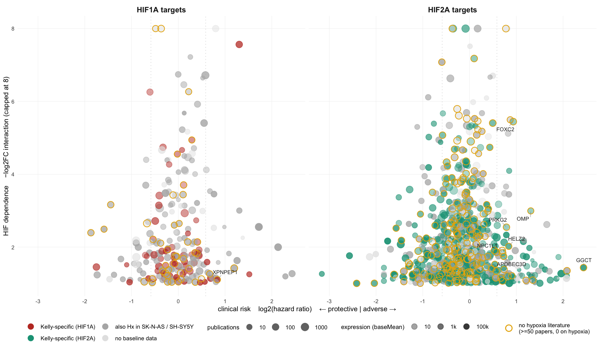

Master_Table_Dive
================

- [Input](#input)
- [Reduction](#reduction)
- [Reduced table](#reduced-table)
- [Risk versus HIF dependence](#risk-versus-hif-dependence)

Follow-up analysis on the annotated master table built in
[Master_Table.Rmd](Master_Table.Rmd) (see [its rendered
output](Readme.md) for how the annotation columns are defined). This
document starts by reducing the table to the genes that are actually
worth looking at. Code blocks are collapsed - click *Code* to expand.

<details>

<summary>

Code
</summary>

``` r
library(dplyr)
library(tidyverse)
library(knitr)
library(ggplot2)
library(ggrepel)
library(openxlsx)
```

</details>

# Input

`master_counts_table.xlsx` carries everything: the DESeq2 contrasts, the
annotation columns, and the per-sample normalized counts. Reading 65 MB
of Excel on every knit is slow, so it is cached as an RDS and only
re-read when the xlsx is newer.

<details>

<summary>

Code
</summary>

``` r
in_dir  <- here::here("6_XM_data_merge")
xlsx_in <- file.path(in_dir, "master_counts_table.xlsx")
rds_cache <- file.path(in_dir, "cache", "master_counts_table.rds")

dir.create(dirname(rds_cache), showWarnings = FALSE, recursive = TRUE)
if (file.exists(rds_cache) &&
    file.mtime(rds_cache) > file.mtime(xlsx_in)) {
  master <- readRDS(rds_cache)
} else {
  master <- as.data.frame(readxl::read_xlsx(xlsx_in))
  saveRDS(master, rds_cache)
}

count_cols <- grep("^counts_", colnames(master), value = TRUE)

tab(data.frame(
  Item = c("genes", "columns", "of them per-sample counts", "annotation columns"),
  n    = c(nrow(master), ncol(master), length(count_cols),
           sum(colnames(master) %in% c("Target", "Hx_Baseline", "pubmed_total",
                                       "pubmed_hypoxia", "pubmed_source", "HR_risk")))
), "master_counts_table as loaded")
```

</details>

**master_counts_table as loaded**

| Item                      |     n |
|:--------------------------|------:|
| genes                     | 64537 |
| columns                   |   146 |
| of them per-sample counts |    88 |
| annotation columns        |     6 |

# Reduction

Most of the table is not expressed: 61% of all genes have a
`baseMean_Kelly` of exactly zero. Expression is therefore the primary
filter.

A gene is kept anyway if it has at least 50 publications. That rescue is
there so well-characterised genes stay visible as a reference even when
they are silent in this cell line - TLR2, HFE, NOD2, POSTN and DCN are
all annotated HIF targets that a pure expression cutoff would drop.

**The threshold is deliberately low**, because `pubmed_total` counts
*curated gene-to-publication links*, not mentions. NCBI creates those
links mainly for papers treating a gene as a molecular entity, which
systematically undercounts genes whose literature is old, physiological
or biochemical:

| Gene               | PubMed full-text search | `pubmed_total` |
|--------------------|------------------------:|---------------:|
| myoglobin / `MB`   |                  18,113 |             95 |
| hemoglobin / `HBB` |                 286,325 |            876 |
| insulin / `INS`    |                 522,216 |          1,034 |
| `TP53`             |                      \- |         20,399 |

So the column measures how intensively a gene is studied *as a gene*,
not how famous it is. That is usually the more useful reading here -
GAPDH scores 637 despite appearing in tens of thousands of papers as a
loading control, and those papers are not about GAPDH - but classic
literature is underrepresented, so 50 links already marks a well-studied
gene.

One consequence of Ensembl-to-Entrez being many-to-one: 1,691 symbols
occupy more than one row (NLRP2 has four Ensembl loci sharing Entrez
55655), and each row carries the same literature count. Rows are genes
as annotated here, so a count of “genes above N publications”
double-counts those. This comes from the annotation itself, not from the
fallback mapping - the duplication rate is 12.5% for `annotation` and
13.2% for `symbol_map`.

Literature coverage is used **only** in that direction: it can keep a
gene in, it never throws one out. A strongly expressed but unstudied
gene is a candidate, not noise, and filtering on publication counts
would preferentially discard exactly those - one Kelly-specific target
sits at `baseMean` 7,235 with no annotation at all. `pubmed_total` and
`pubmed_hypoxia` otherwise stay in the table as a ranking aid.

<details>

<summary>

Code
</summary>

``` r
min_basemean <- 10
min_pubmed   <- 50

expressed <- !is.na(master$baseMean_Kelly) & master$baseMean_Kelly >= min_basemean
rescued   <- !expressed & !is.na(master$pubmed_total) & master$pubmed_total >= min_pubmed
keep      <- expressed | rescued

dive <- master[keep, ]

# Why each gene is in, so the rescued ones can be excluded again downstream
# without recomputing the rule.
dive$dive_reason <- ifelse(expressed[keep], "expressed", "literature")
dive <- dive %>% dplyr::relocate(dive_reason, .after = symbol)

tab(data.frame(
  Step = c("master_counts_table",
           sprintf("baseMean_Kelly >= %d", min_basemean),
           sprintf("+ rescued: pubmed_total >= %d", min_pubmed)),
  Genes = c(nrow(master), sum(expressed), nrow(dive)),
  Share = sprintf("%.0f%%", 100 * c(nrow(master), sum(expressed), nrow(dive)) / nrow(master))
), "Reduction")
```

</details>

**Reduction**

| Step                            | Genes | Share |
|:--------------------------------|------:|:------|
| master_counts_table             | 64537 | 100%  |
| baseMean_Kelly \>= 10           | 18471 | 29%   |
| \+ rescued: pubmed_total \>= 50 | 21573 | 33%   |

The rescue adds 11% to the table. Worth knowing before using it: 617 of
the rescued genes have a `baseMean` of exactly zero, so they enter as
rows of pure zero counts. That is informative as a reference - “this
well-known gene is not expressed in Kelly” - but they should be excluded
from anything that consumes the count columns, which `dive_reason` makes
easy.

**Expression of the 3,102 literature-rescued genes**

| baseMean  | Genes |
|:----------|------:|
| exactly 0 |   919 |
| 0 - 1     |  1413 |
| 1 - 10    |   770 |

What survives, by annotation. The reduction removes three quarters of
the rows but keeps the large majority of the annotated candidates, which
is the point:

**Effect of the reduction per annotation set**

| Set                     | before | expressed | rescued | after | kept |
|:------------------------|-------:|----------:|--------:|------:|:-----|
| all genes               |  64537 |     18471 |    3102 | 21573 | 33%  |
| HIF targets             |   1837 |      1311 |      85 |  1396 | 76%  |
| Kelly-specific targets  |    922 |       685 |      52 |   737 | 80%  |
| HR adverse              |   6081 |      4598 |     134 |  4732 | 78%  |
| with hypoxia literature |   7945 |      5911 |    1497 |  7408 | 93%  |

The best-studied HIF targets that a pure expression cutoff would have
dropped - all of them now retained by the rescue:

**HIF targets kept by the literature rescue**

| symbol | Target      | baseMean | pubmed_total | pubmed_hypoxia |
|:-------|:------------|---------:|-------------:|---------------:|
| TLR2   | Hif2a       |     2.09 |         3812 |             22 |
| HFE    | Hif2a       |     1.92 |         2259 |             10 |
| NOD2   | Hif2a       |     2.97 |         1997 |              2 |
| POSTN  | Hif2a       |     2.79 |         1016 |             21 |
| SOST   | Hif2a       |     3.61 |          961 |              8 |
| DCN    | Hif2a       |     5.09 |          948 |              6 |
| ABCA4  | Hif1a_Hif2a |     6.61 |          754 |              1 |
| UGT1A1 | Hif2a       |     1.08 |          753 |              0 |

Still dropped: annotated targets that are both silent and barely
studied. These are the ones the filter is meant to catch.

**Best-studied HIF targets still removed**

| symbol   | Target      | baseMean | pubmed_total | pubmed_hypoxia |
|:---------|:------------|---------:|-------------:|---------------:|
| EFHD1    | Hif1a_Hif2a |     3.58 |           49 |              1 |
| SIGLEC10 | Hif2a       |     8.43 |           49 |              1 |
| AKR1D1   | Hif2a       |     6.79 |           48 |              0 |
| ITGBL1   | Hif2a       |     2.96 |           48 |              0 |
| LAMC3    | Hif1a       |     8.71 |           47 |              1 |
| ESAM     | Hif2a       |     4.32 |           46 |              0 |

# Reduced table

**Top Kelly-specific targets in the reduced table**

| symbol      | Target | baseMean | log2FC | HR_risk | pubmed_total | pubmed_hypoxia |
|:------------|:-------|---------:|-------:|:--------|-------------:|---------------:|
| CALHM4      | Hif2a  |      665 |  13.14 | ns      |           13 |              0 |
| FLT1        | Hif2a  |      275 |  12.07 | ns      |         2122 |            151 |
| CHRNA4      | Hif1a  |     1622 |  11.40 | adverse |          218 |              2 |
| IL6R        | Hif2a  |      179 |  10.84 | ns      |          893 |              8 |
| SLC9C2      | Hif2a  |      133 |  10.15 | ns      |            5 |              0 |
| STEAP1B-AS1 | Hif2a  |       26 |   9.06 | NA      |            3 |              0 |
| SLCO2A1     | Hif2a  |      187 |   8.80 | ns      |          211 |              2 |
| FRG2B       | Hif2a  |       46 |   8.80 | NA      |            3 |              0 |
| ATP8A2      | Hif2a  |       51 |   8.69 | ns      |           45 |              0 |
| LINGO1-AS1  | Hif2a  |      115 |   8.68 | NA      |            2 |              0 |

# Risk versus HIF dependence

One panel per HIF, showing every target of that HIF against two axes:

- **x** - clinical risk as `log2(HR)`. Left of zero the gene is
  protective, right of it adverse. The dotted lines mark the 1.5 / 0.67
  thresholds used for `HR_risk`.
- **y** - HIF dependence, the interaction term negated so that *up*
  means *more dependent on this HIF*. Capped at 8; nine genes sit above
  it and are drawn at the cap.

Four further variables ride along:

| Channel | Meaning |
|----|----|
| Hue | red / teal = Kelly-specific, grey = also hypoxic in the baseline lines, pale grey = no baseline data |
| Saturation | expression (`baseMean_Kelly`) |
| Size | publications (`pubmed_total`) |
| Amber ring | at least 50 publications but **none** on hypoxia |

The ring rule deserves a note. Simply marking “few hypoxia papers” would
highlight 60% of all targets and say nothing - most genes have no
hypoxia literature because most genes are not well studied at all.
Requiring 50 publications first makes the absence informative: a gene
people have worked on, that nobody has looked at under hypoxia. That
combination - a **large, ringed, coloured** point in the upper right -
is the shortlist in visual form.

<details>

<summary>

Code
</summary>

``` r
COL <- c("Kelly-specific (HIF1A)" = "#C0392B", "Kelly-specific (HIF2A)" = "#16A085",
         "also Hx in SK-N-AS / SH-SY5Y" = "#B4B4B4", "no baseline data" = "#E4E4E4")
COL_RING <- "#E8B006"
ring_min_total <- 50
y_cap <- 8

prep <- function(grp, ycol, panel, tgt_lab) {
  dive %>%
    dplyr::filter(Target %in% grp, !is.na(HR), HR >= 0.1, HR <= 10) %>%
    dplyr::transmute(
      panel = panel, symbol,
      log2HR = log2(HR), dep = pmin(-.data[[ycol]], y_cap),
      cls = dplyr::case_when(is.na(Hx_Baseline)     ~ "no baseline data",
                             Hx_Baseline == "none"  ~ tgt_lab,
                             TRUE ~ "also Hx in SK-N-AS / SH-SY5Y"),
      expr = log10(baseMean_Kelly + 1),
      pm   = log10(pubmed_total + 1),
      ring = !is.na(pubmed_hypoxia) & pubmed_hypoxia == 0 &
             !is.na(pubmed_total) & pubmed_total >= ring_min_total,
      kelly = !is.na(Hx_Baseline) & Hx_Baseline == "none")
}

pdat <- dplyr::bind_rows(
  prep(c("Hif1a", "Hif1a_Hif2a"), "Hif1aHxNx.vs.KellyHxNx.log2FoldChange",
       "HIF1A targets", "Kelly-specific (HIF1A)"),
  prep(c("Hif2a", "Hif1a_Hif2a"), "Hif2aHxNx.vs.KellyHxNx.log2FoldChange",
       "HIF2A targets", "Kelly-specific (HIF2A)"))
pdat$cls   <- factor(pdat$cls, levels = names(COL))
pdat$panel <- factor(pdat$panel, levels = c("HIF1A targets", "HIF2A targets"))

lab <- pdat %>% dplyr::filter(kelly, ring, log2HR > log2(1.5)) %>%
  dplyr::group_by(panel) %>% dplyr::arrange(dplyr::desc(dep)) %>%
  dplyr::slice_head(n = 7) %>% dplyr::ungroup()

ggplot(pdat, aes(log2HR, dep)) +
  geom_vline(xintercept = c(log2(1 / 1.5), log2(1.5)), colour = "grey85",
             linetype = "dotted", linewidth = 0.35) +
  geom_point(aes(colour = cls, size = pm, alpha = expr)) +
  geom_point(data = dplyr::filter(pdat, ring),
             aes(size = pm, shape = "no hypoxia literature\n(>=50 papers, 0 on hypoxia)"),
             fill = NA, colour = COL_RING, stroke = 0.65) +
  ggrepel::geom_text_repel(data = lab, aes(label = symbol), size = 2.5,
                           colour = "grey15", box.padding = 0.45, max.overlaps = 40,
                           segment.size = 0.2, segment.colour = "grey55",
                           min.segment.length = 0) +
  facet_wrap(~panel) +
  scale_colour_manual(values = COL, name = NULL, guide = guide_legend(
    order = 1, ncol = 2, override.aes = list(size = 3.2, alpha = 1))) +
  scale_size_continuous(range = c(1, 4.6), name = "publications",
    breaks = log10(c(10, 100, 1000) + 1), labels = c("10", "100", "1000"),
    guide = guide_legend(order = 2, override.aes = list(colour = "grey45", alpha = 1))) +
  scale_alpha_continuous(range = c(0.35, 1), name = "expression (baseMean)",
    breaks = log10(c(10, 1000, 100000) + 1), labels = c("10", "1k", "100k"),
    guide = guide_legend(order = 3, override.aes = list(size = 3.2, colour = "grey25"))) +
  scale_shape_manual(values = 21, name = NULL, guide = guide_legend(
    order = 4, override.aes = list(size = 3.4, colour = COL_RING, stroke = 0.9))) +
  labs(x = "clinical risk    log2(hazard ratio)    ← protective | adverse →",
       y = sprintf("HIF dependence    −log2FC interaction (capped at %d)", y_cap)) +
  theme_minimal(base_size = 9) +
  theme(panel.grid.minor = element_blank(),
        panel.grid.major = element_line(linewidth = 0.2, colour = "grey94"),
        strip.text = element_text(face = "bold", size = 10),
        legend.position = "bottom", legend.box = "horizontal",
        legend.key.height = unit(0.75, "lines"),
        legend.title = element_text(size = 8), legend.text = element_text(size = 7.5))
```

</details>

<!-- -->

**Genes per panel - the difference to `in_dive` are genes without a
usable hazard ratio**

| Panel         | in_dive | plotted | Kelly_specific | ringed |
|:--------------|--------:|--------:|---------------:|-------:|
| HIF1A targets |     308 |     250 |             66 |     44 |
| HIF2A targets |    1122 |     838 |            513 |    200 |

<details>

<summary>

Code
</summary>

``` r
out_file <- here::here("6_XM_data_merge", "master_table_dive.xlsx")
openxlsx::write.xlsx(dive, out_file, rowNames = FALSE)
```

</details>

- [master_table_dive.xlsx](master_table_dive.xlsx) - 21,573 genes x 147
  columns, 34.5 MB
