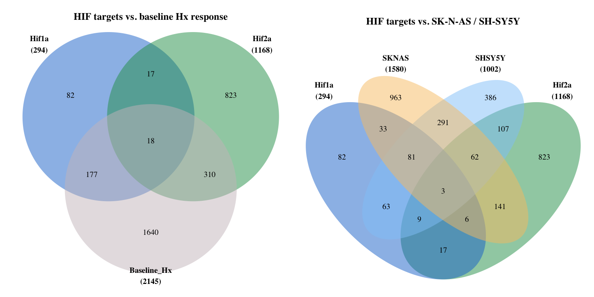

Master_Table
================

- [Input data](#input-data)
- [Kelly: fresh contrasts from the new
  dds](#kelly-fresh-contrasts-from-the-new-dds)
- [SK-N-AS / SH-SY5Y: independent per-line Hx vs
  Nx](#sk-n-as--sh-sy5y-independent-per-line-hx-vs-nx)
- [Combine into master table](#combine-into-master-table)
  - [Overlap of the Ensembl IDs](#overlap-of-the-ensembl-ids)
- [Target classification (Kelly
  only)](#target-classification-kelly-only)
- [Hypoxia baseline (SK-N-AS /
  SH-SY5Y)](#hypoxia-baseline-sk-n-as--sh-sy5y)
  - [Target vs. baseline](#target-vs-baseline)
  - [Venn: Target vs. Hx_Baseline](#venn-target-vs-hx_baseline)
- [Literature coverage](#literature-coverage)
  - [Candidates: strong, Kelly-specific, undescribed in
    hypoxia](#candidates-strong-kelly-specific-undescribed-in-hypoxia)
- [Clinical risk (HR)](#clinical-risk-hr)
  - [Risk within the HIF targets](#risk-within-the-hif-targets)
  - [Shortlist: Kelly-specific, adverse prognosis, undescribed in
    hypoxia](#shortlist-kelly-specific-adverse-prognosis-undescribed-in-hypoxia)
- [Master counts table](#master-counts-table)
- [Export](#export)

This document merges the three RNA-seq / microarray data sets of the
project into one **master table**, classifies every gene by its HIF
dependency, and exports the result as Excel. Code blocks are collapsed -
click *Code* to expand.

<details>

<summary>

Code
</summary>

``` r
library(dplyr)
library(DESeq2)
library(tidyverse)
library(knitr)
library(kableExtra)
library(ggplot2)
library(ggrepel)
library(openxlsx)
library(VennDiagram)
library(patchwork)

# Suppress the .log files the VennDiagram package writes on every call.
invisible(futile.logger::flog.threshold(futile.logger::ERROR, name = "VennDiagramLogger"))

colors <- c("lavenderblush3", "lavenderblush4", "#90caf9", "#1976d2",
            "#82e0aa", "#239b56", "#f8c471", "#b9770e")
```

</details>

# Input data

Three sources go into the master table: the Kelly line with its three
HIF knockouts, the two MYCN-non-amplified reference lines, and the
high-risk microarray gene list.

<details>

<summary>

Code
</summary>

``` r
dds_kelly <- readRDS(
  file = "/Users/simonkelterborn/Library/CloudStorage/GoogleDrive-simon.kelterborn@gmail.com/Meine Ablage/! OneDrive Charité/dds_filtered_with_metadata.rds"
)

load(
  file = "/Users/simonkelterborn/Library/CloudStorage/GoogleDrive-simon.kelterborn@gmail.com/Meine Ablage/! OneDrive Charité/SKNAS_SHSY5Y.dds"
)
dds_SKNAS <- dds
rm(dds)

HR_table <- readxl::read_xlsx("/Users/simonkelterborn/Library/CloudStorage/GoogleDrive-simon.kelterborn@gmail.com/Meine Ablage/! OneDrive Charité/HR_genes_Microarray.xlsx")

tab(data.frame(
  Data_set = c("Kelly (WT + HIF1a/HIF1b/HIF2a KO)",
               "SK-N-AS / SH-SY5Y",
               "High-risk microarray"),
  File     = c("dds_filtered_with_metadata.rds", "SKNAS_SHSY5Y.dds",
               "HR_genes_Microarray.xlsx"),
  Genes    = c(nrow(dds_kelly), nrow(dds_SKNAS), nrow(HR_table)),
  Samples  = c(ncol(dds_kelly), ncol(dds_SKNAS), NA)
), "Input data sets")
```

</details>

**Input data sets**

| Data_set | File | Genes | Samples |
|:---|:---|---:|---:|
| Kelly (WT + HIF1a/HIF1b/HIF2a KO) | dds_filtered_with_metadata.rds | 64537 | 88 |
| SK-N-AS / SH-SY5Y | SKNAS_SHSY5Y.dds | 76045 | 12 |
| High-risk microarray | HR_genes_Microarray.xlsx | 27855 | NA |

# Kelly: fresh contrasts from the new dds

DESeq2 is run once with the full interaction design
`~genotype + condition + genotype:condition`. All contrasts of interest
are then derived from that single fit as weighted coefficient vectors,
so every comparison shares one dispersion estimate. The coefficient
names are resolved by pattern instead of being hardcoded, because DESeq2
rewrites factor level separators (`HIF1a-KO` becomes `HIF1a.KO`).

<details>

<summary>

Code
</summary>

``` r
colData(dds_kelly)$genotype <- relevel(factor(colData(dds_kelly)$genotype), "WT")
colData(dds_kelly)$condition <- relevel(factor(colData(dds_kelly)$condition), "Nx")

design(dds_kelly) <- ~genotype + condition + genotype:condition
dds_kelly <- DESeq(dds_kelly)

# entrezid is a 1-to-many list-column (some genes map to multiple Entrez IDs) -
# flatten to a single string so results/data.frame conversions don't explode rows.
entrez_flat <- vapply(mcols(dds_kelly)$entrezid, function(x) {
  if (length(x) == 0) NA_character_ else paste(x, collapse = ";")
}, character(1))

rn <- resultsNames(dds_kelly)

# Resolve the actual (possibly sanitized, e.g. "HIF1a-KO" -> "HIF1a.KO") coefficient
# names by pattern rather than hardcoding them, since DESeq2 rewrites factor level
# separators and level order can change if the input dds changes.
find_coef <- function(pattern) {
  hits <- grep(pattern, rn, value = TRUE)
  if (length(hits) != 1) {
    stop("Expected exactly 1 match for pattern '", pattern, "', found: ",
         paste(hits, collapse = ", "))
  }
  hits
}

coef_geno <- list(
  Hif1a = find_coef("^genotype.*HIF1a.*_vs_WT$"),
  Hif1b = find_coef("^genotype.*HIF1b.*_vs_WT$"),
  Hif2a = find_coef("^genotype.*HIF2a.*_vs_WT$")
)
coef_cond <- find_coef("^condition_Hx_vs_Nx$")
coef_int <- list(
  Hif1a = find_coef("^genotype.*HIF1a.*\\.condition"),
  Hif1b = find_coef("^genotype.*HIF1b.*\\.condition"),
  Hif2a = find_coef("^genotype.*HIF2a.*\\.condition")
)

# Named weight vectors, resolved to the real coefficient names above.
# Mirrors the full contrast set from 2B_DGE/2B_DGE.Rmd, computed fresh here.
contrast_defs <- list(
  Kelly.Hx.vs.Nx = c(setNames(1, coef_cond)),
  Hif1a.Hx.vs.Nx = c(setNames(1, coef_cond), setNames(1, coef_int$Hif1a)),
  Hif1b.Hx.vs.Nx = c(setNames(1, coef_cond), setNames(1, coef_int$Hif1b)),
  Hif2a.Hx.vs.Nx = c(setNames(1, coef_cond), setNames(1, coef_int$Hif2a)),

  Nx.Hif1a.vs.Kelly = c(setNames(1, coef_geno$Hif1a)),
  Nx.Hif1b.vs.Kelly = c(setNames(1, coef_geno$Hif1b)),
  Nx.Hif2a.vs.Kelly = c(setNames(1, coef_geno$Hif2a)),

  Hx.Hif1a.vs.Kelly = c(setNames(1, coef_geno$Hif1a), setNames(1, coef_int$Hif1a)),
  Hx.Hif1b.vs.Kelly = c(setNames(1, coef_geno$Hif1b), setNames(1, coef_int$Hif1b)),
  Hx.Hif2a.vs.Kelly = c(setNames(1, coef_geno$Hif2a), setNames(1, coef_int$Hif2a)),

  Hx.Hif2a.vs.Hif1a = c(setNames(-1, coef_geno$Hif1a), setNames(-1, coef_int$Hif1a),
                        setNames(1, coef_geno$Hif2a), setNames(1, coef_int$Hif2a)),
  Hx.Hif1b.vs.Hif1a = c(setNames(-1, coef_geno$Hif1a), setNames(-1, coef_int$Hif1a),
                        setNames(1, coef_geno$Hif1b), setNames(1, coef_int$Hif1b)),
  Hx.Hif1b.vs.Hif2a = c(setNames(-1, coef_geno$Hif2a), setNames(-1, coef_int$Hif2a),
                        setNames(1, coef_geno$Hif1b), setNames(1, coef_int$Hif1b)),

  Hif1aHxNx.vs.KellyHxNx = c(setNames(1, coef_int$Hif1a)),
  Hif2aHxNx.vs.KellyHxNx = c(setNames(1, coef_int$Hif2a)),
  Hif1bHxNx.vs.KellyHxNx = c(setNames(1, coef_int$Hif1b)),
  Hif2aHxNx.vs.Hif1aHxNx = c(setNames(-1, coef_int$Hif1a), setNames(1, coef_int$Hif2a)),

  Hx.Hif1b.vs.Hif12a = c(setNames(-0.5, coef_geno$Hif1a), setNames(-0.5, coef_geno$Hif2a),
                         setNames(1, coef_geno$Hif1b),
                         setNames(-0.5, coef_int$Hif1a), setNames(-0.5, coef_int$Hif2a),
                         setNames(1, coef_int$Hif1b)),

  Hx.Kelly.vs.allHIFs = c(setNames(1/3, coef_geno$Hif1a), setNames(1/3, coef_geno$Hif2a),
                          setNames(1/3, coef_geno$Hif1b),
                          setNames(1/3, coef_int$Hif1a), setNames(1/3, coef_int$Hif2a),
                          setNames(1/3, coef_int$Hif1b)),

  # NOTE: kept "NOT confirmed" caveat from the original 2B_DGE.Rmd analysis
  Hx.vs.Nx = c(setNames(1, coef_cond),
               setNames(1/4, coef_int$Hif1a), setNames(1/4, coef_int$Hif2a),
               setNames(1/4, coef_int$Hif1b))
)

build_contrast_vec <- function(weights) {
  v <- setNames(rep(0, length(rn)), rn)
  v[names(weights)] <- unname(weights)
  unname(v)
}

results_list <- lapply(contrast_defs, function(w) {
  r1 <- results(dds_kelly, contrast = build_contrast_vec(w))
  r1$symbol  <- mcols(dds_kelly)$symbol
  r1$ENSEMBL <- mcols(dds_kelly)$gene_id
  r1$ENTREZ  <- entrez_flat
  r1
})

tab(data.frame(
  Contrast = names(results_list),
  DEGs     = sapply(results_list, function(x) sum(x$padj < 0.05, na.rm = TRUE)),
  row.names = NULL
), "Significant genes per contrast (padj < 0.05)")
```

</details>

**Significant genes per contrast (padj \< 0.05)**

| Contrast               |  DEGs |
|:-----------------------|------:|
| Kelly.Hx.vs.Nx         | 16675 |
| Hif1a.Hx.vs.Nx         | 16883 |
| Hif1b.Hx.vs.Nx         |  7465 |
| Hif2a.Hx.vs.Nx         | 11905 |
| Nx.Hif1a.vs.Kelly      |   623 |
| Nx.Hif1b.vs.Kelly      |  5717 |
| Nx.Hif2a.vs.Kelly      |  2424 |
| Hx.Hif1a.vs.Kelly      |  6956 |
| Hx.Hif1b.vs.Kelly      | 15787 |
| Hx.Hif2a.vs.Kelly      | 11524 |
| Hx.Hif2a.vs.Hif1a      | 14604 |
| Hx.Hif1b.vs.Hif1a      | 16341 |
| Hx.Hif1b.vs.Hif2a      | 13268 |
| Hif1aHxNx.vs.KellyHxNx |  3050 |
| Hif2aHxNx.vs.KellyHxNx |  7976 |
| Hif1bHxNx.vs.KellyHxNx |  9584 |
| Hif2aHxNx.vs.Hif1aHxNx |  9882 |
| Hx.Hif1b.vs.Hif12a     | 15137 |
| Hx.Kelly.vs.allHIFs    | 12169 |
| Hx.vs.Nx               | 18937 |

# SK-N-AS / SH-SY5Y: independent per-line Hx vs Nx

These two lines are analysed separately from Kelly - each gets its own
DESeq2 fit on the subset of its own samples with the simple design
`~Condition`, so their hypoxia response is estimated independently of
the Kelly model.

<details>

<summary>

Code
</summary>

``` r
get_line_hxvsnx <- function(dds_all, celltype_value, label) {
  dds_sub <- dds_all[, colData(dds_all)$Celltype == celltype_value]
  colData(dds_sub)$Condition <- relevel(factor(colData(dds_sub)$Condition), "Normoxia")
  design(dds_sub) <- ~Condition
  dds_sub <- DESeq(dds_sub)
  res <- results(dds_sub, name = "Condition_Hypoxia_vs_Normoxia")

  out <- data.frame(
    Ensembl = rownames(res),
    baseMean = res$baseMean,
    log2FC   = res$log2FoldChange,
    padj     = res$padj
  )
  colnames(out)[2:4] <- paste0(c("baseMean_", "log2FC_", "padj_"), label)
  out
}

sknas_df  <- get_line_hxvsnx(dds_SKNAS, "SK-N-AS", "SKNAS")
shsy5y_df <- get_line_hxvsnx(dds_SKNAS, "SH-SY5Y", "SHSY5Y")
```

</details>

# Combine into master table

All three sources are joined on Ensembl gene ID, with Kelly as the
reference gene space. Every contrast contributes a `log2FoldChange` and
a `padj` column.

<details>

<summary>

Code
</summary>

``` r
res_table <- lapply(results_list, function(x) data.frame(x)[, c("log2FoldChange", "padj")])
res_table <- do.call('cbind', res_table)

master_table <- data.frame(
  Ensembl        = mcols(dds_kelly)$gene_id,
  ENTREZ         = entrez_flat,
  symbol         = mcols(dds_kelly)$symbol,
  baseMean_Kelly = results_list[["Kelly.Hx.vs.Nx"]]$baseMean
)

master_table <- cbind(master_table, res_table)

master_table <- master_table %>%
  left_join(sknas_df, by = "Ensembl") %>%
  left_join(shsy5y_df, by = "Ensembl") %>%
  left_join(HR_table %>% dplyr::rename(p_value_HR = p_value), by = "Ensembl")
```

</details>

## Overlap of the Ensembl IDs

How well the three sources cover the Kelly gene space:

<details>

<summary>

Code
</summary>

``` r
ens_kelly <- master_table$Ensembl

tab(data.frame(
  Data_set          = c("Kelly (reference)", "SK-N-AS / SH-SY5Y", "High-risk microarray"),
  Genes             = c(length(ens_kelly), nrow(sknas_df), nrow(HR_table)),
  Shared_with_Kelly = c(NA, sum(sknas_df$Ensembl %in% ens_kelly),
                        sum(HR_table$Ensembl %in% ens_kelly)),
  Not_in_Kelly      = c(NA, sum(!sknas_df$Ensembl %in% ens_kelly),
                        sum(!HR_table$Ensembl %in% ens_kelly))
), "Ensembl ID overlap with the Kelly gene space")
```

</details>

**Ensembl ID overlap with the Kelly gene space**

| Data_set             | Genes | Shared_with_Kelly | Not_in_Kelly |
|:---------------------|------:|------------------:|-------------:|
| Kelly (reference)    | 64537 |                NA |           NA |
| SK-N-AS / SH-SY5Y    | 76045 |             57785 |        18260 |
| High-risk microarray | 27855 |             25398 |         2457 |

Being present is not the same as being testable: DESeq2’s independent
filtering drops low-count genes, which leaves their `padj` as `NA`. That
distinction matters for the baseline classification below, so it is
counted separately here.

<details>

<summary>

Code
</summary>

``` r
coverage <- function(label) {
  bm <- master_table[[paste0("baseMean_", label)]]
  pa <- master_table[[paste0("padj_", label)]]
  data.frame(Line                     = label,
             Not_in_data_set          = sum(is.na(bm)),
             Present_but_not_testable = sum(!is.na(bm) & is.na(pa)),
             Testable                 = sum(!is.na(pa)))
}

tab(rbind(coverage("SKNAS"), coverage("SHSY5Y")),
    "Gene coverage of the two baseline lines")
```

</details>

**Gene coverage of the two baseline lines**

| Line   | Not_in_data_set | Present_but_not_testable | Testable |
|:-------|----------------:|-------------------------:|---------:|
| SKNAS  |            6752 |                    36577 |    21208 |
| SHSY5Y |            6752 |                    37072 |    20713 |

<details>

<summary>

Code
</summary>

``` r
# p-values are rendered as text: kable applies one numeric format across a whole
# column, which turns anything below ~1e-4 into a misleading "0.0000".
master_table %>%
  dplyr::select(Ensembl, symbol, baseMean_Kelly,
                Kelly.Hx.vs.Nx.log2FoldChange, Kelly.Hx.vs.Nx.padj,
                log2FC_SKNAS, log2FC_SHSY5Y) %>%
  head(5) %>%
  dplyr::mutate(Kelly.Hx.vs.Nx.padj = sprintf("%.1e", Kelly.Hx.vs.Nx.padj),
                dplyr::across(where(is.numeric), ~signif(.x, 3))) %>%
  tab(sprintf("master_table preview - first 5 of %s genes, 7 of %d columns",
              format(nrow(master_table), big.mark = ","), ncol(master_table)))
```

</details>

**master_table preview - first 5 of 64,537 genes, 7 of 52 columns**

| Ensembl | symbol | baseMean_Kelly | Kelly.Hx.vs.Nx.log2FoldChange | Kelly.Hx.vs.Nx.padj | log2FC_SKNAS | log2FC_SHSY5Y |
|:---|:---|---:|---:|:---|---:|---:|
| ENSG00000000003 | TSPAN6 | 1.21e+03 | 0.111 | 7.8e-01 | 0.0795 | 0.0862 |
| ENSG00000000005 | TNMD | 2.01e-02 | 0.227 | 9.9e-01 | 0.9080 | NA |
| ENSG00000000419 | DPM1 | 1.48e+03 | -0.271 | 1.3e-02 | -0.1050 | -0.1570 |
| ENSG00000000457 | SCYL3 | 7.48e+02 | 0.390 | 8.2e-18 | 0.1250 | 0.0748 |
| ENSG00000000460 | C1orf112 | 1.15e+03 | -0.989 | 2.5e-29 | -0.8430 | -0.6820 |

# Target classification (Kelly only)

A gene counts as a **HIF target** if it is induced by hypoxia in WT
Kelly (`padj < 0.05` and `log2FC > 1`) *and* that induction is lost in
the respective knockout, i.e. the interaction term is significantly
negative (`padj < 0.05` and `log2FC < -1`). Genes meeting both criteria
for HIF1A and HIF2A are labelled `Hif1a_Hif2a`. Only Kelly data is used
here.

<details>

<summary>

Code
</summary>

``` r
padj_cut <- 0.05
lfc_cut  <- 1

sig_up   <- function(lfc, padj) !is.na(padj) & padj < padj_cut & !is.na(lfc) & lfc >  lfc_cut
sig_down <- function(lfc, padj) !is.na(padj) & padj < padj_cut & !is.na(lfc) & lfc < -lfc_cut

hx_up <- sig_up(master_table$Kelly.Hx.vs.Nx.log2FoldChange,
                master_table$Kelly.Hx.vs.Nx.padj)

is_hif1a <- hx_up & sig_down(master_table$Hif1aHxNx.vs.KellyHxNx.log2FoldChange,
                             master_table$Hif1aHxNx.vs.KellyHxNx.padj)
is_hif2a <- hx_up & sig_down(master_table$Hif2aHxNx.vs.KellyHxNx.log2FoldChange,
                             master_table$Hif2aHxNx.vs.KellyHxNx.padj)

master_table$Target <- dplyr::case_when(
  is_hif1a & is_hif2a ~ "Hif1a_Hif2a",
  is_hif1a            ~ "Hif1a",
  is_hif2a            ~ "Hif2a",
  TRUE                ~ NA_character_
)

master_table <- master_table %>% dplyr::relocate(Target, .after = symbol)

# Explicit labels + level order, so NA does not surface as the string "NA." and
# the categories read in a sensible order rather than alphabetically.
target_f <- factor(ifelse(is.na(master_table$Target), "no target", master_table$Target),
                   levels = c("Hif1a", "Hif2a", "Hif1a_Hif2a", "no target"))

tab(as.data.frame(table(Target = target_f)),
    sprintf("Target classification (%s genes Hx-induced in WT Kelly)",
            format(sum(hx_up), big.mark = ",")))
```

</details>

**Target classification (5,882 genes Hx-induced in WT Kelly)**

| Target      |  Freq |
|:------------|------:|
| Hif1a       |   322 |
| Hif2a       |  1472 |
| Hif1a_Hif2a |    43 |
| no target   | 62700 |

# Hypoxia baseline (SK-N-AS / SH-SY5Y)

SK-N-AS and SH-SY5Y are both **MYCN-non-amplified** neuroblastoma lines
and serve as the baseline hypoxia response; Kelly is MYCN-amplified. The
same up-criterion as for `Target` is applied, so both columns are
directly comparable.

| Value | Meaning |
|----|----|
| `SKNAS_SHSY5Y` | Hx-induced in both baseline lines |
| `SKNAS` / `SHSY5Y` | Hx-induced in that line only |
| `none` | testable in at least one line, but not Hx-induced - the Kelly-specific candidates |
| `NA` | testable in neither line - unknown, **not** “no response” |

Keeping `NA` separate from `none` matters: without it, genes that were
never measured in the reference lines would masquerade as
Kelly-specific.

<details>

<summary>

Code
</summary>

``` r
up_sknas  <- sig_up(master_table$log2FC_SKNAS,  master_table$padj_SKNAS)
up_shsy5y <- sig_up(master_table$log2FC_SHSY5Y, master_table$padj_SHSY5Y)

testable <- !is.na(master_table$padj_SKNAS) | !is.na(master_table$padj_SHSY5Y)

master_table$Hx_Baseline <- dplyr::case_when(
  up_sknas & up_shsy5y ~ "SKNAS_SHSY5Y",
  up_sknas             ~ "SKNAS",
  up_shsy5y            ~ "SHSY5Y",
  testable             ~ "none",
  TRUE                 ~ NA_character_
)

master_table <- master_table %>% dplyr::relocate(Hx_Baseline, .after = Target)

baseline_f <- factor(ifelse(is.na(master_table$Hx_Baseline), "no data",
                            master_table$Hx_Baseline),
                     levels = c("none", "SKNAS", "SHSY5Y", "SKNAS_SHSY5Y", "no data"))

tab(as.data.frame(table(Hx_Baseline = baseline_f)), "Baseline hypoxia response")
```

</details>

**Baseline hypoxia response**

| Hx_Baseline  |  Freq |
|:-------------|------:|
| none         | 20857 |
| SKNAS        |  1143 |
| SHSY5Y       |   565 |
| SKNAS_SHSY5Y |   437 |
| no data      | 41535 |

## Target vs. baseline

Rows are the HIF targets from Kelly, columns their behaviour in the
MYCN-non-amplified lines. The `none` column holds the Kelly-specific
targets, the `NA` column the ones with no baseline data.

<details>

<summary>

Code
</summary>

``` r
cross <- table(Target = target_f, Baseline = baseline_f)

tab(as.data.frame.matrix(cross),
    sprintf("Target x Hx_Baseline - %s HIF targets are Kelly-specific",
            format(sum(!is.na(master_table$Target) &
                       master_table$Hx_Baseline == "none", na.rm = TRUE),
                   big.mark = ",")))
```

</details>

**Target x Hx_Baseline - 922 HIF targets are Kelly-specific**

|             |  none | SKNAS | SHSY5Y | SKNAS_SHSY5Y | no data |
|:------------|------:|------:|-------:|-------------:|--------:|
| Hif1a       |    82 |    33 |     63 |           81 |      63 |
| Hif2a       |   823 |   141 |    107 |           62 |     339 |
| Hif1a_Hif2a |    17 |     6 |      9 |            3 |       8 |
| no target   | 19935 |   963 |    386 |          291 |   41125 |

## Venn: Target vs. Hx_Baseline

Left: both reference lines pooled into one set. Right: the same
comparison with SK-N-AS and SH-SY5Y resolved separately.

<details>

<summary>

Code
</summary>

``` r
# Restrict to genes that are testable in at least one baseline line. Otherwise
# genes with no baseline data would sit outside the SKNAS/SHSY5Y circles and
# would be read as "Kelly-specific" when they are simply unmeasured.
venn_universe <- master_table %>% dplyr::filter(!is.na(Hx_Baseline))

ens_where <- function(keep) venn_universe$Ensembl[keep]

venn_sets <- list(
  Hif1a  = ens_where(venn_universe$Target %in% c("Hif1a", "Hif1a_Hif2a")),
  Hif2a  = ens_where(venn_universe$Target %in% c("Hif2a", "Hif1a_Hif2a")),
  SKNAS  = ens_where(venn_universe$Hx_Baseline %in% c("SKNAS", "SKNAS_SHSY5Y")),
  SHSY5Y = ens_where(venn_universe$Hx_Baseline %in% c("SHSY5Y", "SKNAS_SHSY5Y"))
)

venn_plot <- function(input_list, main, fill) {
  venn.diagram(
    x = input_list,
    category.names = paste0(names(input_list), "\n(", lengths(input_list), ")"),
    force.unique = TRUE, na = "remove",
    filename = NULL,
    main = main, main.fontface = "bold",
    lwd = 2,
    lty = "blank",
    fill = fill,
    cat.fontface = "bold",
    cex = 0.8, cat.cex = 0.8
  )
}

# Simplified view: both baseline lines pooled into one "Hx in baseline" set.
venn_simple <- list(
  Hif1a = venn_sets$Hif1a,
  Hif2a = venn_sets$Hif2a,
  Baseline_Hx = union(venn_sets$SKNAS, venn_sets$SHSY5Y)
)

plt_simple <- venn_plot(venn_simple, "HIF targets vs. baseline Hx response",
                        colors[c(4, 6, 1)])
plt_full   <- venn_plot(venn_sets, "HIF targets vs. SK-N-AS / SH-SY5Y",
                        colors[c(4, 6, 7, 3)])

wrap_elements(plt_simple) + wrap_elements(plt_full)
```

</details>

<!-- -->

*Venn universe: 23,002 genes testable in at least one baseline line,
41,535 genes excluded for lack of baseline data.*

# Literature coverage

Three columns describing how well a gene is already studied. The counts
come from NCBI’s curated `gene2pubmed` mapping (Entrez GeneID -\> PubMed
ID) rather than from per-gene PubMed text searches - one download
instead of 64,537 API calls, and no dependence on symbol matching.

- `pubmed_total` - curated publications for the gene
- `pubmed_hypoxia` - of those, publications in the hypoxia / HIF
  literature
- `pubmed_source` - how the gene was matched to an Entrez ID

The second column is the useful one here. `pubmed_total` mostly measures
how long a gene has been known; `pubmed_hypoxia` answers whether *this*
biology is already described. A strongly induced, Kelly-specific target
with many publications but none in hypoxia is the interesting case.

**Why three ID sources.** The `ENTREZ` column of our annotation leaves
35,994 genes unmapped, and a quarter of the HIF targets sit in that
gap - too many to ignore for a column meant to help prioritise. Two NCBI
tables close most of it without giving up precision: `gene2ensembl`
matches on the Ensembl gene ID, and `Homo_sapiens.gene_info` on primary
symbols and synonyms. Any key pointing at more than one gene is
discarded, so unlike a `"SYMBOL"[Gene Name]` text search this cannot
mismatch `CS`, `AR`, `MARCH1` or `SEPT9`.

`pubmed_source` records which route was used, so the value stays usable
as a soft ranking aid while its provenance is always visible. Genes
marked `unannotated` have neither an Entrez ID nor a symbol - there is
no identifier to look literature up by, so they stay `NA` rather than
being called unstudied. Only genes that were mapped and have no linked
publication get a real `0`.

**What the counts are not.** `gene2pubmed` holds *curated
gene-to-publication links*, not mentions. NCBI creates those mainly for
papers treating a gene as a molecular entity, which systematically
undercounts genes whose literature is old, physiological or
biochemical - `MB` scores 95 against 18,113 PubMed hits for “myoglobin”,
`HBB` 876 against 286,325 for “hemoglobin”. The column therefore
measures how intensively a gene is studied *as a gene*. That is usually
the more useful reading (GAPDH scores 637 despite appearing in tens of
thousands of papers as a loading control, none of which are about
GAPDH), but absolute values are not comparable to a PubMed search, and a
few hundred links already marks a heavily studied gene.

<details>

<summary>

Code
</summary>

``` r
cache_dir <- here::here("6_XM_data_merge", "cache")
dir.create(cache_dir, showWarnings = FALSE, recursive = TRUE)

ncbi <- c(gene2pubmed  = "https://ftp.ncbi.nlm.nih.gov/gene/DATA/gene2pubmed.gz",
          gene2ensembl = "https://ftp.ncbi.nlm.nih.gov/gene/DATA/gene2ensembl.gz",
          gene_info    = paste0("https://ftp.ncbi.nlm.nih.gov/gene/DATA/GENE_INFO/",
                                "Mammalia/Homo_sapiens.gene_info.gz"))
files <- file.path(cache_dir, c("gene2pubmed.gz", "gene2ensembl.gz",
                                "Homo_sapiens.gene_info.gz"))
names(files) <- names(ncbi)
for (n in names(files)) {
  if (!file.exists(files[n])) download.file(ncbi[n], files[n], mode = "wb", quiet = TRUE)
}
pmid_file <- file.path(cache_dir, "hypoxia_pmids.rds")

# Human subset only; the full files are tens of millions of rows, so filter while
# decompressing rather than reading everything into memory.
g2p <- data.table::fread(
  cmd = sprintf("gzcat %s | awk -F'\t' '$1==9606'", shQuote(files["gene2pubmed"])),
  header = FALSE, col.names = c("tax_id", "GeneID", "PubMed_ID"))

g2e <- data.table::fread(
  cmd = sprintf("gzcat %s | awk -F'\t' '$1==9606'", shQuote(files["gene2ensembl"])),
  header = FALSE, select = 1:3, col.names = c("tax_id", "GeneID", "Ensembl"))
g2e <- unique(g2e[, .(Ensembl, GeneID)])

# Symbol -> GeneID via NCBI's own table (primary symbols first, then synonyms).
# Any key pointing at more than one gene is dropped, so this cannot mismatch the
# way a "SYMBOL"[Gene Name] text search would on CS, AR, MARCH1 or SEPT9.
gi <- data.table::fread(cmd = sprintf("gzcat %s", shQuote(files["gene_info"])),
                        quote = "", select = c(2, 3, 5),
                        col.names = c("GeneID", "Symbol", "Synonyms"))
# NB: the column is called "sym", not "key" - data.table() treats a "key" argument
# as the key to set rather than as a column.
prim <- unique(gi[Symbol != "-", .(sym = Symbol, GeneID)])
prim <- prim[!sym %in% prim[, .N, by = sym][N > 1, sym]]
syn <- gi[Synonyms != "-"][, .(sym = unlist(strsplit(Synonyms, "|", fixed = TRUE))),
                           by = GeneID][, .(sym, GeneID)]
syn <- unique(syn[!sym %in% prim$sym])
syn <- syn[!sym %in% syn[, .N, by = sym][N > 1, sym]]
sym_map <- rbind(prim, syn)

hypoxia_query <- paste0(
  'hypoxia[Title/Abstract] OR "hypoxia-inducible factor"[Title/Abstract] ',
  'OR HIF-1[Title/Abstract] OR HIF-2[Title/Abstract] OR hypoxia[MeSH Terms]')

if (file.exists(pmid_file)) {
  hyp_ids <- readRDS(pmid_file)
} else {
  # esearch and efetch both cap at 10,000 records per request, so the result set
  # is split by publication year, and years above the cap by month.
  qenc <- URLencode(paste0("(", hypoxia_query, ")"), reserved = TRUE)
  esearch <- function(mind, maxd, retmax) {
    u <- paste0("https://eutils.ncbi.nlm.nih.gov/entrez/eutils/esearch.fcgi",
                "?db=pubmed&retmode=json&retmax=", retmax, "&term=", qenc,
                "&datetype=pdat&mindate=", mind, "&maxdate=", maxd)
    for (att in 1:4) {
      j <- tryCatch(jsonlite::fromJSON(u), error = function(e) NULL)
      if (!is.null(j) && !is.null(j$esearchresult$count)) return(j$esearchresult)
      Sys.sleep(1.5)
    }
    stop("esearch failed for ", mind, "-", maxd)
  }
  window_ids <- function(mind, maxd) {
    n <- as.integer(esearch(mind, maxd, 0)$count)
    if (n == 0) return(character(0))
    if (n > 9500) return(NULL)
    Sys.sleep(0.36)
    as.character(esearch(mind, maxd, 10000)$idlist)
  }
  hyp_ids <- character(0)
  for (y in 1945:as.integer(format(Sys.Date(), "%Y"))) {
    Sys.sleep(0.36)
    got <- window_ids(y, y)
    if (is.null(got)) {
      for (m in 1:12) {
        Sys.sleep(0.36)
        md <- sprintf("%d/%02d", y, m)
        got_m <- window_ids(md, md)
        if (is.null(got_m)) stop("month window still above the cap: ", md)
        hyp_ids <- c(hyp_ids, got_m)
      }
    } else {
      hyp_ids <- c(hyp_ids, got)
    }
  }
  hyp_ids <- unique(as.integer(hyp_ids))
  saveRDS(hyp_ids, pmid_file)
}

# openxlsx writes NA_character_ as the literal string "NA", so a table that has
# been through the Excel round trip carries text where a missing value belongs.
# Normalise before anything keys off is.na().
entrez <- master_table$ENTREZ
entrez[entrez %in% c("NA", "")] <- NA_character_

# Resolve an Entrez ID per gene from three sources in decreasing directness. The
# annotation alone leaves 36k genes unmapped, a quarter of them inside the HIF
# target set, so the two NCBI fallbacks are worth the extra join.
DT <- data.table::data.table
n_genes <- nrow(master_table)

from_annot <- DT(row_id = seq_len(n_genes), ENTREZ = entrez)[!is.na(ENTREZ)]
from_annot <- from_annot[, .(GeneID = as.integer(unlist(strsplit(ENTREZ, ";")))),
                         by = row_id][!is.na(GeneID)]

open_rows <- setdiff(seq_len(n_genes), from_annot$row_id)
from_ens <- merge(DT(row_id = open_rows, Ensembl = master_table$Ensembl[open_rows]),
                  g2e, by = "Ensembl")[, .(row_id, GeneID)]

open_rows <- setdiff(open_rows, from_ens$row_id)
from_sym <- merge(DT(row_id = open_rows, sym = master_table$symbol[open_rows])[!is.na(sym)],
                  sym_map, by = "sym")[, .(row_id, GeneID)]

map <- rbind(from_annot, from_ens, from_sym)

# Provenance, so the number stays usable as a soft ranking aid while it is always
# visible how it was obtained. "unannotated" genes carry neither an Entrez ID nor
# a symbol - no identifier exists to look literature up by, so they stay NA.
pubmed_source <- rep("unannotated", n_genes)
pubmed_source[from_sym$row_id]   <- "symbol_map"
pubmed_source[from_ens$row_id]   <- "ensembl_map"
pubmed_source[from_annot$row_id] <- "annotation"
master_table$pubmed_source <- factor(
  pubmed_source, levels = c("annotation", "ensembl_map", "symbol_map", "unannotated"))

# Take the UNION of PMIDs across a gene's Entrez IDs, so multi-mapping genes are
# not counted twice.
hit <- merge(map, g2p[, .(GeneID, PubMed_ID)], by = "GeneID", allow.cartesian = TRUE)
hit <- unique(hit[, .(row_id, PubMed_ID)])
hit[, is_hyp := PubMed_ID %in% hyp_ids]
agg <- hit[, .(total = .N, hypoxia = sum(is_hyp)), by = row_id]

mapped <- pubmed_source != "unannotated"
master_table$pubmed_total   <- ifelse(mapped, 0L, NA_integer_)
master_table$pubmed_hypoxia <- ifelse(mapped, 0L, NA_integer_)
master_table$pubmed_total[agg$row_id]   <- agg$total
master_table$pubmed_hypoxia[agg$row_id] <- agg$hypoxia

master_table <- master_table %>%
  dplyr::relocate(pubmed_total, pubmed_hypoxia, pubmed_source, .after = Hx_Baseline)

tab(as.data.frame(table(Source = master_table$pubmed_source)),
    sprintf("How the Entrez ID was resolved (%s hypoxia PMIDs, %s gene-paper links)",
            format(length(hyp_ids), big.mark = ","), format(nrow(g2p), big.mark = ",")))
```

</details>

**How the Entrez ID was resolved (210,214 hypoxia PMIDs, 3,322,637
gene-paper links)**

| Source      |  Freq |
|:------------|------:|
| annotation  | 28543 |
| ensembl_map | 10618 |
| symbol_map  |  7484 |
| unannotated | 17892 |

<details>

<summary>

Code
</summary>

``` r
tab(data.frame(
  Group = c("mapped, no publication", "at least 1 publication",
            "at least 1 hypoxia publication", "unannotated (NA - no identifier)"),
  Genes = c(sum(master_table$pubmed_total == 0, na.rm = TRUE),
            sum(master_table$pubmed_total > 0, na.rm = TRUE),
            sum(master_table$pubmed_hypoxia > 0, na.rm = TRUE),
            sum(!mapped))
), "Literature coverage")
```

</details>

**Literature coverage**

| Group                            | Genes |
|:---------------------------------|------:|
| mapped, no publication           | 12503 |
| at least 1 publication           | 34142 |
| at least 1 hypoxia publication   |  7945 |
| unannotated (NA - no identifier) | 17892 |

Coverage inside the region that actually matters - without the two NCBI
fallbacks the last two rows would be lost:

**Entrez ID resolution within the target sets**

| Set                    | Genes | annotation | ensembl_map | symbol_map | unannotated |
|:-----------------------|------:|-----------:|------------:|-----------:|------------:|
| all HIF targets        |  1837 |       1287 |         112 |         94 |         344 |
| Kelly-specific targets |   922 |        691 |          52 |         45 |         134 |

Sanity check - the genes with the most hypoxia literature are the ones
you would expect, which is what makes the column trustworthy:

**Best covered genes in the hypoxia literature**

| symbol | pubmed_total | pubmed_hypoxia |
|:-------|-------------:|---------------:|
| HIF1A  |         9767 |           8254 |
| VEGFA  |        16686 |           1675 |
| VHL    |         2236 |            827 |
| CA9    |         1333 |            605 |
| EPAS1  |          638 |            532 |
| MTOR   |        13389 |            518 |

## Candidates: strong, Kelly-specific, undescribed in hypoxia

HIF targets that respond only in Kelly, are strongly induced, and are
established genes (at least 20 publications) with **no** hypoxia
literature at all.

**Strongly induced Kelly-specific targets with no hypoxia literature**

| symbol | Target | pubmed_total | pubmed_hypoxia | log2FC |
|:-------|:-------|-------------:|---------------:|-------:|
| ATP8A2 | Hif2a  |           45 |              0 |   8.69 |
| LRAT   | Hif1a  |           56 |              0 |   8.33 |
| FOXC2  | Hif2a  |          170 |              0 |   7.29 |
| HTR4   | Hif2a  |          107 |              0 |   7.23 |
| SASH1  | Hif2a  |          112 |              0 |   7.13 |
| TSPAN8 | Hif2a  |          141 |              0 |   7.11 |
| NFE2L3 | Hif2a  |           76 |              0 |   7.09 |
| MGAT4C | Hif2a  |           25 |              0 |   6.42 |
| GLI3   | Hif2a  |          457 |              0 |   6.29 |
| C4B    | Hif2a  |          216 |              0 |   6.28 |
| AKR1D1 | Hif2a  |           48 |              0 |   6.27 |
| HERC6  | Hif2a  |           29 |              0 |   6.17 |

# Clinical risk (HR)

`HR` is the hazard ratio from the high-risk neuroblastoma microarray
cohort: above 1 means high expression goes with worse outcome, below 1
with better. The cutoff is the one already used in
`4_manuscript/Figures.Rmd` - `HR > 1.5` or `HR < 0.67` at
`p_value_HR < 0.05`. The two bounds are reciprocals, so the threshold is
symmetric on the log scale, which is also the common convention for
dichotomising hazard ratios.

| Value        | Meaning                                                   |
|--------------|-----------------------------------------------------------|
| `adverse`    | HR \> 1.5, p \< 0.05 - high expression, worse prognosis   |
| `protective` | HR \< 0.67, p \< 0.05 - high expression, better prognosis |
| `ns`         | tested, but below the effect or significance threshold    |
| `NA`         | gene not present in the microarray cohort                 |

Two properties of this data are worth knowing before leaning on the
column. **The p-value does little of the filtering**: 58% of the tested
genes fall below 0.05 and a BH correction only drops that from 14,759 to
13,699 genes, so the selection is driven almost entirely by the HR
magnitude. **The degenerate Cox fits are harmless**: a handful of genes
carry absurd ratios (TRPV5 at 1.1e29), but those come with p close to 1
and are removed by the significance filter - 99.6% of all HR values sit
inside \[0.1, 10\] anyway.

<details>

<summary>

Code
</summary>

``` r
hr_cut <- 1.5
hr_p   <- 0.05

master_table$HR_risk <- dplyr::case_when(
  is.na(master_table$HR) | is.na(master_table$p_value_HR) ~ NA_character_,
  master_table$p_value_HR < hr_p & master_table$HR > hr_cut     ~ "adverse",
  master_table$p_value_HR < hr_p & master_table$HR < 1 / hr_cut ~ "protective",
  TRUE                                                          ~ "ns"
)

master_table <- master_table %>% dplyr::relocate(HR_risk, .after = pubmed_source)

hr_f <- factor(ifelse(is.na(master_table$HR_risk), "no data", master_table$HR_risk),
               levels = c("adverse", "protective", "ns", "no data"))

tab(as.data.frame(table(HR_risk = hr_f)),
    sprintf("Clinical risk classification (HR > %.2f or < %.2f at p < %.2f)",
            hr_cut, 1 / hr_cut, hr_p))
```

</details>

**Clinical risk classification (HR \> 1.50 or \< 0.67 at p \< 0.05)**

| HR_risk    |  Freq |
|:-----------|------:|
| adverse    |  6081 |
| protective |  4619 |
| ns         | 14698 |
| no data    | 39139 |

## Risk within the HIF targets

<details>

<summary>

Code
</summary>

``` r
tab(as.data.frame.matrix(table(Target = target_f, HR = hr_f)),
    "Target x HR_risk")
```

</details>

**Target x HR_risk**

|             | adverse | protective |    ns | no data |
|:------------|--------:|-----------:|------:|--------:|
| Hif1a       |      29 |         36 |   173 |      84 |
| Hif2a       |     107 |        168 |   653 |     544 |
| Hif1a_Hif2a |       3 |          2 |    24 |      14 |
| no target   |    5942 |       4413 | 13848 |   38497 |

## Shortlist: Kelly-specific, adverse prognosis, undescribed in hypoxia

The three annotations combined - a target that responds only in Kelly,
predicts worse outcome in patients, and has no hypoxia literature yet.

**Kelly-specific, adverse prognosis, no hypoxia literature**

| symbol    | Target | log2FC |   HR | p_HR    | pubmed_total |
|:----------|:-------|-------:|-----:|:--------|-------------:|
| FOXC2     | Hif2a  |   7.29 | 1.91 | 1.7e-03 |          170 |
| PRR15     | Hif2a  |   5.22 | 1.80 | 5.7e-04 |           16 |
| HELZ2     | Hif2a  |   3.96 | 1.79 | 9.6e-03 |           55 |
| OMP       | Hif2a  |   3.82 | 2.48 | 1.9e-06 |           51 |
| STX5-DT   | Hif2a  |   3.39 | 1.58 | 2.4e-07 |            0 |
| H2BC7     | Hif2a  |   2.74 | 2.63 | 2.8e-11 |           32 |
| SPRY3     | Hif2a  |   2.58 | 2.63 | 6.1e-10 |           33 |
| H4C4      | Hif2a  |   2.57 | 1.63 | 2.5e-07 |          150 |
| RNF150    | Hif2a  |   2.36 | 3.06 | 8.4e-19 |           24 |
| LINC01607 | Hif2a  |   2.34 | 1.67 | 1.4e-04 |            0 |
| SFR1      | Hif2a  |   2.33 | 2.43 | 1.5e-07 |           22 |
| CFAP70    | Hif2a  |   2.30 | 3.74 | 8.5e-10 |           16 |
| APOBEC3D  | Hif2a  |   2.25 | 1.66 | 3.3e-03 |           63 |
| ALDH3B1   | Hif2a  |   2.24 | 2.34 | 1.1e-05 |           41 |
| LINC01410 | Hif2a  |   2.21 | 2.91 | 3.8e-05 |           12 |

# Master counts table

The same table plus the per-sample normalized counts of the Kelly
experiment. Sample columns are relabelled
`counts_genotype_condition_replicate`, so the `counts_` prefix separates
them from the statistics columns in one selection.

<details>

<summary>

Code
</summary>

``` r
sample_labels <- colData(dds_kelly) %>%
  as.data.frame() %>%
  tibble::rownames_to_column("sample_id") %>%
  dplyr::group_by(genotype, condition) %>%
  dplyr::mutate(replicate = dplyr::row_number()) %>%
  dplyr::ungroup() %>%
  dplyr::mutate(label = paste("counts", genotype, condition, replicate, sep = "_"))

norm_counts <- counts(dds_kelly, normalized = TRUE)
colnames(norm_counts) <- sample_labels$label[match(colnames(norm_counts), sample_labels$sample_id)]

counts_df <- norm_counts %>%
  as.data.frame() %>%
  tibble::rownames_to_column("Ensembl")

master_counts_table <- master_table %>% left_join(counts_df, by = "Ensembl")

count_cols <- grep("^counts_", colnames(master_counts_table), value = TRUE)

master_counts_table %>%
  dplyr::select(symbol, Target, Hx_Baseline, dplyr::all_of(head(count_cols, 4))) %>%
  head(5) %>%
  dplyr::mutate(dplyr::across(where(is.numeric), ~round(.x, 1))) %>%
  tab(sprintf("master_counts_table preview - %d columns total, %d of them counts",
              ncol(master_counts_table), length(count_cols)))
```

</details>

**master_counts_table preview - 146 columns total, 88 of them counts**

| symbol | Target | Hx_Baseline | counts_WT_Nx_1 | counts_WT_Hx_1 | counts_HIF1a-KO_Hx_1 | counts_HIF2a-KO_Hx_1 |
|:---|:---|:---|---:|---:|---:|---:|
| TSPAN6 | NA | none | 1485.6 | 1473.7 | 1382.9 | 1313.8 |
| TNMD | NA | NA | 0.0 | 0.0 | 0.0 | 0.0 |
| DPM1 | NA | none | 1694.3 | 1577.5 | 1491.4 | 1361.1 |
| SCYL3 | NA | none | 821.4 | 847.9 | 1064.3 | 692.4 |
| C1orf112 | NA | none | 1454.2 | 715.2 | 727.6 | 874.8 |

# Export

<details>

<summary>

Code
</summary>

``` r
# Absolute paths via here(), so the exports always land in 6_XM_data_merge/ - knit
# sets the wd to this Rmd's folder, but running the chunks from the console uses
# the project root, which previously produced a second copy of both files there.
out_dir <- here::here("6_XM_data_merge")

openxlsx::write.xlsx(master_table,
                     file.path(out_dir, "master_table.xlsx"), rowNames = FALSE)
openxlsx::write.xlsx(master_counts_table,
                     file.path(out_dir, "master_counts_table.xlsx"), rowNames = FALSE)
```

</details>

- [master_table.xlsx](master_table.xlsx) - 64,537 genes x 58 columns,
  28.0 MB (statistics only)
- [master_counts_table.xlsx](master_counts_table.xlsx) - 64,537 genes x
  146 columns, 65.3 MB (statistics + per-sample normalized counts)
