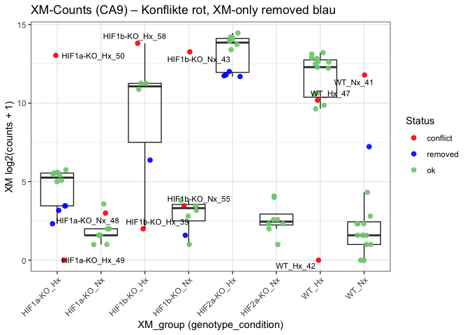
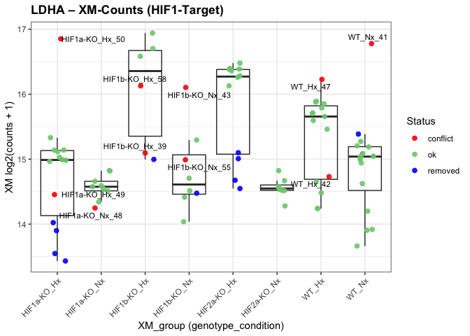
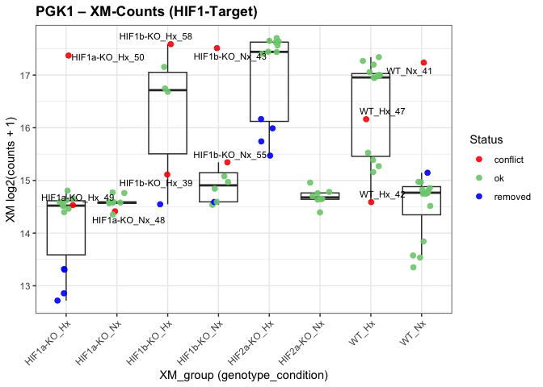
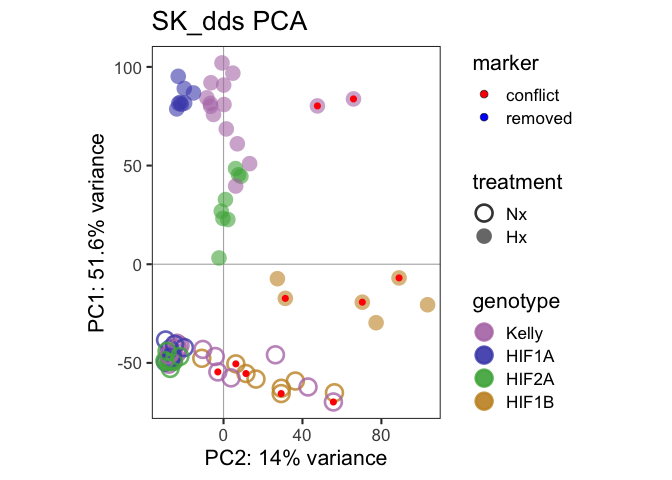
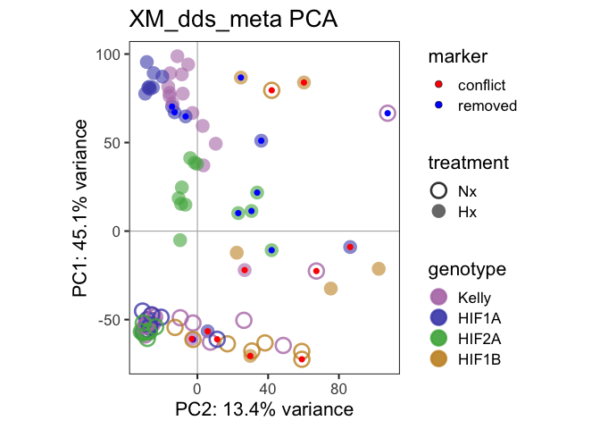

XM vs SK Mapping QC
================

- [Vergleich SK - XM dataset](#vergleich-sk---xm-dataset)
- [Prepare R](#prepare-r)
- [Load dds](#load-dds)
- [Compare Samples](#compare-samples)
- [Plot counts](#plot-counts)
- [PCA Plot](#pca-plot)

# Vergleich SK - XM dataset

# Prepare R

# Load dds

    ## [1] 64537    88

    ## [1] 21583    77

# Compare Samples

<table class="table" style="width: auto !important; ">

<thead>

<tr>

<th style="text-align:left;position: sticky; top:0; background-color: #FFFFFF;">

core
</th>

<th style="text-align:left;position: sticky; top:0; background-color: #FFFFFF;">

sk_name
</th>

<th style="text-align:left;position: sticky; top:0; background-color: #FFFFFF;">

xm_name
</th>

<th style="text-align:left;position: sticky; top:0; background-color: #FFFFFF;">

condition_SK
</th>

<th style="text-align:left;position: sticky; top:0; background-color: #FFFFFF;">

XM_group
</th>

<th style="text-align:right;position: sticky; top:0; background-color: #FFFFFF;">

correlation
</th>

<th style="text-align:left;position: sticky; top:0; background-color: #FFFFFF;">

Difference
</th>

</tr>

</thead>

<tbody>

<tr>

<td style="text-align:left;">

P557_S33
</td>

<td style="text-align:left;">

RNA_P557_S33
</td>

<td style="text-align:left;">

P557_S33
</td>

<td style="text-align:left;">

Kelly_Nx
</td>

<td style="text-align:left;">

WT_Nx
</td>

<td style="text-align:right;">

0.9920331
</td>

<td style="text-align:left;">

.
</td>

</tr>

<tr>

<td style="text-align:left;">

P557_S34
</td>

<td style="text-align:left;">

RNA_P557_S34
</td>

<td style="text-align:left;">

P557_S34
</td>

<td style="text-align:left;">

Kelly_Hx
</td>

<td style="text-align:left;">

WT_Hx
</td>

<td style="text-align:right;">

0.9899938
</td>

<td style="text-align:left;">

.
</td>

</tr>

<tr>

<td style="text-align:left;">

P557_S35
</td>

<td style="text-align:left;">

removed
</td>

<td style="text-align:left;">

P557_S35
</td>

<td style="text-align:left;">

removed
</td>

<td style="text-align:left;">

HIF1a-KO_Hx
</td>

<td style="text-align:right;">

NA
</td>

<td style="text-align:left;">

removed
</td>

</tr>

<tr>

<td style="text-align:left;">

P557_S36
</td>

<td style="text-align:left;">

removed
</td>

<td style="text-align:left;">

P557_S36
</td>

<td style="text-align:left;">

removed
</td>

<td style="text-align:left;">

HIF2a-KO_Hx
</td>

<td style="text-align:right;">

NA
</td>

<td style="text-align:left;">

removed
</td>

</tr>

<tr>

<td style="text-align:left;">

P557_S37
</td>

<td style="text-align:left;">

RNA_P557_S37
</td>

<td style="text-align:left;">

P557_S37
</td>

<td style="text-align:left;">

Kelly_Nx
</td>

<td style="text-align:left;">

WT_Nx
</td>

<td style="text-align:right;">

0.9921932
</td>

<td style="text-align:left;">

.
</td>

</tr>

<tr>

<td style="text-align:left;">

P557_S38
</td>

<td style="text-align:left;">

RNA_P557_S38
</td>

<td style="text-align:left;">

P557_S38
</td>

<td style="text-align:left;">

Kelly_Hx
</td>

<td style="text-align:left;">

WT_Hx
</td>

<td style="text-align:right;">

0.9907048
</td>

<td style="text-align:left;">

.
</td>

</tr>

<tr>

<td style="text-align:left;">

P557_S39
</td>

<td style="text-align:left;">

removed
</td>

<td style="text-align:left;">

P557_S39
</td>

<td style="text-align:left;">

removed
</td>

<td style="text-align:left;">

HIF1a-KO_Hx
</td>

<td style="text-align:right;">

NA
</td>

<td style="text-align:left;">

removed
</td>

</tr>

<tr>

<td style="text-align:left;">

P557_S40
</td>

<td style="text-align:left;">

removed
</td>

<td style="text-align:left;">

P557_S40
</td>

<td style="text-align:left;">

removed
</td>

<td style="text-align:left;">

HIF2a-KO_Hx
</td>

<td style="text-align:right;">

NA
</td>

<td style="text-align:left;">

removed
</td>

</tr>

<tr>

<td style="text-align:left;">

P557_S41
</td>

<td style="text-align:left;">

RNA_P557_S41
</td>

<td style="text-align:left;">

P557_S41
</td>

<td style="text-align:left;">

Kelly_Nx
</td>

<td style="text-align:left;">

WT_Nx
</td>

<td style="text-align:right;">

0.9931038
</td>

<td style="text-align:left;">

.
</td>

</tr>

<tr>

<td style="text-align:left;">

P557_S42
</td>

<td style="text-align:left;">

RNA_P557_S42
</td>

<td style="text-align:left;">

P557_S42
</td>

<td style="text-align:left;">

Kelly_Hx
</td>

<td style="text-align:left;">

WT_Hx
</td>

<td style="text-align:right;">

0.9907078
</td>

<td style="text-align:left;">

.
</td>

</tr>

<tr>

<td style="text-align:left;">

P557_S43
</td>

<td style="text-align:left;">

removed
</td>

<td style="text-align:left;">

P557_S43
</td>

<td style="text-align:left;">

removed
</td>

<td style="text-align:left;">

HIF1a-KO_Hx
</td>

<td style="text-align:right;">

NA
</td>

<td style="text-align:left;">

removed
</td>

</tr>

<tr>

<td style="text-align:left;">

P557_S44
</td>

<td style="text-align:left;">

removed
</td>

<td style="text-align:left;">

P557_S44
</td>

<td style="text-align:left;">

removed
</td>

<td style="text-align:left;">

HIF2a-KO_Hx
</td>

<td style="text-align:right;">

NA
</td>

<td style="text-align:left;">

removed
</td>

</tr>

<tr>

<td style="text-align:left;">

P557_S45
</td>

<td style="text-align:left;">

RNA_P557_S45
</td>

<td style="text-align:left;">

P557_S45
</td>

<td style="text-align:left;">

Kelly_Nx
</td>

<td style="text-align:left;">

WT_Nx
</td>

<td style="text-align:right;">

0.9934385
</td>

<td style="text-align:left;">

.
</td>

</tr>

<tr>

<td style="text-align:left;">

P557_S46
</td>

<td style="text-align:left;">

RNA_P557_S46
</td>

<td style="text-align:left;">

P557_S46
</td>

<td style="text-align:left;">

Kelly_Hx
</td>

<td style="text-align:left;">

WT_Hx
</td>

<td style="text-align:right;">

0.9914812
</td>

<td style="text-align:left;">

.
</td>

</tr>

<tr>

<td style="text-align:left;">

P557_S47
</td>

<td style="text-align:left;">

removed
</td>

<td style="text-align:left;">

P557_S47
</td>

<td style="text-align:left;">

removed
</td>

<td style="text-align:left;">

HIF1a-KO_Hx
</td>

<td style="text-align:right;">

NA
</td>

<td style="text-align:left;">

removed
</td>

</tr>

<tr>

<td style="text-align:left;">

P557_S48
</td>

<td style="text-align:left;">

removed
</td>

<td style="text-align:left;">

P557_S48
</td>

<td style="text-align:left;">

removed
</td>

<td style="text-align:left;">

HIF2a-KO_Hx
</td>

<td style="text-align:right;">

NA
</td>

<td style="text-align:left;">

removed
</td>

</tr>

<tr>

<td style="text-align:left;">

P2041_S37
</td>

<td style="text-align:left;">

RNA_P2041_S37
</td>

<td style="text-align:left;">

P2041_S37
</td>

<td style="text-align:left;">

Kelly_Nx
</td>

<td style="text-align:left;">

WT_Nx
</td>

<td style="text-align:right;">

0.9900428
</td>

<td style="text-align:left;">

.
</td>

</tr>

<tr>

<td style="text-align:left;">

P2041_S38
</td>

<td style="text-align:left;">

RNA_P2041_S38
</td>

<td style="text-align:left;">

P2041_S38
</td>

<td style="text-align:left;">

HIF1B_Nx
</td>

<td style="text-align:left;">

HIF1b-KO_Nx
</td>

<td style="text-align:right;">

0.9898090
</td>

<td style="text-align:left;">

.
</td>

</tr>

<tr>

<td style="text-align:left;">

P2041_S39
</td>

<td style="text-align:left;">

RNA_P2041_S39
</td>

<td style="text-align:left;">

P2041_S39
</td>

<td style="text-align:left;">

HIF1B_Nx
</td>

<td style="text-align:left;">

HIF1b-KO_Hx
</td>

<td style="text-align:right;">

0.9914870
</td>

<td style="text-align:left;">

SK:HIF1B_Nx &#124; XM:HIF1b-KO_Hx
</td>

</tr>

<tr>

<td style="text-align:left;">

P2041_S40
</td>

<td style="text-align:left;">

RNA_P2041_S40
</td>

<td style="text-align:left;">

P2041_S40
</td>

<td style="text-align:left;">

HIF1B_Nx
</td>

<td style="text-align:left;">

HIF1b-KO_Nx
</td>

<td style="text-align:right;">

0.9903485
</td>

<td style="text-align:left;">

.
</td>

</tr>

<tr>

<td style="text-align:left;">

P2041_S41
</td>

<td style="text-align:left;">

RNA_P2041_S41
</td>

<td style="text-align:left;">

P2041_S41
</td>

<td style="text-align:left;">

HIF1B_Hx
</td>

<td style="text-align:left;">

WT_Nx
</td>

<td style="text-align:right;">

0.9909260
</td>

<td style="text-align:left;">

SK:HIF1B_Hx &#124; XM:WT_Nx
</td>

</tr>

<tr>

<td style="text-align:left;">

P2041_S42
</td>

<td style="text-align:left;">

RNA_P2041_S42
</td>

<td style="text-align:left;">

P2041_S42
</td>

<td style="text-align:left;">

Kelly_Nx
</td>

<td style="text-align:left;">

WT_Hx
</td>

<td style="text-align:right;">

0.9905182
</td>

<td style="text-align:left;">

SK:Kelly_Nx &#124; XM:WT_Hx
</td>

</tr>

<tr>

<td style="text-align:left;">

P2041_S43
</td>

<td style="text-align:left;">

RNA_P2041_S43
</td>

<td style="text-align:left;">

P2041_S43
</td>

<td style="text-align:left;">

Kelly_Hx
</td>

<td style="text-align:left;">

HIF1b-KO_Nx
</td>

<td style="text-align:right;">

0.9880579
</td>

<td style="text-align:left;">

SK:Kelly_Hx &#124; XM:HIF1b-KO_Nx
</td>

</tr>

<tr>

<td style="text-align:left;">

P2041_S44
</td>

<td style="text-align:left;">

removed
</td>

<td style="text-align:left;">

P2041_S44
</td>

<td style="text-align:left;">

removed
</td>

<td style="text-align:left;">

HIF1b-KO_Nx
</td>

<td style="text-align:right;">

NA
</td>

<td style="text-align:left;">

removed
</td>

</tr>

<tr>

<td style="text-align:left;">

P2041_S45
</td>

<td style="text-align:left;">

removed
</td>

<td style="text-align:left;">

P2041_S45
</td>

<td style="text-align:left;">

removed
</td>

<td style="text-align:left;">

HIF1b-KO_Hx
</td>

<td style="text-align:right;">

NA
</td>

<td style="text-align:left;">

removed
</td>

</tr>

<tr>

<td style="text-align:left;">

P2041_S46
</td>

<td style="text-align:left;">

removed
</td>

<td style="text-align:left;">

P2041_S46
</td>

<td style="text-align:left;">

removed
</td>

<td style="text-align:left;">

WT_Nx
</td>

<td style="text-align:right;">

NA
</td>

<td style="text-align:left;">

removed
</td>

</tr>

<tr>

<td style="text-align:left;">

P2041_S47
</td>

<td style="text-align:left;">

RNA_P2041_S47
</td>

<td style="text-align:left;">

P2041_S47
</td>

<td style="text-align:left;">

HIF1B_Hx
</td>

<td style="text-align:left;">

WT_Hx
</td>

<td style="text-align:right;">

0.9901659
</td>

<td style="text-align:left;">

SK:HIF1B_Hx &#124; XM:WT_Hx
</td>

</tr>

<tr>

<td style="text-align:left;">

P2041_S48
</td>

<td style="text-align:left;">

RNA_P2041_S48
</td>

<td style="text-align:left;">

P2041_S48
</td>

<td style="text-align:left;">

HIF1B_Nx
</td>

<td style="text-align:left;">

HIF1a-KO_Nx
</td>

<td style="text-align:right;">

0.9896370
</td>

<td style="text-align:left;">

SK:HIF1B_Nx &#124; XM:HIF1a-KO_Nx
</td>

</tr>

<tr>

<td style="text-align:left;">

P2041_S49
</td>

<td style="text-align:left;">

RNA_P2041_S49
</td>

<td style="text-align:left;">

P2041_S49
</td>

<td style="text-align:left;">

HIF1B_Nx
</td>

<td style="text-align:left;">

HIF1a-KO_Hx
</td>

<td style="text-align:right;">

0.9908407
</td>

<td style="text-align:left;">

SK:HIF1B_Nx &#124; XM:HIF1a-KO_Hx
</td>

</tr>

<tr>

<td style="text-align:left;">

P2041_S50
</td>

<td style="text-align:left;">

RNA_P2041_S50
</td>

<td style="text-align:left;">

P2041_S50
</td>

<td style="text-align:left;">

HIF1B_Hx
</td>

<td style="text-align:left;">

HIF1a-KO_Hx
</td>

<td style="text-align:right;">

0.9911190
</td>

<td style="text-align:left;">

SK:HIF1B_Hx &#124; XM:HIF1a-KO_Hx
</td>

</tr>

<tr>

<td style="text-align:left;">

P2041_S51
</td>

<td style="text-align:left;">

RNA_P2041_S51
</td>

<td style="text-align:left;">

P2041_S51
</td>

<td style="text-align:left;">

HIF1B_Nx
</td>

<td style="text-align:left;">

HIF1b-KO_Nx
</td>

<td style="text-align:right;">

0.9917152
</td>

<td style="text-align:left;">

.
</td>

</tr>

<tr>

<td style="text-align:left;">

P2041_S52
</td>

<td style="text-align:left;">

RNA_P2041_S52
</td>

<td style="text-align:left;">

P2041_S52
</td>

<td style="text-align:left;">

HIF1B_Hx
</td>

<td style="text-align:left;">

HIF1b-KO_Hx
</td>

<td style="text-align:right;">

0.9917127
</td>

<td style="text-align:left;">

.
</td>

</tr>

<tr>

<td style="text-align:left;">

P2041_S53
</td>

<td style="text-align:left;">

RNA_P2041_S53
</td>

<td style="text-align:left;">

P2041_S53
</td>

<td style="text-align:left;">

HIF1B_Nx
</td>

<td style="text-align:left;">

HIF1b-KO_Nx
</td>

<td style="text-align:right;">

0.9915083
</td>

<td style="text-align:left;">

.
</td>

</tr>

<tr>

<td style="text-align:left;">

P2041_S54
</td>

<td style="text-align:left;">

RNA_P2041_S54
</td>

<td style="text-align:left;">

P2041_S54
</td>

<td style="text-align:left;">

HIF1B_Hx
</td>

<td style="text-align:left;">

HIF1b-KO_Hx
</td>

<td style="text-align:right;">

0.9898128
</td>

<td style="text-align:left;">

.
</td>

</tr>

<tr>

<td style="text-align:left;">

P2041_S55
</td>

<td style="text-align:left;">

RNA_P2041_S55
</td>

<td style="text-align:left;">

P2041_S55
</td>

<td style="text-align:left;">

Kelly_Nx
</td>

<td style="text-align:left;">

HIF1b-KO_Nx
</td>

<td style="text-align:right;">

0.9906489
</td>

<td style="text-align:left;">

SK:Kelly_Nx &#124; XM:HIF1b-KO_Nx
</td>

</tr>

<tr>

<td style="text-align:left;">

P2041_S56
</td>

<td style="text-align:left;">

RNA_P2041_S56
</td>

<td style="text-align:left;">

P2041_S56
</td>

<td style="text-align:left;">

HIF1B_Hx
</td>

<td style="text-align:left;">

HIF1b-KO_Hx
</td>

<td style="text-align:right;">

0.9908269
</td>

<td style="text-align:left;">

.
</td>

</tr>

<tr>

<td style="text-align:left;">

P2041_S57
</td>

<td style="text-align:left;">

RNA_P2041_S57
</td>

<td style="text-align:left;">

P2041_S57
</td>

<td style="text-align:left;">

HIF1B_Nx
</td>

<td style="text-align:left;">

HIF1b-KO_Nx
</td>

<td style="text-align:right;">

0.9912902
</td>

<td style="text-align:left;">

.
</td>

</tr>

<tr>

<td style="text-align:left;">

P2041_S58
</td>

<td style="text-align:left;">

RNA_P2041_S58
</td>

<td style="text-align:left;">

P2041_S58
</td>

<td style="text-align:left;">

Kelly_Hx
</td>

<td style="text-align:left;">

HIF1b-KO_Hx
</td>

<td style="text-align:right;">

0.9876028
</td>

<td style="text-align:left;">

SK:Kelly_Hx &#124; XM:HIF1b-KO_Hx
</td>

</tr>

<tr>

<td style="text-align:left;">

P3302_S141
</td>

<td style="text-align:left;">

RNA_P3302_S141
</td>

<td style="text-align:left;">

P3302_S141
</td>

<td style="text-align:left;">

Kelly_Nx
</td>

<td style="text-align:left;">

WT_Nx
</td>

<td style="text-align:right;">

0.9916877
</td>

<td style="text-align:left;">

.
</td>

</tr>

<tr>

<td style="text-align:left;">

P3302_S142
</td>

<td style="text-align:left;">

RNA_P3302_S142
</td>

<td style="text-align:left;">

P3302_S142
</td>

<td style="text-align:left;">

Kelly_Nx
</td>

<td style="text-align:left;">

WT_Nx
</td>

<td style="text-align:right;">

0.9911828
</td>

<td style="text-align:left;">

.
</td>

</tr>

<tr>

<td style="text-align:left;">

P3302_S143
</td>

<td style="text-align:left;">

RNA_P3302_S143
</td>

<td style="text-align:left;">

P3302_S143
</td>

<td style="text-align:left;">

HIF1A_Nx
</td>

<td style="text-align:left;">

HIF1a-KO_Nx
</td>

<td style="text-align:right;">

0.9916162
</td>

<td style="text-align:left;">

.
</td>

</tr>

<tr>

<td style="text-align:left;">

P3302_S144
</td>

<td style="text-align:left;">

RNA_P3302_S144
</td>

<td style="text-align:left;">

P3302_S144
</td>

<td style="text-align:left;">

HIF1A_Nx
</td>

<td style="text-align:left;">

HIF1a-KO_Nx
</td>

<td style="text-align:right;">

0.9911637
</td>

<td style="text-align:left;">

.
</td>

</tr>

<tr>

<td style="text-align:left;">

P3302_S145
</td>

<td style="text-align:left;">

RNA_P3302_S145
</td>

<td style="text-align:left;">

P3302_S145
</td>

<td style="text-align:left;">

HIF2A_Nx
</td>

<td style="text-align:left;">

HIF2a-KO_Nx
</td>

<td style="text-align:right;">

0.9914858
</td>

<td style="text-align:left;">

.
</td>

</tr>

<tr>

<td style="text-align:left;">

P3302_S146
</td>

<td style="text-align:left;">

RNA_P3302_S146
</td>

<td style="text-align:left;">

P3302_S146
</td>

<td style="text-align:left;">

HIF2A_Nx
</td>

<td style="text-align:left;">

HIF2a-KO_Nx
</td>

<td style="text-align:right;">

0.9913582
</td>

<td style="text-align:left;">

.
</td>

</tr>

<tr>

<td style="text-align:left;">

P3302_S147
</td>

<td style="text-align:left;">

RNA_P3302_S147
</td>

<td style="text-align:left;">

P3302_S147
</td>

<td style="text-align:left;">

Kelly_Hx
</td>

<td style="text-align:left;">

WT_Hx
</td>

<td style="text-align:right;">

0.9896422
</td>

<td style="text-align:left;">

.
</td>

</tr>

<tr>

<td style="text-align:left;">

P3302_S148
</td>

<td style="text-align:left;">

RNA_P3302_S148
</td>

<td style="text-align:left;">

P3302_S148
</td>

<td style="text-align:left;">

Kelly_Hx
</td>

<td style="text-align:left;">

WT_Hx
</td>

<td style="text-align:right;">

0.9887303
</td>

<td style="text-align:left;">

.
</td>

</tr>

<tr>

<td style="text-align:left;">

P3302_S149
</td>

<td style="text-align:left;">

RNA_P3302_S149
</td>

<td style="text-align:left;">

P3302_S149
</td>

<td style="text-align:left;">

HIF1A_Hx
</td>

<td style="text-align:left;">

HIF1a-KO_Hx
</td>

<td style="text-align:right;">

0.9864772
</td>

<td style="text-align:left;">

.
</td>

</tr>

<tr>

<td style="text-align:left;">

P3302_S150
</td>

<td style="text-align:left;">

RNA_P3302_S150
</td>

<td style="text-align:left;">

P3302_S150
</td>

<td style="text-align:left;">

HIF1A_Hx
</td>

<td style="text-align:left;">

HIF1a-KO_Hx
</td>

<td style="text-align:right;">

0.9887060
</td>

<td style="text-align:left;">

.
</td>

</tr>

<tr>

<td style="text-align:left;">

P3302_S151
</td>

<td style="text-align:left;">

RNA_P3302_S151
</td>

<td style="text-align:left;">

P3302_S151
</td>

<td style="text-align:left;">

HIF2A_Hx
</td>

<td style="text-align:left;">

HIF2a-KO_Hx
</td>

<td style="text-align:right;">

0.9892287
</td>

<td style="text-align:left;">

.
</td>

</tr>

<tr>

<td style="text-align:left;">

P3302_S152
</td>

<td style="text-align:left;">

RNA_P3302_S152
</td>

<td style="text-align:left;">

P3302_S152
</td>

<td style="text-align:left;">

HIF2A_Hx
</td>

<td style="text-align:left;">

HIF2a-KO_Hx
</td>

<td style="text-align:right;">

0.9894652
</td>

<td style="text-align:left;">

.
</td>

</tr>

<tr>

<td style="text-align:left;">

P3302_S153
</td>

<td style="text-align:left;">

RNA_P3302_S153
</td>

<td style="text-align:left;">

P3302_S153
</td>

<td style="text-align:left;">

Kelly_Nx
</td>

<td style="text-align:left;">

WT_Nx
</td>

<td style="text-align:right;">

0.9904020
</td>

<td style="text-align:left;">

.
</td>

</tr>

<tr>

<td style="text-align:left;">

P3302_S154
</td>

<td style="text-align:left;">

RNA_P3302_S154
</td>

<td style="text-align:left;">

P3302_S154
</td>

<td style="text-align:left;">

Kelly_Nx
</td>

<td style="text-align:left;">

WT_Nx
</td>

<td style="text-align:right;">

0.9916380
</td>

<td style="text-align:left;">

.
</td>

</tr>

<tr>

<td style="text-align:left;">

P3302_S155
</td>

<td style="text-align:left;">

RNA_P3302_S155
</td>

<td style="text-align:left;">

P3302_S155
</td>

<td style="text-align:left;">

HIF1A_Nx
</td>

<td style="text-align:left;">

HIF1a-KO_Nx
</td>

<td style="text-align:right;">

0.9906363
</td>

<td style="text-align:left;">

.
</td>

</tr>

<tr>

<td style="text-align:left;">

P3302_S156
</td>

<td style="text-align:left;">

RNA_P3302_S156
</td>

<td style="text-align:left;">

P3302_S156
</td>

<td style="text-align:left;">

HIF2A_Nx
</td>

<td style="text-align:left;">

HIF2a-KO_Nx
</td>

<td style="text-align:right;">

0.9921539
</td>

<td style="text-align:left;">

.
</td>

</tr>

<tr>

<td style="text-align:left;">

P3302_S157
</td>

<td style="text-align:left;">

RNA_P3302_S157
</td>

<td style="text-align:left;">

P3302_S157
</td>

<td style="text-align:left;">

Kelly_Hx
</td>

<td style="text-align:left;">

WT_Hx
</td>

<td style="text-align:right;">

0.9883807
</td>

<td style="text-align:left;">

.
</td>

</tr>

<tr>

<td style="text-align:left;">

P3302_S158
</td>

<td style="text-align:left;">

RNA_P3302_S158
</td>

<td style="text-align:left;">

P3302_S158
</td>

<td style="text-align:left;">

Kelly_Hx
</td>

<td style="text-align:left;">

WT_Hx
</td>

<td style="text-align:right;">

0.9881549
</td>

<td style="text-align:left;">

.
</td>

</tr>

<tr>

<td style="text-align:left;">

P3302_S159
</td>

<td style="text-align:left;">

RNA_P3302_S159
</td>

<td style="text-align:left;">

P3302_S159
</td>

<td style="text-align:left;">

HIF1A_Hx
</td>

<td style="text-align:left;">

HIF1a-KO_Hx
</td>

<td style="text-align:right;">

0.9875247
</td>

<td style="text-align:left;">

.
</td>

</tr>

<tr>

<td style="text-align:left;">

P3302_S160
</td>

<td style="text-align:left;">

RNA_P3302_S160
</td>

<td style="text-align:left;">

P3302_S160
</td>

<td style="text-align:left;">

HIF2A_Hx
</td>

<td style="text-align:left;">

HIF2a-KO_Hx
</td>

<td style="text-align:right;">

0.9888787
</td>

<td style="text-align:left;">

.
</td>

</tr>

<tr>

<td style="text-align:left;">

P3302_S161
</td>

<td style="text-align:left;">

RNA_P3302_S161
</td>

<td style="text-align:left;">

P3302_S161
</td>

<td style="text-align:left;">

Kelly_Nx
</td>

<td style="text-align:left;">

WT_Nx
</td>

<td style="text-align:right;">

0.9913892
</td>

<td style="text-align:left;">

.
</td>

</tr>

<tr>

<td style="text-align:left;">

P3302_S162
</td>

<td style="text-align:left;">

RNA_P3302_S162
</td>

<td style="text-align:left;">

P3302_S162
</td>

<td style="text-align:left;">

Kelly_Nx
</td>

<td style="text-align:left;">

WT_Nx
</td>

<td style="text-align:right;">

0.9917219
</td>

<td style="text-align:left;">

.
</td>

</tr>

<tr>

<td style="text-align:left;">

P3302_S163
</td>

<td style="text-align:left;">

RNA_P3302_S163
</td>

<td style="text-align:left;">

P3302_S163
</td>

<td style="text-align:left;">

HIF1A_Nx
</td>

<td style="text-align:left;">

HIF1a-KO_Nx
</td>

<td style="text-align:right;">

0.9911697
</td>

<td style="text-align:left;">

.
</td>

</tr>

<tr>

<td style="text-align:left;">

P3302_S164
</td>

<td style="text-align:left;">

RNA_P3302_S164
</td>

<td style="text-align:left;">

P3302_S164
</td>

<td style="text-align:left;">

HIF2A_Nx
</td>

<td style="text-align:left;">

HIF2a-KO_Nx
</td>

<td style="text-align:right;">

0.9912146
</td>

<td style="text-align:left;">

.
</td>

</tr>

<tr>

<td style="text-align:left;">

P3302_S165
</td>

<td style="text-align:left;">

RNA_P3302_S165
</td>

<td style="text-align:left;">

P3302_S165
</td>

<td style="text-align:left;">

Kelly_Hx
</td>

<td style="text-align:left;">

WT_Hx
</td>

<td style="text-align:right;">

0.9886688
</td>

<td style="text-align:left;">

.
</td>

</tr>

<tr>

<td style="text-align:left;">

P3302_S166
</td>

<td style="text-align:left;">

RNA_P3302_S166
</td>

<td style="text-align:left;">

P3302_S166
</td>

<td style="text-align:left;">

Kelly_Hx
</td>

<td style="text-align:left;">

WT_Hx
</td>

<td style="text-align:right;">

0.9888101
</td>

<td style="text-align:left;">

.
</td>

</tr>

<tr>

<td style="text-align:left;">

P3302_S167
</td>

<td style="text-align:left;">

RNA_P3302_S167
</td>

<td style="text-align:left;">

P3302_S167
</td>

<td style="text-align:left;">

HIF1A_Hx
</td>

<td style="text-align:left;">

HIF1a-KO_Hx
</td>

<td style="text-align:right;">

0.9885908
</td>

<td style="text-align:left;">

.
</td>

</tr>

<tr>

<td style="text-align:left;">

P3302_S168
</td>

<td style="text-align:left;">

RNA_P3302_S168
</td>

<td style="text-align:left;">

P3302_S168
</td>

<td style="text-align:left;">

HIF2A_Hx
</td>

<td style="text-align:left;">

HIF2a-KO_Hx
</td>

<td style="text-align:right;">

0.9909608
</td>

<td style="text-align:left;">

.
</td>

</tr>

<tr>

<td style="text-align:left;">

P3302_S169
</td>

<td style="text-align:left;">

RNA_P3302_S169
</td>

<td style="text-align:left;">

P3302_S169
</td>

<td style="text-align:left;">

Kelly_Nx
</td>

<td style="text-align:left;">

WT_Nx
</td>

<td style="text-align:right;">

0.9909159
</td>

<td style="text-align:left;">

.
</td>

</tr>

<tr>

<td style="text-align:left;">

P3302_S170
</td>

<td style="text-align:left;">

RNA_P3302_S170
</td>

<td style="text-align:left;">

P3302_S170
</td>

<td style="text-align:left;">

Kelly_Nx
</td>

<td style="text-align:left;">

WT_Nx
</td>

<td style="text-align:right;">

0.9904251
</td>

<td style="text-align:left;">

.
</td>

</tr>

<tr>

<td style="text-align:left;">

P3302_S171
</td>

<td style="text-align:left;">

RNA_P3302_S171
</td>

<td style="text-align:left;">

P3302_S171
</td>

<td style="text-align:left;">

HIF1A_Nx
</td>

<td style="text-align:left;">

HIF1a-KO_Nx
</td>

<td style="text-align:right;">

0.9918843
</td>

<td style="text-align:left;">

.
</td>

</tr>

<tr>

<td style="text-align:left;">

P3302_S172
</td>

<td style="text-align:left;">

RNA_P3302_S172
</td>

<td style="text-align:left;">

P3302_S172
</td>

<td style="text-align:left;">

HIF1A_Nx
</td>

<td style="text-align:left;">

HIF1a-KO_Nx
</td>

<td style="text-align:right;">

0.9919993
</td>

<td style="text-align:left;">

.
</td>

</tr>

<tr>

<td style="text-align:left;">

P3302_S173
</td>

<td style="text-align:left;">

RNA_P3302_S173
</td>

<td style="text-align:left;">

P3302_S173
</td>

<td style="text-align:left;">

HIF2A_Nx
</td>

<td style="text-align:left;">

HIF2a-KO_Nx
</td>

<td style="text-align:right;">

0.9911888
</td>

<td style="text-align:left;">

.
</td>

</tr>

<tr>

<td style="text-align:left;">

P3302_S174
</td>

<td style="text-align:left;">

RNA_P3302_S174
</td>

<td style="text-align:left;">

P3302_S174
</td>

<td style="text-align:left;">

HIF2A_Nx
</td>

<td style="text-align:left;">

HIF2a-KO_Nx
</td>

<td style="text-align:right;">

0.9909129
</td>

<td style="text-align:left;">

.
</td>

</tr>

<tr>

<td style="text-align:left;">

P3302_S175
</td>

<td style="text-align:left;">

RNA_P3302_S175
</td>

<td style="text-align:left;">

P3302_S175
</td>

<td style="text-align:left;">

Kelly_Nx
</td>

<td style="text-align:left;">

WT_Nx
</td>

<td style="text-align:right;">

0.9912672
</td>

<td style="text-align:left;">

.
</td>

</tr>

<tr>

<td style="text-align:left;">

P3302_S176
</td>

<td style="text-align:left;">

RNA_P3302_S176
</td>

<td style="text-align:left;">

P3302_S176
</td>

<td style="text-align:left;">

HIF1A_Nx
</td>

<td style="text-align:left;">

HIF1a-KO_Nx
</td>

<td style="text-align:right;">

0.9914987
</td>

<td style="text-align:left;">

.
</td>

</tr>

<tr>

<td style="text-align:left;">

P3302_S177
</td>

<td style="text-align:left;">

RNA_P3302_S177
</td>

<td style="text-align:left;">

P3302_S177
</td>

<td style="text-align:left;">

HIF1A_Nx
</td>

<td style="text-align:left;">

HIF1a-KO_Nx
</td>

<td style="text-align:right;">

0.9914548
</td>

<td style="text-align:left;">

.
</td>

</tr>

<tr>

<td style="text-align:left;">

P3302_S178
</td>

<td style="text-align:left;">

RNA_P3302_S178
</td>

<td style="text-align:left;">

P3302_S178
</td>

<td style="text-align:left;">

HIF2A_Nx
</td>

<td style="text-align:left;">

HIF2a-KO_Nx
</td>

<td style="text-align:right;">

0.9915405
</td>

<td style="text-align:left;">

.
</td>

</tr>

<tr>

<td style="text-align:left;">

P3302_S179
</td>

<td style="text-align:left;">

RNA_P3302_S179
</td>

<td style="text-align:left;">

P3302_S179
</td>

<td style="text-align:left;">

HIF2A_Nx
</td>

<td style="text-align:left;">

HIF2a-KO_Nx
</td>

<td style="text-align:right;">

0.9908407
</td>

<td style="text-align:left;">

.
</td>

</tr>

<tr>

<td style="text-align:left;">

P3302_S180
</td>

<td style="text-align:left;">

RNA_P3302_S180
</td>

<td style="text-align:left;">

P3302_S180
</td>

<td style="text-align:left;">

Kelly_Hx
</td>

<td style="text-align:left;">

WT_Hx
</td>

<td style="text-align:right;">

0.9884828
</td>

<td style="text-align:left;">

.
</td>

</tr>

<tr>

<td style="text-align:left;">

P3302_S181
</td>

<td style="text-align:left;">

RNA_P3302_S181
</td>

<td style="text-align:left;">

P3302_S181
</td>

<td style="text-align:left;">

Kelly_Hx
</td>

<td style="text-align:left;">

WT_Hx
</td>

<td style="text-align:right;">

0.9875357
</td>

<td style="text-align:left;">

.
</td>

</tr>

<tr>

<td style="text-align:left;">

P3302_S182
</td>

<td style="text-align:left;">

RNA_P3302_S182
</td>

<td style="text-align:left;">

P3302_S182
</td>

<td style="text-align:left;">

HIF1A_Hx
</td>

<td style="text-align:left;">

HIF1a-KO_Hx
</td>

<td style="text-align:right;">

0.9876904
</td>

<td style="text-align:left;">

.
</td>

</tr>

<tr>

<td style="text-align:left;">

P3302_S183
</td>

<td style="text-align:left;">

RNA_P3302_S183
</td>

<td style="text-align:left;">

P3302_S183
</td>

<td style="text-align:left;">

HIF1A_Hx
</td>

<td style="text-align:left;">

HIF1a-KO_Hx
</td>

<td style="text-align:right;">

0.9888888
</td>

<td style="text-align:left;">

.
</td>

</tr>

<tr>

<td style="text-align:left;">

P3302_S184
</td>

<td style="text-align:left;">

RNA_P3302_S184
</td>

<td style="text-align:left;">

P3302_S184
</td>

<td style="text-align:left;">

HIF2A_Hx
</td>

<td style="text-align:left;">

HIF2a-KO_Hx
</td>

<td style="text-align:right;">

0.9905664
</td>

<td style="text-align:left;">

.
</td>

</tr>

<tr>

<td style="text-align:left;">

P3302_S185
</td>

<td style="text-align:left;">

RNA_P3302_S185
</td>

<td style="text-align:left;">

P3302_S185
</td>

<td style="text-align:left;">

HIF2A_Hx
</td>

<td style="text-align:left;">

HIF2a-KO_Hx
</td>

<td style="text-align:right;">

0.9907734
</td>

<td style="text-align:left;">

.
</td>

</tr>

<tr>

<td style="text-align:left;">

P3302_S186
</td>

<td style="text-align:left;">

RNA_P3302_S186
</td>

<td style="text-align:left;">

P3302_S186
</td>

<td style="text-align:left;">

Kelly_Hx
</td>

<td style="text-align:left;">

WT_Hx
</td>

<td style="text-align:right;">

0.9889228
</td>

<td style="text-align:left;">

.
</td>

</tr>

<tr>

<td style="text-align:left;">

P3302_S187
</td>

<td style="text-align:left;">

RNA_P3302_S187
</td>

<td style="text-align:left;">

P3302_S187
</td>

<td style="text-align:left;">

HIF1A_Hx
</td>

<td style="text-align:left;">

HIF1a-KO_Hx
</td>

<td style="text-align:right;">

0.9873971
</td>

<td style="text-align:left;">

.
</td>

</tr>

<tr>

<td style="text-align:left;">

P3302_S188
</td>

<td style="text-align:left;">

RNA_P3302_S188
</td>

<td style="text-align:left;">

P3302_S188
</td>

<td style="text-align:left;">

HIF1A_Hx
</td>

<td style="text-align:left;">

HIF1a-KO_Hx
</td>

<td style="text-align:right;">

0.9881068
</td>

<td style="text-align:left;">

.
</td>

</tr>

<tr>

<td style="text-align:left;">

P3302_S189
</td>

<td style="text-align:left;">

RNA_P3302_S189
</td>

<td style="text-align:left;">

P3302_S189
</td>

<td style="text-align:left;">

HIF2A_Hx
</td>

<td style="text-align:left;">

HIF2a-KO_Hx
</td>

<td style="text-align:right;">

0.9885350
</td>

<td style="text-align:left;">

.
</td>

</tr>

<tr>

<td style="text-align:left;">

P3302_S190
</td>

<td style="text-align:left;">

RNA_P3302_S190
</td>

<td style="text-align:left;">

P3302_S190
</td>

<td style="text-align:left;">

HIF2A_Hx
</td>

<td style="text-align:left;">

HIF2a-KO_Hx
</td>

<td style="text-align:right;">

0.9888485
</td>

<td style="text-align:left;">

.
</td>

</tr>

</tbody>

</table>

# Plot counts

    ## 
    ## conflict       ok  removed 
    ##       10       67       11

<!-- --><!-- --><!-- -->

# PCA Plot

<!-- --><!-- -->

    ## [1] "conflict" "none"     "removed"
