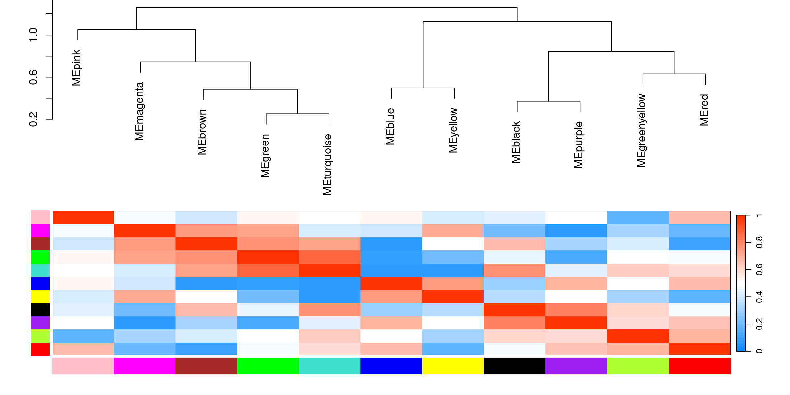

# Kelly Hypoxia RNA-Seq

RNA-Seq of Hif1a, Hif2a & Hif1b gene knock-outs

1.) [Data processing](1_data_processing)

### combine sample list

|     | experiment | RNAs | conditions                                            | date                                        | seq_id | Seq_runs |
|:----|:-----------|-----:|:------------------------------------------------------|:--------------------------------------------|:-------|---------:|
| 3   | Katharina  |   16 | Kelly_Nx Kelly_Hx HIF1A_Hx HIF2A_Hx                   | 2018-09-13 2018-09-14                       | P557   |       16 |
| 1   | Simon      |   22 | Kelly_Nx Kelly_Hx HIF1A_Nx HIF1A_Hx HIF1B_Nx HIF1B_Hx | 2017-05-04 2021-06-16 2021-08-25 2021-08-27 | P2041  |       22 |
| 2   | Ulrike     |   50 | Kelly_Nx Kelly_Hx HIF1A_Nx HIF1A_Hx HIF2A_Nx HIF2A_Hx | 2023-06-02 2023-06-08 2023-06-15 2023-06-28 | P3302  |      150 |

:::

### DESeq2 Design

design = \~experiment+genotype+treatment+genotype:treatment

MA plot & Dispersion


Transformations


Sample distance


Principal component analysis


Plot example counts


2.  

    A)  [network analysis](2A_WGCNA)




```         
B)  [Differential gene expression](2B_DGE)

<figure>
```


<figcaption aria-hidden="true">

```         
Contrasts_overview
```

</figcaption>

</figure>

\## cutoffs \## differential expressed: p=0.05,bM=10,l2FC=1 \## top genes: p=0.01,bM=100,l2FC=2

|                            | all.DEGs | top.DEGs |
|:---------------------------|---------:|---------:|
| 1                          |          |          |
| deg_Hif1a.Hx.vs.Nx         |     6166 |      983 |
| deg_Hif2a.Hx.vs.Nx         |     3394 |      542 |
| deg_Hif1b.Hx.vs.Nx         |     2051 |      310 |
| deg_Kelly.Hx.vs.Nx         |     5301 |      866 |
| 2A Nx                      |          |          |
| deg_Nx.Hif1a.vs.Kelly      |      223 |       21 |
| deg_Nx.Hif2a.vs.Kelly      |      596 |       75 |
| deg_Nx.Hif1b.vs.Kelly      |      721 |       58 |
| 2B Hx                      |          |          |
| deg_Hx.Hif1a.vs.Kelly      |     1013 |       77 |
| deg_Hx.Hif2a.vs.Kelly      |     2532 |      348 |
| deg_Hx.Hif1b.vs.Kelly      |     4208 |      531 |
| deg_Hx.Hif2a.vs.Hif1a      |     4174 |      607 |
| deg_Hx.Hif1b.vs.Hif1a      |     4972 |      643 |
| deg_Hx.Hif1b.vs.Hif2a      |     2043 |      249 |
| 3 interaction              |          |          |
| deg_Hif1aHxNx.vs.KellyHxNx |      686 |       54 |
| deg_Hif2aHxNx.vs.KellyHxNx |     2238 |      281 |
| deg_Hif1bHxNx.vs.KellyHxNx |     3887 |      431 |
| group contrasts            |          |          |
| deg_Hx.Hif1b.vs.Hif12a     |     2741 |      224 |
| deg_Hx.Kelly.vs.allHIFs    |     1502 |      148 |
| deg_Hx.vs.Nx               |     3599 |      495 |

Which results to use?


Example for Hif1a

Results 1


SCARB1 doesn't fit!

```         
## Kelly.Hx.vs.Nx
```

|                 |  baseMean | log2FoldChange |     lfcSE |      stat | pvalue | padj | symbol  |
|:----------------|----------:|---------------:|----------:|----------:|-------:|-----:|:--------|
| ENSG00000073060 | 11958.596 |       1.912261 | 0.0564790 |  33.85793 |      0 |    0 | SCARB1  |
| ENSG00000132382 |  6908.702 |      -1.840556 | 0.0836373 | -22.00641 |      0 |    0 | MYBBP1A |
| ENSG00000186469 |  8085.827 |       1.871876 | 0.0904267 |  20.70048 |      0 |    0 | GNG2    |

```         
## Hif1a.Hx.vs.Nx
```

|                 |  baseMean | log2FoldChange |     lfcSE |      stat | pvalue | padj | symbol  |
|:----------------|----------:|---------------:|----------:|----------:|-------:|-----:|:--------|
| ENSG00000073060 | 11958.596 |       2.513715 | 0.0674164 |  37.28643 |      0 |    0 | SCARB1  |
| ENSG00000132382 |  6908.702 |      -2.577358 | 0.1000207 | -25.76825 |      0 |    0 | MYBBP1A |
| ENSG00000186469 |  8085.827 |       2.579589 | 0.1081358 |  23.85510 |      0 |    0 | GNG2    |

```         
## compare results with contrast vsvs (Hif1a Hx vs. Nx  VS.  Kelly Hx vs. Nx
```


