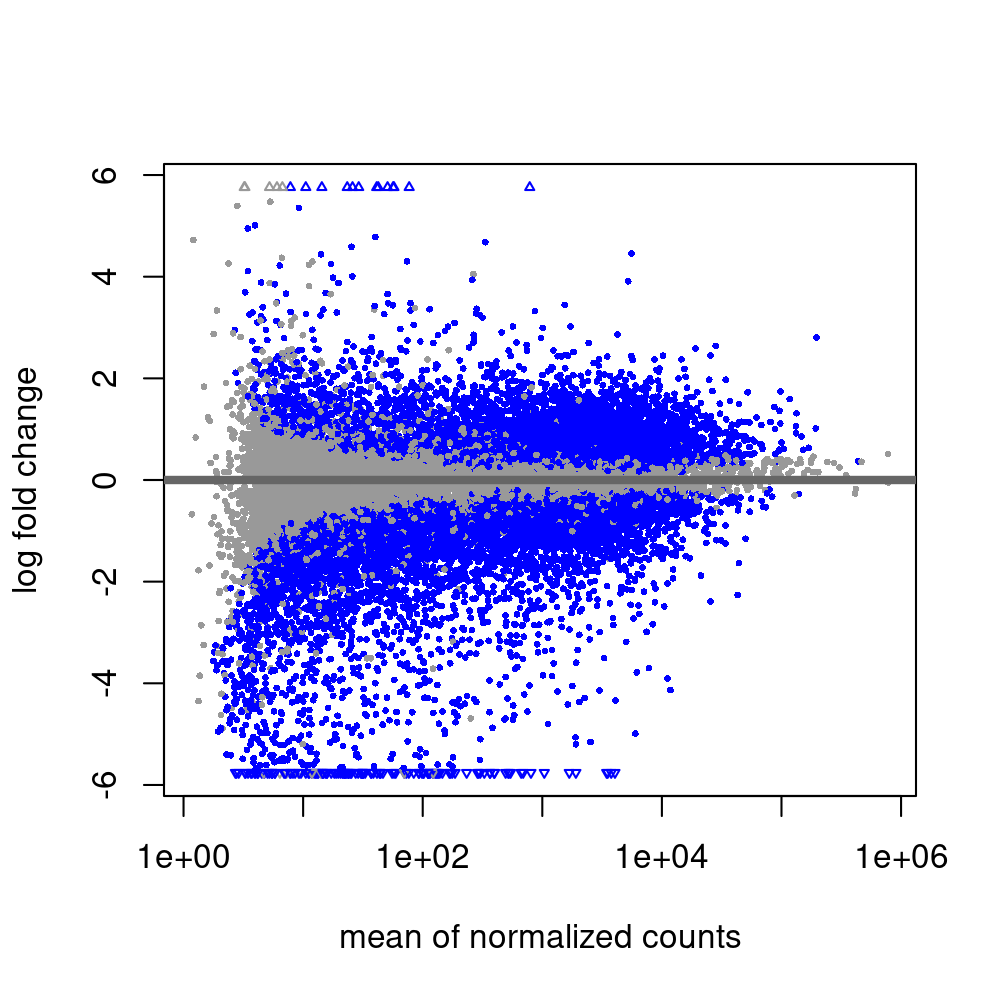
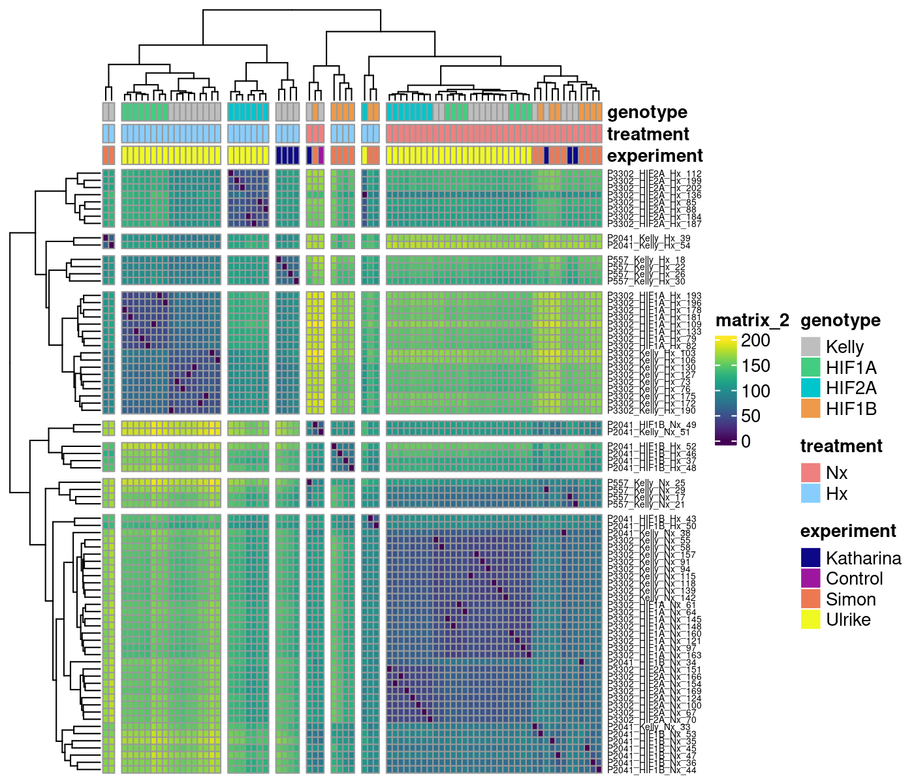
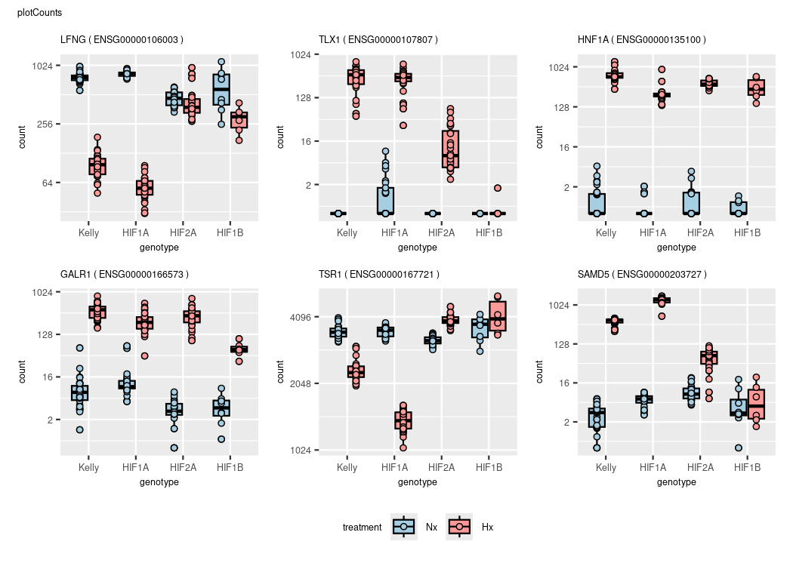
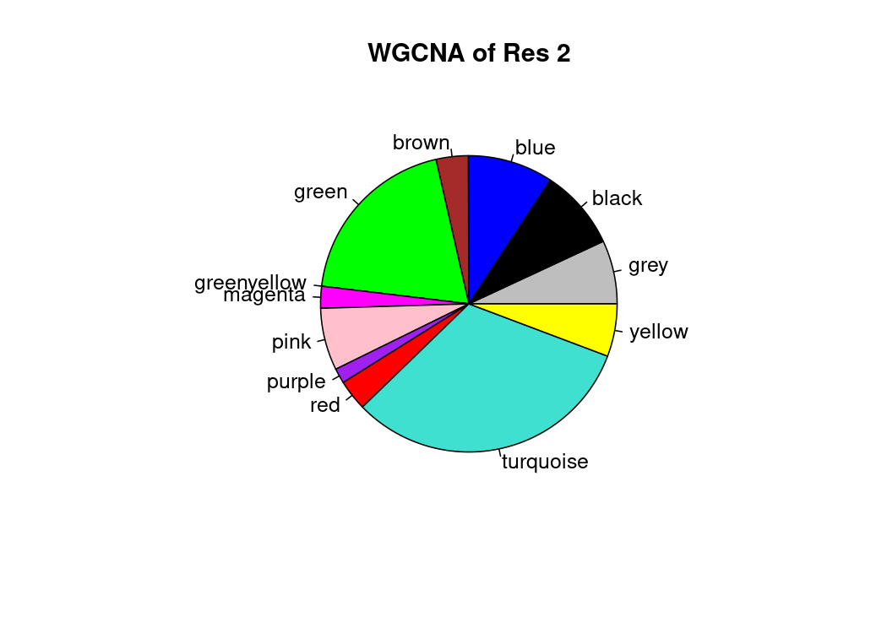

# Kelly Hypoxia RNA-Seq

RNA-Seq of Hif1a, Hif2a & Hif1b gene knock-outs

# 1.) [Data processing](1_data_processing)

### combine sample list

|     | experiment | RNAs | conditions                                            | date                                        | seq_id | Seq_runs |
|:----------|:----------|----------:|:----------|:----------|:----------|----------:|
| 3   | Katharina  |   16 | Kelly_Nx Kelly_Hx HIF1A_Hx HIF2A_Hx                   | 2018-09-13 2018-09-14                       | P557   |       16 |
| 1   | Simon      |   22 | Kelly_Nx Kelly_Hx HIF1A_Nx HIF1A_Hx HIF1B_Nx HIF1B_Hx | 2017-05-04 2021-06-16 2021-08-25 2021-08-27 | P2041  |       22 |
| 2   | Ulrike     |   50 | Kelly_Nx Kelly_Hx HIF1A_Nx HIF1A_Hx HIF2A_Nx HIF2A_Hx | 2023-06-02 2023-06-08 2023-06-15 2023-06-28 | P3302  |      150 |

### DESeq2 Design

design = \~experiment+genotype+treatment+genotype:treatment

MA plot & Dispersion

Before and after adding "experiment" to design

Transformations

Sample distance

Principal component analysis

Plot example counts

 <!-- -->

# 2. A) [network analysis](2A_WGCNA)

# B) [Differential gene expression](2B_DGE)

Contrasts_overview

cutoffs

differential expressed: p=0.05,bM=10,l2FC=1

top genes: p=0.01,bM=100,l2FC=2

|                            | all.DEGs | top.DEGs |
|:---------------------------|---------:|---------:|
| 1                          |          |          |
| deg_Hif1a.Hx.vs.Nx         |     6166 |      983 |
| deg_Hif2a.Hx.vs.Nx         |     3394 |      542 |
| deg_Hif1b.Hx.vs.Nx         |     2051 |      310 |
| deg_Kelly.Hx.vs.Nx         |     5301 |      866 |
| 2A Nx                      |          |          |
| deg_Nx.Hif1a.vs.Kelly      |      223 |       21 |
| deg_Nx.Hif2a.vs.Kelly      |      596 |       75 |
| deg_Nx.Hif1b.vs.Kelly      |      721 |       58 |
| 2B Hx                      |          |          |
| deg_Hx.Hif1a.vs.Kelly      |     1013 |       77 |
| deg_Hx.Hif2a.vs.Kelly      |     2532 |      348 |
| deg_Hx.Hif1b.vs.Kelly      |     4208 |      531 |
| deg_Hx.Hif2a.vs.Hif1a      |     4174 |      607 |
| deg_Hx.Hif1b.vs.Hif1a      |     4972 |      643 |
| deg_Hx.Hif1b.vs.Hif2a      |     2043 |      249 |
| 3 interaction              |          |          |
| deg_Hif1aHxNx.vs.KellyHxNx |      686 |       54 |
| deg_Hif2aHxNx.vs.KellyHxNx |     2238 |      281 |
| deg_Hif1bHxNx.vs.KellyHxNx |     3887 |      431 |
| group contrasts            |          |          |
| deg_Hx.Hif1b.vs.Hif12a     |     2741 |      224 |
| deg_Hx.Kelly.vs.allHIFs    |     1502 |      148 |
| deg_Hx.vs.Nx               |     3599 |      495 |

Which results to use?

Example for Hif1a

Results 1

SCARB1 doesn't fit!

## Kelly.Hx.vs.Nx

|                 |  baseMean | log2FoldChange |     lfcSE |      stat | pvalue | padj | symbol  |
|:--------|--------:|--------:|--------:|--------:|--------:|--------:|:--------|
| ENSG00000073060 | 11958.596 |       1.912261 | 0.0564790 |  33.85793 |      0 |    0 | SCARB1  |
| ENSG00000132382 |  6908.702 |      -1.840556 | 0.0836373 | -22.00641 |      0 |    0 | MYBBP1A |
| ENSG00000186469 |  8085.827 |       1.871876 | 0.0904267 |  20.70048 |      0 |    0 | GNG2    |

## Hif1a.Hx.vs.Nx

|                 |  baseMean | log2FoldChange |     lfcSE |      stat | pvalue | padj | symbol  |
|:--------|--------:|--------:|--------:|--------:|--------:|--------:|:--------|
| ENSG00000073060 | 11958.596 |       2.513715 | 0.0674164 |  37.28643 |      0 |    0 | SCARB1  |
| ENSG00000132382 |  6908.702 |      -2.577358 | 0.1000207 | -25.76825 |      0 |    0 | MYBBP1A |
| ENSG00000186469 |  8085.827 |       2.579589 | 0.1081358 |  23.85510 |      0 |    0 | GNG2    |

## compare results with contrast vsvs (Hif1a Hx vs. Nx VS. Kelly Hx vs. Nx

<figure>

<figcaption aria-hidden="true">

Contrasts_overview

</figcaption>

</figure>

<!-- -->

Kelly.Hx.vs.Nx (1)

|                 |  baseMean | log2FoldChange |     lfcSE |      stat | pvalue | padj | symbol |
|:--------|--------:|--------:|--------:|--------:|--------:|--------:|:--------|
| ENSG00000106003 |  928.0982 |     -3.0186727 | 0.1254119 | -24.07007 |      0 |    0 | LFNG   |
| ENSG00000107807 |  208.0512 |     11.6537315 | 0.5831457 |  19.98425 |      0 |    0 | TLX1   |
| ENSG00000135100 |  504.0646 |     10.5449933 | 0.3781407 |  27.88643 |      0 |    0 | HNF1A  |
| ENSG00000166573 |  262.6861 |      5.1605974 | 0.1932943 |  26.69814 |      0 |    0 | GALR1  |
| ENSG00000167721 | 6351.7523 |     -0.6084289 | 0.0455138 | -13.36802 |      0 |    0 | TSR1   |
| ENSG00000203727 |  564.2991 |      7.6035536 | 0.3019904 |  25.17813 |      0 |    0 | SAMD5  |

Hif1a.Hx.vs.Nx (1)

|                 |  baseMean | log2FoldChange |     lfcSE |      stat | pvalue | padj | symbol |
|:--------|--------:|--------:|--------:|--------:|--------:|--------:|:--------|
| ENSG00000106003 |  928.0982 |      -4.089051 | 0.1510384 | -27.07293 |      0 |    0 | LFNG   |
| ENSG00000107807 |  208.0512 |       8.675303 | 0.4457337 |  19.46297 |      0 |    0 | TLX1   |
| ENSG00000135100 |  504.0646 |      11.057737 | 0.6902547 |  16.01979 |      0 |    0 | HNF1A  |
| ENSG00000166573 |  262.6861 |       3.683771 | 0.2238573 |  16.45589 |      0 |    0 | GALR1  |
| ENSG00000167721 | 6351.7523 |      -1.412378 | 0.0544483 | -25.93979 |      0 |    0 | TSR1   |
| ENSG00000203727 |  564.2991 |       8.079874 | 0.3107448 |  26.00164 |      0 |    0 | SAMD5  |

Nx.Hif1a.vs.Kelly (2)

|                 |  baseMean | log2FoldChange |     lfcSE |       stat |    pvalue |      padj | symbol |
|:--------|--------:|--------:|--------:|--------:|--------:|--------:|:--------|
| ENSG00000106003 |  928.0982 |      0.2291789 | 0.1441730 |  1.5896108 | 0.1119226 | 0.6088678 | LFNG   |
| ENSG00000107807 |  208.0512 |      2.6027800 | 0.6875930 |  3.7853501 | 0.0001535 | 0.0071082 | TLX1   |
| ENSG00000135100 |  504.0646 |     -1.8502210 | 0.7711634 | -2.3992594 | 0.0164283 | 0.2265094 | HNF1A  |
| ENSG00000166573 |  262.6861 |      0.3740673 | 0.2333341 |  1.6031405 | 0.1089036 | 0.6015277 | GALR1  |
| ENSG00000167721 | 6351.7523 |      0.0381098 | 0.0532221 |  0.7160529 | 0.4739587 | 0.9238699 | TSR1   |
| ENSG00000203727 |  564.2991 |      1.3192206 | 0.3511169 |  3.7572123 | 0.0001718 | 0.0077108 | SAMD5  |

Hx.Hif1a.vs.Kelly (2)

|                 |  baseMean | log2FoldChange |     lfcSE |       stat |    pvalue |      padj | symbol |
|:--------|--------:|--------:|--------:|--------:|--------:|--------:|:--------|
| ENSG00000106003 |  928.0982 |     -0.8411990 | 0.1332788 |  -6.311576 | 0.0000000 | 0.0000000 | LFNG   |
| ENSG00000107807 |  208.0512 |     -0.3756490 | 0.2560870 |  -1.466880 | 0.1424087 | 0.2836432 | TLX1   |
| ENSG00000135100 |  504.0646 |     -1.3374769 | 0.1528782 |  -8.748644 | 0.0000000 | 0.0000000 | HNF1A  |
| ENSG00000166573 |  262.6861 |     -1.1027587 | 0.1785562 |  -6.175977 | 0.0000000 | 0.0000000 | GALR1  |
| ENSG00000167721 | 6351.7523 |     -0.7658388 | 0.0468307 | -16.353345 | 0.0000000 | 0.0000000 | TSR1   |
| ENSG00000203727 |  564.2991 |      1.7955414 | 0.2428351 |   7.394076 | 0.0000000 | 0.0000000 | SAMD5  |

Hif1aHxNx.vs.KellyHxNx (3)

|                 |  baseMean | log2FoldChange |     lfcSE |        stat |    pvalue |      padj | symbol |
|:--------|--------:|--------:|--------:|--------:|--------:|--------:|:--------|
| ENSG00000106003 |  928.0982 |     -1.0703779 | 0.1965294 |  -5.4464020 | 0.0000001 | 0.0000022 | LFNG   |
| ENSG00000107807 |  208.0512 |     -2.9784290 | 0.7342144 |  -4.0566202 | 0.0000498 | 0.0008405 | TLX1   |
| ENSG00000135100 |  504.0646 |      0.5127441 | 0.7862990 |   0.6520982 | 0.5143379 | 0.7404637 | HNF1A  |
| ENSG00000166573 |  262.6861 |     -1.4768260 | 0.2941323 |  -5.0209578 | 0.0000005 | 0.0000165 | GALR1  |
| ENSG00000167721 | 6351.7523 |     -0.8039486 | 0.0709857 | -11.3255047 | 0.0000000 | 0.0000000 | TSR1   |
| ENSG00000203727 |  564.2991 |      0.4763208 | 0.4272718 |   1.1147958 | 0.2649379 | 0.5193756 | SAMD5  |

<!-- -->

#### WGCNA RES1,2,3

## Results 3 of Hif1a, Hif2a, Hif1b

<!-- -->

|     | overlap | gene  |
|:----|--------:|:------|
| 1   |      a1 | BNIP3 |
| 2 | a2 | AM162A |
| 3 | a3 | CLSTN2 |
| 4 | a4 | PFKFB3 |
| 5 | a5 | BHLHE41 |
| 6 | a6 | ARHGEF6 |
| 7 | a7 | TNXB |

<!-- -->

#### WGCNA KOs

#### WGCNA overlapped KOs

### Heatmap of TOP genes

<!-- -->

## GO Terms

<!-- -->

<!-- -->

<!-- -->

<!-- -->
