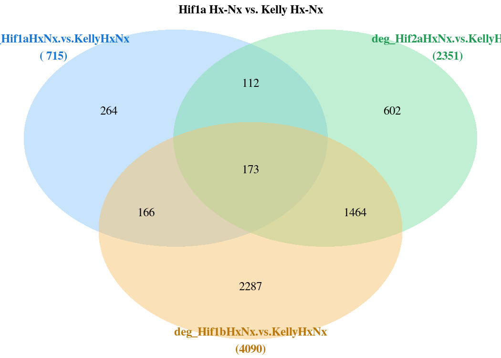
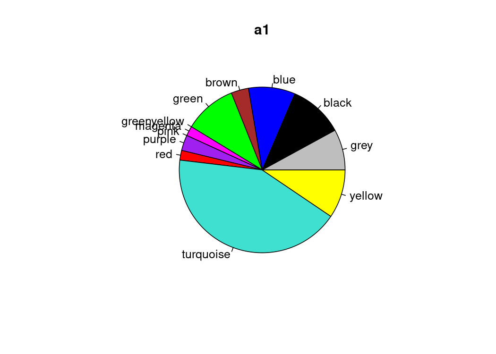

# Kelly Hypoxia RNA-Seq

RNA-Seq of Hif1a, Hif2a & Hif1b gene knock-outs

1.) [Data processing](1_data_processing)

### combine sample list

|     | experiment | RNAs | conditions                                            | date                                        | seq_id | Seq_runs |
|:----------|:----------|----------:|:----------|:----------|:----------|----------:|
| 3   | Katharina  |   16 | Kelly_Nx Kelly_Hx HIF1A_Hx HIF2A_Hx                   | 2018-09-13 2018-09-14                       | P557   |       16 |
| 1   | Simon      |   22 | Kelly_Nx Kelly_Hx HIF1A_Nx HIF1A_Hx HIF1B_Nx HIF1B_Hx | 2017-05-04 2021-06-16 2021-08-25 2021-08-27 | P2041  |       22 |
| 2   | Ulrike     |   50 | Kelly_Nx Kelly_Hx HIF1A_Nx HIF1A_Hx HIF2A_Nx HIF2A_Hx | 2023-06-02 2023-06-08 2023-06-15 2023-06-28 | P3302  |      150 |

### DESeq2 Design

design = \~experiment+genotype+treatment+genotype:treatment

MA plot & Dispersion

Transformations

Sample distance

Principal component analysis

Plot example counts

2.  

<!-- -->

A)  [network analysis](2A_WGCNA)

B)  [Differential gene expression](2B_DGE)

Contrasts_overview

\## cutoffs \## differential expressed: p=0.05,bM=10,l2FC=1 \## top genes: p=0.01,bM=100,l2FC=2

|                            | all.DEGs | top.DEGs |
|:---------------------------|---------:|---------:|
| 1                          |          |          |
| deg_Hif1a.Hx.vs.Nx         |     6166 |      983 |
| deg_Hif2a.Hx.vs.Nx         |     3394 |      542 |
| deg_Hif1b.Hx.vs.Nx         |     2051 |      310 |
| deg_Kelly.Hx.vs.Nx         |     5301 |      866 |
| 2A Nx                      |          |          |
| deg_Nx.Hif1a.vs.Kelly      |      223 |       21 |
| deg_Nx.Hif2a.vs.Kelly      |      596 |       75 |
| deg_Nx.Hif1b.vs.Kelly      |      721 |       58 |
| 2B Hx                      |          |          |
| deg_Hx.Hif1a.vs.Kelly      |     1013 |       77 |
| deg_Hx.Hif2a.vs.Kelly      |     2532 |      348 |
| deg_Hx.Hif1b.vs.Kelly      |     4208 |      531 |
| deg_Hx.Hif2a.vs.Hif1a      |     4174 |      607 |
| deg_Hx.Hif1b.vs.Hif1a      |     4972 |      643 |
| deg_Hx.Hif1b.vs.Hif2a      |     2043 |      249 |
| 3 interaction              |          |          |
| deg_Hif1aHxNx.vs.KellyHxNx |      686 |       54 |
| deg_Hif2aHxNx.vs.KellyHxNx |     2238 |      281 |
| deg_Hif1bHxNx.vs.KellyHxNx |     3887 |      431 |
| group contrasts            |          |          |
| deg_Hx.Hif1b.vs.Hif12a     |     2741 |      224 |
| deg_Hx.Kelly.vs.allHIFs    |     1502 |      148 |
| deg_Hx.vs.Nx               |     3599 |      495 |

Which results to use?

Example for Hif1a

Results 1

SCARB1 doesn't fit!

## Kelly.Hx.vs.Nx

|                 |  baseMean | log2FoldChange |     lfcSE |      stat | pvalue | padj | symbol  |
|:--------|--------:|--------:|--------:|--------:|--------:|--------:|:--------|
| ENSG00000073060 | 11958.596 |       1.912261 | 0.0564790 |  33.85793 |      0 |    0 | SCARB1  |
| ENSG00000132382 |  6908.702 |      -1.840556 | 0.0836373 | -22.00641 |      0 |    0 | MYBBP1A |
| ENSG00000186469 |  8085.827 |       1.871876 | 0.0904267 |  20.70048 |      0 |    0 | GNG2    |

## Hif1a.Hx.vs.Nx

|                 |  baseMean | log2FoldChange |     lfcSE |      stat | pvalue | padj | symbol  |
|:--------|--------:|--------:|--------:|--------:|--------:|--------:|:--------|
| ENSG00000073060 | 11958.596 |       2.513715 | 0.0674164 |  37.28643 |      0 |    0 | SCARB1  |
| ENSG00000132382 |  6908.702 |      -2.577358 | 0.1000207 | -25.76825 |      0 |    0 | MYBBP1A |
| ENSG00000186469 |  8085.827 |       2.579589 | 0.1081358 |  23.85510 |      0 |    0 | GNG2    |

## compare results with contrast vsvs (Hif1a Hx vs. Nx VS. Kelly Hx vs. Nx

<!-- --><!-- -->

Kelly.Hx.vs.Nx (1)

|                 |     baseMean | log2FoldChange |     lfcSE |       stat | pvalue |    padj | symbol |
|:--------|--------:|--------:|--------:|--------:|--------:|--------:|:--------|
| ENSG00000071564 |  9467.750079 |     -0.8376478 | 0.0379823 | -22.053659 |  0e+00 | 0.0e+00 | TCF3   |
| ENSG00000112769 |   367.382561 |     -2.9390195 | 0.1661520 | -17.688737 |  0e+00 | 0.0e+00 | LAMA4  |
| ENSG00000152256 | 12032.534935 |      2.3886419 | 0.0897902 |  26.602469 |  0e+00 | 0.0e+00 | PDK1   |
| ENSG00000184956 |     4.096474 |      4.8788832 | 1.0261319 |   4.754636 |  2e-06 | 5.2e-06 | MUC6   |
| ENSG00000277281 |    25.443292 |      7.1782518 | 0.7898129 |   9.088547 |  0e+00 | 0.0e+00 | MUC6   |
| ENSG00000277518 |    78.175102 |      8.2832674 | 0.5290099 |  15.658058 |  0e+00 | 0.0e+00 | MUC6   |

Hif1a.Hx.vs.Nx (1)

|                 |     baseMean | log2FoldChange |     lfcSE |       stat | pvalue |  padj | symbol |
|:--------|--------:|--------:|--------:|--------:|--------:|--------:|:--------|
| ENSG00000071564 |  9467.750079 |     -1.2049716 | 0.0452621 | -26.622069 |  0e+00 | 0e+00 | TCF3   |
| ENSG00000112769 |   367.382561 |     -1.7922770 | 0.1939710 |  -9.239923 |  0e+00 | 0e+00 | LAMA4  |
| ENSG00000152256 | 12032.534935 |      0.7461557 | 0.1076933 |   6.928522 |  0e+00 | 0e+00 | PDK1   |
| ENSG00000184956 |     4.096474 |      6.4912275 | 1.2493264 |   5.195782 |  2e-07 | 6e-07 | MUC6   |
| ENSG00000277281 |    25.443292 |      9.7681812 | 0.9917797 |   9.849144 |  0e+00 | 0e+00 | MUC6   |
| ENSG00000277518 |    78.175102 |     11.6609184 | 0.7652311 |  15.238427 |  0e+00 | 0e+00 | MUC6   |

Nx.Hif1a.vs.Kelly (2)

|                 |     baseMean | log2FoldChange |     lfcSE |       stat |    pvalue |      padj | symbol |
|:--------|--------:|--------:|--------:|--------:|--------:|--------:|:--------|
| ENSG00000071564 |  9467.750079 |      0.0650920 | 0.0443193 |  1.4687039 | 0.1419131 | 0.6665731 | TCF3   |
| ENSG00000112769 |   367.382561 |     -1.0438988 | 0.1851363 | -5.6385436 | 0.0000000 | 0.0000028 | LAMA4  |
| ENSG00000152256 | 12032.534935 |     -0.9768009 | 0.1059285 | -9.2213224 | 0.0000000 | 0.0000000 | PDK1   |
| ENSG00000184956 |     4.096474 |     -0.6426538 | 1.3335736 | -0.4819035 | 0.6298745 | 0.9566712 | MUC6   |
| ENSG00000277281 |    25.443292 |     -1.3709444 | 1.1052519 | -1.2403909 | 0.2148308 | 0.7665003 | MUC6   |
| ENSG00000277518 |    78.175102 |     -2.0326978 | 0.8770967 | -2.3175298 | 0.0204749 | 0.2605060 | MUC6   |

Hx.Hif1a.vs.Kelly (2)

|                 |     baseMean | log2FoldChange |     lfcSE |       stat |    pvalue |      padj | symbol |
|:--------|--------:|--------:|--------:|--------:|--------:|--------:|:--------|
| ENSG00000071564 |  9467.750079 |     -0.3022319 | 0.0389838 |  -7.752763 | 0.0000000 | 0.0000000 | TCF3   |
| ENSG00000112769 |   367.382561 |      0.1028437 | 0.1769762 |   0.581116 | 0.5611623 | 0.7263930 | LAMA4  |
| ENSG00000152256 | 12032.534935 |     -2.6192870 | 0.0915034 | -28.625009 | 0.0000000 | 0.0000000 | PDK1   |
| ENSG00000184956 |     4.096474 |      0.9696906 | 0.9143511 |   1.060523 | 0.2889066 | 0.4732703 | MUC6   |
| ENSG00000277281 |    25.443292 |      1.2189850 | 0.6173119 |   1.974666 | 0.0483061 | 0.1233455 | MUC6   |
| ENSG00000277518 |    78.175102 |      1.3449531 | 0.3034700 |   4.431915 | 0.0000093 | 0.0000701 | MUC6   |

Hif1aHxNx.vs.KellyHxNx (3)

|                 |     baseMean | log2FoldChange |     lfcSE |        stat |    pvalue |      padj | symbol |
|:--------|--------:|--------:|--------:|--------:|--------:|--------:|:--------|
| ENSG00000071564 |  9467.750079 |     -0.3673238 | 0.0591161 |  -6.2135963 | 0.0000000 | 0.0000000 | TCF3   |
| ENSG00000112769 |   367.382561 |      1.1467425 | 0.2566489 |   4.4681375 | 0.0000079 | 0.0001808 | LAMA4  |
| ENSG00000152256 | 12032.534935 |     -1.6424862 | 0.1401892 | -11.7162070 | 0.0000000 | 0.0000000 | PDK1   |
| ENSG00000184956 |     4.096474 |      1.6123443 | 1.6217320 |   0.9942114 | 0.3201200 | 0.5780217 | MUC6   |
| ENSG00000277281 |    25.443292 |      2.5899294 | 1.2684382 |   2.0418255 | 0.0411688 | 0.1582562 | MUC6   |
| ENSG00000277518 |    78.175102 |      3.3776510 | 0.9293690 |   3.6343486 | 0.0002787 | 0.0034209 | MUC6   |

<!-- -->

#### WGCNA RES1,2,3

## Results 3 of Hif1a, Hif2a, Hif1b

<!-- -->

  overlap    gene
1      a1   BNIP3
2      a2 FAM162A
3      a3  CLSTN2
4      a4  PFKFB3
5      a5 BHLHE41
6      a6 ARHGEF6
7      a7    TNXB

<!-- -->

#### WGCNA KOs

#### WGCNA overlapped KOs

