# 0. Load

## - R

BiocManager::install() BiocManager::install(“GOSemSim”)

``` r
library(devtools)
library(BiocManager)

library(tximeta)
library(tximport)
library(RColorBrewer)
library(tidyverse)
library(stringr)
library(stringi)
library(BiocFileCache)
library(SummarizedExperiment)
library(org.Mm.eg.db)
library(AnnotationHub)
library(DESeq2)
library(vsn)
library(ggplot2)
library(pheatmap)
library(PCAtools)
library(cowplot)
library(EnhancedVolcano)
library(gridExtra)
library(grid)
library(readxl)
library(VennDiagram)
library(clusterProfiler)
library(biomaRt)
library(GOSemSim)
library(sessioninfo)
library(data.table)
library(plyr)
library(tximeta)
library(tximport)
library(curl)
library(R.utils)
library(kableExtra)
library(knitr)
library(writexl)


ifelse(Sys.info()["sysname"]== "Linux",
       s <- "/mnt/s",
       s <- "S:")
```

    ##  sysname 
    ## "/mnt/s"

``` r
dir <- paste(s,"AG/AG-Scholz-NGS/Daten/Simon/RNA-Seq_Kelly_all",sep="/")
list.files(dir) %>% head()
```

    ## [1] "2024_02 Kelly all samples.xlsx" "data"                          
    ## [3] "git_RNAseq_Kelly_Hx"            "output"                        
    ## [5] "quants"

``` r
gitdir <- paste(dir,"git_RNAseq_Kelly_Hx",sep="/")
list.files(gitdir) %>% head()
```

    ## [1] "2023_08 Chlamy RNA-Seq P3044-3.Rmd"   
    ## [2] "2023_12 RNA-Seq Kelly all.Rmd"        
    ## [3] "2023_12 RNA-Seq Kelly2 P3302 (TS).Rmd"
    ## [4] "2023_12 RNA-Seq Kelly2 P3302.Rmd"     
    ## [5] "2024_02 Kelly all samples_simple.xlsx"
    ## [6] "2024_02 Kelly all samples.xlsx"

``` r
fastqdir <- paste(s,"AG/AG-Scholz-NGS/Daten/RNASeq_Kelly2_P3302",sep="/")
list.files(fastqdir) %>% head()
```

    ## [1] "demux_config.json"                                
    ## [2] "download data.sh"                                 
    ## [3] "download.log"                                     
    ## [4] "html_report_101T10B10B101T.tar.gz"                
    ## [5] "html_report_101T8B2S8B2S101T.tar.gz"              
    ## [6] "illumina_basesmask_101T10B10B101T_SampleSheet.csv"

``` r
fastqdir2 <- paste(s,"AG/AG-Scholz-NGS/Daten/RNASeq_Kelly",sep="/")
list.files(fastqdir2) %>% head()
```

    ## [1] "~$230413_Results_Kelly.pptx" "~$Contrast_matrix.pptx"     
    ## [3] "~$DEG_Hif1b_Hx_vs_Nx.xlsx"   "~$Sample_list.xlsx"         
    ## [5] "20230406_Kelly_Seq.Rmd"      "20230424_Kelly_Seq_RUN.Rmd"

``` r
fastqdir3 <- paste(s,"AG/AG-Scholz-NGS/Daten/Sequencing-2/Sequencing-2_A/FASTQ",sep="/")
list.files(fastqdir3) %>% head()
```

    ## [1] "CH_HS_KK_061_S17_R1_001.fastq.gz" "CH_HS_KK_061_S17_R2_001.fastq.gz"
    ## [3] "CH_HS_KK_062_S18_R1_001.fastq.gz" "CH_HS_KK_062_S18_R2_001.fastq.gz"
    ## [5] "CH_HS_KK_063_S19_R1_001.fastq.gz" "CH_HS_KK_063_S19_R2_001.fastq.gz"

``` r
indexdir <- paste(s,"AG/AG-Scholz-NGS/Daten/Salmon/index/human_ens110_index",sep="/")

dirgenomic <- paste(s,"AG/AG-Scholz-NGS/Daten/Salmon/genomic_data/ensembl/110",sep="/")
list.files(dirgenomic) %>% head()
```

    ## [1] "decoys_human_ensh38.txt"                       
    ## [2] "gentrome_human_ensh38.fa.gz"                   
    ## [3] "Homo_sapiens.GRCh38.110.gff3.gz"               
    ## [4] "Homo_sapiens.GRCh38.cdna.all.fa.gz"            
    ## [5] "Homo_sapiens.GRCh38.dna.primary_assembly.fa.gz"
    ## [6] "Homo_sapiens.GRCh38.ncrna.fa.gz"

``` r
# setwd(gitdir)

data <- paste(dir,"data",sep="/")
dir.create(data)
```

## - Linux

``` bash
fastqdir="/mnt/s/AG/AG-Scholz-NGS/Daten/RNASeq_Kelly2_P3302";
fastqdir2="/mnt/s/AG/AG-Scholz-NGS/Daten/RNASeq_Kelly";
fastqdir3="/mnt/s/AG/AG-Scholz-NGS/Daten/Sequencing-2/Sequencing-2_A/FASTQ";

# /mnt/s/AG/AG-Scholz-NGS/Daten/Simon/RNA-Seq Kelly all
dir="/mnt/s/AG/AG-Scholz-NGS/Daten/Simon/RNA-Seq_Kelly_all"

quantdir="$dir/quants"
indexdir="/mnt/s/AG/AG-Scholz-NGS/Daten/Salmon/index/human_ens110_index"
```

## - Download Data

``` bash
## Download data

cd $fastqdir;
lftp

# open -u <user>@<DOMAIN> https://file-exchange.bihealth.org/<file-box-id>/
open -u kelterbs@CHARITE https://file-exchange.bihealth.org/bd53df77-dd5a-4fb6-b640-4625548c5119/
  
  # [Password]
  
  # Download all data into target folder
  mirror . $fastqdir
# mirror . /mnt/s/AG/AG-Scholz-NGS/Daten/RNASeq_Kelly2_P3302

# Check data
cd $fastqdir
ls $fastqdir | wc -l
ls $fastqdir/*R1*.fastq.gz | wc -l
# 150 R1+R2 = 36 fastq.gz files = 18 Samples, 36 files

# Check downloads
log="$fastqdir/download.log";
echo "##################
# $(date +%Y_%m_%d__%T) Check md5 Checksums
#";
md5sum -c  *.md5 | tee -a $log;
wc -l $log
# 36 files ok
```

# 1. Prepare Data

## Make Index

``` bash

# check newest release http://ftp.ensembl.org/pub/
release=110
echo $release
gdir="/mnt/s/AG/AG-Scholz-NGS/Daten/Salmon/genomic_data/ensembl/${release}"
echo $gdir

# Donwload genomic data: dna
wget -P $gdir "http://ftp.ensembl.org/pub/current_fasta/homo_sapiens/dna/Homo_sapiens.GRCh38.dna.primary_assembly.fa.gz"

# Donwload genomic data: cdna (=cds with UTRs without introns)
wget -P $gdir "http://ftp.ensembl.org/pub/current_fasta/homo_sapiens/cdna/Homo_sapiens.GRCh38.cdna.all.fa.gz"

# Donwload genomic data: ncrna
wget -P $gdir "http://ftp.ensembl.org/pub/current_fasta/homo_sapiens/ncrna/Homo_sapiens.GRCh38.ncrna.fa.gz"

# Donwload genomic data: gff3 (for later use)
wget -P $gdir "http://ftp.ensembl.org/pub/current_gff3/homo_sapiens/Homo_sapiens.GRCh38.${release}.gff3.gz"

# create list of chromosomes
cd $gdir
grep "^>" <(gunzip -c Homo_sapiens.GRCh38.dna.primary_assembly.fa.gz) | cut -d " " -f 1 > decoys_human_ensh38.txt

# to modify, copy to linux partition
mkdir ~/decoys
cp decoys_human_ensh38.txt ~/decoys

# remove ">"
sed -i.bak -e 's/>//g' ~/decoys/decoys_human_ensh38.txt

# Optional: check txt file
vim ~/decoys/decoys_human_ensh38.txt
# to exit: -press 'ESC', type ":q!", press 'ENTER'

# copy back
cp ~/decoys/decoys_human_ensh38.txt $gdir

# combine cdna ncdna and dna in one file
cd $gdir

cat Homo_sapiens.GRCh38.cdna.all.fa.gz Homo_sapiens.GRCh38.ncrna.fa.gz Homo_sapiens.GRCh38.dna.primary_assembly.fa.gz > gentrome_human_ensh38.fa.gz

# make index with salmon
# is salmon activated?
cd $gdir
salmon index -t gentrome_human_ensh38.fa.gz -d decoys_human_ensh38.txt -p 20 -i ../../index/human_ens110_index
```

## Mapping (Salmon)

``` bash
conda activate salmon

fastqfiles=$(ls $fastqdir/*R1*.fastq.gz)
fastqfiles2=$(ls $fastqdir2/*R1*.fastq.gz)
fastqfiles3=$(ls $fastqdir3/*R1*.fastq.gz)

fastqfiles_all="${fastqfiles} ${fastqfiles2} ${fastqfiles3}"
echo $fastqfiles
echo $fastqfiles2
echo $fastqfiles3
echo $fastqfiles_all


for fn in $fastqfiles_all;
do
bfn=$(echo "`basename ${fn}`");
samp=${bfn%"_R1_001.fastq.gz"};
R1=$fn;
R2=$(echo "$R1" | sed 's/R1/R2/');
echo "Processing Sample: $samp";
test -f $R1 && echo "--> File: $R1 exists"
test -f $R2 && echo "--> File: $R2 exists"
outquant=${dir}/quants/${samp}_quant
echo $outquant
echo $indexdir

salmon quant -i $indexdir -l A \
-1 $R1 \
-2 $R2 \
-p 20 --validateMappings --gcBias -o $outquant

done
```

## Sample names

### Extract filenames from quants

``` r
# Get Sample table

## Extract Filenames from quant files

outdir <- paste(dir,"output",sep="/")
dir.create(outdir)
quantdir <- paste(dir,"quants",sep="/")

f <- list.files(path = quantdir)
files <- paste(quantdir,f,"quant.sf",sep="/")
files %>% file.exists()
```

    ##   [1] TRUE TRUE TRUE TRUE TRUE TRUE TRUE TRUE TRUE TRUE TRUE TRUE TRUE TRUE TRUE
    ##  [16] TRUE TRUE TRUE TRUE TRUE TRUE TRUE TRUE TRUE TRUE TRUE TRUE TRUE TRUE TRUE
    ##  [31] TRUE TRUE TRUE TRUE TRUE TRUE TRUE TRUE TRUE TRUE TRUE TRUE TRUE TRUE TRUE
    ##  [46] TRUE TRUE TRUE TRUE TRUE TRUE TRUE TRUE TRUE TRUE TRUE TRUE TRUE TRUE TRUE
    ##  [61] TRUE TRUE TRUE TRUE TRUE TRUE TRUE TRUE TRUE TRUE TRUE TRUE TRUE TRUE TRUE
    ##  [76] TRUE TRUE TRUE TRUE TRUE TRUE TRUE TRUE TRUE TRUE TRUE TRUE TRUE TRUE TRUE
    ##  [91] TRUE TRUE TRUE TRUE TRUE TRUE TRUE TRUE TRUE TRUE TRUE TRUE TRUE TRUE TRUE
    ## [106] TRUE TRUE TRUE TRUE TRUE TRUE TRUE TRUE TRUE TRUE TRUE TRUE TRUE TRUE TRUE
    ## [121] TRUE TRUE TRUE TRUE TRUE TRUE TRUE TRUE TRUE TRUE TRUE TRUE TRUE TRUE TRUE
    ## [136] TRUE TRUE TRUE TRUE TRUE TRUE TRUE TRUE TRUE TRUE TRUE TRUE TRUE TRUE TRUE
    ## [151] TRUE TRUE TRUE TRUE TRUE TRUE TRUE TRUE TRUE TRUE TRUE TRUE TRUE TRUE TRUE
    ## [166] TRUE TRUE TRUE TRUE TRUE TRUE TRUE TRUE TRUE TRUE TRUE TRUE TRUE TRUE TRUE
    ## [181] TRUE TRUE TRUE TRUE TRUE TRUE TRUE TRUE TRUE TRUE TRUE TRUE TRUE TRUE TRUE
    ## [196] TRUE TRUE TRUE TRUE TRUE TRUE TRUE TRUE TRUE

``` r
names <- as.factor(str_remove(f,pattern ="_quant"))

# short form
samplename2 <- names %>% 
  str_replace(pattern="P3302_01_P3302_RNA_", replacement = "RNA_P3302_") %>%
  str_replace(pattern="P2041_", replacement = "RNA_P2041_") %>%
  str_replace(pattern="CH_HS_KK_", replacement = "RNA_P557_") %>%
  str_remove(pattern="_quant")
samplename2[c(1,2,31,32,33,34,53,54,55,56,203,204)]
```

    ##  [1] "RNA_P557_061_S17"         "RNA_P557_062_S18"        
    ##  [3] "RNA_P557_091_S47"         "RNA_P557_092_S48"        
    ##  [5] "RNA_P2041_10619_S37_L003" "RNA_P2041_10621_S38_L003"
    ##  [7] "RNA_P2041_10754_S57_L003" "RNA_P2041_10755_S58_L003"
    ##  [9] "RNA_P3302_01_S141_L006"   "RNA_P3302_01_S141_L007"  
    ## [11] "RNA_P3302_50_S190_L007"   "RNA_P3302_50_S190_L008"

``` r
l <- samplename2 %>% length()
sequencing <- str_extract(samplename2,"P[0-9]+")
sample <- str_extract(samplename2,"S[0-9]+")
lane <- str_extract(samplename2,"L[0-9]+") %>% 
  replace_na("L001")

runname <- paste("RNA",
                 sequencing,
                 sample,
                 lane,
                 sep="_")

samplename <- paste("RNA",
                    sequencing,
                    sample,
                    sep="_")

quant_file_table <- data.frame(files, samplename, order = seq(1:l),
                               filename = samplename2,
                               sequencing = sequencing,
                               lane=lane)[17:l,]

quant_file_table %>% head() %>% kable()
```

|     | files                                                                                        | samplename   | order | filename         | sequencing | lane |
|:----|:---------------------------------------------------------------------------------------------|:-------------|------:|:-----------------|:-----------|:-----|
| 17  | /mnt/s/AG/AG-Scholz-NGS/Daten/Simon/RNA-Seq_Kelly_all/quants/CH_HS_KK_077_S33_quant/quant.sf | RNA_P557_S33 |    17 | RNA_P557_077_S33 | P557       | L001 |
| 18  | /mnt/s/AG/AG-Scholz-NGS/Daten/Simon/RNA-Seq_Kelly_all/quants/CH_HS_KK_078_S34_quant/quant.sf | RNA_P557_S34 |    18 | RNA_P557_078_S34 | P557       | L001 |
| 19  | /mnt/s/AG/AG-Scholz-NGS/Daten/Simon/RNA-Seq_Kelly_all/quants/CH_HS_KK_079_S35_quant/quant.sf | RNA_P557_S35 |    19 | RNA_P557_079_S35 | P557       | L001 |
| 20  | /mnt/s/AG/AG-Scholz-NGS/Daten/Simon/RNA-Seq_Kelly_all/quants/CH_HS_KK_080_S36_quant/quant.sf | RNA_P557_S36 |    20 | RNA_P557_080_S36 | P557       | L001 |
| 21  | /mnt/s/AG/AG-Scholz-NGS/Daten/Simon/RNA-Seq_Kelly_all/quants/CH_HS_KK_081_S37_quant/quant.sf | RNA_P557_S37 |    21 | RNA_P557_081_S37 | P557       | L001 |
| 22  | /mnt/s/AG/AG-Scholz-NGS/Daten/Simon/RNA-Seq_Kelly_all/quants/CH_HS_KK_082_S38_quant/quant.sf | RNA_P557_S38 |    22 | RNA_P557_082_S38 | P557       | L001 |

### P3302

``` r
# Get samplelists
## P3302

Samplepath <- filePath(path=fastqdir, file="samplelist.xlsx")
list.files(fastqdir, pattern=".xlsx")
```

    ## [1] "Kopie von 2023-09-08_P3302_Project_Registration_Form_Illumina_v5.0.xlsx"
    ## [2] "samplelist.xlsx"

``` r
file.exists(Samplepath)
```

    ## [1] TRUE

``` r
Samplefile <- read_xlsx(Samplepath)
Samplefile
```

    ## # A tibble: 50 × 19
    ##    `Sample order number` Sample name [example: P1000_RN…¹ Sample name [user de…²
    ##                    <dbl> <chr>                                             <dbl>
    ##  1                    53 P3302_RNA_01                                      10897
    ##  2                    54 P3302_RNA_02                                      10898
    ##  3                    55 P3302_RNA_03                                      10899
    ##  4                    56 P3302_RNA_04                                      10900
    ##  5                    57 P3302_RNA_05                                      10901
    ##  6                    58 P3302_RNA_06                                      10902
    ##  7                    59 P3302_RNA_07                                      10903
    ##  8                    60 P3302_RNA_08                                      10904
    ##  9                    61 P3302_RNA_09                                      10905
    ## 10                    62 P3302_RNA_10                                      10906
    ## # ℹ 40 more rows
    ## # ℹ abbreviated names: ¹​`Sample name [example: P1000_RNA_01]`,
    ## #   ²​`Sample name [user defined]`
    ## # ℹ 16 more variables:
    ## #   `how was the concentration measured (Qubit, Nanodrop, etc.)` <chr>,
    ## #   `RNA conc. [ng/µl]` <dbl>, `delivered volume [µl]` <dbl>,
    ## #   `RNA origin (organism)` <chr>, …

``` r
colnames(Samplefile)
```

    ##  [1] "Sample order number"                                       
    ##  [2] "Sample name [example: P1000_RNA_01]"                       
    ##  [3] "Sample name [user defined]"                                
    ##  [4] "how was the concentration measured (Qubit, Nanodrop, etc.)"
    ##  [5] "RNA conc. [ng/µl]"                                         
    ##  [6] "delivered volume [µl]"                                     
    ##  [7] "RNA origin (organism)"                                     
    ##  [8] "RNA source (muscle, cell line, etc.)"                      
    ##  [9] "RNA source state (fresh, snap-frozen, FFPE, etc.)"         
    ## [10] "RNA Isolation method"                                      
    ## [11] "CUGE-ID"                                                   
    ## [12] "...12"                                                     
    ## [13] "RNA"                                                       
    ## [14] "Datum"                                                     
    ## [15] "Probe"                                                     
    ## [16] "Konz.(µg/µl)"                                              
    ## [17] "Volumen(µl)"                                               
    ## [18] "Methode"                                                   
    ## [19] "Probe von"

``` r
colnames(Samplefile)[1] <- "order_number"
colnames(Samplefile)[2] <- "samplename"
colnames(Samplefile)[3] <- "rna_id"
colnames(Samplefile)[5] <- "rna_conc"

colnames(Samplefile)
```

    ##  [1] "order_number"                                              
    ##  [2] "samplename"                                                
    ##  [3] "rna_id"                                                    
    ##  [4] "how was the concentration measured (Qubit, Nanodrop, etc.)"
    ##  [5] "rna_conc"                                                  
    ##  [6] "delivered volume [µl]"                                     
    ##  [7] "RNA origin (organism)"                                     
    ##  [8] "RNA source (muscle, cell line, etc.)"                      
    ##  [9] "RNA source state (fresh, snap-frozen, FFPE, etc.)"         
    ## [10] "RNA Isolation method"                                      
    ## [11] "CUGE-ID"                                                   
    ## [12] "...12"                                                     
    ## [13] "RNA"                                                       
    ## [14] "Datum"                                                     
    ## [15] "Probe"                                                     
    ## [16] "Konz.(µg/µl)"                                              
    ## [17] "Volumen(µl)"                                               
    ## [18] "Methode"                                                   
    ## [19] "Probe von"

``` r
sample_table <- Samplefile[,c("order_number","samplename","rna_id","Probe","rna_conc","Konz.(µg/µl)","CUGE-ID","Datum")]

sample_table$cellline <- str_split(sample_table$Probe, pattern=" ", simplify = TRUE)[,1] %>% as.factor()
sample_table$clone <- str_split(sample_table$Probe, pattern=" ", simplify = TRUE)[,2] %>% as.factor() %>% relevel(ref="LV1")
sample_table$genotype <- str_split(sample_table$clone, pattern="\\.", simplify = TRUE)[,1] %>% as.factor() %>% relevel(ref="LV1")
sample_table$clone <- revalue(sample_table$clone, c("Hif1.3"="Hif1a_1.3", "Hif2.2"="Hif2a_2.2"))
sample_table$genotype <- str_replace(sample_table$genotype, pattern = "LV1", replacement = "Kelly")
sample_table$genotype <- str_replace(sample_table$genotype, pattern = "Hif1", replacement = "HIF1A")
sample_table$genotype <- str_replace(sample_table$genotype, pattern = "Hif2", replacement = "HIF2A") %>% as.factor() %>% relevel(ref="Kelly")
sample_table$treatment <- str_split(sample_table$Probe, pattern=" ", simplify = TRUE)[,4] %>% as.factor() %>% relevel(ref="Nx")
sample_table$run_id <- str_remove(sample_table$samplename,pattern="P3302_")                                   
sample_table$sequencing <- "P3302"
# RNA_P3302_01_S141_L006
sample_table$samplename <- paste("RNA_P3302_",
                                 "S",141:190, sep="")
sample_table$sample_id <- paste("S",141:190, sep="")         
sample_table$experiment <- "Ulrike"
sample_table$experiment_date <- sample_table$Datum
sample_table$repetition <- as.factor(sample_table$experiment_date)
levels(sample_table$repetition) <- c("1","2","3","4")
sample_table$exp_rep <- paste(sample_table$experiment,sample_table$repetition, sep="_")

sample_table$cell_density <- str_split(sample_table$Probe, pattern=" ", simplify = TRUE)[,3] %>% str_remove_all("\\(")  %>% str_remove_all("\\)")

sample_table_P3302 <- as.data.frame(sample_table)
sample_table_P3302$samplename %in% quant_file_table$samplename %>% summary()
```

    ##    Mode    TRUE 
    ## logical      50

``` r
sample_table_P3302 %>% head() %>% kable()
```

| order_number | samplename     | rna_id | Probe                      | rna_conc | Konz.(µg/µl) | CUGE-ID | Datum      | cellline | clone     | genotype | treatment | run_id | sequencing | sample_id | experiment | experiment_date | repetition | exp_rep  | cell_density |
|-------------:|:---------------|-------:|:---------------------------|---------:|-------------:|--------:|:-----------|:---------|:----------|:---------|:----------|:-------|:-----------|:----------|:-----------|:----------------|:-----------|:---------|:-------------|
|           53 | RNA_P3302_S141 |  10897 | Kelly LV1 (1:4) Nx 24 h    |    43.94 |    0.6341333 |   11691 | 2023-06-02 | Kelly    | LV1       | Kelly    | Nx        | RNA_01 | P3302      | S141      | Ulrike     | 2023-06-02      | 1          | Ulrike_1 | 1:4          |
|           54 | RNA_P3302_S142 |  10898 | Kelly LV1 (1:5) Nx 24 h    |    39.08 |    0.5348000 |   11692 | 2023-06-02 | Kelly    | LV1       | Kelly    | Nx        | RNA_02 | P3302      | S142      | Ulrike     | 2023-06-02      | 1          | Ulrike_1 | 1:5          |
|           55 | RNA_P3302_S143 |  10899 | Kelly Hif1.3 (1:4) Nx 24 h |    38.28 |    0.9412000 |   11693 | 2023-06-02 | Kelly    | Hif1a_1.3 | HIF1A    | Nx        | RNA_03 | P3302      | S143      | Ulrike     | 2023-06-02      | 1          | Ulrike_1 | 1:4          |
|           56 | RNA_P3302_S144 |  10900 | Kelly Hif1.3 (1:5) Nx 24 h |    47.48 |    0.6804000 |   11694 | 2023-06-02 | Kelly    | Hif1a_1.3 | HIF1A    | Nx        | RNA_04 | P3302      | S144      | Ulrike     | 2023-06-02      | 1          | Ulrike_1 | 1:5          |
|           57 | RNA_P3302_S145 |  10901 | Kelly Hif2.2 (1:5) Nx 24 h |    54.88 |    1.6428000 |   11695 | 2023-06-02 | Kelly    | Hif2a_2.2 | HIF2A    | Nx        | RNA_05 | P3302      | S145      | Ulrike     | 2023-06-02      | 1          | Ulrike_1 | 1:5          |
|           58 | RNA_P3302_S146 |  10902 | Kelly Hif2.2 (1:6) Nx 24 h |    42.76 |    1.0744000 |   11696 | 2023-06-02 | Kelly    | Hif2a_2.2 | HIF2A    | Nx        | RNA_06 | P3302      | S146      | Ulrike     | 2023-06-02      | 1          | Ulrike_1 | 1:6          |

### P2041

``` r
## P2041
list.files(fastqdir2, pattern=".xlsx")
```

    ## [1] "~$DEG_Hif1b_Hx_vs_Nx.xlsx"                                                    
    ## [2] "~$Sample_list.xlsx"                                                           
    ## [3] "DEG_Hif1b_Hx_vs_Nx.xlsx"                                                      
    ## [4] "Kopie von 2023-09-08_P3302_Project_Registration_Form_Illumina_v5.0 (003).xlsx"
    ## [5] "Kopie von P3302_Project_Registration_Form_Illumina_v5.0.xlsx"                 
    ## [6] "Kopie von RNASeqRNAClean2023KellyHif_purified.xlsx"                           
    ## [7] "Kopie von RNASeqRNAClean2023KellyHif.xlsx"                                    
    ## [8] "P3302_Project_Registration_Form_Illumina_v5.0_20230810.xlsx"                  
    ## [9] "Sample_list.xlsx"

``` r
Samplepath <- filePath(path=fastqdir2, file="Sample_list.xlsx")

file.exists(Samplepath)
```

    ## [1] TRUE

``` r
Samplefile <- read_xlsx(Samplepath)
Samplefile
```

    ## # A tibble: 22 × 14
    ##    samplename   `CUGE-ID` rna_id Datum               experiment
    ##    <chr>            <dbl>  <dbl> <dttm>              <chr>     
    ##  1 P2041_RNA_01     10619   6952 2017-05-04 00:00:00 Control   
    ##  2 P2041_RNA_03     10621  10185 2021-06-16 00:00:00 Simon     
    ##  3 P2041_RNA_04     10744  10186 2021-06-16 00:00:00 Simon     
    ##  4 P2041_RNA_05     10745  10189 2021-06-16 00:00:00 Simon     
    ##  5 P2041_RNA_11     10754  10268 2021-08-25 00:00:00 Simon     
    ##  6 P2041_RNA_12     10755  10269 2021-08-25 00:00:00 Simon     
    ##  7 P2041_RNA_15     10625  10276 2021-08-25 00:00:00 Simon     
    ##  8 P2041_RNA_21     10631  10284 2021-08-25 00:00:00 Simon     
    ##  9 P2041_RNA_22     10632  10285 2021-08-25 00:00:00 Simon     
    ## 10 P2041_RNA_25     10635  10292 2021-08-27 00:00:00 Simon     
    ## # ℹ 12 more rows
    ## # ℹ 9 more variables: experiment_date <dttm>, repetition <dbl>, exp_rep <lgl>,
    ## #   Probe <chr>, treatment <chr>, genotype <chr>, clone <chr>, Nx <chr>,
    ## #   HX <chr>

``` r
colnames(Samplefile)
```

    ##  [1] "samplename"      "CUGE-ID"         "rna_id"          "Datum"          
    ##  [5] "experiment"      "experiment_date" "repetition"      "exp_rep"        
    ##  [9] "Probe"           "treatment"       "genotype"        "clone"          
    ## [13] "Nx"              "HX"

``` r
sample_table <- Samplefile

sample_table$cellline <- "Kelly"

sample_table$treatment <- sample_table$treatment %>% as.factor() %>% relevel(ref="Nx")
sample_table$genotype <- str_replace(sample_table$genotype, pattern = "LV", replacement = "Kelly")
sample_table$genotype <- str_replace(sample_table$genotype, pattern = "Hif1b", replacement = "HIF1B")
sample_table$genotype <- str_replace(sample_table$genotype, pattern = "Hif1a", replacement = "HIF1A")
sample_table$genotype <- sample_table$genotype %>% as.factor() %>% relevel(ref="Kelly")
sample_table$sample <- str_remove(sample_table$samplename,pattern="P2041_")
sample_table$lane <- "L003"
# RNA_P2041_10632_S41_L003
sample_table$sequencing <- "P2041"
sample_table$run_id <- paste("RNA",as.character(sample_table$'CUGE-ID'),sep="_")
sample_table$samplename <- paste("RNA_P2041_",
                                 "S",37:58,sep="")
sample_table$sample_id <- paste("S",37:58,sep="")
sample_table$repetition <- as.character(sample_table$repetition)
sample_table$sample_id %in% sample %>% summary()
```

    ##    Mode    TRUE 
    ## logical      22

``` r
sample_table$exp_rep <- paste(sample_table$experiment,sample_table$repetition, sep="_")

# Make table
sample_table_P2041 <- as.data.frame(sample_table)

sample_table_P2041$samplename %in% quant_file_table$samplename %>% summary()
```

    ##    Mode    TRUE 
    ## logical      22

``` r
sample_table_P2041 %>% head() %>% kable()
```

| samplename    | CUGE-ID | rna_id | Datum      | experiment | experiment_date | repetition | exp_rep   | Probe                           | treatment | genotype | clone    | Nx           | HX           | cellline | sample | lane | sequencing | run_id    | sample_id |
|:--------------|--------:|-------:|:-----------|:-----------|:----------------|:-----------|:----------|:--------------------------------|:----------|:---------|:---------|:-------------|:-------------|:---------|:-------|:-----|:-----------|:----------|:----------|
| RNA_P2041_S37 |   10619 |   6952 | 2017-05-04 | Control    | 2017-05-04      | 0          | Control_0 | Kelly CRISPR Cas Hif LV1 Nx 24h | Nx        | Kelly    | LV_1     | LV           | NA           | Kelly    | RNA_01 | L003 | P2041      | RNA_10619 | S37       |
| RNA_P2041_S38 |   10621 |  10185 | 2021-06-16 | Simon      | 2021-06-16      | 1          | Simon_1   | Kelly Hif1b.sg1+2 Klon 9 Nx     | Nx        | HIF1B    | Hif1b_9  | LV           | LV           | Kelly    | RNA_03 | L003 | P2041      | RNA_10621 | S38       |
| RNA_P2041_S39 |   10744 |  10186 | 2021-06-16 | Simon      | 2021-06-16      | 1          | Simon_1   | Kelly Hif1b.sg1+2 Klon 9 Hx     | Hx        | HIF1B    | Hif1b_9  | LV           | LV           | Kelly    | RNA_04 | L003 | P2041      | RNA_10744 | S39       |
| RNA_P2041_S40 |   10745 |  10189 | 2021-06-16 | Simon      | 2021-06-16      | 1          | Simon_1   | Kelly Hif1b.sg1+2 Klon 15 Nx    | Nx        | HIF1B    | Hif1b_15 | NA           | NA           | Kelly    | RNA_05 | L003 | P2041      | RNA_10745 | S40       |
| RNA_P2041_S41 |   10754 |  10268 | 2021-08-25 | Simon      | 2021-08-25      | 4          | Simon_4   | Kelly LV.1 Nx                   | Nx        | Kelly    | LV_1     | del_Hif1a1.3 | del_Hif1a1.3 | Kelly    | RNA_11 | L003 | P2041      | RNA_10754 | S41       |
| RNA_P2041_S42 |   10755 |  10269 | 2021-08-25 | Simon      | 2021-08-25      | 4          | Simon_4   | Kelly LV.1 Hx                   | Hx        | Kelly    | LV_1     | NA           | del_Hif1a1.6 | Kelly    | RNA_12 | L003 | P2041      | RNA_10755 | S42       |

### P557

``` r
## P557
list.files(dirname(fastqdir3), pattern=".xlsx")
```

    ## [1] "2020_02_13_Sample_list_NGS.xlsx" "RNA_samples.xlsx"

``` r
Samplepath <- filePath(path=dirname(fastqdir3), file="2020_02_13_Sample_list_NGS.xlsx")
file.exists(Samplepath)
```

    ## [1] TRUE

``` r
Samplefile <- read_xlsx(Samplepath, col_names =c("Probe","Sequencing-2_A","Sequencing-2_B", "path","rna_id"))

Samplepath <- filePath(path=dirname(fastqdir3), file="RNA_samples.xlsx")
file.exists(Samplepath)
```

    ## [1] TRUE

``` r
Samplefile <- read_xlsx(Samplepath)

df <- Samplefile %>% as.data.frame()
sample_table <- df
head(sample_table)
```

    ##   RNA-Nr.      Datum                           Probe Konz.(µg/µl)
    ## 1    7693 2018-09-13  Kelly CRISPR Hif LV1 P7 Nx 24h       830.48
    ## 2    7694 2018-09-13  Kelly CRISPR Hif1.3 P13 Nx 24h      1004.16
    ## 3    7695 2018-09-13 Kelly CRISPR HifL2.2 P13 Nx 24h      1109.66
    ## 4    7696 2018-09-13   Kelly CRISPR HifLV1 P7 Hx 24h       626.12
    ## 5    7697 2018-09-13  Kelly CRISPR Hif1.3 P13 Hx 24h       782.00
    ## 6    7698 2018-09-13 Kelly CRISPR HifL2.2 P13 Hx 24h       777.38

``` r
sample_table$treatment <- ifelse(str_detect(sample_table$Probe,pattern="Hx"), "Hx","Nx")
sample_table$treatment %>% as.factor() %>% relevel(ref="Nx")
```

    ##  [1] Nx Nx Nx Hx Hx Hx Nx Nx Nx Hx Hx Hx Nx Nx Nx Hx Hx Hx Nx Nx Nx Hx Hx Hx
    ## Levels: Nx Hx

``` r
sample_table$genotype <- ifelse(str_detect(sample_table$Probe,pattern="1.3"),"HIF1A",
                                ifelse(str_detect(sample_table$Probe,pattern="2.2"),"HIF2A",
                                       "Kelly"))
sample_table$genotype %>% as.factor() %>% relevel(ref="Kelly")
```

    ##  [1] Kelly HIF1A HIF2A Kelly HIF1A HIF2A Kelly HIF1A HIF2A Kelly HIF1A HIF2A
    ## [13] Kelly HIF1A HIF2A Kelly HIF1A HIF2A Kelly HIF1A HIF2A Kelly HIF1A HIF2A
    ## Levels: Kelly HIF1A HIF2A

``` r
sample_table$sequencing <- "P557"
sample_table$replicate <-  ifelse(str_detect(sample_table$Probe,pattern="P7"),"P7",
                                  ifelse(str_detect(sample_table$Probe,pattern="P8"),"P8",
                                         ifelse(str_detect(sample_table$Probe,pattern="P13"),"P13","P14")))
sample_table$clone <- ifelse(str_detect(sample_table$Probe,pattern="1.3"),"Hif1a_1.3",
                             ifelse(str_detect(sample_table$Probe,pattern="2.2"),"Hif2a_2.2","LV1"))
sample_table$cellline <- "Kelly"
sample_table$lane <- "L001"

Samplepath2 <- filePath(path=dirname(fastqdir3), file="2020_02_13_Sample_list_NGS.xlsx")
file.exists(Samplepath2)
```

    ## [1] TRUE

``` r
Samplefile2 <- read_xlsx(Samplepath2, col_names =c("Probe","Sequencing-2_A","Sequencing-2_B", "path","rna_id"))
df2 <- Samplefile2 %>% as.data.frame()
kellys <- df2[,1] %>% str_detect(pattern="Kelly")
sample_table2 <- df2[kellys,]
head(sample_table2)
```

    ##                              Probe Sequencing-2_A Sequencing-2_B
    ## 33  Kelly CRISPR Hif LV1 P7 Nx 24h       HS_KK_17       HS_KK_77
    ## 34   Kelly CRISPR HifLV1 P7 Hx 24h       HS_KK_18       HS_KK_78
    ## 35  Kelly CRISPR Hif1.3 P13 Hx 24h       HS_KK_19       HS_KK_79
    ## 36 Kelly CRISPR HifL2.2 P13 Hx 24h       HS_KK_20       HS_KK_80
    ## 37  Kelly CRISPR Hif LV1 P7 Nx 24h       HS_KK_21       HS_KK_81
    ## 38   Kelly CRISPR HifLV1 P7 Hx 24h       HS_KK_22       HS_KK_82
    ##                   path rna_id
    ## 33 auf S:AG-Scholz-NGS   7693
    ## 34 auf S:AG-Scholz-NGS   7696
    ## 35 auf S:AG-Scholz-NGS   7697
    ## 36 auf S:AG-Scholz-NGS   7698
    ## 37 auf S:AG-Scholz-NGS   7699
    ## 38 auf S:AG-Scholz-NGS   7702

``` r
sample_table2$run_id <- paste("RNA",str_split(sample_table2$'Sequencing-2_B', pattern="_", simplify = T)[,3],sep="_")

sample_table <- sample_table[sample_table$'RNA-Nr.' %in% sample_table2$rna_id,]

sample_table$samplename <- paste("RNA_P557_","S",33:48,sep="")
sample_table$sample_id <- paste("S",33:48,sep="")
sample_table$run_id <- sample_table2$run_id
colnames(sample_table)[which(names(sample_table) == "RNA-Nr.")] <- "rna_id"
colnames(sample_table)[which(names(sample_table) == "Konz.(µg/µl)")] <- "rna_conc"
sample_table$sample <- sample_table2$sample
sample_table$experiment <- "Katharina"
sample_table$experiment_date <- sample_table$Datum
sample_table$repetition <-  ifelse(str_detect(sample_table$replicate,pattern="P7"),"1",
                                   ifelse(str_detect(sample_table$Probe,pattern="P8"),"2",
                                          ifelse(str_detect(sample_table$Probe,pattern="P13"),"1","2")))
sample_table$exp_rep <- paste(sample_table$experiment,sample_table$repetition,sep="_")
# "RNA_P557_077_S33

# Make table
sample_table_P557 <- as.data.frame(sample_table)
sample_table_P557$samplename %in% quant_file_table$samplename %>% summary()
```

    ##    Mode    TRUE 
    ## logical      16

``` r
sample_table_P557 %>% head() %>% kable()
```

|     | rna_id | Datum      | Probe                           | rna_conc | treatment | genotype | sequencing | replicate | clone     | cellline | lane | samplename   | sample_id | run_id | experiment | experiment_date | repetition | exp_rep     |
|:----|-------:|:-----------|:--------------------------------|---------:|:----------|:---------|:-----------|:----------|:----------|:---------|:-----|:-------------|:----------|:-------|:-----------|:----------------|:-----------|:------------|
| 1   |   7693 | 2018-09-13 | Kelly CRISPR Hif LV1 P7 Nx 24h  |   830.48 | Nx        | Kelly    | P557       | P7        | LV1       | Kelly    | L001 | RNA_P557_S33 | S33       | RNA_77 | Katharina  | 2018-09-13      | 1          | Katharina_1 |
| 4   |   7696 | 2018-09-13 | Kelly CRISPR HifLV1 P7 Hx 24h   |   626.12 | Hx        | Kelly    | P557       | P7        | LV1       | Kelly    | L001 | RNA_P557_S34 | S34       | RNA_78 | Katharina  | 2018-09-13      | 1          | Katharina_1 |
| 5   |   7697 | 2018-09-13 | Kelly CRISPR Hif1.3 P13 Hx 24h  |   782.00 | Hx        | HIF1A    | P557       | P13       | Hif1a_1.3 | Kelly    | L001 | RNA_P557_S35 | S35       | RNA_79 | Katharina  | 2018-09-13      | 1          | Katharina_1 |
| 6   |   7698 | 2018-09-13 | Kelly CRISPR HifL2.2 P13 Hx 24h |   777.38 | Hx        | HIF2A    | P557       | P13       | Hif2a_2.2 | Kelly    | L001 | RNA_P557_S36 | S36       | RNA_80 | Katharina  | 2018-09-13      | 1          | Katharina_1 |
| 7   |   7699 | 2018-09-13 | Kelly CRISPR Hif LV1 P7 Nx 24h  |   603.48 | Nx        | Kelly    | P557       | P7        | LV1       | Kelly    | L001 | RNA_P557_S37 | S37       | RNA_81 | Katharina  | 2018-09-13      | 1          | Katharina_1 |
| 10  |   7702 | 2018-09-13 | Kelly CRISPR HifLV1 P7 Hx 24h   |   457.44 | Hx        | Kelly    | P557       | P7        | LV1       | Kelly    | L001 | RNA_P557_S38 | S38       | RNA_82 | Katharina  | 2018-09-13      | 1          | Katharina_1 |

### combine lists

``` r
sample_table_all <- {}
sample_table_all <- bind_rows(sample_table_P557, sample_table_P2041, sample_table_P3302)
head(sample_table_all)
```

    ##   rna_id      Datum                           Probe rna_conc treatment genotype
    ## 1   7693 2018-09-13  Kelly CRISPR Hif LV1 P7 Nx 24h   830.48        Nx    Kelly
    ## 2   7696 2018-09-13   Kelly CRISPR HifLV1 P7 Hx 24h   626.12        Hx    Kelly
    ## 3   7697 2018-09-13  Kelly CRISPR Hif1.3 P13 Hx 24h   782.00        Hx    HIF1A
    ## 4   7698 2018-09-13 Kelly CRISPR HifL2.2 P13 Hx 24h   777.38        Hx    HIF2A
    ## 5   7699 2018-09-13  Kelly CRISPR Hif LV1 P7 Nx 24h   603.48        Nx    Kelly
    ## 6   7702 2018-09-13   Kelly CRISPR HifLV1 P7 Hx 24h   457.44        Hx    Kelly
    ##   sequencing replicate     clone cellline lane   samplename sample_id run_id
    ## 1       P557        P7       LV1    Kelly L001 RNA_P557_S33       S33 RNA_77
    ## 2       P557        P7       LV1    Kelly L001 RNA_P557_S34       S34 RNA_78
    ## 3       P557       P13 Hif1a_1.3    Kelly L001 RNA_P557_S35       S35 RNA_79
    ## 4       P557       P13 Hif2a_2.2    Kelly L001 RNA_P557_S36       S36 RNA_80
    ## 5       P557        P7       LV1    Kelly L001 RNA_P557_S37       S37 RNA_81
    ## 6       P557        P7       LV1    Kelly L001 RNA_P557_S38       S38 RNA_82
    ##   experiment experiment_date repetition     exp_rep CUGE-ID   Nx   HX sample
    ## 1  Katharina      2018-09-13          1 Katharina_1      NA <NA> <NA>   <NA>
    ## 2  Katharina      2018-09-13          1 Katharina_1      NA <NA> <NA>   <NA>
    ## 3  Katharina      2018-09-13          1 Katharina_1      NA <NA> <NA>   <NA>
    ## 4  Katharina      2018-09-13          1 Katharina_1      NA <NA> <NA>   <NA>
    ## 5  Katharina      2018-09-13          1 Katharina_1      NA <NA> <NA>   <NA>
    ## 6  Katharina      2018-09-13          1 Katharina_1      NA <NA> <NA>   <NA>
    ##   order_number Konz.(µg/µl) cell_density
    ## 1           NA           NA         <NA>
    ## 2           NA           NA         <NA>
    ## 3           NA           NA         <NA>
    ## 4           NA           NA         <NA>
    ## 5           NA           NA         <NA>
    ## 6           NA           NA         <NA>

``` r
length(rownames(sample_table_all))
```

    ## [1] 88

``` r
length(rownames(quant_file_table))
```

    ## [1] 188

``` r
(quant_file_table$samplename == quant_file_table$samplename.1) %>% summary()
```

    ##    Mode 
    ## logical

``` r
(quant_file_table$files == quant_file_table$file) %>% summary()
```

    ##    Mode 
    ## logical

``` r
sample_table_all <- merge(quant_file_table,sample_table_all, by = "samplename")
class(sample_table)
```

    ## [1] "data.frame"

``` r
sample_table_all <- sample_table_all[order(sample_table_all$order),]
(sample_table_all$sequencing.x == sample_table_all$sequencing.y) %>% summary()
```

    ##    Mode    TRUE 
    ## logical     188

``` r
colnames(sample_table_all)[which(names(sample_table_all) == "sequencing.x")] <- "sequencing"
colnames(sample_table_all)[which(names(sample_table_all) == "lane.x")] <- "lane"
el <- sample_table_all$sequencing=="P3302"
sample_table_all$run_id[el] <- paste(sample_table_all$run_id[el],sample_table_all$lane[el],sep="_")
sample_table_all$genotype <- sample_table_all$genotype %>% as.factor() %>% relevel(ref="Kelly")
sample_table_all$condition <- paste(sample_table_all$genotype,sample_table_all$treatment,sep="_")
sample_table_all$condition[order(sample_table_all$condition)]
```

    ##   [1] "HIF1A_Hx" "HIF1A_Hx" "HIF1A_Hx" "HIF1A_Hx" "HIF1A_Hx" "HIF1A_Hx"
    ##   [7] "HIF1A_Hx" "HIF1A_Hx" "HIF1A_Hx" "HIF1A_Hx" "HIF1A_Hx" "HIF1A_Hx"
    ##  [13] "HIF1A_Hx" "HIF1A_Hx" "HIF1A_Hx" "HIF1A_Hx" "HIF1A_Hx" "HIF1A_Hx"
    ##  [19] "HIF1A_Hx" "HIF1A_Hx" "HIF1A_Hx" "HIF1A_Hx" "HIF1A_Hx" "HIF1A_Hx"
    ##  [25] "HIF1A_Hx" "HIF1A_Hx" "HIF1A_Hx" "HIF1A_Hx" "HIF1A_Hx" "HIF1A_Hx"
    ##  [31] "HIF1A_Nx" "HIF1A_Nx" "HIF1A_Nx" "HIF1A_Nx" "HIF1A_Nx" "HIF1A_Nx"
    ##  [37] "HIF1A_Nx" "HIF1A_Nx" "HIF1A_Nx" "HIF1A_Nx" "HIF1A_Nx" "HIF1A_Nx"
    ##  [43] "HIF1A_Nx" "HIF1A_Nx" "HIF1A_Nx" "HIF1A_Nx" "HIF1A_Nx" "HIF1A_Nx"
    ##  [49] "HIF1A_Nx" "HIF1A_Nx" "HIF1A_Nx" "HIF1A_Nx" "HIF1A_Nx" "HIF1A_Nx"
    ##  [55] "HIF1A_Nx" "HIF1B_Hx" "HIF1B_Hx" "HIF1B_Hx" "HIF1B_Hx" "HIF1B_Hx"
    ##  [61] "HIF1B_Hx" "HIF1B_Nx" "HIF1B_Nx" "HIF1B_Nx" "HIF1B_Nx" "HIF1B_Nx"
    ##  [67] "HIF1B_Nx" "HIF1B_Nx" "HIF1B_Nx" "HIF2A_Hx" "HIF2A_Hx" "HIF2A_Hx"
    ##  [73] "HIF2A_Hx" "HIF2A_Hx" "HIF2A_Hx" "HIF2A_Hx" "HIF2A_Hx" "HIF2A_Hx"
    ##  [79] "HIF2A_Hx" "HIF2A_Hx" "HIF2A_Hx" "HIF2A_Hx" "HIF2A_Hx" "HIF2A_Hx"
    ##  [85] "HIF2A_Hx" "HIF2A_Hx" "HIF2A_Hx" "HIF2A_Hx" "HIF2A_Hx" "HIF2A_Hx"
    ##  [91] "HIF2A_Hx" "HIF2A_Hx" "HIF2A_Hx" "HIF2A_Hx" "HIF2A_Hx" "HIF2A_Hx"
    ##  [97] "HIF2A_Hx" "HIF2A_Nx" "HIF2A_Nx" "HIF2A_Nx" "HIF2A_Nx" "HIF2A_Nx"
    ## [103] "HIF2A_Nx" "HIF2A_Nx" "HIF2A_Nx" "HIF2A_Nx" "HIF2A_Nx" "HIF2A_Nx"
    ## [109] "HIF2A_Nx" "HIF2A_Nx" "HIF2A_Nx" "HIF2A_Nx" "HIF2A_Nx" "HIF2A_Nx"
    ## [115] "HIF2A_Nx" "HIF2A_Nx" "HIF2A_Nx" "HIF2A_Nx" "HIF2A_Nx" "HIF2A_Nx"
    ## [121] "HIF2A_Nx" "Kelly_Hx" "Kelly_Hx" "Kelly_Hx" "Kelly_Hx" "Kelly_Hx"
    ## [127] "Kelly_Hx" "Kelly_Hx" "Kelly_Hx" "Kelly_Hx" "Kelly_Hx" "Kelly_Hx"
    ## [133] "Kelly_Hx" "Kelly_Hx" "Kelly_Hx" "Kelly_Hx" "Kelly_Hx" "Kelly_Hx"
    ## [139] "Kelly_Hx" "Kelly_Hx" "Kelly_Hx" "Kelly_Hx" "Kelly_Hx" "Kelly_Hx"
    ## [145] "Kelly_Hx" "Kelly_Hx" "Kelly_Hx" "Kelly_Hx" "Kelly_Hx" "Kelly_Hx"
    ## [151] "Kelly_Hx" "Kelly_Hx" "Kelly_Hx" "Kelly_Hx" "Kelly_Nx" "Kelly_Nx"
    ## [157] "Kelly_Nx" "Kelly_Nx" "Kelly_Nx" "Kelly_Nx" "Kelly_Nx" "Kelly_Nx"
    ## [163] "Kelly_Nx" "Kelly_Nx" "Kelly_Nx" "Kelly_Nx" "Kelly_Nx" "Kelly_Nx"
    ## [169] "Kelly_Nx" "Kelly_Nx" "Kelly_Nx" "Kelly_Nx" "Kelly_Nx" "Kelly_Nx"
    ## [175] "Kelly_Nx" "Kelly_Nx" "Kelly_Nx" "Kelly_Nx" "Kelly_Nx" "Kelly_Nx"
    ## [181] "Kelly_Nx" "Kelly_Nx" "Kelly_Nx" "Kelly_Nx" "Kelly_Nx" "Kelly_Nx"
    ## [187] "Kelly_Nx" "Kelly_Nx"

``` r
sample_table_all$condition <- sample_table_all$condition %>% factor(levels=c("Kelly_Nx", "Kelly_Hx","HIF1A_Nx","HIF1A_Hx","HIF2A_Nx","HIF2A_Hx","HIF1B_Nx","HIF1B_Hx"))
dim(sample_table_all)
```

    ## [1] 188  31

``` r
head(sample_table_all)
```

    ##       samplename
    ## 173 RNA_P557_S33
    ## 174 RNA_P557_S34
    ## 175 RNA_P557_S35
    ## 176 RNA_P557_S36
    ## 177 RNA_P557_S37
    ## 178 RNA_P557_S38
    ##                                                                                            files
    ## 173 /mnt/s/AG/AG-Scholz-NGS/Daten/Simon/RNA-Seq_Kelly_all/quants/CH_HS_KK_077_S33_quant/quant.sf
    ## 174 /mnt/s/AG/AG-Scholz-NGS/Daten/Simon/RNA-Seq_Kelly_all/quants/CH_HS_KK_078_S34_quant/quant.sf
    ## 175 /mnt/s/AG/AG-Scholz-NGS/Daten/Simon/RNA-Seq_Kelly_all/quants/CH_HS_KK_079_S35_quant/quant.sf
    ## 176 /mnt/s/AG/AG-Scholz-NGS/Daten/Simon/RNA-Seq_Kelly_all/quants/CH_HS_KK_080_S36_quant/quant.sf
    ## 177 /mnt/s/AG/AG-Scholz-NGS/Daten/Simon/RNA-Seq_Kelly_all/quants/CH_HS_KK_081_S37_quant/quant.sf
    ## 178 /mnt/s/AG/AG-Scholz-NGS/Daten/Simon/RNA-Seq_Kelly_all/quants/CH_HS_KK_082_S38_quant/quant.sf
    ##     order         filename sequencing lane rna_id      Datum
    ## 173    17 RNA_P557_077_S33       P557 L001   7693 2018-09-13
    ## 174    18 RNA_P557_078_S34       P557 L001   7696 2018-09-13
    ## 175    19 RNA_P557_079_S35       P557 L001   7697 2018-09-13
    ## 176    20 RNA_P557_080_S36       P557 L001   7698 2018-09-13
    ## 177    21 RNA_P557_081_S37       P557 L001   7699 2018-09-13
    ## 178    22 RNA_P557_082_S38       P557 L001   7702 2018-09-13
    ##                               Probe rna_conc treatment genotype sequencing.y
    ## 173  Kelly CRISPR Hif LV1 P7 Nx 24h   830.48        Nx    Kelly         P557
    ## 174   Kelly CRISPR HifLV1 P7 Hx 24h   626.12        Hx    Kelly         P557
    ## 175  Kelly CRISPR Hif1.3 P13 Hx 24h   782.00        Hx    HIF1A         P557
    ## 176 Kelly CRISPR HifL2.2 P13 Hx 24h   777.38        Hx    HIF2A         P557
    ## 177  Kelly CRISPR Hif LV1 P7 Nx 24h   603.48        Nx    Kelly         P557
    ## 178   Kelly CRISPR HifLV1 P7 Hx 24h   457.44        Hx    Kelly         P557
    ##     replicate     clone cellline lane.y sample_id run_id experiment
    ## 173        P7       LV1    Kelly   L001       S33 RNA_77  Katharina
    ## 174        P7       LV1    Kelly   L001       S34 RNA_78  Katharina
    ## 175       P13 Hif1a_1.3    Kelly   L001       S35 RNA_79  Katharina
    ## 176       P13 Hif2a_2.2    Kelly   L001       S36 RNA_80  Katharina
    ## 177        P7       LV1    Kelly   L001       S37 RNA_81  Katharina
    ## 178        P7       LV1    Kelly   L001       S38 RNA_82  Katharina
    ##     experiment_date repetition     exp_rep CUGE-ID   Nx   HX sample
    ## 173      2018-09-13          1 Katharina_1      NA <NA> <NA>   <NA>
    ## 174      2018-09-13          1 Katharina_1      NA <NA> <NA>   <NA>
    ## 175      2018-09-13          1 Katharina_1      NA <NA> <NA>   <NA>
    ## 176      2018-09-13          1 Katharina_1      NA <NA> <NA>   <NA>
    ## 177      2018-09-13          1 Katharina_1      NA <NA> <NA>   <NA>
    ## 178      2018-09-13          1 Katharina_1      NA <NA> <NA>   <NA>
    ##     order_number Konz.(µg/µl) cell_density condition
    ## 173           NA           NA         <NA>  Kelly_Nx
    ## 174           NA           NA         <NA>  Kelly_Hx
    ## 175           NA           NA         <NA>  HIF1A_Hx
    ## 176           NA           NA         <NA>  HIF2A_Hx
    ## 177           NA           NA         <NA>  Kelly_Nx
    ## 178           NA           NA         <NA>  Kelly_Hx

``` r
tail(sample_table_all)
```

    ##         samplename
    ## 167 RNA_P3302_S189
    ## 168 RNA_P3302_S189
    ## 169 RNA_P3302_S189
    ## 170 RNA_P3302_S190
    ## 171 RNA_P3302_S190
    ## 172 RNA_P3302_S190
    ##                                                                                                           files
    ## 167 /mnt/s/AG/AG-Scholz-NGS/Daten/Simon/RNA-Seq_Kelly_all/quants/P3302_01_P3302_RNA_49_S189_L006_quant/quant.sf
    ## 168 /mnt/s/AG/AG-Scholz-NGS/Daten/Simon/RNA-Seq_Kelly_all/quants/P3302_01_P3302_RNA_49_S189_L007_quant/quant.sf
    ## 169 /mnt/s/AG/AG-Scholz-NGS/Daten/Simon/RNA-Seq_Kelly_all/quants/P3302_01_P3302_RNA_49_S189_L008_quant/quant.sf
    ## 170 /mnt/s/AG/AG-Scholz-NGS/Daten/Simon/RNA-Seq_Kelly_all/quants/P3302_01_P3302_RNA_50_S190_L006_quant/quant.sf
    ## 171 /mnt/s/AG/AG-Scholz-NGS/Daten/Simon/RNA-Seq_Kelly_all/quants/P3302_01_P3302_RNA_50_S190_L007_quant/quant.sf
    ## 172 /mnt/s/AG/AG-Scholz-NGS/Daten/Simon/RNA-Seq_Kelly_all/quants/P3302_01_P3302_RNA_50_S190_L008_quant/quant.sf
    ##     order               filename sequencing lane rna_id      Datum
    ## 167   199 RNA_P3302_49_S189_L006      P3302 L006  11004 2023-06-28
    ## 168   200 RNA_P3302_49_S189_L007      P3302 L007  11004 2023-06-28
    ## 169   201 RNA_P3302_49_S189_L008      P3302 L008  11004 2023-06-28
    ## 170   202 RNA_P3302_50_S190_L006      P3302 L006  11005 2023-06-28
    ## 171   203 RNA_P3302_50_S190_L007      P3302 L007  11005 2023-06-28
    ## 172   204 RNA_P3302_50_S190_L008      P3302 L008  11005 2023-06-28
    ##                             Probe rna_conc treatment genotype sequencing.y
    ## 167 Kelly Hif2.2 (600000) Hx 24 h    54.78        Hx    HIF2A        P3302
    ## 168 Kelly Hif2.2 (600000) Hx 24 h    54.78        Hx    HIF2A        P3302
    ## 169 Kelly Hif2.2 (600000) Hx 24 h    54.78        Hx    HIF2A        P3302
    ## 170 Kelly Hif2.2 (600000) Hx 24 h    54.28        Hx    HIF2A        P3302
    ## 171 Kelly Hif2.2 (600000) Hx 24 h    54.28        Hx    HIF2A        P3302
    ## 172 Kelly Hif2.2 (600000) Hx 24 h    54.28        Hx    HIF2A        P3302
    ##     replicate     clone cellline lane.y sample_id      run_id experiment
    ## 167      <NA> Hif2a_2.2    Kelly   <NA>      S189 RNA_49_L006     Ulrike
    ## 168      <NA> Hif2a_2.2    Kelly   <NA>      S189 RNA_49_L007     Ulrike
    ## 169      <NA> Hif2a_2.2    Kelly   <NA>      S189 RNA_49_L008     Ulrike
    ## 170      <NA> Hif2a_2.2    Kelly   <NA>      S190 RNA_50_L006     Ulrike
    ## 171      <NA> Hif2a_2.2    Kelly   <NA>      S190 RNA_50_L007     Ulrike
    ## 172      <NA> Hif2a_2.2    Kelly   <NA>      S190 RNA_50_L008     Ulrike
    ##     experiment_date repetition  exp_rep CUGE-ID   Nx   HX sample order_number
    ## 167      2023-06-28          4 Ulrike_4   11739 <NA> <NA>   <NA>          101
    ## 168      2023-06-28          4 Ulrike_4   11739 <NA> <NA>   <NA>          101
    ## 169      2023-06-28          4 Ulrike_4   11739 <NA> <NA>   <NA>          101
    ## 170      2023-06-28          4 Ulrike_4   11740 <NA> <NA>   <NA>          102
    ## 171      2023-06-28          4 Ulrike_4   11740 <NA> <NA>   <NA>          102
    ## 172      2023-06-28          4 Ulrike_4   11740 <NA> <NA>   <NA>          102
    ##     Konz.(µg/µl) cell_density condition
    ## 167       1.2554       600000  HIF2A_Hx
    ## 168       1.2554       600000  HIF2A_Hx
    ## 169       1.2554       600000  HIF2A_Hx
    ## 170       1.3440       600000  HIF2A_Hx
    ## 171       1.3440       600000  HIF2A_Hx
    ## 172       1.3440       600000  HIF2A_Hx

``` r
kable(sample_table_all)
```

|     | samplename     | files                                                                                                       | order | filename                 | sequencing | lane | rna_id | Datum      | Probe                           | rna_conc | treatment | genotype | sequencing.y | replicate | clone     | cellline | lane.y | sample_id | run_id      | experiment | experiment_date | repetition | exp_rep     | CUGE-ID | Nx                           | HX                          | sample | order_number | Konz.(µg/µl) | cell_density | condition |
|:----|:---------------|:------------------------------------------------------------------------------------------------------------|------:|:-------------------------|:-----------|:-----|-------:|:-----------|:--------------------------------|---------:|:----------|:---------|:-------------|:----------|:----------|:---------|:-------|:----------|:------------|:-----------|:----------------|:-----------|:------------|--------:|:-----------------------------|:----------------------------|:-------|-------------:|-------------:|:-------------|:----------|
| 173 | RNA_P557_S33   | /mnt/s/AG/AG-Scholz-NGS/Daten/Simon/RNA-Seq_Kelly_all/quants/CH_HS_KK_077_S33_quant/quant.sf                |    17 | RNA_P557_077_S33         | P557       | L001 |   7693 | 2018-09-13 | Kelly CRISPR Hif LV1 P7 Nx 24h  |   830.48 | Nx        | Kelly    | P557         | P7        | LV1       | Kelly    | L001   | S33       | RNA_77      | Katharina  | 2018-09-13      | 1          | Katharina_1 |      NA | NA                           | NA                          | NA     |           NA |           NA | NA           | Kelly_Nx  |
| 174 | RNA_P557_S34   | /mnt/s/AG/AG-Scholz-NGS/Daten/Simon/RNA-Seq_Kelly_all/quants/CH_HS_KK_078_S34_quant/quant.sf                |    18 | RNA_P557_078_S34         | P557       | L001 |   7696 | 2018-09-13 | Kelly CRISPR HifLV1 P7 Hx 24h   |   626.12 | Hx        | Kelly    | P557         | P7        | LV1       | Kelly    | L001   | S34       | RNA_78      | Katharina  | 2018-09-13      | 1          | Katharina_1 |      NA | NA                           | NA                          | NA     |           NA |           NA | NA           | Kelly_Hx  |
| 175 | RNA_P557_S35   | /mnt/s/AG/AG-Scholz-NGS/Daten/Simon/RNA-Seq_Kelly_all/quants/CH_HS_KK_079_S35_quant/quant.sf                |    19 | RNA_P557_079_S35         | P557       | L001 |   7697 | 2018-09-13 | Kelly CRISPR Hif1.3 P13 Hx 24h  |   782.00 | Hx        | HIF1A    | P557         | P13       | Hif1a_1.3 | Kelly    | L001   | S35       | RNA_79      | Katharina  | 2018-09-13      | 1          | Katharina_1 |      NA | NA                           | NA                          | NA     |           NA |           NA | NA           | HIF1A_Hx  |
| 176 | RNA_P557_S36   | /mnt/s/AG/AG-Scholz-NGS/Daten/Simon/RNA-Seq_Kelly_all/quants/CH_HS_KK_080_S36_quant/quant.sf                |    20 | RNA_P557_080_S36         | P557       | L001 |   7698 | 2018-09-13 | Kelly CRISPR HifL2.2 P13 Hx 24h |   777.38 | Hx        | HIF2A    | P557         | P13       | Hif2a_2.2 | Kelly    | L001   | S36       | RNA_80      | Katharina  | 2018-09-13      | 1          | Katharina_1 |      NA | NA                           | NA                          | NA     |           NA |           NA | NA           | HIF2A_Hx  |
| 177 | RNA_P557_S37   | /mnt/s/AG/AG-Scholz-NGS/Daten/Simon/RNA-Seq_Kelly_all/quants/CH_HS_KK_081_S37_quant/quant.sf                |    21 | RNA_P557_081_S37         | P557       | L001 |   7699 | 2018-09-13 | Kelly CRISPR Hif LV1 P7 Nx 24h  |   603.48 | Nx        | Kelly    | P557         | P7        | LV1       | Kelly    | L001   | S37       | RNA_81      | Katharina  | 2018-09-13      | 1          | Katharina_1 |      NA | NA                           | NA                          | NA     |           NA |           NA | NA           | Kelly_Nx  |
| 178 | RNA_P557_S38   | /mnt/s/AG/AG-Scholz-NGS/Daten/Simon/RNA-Seq_Kelly_all/quants/CH_HS_KK_082_S38_quant/quant.sf                |    22 | RNA_P557_082_S38         | P557       | L001 |   7702 | 2018-09-13 | Kelly CRISPR HifLV1 P7 Hx 24h   |   457.44 | Hx        | Kelly    | P557         | P7        | LV1       | Kelly    | L001   | S38       | RNA_82      | Katharina  | 2018-09-13      | 1          | Katharina_1 |      NA | NA                           | NA                          | NA     |           NA |           NA | NA           | Kelly_Hx  |
| 179 | RNA_P557_S39   | /mnt/s/AG/AG-Scholz-NGS/Daten/Simon/RNA-Seq_Kelly_all/quants/CH_HS_KK_083_S39_quant/quant.sf                |    23 | RNA_P557_083_S39         | P557       | L001 |   7703 | 2018-09-13 | Kelly CRISPR Hif1.3 P13 Hx 24h  |   684.96 | Hx        | HIF1A    | P557         | P13       | Hif1a_1.3 | Kelly    | L001   | S39       | RNA_83      | Katharina  | 2018-09-13      | 1          | Katharina_1 |      NA | NA                           | NA                          | NA     |           NA |           NA | NA           | HIF1A_Hx  |
| 180 | RNA_P557_S40   | /mnt/s/AG/AG-Scholz-NGS/Daten/Simon/RNA-Seq_Kelly_all/quants/CH_HS_KK_084_S40_quant/quant.sf                |    24 | RNA_P557_084_S40         | P557       | L001 |   7704 | 2018-09-13 | Kelly CRISPR HifL2.2 P13 Hx 24h |   622.00 | Hx        | HIF2A    | P557         | P13       | Hif2a_2.2 | Kelly    | L001   | S40       | RNA_84      | Katharina  | 2018-09-13      | 1          | Katharina_1 |      NA | NA                           | NA                          | NA     |           NA |           NA | NA           | HIF2A_Hx  |
| 181 | RNA_P557_S41   | /mnt/s/AG/AG-Scholz-NGS/Daten/Simon/RNA-Seq_Kelly_all/quants/CH_HS_KK_085_S41_quant/quant.sf                |    25 | RNA_P557_085_S41         | P557       | L001 |   7705 | 2018-09-14 | Kelly CRISPR Hif LV1 P8 Nx 24h  |   807.66 | Nx        | Kelly    | P557         | P8        | LV1       | Kelly    | L001   | S41       | RNA_85      | Katharina  | 2018-09-14      | 2          | Katharina_2 |      NA | NA                           | NA                          | NA     |           NA |           NA | NA           | Kelly_Nx  |
| 182 | RNA_P557_S42   | /mnt/s/AG/AG-Scholz-NGS/Daten/Simon/RNA-Seq_Kelly_all/quants/CH_HS_KK_086_S42_quant/quant.sf                |    26 | RNA_P557_086_S42         | P557       | L001 |   7708 | 2018-09-14 | Kelly CRISPR HifLV1 P8 Hx 24h   |   462.32 | Hx        | Kelly    | P557         | P8        | LV1       | Kelly    | L001   | S42       | RNA_86      | Katharina  | 2018-09-14      | 2          | Katharina_2 |      NA | NA                           | NA                          | NA     |           NA |           NA | NA           | Kelly_Hx  |
| 183 | RNA_P557_S43   | /mnt/s/AG/AG-Scholz-NGS/Daten/Simon/RNA-Seq_Kelly_all/quants/CH_HS_KK_087_S43_quant/quant.sf                |    27 | RNA_P557_087_S43         | P557       | L001 |   7709 | 2018-09-14 | Kelly CRISPR Hif1.3 P14 Hx 24h  |   846.04 | Hx        | HIF1A    | P557         | P14       | Hif1a_1.3 | Kelly    | L001   | S43       | RNA_87      | Katharina  | 2018-09-14      | 2          | Katharina_2 |      NA | NA                           | NA                          | NA     |           NA |           NA | NA           | HIF1A_Hx  |
| 184 | RNA_P557_S44   | /mnt/s/AG/AG-Scholz-NGS/Daten/Simon/RNA-Seq_Kelly_all/quants/CH_HS_KK_088_S44_quant/quant.sf                |    28 | RNA_P557_088_S44         | P557       | L001 |   7710 | 2018-09-14 | Kelly CRISPR HifL2.2 P14 Hx 24h |   885.16 | Hx        | HIF2A    | P557         | P14       | Hif2a_2.2 | Kelly    | L001   | S44       | RNA_88      | Katharina  | 2018-09-14      | 2          | Katharina_2 |      NA | NA                           | NA                          | NA     |           NA |           NA | NA           | HIF2A_Hx  |
| 185 | RNA_P557_S45   | /mnt/s/AG/AG-Scholz-NGS/Daten/Simon/RNA-Seq_Kelly_all/quants/CH_HS_KK_089_S45_quant/quant.sf                |    29 | RNA_P557_089_S45         | P557       | L001 |   7711 | 2018-09-14 | Kelly CRISPR Hif LV1 P8 Nx 24h  |   694.64 | Nx        | Kelly    | P557         | P8        | LV1       | Kelly    | L001   | S45       | RNA_89      | Katharina  | 2018-09-14      | 2          | Katharina_2 |      NA | NA                           | NA                          | NA     |           NA |           NA | NA           | Kelly_Nx  |
| 186 | RNA_P557_S46   | /mnt/s/AG/AG-Scholz-NGS/Daten/Simon/RNA-Seq_Kelly_all/quants/CH_HS_KK_090_S46_quant/quant.sf                |    30 | RNA_P557_090_S46         | P557       | L001 |   7714 | 2018-09-14 | Kelly CRISPR HifLV1 P8 Hx 24h   |   349.06 | Hx        | Kelly    | P557         | P8        | LV1       | Kelly    | L001   | S46       | RNA_90      | Katharina  | 2018-09-14      | 2          | Katharina_2 |      NA | NA                           | NA                          | NA     |           NA |           NA | NA           | Kelly_Hx  |
| 187 | RNA_P557_S47   | /mnt/s/AG/AG-Scholz-NGS/Daten/Simon/RNA-Seq_Kelly_all/quants/CH_HS_KK_091_S47_quant/quant.sf                |    31 | RNA_P557_091_S47         | P557       | L001 |   7715 | 2018-09-14 | Kelly CRISPR Hif1.3 P14 Hx 24h  |   583.24 | Hx        | HIF1A    | P557         | P14       | Hif1a_1.3 | Kelly    | L001   | S47       | RNA_91      | Katharina  | 2018-09-14      | 2          | Katharina_2 |      NA | NA                           | NA                          | NA     |           NA |           NA | NA           | HIF1A_Hx  |
| 188 | RNA_P557_S48   | /mnt/s/AG/AG-Scholz-NGS/Daten/Simon/RNA-Seq_Kelly_all/quants/CH_HS_KK_092_S48_quant/quant.sf                |    32 | RNA_P557_092_S48         | P557       | L001 |   7716 | 2018-09-14 | Kelly CRISPR HifL2.2 P14 Hx 24h |   644.24 | Hx        | HIF2A    | P557         | P14       | Hif2a_2.2 | Kelly    | L001   | S48       | RNA_92      | Katharina  | 2018-09-14      | 2          | Katharina_2 |      NA | NA                           | NA                          | NA     |           NA |           NA | NA           | HIF2A_Hx  |
| 1   | RNA_P2041_S37  | /mnt/s/AG/AG-Scholz-NGS/Daten/Simon/RNA-Seq_Kelly_all/quants/P2041_10619_S37_L003_quant/quant.sf            |    33 | RNA_P2041_10619_S37_L003 | P2041      | L003 |   6952 | 2017-05-04 | Kelly CRISPR Cas Hif LV1 Nx 24h |       NA | Nx        | Kelly    | P2041        | NA        | LV_1      | Kelly    | L003   | S37       | RNA_10619   | Control    | 2017-05-04      | 0          | Control_0   |   10619 | LV                           | NA                          | RNA_01 |           NA |           NA | NA           | Kelly_Nx  |
| 2   | RNA_P2041_S38  | /mnt/s/AG/AG-Scholz-NGS/Daten/Simon/RNA-Seq_Kelly_all/quants/P2041_10621_S38_L003_quant/quant.sf            |    34 | RNA_P2041_10621_S38_L003 | P2041      | L003 |  10185 | 2021-06-16 | Kelly Hif1b.sg1+2 Klon 9 Nx     |       NA | Nx        | HIF1B    | P2041        | NA        | Hif1b_9   | Kelly    | L003   | S38       | RNA_10621   | Simon      | 2021-06-16      | 1          | Simon_1     |   10621 | LV                           | LV                          | RNA_03 |           NA |           NA | NA           | HIF1B_Nx  |
| 3   | RNA_P2041_S39  | /mnt/s/AG/AG-Scholz-NGS/Daten/Simon/RNA-Seq_Kelly_all/quants/P2041_10625_S39_L003_quant/quant.sf            |    35 | RNA_P2041_10625_S39_L003 | P2041      | L003 |  10186 | 2021-06-16 | Kelly Hif1b.sg1+2 Klon 9 Hx     |       NA | Hx        | HIF1B    | P2041        | NA        | Hif1b_9   | Kelly    | L003   | S39       | RNA_10744   | Simon      | 2021-06-16      | 1          | Simon_1     |   10744 | LV                           | LV                          | RNA_04 |           NA |           NA | NA           | HIF1B_Hx  |
| 4   | RNA_P2041_S40  | /mnt/s/AG/AG-Scholz-NGS/Daten/Simon/RNA-Seq_Kelly_all/quants/P2041_10631_S40_L003_quant/quant.sf            |    36 | RNA_P2041_10631_S40_L003 | P2041      | L003 |  10189 | 2021-06-16 | Kelly Hif1b.sg1+2 Klon 15 Nx    |       NA | Nx        | HIF1B    | P2041        | NA        | Hif1b_15  | Kelly    | L003   | S40       | RNA_10745   | Simon      | 2021-06-16      | 1          | Simon_1     |   10745 | NA                           | NA                          | RNA_05 |           NA |           NA | NA           | HIF1B_Nx  |
| 5   | RNA_P2041_S41  | /mnt/s/AG/AG-Scholz-NGS/Daten/Simon/RNA-Seq_Kelly_all/quants/P2041_10632_S41_L003_quant/quant.sf            |    37 | RNA_P2041_10632_S41_L003 | P2041      | L003 |  10268 | 2021-08-25 | Kelly LV.1 Nx                   |       NA | Nx        | Kelly    | P2041        | NA        | LV_1      | Kelly    | L003   | S41       | RNA_10754   | Simon      | 2021-08-25      | 4          | Simon_4     |   10754 | del_Hif1a1.3                 | del_Hif1a1.3                | RNA_11 |           NA |           NA | NA           | Kelly_Nx  |
| 6   | RNA_P2041_S42  | /mnt/s/AG/AG-Scholz-NGS/Daten/Simon/RNA-Seq_Kelly_all/quants/P2041_10635_S42_L003_quant/quant.sf            |    38 | RNA_P2041_10635_S42_L003 | P2041      | L003 |  10269 | 2021-08-25 | Kelly LV.1 Hx                   |       NA | Hx        | Kelly    | P2041        | NA        | LV_1      | Kelly    | L003   | S42       | RNA_10755   | Simon      | 2021-08-25      | 4          | Simon_4     |   10755 | NA                           | del_Hif1a1.6                | RNA_12 |           NA |           NA | NA           | Kelly_Hx  |
| 7   | RNA_P2041_S43  | /mnt/s/AG/AG-Scholz-NGS/Daten/Simon/RNA-Seq_Kelly_all/quants/P2041_10636_S43_L003_quant/quant.sf            |    39 | RNA_P2041_10636_S43_L003 | P2041      | L003 |  10276 | 2021-08-25 | Kelly Hif1b 4.1 Nx              |       NA | Nx        | HIF1B    | P2041        | NA        | Hif1b_4   | Kelly    | L003   | S43       | RNA_10625   | Simon      | 2021-08-25      | 4          | Simon_4     |   10625 | NA                           | NA                          | RNA_15 |           NA |           NA | NA           | HIF1B_Nx  |
| 8   | RNA_P2041_S44  | /mnt/s/AG/AG-Scholz-NGS/Daten/Simon/RNA-Seq_Kelly_all/quants/P2041_10637_S44_L003_quant/quant.sf            |    40 | RNA_P2041_10637_S44_L003 | P2041      | L003 |  10284 | 2021-08-25 | Kelly Hif1b 15.1 Nx             |       NA | Nx        | HIF1B    | P2041        | NA        | Hif1b_15  | Kelly    | L003   | S44       | RNA_10631   | Simon      | 2021-08-25      | 4          | Simon_4     |   10631 | delHif1b4.1                  | delHif1b4.1                 | RNA_21 |           NA |           NA | NA           | HIF1B_Nx  |
| 9   | RNA_P2041_S45  | /mnt/s/AG/AG-Scholz-NGS/Daten/Simon/RNA-Seq_Kelly_all/quants/P2041_10638_S45_L003_quant/quant.sf            |    41 | RNA_P2041_10638_S45_L003 | P2041      | L003 |  10285 | 2021-08-25 | Kelly Hif1b 15.1 Hx             |       NA | Hx        | HIF1B    | P2041        | NA        | Hif1b_15  | Kelly    | L003   | S45       | RNA_10632   | Simon      | 2021-08-25      | 4          | Simon_4     |   10632 | delHif1b4.1                  | NA                          | RNA_22 |           NA |           NA | NA           | HIF1B_Hx  |
| 10  | RNA_P2041_S46  | /mnt/s/AG/AG-Scholz-NGS/Daten/Simon/RNA-Seq_Kelly_all/quants/P2041_10640_S46_L003_quant/quant.sf            |    42 | RNA_P2041_10640_S46_L003 | P2041      | L003 |  10292 | 2021-08-27 | Kelly LV.1 Nx                   |       NA | Nx        | Kelly    | P2041        | NA        | LV_1      | Kelly    | L003   | S46       | RNA_10635   | Simon      | 2021-08-27      | 5          | Simon_5     |   10635 | delHif1b6.1                  | delHif1b6.1                 | RNA_25 |           NA |           NA | NA           | Kelly_Nx  |
| 11  | RNA_P2041_S47  | /mnt/s/AG/AG-Scholz-NGS/Daten/Simon/RNA-Seq_Kelly_all/quants/P2041_10744_S47_L003_quant/quant.sf            |    43 | RNA_P2041_10744_S47_L003 | P2041      | L003 |  10293 | 2021-08-27 | Kelly LV.1 Hx                   |       NA | Hx        | Kelly    | P2041        | NA        | LV_1      | Kelly    | L003   | S47       | RNA_10636   | Simon      | 2021-08-27      | 5          | Simon_5     |   10636 | delHif1b9.1                  | delHif1b9.1                 | RNA_26 |           NA |           NA | NA           | Kelly_Hx  |
| 12  | RNA_P2041_S48  | /mnt/s/AG/AG-Scholz-NGS/Daten/Simon/RNA-Seq_Kelly_all/quants/P2041_10745_S48_L003_quant/quant.sf            |    44 | RNA_P2041_10745_S48_L003 | P2041      | L003 |  10294 | 2021-08-27 | Kelly Hif1a 1.3 Nx              |       NA | Nx        | HIF1A    | P2041        | NA        | Hif1a_1.3 | Kelly    | L003   | S48       | RNA_10637   | Simon      | 2021-08-27      | 5          | Simon_5     |   10637 | Kelly Hif1b.sg1+2 Klon 9 Nx  | Kelly Hif1b.sg1+2 Klon 9 Hx | RNA_27 |           NA |           NA | NA           | HIF1A_Nx  |
| 13  | RNA_P2041_S49  | /mnt/s/AG/AG-Scholz-NGS/Daten/Simon/RNA-Seq_Kelly_all/quants/P2041_10746_S49_L003_quant/quant.sf            |    45 | RNA_P2041_10746_S49_L003 | P2041      | L003 |  10295 | 2021-08-27 | Kelly Hif1a 1.3 Hx              |       NA | Hx        | HIF1A    | P2041        | NA        | Hif1a_1.3 | Kelly    | L003   | S49       | RNA_10638   | Simon      | 2021-08-27      | 5          | Simon_5     |   10638 | delHif1b10.1                 | delHif1b10.1                | RNA_28 |           NA |           NA | NA           | HIF1A_Hx  |
| 14  | RNA_P2041_S50  | /mnt/s/AG/AG-Scholz-NGS/Daten/Simon/RNA-Seq_Kelly_all/quants/P2041_10747_S50_L003_quant/quant.sf            |    46 | RNA_P2041_10747_S50_L003 | P2041      | L003 |  10297 | 2021-08-27 | Kelly Hif1a 1.6 Hx              |       NA | Hx        | HIF1A    | P2041        | NA        | Hif1a_1.6 | Kelly    | L003   | S50       | RNA_10640   | Simon      | 2021-08-27      | 5          | Simon_5     |   10640 | delHif1b15.1                 | delHif1b15.1                | RNA_30 |           NA |           NA | NA           | HIF1A_Hx  |
| 15  | RNA_P2041_S51  | /mnt/s/AG/AG-Scholz-NGS/Daten/Simon/RNA-Seq_Kelly_all/quants/P2041_10748_S51_L003_quant/quant.sf            |    47 | RNA_P2041_10748_S51_L003 | P2041      | L003 |  10300 | 2021-08-27 | Kelly Hif1b 4.1 Nx              |       NA | Nx        | HIF1B    | P2041        | NA        | Hif1b_4   | Kelly    | L003   | S51       | RNA_10746   | Simon      | 2021-08-27      | 5          | Simon_5     |   10746 | Kelly Hif1b.sg1+2 Klon 15 Nx | NA                          | RNA_33 |           NA |           NA | NA           | HIF1B_Nx  |
| 16  | RNA_P2041_S52  | /mnt/s/AG/AG-Scholz-NGS/Daten/Simon/RNA-Seq_Kelly_all/quants/P2041_10749_S52_L003_quant/quant.sf            |    48 | RNA_P2041_10749_S52_L003 | P2041      | L003 |  10301 | 2021-08-27 | Kelly Hif1b 4.1 Hx              |       NA | Hx        | HIF1B    | P2041        | NA        | Hif1b_4   | Kelly    | L003   | S52       | RNA_10747   | Simon      | 2021-08-27      | 5          | Simon_5     |   10747 | NA                           | NA                          | RNA_34 |           NA |           NA | NA           | HIF1B_Hx  |
| 17  | RNA_P2041_S53  | /mnt/s/AG/AG-Scholz-NGS/Daten/Simon/RNA-Seq_Kelly_all/quants/P2041_10750_S53_L003_quant/quant.sf            |    49 | RNA_P2041_10750_S53_L003 | P2041      | L003 |  10302 | 2021-08-27 | Kelly Hif1b 6.1 Nx              |       NA | Nx        | HIF1B    | P2041        | NA        | Hif1b_6   | Kelly    | L003   | S53       | RNA_10748   | Simon      | 2021-08-27      | 5          | Simon_5     |   10748 | NA                           | NA                          | RNA_35 |           NA |           NA | NA           | HIF1B_Nx  |
| 18  | RNA_P2041_S54  | /mnt/s/AG/AG-Scholz-NGS/Daten/Simon/RNA-Seq_Kelly_all/quants/P2041_10751_S54_L003_quant/quant.sf            |    50 | RNA_P2041_10751_S54_L003 | P2041      | L003 |  10303 | 2021-08-27 | Kelly Hif1b 6.1 Hx              |       NA | Hx        | HIF1B    | P2041        | NA        | Hif1b_6   | Kelly    | L003   | S54       | RNA_10749   | Simon      | 2021-08-27      | 5          | Simon_5     |   10749 | NA                           | NA                          | RNA_36 |           NA |           NA | NA           | HIF1B_Hx  |
| 19  | RNA_P2041_S55  | /mnt/s/AG/AG-Scholz-NGS/Daten/Simon/RNA-Seq_Kelly_all/quants/P2041_10752_S55_L003_quant/quant.sf            |    51 | RNA_P2041_10752_S55_L003 | P2041      | L003 |  10304 | 2021-08-27 | Kelly Hif1b 9.1 Nx              |       NA | Nx        | HIF1B    | P2041        | NA        | Hif1b_9   | Kelly    | L003   | S55       | RNA_10750   | Simon      | 2021-08-27      | 5          | Simon_5     |   10750 | NA                           | NA                          | RNA_37 |           NA |           NA | NA           | HIF1B_Nx  |
| 20  | RNA_P2041_S56  | /mnt/s/AG/AG-Scholz-NGS/Daten/Simon/RNA-Seq_Kelly_all/quants/P2041_10753_S56_L003_quant/quant.sf            |    52 | RNA_P2041_10753_S56_L003 | P2041      | L003 |  10305 | 2021-08-27 | Kelly Hif1b 9.1 Hx              |       NA | Hx        | HIF1B    | P2041        | NA        | Hif1b_9   | Kelly    | L003   | S56       | RNA_10751   | Simon      | 2021-08-27      | 5          | Simon_5     |   10751 | NA                           | NA                          | RNA_38 |           NA |           NA | NA           | HIF1B_Hx  |
| 21  | RNA_P2041_S57  | /mnt/s/AG/AG-Scholz-NGS/Daten/Simon/RNA-Seq_Kelly_all/quants/P2041_10754_S57_L003_quant/quant.sf            |    53 | RNA_P2041_10754_S57_L003 | P2041      | L003 |  10306 | 2021-08-27 | Kelly Hif1b 10.1 Nx             |       NA | Nx        | HIF1B    | P2041        | NA        | Hif1b_10  | Kelly    | L003   | S57       | RNA_10752   | Simon      | 2021-08-27      | 5          | Simon_5     |   10752 | NA                           | NA                          | RNA_39 |           NA |           NA | NA           | HIF1B_Nx  |
| 22  | RNA_P2041_S58  | /mnt/s/AG/AG-Scholz-NGS/Daten/Simon/RNA-Seq_Kelly_all/quants/P2041_10755_S58_L003_quant/quant.sf            |    54 | RNA_P2041_10755_S58_L003 | P2041      | L003 |  10307 | 2021-08-27 | Kelly Hif1b 10.1 Hx             |       NA | Hx        | HIF1B    | P2041        | NA        | Hif1b_10  | Kelly    | L003   | S58       | RNA_10753   | Simon      | 2021-08-27      | 5          | Simon_5     |   10753 | NA                           | NA                          | RNA_40 |           NA |           NA | NA           | HIF1B_Hx  |
| 23  | RNA_P3302_S141 | /mnt/s/AG/AG-Scholz-NGS/Daten/Simon/RNA-Seq_Kelly_all/quants/P3302_01_P3302_RNA_01_S141_L006_quant/quant.sf |    55 | RNA_P3302_01_S141_L006   | P3302      | L006 |  10897 | 2023-06-02 | Kelly LV1 (1:4) Nx 24 h         |    43.94 | Nx        | Kelly    | P3302        | NA        | LV1       | Kelly    | NA     | S141      | RNA_01_L006 | Ulrike     | 2023-06-02      | 1          | Ulrike_1    |   11691 | NA                           | NA                          | NA     |           53 |    0.6341333 | 1:4          | Kelly_Nx  |
| 24  | RNA_P3302_S141 | /mnt/s/AG/AG-Scholz-NGS/Daten/Simon/RNA-Seq_Kelly_all/quants/P3302_01_P3302_RNA_01_S141_L007_quant/quant.sf |    56 | RNA_P3302_01_S141_L007   | P3302      | L007 |  10897 | 2023-06-02 | Kelly LV1 (1:4) Nx 24 h         |    43.94 | Nx        | Kelly    | P3302        | NA        | LV1       | Kelly    | NA     | S141      | RNA_01_L007 | Ulrike     | 2023-06-02      | 1          | Ulrike_1    |   11691 | NA                           | NA                          | NA     |           53 |    0.6341333 | 1:4          | Kelly_Nx  |
| 25  | RNA_P3302_S141 | /mnt/s/AG/AG-Scholz-NGS/Daten/Simon/RNA-Seq_Kelly_all/quants/P3302_01_P3302_RNA_01_S141_L008_quant/quant.sf |    57 | RNA_P3302_01_S141_L008   | P3302      | L008 |  10897 | 2023-06-02 | Kelly LV1 (1:4) Nx 24 h         |    43.94 | Nx        | Kelly    | P3302        | NA        | LV1       | Kelly    | NA     | S141      | RNA_01_L008 | Ulrike     | 2023-06-02      | 1          | Ulrike_1    |   11691 | NA                           | NA                          | NA     |           53 |    0.6341333 | 1:4          | Kelly_Nx  |
| 26  | RNA_P3302_S142 | /mnt/s/AG/AG-Scholz-NGS/Daten/Simon/RNA-Seq_Kelly_all/quants/P3302_01_P3302_RNA_02_S142_L006_quant/quant.sf |    58 | RNA_P3302_02_S142_L006   | P3302      | L006 |  10898 | 2023-06-02 | Kelly LV1 (1:5) Nx 24 h         |    39.08 | Nx        | Kelly    | P3302        | NA        | LV1       | Kelly    | NA     | S142      | RNA_02_L006 | Ulrike     | 2023-06-02      | 1          | Ulrike_1    |   11692 | NA                           | NA                          | NA     |           54 |    0.5348000 | 1:5          | Kelly_Nx  |
| 27  | RNA_P3302_S142 | /mnt/s/AG/AG-Scholz-NGS/Daten/Simon/RNA-Seq_Kelly_all/quants/P3302_01_P3302_RNA_02_S142_L007_quant/quant.sf |    59 | RNA_P3302_02_S142_L007   | P3302      | L007 |  10898 | 2023-06-02 | Kelly LV1 (1:5) Nx 24 h         |    39.08 | Nx        | Kelly    | P3302        | NA        | LV1       | Kelly    | NA     | S142      | RNA_02_L007 | Ulrike     | 2023-06-02      | 1          | Ulrike_1    |   11692 | NA                           | NA                          | NA     |           54 |    0.5348000 | 1:5          | Kelly_Nx  |
| 28  | RNA_P3302_S142 | /mnt/s/AG/AG-Scholz-NGS/Daten/Simon/RNA-Seq_Kelly_all/quants/P3302_01_P3302_RNA_02_S142_L008_quant/quant.sf |    60 | RNA_P3302_02_S142_L008   | P3302      | L008 |  10898 | 2023-06-02 | Kelly LV1 (1:5) Nx 24 h         |    39.08 | Nx        | Kelly    | P3302        | NA        | LV1       | Kelly    | NA     | S142      | RNA_02_L008 | Ulrike     | 2023-06-02      | 1          | Ulrike_1    |   11692 | NA                           | NA                          | NA     |           54 |    0.5348000 | 1:5          | Kelly_Nx  |
| 29  | RNA_P3302_S143 | /mnt/s/AG/AG-Scholz-NGS/Daten/Simon/RNA-Seq_Kelly_all/quants/P3302_01_P3302_RNA_03_S143_L006_quant/quant.sf |    61 | RNA_P3302_03_S143_L006   | P3302      | L006 |  10899 | 2023-06-02 | Kelly Hif1.3 (1:4) Nx 24 h      |    38.28 | Nx        | HIF1A    | P3302        | NA        | Hif1a_1.3 | Kelly    | NA     | S143      | RNA_03_L006 | Ulrike     | 2023-06-02      | 1          | Ulrike_1    |   11693 | NA                           | NA                          | NA     |           55 |    0.9412000 | 1:4          | HIF1A_Nx  |
| 30  | RNA_P3302_S143 | /mnt/s/AG/AG-Scholz-NGS/Daten/Simon/RNA-Seq_Kelly_all/quants/P3302_01_P3302_RNA_03_S143_L007_quant/quant.sf |    62 | RNA_P3302_03_S143_L007   | P3302      | L007 |  10899 | 2023-06-02 | Kelly Hif1.3 (1:4) Nx 24 h      |    38.28 | Nx        | HIF1A    | P3302        | NA        | Hif1a_1.3 | Kelly    | NA     | S143      | RNA_03_L007 | Ulrike     | 2023-06-02      | 1          | Ulrike_1    |   11693 | NA                           | NA                          | NA     |           55 |    0.9412000 | 1:4          | HIF1A_Nx  |
| 31  | RNA_P3302_S143 | /mnt/s/AG/AG-Scholz-NGS/Daten/Simon/RNA-Seq_Kelly_all/quants/P3302_01_P3302_RNA_03_S143_L008_quant/quant.sf |    63 | RNA_P3302_03_S143_L008   | P3302      | L008 |  10899 | 2023-06-02 | Kelly Hif1.3 (1:4) Nx 24 h      |    38.28 | Nx        | HIF1A    | P3302        | NA        | Hif1a_1.3 | Kelly    | NA     | S143      | RNA_03_L008 | Ulrike     | 2023-06-02      | 1          | Ulrike_1    |   11693 | NA                           | NA                          | NA     |           55 |    0.9412000 | 1:4          | HIF1A_Nx  |
| 32  | RNA_P3302_S144 | /mnt/s/AG/AG-Scholz-NGS/Daten/Simon/RNA-Seq_Kelly_all/quants/P3302_01_P3302_RNA_04_S144_L006_quant/quant.sf |    64 | RNA_P3302_04_S144_L006   | P3302      | L006 |  10900 | 2023-06-02 | Kelly Hif1.3 (1:5) Nx 24 h      |    47.48 | Nx        | HIF1A    | P3302        | NA        | Hif1a_1.3 | Kelly    | NA     | S144      | RNA_04_L006 | Ulrike     | 2023-06-02      | 1          | Ulrike_1    |   11694 | NA                           | NA                          | NA     |           56 |    0.6804000 | 1:5          | HIF1A_Nx  |
| 33  | RNA_P3302_S144 | /mnt/s/AG/AG-Scholz-NGS/Daten/Simon/RNA-Seq_Kelly_all/quants/P3302_01_P3302_RNA_04_S144_L007_quant/quant.sf |    65 | RNA_P3302_04_S144_L007   | P3302      | L007 |  10900 | 2023-06-02 | Kelly Hif1.3 (1:5) Nx 24 h      |    47.48 | Nx        | HIF1A    | P3302        | NA        | Hif1a_1.3 | Kelly    | NA     | S144      | RNA_04_L007 | Ulrike     | 2023-06-02      | 1          | Ulrike_1    |   11694 | NA                           | NA                          | NA     |           56 |    0.6804000 | 1:5          | HIF1A_Nx  |
| 34  | RNA_P3302_S144 | /mnt/s/AG/AG-Scholz-NGS/Daten/Simon/RNA-Seq_Kelly_all/quants/P3302_01_P3302_RNA_04_S144_L008_quant/quant.sf |    66 | RNA_P3302_04_S144_L008   | P3302      | L008 |  10900 | 2023-06-02 | Kelly Hif1.3 (1:5) Nx 24 h      |    47.48 | Nx        | HIF1A    | P3302        | NA        | Hif1a_1.3 | Kelly    | NA     | S144      | RNA_04_L008 | Ulrike     | 2023-06-02      | 1          | Ulrike_1    |   11694 | NA                           | NA                          | NA     |           56 |    0.6804000 | 1:5          | HIF1A_Nx  |
| 35  | RNA_P3302_S145 | /mnt/s/AG/AG-Scholz-NGS/Daten/Simon/RNA-Seq_Kelly_all/quants/P3302_01_P3302_RNA_05_S145_L006_quant/quant.sf |    67 | RNA_P3302_05_S145_L006   | P3302      | L006 |  10901 | 2023-06-02 | Kelly Hif2.2 (1:5) Nx 24 h      |    54.88 | Nx        | HIF2A    | P3302        | NA        | Hif2a_2.2 | Kelly    | NA     | S145      | RNA_05_L006 | Ulrike     | 2023-06-02      | 1          | Ulrike_1    |   11695 | NA                           | NA                          | NA     |           57 |    1.6428000 | 1:5          | HIF2A_Nx  |
| 36  | RNA_P3302_S145 | /mnt/s/AG/AG-Scholz-NGS/Daten/Simon/RNA-Seq_Kelly_all/quants/P3302_01_P3302_RNA_05_S145_L007_quant/quant.sf |    68 | RNA_P3302_05_S145_L007   | P3302      | L007 |  10901 | 2023-06-02 | Kelly Hif2.2 (1:5) Nx 24 h      |    54.88 | Nx        | HIF2A    | P3302        | NA        | Hif2a_2.2 | Kelly    | NA     | S145      | RNA_05_L007 | Ulrike     | 2023-06-02      | 1          | Ulrike_1    |   11695 | NA                           | NA                          | NA     |           57 |    1.6428000 | 1:5          | HIF2A_Nx  |
| 37  | RNA_P3302_S145 | /mnt/s/AG/AG-Scholz-NGS/Daten/Simon/RNA-Seq_Kelly_all/quants/P3302_01_P3302_RNA_05_S145_L008_quant/quant.sf |    69 | RNA_P3302_05_S145_L008   | P3302      | L008 |  10901 | 2023-06-02 | Kelly Hif2.2 (1:5) Nx 24 h      |    54.88 | Nx        | HIF2A    | P3302        | NA        | Hif2a_2.2 | Kelly    | NA     | S145      | RNA_05_L008 | Ulrike     | 2023-06-02      | 1          | Ulrike_1    |   11695 | NA                           | NA                          | NA     |           57 |    1.6428000 | 1:5          | HIF2A_Nx  |
| 38  | RNA_P3302_S146 | /mnt/s/AG/AG-Scholz-NGS/Daten/Simon/RNA-Seq_Kelly_all/quants/P3302_01_P3302_RNA_06_S146_L006_quant/quant.sf |    70 | RNA_P3302_06_S146_L006   | P3302      | L006 |  10902 | 2023-06-02 | Kelly Hif2.2 (1:6) Nx 24 h      |    42.76 | Nx        | HIF2A    | P3302        | NA        | Hif2a_2.2 | Kelly    | NA     | S146      | RNA_06_L006 | Ulrike     | 2023-06-02      | 1          | Ulrike_1    |   11696 | NA                           | NA                          | NA     |           58 |    1.0744000 | 1:6          | HIF2A_Nx  |
| 39  | RNA_P3302_S146 | /mnt/s/AG/AG-Scholz-NGS/Daten/Simon/RNA-Seq_Kelly_all/quants/P3302_01_P3302_RNA_06_S146_L007_quant/quant.sf |    71 | RNA_P3302_06_S146_L007   | P3302      | L007 |  10902 | 2023-06-02 | Kelly Hif2.2 (1:6) Nx 24 h      |    42.76 | Nx        | HIF2A    | P3302        | NA        | Hif2a_2.2 | Kelly    | NA     | S146      | RNA_06_L007 | Ulrike     | 2023-06-02      | 1          | Ulrike_1    |   11696 | NA                           | NA                          | NA     |           58 |    1.0744000 | 1:6          | HIF2A_Nx  |
| 40  | RNA_P3302_S146 | /mnt/s/AG/AG-Scholz-NGS/Daten/Simon/RNA-Seq_Kelly_all/quants/P3302_01_P3302_RNA_06_S146_L008_quant/quant.sf |    72 | RNA_P3302_06_S146_L008   | P3302      | L008 |  10902 | 2023-06-02 | Kelly Hif2.2 (1:6) Nx 24 h      |    42.76 | Nx        | HIF2A    | P3302        | NA        | Hif2a_2.2 | Kelly    | NA     | S146      | RNA_06_L008 | Ulrike     | 2023-06-02      | 1          | Ulrike_1    |   11696 | NA                           | NA                          | NA     |           58 |    1.0744000 | 1:6          | HIF2A_Nx  |
| 41  | RNA_P3302_S147 | /mnt/s/AG/AG-Scholz-NGS/Daten/Simon/RNA-Seq_Kelly_all/quants/P3302_01_P3302_RNA_07_S147_L006_quant/quant.sf |    73 | RNA_P3302_07_S147_L006   | P3302      | L006 |  10903 | 2023-06-02 | Kelly LV1 (1:4) Hx 24 h         |    44.04 | Hx        | Kelly    | P3302        | NA        | LV1       | Kelly    | NA     | S147      | RNA_07_L006 | Ulrike     | 2023-06-02      | 1          | Ulrike_1    |   11697 | NA                           | NA                          | NA     |           59 |    0.5322000 | 1:4          | Kelly_Hx  |
| 42  | RNA_P3302_S147 | /mnt/s/AG/AG-Scholz-NGS/Daten/Simon/RNA-Seq_Kelly_all/quants/P3302_01_P3302_RNA_07_S147_L007_quant/quant.sf |    74 | RNA_P3302_07_S147_L007   | P3302      | L007 |  10903 | 2023-06-02 | Kelly LV1 (1:4) Hx 24 h         |    44.04 | Hx        | Kelly    | P3302        | NA        | LV1       | Kelly    | NA     | S147      | RNA_07_L007 | Ulrike     | 2023-06-02      | 1          | Ulrike_1    |   11697 | NA                           | NA                          | NA     |           59 |    0.5322000 | 1:4          | Kelly_Hx  |
| 43  | RNA_P3302_S147 | /mnt/s/AG/AG-Scholz-NGS/Daten/Simon/RNA-Seq_Kelly_all/quants/P3302_01_P3302_RNA_07_S147_L008_quant/quant.sf |    75 | RNA_P3302_07_S147_L008   | P3302      | L008 |  10903 | 2023-06-02 | Kelly LV1 (1:4) Hx 24 h         |    44.04 | Hx        | Kelly    | P3302        | NA        | LV1       | Kelly    | NA     | S147      | RNA_07_L008 | Ulrike     | 2023-06-02      | 1          | Ulrike_1    |   11697 | NA                           | NA                          | NA     |           59 |    0.5322000 | 1:4          | Kelly_Hx  |
| 44  | RNA_P3302_S148 | /mnt/s/AG/AG-Scholz-NGS/Daten/Simon/RNA-Seq_Kelly_all/quants/P3302_01_P3302_RNA_08_S148_L006_quant/quant.sf |    76 | RNA_P3302_08_S148_L006   | P3302      | L006 |  10904 | 2023-06-02 | Kelly LV1 (1:5) Hx 24 h         |    39.04 | Hx        | Kelly    | P3302        | NA        | LV1       | Kelly    | NA     | S148      | RNA_08_L006 | Ulrike     | 2023-06-02      | 1          | Ulrike_1    |   11698 | NA                           | NA                          | NA     |           60 |    0.5182000 | 1:5          | Kelly_Hx  |
| 45  | RNA_P3302_S148 | /mnt/s/AG/AG-Scholz-NGS/Daten/Simon/RNA-Seq_Kelly_all/quants/P3302_01_P3302_RNA_08_S148_L007_quant/quant.sf |    77 | RNA_P3302_08_S148_L007   | P3302      | L007 |  10904 | 2023-06-02 | Kelly LV1 (1:5) Hx 24 h         |    39.04 | Hx        | Kelly    | P3302        | NA        | LV1       | Kelly    | NA     | S148      | RNA_08_L007 | Ulrike     | 2023-06-02      | 1          | Ulrike_1    |   11698 | NA                           | NA                          | NA     |           60 |    0.5182000 | 1:5          | Kelly_Hx  |
| 46  | RNA_P3302_S148 | /mnt/s/AG/AG-Scholz-NGS/Daten/Simon/RNA-Seq_Kelly_all/quants/P3302_01_P3302_RNA_08_S148_L008_quant/quant.sf |    78 | RNA_P3302_08_S148_L008   | P3302      | L008 |  10904 | 2023-06-02 | Kelly LV1 (1:5) Hx 24 h         |    39.04 | Hx        | Kelly    | P3302        | NA        | LV1       | Kelly    | NA     | S148      | RNA_08_L008 | Ulrike     | 2023-06-02      | 1          | Ulrike_1    |   11698 | NA                           | NA                          | NA     |           60 |    0.5182000 | 1:5          | Kelly_Hx  |
| 47  | RNA_P3302_S149 | /mnt/s/AG/AG-Scholz-NGS/Daten/Simon/RNA-Seq_Kelly_all/quants/P3302_01_P3302_RNA_09_S149_L006_quant/quant.sf |    79 | RNA_P3302_09_S149_L006   | P3302      | L006 |  10905 | 2023-06-02 | Kelly Hif1.3 (1:4) Hx 24 h      |    32.72 | Hx        | HIF1A    | P3302        | NA        | Hif1a_1.3 | Kelly    | NA     | S149      | RNA_09_L006 | Ulrike     | 2023-06-02      | 1          | Ulrike_1    |   11699 | NA                           | NA                          | NA     |           61 |    0.7236000 | 1:4          | HIF1A_Hx  |
| 48  | RNA_P3302_S149 | /mnt/s/AG/AG-Scholz-NGS/Daten/Simon/RNA-Seq_Kelly_all/quants/P3302_01_P3302_RNA_09_S149_L007_quant/quant.sf |    80 | RNA_P3302_09_S149_L007   | P3302      | L007 |  10905 | 2023-06-02 | Kelly Hif1.3 (1:4) Hx 24 h      |    32.72 | Hx        | HIF1A    | P3302        | NA        | Hif1a_1.3 | Kelly    | NA     | S149      | RNA_09_L007 | Ulrike     | 2023-06-02      | 1          | Ulrike_1    |   11699 | NA                           | NA                          | NA     |           61 |    0.7236000 | 1:4          | HIF1A_Hx  |
| 49  | RNA_P3302_S149 | /mnt/s/AG/AG-Scholz-NGS/Daten/Simon/RNA-Seq_Kelly_all/quants/P3302_01_P3302_RNA_09_S149_L008_quant/quant.sf |    81 | RNA_P3302_09_S149_L008   | P3302      | L008 |  10905 | 2023-06-02 | Kelly Hif1.3 (1:4) Hx 24 h      |    32.72 | Hx        | HIF1A    | P3302        | NA        | Hif1a_1.3 | Kelly    | NA     | S149      | RNA_09_L008 | Ulrike     | 2023-06-02      | 1          | Ulrike_1    |   11699 | NA                           | NA                          | NA     |           61 |    0.7236000 | 1:4          | HIF1A_Hx  |
| 50  | RNA_P3302_S150 | /mnt/s/AG/AG-Scholz-NGS/Daten/Simon/RNA-Seq_Kelly_all/quants/P3302_01_P3302_RNA_10_S150_L006_quant/quant.sf |    82 | RNA_P3302_10_S150_L006   | P3302      | L006 |  10906 | 2023-06-02 | Kelly Hif1.3 (1:5) Hx 24 h      |    37.90 | Hx        | HIF1A    | P3302        | NA        | Hif1a_1.3 | Kelly    | NA     | S150      | RNA_10_L006 | Ulrike     | 2023-06-02      | 1          | Ulrike_1    |   11700 | NA                           | NA                          | NA     |           62 |    0.6082000 | 1:5          | HIF1A_Hx  |
| 51  | RNA_P3302_S150 | /mnt/s/AG/AG-Scholz-NGS/Daten/Simon/RNA-Seq_Kelly_all/quants/P3302_01_P3302_RNA_10_S150_L007_quant/quant.sf |    83 | RNA_P3302_10_S150_L007   | P3302      | L007 |  10906 | 2023-06-02 | Kelly Hif1.3 (1:5) Hx 24 h      |    37.90 | Hx        | HIF1A    | P3302        | NA        | Hif1a_1.3 | Kelly    | NA     | S150      | RNA_10_L007 | Ulrike     | 2023-06-02      | 1          | Ulrike_1    |   11700 | NA                           | NA                          | NA     |           62 |    0.6082000 | 1:5          | HIF1A_Hx  |
| 52  | RNA_P3302_S150 | /mnt/s/AG/AG-Scholz-NGS/Daten/Simon/RNA-Seq_Kelly_all/quants/P3302_01_P3302_RNA_10_S150_L008_quant/quant.sf |    84 | RNA_P3302_10_S150_L008   | P3302      | L008 |  10906 | 2023-06-02 | Kelly Hif1.3 (1:5) Hx 24 h      |    37.90 | Hx        | HIF1A    | P3302        | NA        | Hif1a_1.3 | Kelly    | NA     | S150      | RNA_10_L008 | Ulrike     | 2023-06-02      | 1          | Ulrike_1    |   11700 | NA                           | NA                          | NA     |           62 |    0.6082000 | 1:5          | HIF1A_Hx  |
| 53  | RNA_P3302_S151 | /mnt/s/AG/AG-Scholz-NGS/Daten/Simon/RNA-Seq_Kelly_all/quants/P3302_01_P3302_RNA_11_S151_L006_quant/quant.sf |    85 | RNA_P3302_11_S151_L006   | P3302      | L006 |  10907 | 2023-06-02 | Kelly Hif2.2 (1:5) Hx 24 h      |    44.60 | Hx        | HIF2A    | P3302        | NA        | Hif2a_2.2 | Kelly    | NA     | S151      | RNA_11_L006 | Ulrike     | 2023-06-02      | 1          | Ulrike_1    |   11701 | NA                           | NA                          | NA     |           63 |    0.9692000 | 1:5          | HIF2A_Hx  |
| 54  | RNA_P3302_S151 | /mnt/s/AG/AG-Scholz-NGS/Daten/Simon/RNA-Seq_Kelly_all/quants/P3302_01_P3302_RNA_11_S151_L007_quant/quant.sf |    86 | RNA_P3302_11_S151_L007   | P3302      | L007 |  10907 | 2023-06-02 | Kelly Hif2.2 (1:5) Hx 24 h      |    44.60 | Hx        | HIF2A    | P3302        | NA        | Hif2a_2.2 | Kelly    | NA     | S151      | RNA_11_L007 | Ulrike     | 2023-06-02      | 1          | Ulrike_1    |   11701 | NA                           | NA                          | NA     |           63 |    0.9692000 | 1:5          | HIF2A_Hx  |
| 55  | RNA_P3302_S151 | /mnt/s/AG/AG-Scholz-NGS/Daten/Simon/RNA-Seq_Kelly_all/quants/P3302_01_P3302_RNA_11_S151_L008_quant/quant.sf |    87 | RNA_P3302_11_S151_L008   | P3302      | L008 |  10907 | 2023-06-02 | Kelly Hif2.2 (1:5) Hx 24 h      |    44.60 | Hx        | HIF2A    | P3302        | NA        | Hif2a_2.2 | Kelly    | NA     | S151      | RNA_11_L008 | Ulrike     | 2023-06-02      | 1          | Ulrike_1    |   11701 | NA                           | NA                          | NA     |           63 |    0.9692000 | 1:5          | HIF2A_Hx  |
| 56  | RNA_P3302_S152 | /mnt/s/AG/AG-Scholz-NGS/Daten/Simon/RNA-Seq_Kelly_all/quants/P3302_01_P3302_RNA_12_S152_L006_quant/quant.sf |    88 | RNA_P3302_12_S152_L006   | P3302      | L006 |  10908 | 2023-06-02 | Kelly Hif2.2 (1:6) Hx 24 h      |    42.68 | Hx        | HIF2A    | P3302        | NA        | Hif2a_2.2 | Kelly    | NA     | S152      | RNA_12_L006 | Ulrike     | 2023-06-02      | 1          | Ulrike_1    |   11702 | NA                           | NA                          | NA     |           64 |    0.7742000 | 1:6          | HIF2A_Hx  |
| 57  | RNA_P3302_S152 | /mnt/s/AG/AG-Scholz-NGS/Daten/Simon/RNA-Seq_Kelly_all/quants/P3302_01_P3302_RNA_12_S152_L007_quant/quant.sf |    89 | RNA_P3302_12_S152_L007   | P3302      | L007 |  10908 | 2023-06-02 | Kelly Hif2.2 (1:6) Hx 24 h      |    42.68 | Hx        | HIF2A    | P3302        | NA        | Hif2a_2.2 | Kelly    | NA     | S152      | RNA_12_L007 | Ulrike     | 2023-06-02      | 1          | Ulrike_1    |   11702 | NA                           | NA                          | NA     |           64 |    0.7742000 | 1:6          | HIF2A_Hx  |
| 58  | RNA_P3302_S152 | /mnt/s/AG/AG-Scholz-NGS/Daten/Simon/RNA-Seq_Kelly_all/quants/P3302_01_P3302_RNA_12_S152_L008_quant/quant.sf |    90 | RNA_P3302_12_S152_L008   | P3302      | L008 |  10908 | 2023-06-02 | Kelly Hif2.2 (1:6) Hx 24 h      |    42.68 | Hx        | HIF2A    | P3302        | NA        | Hif2a_2.2 | Kelly    | NA     | S152      | RNA_12_L008 | Ulrike     | 2023-06-02      | 1          | Ulrike_1    |   11702 | NA                           | NA                          | NA     |           64 |    0.7742000 | 1:6          | HIF2A_Hx  |
| 59  | RNA_P3302_S153 | /mnt/s/AG/AG-Scholz-NGS/Daten/Simon/RNA-Seq_Kelly_all/quants/P3302_01_P3302_RNA_13_S153_L006_quant/quant.sf |    91 | RNA_P3302_13_S153_L006   | P3302      | L006 |  10958 | 2023-06-08 | Kelly LV1 (1:3) Nx 24 h         |    50.80 | Nx        | Kelly    | P3302        | NA        | LV1       | Kelly    | NA     | S153      | RNA_13_L006 | Ulrike     | 2023-06-08      | 2          | Ulrike_2    |   11703 | NA                           | NA                          | NA     |           65 |    1.1364000 | 1:3          | Kelly_Nx  |
| 60  | RNA_P3302_S153 | /mnt/s/AG/AG-Scholz-NGS/Daten/Simon/RNA-Seq_Kelly_all/quants/P3302_01_P3302_RNA_13_S153_L007_quant/quant.sf |    92 | RNA_P3302_13_S153_L007   | P3302      | L007 |  10958 | 2023-06-08 | Kelly LV1 (1:3) Nx 24 h         |    50.80 | Nx        | Kelly    | P3302        | NA        | LV1       | Kelly    | NA     | S153      | RNA_13_L007 | Ulrike     | 2023-06-08      | 2          | Ulrike_2    |   11703 | NA                           | NA                          | NA     |           65 |    1.1364000 | 1:3          | Kelly_Nx  |
| 61  | RNA_P3302_S153 | /mnt/s/AG/AG-Scholz-NGS/Daten/Simon/RNA-Seq_Kelly_all/quants/P3302_01_P3302_RNA_13_S153_L008_quant/quant.sf |    93 | RNA_P3302_13_S153_L008   | P3302      | L008 |  10958 | 2023-06-08 | Kelly LV1 (1:3) Nx 24 h         |    50.80 | Nx        | Kelly    | P3302        | NA        | LV1       | Kelly    | NA     | S153      | RNA_13_L008 | Ulrike     | 2023-06-08      | 2          | Ulrike_2    |   11703 | NA                           | NA                          | NA     |           65 |    1.1364000 | 1:3          | Kelly_Nx  |
| 62  | RNA_P3302_S154 | /mnt/s/AG/AG-Scholz-NGS/Daten/Simon/RNA-Seq_Kelly_all/quants/P3302_01_P3302_RNA_14_S154_L006_quant/quant.sf |    94 | RNA_P3302_14_S154_L006   | P3302      | L006 |  10959 | 2023-06-08 | Kelly LV1 (1:4) Nx 24 h         |    38.36 | Nx        | Kelly    | P3302        | NA        | LV1       | Kelly    | NA     | S154      | RNA_14_L006 | Ulrike     | 2023-06-08      | 2          | Ulrike_2    |   11704 | NA                           | NA                          | NA     |           66 |    1.1176000 | 1:4          | Kelly_Nx  |
| 63  | RNA_P3302_S154 | /mnt/s/AG/AG-Scholz-NGS/Daten/Simon/RNA-Seq_Kelly_all/quants/P3302_01_P3302_RNA_14_S154_L007_quant/quant.sf |    95 | RNA_P3302_14_S154_L007   | P3302      | L007 |  10959 | 2023-06-08 | Kelly LV1 (1:4) Nx 24 h         |    38.36 | Nx        | Kelly    | P3302        | NA        | LV1       | Kelly    | NA     | S154      | RNA_14_L007 | Ulrike     | 2023-06-08      | 2          | Ulrike_2    |   11704 | NA                           | NA                          | NA     |           66 |    1.1176000 | 1:4          | Kelly_Nx  |
| 64  | RNA_P3302_S154 | /mnt/s/AG/AG-Scholz-NGS/Daten/Simon/RNA-Seq_Kelly_all/quants/P3302_01_P3302_RNA_14_S154_L008_quant/quant.sf |    96 | RNA_P3302_14_S154_L008   | P3302      | L008 |  10959 | 2023-06-08 | Kelly LV1 (1:4) Nx 24 h         |    38.36 | Nx        | Kelly    | P3302        | NA        | LV1       | Kelly    | NA     | S154      | RNA_14_L008 | Ulrike     | 2023-06-08      | 2          | Ulrike_2    |   11704 | NA                           | NA                          | NA     |           66 |    1.1176000 | 1:4          | Kelly_Nx  |
| 65  | RNA_P3302_S155 | /mnt/s/AG/AG-Scholz-NGS/Daten/Simon/RNA-Seq_Kelly_all/quants/P3302_01_P3302_RNA_15_S155_L006_quant/quant.sf |    97 | RNA_P3302_15_S155_L006   | P3302      | L006 |  10960 | 2023-06-08 | Kelly Hif1.3 (1:4) Nx 24 h      |    44.96 | Nx        | HIF1A    | P3302        | NA        | Hif1a_1.3 | Kelly    | NA     | S155      | RNA_15_L006 | Ulrike     | 2023-06-08      | 2          | Ulrike_2    |   11705 | NA                           | NA                          | NA     |           67 |    1.8268000 | 1:4          | HIF1A_Nx  |
| 66  | RNA_P3302_S155 | /mnt/s/AG/AG-Scholz-NGS/Daten/Simon/RNA-Seq_Kelly_all/quants/P3302_01_P3302_RNA_15_S155_L007_quant/quant.sf |    98 | RNA_P3302_15_S155_L007   | P3302      | L007 |  10960 | 2023-06-08 | Kelly Hif1.3 (1:4) Nx 24 h      |    44.96 | Nx        | HIF1A    | P3302        | NA        | Hif1a_1.3 | Kelly    | NA     | S155      | RNA_15_L007 | Ulrike     | 2023-06-08      | 2          | Ulrike_2    |   11705 | NA                           | NA                          | NA     |           67 |    1.8268000 | 1:4          | HIF1A_Nx  |
| 67  | RNA_P3302_S155 | /mnt/s/AG/AG-Scholz-NGS/Daten/Simon/RNA-Seq_Kelly_all/quants/P3302_01_P3302_RNA_15_S155_L008_quant/quant.sf |    99 | RNA_P3302_15_S155_L008   | P3302      | L008 |  10960 | 2023-06-08 | Kelly Hif1.3 (1:4) Nx 24 h      |    44.96 | Nx        | HIF1A    | P3302        | NA        | Hif1a_1.3 | Kelly    | NA     | S155      | RNA_15_L008 | Ulrike     | 2023-06-08      | 2          | Ulrike_2    |   11705 | NA                           | NA                          | NA     |           67 |    1.8268000 | 1:4          | HIF1A_Nx  |
| 68  | RNA_P3302_S156 | /mnt/s/AG/AG-Scholz-NGS/Daten/Simon/RNA-Seq_Kelly_all/quants/P3302_01_P3302_RNA_16_S156_L006_quant/quant.sf |   100 | RNA_P3302_16_S156_L006   | P3302      | L006 |  10962 | 2023-06-08 | Kelly Hif2.2 (1:4) Nx 24 h      |    51.34 | Nx        | HIF2A    | P3302        | NA        | Hif2a_2.2 | Kelly    | NA     | S156      | RNA_16_L006 | Ulrike     | 2023-06-08      | 2          | Ulrike_2    |   11706 | NA                           | NA                          | NA     |           68 |    1.4206000 | 1:4          | HIF2A_Nx  |
| 69  | RNA_P3302_S156 | /mnt/s/AG/AG-Scholz-NGS/Daten/Simon/RNA-Seq_Kelly_all/quants/P3302_01_P3302_RNA_16_S156_L007_quant/quant.sf |   101 | RNA_P3302_16_S156_L007   | P3302      | L007 |  10962 | 2023-06-08 | Kelly Hif2.2 (1:4) Nx 24 h      |    51.34 | Nx        | HIF2A    | P3302        | NA        | Hif2a_2.2 | Kelly    | NA     | S156      | RNA_16_L007 | Ulrike     | 2023-06-08      | 2          | Ulrike_2    |   11706 | NA                           | NA                          | NA     |           68 |    1.4206000 | 1:4          | HIF2A_Nx  |
| 70  | RNA_P3302_S156 | /mnt/s/AG/AG-Scholz-NGS/Daten/Simon/RNA-Seq_Kelly_all/quants/P3302_01_P3302_RNA_16_S156_L008_quant/quant.sf |   102 | RNA_P3302_16_S156_L008   | P3302      | L008 |  10962 | 2023-06-08 | Kelly Hif2.2 (1:4) Nx 24 h      |    51.34 | Nx        | HIF2A    | P3302        | NA        | Hif2a_2.2 | Kelly    | NA     | S156      | RNA_16_L008 | Ulrike     | 2023-06-08      | 2          | Ulrike_2    |   11706 | NA                           | NA                          | NA     |           68 |    1.4206000 | 1:4          | HIF2A_Nx  |
| 71  | RNA_P3302_S157 | /mnt/s/AG/AG-Scholz-NGS/Daten/Simon/RNA-Seq_Kelly_all/quants/P3302_01_P3302_RNA_17_S157_L006_quant/quant.sf |   103 | RNA_P3302_17_S157_L006   | P3302      | L006 |  10964 | 2023-06-08 | Kelly LV1 (1:3) Hx 24 h         |    43.90 | Hx        | Kelly    | P3302        | NA        | LV1       | Kelly    | NA     | S157      | RNA_17_L006 | Ulrike     | 2023-06-08      | 2          | Ulrike_2    |   11707 | NA                           | NA                          | NA     |           69 |    0.9176000 | 1:3          | Kelly_Hx  |
| 72  | RNA_P3302_S157 | /mnt/s/AG/AG-Scholz-NGS/Daten/Simon/RNA-Seq_Kelly_all/quants/P3302_01_P3302_RNA_17_S157_L007_quant/quant.sf |   104 | RNA_P3302_17_S157_L007   | P3302      | L007 |  10964 | 2023-06-08 | Kelly LV1 (1:3) Hx 24 h         |    43.90 | Hx        | Kelly    | P3302        | NA        | LV1       | Kelly    | NA     | S157      | RNA_17_L007 | Ulrike     | 2023-06-08      | 2          | Ulrike_2    |   11707 | NA                           | NA                          | NA     |           69 |    0.9176000 | 1:3          | Kelly_Hx  |
| 73  | RNA_P3302_S157 | /mnt/s/AG/AG-Scholz-NGS/Daten/Simon/RNA-Seq_Kelly_all/quants/P3302_01_P3302_RNA_17_S157_L008_quant/quant.sf |   105 | RNA_P3302_17_S157_L008   | P3302      | L008 |  10964 | 2023-06-08 | Kelly LV1 (1:3) Hx 24 h         |    43.90 | Hx        | Kelly    | P3302        | NA        | LV1       | Kelly    | NA     | S157      | RNA_17_L008 | Ulrike     | 2023-06-08      | 2          | Ulrike_2    |   11707 | NA                           | NA                          | NA     |           69 |    0.9176000 | 1:3          | Kelly_Hx  |
| 74  | RNA_P3302_S158 | /mnt/s/AG/AG-Scholz-NGS/Daten/Simon/RNA-Seq_Kelly_all/quants/P3302_01_P3302_RNA_18_S158_L006_quant/quant.sf |   106 | RNA_P3302_18_S158_L006   | P3302      | L006 |  10965 | 2023-06-08 | Kelly LV1 (1:4) Hx 24 h         |    36.62 | Hx        | Kelly    | P3302        | NA        | LV1       | Kelly    | NA     | S158      | RNA_18_L006 | Ulrike     | 2023-06-08      | 2          | Ulrike_2    |   11708 | NA                           | NA                          | NA     |           70 |    0.9226000 | 1:4          | Kelly_Hx  |
| 75  | RNA_P3302_S158 | /mnt/s/AG/AG-Scholz-NGS/Daten/Simon/RNA-Seq_Kelly_all/quants/P3302_01_P3302_RNA_18_S158_L007_quant/quant.sf |   107 | RNA_P3302_18_S158_L007   | P3302      | L007 |  10965 | 2023-06-08 | Kelly LV1 (1:4) Hx 24 h         |    36.62 | Hx        | Kelly    | P3302        | NA        | LV1       | Kelly    | NA     | S158      | RNA_18_L007 | Ulrike     | 2023-06-08      | 2          | Ulrike_2    |   11708 | NA                           | NA                          | NA     |           70 |    0.9226000 | 1:4          | Kelly_Hx  |
| 76  | RNA_P3302_S158 | /mnt/s/AG/AG-Scholz-NGS/Daten/Simon/RNA-Seq_Kelly_all/quants/P3302_01_P3302_RNA_18_S158_L008_quant/quant.sf |   108 | RNA_P3302_18_S158_L008   | P3302      | L008 |  10965 | 2023-06-08 | Kelly LV1 (1:4) Hx 24 h         |    36.62 | Hx        | Kelly    | P3302        | NA        | LV1       | Kelly    | NA     | S158      | RNA_18_L008 | Ulrike     | 2023-06-08      | 2          | Ulrike_2    |   11708 | NA                           | NA                          | NA     |           70 |    0.9226000 | 1:4          | Kelly_Hx  |
| 77  | RNA_P3302_S159 | /mnt/s/AG/AG-Scholz-NGS/Daten/Simon/RNA-Seq_Kelly_all/quants/P3302_01_P3302_RNA_19_S159_L006_quant/quant.sf |   109 | RNA_P3302_19_S159_L006   | P3302      | L006 |  10966 | 2023-06-08 | Kelly Hif1.3 (1:4) Hx 24 h      |    46.80 | Hx        | HIF1A    | P3302        | NA        | Hif1a_1.3 | Kelly    | NA     | S159      | RNA_19_L006 | Ulrike     | 2023-06-08      | 2          | Ulrike_2    |   11709 | NA                           | NA                          | NA     |           71 |    1.0704000 | 1:4          | HIF1A_Hx  |
| 78  | RNA_P3302_S159 | /mnt/s/AG/AG-Scholz-NGS/Daten/Simon/RNA-Seq_Kelly_all/quants/P3302_01_P3302_RNA_19_S159_L007_quant/quant.sf |   110 | RNA_P3302_19_S159_L007   | P3302      | L007 |  10966 | 2023-06-08 | Kelly Hif1.3 (1:4) Hx 24 h      |    46.80 | Hx        | HIF1A    | P3302        | NA        | Hif1a_1.3 | Kelly    | NA     | S159      | RNA_19_L007 | Ulrike     | 2023-06-08      | 2          | Ulrike_2    |   11709 | NA                           | NA                          | NA     |           71 |    1.0704000 | 1:4          | HIF1A_Hx  |
| 79  | RNA_P3302_S159 | /mnt/s/AG/AG-Scholz-NGS/Daten/Simon/RNA-Seq_Kelly_all/quants/P3302_01_P3302_RNA_19_S159_L008_quant/quant.sf |   111 | RNA_P3302_19_S159_L008   | P3302      | L008 |  10966 | 2023-06-08 | Kelly Hif1.3 (1:4) Hx 24 h      |    46.80 | Hx        | HIF1A    | P3302        | NA        | Hif1a_1.3 | Kelly    | NA     | S159      | RNA_19_L008 | Ulrike     | 2023-06-08      | 2          | Ulrike_2    |   11709 | NA                           | NA                          | NA     |           71 |    1.0704000 | 1:4          | HIF1A_Hx  |
| 80  | RNA_P3302_S160 | /mnt/s/AG/AG-Scholz-NGS/Daten/Simon/RNA-Seq_Kelly_all/quants/P3302_01_P3302_RNA_20_S160_L006_quant/quant.sf |   112 | RNA_P3302_20_S160_L006   | P3302      | L006 |  10968 | 2023-06-08 | Kelly Hif2.2 (1:4) Hx 24 h      |    44.30 | Hx        | HIF2A    | P3302        | NA        | Hif2a_2.2 | Kelly    | NA     | S160      | RNA_20_L006 | Ulrike     | 2023-06-08      | 2          | Ulrike_2    |   11710 | NA                           | NA                          | NA     |           72 |    1.0128000 | 1:4          | HIF2A_Hx  |
| 81  | RNA_P3302_S160 | /mnt/s/AG/AG-Scholz-NGS/Daten/Simon/RNA-Seq_Kelly_all/quants/P3302_01_P3302_RNA_20_S160_L007_quant/quant.sf |   113 | RNA_P3302_20_S160_L007   | P3302      | L007 |  10968 | 2023-06-08 | Kelly Hif2.2 (1:4) Hx 24 h      |    44.30 | Hx        | HIF2A    | P3302        | NA        | Hif2a_2.2 | Kelly    | NA     | S160      | RNA_20_L007 | Ulrike     | 2023-06-08      | 2          | Ulrike_2    |   11710 | NA                           | NA                          | NA     |           72 |    1.0128000 | 1:4          | HIF2A_Hx  |
| 82  | RNA_P3302_S160 | /mnt/s/AG/AG-Scholz-NGS/Daten/Simon/RNA-Seq_Kelly_all/quants/P3302_01_P3302_RNA_20_S160_L008_quant/quant.sf |   114 | RNA_P3302_20_S160_L008   | P3302      | L008 |  10968 | 2023-06-08 | Kelly Hif2.2 (1:4) Hx 24 h      |    44.30 | Hx        | HIF2A    | P3302        | NA        | Hif2a_2.2 | Kelly    | NA     | S160      | RNA_20_L008 | Ulrike     | 2023-06-08      | 2          | Ulrike_2    |   11710 | NA                           | NA                          | NA     |           72 |    1.0128000 | 1:4          | HIF2A_Hx  |
| 83  | RNA_P3302_S161 | /mnt/s/AG/AG-Scholz-NGS/Daten/Simon/RNA-Seq_Kelly_all/quants/P3302_01_P3302_RNA_21_S161_L006_quant/quant.sf |   115 | RNA_P3302_21_S161_L006   | P3302      | L006 |  10970 | 2023-06-15 | Kelly LV1 (1:3) Nx 24 h         |    45.34 | Nx        | Kelly    | P3302        | NA        | LV1       | Kelly    | NA     | S161      | RNA_21_L006 | Ulrike     | 2023-06-15      | 3          | Ulrike_3    |   11711 | NA                           | NA                          | NA     |           73 |    0.7006000 | 1:3          | Kelly_Nx  |
| 84  | RNA_P3302_S161 | /mnt/s/AG/AG-Scholz-NGS/Daten/Simon/RNA-Seq_Kelly_all/quants/P3302_01_P3302_RNA_21_S161_L007_quant/quant.sf |   116 | RNA_P3302_21_S161_L007   | P3302      | L007 |  10970 | 2023-06-15 | Kelly LV1 (1:3) Nx 24 h         |    45.34 | Nx        | Kelly    | P3302        | NA        | LV1       | Kelly    | NA     | S161      | RNA_21_L007 | Ulrike     | 2023-06-15      | 3          | Ulrike_3    |   11711 | NA                           | NA                          | NA     |           73 |    0.7006000 | 1:3          | Kelly_Nx  |
| 85  | RNA_P3302_S161 | /mnt/s/AG/AG-Scholz-NGS/Daten/Simon/RNA-Seq_Kelly_all/quants/P3302_01_P3302_RNA_21_S161_L008_quant/quant.sf |   117 | RNA_P3302_21_S161_L008   | P3302      | L008 |  10970 | 2023-06-15 | Kelly LV1 (1:3) Nx 24 h         |    45.34 | Nx        | Kelly    | P3302        | NA        | LV1       | Kelly    | NA     | S161      | RNA_21_L008 | Ulrike     | 2023-06-15      | 3          | Ulrike_3    |   11711 | NA                           | NA                          | NA     |           73 |    0.7006000 | 1:3          | Kelly_Nx  |
| 86  | RNA_P3302_S162 | /mnt/s/AG/AG-Scholz-NGS/Daten/Simon/RNA-Seq_Kelly_all/quants/P3302_01_P3302_RNA_22_S162_L006_quant/quant.sf |   118 | RNA_P3302_22_S162_L006   | P3302      | L006 |  10971 | 2023-06-15 | Kelly LV1 (1:2) Nx 24 h         |    52.00 | Nx        | Kelly    | P3302        | NA        | LV1       | Kelly    | NA     | S162      | RNA_22_L006 | Ulrike     | 2023-06-15      | 3          | Ulrike_3    |   11712 | NA                           | NA                          | NA     |           74 |    1.0708000 | 1:2          | Kelly_Nx  |
| 87  | RNA_P3302_S162 | /mnt/s/AG/AG-Scholz-NGS/Daten/Simon/RNA-Seq_Kelly_all/quants/P3302_01_P3302_RNA_22_S162_L007_quant/quant.sf |   119 | RNA_P3302_22_S162_L007   | P3302      | L007 |  10971 | 2023-06-15 | Kelly LV1 (1:2) Nx 24 h         |    52.00 | Nx        | Kelly    | P3302        | NA        | LV1       | Kelly    | NA     | S162      | RNA_22_L007 | Ulrike     | 2023-06-15      | 3          | Ulrike_3    |   11712 | NA                           | NA                          | NA     |           74 |    1.0708000 | 1:2          | Kelly_Nx  |
| 88  | RNA_P3302_S162 | /mnt/s/AG/AG-Scholz-NGS/Daten/Simon/RNA-Seq_Kelly_all/quants/P3302_01_P3302_RNA_22_S162_L008_quant/quant.sf |   120 | RNA_P3302_22_S162_L008   | P3302      | L008 |  10971 | 2023-06-15 | Kelly LV1 (1:2) Nx 24 h         |    52.00 | Nx        | Kelly    | P3302        | NA        | LV1       | Kelly    | NA     | S162      | RNA_22_L008 | Ulrike     | 2023-06-15      | 3          | Ulrike_3    |   11712 | NA                           | NA                          | NA     |           74 |    1.0708000 | 1:2          | Kelly_Nx  |
| 89  | RNA_P3302_S163 | /mnt/s/AG/AG-Scholz-NGS/Daten/Simon/RNA-Seq_Kelly_all/quants/P3302_01_P3302_RNA_23_S163_L006_quant/quant.sf |   121 | RNA_P3302_23_S163_L006   | P3302      | L006 |  10973 | 2023-06-15 | Kelly Hif1.3 (1:2,5) Nx 24 h    |    50.60 | Nx        | HIF1A    | P3302        | NA        | Hif1a_1.3 | Kelly    | NA     | S163      | RNA_23_L006 | Ulrike     | 2023-06-15      | 3          | Ulrike_3    |   11713 | NA                           | NA                          | NA     |           75 |    1.0078000 | 1:2,5        | HIF1A_Nx  |
| 90  | RNA_P3302_S163 | /mnt/s/AG/AG-Scholz-NGS/Daten/Simon/RNA-Seq_Kelly_all/quants/P3302_01_P3302_RNA_23_S163_L007_quant/quant.sf |   122 | RNA_P3302_23_S163_L007   | P3302      | L007 |  10973 | 2023-06-15 | Kelly Hif1.3 (1:2,5) Nx 24 h    |    50.60 | Nx        | HIF1A    | P3302        | NA        | Hif1a_1.3 | Kelly    | NA     | S163      | RNA_23_L007 | Ulrike     | 2023-06-15      | 3          | Ulrike_3    |   11713 | NA                           | NA                          | NA     |           75 |    1.0078000 | 1:2,5        | HIF1A_Nx  |
| 91  | RNA_P3302_S163 | /mnt/s/AG/AG-Scholz-NGS/Daten/Simon/RNA-Seq_Kelly_all/quants/P3302_01_P3302_RNA_23_S163_L008_quant/quant.sf |   123 | RNA_P3302_23_S163_L008   | P3302      | L008 |  10973 | 2023-06-15 | Kelly Hif1.3 (1:2,5) Nx 24 h    |    50.60 | Nx        | HIF1A    | P3302        | NA        | Hif1a_1.3 | Kelly    | NA     | S163      | RNA_23_L008 | Ulrike     | 2023-06-15      | 3          | Ulrike_3    |   11713 | NA                           | NA                          | NA     |           75 |    1.0078000 | 1:2,5        | HIF1A_Nx  |
| 92  | RNA_P3302_S164 | /mnt/s/AG/AG-Scholz-NGS/Daten/Simon/RNA-Seq_Kelly_all/quants/P3302_01_P3302_RNA_24_S164_L006_quant/quant.sf |   124 | RNA_P3302_24_S164_L006   | P3302      | L006 |  10975 | 2023-06-15 | Kelly Hif2.2 (1:1,5) Nx 24 h    |    38.72 | Nx        | HIF2A    | P3302        | NA        | Hif2a_2.2 | Kelly    | NA     | S164      | RNA_24_L006 | Ulrike     | 2023-06-15      | 3          | Ulrike_3    |   11714 | NA                           | NA                          | NA     |           76 |    0.3678800 | 1:1,5        | HIF2A_Nx  |
| 93  | RNA_P3302_S164 | /mnt/s/AG/AG-Scholz-NGS/Daten/Simon/RNA-Seq_Kelly_all/quants/P3302_01_P3302_RNA_24_S164_L007_quant/quant.sf |   125 | RNA_P3302_24_S164_L007   | P3302      | L007 |  10975 | 2023-06-15 | Kelly Hif2.2 (1:1,5) Nx 24 h    |    38.72 | Nx        | HIF2A    | P3302        | NA        | Hif2a_2.2 | Kelly    | NA     | S164      | RNA_24_L007 | Ulrike     | 2023-06-15      | 3          | Ulrike_3    |   11714 | NA                           | NA                          | NA     |           76 |    0.3678800 | 1:1,5        | HIF2A_Nx  |
| 94  | RNA_P3302_S164 | /mnt/s/AG/AG-Scholz-NGS/Daten/Simon/RNA-Seq_Kelly_all/quants/P3302_01_P3302_RNA_24_S164_L008_quant/quant.sf |   126 | RNA_P3302_24_S164_L008   | P3302      | L008 |  10975 | 2023-06-15 | Kelly Hif2.2 (1:1,5) Nx 24 h    |    38.72 | Nx        | HIF2A    | P3302        | NA        | Hif2a_2.2 | Kelly    | NA     | S164      | RNA_24_L008 | Ulrike     | 2023-06-15      | 3          | Ulrike_3    |   11714 | NA                           | NA                          | NA     |           76 |    0.3678800 | 1:1,5        | HIF2A_Nx  |
| 95  | RNA_P3302_S165 | /mnt/s/AG/AG-Scholz-NGS/Daten/Simon/RNA-Seq_Kelly_all/quants/P3302_01_P3302_RNA_25_S165_L006_quant/quant.sf |   127 | RNA_P3302_25_S165_L006   | P3302      | L006 |  10976 | 2023-06-15 | Kelly LV1 (1:3) Hx 24 h         |    43.44 | Hx        | Kelly    | P3302        | NA        | LV1       | Kelly    | NA     | S165      | RNA_25_L006 | Ulrike     | 2023-06-15      | 3          | Ulrike_3    |   11715 | NA                           | NA                          | NA     |           77 |    0.5788000 | 1:3          | Kelly_Hx  |
| 96  | RNA_P3302_S165 | /mnt/s/AG/AG-Scholz-NGS/Daten/Simon/RNA-Seq_Kelly_all/quants/P3302_01_P3302_RNA_25_S165_L007_quant/quant.sf |   128 | RNA_P3302_25_S165_L007   | P3302      | L007 |  10976 | 2023-06-15 | Kelly LV1 (1:3) Hx 24 h         |    43.44 | Hx        | Kelly    | P3302        | NA        | LV1       | Kelly    | NA     | S165      | RNA_25_L007 | Ulrike     | 2023-06-15      | 3          | Ulrike_3    |   11715 | NA                           | NA                          | NA     |           77 |    0.5788000 | 1:3          | Kelly_Hx  |
| 97  | RNA_P3302_S165 | /mnt/s/AG/AG-Scholz-NGS/Daten/Simon/RNA-Seq_Kelly_all/quants/P3302_01_P3302_RNA_25_S165_L008_quant/quant.sf |   129 | RNA_P3302_25_S165_L008   | P3302      | L008 |  10976 | 2023-06-15 | Kelly LV1 (1:3) Hx 24 h         |    43.44 | Hx        | Kelly    | P3302        | NA        | LV1       | Kelly    | NA     | S165      | RNA_25_L008 | Ulrike     | 2023-06-15      | 3          | Ulrike_3    |   11715 | NA                           | NA                          | NA     |           77 |    0.5788000 | 1:3          | Kelly_Hx  |
| 98  | RNA_P3302_S166 | /mnt/s/AG/AG-Scholz-NGS/Daten/Simon/RNA-Seq_Kelly_all/quants/P3302_01_P3302_RNA_26_S166_L006_quant/quant.sf |   130 | RNA_P3302_26_S166_L006   | P3302      | L006 |  10977 | 2023-06-15 | Kelly LV1 (1:2) Hx 24 h         |    42.80 | Hx        | Kelly    | P3302        | NA        | LV1       | Kelly    | NA     | S166      | RNA_26_L006 | Ulrike     | 2023-06-15      | 3          | Ulrike_3    |   11716 | NA                           | NA                          | NA     |           78 |    0.8558000 | 1:2          | Kelly_Hx  |
| 99  | RNA_P3302_S166 | /mnt/s/AG/AG-Scholz-NGS/Daten/Simon/RNA-Seq_Kelly_all/quants/P3302_01_P3302_RNA_26_S166_L007_quant/quant.sf |   131 | RNA_P3302_26_S166_L007   | P3302      | L007 |  10977 | 2023-06-15 | Kelly LV1 (1:2) Hx 24 h         |    42.80 | Hx        | Kelly    | P3302        | NA        | LV1       | Kelly    | NA     | S166      | RNA_26_L007 | Ulrike     | 2023-06-15      | 3          | Ulrike_3    |   11716 | NA                           | NA                          | NA     |           78 |    0.8558000 | 1:2          | Kelly_Hx  |
| 100 | RNA_P3302_S166 | /mnt/s/AG/AG-Scholz-NGS/Daten/Simon/RNA-Seq_Kelly_all/quants/P3302_01_P3302_RNA_26_S166_L008_quant/quant.sf |   132 | RNA_P3302_26_S166_L008   | P3302      | L008 |  10977 | 2023-06-15 | Kelly LV1 (1:2) Hx 24 h         |    42.80 | Hx        | Kelly    | P3302        | NA        | LV1       | Kelly    | NA     | S166      | RNA_26_L008 | Ulrike     | 2023-06-15      | 3          | Ulrike_3    |   11716 | NA                           | NA                          | NA     |           78 |    0.8558000 | 1:2          | Kelly_Hx  |
| 101 | RNA_P3302_S167 | /mnt/s/AG/AG-Scholz-NGS/Daten/Simon/RNA-Seq_Kelly_all/quants/P3302_01_P3302_RNA_27_S167_L006_quant/quant.sf |   133 | RNA_P3302_27_S167_L006   | P3302      | L006 |  10979 | 2023-06-15 | Kelly Hif1.3 (1:2,5) Hx 24 h    |    43.48 | Hx        | HIF1A    | P3302        | NA        | Hif1a_1.3 | Kelly    | NA     | S167      | RNA_27_L006 | Ulrike     | 2023-06-15      | 3          | Ulrike_3    |   11717 | NA                           | NA                          | NA     |           79 |    0.8950000 | 1:2,5        | HIF1A_Hx  |
| 102 | RNA_P3302_S167 | /mnt/s/AG/AG-Scholz-NGS/Daten/Simon/RNA-Seq_Kelly_all/quants/P3302_01_P3302_RNA_27_S167_L007_quant/quant.sf |   134 | RNA_P3302_27_S167_L007   | P3302      | L007 |  10979 | 2023-06-15 | Kelly Hif1.3 (1:2,5) Hx 24 h    |    43.48 | Hx        | HIF1A    | P3302        | NA        | Hif1a_1.3 | Kelly    | NA     | S167      | RNA_27_L007 | Ulrike     | 2023-06-15      | 3          | Ulrike_3    |   11717 | NA                           | NA                          | NA     |           79 |    0.8950000 | 1:2,5        | HIF1A_Hx  |
| 103 | RNA_P3302_S167 | /mnt/s/AG/AG-Scholz-NGS/Daten/Simon/RNA-Seq_Kelly_all/quants/P3302_01_P3302_RNA_27_S167_L008_quant/quant.sf |   135 | RNA_P3302_27_S167_L008   | P3302      | L008 |  10979 | 2023-06-15 | Kelly Hif1.3 (1:2,5) Hx 24 h    |    43.48 | Hx        | HIF1A    | P3302        | NA        | Hif1a_1.3 | Kelly    | NA     | S167      | RNA_27_L008 | Ulrike     | 2023-06-15      | 3          | Ulrike_3    |   11717 | NA                           | NA                          | NA     |           79 |    0.8950000 | 1:2,5        | HIF1A_Hx  |
| 104 | RNA_P3302_S168 | /mnt/s/AG/AG-Scholz-NGS/Daten/Simon/RNA-Seq_Kelly_all/quants/P3302_01_P3302_RNA_28_S168_L006_quant/quant.sf |   136 | RNA_P3302_28_S168_L006   | P3302      | L006 |  10981 | 2023-06-15 | Kelly Hif2.2 (1:1,5) Hx 24 h    |    41.82 | Hx        | HIF2A    | P3302        | NA        | Hif2a_2.2 | Kelly    | NA     | S168      | RNA_28_L006 | Ulrike     | 2023-06-15      | 3          | Ulrike_3    |   11718 | NA                           | NA                          | NA     |           80 |    0.3785600 | 1:1,5        | HIF2A_Hx  |
| 105 | RNA_P3302_S168 | /mnt/s/AG/AG-Scholz-NGS/Daten/Simon/RNA-Seq_Kelly_all/quants/P3302_01_P3302_RNA_28_S168_L007_quant/quant.sf |   137 | RNA_P3302_28_S168_L007   | P3302      | L007 |  10981 | 2023-06-15 | Kelly Hif2.2 (1:1,5) Hx 24 h    |    41.82 | Hx        | HIF2A    | P3302        | NA        | Hif2a_2.2 | Kelly    | NA     | S168      | RNA_28_L007 | Ulrike     | 2023-06-15      | 3          | Ulrike_3    |   11718 | NA                           | NA                          | NA     |           80 |    0.3785600 | 1:1,5        | HIF2A_Hx  |
| 106 | RNA_P3302_S168 | /mnt/s/AG/AG-Scholz-NGS/Daten/Simon/RNA-Seq_Kelly_all/quants/P3302_01_P3302_RNA_28_S168_L008_quant/quant.sf |   138 | RNA_P3302_28_S168_L008   | P3302      | L008 |  10981 | 2023-06-15 | Kelly Hif2.2 (1:1,5) Hx 24 h    |    41.82 | Hx        | HIF2A    | P3302        | NA        | Hif2a_2.2 | Kelly    | NA     | S168      | RNA_28_L008 | Ulrike     | 2023-06-15      | 3          | Ulrike_3    |   11718 | NA                           | NA                          | NA     |           80 |    0.3785600 | 1:1,5        | HIF2A_Hx  |
| 107 | RNA_P3302_S169 | /mnt/s/AG/AG-Scholz-NGS/Daten/Simon/RNA-Seq_Kelly_all/quants/P3302_01_P3302_RNA_29_S169_L006_quant/quant.sf |   139 | RNA_P3302_29_S169_L006   | P3302      | L006 |  10982 | 2023-06-28 | Kelly LV1 (300000) Nx 24 h      |    43.62 | Nx        | Kelly    | P3302        | NA        | LV1       | Kelly    | NA     | S169      | RNA_29_L006 | Ulrike     | 2023-06-28      | 4          | Ulrike_4    |   11719 | NA                           | NA                          | NA     |           81 |    1.2068000 | 300000       | Kelly_Nx  |
| 108 | RNA_P3302_S169 | /mnt/s/AG/AG-Scholz-NGS/Daten/Simon/RNA-Seq_Kelly_all/quants/P3302_01_P3302_RNA_29_S169_L007_quant/quant.sf |   140 | RNA_P3302_29_S169_L007   | P3302      | L007 |  10982 | 2023-06-28 | Kelly LV1 (300000) Nx 24 h      |    43.62 | Nx        | Kelly    | P3302        | NA        | LV1       | Kelly    | NA     | S169      | RNA_29_L007 | Ulrike     | 2023-06-28      | 4          | Ulrike_4    |   11719 | NA                           | NA                          | NA     |           81 |    1.2068000 | 300000       | Kelly_Nx  |
| 109 | RNA_P3302_S169 | /mnt/s/AG/AG-Scholz-NGS/Daten/Simon/RNA-Seq_Kelly_all/quants/P3302_01_P3302_RNA_29_S169_L008_quant/quant.sf |   141 | RNA_P3302_29_S169_L008   | P3302      | L008 |  10982 | 2023-06-28 | Kelly LV1 (300000) Nx 24 h      |    43.62 | Nx        | Kelly    | P3302        | NA        | LV1       | Kelly    | NA     | S169      | RNA_29_L008 | Ulrike     | 2023-06-28      | 4          | Ulrike_4    |   11719 | NA                           | NA                          | NA     |           81 |    1.2068000 | 300000       | Kelly_Nx  |
| 110 | RNA_P3302_S170 | /mnt/s/AG/AG-Scholz-NGS/Daten/Simon/RNA-Seq_Kelly_all/quants/P3302_01_P3302_RNA_30_S170_L006_quant/quant.sf |   142 | RNA_P3302_30_S170_L006   | P3302      | L006 |  10983 | 2023-06-28 | Kelly LV1 (300000) Nx 24 h      |    47.26 | Nx        | Kelly    | P3302        | NA        | LV1       | Kelly    | NA     | S170      | RNA_30_L006 | Ulrike     | 2023-06-28      | 4          | Ulrike_4    |   11720 | NA                           | NA                          | NA     |           82 |    1.0424000 | 300000       | Kelly_Nx  |
| 111 | RNA_P3302_S170 | /mnt/s/AG/AG-Scholz-NGS/Daten/Simon/RNA-Seq_Kelly_all/quants/P3302_01_P3302_RNA_30_S170_L007_quant/quant.sf |   143 | RNA_P3302_30_S170_L007   | P3302      | L007 |  10983 | 2023-06-28 | Kelly LV1 (300000) Nx 24 h      |    47.26 | Nx        | Kelly    | P3302        | NA        | LV1       | Kelly    | NA     | S170      | RNA_30_L007 | Ulrike     | 2023-06-28      | 4          | Ulrike_4    |   11720 | NA                           | NA                          | NA     |           82 |    1.0424000 | 300000       | Kelly_Nx  |
| 112 | RNA_P3302_S170 | /mnt/s/AG/AG-Scholz-NGS/Daten/Simon/RNA-Seq_Kelly_all/quants/P3302_01_P3302_RNA_30_S170_L008_quant/quant.sf |   144 | RNA_P3302_30_S170_L008   | P3302      | L008 |  10983 | 2023-06-28 | Kelly LV1 (300000) Nx 24 h      |    47.26 | Nx        | Kelly    | P3302        | NA        | LV1       | Kelly    | NA     | S170      | RNA_30_L008 | Ulrike     | 2023-06-28      | 4          | Ulrike_4    |   11720 | NA                           | NA                          | NA     |           82 |    1.0424000 | 300000       | Kelly_Nx  |
| 113 | RNA_P3302_S171 | /mnt/s/AG/AG-Scholz-NGS/Daten/Simon/RNA-Seq_Kelly_all/quants/P3302_01_P3302_RNA_31_S171_L006_quant/quant.sf |   145 | RNA_P3302_31_S171_L006   | P3302      | L006 |  10984 | 2023-06-28 | Kelly Hif1.3 (300000) Nx 24 h   |    40.36 | Nx        | HIF1A    | P3302        | NA        | Hif1a_1.3 | Kelly    | NA     | S171      | RNA_31_L006 | Ulrike     | 2023-06-28      | 4          | Ulrike_4    |   11721 | NA                           | NA                          | NA     |           83 |    0.7122000 | 300000       | HIF1A_Nx  |
| 114 | RNA_P3302_S171 | /mnt/s/AG/AG-Scholz-NGS/Daten/Simon/RNA-Seq_Kelly_all/quants/P3302_01_P3302_RNA_31_S171_L007_quant/quant.sf |   146 | RNA_P3302_31_S171_L007   | P3302      | L007 |  10984 | 2023-06-28 | Kelly Hif1.3 (300000) Nx 24 h   |    40.36 | Nx        | HIF1A    | P3302        | NA        | Hif1a_1.3 | Kelly    | NA     | S171      | RNA_31_L007 | Ulrike     | 2023-06-28      | 4          | Ulrike_4    |   11721 | NA                           | NA                          | NA     |           83 |    0.7122000 | 300000       | HIF1A_Nx  |
| 115 | RNA_P3302_S171 | /mnt/s/AG/AG-Scholz-NGS/Daten/Simon/RNA-Seq_Kelly_all/quants/P3302_01_P3302_RNA_31_S171_L008_quant/quant.sf |   147 | RNA_P3302_31_S171_L008   | P3302      | L008 |  10984 | 2023-06-28 | Kelly Hif1.3 (300000) Nx 24 h   |    40.36 | Nx        | HIF1A    | P3302        | NA        | Hif1a_1.3 | Kelly    | NA     | S171      | RNA_31_L008 | Ulrike     | 2023-06-28      | 4          | Ulrike_4    |   11721 | NA                           | NA                          | NA     |           83 |    0.7122000 | 300000       | HIF1A_Nx  |
| 116 | RNA_P3302_S172 | /mnt/s/AG/AG-Scholz-NGS/Daten/Simon/RNA-Seq_Kelly_all/quants/P3302_01_P3302_RNA_32_S172_L006_quant/quant.sf |   148 | RNA_P3302_32_S172_L006   | P3302      | L006 |  10985 | 2023-06-28 | Kelly Hif1.3 (300000) Nx 24 h   |    44.40 | Nx        | HIF1A    | P3302        | NA        | Hif1a_1.3 | Kelly    | NA     | S172      | RNA_32_L006 | Ulrike     | 2023-06-28      | 4          | Ulrike_4    |   11722 | NA                           | NA                          | NA     |           84 |    0.6078000 | 300000       | HIF1A_Nx  |
| 117 | RNA_P3302_S172 | /mnt/s/AG/AG-Scholz-NGS/Daten/Simon/RNA-Seq_Kelly_all/quants/P3302_01_P3302_RNA_32_S172_L007_quant/quant.sf |   149 | RNA_P3302_32_S172_L007   | P3302      | L007 |  10985 | 2023-06-28 | Kelly Hif1.3 (300000) Nx 24 h   |    44.40 | Nx        | HIF1A    | P3302        | NA        | Hif1a_1.3 | Kelly    | NA     | S172      | RNA_32_L007 | Ulrike     | 2023-06-28      | 4          | Ulrike_4    |   11722 | NA                           | NA                          | NA     |           84 |    0.6078000 | 300000       | HIF1A_Nx  |
| 118 | RNA_P3302_S172 | /mnt/s/AG/AG-Scholz-NGS/Daten/Simon/RNA-Seq_Kelly_all/quants/P3302_01_P3302_RNA_32_S172_L008_quant/quant.sf |   150 | RNA_P3302_32_S172_L008   | P3302      | L008 |  10985 | 2023-06-28 | Kelly Hif1.3 (300000) Nx 24 h   |    44.40 | Nx        | HIF1A    | P3302        | NA        | Hif1a_1.3 | Kelly    | NA     | S172      | RNA_32_L008 | Ulrike     | 2023-06-28      | 4          | Ulrike_4    |   11722 | NA                           | NA                          | NA     |           84 |    0.6078000 | 300000       | HIF1A_Nx  |
| 119 | RNA_P3302_S173 | /mnt/s/AG/AG-Scholz-NGS/Daten/Simon/RNA-Seq_Kelly_all/quants/P3302_01_P3302_RNA_33_S173_L006_quant/quant.sf |   151 | RNA_P3302_33_S173_L006   | P3302      | L006 |  10986 | 2023-06-28 | Kelly Hif2.2 (300000) Nx 24 h   |    46.68 | Nx        | HIF2A    | P3302        | NA        | Hif2a_2.2 | Kelly    | NA     | S173      | RNA_33_L006 | Ulrike     | 2023-06-28      | 4          | Ulrike_4    |   11723 | NA                           | NA                          | NA     |           85 |    0.9514000 | 300000       | HIF2A_Nx  |
| 120 | RNA_P3302_S173 | /mnt/s/AG/AG-Scholz-NGS/Daten/Simon/RNA-Seq_Kelly_all/quants/P3302_01_P3302_RNA_33_S173_L007_quant/quant.sf |   152 | RNA_P3302_33_S173_L007   | P3302      | L007 |  10986 | 2023-06-28 | Kelly Hif2.2 (300000) Nx 24 h   |    46.68 | Nx        | HIF2A    | P3302        | NA        | Hif2a_2.2 | Kelly    | NA     | S173      | RNA_33_L007 | Ulrike     | 2023-06-28      | 4          | Ulrike_4    |   11723 | NA                           | NA                          | NA     |           85 |    0.9514000 | 300000       | HIF2A_Nx  |
| 121 | RNA_P3302_S173 | /mnt/s/AG/AG-Scholz-NGS/Daten/Simon/RNA-Seq_Kelly_all/quants/P3302_01_P3302_RNA_33_S173_L008_quant/quant.sf |   153 | RNA_P3302_33_S173_L008   | P3302      | L008 |  10986 | 2023-06-28 | Kelly Hif2.2 (300000) Nx 24 h   |    46.68 | Nx        | HIF2A    | P3302        | NA        | Hif2a_2.2 | Kelly    | NA     | S173      | RNA_33_L008 | Ulrike     | 2023-06-28      | 4          | Ulrike_4    |   11723 | NA                           | NA                          | NA     |           85 |    0.9514000 | 300000       | HIF2A_Nx  |
| 122 | RNA_P3302_S174 | /mnt/s/AG/AG-Scholz-NGS/Daten/Simon/RNA-Seq_Kelly_all/quants/P3302_01_P3302_RNA_34_S174_L006_quant/quant.sf |   154 | RNA_P3302_34_S174_L006   | P3302      | L006 |  10987 | 2023-06-28 | Kelly Hif2.2 (300000) Nx 24 h   |    41.78 | Nx        | HIF2A    | P3302        | NA        | Hif2a_2.2 | Kelly    | NA     | S174      | RNA_34_L006 | Ulrike     | 2023-06-28      | 4          | Ulrike_4    |   11724 | NA                           | NA                          | NA     |           86 |    1.0252000 | 300000       | HIF2A_Nx  |
| 123 | RNA_P3302_S174 | /mnt/s/AG/AG-Scholz-NGS/Daten/Simon/RNA-Seq_Kelly_all/quants/P3302_01_P3302_RNA_34_S174_L007_quant/quant.sf |   155 | RNA_P3302_34_S174_L007   | P3302      | L007 |  10987 | 2023-06-28 | Kelly Hif2.2 (300000) Nx 24 h   |    41.78 | Nx        | HIF2A    | P3302        | NA        | Hif2a_2.2 | Kelly    | NA     | S174      | RNA_34_L007 | Ulrike     | 2023-06-28      | 4          | Ulrike_4    |   11724 | NA                           | NA                          | NA     |           86 |    1.0252000 | 300000       | HIF2A_Nx  |
| 124 | RNA_P3302_S174 | /mnt/s/AG/AG-Scholz-NGS/Daten/Simon/RNA-Seq_Kelly_all/quants/P3302_01_P3302_RNA_34_S174_L008_quant/quant.sf |   156 | RNA_P3302_34_S174_L008   | P3302      | L008 |  10987 | 2023-06-28 | Kelly Hif2.2 (300000) Nx 24 h   |    41.78 | Nx        | HIF2A    | P3302        | NA        | Hif2a_2.2 | Kelly    | NA     | S174      | RNA_34_L008 | Ulrike     | 2023-06-28      | 4          | Ulrike_4    |   11724 | NA                           | NA                          | NA     |           86 |    1.0252000 | 300000       | HIF2A_Nx  |
| 125 | RNA_P3302_S175 | /mnt/s/AG/AG-Scholz-NGS/Daten/Simon/RNA-Seq_Kelly_all/quants/P3302_01_P3302_RNA_35_S175_L006_quant/quant.sf |   157 | RNA_P3302_35_S175_L006   | P3302      | L006 |  10988 | 2023-06-28 | Kelly LV1 (600000) Nx 24 h      |    40.30 | Nx        | Kelly    | P3302        | NA        | LV1       | Kelly    | NA     | S175      | RNA_35_L006 | Ulrike     | 2023-06-28      | 4          | Ulrike_4    |   11725 | NA                           | NA                          | NA     |           87 |    0.6426000 | 600000       | Kelly_Nx  |
| 126 | RNA_P3302_S175 | /mnt/s/AG/AG-Scholz-NGS/Daten/Simon/RNA-Seq_Kelly_all/quants/P3302_01_P3302_RNA_35_S175_L007_quant/quant.sf |   158 | RNA_P3302_35_S175_L007   | P3302      | L007 |  10988 | 2023-06-28 | Kelly LV1 (600000) Nx 24 h      |    40.30 | Nx        | Kelly    | P3302        | NA        | LV1       | Kelly    | NA     | S175      | RNA_35_L007 | Ulrike     | 2023-06-28      | 4          | Ulrike_4    |   11725 | NA                           | NA                          | NA     |           87 |    0.6426000 | 600000       | Kelly_Nx  |
| 127 | RNA_P3302_S175 | /mnt/s/AG/AG-Scholz-NGS/Daten/Simon/RNA-Seq_Kelly_all/quants/P3302_01_P3302_RNA_35_S175_L008_quant/quant.sf |   159 | RNA_P3302_35_S175_L008   | P3302      | L008 |  10988 | 2023-06-28 | Kelly LV1 (600000) Nx 24 h      |    40.30 | Nx        | Kelly    | P3302        | NA        | LV1       | Kelly    | NA     | S175      | RNA_35_L008 | Ulrike     | 2023-06-28      | 4          | Ulrike_4    |   11725 | NA                           | NA                          | NA     |           87 |    0.6426000 | 600000       | Kelly_Nx  |
| 128 | RNA_P3302_S176 | /mnt/s/AG/AG-Scholz-NGS/Daten/Simon/RNA-Seq_Kelly_all/quants/P3302_01_P3302_RNA_36_S176_L006_quant/quant.sf |   160 | RNA_P3302_36_S176_L006   | P3302      | L006 |  10990 | 2023-06-28 | Kelly Hif1.3 (600000) Nx 24 h   |    57.14 | Nx        | HIF1A    | P3302        | NA        | Hif1a_1.3 | Kelly    | NA     | S176      | RNA_36_L006 | Ulrike     | 2023-06-28      | 4          | Ulrike_4    |   11726 | NA                           | NA                          | NA     |           88 |    1.3212000 | 600000       | HIF1A_Nx  |
| 129 | RNA_P3302_S176 | /mnt/s/AG/AG-Scholz-NGS/Daten/Simon/RNA-Seq_Kelly_all/quants/P3302_01_P3302_RNA_36_S176_L007_quant/quant.sf |   161 | RNA_P3302_36_S176_L007   | P3302      | L007 |  10990 | 2023-06-28 | Kelly Hif1.3 (600000) Nx 24 h   |    57.14 | Nx        | HIF1A    | P3302        | NA        | Hif1a_1.3 | Kelly    | NA     | S176      | RNA_36_L007 | Ulrike     | 2023-06-28      | 4          | Ulrike_4    |   11726 | NA                           | NA                          | NA     |           88 |    1.3212000 | 600000       | HIF1A_Nx  |
| 130 | RNA_P3302_S176 | /mnt/s/AG/AG-Scholz-NGS/Daten/Simon/RNA-Seq_Kelly_all/quants/P3302_01_P3302_RNA_36_S176_L008_quant/quant.sf |   162 | RNA_P3302_36_S176_L008   | P3302      | L008 |  10990 | 2023-06-28 | Kelly Hif1.3 (600000) Nx 24 h   |    57.14 | Nx        | HIF1A    | P3302        | NA        | Hif1a_1.3 | Kelly    | NA     | S176      | RNA_36_L008 | Ulrike     | 2023-06-28      | 4          | Ulrike_4    |   11726 | NA                           | NA                          | NA     |           88 |    1.3212000 | 600000       | HIF1A_Nx  |
| 131 | RNA_P3302_S177 | /mnt/s/AG/AG-Scholz-NGS/Daten/Simon/RNA-Seq_Kelly_all/quants/P3302_01_P3302_RNA_37_S177_L006_quant/quant.sf |   163 | RNA_P3302_37_S177_L006   | P3302      | L006 |  10991 | 2023-06-28 | Kelly Hif1.3 (600000) Nx 24 h   |    57.84 | Nx        | HIF1A    | P3302        | NA        | Hif1a_1.3 | Kelly    | NA     | S177      | RNA_37_L006 | Ulrike     | 2023-06-28      | 4          | Ulrike_4    |   11727 | NA                           | NA                          | NA     |           89 |    1.2904000 | 600000       | HIF1A_Nx  |
| 132 | RNA_P3302_S177 | /mnt/s/AG/AG-Scholz-NGS/Daten/Simon/RNA-Seq_Kelly_all/quants/P3302_01_P3302_RNA_37_S177_L007_quant/quant.sf |   164 | RNA_P3302_37_S177_L007   | P3302      | L007 |  10991 | 2023-06-28 | Kelly Hif1.3 (600000) Nx 24 h   |    57.84 | Nx        | HIF1A    | P3302        | NA        | Hif1a_1.3 | Kelly    | NA     | S177      | RNA_37_L007 | Ulrike     | 2023-06-28      | 4          | Ulrike_4    |   11727 | NA                           | NA                          | NA     |           89 |    1.2904000 | 600000       | HIF1A_Nx  |
| 133 | RNA_P3302_S177 | /mnt/s/AG/AG-Scholz-NGS/Daten/Simon/RNA-Seq_Kelly_all/quants/P3302_01_P3302_RNA_37_S177_L008_quant/quant.sf |   165 | RNA_P3302_37_S177_L008   | P3302      | L008 |  10991 | 2023-06-28 | Kelly Hif1.3 (600000) Nx 24 h   |    57.84 | Nx        | HIF1A    | P3302        | NA        | Hif1a_1.3 | Kelly    | NA     | S177      | RNA_37_L008 | Ulrike     | 2023-06-28      | 4          | Ulrike_4    |   11727 | NA                           | NA                          | NA     |           89 |    1.2904000 | 600000       | HIF1A_Nx  |
| 134 | RNA_P3302_S178 | /mnt/s/AG/AG-Scholz-NGS/Daten/Simon/RNA-Seq_Kelly_all/quants/P3302_01_P3302_RNA_38_S178_L006_quant/quant.sf |   166 | RNA_P3302_38_S178_L006   | P3302      | L006 |  10992 | 2023-06-28 | Kelly Hif2.2 (600000) Nx 24 h   |    58.74 | Nx        | HIF2A    | P3302        | NA        | Hif2a_2.2 | Kelly    | NA     | S178      | RNA_38_L006 | Ulrike     | 2023-06-28      | 4          | Ulrike_4    |   11728 | NA                           | NA                          | NA     |           90 |    1.6632000 | 600000       | HIF2A_Nx  |
| 135 | RNA_P3302_S178 | /mnt/s/AG/AG-Scholz-NGS/Daten/Simon/RNA-Seq_Kelly_all/quants/P3302_01_P3302_RNA_38_S178_L007_quant/quant.sf |   167 | RNA_P3302_38_S178_L007   | P3302      | L007 |  10992 | 2023-06-28 | Kelly Hif2.2 (600000) Nx 24 h   |    58.74 | Nx        | HIF2A    | P3302        | NA        | Hif2a_2.2 | Kelly    | NA     | S178      | RNA_38_L007 | Ulrike     | 2023-06-28      | 4          | Ulrike_4    |   11728 | NA                           | NA                          | NA     |           90 |    1.6632000 | 600000       | HIF2A_Nx  |
| 136 | RNA_P3302_S178 | /mnt/s/AG/AG-Scholz-NGS/Daten/Simon/RNA-Seq_Kelly_all/quants/P3302_01_P3302_RNA_38_S178_L008_quant/quant.sf |   168 | RNA_P3302_38_S178_L008   | P3302      | L008 |  10992 | 2023-06-28 | Kelly Hif2.2 (600000) Nx 24 h   |    58.74 | Nx        | HIF2A    | P3302        | NA        | Hif2a_2.2 | Kelly    | NA     | S178      | RNA_38_L008 | Ulrike     | 2023-06-28      | 4          | Ulrike_4    |   11728 | NA                           | NA                          | NA     |           90 |    1.6632000 | 600000       | HIF2A_Nx  |
| 137 | RNA_P3302_S179 | /mnt/s/AG/AG-Scholz-NGS/Daten/Simon/RNA-Seq_Kelly_all/quants/P3302_01_P3302_RNA_39_S179_L006_quant/quant.sf |   169 | RNA_P3302_39_S179_L006   | P3302      | L006 |  10993 | 2023-06-28 | Kelly Hif2.2 (600000) Nx 24 h   |    58.12 | Nx        | HIF2A    | P3302        | NA        | Hif2a_2.2 | Kelly    | NA     | S179      | RNA_39_L006 | Ulrike     | 2023-06-28      | 4          | Ulrike_4    |   11729 | NA                           | NA                          | NA     |           91 |    1.6054000 | 600000       | HIF2A_Nx  |
| 138 | RNA_P3302_S179 | /mnt/s/AG/AG-Scholz-NGS/Daten/Simon/RNA-Seq_Kelly_all/quants/P3302_01_P3302_RNA_39_S179_L007_quant/quant.sf |   170 | RNA_P3302_39_S179_L007   | P3302      | L007 |  10993 | 2023-06-28 | Kelly Hif2.2 (600000) Nx 24 h   |    58.12 | Nx        | HIF2A    | P3302        | NA        | Hif2a_2.2 | Kelly    | NA     | S179      | RNA_39_L007 | Ulrike     | 2023-06-28      | 4          | Ulrike_4    |   11729 | NA                           | NA                          | NA     |           91 |    1.6054000 | 600000       | HIF2A_Nx  |
| 139 | RNA_P3302_S179 | /mnt/s/AG/AG-Scholz-NGS/Daten/Simon/RNA-Seq_Kelly_all/quants/P3302_01_P3302_RNA_39_S179_L008_quant/quant.sf |   171 | RNA_P3302_39_S179_L008   | P3302      | L008 |  10993 | 2023-06-28 | Kelly Hif2.2 (600000) Nx 24 h   |    58.12 | Nx        | HIF2A    | P3302        | NA        | Hif2a_2.2 | Kelly    | NA     | S179      | RNA_39_L008 | Ulrike     | 2023-06-28      | 4          | Ulrike_4    |   11729 | NA                           | NA                          | NA     |           91 |    1.6054000 | 600000       | HIF2A_Nx  |
| 140 | RNA_P3302_S180 | /mnt/s/AG/AG-Scholz-NGS/Daten/Simon/RNA-Seq_Kelly_all/quants/P3302_01_P3302_RNA_40_S180_L006_quant/quant.sf |   172 | RNA_P3302_40_S180_L006   | P3302      | L006 |  10994 | 2023-06-28 | Kelly LV1 (300000) Hx 24 h      |    41.96 | Hx        | Kelly    | P3302        | NA        | LV1       | Kelly    | NA     | S180      | RNA_40_L006 | Ulrike     | 2023-06-28      | 4          | Ulrike_4    |   11730 | NA                           | NA                          | NA     |           92 |    0.9614667 | 300000       | Kelly_Hx  |
| 141 | RNA_P3302_S180 | /mnt/s/AG/AG-Scholz-NGS/Daten/Simon/RNA-Seq_Kelly_all/quants/P3302_01_P3302_RNA_40_S180_L007_quant/quant.sf |   173 | RNA_P3302_40_S180_L007   | P3302      | L007 |  10994 | 2023-06-28 | Kelly LV1 (300000) Hx 24 h      |    41.96 | Hx        | Kelly    | P3302        | NA        | LV1       | Kelly    | NA     | S180      | RNA_40_L007 | Ulrike     | 2023-06-28      | 4          | Ulrike_4    |   11730 | NA                           | NA                          | NA     |           92 |    0.9614667 | 300000       | Kelly_Hx  |
| 142 | RNA_P3302_S180 | /mnt/s/AG/AG-Scholz-NGS/Daten/Simon/RNA-Seq_Kelly_all/quants/P3302_01_P3302_RNA_40_S180_L008_quant/quant.sf |   174 | RNA_P3302_40_S180_L008   | P3302      | L008 |  10994 | 2023-06-28 | Kelly LV1 (300000) Hx 24 h      |    41.96 | Hx        | Kelly    | P3302        | NA        | LV1       | Kelly    | NA     | S180      | RNA_40_L008 | Ulrike     | 2023-06-28      | 4          | Ulrike_4    |   11730 | NA                           | NA                          | NA     |           92 |    0.9614667 | 300000       | Kelly_Hx  |
| 143 | RNA_P3302_S181 | /mnt/s/AG/AG-Scholz-NGS/Daten/Simon/RNA-Seq_Kelly_all/quants/P3302_01_P3302_RNA_41_S181_L006_quant/quant.sf |   175 | RNA_P3302_41_S181_L006   | P3302      | L006 |  10995 | 2023-06-28 | Kelly LV1 (300000) Hx 24 h      |    38.12 | Hx        | Kelly    | P3302        | NA        | LV1       | Kelly    | NA     | S181      | RNA_41_L006 | Ulrike     | 2023-06-28      | 4          | Ulrike_4    |   11731 | NA                           | NA                          | NA     |           93 |    0.8358000 | 300000       | Kelly_Hx  |
| 144 | RNA_P3302_S181 | /mnt/s/AG/AG-Scholz-NGS/Daten/Simon/RNA-Seq_Kelly_all/quants/P3302_01_P3302_RNA_41_S181_L007_quant/quant.sf |   176 | RNA_P3302_41_S181_L007   | P3302      | L007 |  10995 | 2023-06-28 | Kelly LV1 (300000) Hx 24 h      |    38.12 | Hx        | Kelly    | P3302        | NA        | LV1       | Kelly    | NA     | S181      | RNA_41_L007 | Ulrike     | 2023-06-28      | 4          | Ulrike_4    |   11731 | NA                           | NA                          | NA     |           93 |    0.8358000 | 300000       | Kelly_Hx  |
| 145 | RNA_P3302_S181 | /mnt/s/AG/AG-Scholz-NGS/Daten/Simon/RNA-Seq_Kelly_all/quants/P3302_01_P3302_RNA_41_S181_L008_quant/quant.sf |   177 | RNA_P3302_41_S181_L008   | P3302      | L008 |  10995 | 2023-06-28 | Kelly LV1 (300000) Hx 24 h      |    38.12 | Hx        | Kelly    | P3302        | NA        | LV1       | Kelly    | NA     | S181      | RNA_41_L008 | Ulrike     | 2023-06-28      | 4          | Ulrike_4    |   11731 | NA                           | NA                          | NA     |           93 |    0.8358000 | 300000       | Kelly_Hx  |
| 146 | RNA_P3302_S182 | /mnt/s/AG/AG-Scholz-NGS/Daten/Simon/RNA-Seq_Kelly_all/quants/P3302_01_P3302_RNA_42_S182_L006_quant/quant.sf |   178 | RNA_P3302_42_S182_L006   | P3302      | L006 |  10996 | 2023-06-28 | Kelly Hif1.3 (300000) Hx 24 h   |    40.54 | Hx        | HIF1A    | P3302        | NA        | Hif1a_1.3 | Kelly    | NA     | S182      | RNA_42_L006 | Ulrike     | 2023-06-28      | 4          | Ulrike_4    |   11732 | NA                           | NA                          | NA     |           94 |    0.4784000 | 300000       | HIF1A_Hx  |
| 147 | RNA_P3302_S182 | /mnt/s/AG/AG-Scholz-NGS/Daten/Simon/RNA-Seq_Kelly_all/quants/P3302_01_P3302_RNA_42_S182_L007_quant/quant.sf |   179 | RNA_P3302_42_S182_L007   | P3302      | L007 |  10996 | 2023-06-28 | Kelly Hif1.3 (300000) Hx 24 h   |    40.54 | Hx        | HIF1A    | P3302        | NA        | Hif1a_1.3 | Kelly    | NA     | S182      | RNA_42_L007 | Ulrike     | 2023-06-28      | 4          | Ulrike_4    |   11732 | NA                           | NA                          | NA     |           94 |    0.4784000 | 300000       | HIF1A_Hx  |
| 148 | RNA_P3302_S182 | /mnt/s/AG/AG-Scholz-NGS/Daten/Simon/RNA-Seq_Kelly_all/quants/P3302_01_P3302_RNA_42_S182_L008_quant/quant.sf |   180 | RNA_P3302_42_S182_L008   | P3302      | L008 |  10996 | 2023-06-28 | Kelly Hif1.3 (300000) Hx 24 h   |    40.54 | Hx        | HIF1A    | P3302        | NA        | Hif1a_1.3 | Kelly    | NA     | S182      | RNA_42_L008 | Ulrike     | 2023-06-28      | 4          | Ulrike_4    |   11732 | NA                           | NA                          | NA     |           94 |    0.4784000 | 300000       | HIF1A_Hx  |
| 149 | RNA_P3302_S183 | /mnt/s/AG/AG-Scholz-NGS/Daten/Simon/RNA-Seq_Kelly_all/quants/P3302_01_P3302_RNA_43_S183_L006_quant/quant.sf |   181 | RNA_P3302_43_S183_L006   | P3302      | L006 |  10997 | 2023-06-28 | Kelly Hif1.3 (300000) Hx 24 h   |    37.76 | Hx        | HIF1A    | P3302        | NA        | Hif1a_1.3 | Kelly    | NA     | S183      | RNA_43_L006 | Ulrike     | 2023-06-28      | 4          | Ulrike_4    |   11733 | NA                           | NA                          | NA     |           95 |    0.5528000 | 300000       | HIF1A_Hx  |
| 150 | RNA_P3302_S183 | /mnt/s/AG/AG-Scholz-NGS/Daten/Simon/RNA-Seq_Kelly_all/quants/P3302_01_P3302_RNA_43_S183_L007_quant/quant.sf |   182 | RNA_P3302_43_S183_L007   | P3302      | L007 |  10997 | 2023-06-28 | Kelly Hif1.3 (300000) Hx 24 h   |    37.76 | Hx        | HIF1A    | P3302        | NA        | Hif1a_1.3 | Kelly    | NA     | S183      | RNA_43_L007 | Ulrike     | 2023-06-28      | 4          | Ulrike_4    |   11733 | NA                           | NA                          | NA     |           95 |    0.5528000 | 300000       | HIF1A_Hx  |
| 151 | RNA_P3302_S183 | /mnt/s/AG/AG-Scholz-NGS/Daten/Simon/RNA-Seq_Kelly_all/quants/P3302_01_P3302_RNA_43_S183_L008_quant/quant.sf |   183 | RNA_P3302_43_S183_L008   | P3302      | L008 |  10997 | 2023-06-28 | Kelly Hif1.3 (300000) Hx 24 h   |    37.76 | Hx        | HIF1A    | P3302        | NA        | Hif1a_1.3 | Kelly    | NA     | S183      | RNA_43_L008 | Ulrike     | 2023-06-28      | 4          | Ulrike_4    |   11733 | NA                           | NA                          | NA     |           95 |    0.5528000 | 300000       | HIF1A_Hx  |
| 152 | RNA_P3302_S184 | /mnt/s/AG/AG-Scholz-NGS/Daten/Simon/RNA-Seq_Kelly_all/quants/P3302_01_P3302_RNA_44_S184_L006_quant/quant.sf |   184 | RNA_P3302_44_S184_L006   | P3302      | L006 |  10998 | 2023-06-28 | Kelly Hif2.2 (300000) Hx 24 h   |    38.72 | Hx        | HIF2A    | P3302        | NA        | Hif2a_2.2 | Kelly    | NA     | S184      | RNA_44_L006 | Ulrike     | 2023-06-28      | 4          | Ulrike_4    |   11734 | NA                           | NA                          | NA     |           96 |    0.8372000 | 300000       | HIF2A_Hx  |
| 153 | RNA_P3302_S184 | /mnt/s/AG/AG-Scholz-NGS/Daten/Simon/RNA-Seq_Kelly_all/quants/P3302_01_P3302_RNA_44_S184_L007_quant/quant.sf |   185 | RNA_P3302_44_S184_L007   | P3302      | L007 |  10998 | 2023-06-28 | Kelly Hif2.2 (300000) Hx 24 h   |    38.72 | Hx        | HIF2A    | P3302        | NA        | Hif2a_2.2 | Kelly    | NA     | S184      | RNA_44_L007 | Ulrike     | 2023-06-28      | 4          | Ulrike_4    |   11734 | NA                           | NA                          | NA     |           96 |    0.8372000 | 300000       | HIF2A_Hx  |
| 154 | RNA_P3302_S184 | /mnt/s/AG/AG-Scholz-NGS/Daten/Simon/RNA-Seq_Kelly_all/quants/P3302_01_P3302_RNA_44_S184_L008_quant/quant.sf |   186 | RNA_P3302_44_S184_L008   | P3302      | L008 |  10998 | 2023-06-28 | Kelly Hif2.2 (300000) Hx 24 h   |    38.72 | Hx        | HIF2A    | P3302        | NA        | Hif2a_2.2 | Kelly    | NA     | S184      | RNA_44_L008 | Ulrike     | 2023-06-28      | 4          | Ulrike_4    |   11734 | NA                           | NA                          | NA     |           96 |    0.8372000 | 300000       | HIF2A_Hx  |
| 155 | RNA_P3302_S185 | /mnt/s/AG/AG-Scholz-NGS/Daten/Simon/RNA-Seq_Kelly_all/quants/P3302_01_P3302_RNA_45_S185_L006_quant/quant.sf |   187 | RNA_P3302_45_S185_L006   | P3302      | L006 |  10999 | 2023-06-28 | Kelly Hif2.2 (300000) Hx 24 h   |    41.78 | Hx        | HIF2A    | P3302        | NA        | Hif2a_2.2 | Kelly    | NA     | S185      | RNA_45_L006 | Ulrike     | 2023-06-28      | 4          | Ulrike_4    |   11735 | NA                           | NA                          | NA     |           97 |    0.7554000 | 300000       | HIF2A_Hx  |
| 156 | RNA_P3302_S185 | /mnt/s/AG/AG-Scholz-NGS/Daten/Simon/RNA-Seq_Kelly_all/quants/P3302_01_P3302_RNA_45_S185_L007_quant/quant.sf |   188 | RNA_P3302_45_S185_L007   | P3302      | L007 |  10999 | 2023-06-28 | Kelly Hif2.2 (300000) Hx 24 h   |    41.78 | Hx        | HIF2A    | P3302        | NA        | Hif2a_2.2 | Kelly    | NA     | S185      | RNA_45_L007 | Ulrike     | 2023-06-28      | 4          | Ulrike_4    |   11735 | NA                           | NA                          | NA     |           97 |    0.7554000 | 300000       | HIF2A_Hx  |
| 157 | RNA_P3302_S185 | /mnt/s/AG/AG-Scholz-NGS/Daten/Simon/RNA-Seq_Kelly_all/quants/P3302_01_P3302_RNA_45_S185_L008_quant/quant.sf |   189 | RNA_P3302_45_S185_L008   | P3302      | L008 |  10999 | 2023-06-28 | Kelly Hif2.2 (300000) Hx 24 h   |    41.78 | Hx        | HIF2A    | P3302        | NA        | Hif2a_2.2 | Kelly    | NA     | S185      | RNA_45_L008 | Ulrike     | 2023-06-28      | 4          | Ulrike_4    |   11735 | NA                           | NA                          | NA     |           97 |    0.7554000 | 300000       | HIF2A_Hx  |
| 158 | RNA_P3302_S186 | /mnt/s/AG/AG-Scholz-NGS/Daten/Simon/RNA-Seq_Kelly_all/quants/P3302_01_P3302_RNA_46_S186_L006_quant/quant.sf |   190 | RNA_P3302_46_S186_L006   | P3302      | L006 |  11000 | 2023-06-28 | Kelly LV1 (600000) Hx 24 h      |    40.14 | Hx        | Kelly    | P3302        | NA        | LV1       | Kelly    | NA     | S186      | RNA_46_L006 | Ulrike     | 2023-06-28      | 4          | Ulrike_4    |   11736 | NA                           | NA                          | NA     |           98 |    0.3842400 | 600000       | Kelly_Hx  |
| 159 | RNA_P3302_S186 | /mnt/s/AG/AG-Scholz-NGS/Daten/Simon/RNA-Seq_Kelly_all/quants/P3302_01_P3302_RNA_46_S186_L007_quant/quant.sf |   191 | RNA_P3302_46_S186_L007   | P3302      | L007 |  11000 | 2023-06-28 | Kelly LV1 (600000) Hx 24 h      |    40.14 | Hx        | Kelly    | P3302        | NA        | LV1       | Kelly    | NA     | S186      | RNA_46_L007 | Ulrike     | 2023-06-28      | 4          | Ulrike_4    |   11736 | NA                           | NA                          | NA     |           98 |    0.3842400 | 600000       | Kelly_Hx  |
| 160 | RNA_P3302_S186 | /mnt/s/AG/AG-Scholz-NGS/Daten/Simon/RNA-Seq_Kelly_all/quants/P3302_01_P3302_RNA_46_S186_L008_quant/quant.sf |   192 | RNA_P3302_46_S186_L008   | P3302      | L008 |  11000 | 2023-06-28 | Kelly LV1 (600000) Hx 24 h      |    40.14 | Hx        | Kelly    | P3302        | NA        | LV1       | Kelly    | NA     | S186      | RNA_46_L008 | Ulrike     | 2023-06-28      | 4          | Ulrike_4    |   11736 | NA                           | NA                          | NA     |           98 |    0.3842400 | 600000       | Kelly_Hx  |
| 161 | RNA_P3302_S187 | /mnt/s/AG/AG-Scholz-NGS/Daten/Simon/RNA-Seq_Kelly_all/quants/P3302_01_P3302_RNA_47_S187_L006_quant/quant.sf |   193 | RNA_P3302_47_S187_L006   | P3302      | L006 |  11002 | 2023-06-28 | Kelly Hif1.3 (600000) Hx 24 h   |    47.74 | Hx        | HIF1A    | P3302        | NA        | Hif1a_1.3 | Kelly    | NA     | S187      | RNA_47_L006 | Ulrike     | 2023-06-28      | 4          | Ulrike_4    |   11737 | NA                           | NA                          | NA     |           99 |    0.9032000 | 600000       | HIF1A_Hx  |
| 162 | RNA_P3302_S187 | /mnt/s/AG/AG-Scholz-NGS/Daten/Simon/RNA-Seq_Kelly_all/quants/P3302_01_P3302_RNA_47_S187_L007_quant/quant.sf |   194 | RNA_P3302_47_S187_L007   | P3302      | L007 |  11002 | 2023-06-28 | Kelly Hif1.3 (600000) Hx 24 h   |    47.74 | Hx        | HIF1A    | P3302        | NA        | Hif1a_1.3 | Kelly    | NA     | S187      | RNA_47_L007 | Ulrike     | 2023-06-28      | 4          | Ulrike_4    |   11737 | NA                           | NA                          | NA     |           99 |    0.9032000 | 600000       | HIF1A_Hx  |
| 163 | RNA_P3302_S187 | /mnt/s/AG/AG-Scholz-NGS/Daten/Simon/RNA-Seq_Kelly_all/quants/P3302_01_P3302_RNA_47_S187_L008_quant/quant.sf |   195 | RNA_P3302_47_S187_L008   | P3302      | L008 |  11002 | 2023-06-28 | Kelly Hif1.3 (600000) Hx 24 h   |    47.74 | Hx        | HIF1A    | P3302        | NA        | Hif1a_1.3 | Kelly    | NA     | S187      | RNA_47_L008 | Ulrike     | 2023-06-28      | 4          | Ulrike_4    |   11737 | NA                           | NA                          | NA     |           99 |    0.9032000 | 600000       | HIF1A_Hx  |
| 164 | RNA_P3302_S188 | /mnt/s/AG/AG-Scholz-NGS/Daten/Simon/RNA-Seq_Kelly_all/quants/P3302_01_P3302_RNA_48_S188_L006_quant/quant.sf |   196 | RNA_P3302_48_S188_L006   | P3302      | L006 |  11003 | 2023-06-28 | Kelly Hif1.3 (600000) Hx 24 h   |    45.46 | Hx        | HIF1A    | P3302        | NA        | Hif1a_1.3 | Kelly    | NA     | S188      | RNA_48_L006 | Ulrike     | 2023-06-28      | 4          | Ulrike_4    |   11738 | NA                           | NA                          | NA     |          100 |    0.9468000 | 600000       | HIF1A_Hx  |
| 165 | RNA_P3302_S188 | /mnt/s/AG/AG-Scholz-NGS/Daten/Simon/RNA-Seq_Kelly_all/quants/P3302_01_P3302_RNA_48_S188_L007_quant/quant.sf |   197 | RNA_P3302_48_S188_L007   | P3302      | L007 |  11003 | 2023-06-28 | Kelly Hif1.3 (600000) Hx 24 h   |    45.46 | Hx        | HIF1A    | P3302        | NA        | Hif1a_1.3 | Kelly    | NA     | S188      | RNA_48_L007 | Ulrike     | 2023-06-28      | 4          | Ulrike_4    |   11738 | NA                           | NA                          | NA     |          100 |    0.9468000 | 600000       | HIF1A_Hx  |
| 166 | RNA_P3302_S188 | /mnt/s/AG/AG-Scholz-NGS/Daten/Simon/RNA-Seq_Kelly_all/quants/P3302_01_P3302_RNA_48_S188_L008_quant/quant.sf |   198 | RNA_P3302_48_S188_L008   | P3302      | L008 |  11003 | 2023-06-28 | Kelly Hif1.3 (600000) Hx 24 h   |    45.46 | Hx        | HIF1A    | P3302        | NA        | Hif1a_1.3 | Kelly    | NA     | S188      | RNA_48_L008 | Ulrike     | 2023-06-28      | 4          | Ulrike_4    |   11738 | NA                           | NA                          | NA     |          100 |    0.9468000 | 600000       | HIF1A_Hx  |
| 167 | RNA_P3302_S189 | /mnt/s/AG/AG-Scholz-NGS/Daten/Simon/RNA-Seq_Kelly_all/quants/P3302_01_P3302_RNA_49_S189_L006_quant/quant.sf |   199 | RNA_P3302_49_S189_L006   | P3302      | L006 |  11004 | 2023-06-28 | Kelly Hif2.2 (600000) Hx 24 h   |    54.78 | Hx        | HIF2A    | P3302        | NA        | Hif2a_2.2 | Kelly    | NA     | S189      | RNA_49_L006 | Ulrike     | 2023-06-28      | 4          | Ulrike_4    |   11739 | NA                           | NA                          | NA     |          101 |    1.2554000 | 600000       | HIF2A_Hx  |
| 168 | RNA_P3302_S189 | /mnt/s/AG/AG-Scholz-NGS/Daten/Simon/RNA-Seq_Kelly_all/quants/P3302_01_P3302_RNA_49_S189_L007_quant/quant.sf |   200 | RNA_P3302_49_S189_L007   | P3302      | L007 |  11004 | 2023-06-28 | Kelly Hif2.2 (600000) Hx 24 h   |    54.78 | Hx        | HIF2A    | P3302        | NA        | Hif2a_2.2 | Kelly    | NA     | S189      | RNA_49_L007 | Ulrike     | 2023-06-28      | 4          | Ulrike_4    |   11739 | NA                           | NA                          | NA     |          101 |    1.2554000 | 600000       | HIF2A_Hx  |
| 169 | RNA_P3302_S189 | /mnt/s/AG/AG-Scholz-NGS/Daten/Simon/RNA-Seq_Kelly_all/quants/P3302_01_P3302_RNA_49_S189_L008_quant/quant.sf |   201 | RNA_P3302_49_S189_L008   | P3302      | L008 |  11004 | 2023-06-28 | Kelly Hif2.2 (600000) Hx 24 h   |    54.78 | Hx        | HIF2A    | P3302        | NA        | Hif2a_2.2 | Kelly    | NA     | S189      | RNA_49_L008 | Ulrike     | 2023-06-28      | 4          | Ulrike_4    |   11739 | NA                           | NA                          | NA     |          101 |    1.2554000 | 600000       | HIF2A_Hx  |
| 170 | RNA_P3302_S190 | /mnt/s/AG/AG-Scholz-NGS/Daten/Simon/RNA-Seq_Kelly_all/quants/P3302_01_P3302_RNA_50_S190_L006_quant/quant.sf |   202 | RNA_P3302_50_S190_L006   | P3302      | L006 |  11005 | 2023-06-28 | Kelly Hif2.2 (600000) Hx 24 h   |    54.28 | Hx        | HIF2A    | P3302        | NA        | Hif2a_2.2 | Kelly    | NA     | S190      | RNA_50_L006 | Ulrike     | 2023-06-28      | 4          | Ulrike_4    |   11740 | NA                           | NA                          | NA     |          102 |    1.3440000 | 600000       | HIF2A_Hx  |
| 171 | RNA_P3302_S190 | /mnt/s/AG/AG-Scholz-NGS/Daten/Simon/RNA-Seq_Kelly_all/quants/P3302_01_P3302_RNA_50_S190_L007_quant/quant.sf |   203 | RNA_P3302_50_S190_L007   | P3302      | L007 |  11005 | 2023-06-28 | Kelly Hif2.2 (600000) Hx 24 h   |    54.28 | Hx        | HIF2A    | P3302        | NA        | Hif2a_2.2 | Kelly    | NA     | S190      | RNA_50_L007 | Ulrike     | 2023-06-28      | 4          | Ulrike_4    |   11740 | NA                           | NA                          | NA     |          102 |    1.3440000 | 600000       | HIF2A_Hx  |
| 172 | RNA_P3302_S190 | /mnt/s/AG/AG-Scholz-NGS/Daten/Simon/RNA-Seq_Kelly_all/quants/P3302_01_P3302_RNA_50_S190_L008_quant/quant.sf |   204 | RNA_P3302_50_S190_L008   | P3302      | L008 |  11005 | 2023-06-28 | Kelly Hif2.2 (600000) Hx 24 h   |    54.28 | Hx        | HIF2A    | P3302        | NA        | Hif2a_2.2 | Kelly    | NA     | S190      | RNA_50_L008 | Ulrike     | 2023-06-28      | 4          | Ulrike_4    |   11740 | NA                           | NA                          | NA     |          102 |    1.3440000 | 600000       | HIF2A_Hx  |

``` r
sample_table_all <- sample_table_all[order(sample_table_all$condition,sample_table_all$clone,sample_table_all$exp_rep),]

write_xlsx(sample_table_all,
           paste("2024_02 Kelly all samples.xlsx",sep="/"))

sample_table_all %>% head() %>% kable()
```

|     | samplename    | files                                                                                            | order | filename                 | sequencing | lane | rna_id | Datum      | Probe                           | rna_conc | treatment | genotype | sequencing.y | replicate | clone | cellline | lane.y | sample_id | run_id    | experiment | experiment_date | repetition | exp_rep     | CUGE-ID | Nx           | HX           | sample | order_number | Konz.(µg/µl) | cell_density | condition |
|:----|:--------------|:-------------------------------------------------------------------------------------------------|------:|:-------------------------|:-----------|:-----|-------:|:-----------|:--------------------------------|---------:|:----------|:---------|:-------------|:----------|:------|:---------|:-------|:----------|:----------|:-----------|:----------------|:-----------|:------------|--------:|:-------------|:-------------|:-------|-------------:|-------------:|:-------------|:----------|
| 1   | RNA_P2041_S37 | /mnt/s/AG/AG-Scholz-NGS/Daten/Simon/RNA-Seq_Kelly_all/quants/P2041_10619_S37_L003_quant/quant.sf |    33 | RNA_P2041_10619_S37_L003 | P2041      | L003 |   6952 | 2017-05-04 | Kelly CRISPR Cas Hif LV1 Nx 24h |       NA | Nx        | Kelly    | P2041        | NA        | LV_1  | Kelly    | L003   | S37       | RNA_10619 | Control    | 2017-05-04      | 0          | Control_0   |   10619 | LV           | NA           | RNA_01 |           NA |           NA | NA           | Kelly_Nx  |
| 5   | RNA_P2041_S41 | /mnt/s/AG/AG-Scholz-NGS/Daten/Simon/RNA-Seq_Kelly_all/quants/P2041_10632_S41_L003_quant/quant.sf |    37 | RNA_P2041_10632_S41_L003 | P2041      | L003 |  10268 | 2021-08-25 | Kelly LV.1 Nx                   |       NA | Nx        | Kelly    | P2041        | NA        | LV_1  | Kelly    | L003   | S41       | RNA_10754 | Simon      | 2021-08-25      | 4          | Simon_4     |   10754 | del_Hif1a1.3 | del_Hif1a1.3 | RNA_11 |           NA |           NA | NA           | Kelly_Nx  |
| 10  | RNA_P2041_S46 | /mnt/s/AG/AG-Scholz-NGS/Daten/Simon/RNA-Seq_Kelly_all/quants/P2041_10640_S46_L003_quant/quant.sf |    42 | RNA_P2041_10640_S46_L003 | P2041      | L003 |  10292 | 2021-08-27 | Kelly LV.1 Nx                   |       NA | Nx        | Kelly    | P2041        | NA        | LV_1  | Kelly    | L003   | S46       | RNA_10635 | Simon      | 2021-08-27      | 5          | Simon_5     |   10635 | delHif1b6.1  | delHif1b6.1  | RNA_25 |           NA |           NA | NA           | Kelly_Nx  |
| 173 | RNA_P557_S33  | /mnt/s/AG/AG-Scholz-NGS/Daten/Simon/RNA-Seq_Kelly_all/quants/CH_HS_KK_077_S33_quant/quant.sf     |    17 | RNA_P557_077_S33         | P557       | L001 |   7693 | 2018-09-13 | Kelly CRISPR Hif LV1 P7 Nx 24h  |   830.48 | Nx        | Kelly    | P557         | P7        | LV1   | Kelly    | L001   | S33       | RNA_77    | Katharina  | 2018-09-13      | 1          | Katharina_1 |      NA | NA           | NA           | NA     |           NA |           NA | NA           | Kelly_Nx  |
| 177 | RNA_P557_S37  | /mnt/s/AG/AG-Scholz-NGS/Daten/Simon/RNA-Seq_Kelly_all/quants/CH_HS_KK_081_S37_quant/quant.sf     |    21 | RNA_P557_081_S37         | P557       | L001 |   7699 | 2018-09-13 | Kelly CRISPR Hif LV1 P7 Nx 24h  |   603.48 | Nx        | Kelly    | P557         | P7        | LV1   | Kelly    | L001   | S37       | RNA_81    | Katharina  | 2018-09-13      | 1          | Katharina_1 |      NA | NA           | NA           | NA     |           NA |           NA | NA           | Kelly_Nx  |
| 181 | RNA_P557_S41  | /mnt/s/AG/AG-Scholz-NGS/Daten/Simon/RNA-Seq_Kelly_all/quants/CH_HS_KK_085_S41_quant/quant.sf     |    25 | RNA_P557_085_S41         | P557       | L001 |   7705 | 2018-09-14 | Kelly CRISPR Hif LV1 P8 Nx 24h  |   807.66 | Nx        | Kelly    | P557         | P8        | LV1   | Kelly    | L001   | S41       | RNA_85    | Katharina  | 2018-09-14      | 2          | Katharina_2 |      NA | NA           | NA           | NA     |           NA |           NA | NA           | Kelly_Nx  |

``` r
sample_table_all$genotype
```

    ##   [1] Kelly Kelly Kelly Kelly Kelly Kelly Kelly Kelly Kelly Kelly Kelly Kelly
    ##  [13] Kelly Kelly Kelly Kelly Kelly Kelly Kelly Kelly Kelly Kelly Kelly Kelly
    ##  [25] Kelly Kelly Kelly Kelly Kelly Kelly Kelly Kelly Kelly Kelly Kelly Kelly
    ##  [37] Kelly Kelly Kelly Kelly Kelly Kelly Kelly Kelly Kelly Kelly Kelly Kelly
    ##  [49] Kelly Kelly Kelly Kelly Kelly Kelly Kelly Kelly Kelly Kelly Kelly Kelly
    ##  [61] Kelly Kelly Kelly Kelly Kelly Kelly Kelly HIF1A HIF1A HIF1A HIF1A HIF1A
    ##  [73] HIF1A HIF1A HIF1A HIF1A HIF1A HIF1A HIF1A HIF1A HIF1A HIF1A HIF1A HIF1A
    ##  [85] HIF1A HIF1A HIF1A HIF1A HIF1A HIF1A HIF1A HIF1A HIF1A HIF1A HIF1A HIF1A
    ##  [97] HIF1A HIF1A HIF1A HIF1A HIF1A HIF1A HIF1A HIF1A HIF1A HIF1A HIF1A HIF1A
    ## [109] HIF1A HIF1A HIF1A HIF1A HIF1A HIF1A HIF1A HIF1A HIF1A HIF1A HIF1A HIF1A
    ## [121] HIF1A HIF1A HIF2A HIF2A HIF2A HIF2A HIF2A HIF2A HIF2A HIF2A HIF2A HIF2A
    ## [133] HIF2A HIF2A HIF2A HIF2A HIF2A HIF2A HIF2A HIF2A HIF2A HIF2A HIF2A HIF2A
    ## [145] HIF2A HIF2A HIF2A HIF2A HIF2A HIF2A HIF2A HIF2A HIF2A HIF2A HIF2A HIF2A
    ## [157] HIF2A HIF2A HIF2A HIF2A HIF2A HIF2A HIF2A HIF2A HIF2A HIF2A HIF2A HIF2A
    ## [169] HIF2A HIF2A HIF2A HIF2A HIF2A HIF2A HIF1B HIF1B HIF1B HIF1B HIF1B HIF1B
    ## [181] HIF1B HIF1B HIF1B HIF1B HIF1B HIF1B HIF1B HIF1B
    ## Levels: Kelly HIF1A HIF1B HIF2A

# 2. Process

## Mapping Rates

``` r
dir
```

    ## [1] "/mnt/s/AG/AG-Scholz-NGS/Daten/Simon/RNA-Seq_Kelly_all"

``` r
outdir
```

    ## [1] "/mnt/s/AG/AG-Scholz-NGS/Daten/Simon/RNA-Seq_Kelly_all/output"

``` r
quantdir
```

    ## [1] "/mnt/s/AG/AG-Scholz-NGS/Daten/Simon/RNA-Seq_Kelly_all/quants"

``` r
list.files(path = outdir)
```

    ## [1] "Mapping_Rates.pdf"

``` r
list.files(path = dir)
```

    ## [1] "2024_02 Kelly all samples.xlsx" "data"                          
    ## [3] "git_RNAseq_Kelly_Hx"            "output"                        
    ## [5] "quants"

``` r
list.files(path = quantdir) %>% head()
```

    ## [1] "CH_HS_KK_061_S17_quant" "CH_HS_KK_062_S18_quant" "CH_HS_KK_063_S19_quant"
    ## [4] "CH_HS_KK_064_S20_quant" "CH_HS_KK_065_S21_quant" "CH_HS_KK_066_S22_quant"

``` r
samplelist <- {}
mappingrates <- {}
for (i in list.files(path = quantdir)){
  si <- str_remove(i, pattern="_quant")
  samplelist <- c(samplelist,si)
  f <- readLines(paste(quantdir,i,"logs/salmon_quant.log", sep="/"))
  line <- grep("Mapping rate = ",f,value=TRUE)
  sl <- str_length(line)
  sl
  notime <- substring(line,30,sl)
  notime
  manual <- substring(line,sl-7,sl-1)
  val <- as.numeric(str_extract(notime,"[0-9.]+"))
  val
  valr<-round(val, digits=2)
  # print(paste("Mapping rate of ",si," is: ",valr," %"))
  mappingrates <- c(mappingrates,valr)
}

# Make table

m.table <- data.frame(sample_table_all$samplename,samplelist[17:204],mappingrates[17:204])
head(m.table)
```

    ##   sample_table_all.samplename samplelist.17.204. mappingrates.17.204.
    ## 1               RNA_P2041_S37   CH_HS_KK_077_S33                81.00
    ## 2               RNA_P2041_S41   CH_HS_KK_078_S34                77.42
    ## 3               RNA_P2041_S46   CH_HS_KK_079_S35                77.48
    ## 4                RNA_P557_S33   CH_HS_KK_080_S36                76.90
    ## 5                RNA_P557_S37   CH_HS_KK_081_S37                80.42
    ## 6                RNA_P557_S41   CH_HS_KK_082_S38                77.44

``` r
sample_table_all$mappingrates <- mappingrates[17:204]
```

### Plot mapping rates

``` r
# Colours

# Plot
plot(sample_table_all$mappingrates)
```

<!-- -->

``` r
# -> boring

# increase margin for longer names
par(mar=c(4,15,4,4)+.1)
barplot(height=mappingrates, names=samplename, horiz=T, las=1)
```

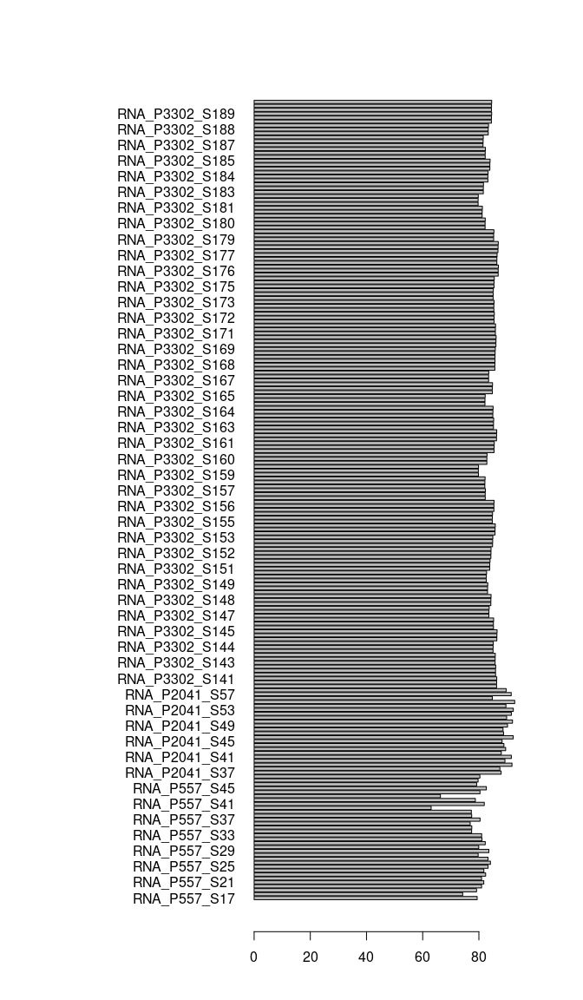<!-- -->

``` r
xx <- barplot(height=mappingrates, names=samplename, horiz=T, las=1, xlim=c(0,100)) #col=col
text(x = mappingrates, y = xx, label = mappingrates, pos = 4, cex = 0.8, col = "red")
```

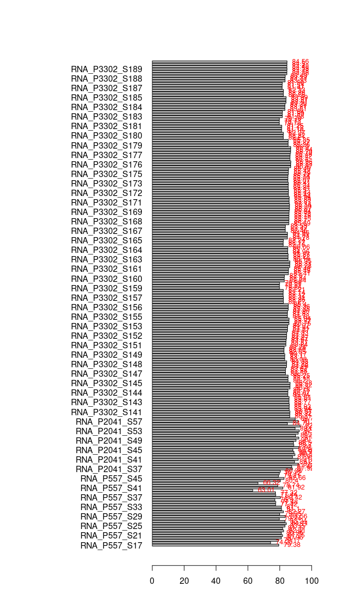<!-- -->

``` r
par(mar=c(1,1,1,1)+.1)
```

## Tximeta

``` r
# prepare coldata table
quant_file_table %>% head()
```

    ##                                                                                           files
    ## 17 /mnt/s/AG/AG-Scholz-NGS/Daten/Simon/RNA-Seq_Kelly_all/quants/CH_HS_KK_077_S33_quant/quant.sf
    ## 18 /mnt/s/AG/AG-Scholz-NGS/Daten/Simon/RNA-Seq_Kelly_all/quants/CH_HS_KK_078_S34_quant/quant.sf
    ## 19 /mnt/s/AG/AG-Scholz-NGS/Daten/Simon/RNA-Seq_Kelly_all/quants/CH_HS_KK_079_S35_quant/quant.sf
    ## 20 /mnt/s/AG/AG-Scholz-NGS/Daten/Simon/RNA-Seq_Kelly_all/quants/CH_HS_KK_080_S36_quant/quant.sf
    ## 21 /mnt/s/AG/AG-Scholz-NGS/Daten/Simon/RNA-Seq_Kelly_all/quants/CH_HS_KK_081_S37_quant/quant.sf
    ## 22 /mnt/s/AG/AG-Scholz-NGS/Daten/Simon/RNA-Seq_Kelly_all/quants/CH_HS_KK_082_S38_quant/quant.sf
    ##      samplename order         filename sequencing lane
    ## 17 RNA_P557_S33    17 RNA_P557_077_S33       P557 L001
    ## 18 RNA_P557_S34    18 RNA_P557_078_S34       P557 L001
    ## 19 RNA_P557_S35    19 RNA_P557_079_S35       P557 L001
    ## 20 RNA_P557_S36    20 RNA_P557_080_S36       P557 L001
    ## 21 RNA_P557_S37    21 RNA_P557_081_S37       P557 L001
    ## 22 RNA_P557_S38    22 RNA_P557_082_S38       P557 L001

``` r
sample_table_all %>% head()
```

    ##        samplename
    ## 1   RNA_P2041_S37
    ## 5   RNA_P2041_S41
    ## 10  RNA_P2041_S46
    ## 173  RNA_P557_S33
    ## 177  RNA_P557_S37
    ## 181  RNA_P557_S41
    ##                                                                                                files
    ## 1   /mnt/s/AG/AG-Scholz-NGS/Daten/Simon/RNA-Seq_Kelly_all/quants/P2041_10619_S37_L003_quant/quant.sf
    ## 5   /mnt/s/AG/AG-Scholz-NGS/Daten/Simon/RNA-Seq_Kelly_all/quants/P2041_10632_S41_L003_quant/quant.sf
    ## 10  /mnt/s/AG/AG-Scholz-NGS/Daten/Simon/RNA-Seq_Kelly_all/quants/P2041_10640_S46_L003_quant/quant.sf
    ## 173     /mnt/s/AG/AG-Scholz-NGS/Daten/Simon/RNA-Seq_Kelly_all/quants/CH_HS_KK_077_S33_quant/quant.sf
    ## 177     /mnt/s/AG/AG-Scholz-NGS/Daten/Simon/RNA-Seq_Kelly_all/quants/CH_HS_KK_081_S37_quant/quant.sf
    ## 181     /mnt/s/AG/AG-Scholz-NGS/Daten/Simon/RNA-Seq_Kelly_all/quants/CH_HS_KK_085_S41_quant/quant.sf
    ##     order                 filename sequencing lane rna_id      Datum
    ## 1      33 RNA_P2041_10619_S37_L003      P2041 L003   6952 2017-05-04
    ## 5      37 RNA_P2041_10632_S41_L003      P2041 L003  10268 2021-08-25
    ## 10     42 RNA_P2041_10640_S46_L003      P2041 L003  10292 2021-08-27
    ## 173    17         RNA_P557_077_S33       P557 L001   7693 2018-09-13
    ## 177    21         RNA_P557_081_S37       P557 L001   7699 2018-09-13
    ## 181    25         RNA_P557_085_S41       P557 L001   7705 2018-09-14
    ##                               Probe rna_conc treatment genotype sequencing.y
    ## 1   Kelly CRISPR Cas Hif LV1 Nx 24h       NA        Nx    Kelly        P2041
    ## 5                     Kelly LV.1 Nx       NA        Nx    Kelly        P2041
    ## 10                    Kelly LV.1 Nx       NA        Nx    Kelly        P2041
    ## 173  Kelly CRISPR Hif LV1 P7 Nx 24h   830.48        Nx    Kelly         P557
    ## 177  Kelly CRISPR Hif LV1 P7 Nx 24h   603.48        Nx    Kelly         P557
    ## 181  Kelly CRISPR Hif LV1 P8 Nx 24h   807.66        Nx    Kelly         P557
    ##     replicate clone cellline lane.y sample_id    run_id experiment
    ## 1        <NA>  LV_1    Kelly   L003       S37 RNA_10619    Control
    ## 5        <NA>  LV_1    Kelly   L003       S41 RNA_10754      Simon
    ## 10       <NA>  LV_1    Kelly   L003       S46 RNA_10635      Simon
    ## 173        P7   LV1    Kelly   L001       S33    RNA_77  Katharina
    ## 177        P7   LV1    Kelly   L001       S37    RNA_81  Katharina
    ## 181        P8   LV1    Kelly   L001       S41    RNA_85  Katharina
    ##     experiment_date repetition     exp_rep CUGE-ID           Nx           HX
    ## 1        2017-05-04          0   Control_0   10619           LV         <NA>
    ## 5        2021-08-25          4     Simon_4   10754 del_Hif1a1.3 del_Hif1a1.3
    ## 10       2021-08-27          5     Simon_5   10635  delHif1b6.1  delHif1b6.1
    ## 173      2018-09-13          1 Katharina_1      NA         <NA>         <NA>
    ## 177      2018-09-13          1 Katharina_1      NA         <NA>         <NA>
    ## 181      2018-09-14          2 Katharina_2      NA         <NA>         <NA>
    ##     sample order_number Konz.(µg/µl) cell_density condition mappingrates
    ## 1   RNA_01           NA           NA         <NA>  Kelly_Nx        81.00
    ## 5   RNA_11           NA           NA         <NA>  Kelly_Nx        77.42
    ## 10  RNA_25           NA           NA         <NA>  Kelly_Nx        77.48
    ## 173   <NA>           NA           NA         <NA>  Kelly_Nx        76.90
    ## 177   <NA>           NA           NA         <NA>  Kelly_Nx        80.42
    ## 181   <NA>           NA           NA         <NA>  Kelly_Nx        77.44

``` r
sample_table_all$names = paste(sample_table_all$sequencing,
                               sample_table_all$genotype,
                               sample_table_all$treatment,
                               sample_table_all$order,
                               sep="_")
head(sample_table_all$names)
```

    ## [1] "P2041_Kelly_Nx_33" "P2041_Kelly_Nx_37" "P2041_Kelly_Nx_42"
    ## [4] "P557_Kelly_Nx_17"  "P557_Kelly_Nx_21"  "P557_Kelly_Nx_25"

``` r
coldata <- data.frame(files = sample_table_all$files,
                      names = sample_table_all$names, 
                      sample_table_all[,-c(2)])

# load tximeta

# make linked Transcriptome (local offline mode)
indexdir
```

    ## [1] "/mnt/s/AG/AG-Scholz-NGS/Daten/Salmon/index/human_ens110_index"

``` r
dirgenomic
```

    ## [1] "/mnt/s/AG/AG-Scholz-NGS/Daten/Salmon/genomic_data/ensembl/110"

``` r
list.files(dirgenomic)
```

    ## [1] "decoys_human_ensh38.txt"                       
    ## [2] "gentrome_human_ensh38.fa.gz"                   
    ## [3] "Homo_sapiens.GRCh38.110.gff3.gz"               
    ## [4] "Homo_sapiens.GRCh38.cdna.all.fa.gz"            
    ## [5] "Homo_sapiens.GRCh38.dna.primary_assembly.fa.gz"
    ## [6] "Homo_sapiens.GRCh38.ncrna.fa.gz"

``` r
fastaPath <- file.path(dirgenomic, "Homo_sapiens.GRCh38.dna.primary_assembly.fa.gz")
fastaPath
```

    ## [1] "/mnt/s/AG/AG-Scholz-NGS/Daten/Salmon/genomic_data/ensembl/110/Homo_sapiens.GRCh38.dna.primary_assembly.fa.gz"

``` r
gtfPath <- file.path(dirgenomic,"Homo_sapiens.GRCh38.110.gff3.gz")
gtfPath
```

    ## [1] "/mnt/s/AG/AG-Scholz-NGS/Daten/Salmon/genomic_data/ensembl/110/Homo_sapiens.GRCh38.110.gff3.gz"

``` r
file.exists(indexdir, fastaPath, gtfPath)
```

    ## [1] TRUE TRUE TRUE

``` r
# makeLinkedTxome(indexDir=indexdir,
#                 source="LocalEnsembl",
#                 organism="Homo sapiens",
#                 release="110",
#                 genome="GRCh38",
#                 fasta=fastaPath,
#                 gtf=gtfPath,
#                 write=FALSE)

# gtfdata <- readLines(gtfPath)
# head(gtfdata, n=20)

# gene_name info sind in gff3 abder nicht in se?

se <- tximeta(coldata, useHub=T)
se
```

    ## class: RangedSummarizedExperiment 
    ## dim: 242932 188 
    ## metadata(6): tximetaInfo quantInfo ... txomeInfo txdbInfo
    ## assays(3): counts abundance length
    ## rownames(242932): ENST00000415118 ENST00000448914 ... ENST00000516935
    ##   ENST00000580835
    ## rowData names(3): tx_id gene_id tx_name
    ## colnames(188): P2041_Kelly_Nx_33 P2041_Kelly_Nx_37 ...
    ##   P2041_HIF1B_Hx_35 P2041_HIF1B_Hx_52
    ## colData names(33): names samplename ... mappingrates names.1

``` r
colData(se)
```

    ## DataFrame with 188 rows and 33 columns
    ##                               names    samplename     order
    ##                         <character>   <character> <integer>
    ## P2041_Kelly_Nx_33 P2041_Kelly_Nx_33 RNA_P2041_S37        33
    ## P2041_Kelly_Nx_37 P2041_Kelly_Nx_37 RNA_P2041_S41        37
    ## P2041_Kelly_Nx_42 P2041_Kelly_Nx_42 RNA_P2041_S46        42
    ## P557_Kelly_Nx_17   P557_Kelly_Nx_17  RNA_P557_S33        17
    ## P557_Kelly_Nx_21   P557_Kelly_Nx_21  RNA_P557_S37        21
    ## ...                             ...           ...       ...
    ## P2041_HIF1B_Hx_41 P2041_HIF1B_Hx_41 RNA_P2041_S45        41
    ## P2041_HIF1B_Hx_48 P2041_HIF1B_Hx_48 RNA_P2041_S52        48
    ## P2041_HIF1B_Hx_50 P2041_HIF1B_Hx_50 RNA_P2041_S54        50
    ## P2041_HIF1B_Hx_35 P2041_HIF1B_Hx_35 RNA_P2041_S39        35
    ## P2041_HIF1B_Hx_52 P2041_HIF1B_Hx_52 RNA_P2041_S56        52
    ##                                 filename  sequencing        lane    rna_id
    ##                              <character> <character> <character> <numeric>
    ## P2041_Kelly_Nx_33 RNA_P2041_10619_S37_..       P2041        L003      6952
    ## P2041_Kelly_Nx_37 RNA_P2041_10632_S41_..       P2041        L003     10268
    ## P2041_Kelly_Nx_42 RNA_P2041_10640_S46_..       P2041        L003     10292
    ## P557_Kelly_Nx_17        RNA_P557_077_S33        P557        L001      7693
    ## P557_Kelly_Nx_21        RNA_P557_081_S37        P557        L001      7699
    ## ...                                  ...         ...         ...       ...
    ## P2041_HIF1B_Hx_41 RNA_P2041_10638_S45_..       P2041        L003     10285
    ## P2041_HIF1B_Hx_48 RNA_P2041_10749_S52_..       P2041        L003     10301
    ## P2041_HIF1B_Hx_50 RNA_P2041_10751_S54_..       P2041        L003     10303
    ## P2041_HIF1B_Hx_35 RNA_P2041_10625_S39_..       P2041        L003     10186
    ## P2041_HIF1B_Hx_52 RNA_P2041_10753_S56_..       P2041        L003     10305
    ##                        Datum                  Probe  rna_conc   treatment
    ##                    <POSIXct>            <character> <numeric> <character>
    ## P2041_Kelly_Nx_33 2017-05-04 Kelly CRISPR Cas Hif..        NA          Nx
    ## P2041_Kelly_Nx_37 2021-08-25          Kelly LV.1 Nx        NA          Nx
    ## P2041_Kelly_Nx_42 2021-08-27          Kelly LV.1 Nx        NA          Nx
    ## P557_Kelly_Nx_17  2018-09-13 Kelly CRISPR Hif LV1..    830.48          Nx
    ## P557_Kelly_Nx_21  2018-09-13 Kelly CRISPR Hif LV1..    603.48          Nx
    ## ...                      ...                    ...       ...         ...
    ## P2041_HIF1B_Hx_41 2021-08-25    Kelly Hif1b 15.1 Hx        NA          Hx
    ## P2041_HIF1B_Hx_48 2021-08-27     Kelly Hif1b 4.1 Hx        NA          Hx
    ## P2041_HIF1B_Hx_50 2021-08-27     Kelly Hif1b 6.1 Hx        NA          Hx
    ## P2041_HIF1B_Hx_35 2021-06-16 Kelly Hif1b.sg1+2 Kl..        NA          Hx
    ## P2041_HIF1B_Hx_52 2021-08-27     Kelly Hif1b 9.1 Hx        NA          Hx
    ##                   genotype sequencing.y   replicate       clone    cellline
    ##                   <factor>  <character> <character> <character> <character>
    ## P2041_Kelly_Nx_33    Kelly        P2041          NA        LV_1       Kelly
    ## P2041_Kelly_Nx_37    Kelly        P2041          NA        LV_1       Kelly
    ## P2041_Kelly_Nx_42    Kelly        P2041          NA        LV_1       Kelly
    ## P557_Kelly_Nx_17     Kelly         P557          P7         LV1       Kelly
    ## P557_Kelly_Nx_21     Kelly         P557          P7         LV1       Kelly
    ## ...                    ...          ...         ...         ...         ...
    ## P2041_HIF1B_Hx_41    HIF1B        P2041          NA    Hif1b_15       Kelly
    ## P2041_HIF1B_Hx_48    HIF1B        P2041          NA     Hif1b_4       Kelly
    ## P2041_HIF1B_Hx_50    HIF1B        P2041          NA     Hif1b_6       Kelly
    ## P2041_HIF1B_Hx_35    HIF1B        P2041          NA     Hif1b_9       Kelly
    ## P2041_HIF1B_Hx_52    HIF1B        P2041          NA     Hif1b_9       Kelly
    ##                        lane.y   sample_id      run_id  experiment
    ##                   <character> <character> <character> <character>
    ## P2041_Kelly_Nx_33        L003         S37   RNA_10619     Control
    ## P2041_Kelly_Nx_37        L003         S41   RNA_10754       Simon
    ## P2041_Kelly_Nx_42        L003         S46   RNA_10635       Simon
    ## P557_Kelly_Nx_17         L001         S33      RNA_77   Katharina
    ## P557_Kelly_Nx_21         L001         S37      RNA_81   Katharina
    ## ...                       ...         ...         ...         ...
    ## P2041_HIF1B_Hx_41        L003         S45   RNA_10632       Simon
    ## P2041_HIF1B_Hx_48        L003         S52   RNA_10747       Simon
    ## P2041_HIF1B_Hx_50        L003         S54   RNA_10749       Simon
    ## P2041_HIF1B_Hx_35        L003         S39   RNA_10744       Simon
    ## P2041_HIF1B_Hx_52        L003         S56   RNA_10751       Simon
    ##                   experiment_date  repetition     exp_rep   CUGE.ID
    ##                         <POSIXct> <character> <character> <numeric>
    ## P2041_Kelly_Nx_33      2017-05-04           0   Control_0     10619
    ## P2041_Kelly_Nx_37      2021-08-25           4     Simon_4     10754
    ## P2041_Kelly_Nx_42      2021-08-27           5     Simon_5     10635
    ## P557_Kelly_Nx_17       2018-09-13           1 Katharina_1        NA
    ## P557_Kelly_Nx_21       2018-09-13           1 Katharina_1        NA
    ## ...                           ...         ...         ...       ...
    ## P2041_HIF1B_Hx_41      2021-08-25           4     Simon_4     10632
    ## P2041_HIF1B_Hx_48      2021-08-27           5     Simon_5     10747
    ## P2041_HIF1B_Hx_50      2021-08-27           5     Simon_5     10749
    ## P2041_HIF1B_Hx_35      2021-06-16           1     Simon_1     10744
    ## P2041_HIF1B_Hx_52      2021-08-27           5     Simon_5     10751
    ##                             Nx           HX      sample order_number
    ##                    <character>  <character> <character>    <numeric>
    ## P2041_Kelly_Nx_33           LV           NA      RNA_01           NA
    ## P2041_Kelly_Nx_37 del_Hif1a1.3 del_Hif1a1.3      RNA_11           NA
    ## P2041_Kelly_Nx_42  delHif1b6.1  delHif1b6.1      RNA_25           NA
    ## P557_Kelly_Nx_17            NA           NA          NA           NA
    ## P557_Kelly_Nx_21            NA           NA          NA           NA
    ## ...                        ...          ...         ...          ...
    ## P2041_HIF1B_Hx_41  delHif1b4.1           NA      RNA_22           NA
    ## P2041_HIF1B_Hx_48           NA           NA      RNA_34           NA
    ## P2041_HIF1B_Hx_50           NA           NA      RNA_36           NA
    ## P2041_HIF1B_Hx_35           LV           LV      RNA_04           NA
    ## P2041_HIF1B_Hx_52           NA           NA      RNA_38           NA
    ##                   Konz..µg.µl. cell_density condition mappingrates
    ##                      <numeric>  <character>  <factor>    <numeric>
    ## P2041_Kelly_Nx_33           NA           NA  Kelly_Nx        81.00
    ## P2041_Kelly_Nx_37           NA           NA  Kelly_Nx        77.42
    ## P2041_Kelly_Nx_42           NA           NA  Kelly_Nx        77.48
    ## P557_Kelly_Nx_17            NA           NA  Kelly_Nx        76.90
    ## P557_Kelly_Nx_21            NA           NA  Kelly_Nx        80.42
    ## ...                        ...          ...       ...          ...
    ## P2041_HIF1B_Hx_41           NA           NA  HIF1B_Hx        84.48
    ## P2041_HIF1B_Hx_48           NA           NA  HIF1B_Hx        84.55
    ## P2041_HIF1B_Hx_50           NA           NA  HIF1B_Hx        84.48
    ## P2041_HIF1B_Hx_35           NA           NA  HIF1B_Hx        84.50
    ## P2041_HIF1B_Hx_52           NA           NA  HIF1B_Hx        84.56
    ##                             names.1
    ##                         <character>
    ## P2041_Kelly_Nx_33 P2041_Kelly_Nx_33
    ## P2041_Kelly_Nx_37 P2041_Kelly_Nx_37
    ## P2041_Kelly_Nx_42 P2041_Kelly_Nx_42
    ## P557_Kelly_Nx_17   P557_Kelly_Nx_17
    ## P557_Kelly_Nx_21   P557_Kelly_Nx_21
    ## ...                             ...
    ## P2041_HIF1B_Hx_41 P2041_HIF1B_Hx_41
    ## P2041_HIF1B_Hx_48 P2041_HIF1B_Hx_48
    ## P2041_HIF1B_Hx_50 P2041_HIF1B_Hx_50
    ## P2041_HIF1B_Hx_35 P2041_HIF1B_Hx_35
    ## P2041_HIF1B_Hx_52 P2041_HIF1B_Hx_52

``` r
# meta infos sind da (genotype, treatment,...)

# rename Samples
# rownames(colData(se)) <- str_remove(rownames(colData(se)), pattern="_quant")

rowRanges(se)
```

    ## GRanges object with 242932 ranges and 3 metadata columns:
    ##                   seqnames              ranges strand |     tx_id
    ##                      <Rle>           <IRanges>  <Rle> | <integer>
    ##   ENST00000415118       14   22438547-22438554      + |    165589
    ##   ENST00000448914       14   22449113-22449125      + |    165591
    ##   ENST00000434970       14   22439007-22439015      + |    165590
    ##   ENST00000605284       15   20011153-20011169      - |    179094
    ##   ENST00000604642       15   20003840-20003862      - |    179090
    ##               ...      ...                 ...    ... .       ...
    ##   ENST00000461982        1 153704088-153704385      + |      7203
    ##   ENST00000410579        1     8796571-8796673      - |     12455
    ##   ENST00000583026        1     8979576-8979874      - |     12477
    ##   ENST00000516935        1 148330271-148330394      + |      6664
    ##   ENST00000580835        1 179900262-179900564      + |      8938
    ##                           gene_id         tx_name
    ##                   <CharacterList>     <character>
    ##   ENST00000415118 ENSG00000223997 ENST00000415118
    ##   ENST00000448914 ENSG00000228985 ENST00000448914
    ##   ENST00000434970 ENSG00000237235 ENST00000434970
    ##   ENST00000605284 ENSG00000271336 ENST00000605284
    ##   ENST00000604642 ENSG00000270961 ENST00000604642
    ##               ...             ...             ...
    ##   ENST00000461982 ENSG00000242565 ENST00000461982
    ##   ENST00000410579 ENSG00000222511 ENST00000410579
    ##   ENST00000583026 ENSG00000265141 ENST00000583026
    ##   ENST00000516935 ENSG00000252744 ENST00000516935
    ##   ENST00000580835 ENSG00000264916 ENST00000580835
    ##   -------
    ##   seqinfo: 47 sequences (1 circular) from an unspecified genome; no seqlengths

``` r
# genome info
seqinfo(se)
```

    ## Seqinfo object with 47 sequences (1 circular) from an unspecified genome; no seqlengths:
    ##   seqnames   seqlengths isCircular genome
    ##   1                <NA>       <NA>   <NA>
    ##   2                <NA>       <NA>   <NA>
    ##   3                <NA>       <NA>   <NA>
    ##   4                <NA>       <NA>   <NA>
    ##   5                <NA>       <NA>   <NA>
    ##   ...               ...        ...    ...
    ##   KI270731.1       <NA>       <NA>   <NA>
    ##   KI270733.1       <NA>       <NA>   <NA>
    ##   KI270734.1       <NA>       <NA>   <NA>
    ##   KI270744.1       <NA>       <NA>   <NA>
    ##   KI270750.1       <NA>       <NA>   <NA>

``` r
# ?
assays(se)[["counts"]][1:5,1:5] %>% kable()
```

|                 | P2041_Kelly_Nx_33 | P2041_Kelly_Nx_37 | P2041_Kelly_Nx_42 | P557_Kelly_Nx_17 | P557_Kelly_Nx_21 |
|:----------------|------------------:|------------------:|------------------:|-----------------:|-----------------:|
| ENST00000415118 |                 0 |                 0 |                 0 |                0 |                0 |
| ENST00000448914 |                 0 |                 0 |                 0 |                0 |                0 |
| ENST00000434970 |                 0 |                 0 |                 0 |                0 |                0 |
| ENST00000605284 |                 0 |                 0 |                 0 |                0 |                0 |
| ENST00000604642 |                 0 |                 0 |                 0 |                0 |                0 |

``` r
# counts. THE DATA

# Mapping infos:
# names(metadata(se)[["quantInfo"]])
# str(metadata(se)[["quantInfo"]]) # Infos from Salmon Mapping
metadata(se)[["quantInfo"]]$percent_mapped %>% head() %>% kable()
```

|        x |
|---------:|
| 87.92344 |
| 91.55031 |
| 92.21336 |
| 80.99582 |
| 80.41615 |
| 81.92242 |

``` r
metadata(se)[["quantInfo"]]$num_processed %>% head() %>% kable()
```

|        x |
|---------:|
| 71719907 |
| 74462734 |
| 66875819 |
| 26981591 |
| 32081935 |
| 23145792 |

``` r
par(mfrow=c(1,1))
barplot(metadata(se)[["quantInfo"]]$percent_mapped, main="Mapping Rate")
```

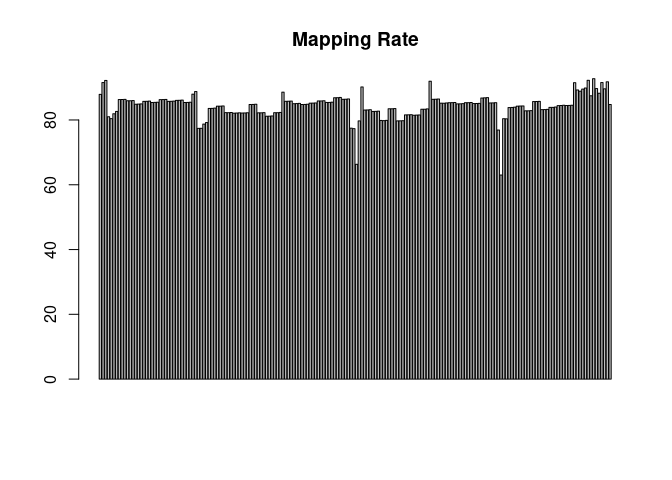<!-- -->

``` r
barplot(metadata(se)[["quantInfo"]]$num_processed/1000000, main="Mio. Reads")
```

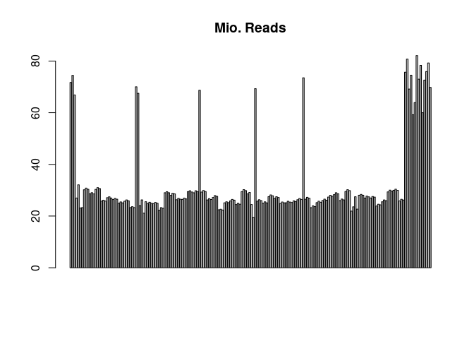<!-- -->

``` r
edb <- retrieveDb(se)
class(edb)
```

    ## [1] "TxDb"
    ## attr(,"package")
    ## [1] "GenomicFeatures"

``` r
genes(edb)
```

    ## GRanges object with 62754 ranges and 1 metadata column:
    ##                   seqnames              ranges strand |         gene_id
    ##                      <Rle>           <IRanges>  <Rle> |     <character>
    ##   ENSG00000000003        X 100627108-100639991      - | ENSG00000000003
    ##   ENSG00000000005        X 100584936-100599885      + | ENSG00000000005
    ##   ENSG00000000419       20   50934867-50959140      - | ENSG00000000419
    ##   ENSG00000000457        1 169849631-169894267      - | ENSG00000000457
    ##   ENSG00000000460        1 169662007-169854080      + | ENSG00000000460
    ##               ...      ...                 ...    ... .             ...
    ##   ENSG00000292369        Y   57190738-57208756      + | ENSG00000292369
    ##   ENSG00000292370        Y   57201143-57203357      - | ENSG00000292370
    ##   ENSG00000292371        Y   57212184-57214397      - | ENSG00000292371
    ##   ENSG00000292372        Y   57207346-57212230      + | ENSG00000292372
    ##   ENSG00000292373        Y   57184216-57197337      + | ENSG00000292373
    ##   -------
    ##   seqinfo: 47 sequences (1 circular) from an unspecified genome; no seqlengths

``` r
columns(edb)
```

    ##  [1] "CDSCHROM"   "CDSEND"     "CDSID"      "CDSNAME"    "CDSPHASE"  
    ##  [6] "CDSSTART"   "CDSSTRAND"  "EXONCHROM"  "EXONEND"    "EXONID"    
    ## [11] "EXONNAME"   "EXONRANK"   "EXONSTART"  "EXONSTRAND" "GENEID"    
    ## [16] "TXCHROM"    "TXEND"      "TXID"       "TXNAME"     "TXSTART"   
    ## [21] "TXSTRAND"   "TXTYPE"

``` r
se.exons <- addExons(se)
rowRanges(se.exons)[[1]]
```

    ## GRanges object with 1 range and 3 metadata columns:
    ##       seqnames            ranges strand |   exon_id       exon_name exon_rank
    ##          <Rle>         <IRanges>  <Rle> | <integer>     <character> <integer>
    ##   [1]       14 22438547-22438554      + |    522848 ENSE00001661486         1
    ##   -------
    ##   seqinfo: 47 sequences (1 circular) from an unspecified genome; no seqlengths

``` r
gse <- summarizeToGene(se)
rowRanges(gse)
```

    ## GRanges object with 59472 ranges and 2 metadata columns:
    ##                   seqnames              ranges strand |         gene_id
    ##                      <Rle>           <IRanges>  <Rle> |     <character>
    ##   ENSG00000000003        X 100627108-100639991      - | ENSG00000000003
    ##   ENSG00000000005        X 100584936-100599885      + | ENSG00000000005
    ##   ENSG00000000419       20   50934867-50959140      - | ENSG00000000419
    ##   ENSG00000000457        1 169849631-169894267      - | ENSG00000000457
    ##   ENSG00000000460        1 169662007-169854080      + | ENSG00000000460
    ##               ...      ...                 ...    ... .             ...
    ##   ENSG00000291299       22   23658094-23693185      - | ENSG00000291299
    ##   ENSG00000291300       16     2839568-2842744      - | ENSG00000291300
    ##   ENSG00000291301       15   96761545-96766917      - | ENSG00000291301
    ##   ENSG00000291316        8 144449582-144465430      - | ENSG00000291316
    ##   ENSG00000291317        8 144463817-144465667      - | ENSG00000291317
    ##                                                                tx_ids
    ##                                                       <CharacterList>
    ##   ENSG00000000003 ENST00000373020,ENST00000612152,ENST00000496771,...
    ##   ENSG00000000005                     ENST00000373031,ENST00000485971
    ##   ENSG00000000419 ENST00000466152,ENST00000371582,ENST00000371588,...
    ##   ENSG00000000457 ENST00000367771,ENST00000367770,ENST00000367772,...
    ##   ENSG00000000460 ENST00000498289,ENST00000472795,ENST00000359326,...
    ##               ...                                                 ...
    ##   ENSG00000291299 ENST00000417194,ENST00000438858,ENST00000458554,...
    ##   ENSG00000291300 ENST00000506153,ENST00000489864,ENST00000476276,...
    ##   ENSG00000291301                                     ENST00000706486
    ##   ENSG00000291316                     ENST00000438911,ENST00000526887
    ##   ENSG00000291317 ENST00000403000,ENST00000424149,ENST00000306145,...
    ##   -------
    ##   seqinfo: 47 sequences (1 circular) from an unspecified genome; no seqlengths

``` r
head(assays(gse)[["counts"]])[1:5,1:5]
```

    ##                 P2041_Kelly_Nx_33 P2041_Kelly_Nx_37 P2041_Kelly_Nx_42
    ## ENSG00000000003          1378.349          1039.053          1311.244
    ## ENSG00000000005             0.000             0.000             0.000
    ## ENSG00000000419          2102.114           854.001           369.999
    ## ENSG00000000457           605.000           612.000           655.000
    ## ENSG00000000460          1403.000           976.001           503.001
    ##                 P557_Kelly_Nx_17 P557_Kelly_Nx_21
    ## ENSG00000000003          656.540          842.549
    ## ENSG00000000005            0.000            0.000
    ## ENSG00000000419          755.000          868.000
    ## ENSG00000000457          365.999          386.000
    ## ENSG00000000460          648.000          834.999

``` r
head(assays(gse)[["abundance"]])[1:5,1:5]
```

    ##                 P2041_Kelly_Nx_33 P2041_Kelly_Nx_37 P2041_Kelly_Nx_42
    ## ENSG00000000003          9.711093          7.889026          9.494666
    ## ENSG00000000005          0.000000          0.000000          0.000000
    ## ENSG00000000419         50.529537         22.559695          9.177242
    ## ENSG00000000457          3.043852          3.659331          3.564734
    ## ENSG00000000460         13.979227          9.547022          5.254258
    ##                 P557_Kelly_Nx_17 P557_Kelly_Nx_21
    ## ENSG00000000003        14.451820        15.351933
    ## ENSG00000000005         0.000000         0.000000
    ## ENSG00000000419        59.105502        54.655441
    ## ENSG00000000457         6.675638         5.378061
    ## ENSG00000000460        19.083862        22.049446

``` r
head(assays(gse)[["length"]])[1:5,1:5]
```

    ##                 P2041_Kelly_Nx_33 P2041_Kelly_Nx_37 P2041_Kelly_Nx_42
    ## ENSG00000000003         2595.5910         2408.1134         2276.2989
    ## ENSG00000000005          942.0689          942.0689          942.0689
    ## ENSG00000000419          760.7744          692.1298          664.5306
    ## ENSG00000000457         3634.7701         3057.8236         3028.5854
    ## ENSG00000000460         1835.3531         1869.1518         1577.9096
    ##                 P557_Kelly_Nx_17 P557_Kelly_Nx_21
    ## ENSG00000000003        2707.5669        2617.2499
    ## ENSG00000000005         942.0689         942.0689
    ## ENSG00000000419         761.3070         757.3546
    ## ENSG00000000457        3267.6006        3422.7450
    ## ENSG00000000460        2023.7157        1805.9336

``` r
#### add gene symbol
columns(retrieveDb(se))
```

    ##  [1] "CDSCHROM"   "CDSEND"     "CDSID"      "CDSNAME"    "CDSPHASE"  
    ##  [6] "CDSSTART"   "CDSSTRAND"  "EXONCHROM"  "EXONEND"    "EXONID"    
    ## [11] "EXONNAME"   "EXONRANK"   "EXONSTART"  "EXONSTRAND" "GENEID"    
    ## [16] "TXCHROM"    "TXEND"      "TXID"       "TXNAME"     "TXSTART"   
    ## [21] "TXSTRAND"   "TXTYPE"

``` r
edb
```

    ## TxDb object:
    ## # Db type: TxDb
    ## # Supporting package: GenomicFeatures
    ## # Data source: /mnt/s/AG/AG-Scholz-NGS/Daten/Salmon/genomic_data/ensembl/110/Homo_sapiens.GRCh38.110.gff3.gz
    ## # Organism: NA
    ## # Taxonomy ID: NA
    ## # miRBase build ID: NA
    ## # Genome: NA
    ## # Nb of transcripts: 252894
    ## # Db created by: GenomicFeatures package from Bioconductor
    ## # Creation time: 2024-02-21 16:26:27 +0100 (Wed, 21 Feb 2024)
    ## # GenomicFeatures version at creation time: 1.54.3
    ## # RSQLite version at creation time: 2.3.5
    ## # DBSCHEMAVERSION: 1.2

``` r
metadata(se)$txomeInfo$source
```

    ## [1] "LocalEnsembl"

``` r
TXNAME <- as.character(mapIds(edb,keys = mcols(gse)$gene_id, column = "TXNAME", keytype = "GENEID", multiVals="first"))
# select()' returned 1:many mapping between keys and columns = 1 gene has many transcripts...
TXNAME.list <- (mapIds(edb,keys = mcols(gse)$gene_id, column = "TXNAME", keytype = "GENEID", multiVals="list"))
head(TXNAME.list)
```

    ## $ENSG00000000003
    ## [1] "ENST00000373020" "ENST00000612152" "ENST00000496771" "ENST00000494424"
    ## 
    ## $ENSG00000000005
    ## [1] "ENST00000373031" "ENST00000485971"
    ## 
    ## $ENSG00000000419
    ##  [1] "ENST00000466152" "ENST00000371582" "ENST00000371588" "ENST00000683048"
    ##  [5] "ENST00000494752" "ENST00000682366" "ENST00000371584" "ENST00000684193"
    ##  [9] "ENST00000683466" "ENST00000682713" "ENST00000681979" "ENST00000684708"
    ## [13] "ENST00000413082" "ENST00000682754" "ENST00000683010" "ENST00000684628"
    ## 
    ## $ENSG00000000457
    ## [1] "ENST00000367771" "ENST00000367770" "ENST00000367772" "ENST00000423670"
    ## [5] "ENST00000470238"
    ## 
    ## $ENSG00000000460
    ## [1] "ENST00000498289" "ENST00000472795" "ENST00000359326" "ENST00000496973"
    ## [5] "ENST00000481744" "ENST00000466580" "ENST00000459772" "ENST00000286031"
    ## [9] "ENST00000413811"
    ## 
    ## $ENSG00000000938
    ## [1] "ENST00000374005" "ENST00000399173" "ENST00000374004" "ENST00000374003"
    ## [5] "ENST00000457296" "ENST00000475472" "ENST00000468038"

``` r
# info is already there
CDSID <- as.character(mapIds(edb,keys = mcols(gse)$gene_id, column = "CDSID", keytype = "GENEID", multiVals="first"))
head(CDSID)
```

    ## [1] "878219" "861695" "823055" "74852"  "32667"  "52301"

``` r
# ?
CDSNAME <- as.character(mapIds(edb,keys = mcols(gse)$gene_id, column = "CDSNAME", keytype = "GENEID", multiVals="first"))
head(CDSNAME)
```

    ## [1] "ENSP00000362111" "ENSP00000362122" "ENSP00000507119" "ENSP00000356745"
    ## [5] "ENSP00000490194" "ENSP00000363117"

``` r
# same as gene_id
EXONNAME <- as.character(mapIds(edb,keys = mcols(gse)$gene_id, column = "EXONNAME", keytype = "GENEID", multiVals="first"))
head(EXONNAME)
```

    ## [1] "ENSE00001459322" "ENSE00001459371" "ENSE00003486951" "ENSE00003704126"
    ## [5] "ENSE00001920509" "ENSE00001912718"

``` r
TXTYPE <- as.character(mapIds(edb,keys = mcols(gse)$gene_id, column = "TXTYPE", keytype = "GENEID", multiVals="first"))
head(TXTYPE)
```

    ## [1] "mRNA"       "mRNA"       "mRNA"       "mRNA"       "transcript"
    ## [6] "mRNA"

``` r
# no useful info... no gene Symbol!!

# add CDSID
mcols(gse)$CDSID <- as.character(mapIds(edb,keys = mcols(gse)$gene_id, column = "CDSID", keytype = "GENEID", multiVals="first"))


colnames(mcols(gse))
```

    ## [1] "gene_id" "tx_ids"  "CDSID"

``` r
head(rownames(gse))
```

    ## [1] "ENSG00000000003" "ENSG00000000005" "ENSG00000000419" "ENSG00000000457"
    ## [5] "ENSG00000000460" "ENSG00000000938"

``` r
getwd()
```

    ## [1] "/mnt/s/AG/AG-Scholz-NGS/Daten/Simon/RNA-Seq_Kelly_all/git_RNAseq_Kelly_Hx/data_processing"

``` r
save(gse,file=paste(data,"tximeta.txm", sep="/"))
gse <- 1
load(file=paste(data,"tximeta.txm", sep="/"))
```

### add gene symbols

``` r
ah = AnnotationHub()
query(ah, c("EnsDb", "homo"))
```

    ## AnnotationHub with 26 records
    ## # snapshotDate(): 2023-10-23
    ## # $dataprovider: Ensembl
    ## # $species: Homo sapiens
    ## # $rdataclass: EnsDb
    ## # additional mcols(): taxonomyid, genome, description,
    ## #   coordinate_1_based, maintainer, rdatadateadded, preparerclass, tags,
    ## #   rdatapath, sourceurl, sourcetype 
    ## # retrieve records with, e.g., 'object[["AH53211"]]' 
    ## 
    ##              title                             
    ##   AH53211  | Ensembl 87 EnsDb for Homo Sapiens 
    ##   AH53715  | Ensembl 88 EnsDb for Homo Sapiens 
    ##   AH56681  | Ensembl 89 EnsDb for Homo Sapiens 
    ##   AH57757  | Ensembl 90 EnsDb for Homo Sapiens 
    ##   AH60773  | Ensembl 91 EnsDb for Homo Sapiens 
    ##   ...        ...                               
    ##   AH104864 | Ensembl 107 EnsDb for Homo sapiens
    ##   AH109336 | Ensembl 108 EnsDb for Homo sapiens
    ##   AH109606 | Ensembl 109 EnsDb for Homo sapiens
    ##   AH113665 | Ensembl 110 EnsDb for Homo sapiens
    ##   AH116291 | Ensembl 111 EnsDb for Homo sapiens

``` r
edb <- ah[["AH116291"]]
load(file=paste(data,"tximeta.txm", sep="/"))
columns(edb)
```

    ##  [1] "CANONICALTRANSCRIPT" "DESCRIPTION"         "ENTREZID"           
    ##  [4] "EXONID"              "EXONIDX"             "EXONSEQEND"         
    ##  [7] "EXONSEQSTART"        "GCCONTENT"           "GENEBIOTYPE"        
    ## [10] "GENEID"              "GENEIDVERSION"       "GENENAME"           
    ## [13] "GENESEQEND"          "GENESEQSTART"        "INTERPROACCESSION"  
    ## [16] "ISCIRCULAR"          "PROTDOMEND"          "PROTDOMSTART"       
    ## [19] "PROTEINDOMAINID"     "PROTEINDOMAINSOURCE" "PROTEINID"          
    ## [22] "PROTEINSEQUENCE"     "SEQCOORDSYSTEM"      "SEQLENGTH"          
    ## [25] "SEQNAME"             "SEQSTRAND"           "SYMBOL"             
    ## [28] "TXBIOTYPE"           "TXCDSSEQEND"         "TXCDSSEQSTART"      
    ## [31] "TXEXTERNALNAME"      "TXID"                "TXIDVERSION"        
    ## [34] "TXISCANONICAL"       "TXNAME"              "TXSEQEND"           
    ## [37] "TXSEQSTART"          "TXSUPPORTLEVEL"      "UNIPROTDB"          
    ## [40] "UNIPROTID"           "UNIPROTMAPPINGTYPE"

``` r
mcols(gse)$SYMBOL <- mapIds(edb, keys = mcols(gse)$gene_id, column = "SYMBOL", keytype = "GENEID")
mcols(gse)$ENTREZID <- mapIds(edb, keys = mcols(gse)$gene_id, column = "ENTREZID", keytype = "GENEID")
mcols(gse)$CANONICALTRANSCRIPT <- mapIds(edb, keys = mcols(gse)$gene_id, column = "CANONICALTRANSCRIPT", keytype = "GENEID")
mcols(gse)$DESCRIPTION <- mapIds(edb, keys = mcols(gse)$gene_id, column = "DESCRIPTION", keytype = "GENEID")
mcols(gse)$GENEBIOTYPE <- mapIds(edb, keys = mcols(gse)$gene_id, column = "GENEBIOTYPE", keytype = "GENEID")
mcols(gse)$UNIPROTID <- mapIds(edb, keys = mcols(gse)$gene_id, column = "UNIPROTID", keytype = "GENEID")

for (i in columns(edb)[c(-10)]){
  print(i)
  mapIds(edb, keys = mcols(gse)$gene_id[1:10], column = i, keytype = "GENEID") # %>% print()
}
```

    ## [1] "CANONICALTRANSCRIPT"
    ## [1] "DESCRIPTION"
    ## [1] "ENTREZID"
    ## [1] "EXONID"
    ## [1] "EXONIDX"
    ## [1] "EXONSEQEND"
    ## [1] "EXONSEQSTART"
    ## [1] "GCCONTENT"
    ## [1] "GENEBIOTYPE"
    ## [1] "GENEIDVERSION"
    ## [1] "GENENAME"
    ## [1] "GENESEQEND"
    ## [1] "GENESEQSTART"
    ## [1] "INTERPROACCESSION"
    ## [1] "ISCIRCULAR"
    ## [1] "PROTDOMEND"
    ## [1] "PROTDOMSTART"
    ## [1] "PROTEINDOMAINID"
    ## [1] "PROTEINDOMAINSOURCE"
    ## [1] "PROTEINID"
    ## [1] "PROTEINSEQUENCE"
    ## [1] "SEQCOORDSYSTEM"
    ## [1] "SEQLENGTH"
    ## [1] "SEQNAME"
    ## [1] "SEQSTRAND"
    ## [1] "SYMBOL"
    ## [1] "TXBIOTYPE"
    ## [1] "TXCDSSEQEND"
    ## [1] "TXCDSSEQSTART"
    ## [1] "TXEXTERNALNAME"
    ## [1] "TXID"
    ## [1] "TXIDVERSION"
    ## [1] "TXISCANONICAL"
    ## [1] "TXNAME"
    ## [1] "TXSEQEND"
    ## [1] "TXSEQSTART"
    ## [1] "TXSUPPORTLEVEL"
    ## [1] "UNIPROTDB"
    ## [1] "UNIPROTID"
    ## [1] "UNIPROTMAPPINGTYPE"

``` r
# include tryCatch

save(gse,file=paste(data,"tximeta.txm", sep="/"))
```

## DESeq2

``` r
load(file=paste(data,"tximeta.txm", sep="/"))
colData(gse)$genotype
```

    ##   [1] Kelly Kelly Kelly Kelly Kelly Kelly Kelly Kelly Kelly Kelly Kelly Kelly
    ##  [13] Kelly Kelly Kelly Kelly Kelly Kelly Kelly Kelly Kelly Kelly Kelly Kelly
    ##  [25] Kelly Kelly Kelly Kelly Kelly Kelly Kelly Kelly Kelly Kelly Kelly Kelly
    ##  [37] Kelly Kelly Kelly Kelly Kelly Kelly Kelly Kelly Kelly Kelly Kelly Kelly
    ##  [49] Kelly Kelly Kelly Kelly Kelly Kelly Kelly Kelly Kelly Kelly Kelly Kelly
    ##  [61] Kelly Kelly Kelly Kelly Kelly Kelly Kelly HIF1A HIF1A HIF1A HIF1A HIF1A
    ##  [73] HIF1A HIF1A HIF1A HIF1A HIF1A HIF1A HIF1A HIF1A HIF1A HIF1A HIF1A HIF1A
    ##  [85] HIF1A HIF1A HIF1A HIF1A HIF1A HIF1A HIF1A HIF1A HIF1A HIF1A HIF1A HIF1A
    ##  [97] HIF1A HIF1A HIF1A HIF1A HIF1A HIF1A HIF1A HIF1A HIF1A HIF1A HIF1A HIF1A
    ## [109] HIF1A HIF1A HIF1A HIF1A HIF1A HIF1A HIF1A HIF1A HIF1A HIF1A HIF1A HIF1A
    ## [121] HIF1A HIF1A HIF2A HIF2A HIF2A HIF2A HIF2A HIF2A HIF2A HIF2A HIF2A HIF2A
    ## [133] HIF2A HIF2A HIF2A HIF2A HIF2A HIF2A HIF2A HIF2A HIF2A HIF2A HIF2A HIF2A
    ## [145] HIF2A HIF2A HIF2A HIF2A HIF2A HIF2A HIF2A HIF2A HIF2A HIF2A HIF2A HIF2A
    ## [157] HIF2A HIF2A HIF2A HIF2A HIF2A HIF2A HIF2A HIF2A HIF2A HIF2A HIF2A HIF2A
    ## [169] HIF2A HIF2A HIF2A HIF2A HIF2A HIF2A HIF1B HIF1B HIF1B HIF1B HIF1B HIF1B
    ## [181] HIF1B HIF1B HIF1B HIF1B HIF1B HIF1B HIF1B HIF1B
    ## Levels: Kelly HIF1A HIF1B HIF2A

``` r
design = ~genotype+treatment+treatment:genotype
dds <- DESeqDataSet(gse, design = design)
dds <- collapseReplicates(dds, dds$samplename, dds$names)

sample.number <- nrow(colData(dds))
keep.sn <- rowSums(counts(dds)) >= sample.number
keep.sn %>% summary()
```

    ##    Mode   FALSE    TRUE 
    ## logical   35551   23921

``` r
dds <- dds[keep.sn,]

dds <- DESeq(dds)

summary(results(dds, alpha = 0.05))
```

    ## 
    ## out of 23919 with nonzero total read count
    ## adjusted p-value < 0.05
    ## LFC > 0 (up)       : 1897, 7.9%
    ## LFC < 0 (down)     : 2611, 11%
    ## outliers [1]       : 7, 0.029%
    ## low counts [2]     : 1854, 7.8%
    ## (mean count < 2)
    ## [1] see 'cooksCutoff' argument of ?results
    ## [2] see 'independentFiltering' argument of ?results

``` r
plotMA(dds)
```

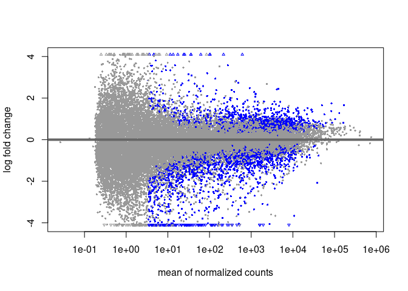<!-- -->

``` r
plotDispEsts(dds)
```

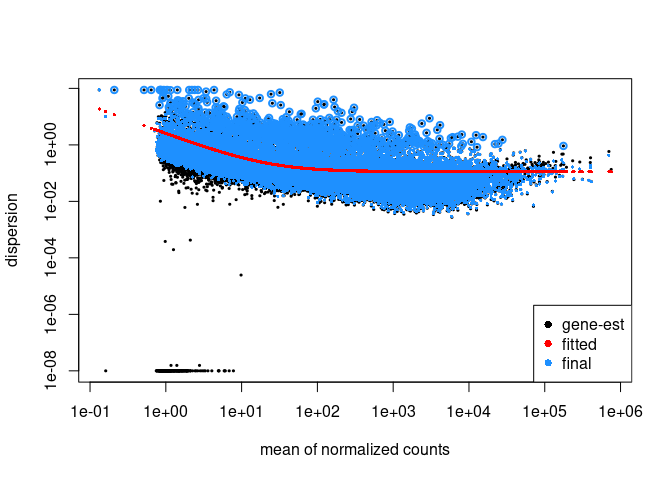<!-- -->

``` r
resultsNames(dds)
```

    ## [1] "Intercept"                 "genotype_HIF1A_vs_Kelly"  
    ## [3] "genotype_HIF1B_vs_Kelly"   "genotype_HIF2A_vs_Kelly"  
    ## [5] "treatment_Nx_vs_Hx"        "genotypeHIF1A.treatmentNx"
    ## [7] "genotypeHIF1B.treatmentNx" "genotypeHIF2A.treatmentNx"

# 3. Pre-Analysis

### 4. Data transformations

``` r
meanSdPlot(assay(ntd))
meanSdPlot(assay(vsd))
meanSdPlot(assay(rld))
```

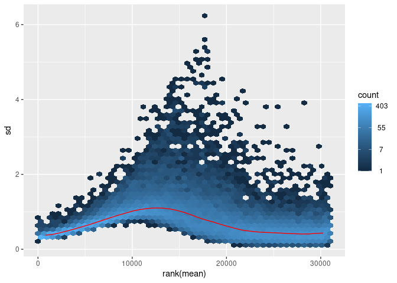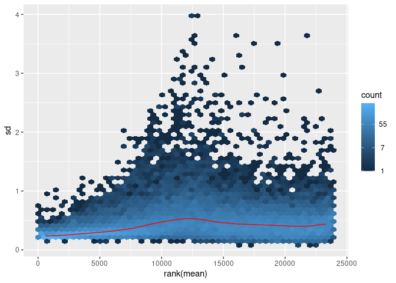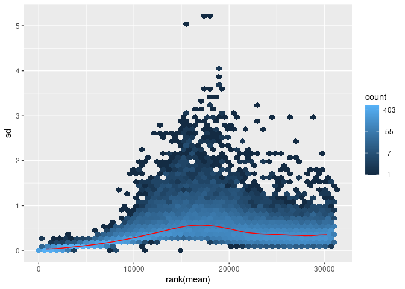

### 5. Check sample distance

``` r
sampleDists <- dist(t(assay(vsd)))

sampleDistMatrix <- as.matrix(sampleDists)
rownames(sampleDistMatrix) <- paste(vsd$morpho, vsd$organ, sep="-")
colnames(sampleDistMatrix) <- NULL
colors <- colorRampPalette( rev(brewer.pal(9, "Blues")) )(255)
pheatmap(sampleDistMatrix,
         clustering_distance_rows=sampleDists,
         clustering_distance_cols=sampleDists,
         col=colors)
```

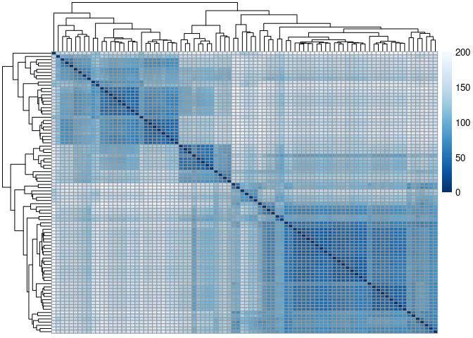<!-- -->

### 6. Perform principal component analysis

``` r
# transform data
vst_dat <- assay(vst(dds))
colData(dds)
```

    ## DataFrame with 88 rows and 36 columns
    ##                           names    samplename     order               filename
    ##                     <character>   <character> <integer>            <character>
    ## RNA_P2041_S37 P2041_Kelly_Nx_33 RNA_P2041_S37        33 RNA_P2041_10619_S37_..
    ## RNA_P2041_S38 P2041_HIF1B_Nx_34 RNA_P2041_S38        34 RNA_P2041_10621_S38_..
    ## RNA_P2041_S39 P2041_HIF1B_Hx_35 RNA_P2041_S39        35 RNA_P2041_10625_S39_..
    ## RNA_P2041_S40 P2041_HIF1B_Nx_36 RNA_P2041_S40        36 RNA_P2041_10631_S40_..
    ## RNA_P2041_S41 P2041_Kelly_Nx_37 RNA_P2041_S41        37 RNA_P2041_10632_S41_..
    ## ...                         ...           ...       ...                    ...
    ## RNA_P557_S44   P557_HIF2A_Hx_28  RNA_P557_S44        28       RNA_P557_088_S44
    ## RNA_P557_S45   P557_Kelly_Nx_29  RNA_P557_S45        29       RNA_P557_089_S45
    ## RNA_P557_S46   P557_Kelly_Hx_30  RNA_P557_S46        30       RNA_P557_090_S46
    ## RNA_P557_S47   P557_HIF1A_Hx_31  RNA_P557_S47        31       RNA_P557_091_S47
    ## RNA_P557_S48   P557_HIF2A_Hx_32  RNA_P557_S48        32       RNA_P557_092_S48
    ##                sequencing        lane    rna_id      Datum
    ##               <character> <character> <numeric>  <POSIXct>
    ## RNA_P2041_S37       P2041        L003      6952 2017-05-04
    ## RNA_P2041_S38       P2041        L003     10185 2021-06-16
    ## RNA_P2041_S39       P2041        L003     10186 2021-06-16
    ## RNA_P2041_S40       P2041        L003     10189 2021-06-16
    ## RNA_P2041_S41       P2041        L003     10268 2021-08-25
    ## ...                   ...         ...       ...        ...
    ## RNA_P557_S44         P557        L001      7710 2018-09-14
    ## RNA_P557_S45         P557        L001      7711 2018-09-14
    ## RNA_P557_S46         P557        L001      7714 2018-09-14
    ## RNA_P557_S47         P557        L001      7715 2018-09-14
    ## RNA_P557_S48         P557        L001      7716 2018-09-14
    ##                                Probe  rna_conc treatment genotype sequencing.y
    ##                          <character> <numeric>  <factor> <factor>  <character>
    ## RNA_P2041_S37 Kelly CRISPR Cas Hif..        NA        Nx    Kelly        P2041
    ## RNA_P2041_S38 Kelly Hif1b.sg1+2 Kl..        NA        Nx    HIF1B        P2041
    ## RNA_P2041_S39 Kelly Hif1b.sg1+2 Kl..        NA        Hx    HIF1B        P2041
    ## RNA_P2041_S40 Kelly Hif1b.sg1+2 Kl..        NA        Nx    HIF1B        P2041
    ## RNA_P2041_S41          Kelly LV.1 Nx        NA        Nx    Kelly        P2041
    ## ...                              ...       ...       ...      ...          ...
    ## RNA_P557_S44  Kelly CRISPR HifL2.2..    885.16        Hx    HIF2A         P557
    ## RNA_P557_S45  Kelly CRISPR Hif LV1..    694.64        Nx    Kelly         P557
    ## RNA_P557_S46  Kelly CRISPR HifLV1 ..    349.06        Hx    Kelly         P557
    ## RNA_P557_S47  Kelly CRISPR Hif1.3 ..    583.24        Hx    HIF1A         P557
    ## RNA_P557_S48  Kelly CRISPR HifL2.2..    644.24        Hx    HIF2A         P557
    ##                 replicate       clone    cellline      lane.y   sample_id
    ##               <character> <character> <character> <character> <character>
    ## RNA_P2041_S37          NA        LV_1       Kelly        L003         S37
    ## RNA_P2041_S38          NA     Hif1b_9       Kelly        L003         S38
    ## RNA_P2041_S39          NA     Hif1b_9       Kelly        L003         S39
    ## RNA_P2041_S40          NA    Hif1b_15       Kelly        L003         S40
    ## RNA_P2041_S41          NA        LV_1       Kelly        L003         S41
    ## ...                   ...         ...         ...         ...         ...
    ## RNA_P557_S44          P14   Hif2a_2.2       Kelly        L001         S44
    ## RNA_P557_S45           P8         LV1       Kelly        L001         S45
    ## RNA_P557_S46           P8         LV1       Kelly        L001         S46
    ## RNA_P557_S47          P14   Hif1a_1.3       Kelly        L001         S47
    ## RNA_P557_S48          P14   Hif2a_2.2       Kelly        L001         S48
    ##                    run_id  experiment experiment_date  repetition     exp_rep
    ##               <character> <character>       <POSIXct> <character> <character>
    ## RNA_P2041_S37   RNA_10619     Control      2017-05-04           0   Control_0
    ## RNA_P2041_S38   RNA_10621       Simon      2021-06-16           1     Simon_1
    ## RNA_P2041_S39   RNA_10744       Simon      2021-06-16           1     Simon_1
    ## RNA_P2041_S40   RNA_10745       Simon      2021-06-16           1     Simon_1
    ## RNA_P2041_S41   RNA_10754       Simon      2021-08-25           4     Simon_4
    ## ...                   ...         ...             ...         ...         ...
    ## RNA_P557_S44       RNA_88   Katharina      2018-09-14           2 Katharina_2
    ## RNA_P557_S45       RNA_89   Katharina      2018-09-14           2 Katharina_2
    ## RNA_P557_S46       RNA_90   Katharina      2018-09-14           2 Katharina_2
    ## RNA_P557_S47       RNA_91   Katharina      2018-09-14           2 Katharina_2
    ## RNA_P557_S48       RNA_92   Katharina      2018-09-14           2 Katharina_2
    ##                 CUGE.ID           Nx           HX      sample order_number
    ##               <numeric>  <character>  <character> <character>    <numeric>
    ## RNA_P2041_S37     10619           LV           NA      RNA_01           NA
    ## RNA_P2041_S38     10621           LV           LV      RNA_03           NA
    ## RNA_P2041_S39     10744           LV           LV      RNA_04           NA
    ## RNA_P2041_S40     10745           NA           NA      RNA_05           NA
    ## RNA_P2041_S41     10754 del_Hif1a1.3 del_Hif1a1.3      RNA_11           NA
    ## ...                 ...          ...          ...         ...          ...
    ## RNA_P557_S44         NA           NA           NA          NA           NA
    ## RNA_P557_S45         NA           NA           NA          NA           NA
    ## RNA_P557_S46         NA           NA           NA          NA           NA
    ## RNA_P557_S47         NA           NA           NA          NA           NA
    ## RNA_P557_S48         NA           NA           NA          NA           NA
    ##               Konz..µg.µl. cell_density condition mappingrates
    ##                  <numeric>  <character>  <factor>    <numeric>
    ## RNA_P2041_S37           NA           NA  Kelly_Nx        81.00
    ## RNA_P2041_S38           NA           NA  HIF1B_Nx        83.33
    ## RNA_P2041_S39           NA           NA  HIF1B_Hx        84.50
    ## RNA_P2041_S40           NA           NA  HIF1B_Nx        82.33
    ## RNA_P2041_S41           NA           NA  Kelly_Nx        77.42
    ## ...                    ...          ...       ...          ...
    ## RNA_P557_S44            NA           NA  HIF2A_Hx        86.49
    ## RNA_P557_S45            NA           NA  Kelly_Nx        77.32
    ## RNA_P557_S46            NA           NA  Kelly_Hx        86.32
    ## RNA_P557_S47            NA           NA  HIF1A_Hx        82.84
    ## RNA_P557_S48            NA           NA  HIF2A_Hx        86.79
    ##                         names.1     runsCollapsed sizeFactor replaceable
    ##                     <character>       <character>  <numeric>   <logical>
    ## RNA_P2041_S37 P2041_Kelly_Nx_33 P2041_Kelly_Nx_33    1.14743        TRUE
    ## RNA_P2041_S38 P2041_HIF1B_Nx_34 P2041_HIF1B_Nx_34    1.47856        TRUE
    ## RNA_P2041_S39 P2041_HIF1B_Hx_35 P2041_HIF1B_Hx_35    1.31700       FALSE
    ## RNA_P2041_S40 P2041_HIF1B_Nx_36 P2041_HIF1B_Nx_36    1.39912        TRUE
    ## RNA_P2041_S41 P2041_Kelly_Nx_37 P2041_Kelly_Nx_37    1.10019        TRUE
    ## ...                         ...               ...        ...         ...
    ## RNA_P557_S44   P557_HIF2A_Hx_28  P557_HIF2A_Hx_28   0.408427        TRUE
    ## RNA_P557_S45   P557_Kelly_Nx_29  P557_Kelly_Nx_29   0.363647        TRUE
    ## RNA_P557_S46   P557_Kelly_Hx_30  P557_Kelly_Hx_30   0.381354        TRUE
    ## RNA_P557_S47   P557_HIF1A_Hx_31  P557_HIF1A_Hx_31   0.268650        TRUE
    ## RNA_P557_S48   P557_HIF2A_Hx_32  P557_HIF2A_Hx_32   0.303047        TRUE

``` r
ens <- rownames(dds)
  symbols <- mcols(dds)$SYMBOL
  symbols <- symbols[!is.na(symbols)]
  symbols <- symbols[match(rownames(vst_dat), names(symbols))]
  rownames(vst_dat) <- symbols
  keep <- !is.na(rownames(vst_dat))
  vst_dat <- vst_dat[keep,]
  keep2 <- rownames(vst_dat)
  keep2 <- !duplicated(keep2)
  vst_dat <- vst_dat[keep2,]

### PCA with top 500 genes with highest row variance 
pcaData <- plotPCA(vsd, intgroup=c("genotype", "treatment","exp_rep"), returnData=TRUE)
percentVar <- round(100 * attr(pcaData, "percentVar"))
ggplot(pcaData, aes(PC1, PC2, color=genotype, shape=treatment)) +
  geom_point(size=3) +
  labs(title = "top 500 variance") +
  xlab(paste0("PC1: ",percentVar[1],"% variance")) +
  ylab(paste0("PC2: ",percentVar[2],"% variance")) + 
  coord_fixed()
```

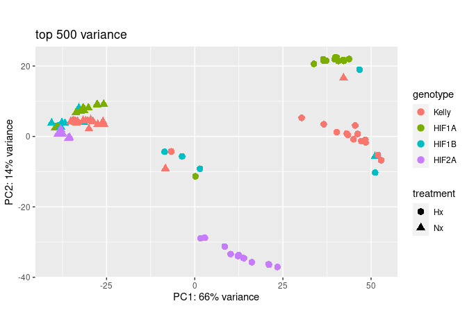<!-- -->

``` r
ggplot(pcaData, aes(PC1, PC2, color=exp_rep, shape=treatment)) +
  geom_point(size=3) +
  labs(title = "top 500 variance") +
  xlab(paste0("PC1: ",percentVar[1],"% variance")) +
  ylab(paste0("PC2: ",percentVar[2],"% variance")) +
  scale_color_viridis_d(option ="viridis") +
  coord_fixed()
```

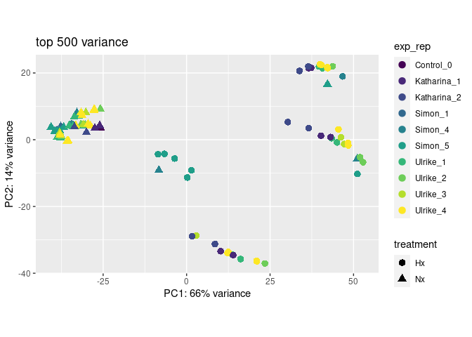<!-- -->

``` r
# calculate PCA (all data)
p <- pca(vst_dat, metadata = colData(dds))

biplot(p, showLoadings = TRUE,
    labSize = 3, pointSize = 5, sizeLoadingsNames = 2.5,
    
    title = "biplot containing all datapoints")
```

<!-- -->

``` r
# find explaining PCs
horn <- parallelPCA(vst_dat)
horn$n
```

    ## [1] 7

``` r
# plot Scree 
screeplot(p,
        components = getComponents(p),
        vline = c(horn$n))+
        geom_label(aes(x = horn$n, y = 50,
        label = 'Horn\'s', vjust = -1, size = 8))
```

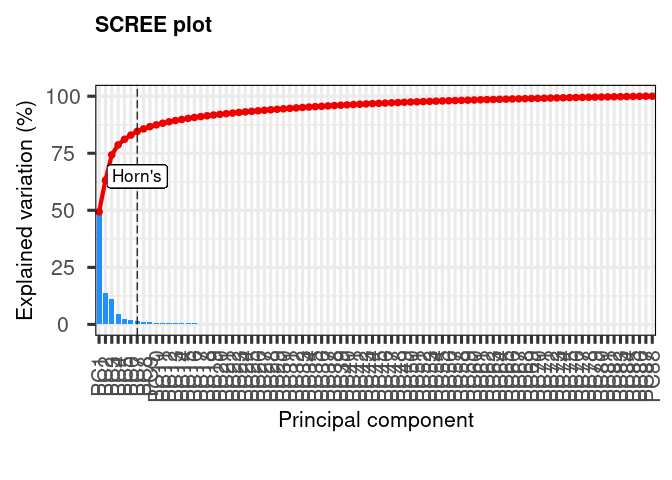<!-- -->
