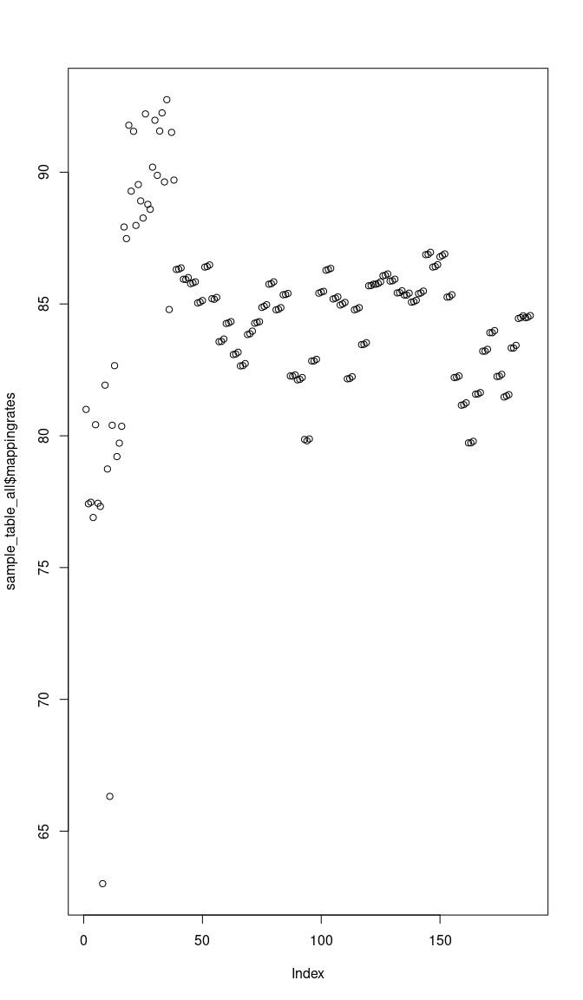
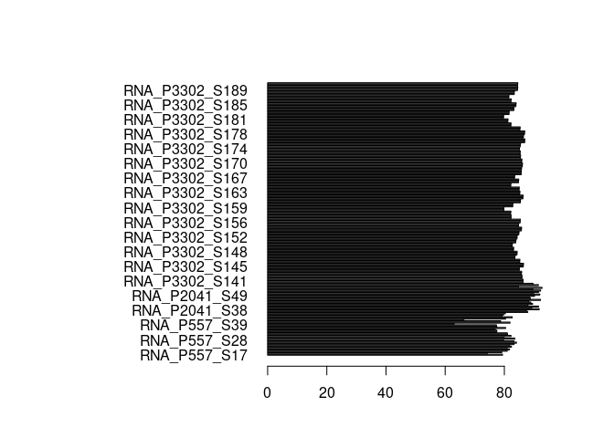
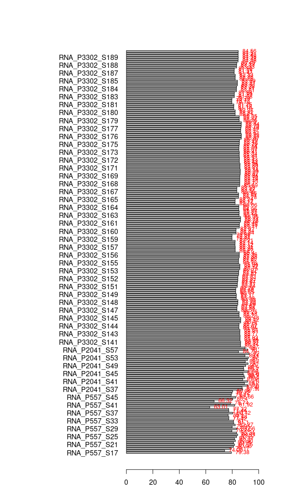

# 0. Load

## - R

BiocManager::install() BiocManager::install(“GOSemSim”)

``` r
library(devtools)
library(BiocManager)

library(tximeta)
library(tximport)
library(RColorBrewer)
library(tidyverse)
library(stringr)
library(stringi)
library(BiocFileCache)
library(SummarizedExperiment)
library(org.Mm.eg.db)
library(AnnotationHub)
library(DESeq2)
library(vsn)
library(ggplot2)
library(pheatmap)
library(PCAtools)
library(cowplot)
library(EnhancedVolcano)
library(gridExtra)
library(grid)
library(readxl)
library(VennDiagram)
library(clusterProfiler)
library(biomaRt)
library(GOSemSim)
library(sessioninfo)
library(data.table)
library(plyr)
library(tximeta)
library(tximport)
library(curl)
library(R.utils)
library(kableExtra)
library(knitr)
library(writexl)


ifelse(Sys.info()["sysname"]== "Linux",
  s <- "/mnt/s",
  s <- "S:")
```

```         
##  sysname 
## "/mnt/s"
```

``` r
dir <- paste(s,"AG/AG-Scholz-NGS/Daten/Simon/RNA-Seq_Kelly_all",sep="/")
list.files(dir) %>% head()
```

```         
## [1] "2024_02 Kelly all samples.xlsx" "git_RNAseq_Kelly_Hx"           
## [3] "output"                         "quants"
```

``` r
gitdir <- paste(dir,"git_RNAseq_Kelly_Hx",sep="/")
list.files(gitdir) %>% head()
```

```         
## [1] "2023_08 Chlamy RNA-Seq P3044-3.Rmd"   
## [2] "2023_12 RNA-Seq Kelly all.Rmd"        
## [3] "2023_12 RNA-Seq Kelly2 P3302 (TS).Rmd"
## [4] "2023_12 RNA-Seq Kelly2 P3302.Rmd"     
## [5] "2024_02 Kelly all samples.xlsx"       
## [6] "data_processing"
```

``` r
fastqdir <- paste(s,"AG/AG-Scholz-NGS/Daten/RNASeq_Kelly2_P3302",sep="/")
list.files(fastqdir) %>% head()
```

```         
## [1] "demux_config.json"                                
## [2] "download data.sh"                                 
## [3] "download.log"                                     
## [4] "html_report_101T10B10B101T.tar.gz"                
## [5] "html_report_101T8B2S8B2S101T.tar.gz"              
## [6] "illumina_basesmask_101T10B10B101T_SampleSheet.csv"
```

``` r
fastqdir2 <- paste(s,"AG/AG-Scholz-NGS/Daten/RNASeq_Kelly",sep="/")
list.files(fastqdir2) %>% head()
```

```         
## [1] "~$230413_Results_Kelly.pptx" "~$Contrast_matrix.pptx"     
## [3] "~$DEG_Hif1b_Hx_vs_Nx.xlsx"   "~$Sample_list.xlsx"         
## [5] "20230406_Kelly_Seq.Rmd"      "20230424_Kelly_Seq_RUN.Rmd"
```

``` r
fastqdir3 <- paste(s,"AG/AG-Scholz-NGS/Daten/Sequencing-2/Sequencing-2_A/FASTQ",sep="/")
list.files(fastqdir3) %>% head()
```

```         
## [1] "CH_HS_KK_061_S17_R1_001.fastq.gz" "CH_HS_KK_061_S17_R2_001.fastq.gz"
## [3] "CH_HS_KK_062_S18_R1_001.fastq.gz" "CH_HS_KK_062_S18_R2_001.fastq.gz"
## [5] "CH_HS_KK_063_S19_R1_001.fastq.gz" "CH_HS_KK_063_S19_R2_001.fastq.gz"
```

``` r
indexdir <- paste(s,"AG/AG-Scholz-NGS/Daten/Salmon/index/human_ens110_index",sep="/")

dirgenomic <- paste(s,"AG/AG-Scholz-NGS/Daten/Salmon/genomic_data/ensembl/110",sep="/")
list.files(dirgenomic) %>% head()
```

```         
## [1] "decoys_human_ensh38.txt"                       
## [2] "gentrome_human_ensh38.fa.gz"                   
## [3] "Homo_sapiens.GRCh38.110.gff3.gz"               
## [4] "Homo_sapiens.GRCh38.cdna.all.fa.gz"            
## [5] "Homo_sapiens.GRCh38.dna.primary_assembly.fa.gz"
## [6] "Homo_sapiens.GRCh38.ncrna.fa.gz"
```

``` r
# setwd(gitdir)
```

## - Linux

``` bash
fastqdir="/mnt/s/AG/AG-Scholz-NGS/Daten/RNASeq_Kelly2_P3302";
fastqdir2="/mnt/s/AG/AG-Scholz-NGS/Daten/RNASeq_Kelly";
fastqdir3="/mnt/s/AG/AG-Scholz-NGS/Daten/Sequencing-2/Sequencing-2_A/FASTQ";

# /mnt/s/AG/AG-Scholz-NGS/Daten/Simon/RNA-Seq Kelly all
dir="/mnt/s/AG/AG-Scholz-NGS/Daten/Simon/RNA-Seq_Kelly_all"

quantdir="$dir/quants"
indexdir="/mnt/s/AG/AG-Scholz-NGS/Daten/Salmon/index/human_ens110_index"
```

## - Download Data

``` bash
## Download data

cd $fastqdir;
lftp

# open -u <user>@<DOMAIN> https://file-exchange.bihealth.org/<file-box-id>/
open -u kelterbs@CHARITE https://file-exchange.bihealth.org/bd53df77-dd5a-4fb6-b640-4625548c5119/

# [Password]

# Download all data into target folder
mirror . $fastqdir
# mirror . /mnt/s/AG/AG-Scholz-NGS/Daten/RNASeq_Kelly2_P3302

# Check data
cd $fastqdir
ls $fastqdir | wc -l
ls $fastqdir/*R1*.fastq.gz | wc -l
# 150 R1+R2 = 36 fastq.gz files = 18 Samples, 36 files

# Check downloads
log="$fastqdir/download.log";
echo "##################
# $(date +%Y_%m_%d__%T) Check md5 Checksums
#";
md5sum -c  *.md5 | tee -a $log;
wc -l $log
# 36 files ok
```

# 1. Prepare Data

## Make Index

``` bash

# check newest release http://ftp.ensembl.org/pub/
release=110
echo $release
gdir="/mnt/s/AG/AG-Scholz-NGS/Daten/Salmon/genomic_data/ensembl/${release}"
echo $gdir

# Donwload genomic data: dna
  wget -P $gdir "http://ftp.ensembl.org/pub/current_fasta/homo_sapiens/dna/Homo_sapiens.GRCh38.dna.primary_assembly.fa.gz"

# Donwload genomic data: cdna (=cds with UTRs without introns)
  wget -P $gdir "http://ftp.ensembl.org/pub/current_fasta/homo_sapiens/cdna/Homo_sapiens.GRCh38.cdna.all.fa.gz"
  
 # Donwload genomic data: ncrna
  wget -P $gdir "http://ftp.ensembl.org/pub/current_fasta/homo_sapiens/ncrna/Homo_sapiens.GRCh38.ncrna.fa.gz"
  
 # Donwload genomic data: gff3 (for later use)
  wget -P $gdir "http://ftp.ensembl.org/pub/current_gff3/homo_sapiens/Homo_sapiens.GRCh38.${release}.gff3.gz"
  
# create list of chromosomes
  cd $gdir
    grep "^>" <(gunzip -c Homo_sapiens.GRCh38.dna.primary_assembly.fa.gz) | cut -d " " -f 1 > decoys_human_ensh38.txt

# to modify, copy to linux partition
  mkdir ~/decoys
  cp decoys_human_ensh38.txt ~/decoys

# remove ">"
  sed -i.bak -e 's/>//g' ~/decoys/decoys_human_ensh38.txt

# Optional: check txt file
  vim ~/decoys/decoys_human_ensh38.txt
  # to exit: -press 'ESC', type ":q!", press 'ENTER'
  
# copy back
  cp ~/decoys/decoys_human_ensh38.txt $gdir
  
# combine cdna ncdna and dna in one file
cd $gdir

cat Homo_sapiens.GRCh38.cdna.all.fa.gz Homo_sapiens.GRCh38.ncrna.fa.gz Homo_sapiens.GRCh38.dna.primary_assembly.fa.gz > gentrome_human_ensh38.fa.gz

# make index with salmon
# is salmon activated?
cd $gdir
salmon index -t gentrome_human_ensh38.fa.gz -d decoys_human_ensh38.txt -p 20 -i ../../index/human_ens110_index
```

## Mapping (Salmon)

``` bash
conda activate salmon

fastqfiles=$(ls $fastqdir/*R1*.fastq.gz)
fastqfiles2=$(ls $fastqdir2/*R1*.fastq.gz)
fastqfiles3=$(ls $fastqdir3/*R1*.fastq.gz)

fastqfiles_all="${fastqfiles} ${fastqfiles2} ${fastqfiles3}"
echo $fastqfiles
echo $fastqfiles2
echo $fastqfiles3
echo $fastqfiles_all


for fn in $fastqfiles_all;
    do
    bfn=$(echo "`basename ${fn}`");
    samp=${bfn%"_R1_001.fastq.gz"};
    R1=$fn;
    R2=$(echo "$R1" | sed 's/R1/R2/');
    echo "Processing Sample: $samp";
    test -f $R1 && echo "--> File: $R1 exists"
    test -f $R2 && echo "--> File: $R2 exists"
  outquant=${dir}/quants/${samp}_quant
  echo $outquant
  echo $indexdir

salmon quant -i $indexdir -l A \
    -1 $R1 \
    -2 $R2 \
    -p 20 --validateMappings --gcBias -o $outquant
    
done
    
```

## Sample names

### Extract filenames from quants

``` r
# Get Sample table

## Extract Filenames

outdir <- paste(dir,"output",sep="/")
dir.create(outdir)
quantdir <- paste(dir,"quants",sep="/")

f <- list.files(path = quantdir)
files <- as.factor(str_remove(f,pattern ="_quant"))
# short form
samplename2 <- files %>% 
  str_replace(pattern="P3302_01_P3302_RNA_", replacement = "RNA_P3302_") %>%
  str_replace(pattern="P2041_", replacement = "RNA_P2041_") %>%
  str_replace(pattern="CH_HS_KK_", replacement = "RNA_P557_") %>%
  str_remove(pattern="_quant")
samplename2[c(1,2,31,32,33,34,53,54,55,56,203,204)]
```

```         
##  [1] "RNA_P557_061_S17"         "RNA_P557_062_S18"        
##  [3] "RNA_P557_091_S47"         "RNA_P557_092_S48"        
##  [5] "RNA_P2041_10619_S37_L003" "RNA_P2041_10621_S38_L003"
##  [7] "RNA_P2041_10754_S57_L003" "RNA_P2041_10755_S58_L003"
##  [9] "RNA_P3302_01_S141_L006"   "RNA_P3302_01_S141_L007"  
## [11] "RNA_P3302_50_S190_L007"   "RNA_P3302_50_S190_L008"
```

``` r
l <- samplename2 %>% length()
sequencing <- str_extract(samplename2,"P[0-9]+")
sample <- str_extract(samplename2,"S[0-9]+")
samplename <- paste("RNA",
                    sequencing,
                    sample,
                    sep="_")
  
quant_file_table <- data.frame(order = seq(1:l),
                               file = files,
                               samplename_full = samplename2,
                               sequencing = sequencing,
                               samplename = samplename)[17:l,]
kable(head(quant_file_table))
```

|     | order | file             | samplename_full  | sequencing | samplename   |
|:----|------:|:-----------------|:-----------------|:-----------|:-------------|
| 17  |    17 | CH_HS_KK_077_S33 | RNA_P557_077_S33 | P557       | RNA_P557_S33 |
| 18  |    18 | CH_HS_KK_078_S34 | RNA_P557_078_S34 | P557       | RNA_P557_S34 |
| 19  |    19 | CH_HS_KK_079_S35 | RNA_P557_079_S35 | P557       | RNA_P557_S35 |
| 20  |    20 | CH_HS_KK_080_S36 | RNA_P557_080_S36 | P557       | RNA_P557_S36 |
| 21  |    21 | CH_HS_KK_081_S37 | RNA_P557_081_S37 | P557       | RNA_P557_S37 |
| 22  |    22 | CH_HS_KK_082_S38 | RNA_P557_082_S38 | P557       | RNA_P557_S38 |

### P3302

``` r
# Get samplelists
## P3302

Samplepath <- filePath(path=fastqdir, file="samplelist.xlsx")
list.files(fastqdir, pattern=".xlsx")
```

```         
## [1] "Kopie von 2023-09-08_P3302_Project_Registration_Form_Illumina_v5.0.xlsx"
## [2] "samplelist.xlsx"
```

``` r
file.exists(Samplepath)
```

```         
## [1] TRUE
```

``` r
Samplefile <- read_xlsx(Samplepath)
Samplefile
```

```         
## # A tibble: 50 × 19
##    `Sample order number` Sample name [example: P1000_RN…¹ Sample name [user de…²
##                    <dbl> <chr>                                             <dbl>
##  1                    53 P3302_RNA_01                                      10897
##  2                    54 P3302_RNA_02                                      10898
##  3                    55 P3302_RNA_03                                      10899
##  4                    56 P3302_RNA_04                                      10900
##  5                    57 P3302_RNA_05                                      10901
##  6                    58 P3302_RNA_06                                      10902
##  7                    59 P3302_RNA_07                                      10903
##  8                    60 P3302_RNA_08                                      10904
##  9                    61 P3302_RNA_09                                      10905
## 10                    62 P3302_RNA_10                                      10906
## # ℹ 40 more rows
## # ℹ abbreviated names: ¹​`Sample name [example: P1000_RNA_01]`,
## #   ²​`Sample name [user defined]`
## # ℹ 16 more variables:
## #   `how was the concentration measured (Qubit, Nanodrop, etc.)` <chr>,
## #   `RNA conc. [ng/µl]` <dbl>, `delivered volume [µl]` <dbl>,
## #   `RNA origin (organism)` <chr>, …
```

``` r
colnames(Samplefile)
```

```         
##  [1] "Sample order number"                                       
##  [2] "Sample name [example: P1000_RNA_01]"                       
##  [3] "Sample name [user defined]"                                
##  [4] "how was the concentration measured (Qubit, Nanodrop, etc.)"
##  [5] "RNA conc. [ng/µl]"                                         
##  [6] "delivered volume [µl]"                                     
##  [7] "RNA origin (organism)"                                     
##  [8] "RNA source (muscle, cell line, etc.)"                      
##  [9] "RNA source state (fresh, snap-frozen, FFPE, etc.)"         
## [10] "RNA Isolation method"                                      
## [11] "CUGE-ID"                                                   
## [12] "...12"                                                     
## [13] "RNA"                                                       
## [14] "Datum"                                                     
## [15] "Probe"                                                     
## [16] "Konz.(µg/µl)"                                              
## [17] "Volumen(µl)"                                               
## [18] "Methode"                                                   
## [19] "Probe von"
```

``` r
colnames(Samplefile)[1] <- "order_number"
colnames(Samplefile)[2] <- "samplename"
colnames(Samplefile)[3] <- "rna_id"
colnames(Samplefile)[5] <- "rna_conc"

colnames(Samplefile)
```

```         
##  [1] "order_number"                                              
##  [2] "samplename"                                                
##  [3] "rna_id"                                                    
##  [4] "how was the concentration measured (Qubit, Nanodrop, etc.)"
##  [5] "rna_conc"                                                  
##  [6] "delivered volume [µl]"                                     
##  [7] "RNA origin (organism)"                                     
##  [8] "RNA source (muscle, cell line, etc.)"                      
##  [9] "RNA source state (fresh, snap-frozen, FFPE, etc.)"         
## [10] "RNA Isolation method"                                      
## [11] "CUGE-ID"                                                   
## [12] "...12"                                                     
## [13] "RNA"                                                       
## [14] "Datum"                                                     
## [15] "Probe"                                                     
## [16] "Konz.(µg/µl)"                                              
## [17] "Volumen(µl)"                                               
## [18] "Methode"                                                   
## [19] "Probe von"
```

``` r
sample_table <- Samplefile[,c("order_number","samplename","rna_id","Probe","rna_conc","Konz.(µg/µl)","CUGE-ID","Datum")]

sample_table$cellline <- str_split(sample_table$Probe, pattern=" ", simplify = TRUE)[,1] %>% as.factor()
sample_table$clone <- str_split(sample_table$Probe, pattern=" ", simplify = TRUE)[,2] %>% as.factor() %>% relevel(ref="LV1")
sample_table$genotype <- str_split(sample_table$clone, pattern="\\.", simplify = TRUE)[,1] %>% as.factor() %>% relevel(ref="LV1")
sample_table$genotype <- str_replace(sample_table$genotype, pattern = "LV1", replacement = "Kelly")
sample_table$genotype <- str_replace(sample_table$genotype, pattern = "Hif1", replacement = "HIF1A")
sample_table$genotype <- str_replace(sample_table$genotype, pattern = "Hif2", replacement = "HIF2A") %>% as.factor() %>% relevel(ref="Kelly")
sample_table$treatment <- str_split(sample_table$Probe, pattern=" ", simplify = TRUE)[,4] %>% as.factor() %>% relevel(ref="Nx")
sample_table$run_id <- str_remove(sample_table$samplename,pattern="P3302_")                                   
sample_table$sequencing <- "P3302"
# RNA_P3302_01_S141_L006
sample_table$samplename <- paste("RNA_P3302_",
                          "S",141:190, sep="")
sample_table$sample_id <- paste("S",141:190, sep="")         
sample_table$experiment <- "Ulrike"
sample_table$experiment_date <- sample_table$Datum
sample_table$repetition <- as.factor(sample_table$experiment_date)
levels(sample_table$repetition) <- c("1","2","3","4")
sample_table$exp_rep <- paste(sample_table$experiment,sample_table$repetition, sep="_")

sample_table$cell_density <- str_split(sample_table$Probe, pattern=" ", simplify = TRUE)[,3] %>% str_remove_all("\\(")  %>% str_remove_all("\\)")

sample_table_P3302 <- as.data.frame(sample_table)
sample_table_P3302$samplename %in% quant_file_table$samplename %>% summary()
```

```         
##    Mode    TRUE 
## logical      50
```

``` r
kable(head(sample_table_P3302))
```

| order_number | samplename     | rna_id | Probe                      | rna_conc | Konz.(µg/µl) | CUGE-ID | Datum      | cellline | clone  | genotype | treatment | run_id | sequencing | sample_id | experiment | experiment_date | repetition | exp_rep  | cell_density |
|-------------:|:---------------|-------:|:---------------------------|---------:|-------------:|--------:|:-----------|:---------|:-------|:---------|:----------|:-------|:-----------|:----------|:-----------|:----------------|:-----------|:---------|:-------------|
|           53 | RNA_P3302_S141 |  10897 | Kelly LV1 (1:4) Nx 24 h    |    43.94 |    0.6341333 |   11691 | 2023-06-02 | Kelly    | LV1    | Kelly    | Nx        | RNA_01 | P3302      | S141      | Ulrike     | 2023-06-02      | 1          | Ulrike_1 | 1:4          |
|           54 | RNA_P3302_S142 |  10898 | Kelly LV1 (1:5) Nx 24 h    |    39.08 |    0.5348000 |   11692 | 2023-06-02 | Kelly    | LV1    | Kelly    | Nx        | RNA_02 | P3302      | S142      | Ulrike     | 2023-06-02      | 1          | Ulrike_1 | 1:5          |
|           55 | RNA_P3302_S143 |  10899 | Kelly Hif1.3 (1:4) Nx 24 h |    38.28 |    0.9412000 |   11693 | 2023-06-02 | Kelly    | Hif1.3 | HIF1A    | Nx        | RNA_03 | P3302      | S143      | Ulrike     | 2023-06-02      | 1          | Ulrike_1 | 1:4          |
|           56 | RNA_P3302_S144 |  10900 | Kelly Hif1.3 (1:5) Nx 24 h |    47.48 |    0.6804000 |   11694 | 2023-06-02 | Kelly    | Hif1.3 | HIF1A    | Nx        | RNA_04 | P3302      | S144      | Ulrike     | 2023-06-02      | 1          | Ulrike_1 | 1:5          |
|           57 | RNA_P3302_S145 |  10901 | Kelly Hif2.2 (1:5) Nx 24 h |    54.88 |    1.6428000 |   11695 | 2023-06-02 | Kelly    | Hif2.2 | HIF2A    | Nx        | RNA_05 | P3302      | S145      | Ulrike     | 2023-06-02      | 1          | Ulrike_1 | 1:5          |
|           58 | RNA_P3302_S146 |  10902 | Kelly Hif2.2 (1:6) Nx 24 h |    42.76 |    1.0744000 |   11696 | 2023-06-02 | Kelly    | Hif2.2 | HIF2A    | Nx        | RNA_06 | P3302      | S146      | Ulrike     | 2023-06-02      | 1          | Ulrike_1 | 1:6          |

### P2041

``` r
## P2041
list.files(fastqdir2, pattern=".xlsx")
```

```         
## [1] "~$DEG_Hif1b_Hx_vs_Nx.xlsx"                                                    
## [2] "~$Sample_list.xlsx"                                                           
## [3] "DEG_Hif1b_Hx_vs_Nx.xlsx"                                                      
## [4] "Kopie von 2023-09-08_P3302_Project_Registration_Form_Illumina_v5.0 (003).xlsx"
## [5] "Kopie von P3302_Project_Registration_Form_Illumina_v5.0.xlsx"                 
## [6] "Kopie von RNASeqRNAClean2023KellyHif_purified.xlsx"                           
## [7] "Kopie von RNASeqRNAClean2023KellyHif.xlsx"                                    
## [8] "P3302_Project_Registration_Form_Illumina_v5.0_20230810.xlsx"                  
## [9] "Sample_list.xlsx"
```

``` r
Samplepath <- filePath(path=fastqdir2, file="Sample_list.xlsx")

file.exists(Samplepath)
```

```         
## [1] TRUE
```

``` r
Samplefile <- read_xlsx(Samplepath)
Samplefile
```

```         
## # A tibble: 22 × 14
##    samplename   `CUGE-ID` rna_id Datum               experiment
##    <chr>            <dbl>  <dbl> <dttm>              <chr>     
##  1 P2041_RNA_01     10619   6952 2017-05-04 00:00:00 Control   
##  2 P2041_RNA_03     10621  10185 2021-06-16 00:00:00 Simon     
##  3 P2041_RNA_04     10744  10186 2021-06-16 00:00:00 Simon     
##  4 P2041_RNA_05     10745  10189 2021-06-16 00:00:00 Simon     
##  5 P2041_RNA_11     10754  10268 2021-08-25 00:00:00 Simon     
##  6 P2041_RNA_12     10755  10269 2021-08-25 00:00:00 Simon     
##  7 P2041_RNA_15     10625  10276 2021-08-25 00:00:00 Simon     
##  8 P2041_RNA_21     10631  10284 2021-08-25 00:00:00 Simon     
##  9 P2041_RNA_22     10632  10285 2021-08-25 00:00:00 Simon     
## 10 P2041_RNA_25     10635  10292 2021-08-27 00:00:00 Simon     
## # ℹ 12 more rows
## # ℹ 9 more variables: experiment_date <dttm>, repetition <dbl>, exp_rep <lgl>,
## #   Probe <chr>, treatment <chr>, genotype <chr>, clone <chr>, Nx <chr>,
## #   HX <chr>
```

``` r
colnames(Samplefile)
```

```         
##  [1] "samplename"      "CUGE-ID"         "rna_id"          "Datum"          
##  [5] "experiment"      "experiment_date" "repetition"      "exp_rep"        
##  [9] "Probe"           "treatment"       "genotype"        "clone"          
## [13] "Nx"              "HX"
```

``` r
sample_table <- Samplefile

sample_table$cellline <- "Kelly"

sample_table$treatment <- sample_table$treatment %>% as.factor() %>% relevel(ref="Nx")
sample_table$genotype <- str_replace(sample_table$genotype, pattern = "LV", replacement = "Kelly")
sample_table$genotype <- str_replace(sample_table$genotype, pattern = "Hif1b", replacement = "HIF1B")
sample_table$genotype <- sample_table$genotype %>% as.factor() %>% relevel(ref="Kelly")
sample_table$sample <- str_remove(sample_table$samplename,pattern="P2041_")
sample_table$lane <- "L003"
# RNA_P2041_10632_S41_L003
sample_table$sequencing <- "P2041"
sample_table$run_id <- paste("RNA",as.character(sample_table$'CUGE-ID'),sep="_")
sample_table$samplename <- paste("RNA_P2041_",
                                 "S",37:58,sep="")
sample_table$sample_id <- paste("S",37:58,sep="")
sample_table$repetition <- as.character(sample_table$repetition)
sample_table$sample_id %in% sample %>% summary()
```

```         
##    Mode    TRUE 
## logical      22
```

``` r
sample_table$exp_rep <- paste(sample_table$experiment,sample_table$repetition, sep="_")

# Make table
sample_table_P2041 <- as.data.frame(sample_table)
sample_table_P2041$samplename %in% quant_file_table$samplename %>% summary()
```

```         
##    Mode    TRUE 
## logical      22
```

``` r
kable(head(sample_table_P2041))
```

| samplename    | CUGE-ID | rna_id | Datum      | experiment | experiment_date | repetition | exp_rep   | Probe                           | treatment | genotype | clone    | Nx           | HX           | cellline | sample | lane | sequencing | run_id    | sample_id |
|:--------------|--------:|-------:|:-----------|:-----------|:----------------|:-----------|:----------|:--------------------------------|:----------|:---------|:---------|:-------------|:-------------|:---------|:-------|:-----|:-----------|:----------|:----------|
| RNA_P2041_S37 |   10619 |   6952 | 2017-05-04 | Control    | 2017-05-04      | 0          | Control_0 | Kelly CRISPR Cas Hif LV1 Nx 24h | Nx        | Kelly    | LV_1     | LV           | NA           | Kelly    | RNA_01 | L003 | P2041      | RNA_10619 | S37       |
| RNA_P2041_S38 |   10621 |  10185 | 2021-06-16 | Simon      | 2021-06-16      | 1          | Simon_1   | Kelly Hif1b.sg1+2 Klon 9 Nx     | Nx        | HIF1B    | Hif1b_9  | LV           | LV           | Kelly    | RNA_03 | L003 | P2041      | RNA_10621 | S38       |
| RNA_P2041_S39 |   10744 |  10186 | 2021-06-16 | Simon      | 2021-06-16      | 1          | Simon_1   | Kelly Hif1b.sg1+2 Klon 9 Hx     | Hx        | HIF1B    | Hif1b_9  | LV           | LV           | Kelly    | RNA_04 | L003 | P2041      | RNA_10744 | S39       |
| RNA_P2041_S40 |   10745 |  10189 | 2021-06-16 | Simon      | 2021-06-16      | 1          | Simon_1   | Kelly Hif1b.sg1+2 Klon 15 Nx    | Nx        | HIF1B    | Hif1b_15 | NA           | NA           | Kelly    | RNA_05 | L003 | P2041      | RNA_10745 | S40       |
| RNA_P2041_S41 |   10754 |  10268 | 2021-08-25 | Simon      | 2021-08-25      | 4          | Simon_4   | Kelly LV.1 Nx                   | Nx        | Kelly    | LV_1     | del_Hif1a1.3 | del_Hif1a1.3 | Kelly    | RNA_11 | L003 | P2041      | RNA_10754 | S41       |
| RNA_P2041_S42 |   10755 |  10269 | 2021-08-25 | Simon      | 2021-08-25      | 4          | Simon_4   | Kelly LV.1 Hx                   | Hx        | Kelly    | LV_1     | NA           | del_Hif1a1.6 | Kelly    | RNA_12 | L003 | P2041      | RNA_10755 | S42       |

### P557

``` r
## P557
list.files(dirname(fastqdir3), pattern=".xlsx")
```

```         
## [1] "2020_02_13_Sample_list_NGS.xlsx" "RNA_samples.xlsx"
```

``` r
Samplepath <- filePath(path=dirname(fastqdir3), file="2020_02_13_Sample_list_NGS.xlsx")
file.exists(Samplepath)
```

```         
## [1] TRUE
```

``` r
Samplefile <- read_xlsx(Samplepath, col_names =c("Probe","Sequencing-2_A","Sequencing-2_B", "path","rna_id"))

Samplepath <- filePath(path=dirname(fastqdir3), file="RNA_samples.xlsx")
file.exists(Samplepath)
```

```         
## [1] TRUE
```

``` r
Samplefile <- read_xlsx(Samplepath)

df <- Samplefile %>% as.data.frame()
sample_table <- df
head(sample_table)
```

```         
##   RNA-Nr.      Datum                           Probe Konz.(µg/µl)
## 1    7693 2018-09-13  Kelly CRISPR Hif LV1 P7 Nx 24h       830.48
## 2    7694 2018-09-13  Kelly CRISPR Hif1.3 P13 Nx 24h      1004.16
## 3    7695 2018-09-13 Kelly CRISPR HifL2.2 P13 Nx 24h      1109.66
## 4    7696 2018-09-13   Kelly CRISPR HifLV1 P7 Hx 24h       626.12
## 5    7697 2018-09-13  Kelly CRISPR Hif1.3 P13 Hx 24h       782.00
## 6    7698 2018-09-13 Kelly CRISPR HifL2.2 P13 Hx 24h       777.38
```

``` r
sample_table$treatment <- ifelse(str_detect(sample_table$Probe,pattern="Hx"), "Hx","Nx")
sample_table$treatment %>% as.factor() %>% relevel(ref="Nx")
```

```         
##  [1] Nx Nx Nx Hx Hx Hx Nx Nx Nx Hx Hx Hx Nx Nx Nx Hx Hx Hx Nx Nx Nx Hx Hx Hx
## Levels: Nx Hx
```

``` r
sample_table$genotype <- ifelse(str_detect(sample_table$Probe,pattern="1.3"),"HIF1A",
                                ifelse(str_detect(sample_table$Probe,pattern="2.2"),"HIF2A",
                                       "Kelly"))
sample_table$genotype %>% as.factor() %>% relevel(ref="Kelly")
```

```         
##  [1] Kelly HIF1A HIF2A Kelly HIF1A HIF2A Kelly HIF1A HIF2A Kelly HIF1A HIF2A
## [13] Kelly HIF1A HIF2A Kelly HIF1A HIF2A Kelly HIF1A HIF2A Kelly HIF1A HIF2A
## Levels: Kelly HIF1A HIF2A
```

``` r
sample_table$sequencing <- "P557"
sample_table$replicate <-  ifelse(str_detect(sample_table$Probe,pattern="P7"),"P7",
                          ifelse(str_detect(sample_table$Probe,pattern="P8"),"P8",
                          ifelse(str_detect(sample_table$Probe,pattern="P13"),"P13","P14")))
sample_table$clone <- ifelse(str_detect(sample_table$Probe,pattern="1.3"),"Hif1a_1.3",
                                ifelse(str_detect(sample_table$Probe,pattern="2.2"),"Hif2a_2.2","LV_1"))
sample_table$cellline <- "Kelly"
sample_table$lane <- "L001"

Samplepath2 <- filePath(path=dirname(fastqdir3), file="2020_02_13_Sample_list_NGS.xlsx")
file.exists(Samplepath2)
```

```         
## [1] TRUE
```

``` r
Samplefile2 <- read_xlsx(Samplepath2, col_names =c("Probe","Sequencing-2_A","Sequencing-2_B", "path","rna_id"))
df2 <- Samplefile2 %>% as.data.frame()
kellys <- df2[,1] %>% str_detect(pattern="Kelly")
sample_table2 <- df2[kellys,]
head(sample_table2)
```

```         
##                              Probe Sequencing-2_A Sequencing-2_B
## 33  Kelly CRISPR Hif LV1 P7 Nx 24h       HS_KK_17       HS_KK_77
## 34   Kelly CRISPR HifLV1 P7 Hx 24h       HS_KK_18       HS_KK_78
## 35  Kelly CRISPR Hif1.3 P13 Hx 24h       HS_KK_19       HS_KK_79
## 36 Kelly CRISPR HifL2.2 P13 Hx 24h       HS_KK_20       HS_KK_80
## 37  Kelly CRISPR Hif LV1 P7 Nx 24h       HS_KK_21       HS_KK_81
## 38   Kelly CRISPR HifLV1 P7 Hx 24h       HS_KK_22       HS_KK_82
##                   path rna_id
## 33 auf S:AG-Scholz-NGS   7693
## 34 auf S:AG-Scholz-NGS   7696
## 35 auf S:AG-Scholz-NGS   7697
## 36 auf S:AG-Scholz-NGS   7698
## 37 auf S:AG-Scholz-NGS   7699
## 38 auf S:AG-Scholz-NGS   7702
```

``` r
sample_table2$run_id <- paste("RNA",str_split(sample_table2$'Sequencing-2_B', pattern="_", simplify = T)[,3],sep="_")

sample_table <- sample_table[sample_table$'RNA-Nr.' %in% sample_table2$rna_id,]

sample_table$samplename <- paste("RNA_P557_","S",33:48,sep="")
sample_table$sample_id <- paste("S",33:48,sep="")
sample_table$run_id <- sample_table2$run_id
colnames(sample_table)[which(names(sample_table) == "RNA-Nr.")] <- "rna_id"
colnames(sample_table)[which(names(sample_table) == "Konz.(µg/µl)")] <- "rna_conc"
sample_table$sample <- sample_table2$sample
sample_table$experiment <- "Katharina"
sample_table$experiment_date <- sample_table$Datum
sample_table$repetition <-  ifelse(str_detect(sample_table$replicate,pattern="P7"),"1",
                          ifelse(str_detect(sample_table$Probe,pattern="P8"),"2",
                          ifelse(str_detect(sample_table$Probe,pattern="P13"),"1","2")))
sample_table$exp_rep <- paste(sample_table$experiment,sample_table$repetition,sep="_")
# "RNA_P557_077_S33

# Make table
sample_table_P557 <- as.data.frame(sample_table)
sample_table_P557$samplename %in% quant_file_table$samplename %>% summary()
```

```         
##    Mode    TRUE 
## logical      16
```

``` r
kable(head(sample_table_P557))
```

|     | rna_id | Datum      | Probe                           | rna_conc | treatment | genotype | sequencing | replicate | clone     | cellline | lane | samplename   | sample_id | run_id | experiment | experiment_date | repetition | exp_rep     |
|:----|-------:|:-----------|:--------------------------------|---------:|:----------|:---------|:-----------|:----------|:----------|:---------|:-----|:-------------|:----------|:-------|:-----------|:----------------|:-----------|:------------|
| 1   |   7693 | 2018-09-13 | Kelly CRISPR Hif LV1 P7 Nx 24h  |   830.48 | Nx        | Kelly    | P557       | P7        | LV_1      | Kelly    | L001 | RNA_P557_S33 | S33       | RNA_77 | Katharina  | 2018-09-13      | 1          | Katharina_1 |
| 4   |   7696 | 2018-09-13 | Kelly CRISPR HifLV1 P7 Hx 24h   |   626.12 | Hx        | Kelly    | P557       | P7        | LV_1      | Kelly    | L001 | RNA_P557_S34 | S34       | RNA_78 | Katharina  | 2018-09-13      | 1          | Katharina_1 |
| 5   |   7697 | 2018-09-13 | Kelly CRISPR Hif1.3 P13 Hx 24h  |   782.00 | Hx        | HIF1A    | P557       | P13       | Hif1a_1.3 | Kelly    | L001 | RNA_P557_S35 | S35       | RNA_79 | Katharina  | 2018-09-13      | 1          | Katharina_1 |
| 6   |   7698 | 2018-09-13 | Kelly CRISPR HifL2.2 P13 Hx 24h |   777.38 | Hx        | HIF2A    | P557       | P13       | Hif2a_2.2 | Kelly    | L001 | RNA_P557_S36 | S36       | RNA_80 | Katharina  | 2018-09-13      | 1          | Katharina_1 |
| 7   |   7699 | 2018-09-13 | Kelly CRISPR Hif LV1 P7 Nx 24h  |   603.48 | Nx        | Kelly    | P557       | P7        | LV_1      | Kelly    | L001 | RNA_P557_S37 | S37       | RNA_81 | Katharina  | 2018-09-13      | 1          | Katharina_1 |
| 10  |   7702 | 2018-09-13 | Kelly CRISPR HifLV1 P7 Hx 24h   |   457.44 | Hx        | Kelly    | P557       | P7        | LV_1      | Kelly    | L001 | RNA_P557_S38 | S38       | RNA_82 | Katharina  | 2018-09-13      | 1          | Katharina_1 |

### combine lists

``` r
sample_table_all <- {}
sample_table_all <- bind_rows(sample_table_P557, sample_table_P2041, sample_table_P3302)
head(sample_table_all)
```

```         
##   rna_id      Datum                           Probe rna_conc treatment genotype
## 1   7693 2018-09-13  Kelly CRISPR Hif LV1 P7 Nx 24h   830.48        Nx    Kelly
## 2   7696 2018-09-13   Kelly CRISPR HifLV1 P7 Hx 24h   626.12        Hx    Kelly
## 3   7697 2018-09-13  Kelly CRISPR Hif1.3 P13 Hx 24h   782.00        Hx    HIF1A
## 4   7698 2018-09-13 Kelly CRISPR HifL2.2 P13 Hx 24h   777.38        Hx    HIF2A
## 5   7699 2018-09-13  Kelly CRISPR Hif LV1 P7 Nx 24h   603.48        Nx    Kelly
## 6   7702 2018-09-13   Kelly CRISPR HifLV1 P7 Hx 24h   457.44        Hx    Kelly
##   sequencing replicate     clone cellline lane   samplename sample_id run_id
## 1       P557        P7      LV_1    Kelly L001 RNA_P557_S33       S33 RNA_77
## 2       P557        P7      LV_1    Kelly L001 RNA_P557_S34       S34 RNA_78
## 3       P557       P13 Hif1a_1.3    Kelly L001 RNA_P557_S35       S35 RNA_79
## 4       P557       P13 Hif2a_2.2    Kelly L001 RNA_P557_S36       S36 RNA_80
## 5       P557        P7      LV_1    Kelly L001 RNA_P557_S37       S37 RNA_81
## 6       P557        P7      LV_1    Kelly L001 RNA_P557_S38       S38 RNA_82
##   experiment experiment_date repetition     exp_rep CUGE-ID   Nx   HX sample
## 1  Katharina      2018-09-13          1 Katharina_1      NA <NA> <NA>   <NA>
## 2  Katharina      2018-09-13          1 Katharina_1      NA <NA> <NA>   <NA>
## 3  Katharina      2018-09-13          1 Katharina_1      NA <NA> <NA>   <NA>
## 4  Katharina      2018-09-13          1 Katharina_1      NA <NA> <NA>   <NA>
## 5  Katharina      2018-09-13          1 Katharina_1      NA <NA> <NA>   <NA>
## 6  Katharina      2018-09-13          1 Katharina_1      NA <NA> <NA>   <NA>
##   order_number Konz.(µg/µl) cell_density
## 1           NA           NA         <NA>
## 2           NA           NA         <NA>
## 3           NA           NA         <NA>
## 4           NA           NA         <NA>
## 5           NA           NA         <NA>
## 6           NA           NA         <NA>
```

``` r
length(rownames(sample_table_all))
```

```         
## [1] 88
```

``` r
length(rownames(quant_file_table))
```

```         
## [1] 188
```

``` r
sample_table_all <- merge(quant_file_table,sample_table_all, by = "samplename")
class(sample_table)
```

```         
## [1] "data.frame"
```

``` r
sample_table_all <- sample_table_all[order(sample_table_all$order),]
(sample_table_all$sequencing.x == sample_table_all$sequencing.y) %>% summary()
```

```         
##    Mode    TRUE 
## logical     188
```

``` r
colnames(sample_table_all)[which(names(sample_table_all) == "sequencing.x")] <- "sequencing"
el <- sample_table_all$sequencing=="P3302"
sample_table_all$lane[el] <- str_split(sample_table_all$file[el], pattern = "_",simplify = T)[,7]
sample_table_all$run_id[el] <- paste(sample_table_all$run_id[el],sample_table_all$lane[el],sep="_")

dim(sample_table_all)
```

```         
## [1] 188  29
```

``` r
head(sample_table_all)
```

```         
##       samplename order             file  samplename_full sequencing rna_id
## 173 RNA_P557_S33    17 CH_HS_KK_077_S33 RNA_P557_077_S33       P557   7693
## 174 RNA_P557_S34    18 CH_HS_KK_078_S34 RNA_P557_078_S34       P557   7696
## 175 RNA_P557_S35    19 CH_HS_KK_079_S35 RNA_P557_079_S35       P557   7697
## 176 RNA_P557_S36    20 CH_HS_KK_080_S36 RNA_P557_080_S36       P557   7698
## 177 RNA_P557_S37    21 CH_HS_KK_081_S37 RNA_P557_081_S37       P557   7699
## 178 RNA_P557_S38    22 CH_HS_KK_082_S38 RNA_P557_082_S38       P557   7702
##          Datum                           Probe rna_conc treatment genotype
## 173 2018-09-13  Kelly CRISPR Hif LV1 P7 Nx 24h   830.48        Nx    Kelly
## 174 2018-09-13   Kelly CRISPR HifLV1 P7 Hx 24h   626.12        Hx    Kelly
## 175 2018-09-13  Kelly CRISPR Hif1.3 P13 Hx 24h   782.00        Hx    HIF1A
## 176 2018-09-13 Kelly CRISPR HifL2.2 P13 Hx 24h   777.38        Hx    HIF2A
## 177 2018-09-13  Kelly CRISPR Hif LV1 P7 Nx 24h   603.48        Nx    Kelly
## 178 2018-09-13   Kelly CRISPR HifLV1 P7 Hx 24h   457.44        Hx    Kelly
##     sequencing.y replicate     clone cellline lane sample_id run_id experiment
## 173         P557        P7      LV_1    Kelly L001       S33 RNA_77  Katharina
## 174         P557        P7      LV_1    Kelly L001       S34 RNA_78  Katharina
## 175         P557       P13 Hif1a_1.3    Kelly L001       S35 RNA_79  Katharina
## 176         P557       P13 Hif2a_2.2    Kelly L001       S36 RNA_80  Katharina
## 177         P557        P7      LV_1    Kelly L001       S37 RNA_81  Katharina
## 178         P557        P7      LV_1    Kelly L001       S38 RNA_82  Katharina
##     experiment_date repetition     exp_rep CUGE-ID   Nx   HX sample
## 173      2018-09-13          1 Katharina_1      NA <NA> <NA>   <NA>
## 174      2018-09-13          1 Katharina_1      NA <NA> <NA>   <NA>
## 175      2018-09-13          1 Katharina_1      NA <NA> <NA>   <NA>
## 176      2018-09-13          1 Katharina_1      NA <NA> <NA>   <NA>
## 177      2018-09-13          1 Katharina_1      NA <NA> <NA>   <NA>
## 178      2018-09-13          1 Katharina_1      NA <NA> <NA>   <NA>
##     order_number Konz.(µg/µl) cell_density
## 173           NA           NA         <NA>
## 174           NA           NA         <NA>
## 175           NA           NA         <NA>
## 176           NA           NA         <NA>
## 177           NA           NA         <NA>
## 178           NA           NA         <NA>
```

``` r
tail(sample_table_all)
```

```         
##         samplename order                            file        samplename_full
## 167 RNA_P3302_S189   199 P3302_01_P3302_RNA_49_S189_L006 RNA_P3302_49_S189_L006
## 168 RNA_P3302_S189   200 P3302_01_P3302_RNA_49_S189_L007 RNA_P3302_49_S189_L007
## 169 RNA_P3302_S189   201 P3302_01_P3302_RNA_49_S189_L008 RNA_P3302_49_S189_L008
## 170 RNA_P3302_S190   202 P3302_01_P3302_RNA_50_S190_L006 RNA_P3302_50_S190_L006
## 171 RNA_P3302_S190   203 P3302_01_P3302_RNA_50_S190_L007 RNA_P3302_50_S190_L007
## 172 RNA_P3302_S190   204 P3302_01_P3302_RNA_50_S190_L008 RNA_P3302_50_S190_L008
##     sequencing rna_id      Datum                         Probe rna_conc
## 167      P3302  11004 2023-06-28 Kelly Hif2.2 (600000) Hx 24 h    54.78
## 168      P3302  11004 2023-06-28 Kelly Hif2.2 (600000) Hx 24 h    54.78
## 169      P3302  11004 2023-06-28 Kelly Hif2.2 (600000) Hx 24 h    54.78
## 170      P3302  11005 2023-06-28 Kelly Hif2.2 (600000) Hx 24 h    54.28
## 171      P3302  11005 2023-06-28 Kelly Hif2.2 (600000) Hx 24 h    54.28
## 172      P3302  11005 2023-06-28 Kelly Hif2.2 (600000) Hx 24 h    54.28
##     treatment genotype sequencing.y replicate  clone cellline lane sample_id
## 167        Hx    HIF2A        P3302      <NA> Hif2.2    Kelly L006      S189
## 168        Hx    HIF2A        P3302      <NA> Hif2.2    Kelly L007      S189
## 169        Hx    HIF2A        P3302      <NA> Hif2.2    Kelly L008      S189
## 170        Hx    HIF2A        P3302      <NA> Hif2.2    Kelly L006      S190
## 171        Hx    HIF2A        P3302      <NA> Hif2.2    Kelly L007      S190
## 172        Hx    HIF2A        P3302      <NA> Hif2.2    Kelly L008      S190
##          run_id experiment experiment_date repetition  exp_rep CUGE-ID   Nx
## 167 RNA_49_L006     Ulrike      2023-06-28          4 Ulrike_4   11739 <NA>
## 168 RNA_49_L007     Ulrike      2023-06-28          4 Ulrike_4   11739 <NA>
## 169 RNA_49_L008     Ulrike      2023-06-28          4 Ulrike_4   11739 <NA>
## 170 RNA_50_L006     Ulrike      2023-06-28          4 Ulrike_4   11740 <NA>
## 171 RNA_50_L007     Ulrike      2023-06-28          4 Ulrike_4   11740 <NA>
## 172 RNA_50_L008     Ulrike      2023-06-28          4 Ulrike_4   11740 <NA>
##       HX sample order_number Konz.(µg/µl) cell_density
## 167 <NA>   <NA>          101       1.2554       600000
## 168 <NA>   <NA>          101       1.2554       600000
## 169 <NA>   <NA>          101       1.2554       600000
## 170 <NA>   <NA>          102       1.3440       600000
## 171 <NA>   <NA>          102       1.3440       600000
## 172 <NA>   <NA>          102       1.3440       600000
```

``` r
kable(sample_table_all)
```

|     | samplename     | order | file                            | samplename_full          | sequencing | rna_id | Datum      | Probe                           | rna_conc | treatment | genotype | sequencing.y | replicate | clone     | cellline | lane | sample_id | run_id      | experiment | experiment_date | repetition | exp_rep     | CUGE-ID | Nx                           | HX                          | sample | order_number | Konz.(µg/µl) | cell_density |
|:----|:---------------|------:|:--------------------------------|:-------------------------|:-----------|-------:|:-----------|:--------------------------------|---------:|:----------|:---------|:-------------|:----------|:----------|:---------|:-----|:----------|:------------|:-----------|:----------------|:-----------|:------------|--------:|:-----------------------------|:----------------------------|:-------|-------------:|-------------:|:-------------|
| 173 | RNA_P557_S33   |    17 | CH_HS_KK_077_S33                | RNA_P557_077_S33         | P557       |   7693 | 2018-09-13 | Kelly CRISPR Hif LV1 P7 Nx 24h  |   830.48 | Nx        | Kelly    | P557         | P7        | LV_1      | Kelly    | L001 | S33       | RNA_77      | Katharina  | 2018-09-13      | 1          | Katharina_1 |      NA | NA                           | NA                          | NA     |           NA |           NA | NA           |
| 174 | RNA_P557_S34   |    18 | CH_HS_KK_078_S34                | RNA_P557_078_S34         | P557       |   7696 | 2018-09-13 | Kelly CRISPR HifLV1 P7 Hx 24h   |   626.12 | Hx        | Kelly    | P557         | P7        | LV_1      | Kelly    | L001 | S34       | RNA_78      | Katharina  | 2018-09-13      | 1          | Katharina_1 |      NA | NA                           | NA                          | NA     |           NA |           NA | NA           |
| 175 | RNA_P557_S35   |    19 | CH_HS_KK_079_S35                | RNA_P557_079_S35         | P557       |   7697 | 2018-09-13 | Kelly CRISPR Hif1.3 P13 Hx 24h  |   782.00 | Hx        | HIF1A    | P557         | P13       | Hif1a_1.3 | Kelly    | L001 | S35       | RNA_79      | Katharina  | 2018-09-13      | 1          | Katharina_1 |      NA | NA                           | NA                          | NA     |           NA |           NA | NA           |
| 176 | RNA_P557_S36   |    20 | CH_HS_KK_080_S36                | RNA_P557_080_S36         | P557       |   7698 | 2018-09-13 | Kelly CRISPR HifL2.2 P13 Hx 24h |   777.38 | Hx        | HIF2A    | P557         | P13       | Hif2a_2.2 | Kelly    | L001 | S36       | RNA_80      | Katharina  | 2018-09-13      | 1          | Katharina_1 |      NA | NA                           | NA                          | NA     |           NA |           NA | NA           |
| 177 | RNA_P557_S37   |    21 | CH_HS_KK_081_S37                | RNA_P557_081_S37         | P557       |   7699 | 2018-09-13 | Kelly CRISPR Hif LV1 P7 Nx 24h  |   603.48 | Nx        | Kelly    | P557         | P7        | LV_1      | Kelly    | L001 | S37       | RNA_81      | Katharina  | 2018-09-13      | 1          | Katharina_1 |      NA | NA                           | NA                          | NA     |           NA |           NA | NA           |
| 178 | RNA_P557_S38   |    22 | CH_HS_KK_082_S38                | RNA_P557_082_S38         | P557       |   7702 | 2018-09-13 | Kelly CRISPR HifLV1 P7 Hx 24h   |   457.44 | Hx        | Kelly    | P557         | P7        | LV_1      | Kelly    | L001 | S38       | RNA_82      | Katharina  | 2018-09-13      | 1          | Katharina_1 |      NA | NA                           | NA                          | NA     |           NA |           NA | NA           |
| 179 | RNA_P557_S39   |    23 | CH_HS_KK_083_S39                | RNA_P557_083_S39         | P557       |   7703 | 2018-09-13 | Kelly CRISPR Hif1.3 P13 Hx 24h  |   684.96 | Hx        | HIF1A    | P557         | P13       | Hif1a_1.3 | Kelly    | L001 | S39       | RNA_83      | Katharina  | 2018-09-13      | 1          | Katharina_1 |      NA | NA                           | NA                          | NA     |           NA |           NA | NA           |
| 180 | RNA_P557_S40   |    24 | CH_HS_KK_084_S40                | RNA_P557_084_S40         | P557       |   7704 | 2018-09-13 | Kelly CRISPR HifL2.2 P13 Hx 24h |   622.00 | Hx        | HIF2A    | P557         | P13       | Hif2a_2.2 | Kelly    | L001 | S40       | RNA_84      | Katharina  | 2018-09-13      | 1          | Katharina_1 |      NA | NA                           | NA                          | NA     |           NA |           NA | NA           |
| 181 | RNA_P557_S41   |    25 | CH_HS_KK_085_S41                | RNA_P557_085_S41         | P557       |   7705 | 2018-09-14 | Kelly CRISPR Hif LV1 P8 Nx 24h  |   807.66 | Nx        | Kelly    | P557         | P8        | LV_1      | Kelly    | L001 | S41       | RNA_85      | Katharina  | 2018-09-14      | 2          | Katharina_2 |      NA | NA                           | NA                          | NA     |           NA |           NA | NA           |
| 182 | RNA_P557_S42   |    26 | CH_HS_KK_086_S42                | RNA_P557_086_S42         | P557       |   7708 | 2018-09-14 | Kelly CRISPR HifLV1 P8 Hx 24h   |   462.32 | Hx        | Kelly    | P557         | P8        | LV_1      | Kelly    | L001 | S42       | RNA_86      | Katharina  | 2018-09-14      | 2          | Katharina_2 |      NA | NA                           | NA                          | NA     |           NA |           NA | NA           |
| 183 | RNA_P557_S43   |    27 | CH_HS_KK_087_S43                | RNA_P557_087_S43         | P557       |   7709 | 2018-09-14 | Kelly CRISPR Hif1.3 P14 Hx 24h  |   846.04 | Hx        | HIF1A    | P557         | P14       | Hif1a_1.3 | Kelly    | L001 | S43       | RNA_87      | Katharina  | 2018-09-14      | 2          | Katharina_2 |      NA | NA                           | NA                          | NA     |           NA |           NA | NA           |
| 184 | RNA_P557_S44   |    28 | CH_HS_KK_088_S44                | RNA_P557_088_S44         | P557       |   7710 | 2018-09-14 | Kelly CRISPR HifL2.2 P14 Hx 24h |   885.16 | Hx        | HIF2A    | P557         | P14       | Hif2a_2.2 | Kelly    | L001 | S44       | RNA_88      | Katharina  | 2018-09-14      | 2          | Katharina_2 |      NA | NA                           | NA                          | NA     |           NA |           NA | NA           |
| 185 | RNA_P557_S45   |    29 | CH_HS_KK_089_S45                | RNA_P557_089_S45         | P557       |   7711 | 2018-09-14 | Kelly CRISPR Hif LV1 P8 Nx 24h  |   694.64 | Nx        | Kelly    | P557         | P8        | LV_1      | Kelly    | L001 | S45       | RNA_89      | Katharina  | 2018-09-14      | 2          | Katharina_2 |      NA | NA                           | NA                          | NA     |           NA |           NA | NA           |
| 186 | RNA_P557_S46   |    30 | CH_HS_KK_090_S46                | RNA_P557_090_S46         | P557       |   7714 | 2018-09-14 | Kelly CRISPR HifLV1 P8 Hx 24h   |   349.06 | Hx        | Kelly    | P557         | P8        | LV_1      | Kelly    | L001 | S46       | RNA_90      | Katharina  | 2018-09-14      | 2          | Katharina_2 |      NA | NA                           | NA                          | NA     |           NA |           NA | NA           |
| 187 | RNA_P557_S47   |    31 | CH_HS_KK_091_S47                | RNA_P557_091_S47         | P557       |   7715 | 2018-09-14 | Kelly CRISPR Hif1.3 P14 Hx 24h  |   583.24 | Hx        | HIF1A    | P557         | P14       | Hif1a_1.3 | Kelly    | L001 | S47       | RNA_91      | Katharina  | 2018-09-14      | 2          | Katharina_2 |      NA | NA                           | NA                          | NA     |           NA |           NA | NA           |
| 188 | RNA_P557_S48   |    32 | CH_HS_KK_092_S48                | RNA_P557_092_S48         | P557       |   7716 | 2018-09-14 | Kelly CRISPR HifL2.2 P14 Hx 24h |   644.24 | Hx        | HIF2A    | P557         | P14       | Hif2a_2.2 | Kelly    | L001 | S48       | RNA_92      | Katharina  | 2018-09-14      | 2          | Katharina_2 |      NA | NA                           | NA                          | NA     |           NA |           NA | NA           |
| 1   | RNA_P2041_S37  |    33 | P2041_10619_S37_L003            | RNA_P2041_10619_S37_L003 | P2041      |   6952 | 2017-05-04 | Kelly CRISPR Cas Hif LV1 Nx 24h |       NA | Nx        | Kelly    | P2041        | NA        | LV_1      | Kelly    | L003 | S37       | RNA_10619   | Control    | 2017-05-04      | 0          | Control_0   |   10619 | LV                           | NA                          | RNA_01 |           NA |           NA | NA           |
| 2   | RNA_P2041_S38  |    34 | P2041_10621_S38_L003            | RNA_P2041_10621_S38_L003 | P2041      |  10185 | 2021-06-16 | Kelly Hif1b.sg1+2 Klon 9 Nx     |       NA | Nx        | HIF1B    | P2041        | NA        | Hif1b_9   | Kelly    | L003 | S38       | RNA_10621   | Simon      | 2021-06-16      | 1          | Simon_1     |   10621 | LV                           | LV                          | RNA_03 |           NA |           NA | NA           |
| 3   | RNA_P2041_S39  |    35 | P2041_10625_S39_L003            | RNA_P2041_10625_S39_L003 | P2041      |  10186 | 2021-06-16 | Kelly Hif1b.sg1+2 Klon 9 Hx     |       NA | Hx        | HIF1B    | P2041        | NA        | Hif1b_9   | Kelly    | L003 | S39       | RNA_10744   | Simon      | 2021-06-16      | 1          | Simon_1     |   10744 | LV                           | LV                          | RNA_04 |           NA |           NA | NA           |
| 4   | RNA_P2041_S40  |    36 | P2041_10631_S40_L003            | RNA_P2041_10631_S40_L003 | P2041      |  10189 | 2021-06-16 | Kelly Hif1b.sg1+2 Klon 15 Nx    |       NA | Nx        | HIF1B    | P2041        | NA        | Hif1b_15  | Kelly    | L003 | S40       | RNA_10745   | Simon      | 2021-06-16      | 1          | Simon_1     |   10745 | NA                           | NA                          | RNA_05 |           NA |           NA | NA           |
| 5   | RNA_P2041_S41  |    37 | P2041_10632_S41_L003            | RNA_P2041_10632_S41_L003 | P2041      |  10268 | 2021-08-25 | Kelly LV.1 Nx                   |       NA | Nx        | Kelly    | P2041        | NA        | LV_1      | Kelly    | L003 | S41       | RNA_10754   | Simon      | 2021-08-25      | 4          | Simon_4     |   10754 | del_Hif1a1.3                 | del_Hif1a1.3                | RNA_11 |           NA |           NA | NA           |
| 6   | RNA_P2041_S42  |    38 | P2041_10635_S42_L003            | RNA_P2041_10635_S42_L003 | P2041      |  10269 | 2021-08-25 | Kelly LV.1 Hx                   |       NA | Hx        | Kelly    | P2041        | NA        | LV_1      | Kelly    | L003 | S42       | RNA_10755   | Simon      | 2021-08-25      | 4          | Simon_4     |   10755 | NA                           | del_Hif1a1.6                | RNA_12 |           NA |           NA | NA           |
| 7   | RNA_P2041_S43  |    39 | P2041_10636_S43_L003            | RNA_P2041_10636_S43_L003 | P2041      |  10276 | 2021-08-25 | Kelly Hif1b 4.1 Nx              |       NA | Nx        | HIF1B    | P2041        | NA        | Hif1b_4   | Kelly    | L003 | S43       | RNA_10625   | Simon      | 2021-08-25      | 4          | Simon_4     |   10625 | NA                           | NA                          | RNA_15 |           NA |           NA | NA           |
| 8   | RNA_P2041_S44  |    40 | P2041_10637_S44_L003            | RNA_P2041_10637_S44_L003 | P2041      |  10284 | 2021-08-25 | Kelly Hif1b 15.1 Nx             |       NA | Nx        | HIF1B    | P2041        | NA        | Hif1b_15  | Kelly    | L003 | S44       | RNA_10631   | Simon      | 2021-08-25      | 4          | Simon_4     |   10631 | delHif1b4.1                  | delHif1b4.1                 | RNA_21 |           NA |           NA | NA           |
| 9   | RNA_P2041_S45  |    41 | P2041_10638_S45_L003            | RNA_P2041_10638_S45_L003 | P2041      |  10285 | 2021-08-25 | Kelly Hif1b 15.1 Hx             |       NA | Hx        | HIF1B    | P2041        | NA        | Hif1b_15  | Kelly    | L003 | S45       | RNA_10632   | Simon      | 2021-08-25      | 4          | Simon_4     |   10632 | delHif1b4.1                  | NA                          | RNA_22 |           NA |           NA | NA           |
| 10  | RNA_P2041_S46  |    42 | P2041_10640_S46_L003            | RNA_P2041_10640_S46_L003 | P2041      |  10292 | 2021-08-27 | Kelly LV.1 Nx                   |       NA | Nx        | Kelly    | P2041        | NA        | LV_1      | Kelly    | L003 | S46       | RNA_10635   | Simon      | 2021-08-27      | 5          | Simon_5     |   10635 | delHif1b6.1                  | delHif1b6.1                 | RNA_25 |           NA |           NA | NA           |
| 11  | RNA_P2041_S47  |    43 | P2041_10744_S47_L003            | RNA_P2041_10744_S47_L003 | P2041      |  10293 | 2021-08-27 | Kelly LV.1 Hx                   |       NA | Hx        | Kelly    | P2041        | NA        | LV_1      | Kelly    | L003 | S47       | RNA_10636   | Simon      | 2021-08-27      | 5          | Simon_5     |   10636 | delHif1b9.1                  | delHif1b9.1                 | RNA_26 |           NA |           NA | NA           |
| 12  | RNA_P2041_S48  |    44 | P2041_10745_S48_L003            | RNA_P2041_10745_S48_L003 | P2041      |  10294 | 2021-08-27 | Kelly Hif1a 1.3 Nx              |       NA | Nx        | Hif1a    | P2041        | NA        | Hif1a_1.3 | Kelly    | L003 | S48       | RNA_10637   | Simon      | 2021-08-27      | 5          | Simon_5     |   10637 | Kelly Hif1b.sg1+2 Klon 9 Nx  | Kelly Hif1b.sg1+2 Klon 9 Hx | RNA_27 |           NA |           NA | NA           |
| 13  | RNA_P2041_S49  |    45 | P2041_10746_S49_L003            | RNA_P2041_10746_S49_L003 | P2041      |  10295 | 2021-08-27 | Kelly Hif1a 1.3 Hx              |       NA | Hx        | Hif1a    | P2041        | NA        | Hif1a_1.3 | Kelly    | L003 | S49       | RNA_10638   | Simon      | 2021-08-27      | 5          | Simon_5     |   10638 | delHif1b10.1                 | delHif1b10.1                | RNA_28 |           NA |           NA | NA           |
| 14  | RNA_P2041_S50  |    46 | P2041_10747_S50_L003            | RNA_P2041_10747_S50_L003 | P2041      |  10297 | 2021-08-27 | Kelly Hif1a 1.6 Hx              |       NA | Hx        | Hif1a    | P2041        | NA        | Hif1a_1.6 | Kelly    | L003 | S50       | RNA_10640   | Simon      | 2021-08-27      | 5          | Simon_5     |   10640 | delHif1b15.1                 | delHif1b15.1                | RNA_30 |           NA |           NA | NA           |
| 15  | RNA_P2041_S51  |    47 | P2041_10748_S51_L003            | RNA_P2041_10748_S51_L003 | P2041      |  10300 | 2021-08-27 | Kelly Hif1b 4.1 Nx              |       NA | Nx        | HIF1B    | P2041        | NA        | Hif1b_4   | Kelly    | L003 | S51       | RNA_10746   | Simon      | 2021-08-27      | 5          | Simon_5     |   10746 | Kelly Hif1b.sg1+2 Klon 15 Nx | NA                          | RNA_33 |           NA |           NA | NA           |
| 16  | RNA_P2041_S52  |    48 | P2041_10749_S52_L003            | RNA_P2041_10749_S52_L003 | P2041      |  10301 | 2021-08-27 | Kelly Hif1b 4.1 Hx              |       NA | Hx        | HIF1B    | P2041        | NA        | Hif1b_4   | Kelly    | L003 | S52       | RNA_10747   | Simon      | 2021-08-27      | 5          | Simon_5     |   10747 | NA                           | NA                          | RNA_34 |           NA |           NA | NA           |
| 17  | RNA_P2041_S53  |    49 | P2041_10750_S53_L003            | RNA_P2041_10750_S53_L003 | P2041      |  10302 | 2021-08-27 | Kelly Hif1b 6.1 Nx              |       NA | Nx        | HIF1B    | P2041        | NA        | Hif1b_6   | Kelly    | L003 | S53       | RNA_10748   | Simon      | 2021-08-27      | 5          | Simon_5     |   10748 | NA                           | NA                          | RNA_35 |           NA |           NA | NA           |
| 18  | RNA_P2041_S54  |    50 | P2041_10751_S54_L003            | RNA_P2041_10751_S54_L003 | P2041      |  10303 | 2021-08-27 | Kelly Hif1b 6.1 Hx              |       NA | Hx        | HIF1B    | P2041        | NA        | Hif1b_6   | Kelly    | L003 | S54       | RNA_10749   | Simon      | 2021-08-27      | 5          | Simon_5     |   10749 | NA                           | NA                          | RNA_36 |           NA |           NA | NA           |
| 19  | RNA_P2041_S55  |    51 | P2041_10752_S55_L003            | RNA_P2041_10752_S55_L003 | P2041      |  10304 | 2021-08-27 | Kelly Hif1b 9.1 Nx              |       NA | Nx        | HIF1B    | P2041        | NA        | Hif1b_9   | Kelly    | L003 | S55       | RNA_10750   | Simon      | 2021-08-27      | 5          | Simon_5     |   10750 | NA                           | NA                          | RNA_37 |           NA |           NA | NA           |
| 20  | RNA_P2041_S56  |    52 | P2041_10753_S56_L003            | RNA_P2041_10753_S56_L003 | P2041      |  10305 | 2021-08-27 | Kelly Hif1b 9.1 Hx              |       NA | Hx        | HIF1B    | P2041        | NA        | Hif1b_9   | Kelly    | L003 | S56       | RNA_10751   | Simon      | 2021-08-27      | 5          | Simon_5     |   10751 | NA                           | NA                          | RNA_38 |           NA |           NA | NA           |
| 21  | RNA_P2041_S57  |    53 | P2041_10754_S57_L003            | RNA_P2041_10754_S57_L003 | P2041      |  10306 | 2021-08-27 | Kelly Hif1b 10.1 Nx             |       NA | Nx        | HIF1B    | P2041        | NA        | Hif1b_10  | Kelly    | L003 | S57       | RNA_10752   | Simon      | 2021-08-27      | 5          | Simon_5     |   10752 | NA                           | NA                          | RNA_39 |           NA |           NA | NA           |
| 22  | RNA_P2041_S58  |    54 | P2041_10755_S58_L003            | RNA_P2041_10755_S58_L003 | P2041      |  10307 | 2021-08-27 | Kelly Hif1b 10.1 Hx             |       NA | Hx        | HIF1B    | P2041        | NA        | Hif1b_10  | Kelly    | L003 | S58       | RNA_10753   | Simon      | 2021-08-27      | 5          | Simon_5     |   10753 | NA                           | NA                          | RNA_40 |           NA |           NA | NA           |
| 23  | RNA_P3302_S141 |    55 | P3302_01_P3302_RNA_01_S141_L006 | RNA_P3302_01_S141_L006   | P3302      |  10897 | 2023-06-02 | Kelly LV1 (1:4) Nx 24 h         |    43.94 | Nx        | Kelly    | P3302        | NA        | LV1       | Kelly    | L006 | S141      | RNA_01_L006 | Ulrike     | 2023-06-02      | 1          | Ulrike_1    |   11691 | NA                           | NA                          | NA     |           53 |    0.6341333 | 1:4          |
| 24  | RNA_P3302_S141 |    56 | P3302_01_P3302_RNA_01_S141_L007 | RNA_P3302_01_S141_L007   | P3302      |  10897 | 2023-06-02 | Kelly LV1 (1:4) Nx 24 h         |    43.94 | Nx        | Kelly    | P3302        | NA        | LV1       | Kelly    | L007 | S141      | RNA_01_L007 | Ulrike     | 2023-06-02      | 1          | Ulrike_1    |   11691 | NA                           | NA                          | NA     |           53 |    0.6341333 | 1:4          |
| 25  | RNA_P3302_S141 |    57 | P3302_01_P3302_RNA_01_S141_L008 | RNA_P3302_01_S141_L008   | P3302      |  10897 | 2023-06-02 | Kelly LV1 (1:4) Nx 24 h         |    43.94 | Nx        | Kelly    | P3302        | NA        | LV1       | Kelly    | L008 | S141      | RNA_01_L008 | Ulrike     | 2023-06-02      | 1          | Ulrike_1    |   11691 | NA                           | NA                          | NA     |           53 |    0.6341333 | 1:4          |
| 26  | RNA_P3302_S142 |    58 | P3302_01_P3302_RNA_02_S142_L006 | RNA_P3302_02_S142_L006   | P3302      |  10898 | 2023-06-02 | Kelly LV1 (1:5) Nx 24 h         |    39.08 | Nx        | Kelly    | P3302        | NA        | LV1       | Kelly    | L006 | S142      | RNA_02_L006 | Ulrike     | 2023-06-02      | 1          | Ulrike_1    |   11692 | NA                           | NA                          | NA     |           54 |    0.5348000 | 1:5          |
| 27  | RNA_P3302_S142 |    59 | P3302_01_P3302_RNA_02_S142_L007 | RNA_P3302_02_S142_L007   | P3302      |  10898 | 2023-06-02 | Kelly LV1 (1:5) Nx 24 h         |    39.08 | Nx        | Kelly    | P3302        | NA        | LV1       | Kelly    | L007 | S142      | RNA_02_L007 | Ulrike     | 2023-06-02      | 1          | Ulrike_1    |   11692 | NA                           | NA                          | NA     |           54 |    0.5348000 | 1:5          |
| 28  | RNA_P3302_S142 |    60 | P3302_01_P3302_RNA_02_S142_L008 | RNA_P3302_02_S142_L008   | P3302      |  10898 | 2023-06-02 | Kelly LV1 (1:5) Nx 24 h         |    39.08 | Nx        | Kelly    | P3302        | NA        | LV1       | Kelly    | L008 | S142      | RNA_02_L008 | Ulrike     | 2023-06-02      | 1          | Ulrike_1    |   11692 | NA                           | NA                          | NA     |           54 |    0.5348000 | 1:5          |
| 29  | RNA_P3302_S143 |    61 | P3302_01_P3302_RNA_03_S143_L006 | RNA_P3302_03_S143_L006   | P3302      |  10899 | 2023-06-02 | Kelly Hif1.3 (1:4) Nx 24 h      |    38.28 | Nx        | HIF1A    | P3302        | NA        | Hif1.3    | Kelly    | L006 | S143      | RNA_03_L006 | Ulrike     | 2023-06-02      | 1          | Ulrike_1    |   11693 | NA                           | NA                          | NA     |           55 |    0.9412000 | 1:4          |
| 30  | RNA_P3302_S143 |    62 | P3302_01_P3302_RNA_03_S143_L007 | RNA_P3302_03_S143_L007   | P3302      |  10899 | 2023-06-02 | Kelly Hif1.3 (1:4) Nx 24 h      |    38.28 | Nx        | HIF1A    | P3302        | NA        | Hif1.3    | Kelly    | L007 | S143      | RNA_03_L007 | Ulrike     | 2023-06-02      | 1          | Ulrike_1    |   11693 | NA                           | NA                          | NA     |           55 |    0.9412000 | 1:4          |
| 31  | RNA_P3302_S143 |    63 | P3302_01_P3302_RNA_03_S143_L008 | RNA_P3302_03_S143_L008   | P3302      |  10899 | 2023-06-02 | Kelly Hif1.3 (1:4) Nx 24 h      |    38.28 | Nx        | HIF1A    | P3302        | NA        | Hif1.3    | Kelly    | L008 | S143      | RNA_03_L008 | Ulrike     | 2023-06-02      | 1          | Ulrike_1    |   11693 | NA                           | NA                          | NA     |           55 |    0.9412000 | 1:4          |
| 32  | RNA_P3302_S144 |    64 | P3302_01_P3302_RNA_04_S144_L006 | RNA_P3302_04_S144_L006   | P3302      |  10900 | 2023-06-02 | Kelly Hif1.3 (1:5) Nx 24 h      |    47.48 | Nx        | HIF1A    | P3302        | NA        | Hif1.3    | Kelly    | L006 | S144      | RNA_04_L006 | Ulrike     | 2023-06-02      | 1          | Ulrike_1    |   11694 | NA                           | NA                          | NA     |           56 |    0.6804000 | 1:5          |
| 33  | RNA_P3302_S144 |    65 | P3302_01_P3302_RNA_04_S144_L007 | RNA_P3302_04_S144_L007   | P3302      |  10900 | 2023-06-02 | Kelly Hif1.3 (1:5) Nx 24 h      |    47.48 | Nx        | HIF1A    | P3302        | NA        | Hif1.3    | Kelly    | L007 | S144      | RNA_04_L007 | Ulrike     | 2023-06-02      | 1          | Ulrike_1    |   11694 | NA                           | NA                          | NA     |           56 |    0.6804000 | 1:5          |
| 34  | RNA_P3302_S144 |    66 | P3302_01_P3302_RNA_04_S144_L008 | RNA_P3302_04_S144_L008   | P3302      |  10900 | 2023-06-02 | Kelly Hif1.3 (1:5) Nx 24 h      |    47.48 | Nx        | HIF1A    | P3302        | NA        | Hif1.3    | Kelly    | L008 | S144      | RNA_04_L008 | Ulrike     | 2023-06-02      | 1          | Ulrike_1    |   11694 | NA                           | NA                          | NA     |           56 |    0.6804000 | 1:5          |
| 35  | RNA_P3302_S145 |    67 | P3302_01_P3302_RNA_05_S145_L006 | RNA_P3302_05_S145_L006   | P3302      |  10901 | 2023-06-02 | Kelly Hif2.2 (1:5) Nx 24 h      |    54.88 | Nx        | HIF2A    | P3302        | NA        | Hif2.2    | Kelly    | L006 | S145      | RNA_05_L006 | Ulrike     | 2023-06-02      | 1          | Ulrike_1    |   11695 | NA                           | NA                          | NA     |           57 |    1.6428000 | 1:5          |
| 36  | RNA_P3302_S145 |    68 | P3302_01_P3302_RNA_05_S145_L007 | RNA_P3302_05_S145_L007   | P3302      |  10901 | 2023-06-02 | Kelly Hif2.2 (1:5) Nx 24 h      |    54.88 | Nx        | HIF2A    | P3302        | NA        | Hif2.2    | Kelly    | L007 | S145      | RNA_05_L007 | Ulrike     | 2023-06-02      | 1          | Ulrike_1    |   11695 | NA                           | NA                          | NA     |           57 |    1.6428000 | 1:5          |
| 37  | RNA_P3302_S145 |    69 | P3302_01_P3302_RNA_05_S145_L008 | RNA_P3302_05_S145_L008   | P3302      |  10901 | 2023-06-02 | Kelly Hif2.2 (1:5) Nx 24 h      |    54.88 | Nx        | HIF2A    | P3302        | NA        | Hif2.2    | Kelly    | L008 | S145      | RNA_05_L008 | Ulrike     | 2023-06-02      | 1          | Ulrike_1    |   11695 | NA                           | NA                          | NA     |           57 |    1.6428000 | 1:5          |
| 38  | RNA_P3302_S146 |    70 | P3302_01_P3302_RNA_06_S146_L006 | RNA_P3302_06_S146_L006   | P3302      |  10902 | 2023-06-02 | Kelly Hif2.2 (1:6) Nx 24 h      |    42.76 | Nx        | HIF2A    | P3302        | NA        | Hif2.2    | Kelly    | L006 | S146      | RNA_06_L006 | Ulrike     | 2023-06-02      | 1          | Ulrike_1    |   11696 | NA                           | NA                          | NA     |           58 |    1.0744000 | 1:6          |
| 39  | RNA_P3302_S146 |    71 | P3302_01_P3302_RNA_06_S146_L007 | RNA_P3302_06_S146_L007   | P3302      |  10902 | 2023-06-02 | Kelly Hif2.2 (1:6) Nx 24 h      |    42.76 | Nx        | HIF2A    | P3302        | NA        | Hif2.2    | Kelly    | L007 | S146      | RNA_06_L007 | Ulrike     | 2023-06-02      | 1          | Ulrike_1    |   11696 | NA                           | NA                          | NA     |           58 |    1.0744000 | 1:6          |
| 40  | RNA_P3302_S146 |    72 | P3302_01_P3302_RNA_06_S146_L008 | RNA_P3302_06_S146_L008   | P3302      |  10902 | 2023-06-02 | Kelly Hif2.2 (1:6) Nx 24 h      |    42.76 | Nx        | HIF2A    | P3302        | NA        | Hif2.2    | Kelly    | L008 | S146      | RNA_06_L008 | Ulrike     | 2023-06-02      | 1          | Ulrike_1    |   11696 | NA                           | NA                          | NA     |           58 |    1.0744000 | 1:6          |
| 41  | RNA_P3302_S147 |    73 | P3302_01_P3302_RNA_07_S147_L006 | RNA_P3302_07_S147_L006   | P3302      |  10903 | 2023-06-02 | Kelly LV1 (1:4) Hx 24 h         |    44.04 | Hx        | Kelly    | P3302        | NA        | LV1       | Kelly    | L006 | S147      | RNA_07_L006 | Ulrike     | 2023-06-02      | 1          | Ulrike_1    |   11697 | NA                           | NA                          | NA     |           59 |    0.5322000 | 1:4          |
| 42  | RNA_P3302_S147 |    74 | P3302_01_P3302_RNA_07_S147_L007 | RNA_P3302_07_S147_L007   | P3302      |  10903 | 2023-06-02 | Kelly LV1 (1:4) Hx 24 h         |    44.04 | Hx        | Kelly    | P3302        | NA        | LV1       | Kelly    | L007 | S147      | RNA_07_L007 | Ulrike     | 2023-06-02      | 1          | Ulrike_1    |   11697 | NA                           | NA                          | NA     |           59 |    0.5322000 | 1:4          |
| 43  | RNA_P3302_S147 |    75 | P3302_01_P3302_RNA_07_S147_L008 | RNA_P3302_07_S147_L008   | P3302      |  10903 | 2023-06-02 | Kelly LV1 (1:4) Hx 24 h         |    44.04 | Hx        | Kelly    | P3302        | NA        | LV1       | Kelly    | L008 | S147      | RNA_07_L008 | Ulrike     | 2023-06-02      | 1          | Ulrike_1    |   11697 | NA                           | NA                          | NA     |           59 |    0.5322000 | 1:4          |
| 44  | RNA_P3302_S148 |    76 | P3302_01_P3302_RNA_08_S148_L006 | RNA_P3302_08_S148_L006   | P3302      |  10904 | 2023-06-02 | Kelly LV1 (1:5) Hx 24 h         |    39.04 | Hx        | Kelly    | P3302        | NA        | LV1       | Kelly    | L006 | S148      | RNA_08_L006 | Ulrike     | 2023-06-02      | 1          | Ulrike_1    |   11698 | NA                           | NA                          | NA     |           60 |    0.5182000 | 1:5          |
| 45  | RNA_P3302_S148 |    77 | P3302_01_P3302_RNA_08_S148_L007 | RNA_P3302_08_S148_L007   | P3302      |  10904 | 2023-06-02 | Kelly LV1 (1:5) Hx 24 h         |    39.04 | Hx        | Kelly    | P3302        | NA        | LV1       | Kelly    | L007 | S148      | RNA_08_L007 | Ulrike     | 2023-06-02      | 1          | Ulrike_1    |   11698 | NA                           | NA                          | NA     |           60 |    0.5182000 | 1:5          |
| 46  | RNA_P3302_S148 |    78 | P3302_01_P3302_RNA_08_S148_L008 | RNA_P3302_08_S148_L008   | P3302      |  10904 | 2023-06-02 | Kelly LV1 (1:5) Hx 24 h         |    39.04 | Hx        | Kelly    | P3302        | NA        | LV1       | Kelly    | L008 | S148      | RNA_08_L008 | Ulrike     | 2023-06-02      | 1          | Ulrike_1    |   11698 | NA                           | NA                          | NA     |           60 |    0.5182000 | 1:5          |
| 47  | RNA_P3302_S149 |    79 | P3302_01_P3302_RNA_09_S149_L006 | RNA_P3302_09_S149_L006   | P3302      |  10905 | 2023-06-02 | Kelly Hif1.3 (1:4) Hx 24 h      |    32.72 | Hx        | HIF1A    | P3302        | NA        | Hif1.3    | Kelly    | L006 | S149      | RNA_09_L006 | Ulrike     | 2023-06-02      | 1          | Ulrike_1    |   11699 | NA                           | NA                          | NA     |           61 |    0.7236000 | 1:4          |
| 48  | RNA_P3302_S149 |    80 | P3302_01_P3302_RNA_09_S149_L007 | RNA_P3302_09_S149_L007   | P3302      |  10905 | 2023-06-02 | Kelly Hif1.3 (1:4) Hx 24 h      |    32.72 | Hx        | HIF1A    | P3302        | NA        | Hif1.3    | Kelly    | L007 | S149      | RNA_09_L007 | Ulrike     | 2023-06-02      | 1          | Ulrike_1    |   11699 | NA                           | NA                          | NA     |           61 |    0.7236000 | 1:4          |
| 49  | RNA_P3302_S149 |    81 | P3302_01_P3302_RNA_09_S149_L008 | RNA_P3302_09_S149_L008   | P3302      |  10905 | 2023-06-02 | Kelly Hif1.3 (1:4) Hx 24 h      |    32.72 | Hx        | HIF1A    | P3302        | NA        | Hif1.3    | Kelly    | L008 | S149      | RNA_09_L008 | Ulrike     | 2023-06-02      | 1          | Ulrike_1    |   11699 | NA                           | NA                          | NA     |           61 |    0.7236000 | 1:4          |
| 50  | RNA_P3302_S150 |    82 | P3302_01_P3302_RNA_10_S150_L006 | RNA_P3302_10_S150_L006   | P3302      |  10906 | 2023-06-02 | Kelly Hif1.3 (1:5) Hx 24 h      |    37.90 | Hx        | HIF1A    | P3302        | NA        | Hif1.3    | Kelly    | L006 | S150      | RNA_10_L006 | Ulrike     | 2023-06-02      | 1          | Ulrike_1    |   11700 | NA                           | NA                          | NA     |           62 |    0.6082000 | 1:5          |
| 51  | RNA_P3302_S150 |    83 | P3302_01_P3302_RNA_10_S150_L007 | RNA_P3302_10_S150_L007   | P3302      |  10906 | 2023-06-02 | Kelly Hif1.3 (1:5) Hx 24 h      |    37.90 | Hx        | HIF1A    | P3302        | NA        | Hif1.3    | Kelly    | L007 | S150      | RNA_10_L007 | Ulrike     | 2023-06-02      | 1          | Ulrike_1    |   11700 | NA                           | NA                          | NA     |           62 |    0.6082000 | 1:5          |
| 52  | RNA_P3302_S150 |    84 | P3302_01_P3302_RNA_10_S150_L008 | RNA_P3302_10_S150_L008   | P3302      |  10906 | 2023-06-02 | Kelly Hif1.3 (1:5) Hx 24 h      |    37.90 | Hx        | HIF1A    | P3302        | NA        | Hif1.3    | Kelly    | L008 | S150      | RNA_10_L008 | Ulrike     | 2023-06-02      | 1          | Ulrike_1    |   11700 | NA                           | NA                          | NA     |           62 |    0.6082000 | 1:5          |
| 53  | RNA_P3302_S151 |    85 | P3302_01_P3302_RNA_11_S151_L006 | RNA_P3302_11_S151_L006   | P3302      |  10907 | 2023-06-02 | Kelly Hif2.2 (1:5) Hx 24 h      |    44.60 | Hx        | HIF2A    | P3302        | NA        | Hif2.2    | Kelly    | L006 | S151      | RNA_11_L006 | Ulrike     | 2023-06-02      | 1          | Ulrike_1    |   11701 | NA                           | NA                          | NA     |           63 |    0.9692000 | 1:5          |
| 54  | RNA_P3302_S151 |    86 | P3302_01_P3302_RNA_11_S151_L007 | RNA_P3302_11_S151_L007   | P3302      |  10907 | 2023-06-02 | Kelly Hif2.2 (1:5) Hx 24 h      |    44.60 | Hx        | HIF2A    | P3302        | NA        | Hif2.2    | Kelly    | L007 | S151      | RNA_11_L007 | Ulrike     | 2023-06-02      | 1          | Ulrike_1    |   11701 | NA                           | NA                          | NA     |           63 |    0.9692000 | 1:5          |
| 55  | RNA_P3302_S151 |    87 | P3302_01_P3302_RNA_11_S151_L008 | RNA_P3302_11_S151_L008   | P3302      |  10907 | 2023-06-02 | Kelly Hif2.2 (1:5) Hx 24 h      |    44.60 | Hx        | HIF2A    | P3302        | NA        | Hif2.2    | Kelly    | L008 | S151      | RNA_11_L008 | Ulrike     | 2023-06-02      | 1          | Ulrike_1    |   11701 | NA                           | NA                          | NA     |           63 |    0.9692000 | 1:5          |
| 56  | RNA_P3302_S152 |    88 | P3302_01_P3302_RNA_12_S152_L006 | RNA_P3302_12_S152_L006   | P3302      |  10908 | 2023-06-02 | Kelly Hif2.2 (1:6) Hx 24 h      |    42.68 | Hx        | HIF2A    | P3302        | NA        | Hif2.2    | Kelly    | L006 | S152      | RNA_12_L006 | Ulrike     | 2023-06-02      | 1          | Ulrike_1    |   11702 | NA                           | NA                          | NA     |           64 |    0.7742000 | 1:6          |
| 57  | RNA_P3302_S152 |    89 | P3302_01_P3302_RNA_12_S152_L007 | RNA_P3302_12_S152_L007   | P3302      |  10908 | 2023-06-02 | Kelly Hif2.2 (1:6) Hx 24 h      |    42.68 | Hx        | HIF2A    | P3302        | NA        | Hif2.2    | Kelly    | L007 | S152      | RNA_12_L007 | Ulrike     | 2023-06-02      | 1          | Ulrike_1    |   11702 | NA                           | NA                          | NA     |           64 |    0.7742000 | 1:6          |
| 58  | RNA_P3302_S152 |    90 | P3302_01_P3302_RNA_12_S152_L008 | RNA_P3302_12_S152_L008   | P3302      |  10908 | 2023-06-02 | Kelly Hif2.2 (1:6) Hx 24 h      |    42.68 | Hx        | HIF2A    | P3302        | NA        | Hif2.2    | Kelly    | L008 | S152      | RNA_12_L008 | Ulrike     | 2023-06-02      | 1          | Ulrike_1    |   11702 | NA                           | NA                          | NA     |           64 |    0.7742000 | 1:6          |
| 59  | RNA_P3302_S153 |    91 | P3302_01_P3302_RNA_13_S153_L006 | RNA_P3302_13_S153_L006   | P3302      |  10958 | 2023-06-08 | Kelly LV1 (1:3) Nx 24 h         |    50.80 | Nx        | Kelly    | P3302        | NA        | LV1       | Kelly    | L006 | S153      | RNA_13_L006 | Ulrike     | 2023-06-08      | 2          | Ulrike_2    |   11703 | NA                           | NA                          | NA     |           65 |    1.1364000 | 1:3          |
| 60  | RNA_P3302_S153 |    92 | P3302_01_P3302_RNA_13_S153_L007 | RNA_P3302_13_S153_L007   | P3302      |  10958 | 2023-06-08 | Kelly LV1 (1:3) Nx 24 h         |    50.80 | Nx        | Kelly    | P3302        | NA        | LV1       | Kelly    | L007 | S153      | RNA_13_L007 | Ulrike     | 2023-06-08      | 2          | Ulrike_2    |   11703 | NA                           | NA                          | NA     |           65 |    1.1364000 | 1:3          |
| 61  | RNA_P3302_S153 |    93 | P3302_01_P3302_RNA_13_S153_L008 | RNA_P3302_13_S153_L008   | P3302      |  10958 | 2023-06-08 | Kelly LV1 (1:3) Nx 24 h         |    50.80 | Nx        | Kelly    | P3302        | NA        | LV1       | Kelly    | L008 | S153      | RNA_13_L008 | Ulrike     | 2023-06-08      | 2          | Ulrike_2    |   11703 | NA                           | NA                          | NA     |           65 |    1.1364000 | 1:3          |
| 62  | RNA_P3302_S154 |    94 | P3302_01_P3302_RNA_14_S154_L006 | RNA_P3302_14_S154_L006   | P3302      |  10959 | 2023-06-08 | Kelly LV1 (1:4) Nx 24 h         |    38.36 | Nx        | Kelly    | P3302        | NA        | LV1       | Kelly    | L006 | S154      | RNA_14_L006 | Ulrike     | 2023-06-08      | 2          | Ulrike_2    |   11704 | NA                           | NA                          | NA     |           66 |    1.1176000 | 1:4          |
| 63  | RNA_P3302_S154 |    95 | P3302_01_P3302_RNA_14_S154_L007 | RNA_P3302_14_S154_L007   | P3302      |  10959 | 2023-06-08 | Kelly LV1 (1:4) Nx 24 h         |    38.36 | Nx        | Kelly    | P3302        | NA        | LV1       | Kelly    | L007 | S154      | RNA_14_L007 | Ulrike     | 2023-06-08      | 2          | Ulrike_2    |   11704 | NA                           | NA                          | NA     |           66 |    1.1176000 | 1:4          |
| 64  | RNA_P3302_S154 |    96 | P3302_01_P3302_RNA_14_S154_L008 | RNA_P3302_14_S154_L008   | P3302      |  10959 | 2023-06-08 | Kelly LV1 (1:4) Nx 24 h         |    38.36 | Nx        | Kelly    | P3302        | NA        | LV1       | Kelly    | L008 | S154      | RNA_14_L008 | Ulrike     | 2023-06-08      | 2          | Ulrike_2    |   11704 | NA                           | NA                          | NA     |           66 |    1.1176000 | 1:4          |
| 65  | RNA_P3302_S155 |    97 | P3302_01_P3302_RNA_15_S155_L006 | RNA_P3302_15_S155_L006   | P3302      |  10960 | 2023-06-08 | Kelly Hif1.3 (1:4) Nx 24 h      |    44.96 | Nx        | HIF1A    | P3302        | NA        | Hif1.3    | Kelly    | L006 | S155      | RNA_15_L006 | Ulrike     | 2023-06-08      | 2          | Ulrike_2    |   11705 | NA                           | NA                          | NA     |           67 |    1.8268000 | 1:4          |
| 66  | RNA_P3302_S155 |    98 | P3302_01_P3302_RNA_15_S155_L007 | RNA_P3302_15_S155_L007   | P3302      |  10960 | 2023-06-08 | Kelly Hif1.3 (1:4) Nx 24 h      |    44.96 | Nx        | HIF1A    | P3302        | NA        | Hif1.3    | Kelly    | L007 | S155      | RNA_15_L007 | Ulrike     | 2023-06-08      | 2          | Ulrike_2    |   11705 | NA                           | NA                          | NA     |           67 |    1.8268000 | 1:4          |
| 67  | RNA_P3302_S155 |    99 | P3302_01_P3302_RNA_15_S155_L008 | RNA_P3302_15_S155_L008   | P3302      |  10960 | 2023-06-08 | Kelly Hif1.3 (1:4) Nx 24 h      |    44.96 | Nx        | HIF1A    | P3302        | NA        | Hif1.3    | Kelly    | L008 | S155      | RNA_15_L008 | Ulrike     | 2023-06-08      | 2          | Ulrike_2    |   11705 | NA                           | NA                          | NA     |           67 |    1.8268000 | 1:4          |
| 68  | RNA_P3302_S156 |   100 | P3302_01_P3302_RNA_16_S156_L006 | RNA_P3302_16_S156_L006   | P3302      |  10962 | 2023-06-08 | Kelly Hif2.2 (1:4) Nx 24 h      |    51.34 | Nx        | HIF2A    | P3302        | NA        | Hif2.2    | Kelly    | L006 | S156      | RNA_16_L006 | Ulrike     | 2023-06-08      | 2          | Ulrike_2    |   11706 | NA                           | NA                          | NA     |           68 |    1.4206000 | 1:4          |
| 69  | RNA_P3302_S156 |   101 | P3302_01_P3302_RNA_16_S156_L007 | RNA_P3302_16_S156_L007   | P3302      |  10962 | 2023-06-08 | Kelly Hif2.2 (1:4) Nx 24 h      |    51.34 | Nx        | HIF2A    | P3302        | NA        | Hif2.2    | Kelly    | L007 | S156      | RNA_16_L007 | Ulrike     | 2023-06-08      | 2          | Ulrike_2    |   11706 | NA                           | NA                          | NA     |           68 |    1.4206000 | 1:4          |
| 70  | RNA_P3302_S156 |   102 | P3302_01_P3302_RNA_16_S156_L008 | RNA_P3302_16_S156_L008   | P3302      |  10962 | 2023-06-08 | Kelly Hif2.2 (1:4) Nx 24 h      |    51.34 | Nx        | HIF2A    | P3302        | NA        | Hif2.2    | Kelly    | L008 | S156      | RNA_16_L008 | Ulrike     | 2023-06-08      | 2          | Ulrike_2    |   11706 | NA                           | NA                          | NA     |           68 |    1.4206000 | 1:4          |
| 71  | RNA_P3302_S157 |   103 | P3302_01_P3302_RNA_17_S157_L006 | RNA_P3302_17_S157_L006   | P3302      |  10964 | 2023-06-08 | Kelly LV1 (1:3) Hx 24 h         |    43.90 | Hx        | Kelly    | P3302        | NA        | LV1       | Kelly    | L006 | S157      | RNA_17_L006 | Ulrike     | 2023-06-08      | 2          | Ulrike_2    |   11707 | NA                           | NA                          | NA     |           69 |    0.9176000 | 1:3          |
| 72  | RNA_P3302_S157 |   104 | P3302_01_P3302_RNA_17_S157_L007 | RNA_P3302_17_S157_L007   | P3302      |  10964 | 2023-06-08 | Kelly LV1 (1:3) Hx 24 h         |    43.90 | Hx        | Kelly    | P3302        | NA        | LV1       | Kelly    | L007 | S157      | RNA_17_L007 | Ulrike     | 2023-06-08      | 2          | Ulrike_2    |   11707 | NA                           | NA                          | NA     |           69 |    0.9176000 | 1:3          |
| 73  | RNA_P3302_S157 |   105 | P3302_01_P3302_RNA_17_S157_L008 | RNA_P3302_17_S157_L008   | P3302      |  10964 | 2023-06-08 | Kelly LV1 (1:3) Hx 24 h         |    43.90 | Hx        | Kelly    | P3302        | NA        | LV1       | Kelly    | L008 | S157      | RNA_17_L008 | Ulrike     | 2023-06-08      | 2          | Ulrike_2    |   11707 | NA                           | NA                          | NA     |           69 |    0.9176000 | 1:3          |
| 74  | RNA_P3302_S158 |   106 | P3302_01_P3302_RNA_18_S158_L006 | RNA_P3302_18_S158_L006   | P3302      |  10965 | 2023-06-08 | Kelly LV1 (1:4) Hx 24 h         |    36.62 | Hx        | Kelly    | P3302        | NA        | LV1       | Kelly    | L006 | S158      | RNA_18_L006 | Ulrike     | 2023-06-08      | 2          | Ulrike_2    |   11708 | NA                           | NA                          | NA     |           70 |    0.9226000 | 1:4          |
| 75  | RNA_P3302_S158 |   107 | P3302_01_P3302_RNA_18_S158_L007 | RNA_P3302_18_S158_L007   | P3302      |  10965 | 2023-06-08 | Kelly LV1 (1:4) Hx 24 h         |    36.62 | Hx        | Kelly    | P3302        | NA        | LV1       | Kelly    | L007 | S158      | RNA_18_L007 | Ulrike     | 2023-06-08      | 2          | Ulrike_2    |   11708 | NA                           | NA                          | NA     |           70 |    0.9226000 | 1:4          |
| 76  | RNA_P3302_S158 |   108 | P3302_01_P3302_RNA_18_S158_L008 | RNA_P3302_18_S158_L008   | P3302      |  10965 | 2023-06-08 | Kelly LV1 (1:4) Hx 24 h         |    36.62 | Hx        | Kelly    | P3302        | NA        | LV1       | Kelly    | L008 | S158      | RNA_18_L008 | Ulrike     | 2023-06-08      | 2          | Ulrike_2    |   11708 | NA                           | NA                          | NA     |           70 |    0.9226000 | 1:4          |
| 77  | RNA_P3302_S159 |   109 | P3302_01_P3302_RNA_19_S159_L006 | RNA_P3302_19_S159_L006   | P3302      |  10966 | 2023-06-08 | Kelly Hif1.3 (1:4) Hx 24 h      |    46.80 | Hx        | HIF1A    | P3302        | NA        | Hif1.3    | Kelly    | L006 | S159      | RNA_19_L006 | Ulrike     | 2023-06-08      | 2          | Ulrike_2    |   11709 | NA                           | NA                          | NA     |           71 |    1.0704000 | 1:4          |
| 78  | RNA_P3302_S159 |   110 | P3302_01_P3302_RNA_19_S159_L007 | RNA_P3302_19_S159_L007   | P3302      |  10966 | 2023-06-08 | Kelly Hif1.3 (1:4) Hx 24 h      |    46.80 | Hx        | HIF1A    | P3302        | NA        | Hif1.3    | Kelly    | L007 | S159      | RNA_19_L007 | Ulrike     | 2023-06-08      | 2          | Ulrike_2    |   11709 | NA                           | NA                          | NA     |           71 |    1.0704000 | 1:4          |
| 79  | RNA_P3302_S159 |   111 | P3302_01_P3302_RNA_19_S159_L008 | RNA_P3302_19_S159_L008   | P3302      |  10966 | 2023-06-08 | Kelly Hif1.3 (1:4) Hx 24 h      |    46.80 | Hx        | HIF1A    | P3302        | NA        | Hif1.3    | Kelly    | L008 | S159      | RNA_19_L008 | Ulrike     | 2023-06-08      | 2          | Ulrike_2    |   11709 | NA                           | NA                          | NA     |           71 |    1.0704000 | 1:4          |
| 80  | RNA_P3302_S160 |   112 | P3302_01_P3302_RNA_20_S160_L006 | RNA_P3302_20_S160_L006   | P3302      |  10968 | 2023-06-08 | Kelly Hif2.2 (1:4) Hx 24 h      |    44.30 | Hx        | HIF2A    | P3302        | NA        | Hif2.2    | Kelly    | L006 | S160      | RNA_20_L006 | Ulrike     | 2023-06-08      | 2          | Ulrike_2    |   11710 | NA                           | NA                          | NA     |           72 |    1.0128000 | 1:4          |
| 81  | RNA_P3302_S160 |   113 | P3302_01_P3302_RNA_20_S160_L007 | RNA_P3302_20_S160_L007   | P3302      |  10968 | 2023-06-08 | Kelly Hif2.2 (1:4) Hx 24 h      |    44.30 | Hx        | HIF2A    | P3302        | NA        | Hif2.2    | Kelly    | L007 | S160      | RNA_20_L007 | Ulrike     | 2023-06-08      | 2          | Ulrike_2    |   11710 | NA                           | NA                          | NA     |           72 |    1.0128000 | 1:4          |
| 82  | RNA_P3302_S160 |   114 | P3302_01_P3302_RNA_20_S160_L008 | RNA_P3302_20_S160_L008   | P3302      |  10968 | 2023-06-08 | Kelly Hif2.2 (1:4) Hx 24 h      |    44.30 | Hx        | HIF2A    | P3302        | NA        | Hif2.2    | Kelly    | L008 | S160      | RNA_20_L008 | Ulrike     | 2023-06-08      | 2          | Ulrike_2    |   11710 | NA                           | NA                          | NA     |           72 |    1.0128000 | 1:4          |
| 83  | RNA_P3302_S161 |   115 | P3302_01_P3302_RNA_21_S161_L006 | RNA_P3302_21_S161_L006   | P3302      |  10970 | 2023-06-15 | Kelly LV1 (1:3) Nx 24 h         |    45.34 | Nx        | Kelly    | P3302        | NA        | LV1       | Kelly    | L006 | S161      | RNA_21_L006 | Ulrike     | 2023-06-15      | 3          | Ulrike_3    |   11711 | NA                           | NA                          | NA     |           73 |    0.7006000 | 1:3          |
| 84  | RNA_P3302_S161 |   116 | P3302_01_P3302_RNA_21_S161_L007 | RNA_P3302_21_S161_L007   | P3302      |  10970 | 2023-06-15 | Kelly LV1 (1:3) Nx 24 h         |    45.34 | Nx        | Kelly    | P3302        | NA        | LV1       | Kelly    | L007 | S161      | RNA_21_L007 | Ulrike     | 2023-06-15      | 3          | Ulrike_3    |   11711 | NA                           | NA                          | NA     |           73 |    0.7006000 | 1:3          |
| 85  | RNA_P3302_S161 |   117 | P3302_01_P3302_RNA_21_S161_L008 | RNA_P3302_21_S161_L008   | P3302      |  10970 | 2023-06-15 | Kelly LV1 (1:3) Nx 24 h         |    45.34 | Nx        | Kelly    | P3302        | NA        | LV1       | Kelly    | L008 | S161      | RNA_21_L008 | Ulrike     | 2023-06-15      | 3          | Ulrike_3    |   11711 | NA                           | NA                          | NA     |           73 |    0.7006000 | 1:3          |
| 86  | RNA_P3302_S162 |   118 | P3302_01_P3302_RNA_22_S162_L006 | RNA_P3302_22_S162_L006   | P3302      |  10971 | 2023-06-15 | Kelly LV1 (1:2) Nx 24 h         |    52.00 | Nx        | Kelly    | P3302        | NA        | LV1       | Kelly    | L006 | S162      | RNA_22_L006 | Ulrike     | 2023-06-15      | 3          | Ulrike_3    |   11712 | NA                           | NA                          | NA     |           74 |    1.0708000 | 1:2          |
| 87  | RNA_P3302_S162 |   119 | P3302_01_P3302_RNA_22_S162_L007 | RNA_P3302_22_S162_L007   | P3302      |  10971 | 2023-06-15 | Kelly LV1 (1:2) Nx 24 h         |    52.00 | Nx        | Kelly    | P3302        | NA        | LV1       | Kelly    | L007 | S162      | RNA_22_L007 | Ulrike     | 2023-06-15      | 3          | Ulrike_3    |   11712 | NA                           | NA                          | NA     |           74 |    1.0708000 | 1:2          |
| 88  | RNA_P3302_S162 |   120 | P3302_01_P3302_RNA_22_S162_L008 | RNA_P3302_22_S162_L008   | P3302      |  10971 | 2023-06-15 | Kelly LV1 (1:2) Nx 24 h         |    52.00 | Nx        | Kelly    | P3302        | NA        | LV1       | Kelly    | L008 | S162      | RNA_22_L008 | Ulrike     | 2023-06-15      | 3          | Ulrike_3    |   11712 | NA                           | NA                          | NA     |           74 |    1.0708000 | 1:2          |
| 89  | RNA_P3302_S163 |   121 | P3302_01_P3302_RNA_23_S163_L006 | RNA_P3302_23_S163_L006   | P3302      |  10973 | 2023-06-15 | Kelly Hif1.3 (1:2,5) Nx 24 h    |    50.60 | Nx        | HIF1A    | P3302        | NA        | Hif1.3    | Kelly    | L006 | S163      | RNA_23_L006 | Ulrike     | 2023-06-15      | 3          | Ulrike_3    |   11713 | NA                           | NA                          | NA     |           75 |    1.0078000 | 1:2,5        |
| 90  | RNA_P3302_S163 |   122 | P3302_01_P3302_RNA_23_S163_L007 | RNA_P3302_23_S163_L007   | P3302      |  10973 | 2023-06-15 | Kelly Hif1.3 (1:2,5) Nx 24 h    |    50.60 | Nx        | HIF1A    | P3302        | NA        | Hif1.3    | Kelly    | L007 | S163      | RNA_23_L007 | Ulrike     | 2023-06-15      | 3          | Ulrike_3    |   11713 | NA                           | NA                          | NA     |           75 |    1.0078000 | 1:2,5        |
| 91  | RNA_P3302_S163 |   123 | P3302_01_P3302_RNA_23_S163_L008 | RNA_P3302_23_S163_L008   | P3302      |  10973 | 2023-06-15 | Kelly Hif1.3 (1:2,5) Nx 24 h    |    50.60 | Nx        | HIF1A    | P3302        | NA        | Hif1.3    | Kelly    | L008 | S163      | RNA_23_L008 | Ulrike     | 2023-06-15      | 3          | Ulrike_3    |   11713 | NA                           | NA                          | NA     |           75 |    1.0078000 | 1:2,5        |
| 92  | RNA_P3302_S164 |   124 | P3302_01_P3302_RNA_24_S164_L006 | RNA_P3302_24_S164_L006   | P3302      |  10975 | 2023-06-15 | Kelly Hif2.2 (1:1,5) Nx 24 h    |    38.72 | Nx        | HIF2A    | P3302        | NA        | Hif2.2    | Kelly    | L006 | S164      | RNA_24_L006 | Ulrike     | 2023-06-15      | 3          | Ulrike_3    |   11714 | NA                           | NA                          | NA     |           76 |    0.3678800 | 1:1,5        |
| 93  | RNA_P3302_S164 |   125 | P3302_01_P3302_RNA_24_S164_L007 | RNA_P3302_24_S164_L007   | P3302      |  10975 | 2023-06-15 | Kelly Hif2.2 (1:1,5) Nx 24 h    |    38.72 | Nx        | HIF2A    | P3302        | NA        | Hif2.2    | Kelly    | L007 | S164      | RNA_24_L007 | Ulrike     | 2023-06-15      | 3          | Ulrike_3    |   11714 | NA                           | NA                          | NA     |           76 |    0.3678800 | 1:1,5        |
| 94  | RNA_P3302_S164 |   126 | P3302_01_P3302_RNA_24_S164_L008 | RNA_P3302_24_S164_L008   | P3302      |  10975 | 2023-06-15 | Kelly Hif2.2 (1:1,5) Nx 24 h    |    38.72 | Nx        | HIF2A    | P3302        | NA        | Hif2.2    | Kelly    | L008 | S164      | RNA_24_L008 | Ulrike     | 2023-06-15      | 3          | Ulrike_3    |   11714 | NA                           | NA                          | NA     |           76 |    0.3678800 | 1:1,5        |
| 95  | RNA_P3302_S165 |   127 | P3302_01_P3302_RNA_25_S165_L006 | RNA_P3302_25_S165_L006   | P3302      |  10976 | 2023-06-15 | Kelly LV1 (1:3) Hx 24 h         |    43.44 | Hx        | Kelly    | P3302        | NA        | LV1       | Kelly    | L006 | S165      | RNA_25_L006 | Ulrike     | 2023-06-15      | 3          | Ulrike_3    |   11715 | NA                           | NA                          | NA     |           77 |    0.5788000 | 1:3          |
| 96  | RNA_P3302_S165 |   128 | P3302_01_P3302_RNA_25_S165_L007 | RNA_P3302_25_S165_L007   | P3302      |  10976 | 2023-06-15 | Kelly LV1 (1:3) Hx 24 h         |    43.44 | Hx        | Kelly    | P3302        | NA        | LV1       | Kelly    | L007 | S165      | RNA_25_L007 | Ulrike     | 2023-06-15      | 3          | Ulrike_3    |   11715 | NA                           | NA                          | NA     |           77 |    0.5788000 | 1:3          |
| 97  | RNA_P3302_S165 |   129 | P3302_01_P3302_RNA_25_S165_L008 | RNA_P3302_25_S165_L008   | P3302      |  10976 | 2023-06-15 | Kelly LV1 (1:3) Hx 24 h         |    43.44 | Hx        | Kelly    | P3302        | NA        | LV1       | Kelly    | L008 | S165      | RNA_25_L008 | Ulrike     | 2023-06-15      | 3          | Ulrike_3    |   11715 | NA                           | NA                          | NA     |           77 |    0.5788000 | 1:3          |
| 98  | RNA_P3302_S166 |   130 | P3302_01_P3302_RNA_26_S166_L006 | RNA_P3302_26_S166_L006   | P3302      |  10977 | 2023-06-15 | Kelly LV1 (1:2) Hx 24 h         |    42.80 | Hx        | Kelly    | P3302        | NA        | LV1       | Kelly    | L006 | S166      | RNA_26_L006 | Ulrike     | 2023-06-15      | 3          | Ulrike_3    |   11716 | NA                           | NA                          | NA     |           78 |    0.8558000 | 1:2          |
| 99  | RNA_P3302_S166 |   131 | P3302_01_P3302_RNA_26_S166_L007 | RNA_P3302_26_S166_L007   | P3302      |  10977 | 2023-06-15 | Kelly LV1 (1:2) Hx 24 h         |    42.80 | Hx        | Kelly    | P3302        | NA        | LV1       | Kelly    | L007 | S166      | RNA_26_L007 | Ulrike     | 2023-06-15      | 3          | Ulrike_3    |   11716 | NA                           | NA                          | NA     |           78 |    0.8558000 | 1:2          |
| 100 | RNA_P3302_S166 |   132 | P3302_01_P3302_RNA_26_S166_L008 | RNA_P3302_26_S166_L008   | P3302      |  10977 | 2023-06-15 | Kelly LV1 (1:2) Hx 24 h         |    42.80 | Hx        | Kelly    | P3302        | NA        | LV1       | Kelly    | L008 | S166      | RNA_26_L008 | Ulrike     | 2023-06-15      | 3          | Ulrike_3    |   11716 | NA                           | NA                          | NA     |           78 |    0.8558000 | 1:2          |
| 101 | RNA_P3302_S167 |   133 | P3302_01_P3302_RNA_27_S167_L006 | RNA_P3302_27_S167_L006   | P3302      |  10979 | 2023-06-15 | Kelly Hif1.3 (1:2,5) Hx 24 h    |    43.48 | Hx        | HIF1A    | P3302        | NA        | Hif1.3    | Kelly    | L006 | S167      | RNA_27_L006 | Ulrike     | 2023-06-15      | 3          | Ulrike_3    |   11717 | NA                           | NA                          | NA     |           79 |    0.8950000 | 1:2,5        |
| 102 | RNA_P3302_S167 |   134 | P3302_01_P3302_RNA_27_S167_L007 | RNA_P3302_27_S167_L007   | P3302      |  10979 | 2023-06-15 | Kelly Hif1.3 (1:2,5) Hx 24 h    |    43.48 | Hx        | HIF1A    | P3302        | NA        | Hif1.3    | Kelly    | L007 | S167      | RNA_27_L007 | Ulrike     | 2023-06-15      | 3          | Ulrike_3    |   11717 | NA                           | NA                          | NA     |           79 |    0.8950000 | 1:2,5        |
| 103 | RNA_P3302_S167 |   135 | P3302_01_P3302_RNA_27_S167_L008 | RNA_P3302_27_S167_L008   | P3302      |  10979 | 2023-06-15 | Kelly Hif1.3 (1:2,5) Hx 24 h    |    43.48 | Hx        | HIF1A    | P3302        | NA        | Hif1.3    | Kelly    | L008 | S167      | RNA_27_L008 | Ulrike     | 2023-06-15      | 3          | Ulrike_3    |   11717 | NA                           | NA                          | NA     |           79 |    0.8950000 | 1:2,5        |
| 104 | RNA_P3302_S168 |   136 | P3302_01_P3302_RNA_28_S168_L006 | RNA_P3302_28_S168_L006   | P3302      |  10981 | 2023-06-15 | Kelly Hif2.2 (1:1,5) Hx 24 h    |    41.82 | Hx        | HIF2A    | P3302        | NA        | Hif2.2    | Kelly    | L006 | S168      | RNA_28_L006 | Ulrike     | 2023-06-15      | 3          | Ulrike_3    |   11718 | NA                           | NA                          | NA     |           80 |    0.3785600 | 1:1,5        |
| 105 | RNA_P3302_S168 |   137 | P3302_01_P3302_RNA_28_S168_L007 | RNA_P3302_28_S168_L007   | P3302      |  10981 | 2023-06-15 | Kelly Hif2.2 (1:1,5) Hx 24 h    |    41.82 | Hx        | HIF2A    | P3302        | NA        | Hif2.2    | Kelly    | L007 | S168      | RNA_28_L007 | Ulrike     | 2023-06-15      | 3          | Ulrike_3    |   11718 | NA                           | NA                          | NA     |           80 |    0.3785600 | 1:1,5        |
| 106 | RNA_P3302_S168 |   138 | P3302_01_P3302_RNA_28_S168_L008 | RNA_P3302_28_S168_L008   | P3302      |  10981 | 2023-06-15 | Kelly Hif2.2 (1:1,5) Hx 24 h    |    41.82 | Hx        | HIF2A    | P3302        | NA        | Hif2.2    | Kelly    | L008 | S168      | RNA_28_L008 | Ulrike     | 2023-06-15      | 3          | Ulrike_3    |   11718 | NA                           | NA                          | NA     |           80 |    0.3785600 | 1:1,5        |
| 107 | RNA_P3302_S169 |   139 | P3302_01_P3302_RNA_29_S169_L006 | RNA_P3302_29_S169_L006   | P3302      |  10982 | 2023-06-28 | Kelly LV1 (300000) Nx 24 h      |    43.62 | Nx        | Kelly    | P3302        | NA        | LV1       | Kelly    | L006 | S169      | RNA_29_L006 | Ulrike     | 2023-06-28      | 4          | Ulrike_4    |   11719 | NA                           | NA                          | NA     |           81 |    1.2068000 | 300000       |
| 108 | RNA_P3302_S169 |   140 | P3302_01_P3302_RNA_29_S169_L007 | RNA_P3302_29_S169_L007   | P3302      |  10982 | 2023-06-28 | Kelly LV1 (300000) Nx 24 h      |    43.62 | Nx        | Kelly    | P3302        | NA        | LV1       | Kelly    | L007 | S169      | RNA_29_L007 | Ulrike     | 2023-06-28      | 4          | Ulrike_4    |   11719 | NA                           | NA                          | NA     |           81 |    1.2068000 | 300000       |
| 109 | RNA_P3302_S169 |   141 | P3302_01_P3302_RNA_29_S169_L008 | RNA_P3302_29_S169_L008   | P3302      |  10982 | 2023-06-28 | Kelly LV1 (300000) Nx 24 h      |    43.62 | Nx        | Kelly    | P3302        | NA        | LV1       | Kelly    | L008 | S169      | RNA_29_L008 | Ulrike     | 2023-06-28      | 4          | Ulrike_4    |   11719 | NA                           | NA                          | NA     |           81 |    1.2068000 | 300000       |
| 110 | RNA_P3302_S170 |   142 | P3302_01_P3302_RNA_30_S170_L006 | RNA_P3302_30_S170_L006   | P3302      |  10983 | 2023-06-28 | Kelly LV1 (300000) Nx 24 h      |    47.26 | Nx        | Kelly    | P3302        | NA        | LV1       | Kelly    | L006 | S170      | RNA_30_L006 | Ulrike     | 2023-06-28      | 4          | Ulrike_4    |   11720 | NA                           | NA                          | NA     |           82 |    1.0424000 | 300000       |
| 111 | RNA_P3302_S170 |   143 | P3302_01_P3302_RNA_30_S170_L007 | RNA_P3302_30_S170_L007   | P3302      |  10983 | 2023-06-28 | Kelly LV1 (300000) Nx 24 h      |    47.26 | Nx        | Kelly    | P3302        | NA        | LV1       | Kelly    | L007 | S170      | RNA_30_L007 | Ulrike     | 2023-06-28      | 4          | Ulrike_4    |   11720 | NA                           | NA                          | NA     |           82 |    1.0424000 | 300000       |
| 112 | RNA_P3302_S170 |   144 | P3302_01_P3302_RNA_30_S170_L008 | RNA_P3302_30_S170_L008   | P3302      |  10983 | 2023-06-28 | Kelly LV1 (300000) Nx 24 h      |    47.26 | Nx        | Kelly    | P3302        | NA        | LV1       | Kelly    | L008 | S170      | RNA_30_L008 | Ulrike     | 2023-06-28      | 4          | Ulrike_4    |   11720 | NA                           | NA                          | NA     |           82 |    1.0424000 | 300000       |
| 113 | RNA_P3302_S171 |   145 | P3302_01_P3302_RNA_31_S171_L006 | RNA_P3302_31_S171_L006   | P3302      |  10984 | 2023-06-28 | Kelly Hif1.3 (300000) Nx 24 h   |    40.36 | Nx        | HIF1A    | P3302        | NA        | Hif1.3    | Kelly    | L006 | S171      | RNA_31_L006 | Ulrike     | 2023-06-28      | 4          | Ulrike_4    |   11721 | NA                           | NA                          | NA     |           83 |    0.7122000 | 300000       |
| 114 | RNA_P3302_S171 |   146 | P3302_01_P3302_RNA_31_S171_L007 | RNA_P3302_31_S171_L007   | P3302      |  10984 | 2023-06-28 | Kelly Hif1.3 (300000) Nx 24 h   |    40.36 | Nx        | HIF1A    | P3302        | NA        | Hif1.3    | Kelly    | L007 | S171      | RNA_31_L007 | Ulrike     | 2023-06-28      | 4          | Ulrike_4    |   11721 | NA                           | NA                          | NA     |           83 |    0.7122000 | 300000       |
| 115 | RNA_P3302_S171 |   147 | P3302_01_P3302_RNA_31_S171_L008 | RNA_P3302_31_S171_L008   | P3302      |  10984 | 2023-06-28 | Kelly Hif1.3 (300000) Nx 24 h   |    40.36 | Nx        | HIF1A    | P3302        | NA        | Hif1.3    | Kelly    | L008 | S171      | RNA_31_L008 | Ulrike     | 2023-06-28      | 4          | Ulrike_4    |   11721 | NA                           | NA                          | NA     |           83 |    0.7122000 | 300000       |
| 116 | RNA_P3302_S172 |   148 | P3302_01_P3302_RNA_32_S172_L006 | RNA_P3302_32_S172_L006   | P3302      |  10985 | 2023-06-28 | Kelly Hif1.3 (300000) Nx 24 h   |    44.40 | Nx        | HIF1A    | P3302        | NA        | Hif1.3    | Kelly    | L006 | S172      | RNA_32_L006 | Ulrike     | 2023-06-28      | 4          | Ulrike_4    |   11722 | NA                           | NA                          | NA     |           84 |    0.6078000 | 300000       |
| 117 | RNA_P3302_S172 |   149 | P3302_01_P3302_RNA_32_S172_L007 | RNA_P3302_32_S172_L007   | P3302      |  10985 | 2023-06-28 | Kelly Hif1.3 (300000) Nx 24 h   |    44.40 | Nx        | HIF1A    | P3302        | NA        | Hif1.3    | Kelly    | L007 | S172      | RNA_32_L007 | Ulrike     | 2023-06-28      | 4          | Ulrike_4    |   11722 | NA                           | NA                          | NA     |           84 |    0.6078000 | 300000       |
| 118 | RNA_P3302_S172 |   150 | P3302_01_P3302_RNA_32_S172_L008 | RNA_P3302_32_S172_L008   | P3302      |  10985 | 2023-06-28 | Kelly Hif1.3 (300000) Nx 24 h   |    44.40 | Nx        | HIF1A    | P3302        | NA        | Hif1.3    | Kelly    | L008 | S172      | RNA_32_L008 | Ulrike     | 2023-06-28      | 4          | Ulrike_4    |   11722 | NA                           | NA                          | NA     |           84 |    0.6078000 | 300000       |
| 119 | RNA_P3302_S173 |   151 | P3302_01_P3302_RNA_33_S173_L006 | RNA_P3302_33_S173_L006   | P3302      |  10986 | 2023-06-28 | Kelly Hif2.2 (300000) Nx 24 h   |    46.68 | Nx        | HIF2A    | P3302        | NA        | Hif2.2    | Kelly    | L006 | S173      | RNA_33_L006 | Ulrike     | 2023-06-28      | 4          | Ulrike_4    |   11723 | NA                           | NA                          | NA     |           85 |    0.9514000 | 300000       |
| 120 | RNA_P3302_S173 |   152 | P3302_01_P3302_RNA_33_S173_L007 | RNA_P3302_33_S173_L007   | P3302      |  10986 | 2023-06-28 | Kelly Hif2.2 (300000) Nx 24 h   |    46.68 | Nx        | HIF2A    | P3302        | NA        | Hif2.2    | Kelly    | L007 | S173      | RNA_33_L007 | Ulrike     | 2023-06-28      | 4          | Ulrike_4    |   11723 | NA                           | NA                          | NA     |           85 |    0.9514000 | 300000       |
| 121 | RNA_P3302_S173 |   153 | P3302_01_P3302_RNA_33_S173_L008 | RNA_P3302_33_S173_L008   | P3302      |  10986 | 2023-06-28 | Kelly Hif2.2 (300000) Nx 24 h   |    46.68 | Nx        | HIF2A    | P3302        | NA        | Hif2.2    | Kelly    | L008 | S173      | RNA_33_L008 | Ulrike     | 2023-06-28      | 4          | Ulrike_4    |   11723 | NA                           | NA                          | NA     |           85 |    0.9514000 | 300000       |
| 122 | RNA_P3302_S174 |   154 | P3302_01_P3302_RNA_34_S174_L006 | RNA_P3302_34_S174_L006   | P3302      |  10987 | 2023-06-28 | Kelly Hif2.2 (300000) Nx 24 h   |    41.78 | Nx        | HIF2A    | P3302        | NA        | Hif2.2    | Kelly    | L006 | S174      | RNA_34_L006 | Ulrike     | 2023-06-28      | 4          | Ulrike_4    |   11724 | NA                           | NA                          | NA     |           86 |    1.0252000 | 300000       |
| 123 | RNA_P3302_S174 |   155 | P3302_01_P3302_RNA_34_S174_L007 | RNA_P3302_34_S174_L007   | P3302      |  10987 | 2023-06-28 | Kelly Hif2.2 (300000) Nx 24 h   |    41.78 | Nx        | HIF2A    | P3302        | NA        | Hif2.2    | Kelly    | L007 | S174      | RNA_34_L007 | Ulrike     | 2023-06-28      | 4          | Ulrike_4    |   11724 | NA                           | NA                          | NA     |           86 |    1.0252000 | 300000       |
| 124 | RNA_P3302_S174 |   156 | P3302_01_P3302_RNA_34_S174_L008 | RNA_P3302_34_S174_L008   | P3302      |  10987 | 2023-06-28 | Kelly Hif2.2 (300000) Nx 24 h   |    41.78 | Nx        | HIF2A    | P3302        | NA        | Hif2.2    | Kelly    | L008 | S174      | RNA_34_L008 | Ulrike     | 2023-06-28      | 4          | Ulrike_4    |   11724 | NA                           | NA                          | NA     |           86 |    1.0252000 | 300000       |
| 125 | RNA_P3302_S175 |   157 | P3302_01_P3302_RNA_35_S175_L006 | RNA_P3302_35_S175_L006   | P3302      |  10988 | 2023-06-28 | Kelly LV1 (600000) Nx 24 h      |    40.30 | Nx        | Kelly    | P3302        | NA        | LV1       | Kelly    | L006 | S175      | RNA_35_L006 | Ulrike     | 2023-06-28      | 4          | Ulrike_4    |   11725 | NA                           | NA                          | NA     |           87 |    0.6426000 | 600000       |
| 126 | RNA_P3302_S175 |   158 | P3302_01_P3302_RNA_35_S175_L007 | RNA_P3302_35_S175_L007   | P3302      |  10988 | 2023-06-28 | Kelly LV1 (600000) Nx 24 h      |    40.30 | Nx        | Kelly    | P3302        | NA        | LV1       | Kelly    | L007 | S175      | RNA_35_L007 | Ulrike     | 2023-06-28      | 4          | Ulrike_4    |   11725 | NA                           | NA                          | NA     |           87 |    0.6426000 | 600000       |
| 127 | RNA_P3302_S175 |   159 | P3302_01_P3302_RNA_35_S175_L008 | RNA_P3302_35_S175_L008   | P3302      |  10988 | 2023-06-28 | Kelly LV1 (600000) Nx 24 h      |    40.30 | Nx        | Kelly    | P3302        | NA        | LV1       | Kelly    | L008 | S175      | RNA_35_L008 | Ulrike     | 2023-06-28      | 4          | Ulrike_4    |   11725 | NA                           | NA                          | NA     |           87 |    0.6426000 | 600000       |
| 128 | RNA_P3302_S176 |   160 | P3302_01_P3302_RNA_36_S176_L006 | RNA_P3302_36_S176_L006   | P3302      |  10990 | 2023-06-28 | Kelly Hif1.3 (600000) Nx 24 h   |    57.14 | Nx        | HIF1A    | P3302        | NA        | Hif1.3    | Kelly    | L006 | S176      | RNA_36_L006 | Ulrike     | 2023-06-28      | 4          | Ulrike_4    |   11726 | NA                           | NA                          | NA     |           88 |    1.3212000 | 600000       |
| 129 | RNA_P3302_S176 |   161 | P3302_01_P3302_RNA_36_S176_L007 | RNA_P3302_36_S176_L007   | P3302      |  10990 | 2023-06-28 | Kelly Hif1.3 (600000) Nx 24 h   |    57.14 | Nx        | HIF1A    | P3302        | NA        | Hif1.3    | Kelly    | L007 | S176      | RNA_36_L007 | Ulrike     | 2023-06-28      | 4          | Ulrike_4    |   11726 | NA                           | NA                          | NA     |           88 |    1.3212000 | 600000       |
| 130 | RNA_P3302_S176 |   162 | P3302_01_P3302_RNA_36_S176_L008 | RNA_P3302_36_S176_L008   | P3302      |  10990 | 2023-06-28 | Kelly Hif1.3 (600000) Nx 24 h   |    57.14 | Nx        | HIF1A    | P3302        | NA        | Hif1.3    | Kelly    | L008 | S176      | RNA_36_L008 | Ulrike     | 2023-06-28      | 4          | Ulrike_4    |   11726 | NA                           | NA                          | NA     |           88 |    1.3212000 | 600000       |
| 131 | RNA_P3302_S177 |   163 | P3302_01_P3302_RNA_37_S177_L006 | RNA_P3302_37_S177_L006   | P3302      |  10991 | 2023-06-28 | Kelly Hif1.3 (600000) Nx 24 h   |    57.84 | Nx        | HIF1A    | P3302        | NA        | Hif1.3    | Kelly    | L006 | S177      | RNA_37_L006 | Ulrike     | 2023-06-28      | 4          | Ulrike_4    |   11727 | NA                           | NA                          | NA     |           89 |    1.2904000 | 600000       |
| 132 | RNA_P3302_S177 |   164 | P3302_01_P3302_RNA_37_S177_L007 | RNA_P3302_37_S177_L007   | P3302      |  10991 | 2023-06-28 | Kelly Hif1.3 (600000) Nx 24 h   |    57.84 | Nx        | HIF1A    | P3302        | NA        | Hif1.3    | Kelly    | L007 | S177      | RNA_37_L007 | Ulrike     | 2023-06-28      | 4          | Ulrike_4    |   11727 | NA                           | NA                          | NA     |           89 |    1.2904000 | 600000       |
| 133 | RNA_P3302_S177 |   165 | P3302_01_P3302_RNA_37_S177_L008 | RNA_P3302_37_S177_L008   | P3302      |  10991 | 2023-06-28 | Kelly Hif1.3 (600000) Nx 24 h   |    57.84 | Nx        | HIF1A    | P3302        | NA        | Hif1.3    | Kelly    | L008 | S177      | RNA_37_L008 | Ulrike     | 2023-06-28      | 4          | Ulrike_4    |   11727 | NA                           | NA                          | NA     |           89 |    1.2904000 | 600000       |
| 134 | RNA_P3302_S178 |   166 | P3302_01_P3302_RNA_38_S178_L006 | RNA_P3302_38_S178_L006   | P3302      |  10992 | 2023-06-28 | Kelly Hif2.2 (600000) Nx 24 h   |    58.74 | Nx        | HIF2A    | P3302        | NA        | Hif2.2    | Kelly    | L006 | S178      | RNA_38_L006 | Ulrike     | 2023-06-28      | 4          | Ulrike_4    |   11728 | NA                           | NA                          | NA     |           90 |    1.6632000 | 600000       |
| 135 | RNA_P3302_S178 |   167 | P3302_01_P3302_RNA_38_S178_L007 | RNA_P3302_38_S178_L007   | P3302      |  10992 | 2023-06-28 | Kelly Hif2.2 (600000) Nx 24 h   |    58.74 | Nx        | HIF2A    | P3302        | NA        | Hif2.2    | Kelly    | L007 | S178      | RNA_38_L007 | Ulrike     | 2023-06-28      | 4          | Ulrike_4    |   11728 | NA                           | NA                          | NA     |           90 |    1.6632000 | 600000       |
| 136 | RNA_P3302_S178 |   168 | P3302_01_P3302_RNA_38_S178_L008 | RNA_P3302_38_S178_L008   | P3302      |  10992 | 2023-06-28 | Kelly Hif2.2 (600000) Nx 24 h   |    58.74 | Nx        | HIF2A    | P3302        | NA        | Hif2.2    | Kelly    | L008 | S178      | RNA_38_L008 | Ulrike     | 2023-06-28      | 4          | Ulrike_4    |   11728 | NA                           | NA                          | NA     |           90 |    1.6632000 | 600000       |
| 137 | RNA_P3302_S179 |   169 | P3302_01_P3302_RNA_39_S179_L006 | RNA_P3302_39_S179_L006   | P3302      |  10993 | 2023-06-28 | Kelly Hif2.2 (600000) Nx 24 h   |    58.12 | Nx        | HIF2A    | P3302        | NA        | Hif2.2    | Kelly    | L006 | S179      | RNA_39_L006 | Ulrike     | 2023-06-28      | 4          | Ulrike_4    |   11729 | NA                           | NA                          | NA     |           91 |    1.6054000 | 600000       |
| 138 | RNA_P3302_S179 |   170 | P3302_01_P3302_RNA_39_S179_L007 | RNA_P3302_39_S179_L007   | P3302      |  10993 | 2023-06-28 | Kelly Hif2.2 (600000) Nx 24 h   |    58.12 | Nx        | HIF2A    | P3302        | NA        | Hif2.2    | Kelly    | L007 | S179      | RNA_39_L007 | Ulrike     | 2023-06-28      | 4          | Ulrike_4    |   11729 | NA                           | NA                          | NA     |           91 |    1.6054000 | 600000       |
| 139 | RNA_P3302_S179 |   171 | P3302_01_P3302_RNA_39_S179_L008 | RNA_P3302_39_S179_L008   | P3302      |  10993 | 2023-06-28 | Kelly Hif2.2 (600000) Nx 24 h   |    58.12 | Nx        | HIF2A    | P3302        | NA        | Hif2.2    | Kelly    | L008 | S179      | RNA_39_L008 | Ulrike     | 2023-06-28      | 4          | Ulrike_4    |   11729 | NA                           | NA                          | NA     |           91 |    1.6054000 | 600000       |
| 140 | RNA_P3302_S180 |   172 | P3302_01_P3302_RNA_40_S180_L006 | RNA_P3302_40_S180_L006   | P3302      |  10994 | 2023-06-28 | Kelly LV1 (300000) Hx 24 h      |    41.96 | Hx        | Kelly    | P3302        | NA        | LV1       | Kelly    | L006 | S180      | RNA_40_L006 | Ulrike     | 2023-06-28      | 4          | Ulrike_4    |   11730 | NA                           | NA                          | NA     |           92 |    0.9614667 | 300000       |
| 141 | RNA_P3302_S180 |   173 | P3302_01_P3302_RNA_40_S180_L007 | RNA_P3302_40_S180_L007   | P3302      |  10994 | 2023-06-28 | Kelly LV1 (300000) Hx 24 h      |    41.96 | Hx        | Kelly    | P3302        | NA        | LV1       | Kelly    | L007 | S180      | RNA_40_L007 | Ulrike     | 2023-06-28      | 4          | Ulrike_4    |   11730 | NA                           | NA                          | NA     |           92 |    0.9614667 | 300000       |
| 142 | RNA_P3302_S180 |   174 | P3302_01_P3302_RNA_40_S180_L008 | RNA_P3302_40_S180_L008   | P3302      |  10994 | 2023-06-28 | Kelly LV1 (300000) Hx 24 h      |    41.96 | Hx        | Kelly    | P3302        | NA        | LV1       | Kelly    | L008 | S180      | RNA_40_L008 | Ulrike     | 2023-06-28      | 4          | Ulrike_4    |   11730 | NA                           | NA                          | NA     |           92 |    0.9614667 | 300000       |
| 143 | RNA_P3302_S181 |   175 | P3302_01_P3302_RNA_41_S181_L006 | RNA_P3302_41_S181_L006   | P3302      |  10995 | 2023-06-28 | Kelly LV1 (300000) Hx 24 h      |    38.12 | Hx        | Kelly    | P3302        | NA        | LV1       | Kelly    | L006 | S181      | RNA_41_L006 | Ulrike     | 2023-06-28      | 4          | Ulrike_4    |   11731 | NA                           | NA                          | NA     |           93 |    0.8358000 | 300000       |
| 144 | RNA_P3302_S181 |   176 | P3302_01_P3302_RNA_41_S181_L007 | RNA_P3302_41_S181_L007   | P3302      |  10995 | 2023-06-28 | Kelly LV1 (300000) Hx 24 h      |    38.12 | Hx        | Kelly    | P3302        | NA        | LV1       | Kelly    | L007 | S181      | RNA_41_L007 | Ulrike     | 2023-06-28      | 4          | Ulrike_4    |   11731 | NA                           | NA                          | NA     |           93 |    0.8358000 | 300000       |
| 145 | RNA_P3302_S181 |   177 | P3302_01_P3302_RNA_41_S181_L008 | RNA_P3302_41_S181_L008   | P3302      |  10995 | 2023-06-28 | Kelly LV1 (300000) Hx 24 h      |    38.12 | Hx        | Kelly    | P3302        | NA        | LV1       | Kelly    | L008 | S181      | RNA_41_L008 | Ulrike     | 2023-06-28      | 4          | Ulrike_4    |   11731 | NA                           | NA                          | NA     |           93 |    0.8358000 | 300000       |
| 146 | RNA_P3302_S182 |   178 | P3302_01_P3302_RNA_42_S182_L006 | RNA_P3302_42_S182_L006   | P3302      |  10996 | 2023-06-28 | Kelly Hif1.3 (300000) Hx 24 h   |    40.54 | Hx        | HIF1A    | P3302        | NA        | Hif1.3    | Kelly    | L006 | S182      | RNA_42_L006 | Ulrike     | 2023-06-28      | 4          | Ulrike_4    |   11732 | NA                           | NA                          | NA     |           94 |    0.4784000 | 300000       |
| 147 | RNA_P3302_S182 |   179 | P3302_01_P3302_RNA_42_S182_L007 | RNA_P3302_42_S182_L007   | P3302      |  10996 | 2023-06-28 | Kelly Hif1.3 (300000) Hx 24 h   |    40.54 | Hx        | HIF1A    | P3302        | NA        | Hif1.3    | Kelly    | L007 | S182      | RNA_42_L007 | Ulrike     | 2023-06-28      | 4          | Ulrike_4    |   11732 | NA                           | NA                          | NA     |           94 |    0.4784000 | 300000       |
| 148 | RNA_P3302_S182 |   180 | P3302_01_P3302_RNA_42_S182_L008 | RNA_P3302_42_S182_L008   | P3302      |  10996 | 2023-06-28 | Kelly Hif1.3 (300000) Hx 24 h   |    40.54 | Hx        | HIF1A    | P3302        | NA        | Hif1.3    | Kelly    | L008 | S182      | RNA_42_L008 | Ulrike     | 2023-06-28      | 4          | Ulrike_4    |   11732 | NA                           | NA                          | NA     |           94 |    0.4784000 | 300000       |
| 149 | RNA_P3302_S183 |   181 | P3302_01_P3302_RNA_43_S183_L006 | RNA_P3302_43_S183_L006   | P3302      |  10997 | 2023-06-28 | Kelly Hif1.3 (300000) Hx 24 h   |    37.76 | Hx        | HIF1A    | P3302        | NA        | Hif1.3    | Kelly    | L006 | S183      | RNA_43_L006 | Ulrike     | 2023-06-28      | 4          | Ulrike_4    |   11733 | NA                           | NA                          | NA     |           95 |    0.5528000 | 300000       |
| 150 | RNA_P3302_S183 |   182 | P3302_01_P3302_RNA_43_S183_L007 | RNA_P3302_43_S183_L007   | P3302      |  10997 | 2023-06-28 | Kelly Hif1.3 (300000) Hx 24 h   |    37.76 | Hx        | HIF1A    | P3302        | NA        | Hif1.3    | Kelly    | L007 | S183      | RNA_43_L007 | Ulrike     | 2023-06-28      | 4          | Ulrike_4    |   11733 | NA                           | NA                          | NA     |           95 |    0.5528000 | 300000       |
| 151 | RNA_P3302_S183 |   183 | P3302_01_P3302_RNA_43_S183_L008 | RNA_P3302_43_S183_L008   | P3302      |  10997 | 2023-06-28 | Kelly Hif1.3 (300000) Hx 24 h   |    37.76 | Hx        | HIF1A    | P3302        | NA        | Hif1.3    | Kelly    | L008 | S183      | RNA_43_L008 | Ulrike     | 2023-06-28      | 4          | Ulrike_4    |   11733 | NA                           | NA                          | NA     |           95 |    0.5528000 | 300000       |
| 152 | RNA_P3302_S184 |   184 | P3302_01_P3302_RNA_44_S184_L006 | RNA_P3302_44_S184_L006   | P3302      |  10998 | 2023-06-28 | Kelly Hif2.2 (300000) Hx 24 h   |    38.72 | Hx        | HIF2A    | P3302        | NA        | Hif2.2    | Kelly    | L006 | S184      | RNA_44_L006 | Ulrike     | 2023-06-28      | 4          | Ulrike_4    |   11734 | NA                           | NA                          | NA     |           96 |    0.8372000 | 300000       |
| 153 | RNA_P3302_S184 |   185 | P3302_01_P3302_RNA_44_S184_L007 | RNA_P3302_44_S184_L007   | P3302      |  10998 | 2023-06-28 | Kelly Hif2.2 (300000) Hx 24 h   |    38.72 | Hx        | HIF2A    | P3302        | NA        | Hif2.2    | Kelly    | L007 | S184      | RNA_44_L007 | Ulrike     | 2023-06-28      | 4          | Ulrike_4    |   11734 | NA                           | NA                          | NA     |           96 |    0.8372000 | 300000       |
| 154 | RNA_P3302_S184 |   186 | P3302_01_P3302_RNA_44_S184_L008 | RNA_P3302_44_S184_L008   | P3302      |  10998 | 2023-06-28 | Kelly Hif2.2 (300000) Hx 24 h   |    38.72 | Hx        | HIF2A    | P3302        | NA        | Hif2.2    | Kelly    | L008 | S184      | RNA_44_L008 | Ulrike     | 2023-06-28      | 4          | Ulrike_4    |   11734 | NA                           | NA                          | NA     |           96 |    0.8372000 | 300000       |
| 155 | RNA_P3302_S185 |   187 | P3302_01_P3302_RNA_45_S185_L006 | RNA_P3302_45_S185_L006   | P3302      |  10999 | 2023-06-28 | Kelly Hif2.2 (300000) Hx 24 h   |    41.78 | Hx        | HIF2A    | P3302        | NA        | Hif2.2    | Kelly    | L006 | S185      | RNA_45_L006 | Ulrike     | 2023-06-28      | 4          | Ulrike_4    |   11735 | NA                           | NA                          | NA     |           97 |    0.7554000 | 300000       |
| 156 | RNA_P3302_S185 |   188 | P3302_01_P3302_RNA_45_S185_L007 | RNA_P3302_45_S185_L007   | P3302      |  10999 | 2023-06-28 | Kelly Hif2.2 (300000) Hx 24 h   |    41.78 | Hx        | HIF2A    | P3302        | NA        | Hif2.2    | Kelly    | L007 | S185      | RNA_45_L007 | Ulrike     | 2023-06-28      | 4          | Ulrike_4    |   11735 | NA                           | NA                          | NA     |           97 |    0.7554000 | 300000       |
| 157 | RNA_P3302_S185 |   189 | P3302_01_P3302_RNA_45_S185_L008 | RNA_P3302_45_S185_L008   | P3302      |  10999 | 2023-06-28 | Kelly Hif2.2 (300000) Hx 24 h   |    41.78 | Hx        | HIF2A    | P3302        | NA        | Hif2.2    | Kelly    | L008 | S185      | RNA_45_L008 | Ulrike     | 2023-06-28      | 4          | Ulrike_4    |   11735 | NA                           | NA                          | NA     |           97 |    0.7554000 | 300000       |
| 158 | RNA_P3302_S186 |   190 | P3302_01_P3302_RNA_46_S186_L006 | RNA_P3302_46_S186_L006   | P3302      |  11000 | 2023-06-28 | Kelly LV1 (600000) Hx 24 h      |    40.14 | Hx        | Kelly    | P3302        | NA        | LV1       | Kelly    | L006 | S186      | RNA_46_L006 | Ulrike     | 2023-06-28      | 4          | Ulrike_4    |   11736 | NA                           | NA                          | NA     |           98 |    0.3842400 | 600000       |
| 159 | RNA_P3302_S186 |   191 | P3302_01_P3302_RNA_46_S186_L007 | RNA_P3302_46_S186_L007   | P3302      |  11000 | 2023-06-28 | Kelly LV1 (600000) Hx 24 h      |    40.14 | Hx        | Kelly    | P3302        | NA        | LV1       | Kelly    | L007 | S186      | RNA_46_L007 | Ulrike     | 2023-06-28      | 4          | Ulrike_4    |   11736 | NA                           | NA                          | NA     |           98 |    0.3842400 | 600000       |
| 160 | RNA_P3302_S186 |   192 | P3302_01_P3302_RNA_46_S186_L008 | RNA_P3302_46_S186_L008   | P3302      |  11000 | 2023-06-28 | Kelly LV1 (600000) Hx 24 h      |    40.14 | Hx        | Kelly    | P3302        | NA        | LV1       | Kelly    | L008 | S186      | RNA_46_L008 | Ulrike     | 2023-06-28      | 4          | Ulrike_4    |   11736 | NA                           | NA                          | NA     |           98 |    0.3842400 | 600000       |
| 161 | RNA_P3302_S187 |   193 | P3302_01_P3302_RNA_47_S187_L006 | RNA_P3302_47_S187_L006   | P3302      |  11002 | 2023-06-28 | Kelly Hif1.3 (600000) Hx 24 h   |    47.74 | Hx        | HIF1A    | P3302        | NA        | Hif1.3    | Kelly    | L006 | S187      | RNA_47_L006 | Ulrike     | 2023-06-28      | 4          | Ulrike_4    |   11737 | NA                           | NA                          | NA     |           99 |    0.9032000 | 600000       |
| 162 | RNA_P3302_S187 |   194 | P3302_01_P3302_RNA_47_S187_L007 | RNA_P3302_47_S187_L007   | P3302      |  11002 | 2023-06-28 | Kelly Hif1.3 (600000) Hx 24 h   |    47.74 | Hx        | HIF1A    | P3302        | NA        | Hif1.3    | Kelly    | L007 | S187      | RNA_47_L007 | Ulrike     | 2023-06-28      | 4          | Ulrike_4    |   11737 | NA                           | NA                          | NA     |           99 |    0.9032000 | 600000       |
| 163 | RNA_P3302_S187 |   195 | P3302_01_P3302_RNA_47_S187_L008 | RNA_P3302_47_S187_L008   | P3302      |  11002 | 2023-06-28 | Kelly Hif1.3 (600000) Hx 24 h   |    47.74 | Hx        | HIF1A    | P3302        | NA        | Hif1.3    | Kelly    | L008 | S187      | RNA_47_L008 | Ulrike     | 2023-06-28      | 4          | Ulrike_4    |   11737 | NA                           | NA                          | NA     |           99 |    0.9032000 | 600000       |
| 164 | RNA_P3302_S188 |   196 | P3302_01_P3302_RNA_48_S188_L006 | RNA_P3302_48_S188_L006   | P3302      |  11003 | 2023-06-28 | Kelly Hif1.3 (600000) Hx 24 h   |    45.46 | Hx        | HIF1A    | P3302        | NA        | Hif1.3    | Kelly    | L006 | S188      | RNA_48_L006 | Ulrike     | 2023-06-28      | 4          | Ulrike_4    |   11738 | NA                           | NA                          | NA     |          100 |    0.9468000 | 600000       |
| 165 | RNA_P3302_S188 |   197 | P3302_01_P3302_RNA_48_S188_L007 | RNA_P3302_48_S188_L007   | P3302      |  11003 | 2023-06-28 | Kelly Hif1.3 (600000) Hx 24 h   |    45.46 | Hx        | HIF1A    | P3302        | NA        | Hif1.3    | Kelly    | L007 | S188      | RNA_48_L007 | Ulrike     | 2023-06-28      | 4          | Ulrike_4    |   11738 | NA                           | NA                          | NA     |          100 |    0.9468000 | 600000       |
| 166 | RNA_P3302_S188 |   198 | P3302_01_P3302_RNA_48_S188_L008 | RNA_P3302_48_S188_L008   | P3302      |  11003 | 2023-06-28 | Kelly Hif1.3 (600000) Hx 24 h   |    45.46 | Hx        | HIF1A    | P3302        | NA        | Hif1.3    | Kelly    | L008 | S188      | RNA_48_L008 | Ulrike     | 2023-06-28      | 4          | Ulrike_4    |   11738 | NA                           | NA                          | NA     |          100 |    0.9468000 | 600000       |
| 167 | RNA_P3302_S189 |   199 | P3302_01_P3302_RNA_49_S189_L006 | RNA_P3302_49_S189_L006   | P3302      |  11004 | 2023-06-28 | Kelly Hif2.2 (600000) Hx 24 h   |    54.78 | Hx        | HIF2A    | P3302        | NA        | Hif2.2    | Kelly    | L006 | S189      | RNA_49_L006 | Ulrike     | 2023-06-28      | 4          | Ulrike_4    |   11739 | NA                           | NA                          | NA     |          101 |    1.2554000 | 600000       |
| 168 | RNA_P3302_S189 |   200 | P3302_01_P3302_RNA_49_S189_L007 | RNA_P3302_49_S189_L007   | P3302      |  11004 | 2023-06-28 | Kelly Hif2.2 (600000) Hx 24 h   |    54.78 | Hx        | HIF2A    | P3302        | NA        | Hif2.2    | Kelly    | L007 | S189      | RNA_49_L007 | Ulrike     | 2023-06-28      | 4          | Ulrike_4    |   11739 | NA                           | NA                          | NA     |          101 |    1.2554000 | 600000       |
| 169 | RNA_P3302_S189 |   201 | P3302_01_P3302_RNA_49_S189_L008 | RNA_P3302_49_S189_L008   | P3302      |  11004 | 2023-06-28 | Kelly Hif2.2 (600000) Hx 24 h   |    54.78 | Hx        | HIF2A    | P3302        | NA        | Hif2.2    | Kelly    | L008 | S189      | RNA_49_L008 | Ulrike     | 2023-06-28      | 4          | Ulrike_4    |   11739 | NA                           | NA                          | NA     |          101 |    1.2554000 | 600000       |
| 170 | RNA_P3302_S190 |   202 | P3302_01_P3302_RNA_50_S190_L006 | RNA_P3302_50_S190_L006   | P3302      |  11005 | 2023-06-28 | Kelly Hif2.2 (600000) Hx 24 h   |    54.28 | Hx        | HIF2A    | P3302        | NA        | Hif2.2    | Kelly    | L006 | S190      | RNA_50_L006 | Ulrike     | 2023-06-28      | 4          | Ulrike_4    |   11740 | NA                           | NA                          | NA     |          102 |    1.3440000 | 600000       |
| 171 | RNA_P3302_S190 |   203 | P3302_01_P3302_RNA_50_S190_L007 | RNA_P3302_50_S190_L007   | P3302      |  11005 | 2023-06-28 | Kelly Hif2.2 (600000) Hx 24 h   |    54.28 | Hx        | HIF2A    | P3302        | NA        | Hif2.2    | Kelly    | L007 | S190      | RNA_50_L007 | Ulrike     | 2023-06-28      | 4          | Ulrike_4    |   11740 | NA                           | NA                          | NA     |          102 |    1.3440000 | 600000       |
| 172 | RNA_P3302_S190 |   204 | P3302_01_P3302_RNA_50_S190_L008 | RNA_P3302_50_S190_L008   | P3302      |  11005 | 2023-06-28 | Kelly Hif2.2 (600000) Hx 24 h   |    54.28 | Hx        | HIF2A    | P3302        | NA        | Hif2.2    | Kelly    | L008 | S190      | RNA_50_L008 | Ulrike     | 2023-06-28      | 4          | Ulrike_4    |   11740 | NA                           | NA                          | NA     |          102 |    1.3440000 | 600000       |

``` r
write_xlsx(sample_table_all,
           paste("2024_02 Kelly all samples.xlsx",sep="/"))
kable(head(sample_table_all))
```

|     | samplename   | order | file             | samplename_full  | sequencing | rna_id | Datum      | Probe                           | rna_conc | treatment | genotype | sequencing.y | replicate | clone     | cellline | lane | sample_id | run_id | experiment | experiment_date | repetition | exp_rep     | CUGE-ID | Nx  | HX  | sample | order_number | Konz.(µg/µl) | cell_density |
|:----|:-------------|------:|:-----------------|:-----------------|:-----------|-------:|:-----------|:--------------------------------|---------:|:----------|:---------|:-------------|:----------|:----------|:---------|:-----|:----------|:-------|:-----------|:----------------|:-----------|:------------|--------:|:----|:----|:-------|-------------:|-------------:|:-------------|
| 173 | RNA_P557_S33 |    17 | CH_HS_KK_077_S33 | RNA_P557_077_S33 | P557       |   7693 | 2018-09-13 | Kelly CRISPR Hif LV1 P7 Nx 24h  |   830.48 | Nx        | Kelly    | P557         | P7        | LV_1      | Kelly    | L001 | S33       | RNA_77 | Katharina  | 2018-09-13      | 1          | Katharina_1 |      NA | NA  | NA  | NA     |           NA |           NA | NA           |
| 174 | RNA_P557_S34 |    18 | CH_HS_KK_078_S34 | RNA_P557_078_S34 | P557       |   7696 | 2018-09-13 | Kelly CRISPR HifLV1 P7 Hx 24h   |   626.12 | Hx        | Kelly    | P557         | P7        | LV_1      | Kelly    | L001 | S34       | RNA_78 | Katharina  | 2018-09-13      | 1          | Katharina_1 |      NA | NA  | NA  | NA     |           NA |           NA | NA           |
| 175 | RNA_P557_S35 |    19 | CH_HS_KK_079_S35 | RNA_P557_079_S35 | P557       |   7697 | 2018-09-13 | Kelly CRISPR Hif1.3 P13 Hx 24h  |   782.00 | Hx        | HIF1A    | P557         | P13       | Hif1a_1.3 | Kelly    | L001 | S35       | RNA_79 | Katharina  | 2018-09-13      | 1          | Katharina_1 |      NA | NA  | NA  | NA     |           NA |           NA | NA           |
| 176 | RNA_P557_S36 |    20 | CH_HS_KK_080_S36 | RNA_P557_080_S36 | P557       |   7698 | 2018-09-13 | Kelly CRISPR HifL2.2 P13 Hx 24h |   777.38 | Hx        | HIF2A    | P557         | P13       | Hif2a_2.2 | Kelly    | L001 | S36       | RNA_80 | Katharina  | 2018-09-13      | 1          | Katharina_1 |      NA | NA  | NA  | NA     |           NA |           NA | NA           |
| 177 | RNA_P557_S37 |    21 | CH_HS_KK_081_S37 | RNA_P557_081_S37 | P557       |   7699 | 2018-09-13 | Kelly CRISPR Hif LV1 P7 Nx 24h  |   603.48 | Nx        | Kelly    | P557         | P7        | LV_1      | Kelly    | L001 | S37       | RNA_81 | Katharina  | 2018-09-13      | 1          | Katharina_1 |      NA | NA  | NA  | NA     |           NA |           NA | NA           |
| 178 | RNA_P557_S38 |    22 | CH_HS_KK_082_S38 | RNA_P557_082_S38 | P557       |   7702 | 2018-09-13 | Kelly CRISPR HifLV1 P7 Hx 24h   |   457.44 | Hx        | Kelly    | P557         | P7        | LV_1      | Kelly    | L001 | S38       | RNA_82 | Katharina  | 2018-09-13      | 1          | Katharina_1 |      NA | NA  | NA  | NA     |           NA |           NA | NA           |

# 2. Process

## Mapping Rates

``` r
dir
```

```         
## [1] "/mnt/s/AG/AG-Scholz-NGS/Daten/Simon/RNA-Seq_Kelly_all"
```

``` r
outdir
```

```         
## [1] "/mnt/s/AG/AG-Scholz-NGS/Daten/Simon/RNA-Seq_Kelly_all/output"
```

``` r
quantdir
```

```         
## [1] "/mnt/s/AG/AG-Scholz-NGS/Daten/Simon/RNA-Seq_Kelly_all/quants"
```

``` r
list.files(path = outdir)
```

```         
## [1] "Mapping_Rates.pdf"
```

``` r
list.files(path = dir)
```

```         
## [1] "2024_02 Kelly all samples.xlsx" "git_RNAseq_Kelly_Hx"           
## [3] "output"                         "quants"
```

``` r
list.files(path = quantdir)
```

```         
##   [1] "CH_HS_KK_061_S17_quant"               
##   [2] "CH_HS_KK_062_S18_quant"               
##   [3] "CH_HS_KK_063_S19_quant"               
##   [4] "CH_HS_KK_064_S20_quant"               
##   [5] "CH_HS_KK_065_S21_quant"               
##   [6] "CH_HS_KK_066_S22_quant"               
##   [7] "CH_HS_KK_067_S23_quant"               
##   [8] "CH_HS_KK_068_S24_quant"               
##   [9] "CH_HS_KK_069_S25_quant"               
##  [10] "CH_HS_KK_070_S26_quant"               
##  [11] "CH_HS_KK_071_S27_quant"               
##  [12] "CH_HS_KK_072_S28_quant"               
##  [13] "CH_HS_KK_073_S29_quant"               
##  [14] "CH_HS_KK_074_S30_quant"               
##  [15] "CH_HS_KK_075_S31_quant"               
##  [16] "CH_HS_KK_076_S32_quant"               
##  [17] "CH_HS_KK_077_S33_quant"               
##  [18] "CH_HS_KK_078_S34_quant"               
##  [19] "CH_HS_KK_079_S35_quant"               
##  [20] "CH_HS_KK_080_S36_quant"               
##  [21] "CH_HS_KK_081_S37_quant"               
##  [22] "CH_HS_KK_082_S38_quant"               
##  [23] "CH_HS_KK_083_S39_quant"               
##  [24] "CH_HS_KK_084_S40_quant"               
##  [25] "CH_HS_KK_085_S41_quant"               
##  [26] "CH_HS_KK_086_S42_quant"               
##  [27] "CH_HS_KK_087_S43_quant"               
##  [28] "CH_HS_KK_088_S44_quant"               
##  [29] "CH_HS_KK_089_S45_quant"               
##  [30] "CH_HS_KK_090_S46_quant"               
##  [31] "CH_HS_KK_091_S47_quant"               
##  [32] "CH_HS_KK_092_S48_quant"               
##  [33] "P2041_10619_S37_L003_quant"           
##  [34] "P2041_10621_S38_L003_quant"           
##  [35] "P2041_10625_S39_L003_quant"           
##  [36] "P2041_10631_S40_L003_quant"           
##  [37] "P2041_10632_S41_L003_quant"           
##  [38] "P2041_10635_S42_L003_quant"           
##  [39] "P2041_10636_S43_L003_quant"           
##  [40] "P2041_10637_S44_L003_quant"           
##  [41] "P2041_10638_S45_L003_quant"           
##  [42] "P2041_10640_S46_L003_quant"           
##  [43] "P2041_10744_S47_L003_quant"           
##  [44] "P2041_10745_S48_L003_quant"           
##  [45] "P2041_10746_S49_L003_quant"           
##  [46] "P2041_10747_S50_L003_quant"           
##  [47] "P2041_10748_S51_L003_quant"           
##  [48] "P2041_10749_S52_L003_quant"           
##  [49] "P2041_10750_S53_L003_quant"           
##  [50] "P2041_10751_S54_L003_quant"           
##  [51] "P2041_10752_S55_L003_quant"           
##  [52] "P2041_10753_S56_L003_quant"           
##  [53] "P2041_10754_S57_L003_quant"           
##  [54] "P2041_10755_S58_L003_quant"           
##  [55] "P3302_01_P3302_RNA_01_S141_L006_quant"
##  [56] "P3302_01_P3302_RNA_01_S141_L007_quant"
##  [57] "P3302_01_P3302_RNA_01_S141_L008_quant"
##  [58] "P3302_01_P3302_RNA_02_S142_L006_quant"
##  [59] "P3302_01_P3302_RNA_02_S142_L007_quant"
##  [60] "P3302_01_P3302_RNA_02_S142_L008_quant"
##  [61] "P3302_01_P3302_RNA_03_S143_L006_quant"
##  [62] "P3302_01_P3302_RNA_03_S143_L007_quant"
##  [63] "P3302_01_P3302_RNA_03_S143_L008_quant"
##  [64] "P3302_01_P3302_RNA_04_S144_L006_quant"
##  [65] "P3302_01_P3302_RNA_04_S144_L007_quant"
##  [66] "P3302_01_P3302_RNA_04_S144_L008_quant"
##  [67] "P3302_01_P3302_RNA_05_S145_L006_quant"
##  [68] "P3302_01_P3302_RNA_05_S145_L007_quant"
##  [69] "P3302_01_P3302_RNA_05_S145_L008_quant"
##  [70] "P3302_01_P3302_RNA_06_S146_L006_quant"
##  [71] "P3302_01_P3302_RNA_06_S146_L007_quant"
##  [72] "P3302_01_P3302_RNA_06_S146_L008_quant"
##  [73] "P3302_01_P3302_RNA_07_S147_L006_quant"
##  [74] "P3302_01_P3302_RNA_07_S147_L007_quant"
##  [75] "P3302_01_P3302_RNA_07_S147_L008_quant"
##  [76] "P3302_01_P3302_RNA_08_S148_L006_quant"
##  [77] "P3302_01_P3302_RNA_08_S148_L007_quant"
##  [78] "P3302_01_P3302_RNA_08_S148_L008_quant"
##  [79] "P3302_01_P3302_RNA_09_S149_L006_quant"
##  [80] "P3302_01_P3302_RNA_09_S149_L007_quant"
##  [81] "P3302_01_P3302_RNA_09_S149_L008_quant"
##  [82] "P3302_01_P3302_RNA_10_S150_L006_quant"
##  [83] "P3302_01_P3302_RNA_10_S150_L007_quant"
##  [84] "P3302_01_P3302_RNA_10_S150_L008_quant"
##  [85] "P3302_01_P3302_RNA_11_S151_L006_quant"
##  [86] "P3302_01_P3302_RNA_11_S151_L007_quant"
##  [87] "P3302_01_P3302_RNA_11_S151_L008_quant"
##  [88] "P3302_01_P3302_RNA_12_S152_L006_quant"
##  [89] "P3302_01_P3302_RNA_12_S152_L007_quant"
##  [90] "P3302_01_P3302_RNA_12_S152_L008_quant"
##  [91] "P3302_01_P3302_RNA_13_S153_L006_quant"
##  [92] "P3302_01_P3302_RNA_13_S153_L007_quant"
##  [93] "P3302_01_P3302_RNA_13_S153_L008_quant"
##  [94] "P3302_01_P3302_RNA_14_S154_L006_quant"
##  [95] "P3302_01_P3302_RNA_14_S154_L007_quant"
##  [96] "P3302_01_P3302_RNA_14_S154_L008_quant"
##  [97] "P3302_01_P3302_RNA_15_S155_L006_quant"
##  [98] "P3302_01_P3302_RNA_15_S155_L007_quant"
##  [99] "P3302_01_P3302_RNA_15_S155_L008_quant"
## [100] "P3302_01_P3302_RNA_16_S156_L006_quant"
## [101] "P3302_01_P3302_RNA_16_S156_L007_quant"
## [102] "P3302_01_P3302_RNA_16_S156_L008_quant"
## [103] "P3302_01_P3302_RNA_17_S157_L006_quant"
## [104] "P3302_01_P3302_RNA_17_S157_L007_quant"
## [105] "P3302_01_P3302_RNA_17_S157_L008_quant"
## [106] "P3302_01_P3302_RNA_18_S158_L006_quant"
## [107] "P3302_01_P3302_RNA_18_S158_L007_quant"
## [108] "P3302_01_P3302_RNA_18_S158_L008_quant"
## [109] "P3302_01_P3302_RNA_19_S159_L006_quant"
## [110] "P3302_01_P3302_RNA_19_S159_L007_quant"
## [111] "P3302_01_P3302_RNA_19_S159_L008_quant"
## [112] "P3302_01_P3302_RNA_20_S160_L006_quant"
## [113] "P3302_01_P3302_RNA_20_S160_L007_quant"
## [114] "P3302_01_P3302_RNA_20_S160_L008_quant"
## [115] "P3302_01_P3302_RNA_21_S161_L006_quant"
## [116] "P3302_01_P3302_RNA_21_S161_L007_quant"
## [117] "P3302_01_P3302_RNA_21_S161_L008_quant"
## [118] "P3302_01_P3302_RNA_22_S162_L006_quant"
## [119] "P3302_01_P3302_RNA_22_S162_L007_quant"
## [120] "P3302_01_P3302_RNA_22_S162_L008_quant"
## [121] "P3302_01_P3302_RNA_23_S163_L006_quant"
## [122] "P3302_01_P3302_RNA_23_S163_L007_quant"
## [123] "P3302_01_P3302_RNA_23_S163_L008_quant"
## [124] "P3302_01_P3302_RNA_24_S164_L006_quant"
## [125] "P3302_01_P3302_RNA_24_S164_L007_quant"
## [126] "P3302_01_P3302_RNA_24_S164_L008_quant"
## [127] "P3302_01_P3302_RNA_25_S165_L006_quant"
## [128] "P3302_01_P3302_RNA_25_S165_L007_quant"
## [129] "P3302_01_P3302_RNA_25_S165_L008_quant"
## [130] "P3302_01_P3302_RNA_26_S166_L006_quant"
## [131] "P3302_01_P3302_RNA_26_S166_L007_quant"
## [132] "P3302_01_P3302_RNA_26_S166_L008_quant"
## [133] "P3302_01_P3302_RNA_27_S167_L006_quant"
## [134] "P3302_01_P3302_RNA_27_S167_L007_quant"
## [135] "P3302_01_P3302_RNA_27_S167_L008_quant"
## [136] "P3302_01_P3302_RNA_28_S168_L006_quant"
## [137] "P3302_01_P3302_RNA_28_S168_L007_quant"
## [138] "P3302_01_P3302_RNA_28_S168_L008_quant"
## [139] "P3302_01_P3302_RNA_29_S169_L006_quant"
## [140] "P3302_01_P3302_RNA_29_S169_L007_quant"
## [141] "P3302_01_P3302_RNA_29_S169_L008_quant"
## [142] "P3302_01_P3302_RNA_30_S170_L006_quant"
## [143] "P3302_01_P3302_RNA_30_S170_L007_quant"
## [144] "P3302_01_P3302_RNA_30_S170_L008_quant"
## [145] "P3302_01_P3302_RNA_31_S171_L006_quant"
## [146] "P3302_01_P3302_RNA_31_S171_L007_quant"
## [147] "P3302_01_P3302_RNA_31_S171_L008_quant"
## [148] "P3302_01_P3302_RNA_32_S172_L006_quant"
## [149] "P3302_01_P3302_RNA_32_S172_L007_quant"
## [150] "P3302_01_P3302_RNA_32_S172_L008_quant"
## [151] "P3302_01_P3302_RNA_33_S173_L006_quant"
## [152] "P3302_01_P3302_RNA_33_S173_L007_quant"
## [153] "P3302_01_P3302_RNA_33_S173_L008_quant"
## [154] "P3302_01_P3302_RNA_34_S174_L006_quant"
## [155] "P3302_01_P3302_RNA_34_S174_L007_quant"
## [156] "P3302_01_P3302_RNA_34_S174_L008_quant"
## [157] "P3302_01_P3302_RNA_35_S175_L006_quant"
## [158] "P3302_01_P3302_RNA_35_S175_L007_quant"
## [159] "P3302_01_P3302_RNA_35_S175_L008_quant"
## [160] "P3302_01_P3302_RNA_36_S176_L006_quant"
## [161] "P3302_01_P3302_RNA_36_S176_L007_quant"
## [162] "P3302_01_P3302_RNA_36_S176_L008_quant"
## [163] "P3302_01_P3302_RNA_37_S177_L006_quant"
## [164] "P3302_01_P3302_RNA_37_S177_L007_quant"
## [165] "P3302_01_P3302_RNA_37_S177_L008_quant"
## [166] "P3302_01_P3302_RNA_38_S178_L006_quant"
## [167] "P3302_01_P3302_RNA_38_S178_L007_quant"
## [168] "P3302_01_P3302_RNA_38_S178_L008_quant"
## [169] "P3302_01_P3302_RNA_39_S179_L006_quant"
## [170] "P3302_01_P3302_RNA_39_S179_L007_quant"
## [171] "P3302_01_P3302_RNA_39_S179_L008_quant"
## [172] "P3302_01_P3302_RNA_40_S180_L006_quant"
## [173] "P3302_01_P3302_RNA_40_S180_L007_quant"
## [174] "P3302_01_P3302_RNA_40_S180_L008_quant"
## [175] "P3302_01_P3302_RNA_41_S181_L006_quant"
## [176] "P3302_01_P3302_RNA_41_S181_L007_quant"
## [177] "P3302_01_P3302_RNA_41_S181_L008_quant"
## [178] "P3302_01_P3302_RNA_42_S182_L006_quant"
## [179] "P3302_01_P3302_RNA_42_S182_L007_quant"
## [180] "P3302_01_P3302_RNA_42_S182_L008_quant"
## [181] "P3302_01_P3302_RNA_43_S183_L006_quant"
## [182] "P3302_01_P3302_RNA_43_S183_L007_quant"
## [183] "P3302_01_P3302_RNA_43_S183_L008_quant"
## [184] "P3302_01_P3302_RNA_44_S184_L006_quant"
## [185] "P3302_01_P3302_RNA_44_S184_L007_quant"
## [186] "P3302_01_P3302_RNA_44_S184_L008_quant"
## [187] "P3302_01_P3302_RNA_45_S185_L006_quant"
## [188] "P3302_01_P3302_RNA_45_S185_L007_quant"
## [189] "P3302_01_P3302_RNA_45_S185_L008_quant"
## [190] "P3302_01_P3302_RNA_46_S186_L006_quant"
## [191] "P3302_01_P3302_RNA_46_S186_L007_quant"
## [192] "P3302_01_P3302_RNA_46_S186_L008_quant"
## [193] "P3302_01_P3302_RNA_47_S187_L006_quant"
## [194] "P3302_01_P3302_RNA_47_S187_L007_quant"
## [195] "P3302_01_P3302_RNA_47_S187_L008_quant"
## [196] "P3302_01_P3302_RNA_48_S188_L006_quant"
## [197] "P3302_01_P3302_RNA_48_S188_L007_quant"
## [198] "P3302_01_P3302_RNA_48_S188_L008_quant"
## [199] "P3302_01_P3302_RNA_49_S189_L006_quant"
## [200] "P3302_01_P3302_RNA_49_S189_L007_quant"
## [201] "P3302_01_P3302_RNA_49_S189_L008_quant"
## [202] "P3302_01_P3302_RNA_50_S190_L006_quant"
## [203] "P3302_01_P3302_RNA_50_S190_L007_quant"
## [204] "P3302_01_P3302_RNA_50_S190_L008_quant"
```

``` r
samplelist <- {}
mappingrates <- {}
for (i in list.files(path = quantdir)){
print(i)
si <- str_remove(i, pattern="_quant")
si
samplelist <- c(samplelist,si)
f <- readLines(paste(quantdir,i,"logs/salmon_quant.log", sep="/"))
line <- grep("Mapping rate = ",f,value=TRUE)
sl <- str_length(line)
sl
notime <- substring(line,30,sl)
notime
manual <- substring(line,sl-7,sl-1)
val <- as.numeric(str_extract(notime,"[0-9.]+"))
val
valr<-round(val, digits=2)
# print(paste("Mapping rate of ",si," is: ",valr," %"))
mappingrates <- c(mappingrates,valr)
}
```

```         
## [1] "CH_HS_KK_061_S17_quant"
## [1] "CH_HS_KK_062_S18_quant"
## [1] "CH_HS_KK_063_S19_quant"
## [1] "CH_HS_KK_064_S20_quant"
## [1] "CH_HS_KK_065_S21_quant"
## [1] "CH_HS_KK_066_S22_quant"
## [1] "CH_HS_KK_067_S23_quant"
## [1] "CH_HS_KK_068_S24_quant"
## [1] "CH_HS_KK_069_S25_quant"
## [1] "CH_HS_KK_070_S26_quant"
## [1] "CH_HS_KK_071_S27_quant"
## [1] "CH_HS_KK_072_S28_quant"
## [1] "CH_HS_KK_073_S29_quant"
## [1] "CH_HS_KK_074_S30_quant"
## [1] "CH_HS_KK_075_S31_quant"
## [1] "CH_HS_KK_076_S32_quant"
## [1] "CH_HS_KK_077_S33_quant"
## [1] "CH_HS_KK_078_S34_quant"
## [1] "CH_HS_KK_079_S35_quant"
## [1] "CH_HS_KK_080_S36_quant"
## [1] "CH_HS_KK_081_S37_quant"
## [1] "CH_HS_KK_082_S38_quant"
## [1] "CH_HS_KK_083_S39_quant"
## [1] "CH_HS_KK_084_S40_quant"
## [1] "CH_HS_KK_085_S41_quant"
## [1] "CH_HS_KK_086_S42_quant"
## [1] "CH_HS_KK_087_S43_quant"
## [1] "CH_HS_KK_088_S44_quant"
## [1] "CH_HS_KK_089_S45_quant"
## [1] "CH_HS_KK_090_S46_quant"
## [1] "CH_HS_KK_091_S47_quant"
## [1] "CH_HS_KK_092_S48_quant"
## [1] "P2041_10619_S37_L003_quant"
## [1] "P2041_10621_S38_L003_quant"
## [1] "P2041_10625_S39_L003_quant"
## [1] "P2041_10631_S40_L003_quant"
## [1] "P2041_10632_S41_L003_quant"
## [1] "P2041_10635_S42_L003_quant"
## [1] "P2041_10636_S43_L003_quant"
## [1] "P2041_10637_S44_L003_quant"
## [1] "P2041_10638_S45_L003_quant"
## [1] "P2041_10640_S46_L003_quant"
## [1] "P2041_10744_S47_L003_quant"
## [1] "P2041_10745_S48_L003_quant"
## [1] "P2041_10746_S49_L003_quant"
## [1] "P2041_10747_S50_L003_quant"
## [1] "P2041_10748_S51_L003_quant"
## [1] "P2041_10749_S52_L003_quant"
## [1] "P2041_10750_S53_L003_quant"
## [1] "P2041_10751_S54_L003_quant"
## [1] "P2041_10752_S55_L003_quant"
## [1] "P2041_10753_S56_L003_quant"
## [1] "P2041_10754_S57_L003_quant"
## [1] "P2041_10755_S58_L003_quant"
## [1] "P3302_01_P3302_RNA_01_S141_L006_quant"
## [1] "P3302_01_P3302_RNA_01_S141_L007_quant"
## [1] "P3302_01_P3302_RNA_01_S141_L008_quant"
## [1] "P3302_01_P3302_RNA_02_S142_L006_quant"
## [1] "P3302_01_P3302_RNA_02_S142_L007_quant"
## [1] "P3302_01_P3302_RNA_02_S142_L008_quant"
## [1] "P3302_01_P3302_RNA_03_S143_L006_quant"
## [1] "P3302_01_P3302_RNA_03_S143_L007_quant"
## [1] "P3302_01_P3302_RNA_03_S143_L008_quant"
## [1] "P3302_01_P3302_RNA_04_S144_L006_quant"
## [1] "P3302_01_P3302_RNA_04_S144_L007_quant"
## [1] "P3302_01_P3302_RNA_04_S144_L008_quant"
## [1] "P3302_01_P3302_RNA_05_S145_L006_quant"
## [1] "P3302_01_P3302_RNA_05_S145_L007_quant"
## [1] "P3302_01_P3302_RNA_05_S145_L008_quant"
## [1] "P3302_01_P3302_RNA_06_S146_L006_quant"
## [1] "P3302_01_P3302_RNA_06_S146_L007_quant"
## [1] "P3302_01_P3302_RNA_06_S146_L008_quant"
## [1] "P3302_01_P3302_RNA_07_S147_L006_quant"
## [1] "P3302_01_P3302_RNA_07_S147_L007_quant"
## [1] "P3302_01_P3302_RNA_07_S147_L008_quant"
## [1] "P3302_01_P3302_RNA_08_S148_L006_quant"
## [1] "P3302_01_P3302_RNA_08_S148_L007_quant"
## [1] "P3302_01_P3302_RNA_08_S148_L008_quant"
## [1] "P3302_01_P3302_RNA_09_S149_L006_quant"
## [1] "P3302_01_P3302_RNA_09_S149_L007_quant"
## [1] "P3302_01_P3302_RNA_09_S149_L008_quant"
## [1] "P3302_01_P3302_RNA_10_S150_L006_quant"
## [1] "P3302_01_P3302_RNA_10_S150_L007_quant"
## [1] "P3302_01_P3302_RNA_10_S150_L008_quant"
## [1] "P3302_01_P3302_RNA_11_S151_L006_quant"
## [1] "P3302_01_P3302_RNA_11_S151_L007_quant"
## [1] "P3302_01_P3302_RNA_11_S151_L008_quant"
## [1] "P3302_01_P3302_RNA_12_S152_L006_quant"
## [1] "P3302_01_P3302_RNA_12_S152_L007_quant"
## [1] "P3302_01_P3302_RNA_12_S152_L008_quant"
## [1] "P3302_01_P3302_RNA_13_S153_L006_quant"
## [1] "P3302_01_P3302_RNA_13_S153_L007_quant"
## [1] "P3302_01_P3302_RNA_13_S153_L008_quant"
## [1] "P3302_01_P3302_RNA_14_S154_L006_quant"
## [1] "P3302_01_P3302_RNA_14_S154_L007_quant"
## [1] "P3302_01_P3302_RNA_14_S154_L008_quant"
## [1] "P3302_01_P3302_RNA_15_S155_L006_quant"
## [1] "P3302_01_P3302_RNA_15_S155_L007_quant"
## [1] "P3302_01_P3302_RNA_15_S155_L008_quant"
## [1] "P3302_01_P3302_RNA_16_S156_L006_quant"
## [1] "P3302_01_P3302_RNA_16_S156_L007_quant"
## [1] "P3302_01_P3302_RNA_16_S156_L008_quant"
## [1] "P3302_01_P3302_RNA_17_S157_L006_quant"
## [1] "P3302_01_P3302_RNA_17_S157_L007_quant"
## [1] "P3302_01_P3302_RNA_17_S157_L008_quant"
## [1] "P3302_01_P3302_RNA_18_S158_L006_quant"
## [1] "P3302_01_P3302_RNA_18_S158_L007_quant"
## [1] "P3302_01_P3302_RNA_18_S158_L008_quant"
## [1] "P3302_01_P3302_RNA_19_S159_L006_quant"
## [1] "P3302_01_P3302_RNA_19_S159_L007_quant"
## [1] "P3302_01_P3302_RNA_19_S159_L008_quant"
## [1] "P3302_01_P3302_RNA_20_S160_L006_quant"
## [1] "P3302_01_P3302_RNA_20_S160_L007_quant"
## [1] "P3302_01_P3302_RNA_20_S160_L008_quant"
## [1] "P3302_01_P3302_RNA_21_S161_L006_quant"
## [1] "P3302_01_P3302_RNA_21_S161_L007_quant"
## [1] "P3302_01_P3302_RNA_21_S161_L008_quant"
## [1] "P3302_01_P3302_RNA_22_S162_L006_quant"
## [1] "P3302_01_P3302_RNA_22_S162_L007_quant"
## [1] "P3302_01_P3302_RNA_22_S162_L008_quant"
## [1] "P3302_01_P3302_RNA_23_S163_L006_quant"
## [1] "P3302_01_P3302_RNA_23_S163_L007_quant"
## [1] "P3302_01_P3302_RNA_23_S163_L008_quant"
## [1] "P3302_01_P3302_RNA_24_S164_L006_quant"
## [1] "P3302_01_P3302_RNA_24_S164_L007_quant"
## [1] "P3302_01_P3302_RNA_24_S164_L008_quant"
## [1] "P3302_01_P3302_RNA_25_S165_L006_quant"
## [1] "P3302_01_P3302_RNA_25_S165_L007_quant"
## [1] "P3302_01_P3302_RNA_25_S165_L008_quant"
## [1] "P3302_01_P3302_RNA_26_S166_L006_quant"
## [1] "P3302_01_P3302_RNA_26_S166_L007_quant"
## [1] "P3302_01_P3302_RNA_26_S166_L008_quant"
## [1] "P3302_01_P3302_RNA_27_S167_L006_quant"
## [1] "P3302_01_P3302_RNA_27_S167_L007_quant"
## [1] "P3302_01_P3302_RNA_27_S167_L008_quant"
## [1] "P3302_01_P3302_RNA_28_S168_L006_quant"
## [1] "P3302_01_P3302_RNA_28_S168_L007_quant"
## [1] "P3302_01_P3302_RNA_28_S168_L008_quant"
## [1] "P3302_01_P3302_RNA_29_S169_L006_quant"
## [1] "P3302_01_P3302_RNA_29_S169_L007_quant"
## [1] "P3302_01_P3302_RNA_29_S169_L008_quant"
## [1] "P3302_01_P3302_RNA_30_S170_L006_quant"
## [1] "P3302_01_P3302_RNA_30_S170_L007_quant"
## [1] "P3302_01_P3302_RNA_30_S170_L008_quant"
## [1] "P3302_01_P3302_RNA_31_S171_L006_quant"
## [1] "P3302_01_P3302_RNA_31_S171_L007_quant"
## [1] "P3302_01_P3302_RNA_31_S171_L008_quant"
## [1] "P3302_01_P3302_RNA_32_S172_L006_quant"
## [1] "P3302_01_P3302_RNA_32_S172_L007_quant"
## [1] "P3302_01_P3302_RNA_32_S172_L008_quant"
## [1] "P3302_01_P3302_RNA_33_S173_L006_quant"
## [1] "P3302_01_P3302_RNA_33_S173_L007_quant"
## [1] "P3302_01_P3302_RNA_33_S173_L008_quant"
## [1] "P3302_01_P3302_RNA_34_S174_L006_quant"
## [1] "P3302_01_P3302_RNA_34_S174_L007_quant"
## [1] "P3302_01_P3302_RNA_34_S174_L008_quant"
## [1] "P3302_01_P3302_RNA_35_S175_L006_quant"
## [1] "P3302_01_P3302_RNA_35_S175_L007_quant"
## [1] "P3302_01_P3302_RNA_35_S175_L008_quant"
## [1] "P3302_01_P3302_RNA_36_S176_L006_quant"
## [1] "P3302_01_P3302_RNA_36_S176_L007_quant"
## [1] "P3302_01_P3302_RNA_36_S176_L008_quant"
## [1] "P3302_01_P3302_RNA_37_S177_L006_quant"
## [1] "P3302_01_P3302_RNA_37_S177_L007_quant"
## [1] "P3302_01_P3302_RNA_37_S177_L008_quant"
## [1] "P3302_01_P3302_RNA_38_S178_L006_quant"
## [1] "P3302_01_P3302_RNA_38_S178_L007_quant"
## [1] "P3302_01_P3302_RNA_38_S178_L008_quant"
## [1] "P3302_01_P3302_RNA_39_S179_L006_quant"
## [1] "P3302_01_P3302_RNA_39_S179_L007_quant"
## [1] "P3302_01_P3302_RNA_39_S179_L008_quant"
## [1] "P3302_01_P3302_RNA_40_S180_L006_quant"
## [1] "P3302_01_P3302_RNA_40_S180_L007_quant"
## [1] "P3302_01_P3302_RNA_40_S180_L008_quant"
## [1] "P3302_01_P3302_RNA_41_S181_L006_quant"
## [1] "P3302_01_P3302_RNA_41_S181_L007_quant"
## [1] "P3302_01_P3302_RNA_41_S181_L008_quant"
## [1] "P3302_01_P3302_RNA_42_S182_L006_quant"
## [1] "P3302_01_P3302_RNA_42_S182_L007_quant"
## [1] "P3302_01_P3302_RNA_42_S182_L008_quant"
## [1] "P3302_01_P3302_RNA_43_S183_L006_quant"
## [1] "P3302_01_P3302_RNA_43_S183_L007_quant"
## [1] "P3302_01_P3302_RNA_43_S183_L008_quant"
## [1] "P3302_01_P3302_RNA_44_S184_L006_quant"
## [1] "P3302_01_P3302_RNA_44_S184_L007_quant"
## [1] "P3302_01_P3302_RNA_44_S184_L008_quant"
## [1] "P3302_01_P3302_RNA_45_S185_L006_quant"
## [1] "P3302_01_P3302_RNA_45_S185_L007_quant"
## [1] "P3302_01_P3302_RNA_45_S185_L008_quant"
## [1] "P3302_01_P3302_RNA_46_S186_L006_quant"
## [1] "P3302_01_P3302_RNA_46_S186_L007_quant"
## [1] "P3302_01_P3302_RNA_46_S186_L008_quant"
## [1] "P3302_01_P3302_RNA_47_S187_L006_quant"
## [1] "P3302_01_P3302_RNA_47_S187_L007_quant"
## [1] "P3302_01_P3302_RNA_47_S187_L008_quant"
## [1] "P3302_01_P3302_RNA_48_S188_L006_quant"
## [1] "P3302_01_P3302_RNA_48_S188_L007_quant"
## [1] "P3302_01_P3302_RNA_48_S188_L008_quant"
## [1] "P3302_01_P3302_RNA_49_S189_L006_quant"
## [1] "P3302_01_P3302_RNA_49_S189_L007_quant"
## [1] "P3302_01_P3302_RNA_49_S189_L008_quant"
## [1] "P3302_01_P3302_RNA_50_S190_L006_quant"
## [1] "P3302_01_P3302_RNA_50_S190_L007_quant"
## [1] "P3302_01_P3302_RNA_50_S190_L008_quant"
```

``` r
summary(mappingrates)
```

```         
##    Min. 1st Qu.  Median    Mean 3rd Qu.    Max. 
##   63.01   82.27   84.78   84.13   85.81   92.75
```

``` r
# Make table
m.table <- data.frame(sample_table_all$samplename,samplelist[17:204],mappingrates[17:204])
head(m.table)
```

```         
##   sample_table_all.samplename samplelist.17.204. mappingrates.17.204.
## 1                RNA_P557_S33   CH_HS_KK_077_S33                81.00
## 2                RNA_P557_S34   CH_HS_KK_078_S34                77.42
## 3                RNA_P557_S35   CH_HS_KK_079_S35                77.48
## 4                RNA_P557_S36   CH_HS_KK_080_S36                76.90
## 5                RNA_P557_S37   CH_HS_KK_081_S37                80.42
## 6                RNA_P557_S38   CH_HS_KK_082_S38                77.44
```

``` r
sample_table_all$mappingrates <- mappingrates[17:204]
```

### Plot mapping rates

``` r
# Colours

# Plot
plot(sample_table_all$mappingrates)
```

<!-- -->

``` r
# -> boring

# increase margin for longer names
par(mar=c(4,15,4,4)+.1)
barplot(height=mappingrates, names=samplename, horiz=T, las=1)
```

<!-- -->

``` r
xx <- barplot(height=mappingrates, names=samplename, horiz=T, las=1, xlim=c(0,100)) #col=col
text(x = mappingrates, y = xx, label = mappingrates, pos = 4, cex = 0.8, col = "red")
```

<!-- -->
