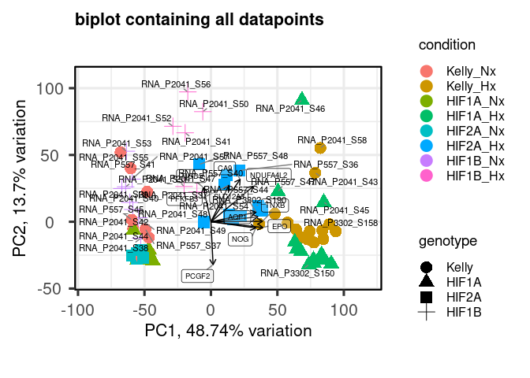

- [0. Load](#load)
  - [- R](#r)
  - [- Linux](#linux)
  - [- Download Data](#download-data)
- [1. Prepare Data](#prepare-data)
  - [- Make Index](#make-index)
  - [- Mapping (Salmon)](#mapping-salmon)
  - [- Sample names](#sample-names)
    - [Extract filenames from quants](#extract-filenames-from-quants)
    - [P3302](#p3302)
    - [P2041](#p2041)
    - [P557](#p557)
    - [combine lists](#combine-lists)
- [2. Process](#process)
  - [- Mapping Rates](#mapping-rates)
    - [Plot mapping rates](#plot-mapping-rates)
  - [- Tximeta](#tximeta)
    - [add gene symbols](#add-gene-symbols)
  - [- DESeq2](#deseq2)
- [3. Pre-Analysis](#pre-analysis)
  - [- Data transformations](#data-transformations)
  - [- Check sample distance](#check-sample-distance)
  - [- Perform principal component
    analysis](#perform-principal-component-analysis)
  - [- Plot example counts](#plot-example-counts)

# 0. Load

## - R

BiocManager::install()

BiocManager::install(“GOSemSim”)

## - Linux

``` bash
fastqdir="/mnt/s/AG/AG-Scholz-NGS/Daten/RNASeq_Kelly2_P3302";
fastqdir2="/mnt/s/AG/AG-Scholz-NGS/Daten/RNASeq_Kelly";
fastqdir3="/mnt/s/AG/AG-Scholz-NGS/Daten/Sequencing-2/Sequencing-2_A/FASTQ";

# /mnt/s/AG/AG-Scholz-NGS/Daten/Simon/RNA-Seq Kelly all
dir="/mnt/s/AG/AG-Scholz-NGS/Daten/Simon/RNA-Seq_Kelly_all"

quantdir="$dir/quants"
indexdir="/mnt/s/AG/AG-Scholz-NGS/Daten/Salmon/index/human_ens110_index"
```

## - Download Data

``` bash
## Download data

cd $fastqdir;
lftp

# open -u <user>@<DOMAIN> https://file-exchange.bihealth.org/<file-box-id>/
open -u kelterbs@CHARITE https://file-exchange.bihealth.org/bd53df77-dd5a-4fb6-b640-4625548c5119/
  
  # [Password]
  
  # Download all data into target folder
  mirror . $fastqdir
# mirror . /mnt/s/AG/AG-Scholz-NGS/Daten/RNASeq_Kelly2_P3302

# Check data
cd $fastqdir
ls $fastqdir | wc -l
ls $fastqdir/*R1*.fastq.gz | wc -l
# 150 R1+R2 = 36 fastq.gz files = 18 Samples, 36 files

# Check downloads
log="$fastqdir/download.log";
echo "##################
# $(date +%Y_%m_%d__%T) Check md5 Checksums
#";
md5sum -c  *.md5 | tee -a $log;
wc -l $log
# 36 files ok
```

# 1. Prepare Data

## - Make Index

``` bash

# check newest release http://ftp.ensembl.org/pub/
release=110
echo $release
gdir="/mnt/s/AG/AG-Scholz-NGS/Daten/Salmon/genomic_data/ensembl/${release}"
echo $gdir

# Donwload genomic data: dna
wget -P $gdir "http://ftp.ensembl.org/pub/current_fasta/homo_sapiens/dna/Homo_sapiens.GRCh38.dna.primary_assembly.fa.gz"

# Donwload genomic data: cdna (=cds with UTRs without introns)
wget -P $gdir "http://ftp.ensembl.org/pub/current_fasta/homo_sapiens/cdna/Homo_sapiens.GRCh38.cdna.all.fa.gz"

# Donwload genomic data: ncrna
wget -P $gdir "http://ftp.ensembl.org/pub/current_fasta/homo_sapiens/ncrna/Homo_sapiens.GRCh38.ncrna.fa.gz"

# Donwload genomic data: gff3 (for later use)
wget -P $gdir "http://ftp.ensembl.org/pub/current_gff3/homo_sapiens/Homo_sapiens.GRCh38.${release}.gff3.gz"

# create list of chromosomes
cd $gdir
grep "^>" <(gunzip -c Homo_sapiens.GRCh38.dna.primary_assembly.fa.gz) | cut -d " " -f 1 > decoys_human_ensh38.txt

# to modify, copy to linux partition
mkdir ~/decoys
cp decoys_human_ensh38.txt ~/decoys

# remove ">"
sed -i.bak -e 's/>//g' ~/decoys/decoys_human_ensh38.txt

# Optional: check txt file
vim ~/decoys/decoys_human_ensh38.txt
# to exit: -press 'ESC', type ":q!", press 'ENTER'

# copy back
cp ~/decoys/decoys_human_ensh38.txt $gdir

# combine cdna ncdna and dna in one file
cd $gdir

cat Homo_sapiens.GRCh38.cdna.all.fa.gz Homo_sapiens.GRCh38.ncrna.fa.gz Homo_sapiens.GRCh38.dna.primary_assembly.fa.gz > gentrome_human_ensh38.fa.gz

# make index with salmon
# is salmon activated?
cd $gdir
salmon index -t gentrome_human_ensh38.fa.gz -d decoys_human_ensh38.txt -p 20 -i ../../index/human_ens110_index
```

## - Mapping (Salmon)

``` bash
conda activate salmon

fastqfiles=$(ls $fastqdir/*R1*.fastq.gz)
fastqfiles2=$(ls $fastqdir2/*R1*.fastq.gz)
fastqfiles3=$(ls $fastqdir3/*R1*.fastq.gz)

fastqfiles_all="${fastqfiles} ${fastqfiles2} ${fastqfiles3}"
echo $fastqfiles
echo $fastqfiles2
echo $fastqfiles3
echo $fastqfiles_all


for fn in $fastqfiles_all;
do
bfn=$(echo "`basename ${fn}`");
samp=${bfn%"_R1_001.fastq.gz"};
R1=$fn;
R2=$(echo "$R1" | sed 's/R1/R2/');
echo "Processing Sample: $samp";
test -f $R1 && echo "--> File: $R1 exists"
test -f $R2 && echo "--> File: $R2 exists"
outquant=${dir}/quants/${samp}_quant
echo $outquant
echo $indexdir

salmon quant -i $indexdir -l A \
-1 $R1 \
-2 $R2 \
-p 20 --validateMappings --gcBias -o $outquant

done
```

## - Sample names

### Extract filenames from quants

``` r
# Get Sample table

## Extract Filenames from quant files

outdir <- paste(dir,"output",sep="/")
dir.create(outdir)
quantdir <- paste(dir,"quants",sep="/")

f <- list.files(path = quantdir)
files <- paste(quantdir,f,"quant.sf",sep="/")
files %>% file.exists() %>% summary()
```

    ##    Mode    TRUE 
    ## logical     204

``` r
names <- as.factor(str_remove(f,pattern ="_quant"))

# short form
samplename2 <- names %>% 
  str_replace(pattern="P3302_01_P3302_RNA_", replacement = "RNA_P3302_") %>%
  str_replace(pattern="P2041_", replacement = "RNA_P2041_") %>%
  str_replace(pattern="CH_HS_KK_", replacement = "RNA_P557_") %>%
  str_remove(pattern="_quant")
# samplename2[c(1,2,31,32,33,34,53,54,55,56,203,204)]
l <- samplename2 %>% length()
sequencing <- str_extract(samplename2,"P[0-9]+")
sample <- str_extract(samplename2,"S[0-9]+")
lane <- str_extract(samplename2,"L[0-9]+") %>% 
  replace_na("L001")

runname <- paste("RNA",
                 sequencing,
                 sample,
                 lane,
                 sep="_")

samplename <- paste("RNA",
                    sequencing,
                    sample,
                    sep="_")

quant_file_table <- data.frame(files, samplename, order = seq(1:l),
                               filename = samplename2,
                               sequencing = sequencing,
                               lane=lane)[17:l,]
dim(quant_file_table)
```

    ## [1] 188   6

``` r
quant_file_table[c(1,2,31,32,33,34,53,54,55,56,187,188),] %>% kable() %>% kable_styling("striped", full_width = F)
```

<table class="table table-striped" style="width: auto !important; margin-left: auto; margin-right: auto;">
<thead>
<tr>
<th style="text-align:left;">
</th>
<th style="text-align:left;">
files
</th>
<th style="text-align:left;">
samplename
</th>
<th style="text-align:right;">
order
</th>
<th style="text-align:left;">
filename
</th>
<th style="text-align:left;">
sequencing
</th>
<th style="text-align:left;">
lane
</th>
</tr>
</thead>
<tbody>
<tr>
<td style="text-align:left;">
17
</td>
<td style="text-align:left;">
/mnt/s/AG/AG-Scholz-NGS/Daten/Simon/RNA-Seq_Kelly_all/quants/CH_HS_KK_077_S33_quant/quant.sf
</td>
<td style="text-align:left;">
RNA_P557_S33
</td>
<td style="text-align:right;">
17
</td>
<td style="text-align:left;">
RNA_P557_077_S33
</td>
<td style="text-align:left;">
P557
</td>
<td style="text-align:left;">
L001
</td>
</tr>
<tr>
<td style="text-align:left;">
18
</td>
<td style="text-align:left;">
/mnt/s/AG/AG-Scholz-NGS/Daten/Simon/RNA-Seq_Kelly_all/quants/CH_HS_KK_078_S34_quant/quant.sf
</td>
<td style="text-align:left;">
RNA_P557_S34
</td>
<td style="text-align:right;">
18
</td>
<td style="text-align:left;">
RNA_P557_078_S34
</td>
<td style="text-align:left;">
P557
</td>
<td style="text-align:left;">
L001
</td>
</tr>
<tr>
<td style="text-align:left;">
47
</td>
<td style="text-align:left;">
/mnt/s/AG/AG-Scholz-NGS/Daten/Simon/RNA-Seq_Kelly_all/quants/P2041_10748_S51_L003_quant/quant.sf
</td>
<td style="text-align:left;">
RNA_P2041_S51
</td>
<td style="text-align:right;">
47
</td>
<td style="text-align:left;">
RNA_P2041_10748_S51_L003
</td>
<td style="text-align:left;">
P2041
</td>
<td style="text-align:left;">
L003
</td>
</tr>
<tr>
<td style="text-align:left;">
48
</td>
<td style="text-align:left;">
/mnt/s/AG/AG-Scholz-NGS/Daten/Simon/RNA-Seq_Kelly_all/quants/P2041_10749_S52_L003_quant/quant.sf
</td>
<td style="text-align:left;">
RNA_P2041_S52
</td>
<td style="text-align:right;">
48
</td>
<td style="text-align:left;">
RNA_P2041_10749_S52_L003
</td>
<td style="text-align:left;">
P2041
</td>
<td style="text-align:left;">
L003
</td>
</tr>
<tr>
<td style="text-align:left;">
49
</td>
<td style="text-align:left;">
/mnt/s/AG/AG-Scholz-NGS/Daten/Simon/RNA-Seq_Kelly_all/quants/P2041_10750_S53_L003_quant/quant.sf
</td>
<td style="text-align:left;">
RNA_P2041_S53
</td>
<td style="text-align:right;">
49
</td>
<td style="text-align:left;">
RNA_P2041_10750_S53_L003
</td>
<td style="text-align:left;">
P2041
</td>
<td style="text-align:left;">
L003
</td>
</tr>
<tr>
<td style="text-align:left;">
50
</td>
<td style="text-align:left;">
/mnt/s/AG/AG-Scholz-NGS/Daten/Simon/RNA-Seq_Kelly_all/quants/P2041_10751_S54_L003_quant/quant.sf
</td>
<td style="text-align:left;">
RNA_P2041_S54
</td>
<td style="text-align:right;">
50
</td>
<td style="text-align:left;">
RNA_P2041_10751_S54_L003
</td>
<td style="text-align:left;">
P2041
</td>
<td style="text-align:left;">
L003
</td>
</tr>
<tr>
<td style="text-align:left;">
69
</td>
<td style="text-align:left;">
/mnt/s/AG/AG-Scholz-NGS/Daten/Simon/RNA-Seq_Kelly_all/quants/P3302_01_P3302_RNA_05_S145_L008_quant/quant.sf
</td>
<td style="text-align:left;">
RNA_P3302_S145
</td>
<td style="text-align:right;">
69
</td>
<td style="text-align:left;">
RNA_P3302_05_S145_L008
</td>
<td style="text-align:left;">
P3302
</td>
<td style="text-align:left;">
L008
</td>
</tr>
<tr>
<td style="text-align:left;">
70
</td>
<td style="text-align:left;">
/mnt/s/AG/AG-Scholz-NGS/Daten/Simon/RNA-Seq_Kelly_all/quants/P3302_01_P3302_RNA_06_S146_L006_quant/quant.sf
</td>
<td style="text-align:left;">
RNA_P3302_S146
</td>
<td style="text-align:right;">
70
</td>
<td style="text-align:left;">
RNA_P3302_06_S146_L006
</td>
<td style="text-align:left;">
P3302
</td>
<td style="text-align:left;">
L006
</td>
</tr>
<tr>
<td style="text-align:left;">
71
</td>
<td style="text-align:left;">
/mnt/s/AG/AG-Scholz-NGS/Daten/Simon/RNA-Seq_Kelly_all/quants/P3302_01_P3302_RNA_06_S146_L007_quant/quant.sf
</td>
<td style="text-align:left;">
RNA_P3302_S146
</td>
<td style="text-align:right;">
71
</td>
<td style="text-align:left;">
RNA_P3302_06_S146_L007
</td>
<td style="text-align:left;">
P3302
</td>
<td style="text-align:left;">
L007
</td>
</tr>
<tr>
<td style="text-align:left;">
72
</td>
<td style="text-align:left;">
/mnt/s/AG/AG-Scholz-NGS/Daten/Simon/RNA-Seq_Kelly_all/quants/P3302_01_P3302_RNA_06_S146_L008_quant/quant.sf
</td>
<td style="text-align:left;">
RNA_P3302_S146
</td>
<td style="text-align:right;">
72
</td>
<td style="text-align:left;">
RNA_P3302_06_S146_L008
</td>
<td style="text-align:left;">
P3302
</td>
<td style="text-align:left;">
L008
</td>
</tr>
<tr>
<td style="text-align:left;">
203
</td>
<td style="text-align:left;">
/mnt/s/AG/AG-Scholz-NGS/Daten/Simon/RNA-Seq_Kelly_all/quants/P3302_01_P3302_RNA_50_S190_L007_quant/quant.sf
</td>
<td style="text-align:left;">
RNA_P3302_S190
</td>
<td style="text-align:right;">
203
</td>
<td style="text-align:left;">
RNA_P3302_50_S190_L007
</td>
<td style="text-align:left;">
P3302
</td>
<td style="text-align:left;">
L007
</td>
</tr>
<tr>
<td style="text-align:left;">
204
</td>
<td style="text-align:left;">
/mnt/s/AG/AG-Scholz-NGS/Daten/Simon/RNA-Seq_Kelly_all/quants/P3302_01_P3302_RNA_50_S190_L008_quant/quant.sf
</td>
<td style="text-align:left;">
RNA_P3302_S190
</td>
<td style="text-align:right;">
204
</td>
<td style="text-align:left;">
RNA_P3302_50_S190_L008
</td>
<td style="text-align:left;">
P3302
</td>
<td style="text-align:left;">
L008
</td>
</tr>
</tbody>
</table>

### P3302

``` r
# Get samplelists
## P3302

Samplepath <- filePath(path=fastqdir, file="samplelist.xlsx")
list.files(fastqdir, pattern=".xlsx")
```

    ## [1] "Kopie von 2023-09-08_P3302_Project_Registration_Form_Illumina_v5.0.xlsx"
    ## [2] "samplelist.xlsx"

``` r
file.exists(Samplepath)
```

    ## [1] TRUE

``` r
Samplefile <- read_xlsx(Samplepath)
# Samplefile[c(1,2,49,50),] %>% kable() %>% kable_styling("striped", full_width = F)
# colnames(Samplefile)
colnames(Samplefile)[1] <- "order_number"
colnames(Samplefile)[2] <- "samplename"
colnames(Samplefile)[3] <- "rna_id"
colnames(Samplefile)[5] <- "rna_conc"

colnames(Samplefile)
```

    ##  [1] "order_number"                                              
    ##  [2] "samplename"                                                
    ##  [3] "rna_id"                                                    
    ##  [4] "how was the concentration measured (Qubit, Nanodrop, etc.)"
    ##  [5] "rna_conc"                                                  
    ##  [6] "delivered volume [µl]"                                     
    ##  [7] "RNA origin (organism)"                                     
    ##  [8] "RNA source (muscle, cell line, etc.)"                      
    ##  [9] "RNA source state (fresh, snap-frozen, FFPE, etc.)"         
    ## [10] "RNA Isolation method"                                      
    ## [11] "CUGE-ID"                                                   
    ## [12] "...12"                                                     
    ## [13] "RNA"                                                       
    ## [14] "Datum"                                                     
    ## [15] "Probe"                                                     
    ## [16] "Konz.(µg/µl)"                                              
    ## [17] "Volumen(µl)"                                               
    ## [18] "Methode"                                                   
    ## [19] "Probe von"

``` r
sample_table <- Samplefile[,c("order_number","samplename","rna_id","Probe","rna_conc","Konz.(µg/µl)","CUGE-ID","Datum")]

sample_table$cellline <- str_split(sample_table$Probe, pattern=" ", simplify = TRUE)[,1] %>% as.factor()
sample_table$clone <- str_split(sample_table$Probe, pattern=" ", simplify = TRUE)[,2] %>% as.factor() %>% relevel(ref="LV1")
sample_table$genotype <- str_split(sample_table$clone, pattern="\\.", simplify = TRUE)[,1] %>% as.factor() %>% relevel(ref="LV1")
sample_table$clone <- revalue(sample_table$clone, c("Hif1.3"="Hif1a_1.3", "Hif2.2"="Hif2a_2.2"))
sample_table$genotype <- str_replace(sample_table$genotype, pattern = "LV1", replacement = "Kelly")
sample_table$genotype <- str_replace(sample_table$genotype, pattern = "Hif1", replacement = "HIF1A")
sample_table$genotype <- str_replace(sample_table$genotype, pattern = "Hif2", replacement = "HIF2A") %>% as.factor() %>% relevel(ref="Kelly")
sample_table$treatment <- str_split(sample_table$Probe, pattern=" ", simplify = TRUE)[,4] %>% as.factor() %>% relevel(ref="Nx")
sample_table$run_id <- str_remove(sample_table$samplename,pattern="P3302_")                                   
sample_table$sequencing <- "P3302"
# RNA_P3302_01_S141_L006
sample_table$samplename <- paste("RNA_P3302_",
                                 "S",141:190, sep="")
sample_table$sample_id <- paste("S",141:190, sep="")         
sample_table$experiment <- "Ulrike"
sample_table$experiment_date <- sample_table$Datum
sample_table$repetition <- as.factor(sample_table$experiment_date)
levels(sample_table$repetition) <- c("1","2","3","4")
sample_table$exp_rep <- paste(sample_table$experiment,sample_table$repetition, sep="_")

sample_table$cell_density <- str_split(sample_table$Probe, pattern=" ", simplify = TRUE)[,3] %>% str_remove_all("\\(")  %>% str_remove_all("\\)")

sample_table_P3302 <- as.data.frame(sample_table)
sample_table_P3302$samplename %in% quant_file_table$samplename %>% summary()
```

    ##    Mode    TRUE 
    ## logical      50

``` r
sample_table_P3302[c(1,2,49,50),] %>% kable() %>% kable_styling("striped", full_width = F) %>% scroll_box(height = "400px")
```

<div style="border: 1px solid #ddd; padding: 0px; overflow-y: scroll; height:400px; ">

<table class="table table-striped" style="width: auto !important; margin-left: auto; margin-right: auto;">
<thead>
<tr>
<th style="text-align:left;position: sticky; top:0; background-color: #FFFFFF;">
</th>
<th style="text-align:right;position: sticky; top:0; background-color: #FFFFFF;">
order_number
</th>
<th style="text-align:left;position: sticky; top:0; background-color: #FFFFFF;">
samplename
</th>
<th style="text-align:right;position: sticky; top:0; background-color: #FFFFFF;">
rna_id
</th>
<th style="text-align:left;position: sticky; top:0; background-color: #FFFFFF;">
Probe
</th>
<th style="text-align:right;position: sticky; top:0; background-color: #FFFFFF;">
rna_conc
</th>
<th style="text-align:right;position: sticky; top:0; background-color: #FFFFFF;">
Konz.(µg/µl)
</th>
<th style="text-align:right;position: sticky; top:0; background-color: #FFFFFF;">
CUGE-ID
</th>
<th style="text-align:left;position: sticky; top:0; background-color: #FFFFFF;">
Datum
</th>
<th style="text-align:left;position: sticky; top:0; background-color: #FFFFFF;">
cellline
</th>
<th style="text-align:left;position: sticky; top:0; background-color: #FFFFFF;">
clone
</th>
<th style="text-align:left;position: sticky; top:0; background-color: #FFFFFF;">
genotype
</th>
<th style="text-align:left;position: sticky; top:0; background-color: #FFFFFF;">
treatment
</th>
<th style="text-align:left;position: sticky; top:0; background-color: #FFFFFF;">
run_id
</th>
<th style="text-align:left;position: sticky; top:0; background-color: #FFFFFF;">
sequencing
</th>
<th style="text-align:left;position: sticky; top:0; background-color: #FFFFFF;">
sample_id
</th>
<th style="text-align:left;position: sticky; top:0; background-color: #FFFFFF;">
experiment
</th>
<th style="text-align:left;position: sticky; top:0; background-color: #FFFFFF;">
experiment_date
</th>
<th style="text-align:left;position: sticky; top:0; background-color: #FFFFFF;">
repetition
</th>
<th style="text-align:left;position: sticky; top:0; background-color: #FFFFFF;">
exp_rep
</th>
<th style="text-align:left;position: sticky; top:0; background-color: #FFFFFF;">
cell_density
</th>
</tr>
</thead>
<tbody>
<tr>
<td style="text-align:left;">
1
</td>
<td style="text-align:right;">
53
</td>
<td style="text-align:left;">
RNA_P3302_S141
</td>
<td style="text-align:right;">
10897
</td>
<td style="text-align:left;">
Kelly LV1 (1:4) Nx 24 h
</td>
<td style="text-align:right;">
43.94
</td>
<td style="text-align:right;">
0.6341333
</td>
<td style="text-align:right;">
11691
</td>
<td style="text-align:left;">
2023-06-02
</td>
<td style="text-align:left;">
Kelly
</td>
<td style="text-align:left;">
LV1
</td>
<td style="text-align:left;">
Kelly
</td>
<td style="text-align:left;">
Nx
</td>
<td style="text-align:left;">
RNA_01
</td>
<td style="text-align:left;">
P3302
</td>
<td style="text-align:left;">
S141
</td>
<td style="text-align:left;">
Ulrike
</td>
<td style="text-align:left;">
2023-06-02
</td>
<td style="text-align:left;">
1
</td>
<td style="text-align:left;">
Ulrike_1
</td>
<td style="text-align:left;">
1:4
</td>
</tr>
<tr>
<td style="text-align:left;">
2
</td>
<td style="text-align:right;">
54
</td>
<td style="text-align:left;">
RNA_P3302_S142
</td>
<td style="text-align:right;">
10898
</td>
<td style="text-align:left;">
Kelly LV1 (1:5) Nx 24 h
</td>
<td style="text-align:right;">
39.08
</td>
<td style="text-align:right;">
0.5348000
</td>
<td style="text-align:right;">
11692
</td>
<td style="text-align:left;">
2023-06-02
</td>
<td style="text-align:left;">
Kelly
</td>
<td style="text-align:left;">
LV1
</td>
<td style="text-align:left;">
Kelly
</td>
<td style="text-align:left;">
Nx
</td>
<td style="text-align:left;">
RNA_02
</td>
<td style="text-align:left;">
P3302
</td>
<td style="text-align:left;">
S142
</td>
<td style="text-align:left;">
Ulrike
</td>
<td style="text-align:left;">
2023-06-02
</td>
<td style="text-align:left;">
1
</td>
<td style="text-align:left;">
Ulrike_1
</td>
<td style="text-align:left;">
1:5
</td>
</tr>
<tr>
<td style="text-align:left;">
49
</td>
<td style="text-align:right;">
101
</td>
<td style="text-align:left;">
RNA_P3302_S189
</td>
<td style="text-align:right;">
11004
</td>
<td style="text-align:left;">
Kelly Hif2.2 (600000) Hx 24 h
</td>
<td style="text-align:right;">
54.78
</td>
<td style="text-align:right;">
1.2554000
</td>
<td style="text-align:right;">
11739
</td>
<td style="text-align:left;">
2023-06-28
</td>
<td style="text-align:left;">
Kelly
</td>
<td style="text-align:left;">
Hif2a_2.2
</td>
<td style="text-align:left;">
HIF2A
</td>
<td style="text-align:left;">
Hx
</td>
<td style="text-align:left;">
RNA_49
</td>
<td style="text-align:left;">
P3302
</td>
<td style="text-align:left;">
S189
</td>
<td style="text-align:left;">
Ulrike
</td>
<td style="text-align:left;">
2023-06-28
</td>
<td style="text-align:left;">
4
</td>
<td style="text-align:left;">
Ulrike_4
</td>
<td style="text-align:left;">
600000
</td>
</tr>
<tr>
<td style="text-align:left;">
50
</td>
<td style="text-align:right;">
102
</td>
<td style="text-align:left;">
RNA_P3302_S190
</td>
<td style="text-align:right;">
11005
</td>
<td style="text-align:left;">
Kelly Hif2.2 (600000) Hx 24 h
</td>
<td style="text-align:right;">
54.28
</td>
<td style="text-align:right;">
1.3440000
</td>
<td style="text-align:right;">
11740
</td>
<td style="text-align:left;">
2023-06-28
</td>
<td style="text-align:left;">
Kelly
</td>
<td style="text-align:left;">
Hif2a_2.2
</td>
<td style="text-align:left;">
HIF2A
</td>
<td style="text-align:left;">
Hx
</td>
<td style="text-align:left;">
RNA_50
</td>
<td style="text-align:left;">
P3302
</td>
<td style="text-align:left;">
S190
</td>
<td style="text-align:left;">
Ulrike
</td>
<td style="text-align:left;">
2023-06-28
</td>
<td style="text-align:left;">
4
</td>
<td style="text-align:left;">
Ulrike_4
</td>
<td style="text-align:left;">
600000
</td>
</tr>
</tbody>
</table>

</div>

### P2041

``` r
## P2041
list.files(fastqdir2, pattern=".xlsx")
```

    ## [1] "~$DEG_Hif1b_Hx_vs_Nx.xlsx"                                                    
    ## [2] "~$Sample_list.xlsx"                                                           
    ## [3] "DEG_Hif1b_Hx_vs_Nx.xlsx"                                                      
    ## [4] "Kopie von 2023-09-08_P3302_Project_Registration_Form_Illumina_v5.0 (003).xlsx"
    ## [5] "Kopie von P3302_Project_Registration_Form_Illumina_v5.0.xlsx"                 
    ## [6] "Kopie von RNASeqRNAClean2023KellyHif_purified.xlsx"                           
    ## [7] "Kopie von RNASeqRNAClean2023KellyHif.xlsx"                                    
    ## [8] "P3302_Project_Registration_Form_Illumina_v5.0_20230810.xlsx"                  
    ## [9] "Sample_list.xlsx"

``` r
Samplepath <- filePath(path=fastqdir2, file="Sample_list.xlsx")

file.exists(Samplepath)
```

    ## [1] TRUE

``` r
Samplefile <- read_xlsx(Samplepath)
# Samplefile
# colnames(Samplefile)
sample_table <- Samplefile

sample_table$cellline <- "Kelly"
sample_table$treatment <- sample_table$treatment %>% as.factor() %>% relevel(ref="Nx")
sample_table$genotype <- str_replace(sample_table$genotype, pattern = "LV", replacement = "Kelly")
sample_table$genotype <- str_replace(sample_table$genotype, pattern = "Hif1b", replacement = "HIF1B")
sample_table$genotype <- str_replace(sample_table$genotype, pattern = "Hif1a", replacement = "HIF1A")
sample_table$genotype <- sample_table$genotype %>% as.factor() %>% relevel(ref="Kelly")
sample_table$sample <- str_remove(sample_table$samplename,pattern="P2041_")
sample_table$lane <- "L003"
# RNA_P2041_10632_S41_L003
sample_table$sequencing <- "P2041"
sample_table$run_id <- paste("RNA",as.character(sample_table$'CUGE-ID'),sep="_")
sample_table$samplename <- paste("RNA_P2041_",
                                 "S",37:58,sep="")
sample_table$sample_id <- paste("S",37:58,sep="")
sample_table$repetition <- as.character(sample_table$repetition)
sample_table$sample_id %in% sample %>% summary()
```

    ##    Mode    TRUE 
    ## logical      22

``` r
sample_table$exp_rep <- paste(sample_table$experiment,sample_table$repetition, sep="_")

sample_table$clone <- sample_table$clone%>% factor

# Make table
sample_table_P2041 <- as.data.frame(sample_table)

sample_table_P2041$samplename %in% quant_file_table$samplename %>% summary()
```

    ##    Mode    TRUE 
    ## logical      22

``` r
sample_table_P2041[c(1,2,21,22),] %>% kable() %>% kable_styling("striped", full_width = F) %>% scroll_box(height = "400px")
```

<div style="border: 1px solid #ddd; padding: 0px; overflow-y: scroll; height:400px; ">

<table class="table table-striped" style="width: auto !important; margin-left: auto; margin-right: auto;">
<thead>
<tr>
<th style="text-align:left;position: sticky; top:0; background-color: #FFFFFF;">
</th>
<th style="text-align:left;position: sticky; top:0; background-color: #FFFFFF;">
samplename
</th>
<th style="text-align:right;position: sticky; top:0; background-color: #FFFFFF;">
CUGE-ID
</th>
<th style="text-align:right;position: sticky; top:0; background-color: #FFFFFF;">
rna_id
</th>
<th style="text-align:left;position: sticky; top:0; background-color: #FFFFFF;">
Datum
</th>
<th style="text-align:left;position: sticky; top:0; background-color: #FFFFFF;">
experiment
</th>
<th style="text-align:left;position: sticky; top:0; background-color: #FFFFFF;">
experiment_date
</th>
<th style="text-align:left;position: sticky; top:0; background-color: #FFFFFF;">
repetition
</th>
<th style="text-align:left;position: sticky; top:0; background-color: #FFFFFF;">
exp_rep
</th>
<th style="text-align:left;position: sticky; top:0; background-color: #FFFFFF;">
Probe
</th>
<th style="text-align:left;position: sticky; top:0; background-color: #FFFFFF;">
treatment
</th>
<th style="text-align:left;position: sticky; top:0; background-color: #FFFFFF;">
genotype
</th>
<th style="text-align:left;position: sticky; top:0; background-color: #FFFFFF;">
clone
</th>
<th style="text-align:left;position: sticky; top:0; background-color: #FFFFFF;">
Nx
</th>
<th style="text-align:left;position: sticky; top:0; background-color: #FFFFFF;">
HX
</th>
<th style="text-align:left;position: sticky; top:0; background-color: #FFFFFF;">
cellline
</th>
<th style="text-align:left;position: sticky; top:0; background-color: #FFFFFF;">
sample
</th>
<th style="text-align:left;position: sticky; top:0; background-color: #FFFFFF;">
lane
</th>
<th style="text-align:left;position: sticky; top:0; background-color: #FFFFFF;">
sequencing
</th>
<th style="text-align:left;position: sticky; top:0; background-color: #FFFFFF;">
run_id
</th>
<th style="text-align:left;position: sticky; top:0; background-color: #FFFFFF;">
sample_id
</th>
</tr>
</thead>
<tbody>
<tr>
<td style="text-align:left;">
1
</td>
<td style="text-align:left;">
RNA_P2041_S37
</td>
<td style="text-align:right;">
10619
</td>
<td style="text-align:right;">
6952
</td>
<td style="text-align:left;">
2017-05-04
</td>
<td style="text-align:left;">
Control
</td>
<td style="text-align:left;">
2017-05-04
</td>
<td style="text-align:left;">
0
</td>
<td style="text-align:left;">
Control_0
</td>
<td style="text-align:left;">
Kelly CRISPR Cas Hif LV1 Nx 24h
</td>
<td style="text-align:left;">
Nx
</td>
<td style="text-align:left;">
Kelly
</td>
<td style="text-align:left;">
LV_1
</td>
<td style="text-align:left;">
LV
</td>
<td style="text-align:left;">
NA
</td>
<td style="text-align:left;">
Kelly
</td>
<td style="text-align:left;">
RNA_01
</td>
<td style="text-align:left;">
L003
</td>
<td style="text-align:left;">
P2041
</td>
<td style="text-align:left;">
RNA_10619
</td>
<td style="text-align:left;">
S37
</td>
</tr>
<tr>
<td style="text-align:left;">
2
</td>
<td style="text-align:left;">
RNA_P2041_S38
</td>
<td style="text-align:right;">
10621
</td>
<td style="text-align:right;">
10185
</td>
<td style="text-align:left;">
2021-06-16
</td>
<td style="text-align:left;">
Simon
</td>
<td style="text-align:left;">
2021-06-16
</td>
<td style="text-align:left;">
1
</td>
<td style="text-align:left;">
Simon_1
</td>
<td style="text-align:left;">
Kelly Hif1b.sg1+2 Klon 9 Nx
</td>
<td style="text-align:left;">
Nx
</td>
<td style="text-align:left;">
HIF1B
</td>
<td style="text-align:left;">
Hif1b_9
</td>
<td style="text-align:left;">
LV
</td>
<td style="text-align:left;">
LV
</td>
<td style="text-align:left;">
Kelly
</td>
<td style="text-align:left;">
RNA_03
</td>
<td style="text-align:left;">
L003
</td>
<td style="text-align:left;">
P2041
</td>
<td style="text-align:left;">
RNA_10621
</td>
<td style="text-align:left;">
S38
</td>
</tr>
<tr>
<td style="text-align:left;">
21
</td>
<td style="text-align:left;">
RNA_P2041_S57
</td>
<td style="text-align:right;">
10752
</td>
<td style="text-align:right;">
10306
</td>
<td style="text-align:left;">
2021-08-27
</td>
<td style="text-align:left;">
Simon
</td>
<td style="text-align:left;">
2021-08-27
</td>
<td style="text-align:left;">
5
</td>
<td style="text-align:left;">
Simon_5
</td>
<td style="text-align:left;">
Kelly Hif1b 10.1 Nx
</td>
<td style="text-align:left;">
Nx
</td>
<td style="text-align:left;">
HIF1B
</td>
<td style="text-align:left;">
Hif1b_10
</td>
<td style="text-align:left;">
NA
</td>
<td style="text-align:left;">
NA
</td>
<td style="text-align:left;">
Kelly
</td>
<td style="text-align:left;">
RNA_39
</td>
<td style="text-align:left;">
L003
</td>
<td style="text-align:left;">
P2041
</td>
<td style="text-align:left;">
RNA_10752
</td>
<td style="text-align:left;">
S57
</td>
</tr>
<tr>
<td style="text-align:left;">
22
</td>
<td style="text-align:left;">
RNA_P2041_S58
</td>
<td style="text-align:right;">
10753
</td>
<td style="text-align:right;">
10307
</td>
<td style="text-align:left;">
2021-08-27
</td>
<td style="text-align:left;">
Simon
</td>
<td style="text-align:left;">
2021-08-27
</td>
<td style="text-align:left;">
5
</td>
<td style="text-align:left;">
Simon_5
</td>
<td style="text-align:left;">
Kelly Hif1b 10.1 Hx
</td>
<td style="text-align:left;">
Hx
</td>
<td style="text-align:left;">
HIF1B
</td>
<td style="text-align:left;">
Hif1b_10
</td>
<td style="text-align:left;">
NA
</td>
<td style="text-align:left;">
NA
</td>
<td style="text-align:left;">
Kelly
</td>
<td style="text-align:left;">
RNA_40
</td>
<td style="text-align:left;">
L003
</td>
<td style="text-align:left;">
P2041
</td>
<td style="text-align:left;">
RNA_10753
</td>
<td style="text-align:left;">
S58
</td>
</tr>
</tbody>
</table>

</div>

### P557

``` r
## P557
# list.files(dirname(fastqdir3), pattern=".xlsx")

# Table 1
Samplepath <- filePath(path=dirname(fastqdir3), file="2020_02_13_Sample_list_NGS.xlsx")
file.exists(Samplepath)
```

    ## [1] TRUE

``` r
Samplefile <- read_xlsx(Samplepath, col_names =c("Probe","Sequencing-2_A","Sequencing-2_B", "path","rna_id"))

# Table 2
Samplepath <- filePath(path=dirname(fastqdir3), file="RNA_samples.xlsx")
file.exists(Samplepath)
```

    ## [1] TRUE

``` r
Samplefile <- read_xlsx(Samplepath)

df <- Samplefile %>% as.data.frame()
sample_table <- df
sample_table[c(1,2,23,24),]  %>% kable() %>% kable_styling("striped", full_width = F) %>% scroll_box(height = "400px")
```

<div style="border: 1px solid #ddd; padding: 0px; overflow-y: scroll; height:400px; ">

<table class="table table-striped" style="width: auto !important; margin-left: auto; margin-right: auto;">
<thead>
<tr>
<th style="text-align:left;position: sticky; top:0; background-color: #FFFFFF;">
</th>
<th style="text-align:right;position: sticky; top:0; background-color: #FFFFFF;">
RNA-Nr.
</th>
<th style="text-align:left;position: sticky; top:0; background-color: #FFFFFF;">
Datum
</th>
<th style="text-align:left;position: sticky; top:0; background-color: #FFFFFF;">
Probe
</th>
<th style="text-align:right;position: sticky; top:0; background-color: #FFFFFF;">
Konz.(µg/µl)
</th>
</tr>
</thead>
<tbody>
<tr>
<td style="text-align:left;">
1
</td>
<td style="text-align:right;">
7693
</td>
<td style="text-align:left;">
2018-09-13
</td>
<td style="text-align:left;">
Kelly CRISPR Hif LV1 P7 Nx 24h
</td>
<td style="text-align:right;">
830.48
</td>
</tr>
<tr>
<td style="text-align:left;">
2
</td>
<td style="text-align:right;">
7694
</td>
<td style="text-align:left;">
2018-09-13
</td>
<td style="text-align:left;">
Kelly CRISPR Hif1.3 P13 Nx 24h
</td>
<td style="text-align:right;">
1004.16
</td>
</tr>
<tr>
<td style="text-align:left;">
23
</td>
<td style="text-align:right;">
7715
</td>
<td style="text-align:left;">
2018-09-14
</td>
<td style="text-align:left;">
Kelly CRISPR Hif1.3 P14 Hx 24h
</td>
<td style="text-align:right;">
583.24
</td>
</tr>
<tr>
<td style="text-align:left;">
24
</td>
<td style="text-align:right;">
7716
</td>
<td style="text-align:left;">
2018-09-14
</td>
<td style="text-align:left;">
Kelly CRISPR HifL2.2 P14 Hx 24h
</td>
<td style="text-align:right;">
644.24
</td>
</tr>
</tbody>
</table>

</div>

``` r
sample_table$treatment <- ifelse(str_detect(sample_table$Probe,pattern="Hx"), "Hx","Nx")
sample_table$treatment <- sample_table$treatment %>% as.factor() %>% relevel(ref="Nx")
sample_table$genotype <- ifelse(str_detect(sample_table$Probe,pattern="1.3"),"HIF1A",
                                ifelse(str_detect(sample_table$Probe,pattern="2.2"),"HIF2A",
                                       "Kelly"))
sample_table$genotype <- sample_table$genotype %>% as.factor() %>% relevel(ref="Kelly")
sample_table$sequencing <- "P557"
sample_table$replicate <-  ifelse(str_detect(sample_table$Probe,pattern="P7"),"P7",
                                  ifelse(str_detect(sample_table$Probe,pattern="P8"),"P8",
                                         ifelse(str_detect(sample_table$Probe,pattern="P13"),"P13","P14")))
sample_table$clone <- ifelse(str_detect(sample_table$Probe,pattern="1.3"),"Hif1a_1.3",
                             ifelse(str_detect(sample_table$Probe,pattern="2.2"),"Hif2a_2.2","LV1"))
sample_table$cellline <- "Kelly"
sample_table$lane <- "L001"

Samplepath2 <- filePath(path=dirname(fastqdir3), file="2020_02_13_Sample_list_NGS.xlsx")
file.exists(Samplepath2)
```

    ## [1] TRUE

``` r
Samplefile2 <- read_xlsx(Samplepath2, col_names =c("Probe","Sequencing-2_A","Sequencing-2_B", "path","rna_id"))
df2 <- Samplefile2 %>% as.data.frame()
kellys <- df2[,1] %>% str_detect(pattern="Kelly")
sample_table2 <- df2[kellys,]
head(sample_table2) %>% kable() %>% kable_styling("striped", full_width = F) %>% scroll_box(height = "400px")
```

<div style="border: 1px solid #ddd; padding: 0px; overflow-y: scroll; height:400px; ">

<table class="table table-striped" style="width: auto !important; margin-left: auto; margin-right: auto;">
<thead>
<tr>
<th style="text-align:left;position: sticky; top:0; background-color: #FFFFFF;">
</th>
<th style="text-align:left;position: sticky; top:0; background-color: #FFFFFF;">
Probe
</th>
<th style="text-align:left;position: sticky; top:0; background-color: #FFFFFF;">
Sequencing-2_A
</th>
<th style="text-align:left;position: sticky; top:0; background-color: #FFFFFF;">
Sequencing-2_B
</th>
<th style="text-align:left;position: sticky; top:0; background-color: #FFFFFF;">
path
</th>
<th style="text-align:right;position: sticky; top:0; background-color: #FFFFFF;">
rna_id
</th>
</tr>
</thead>
<tbody>
<tr>
<td style="text-align:left;">
33
</td>
<td style="text-align:left;">
Kelly CRISPR Hif LV1 P7 Nx 24h
</td>
<td style="text-align:left;">
HS_KK_17
</td>
<td style="text-align:left;">
HS_KK_77
</td>
<td style="text-align:left;">
auf S:AG-Scholz-NGS
</td>
<td style="text-align:right;">
7693
</td>
</tr>
<tr>
<td style="text-align:left;">
34
</td>
<td style="text-align:left;">
Kelly CRISPR HifLV1 P7 Hx 24h
</td>
<td style="text-align:left;">
HS_KK_18
</td>
<td style="text-align:left;">
HS_KK_78
</td>
<td style="text-align:left;">
auf S:AG-Scholz-NGS
</td>
<td style="text-align:right;">
7696
</td>
</tr>
<tr>
<td style="text-align:left;">
35
</td>
<td style="text-align:left;">
Kelly CRISPR Hif1.3 P13 Hx 24h
</td>
<td style="text-align:left;">
HS_KK_19
</td>
<td style="text-align:left;">
HS_KK_79
</td>
<td style="text-align:left;">
auf S:AG-Scholz-NGS
</td>
<td style="text-align:right;">
7697
</td>
</tr>
<tr>
<td style="text-align:left;">
36
</td>
<td style="text-align:left;">
Kelly CRISPR HifL2.2 P13 Hx 24h
</td>
<td style="text-align:left;">
HS_KK_20
</td>
<td style="text-align:left;">
HS_KK_80
</td>
<td style="text-align:left;">
auf S:AG-Scholz-NGS
</td>
<td style="text-align:right;">
7698
</td>
</tr>
<tr>
<td style="text-align:left;">
37
</td>
<td style="text-align:left;">
Kelly CRISPR Hif LV1 P7 Nx 24h
</td>
<td style="text-align:left;">
HS_KK_21
</td>
<td style="text-align:left;">
HS_KK_81
</td>
<td style="text-align:left;">
auf S:AG-Scholz-NGS
</td>
<td style="text-align:right;">
7699
</td>
</tr>
<tr>
<td style="text-align:left;">
38
</td>
<td style="text-align:left;">
Kelly CRISPR HifLV1 P7 Hx 24h
</td>
<td style="text-align:left;">
HS_KK_22
</td>
<td style="text-align:left;">
HS_KK_82
</td>
<td style="text-align:left;">
auf S:AG-Scholz-NGS
</td>
<td style="text-align:right;">
7702
</td>
</tr>
</tbody>
</table>

</div>

``` r
sample_table2$run_id <- paste("RNA",str_split(sample_table2$'Sequencing-2_B', pattern="_", simplify = T)[,3],sep="_")

sample_table <- sample_table[sample_table$'RNA-Nr.' %in% sample_table2$rna_id,]

sample_table$samplename <- paste("RNA_P557_","S",33:48,sep="")
sample_table$sample_id <- paste("S",33:48,sep="")
sample_table$run_id <- sample_table2$run_id
colnames(sample_table)[which(names(sample_table) == "RNA-Nr.")] <- "rna_id"
colnames(sample_table)[which(names(sample_table) == "Konz.(µg/µl)")] <- "rna_conc"
sample_table$sample <- sample_table2$sample
sample_table$experiment <- "Katharina"
sample_table$experiment_date <- sample_table$Datum
sample_table$repetition <-  ifelse(str_detect(sample_table$replicate,pattern="P7"),"1",
                                   ifelse(str_detect(sample_table$Probe,pattern="P8"),"2",
                                          ifelse(str_detect(sample_table$Probe,pattern="P13"),"1","2")))
sample_table$exp_rep <- paste(sample_table$experiment,sample_table$repetition,sep="_")
# "RNA_P557_077_S33

# Make table
sample_table_P557 <- as.data.frame(sample_table)
sample_table_P557$samplename %in% quant_file_table$samplename %>% summary()
```

    ##    Mode    TRUE 
    ## logical      16

``` r
sample_table_P557[c(1,2,15,16),] %>% kable() %>% kable_styling("striped", full_width = F) %>% scroll_box(height = "400px")
```

<div style="border: 1px solid #ddd; padding: 0px; overflow-y: scroll; height:400px; ">

<table class="table table-striped" style="width: auto !important; margin-left: auto; margin-right: auto;">
<thead>
<tr>
<th style="text-align:left;position: sticky; top:0; background-color: #FFFFFF;">
</th>
<th style="text-align:right;position: sticky; top:0; background-color: #FFFFFF;">
rna_id
</th>
<th style="text-align:left;position: sticky; top:0; background-color: #FFFFFF;">
Datum
</th>
<th style="text-align:left;position: sticky; top:0; background-color: #FFFFFF;">
Probe
</th>
<th style="text-align:right;position: sticky; top:0; background-color: #FFFFFF;">
rna_conc
</th>
<th style="text-align:left;position: sticky; top:0; background-color: #FFFFFF;">
treatment
</th>
<th style="text-align:left;position: sticky; top:0; background-color: #FFFFFF;">
genotype
</th>
<th style="text-align:left;position: sticky; top:0; background-color: #FFFFFF;">
sequencing
</th>
<th style="text-align:left;position: sticky; top:0; background-color: #FFFFFF;">
replicate
</th>
<th style="text-align:left;position: sticky; top:0; background-color: #FFFFFF;">
clone
</th>
<th style="text-align:left;position: sticky; top:0; background-color: #FFFFFF;">
cellline
</th>
<th style="text-align:left;position: sticky; top:0; background-color: #FFFFFF;">
lane
</th>
<th style="text-align:left;position: sticky; top:0; background-color: #FFFFFF;">
samplename
</th>
<th style="text-align:left;position: sticky; top:0; background-color: #FFFFFF;">
sample_id
</th>
<th style="text-align:left;position: sticky; top:0; background-color: #FFFFFF;">
run_id
</th>
<th style="text-align:left;position: sticky; top:0; background-color: #FFFFFF;">
experiment
</th>
<th style="text-align:left;position: sticky; top:0; background-color: #FFFFFF;">
experiment_date
</th>
<th style="text-align:left;position: sticky; top:0; background-color: #FFFFFF;">
repetition
</th>
<th style="text-align:left;position: sticky; top:0; background-color: #FFFFFF;">
exp_rep
</th>
</tr>
</thead>
<tbody>
<tr>
<td style="text-align:left;">
1
</td>
<td style="text-align:right;">
7693
</td>
<td style="text-align:left;">
2018-09-13
</td>
<td style="text-align:left;">
Kelly CRISPR Hif LV1 P7 Nx 24h
</td>
<td style="text-align:right;">
830.48
</td>
<td style="text-align:left;">
Nx
</td>
<td style="text-align:left;">
Kelly
</td>
<td style="text-align:left;">
P557
</td>
<td style="text-align:left;">
P7
</td>
<td style="text-align:left;">
LV1
</td>
<td style="text-align:left;">
Kelly
</td>
<td style="text-align:left;">
L001
</td>
<td style="text-align:left;">
RNA_P557_S33
</td>
<td style="text-align:left;">
S33
</td>
<td style="text-align:left;">
RNA_77
</td>
<td style="text-align:left;">
Katharina
</td>
<td style="text-align:left;">
2018-09-13
</td>
<td style="text-align:left;">
1
</td>
<td style="text-align:left;">
Katharina_1
</td>
</tr>
<tr>
<td style="text-align:left;">
4
</td>
<td style="text-align:right;">
7696
</td>
<td style="text-align:left;">
2018-09-13
</td>
<td style="text-align:left;">
Kelly CRISPR HifLV1 P7 Hx 24h
</td>
<td style="text-align:right;">
626.12
</td>
<td style="text-align:left;">
Hx
</td>
<td style="text-align:left;">
Kelly
</td>
<td style="text-align:left;">
P557
</td>
<td style="text-align:left;">
P7
</td>
<td style="text-align:left;">
LV1
</td>
<td style="text-align:left;">
Kelly
</td>
<td style="text-align:left;">
L001
</td>
<td style="text-align:left;">
RNA_P557_S34
</td>
<td style="text-align:left;">
S34
</td>
<td style="text-align:left;">
RNA_78
</td>
<td style="text-align:left;">
Katharina
</td>
<td style="text-align:left;">
2018-09-13
</td>
<td style="text-align:left;">
1
</td>
<td style="text-align:left;">
Katharina_1
</td>
</tr>
<tr>
<td style="text-align:left;">
23
</td>
<td style="text-align:right;">
7715
</td>
<td style="text-align:left;">
2018-09-14
</td>
<td style="text-align:left;">
Kelly CRISPR Hif1.3 P14 Hx 24h
</td>
<td style="text-align:right;">
583.24
</td>
<td style="text-align:left;">
Hx
</td>
<td style="text-align:left;">
HIF1A
</td>
<td style="text-align:left;">
P557
</td>
<td style="text-align:left;">
P14
</td>
<td style="text-align:left;">
Hif1a_1.3
</td>
<td style="text-align:left;">
Kelly
</td>
<td style="text-align:left;">
L001
</td>
<td style="text-align:left;">
RNA_P557_S47
</td>
<td style="text-align:left;">
S47
</td>
<td style="text-align:left;">
RNA_91
</td>
<td style="text-align:left;">
Katharina
</td>
<td style="text-align:left;">
2018-09-14
</td>
<td style="text-align:left;">
2
</td>
<td style="text-align:left;">
Katharina_2
</td>
</tr>
<tr>
<td style="text-align:left;">
24
</td>
<td style="text-align:right;">
7716
</td>
<td style="text-align:left;">
2018-09-14
</td>
<td style="text-align:left;">
Kelly CRISPR HifL2.2 P14 Hx 24h
</td>
<td style="text-align:right;">
644.24
</td>
<td style="text-align:left;">
Hx
</td>
<td style="text-align:left;">
HIF2A
</td>
<td style="text-align:left;">
P557
</td>
<td style="text-align:left;">
P14
</td>
<td style="text-align:left;">
Hif2a_2.2
</td>
<td style="text-align:left;">
Kelly
</td>
<td style="text-align:left;">
L001
</td>
<td style="text-align:left;">
RNA_P557_S48
</td>
<td style="text-align:left;">
S48
</td>
<td style="text-align:left;">
RNA_92
</td>
<td style="text-align:left;">
Katharina
</td>
<td style="text-align:left;">
2018-09-14
</td>
<td style="text-align:left;">
2
</td>
<td style="text-align:left;">
Katharina_2
</td>
</tr>
</tbody>
</table>

</div>

### combine lists

``` r
sample_table_all <- {}
sample_table_all <- bind_rows(sample_table_P557, sample_table_P2041, sample_table_P3302)
head(sample_table_all) %>% kable() %>% kable_styling("striped", full_width = F) %>% scroll_box(height = "400px")
```

<div style="border: 1px solid #ddd; padding: 0px; overflow-y: scroll; height:400px; ">

<table class="table table-striped" style="width: auto !important; margin-left: auto; margin-right: auto;">
<thead>
<tr>
<th style="text-align:right;position: sticky; top:0; background-color: #FFFFFF;">
rna_id
</th>
<th style="text-align:left;position: sticky; top:0; background-color: #FFFFFF;">
Datum
</th>
<th style="text-align:left;position: sticky; top:0; background-color: #FFFFFF;">
Probe
</th>
<th style="text-align:right;position: sticky; top:0; background-color: #FFFFFF;">
rna_conc
</th>
<th style="text-align:left;position: sticky; top:0; background-color: #FFFFFF;">
treatment
</th>
<th style="text-align:left;position: sticky; top:0; background-color: #FFFFFF;">
genotype
</th>
<th style="text-align:left;position: sticky; top:0; background-color: #FFFFFF;">
sequencing
</th>
<th style="text-align:left;position: sticky; top:0; background-color: #FFFFFF;">
replicate
</th>
<th style="text-align:left;position: sticky; top:0; background-color: #FFFFFF;">
clone
</th>
<th style="text-align:left;position: sticky; top:0; background-color: #FFFFFF;">
cellline
</th>
<th style="text-align:left;position: sticky; top:0; background-color: #FFFFFF;">
lane
</th>
<th style="text-align:left;position: sticky; top:0; background-color: #FFFFFF;">
samplename
</th>
<th style="text-align:left;position: sticky; top:0; background-color: #FFFFFF;">
sample_id
</th>
<th style="text-align:left;position: sticky; top:0; background-color: #FFFFFF;">
run_id
</th>
<th style="text-align:left;position: sticky; top:0; background-color: #FFFFFF;">
experiment
</th>
<th style="text-align:left;position: sticky; top:0; background-color: #FFFFFF;">
experiment_date
</th>
<th style="text-align:left;position: sticky; top:0; background-color: #FFFFFF;">
repetition
</th>
<th style="text-align:left;position: sticky; top:0; background-color: #FFFFFF;">
exp_rep
</th>
<th style="text-align:right;position: sticky; top:0; background-color: #FFFFFF;">
CUGE-ID
</th>
<th style="text-align:left;position: sticky; top:0; background-color: #FFFFFF;">
Nx
</th>
<th style="text-align:left;position: sticky; top:0; background-color: #FFFFFF;">
HX
</th>
<th style="text-align:left;position: sticky; top:0; background-color: #FFFFFF;">
sample
</th>
<th style="text-align:right;position: sticky; top:0; background-color: #FFFFFF;">
order_number
</th>
<th style="text-align:right;position: sticky; top:0; background-color: #FFFFFF;">
Konz.(µg/µl)
</th>
<th style="text-align:left;position: sticky; top:0; background-color: #FFFFFF;">
cell_density
</th>
</tr>
</thead>
<tbody>
<tr>
<td style="text-align:right;">
7693
</td>
<td style="text-align:left;">
2018-09-13
</td>
<td style="text-align:left;">
Kelly CRISPR Hif LV1 P7 Nx 24h
</td>
<td style="text-align:right;">
830.48
</td>
<td style="text-align:left;">
Nx
</td>
<td style="text-align:left;">
Kelly
</td>
<td style="text-align:left;">
P557
</td>
<td style="text-align:left;">
P7
</td>
<td style="text-align:left;">
LV1
</td>
<td style="text-align:left;">
Kelly
</td>
<td style="text-align:left;">
L001
</td>
<td style="text-align:left;">
RNA_P557_S33
</td>
<td style="text-align:left;">
S33
</td>
<td style="text-align:left;">
RNA_77
</td>
<td style="text-align:left;">
Katharina
</td>
<td style="text-align:left;">
2018-09-13
</td>
<td style="text-align:left;">
1
</td>
<td style="text-align:left;">
Katharina_1
</td>
<td style="text-align:right;">
NA
</td>
<td style="text-align:left;">
NA
</td>
<td style="text-align:left;">
NA
</td>
<td style="text-align:left;">
NA
</td>
<td style="text-align:right;">
NA
</td>
<td style="text-align:right;">
NA
</td>
<td style="text-align:left;">
NA
</td>
</tr>
<tr>
<td style="text-align:right;">
7696
</td>
<td style="text-align:left;">
2018-09-13
</td>
<td style="text-align:left;">
Kelly CRISPR HifLV1 P7 Hx 24h
</td>
<td style="text-align:right;">
626.12
</td>
<td style="text-align:left;">
Hx
</td>
<td style="text-align:left;">
Kelly
</td>
<td style="text-align:left;">
P557
</td>
<td style="text-align:left;">
P7
</td>
<td style="text-align:left;">
LV1
</td>
<td style="text-align:left;">
Kelly
</td>
<td style="text-align:left;">
L001
</td>
<td style="text-align:left;">
RNA_P557_S34
</td>
<td style="text-align:left;">
S34
</td>
<td style="text-align:left;">
RNA_78
</td>
<td style="text-align:left;">
Katharina
</td>
<td style="text-align:left;">
2018-09-13
</td>
<td style="text-align:left;">
1
</td>
<td style="text-align:left;">
Katharina_1
</td>
<td style="text-align:right;">
NA
</td>
<td style="text-align:left;">
NA
</td>
<td style="text-align:left;">
NA
</td>
<td style="text-align:left;">
NA
</td>
<td style="text-align:right;">
NA
</td>
<td style="text-align:right;">
NA
</td>
<td style="text-align:left;">
NA
</td>
</tr>
<tr>
<td style="text-align:right;">
7697
</td>
<td style="text-align:left;">
2018-09-13
</td>
<td style="text-align:left;">
Kelly CRISPR Hif1.3 P13 Hx 24h
</td>
<td style="text-align:right;">
782.00
</td>
<td style="text-align:left;">
Hx
</td>
<td style="text-align:left;">
HIF1A
</td>
<td style="text-align:left;">
P557
</td>
<td style="text-align:left;">
P13
</td>
<td style="text-align:left;">
Hif1a_1.3
</td>
<td style="text-align:left;">
Kelly
</td>
<td style="text-align:left;">
L001
</td>
<td style="text-align:left;">
RNA_P557_S35
</td>
<td style="text-align:left;">
S35
</td>
<td style="text-align:left;">
RNA_79
</td>
<td style="text-align:left;">
Katharina
</td>
<td style="text-align:left;">
2018-09-13
</td>
<td style="text-align:left;">
1
</td>
<td style="text-align:left;">
Katharina_1
</td>
<td style="text-align:right;">
NA
</td>
<td style="text-align:left;">
NA
</td>
<td style="text-align:left;">
NA
</td>
<td style="text-align:left;">
NA
</td>
<td style="text-align:right;">
NA
</td>
<td style="text-align:right;">
NA
</td>
<td style="text-align:left;">
NA
</td>
</tr>
<tr>
<td style="text-align:right;">
7698
</td>
<td style="text-align:left;">
2018-09-13
</td>
<td style="text-align:left;">
Kelly CRISPR HifL2.2 P13 Hx 24h
</td>
<td style="text-align:right;">
777.38
</td>
<td style="text-align:left;">
Hx
</td>
<td style="text-align:left;">
HIF2A
</td>
<td style="text-align:left;">
P557
</td>
<td style="text-align:left;">
P13
</td>
<td style="text-align:left;">
Hif2a_2.2
</td>
<td style="text-align:left;">
Kelly
</td>
<td style="text-align:left;">
L001
</td>
<td style="text-align:left;">
RNA_P557_S36
</td>
<td style="text-align:left;">
S36
</td>
<td style="text-align:left;">
RNA_80
</td>
<td style="text-align:left;">
Katharina
</td>
<td style="text-align:left;">
2018-09-13
</td>
<td style="text-align:left;">
1
</td>
<td style="text-align:left;">
Katharina_1
</td>
<td style="text-align:right;">
NA
</td>
<td style="text-align:left;">
NA
</td>
<td style="text-align:left;">
NA
</td>
<td style="text-align:left;">
NA
</td>
<td style="text-align:right;">
NA
</td>
<td style="text-align:right;">
NA
</td>
<td style="text-align:left;">
NA
</td>
</tr>
<tr>
<td style="text-align:right;">
7699
</td>
<td style="text-align:left;">
2018-09-13
</td>
<td style="text-align:left;">
Kelly CRISPR Hif LV1 P7 Nx 24h
</td>
<td style="text-align:right;">
603.48
</td>
<td style="text-align:left;">
Nx
</td>
<td style="text-align:left;">
Kelly
</td>
<td style="text-align:left;">
P557
</td>
<td style="text-align:left;">
P7
</td>
<td style="text-align:left;">
LV1
</td>
<td style="text-align:left;">
Kelly
</td>
<td style="text-align:left;">
L001
</td>
<td style="text-align:left;">
RNA_P557_S37
</td>
<td style="text-align:left;">
S37
</td>
<td style="text-align:left;">
RNA_81
</td>
<td style="text-align:left;">
Katharina
</td>
<td style="text-align:left;">
2018-09-13
</td>
<td style="text-align:left;">
1
</td>
<td style="text-align:left;">
Katharina_1
</td>
<td style="text-align:right;">
NA
</td>
<td style="text-align:left;">
NA
</td>
<td style="text-align:left;">
NA
</td>
<td style="text-align:left;">
NA
</td>
<td style="text-align:right;">
NA
</td>
<td style="text-align:right;">
NA
</td>
<td style="text-align:left;">
NA
</td>
</tr>
<tr>
<td style="text-align:right;">
7702
</td>
<td style="text-align:left;">
2018-09-13
</td>
<td style="text-align:left;">
Kelly CRISPR HifLV1 P7 Hx 24h
</td>
<td style="text-align:right;">
457.44
</td>
<td style="text-align:left;">
Hx
</td>
<td style="text-align:left;">
Kelly
</td>
<td style="text-align:left;">
P557
</td>
<td style="text-align:left;">
P7
</td>
<td style="text-align:left;">
LV1
</td>
<td style="text-align:left;">
Kelly
</td>
<td style="text-align:left;">
L001
</td>
<td style="text-align:left;">
RNA_P557_S38
</td>
<td style="text-align:left;">
S38
</td>
<td style="text-align:left;">
RNA_82
</td>
<td style="text-align:left;">
Katharina
</td>
<td style="text-align:left;">
2018-09-13
</td>
<td style="text-align:left;">
1
</td>
<td style="text-align:left;">
Katharina_1
</td>
<td style="text-align:right;">
NA
</td>
<td style="text-align:left;">
NA
</td>
<td style="text-align:left;">
NA
</td>
<td style="text-align:left;">
NA
</td>
<td style="text-align:right;">
NA
</td>
<td style="text-align:right;">
NA
</td>
<td style="text-align:left;">
NA
</td>
</tr>
</tbody>
</table>

</div>

``` r
length(rownames(sample_table_all))
```

    ## [1] 88

``` r
length(rownames(quant_file_table))
```

    ## [1] 188

``` r
(quant_file_table$samplename == quant_file_table$samplename.1) %>% summary()
```

    ##    Mode 
    ## logical

``` r
(quant_file_table$files == quant_file_table$file) %>% summary()
```

    ##    Mode 
    ## logical

``` r
sample_table_all <- merge(quant_file_table,sample_table_all, by = "samplename")
class(sample_table)
```

    ## [1] "data.frame"

``` r
sample_table_all <- sample_table_all[order(sample_table_all$order),]
(sample_table_all$sequencing == sample_table_all$sequencing.y) %>% summary()
```

    ##    Mode 
    ## logical

``` r
colnames(sample_table_all)[which(names(sample_table_all) == "sequencing.x")] <- "sequencing"
colnames(sample_table_all)[which(names(sample_table_all) == "lane.x")] <- "lane"
el <- sample_table_all$sequencing=="P3302"
sample_table_all$run_id[el] <- paste(sample_table_all$run_id[el],sample_table_all$lane[el],sep="_")
sample_table_all$genotype <- sample_table_all$genotype %>% as.factor() %>% relevel(ref="Kelly")
sample_table_all$condition <- paste(sample_table_all$genotype,sample_table_all$treatment,sep="_")
sample_table_all$condition[order(sample_table_all$condition)]
```

    ##   [1] "HIF1A_Hx" "HIF1A_Hx" "HIF1A_Hx" "HIF1A_Hx" "HIF1A_Hx" "HIF1A_Hx"
    ##   [7] "HIF1A_Hx" "HIF1A_Hx" "HIF1A_Hx" "HIF1A_Hx" "HIF1A_Hx" "HIF1A_Hx"
    ##  [13] "HIF1A_Hx" "HIF1A_Hx" "HIF1A_Hx" "HIF1A_Hx" "HIF1A_Hx" "HIF1A_Hx"
    ##  [19] "HIF1A_Hx" "HIF1A_Hx" "HIF1A_Hx" "HIF1A_Hx" "HIF1A_Hx" "HIF1A_Hx"
    ##  [25] "HIF1A_Hx" "HIF1A_Hx" "HIF1A_Hx" "HIF1A_Hx" "HIF1A_Hx" "HIF1A_Hx"
    ##  [31] "HIF1A_Nx" "HIF1A_Nx" "HIF1A_Nx" "HIF1A_Nx" "HIF1A_Nx" "HIF1A_Nx"
    ##  [37] "HIF1A_Nx" "HIF1A_Nx" "HIF1A_Nx" "HIF1A_Nx" "HIF1A_Nx" "HIF1A_Nx"
    ##  [43] "HIF1A_Nx" "HIF1A_Nx" "HIF1A_Nx" "HIF1A_Nx" "HIF1A_Nx" "HIF1A_Nx"
    ##  [49] "HIF1A_Nx" "HIF1A_Nx" "HIF1A_Nx" "HIF1A_Nx" "HIF1A_Nx" "HIF1A_Nx"
    ##  [55] "HIF1A_Nx" "HIF1B_Hx" "HIF1B_Hx" "HIF1B_Hx" "HIF1B_Hx" "HIF1B_Hx"
    ##  [61] "HIF1B_Hx" "HIF1B_Nx" "HIF1B_Nx" "HIF1B_Nx" "HIF1B_Nx" "HIF1B_Nx"
    ##  [67] "HIF1B_Nx" "HIF1B_Nx" "HIF1B_Nx" "HIF2A_Hx" "HIF2A_Hx" "HIF2A_Hx"
    ##  [73] "HIF2A_Hx" "HIF2A_Hx" "HIF2A_Hx" "HIF2A_Hx" "HIF2A_Hx" "HIF2A_Hx"
    ##  [79] "HIF2A_Hx" "HIF2A_Hx" "HIF2A_Hx" "HIF2A_Hx" "HIF2A_Hx" "HIF2A_Hx"
    ##  [85] "HIF2A_Hx" "HIF2A_Hx" "HIF2A_Hx" "HIF2A_Hx" "HIF2A_Hx" "HIF2A_Hx"
    ##  [91] "HIF2A_Hx" "HIF2A_Hx" "HIF2A_Hx" "HIF2A_Hx" "HIF2A_Hx" "HIF2A_Hx"
    ##  [97] "HIF2A_Hx" "HIF2A_Nx" "HIF2A_Nx" "HIF2A_Nx" "HIF2A_Nx" "HIF2A_Nx"
    ## [103] "HIF2A_Nx" "HIF2A_Nx" "HIF2A_Nx" "HIF2A_Nx" "HIF2A_Nx" "HIF2A_Nx"
    ## [109] "HIF2A_Nx" "HIF2A_Nx" "HIF2A_Nx" "HIF2A_Nx" "HIF2A_Nx" "HIF2A_Nx"
    ## [115] "HIF2A_Nx" "HIF2A_Nx" "HIF2A_Nx" "HIF2A_Nx" "HIF2A_Nx" "HIF2A_Nx"
    ## [121] "HIF2A_Nx" "Kelly_Hx" "Kelly_Hx" "Kelly_Hx" "Kelly_Hx" "Kelly_Hx"
    ## [127] "Kelly_Hx" "Kelly_Hx" "Kelly_Hx" "Kelly_Hx" "Kelly_Hx" "Kelly_Hx"
    ## [133] "Kelly_Hx" "Kelly_Hx" "Kelly_Hx" "Kelly_Hx" "Kelly_Hx" "Kelly_Hx"
    ## [139] "Kelly_Hx" "Kelly_Hx" "Kelly_Hx" "Kelly_Hx" "Kelly_Hx" "Kelly_Hx"
    ## [145] "Kelly_Hx" "Kelly_Hx" "Kelly_Hx" "Kelly_Hx" "Kelly_Hx" "Kelly_Hx"
    ## [151] "Kelly_Hx" "Kelly_Hx" "Kelly_Hx" "Kelly_Hx" "Kelly_Nx" "Kelly_Nx"
    ## [157] "Kelly_Nx" "Kelly_Nx" "Kelly_Nx" "Kelly_Nx" "Kelly_Nx" "Kelly_Nx"
    ## [163] "Kelly_Nx" "Kelly_Nx" "Kelly_Nx" "Kelly_Nx" "Kelly_Nx" "Kelly_Nx"
    ## [169] "Kelly_Nx" "Kelly_Nx" "Kelly_Nx" "Kelly_Nx" "Kelly_Nx" "Kelly_Nx"
    ## [175] "Kelly_Nx" "Kelly_Nx" "Kelly_Nx" "Kelly_Nx" "Kelly_Nx" "Kelly_Nx"
    ## [181] "Kelly_Nx" "Kelly_Nx" "Kelly_Nx" "Kelly_Nx" "Kelly_Nx" "Kelly_Nx"
    ## [187] "Kelly_Nx" "Kelly_Nx"

``` r
sample_table_all$condition <- sample_table_all$condition %>% factor(levels=c("Kelly_Nx", "Kelly_Hx","HIF1A_Nx","HIF1A_Hx","HIF2A_Nx","HIF2A_Hx","HIF1B_Nx","HIF1B_Hx"))
sample_table_all$experiment <- sample_table_all$experiment %>% as.factor()


dim(sample_table_all)
```

    ## [1] 188  31

``` r
sample_table_all[c(1,2,187,188),] %>% kable() %>% kable_styling("striped", full_width = F) %>% scroll_box(height = "400px")
```

<div style="border: 1px solid #ddd; padding: 0px; overflow-y: scroll; height:400px; ">

<table class="table table-striped" style="width: auto !important; margin-left: auto; margin-right: auto;">
<thead>
<tr>
<th style="text-align:left;position: sticky; top:0; background-color: #FFFFFF;">
</th>
<th style="text-align:left;position: sticky; top:0; background-color: #FFFFFF;">
samplename
</th>
<th style="text-align:left;position: sticky; top:0; background-color: #FFFFFF;">
files
</th>
<th style="text-align:right;position: sticky; top:0; background-color: #FFFFFF;">
order
</th>
<th style="text-align:left;position: sticky; top:0; background-color: #FFFFFF;">
filename
</th>
<th style="text-align:left;position: sticky; top:0; background-color: #FFFFFF;">
sequencing
</th>
<th style="text-align:left;position: sticky; top:0; background-color: #FFFFFF;">
lane
</th>
<th style="text-align:right;position: sticky; top:0; background-color: #FFFFFF;">
rna_id
</th>
<th style="text-align:left;position: sticky; top:0; background-color: #FFFFFF;">
Datum
</th>
<th style="text-align:left;position: sticky; top:0; background-color: #FFFFFF;">
Probe
</th>
<th style="text-align:right;position: sticky; top:0; background-color: #FFFFFF;">
rna_conc
</th>
<th style="text-align:left;position: sticky; top:0; background-color: #FFFFFF;">
treatment
</th>
<th style="text-align:left;position: sticky; top:0; background-color: #FFFFFF;">
genotype
</th>
<th style="text-align:left;position: sticky; top:0; background-color: #FFFFFF;">
sequencing.y
</th>
<th style="text-align:left;position: sticky; top:0; background-color: #FFFFFF;">
replicate
</th>
<th style="text-align:left;position: sticky; top:0; background-color: #FFFFFF;">
clone
</th>
<th style="text-align:left;position: sticky; top:0; background-color: #FFFFFF;">
cellline
</th>
<th style="text-align:left;position: sticky; top:0; background-color: #FFFFFF;">
lane.y
</th>
<th style="text-align:left;position: sticky; top:0; background-color: #FFFFFF;">
sample_id
</th>
<th style="text-align:left;position: sticky; top:0; background-color: #FFFFFF;">
run_id
</th>
<th style="text-align:left;position: sticky; top:0; background-color: #FFFFFF;">
experiment
</th>
<th style="text-align:left;position: sticky; top:0; background-color: #FFFFFF;">
experiment_date
</th>
<th style="text-align:left;position: sticky; top:0; background-color: #FFFFFF;">
repetition
</th>
<th style="text-align:left;position: sticky; top:0; background-color: #FFFFFF;">
exp_rep
</th>
<th style="text-align:right;position: sticky; top:0; background-color: #FFFFFF;">
CUGE-ID
</th>
<th style="text-align:left;position: sticky; top:0; background-color: #FFFFFF;">
Nx
</th>
<th style="text-align:left;position: sticky; top:0; background-color: #FFFFFF;">
HX
</th>
<th style="text-align:left;position: sticky; top:0; background-color: #FFFFFF;">
sample
</th>
<th style="text-align:right;position: sticky; top:0; background-color: #FFFFFF;">
order_number
</th>
<th style="text-align:right;position: sticky; top:0; background-color: #FFFFFF;">
Konz.(µg/µl)
</th>
<th style="text-align:left;position: sticky; top:0; background-color: #FFFFFF;">
cell_density
</th>
<th style="text-align:left;position: sticky; top:0; background-color: #FFFFFF;">
condition
</th>
</tr>
</thead>
<tbody>
<tr>
<td style="text-align:left;">
173
</td>
<td style="text-align:left;">
RNA_P557_S33
</td>
<td style="text-align:left;">
/mnt/s/AG/AG-Scholz-NGS/Daten/Simon/RNA-Seq_Kelly_all/quants/CH_HS_KK_077_S33_quant/quant.sf
</td>
<td style="text-align:right;">
17
</td>
<td style="text-align:left;">
RNA_P557_077_S33
</td>
<td style="text-align:left;">
P557
</td>
<td style="text-align:left;">
L001
</td>
<td style="text-align:right;">
7693
</td>
<td style="text-align:left;">
2018-09-13
</td>
<td style="text-align:left;">
Kelly CRISPR Hif LV1 P7 Nx 24h
</td>
<td style="text-align:right;">
830.48
</td>
<td style="text-align:left;">
Nx
</td>
<td style="text-align:left;">
Kelly
</td>
<td style="text-align:left;">
P557
</td>
<td style="text-align:left;">
P7
</td>
<td style="text-align:left;">
LV1
</td>
<td style="text-align:left;">
Kelly
</td>
<td style="text-align:left;">
L001
</td>
<td style="text-align:left;">
S33
</td>
<td style="text-align:left;">
RNA_77
</td>
<td style="text-align:left;">
Katharina
</td>
<td style="text-align:left;">
2018-09-13
</td>
<td style="text-align:left;">
1
</td>
<td style="text-align:left;">
Katharina_1
</td>
<td style="text-align:right;">
NA
</td>
<td style="text-align:left;">
NA
</td>
<td style="text-align:left;">
NA
</td>
<td style="text-align:left;">
NA
</td>
<td style="text-align:right;">
NA
</td>
<td style="text-align:right;">
NA
</td>
<td style="text-align:left;">
NA
</td>
<td style="text-align:left;">
Kelly_Nx
</td>
</tr>
<tr>
<td style="text-align:left;">
174
</td>
<td style="text-align:left;">
RNA_P557_S34
</td>
<td style="text-align:left;">
/mnt/s/AG/AG-Scholz-NGS/Daten/Simon/RNA-Seq_Kelly_all/quants/CH_HS_KK_078_S34_quant/quant.sf
</td>
<td style="text-align:right;">
18
</td>
<td style="text-align:left;">
RNA_P557_078_S34
</td>
<td style="text-align:left;">
P557
</td>
<td style="text-align:left;">
L001
</td>
<td style="text-align:right;">
7696
</td>
<td style="text-align:left;">
2018-09-13
</td>
<td style="text-align:left;">
Kelly CRISPR HifLV1 P7 Hx 24h
</td>
<td style="text-align:right;">
626.12
</td>
<td style="text-align:left;">
Hx
</td>
<td style="text-align:left;">
Kelly
</td>
<td style="text-align:left;">
P557
</td>
<td style="text-align:left;">
P7
</td>
<td style="text-align:left;">
LV1
</td>
<td style="text-align:left;">
Kelly
</td>
<td style="text-align:left;">
L001
</td>
<td style="text-align:left;">
S34
</td>
<td style="text-align:left;">
RNA_78
</td>
<td style="text-align:left;">
Katharina
</td>
<td style="text-align:left;">
2018-09-13
</td>
<td style="text-align:left;">
1
</td>
<td style="text-align:left;">
Katharina_1
</td>
<td style="text-align:right;">
NA
</td>
<td style="text-align:left;">
NA
</td>
<td style="text-align:left;">
NA
</td>
<td style="text-align:left;">
NA
</td>
<td style="text-align:right;">
NA
</td>
<td style="text-align:right;">
NA
</td>
<td style="text-align:left;">
NA
</td>
<td style="text-align:left;">
Kelly_Hx
</td>
</tr>
<tr>
<td style="text-align:left;">
171
</td>
<td style="text-align:left;">
RNA_P3302_S190
</td>
<td style="text-align:left;">
/mnt/s/AG/AG-Scholz-NGS/Daten/Simon/RNA-Seq_Kelly_all/quants/P3302_01_P3302_RNA_50_S190_L007_quant/quant.sf
</td>
<td style="text-align:right;">
203
</td>
<td style="text-align:left;">
RNA_P3302_50_S190_L007
</td>
<td style="text-align:left;">
P3302
</td>
<td style="text-align:left;">
L007
</td>
<td style="text-align:right;">
11005
</td>
<td style="text-align:left;">
2023-06-28
</td>
<td style="text-align:left;">
Kelly Hif2.2 (600000) Hx 24 h
</td>
<td style="text-align:right;">
54.28
</td>
<td style="text-align:left;">
Hx
</td>
<td style="text-align:left;">
HIF2A
</td>
<td style="text-align:left;">
P3302
</td>
<td style="text-align:left;">
NA
</td>
<td style="text-align:left;">
Hif2a_2.2
</td>
<td style="text-align:left;">
Kelly
</td>
<td style="text-align:left;">
NA
</td>
<td style="text-align:left;">
S190
</td>
<td style="text-align:left;">
RNA_50_L007
</td>
<td style="text-align:left;">
Ulrike
</td>
<td style="text-align:left;">
2023-06-28
</td>
<td style="text-align:left;">
4
</td>
<td style="text-align:left;">
Ulrike_4
</td>
<td style="text-align:right;">
11740
</td>
<td style="text-align:left;">
NA
</td>
<td style="text-align:left;">
NA
</td>
<td style="text-align:left;">
NA
</td>
<td style="text-align:right;">
102
</td>
<td style="text-align:right;">
1.344
</td>
<td style="text-align:left;">
600000
</td>
<td style="text-align:left;">
HIF2A_Hx
</td>
</tr>
<tr>
<td style="text-align:left;">
172
</td>
<td style="text-align:left;">
RNA_P3302_S190
</td>
<td style="text-align:left;">
/mnt/s/AG/AG-Scholz-NGS/Daten/Simon/RNA-Seq_Kelly_all/quants/P3302_01_P3302_RNA_50_S190_L008_quant/quant.sf
</td>
<td style="text-align:right;">
204
</td>
<td style="text-align:left;">
RNA_P3302_50_S190_L008
</td>
<td style="text-align:left;">
P3302
</td>
<td style="text-align:left;">
L008
</td>
<td style="text-align:right;">
11005
</td>
<td style="text-align:left;">
2023-06-28
</td>
<td style="text-align:left;">
Kelly Hif2.2 (600000) Hx 24 h
</td>
<td style="text-align:right;">
54.28
</td>
<td style="text-align:left;">
Hx
</td>
<td style="text-align:left;">
HIF2A
</td>
<td style="text-align:left;">
P3302
</td>
<td style="text-align:left;">
NA
</td>
<td style="text-align:left;">
Hif2a_2.2
</td>
<td style="text-align:left;">
Kelly
</td>
<td style="text-align:left;">
NA
</td>
<td style="text-align:left;">
S190
</td>
<td style="text-align:left;">
RNA_50_L008
</td>
<td style="text-align:left;">
Ulrike
</td>
<td style="text-align:left;">
2023-06-28
</td>
<td style="text-align:left;">
4
</td>
<td style="text-align:left;">
Ulrike_4
</td>
<td style="text-align:right;">
11740
</td>
<td style="text-align:left;">
NA
</td>
<td style="text-align:left;">
NA
</td>
<td style="text-align:left;">
NA
</td>
<td style="text-align:right;">
102
</td>
<td style="text-align:right;">
1.344
</td>
<td style="text-align:left;">
600000
</td>
<td style="text-align:left;">
HIF2A_Hx
</td>
</tr>
</tbody>
</table>

</div>

``` r
sample_table_all <- sample_table_all[order(sample_table_all$condition,sample_table_all$clone,sample_table_all$exp_rep),]

write_xlsx(sample_table_all,
           paste("2024_02 Kelly all samples.xlsx",sep="/"))

sample_table_all %>% kable() %>% kable_styling("striped", full_width = F) %>% scroll_box(height = "400px")
```

<div style="border: 1px solid #ddd; padding: 0px; overflow-y: scroll; height:400px; ">

<table class="table table-striped" style="width: auto !important; margin-left: auto; margin-right: auto;">
<thead>
<tr>
<th style="text-align:left;position: sticky; top:0; background-color: #FFFFFF;">
</th>
<th style="text-align:left;position: sticky; top:0; background-color: #FFFFFF;">
samplename
</th>
<th style="text-align:left;position: sticky; top:0; background-color: #FFFFFF;">
files
</th>
<th style="text-align:right;position: sticky; top:0; background-color: #FFFFFF;">
order
</th>
<th style="text-align:left;position: sticky; top:0; background-color: #FFFFFF;">
filename
</th>
<th style="text-align:left;position: sticky; top:0; background-color: #FFFFFF;">
sequencing
</th>
<th style="text-align:left;position: sticky; top:0; background-color: #FFFFFF;">
lane
</th>
<th style="text-align:right;position: sticky; top:0; background-color: #FFFFFF;">
rna_id
</th>
<th style="text-align:left;position: sticky; top:0; background-color: #FFFFFF;">
Datum
</th>
<th style="text-align:left;position: sticky; top:0; background-color: #FFFFFF;">
Probe
</th>
<th style="text-align:right;position: sticky; top:0; background-color: #FFFFFF;">
rna_conc
</th>
<th style="text-align:left;position: sticky; top:0; background-color: #FFFFFF;">
treatment
</th>
<th style="text-align:left;position: sticky; top:0; background-color: #FFFFFF;">
genotype
</th>
<th style="text-align:left;position: sticky; top:0; background-color: #FFFFFF;">
sequencing.y
</th>
<th style="text-align:left;position: sticky; top:0; background-color: #FFFFFF;">
replicate
</th>
<th style="text-align:left;position: sticky; top:0; background-color: #FFFFFF;">
clone
</th>
<th style="text-align:left;position: sticky; top:0; background-color: #FFFFFF;">
cellline
</th>
<th style="text-align:left;position: sticky; top:0; background-color: #FFFFFF;">
lane.y
</th>
<th style="text-align:left;position: sticky; top:0; background-color: #FFFFFF;">
sample_id
</th>
<th style="text-align:left;position: sticky; top:0; background-color: #FFFFFF;">
run_id
</th>
<th style="text-align:left;position: sticky; top:0; background-color: #FFFFFF;">
experiment
</th>
<th style="text-align:left;position: sticky; top:0; background-color: #FFFFFF;">
experiment_date
</th>
<th style="text-align:left;position: sticky; top:0; background-color: #FFFFFF;">
repetition
</th>
<th style="text-align:left;position: sticky; top:0; background-color: #FFFFFF;">
exp_rep
</th>
<th style="text-align:right;position: sticky; top:0; background-color: #FFFFFF;">
CUGE-ID
</th>
<th style="text-align:left;position: sticky; top:0; background-color: #FFFFFF;">
Nx
</th>
<th style="text-align:left;position: sticky; top:0; background-color: #FFFFFF;">
HX
</th>
<th style="text-align:left;position: sticky; top:0; background-color: #FFFFFF;">
sample
</th>
<th style="text-align:right;position: sticky; top:0; background-color: #FFFFFF;">
order_number
</th>
<th style="text-align:right;position: sticky; top:0; background-color: #FFFFFF;">
Konz.(µg/µl)
</th>
<th style="text-align:left;position: sticky; top:0; background-color: #FFFFFF;">
cell_density
</th>
<th style="text-align:left;position: sticky; top:0; background-color: #FFFFFF;">
condition
</th>
</tr>
</thead>
<tbody>
<tr>
<td style="text-align:left;">
1
</td>
<td style="text-align:left;">
RNA_P2041_S37
</td>
<td style="text-align:left;">
/mnt/s/AG/AG-Scholz-NGS/Daten/Simon/RNA-Seq_Kelly_all/quants/P2041_10619_S37_L003_quant/quant.sf
</td>
<td style="text-align:right;">
33
</td>
<td style="text-align:left;">
RNA_P2041_10619_S37_L003
</td>
<td style="text-align:left;">
P2041
</td>
<td style="text-align:left;">
L003
</td>
<td style="text-align:right;">
6952
</td>
<td style="text-align:left;">
2017-05-04
</td>
<td style="text-align:left;">
Kelly CRISPR Cas Hif LV1 Nx 24h
</td>
<td style="text-align:right;">
NA
</td>
<td style="text-align:left;">
Nx
</td>
<td style="text-align:left;">
Kelly
</td>
<td style="text-align:left;">
P2041
</td>
<td style="text-align:left;">
NA
</td>
<td style="text-align:left;">
LV_1
</td>
<td style="text-align:left;">
Kelly
</td>
<td style="text-align:left;">
L003
</td>
<td style="text-align:left;">
S37
</td>
<td style="text-align:left;">
RNA_10619
</td>
<td style="text-align:left;">
Control
</td>
<td style="text-align:left;">
2017-05-04
</td>
<td style="text-align:left;">
0
</td>
<td style="text-align:left;">
Control_0
</td>
<td style="text-align:right;">
10619
</td>
<td style="text-align:left;">
LV
</td>
<td style="text-align:left;">
NA
</td>
<td style="text-align:left;">
RNA_01
</td>
<td style="text-align:right;">
NA
</td>
<td style="text-align:right;">
NA
</td>
<td style="text-align:left;">
NA
</td>
<td style="text-align:left;">
Kelly_Nx
</td>
</tr>
<tr>
<td style="text-align:left;">
5
</td>
<td style="text-align:left;">
RNA_P2041_S41
</td>
<td style="text-align:left;">
/mnt/s/AG/AG-Scholz-NGS/Daten/Simon/RNA-Seq_Kelly_all/quants/P2041_10632_S41_L003_quant/quant.sf
</td>
<td style="text-align:right;">
37
</td>
<td style="text-align:left;">
RNA_P2041_10632_S41_L003
</td>
<td style="text-align:left;">
P2041
</td>
<td style="text-align:left;">
L003
</td>
<td style="text-align:right;">
10268
</td>
<td style="text-align:left;">
2021-08-25
</td>
<td style="text-align:left;">
Kelly LV.1 Nx
</td>
<td style="text-align:right;">
NA
</td>
<td style="text-align:left;">
Nx
</td>
<td style="text-align:left;">
Kelly
</td>
<td style="text-align:left;">
P2041
</td>
<td style="text-align:left;">
NA
</td>
<td style="text-align:left;">
LV_1
</td>
<td style="text-align:left;">
Kelly
</td>
<td style="text-align:left;">
L003
</td>
<td style="text-align:left;">
S41
</td>
<td style="text-align:left;">
RNA_10754
</td>
<td style="text-align:left;">
Simon
</td>
<td style="text-align:left;">
2021-08-25
</td>
<td style="text-align:left;">
4
</td>
<td style="text-align:left;">
Simon_4
</td>
<td style="text-align:right;">
10754
</td>
<td style="text-align:left;">
del_Hif1a1.3
</td>
<td style="text-align:left;">
del_Hif1a1.3
</td>
<td style="text-align:left;">
RNA_11
</td>
<td style="text-align:right;">
NA
</td>
<td style="text-align:right;">
NA
</td>
<td style="text-align:left;">
NA
</td>
<td style="text-align:left;">
Kelly_Nx
</td>
</tr>
<tr>
<td style="text-align:left;">
10
</td>
<td style="text-align:left;">
RNA_P2041_S46
</td>
<td style="text-align:left;">
/mnt/s/AG/AG-Scholz-NGS/Daten/Simon/RNA-Seq_Kelly_all/quants/P2041_10640_S46_L003_quant/quant.sf
</td>
<td style="text-align:right;">
42
</td>
<td style="text-align:left;">
RNA_P2041_10640_S46_L003
</td>
<td style="text-align:left;">
P2041
</td>
<td style="text-align:left;">
L003
</td>
<td style="text-align:right;">
10292
</td>
<td style="text-align:left;">
2021-08-27
</td>
<td style="text-align:left;">
Kelly LV.1 Nx
</td>
<td style="text-align:right;">
NA
</td>
<td style="text-align:left;">
Nx
</td>
<td style="text-align:left;">
Kelly
</td>
<td style="text-align:left;">
P2041
</td>
<td style="text-align:left;">
NA
</td>
<td style="text-align:left;">
LV_1
</td>
<td style="text-align:left;">
Kelly
</td>
<td style="text-align:left;">
L003
</td>
<td style="text-align:left;">
S46
</td>
<td style="text-align:left;">
RNA_10635
</td>
<td style="text-align:left;">
Simon
</td>
<td style="text-align:left;">
2021-08-27
</td>
<td style="text-align:left;">
5
</td>
<td style="text-align:left;">
Simon_5
</td>
<td style="text-align:right;">
10635
</td>
<td style="text-align:left;">
delHif1b6.1
</td>
<td style="text-align:left;">
delHif1b6.1
</td>
<td style="text-align:left;">
RNA_25
</td>
<td style="text-align:right;">
NA
</td>
<td style="text-align:right;">
NA
</td>
<td style="text-align:left;">
NA
</td>
<td style="text-align:left;">
Kelly_Nx
</td>
</tr>
<tr>
<td style="text-align:left;">
173
</td>
<td style="text-align:left;">
RNA_P557_S33
</td>
<td style="text-align:left;">
/mnt/s/AG/AG-Scholz-NGS/Daten/Simon/RNA-Seq_Kelly_all/quants/CH_HS_KK_077_S33_quant/quant.sf
</td>
<td style="text-align:right;">
17
</td>
<td style="text-align:left;">
RNA_P557_077_S33
</td>
<td style="text-align:left;">
P557
</td>
<td style="text-align:left;">
L001
</td>
<td style="text-align:right;">
7693
</td>
<td style="text-align:left;">
2018-09-13
</td>
<td style="text-align:left;">
Kelly CRISPR Hif LV1 P7 Nx 24h
</td>
<td style="text-align:right;">
830.48
</td>
<td style="text-align:left;">
Nx
</td>
<td style="text-align:left;">
Kelly
</td>
<td style="text-align:left;">
P557
</td>
<td style="text-align:left;">
P7
</td>
<td style="text-align:left;">
LV1
</td>
<td style="text-align:left;">
Kelly
</td>
<td style="text-align:left;">
L001
</td>
<td style="text-align:left;">
S33
</td>
<td style="text-align:left;">
RNA_77
</td>
<td style="text-align:left;">
Katharina
</td>
<td style="text-align:left;">
2018-09-13
</td>
<td style="text-align:left;">
1
</td>
<td style="text-align:left;">
Katharina_1
</td>
<td style="text-align:right;">
NA
</td>
<td style="text-align:left;">
NA
</td>
<td style="text-align:left;">
NA
</td>
<td style="text-align:left;">
NA
</td>
<td style="text-align:right;">
NA
</td>
<td style="text-align:right;">
NA
</td>
<td style="text-align:left;">
NA
</td>
<td style="text-align:left;">
Kelly_Nx
</td>
</tr>
<tr>
<td style="text-align:left;">
177
</td>
<td style="text-align:left;">
RNA_P557_S37
</td>
<td style="text-align:left;">
/mnt/s/AG/AG-Scholz-NGS/Daten/Simon/RNA-Seq_Kelly_all/quants/CH_HS_KK_081_S37_quant/quant.sf
</td>
<td style="text-align:right;">
21
</td>
<td style="text-align:left;">
RNA_P557_081_S37
</td>
<td style="text-align:left;">
P557
</td>
<td style="text-align:left;">
L001
</td>
<td style="text-align:right;">
7699
</td>
<td style="text-align:left;">
2018-09-13
</td>
<td style="text-align:left;">
Kelly CRISPR Hif LV1 P7 Nx 24h
</td>
<td style="text-align:right;">
603.48
</td>
<td style="text-align:left;">
Nx
</td>
<td style="text-align:left;">
Kelly
</td>
<td style="text-align:left;">
P557
</td>
<td style="text-align:left;">
P7
</td>
<td style="text-align:left;">
LV1
</td>
<td style="text-align:left;">
Kelly
</td>
<td style="text-align:left;">
L001
</td>
<td style="text-align:left;">
S37
</td>
<td style="text-align:left;">
RNA_81
</td>
<td style="text-align:left;">
Katharina
</td>
<td style="text-align:left;">
2018-09-13
</td>
<td style="text-align:left;">
1
</td>
<td style="text-align:left;">
Katharina_1
</td>
<td style="text-align:right;">
NA
</td>
<td style="text-align:left;">
NA
</td>
<td style="text-align:left;">
NA
</td>
<td style="text-align:left;">
NA
</td>
<td style="text-align:right;">
NA
</td>
<td style="text-align:right;">
NA
</td>
<td style="text-align:left;">
NA
</td>
<td style="text-align:left;">
Kelly_Nx
</td>
</tr>
<tr>
<td style="text-align:left;">
181
</td>
<td style="text-align:left;">
RNA_P557_S41
</td>
<td style="text-align:left;">
/mnt/s/AG/AG-Scholz-NGS/Daten/Simon/RNA-Seq_Kelly_all/quants/CH_HS_KK_085_S41_quant/quant.sf
</td>
<td style="text-align:right;">
25
</td>
<td style="text-align:left;">
RNA_P557_085_S41
</td>
<td style="text-align:left;">
P557
</td>
<td style="text-align:left;">
L001
</td>
<td style="text-align:right;">
7705
</td>
<td style="text-align:left;">
2018-09-14
</td>
<td style="text-align:left;">
Kelly CRISPR Hif LV1 P8 Nx 24h
</td>
<td style="text-align:right;">
807.66
</td>
<td style="text-align:left;">
Nx
</td>
<td style="text-align:left;">
Kelly
</td>
<td style="text-align:left;">
P557
</td>
<td style="text-align:left;">
P8
</td>
<td style="text-align:left;">
LV1
</td>
<td style="text-align:left;">
Kelly
</td>
<td style="text-align:left;">
L001
</td>
<td style="text-align:left;">
S41
</td>
<td style="text-align:left;">
RNA_85
</td>
<td style="text-align:left;">
Katharina
</td>
<td style="text-align:left;">
2018-09-14
</td>
<td style="text-align:left;">
2
</td>
<td style="text-align:left;">
Katharina_2
</td>
<td style="text-align:right;">
NA
</td>
<td style="text-align:left;">
NA
</td>
<td style="text-align:left;">
NA
</td>
<td style="text-align:left;">
NA
</td>
<td style="text-align:right;">
NA
</td>
<td style="text-align:right;">
NA
</td>
<td style="text-align:left;">
NA
</td>
<td style="text-align:left;">
Kelly_Nx
</td>
</tr>
<tr>
<td style="text-align:left;">
185
</td>
<td style="text-align:left;">
RNA_P557_S45
</td>
<td style="text-align:left;">
/mnt/s/AG/AG-Scholz-NGS/Daten/Simon/RNA-Seq_Kelly_all/quants/CH_HS_KK_089_S45_quant/quant.sf
</td>
<td style="text-align:right;">
29
</td>
<td style="text-align:left;">
RNA_P557_089_S45
</td>
<td style="text-align:left;">
P557
</td>
<td style="text-align:left;">
L001
</td>
<td style="text-align:right;">
7711
</td>
<td style="text-align:left;">
2018-09-14
</td>
<td style="text-align:left;">
Kelly CRISPR Hif LV1 P8 Nx 24h
</td>
<td style="text-align:right;">
694.64
</td>
<td style="text-align:left;">
Nx
</td>
<td style="text-align:left;">
Kelly
</td>
<td style="text-align:left;">
P557
</td>
<td style="text-align:left;">
P8
</td>
<td style="text-align:left;">
LV1
</td>
<td style="text-align:left;">
Kelly
</td>
<td style="text-align:left;">
L001
</td>
<td style="text-align:left;">
S45
</td>
<td style="text-align:left;">
RNA_89
</td>
<td style="text-align:left;">
Katharina
</td>
<td style="text-align:left;">
2018-09-14
</td>
<td style="text-align:left;">
2
</td>
<td style="text-align:left;">
Katharina_2
</td>
<td style="text-align:right;">
NA
</td>
<td style="text-align:left;">
NA
</td>
<td style="text-align:left;">
NA
</td>
<td style="text-align:left;">
NA
</td>
<td style="text-align:right;">
NA
</td>
<td style="text-align:right;">
NA
</td>
<td style="text-align:left;">
NA
</td>
<td style="text-align:left;">
Kelly_Nx
</td>
</tr>
<tr>
<td style="text-align:left;">
23
</td>
<td style="text-align:left;">
RNA_P3302_S141
</td>
<td style="text-align:left;">
/mnt/s/AG/AG-Scholz-NGS/Daten/Simon/RNA-Seq_Kelly_all/quants/P3302_01_P3302_RNA_01_S141_L006_quant/quant.sf
</td>
<td style="text-align:right;">
55
</td>
<td style="text-align:left;">
RNA_P3302_01_S141_L006
</td>
<td style="text-align:left;">
P3302
</td>
<td style="text-align:left;">
L006
</td>
<td style="text-align:right;">
10897
</td>
<td style="text-align:left;">
2023-06-02
</td>
<td style="text-align:left;">
Kelly LV1 (1:4) Nx 24 h
</td>
<td style="text-align:right;">
43.94
</td>
<td style="text-align:left;">
Nx
</td>
<td style="text-align:left;">
Kelly
</td>
<td style="text-align:left;">
P3302
</td>
<td style="text-align:left;">
NA
</td>
<td style="text-align:left;">
LV1
</td>
<td style="text-align:left;">
Kelly
</td>
<td style="text-align:left;">
NA
</td>
<td style="text-align:left;">
S141
</td>
<td style="text-align:left;">
RNA_01_L006
</td>
<td style="text-align:left;">
Ulrike
</td>
<td style="text-align:left;">
2023-06-02
</td>
<td style="text-align:left;">
1
</td>
<td style="text-align:left;">
Ulrike_1
</td>
<td style="text-align:right;">
11691
</td>
<td style="text-align:left;">
NA
</td>
<td style="text-align:left;">
NA
</td>
<td style="text-align:left;">
NA
</td>
<td style="text-align:right;">
53
</td>
<td style="text-align:right;">
0.6341333
</td>
<td style="text-align:left;">
1:4
</td>
<td style="text-align:left;">
Kelly_Nx
</td>
</tr>
<tr>
<td style="text-align:left;">
24
</td>
<td style="text-align:left;">
RNA_P3302_S141
</td>
<td style="text-align:left;">
/mnt/s/AG/AG-Scholz-NGS/Daten/Simon/RNA-Seq_Kelly_all/quants/P3302_01_P3302_RNA_01_S141_L007_quant/quant.sf
</td>
<td style="text-align:right;">
56
</td>
<td style="text-align:left;">
RNA_P3302_01_S141_L007
</td>
<td style="text-align:left;">
P3302
</td>
<td style="text-align:left;">
L007
</td>
<td style="text-align:right;">
10897
</td>
<td style="text-align:left;">
2023-06-02
</td>
<td style="text-align:left;">
Kelly LV1 (1:4) Nx 24 h
</td>
<td style="text-align:right;">
43.94
</td>
<td style="text-align:left;">
Nx
</td>
<td style="text-align:left;">
Kelly
</td>
<td style="text-align:left;">
P3302
</td>
<td style="text-align:left;">
NA
</td>
<td style="text-align:left;">
LV1
</td>
<td style="text-align:left;">
Kelly
</td>
<td style="text-align:left;">
NA
</td>
<td style="text-align:left;">
S141
</td>
<td style="text-align:left;">
RNA_01_L007
</td>
<td style="text-align:left;">
Ulrike
</td>
<td style="text-align:left;">
2023-06-02
</td>
<td style="text-align:left;">
1
</td>
<td style="text-align:left;">
Ulrike_1
</td>
<td style="text-align:right;">
11691
</td>
<td style="text-align:left;">
NA
</td>
<td style="text-align:left;">
NA
</td>
<td style="text-align:left;">
NA
</td>
<td style="text-align:right;">
53
</td>
<td style="text-align:right;">
0.6341333
</td>
<td style="text-align:left;">
1:4
</td>
<td style="text-align:left;">
Kelly_Nx
</td>
</tr>
<tr>
<td style="text-align:left;">
25
</td>
<td style="text-align:left;">
RNA_P3302_S141
</td>
<td style="text-align:left;">
/mnt/s/AG/AG-Scholz-NGS/Daten/Simon/RNA-Seq_Kelly_all/quants/P3302_01_P3302_RNA_01_S141_L008_quant/quant.sf
</td>
<td style="text-align:right;">
57
</td>
<td style="text-align:left;">
RNA_P3302_01_S141_L008
</td>
<td style="text-align:left;">
P3302
</td>
<td style="text-align:left;">
L008
</td>
<td style="text-align:right;">
10897
</td>
<td style="text-align:left;">
2023-06-02
</td>
<td style="text-align:left;">
Kelly LV1 (1:4) Nx 24 h
</td>
<td style="text-align:right;">
43.94
</td>
<td style="text-align:left;">
Nx
</td>
<td style="text-align:left;">
Kelly
</td>
<td style="text-align:left;">
P3302
</td>
<td style="text-align:left;">
NA
</td>
<td style="text-align:left;">
LV1
</td>
<td style="text-align:left;">
Kelly
</td>
<td style="text-align:left;">
NA
</td>
<td style="text-align:left;">
S141
</td>
<td style="text-align:left;">
RNA_01_L008
</td>
<td style="text-align:left;">
Ulrike
</td>
<td style="text-align:left;">
2023-06-02
</td>
<td style="text-align:left;">
1
</td>
<td style="text-align:left;">
Ulrike_1
</td>
<td style="text-align:right;">
11691
</td>
<td style="text-align:left;">
NA
</td>
<td style="text-align:left;">
NA
</td>
<td style="text-align:left;">
NA
</td>
<td style="text-align:right;">
53
</td>
<td style="text-align:right;">
0.6341333
</td>
<td style="text-align:left;">
1:4
</td>
<td style="text-align:left;">
Kelly_Nx
</td>
</tr>
<tr>
<td style="text-align:left;">
26
</td>
<td style="text-align:left;">
RNA_P3302_S142
</td>
<td style="text-align:left;">
/mnt/s/AG/AG-Scholz-NGS/Daten/Simon/RNA-Seq_Kelly_all/quants/P3302_01_P3302_RNA_02_S142_L006_quant/quant.sf
</td>
<td style="text-align:right;">
58
</td>
<td style="text-align:left;">
RNA_P3302_02_S142_L006
</td>
<td style="text-align:left;">
P3302
</td>
<td style="text-align:left;">
L006
</td>
<td style="text-align:right;">
10898
</td>
<td style="text-align:left;">
2023-06-02
</td>
<td style="text-align:left;">
Kelly LV1 (1:5) Nx 24 h
</td>
<td style="text-align:right;">
39.08
</td>
<td style="text-align:left;">
Nx
</td>
<td style="text-align:left;">
Kelly
</td>
<td style="text-align:left;">
P3302
</td>
<td style="text-align:left;">
NA
</td>
<td style="text-align:left;">
LV1
</td>
<td style="text-align:left;">
Kelly
</td>
<td style="text-align:left;">
NA
</td>
<td style="text-align:left;">
S142
</td>
<td style="text-align:left;">
RNA_02_L006
</td>
<td style="text-align:left;">
Ulrike
</td>
<td style="text-align:left;">
2023-06-02
</td>
<td style="text-align:left;">
1
</td>
<td style="text-align:left;">
Ulrike_1
</td>
<td style="text-align:right;">
11692
</td>
<td style="text-align:left;">
NA
</td>
<td style="text-align:left;">
NA
</td>
<td style="text-align:left;">
NA
</td>
<td style="text-align:right;">
54
</td>
<td style="text-align:right;">
0.5348000
</td>
<td style="text-align:left;">
1:5
</td>
<td style="text-align:left;">
Kelly_Nx
</td>
</tr>
<tr>
<td style="text-align:left;">
27
</td>
<td style="text-align:left;">
RNA_P3302_S142
</td>
<td style="text-align:left;">
/mnt/s/AG/AG-Scholz-NGS/Daten/Simon/RNA-Seq_Kelly_all/quants/P3302_01_P3302_RNA_02_S142_L007_quant/quant.sf
</td>
<td style="text-align:right;">
59
</td>
<td style="text-align:left;">
RNA_P3302_02_S142_L007
</td>
<td style="text-align:left;">
P3302
</td>
<td style="text-align:left;">
L007
</td>
<td style="text-align:right;">
10898
</td>
<td style="text-align:left;">
2023-06-02
</td>
<td style="text-align:left;">
Kelly LV1 (1:5) Nx 24 h
</td>
<td style="text-align:right;">
39.08
</td>
<td style="text-align:left;">
Nx
</td>
<td style="text-align:left;">
Kelly
</td>
<td style="text-align:left;">
P3302
</td>
<td style="text-align:left;">
NA
</td>
<td style="text-align:left;">
LV1
</td>
<td style="text-align:left;">
Kelly
</td>
<td style="text-align:left;">
NA
</td>
<td style="text-align:left;">
S142
</td>
<td style="text-align:left;">
RNA_02_L007
</td>
<td style="text-align:left;">
Ulrike
</td>
<td style="text-align:left;">
2023-06-02
</td>
<td style="text-align:left;">
1
</td>
<td style="text-align:left;">
Ulrike_1
</td>
<td style="text-align:right;">
11692
</td>
<td style="text-align:left;">
NA
</td>
<td style="text-align:left;">
NA
</td>
<td style="text-align:left;">
NA
</td>
<td style="text-align:right;">
54
</td>
<td style="text-align:right;">
0.5348000
</td>
<td style="text-align:left;">
1:5
</td>
<td style="text-align:left;">
Kelly_Nx
</td>
</tr>
<tr>
<td style="text-align:left;">
28
</td>
<td style="text-align:left;">
RNA_P3302_S142
</td>
<td style="text-align:left;">
/mnt/s/AG/AG-Scholz-NGS/Daten/Simon/RNA-Seq_Kelly_all/quants/P3302_01_P3302_RNA_02_S142_L008_quant/quant.sf
</td>
<td style="text-align:right;">
60
</td>
<td style="text-align:left;">
RNA_P3302_02_S142_L008
</td>
<td style="text-align:left;">
P3302
</td>
<td style="text-align:left;">
L008
</td>
<td style="text-align:right;">
10898
</td>
<td style="text-align:left;">
2023-06-02
</td>
<td style="text-align:left;">
Kelly LV1 (1:5) Nx 24 h
</td>
<td style="text-align:right;">
39.08
</td>
<td style="text-align:left;">
Nx
</td>
<td style="text-align:left;">
Kelly
</td>
<td style="text-align:left;">
P3302
</td>
<td style="text-align:left;">
NA
</td>
<td style="text-align:left;">
LV1
</td>
<td style="text-align:left;">
Kelly
</td>
<td style="text-align:left;">
NA
</td>
<td style="text-align:left;">
S142
</td>
<td style="text-align:left;">
RNA_02_L008
</td>
<td style="text-align:left;">
Ulrike
</td>
<td style="text-align:left;">
2023-06-02
</td>
<td style="text-align:left;">
1
</td>
<td style="text-align:left;">
Ulrike_1
</td>
<td style="text-align:right;">
11692
</td>
<td style="text-align:left;">
NA
</td>
<td style="text-align:left;">
NA
</td>
<td style="text-align:left;">
NA
</td>
<td style="text-align:right;">
54
</td>
<td style="text-align:right;">
0.5348000
</td>
<td style="text-align:left;">
1:5
</td>
<td style="text-align:left;">
Kelly_Nx
</td>
</tr>
<tr>
<td style="text-align:left;">
59
</td>
<td style="text-align:left;">
RNA_P3302_S153
</td>
<td style="text-align:left;">
/mnt/s/AG/AG-Scholz-NGS/Daten/Simon/RNA-Seq_Kelly_all/quants/P3302_01_P3302_RNA_13_S153_L006_quant/quant.sf
</td>
<td style="text-align:right;">
91
</td>
<td style="text-align:left;">
RNA_P3302_13_S153_L006
</td>
<td style="text-align:left;">
P3302
</td>
<td style="text-align:left;">
L006
</td>
<td style="text-align:right;">
10958
</td>
<td style="text-align:left;">
2023-06-08
</td>
<td style="text-align:left;">
Kelly LV1 (1:3) Nx 24 h
</td>
<td style="text-align:right;">
50.80
</td>
<td style="text-align:left;">
Nx
</td>
<td style="text-align:left;">
Kelly
</td>
<td style="text-align:left;">
P3302
</td>
<td style="text-align:left;">
NA
</td>
<td style="text-align:left;">
LV1
</td>
<td style="text-align:left;">
Kelly
</td>
<td style="text-align:left;">
NA
</td>
<td style="text-align:left;">
S153
</td>
<td style="text-align:left;">
RNA_13_L006
</td>
<td style="text-align:left;">
Ulrike
</td>
<td style="text-align:left;">
2023-06-08
</td>
<td style="text-align:left;">
2
</td>
<td style="text-align:left;">
Ulrike_2
</td>
<td style="text-align:right;">
11703
</td>
<td style="text-align:left;">
NA
</td>
<td style="text-align:left;">
NA
</td>
<td style="text-align:left;">
NA
</td>
<td style="text-align:right;">
65
</td>
<td style="text-align:right;">
1.1364000
</td>
<td style="text-align:left;">
1:3
</td>
<td style="text-align:left;">
Kelly_Nx
</td>
</tr>
<tr>
<td style="text-align:left;">
60
</td>
<td style="text-align:left;">
RNA_P3302_S153
</td>
<td style="text-align:left;">
/mnt/s/AG/AG-Scholz-NGS/Daten/Simon/RNA-Seq_Kelly_all/quants/P3302_01_P3302_RNA_13_S153_L007_quant/quant.sf
</td>
<td style="text-align:right;">
92
</td>
<td style="text-align:left;">
RNA_P3302_13_S153_L007
</td>
<td style="text-align:left;">
P3302
</td>
<td style="text-align:left;">
L007
</td>
<td style="text-align:right;">
10958
</td>
<td style="text-align:left;">
2023-06-08
</td>
<td style="text-align:left;">
Kelly LV1 (1:3) Nx 24 h
</td>
<td style="text-align:right;">
50.80
</td>
<td style="text-align:left;">
Nx
</td>
<td style="text-align:left;">
Kelly
</td>
<td style="text-align:left;">
P3302
</td>
<td style="text-align:left;">
NA
</td>
<td style="text-align:left;">
LV1
</td>
<td style="text-align:left;">
Kelly
</td>
<td style="text-align:left;">
NA
</td>
<td style="text-align:left;">
S153
</td>
<td style="text-align:left;">
RNA_13_L007
</td>
<td style="text-align:left;">
Ulrike
</td>
<td style="text-align:left;">
2023-06-08
</td>
<td style="text-align:left;">
2
</td>
<td style="text-align:left;">
Ulrike_2
</td>
<td style="text-align:right;">
11703
</td>
<td style="text-align:left;">
NA
</td>
<td style="text-align:left;">
NA
</td>
<td style="text-align:left;">
NA
</td>
<td style="text-align:right;">
65
</td>
<td style="text-align:right;">
1.1364000
</td>
<td style="text-align:left;">
1:3
</td>
<td style="text-align:left;">
Kelly_Nx
</td>
</tr>
<tr>
<td style="text-align:left;">
61
</td>
<td style="text-align:left;">
RNA_P3302_S153
</td>
<td style="text-align:left;">
/mnt/s/AG/AG-Scholz-NGS/Daten/Simon/RNA-Seq_Kelly_all/quants/P3302_01_P3302_RNA_13_S153_L008_quant/quant.sf
</td>
<td style="text-align:right;">
93
</td>
<td style="text-align:left;">
RNA_P3302_13_S153_L008
</td>
<td style="text-align:left;">
P3302
</td>
<td style="text-align:left;">
L008
</td>
<td style="text-align:right;">
10958
</td>
<td style="text-align:left;">
2023-06-08
</td>
<td style="text-align:left;">
Kelly LV1 (1:3) Nx 24 h
</td>
<td style="text-align:right;">
50.80
</td>
<td style="text-align:left;">
Nx
</td>
<td style="text-align:left;">
Kelly
</td>
<td style="text-align:left;">
P3302
</td>
<td style="text-align:left;">
NA
</td>
<td style="text-align:left;">
LV1
</td>
<td style="text-align:left;">
Kelly
</td>
<td style="text-align:left;">
NA
</td>
<td style="text-align:left;">
S153
</td>
<td style="text-align:left;">
RNA_13_L008
</td>
<td style="text-align:left;">
Ulrike
</td>
<td style="text-align:left;">
2023-06-08
</td>
<td style="text-align:left;">
2
</td>
<td style="text-align:left;">
Ulrike_2
</td>
<td style="text-align:right;">
11703
</td>
<td style="text-align:left;">
NA
</td>
<td style="text-align:left;">
NA
</td>
<td style="text-align:left;">
NA
</td>
<td style="text-align:right;">
65
</td>
<td style="text-align:right;">
1.1364000
</td>
<td style="text-align:left;">
1:3
</td>
<td style="text-align:left;">
Kelly_Nx
</td>
</tr>
<tr>
<td style="text-align:left;">
62
</td>
<td style="text-align:left;">
RNA_P3302_S154
</td>
<td style="text-align:left;">
/mnt/s/AG/AG-Scholz-NGS/Daten/Simon/RNA-Seq_Kelly_all/quants/P3302_01_P3302_RNA_14_S154_L006_quant/quant.sf
</td>
<td style="text-align:right;">
94
</td>
<td style="text-align:left;">
RNA_P3302_14_S154_L006
</td>
<td style="text-align:left;">
P3302
</td>
<td style="text-align:left;">
L006
</td>
<td style="text-align:right;">
10959
</td>
<td style="text-align:left;">
2023-06-08
</td>
<td style="text-align:left;">
Kelly LV1 (1:4) Nx 24 h
</td>
<td style="text-align:right;">
38.36
</td>
<td style="text-align:left;">
Nx
</td>
<td style="text-align:left;">
Kelly
</td>
<td style="text-align:left;">
P3302
</td>
<td style="text-align:left;">
NA
</td>
<td style="text-align:left;">
LV1
</td>
<td style="text-align:left;">
Kelly
</td>
<td style="text-align:left;">
NA
</td>
<td style="text-align:left;">
S154
</td>
<td style="text-align:left;">
RNA_14_L006
</td>
<td style="text-align:left;">
Ulrike
</td>
<td style="text-align:left;">
2023-06-08
</td>
<td style="text-align:left;">
2
</td>
<td style="text-align:left;">
Ulrike_2
</td>
<td style="text-align:right;">
11704
</td>
<td style="text-align:left;">
NA
</td>
<td style="text-align:left;">
NA
</td>
<td style="text-align:left;">
NA
</td>
<td style="text-align:right;">
66
</td>
<td style="text-align:right;">
1.1176000
</td>
<td style="text-align:left;">
1:4
</td>
<td style="text-align:left;">
Kelly_Nx
</td>
</tr>
<tr>
<td style="text-align:left;">
63
</td>
<td style="text-align:left;">
RNA_P3302_S154
</td>
<td style="text-align:left;">
/mnt/s/AG/AG-Scholz-NGS/Daten/Simon/RNA-Seq_Kelly_all/quants/P3302_01_P3302_RNA_14_S154_L007_quant/quant.sf
</td>
<td style="text-align:right;">
95
</td>
<td style="text-align:left;">
RNA_P3302_14_S154_L007
</td>
<td style="text-align:left;">
P3302
</td>
<td style="text-align:left;">
L007
</td>
<td style="text-align:right;">
10959
</td>
<td style="text-align:left;">
2023-06-08
</td>
<td style="text-align:left;">
Kelly LV1 (1:4) Nx 24 h
</td>
<td style="text-align:right;">
38.36
</td>
<td style="text-align:left;">
Nx
</td>
<td style="text-align:left;">
Kelly
</td>
<td style="text-align:left;">
P3302
</td>
<td style="text-align:left;">
NA
</td>
<td style="text-align:left;">
LV1
</td>
<td style="text-align:left;">
Kelly
</td>
<td style="text-align:left;">
NA
</td>
<td style="text-align:left;">
S154
</td>
<td style="text-align:left;">
RNA_14_L007
</td>
<td style="text-align:left;">
Ulrike
</td>
<td style="text-align:left;">
2023-06-08
</td>
<td style="text-align:left;">
2
</td>
<td style="text-align:left;">
Ulrike_2
</td>
<td style="text-align:right;">
11704
</td>
<td style="text-align:left;">
NA
</td>
<td style="text-align:left;">
NA
</td>
<td style="text-align:left;">
NA
</td>
<td style="text-align:right;">
66
</td>
<td style="text-align:right;">
1.1176000
</td>
<td style="text-align:left;">
1:4
</td>
<td style="text-align:left;">
Kelly_Nx
</td>
</tr>
<tr>
<td style="text-align:left;">
64
</td>
<td style="text-align:left;">
RNA_P3302_S154
</td>
<td style="text-align:left;">
/mnt/s/AG/AG-Scholz-NGS/Daten/Simon/RNA-Seq_Kelly_all/quants/P3302_01_P3302_RNA_14_S154_L008_quant/quant.sf
</td>
<td style="text-align:right;">
96
</td>
<td style="text-align:left;">
RNA_P3302_14_S154_L008
</td>
<td style="text-align:left;">
P3302
</td>
<td style="text-align:left;">
L008
</td>
<td style="text-align:right;">
10959
</td>
<td style="text-align:left;">
2023-06-08
</td>
<td style="text-align:left;">
Kelly LV1 (1:4) Nx 24 h
</td>
<td style="text-align:right;">
38.36
</td>
<td style="text-align:left;">
Nx
</td>
<td style="text-align:left;">
Kelly
</td>
<td style="text-align:left;">
P3302
</td>
<td style="text-align:left;">
NA
</td>
<td style="text-align:left;">
LV1
</td>
<td style="text-align:left;">
Kelly
</td>
<td style="text-align:left;">
NA
</td>
<td style="text-align:left;">
S154
</td>
<td style="text-align:left;">
RNA_14_L008
</td>
<td style="text-align:left;">
Ulrike
</td>
<td style="text-align:left;">
2023-06-08
</td>
<td style="text-align:left;">
2
</td>
<td style="text-align:left;">
Ulrike_2
</td>
<td style="text-align:right;">
11704
</td>
<td style="text-align:left;">
NA
</td>
<td style="text-align:left;">
NA
</td>
<td style="text-align:left;">
NA
</td>
<td style="text-align:right;">
66
</td>
<td style="text-align:right;">
1.1176000
</td>
<td style="text-align:left;">
1:4
</td>
<td style="text-align:left;">
Kelly_Nx
</td>
</tr>
<tr>
<td style="text-align:left;">
83
</td>
<td style="text-align:left;">
RNA_P3302_S161
</td>
<td style="text-align:left;">
/mnt/s/AG/AG-Scholz-NGS/Daten/Simon/RNA-Seq_Kelly_all/quants/P3302_01_P3302_RNA_21_S161_L006_quant/quant.sf
</td>
<td style="text-align:right;">
115
</td>
<td style="text-align:left;">
RNA_P3302_21_S161_L006
</td>
<td style="text-align:left;">
P3302
</td>
<td style="text-align:left;">
L006
</td>
<td style="text-align:right;">
10970
</td>
<td style="text-align:left;">
2023-06-15
</td>
<td style="text-align:left;">
Kelly LV1 (1:3) Nx 24 h
</td>
<td style="text-align:right;">
45.34
</td>
<td style="text-align:left;">
Nx
</td>
<td style="text-align:left;">
Kelly
</td>
<td style="text-align:left;">
P3302
</td>
<td style="text-align:left;">
NA
</td>
<td style="text-align:left;">
LV1
</td>
<td style="text-align:left;">
Kelly
</td>
<td style="text-align:left;">
NA
</td>
<td style="text-align:left;">
S161
</td>
<td style="text-align:left;">
RNA_21_L006
</td>
<td style="text-align:left;">
Ulrike
</td>
<td style="text-align:left;">
2023-06-15
</td>
<td style="text-align:left;">
3
</td>
<td style="text-align:left;">
Ulrike_3
</td>
<td style="text-align:right;">
11711
</td>
<td style="text-align:left;">
NA
</td>
<td style="text-align:left;">
NA
</td>
<td style="text-align:left;">
NA
</td>
<td style="text-align:right;">
73
</td>
<td style="text-align:right;">
0.7006000
</td>
<td style="text-align:left;">
1:3
</td>
<td style="text-align:left;">
Kelly_Nx
</td>
</tr>
<tr>
<td style="text-align:left;">
84
</td>
<td style="text-align:left;">
RNA_P3302_S161
</td>
<td style="text-align:left;">
/mnt/s/AG/AG-Scholz-NGS/Daten/Simon/RNA-Seq_Kelly_all/quants/P3302_01_P3302_RNA_21_S161_L007_quant/quant.sf
</td>
<td style="text-align:right;">
116
</td>
<td style="text-align:left;">
RNA_P3302_21_S161_L007
</td>
<td style="text-align:left;">
P3302
</td>
<td style="text-align:left;">
L007
</td>
<td style="text-align:right;">
10970
</td>
<td style="text-align:left;">
2023-06-15
</td>
<td style="text-align:left;">
Kelly LV1 (1:3) Nx 24 h
</td>
<td style="text-align:right;">
45.34
</td>
<td style="text-align:left;">
Nx
</td>
<td style="text-align:left;">
Kelly
</td>
<td style="text-align:left;">
P3302
</td>
<td style="text-align:left;">
NA
</td>
<td style="text-align:left;">
LV1
</td>
<td style="text-align:left;">
Kelly
</td>
<td style="text-align:left;">
NA
</td>
<td style="text-align:left;">
S161
</td>
<td style="text-align:left;">
RNA_21_L007
</td>
<td style="text-align:left;">
Ulrike
</td>
<td style="text-align:left;">
2023-06-15
</td>
<td style="text-align:left;">
3
</td>
<td style="text-align:left;">
Ulrike_3
</td>
<td style="text-align:right;">
11711
</td>
<td style="text-align:left;">
NA
</td>
<td style="text-align:left;">
NA
</td>
<td style="text-align:left;">
NA
</td>
<td style="text-align:right;">
73
</td>
<td style="text-align:right;">
0.7006000
</td>
<td style="text-align:left;">
1:3
</td>
<td style="text-align:left;">
Kelly_Nx
</td>
</tr>
<tr>
<td style="text-align:left;">
85
</td>
<td style="text-align:left;">
RNA_P3302_S161
</td>
<td style="text-align:left;">
/mnt/s/AG/AG-Scholz-NGS/Daten/Simon/RNA-Seq_Kelly_all/quants/P3302_01_P3302_RNA_21_S161_L008_quant/quant.sf
</td>
<td style="text-align:right;">
117
</td>
<td style="text-align:left;">
RNA_P3302_21_S161_L008
</td>
<td style="text-align:left;">
P3302
</td>
<td style="text-align:left;">
L008
</td>
<td style="text-align:right;">
10970
</td>
<td style="text-align:left;">
2023-06-15
</td>
<td style="text-align:left;">
Kelly LV1 (1:3) Nx 24 h
</td>
<td style="text-align:right;">
45.34
</td>
<td style="text-align:left;">
Nx
</td>
<td style="text-align:left;">
Kelly
</td>
<td style="text-align:left;">
P3302
</td>
<td style="text-align:left;">
NA
</td>
<td style="text-align:left;">
LV1
</td>
<td style="text-align:left;">
Kelly
</td>
<td style="text-align:left;">
NA
</td>
<td style="text-align:left;">
S161
</td>
<td style="text-align:left;">
RNA_21_L008
</td>
<td style="text-align:left;">
Ulrike
</td>
<td style="text-align:left;">
2023-06-15
</td>
<td style="text-align:left;">
3
</td>
<td style="text-align:left;">
Ulrike_3
</td>
<td style="text-align:right;">
11711
</td>
<td style="text-align:left;">
NA
</td>
<td style="text-align:left;">
NA
</td>
<td style="text-align:left;">
NA
</td>
<td style="text-align:right;">
73
</td>
<td style="text-align:right;">
0.7006000
</td>
<td style="text-align:left;">
1:3
</td>
<td style="text-align:left;">
Kelly_Nx
</td>
</tr>
<tr>
<td style="text-align:left;">
86
</td>
<td style="text-align:left;">
RNA_P3302_S162
</td>
<td style="text-align:left;">
/mnt/s/AG/AG-Scholz-NGS/Daten/Simon/RNA-Seq_Kelly_all/quants/P3302_01_P3302_RNA_22_S162_L006_quant/quant.sf
</td>
<td style="text-align:right;">
118
</td>
<td style="text-align:left;">
RNA_P3302_22_S162_L006
</td>
<td style="text-align:left;">
P3302
</td>
<td style="text-align:left;">
L006
</td>
<td style="text-align:right;">
10971
</td>
<td style="text-align:left;">
2023-06-15
</td>
<td style="text-align:left;">
Kelly LV1 (1:2) Nx 24 h
</td>
<td style="text-align:right;">
52.00
</td>
<td style="text-align:left;">
Nx
</td>
<td style="text-align:left;">
Kelly
</td>
<td style="text-align:left;">
P3302
</td>
<td style="text-align:left;">
NA
</td>
<td style="text-align:left;">
LV1
</td>
<td style="text-align:left;">
Kelly
</td>
<td style="text-align:left;">
NA
</td>
<td style="text-align:left;">
S162
</td>
<td style="text-align:left;">
RNA_22_L006
</td>
<td style="text-align:left;">
Ulrike
</td>
<td style="text-align:left;">
2023-06-15
</td>
<td style="text-align:left;">
3
</td>
<td style="text-align:left;">
Ulrike_3
</td>
<td style="text-align:right;">
11712
</td>
<td style="text-align:left;">
NA
</td>
<td style="text-align:left;">
NA
</td>
<td style="text-align:left;">
NA
</td>
<td style="text-align:right;">
74
</td>
<td style="text-align:right;">
1.0708000
</td>
<td style="text-align:left;">
1:2
</td>
<td style="text-align:left;">
Kelly_Nx
</td>
</tr>
<tr>
<td style="text-align:left;">
87
</td>
<td style="text-align:left;">
RNA_P3302_S162
</td>
<td style="text-align:left;">
/mnt/s/AG/AG-Scholz-NGS/Daten/Simon/RNA-Seq_Kelly_all/quants/P3302_01_P3302_RNA_22_S162_L007_quant/quant.sf
</td>
<td style="text-align:right;">
119
</td>
<td style="text-align:left;">
RNA_P3302_22_S162_L007
</td>
<td style="text-align:left;">
P3302
</td>
<td style="text-align:left;">
L007
</td>
<td style="text-align:right;">
10971
</td>
<td style="text-align:left;">
2023-06-15
</td>
<td style="text-align:left;">
Kelly LV1 (1:2) Nx 24 h
</td>
<td style="text-align:right;">
52.00
</td>
<td style="text-align:left;">
Nx
</td>
<td style="text-align:left;">
Kelly
</td>
<td style="text-align:left;">
P3302
</td>
<td style="text-align:left;">
NA
</td>
<td style="text-align:left;">
LV1
</td>
<td style="text-align:left;">
Kelly
</td>
<td style="text-align:left;">
NA
</td>
<td style="text-align:left;">
S162
</td>
<td style="text-align:left;">
RNA_22_L007
</td>
<td style="text-align:left;">
Ulrike
</td>
<td style="text-align:left;">
2023-06-15
</td>
<td style="text-align:left;">
3
</td>
<td style="text-align:left;">
Ulrike_3
</td>
<td style="text-align:right;">
11712
</td>
<td style="text-align:left;">
NA
</td>
<td style="text-align:left;">
NA
</td>
<td style="text-align:left;">
NA
</td>
<td style="text-align:right;">
74
</td>
<td style="text-align:right;">
1.0708000
</td>
<td style="text-align:left;">
1:2
</td>
<td style="text-align:left;">
Kelly_Nx
</td>
</tr>
<tr>
<td style="text-align:left;">
88
</td>
<td style="text-align:left;">
RNA_P3302_S162
</td>
<td style="text-align:left;">
/mnt/s/AG/AG-Scholz-NGS/Daten/Simon/RNA-Seq_Kelly_all/quants/P3302_01_P3302_RNA_22_S162_L008_quant/quant.sf
</td>
<td style="text-align:right;">
120
</td>
<td style="text-align:left;">
RNA_P3302_22_S162_L008
</td>
<td style="text-align:left;">
P3302
</td>
<td style="text-align:left;">
L008
</td>
<td style="text-align:right;">
10971
</td>
<td style="text-align:left;">
2023-06-15
</td>
<td style="text-align:left;">
Kelly LV1 (1:2) Nx 24 h
</td>
<td style="text-align:right;">
52.00
</td>
<td style="text-align:left;">
Nx
</td>
<td style="text-align:left;">
Kelly
</td>
<td style="text-align:left;">
P3302
</td>
<td style="text-align:left;">
NA
</td>
<td style="text-align:left;">
LV1
</td>
<td style="text-align:left;">
Kelly
</td>
<td style="text-align:left;">
NA
</td>
<td style="text-align:left;">
S162
</td>
<td style="text-align:left;">
RNA_22_L008
</td>
<td style="text-align:left;">
Ulrike
</td>
<td style="text-align:left;">
2023-06-15
</td>
<td style="text-align:left;">
3
</td>
<td style="text-align:left;">
Ulrike_3
</td>
<td style="text-align:right;">
11712
</td>
<td style="text-align:left;">
NA
</td>
<td style="text-align:left;">
NA
</td>
<td style="text-align:left;">
NA
</td>
<td style="text-align:right;">
74
</td>
<td style="text-align:right;">
1.0708000
</td>
<td style="text-align:left;">
1:2
</td>
<td style="text-align:left;">
Kelly_Nx
</td>
</tr>
<tr>
<td style="text-align:left;">
107
</td>
<td style="text-align:left;">
RNA_P3302_S169
</td>
<td style="text-align:left;">
/mnt/s/AG/AG-Scholz-NGS/Daten/Simon/RNA-Seq_Kelly_all/quants/P3302_01_P3302_RNA_29_S169_L006_quant/quant.sf
</td>
<td style="text-align:right;">
139
</td>
<td style="text-align:left;">
RNA_P3302_29_S169_L006
</td>
<td style="text-align:left;">
P3302
</td>
<td style="text-align:left;">
L006
</td>
<td style="text-align:right;">
10982
</td>
<td style="text-align:left;">
2023-06-28
</td>
<td style="text-align:left;">
Kelly LV1 (300000) Nx 24 h
</td>
<td style="text-align:right;">
43.62
</td>
<td style="text-align:left;">
Nx
</td>
<td style="text-align:left;">
Kelly
</td>
<td style="text-align:left;">
P3302
</td>
<td style="text-align:left;">
NA
</td>
<td style="text-align:left;">
LV1
</td>
<td style="text-align:left;">
Kelly
</td>
<td style="text-align:left;">
NA
</td>
<td style="text-align:left;">
S169
</td>
<td style="text-align:left;">
RNA_29_L006
</td>
<td style="text-align:left;">
Ulrike
</td>
<td style="text-align:left;">
2023-06-28
</td>
<td style="text-align:left;">
4
</td>
<td style="text-align:left;">
Ulrike_4
</td>
<td style="text-align:right;">
11719
</td>
<td style="text-align:left;">
NA
</td>
<td style="text-align:left;">
NA
</td>
<td style="text-align:left;">
NA
</td>
<td style="text-align:right;">
81
</td>
<td style="text-align:right;">
1.2068000
</td>
<td style="text-align:left;">
300000
</td>
<td style="text-align:left;">
Kelly_Nx
</td>
</tr>
<tr>
<td style="text-align:left;">
108
</td>
<td style="text-align:left;">
RNA_P3302_S169
</td>
<td style="text-align:left;">
/mnt/s/AG/AG-Scholz-NGS/Daten/Simon/RNA-Seq_Kelly_all/quants/P3302_01_P3302_RNA_29_S169_L007_quant/quant.sf
</td>
<td style="text-align:right;">
140
</td>
<td style="text-align:left;">
RNA_P3302_29_S169_L007
</td>
<td style="text-align:left;">
P3302
</td>
<td style="text-align:left;">
L007
</td>
<td style="text-align:right;">
10982
</td>
<td style="text-align:left;">
2023-06-28
</td>
<td style="text-align:left;">
Kelly LV1 (300000) Nx 24 h
</td>
<td style="text-align:right;">
43.62
</td>
<td style="text-align:left;">
Nx
</td>
<td style="text-align:left;">
Kelly
</td>
<td style="text-align:left;">
P3302
</td>
<td style="text-align:left;">
NA
</td>
<td style="text-align:left;">
LV1
</td>
<td style="text-align:left;">
Kelly
</td>
<td style="text-align:left;">
NA
</td>
<td style="text-align:left;">
S169
</td>
<td style="text-align:left;">
RNA_29_L007
</td>
<td style="text-align:left;">
Ulrike
</td>
<td style="text-align:left;">
2023-06-28
</td>
<td style="text-align:left;">
4
</td>
<td style="text-align:left;">
Ulrike_4
</td>
<td style="text-align:right;">
11719
</td>
<td style="text-align:left;">
NA
</td>
<td style="text-align:left;">
NA
</td>
<td style="text-align:left;">
NA
</td>
<td style="text-align:right;">
81
</td>
<td style="text-align:right;">
1.2068000
</td>
<td style="text-align:left;">
300000
</td>
<td style="text-align:left;">
Kelly_Nx
</td>
</tr>
<tr>
<td style="text-align:left;">
109
</td>
<td style="text-align:left;">
RNA_P3302_S169
</td>
<td style="text-align:left;">
/mnt/s/AG/AG-Scholz-NGS/Daten/Simon/RNA-Seq_Kelly_all/quants/P3302_01_P3302_RNA_29_S169_L008_quant/quant.sf
</td>
<td style="text-align:right;">
141
</td>
<td style="text-align:left;">
RNA_P3302_29_S169_L008
</td>
<td style="text-align:left;">
P3302
</td>
<td style="text-align:left;">
L008
</td>
<td style="text-align:right;">
10982
</td>
<td style="text-align:left;">
2023-06-28
</td>
<td style="text-align:left;">
Kelly LV1 (300000) Nx 24 h
</td>
<td style="text-align:right;">
43.62
</td>
<td style="text-align:left;">
Nx
</td>
<td style="text-align:left;">
Kelly
</td>
<td style="text-align:left;">
P3302
</td>
<td style="text-align:left;">
NA
</td>
<td style="text-align:left;">
LV1
</td>
<td style="text-align:left;">
Kelly
</td>
<td style="text-align:left;">
NA
</td>
<td style="text-align:left;">
S169
</td>
<td style="text-align:left;">
RNA_29_L008
</td>
<td style="text-align:left;">
Ulrike
</td>
<td style="text-align:left;">
2023-06-28
</td>
<td style="text-align:left;">
4
</td>
<td style="text-align:left;">
Ulrike_4
</td>
<td style="text-align:right;">
11719
</td>
<td style="text-align:left;">
NA
</td>
<td style="text-align:left;">
NA
</td>
<td style="text-align:left;">
NA
</td>
<td style="text-align:right;">
81
</td>
<td style="text-align:right;">
1.2068000
</td>
<td style="text-align:left;">
300000
</td>
<td style="text-align:left;">
Kelly_Nx
</td>
</tr>
<tr>
<td style="text-align:left;">
110
</td>
<td style="text-align:left;">
RNA_P3302_S170
</td>
<td style="text-align:left;">
/mnt/s/AG/AG-Scholz-NGS/Daten/Simon/RNA-Seq_Kelly_all/quants/P3302_01_P3302_RNA_30_S170_L006_quant/quant.sf
</td>
<td style="text-align:right;">
142
</td>
<td style="text-align:left;">
RNA_P3302_30_S170_L006
</td>
<td style="text-align:left;">
P3302
</td>
<td style="text-align:left;">
L006
</td>
<td style="text-align:right;">
10983
</td>
<td style="text-align:left;">
2023-06-28
</td>
<td style="text-align:left;">
Kelly LV1 (300000) Nx 24 h
</td>
<td style="text-align:right;">
47.26
</td>
<td style="text-align:left;">
Nx
</td>
<td style="text-align:left;">
Kelly
</td>
<td style="text-align:left;">
P3302
</td>
<td style="text-align:left;">
NA
</td>
<td style="text-align:left;">
LV1
</td>
<td style="text-align:left;">
Kelly
</td>
<td style="text-align:left;">
NA
</td>
<td style="text-align:left;">
S170
</td>
<td style="text-align:left;">
RNA_30_L006
</td>
<td style="text-align:left;">
Ulrike
</td>
<td style="text-align:left;">
2023-06-28
</td>
<td style="text-align:left;">
4
</td>
<td style="text-align:left;">
Ulrike_4
</td>
<td style="text-align:right;">
11720
</td>
<td style="text-align:left;">
NA
</td>
<td style="text-align:left;">
NA
</td>
<td style="text-align:left;">
NA
</td>
<td style="text-align:right;">
82
</td>
<td style="text-align:right;">
1.0424000
</td>
<td style="text-align:left;">
300000
</td>
<td style="text-align:left;">
Kelly_Nx
</td>
</tr>
<tr>
<td style="text-align:left;">
111
</td>
<td style="text-align:left;">
RNA_P3302_S170
</td>
<td style="text-align:left;">
/mnt/s/AG/AG-Scholz-NGS/Daten/Simon/RNA-Seq_Kelly_all/quants/P3302_01_P3302_RNA_30_S170_L007_quant/quant.sf
</td>
<td style="text-align:right;">
143
</td>
<td style="text-align:left;">
RNA_P3302_30_S170_L007
</td>
<td style="text-align:left;">
P3302
</td>
<td style="text-align:left;">
L007
</td>
<td style="text-align:right;">
10983
</td>
<td style="text-align:left;">
2023-06-28
</td>
<td style="text-align:left;">
Kelly LV1 (300000) Nx 24 h
</td>
<td style="text-align:right;">
47.26
</td>
<td style="text-align:left;">
Nx
</td>
<td style="text-align:left;">
Kelly
</td>
<td style="text-align:left;">
P3302
</td>
<td style="text-align:left;">
NA
</td>
<td style="text-align:left;">
LV1
</td>
<td style="text-align:left;">
Kelly
</td>
<td style="text-align:left;">
NA
</td>
<td style="text-align:left;">
S170
</td>
<td style="text-align:left;">
RNA_30_L007
</td>
<td style="text-align:left;">
Ulrike
</td>
<td style="text-align:left;">
2023-06-28
</td>
<td style="text-align:left;">
4
</td>
<td style="text-align:left;">
Ulrike_4
</td>
<td style="text-align:right;">
11720
</td>
<td style="text-align:left;">
NA
</td>
<td style="text-align:left;">
NA
</td>
<td style="text-align:left;">
NA
</td>
<td style="text-align:right;">
82
</td>
<td style="text-align:right;">
1.0424000
</td>
<td style="text-align:left;">
300000
</td>
<td style="text-align:left;">
Kelly_Nx
</td>
</tr>
<tr>
<td style="text-align:left;">
112
</td>
<td style="text-align:left;">
RNA_P3302_S170
</td>
<td style="text-align:left;">
/mnt/s/AG/AG-Scholz-NGS/Daten/Simon/RNA-Seq_Kelly_all/quants/P3302_01_P3302_RNA_30_S170_L008_quant/quant.sf
</td>
<td style="text-align:right;">
144
</td>
<td style="text-align:left;">
RNA_P3302_30_S170_L008
</td>
<td style="text-align:left;">
P3302
</td>
<td style="text-align:left;">
L008
</td>
<td style="text-align:right;">
10983
</td>
<td style="text-align:left;">
2023-06-28
</td>
<td style="text-align:left;">
Kelly LV1 (300000) Nx 24 h
</td>
<td style="text-align:right;">
47.26
</td>
<td style="text-align:left;">
Nx
</td>
<td style="text-align:left;">
Kelly
</td>
<td style="text-align:left;">
P3302
</td>
<td style="text-align:left;">
NA
</td>
<td style="text-align:left;">
LV1
</td>
<td style="text-align:left;">
Kelly
</td>
<td style="text-align:left;">
NA
</td>
<td style="text-align:left;">
S170
</td>
<td style="text-align:left;">
RNA_30_L008
</td>
<td style="text-align:left;">
Ulrike
</td>
<td style="text-align:left;">
2023-06-28
</td>
<td style="text-align:left;">
4
</td>
<td style="text-align:left;">
Ulrike_4
</td>
<td style="text-align:right;">
11720
</td>
<td style="text-align:left;">
NA
</td>
<td style="text-align:left;">
NA
</td>
<td style="text-align:left;">
NA
</td>
<td style="text-align:right;">
82
</td>
<td style="text-align:right;">
1.0424000
</td>
<td style="text-align:left;">
300000
</td>
<td style="text-align:left;">
Kelly_Nx
</td>
</tr>
<tr>
<td style="text-align:left;">
125
</td>
<td style="text-align:left;">
RNA_P3302_S175
</td>
<td style="text-align:left;">
/mnt/s/AG/AG-Scholz-NGS/Daten/Simon/RNA-Seq_Kelly_all/quants/P3302_01_P3302_RNA_35_S175_L006_quant/quant.sf
</td>
<td style="text-align:right;">
157
</td>
<td style="text-align:left;">
RNA_P3302_35_S175_L006
</td>
<td style="text-align:left;">
P3302
</td>
<td style="text-align:left;">
L006
</td>
<td style="text-align:right;">
10988
</td>
<td style="text-align:left;">
2023-06-28
</td>
<td style="text-align:left;">
Kelly LV1 (600000) Nx 24 h
</td>
<td style="text-align:right;">
40.30
</td>
<td style="text-align:left;">
Nx
</td>
<td style="text-align:left;">
Kelly
</td>
<td style="text-align:left;">
P3302
</td>
<td style="text-align:left;">
NA
</td>
<td style="text-align:left;">
LV1
</td>
<td style="text-align:left;">
Kelly
</td>
<td style="text-align:left;">
NA
</td>
<td style="text-align:left;">
S175
</td>
<td style="text-align:left;">
RNA_35_L006
</td>
<td style="text-align:left;">
Ulrike
</td>
<td style="text-align:left;">
2023-06-28
</td>
<td style="text-align:left;">
4
</td>
<td style="text-align:left;">
Ulrike_4
</td>
<td style="text-align:right;">
11725
</td>
<td style="text-align:left;">
NA
</td>
<td style="text-align:left;">
NA
</td>
<td style="text-align:left;">
NA
</td>
<td style="text-align:right;">
87
</td>
<td style="text-align:right;">
0.6426000
</td>
<td style="text-align:left;">
600000
</td>
<td style="text-align:left;">
Kelly_Nx
</td>
</tr>
<tr>
<td style="text-align:left;">
126
</td>
<td style="text-align:left;">
RNA_P3302_S175
</td>
<td style="text-align:left;">
/mnt/s/AG/AG-Scholz-NGS/Daten/Simon/RNA-Seq_Kelly_all/quants/P3302_01_P3302_RNA_35_S175_L007_quant/quant.sf
</td>
<td style="text-align:right;">
158
</td>
<td style="text-align:left;">
RNA_P3302_35_S175_L007
</td>
<td style="text-align:left;">
P3302
</td>
<td style="text-align:left;">
L007
</td>
<td style="text-align:right;">
10988
</td>
<td style="text-align:left;">
2023-06-28
</td>
<td style="text-align:left;">
Kelly LV1 (600000) Nx 24 h
</td>
<td style="text-align:right;">
40.30
</td>
<td style="text-align:left;">
Nx
</td>
<td style="text-align:left;">
Kelly
</td>
<td style="text-align:left;">
P3302
</td>
<td style="text-align:left;">
NA
</td>
<td style="text-align:left;">
LV1
</td>
<td style="text-align:left;">
Kelly
</td>
<td style="text-align:left;">
NA
</td>
<td style="text-align:left;">
S175
</td>
<td style="text-align:left;">
RNA_35_L007
</td>
<td style="text-align:left;">
Ulrike
</td>
<td style="text-align:left;">
2023-06-28
</td>
<td style="text-align:left;">
4
</td>
<td style="text-align:left;">
Ulrike_4
</td>
<td style="text-align:right;">
11725
</td>
<td style="text-align:left;">
NA
</td>
<td style="text-align:left;">
NA
</td>
<td style="text-align:left;">
NA
</td>
<td style="text-align:right;">
87
</td>
<td style="text-align:right;">
0.6426000
</td>
<td style="text-align:left;">
600000
</td>
<td style="text-align:left;">
Kelly_Nx
</td>
</tr>
<tr>
<td style="text-align:left;">
127
</td>
<td style="text-align:left;">
RNA_P3302_S175
</td>
<td style="text-align:left;">
/mnt/s/AG/AG-Scholz-NGS/Daten/Simon/RNA-Seq_Kelly_all/quants/P3302_01_P3302_RNA_35_S175_L008_quant/quant.sf
</td>
<td style="text-align:right;">
159
</td>
<td style="text-align:left;">
RNA_P3302_35_S175_L008
</td>
<td style="text-align:left;">
P3302
</td>
<td style="text-align:left;">
L008
</td>
<td style="text-align:right;">
10988
</td>
<td style="text-align:left;">
2023-06-28
</td>
<td style="text-align:left;">
Kelly LV1 (600000) Nx 24 h
</td>
<td style="text-align:right;">
40.30
</td>
<td style="text-align:left;">
Nx
</td>
<td style="text-align:left;">
Kelly
</td>
<td style="text-align:left;">
P3302
</td>
<td style="text-align:left;">
NA
</td>
<td style="text-align:left;">
LV1
</td>
<td style="text-align:left;">
Kelly
</td>
<td style="text-align:left;">
NA
</td>
<td style="text-align:left;">
S175
</td>
<td style="text-align:left;">
RNA_35_L008
</td>
<td style="text-align:left;">
Ulrike
</td>
<td style="text-align:left;">
2023-06-28
</td>
<td style="text-align:left;">
4
</td>
<td style="text-align:left;">
Ulrike_4
</td>
<td style="text-align:right;">
11725
</td>
<td style="text-align:left;">
NA
</td>
<td style="text-align:left;">
NA
</td>
<td style="text-align:left;">
NA
</td>
<td style="text-align:right;">
87
</td>
<td style="text-align:right;">
0.6426000
</td>
<td style="text-align:left;">
600000
</td>
<td style="text-align:left;">
Kelly_Nx
</td>
</tr>
<tr>
<td style="text-align:left;">
6
</td>
<td style="text-align:left;">
RNA_P2041_S42
</td>
<td style="text-align:left;">
/mnt/s/AG/AG-Scholz-NGS/Daten/Simon/RNA-Seq_Kelly_all/quants/P2041_10635_S42_L003_quant/quant.sf
</td>
<td style="text-align:right;">
38
</td>
<td style="text-align:left;">
RNA_P2041_10635_S42_L003
</td>
<td style="text-align:left;">
P2041
</td>
<td style="text-align:left;">
L003
</td>
<td style="text-align:right;">
10269
</td>
<td style="text-align:left;">
2021-08-25
</td>
<td style="text-align:left;">
Kelly LV.1 Hx
</td>
<td style="text-align:right;">
NA
</td>
<td style="text-align:left;">
Hx
</td>
<td style="text-align:left;">
Kelly
</td>
<td style="text-align:left;">
P2041
</td>
<td style="text-align:left;">
NA
</td>
<td style="text-align:left;">
LV_1
</td>
<td style="text-align:left;">
Kelly
</td>
<td style="text-align:left;">
L003
</td>
<td style="text-align:left;">
S42
</td>
<td style="text-align:left;">
RNA_10755
</td>
<td style="text-align:left;">
Simon
</td>
<td style="text-align:left;">
2021-08-25
</td>
<td style="text-align:left;">
4
</td>
<td style="text-align:left;">
Simon_4
</td>
<td style="text-align:right;">
10755
</td>
<td style="text-align:left;">
NA
</td>
<td style="text-align:left;">
del_Hif1a1.6
</td>
<td style="text-align:left;">
RNA_12
</td>
<td style="text-align:right;">
NA
</td>
<td style="text-align:right;">
NA
</td>
<td style="text-align:left;">
NA
</td>
<td style="text-align:left;">
Kelly_Hx
</td>
</tr>
<tr>
<td style="text-align:left;">
11
</td>
<td style="text-align:left;">
RNA_P2041_S47
</td>
<td style="text-align:left;">
/mnt/s/AG/AG-Scholz-NGS/Daten/Simon/RNA-Seq_Kelly_all/quants/P2041_10744_S47_L003_quant/quant.sf
</td>
<td style="text-align:right;">
43
</td>
<td style="text-align:left;">
RNA_P2041_10744_S47_L003
</td>
<td style="text-align:left;">
P2041
</td>
<td style="text-align:left;">
L003
</td>
<td style="text-align:right;">
10293
</td>
<td style="text-align:left;">
2021-08-27
</td>
<td style="text-align:left;">
Kelly LV.1 Hx
</td>
<td style="text-align:right;">
NA
</td>
<td style="text-align:left;">
Hx
</td>
<td style="text-align:left;">
Kelly
</td>
<td style="text-align:left;">
P2041
</td>
<td style="text-align:left;">
NA
</td>
<td style="text-align:left;">
LV_1
</td>
<td style="text-align:left;">
Kelly
</td>
<td style="text-align:left;">
L003
</td>
<td style="text-align:left;">
S47
</td>
<td style="text-align:left;">
RNA_10636
</td>
<td style="text-align:left;">
Simon
</td>
<td style="text-align:left;">
2021-08-27
</td>
<td style="text-align:left;">
5
</td>
<td style="text-align:left;">
Simon_5
</td>
<td style="text-align:right;">
10636
</td>
<td style="text-align:left;">
delHif1b9.1
</td>
<td style="text-align:left;">
delHif1b9.1
</td>
<td style="text-align:left;">
RNA_26
</td>
<td style="text-align:right;">
NA
</td>
<td style="text-align:right;">
NA
</td>
<td style="text-align:left;">
NA
</td>
<td style="text-align:left;">
Kelly_Hx
</td>
</tr>
<tr>
<td style="text-align:left;">
174
</td>
<td style="text-align:left;">
RNA_P557_S34
</td>
<td style="text-align:left;">
/mnt/s/AG/AG-Scholz-NGS/Daten/Simon/RNA-Seq_Kelly_all/quants/CH_HS_KK_078_S34_quant/quant.sf
</td>
<td style="text-align:right;">
18
</td>
<td style="text-align:left;">
RNA_P557_078_S34
</td>
<td style="text-align:left;">
P557
</td>
<td style="text-align:left;">
L001
</td>
<td style="text-align:right;">
7696
</td>
<td style="text-align:left;">
2018-09-13
</td>
<td style="text-align:left;">
Kelly CRISPR HifLV1 P7 Hx 24h
</td>
<td style="text-align:right;">
626.12
</td>
<td style="text-align:left;">
Hx
</td>
<td style="text-align:left;">
Kelly
</td>
<td style="text-align:left;">
P557
</td>
<td style="text-align:left;">
P7
</td>
<td style="text-align:left;">
LV1
</td>
<td style="text-align:left;">
Kelly
</td>
<td style="text-align:left;">
L001
</td>
<td style="text-align:left;">
S34
</td>
<td style="text-align:left;">
RNA_78
</td>
<td style="text-align:left;">
Katharina
</td>
<td style="text-align:left;">
2018-09-13
</td>
<td style="text-align:left;">
1
</td>
<td style="text-align:left;">
Katharina_1
</td>
<td style="text-align:right;">
NA
</td>
<td style="text-align:left;">
NA
</td>
<td style="text-align:left;">
NA
</td>
<td style="text-align:left;">
NA
</td>
<td style="text-align:right;">
NA
</td>
<td style="text-align:right;">
NA
</td>
<td style="text-align:left;">
NA
</td>
<td style="text-align:left;">
Kelly_Hx
</td>
</tr>
<tr>
<td style="text-align:left;">
178
</td>
<td style="text-align:left;">
RNA_P557_S38
</td>
<td style="text-align:left;">
/mnt/s/AG/AG-Scholz-NGS/Daten/Simon/RNA-Seq_Kelly_all/quants/CH_HS_KK_082_S38_quant/quant.sf
</td>
<td style="text-align:right;">
22
</td>
<td style="text-align:left;">
RNA_P557_082_S38
</td>
<td style="text-align:left;">
P557
</td>
<td style="text-align:left;">
L001
</td>
<td style="text-align:right;">
7702
</td>
<td style="text-align:left;">
2018-09-13
</td>
<td style="text-align:left;">
Kelly CRISPR HifLV1 P7 Hx 24h
</td>
<td style="text-align:right;">
457.44
</td>
<td style="text-align:left;">
Hx
</td>
<td style="text-align:left;">
Kelly
</td>
<td style="text-align:left;">
P557
</td>
<td style="text-align:left;">
P7
</td>
<td style="text-align:left;">
LV1
</td>
<td style="text-align:left;">
Kelly
</td>
<td style="text-align:left;">
L001
</td>
<td style="text-align:left;">
S38
</td>
<td style="text-align:left;">
RNA_82
</td>
<td style="text-align:left;">
Katharina
</td>
<td style="text-align:left;">
2018-09-13
</td>
<td style="text-align:left;">
1
</td>
<td style="text-align:left;">
Katharina_1
</td>
<td style="text-align:right;">
NA
</td>
<td style="text-align:left;">
NA
</td>
<td style="text-align:left;">
NA
</td>
<td style="text-align:left;">
NA
</td>
<td style="text-align:right;">
NA
</td>
<td style="text-align:right;">
NA
</td>
<td style="text-align:left;">
NA
</td>
<td style="text-align:left;">
Kelly_Hx
</td>
</tr>
<tr>
<td style="text-align:left;">
182
</td>
<td style="text-align:left;">
RNA_P557_S42
</td>
<td style="text-align:left;">
/mnt/s/AG/AG-Scholz-NGS/Daten/Simon/RNA-Seq_Kelly_all/quants/CH_HS_KK_086_S42_quant/quant.sf
</td>
<td style="text-align:right;">
26
</td>
<td style="text-align:left;">
RNA_P557_086_S42
</td>
<td style="text-align:left;">
P557
</td>
<td style="text-align:left;">
L001
</td>
<td style="text-align:right;">
7708
</td>
<td style="text-align:left;">
2018-09-14
</td>
<td style="text-align:left;">
Kelly CRISPR HifLV1 P8 Hx 24h
</td>
<td style="text-align:right;">
462.32
</td>
<td style="text-align:left;">
Hx
</td>
<td style="text-align:left;">
Kelly
</td>
<td style="text-align:left;">
P557
</td>
<td style="text-align:left;">
P8
</td>
<td style="text-align:left;">
LV1
</td>
<td style="text-align:left;">
Kelly
</td>
<td style="text-align:left;">
L001
</td>
<td style="text-align:left;">
S42
</td>
<td style="text-align:left;">
RNA_86
</td>
<td style="text-align:left;">
Katharina
</td>
<td style="text-align:left;">
2018-09-14
</td>
<td style="text-align:left;">
2
</td>
<td style="text-align:left;">
Katharina_2
</td>
<td style="text-align:right;">
NA
</td>
<td style="text-align:left;">
NA
</td>
<td style="text-align:left;">
NA
</td>
<td style="text-align:left;">
NA
</td>
<td style="text-align:right;">
NA
</td>
<td style="text-align:right;">
NA
</td>
<td style="text-align:left;">
NA
</td>
<td style="text-align:left;">
Kelly_Hx
</td>
</tr>
<tr>
<td style="text-align:left;">
186
</td>
<td style="text-align:left;">
RNA_P557_S46
</td>
<td style="text-align:left;">
/mnt/s/AG/AG-Scholz-NGS/Daten/Simon/RNA-Seq_Kelly_all/quants/CH_HS_KK_090_S46_quant/quant.sf
</td>
<td style="text-align:right;">
30
</td>
<td style="text-align:left;">
RNA_P557_090_S46
</td>
<td style="text-align:left;">
P557
</td>
<td style="text-align:left;">
L001
</td>
<td style="text-align:right;">
7714
</td>
<td style="text-align:left;">
2018-09-14
</td>
<td style="text-align:left;">
Kelly CRISPR HifLV1 P8 Hx 24h
</td>
<td style="text-align:right;">
349.06
</td>
<td style="text-align:left;">
Hx
</td>
<td style="text-align:left;">
Kelly
</td>
<td style="text-align:left;">
P557
</td>
<td style="text-align:left;">
P8
</td>
<td style="text-align:left;">
LV1
</td>
<td style="text-align:left;">
Kelly
</td>
<td style="text-align:left;">
L001
</td>
<td style="text-align:left;">
S46
</td>
<td style="text-align:left;">
RNA_90
</td>
<td style="text-align:left;">
Katharina
</td>
<td style="text-align:left;">
2018-09-14
</td>
<td style="text-align:left;">
2
</td>
<td style="text-align:left;">
Katharina_2
</td>
<td style="text-align:right;">
NA
</td>
<td style="text-align:left;">
NA
</td>
<td style="text-align:left;">
NA
</td>
<td style="text-align:left;">
NA
</td>
<td style="text-align:right;">
NA
</td>
<td style="text-align:right;">
NA
</td>
<td style="text-align:left;">
NA
</td>
<td style="text-align:left;">
Kelly_Hx
</td>
</tr>
<tr>
<td style="text-align:left;">
41
</td>
<td style="text-align:left;">
RNA_P3302_S147
</td>
<td style="text-align:left;">
/mnt/s/AG/AG-Scholz-NGS/Daten/Simon/RNA-Seq_Kelly_all/quants/P3302_01_P3302_RNA_07_S147_L006_quant/quant.sf
</td>
<td style="text-align:right;">
73
</td>
<td style="text-align:left;">
RNA_P3302_07_S147_L006
</td>
<td style="text-align:left;">
P3302
</td>
<td style="text-align:left;">
L006
</td>
<td style="text-align:right;">
10903
</td>
<td style="text-align:left;">
2023-06-02
</td>
<td style="text-align:left;">
Kelly LV1 (1:4) Hx 24 h
</td>
<td style="text-align:right;">
44.04
</td>
<td style="text-align:left;">
Hx
</td>
<td style="text-align:left;">
Kelly
</td>
<td style="text-align:left;">
P3302
</td>
<td style="text-align:left;">
NA
</td>
<td style="text-align:left;">
LV1
</td>
<td style="text-align:left;">
Kelly
</td>
<td style="text-align:left;">
NA
</td>
<td style="text-align:left;">
S147
</td>
<td style="text-align:left;">
RNA_07_L006
</td>
<td style="text-align:left;">
Ulrike
</td>
<td style="text-align:left;">
2023-06-02
</td>
<td style="text-align:left;">
1
</td>
<td style="text-align:left;">
Ulrike_1
</td>
<td style="text-align:right;">
11697
</td>
<td style="text-align:left;">
NA
</td>
<td style="text-align:left;">
NA
</td>
<td style="text-align:left;">
NA
</td>
<td style="text-align:right;">
59
</td>
<td style="text-align:right;">
0.5322000
</td>
<td style="text-align:left;">
1:4
</td>
<td style="text-align:left;">
Kelly_Hx
</td>
</tr>
<tr>
<td style="text-align:left;">
42
</td>
<td style="text-align:left;">
RNA_P3302_S147
</td>
<td style="text-align:left;">
/mnt/s/AG/AG-Scholz-NGS/Daten/Simon/RNA-Seq_Kelly_all/quants/P3302_01_P3302_RNA_07_S147_L007_quant/quant.sf
</td>
<td style="text-align:right;">
74
</td>
<td style="text-align:left;">
RNA_P3302_07_S147_L007
</td>
<td style="text-align:left;">
P3302
</td>
<td style="text-align:left;">
L007
</td>
<td style="text-align:right;">
10903
</td>
<td style="text-align:left;">
2023-06-02
</td>
<td style="text-align:left;">
Kelly LV1 (1:4) Hx 24 h
</td>
<td style="text-align:right;">
44.04
</td>
<td style="text-align:left;">
Hx
</td>
<td style="text-align:left;">
Kelly
</td>
<td style="text-align:left;">
P3302
</td>
<td style="text-align:left;">
NA
</td>
<td style="text-align:left;">
LV1
</td>
<td style="text-align:left;">
Kelly
</td>
<td style="text-align:left;">
NA
</td>
<td style="text-align:left;">
S147
</td>
<td style="text-align:left;">
RNA_07_L007
</td>
<td style="text-align:left;">
Ulrike
</td>
<td style="text-align:left;">
2023-06-02
</td>
<td style="text-align:left;">
1
</td>
<td style="text-align:left;">
Ulrike_1
</td>
<td style="text-align:right;">
11697
</td>
<td style="text-align:left;">
NA
</td>
<td style="text-align:left;">
NA
</td>
<td style="text-align:left;">
NA
</td>
<td style="text-align:right;">
59
</td>
<td style="text-align:right;">
0.5322000
</td>
<td style="text-align:left;">
1:4
</td>
<td style="text-align:left;">
Kelly_Hx
</td>
</tr>
<tr>
<td style="text-align:left;">
43
</td>
<td style="text-align:left;">
RNA_P3302_S147
</td>
<td style="text-align:left;">
/mnt/s/AG/AG-Scholz-NGS/Daten/Simon/RNA-Seq_Kelly_all/quants/P3302_01_P3302_RNA_07_S147_L008_quant/quant.sf
</td>
<td style="text-align:right;">
75
</td>
<td style="text-align:left;">
RNA_P3302_07_S147_L008
</td>
<td style="text-align:left;">
P3302
</td>
<td style="text-align:left;">
L008
</td>
<td style="text-align:right;">
10903
</td>
<td style="text-align:left;">
2023-06-02
</td>
<td style="text-align:left;">
Kelly LV1 (1:4) Hx 24 h
</td>
<td style="text-align:right;">
44.04
</td>
<td style="text-align:left;">
Hx
</td>
<td style="text-align:left;">
Kelly
</td>
<td style="text-align:left;">
P3302
</td>
<td style="text-align:left;">
NA
</td>
<td style="text-align:left;">
LV1
</td>
<td style="text-align:left;">
Kelly
</td>
<td style="text-align:left;">
NA
</td>
<td style="text-align:left;">
S147
</td>
<td style="text-align:left;">
RNA_07_L008
</td>
<td style="text-align:left;">
Ulrike
</td>
<td style="text-align:left;">
2023-06-02
</td>
<td style="text-align:left;">
1
</td>
<td style="text-align:left;">
Ulrike_1
</td>
<td style="text-align:right;">
11697
</td>
<td style="text-align:left;">
NA
</td>
<td style="text-align:left;">
NA
</td>
<td style="text-align:left;">
NA
</td>
<td style="text-align:right;">
59
</td>
<td style="text-align:right;">
0.5322000
</td>
<td style="text-align:left;">
1:4
</td>
<td style="text-align:left;">
Kelly_Hx
</td>
</tr>
<tr>
<td style="text-align:left;">
44
</td>
<td style="text-align:left;">
RNA_P3302_S148
</td>
<td style="text-align:left;">
/mnt/s/AG/AG-Scholz-NGS/Daten/Simon/RNA-Seq_Kelly_all/quants/P3302_01_P3302_RNA_08_S148_L006_quant/quant.sf
</td>
<td style="text-align:right;">
76
</td>
<td style="text-align:left;">
RNA_P3302_08_S148_L006
</td>
<td style="text-align:left;">
P3302
</td>
<td style="text-align:left;">
L006
</td>
<td style="text-align:right;">
10904
</td>
<td style="text-align:left;">
2023-06-02
</td>
<td style="text-align:left;">
Kelly LV1 (1:5) Hx 24 h
</td>
<td style="text-align:right;">
39.04
</td>
<td style="text-align:left;">
Hx
</td>
<td style="text-align:left;">
Kelly
</td>
<td style="text-align:left;">
P3302
</td>
<td style="text-align:left;">
NA
</td>
<td style="text-align:left;">
LV1
</td>
<td style="text-align:left;">
Kelly
</td>
<td style="text-align:left;">
NA
</td>
<td style="text-align:left;">
S148
</td>
<td style="text-align:left;">
RNA_08_L006
</td>
<td style="text-align:left;">
Ulrike
</td>
<td style="text-align:left;">
2023-06-02
</td>
<td style="text-align:left;">
1
</td>
<td style="text-align:left;">
Ulrike_1
</td>
<td style="text-align:right;">
11698
</td>
<td style="text-align:left;">
NA
</td>
<td style="text-align:left;">
NA
</td>
<td style="text-align:left;">
NA
</td>
<td style="text-align:right;">
60
</td>
<td style="text-align:right;">
0.5182000
</td>
<td style="text-align:left;">
1:5
</td>
<td style="text-align:left;">
Kelly_Hx
</td>
</tr>
<tr>
<td style="text-align:left;">
45
</td>
<td style="text-align:left;">
RNA_P3302_S148
</td>
<td style="text-align:left;">
/mnt/s/AG/AG-Scholz-NGS/Daten/Simon/RNA-Seq_Kelly_all/quants/P3302_01_P3302_RNA_08_S148_L007_quant/quant.sf
</td>
<td style="text-align:right;">
77
</td>
<td style="text-align:left;">
RNA_P3302_08_S148_L007
</td>
<td style="text-align:left;">
P3302
</td>
<td style="text-align:left;">
L007
</td>
<td style="text-align:right;">
10904
</td>
<td style="text-align:left;">
2023-06-02
</td>
<td style="text-align:left;">
Kelly LV1 (1:5) Hx 24 h
</td>
<td style="text-align:right;">
39.04
</td>
<td style="text-align:left;">
Hx
</td>
<td style="text-align:left;">
Kelly
</td>
<td style="text-align:left;">
P3302
</td>
<td style="text-align:left;">
NA
</td>
<td style="text-align:left;">
LV1
</td>
<td style="text-align:left;">
Kelly
</td>
<td style="text-align:left;">
NA
</td>
<td style="text-align:left;">
S148
</td>
<td style="text-align:left;">
RNA_08_L007
</td>
<td style="text-align:left;">
Ulrike
</td>
<td style="text-align:left;">
2023-06-02
</td>
<td style="text-align:left;">
1
</td>
<td style="text-align:left;">
Ulrike_1
</td>
<td style="text-align:right;">
11698
</td>
<td style="text-align:left;">
NA
</td>
<td style="text-align:left;">
NA
</td>
<td style="text-align:left;">
NA
</td>
<td style="text-align:right;">
60
</td>
<td style="text-align:right;">
0.5182000
</td>
<td style="text-align:left;">
1:5
</td>
<td style="text-align:left;">
Kelly_Hx
</td>
</tr>
<tr>
<td style="text-align:left;">
46
</td>
<td style="text-align:left;">
RNA_P3302_S148
</td>
<td style="text-align:left;">
/mnt/s/AG/AG-Scholz-NGS/Daten/Simon/RNA-Seq_Kelly_all/quants/P3302_01_P3302_RNA_08_S148_L008_quant/quant.sf
</td>
<td style="text-align:right;">
78
</td>
<td style="text-align:left;">
RNA_P3302_08_S148_L008
</td>
<td style="text-align:left;">
P3302
</td>
<td style="text-align:left;">
L008
</td>
<td style="text-align:right;">
10904
</td>
<td style="text-align:left;">
2023-06-02
</td>
<td style="text-align:left;">
Kelly LV1 (1:5) Hx 24 h
</td>
<td style="text-align:right;">
39.04
</td>
<td style="text-align:left;">
Hx
</td>
<td style="text-align:left;">
Kelly
</td>
<td style="text-align:left;">
P3302
</td>
<td style="text-align:left;">
NA
</td>
<td style="text-align:left;">
LV1
</td>
<td style="text-align:left;">
Kelly
</td>
<td style="text-align:left;">
NA
</td>
<td style="text-align:left;">
S148
</td>
<td style="text-align:left;">
RNA_08_L008
</td>
<td style="text-align:left;">
Ulrike
</td>
<td style="text-align:left;">
2023-06-02
</td>
<td style="text-align:left;">
1
</td>
<td style="text-align:left;">
Ulrike_1
</td>
<td style="text-align:right;">
11698
</td>
<td style="text-align:left;">
NA
</td>
<td style="text-align:left;">
NA
</td>
<td style="text-align:left;">
NA
</td>
<td style="text-align:right;">
60
</td>
<td style="text-align:right;">
0.5182000
</td>
<td style="text-align:left;">
1:5
</td>
<td style="text-align:left;">
Kelly_Hx
</td>
</tr>
<tr>
<td style="text-align:left;">
71
</td>
<td style="text-align:left;">
RNA_P3302_S157
</td>
<td style="text-align:left;">
/mnt/s/AG/AG-Scholz-NGS/Daten/Simon/RNA-Seq_Kelly_all/quants/P3302_01_P3302_RNA_17_S157_L006_quant/quant.sf
</td>
<td style="text-align:right;">
103
</td>
<td style="text-align:left;">
RNA_P3302_17_S157_L006
</td>
<td style="text-align:left;">
P3302
</td>
<td style="text-align:left;">
L006
</td>
<td style="text-align:right;">
10964
</td>
<td style="text-align:left;">
2023-06-08
</td>
<td style="text-align:left;">
Kelly LV1 (1:3) Hx 24 h
</td>
<td style="text-align:right;">
43.90
</td>
<td style="text-align:left;">
Hx
</td>
<td style="text-align:left;">
Kelly
</td>
<td style="text-align:left;">
P3302
</td>
<td style="text-align:left;">
NA
</td>
<td style="text-align:left;">
LV1
</td>
<td style="text-align:left;">
Kelly
</td>
<td style="text-align:left;">
NA
</td>
<td style="text-align:left;">
S157
</td>
<td style="text-align:left;">
RNA_17_L006
</td>
<td style="text-align:left;">
Ulrike
</td>
<td style="text-align:left;">
2023-06-08
</td>
<td style="text-align:left;">
2
</td>
<td style="text-align:left;">
Ulrike_2
</td>
<td style="text-align:right;">
11707
</td>
<td style="text-align:left;">
NA
</td>
<td style="text-align:left;">
NA
</td>
<td style="text-align:left;">
NA
</td>
<td style="text-align:right;">
69
</td>
<td style="text-align:right;">
0.9176000
</td>
<td style="text-align:left;">
1:3
</td>
<td style="text-align:left;">
Kelly_Hx
</td>
</tr>
<tr>
<td style="text-align:left;">
72
</td>
<td style="text-align:left;">
RNA_P3302_S157
</td>
<td style="text-align:left;">
/mnt/s/AG/AG-Scholz-NGS/Daten/Simon/RNA-Seq_Kelly_all/quants/P3302_01_P3302_RNA_17_S157_L007_quant/quant.sf
</td>
<td style="text-align:right;">
104
</td>
<td style="text-align:left;">
RNA_P3302_17_S157_L007
</td>
<td style="text-align:left;">
P3302
</td>
<td style="text-align:left;">
L007
</td>
<td style="text-align:right;">
10964
</td>
<td style="text-align:left;">
2023-06-08
</td>
<td style="text-align:left;">
Kelly LV1 (1:3) Hx 24 h
</td>
<td style="text-align:right;">
43.90
</td>
<td style="text-align:left;">
Hx
</td>
<td style="text-align:left;">
Kelly
</td>
<td style="text-align:left;">
P3302
</td>
<td style="text-align:left;">
NA
</td>
<td style="text-align:left;">
LV1
</td>
<td style="text-align:left;">
Kelly
</td>
<td style="text-align:left;">
NA
</td>
<td style="text-align:left;">
S157
</td>
<td style="text-align:left;">
RNA_17_L007
</td>
<td style="text-align:left;">
Ulrike
</td>
<td style="text-align:left;">
2023-06-08
</td>
<td style="text-align:left;">
2
</td>
<td style="text-align:left;">
Ulrike_2
</td>
<td style="text-align:right;">
11707
</td>
<td style="text-align:left;">
NA
</td>
<td style="text-align:left;">
NA
</td>
<td style="text-align:left;">
NA
</td>
<td style="text-align:right;">
69
</td>
<td style="text-align:right;">
0.9176000
</td>
<td style="text-align:left;">
1:3
</td>
<td style="text-align:left;">
Kelly_Hx
</td>
</tr>
<tr>
<td style="text-align:left;">
73
</td>
<td style="text-align:left;">
RNA_P3302_S157
</td>
<td style="text-align:left;">
/mnt/s/AG/AG-Scholz-NGS/Daten/Simon/RNA-Seq_Kelly_all/quants/P3302_01_P3302_RNA_17_S157_L008_quant/quant.sf
</td>
<td style="text-align:right;">
105
</td>
<td style="text-align:left;">
RNA_P3302_17_S157_L008
</td>
<td style="text-align:left;">
P3302
</td>
<td style="text-align:left;">
L008
</td>
<td style="text-align:right;">
10964
</td>
<td style="text-align:left;">
2023-06-08
</td>
<td style="text-align:left;">
Kelly LV1 (1:3) Hx 24 h
</td>
<td style="text-align:right;">
43.90
</td>
<td style="text-align:left;">
Hx
</td>
<td style="text-align:left;">
Kelly
</td>
<td style="text-align:left;">
P3302
</td>
<td style="text-align:left;">
NA
</td>
<td style="text-align:left;">
LV1
</td>
<td style="text-align:left;">
Kelly
</td>
<td style="text-align:left;">
NA
</td>
<td style="text-align:left;">
S157
</td>
<td style="text-align:left;">
RNA_17_L008
</td>
<td style="text-align:left;">
Ulrike
</td>
<td style="text-align:left;">
2023-06-08
</td>
<td style="text-align:left;">
2
</td>
<td style="text-align:left;">
Ulrike_2
</td>
<td style="text-align:right;">
11707
</td>
<td style="text-align:left;">
NA
</td>
<td style="text-align:left;">
NA
</td>
<td style="text-align:left;">
NA
</td>
<td style="text-align:right;">
69
</td>
<td style="text-align:right;">
0.9176000
</td>
<td style="text-align:left;">
1:3
</td>
<td style="text-align:left;">
Kelly_Hx
</td>
</tr>
<tr>
<td style="text-align:left;">
74
</td>
<td style="text-align:left;">
RNA_P3302_S158
</td>
<td style="text-align:left;">
/mnt/s/AG/AG-Scholz-NGS/Daten/Simon/RNA-Seq_Kelly_all/quants/P3302_01_P3302_RNA_18_S158_L006_quant/quant.sf
</td>
<td style="text-align:right;">
106
</td>
<td style="text-align:left;">
RNA_P3302_18_S158_L006
</td>
<td style="text-align:left;">
P3302
</td>
<td style="text-align:left;">
L006
</td>
<td style="text-align:right;">
10965
</td>
<td style="text-align:left;">
2023-06-08
</td>
<td style="text-align:left;">
Kelly LV1 (1:4) Hx 24 h
</td>
<td style="text-align:right;">
36.62
</td>
<td style="text-align:left;">
Hx
</td>
<td style="text-align:left;">
Kelly
</td>
<td style="text-align:left;">
P3302
</td>
<td style="text-align:left;">
NA
</td>
<td style="text-align:left;">
LV1
</td>
<td style="text-align:left;">
Kelly
</td>
<td style="text-align:left;">
NA
</td>
<td style="text-align:left;">
S158
</td>
<td style="text-align:left;">
RNA_18_L006
</td>
<td style="text-align:left;">
Ulrike
</td>
<td style="text-align:left;">
2023-06-08
</td>
<td style="text-align:left;">
2
</td>
<td style="text-align:left;">
Ulrike_2
</td>
<td style="text-align:right;">
11708
</td>
<td style="text-align:left;">
NA
</td>
<td style="text-align:left;">
NA
</td>
<td style="text-align:left;">
NA
</td>
<td style="text-align:right;">
70
</td>
<td style="text-align:right;">
0.9226000
</td>
<td style="text-align:left;">
1:4
</td>
<td style="text-align:left;">
Kelly_Hx
</td>
</tr>
<tr>
<td style="text-align:left;">
75
</td>
<td style="text-align:left;">
RNA_P3302_S158
</td>
<td style="text-align:left;">
/mnt/s/AG/AG-Scholz-NGS/Daten/Simon/RNA-Seq_Kelly_all/quants/P3302_01_P3302_RNA_18_S158_L007_quant/quant.sf
</td>
<td style="text-align:right;">
107
</td>
<td style="text-align:left;">
RNA_P3302_18_S158_L007
</td>
<td style="text-align:left;">
P3302
</td>
<td style="text-align:left;">
L007
</td>
<td style="text-align:right;">
10965
</td>
<td style="text-align:left;">
2023-06-08
</td>
<td style="text-align:left;">
Kelly LV1 (1:4) Hx 24 h
</td>
<td style="text-align:right;">
36.62
</td>
<td style="text-align:left;">
Hx
</td>
<td style="text-align:left;">
Kelly
</td>
<td style="text-align:left;">
P3302
</td>
<td style="text-align:left;">
NA
</td>
<td style="text-align:left;">
LV1
</td>
<td style="text-align:left;">
Kelly
</td>
<td style="text-align:left;">
NA
</td>
<td style="text-align:left;">
S158
</td>
<td style="text-align:left;">
RNA_18_L007
</td>
<td style="text-align:left;">
Ulrike
</td>
<td style="text-align:left;">
2023-06-08
</td>
<td style="text-align:left;">
2
</td>
<td style="text-align:left;">
Ulrike_2
</td>
<td style="text-align:right;">
11708
</td>
<td style="text-align:left;">
NA
</td>
<td style="text-align:left;">
NA
</td>
<td style="text-align:left;">
NA
</td>
<td style="text-align:right;">
70
</td>
<td style="text-align:right;">
0.9226000
</td>
<td style="text-align:left;">
1:4
</td>
<td style="text-align:left;">
Kelly_Hx
</td>
</tr>
<tr>
<td style="text-align:left;">
76
</td>
<td style="text-align:left;">
RNA_P3302_S158
</td>
<td style="text-align:left;">
/mnt/s/AG/AG-Scholz-NGS/Daten/Simon/RNA-Seq_Kelly_all/quants/P3302_01_P3302_RNA_18_S158_L008_quant/quant.sf
</td>
<td style="text-align:right;">
108
</td>
<td style="text-align:left;">
RNA_P3302_18_S158_L008
</td>
<td style="text-align:left;">
P3302
</td>
<td style="text-align:left;">
L008
</td>
<td style="text-align:right;">
10965
</td>
<td style="text-align:left;">
2023-06-08
</td>
<td style="text-align:left;">
Kelly LV1 (1:4) Hx 24 h
</td>
<td style="text-align:right;">
36.62
</td>
<td style="text-align:left;">
Hx
</td>
<td style="text-align:left;">
Kelly
</td>
<td style="text-align:left;">
P3302
</td>
<td style="text-align:left;">
NA
</td>
<td style="text-align:left;">
LV1
</td>
<td style="text-align:left;">
Kelly
</td>
<td style="text-align:left;">
NA
</td>
<td style="text-align:left;">
S158
</td>
<td style="text-align:left;">
RNA_18_L008
</td>
<td style="text-align:left;">
Ulrike
</td>
<td style="text-align:left;">
2023-06-08
</td>
<td style="text-align:left;">
2
</td>
<td style="text-align:left;">
Ulrike_2
</td>
<td style="text-align:right;">
11708
</td>
<td style="text-align:left;">
NA
</td>
<td style="text-align:left;">
NA
</td>
<td style="text-align:left;">
NA
</td>
<td style="text-align:right;">
70
</td>
<td style="text-align:right;">
0.9226000
</td>
<td style="text-align:left;">
1:4
</td>
<td style="text-align:left;">
Kelly_Hx
</td>
</tr>
<tr>
<td style="text-align:left;">
95
</td>
<td style="text-align:left;">
RNA_P3302_S165
</td>
<td style="text-align:left;">
/mnt/s/AG/AG-Scholz-NGS/Daten/Simon/RNA-Seq_Kelly_all/quants/P3302_01_P3302_RNA_25_S165_L006_quant/quant.sf
</td>
<td style="text-align:right;">
127
</td>
<td style="text-align:left;">
RNA_P3302_25_S165_L006
</td>
<td style="text-align:left;">
P3302
</td>
<td style="text-align:left;">
L006
</td>
<td style="text-align:right;">
10976
</td>
<td style="text-align:left;">
2023-06-15
</td>
<td style="text-align:left;">
Kelly LV1 (1:3) Hx 24 h
</td>
<td style="text-align:right;">
43.44
</td>
<td style="text-align:left;">
Hx
</td>
<td style="text-align:left;">
Kelly
</td>
<td style="text-align:left;">
P3302
</td>
<td style="text-align:left;">
NA
</td>
<td style="text-align:left;">
LV1
</td>
<td style="text-align:left;">
Kelly
</td>
<td style="text-align:left;">
NA
</td>
<td style="text-align:left;">
S165
</td>
<td style="text-align:left;">
RNA_25_L006
</td>
<td style="text-align:left;">
Ulrike
</td>
<td style="text-align:left;">
2023-06-15
</td>
<td style="text-align:left;">
3
</td>
<td style="text-align:left;">
Ulrike_3
</td>
<td style="text-align:right;">
11715
</td>
<td style="text-align:left;">
NA
</td>
<td style="text-align:left;">
NA
</td>
<td style="text-align:left;">
NA
</td>
<td style="text-align:right;">
77
</td>
<td style="text-align:right;">
0.5788000
</td>
<td style="text-align:left;">
1:3
</td>
<td style="text-align:left;">
Kelly_Hx
</td>
</tr>
<tr>
<td style="text-align:left;">
96
</td>
<td style="text-align:left;">
RNA_P3302_S165
</td>
<td style="text-align:left;">
/mnt/s/AG/AG-Scholz-NGS/Daten/Simon/RNA-Seq_Kelly_all/quants/P3302_01_P3302_RNA_25_S165_L007_quant/quant.sf
</td>
<td style="text-align:right;">
128
</td>
<td style="text-align:left;">
RNA_P3302_25_S165_L007
</td>
<td style="text-align:left;">
P3302
</td>
<td style="text-align:left;">
L007
</td>
<td style="text-align:right;">
10976
</td>
<td style="text-align:left;">
2023-06-15
</td>
<td style="text-align:left;">
Kelly LV1 (1:3) Hx 24 h
</td>
<td style="text-align:right;">
43.44
</td>
<td style="text-align:left;">
Hx
</td>
<td style="text-align:left;">
Kelly
</td>
<td style="text-align:left;">
P3302
</td>
<td style="text-align:left;">
NA
</td>
<td style="text-align:left;">
LV1
</td>
<td style="text-align:left;">
Kelly
</td>
<td style="text-align:left;">
NA
</td>
<td style="text-align:left;">
S165
</td>
<td style="text-align:left;">
RNA_25_L007
</td>
<td style="text-align:left;">
Ulrike
</td>
<td style="text-align:left;">
2023-06-15
</td>
<td style="text-align:left;">
3
</td>
<td style="text-align:left;">
Ulrike_3
</td>
<td style="text-align:right;">
11715
</td>
<td style="text-align:left;">
NA
</td>
<td style="text-align:left;">
NA
</td>
<td style="text-align:left;">
NA
</td>
<td style="text-align:right;">
77
</td>
<td style="text-align:right;">
0.5788000
</td>
<td style="text-align:left;">
1:3
</td>
<td style="text-align:left;">
Kelly_Hx
</td>
</tr>
<tr>
<td style="text-align:left;">
97
</td>
<td style="text-align:left;">
RNA_P3302_S165
</td>
<td style="text-align:left;">
/mnt/s/AG/AG-Scholz-NGS/Daten/Simon/RNA-Seq_Kelly_all/quants/P3302_01_P3302_RNA_25_S165_L008_quant/quant.sf
</td>
<td style="text-align:right;">
129
</td>
<td style="text-align:left;">
RNA_P3302_25_S165_L008
</td>
<td style="text-align:left;">
P3302
</td>
<td style="text-align:left;">
L008
</td>
<td style="text-align:right;">
10976
</td>
<td style="text-align:left;">
2023-06-15
</td>
<td style="text-align:left;">
Kelly LV1 (1:3) Hx 24 h
</td>
<td style="text-align:right;">
43.44
</td>
<td style="text-align:left;">
Hx
</td>
<td style="text-align:left;">
Kelly
</td>
<td style="text-align:left;">
P3302
</td>
<td style="text-align:left;">
NA
</td>
<td style="text-align:left;">
LV1
</td>
<td style="text-align:left;">
Kelly
</td>
<td style="text-align:left;">
NA
</td>
<td style="text-align:left;">
S165
</td>
<td style="text-align:left;">
RNA_25_L008
</td>
<td style="text-align:left;">
Ulrike
</td>
<td style="text-align:left;">
2023-06-15
</td>
<td style="text-align:left;">
3
</td>
<td style="text-align:left;">
Ulrike_3
</td>
<td style="text-align:right;">
11715
</td>
<td style="text-align:left;">
NA
</td>
<td style="text-align:left;">
NA
</td>
<td style="text-align:left;">
NA
</td>
<td style="text-align:right;">
77
</td>
<td style="text-align:right;">
0.5788000
</td>
<td style="text-align:left;">
1:3
</td>
<td style="text-align:left;">
Kelly_Hx
</td>
</tr>
<tr>
<td style="text-align:left;">
98
</td>
<td style="text-align:left;">
RNA_P3302_S166
</td>
<td style="text-align:left;">
/mnt/s/AG/AG-Scholz-NGS/Daten/Simon/RNA-Seq_Kelly_all/quants/P3302_01_P3302_RNA_26_S166_L006_quant/quant.sf
</td>
<td style="text-align:right;">
130
</td>
<td style="text-align:left;">
RNA_P3302_26_S166_L006
</td>
<td style="text-align:left;">
P3302
</td>
<td style="text-align:left;">
L006
</td>
<td style="text-align:right;">
10977
</td>
<td style="text-align:left;">
2023-06-15
</td>
<td style="text-align:left;">
Kelly LV1 (1:2) Hx 24 h
</td>
<td style="text-align:right;">
42.80
</td>
<td style="text-align:left;">
Hx
</td>
<td style="text-align:left;">
Kelly
</td>
<td style="text-align:left;">
P3302
</td>
<td style="text-align:left;">
NA
</td>
<td style="text-align:left;">
LV1
</td>
<td style="text-align:left;">
Kelly
</td>
<td style="text-align:left;">
NA
</td>
<td style="text-align:left;">
S166
</td>
<td style="text-align:left;">
RNA_26_L006
</td>
<td style="text-align:left;">
Ulrike
</td>
<td style="text-align:left;">
2023-06-15
</td>
<td style="text-align:left;">
3
</td>
<td style="text-align:left;">
Ulrike_3
</td>
<td style="text-align:right;">
11716
</td>
<td style="text-align:left;">
NA
</td>
<td style="text-align:left;">
NA
</td>
<td style="text-align:left;">
NA
</td>
<td style="text-align:right;">
78
</td>
<td style="text-align:right;">
0.8558000
</td>
<td style="text-align:left;">
1:2
</td>
<td style="text-align:left;">
Kelly_Hx
</td>
</tr>
<tr>
<td style="text-align:left;">
99
</td>
<td style="text-align:left;">
RNA_P3302_S166
</td>
<td style="text-align:left;">
/mnt/s/AG/AG-Scholz-NGS/Daten/Simon/RNA-Seq_Kelly_all/quants/P3302_01_P3302_RNA_26_S166_L007_quant/quant.sf
</td>
<td style="text-align:right;">
131
</td>
<td style="text-align:left;">
RNA_P3302_26_S166_L007
</td>
<td style="text-align:left;">
P3302
</td>
<td style="text-align:left;">
L007
</td>
<td style="text-align:right;">
10977
</td>
<td style="text-align:left;">
2023-06-15
</td>
<td style="text-align:left;">
Kelly LV1 (1:2) Hx 24 h
</td>
<td style="text-align:right;">
42.80
</td>
<td style="text-align:left;">
Hx
</td>
<td style="text-align:left;">
Kelly
</td>
<td style="text-align:left;">
P3302
</td>
<td style="text-align:left;">
NA
</td>
<td style="text-align:left;">
LV1
</td>
<td style="text-align:left;">
Kelly
</td>
<td style="text-align:left;">
NA
</td>
<td style="text-align:left;">
S166
</td>
<td style="text-align:left;">
RNA_26_L007
</td>
<td style="text-align:left;">
Ulrike
</td>
<td style="text-align:left;">
2023-06-15
</td>
<td style="text-align:left;">
3
</td>
<td style="text-align:left;">
Ulrike_3
</td>
<td style="text-align:right;">
11716
</td>
<td style="text-align:left;">
NA
</td>
<td style="text-align:left;">
NA
</td>
<td style="text-align:left;">
NA
</td>
<td style="text-align:right;">
78
</td>
<td style="text-align:right;">
0.8558000
</td>
<td style="text-align:left;">
1:2
</td>
<td style="text-align:left;">
Kelly_Hx
</td>
</tr>
<tr>
<td style="text-align:left;">
100
</td>
<td style="text-align:left;">
RNA_P3302_S166
</td>
<td style="text-align:left;">
/mnt/s/AG/AG-Scholz-NGS/Daten/Simon/RNA-Seq_Kelly_all/quants/P3302_01_P3302_RNA_26_S166_L008_quant/quant.sf
</td>
<td style="text-align:right;">
132
</td>
<td style="text-align:left;">
RNA_P3302_26_S166_L008
</td>
<td style="text-align:left;">
P3302
</td>
<td style="text-align:left;">
L008
</td>
<td style="text-align:right;">
10977
</td>
<td style="text-align:left;">
2023-06-15
</td>
<td style="text-align:left;">
Kelly LV1 (1:2) Hx 24 h
</td>
<td style="text-align:right;">
42.80
</td>
<td style="text-align:left;">
Hx
</td>
<td style="text-align:left;">
Kelly
</td>
<td style="text-align:left;">
P3302
</td>
<td style="text-align:left;">
NA
</td>
<td style="text-align:left;">
LV1
</td>
<td style="text-align:left;">
Kelly
</td>
<td style="text-align:left;">
NA
</td>
<td style="text-align:left;">
S166
</td>
<td style="text-align:left;">
RNA_26_L008
</td>
<td style="text-align:left;">
Ulrike
</td>
<td style="text-align:left;">
2023-06-15
</td>
<td style="text-align:left;">
3
</td>
<td style="text-align:left;">
Ulrike_3
</td>
<td style="text-align:right;">
11716
</td>
<td style="text-align:left;">
NA
</td>
<td style="text-align:left;">
NA
</td>
<td style="text-align:left;">
NA
</td>
<td style="text-align:right;">
78
</td>
<td style="text-align:right;">
0.8558000
</td>
<td style="text-align:left;">
1:2
</td>
<td style="text-align:left;">
Kelly_Hx
</td>
</tr>
<tr>
<td style="text-align:left;">
140
</td>
<td style="text-align:left;">
RNA_P3302_S180
</td>
<td style="text-align:left;">
/mnt/s/AG/AG-Scholz-NGS/Daten/Simon/RNA-Seq_Kelly_all/quants/P3302_01_P3302_RNA_40_S180_L006_quant/quant.sf
</td>
<td style="text-align:right;">
172
</td>
<td style="text-align:left;">
RNA_P3302_40_S180_L006
</td>
<td style="text-align:left;">
P3302
</td>
<td style="text-align:left;">
L006
</td>
<td style="text-align:right;">
10994
</td>
<td style="text-align:left;">
2023-06-28
</td>
<td style="text-align:left;">
Kelly LV1 (300000) Hx 24 h
</td>
<td style="text-align:right;">
41.96
</td>
<td style="text-align:left;">
Hx
</td>
<td style="text-align:left;">
Kelly
</td>
<td style="text-align:left;">
P3302
</td>
<td style="text-align:left;">
NA
</td>
<td style="text-align:left;">
LV1
</td>
<td style="text-align:left;">
Kelly
</td>
<td style="text-align:left;">
NA
</td>
<td style="text-align:left;">
S180
</td>
<td style="text-align:left;">
RNA_40_L006
</td>
<td style="text-align:left;">
Ulrike
</td>
<td style="text-align:left;">
2023-06-28
</td>
<td style="text-align:left;">
4
</td>
<td style="text-align:left;">
Ulrike_4
</td>
<td style="text-align:right;">
11730
</td>
<td style="text-align:left;">
NA
</td>
<td style="text-align:left;">
NA
</td>
<td style="text-align:left;">
NA
</td>
<td style="text-align:right;">
92
</td>
<td style="text-align:right;">
0.9614667
</td>
<td style="text-align:left;">
300000
</td>
<td style="text-align:left;">
Kelly_Hx
</td>
</tr>
<tr>
<td style="text-align:left;">
141
</td>
<td style="text-align:left;">
RNA_P3302_S180
</td>
<td style="text-align:left;">
/mnt/s/AG/AG-Scholz-NGS/Daten/Simon/RNA-Seq_Kelly_all/quants/P3302_01_P3302_RNA_40_S180_L007_quant/quant.sf
</td>
<td style="text-align:right;">
173
</td>
<td style="text-align:left;">
RNA_P3302_40_S180_L007
</td>
<td style="text-align:left;">
P3302
</td>
<td style="text-align:left;">
L007
</td>
<td style="text-align:right;">
10994
</td>
<td style="text-align:left;">
2023-06-28
</td>
<td style="text-align:left;">
Kelly LV1 (300000) Hx 24 h
</td>
<td style="text-align:right;">
41.96
</td>
<td style="text-align:left;">
Hx
</td>
<td style="text-align:left;">
Kelly
</td>
<td style="text-align:left;">
P3302
</td>
<td style="text-align:left;">
NA
</td>
<td style="text-align:left;">
LV1
</td>
<td style="text-align:left;">
Kelly
</td>
<td style="text-align:left;">
NA
</td>
<td style="text-align:left;">
S180
</td>
<td style="text-align:left;">
RNA_40_L007
</td>
<td style="text-align:left;">
Ulrike
</td>
<td style="text-align:left;">
2023-06-28
</td>
<td style="text-align:left;">
4
</td>
<td style="text-align:left;">
Ulrike_4
</td>
<td style="text-align:right;">
11730
</td>
<td style="text-align:left;">
NA
</td>
<td style="text-align:left;">
NA
</td>
<td style="text-align:left;">
NA
</td>
<td style="text-align:right;">
92
</td>
<td style="text-align:right;">
0.9614667
</td>
<td style="text-align:left;">
300000
</td>
<td style="text-align:left;">
Kelly_Hx
</td>
</tr>
<tr>
<td style="text-align:left;">
142
</td>
<td style="text-align:left;">
RNA_P3302_S180
</td>
<td style="text-align:left;">
/mnt/s/AG/AG-Scholz-NGS/Daten/Simon/RNA-Seq_Kelly_all/quants/P3302_01_P3302_RNA_40_S180_L008_quant/quant.sf
</td>
<td style="text-align:right;">
174
</td>
<td style="text-align:left;">
RNA_P3302_40_S180_L008
</td>
<td style="text-align:left;">
P3302
</td>
<td style="text-align:left;">
L008
</td>
<td style="text-align:right;">
10994
</td>
<td style="text-align:left;">
2023-06-28
</td>
<td style="text-align:left;">
Kelly LV1 (300000) Hx 24 h
</td>
<td style="text-align:right;">
41.96
</td>
<td style="text-align:left;">
Hx
</td>
<td style="text-align:left;">
Kelly
</td>
<td style="text-align:left;">
P3302
</td>
<td style="text-align:left;">
NA
</td>
<td style="text-align:left;">
LV1
</td>
<td style="text-align:left;">
Kelly
</td>
<td style="text-align:left;">
NA
</td>
<td style="text-align:left;">
S180
</td>
<td style="text-align:left;">
RNA_40_L008
</td>
<td style="text-align:left;">
Ulrike
</td>
<td style="text-align:left;">
2023-06-28
</td>
<td style="text-align:left;">
4
</td>
<td style="text-align:left;">
Ulrike_4
</td>
<td style="text-align:right;">
11730
</td>
<td style="text-align:left;">
NA
</td>
<td style="text-align:left;">
NA
</td>
<td style="text-align:left;">
NA
</td>
<td style="text-align:right;">
92
</td>
<td style="text-align:right;">
0.9614667
</td>
<td style="text-align:left;">
300000
</td>
<td style="text-align:left;">
Kelly_Hx
</td>
</tr>
<tr>
<td style="text-align:left;">
143
</td>
<td style="text-align:left;">
RNA_P3302_S181
</td>
<td style="text-align:left;">
/mnt/s/AG/AG-Scholz-NGS/Daten/Simon/RNA-Seq_Kelly_all/quants/P3302_01_P3302_RNA_41_S181_L006_quant/quant.sf
</td>
<td style="text-align:right;">
175
</td>
<td style="text-align:left;">
RNA_P3302_41_S181_L006
</td>
<td style="text-align:left;">
P3302
</td>
<td style="text-align:left;">
L006
</td>
<td style="text-align:right;">
10995
</td>
<td style="text-align:left;">
2023-06-28
</td>
<td style="text-align:left;">
Kelly LV1 (300000) Hx 24 h
</td>
<td style="text-align:right;">
38.12
</td>
<td style="text-align:left;">
Hx
</td>
<td style="text-align:left;">
Kelly
</td>
<td style="text-align:left;">
P3302
</td>
<td style="text-align:left;">
NA
</td>
<td style="text-align:left;">
LV1
</td>
<td style="text-align:left;">
Kelly
</td>
<td style="text-align:left;">
NA
</td>
<td style="text-align:left;">
S181
</td>
<td style="text-align:left;">
RNA_41_L006
</td>
<td style="text-align:left;">
Ulrike
</td>
<td style="text-align:left;">
2023-06-28
</td>
<td style="text-align:left;">
4
</td>
<td style="text-align:left;">
Ulrike_4
</td>
<td style="text-align:right;">
11731
</td>
<td style="text-align:left;">
NA
</td>
<td style="text-align:left;">
NA
</td>
<td style="text-align:left;">
NA
</td>
<td style="text-align:right;">
93
</td>
<td style="text-align:right;">
0.8358000
</td>
<td style="text-align:left;">
300000
</td>
<td style="text-align:left;">
Kelly_Hx
</td>
</tr>
<tr>
<td style="text-align:left;">
144
</td>
<td style="text-align:left;">
RNA_P3302_S181
</td>
<td style="text-align:left;">
/mnt/s/AG/AG-Scholz-NGS/Daten/Simon/RNA-Seq_Kelly_all/quants/P3302_01_P3302_RNA_41_S181_L007_quant/quant.sf
</td>
<td style="text-align:right;">
176
</td>
<td style="text-align:left;">
RNA_P3302_41_S181_L007
</td>
<td style="text-align:left;">
P3302
</td>
<td style="text-align:left;">
L007
</td>
<td style="text-align:right;">
10995
</td>
<td style="text-align:left;">
2023-06-28
</td>
<td style="text-align:left;">
Kelly LV1 (300000) Hx 24 h
</td>
<td style="text-align:right;">
38.12
</td>
<td style="text-align:left;">
Hx
</td>
<td style="text-align:left;">
Kelly
</td>
<td style="text-align:left;">
P3302
</td>
<td style="text-align:left;">
NA
</td>
<td style="text-align:left;">
LV1
</td>
<td style="text-align:left;">
Kelly
</td>
<td style="text-align:left;">
NA
</td>
<td style="text-align:left;">
S181
</td>
<td style="text-align:left;">
RNA_41_L007
</td>
<td style="text-align:left;">
Ulrike
</td>
<td style="text-align:left;">
2023-06-28
</td>
<td style="text-align:left;">
4
</td>
<td style="text-align:left;">
Ulrike_4
</td>
<td style="text-align:right;">
11731
</td>
<td style="text-align:left;">
NA
</td>
<td style="text-align:left;">
NA
</td>
<td style="text-align:left;">
NA
</td>
<td style="text-align:right;">
93
</td>
<td style="text-align:right;">
0.8358000
</td>
<td style="text-align:left;">
300000
</td>
<td style="text-align:left;">
Kelly_Hx
</td>
</tr>
<tr>
<td style="text-align:left;">
145
</td>
<td style="text-align:left;">
RNA_P3302_S181
</td>
<td style="text-align:left;">
/mnt/s/AG/AG-Scholz-NGS/Daten/Simon/RNA-Seq_Kelly_all/quants/P3302_01_P3302_RNA_41_S181_L008_quant/quant.sf
</td>
<td style="text-align:right;">
177
</td>
<td style="text-align:left;">
RNA_P3302_41_S181_L008
</td>
<td style="text-align:left;">
P3302
</td>
<td style="text-align:left;">
L008
</td>
<td style="text-align:right;">
10995
</td>
<td style="text-align:left;">
2023-06-28
</td>
<td style="text-align:left;">
Kelly LV1 (300000) Hx 24 h
</td>
<td style="text-align:right;">
38.12
</td>
<td style="text-align:left;">
Hx
</td>
<td style="text-align:left;">
Kelly
</td>
<td style="text-align:left;">
P3302
</td>
<td style="text-align:left;">
NA
</td>
<td style="text-align:left;">
LV1
</td>
<td style="text-align:left;">
Kelly
</td>
<td style="text-align:left;">
NA
</td>
<td style="text-align:left;">
S181
</td>
<td style="text-align:left;">
RNA_41_L008
</td>
<td style="text-align:left;">
Ulrike
</td>
<td style="text-align:left;">
2023-06-28
</td>
<td style="text-align:left;">
4
</td>
<td style="text-align:left;">
Ulrike_4
</td>
<td style="text-align:right;">
11731
</td>
<td style="text-align:left;">
NA
</td>
<td style="text-align:left;">
NA
</td>
<td style="text-align:left;">
NA
</td>
<td style="text-align:right;">
93
</td>
<td style="text-align:right;">
0.8358000
</td>
<td style="text-align:left;">
300000
</td>
<td style="text-align:left;">
Kelly_Hx
</td>
</tr>
<tr>
<td style="text-align:left;">
158
</td>
<td style="text-align:left;">
RNA_P3302_S186
</td>
<td style="text-align:left;">
/mnt/s/AG/AG-Scholz-NGS/Daten/Simon/RNA-Seq_Kelly_all/quants/P3302_01_P3302_RNA_46_S186_L006_quant/quant.sf
</td>
<td style="text-align:right;">
190
</td>
<td style="text-align:left;">
RNA_P3302_46_S186_L006
</td>
<td style="text-align:left;">
P3302
</td>
<td style="text-align:left;">
L006
</td>
<td style="text-align:right;">
11000
</td>
<td style="text-align:left;">
2023-06-28
</td>
<td style="text-align:left;">
Kelly LV1 (600000) Hx 24 h
</td>
<td style="text-align:right;">
40.14
</td>
<td style="text-align:left;">
Hx
</td>
<td style="text-align:left;">
Kelly
</td>
<td style="text-align:left;">
P3302
</td>
<td style="text-align:left;">
NA
</td>
<td style="text-align:left;">
LV1
</td>
<td style="text-align:left;">
Kelly
</td>
<td style="text-align:left;">
NA
</td>
<td style="text-align:left;">
S186
</td>
<td style="text-align:left;">
RNA_46_L006
</td>
<td style="text-align:left;">
Ulrike
</td>
<td style="text-align:left;">
2023-06-28
</td>
<td style="text-align:left;">
4
</td>
<td style="text-align:left;">
Ulrike_4
</td>
<td style="text-align:right;">
11736
</td>
<td style="text-align:left;">
NA
</td>
<td style="text-align:left;">
NA
</td>
<td style="text-align:left;">
NA
</td>
<td style="text-align:right;">
98
</td>
<td style="text-align:right;">
0.3842400
</td>
<td style="text-align:left;">
600000
</td>
<td style="text-align:left;">
Kelly_Hx
</td>
</tr>
<tr>
<td style="text-align:left;">
159
</td>
<td style="text-align:left;">
RNA_P3302_S186
</td>
<td style="text-align:left;">
/mnt/s/AG/AG-Scholz-NGS/Daten/Simon/RNA-Seq_Kelly_all/quants/P3302_01_P3302_RNA_46_S186_L007_quant/quant.sf
</td>
<td style="text-align:right;">
191
</td>
<td style="text-align:left;">
RNA_P3302_46_S186_L007
</td>
<td style="text-align:left;">
P3302
</td>
<td style="text-align:left;">
L007
</td>
<td style="text-align:right;">
11000
</td>
<td style="text-align:left;">
2023-06-28
</td>
<td style="text-align:left;">
Kelly LV1 (600000) Hx 24 h
</td>
<td style="text-align:right;">
40.14
</td>
<td style="text-align:left;">
Hx
</td>
<td style="text-align:left;">
Kelly
</td>
<td style="text-align:left;">
P3302
</td>
<td style="text-align:left;">
NA
</td>
<td style="text-align:left;">
LV1
</td>
<td style="text-align:left;">
Kelly
</td>
<td style="text-align:left;">
NA
</td>
<td style="text-align:left;">
S186
</td>
<td style="text-align:left;">
RNA_46_L007
</td>
<td style="text-align:left;">
Ulrike
</td>
<td style="text-align:left;">
2023-06-28
</td>
<td style="text-align:left;">
4
</td>
<td style="text-align:left;">
Ulrike_4
</td>
<td style="text-align:right;">
11736
</td>
<td style="text-align:left;">
NA
</td>
<td style="text-align:left;">
NA
</td>
<td style="text-align:left;">
NA
</td>
<td style="text-align:right;">
98
</td>
<td style="text-align:right;">
0.3842400
</td>
<td style="text-align:left;">
600000
</td>
<td style="text-align:left;">
Kelly_Hx
</td>
</tr>
<tr>
<td style="text-align:left;">
160
</td>
<td style="text-align:left;">
RNA_P3302_S186
</td>
<td style="text-align:left;">
/mnt/s/AG/AG-Scholz-NGS/Daten/Simon/RNA-Seq_Kelly_all/quants/P3302_01_P3302_RNA_46_S186_L008_quant/quant.sf
</td>
<td style="text-align:right;">
192
</td>
<td style="text-align:left;">
RNA_P3302_46_S186_L008
</td>
<td style="text-align:left;">
P3302
</td>
<td style="text-align:left;">
L008
</td>
<td style="text-align:right;">
11000
</td>
<td style="text-align:left;">
2023-06-28
</td>
<td style="text-align:left;">
Kelly LV1 (600000) Hx 24 h
</td>
<td style="text-align:right;">
40.14
</td>
<td style="text-align:left;">
Hx
</td>
<td style="text-align:left;">
Kelly
</td>
<td style="text-align:left;">
P3302
</td>
<td style="text-align:left;">
NA
</td>
<td style="text-align:left;">
LV1
</td>
<td style="text-align:left;">
Kelly
</td>
<td style="text-align:left;">
NA
</td>
<td style="text-align:left;">
S186
</td>
<td style="text-align:left;">
RNA_46_L008
</td>
<td style="text-align:left;">
Ulrike
</td>
<td style="text-align:left;">
2023-06-28
</td>
<td style="text-align:left;">
4
</td>
<td style="text-align:left;">
Ulrike_4
</td>
<td style="text-align:right;">
11736
</td>
<td style="text-align:left;">
NA
</td>
<td style="text-align:left;">
NA
</td>
<td style="text-align:left;">
NA
</td>
<td style="text-align:right;">
98
</td>
<td style="text-align:right;">
0.3842400
</td>
<td style="text-align:left;">
600000
</td>
<td style="text-align:left;">
Kelly_Hx
</td>
</tr>
<tr>
<td style="text-align:left;">
12
</td>
<td style="text-align:left;">
RNA_P2041_S48
</td>
<td style="text-align:left;">
/mnt/s/AG/AG-Scholz-NGS/Daten/Simon/RNA-Seq_Kelly_all/quants/P2041_10745_S48_L003_quant/quant.sf
</td>
<td style="text-align:right;">
44
</td>
<td style="text-align:left;">
RNA_P2041_10745_S48_L003
</td>
<td style="text-align:left;">
P2041
</td>
<td style="text-align:left;">
L003
</td>
<td style="text-align:right;">
10294
</td>
<td style="text-align:left;">
2021-08-27
</td>
<td style="text-align:left;">
Kelly Hif1a 1.3 Nx
</td>
<td style="text-align:right;">
NA
</td>
<td style="text-align:left;">
Nx
</td>
<td style="text-align:left;">
HIF1A
</td>
<td style="text-align:left;">
P2041
</td>
<td style="text-align:left;">
NA
</td>
<td style="text-align:left;">
Hif1a_1.3
</td>
<td style="text-align:left;">
Kelly
</td>
<td style="text-align:left;">
L003
</td>
<td style="text-align:left;">
S48
</td>
<td style="text-align:left;">
RNA_10637
</td>
<td style="text-align:left;">
Simon
</td>
<td style="text-align:left;">
2021-08-27
</td>
<td style="text-align:left;">
5
</td>
<td style="text-align:left;">
Simon_5
</td>
<td style="text-align:right;">
10637
</td>
<td style="text-align:left;">
Kelly Hif1b.sg1+2 Klon 9 Nx
</td>
<td style="text-align:left;">
Kelly Hif1b.sg1+2 Klon 9 Hx
</td>
<td style="text-align:left;">
RNA_27
</td>
<td style="text-align:right;">
NA
</td>
<td style="text-align:right;">
NA
</td>
<td style="text-align:left;">
NA
</td>
<td style="text-align:left;">
HIF1A_Nx
</td>
</tr>
<tr>
<td style="text-align:left;">
29
</td>
<td style="text-align:left;">
RNA_P3302_S143
</td>
<td style="text-align:left;">
/mnt/s/AG/AG-Scholz-NGS/Daten/Simon/RNA-Seq_Kelly_all/quants/P3302_01_P3302_RNA_03_S143_L006_quant/quant.sf
</td>
<td style="text-align:right;">
61
</td>
<td style="text-align:left;">
RNA_P3302_03_S143_L006
</td>
<td style="text-align:left;">
P3302
</td>
<td style="text-align:left;">
L006
</td>
<td style="text-align:right;">
10899
</td>
<td style="text-align:left;">
2023-06-02
</td>
<td style="text-align:left;">
Kelly Hif1.3 (1:4) Nx 24 h
</td>
<td style="text-align:right;">
38.28
</td>
<td style="text-align:left;">
Nx
</td>
<td style="text-align:left;">
HIF1A
</td>
<td style="text-align:left;">
P3302
</td>
<td style="text-align:left;">
NA
</td>
<td style="text-align:left;">
Hif1a_1.3
</td>
<td style="text-align:left;">
Kelly
</td>
<td style="text-align:left;">
NA
</td>
<td style="text-align:left;">
S143
</td>
<td style="text-align:left;">
RNA_03_L006
</td>
<td style="text-align:left;">
Ulrike
</td>
<td style="text-align:left;">
2023-06-02
</td>
<td style="text-align:left;">
1
</td>
<td style="text-align:left;">
Ulrike_1
</td>
<td style="text-align:right;">
11693
</td>
<td style="text-align:left;">
NA
</td>
<td style="text-align:left;">
NA
</td>
<td style="text-align:left;">
NA
</td>
<td style="text-align:right;">
55
</td>
<td style="text-align:right;">
0.9412000
</td>
<td style="text-align:left;">
1:4
</td>
<td style="text-align:left;">
HIF1A_Nx
</td>
</tr>
<tr>
<td style="text-align:left;">
30
</td>
<td style="text-align:left;">
RNA_P3302_S143
</td>
<td style="text-align:left;">
/mnt/s/AG/AG-Scholz-NGS/Daten/Simon/RNA-Seq_Kelly_all/quants/P3302_01_P3302_RNA_03_S143_L007_quant/quant.sf
</td>
<td style="text-align:right;">
62
</td>
<td style="text-align:left;">
RNA_P3302_03_S143_L007
</td>
<td style="text-align:left;">
P3302
</td>
<td style="text-align:left;">
L007
</td>
<td style="text-align:right;">
10899
</td>
<td style="text-align:left;">
2023-06-02
</td>
<td style="text-align:left;">
Kelly Hif1.3 (1:4) Nx 24 h
</td>
<td style="text-align:right;">
38.28
</td>
<td style="text-align:left;">
Nx
</td>
<td style="text-align:left;">
HIF1A
</td>
<td style="text-align:left;">
P3302
</td>
<td style="text-align:left;">
NA
</td>
<td style="text-align:left;">
Hif1a_1.3
</td>
<td style="text-align:left;">
Kelly
</td>
<td style="text-align:left;">
NA
</td>
<td style="text-align:left;">
S143
</td>
<td style="text-align:left;">
RNA_03_L007
</td>
<td style="text-align:left;">
Ulrike
</td>
<td style="text-align:left;">
2023-06-02
</td>
<td style="text-align:left;">
1
</td>
<td style="text-align:left;">
Ulrike_1
</td>
<td style="text-align:right;">
11693
</td>
<td style="text-align:left;">
NA
</td>
<td style="text-align:left;">
NA
</td>
<td style="text-align:left;">
NA
</td>
<td style="text-align:right;">
55
</td>
<td style="text-align:right;">
0.9412000
</td>
<td style="text-align:left;">
1:4
</td>
<td style="text-align:left;">
HIF1A_Nx
</td>
</tr>
<tr>
<td style="text-align:left;">
31
</td>
<td style="text-align:left;">
RNA_P3302_S143
</td>
<td style="text-align:left;">
/mnt/s/AG/AG-Scholz-NGS/Daten/Simon/RNA-Seq_Kelly_all/quants/P3302_01_P3302_RNA_03_S143_L008_quant/quant.sf
</td>
<td style="text-align:right;">
63
</td>
<td style="text-align:left;">
RNA_P3302_03_S143_L008
</td>
<td style="text-align:left;">
P3302
</td>
<td style="text-align:left;">
L008
</td>
<td style="text-align:right;">
10899
</td>
<td style="text-align:left;">
2023-06-02
</td>
<td style="text-align:left;">
Kelly Hif1.3 (1:4) Nx 24 h
</td>
<td style="text-align:right;">
38.28
</td>
<td style="text-align:left;">
Nx
</td>
<td style="text-align:left;">
HIF1A
</td>
<td style="text-align:left;">
P3302
</td>
<td style="text-align:left;">
NA
</td>
<td style="text-align:left;">
Hif1a_1.3
</td>
<td style="text-align:left;">
Kelly
</td>
<td style="text-align:left;">
NA
</td>
<td style="text-align:left;">
S143
</td>
<td style="text-align:left;">
RNA_03_L008
</td>
<td style="text-align:left;">
Ulrike
</td>
<td style="text-align:left;">
2023-06-02
</td>
<td style="text-align:left;">
1
</td>
<td style="text-align:left;">
Ulrike_1
</td>
<td style="text-align:right;">
11693
</td>
<td style="text-align:left;">
NA
</td>
<td style="text-align:left;">
NA
</td>
<td style="text-align:left;">
NA
</td>
<td style="text-align:right;">
55
</td>
<td style="text-align:right;">
0.9412000
</td>
<td style="text-align:left;">
1:4
</td>
<td style="text-align:left;">
HIF1A_Nx
</td>
</tr>
<tr>
<td style="text-align:left;">
32
</td>
<td style="text-align:left;">
RNA_P3302_S144
</td>
<td style="text-align:left;">
/mnt/s/AG/AG-Scholz-NGS/Daten/Simon/RNA-Seq_Kelly_all/quants/P3302_01_P3302_RNA_04_S144_L006_quant/quant.sf
</td>
<td style="text-align:right;">
64
</td>
<td style="text-align:left;">
RNA_P3302_04_S144_L006
</td>
<td style="text-align:left;">
P3302
</td>
<td style="text-align:left;">
L006
</td>
<td style="text-align:right;">
10900
</td>
<td style="text-align:left;">
2023-06-02
</td>
<td style="text-align:left;">
Kelly Hif1.3 (1:5) Nx 24 h
</td>
<td style="text-align:right;">
47.48
</td>
<td style="text-align:left;">
Nx
</td>
<td style="text-align:left;">
HIF1A
</td>
<td style="text-align:left;">
P3302
</td>
<td style="text-align:left;">
NA
</td>
<td style="text-align:left;">
Hif1a_1.3
</td>
<td style="text-align:left;">
Kelly
</td>
<td style="text-align:left;">
NA
</td>
<td style="text-align:left;">
S144
</td>
<td style="text-align:left;">
RNA_04_L006
</td>
<td style="text-align:left;">
Ulrike
</td>
<td style="text-align:left;">
2023-06-02
</td>
<td style="text-align:left;">
1
</td>
<td style="text-align:left;">
Ulrike_1
</td>
<td style="text-align:right;">
11694
</td>
<td style="text-align:left;">
NA
</td>
<td style="text-align:left;">
NA
</td>
<td style="text-align:left;">
NA
</td>
<td style="text-align:right;">
56
</td>
<td style="text-align:right;">
0.6804000
</td>
<td style="text-align:left;">
1:5
</td>
<td style="text-align:left;">
HIF1A_Nx
</td>
</tr>
<tr>
<td style="text-align:left;">
33
</td>
<td style="text-align:left;">
RNA_P3302_S144
</td>
<td style="text-align:left;">
/mnt/s/AG/AG-Scholz-NGS/Daten/Simon/RNA-Seq_Kelly_all/quants/P3302_01_P3302_RNA_04_S144_L007_quant/quant.sf
</td>
<td style="text-align:right;">
65
</td>
<td style="text-align:left;">
RNA_P3302_04_S144_L007
</td>
<td style="text-align:left;">
P3302
</td>
<td style="text-align:left;">
L007
</td>
<td style="text-align:right;">
10900
</td>
<td style="text-align:left;">
2023-06-02
</td>
<td style="text-align:left;">
Kelly Hif1.3 (1:5) Nx 24 h
</td>
<td style="text-align:right;">
47.48
</td>
<td style="text-align:left;">
Nx
</td>
<td style="text-align:left;">
HIF1A
</td>
<td style="text-align:left;">
P3302
</td>
<td style="text-align:left;">
NA
</td>
<td style="text-align:left;">
Hif1a_1.3
</td>
<td style="text-align:left;">
Kelly
</td>
<td style="text-align:left;">
NA
</td>
<td style="text-align:left;">
S144
</td>
<td style="text-align:left;">
RNA_04_L007
</td>
<td style="text-align:left;">
Ulrike
</td>
<td style="text-align:left;">
2023-06-02
</td>
<td style="text-align:left;">
1
</td>
<td style="text-align:left;">
Ulrike_1
</td>
<td style="text-align:right;">
11694
</td>
<td style="text-align:left;">
NA
</td>
<td style="text-align:left;">
NA
</td>
<td style="text-align:left;">
NA
</td>
<td style="text-align:right;">
56
</td>
<td style="text-align:right;">
0.6804000
</td>
<td style="text-align:left;">
1:5
</td>
<td style="text-align:left;">
HIF1A_Nx
</td>
</tr>
<tr>
<td style="text-align:left;">
34
</td>
<td style="text-align:left;">
RNA_P3302_S144
</td>
<td style="text-align:left;">
/mnt/s/AG/AG-Scholz-NGS/Daten/Simon/RNA-Seq_Kelly_all/quants/P3302_01_P3302_RNA_04_S144_L008_quant/quant.sf
</td>
<td style="text-align:right;">
66
</td>
<td style="text-align:left;">
RNA_P3302_04_S144_L008
</td>
<td style="text-align:left;">
P3302
</td>
<td style="text-align:left;">
L008
</td>
<td style="text-align:right;">
10900
</td>
<td style="text-align:left;">
2023-06-02
</td>
<td style="text-align:left;">
Kelly Hif1.3 (1:5) Nx 24 h
</td>
<td style="text-align:right;">
47.48
</td>
<td style="text-align:left;">
Nx
</td>
<td style="text-align:left;">
HIF1A
</td>
<td style="text-align:left;">
P3302
</td>
<td style="text-align:left;">
NA
</td>
<td style="text-align:left;">
Hif1a_1.3
</td>
<td style="text-align:left;">
Kelly
</td>
<td style="text-align:left;">
NA
</td>
<td style="text-align:left;">
S144
</td>
<td style="text-align:left;">
RNA_04_L008
</td>
<td style="text-align:left;">
Ulrike
</td>
<td style="text-align:left;">
2023-06-02
</td>
<td style="text-align:left;">
1
</td>
<td style="text-align:left;">
Ulrike_1
</td>
<td style="text-align:right;">
11694
</td>
<td style="text-align:left;">
NA
</td>
<td style="text-align:left;">
NA
</td>
<td style="text-align:left;">
NA
</td>
<td style="text-align:right;">
56
</td>
<td style="text-align:right;">
0.6804000
</td>
<td style="text-align:left;">
1:5
</td>
<td style="text-align:left;">
HIF1A_Nx
</td>
</tr>
<tr>
<td style="text-align:left;">
65
</td>
<td style="text-align:left;">
RNA_P3302_S155
</td>
<td style="text-align:left;">
/mnt/s/AG/AG-Scholz-NGS/Daten/Simon/RNA-Seq_Kelly_all/quants/P3302_01_P3302_RNA_15_S155_L006_quant/quant.sf
</td>
<td style="text-align:right;">
97
</td>
<td style="text-align:left;">
RNA_P3302_15_S155_L006
</td>
<td style="text-align:left;">
P3302
</td>
<td style="text-align:left;">
L006
</td>
<td style="text-align:right;">
10960
</td>
<td style="text-align:left;">
2023-06-08
</td>
<td style="text-align:left;">
Kelly Hif1.3 (1:4) Nx 24 h
</td>
<td style="text-align:right;">
44.96
</td>
<td style="text-align:left;">
Nx
</td>
<td style="text-align:left;">
HIF1A
</td>
<td style="text-align:left;">
P3302
</td>
<td style="text-align:left;">
NA
</td>
<td style="text-align:left;">
Hif1a_1.3
</td>
<td style="text-align:left;">
Kelly
</td>
<td style="text-align:left;">
NA
</td>
<td style="text-align:left;">
S155
</td>
<td style="text-align:left;">
RNA_15_L006
</td>
<td style="text-align:left;">
Ulrike
</td>
<td style="text-align:left;">
2023-06-08
</td>
<td style="text-align:left;">
2
</td>
<td style="text-align:left;">
Ulrike_2
</td>
<td style="text-align:right;">
11705
</td>
<td style="text-align:left;">
NA
</td>
<td style="text-align:left;">
NA
</td>
<td style="text-align:left;">
NA
</td>
<td style="text-align:right;">
67
</td>
<td style="text-align:right;">
1.8268000
</td>
<td style="text-align:left;">
1:4
</td>
<td style="text-align:left;">
HIF1A_Nx
</td>
</tr>
<tr>
<td style="text-align:left;">
66
</td>
<td style="text-align:left;">
RNA_P3302_S155
</td>
<td style="text-align:left;">
/mnt/s/AG/AG-Scholz-NGS/Daten/Simon/RNA-Seq_Kelly_all/quants/P3302_01_P3302_RNA_15_S155_L007_quant/quant.sf
</td>
<td style="text-align:right;">
98
</td>
<td style="text-align:left;">
RNA_P3302_15_S155_L007
</td>
<td style="text-align:left;">
P3302
</td>
<td style="text-align:left;">
L007
</td>
<td style="text-align:right;">
10960
</td>
<td style="text-align:left;">
2023-06-08
</td>
<td style="text-align:left;">
Kelly Hif1.3 (1:4) Nx 24 h
</td>
<td style="text-align:right;">
44.96
</td>
<td style="text-align:left;">
Nx
</td>
<td style="text-align:left;">
HIF1A
</td>
<td style="text-align:left;">
P3302
</td>
<td style="text-align:left;">
NA
</td>
<td style="text-align:left;">
Hif1a_1.3
</td>
<td style="text-align:left;">
Kelly
</td>
<td style="text-align:left;">
NA
</td>
<td style="text-align:left;">
S155
</td>
<td style="text-align:left;">
RNA_15_L007
</td>
<td style="text-align:left;">
Ulrike
</td>
<td style="text-align:left;">
2023-06-08
</td>
<td style="text-align:left;">
2
</td>
<td style="text-align:left;">
Ulrike_2
</td>
<td style="text-align:right;">
11705
</td>
<td style="text-align:left;">
NA
</td>
<td style="text-align:left;">
NA
</td>
<td style="text-align:left;">
NA
</td>
<td style="text-align:right;">
67
</td>
<td style="text-align:right;">
1.8268000
</td>
<td style="text-align:left;">
1:4
</td>
<td style="text-align:left;">
HIF1A_Nx
</td>
</tr>
<tr>
<td style="text-align:left;">
67
</td>
<td style="text-align:left;">
RNA_P3302_S155
</td>
<td style="text-align:left;">
/mnt/s/AG/AG-Scholz-NGS/Daten/Simon/RNA-Seq_Kelly_all/quants/P3302_01_P3302_RNA_15_S155_L008_quant/quant.sf
</td>
<td style="text-align:right;">
99
</td>
<td style="text-align:left;">
RNA_P3302_15_S155_L008
</td>
<td style="text-align:left;">
P3302
</td>
<td style="text-align:left;">
L008
</td>
<td style="text-align:right;">
10960
</td>
<td style="text-align:left;">
2023-06-08
</td>
<td style="text-align:left;">
Kelly Hif1.3 (1:4) Nx 24 h
</td>
<td style="text-align:right;">
44.96
</td>
<td style="text-align:left;">
Nx
</td>
<td style="text-align:left;">
HIF1A
</td>
<td style="text-align:left;">
P3302
</td>
<td style="text-align:left;">
NA
</td>
<td style="text-align:left;">
Hif1a_1.3
</td>
<td style="text-align:left;">
Kelly
</td>
<td style="text-align:left;">
NA
</td>
<td style="text-align:left;">
S155
</td>
<td style="text-align:left;">
RNA_15_L008
</td>
<td style="text-align:left;">
Ulrike
</td>
<td style="text-align:left;">
2023-06-08
</td>
<td style="text-align:left;">
2
</td>
<td style="text-align:left;">
Ulrike_2
</td>
<td style="text-align:right;">
11705
</td>
<td style="text-align:left;">
NA
</td>
<td style="text-align:left;">
NA
</td>
<td style="text-align:left;">
NA
</td>
<td style="text-align:right;">
67
</td>
<td style="text-align:right;">
1.8268000
</td>
<td style="text-align:left;">
1:4
</td>
<td style="text-align:left;">
HIF1A_Nx
</td>
</tr>
<tr>
<td style="text-align:left;">
89
</td>
<td style="text-align:left;">
RNA_P3302_S163
</td>
<td style="text-align:left;">
/mnt/s/AG/AG-Scholz-NGS/Daten/Simon/RNA-Seq_Kelly_all/quants/P3302_01_P3302_RNA_23_S163_L006_quant/quant.sf
</td>
<td style="text-align:right;">
121
</td>
<td style="text-align:left;">
RNA_P3302_23_S163_L006
</td>
<td style="text-align:left;">
P3302
</td>
<td style="text-align:left;">
L006
</td>
<td style="text-align:right;">
10973
</td>
<td style="text-align:left;">
2023-06-15
</td>
<td style="text-align:left;">
Kelly Hif1.3 (1:2,5) Nx 24 h
</td>
<td style="text-align:right;">
50.60
</td>
<td style="text-align:left;">
Nx
</td>
<td style="text-align:left;">
HIF1A
</td>
<td style="text-align:left;">
P3302
</td>
<td style="text-align:left;">
NA
</td>
<td style="text-align:left;">
Hif1a_1.3
</td>
<td style="text-align:left;">
Kelly
</td>
<td style="text-align:left;">
NA
</td>
<td style="text-align:left;">
S163
</td>
<td style="text-align:left;">
RNA_23_L006
</td>
<td style="text-align:left;">
Ulrike
</td>
<td style="text-align:left;">
2023-06-15
</td>
<td style="text-align:left;">
3
</td>
<td style="text-align:left;">
Ulrike_3
</td>
<td style="text-align:right;">
11713
</td>
<td style="text-align:left;">
NA
</td>
<td style="text-align:left;">
NA
</td>
<td style="text-align:left;">
NA
</td>
<td style="text-align:right;">
75
</td>
<td style="text-align:right;">
1.0078000
</td>
<td style="text-align:left;">
1:2,5
</td>
<td style="text-align:left;">
HIF1A_Nx
</td>
</tr>
<tr>
<td style="text-align:left;">
90
</td>
<td style="text-align:left;">
RNA_P3302_S163
</td>
<td style="text-align:left;">
/mnt/s/AG/AG-Scholz-NGS/Daten/Simon/RNA-Seq_Kelly_all/quants/P3302_01_P3302_RNA_23_S163_L007_quant/quant.sf
</td>
<td style="text-align:right;">
122
</td>
<td style="text-align:left;">
RNA_P3302_23_S163_L007
</td>
<td style="text-align:left;">
P3302
</td>
<td style="text-align:left;">
L007
</td>
<td style="text-align:right;">
10973
</td>
<td style="text-align:left;">
2023-06-15
</td>
<td style="text-align:left;">
Kelly Hif1.3 (1:2,5) Nx 24 h
</td>
<td style="text-align:right;">
50.60
</td>
<td style="text-align:left;">
Nx
</td>
<td style="text-align:left;">
HIF1A
</td>
<td style="text-align:left;">
P3302
</td>
<td style="text-align:left;">
NA
</td>
<td style="text-align:left;">
Hif1a_1.3
</td>
<td style="text-align:left;">
Kelly
</td>
<td style="text-align:left;">
NA
</td>
<td style="text-align:left;">
S163
</td>
<td style="text-align:left;">
RNA_23_L007
</td>
<td style="text-align:left;">
Ulrike
</td>
<td style="text-align:left;">
2023-06-15
</td>
<td style="text-align:left;">
3
</td>
<td style="text-align:left;">
Ulrike_3
</td>
<td style="text-align:right;">
11713
</td>
<td style="text-align:left;">
NA
</td>
<td style="text-align:left;">
NA
</td>
<td style="text-align:left;">
NA
</td>
<td style="text-align:right;">
75
</td>
<td style="text-align:right;">
1.0078000
</td>
<td style="text-align:left;">
1:2,5
</td>
<td style="text-align:left;">
HIF1A_Nx
</td>
</tr>
<tr>
<td style="text-align:left;">
91
</td>
<td style="text-align:left;">
RNA_P3302_S163
</td>
<td style="text-align:left;">
/mnt/s/AG/AG-Scholz-NGS/Daten/Simon/RNA-Seq_Kelly_all/quants/P3302_01_P3302_RNA_23_S163_L008_quant/quant.sf
</td>
<td style="text-align:right;">
123
</td>
<td style="text-align:left;">
RNA_P3302_23_S163_L008
</td>
<td style="text-align:left;">
P3302
</td>
<td style="text-align:left;">
L008
</td>
<td style="text-align:right;">
10973
</td>
<td style="text-align:left;">
2023-06-15
</td>
<td style="text-align:left;">
Kelly Hif1.3 (1:2,5) Nx 24 h
</td>
<td style="text-align:right;">
50.60
</td>
<td style="text-align:left;">
Nx
</td>
<td style="text-align:left;">
HIF1A
</td>
<td style="text-align:left;">
P3302
</td>
<td style="text-align:left;">
NA
</td>
<td style="text-align:left;">
Hif1a_1.3
</td>
<td style="text-align:left;">
Kelly
</td>
<td style="text-align:left;">
NA
</td>
<td style="text-align:left;">
S163
</td>
<td style="text-align:left;">
RNA_23_L008
</td>
<td style="text-align:left;">
Ulrike
</td>
<td style="text-align:left;">
2023-06-15
</td>
<td style="text-align:left;">
3
</td>
<td style="text-align:left;">
Ulrike_3
</td>
<td style="text-align:right;">
11713
</td>
<td style="text-align:left;">
NA
</td>
<td style="text-align:left;">
NA
</td>
<td style="text-align:left;">
NA
</td>
<td style="text-align:right;">
75
</td>
<td style="text-align:right;">
1.0078000
</td>
<td style="text-align:left;">
1:2,5
</td>
<td style="text-align:left;">
HIF1A_Nx
</td>
</tr>
<tr>
<td style="text-align:left;">
113
</td>
<td style="text-align:left;">
RNA_P3302_S171
</td>
<td style="text-align:left;">
/mnt/s/AG/AG-Scholz-NGS/Daten/Simon/RNA-Seq_Kelly_all/quants/P3302_01_P3302_RNA_31_S171_L006_quant/quant.sf
</td>
<td style="text-align:right;">
145
</td>
<td style="text-align:left;">
RNA_P3302_31_S171_L006
</td>
<td style="text-align:left;">
P3302
</td>
<td style="text-align:left;">
L006
</td>
<td style="text-align:right;">
10984
</td>
<td style="text-align:left;">
2023-06-28
</td>
<td style="text-align:left;">
Kelly Hif1.3 (300000) Nx 24 h
</td>
<td style="text-align:right;">
40.36
</td>
<td style="text-align:left;">
Nx
</td>
<td style="text-align:left;">
HIF1A
</td>
<td style="text-align:left;">
P3302
</td>
<td style="text-align:left;">
NA
</td>
<td style="text-align:left;">
Hif1a_1.3
</td>
<td style="text-align:left;">
Kelly
</td>
<td style="text-align:left;">
NA
</td>
<td style="text-align:left;">
S171
</td>
<td style="text-align:left;">
RNA_31_L006
</td>
<td style="text-align:left;">
Ulrike
</td>
<td style="text-align:left;">
2023-06-28
</td>
<td style="text-align:left;">
4
</td>
<td style="text-align:left;">
Ulrike_4
</td>
<td style="text-align:right;">
11721
</td>
<td style="text-align:left;">
NA
</td>
<td style="text-align:left;">
NA
</td>
<td style="text-align:left;">
NA
</td>
<td style="text-align:right;">
83
</td>
<td style="text-align:right;">
0.7122000
</td>
<td style="text-align:left;">
300000
</td>
<td style="text-align:left;">
HIF1A_Nx
</td>
</tr>
<tr>
<td style="text-align:left;">
114
</td>
<td style="text-align:left;">
RNA_P3302_S171
</td>
<td style="text-align:left;">
/mnt/s/AG/AG-Scholz-NGS/Daten/Simon/RNA-Seq_Kelly_all/quants/P3302_01_P3302_RNA_31_S171_L007_quant/quant.sf
</td>
<td style="text-align:right;">
146
</td>
<td style="text-align:left;">
RNA_P3302_31_S171_L007
</td>
<td style="text-align:left;">
P3302
</td>
<td style="text-align:left;">
L007
</td>
<td style="text-align:right;">
10984
</td>
<td style="text-align:left;">
2023-06-28
</td>
<td style="text-align:left;">
Kelly Hif1.3 (300000) Nx 24 h
</td>
<td style="text-align:right;">
40.36
</td>
<td style="text-align:left;">
Nx
</td>
<td style="text-align:left;">
HIF1A
</td>
<td style="text-align:left;">
P3302
</td>
<td style="text-align:left;">
NA
</td>
<td style="text-align:left;">
Hif1a_1.3
</td>
<td style="text-align:left;">
Kelly
</td>
<td style="text-align:left;">
NA
</td>
<td style="text-align:left;">
S171
</td>
<td style="text-align:left;">
RNA_31_L007
</td>
<td style="text-align:left;">
Ulrike
</td>
<td style="text-align:left;">
2023-06-28
</td>
<td style="text-align:left;">
4
</td>
<td style="text-align:left;">
Ulrike_4
</td>
<td style="text-align:right;">
11721
</td>
<td style="text-align:left;">
NA
</td>
<td style="text-align:left;">
NA
</td>
<td style="text-align:left;">
NA
</td>
<td style="text-align:right;">
83
</td>
<td style="text-align:right;">
0.7122000
</td>
<td style="text-align:left;">
300000
</td>
<td style="text-align:left;">
HIF1A_Nx
</td>
</tr>
<tr>
<td style="text-align:left;">
115
</td>
<td style="text-align:left;">
RNA_P3302_S171
</td>
<td style="text-align:left;">
/mnt/s/AG/AG-Scholz-NGS/Daten/Simon/RNA-Seq_Kelly_all/quants/P3302_01_P3302_RNA_31_S171_L008_quant/quant.sf
</td>
<td style="text-align:right;">
147
</td>
<td style="text-align:left;">
RNA_P3302_31_S171_L008
</td>
<td style="text-align:left;">
P3302
</td>
<td style="text-align:left;">
L008
</td>
<td style="text-align:right;">
10984
</td>
<td style="text-align:left;">
2023-06-28
</td>
<td style="text-align:left;">
Kelly Hif1.3 (300000) Nx 24 h
</td>
<td style="text-align:right;">
40.36
</td>
<td style="text-align:left;">
Nx
</td>
<td style="text-align:left;">
HIF1A
</td>
<td style="text-align:left;">
P3302
</td>
<td style="text-align:left;">
NA
</td>
<td style="text-align:left;">
Hif1a_1.3
</td>
<td style="text-align:left;">
Kelly
</td>
<td style="text-align:left;">
NA
</td>
<td style="text-align:left;">
S171
</td>
<td style="text-align:left;">
RNA_31_L008
</td>
<td style="text-align:left;">
Ulrike
</td>
<td style="text-align:left;">
2023-06-28
</td>
<td style="text-align:left;">
4
</td>
<td style="text-align:left;">
Ulrike_4
</td>
<td style="text-align:right;">
11721
</td>
<td style="text-align:left;">
NA
</td>
<td style="text-align:left;">
NA
</td>
<td style="text-align:left;">
NA
</td>
<td style="text-align:right;">
83
</td>
<td style="text-align:right;">
0.7122000
</td>
<td style="text-align:left;">
300000
</td>
<td style="text-align:left;">
HIF1A_Nx
</td>
</tr>
<tr>
<td style="text-align:left;">
116
</td>
<td style="text-align:left;">
RNA_P3302_S172
</td>
<td style="text-align:left;">
/mnt/s/AG/AG-Scholz-NGS/Daten/Simon/RNA-Seq_Kelly_all/quants/P3302_01_P3302_RNA_32_S172_L006_quant/quant.sf
</td>
<td style="text-align:right;">
148
</td>
<td style="text-align:left;">
RNA_P3302_32_S172_L006
</td>
<td style="text-align:left;">
P3302
</td>
<td style="text-align:left;">
L006
</td>
<td style="text-align:right;">
10985
</td>
<td style="text-align:left;">
2023-06-28
</td>
<td style="text-align:left;">
Kelly Hif1.3 (300000) Nx 24 h
</td>
<td style="text-align:right;">
44.40
</td>
<td style="text-align:left;">
Nx
</td>
<td style="text-align:left;">
HIF1A
</td>
<td style="text-align:left;">
P3302
</td>
<td style="text-align:left;">
NA
</td>
<td style="text-align:left;">
Hif1a_1.3
</td>
<td style="text-align:left;">
Kelly
</td>
<td style="text-align:left;">
NA
</td>
<td style="text-align:left;">
S172
</td>
<td style="text-align:left;">
RNA_32_L006
</td>
<td style="text-align:left;">
Ulrike
</td>
<td style="text-align:left;">
2023-06-28
</td>
<td style="text-align:left;">
4
</td>
<td style="text-align:left;">
Ulrike_4
</td>
<td style="text-align:right;">
11722
</td>
<td style="text-align:left;">
NA
</td>
<td style="text-align:left;">
NA
</td>
<td style="text-align:left;">
NA
</td>
<td style="text-align:right;">
84
</td>
<td style="text-align:right;">
0.6078000
</td>
<td style="text-align:left;">
300000
</td>
<td style="text-align:left;">
HIF1A_Nx
</td>
</tr>
<tr>
<td style="text-align:left;">
117
</td>
<td style="text-align:left;">
RNA_P3302_S172
</td>
<td style="text-align:left;">
/mnt/s/AG/AG-Scholz-NGS/Daten/Simon/RNA-Seq_Kelly_all/quants/P3302_01_P3302_RNA_32_S172_L007_quant/quant.sf
</td>
<td style="text-align:right;">
149
</td>
<td style="text-align:left;">
RNA_P3302_32_S172_L007
</td>
<td style="text-align:left;">
P3302
</td>
<td style="text-align:left;">
L007
</td>
<td style="text-align:right;">
10985
</td>
<td style="text-align:left;">
2023-06-28
</td>
<td style="text-align:left;">
Kelly Hif1.3 (300000) Nx 24 h
</td>
<td style="text-align:right;">
44.40
</td>
<td style="text-align:left;">
Nx
</td>
<td style="text-align:left;">
HIF1A
</td>
<td style="text-align:left;">
P3302
</td>
<td style="text-align:left;">
NA
</td>
<td style="text-align:left;">
Hif1a_1.3
</td>
<td style="text-align:left;">
Kelly
</td>
<td style="text-align:left;">
NA
</td>
<td style="text-align:left;">
S172
</td>
<td style="text-align:left;">
RNA_32_L007
</td>
<td style="text-align:left;">
Ulrike
</td>
<td style="text-align:left;">
2023-06-28
</td>
<td style="text-align:left;">
4
</td>
<td style="text-align:left;">
Ulrike_4
</td>
<td style="text-align:right;">
11722
</td>
<td style="text-align:left;">
NA
</td>
<td style="text-align:left;">
NA
</td>
<td style="text-align:left;">
NA
</td>
<td style="text-align:right;">
84
</td>
<td style="text-align:right;">
0.6078000
</td>
<td style="text-align:left;">
300000
</td>
<td style="text-align:left;">
HIF1A_Nx
</td>
</tr>
<tr>
<td style="text-align:left;">
118
</td>
<td style="text-align:left;">
RNA_P3302_S172
</td>
<td style="text-align:left;">
/mnt/s/AG/AG-Scholz-NGS/Daten/Simon/RNA-Seq_Kelly_all/quants/P3302_01_P3302_RNA_32_S172_L008_quant/quant.sf
</td>
<td style="text-align:right;">
150
</td>
<td style="text-align:left;">
RNA_P3302_32_S172_L008
</td>
<td style="text-align:left;">
P3302
</td>
<td style="text-align:left;">
L008
</td>
<td style="text-align:right;">
10985
</td>
<td style="text-align:left;">
2023-06-28
</td>
<td style="text-align:left;">
Kelly Hif1.3 (300000) Nx 24 h
</td>
<td style="text-align:right;">
44.40
</td>
<td style="text-align:left;">
Nx
</td>
<td style="text-align:left;">
HIF1A
</td>
<td style="text-align:left;">
P3302
</td>
<td style="text-align:left;">
NA
</td>
<td style="text-align:left;">
Hif1a_1.3
</td>
<td style="text-align:left;">
Kelly
</td>
<td style="text-align:left;">
NA
</td>
<td style="text-align:left;">
S172
</td>
<td style="text-align:left;">
RNA_32_L008
</td>
<td style="text-align:left;">
Ulrike
</td>
<td style="text-align:left;">
2023-06-28
</td>
<td style="text-align:left;">
4
</td>
<td style="text-align:left;">
Ulrike_4
</td>
<td style="text-align:right;">
11722
</td>
<td style="text-align:left;">
NA
</td>
<td style="text-align:left;">
NA
</td>
<td style="text-align:left;">
NA
</td>
<td style="text-align:right;">
84
</td>
<td style="text-align:right;">
0.6078000
</td>
<td style="text-align:left;">
300000
</td>
<td style="text-align:left;">
HIF1A_Nx
</td>
</tr>
<tr>
<td style="text-align:left;">
128
</td>
<td style="text-align:left;">
RNA_P3302_S176
</td>
<td style="text-align:left;">
/mnt/s/AG/AG-Scholz-NGS/Daten/Simon/RNA-Seq_Kelly_all/quants/P3302_01_P3302_RNA_36_S176_L006_quant/quant.sf
</td>
<td style="text-align:right;">
160
</td>
<td style="text-align:left;">
RNA_P3302_36_S176_L006
</td>
<td style="text-align:left;">
P3302
</td>
<td style="text-align:left;">
L006
</td>
<td style="text-align:right;">
10990
</td>
<td style="text-align:left;">
2023-06-28
</td>
<td style="text-align:left;">
Kelly Hif1.3 (600000) Nx 24 h
</td>
<td style="text-align:right;">
57.14
</td>
<td style="text-align:left;">
Nx
</td>
<td style="text-align:left;">
HIF1A
</td>
<td style="text-align:left;">
P3302
</td>
<td style="text-align:left;">
NA
</td>
<td style="text-align:left;">
Hif1a_1.3
</td>
<td style="text-align:left;">
Kelly
</td>
<td style="text-align:left;">
NA
</td>
<td style="text-align:left;">
S176
</td>
<td style="text-align:left;">
RNA_36_L006
</td>
<td style="text-align:left;">
Ulrike
</td>
<td style="text-align:left;">
2023-06-28
</td>
<td style="text-align:left;">
4
</td>
<td style="text-align:left;">
Ulrike_4
</td>
<td style="text-align:right;">
11726
</td>
<td style="text-align:left;">
NA
</td>
<td style="text-align:left;">
NA
</td>
<td style="text-align:left;">
NA
</td>
<td style="text-align:right;">
88
</td>
<td style="text-align:right;">
1.3212000
</td>
<td style="text-align:left;">
600000
</td>
<td style="text-align:left;">
HIF1A_Nx
</td>
</tr>
<tr>
<td style="text-align:left;">
129
</td>
<td style="text-align:left;">
RNA_P3302_S176
</td>
<td style="text-align:left;">
/mnt/s/AG/AG-Scholz-NGS/Daten/Simon/RNA-Seq_Kelly_all/quants/P3302_01_P3302_RNA_36_S176_L007_quant/quant.sf
</td>
<td style="text-align:right;">
161
</td>
<td style="text-align:left;">
RNA_P3302_36_S176_L007
</td>
<td style="text-align:left;">
P3302
</td>
<td style="text-align:left;">
L007
</td>
<td style="text-align:right;">
10990
</td>
<td style="text-align:left;">
2023-06-28
</td>
<td style="text-align:left;">
Kelly Hif1.3 (600000) Nx 24 h
</td>
<td style="text-align:right;">
57.14
</td>
<td style="text-align:left;">
Nx
</td>
<td style="text-align:left;">
HIF1A
</td>
<td style="text-align:left;">
P3302
</td>
<td style="text-align:left;">
NA
</td>
<td style="text-align:left;">
Hif1a_1.3
</td>
<td style="text-align:left;">
Kelly
</td>
<td style="text-align:left;">
NA
</td>
<td style="text-align:left;">
S176
</td>
<td style="text-align:left;">
RNA_36_L007
</td>
<td style="text-align:left;">
Ulrike
</td>
<td style="text-align:left;">
2023-06-28
</td>
<td style="text-align:left;">
4
</td>
<td style="text-align:left;">
Ulrike_4
</td>
<td style="text-align:right;">
11726
</td>
<td style="text-align:left;">
NA
</td>
<td style="text-align:left;">
NA
</td>
<td style="text-align:left;">
NA
</td>
<td style="text-align:right;">
88
</td>
<td style="text-align:right;">
1.3212000
</td>
<td style="text-align:left;">
600000
</td>
<td style="text-align:left;">
HIF1A_Nx
</td>
</tr>
<tr>
<td style="text-align:left;">
130
</td>
<td style="text-align:left;">
RNA_P3302_S176
</td>
<td style="text-align:left;">
/mnt/s/AG/AG-Scholz-NGS/Daten/Simon/RNA-Seq_Kelly_all/quants/P3302_01_P3302_RNA_36_S176_L008_quant/quant.sf
</td>
<td style="text-align:right;">
162
</td>
<td style="text-align:left;">
RNA_P3302_36_S176_L008
</td>
<td style="text-align:left;">
P3302
</td>
<td style="text-align:left;">
L008
</td>
<td style="text-align:right;">
10990
</td>
<td style="text-align:left;">
2023-06-28
</td>
<td style="text-align:left;">
Kelly Hif1.3 (600000) Nx 24 h
</td>
<td style="text-align:right;">
57.14
</td>
<td style="text-align:left;">
Nx
</td>
<td style="text-align:left;">
HIF1A
</td>
<td style="text-align:left;">
P3302
</td>
<td style="text-align:left;">
NA
</td>
<td style="text-align:left;">
Hif1a_1.3
</td>
<td style="text-align:left;">
Kelly
</td>
<td style="text-align:left;">
NA
</td>
<td style="text-align:left;">
S176
</td>
<td style="text-align:left;">
RNA_36_L008
</td>
<td style="text-align:left;">
Ulrike
</td>
<td style="text-align:left;">
2023-06-28
</td>
<td style="text-align:left;">
4
</td>
<td style="text-align:left;">
Ulrike_4
</td>
<td style="text-align:right;">
11726
</td>
<td style="text-align:left;">
NA
</td>
<td style="text-align:left;">
NA
</td>
<td style="text-align:left;">
NA
</td>
<td style="text-align:right;">
88
</td>
<td style="text-align:right;">
1.3212000
</td>
<td style="text-align:left;">
600000
</td>
<td style="text-align:left;">
HIF1A_Nx
</td>
</tr>
<tr>
<td style="text-align:left;">
131
</td>
<td style="text-align:left;">
RNA_P3302_S177
</td>
<td style="text-align:left;">
/mnt/s/AG/AG-Scholz-NGS/Daten/Simon/RNA-Seq_Kelly_all/quants/P3302_01_P3302_RNA_37_S177_L006_quant/quant.sf
</td>
<td style="text-align:right;">
163
</td>
<td style="text-align:left;">
RNA_P3302_37_S177_L006
</td>
<td style="text-align:left;">
P3302
</td>
<td style="text-align:left;">
L006
</td>
<td style="text-align:right;">
10991
</td>
<td style="text-align:left;">
2023-06-28
</td>
<td style="text-align:left;">
Kelly Hif1.3 (600000) Nx 24 h
</td>
<td style="text-align:right;">
57.84
</td>
<td style="text-align:left;">
Nx
</td>
<td style="text-align:left;">
HIF1A
</td>
<td style="text-align:left;">
P3302
</td>
<td style="text-align:left;">
NA
</td>
<td style="text-align:left;">
Hif1a_1.3
</td>
<td style="text-align:left;">
Kelly
</td>
<td style="text-align:left;">
NA
</td>
<td style="text-align:left;">
S177
</td>
<td style="text-align:left;">
RNA_37_L006
</td>
<td style="text-align:left;">
Ulrike
</td>
<td style="text-align:left;">
2023-06-28
</td>
<td style="text-align:left;">
4
</td>
<td style="text-align:left;">
Ulrike_4
</td>
<td style="text-align:right;">
11727
</td>
<td style="text-align:left;">
NA
</td>
<td style="text-align:left;">
NA
</td>
<td style="text-align:left;">
NA
</td>
<td style="text-align:right;">
89
</td>
<td style="text-align:right;">
1.2904000
</td>
<td style="text-align:left;">
600000
</td>
<td style="text-align:left;">
HIF1A_Nx
</td>
</tr>
<tr>
<td style="text-align:left;">
132
</td>
<td style="text-align:left;">
RNA_P3302_S177
</td>
<td style="text-align:left;">
/mnt/s/AG/AG-Scholz-NGS/Daten/Simon/RNA-Seq_Kelly_all/quants/P3302_01_P3302_RNA_37_S177_L007_quant/quant.sf
</td>
<td style="text-align:right;">
164
</td>
<td style="text-align:left;">
RNA_P3302_37_S177_L007
</td>
<td style="text-align:left;">
P3302
</td>
<td style="text-align:left;">
L007
</td>
<td style="text-align:right;">
10991
</td>
<td style="text-align:left;">
2023-06-28
</td>
<td style="text-align:left;">
Kelly Hif1.3 (600000) Nx 24 h
</td>
<td style="text-align:right;">
57.84
</td>
<td style="text-align:left;">
Nx
</td>
<td style="text-align:left;">
HIF1A
</td>
<td style="text-align:left;">
P3302
</td>
<td style="text-align:left;">
NA
</td>
<td style="text-align:left;">
Hif1a_1.3
</td>
<td style="text-align:left;">
Kelly
</td>
<td style="text-align:left;">
NA
</td>
<td style="text-align:left;">
S177
</td>
<td style="text-align:left;">
RNA_37_L007
</td>
<td style="text-align:left;">
Ulrike
</td>
<td style="text-align:left;">
2023-06-28
</td>
<td style="text-align:left;">
4
</td>
<td style="text-align:left;">
Ulrike_4
</td>
<td style="text-align:right;">
11727
</td>
<td style="text-align:left;">
NA
</td>
<td style="text-align:left;">
NA
</td>
<td style="text-align:left;">
NA
</td>
<td style="text-align:right;">
89
</td>
<td style="text-align:right;">
1.2904000
</td>
<td style="text-align:left;">
600000
</td>
<td style="text-align:left;">
HIF1A_Nx
</td>
</tr>
<tr>
<td style="text-align:left;">
133
</td>
<td style="text-align:left;">
RNA_P3302_S177
</td>
<td style="text-align:left;">
/mnt/s/AG/AG-Scholz-NGS/Daten/Simon/RNA-Seq_Kelly_all/quants/P3302_01_P3302_RNA_37_S177_L008_quant/quant.sf
</td>
<td style="text-align:right;">
165
</td>
<td style="text-align:left;">
RNA_P3302_37_S177_L008
</td>
<td style="text-align:left;">
P3302
</td>
<td style="text-align:left;">
L008
</td>
<td style="text-align:right;">
10991
</td>
<td style="text-align:left;">
2023-06-28
</td>
<td style="text-align:left;">
Kelly Hif1.3 (600000) Nx 24 h
</td>
<td style="text-align:right;">
57.84
</td>
<td style="text-align:left;">
Nx
</td>
<td style="text-align:left;">
HIF1A
</td>
<td style="text-align:left;">
P3302
</td>
<td style="text-align:left;">
NA
</td>
<td style="text-align:left;">
Hif1a_1.3
</td>
<td style="text-align:left;">
Kelly
</td>
<td style="text-align:left;">
NA
</td>
<td style="text-align:left;">
S177
</td>
<td style="text-align:left;">
RNA_37_L008
</td>
<td style="text-align:left;">
Ulrike
</td>
<td style="text-align:left;">
2023-06-28
</td>
<td style="text-align:left;">
4
</td>
<td style="text-align:left;">
Ulrike_4
</td>
<td style="text-align:right;">
11727
</td>
<td style="text-align:left;">
NA
</td>
<td style="text-align:left;">
NA
</td>
<td style="text-align:left;">
NA
</td>
<td style="text-align:right;">
89
</td>
<td style="text-align:right;">
1.2904000
</td>
<td style="text-align:left;">
600000
</td>
<td style="text-align:left;">
HIF1A_Nx
</td>
</tr>
<tr>
<td style="text-align:left;">
175
</td>
<td style="text-align:left;">
RNA_P557_S35
</td>
<td style="text-align:left;">
/mnt/s/AG/AG-Scholz-NGS/Daten/Simon/RNA-Seq_Kelly_all/quants/CH_HS_KK_079_S35_quant/quant.sf
</td>
<td style="text-align:right;">
19
</td>
<td style="text-align:left;">
RNA_P557_079_S35
</td>
<td style="text-align:left;">
P557
</td>
<td style="text-align:left;">
L001
</td>
<td style="text-align:right;">
7697
</td>
<td style="text-align:left;">
2018-09-13
</td>
<td style="text-align:left;">
Kelly CRISPR Hif1.3 P13 Hx 24h
</td>
<td style="text-align:right;">
782.00
</td>
<td style="text-align:left;">
Hx
</td>
<td style="text-align:left;">
HIF1A
</td>
<td style="text-align:left;">
P557
</td>
<td style="text-align:left;">
P13
</td>
<td style="text-align:left;">
Hif1a_1.3
</td>
<td style="text-align:left;">
Kelly
</td>
<td style="text-align:left;">
L001
</td>
<td style="text-align:left;">
S35
</td>
<td style="text-align:left;">
RNA_79
</td>
<td style="text-align:left;">
Katharina
</td>
<td style="text-align:left;">
2018-09-13
</td>
<td style="text-align:left;">
1
</td>
<td style="text-align:left;">
Katharina_1
</td>
<td style="text-align:right;">
NA
</td>
<td style="text-align:left;">
NA
</td>
<td style="text-align:left;">
NA
</td>
<td style="text-align:left;">
NA
</td>
<td style="text-align:right;">
NA
</td>
<td style="text-align:right;">
NA
</td>
<td style="text-align:left;">
NA
</td>
<td style="text-align:left;">
HIF1A_Hx
</td>
</tr>
<tr>
<td style="text-align:left;">
179
</td>
<td style="text-align:left;">
RNA_P557_S39
</td>
<td style="text-align:left;">
/mnt/s/AG/AG-Scholz-NGS/Daten/Simon/RNA-Seq_Kelly_all/quants/CH_HS_KK_083_S39_quant/quant.sf
</td>
<td style="text-align:right;">
23
</td>
<td style="text-align:left;">
RNA_P557_083_S39
</td>
<td style="text-align:left;">
P557
</td>
<td style="text-align:left;">
L001
</td>
<td style="text-align:right;">
7703
</td>
<td style="text-align:left;">
2018-09-13
</td>
<td style="text-align:left;">
Kelly CRISPR Hif1.3 P13 Hx 24h
</td>
<td style="text-align:right;">
684.96
</td>
<td style="text-align:left;">
Hx
</td>
<td style="text-align:left;">
HIF1A
</td>
<td style="text-align:left;">
P557
</td>
<td style="text-align:left;">
P13
</td>
<td style="text-align:left;">
Hif1a_1.3
</td>
<td style="text-align:left;">
Kelly
</td>
<td style="text-align:left;">
L001
</td>
<td style="text-align:left;">
S39
</td>
<td style="text-align:left;">
RNA_83
</td>
<td style="text-align:left;">
Katharina
</td>
<td style="text-align:left;">
2018-09-13
</td>
<td style="text-align:left;">
1
</td>
<td style="text-align:left;">
Katharina_1
</td>
<td style="text-align:right;">
NA
</td>
<td style="text-align:left;">
NA
</td>
<td style="text-align:left;">
NA
</td>
<td style="text-align:left;">
NA
</td>
<td style="text-align:right;">
NA
</td>
<td style="text-align:right;">
NA
</td>
<td style="text-align:left;">
NA
</td>
<td style="text-align:left;">
HIF1A_Hx
</td>
</tr>
<tr>
<td style="text-align:left;">
183
</td>
<td style="text-align:left;">
RNA_P557_S43
</td>
<td style="text-align:left;">
/mnt/s/AG/AG-Scholz-NGS/Daten/Simon/RNA-Seq_Kelly_all/quants/CH_HS_KK_087_S43_quant/quant.sf
</td>
<td style="text-align:right;">
27
</td>
<td style="text-align:left;">
RNA_P557_087_S43
</td>
<td style="text-align:left;">
P557
</td>
<td style="text-align:left;">
L001
</td>
<td style="text-align:right;">
7709
</td>
<td style="text-align:left;">
2018-09-14
</td>
<td style="text-align:left;">
Kelly CRISPR Hif1.3 P14 Hx 24h
</td>
<td style="text-align:right;">
846.04
</td>
<td style="text-align:left;">
Hx
</td>
<td style="text-align:left;">
HIF1A
</td>
<td style="text-align:left;">
P557
</td>
<td style="text-align:left;">
P14
</td>
<td style="text-align:left;">
Hif1a_1.3
</td>
<td style="text-align:left;">
Kelly
</td>
<td style="text-align:left;">
L001
</td>
<td style="text-align:left;">
S43
</td>
<td style="text-align:left;">
RNA_87
</td>
<td style="text-align:left;">
Katharina
</td>
<td style="text-align:left;">
2018-09-14
</td>
<td style="text-align:left;">
2
</td>
<td style="text-align:left;">
Katharina_2
</td>
<td style="text-align:right;">
NA
</td>
<td style="text-align:left;">
NA
</td>
<td style="text-align:left;">
NA
</td>
<td style="text-align:left;">
NA
</td>
<td style="text-align:right;">
NA
</td>
<td style="text-align:right;">
NA
</td>
<td style="text-align:left;">
NA
</td>
<td style="text-align:left;">
HIF1A_Hx
</td>
</tr>
<tr>
<td style="text-align:left;">
187
</td>
<td style="text-align:left;">
RNA_P557_S47
</td>
<td style="text-align:left;">
/mnt/s/AG/AG-Scholz-NGS/Daten/Simon/RNA-Seq_Kelly_all/quants/CH_HS_KK_091_S47_quant/quant.sf
</td>
<td style="text-align:right;">
31
</td>
<td style="text-align:left;">
RNA_P557_091_S47
</td>
<td style="text-align:left;">
P557
</td>
<td style="text-align:left;">
L001
</td>
<td style="text-align:right;">
7715
</td>
<td style="text-align:left;">
2018-09-14
</td>
<td style="text-align:left;">
Kelly CRISPR Hif1.3 P14 Hx 24h
</td>
<td style="text-align:right;">
583.24
</td>
<td style="text-align:left;">
Hx
</td>
<td style="text-align:left;">
HIF1A
</td>
<td style="text-align:left;">
P557
</td>
<td style="text-align:left;">
P14
</td>
<td style="text-align:left;">
Hif1a_1.3
</td>
<td style="text-align:left;">
Kelly
</td>
<td style="text-align:left;">
L001
</td>
<td style="text-align:left;">
S47
</td>
<td style="text-align:left;">
RNA_91
</td>
<td style="text-align:left;">
Katharina
</td>
<td style="text-align:left;">
2018-09-14
</td>
<td style="text-align:left;">
2
</td>
<td style="text-align:left;">
Katharina_2
</td>
<td style="text-align:right;">
NA
</td>
<td style="text-align:left;">
NA
</td>
<td style="text-align:left;">
NA
</td>
<td style="text-align:left;">
NA
</td>
<td style="text-align:right;">
NA
</td>
<td style="text-align:right;">
NA
</td>
<td style="text-align:left;">
NA
</td>
<td style="text-align:left;">
HIF1A_Hx
</td>
</tr>
<tr>
<td style="text-align:left;">
13
</td>
<td style="text-align:left;">
RNA_P2041_S49
</td>
<td style="text-align:left;">
/mnt/s/AG/AG-Scholz-NGS/Daten/Simon/RNA-Seq_Kelly_all/quants/P2041_10746_S49_L003_quant/quant.sf
</td>
<td style="text-align:right;">
45
</td>
<td style="text-align:left;">
RNA_P2041_10746_S49_L003
</td>
<td style="text-align:left;">
P2041
</td>
<td style="text-align:left;">
L003
</td>
<td style="text-align:right;">
10295
</td>
<td style="text-align:left;">
2021-08-27
</td>
<td style="text-align:left;">
Kelly Hif1a 1.3 Hx
</td>
<td style="text-align:right;">
NA
</td>
<td style="text-align:left;">
Hx
</td>
<td style="text-align:left;">
HIF1A
</td>
<td style="text-align:left;">
P2041
</td>
<td style="text-align:left;">
NA
</td>
<td style="text-align:left;">
Hif1a_1.3
</td>
<td style="text-align:left;">
Kelly
</td>
<td style="text-align:left;">
L003
</td>
<td style="text-align:left;">
S49
</td>
<td style="text-align:left;">
RNA_10638
</td>
<td style="text-align:left;">
Simon
</td>
<td style="text-align:left;">
2021-08-27
</td>
<td style="text-align:left;">
5
</td>
<td style="text-align:left;">
Simon_5
</td>
<td style="text-align:right;">
10638
</td>
<td style="text-align:left;">
delHif1b10.1
</td>
<td style="text-align:left;">
delHif1b10.1
</td>
<td style="text-align:left;">
RNA_28
</td>
<td style="text-align:right;">
NA
</td>
<td style="text-align:right;">
NA
</td>
<td style="text-align:left;">
NA
</td>
<td style="text-align:left;">
HIF1A_Hx
</td>
</tr>
<tr>
<td style="text-align:left;">
47
</td>
<td style="text-align:left;">
RNA_P3302_S149
</td>
<td style="text-align:left;">
/mnt/s/AG/AG-Scholz-NGS/Daten/Simon/RNA-Seq_Kelly_all/quants/P3302_01_P3302_RNA_09_S149_L006_quant/quant.sf
</td>
<td style="text-align:right;">
79
</td>
<td style="text-align:left;">
RNA_P3302_09_S149_L006
</td>
<td style="text-align:left;">
P3302
</td>
<td style="text-align:left;">
L006
</td>
<td style="text-align:right;">
10905
</td>
<td style="text-align:left;">
2023-06-02
</td>
<td style="text-align:left;">
Kelly Hif1.3 (1:4) Hx 24 h
</td>
<td style="text-align:right;">
32.72
</td>
<td style="text-align:left;">
Hx
</td>
<td style="text-align:left;">
HIF1A
</td>
<td style="text-align:left;">
P3302
</td>
<td style="text-align:left;">
NA
</td>
<td style="text-align:left;">
Hif1a_1.3
</td>
<td style="text-align:left;">
Kelly
</td>
<td style="text-align:left;">
NA
</td>
<td style="text-align:left;">
S149
</td>
<td style="text-align:left;">
RNA_09_L006
</td>
<td style="text-align:left;">
Ulrike
</td>
<td style="text-align:left;">
2023-06-02
</td>
<td style="text-align:left;">
1
</td>
<td style="text-align:left;">
Ulrike_1
</td>
<td style="text-align:right;">
11699
</td>
<td style="text-align:left;">
NA
</td>
<td style="text-align:left;">
NA
</td>
<td style="text-align:left;">
NA
</td>
<td style="text-align:right;">
61
</td>
<td style="text-align:right;">
0.7236000
</td>
<td style="text-align:left;">
1:4
</td>
<td style="text-align:left;">
HIF1A_Hx
</td>
</tr>
<tr>
<td style="text-align:left;">
48
</td>
<td style="text-align:left;">
RNA_P3302_S149
</td>
<td style="text-align:left;">
/mnt/s/AG/AG-Scholz-NGS/Daten/Simon/RNA-Seq_Kelly_all/quants/P3302_01_P3302_RNA_09_S149_L007_quant/quant.sf
</td>
<td style="text-align:right;">
80
</td>
<td style="text-align:left;">
RNA_P3302_09_S149_L007
</td>
<td style="text-align:left;">
P3302
</td>
<td style="text-align:left;">
L007
</td>
<td style="text-align:right;">
10905
</td>
<td style="text-align:left;">
2023-06-02
</td>
<td style="text-align:left;">
Kelly Hif1.3 (1:4) Hx 24 h
</td>
<td style="text-align:right;">
32.72
</td>
<td style="text-align:left;">
Hx
</td>
<td style="text-align:left;">
HIF1A
</td>
<td style="text-align:left;">
P3302
</td>
<td style="text-align:left;">
NA
</td>
<td style="text-align:left;">
Hif1a_1.3
</td>
<td style="text-align:left;">
Kelly
</td>
<td style="text-align:left;">
NA
</td>
<td style="text-align:left;">
S149
</td>
<td style="text-align:left;">
RNA_09_L007
</td>
<td style="text-align:left;">
Ulrike
</td>
<td style="text-align:left;">
2023-06-02
</td>
<td style="text-align:left;">
1
</td>
<td style="text-align:left;">
Ulrike_1
</td>
<td style="text-align:right;">
11699
</td>
<td style="text-align:left;">
NA
</td>
<td style="text-align:left;">
NA
</td>
<td style="text-align:left;">
NA
</td>
<td style="text-align:right;">
61
</td>
<td style="text-align:right;">
0.7236000
</td>
<td style="text-align:left;">
1:4
</td>
<td style="text-align:left;">
HIF1A_Hx
</td>
</tr>
<tr>
<td style="text-align:left;">
49
</td>
<td style="text-align:left;">
RNA_P3302_S149
</td>
<td style="text-align:left;">
/mnt/s/AG/AG-Scholz-NGS/Daten/Simon/RNA-Seq_Kelly_all/quants/P3302_01_P3302_RNA_09_S149_L008_quant/quant.sf
</td>
<td style="text-align:right;">
81
</td>
<td style="text-align:left;">
RNA_P3302_09_S149_L008
</td>
<td style="text-align:left;">
P3302
</td>
<td style="text-align:left;">
L008
</td>
<td style="text-align:right;">
10905
</td>
<td style="text-align:left;">
2023-06-02
</td>
<td style="text-align:left;">
Kelly Hif1.3 (1:4) Hx 24 h
</td>
<td style="text-align:right;">
32.72
</td>
<td style="text-align:left;">
Hx
</td>
<td style="text-align:left;">
HIF1A
</td>
<td style="text-align:left;">
P3302
</td>
<td style="text-align:left;">
NA
</td>
<td style="text-align:left;">
Hif1a_1.3
</td>
<td style="text-align:left;">
Kelly
</td>
<td style="text-align:left;">
NA
</td>
<td style="text-align:left;">
S149
</td>
<td style="text-align:left;">
RNA_09_L008
</td>
<td style="text-align:left;">
Ulrike
</td>
<td style="text-align:left;">
2023-06-02
</td>
<td style="text-align:left;">
1
</td>
<td style="text-align:left;">
Ulrike_1
</td>
<td style="text-align:right;">
11699
</td>
<td style="text-align:left;">
NA
</td>
<td style="text-align:left;">
NA
</td>
<td style="text-align:left;">
NA
</td>
<td style="text-align:right;">
61
</td>
<td style="text-align:right;">
0.7236000
</td>
<td style="text-align:left;">
1:4
</td>
<td style="text-align:left;">
HIF1A_Hx
</td>
</tr>
<tr>
<td style="text-align:left;">
50
</td>
<td style="text-align:left;">
RNA_P3302_S150
</td>
<td style="text-align:left;">
/mnt/s/AG/AG-Scholz-NGS/Daten/Simon/RNA-Seq_Kelly_all/quants/P3302_01_P3302_RNA_10_S150_L006_quant/quant.sf
</td>
<td style="text-align:right;">
82
</td>
<td style="text-align:left;">
RNA_P3302_10_S150_L006
</td>
<td style="text-align:left;">
P3302
</td>
<td style="text-align:left;">
L006
</td>
<td style="text-align:right;">
10906
</td>
<td style="text-align:left;">
2023-06-02
</td>
<td style="text-align:left;">
Kelly Hif1.3 (1:5) Hx 24 h
</td>
<td style="text-align:right;">
37.90
</td>
<td style="text-align:left;">
Hx
</td>
<td style="text-align:left;">
HIF1A
</td>
<td style="text-align:left;">
P3302
</td>
<td style="text-align:left;">
NA
</td>
<td style="text-align:left;">
Hif1a_1.3
</td>
<td style="text-align:left;">
Kelly
</td>
<td style="text-align:left;">
NA
</td>
<td style="text-align:left;">
S150
</td>
<td style="text-align:left;">
RNA_10_L006
</td>
<td style="text-align:left;">
Ulrike
</td>
<td style="text-align:left;">
2023-06-02
</td>
<td style="text-align:left;">
1
</td>
<td style="text-align:left;">
Ulrike_1
</td>
<td style="text-align:right;">
11700
</td>
<td style="text-align:left;">
NA
</td>
<td style="text-align:left;">
NA
</td>
<td style="text-align:left;">
NA
</td>
<td style="text-align:right;">
62
</td>
<td style="text-align:right;">
0.6082000
</td>
<td style="text-align:left;">
1:5
</td>
<td style="text-align:left;">
HIF1A_Hx
</td>
</tr>
<tr>
<td style="text-align:left;">
51
</td>
<td style="text-align:left;">
RNA_P3302_S150
</td>
<td style="text-align:left;">
/mnt/s/AG/AG-Scholz-NGS/Daten/Simon/RNA-Seq_Kelly_all/quants/P3302_01_P3302_RNA_10_S150_L007_quant/quant.sf
</td>
<td style="text-align:right;">
83
</td>
<td style="text-align:left;">
RNA_P3302_10_S150_L007
</td>
<td style="text-align:left;">
P3302
</td>
<td style="text-align:left;">
L007
</td>
<td style="text-align:right;">
10906
</td>
<td style="text-align:left;">
2023-06-02
</td>
<td style="text-align:left;">
Kelly Hif1.3 (1:5) Hx 24 h
</td>
<td style="text-align:right;">
37.90
</td>
<td style="text-align:left;">
Hx
</td>
<td style="text-align:left;">
HIF1A
</td>
<td style="text-align:left;">
P3302
</td>
<td style="text-align:left;">
NA
</td>
<td style="text-align:left;">
Hif1a_1.3
</td>
<td style="text-align:left;">
Kelly
</td>
<td style="text-align:left;">
NA
</td>
<td style="text-align:left;">
S150
</td>
<td style="text-align:left;">
RNA_10_L007
</td>
<td style="text-align:left;">
Ulrike
</td>
<td style="text-align:left;">
2023-06-02
</td>
<td style="text-align:left;">
1
</td>
<td style="text-align:left;">
Ulrike_1
</td>
<td style="text-align:right;">
11700
</td>
<td style="text-align:left;">
NA
</td>
<td style="text-align:left;">
NA
</td>
<td style="text-align:left;">
NA
</td>
<td style="text-align:right;">
62
</td>
<td style="text-align:right;">
0.6082000
</td>
<td style="text-align:left;">
1:5
</td>
<td style="text-align:left;">
HIF1A_Hx
</td>
</tr>
<tr>
<td style="text-align:left;">
52
</td>
<td style="text-align:left;">
RNA_P3302_S150
</td>
<td style="text-align:left;">
/mnt/s/AG/AG-Scholz-NGS/Daten/Simon/RNA-Seq_Kelly_all/quants/P3302_01_P3302_RNA_10_S150_L008_quant/quant.sf
</td>
<td style="text-align:right;">
84
</td>
<td style="text-align:left;">
RNA_P3302_10_S150_L008
</td>
<td style="text-align:left;">
P3302
</td>
<td style="text-align:left;">
L008
</td>
<td style="text-align:right;">
10906
</td>
<td style="text-align:left;">
2023-06-02
</td>
<td style="text-align:left;">
Kelly Hif1.3 (1:5) Hx 24 h
</td>
<td style="text-align:right;">
37.90
</td>
<td style="text-align:left;">
Hx
</td>
<td style="text-align:left;">
HIF1A
</td>
<td style="text-align:left;">
P3302
</td>
<td style="text-align:left;">
NA
</td>
<td style="text-align:left;">
Hif1a_1.3
</td>
<td style="text-align:left;">
Kelly
</td>
<td style="text-align:left;">
NA
</td>
<td style="text-align:left;">
S150
</td>
<td style="text-align:left;">
RNA_10_L008
</td>
<td style="text-align:left;">
Ulrike
</td>
<td style="text-align:left;">
2023-06-02
</td>
<td style="text-align:left;">
1
</td>
<td style="text-align:left;">
Ulrike_1
</td>
<td style="text-align:right;">
11700
</td>
<td style="text-align:left;">
NA
</td>
<td style="text-align:left;">
NA
</td>
<td style="text-align:left;">
NA
</td>
<td style="text-align:right;">
62
</td>
<td style="text-align:right;">
0.6082000
</td>
<td style="text-align:left;">
1:5
</td>
<td style="text-align:left;">
HIF1A_Hx
</td>
</tr>
<tr>
<td style="text-align:left;">
77
</td>
<td style="text-align:left;">
RNA_P3302_S159
</td>
<td style="text-align:left;">
/mnt/s/AG/AG-Scholz-NGS/Daten/Simon/RNA-Seq_Kelly_all/quants/P3302_01_P3302_RNA_19_S159_L006_quant/quant.sf
</td>
<td style="text-align:right;">
109
</td>
<td style="text-align:left;">
RNA_P3302_19_S159_L006
</td>
<td style="text-align:left;">
P3302
</td>
<td style="text-align:left;">
L006
</td>
<td style="text-align:right;">
10966
</td>
<td style="text-align:left;">
2023-06-08
</td>
<td style="text-align:left;">
Kelly Hif1.3 (1:4) Hx 24 h
</td>
<td style="text-align:right;">
46.80
</td>
<td style="text-align:left;">
Hx
</td>
<td style="text-align:left;">
HIF1A
</td>
<td style="text-align:left;">
P3302
</td>
<td style="text-align:left;">
NA
</td>
<td style="text-align:left;">
Hif1a_1.3
</td>
<td style="text-align:left;">
Kelly
</td>
<td style="text-align:left;">
NA
</td>
<td style="text-align:left;">
S159
</td>
<td style="text-align:left;">
RNA_19_L006
</td>
<td style="text-align:left;">
Ulrike
</td>
<td style="text-align:left;">
2023-06-08
</td>
<td style="text-align:left;">
2
</td>
<td style="text-align:left;">
Ulrike_2
</td>
<td style="text-align:right;">
11709
</td>
<td style="text-align:left;">
NA
</td>
<td style="text-align:left;">
NA
</td>
<td style="text-align:left;">
NA
</td>
<td style="text-align:right;">
71
</td>
<td style="text-align:right;">
1.0704000
</td>
<td style="text-align:left;">
1:4
</td>
<td style="text-align:left;">
HIF1A_Hx
</td>
</tr>
<tr>
<td style="text-align:left;">
78
</td>
<td style="text-align:left;">
RNA_P3302_S159
</td>
<td style="text-align:left;">
/mnt/s/AG/AG-Scholz-NGS/Daten/Simon/RNA-Seq_Kelly_all/quants/P3302_01_P3302_RNA_19_S159_L007_quant/quant.sf
</td>
<td style="text-align:right;">
110
</td>
<td style="text-align:left;">
RNA_P3302_19_S159_L007
</td>
<td style="text-align:left;">
P3302
</td>
<td style="text-align:left;">
L007
</td>
<td style="text-align:right;">
10966
</td>
<td style="text-align:left;">
2023-06-08
</td>
<td style="text-align:left;">
Kelly Hif1.3 (1:4) Hx 24 h
</td>
<td style="text-align:right;">
46.80
</td>
<td style="text-align:left;">
Hx
</td>
<td style="text-align:left;">
HIF1A
</td>
<td style="text-align:left;">
P3302
</td>
<td style="text-align:left;">
NA
</td>
<td style="text-align:left;">
Hif1a_1.3
</td>
<td style="text-align:left;">
Kelly
</td>
<td style="text-align:left;">
NA
</td>
<td style="text-align:left;">
S159
</td>
<td style="text-align:left;">
RNA_19_L007
</td>
<td style="text-align:left;">
Ulrike
</td>
<td style="text-align:left;">
2023-06-08
</td>
<td style="text-align:left;">
2
</td>
<td style="text-align:left;">
Ulrike_2
</td>
<td style="text-align:right;">
11709
</td>
<td style="text-align:left;">
NA
</td>
<td style="text-align:left;">
NA
</td>
<td style="text-align:left;">
NA
</td>
<td style="text-align:right;">
71
</td>
<td style="text-align:right;">
1.0704000
</td>
<td style="text-align:left;">
1:4
</td>
<td style="text-align:left;">
HIF1A_Hx
</td>
</tr>
<tr>
<td style="text-align:left;">
79
</td>
<td style="text-align:left;">
RNA_P3302_S159
</td>
<td style="text-align:left;">
/mnt/s/AG/AG-Scholz-NGS/Daten/Simon/RNA-Seq_Kelly_all/quants/P3302_01_P3302_RNA_19_S159_L008_quant/quant.sf
</td>
<td style="text-align:right;">
111
</td>
<td style="text-align:left;">
RNA_P3302_19_S159_L008
</td>
<td style="text-align:left;">
P3302
</td>
<td style="text-align:left;">
L008
</td>
<td style="text-align:right;">
10966
</td>
<td style="text-align:left;">
2023-06-08
</td>
<td style="text-align:left;">
Kelly Hif1.3 (1:4) Hx 24 h
</td>
<td style="text-align:right;">
46.80
</td>
<td style="text-align:left;">
Hx
</td>
<td style="text-align:left;">
HIF1A
</td>
<td style="text-align:left;">
P3302
</td>
<td style="text-align:left;">
NA
</td>
<td style="text-align:left;">
Hif1a_1.3
</td>
<td style="text-align:left;">
Kelly
</td>
<td style="text-align:left;">
NA
</td>
<td style="text-align:left;">
S159
</td>
<td style="text-align:left;">
RNA_19_L008
</td>
<td style="text-align:left;">
Ulrike
</td>
<td style="text-align:left;">
2023-06-08
</td>
<td style="text-align:left;">
2
</td>
<td style="text-align:left;">
Ulrike_2
</td>
<td style="text-align:right;">
11709
</td>
<td style="text-align:left;">
NA
</td>
<td style="text-align:left;">
NA
</td>
<td style="text-align:left;">
NA
</td>
<td style="text-align:right;">
71
</td>
<td style="text-align:right;">
1.0704000
</td>
<td style="text-align:left;">
1:4
</td>
<td style="text-align:left;">
HIF1A_Hx
</td>
</tr>
<tr>
<td style="text-align:left;">
101
</td>
<td style="text-align:left;">
RNA_P3302_S167
</td>
<td style="text-align:left;">
/mnt/s/AG/AG-Scholz-NGS/Daten/Simon/RNA-Seq_Kelly_all/quants/P3302_01_P3302_RNA_27_S167_L006_quant/quant.sf
</td>
<td style="text-align:right;">
133
</td>
<td style="text-align:left;">
RNA_P3302_27_S167_L006
</td>
<td style="text-align:left;">
P3302
</td>
<td style="text-align:left;">
L006
</td>
<td style="text-align:right;">
10979
</td>
<td style="text-align:left;">
2023-06-15
</td>
<td style="text-align:left;">
Kelly Hif1.3 (1:2,5) Hx 24 h
</td>
<td style="text-align:right;">
43.48
</td>
<td style="text-align:left;">
Hx
</td>
<td style="text-align:left;">
HIF1A
</td>
<td style="text-align:left;">
P3302
</td>
<td style="text-align:left;">
NA
</td>
<td style="text-align:left;">
Hif1a_1.3
</td>
<td style="text-align:left;">
Kelly
</td>
<td style="text-align:left;">
NA
</td>
<td style="text-align:left;">
S167
</td>
<td style="text-align:left;">
RNA_27_L006
</td>
<td style="text-align:left;">
Ulrike
</td>
<td style="text-align:left;">
2023-06-15
</td>
<td style="text-align:left;">
3
</td>
<td style="text-align:left;">
Ulrike_3
</td>
<td style="text-align:right;">
11717
</td>
<td style="text-align:left;">
NA
</td>
<td style="text-align:left;">
NA
</td>
<td style="text-align:left;">
NA
</td>
<td style="text-align:right;">
79
</td>
<td style="text-align:right;">
0.8950000
</td>
<td style="text-align:left;">
1:2,5
</td>
<td style="text-align:left;">
HIF1A_Hx
</td>
</tr>
<tr>
<td style="text-align:left;">
102
</td>
<td style="text-align:left;">
RNA_P3302_S167
</td>
<td style="text-align:left;">
/mnt/s/AG/AG-Scholz-NGS/Daten/Simon/RNA-Seq_Kelly_all/quants/P3302_01_P3302_RNA_27_S167_L007_quant/quant.sf
</td>
<td style="text-align:right;">
134
</td>
<td style="text-align:left;">
RNA_P3302_27_S167_L007
</td>
<td style="text-align:left;">
P3302
</td>
<td style="text-align:left;">
L007
</td>
<td style="text-align:right;">
10979
</td>
<td style="text-align:left;">
2023-06-15
</td>
<td style="text-align:left;">
Kelly Hif1.3 (1:2,5) Hx 24 h
</td>
<td style="text-align:right;">
43.48
</td>
<td style="text-align:left;">
Hx
</td>
<td style="text-align:left;">
HIF1A
</td>
<td style="text-align:left;">
P3302
</td>
<td style="text-align:left;">
NA
</td>
<td style="text-align:left;">
Hif1a_1.3
</td>
<td style="text-align:left;">
Kelly
</td>
<td style="text-align:left;">
NA
</td>
<td style="text-align:left;">
S167
</td>
<td style="text-align:left;">
RNA_27_L007
</td>
<td style="text-align:left;">
Ulrike
</td>
<td style="text-align:left;">
2023-06-15
</td>
<td style="text-align:left;">
3
</td>
<td style="text-align:left;">
Ulrike_3
</td>
<td style="text-align:right;">
11717
</td>
<td style="text-align:left;">
NA
</td>
<td style="text-align:left;">
NA
</td>
<td style="text-align:left;">
NA
</td>
<td style="text-align:right;">
79
</td>
<td style="text-align:right;">
0.8950000
</td>
<td style="text-align:left;">
1:2,5
</td>
<td style="text-align:left;">
HIF1A_Hx
</td>
</tr>
<tr>
<td style="text-align:left;">
103
</td>
<td style="text-align:left;">
RNA_P3302_S167
</td>
<td style="text-align:left;">
/mnt/s/AG/AG-Scholz-NGS/Daten/Simon/RNA-Seq_Kelly_all/quants/P3302_01_P3302_RNA_27_S167_L008_quant/quant.sf
</td>
<td style="text-align:right;">
135
</td>
<td style="text-align:left;">
RNA_P3302_27_S167_L008
</td>
<td style="text-align:left;">
P3302
</td>
<td style="text-align:left;">
L008
</td>
<td style="text-align:right;">
10979
</td>
<td style="text-align:left;">
2023-06-15
</td>
<td style="text-align:left;">
Kelly Hif1.3 (1:2,5) Hx 24 h
</td>
<td style="text-align:right;">
43.48
</td>
<td style="text-align:left;">
Hx
</td>
<td style="text-align:left;">
HIF1A
</td>
<td style="text-align:left;">
P3302
</td>
<td style="text-align:left;">
NA
</td>
<td style="text-align:left;">
Hif1a_1.3
</td>
<td style="text-align:left;">
Kelly
</td>
<td style="text-align:left;">
NA
</td>
<td style="text-align:left;">
S167
</td>
<td style="text-align:left;">
RNA_27_L008
</td>
<td style="text-align:left;">
Ulrike
</td>
<td style="text-align:left;">
2023-06-15
</td>
<td style="text-align:left;">
3
</td>
<td style="text-align:left;">
Ulrike_3
</td>
<td style="text-align:right;">
11717
</td>
<td style="text-align:left;">
NA
</td>
<td style="text-align:left;">
NA
</td>
<td style="text-align:left;">
NA
</td>
<td style="text-align:right;">
79
</td>
<td style="text-align:right;">
0.8950000
</td>
<td style="text-align:left;">
1:2,5
</td>
<td style="text-align:left;">
HIF1A_Hx
</td>
</tr>
<tr>
<td style="text-align:left;">
146
</td>
<td style="text-align:left;">
RNA_P3302_S182
</td>
<td style="text-align:left;">
/mnt/s/AG/AG-Scholz-NGS/Daten/Simon/RNA-Seq_Kelly_all/quants/P3302_01_P3302_RNA_42_S182_L006_quant/quant.sf
</td>
<td style="text-align:right;">
178
</td>
<td style="text-align:left;">
RNA_P3302_42_S182_L006
</td>
<td style="text-align:left;">
P3302
</td>
<td style="text-align:left;">
L006
</td>
<td style="text-align:right;">
10996
</td>
<td style="text-align:left;">
2023-06-28
</td>
<td style="text-align:left;">
Kelly Hif1.3 (300000) Hx 24 h
</td>
<td style="text-align:right;">
40.54
</td>
<td style="text-align:left;">
Hx
</td>
<td style="text-align:left;">
HIF1A
</td>
<td style="text-align:left;">
P3302
</td>
<td style="text-align:left;">
NA
</td>
<td style="text-align:left;">
Hif1a_1.3
</td>
<td style="text-align:left;">
Kelly
</td>
<td style="text-align:left;">
NA
</td>
<td style="text-align:left;">
S182
</td>
<td style="text-align:left;">
RNA_42_L006
</td>
<td style="text-align:left;">
Ulrike
</td>
<td style="text-align:left;">
2023-06-28
</td>
<td style="text-align:left;">
4
</td>
<td style="text-align:left;">
Ulrike_4
</td>
<td style="text-align:right;">
11732
</td>
<td style="text-align:left;">
NA
</td>
<td style="text-align:left;">
NA
</td>
<td style="text-align:left;">
NA
</td>
<td style="text-align:right;">
94
</td>
<td style="text-align:right;">
0.4784000
</td>
<td style="text-align:left;">
300000
</td>
<td style="text-align:left;">
HIF1A_Hx
</td>
</tr>
<tr>
<td style="text-align:left;">
147
</td>
<td style="text-align:left;">
RNA_P3302_S182
</td>
<td style="text-align:left;">
/mnt/s/AG/AG-Scholz-NGS/Daten/Simon/RNA-Seq_Kelly_all/quants/P3302_01_P3302_RNA_42_S182_L007_quant/quant.sf
</td>
<td style="text-align:right;">
179
</td>
<td style="text-align:left;">
RNA_P3302_42_S182_L007
</td>
<td style="text-align:left;">
P3302
</td>
<td style="text-align:left;">
L007
</td>
<td style="text-align:right;">
10996
</td>
<td style="text-align:left;">
2023-06-28
</td>
<td style="text-align:left;">
Kelly Hif1.3 (300000) Hx 24 h
</td>
<td style="text-align:right;">
40.54
</td>
<td style="text-align:left;">
Hx
</td>
<td style="text-align:left;">
HIF1A
</td>
<td style="text-align:left;">
P3302
</td>
<td style="text-align:left;">
NA
</td>
<td style="text-align:left;">
Hif1a_1.3
</td>
<td style="text-align:left;">
Kelly
</td>
<td style="text-align:left;">
NA
</td>
<td style="text-align:left;">
S182
</td>
<td style="text-align:left;">
RNA_42_L007
</td>
<td style="text-align:left;">
Ulrike
</td>
<td style="text-align:left;">
2023-06-28
</td>
<td style="text-align:left;">
4
</td>
<td style="text-align:left;">
Ulrike_4
</td>
<td style="text-align:right;">
11732
</td>
<td style="text-align:left;">
NA
</td>
<td style="text-align:left;">
NA
</td>
<td style="text-align:left;">
NA
</td>
<td style="text-align:right;">
94
</td>
<td style="text-align:right;">
0.4784000
</td>
<td style="text-align:left;">
300000
</td>
<td style="text-align:left;">
HIF1A_Hx
</td>
</tr>
<tr>
<td style="text-align:left;">
148
</td>
<td style="text-align:left;">
RNA_P3302_S182
</td>
<td style="text-align:left;">
/mnt/s/AG/AG-Scholz-NGS/Daten/Simon/RNA-Seq_Kelly_all/quants/P3302_01_P3302_RNA_42_S182_L008_quant/quant.sf
</td>
<td style="text-align:right;">
180
</td>
<td style="text-align:left;">
RNA_P3302_42_S182_L008
</td>
<td style="text-align:left;">
P3302
</td>
<td style="text-align:left;">
L008
</td>
<td style="text-align:right;">
10996
</td>
<td style="text-align:left;">
2023-06-28
</td>
<td style="text-align:left;">
Kelly Hif1.3 (300000) Hx 24 h
</td>
<td style="text-align:right;">
40.54
</td>
<td style="text-align:left;">
Hx
</td>
<td style="text-align:left;">
HIF1A
</td>
<td style="text-align:left;">
P3302
</td>
<td style="text-align:left;">
NA
</td>
<td style="text-align:left;">
Hif1a_1.3
</td>
<td style="text-align:left;">
Kelly
</td>
<td style="text-align:left;">
NA
</td>
<td style="text-align:left;">
S182
</td>
<td style="text-align:left;">
RNA_42_L008
</td>
<td style="text-align:left;">
Ulrike
</td>
<td style="text-align:left;">
2023-06-28
</td>
<td style="text-align:left;">
4
</td>
<td style="text-align:left;">
Ulrike_4
</td>
<td style="text-align:right;">
11732
</td>
<td style="text-align:left;">
NA
</td>
<td style="text-align:left;">
NA
</td>
<td style="text-align:left;">
NA
</td>
<td style="text-align:right;">
94
</td>
<td style="text-align:right;">
0.4784000
</td>
<td style="text-align:left;">
300000
</td>
<td style="text-align:left;">
HIF1A_Hx
</td>
</tr>
<tr>
<td style="text-align:left;">
149
</td>
<td style="text-align:left;">
RNA_P3302_S183
</td>
<td style="text-align:left;">
/mnt/s/AG/AG-Scholz-NGS/Daten/Simon/RNA-Seq_Kelly_all/quants/P3302_01_P3302_RNA_43_S183_L006_quant/quant.sf
</td>
<td style="text-align:right;">
181
</td>
<td style="text-align:left;">
RNA_P3302_43_S183_L006
</td>
<td style="text-align:left;">
P3302
</td>
<td style="text-align:left;">
L006
</td>
<td style="text-align:right;">
10997
</td>
<td style="text-align:left;">
2023-06-28
</td>
<td style="text-align:left;">
Kelly Hif1.3 (300000) Hx 24 h
</td>
<td style="text-align:right;">
37.76
</td>
<td style="text-align:left;">
Hx
</td>
<td style="text-align:left;">
HIF1A
</td>
<td style="text-align:left;">
P3302
</td>
<td style="text-align:left;">
NA
</td>
<td style="text-align:left;">
Hif1a_1.3
</td>
<td style="text-align:left;">
Kelly
</td>
<td style="text-align:left;">
NA
</td>
<td style="text-align:left;">
S183
</td>
<td style="text-align:left;">
RNA_43_L006
</td>
<td style="text-align:left;">
Ulrike
</td>
<td style="text-align:left;">
2023-06-28
</td>
<td style="text-align:left;">
4
</td>
<td style="text-align:left;">
Ulrike_4
</td>
<td style="text-align:right;">
11733
</td>
<td style="text-align:left;">
NA
</td>
<td style="text-align:left;">
NA
</td>
<td style="text-align:left;">
NA
</td>
<td style="text-align:right;">
95
</td>
<td style="text-align:right;">
0.5528000
</td>
<td style="text-align:left;">
300000
</td>
<td style="text-align:left;">
HIF1A_Hx
</td>
</tr>
<tr>
<td style="text-align:left;">
150
</td>
<td style="text-align:left;">
RNA_P3302_S183
</td>
<td style="text-align:left;">
/mnt/s/AG/AG-Scholz-NGS/Daten/Simon/RNA-Seq_Kelly_all/quants/P3302_01_P3302_RNA_43_S183_L007_quant/quant.sf
</td>
<td style="text-align:right;">
182
</td>
<td style="text-align:left;">
RNA_P3302_43_S183_L007
</td>
<td style="text-align:left;">
P3302
</td>
<td style="text-align:left;">
L007
</td>
<td style="text-align:right;">
10997
</td>
<td style="text-align:left;">
2023-06-28
</td>
<td style="text-align:left;">
Kelly Hif1.3 (300000) Hx 24 h
</td>
<td style="text-align:right;">
37.76
</td>
<td style="text-align:left;">
Hx
</td>
<td style="text-align:left;">
HIF1A
</td>
<td style="text-align:left;">
P3302
</td>
<td style="text-align:left;">
NA
</td>
<td style="text-align:left;">
Hif1a_1.3
</td>
<td style="text-align:left;">
Kelly
</td>
<td style="text-align:left;">
NA
</td>
<td style="text-align:left;">
S183
</td>
<td style="text-align:left;">
RNA_43_L007
</td>
<td style="text-align:left;">
Ulrike
</td>
<td style="text-align:left;">
2023-06-28
</td>
<td style="text-align:left;">
4
</td>
<td style="text-align:left;">
Ulrike_4
</td>
<td style="text-align:right;">
11733
</td>
<td style="text-align:left;">
NA
</td>
<td style="text-align:left;">
NA
</td>
<td style="text-align:left;">
NA
</td>
<td style="text-align:right;">
95
</td>
<td style="text-align:right;">
0.5528000
</td>
<td style="text-align:left;">
300000
</td>
<td style="text-align:left;">
HIF1A_Hx
</td>
</tr>
<tr>
<td style="text-align:left;">
151
</td>
<td style="text-align:left;">
RNA_P3302_S183
</td>
<td style="text-align:left;">
/mnt/s/AG/AG-Scholz-NGS/Daten/Simon/RNA-Seq_Kelly_all/quants/P3302_01_P3302_RNA_43_S183_L008_quant/quant.sf
</td>
<td style="text-align:right;">
183
</td>
<td style="text-align:left;">
RNA_P3302_43_S183_L008
</td>
<td style="text-align:left;">
P3302
</td>
<td style="text-align:left;">
L008
</td>
<td style="text-align:right;">
10997
</td>
<td style="text-align:left;">
2023-06-28
</td>
<td style="text-align:left;">
Kelly Hif1.3 (300000) Hx 24 h
</td>
<td style="text-align:right;">
37.76
</td>
<td style="text-align:left;">
Hx
</td>
<td style="text-align:left;">
HIF1A
</td>
<td style="text-align:left;">
P3302
</td>
<td style="text-align:left;">
NA
</td>
<td style="text-align:left;">
Hif1a_1.3
</td>
<td style="text-align:left;">
Kelly
</td>
<td style="text-align:left;">
NA
</td>
<td style="text-align:left;">
S183
</td>
<td style="text-align:left;">
RNA_43_L008
</td>
<td style="text-align:left;">
Ulrike
</td>
<td style="text-align:left;">
2023-06-28
</td>
<td style="text-align:left;">
4
</td>
<td style="text-align:left;">
Ulrike_4
</td>
<td style="text-align:right;">
11733
</td>
<td style="text-align:left;">
NA
</td>
<td style="text-align:left;">
NA
</td>
<td style="text-align:left;">
NA
</td>
<td style="text-align:right;">
95
</td>
<td style="text-align:right;">
0.5528000
</td>
<td style="text-align:left;">
300000
</td>
<td style="text-align:left;">
HIF1A_Hx
</td>
</tr>
<tr>
<td style="text-align:left;">
161
</td>
<td style="text-align:left;">
RNA_P3302_S187
</td>
<td style="text-align:left;">
/mnt/s/AG/AG-Scholz-NGS/Daten/Simon/RNA-Seq_Kelly_all/quants/P3302_01_P3302_RNA_47_S187_L006_quant/quant.sf
</td>
<td style="text-align:right;">
193
</td>
<td style="text-align:left;">
RNA_P3302_47_S187_L006
</td>
<td style="text-align:left;">
P3302
</td>
<td style="text-align:left;">
L006
</td>
<td style="text-align:right;">
11002
</td>
<td style="text-align:left;">
2023-06-28
</td>
<td style="text-align:left;">
Kelly Hif1.3 (600000) Hx 24 h
</td>
<td style="text-align:right;">
47.74
</td>
<td style="text-align:left;">
Hx
</td>
<td style="text-align:left;">
HIF1A
</td>
<td style="text-align:left;">
P3302
</td>
<td style="text-align:left;">
NA
</td>
<td style="text-align:left;">
Hif1a_1.3
</td>
<td style="text-align:left;">
Kelly
</td>
<td style="text-align:left;">
NA
</td>
<td style="text-align:left;">
S187
</td>
<td style="text-align:left;">
RNA_47_L006
</td>
<td style="text-align:left;">
Ulrike
</td>
<td style="text-align:left;">
2023-06-28
</td>
<td style="text-align:left;">
4
</td>
<td style="text-align:left;">
Ulrike_4
</td>
<td style="text-align:right;">
11737
</td>
<td style="text-align:left;">
NA
</td>
<td style="text-align:left;">
NA
</td>
<td style="text-align:left;">
NA
</td>
<td style="text-align:right;">
99
</td>
<td style="text-align:right;">
0.9032000
</td>
<td style="text-align:left;">
600000
</td>
<td style="text-align:left;">
HIF1A_Hx
</td>
</tr>
<tr>
<td style="text-align:left;">
162
</td>
<td style="text-align:left;">
RNA_P3302_S187
</td>
<td style="text-align:left;">
/mnt/s/AG/AG-Scholz-NGS/Daten/Simon/RNA-Seq_Kelly_all/quants/P3302_01_P3302_RNA_47_S187_L007_quant/quant.sf
</td>
<td style="text-align:right;">
194
</td>
<td style="text-align:left;">
RNA_P3302_47_S187_L007
</td>
<td style="text-align:left;">
P3302
</td>
<td style="text-align:left;">
L007
</td>
<td style="text-align:right;">
11002
</td>
<td style="text-align:left;">
2023-06-28
</td>
<td style="text-align:left;">
Kelly Hif1.3 (600000) Hx 24 h
</td>
<td style="text-align:right;">
47.74
</td>
<td style="text-align:left;">
Hx
</td>
<td style="text-align:left;">
HIF1A
</td>
<td style="text-align:left;">
P3302
</td>
<td style="text-align:left;">
NA
</td>
<td style="text-align:left;">
Hif1a_1.3
</td>
<td style="text-align:left;">
Kelly
</td>
<td style="text-align:left;">
NA
</td>
<td style="text-align:left;">
S187
</td>
<td style="text-align:left;">
RNA_47_L007
</td>
<td style="text-align:left;">
Ulrike
</td>
<td style="text-align:left;">
2023-06-28
</td>
<td style="text-align:left;">
4
</td>
<td style="text-align:left;">
Ulrike_4
</td>
<td style="text-align:right;">
11737
</td>
<td style="text-align:left;">
NA
</td>
<td style="text-align:left;">
NA
</td>
<td style="text-align:left;">
NA
</td>
<td style="text-align:right;">
99
</td>
<td style="text-align:right;">
0.9032000
</td>
<td style="text-align:left;">
600000
</td>
<td style="text-align:left;">
HIF1A_Hx
</td>
</tr>
<tr>
<td style="text-align:left;">
163
</td>
<td style="text-align:left;">
RNA_P3302_S187
</td>
<td style="text-align:left;">
/mnt/s/AG/AG-Scholz-NGS/Daten/Simon/RNA-Seq_Kelly_all/quants/P3302_01_P3302_RNA_47_S187_L008_quant/quant.sf
</td>
<td style="text-align:right;">
195
</td>
<td style="text-align:left;">
RNA_P3302_47_S187_L008
</td>
<td style="text-align:left;">
P3302
</td>
<td style="text-align:left;">
L008
</td>
<td style="text-align:right;">
11002
</td>
<td style="text-align:left;">
2023-06-28
</td>
<td style="text-align:left;">
Kelly Hif1.3 (600000) Hx 24 h
</td>
<td style="text-align:right;">
47.74
</td>
<td style="text-align:left;">
Hx
</td>
<td style="text-align:left;">
HIF1A
</td>
<td style="text-align:left;">
P3302
</td>
<td style="text-align:left;">
NA
</td>
<td style="text-align:left;">
Hif1a_1.3
</td>
<td style="text-align:left;">
Kelly
</td>
<td style="text-align:left;">
NA
</td>
<td style="text-align:left;">
S187
</td>
<td style="text-align:left;">
RNA_47_L008
</td>
<td style="text-align:left;">
Ulrike
</td>
<td style="text-align:left;">
2023-06-28
</td>
<td style="text-align:left;">
4
</td>
<td style="text-align:left;">
Ulrike_4
</td>
<td style="text-align:right;">
11737
</td>
<td style="text-align:left;">
NA
</td>
<td style="text-align:left;">
NA
</td>
<td style="text-align:left;">
NA
</td>
<td style="text-align:right;">
99
</td>
<td style="text-align:right;">
0.9032000
</td>
<td style="text-align:left;">
600000
</td>
<td style="text-align:left;">
HIF1A_Hx
</td>
</tr>
<tr>
<td style="text-align:left;">
164
</td>
<td style="text-align:left;">
RNA_P3302_S188
</td>
<td style="text-align:left;">
/mnt/s/AG/AG-Scholz-NGS/Daten/Simon/RNA-Seq_Kelly_all/quants/P3302_01_P3302_RNA_48_S188_L006_quant/quant.sf
</td>
<td style="text-align:right;">
196
</td>
<td style="text-align:left;">
RNA_P3302_48_S188_L006
</td>
<td style="text-align:left;">
P3302
</td>
<td style="text-align:left;">
L006
</td>
<td style="text-align:right;">
11003
</td>
<td style="text-align:left;">
2023-06-28
</td>
<td style="text-align:left;">
Kelly Hif1.3 (600000) Hx 24 h
</td>
<td style="text-align:right;">
45.46
</td>
<td style="text-align:left;">
Hx
</td>
<td style="text-align:left;">
HIF1A
</td>
<td style="text-align:left;">
P3302
</td>
<td style="text-align:left;">
NA
</td>
<td style="text-align:left;">
Hif1a_1.3
</td>
<td style="text-align:left;">
Kelly
</td>
<td style="text-align:left;">
NA
</td>
<td style="text-align:left;">
S188
</td>
<td style="text-align:left;">
RNA_48_L006
</td>
<td style="text-align:left;">
Ulrike
</td>
<td style="text-align:left;">
2023-06-28
</td>
<td style="text-align:left;">
4
</td>
<td style="text-align:left;">
Ulrike_4
</td>
<td style="text-align:right;">
11738
</td>
<td style="text-align:left;">
NA
</td>
<td style="text-align:left;">
NA
</td>
<td style="text-align:left;">
NA
</td>
<td style="text-align:right;">
100
</td>
<td style="text-align:right;">
0.9468000
</td>
<td style="text-align:left;">
600000
</td>
<td style="text-align:left;">
HIF1A_Hx
</td>
</tr>
<tr>
<td style="text-align:left;">
165
</td>
<td style="text-align:left;">
RNA_P3302_S188
</td>
<td style="text-align:left;">
/mnt/s/AG/AG-Scholz-NGS/Daten/Simon/RNA-Seq_Kelly_all/quants/P3302_01_P3302_RNA_48_S188_L007_quant/quant.sf
</td>
<td style="text-align:right;">
197
</td>
<td style="text-align:left;">
RNA_P3302_48_S188_L007
</td>
<td style="text-align:left;">
P3302
</td>
<td style="text-align:left;">
L007
</td>
<td style="text-align:right;">
11003
</td>
<td style="text-align:left;">
2023-06-28
</td>
<td style="text-align:left;">
Kelly Hif1.3 (600000) Hx 24 h
</td>
<td style="text-align:right;">
45.46
</td>
<td style="text-align:left;">
Hx
</td>
<td style="text-align:left;">
HIF1A
</td>
<td style="text-align:left;">
P3302
</td>
<td style="text-align:left;">
NA
</td>
<td style="text-align:left;">
Hif1a_1.3
</td>
<td style="text-align:left;">
Kelly
</td>
<td style="text-align:left;">
NA
</td>
<td style="text-align:left;">
S188
</td>
<td style="text-align:left;">
RNA_48_L007
</td>
<td style="text-align:left;">
Ulrike
</td>
<td style="text-align:left;">
2023-06-28
</td>
<td style="text-align:left;">
4
</td>
<td style="text-align:left;">
Ulrike_4
</td>
<td style="text-align:right;">
11738
</td>
<td style="text-align:left;">
NA
</td>
<td style="text-align:left;">
NA
</td>
<td style="text-align:left;">
NA
</td>
<td style="text-align:right;">
100
</td>
<td style="text-align:right;">
0.9468000
</td>
<td style="text-align:left;">
600000
</td>
<td style="text-align:left;">
HIF1A_Hx
</td>
</tr>
<tr>
<td style="text-align:left;">
166
</td>
<td style="text-align:left;">
RNA_P3302_S188
</td>
<td style="text-align:left;">
/mnt/s/AG/AG-Scholz-NGS/Daten/Simon/RNA-Seq_Kelly_all/quants/P3302_01_P3302_RNA_48_S188_L008_quant/quant.sf
</td>
<td style="text-align:right;">
198
</td>
<td style="text-align:left;">
RNA_P3302_48_S188_L008
</td>
<td style="text-align:left;">
P3302
</td>
<td style="text-align:left;">
L008
</td>
<td style="text-align:right;">
11003
</td>
<td style="text-align:left;">
2023-06-28
</td>
<td style="text-align:left;">
Kelly Hif1.3 (600000) Hx 24 h
</td>
<td style="text-align:right;">
45.46
</td>
<td style="text-align:left;">
Hx
</td>
<td style="text-align:left;">
HIF1A
</td>
<td style="text-align:left;">
P3302
</td>
<td style="text-align:left;">
NA
</td>
<td style="text-align:left;">
Hif1a_1.3
</td>
<td style="text-align:left;">
Kelly
</td>
<td style="text-align:left;">
NA
</td>
<td style="text-align:left;">
S188
</td>
<td style="text-align:left;">
RNA_48_L008
</td>
<td style="text-align:left;">
Ulrike
</td>
<td style="text-align:left;">
2023-06-28
</td>
<td style="text-align:left;">
4
</td>
<td style="text-align:left;">
Ulrike_4
</td>
<td style="text-align:right;">
11738
</td>
<td style="text-align:left;">
NA
</td>
<td style="text-align:left;">
NA
</td>
<td style="text-align:left;">
NA
</td>
<td style="text-align:right;">
100
</td>
<td style="text-align:right;">
0.9468000
</td>
<td style="text-align:left;">
600000
</td>
<td style="text-align:left;">
HIF1A_Hx
</td>
</tr>
<tr>
<td style="text-align:left;">
14
</td>
<td style="text-align:left;">
RNA_P2041_S50
</td>
<td style="text-align:left;">
/mnt/s/AG/AG-Scholz-NGS/Daten/Simon/RNA-Seq_Kelly_all/quants/P2041_10747_S50_L003_quant/quant.sf
</td>
<td style="text-align:right;">
46
</td>
<td style="text-align:left;">
RNA_P2041_10747_S50_L003
</td>
<td style="text-align:left;">
P2041
</td>
<td style="text-align:left;">
L003
</td>
<td style="text-align:right;">
10297
</td>
<td style="text-align:left;">
2021-08-27
</td>
<td style="text-align:left;">
Kelly Hif1a 1.6 Hx
</td>
<td style="text-align:right;">
NA
</td>
<td style="text-align:left;">
Hx
</td>
<td style="text-align:left;">
HIF1A
</td>
<td style="text-align:left;">
P2041
</td>
<td style="text-align:left;">
NA
</td>
<td style="text-align:left;">
Hif1a_1.6
</td>
<td style="text-align:left;">
Kelly
</td>
<td style="text-align:left;">
L003
</td>
<td style="text-align:left;">
S50
</td>
<td style="text-align:left;">
RNA_10640
</td>
<td style="text-align:left;">
Simon
</td>
<td style="text-align:left;">
2021-08-27
</td>
<td style="text-align:left;">
5
</td>
<td style="text-align:left;">
Simon_5
</td>
<td style="text-align:right;">
10640
</td>
<td style="text-align:left;">
delHif1b15.1
</td>
<td style="text-align:left;">
delHif1b15.1
</td>
<td style="text-align:left;">
RNA_30
</td>
<td style="text-align:right;">
NA
</td>
<td style="text-align:right;">
NA
</td>
<td style="text-align:left;">
NA
</td>
<td style="text-align:left;">
HIF1A_Hx
</td>
</tr>
<tr>
<td style="text-align:left;">
35
</td>
<td style="text-align:left;">
RNA_P3302_S145
</td>
<td style="text-align:left;">
/mnt/s/AG/AG-Scholz-NGS/Daten/Simon/RNA-Seq_Kelly_all/quants/P3302_01_P3302_RNA_05_S145_L006_quant/quant.sf
</td>
<td style="text-align:right;">
67
</td>
<td style="text-align:left;">
RNA_P3302_05_S145_L006
</td>
<td style="text-align:left;">
P3302
</td>
<td style="text-align:left;">
L006
</td>
<td style="text-align:right;">
10901
</td>
<td style="text-align:left;">
2023-06-02
</td>
<td style="text-align:left;">
Kelly Hif2.2 (1:5) Nx 24 h
</td>
<td style="text-align:right;">
54.88
</td>
<td style="text-align:left;">
Nx
</td>
<td style="text-align:left;">
HIF2A
</td>
<td style="text-align:left;">
P3302
</td>
<td style="text-align:left;">
NA
</td>
<td style="text-align:left;">
Hif2a_2.2
</td>
<td style="text-align:left;">
Kelly
</td>
<td style="text-align:left;">
NA
</td>
<td style="text-align:left;">
S145
</td>
<td style="text-align:left;">
RNA_05_L006
</td>
<td style="text-align:left;">
Ulrike
</td>
<td style="text-align:left;">
2023-06-02
</td>
<td style="text-align:left;">
1
</td>
<td style="text-align:left;">
Ulrike_1
</td>
<td style="text-align:right;">
11695
</td>
<td style="text-align:left;">
NA
</td>
<td style="text-align:left;">
NA
</td>
<td style="text-align:left;">
NA
</td>
<td style="text-align:right;">
57
</td>
<td style="text-align:right;">
1.6428000
</td>
<td style="text-align:left;">
1:5
</td>
<td style="text-align:left;">
HIF2A_Nx
</td>
</tr>
<tr>
<td style="text-align:left;">
36
</td>
<td style="text-align:left;">
RNA_P3302_S145
</td>
<td style="text-align:left;">
/mnt/s/AG/AG-Scholz-NGS/Daten/Simon/RNA-Seq_Kelly_all/quants/P3302_01_P3302_RNA_05_S145_L007_quant/quant.sf
</td>
<td style="text-align:right;">
68
</td>
<td style="text-align:left;">
RNA_P3302_05_S145_L007
</td>
<td style="text-align:left;">
P3302
</td>
<td style="text-align:left;">
L007
</td>
<td style="text-align:right;">
10901
</td>
<td style="text-align:left;">
2023-06-02
</td>
<td style="text-align:left;">
Kelly Hif2.2 (1:5) Nx 24 h
</td>
<td style="text-align:right;">
54.88
</td>
<td style="text-align:left;">
Nx
</td>
<td style="text-align:left;">
HIF2A
</td>
<td style="text-align:left;">
P3302
</td>
<td style="text-align:left;">
NA
</td>
<td style="text-align:left;">
Hif2a_2.2
</td>
<td style="text-align:left;">
Kelly
</td>
<td style="text-align:left;">
NA
</td>
<td style="text-align:left;">
S145
</td>
<td style="text-align:left;">
RNA_05_L007
</td>
<td style="text-align:left;">
Ulrike
</td>
<td style="text-align:left;">
2023-06-02
</td>
<td style="text-align:left;">
1
</td>
<td style="text-align:left;">
Ulrike_1
</td>
<td style="text-align:right;">
11695
</td>
<td style="text-align:left;">
NA
</td>
<td style="text-align:left;">
NA
</td>
<td style="text-align:left;">
NA
</td>
<td style="text-align:right;">
57
</td>
<td style="text-align:right;">
1.6428000
</td>
<td style="text-align:left;">
1:5
</td>
<td style="text-align:left;">
HIF2A_Nx
</td>
</tr>
<tr>
<td style="text-align:left;">
37
</td>
<td style="text-align:left;">
RNA_P3302_S145
</td>
<td style="text-align:left;">
/mnt/s/AG/AG-Scholz-NGS/Daten/Simon/RNA-Seq_Kelly_all/quants/P3302_01_P3302_RNA_05_S145_L008_quant/quant.sf
</td>
<td style="text-align:right;">
69
</td>
<td style="text-align:left;">
RNA_P3302_05_S145_L008
</td>
<td style="text-align:left;">
P3302
</td>
<td style="text-align:left;">
L008
</td>
<td style="text-align:right;">
10901
</td>
<td style="text-align:left;">
2023-06-02
</td>
<td style="text-align:left;">
Kelly Hif2.2 (1:5) Nx 24 h
</td>
<td style="text-align:right;">
54.88
</td>
<td style="text-align:left;">
Nx
</td>
<td style="text-align:left;">
HIF2A
</td>
<td style="text-align:left;">
P3302
</td>
<td style="text-align:left;">
NA
</td>
<td style="text-align:left;">
Hif2a_2.2
</td>
<td style="text-align:left;">
Kelly
</td>
<td style="text-align:left;">
NA
</td>
<td style="text-align:left;">
S145
</td>
<td style="text-align:left;">
RNA_05_L008
</td>
<td style="text-align:left;">
Ulrike
</td>
<td style="text-align:left;">
2023-06-02
</td>
<td style="text-align:left;">
1
</td>
<td style="text-align:left;">
Ulrike_1
</td>
<td style="text-align:right;">
11695
</td>
<td style="text-align:left;">
NA
</td>
<td style="text-align:left;">
NA
</td>
<td style="text-align:left;">
NA
</td>
<td style="text-align:right;">
57
</td>
<td style="text-align:right;">
1.6428000
</td>
<td style="text-align:left;">
1:5
</td>
<td style="text-align:left;">
HIF2A_Nx
</td>
</tr>
<tr>
<td style="text-align:left;">
38
</td>
<td style="text-align:left;">
RNA_P3302_S146
</td>
<td style="text-align:left;">
/mnt/s/AG/AG-Scholz-NGS/Daten/Simon/RNA-Seq_Kelly_all/quants/P3302_01_P3302_RNA_06_S146_L006_quant/quant.sf
</td>
<td style="text-align:right;">
70
</td>
<td style="text-align:left;">
RNA_P3302_06_S146_L006
</td>
<td style="text-align:left;">
P3302
</td>
<td style="text-align:left;">
L006
</td>
<td style="text-align:right;">
10902
</td>
<td style="text-align:left;">
2023-06-02
</td>
<td style="text-align:left;">
Kelly Hif2.2 (1:6) Nx 24 h
</td>
<td style="text-align:right;">
42.76
</td>
<td style="text-align:left;">
Nx
</td>
<td style="text-align:left;">
HIF2A
</td>
<td style="text-align:left;">
P3302
</td>
<td style="text-align:left;">
NA
</td>
<td style="text-align:left;">
Hif2a_2.2
</td>
<td style="text-align:left;">
Kelly
</td>
<td style="text-align:left;">
NA
</td>
<td style="text-align:left;">
S146
</td>
<td style="text-align:left;">
RNA_06_L006
</td>
<td style="text-align:left;">
Ulrike
</td>
<td style="text-align:left;">
2023-06-02
</td>
<td style="text-align:left;">
1
</td>
<td style="text-align:left;">
Ulrike_1
</td>
<td style="text-align:right;">
11696
</td>
<td style="text-align:left;">
NA
</td>
<td style="text-align:left;">
NA
</td>
<td style="text-align:left;">
NA
</td>
<td style="text-align:right;">
58
</td>
<td style="text-align:right;">
1.0744000
</td>
<td style="text-align:left;">
1:6
</td>
<td style="text-align:left;">
HIF2A_Nx
</td>
</tr>
<tr>
<td style="text-align:left;">
39
</td>
<td style="text-align:left;">
RNA_P3302_S146
</td>
<td style="text-align:left;">
/mnt/s/AG/AG-Scholz-NGS/Daten/Simon/RNA-Seq_Kelly_all/quants/P3302_01_P3302_RNA_06_S146_L007_quant/quant.sf
</td>
<td style="text-align:right;">
71
</td>
<td style="text-align:left;">
RNA_P3302_06_S146_L007
</td>
<td style="text-align:left;">
P3302
</td>
<td style="text-align:left;">
L007
</td>
<td style="text-align:right;">
10902
</td>
<td style="text-align:left;">
2023-06-02
</td>
<td style="text-align:left;">
Kelly Hif2.2 (1:6) Nx 24 h
</td>
<td style="text-align:right;">
42.76
</td>
<td style="text-align:left;">
Nx
</td>
<td style="text-align:left;">
HIF2A
</td>
<td style="text-align:left;">
P3302
</td>
<td style="text-align:left;">
NA
</td>
<td style="text-align:left;">
Hif2a_2.2
</td>
<td style="text-align:left;">
Kelly
</td>
<td style="text-align:left;">
NA
</td>
<td style="text-align:left;">
S146
</td>
<td style="text-align:left;">
RNA_06_L007
</td>
<td style="text-align:left;">
Ulrike
</td>
<td style="text-align:left;">
2023-06-02
</td>
<td style="text-align:left;">
1
</td>
<td style="text-align:left;">
Ulrike_1
</td>
<td style="text-align:right;">
11696
</td>
<td style="text-align:left;">
NA
</td>
<td style="text-align:left;">
NA
</td>
<td style="text-align:left;">
NA
</td>
<td style="text-align:right;">
58
</td>
<td style="text-align:right;">
1.0744000
</td>
<td style="text-align:left;">
1:6
</td>
<td style="text-align:left;">
HIF2A_Nx
</td>
</tr>
<tr>
<td style="text-align:left;">
40
</td>
<td style="text-align:left;">
RNA_P3302_S146
</td>
<td style="text-align:left;">
/mnt/s/AG/AG-Scholz-NGS/Daten/Simon/RNA-Seq_Kelly_all/quants/P3302_01_P3302_RNA_06_S146_L008_quant/quant.sf
</td>
<td style="text-align:right;">
72
</td>
<td style="text-align:left;">
RNA_P3302_06_S146_L008
</td>
<td style="text-align:left;">
P3302
</td>
<td style="text-align:left;">
L008
</td>
<td style="text-align:right;">
10902
</td>
<td style="text-align:left;">
2023-06-02
</td>
<td style="text-align:left;">
Kelly Hif2.2 (1:6) Nx 24 h
</td>
<td style="text-align:right;">
42.76
</td>
<td style="text-align:left;">
Nx
</td>
<td style="text-align:left;">
HIF2A
</td>
<td style="text-align:left;">
P3302
</td>
<td style="text-align:left;">
NA
</td>
<td style="text-align:left;">
Hif2a_2.2
</td>
<td style="text-align:left;">
Kelly
</td>
<td style="text-align:left;">
NA
</td>
<td style="text-align:left;">
S146
</td>
<td style="text-align:left;">
RNA_06_L008
</td>
<td style="text-align:left;">
Ulrike
</td>
<td style="text-align:left;">
2023-06-02
</td>
<td style="text-align:left;">
1
</td>
<td style="text-align:left;">
Ulrike_1
</td>
<td style="text-align:right;">
11696
</td>
<td style="text-align:left;">
NA
</td>
<td style="text-align:left;">
NA
</td>
<td style="text-align:left;">
NA
</td>
<td style="text-align:right;">
58
</td>
<td style="text-align:right;">
1.0744000
</td>
<td style="text-align:left;">
1:6
</td>
<td style="text-align:left;">
HIF2A_Nx
</td>
</tr>
<tr>
<td style="text-align:left;">
68
</td>
<td style="text-align:left;">
RNA_P3302_S156
</td>
<td style="text-align:left;">
/mnt/s/AG/AG-Scholz-NGS/Daten/Simon/RNA-Seq_Kelly_all/quants/P3302_01_P3302_RNA_16_S156_L006_quant/quant.sf
</td>
<td style="text-align:right;">
100
</td>
<td style="text-align:left;">
RNA_P3302_16_S156_L006
</td>
<td style="text-align:left;">
P3302
</td>
<td style="text-align:left;">
L006
</td>
<td style="text-align:right;">
10962
</td>
<td style="text-align:left;">
2023-06-08
</td>
<td style="text-align:left;">
Kelly Hif2.2 (1:4) Nx 24 h
</td>
<td style="text-align:right;">
51.34
</td>
<td style="text-align:left;">
Nx
</td>
<td style="text-align:left;">
HIF2A
</td>
<td style="text-align:left;">
P3302
</td>
<td style="text-align:left;">
NA
</td>
<td style="text-align:left;">
Hif2a_2.2
</td>
<td style="text-align:left;">
Kelly
</td>
<td style="text-align:left;">
NA
</td>
<td style="text-align:left;">
S156
</td>
<td style="text-align:left;">
RNA_16_L006
</td>
<td style="text-align:left;">
Ulrike
</td>
<td style="text-align:left;">
2023-06-08
</td>
<td style="text-align:left;">
2
</td>
<td style="text-align:left;">
Ulrike_2
</td>
<td style="text-align:right;">
11706
</td>
<td style="text-align:left;">
NA
</td>
<td style="text-align:left;">
NA
</td>
<td style="text-align:left;">
NA
</td>
<td style="text-align:right;">
68
</td>
<td style="text-align:right;">
1.4206000
</td>
<td style="text-align:left;">
1:4
</td>
<td style="text-align:left;">
HIF2A_Nx
</td>
</tr>
<tr>
<td style="text-align:left;">
69
</td>
<td style="text-align:left;">
RNA_P3302_S156
</td>
<td style="text-align:left;">
/mnt/s/AG/AG-Scholz-NGS/Daten/Simon/RNA-Seq_Kelly_all/quants/P3302_01_P3302_RNA_16_S156_L007_quant/quant.sf
</td>
<td style="text-align:right;">
101
</td>
<td style="text-align:left;">
RNA_P3302_16_S156_L007
</td>
<td style="text-align:left;">
P3302
</td>
<td style="text-align:left;">
L007
</td>
<td style="text-align:right;">
10962
</td>
<td style="text-align:left;">
2023-06-08
</td>
<td style="text-align:left;">
Kelly Hif2.2 (1:4) Nx 24 h
</td>
<td style="text-align:right;">
51.34
</td>
<td style="text-align:left;">
Nx
</td>
<td style="text-align:left;">
HIF2A
</td>
<td style="text-align:left;">
P3302
</td>
<td style="text-align:left;">
NA
</td>
<td style="text-align:left;">
Hif2a_2.2
</td>
<td style="text-align:left;">
Kelly
</td>
<td style="text-align:left;">
NA
</td>
<td style="text-align:left;">
S156
</td>
<td style="text-align:left;">
RNA_16_L007
</td>
<td style="text-align:left;">
Ulrike
</td>
<td style="text-align:left;">
2023-06-08
</td>
<td style="text-align:left;">
2
</td>
<td style="text-align:left;">
Ulrike_2
</td>
<td style="text-align:right;">
11706
</td>
<td style="text-align:left;">
NA
</td>
<td style="text-align:left;">
NA
</td>
<td style="text-align:left;">
NA
</td>
<td style="text-align:right;">
68
</td>
<td style="text-align:right;">
1.4206000
</td>
<td style="text-align:left;">
1:4
</td>
<td style="text-align:left;">
HIF2A_Nx
</td>
</tr>
<tr>
<td style="text-align:left;">
70
</td>
<td style="text-align:left;">
RNA_P3302_S156
</td>
<td style="text-align:left;">
/mnt/s/AG/AG-Scholz-NGS/Daten/Simon/RNA-Seq_Kelly_all/quants/P3302_01_P3302_RNA_16_S156_L008_quant/quant.sf
</td>
<td style="text-align:right;">
102
</td>
<td style="text-align:left;">
RNA_P3302_16_S156_L008
</td>
<td style="text-align:left;">
P3302
</td>
<td style="text-align:left;">
L008
</td>
<td style="text-align:right;">
10962
</td>
<td style="text-align:left;">
2023-06-08
</td>
<td style="text-align:left;">
Kelly Hif2.2 (1:4) Nx 24 h
</td>
<td style="text-align:right;">
51.34
</td>
<td style="text-align:left;">
Nx
</td>
<td style="text-align:left;">
HIF2A
</td>
<td style="text-align:left;">
P3302
</td>
<td style="text-align:left;">
NA
</td>
<td style="text-align:left;">
Hif2a_2.2
</td>
<td style="text-align:left;">
Kelly
</td>
<td style="text-align:left;">
NA
</td>
<td style="text-align:left;">
S156
</td>
<td style="text-align:left;">
RNA_16_L008
</td>
<td style="text-align:left;">
Ulrike
</td>
<td style="text-align:left;">
2023-06-08
</td>
<td style="text-align:left;">
2
</td>
<td style="text-align:left;">
Ulrike_2
</td>
<td style="text-align:right;">
11706
</td>
<td style="text-align:left;">
NA
</td>
<td style="text-align:left;">
NA
</td>
<td style="text-align:left;">
NA
</td>
<td style="text-align:right;">
68
</td>
<td style="text-align:right;">
1.4206000
</td>
<td style="text-align:left;">
1:4
</td>
<td style="text-align:left;">
HIF2A_Nx
</td>
</tr>
<tr>
<td style="text-align:left;">
92
</td>
<td style="text-align:left;">
RNA_P3302_S164
</td>
<td style="text-align:left;">
/mnt/s/AG/AG-Scholz-NGS/Daten/Simon/RNA-Seq_Kelly_all/quants/P3302_01_P3302_RNA_24_S164_L006_quant/quant.sf
</td>
<td style="text-align:right;">
124
</td>
<td style="text-align:left;">
RNA_P3302_24_S164_L006
</td>
<td style="text-align:left;">
P3302
</td>
<td style="text-align:left;">
L006
</td>
<td style="text-align:right;">
10975
</td>
<td style="text-align:left;">
2023-06-15
</td>
<td style="text-align:left;">
Kelly Hif2.2 (1:1,5) Nx 24 h
</td>
<td style="text-align:right;">
38.72
</td>
<td style="text-align:left;">
Nx
</td>
<td style="text-align:left;">
HIF2A
</td>
<td style="text-align:left;">
P3302
</td>
<td style="text-align:left;">
NA
</td>
<td style="text-align:left;">
Hif2a_2.2
</td>
<td style="text-align:left;">
Kelly
</td>
<td style="text-align:left;">
NA
</td>
<td style="text-align:left;">
S164
</td>
<td style="text-align:left;">
RNA_24_L006
</td>
<td style="text-align:left;">
Ulrike
</td>
<td style="text-align:left;">
2023-06-15
</td>
<td style="text-align:left;">
3
</td>
<td style="text-align:left;">
Ulrike_3
</td>
<td style="text-align:right;">
11714
</td>
<td style="text-align:left;">
NA
</td>
<td style="text-align:left;">
NA
</td>
<td style="text-align:left;">
NA
</td>
<td style="text-align:right;">
76
</td>
<td style="text-align:right;">
0.3678800
</td>
<td style="text-align:left;">
1:1,5
</td>
<td style="text-align:left;">
HIF2A_Nx
</td>
</tr>
<tr>
<td style="text-align:left;">
93
</td>
<td style="text-align:left;">
RNA_P3302_S164
</td>
<td style="text-align:left;">
/mnt/s/AG/AG-Scholz-NGS/Daten/Simon/RNA-Seq_Kelly_all/quants/P3302_01_P3302_RNA_24_S164_L007_quant/quant.sf
</td>
<td style="text-align:right;">
125
</td>
<td style="text-align:left;">
RNA_P3302_24_S164_L007
</td>
<td style="text-align:left;">
P3302
</td>
<td style="text-align:left;">
L007
</td>
<td style="text-align:right;">
10975
</td>
<td style="text-align:left;">
2023-06-15
</td>
<td style="text-align:left;">
Kelly Hif2.2 (1:1,5) Nx 24 h
</td>
<td style="text-align:right;">
38.72
</td>
<td style="text-align:left;">
Nx
</td>
<td style="text-align:left;">
HIF2A
</td>
<td style="text-align:left;">
P3302
</td>
<td style="text-align:left;">
NA
</td>
<td style="text-align:left;">
Hif2a_2.2
</td>
<td style="text-align:left;">
Kelly
</td>
<td style="text-align:left;">
NA
</td>
<td style="text-align:left;">
S164
</td>
<td style="text-align:left;">
RNA_24_L007
</td>
<td style="text-align:left;">
Ulrike
</td>
<td style="text-align:left;">
2023-06-15
</td>
<td style="text-align:left;">
3
</td>
<td style="text-align:left;">
Ulrike_3
</td>
<td style="text-align:right;">
11714
</td>
<td style="text-align:left;">
NA
</td>
<td style="text-align:left;">
NA
</td>
<td style="text-align:left;">
NA
</td>
<td style="text-align:right;">
76
</td>
<td style="text-align:right;">
0.3678800
</td>
<td style="text-align:left;">
1:1,5
</td>
<td style="text-align:left;">
HIF2A_Nx
</td>
</tr>
<tr>
<td style="text-align:left;">
94
</td>
<td style="text-align:left;">
RNA_P3302_S164
</td>
<td style="text-align:left;">
/mnt/s/AG/AG-Scholz-NGS/Daten/Simon/RNA-Seq_Kelly_all/quants/P3302_01_P3302_RNA_24_S164_L008_quant/quant.sf
</td>
<td style="text-align:right;">
126
</td>
<td style="text-align:left;">
RNA_P3302_24_S164_L008
</td>
<td style="text-align:left;">
P3302
</td>
<td style="text-align:left;">
L008
</td>
<td style="text-align:right;">
10975
</td>
<td style="text-align:left;">
2023-06-15
</td>
<td style="text-align:left;">
Kelly Hif2.2 (1:1,5) Nx 24 h
</td>
<td style="text-align:right;">
38.72
</td>
<td style="text-align:left;">
Nx
</td>
<td style="text-align:left;">
HIF2A
</td>
<td style="text-align:left;">
P3302
</td>
<td style="text-align:left;">
NA
</td>
<td style="text-align:left;">
Hif2a_2.2
</td>
<td style="text-align:left;">
Kelly
</td>
<td style="text-align:left;">
NA
</td>
<td style="text-align:left;">
S164
</td>
<td style="text-align:left;">
RNA_24_L008
</td>
<td style="text-align:left;">
Ulrike
</td>
<td style="text-align:left;">
2023-06-15
</td>
<td style="text-align:left;">
3
</td>
<td style="text-align:left;">
Ulrike_3
</td>
<td style="text-align:right;">
11714
</td>
<td style="text-align:left;">
NA
</td>
<td style="text-align:left;">
NA
</td>
<td style="text-align:left;">
NA
</td>
<td style="text-align:right;">
76
</td>
<td style="text-align:right;">
0.3678800
</td>
<td style="text-align:left;">
1:1,5
</td>
<td style="text-align:left;">
HIF2A_Nx
</td>
</tr>
<tr>
<td style="text-align:left;">
119
</td>
<td style="text-align:left;">
RNA_P3302_S173
</td>
<td style="text-align:left;">
/mnt/s/AG/AG-Scholz-NGS/Daten/Simon/RNA-Seq_Kelly_all/quants/P3302_01_P3302_RNA_33_S173_L006_quant/quant.sf
</td>
<td style="text-align:right;">
151
</td>
<td style="text-align:left;">
RNA_P3302_33_S173_L006
</td>
<td style="text-align:left;">
P3302
</td>
<td style="text-align:left;">
L006
</td>
<td style="text-align:right;">
10986
</td>
<td style="text-align:left;">
2023-06-28
</td>
<td style="text-align:left;">
Kelly Hif2.2 (300000) Nx 24 h
</td>
<td style="text-align:right;">
46.68
</td>
<td style="text-align:left;">
Nx
</td>
<td style="text-align:left;">
HIF2A
</td>
<td style="text-align:left;">
P3302
</td>
<td style="text-align:left;">
NA
</td>
<td style="text-align:left;">
Hif2a_2.2
</td>
<td style="text-align:left;">
Kelly
</td>
<td style="text-align:left;">
NA
</td>
<td style="text-align:left;">
S173
</td>
<td style="text-align:left;">
RNA_33_L006
</td>
<td style="text-align:left;">
Ulrike
</td>
<td style="text-align:left;">
2023-06-28
</td>
<td style="text-align:left;">
4
</td>
<td style="text-align:left;">
Ulrike_4
</td>
<td style="text-align:right;">
11723
</td>
<td style="text-align:left;">
NA
</td>
<td style="text-align:left;">
NA
</td>
<td style="text-align:left;">
NA
</td>
<td style="text-align:right;">
85
</td>
<td style="text-align:right;">
0.9514000
</td>
<td style="text-align:left;">
300000
</td>
<td style="text-align:left;">
HIF2A_Nx
</td>
</tr>
<tr>
<td style="text-align:left;">
120
</td>
<td style="text-align:left;">
RNA_P3302_S173
</td>
<td style="text-align:left;">
/mnt/s/AG/AG-Scholz-NGS/Daten/Simon/RNA-Seq_Kelly_all/quants/P3302_01_P3302_RNA_33_S173_L007_quant/quant.sf
</td>
<td style="text-align:right;">
152
</td>
<td style="text-align:left;">
RNA_P3302_33_S173_L007
</td>
<td style="text-align:left;">
P3302
</td>
<td style="text-align:left;">
L007
</td>
<td style="text-align:right;">
10986
</td>
<td style="text-align:left;">
2023-06-28
</td>
<td style="text-align:left;">
Kelly Hif2.2 (300000) Nx 24 h
</td>
<td style="text-align:right;">
46.68
</td>
<td style="text-align:left;">
Nx
</td>
<td style="text-align:left;">
HIF2A
</td>
<td style="text-align:left;">
P3302
</td>
<td style="text-align:left;">
NA
</td>
<td style="text-align:left;">
Hif2a_2.2
</td>
<td style="text-align:left;">
Kelly
</td>
<td style="text-align:left;">
NA
</td>
<td style="text-align:left;">
S173
</td>
<td style="text-align:left;">
RNA_33_L007
</td>
<td style="text-align:left;">
Ulrike
</td>
<td style="text-align:left;">
2023-06-28
</td>
<td style="text-align:left;">
4
</td>
<td style="text-align:left;">
Ulrike_4
</td>
<td style="text-align:right;">
11723
</td>
<td style="text-align:left;">
NA
</td>
<td style="text-align:left;">
NA
</td>
<td style="text-align:left;">
NA
</td>
<td style="text-align:right;">
85
</td>
<td style="text-align:right;">
0.9514000
</td>
<td style="text-align:left;">
300000
</td>
<td style="text-align:left;">
HIF2A_Nx
</td>
</tr>
<tr>
<td style="text-align:left;">
121
</td>
<td style="text-align:left;">
RNA_P3302_S173
</td>
<td style="text-align:left;">
/mnt/s/AG/AG-Scholz-NGS/Daten/Simon/RNA-Seq_Kelly_all/quants/P3302_01_P3302_RNA_33_S173_L008_quant/quant.sf
</td>
<td style="text-align:right;">
153
</td>
<td style="text-align:left;">
RNA_P3302_33_S173_L008
</td>
<td style="text-align:left;">
P3302
</td>
<td style="text-align:left;">
L008
</td>
<td style="text-align:right;">
10986
</td>
<td style="text-align:left;">
2023-06-28
</td>
<td style="text-align:left;">
Kelly Hif2.2 (300000) Nx 24 h
</td>
<td style="text-align:right;">
46.68
</td>
<td style="text-align:left;">
Nx
</td>
<td style="text-align:left;">
HIF2A
</td>
<td style="text-align:left;">
P3302
</td>
<td style="text-align:left;">
NA
</td>
<td style="text-align:left;">
Hif2a_2.2
</td>
<td style="text-align:left;">
Kelly
</td>
<td style="text-align:left;">
NA
</td>
<td style="text-align:left;">
S173
</td>
<td style="text-align:left;">
RNA_33_L008
</td>
<td style="text-align:left;">
Ulrike
</td>
<td style="text-align:left;">
2023-06-28
</td>
<td style="text-align:left;">
4
</td>
<td style="text-align:left;">
Ulrike_4
</td>
<td style="text-align:right;">
11723
</td>
<td style="text-align:left;">
NA
</td>
<td style="text-align:left;">
NA
</td>
<td style="text-align:left;">
NA
</td>
<td style="text-align:right;">
85
</td>
<td style="text-align:right;">
0.9514000
</td>
<td style="text-align:left;">
300000
</td>
<td style="text-align:left;">
HIF2A_Nx
</td>
</tr>
<tr>
<td style="text-align:left;">
122
</td>
<td style="text-align:left;">
RNA_P3302_S174
</td>
<td style="text-align:left;">
/mnt/s/AG/AG-Scholz-NGS/Daten/Simon/RNA-Seq_Kelly_all/quants/P3302_01_P3302_RNA_34_S174_L006_quant/quant.sf
</td>
<td style="text-align:right;">
154
</td>
<td style="text-align:left;">
RNA_P3302_34_S174_L006
</td>
<td style="text-align:left;">
P3302
</td>
<td style="text-align:left;">
L006
</td>
<td style="text-align:right;">
10987
</td>
<td style="text-align:left;">
2023-06-28
</td>
<td style="text-align:left;">
Kelly Hif2.2 (300000) Nx 24 h
</td>
<td style="text-align:right;">
41.78
</td>
<td style="text-align:left;">
Nx
</td>
<td style="text-align:left;">
HIF2A
</td>
<td style="text-align:left;">
P3302
</td>
<td style="text-align:left;">
NA
</td>
<td style="text-align:left;">
Hif2a_2.2
</td>
<td style="text-align:left;">
Kelly
</td>
<td style="text-align:left;">
NA
</td>
<td style="text-align:left;">
S174
</td>
<td style="text-align:left;">
RNA_34_L006
</td>
<td style="text-align:left;">
Ulrike
</td>
<td style="text-align:left;">
2023-06-28
</td>
<td style="text-align:left;">
4
</td>
<td style="text-align:left;">
Ulrike_4
</td>
<td style="text-align:right;">
11724
</td>
<td style="text-align:left;">
NA
</td>
<td style="text-align:left;">
NA
</td>
<td style="text-align:left;">
NA
</td>
<td style="text-align:right;">
86
</td>
<td style="text-align:right;">
1.0252000
</td>
<td style="text-align:left;">
300000
</td>
<td style="text-align:left;">
HIF2A_Nx
</td>
</tr>
<tr>
<td style="text-align:left;">
123
</td>
<td style="text-align:left;">
RNA_P3302_S174
</td>
<td style="text-align:left;">
/mnt/s/AG/AG-Scholz-NGS/Daten/Simon/RNA-Seq_Kelly_all/quants/P3302_01_P3302_RNA_34_S174_L007_quant/quant.sf
</td>
<td style="text-align:right;">
155
</td>
<td style="text-align:left;">
RNA_P3302_34_S174_L007
</td>
<td style="text-align:left;">
P3302
</td>
<td style="text-align:left;">
L007
</td>
<td style="text-align:right;">
10987
</td>
<td style="text-align:left;">
2023-06-28
</td>
<td style="text-align:left;">
Kelly Hif2.2 (300000) Nx 24 h
</td>
<td style="text-align:right;">
41.78
</td>
<td style="text-align:left;">
Nx
</td>
<td style="text-align:left;">
HIF2A
</td>
<td style="text-align:left;">
P3302
</td>
<td style="text-align:left;">
NA
</td>
<td style="text-align:left;">
Hif2a_2.2
</td>
<td style="text-align:left;">
Kelly
</td>
<td style="text-align:left;">
NA
</td>
<td style="text-align:left;">
S174
</td>
<td style="text-align:left;">
RNA_34_L007
</td>
<td style="text-align:left;">
Ulrike
</td>
<td style="text-align:left;">
2023-06-28
</td>
<td style="text-align:left;">
4
</td>
<td style="text-align:left;">
Ulrike_4
</td>
<td style="text-align:right;">
11724
</td>
<td style="text-align:left;">
NA
</td>
<td style="text-align:left;">
NA
</td>
<td style="text-align:left;">
NA
</td>
<td style="text-align:right;">
86
</td>
<td style="text-align:right;">
1.0252000
</td>
<td style="text-align:left;">
300000
</td>
<td style="text-align:left;">
HIF2A_Nx
</td>
</tr>
<tr>
<td style="text-align:left;">
124
</td>
<td style="text-align:left;">
RNA_P3302_S174
</td>
<td style="text-align:left;">
/mnt/s/AG/AG-Scholz-NGS/Daten/Simon/RNA-Seq_Kelly_all/quants/P3302_01_P3302_RNA_34_S174_L008_quant/quant.sf
</td>
<td style="text-align:right;">
156
</td>
<td style="text-align:left;">
RNA_P3302_34_S174_L008
</td>
<td style="text-align:left;">
P3302
</td>
<td style="text-align:left;">
L008
</td>
<td style="text-align:right;">
10987
</td>
<td style="text-align:left;">
2023-06-28
</td>
<td style="text-align:left;">
Kelly Hif2.2 (300000) Nx 24 h
</td>
<td style="text-align:right;">
41.78
</td>
<td style="text-align:left;">
Nx
</td>
<td style="text-align:left;">
HIF2A
</td>
<td style="text-align:left;">
P3302
</td>
<td style="text-align:left;">
NA
</td>
<td style="text-align:left;">
Hif2a_2.2
</td>
<td style="text-align:left;">
Kelly
</td>
<td style="text-align:left;">
NA
</td>
<td style="text-align:left;">
S174
</td>
<td style="text-align:left;">
RNA_34_L008
</td>
<td style="text-align:left;">
Ulrike
</td>
<td style="text-align:left;">
2023-06-28
</td>
<td style="text-align:left;">
4
</td>
<td style="text-align:left;">
Ulrike_4
</td>
<td style="text-align:right;">
11724
</td>
<td style="text-align:left;">
NA
</td>
<td style="text-align:left;">
NA
</td>
<td style="text-align:left;">
NA
</td>
<td style="text-align:right;">
86
</td>
<td style="text-align:right;">
1.0252000
</td>
<td style="text-align:left;">
300000
</td>
<td style="text-align:left;">
HIF2A_Nx
</td>
</tr>
<tr>
<td style="text-align:left;">
134
</td>
<td style="text-align:left;">
RNA_P3302_S178
</td>
<td style="text-align:left;">
/mnt/s/AG/AG-Scholz-NGS/Daten/Simon/RNA-Seq_Kelly_all/quants/P3302_01_P3302_RNA_38_S178_L006_quant/quant.sf
</td>
<td style="text-align:right;">
166
</td>
<td style="text-align:left;">
RNA_P3302_38_S178_L006
</td>
<td style="text-align:left;">
P3302
</td>
<td style="text-align:left;">
L006
</td>
<td style="text-align:right;">
10992
</td>
<td style="text-align:left;">
2023-06-28
</td>
<td style="text-align:left;">
Kelly Hif2.2 (600000) Nx 24 h
</td>
<td style="text-align:right;">
58.74
</td>
<td style="text-align:left;">
Nx
</td>
<td style="text-align:left;">
HIF2A
</td>
<td style="text-align:left;">
P3302
</td>
<td style="text-align:left;">
NA
</td>
<td style="text-align:left;">
Hif2a_2.2
</td>
<td style="text-align:left;">
Kelly
</td>
<td style="text-align:left;">
NA
</td>
<td style="text-align:left;">
S178
</td>
<td style="text-align:left;">
RNA_38_L006
</td>
<td style="text-align:left;">
Ulrike
</td>
<td style="text-align:left;">
2023-06-28
</td>
<td style="text-align:left;">
4
</td>
<td style="text-align:left;">
Ulrike_4
</td>
<td style="text-align:right;">
11728
</td>
<td style="text-align:left;">
NA
</td>
<td style="text-align:left;">
NA
</td>
<td style="text-align:left;">
NA
</td>
<td style="text-align:right;">
90
</td>
<td style="text-align:right;">
1.6632000
</td>
<td style="text-align:left;">
600000
</td>
<td style="text-align:left;">
HIF2A_Nx
</td>
</tr>
<tr>
<td style="text-align:left;">
135
</td>
<td style="text-align:left;">
RNA_P3302_S178
</td>
<td style="text-align:left;">
/mnt/s/AG/AG-Scholz-NGS/Daten/Simon/RNA-Seq_Kelly_all/quants/P3302_01_P3302_RNA_38_S178_L007_quant/quant.sf
</td>
<td style="text-align:right;">
167
</td>
<td style="text-align:left;">
RNA_P3302_38_S178_L007
</td>
<td style="text-align:left;">
P3302
</td>
<td style="text-align:left;">
L007
</td>
<td style="text-align:right;">
10992
</td>
<td style="text-align:left;">
2023-06-28
</td>
<td style="text-align:left;">
Kelly Hif2.2 (600000) Nx 24 h
</td>
<td style="text-align:right;">
58.74
</td>
<td style="text-align:left;">
Nx
</td>
<td style="text-align:left;">
HIF2A
</td>
<td style="text-align:left;">
P3302
</td>
<td style="text-align:left;">
NA
</td>
<td style="text-align:left;">
Hif2a_2.2
</td>
<td style="text-align:left;">
Kelly
</td>
<td style="text-align:left;">
NA
</td>
<td style="text-align:left;">
S178
</td>
<td style="text-align:left;">
RNA_38_L007
</td>
<td style="text-align:left;">
Ulrike
</td>
<td style="text-align:left;">
2023-06-28
</td>
<td style="text-align:left;">
4
</td>
<td style="text-align:left;">
Ulrike_4
</td>
<td style="text-align:right;">
11728
</td>
<td style="text-align:left;">
NA
</td>
<td style="text-align:left;">
NA
</td>
<td style="text-align:left;">
NA
</td>
<td style="text-align:right;">
90
</td>
<td style="text-align:right;">
1.6632000
</td>
<td style="text-align:left;">
600000
</td>
<td style="text-align:left;">
HIF2A_Nx
</td>
</tr>
<tr>
<td style="text-align:left;">
136
</td>
<td style="text-align:left;">
RNA_P3302_S178
</td>
<td style="text-align:left;">
/mnt/s/AG/AG-Scholz-NGS/Daten/Simon/RNA-Seq_Kelly_all/quants/P3302_01_P3302_RNA_38_S178_L008_quant/quant.sf
</td>
<td style="text-align:right;">
168
</td>
<td style="text-align:left;">
RNA_P3302_38_S178_L008
</td>
<td style="text-align:left;">
P3302
</td>
<td style="text-align:left;">
L008
</td>
<td style="text-align:right;">
10992
</td>
<td style="text-align:left;">
2023-06-28
</td>
<td style="text-align:left;">
Kelly Hif2.2 (600000) Nx 24 h
</td>
<td style="text-align:right;">
58.74
</td>
<td style="text-align:left;">
Nx
</td>
<td style="text-align:left;">
HIF2A
</td>
<td style="text-align:left;">
P3302
</td>
<td style="text-align:left;">
NA
</td>
<td style="text-align:left;">
Hif2a_2.2
</td>
<td style="text-align:left;">
Kelly
</td>
<td style="text-align:left;">
NA
</td>
<td style="text-align:left;">
S178
</td>
<td style="text-align:left;">
RNA_38_L008
</td>
<td style="text-align:left;">
Ulrike
</td>
<td style="text-align:left;">
2023-06-28
</td>
<td style="text-align:left;">
4
</td>
<td style="text-align:left;">
Ulrike_4
</td>
<td style="text-align:right;">
11728
</td>
<td style="text-align:left;">
NA
</td>
<td style="text-align:left;">
NA
</td>
<td style="text-align:left;">
NA
</td>
<td style="text-align:right;">
90
</td>
<td style="text-align:right;">
1.6632000
</td>
<td style="text-align:left;">
600000
</td>
<td style="text-align:left;">
HIF2A_Nx
</td>
</tr>
<tr>
<td style="text-align:left;">
137
</td>
<td style="text-align:left;">
RNA_P3302_S179
</td>
<td style="text-align:left;">
/mnt/s/AG/AG-Scholz-NGS/Daten/Simon/RNA-Seq_Kelly_all/quants/P3302_01_P3302_RNA_39_S179_L006_quant/quant.sf
</td>
<td style="text-align:right;">
169
</td>
<td style="text-align:left;">
RNA_P3302_39_S179_L006
</td>
<td style="text-align:left;">
P3302
</td>
<td style="text-align:left;">
L006
</td>
<td style="text-align:right;">
10993
</td>
<td style="text-align:left;">
2023-06-28
</td>
<td style="text-align:left;">
Kelly Hif2.2 (600000) Nx 24 h
</td>
<td style="text-align:right;">
58.12
</td>
<td style="text-align:left;">
Nx
</td>
<td style="text-align:left;">
HIF2A
</td>
<td style="text-align:left;">
P3302
</td>
<td style="text-align:left;">
NA
</td>
<td style="text-align:left;">
Hif2a_2.2
</td>
<td style="text-align:left;">
Kelly
</td>
<td style="text-align:left;">
NA
</td>
<td style="text-align:left;">
S179
</td>
<td style="text-align:left;">
RNA_39_L006
</td>
<td style="text-align:left;">
Ulrike
</td>
<td style="text-align:left;">
2023-06-28
</td>
<td style="text-align:left;">
4
</td>
<td style="text-align:left;">
Ulrike_4
</td>
<td style="text-align:right;">
11729
</td>
<td style="text-align:left;">
NA
</td>
<td style="text-align:left;">
NA
</td>
<td style="text-align:left;">
NA
</td>
<td style="text-align:right;">
91
</td>
<td style="text-align:right;">
1.6054000
</td>
<td style="text-align:left;">
600000
</td>
<td style="text-align:left;">
HIF2A_Nx
</td>
</tr>
<tr>
<td style="text-align:left;">
138
</td>
<td style="text-align:left;">
RNA_P3302_S179
</td>
<td style="text-align:left;">
/mnt/s/AG/AG-Scholz-NGS/Daten/Simon/RNA-Seq_Kelly_all/quants/P3302_01_P3302_RNA_39_S179_L007_quant/quant.sf
</td>
<td style="text-align:right;">
170
</td>
<td style="text-align:left;">
RNA_P3302_39_S179_L007
</td>
<td style="text-align:left;">
P3302
</td>
<td style="text-align:left;">
L007
</td>
<td style="text-align:right;">
10993
</td>
<td style="text-align:left;">
2023-06-28
</td>
<td style="text-align:left;">
Kelly Hif2.2 (600000) Nx 24 h
</td>
<td style="text-align:right;">
58.12
</td>
<td style="text-align:left;">
Nx
</td>
<td style="text-align:left;">
HIF2A
</td>
<td style="text-align:left;">
P3302
</td>
<td style="text-align:left;">
NA
</td>
<td style="text-align:left;">
Hif2a_2.2
</td>
<td style="text-align:left;">
Kelly
</td>
<td style="text-align:left;">
NA
</td>
<td style="text-align:left;">
S179
</td>
<td style="text-align:left;">
RNA_39_L007
</td>
<td style="text-align:left;">
Ulrike
</td>
<td style="text-align:left;">
2023-06-28
</td>
<td style="text-align:left;">
4
</td>
<td style="text-align:left;">
Ulrike_4
</td>
<td style="text-align:right;">
11729
</td>
<td style="text-align:left;">
NA
</td>
<td style="text-align:left;">
NA
</td>
<td style="text-align:left;">
NA
</td>
<td style="text-align:right;">
91
</td>
<td style="text-align:right;">
1.6054000
</td>
<td style="text-align:left;">
600000
</td>
<td style="text-align:left;">
HIF2A_Nx
</td>
</tr>
<tr>
<td style="text-align:left;">
139
</td>
<td style="text-align:left;">
RNA_P3302_S179
</td>
<td style="text-align:left;">
/mnt/s/AG/AG-Scholz-NGS/Daten/Simon/RNA-Seq_Kelly_all/quants/P3302_01_P3302_RNA_39_S179_L008_quant/quant.sf
</td>
<td style="text-align:right;">
171
</td>
<td style="text-align:left;">
RNA_P3302_39_S179_L008
</td>
<td style="text-align:left;">
P3302
</td>
<td style="text-align:left;">
L008
</td>
<td style="text-align:right;">
10993
</td>
<td style="text-align:left;">
2023-06-28
</td>
<td style="text-align:left;">
Kelly Hif2.2 (600000) Nx 24 h
</td>
<td style="text-align:right;">
58.12
</td>
<td style="text-align:left;">
Nx
</td>
<td style="text-align:left;">
HIF2A
</td>
<td style="text-align:left;">
P3302
</td>
<td style="text-align:left;">
NA
</td>
<td style="text-align:left;">
Hif2a_2.2
</td>
<td style="text-align:left;">
Kelly
</td>
<td style="text-align:left;">
NA
</td>
<td style="text-align:left;">
S179
</td>
<td style="text-align:left;">
RNA_39_L008
</td>
<td style="text-align:left;">
Ulrike
</td>
<td style="text-align:left;">
2023-06-28
</td>
<td style="text-align:left;">
4
</td>
<td style="text-align:left;">
Ulrike_4
</td>
<td style="text-align:right;">
11729
</td>
<td style="text-align:left;">
NA
</td>
<td style="text-align:left;">
NA
</td>
<td style="text-align:left;">
NA
</td>
<td style="text-align:right;">
91
</td>
<td style="text-align:right;">
1.6054000
</td>
<td style="text-align:left;">
600000
</td>
<td style="text-align:left;">
HIF2A_Nx
</td>
</tr>
<tr>
<td style="text-align:left;">
176
</td>
<td style="text-align:left;">
RNA_P557_S36
</td>
<td style="text-align:left;">
/mnt/s/AG/AG-Scholz-NGS/Daten/Simon/RNA-Seq_Kelly_all/quants/CH_HS_KK_080_S36_quant/quant.sf
</td>
<td style="text-align:right;">
20
</td>
<td style="text-align:left;">
RNA_P557_080_S36
</td>
<td style="text-align:left;">
P557
</td>
<td style="text-align:left;">
L001
</td>
<td style="text-align:right;">
7698
</td>
<td style="text-align:left;">
2018-09-13
</td>
<td style="text-align:left;">
Kelly CRISPR HifL2.2 P13 Hx 24h
</td>
<td style="text-align:right;">
777.38
</td>
<td style="text-align:left;">
Hx
</td>
<td style="text-align:left;">
HIF2A
</td>
<td style="text-align:left;">
P557
</td>
<td style="text-align:left;">
P13
</td>
<td style="text-align:left;">
Hif2a_2.2
</td>
<td style="text-align:left;">
Kelly
</td>
<td style="text-align:left;">
L001
</td>
<td style="text-align:left;">
S36
</td>
<td style="text-align:left;">
RNA_80
</td>
<td style="text-align:left;">
Katharina
</td>
<td style="text-align:left;">
2018-09-13
</td>
<td style="text-align:left;">
1
</td>
<td style="text-align:left;">
Katharina_1
</td>
<td style="text-align:right;">
NA
</td>
<td style="text-align:left;">
NA
</td>
<td style="text-align:left;">
NA
</td>
<td style="text-align:left;">
NA
</td>
<td style="text-align:right;">
NA
</td>
<td style="text-align:right;">
NA
</td>
<td style="text-align:left;">
NA
</td>
<td style="text-align:left;">
HIF2A_Hx
</td>
</tr>
<tr>
<td style="text-align:left;">
180
</td>
<td style="text-align:left;">
RNA_P557_S40
</td>
<td style="text-align:left;">
/mnt/s/AG/AG-Scholz-NGS/Daten/Simon/RNA-Seq_Kelly_all/quants/CH_HS_KK_084_S40_quant/quant.sf
</td>
<td style="text-align:right;">
24
</td>
<td style="text-align:left;">
RNA_P557_084_S40
</td>
<td style="text-align:left;">
P557
</td>
<td style="text-align:left;">
L001
</td>
<td style="text-align:right;">
7704
</td>
<td style="text-align:left;">
2018-09-13
</td>
<td style="text-align:left;">
Kelly CRISPR HifL2.2 P13 Hx 24h
</td>
<td style="text-align:right;">
622.00
</td>
<td style="text-align:left;">
Hx
</td>
<td style="text-align:left;">
HIF2A
</td>
<td style="text-align:left;">
P557
</td>
<td style="text-align:left;">
P13
</td>
<td style="text-align:left;">
Hif2a_2.2
</td>
<td style="text-align:left;">
Kelly
</td>
<td style="text-align:left;">
L001
</td>
<td style="text-align:left;">
S40
</td>
<td style="text-align:left;">
RNA_84
</td>
<td style="text-align:left;">
Katharina
</td>
<td style="text-align:left;">
2018-09-13
</td>
<td style="text-align:left;">
1
</td>
<td style="text-align:left;">
Katharina_1
</td>
<td style="text-align:right;">
NA
</td>
<td style="text-align:left;">
NA
</td>
<td style="text-align:left;">
NA
</td>
<td style="text-align:left;">
NA
</td>
<td style="text-align:right;">
NA
</td>
<td style="text-align:right;">
NA
</td>
<td style="text-align:left;">
NA
</td>
<td style="text-align:left;">
HIF2A_Hx
</td>
</tr>
<tr>
<td style="text-align:left;">
184
</td>
<td style="text-align:left;">
RNA_P557_S44
</td>
<td style="text-align:left;">
/mnt/s/AG/AG-Scholz-NGS/Daten/Simon/RNA-Seq_Kelly_all/quants/CH_HS_KK_088_S44_quant/quant.sf
</td>
<td style="text-align:right;">
28
</td>
<td style="text-align:left;">
RNA_P557_088_S44
</td>
<td style="text-align:left;">
P557
</td>
<td style="text-align:left;">
L001
</td>
<td style="text-align:right;">
7710
</td>
<td style="text-align:left;">
2018-09-14
</td>
<td style="text-align:left;">
Kelly CRISPR HifL2.2 P14 Hx 24h
</td>
<td style="text-align:right;">
885.16
</td>
<td style="text-align:left;">
Hx
</td>
<td style="text-align:left;">
HIF2A
</td>
<td style="text-align:left;">
P557
</td>
<td style="text-align:left;">
P14
</td>
<td style="text-align:left;">
Hif2a_2.2
</td>
<td style="text-align:left;">
Kelly
</td>
<td style="text-align:left;">
L001
</td>
<td style="text-align:left;">
S44
</td>
<td style="text-align:left;">
RNA_88
</td>
<td style="text-align:left;">
Katharina
</td>
<td style="text-align:left;">
2018-09-14
</td>
<td style="text-align:left;">
2
</td>
<td style="text-align:left;">
Katharina_2
</td>
<td style="text-align:right;">
NA
</td>
<td style="text-align:left;">
NA
</td>
<td style="text-align:left;">
NA
</td>
<td style="text-align:left;">
NA
</td>
<td style="text-align:right;">
NA
</td>
<td style="text-align:right;">
NA
</td>
<td style="text-align:left;">
NA
</td>
<td style="text-align:left;">
HIF2A_Hx
</td>
</tr>
<tr>
<td style="text-align:left;">
188
</td>
<td style="text-align:left;">
RNA_P557_S48
</td>
<td style="text-align:left;">
/mnt/s/AG/AG-Scholz-NGS/Daten/Simon/RNA-Seq_Kelly_all/quants/CH_HS_KK_092_S48_quant/quant.sf
</td>
<td style="text-align:right;">
32
</td>
<td style="text-align:left;">
RNA_P557_092_S48
</td>
<td style="text-align:left;">
P557
</td>
<td style="text-align:left;">
L001
</td>
<td style="text-align:right;">
7716
</td>
<td style="text-align:left;">
2018-09-14
</td>
<td style="text-align:left;">
Kelly CRISPR HifL2.2 P14 Hx 24h
</td>
<td style="text-align:right;">
644.24
</td>
<td style="text-align:left;">
Hx
</td>
<td style="text-align:left;">
HIF2A
</td>
<td style="text-align:left;">
P557
</td>
<td style="text-align:left;">
P14
</td>
<td style="text-align:left;">
Hif2a_2.2
</td>
<td style="text-align:left;">
Kelly
</td>
<td style="text-align:left;">
L001
</td>
<td style="text-align:left;">
S48
</td>
<td style="text-align:left;">
RNA_92
</td>
<td style="text-align:left;">
Katharina
</td>
<td style="text-align:left;">
2018-09-14
</td>
<td style="text-align:left;">
2
</td>
<td style="text-align:left;">
Katharina_2
</td>
<td style="text-align:right;">
NA
</td>
<td style="text-align:left;">
NA
</td>
<td style="text-align:left;">
NA
</td>
<td style="text-align:left;">
NA
</td>
<td style="text-align:right;">
NA
</td>
<td style="text-align:right;">
NA
</td>
<td style="text-align:left;">
NA
</td>
<td style="text-align:left;">
HIF2A_Hx
</td>
</tr>
<tr>
<td style="text-align:left;">
53
</td>
<td style="text-align:left;">
RNA_P3302_S151
</td>
<td style="text-align:left;">
/mnt/s/AG/AG-Scholz-NGS/Daten/Simon/RNA-Seq_Kelly_all/quants/P3302_01_P3302_RNA_11_S151_L006_quant/quant.sf
</td>
<td style="text-align:right;">
85
</td>
<td style="text-align:left;">
RNA_P3302_11_S151_L006
</td>
<td style="text-align:left;">
P3302
</td>
<td style="text-align:left;">
L006
</td>
<td style="text-align:right;">
10907
</td>
<td style="text-align:left;">
2023-06-02
</td>
<td style="text-align:left;">
Kelly Hif2.2 (1:5) Hx 24 h
</td>
<td style="text-align:right;">
44.60
</td>
<td style="text-align:left;">
Hx
</td>
<td style="text-align:left;">
HIF2A
</td>
<td style="text-align:left;">
P3302
</td>
<td style="text-align:left;">
NA
</td>
<td style="text-align:left;">
Hif2a_2.2
</td>
<td style="text-align:left;">
Kelly
</td>
<td style="text-align:left;">
NA
</td>
<td style="text-align:left;">
S151
</td>
<td style="text-align:left;">
RNA_11_L006
</td>
<td style="text-align:left;">
Ulrike
</td>
<td style="text-align:left;">
2023-06-02
</td>
<td style="text-align:left;">
1
</td>
<td style="text-align:left;">
Ulrike_1
</td>
<td style="text-align:right;">
11701
</td>
<td style="text-align:left;">
NA
</td>
<td style="text-align:left;">
NA
</td>
<td style="text-align:left;">
NA
</td>
<td style="text-align:right;">
63
</td>
<td style="text-align:right;">
0.9692000
</td>
<td style="text-align:left;">
1:5
</td>
<td style="text-align:left;">
HIF2A_Hx
</td>
</tr>
<tr>
<td style="text-align:left;">
54
</td>
<td style="text-align:left;">
RNA_P3302_S151
</td>
<td style="text-align:left;">
/mnt/s/AG/AG-Scholz-NGS/Daten/Simon/RNA-Seq_Kelly_all/quants/P3302_01_P3302_RNA_11_S151_L007_quant/quant.sf
</td>
<td style="text-align:right;">
86
</td>
<td style="text-align:left;">
RNA_P3302_11_S151_L007
</td>
<td style="text-align:left;">
P3302
</td>
<td style="text-align:left;">
L007
</td>
<td style="text-align:right;">
10907
</td>
<td style="text-align:left;">
2023-06-02
</td>
<td style="text-align:left;">
Kelly Hif2.2 (1:5) Hx 24 h
</td>
<td style="text-align:right;">
44.60
</td>
<td style="text-align:left;">
Hx
</td>
<td style="text-align:left;">
HIF2A
</td>
<td style="text-align:left;">
P3302
</td>
<td style="text-align:left;">
NA
</td>
<td style="text-align:left;">
Hif2a_2.2
</td>
<td style="text-align:left;">
Kelly
</td>
<td style="text-align:left;">
NA
</td>
<td style="text-align:left;">
S151
</td>
<td style="text-align:left;">
RNA_11_L007
</td>
<td style="text-align:left;">
Ulrike
</td>
<td style="text-align:left;">
2023-06-02
</td>
<td style="text-align:left;">
1
</td>
<td style="text-align:left;">
Ulrike_1
</td>
<td style="text-align:right;">
11701
</td>
<td style="text-align:left;">
NA
</td>
<td style="text-align:left;">
NA
</td>
<td style="text-align:left;">
NA
</td>
<td style="text-align:right;">
63
</td>
<td style="text-align:right;">
0.9692000
</td>
<td style="text-align:left;">
1:5
</td>
<td style="text-align:left;">
HIF2A_Hx
</td>
</tr>
<tr>
<td style="text-align:left;">
55
</td>
<td style="text-align:left;">
RNA_P3302_S151
</td>
<td style="text-align:left;">
/mnt/s/AG/AG-Scholz-NGS/Daten/Simon/RNA-Seq_Kelly_all/quants/P3302_01_P3302_RNA_11_S151_L008_quant/quant.sf
</td>
<td style="text-align:right;">
87
</td>
<td style="text-align:left;">
RNA_P3302_11_S151_L008
</td>
<td style="text-align:left;">
P3302
</td>
<td style="text-align:left;">
L008
</td>
<td style="text-align:right;">
10907
</td>
<td style="text-align:left;">
2023-06-02
</td>
<td style="text-align:left;">
Kelly Hif2.2 (1:5) Hx 24 h
</td>
<td style="text-align:right;">
44.60
</td>
<td style="text-align:left;">
Hx
</td>
<td style="text-align:left;">
HIF2A
</td>
<td style="text-align:left;">
P3302
</td>
<td style="text-align:left;">
NA
</td>
<td style="text-align:left;">
Hif2a_2.2
</td>
<td style="text-align:left;">
Kelly
</td>
<td style="text-align:left;">
NA
</td>
<td style="text-align:left;">
S151
</td>
<td style="text-align:left;">
RNA_11_L008
</td>
<td style="text-align:left;">
Ulrike
</td>
<td style="text-align:left;">
2023-06-02
</td>
<td style="text-align:left;">
1
</td>
<td style="text-align:left;">
Ulrike_1
</td>
<td style="text-align:right;">
11701
</td>
<td style="text-align:left;">
NA
</td>
<td style="text-align:left;">
NA
</td>
<td style="text-align:left;">
NA
</td>
<td style="text-align:right;">
63
</td>
<td style="text-align:right;">
0.9692000
</td>
<td style="text-align:left;">
1:5
</td>
<td style="text-align:left;">
HIF2A_Hx
</td>
</tr>
<tr>
<td style="text-align:left;">
56
</td>
<td style="text-align:left;">
RNA_P3302_S152
</td>
<td style="text-align:left;">
/mnt/s/AG/AG-Scholz-NGS/Daten/Simon/RNA-Seq_Kelly_all/quants/P3302_01_P3302_RNA_12_S152_L006_quant/quant.sf
</td>
<td style="text-align:right;">
88
</td>
<td style="text-align:left;">
RNA_P3302_12_S152_L006
</td>
<td style="text-align:left;">
P3302
</td>
<td style="text-align:left;">
L006
</td>
<td style="text-align:right;">
10908
</td>
<td style="text-align:left;">
2023-06-02
</td>
<td style="text-align:left;">
Kelly Hif2.2 (1:6) Hx 24 h
</td>
<td style="text-align:right;">
42.68
</td>
<td style="text-align:left;">
Hx
</td>
<td style="text-align:left;">
HIF2A
</td>
<td style="text-align:left;">
P3302
</td>
<td style="text-align:left;">
NA
</td>
<td style="text-align:left;">
Hif2a_2.2
</td>
<td style="text-align:left;">
Kelly
</td>
<td style="text-align:left;">
NA
</td>
<td style="text-align:left;">
S152
</td>
<td style="text-align:left;">
RNA_12_L006
</td>
<td style="text-align:left;">
Ulrike
</td>
<td style="text-align:left;">
2023-06-02
</td>
<td style="text-align:left;">
1
</td>
<td style="text-align:left;">
Ulrike_1
</td>
<td style="text-align:right;">
11702
</td>
<td style="text-align:left;">
NA
</td>
<td style="text-align:left;">
NA
</td>
<td style="text-align:left;">
NA
</td>
<td style="text-align:right;">
64
</td>
<td style="text-align:right;">
0.7742000
</td>
<td style="text-align:left;">
1:6
</td>
<td style="text-align:left;">
HIF2A_Hx
</td>
</tr>
<tr>
<td style="text-align:left;">
57
</td>
<td style="text-align:left;">
RNA_P3302_S152
</td>
<td style="text-align:left;">
/mnt/s/AG/AG-Scholz-NGS/Daten/Simon/RNA-Seq_Kelly_all/quants/P3302_01_P3302_RNA_12_S152_L007_quant/quant.sf
</td>
<td style="text-align:right;">
89
</td>
<td style="text-align:left;">
RNA_P3302_12_S152_L007
</td>
<td style="text-align:left;">
P3302
</td>
<td style="text-align:left;">
L007
</td>
<td style="text-align:right;">
10908
</td>
<td style="text-align:left;">
2023-06-02
</td>
<td style="text-align:left;">
Kelly Hif2.2 (1:6) Hx 24 h
</td>
<td style="text-align:right;">
42.68
</td>
<td style="text-align:left;">
Hx
</td>
<td style="text-align:left;">
HIF2A
</td>
<td style="text-align:left;">
P3302
</td>
<td style="text-align:left;">
NA
</td>
<td style="text-align:left;">
Hif2a_2.2
</td>
<td style="text-align:left;">
Kelly
</td>
<td style="text-align:left;">
NA
</td>
<td style="text-align:left;">
S152
</td>
<td style="text-align:left;">
RNA_12_L007
</td>
<td style="text-align:left;">
Ulrike
</td>
<td style="text-align:left;">
2023-06-02
</td>
<td style="text-align:left;">
1
</td>
<td style="text-align:left;">
Ulrike_1
</td>
<td style="text-align:right;">
11702
</td>
<td style="text-align:left;">
NA
</td>
<td style="text-align:left;">
NA
</td>
<td style="text-align:left;">
NA
</td>
<td style="text-align:right;">
64
</td>
<td style="text-align:right;">
0.7742000
</td>
<td style="text-align:left;">
1:6
</td>
<td style="text-align:left;">
HIF2A_Hx
</td>
</tr>
<tr>
<td style="text-align:left;">
58
</td>
<td style="text-align:left;">
RNA_P3302_S152
</td>
<td style="text-align:left;">
/mnt/s/AG/AG-Scholz-NGS/Daten/Simon/RNA-Seq_Kelly_all/quants/P3302_01_P3302_RNA_12_S152_L008_quant/quant.sf
</td>
<td style="text-align:right;">
90
</td>
<td style="text-align:left;">
RNA_P3302_12_S152_L008
</td>
<td style="text-align:left;">
P3302
</td>
<td style="text-align:left;">
L008
</td>
<td style="text-align:right;">
10908
</td>
<td style="text-align:left;">
2023-06-02
</td>
<td style="text-align:left;">
Kelly Hif2.2 (1:6) Hx 24 h
</td>
<td style="text-align:right;">
42.68
</td>
<td style="text-align:left;">
Hx
</td>
<td style="text-align:left;">
HIF2A
</td>
<td style="text-align:left;">
P3302
</td>
<td style="text-align:left;">
NA
</td>
<td style="text-align:left;">
Hif2a_2.2
</td>
<td style="text-align:left;">
Kelly
</td>
<td style="text-align:left;">
NA
</td>
<td style="text-align:left;">
S152
</td>
<td style="text-align:left;">
RNA_12_L008
</td>
<td style="text-align:left;">
Ulrike
</td>
<td style="text-align:left;">
2023-06-02
</td>
<td style="text-align:left;">
1
</td>
<td style="text-align:left;">
Ulrike_1
</td>
<td style="text-align:right;">
11702
</td>
<td style="text-align:left;">
NA
</td>
<td style="text-align:left;">
NA
</td>
<td style="text-align:left;">
NA
</td>
<td style="text-align:right;">
64
</td>
<td style="text-align:right;">
0.7742000
</td>
<td style="text-align:left;">
1:6
</td>
<td style="text-align:left;">
HIF2A_Hx
</td>
</tr>
<tr>
<td style="text-align:left;">
80
</td>
<td style="text-align:left;">
RNA_P3302_S160
</td>
<td style="text-align:left;">
/mnt/s/AG/AG-Scholz-NGS/Daten/Simon/RNA-Seq_Kelly_all/quants/P3302_01_P3302_RNA_20_S160_L006_quant/quant.sf
</td>
<td style="text-align:right;">
112
</td>
<td style="text-align:left;">
RNA_P3302_20_S160_L006
</td>
<td style="text-align:left;">
P3302
</td>
<td style="text-align:left;">
L006
</td>
<td style="text-align:right;">
10968
</td>
<td style="text-align:left;">
2023-06-08
</td>
<td style="text-align:left;">
Kelly Hif2.2 (1:4) Hx 24 h
</td>
<td style="text-align:right;">
44.30
</td>
<td style="text-align:left;">
Hx
</td>
<td style="text-align:left;">
HIF2A
</td>
<td style="text-align:left;">
P3302
</td>
<td style="text-align:left;">
NA
</td>
<td style="text-align:left;">
Hif2a_2.2
</td>
<td style="text-align:left;">
Kelly
</td>
<td style="text-align:left;">
NA
</td>
<td style="text-align:left;">
S160
</td>
<td style="text-align:left;">
RNA_20_L006
</td>
<td style="text-align:left;">
Ulrike
</td>
<td style="text-align:left;">
2023-06-08
</td>
<td style="text-align:left;">
2
</td>
<td style="text-align:left;">
Ulrike_2
</td>
<td style="text-align:right;">
11710
</td>
<td style="text-align:left;">
NA
</td>
<td style="text-align:left;">
NA
</td>
<td style="text-align:left;">
NA
</td>
<td style="text-align:right;">
72
</td>
<td style="text-align:right;">
1.0128000
</td>
<td style="text-align:left;">
1:4
</td>
<td style="text-align:left;">
HIF2A_Hx
</td>
</tr>
<tr>
<td style="text-align:left;">
81
</td>
<td style="text-align:left;">
RNA_P3302_S160
</td>
<td style="text-align:left;">
/mnt/s/AG/AG-Scholz-NGS/Daten/Simon/RNA-Seq_Kelly_all/quants/P3302_01_P3302_RNA_20_S160_L007_quant/quant.sf
</td>
<td style="text-align:right;">
113
</td>
<td style="text-align:left;">
RNA_P3302_20_S160_L007
</td>
<td style="text-align:left;">
P3302
</td>
<td style="text-align:left;">
L007
</td>
<td style="text-align:right;">
10968
</td>
<td style="text-align:left;">
2023-06-08
</td>
<td style="text-align:left;">
Kelly Hif2.2 (1:4) Hx 24 h
</td>
<td style="text-align:right;">
44.30
</td>
<td style="text-align:left;">
Hx
</td>
<td style="text-align:left;">
HIF2A
</td>
<td style="text-align:left;">
P3302
</td>
<td style="text-align:left;">
NA
</td>
<td style="text-align:left;">
Hif2a_2.2
</td>
<td style="text-align:left;">
Kelly
</td>
<td style="text-align:left;">
NA
</td>
<td style="text-align:left;">
S160
</td>
<td style="text-align:left;">
RNA_20_L007
</td>
<td style="text-align:left;">
Ulrike
</td>
<td style="text-align:left;">
2023-06-08
</td>
<td style="text-align:left;">
2
</td>
<td style="text-align:left;">
Ulrike_2
</td>
<td style="text-align:right;">
11710
</td>
<td style="text-align:left;">
NA
</td>
<td style="text-align:left;">
NA
</td>
<td style="text-align:left;">
NA
</td>
<td style="text-align:right;">
72
</td>
<td style="text-align:right;">
1.0128000
</td>
<td style="text-align:left;">
1:4
</td>
<td style="text-align:left;">
HIF2A_Hx
</td>
</tr>
<tr>
<td style="text-align:left;">
82
</td>
<td style="text-align:left;">
RNA_P3302_S160
</td>
<td style="text-align:left;">
/mnt/s/AG/AG-Scholz-NGS/Daten/Simon/RNA-Seq_Kelly_all/quants/P3302_01_P3302_RNA_20_S160_L008_quant/quant.sf
</td>
<td style="text-align:right;">
114
</td>
<td style="text-align:left;">
RNA_P3302_20_S160_L008
</td>
<td style="text-align:left;">
P3302
</td>
<td style="text-align:left;">
L008
</td>
<td style="text-align:right;">
10968
</td>
<td style="text-align:left;">
2023-06-08
</td>
<td style="text-align:left;">
Kelly Hif2.2 (1:4) Hx 24 h
</td>
<td style="text-align:right;">
44.30
</td>
<td style="text-align:left;">
Hx
</td>
<td style="text-align:left;">
HIF2A
</td>
<td style="text-align:left;">
P3302
</td>
<td style="text-align:left;">
NA
</td>
<td style="text-align:left;">
Hif2a_2.2
</td>
<td style="text-align:left;">
Kelly
</td>
<td style="text-align:left;">
NA
</td>
<td style="text-align:left;">
S160
</td>
<td style="text-align:left;">
RNA_20_L008
</td>
<td style="text-align:left;">
Ulrike
</td>
<td style="text-align:left;">
2023-06-08
</td>
<td style="text-align:left;">
2
</td>
<td style="text-align:left;">
Ulrike_2
</td>
<td style="text-align:right;">
11710
</td>
<td style="text-align:left;">
NA
</td>
<td style="text-align:left;">
NA
</td>
<td style="text-align:left;">
NA
</td>
<td style="text-align:right;">
72
</td>
<td style="text-align:right;">
1.0128000
</td>
<td style="text-align:left;">
1:4
</td>
<td style="text-align:left;">
HIF2A_Hx
</td>
</tr>
<tr>
<td style="text-align:left;">
104
</td>
<td style="text-align:left;">
RNA_P3302_S168
</td>
<td style="text-align:left;">
/mnt/s/AG/AG-Scholz-NGS/Daten/Simon/RNA-Seq_Kelly_all/quants/P3302_01_P3302_RNA_28_S168_L006_quant/quant.sf
</td>
<td style="text-align:right;">
136
</td>
<td style="text-align:left;">
RNA_P3302_28_S168_L006
</td>
<td style="text-align:left;">
P3302
</td>
<td style="text-align:left;">
L006
</td>
<td style="text-align:right;">
10981
</td>
<td style="text-align:left;">
2023-06-15
</td>
<td style="text-align:left;">
Kelly Hif2.2 (1:1,5) Hx 24 h
</td>
<td style="text-align:right;">
41.82
</td>
<td style="text-align:left;">
Hx
</td>
<td style="text-align:left;">
HIF2A
</td>
<td style="text-align:left;">
P3302
</td>
<td style="text-align:left;">
NA
</td>
<td style="text-align:left;">
Hif2a_2.2
</td>
<td style="text-align:left;">
Kelly
</td>
<td style="text-align:left;">
NA
</td>
<td style="text-align:left;">
S168
</td>
<td style="text-align:left;">
RNA_28_L006
</td>
<td style="text-align:left;">
Ulrike
</td>
<td style="text-align:left;">
2023-06-15
</td>
<td style="text-align:left;">
3
</td>
<td style="text-align:left;">
Ulrike_3
</td>
<td style="text-align:right;">
11718
</td>
<td style="text-align:left;">
NA
</td>
<td style="text-align:left;">
NA
</td>
<td style="text-align:left;">
NA
</td>
<td style="text-align:right;">
80
</td>
<td style="text-align:right;">
0.3785600
</td>
<td style="text-align:left;">
1:1,5
</td>
<td style="text-align:left;">
HIF2A_Hx
</td>
</tr>
<tr>
<td style="text-align:left;">
105
</td>
<td style="text-align:left;">
RNA_P3302_S168
</td>
<td style="text-align:left;">
/mnt/s/AG/AG-Scholz-NGS/Daten/Simon/RNA-Seq_Kelly_all/quants/P3302_01_P3302_RNA_28_S168_L007_quant/quant.sf
</td>
<td style="text-align:right;">
137
</td>
<td style="text-align:left;">
RNA_P3302_28_S168_L007
</td>
<td style="text-align:left;">
P3302
</td>
<td style="text-align:left;">
L007
</td>
<td style="text-align:right;">
10981
</td>
<td style="text-align:left;">
2023-06-15
</td>
<td style="text-align:left;">
Kelly Hif2.2 (1:1,5) Hx 24 h
</td>
<td style="text-align:right;">
41.82
</td>
<td style="text-align:left;">
Hx
</td>
<td style="text-align:left;">
HIF2A
</td>
<td style="text-align:left;">
P3302
</td>
<td style="text-align:left;">
NA
</td>
<td style="text-align:left;">
Hif2a_2.2
</td>
<td style="text-align:left;">
Kelly
</td>
<td style="text-align:left;">
NA
</td>
<td style="text-align:left;">
S168
</td>
<td style="text-align:left;">
RNA_28_L007
</td>
<td style="text-align:left;">
Ulrike
</td>
<td style="text-align:left;">
2023-06-15
</td>
<td style="text-align:left;">
3
</td>
<td style="text-align:left;">
Ulrike_3
</td>
<td style="text-align:right;">
11718
</td>
<td style="text-align:left;">
NA
</td>
<td style="text-align:left;">
NA
</td>
<td style="text-align:left;">
NA
</td>
<td style="text-align:right;">
80
</td>
<td style="text-align:right;">
0.3785600
</td>
<td style="text-align:left;">
1:1,5
</td>
<td style="text-align:left;">
HIF2A_Hx
</td>
</tr>
<tr>
<td style="text-align:left;">
106
</td>
<td style="text-align:left;">
RNA_P3302_S168
</td>
<td style="text-align:left;">
/mnt/s/AG/AG-Scholz-NGS/Daten/Simon/RNA-Seq_Kelly_all/quants/P3302_01_P3302_RNA_28_S168_L008_quant/quant.sf
</td>
<td style="text-align:right;">
138
</td>
<td style="text-align:left;">
RNA_P3302_28_S168_L008
</td>
<td style="text-align:left;">
P3302
</td>
<td style="text-align:left;">
L008
</td>
<td style="text-align:right;">
10981
</td>
<td style="text-align:left;">
2023-06-15
</td>
<td style="text-align:left;">
Kelly Hif2.2 (1:1,5) Hx 24 h
</td>
<td style="text-align:right;">
41.82
</td>
<td style="text-align:left;">
Hx
</td>
<td style="text-align:left;">
HIF2A
</td>
<td style="text-align:left;">
P3302
</td>
<td style="text-align:left;">
NA
</td>
<td style="text-align:left;">
Hif2a_2.2
</td>
<td style="text-align:left;">
Kelly
</td>
<td style="text-align:left;">
NA
</td>
<td style="text-align:left;">
S168
</td>
<td style="text-align:left;">
RNA_28_L008
</td>
<td style="text-align:left;">
Ulrike
</td>
<td style="text-align:left;">
2023-06-15
</td>
<td style="text-align:left;">
3
</td>
<td style="text-align:left;">
Ulrike_3
</td>
<td style="text-align:right;">
11718
</td>
<td style="text-align:left;">
NA
</td>
<td style="text-align:left;">
NA
</td>
<td style="text-align:left;">
NA
</td>
<td style="text-align:right;">
80
</td>
<td style="text-align:right;">
0.3785600
</td>
<td style="text-align:left;">
1:1,5
</td>
<td style="text-align:left;">
HIF2A_Hx
</td>
</tr>
<tr>
<td style="text-align:left;">
152
</td>
<td style="text-align:left;">
RNA_P3302_S184
</td>
<td style="text-align:left;">
/mnt/s/AG/AG-Scholz-NGS/Daten/Simon/RNA-Seq_Kelly_all/quants/P3302_01_P3302_RNA_44_S184_L006_quant/quant.sf
</td>
<td style="text-align:right;">
184
</td>
<td style="text-align:left;">
RNA_P3302_44_S184_L006
</td>
<td style="text-align:left;">
P3302
</td>
<td style="text-align:left;">
L006
</td>
<td style="text-align:right;">
10998
</td>
<td style="text-align:left;">
2023-06-28
</td>
<td style="text-align:left;">
Kelly Hif2.2 (300000) Hx 24 h
</td>
<td style="text-align:right;">
38.72
</td>
<td style="text-align:left;">
Hx
</td>
<td style="text-align:left;">
HIF2A
</td>
<td style="text-align:left;">
P3302
</td>
<td style="text-align:left;">
NA
</td>
<td style="text-align:left;">
Hif2a_2.2
</td>
<td style="text-align:left;">
Kelly
</td>
<td style="text-align:left;">
NA
</td>
<td style="text-align:left;">
S184
</td>
<td style="text-align:left;">
RNA_44_L006
</td>
<td style="text-align:left;">
Ulrike
</td>
<td style="text-align:left;">
2023-06-28
</td>
<td style="text-align:left;">
4
</td>
<td style="text-align:left;">
Ulrike_4
</td>
<td style="text-align:right;">
11734
</td>
<td style="text-align:left;">
NA
</td>
<td style="text-align:left;">
NA
</td>
<td style="text-align:left;">
NA
</td>
<td style="text-align:right;">
96
</td>
<td style="text-align:right;">
0.8372000
</td>
<td style="text-align:left;">
300000
</td>
<td style="text-align:left;">
HIF2A_Hx
</td>
</tr>
<tr>
<td style="text-align:left;">
153
</td>
<td style="text-align:left;">
RNA_P3302_S184
</td>
<td style="text-align:left;">
/mnt/s/AG/AG-Scholz-NGS/Daten/Simon/RNA-Seq_Kelly_all/quants/P3302_01_P3302_RNA_44_S184_L007_quant/quant.sf
</td>
<td style="text-align:right;">
185
</td>
<td style="text-align:left;">
RNA_P3302_44_S184_L007
</td>
<td style="text-align:left;">
P3302
</td>
<td style="text-align:left;">
L007
</td>
<td style="text-align:right;">
10998
</td>
<td style="text-align:left;">
2023-06-28
</td>
<td style="text-align:left;">
Kelly Hif2.2 (300000) Hx 24 h
</td>
<td style="text-align:right;">
38.72
</td>
<td style="text-align:left;">
Hx
</td>
<td style="text-align:left;">
HIF2A
</td>
<td style="text-align:left;">
P3302
</td>
<td style="text-align:left;">
NA
</td>
<td style="text-align:left;">
Hif2a_2.2
</td>
<td style="text-align:left;">
Kelly
</td>
<td style="text-align:left;">
NA
</td>
<td style="text-align:left;">
S184
</td>
<td style="text-align:left;">
RNA_44_L007
</td>
<td style="text-align:left;">
Ulrike
</td>
<td style="text-align:left;">
2023-06-28
</td>
<td style="text-align:left;">
4
</td>
<td style="text-align:left;">
Ulrike_4
</td>
<td style="text-align:right;">
11734
</td>
<td style="text-align:left;">
NA
</td>
<td style="text-align:left;">
NA
</td>
<td style="text-align:left;">
NA
</td>
<td style="text-align:right;">
96
</td>
<td style="text-align:right;">
0.8372000
</td>
<td style="text-align:left;">
300000
</td>
<td style="text-align:left;">
HIF2A_Hx
</td>
</tr>
<tr>
<td style="text-align:left;">
154
</td>
<td style="text-align:left;">
RNA_P3302_S184
</td>
<td style="text-align:left;">
/mnt/s/AG/AG-Scholz-NGS/Daten/Simon/RNA-Seq_Kelly_all/quants/P3302_01_P3302_RNA_44_S184_L008_quant/quant.sf
</td>
<td style="text-align:right;">
186
</td>
<td style="text-align:left;">
RNA_P3302_44_S184_L008
</td>
<td style="text-align:left;">
P3302
</td>
<td style="text-align:left;">
L008
</td>
<td style="text-align:right;">
10998
</td>
<td style="text-align:left;">
2023-06-28
</td>
<td style="text-align:left;">
Kelly Hif2.2 (300000) Hx 24 h
</td>
<td style="text-align:right;">
38.72
</td>
<td style="text-align:left;">
Hx
</td>
<td style="text-align:left;">
HIF2A
</td>
<td style="text-align:left;">
P3302
</td>
<td style="text-align:left;">
NA
</td>
<td style="text-align:left;">
Hif2a_2.2
</td>
<td style="text-align:left;">
Kelly
</td>
<td style="text-align:left;">
NA
</td>
<td style="text-align:left;">
S184
</td>
<td style="text-align:left;">
RNA_44_L008
</td>
<td style="text-align:left;">
Ulrike
</td>
<td style="text-align:left;">
2023-06-28
</td>
<td style="text-align:left;">
4
</td>
<td style="text-align:left;">
Ulrike_4
</td>
<td style="text-align:right;">
11734
</td>
<td style="text-align:left;">
NA
</td>
<td style="text-align:left;">
NA
</td>
<td style="text-align:left;">
NA
</td>
<td style="text-align:right;">
96
</td>
<td style="text-align:right;">
0.8372000
</td>
<td style="text-align:left;">
300000
</td>
<td style="text-align:left;">
HIF2A_Hx
</td>
</tr>
<tr>
<td style="text-align:left;">
155
</td>
<td style="text-align:left;">
RNA_P3302_S185
</td>
<td style="text-align:left;">
/mnt/s/AG/AG-Scholz-NGS/Daten/Simon/RNA-Seq_Kelly_all/quants/P3302_01_P3302_RNA_45_S185_L006_quant/quant.sf
</td>
<td style="text-align:right;">
187
</td>
<td style="text-align:left;">
RNA_P3302_45_S185_L006
</td>
<td style="text-align:left;">
P3302
</td>
<td style="text-align:left;">
L006
</td>
<td style="text-align:right;">
10999
</td>
<td style="text-align:left;">
2023-06-28
</td>
<td style="text-align:left;">
Kelly Hif2.2 (300000) Hx 24 h
</td>
<td style="text-align:right;">
41.78
</td>
<td style="text-align:left;">
Hx
</td>
<td style="text-align:left;">
HIF2A
</td>
<td style="text-align:left;">
P3302
</td>
<td style="text-align:left;">
NA
</td>
<td style="text-align:left;">
Hif2a_2.2
</td>
<td style="text-align:left;">
Kelly
</td>
<td style="text-align:left;">
NA
</td>
<td style="text-align:left;">
S185
</td>
<td style="text-align:left;">
RNA_45_L006
</td>
<td style="text-align:left;">
Ulrike
</td>
<td style="text-align:left;">
2023-06-28
</td>
<td style="text-align:left;">
4
</td>
<td style="text-align:left;">
Ulrike_4
</td>
<td style="text-align:right;">
11735
</td>
<td style="text-align:left;">
NA
</td>
<td style="text-align:left;">
NA
</td>
<td style="text-align:left;">
NA
</td>
<td style="text-align:right;">
97
</td>
<td style="text-align:right;">
0.7554000
</td>
<td style="text-align:left;">
300000
</td>
<td style="text-align:left;">
HIF2A_Hx
</td>
</tr>
<tr>
<td style="text-align:left;">
156
</td>
<td style="text-align:left;">
RNA_P3302_S185
</td>
<td style="text-align:left;">
/mnt/s/AG/AG-Scholz-NGS/Daten/Simon/RNA-Seq_Kelly_all/quants/P3302_01_P3302_RNA_45_S185_L007_quant/quant.sf
</td>
<td style="text-align:right;">
188
</td>
<td style="text-align:left;">
RNA_P3302_45_S185_L007
</td>
<td style="text-align:left;">
P3302
</td>
<td style="text-align:left;">
L007
</td>
<td style="text-align:right;">
10999
</td>
<td style="text-align:left;">
2023-06-28
</td>
<td style="text-align:left;">
Kelly Hif2.2 (300000) Hx 24 h
</td>
<td style="text-align:right;">
41.78
</td>
<td style="text-align:left;">
Hx
</td>
<td style="text-align:left;">
HIF2A
</td>
<td style="text-align:left;">
P3302
</td>
<td style="text-align:left;">
NA
</td>
<td style="text-align:left;">
Hif2a_2.2
</td>
<td style="text-align:left;">
Kelly
</td>
<td style="text-align:left;">
NA
</td>
<td style="text-align:left;">
S185
</td>
<td style="text-align:left;">
RNA_45_L007
</td>
<td style="text-align:left;">
Ulrike
</td>
<td style="text-align:left;">
2023-06-28
</td>
<td style="text-align:left;">
4
</td>
<td style="text-align:left;">
Ulrike_4
</td>
<td style="text-align:right;">
11735
</td>
<td style="text-align:left;">
NA
</td>
<td style="text-align:left;">
NA
</td>
<td style="text-align:left;">
NA
</td>
<td style="text-align:right;">
97
</td>
<td style="text-align:right;">
0.7554000
</td>
<td style="text-align:left;">
300000
</td>
<td style="text-align:left;">
HIF2A_Hx
</td>
</tr>
<tr>
<td style="text-align:left;">
157
</td>
<td style="text-align:left;">
RNA_P3302_S185
</td>
<td style="text-align:left;">
/mnt/s/AG/AG-Scholz-NGS/Daten/Simon/RNA-Seq_Kelly_all/quants/P3302_01_P3302_RNA_45_S185_L008_quant/quant.sf
</td>
<td style="text-align:right;">
189
</td>
<td style="text-align:left;">
RNA_P3302_45_S185_L008
</td>
<td style="text-align:left;">
P3302
</td>
<td style="text-align:left;">
L008
</td>
<td style="text-align:right;">
10999
</td>
<td style="text-align:left;">
2023-06-28
</td>
<td style="text-align:left;">
Kelly Hif2.2 (300000) Hx 24 h
</td>
<td style="text-align:right;">
41.78
</td>
<td style="text-align:left;">
Hx
</td>
<td style="text-align:left;">
HIF2A
</td>
<td style="text-align:left;">
P3302
</td>
<td style="text-align:left;">
NA
</td>
<td style="text-align:left;">
Hif2a_2.2
</td>
<td style="text-align:left;">
Kelly
</td>
<td style="text-align:left;">
NA
</td>
<td style="text-align:left;">
S185
</td>
<td style="text-align:left;">
RNA_45_L008
</td>
<td style="text-align:left;">
Ulrike
</td>
<td style="text-align:left;">
2023-06-28
</td>
<td style="text-align:left;">
4
</td>
<td style="text-align:left;">
Ulrike_4
</td>
<td style="text-align:right;">
11735
</td>
<td style="text-align:left;">
NA
</td>
<td style="text-align:left;">
NA
</td>
<td style="text-align:left;">
NA
</td>
<td style="text-align:right;">
97
</td>
<td style="text-align:right;">
0.7554000
</td>
<td style="text-align:left;">
300000
</td>
<td style="text-align:left;">
HIF2A_Hx
</td>
</tr>
<tr>
<td style="text-align:left;">
167
</td>
<td style="text-align:left;">
RNA_P3302_S189
</td>
<td style="text-align:left;">
/mnt/s/AG/AG-Scholz-NGS/Daten/Simon/RNA-Seq_Kelly_all/quants/P3302_01_P3302_RNA_49_S189_L006_quant/quant.sf
</td>
<td style="text-align:right;">
199
</td>
<td style="text-align:left;">
RNA_P3302_49_S189_L006
</td>
<td style="text-align:left;">
P3302
</td>
<td style="text-align:left;">
L006
</td>
<td style="text-align:right;">
11004
</td>
<td style="text-align:left;">
2023-06-28
</td>
<td style="text-align:left;">
Kelly Hif2.2 (600000) Hx 24 h
</td>
<td style="text-align:right;">
54.78
</td>
<td style="text-align:left;">
Hx
</td>
<td style="text-align:left;">
HIF2A
</td>
<td style="text-align:left;">
P3302
</td>
<td style="text-align:left;">
NA
</td>
<td style="text-align:left;">
Hif2a_2.2
</td>
<td style="text-align:left;">
Kelly
</td>
<td style="text-align:left;">
NA
</td>
<td style="text-align:left;">
S189
</td>
<td style="text-align:left;">
RNA_49_L006
</td>
<td style="text-align:left;">
Ulrike
</td>
<td style="text-align:left;">
2023-06-28
</td>
<td style="text-align:left;">
4
</td>
<td style="text-align:left;">
Ulrike_4
</td>
<td style="text-align:right;">
11739
</td>
<td style="text-align:left;">
NA
</td>
<td style="text-align:left;">
NA
</td>
<td style="text-align:left;">
NA
</td>
<td style="text-align:right;">
101
</td>
<td style="text-align:right;">
1.2554000
</td>
<td style="text-align:left;">
600000
</td>
<td style="text-align:left;">
HIF2A_Hx
</td>
</tr>
<tr>
<td style="text-align:left;">
168
</td>
<td style="text-align:left;">
RNA_P3302_S189
</td>
<td style="text-align:left;">
/mnt/s/AG/AG-Scholz-NGS/Daten/Simon/RNA-Seq_Kelly_all/quants/P3302_01_P3302_RNA_49_S189_L007_quant/quant.sf
</td>
<td style="text-align:right;">
200
</td>
<td style="text-align:left;">
RNA_P3302_49_S189_L007
</td>
<td style="text-align:left;">
P3302
</td>
<td style="text-align:left;">
L007
</td>
<td style="text-align:right;">
11004
</td>
<td style="text-align:left;">
2023-06-28
</td>
<td style="text-align:left;">
Kelly Hif2.2 (600000) Hx 24 h
</td>
<td style="text-align:right;">
54.78
</td>
<td style="text-align:left;">
Hx
</td>
<td style="text-align:left;">
HIF2A
</td>
<td style="text-align:left;">
P3302
</td>
<td style="text-align:left;">
NA
</td>
<td style="text-align:left;">
Hif2a_2.2
</td>
<td style="text-align:left;">
Kelly
</td>
<td style="text-align:left;">
NA
</td>
<td style="text-align:left;">
S189
</td>
<td style="text-align:left;">
RNA_49_L007
</td>
<td style="text-align:left;">
Ulrike
</td>
<td style="text-align:left;">
2023-06-28
</td>
<td style="text-align:left;">
4
</td>
<td style="text-align:left;">
Ulrike_4
</td>
<td style="text-align:right;">
11739
</td>
<td style="text-align:left;">
NA
</td>
<td style="text-align:left;">
NA
</td>
<td style="text-align:left;">
NA
</td>
<td style="text-align:right;">
101
</td>
<td style="text-align:right;">
1.2554000
</td>
<td style="text-align:left;">
600000
</td>
<td style="text-align:left;">
HIF2A_Hx
</td>
</tr>
<tr>
<td style="text-align:left;">
169
</td>
<td style="text-align:left;">
RNA_P3302_S189
</td>
<td style="text-align:left;">
/mnt/s/AG/AG-Scholz-NGS/Daten/Simon/RNA-Seq_Kelly_all/quants/P3302_01_P3302_RNA_49_S189_L008_quant/quant.sf
</td>
<td style="text-align:right;">
201
</td>
<td style="text-align:left;">
RNA_P3302_49_S189_L008
</td>
<td style="text-align:left;">
P3302
</td>
<td style="text-align:left;">
L008
</td>
<td style="text-align:right;">
11004
</td>
<td style="text-align:left;">
2023-06-28
</td>
<td style="text-align:left;">
Kelly Hif2.2 (600000) Hx 24 h
</td>
<td style="text-align:right;">
54.78
</td>
<td style="text-align:left;">
Hx
</td>
<td style="text-align:left;">
HIF2A
</td>
<td style="text-align:left;">
P3302
</td>
<td style="text-align:left;">
NA
</td>
<td style="text-align:left;">
Hif2a_2.2
</td>
<td style="text-align:left;">
Kelly
</td>
<td style="text-align:left;">
NA
</td>
<td style="text-align:left;">
S189
</td>
<td style="text-align:left;">
RNA_49_L008
</td>
<td style="text-align:left;">
Ulrike
</td>
<td style="text-align:left;">
2023-06-28
</td>
<td style="text-align:left;">
4
</td>
<td style="text-align:left;">
Ulrike_4
</td>
<td style="text-align:right;">
11739
</td>
<td style="text-align:left;">
NA
</td>
<td style="text-align:left;">
NA
</td>
<td style="text-align:left;">
NA
</td>
<td style="text-align:right;">
101
</td>
<td style="text-align:right;">
1.2554000
</td>
<td style="text-align:left;">
600000
</td>
<td style="text-align:left;">
HIF2A_Hx
</td>
</tr>
<tr>
<td style="text-align:left;">
170
</td>
<td style="text-align:left;">
RNA_P3302_S190
</td>
<td style="text-align:left;">
/mnt/s/AG/AG-Scholz-NGS/Daten/Simon/RNA-Seq_Kelly_all/quants/P3302_01_P3302_RNA_50_S190_L006_quant/quant.sf
</td>
<td style="text-align:right;">
202
</td>
<td style="text-align:left;">
RNA_P3302_50_S190_L006
</td>
<td style="text-align:left;">
P3302
</td>
<td style="text-align:left;">
L006
</td>
<td style="text-align:right;">
11005
</td>
<td style="text-align:left;">
2023-06-28
</td>
<td style="text-align:left;">
Kelly Hif2.2 (600000) Hx 24 h
</td>
<td style="text-align:right;">
54.28
</td>
<td style="text-align:left;">
Hx
</td>
<td style="text-align:left;">
HIF2A
</td>
<td style="text-align:left;">
P3302
</td>
<td style="text-align:left;">
NA
</td>
<td style="text-align:left;">
Hif2a_2.2
</td>
<td style="text-align:left;">
Kelly
</td>
<td style="text-align:left;">
NA
</td>
<td style="text-align:left;">
S190
</td>
<td style="text-align:left;">
RNA_50_L006
</td>
<td style="text-align:left;">
Ulrike
</td>
<td style="text-align:left;">
2023-06-28
</td>
<td style="text-align:left;">
4
</td>
<td style="text-align:left;">
Ulrike_4
</td>
<td style="text-align:right;">
11740
</td>
<td style="text-align:left;">
NA
</td>
<td style="text-align:left;">
NA
</td>
<td style="text-align:left;">
NA
</td>
<td style="text-align:right;">
102
</td>
<td style="text-align:right;">
1.3440000
</td>
<td style="text-align:left;">
600000
</td>
<td style="text-align:left;">
HIF2A_Hx
</td>
</tr>
<tr>
<td style="text-align:left;">
171
</td>
<td style="text-align:left;">
RNA_P3302_S190
</td>
<td style="text-align:left;">
/mnt/s/AG/AG-Scholz-NGS/Daten/Simon/RNA-Seq_Kelly_all/quants/P3302_01_P3302_RNA_50_S190_L007_quant/quant.sf
</td>
<td style="text-align:right;">
203
</td>
<td style="text-align:left;">
RNA_P3302_50_S190_L007
</td>
<td style="text-align:left;">
P3302
</td>
<td style="text-align:left;">
L007
</td>
<td style="text-align:right;">
11005
</td>
<td style="text-align:left;">
2023-06-28
</td>
<td style="text-align:left;">
Kelly Hif2.2 (600000) Hx 24 h
</td>
<td style="text-align:right;">
54.28
</td>
<td style="text-align:left;">
Hx
</td>
<td style="text-align:left;">
HIF2A
</td>
<td style="text-align:left;">
P3302
</td>
<td style="text-align:left;">
NA
</td>
<td style="text-align:left;">
Hif2a_2.2
</td>
<td style="text-align:left;">
Kelly
</td>
<td style="text-align:left;">
NA
</td>
<td style="text-align:left;">
S190
</td>
<td style="text-align:left;">
RNA_50_L007
</td>
<td style="text-align:left;">
Ulrike
</td>
<td style="text-align:left;">
2023-06-28
</td>
<td style="text-align:left;">
4
</td>
<td style="text-align:left;">
Ulrike_4
</td>
<td style="text-align:right;">
11740
</td>
<td style="text-align:left;">
NA
</td>
<td style="text-align:left;">
NA
</td>
<td style="text-align:left;">
NA
</td>
<td style="text-align:right;">
102
</td>
<td style="text-align:right;">
1.3440000
</td>
<td style="text-align:left;">
600000
</td>
<td style="text-align:left;">
HIF2A_Hx
</td>
</tr>
<tr>
<td style="text-align:left;">
172
</td>
<td style="text-align:left;">
RNA_P3302_S190
</td>
<td style="text-align:left;">
/mnt/s/AG/AG-Scholz-NGS/Daten/Simon/RNA-Seq_Kelly_all/quants/P3302_01_P3302_RNA_50_S190_L008_quant/quant.sf
</td>
<td style="text-align:right;">
204
</td>
<td style="text-align:left;">
RNA_P3302_50_S190_L008
</td>
<td style="text-align:left;">
P3302
</td>
<td style="text-align:left;">
L008
</td>
<td style="text-align:right;">
11005
</td>
<td style="text-align:left;">
2023-06-28
</td>
<td style="text-align:left;">
Kelly Hif2.2 (600000) Hx 24 h
</td>
<td style="text-align:right;">
54.28
</td>
<td style="text-align:left;">
Hx
</td>
<td style="text-align:left;">
HIF2A
</td>
<td style="text-align:left;">
P3302
</td>
<td style="text-align:left;">
NA
</td>
<td style="text-align:left;">
Hif2a_2.2
</td>
<td style="text-align:left;">
Kelly
</td>
<td style="text-align:left;">
NA
</td>
<td style="text-align:left;">
S190
</td>
<td style="text-align:left;">
RNA_50_L008
</td>
<td style="text-align:left;">
Ulrike
</td>
<td style="text-align:left;">
2023-06-28
</td>
<td style="text-align:left;">
4
</td>
<td style="text-align:left;">
Ulrike_4
</td>
<td style="text-align:right;">
11740
</td>
<td style="text-align:left;">
NA
</td>
<td style="text-align:left;">
NA
</td>
<td style="text-align:left;">
NA
</td>
<td style="text-align:right;">
102
</td>
<td style="text-align:right;">
1.3440000
</td>
<td style="text-align:left;">
600000
</td>
<td style="text-align:left;">
HIF2A_Hx
</td>
</tr>
<tr>
<td style="text-align:left;">
21
</td>
<td style="text-align:left;">
RNA_P2041_S57
</td>
<td style="text-align:left;">
/mnt/s/AG/AG-Scholz-NGS/Daten/Simon/RNA-Seq_Kelly_all/quants/P2041_10754_S57_L003_quant/quant.sf
</td>
<td style="text-align:right;">
53
</td>
<td style="text-align:left;">
RNA_P2041_10754_S57_L003
</td>
<td style="text-align:left;">
P2041
</td>
<td style="text-align:left;">
L003
</td>
<td style="text-align:right;">
10306
</td>
<td style="text-align:left;">
2021-08-27
</td>
<td style="text-align:left;">
Kelly Hif1b 10.1 Nx
</td>
<td style="text-align:right;">
NA
</td>
<td style="text-align:left;">
Nx
</td>
<td style="text-align:left;">
HIF1B
</td>
<td style="text-align:left;">
P2041
</td>
<td style="text-align:left;">
NA
</td>
<td style="text-align:left;">
Hif1b_10
</td>
<td style="text-align:left;">
Kelly
</td>
<td style="text-align:left;">
L003
</td>
<td style="text-align:left;">
S57
</td>
<td style="text-align:left;">
RNA_10752
</td>
<td style="text-align:left;">
Simon
</td>
<td style="text-align:left;">
2021-08-27
</td>
<td style="text-align:left;">
5
</td>
<td style="text-align:left;">
Simon_5
</td>
<td style="text-align:right;">
10752
</td>
<td style="text-align:left;">
NA
</td>
<td style="text-align:left;">
NA
</td>
<td style="text-align:left;">
RNA_39
</td>
<td style="text-align:right;">
NA
</td>
<td style="text-align:right;">
NA
</td>
<td style="text-align:left;">
NA
</td>
<td style="text-align:left;">
HIF1B_Nx
</td>
</tr>
<tr>
<td style="text-align:left;">
4
</td>
<td style="text-align:left;">
RNA_P2041_S40
</td>
<td style="text-align:left;">
/mnt/s/AG/AG-Scholz-NGS/Daten/Simon/RNA-Seq_Kelly_all/quants/P2041_10631_S40_L003_quant/quant.sf
</td>
<td style="text-align:right;">
36
</td>
<td style="text-align:left;">
RNA_P2041_10631_S40_L003
</td>
<td style="text-align:left;">
P2041
</td>
<td style="text-align:left;">
L003
</td>
<td style="text-align:right;">
10189
</td>
<td style="text-align:left;">
2021-06-16
</td>
<td style="text-align:left;">
Kelly Hif1b.sg1+2 Klon 15 Nx
</td>
<td style="text-align:right;">
NA
</td>
<td style="text-align:left;">
Nx
</td>
<td style="text-align:left;">
HIF1B
</td>
<td style="text-align:left;">
P2041
</td>
<td style="text-align:left;">
NA
</td>
<td style="text-align:left;">
Hif1b_15
</td>
<td style="text-align:left;">
Kelly
</td>
<td style="text-align:left;">
L003
</td>
<td style="text-align:left;">
S40
</td>
<td style="text-align:left;">
RNA_10745
</td>
<td style="text-align:left;">
Simon
</td>
<td style="text-align:left;">
2021-06-16
</td>
<td style="text-align:left;">
1
</td>
<td style="text-align:left;">
Simon_1
</td>
<td style="text-align:right;">
10745
</td>
<td style="text-align:left;">
NA
</td>
<td style="text-align:left;">
NA
</td>
<td style="text-align:left;">
RNA_05
</td>
<td style="text-align:right;">
NA
</td>
<td style="text-align:right;">
NA
</td>
<td style="text-align:left;">
NA
</td>
<td style="text-align:left;">
HIF1B_Nx
</td>
</tr>
<tr>
<td style="text-align:left;">
8
</td>
<td style="text-align:left;">
RNA_P2041_S44
</td>
<td style="text-align:left;">
/mnt/s/AG/AG-Scholz-NGS/Daten/Simon/RNA-Seq_Kelly_all/quants/P2041_10637_S44_L003_quant/quant.sf
</td>
<td style="text-align:right;">
40
</td>
<td style="text-align:left;">
RNA_P2041_10637_S44_L003
</td>
<td style="text-align:left;">
P2041
</td>
<td style="text-align:left;">
L003
</td>
<td style="text-align:right;">
10284
</td>
<td style="text-align:left;">
2021-08-25
</td>
<td style="text-align:left;">
Kelly Hif1b 15.1 Nx
</td>
<td style="text-align:right;">
NA
</td>
<td style="text-align:left;">
Nx
</td>
<td style="text-align:left;">
HIF1B
</td>
<td style="text-align:left;">
P2041
</td>
<td style="text-align:left;">
NA
</td>
<td style="text-align:left;">
Hif1b_15
</td>
<td style="text-align:left;">
Kelly
</td>
<td style="text-align:left;">
L003
</td>
<td style="text-align:left;">
S44
</td>
<td style="text-align:left;">
RNA_10631
</td>
<td style="text-align:left;">
Simon
</td>
<td style="text-align:left;">
2021-08-25
</td>
<td style="text-align:left;">
4
</td>
<td style="text-align:left;">
Simon_4
</td>
<td style="text-align:right;">
10631
</td>
<td style="text-align:left;">
delHif1b4.1
</td>
<td style="text-align:left;">
delHif1b4.1
</td>
<td style="text-align:left;">
RNA_21
</td>
<td style="text-align:right;">
NA
</td>
<td style="text-align:right;">
NA
</td>
<td style="text-align:left;">
NA
</td>
<td style="text-align:left;">
HIF1B_Nx
</td>
</tr>
<tr>
<td style="text-align:left;">
7
</td>
<td style="text-align:left;">
RNA_P2041_S43
</td>
<td style="text-align:left;">
/mnt/s/AG/AG-Scholz-NGS/Daten/Simon/RNA-Seq_Kelly_all/quants/P2041_10636_S43_L003_quant/quant.sf
</td>
<td style="text-align:right;">
39
</td>
<td style="text-align:left;">
RNA_P2041_10636_S43_L003
</td>
<td style="text-align:left;">
P2041
</td>
<td style="text-align:left;">
L003
</td>
<td style="text-align:right;">
10276
</td>
<td style="text-align:left;">
2021-08-25
</td>
<td style="text-align:left;">
Kelly Hif1b 4.1 Nx
</td>
<td style="text-align:right;">
NA
</td>
<td style="text-align:left;">
Nx
</td>
<td style="text-align:left;">
HIF1B
</td>
<td style="text-align:left;">
P2041
</td>
<td style="text-align:left;">
NA
</td>
<td style="text-align:left;">
Hif1b_4
</td>
<td style="text-align:left;">
Kelly
</td>
<td style="text-align:left;">
L003
</td>
<td style="text-align:left;">
S43
</td>
<td style="text-align:left;">
RNA_10625
</td>
<td style="text-align:left;">
Simon
</td>
<td style="text-align:left;">
2021-08-25
</td>
<td style="text-align:left;">
4
</td>
<td style="text-align:left;">
Simon_4
</td>
<td style="text-align:right;">
10625
</td>
<td style="text-align:left;">
NA
</td>
<td style="text-align:left;">
NA
</td>
<td style="text-align:left;">
RNA_15
</td>
<td style="text-align:right;">
NA
</td>
<td style="text-align:right;">
NA
</td>
<td style="text-align:left;">
NA
</td>
<td style="text-align:left;">
HIF1B_Nx
</td>
</tr>
<tr>
<td style="text-align:left;">
15
</td>
<td style="text-align:left;">
RNA_P2041_S51
</td>
<td style="text-align:left;">
/mnt/s/AG/AG-Scholz-NGS/Daten/Simon/RNA-Seq_Kelly_all/quants/P2041_10748_S51_L003_quant/quant.sf
</td>
<td style="text-align:right;">
47
</td>
<td style="text-align:left;">
RNA_P2041_10748_S51_L003
</td>
<td style="text-align:left;">
P2041
</td>
<td style="text-align:left;">
L003
</td>
<td style="text-align:right;">
10300
</td>
<td style="text-align:left;">
2021-08-27
</td>
<td style="text-align:left;">
Kelly Hif1b 4.1 Nx
</td>
<td style="text-align:right;">
NA
</td>
<td style="text-align:left;">
Nx
</td>
<td style="text-align:left;">
HIF1B
</td>
<td style="text-align:left;">
P2041
</td>
<td style="text-align:left;">
NA
</td>
<td style="text-align:left;">
Hif1b_4
</td>
<td style="text-align:left;">
Kelly
</td>
<td style="text-align:left;">
L003
</td>
<td style="text-align:left;">
S51
</td>
<td style="text-align:left;">
RNA_10746
</td>
<td style="text-align:left;">
Simon
</td>
<td style="text-align:left;">
2021-08-27
</td>
<td style="text-align:left;">
5
</td>
<td style="text-align:left;">
Simon_5
</td>
<td style="text-align:right;">
10746
</td>
<td style="text-align:left;">
Kelly Hif1b.sg1+2 Klon 15 Nx
</td>
<td style="text-align:left;">
NA
</td>
<td style="text-align:left;">
RNA_33
</td>
<td style="text-align:right;">
NA
</td>
<td style="text-align:right;">
NA
</td>
<td style="text-align:left;">
NA
</td>
<td style="text-align:left;">
HIF1B_Nx
</td>
</tr>
<tr>
<td style="text-align:left;">
17
</td>
<td style="text-align:left;">
RNA_P2041_S53
</td>
<td style="text-align:left;">
/mnt/s/AG/AG-Scholz-NGS/Daten/Simon/RNA-Seq_Kelly_all/quants/P2041_10750_S53_L003_quant/quant.sf
</td>
<td style="text-align:right;">
49
</td>
<td style="text-align:left;">
RNA_P2041_10750_S53_L003
</td>
<td style="text-align:left;">
P2041
</td>
<td style="text-align:left;">
L003
</td>
<td style="text-align:right;">
10302
</td>
<td style="text-align:left;">
2021-08-27
</td>
<td style="text-align:left;">
Kelly Hif1b 6.1 Nx
</td>
<td style="text-align:right;">
NA
</td>
<td style="text-align:left;">
Nx
</td>
<td style="text-align:left;">
HIF1B
</td>
<td style="text-align:left;">
P2041
</td>
<td style="text-align:left;">
NA
</td>
<td style="text-align:left;">
Hif1b_6
</td>
<td style="text-align:left;">
Kelly
</td>
<td style="text-align:left;">
L003
</td>
<td style="text-align:left;">
S53
</td>
<td style="text-align:left;">
RNA_10748
</td>
<td style="text-align:left;">
Simon
</td>
<td style="text-align:left;">
2021-08-27
</td>
<td style="text-align:left;">
5
</td>
<td style="text-align:left;">
Simon_5
</td>
<td style="text-align:right;">
10748
</td>
<td style="text-align:left;">
NA
</td>
<td style="text-align:left;">
NA
</td>
<td style="text-align:left;">
RNA_35
</td>
<td style="text-align:right;">
NA
</td>
<td style="text-align:right;">
NA
</td>
<td style="text-align:left;">
NA
</td>
<td style="text-align:left;">
HIF1B_Nx
</td>
</tr>
<tr>
<td style="text-align:left;">
2
</td>
<td style="text-align:left;">
RNA_P2041_S38
</td>
<td style="text-align:left;">
/mnt/s/AG/AG-Scholz-NGS/Daten/Simon/RNA-Seq_Kelly_all/quants/P2041_10621_S38_L003_quant/quant.sf
</td>
<td style="text-align:right;">
34
</td>
<td style="text-align:left;">
RNA_P2041_10621_S38_L003
</td>
<td style="text-align:left;">
P2041
</td>
<td style="text-align:left;">
L003
</td>
<td style="text-align:right;">
10185
</td>
<td style="text-align:left;">
2021-06-16
</td>
<td style="text-align:left;">
Kelly Hif1b.sg1+2 Klon 9 Nx
</td>
<td style="text-align:right;">
NA
</td>
<td style="text-align:left;">
Nx
</td>
<td style="text-align:left;">
HIF1B
</td>
<td style="text-align:left;">
P2041
</td>
<td style="text-align:left;">
NA
</td>
<td style="text-align:left;">
Hif1b_9
</td>
<td style="text-align:left;">
Kelly
</td>
<td style="text-align:left;">
L003
</td>
<td style="text-align:left;">
S38
</td>
<td style="text-align:left;">
RNA_10621
</td>
<td style="text-align:left;">
Simon
</td>
<td style="text-align:left;">
2021-06-16
</td>
<td style="text-align:left;">
1
</td>
<td style="text-align:left;">
Simon_1
</td>
<td style="text-align:right;">
10621
</td>
<td style="text-align:left;">
LV
</td>
<td style="text-align:left;">
LV
</td>
<td style="text-align:left;">
RNA_03
</td>
<td style="text-align:right;">
NA
</td>
<td style="text-align:right;">
NA
</td>
<td style="text-align:left;">
NA
</td>
<td style="text-align:left;">
HIF1B_Nx
</td>
</tr>
<tr>
<td style="text-align:left;">
19
</td>
<td style="text-align:left;">
RNA_P2041_S55
</td>
<td style="text-align:left;">
/mnt/s/AG/AG-Scholz-NGS/Daten/Simon/RNA-Seq_Kelly_all/quants/P2041_10752_S55_L003_quant/quant.sf
</td>
<td style="text-align:right;">
51
</td>
<td style="text-align:left;">
RNA_P2041_10752_S55_L003
</td>
<td style="text-align:left;">
P2041
</td>
<td style="text-align:left;">
L003
</td>
<td style="text-align:right;">
10304
</td>
<td style="text-align:left;">
2021-08-27
</td>
<td style="text-align:left;">
Kelly Hif1b 9.1 Nx
</td>
<td style="text-align:right;">
NA
</td>
<td style="text-align:left;">
Nx
</td>
<td style="text-align:left;">
HIF1B
</td>
<td style="text-align:left;">
P2041
</td>
<td style="text-align:left;">
NA
</td>
<td style="text-align:left;">
Hif1b_9
</td>
<td style="text-align:left;">
Kelly
</td>
<td style="text-align:left;">
L003
</td>
<td style="text-align:left;">
S55
</td>
<td style="text-align:left;">
RNA_10750
</td>
<td style="text-align:left;">
Simon
</td>
<td style="text-align:left;">
2021-08-27
</td>
<td style="text-align:left;">
5
</td>
<td style="text-align:left;">
Simon_5
</td>
<td style="text-align:right;">
10750
</td>
<td style="text-align:left;">
NA
</td>
<td style="text-align:left;">
NA
</td>
<td style="text-align:left;">
RNA_37
</td>
<td style="text-align:right;">
NA
</td>
<td style="text-align:right;">
NA
</td>
<td style="text-align:left;">
NA
</td>
<td style="text-align:left;">
HIF1B_Nx
</td>
</tr>
<tr>
<td style="text-align:left;">
22
</td>
<td style="text-align:left;">
RNA_P2041_S58
</td>
<td style="text-align:left;">
/mnt/s/AG/AG-Scholz-NGS/Daten/Simon/RNA-Seq_Kelly_all/quants/P2041_10755_S58_L003_quant/quant.sf
</td>
<td style="text-align:right;">
54
</td>
<td style="text-align:left;">
RNA_P2041_10755_S58_L003
</td>
<td style="text-align:left;">
P2041
</td>
<td style="text-align:left;">
L003
</td>
<td style="text-align:right;">
10307
</td>
<td style="text-align:left;">
2021-08-27
</td>
<td style="text-align:left;">
Kelly Hif1b 10.1 Hx
</td>
<td style="text-align:right;">
NA
</td>
<td style="text-align:left;">
Hx
</td>
<td style="text-align:left;">
HIF1B
</td>
<td style="text-align:left;">
P2041
</td>
<td style="text-align:left;">
NA
</td>
<td style="text-align:left;">
Hif1b_10
</td>
<td style="text-align:left;">
Kelly
</td>
<td style="text-align:left;">
L003
</td>
<td style="text-align:left;">
S58
</td>
<td style="text-align:left;">
RNA_10753
</td>
<td style="text-align:left;">
Simon
</td>
<td style="text-align:left;">
2021-08-27
</td>
<td style="text-align:left;">
5
</td>
<td style="text-align:left;">
Simon_5
</td>
<td style="text-align:right;">
10753
</td>
<td style="text-align:left;">
NA
</td>
<td style="text-align:left;">
NA
</td>
<td style="text-align:left;">
RNA_40
</td>
<td style="text-align:right;">
NA
</td>
<td style="text-align:right;">
NA
</td>
<td style="text-align:left;">
NA
</td>
<td style="text-align:left;">
HIF1B_Hx
</td>
</tr>
<tr>
<td style="text-align:left;">
9
</td>
<td style="text-align:left;">
RNA_P2041_S45
</td>
<td style="text-align:left;">
/mnt/s/AG/AG-Scholz-NGS/Daten/Simon/RNA-Seq_Kelly_all/quants/P2041_10638_S45_L003_quant/quant.sf
</td>
<td style="text-align:right;">
41
</td>
<td style="text-align:left;">
RNA_P2041_10638_S45_L003
</td>
<td style="text-align:left;">
P2041
</td>
<td style="text-align:left;">
L003
</td>
<td style="text-align:right;">
10285
</td>
<td style="text-align:left;">
2021-08-25
</td>
<td style="text-align:left;">
Kelly Hif1b 15.1 Hx
</td>
<td style="text-align:right;">
NA
</td>
<td style="text-align:left;">
Hx
</td>
<td style="text-align:left;">
HIF1B
</td>
<td style="text-align:left;">
P2041
</td>
<td style="text-align:left;">
NA
</td>
<td style="text-align:left;">
Hif1b_15
</td>
<td style="text-align:left;">
Kelly
</td>
<td style="text-align:left;">
L003
</td>
<td style="text-align:left;">
S45
</td>
<td style="text-align:left;">
RNA_10632
</td>
<td style="text-align:left;">
Simon
</td>
<td style="text-align:left;">
2021-08-25
</td>
<td style="text-align:left;">
4
</td>
<td style="text-align:left;">
Simon_4
</td>
<td style="text-align:right;">
10632
</td>
<td style="text-align:left;">
delHif1b4.1
</td>
<td style="text-align:left;">
NA
</td>
<td style="text-align:left;">
RNA_22
</td>
<td style="text-align:right;">
NA
</td>
<td style="text-align:right;">
NA
</td>
<td style="text-align:left;">
NA
</td>
<td style="text-align:left;">
HIF1B_Hx
</td>
</tr>
<tr>
<td style="text-align:left;">
16
</td>
<td style="text-align:left;">
RNA_P2041_S52
</td>
<td style="text-align:left;">
/mnt/s/AG/AG-Scholz-NGS/Daten/Simon/RNA-Seq_Kelly_all/quants/P2041_10749_S52_L003_quant/quant.sf
</td>
<td style="text-align:right;">
48
</td>
<td style="text-align:left;">
RNA_P2041_10749_S52_L003
</td>
<td style="text-align:left;">
P2041
</td>
<td style="text-align:left;">
L003
</td>
<td style="text-align:right;">
10301
</td>
<td style="text-align:left;">
2021-08-27
</td>
<td style="text-align:left;">
Kelly Hif1b 4.1 Hx
</td>
<td style="text-align:right;">
NA
</td>
<td style="text-align:left;">
Hx
</td>
<td style="text-align:left;">
HIF1B
</td>
<td style="text-align:left;">
P2041
</td>
<td style="text-align:left;">
NA
</td>
<td style="text-align:left;">
Hif1b_4
</td>
<td style="text-align:left;">
Kelly
</td>
<td style="text-align:left;">
L003
</td>
<td style="text-align:left;">
S52
</td>
<td style="text-align:left;">
RNA_10747
</td>
<td style="text-align:left;">
Simon
</td>
<td style="text-align:left;">
2021-08-27
</td>
<td style="text-align:left;">
5
</td>
<td style="text-align:left;">
Simon_5
</td>
<td style="text-align:right;">
10747
</td>
<td style="text-align:left;">
NA
</td>
<td style="text-align:left;">
NA
</td>
<td style="text-align:left;">
RNA_34
</td>
<td style="text-align:right;">
NA
</td>
<td style="text-align:right;">
NA
</td>
<td style="text-align:left;">
NA
</td>
<td style="text-align:left;">
HIF1B_Hx
</td>
</tr>
<tr>
<td style="text-align:left;">
18
</td>
<td style="text-align:left;">
RNA_P2041_S54
</td>
<td style="text-align:left;">
/mnt/s/AG/AG-Scholz-NGS/Daten/Simon/RNA-Seq_Kelly_all/quants/P2041_10751_S54_L003_quant/quant.sf
</td>
<td style="text-align:right;">
50
</td>
<td style="text-align:left;">
RNA_P2041_10751_S54_L003
</td>
<td style="text-align:left;">
P2041
</td>
<td style="text-align:left;">
L003
</td>
<td style="text-align:right;">
10303
</td>
<td style="text-align:left;">
2021-08-27
</td>
<td style="text-align:left;">
Kelly Hif1b 6.1 Hx
</td>
<td style="text-align:right;">
NA
</td>
<td style="text-align:left;">
Hx
</td>
<td style="text-align:left;">
HIF1B
</td>
<td style="text-align:left;">
P2041
</td>
<td style="text-align:left;">
NA
</td>
<td style="text-align:left;">
Hif1b_6
</td>
<td style="text-align:left;">
Kelly
</td>
<td style="text-align:left;">
L003
</td>
<td style="text-align:left;">
S54
</td>
<td style="text-align:left;">
RNA_10749
</td>
<td style="text-align:left;">
Simon
</td>
<td style="text-align:left;">
2021-08-27
</td>
<td style="text-align:left;">
5
</td>
<td style="text-align:left;">
Simon_5
</td>
<td style="text-align:right;">
10749
</td>
<td style="text-align:left;">
NA
</td>
<td style="text-align:left;">
NA
</td>
<td style="text-align:left;">
RNA_36
</td>
<td style="text-align:right;">
NA
</td>
<td style="text-align:right;">
NA
</td>
<td style="text-align:left;">
NA
</td>
<td style="text-align:left;">
HIF1B_Hx
</td>
</tr>
<tr>
<td style="text-align:left;">
3
</td>
<td style="text-align:left;">
RNA_P2041_S39
</td>
<td style="text-align:left;">
/mnt/s/AG/AG-Scholz-NGS/Daten/Simon/RNA-Seq_Kelly_all/quants/P2041_10625_S39_L003_quant/quant.sf
</td>
<td style="text-align:right;">
35
</td>
<td style="text-align:left;">
RNA_P2041_10625_S39_L003
</td>
<td style="text-align:left;">
P2041
</td>
<td style="text-align:left;">
L003
</td>
<td style="text-align:right;">
10186
</td>
<td style="text-align:left;">
2021-06-16
</td>
<td style="text-align:left;">
Kelly Hif1b.sg1+2 Klon 9 Hx
</td>
<td style="text-align:right;">
NA
</td>
<td style="text-align:left;">
Hx
</td>
<td style="text-align:left;">
HIF1B
</td>
<td style="text-align:left;">
P2041
</td>
<td style="text-align:left;">
NA
</td>
<td style="text-align:left;">
Hif1b_9
</td>
<td style="text-align:left;">
Kelly
</td>
<td style="text-align:left;">
L003
</td>
<td style="text-align:left;">
S39
</td>
<td style="text-align:left;">
RNA_10744
</td>
<td style="text-align:left;">
Simon
</td>
<td style="text-align:left;">
2021-06-16
</td>
<td style="text-align:left;">
1
</td>
<td style="text-align:left;">
Simon_1
</td>
<td style="text-align:right;">
10744
</td>
<td style="text-align:left;">
LV
</td>
<td style="text-align:left;">
LV
</td>
<td style="text-align:left;">
RNA_04
</td>
<td style="text-align:right;">
NA
</td>
<td style="text-align:right;">
NA
</td>
<td style="text-align:left;">
NA
</td>
<td style="text-align:left;">
HIF1B_Hx
</td>
</tr>
<tr>
<td style="text-align:left;">
20
</td>
<td style="text-align:left;">
RNA_P2041_S56
</td>
<td style="text-align:left;">
/mnt/s/AG/AG-Scholz-NGS/Daten/Simon/RNA-Seq_Kelly_all/quants/P2041_10753_S56_L003_quant/quant.sf
</td>
<td style="text-align:right;">
52
</td>
<td style="text-align:left;">
RNA_P2041_10753_S56_L003
</td>
<td style="text-align:left;">
P2041
</td>
<td style="text-align:left;">
L003
</td>
<td style="text-align:right;">
10305
</td>
<td style="text-align:left;">
2021-08-27
</td>
<td style="text-align:left;">
Kelly Hif1b 9.1 Hx
</td>
<td style="text-align:right;">
NA
</td>
<td style="text-align:left;">
Hx
</td>
<td style="text-align:left;">
HIF1B
</td>
<td style="text-align:left;">
P2041
</td>
<td style="text-align:left;">
NA
</td>
<td style="text-align:left;">
Hif1b_9
</td>
<td style="text-align:left;">
Kelly
</td>
<td style="text-align:left;">
L003
</td>
<td style="text-align:left;">
S56
</td>
<td style="text-align:left;">
RNA_10751
</td>
<td style="text-align:left;">
Simon
</td>
<td style="text-align:left;">
2021-08-27
</td>
<td style="text-align:left;">
5
</td>
<td style="text-align:left;">
Simon_5
</td>
<td style="text-align:right;">
10751
</td>
<td style="text-align:left;">
NA
</td>
<td style="text-align:left;">
NA
</td>
<td style="text-align:left;">
RNA_38
</td>
<td style="text-align:right;">
NA
</td>
<td style="text-align:right;">
NA
</td>
<td style="text-align:left;">
NA
</td>
<td style="text-align:left;">
HIF1B_Hx
</td>
</tr>
</tbody>
</table>

</div>

``` r
levels(sample_table_all$genotype)
```

    ## [1] "Kelly" "HIF1A" "HIF2A" "HIF1B"

``` r
levels(sample_table_all$clone %>% as.factor())
```

    ##  [1] "Hif1a_1.3" "Hif1a_1.6" "Hif1b_10"  "Hif1b_15"  "Hif1b_4"   "Hif1b_6"  
    ##  [7] "Hif1b_9"   "Hif2a_2.2" "LV_1"      "LV1"

# 2. Process

## - Mapping Rates

``` r
dir
```

    ## [1] "/mnt/s/AG/AG-Scholz-NGS/Daten/Simon/RNA-Seq_Kelly_all"

``` r
outdir
```

    ## [1] "/mnt/s/AG/AG-Scholz-NGS/Daten/Simon/RNA-Seq_Kelly_all/output"

``` r
quantdir
```

    ## [1] "/mnt/s/AG/AG-Scholz-NGS/Daten/Simon/RNA-Seq_Kelly_all/quants"

``` r
list.files(path = outdir)
```

    ## [1] "Mapping_Rates.pdf"

``` r
list.files(path = dir)
```

    ## [1] "2024_02 Kelly all samples.xlsx" "data"                          
    ## [3] "git_RNAseq_Kelly_Hx"            "output"                        
    ## [5] "quants"

``` r
list.files(path = quantdir) %>% head()
```

    ## [1] "CH_HS_KK_061_S17_quant" "CH_HS_KK_062_S18_quant" "CH_HS_KK_063_S19_quant"
    ## [4] "CH_HS_KK_064_S20_quant" "CH_HS_KK_065_S21_quant" "CH_HS_KK_066_S22_quant"

``` r
samplelist <- {}
mappingrates <- {}
for (i in list.files(path = quantdir)){
  si <- str_remove(i, pattern="_quant")
  samplelist <- c(samplelist,si)
  f <- readLines(paste(quantdir,i,"logs/salmon_quant.log", sep="/"))
  line <- grep("Mapping rate = ",f,value=TRUE)
  sl <- str_length(line)
  sl
  notime <- substring(line,30,sl)
  notime
  manual <- substring(line,sl-7,sl-1)
  val <- as.numeric(str_extract(notime,"[0-9.]+"))
  val
  valr<-round(val, digits=2)
  # print(paste("Mapping rate of ",si," is: ",valr," %"))
  mappingrates <- c(mappingrates,valr)
}

# Make table

m.table <- data.frame(sample_table_all$samplename,samplelist[17:204],mappingrates[17:204])
head(m.table)
```

    ##   sample_table_all.samplename samplelist.17.204. mappingrates.17.204.
    ## 1               RNA_P2041_S37   CH_HS_KK_077_S33                81.00
    ## 2               RNA_P2041_S41   CH_HS_KK_078_S34                77.42
    ## 3               RNA_P2041_S46   CH_HS_KK_079_S35                77.48
    ## 4                RNA_P557_S33   CH_HS_KK_080_S36                76.90
    ## 5                RNA_P557_S37   CH_HS_KK_081_S37                80.42
    ## 6                RNA_P557_S41   CH_HS_KK_082_S38                77.44

``` r
sample_table_all$mappingrates <- mappingrates[17:204]
```

### Plot mapping rates

``` r
# Colours

# Plot
par(mar=c(2,4,0,0)+.1)
# plot(sample_table_all$mappingrates)
# -> boring

# increase margin for longer names
par(mar=c(2,6,2,2)+.1)
# barplot(height=mappingrates, names=samplename, horiz=T, las=1)

xx <- barplot(height=mappingrates, names=samplename, horiz=T, las=1, xlim=c(0,100))
text(x = mappingrates, y = xx, label = mappingrates, pos = 4, cex = 0.8, col = "red")
```

<!-- -->

``` r
par(mar=c(4,4,4,4)+.1)
```

## - Tximeta

``` r
# prepare coldata table
# quant_file_table %>% head() %>% kable_styling("striped", full_width = F) %>% scroll_box(height = "400px")
# sample_table_all %>% head() %>% kable_styling("striped", full_width = F) %>% scroll_box(height = "400px")

sample_table_all$names = paste(sample_table_all$sequencing,
                               sample_table_all$genotype,
                               sample_table_all$treatment,
                               sample_table_all$order,
                               sep="_")
head(sample_table_all$names)
```

    ## [1] "P2041_Kelly_Nx_33" "P2041_Kelly_Nx_37" "P2041_Kelly_Nx_42"
    ## [4] "P557_Kelly_Nx_17"  "P557_Kelly_Nx_21"  "P557_Kelly_Nx_25"

``` r
coldata <- data.frame(files = sample_table_all$files,
                      names = sample_table_all$names, 
                      sample_table_all[,-c(2)])

# load tximeta

# make linked Transcriptome (local offline mode)
# indexdir
# dirgenomic
list.files(dirgenomic)
```

    ## [1] "decoys_human_ensh38.txt"                       
    ## [2] "gentrome_human_ensh38.fa.gz"                   
    ## [3] "Homo_sapiens.GRCh38.110.gff3.gz"               
    ## [4] "Homo_sapiens.GRCh38.cdna.all.fa.gz"            
    ## [5] "Homo_sapiens.GRCh38.dna.primary_assembly.fa.gz"
    ## [6] "Homo_sapiens.GRCh38.ncrna.fa.gz"

``` r
fastaPath <- file.path(dirgenomic, "Homo_sapiens.GRCh38.dna.primary_assembly.fa.gz")
# fastaPath
gtfPath <- file.path(dirgenomic,"Homo_sapiens.GRCh38.110.gff3.gz")
# gtfPath

cat(indexdir,dirgenomic,fastaPath,gtfPath, sep="\n")
```

    ## /mnt/s/AG/AG-Scholz-NGS/Daten/Salmon/index/human_ens110_index
    ## /mnt/s/AG/AG-Scholz-NGS/Daten/Salmon/genomic_data/ensembl/110
    ## /mnt/s/AG/AG-Scholz-NGS/Daten/Salmon/genomic_data/ensembl/110/Homo_sapiens.GRCh38.dna.primary_assembly.fa.gz
    ## /mnt/s/AG/AG-Scholz-NGS/Daten/Salmon/genomic_data/ensembl/110/Homo_sapiens.GRCh38.110.gff3.gz

``` r
file.exists(indexdir, fastaPath, gtfPath)
```

    ## [1] TRUE TRUE TRUE

``` r
# makeLinkedTxome(indexDir=indexdir,
#                 source="LocalEnsembl",
#                 organism="Homo sapiens",
#                 release="110",
#                 genome="GRCh38",
#                 fasta=fastaPath,
#                 gtf=gtfPath,
#                 write=FALSE)

# gtfdata <- readLines(gtfPath)
# head(gtfdata, n=20)

# gene_name info sind in gff3 abder nicht in se?

se <- tximeta(coldata, useHub=T)
se
```

    ## class: RangedSummarizedExperiment 
    ## dim: 242932 188 
    ## metadata(6): tximetaInfo quantInfo ... txomeInfo txdbInfo
    ## assays(3): counts abundance length
    ## rownames(242932): ENST00000415118 ENST00000448914 ... ENST00000516935
    ##   ENST00000580835
    ## rowData names(3): tx_id gene_id tx_name
    ## colnames(188): P2041_Kelly_Nx_33 P2041_Kelly_Nx_37 ...
    ##   P2041_HIF1B_Hx_35 P2041_HIF1B_Hx_52
    ## colData names(33): names samplename ... mappingrates names.1

``` r
colData(se)[c(1,2,87,88),] %>% kable() %>% kable_styling("striped", full_width = F) %>% scroll_box(height = "400px")
```

<div style="border: 1px solid #ddd; padding: 0px; overflow-y: scroll; height:400px; ">

<table class="table table-striped" style="width: auto !important; margin-left: auto; margin-right: auto;">
<thead>
<tr>
<th style="text-align:left;position: sticky; top:0; background-color: #FFFFFF;">
</th>
<th style="text-align:left;position: sticky; top:0; background-color: #FFFFFF;">
names
</th>
<th style="text-align:left;position: sticky; top:0; background-color: #FFFFFF;">
samplename
</th>
<th style="text-align:right;position: sticky; top:0; background-color: #FFFFFF;">
order
</th>
<th style="text-align:left;position: sticky; top:0; background-color: #FFFFFF;">
filename
</th>
<th style="text-align:left;position: sticky; top:0; background-color: #FFFFFF;">
sequencing
</th>
<th style="text-align:left;position: sticky; top:0; background-color: #FFFFFF;">
lane
</th>
<th style="text-align:right;position: sticky; top:0; background-color: #FFFFFF;">
rna_id
</th>
<th style="text-align:left;position: sticky; top:0; background-color: #FFFFFF;">
Datum
</th>
<th style="text-align:left;position: sticky; top:0; background-color: #FFFFFF;">
Probe
</th>
<th style="text-align:right;position: sticky; top:0; background-color: #FFFFFF;">
rna_conc
</th>
<th style="text-align:left;position: sticky; top:0; background-color: #FFFFFF;">
treatment
</th>
<th style="text-align:left;position: sticky; top:0; background-color: #FFFFFF;">
genotype
</th>
<th style="text-align:left;position: sticky; top:0; background-color: #FFFFFF;">
sequencing.y
</th>
<th style="text-align:left;position: sticky; top:0; background-color: #FFFFFF;">
replicate
</th>
<th style="text-align:left;position: sticky; top:0; background-color: #FFFFFF;">
clone
</th>
<th style="text-align:left;position: sticky; top:0; background-color: #FFFFFF;">
cellline
</th>
<th style="text-align:left;position: sticky; top:0; background-color: #FFFFFF;">
lane.y
</th>
<th style="text-align:left;position: sticky; top:0; background-color: #FFFFFF;">
sample_id
</th>
<th style="text-align:left;position: sticky; top:0; background-color: #FFFFFF;">
run_id
</th>
<th style="text-align:left;position: sticky; top:0; background-color: #FFFFFF;">
experiment
</th>
<th style="text-align:left;position: sticky; top:0; background-color: #FFFFFF;">
experiment_date
</th>
<th style="text-align:left;position: sticky; top:0; background-color: #FFFFFF;">
repetition
</th>
<th style="text-align:left;position: sticky; top:0; background-color: #FFFFFF;">
exp_rep
</th>
<th style="text-align:right;position: sticky; top:0; background-color: #FFFFFF;">
CUGE.ID
</th>
<th style="text-align:left;position: sticky; top:0; background-color: #FFFFFF;">
Nx
</th>
<th style="text-align:left;position: sticky; top:0; background-color: #FFFFFF;">
HX
</th>
<th style="text-align:left;position: sticky; top:0; background-color: #FFFFFF;">
sample
</th>
<th style="text-align:right;position: sticky; top:0; background-color: #FFFFFF;">
order_number
</th>
<th style="text-align:right;position: sticky; top:0; background-color: #FFFFFF;">
Konz..µg.µl.
</th>
<th style="text-align:left;position: sticky; top:0; background-color: #FFFFFF;">
cell_density
</th>
<th style="text-align:left;position: sticky; top:0; background-color: #FFFFFF;">
condition
</th>
<th style="text-align:right;position: sticky; top:0; background-color: #FFFFFF;">
mappingrates
</th>
<th style="text-align:left;position: sticky; top:0; background-color: #FFFFFF;">
names.1
</th>
</tr>
</thead>
<tbody>
<tr>
<td style="text-align:left;">
P2041_Kelly_Nx_33
</td>
<td style="text-align:left;">
P2041_Kelly_Nx_33
</td>
<td style="text-align:left;">
RNA_P2041_S37
</td>
<td style="text-align:right;">
33
</td>
<td style="text-align:left;">
RNA_P2041_10619_S37_L003
</td>
<td style="text-align:left;">
P2041
</td>
<td style="text-align:left;">
L003
</td>
<td style="text-align:right;">
6952
</td>
<td style="text-align:left;">
2017-05-04
</td>
<td style="text-align:left;">
Kelly CRISPR Cas Hif LV1 Nx 24h
</td>
<td style="text-align:right;">
NA
</td>
<td style="text-align:left;">
Nx
</td>
<td style="text-align:left;">
Kelly
</td>
<td style="text-align:left;">
P2041
</td>
<td style="text-align:left;">
NA
</td>
<td style="text-align:left;">
LV_1
</td>
<td style="text-align:left;">
Kelly
</td>
<td style="text-align:left;">
L003
</td>
<td style="text-align:left;">
S37
</td>
<td style="text-align:left;">
RNA_10619
</td>
<td style="text-align:left;">
Control
</td>
<td style="text-align:left;">
2017-05-04
</td>
<td style="text-align:left;">
0
</td>
<td style="text-align:left;">
Control_0
</td>
<td style="text-align:right;">
10619
</td>
<td style="text-align:left;">
LV
</td>
<td style="text-align:left;">
NA
</td>
<td style="text-align:left;">
RNA_01
</td>
<td style="text-align:right;">
NA
</td>
<td style="text-align:right;">
NA
</td>
<td style="text-align:left;">
NA
</td>
<td style="text-align:left;">
Kelly_Nx
</td>
<td style="text-align:right;">
81.00
</td>
<td style="text-align:left;">
P2041_Kelly_Nx_33
</td>
</tr>
<tr>
<td style="text-align:left;">
P2041_Kelly_Nx_37
</td>
<td style="text-align:left;">
P2041_Kelly_Nx_37
</td>
<td style="text-align:left;">
RNA_P2041_S41
</td>
<td style="text-align:right;">
37
</td>
<td style="text-align:left;">
RNA_P2041_10632_S41_L003
</td>
<td style="text-align:left;">
P2041
</td>
<td style="text-align:left;">
L003
</td>
<td style="text-align:right;">
10268
</td>
<td style="text-align:left;">
2021-08-25
</td>
<td style="text-align:left;">
Kelly LV.1 Nx
</td>
<td style="text-align:right;">
NA
</td>
<td style="text-align:left;">
Nx
</td>
<td style="text-align:left;">
Kelly
</td>
<td style="text-align:left;">
P2041
</td>
<td style="text-align:left;">
NA
</td>
<td style="text-align:left;">
LV_1
</td>
<td style="text-align:left;">
Kelly
</td>
<td style="text-align:left;">
L003
</td>
<td style="text-align:left;">
S41
</td>
<td style="text-align:left;">
RNA_10754
</td>
<td style="text-align:left;">
Simon
</td>
<td style="text-align:left;">
2021-08-25
</td>
<td style="text-align:left;">
4
</td>
<td style="text-align:left;">
Simon_4
</td>
<td style="text-align:right;">
10754
</td>
<td style="text-align:left;">
del_Hif1a1.3
</td>
<td style="text-align:left;">
del_Hif1a1.3
</td>
<td style="text-align:left;">
RNA_11
</td>
<td style="text-align:right;">
NA
</td>
<td style="text-align:right;">
NA
</td>
<td style="text-align:left;">
NA
</td>
<td style="text-align:left;">
Kelly_Nx
</td>
<td style="text-align:right;">
77.42
</td>
<td style="text-align:left;">
P2041_Kelly_Nx_37
</td>
</tr>
<tr>
<td style="text-align:left;">
P3302_HIF1A_Nx_160
</td>
<td style="text-align:left;">
P3302_HIF1A_Nx_160
</td>
<td style="text-align:left;">
RNA_P3302_S176
</td>
<td style="text-align:right;">
160
</td>
<td style="text-align:left;">
RNA_P3302_36_S176_L006
</td>
<td style="text-align:left;">
P3302
</td>
<td style="text-align:left;">
L006
</td>
<td style="text-align:right;">
10990
</td>
<td style="text-align:left;">
2023-06-28
</td>
<td style="text-align:left;">
Kelly Hif1.3 (600000) Nx 24 h
</td>
<td style="text-align:right;">
57.14
</td>
<td style="text-align:left;">
Nx
</td>
<td style="text-align:left;">
HIF1A
</td>
<td style="text-align:left;">
P3302
</td>
<td style="text-align:left;">
NA
</td>
<td style="text-align:left;">
Hif1a_1.3
</td>
<td style="text-align:left;">
Kelly
</td>
<td style="text-align:left;">
NA
</td>
<td style="text-align:left;">
S176
</td>
<td style="text-align:left;">
RNA_36_L006
</td>
<td style="text-align:left;">
Ulrike
</td>
<td style="text-align:left;">
2023-06-28
</td>
<td style="text-align:left;">
4
</td>
<td style="text-align:left;">
Ulrike_4
</td>
<td style="text-align:right;">
11726
</td>
<td style="text-align:left;">
NA
</td>
<td style="text-align:left;">
NA
</td>
<td style="text-align:left;">
NA
</td>
<td style="text-align:right;">
88
</td>
<td style="text-align:right;">
1.3212
</td>
<td style="text-align:left;">
600000
</td>
<td style="text-align:left;">
HIF1A_Nx
</td>
<td style="text-align:right;">
82.27
</td>
<td style="text-align:left;">
P3302_HIF1A_Nx_160
</td>
</tr>
<tr>
<td style="text-align:left;">
P3302_HIF1A_Nx_161
</td>
<td style="text-align:left;">
P3302_HIF1A_Nx_161
</td>
<td style="text-align:left;">
RNA_P3302_S176
</td>
<td style="text-align:right;">
161
</td>
<td style="text-align:left;">
RNA_P3302_36_S176_L007
</td>
<td style="text-align:left;">
P3302
</td>
<td style="text-align:left;">
L007
</td>
<td style="text-align:right;">
10990
</td>
<td style="text-align:left;">
2023-06-28
</td>
<td style="text-align:left;">
Kelly Hif1.3 (600000) Nx 24 h
</td>
<td style="text-align:right;">
57.14
</td>
<td style="text-align:left;">
Nx
</td>
<td style="text-align:left;">
HIF1A
</td>
<td style="text-align:left;">
P3302
</td>
<td style="text-align:left;">
NA
</td>
<td style="text-align:left;">
Hif1a_1.3
</td>
<td style="text-align:left;">
Kelly
</td>
<td style="text-align:left;">
NA
</td>
<td style="text-align:left;">
S176
</td>
<td style="text-align:left;">
RNA_36_L007
</td>
<td style="text-align:left;">
Ulrike
</td>
<td style="text-align:left;">
2023-06-28
</td>
<td style="text-align:left;">
4
</td>
<td style="text-align:left;">
Ulrike_4
</td>
<td style="text-align:right;">
11726
</td>
<td style="text-align:left;">
NA
</td>
<td style="text-align:left;">
NA
</td>
<td style="text-align:left;">
NA
</td>
<td style="text-align:right;">
88
</td>
<td style="text-align:right;">
1.3212
</td>
<td style="text-align:left;">
600000
</td>
<td style="text-align:left;">
HIF1A_Nx
</td>
<td style="text-align:right;">
82.26
</td>
<td style="text-align:left;">
P3302_HIF1A_Nx_161
</td>
</tr>
</tbody>
</table>

</div>

``` r
mcols(se)[c(1,2,87,88),] %>% kable() %>% kable_styling("striped", full_width = F) %>% scroll_box(height = "400px")
```

<div style="border: 1px solid #ddd; padding: 0px; overflow-y: scroll; height:400px; ">

<table class="table table-striped" style="width: auto !important; margin-left: auto; margin-right: auto;">
<thead>
<tr>
<th style="text-align:left;position: sticky; top:0; background-color: #FFFFFF;">
</th>
<th style="text-align:right;position: sticky; top:0; background-color: #FFFFFF;">
tx_id
</th>
<th style="text-align:left;position: sticky; top:0; background-color: #FFFFFF;">
gene_id
</th>
<th style="text-align:left;position: sticky; top:0; background-color: #FFFFFF;">
tx_name
</th>
</tr>
</thead>
<tbody>
<tr>
<td style="text-align:left;">
ENST00000415118
</td>
<td style="text-align:right;">
165589
</td>
<td style="text-align:left;">
ENSG0000….
</td>
<td style="text-align:left;">
ENST00000415118
</td>
</tr>
<tr>
<td style="text-align:left;">
ENST00000448914
</td>
<td style="text-align:right;">
165591
</td>
<td style="text-align:left;">
ENSG0000….
</td>
<td style="text-align:left;">
ENST00000448914
</td>
</tr>
<tr>
<td style="text-align:left;">
ENST00000390348
</td>
<td style="text-align:right;">
99057
</td>
<td style="text-align:left;">
ENSG0000….
</td>
<td style="text-align:left;">
ENST00000390348
</td>
</tr>
<tr>
<td style="text-align:left;">
ENST00000619103
</td>
<td style="text-align:right;">
96921
</td>
<td style="text-align:left;">
ENSG0000….
</td>
<td style="text-align:left;">
ENST00000619103
</td>
</tr>
</tbody>
</table>

</div>

``` r
# meta infos sind da (genotype, treatment,...)

# rename Samples
# rownames(colData(se)) <- str_remove(rownames(colData(se)), pattern="_quant")

rowRanges(se)[c(1,10,100,1000,10000),] %>% kable() %>% kable_styling("striped", full_width = F) %>% scroll_box(height = "400px")
```

<div style="border: 1px solid #ddd; padding: 0px; overflow-y: scroll; height:400px; ">
<table class="table table-striped" style="width: auto !important; margin-left: auto; margin-right: auto;">
<thead>
<tr>
<th style="text-align:left;position: sticky; top:0; background-color: #FFFFFF;">
seqnames
</th>
<th style="text-align:right;position: sticky; top:0; background-color: #FFFFFF;">
start
</th>
<th style="text-align:right;position: sticky; top:0; background-color: #FFFFFF;">
end
</th>
<th style="text-align:right;position: sticky; top:0; background-color: #FFFFFF;">
width
</th>
<th style="text-align:left;position: sticky; top:0; background-color: #FFFFFF;">
strand
</th>
<th style="text-align:right;position: sticky; top:0; background-color: #FFFFFF;">
tx_id
</th>
<th style="text-align:left;position: sticky; top:0; background-color: #FFFFFF;">
gene_id
</th>
<th style="text-align:left;position: sticky; top:0; background-color: #FFFFFF;">
tx_name
</th>
</tr>
</thead>
<tbody>
<tr>
<td style="text-align:left;">
14
</td>
<td style="text-align:right;">
22438547
</td>
<td style="text-align:right;">
22438554
</td>
<td style="text-align:right;">
8
</td>
<td style="text-align:left;">

- </td>
  <td style="text-align:right;">
  165589
  </td>
  <td style="text-align:left;">
  ENSG0000….
  </td>
  <td style="text-align:left;">
  ENST00000415118
  </td>
  </tr>
  <tr>
  <td style="text-align:left;">
  14
  </td>
  <td style="text-align:right;">
  22469041
  </td>
  <td style="text-align:right;">
  22469698
  </td>
  <td style="text-align:right;">
  658
  </td>
  <td style="text-align:left;">

  - </td>
    <td style="text-align:right;">
    170742
    </td>
    <td style="text-align:left;">
    ENSG0000….
    </td>
    <td style="text-align:left;">
    ENST00000535880
    </td>
    </tr>
    <tr>
    <td style="text-align:left;">
    22
    </td>
    <td style="text-align:right;">
    22893692
    </td>
    <td style="text-align:right;">
    22893818
    </td>
    <td style="text-align:right;">
    127
    </td>
    <td style="text-align:left;">

    - </td>
      <td style="text-align:right;">
      239054
      </td>
      <td style="text-align:left;">
      ENSG0000….
      </td>
      <td style="text-align:left;">
      ENST00000390320
      </td>
      </tr>
      <tr>
      <td style="text-align:left;">
      22
      </td>
      <td style="text-align:right;">
      30890949
      </td>
      <td style="text-align:right;">
      30894261
      </td>
      <td style="text-align:right;">
      3313
      </td>
      <td style="text-align:left;">

      - </td>
        <td style="text-align:right;">
        239683
        </td>
        <td style="text-align:left;">
        ENSG0000….
        </td>
        <td style="text-align:left;">
        ENST00000496575
        </td>
        </tr>
        <tr>
        <td style="text-align:left;">
        8
        </td>
        <td style="text-align:right;">
        76982934
        </td>
        <td style="text-align:right;">
        77000947
        </td>
        <td style="text-align:right;">
        18014
        </td>
        <td style="text-align:left;">

        - </td>
          <td style="text-align:right;">
          111318
          </td>
          <td style="text-align:left;">
          ENSG0000….
          </td>
          <td style="text-align:left;">
          ENST00000520103
          </td>
          </tr>
          </tbody>
          </table>
          </div>

``` r
# genome info
# seqinfo(se) %>% kable() %>% kable_styling("striped", full_width = F) %>% scroll_box(height = "400px")
# ?
assays(se)[["counts"]][1:5,1:5] %>% kable()
```

|                 | P2041_Kelly_Nx_33 | P2041_Kelly_Nx_37 | P2041_Kelly_Nx_42 | P557_Kelly_Nx_17 | P557_Kelly_Nx_21 |
|:----------------|------------------:|------------------:|------------------:|-----------------:|-----------------:|
| ENST00000415118 |                 0 |                 0 |                 0 |                0 |                0 |
| ENST00000448914 |                 0 |                 0 |                 0 |                0 |                0 |
| ENST00000434970 |                 0 |                 0 |                 0 |                0 |                0 |
| ENST00000605284 |                 0 |                 0 |                 0 |                0 |                0 |
| ENST00000604642 |                 0 |                 0 |                 0 |                0 |                0 |

``` r
# counts. THE DATA

# Mapping infos:
# names(metadata(se)[["quantInfo"]])
# str(metadata(se)[["quantInfo"]]) # Infos from Salmon Mapping
metadata(se)[["quantInfo"]][c("percent_mapped","num_processed")] %>% data.frame() %>% head() %>% kable() %>% kable_styling("striped", full_width = F) %>% scroll_box(height = "400px")
```

<div style="border: 1px solid #ddd; padding: 0px; overflow-y: scroll; height:400px; ">

<table class="table table-striped" style="width: auto !important; margin-left: auto; margin-right: auto;">
<thead>
<tr>
<th style="text-align:right;position: sticky; top:0; background-color: #FFFFFF;">
percent_mapped
</th>
<th style="text-align:right;position: sticky; top:0; background-color: #FFFFFF;">
num_processed
</th>
</tr>
</thead>
<tbody>
<tr>
<td style="text-align:right;">
87.92344
</td>
<td style="text-align:right;">
71719907
</td>
</tr>
<tr>
<td style="text-align:right;">
91.55031
</td>
<td style="text-align:right;">
74462734
</td>
</tr>
<tr>
<td style="text-align:right;">
92.21336
</td>
<td style="text-align:right;">
66875819
</td>
</tr>
<tr>
<td style="text-align:right;">
80.99582
</td>
<td style="text-align:right;">
26981591
</td>
</tr>
<tr>
<td style="text-align:right;">
80.41615
</td>
<td style="text-align:right;">
32081935
</td>
</tr>
<tr>
<td style="text-align:right;">
81.92242
</td>
<td style="text-align:right;">
23145792
</td>
</tr>
</tbody>
</table>

</div>

``` r
par(mfrow=c(1,2), mar=c(3,3,3,3))
barplot(metadata(se)[["quantInfo"]]$percent_mapped, main="Mapping Rate", 
        horiz=T,las=1)
barplot(metadata(se)[["quantInfo"]]$num_processed/1000000, main="Mio. Reads", 
        names.arg=colData(se)$exp_rep, horiz=T,las=1)
```

<!-- -->

``` r
colData(se) %>% head() %>% kable() %>% kable_styling("striped", full_width = F) %>% scroll_box(height = "400px")
```

<div style="border: 1px solid #ddd; padding: 0px; overflow-y: scroll; height:400px; ">

<table class="table table-striped" style="width: auto !important; margin-left: auto; margin-right: auto;">
<thead>
<tr>
<th style="text-align:left;position: sticky; top:0; background-color: #FFFFFF;">
</th>
<th style="text-align:left;position: sticky; top:0; background-color: #FFFFFF;">
names
</th>
<th style="text-align:left;position: sticky; top:0; background-color: #FFFFFF;">
samplename
</th>
<th style="text-align:right;position: sticky; top:0; background-color: #FFFFFF;">
order
</th>
<th style="text-align:left;position: sticky; top:0; background-color: #FFFFFF;">
filename
</th>
<th style="text-align:left;position: sticky; top:0; background-color: #FFFFFF;">
sequencing
</th>
<th style="text-align:left;position: sticky; top:0; background-color: #FFFFFF;">
lane
</th>
<th style="text-align:right;position: sticky; top:0; background-color: #FFFFFF;">
rna_id
</th>
<th style="text-align:left;position: sticky; top:0; background-color: #FFFFFF;">
Datum
</th>
<th style="text-align:left;position: sticky; top:0; background-color: #FFFFFF;">
Probe
</th>
<th style="text-align:right;position: sticky; top:0; background-color: #FFFFFF;">
rna_conc
</th>
<th style="text-align:left;position: sticky; top:0; background-color: #FFFFFF;">
treatment
</th>
<th style="text-align:left;position: sticky; top:0; background-color: #FFFFFF;">
genotype
</th>
<th style="text-align:left;position: sticky; top:0; background-color: #FFFFFF;">
sequencing.y
</th>
<th style="text-align:left;position: sticky; top:0; background-color: #FFFFFF;">
replicate
</th>
<th style="text-align:left;position: sticky; top:0; background-color: #FFFFFF;">
clone
</th>
<th style="text-align:left;position: sticky; top:0; background-color: #FFFFFF;">
cellline
</th>
<th style="text-align:left;position: sticky; top:0; background-color: #FFFFFF;">
lane.y
</th>
<th style="text-align:left;position: sticky; top:0; background-color: #FFFFFF;">
sample_id
</th>
<th style="text-align:left;position: sticky; top:0; background-color: #FFFFFF;">
run_id
</th>
<th style="text-align:left;position: sticky; top:0; background-color: #FFFFFF;">
experiment
</th>
<th style="text-align:left;position: sticky; top:0; background-color: #FFFFFF;">
experiment_date
</th>
<th style="text-align:left;position: sticky; top:0; background-color: #FFFFFF;">
repetition
</th>
<th style="text-align:left;position: sticky; top:0; background-color: #FFFFFF;">
exp_rep
</th>
<th style="text-align:right;position: sticky; top:0; background-color: #FFFFFF;">
CUGE.ID
</th>
<th style="text-align:left;position: sticky; top:0; background-color: #FFFFFF;">
Nx
</th>
<th style="text-align:left;position: sticky; top:0; background-color: #FFFFFF;">
HX
</th>
<th style="text-align:left;position: sticky; top:0; background-color: #FFFFFF;">
sample
</th>
<th style="text-align:right;position: sticky; top:0; background-color: #FFFFFF;">
order_number
</th>
<th style="text-align:right;position: sticky; top:0; background-color: #FFFFFF;">
Konz..µg.µl.
</th>
<th style="text-align:left;position: sticky; top:0; background-color: #FFFFFF;">
cell_density
</th>
<th style="text-align:left;position: sticky; top:0; background-color: #FFFFFF;">
condition
</th>
<th style="text-align:right;position: sticky; top:0; background-color: #FFFFFF;">
mappingrates
</th>
<th style="text-align:left;position: sticky; top:0; background-color: #FFFFFF;">
names.1
</th>
</tr>
</thead>
<tbody>
<tr>
<td style="text-align:left;">
P2041_Kelly_Nx_33
</td>
<td style="text-align:left;">
P2041_Kelly_Nx_33
</td>
<td style="text-align:left;">
RNA_P2041_S37
</td>
<td style="text-align:right;">
33
</td>
<td style="text-align:left;">
RNA_P2041_10619_S37_L003
</td>
<td style="text-align:left;">
P2041
</td>
<td style="text-align:left;">
L003
</td>
<td style="text-align:right;">
6952
</td>
<td style="text-align:left;">
2017-05-04
</td>
<td style="text-align:left;">
Kelly CRISPR Cas Hif LV1 Nx 24h
</td>
<td style="text-align:right;">
NA
</td>
<td style="text-align:left;">
Nx
</td>
<td style="text-align:left;">
Kelly
</td>
<td style="text-align:left;">
P2041
</td>
<td style="text-align:left;">
NA
</td>
<td style="text-align:left;">
LV_1
</td>
<td style="text-align:left;">
Kelly
</td>
<td style="text-align:left;">
L003
</td>
<td style="text-align:left;">
S37
</td>
<td style="text-align:left;">
RNA_10619
</td>
<td style="text-align:left;">
Control
</td>
<td style="text-align:left;">
2017-05-04
</td>
<td style="text-align:left;">
0
</td>
<td style="text-align:left;">
Control_0
</td>
<td style="text-align:right;">
10619
</td>
<td style="text-align:left;">
LV
</td>
<td style="text-align:left;">
NA
</td>
<td style="text-align:left;">
RNA_01
</td>
<td style="text-align:right;">
NA
</td>
<td style="text-align:right;">
NA
</td>
<td style="text-align:left;">
NA
</td>
<td style="text-align:left;">
Kelly_Nx
</td>
<td style="text-align:right;">
81.00
</td>
<td style="text-align:left;">
P2041_Kelly_Nx_33
</td>
</tr>
<tr>
<td style="text-align:left;">
P2041_Kelly_Nx_37
</td>
<td style="text-align:left;">
P2041_Kelly_Nx_37
</td>
<td style="text-align:left;">
RNA_P2041_S41
</td>
<td style="text-align:right;">
37
</td>
<td style="text-align:left;">
RNA_P2041_10632_S41_L003
</td>
<td style="text-align:left;">
P2041
</td>
<td style="text-align:left;">
L003
</td>
<td style="text-align:right;">
10268
</td>
<td style="text-align:left;">
2021-08-25
</td>
<td style="text-align:left;">
Kelly LV.1 Nx
</td>
<td style="text-align:right;">
NA
</td>
<td style="text-align:left;">
Nx
</td>
<td style="text-align:left;">
Kelly
</td>
<td style="text-align:left;">
P2041
</td>
<td style="text-align:left;">
NA
</td>
<td style="text-align:left;">
LV_1
</td>
<td style="text-align:left;">
Kelly
</td>
<td style="text-align:left;">
L003
</td>
<td style="text-align:left;">
S41
</td>
<td style="text-align:left;">
RNA_10754
</td>
<td style="text-align:left;">
Simon
</td>
<td style="text-align:left;">
2021-08-25
</td>
<td style="text-align:left;">
4
</td>
<td style="text-align:left;">
Simon_4
</td>
<td style="text-align:right;">
10754
</td>
<td style="text-align:left;">
del_Hif1a1.3
</td>
<td style="text-align:left;">
del_Hif1a1.3
</td>
<td style="text-align:left;">
RNA_11
</td>
<td style="text-align:right;">
NA
</td>
<td style="text-align:right;">
NA
</td>
<td style="text-align:left;">
NA
</td>
<td style="text-align:left;">
Kelly_Nx
</td>
<td style="text-align:right;">
77.42
</td>
<td style="text-align:left;">
P2041_Kelly_Nx_37
</td>
</tr>
<tr>
<td style="text-align:left;">
P2041_Kelly_Nx_42
</td>
<td style="text-align:left;">
P2041_Kelly_Nx_42
</td>
<td style="text-align:left;">
RNA_P2041_S46
</td>
<td style="text-align:right;">
42
</td>
<td style="text-align:left;">
RNA_P2041_10640_S46_L003
</td>
<td style="text-align:left;">
P2041
</td>
<td style="text-align:left;">
L003
</td>
<td style="text-align:right;">
10292
</td>
<td style="text-align:left;">
2021-08-27
</td>
<td style="text-align:left;">
Kelly LV.1 Nx
</td>
<td style="text-align:right;">
NA
</td>
<td style="text-align:left;">
Nx
</td>
<td style="text-align:left;">
Kelly
</td>
<td style="text-align:left;">
P2041
</td>
<td style="text-align:left;">
NA
</td>
<td style="text-align:left;">
LV_1
</td>
<td style="text-align:left;">
Kelly
</td>
<td style="text-align:left;">
L003
</td>
<td style="text-align:left;">
S46
</td>
<td style="text-align:left;">
RNA_10635
</td>
<td style="text-align:left;">
Simon
</td>
<td style="text-align:left;">
2021-08-27
</td>
<td style="text-align:left;">
5
</td>
<td style="text-align:left;">
Simon_5
</td>
<td style="text-align:right;">
10635
</td>
<td style="text-align:left;">
delHif1b6.1
</td>
<td style="text-align:left;">
delHif1b6.1
</td>
<td style="text-align:left;">
RNA_25
</td>
<td style="text-align:right;">
NA
</td>
<td style="text-align:right;">
NA
</td>
<td style="text-align:left;">
NA
</td>
<td style="text-align:left;">
Kelly_Nx
</td>
<td style="text-align:right;">
77.48
</td>
<td style="text-align:left;">
P2041_Kelly_Nx_42
</td>
</tr>
<tr>
<td style="text-align:left;">
P557_Kelly_Nx_17
</td>
<td style="text-align:left;">
P557_Kelly_Nx_17
</td>
<td style="text-align:left;">
RNA_P557_S33
</td>
<td style="text-align:right;">
17
</td>
<td style="text-align:left;">
RNA_P557_077_S33
</td>
<td style="text-align:left;">
P557
</td>
<td style="text-align:left;">
L001
</td>
<td style="text-align:right;">
7693
</td>
<td style="text-align:left;">
2018-09-13
</td>
<td style="text-align:left;">
Kelly CRISPR Hif LV1 P7 Nx 24h
</td>
<td style="text-align:right;">
830.48
</td>
<td style="text-align:left;">
Nx
</td>
<td style="text-align:left;">
Kelly
</td>
<td style="text-align:left;">
P557
</td>
<td style="text-align:left;">
P7
</td>
<td style="text-align:left;">
LV1
</td>
<td style="text-align:left;">
Kelly
</td>
<td style="text-align:left;">
L001
</td>
<td style="text-align:left;">
S33
</td>
<td style="text-align:left;">
RNA_77
</td>
<td style="text-align:left;">
Katharina
</td>
<td style="text-align:left;">
2018-09-13
</td>
<td style="text-align:left;">
1
</td>
<td style="text-align:left;">
Katharina_1
</td>
<td style="text-align:right;">
NA
</td>
<td style="text-align:left;">
NA
</td>
<td style="text-align:left;">
NA
</td>
<td style="text-align:left;">
NA
</td>
<td style="text-align:right;">
NA
</td>
<td style="text-align:right;">
NA
</td>
<td style="text-align:left;">
NA
</td>
<td style="text-align:left;">
Kelly_Nx
</td>
<td style="text-align:right;">
76.90
</td>
<td style="text-align:left;">
P557_Kelly_Nx_17
</td>
</tr>
<tr>
<td style="text-align:left;">
P557_Kelly_Nx_21
</td>
<td style="text-align:left;">
P557_Kelly_Nx_21
</td>
<td style="text-align:left;">
RNA_P557_S37
</td>
<td style="text-align:right;">
21
</td>
<td style="text-align:left;">
RNA_P557_081_S37
</td>
<td style="text-align:left;">
P557
</td>
<td style="text-align:left;">
L001
</td>
<td style="text-align:right;">
7699
</td>
<td style="text-align:left;">
2018-09-13
</td>
<td style="text-align:left;">
Kelly CRISPR Hif LV1 P7 Nx 24h
</td>
<td style="text-align:right;">
603.48
</td>
<td style="text-align:left;">
Nx
</td>
<td style="text-align:left;">
Kelly
</td>
<td style="text-align:left;">
P557
</td>
<td style="text-align:left;">
P7
</td>
<td style="text-align:left;">
LV1
</td>
<td style="text-align:left;">
Kelly
</td>
<td style="text-align:left;">
L001
</td>
<td style="text-align:left;">
S37
</td>
<td style="text-align:left;">
RNA_81
</td>
<td style="text-align:left;">
Katharina
</td>
<td style="text-align:left;">
2018-09-13
</td>
<td style="text-align:left;">
1
</td>
<td style="text-align:left;">
Katharina_1
</td>
<td style="text-align:right;">
NA
</td>
<td style="text-align:left;">
NA
</td>
<td style="text-align:left;">
NA
</td>
<td style="text-align:left;">
NA
</td>
<td style="text-align:right;">
NA
</td>
<td style="text-align:right;">
NA
</td>
<td style="text-align:left;">
NA
</td>
<td style="text-align:left;">
Kelly_Nx
</td>
<td style="text-align:right;">
80.42
</td>
<td style="text-align:left;">
P557_Kelly_Nx_21
</td>
</tr>
<tr>
<td style="text-align:left;">
P557_Kelly_Nx_25
</td>
<td style="text-align:left;">
P557_Kelly_Nx_25
</td>
<td style="text-align:left;">
RNA_P557_S41
</td>
<td style="text-align:right;">
25
</td>
<td style="text-align:left;">
RNA_P557_085_S41
</td>
<td style="text-align:left;">
P557
</td>
<td style="text-align:left;">
L001
</td>
<td style="text-align:right;">
7705
</td>
<td style="text-align:left;">
2018-09-14
</td>
<td style="text-align:left;">
Kelly CRISPR Hif LV1 P8 Nx 24h
</td>
<td style="text-align:right;">
807.66
</td>
<td style="text-align:left;">
Nx
</td>
<td style="text-align:left;">
Kelly
</td>
<td style="text-align:left;">
P557
</td>
<td style="text-align:left;">
P8
</td>
<td style="text-align:left;">
LV1
</td>
<td style="text-align:left;">
Kelly
</td>
<td style="text-align:left;">
L001
</td>
<td style="text-align:left;">
S41
</td>
<td style="text-align:left;">
RNA_85
</td>
<td style="text-align:left;">
Katharina
</td>
<td style="text-align:left;">
2018-09-14
</td>
<td style="text-align:left;">
2
</td>
<td style="text-align:left;">
Katharina_2
</td>
<td style="text-align:right;">
NA
</td>
<td style="text-align:left;">
NA
</td>
<td style="text-align:left;">
NA
</td>
<td style="text-align:left;">
NA
</td>
<td style="text-align:right;">
NA
</td>
<td style="text-align:right;">
NA
</td>
<td style="text-align:left;">
NA
</td>
<td style="text-align:left;">
Kelly_Nx
</td>
<td style="text-align:right;">
77.44
</td>
<td style="text-align:left;">
P557_Kelly_Nx_25
</td>
</tr>
</tbody>
</table>

</div>

``` r
edb <- retrieveDb(se)
# class(edb)
genes(edb) %>% head() %>% kable() %>% kable_styling("striped", full_width = F) %>% scroll_box(height = "400px")
```

<div style="border: 1px solid #ddd; padding: 0px; overflow-y: scroll; height:400px; ">
<table class="table table-striped" style="width: auto !important; margin-left: auto; margin-right: auto;">
<thead>
<tr>
<th style="text-align:left;position: sticky; top:0; background-color: #FFFFFF;">
seqnames
</th>
<th style="text-align:right;position: sticky; top:0; background-color: #FFFFFF;">
start
</th>
<th style="text-align:right;position: sticky; top:0; background-color: #FFFFFF;">
end
</th>
<th style="text-align:right;position: sticky; top:0; background-color: #FFFFFF;">
width
</th>
<th style="text-align:left;position: sticky; top:0; background-color: #FFFFFF;">
strand
</th>
<th style="text-align:left;position: sticky; top:0; background-color: #FFFFFF;">
gene_id
</th>
</tr>
</thead>
<tbody>
<tr>
<td style="text-align:left;">
X
</td>
<td style="text-align:right;">
100627108
</td>
<td style="text-align:right;">
100639991
</td>
<td style="text-align:right;">
12884
</td>
<td style="text-align:left;">

- </td>
  <td style="text-align:left;">
  ENSG00000000003
  </td>
  </tr>
  <tr>
  <td style="text-align:left;">
  X
  </td>
  <td style="text-align:right;">
  100584936
  </td>
  <td style="text-align:right;">
  100599885
  </td>
  <td style="text-align:right;">
  14950
  </td>
  <td style="text-align:left;">

  - </td>
    <td style="text-align:left;">
    ENSG00000000005
    </td>
    </tr>
    <tr>
    <td style="text-align:left;">
    20
    </td>
    <td style="text-align:right;">
    50934867
    </td>
    <td style="text-align:right;">
    50959140
    </td>
    <td style="text-align:right;">
    24274
    </td>
    <td style="text-align:left;">

    - </td>
      <td style="text-align:left;">
      ENSG00000000419
      </td>
      </tr>
      <tr>
      <td style="text-align:left;">
      1
      </td>
      <td style="text-align:right;">
      169849631
      </td>
      <td style="text-align:right;">
      169894267
      </td>
      <td style="text-align:right;">
      44637
      </td>
      <td style="text-align:left;">

      - </td>
        <td style="text-align:left;">
        ENSG00000000457
        </td>
        </tr>
        <tr>
        <td style="text-align:left;">
        1
        </td>
        <td style="text-align:right;">
        169662007
        </td>
        <td style="text-align:right;">
        169854080
        </td>
        <td style="text-align:right;">
        192074
        </td>
        <td style="text-align:left;">

        - </td>
          <td style="text-align:left;">
          ENSG00000000460
          </td>
          </tr>
          <tr>
          <td style="text-align:left;">
          1
          </td>
          <td style="text-align:right;">
          27612064
          </td>
          <td style="text-align:right;">
          27635185
          </td>
          <td style="text-align:right;">
          23122
          </td>
          <td style="text-align:left;">

          - </td>
            <td style="text-align:left;">
            ENSG00000000938
            </td>
            </tr>
            </tbody>
            </table>
            </div>

``` r
# no symbols!
columns(edb)
```

    ##  [1] "CDSCHROM"   "CDSEND"     "CDSID"      "CDSNAME"    "CDSPHASE"  
    ##  [6] "CDSSTART"   "CDSSTRAND"  "EXONCHROM"  "EXONEND"    "EXONID"    
    ## [11] "EXONNAME"   "EXONRANK"   "EXONSTART"  "EXONSTRAND" "GENEID"    
    ## [16] "TXCHROM"    "TXEND"      "TXID"       "TXNAME"     "TXSTART"   
    ## [21] "TXSTRAND"   "TXTYPE"

``` r
se.exons <- addExons(se)
# rowRanges(se.exons)[[1]]
gse <- summarizeToGene(se)
rowRanges(gse)[1:10,] %>% kable() %>% kable_styling("striped", full_width = F) %>% scroll_box(height = "400px")
```

<div style="border: 1px solid #ddd; padding: 0px; overflow-y: scroll; height:400px; ">
<table class="table table-striped" style="width: auto !important; margin-left: auto; margin-right: auto;">
<thead>
<tr>
<th style="text-align:left;position: sticky; top:0; background-color: #FFFFFF;">
seqnames
</th>
<th style="text-align:right;position: sticky; top:0; background-color: #FFFFFF;">
start
</th>
<th style="text-align:right;position: sticky; top:0; background-color: #FFFFFF;">
end
</th>
<th style="text-align:right;position: sticky; top:0; background-color: #FFFFFF;">
width
</th>
<th style="text-align:left;position: sticky; top:0; background-color: #FFFFFF;">
strand
</th>
<th style="text-align:left;position: sticky; top:0; background-color: #FFFFFF;">
gene_id
</th>
<th style="text-align:left;position: sticky; top:0; background-color: #FFFFFF;">
tx_ids
</th>
</tr>
</thead>
<tbody>
<tr>
<td style="text-align:left;">
X
</td>
<td style="text-align:right;">
100627108
</td>
<td style="text-align:right;">
100639991
</td>
<td style="text-align:right;">
12884
</td>
<td style="text-align:left;">

- </td>
  <td style="text-align:left;">
  ENSG00000000003
  </td>
  <td style="text-align:left;">
  ENST0000….
  </td>
  </tr>
  <tr>
  <td style="text-align:left;">
  X
  </td>
  <td style="text-align:right;">
  100584936
  </td>
  <td style="text-align:right;">
  100599885
  </td>
  <td style="text-align:right;">
  14950
  </td>
  <td style="text-align:left;">

  - </td>
    <td style="text-align:left;">
    ENSG00000000005
    </td>
    <td style="text-align:left;">
    ENST0000….
    </td>
    </tr>
    <tr>
    <td style="text-align:left;">
    20
    </td>
    <td style="text-align:right;">
    50934867
    </td>
    <td style="text-align:right;">
    50959140
    </td>
    <td style="text-align:right;">
    24274
    </td>
    <td style="text-align:left;">

    - </td>
      <td style="text-align:left;">
      ENSG00000000419
      </td>
      <td style="text-align:left;">
      ENST0000….
      </td>
      </tr>
      <tr>
      <td style="text-align:left;">
      1
      </td>
      <td style="text-align:right;">
      169849631
      </td>
      <td style="text-align:right;">
      169894267
      </td>
      <td style="text-align:right;">
      44637
      </td>
      <td style="text-align:left;">

      - </td>
        <td style="text-align:left;">
        ENSG00000000457
        </td>
        <td style="text-align:left;">
        ENST0000….
        </td>
        </tr>
        <tr>
        <td style="text-align:left;">
        1
        </td>
        <td style="text-align:right;">
        169662007
        </td>
        <td style="text-align:right;">
        169854080
        </td>
        <td style="text-align:right;">
        192074
        </td>
        <td style="text-align:left;">

        - </td>
          <td style="text-align:left;">
          ENSG00000000460
          </td>
          <td style="text-align:left;">
          ENST0000….
          </td>
          </tr>
          <tr>
          <td style="text-align:left;">
          1
          </td>
          <td style="text-align:right;">
          27612064
          </td>
          <td style="text-align:right;">
          27635185
          </td>
          <td style="text-align:right;">
          23122
          </td>
          <td style="text-align:left;">

          - </td>
            <td style="text-align:left;">
            ENSG00000000938
            </td>
            <td style="text-align:left;">
            ENST0000….
            </td>
            </tr>
            <tr>
            <td style="text-align:left;">
            1
            </td>
            <td style="text-align:right;">
            196651754
            </td>
            <td style="text-align:right;">
            196752476
            </td>
            <td style="text-align:right;">
            100723
            </td>
            <td style="text-align:left;">

            - </td>
              <td style="text-align:left;">
              ENSG00000000971
              </td>
              <td style="text-align:left;">
              ENST0000….
              </td>
              </tr>
              <tr>
              <td style="text-align:left;">
              6
              </td>
              <td style="text-align:right;">
              143494812
              </td>
              <td style="text-align:right;">
              143511720
              </td>
              <td style="text-align:right;">
              16909
              </td>
              <td style="text-align:left;">

              - </td>
                <td style="text-align:left;">
                ENSG00000001036
                </td>
                <td style="text-align:left;">
                ENST0000….
                </td>
                </tr>
                <tr>
                <td style="text-align:left;">
                6
                </td>
                <td style="text-align:right;">
                53497341
                </td>
                <td style="text-align:right;">
                53616970
                </td>
                <td style="text-align:right;">
                119630
                </td>
                <td style="text-align:left;">

                - </td>
                  <td style="text-align:left;">
                  ENSG00000001084
                  </td>
                  <td style="text-align:left;">
                  ENST0000….
                  </td>
                  </tr>
                  <tr>
                  <td style="text-align:left;">
                  6
                  </td>
                  <td style="text-align:right;">
                  41072974
                  </td>
                  <td style="text-align:right;">
                  41102403
                  </td>
                  <td style="text-align:right;">
                  29430
                  </td>
                  <td style="text-align:left;">

                  - </td>
                    <td style="text-align:left;">
                    ENSG00000001167
                    </td>
                    <td style="text-align:left;">
                    ENST0000….
                    </td>
                    </tr>
                    </tbody>
                    </table>
                    </div>

``` r
head(assays(gse)[["counts"]])[1:5,1:5] %>% kable() %>% kable_styling("striped", full_width = F) %>% scroll_box(height = "400px")
```

<div style="border: 1px solid #ddd; padding: 0px; overflow-y: scroll; height:400px; ">

<table class="table table-striped" style="width: auto !important; margin-left: auto; margin-right: auto;">
<thead>
<tr>
<th style="text-align:left;position: sticky; top:0; background-color: #FFFFFF;">
</th>
<th style="text-align:right;position: sticky; top:0; background-color: #FFFFFF;">
P2041_Kelly_Nx_33
</th>
<th style="text-align:right;position: sticky; top:0; background-color: #FFFFFF;">
P2041_Kelly_Nx_37
</th>
<th style="text-align:right;position: sticky; top:0; background-color: #FFFFFF;">
P2041_Kelly_Nx_42
</th>
<th style="text-align:right;position: sticky; top:0; background-color: #FFFFFF;">
P557_Kelly_Nx_17
</th>
<th style="text-align:right;position: sticky; top:0; background-color: #FFFFFF;">
P557_Kelly_Nx_21
</th>
</tr>
</thead>
<tbody>
<tr>
<td style="text-align:left;">
ENSG00000000003
</td>
<td style="text-align:right;">
1378.349
</td>
<td style="text-align:right;">
1039.053
</td>
<td style="text-align:right;">
1311.244
</td>
<td style="text-align:right;">
656.540
</td>
<td style="text-align:right;">
842.549
</td>
</tr>
<tr>
<td style="text-align:left;">
ENSG00000000005
</td>
<td style="text-align:right;">
0.000
</td>
<td style="text-align:right;">
0.000
</td>
<td style="text-align:right;">
0.000
</td>
<td style="text-align:right;">
0.000
</td>
<td style="text-align:right;">
0.000
</td>
</tr>
<tr>
<td style="text-align:left;">
ENSG00000000419
</td>
<td style="text-align:right;">
2102.114
</td>
<td style="text-align:right;">
854.001
</td>
<td style="text-align:right;">
369.999
</td>
<td style="text-align:right;">
755.000
</td>
<td style="text-align:right;">
868.000
</td>
</tr>
<tr>
<td style="text-align:left;">
ENSG00000000457
</td>
<td style="text-align:right;">
605.000
</td>
<td style="text-align:right;">
612.000
</td>
<td style="text-align:right;">
655.000
</td>
<td style="text-align:right;">
365.999
</td>
<td style="text-align:right;">
386.000
</td>
</tr>
<tr>
<td style="text-align:left;">
ENSG00000000460
</td>
<td style="text-align:right;">
1403.000
</td>
<td style="text-align:right;">
976.001
</td>
<td style="text-align:right;">
503.001
</td>
<td style="text-align:right;">
648.000
</td>
<td style="text-align:right;">
834.999
</td>
</tr>
</tbody>
</table>

</div>

``` r
head(assays(gse)[["abundance"]])[1:5,1:5] %>% kable() %>% kable_styling("striped", full_width = F) %>% scroll_box(height = "400px")
```

<div style="border: 1px solid #ddd; padding: 0px; overflow-y: scroll; height:400px; ">

<table class="table table-striped" style="width: auto !important; margin-left: auto; margin-right: auto;">
<thead>
<tr>
<th style="text-align:left;position: sticky; top:0; background-color: #FFFFFF;">
</th>
<th style="text-align:right;position: sticky; top:0; background-color: #FFFFFF;">
P2041_Kelly_Nx_33
</th>
<th style="text-align:right;position: sticky; top:0; background-color: #FFFFFF;">
P2041_Kelly_Nx_37
</th>
<th style="text-align:right;position: sticky; top:0; background-color: #FFFFFF;">
P2041_Kelly_Nx_42
</th>
<th style="text-align:right;position: sticky; top:0; background-color: #FFFFFF;">
P557_Kelly_Nx_17
</th>
<th style="text-align:right;position: sticky; top:0; background-color: #FFFFFF;">
P557_Kelly_Nx_21
</th>
</tr>
</thead>
<tbody>
<tr>
<td style="text-align:left;">
ENSG00000000003
</td>
<td style="text-align:right;">
9.711093
</td>
<td style="text-align:right;">
7.889026
</td>
<td style="text-align:right;">
9.494666
</td>
<td style="text-align:right;">
14.451820
</td>
<td style="text-align:right;">
15.351933
</td>
</tr>
<tr>
<td style="text-align:left;">
ENSG00000000005
</td>
<td style="text-align:right;">
0.000000
</td>
<td style="text-align:right;">
0.000000
</td>
<td style="text-align:right;">
0.000000
</td>
<td style="text-align:right;">
0.000000
</td>
<td style="text-align:right;">
0.000000
</td>
</tr>
<tr>
<td style="text-align:left;">
ENSG00000000419
</td>
<td style="text-align:right;">
50.529537
</td>
<td style="text-align:right;">
22.559695
</td>
<td style="text-align:right;">
9.177242
</td>
<td style="text-align:right;">
59.105502
</td>
<td style="text-align:right;">
54.655441
</td>
</tr>
<tr>
<td style="text-align:left;">
ENSG00000000457
</td>
<td style="text-align:right;">
3.043852
</td>
<td style="text-align:right;">
3.659331
</td>
<td style="text-align:right;">
3.564734
</td>
<td style="text-align:right;">
6.675638
</td>
<td style="text-align:right;">
5.378061
</td>
</tr>
<tr>
<td style="text-align:left;">
ENSG00000000460
</td>
<td style="text-align:right;">
13.979227
</td>
<td style="text-align:right;">
9.547022
</td>
<td style="text-align:right;">
5.254258
</td>
<td style="text-align:right;">
19.083862
</td>
<td style="text-align:right;">
22.049446
</td>
</tr>
</tbody>
</table>

</div>

``` r
head(assays(gse)[["length"]])[1:5,1:5] %>% kable() %>% kable_styling("striped", full_width = F) %>% scroll_box(height = "400px")
```

<div style="border: 1px solid #ddd; padding: 0px; overflow-y: scroll; height:400px; ">

<table class="table table-striped" style="width: auto !important; margin-left: auto; margin-right: auto;">
<thead>
<tr>
<th style="text-align:left;position: sticky; top:0; background-color: #FFFFFF;">
</th>
<th style="text-align:right;position: sticky; top:0; background-color: #FFFFFF;">
P2041_Kelly_Nx_33
</th>
<th style="text-align:right;position: sticky; top:0; background-color: #FFFFFF;">
P2041_Kelly_Nx_37
</th>
<th style="text-align:right;position: sticky; top:0; background-color: #FFFFFF;">
P2041_Kelly_Nx_42
</th>
<th style="text-align:right;position: sticky; top:0; background-color: #FFFFFF;">
P557_Kelly_Nx_17
</th>
<th style="text-align:right;position: sticky; top:0; background-color: #FFFFFF;">
P557_Kelly_Nx_21
</th>
</tr>
</thead>
<tbody>
<tr>
<td style="text-align:left;">
ENSG00000000003
</td>
<td style="text-align:right;">
2595.5910
</td>
<td style="text-align:right;">
2408.1134
</td>
<td style="text-align:right;">
2276.2989
</td>
<td style="text-align:right;">
2707.5669
</td>
<td style="text-align:right;">
2617.2499
</td>
</tr>
<tr>
<td style="text-align:left;">
ENSG00000000005
</td>
<td style="text-align:right;">
942.0689
</td>
<td style="text-align:right;">
942.0689
</td>
<td style="text-align:right;">
942.0689
</td>
<td style="text-align:right;">
942.0689
</td>
<td style="text-align:right;">
942.0689
</td>
</tr>
<tr>
<td style="text-align:left;">
ENSG00000000419
</td>
<td style="text-align:right;">
760.7744
</td>
<td style="text-align:right;">
692.1298
</td>
<td style="text-align:right;">
664.5306
</td>
<td style="text-align:right;">
761.3070
</td>
<td style="text-align:right;">
757.3546
</td>
</tr>
<tr>
<td style="text-align:left;">
ENSG00000000457
</td>
<td style="text-align:right;">
3634.7701
</td>
<td style="text-align:right;">
3057.8236
</td>
<td style="text-align:right;">
3028.5854
</td>
<td style="text-align:right;">
3267.6006
</td>
<td style="text-align:right;">
3422.7450
</td>
</tr>
<tr>
<td style="text-align:left;">
ENSG00000000460
</td>
<td style="text-align:right;">
1835.3531
</td>
<td style="text-align:right;">
1869.1518
</td>
<td style="text-align:right;">
1577.9096
</td>
<td style="text-align:right;">
2023.7157
</td>
<td style="text-align:right;">
1805.9336
</td>
</tr>
</tbody>
</table>

</div>

``` r
#### add gene symbol
metadata(se)$txomeInfo$source
```

    ## [1] "LocalEnsembl"

``` r
TXNAME <- as.character(mapIds(edb,keys = mcols(gse)$gene_id, column = "TXNAME", keytype = "GENEID", multiVals="first"))
# select()' returned 1:many mapping between keys and columns = 1 gene has many transcripts...
TXNAME.list <- (mapIds(edb,keys = mcols(gse)$gene_id, column = "TXNAME", keytype = "GENEID", multiVals="list"))
head(TXNAME.list)[1]
```

    ## $ENSG00000000003
    ## [1] "ENST00000373020" "ENST00000612152" "ENST00000496771" "ENST00000494424"

``` r
# info is already there
CDSID <- as.character(mapIds(edb,keys = mcols(gse)$gene_id, column = "CDSID", keytype = "GENEID", multiVals="first"))
head(CDSID)
```

    ## [1] "878219" "861695" "823055" "74852"  "32667"  "52301"

``` r
# ?
CDSNAME <- as.character(mapIds(edb,keys = mcols(gse)$gene_id, column = "CDSNAME", keytype = "GENEID", multiVals="first"))
head(CDSNAME)
```

    ## [1] "ENSP00000362111" "ENSP00000362122" "ENSP00000507119" "ENSP00000356745"
    ## [5] "ENSP00000490194" "ENSP00000363117"

``` r
# same as gene_id
EXONNAME <- as.character(mapIds(edb,keys = mcols(gse)$gene_id, column = "EXONNAME", keytype = "GENEID", multiVals="first"))
head(EXONNAME)
```

    ## [1] "ENSE00001459322" "ENSE00001459371" "ENSE00003486951" "ENSE00003704126"
    ## [5] "ENSE00001920509" "ENSE00001912718"

``` r
TXTYPE <- as.character(mapIds(edb,keys = mcols(gse)$gene_id, column = "TXTYPE", keytype = "GENEID", multiVals="first"))
head(TXTYPE)
```

    ## [1] "mRNA"       "mRNA"       "mRNA"       "mRNA"       "transcript"
    ## [6] "mRNA"

``` r
# no useful info... no gene Symbol!!

# add CDSID
mcols(gse)$CDSID <- as.character(mapIds(edb,keys = mcols(gse)$gene_id, column = "CDSID", keytype = "GENEID", multiVals="first"))


colnames(mcols(gse))
```

    ## [1] "gene_id" "tx_ids"  "CDSID"

``` r
head(rownames(gse))
```

    ## [1] "ENSG00000000003" "ENSG00000000005" "ENSG00000000419" "ENSG00000000457"
    ## [5] "ENSG00000000460" "ENSG00000000938"

``` r
getwd()
```

    ## [1] "/mnt/s/AG/AG-Scholz-NGS/Daten/Simon/RNA-Seq_Kelly_all/git_RNAseq_Kelly_Hx/data_processing"

``` r
save(gse,file=paste(data,"tximeta.txm", sep="/"))
gse <- 1
load(file=paste(data,"tximeta.txm", sep="/"))
```

### add gene symbols

``` r
ah = AnnotationHub()
query(ah, c("EnsDb", "homo"))
```

    ## AnnotationHub with 26 records
    ## # snapshotDate(): 2023-10-23
    ## # $dataprovider: Ensembl
    ## # $species: Homo sapiens
    ## # $rdataclass: EnsDb
    ## # additional mcols(): taxonomyid, genome, description,
    ## #   coordinate_1_based, maintainer, rdatadateadded, preparerclass, tags,
    ## #   rdatapath, sourceurl, sourcetype 
    ## # retrieve records with, e.g., 'object[["AH53211"]]' 
    ## 
    ##              title                             
    ##   AH53211  | Ensembl 87 EnsDb for Homo Sapiens 
    ##   AH53715  | Ensembl 88 EnsDb for Homo Sapiens 
    ##   AH56681  | Ensembl 89 EnsDb for Homo Sapiens 
    ##   AH57757  | Ensembl 90 EnsDb for Homo Sapiens 
    ##   AH60773  | Ensembl 91 EnsDb for Homo Sapiens 
    ##   ...        ...                               
    ##   AH104864 | Ensembl 107 EnsDb for Homo sapiens
    ##   AH109336 | Ensembl 108 EnsDb for Homo sapiens
    ##   AH109606 | Ensembl 109 EnsDb for Homo sapiens
    ##   AH113665 | Ensembl 110 EnsDb for Homo sapiens
    ##   AH116291 | Ensembl 111 EnsDb for Homo sapiens

``` r
edb <- ah[["AH116291"]]
load(file=paste(data,"tximeta.txm", sep="/"))
columns(edb)
```

    ##  [1] "CANONICALTRANSCRIPT" "DESCRIPTION"         "ENTREZID"           
    ##  [4] "EXONID"              "EXONIDX"             "EXONSEQEND"         
    ##  [7] "EXONSEQSTART"        "GCCONTENT"           "GENEBIOTYPE"        
    ## [10] "GENEID"              "GENEIDVERSION"       "GENENAME"           
    ## [13] "GENESEQEND"          "GENESEQSTART"        "INTERPROACCESSION"  
    ## [16] "ISCIRCULAR"          "PROTDOMEND"          "PROTDOMSTART"       
    ## [19] "PROTEINDOMAINID"     "PROTEINDOMAINSOURCE" "PROTEINID"          
    ## [22] "PROTEINSEQUENCE"     "SEQCOORDSYSTEM"      "SEQLENGTH"          
    ## [25] "SEQNAME"             "SEQSTRAND"           "SYMBOL"             
    ## [28] "TXBIOTYPE"           "TXCDSSEQEND"         "TXCDSSEQSTART"      
    ## [31] "TXEXTERNALNAME"      "TXID"                "TXIDVERSION"        
    ## [34] "TXISCANONICAL"       "TXNAME"              "TXSEQEND"           
    ## [37] "TXSEQSTART"          "TXSUPPORTLEVEL"      "UNIPROTDB"          
    ## [40] "UNIPROTID"           "UNIPROTMAPPINGTYPE"

``` r
mcols(gse)$SYMBOL <- mapIds(edb, keys = mcols(gse)$gene_id, column = "SYMBOL", keytype = "GENEID")
mcols(gse)$ENTREZID <- mapIds(edb, keys = mcols(gse)$gene_id, column = "ENTREZID", keytype = "GENEID")
mcols(gse)$CANONICALTRANSCRIPT <- mapIds(edb, keys = mcols(gse)$gene_id, column = "CANONICALTRANSCRIPT", keytype = "GENEID")
mcols(gse)$DESCRIPTION <- mapIds(edb, keys = mcols(gse)$gene_id, column = "DESCRIPTION", keytype = "GENEID")
mcols(gse)$GENEBIOTYPE <- mapIds(edb, keys = mcols(gse)$gene_id, column = "GENEBIOTYPE", keytype = "GENEID")
mcols(gse)$UNIPROTID <- mapIds(edb, keys = mcols(gse)$gene_id, column = "UNIPROTID", keytype = "GENEID")

for (i in columns(edb)[c(-10)]){
  # print(i)
  mapIds(edb, keys = mcols(gse)$gene_id[1:10], column = i, keytype = "GENEID") # %>% print()
}
# include tryCatch

save(gse,file=paste(data,"tximeta.txm", sep="/"))
```

## - DESeq2

``` r
load(file=paste(data,"tximeta.txm", sep="/"))
colData(gse)$genotype %>% levels()
```

    ## [1] "Kelly" "HIF1A" "HIF2A" "HIF1B"

``` r
design = ~genotype+treatment+treatment:genotype
dds <- DESeqDataSet(gse, design = design)
dds <- collapseReplicates(dds, dds$samplename, dds$names)

sample.number <- nrow(colData(dds)) / colData(gse)$genotype %>% levels() %>% length()
keep.sn <- rowSums(counts(dds)) >= sample.number
keep.sn %>% summary()
```

    ##    Mode   FALSE    TRUE 
    ## logical   30982   28490

``` r
dds <- dds[keep.sn,]

dds <- DESeq(dds)

summary(results(dds, alpha = 0.05))
```

    ## 
    ## out of 28485 with nonzero total read count
    ## adjusted p-value < 0.05
    ## LFC > 0 (up)       : 615, 2.2%
    ## LFC < 0 (down)     : 807, 2.8%
    ## outliers [1]       : 8, 0.028%
    ## low counts [2]     : 8835, 31%
    ## (mean count < 4)
    ## [1] see 'cooksCutoff' argument of ?results
    ## [2] see 'independentFiltering' argument of ?results

``` r
plotMA(dds)
```

<!-- -->

``` r
plotDispEsts(dds)
```

<!-- -->

``` r
resultsNames(dds)
```

    ## [1] "Intercept"                 "genotype_HIF1A_vs_Kelly"  
    ## [3] "genotype_HIF2A_vs_Kelly"   "genotype_HIF1B_vs_Kelly"  
    ## [5] "treatment_Hx_vs_Nx"        "genotypeHIF1A.treatmentHx"
    ## [7] "genotypeHIF2A.treatmentHx" "genotypeHIF1B.treatmentHx"

``` r
getwd()
```

    ## [1] "/mnt/s/AG/AG-Scholz-NGS/Daten/Simon/RNA-Seq_Kelly_all/git_RNAseq_Kelly_Hx/data_processing"

``` r
save(dds,file=paste(data,"deseq2.dds", sep="/"))
dds <- 1
load(file=paste(data,"deseq2.dds", sep="/"))
dds
```

    ## class: DESeqDataSet 
    ## dim: 28490 88 
    ## metadata(8): tximetaInfo quantInfo ... assignRanges version
    ## assays(6): counts mu ... replaceCounts replaceCooks
    ## rownames(28490): ENSG00000000003 ENSG00000000419 ... ENSG00000291316
    ##   ENSG00000291317
    ## rowData names(56): gene_id tx_ids ... maxCooks replace
    ## colnames(88): RNA_P2041_S37 RNA_P2041_S38 ... RNA_P557_S47 RNA_P557_S48
    ## colData names(36): names samplename ... sizeFactor replaceable

# 3. Pre-Analysis

### - Data transformations

``` r
load(file=paste(data,"deseq2.dds", sep="/"))
vsd <- vst(dds, blind=FALSE) #Variance stabilized transformation
ntd <- normTransform(dds)
```

``` r
rld <- rlog(dds, blind=FALSE) #regularized logarithm
save(rld,file=paste(data,"rlog.rld", sep="/"))
rld <- 1
load(file=paste(data,"rlog.rld", sep="/"))
rld
```

``` r
load(file=paste(data,"rlog.rld", sep="/"))
meanSdPlot(assay(ntd))
meanSdPlot(assay(vsd))
meanSdPlot(assay(rld))
```


### - Check sample distance

``` r
sampleDists <- dist(t(assay(vsd)))

sampleDistMatrix <- as.matrix(sampleDists)
rownames(sampleDistMatrix) <- vsd$names
colnames(sampleDistMatrix) <- NULL
colors <- colorRampPalette( rev(brewer.pal(9, "Blues")) )(255)
pheatmap(sampleDistMatrix,
         clustering_distance_rows=sampleDists,
         clustering_distance_cols=sampleDists,
         col=viridis(20),
         cutree_rows = 8,
         cutree_cols = 8)
```

<!-- -->

### - Perform principal component analysis

``` r
# transform data
load(file=paste(data,"deseq2.dds", sep="/"))
vst_dat <- assay(vst(dds))
colData(dds) %>% head() %>% kable() %>% kable_styling("striped", full_width = F) %>% scroll_box(height = "400px")
```

<div style="border: 1px solid #ddd; padding: 0px; overflow-y: scroll; height:400px; ">

<table class="table table-striped" style="width: auto !important; margin-left: auto; margin-right: auto;">
<thead>
<tr>
<th style="text-align:left;position: sticky; top:0; background-color: #FFFFFF;">
</th>
<th style="text-align:left;position: sticky; top:0; background-color: #FFFFFF;">
names
</th>
<th style="text-align:left;position: sticky; top:0; background-color: #FFFFFF;">
samplename
</th>
<th style="text-align:right;position: sticky; top:0; background-color: #FFFFFF;">
order
</th>
<th style="text-align:left;position: sticky; top:0; background-color: #FFFFFF;">
filename
</th>
<th style="text-align:left;position: sticky; top:0; background-color: #FFFFFF;">
sequencing
</th>
<th style="text-align:left;position: sticky; top:0; background-color: #FFFFFF;">
lane
</th>
<th style="text-align:right;position: sticky; top:0; background-color: #FFFFFF;">
rna_id
</th>
<th style="text-align:left;position: sticky; top:0; background-color: #FFFFFF;">
Datum
</th>
<th style="text-align:left;position: sticky; top:0; background-color: #FFFFFF;">
Probe
</th>
<th style="text-align:right;position: sticky; top:0; background-color: #FFFFFF;">
rna_conc
</th>
<th style="text-align:left;position: sticky; top:0; background-color: #FFFFFF;">
treatment
</th>
<th style="text-align:left;position: sticky; top:0; background-color: #FFFFFF;">
genotype
</th>
<th style="text-align:left;position: sticky; top:0; background-color: #FFFFFF;">
sequencing.y
</th>
<th style="text-align:left;position: sticky; top:0; background-color: #FFFFFF;">
replicate
</th>
<th style="text-align:left;position: sticky; top:0; background-color: #FFFFFF;">
clone
</th>
<th style="text-align:left;position: sticky; top:0; background-color: #FFFFFF;">
cellline
</th>
<th style="text-align:left;position: sticky; top:0; background-color: #FFFFFF;">
lane.y
</th>
<th style="text-align:left;position: sticky; top:0; background-color: #FFFFFF;">
sample_id
</th>
<th style="text-align:left;position: sticky; top:0; background-color: #FFFFFF;">
run_id
</th>
<th style="text-align:left;position: sticky; top:0; background-color: #FFFFFF;">
experiment
</th>
<th style="text-align:left;position: sticky; top:0; background-color: #FFFFFF;">
experiment_date
</th>
<th style="text-align:left;position: sticky; top:0; background-color: #FFFFFF;">
repetition
</th>
<th style="text-align:left;position: sticky; top:0; background-color: #FFFFFF;">
exp_rep
</th>
<th style="text-align:right;position: sticky; top:0; background-color: #FFFFFF;">
CUGE.ID
</th>
<th style="text-align:left;position: sticky; top:0; background-color: #FFFFFF;">
Nx
</th>
<th style="text-align:left;position: sticky; top:0; background-color: #FFFFFF;">
HX
</th>
<th style="text-align:left;position: sticky; top:0; background-color: #FFFFFF;">
sample
</th>
<th style="text-align:right;position: sticky; top:0; background-color: #FFFFFF;">
order_number
</th>
<th style="text-align:right;position: sticky; top:0; background-color: #FFFFFF;">
Konz..µg.µl.
</th>
<th style="text-align:left;position: sticky; top:0; background-color: #FFFFFF;">
cell_density
</th>
<th style="text-align:left;position: sticky; top:0; background-color: #FFFFFF;">
condition
</th>
<th style="text-align:right;position: sticky; top:0; background-color: #FFFFFF;">
mappingrates
</th>
<th style="text-align:left;position: sticky; top:0; background-color: #FFFFFF;">
names.1
</th>
<th style="text-align:left;position: sticky; top:0; background-color: #FFFFFF;">
runsCollapsed
</th>
<th style="text-align:right;position: sticky; top:0; background-color: #FFFFFF;">
sizeFactor
</th>
<th style="text-align:left;position: sticky; top:0; background-color: #FFFFFF;">
replaceable
</th>
</tr>
</thead>
<tbody>
<tr>
<td style="text-align:left;">
RNA_P2041_S37
</td>
<td style="text-align:left;">
P2041_Kelly_Nx_33
</td>
<td style="text-align:left;">
RNA_P2041_S37
</td>
<td style="text-align:right;">
33
</td>
<td style="text-align:left;">
RNA_P2041_10619_S37_L003
</td>
<td style="text-align:left;">
P2041
</td>
<td style="text-align:left;">
L003
</td>
<td style="text-align:right;">
6952
</td>
<td style="text-align:left;">
2017-05-04
</td>
<td style="text-align:left;">
Kelly CRISPR Cas Hif LV1 Nx 24h
</td>
<td style="text-align:right;">
NA
</td>
<td style="text-align:left;">
Nx
</td>
<td style="text-align:left;">
Kelly
</td>
<td style="text-align:left;">
P2041
</td>
<td style="text-align:left;">
NA
</td>
<td style="text-align:left;">
LV_1
</td>
<td style="text-align:left;">
Kelly
</td>
<td style="text-align:left;">
L003
</td>
<td style="text-align:left;">
S37
</td>
<td style="text-align:left;">
RNA_10619
</td>
<td style="text-align:left;">
Control
</td>
<td style="text-align:left;">
2017-05-04
</td>
<td style="text-align:left;">
0
</td>
<td style="text-align:left;">
Control_0
</td>
<td style="text-align:right;">
10619
</td>
<td style="text-align:left;">
LV
</td>
<td style="text-align:left;">
NA
</td>
<td style="text-align:left;">
RNA_01
</td>
<td style="text-align:right;">
NA
</td>
<td style="text-align:right;">
NA
</td>
<td style="text-align:left;">
NA
</td>
<td style="text-align:left;">
Kelly_Nx
</td>
<td style="text-align:right;">
81.00
</td>
<td style="text-align:left;">
P2041_Kelly_Nx_33
</td>
<td style="text-align:left;">
P2041_Kelly_Nx_33
</td>
<td style="text-align:right;">
1.147433
</td>
<td style="text-align:left;">
TRUE
</td>
</tr>
<tr>
<td style="text-align:left;">
RNA_P2041_S38
</td>
<td style="text-align:left;">
P2041_HIF1B_Nx_34
</td>
<td style="text-align:left;">
RNA_P2041_S38
</td>
<td style="text-align:right;">
34
</td>
<td style="text-align:left;">
RNA_P2041_10621_S38_L003
</td>
<td style="text-align:left;">
P2041
</td>
<td style="text-align:left;">
L003
</td>
<td style="text-align:right;">
10185
</td>
<td style="text-align:left;">
2021-06-16
</td>
<td style="text-align:left;">
Kelly Hif1b.sg1+2 Klon 9 Nx
</td>
<td style="text-align:right;">
NA
</td>
<td style="text-align:left;">
Nx
</td>
<td style="text-align:left;">
HIF1B
</td>
<td style="text-align:left;">
P2041
</td>
<td style="text-align:left;">
NA
</td>
<td style="text-align:left;">
Hif1b_9
</td>
<td style="text-align:left;">
Kelly
</td>
<td style="text-align:left;">
L003
</td>
<td style="text-align:left;">
S38
</td>
<td style="text-align:left;">
RNA_10621
</td>
<td style="text-align:left;">
Simon
</td>
<td style="text-align:left;">
2021-06-16
</td>
<td style="text-align:left;">
1
</td>
<td style="text-align:left;">
Simon_1
</td>
<td style="text-align:right;">
10621
</td>
<td style="text-align:left;">
LV
</td>
<td style="text-align:left;">
LV
</td>
<td style="text-align:left;">
RNA_03
</td>
<td style="text-align:right;">
NA
</td>
<td style="text-align:right;">
NA
</td>
<td style="text-align:left;">
NA
</td>
<td style="text-align:left;">
HIF1B_Nx
</td>
<td style="text-align:right;">
83.33
</td>
<td style="text-align:left;">
P2041_HIF1B_Nx_34
</td>
<td style="text-align:left;">
P2041_HIF1B_Nx_34
</td>
<td style="text-align:right;">
1.478555
</td>
<td style="text-align:left;">
TRUE
</td>
</tr>
<tr>
<td style="text-align:left;">
RNA_P2041_S39
</td>
<td style="text-align:left;">
P2041_HIF1B_Hx_35
</td>
<td style="text-align:left;">
RNA_P2041_S39
</td>
<td style="text-align:right;">
35
</td>
<td style="text-align:left;">
RNA_P2041_10625_S39_L003
</td>
<td style="text-align:left;">
P2041
</td>
<td style="text-align:left;">
L003
</td>
<td style="text-align:right;">
10186
</td>
<td style="text-align:left;">
2021-06-16
</td>
<td style="text-align:left;">
Kelly Hif1b.sg1+2 Klon 9 Hx
</td>
<td style="text-align:right;">
NA
</td>
<td style="text-align:left;">
Hx
</td>
<td style="text-align:left;">
HIF1B
</td>
<td style="text-align:left;">
P2041
</td>
<td style="text-align:left;">
NA
</td>
<td style="text-align:left;">
Hif1b_9
</td>
<td style="text-align:left;">
Kelly
</td>
<td style="text-align:left;">
L003
</td>
<td style="text-align:left;">
S39
</td>
<td style="text-align:left;">
RNA_10744
</td>
<td style="text-align:left;">
Simon
</td>
<td style="text-align:left;">
2021-06-16
</td>
<td style="text-align:left;">
1
</td>
<td style="text-align:left;">
Simon_1
</td>
<td style="text-align:right;">
10744
</td>
<td style="text-align:left;">
LV
</td>
<td style="text-align:left;">
LV
</td>
<td style="text-align:left;">
RNA_04
</td>
<td style="text-align:right;">
NA
</td>
<td style="text-align:right;">
NA
</td>
<td style="text-align:left;">
NA
</td>
<td style="text-align:left;">
HIF1B_Hx
</td>
<td style="text-align:right;">
84.50
</td>
<td style="text-align:left;">
P2041_HIF1B_Hx_35
</td>
<td style="text-align:left;">
P2041_HIF1B_Hx_35
</td>
<td style="text-align:right;">
1.316998
</td>
<td style="text-align:left;">
FALSE
</td>
</tr>
<tr>
<td style="text-align:left;">
RNA_P2041_S40
</td>
<td style="text-align:left;">
P2041_HIF1B_Nx_36
</td>
<td style="text-align:left;">
RNA_P2041_S40
</td>
<td style="text-align:right;">
36
</td>
<td style="text-align:left;">
RNA_P2041_10631_S40_L003
</td>
<td style="text-align:left;">
P2041
</td>
<td style="text-align:left;">
L003
</td>
<td style="text-align:right;">
10189
</td>
<td style="text-align:left;">
2021-06-16
</td>
<td style="text-align:left;">
Kelly Hif1b.sg1+2 Klon 15 Nx
</td>
<td style="text-align:right;">
NA
</td>
<td style="text-align:left;">
Nx
</td>
<td style="text-align:left;">
HIF1B
</td>
<td style="text-align:left;">
P2041
</td>
<td style="text-align:left;">
NA
</td>
<td style="text-align:left;">
Hif1b_15
</td>
<td style="text-align:left;">
Kelly
</td>
<td style="text-align:left;">
L003
</td>
<td style="text-align:left;">
S40
</td>
<td style="text-align:left;">
RNA_10745
</td>
<td style="text-align:left;">
Simon
</td>
<td style="text-align:left;">
2021-06-16
</td>
<td style="text-align:left;">
1
</td>
<td style="text-align:left;">
Simon_1
</td>
<td style="text-align:right;">
10745
</td>
<td style="text-align:left;">
NA
</td>
<td style="text-align:left;">
NA
</td>
<td style="text-align:left;">
RNA_05
</td>
<td style="text-align:right;">
NA
</td>
<td style="text-align:right;">
NA
</td>
<td style="text-align:left;">
NA
</td>
<td style="text-align:left;">
HIF1B_Nx
</td>
<td style="text-align:right;">
82.33
</td>
<td style="text-align:left;">
P2041_HIF1B_Nx_36
</td>
<td style="text-align:left;">
P2041_HIF1B_Nx_36
</td>
<td style="text-align:right;">
1.399124
</td>
<td style="text-align:left;">
TRUE
</td>
</tr>
<tr>
<td style="text-align:left;">
RNA_P2041_S41
</td>
<td style="text-align:left;">
P2041_Kelly_Nx_37
</td>
<td style="text-align:left;">
RNA_P2041_S41
</td>
<td style="text-align:right;">
37
</td>
<td style="text-align:left;">
RNA_P2041_10632_S41_L003
</td>
<td style="text-align:left;">
P2041
</td>
<td style="text-align:left;">
L003
</td>
<td style="text-align:right;">
10268
</td>
<td style="text-align:left;">
2021-08-25
</td>
<td style="text-align:left;">
Kelly LV.1 Nx
</td>
<td style="text-align:right;">
NA
</td>
<td style="text-align:left;">
Nx
</td>
<td style="text-align:left;">
Kelly
</td>
<td style="text-align:left;">
P2041
</td>
<td style="text-align:left;">
NA
</td>
<td style="text-align:left;">
LV_1
</td>
<td style="text-align:left;">
Kelly
</td>
<td style="text-align:left;">
L003
</td>
<td style="text-align:left;">
S41
</td>
<td style="text-align:left;">
RNA_10754
</td>
<td style="text-align:left;">
Simon
</td>
<td style="text-align:left;">
2021-08-25
</td>
<td style="text-align:left;">
4
</td>
<td style="text-align:left;">
Simon_4
</td>
<td style="text-align:right;">
10754
</td>
<td style="text-align:left;">
del_Hif1a1.3
</td>
<td style="text-align:left;">
del_Hif1a1.3
</td>
<td style="text-align:left;">
RNA_11
</td>
<td style="text-align:right;">
NA
</td>
<td style="text-align:right;">
NA
</td>
<td style="text-align:left;">
NA
</td>
<td style="text-align:left;">
Kelly_Nx
</td>
<td style="text-align:right;">
77.42
</td>
<td style="text-align:left;">
P2041_Kelly_Nx_37
</td>
<td style="text-align:left;">
P2041_Kelly_Nx_37
</td>
<td style="text-align:right;">
1.100194
</td>
<td style="text-align:left;">
TRUE
</td>
</tr>
<tr>
<td style="text-align:left;">
RNA_P2041_S42
</td>
<td style="text-align:left;">
P2041_Kelly_Hx_38
</td>
<td style="text-align:left;">
RNA_P2041_S42
</td>
<td style="text-align:right;">
38
</td>
<td style="text-align:left;">
RNA_P2041_10635_S42_L003
</td>
<td style="text-align:left;">
P2041
</td>
<td style="text-align:left;">
L003
</td>
<td style="text-align:right;">
10269
</td>
<td style="text-align:left;">
2021-08-25
</td>
<td style="text-align:left;">
Kelly LV.1 Hx
</td>
<td style="text-align:right;">
NA
</td>
<td style="text-align:left;">
Hx
</td>
<td style="text-align:left;">
Kelly
</td>
<td style="text-align:left;">
P2041
</td>
<td style="text-align:left;">
NA
</td>
<td style="text-align:left;">
LV_1
</td>
<td style="text-align:left;">
Kelly
</td>
<td style="text-align:left;">
L003
</td>
<td style="text-align:left;">
S42
</td>
<td style="text-align:left;">
RNA_10755
</td>
<td style="text-align:left;">
Simon
</td>
<td style="text-align:left;">
2021-08-25
</td>
<td style="text-align:left;">
4
</td>
<td style="text-align:left;">
Simon_4
</td>
<td style="text-align:right;">
10755
</td>
<td style="text-align:left;">
NA
</td>
<td style="text-align:left;">
del_Hif1a1.6
</td>
<td style="text-align:left;">
RNA_12
</td>
<td style="text-align:right;">
NA
</td>
<td style="text-align:right;">
NA
</td>
<td style="text-align:left;">
NA
</td>
<td style="text-align:left;">
Kelly_Hx
</td>
<td style="text-align:right;">
92.75
</td>
<td style="text-align:left;">
P2041_Kelly_Hx_38
</td>
<td style="text-align:left;">
P2041_Kelly_Hx_38
</td>
<td style="text-align:right;">
1.227558
</td>
<td style="text-align:left;">
TRUE
</td>
</tr>
</tbody>
</table>

</div>

``` r
ens <- rownames(dds)
  symbols <- mcols(dds)$SYMBOL
  symbols <- symbols[!is.na(symbols)]
  symbols <- symbols[match(rownames(vst_dat), names(symbols))]
  rownames(vst_dat) <- symbols
  keep <- !is.na(rownames(vst_dat))
  vst_dat <- vst_dat[keep,]
  keep2 <- rownames(vst_dat)
  keep2 <- !duplicated(keep2)
  vst_dat <- vst_dat[keep2,]

### PCA with top 500 genes with highest row variance 
pcaData <- plotPCA(vsd, intgroup=colnames(colData(vsd)), returnData=TRUE)
percentVar <- round(100 * attr(pcaData, "percentVar"))
g1 <- ggplot(pcaData, aes(PC1, PC2, color=treatment, shape=genotype)) +
  geom_point(size=5, alpha=0.7) +
  labs(title = "top 500 variance") +
  xlab(paste0("PC1: ",percentVar[1],"% variance")) +
  ylab(paste0("PC2: ",percentVar[2],"% variance")) + 
  scale_color_manual(values = c("lightcoral","skyblue1")) +
  coord_fixed()

g2 <- ggplot(pcaData, aes(PC1, PC2, label=names,color=experiment, shape=genotype)) +
  geom_text_repel(data         = subset(pcaData, experiment == "Simon"),
                  segment.color = 'grey50',
                  max.overlaps = 40,
                  color="grey30",
                  size          = 2.5) +
  geom_point(size=3, alpha=0.7) +
  labs(title = "top 500 variance") +
  xlab(paste0("PC1: ",percentVar[1],"% variance")) +
  ylab(paste0("PC2: ",percentVar[2],"% variance")) +
  scale_color_viridis_d(option ="viridis") +
  coord_fixed()

g1+g2
```

<!-- -->

``` r
# calculate PCA (all data)
## https://www.bioconductor.org/packages/devel/bioc/vignettes/PCAtools/inst/doc/PCAtools.html#modify-bi-plots

p <- pca(vst_dat, metadata = colData(dds))

biplot(p, showLoadings = TRUE,
    labSize = 3, pointSize = 5, sizeLoadingsNames = 2.5,
    colby ='experiment',
    lab=p$metadata$names,
    shape='genotype',
    # encircle = TRUE,
    legendPosition = 'right',
    title = "biplot containing all datapoints")
```

<!-- -->

``` r
# find explaining PCs
horn <- parallelPCA(vst_dat)
horn$n
```

    ## [1] 7

``` r
# plot Scree 
screeplot(p,
        components = getComponents(p),
        vline = c(horn$n))+
        geom_label(aes(x = horn$n, y = 50,
        label = 'Horn\'s', vjust = -1, size = 8))
```

<!-- -->

### - Plot example counts

``` r
# CA9 & EPO
load(file=paste(data,"deseq2.dds", sep="/"))
goi <- c("CA9","EPO")
(mcols(dds)$SYMBOL == "CA9") %>% summary()
```

    ##    Mode   FALSE    TRUE    NA's 
    ## logical   28480       1       9

``` r
mcols(dds)$gene_id %>% length()
```

    ## [1] 28490

``` r
mcols(dds)$SYMBOL %>% length()
```

    ## [1] 28490

``` r
SYMBOLs <- mcols(dds)$SYMBOL %>% unique() %>% na.omit()
SYMBOLs %>% length()
```

    ## [1] 21750

``` r
SYMBOLs <- SYMBOLs[!(SYMBOLs == "")]
SYMBOLs %>% length()
```

    ## [1] 21749

``` r
ENSEMBLS <- as.character(mapIds(edb,keys = SYMBOLs, column = "GENEID", keytype = "SYMBOL", multiVals="first"))
ENTREZ <- as.character(mapIds(edb,keys = SYMBOLs, column = "ENTREZID", keytype = "SYMBOL", multiVals="first"))
s2e <- data.frame(symbol=SYMBOLs,
                  ensemble=ENSEMBLS,
                  entrez=ENTREZ)
rownames(s2e) <- s2e$symbol
s2e %>% head() %>% kable() %>% kable_styling("striped", full_width = F) %>% scroll_box(height = "400px")
```

<div style="border: 1px solid #ddd; padding: 0px; overflow-y: scroll; height:400px; ">

<table class="table table-striped" style="width: auto !important; margin-left: auto; margin-right: auto;">
<thead>
<tr>
<th style="text-align:left;position: sticky; top:0; background-color: #FFFFFF;">
</th>
<th style="text-align:left;position: sticky; top:0; background-color: #FFFFFF;">
symbol
</th>
<th style="text-align:left;position: sticky; top:0; background-color: #FFFFFF;">
ensemble
</th>
<th style="text-align:left;position: sticky; top:0; background-color: #FFFFFF;">
entrez
</th>
</tr>
</thead>
<tbody>
<tr>
<td style="text-align:left;">
TSPAN6
</td>
<td style="text-align:left;">
TSPAN6
</td>
<td style="text-align:left;">
ENSG00000000003
</td>
<td style="text-align:left;">
7105
</td>
</tr>
<tr>
<td style="text-align:left;">
DPM1
</td>
<td style="text-align:left;">
DPM1
</td>
<td style="text-align:left;">
ENSG00000000419
</td>
<td style="text-align:left;">
8813
</td>
</tr>
<tr>
<td style="text-align:left;">
SCYL3
</td>
<td style="text-align:left;">
SCYL3
</td>
<td style="text-align:left;">
ENSG00000000457
</td>
<td style="text-align:left;">
57147
</td>
</tr>
<tr>
<td style="text-align:left;">
FIRRM
</td>
<td style="text-align:left;">
FIRRM
</td>
<td style="text-align:left;">
ENSG00000000460
</td>
<td style="text-align:left;">
55732
</td>
</tr>
<tr>
<td style="text-align:left;">
CFH
</td>
<td style="text-align:left;">
CFH
</td>
<td style="text-align:left;">
ENSG00000000971
</td>
<td style="text-align:left;">
3075
</td>
</tr>
<tr>
<td style="text-align:left;">
FUCA2
</td>
<td style="text-align:left;">
FUCA2
</td>
<td style="text-align:left;">
ENSG00000001036
</td>
<td style="text-align:left;">
2519
</td>
</tr>
</tbody>
</table>

</div>

``` r
s2e[goi[1],2]
```

    ## [1] "ENSG00000107159"

``` r
plotCounts(dds,gene=s2e[goi[1],2],intgroup="condition",main=goi[1],col=dds$experiment)
```

<!-- -->

``` r
plotCounts(dds,gene=s2e[goi[2],2],intgroup="condition",main=goi[2],col=dds$experiment)
```

<!-- -->

``` r
i <- 1
l <- length(goi)
all_counts <- {}
for (i in 1:l){
  d <-  plotCounts(dds, gene=s2e[goi[i],2], intgroup=c("condition","experiment","genotype","treatment"), main=goi[i],returnData=TRUE)
  d$Gene <- rep(goi[i],length(rownames(d)))
  d$sample <- rownames(d)
  # rownames(d) <- {}
  all_counts <- bind_rows(all_counts,d)
  }

cols = brewer.pal(n=8,name = 'Paired')

gcounts <- ggplot(all_counts, aes(x = Gene, y = count, fill=condition)) +
  geom_boxplot(fatten = 1) +
  scale_fill_manual(values=cols) +
  scale_y_continuous(trans = "log2")
gcounts
```

<!-- -->

``` r
gcounts1 <- ggplot(d, aes(x = condition, y = count, color=experiment)) +
  geom_point() +
  geom_text(label = d$sample) +
  scale_fill_manual(values=cols) +
  scale_y_continuous(trans = "log2")
gcounts1
```

<!-- -->
