- [0. Load](#load)
  - [- R](#r)
  - [- Linux](#linux)
  - [- Download Data](#download-data)
- [1. Prepare Data](#prepare-data)
  - [- Make Index](#make-index)
  - [- Mapping (Salmon)](#mapping-salmon)
  - [- Sample names](#sample-names)
    - [Extract filenames from quants](#extract-filenames-from-quants)
    - [P3302](#p3302)
    - [P2041\*](#p2041)
    - [P557](#p557)
    - [combine lists](#combine-lists)
- [2. Process](#process)
  - [- Mapping Rates](#mapping-rates)
    - [Plot mapping rates](#plot-mapping-rates)
  - [- Tximeta](#tximeta)
    - [add gene symbols](#add-gene-symbols)
  - [- DESeq2](#deseq2)
- [3. Pre-Analysis](#pre-analysis)
  - [- Data transformations](#data-transformations)
  - [- Check sample distance](#check-sample-distance)
  - [- Perform principal component
    analysis](#perform-principal-component-analysis)
  - [- Plot example counts](#plot-example-counts)

# 0. Load

## - R

BiocManager::install()

BiocManager::install(“animation”)

## - Linux

``` bash
fastqdir="/mnt/s/AG/AG-Scholz-NGS/Daten/RNASeq_Kelly2_P3302";
fastqdir2="/mnt/s/AG/AG-Scholz-NGS/Daten/RNASeq_Kelly";
fastqdir3="/mnt/s/AG/AG-Scholz-NGS/Daten/Sequencing-2/Sequencing-2_A/FASTQ";

# /mnt/s/AG/AG-Scholz-NGS/Daten/Simon/RNA-Seq Kelly all
dir="/mnt/s/AG/AG-Scholz-NGS/Daten/Simon/RNA-Seq_Kelly_all"

quantdir="$dir/quants"
indexdir="/mnt/s/AG/AG-Scholz-NGS/Daten/Salmon/index/human_ens110_index"
```

## - Download Data

``` bash
## Download data

cd $fastqdir;
lftp

# open -u <user>@<DOMAIN> https://file-exchange.bihealth.org/<file-box-id>/
open -u kelterbs@CHARITE https://file-exchange.bihealth.org/bd53df77-dd5a-4fb6-b640-4625548c5119/
  
  # [Password]
  
  # Download all data into target folder
  mirror . $fastqdir
# mirror . /mnt/s/AG/AG-Scholz-NGS/Daten/RNASeq_Kelly2_P3302

# Check data
cd $fastqdir
ls $fastqdir | wc -l
ls $fastqdir/*R1*.fastq.gz | wc -l
# 150 R1+R2 = 36 fastq.gz files = 18 Samples, 36 files

# Check downloads
log="$fastqdir/download.log";
echo "##################
# $(date +%Y_%m_%d__%T) Check md5 Checksums
#";
md5sum -c  *.md5 | tee -a $log;
wc -l $log
# 36 files ok
```

# 1. Prepare Data

## - Make Index

``` bash

# check newest release http://ftp.ensembl.org/pub/
release=110
echo $release
gdir="/mnt/s/AG/AG-Scholz-NGS/Daten/Salmon/genomic_data/ensembl/${release}"
echo $gdir

# Donwload genomic data: dna
wget -P $gdir "http://ftp.ensembl.org/pub/current_fasta/homo_sapiens/dna/Homo_sapiens.GRCh38.dna.primary_assembly.fa.gz"

# Donwload genomic data: cdna (=cds with UTRs without introns)
wget -P $gdir "http://ftp.ensembl.org/pub/current_fasta/homo_sapiens/cdna/Homo_sapiens.GRCh38.cdna.all.fa.gz"

# Donwload genomic data: ncrna
wget -P $gdir "http://ftp.ensembl.org/pub/current_fasta/homo_sapiens/ncrna/Homo_sapiens.GRCh38.ncrna.fa.gz"

# Donwload genomic data: gff3 (for later use)
wget -P $gdir "http://ftp.ensembl.org/pub/current_gff3/homo_sapiens/Homo_sapiens.GRCh38.${release}.gff3.gz"

# create list of chromosomes
cd $gdir
grep "^>" <(gunzip -c Homo_sapiens.GRCh38.dna.primary_assembly.fa.gz) | cut -d " " -f 1 > decoys_human_ensh38.txt

# to modify, copy to linux partition
mkdir ~/decoys
cp decoys_human_ensh38.txt ~/decoys

# remove ">"
sed -i.bak -e 's/>//g' ~/decoys/decoys_human_ensh38.txt

# Optional: check txt file
vim ~/decoys/decoys_human_ensh38.txt
# to exit: -press 'ESC', type ":q!", press 'ENTER'

# copy back
cp ~/decoys/decoys_human_ensh38.txt $gdir

# combine cdna ncdna and dna in one file
cd $gdir

cat Homo_sapiens.GRCh38.cdna.all.fa.gz Homo_sapiens.GRCh38.ncrna.fa.gz Homo_sapiens.GRCh38.dna.primary_assembly.fa.gz > gentrome_human_ensh38.fa.gz

# make index with salmon
# is salmon activated?
cd $gdir
salmon index -t gentrome_human_ensh38.fa.gz -d decoys_human_ensh38.txt -p 20 -i ../../index/human_ens110_index
```

## - Mapping (Salmon)

``` bash
conda activate salmon

fastqfiles=$(ls $fastqdir/*R1*.fastq.gz)
fastqfiles2=$(ls $fastqdir2/*R1*.fastq.gz)
fastqfiles3=$(ls $fastqdir3/*R1*.fastq.gz)

fastqfiles_all="${fastqfiles} ${fastqfiles2} ${fastqfiles3}"
echo $fastqfiles
echo $fastqfiles2
echo $fastqfiles3
echo $fastqfiles_all


for fn in $fastqfiles_all;
do
bfn=$(echo "`basename ${fn}`");
samp=${bfn%"_R1_001.fastq.gz"};
R1=$fn;
R2=$(echo "$R1" | sed 's/R1/R2/');
echo "Processing Sample: $samp";
test -f $R1 && echo "--> File: $R1 exists"
test -f $R2 && echo "--> File: $R2 exists"
outquant=${dir}/quants/${samp}_quant
echo $outquant
echo $indexdir

salmon quant -i $indexdir -l A \
-1 $R1 \
-2 $R2 \
-p 20 --validateMappings --gcBias -o $outquant

done
```

## - Sample names

### Extract filenames from quants

``` r
# Get Sample table

## Extract Filenames from quant files

outdir <- paste(dir,"output",sep="/")
dir.create(outdir)
quantdir <- paste(dir,"quants",sep="/")

f <- list.files(path = quantdir)
files <- paste(quantdir,f,"quant.sf",sep="/")
files %>% file.exists() %>% summary()
```

    ##    Mode    TRUE 
    ## logical     204

``` r
names <- as.factor(str_remove(f,pattern ="_quant"))

# short form
samplename2 <- names %>% 
  str_replace(pattern="P3302_01_P3302_RNA_", replacement = "RNA_P3302_") %>%
  str_replace(pattern="P2041_", replacement = "RNA_P2041_") %>%
  str_replace(pattern="CH_HS_KK_", replacement = "RNA_P557_") %>%
  str_remove(pattern="_quant")
# samplename2[c(1,2,31,32,33,34,53,54,55,56,203,204)]
l <- samplename2 %>% length()
sequencing <- str_extract(samplename2,"P[0-9]+")
sample <- str_extract(samplename2,"S[0-9]+")
lane <- str_extract(samplename2,"L[0-9]+") %>% 
  replace_na("L001")

runname <- paste("RNA",
                 sequencing,
                 sample,
                 lane,
                 sep="_")

samplename <- paste("RNA",
                    sequencing,
                    sample,
                    sep="_")

quant_file_table <- data.frame(files, samplename, order = seq(1:l),
                               filename = samplename2,
                               sequencing = sequencing,
                               lane=lane)[17:l,]
dim(quant_file_table)
```

    ## [1] 188   6

``` r
quant_file_table[c(1,2,31,32,33,34,53,54,55,56,187,188),] %>% kable() %>% kable_styling("striped", full_width = T)
```

<table class="table table-striped" style="margin-left: auto; margin-right: auto;">
<thead>
<tr>
<th style="text-align:left;">
</th>
<th style="text-align:left;">
files
</th>
<th style="text-align:left;">
samplename
</th>
<th style="text-align:right;">
order
</th>
<th style="text-align:left;">
filename
</th>
<th style="text-align:left;">
sequencing
</th>
<th style="text-align:left;">
lane
</th>
</tr>
</thead>
<tbody>
<tr>
<td style="text-align:left;">
17
</td>
<td style="text-align:left;">
/mnt/s/AG/AG-Scholz-NGS/Daten/Simon/RNA-Seq_Kelly_all/quants/CH_HS_KK_077_S33_quant/quant.sf
</td>
<td style="text-align:left;">
RNA_P557_S33
</td>
<td style="text-align:right;">
17
</td>
<td style="text-align:left;">
RNA_P557_077_S33
</td>
<td style="text-align:left;">
P557
</td>
<td style="text-align:left;">
L001
</td>
</tr>
<tr>
<td style="text-align:left;">
18
</td>
<td style="text-align:left;">
/mnt/s/AG/AG-Scholz-NGS/Daten/Simon/RNA-Seq_Kelly_all/quants/CH_HS_KK_078_S34_quant/quant.sf
</td>
<td style="text-align:left;">
RNA_P557_S34
</td>
<td style="text-align:right;">
18
</td>
<td style="text-align:left;">
RNA_P557_078_S34
</td>
<td style="text-align:left;">
P557
</td>
<td style="text-align:left;">
L001
</td>
</tr>
<tr>
<td style="text-align:left;">
47
</td>
<td style="text-align:left;">
/mnt/s/AG/AG-Scholz-NGS/Daten/Simon/RNA-Seq_Kelly_all/quants/P2041_10748_S51_L003_quant/quant.sf
</td>
<td style="text-align:left;">
RNA_P2041_S51
</td>
<td style="text-align:right;">
47
</td>
<td style="text-align:left;">
RNA_P2041_10748_S51_L003
</td>
<td style="text-align:left;">
P2041
</td>
<td style="text-align:left;">
L003
</td>
</tr>
<tr>
<td style="text-align:left;">
48
</td>
<td style="text-align:left;">
/mnt/s/AG/AG-Scholz-NGS/Daten/Simon/RNA-Seq_Kelly_all/quants/P2041_10749_S52_L003_quant/quant.sf
</td>
<td style="text-align:left;">
RNA_P2041_S52
</td>
<td style="text-align:right;">
48
</td>
<td style="text-align:left;">
RNA_P2041_10749_S52_L003
</td>
<td style="text-align:left;">
P2041
</td>
<td style="text-align:left;">
L003
</td>
</tr>
<tr>
<td style="text-align:left;">
49
</td>
<td style="text-align:left;">
/mnt/s/AG/AG-Scholz-NGS/Daten/Simon/RNA-Seq_Kelly_all/quants/P2041_10750_S53_L003_quant/quant.sf
</td>
<td style="text-align:left;">
RNA_P2041_S53
</td>
<td style="text-align:right;">
49
</td>
<td style="text-align:left;">
RNA_P2041_10750_S53_L003
</td>
<td style="text-align:left;">
P2041
</td>
<td style="text-align:left;">
L003
</td>
</tr>
<tr>
<td style="text-align:left;">
50
</td>
<td style="text-align:left;">
/mnt/s/AG/AG-Scholz-NGS/Daten/Simon/RNA-Seq_Kelly_all/quants/P2041_10751_S54_L003_quant/quant.sf
</td>
<td style="text-align:left;">
RNA_P2041_S54
</td>
<td style="text-align:right;">
50
</td>
<td style="text-align:left;">
RNA_P2041_10751_S54_L003
</td>
<td style="text-align:left;">
P2041
</td>
<td style="text-align:left;">
L003
</td>
</tr>
<tr>
<td style="text-align:left;">
69
</td>
<td style="text-align:left;">
/mnt/s/AG/AG-Scholz-NGS/Daten/Simon/RNA-Seq_Kelly_all/quants/P3302_01_P3302_RNA_05_S145_L008_quant/quant.sf
</td>
<td style="text-align:left;">
RNA_P3302_S145
</td>
<td style="text-align:right;">
69
</td>
<td style="text-align:left;">
RNA_P3302_05_S145_L008
</td>
<td style="text-align:left;">
P3302
</td>
<td style="text-align:left;">
L008
</td>
</tr>
<tr>
<td style="text-align:left;">
70
</td>
<td style="text-align:left;">
/mnt/s/AG/AG-Scholz-NGS/Daten/Simon/RNA-Seq_Kelly_all/quants/P3302_01_P3302_RNA_06_S146_L006_quant/quant.sf
</td>
<td style="text-align:left;">
RNA_P3302_S146
</td>
<td style="text-align:right;">
70
</td>
<td style="text-align:left;">
RNA_P3302_06_S146_L006
</td>
<td style="text-align:left;">
P3302
</td>
<td style="text-align:left;">
L006
</td>
</tr>
<tr>
<td style="text-align:left;">
71
</td>
<td style="text-align:left;">
/mnt/s/AG/AG-Scholz-NGS/Daten/Simon/RNA-Seq_Kelly_all/quants/P3302_01_P3302_RNA_06_S146_L007_quant/quant.sf
</td>
<td style="text-align:left;">
RNA_P3302_S146
</td>
<td style="text-align:right;">
71
</td>
<td style="text-align:left;">
RNA_P3302_06_S146_L007
</td>
<td style="text-align:left;">
P3302
</td>
<td style="text-align:left;">
L007
</td>
</tr>
<tr>
<td style="text-align:left;">
72
</td>
<td style="text-align:left;">
/mnt/s/AG/AG-Scholz-NGS/Daten/Simon/RNA-Seq_Kelly_all/quants/P3302_01_P3302_RNA_06_S146_L008_quant/quant.sf
</td>
<td style="text-align:left;">
RNA_P3302_S146
</td>
<td style="text-align:right;">
72
</td>
<td style="text-align:left;">
RNA_P3302_06_S146_L008
</td>
<td style="text-align:left;">
P3302
</td>
<td style="text-align:left;">
L008
</td>
</tr>
<tr>
<td style="text-align:left;">
203
</td>
<td style="text-align:left;">
/mnt/s/AG/AG-Scholz-NGS/Daten/Simon/RNA-Seq_Kelly_all/quants/P3302_01_P3302_RNA_50_S190_L007_quant/quant.sf
</td>
<td style="text-align:left;">
RNA_P3302_S190
</td>
<td style="text-align:right;">
203
</td>
<td style="text-align:left;">
RNA_P3302_50_S190_L007
</td>
<td style="text-align:left;">
P3302
</td>
<td style="text-align:left;">
L007
</td>
</tr>
<tr>
<td style="text-align:left;">
204
</td>
<td style="text-align:left;">
/mnt/s/AG/AG-Scholz-NGS/Daten/Simon/RNA-Seq_Kelly_all/quants/P3302_01_P3302_RNA_50_S190_L008_quant/quant.sf
</td>
<td style="text-align:left;">
RNA_P3302_S190
</td>
<td style="text-align:right;">
204
</td>
<td style="text-align:left;">
RNA_P3302_50_S190_L008
</td>
<td style="text-align:left;">
P3302
</td>
<td style="text-align:left;">
L008
</td>
</tr>
</tbody>
</table>

### P3302

``` r
# Get samplelists
## P3302

Samplepath <- filePath(path=fastqdir, file="samplelist.xlsx")
list.files(fastqdir, pattern=".xlsx")
```

    ## [1] "Kopie von 2023-09-08_P3302_Project_Registration_Form_Illumina_v5.0.xlsx"
    ## [2] "samplelist.xlsx"

``` r
file.exists(Samplepath)
```

    ## [1] TRUE

``` r
Samplefile <- read_xlsx(Samplepath)
# Samplefile[c(1,2,49,50),] %>% kable() %>% kable_styling("striped", full_width = T)
# colnames(Samplefile)
colnames(Samplefile)[1] <- "order_number"
colnames(Samplefile)[2] <- "samplename"
colnames(Samplefile)[3] <- "rna_id"
colnames(Samplefile)[5] <- "rna_conc"

colnames(Samplefile)
```

    ##  [1] "order_number"                                              
    ##  [2] "samplename"                                                
    ##  [3] "rna_id"                                                    
    ##  [4] "how was the concentration measured (Qubit, Nanodrop, etc.)"
    ##  [5] "rna_conc"                                                  
    ##  [6] "delivered volume [µl]"                                     
    ##  [7] "RNA origin (organism)"                                     
    ##  [8] "RNA source (muscle, cell line, etc.)"                      
    ##  [9] "RNA source state (fresh, snap-frozen, FFPE, etc.)"         
    ## [10] "RNA Isolation method"                                      
    ## [11] "CUGE-ID"                                                   
    ## [12] "...12"                                                     
    ## [13] "RNA"                                                       
    ## [14] "Datum"                                                     
    ## [15] "Probe"                                                     
    ## [16] "Konz.(µg/µl)"                                              
    ## [17] "Volumen(µl)"                                               
    ## [18] "Methode"                                                   
    ## [19] "Probe von"

``` r
sample_table <- Samplefile[,c("order_number","samplename","rna_id","Probe","rna_conc","Konz.(µg/µl)","CUGE-ID","Datum")]

sample_table$cellline <- str_split(sample_table$Probe, pattern=" ", simplify = TRUE)[,1] %>% as.factor()
sample_table$clone <- str_split(sample_table$Probe, pattern=" ", simplify = TRUE)[,2] %>% as.factor() %>% relevel(ref="LV1")
sample_table$genotype <- str_split(sample_table$clone, pattern="\\.", simplify = TRUE)[,1] %>% as.factor() %>% relevel(ref="LV1")
sample_table$clone <- revalue(sample_table$clone, c("Hif1.3"="Hif1a_1.3", "Hif2.2"="Hif2a_2.2"))
sample_table$genotype <- str_replace(sample_table$genotype, pattern = "LV1", replacement = "Kelly")
sample_table$genotype <- str_replace(sample_table$genotype, pattern = "Hif1", replacement = "HIF1A")
sample_table$genotype <- str_replace(sample_table$genotype, pattern = "Hif2", replacement = "HIF2A") %>% as.factor() %>% relevel(ref="Kelly")
sample_table$treatment <- str_split(sample_table$Probe, pattern=" ", simplify = TRUE)[,4] %>% as.factor() %>% relevel(ref="Nx")
sample_table$run_id <- str_remove(sample_table$samplename,pattern="P3302_")                                   
sample_table$sequencing <- "P3302"
# RNA_P3302_01_S141_L006
sample_table$samplename <- paste("RNA_P3302_",
                                 "S",141:190, sep="")
sample_table$sample_id <- paste("S",141:190, sep="")         
sample_table$experiment <- "Ulrike"
sample_table$experiment_date <- sample_table$Datum
sample_table$repetition <- as.factor(sample_table$experiment_date)
levels(sample_table$repetition) <- c("1","2","3","4")
sample_table$exp_rep <- paste(sample_table$experiment,sample_table$repetition, sep="_")

sample_table$cell_density <- str_split(sample_table$Probe, pattern=" ", simplify = TRUE)[,3] %>% str_remove_all("\\(")  %>% str_remove_all("\\)")

sample_table_P3302 <- as.data.frame(sample_table)
sample_table_P3302$samplename %in% quant_file_table$samplename %>% summary()
```

    ##    Mode    TRUE 
    ## logical      50

``` r
sample_table_P3302[c(1,2,49,50),] %>% kable() %>% kable_styling("striped", full_width = T) %>% scroll_box(height = "400px")
```

<div style="border: 1px solid #ddd; padding: 0px; overflow-y: scroll; height:400px; ">

<table class="table table-striped" style="margin-left: auto; margin-right: auto;">
<thead>
<tr>
<th style="text-align:left;position: sticky; top:0; background-color: #FFFFFF;">
</th>
<th style="text-align:right;position: sticky; top:0; background-color: #FFFFFF;">
order_number
</th>
<th style="text-align:left;position: sticky; top:0; background-color: #FFFFFF;">
samplename
</th>
<th style="text-align:right;position: sticky; top:0; background-color: #FFFFFF;">
rna_id
</th>
<th style="text-align:left;position: sticky; top:0; background-color: #FFFFFF;">
Probe
</th>
<th style="text-align:right;position: sticky; top:0; background-color: #FFFFFF;">
rna_conc
</th>
<th style="text-align:right;position: sticky; top:0; background-color: #FFFFFF;">
Konz.(µg/µl)
</th>
<th style="text-align:right;position: sticky; top:0; background-color: #FFFFFF;">
CUGE-ID
</th>
<th style="text-align:left;position: sticky; top:0; background-color: #FFFFFF;">
Datum
</th>
<th style="text-align:left;position: sticky; top:0; background-color: #FFFFFF;">
cellline
</th>
<th style="text-align:left;position: sticky; top:0; background-color: #FFFFFF;">
clone
</th>
<th style="text-align:left;position: sticky; top:0; background-color: #FFFFFF;">
genotype
</th>
<th style="text-align:left;position: sticky; top:0; background-color: #FFFFFF;">
treatment
</th>
<th style="text-align:left;position: sticky; top:0; background-color: #FFFFFF;">
run_id
</th>
<th style="text-align:left;position: sticky; top:0; background-color: #FFFFFF;">
sequencing
</th>
<th style="text-align:left;position: sticky; top:0; background-color: #FFFFFF;">
sample_id
</th>
<th style="text-align:left;position: sticky; top:0; background-color: #FFFFFF;">
experiment
</th>
<th style="text-align:left;position: sticky; top:0; background-color: #FFFFFF;">
experiment_date
</th>
<th style="text-align:left;position: sticky; top:0; background-color: #FFFFFF;">
repetition
</th>
<th style="text-align:left;position: sticky; top:0; background-color: #FFFFFF;">
exp_rep
</th>
<th style="text-align:left;position: sticky; top:0; background-color: #FFFFFF;">
cell_density
</th>
</tr>
</thead>
<tbody>
<tr>
<td style="text-align:left;">
1
</td>
<td style="text-align:right;">
53
</td>
<td style="text-align:left;">
RNA_P3302_S141
</td>
<td style="text-align:right;">
10897
</td>
<td style="text-align:left;">
Kelly LV1 (1:4) Nx 24 h
</td>
<td style="text-align:right;">
43.94
</td>
<td style="text-align:right;">
0.6341333
</td>
<td style="text-align:right;">
11691
</td>
<td style="text-align:left;">
2023-06-02
</td>
<td style="text-align:left;">
Kelly
</td>
<td style="text-align:left;">
LV1
</td>
<td style="text-align:left;">
Kelly
</td>
<td style="text-align:left;">
Nx
</td>
<td style="text-align:left;">
RNA_01
</td>
<td style="text-align:left;">
P3302
</td>
<td style="text-align:left;">
S141
</td>
<td style="text-align:left;">
Ulrike
</td>
<td style="text-align:left;">
2023-06-02
</td>
<td style="text-align:left;">
1
</td>
<td style="text-align:left;">
Ulrike_1
</td>
<td style="text-align:left;">
1:4
</td>
</tr>
<tr>
<td style="text-align:left;">
2
</td>
<td style="text-align:right;">
54
</td>
<td style="text-align:left;">
RNA_P3302_S142
</td>
<td style="text-align:right;">
10898
</td>
<td style="text-align:left;">
Kelly LV1 (1:5) Nx 24 h
</td>
<td style="text-align:right;">
39.08
</td>
<td style="text-align:right;">
0.5348000
</td>
<td style="text-align:right;">
11692
</td>
<td style="text-align:left;">
2023-06-02
</td>
<td style="text-align:left;">
Kelly
</td>
<td style="text-align:left;">
LV1
</td>
<td style="text-align:left;">
Kelly
</td>
<td style="text-align:left;">
Nx
</td>
<td style="text-align:left;">
RNA_02
</td>
<td style="text-align:left;">
P3302
</td>
<td style="text-align:left;">
S142
</td>
<td style="text-align:left;">
Ulrike
</td>
<td style="text-align:left;">
2023-06-02
</td>
<td style="text-align:left;">
1
</td>
<td style="text-align:left;">
Ulrike_1
</td>
<td style="text-align:left;">
1:5
</td>
</tr>
<tr>
<td style="text-align:left;">
49
</td>
<td style="text-align:right;">
101
</td>
<td style="text-align:left;">
RNA_P3302_S189
</td>
<td style="text-align:right;">
11004
</td>
<td style="text-align:left;">
Kelly Hif2.2 (600000) Hx 24 h
</td>
<td style="text-align:right;">
54.78
</td>
<td style="text-align:right;">
1.2554000
</td>
<td style="text-align:right;">
11739
</td>
<td style="text-align:left;">
2023-06-28
</td>
<td style="text-align:left;">
Kelly
</td>
<td style="text-align:left;">
Hif2a_2.2
</td>
<td style="text-align:left;">
HIF2A
</td>
<td style="text-align:left;">
Hx
</td>
<td style="text-align:left;">
RNA_49
</td>
<td style="text-align:left;">
P3302
</td>
<td style="text-align:left;">
S189
</td>
<td style="text-align:left;">
Ulrike
</td>
<td style="text-align:left;">
2023-06-28
</td>
<td style="text-align:left;">
4
</td>
<td style="text-align:left;">
Ulrike_4
</td>
<td style="text-align:left;">
600000
</td>
</tr>
<tr>
<td style="text-align:left;">
50
</td>
<td style="text-align:right;">
102
</td>
<td style="text-align:left;">
RNA_P3302_S190
</td>
<td style="text-align:right;">
11005
</td>
<td style="text-align:left;">
Kelly Hif2.2 (600000) Hx 24 h
</td>
<td style="text-align:right;">
54.28
</td>
<td style="text-align:right;">
1.3440000
</td>
<td style="text-align:right;">
11740
</td>
<td style="text-align:left;">
2023-06-28
</td>
<td style="text-align:left;">
Kelly
</td>
<td style="text-align:left;">
Hif2a_2.2
</td>
<td style="text-align:left;">
HIF2A
</td>
<td style="text-align:left;">
Hx
</td>
<td style="text-align:left;">
RNA_50
</td>
<td style="text-align:left;">
P3302
</td>
<td style="text-align:left;">
S190
</td>
<td style="text-align:left;">
Ulrike
</td>
<td style="text-align:left;">
2023-06-28
</td>
<td style="text-align:left;">
4
</td>
<td style="text-align:left;">
Ulrike_4
</td>
<td style="text-align:left;">
600000
</td>
</tr>
</tbody>
</table>

</div>

### P2041\*

``` r
## P2041
list.files(fastqdir2, pattern=".xlsx")
```

    ## [1] "~$DEG_Hif1b_Hx_vs_Nx.xlsx"                                                    
    ## [2] "~$Sample_list.xlsx"                                                           
    ## [3] "DEG_Hif1b_Hx_vs_Nx.xlsx"                                                      
    ## [4] "Kopie von 2023-09-08_P3302_Project_Registration_Form_Illumina_v5.0 (003).xlsx"
    ## [5] "Kopie von P3302_Project_Registration_Form_Illumina_v5.0.xlsx"                 
    ## [6] "Kopie von RNASeqRNAClean2023KellyHif_purified.xlsx"                           
    ## [7] "Kopie von RNASeqRNAClean2023KellyHif.xlsx"                                    
    ## [8] "P3302_Project_Registration_Form_Illumina_v5.0_20230810.xlsx"                  
    ## [9] "Sample_list.xlsx"

``` r
Samplepath <- filePath(path=fastqdir2, file="Sample_list.xlsx")

file.exists(Samplepath)
```

    ## [1] TRUE

``` r
Samplefile <- read_xlsx(Samplepath)
# Samplefile
# colnames(Samplefile)
sample_table <- Samplefile

sample_table$cellline <- "Kelly"
sample_table$treatment <- sample_table$treatment %>% as.factor() %>% relevel(ref="Nx")
sample_table$genotype <- str_replace(sample_table$genotype, pattern = "LV", replacement = "Kelly")
sample_table$genotype <- str_replace(sample_table$genotype, pattern = "Hif1b", replacement = "HIF1B")
sample_table$genotype <- str_replace(sample_table$genotype, pattern = "Hif1a", replacement = "HIF1A")
sample_table$genotype <- sample_table$genotype %>% as.factor() %>% relevel(ref="Kelly")
sample_table$sample <- str_remove(sample_table$samplename,pattern="P2041_")
sample_table$lane <- "L003"
# RNA_P2041_10632_S41_L003
sample_table$sequencing <- "P2041"
sample_table$run_id <- paste("RNA",as.character(sample_table$'CUGE-ID'),sep="_")
sample_table$samplename <- paste("RNA_P2041_",
                                 "S",37:58,sep="")
sample_table$sample_id <- paste("S",37:58,sep="")
sample_table$repetition <- as.character(sample_table$repetition)
sample_table$sample_id %in% sample %>% summary()
```

    ##    Mode    TRUE 
    ## logical      22

``` r
sample_table$exp_rep <- paste(sample_table$experiment,sample_table$repetition, sep="_")

sample_table$clone <- sample_table$clone%>% factor

# Make table
sample_table_P2041 <- as.data.frame(sample_table)

# correct sample names I (shift -4)
sample_table_P2041$orig.name <- sample_table_P2041$samplename
sample_table_P2041$samplename2 <- sample_table_P2041$samplename
sample_table_P2041$newsamplenumber <- str_extract(sample_table_P2041$samplename2,"S[0-9]+") %>% str_extract("[0-9]+") %>%
  as.numeric()-4
sample_table_P2041$newsamplenumber <- ifelse(sample_table_P2041$newsamplenumber<37,sample_table_P2041$newsamplenumber+22,sample_table_P2041$newsamplenumber)
sample_table_P2041$samplename2 <- paste("RNA_P2041_S",sample_table_P2041$newsamplenumber,sep="")
sample_table_P2041$samplename <- sample_table_P2041$samplename2

# correct sample names II (exchange 3 samples)
sample_table_P2041$samplename3 <- sample_table_P2041$samplename2

sample_table_P2041$samplename3[sample_table_P2041$samplename3 == "RNA_P2041_S38"] <- "RNA_P2041_new"
sample_table_P2041$samplename3[sample_table_P2041$samplename3 == "RNA_P2041_S58"] <- "RNA_P2041_S38"
sample_table_P2041$samplename3[sample_table_P2041$samplename3 == "RNA_P2041_new"] <- "RNA_P2041_S58"

sample_table_P2041$samplename3[sample_table_P2041$samplename3 == "RNA_P2041_S57"] <- "RNA_P2041_new2"
sample_table_P2041$samplename3[sample_table_P2041$samplename3 == "RNA_P2041_S56"] <- "RNA_P2041_S57"
sample_table_P2041$samplename3[sample_table_P2041$samplename3 == "RNA_P2041_new2"] <- "RNA_P2041_S56"

sample_table_P2041$samplename3[sample_table_P2041$samplename3 == "RNA_P2041_S48"] <- "RNA_P2041_new3"
sample_table_P2041$samplename3[sample_table_P2041$samplename3 == "RNA_P2041_S47"] <- "RNA_P2041_S48"
sample_table_P2041$samplename3[sample_table_P2041$samplename3 == "RNA_P2041_new3"] <- "RNA_P2041_S47"

sample_table_P2041$samplename <- sample_table_P2041$samplename3

sample_table_P2041$samplename %in% quant_file_table$samplename %>% summary()
```

    ##    Mode    TRUE 
    ## logical      22

``` r
sample_table_P2041[sample_table_P2041$genotype=="HIF1A",] %>% kable() %>% kable_styling("striped", full_width = T) %>% scroll_box(height = "400px")
```

<div style="border: 1px solid #ddd; padding: 0px; overflow-y: scroll; height:400px; ">

<table class="table table-striped" style="margin-left: auto; margin-right: auto;">
<thead>
<tr>
<th style="text-align:left;position: sticky; top:0; background-color: #FFFFFF;">
</th>
<th style="text-align:left;position: sticky; top:0; background-color: #FFFFFF;">
samplename
</th>
<th style="text-align:right;position: sticky; top:0; background-color: #FFFFFF;">
CUGE-ID
</th>
<th style="text-align:right;position: sticky; top:0; background-color: #FFFFFF;">
rna_id
</th>
<th style="text-align:left;position: sticky; top:0; background-color: #FFFFFF;">
Datum
</th>
<th style="text-align:left;position: sticky; top:0; background-color: #FFFFFF;">
experiment
</th>
<th style="text-align:left;position: sticky; top:0; background-color: #FFFFFF;">
experiment_date
</th>
<th style="text-align:left;position: sticky; top:0; background-color: #FFFFFF;">
repetition
</th>
<th style="text-align:left;position: sticky; top:0; background-color: #FFFFFF;">
exp_rep
</th>
<th style="text-align:left;position: sticky; top:0; background-color: #FFFFFF;">
Probe
</th>
<th style="text-align:left;position: sticky; top:0; background-color: #FFFFFF;">
treatment
</th>
<th style="text-align:left;position: sticky; top:0; background-color: #FFFFFF;">
genotype
</th>
<th style="text-align:left;position: sticky; top:0; background-color: #FFFFFF;">
clone
</th>
<th style="text-align:left;position: sticky; top:0; background-color: #FFFFFF;">
Nx
</th>
<th style="text-align:left;position: sticky; top:0; background-color: #FFFFFF;">
HX
</th>
<th style="text-align:left;position: sticky; top:0; background-color: #FFFFFF;">
cellline
</th>
<th style="text-align:left;position: sticky; top:0; background-color: #FFFFFF;">
sample
</th>
<th style="text-align:left;position: sticky; top:0; background-color: #FFFFFF;">
lane
</th>
<th style="text-align:left;position: sticky; top:0; background-color: #FFFFFF;">
sequencing
</th>
<th style="text-align:left;position: sticky; top:0; background-color: #FFFFFF;">
run_id
</th>
<th style="text-align:left;position: sticky; top:0; background-color: #FFFFFF;">
sample_id
</th>
<th style="text-align:left;position: sticky; top:0; background-color: #FFFFFF;">
orig.name
</th>
<th style="text-align:left;position: sticky; top:0; background-color: #FFFFFF;">
samplename2
</th>
<th style="text-align:right;position: sticky; top:0; background-color: #FFFFFF;">
newsamplenumber
</th>
<th style="text-align:left;position: sticky; top:0; background-color: #FFFFFF;">
samplename3
</th>
</tr>
</thead>
<tbody>
<tr>
<td style="text-align:left;">
12
</td>
<td style="text-align:left;">
RNA_P2041_S44
</td>
<td style="text-align:right;">
10637
</td>
<td style="text-align:right;">
10294
</td>
<td style="text-align:left;">
2021-08-27
</td>
<td style="text-align:left;">
Simon
</td>
<td style="text-align:left;">
2021-08-27
</td>
<td style="text-align:left;">
5
</td>
<td style="text-align:left;">
Simon_5
</td>
<td style="text-align:left;">
Kelly Hif1a 1.3 Nx
</td>
<td style="text-align:left;">
Nx
</td>
<td style="text-align:left;">
HIF1A
</td>
<td style="text-align:left;">
Hif1a_1.3
</td>
<td style="text-align:left;">
Kelly Hif1b.sg1+2 Klon 9 Nx
</td>
<td style="text-align:left;">
Kelly Hif1b.sg1+2 Klon 9 Hx
</td>
<td style="text-align:left;">
Kelly
</td>
<td style="text-align:left;">
RNA_27
</td>
<td style="text-align:left;">
L003
</td>
<td style="text-align:left;">
P2041
</td>
<td style="text-align:left;">
RNA_10637
</td>
<td style="text-align:left;">
S48
</td>
<td style="text-align:left;">
RNA_P2041_S48
</td>
<td style="text-align:left;">
RNA_P2041_S44
</td>
<td style="text-align:right;">
44
</td>
<td style="text-align:left;">
RNA_P2041_S44
</td>
</tr>
<tr>
<td style="text-align:left;">
13
</td>
<td style="text-align:left;">
RNA_P2041_S45
</td>
<td style="text-align:right;">
10638
</td>
<td style="text-align:right;">
10295
</td>
<td style="text-align:left;">
2021-08-27
</td>
<td style="text-align:left;">
Simon
</td>
<td style="text-align:left;">
2021-08-27
</td>
<td style="text-align:left;">
5
</td>
<td style="text-align:left;">
Simon_5
</td>
<td style="text-align:left;">
Kelly Hif1a 1.3 Hx
</td>
<td style="text-align:left;">
Hx
</td>
<td style="text-align:left;">
HIF1A
</td>
<td style="text-align:left;">
Hif1a_1.3
</td>
<td style="text-align:left;">
delHif1b10.1
</td>
<td style="text-align:left;">
delHif1b10.1
</td>
<td style="text-align:left;">
Kelly
</td>
<td style="text-align:left;">
RNA_28
</td>
<td style="text-align:left;">
L003
</td>
<td style="text-align:left;">
P2041
</td>
<td style="text-align:left;">
RNA_10638
</td>
<td style="text-align:left;">
S49
</td>
<td style="text-align:left;">
RNA_P2041_S49
</td>
<td style="text-align:left;">
RNA_P2041_S45
</td>
<td style="text-align:right;">
45
</td>
<td style="text-align:left;">
RNA_P2041_S45
</td>
</tr>
<tr>
<td style="text-align:left;">
14
</td>
<td style="text-align:left;">
RNA_P2041_S46
</td>
<td style="text-align:right;">
10640
</td>
<td style="text-align:right;">
10297
</td>
<td style="text-align:left;">
2021-08-27
</td>
<td style="text-align:left;">
Simon
</td>
<td style="text-align:left;">
2021-08-27
</td>
<td style="text-align:left;">
5
</td>
<td style="text-align:left;">
Simon_5
</td>
<td style="text-align:left;">
Kelly Hif1a 1.6 Hx
</td>
<td style="text-align:left;">
Hx
</td>
<td style="text-align:left;">
HIF1A
</td>
<td style="text-align:left;">
Hif1a_1.6
</td>
<td style="text-align:left;">
delHif1b15.1
</td>
<td style="text-align:left;">
delHif1b15.1
</td>
<td style="text-align:left;">
Kelly
</td>
<td style="text-align:left;">
RNA_30
</td>
<td style="text-align:left;">
L003
</td>
<td style="text-align:left;">
P2041
</td>
<td style="text-align:left;">
RNA_10640
</td>
<td style="text-align:left;">
S50
</td>
<td style="text-align:left;">
RNA_P2041_S50
</td>
<td style="text-align:left;">
RNA_P2041_S46
</td>
<td style="text-align:right;">
46
</td>
<td style="text-align:left;">
RNA_P2041_S46
</td>
</tr>
</tbody>
</table>

</div>

### P557

``` r
## P557
# list.files(dirname(fastqdir3), pattern=".xlsx")

# Table 1
Samplepath <- filePath(path=dirname(fastqdir3), file="2020_02_13_Sample_list_NGS.xlsx")
file.exists(Samplepath)
```

    ## [1] TRUE

``` r
Samplefile <- read_xlsx(Samplepath, col_names =c("Probe","Sequencing-2_A","Sequencing-2_B", "path","rna_id"))

# Table 2
Samplepath <- filePath(path=dirname(fastqdir3), file="RNA_samples.xlsx")
file.exists(Samplepath)
```

    ## [1] TRUE

``` r
Samplefile <- read_xlsx(Samplepath)

df <- Samplefile %>% as.data.frame()
sample_table <- df
sample_table[c(1,2,23,24),]  %>% kable() %>% kable_styling("striped", full_width = T) %>% scroll_box(height = "400px")
```

<div style="border: 1px solid #ddd; padding: 0px; overflow-y: scroll; height:400px; ">

<table class="table table-striped" style="margin-left: auto; margin-right: auto;">
<thead>
<tr>
<th style="text-align:left;position: sticky; top:0; background-color: #FFFFFF;">
</th>
<th style="text-align:right;position: sticky; top:0; background-color: #FFFFFF;">
RNA-Nr.
</th>
<th style="text-align:left;position: sticky; top:0; background-color: #FFFFFF;">
Datum
</th>
<th style="text-align:left;position: sticky; top:0; background-color: #FFFFFF;">
Probe
</th>
<th style="text-align:right;position: sticky; top:0; background-color: #FFFFFF;">
Konz.(µg/µl)
</th>
</tr>
</thead>
<tbody>
<tr>
<td style="text-align:left;">
1
</td>
<td style="text-align:right;">
7693
</td>
<td style="text-align:left;">
2018-09-13
</td>
<td style="text-align:left;">
Kelly CRISPR Hif LV1 P7 Nx 24h
</td>
<td style="text-align:right;">
830.48
</td>
</tr>
<tr>
<td style="text-align:left;">
2
</td>
<td style="text-align:right;">
7694
</td>
<td style="text-align:left;">
2018-09-13
</td>
<td style="text-align:left;">
Kelly CRISPR Hif1.3 P13 Nx 24h
</td>
<td style="text-align:right;">
1004.16
</td>
</tr>
<tr>
<td style="text-align:left;">
23
</td>
<td style="text-align:right;">
7715
</td>
<td style="text-align:left;">
2018-09-14
</td>
<td style="text-align:left;">
Kelly CRISPR Hif1.3 P14 Hx 24h
</td>
<td style="text-align:right;">
583.24
</td>
</tr>
<tr>
<td style="text-align:left;">
24
</td>
<td style="text-align:right;">
7716
</td>
<td style="text-align:left;">
2018-09-14
</td>
<td style="text-align:left;">
Kelly CRISPR HifL2.2 P14 Hx 24h
</td>
<td style="text-align:right;">
644.24
</td>
</tr>
</tbody>
</table>

</div>

``` r
sample_table$treatment <- ifelse(str_detect(sample_table$Probe,pattern="Hx"), "Hx","Nx")
sample_table$treatment <- sample_table$treatment %>% as.factor() %>% relevel(ref="Nx")
sample_table$genotype <- ifelse(str_detect(sample_table$Probe,pattern="1.3"),"HIF1A",
                                ifelse(str_detect(sample_table$Probe,pattern="2.2"),"HIF2A",
                                       "Kelly"))
sample_table$genotype <- sample_table$genotype %>% as.factor() %>% relevel(ref="Kelly")
sample_table$sequencing <- "P557"
sample_table$replicate <-  ifelse(str_detect(sample_table$Probe,pattern="P7"),"P7",
                                  ifelse(str_detect(sample_table$Probe,pattern="P8"),"P8",
                                         ifelse(str_detect(sample_table$Probe,pattern="P13"),"P13","P14")))
sample_table$clone <- ifelse(str_detect(sample_table$Probe,pattern="1.3"),"Hif1a_1.3",
                             ifelse(str_detect(sample_table$Probe,pattern="2.2"),"Hif2a_2.2","LV1"))
sample_table$cellline <- "Kelly"
sample_table$lane <- "L001"

Samplepath2 <- filePath(path=dirname(fastqdir3), file="2020_02_13_Sample_list_NGS.xlsx")
file.exists(Samplepath2)
```

    ## [1] TRUE

``` r
Samplefile2 <- read_xlsx(Samplepath2, col_names =c("Probe","Sequencing-2_A","Sequencing-2_B", "path","rna_id"))
df2 <- Samplefile2 %>% as.data.frame()
kellys <- df2[,1] %>% str_detect(pattern="Kelly")
sample_table2 <- df2[kellys,]
head(sample_table2) %>% kable() %>% kable_styling("striped", full_width = T) %>% scroll_box(height = "400px")
```

<div style="border: 1px solid #ddd; padding: 0px; overflow-y: scroll; height:400px; ">

<table class="table table-striped" style="margin-left: auto; margin-right: auto;">
<thead>
<tr>
<th style="text-align:left;position: sticky; top:0; background-color: #FFFFFF;">
</th>
<th style="text-align:left;position: sticky; top:0; background-color: #FFFFFF;">
Probe
</th>
<th style="text-align:left;position: sticky; top:0; background-color: #FFFFFF;">
Sequencing-2_A
</th>
<th style="text-align:left;position: sticky; top:0; background-color: #FFFFFF;">
Sequencing-2_B
</th>
<th style="text-align:left;position: sticky; top:0; background-color: #FFFFFF;">
path
</th>
<th style="text-align:right;position: sticky; top:0; background-color: #FFFFFF;">
rna_id
</th>
</tr>
</thead>
<tbody>
<tr>
<td style="text-align:left;">
33
</td>
<td style="text-align:left;">
Kelly CRISPR Hif LV1 P7 Nx 24h
</td>
<td style="text-align:left;">
HS_KK_17
</td>
<td style="text-align:left;">
HS_KK_77
</td>
<td style="text-align:left;">
auf S:AG-Scholz-NGS
</td>
<td style="text-align:right;">
7693
</td>
</tr>
<tr>
<td style="text-align:left;">
34
</td>
<td style="text-align:left;">
Kelly CRISPR HifLV1 P7 Hx 24h
</td>
<td style="text-align:left;">
HS_KK_18
</td>
<td style="text-align:left;">
HS_KK_78
</td>
<td style="text-align:left;">
auf S:AG-Scholz-NGS
</td>
<td style="text-align:right;">
7696
</td>
</tr>
<tr>
<td style="text-align:left;">
35
</td>
<td style="text-align:left;">
Kelly CRISPR Hif1.3 P13 Hx 24h
</td>
<td style="text-align:left;">
HS_KK_19
</td>
<td style="text-align:left;">
HS_KK_79
</td>
<td style="text-align:left;">
auf S:AG-Scholz-NGS
</td>
<td style="text-align:right;">
7697
</td>
</tr>
<tr>
<td style="text-align:left;">
36
</td>
<td style="text-align:left;">
Kelly CRISPR HifL2.2 P13 Hx 24h
</td>
<td style="text-align:left;">
HS_KK_20
</td>
<td style="text-align:left;">
HS_KK_80
</td>
<td style="text-align:left;">
auf S:AG-Scholz-NGS
</td>
<td style="text-align:right;">
7698
</td>
</tr>
<tr>
<td style="text-align:left;">
37
</td>
<td style="text-align:left;">
Kelly CRISPR Hif LV1 P7 Nx 24h
</td>
<td style="text-align:left;">
HS_KK_21
</td>
<td style="text-align:left;">
HS_KK_81
</td>
<td style="text-align:left;">
auf S:AG-Scholz-NGS
</td>
<td style="text-align:right;">
7699
</td>
</tr>
<tr>
<td style="text-align:left;">
38
</td>
<td style="text-align:left;">
Kelly CRISPR HifLV1 P7 Hx 24h
</td>
<td style="text-align:left;">
HS_KK_22
</td>
<td style="text-align:left;">
HS_KK_82
</td>
<td style="text-align:left;">
auf S:AG-Scholz-NGS
</td>
<td style="text-align:right;">
7702
</td>
</tr>
</tbody>
</table>

</div>

``` r
sample_table2$run_id <- paste("RNA",str_split(sample_table2$'Sequencing-2_B', pattern="_", simplify = T)[,3],sep="_")

sample_table <- sample_table[sample_table$'RNA-Nr.' %in% sample_table2$rna_id,]

sample_table$samplename <- paste("RNA_P557_","S",33:48,sep="")
sample_table$sample_id <- paste("S",33:48,sep="")
sample_table$run_id <- sample_table2$run_id
colnames(sample_table)[which(names(sample_table) == "RNA-Nr.")] <- "rna_id"
colnames(sample_table)[which(names(sample_table) == "Konz.(µg/µl)")] <- "rna_conc"
sample_table$sample <- sample_table2$sample
sample_table$experiment <- "Katharina"
sample_table$experiment_date <- sample_table$Datum
sample_table$repetition <-  ifelse(str_detect(sample_table$replicate,pattern="P7"),"1",
                                   ifelse(str_detect(sample_table$Probe,pattern="P8"),"2",
                                          ifelse(str_detect(sample_table$Probe,pattern="P13"),"1","2")))
sample_table$exp_rep <- paste(sample_table$experiment,sample_table$repetition,sep="_")
# "RNA_P557_077_S33

# Make table
sample_table_P557 <- as.data.frame(sample_table)
sample_table_P557$samplename %in% quant_file_table$samplename %>% summary()
```

    ##    Mode    TRUE 
    ## logical      16

``` r
sample_table_P557[c(1,2,15,16),] %>% kable() %>% kable_styling("striped", full_width = T) %>% scroll_box(height = "400px")
```

<div style="border: 1px solid #ddd; padding: 0px; overflow-y: scroll; height:400px; ">

<table class="table table-striped" style="margin-left: auto; margin-right: auto;">
<thead>
<tr>
<th style="text-align:left;position: sticky; top:0; background-color: #FFFFFF;">
</th>
<th style="text-align:right;position: sticky; top:0; background-color: #FFFFFF;">
rna_id
</th>
<th style="text-align:left;position: sticky; top:0; background-color: #FFFFFF;">
Datum
</th>
<th style="text-align:left;position: sticky; top:0; background-color: #FFFFFF;">
Probe
</th>
<th style="text-align:right;position: sticky; top:0; background-color: #FFFFFF;">
rna_conc
</th>
<th style="text-align:left;position: sticky; top:0; background-color: #FFFFFF;">
treatment
</th>
<th style="text-align:left;position: sticky; top:0; background-color: #FFFFFF;">
genotype
</th>
<th style="text-align:left;position: sticky; top:0; background-color: #FFFFFF;">
sequencing
</th>
<th style="text-align:left;position: sticky; top:0; background-color: #FFFFFF;">
replicate
</th>
<th style="text-align:left;position: sticky; top:0; background-color: #FFFFFF;">
clone
</th>
<th style="text-align:left;position: sticky; top:0; background-color: #FFFFFF;">
cellline
</th>
<th style="text-align:left;position: sticky; top:0; background-color: #FFFFFF;">
lane
</th>
<th style="text-align:left;position: sticky; top:0; background-color: #FFFFFF;">
samplename
</th>
<th style="text-align:left;position: sticky; top:0; background-color: #FFFFFF;">
sample_id
</th>
<th style="text-align:left;position: sticky; top:0; background-color: #FFFFFF;">
run_id
</th>
<th style="text-align:left;position: sticky; top:0; background-color: #FFFFFF;">
experiment
</th>
<th style="text-align:left;position: sticky; top:0; background-color: #FFFFFF;">
experiment_date
</th>
<th style="text-align:left;position: sticky; top:0; background-color: #FFFFFF;">
repetition
</th>
<th style="text-align:left;position: sticky; top:0; background-color: #FFFFFF;">
exp_rep
</th>
</tr>
</thead>
<tbody>
<tr>
<td style="text-align:left;">
1
</td>
<td style="text-align:right;">
7693
</td>
<td style="text-align:left;">
2018-09-13
</td>
<td style="text-align:left;">
Kelly CRISPR Hif LV1 P7 Nx 24h
</td>
<td style="text-align:right;">
830.48
</td>
<td style="text-align:left;">
Nx
</td>
<td style="text-align:left;">
Kelly
</td>
<td style="text-align:left;">
P557
</td>
<td style="text-align:left;">
P7
</td>
<td style="text-align:left;">
LV1
</td>
<td style="text-align:left;">
Kelly
</td>
<td style="text-align:left;">
L001
</td>
<td style="text-align:left;">
RNA_P557_S33
</td>
<td style="text-align:left;">
S33
</td>
<td style="text-align:left;">
RNA_77
</td>
<td style="text-align:left;">
Katharina
</td>
<td style="text-align:left;">
2018-09-13
</td>
<td style="text-align:left;">
1
</td>
<td style="text-align:left;">
Katharina_1
</td>
</tr>
<tr>
<td style="text-align:left;">
4
</td>
<td style="text-align:right;">
7696
</td>
<td style="text-align:left;">
2018-09-13
</td>
<td style="text-align:left;">
Kelly CRISPR HifLV1 P7 Hx 24h
</td>
<td style="text-align:right;">
626.12
</td>
<td style="text-align:left;">
Hx
</td>
<td style="text-align:left;">
Kelly
</td>
<td style="text-align:left;">
P557
</td>
<td style="text-align:left;">
P7
</td>
<td style="text-align:left;">
LV1
</td>
<td style="text-align:left;">
Kelly
</td>
<td style="text-align:left;">
L001
</td>
<td style="text-align:left;">
RNA_P557_S34
</td>
<td style="text-align:left;">
S34
</td>
<td style="text-align:left;">
RNA_78
</td>
<td style="text-align:left;">
Katharina
</td>
<td style="text-align:left;">
2018-09-13
</td>
<td style="text-align:left;">
1
</td>
<td style="text-align:left;">
Katharina_1
</td>
</tr>
<tr>
<td style="text-align:left;">
23
</td>
<td style="text-align:right;">
7715
</td>
<td style="text-align:left;">
2018-09-14
</td>
<td style="text-align:left;">
Kelly CRISPR Hif1.3 P14 Hx 24h
</td>
<td style="text-align:right;">
583.24
</td>
<td style="text-align:left;">
Hx
</td>
<td style="text-align:left;">
HIF1A
</td>
<td style="text-align:left;">
P557
</td>
<td style="text-align:left;">
P14
</td>
<td style="text-align:left;">
Hif1a_1.3
</td>
<td style="text-align:left;">
Kelly
</td>
<td style="text-align:left;">
L001
</td>
<td style="text-align:left;">
RNA_P557_S47
</td>
<td style="text-align:left;">
S47
</td>
<td style="text-align:left;">
RNA_91
</td>
<td style="text-align:left;">
Katharina
</td>
<td style="text-align:left;">
2018-09-14
</td>
<td style="text-align:left;">
2
</td>
<td style="text-align:left;">
Katharina_2
</td>
</tr>
<tr>
<td style="text-align:left;">
24
</td>
<td style="text-align:right;">
7716
</td>
<td style="text-align:left;">
2018-09-14
</td>
<td style="text-align:left;">
Kelly CRISPR HifL2.2 P14 Hx 24h
</td>
<td style="text-align:right;">
644.24
</td>
<td style="text-align:left;">
Hx
</td>
<td style="text-align:left;">
HIF2A
</td>
<td style="text-align:left;">
P557
</td>
<td style="text-align:left;">
P14
</td>
<td style="text-align:left;">
Hif2a_2.2
</td>
<td style="text-align:left;">
Kelly
</td>
<td style="text-align:left;">
L001
</td>
<td style="text-align:left;">
RNA_P557_S48
</td>
<td style="text-align:left;">
S48
</td>
<td style="text-align:left;">
RNA_92
</td>
<td style="text-align:left;">
Katharina
</td>
<td style="text-align:left;">
2018-09-14
</td>
<td style="text-align:left;">
2
</td>
<td style="text-align:left;">
Katharina_2
</td>
</tr>
</tbody>
</table>

</div>

### combine lists

``` r
sample_table_all <- {}
sample_table_all <- bind_rows(sample_table_P557, sample_table_P2041, sample_table_P3302)
head(sample_table_all) %>% kable() %>% kable_styling("striped", full_width = T) %>% scroll_box(height = "400px")
```

<div style="border: 1px solid #ddd; padding: 0px; overflow-y: scroll; height:400px; ">

<table class="table table-striped" style="margin-left: auto; margin-right: auto;">
<thead>
<tr>
<th style="text-align:right;position: sticky; top:0; background-color: #FFFFFF;">
rna_id
</th>
<th style="text-align:left;position: sticky; top:0; background-color: #FFFFFF;">
Datum
</th>
<th style="text-align:left;position: sticky; top:0; background-color: #FFFFFF;">
Probe
</th>
<th style="text-align:right;position: sticky; top:0; background-color: #FFFFFF;">
rna_conc
</th>
<th style="text-align:left;position: sticky; top:0; background-color: #FFFFFF;">
treatment
</th>
<th style="text-align:left;position: sticky; top:0; background-color: #FFFFFF;">
genotype
</th>
<th style="text-align:left;position: sticky; top:0; background-color: #FFFFFF;">
sequencing
</th>
<th style="text-align:left;position: sticky; top:0; background-color: #FFFFFF;">
replicate
</th>
<th style="text-align:left;position: sticky; top:0; background-color: #FFFFFF;">
clone
</th>
<th style="text-align:left;position: sticky; top:0; background-color: #FFFFFF;">
cellline
</th>
<th style="text-align:left;position: sticky; top:0; background-color: #FFFFFF;">
lane
</th>
<th style="text-align:left;position: sticky; top:0; background-color: #FFFFFF;">
samplename
</th>
<th style="text-align:left;position: sticky; top:0; background-color: #FFFFFF;">
sample_id
</th>
<th style="text-align:left;position: sticky; top:0; background-color: #FFFFFF;">
run_id
</th>
<th style="text-align:left;position: sticky; top:0; background-color: #FFFFFF;">
experiment
</th>
<th style="text-align:left;position: sticky; top:0; background-color: #FFFFFF;">
experiment_date
</th>
<th style="text-align:left;position: sticky; top:0; background-color: #FFFFFF;">
repetition
</th>
<th style="text-align:left;position: sticky; top:0; background-color: #FFFFFF;">
exp_rep
</th>
<th style="text-align:right;position: sticky; top:0; background-color: #FFFFFF;">
CUGE-ID
</th>
<th style="text-align:left;position: sticky; top:0; background-color: #FFFFFF;">
Nx
</th>
<th style="text-align:left;position: sticky; top:0; background-color: #FFFFFF;">
HX
</th>
<th style="text-align:left;position: sticky; top:0; background-color: #FFFFFF;">
sample
</th>
<th style="text-align:left;position: sticky; top:0; background-color: #FFFFFF;">
orig.name
</th>
<th style="text-align:left;position: sticky; top:0; background-color: #FFFFFF;">
samplename2
</th>
<th style="text-align:right;position: sticky; top:0; background-color: #FFFFFF;">
newsamplenumber
</th>
<th style="text-align:left;position: sticky; top:0; background-color: #FFFFFF;">
samplename3
</th>
<th style="text-align:right;position: sticky; top:0; background-color: #FFFFFF;">
order_number
</th>
<th style="text-align:right;position: sticky; top:0; background-color: #FFFFFF;">
Konz.(µg/µl)
</th>
<th style="text-align:left;position: sticky; top:0; background-color: #FFFFFF;">
cell_density
</th>
</tr>
</thead>
<tbody>
<tr>
<td style="text-align:right;">
7693
</td>
<td style="text-align:left;">
2018-09-13
</td>
<td style="text-align:left;">
Kelly CRISPR Hif LV1 P7 Nx 24h
</td>
<td style="text-align:right;">
830.48
</td>
<td style="text-align:left;">
Nx
</td>
<td style="text-align:left;">
Kelly
</td>
<td style="text-align:left;">
P557
</td>
<td style="text-align:left;">
P7
</td>
<td style="text-align:left;">
LV1
</td>
<td style="text-align:left;">
Kelly
</td>
<td style="text-align:left;">
L001
</td>
<td style="text-align:left;">
RNA_P557_S33
</td>
<td style="text-align:left;">
S33
</td>
<td style="text-align:left;">
RNA_77
</td>
<td style="text-align:left;">
Katharina
</td>
<td style="text-align:left;">
2018-09-13
</td>
<td style="text-align:left;">
1
</td>
<td style="text-align:left;">
Katharina_1
</td>
<td style="text-align:right;">
NA
</td>
<td style="text-align:left;">
NA
</td>
<td style="text-align:left;">
NA
</td>
<td style="text-align:left;">
NA
</td>
<td style="text-align:left;">
NA
</td>
<td style="text-align:left;">
NA
</td>
<td style="text-align:right;">
NA
</td>
<td style="text-align:left;">
NA
</td>
<td style="text-align:right;">
NA
</td>
<td style="text-align:right;">
NA
</td>
<td style="text-align:left;">
NA
</td>
</tr>
<tr>
<td style="text-align:right;">
7696
</td>
<td style="text-align:left;">
2018-09-13
</td>
<td style="text-align:left;">
Kelly CRISPR HifLV1 P7 Hx 24h
</td>
<td style="text-align:right;">
626.12
</td>
<td style="text-align:left;">
Hx
</td>
<td style="text-align:left;">
Kelly
</td>
<td style="text-align:left;">
P557
</td>
<td style="text-align:left;">
P7
</td>
<td style="text-align:left;">
LV1
</td>
<td style="text-align:left;">
Kelly
</td>
<td style="text-align:left;">
L001
</td>
<td style="text-align:left;">
RNA_P557_S34
</td>
<td style="text-align:left;">
S34
</td>
<td style="text-align:left;">
RNA_78
</td>
<td style="text-align:left;">
Katharina
</td>
<td style="text-align:left;">
2018-09-13
</td>
<td style="text-align:left;">
1
</td>
<td style="text-align:left;">
Katharina_1
</td>
<td style="text-align:right;">
NA
</td>
<td style="text-align:left;">
NA
</td>
<td style="text-align:left;">
NA
</td>
<td style="text-align:left;">
NA
</td>
<td style="text-align:left;">
NA
</td>
<td style="text-align:left;">
NA
</td>
<td style="text-align:right;">
NA
</td>
<td style="text-align:left;">
NA
</td>
<td style="text-align:right;">
NA
</td>
<td style="text-align:right;">
NA
</td>
<td style="text-align:left;">
NA
</td>
</tr>
<tr>
<td style="text-align:right;">
7697
</td>
<td style="text-align:left;">
2018-09-13
</td>
<td style="text-align:left;">
Kelly CRISPR Hif1.3 P13 Hx 24h
</td>
<td style="text-align:right;">
782.00
</td>
<td style="text-align:left;">
Hx
</td>
<td style="text-align:left;">
HIF1A
</td>
<td style="text-align:left;">
P557
</td>
<td style="text-align:left;">
P13
</td>
<td style="text-align:left;">
Hif1a_1.3
</td>
<td style="text-align:left;">
Kelly
</td>
<td style="text-align:left;">
L001
</td>
<td style="text-align:left;">
RNA_P557_S35
</td>
<td style="text-align:left;">
S35
</td>
<td style="text-align:left;">
RNA_79
</td>
<td style="text-align:left;">
Katharina
</td>
<td style="text-align:left;">
2018-09-13
</td>
<td style="text-align:left;">
1
</td>
<td style="text-align:left;">
Katharina_1
</td>
<td style="text-align:right;">
NA
</td>
<td style="text-align:left;">
NA
</td>
<td style="text-align:left;">
NA
</td>
<td style="text-align:left;">
NA
</td>
<td style="text-align:left;">
NA
</td>
<td style="text-align:left;">
NA
</td>
<td style="text-align:right;">
NA
</td>
<td style="text-align:left;">
NA
</td>
<td style="text-align:right;">
NA
</td>
<td style="text-align:right;">
NA
</td>
<td style="text-align:left;">
NA
</td>
</tr>
<tr>
<td style="text-align:right;">
7698
</td>
<td style="text-align:left;">
2018-09-13
</td>
<td style="text-align:left;">
Kelly CRISPR HifL2.2 P13 Hx 24h
</td>
<td style="text-align:right;">
777.38
</td>
<td style="text-align:left;">
Hx
</td>
<td style="text-align:left;">
HIF2A
</td>
<td style="text-align:left;">
P557
</td>
<td style="text-align:left;">
P13
</td>
<td style="text-align:left;">
Hif2a_2.2
</td>
<td style="text-align:left;">
Kelly
</td>
<td style="text-align:left;">
L001
</td>
<td style="text-align:left;">
RNA_P557_S36
</td>
<td style="text-align:left;">
S36
</td>
<td style="text-align:left;">
RNA_80
</td>
<td style="text-align:left;">
Katharina
</td>
<td style="text-align:left;">
2018-09-13
</td>
<td style="text-align:left;">
1
</td>
<td style="text-align:left;">
Katharina_1
</td>
<td style="text-align:right;">
NA
</td>
<td style="text-align:left;">
NA
</td>
<td style="text-align:left;">
NA
</td>
<td style="text-align:left;">
NA
</td>
<td style="text-align:left;">
NA
</td>
<td style="text-align:left;">
NA
</td>
<td style="text-align:right;">
NA
</td>
<td style="text-align:left;">
NA
</td>
<td style="text-align:right;">
NA
</td>
<td style="text-align:right;">
NA
</td>
<td style="text-align:left;">
NA
</td>
</tr>
<tr>
<td style="text-align:right;">
7699
</td>
<td style="text-align:left;">
2018-09-13
</td>
<td style="text-align:left;">
Kelly CRISPR Hif LV1 P7 Nx 24h
</td>
<td style="text-align:right;">
603.48
</td>
<td style="text-align:left;">
Nx
</td>
<td style="text-align:left;">
Kelly
</td>
<td style="text-align:left;">
P557
</td>
<td style="text-align:left;">
P7
</td>
<td style="text-align:left;">
LV1
</td>
<td style="text-align:left;">
Kelly
</td>
<td style="text-align:left;">
L001
</td>
<td style="text-align:left;">
RNA_P557_S37
</td>
<td style="text-align:left;">
S37
</td>
<td style="text-align:left;">
RNA_81
</td>
<td style="text-align:left;">
Katharina
</td>
<td style="text-align:left;">
2018-09-13
</td>
<td style="text-align:left;">
1
</td>
<td style="text-align:left;">
Katharina_1
</td>
<td style="text-align:right;">
NA
</td>
<td style="text-align:left;">
NA
</td>
<td style="text-align:left;">
NA
</td>
<td style="text-align:left;">
NA
</td>
<td style="text-align:left;">
NA
</td>
<td style="text-align:left;">
NA
</td>
<td style="text-align:right;">
NA
</td>
<td style="text-align:left;">
NA
</td>
<td style="text-align:right;">
NA
</td>
<td style="text-align:right;">
NA
</td>
<td style="text-align:left;">
NA
</td>
</tr>
<tr>
<td style="text-align:right;">
7702
</td>
<td style="text-align:left;">
2018-09-13
</td>
<td style="text-align:left;">
Kelly CRISPR HifLV1 P7 Hx 24h
</td>
<td style="text-align:right;">
457.44
</td>
<td style="text-align:left;">
Hx
</td>
<td style="text-align:left;">
Kelly
</td>
<td style="text-align:left;">
P557
</td>
<td style="text-align:left;">
P7
</td>
<td style="text-align:left;">
LV1
</td>
<td style="text-align:left;">
Kelly
</td>
<td style="text-align:left;">
L001
</td>
<td style="text-align:left;">
RNA_P557_S38
</td>
<td style="text-align:left;">
S38
</td>
<td style="text-align:left;">
RNA_82
</td>
<td style="text-align:left;">
Katharina
</td>
<td style="text-align:left;">
2018-09-13
</td>
<td style="text-align:left;">
1
</td>
<td style="text-align:left;">
Katharina_1
</td>
<td style="text-align:right;">
NA
</td>
<td style="text-align:left;">
NA
</td>
<td style="text-align:left;">
NA
</td>
<td style="text-align:left;">
NA
</td>
<td style="text-align:left;">
NA
</td>
<td style="text-align:left;">
NA
</td>
<td style="text-align:right;">
NA
</td>
<td style="text-align:left;">
NA
</td>
<td style="text-align:right;">
NA
</td>
<td style="text-align:right;">
NA
</td>
<td style="text-align:left;">
NA
</td>
</tr>
</tbody>
</table>

</div>

``` r
length(rownames(sample_table_all))
```

    ## [1] 88

``` r
length(rownames(quant_file_table))
```

    ## [1] 188

``` r
(quant_file_table$samplename == quant_file_table$samplename.1) %>% summary()
```

    ##    Mode 
    ## logical

``` r
(quant_file_table$files == quant_file_table$file) %>% summary()
```

    ##    Mode 
    ## logical

``` r
sample_table_all <- merge(quant_file_table,sample_table_all, by = "samplename")
class(sample_table)
```

    ## [1] "data.frame"

``` r
sample_table_all <- sample_table_all[order(sample_table_all$order),]
(sample_table_all$sequencing == sample_table_all$sequencing.y) %>% summary()
```

    ##    Mode 
    ## logical

``` r
colnames(sample_table_all)[which(names(sample_table_all) == "sequencing.x")] <- "sequencing"
colnames(sample_table_all)[which(names(sample_table_all) == "lane.x")] <- "lane"
el <- sample_table_all$sequencing=="P3302"
sample_table_all$run_id[el] <- paste(sample_table_all$run_id[el],sample_table_all$lane[el],sep="_")
sample_table_all$genotype <- sample_table_all$genotype %>% as.factor() %>% relevel(ref="Kelly")
sample_table_all$condition <- paste(sample_table_all$genotype,sample_table_all$treatment,sep="_")
# sample_table_all$condition[order(sample_table_all$condition)]
sample_table_all$condition <- sample_table_all$condition %>% factor(levels=c("Kelly_Nx", "Kelly_Hx","HIF1A_Nx","HIF1A_Hx","HIF2A_Nx","HIF2A_Hx","HIF1B_Nx","HIF1B_Hx"))
sample_table_all$experiment <- sample_table_all$experiment %>% as.factor()


dim(sample_table_all)
```

    ## [1] 188  35

``` r
sample_table_all[c(1,2,25,35,187,188),] %>% kable() %>% kable_styling("striped", full_width = T) %>% scroll_box(height = "400px")
```

<div style="border: 1px solid #ddd; padding: 0px; overflow-y: scroll; height:400px; ">

<table class="table table-striped" style="margin-left: auto; margin-right: auto;">
<thead>
<tr>
<th style="text-align:left;position: sticky; top:0; background-color: #FFFFFF;">
</th>
<th style="text-align:left;position: sticky; top:0; background-color: #FFFFFF;">
samplename
</th>
<th style="text-align:left;position: sticky; top:0; background-color: #FFFFFF;">
files
</th>
<th style="text-align:right;position: sticky; top:0; background-color: #FFFFFF;">
order
</th>
<th style="text-align:left;position: sticky; top:0; background-color: #FFFFFF;">
filename
</th>
<th style="text-align:left;position: sticky; top:0; background-color: #FFFFFF;">
sequencing
</th>
<th style="text-align:left;position: sticky; top:0; background-color: #FFFFFF;">
lane
</th>
<th style="text-align:right;position: sticky; top:0; background-color: #FFFFFF;">
rna_id
</th>
<th style="text-align:left;position: sticky; top:0; background-color: #FFFFFF;">
Datum
</th>
<th style="text-align:left;position: sticky; top:0; background-color: #FFFFFF;">
Probe
</th>
<th style="text-align:right;position: sticky; top:0; background-color: #FFFFFF;">
rna_conc
</th>
<th style="text-align:left;position: sticky; top:0; background-color: #FFFFFF;">
treatment
</th>
<th style="text-align:left;position: sticky; top:0; background-color: #FFFFFF;">
genotype
</th>
<th style="text-align:left;position: sticky; top:0; background-color: #FFFFFF;">
sequencing.y
</th>
<th style="text-align:left;position: sticky; top:0; background-color: #FFFFFF;">
replicate
</th>
<th style="text-align:left;position: sticky; top:0; background-color: #FFFFFF;">
clone
</th>
<th style="text-align:left;position: sticky; top:0; background-color: #FFFFFF;">
cellline
</th>
<th style="text-align:left;position: sticky; top:0; background-color: #FFFFFF;">
lane.y
</th>
<th style="text-align:left;position: sticky; top:0; background-color: #FFFFFF;">
sample_id
</th>
<th style="text-align:left;position: sticky; top:0; background-color: #FFFFFF;">
run_id
</th>
<th style="text-align:left;position: sticky; top:0; background-color: #FFFFFF;">
experiment
</th>
<th style="text-align:left;position: sticky; top:0; background-color: #FFFFFF;">
experiment_date
</th>
<th style="text-align:left;position: sticky; top:0; background-color: #FFFFFF;">
repetition
</th>
<th style="text-align:left;position: sticky; top:0; background-color: #FFFFFF;">
exp_rep
</th>
<th style="text-align:right;position: sticky; top:0; background-color: #FFFFFF;">
CUGE-ID
</th>
<th style="text-align:left;position: sticky; top:0; background-color: #FFFFFF;">
Nx
</th>
<th style="text-align:left;position: sticky; top:0; background-color: #FFFFFF;">
HX
</th>
<th style="text-align:left;position: sticky; top:0; background-color: #FFFFFF;">
sample
</th>
<th style="text-align:left;position: sticky; top:0; background-color: #FFFFFF;">
orig.name
</th>
<th style="text-align:left;position: sticky; top:0; background-color: #FFFFFF;">
samplename2
</th>
<th style="text-align:right;position: sticky; top:0; background-color: #FFFFFF;">
newsamplenumber
</th>
<th style="text-align:left;position: sticky; top:0; background-color: #FFFFFF;">
samplename3
</th>
<th style="text-align:right;position: sticky; top:0; background-color: #FFFFFF;">
order_number
</th>
<th style="text-align:right;position: sticky; top:0; background-color: #FFFFFF;">
Konz.(µg/µl)
</th>
<th style="text-align:left;position: sticky; top:0; background-color: #FFFFFF;">
cell_density
</th>
<th style="text-align:left;position: sticky; top:0; background-color: #FFFFFF;">
condition
</th>
</tr>
</thead>
<tbody>
<tr>
<td style="text-align:left;">
173
</td>
<td style="text-align:left;">
RNA_P557_S33
</td>
<td style="text-align:left;">
/mnt/s/AG/AG-Scholz-NGS/Daten/Simon/RNA-Seq_Kelly_all/quants/CH_HS_KK_077_S33_quant/quant.sf
</td>
<td style="text-align:right;">
17
</td>
<td style="text-align:left;">
RNA_P557_077_S33
</td>
<td style="text-align:left;">
P557
</td>
<td style="text-align:left;">
L001
</td>
<td style="text-align:right;">
7693
</td>
<td style="text-align:left;">
2018-09-13
</td>
<td style="text-align:left;">
Kelly CRISPR Hif LV1 P7 Nx 24h
</td>
<td style="text-align:right;">
830.48
</td>
<td style="text-align:left;">
Nx
</td>
<td style="text-align:left;">
Kelly
</td>
<td style="text-align:left;">
P557
</td>
<td style="text-align:left;">
P7
</td>
<td style="text-align:left;">
LV1
</td>
<td style="text-align:left;">
Kelly
</td>
<td style="text-align:left;">
L001
</td>
<td style="text-align:left;">
S33
</td>
<td style="text-align:left;">
RNA_77
</td>
<td style="text-align:left;">
Katharina
</td>
<td style="text-align:left;">
2018-09-13
</td>
<td style="text-align:left;">
1
</td>
<td style="text-align:left;">
Katharina_1
</td>
<td style="text-align:right;">
NA
</td>
<td style="text-align:left;">
NA
</td>
<td style="text-align:left;">
NA
</td>
<td style="text-align:left;">
NA
</td>
<td style="text-align:left;">
NA
</td>
<td style="text-align:left;">
NA
</td>
<td style="text-align:right;">
NA
</td>
<td style="text-align:left;">
NA
</td>
<td style="text-align:right;">
NA
</td>
<td style="text-align:right;">
NA
</td>
<td style="text-align:left;">
NA
</td>
<td style="text-align:left;">
Kelly_Nx
</td>
</tr>
<tr>
<td style="text-align:left;">
174
</td>
<td style="text-align:left;">
RNA_P557_S34
</td>
<td style="text-align:left;">
/mnt/s/AG/AG-Scholz-NGS/Daten/Simon/RNA-Seq_Kelly_all/quants/CH_HS_KK_078_S34_quant/quant.sf
</td>
<td style="text-align:right;">
18
</td>
<td style="text-align:left;">
RNA_P557_078_S34
</td>
<td style="text-align:left;">
P557
</td>
<td style="text-align:left;">
L001
</td>
<td style="text-align:right;">
7696
</td>
<td style="text-align:left;">
2018-09-13
</td>
<td style="text-align:left;">
Kelly CRISPR HifLV1 P7 Hx 24h
</td>
<td style="text-align:right;">
626.12
</td>
<td style="text-align:left;">
Hx
</td>
<td style="text-align:left;">
Kelly
</td>
<td style="text-align:left;">
P557
</td>
<td style="text-align:left;">
P7
</td>
<td style="text-align:left;">
LV1
</td>
<td style="text-align:left;">
Kelly
</td>
<td style="text-align:left;">
L001
</td>
<td style="text-align:left;">
S34
</td>
<td style="text-align:left;">
RNA_78
</td>
<td style="text-align:left;">
Katharina
</td>
<td style="text-align:left;">
2018-09-13
</td>
<td style="text-align:left;">
1
</td>
<td style="text-align:left;">
Katharina_1
</td>
<td style="text-align:right;">
NA
</td>
<td style="text-align:left;">
NA
</td>
<td style="text-align:left;">
NA
</td>
<td style="text-align:left;">
NA
</td>
<td style="text-align:left;">
NA
</td>
<td style="text-align:left;">
NA
</td>
<td style="text-align:right;">
NA
</td>
<td style="text-align:left;">
NA
</td>
<td style="text-align:right;">
NA
</td>
<td style="text-align:right;">
NA
</td>
<td style="text-align:left;">
NA
</td>
<td style="text-align:left;">
Kelly_Hx
</td>
</tr>
<tr>
<td style="text-align:left;">
9
</td>
<td style="text-align:left;">
RNA_P2041_S45
</td>
<td style="text-align:left;">
/mnt/s/AG/AG-Scholz-NGS/Daten/Simon/RNA-Seq_Kelly_all/quants/P2041_10638_S45_L003_quant/quant.sf
</td>
<td style="text-align:right;">
41
</td>
<td style="text-align:left;">
RNA_P2041_10638_S45_L003
</td>
<td style="text-align:left;">
P2041
</td>
<td style="text-align:left;">
L003
</td>
<td style="text-align:right;">
10295
</td>
<td style="text-align:left;">
2021-08-27
</td>
<td style="text-align:left;">
Kelly Hif1a 1.3 Hx
</td>
<td style="text-align:right;">
NA
</td>
<td style="text-align:left;">
Hx
</td>
<td style="text-align:left;">
HIF1A
</td>
<td style="text-align:left;">
P2041
</td>
<td style="text-align:left;">
NA
</td>
<td style="text-align:left;">
Hif1a_1.3
</td>
<td style="text-align:left;">
Kelly
</td>
<td style="text-align:left;">
L003
</td>
<td style="text-align:left;">
S49
</td>
<td style="text-align:left;">
RNA_10638
</td>
<td style="text-align:left;">
Simon
</td>
<td style="text-align:left;">
2021-08-27
</td>
<td style="text-align:left;">
5
</td>
<td style="text-align:left;">
Simon_5
</td>
<td style="text-align:right;">
10638
</td>
<td style="text-align:left;">
delHif1b10.1
</td>
<td style="text-align:left;">
delHif1b10.1
</td>
<td style="text-align:left;">
RNA_28
</td>
<td style="text-align:left;">
RNA_P2041_S49
</td>
<td style="text-align:left;">
RNA_P2041_S45
</td>
<td style="text-align:right;">
45
</td>
<td style="text-align:left;">
RNA_P2041_S45
</td>
<td style="text-align:right;">
NA
</td>
<td style="text-align:right;">
NA
</td>
<td style="text-align:left;">
NA
</td>
<td style="text-align:left;">
HIF1A_Hx
</td>
</tr>
<tr>
<td style="text-align:left;">
19
</td>
<td style="text-align:left;">
RNA_P2041_S55
</td>
<td style="text-align:left;">
/mnt/s/AG/AG-Scholz-NGS/Daten/Simon/RNA-Seq_Kelly_all/quants/P2041_10752_S55_L003_quant/quant.sf
</td>
<td style="text-align:right;">
51
</td>
<td style="text-align:left;">
RNA_P2041_10752_S55_L003
</td>
<td style="text-align:left;">
P2041
</td>
<td style="text-align:left;">
L003
</td>
<td style="text-align:right;">
6952
</td>
<td style="text-align:left;">
2017-05-04
</td>
<td style="text-align:left;">
Kelly CRISPR Cas Hif LV1 Nx 24h
</td>
<td style="text-align:right;">
NA
</td>
<td style="text-align:left;">
Nx
</td>
<td style="text-align:left;">
Kelly
</td>
<td style="text-align:left;">
P2041
</td>
<td style="text-align:left;">
NA
</td>
<td style="text-align:left;">
LV_1
</td>
<td style="text-align:left;">
Kelly
</td>
<td style="text-align:left;">
L003
</td>
<td style="text-align:left;">
S37
</td>
<td style="text-align:left;">
RNA_10619
</td>
<td style="text-align:left;">
Control
</td>
<td style="text-align:left;">
2017-05-04
</td>
<td style="text-align:left;">
0
</td>
<td style="text-align:left;">
Control_0
</td>
<td style="text-align:right;">
10619
</td>
<td style="text-align:left;">
LV
</td>
<td style="text-align:left;">
NA
</td>
<td style="text-align:left;">
RNA_01
</td>
<td style="text-align:left;">
RNA_P2041_S37
</td>
<td style="text-align:left;">
RNA_P2041_S55
</td>
<td style="text-align:right;">
55
</td>
<td style="text-align:left;">
RNA_P2041_S55
</td>
<td style="text-align:right;">
NA
</td>
<td style="text-align:right;">
NA
</td>
<td style="text-align:left;">
NA
</td>
<td style="text-align:left;">
Kelly_Nx
</td>
</tr>
<tr>
<td style="text-align:left;">
171
</td>
<td style="text-align:left;">
RNA_P3302_S190
</td>
<td style="text-align:left;">
/mnt/s/AG/AG-Scholz-NGS/Daten/Simon/RNA-Seq_Kelly_all/quants/P3302_01_P3302_RNA_50_S190_L007_quant/quant.sf
</td>
<td style="text-align:right;">
203
</td>
<td style="text-align:left;">
RNA_P3302_50_S190_L007
</td>
<td style="text-align:left;">
P3302
</td>
<td style="text-align:left;">
L007
</td>
<td style="text-align:right;">
11005
</td>
<td style="text-align:left;">
2023-06-28
</td>
<td style="text-align:left;">
Kelly Hif2.2 (600000) Hx 24 h
</td>
<td style="text-align:right;">
54.28
</td>
<td style="text-align:left;">
Hx
</td>
<td style="text-align:left;">
HIF2A
</td>
<td style="text-align:left;">
P3302
</td>
<td style="text-align:left;">
NA
</td>
<td style="text-align:left;">
Hif2a_2.2
</td>
<td style="text-align:left;">
Kelly
</td>
<td style="text-align:left;">
NA
</td>
<td style="text-align:left;">
S190
</td>
<td style="text-align:left;">
RNA_50_L007
</td>
<td style="text-align:left;">
Ulrike
</td>
<td style="text-align:left;">
2023-06-28
</td>
<td style="text-align:left;">
4
</td>
<td style="text-align:left;">
Ulrike_4
</td>
<td style="text-align:right;">
11740
</td>
<td style="text-align:left;">
NA
</td>
<td style="text-align:left;">
NA
</td>
<td style="text-align:left;">
NA
</td>
<td style="text-align:left;">
NA
</td>
<td style="text-align:left;">
NA
</td>
<td style="text-align:right;">
NA
</td>
<td style="text-align:left;">
NA
</td>
<td style="text-align:right;">
102
</td>
<td style="text-align:right;">
1.344
</td>
<td style="text-align:left;">
600000
</td>
<td style="text-align:left;">
HIF2A_Hx
</td>
</tr>
<tr>
<td style="text-align:left;">
172
</td>
<td style="text-align:left;">
RNA_P3302_S190
</td>
<td style="text-align:left;">
/mnt/s/AG/AG-Scholz-NGS/Daten/Simon/RNA-Seq_Kelly_all/quants/P3302_01_P3302_RNA_50_S190_L008_quant/quant.sf
</td>
<td style="text-align:right;">
204
</td>
<td style="text-align:left;">
RNA_P3302_50_S190_L008
</td>
<td style="text-align:left;">
P3302
</td>
<td style="text-align:left;">
L008
</td>
<td style="text-align:right;">
11005
</td>
<td style="text-align:left;">
2023-06-28
</td>
<td style="text-align:left;">
Kelly Hif2.2 (600000) Hx 24 h
</td>
<td style="text-align:right;">
54.28
</td>
<td style="text-align:left;">
Hx
</td>
<td style="text-align:left;">
HIF2A
</td>
<td style="text-align:left;">
P3302
</td>
<td style="text-align:left;">
NA
</td>
<td style="text-align:left;">
Hif2a_2.2
</td>
<td style="text-align:left;">
Kelly
</td>
<td style="text-align:left;">
NA
</td>
<td style="text-align:left;">
S190
</td>
<td style="text-align:left;">
RNA_50_L008
</td>
<td style="text-align:left;">
Ulrike
</td>
<td style="text-align:left;">
2023-06-28
</td>
<td style="text-align:left;">
4
</td>
<td style="text-align:left;">
Ulrike_4
</td>
<td style="text-align:right;">
11740
</td>
<td style="text-align:left;">
NA
</td>
<td style="text-align:left;">
NA
</td>
<td style="text-align:left;">
NA
</td>
<td style="text-align:left;">
NA
</td>
<td style="text-align:left;">
NA
</td>
<td style="text-align:right;">
NA
</td>
<td style="text-align:left;">
NA
</td>
<td style="text-align:right;">
102
</td>
<td style="text-align:right;">
1.344
</td>
<td style="text-align:left;">
600000
</td>
<td style="text-align:left;">
HIF2A_Hx
</td>
</tr>
</tbody>
</table>

</div>

``` r
sample_table_all <- sample_table_all[order(sample_table_all$condition,sample_table_all$clone,sample_table_all$exp_rep),]

write_xlsx(sample_table_all,
           paste("2024_02 Kelly all samples.xlsx",sep="/"))

sample_table_all %>% head() %>% kable() %>% kable_styling("striped", full_width = T) %>% scroll_box(height = "400px")
```

<div style="border: 1px solid #ddd; padding: 0px; overflow-y: scroll; height:400px; ">

<table class="table table-striped" style="margin-left: auto; margin-right: auto;">
<thead>
<tr>
<th style="text-align:left;position: sticky; top:0; background-color: #FFFFFF;">
</th>
<th style="text-align:left;position: sticky; top:0; background-color: #FFFFFF;">
samplename
</th>
<th style="text-align:left;position: sticky; top:0; background-color: #FFFFFF;">
files
</th>
<th style="text-align:right;position: sticky; top:0; background-color: #FFFFFF;">
order
</th>
<th style="text-align:left;position: sticky; top:0; background-color: #FFFFFF;">
filename
</th>
<th style="text-align:left;position: sticky; top:0; background-color: #FFFFFF;">
sequencing
</th>
<th style="text-align:left;position: sticky; top:0; background-color: #FFFFFF;">
lane
</th>
<th style="text-align:right;position: sticky; top:0; background-color: #FFFFFF;">
rna_id
</th>
<th style="text-align:left;position: sticky; top:0; background-color: #FFFFFF;">
Datum
</th>
<th style="text-align:left;position: sticky; top:0; background-color: #FFFFFF;">
Probe
</th>
<th style="text-align:right;position: sticky; top:0; background-color: #FFFFFF;">
rna_conc
</th>
<th style="text-align:left;position: sticky; top:0; background-color: #FFFFFF;">
treatment
</th>
<th style="text-align:left;position: sticky; top:0; background-color: #FFFFFF;">
genotype
</th>
<th style="text-align:left;position: sticky; top:0; background-color: #FFFFFF;">
sequencing.y
</th>
<th style="text-align:left;position: sticky; top:0; background-color: #FFFFFF;">
replicate
</th>
<th style="text-align:left;position: sticky; top:0; background-color: #FFFFFF;">
clone
</th>
<th style="text-align:left;position: sticky; top:0; background-color: #FFFFFF;">
cellline
</th>
<th style="text-align:left;position: sticky; top:0; background-color: #FFFFFF;">
lane.y
</th>
<th style="text-align:left;position: sticky; top:0; background-color: #FFFFFF;">
sample_id
</th>
<th style="text-align:left;position: sticky; top:0; background-color: #FFFFFF;">
run_id
</th>
<th style="text-align:left;position: sticky; top:0; background-color: #FFFFFF;">
experiment
</th>
<th style="text-align:left;position: sticky; top:0; background-color: #FFFFFF;">
experiment_date
</th>
<th style="text-align:left;position: sticky; top:0; background-color: #FFFFFF;">
repetition
</th>
<th style="text-align:left;position: sticky; top:0; background-color: #FFFFFF;">
exp_rep
</th>
<th style="text-align:right;position: sticky; top:0; background-color: #FFFFFF;">
CUGE-ID
</th>
<th style="text-align:left;position: sticky; top:0; background-color: #FFFFFF;">
Nx
</th>
<th style="text-align:left;position: sticky; top:0; background-color: #FFFFFF;">
HX
</th>
<th style="text-align:left;position: sticky; top:0; background-color: #FFFFFF;">
sample
</th>
<th style="text-align:left;position: sticky; top:0; background-color: #FFFFFF;">
orig.name
</th>
<th style="text-align:left;position: sticky; top:0; background-color: #FFFFFF;">
samplename2
</th>
<th style="text-align:right;position: sticky; top:0; background-color: #FFFFFF;">
newsamplenumber
</th>
<th style="text-align:left;position: sticky; top:0; background-color: #FFFFFF;">
samplename3
</th>
<th style="text-align:right;position: sticky; top:0; background-color: #FFFFFF;">
order_number
</th>
<th style="text-align:right;position: sticky; top:0; background-color: #FFFFFF;">
Konz.(µg/µl)
</th>
<th style="text-align:left;position: sticky; top:0; background-color: #FFFFFF;">
cell_density
</th>
<th style="text-align:left;position: sticky; top:0; background-color: #FFFFFF;">
condition
</th>
</tr>
</thead>
<tbody>
<tr>
<td style="text-align:left;">
19
</td>
<td style="text-align:left;">
RNA_P2041_S55
</td>
<td style="text-align:left;">
/mnt/s/AG/AG-Scholz-NGS/Daten/Simon/RNA-Seq_Kelly_all/quants/P2041_10752_S55_L003_quant/quant.sf
</td>
<td style="text-align:right;">
51
</td>
<td style="text-align:left;">
RNA_P2041_10752_S55_L003
</td>
<td style="text-align:left;">
P2041
</td>
<td style="text-align:left;">
L003
</td>
<td style="text-align:right;">
6952
</td>
<td style="text-align:left;">
2017-05-04
</td>
<td style="text-align:left;">
Kelly CRISPR Cas Hif LV1 Nx 24h
</td>
<td style="text-align:right;">
NA
</td>
<td style="text-align:left;">
Nx
</td>
<td style="text-align:left;">
Kelly
</td>
<td style="text-align:left;">
P2041
</td>
<td style="text-align:left;">
NA
</td>
<td style="text-align:left;">
LV_1
</td>
<td style="text-align:left;">
Kelly
</td>
<td style="text-align:left;">
L003
</td>
<td style="text-align:left;">
S37
</td>
<td style="text-align:left;">
RNA_10619
</td>
<td style="text-align:left;">
Control
</td>
<td style="text-align:left;">
2017-05-04
</td>
<td style="text-align:left;">
0
</td>
<td style="text-align:left;">
Control_0
</td>
<td style="text-align:right;">
10619
</td>
<td style="text-align:left;">
LV
</td>
<td style="text-align:left;">
NA
</td>
<td style="text-align:left;">
RNA_01
</td>
<td style="text-align:left;">
RNA_P2041_S37
</td>
<td style="text-align:left;">
RNA_P2041_S55
</td>
<td style="text-align:right;">
55
</td>
<td style="text-align:left;">
RNA_P2041_S55
</td>
<td style="text-align:right;">
NA
</td>
<td style="text-align:right;">
NA
</td>
<td style="text-align:left;">
NA
</td>
<td style="text-align:left;">
Kelly_Nx
</td>
</tr>
<tr>
<td style="text-align:left;">
1
</td>
<td style="text-align:left;">
RNA_P2041_S37
</td>
<td style="text-align:left;">
/mnt/s/AG/AG-Scholz-NGS/Daten/Simon/RNA-Seq_Kelly_all/quants/P2041_10619_S37_L003_quant/quant.sf
</td>
<td style="text-align:right;">
33
</td>
<td style="text-align:left;">
RNA_P2041_10619_S37_L003
</td>
<td style="text-align:left;">
P2041
</td>
<td style="text-align:left;">
L003
</td>
<td style="text-align:right;">
10268
</td>
<td style="text-align:left;">
2021-08-25
</td>
<td style="text-align:left;">
Kelly LV.1 Nx
</td>
<td style="text-align:right;">
NA
</td>
<td style="text-align:left;">
Nx
</td>
<td style="text-align:left;">
Kelly
</td>
<td style="text-align:left;">
P2041
</td>
<td style="text-align:left;">
NA
</td>
<td style="text-align:left;">
LV_1
</td>
<td style="text-align:left;">
Kelly
</td>
<td style="text-align:left;">
L003
</td>
<td style="text-align:left;">
S41
</td>
<td style="text-align:left;">
RNA_10754
</td>
<td style="text-align:left;">
Simon
</td>
<td style="text-align:left;">
2021-08-25
</td>
<td style="text-align:left;">
4
</td>
<td style="text-align:left;">
Simon_4
</td>
<td style="text-align:right;">
10754
</td>
<td style="text-align:left;">
del_Hif1a1.3
</td>
<td style="text-align:left;">
del_Hif1a1.3
</td>
<td style="text-align:left;">
RNA_11
</td>
<td style="text-align:left;">
RNA_P2041_S41
</td>
<td style="text-align:left;">
RNA_P2041_S37
</td>
<td style="text-align:right;">
37
</td>
<td style="text-align:left;">
RNA_P2041_S37
</td>
<td style="text-align:right;">
NA
</td>
<td style="text-align:right;">
NA
</td>
<td style="text-align:left;">
NA
</td>
<td style="text-align:left;">
Kelly_Nx
</td>
</tr>
<tr>
<td style="text-align:left;">
6
</td>
<td style="text-align:left;">
RNA_P2041_S42
</td>
<td style="text-align:left;">
/mnt/s/AG/AG-Scholz-NGS/Daten/Simon/RNA-Seq_Kelly_all/quants/P2041_10635_S42_L003_quant/quant.sf
</td>
<td style="text-align:right;">
38
</td>
<td style="text-align:left;">
RNA_P2041_10635_S42_L003
</td>
<td style="text-align:left;">
P2041
</td>
<td style="text-align:left;">
L003
</td>
<td style="text-align:right;">
10292
</td>
<td style="text-align:left;">
2021-08-27
</td>
<td style="text-align:left;">
Kelly LV.1 Nx
</td>
<td style="text-align:right;">
NA
</td>
<td style="text-align:left;">
Nx
</td>
<td style="text-align:left;">
Kelly
</td>
<td style="text-align:left;">
P2041
</td>
<td style="text-align:left;">
NA
</td>
<td style="text-align:left;">
LV_1
</td>
<td style="text-align:left;">
Kelly
</td>
<td style="text-align:left;">
L003
</td>
<td style="text-align:left;">
S46
</td>
<td style="text-align:left;">
RNA_10635
</td>
<td style="text-align:left;">
Simon
</td>
<td style="text-align:left;">
2021-08-27
</td>
<td style="text-align:left;">
5
</td>
<td style="text-align:left;">
Simon_5
</td>
<td style="text-align:right;">
10635
</td>
<td style="text-align:left;">
delHif1b6.1
</td>
<td style="text-align:left;">
delHif1b6.1
</td>
<td style="text-align:left;">
RNA_25
</td>
<td style="text-align:left;">
RNA_P2041_S46
</td>
<td style="text-align:left;">
RNA_P2041_S42
</td>
<td style="text-align:right;">
42
</td>
<td style="text-align:left;">
RNA_P2041_S42
</td>
<td style="text-align:right;">
NA
</td>
<td style="text-align:right;">
NA
</td>
<td style="text-align:left;">
NA
</td>
<td style="text-align:left;">
Kelly_Nx
</td>
</tr>
<tr>
<td style="text-align:left;">
173
</td>
<td style="text-align:left;">
RNA_P557_S33
</td>
<td style="text-align:left;">
/mnt/s/AG/AG-Scholz-NGS/Daten/Simon/RNA-Seq_Kelly_all/quants/CH_HS_KK_077_S33_quant/quant.sf
</td>
<td style="text-align:right;">
17
</td>
<td style="text-align:left;">
RNA_P557_077_S33
</td>
<td style="text-align:left;">
P557
</td>
<td style="text-align:left;">
L001
</td>
<td style="text-align:right;">
7693
</td>
<td style="text-align:left;">
2018-09-13
</td>
<td style="text-align:left;">
Kelly CRISPR Hif LV1 P7 Nx 24h
</td>
<td style="text-align:right;">
830.48
</td>
<td style="text-align:left;">
Nx
</td>
<td style="text-align:left;">
Kelly
</td>
<td style="text-align:left;">
P557
</td>
<td style="text-align:left;">
P7
</td>
<td style="text-align:left;">
LV1
</td>
<td style="text-align:left;">
Kelly
</td>
<td style="text-align:left;">
L001
</td>
<td style="text-align:left;">
S33
</td>
<td style="text-align:left;">
RNA_77
</td>
<td style="text-align:left;">
Katharina
</td>
<td style="text-align:left;">
2018-09-13
</td>
<td style="text-align:left;">
1
</td>
<td style="text-align:left;">
Katharina_1
</td>
<td style="text-align:right;">
NA
</td>
<td style="text-align:left;">
NA
</td>
<td style="text-align:left;">
NA
</td>
<td style="text-align:left;">
NA
</td>
<td style="text-align:left;">
NA
</td>
<td style="text-align:left;">
NA
</td>
<td style="text-align:right;">
NA
</td>
<td style="text-align:left;">
NA
</td>
<td style="text-align:right;">
NA
</td>
<td style="text-align:right;">
NA
</td>
<td style="text-align:left;">
NA
</td>
<td style="text-align:left;">
Kelly_Nx
</td>
</tr>
<tr>
<td style="text-align:left;">
177
</td>
<td style="text-align:left;">
RNA_P557_S37
</td>
<td style="text-align:left;">
/mnt/s/AG/AG-Scholz-NGS/Daten/Simon/RNA-Seq_Kelly_all/quants/CH_HS_KK_081_S37_quant/quant.sf
</td>
<td style="text-align:right;">
21
</td>
<td style="text-align:left;">
RNA_P557_081_S37
</td>
<td style="text-align:left;">
P557
</td>
<td style="text-align:left;">
L001
</td>
<td style="text-align:right;">
7699
</td>
<td style="text-align:left;">
2018-09-13
</td>
<td style="text-align:left;">
Kelly CRISPR Hif LV1 P7 Nx 24h
</td>
<td style="text-align:right;">
603.48
</td>
<td style="text-align:left;">
Nx
</td>
<td style="text-align:left;">
Kelly
</td>
<td style="text-align:left;">
P557
</td>
<td style="text-align:left;">
P7
</td>
<td style="text-align:left;">
LV1
</td>
<td style="text-align:left;">
Kelly
</td>
<td style="text-align:left;">
L001
</td>
<td style="text-align:left;">
S37
</td>
<td style="text-align:left;">
RNA_81
</td>
<td style="text-align:left;">
Katharina
</td>
<td style="text-align:left;">
2018-09-13
</td>
<td style="text-align:left;">
1
</td>
<td style="text-align:left;">
Katharina_1
</td>
<td style="text-align:right;">
NA
</td>
<td style="text-align:left;">
NA
</td>
<td style="text-align:left;">
NA
</td>
<td style="text-align:left;">
NA
</td>
<td style="text-align:left;">
NA
</td>
<td style="text-align:left;">
NA
</td>
<td style="text-align:right;">
NA
</td>
<td style="text-align:left;">
NA
</td>
<td style="text-align:right;">
NA
</td>
<td style="text-align:right;">
NA
</td>
<td style="text-align:left;">
NA
</td>
<td style="text-align:left;">
Kelly_Nx
</td>
</tr>
<tr>
<td style="text-align:left;">
181
</td>
<td style="text-align:left;">
RNA_P557_S41
</td>
<td style="text-align:left;">
/mnt/s/AG/AG-Scholz-NGS/Daten/Simon/RNA-Seq_Kelly_all/quants/CH_HS_KK_085_S41_quant/quant.sf
</td>
<td style="text-align:right;">
25
</td>
<td style="text-align:left;">
RNA_P557_085_S41
</td>
<td style="text-align:left;">
P557
</td>
<td style="text-align:left;">
L001
</td>
<td style="text-align:right;">
7705
</td>
<td style="text-align:left;">
2018-09-14
</td>
<td style="text-align:left;">
Kelly CRISPR Hif LV1 P8 Nx 24h
</td>
<td style="text-align:right;">
807.66
</td>
<td style="text-align:left;">
Nx
</td>
<td style="text-align:left;">
Kelly
</td>
<td style="text-align:left;">
P557
</td>
<td style="text-align:left;">
P8
</td>
<td style="text-align:left;">
LV1
</td>
<td style="text-align:left;">
Kelly
</td>
<td style="text-align:left;">
L001
</td>
<td style="text-align:left;">
S41
</td>
<td style="text-align:left;">
RNA_85
</td>
<td style="text-align:left;">
Katharina
</td>
<td style="text-align:left;">
2018-09-14
</td>
<td style="text-align:left;">
2
</td>
<td style="text-align:left;">
Katharina_2
</td>
<td style="text-align:right;">
NA
</td>
<td style="text-align:left;">
NA
</td>
<td style="text-align:left;">
NA
</td>
<td style="text-align:left;">
NA
</td>
<td style="text-align:left;">
NA
</td>
<td style="text-align:left;">
NA
</td>
<td style="text-align:right;">
NA
</td>
<td style="text-align:left;">
NA
</td>
<td style="text-align:right;">
NA
</td>
<td style="text-align:right;">
NA
</td>
<td style="text-align:left;">
NA
</td>
<td style="text-align:left;">
Kelly_Nx
</td>
</tr>
</tbody>
</table>

</div>

``` r
levels(sample_table_all$genotype)
```

    ## [1] "Kelly" "HIF1A" "HIF2A" "HIF1B"

``` r
levels(sample_table_all$clone %>% as.factor())
```

    ##  [1] "Hif1a_1.3" "Hif1a_1.6" "Hif1b_10"  "Hif1b_15"  "Hif1b_4"   "Hif1b_6"  
    ##  [7] "Hif1b_9"   "Hif2a_2.2" "LV_1"      "LV1"

``` r
sample_table_all$condition %>% levels()
```

    ## [1] "Kelly_Nx" "Kelly_Hx" "HIF1A_Nx" "HIF1A_Hx" "HIF2A_Nx" "HIF2A_Hx" "HIF1B_Nx"
    ## [8] "HIF1B_Hx"

``` r
# subset(sample_table_all,sequencing =="P2041")
subset(sample_table_all, condition=="HIF1A_Hx" & sequencing =="P2041") %>% kable() %>% kable_styling("striped", full_width = T) %>% scroll_box(height = "400px")
```

<div style="border: 1px solid #ddd; padding: 0px; overflow-y: scroll; height:400px; ">

<table class="table table-striped" style="margin-left: auto; margin-right: auto;">
<thead>
<tr>
<th style="text-align:left;position: sticky; top:0; background-color: #FFFFFF;">
</th>
<th style="text-align:left;position: sticky; top:0; background-color: #FFFFFF;">
samplename
</th>
<th style="text-align:left;position: sticky; top:0; background-color: #FFFFFF;">
files
</th>
<th style="text-align:right;position: sticky; top:0; background-color: #FFFFFF;">
order
</th>
<th style="text-align:left;position: sticky; top:0; background-color: #FFFFFF;">
filename
</th>
<th style="text-align:left;position: sticky; top:0; background-color: #FFFFFF;">
sequencing
</th>
<th style="text-align:left;position: sticky; top:0; background-color: #FFFFFF;">
lane
</th>
<th style="text-align:right;position: sticky; top:0; background-color: #FFFFFF;">
rna_id
</th>
<th style="text-align:left;position: sticky; top:0; background-color: #FFFFFF;">
Datum
</th>
<th style="text-align:left;position: sticky; top:0; background-color: #FFFFFF;">
Probe
</th>
<th style="text-align:right;position: sticky; top:0; background-color: #FFFFFF;">
rna_conc
</th>
<th style="text-align:left;position: sticky; top:0; background-color: #FFFFFF;">
treatment
</th>
<th style="text-align:left;position: sticky; top:0; background-color: #FFFFFF;">
genotype
</th>
<th style="text-align:left;position: sticky; top:0; background-color: #FFFFFF;">
sequencing.y
</th>
<th style="text-align:left;position: sticky; top:0; background-color: #FFFFFF;">
replicate
</th>
<th style="text-align:left;position: sticky; top:0; background-color: #FFFFFF;">
clone
</th>
<th style="text-align:left;position: sticky; top:0; background-color: #FFFFFF;">
cellline
</th>
<th style="text-align:left;position: sticky; top:0; background-color: #FFFFFF;">
lane.y
</th>
<th style="text-align:left;position: sticky; top:0; background-color: #FFFFFF;">
sample_id
</th>
<th style="text-align:left;position: sticky; top:0; background-color: #FFFFFF;">
run_id
</th>
<th style="text-align:left;position: sticky; top:0; background-color: #FFFFFF;">
experiment
</th>
<th style="text-align:left;position: sticky; top:0; background-color: #FFFFFF;">
experiment_date
</th>
<th style="text-align:left;position: sticky; top:0; background-color: #FFFFFF;">
repetition
</th>
<th style="text-align:left;position: sticky; top:0; background-color: #FFFFFF;">
exp_rep
</th>
<th style="text-align:right;position: sticky; top:0; background-color: #FFFFFF;">
CUGE-ID
</th>
<th style="text-align:left;position: sticky; top:0; background-color: #FFFFFF;">
Nx
</th>
<th style="text-align:left;position: sticky; top:0; background-color: #FFFFFF;">
HX
</th>
<th style="text-align:left;position: sticky; top:0; background-color: #FFFFFF;">
sample
</th>
<th style="text-align:left;position: sticky; top:0; background-color: #FFFFFF;">
orig.name
</th>
<th style="text-align:left;position: sticky; top:0; background-color: #FFFFFF;">
samplename2
</th>
<th style="text-align:right;position: sticky; top:0; background-color: #FFFFFF;">
newsamplenumber
</th>
<th style="text-align:left;position: sticky; top:0; background-color: #FFFFFF;">
samplename3
</th>
<th style="text-align:right;position: sticky; top:0; background-color: #FFFFFF;">
order_number
</th>
<th style="text-align:right;position: sticky; top:0; background-color: #FFFFFF;">
Konz.(µg/µl)
</th>
<th style="text-align:left;position: sticky; top:0; background-color: #FFFFFF;">
cell_density
</th>
<th style="text-align:left;position: sticky; top:0; background-color: #FFFFFF;">
condition
</th>
</tr>
</thead>
<tbody>
<tr>
<td style="text-align:left;">
9
</td>
<td style="text-align:left;">
RNA_P2041_S45
</td>
<td style="text-align:left;">
/mnt/s/AG/AG-Scholz-NGS/Daten/Simon/RNA-Seq_Kelly_all/quants/P2041_10638_S45_L003_quant/quant.sf
</td>
<td style="text-align:right;">
41
</td>
<td style="text-align:left;">
RNA_P2041_10638_S45_L003
</td>
<td style="text-align:left;">
P2041
</td>
<td style="text-align:left;">
L003
</td>
<td style="text-align:right;">
10295
</td>
<td style="text-align:left;">
2021-08-27
</td>
<td style="text-align:left;">
Kelly Hif1a 1.3 Hx
</td>
<td style="text-align:right;">
NA
</td>
<td style="text-align:left;">
Hx
</td>
<td style="text-align:left;">
HIF1A
</td>
<td style="text-align:left;">
P2041
</td>
<td style="text-align:left;">
NA
</td>
<td style="text-align:left;">
Hif1a_1.3
</td>
<td style="text-align:left;">
Kelly
</td>
<td style="text-align:left;">
L003
</td>
<td style="text-align:left;">
S49
</td>
<td style="text-align:left;">
RNA_10638
</td>
<td style="text-align:left;">
Simon
</td>
<td style="text-align:left;">
2021-08-27
</td>
<td style="text-align:left;">
5
</td>
<td style="text-align:left;">
Simon_5
</td>
<td style="text-align:right;">
10638
</td>
<td style="text-align:left;">
delHif1b10.1
</td>
<td style="text-align:left;">
delHif1b10.1
</td>
<td style="text-align:left;">
RNA_28
</td>
<td style="text-align:left;">
RNA_P2041_S49
</td>
<td style="text-align:left;">
RNA_P2041_S45
</td>
<td style="text-align:right;">
45
</td>
<td style="text-align:left;">
RNA_P2041_S45
</td>
<td style="text-align:right;">
NA
</td>
<td style="text-align:right;">
NA
</td>
<td style="text-align:left;">
NA
</td>
<td style="text-align:left;">
HIF1A_Hx
</td>
</tr>
<tr>
<td style="text-align:left;">
10
</td>
<td style="text-align:left;">
RNA_P2041_S46
</td>
<td style="text-align:left;">
/mnt/s/AG/AG-Scholz-NGS/Daten/Simon/RNA-Seq_Kelly_all/quants/P2041_10640_S46_L003_quant/quant.sf
</td>
<td style="text-align:right;">
42
</td>
<td style="text-align:left;">
RNA_P2041_10640_S46_L003
</td>
<td style="text-align:left;">
P2041
</td>
<td style="text-align:left;">
L003
</td>
<td style="text-align:right;">
10297
</td>
<td style="text-align:left;">
2021-08-27
</td>
<td style="text-align:left;">
Kelly Hif1a 1.6 Hx
</td>
<td style="text-align:right;">
NA
</td>
<td style="text-align:left;">
Hx
</td>
<td style="text-align:left;">
HIF1A
</td>
<td style="text-align:left;">
P2041
</td>
<td style="text-align:left;">
NA
</td>
<td style="text-align:left;">
Hif1a_1.6
</td>
<td style="text-align:left;">
Kelly
</td>
<td style="text-align:left;">
L003
</td>
<td style="text-align:left;">
S50
</td>
<td style="text-align:left;">
RNA_10640
</td>
<td style="text-align:left;">
Simon
</td>
<td style="text-align:left;">
2021-08-27
</td>
<td style="text-align:left;">
5
</td>
<td style="text-align:left;">
Simon_5
</td>
<td style="text-align:right;">
10640
</td>
<td style="text-align:left;">
delHif1b15.1
</td>
<td style="text-align:left;">
delHif1b15.1
</td>
<td style="text-align:left;">
RNA_30
</td>
<td style="text-align:left;">
RNA_P2041_S50
</td>
<td style="text-align:left;">
RNA_P2041_S46
</td>
<td style="text-align:right;">
46
</td>
<td style="text-align:left;">
RNA_P2041_S46
</td>
<td style="text-align:right;">
NA
</td>
<td style="text-align:right;">
NA
</td>
<td style="text-align:left;">
NA
</td>
<td style="text-align:left;">
HIF1A_Hx
</td>
</tr>
</tbody>
</table>

</div>

# 2. Process

## - Mapping Rates

``` r
cat(dir,": ",list.files(path = outdir),'\n',
    outdir,": ",list.files(path = dir),'\n',
    quantdir,": ",list.files(path = quantdir) %>% head())
```

    ## /mnt/s/AG/AG-Scholz-NGS/Daten/Simon/RNA-Seq_Kelly_all :  Mapping_Rates.pdf 
    ##  /mnt/s/AG/AG-Scholz-NGS/Daten/Simon/RNA-Seq_Kelly_all/output :  2024_02 Kelly all samples.xlsx data git_RNAseq_Kelly_Hx output quants 
    ##  /mnt/s/AG/AG-Scholz-NGS/Daten/Simon/RNA-Seq_Kelly_all/quants :  CH_HS_KK_061_S17_quant CH_HS_KK_062_S18_quant CH_HS_KK_063_S19_quant CH_HS_KK_064_S20_quant CH_HS_KK_065_S21_quant CH_HS_KK_066_S22_quant

``` r
samplelist <- {}
mappingrates <- {}
for (i in list.files(path = quantdir)){
  si <- str_remove(i, pattern="_quant")
  samplelist <- c(samplelist,si)
  f <- readLines(paste(quantdir,i,"logs/salmon_quant.log", sep="/"))
  line <- grep("Mapping rate = ",f,value=TRUE)
  sl <- str_length(line)
  sl
  notime <- substring(line,30,sl)
  notime
  manual <- substring(line,sl-7,sl-1)
  val <- as.numeric(str_extract(notime,"[0-9.]+"))
  val
  valr<-round(val, digits=2)
  # print(paste("Mapping rate of ",si," is: ",valr," %"))
  mappingrates <- c(mappingrates,valr)
}

# Make table

m.table <- data.frame(sample_table_all$samplename,samplelist[17:204],mappingrates[17:204])
head(m.table)
```

    ##   sample_table_all.samplename samplelist.17.204. mappingrates.17.204.
    ## 1               RNA_P2041_S55   CH_HS_KK_077_S33                81.00
    ## 2               RNA_P2041_S37   CH_HS_KK_078_S34                77.42
    ## 3               RNA_P2041_S42   CH_HS_KK_079_S35                77.48
    ## 4                RNA_P557_S33   CH_HS_KK_080_S36                76.90
    ## 5                RNA_P557_S37   CH_HS_KK_081_S37                80.42
    ## 6                RNA_P557_S41   CH_HS_KK_082_S38                77.44

``` r
sample_table_all$mappingrates <- mappingrates[17:204]
```

### Plot mapping rates

``` r
# Colours

# Plot
par(mar=c(2,4,0,0)+.1)
# plot(sample_table_all$mappingrates)
# -> boring

# increase margin for longer names
par(mar=c(2,6,2,2)+.1)
# barplot(height=mappingrates, names=samplename, horiz=T, las=1)

xx <- barplot(height=mappingrates, names=samplename, horiz=T, las=1, xlim=c(0,100))
text(x = mappingrates, y = xx, label = mappingrates, pos = 4, cex = 0.8, col = "red")
```

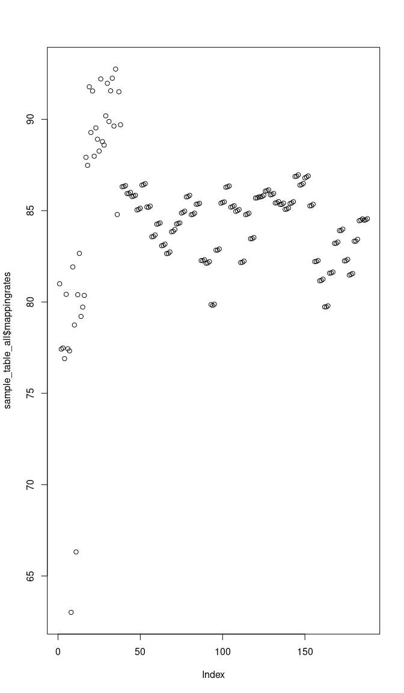<!-- -->

``` r
par(mar=c(4,4,4,4)+.1)
```

## - Tximeta

``` r
# prepare coldata table
# quant_file_table %>% head() %>% kable_styling("striped", full_width = T) %>% scroll_box(height = "400px")
# sample_table_all %>% head() %>% kable_styling("striped", full_width = T) %>% scroll_box(height = "400px")

sample_table_all$names = paste(sample_table_all$sequencing,
                               sample_table_all$genotype,
                               sample_table_all$treatment,
                               sample_table_all$order,
                               sep="_")

subset(sample_table_all, condition=="HIF1A_Hx" & sequencing =="P2041") %>% kable() %>% kable_styling("striped", full_width = T) %>% scroll_box(height = "400px")

head(sample_table_all$names)

coldata <- data.frame(files = sample_table_all$files,
                      names = sample_table_all$names, 
                      sample_table_all[,-c(2)])
# coldata[c(1:3,35:40),c("filename","names","samplename","orig.name","samplename3","order","condition")]
# load tximeta

# make linked Transcriptome (local offline mode)
# indexdir
# dirgenomic
list.files(dirgenomic)
fastaPath <- file.path(dirgenomic, "Homo_sapiens.GRCh38.dna.primary_assembly.fa.gz")
# fastaPath
gtfPath <- file.path(dirgenomic,"Homo_sapiens.GRCh38.110.gff3.gz")
# gtfPath

cat(indexdir,dirgenomic,fastaPath,gtfPath, sep="\n")
file.exists(indexdir, fastaPath, gtfPath)

# makeLinkedTxome(indexDir=indexdir,
#                 source="LocalEnsembl",
#                 organism="Homo sapiens",
#                 release="110",
#                 genome="GRCh38",
#                 fasta=fastaPath,
#                 gtf=gtfPath,
#                 write=FALSE)

# gtfdata <- readLines(gtfPath)
# head(gtfdata, n=20)

# gene_name info sind in gff3 abder nicht in se?

se <- tximeta(coldata, useHub=T)
se
colData(se)[c(1,2,87,88),] %>% kable() %>% kable_styling("striped", full_width = T) %>% scroll_box(height = "400px")
mcols(se)[c(1,2,87,88),] %>% kable() %>% kable_styling("striped", full_width = T) %>% scroll_box(height = "400px")
# meta infos sind da (genotype, treatment,...)

# rename Samples
# rownames(colData(se)) <- str_remove(rownames(colData(se)), pattern="_quant")

rowRanges(se)[c(1,10,100,1000,10000),] %>% kable() %>% kable_styling("striped", full_width = T) %>% scroll_box(height = "400px")
# genome info
# seqinfo(se) %>% kable() %>% kable_styling("striped", full_width = T) %>% scroll_box(height = "400px")
# ?
assays(se)[["counts"]][1:5,1:5] %>% kable()
# counts. THE DATA

# Mapping infos:
# names(metadata(se)[["quantInfo"]])
# str(metadata(se)[["quantInfo"]]) # Infos from Salmon Mapping
metadata(se)[["quantInfo"]][c("percent_mapped","num_processed")] %>% data.frame() %>% head() %>% kable() %>% kable_styling("striped", full_width = T) %>% scroll_box(height = "400px")

par(mfrow=c(1,2), mar=c(3,3,3,3))
barplot(metadata(se)[["quantInfo"]]$percent_mapped, main="Mapping Rate", 
        horiz=T,las=1)
barplot(metadata(se)[["quantInfo"]]$num_processed/1000000, main="Mio. Reads", 
        names.arg=colData(se)$exp_rep, horiz=T,las=1)
colData(se) %>% head() %>% kable() %>% kable_styling("striped", full_width = T) %>% scroll_box(height = "400px")
edb <- retrieveDb(se)
# class(edb)
genes(edb) %>% head() %>% kable() %>% kable_styling("striped", full_width = T) %>% scroll_box(height = "400px")
# no symbols!
columns(edb)

se.exons <- addExons(se)
# rowRanges(se.exons)[[1]]
gse <- summarizeToGene(se)
rowRanges(gse)[1:10,] %>% kable() %>% kable_styling("striped", full_width = T) %>% scroll_box(height = "400px")

head(assays(gse)[["counts"]])[1:5,1:5] %>% kable() %>% kable_styling("striped", full_width = T) %>% scroll_box(height = "400px")
head(assays(gse)[["abundance"]])[1:5,1:5] %>% kable() %>% kable_styling("striped", full_width = T) %>% scroll_box(height = "400px")
head(assays(gse)[["length"]])[1:5,1:5] %>% kable() %>% kable_styling("striped", full_width = T) %>% scroll_box(height = "400px")

#### add gene symbol
metadata(se)$txomeInfo$source

TXNAME <- as.character(mapIds(edb,keys = mcols(gse)$gene_id, column = "TXNAME", keytype = "GENEID", multiVals="first"))
# select()' returned 1:many mapping between keys and columns = 1 gene has many transcripts...
TXNAME.list <- (mapIds(edb,keys = mcols(gse)$gene_id, column = "TXNAME", keytype = "GENEID", multiVals="list"))
head(TXNAME.list)[1]
# info is already there
CDSID <- as.character(mapIds(edb,keys = mcols(gse)$gene_id, column = "CDSID", keytype = "GENEID", multiVals="first"))
head(CDSID)
# ?
CDSNAME <- as.character(mapIds(edb,keys = mcols(gse)$gene_id, column = "CDSNAME", keytype = "GENEID", multiVals="first"))
head(CDSNAME)
# same as gene_id
EXONNAME <- as.character(mapIds(edb,keys = mcols(gse)$gene_id, column = "EXONNAME", keytype = "GENEID", multiVals="first"))
head(EXONNAME)
TXTYPE <- as.character(mapIds(edb,keys = mcols(gse)$gene_id, column = "TXTYPE", keytype = "GENEID", multiVals="first"))
head(TXTYPE)
# no useful info... no gene Symbol!!

# add CDSID
mcols(gse)$CDSID <- as.character(mapIds(edb,keys = mcols(gse)$gene_id, column = "CDSID", keytype = "GENEID", multiVals="first"))

colnames(mcols(gse))
head(rownames(gse))

getwd()
save(gse,file=paste(data,"tximeta.txm", sep="/"))
gse <- 1
load(file=paste(data,"tximeta.txm", sep="/"))

subset(colData(gse), condition=="HIF1A_Hx" & sequencing =="P2041") %>% kable() %>% kable_styling("striped", full_width = T) %>% scroll_box(height = "400px")
# subset(colData(gse), samplename=="RNA_P2041_S45")
(colData(gse)$samplename==colData(gse)$samplename3) %>% summary()
```

### add gene symbols

``` r
ah = AnnotationHub()
query(ah, c("EnsDb", "homo"))
```

    ## AnnotationHub with 26 records
    ## # snapshotDate(): 2023-10-23
    ## # $dataprovider: Ensembl
    ## # $species: Homo sapiens
    ## # $rdataclass: EnsDb
    ## # additional mcols(): taxonomyid, genome, description,
    ## #   coordinate_1_based, maintainer, rdatadateadded, preparerclass, tags,
    ## #   rdatapath, sourceurl, sourcetype 
    ## # retrieve records with, e.g., 'object[["AH53211"]]' 
    ## 
    ##              title                             
    ##   AH53211  | Ensembl 87 EnsDb for Homo Sapiens 
    ##   AH53715  | Ensembl 88 EnsDb for Homo Sapiens 
    ##   AH56681  | Ensembl 89 EnsDb for Homo Sapiens 
    ##   AH57757  | Ensembl 90 EnsDb for Homo Sapiens 
    ##   AH60773  | Ensembl 91 EnsDb for Homo Sapiens 
    ##   ...        ...                               
    ##   AH104864 | Ensembl 107 EnsDb for Homo sapiens
    ##   AH109336 | Ensembl 108 EnsDb for Homo sapiens
    ##   AH109606 | Ensembl 109 EnsDb for Homo sapiens
    ##   AH113665 | Ensembl 110 EnsDb for Homo sapiens
    ##   AH116291 | Ensembl 111 EnsDb for Homo sapiens

``` r
edb <- ah[["AH116291"]]
load(file=paste(data,"tximeta.txm", sep="/"))
columns(edb)
```

    ##  [1] "CANONICALTRANSCRIPT" "DESCRIPTION"         "ENTREZID"           
    ##  [4] "EXONID"              "EXONIDX"             "EXONSEQEND"         
    ##  [7] "EXONSEQSTART"        "GCCONTENT"           "GENEBIOTYPE"        
    ## [10] "GENEID"              "GENEIDVERSION"       "GENENAME"           
    ## [13] "GENESEQEND"          "GENESEQSTART"        "INTERPROACCESSION"  
    ## [16] "ISCIRCULAR"          "PROTDOMEND"          "PROTDOMSTART"       
    ## [19] "PROTEINDOMAINID"     "PROTEINDOMAINSOURCE" "PROTEINID"          
    ## [22] "PROTEINSEQUENCE"     "SEQCOORDSYSTEM"      "SEQLENGTH"          
    ## [25] "SEQNAME"             "SEQSTRAND"           "SYMBOL"             
    ## [28] "TXBIOTYPE"           "TXCDSSEQEND"         "TXCDSSEQSTART"      
    ## [31] "TXEXTERNALNAME"      "TXID"                "TXIDVERSION"        
    ## [34] "TXISCANONICAL"       "TXNAME"              "TXSEQEND"           
    ## [37] "TXSEQSTART"          "TXSUPPORTLEVEL"      "UNIPROTDB"          
    ## [40] "UNIPROTID"           "UNIPROTMAPPINGTYPE"

``` r
mcols(gse)$SYMBOL <- mapIds(edb, keys = mcols(gse)$gene_id, column = "SYMBOL", keytype = "GENEID")
mcols(gse)$ENTREZID <- mapIds(edb, keys = mcols(gse)$gene_id, column = "ENTREZID", keytype = "GENEID")
mcols(gse)$CANONICALTRANSCRIPT <- mapIds(edb, keys = mcols(gse)$gene_id, column = "CANONICALTRANSCRIPT", keytype = "GENEID")
mcols(gse)$DESCRIPTION <- mapIds(edb, keys = mcols(gse)$gene_id, column = "DESCRIPTION", keytype = "GENEID")
mcols(gse)$GENEBIOTYPE <- mapIds(edb, keys = mcols(gse)$gene_id, column = "GENEBIOTYPE", keytype = "GENEID")
mcols(gse)$UNIPROTID <- mapIds(edb, keys = mcols(gse)$gene_id, column = "UNIPROTID", keytype = "GENEID")

for (i in columns(edb)[c(-10)]){
  # print(i)
  mapIds(edb, keys = mcols(gse)$gene_id[1:10], column = i, keytype = "GENEID") # %>% print()
}
# include tryCatch

save(gse,file=paste(data,"tximeta.txm", sep="/"))
```

## - DESeq2

``` r
load(file=paste(data,"tximeta.txm", sep="/"))
colData(gse)$genotype %>% levels()
design = ~genotype+treatment+treatment:genotype
dds <- DESeqDataSet(gse, design = design)
dds <- collapseReplicates(dds, dds$samplename, dds$names)

sample.number <- nrow(colData(dds)) / colData(gse)$genotype %>% levels() %>% length()
keep.sn <- rowSums(counts(dds)) >= sample.number
keep.sn %>% summary()
dds <- dds[keep.sn,]

dds <- DESeq(dds)

summary(results(dds, alpha = 0.05))
plotMA(dds)

plotDispEsts(dds)

resultsNames(dds)

getwd()
save(dds,file=paste(data,"deseq2.dds", sep="/"))
dds <- 1
load(file=paste(data,"deseq2.dds", sep="/"))
dds

subset(colData(dds), condition=="HIF1A_Hx" & sequencing =="P2041") %>% kable() %>% kable_styling("striped", full_width = T) %>% scroll_box(height = "400px")
(colData(dds)$samplename==colData(dds)$samplename3) %>% summary()
```

# 3. Pre-Analysis

### - Data transformations

``` r
load(file=paste(data,"deseq2.dds", sep="/"))
vsd <- vst(dds, blind=FALSE) #Variance stabilized transformation
ntd <- normTransform(dds)
```

``` r
rld <- rlog(dds, blind=FALSE) #regularized logarithm
save(rld,file=paste(data,"rlog.rld", sep="/"))
rld <- 1
load(file=paste(data,"rlog.rld", sep="/"))
rld
```

``` r
load(file=paste(data,"rlog.rld", sep="/"))
meanSdPlot(assay(ntd))
meanSdPlot(assay(vsd))
meanSdPlot(assay(rld))
```


### - Check sample distance

``` r
sampleDists <- dist(t(assay(vsd)))

sampleDistMatrix <- as.matrix(sampleDists)
rownames(sampleDistMatrix) <- vsd$names
colnames(sampleDistMatrix) <- NULL
colors <- colorRampPalette( rev(brewer.pal(9, "Blues")) )(255)
pheatmap(sampleDistMatrix,
         clustering_distance_rows=sampleDists,
         clustering_distance_cols=sampleDists,
         col=viridis(20),
         cutree_rows = 8,
         cutree_cols = 8)
```

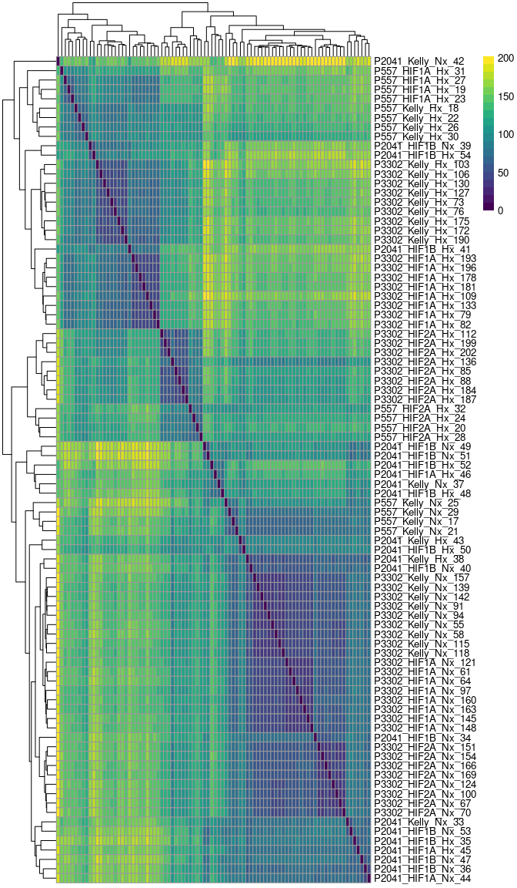<!-- -->

### - Perform principal component analysis

``` r
# transform data
load(file=paste(data,"deseq2.dds", sep="/"))
vst_dat <- assay(vst(dds))
colData(dds) %>% head() %>% kable() %>% kable_styling("striped", full_width = T) %>% scroll_box(height = "400px")
```

<div style="border: 1px solid #ddd; padding: 0px; overflow-y: scroll; height:400px; ">

<table class="table table-striped" style="margin-left: auto; margin-right: auto;">
<thead>
<tr>
<th style="text-align:left;position: sticky; top:0; background-color: #FFFFFF;">
</th>
<th style="text-align:left;position: sticky; top:0; background-color: #FFFFFF;">
names
</th>
<th style="text-align:left;position: sticky; top:0; background-color: #FFFFFF;">
samplename
</th>
<th style="text-align:right;position: sticky; top:0; background-color: #FFFFFF;">
order
</th>
<th style="text-align:left;position: sticky; top:0; background-color: #FFFFFF;">
filename
</th>
<th style="text-align:left;position: sticky; top:0; background-color: #FFFFFF;">
sequencing
</th>
<th style="text-align:left;position: sticky; top:0; background-color: #FFFFFF;">
lane
</th>
<th style="text-align:right;position: sticky; top:0; background-color: #FFFFFF;">
rna_id
</th>
<th style="text-align:left;position: sticky; top:0; background-color: #FFFFFF;">
Datum
</th>
<th style="text-align:left;position: sticky; top:0; background-color: #FFFFFF;">
Probe
</th>
<th style="text-align:right;position: sticky; top:0; background-color: #FFFFFF;">
rna_conc
</th>
<th style="text-align:left;position: sticky; top:0; background-color: #FFFFFF;">
treatment
</th>
<th style="text-align:left;position: sticky; top:0; background-color: #FFFFFF;">
genotype
</th>
<th style="text-align:left;position: sticky; top:0; background-color: #FFFFFF;">
sequencing.y
</th>
<th style="text-align:left;position: sticky; top:0; background-color: #FFFFFF;">
replicate
</th>
<th style="text-align:left;position: sticky; top:0; background-color: #FFFFFF;">
clone
</th>
<th style="text-align:left;position: sticky; top:0; background-color: #FFFFFF;">
cellline
</th>
<th style="text-align:left;position: sticky; top:0; background-color: #FFFFFF;">
lane.y
</th>
<th style="text-align:left;position: sticky; top:0; background-color: #FFFFFF;">
sample_id
</th>
<th style="text-align:left;position: sticky; top:0; background-color: #FFFFFF;">
run_id
</th>
<th style="text-align:left;position: sticky; top:0; background-color: #FFFFFF;">
experiment
</th>
<th style="text-align:left;position: sticky; top:0; background-color: #FFFFFF;">
experiment_date
</th>
<th style="text-align:left;position: sticky; top:0; background-color: #FFFFFF;">
repetition
</th>
<th style="text-align:left;position: sticky; top:0; background-color: #FFFFFF;">
exp_rep
</th>
<th style="text-align:right;position: sticky; top:0; background-color: #FFFFFF;">
CUGE.ID
</th>
<th style="text-align:left;position: sticky; top:0; background-color: #FFFFFF;">
Nx
</th>
<th style="text-align:left;position: sticky; top:0; background-color: #FFFFFF;">
HX
</th>
<th style="text-align:left;position: sticky; top:0; background-color: #FFFFFF;">
sample
</th>
<th style="text-align:left;position: sticky; top:0; background-color: #FFFFFF;">
orig.name
</th>
<th style="text-align:left;position: sticky; top:0; background-color: #FFFFFF;">
samplename2
</th>
<th style="text-align:right;position: sticky; top:0; background-color: #FFFFFF;">
newsamplenumber
</th>
<th style="text-align:left;position: sticky; top:0; background-color: #FFFFFF;">
samplename3
</th>
<th style="text-align:right;position: sticky; top:0; background-color: #FFFFFF;">
order_number
</th>
<th style="text-align:right;position: sticky; top:0; background-color: #FFFFFF;">
Konz..µg.µl.
</th>
<th style="text-align:left;position: sticky; top:0; background-color: #FFFFFF;">
cell_density
</th>
<th style="text-align:left;position: sticky; top:0; background-color: #FFFFFF;">
condition
</th>
<th style="text-align:right;position: sticky; top:0; background-color: #FFFFFF;">
mappingrates
</th>
<th style="text-align:left;position: sticky; top:0; background-color: #FFFFFF;">
names.1
</th>
<th style="text-align:left;position: sticky; top:0; background-color: #FFFFFF;">
runsCollapsed
</th>
<th style="text-align:right;position: sticky; top:0; background-color: #FFFFFF;">
sizeFactor
</th>
<th style="text-align:left;position: sticky; top:0; background-color: #FFFFFF;">
replaceable
</th>
</tr>
</thead>
<tbody>
<tr>
<td style="text-align:left;">
RNA_P2041_S37
</td>
<td style="text-align:left;">
P2041_Kelly_Nx_33
</td>
<td style="text-align:left;">
RNA_P2041_S37
</td>
<td style="text-align:right;">
33
</td>
<td style="text-align:left;">
RNA_P2041_10619_S37_L003
</td>
<td style="text-align:left;">
P2041
</td>
<td style="text-align:left;">
L003
</td>
<td style="text-align:right;">
10268
</td>
<td style="text-align:left;">
2021-08-25
</td>
<td style="text-align:left;">
Kelly LV.1 Nx
</td>
<td style="text-align:right;">
NA
</td>
<td style="text-align:left;">
Nx
</td>
<td style="text-align:left;">
Kelly
</td>
<td style="text-align:left;">
P2041
</td>
<td style="text-align:left;">
NA
</td>
<td style="text-align:left;">
LV_1
</td>
<td style="text-align:left;">
Kelly
</td>
<td style="text-align:left;">
L003
</td>
<td style="text-align:left;">
S41
</td>
<td style="text-align:left;">
RNA_10754
</td>
<td style="text-align:left;">
Simon
</td>
<td style="text-align:left;">
2021-08-25
</td>
<td style="text-align:left;">
4
</td>
<td style="text-align:left;">
Simon_4
</td>
<td style="text-align:right;">
10754
</td>
<td style="text-align:left;">
del_Hif1a1.3
</td>
<td style="text-align:left;">
del_Hif1a1.3
</td>
<td style="text-align:left;">
RNA_11
</td>
<td style="text-align:left;">
RNA_P2041_S41
</td>
<td style="text-align:left;">
RNA_P2041_S37
</td>
<td style="text-align:right;">
37
</td>
<td style="text-align:left;">
RNA_P2041_S37
</td>
<td style="text-align:right;">
NA
</td>
<td style="text-align:right;">
NA
</td>
<td style="text-align:left;">
NA
</td>
<td style="text-align:left;">
Kelly_Nx
</td>
<td style="text-align:right;">
77.42
</td>
<td style="text-align:left;">
P2041_Kelly_Nx_33
</td>
<td style="text-align:left;">
P2041_Kelly_Nx_33
</td>
<td style="text-align:right;">
1.147433
</td>
<td style="text-align:left;">
TRUE
</td>
</tr>
<tr>
<td style="text-align:left;">
RNA_P2041_S38
</td>
<td style="text-align:left;">
P2041_HIF1B_Nx_34
</td>
<td style="text-align:left;">
RNA_P2041_S38
</td>
<td style="text-align:right;">
34
</td>
<td style="text-align:left;">
RNA_P2041_10621_S38_L003
</td>
<td style="text-align:left;">
P2041
</td>
<td style="text-align:left;">
L003
</td>
<td style="text-align:right;">
10189
</td>
<td style="text-align:left;">
2021-06-16
</td>
<td style="text-align:left;">
Kelly Hif1b.sg1+2 Klon 15 Nx
</td>
<td style="text-align:right;">
NA
</td>
<td style="text-align:left;">
Nx
</td>
<td style="text-align:left;">
HIF1B
</td>
<td style="text-align:left;">
P2041
</td>
<td style="text-align:left;">
NA
</td>
<td style="text-align:left;">
Hif1b_15
</td>
<td style="text-align:left;">
Kelly
</td>
<td style="text-align:left;">
L003
</td>
<td style="text-align:left;">
S40
</td>
<td style="text-align:left;">
RNA_10745
</td>
<td style="text-align:left;">
Simon
</td>
<td style="text-align:left;">
2021-06-16
</td>
<td style="text-align:left;">
1
</td>
<td style="text-align:left;">
Simon_1
</td>
<td style="text-align:right;">
10745
</td>
<td style="text-align:left;">
NA
</td>
<td style="text-align:left;">
NA
</td>
<td style="text-align:left;">
RNA_05
</td>
<td style="text-align:left;">
RNA_P2041_S40
</td>
<td style="text-align:left;">
RNA_P2041_S58
</td>
<td style="text-align:right;">
58
</td>
<td style="text-align:left;">
RNA_P2041_S38
</td>
<td style="text-align:right;">
NA
</td>
<td style="text-align:right;">
NA
</td>
<td style="text-align:left;">
NA
</td>
<td style="text-align:left;">
HIF1B_Nx
</td>
<td style="text-align:right;">
82.33
</td>
<td style="text-align:left;">
P2041_HIF1B_Nx_34
</td>
<td style="text-align:left;">
P2041_HIF1B_Nx_34
</td>
<td style="text-align:right;">
1.478555
</td>
<td style="text-align:left;">
TRUE
</td>
</tr>
<tr>
<td style="text-align:left;">
RNA_P2041_S39
</td>
<td style="text-align:left;">
P2041_HIF1B_Nx_35
</td>
<td style="text-align:left;">
RNA_P2041_S39
</td>
<td style="text-align:right;">
35
</td>
<td style="text-align:left;">
RNA_P2041_10625_S39_L003
</td>
<td style="text-align:left;">
P2041
</td>
<td style="text-align:left;">
L003
</td>
<td style="text-align:right;">
10276
</td>
<td style="text-align:left;">
2021-08-25
</td>
<td style="text-align:left;">
Kelly Hif1b 4.1 Nx
</td>
<td style="text-align:right;">
NA
</td>
<td style="text-align:left;">
Nx
</td>
<td style="text-align:left;">
HIF1B
</td>
<td style="text-align:left;">
P2041
</td>
<td style="text-align:left;">
NA
</td>
<td style="text-align:left;">
Hif1b_4
</td>
<td style="text-align:left;">
Kelly
</td>
<td style="text-align:left;">
L003
</td>
<td style="text-align:left;">
S43
</td>
<td style="text-align:left;">
RNA_10625
</td>
<td style="text-align:left;">
Simon
</td>
<td style="text-align:left;">
2021-08-25
</td>
<td style="text-align:left;">
4
</td>
<td style="text-align:left;">
Simon_4
</td>
<td style="text-align:right;">
10625
</td>
<td style="text-align:left;">
NA
</td>
<td style="text-align:left;">
NA
</td>
<td style="text-align:left;">
RNA_15
</td>
<td style="text-align:left;">
RNA_P2041_S43
</td>
<td style="text-align:left;">
RNA_P2041_S39
</td>
<td style="text-align:right;">
39
</td>
<td style="text-align:left;">
RNA_P2041_S39
</td>
<td style="text-align:right;">
NA
</td>
<td style="text-align:right;">
NA
</td>
<td style="text-align:left;">
NA
</td>
<td style="text-align:left;">
HIF1B_Nx
</td>
<td style="text-align:right;">
81.51
</td>
<td style="text-align:left;">
P2041_HIF1B_Nx_35
</td>
<td style="text-align:left;">
P2041_HIF1B_Nx_35
</td>
<td style="text-align:right;">
1.316998
</td>
<td style="text-align:left;">
TRUE
</td>
</tr>
<tr>
<td style="text-align:left;">
RNA_P2041_S40
</td>
<td style="text-align:left;">
P2041_HIF1B_Nx_36
</td>
<td style="text-align:left;">
RNA_P2041_S40
</td>
<td style="text-align:right;">
36
</td>
<td style="text-align:left;">
RNA_P2041_10631_S40_L003
</td>
<td style="text-align:left;">
P2041
</td>
<td style="text-align:left;">
L003
</td>
<td style="text-align:right;">
10284
</td>
<td style="text-align:left;">
2021-08-25
</td>
<td style="text-align:left;">
Kelly Hif1b 15.1 Nx
</td>
<td style="text-align:right;">
NA
</td>
<td style="text-align:left;">
Nx
</td>
<td style="text-align:left;">
HIF1B
</td>
<td style="text-align:left;">
P2041
</td>
<td style="text-align:left;">
NA
</td>
<td style="text-align:left;">
Hif1b_15
</td>
<td style="text-align:left;">
Kelly
</td>
<td style="text-align:left;">
L003
</td>
<td style="text-align:left;">
S44
</td>
<td style="text-align:left;">
RNA_10631
</td>
<td style="text-align:left;">
Simon
</td>
<td style="text-align:left;">
2021-08-25
</td>
<td style="text-align:left;">
4
</td>
<td style="text-align:left;">
Simon_4
</td>
<td style="text-align:right;">
10631
</td>
<td style="text-align:left;">
delHif1b4.1
</td>
<td style="text-align:left;">
delHif1b4.1
</td>
<td style="text-align:left;">
RNA_21
</td>
<td style="text-align:left;">
RNA_P2041_S44
</td>
<td style="text-align:left;">
RNA_P2041_S40
</td>
<td style="text-align:right;">
40
</td>
<td style="text-align:left;">
RNA_P2041_S40
</td>
<td style="text-align:right;">
NA
</td>
<td style="text-align:right;">
NA
</td>
<td style="text-align:left;">
NA
</td>
<td style="text-align:left;">
HIF1B_Nx
</td>
<td style="text-align:right;">
81.47
</td>
<td style="text-align:left;">
P2041_HIF1B_Nx_36
</td>
<td style="text-align:left;">
P2041_HIF1B_Nx_36
</td>
<td style="text-align:right;">
1.399124
</td>
<td style="text-align:left;">
TRUE
</td>
</tr>
<tr>
<td style="text-align:left;">
RNA_P2041_S41
</td>
<td style="text-align:left;">
P2041_HIF1B_Hx_37
</td>
<td style="text-align:left;">
RNA_P2041_S41
</td>
<td style="text-align:right;">
37
</td>
<td style="text-align:left;">
RNA_P2041_10632_S41_L003
</td>
<td style="text-align:left;">
P2041
</td>
<td style="text-align:left;">
L003
</td>
<td style="text-align:right;">
10285
</td>
<td style="text-align:left;">
2021-08-25
</td>
<td style="text-align:left;">
Kelly Hif1b 15.1 Hx
</td>
<td style="text-align:right;">
NA
</td>
<td style="text-align:left;">
Hx
</td>
<td style="text-align:left;">
HIF1B
</td>
<td style="text-align:left;">
P2041
</td>
<td style="text-align:left;">
NA
</td>
<td style="text-align:left;">
Hif1b_15
</td>
<td style="text-align:left;">
Kelly
</td>
<td style="text-align:left;">
L003
</td>
<td style="text-align:left;">
S45
</td>
<td style="text-align:left;">
RNA_10632
</td>
<td style="text-align:left;">
Simon
</td>
<td style="text-align:left;">
2021-08-25
</td>
<td style="text-align:left;">
4
</td>
<td style="text-align:left;">
Simon_4
</td>
<td style="text-align:right;">
10632
</td>
<td style="text-align:left;">
delHif1b4.1
</td>
<td style="text-align:left;">
NA
</td>
<td style="text-align:left;">
RNA_22
</td>
<td style="text-align:left;">
RNA_P2041_S45
</td>
<td style="text-align:left;">
RNA_P2041_S41
</td>
<td style="text-align:right;">
41
</td>
<td style="text-align:left;">
RNA_P2041_S41
</td>
<td style="text-align:right;">
NA
</td>
<td style="text-align:right;">
NA
</td>
<td style="text-align:left;">
NA
</td>
<td style="text-align:left;">
HIF1B_Hx
</td>
<td style="text-align:right;">
84.48
</td>
<td style="text-align:left;">
P2041_HIF1B_Hx_37
</td>
<td style="text-align:left;">
P2041_HIF1B_Hx_37
</td>
<td style="text-align:right;">
1.100194
</td>
<td style="text-align:left;">
FALSE
</td>
</tr>
<tr>
<td style="text-align:left;">
RNA_P2041_S42
</td>
<td style="text-align:left;">
P2041_Kelly_Nx_38
</td>
<td style="text-align:left;">
RNA_P2041_S42
</td>
<td style="text-align:right;">
38
</td>
<td style="text-align:left;">
RNA_P2041_10635_S42_L003
</td>
<td style="text-align:left;">
P2041
</td>
<td style="text-align:left;">
L003
</td>
<td style="text-align:right;">
10292
</td>
<td style="text-align:left;">
2021-08-27
</td>
<td style="text-align:left;">
Kelly LV.1 Nx
</td>
<td style="text-align:right;">
NA
</td>
<td style="text-align:left;">
Nx
</td>
<td style="text-align:left;">
Kelly
</td>
<td style="text-align:left;">
P2041
</td>
<td style="text-align:left;">
NA
</td>
<td style="text-align:left;">
LV_1
</td>
<td style="text-align:left;">
Kelly
</td>
<td style="text-align:left;">
L003
</td>
<td style="text-align:left;">
S46
</td>
<td style="text-align:left;">
RNA_10635
</td>
<td style="text-align:left;">
Simon
</td>
<td style="text-align:left;">
2021-08-27
</td>
<td style="text-align:left;">
5
</td>
<td style="text-align:left;">
Simon_5
</td>
<td style="text-align:right;">
10635
</td>
<td style="text-align:left;">
delHif1b6.1
</td>
<td style="text-align:left;">
delHif1b6.1
</td>
<td style="text-align:left;">
RNA_25
</td>
<td style="text-align:left;">
RNA_P2041_S46
</td>
<td style="text-align:left;">
RNA_P2041_S42
</td>
<td style="text-align:right;">
42
</td>
<td style="text-align:left;">
RNA_P2041_S42
</td>
<td style="text-align:right;">
NA
</td>
<td style="text-align:right;">
NA
</td>
<td style="text-align:left;">
NA
</td>
<td style="text-align:left;">
Kelly_Nx
</td>
<td style="text-align:right;">
77.48
</td>
<td style="text-align:left;">
P2041_Kelly_Nx_38
</td>
<td style="text-align:left;">
P2041_Kelly_Nx_38
</td>
<td style="text-align:right;">
1.227558
</td>
<td style="text-align:left;">
TRUE
</td>
</tr>
</tbody>
</table>

</div>

``` r
ens <- rownames(dds)
  symbols <- mcols(dds)$SYMBOL
  symbols <- symbols[!is.na(symbols)]
  symbols <- symbols[match(rownames(vst_dat), names(symbols))]
  rownames(vst_dat) <- symbols
  keep <- !is.na(rownames(vst_dat))
  vst_dat <- vst_dat[keep,]
  keep2 <- rownames(vst_dat)
  keep2 <- !duplicated(keep2)
  vst_dat <- vst_dat[keep2,]

### PCA with top 500 genes with highest row variance 
pcaData <- plotPCA(vsd, intgroup=colnames(colData(vsd)), returnData=TRUE)
levels(pcaData$genotype)
```

    ## [1] "Kelly" "HIF1A" "HIF2A" "HIF1B"

``` r
percentVar <- round(100 * attr(pcaData, "percentVar"))
g1 <- ggplot(pcaData, aes(PC1, PC2, color=treatment, shape=genotype)) +
  geom_point(size=5, alpha=0.7) +
  labs(title = "treatment") +
  xlab(paste0("PC1: ",percentVar[1],"% variance")) +
  ylab(paste0("PC2: ",percentVar[2],"% variance")) + 
  scale_color_manual(values = c("lightcoral","skyblue1"))

g2 <- ggplot(pcaData, aes(PC1, PC2, color=experiment, shape=genotype)) +
  geom_point(size=5, alpha=0.7) +
  labs(title = "experiment") +
  xlab(paste0("PC1: ",percentVar[1],"% variance")) +
  ylab(paste0("PC2: ",percentVar[2],"% variance")) +
  scale_color_viridis_d(option ="viridis")

g3 <- ggplot(pcaData, aes(PC1, PC2, color=condition, shape=genotype)) +
  geom_point(size=5, alpha=0.7) +
  labs(title = "condition") +
  xlab(paste0("PC1: ",percentVar[1],"% variance")) +
  ylab(paste0("PC2: ",percentVar[2],"% variance")) +
  # coord_fixed()
  scale_color_viridis_d(option ="viridis") 

g4 <- ggplot(pcaData, aes(PC1, PC2, label=orig.name,color=condition, shape=genotype)) +
  geom_text_repel(data         = subset(pcaData, experiment == "Simon"),
                  segment.color = 'grey50',
                  max.overlaps = 40,
                  color="grey30",
                  size          = 2.5) +
  geom_point(size=5, alpha=0.7) +
  labs(title = "top 500 variance") +
  xlab(paste0("PC1: ",percentVar[1],"% variance")) +
  ylab(paste0("PC2: ",percentVar[2],"% variance")) +
  # coord_fixed()
  scale_color_viridis_d(option ="viridis") 

((g1+g2) / (g3)) + plot_layout(guides = "collect", axis_titles="collect")
```

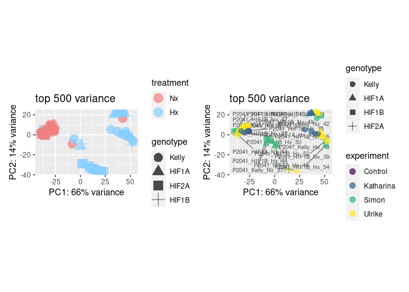

###### – Advanced PCA

``` r
# transform data
# calculate PCA (all data)
## https://www.bioconductor.org/packages/devel/bioc/vignettes/PCAtools/inst/doc/PCAtools.html#modify-bi-plots

# p <- pca(vst_dat, metadata = colData(dds))
# vst <- assay(vst(dds))
p <- pca(vst_dat, metadata = colData(dds), removeVar = 0.1)

# check different PCAs
p1 <- pairsplot(p,colby = 'treatment', colkey = viridis(2),title = 'treatment',titleLabSize = 15,trianglelabSize = 12,
                hline = 0, vline = 0,gridlines.major = FALSE, gridlines.minor = FALSE,
                plotaxes = FALSE,margingaps = unit(c(-0.01, -0.01, -0.01, -0.01), 'cm')) # -> PC1 = treatment
p2 <- pairsplot(p,colby = 'genotype', colkey = viridis(4),title = 'genotype',titleLabSize = 15,trianglelabSize = 12,
                hline = 0, vline = 0,gridlines.major = FALSE, gridlines.minor = FALSE,
                plotaxes = FALSE,margingaps = unit(c(-0.01, -0.01, -0.01, -0.01), 'cm')) # -> PC1&3 = genotype
p3 <- pairsplot(p,colby = 'experiment', colkey = viridis(4),title = 'experiment',titleLabSize = 15,trianglelabSize = 12,
                hline = 0, vline = 0,gridlines.major = FALSE, gridlines.minor = FALSE,
                plotaxes = FALSE,margingaps = unit(c(-0.01, -0.01, -0.01, -0.01), 'cm')) # -> PC4 = experiment
p4 <- pairsplot(p,colby = 'condition', colkey = viridis(8),title = 'condition',titleLabSize = 15,trianglelabSize = 12,
                hline = 0, vline = 0,gridlines.major = FALSE, gridlines.minor = FALSE,
                plotaxes = FALSE,margingaps = unit(c(-0.01, -0.01, -0.01, -0.01), 'cm')) # PC1 & PC3 = condition

(p1+p2) / (p3+p4)

# Determine optimum number of PCs to retain
elbow <- findElbowPoint(p$variance)
elbow
```

    ## PC6 
    ##   6

``` r
# plot Scree
# find explaining PCs
# horn <- parallelPCA(vst_dat)
# warnings()

horn <- list()
horn$n <- 7

screeplot(p,
    components = getComponents(p, 1:20),
    vline = c(horn$n, elbow)) +
    geom_label(aes(x = horn$n + 1, y = 30,
      label = 'Horn\'s=7', vjust = -1, size = 8)) +
    geom_label(aes(x = elbow + 1, y = 50,
      label = 'Elbow=6', vjust = -1, size = 8))

bi <- biplot(p,x="PC3",y="PC1",
    lab = p$metadata$experiment,
    colby = 'condition',colkey = viridis(8),
    hline = 0, vline = 0,
    encircle = TRUE, encircleFill = TRUE,
    legendLabSize = 10, legendIconSize = 4.0,
    legendPosition = 'bottom')
bi <- bi +theme(panel.background = element_rect(fill='transparent'))

pairs <- pairsplot(p,
    components = getComponents(p, c(1:7)),
    triangle = TRUE, trianglelabSize = 12,
    hline = 0, vline = 0,
    pointSize = 2,
    gridlines.major = FALSE, gridlines.minor = FALSE,
    colby = 'condition', colkey = viridis(8),
    title = 'Pairs plot', plotaxes = FALSE,
    margingaps = unit(c(-0.01, -0.01, -0.01, -0.01), 'cm'))

layout <- c(
  area(t = 1, l = 1, b = 6, r = 6),
  area(t = 5, l = 1, b = 7, r = 3)
)
pairs + bi + 
  plot_layout(design = layout)

# pairs + inset_element(bi, left = 0, bottom = 0, right = 0.5, top = 0.5)

plotloadings(p,
             components = getComponents(p)[1:7],
             col = viridis(3),
             
             labSize = 3
             )
```

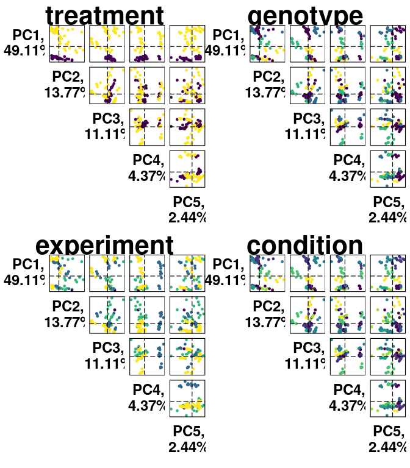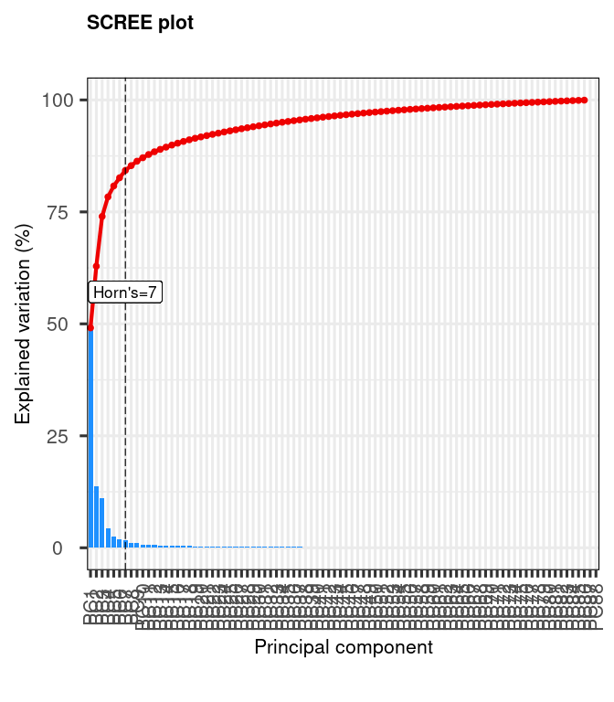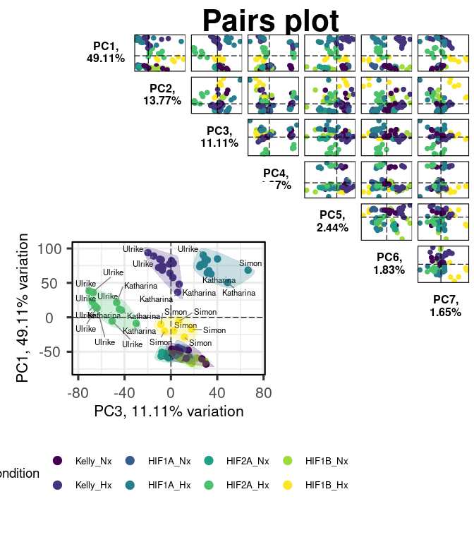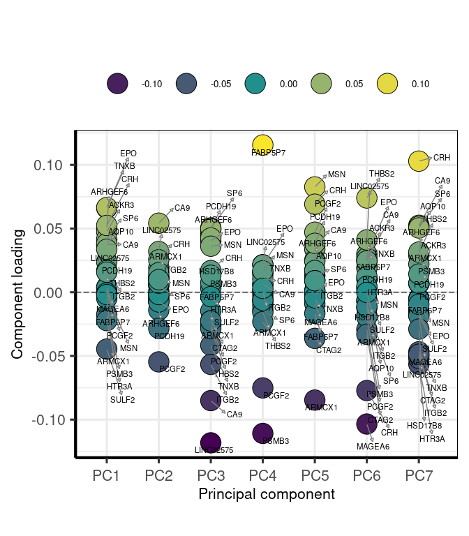

###### – PCA gif

``` r
saveGIF({
  ani.options(nmax = 100)
for (i in 1:100){
  n <- i*250
pcaData <- plotPCA(vsd, intgroup=colnames(colData(vsd)), returnData=TRUE,ntop=n)
percentVar <- round(100 * attr(pcaData, "percentVar"))
g1 <- ggplot(pcaData, aes(PC1, PC2, color=treatment, shape=genotype)) +
  geom_point(size=5, alpha=0.7) +
  labs(title = "treatment") +
  xlab(paste0("PC1: ",percentVar[1],"% variance")) +
  ylab(paste0("PC2: ",percentVar[2],"% variance")) + 
  coord_cartesian(xlim = c(-100, 100),ylim = c(-100,100)) +
  scale_color_manual(values = c("lightcoral","skyblue1"))

g2 <- ggplot(pcaData, aes(PC1, PC2, color=experiment, shape=genotype)) +
  geom_point(size=5, alpha=0.7) +
  labs(title = "experiment") +
  coord_cartesian(xlim = c(-100, 100),ylim = c(-100,100)) +
  xlab(paste0("PC1: ",percentVar[1],"% variance")) +
  ylab(paste0("PC2: ",percentVar[2],"% variance")) +
  scale_color_viridis_d(option ="viridis")

g3 <- ggplot(pcaData, aes(PC1, PC2, color=condition, shape=genotype)) +
  geom_point(size=5, alpha=0.7) +
  labs(title = "condition") +
  coord_cartesian(xlim = c(-100, 100),ylim = c(-100,100)) +
  xlab(paste0("PC1: ",percentVar[1],"% variance")) +
  ylab(paste0("PC2: ",percentVar[2],"% variance")) +
  # coord_fixed()
  scale_color_viridis_d(option ="viridis")
plot((g1+g2)/g3 +
       plot_annotation(title = paste("number of variable genes: ",n)) +
       plot_layout(guides = 'collect')
     )
ani.pause()
}
}, interval = 0.5, movie.name = 'pca.gif', ani.width = 600, ani.height = 600)


#
```

<a href="pca.gif" height="100%," width="100%">PCA Gif</a>

``` r
knitr::include_graphics("pca.gif")
```


### - Plot example counts

``` r
# CA9 & EPO
load(file=paste(data,"deseq2.dds", sep="/"))
goi <- c("CA9","EPO")
(mcols(dds)$SYMBOL == "CA9") %>% summary()
```

    ##    Mode   FALSE    TRUE    NA's 
    ## logical   28480       1       9

``` r
mcols(dds)$gene_id %>% length()
```

    ## [1] 28490

``` r
mcols(dds)$SYMBOL %>% length()
```

    ## [1] 28490

``` r
SYMBOLs <- mcols(dds)$SYMBOL %>% unique() %>% na.omit()
SYMBOLs %>% length()
```

    ## [1] 21750

``` r
SYMBOLs <- SYMBOLs[!(SYMBOLs == "")]
SYMBOLs %>% length()
```

    ## [1] 21749

``` r
ENSEMBLS <- as.character(mapIds(edb,keys = SYMBOLs, column = "GENEID", keytype = "SYMBOL", multiVals="first"))
ENTREZ <- as.character(mapIds(edb,keys = SYMBOLs, column = "ENTREZID", keytype = "SYMBOL", multiVals="first"))
s2e <- data.frame(symbol=SYMBOLs,
                  ensemble=ENSEMBLS,
                  entrez=ENTREZ)
rownames(s2e) <- s2e$symbol
s2e %>% head() %>% kable() %>% kable_styling("striped", full_width = T) %>% scroll_box(height = "400px")
```

<div style="border: 1px solid #ddd; padding: 0px; overflow-y: scroll; height:400px; ">

<table class="table table-striped" style="margin-left: auto; margin-right: auto;">
<thead>
<tr>
<th style="text-align:left;position: sticky; top:0; background-color: #FFFFFF;">
</th>
<th style="text-align:left;position: sticky; top:0; background-color: #FFFFFF;">
symbol
</th>
<th style="text-align:left;position: sticky; top:0; background-color: #FFFFFF;">
ensemble
</th>
<th style="text-align:left;position: sticky; top:0; background-color: #FFFFFF;">
entrez
</th>
</tr>
</thead>
<tbody>
<tr>
<td style="text-align:left;">
TSPAN6
</td>
<td style="text-align:left;">
TSPAN6
</td>
<td style="text-align:left;">
ENSG00000000003
</td>
<td style="text-align:left;">
7105
</td>
</tr>
<tr>
<td style="text-align:left;">
DPM1
</td>
<td style="text-align:left;">
DPM1
</td>
<td style="text-align:left;">
ENSG00000000419
</td>
<td style="text-align:left;">
8813
</td>
</tr>
<tr>
<td style="text-align:left;">
SCYL3
</td>
<td style="text-align:left;">
SCYL3
</td>
<td style="text-align:left;">
ENSG00000000457
</td>
<td style="text-align:left;">
57147
</td>
</tr>
<tr>
<td style="text-align:left;">
FIRRM
</td>
<td style="text-align:left;">
FIRRM
</td>
<td style="text-align:left;">
ENSG00000000460
</td>
<td style="text-align:left;">
55732
</td>
</tr>
<tr>
<td style="text-align:left;">
CFH
</td>
<td style="text-align:left;">
CFH
</td>
<td style="text-align:left;">
ENSG00000000971
</td>
<td style="text-align:left;">
3075
</td>
</tr>
<tr>
<td style="text-align:left;">
FUCA2
</td>
<td style="text-align:left;">
FUCA2
</td>
<td style="text-align:left;">
ENSG00000001036
</td>
<td style="text-align:left;">
2519
</td>
</tr>
</tbody>
</table>

</div>

``` r
s2e[goi[1],2]
```

    ## [1] "ENSG00000107159"

``` r
plotCounts(dds,gene=s2e[goi[1],2],intgroup="condition",main=goi[1],col=dds$experiment)
plotCounts(dds,gene=s2e[goi[2],2],intgroup="condition",main=goi[2],col=dds$experiment)

i <- 1
l <- length(goi)
all_counts <- {}
for (i in 1:l){
  d <-  plotCounts(dds, gene=s2e[goi[i],2], intgroup=c("condition","experiment","genotype","treatment"), main=goi[i],returnData=TRUE)
  d$Gene <- rep(goi[i],length(rownames(d)))
  d$sample <- rownames(d)
  # rownames(d) <- {}
  all_counts <- bind_rows(all_counts,d)
  }

cols = brewer.pal(n=8,name = 'Paired')

gcounts <- ggplot(all_counts, aes(x = Gene, y = count, fill=condition)) +
  geom_boxplot(fatten = 1) +
  scale_fill_manual(values=cols) +
  scale_y_continuous(trans = "log2")
gcounts

gcounts1 <- ggplot(d, aes(x = condition, y = count, color=experiment)) +
  geom_point() +
  geom_text(label = d$sample) +
  scale_fill_manual(values=cols) +
  scale_y_continuous(trans = "log2")

gcounts2 <- ggplot(all_counts, aes(x = condition, y = count, fill=Gene)) +
  geom_boxplot(fatten = 1) +
  scale_fill_manual(values=cols) +
  scale_y_continuous(trans = "log2")
gcounts2
```

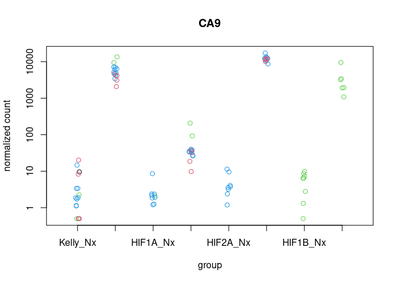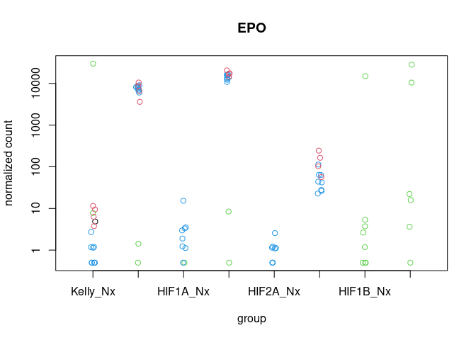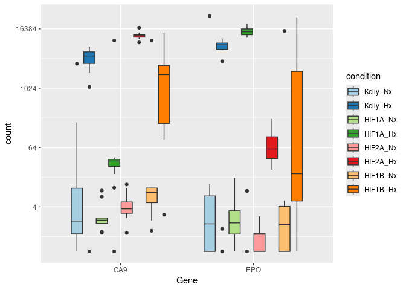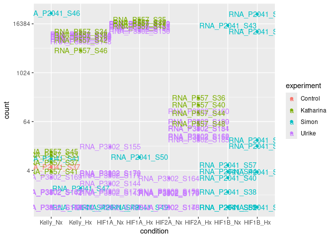
