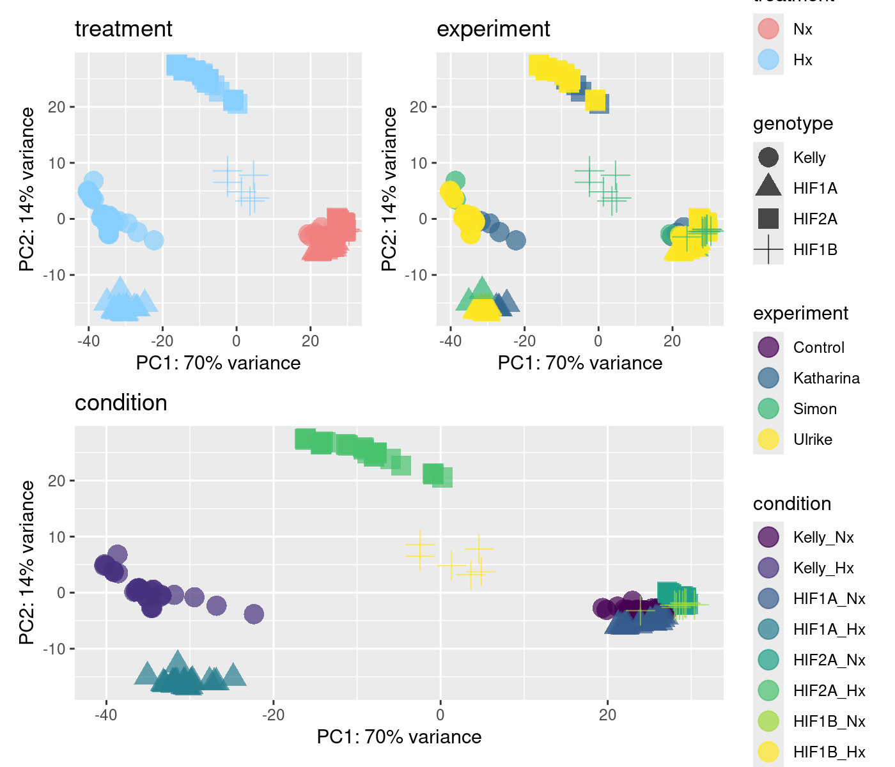

# Ideas

## RNA-Seq

### Sample list
Combination of 3 runs with each >3 replicates.
4 celllines: Kelly, Hif1a, Hif2a & Hif1b
2 conditions: Nx & Hx

|     | experiment | RNAs | conditions                                            | date                                        | seq_id | Seq_runs |
|:----------|:----------|----------:|:----------|:----------|:----------|----------:|
| 3   | Katharina  |   16 | Kelly_Nx Kelly_Hx HIF1A_Hx HIF2A_Hx                   | 2018-09-13 2018-09-14                       | P557   |       16 |
| 1   | Simon      |   22 | Kelly_Nx Kelly_Hx HIF1A_Nx HIF1A_Hx HIF1B_Nx HIF1B_Hx | 2017-05-04 2021-06-16 2021-08-25 2021-08-27 | P2041  |       22 |
| 2   | Ulrike     |   50 | Kelly_Nx Kelly_Hx HIF1A_Nx HIF1A_Hx HIF2A_Nx HIF2A_Hx | 2023-06-02 2023-06-08 2023-06-15 2023-06-28 | P3302  |      150 |

### PCA
good overlay of cellline and condition over all runs.

### Results
3 possible ways to generate results. Interaction term (3) was used to generate results

 

