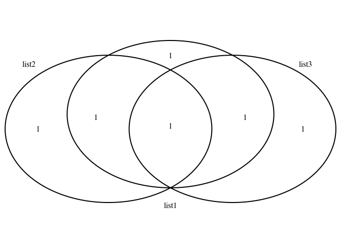

Untitled
================
Author
10/13/2021

``` r
library(VennDiagram)
```

    ## Lade nötiges Paket: grid

    ## Lade nötiges Paket: futile.logger

``` r
list1<-c("A", "B", "C", "D")
list2<-c("B", "D", "E")
list3<-c("A", "D", "Z")

p<-venn.diagram(
x=list( list1, list2, list3),
category.names= c("list1", "list2", "list3"),
filename= NULL
)

grid.draw(p)
```

<!-- -->
